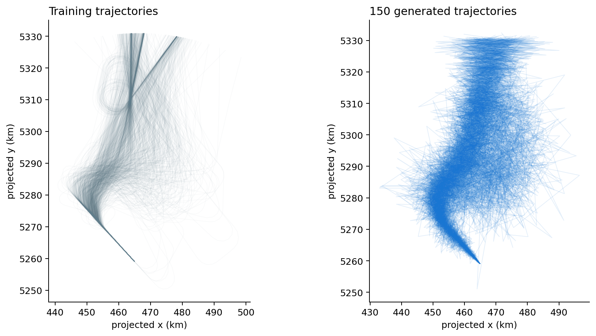
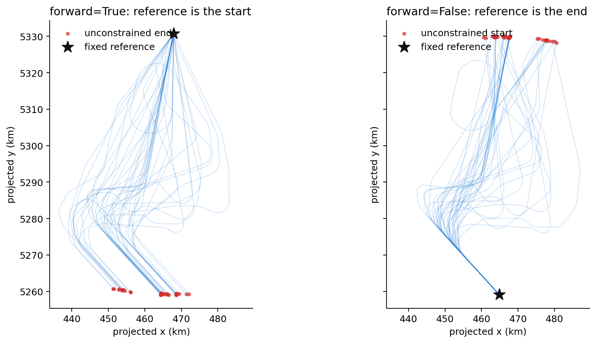
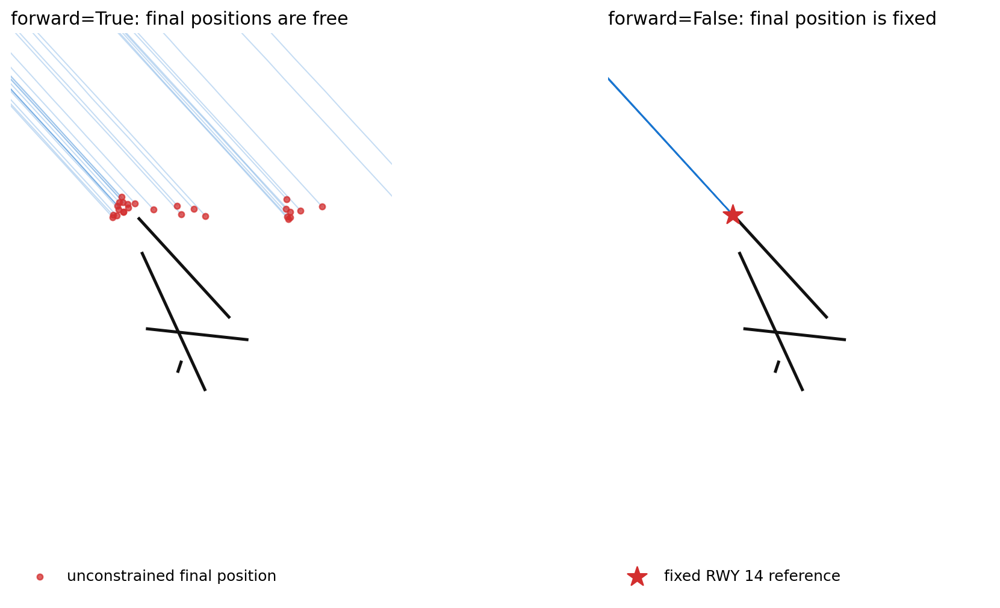

# Trajectory generation

`Generation` is a class provided by `traffic` to connect a `Traffic` collection
to an external generative model:

```python
from traffic.algorithms.generation import Generation
```

It is an adapter, not a generative model of its own. The external model learns
and samples numerical vectors, while `Generation` handles trajectory-specific
preparation and reconstruction. The example below uses a Gaussian mixture
because its API is small, not because it is a good trajectory model. A VAE,
diffusion model, or another generator can be used through the same class when
it implements the [model contract](#model-contract).

!!! warning "Experimental API"

    Trajectory generation currently provides a thin adapter around a generative
    model. It does not supply a model, enforce physical constraints, or guarantee
    realistic trajectories. Read the [current limitations](#current-limitations)
    before using generated data in an analysis.

## Why use a `Generation` object?

A model such as `GaussianMixture` knows how to fit and sample a matrix. It does
not know how flights are separated inside a `Traffic` object, how trajectory
features should be flattened, or how sampled values become timestamped
geographic positions.

`Generation` keeps that boundary explicit:

| Component | Responsibility |
| --- | --- |
| `Traffic` | Stores and separates the source flights. |
| `Generation` | Selects features, applies scaling, reshapes data, and rebuilds `Traffic` samples. |
| External model | Learns a distribution from a matrix and samples new vectors. |

This is the same general pattern used by `Flight.filter()`: traffic provides the
data integration, while a filter object implements the numerical operation.
The wrapper gives different model implementations one common entry point and
keeps the fitted model, feature list, and scaler together. Fit once, then call
`sample()` repeatedly without repeating the preparation logic.

The `Traffic.generation()` convenience method returns the fitted wrapper
directly. Keeping this logic outside `Traffic` also prevents model-specific
options from accumulating on the core data structure.

## How the data is represented

A generative model expects one fixed-size vector per observation. A `Traffic`
object instead contains a variable number of timestamped points per flight.
Preparation therefore follows four steps:

1. identify each flight with `assign_id()`;
2. resample every flight to the same number of points;
3. choose the features that describe one point;
4. flatten each flight into one row of the model matrix.

For *n* flights resampled to *p* points with *f* features, the fitted matrix has
shape `(n, p × f)`. The fixed number of points is not optional: `Generation`
cannot stack trajectories of different lengths.

The reverse operation happens during sampling. Each model sample is reshaped to
`(p, f)`, assigned a synthetic flight identifier, and returned as part of a new
`Traffic` object.

## End-to-end example

The following example uses landing trajectories at Zurich Airport. It models
projected position, altitude, and elapsed time with a two-component Gaussian
mixture. This is intentionally a poor model: it keeps the fitting and sampling
steps short enough to expose the complete `Generation` workflow.

```python
import numpy as np
import pandas as pd
from cartes.crs import EuroPP
from sklearn.mixture import GaussianMixture
from sklearn.preprocessing import MinMaxScaler
from traffic.algorithms.generation import Generation
from traffic.data.datasets import landing_zurich_2019
```

`GaussianMixture` and `MinMaxScaler` require the `learning` optional dependency.
Install `traffic[learning]` if scikit-learn is not already available.

Start by selecting a coherent family of trajectories. Every flight is then
resampled to 100 points. Here the first 1,000 flights are retained to keep the
example reasonably quick.

```python
traffic = (
    landing_zurich_2019
    .query("runway == '14' and initial_flow == '162-216'")
    .assign_id()
    .unwrap()
    .resample(100)
    .eval()
)[:1000]
```

Projected coordinates are preferable to longitude and latitude for this local
example. Elapsed time is measured from the beginning of each flight; it must be
computed explicitly because `timedelta` is not normally present in trajectory
data.

```python
traffic = traffic.compute_xy(projection=EuroPP())


def elapsed_seconds(frame: pd.DataFrame) -> pd.Series:
    return (frame.timestamp - frame.timestamp.min()).dt.total_seconds()


traffic = (
    traffic.iterate_lazy()
    .assign(timedelta=elapsed_seconds)
    .eval()
)
```

Fit the external model through `Generation`. Scaling prevents features with
large numerical ranges from dominating the fit.

```python
generator = Generation(
    generation=GaussianMixture(
        n_components=2,
        covariance_type="diag",
        random_state=42,
    ),
    features=["x", "y", "altitude", "timedelta"],
    scaler=MinMaxScaler(feature_range=(-1, 1)),
).fit(traffic)
```

The same operation is available from the `Traffic` object:

```python
generator = traffic.generation(
    generation=GaussianMixture(
        n_components=2,
        covariance_type="diag",
        random_state=42,
    ),
    features=["x", "y", "altitude", "timedelta"],
    scaler=MinMaxScaler(feature_range=(-1, 1)),
)
```

Sampling returns a `Traffic` object. Because the model uses projected `x` and
`y`, the same projection is required to reconstruct longitude and latitude.

```python
generated = generator.sample(150, projection=EuroPP())
```



The generated trajectories reproduce the broad direction of the training set,
but many paths are jagged or implausible. Two diagonal Gaussian components are
a very weak description of this high-dimensional distribution. The model has
no explicit notion of smoothness, turn rate, aircraft dynamics, or route
structure. This output explains the adapter; it is not a realistic traffic
simulator. More suitable models, including VAEs and diffusion models, can be
used without moving trajectory preparation and reconstruction out of
`Generation`.

## Feature and coordinate choices

`Generation` can rebuild geographic coordinates in three ways:

| Generated features | Sampling argument | Behaviour |
| --- | --- | --- |
| `latitude`, `longitude` | none | Coordinates are used directly. |
| `x`, `y` | `projection=...` | Projected coordinates are converted back to longitude and latitude. |
| `track`, `groundspeed` | `coordinates=...` | Positions are integrated from a known start or end point. |

## Reconstructing positions from track and groundspeed

Track and groundspeed describe motion, not absolute position. Reconstructing a
trajectory from them requires one known position as a boundary condition. The
`coordinates` argument supplies that position, while `forward` selects which
end of the trajectory it belongs to:

- `forward=True` fixes the **first** generated point at `coordinates`, then
  integrates track and groundspeed forward in time. This is the natural choice
  for a departure whose initial position is known.
- `forward=False` fixes the **last** generated point at `coordinates`, then
  reconstructs earlier positions backwards. This is usually the right choice
  for landing trajectories when the runway endpoint is known.

Fit a generator with `track`, `groundspeed`, and `timedelta` among its features:

```python
track_generator = traffic.generation(
    generation=GaussianMixture(
        n_components=2,
        covariance_type="diag",
        random_state=42,
    ),
    features=["track", "groundspeed", "altitude", "timedelta"],
    scaler=MinMaxScaler(feature_range=(-1, 1)),
)
```

The choice of reference depends on which endpoint is known. For a forward
reconstruction, use a representative point at the beginning of the approach.
The generated final positions should then fall near Zurich, but nothing forces
them to intersect a runway:

```python
approach_start = {"latitude": 48.12822, "longitude": 8.56836}

forward_landings = track_generator.sample(
    40,
    coordinates=approach_start,
    forward=True,
)
```

For landing data, the stronger boundary condition is usually the runway end.
Pass a reference near runway 14 and reconstruct backwards:

```python
runway_14 = {"latitude": 47.48365, "longitude": 8.53391}

backward_landings = track_generator.sample(
    40,
    coordinates=runway_14,
    forward=False,
)
```

Both reconstructions below use the same 40 track, groundspeed, altitude, and
elapsed-time profiles sampled from the training matrix. The overview shows the
complete trajectories and the endpoint fixed in each direction.



The airport view then magnifies the final part of the same trajectories. The
Zurich runways are drawn with
`airports["LSZH"].plot(ax, footprint=False, runways=True)`.



On the left, `forward=True` fixes a representative approach start outside the
airport view. The red circles are the unconstrained final positions: they reach
the airport area but do not necessarily meet runway 14. On the right,
`forward=False` fixes every final point at the red star. Earlier points are
reconstructed backwards from that runway reference.

This endpoint constraint does not make a trajectory physically valid. It only
translates the reconstructed path so that one end meets the supplied coordinate.
Track errors, unrealistic speeds, or poor generated time profiles still affect
the complete path. The current API also applies one reference coordinate to all
samples; it cannot accept a different runway point for each generated flight.

This mode specifically requires a feature named `timedelta`; `Generation` uses
it to create the timestamps needed for integration. Positions are accumulated
from speed and track, so small errors propagate along the trajectory.

## Model contract

`Generation` accepts a trainable object with two methods:

```python
def fit(X):
    ...

def sample(n_samples):
    return samples, metadata
```

During `Generation.fit(traffic)`, `X` is a NumPy array with shape
`(n_trajectories, n_points × n_features)`. The model must fit from that matrix.
Model settings should currently be passed to the model constructor, as in
`GaussianMixture(n_components=2)`, rather than to `Generation.fit()`.

During `Generation.sample(n_samples)`, the model must return a pair:

1. a NumPy array with shape `(n_samples, n_points × n_features)`;
2. a second array containing model-specific metadata.

`Generation` uses the first item and currently ignores the second. The number
of columns must match the matrix used for fitting so each row can be reshaped
back to `(n_points, n_features)`.

`GaussianMixture` satisfies this contract directly:

```python
model = GaussianMixture(n_components=2).fit(X)
samples, component_labels = model.sample(100)
```

Here `samples` contains the generated vectors and `component_labels` identifies
the Gaussian component selected for each vector. This convenient API is why a
Gaussian mixture works well as a documentation example. Its statistical model
is still far too weak for realistic trajectory generation.

VAEs and diffusion models often expose a different API: `sample()` may return a
single tensor, training may happen through a separate loop, and generated data
may remain on a GPU. A small adapter can present the contract expected by
`Generation`:

```python
class GenerativeModelAdapter:
    def __init__(self, model):
        self.model = model

    def fit(self, X):
        self.model.train_on(X)
        return self

    def sample(self, n_samples):
        samples = self.model.generate(n_samples)
        samples = samples.detach().cpu().numpy()
        metadata = np.empty(n_samples)
        return samples, metadata
```

The method names inside the adapter depend on the chosen framework. What matters
is the `fit(X)` and `sample(n_samples) -> (samples, metadata)` boundary. A
scaler, when provided to `Generation`, must separately implement
`fit_transform()` and `inverse_transform()`.

## Current limitations

- All fitted trajectories must contain the same number of points.
- Requested features must already exist in every flight.
- The default feature list includes `timedelta`, which callers usually need to
  create themselves; passing an explicit feature list is safer.
- Track/groundspeed reconstruction specifically requires the `timedelta`
  feature and an anchor coordinate.
- Sampling from `x` and `y` requires the original projection.
- Generated timestamps are anchored to the current date rather than to the
  training period.
- `save()` and `from_file()` are not implemented.
- The wrapper does not impose kinematic, operational, or airspace constraints.

These constraints are part of the present API rather than properties of
trajectory generation in general.

## API reference

::: traffic.algorithms.generation.Generation

    options:
        show_root_heading: false
