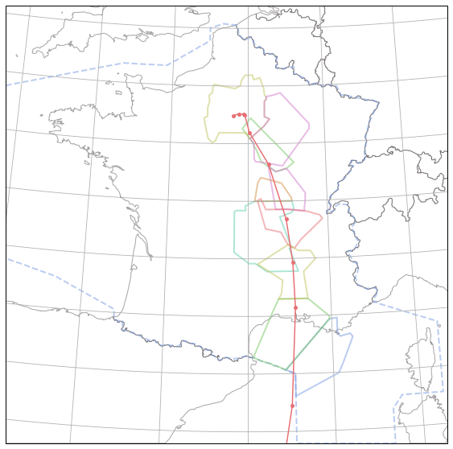
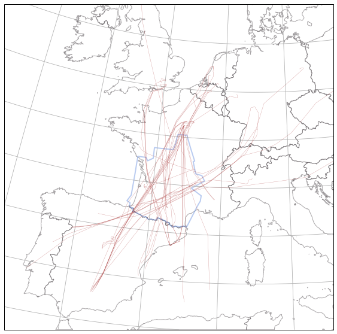

Airspaces from Eurocontrol NM
-----------------------------

The first thing to do is to put the path to a directory containing your files
from the Eurocontrol NM in your configuration file.

.. warning::

    [Access conditions](https://www.eurocontrol.int/ddr#access-conditions) to
    this data are managed by EUROCONTROL. 

You will need to put the three following files from the same AIRAC cycle in the same directory:

::

    /home/xo/Documents/data/AIRAC_1703
    ├── Sectors_1703_Collapse.spc
    ├── Sectors_1703_Sectors.are
    └── Sectors_1703_Sectors.sls

Identify the path to your configuration file here:

.. code:: python

    >>> import traffic
    >>> traffic.config_file
    PosixPath('/home/xo/.config/traffic/traffic.conf')

Then edit the following line accordingly:

::

    [global]
    nm_path = /home/xo/Documents/data/AIRAC_1703

Basic usage
~~~~~~~~~~~

The basic way to access an airspace is by its name:

.. code:: python

    from traffic.data import nm_airspaces
    nm_airspaces['LFBBFIR']

.. raw:: html

    <b>LFBBFIR (FIR)</b><ul><li>-inf, 195.0</li></ul>
<svg xmlns="http://www.w3.org/2000/svg" xmlns:xlink="http://www.w3.org/1999/xlink" width="100.0" height="100.0" viewBox="-1.9766110801696777 42.168389854431155 5.2185000228881835 5.191555862426753" preserveAspectRatio="xMinYMin meet"><g transform="matrix(1,0,0,-1,0,89.52833557128906)"><path fill-rule="evenodd" fill="#66cc99" stroke="#555555" stroke-width="0.10437000045776366" opacity="0.6" d="M 2.8333332538604736,46.75 L 2.837777853012085,46.72916793823242 L 2.879166603088379,46.54194259643555 L 2.885833263397217,46.499168395996094 L 2.911388874053955,46.3761100769043 L 2.9169445037841797,46.33361053466797 L 2.924999952316284,46.25555419921875 L 2.950000047683716,46.06666564941406 L 3.015277862548828,45.39833450317383 L 3.021111011505127,45.223331451416016 L 3.0333333015441895,45.150001525878906 L 3.0486111640930176,44.875831604003906 L 3.0408332347869873,44.66638946533203 L 3.0333333015441895,44.61666488647461 L 2.9000000953674316,44.25 L 2.816666603088379,44.023887634277344 L 2.7166666984558105,43.71666717529297 L 2.706944465637207,43.212501525878906 L 2.5722222328186035,43.25833511352539 L 2.2750000953674316,43.0 L 2.5999999046325684,42.712223052978516 L 2.75,42.58333206176758 L 2.8322222232818604,42.45138931274414 L 2.691666603088379,42.41666793823242 L 2.5333333015441895,42.400001525878906 L 2.2163889408111572,42.43333435058594 L 2.1666667461395264,42.38333511352539 L 2.104722261428833,42.38249969482422 L 2.1002776622772217,42.38166809082031 L 2.0586111545562744,42.36166763305664 L 2.008333444595337,42.366943359375 L 1.7280555963516235,42.50444412231445 L 1.6783332824707031,42.61750030517578 L 1.6458333730697632,42.61722183227539 L 1.4836111068725586,42.616111755371094 L 1.375,42.69444274902344 L 1.2294445037841797,42.72444534301758 L 1.1138888597488403,42.77527618408203 L 0.9972222447395325,42.774723052978516 L 0.8619444370269775,42.815834045410156 L 0.75,42.84527587890625 L 0.7333333492279053,42.849998474121094 L 0.5583333373069763,42.69305419921875 L 0.4166666567325592,42.70000076293945 L 0.36666667461395264,42.70000076293945 L 0.15111111104488373,42.73222351074219 L -0.06666667014360428,42.70000076293945 L -0.20000000298023224,42.76472091674805 L -0.24444444477558136,42.788055419921875 L -0.29499998688697815,42.83833312988281 L -0.46000000834465027,42.81666564941406 L -0.6569444537162781,42.875 L -0.7277777791023254,42.89638900756836 L -0.8444444537162781,42.93194580078125 L -0.9791666865348816,42.9727783203125 L -1.108055591583252,43.0091667175293 L -1.3333333730697632,43.04999923706055 L -1.4508333206176758,43.05833435058594 L -1.4666666984558105,43.287498474121094 L -1.4913889169692993,43.28388977050781 L -1.513611078262329,43.29194259643555 L -1.5663888454437256,43.25388717651367 L -1.6180555820465088,43.29083251953125 L -1.7211110591888428,43.31388854980469 L -1.7402777671813965,43.35499954223633 L -1.7833333015441895,43.38333511352539 L -1.7833333015441895,43.58333206176758 L -1.7666666507720947,44.06666564941406 L -1.7583333253860474,44.20000076293945 L -1.7200000286102295,44.81666564941406 L -1.6780555248260498,45.56111145019531 L -1.6666666269302368,45.981388092041016 L -1.6333333253860474,46.5 L -1.5833333730697632,46.5 L -1.4311110973358154,46.5 L -1.3508332967758179,46.5 L -1.1333333253860474,46.5 L -0.89083331823349,46.5 L -0.699999988079071,46.5 L -0.25,46.5 L -0.25,46.625831604003906 L -0.25,47.0444450378418 L -0.25,47.16666793823242 L 0.05111110955476761,47.16666793823242 L 0.18000000715255737,47.16666793823242 L 0.25555557012557983,47.16666793823242 L 0.8247222304344177,47.16666793823242 L 1.0583332777023315,47.16666793823242 L 1.4666666984558105,47.16666793823242 L 2.0,47.16666793823242 L 2.168888807296753,47.08222198486328 L 2.8333332538604736,46.75 z"></path></g></svg>

Most airspaces are a composition of elementary airspaces. Their union is
computed and yields a list of polygons associated with minimum and
maximum flight levels.

.. code:: python

    nm_airspaces['LFBBBDX']

.. raw:: html

    <b>BORDEAUX TOTAL (CS)</b><ul><li>145.0, 155.0</li><li>155.0, 195.0</li><li>195.0, 265.0</li><li>265.0, inf</li></ul>
<svg xmlns="http://www.w3.org/2000/svg" xmlns:xlink="http://www.w3.org/1999/xlink" width="100.0" height="100.0" viewBox="-1.9766110801696777 42.168389854431155 5.2185000228881835 5.191555862426753" preserveAspectRatio="xMinYMin meet"><g transform="matrix(1,0,0,-1,0,89.52833557128906)"><path fill-rule="evenodd" fill="#66cc99" stroke="#555555" stroke-width="0.10437000045776366" opacity="0.6" d="M 2.2750000953674316,43.0 L 2.5999999046325684,42.712223052978516 L 2.75,42.58333206176758 L 2.691666603088379,42.41666793823242 L 2.5333333015441895,42.400001525878906 L 2.2163889408111572,42.43333435058594 L 2.1666667461395264,42.38333511352539 L 2.104722261428833,42.38249969482422 L 2.1002776622772217,42.38166809082031 L 2.0586111545562744,42.36166763305664 L 2.008333444595337,42.366943359375 L 1.7280555963516235,42.50444412231445 L 1.6783332824707031,42.61750030517578 L 1.6458333730697632,42.61722183227539 L 1.4836111068725586,42.616111755371094 L 1.375,42.69444274902344 L 1.2294445037841797,42.72444534301758 L 1.1138888597488403,42.77527618408203 L 0.9972222447395325,42.774723052978516 L 0.8619444370269775,42.815834045410156 L 0.75,42.84527587890625 L 0.7333333492279053,42.849998474121094 L 0.5583333373069763,42.69305419921875 L 0.4166666567325592,42.70000076293945 L 0.36666667461395264,42.70000076293945 L 0.15111111104488373,42.73222351074219 L -0.06666667014360428,42.70000076293945 L -0.20000000298023224,42.76472091674805 L -0.24444444477558136,42.788055419921875 L -0.29499998688697815,42.83833312988281 L -0.46000000834465027,42.81666564941406 L -0.6569444537162781,42.875 L -0.7277777791023254,42.89638900756836 L -0.8444444537162781,42.93194580078125 L -0.9791666865348816,42.9727783203125 L -1.108055591583252,43.0091667175293 L -1.3333333730697632,43.04999923706055 L -1.4508333206176758,43.05833435058594 L -1.4666666984558105,43.287498474121094 L -1.4913889169692993,43.28388977050781 L -1.513611078262329,43.29194259643555 L -1.5663888454437256,43.25388717651367 L -1.6180555820465088,43.29083251953125 L -1.7211110591888428,43.31388854980469 L -1.7402777671813965,43.35499954223633 L -1.7833333015441895,43.38333511352539 L -1.7833333015441895,43.58333206176758 L -1.7666666507720947,44.06666564941406 L -1.7583333253860474,44.20000076293945 L -1.7200000286102295,44.81666564941406 L -1.6780555248260498,45.56111145019531 L -1.6666666269302368,45.981388092041016 L -1.6333333253860474,46.5 L -1.5833333730697632,46.5 L -1.4311110973358154,46.5 L -1.3508332967758179,46.5 L -1.1333333253860474,46.5 L -0.89083331823349,46.5 L -0.7222222089767456,46.30500030517578 L -0.25,46.5 L -0.25,46.625831604003906 L -0.25,47.0444450378418 L -0.25,47.16666793823242 L 0.05111110955476761,47.16666793823242 L 0.18000000715255737,47.16666793823242 L 0.25555557012557983,47.16666793823242 L 0.8247222304344177,47.16666793823242 L 1.0583332777023315,47.16666793823242 L 1.4666666984558105,47.16666793823242 L 2.0,47.16666793823242 L 2.168888807296753,47.08222198486328 L 2.8333332538604736,46.75 L 2.837777853012085,46.72916793823242 L 2.879166603088379,46.54194259643555 L 2.885833263397217,46.499168395996094 L 2.911388874053955,46.3761100769043 L 2.9169445037841797,46.33361053466797 L 2.924999952316284,46.25555419921875 L 2.950000047683716,46.06666564941406 L 3.015277862548828,45.39833450317383 L 3.021111011505127,45.223331451416016 L 3.0333333015441895,45.150001525878906 L 3.0486111640930176,44.875831604003906 L 3.0408332347869873,44.66638946533203 L 3.0402777194976807,44.65055465698242 L 3.0333333015441895,44.61666488647461 L 2.9000000953674316,44.25 L 2.816666603088379,44.023887634277344 L 2.7166666984558105,43.71666717529297 L 2.706944465637207,43.212501525878906 L 2.5722222328186035,43.25833511352539 L 2.2750000953674316,43.0 z" /></g></svg><svg xmlns="http://www.w3.org/2000/svg" xmlns:xlink="http://www.w3.org/1999/xlink" width="100.0" height="100.0" viewBox="-1.9766110801696777 42.168389854431155 5.2185000228881835 5.191555862426753" preserveAspectRatio="xMinYMin meet"><g transform="matrix(1,0,0,-1,0,89.52833557128906)"><path fill-rule="evenodd" fill="#66cc99" stroke="#555555" stroke-width="0.10437000045776366" opacity="0.6" d="M 2.2750000953674316,43.0 L 2.5999999046325684,42.712223052978516 L 2.75,42.58333206176758 L 2.691666603088379,42.41666793823242 L 2.5333333015441895,42.400001525878906 L 2.2163889408111572,42.43333435058594 L 2.1666667461395264,42.38333511352539 L 2.104722261428833,42.38249969482422 L 2.1002776622772217,42.38166809082031 L 2.0586111545562744,42.36166763305664 L 2.008333444595337,42.366943359375 L 1.7280555963516235,42.50444412231445 L 1.6783332824707031,42.61750030517578 L 1.6458333730697632,42.61722183227539 L 1.4836111068725586,42.616111755371094 L 1.375,42.69444274902344 L 1.2294445037841797,42.72444534301758 L 1.1138888597488403,42.77527618408203 L 0.9972222447395325,42.774723052978516 L 0.8619444370269775,42.815834045410156 L 0.75,42.84527587890625 L 0.7333333492279053,42.849998474121094 L 0.5583333373069763,42.69305419921875 L 0.4166666567325592,42.70000076293945 L 0.36666667461395264,42.70000076293945 L 0.15111111104488373,42.73222351074219 L -0.06666667014360428,42.70000076293945 L -0.20000000298023224,42.76472091674805 L -0.24444444477558136,42.788055419921875 L -0.29499998688697815,42.83833312988281 L -0.46000000834465027,42.81666564941406 L -0.6569444537162781,42.875 L -0.7277777791023254,42.89638900756836 L -0.8444444537162781,42.93194580078125 L -0.9791666865348816,42.9727783203125 L -1.108055591583252,43.0091667175293 L -1.3333333730697632,43.04999923706055 L -1.4508333206176758,43.05833435058594 L -1.4666666984558105,43.287498474121094 L -1.4913889169692993,43.28388977050781 L -1.513611078262329,43.29194259643555 L -1.5663888454437256,43.25388717651367 L -1.6180555820465088,43.29083251953125 L -1.7211110591888428,43.31388854980469 L -1.7402777671813965,43.35499954223633 L -1.7833333015441895,43.38333511352539 L -1.7833333015441895,43.58333206176758 L -1.7666666507720947,44.06666564941406 L -1.7583333253860474,44.20000076293945 L -1.7200000286102295,44.81666564941406 L -1.6780555248260498,45.56111145019531 L -1.6666666269302368,45.981388092041016 L -0.941944420337677,46.21333312988281 L -0.7222222089767456,46.30500030517578 L -0.25,46.5 L -0.25,46.625831604003906 L -0.25,47.0444450378418 L -0.25,47.16666793823242 L 0.05111110955476761,47.16666793823242 L 0.18000000715255737,47.16666793823242 L 0.25555557012557983,47.16666793823242 L 0.8247222304344177,47.16666793823242 L 1.0583332777023315,47.16666793823242 L 1.4666666984558105,47.16666793823242 L 2.0,47.16666793823242 L 2.168888807296753,47.08222198486328 L 2.8333332538604736,46.75 L 2.837777853012085,46.72916793823242 L 2.879166603088379,46.54194259643555 L 2.885833263397217,46.499168395996094 L 2.911388874053955,46.3761100769043 L 2.9169445037841797,46.33361053466797 L 2.924999952316284,46.25555419921875 L 2.950000047683716,46.06666564941406 L 3.015277862548828,45.39833450317383 L 3.021111011505127,45.223331451416016 L 3.0333333015441895,45.150001525878906 L 3.0486111640930176,44.875831604003906 L 3.0408332347869873,44.66638946533203 L 3.0402777194976807,44.65055465698242 L 3.0333333015441895,44.61666488647461 L 2.9000000953674316,44.25 L 2.816666603088379,44.023887634277344 L 2.7166666984558105,43.71666717529297 L 2.706944465637207,43.212501525878906 L 2.5722222328186035,43.25833511352539 L 2.2750000953674316,43.0 z" /></g></svg><svg xmlns="http://www.w3.org/2000/svg" xmlns:xlink="http://www.w3.org/1999/xlink" width="100.0" height="100.0" viewBox="-2.3289999389648437 42.09933429718018 7.083000068664552 5.476887588500972" preserveAspectRatio="xMinYMin meet"><g transform="matrix(1,0,0,-1,0,89.67555618286133)"><path fill-rule="evenodd" fill="#66cc99" stroke="#555555" stroke-width="0.14166000137329104" opacity="0.6" d="M 3.369166612625122,44.858890533447266 L 4.273611068725586,44.43166732788086 L 4.221944332122803,44.084999084472656 L 4.116666793823242,43.95000076293945 L 4.02222204208374,43.80416488647461 L 3.891944408416748,43.60305404663086 L 3.200833320617676,42.43111038208008 L 3.17638897895813,42.432777404785156 L 3.1666667461395264,42.43333435058594 L 3.128333330154419,42.432220458984375 L 2.983055591583252,42.48027801513672 L 2.9075000286102295,42.4658317565918 L 2.8322222232818604,42.45138931274414 L 2.691666603088379,42.41666793823242 L 2.5333333015441895,42.400001525878906 L 2.2163889408111572,42.43333435058594 L 2.1666667461395264,42.38333511352539 L 2.104722261428833,42.38249969482422 L 2.1002776622772217,42.38166809082031 L 2.0586111545562744,42.36166763305664 L 2.008333444595337,42.366943359375 L 1.7280555963516235,42.50444412231445 L 1.6783332824707031,42.61750030517578 L 1.6458333730697632,42.61722183227539 L 1.4836111068725586,42.616111755371094 L 1.375,42.69444274902344 L 1.2294445037841797,42.72444534301758 L 1.1138888597488403,42.77527618408203 L 0.9972222447395325,42.774723052978516 L 0.8619444370269775,42.815834045410156 L 0.75,42.84527587890625 L 0.7333333492279053,42.849998474121094 L 0.5583333373069763,42.69305419921875 L 0.4166666567325592,42.70000076293945 L 0.36666667461395264,42.70000076293945 L 0.15111111104488373,42.73222351074219 L -0.06666667014360428,42.70000076293945 L -0.20000000298023224,42.76472091674805 L -0.24444444477558136,42.788055419921875 L -0.29499998688697815,42.83833312988281 L -0.46000000834465027,42.81666564941406 L -0.6569444537162781,42.875 L -0.7277777791023254,42.89638900756836 L -0.8444444537162781,42.93194580078125 L -0.9791666865348816,42.9727783203125 L -1.108055591583252,43.0091667175293 L -1.3333333730697632,43.04999923706055 L -1.4508333206176758,43.05833435058594 L -1.4666666984558105,43.287498474121094 L -1.4913889169692993,43.28388977050781 L -1.513611078262329,43.29194259643555 L -1.5663888454437256,43.25388717651367 L -1.6180555820465088,43.29083251953125 L -1.7211110591888428,43.31388854980469 L -1.7402777671813965,43.35499954223633 L -1.7833333015441895,43.38333511352539 L -1.7833333015441895,43.58333206176758 L -1.962499976158142,43.64638900756836 L -2.0155556201934814,43.665279388427734 L -2.066666603088379,43.68333435058594 L -1.7666666507720947,44.06666564941406 L -1.7583333253860474,44.20000076293945 L -1.7200000286102295,44.81666564941406 L -1.6780555248260498,45.56111145019531 L -1.6666666269302368,45.981388092041016 L -0.941944420337677,46.21333312988281 L -0.7222222089767456,46.30500030517578 L -0.25,46.5 L -0.25,46.625831604003906 L -0.25,47.0444450378418 L 0.45249998569488525,47.081390380859375 L 0.9866666793823242,47.00416564941406 L 1.4666666984558105,47.16666793823242 L 1.8141666650772095,46.88166809082031 L 1.847499966621399,46.89777755737305 L 2.434166669845581,47.178890228271484 L 3.065000057220459,47.31388854980469 L 3.5,46.56666564941406 L 3.3697221279144287,46.524166107177734 L 3.620833396911621,45.899166107177734 L 3.668888807296753,45.77777862548828 L 4.22944450378418,45.68944549560547 L 4.491666793823242,45.358333587646484 L 3.369166612625122,44.858890533447266 z" /></g></svg><svg xmlns="http://www.w3.org/2000/svg" xmlns:xlink="http://www.w3.org/1999/xlink" width="100.0" height="100.0" viewBox="-2.3289999389648437 42.09933429718018 7.083000068664552 6.296334152221675" preserveAspectRatio="xMinYMin meet"><g transform="matrix(1,0,0,-1,0,90.49500274658203)"><path fill-rule="evenodd" fill="#66cc99" stroke="#555555" stroke-width="0.14166000137329104" opacity="0.6" d="M 3.369166612625122,44.858890533447266 L 4.273611068725586,44.43166732788086 L 4.221944332122803,44.084999084472656 L 4.116666793823242,43.95000076293945 L 4.02222204208374,43.80416488647461 L 3.891944408416748,43.60305404663086 L 3.200833320617676,42.43111038208008 L 3.17638897895813,42.432777404785156 L 3.1666667461395264,42.43333435058594 L 3.128333330154419,42.432220458984375 L 2.983055591583252,42.48027801513672 L 2.9075000286102295,42.4658317565918 L 2.8322222232818604,42.45138931274414 L 2.691666603088379,42.41666793823242 L 2.5333333015441895,42.400001525878906 L 2.2163889408111572,42.43333435058594 L 2.1666667461395264,42.38333511352539 L 2.104722261428833,42.38249969482422 L 2.1002776622772217,42.38166809082031 L 2.0586111545562744,42.36166763305664 L 2.008333444595337,42.366943359375 L 1.7280555963516235,42.50444412231445 L 1.6783332824707031,42.61750030517578 L 1.6458333730697632,42.61722183227539 L 1.4836111068725586,42.616111755371094 L 1.375,42.69444274902344 L 1.2294445037841797,42.72444534301758 L 1.1138888597488403,42.77527618408203 L 0.9972222447395325,42.774723052978516 L 0.8619444370269775,42.815834045410156 L 0.75,42.84527587890625 L 0.7333333492279053,42.849998474121094 L 0.5583333373069763,42.69305419921875 L 0.4166666567325592,42.70000076293945 L 0.36666667461395264,42.70000076293945 L 0.15111111104488373,42.73222351074219 L -0.06666667014360428,42.70000076293945 L -0.20000000298023224,42.76472091674805 L -0.24444444477558136,42.788055419921875 L -0.29499998688697815,42.83833312988281 L -0.46000000834465027,42.81666564941406 L -0.6569444537162781,42.875 L -0.7277777791023254,42.89638900756836 L -0.8444444537162781,42.93194580078125 L -0.9791666865348816,42.9727783203125 L -1.108055591583252,43.0091667175293 L -1.3333333730697632,43.04999923706055 L -1.4508333206176758,43.05833435058594 L -1.4666666984558105,43.287498474121094 L -1.4913889169692993,43.28388977050781 L -1.513611078262329,43.29194259643555 L -1.5663888454437256,43.25388717651367 L -1.6180555820465088,43.29083251953125 L -1.7211110591888428,43.31388854980469 L -1.7402777671813965,43.35499954223633 L -1.7833333015441895,43.38333511352539 L -1.7833333015441895,43.58333206176758 L -1.962499976158142,43.64638900756836 L -2.0155556201934814,43.665279388427734 L -2.066666603088379,43.68333435058594 L -1.7666666507720947,44.06666564941406 L -1.7583333253860474,44.20000076293945 L -1.7200000286102295,44.81666564941406 L -1.6780555248260498,45.56111145019531 L -1.6666666269302368,45.981388092041016 L -0.941944420337677,46.21333312988281 L -0.7222222089767456,46.30500030517578 L -0.25,46.5 L -0.25,46.625831604003906 L -0.25,47.0444450378418 L 0.45249998569488525,47.081390380859375 L 0.9866666793823242,47.00416564941406 L 1.4666666984558105,47.16666793823242 L 1.6333333253860474,47.55027770996094 L 1.6555556058883667,47.65861129760742 L 1.6777777671813965,47.77333450317383 L 1.690833330154419,47.8305549621582 L 1.7072222232818604,47.91555404663086 L 1.7152777910232544,47.953609466552734 L 1.7300000190734863,47.9988899230957 L 1.7508333921432495,48.059165954589844 L 1.7536110877990723,48.06833267211914 L 1.7586110830307007,48.08333206176758 L 1.7663888931274414,48.11027908325195 L 1.7822222709655762,48.13333511352539 L 2.6102778911590576,48.13333511352539 L 2.832777738571167,47.73416519165039 L 3.065000057220459,47.31388854980469 L 3.5,46.56666564941406 L 3.3697221279144287,46.524166107177734 L 3.620833396911621,45.899166107177734 L 3.668888807296753,45.77777862548828 L 4.22944450378418,45.68944549560547 L 4.491666793823242,45.358333587646484 L 3.369166612625122,44.858890533447266 z" /></g></svg>

Some basic looping can help finding the airspaces your need. Two methods
are provided:

-  the parse method yields only metadata about the airspace (basically name and type);
-  the search method computes the actual shape of the airspace to you get for example the area of its 2D projection. Here, we use it to find the biggest control sector with a name starting with LFBB.

.. code:: python

    # get all types of airspaces provided (you only need metadata)
    >>> set(a.type for a in nm_airspaces.parse('.*'))
    {'AREA', 'AUA', 'AUAG', 'CLUS', 'CRAS', 'CRSA', 'CS', 'ERAS', 'ERSA', 'ES', 'FIR', 'NAS', 'REG'}

.. code:: python

    # Find the biggest CS in Bordeaux ACC
    from operator import attrgetter
    max(nm_airspaces.search('LFBB.*/CS'), key=attrgetter('area'))

.. raw:: html

    <b>BORDEAUX TOTAL (CS)</b><ul><li>145.0, 155.0</li><li>155.0, 195.0</li><li>195.0, 265.0</li><li>265.0, inf</li></ul>
<svg xmlns="http://www.w3.org/2000/svg" xmlns:xlink="http://www.w3.org/1999/xlink" width="100.0" height="100.0" viewBox="-1.9766110801696777 42.168389854431155 5.2185000228881835 5.191555862426753" preserveAspectRatio="xMinYMin meet"><g transform="matrix(1,0,0,-1,0,89.52833557128906)"><path fill-rule="evenodd" fill="#66cc99" stroke="#555555" stroke-width="0.10437000045776366" opacity="0.6" d="M 2.2750000953674316,43.0 L 2.5999999046325684,42.712223052978516 L 2.75,42.58333206176758 L 2.691666603088379,42.41666793823242 L 2.5333333015441895,42.400001525878906 L 2.2163889408111572,42.43333435058594 L 2.1666667461395264,42.38333511352539 L 2.104722261428833,42.38249969482422 L 2.1002776622772217,42.38166809082031 L 2.0586111545562744,42.36166763305664 L 2.008333444595337,42.366943359375 L 1.7280555963516235,42.50444412231445 L 1.6783332824707031,42.61750030517578 L 1.6458333730697632,42.61722183227539 L 1.4836111068725586,42.616111755371094 L 1.375,42.69444274902344 L 1.2294445037841797,42.72444534301758 L 1.1138888597488403,42.77527618408203 L 0.9972222447395325,42.774723052978516 L 0.8619444370269775,42.815834045410156 L 0.75,42.84527587890625 L 0.7333333492279053,42.849998474121094 L 0.5583333373069763,42.69305419921875 L 0.4166666567325592,42.70000076293945 L 0.36666667461395264,42.70000076293945 L 0.15111111104488373,42.73222351074219 L -0.06666667014360428,42.70000076293945 L -0.20000000298023224,42.76472091674805 L -0.24444444477558136,42.788055419921875 L -0.29499998688697815,42.83833312988281 L -0.46000000834465027,42.81666564941406 L -0.6569444537162781,42.875 L -0.7277777791023254,42.89638900756836 L -0.8444444537162781,42.93194580078125 L -0.9791666865348816,42.9727783203125 L -1.108055591583252,43.0091667175293 L -1.3333333730697632,43.04999923706055 L -1.4508333206176758,43.05833435058594 L -1.4666666984558105,43.287498474121094 L -1.4913889169692993,43.28388977050781 L -1.513611078262329,43.29194259643555 L -1.5663888454437256,43.25388717651367 L -1.6180555820465088,43.29083251953125 L -1.7211110591888428,43.31388854980469 L -1.7402777671813965,43.35499954223633 L -1.7833333015441895,43.38333511352539 L -1.7833333015441895,43.58333206176758 L -1.7666666507720947,44.06666564941406 L -1.7583333253860474,44.20000076293945 L -1.7200000286102295,44.81666564941406 L -1.6780555248260498,45.56111145019531 L -1.6666666269302368,45.981388092041016 L -1.6333333253860474,46.5 L -1.5833333730697632,46.5 L -1.4311110973358154,46.5 L -1.3508332967758179,46.5 L -1.1333333253860474,46.5 L -0.89083331823349,46.5 L -0.7222222089767456,46.30500030517578 L -0.25,46.5 L -0.25,46.625831604003906 L -0.25,47.0444450378418 L -0.25,47.16666793823242 L 0.05111110955476761,47.16666793823242 L 0.18000000715255737,47.16666793823242 L 0.25555557012557983,47.16666793823242 L 0.8247222304344177,47.16666793823242 L 1.0583332777023315,47.16666793823242 L 1.4666666984558105,47.16666793823242 L 2.0,47.16666793823242 L 2.168888807296753,47.08222198486328 L 2.8333332538604736,46.75 L 2.837777853012085,46.72916793823242 L 2.879166603088379,46.54194259643555 L 2.885833263397217,46.499168395996094 L 2.911388874053955,46.3761100769043 L 2.9169445037841797,46.33361053466797 L 2.924999952316284,46.25555419921875 L 2.950000047683716,46.06666564941406 L 3.015277862548828,45.39833450317383 L 3.021111011505127,45.223331451416016 L 3.0333333015441895,45.150001525878906 L 3.0486111640930176,44.875831604003906 L 3.0408332347869873,44.66638946533203 L 3.0402777194976807,44.65055465698242 L 3.0333333015441895,44.61666488647461 L 2.9000000953674316,44.25 L 2.816666603088379,44.023887634277344 L 2.7166666984558105,43.71666717529297 L 2.706944465637207,43.212501525878906 L 2.5722222328186035,43.25833511352539 L 2.2750000953674316,43.0 z" /></g></svg><svg xmlns="http://www.w3.org/2000/svg" xmlns:xlink="http://www.w3.org/1999/xlink" width="100.0" height="100.0" viewBox="-1.9766110801696777 42.168389854431155 5.2185000228881835 5.191555862426753" preserveAspectRatio="xMinYMin meet"><g transform="matrix(1,0,0,-1,0,89.52833557128906)"><path fill-rule="evenodd" fill="#66cc99" stroke="#555555" stroke-width="0.10437000045776366" opacity="0.6" d="M 2.2750000953674316,43.0 L 2.5999999046325684,42.712223052978516 L 2.75,42.58333206176758 L 2.691666603088379,42.41666793823242 L 2.5333333015441895,42.400001525878906 L 2.2163889408111572,42.43333435058594 L 2.1666667461395264,42.38333511352539 L 2.104722261428833,42.38249969482422 L 2.1002776622772217,42.38166809082031 L 2.0586111545562744,42.36166763305664 L 2.008333444595337,42.366943359375 L 1.7280555963516235,42.50444412231445 L 1.6783332824707031,42.61750030517578 L 1.6458333730697632,42.61722183227539 L 1.4836111068725586,42.616111755371094 L 1.375,42.69444274902344 L 1.2294445037841797,42.72444534301758 L 1.1138888597488403,42.77527618408203 L 0.9972222447395325,42.774723052978516 L 0.8619444370269775,42.815834045410156 L 0.75,42.84527587890625 L 0.7333333492279053,42.849998474121094 L 0.5583333373069763,42.69305419921875 L 0.4166666567325592,42.70000076293945 L 0.36666667461395264,42.70000076293945 L 0.15111111104488373,42.73222351074219 L -0.06666667014360428,42.70000076293945 L -0.20000000298023224,42.76472091674805 L -0.24444444477558136,42.788055419921875 L -0.29499998688697815,42.83833312988281 L -0.46000000834465027,42.81666564941406 L -0.6569444537162781,42.875 L -0.7277777791023254,42.89638900756836 L -0.8444444537162781,42.93194580078125 L -0.9791666865348816,42.9727783203125 L -1.108055591583252,43.0091667175293 L -1.3333333730697632,43.04999923706055 L -1.4508333206176758,43.05833435058594 L -1.4666666984558105,43.287498474121094 L -1.4913889169692993,43.28388977050781 L -1.513611078262329,43.29194259643555 L -1.5663888454437256,43.25388717651367 L -1.6180555820465088,43.29083251953125 L -1.7211110591888428,43.31388854980469 L -1.7402777671813965,43.35499954223633 L -1.7833333015441895,43.38333511352539 L -1.7833333015441895,43.58333206176758 L -1.7666666507720947,44.06666564941406 L -1.7583333253860474,44.20000076293945 L -1.7200000286102295,44.81666564941406 L -1.6780555248260498,45.56111145019531 L -1.6666666269302368,45.981388092041016 L -0.941944420337677,46.21333312988281 L -0.7222222089767456,46.30500030517578 L -0.25,46.5 L -0.25,46.625831604003906 L -0.25,47.0444450378418 L -0.25,47.16666793823242 L 0.05111110955476761,47.16666793823242 L 0.18000000715255737,47.16666793823242 L 0.25555557012557983,47.16666793823242 L 0.8247222304344177,47.16666793823242 L 1.0583332777023315,47.16666793823242 L 1.4666666984558105,47.16666793823242 L 2.0,47.16666793823242 L 2.168888807296753,47.08222198486328 L 2.8333332538604736,46.75 L 2.837777853012085,46.72916793823242 L 2.879166603088379,46.54194259643555 L 2.885833263397217,46.499168395996094 L 2.911388874053955,46.3761100769043 L 2.9169445037841797,46.33361053466797 L 2.924999952316284,46.25555419921875 L 2.950000047683716,46.06666564941406 L 3.015277862548828,45.39833450317383 L 3.021111011505127,45.223331451416016 L 3.0333333015441895,45.150001525878906 L 3.0486111640930176,44.875831604003906 L 3.0408332347869873,44.66638946533203 L 3.0402777194976807,44.65055465698242 L 3.0333333015441895,44.61666488647461 L 2.9000000953674316,44.25 L 2.816666603088379,44.023887634277344 L 2.7166666984558105,43.71666717529297 L 2.706944465637207,43.212501525878906 L 2.5722222328186035,43.25833511352539 L 2.2750000953674316,43.0 z" /></g></svg><svg xmlns="http://www.w3.org/2000/svg" xmlns:xlink="http://www.w3.org/1999/xlink" width="100.0" height="100.0" viewBox="-2.3289999389648437 42.09933429718018 7.083000068664552 5.476887588500972" preserveAspectRatio="xMinYMin meet"><g transform="matrix(1,0,0,-1,0,89.67555618286133)"><path fill-rule="evenodd" fill="#66cc99" stroke="#555555" stroke-width="0.14166000137329104" opacity="0.6" d="M 3.369166612625122,44.858890533447266 L 4.273611068725586,44.43166732788086 L 4.221944332122803,44.084999084472656 L 4.116666793823242,43.95000076293945 L 4.02222204208374,43.80416488647461 L 3.891944408416748,43.60305404663086 L 3.200833320617676,42.43111038208008 L 3.17638897895813,42.432777404785156 L 3.1666667461395264,42.43333435058594 L 3.128333330154419,42.432220458984375 L 2.983055591583252,42.48027801513672 L 2.9075000286102295,42.4658317565918 L 2.8322222232818604,42.45138931274414 L 2.691666603088379,42.41666793823242 L 2.5333333015441895,42.400001525878906 L 2.2163889408111572,42.43333435058594 L 2.1666667461395264,42.38333511352539 L 2.104722261428833,42.38249969482422 L 2.1002776622772217,42.38166809082031 L 2.0586111545562744,42.36166763305664 L 2.008333444595337,42.366943359375 L 1.7280555963516235,42.50444412231445 L 1.6783332824707031,42.61750030517578 L 1.6458333730697632,42.61722183227539 L 1.4836111068725586,42.616111755371094 L 1.375,42.69444274902344 L 1.2294445037841797,42.72444534301758 L 1.1138888597488403,42.77527618408203 L 0.9972222447395325,42.774723052978516 L 0.8619444370269775,42.815834045410156 L 0.75,42.84527587890625 L 0.7333333492279053,42.849998474121094 L 0.5583333373069763,42.69305419921875 L 0.4166666567325592,42.70000076293945 L 0.36666667461395264,42.70000076293945 L 0.15111111104488373,42.73222351074219 L -0.06666667014360428,42.70000076293945 L -0.20000000298023224,42.76472091674805 L -0.24444444477558136,42.788055419921875 L -0.29499998688697815,42.83833312988281 L -0.46000000834465027,42.81666564941406 L -0.6569444537162781,42.875 L -0.7277777791023254,42.89638900756836 L -0.8444444537162781,42.93194580078125 L -0.9791666865348816,42.9727783203125 L -1.108055591583252,43.0091667175293 L -1.3333333730697632,43.04999923706055 L -1.4508333206176758,43.05833435058594 L -1.4666666984558105,43.287498474121094 L -1.4913889169692993,43.28388977050781 L -1.513611078262329,43.29194259643555 L -1.5663888454437256,43.25388717651367 L -1.6180555820465088,43.29083251953125 L -1.7211110591888428,43.31388854980469 L -1.7402777671813965,43.35499954223633 L -1.7833333015441895,43.38333511352539 L -1.7833333015441895,43.58333206176758 L -1.962499976158142,43.64638900756836 L -2.0155556201934814,43.665279388427734 L -2.066666603088379,43.68333435058594 L -1.7666666507720947,44.06666564941406 L -1.7583333253860474,44.20000076293945 L -1.7200000286102295,44.81666564941406 L -1.6780555248260498,45.56111145019531 L -1.6666666269302368,45.981388092041016 L -0.941944420337677,46.21333312988281 L -0.7222222089767456,46.30500030517578 L -0.25,46.5 L -0.25,46.625831604003906 L -0.25,47.0444450378418 L 0.45249998569488525,47.081390380859375 L 0.9866666793823242,47.00416564941406 L 1.4666666984558105,47.16666793823242 L 1.8141666650772095,46.88166809082031 L 1.847499966621399,46.89777755737305 L 2.434166669845581,47.178890228271484 L 3.065000057220459,47.31388854980469 L 3.5,46.56666564941406 L 3.3697221279144287,46.524166107177734 L 3.620833396911621,45.899166107177734 L 3.668888807296753,45.77777862548828 L 4.22944450378418,45.68944549560547 L 4.491666793823242,45.358333587646484 L 3.369166612625122,44.858890533447266 z" /></g></svg><svg xmlns="http://www.w3.org/2000/svg" xmlns:xlink="http://www.w3.org/1999/xlink" width="100.0" height="100.0" viewBox="-2.3289999389648437 42.09933429718018 7.083000068664552 6.296334152221675" preserveAspectRatio="xMinYMin meet"><g transform="matrix(1,0,0,-1,0,90.49500274658203)"><path fill-rule="evenodd" fill="#66cc99" stroke="#555555" stroke-width="0.14166000137329104" opacity="0.6" d="M 3.369166612625122,44.858890533447266 L 4.273611068725586,44.43166732788086 L 4.221944332122803,44.084999084472656 L 4.116666793823242,43.95000076293945 L 4.02222204208374,43.80416488647461 L 3.891944408416748,43.60305404663086 L 3.200833320617676,42.43111038208008 L 3.17638897895813,42.432777404785156 L 3.1666667461395264,42.43333435058594 L 3.128333330154419,42.432220458984375 L 2.983055591583252,42.48027801513672 L 2.9075000286102295,42.4658317565918 L 2.8322222232818604,42.45138931274414 L 2.691666603088379,42.41666793823242 L 2.5333333015441895,42.400001525878906 L 2.2163889408111572,42.43333435058594 L 2.1666667461395264,42.38333511352539 L 2.104722261428833,42.38249969482422 L 2.1002776622772217,42.38166809082031 L 2.0586111545562744,42.36166763305664 L 2.008333444595337,42.366943359375 L 1.7280555963516235,42.50444412231445 L 1.6783332824707031,42.61750030517578 L 1.6458333730697632,42.61722183227539 L 1.4836111068725586,42.616111755371094 L 1.375,42.69444274902344 L 1.2294445037841797,42.72444534301758 L 1.1138888597488403,42.77527618408203 L 0.9972222447395325,42.774723052978516 L 0.8619444370269775,42.815834045410156 L 0.75,42.84527587890625 L 0.7333333492279053,42.849998474121094 L 0.5583333373069763,42.69305419921875 L 0.4166666567325592,42.70000076293945 L 0.36666667461395264,42.70000076293945 L 0.15111111104488373,42.73222351074219 L -0.06666667014360428,42.70000076293945 L -0.20000000298023224,42.76472091674805 L -0.24444444477558136,42.788055419921875 L -0.29499998688697815,42.83833312988281 L -0.46000000834465027,42.81666564941406 L -0.6569444537162781,42.875 L -0.7277777791023254,42.89638900756836 L -0.8444444537162781,42.93194580078125 L -0.9791666865348816,42.9727783203125 L -1.108055591583252,43.0091667175293 L -1.3333333730697632,43.04999923706055 L -1.4508333206176758,43.05833435058594 L -1.4666666984558105,43.287498474121094 L -1.4913889169692993,43.28388977050781 L -1.513611078262329,43.29194259643555 L -1.5663888454437256,43.25388717651367 L -1.6180555820465088,43.29083251953125 L -1.7211110591888428,43.31388854980469 L -1.7402777671813965,43.35499954223633 L -1.7833333015441895,43.38333511352539 L -1.7833333015441895,43.58333206176758 L -1.962499976158142,43.64638900756836 L -2.0155556201934814,43.665279388427734 L -2.066666603088379,43.68333435058594 L -1.7666666507720947,44.06666564941406 L -1.7583333253860474,44.20000076293945 L -1.7200000286102295,44.81666564941406 L -1.6780555248260498,45.56111145019531 L -1.6666666269302368,45.981388092041016 L -0.941944420337677,46.21333312988281 L -0.7222222089767456,46.30500030517578 L -0.25,46.5 L -0.25,46.625831604003906 L -0.25,47.0444450378418 L 0.45249998569488525,47.081390380859375 L 0.9866666793823242,47.00416564941406 L 1.4666666984558105,47.16666793823242 L 1.6333333253860474,47.55027770996094 L 1.6555556058883667,47.65861129760742 L 1.6777777671813965,47.77333450317383 L 1.690833330154419,47.8305549621582 L 1.7072222232818604,47.91555404663086 L 1.7152777910232544,47.953609466552734 L 1.7300000190734863,47.9988899230957 L 1.7508333921432495,48.059165954589844 L 1.7536110877990723,48.06833267211914 L 1.7586110830307007,48.08333206176758 L 1.7663888931274414,48.11027908325195 L 1.7822222709655762,48.13333511352539 L 2.6102778911590576,48.13333511352539 L 2.832777738571167,47.73416519165039 L 3.065000057220459,47.31388854980469 L 3.5,46.56666564941406 L 3.3697221279144287,46.524166107177734 L 3.620833396911621,45.899166107177734 L 3.668888807296753,45.77777862548828 L 4.22944450378418,45.68944549560547 L 4.491666793823242,45.358333587646484 L 3.369166612625122,44.858890533447266 z" /></g></svg>

Use cases
~~~~~~~~~

The provided infrastructure lets you find all elementary sectors crossed
by a trajectory (here from the so6 file)

.. code:: python

    from traffic.data import SO6
    so6 = SO6.from_file('data/sample_m3.so6.7z')
    
    with plt.style.context('traffic'):
        fig = plt.figure()
        ax = plt.axes(projection=Lambert93())
    
        ax.add_feature(countries())
        ax.gridlines()
        ax.set_extent(nm_airspaces['LFFFUIR'])
    
        nm_airspaces['LFFFUIR'].plot(ax, lw=2, alpha=.5, linestyle='dashed')
        so6['DAH1008'].plot(ax, marker='.')
        
        # display elementary sectors (ES) crossed by the trajectory
        for airspace in nm_airspaces.search("LF.*/ES"):
            if so6['DAH1008'].intersects(airspace):
                airspace.plot(ax, alpha=.5, lw=2)

Another use case could be to plot all flights going through an airspace
at noon.

.. code:: python

    # callsigns at noon inside LFBBBDX
    bdx_noon = (
        so6.at("2018-01-01 12:00")
        .inside_bbox(nm_airspaces['LFBBBDX'])
        .intersects(nm_airspaces['LFBBBDX'])
    )
    
    # full so6 limited to flights hereabove
    so6_bdx_noon = so6.select(bdx_noon)

.. code:: python

    from traffic.drawing import EuroPP, countries
    
    with plt.style.context('traffic'):
        fig = plt.figure()
        ax = plt.axes(projection=EuroPP())
    
        ax.add_feature(countries())
        ax.gridlines()
        ax.set_extent((-10, 15, 35, 55))
    
        nm_airspaces['LFBBBDX'].plot(ax, lw=2, alpha=.5)
    
        for _, flight in so6_bdx_noon:
            flight.plot(ax, color='#aa3a3a', lw=.4, alpha=.5)

