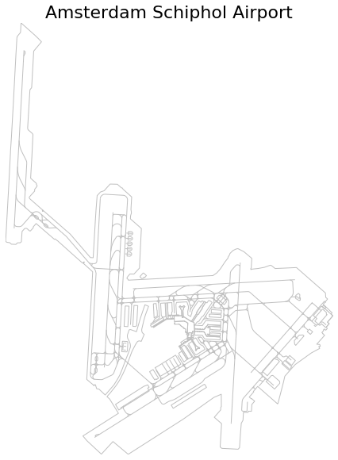

Airports and runways
--------------------

.. autoclass:: traffic.data.basic.airports.Airports
    :members:
    :no-inherited-members:
    :no-undoc-members:

Airports offer special display outputs in Jupyter Notebook based on their
geographic footprint.

.. code:: python

    from traffic.data import airports
    airports['EHAM']

.. raw:: html

    <b>Amsterdam Schiphol Airport</b> (Netherlands) EHAM/AMS
<svg xmlns="http://www.w3.org/2000/svg" xmlns:xlink="http://www.w3.org/1999/xlink" width="300" height="300" viewBox="330228.8075317378 5613160.185607762 8040.609754988283 9594.010859955102" preserveAspectRatio="xMinYMin meet"><g transform="matrix(1,0,0,-1,0,11235914.38207548)"><g><polyline fill="none" stroke="#66cc99" stroke-width="63.96007239970068" points="336272.86255202716,5615041.666618866 336276.81369555305,5615038.642214616" opacity="0.8" /><polyline fill="none" stroke="#66cc99" stroke-width="63.96007239970068" points="337745.3064820901,5616924.788468405 337729.4049867813,5616936.513416703" opacity="0.8" /><polyline fill="none" stroke="#66cc99" stroke-width="63.96007239970068" points="333415.295120631,5615446.9394194065 333360.3552117103,5615487.858153456" opacity="0.8" /><path fill-rule="evenodd" fill="#66cc99" stroke="#555555" stroke-width="63.96007239970068" opacity="0.6" d="M 333666.02014546347,5617220.907005382 L 333639.65935884696,5617218.096808975 L 333602.479359235,5617245.747255321 L 333599.8910520962,5617257.119095572 L 333599.27571987634,5617260.277116639 L 333662.28799396957,5617333.225237558 L 333668.9196651235,5617334.151470392 L 333674.8801769402,5617334.990090566 L 333725.62405736034,5617295.7284154985 L 333739.5985308197,5617284.915470651 L 333702.6965701965,5617240.750243652 L 333690.122612539,5617249.730883346 L 333666.02014546347,5617220.907005382 z" /><path fill-rule="evenodd" fill="#66cc99" stroke="#555555" stroke-width="63.96007239970068" opacity="0.6" d="M 337914.08355117217,5616655.836603454 L 337801.2298543154,5616517.229628272 L 337840.36200968816,5616488.044723251 L 337779.4933048531,5616414.273209968 L 337804.4794465433,5616386.328398707 L 337771.79682807415,5616347.615306275 L 337737.4736916168,5616372.028264127 L 337717.68216794456,5616348.108159588 L 337727.30069399247,5616340.379075447 L 337688.04557159,5616293.560870882 L 337712.4079498192,5616274.740475733 L 337709.8238030364,5616270.728687524 L 337751.3727612823,5616240.119202326 L 337706.36749615206,5616185.63673998 L 337586.6631850268,5616045.981088184 L 337653.81799300027,5616043.357763714 L 337668.7287725553,5616006.166870857 L 337634.2337733219,5616001.40499323 L 337656.08489932865,5615961.2895498015 L 337475.7296302837,5615857.9274532925 L 337265.83665133914,5615700.060589256 L 337131.31927989767,5615599.110720992 L 337021.60286252154,5615472.539870797 L 336912.69540933083,5615343.805594169 L 336888.2600662245,5615213.477014746 L 336789.99561781785,5614773.570336594 L 336787.72943404695,5614769.790915045 L 336781.2887780398,5614759.03290422 L 336321.2994184648,5615100.323717742 L 336272.86255202716,5615041.666618866 L 336230.2717369544,5614990.090107762 L 336239.8906778055,5614982.769118255 L 336146.021890737,5614869.063109706 L 336196.2309126696,5614833.817994388 L 336201.6852874079,5614839.855186542 L 336270.14506491413,5614789.04283504 L 336212.4104359441,5614720.595653349 L 336209.91389504477,5614575.21912284 L 336141.61507331696,5614574.167880654 L 336142.11373113346,5614562.31125747 L 336127.2752579376,5614545.779189176 L 336033.27045478765,5614547.294046642 L 336031.3748945504,5614378.291107017 L 335996.9464496766,5614315.818471821 L 335988.90831404907,5614077.904070743 L 335983.50422686554,5613804.840029957 L 335954.41036240966,5613770.453348401 L 335590.64506667916,5613769.754508542 L 335552.96729502705,5613797.949439069 L 335559.913785363,5614284.748117842 L 335391.72330971784,5614409.112359601 L 335526.2268093906,5614570.249191147 L 335525.8176057679,5614626.415063584 L 335537.21966564225,5614640.048401618 L 335522.8478433472,5614896.762535369 L 335364.0715865692,5614824.152167062 L 334707.2918898373,5614337.245790751 L 333522.0321817307,5613542.225780351 L 333170.0792421058,5613790.949518394 L 332926.46511805896,5613515.519343316 L 332750.75291162916,5613653.676431863 L 332589.69563823217,5613781.312048453 L 332498.06690690585,5613873.811933265 L 333262.5464880091,5614385.564754025 L 333054.0968931472,5614671.155532468 L 332990.7191860977,5614720.393594711 L 333062.40354108665,5614805.15034316 L 333173.50210555195,5614949.778291116 L 333228.3261933004,5615034.040193828 L 333271.04622140457,5615110.173416709 L 333320.8898319825,5615213.905461105 L 333365.4700875276,5615317.8500817185 L 333411.59303471015,5615435.96855389 L 333415.295120631,5615446.9394194065 L 333498.4165758397,5615693.273169167 L 333571.82482943434,5615841.607244267 L 333606.54107437516,5615896.594618068 L 333621.2645625925,5615907.308723391 L 333634.9545250259,5615913.6362463115 L 333652.41278417985,5615917.092922258 L 333669.41855699813,5615914.538107576 L 333693.0712237277,5615909.256445896 L 333739.18304533145,5616027.243599225 L 333751.75456363824,5616057.751940544 L 333724.9261114715,5616076.722352838 L 333708.97886190534,5616090.486050874 L 333702.0649287828,5616102.917893591 L 333696.0936895377,5616119.720954981 L 333692.5602833278,5616137.316161313 L 333691.3641427093,5616154.195865553 L 333692.57134256564,5616165.3798945965 L 333726.6228921244,5616340.8122259 L 333757.33321353624,5616462.00452138 L 333809.47241687495,5616619.476206777 L 333819.0732544861,5616647.435312324 L 333736.3977672221,5616675.242064696 L 333648.747974629,5616388.102746508 L 333577.60529588995,5616106.228671077 L 333446.06825318065,5616142.299526938 L 333431.58269826457,5616142.040421622 L 333417.8106007366,5616137.363224732 L 333409.116861451,5616126.129440847 L 333379.4893723518,5616025.216976289 L 333379.68290488236,5615998.8064867295 L 333382.07141908153,5615983.542882406 L 333386.4716172265,5615968.0230457345 L 333395.49631472497,5615947.566975461 L 333424.8535233863,5615900.658020728 L 333444.7251166637,5615860.896258169 L 333451.09223559184,5615843.485538341 L 333456.34846765077,5615815.911619214 L 333457.8542159803,5615790.852808629 L 333456.1839018137,5615771.743092085 L 333431.33164178574,5615685.953021723 L 333360.3552117103,5615487.858153456 L 333353.3437574702,5615468.289843621 L 333302.3821709713,5615316.817417265 L 333252.4761369837,5615184.185968616 L 333205.9060657307,5615094.942066393 L 333133.0095849064,5614971.962155011 L 332950.19824125135,5614752.588422541 L 332935.93000584224,5614762.871271986 L 332805.2418090147,5614868.450466057 L 332754.44708684814,5614874.068788591 L 332724.4037631706,5614947.327560586 L 332720.804043097,5614955.710224051 L 332695.4032150826,5614951.254597373 L 332698.2604938626,5614944.067334922 L 332693.40572853584,5614934.560440928 L 332681.3457224279,5614939.818639647 L 332676.9198328072,5614942.041231048 L 332665.1809001068,5614957.380302578 L 332621.76231818076,5614986.761766384 L 332524.7634269395,5615056.651252561 L 332536.6573268065,5616427.988026375 L 332543.1589692245,5617031.416406515 L 332543.39755850506,5617305.565662477 L 332489.5441309033,5617347.512835711 L 332328.68673630425,5617469.78081977 L 332328.9845490581,5617473.124889241 L 332351.14009615494,5617494.928323006 L 332345.37252599455,5617498.975444989 L 332341.82326520345,5617501.998128191 L 332314.68843255664,5617475.763516585 L 332307.507072709,5617476.692051438 L 332043.6768452328,5617675.4556739675 L 331734.89484140585,5617910.437717706 L 331711.9932858802,5617923.436737588 L 331679.2356744472,5617947.586820046 L 331663.754074407,5617937.445735452 L 331240.9599041421,5618246.29596953 L 331179.92906627734,5618174.100958705 L 331183.2068994657,5618156.688865915 L 331122.0905339318,5618086.1868286375 L 331101.52643574774,5618086.862939124 L 331043.1467004843,5618131.5881283665 L 331019.9152998324,5618137.2445805855 L 330990.18527078966,5618127.8248235565 L 330937.53996270365,5618066.64042715 L 330934.6699273043,5617941.127772999 L 330932.6276048931,5617851.681081225 L 330907.7943952052,5617828.907096789 L 330847.60818683263,5617824.78660844 L 330814.28828665067,5617790.25356233 L 330714.69124905777,5617789.2815653235 L 330670.72210885264,5617820.944062026 L 330613.2101657583,5617823.767807557 L 330591.45286863076,5617836.297682634 L 330584.1412672917,5617862.016864422 L 330584.84244416875,5617945.397773908 L 330595.0980669594,5619029.824041903 L 330599.1681519945,5619756.094954374 L 330604.2839112348,5620037.948961488 L 330612.40961916285,5620774.937613451 L 330612.93914267706,5620934.733294564 L 330618.63801781874,5621732.609185943 L 330623.1781182961,5622091.35367336 L 330632.50209983875,5622122.397519104 L 330662.04116863664,5622159.544558441 L 330697.815788715,5622204.93269064 L 330699.5518261242,5622394.578179795 L 330705.97676237795,5622398.862732164 L 331013.1951558107,5622167.193376838 L 331092.1262213413,5622103.304669702 L 331171.66288525617,5622033.060151919 L 331009.075557726,5621831.281849203 L 331001.3458869897,5621077.6789594665 L 330996.1123788731,5621061.554709563 L 330969.32678038196,5621029.64158495 L 330964.8580371044,5621010.15112844 L 330954.0921241016,5620229.84135487 L 330957.64918274496,5620206.782114489 L 330965.1491481009,5620189.592420794 L 331064.16256012535,5620116.467583609 L 331078.5882273019,5620093.385879006 L 331077.52439897245,5619638.096257168 L 331071.6774426207,5619183.72459418 L 331206.22375181044,5619082.000780328 L 331204.1421152217,5619064.139719418 L 331222.41380205087,5619040.156135299 L 331220.10393218923,5619019.808630645 L 331173.5730471319,5618957.523485448 L 331173.85422334744,5618919.13604904 L 331060.6786292516,5618789.125333597 L 331064.6880725256,5618768.161813453 L 331076.2322701727,5618754.565253777 L 331908.57817542873,5618136.291812955 L 332004.12200967025,5618067.093378572 L 332479.2181526305,5617598.020491685 L 332540.923018371,5617598.4049080955 L 332540.91455499,5617621.157713723 L 332549.10694122745,5618312.774608318 L 332554.1856396402,5618605.5845180545 L 332563.9823289998,5618895.0256531425 L 332634.3257815579,5618974.170451296 L 332709.2446506583,5619002.7451041145 L 332714.7677991585,5619004.847251248 L 332734.11304484983,5619027.288474061 L 332741.9992906961,5619037.863343134 L 332839.8859466437,5619150.030707091 L 332999.4385095312,5619153.953531234 L 333094.2756544499,5619084.101931707 L 333117.071173619,5619081.10096739 L 333129.07384747034,5619059.11117503 L 333330.13909245573,5618905.886595454 L 333327.7342561334,5618641.790313818 L 333340.1006303301,5618590.732455581 L 333339.1029593171,5618560.440052405 L 333325.4607662539,5618510.89232069 L 333324.85458413255,5618448.268930239 L 333578.2794411353,5618259.776827917 L 333577.24481245346,5617433.606893611 L 333461.5534546416,5617302.55250203 L 333371.0611776618,5617299.694160818 L 333335.4377717888,5617255.8112431 L 333313.3534423093,5617223.4684263365 L 333310.60510275903,5617204.252398538 L 333340.502824708,5617182.754557095 L 333343.66446182365,5617169.335823218 L 333568.0539866151,5617191.859144414 L 333817.6146601854,5617216.200905541 L 334009.0645056799,5617234.885743062 L 334272.90397787926,5617261.148656105 L 334586.87695061933,5617296.195187925 L 335214.697058463,5617359.581401428 L 335295.9301963248,5617418.565879094 L 335372.4209545613,5617508.584762449 L 335465.68991607014,5617657.278541328 L 335528.8781585907,5617740.965210968 L 335528.85577061906,5617758.7563285595 L 335563.11322623,5617816.4613319505 L 335567.20435485395,5617838.783056206 L 335573.52635756694,5617845.013814079 L 335634.5277861947,5617905.113002151 L 335698.71456051344,5617937.830893201 L 335739.27724405995,5617947.806514049 L 335875.0292677898,5617890.563383983 L 336057.19826517126,5617760.395138179 L 336054.82304158795,5617583.226834566 L 336056.35071311065,5617557.652730044 L 336044.2410279027,5617548.55715144 L 336045.6234428004,5617530.0559524065 L 336055.33131050935,5617527.323767842 L 336066.54650756024,5617535.877070049 L 336210.2935704743,5617557.5839861175 L 336349.21034165716,5617589.524943855 L 336472.3529417658,5617638.833175428 L 336501.6992841559,5617631.806425107 L 336584.8168427645,5617574.947416726 L 337056.172507057,5617619.535255058 L 337410.7441522767,5617356.169917254 L 337725.8110508707,5617122.620444411 L 337736.42356863077,5617032.407392617 L 337778.9104087889,5616999.036586731 L 337729.4049867813,5616936.513416703 L 337688.28786039085,5616884.585331818 L 337894.0371226574,5616716.602149732 L 337871.38264494116,5616690.461368015 L 337914.08355117217,5616655.836603454 z" /></g></g></svg>

It is also possible to benefit from the Altair geographical representation.

.. code:: python

    from traffic.data import airports
    # see https://traffic-viz.github.io/samples.html if any issue on import
    from traffic.data.samples import belevingsvlucht

    (
        airports["EHAM"].geoencode(runways=True, labels=True)
        + belevingsvlucht.first(minutes=1).geoencode().mark_line(color="steelblue")
        + belevingsvlucht.last(minutes=6).geoencode().mark_line(color="orangered")
    ).configure_text(font="Ubuntu", fontWeight="bold")

