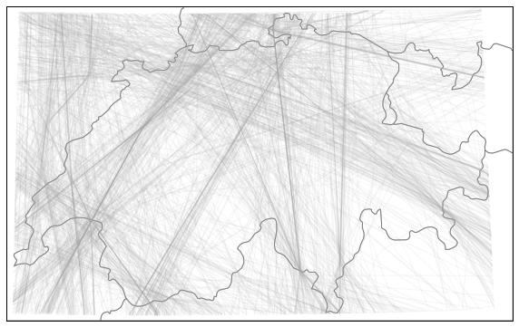
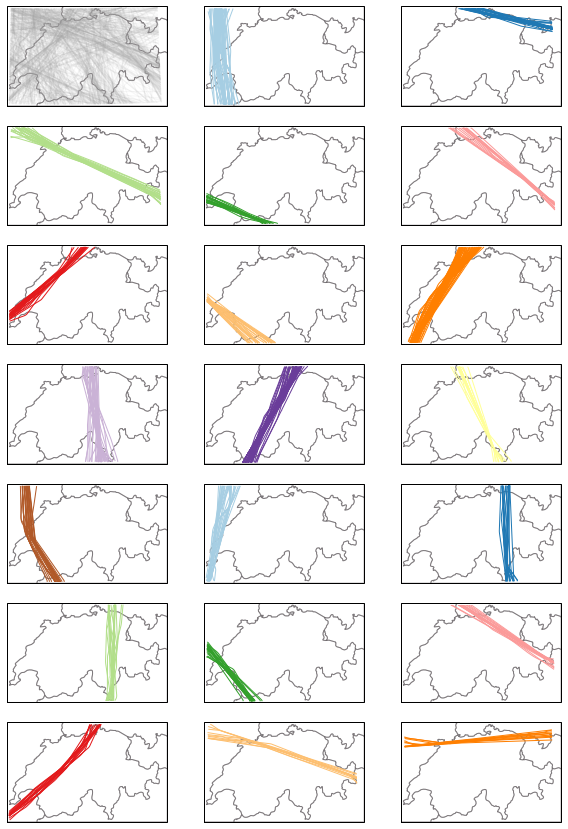
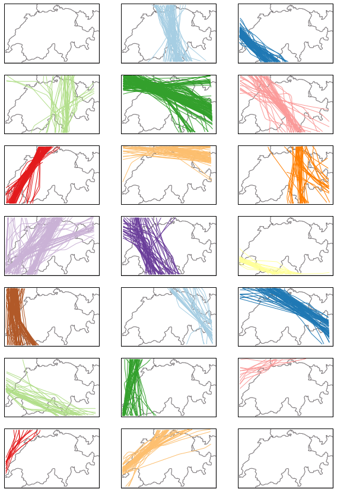
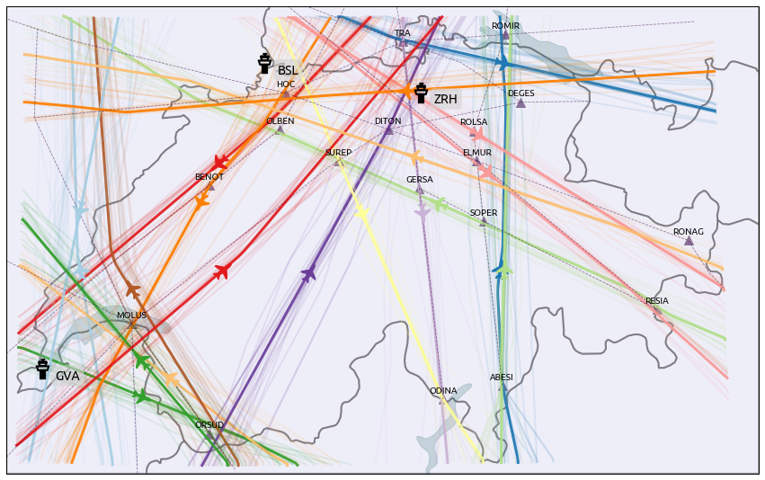

Trajectory clustering
---------------------

An API for trajectory clustering is provided in the Traffic class. Regular
clustering methods from scikit-learn can be passed as parameters, or any object
implementing the fit(), predict() and fit_predict() methods (see `ClusterMixin
<https://scikit-learn.org/stable/modules/generated/sklearn.base.ClusterMixin.html#sklearn.base.ClusterMixin>`_.)

Data is prepared to match the input format of these methods, preprocessed with
transformers (see `TransformerMixin
<https://scikit-learn.org/stable/modules/generated/sklearn.base.TransformerMixin.html#sklearn.base.TransformerMixin>`_),
e.g. MinMaxScaler() or StandardScaler(), and the result of the clustering is
added to the Traffic DataFrame as a new ``cluster`` feature.

The following illustrates the usage of the API on a sample dataset of traffic
over Switzerland. The dataset contains flight trajectories over Switzerland on
August 1st 2018, cleaned and resampled to one point every five seconds. The data
is available as a basic import:

.. code:: python

    # see https://traffic-viz.github.io/samples.html if any issue on import
    from traffic.data.samples import switzerland

The full dataset of trajectories can be displayed on a basic Switzerland map.

.. code:: python

    import matplotlib.pyplot as plt

    from traffic.core.projection import CH1903
    from traffic.drawing import countries
    
    with plt.style.context("traffic"):
        ax = plt.axes(projection=CH1903())
        ax.add_feature(countries())
        switzerland.plot(ax, alpha=0.1)

It is often relevant to use the track angle when doing clustering on
trajectories as it helps separating close trajectory flows heading in opposite
directions. However a track angle may be problematic when crossing the 360°/0°
(or -180°/180°) line.

`Flight.unwrap() <traffic.core.flight.html#traffic.core.Flight.unwrap>`_ is
probably the most relevant method to apply:

.. code:: python

    t_unwrapped = switzerland.assign_id().unwrap().eval(max_workers=4)

The following snippet projects trajectories to a local projection, resample each
trajectory to 15 sample points, apply scikit-learn's StandardScaler() before
calling a `DBSCAN.fit_predict()
<https://scikit-learn.org/stable/modules/generated/sklearn.cluster.DBSCAN.html>`_
method.

If a fitted DBSCAN instance is passed in parameter, the predict() method can be
called on new data.

.. code:: python

    from sklearn.cluster import DBSCAN
    from sklearn.preprocessing import StandardScaler
    from traffic.core.projection import CH1903
    
    t_dbscan = t_unwrapped.clustering(
        nb_samples=15,
        projection=CH1903(),
        features=["x", "y", "track_unwrapped"],
        clustering=DBSCAN(eps=0.5, min_samples=10),
        transform=StandardScaler(),
    ).fit_predict()

.. code:: python

    >>> dict(t_dbscan.groupby(["cluster"]).agg({"flight_id": "nunique"}).flight_id)

    {-1: 685, 0: 62, 1: 30, 2: 23, 3: 17, 4: 14, 5: 25, 6: 24, 7: 70, 8: 49, 9: 53,
     10: 15, 11: 24, 12: 30, 13: 19, 14: 23, 15: 25, 16: 19, 17: 16, 18: 10, 19: 11}

The above distribution results from the DBSCAN prediction. We can compare the
results with a Gaussian Mixture model for example. This model must be
initialized with a number of components. We chose here 19 components to compare
them with the result of the DBSCAN algorithm.

.. code:: python

    from sklearn.mixture import GaussianMixture
    
    t_gmm = t_unwrapped.clustering(
        nb_samples=15,
        projection=CH1903(),
        features=["x", "y", "track_unwrapped"],
        clustering=GaussianMixture(n_components=19),
        transform=StandardScaler(),
    ).fit_predict()

.. code:: python

    >>> dict(t_gmm.groupby(["cluster"]).agg({"flight_id": "nunique"}).flight_id)

    {0: 94, 1: 76, 2: 46, 3: 145, 4: 47, 5: 89, 6: 76, 7: 50, 8: 143, 9: 57,
     10: 31, 11: 108, 12: 35, 13: 75, 14: 35, 15: 55, 16: 12, 17: 13, 18: 57}

The following snippets visualises each trajectory cluster with a given color.
Many outliers appear in shaded grey in the first quartet.

.. code:: python

    from itertools import islice, cycle
    from traffic.drawing import countries
    
    n_clusters = 1 + t_dbscan.data.cluster.max()
    
    # -- dealing with colours --
    
    color_cycle = cycle(
        "#a6cee3 #1f78b4 #b2df8a #33a02c #fb9a99 #e31a1c "
        "#fdbf6f #ff7f00 #cab2d6 #6a3d9a #ffff99 #b15928".split()
    )
    colors = list(islice(color_cycle, n_clusters))
    colors.append("#aaaaaa")  # color for outliers, if any
    
    # -- dealing with the grid --
    
    nb_cols = 3
    nb_lines = (1 + n_clusters) // nb_cols + (((1 + n_clusters) % nb_cols) > 0)
    
    with plt.style.context("traffic"):
    
        fig, ax = plt.subplots(
            nb_lines, nb_cols, figsize=(10, 15), subplot_kw=dict(projection=CH1903())
        )
    
        for cluster in range(-1, n_clusters):
            ax_ = ax[(cluster + 1) // nb_cols][(cluster + 1) % nb_cols]
            ax_.add_feature(countries())
    
            t_dbscan.query(f"cluster == {cluster}").plot(
                ax_, color=colors[cluster], alpha=0.1 if cluster == -1 else 1
            )
            ax_.set_global()

Gaussian Mixtures do not yield any outlier. The following clustering is balanced
differently.

.. code:: python

    with plt.style.context("traffic"):
    
        fig, ax = plt.subplots(
            nb_lines, nb_cols, figsize=(10, 15), subplot_kw=dict(projection=CH1903())
        )
    
        for cluster in range(-1, n_clusters):
            ax_ = ax[(cluster + 1) // nb_cols][(cluster + 1) % nb_cols]
            ax_.add_feature(countries())
    
            t_gmm.query(f"cluster == {cluster}").plot(
                ax_, color=colors[cluster], alpha=0.1 if cluster == -1 else 1
            )
            ax_.set_global()
            

The following map demonstrates how to use the `Traffic.centroid()
<traffic.core.traffic.html#traffic.core.Traffic.centroid>`_ method, computed
with the same parameters as the clustering.

.. code:: python

    
    from random import sample
    
    from traffic.data import airports, airways, navaids
    from traffic.drawing import CH1903, countries, lakes
    from traffic.drawing.markers import rotate_marker, atc_tower, aircraft
    
    with plt.style.context("traffic"):
        fig, ax = plt.subplots(1, figsize=(15, 10), subplot_kw=dict(projection=CH1903()))
        ax.add_feature(countries(facecolor="#dedef4", linewidth=2))
        ax.add_feature(lakes())
    
        for cluster in range(n_clusters):
    
            current_cluster = t_dbscan.query(f"cluster == {cluster}")
            centroid = current_cluster.centroid(15, projection=CH1903())
            centroid.plot(ax, color=colors[cluster], alpha=0.9, linewidth=3)
            centroid_mark = centroid.at_ratio(0.45)
    
            centroid_mark.plot(
                ax,
                color=colors[cluster],
                marker=rotate_marker(aircraft, centroid_mark.track),
                s=500,
                text_kw=dict(s=""),  # no text associated
            )
            sample_size = min(20, len(current_cluster))
    
            for flight_id in sample(current_cluster.flight_ids, sample_size):
                current_cluster[flight_id].plot(
                    ax, color=colors[cluster], alpha=0.1, linewidth=2
                )
    
        swiss_airways = airways.extent("Switzerland")
        for (
            name
        ) in "UL613 UL856 UM729 UN491 UN850 UN851 UN853 UN869 UN871 UQ341 Z50".split():
            swiss_airways[name].plot(ax, color="#34013f")
    
        for name in "BSL GVA ZRH".split():
            bbox = dict(
                facecolor="lightgray", edgecolor="none", alpha=0.6, boxstyle="round"
            )
            airports[name].point.plot(ax, marker=atc_tower, s=500, zorder=5)
    
        swiss_navaids = navaids.extent("Switzerland")
        for name in (
            "ABESI BENOT DEGES DITON ELMUR GERSA HOC MOLUS ODINA OLBEN "
            "ORSUD RESIA ROLSA ROMIR RONAG SOPER SUREP TRA".split()
        ):
            swiss_navaids[name].plot(ax, marker="^", color="#34013f")
    
        ax.set_global()

The result may be compared to the Blick newspaper great visualisation by Simon Huwiler
and Priska Wallimann `here
<https://github.com/blickvisual/doData_quantum/blob/master/presentation/2018_Luftverkehr_fertig.pdf>`_.
(`github repository <https://github.com/blickvisual/doData_quantum>`_)

