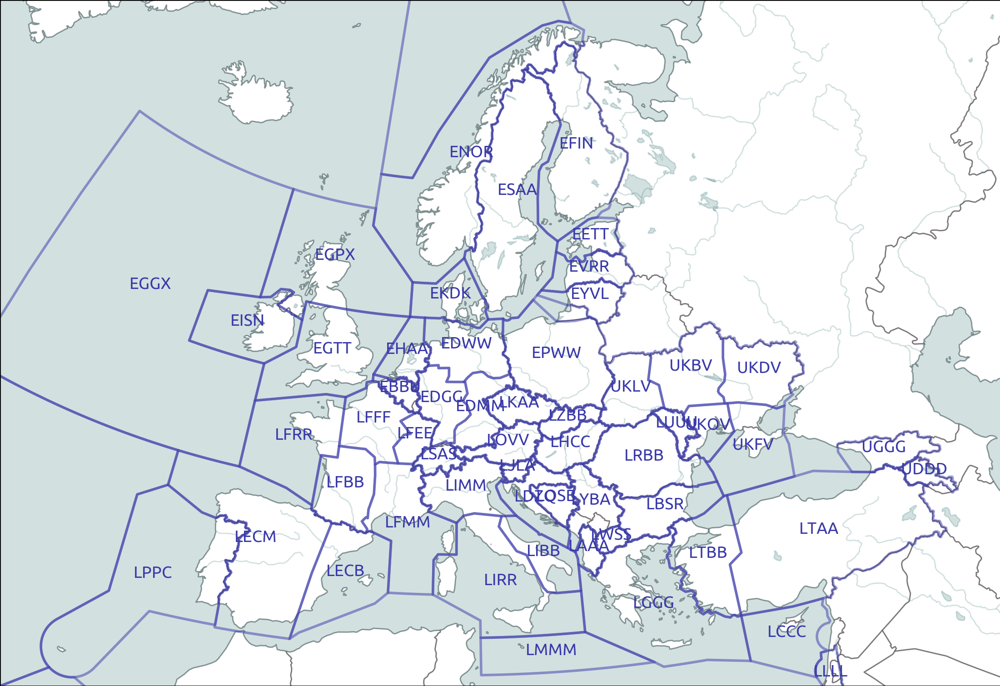
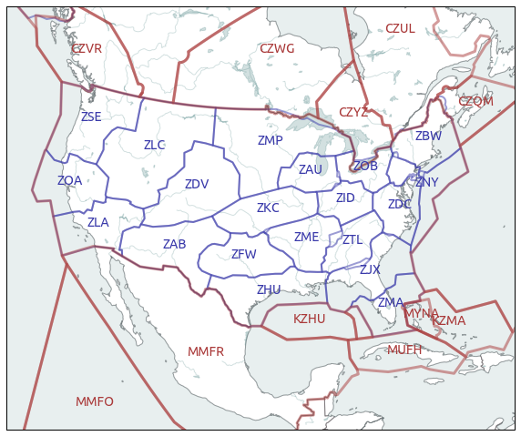

Flight Information Regions (FIR)
--------------------------------

FIR stands for Flight Information Region.

FIR are the largest regular division of airspace in use in the world today.
Every portion of the atmosphere belongs to a specific FIR. Smaller countries'
airspace is encompassed by a single FIR; larger countries' airspace is
subdivided into a number of regional FIRs. Some FIRs encompass the territorial
airspace of several countries. Oceanic airspace is divided into Oceanic
Information Regions and delegated to a controlling authority bordering that
region.

The division among authorities is done by international agreement
through the International Civil Aviation Organization (ICAO). (`source
Wikipedia <https://en.wikipedia.org/wiki/Flight_information_region>`_)

FIRs from the Eurocontrol area
~~~~~~~~~~~~~~~~~~~~~~~~~~~~~~

FIRs of countries in the Eurocontrol area are available in the library.

.. code:: python

    from traffic.data import eurofirs
    from traffic.drawing import TransverseMercator, countries, lakes, ocean, rivers

    import matplotlib.pyplot as plt

    fig, ax = plt.subplots(
        1, figsize=(15, 10),
         subplot_kw=dict(projection=TransverseMercator(10, 45))
    )

    ax.add_feature(countries(scale="50m"))
    ax.add_feature(rivers(scale="50m"))
    ax.add_feature(lakes(scale="50m"))
    ax.add_feature(ocean(scale="50m"))

    for name, fir in eurofirs.items():
        fir.plot(ax, edgecolor="#3a3aaa", lw=2, alpha=0.5)

        if name not in ["ENOB", "LPPO", "GCCC"]:
            fir.annotate(
                ax, s=name, ha="center", color="#3a3aaa"
            )

    ax.set_extent((-20, 45, 30, 70))

FIR and ARTCC from the FAA
~~~~~~~~~~~~~~~~~~~~~~~~~~~~

The Federal Aviation Administration (FAA) publishes some data about their
airspace in open data. The data is automatically downloaded the first time
you try to access it.

Find more about this service `here <https://adds-faa.opendata.arcgis.com/>`_.
On the following map, Air Route Traffic Control Centers (ARTCC) are displayed together with neighbouring FIRs.

.. code:: python

    from traffic.data import faa
    from traffic.drawing import AlbersUSA, countries, lakes, ocean, rivers

    import matplotlib.pyplot as plt

    fig, ax = plt.subplots(
        figsize=(10, 10),
        subplot_kw=dict(projection=AlbersUSA())
    )

    ax.add_feature(countries(scale="50m"))
    ax.add_feature(rivers(scale="50m"))
    ax.add_feature(lakes(scale="50m"))
    ax.add_feature(ocean(scale="50m", alpha=0.1))

    # just a hack to push walls (i.e. projection limits)
    AlbersUSA.xlimits = property(lambda _: (-3e6, 3e6))

    for airspace in faa.airspace_boundary.values():

        if airspace.type == "ARTCC":
            airspace.plot(ax, edgecolor="#3a3aaa", lw=2, alpha=0.5)
            if airspace.designator != "ZAN":  # Anchorage
                airspace.annotate(
                    ax,
                    s=airspace.designator,
                    color="#3a3aaa",
                    ha="center",
                    fontname="Ubuntu",
                    fontsize=14,
                )

        if airspace.type == "FIR" and airspace.designator[0] in ["C", "M", "K"]:
            airspace.plot(ax, edgecolor="#aa3a3a", lw=3, alpha=0.5)
            if airspace.designator not in ["CZEG", "KZWY", "KZAK"]:
                airspace.annotate(
                    ax,
                    s=airspace.designator,
                    color="#aa3a3a",
                    ha="center",
                    fontname="Ubuntu",
                    fontsize=14,
                )

