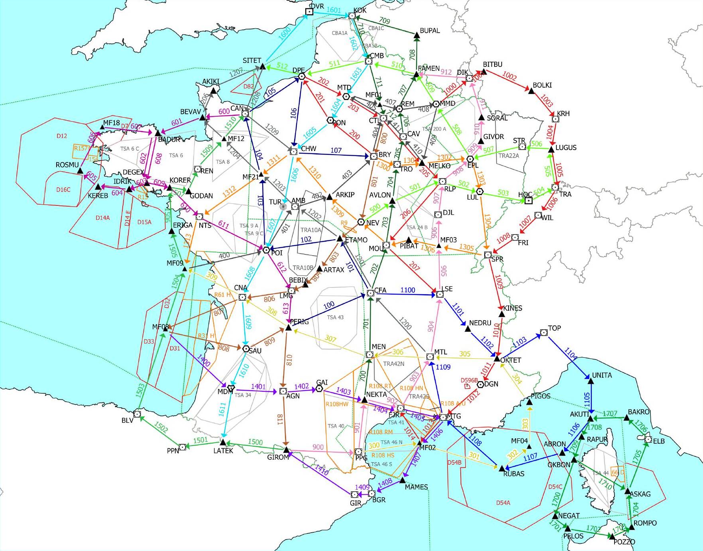

Calibration flights with SAVAN trajectories
===========================================

There are 86 VOR and VOR-DME installations in France and these must all be
recalibrated on a yearly basis. Recently, there has been an effort to reduce the
number of calibration flights, and ad hoc trajectories have been designed to
cover the 360° range around all VOR installations with a reduced number of
trajectories.

As a result, every year in France, 17 trajectories are flown to cover and
calibrate all the VOR installations, according to the map below.

Those trajectories are tagged as SAVAN, which stands for *Système Automatique de
Vérification en vol des Aides à la Navigation aérienne* (Automatic system for
in-flight calibration for navigational aids)

.. jupyter-execute::

    # Trajectories flown in 2021 are provided in the following dataset, limited
    # to the coverage of the OpenSky Network.

    from traffic.data.samples import savan

    savan.summary(['icao24', 'callsign', 'start', 'stop']).eval()

Trajectories can be considered individually:

.. jupyter-execute::

    savan['SAVAN01'].map_leaflet(zoom=5)

But it makes more sense to plot them all together. The following cells detail
how we come to the full map below:

.. jupyter-execute::

   savan['SAVAN01'].simplify(1e3).geoencode()

.. jupyter-execute::

   import altair as alt

   alt.layer(
       savan['SAVAN01'].simplify(1e3).geoencode(),
       savan['SAVAN02'].simplify(1e3).geoencode()
   )

.. jupyter-execute::

   alt.layer(
       savan['SAVAN01'].simplify(1e3).geoencode().encode(alt.Color('callsign')),
       savan['SAVAN02'].simplify(1e3).geoencode().encode(alt.Color('callsign'))
   )

.. jupyter-execute::

   alt.layer(
       # the * operator serves as list unpacking
       *(flight.simplify(1e3).geoencode().encode(alt.Color('callsign')) for flight in savan)
   )

The `cartes <https://cartes-viz.github.io/atlas.html>`_ package helps providing
layouts for better maps.

.. jupyter-execute::

   from cartes.atlas import france
   from cartes.crs import Lambert93

   chart = (
      alt.layer(
         alt.Chart(france.topo_feature)
         .mark_geoshape(fill="None", stroke="#bab0ac")
         .project(**Lambert93()),
         # the * operator serves as list unpacking
         *(flight.simplify(1e3).geoencode().encode(alt.Color('callsign')) for flight in savan)
      )
      .properties(width=600, height=600)
      .configure_view(stroke=None)
      .configure_legend(orient='bottom', columns=5)
   )
   chart

The next step for a proper visualisation is to include the VOR locations on the
map.  A naive approach would be to use the bounding box of "France
métropolitaine" (the adjective helps excluding overseas territories with the
OpenStreetMap Nominatim service.)

.. jupyter-execute::

   from traffic.data import navaids

   vors = navaids.extent('France métropolitaine').query('type == "VOR"')
   vors

For the time being, the filtering based on a polygon is not provided by the
library, but it is not very difficult to code it directly.

.. jupyter-execute::

   from cartes.osm import Nominatim

   france_shape = Nominatim.search("France métropolitaine").shape
   france_shape

.. jupyter-execute::

   from shapely.geometry import Point
   from traffic.data.basic.navaid import Navaids

   vors = navaids.extent('France métropolitaine').query('type == "VOR"')
   vors_fr = Navaids(
    vors.data.loc[
        list(france_shape.contains(Point(x.longitude, x.latitude)) for x in vors)
    ]
   )
   vors_fr

Here comes a better map now:

.. jupyter-execute::

   base_vor = alt.Chart(vors_fr.data).mark_point().encode(
      alt.Longitude('longitude'), alt.Latitude('latitude')
   )

   map_chart = (
      alt.layer(
         alt.Chart(france.topo_feature)
         .mark_geoshape(fill="None", stroke="#bab0ac"),
         # the * operator serves as list unpacking
         *(flight.simplify(1e3).geoencode().encode(alt.Color('callsign')) for flight in savan),
         base_vor,
         base_vor.mark_text(dx=20).encode(alt.Text('name'))
      )
      .project(**Lambert93())
      .properties(width=600, height=600)
      .configure_view(stroke=None)
      .configure_legend(orient='bottom', columns=5)
   )
   map_chart

A way to dig into how VOR installations are well covered on 360 degrees by SAVAN
trajectories is to compute for each VOR and for each trajectory, which legs
cover which bearing angle.

.. jupyter-execute::

    from traffic.core import Traffic

    coverage = Traffic.from_flights(
        savan.assign(vor=vor.name)
        .iterate_lazy()  # optional, but this line makes it clear we loop over flights
        .phases()  # compute flight phases
        .query('phase == "LEVEL" and altitude > 20000')
        .resample("15s")  # reduce the number of points
        .distance(vor)
        .bearing(vor)
        .query("20 < distance < 100")  # only keep legs within coverage
        .longer_than("10 min")
        .eval()
        # focus roughly on Corsica, but we could go for the whole set of VORs
        for vor in vors_fr.query("latitude < 47 and longitude > 7")
    )
    coverage.data[['callsign', 'latitude', 'longitude', 'altitude', 'distance', 'bearing', 'vor']]

We can then produce plots to check for the coverage, here limited on
South-eastern France and Corsica:

.. jupyter-execute::

    chart = (
        alt.Chart(coverage.data)
        .mark_circle()
        .encode(
            alt.X(
                "bearing",
                title="Bearing angle in degree",
                scale=alt.Scale(domain=(0, 360), nice=False),
            ),
            alt.Y("vor", title="VOR name"),
        )
        .properties(width=500)
        .configure_axisY(titleY=-10, titleAnchor="start", titleAngle=0)
        .configure_axis(titleFontSize=14, labelFontSize=12)
    )
    chart

Some VOR are not fully covered on this map, and we can look into more details in
the following map: a part of trajectory for ``SAVAN17`` was out of coverage of
the OpenSky Network.

.. jupyter-execute::

    map_chart.project(**(dict(Lambert93()) | dict(scale=6000, rotate=(-8, -43, 0))))

.. jupyter-execute::

    chart = (
        alt.Chart(coverage.data)
        .mark_circle()
        .encode(
            alt.X(
                "bearing",
                title="Bearing angle in degree",
                scale=alt.Scale(domain=(0, 360), nice=False),
            ),
            alt.Y("callsign", title=None),
            alt.Row("vor", title="VOR name"),
            alt.Color("callsign", legend=None),
        )
        .transform_filter("datum.vor == 'AJO' | datum.vor == 'BTA' | datum.vor == 'FGI'")
        .properties(width=500)
        .resolve_scale(y="independent")
        .configure_header(
            labelOrient="right",
            labelAngle=0,
            labelFontSize=14,
            titleOrient="right",
            titleFontSize=14,
        )
        .configure_axis(titleFontSize=14, labelFontSize=12)
    )
    chart
