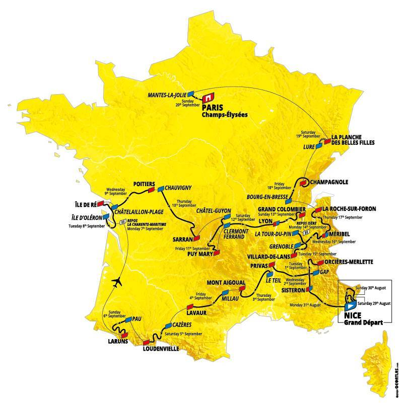

.. raw:: html
    :file: ../embed_widgets/tour_de_france.html

Tour de France 2020
===================

During the Tour de France, aircraft are contracted to `relay TV signals <https://arstechnica.com/cars/2019/07/how-helicopters-bring-us-amazing-views-of-the-tour-de-france/>`_ from helicopters filming the riders. See how their trajectories fits the official map at the bottom of the page.

.. raw:: html

   

.. code:: python

    from ipywidgets import Layout

    preprocessed.map_leaflet(
        zoom=5, layout=Layout(max_width="600px", height="600px"),
    )

The code for the data preparation is pasted below:

.. code:: python

    from traffic.data.samples import tour_de_france

    def straight_ratio(flight) -> float:
        return flight.distance() / flight.cumulative_distance(False, False).max("cumdist")

    preprocessed = (
        tour_de_france.iterate_lazy(iterate_kw=dict(by="1H"))
        .assign_id()
        .apply_time("5T", straight_ratio=straight_ratio)
        .query("straight_ratio < .5")
        .max_split()
        .longer_than("1H")
        .eval(desc="processing")
    )

    preprocessed.summary(["flight_id", "start", "stop", "duration"])

.. raw:: html

    

    
    <table border="0" class="dataframe">
      <thead>
        <tr style="text-align: right;">
          <th></th>
          <th>flight_id</th>
          <th>start</th>
          <th>stop</th>
          <th>duration</th>
        </tr>
      </thead>
      <tbody>
        <tr>
          <th>0</th>
          <td>ASR182B_000</td>
          <td>2020-08-29 07:27:30+00:00</td>
          <td>2020-08-29 10:37:25+00:00</td>
          <td>03:09:55</td>
        </tr>
        <tr>
          <th>1</th>
          <td>ASR182B_001</td>
          <td>2020-08-30 10:27:30+00:00</td>
          <td>2020-08-30 16:42:30+00:00</td>
          <td>06:15:00</td>
        </tr>
        <tr>
          <th>2</th>
          <td>ASR182B_002</td>
          <td>2020-08-31 09:37:30+00:00</td>
          <td>2020-08-31 15:42:30+00:00</td>
          <td>06:05:00</td>
        </tr>
        <tr>
          <th>3</th>
          <td>ASR182B_003</td>
          <td>2020-09-01 10:52:35+00:00</td>
          <td>2020-09-01 15:57:25+00:00</td>
          <td>05:04:50</td>
        </tr>
        <tr>
          <th>4</th>
          <td>ASR182B_004</td>
          <td>2020-09-02 10:27:30+00:00</td>
          <td>2020-09-02 15:22:30+00:00</td>
          <td>04:55:00</td>
        </tr>
        <tr>
          <th>5</th>
          <td>ASR182B_005</td>
          <td>2020-09-03 10:07:30+00:00</td>
          <td>2020-09-03 15:02:30+00:00</td>
          <td>04:55:00</td>
        </tr>
        <tr>
          <th>6</th>
          <td>ASR182B_006</td>
          <td>2020-09-04 10:52:35+00:00</td>
          <td>2020-09-04 15:12:30+00:00</td>
          <td>04:19:55</td>
        </tr>
        <tr>
          <th>7</th>
          <td>ASR182B_007</td>
          <td>2020-09-05 10:47:30+00:00</td>
          <td>2020-09-05 15:47:25+00:00</td>
          <td>04:59:55</td>
        </tr>
        <tr>
          <th>8</th>
          <td>ASR182B_008</td>
          <td>2020-09-06 09:37:30+00:00</td>
          <td>2020-09-06 14:47:25+00:00</td>
          <td>05:09:55</td>
        </tr>
        <tr>
          <th>9</th>
          <td>ASR182B_009</td>
          <td>2020-09-08 10:52:35+00:00</td>
          <td>2020-09-08 15:27:25+00:00</td>
          <td>04:34:50</td>
        </tr>
        <tr>
          <th>10</th>
          <td>ASR182B_010</td>
          <td>2020-09-09 10:47:30+00:00</td>
          <td>2020-09-09 15:52:30+00:00</td>
          <td>05:05:00</td>
        </tr>
        <tr>
          <th>11</th>
          <td>ASR182B_011</td>
          <td>2020-09-10 09:42:35+00:00</td>
          <td>2020-09-10 15:17:25+00:00</td>
          <td>05:34:50</td>
        </tr>
        <tr>
          <th>12</th>
          <td>ASR182B_012</td>
          <td>2020-09-11 09:27:30+00:00</td>
          <td>2020-09-11 15:17:25+00:00</td>
          <td>05:49:55</td>
        </tr>
        <tr>
          <th>13</th>
          <td>ASR182B_013</td>
          <td>2020-09-12 10:27:30+00:00</td>
          <td>2020-09-12 15:47:25+00:00</td>
          <td>05:19:55</td>
        </tr>
        <tr>
          <th>14</th>
          <td>ASR182B_014</td>
          <td>2020-09-13 10:02:35+00:00</td>
          <td>2020-09-13 15:22:30+00:00</td>
          <td>05:19:55</td>
        </tr>
        <tr>
          <th>15</th>
          <td>ASR182B_015</td>
          <td>2020-09-15 10:32:35+00:00</td>
          <td>2020-09-15 15:57:25+00:00</td>
          <td>05:24:50</td>
        </tr>
        <tr>
          <th>16</th>
          <td>ASR182B_016</td>
          <td>2020-09-16 09:47:30+00:00</td>
          <td>2020-09-16 15:22:30+00:00</td>
          <td>05:35:00</td>
        </tr>
        <tr>
          <th>17</th>
          <td>ASR182B_018</td>
          <td>2020-09-17 09:47:30+00:00</td>
          <td>2020-09-17 15:22:30+00:00</td>
          <td>05:35:00</td>
        </tr>
        <tr>
          <th>18</th>
          <td>ASR182B_019</td>
          <td>2020-09-18 10:52:35+00:00</td>
          <td>2020-09-18 15:27:25+00:00</td>
          <td>04:34:50</td>
        </tr>
        <tr>
          <th>19</th>
          <td>ASR182B_020</td>
          <td>2020-09-19 10:47:30+00:00</td>
          <td>2020-09-19 16:22:30+00:00</td>
          <td>05:35:00</td>
        </tr>
      </tbody>
    </table>
    

