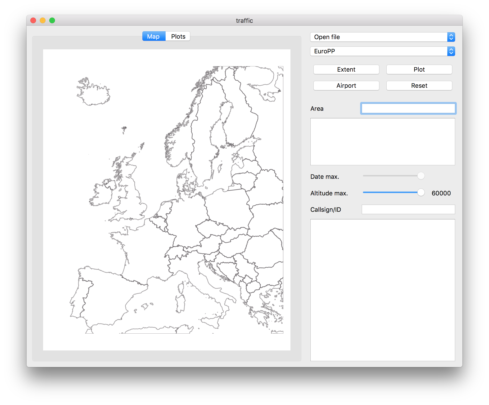
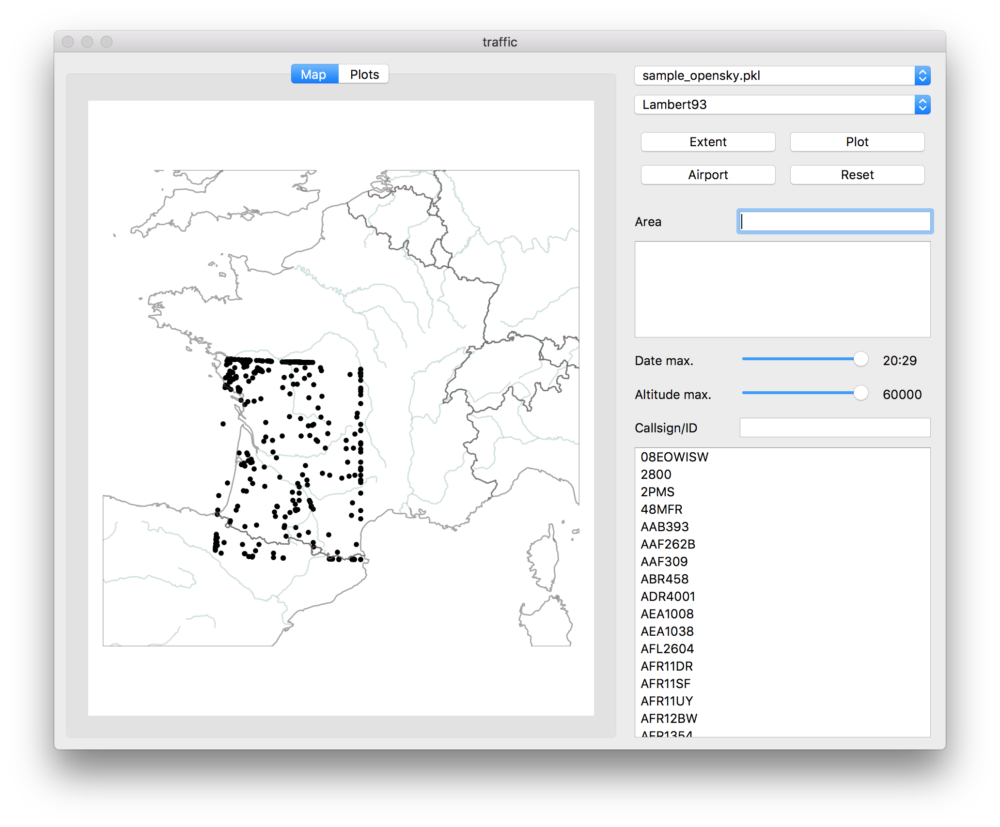
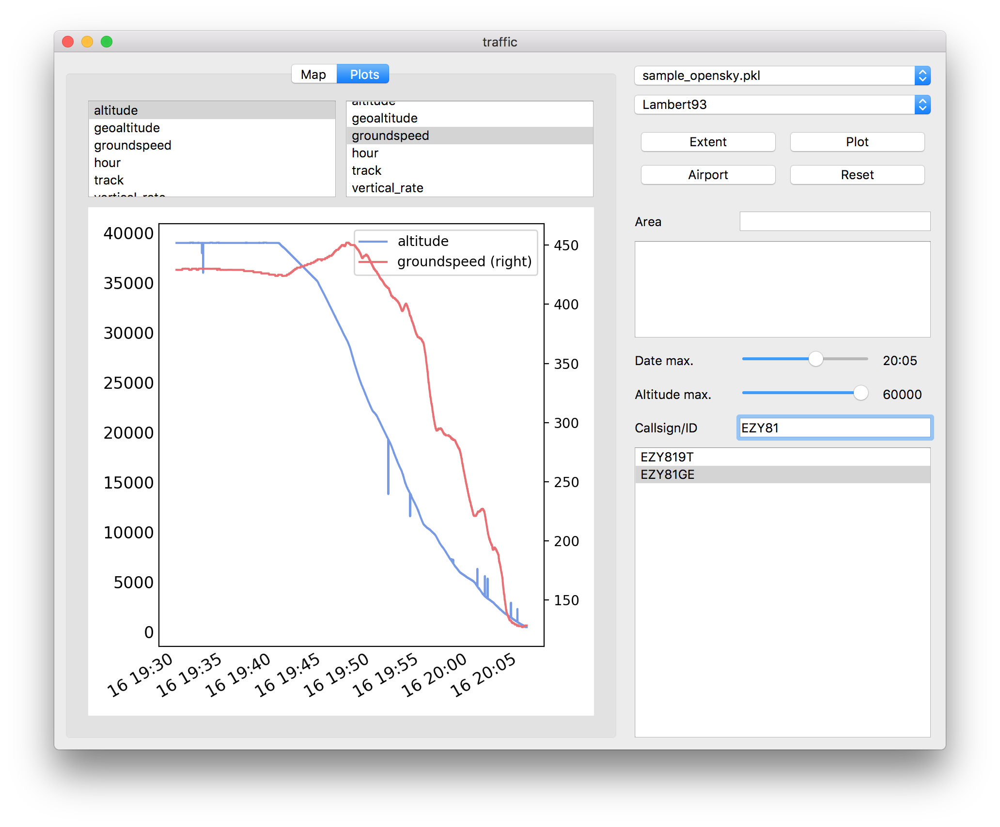
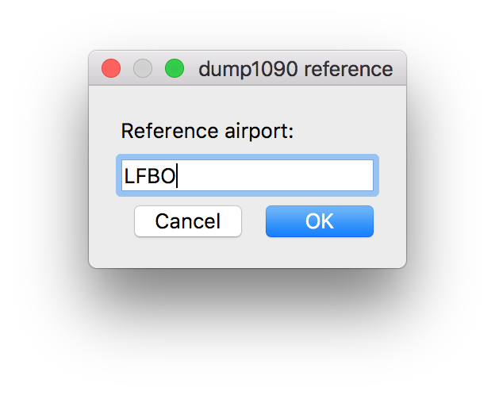
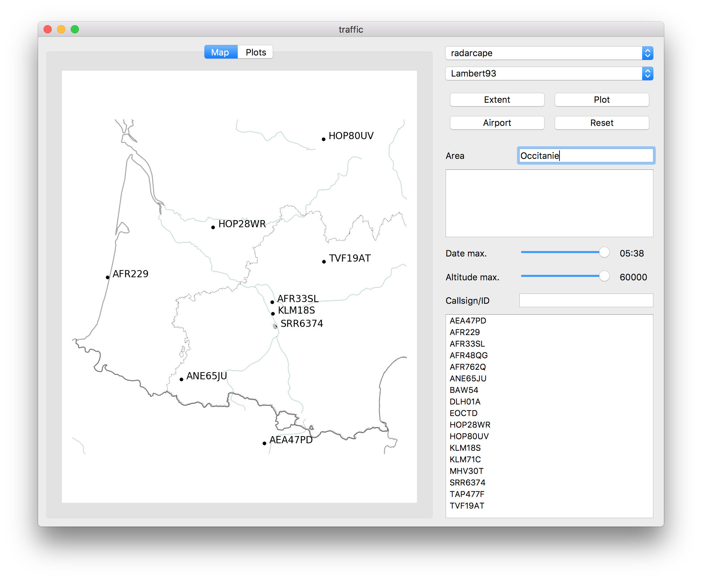
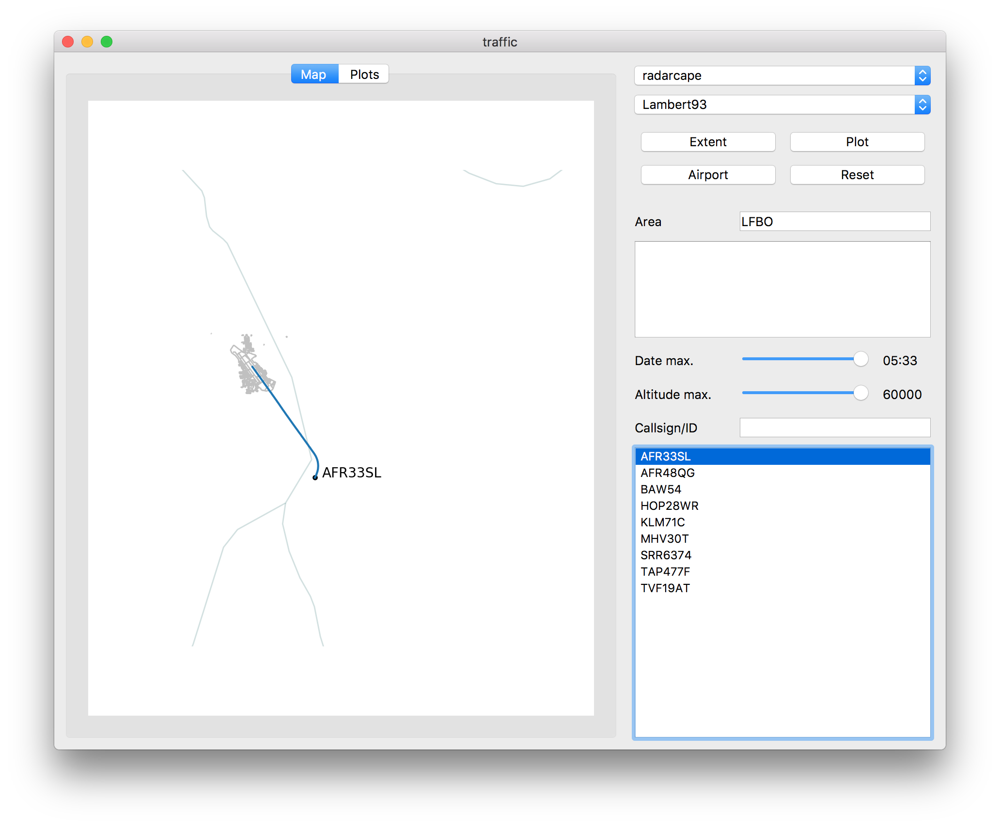

Graphical user interface
========================

The traffic library comes with a Qt Graphical user interface (GUI) designed
to decode and explore historical and live data.

The GUI can be installed as a plugin package and is accessible through
the following command (clickable application icons are doable and will probably
be automatically generated in future versions)

.. code::

    pip install traffic_qtgui  # first install the plugin
    traffic gui

Data exploration
----------------

The GUI consists of two panes:

- the **display** pane on the left-hand side, with a *map* and a *plots* tab;
- the **command** pane on the right-hand side, with selection and filtering
  buttons.

By default, the tool opens with a EuroPP projection. Other projections like
Mercator are also available by default: you can customize more projections in
the configuration file, in the ``[projections]`` section:

.. code::

    [projections]
    default = EuroPP
    extra = Lambert93; Amersfoort; GaussKruger

.. note::
    Available projections are default cartopy projections, completed by additional common European projections in the cartes `dependency module <https://github.com/xoolive/cartes/tree/master/cartes/crs>`_ (here `Lambert 93 <https://fr.wikipedia.org/wiki/Projection_conique_conforme_de_Lambert#Lambert_93>`_ is the official projection in France, `Amersfoort <https://nl.wikipedia.org/wiki/Rijksdriehoeksco%C3%B6rdinaten>`_ in the Netherlands and `Gauss-Krüger <https://de.wikipedia.org/wiki/Gau%C3%9F-Kr%C3%BCger-Koordinatensystem>`_ in Germany)

.. tip::
    You can implement more projections as `plugins <plugins.html>`_.

You can either pan and zoom the map. Zoom is operated by the mouse or trackpad scrool. Note that on MacOS, the trackpad scroll requires clicking.

In order to explore data, click on *Open file* and select a .pkl file (like ``sample_opensky.pkl`` in the ``data/`` directory) By default, a scatter of all last recorded points is displayed.

- You may select callsigns in order to plot trajectories.
- Date and altitude sliders operate filters on the full pandas DataFrame.

.. image:: _static/gui_trajectory.png
   :scale: 25 %
   :alt: Trajectories
   :align: center

In the *Plots* tab, you may select one callsign with different signals (e.g.
*altitude* on the left-hand side and *ground speed* on the righ-hand side)
**or (exclusive)** several callsigns with one signal (e.g. *altitude*).

Data recording
--------------

The application does not process raw signals from any 1090 MHz antenna. It
relies on other tools and listen to a standard format of raw data broadcasted on
specific ports. Specifically, you may run an instance of `dump1090
<https://github.com/MalcolmRobb/dump1090/>`_ be running with appropriate
options:

.. code::

   dump1090 --interactive --net

| Then, the second option in the *Open file* dropdown menu is *dump1090*.
| You should be asked for a reference airport:

Fill in the ICAO (LFPG, PHNL, RJBB, etc.) or IATA (SFO, AMS, HKG, etc.) code of
the airport for reference coordinates of the antenna. The associated latitude
and longitude coordinates are useful to process ground messages. If several
airports are in your neighbourhood, choose any of them (the closest one?)

.. tip::
    If you use a different decoding device like `radarcape
    <https://wiki.jetvision.de/wiki/Radarcape:Contents>`_, data is broadcasted
    on a different port (usually 10003). You may add the corresponding address
    (with airport) in your configuration file: this will add an option in the
    dropdown menu.

    .. parsed-literal::
       [decoders]
       radarcape = xxx.xxx.xxx.xxx:10003/LFBO

.. image:: _static/gui_live.png
   :scale: 25 %
   :alt: Live recording
   :align: center

For more details on your map, you may enter a name in the *Area* field and click
*Plot*. The corresponding boundaries will be downloaded from OpenStreetMap
servers and added to the map.

This also work with airports: enter the ICAO or IATA code in the *Area* field
and click *Airport*. Data is downloaded (and cached) from OpenStreetMap servers.

You can then select a callsign and follow its trajectory:

The second tab lets you plot other details of the trajectory for different
signals: *altitude* shows the climbing profile. *Indicated Airspeed* (IAS) is
plotted here so as to reflect the 250 knots limit under 10,000 ft.

.. image:: _static/gui_climb.png
   :scale: 25 %
   :alt: Live recording and display of climb profile
   :align: center

You can automatically zoom to a geographical location by clicking *Extent* and
observe ground movements on the airfield:

.. image:: _static/gui_airport.png
   :scale: 25 %
   :alt: Zoom over airport
   :align: center

If you are closer to bigger airport with a good reception (from the rooftop
viewing area), you may have fun looking at aircraft ground movements from your
application.

.. image:: _static/gui_schiphol.png
   :scale: 25 %
   :alt: Zoom over Schiphol airport
   :align: center

When it decodes data, the GUI also writes a CSV text file in your home
directory. The first column in the file is a GPS timestamp (nano-second
precision) and the second column the raw message.

.. code::

   $ head ADSB_EHS_RAW_20190225_dump1090.csv 

   1551072485.607867,1a331339643b50b639903907fbc154da992c5cff2dbf13
   1551072485.609867,1a3313396459d5173a903907fbc254000016c354424d11
   1551072485.614405,1a331339649f1359418d45ce4699907294c83c1b5b7b99
   1551072485.647058,1a33133966915136258dab120b58d302fde3ffc1da0aab
   1551072485.725486,1a3313396b3e07ea38903907dbc23400000536e52a12b6

After you close the GUI, you can decode the .pkl file for an offline exploration
of the data:

.. code::

   traffic decode ADSB_EHS_RAW_20190225_dump1090.csv LFBO

