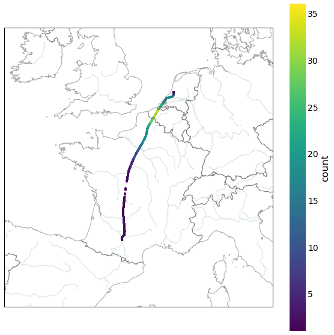
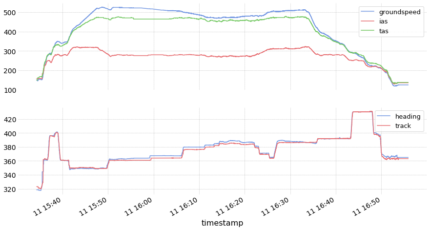

ADS-B data -- OpenSky Impala shell
----------------------------------

For more advanced request or a dig in further history, you may be
eligible for an direct access to the history database through their
`Impala <https://opensky-network.org/impala-guide>`__ shell.

Provided functions are here to help:

- build appropriate and efficient requests without any SQL knowledge;
- split requests efficiently and store intermediary results in cache
  files;
- parse results with pandas and wrap results in appropriate data structures.

The first thing to do is to put your credentials in you configuration
file. Edit the following lines to your configuration file.

::

    [opensky]
    username =
    password =

You can check the path to your configuration file here. The path is
different according to OS versions so do not assume anything and check
the contents of the variable.

.. code:: python

    >>> import traffic
    >>> traffic.config_file
    PosixPath('/home/xo/.config/traffic/traffic.conf')

Historical traffic data
~~~~~~~~~~~~~~~~~~~~~~~

.. automethod:: traffic.data.adsb.opensky_impala.Impala.history

Examples of requests
~~~~~~~~~~~~~~~~~~~~

First, the `opensky` instance parses your configuration file upon import:

.. code:: python

    from traffic.data import opensky

Then you may send requests:

- based on callsign:

    .. code:: python

        flight = opensky.history(
            "2017-02-05",
            # stop is implicit, i.e. stop="2017-02-06"
            callsign="EZY158T",
            return_flight=True
        )

- based on bounding box:

    .. code:: python

        # two hours of traffic over LFBB FIR
        t_lfbb = opensky.history(
            "2018-10-01 11:00",
            "2018-10-01 13:00",
            bounds=eurofirs['LFBB']
        )

- based on airports and callsigns (with wildcard):

    .. code:: python

        # Airbus test flights from and to Toulouse airport
        t_aib = opensky.history(
            "2019-11-01 09:00",
            "2019-11-01 12:00",
            departure_airport="LFBO",
            arrival_airport="LFBO",
            callsign="AIB%",
        )

- based on (own?) receiver's identifier:

    .. code:: python

        t_sensor = opensky.history(
            "2019-11-11 10:00",
            "2019-11-11 12:00",
            serials=1433801924,
        )

- with information about coverage:

    .. code:: python

        from traffic.drawing import EuroPP, PlateCarree, countries, rivers

        flight = opensky.history(
            "2018-06-11 15:00",
            "2018-06-11 17:00",
            callsign='KLM1308',
            count=True,
            return_flight=True
        )

        with plt.style.context('traffic'):
            fig, ax = plt.subplots(
                subplot_kw=dict(projection=EuroPP())
            )
            ax.add_feature(countries())
            ax.add_feature(rivers())
            ax.set_extent((-7, 13, 40, 55))

            # no specific method for that in traffic
            # but switch back to pandas DataFrame for manual plot
            flight.data.plot.scatter(
                    ax=ax, x='longitude', y='latitude', c='count',
                    transform=PlateCarree(), s=5, cmap='viridis'
            )

Extended Mode-S (EHS)
~~~~~~~~~~~~~~~~~~~~~

EHS messages are not automatically decoded for you in the OpenSky
Database but you may access them and decode them from your computer.

.. alert::

    **Some examples here may be outdated**. Today, only EHS data **after January 1st 2020** are available!

.. warning::

    ``Flight.query_ehs()`` messages also takes a dataframe argument to avoid
    making possibly numerous requests to the Impala database.

    Consider using `opensky.extended()
    <#traffic.data.adsb.opensky_impala.Impala.extended>`_ and request all necessary data, then pass the resulting dataframe as an argument.

.. code:: python

    ehs_flight = (
        flight
        # this triggers a new specific call to OpenSky Impala
        .query_ehs()
        # avoid big gaps in angle
        .unwrap()
        # cascade of median filters
        .filter()
        .filter(groundspeed=53, tas=53, ias=53, heading=53, track=53)
    )

    with plt.style.context('traffic'):

        fig, (ax1, ax2) = plt.subplots(
            2, 1, sharex=True, figsize=(15, 8)
        )

        ehs_flight.plot_time(ax1, ['groundspeed', 'ias', 'tas'])
        ehs_flight.plot_time(ax2, ['heading', 'track'])

        ax1.legend()
        ax2.legend()

.. automethod:: traffic.data.adsb.opensky_impala.Impala.extended

Examples of requests
~~~~~~~~~~~~~~~~~~~~

- based on transponder identifier (icao24):

    .. code:: python

        from traffic.data.samples import belevingsvlucht

        df = opensky.extended(
            belevingsvlucht.start,
            belevingsvlucht.stop,
            icao24=belevingsvlucht.icao24
        )

        enriched = belevingsvlucht.query_ehs(df)

- based on geographical bounds:

    .. code:: python

        from traffic.data import eurofirs
        from traffic.data.samples import switzerland

        df = opensky.extended(
            switzerland.start_time,
            switzerland.end_time,
            bounds=eurofirs['LSAS']
        )

        enriched_ch = (
            switzerland
            .filter()
            .query_ehs(df)
            .resample('1s')
            .eval(desc='', max_workers=4)
        )

- based on airports, together with traffic:

    .. code:: python

        schiphol = opensky.history(
            "2019-11-11 12:00",
            "2019-11-11 14:00",
            airport="EHAM"
        )

        df = opensky.extended(
            "2019-11-11 12:00",
            "2019-11-11 14:00",
            airport="EHAM"
        )

        enriched_eham = (
            schiphol
            .filter()
            .query_ehs(df)
            .resample('1s')
            .eval(desc='', max_workers=4)
        )

Flight list by airport
~~~~~~~~~~~~~~~~~~~~~~

.. automethod:: traffic.data.adsb.opensky_impala.Impala.flightlist

Requests for raw data
~~~~~~~~~~~~~~~~~~~~~

.. automethod:: traffic.data.adsb.opensky_impala.Impala.rawdata

Custom requests
~~~~~~~~~~~~~~~

.. automethod:: traffic.data.adsb.opensky_impala.Impala.request
