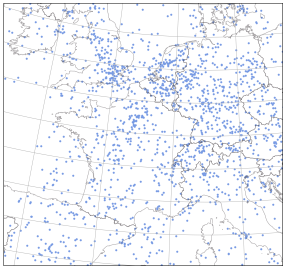
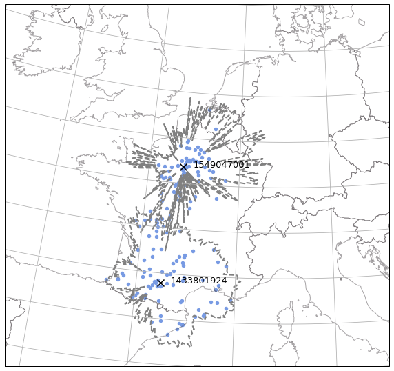

ADS-B data -- OpenSky REST API
--------------------------------

The first thing to do is to put your credentials in you configuration
file. Add the following lines to the [global] section of your
configuration file.

::

    opensky_username =
    opensky_password =

You can check the path to your configuration file here. The path is
different according to OS versions so do not assume anything and check
the contents of the variable.

.. code:: python

    >>> import traffic
    >>> traffic.config_file
    PosixPath('/home/xo/.config/traffic/traffic.conf')

.. warning::

    Some functionalities of the REST API are currently unavailable due
    to issues on the server side.
    Documentation will be updated if the API changes when things are fixed.

The most basic usage for the OpenSky REST API is to get the instant
position for all aircraft. This part actually does not require
authentication.

.. code:: python

    %matplotlib inline
    import matplotlib.pyplot as plt

    from traffic.data import opensky
    from traffic.drawing import EuroPP, countries

    sv = opensky.api_states()

    with plt.style.context('traffic'):
        fig, ax = plt.subplots(subplot_kw=dict(projection=EuroPP()))
        ax.add_feature(countries())
        ax.gridlines()
        ax.set_extent((-7, 15, 40, 55))

        sv.plot(ax, s=10)

You may access all callsigns in the state vector (or select few of
them), then select the trajectory associated to a callsign (a
``Flight``):

.. code:: python

    >>> import random
    >>> random.sample(sv.callsigns, 6)
    ['RYR925Y', 'SKW5223', 'SWA1587', 'SWA2476', 'GTI8876', 'AAL2498']

.. code:: python

    flight = sv['AAL2498']
    flight

.. raw:: html

    <b>Flight AAL2498</b><ul><li><b>aircraft:</b> a0b8fb / N146AA (A321)</li><li><b>origin:</b> 2018-10-26 13:53:10</li><li><b>destination:</b> 2018-10-26 15:11:31</li></ul>
<svg xmlns="http://www.w3.org/2000/svg" xmlns:xlink="http://www.w3.org/1999/xlink" width="300" height="300" viewBox="-6845023.70795756 6678551.369031437 637538.6161351176 933256.6202398855" preserveAspectRatio="xMinYMin meet"><g transform="matrix(1,0,0,-1,0,14290359.358302759)"><polyline fill="none" stroke="#66cc99" stroke-width="6221.710801599237" points="-6243814.279016881,7577242.929262438 -6242050.151831327,7574552.888785886 -6242904.567845496,7571359.42083786 -6246357.82391024,7568543.909245812 -6256499.31756654,7560715.970840162 -6277227.169884746,7541390.50458704 -6281130.94550974,7537274.976118297 -6350144.525103287,7476141.493057531 -6355126.211674089,7470587.259849855 -6358708.811518395,7464541.33944743 -6362316.530047662,7458344.286944356 -6369900.394129546,7445272.123495277 -6377147.771967366,7432780.444869007 -6394529.55743652,7399704.606443817 -6398326.396566964,7384662.332646362 -6399963.215924804,7377847.064561219 -6401818.10817302,7370160.554693365 -6405282.789124413,7355548.903443681 -6407175.0941675315,7347741.301999811 -6409980.911144296,7341360.545005388 -6414255.01355224,7334884.532401066 -6422398.958588682,7322713.701141733 -6426639.343222028,7316398.573100253 -6431070.804420984,7309800.276071383 -6439863.239508707,7296662.354303936 -6474982.721880522,7244364.9714220995 -6497546.614132676,7210730.748455089 -6507474.688179849,7195987.932258153 -6515881.086898378,7183471.096975141 -6520648.2935569575,7176380.6798243625 -6524992.585254946,7169914.87133326 -6556974.974751948,7122323.080997851 -6575713.769267349,7094404.81918638 -6580251.2774371905,7087604.601586199 -6593963.495141538,7067213.362996821 -6678932.681971921,6940604.713737707 -6732113.195571215,6861205.016122479 -6773882.4948789375,6798792.987157221 -6789103.655758513,6776035.762636188 -6793445.820960725,6768393.602882766 -6797210.35803154,6759371.579779787 -6799868.5049212305,6750358.102026892 -6800461.54559176,6748292.031733118 -6810458.647948676,6713116.429040321" opacity="0.8" /></g></svg>

.. code:: python

    # The same functionality is accessible based on the transponder code (icao24)
    opensky.api_tracks(flight.icao24)

.. raw:: html

    <b>Flight AAL2498</b><ul><li><b>aircraft:</b> a0b8fb / N146AA (A321)</li><li><b>origin:</b> 2018-10-26 13:53:10</li><li><b>destination:</b> 2018-10-26 15:11:31</li></ul>
<svg xmlns="http://www.w3.org/2000/svg" xmlns:xlink="http://www.w3.org/1999/xlink" width="300" height="300" viewBox="-6845023.70795756 6678551.369031437 637538.6161351176 933256.6202398855" preserveAspectRatio="xMinYMin meet"><g transform="matrix(1,0,0,-1,0,14290359.358302759)"><polyline fill="none" stroke="#66cc99" stroke-width="6221.710801599237" points="-6243814.279016881,7577242.929262438 -6242050.151831327,7574552.888785886 -6242904.567845496,7571359.42083786 -6246357.82391024,7568543.909245812 -6256499.31756654,7560715.970840162 -6277227.169884746,7541390.50458704 -6281130.94550974,7537274.976118297 -6350144.525103287,7476141.493057531 -6355126.211674089,7470587.259849855 -6358708.811518395,7464541.33944743 -6362316.530047662,7458344.286944356 -6369900.394129546,7445272.123495277 -6377147.771967366,7432780.444869007 -6394529.55743652,7399704.606443817 -6398326.396566964,7384662.332646362 -6399963.215924804,7377847.064561219 -6401818.10817302,7370160.554693365 -6405282.789124413,7355548.903443681 -6407175.0941675315,7347741.301999811 -6409980.911144296,7341360.545005388 -6414255.01355224,7334884.532401066 -6422398.958588682,7322713.701141733 -6426639.343222028,7316398.573100253 -6431070.804420984,7309800.276071383 -6439863.239508707,7296662.354303936 -6474982.721880522,7244364.9714220995 -6497546.614132676,7210730.748455089 -6507474.688179849,7195987.932258153 -6515881.086898378,7183471.096975141 -6520648.2935569575,7176380.6798243625 -6524992.585254946,7169914.87133326 -6556974.974751948,7122323.080997851 -6575713.769267349,7094404.81918638 -6580251.2774371905,7087604.601586199 -6593963.495141538,7067213.362996821 -6678932.681971921,6940604.713737707 -6732113.195571215,6861205.016122479 -6773882.4948789375,6798792.987157221 -6789103.655758513,6776035.762636188 -6793445.820960725,6768393.602882766 -6797210.35803154,6759371.579779787 -6799868.5049212305,6750358.102026892 -6800461.54559176,6748292.031733118 -6810458.647948676,6713116.429040321" opacity="0.8" /></g></svg>

The API gives access to other functionalities, like an attempt to map a
callsign to a route:

.. code:: python

    >>> opensky.api_routes('AFR291')
    (RJBB/KIX    Osaka Kansai International Airport (Japan)
      34.427299 135.244003 altitude: 26,
     LFPG/CDG    Paris Charles de Gaulle Airport (France)
      49.012516 2.555752 altitude: 392)

You may get the serial numbers associated to your account and also plot
the polygon of their range (by default on the current day).

.. code:: python

    >>> opensky.api_sensors
    {'1433801924', '1549047001'}

.. code:: python

    with plt.style.context('traffic'):
        fig, ax = plt.subplots(subplot_kw=dict(projection=EuroPP()))
        ax.add_feature(countries())

        ax.gridlines()
        ax.set_extent((-7, 15, 40, 55))

        # get only the positions detected by your sensors
        sv = opensky.api_states(True)
        sv.plot(ax, s=20)

        for sensor in opensky.api_sensors:
            c = opensky.api_range(sensor)
            c.plot(ax, linewidth=2, edgecolor='grey', linestyle='dashed')
            c.point.plot(ax, marker='x', text_kw=dict(s=c.point.name))

The API also offers an attempt to map an airport with aircraft departing
or arriving at an airport:

.. code:: python

    opensky.api_departure('LFBO', '2018-10-25 11:11', '2018-10-25 13:42')

.. raw:: html

    

    <table border="0" class="dataframe">
      <thead>
        <tr style="text-align: right;">
          <th></th>
          <th>firstSeen</th>
          <th>lastSeen</th>
          <th>icao24</th>
          <th>callsign</th>
          <th>estDepartureAirport</th>
          <th>estArrivalAirport</th>
        </tr>
      </thead>
      <tbody>
        <tr>
          <th>17</th>
          <td>2018-10-25 13:36:49</td>
          <td>2018-10-25 14:39:53</td>
          <td>406a93</td>
          <td>EZY178A</td>
          <td>LFBO</td>
          <td>LFPO</td>
        </tr>
        <tr>
          <th>16</th>
          <td>2018-10-25 13:44:04</td>
          <td>2018-10-25 14:47:58</td>
          <td>0a0027</td>
          <td>DAH1077</td>
          <td>LFBO</td>
          <td>None</td>
        </tr>
        <tr>
          <th>15</th>
          <td>2018-10-25 13:49:11</td>
          <td>2018-10-25 15:11:59</td>
          <td>3c6744</td>
          <td>DLH97F</td>
          <td>LFBO</td>
          <td>EDDM</td>
        </tr>
        <tr>
          <th>14</th>
          <td>2018-10-25 13:56:41</td>
          <td>2018-10-25 15:11:27</td>
          <td>4ca5f2</td>
          <td>RYR87ZE</td>
          <td>LFBO</td>
          <td>EBCI</td>
        </tr>
        <tr>
          <th>13</th>
          <td>2018-10-25 14:01:00</td>
          <td>2018-10-25 14:36:57</td>
          <td>3944ef</td>
          <td>HOP13ZI</td>
          <td>LFBO</td>
          <td>LFLL</td>
        </tr>
        <tr>
          <th>12</th>
          <td>2018-10-25 14:03:25</td>
          <td>2018-10-25 14:48:29</td>
          <td>3815da</td>
          <td>FWWEZ</td>
          <td>LFBO</td>
          <td>None</td>
        </tr>
        <tr>
          <th>11</th>
          <td>2018-10-25 14:15:30</td>
          <td>2018-10-25 15:51:29</td>
          <td>485814</td>
          <td>KLM96H</td>
          <td>LFBO</td>
          <td>EHAM</td>
        </tr>
        <tr>
          <th>10</th>
          <td>2018-10-25 14:18:05</td>
          <td>2018-10-25 17:58:05</td>
          <td>389b9b</td>
          <td>AIB01HF</td>
          <td>LFBO</td>
          <td>LFBO</td>
        </tr>
        <tr>
          <th>9</th>
          <td>2018-10-25 14:28:35</td>
          <td>2018-10-25 15:48:59</td>
          <td>440833</td>
          <td>EZY71TU</td>
          <td>LFBO</td>
          <td>EGGD</td>
        </tr>
        <tr>
          <th>8</th>
          <td>2018-10-25 14:36:42</td>
          <td>2018-10-25 15:42:28</td>
          <td>44056d</td>
          <td>EZY987K</td>
          <td>LFBO</td>
          <td>EBTY</td>
        </tr>
        <tr>
          <th>7</th>
          <td>2018-10-25 14:52:19</td>
          <td>2018-10-25 15:37:44</td>
          <td>39b9f9</td>
          <td>HOP14YI</td>
          <td>LFBO</td>
          <td>LFML</td>
        </tr>
        <tr>
          <th>6</th>
          <td>2018-10-25 15:07:45</td>
          <td>2018-10-25 16:06:28</td>
          <td>3985aa</td>
          <td>AFR48FC</td>
          <td>LFBO</td>
          <td>LFPO</td>
        </tr>
        <tr>
          <th>5</th>
          <td>2018-10-25 15:08:56</td>
          <td>2018-10-25 16:27:17</td>
          <td>38161a</td>
          <td>FWWEB</td>
          <td>LFBO</td>
          <td>LFBO</td>
        </tr>
        <tr>
          <th>4</th>
          <td>2018-10-25 15:10:30</td>
          <td>2018-10-25 18:49:32</td>
          <td>151d42</td>
          <td>RSD076</td>
          <td>LFBO</td>
          <td>UUWW</td>
        </tr>
        <tr>
          <th>3</th>
          <td>2018-10-25 15:28:45</td>
          <td>2018-10-25 16:41:41</td>
          <td>c074fb</td>
          <td>CGSHU</td>
          <td>LFBO</td>
          <td>LFPB</td>
        </tr>
        <tr>
          <th>2</th>
          <td>2018-10-25 15:31:13</td>
          <td>2018-10-25 17:00:38</td>
          <td>382aba</td>
          <td>AIB04YX</td>
          <td>LFBO</td>
          <td>LFBO</td>
        </tr>
        <tr>
          <th>1</th>
          <td>2018-10-25 15:32:47</td>
          <td>2018-10-25 17:00:36</td>
          <td>02a0ad</td>
          <td>TAR283</td>
          <td>LFBO</td>
          <td>DTTA</td>
        </tr>
        <tr>
          <th>0</th>
          <td>2018-10-25 15:37:16</td>
          <td>2018-10-25 16:33:58</td>
          <td>393324</td>
          <td>AFR61FJ</td>
          <td>LFBO</td>
          <td>LFPO</td>
        </tr>
      </tbody>
    </table>
    

