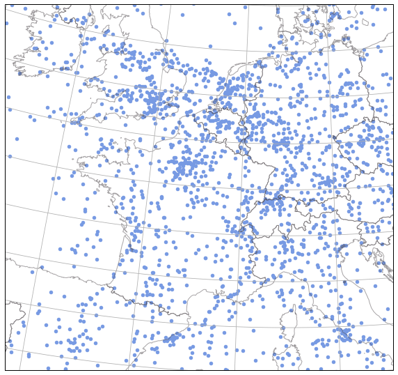
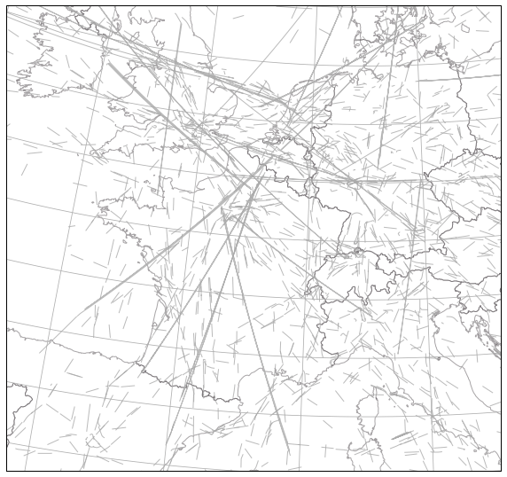
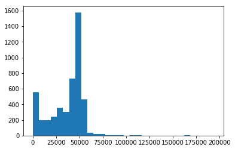
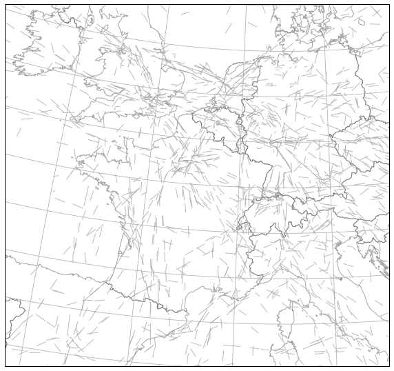
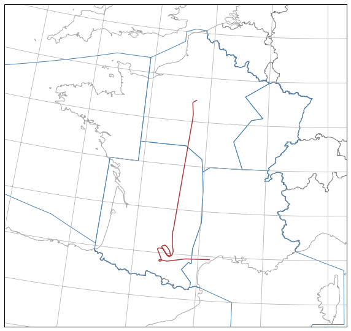

Access to the OpenSky database
------------------------------

The first thing to do is to put your credentials in you configuration
file. Add the following lines to the [global] section of your
configuration file.

::

    opensky_username = 
    opensky_password = 

You can check the path to your configuration file here. The path is
different according to OS versions so do not assume anything and check
the contents of the variable.

.. code:: python

    import traffic.data
    traffic.data.config_file

.. parsed-literal::

    PosixPath('/home/xo/.config/traffic/traffic.conf')

The most basic usage for the OpenSky module is to get the instant
position for all aircraft. This part actually does not require
authentication.

.. code:: python

    %matplotlib inline
    import matplotlib.pyplot as plt
    
    from traffic.data import opensky
    from traffic.drawing import EuroPP, PlateCarree, countries
    
    online_aircraft = opensky.online_aircraft()
    
    with plt.style.context('traffic'):
        fig = plt.figure()
        ax = plt.axes(projection=EuroPP())
    
        ax.add_feature(countries())
        ax.gridlines()
        ax.set_extent((-7, 15, 40, 55))
    
        online_aircraft.plot.scatter(x='longitude', y='latitude', 
                                     transform=PlateCarree(), ax=ax)

With online\_aircraft, you only get a dataframe, no wrapping has been
done into a Traffic as you get only one point per aircraft. You can
listen on the online\_aircraft for a while, concatenate many dataframes
and build a Traffic structure if you need.

.. code:: python

    from traffic.core import Traffic

    import pandas as pd
    import time
    
    buffer = []
    for _ in range(20):
        buffer.append(opensky.online_aircraft())
        time.sleep(10)
        
    t = Traffic(pd.concat(buffer))

.. code:: python

    t

.. raw:: html

    <b>Traffic with 4884 identifiers</b>  
    <table id="T_86ead712_7ab8_11e8_bd51_098dc8c9bfc6" > 
    <thead>    <tr> 
            <th class="blank" ></th> 
            <th class="blank level0" ></th> 
            <th class="col_heading level0 col0" >count</th> 
        </tr>    <tr> 
            <th class="index_name level0" >icao24</th> 
            <th class="index_name level1" >callsign</th> 
            <th class="blank" ></th> 
        </tr></thead> 
    <tbody>    <tr> 
            <th id="T_86ead712_7ab8_11e8_bd51_098dc8c9bfc6level0_row0" class="row_heading level0 row0" >4ca53f</th> 
            <th id="T_86ead712_7ab8_11e8_bd51_098dc8c9bfc6level1_row0" class="row_heading level1 row0" >RYR68MK</th> 
            <td id="T_86ead712_7ab8_11e8_bd51_098dc8c9bfc6row0_col0" class="data row0 col0" >20</td> 
        </tr>    <tr> 
            <th id="T_86ead712_7ab8_11e8_bd51_098dc8c9bfc6level0_row1" class="row_heading level0 row1" >7335a5</th> 
            <th id="T_86ead712_7ab8_11e8_bd51_098dc8c9bfc6level1_row1" class="row_heading level1 row1" >IRM117</th> 
            <td id="T_86ead712_7ab8_11e8_bd51_098dc8c9bfc6row1_col0" class="data row1 col0" >20</td> 
        </tr>    <tr> 
            <th id="T_86ead712_7ab8_11e8_bd51_098dc8c9bfc6level0_row2" class="row_heading level0 row2" >738062</th> 
            <th id="T_86ead712_7ab8_11e8_bd51_098dc8c9bfc6level1_row2" class="row_heading level1 row2" >ELY5426</th> 
            <td id="T_86ead712_7ab8_11e8_bd51_098dc8c9bfc6row2_col0" class="data row2 col0" >20</td> 
        </tr>    <tr> 
            <th id="T_86ead712_7ab8_11e8_bd51_098dc8c9bfc6level0_row3" class="row_heading level0 row3" >738058</th> 
            <th id="T_86ead712_7ab8_11e8_bd51_098dc8c9bfc6level1_row3" class="row_heading level1 row3" >ELY2366</th> 
            <td id="T_86ead712_7ab8_11e8_bd51_098dc8c9bfc6row3_col0" class="data row3 col0" >20</td> 
        </tr>    <tr> 
            <th id="T_86ead712_7ab8_11e8_bd51_098dc8c9bfc6level0_row4" class="row_heading level0 row4" >738057</th> 
            <th id="T_86ead712_7ab8_11e8_bd51_098dc8c9bfc6level1_row4" class="row_heading level1 row4" >ELY320</th> 
            <td id="T_86ead712_7ab8_11e8_bd51_098dc8c9bfc6row4_col0" class="data row4 col0" >20</td> 
        </tr>    <tr> 
            <th id="T_86ead712_7ab8_11e8_bd51_098dc8c9bfc6level0_row5" class="row_heading level0 row5" >738051</th> 
            <th id="T_86ead712_7ab8_11e8_bd51_098dc8c9bfc6level1_row5" class="row_heading level1 row5" >ELY312</th> 
            <td id="T_86ead712_7ab8_11e8_bd51_098dc8c9bfc6row5_col0" class="data row5 col0" >20</td> 
        </tr>    <tr> 
            <th id="T_86ead712_7ab8_11e8_bd51_098dc8c9bfc6level0_row6" class="row_heading level0 row6" >738044</th> 
            <th id="T_86ead712_7ab8_11e8_bd51_098dc8c9bfc6level1_row6" class="row_heading level1 row6" >ELY007</th> 
            <td id="T_86ead712_7ab8_11e8_bd51_098dc8c9bfc6row6_col0" class="data row6 col0" >20</td> 
        </tr>    <tr> 
            <th id="T_86ead712_7ab8_11e8_bd51_098dc8c9bfc6level0_row7" class="row_heading level0 row7" >7335d6</th> 
            <th id="T_86ead712_7ab8_11e8_bd51_098dc8c9bfc6level1_row7" class="row_heading level1 row7" >IRM133</th> 
            <td id="T_86ead712_7ab8_11e8_bd51_098dc8c9bfc6row7_col0" class="data row7 col0" >20</td> 
        </tr>    <tr> 
            <th id="T_86ead712_7ab8_11e8_bd51_098dc8c9bfc6level0_row8" class="row_heading level0 row8" >732541</th> 
            <th id="T_86ead712_7ab8_11e8_bd51_098dc8c9bfc6level1_row8" class="row_heading level1 row8" >IRA711</th> 
            <td id="T_86ead712_7ab8_11e8_bd51_098dc8c9bfc6row8_col0" class="data row8 col0" >20</td> 
        </tr>    <tr> 
            <th id="T_86ead712_7ab8_11e8_bd51_098dc8c9bfc6level0_row9" class="row_heading level0 row9" >740737</th> 
            <th id="T_86ead712_7ab8_11e8_bd51_098dc8c9bfc6level1_row9" class="row_heading level1 row9" >RJA107</th> 
            <td id="T_86ead712_7ab8_11e8_bd51_098dc8c9bfc6row9_col0" class="data row9 col0" >20</td> 
        </tr></tbody> 
    </table> 

You can now plot a basic unprocessed version of the traffic over Europe
in ten minutes: most aircraft behave well but you get the noise as well.

.. code:: python

    with plt.style.context('traffic'):
        fig = plt.figure()
        ax = plt.axes(projection=EuroPP())
    
        ax.add_feature(countries())
        ax.gridlines()
        ax.set_extent((-7, 15, 40, 55))
    
        t.plot(ax)

The easy way to deal with that is to discard trajectories that fly a
longer distance than average. We can start by plotting a distribution of
trajectory length.

.. code:: python

    length = [flight.project_shape().length for flight in t if flight.shape is not None]
    plt.hist([l for l in length  if l < 2e5], bins=30);

.. code:: python

    filtered = Traffic.from_flights([flight for flight in t
                                     if flight.shape is not None and
                                     flight.project_shape().length < 6e4])

.. code:: python

    with plt.style.context('traffic'):
        fig = plt.figure()
        ax = plt.axes(projection=EuroPP())
    
        ax.add_feature(countries())
        ax.gridlines()
        ax.set_extent((-7, 15, 40, 55))
    
        filtered.plot(ax)

You can also access the history database from OpenSky through their `Impala
<https://opensky-network.org/impala-guide>`__ shell. The API provided here
(check the documentation for the function) lets you pass a progressbar as an
argument. Check `tqdm <https://github.com/tqdm/tqdm>`__ for more details.

.. code:: python

    from tqdm import tqdm
    flight = opensky.history("2017-02-05", callsign="EZY158T",
                             progressbar=tqdm)
    
    flight

.. parsed-literal::
    100%|██████████| 24/24 [00:00<00:00, 44.24it/s]

.. raw:: html

    <b>Flight EZY158T</b><ul><li><b>aircraft:</b> 406d95 / G-EZOP (A320)</li><li><b>origin:</b> 2017-02-05 16:08:15</li><li><b>destination:</b> 2017-02-05 17:59:59</li></ul>
<svg xmlns="http://www.w3.org/2000/svg" xmlns:xlink="http://www.w3.org/1999/xlink" width="300" height="300" viewBox="63909.888349718414 4582047.142631773 244919.75013722305 661607.4160120301" preserveAspectRatio="xMinYMin meet"><g transform="matrix(1,0,0,-1,0,9825701.701275576)"><polyline fill="none" stroke="#66cc99" stroke-width="4410.716106746867" points="173322.50599277898,5219150.5802729875 173239.67744726597,5219108.26830781 173182.79389719808,5219076.663267753 173100.08689693516,5219029.320640235 173069.02528829913,5219013.454458665 172989.15336714577,5218968.572070141 172888.01443982718,5218913.355956846 172819.35923878572,5218872.248782935 172748.41619872188,5218834.414708474 172681.3200088306,5218797.187341266 172598.46025980014,5218750.187932905 172527.39779486132,5218711.499628016 172458.73286846752,5218676.284231542 172458.73286846752,5218676.284231542 172458.73286846752,5218676.284231542 172235.29854497683,5218555.879238478 172143.08723247258,5218507.462279359 172102.62389364062,5218480.959286239 172060.36675959406,5218460.130897289 172017.5911154379,5218437.924631252 171977.5227723326,5218417.83273012 171911.29870779096,5218384.132662767 171786.0034485385,5218317.5055329 171746.60448732376,5218298.199255483 171666.97131021164,5218254.190353158 171597.9131398983,5218217.778608464 171558.29326353237,5218196.163673908 171501.2729542698,5218169.603559124 171356.40565782812,5218090.560709532 171299.38376280956,5218064.002128494 171257.8752668396,5218040.550802455 171164.86888493493,5217990.249225272 171164.86888493493,5217990.249225272 171056.18276421374,5217932.229744611 170944.45948757103,5217874.223774314 170880.23419191176,5217837.338181398 170811.75867594875,5217799.32631024 170742.59495809523,5217766.931267259 170657.54554472293,5217723.911931185 170590.34780530524,5217684.311382631 170519.46150006214,5217648.889776796 170455.9398070671,5217605.538522883 170388.67405688958,5217568.669222925 170349.84938833577,5217542.385877736 170295.69422479393,5217511.039423066 170227.89134355958,5217467.757654928 170192.47575242666,5217443.0934233535 170084.78952881842,5217377.260358751 170022.10650404255,5217333.250117378 169984.21366411238,5217308.271239286 169919.00377586865,5217260.275128073 169814.8312545266,5217191.543174656 169753.8658504801,5217150.563512997 169702.31204578973,5217114.077577869 169624.91998085348,5217061.865597009 169560.62447048334,5217021.575714361 169560.62447048334,5217021.575714361 169444.14984429066,5216941.970704865 169382.37729374936,5216899.950477802 169304.98054560882,5216847.741611564 169242.97138442256,5216804.009875487 169179.53638917115,5216756.403847629 169114.10382315275,5216717.285400477 169078.9429353355,5216687.42611999 169025.89520859998,5216655.432448827 168925.42109499653,5216581.338659809 168851.17710779386,5216529.721755244 168824.8226924192,5216512.364128392 168763.5317789067,5216467.202440833 168711.96791836148,5216430.72286086 168644.88955654943,5216385.167987203 168554.92056907612,5216321.5714227045 168501.98970819806,5216284.463210769 168422.53143252496,5216231.360585936 168369.59920709723,5216194.253248805 168304.55884455817,5216144.05561077 168221.43472911775,5216088.307314652 168142.09384848515,5216030.089360262 168110.30846556174,5216008.84964511 168030.9657830685,5215950.632776509 167917.72190231795,5215873.005255992 167845.6253370123,5215823.326694836 167819.2169884762,5215802.215794608 167708.08173667095,5215722.763655462 167676.29367988012,5215701.52566475 167549.2608062121,5215611.456766523 167474.15700031052,5215560.344799565 167432.86165838275,5215526.762772566 167432.86165838275,5215526.762772566 167267.84549697125,5215414.461473216 167178.659261284,5215351.7528907405 167146.98891940797,5215325.398739009 167118.34759725042,5215305.176285596 167009.3048932393,5215229.965834818 166937.87199521286,5215175.0195397595 166845.20334463147,5215113.427525196 166767.6354051936,5215055.1800118415 166686.3552419301,5215002.137660444 166607.63909553183,5214945.657092381 166511.60452586773,5214880.234269525 166432.2682060718,5214820.668155045 166352.8663506032,5214763.832612272 166272.37975171377,5214706.118841831 166241.4024761243,5214685.247234987 166143.34597630167,5214617.4769061245 166045.77352677807,5214546.646433939 165945.11830752413,5214477.708006978 165859.64915765412,5214414.418936543 165775.72189253964,5214355.946792727 165668.64369101354,5214284.044736149 165585.03913502477,5214223.448345671 165534.47037163723,5214190.256649645 165389.92680195082,5214091.19245251 165304.3220473727,5214027.394163367 165214.2932217299,5213963.834901946 165177.1095740155,5213942.481198444 165142.29630126344,5213914.183836152 165033.85132745223,5213841.1490595415 164925.52146810965,5213763.08247819 164848.78135459707,5213709.482533415 164719.10531279512,5213617.264410679 164626.37626698113,5213550.661611946 164528.05746523672,5213486.917410019 164450.704828546,5213429.722165343 164393.97097071208,5213388.115008447 164260.94090612372,5213291.217288849 164161.6692462597,5213226.6020664815 164064.93912091712,5213153.511286585 163965.59102946895,5213086.080005979 163867.6072988945,5213013.304038607 163725.8942531806,5212915.190043627 163624.91150976968,5212846.530293553 163506.29725293317,5212758.17327773 163403.06104001196,5212685.281749201 163302.14476056167,5212613.46944771 163217.3433047334,5212555.175532686 163095.57888985143,5212465.3009563815 162990.09498329405,5212393.728857194 162881.60466089426,5212320.723233246 162819.98725165628,5212274.576367398 162778.4714690495,5212242.806122395 162629.31107118784,5212137.029124545 162525.46761567655,5212065.757144669 162396.16098950745,5211972.903330992 162311.34444522831,5211914.618982015 162200.19137188446,5211836.696249688 162094.0909714341,5211761.110248332 161945.8573553151,5211650.160514038 161903.50404091188,5211618.461081666 161751.33842824158,5211504.095921333 161644.11095387116,5211423.027057907 161540.00674779224,5211338.104256889 161422.2630637599,5211233.579630511 161380.0216491371,5211196.763748825 161227.19896352713,5211049.870118648 161129.06330731537,5210951.003448301 161057.3583526869,5210873.824215166 160954.06338934336,5210746.586468133 160868.45776631316,5210642.885625193 160781.20262504014,5210532.660282515 160705.42637991963,5210427.647464957 160593.34377418426,5210267.1772068795 160537.93910400866,5210177.054426449 160489.2810856591,5210106.036102022 160436.6885605259,5210013.587155514 160381.1584122353,5209916.632688609 160318.4772828706,5209799.96732048 160240.21630169076,5209651.534105701 160215.12831167484,5209600.599305005 160138.3966301766,5209427.102617386 160071.76583609244,5209277.054454867 160051.38811930237,5209225.372430902 159976.42619352305,5209015.974826371 159935.1933595297,5208884.683669664 159883.8022195931,5208701.599047874 159850.83062523347,5208565.20055321 159835.8334493462,5208513.639392449 159792.92049079377,5208266.801130385 159779.97492710841,5208185.491045724 159760.19610357715,5208045.802615137 159744.24971171306,5207907.651351825 159735.97296269305,5207686.68950508 159735.97296269305,5207686.68950508 159730.28484686228,5207461.174077505 159736.55090477518,5207318.142430388 159748.67870203857,5207123.504878684 159757.29848814613,5206980.268432236 159757.29848814613,5206980.268432236 159771.18865320247,5206842.272719322 159787.25468026573,5206699.715077852 159797.81491705572,5206617.479392445 159820.4241348718,5206393.191249243 159838.45033223255,5206249.565641874 159858.27582460313,5206111.956415759 159877.00865541905,5205973.809588734 159903.06244903422,5205774.610281548 159915.05817799032,5205690.09905985 159935.08223145668,5205549.9302158905 159941.74077939396,5205493.729518963 159973.76271061655,5205269.047294988 160008.34337022362,5205047.409479586 160025.07085583013,5204906.479960379 160043.7774968708,5204794.197674711 160064.4580520858,5204655.746952104 160087.85267481,5204513.429258221 160113.5076682347,5204344.522128615 160132.50966274654,5204207.055926784 160144.76319613424,5204123.570539109 160176.59110266433,5203926.28197234 160189.914164169,5203813.874183598 160218.69011346635,5203641.618091215 160225.19272420145,5203586.349348555 160249.3816914928,5203445.837524659 160267.63788190414,5203335.41795684 160292.51188656685,5203164.693149111 160321.60064212058,5202997.136684415 160334.92717454417,5202884.725317277 160359.83808215242,5202743.031028897 160384.41170242196,5202604.060901345 160397.73972635542,5202491.648024251 160427.17131104163,5202321.362991133 160447.92460012189,5202180.254989696 160470.31366255783,5202040.208040511 160492.02801478875,5201899.462005248 160518.71033500502,5201759.169392346 160542.22020897423,5201588.062843215 160567.79499457162,5201447.91445737 160591.7199985418,5201307.38645845 160610.94688789803,5201166.751317845 160641.7714977139,5200965.918883592 160660.03868361935,5200855.490233863 160692.703936588,5200658.967182681 160715.07163454389,5200514.130295017 160736.94030085544,5200373.038826938 160764.17140173403,5200202.8624594025 160764.17140173403,5200202.8624594025 160788.37998931395,5200062.334956012 160811.96799709985,5199918.718376736 160825.3061835635,5199806.2952015605 160850.12419792896,5199663.388465438 160874.2596656451,5199520.123957032 160894.255310624,5199382.571982362 160929.19645722568,5199183.784957024 160956.65720656948,5199009.934678261 160978.3125542458,5198872.503388739 160996.70347197418,5198757.030998921 161015.09491502252,5198641.558167406 161044.93703943165,5198448.286941424 161075.9839779425,5198275.111604428 161082.49655920584,5198219.832743387 161112.65741288787,5198049.198066598 161144.82888640976,5197851.022418887 161151.50187563282,5197794.806936478 161194.955036175,5197544.70324189 161204.9797504601,5197456.706972929 161227.1592429336,5197314.839209372 161257.96751521868,5197146.434640677 161276.7093825624,5197034.123537679 161314.34074590594,5196809.161784551 161314.34074590594,5196809.161784551 161333.31408872284,5196668.499096572 161351.79862853623,5196579.753130742 161381.88794651817,5196382.374340687 161406.11886012094,5196241.829246661 161427.47928775044,5196099.766180375 161449.4422673368,5195955.580874168 161465.08975720045,5195870.013849902 161498.02456344833,5195669.449447698 161528.89210699298,5195468.580372195 161547.18392501434,5195358.131738192 161571.83941823817,5195211.356330137 161590.59016660668,5195099.038103164 161622.1149077711,5194899.888395323 161645.0548521101,5194755.634064088 161669.9840577951,5194584.860326288 161691.8484181645,5194445.36319642 161713.32560285946,5194298.596232926 161742.25007180223,5194128.765078217 161761.00570540718,5194016.4428604 161774.27923387036,5193932.09741429 161805.3160975317,5193730.451592642 161829.4065166144,5193590.659529966 161855.60977360612,5193418.968473065 161862.29118279947,5193362.744557299 161872.75898720912,5193304.386026663 161899.3423030032,5193158.5840706965 161924.78452211703,5192990.033672074 161952.2604231664,5192817.343120837 161975.08741018982,5192678.542990213 161981.77023131336,5192622.317670861 162019.41266078528,5192392.539110533 162038.1761891454,5192280.210514062 162063.12510589111,5192109.251989275 162088.48785755655,5191968.71258153 162099.8541562868,5191883.292649583 162099.8541562868,5191883.292649583 162164.3723477612,5191483.529912819 162191.16769412585,5191341.055542233 162191.16769412585,5191341.055542233 162246.2150897406,5191004.626180952 162264.6420248293,5190889.123885491 162289.89044656546,5190717.56615887 162313.8598914492,5190577.757234672 162332.2887609232,5190462.253322669 162352.89279923908,5190324.331079667 162375.56040557084,5190180.987957239 162403.22875728772,5190012.813218867 162415.4323724437,5189951.58329417 162428.1051083077,5189869.860856562 162449.17085896307,5189724.001413364 162479.392698216,5189553.319625668 162504.02958709333,5189384.644805529 162528.6269301668,5189241.9393571885 162540.4170018411,5189186.764078249 162572.56927656874,5188986.392975244 162604.14197742898,5188787.2033137875 162622.92203993697,5188674.861541925 162644.85201957164,5188533.885735479 162667.2920297613,5188388.820096073 162688.26022332223,5188247.564586521 162706.58427873,5188137.08990677 162736.43544027917,5187964.938222384 162749.30386651983,5187880.993475497 162780.81330580852,5187678.890127842 162804.51358421176,5187539.488054011 162836.58267886777,5187367.46925494 162859.1501977494,5187223.169805628 162859.1501977494,5187223.169805628 162902.57296008334,5186936.836375633 162921.01851594655,5186821.318741694 162963.86749174382,5186560.1730893 162963.86749174382,5186560.1730893 162988.15563414793,5186419.583157826 163013.08161206282,5186269.352388794 163013.08161206282,5186269.352388794 163063.70353372867,5185947.545797337 163075.80079798074,5185891.43180844 163113.74108610282,5185651.355187995 163113.74108610282,5185651.355187995 163164.48856875332,5185324.418198305 163171.3031386578,5185263.055072101 163197.1860797544,5185113.694940051 163233.5664920521,5184905.618180885 163246.2432650854,5184812.346858333 163271.63383077958,5184660.409806894 163308.03323252016,5184415.502856741 163334.84885135607,5184261.973064422 163353.8852647418,5184139.366547885 163385.26034271522,5183950.39380519 163412.59161203034,5183762.523144771 163436.5482494311,5183637.037044145 163460.94380046727,5183480.456891939 163492.62758474227,5183260.212326972 163518.30182953776,5183102.377858613 163548.01613840248,5182913.616724661 163548.01613840248,5182913.616724661 163566.01603917035,5182818.239912628 163593.41096491923,5182658.0500876075 163608.79100579306,5182562.099446676 163644.90452736692,5182300.334387761 163683.23683581976,5182074.765160666 163707.9200961911,5181912.11619334 163738.17718564055,5181748.312939768 163744.952820449,5181682.925009546 163781.77621800432,5181456.889125497 163781.77621800432,5181456.889125497 163821.15070430163,5181222.535606853 163821.15070430163,5181222.535606853 163821.15070430163,5181222.535606853 163904.76815135762,5180693.345582669 163947.91379096554,5180422.069374482 163960.870306528,5180323.320987699 164003.10860088505,5180085.520884008 164035.91129433824,5179884.078414861 164059.1221843547,5179713.692063812 164095.49793517313,5179507.800100114 164118.85172304694,5179337.329429304 164118.85172304694,5179337.329429304 164187.9004093154,5178930.068548507 164187.9004093154,5178930.068548507 164207.21022219938,5178790.695585511 164244.3882923288,5178586.439747446 164268.38133017026,5178412.559966576 164301.81711551826,5178208.300588189 164329.80386273438,5178035.792895466 164358.54038424595,5177860.908476202 164385.26380189613,5177689.138806324 164421.3875828453,5177482.885471193 164421.3875828453,5177482.885471193 164471.0390723084,5177171.731354048 164497.54708541994,5176997.474162801 164497.54708541994,5176997.474162801 164497.54708541994,5176997.474162801 164572.88535689685,5176547.933889608 164619.20792171548,5176237.205939996 164649.0626550512,5176062.5079838205 164674.6924836606,5175890.531818547 164705.01349452947,5175719.774457767 164719.0086272021,5175612.829018281 164760.50526361217,5175373.094601293 164788.1310345354,5175199.023864345 164803.8245098896,5175096.7315839585 164858.5070099218,5174785.3276373185 164858.5070099218,5174785.3276373185 164871.50299440144,5174679.723324303 164914.0315273479,5174437.78310681 164914.0315273479,5174437.78310681 164914.0315273479,5174437.78310681 164988.49296267555,5173956.215623458 165028.18266939884,5173717.281114984 165053.0369981725,5173579.380191401 165091.09325427245,5173339.208113013 165117.56947492424,5173167.407039849 165147.7654002132,5172996.888074158 165178.25202355126,5172825.862025327 165204.4423368913,5172654.56431672 165216.93205916433,5172583.048513657 165246.6710915436,5172378.578653411 165279.86027930185,5172204.961920858 165279.86027930185,5172204.961920858 165343.50903648493,5171796.11260366 165343.50903648493,5171796.11260366 165343.50903648493,5171796.11260366 165343.50903648493,5171796.11260366 165343.50903648493,5171796.11260366 165343.50903648493,5171796.11260366 165343.50903648493,5171796.11260366 165343.50903648493,5171796.11260366 165343.50903648493,5171796.11260366 165343.50903648493,5171796.11260366 165343.50903648493,5171796.11260366 165343.50903648493,5171796.11260366 165343.50903648493,5171796.11260366 165343.50903648493,5171796.11260366 165343.50903648493,5171796.11260366 165343.50903648493,5171796.11260366 165343.50903648493,5171796.11260366 165833.85822054694,5168878.630392152 165864.99154165928,5168710.930946983 165877.18767758162,5168640.596107494 165931.95542576388,5168329.128959067 165964.41427926757,5168158.379597403 165992.70897690268,5167987.532236506 166004.90732527978,5167917.195814765 166040.63379950818,5167677.950951221 166040.63379950818,5167677.950951221 166040.63379950818,5167677.950951221 166113.18872634516,5167122.7024722975 166120.11234671072,5167052.24100097 166120.11234671072,5167052.24100097 166120.11234671072,5167052.24100097 166163.3542792084,5166598.385746824 166170.22774754887,5166488.42003565 166189.53380773644,5166173.196176825 166197.47284013763,5165999.724852679 166199.94365191233,5165893.843780356 166205.59951754598,5165716.982821301 166202.90158351182,5165540.780873583 166203.02127560377,5165362.933492604 166199.60457027087,5165044.772825818 166197.53697195402,5164901.073971536 166191.6067035631,5164690.588777242 166188.30434052268,5164581.917440853 166186.31909534664,5164440.612426682 166175.42214621784,5164228.468876108 166175.42214621784,5164228.468876108 166159.7282120962,5163769.003890263 166152.1855591342,5163591.736460521 166146.95907681985,5163410.502955815 166139.7185311408,5163196.384926777 166135.01095546645,5163016.700275692 166126.2927399691,5162842.051760228 166127.9665911792,5162770.2600877285 166118.40384157043,5162482.712554821 166110.16769369648,5162269.419639897 166110.16769369648,5162269.419639897 166103.83802260648,5162087.6390950335 166101.96592948813,5161941.279157096 166095.52813237387,5161835.688550412 166084.7284163129,5161547.333330883 166083.05091856563,5161440.312948492 166075.58319467498,5161259.526927496 166071.52741097106,5161003.90556782 166064.03209974855,5160860.060213754 166058.2290555029,5160643.562418918 166056.9701599383,5160464.797556262 166049.47354519644,5160320.949525209 166043.76850837958,5160100.173971384 166038.05434092088,5159921.558544156 166031.40091597717,5159699.6460917145 166031.60404419297,5159517.745137395 166023.49729639362,5159340.267741241 166017.7894329272,5159119.484695426 166016.54760130495,5158939.855602949 166012.358294006,5158755.367378303 166003.33788147467,5158575.212808273 166001.32383382504,5158321.154864626 165997.22041690105,5158138.888415634 165997.22041690105,5158138.888415634 165989.83764139703,5157989.900014305 165987.7579620407,5157846.1659582555 165983.71738899694,5157553.566786477 165976.2138433697,5157409.704323278 165971.33617673413,5157153.003666547 165969.25519301477,5157009.265451808 165962.98456319113,5156788.451680111 165964.65570173776,5156716.644869492 165959.7144412477,5156463.186825935 165950.2415011662,5156205.601119049 165949.05910665062,5156023.474968782 165943.2318806054,5155842.0949384505 165941.6763238516,5155658.931428052 165941.6763238516,5155658.931428052 165935.40884500218,5155291.843240394 165930.1468952811,5155074.717999855 165930.1468952811,5155074.717999855 165927.8607584729,5154888.795519872 165927.8607584729,5154888.795519872 165927.8607584729,5154888.795519872 165927.8607584729,5154888.795519872 165927.8607584729,5154888.795519872 165903.24834880664,5153792.228731878 165900.24932798202,5153574.289601449 165902.03854959633,5153497.345166679 165897.5863959997,5153461.314752201 165892.1407893123,5153240.493420022 165891.08455369255,5152984.443796297 165887.37017847158,5152763.060323802 165885.42176789354,5152619.30359285 165878.0896910031,5152434.018087079 165878.0896910031,5152434.018087079 165871.18211143938,5152065.420323456 165866.84980934468,5151807.915541182 165866.2504326254,5151623.123601229 165859.93972631235,5151439.309854367 165861.6983033332,5151363.6422559535 165853.84875686865,5151035.387536329 165850.73218474872,5150924.702163507 165848.90023495976,5150775.806241182 165845.29514964038,5150515.3128315685 165841.61517733338,5150406.06674869 165839.78246366174,5150257.168177856 165832.40170437619,5149959.795756311 165832.40090938713,5149737.705787023 165824.37238994616,5149553.583724715 165820.44196958753,5149363.909269162 165820.44196958753,5149363.909269162 165820.4400473257,5149141.814761804 165817.1542702524,5148952.837050365 165817.1542702524,5148952.837050365 165808.47516381106,5148545.911592187 165805.89424384432,5148434.801536701 165801.85306049677,5148244.090638928 165799.2049603057,5148056.063095627 165791.05332525805,5147797.236722409 165788.99499071846,5147606.567745847 165784.82803218722,5147381.283158157 165786.49571841114,5147309.45305378 165779.6024802012,5147121.748785598 165775.81033518174,5146857.454074094 165772.90773705996,5146742.993364383 165765.2745932002,5146404.596055669 165765.2745932002,5146404.596055669 165761.86353981408,5146106.678031042 165757.05179421176,5145840.553754594 165752.5801603901,5145616.788763436 165750.93215442495,5145465.303360341 165743.6848662565,5145275.525668091 165741.8444352871,5145126.60098944 165737.42089143646,5144934.918658105 165735.77181813182,5144783.429736649 165735.77181813182,5144783.429736649 165730.60007936947,5144561.180706004 165727.58346222682,5144371.580960507 165723.8948102706,5144182.392246843 165721.34336355142,5143955.578825296 165718.00731338625,5143768.278140663 165712.95003876174,5143540.975575866 165711.29892165714,5143389.479468609 165707.07284967153,5143200.528732394 165702.11797982955,5142894.498946418 165697.31769743274,5142707.414319669 165690.2431846565,5142515.569315215 165686.72691761563,5142250.21298399 165681.0571988337,5142020.574120246 165681.0571988337,5142020.574120246 165676.96639620443,5141757.082678207 165675.2396514434,5141603.008460975 165666.37043298752,5141299.8666210305 165661.74146550513,5141070.92916322 165654.93930854625,5140878.566493591 165647.79560403264,5140729.496814069 165637.25764341344,5140498.193016744 165637.25764341344,5140498.193016744 165637.25764341344,5140498.193016744 165637.25764341344,5140498.193016744 165637.25764341344,5140498.193016744 165597.17864365145,5139620.334165472 165597.17864365145,5139620.334165472 165579.8498216836,5139315.86377384 165579.8498216836,5139315.86377384 165579.8498216836,5139315.86377384 165545.2024836187,5138740.548238002 165545.2024836187,5138740.548238002 165518.74062214664,5138320.832675554 165518.74062214664,5138320.832675554 165518.74062214664,5138320.832675554 165474.82144862268,5137670.224958859 165474.82144862268,5137670.224958859 165474.82144862268,5137670.224958859 165434.28037527096,5137056.484421616 165434.28037527096,5137056.484421616 165434.28037527096,5137056.484421616 165434.28037527096,5137056.484421616 165434.28037527096,5137056.484421616 165434.28037527096,5137056.484421616 165434.28037527096,5137056.484421616 165434.28037527096,5137056.484421616 165434.28037527096,5137056.484421616 165310.38756893403,5135483.127623737 165310.38756893403,5135483.127623737 165310.38756893403,5135483.127623737 165310.38756893403,5135483.127623737 165310.38756893403,5135483.127623737 165310.38756893403,5135483.127623737 165310.38756893403,5135483.127623737 165310.38756893403,5135483.127623737 165189.70931286016,5133945.545060498 165189.70931286016,5133945.545060498 165189.70931286016,5133945.545060498 165139.35995794402,5133369.167561908 165139.35995794402,5133369.167561908 165097.51425540645,5132831.9236791385 165094.2078639283,5132751.041036932 165094.2078639283,5132751.041036932 165094.2078639283,5132751.041036932 165044.88135326275,5132175.4356277445 165029.06712794874,5131986.917789937 165012.1643541965,5131753.51784027 164988.8836770028,5131485.98446996 164983.7992672778,5131372.7846211465 164962.60643939863,5131141.164489196 164962.60643939863,5131141.164489196 164949.50758356732,5130949.706845129 164949.50758356732,5130949.706845129 164949.50758356732,5130949.706845129 164949.50758356732,5130949.706845129 164949.50758356732,5130949.706845129 164949.50758356732,5130949.706845129 164949.50758356732,5130949.706845129 164949.50758356732,5130949.706845129 164949.50758356732,5130949.706845129 164949.50758356732,5130949.706845129 164949.50758356732,5130949.706845129 164949.50758356732,5130949.706845129 164949.50758356732,5130949.706845129 164949.50758356732,5130949.706845129 164949.50758356732,5130949.706845129 164949.50758356732,5130949.706845129 164949.50758356732,5130949.706845129 164682.4516395856,5127488.678743315 164682.4516395856,5127488.678743315 164682.4516395856,5127488.678743315 164638.77301909463,5126911.822743521 164623.29916032543,5126684.154148142 164623.29916032543,5126684.154148142 164599.7267408925,5126381.382033406 164599.215689182,5126380.514106923 164588.288970574,5126185.909334134 164571.81116002,5125995.97045387 164563.40535591403,5125882.246093828 164545.21479367564,5125576.079468881 164523.42070568798,5125311.0964455865 164507.3773779127,5125084.6874562 164507.3773779127,5125084.6874562 164486.71809227072,5124741.210467303 164486.71809227072,5124741.210467303 164454.93311700012,5124321.1834928915 164448.0582577351,5124169.47104435 164440.59306401623,5124060.813504648 164420.40061692658,5123794.998243305 164404.124487795,5123566.774817708 164390.2272761717,5123304.268019074 164380.86883143426,5123191.1970639555 164377.2085517633,5123119.1862839945 164353.1245983861,5122779.548008119 164349.46366319284,5122707.536261319 164329.74429161972,5122409.095690904 164320.0882064758,5122297.299147913 164306.47853900222,5122033.503794537 164289.78179929295,5121811.594603673 164282.15007664493,5121704.123917394 164274.11843234356,5121590.906384809 164274.11843234356,5121590.906384809 164250.72769350628,5121220.439773994 164238.913448148,5121040.340086327 164238.913448148,5121040.340086327 164238.913448148,5121040.340086327 164199.21330983602,5120453.694576303 164190.32305994147,5120273.400567288 164180.06584265226,5120129.555001387 164163.87586374278,5119908.243469774 164156.54483273227,5119764.206342254 164136.5692273857,5119476.008420749 164132.90309342078,5119403.988929529 164113.10240677124,5119119.645447821 164110.08119131526,5119007.817897915 164090.2304352277,5118760.380313605 164083.10661999127,5118618.740555188 164070.822679845,5118400.590864924 164055.85904713205,5118223.999870793 164045.17072023705,5118011.536289281 164041.60774762926,5117940.7147689145 164022.174055574,5117657.308542041 164010.67460795975,5117480.193149541 164007.1108199079,5117409.370409095 163999.17441680815,5117303.076744746 163988.37493179066,5117124.348132569 163972.0510875607,5116908.151147731 163965.41529772038,5116733.283880098 163948.9719820275,5116522.220230534 163938.09688852006,5116346.654365881 163928.85637087206,5116239.128275108 163915.0862959537,5115992.407595418 163902.21695077862,5115776.024888401 163898.42770773193,5115709.132953215 163884.13160817226,5115531.8570692735 163870.96156534817,5115281.975531163 163849.6042646323,5115000.471464253 163842.66989190804,5114890.766601639 163826.69766740847,5114641.158577247 163826.69766740847,5114641.158577247 163812.42451165125,5114357.840618184 163792.09465373665,5114077.6366037885 163792.09465373665,5114077.6366037885 163768.28713418008,5113722.489678398 163758.30564548995,5113548.042143974 163744.4765535635,5113367.338707749 163741.50425641617,5113264.485328008 163730.89446413302,5113158.28807709 163728.13088187727,5113052.098213009 163712.23468704455,5112839.480798563 163705.09282727397,5112697.813909118 163690.07843347007,5112487.270010942 163677.67365791064,5112308.04922039 163670.53016645764,5112166.379906336 163658.78502865534,5111993.168428261 163638.61196196984,5111746.182851772 163630.46163053522,5111601.918281038 163616.36884677567,5111356.524532603 163612.79569533063,5111285.687787624 163593.31647875684,5111002.220985374 163578.21521141357,5110754.229750185 163563.34892208048,5110577.598630079 163563.34892208048,5110577.598630079 163542.7072575591,5110263.17469648 163535.71389410255,5110155.508012609 163528.23537114912,5110016.562655705 163511.6892009347,5109802.539578628 163497.3863201399,5109519.177492203 163485.04898355203,5109342.254503855 163474.31854847228,5109164.853131752 163454.01963172847,5108916.729212893 163454.01963172847,5108916.729212893 163454.82475665383,5108881.367137387 163441.03326177705,5108703.893508047 163441.03326177705,5108703.893508047 163417.99842320962,5108312.723432404 163400.7144427179,5108066.374927739 163394.1418346436,5107957.511022374 163381.32798116282,5107777.8271084735 163366.59749566374,5107530.24752604 163366.59749566374,5107530.24752604 163366.59749566374,5107530.24752604 163330.89073932084,5107028.600787257 163330.89073932084,5107028.600787257 163330.89073932084,5107028.600787257 163330.89073932084,5107028.600787257 163330.89073932084,5107028.600787257 163271.35960923226,5106099.062786283 163271.35960923226,5106099.062786283 163271.35960923226,5106099.062786283 163271.35960923226,5106099.062786283 163271.35960923226,5106099.062786283 163203.52053543716,5105094.76980469 163203.52053543716,5105094.76980469 163203.52053543716,5105094.76980469 163172.5598935613,5104629.006485627 163172.5598935613,5104629.006485627 163172.5598935613,5104629.006485627 163172.5598935613,5104629.006485627 163172.5598935613,5104629.006485627 163172.5598935613,5104629.006485627 163103.56759597172,5103550.698242101 163103.56759597172,5103550.698242101 163080.56412565234,5103191.253963935 163080.56412565234,5103191.253963935 163052.67703814697,5102829.724112666 163052.67703814697,5102829.724112666 163028.88991182513,5102469.311471346 163013.3020947891,5102217.0443381015 163002.8707450379,5102036.868255609 163002.8707450379,5102036.868255609 162974.77659902637,5101672.236082784 162965.83080331155,5101491.062387165 162953.93189625774,5101310.848951221 162940.30323480137,5101130.509602045 162940.30323480137,5101130.509602045 162917.39356074997,5100765.984749321 162901.11866144897,5100584.725491986 162889.3321831183,5100399.368137985 162889.3321831183,5100399.368137985 162873.73207980092,5100147.08449812 162873.73207980092,5100147.08449812 162873.73207980092,5100147.08449812 162835.58303787524,5099560.860442188 162835.58303787524,5099560.860442188 162812.65987719866,5099196.317531603 162796.9183331975,5098973.50003507 162788.13167589778,5098902.5176894795 162773.18925900527,5098644.324280948 162762.62932558023,5098463.268317454 162762.62932558023,5098463.268317454 162739.03711163005,5098092.527724908 162730.91782284726,5097986.080160576 162710.81104804808,5097690.826908125 162694.49732368617,5097469.357291837 162687.2120420867,5097320.077307575 162672.19851964738,5097135.313796695 162657.24573900588,5096877.106003259 162642.77654961753,5096691.752393513 162629.21775019277,5096507.36103139 162622.13964445033,5096360.566604704 162613.46131714268,5096284.524741313 162594.90656773193,5095955.4387238715 162586.2272937722,5095879.395909392 162586.52476622257,5095878.031394385 162586.52476622257,5095878.031394385 162555.61806130156,5095357.971474213 162540.65690153884,5095135.059566301 162527.48107104568,5094951.096562884 162514.85709389372,5094801.684287323 162498.6433478476,5094575.054921533 162489.87638535196,5094390.5884087505 162475.9454623342,5094163.150663575 162459.61218159244,5093941.656612111 162447.08200988933,5093752.473253318 162447.08200988933,5093752.473253318 162424.2790951522,5093380.325266426 162408.05751265734,5093153.685833758 162395.42641865677,5093004.26520774 162388.50277915614,5092891.485444857 162371.9021525508,5092628.321088121 162357.86135850937,5092405.325549619 162345.68521184582,5092253.340415735 162335.21879378406,5092025.537310842 162320.3227519306,5091840.317984329 162315.94852880551,5091726.734549717 162303.7697798748,5091574.746207111 162292.38829757067,5091387.375017706 162292.38829757067,5091387.375017706 162281.00602884876,5091200.00273025 162256.64374817527,5090896.0203634845 162256.64374817527,5090896.0203634845 162229.58502377267,5090480.713842361 162212.94429642012,5090212.728917286 162203.43348811942,5090024.963462425 162193.10823427996,5089908.839420588 162181.39085907437,5089718.2794810105 162164.2932443646,5089452.592433883 162157.9536468394,5089337.156203812 162145.3075159807,5089187.717904414 162132.929729934,5088996.710278805 162132.929729934,5088996.710278805 162102.94539291624,5088461.559605998 162086.78530054764,5088272.434208226 162074.16171926845,5088080.301299081 162074.16171926845,5088080.301299081 162055.23598476857,5087735.264760744 162055.23598476857,5087735.264760744 162055.23598476857,5087735.264760744 162018.05767198245,5087163.2407901 162000.31092409047,5086854.4835438905 162000.31092409047,5086854.4835438905 161992.18218417076,5086741.141043239 161992.18218417076,5086741.141043239 161968.8346348037,5086354.84137836 161952.91415829147,5086124.902427685 161937.3526038581,5085855.19146647 161921.62806297585,5085663.917697907 161921.62806297585,5085663.917697907 161906.03989686194,5085430.89509261 161886.1098380814,5085046.457166379 161875.6549528534,5084929.455419262 161857.40939073404,5084660.017238672 161844.4692772897,5084463.3979377765 161829.78307446706,5084189.920675455 161826.28164197164,5084113.96734797 161810.6850506883,5083880.933566586 161807.1831375345,5083804.979509178 161782.99050375877,5083490.815954595 161771.371638875,5083258.895927559 161756.0866856995,5083065.302140819 161740.59770656232,5082827.204851604 161731.94467457096,5082635.557911347 161731.94467457096,5082635.557911347 161714.59512689497,5082361.233965844 161702.49345375344,5082204.1455930425 161690.39111770698,5082047.056465901 161683.67448220434,5081929.699354284 161667.99933743634,5081651.977479792 161652.48718271079,5081414.555395501 161636.31469264562,5081182.690027518 161625.6918190101,5080983.272452474 161622.18533684465,5080907.3115671445 161622.18533684465,5080907.3115671445 161586.76806388446,5080395.572289834 161578.22072962244,5080198.768808476 161565.76952444774,5080039.004269121 161557.45907975882,5079843.490137411 161542.47837492824,5079647.482361152 161527.23750562844,5079331.850831642 161527.23750562844,5079331.850831642 161499.61365960076,5078936.622032061 161487.96566456536,5078740.769314965 161484.46612154008,5078658.372238182 161465.98443984456,5078343.944865747 161450.46955390292,5078105.812960777 161437.16591469664,5077906.145212721 161428.04382528883,5077710.685943665 161419.43577538666,5077629.543936491 161415.9240890015,5077553.575175978 161410.35476844426,5077432.1974018775 161381.8124904461,5077035.381879762 161378.19504738672,5076958.123083465 161363.03372950634,5076679.942056763 161346.13342076124,5076479.4134708075 161334.59928429517,5076277.974682322 161327.20737999064,5076160.238921239 161311.39037890767,5075881.264718706 161291.95870646095,5075638.310939634 161291.95870646095,5075638.310939634 161269.62434767047,5075238.096821365 161269.62434767047,5075238.096821365 161269.62434767047,5075238.096821365 161234.3643665798,5074716.1541359695 161234.3643665798,5074716.1541359695 161195.81392988883,5074113.772014007 161195.81392988883,5074113.772014007 161195.81392988883,5074113.772014007 161195.81392988883,5074113.772014007 161152.28806566956,5073428.421307236 161152.28806566956,5073428.421307236 161152.28806566956,5073428.421307236 161152.28806566956,5073428.421307236 161152.28806566956,5073428.421307236 161152.28806566956,5073428.421307236 161075.5463566788,5072253.454167183 161075.5463566788,5072253.454167183 161044.89458212338,5071769.047908123 161044.89458212338,5071769.047908123 161028.89819057207,5071526.827183758 161028.89819057207,5071526.827183758 161028.89819057207,5071526.827183758 160986.3197927558,5070875.0661348915 160960.58251802713,5070511.514296547 160951.72057970345,5070428.977097587 160951.72057970345,5070428.977097587 160951.72057970345,5070428.977097587 160915.0081319619,5069861.382175991 160887.63215405558,5069450.865047548 160871.1121755637,5069243.525812088 160871.1121755637,5069243.525812088 160851.6235145514,5068959.179661053 160834.76995624267,5068712.630838495 160813.5201700979,5068465.124529914 160807.99257647325,5068340.798031349 160807.99257647325,5068340.798031349 160764.7812205486,5067769.248960235 160768.55529533073,5067768.046331981 160759.92355365498,5067686.880103396 160759.92355365498,5067686.880103396 160759.92355365498,5067686.880103396 160708.19012294765,5066944.51511131 160692.28528446375,5066738.975645109 160692.28528446375,5066738.975645109 160692.28528446375,5066738.975645109 160692.28528446375,5066738.975645109 160692.28528446375,5066738.975645109 160615.3136770371,5065583.671359506 160615.3136770371,5065583.671359506 160590.52063184138,5065253.710960449 160581.95638877177,5065127.074617832 160581.95638877177,5065127.074617832 160555.43248380977,5064676.028121971 160526.03053179456,5064300.060711632 160516.168543512,5064093.095359346 160516.168543512,5064093.095359346 160484.52673380004,5063636.859821651 160484.52673380004,5063636.859821651 160457.99276860183,5063263.947262839 160445.2481304897,5063053.908868357 160425.32785446153,5062805.104165296 160429.87139944834,5062805.548211264 160429.87139944834,5062805.548211264 160402.53760744113,5062389.884622912 160402.53760744113,5062389.884622912 160374.22009799024,5061970.076062641 160359.03093493416,5061761.26228256 160345.98275157777,5061552.49473128 160331.79900749587,5061340.526312156 160331.79900749587,5061340.526312156 160331.79900749587,5061340.526312156 160285.16655271346,5060670.890605781 160285.16655271346,5060670.890605781 160285.16655271346,5060670.890605781 160245.641214252,5060042.753790688 160245.641214252,5060042.753790688 160214.1788312963,5059576.343631369 160201.54271228507,5059366.627986192 160201.54271228507,5059366.627986192 160180.1788004486,5058988.377794264 160161.88169488416,5058737.691839926 160146.0375515248,5058485.084952651 160130.19195494938,5058232.476156661 160117.7655046422,5058067.460107037 160117.7655046422,5058067.460107037 160102.6047566283,5057771.704250595 160102.6047566283,5057771.704250595 160075.3337569029,5057350.918053433 160060.03648877985,5057097.454923597 160060.03648877985,5057097.454923597 160042.95825143764,5056845.6666049035 160014.78399356053,5056422.87544105 160007.82319788265,5056252.823159734 159995.50262927182,5056082.651438068 159975.30819651016,5055783.5919987615 159963.10929412412,5055571.4599811975 159951.1252761682,5055404.124040694 159940.15902599887,5055190.729766349 159919.9583703626,5054891.662390345 159904.41269452742,5054679.107586755 159891.7648354637,5054468.846639682 159882.33807323864,5054258.398151797 159870.46065952,5054085.995190612 159850.92426834168,5053786.847035992 159836.50200033246,5053571.735785668 159823.7263075556,5053360.950307727 159808.2954237723,5053148.903463965 159801.3236038729,5052978.834500439 159785.53539022928,5052722.152844371 159785.5600156508,5052721.037773413 159769.42958407756,5052504.079959896 159757.4588308319,5052293.048226805 159741.691229848,5052035.246252991 159730.26217511395,5051823.880305595 159716.00962550406,5051606.700830195 159704.1214226686,5051434.284323081 159689.9252236663,5051220.536449166 159676.90055839435,5051008.35787419 159662.83098287683,5050746.206804274 159650.79191858892,5050531.815656775 159638.89939527737,5050359.393668329 159615.1121675682,5050014.547063587 159611.77978279695,5049928.392526928 159592.21474399118,5049629.2075200165 159579.477213947,5049415.823893219 159563.8064491639,5049152.852904489 159549.85588235248,5048939.611234731 159531.3261278673,5048678.375965648 159515.16030545562,5048376.766012246 159511.8252143906,5048290.6072741905 159491.4684769348,5048026.837818516 159480.63144245287,5047812.112852355 159465.32919788596,5047550.253509179 159464.95133932465,5047549.129400083 159449.19614037196,5047332.14737346 159436.91248887219,5047115.927081095 159422.04684799424,5046901.107716474 159409.88909930174,5046636.392385471 159396.00745453284,5046419.445880965 159380.7596567421,5046160.838815227 159380.7596567421,5046160.838815227 159353.71055253988,5045724.7224965785 159337.56792056767,5045506.604675128 159325.76635618423,5045329.095337682 159325.76635618423,5045329.095337682 159298.59755320929,5044898.030272128 159298.59755320929,5044898.030272128 159272.53754486056,5044416.339982196 159272.53754486056,5044416.339982196 159245.47131009292,5043980.201301834 159231.42913249743,5043763.835502419 159210.71324956097,5043417.273882065 159210.71324956097,5043417.273882065 159186.98112564138,5043067.294712231 159176.29005282937,5042850.996852913 159155.21183142337,5042587.85706258 159140.3975076264,5042326.827276569 159140.3975076264,5042326.827276569 159129.3611185665,5042113.865098785 159111.29740524507,5041896.712619438 159102.27225698507,5041677.696984757 159084.1064718522,5041422.252555284 159070.72094552853,5041205.971102725 159055.4432944693,5040947.324447874 159046.85955218622,5040861.031849085 159019.98522985357,5040426.741412542 159008.71309435362,5040211.873719889 158991.7626273426,5039998.597109549 158976.25727267264,5039780.629187903 158963.64861719136,5039565.298942233 158960.19650960458,5039477.65606367 158936.4333229232,5039090.80652972 158917.45666680814,5038877.736258007 158914.10567325892,5038791.553338994 158899.37161581687,5038574.882606024 158879.05470134903,5038275.669102625 158863.2057707092,5038017.760878405 158855.28450915078,5037888.6344136195 158838.52719980615,5037672.085486558 158819.45034915555,5037371.174341246 158808.3913065712,5037158.181288465 158798.89309936692,5037027.2999855755 158790.9651658286,5036898.341434031 158778.56521789017,5036728.073046158 158762.7071886446,5036470.153220291 158745.18287030864,5036214.599055897 158733.12112765748,5036047.16811363 158717.8133881497,5035788.482589467 158705.86072442067,5035615.986268774 158698.13349764183,5035489.9461711105 158674.13109446858,5035149.240698967 158658.81811095114,5034890.548437104 158640.57122367877,5034679.873050362 158640.57122367877,5034679.873050362 158619.47741190973,5034291.912712502 158600.89282258673,5034035.031606032 158597.3185099789,5033952.523939662 158572.60589687034,5033606.807928013 158551.8485189858,5033307.628415776 158548.48802710694,5033221.431465689 158527.4229363492,5032966.9785187645 158508.23879515426,5032663.27700092 158495.660685978,5032451.080784828 158486.819318336,5032363.302237349 158464.61910513256,5032018.9136310825 158459.52744527863,5031888.710613032 158451.58430879173,5031759.732883825 158442.74124171401,5031671.95260694 158429.7068185791,5031455.790419756 158415.44213044998,5031197.351502094 158398.15188947174,5030978.860843237 158378.50594979528,5030671.010267816 158370.95132902314,5030542.55180728 158350.29743743024,5030237.595136648 158339.386240429,5030065.609701179 158317.7167849805,5029757.707039794 158303.6758206129,5029537.904425073 158293.08111716792,5029406.799280904 158279.82835445495,5029187.784565588 158257.02014586408,5028839.229700735 158248.3583357865,5028705.759565393 158232.37670662862,5028488.312709049 158221.2453288347,5028264.357601466 158196.41586831078,5027915.577860728 158189.76504145333,5027782.319828714 158171.76463534305,5027564.651594167 158154.02607984561,5027254.580021158 158140.2750731541,5027033.22234949 158130.26992476615,5026899.372644555 158111.24473918078,5026635.815545177 158103.28604354893,5026506.818349338 158094.5420387089,5026413.874464225 158094.5420387089,5026413.874464225 158055.0776768577,5025753.42771961 158055.0776768577,5025753.42771961 158021.54934519937,5025314.683701489 158018.18442786732,5025221.853784677 157989.13633631077,5024824.426479046 157976.79795281595,5024648.94831351 157963.56247486835,5024428.015100467 157948.7521266914,5024205.156722297 157948.7521266914,5024205.156722297 157916.21438161127,5023720.034937796 157916.21438161127,5023720.034937796 157887.84499816477,5023321.660949951 157875.8141742794,5023100.745693592 157860.67729269675,5022880.191028206 157841.1433695118,5022570.640843296 157827.54593037194,5022347.281884824 157815.19712238899,5022171.791359168 157794.09204440008,5021903.344247276 157781.64863068424,5021682.497133104 157761.63955795113,5021413.03943388 157761.63955795113,5021413.03943388 157754.57445911664,5021235.941140382 157737.93941988563,5021015.686073545 157730.7676874509,5020880.67287765 157702.58628733805,5020484.762501873 157699.31377498276,5020393.468058114 157675.49995184958,5020038.191309884 157663.591915891,5019860.551595521 157649.29626784983,5019637.675980722 157629.0678308712,5019327.996817198 157620.3055669484,5019235.034135067 157601.07934597402,5018878.986404263 157584.58851455292,5018657.689251241 157572.6746931299,5018480.042598192 157556.33862285892,5018207.977574532 157556.33862285892,5018207.977574532 157528.22703590506,5017764.104761881 157514.19188616084,5017541.13588966 157492.34800352037,5017180.891127606 157483.46875764694,5017093.074795957 157467.61082248078,5016779.86031006 157451.85377276328,5016561.487044963 157436.09975694583,5016293.114137043 157422.83329519193,5016158.810256543 157422.83329519193,5016158.810256543 157402.5798118869,5015849.1006476935 157396.07041215294,5015713.910480695 157383.32757105693,5015493.01872737 157366.56384496955,5015271.007685244 157352.63028340615,5015048.970613073 157328.77192656204,5014693.640246054 157325.48930051748,5014602.330714168 157301.5017432681,5014290.207355993 157282.0321635922,5013937.370031709 157282.0321635922,5013937.370031709 157282.0321635922,5013937.370031709 157238.65569075674,5013268.1890341975 157238.65569075674,5013268.1890341975 157207.0716238356,5012782.940521643 157195.08702987165,5012607.411391519 157182.08178197016,5012384.089261174 157167.86212460446,5012163.48889321 157151.55815066464,5011896.789773943 157144.88866295677,5011766.049065186 157124.27655653903,5011502.690771465 157113.5054967556,5011282.58910961 157105.66505670175,5011146.5797418915 157105.66505670175,5011146.5797418915 157078.82436438746,5010749.56079174 157063.99165307867,5010485.632530721 157045.81256410558,5010263.732263735 157042.4444084665,5010176.018349715 157021.773089218,5009825.692616389 157001.80448380215,5009561.646834703 156995.3685392034,5009384.073724286 156980.09100170262,5009164.205646833 156980.09100170262,5009164.205646833 156953.13352193756,5008724.113467703 156938.39854415605,5008455.102867408 156929.82869663165,5008322.762045838 156906.73980277765,5008018.423821751 156889.44640579773,5007754.766376165 156889.44640579773,5007754.766376165 156889.44640579773,5007754.766376165 156889.44640579773,5007754.766376165 156838.05526964786,5006916.789052869 156818.40297312362,5006655.049271475 156806.3932243762,5006479.490094771 156795.67395789005,5006261.851027506 156784.0938644324,5006084.1508918125 156766.98405921145,5005865.082874145 156752.41009683238,5005647.443088069 156735.206489937,5005384.887639359 156737.54803548258,5005383.477147543 156725.96430417523,5005205.772675042 156705.85681631853,5004946.760867347 156692.4043860775,5004682.73425475 156671.8608797186,5004378.162854851 156659.61610457246,5004248.907927696 156647.59633328902,5004073.33703262 156615.79854123158,5003593.117937718 156603.77602564098,5003417.543856467 156589.31416755807,5003200.063866173 156574.4377959686,5002936.079958821 156562.7349850319,5002763.431599762 156544.42754828077,5002503.581946895 156529.01881421564,5002240.2691195905 156516.88000261856,5002069.842638753 156500.1628277078,5001849.3841805225 156485.16974187442,5001590.458718221 156469.30455508226,5001372.078361825 156457.5953203903,5001199.422548132 156445.47055889684,5000980.260740844 156430.88754662997,5000767.834553373 156412.64245434836,5000546.390148794 156400.0174415123,5000290.514471334 156397.11149171737,5000288.217492538 156381.57907829096,5000030.042991582 156381.57907829096,5000030.042991582 156381.57907829096,5000030.042991582 156334.1992172419,4999291.590485973 156334.1992172419,4999291.590485973 156301.35303364633,4998857.699773533 156301.35303364633,4998857.699773533 156285.92275582175,4998594.360406407 156267.18546742405,4998335.331785273 156241.90755371866,4997943.622875147 156241.90755371866,4997943.622875147 156214.2039083321,4997514.98385714 156214.2039083321,4997514.98385714 156186.09620550397,4997081.002049395 156175.44019535705,4996864.3398854295 156163.3897514418,4996688.733261732 156163.3897514418,4996688.733261732 156163.3897514418,4996688.733261732 156119.34559906155,4996037.961684394 156119.34559906155,4996037.961684394 156119.34559906155,4996037.961684394 156119.34559906155,4996037.961684394 156059.84077759588,4995123.813995783 156052.94224082053,4994953.46696805 156048.6655084878,4994906.957297441 156031.59724131637,4994689.027683006 156021.0424150917,4994473.127273542 156000.6600015348,4994211.627873323 155985.62306011442,4993952.64790513 155973.56836371546,4993734.562057364 155958.95273795395,4993515.904390532 155938.25770711998,4993166.450816415 155929.58955023647,4993078.582394865 155916.36818040878,4992860.724366309 155898.55004733757,4992556.973662184 155889.68722213563,4992423.967801085 155874.4129161336,4992205.718210667 155850.28025320612,4991860.133374195 155846.97803570807,4991773.837983516 155823.58939239845,4991423.364877513 155811.8398580746,4991250.661979881 155792.6165238128,4990945.92248272 155780.97328804102,4990768.1474557435 155767.29982801413,4990552.845370015 155751.82120738237,4990289.445999076 155742.51787027178,4990158.657916595 155719.86942422594,4989809.045199024 155716.46636214425,4989721.281341795 155707.3600070934,4989635.458926486 155696.58947260084,4989416.515426387 155680.64737210525,4989198.663945311 155677.3407412923,4989112.362244892 155658.10275066164,4988807.605003077 155640.35107921323,4988589.969334736 155626.23665773132,4988370.69046761 155601.45827570275,4987939.166501373 155588.6125422778,4987720.598675594 155573.87625350896,4987500.0977858715 155570.35942247207,4987417.484676707 155549.58761806603,4987153.950428635 155538.34845248552,4986938.33551972 155530.86353227697,4986806.284838112 155510.67419210885,4986503.12220852 155500.8122496731,4986283.147888664 155483.07799384074,4986064.036396453 155459.76568384928,4985671.466674055 155454.80705485446,4985541.528868303 155446.3468010723,4985455.108954181 155437.32811770312,4985237.63988981 155413.02139689782,4984891.471351971 155404.50473172372,4984759.219534847 155389.6991764494,4984498.889149931 155389.6991764494,4984498.889149931 155365.9670795217,4984149.630611827 155354.16122520217,4983935.792028611 155343.04480321537,4983713.712225526 155328.28370883895,4983499.464361943 155316.50254652856,4983326.724392525 155301.5119392681,4983062.59669554 155287.57481848204,4982845.783019662 155270.44857645387,4982585.046102073 155255.54122265452,4982365.285436886 155240.34974575206,4982061.849351586 155240.34974575206,4982061.849351586 155216.77532710828,4981716.355241582 155197.48685432493,4981411.537015857 155185.38999800343,4981192.603161249 155176.69305941486,4981104.70654695 155159.872769966,4980756.251398659 155141.1122186095,4980541.5579249 155137.69362640622,4980453.771885509 155124.60217789817,4980232.919488414 155101.0130984621,4979887.408422168 155082.26919855078,4979580.609138073 155071.02341565487,4979363.660639423 155071.02341565487,4979363.660639423 155054.4958250733,4979146.598835626 155038.812128017,4978932.21962193 155026.71817440414,4978712.583485542 155026.71817440414,4978712.583485542 155006.76500534493,4978407.727021314 154978.9800468084,4977973.703086847 154971.01500877447,4977753.632918301 154959.89633048154,4977627.579028011 154943.2203240891,4977362.343758508 154924.38096925674,4977059.220112272 154924.38096925674,4977059.220112272 154912.95486208584,4976844.145373829 154897.92745069764,4976579.971598054 154875.27618694273,4976188.779363087 154863.46595415878,4976016.0055456115 154860.13775072005,4975929.672919909 154860.13775072005,4975929.672919909 154834.1521882787,4975452.140133415 154834.1521882787,4975452.140133415 154804.73699412643,4974971.948533545 154792.1582336339,4974756.063484643 154776.9192391629,4974537.884717275 154757.78197123756,4974186.997715303 154754.450867422,4974100.660839512 154742.23857783445,4973928.213103582 154731.77921347233,4973709.442655688 154719.6957740645,4973494.24900244 154703.13786671395,4973277.15328 154688.79383034338,4973058.9850176275 154680.58927161313,4972843.181629187 154667.07852675483,4972622.104099121 154667.07852675483,4972622.104099121 154635.90337994322,4972144.4200740475 154620.60408761588,4971928.461522229 154620.60408761588,4971928.461522229 154620.60408761588,4971928.461522229 154578.04123667668,4971189.559108107 154562.6717916062,4970970.583165391 154559.33547932818,4970884.238846454 154535.779864236,4970533.568970427 154524.91148462179,4970315.114436358 154511.1505878948,4970099.1781049 154497.9063153873,4969883.165450508 154483.2859156267,4969665.0580837475 154471.00406492394,4969446.138652312 154455.52583604283,4969225.774195964 154439.79473011906,4968968.414438096 154439.79473011906,4968968.414438096 154428.9193910065,4968749.95081276 154417.18696205848,4968572.06989006 154405.0637307793,4968357.620695862 154405.0637307793,4968357.620695862 154374.12611641068,4967921.523733984 154360.70407506736,4967701.193951018 154347.20483188075,4967484.474276259 154335.36027328318,4967311.66058965 154312.7383390194,4966915.29867629 154305.9022230913,4966786.460941097 154285.80741750533,4966478.237611411 154277.30269793278,4966391.774201358 154246.0601574892,4965914.011529577 154242.71554360967,4965827.655581598 154219.11931393683,4965476.9389528185 154219.11931393683,4965476.9389528185 154194.50623835615,4965039.480303239 154176.11907458067,4964821.266319739 154164.26379378868,4964648.44054847 154154.410478371,4964429.543720857 154142.22804388258,4964253.784258429 154121.1984992047,4963995.247489341 154121.1984992047,4963995.247489341 154105.56771632555,4963731.6606827285 154093.38231704428,4963555.8980171885 154074.87932366575,4963250.693699675 154065.45327760666,4963121.703222886 154048.84083672083,4962904.548321271 154031.84557237083,4962594.982818085 154017.56496123676,4962377.357806682 154008.82302174528,4962289.417826494 153996.35727271767,4962071.399086721 153965.06732365902,4961593.582331901 153965.06732365902,4961593.582331901 153936.42219113224,4961198.670039745 153936.42219113224,4961198.670039745 153904.04247782487,4960723.056748217 153891.84451541747,4960547.28029441 153877.98059420392,4960327.759753388 153863.99367981285,4960107.891232584 153841.61201948504,4959844.738651476 153831.71009625212,4959627.104214706 153819.39927536112,4959456.482999053 153819.39927536112,4959456.482999053 153819.39927536112,4959456.482999053 153819.39927536112,4959456.482999053 153819.39927536112,4959456.482999053 153755.32338049644,4958538.263663008 153742.60460952317,4958319.100056244 153719.89115858774,4958009.550246648 153705.97835154718,4957791.735372149 153688.55585010906,4957531.6830032235 153673.66847617054,4957310.919451683 153661.53201661762,4957094.514690566 153649.24323084878,4956959.3346190285 153637.86403810387,4956743.718218979 153625.68011147444,4956566.46143477 153601.1406246546,4956220.030519532 153586.3077271947,4955996.335058721 153567.94836294188,4955780.481098285 153554.09997110625,4955559.041091052 153554.09997110625,4955559.041091052 153554.09997110625,4955559.041091052 153510.94847897693,4954903.199130148 153495.48909864083,4954684.388099946 153474.51533988887,4954420.110346387 153463.14405626775,4954203.533546962 153463.14405626775,4954203.533546962 153463.14405626775,4954203.533546962 153463.14405626775,4954203.533546962 153463.14405626775,4954203.533546962 153394.89934047408,4953281.1461995505 153394.89934047408,4953281.1461995505 153362.66216010097,4952843.821710559 153347.49663092714,4952579.481071087 153327.65416911594,4952316.073592074 153315.4207998078,4952140.258945747 153299.127831519,4951923.480686056 153282.18375644242,4951700.663482677 153272.15355961982,4951481.173697766 153246.3358593854,4951131.917715344 153232.30924919128,4950911.652791702 153223.76709611024,4950825.154851565 153209.6185523986,4950604.455372893 153196.7817569972,4950382.835364388 153177.27687476517,4950077.765888182 153177.27687476517,4950077.765888182 153150.28429343342,4949635.437888241 153150.28429343342,4949635.437888241 153110.4151252255,4949065.890037007 153110.4151252255,4949065.890037007 153083.4125037102,4948623.550541692 153083.4125037102,4948623.550541692 153061.03912095426,4948318.924123408 153043.52970462898,4948053.987949044 153043.52970462898,4948053.987949044 153043.52970462898,4948053.987949044 153043.52970462898,4948053.987949044 153043.52970462898,4948053.987949044 153043.52970462898,4948053.987949044 152978.17770234586,4946948.706142143 152978.17770234586,4946948.706142143 152937.9324267561,4946333.322069797 152926.64206482848,4946111.021799287 152912.54222652427,4945893.051458179 152900.71539115178,4945715.065091987 152885.50883660925,4945450.675980034 152873.68023175315,4945272.687603021 152857.52015747956,4945053.981198892 152833.8588581195,4944698.000046897 152826.1448946584,4944564.767126994 152806.81363149002,4944255.611074608 152803.43252645075,4944169.206286834 152778.04582669842,4943814.902900903 152774.5649859192,4943727.031761427 152756.9374842544,4943416.61348667 152746.65269453355,4943282.289872975 152746.65269453355,4943282.289872975 152701.86848208128,4942577.490281817 152701.86848208128,4942577.490281817 152702.9809713562,4942573.811976077 152682.415633825,4942267.283364254 152674.95005114633,4942134.2196468 152651.11785658821,4941779.069802586 152647.73268792828,4941692.659521068 152647.73268792828,4941692.659521068 152647.73268792828,4941692.659521068 152592.73635687065,4940848.422831655 152577.50207419228,4940584.000896518 152562.99737934646,4940365.475545233 152550.41698026986,4940141.565590991 152538.53910399124,4940008.575371445 152515.70745532907,4939566.910709092 152503.85507353742,4939388.895726756 152486.98207553357,4939165.579937047 152480.14810416498,4939032.863361416 152459.88155910277,4938679.481880699 152453.890467164,4938549.794278704 152430.17685187457,4938193.754355144 152416.13820809615,4937970.9211971555 152406.35502038544,4937842.7883801395 152403.06869810366,4937751.292249779 152383.58283308707,4937441.047368364 152371.61665478937,4937268.100046473 152372.27684312945,4937267.5110905105 152372.27684312945,4937267.5110905105 152332.9672810942,4936600.34211691 152320.66976313593,4936424.457158322 152314.08928778337,4936291.65066033 152290.25235868295,4935940.6678555645 152276.78450967406,4935721.019590647 152258.88585570146,4935452.376141362 152249.648878388,4935234.879133764 152249.648878388,4935234.879133764 152249.648878388,4935234.879133764 152209.34848558906,4934614.148612066 152209.34848558906,4934614.148612066 152178.30946253217,4934084.262099702 152178.30946253217,4934084.262099702 152178.30946253217,4934084.262099702 152151.16175817614,4933641.754128986 152151.16175817614,4933641.754128986 152151.16175817614,4933641.754128986 152093.60239644765,4932757.1728031095 152084.02897495194,4932624.3784178775 152080.73388058963,4932532.870150458 152045.41288914633,4932001.920752424 152045.41288914633,4932001.920752424 152038.28748505012,4931825.864487045 152021.74020419485,4931603.633249685 152006.87650623886,4931337.522312907 151989.24676402818,4931117.332583111 151989.24676402818,4931117.332583111 151961.21048200066,4930672.449081406 151961.21048200066,4930672.449081406 151961.21048200066,4930672.449081406 151921.69939755183,4930010.333680831 151921.69939755183,4930010.333680831 151921.69939755183,4930010.333680831 151881.4328448677,4929384.357611252 151862.47395611965,4929033.157596173 151842.09020203157,4928763.471517411 151829.68042814135,4928541.136829511 151814.89070122674,4928320.904607927 151797.1532324338,4928054.7990259845 151784.9274913397,4927873.711967238 151769.08677285985,4927609.881526495 151756.85919528155,4927428.792465739 151744.43599800262,4927206.794679469 151733.47600011466,4926983.017449152 151733.47600011466,4926983.017449152 151709.6692858637,4926626.874380591 151697.19978228674,4926451.029017893 151690.10716790496,4926316.543013038 151681.50738423705,4926229.991940999 151648.90416345614,4925695.658182877 151634.81979993402,4925471.980538141 151615.49460901238,4925250.605049951 151598.14894522724,4924983.454239603 151598.14894522724,4924983.454239603 151574.32562446065,4924627.293553415 151570.91235540088,4924540.845756282 151555.69013469917,4924271.236564885 151555.69013469917,4924271.236564885 151522.3631818883,4923827.719997348 151500.2587911901,4923431.710388834 151481.90303777735,4923206.813003039 151469.55083003038,4923030.869383884 151457.30409324617,4922849.759813448 151457.30409324617,4922849.759813448 151427.8025793398,4922408.890448142 151412.56781422292,4922139.267028263 151396.58971468624,4921918.373293071 151396.58971468624,4921918.373293071 151369.1251109276,4921472.712814319 151351.7349296066,4921250.839133065 151351.7349296066,4921250.839133065 151340.91482226082,4921075.779962121 151328.987481541,4920897.682856264 151297.4557959197,4920409.208315868 151297.4557959197,4920409.208315868 151273.59492443298,4920053.007491612 151261.66338430648,4919874.905912128 151246.9553160283,4919610.530666663 151230.12034483778,4919386.419096325 151209.95796838138,4919077.4852220705 151202.82844921405,4918943.749504477 151185.32462917498,4918720.3958217185 151166.08036157058,4918455.144957652 151149.26948274876,4918140.846531394 151140.42048999364,4918052.809279205 151123.51869414025,4917742.812623976 151098.69877019143,4917432.306771578 151083.33078925437,4917167.730137541 151071.3873958027,4916989.615974815 151054.9543184644,4916764.206569283 151035.5527969209,4916455.268839324 151022.29500778043,4916277.727670692 151003.97173584357,4915966.741120138 151003.97173584357,4915966.741120138 150995.06268085403,4915786.185981217 150995.06268085403,4915786.185981217 150964.69588090217,4915345.9131349325 150964.69588090217,4915345.9131349325 150940.79346388037,4914989.668196531 150925.51546408894,4914719.995584076 150912.95445637335,4914590.613947767 150893.91542406328,4914231.447166584 150873.33112859752,4913966.743443374 150861.02982798158,4913741.919178258 150845.98567864174,4913524.015160649 150834.027390636,4913345.885178755 150812.516704508,4912986.3125308035 150812.516704508,4912986.3125308035 150787.72720095835,4912634.336631352 150775.15960940596,4912409.499736592 150759.5063607133,4912189.250423704 150735.76606239818,4911785.601411217 150735.76606239818,4911785.601411217 150716.4021288251,4911428.557480509 150704.00146650386,4911252.563254024 150680.25322235888,4910848.905029502 150671.38665787072,4910760.852341488 150665.89924007296,4910628.329482469 150658.19605511284,4910496.019396194 150637.69165827977,4910226.2110352935 150623.77255098074,4909958.689162716 150611.36591393093,4909782.688677569 150595.5256173375,4909513.574027088 150583.96075583354,4909289.860783424 150571.98549711815,4909111.712502811 150552.30152622107,4908801.247926506 150548.86203506746,4908714.766349494 150524.9061952479,4908358.464068512 150521.56961938948,4908266.900586201 150506.25327199034,4907997.183814344 150487.82638695452,4907733.174273436 150475.5161575908,4907551.997149532 150459.55777946618,4907288.035162368 150440.16063307907,4906930.952196408 150423.35639659083,4906708.324580584 150412.14972465535,4906485.5513925 150403.9549412029,4906351.236603853 150388.27959807505,4906124.148709094 150372.23373318036,4905812.960813633 150353.244958133,4905543.928949403 150339.55938959986,4905321.185261904 150339.55938959986,4905321.185261904 150328.08106370756,4905098.657664693 150309.5530012736,4904877.105454986 150298.84013409103,4904699.998224885 150279.42379576148,4904342.892919926 150270.54177028628,4904254.826580438 150259.06027473303,4904032.207128757 150230.79204847614,4903630.02479952 150227.4475208742,4903538.450780524 150214.87790782037,4903317.959520387 150191.45036108088,4903003.929650297 150176.00060429587,4902739.260287916 150172.6545867228,4902647.684291933 150144.97244073806,4902292.89242629 150140.92341870465,4902158.993289512 150140.92341870465,4902158.993289512 150100.76419205344,4901578.528913982 150085.2776543531,4901308.852141314 150076.82728507722,4901179.944396007 150061.26222254112,4900952.486483042 150057.80992630808,4900865.988435607 150057.80992630808,4900865.988435607 150014.15124668617,4900194.008225555 149999.86808371078,4899973.723319728 149990.97555552897,4899885.647900675 149985.74413326563,4899796.871084781 149979.04190217282,4899613.705874919 149950.6295243662,4899216.56324619 149947.27750811898,4899124.979461712 149923.2444477757,4898768.595253237 149906.02903352265,4898544.796549155 149891.5737634025,4898274.776786247 149878.6131466965,4898053.043844181 149866.15826194978,4897876.993160844 149852.05504056555,4897653.683815404 149840.0328875353,4897475.48585979 149820.37208487702,4897159.852254051 149805.02496369864,4896939.874890607 149787.65371045898,4896716.839152422 149772.27103152146,4896447.047568418 149760.2439245952,4896268.84451792 149743.93207597474,4896044.79263289 149722.61061466008,4895733.423893996 149716.51565363337,4895596.790852605 149703.12687979013,4895376.241912531 149687.2031869549,4895107.034198828 149666.77325304193,4894796.366181417 149648.606919504,4894573.38949832 149648.606919504,4894573.38949832 149637.49792959067,4894349.434132098 149621.50587960178,4894128.3951939 149613.5405600291,4893993.787572114 149594.043886777,4893636.590826033 149581.59956142268,4893504.218042521 149569.20175981786,4893279.282974486 149546.40516365645,4892923.823453446 149543.0424165879,4892832.225858419 149520.3444666846,4892523.30553472 149504.4041642648,4892254.079636076 149491.40429592002,4892032.831929384 149488.04005761916,4891941.232388298 149468.0106218216,4891674.161108694 149448.4966948844,4891316.944735959 149432.09631337365,4891095.968276702 149428.6278035031,4891009.449823177 149408.52162036113,4890649.02691409 149396.87179531017,4890515.540679159 149377.98378236807,4890159.18925202 149364.02674433697,4889939.635314735 149350.40766318334,4889716.208423506 149331.17615395103,4889447.674316703 149322.00652749088,4889313.889713132 149319.6251741945,4889225.062372918 149302.18653880566,4889003.278602101 149294.7471634885,4888867.717465604 149278.99454628985,4888601.058415469 149270.70040754063,4888469.0127720125 149251.1628278297,4888111.769382529 149239.4453290375,4887974.740027775 149223.9102450554,4887709.976198195 149204.1818692743,4887394.269822687 149192.11834396792,4887216.0287917 149173.85440672148,4886905.175457522 149161.14061315937,4886681.406396459 149146.31821701728,4886413.2872623475 149133.81611469292,4886237.18837376 149117.16682304913,4886014.284785231 149105.33589846393,4885791.821930697 149089.65295162197,4885566.177110596 149069.80741781893,4885255.538739127 149057.73528847154,4885077.288811631 149045.66242112307,4884899.038145479 149031.54558061966,4884673.161654669 149024.3855797911,4884497.163315045 149003.8821583557,4884186.41789507 148982.82989931322,4883870.400756691 148982.82989931322,4883870.400756691 148966.3510933506,4883651.367822656 148954.97700460453,4883425.10903641 148938.04845929006,4883202.357990576 148934.4660591779,4883114.355871937 148918.9522679434,4882892.579981687 148893.43757656298,4882492.842819971 148882.70497983447,4882357.798617276 148860.5045372628,4882000.796338076 148850.7520834957,4881868.873844829 148844.5035273192,4881731.504011651 148819.46026943153,4881379.267246705 148803.32333899406,4881110.054587558 148791.86655674467,4880887.315587116 148782.92834041652,4880799.201193685 148763.33343429997,4880441.893729241 148748.09304924123,4880218.816708912 148730.2738525784,4879954.994539109 148714.26097537272,4879685.689425422 148700.53500309793,4879465.052960569 148685.71592485215,4879240.255186518 148672.9571002239,4879016.8770407215 148661.77794383568,4878792.839733376 148649.15686690202,4878660.160398352 148645.27286691053,4878573.781124245 148628.61259971646,4878349.372957835 148617.6863395066,4878125.595964204 148600.98758821486,4877857.3867133055 148594.401451457,4877723.273725228 148572.424679377,4877411.933660645 148559.88591129286,4877235.798090291 148543.85736201087,4876966.476036067 148526.0827568379,4876699.445257546 148510.86314445428,4876474.366744518 148507.26949540424,4876386.350803988 148482.28646216227,4876028.899513331 148466.45861974155,4875762.246975693 148454.63747474545,4875536.886890647 148438.8446192654,4875314.032767741 148429.6475502146,4875179.428631069 148414.61936657067,4874957.450260768 148394.7008390199,4874646.735613326 148379.191933637,4874376.8046371 148367.07589108287,4874198.50991824 148367.07589108287,4874198.50991824 148335.8422396778,4873708.302163915 148319.51985652835,4873439.556355358 148311.66475161025,4873309.457140656 148308.2137429471,4873220.575444772 148291.18675327362,4872993.459974305 148291.18675327362,4872993.459974305 148260.64177170122,4872461.604853342 148248.61973775475,4872278.216909804 148234.89088225632,4872055.905146184 148220.87028887845,4871835.052330572 148201.03211725454,4871519.229953055 148185.67778108118,4871299.555050312 148173.27533757573,4871076.057684047 148157.1536038984,4870848.86320726 148140.3872641106,4870627.69089221 148129.17011476195,4870403.610206777 148111.52425888804,4870180.521036203 148095.45483570997,4869911.155371246 148095.45483570997,4869911.155371246 148068.5026355715,4869512.04851248 148055.17140253316,4869242.905931893 148036.51119044592,4869017.893629245 148029.6033197784,4868839.68147081 148017.5565306953,4868709.226502443 147997.87150572715,4868351.81954199 147980.86322006816,4868128.991664539 147961.08010447636,4867815.645107846 147961.08010447636,4867815.645107846 147944.61947328312,4867591.445718858 147931.6867325567,4867367.401788959 147920.03495238995,4867144.675839897 147903.07694501238,4866918.997148276 147891.30442234574,4866740.679606084 147873.57662685815,4866429.692790663 147864.37283575814,4866297.476541503 147848.40252031884,4866073.279390305 147824.8499714631,4865716.636763326 147817.22814036167,4865579.965396338 147798.00975974125,4865268.337166318 147782.03409986067,4865044.134811418 147766.96846117766,4864774.154578219 147748.66524104215,4864554.043124752 147735.01084874684,4864325.743744865 147731.62311295394,4864239.17385402 147703.8579489432,4863836.637063411 147688.89910228847,4863611.067942026 147676.9995205688,4863388.318403332 147664.59625585607,4863253.5285155745 147653.4255459221,4863031.654166556 147637.73052690743,4862761.390606935 147616.90717275257,4862491.885946093 147613.4209551631,4862403.84433621 147606.37005355296,4862313.230511621 147584.79902940977,4861999.635526007 147573.51518620545,4861776.890255745 147560.21257173902,4861549.015066767 147545.8123719566,4861326.119396135 147528.2215420758,4861100.571752166 147516.4257236818,4860922.230824104 147501.58081296267,4860652.489048396 147481.9429658362,4860341.422290597 147465.1409992974,4860113.556656276 147449.93937446328,4859892.966860081 147433.0068139561,4859621.279952395 147418.8394816684,4859398.724476121 147405.18005412412,4859175.660466893 147391.93809847508,4858950.361034876 147377.45161378756,4858724.863285205 147364.12437275265,4858547.776502443 147348.7954302727,4858320.621205436 147337.21475115276,4858099.4045103425 147316.99679861355,4857829.280625917 147301.890113512,4857559.256487025 147285.40499403642,4857289.462188507 147270.764993755,4857064.988285542 147270.764993755,4857064.988285542 147258.04578434073,4856932.416389692 147242.93395717232,4856662.386829946 147226.91361867753,4856438.141287659 147211.79900701708,4856168.108740746 147196.6829428569,4855898.074558773 147184.86639118264,4855719.712894144 147168.94720613665,4855496.413619294 147152.3945476954,4855273.53203061 147133.48515770925,4854955.283288825 147121.66477506774,4854776.91788967 147108.99294365008,4854553.246999386 147090.50933851232,4854282.619047401 147076.7978061182,4854060.909234116 147064.65925828676,4853879.514824327 147048.42921569868,4853564.156118465 147033.37756018355,4853340.604752337 147020.5661864991,4853161.523361954 147001.27156360738,4852843.079787001 146990.29860106192,4852621.41715342 146973.4811179414,4852392.218949784 146958.31581017555,4852167.796979174 146941.26249069764,4851899.857583619 146927.13232591073,4851673.469500561 146927.13232591073,4851673.469500561 146917.78494103387,4851495.657848362 146904.36937490545,4851270.921003058 146885.65879717647,4850998.1125486605 146873.2768755919,4850771.495744686 146861.43998058868,4850593.1138061695 146845.69770366096,4850365.824757819 146834.4539041744,4850144.662397748 146815.08946581808,4849828.698434218 146797.7941391119,4849603.963152159 146790.88112831168,4849422.654333528 146769.97217923545,4849153.069987625 146749.9800281182,4848836.914314919 146736.70718205484,4848610.614383208 146722.15062910182,4848386.01351777 146715.13153135352,4848209.8742732275 146697.85487065345,4847983.751138409 146682.96972783108,4847712.292890807 146666.6265196862,4847489.377977069 146655.02761981517,4847266.555511504 146642.86172178507,4847085.133887011 146627.85931917166,4846857.410847592 146610.68752035874,4846587.540209591 146595.0061073292,4846318.042478076 146591.4932574482,4846229.9688980635 146577.2287391325,4846047.03514579 146571.48120058537,4845913.792879691 146554.41866978508,4845644.436583927 146535.7800292786,4845328.111063954 146518.94530991025,4845104.139712891 146502.67013921682,4844877.072179333 146487.68611208917,4844609.735285102 146475.61697355783,4844384.73261327 146464.06299499434,4844247.833693051 146448.87992646245,4843977.728193631 146440.4369496095,4843885.929240169 146417.6086588961,4843483.311574665 146405.8430307322,4843299.812271761 146391.07094027242,4843078.460349548 146373.66400674926,4842851.188176232 146358.47299104885,4842581.074414596 146342.3803283239,4842356.759409283 146325.71415787813,4842129.757179091 146310.00723621767,4841860.233114736 146297.81935702002,4841678.790060304 146291.77042541388,4841541.21487221 146262.06437698746,4841093.054016755 146248.5972403199,4840868.352034523 146245.53855939236,4840864.926691629 146242.0166813979,4840776.842516792 146217.6314190521,4840413.947145843 146204.61484608336,4840236.192722439 146188.80567032725,4840009.542268965 146169.07623759407,4839695.832178867 146169.07623759407,4839695.832178867 146137.85805323895,4839196.280188111 146129.4037081508,4839104.471795163 146112.90849786528,4838791.336864512 146100.70811501617,4838609.881729677 146081.96577815022,4838385.668467344 146059.66267696963,4838024.003651516 146047.40232475902,4837794.391828654 146031.7274756918,4837572.99630789 146019.52205850254,4837391.536398699 146003.37536064282,4837162.190506826 145992.3817255572,4836937.949676055 145975.03281649982,4836712.375100048 145959.29475069226,4836442.819295038 145947.08473376595,4836261.354960399 145924.65227837063,4835943.769851595 145914.79126185074,4835763.644086189 145893.3929724765,4835444.177307383 145893.3929724765,4835444.177307383 145882.3916425738,4835219.928109436 145866.84725136854,4834991.187603687 145851.12473247194,4834720.327748229 145837.97093740228,4834586.735451043 145830.75861179407,4834450.065890564 145810.00198732156,4834135.694630845 145794.350416725,4833860.94765754 145775.6746695831,4833593.561992292 145761.9294015938,4833368.387280994 145757.09263027314,4833231.674330154 145733.37807781875,4832869.683543145 145713.9452674926,4832595.890957859 145702.0856914723,4832370.057915514 145685.95703909663,4832144.830815475 145678.9854287544,4831963.452409596 145663.1117881005,4831737.883141476 145646.64517158823,4831465.695523539 145631.70782287422,4831243.335564814 145616.55053157182,4830968.063601085 145616.55053157182,4830968.063601085 145592.8180315779,4830606.055247052 145579.31855589568,4830335.472630868 145558.28728338573,4830065.777169798 145562.29612274517,4830065.682793096 145553.8203053412,4829973.856555448 145553.8203053412,4829973.856555448 145553.8203053412,4829973.856555448 145498.75240048917,4829112.180001823 145486.67878404388,4828883.650503612 145474.4383004872,4828702.156755703 145452.14811011797,4828342.317179023 145438.62067946114,4828111.0799237825 145428.49396576005,4827975.197974508 145414.1327457559,4827748.085755901 145401.38977517764,4827521.435570479 145394.9008710443,4827385.191279689 145373.38859510722,4827113.484687213 145358.10875999596,4826843.279050725 145338.0131205233,4826524.382112138 145322.50926969352,4826297.672346575 145305.61356687,4826026.567461171 145293.36151379792,4825845.062693743 145279.21002473208,4825619.498194925 145265.40871286773,4825388.76035839 145252.08309248637,4825165.713031189 145238.25751712287,4824891.036095317 145217.1915488203,4824621.3095507035 145213.74368650952,4824528.01711799 145209.75770111676,4824436.613071006 145201.16963932998,4824349.866925555 145169.78547461156,4823850.150470502 145157.70765445547,4823620.559827402 145142.64162821698,4823396.348258945 145142.64162821698,4823396.348258945 145111.24726509122,4822896.621712033 145097.29737067255,4822666.385851857 145084.0943306775,4822442.810331795 145069.21315457163,4822215.230254013 145056.94579670846,4822033.71085735 145048.44236063157,4821897.152783785 145020.48871999542,4821484.062096842 145008.87435243762,4821255.8503563795 144993.3220788053,4821030.237175688 144980.77645744567,4820804.681326367 144961.90213937618,4820530.485672004 144951.8701757631,4820394.929616233 144929.5875245687,4820076.551885578 144915.04359531973,4819850.348512616 144902.76656178996,4819668.820097253 144886.29513965696,4819393.197078151 144870.39237488768,4819165.755549479 144866.83480166702,4819077.630108215 144866.7211629705,4819077.023594631 144850.1933383209,4818849.3958076425 144818.2739428734,4818393.554782302 144805.42655709057,4818169.966426534 144805.42655709057,4818169.966426534 144777.39849056926,4817713.590157185 144768.57256912513,4817625.359955301 144744.90238787988,4817215.683048263 144727.17769316508,4816991.045109581 144718.67101814187,4816899.193792435 144703.4320191842,4816623.837955364 144679.0915198487,4816261.2786188815 144666.7997577193,4816079.73658639 144645.67696603667,4815809.960377128 144630.99448343206,4815583.302866929 144617.62517375237,4815353.56159814 144617.62517375237,4815353.56159814 144588.56706946125,4814948.941601125 144588.56706946125,4814948.941601125 144560.50669384902,4814492.534626888 144543.27885537676,4814267.375891828 144527.97451817352,4813994.594103404 144511.7842888857,4813767.553689659 144503.2714233459,4813636.670702712 144495.43683318628,4813496.648425676 144480.1858990866,4813272.8184756385 144457.624426551,4812998.595766495 144454.05646380046,4812910.458869325 144428.17533077995,4812502.599229753 144413.56832404298,4812277.654760536 144401.26013129356,4812096.0977142295 144384.67025176462,4811824.22877095 144364.15888413493,4811553.836785631 144352.264126842,4811370.212808277 144340.5076623089,4811146.872404445 144328.19486259218,4810965.311110376 144305.26733368618,4810605.155039269 144286.78034539998,4810379.090895197 144272.848486705,4810151.127657832 144258.5746005658,4809927.819484105 144241.21052756123,4809656.355378792 144231.26341033596,4809429.933554086 144231.26341033596,4809429.933554086 144203.04871034718,4808978.653265926 144190.7271419558,4808797.083844684 144170.27553435057,4808529.09431776 144158.032302084,4808304.263658957 144158.032302084,4808304.263658957 144146.60620903235,4808076.080067059 144131.85848206788,4807850.767317997 144113.90363270635,4807583.25255562 144101.5764053927,4807401.677920594 144096.71614818723,4807269.294088896 144082.09335226848,4807043.807374313 144057.33416815984,4806685.8326236885 144049.65260223942,4806504.171451174 144029.89040911102,4806193.092556827 144013.97825963618,4805923.36297995 144001.64444978003,4805741.782148101 143987.07794714064,4805473.803101845 143974.19136503915,4805249.032475832 143961.755256051,4805072.628536656 143947.639084138,4804846.364390264 143933.39895243876,4804626.487188556 143912.4600733086,4804264.855184719 143900.4383729349,4804086.296810373 143884.93054226096,4803821.054143035 143868.81012364407,4803594.141269234 143857.49471277994,4803372.155798022 143857.49471277994,4803372.155798022 143825.68689349762,4802882.407812707 143825.68689349762,4802882.407812707 143814.54045490548,4802658.004323857 143811.05309995415,4802571.31844097 143784.48142099226,4802214.226737112 143768.5469040328,4801944.475122138 143764.96093212444,4801856.31795262 143748.39359187358,4801540.866911613 143728.60014409383,4801229.670039376 143712.56550020323,4801010.692442013 143700.21207621827,4800829.093379642 143684.17041397988,4800564.514025169 143673.48006783111,4800342.008806443 143657.16998046852,4800117.494752751 143644.20890886826,4799895.289430192 143638.2462438896,4799760.445988684 143615.80317945473,4799449.1008779295 143602.0286065793,4799229.813426122 143587.37302749028,4798918.700724185 143572.13572767045,4798696.878266602 143559.7933863051,4798474.851225369 143543.71864558777,4798250.678840274 143531.25494871056,4798074.249772755 143516.0912799477,4797763.0337477345 143500.34544674246,4797541.196465186 143500.34544674246,4797541.196465186 143495.6457245093,4797451.714584273 143477.02929727267,4797143.278732803 143469.25653178812,4797010.638773392 143445.15576780416,4796653.468669369 143430.6021933085,4796434.758705194 143423.41231968335,4796258.424266604 143407.34540165754,4795993.820319888 143390.72925256394,4795724.972240291 143374.4141231485,4795506.051798752 143363.0220732523,4795286.188142934 143351.14922013925,4795065.1050957935 143336.18775633164,4794801.5525159985 143318.20807773105,4794577.327437456 143307.41413730578,4794312.815517499 143296.41173933513,4794184.165956174 143282.35620441494,4793965.109336989 143261.00545729828,4793607.62481923 143254.00199628063,4793434.220741164 143238.60391677785,4793212.803047645 143235.0039017446,4793124.630117321 143210.03568938337,4792771.734899686 143194.25920548433,4792510.659730388 143182.25489133768,4792289.21647737 143178.65338812736,4792201.041893473 143170.55944701843,4792071.319669577 143158.7353458645,4791939.193649093 143135.27588579853,4791546.325380339 143128.36318105794,4791367.819496455 143117.79172223152,4791235.8883465575 143101.59811892657,4790976.438536298 143097.10969988722,4790842.290211079 143073.6415608419,4790449.41326623 143057.70085681698,4790229.267981873 143045.88546041082,4790010.582573691 143034.29119511045,4789793.455323016 143018.9025883745,4789530.990098915 143010.08743017208,4789399.087727812 142999.70961266552,4789184.054260295 142983.0639420588,4788875.087269327 142968.4326422547,4788658.501939638 142955.1465299918,4788397.712247827 142942.54567684297,4788226.429504769 142926.43459589442,4787961.782784634 142910.22332714152,4787702.315956747 142906.5411989414,4787571.716079072 142899.29784915296,4787442.948515853 142874.37358925946,4787092.001820396 142866.07901693333,4786965.459103167 142866.47643708755,4786964.430022644 142847.26567966875,4786617.476342948 142827.17952147598,4786316.376009756 142813.81331374793,4786098.853686122 142810.2019478549,4786010.668080138 142790.26955033545,4785668.186447048 142777.7567724387,4785491.712903614 142759.9765825418,4785234.536256317 142749.70757248605,4785019.48721944 142737.192225175,4784843.011411641 142725.04412837687,4784627.320236856 142708.34823643233,4784412.232793325 142689.1354151783,4784071.05006915 142676.93829121193,4783897.514436136 142664.05491160005,4783680.509414011 142648.92758469115,4783468.817223189 142635.98779780697,4783208.266754283 142619.75045405654,4782948.775415327 142610.74507443036,4782865.665524736 142593.76526947433,4782565.552669726 142578.1664603374,4782351.859878779 142561.44821158284,4782090.8863848625 142550.08605147156,4781879.604809245 142550.0174777488,4781876.579635355 142541.23534724046,4781794.854653309 142525.6199341148,4781495.539046809 142501.77090727637,4781151.82984202 142492.23938179974,4781023.175536976 142482.42228091662,4780809.931752289 142461.42752239044,4780554.658044834 142446.46742844812,4780253.619686315 142431.54144651289,4780037.078998817 142418.42268611732,4779824.891688665 142406.1123242703,4779656.437347325 142395.2111382118,4779440.229713879 142378.83485405621,4779186.937744905 142361.71048122903,4778973.029391244 142357.9891965844,4778890.013480578 142338.00587888152,4778547.483604479 142322.6247934833,4778334.5561152715 142304.4957435754,4778080.275133073 142297.1484129894,4777909.057914815 142284.50654319488,4777737.739813796 142264.41681108822,4777400.384570846 142251.32374714979,4777186.199691234 142236.1891277249,4776933.265909559 142227.45403020637,4776808.504546252 142218.75702726704,4776721.675513252 142211.58388238377,4776554.3453289205 142194.883382975,4776343.976948362 142183.34790008146,4776087.2189283585 142167.4770047289,4775879.542989242 142154.22477870065,4775666.731370197 142139.29486552384,4775455.874512301 142125.09757798418,4775246.240381143 142111.87989780022,4774991.432486236 142096.7504487127,4774784.284714132 142083.59317391046,4774572.852983397 142067.6148910355,4774363.78651831 142050.9027768849,4774113.401549712 142039.2590092512,4773901.822910759 142026.50337116807,4773735.674248462 142006.73991186038,4773439.60373169 141993.6274776959,4773232.142354359 141982.74314173753,4773066.977479286 141968.99137360096,4772853.194491164 141954.43824923201,4772648.382366281 141939.73953466854,4772437.863474896 141926.12939320336,4772229.7838655915 141902.23593678922,4771897.938186704 141889.47232812404,4771731.783116727 141889.01175680512,4771729.441251231 141877.58851210325,4771518.980544805 141864.82342416735,4771352.824263362 141849.02377652837,4771106.676572765 141836.33947878957,4770896.016744346 141820.70025907597,4770688.065620907 141807.0689340999,4770480.670061686 141789.50665293742,4770147.031714293 141774.84072010627,4769940.8243512595 141761.07824658742,4769733.509804143 141748.63262228863,4769570.119337987 141741.824809595,4769442.438733228 141715.88934921758,4769110.6235883385 141704.1868910186,4768907.6655593 141692.62523660052,4768697.19095787 141680.19807492278,4768492.402874636 141664.08723057996,4768288.7544740755 141652.5001183512,4768079.486804027 141635.07068960645,4767791.552161829 141620.41320670012,4767584.298794485 141605.67338584232,4767381.364131038 141598.19357303347,4767215.29449124 141580.27304675692,4766966.5814274475 141564.2696461851,4766763.534214923 141560.52879590128,4766680.498469102 141559.7681350331,4766680.656997191 141544.68633952172,4766395.005943481 141528.4332033987,4766144.678399662 141516.05617349883,4765943.3383493 141499.52695833647,4765694.127001873 141491.94433086074,4765533.235555875 141476.48305441812,4765327.859651255 141461.24017447038,4765036.926330071 141445.13320975995,4764791.867106328 141439.1868143492,4764671.450902953 141425.38091172522,4764465.152129407 141410.03734610396,4764179.311334874 141393.92590957953,4763934.248086742 141382.5709703806,4763731.795321464 141370.5224344587,4763525.87164744 141358.44058269466,4763321.67510906 141354.69443012108,4763238.633836682 141335.41101854097,4762913.300983767 141322.1899413548,4762709.080699585 141309.29352319374,4762548.080375641 141305.546147323,4762465.037867156 141305.546147323,4762465.037867156 141269.18735269367,4761857.617420806 141265.43892648022,4761774.573808473 141257.16336835254,4761649.958352925 141243.7666612682,4761448.063598786 141233.69645894607,4761203.533363815 141220.7944536229,4761042.528446084 141209.44782437035,4760798.577413765 141196.5443068215,4760637.571263279 141177.03942907366,4760309.625428956 141169.64294484444,4760151.400534274 141153.51051280237,4759906.318465381 141139.75316647417,4759703.027451714 141133.62981072214,4759584.670803062 141119.24411171032,4759381.107495303 141109.426128311,4759217.043324696 141089.54070450706,4758895.391455814 141073.30604311137,4758655.401476499 141066.08496705515,4758534.774610348 141045.3458514568,4758211.201075401 141045.3458514568,4758211.201075401 141021.79943433727,4757807.878029414 141009.1556611212,4757605.377912639 140996.24002699606,4757444.3620884875 140981.24381069525,4757205.339684957 140973.9333364233,4757042.007333424 140968.10652543808,4756961.51046056 140953.2698485225,4756761.127102792 140945.86259507475,4756602.891494416 140935.3384075439,4756442.263224126 140917.78769649513,4756163.772018464 140901.88561869867,4755959.303106535 140889.04111506464,4755760.336383695 140877.49552037552,4755559.491525372 140860.9580679377,4755321.209948739 140848.47071153598,4755123.28486531 140844.7117191623,4755040.230571584 140824.07353966503,4754723.466985018 140809.20120551088,4754483.829793945 140795.13764234583,4754282.068706524 140780.3440243902,4754085.479834035 140770.7333754006,4753882.244495924 140756.66763454038,4753687.223776448 140741.69257209048,4753446.024102611 140724.90225462572,4753207.123464453 140712.30041796368,4753008.0647651255 140704.8816882754,4752849.817902128 140688.61508189747,4752609.800641232 140671.4376534268,4752371.062019193 140660.50227126756,4752170.6482297825 140660.50227126756,4752170.6482297825 140651.55518638936,4752012.802619054 140636.0488636387,4751813.166670566 140622.49654795718,4751576.566967626 140613.01945210012,4751379.203123392 140597.97268007084,4751181.907547306 140584.13435110153,4750980.830080669 140576.7094660169,4750822.577167196 140561.0977553629,4750546.859747238 140544.47188462398,4750345.814419951 140532.20520586884,4750148.480535063 140519.9377070234,4749951.14592289 140509.16142556895,4749714.503425291 140492.78335333196,4749479.5709545 140479.26557731416,4749281.259664399 140475.4007572147,4749203.381489293 140461.63835364618,4748923.021941844 140442.44988464194,4748689.244065996 140433.39618946612,4748488.938216949 140417.90198874453,4748294.56337294 140409.5787274523,4748095.739374191 140398.66591300504,4747899.978746759 140381.32882881098,4747661.648975953 140369.5685841909,4747463.709667871 140369.5685841909,4747463.709667871 140357.290040353,4747266.365178975 140345.5437712426,4747074.390087771 140333.40597060852,4746835.375420153 140317.28433813178,4746640.291463388 140308.84299281673,4746440.681103715 140291.9192357028,4746206.934917224 140277.81435747645,4745971.338135226 140262.70939432617,4745775.837783247 140257.64926467775,4745659.804790298 140247.32477077644,4745459.118328088 140233.80862800678,4745266.585276813 140218.1658738107,4744990.839281744 140201.17677326157,4744794.262961713 140189.1290427702,4744597.518419379 140176.50019466845,4744404.739499397 140165.279574239,4744204.291179698 140152.59110784868,4743973.726829981 140136.89861138747,4743775.268912902 140128.00420154314,4743579.011615015 140111.06537353154,4743345.253118341 140103.3177146767,4743189.479405522 140084.65371775525,4742953.006938653 140074.07948552154,4742758.3582885275 140070.2048187334,4742680.47064118 140061.78131730846,4742560.996621017 140048.81061294957,4742365.696868332 140037.75997365196,4742135.155231769 140024.68942651924,4741979.279316536 140009.09219685526,4741706.889828639 139996.20929912466,4741506.660266143 139980.78267490322,4741272.748219559 139966.85894935593,4741080.711927945 139959.10438307063,4740924.931686931 139944.06797697244,4740731.317198075 139940.38739768654,4740649.625816922 139920.84837400477,4740302.363847883 139905.13242633236,4740104.238378455 139891.76961046888,4739909.009224541 139880.41691108534,4739714.681309621 139872.65819004652,4739558.897142803 139852.11168137754,4739245.072624729 139839.50540335526,4739049.854487407 139828.12369166702,4738856.906522684 139814.78118456603,4738660.289899163 139804.1325514208,4738468.737662213 139790.7259361747,4738234.41795786 139779.47731520183,4738116.265653477 139775.6982913278,4738039.670278581 139767.47905956683,4737922.178943309 139756.23521947462,4737687.291690178 139744.23530700055,4737493.203453278 139727.7937740166,4737258.218190503 139716.61963888977,4737060.511966007 139703.78958047606,4736870.037994719 139691.87904911867,4736670.933226342 139675.34048741628,4736440.958117217 139662.48337013018,4736244.94732436 139651.42387400416,4736047.672001409 139640.1716349458,4735812.776664591 139621.52340134507,4735580.078377848 139613.75216476264,4735424.282384182 139602.09450244144,4735190.587557345 139587.6934723144,4734995.495083249 139577.3385776125,4734800.995558744 139564.9114821454,4734608.791889728 139547.92555192017,4734374.995206495 139535.2009286168,4734178.201386947 139523.16272213956,4733985.397453281 139515.3866904496,4733829.596919957 139499.1557956763,4733595.897445164 139485.96451659742,4733403.589090326 139482.07566643928,4733325.688053418 139479.56709957923,4733248.590684713 139461.95957101454,4732972.4894153485 139447.29774261624,4732742.879828083 139439.8178735839,4732584.573433415 139424.74899897454,4732390.670377728 139413.07759656702,4732156.962621355 139399.87412119875,4732006.245609999 139387.18957321922,4731772.344606272 139379.7067890209,4731614.035413873 139367.978183404,4731424.514666703 139355.56277871717,4731230.91604437 139343.1912027073,4731034.896112201 139330.85141486704,4730878.397865069 139313.7430537135,4730608.866819561 139302.06358301485,4730375.151501967 139284.959929195,4730146.524165351 139270.61128962226,4729912.930708778 139270.61128962226,4729912.930708778 139250.33894778733,4729601.306113987 139230.70196199376,4729330.857599012 139211.98337043828,4729141.37346393 139189.54519471488,4728947.063624593 139162.46739196952,4728722.052336998 139162.46739196952,4728722.052336998 139138.17315395985,4728566.365629595 139099.6475771585,4728342.526115438 139059.10051685406,4728118.04334167 139021.92118136366,4727931.156560056 138981.95787600815,4727785.1259452915 138938.5141786847,4727600.4584710235 138919.01627430494,4727528.6626877505 138820.95892260884,4727200.289067725 138746.75478415083,4726989.715489904 138697.3453399133,4726845.932376442 138617.8372730487,4726640.364310154 138537.59651339665,4726432.966726469 138506.850373374,4726364.942978835 138394.52104496188,4726093.043503069 138348.71774975676,4725987.381485499 138276.85267665324,4725821.04687932 138174.59941525143,4725580.468604804 138118.42357052027,4725444.519358916 138054.6470735872,4725272.711329403 137960.64053870548,4725031.67894111 137900.85320643065,4724856.57070863 137834.35595466945,4724645.360147143 137802.52743348532,4724538.3968319865 137799.0203118416,4724535.738216724 137748.52816414073,4724358.809817778 137704.2372170777,4724175.939745604 137651.67419287286,4723959.014171835 137600.85653615717,4723701.81471328 137565.96207067565,4723518.5953859845 137542.6253051377,4723370.182744475 137519.64067132,4723181.384124527 137492.45416117812,4722916.221720585 137476.22434201295,4722725.9876074605 137467.3392845858,4722536.924263424 137459.40683238898,4722386.280910666 137460.8207182328,4722308.462012348 137461.70845789285,4721965.960645186 137467.52728920116,4721771.539691398 137475.51453860005,4721618.588632056 137488.92644294156,4721348.880331578 137503.0822727603,4721157.117064223 137523.82862062755,4720966.2513786545 137543.62259659645,4720736.963304764 137556.81911653138,4720584.104082705 137575.6202848492,4720395.536554769 137600.87683239515,4720166.431993007 137607.47591976938,4720090.001684228 137625.2327885941,4719972.947242359 137638.43176790845,4719820.086024903 137664.26975543454,4719629.049045894 137695.85309306692,4719359.748187845 137718.01606853495,4719168.296882371 137736.42620283013,4719015.528356354 137766.64689485347,4718786.422251413 137789.76464792498,4718598.532971314 137814.6026717258,4718406.954907477 137839.55466618712,4718216.156815279 137858.94583935547,4718023.6998335635 137888.19612071678,4717834.276323677 137908.53475647682,4717645.727917909 137949.3060609135,4717340.341164574 137976.21831916532,4717153.900532267 137995.0656813329,4716998.539752887 138021.49377989647,4716810.878218834 138045.32856832753,4716584.24242181 138070.8023036581,4716393.275069946 138095.06087479924,4716206.264130574 138113.91812505922,4716016.385961199 138131.97823677055,4715863.60298825 138157.57754540903,4715636.476704174 138180.32778803946,4715445.975676367 138189.12291348516,4715336.015233282 138205.52853003933,4715181.037673355 138218.40880912318,4715033.261832035 138240.56593673406,4714802.3497430645 138256.58636030921,4714615.442921493 138273.4431844077,4714429.242812546 138288.0348421498,4714201.131402818 138301.20595344412,4714050.849634202 138315.04076043618,4713864.246470828 138329.63418080908,4713636.13281108 138344.13347788906,4713413.206998887 138357.3065409179,4713262.923187321 138366.8289995571,4713040.3375383485 138380.43187146346,4712853.294259214 138388.90735309763,4712668.146408031 138402.89535778295,4712479.9843076 138411.0804759006,4712290.850462643 138426.02410242907,4712070.349737048 138433.81456664353,4711882.937509692 138443.27738048043,4711696.939386792 138449.4066942072,4711587.182503749 138470.09213810434,4711291.5190236345 138480.81988571052,4711069.553156693 138488.78415550472,4710919.167935964 138487.08499401054,4710919.223392159 138497.41255126407,4710732.459276305 138505.28242836814,4710587.262183634 138517.62272119898,4710363.41972696 138528.41900154974,4710177.613983703 138541.01778836036,4709919.774786911 138541.01778836036,4709919.774786911 138563.76164107252,4709511.844845266 138575.26668402905,4709327.173948859 138585.85404896582,4709139.630681527 138593.65397551036,4708991.746245062 138605.61679334423,4708808.639301405 138621.49605587663,4708583.902848555 138628.76094364433,4708398.9783493355 138641.85006928068,4708253.870722198 138656.363461969,4708030.923945953 138665.50369958245,4707849.665648123 138679.41636091055,4707626.446745272 138687.38586157293,4707476.0524572 138694.75215687387,4707365.2717994 138708.35217959632,4707185.736811366 138723.16291886478,4706926.799711008 138738.11626768927,4706666.739297697 138752.56784860452,4706480.555743836 138753.89747342738,4706407.904112569 138759.47361948743,4706335.33010595 138774.20300621525,4706153.909131591 138788.63721481047,4705856.026499915 138803.90703100205,4705671.672216687 138811.78472963464,4705526.4623048585 138819.75764216614,4705376.062526292 138834.18387490438,4705158.294167643 138846.22486927165,4704938.231753006 138857.24976696775,4704753.79679931 138868.33681826812,4704565.988034149 138876.0504667156,4704423.194920146 138887.62680625386,4704235.220983426 138898.81875428278,4704015.225979947 138910.69667483174,4703830.717146834 138925.1269433745,4703612.942983722 138931.67686150677,4703540.3832824845 138948.61697067993,4703245.3016531365 138956.08098035585,4703063.218684884 138970.64254437413,4702878.150285406 138978.49032217741,4702695.034878495 138993.9787758252,4702439.550833428 139001.13450533192,4702327.372165314 139016.66219503206,4702036.671217199 139016.66219503206,4702036.671217199 139029.8654448937,4701886.098524331 139038.03785231337,4701705.235569958 139052.8506385674,4701486.7681502225 139065.73013403025,4701307.547697865 139075.1715829436,4701123.764254172 139083.0562246881,4700978.542921396 139095.48293032436,4700797.582036175 139112.69376524666,4700501.452927969 139124.58352992873,4700323.336141068 139132.39716572655,4700175.429097149 139146.6212690691,4699956.166332126 139158.10691281507,4699733.910519231 139169.31570908835,4699553.269518017 139180.43518081136,4699370.895716305 139191.35657386572,4699186.094861363 139201.52739200238,4699075.349651198 139219.15519173883,4698783.286293991 139224.6202859871,4698670.809908105 139236.19191211867,4698410.909595159 139248.381461942,4698229.936324803 139258.23743799335,4698043.727761588 139271.5731165977,4697820.2005323 139286.13536859132,4697635.8076575445 139286.13536859132,4697635.8076575445 139294.60873555017,4697452.16779218 139307.52861900546,4697304.347091115 139316.09626797086,4697115.602437255 139329.74251312588,4696928.248381067 139343.34322564217,4696743.402371501 139357.40180495896,4696560.121798345 139370.4985321845,4696376.303788587 139385.82551952446,4696150.4702638155 139398.49926695018,4695963.268332573 139414.91870698964,4695704.483273233 139432.16773128882,4695519.70039705 139448.57189597728,4695294.921781515 139460.0796385526,4695111.762906857 139460.0796385526,4695111.762906857 139484.23022856202,4694776.357949262 139495.16020854254,4694591.62916643 139512.56880447004,4694371.884619163 139528.18119268786,4694183.779079593 139540.33740334612,4693998.55172904 139554.89017593968,4693775.550574868 139569.68610075486,4693592.274294723 139581.89884212546,4693443.7386102155 139597.6089299435,4693184.323601269 139597.6089299435,4693184.323601269 139604.7776282201,4693072.127287748 139618.2385575316,4692888.824283426 139638.68918328904,4692629.5805065045 139652.053656269,4692444.976249955 139666.37197112956,4692261.427442306 139679.32599751186,4692072.747063179 139694.15228810403,4691888.081406823 139712.26930739477,4691669.984127176 139720.0975256485,4691522.055314229 139735.63574129273,4691338.439543179 139752.48099180625,4691149.914339095 139767.3883296619,4690894.888116933 139780.3242019232,4690747.0513218725 139797.00998964845,4690560.684895769 139811.4778991155,4690342.861776933 139826.96503944413,4690155.606592994 139846.9825508972,4689900.670120681 139859.63618616728,4689715.438462728 139872.7688981235,4689570.285260847 139887.11469166065,4689385.689538082 139894.94713934485,4689237.755057746 139914.9682911768,4688982.814720355 139927.90901233125,4688834.973287183 139935.40789863403,4688725.024982307 139947.93186658667,4688580.0312638385 139960.87364553177,4688432.18885897 139976.2489402753,4688211.691683677 139988.73291166726,4688029.307683864 140003.86120632244,4687848.702780236 140023.56755974938,4687630.966208355 140031.47551339807,4687485.711707248 140048.8143226569,4687264.468269672 140058.51792944258,4687153.865301179 140075.92783998008,4686902.416455969 140095.29995588172,4686683.198964455 140108.9051770366,4686499.619263047 140120.99688501636,4686318.953785155 140136.02303054195,4686137.562903443 140148.52412543242,4685961.144831844 140163.80168865016,4685739.7712108875 140177.97421003965,4685525.56010675 140196.53410862313,4685344.058886773 140210.20728304324,4685163.592178711 140224.0668538425,4684986.244222321 140237.23837933526,4684806.632704413 140252.36768630287,4684586.89656816 140258.940488858,4684514.3139440855 140264.36560622326,4684444.566290635 140272.66102265054,4684338.000136765 140291.4948222388,4684082.497729889 140307.44347065638,4683871.2562723225 140324.30226353617,4683689.891834205 140340.31304415816,4683508.338101252 140351.3415705061,4683332.923764469 140367.85622534636,4683150.512717941 140381.5806550975,4682974.194996376 140397.1100919297,4682792.457126573 140409.22269049095,4682611.174962801 140430.5860690896,4682364.107818133 140444.10925551545,4682185.62019331 140458.29284660067,4681971.396596197 140476.7067128649,4681791.872897857 140484.11602899196,4681680.784761498 140504.93101970293,4681397.69604465 140516.93949965073,4681288.163607359 140531.14339933026,4681112.541776353 140543.89817840414,4680936.28676131 140558.70034605896,4680754.702473488 140577.38698380586,4680507.924560418 140593.4132067025,4680293.123143619 140610.21823923948,4680115.295978087 140610.21823923948,4680115.295978087 140617.31322338246,4680008.180657548 140639.94368635185,4679759.048946588 140650.14780495685,4679615.548916184 140666.83655322145,4679437.544518942 140683.55144299462,4679192.282883014 140696.4228218029,4679049.523312438 140713.95141525794,4678872.311850569 140729.2639133452,4678656.885530515 140742.19362143392,4678478.116339728 140761.44663279408,4678299.982953713 140780.757435758,4678085.84043797 140794.29297736907,4677907.340470281 140808.3899118339,4677731.447235623 140826.38622854216,4677555.539086534 140840.58471261917,4677341.299375941 140859.23780833514,4677162.891942067 140874.5966589471,4676984.769281457 140891.43051895892,4676805.98089999 140902.17800106236,4676626.906202788 140918.50975907716,4676448.973127778 140931.38840668602,4676306.207333211 140948.74367919497,4676092.800763596 140964.24856546233,4675913.552365602 140970.59399757575,4675847.274492287 140982.81234339814,4675740.246535267 141001.80314600907,4675491.289847597 141022.11734751458,4675276.203947 141035.2092085035,4675102.362149259 141054.2280163962,4674924.387913358 141060.66935884883,4674853.003338407 141087.00339330075,4674536.8300442435 141099.88719440214,4674394.059939624 141107.9422979995,4674288.250859419 141134.09631924293,4674008.256677771 141151.23700255857,4673833.187835483 141164.78534293876,4673654.675741521 141184.020089952,4673445.623282953 141196.81217248194,4673307.9565316625 141213.24180634724,4673131.920282595 141228.9360640609,4672956.129607714 141246.5685389545,4672748.170496509 141264.79360862705,4672613.459790079 141284.46418181373,4672400.862565322 141303.80746402562,4672232.236311889 141322.26638090322,4672058.745252574 141351.8646360365,4671850.0529523045 141369.7805274737,4671712.477820556 141388.20414350287,4671613.262919259 141400.6142088409,4671509.607673703 141427.98728047544,4671335.587629153 141465.30649483312,4671131.624829607 141496.43835182043,4670958.885703723 141519.38322351757,4670826.509988758 141569.78413448884,4670588.159820052 141587.17818123318,4670485.54796298 141642.83957195352,4670246.515457766 141670.9088765278,4670114.233824068 141712.80551354645,4669946.713965873 141758.5113480826,4669744.981403269 141809.55803376387,4669544.732993935 141849.2529645659,4669377.863796938 141892.54756933593,4669214.2646192955 141939.3255535173,4669047.0939473435 141991.57291661092,4668848.338403582 142035.22931592792,4668685.264677093 142079.69814759164,4668517.9636549065 142117.92780294188,4668390.977053293 142172.85672452688,4668192.789884387 142215.31540027657,4668028.913732339 142271.7164767938,4667837.073575178 142310.04772556887,4667704.98022406 142338.5291897969,4667610.450448598 142375.70683433296,4667481.452127134 142375.70683433296,4667481.452127134 142441.46501672379,4667252.817457574 142523.71369131777,4666964.5787128415 142551.16575222925,4666866.652661987 142618.8906641886,4666644.287442757 142671.6956942239,4666450.04052957 142720.00054550637,4666287.743350259 142770.02468082312,4666124.9587297775 142815.19325779728,4665967.450917714 142841.40650285038,4665870.886221547 142893.48984351277,4665709.178737074 142945.44717252287,4665515.260888734 142977.7185641556,4665414.653624471 143050.78021243963,4665156.282298262 143118.01587477615,4664928.970342628 143142.733155877,4664834.454752128 143191.08637367387,4664670.598275575 143235.97680663966,4664509.274016165 143281.16833192174,4664345.011423502 143329.22794009396,4664184.092665038 143382.2383776274,4663993.655606038 143433.16747738115,4663797.204891674 143433.16747738115,4663797.204891674 143478.16838339382,4663637.007199162 143521.93462320179,4663477.651906193 143587.66149573046,4663254.118532949 143613.18175809548,4663156.413164148 143653.9692487859,4662999.945018326 143697.85460249762,4662841.110674837 143742.0330426902,4662679.770707198 143793.6161701549,4662494.8459214885 143835.7107649896,4662334.158888301 143878.30288367916,4662179.541986944 143923.6925427363,4662019.089879454 143962.9961524984,4661864.237350793 144017.38558718472,4661673.476520131 144066.99100729654,4661490.504409553 144100.1590148076,4661363.416095387 144155.57001965394,4661144.792904525 144199.99544094902,4660990.728705605 144238.3540627056,4660834.731277309 144284.615280475,4660680.614851133 144330.14158204023,4660494.446909531 144375.89036986185,4660341.792402899 144425.76100581346,4660158.563560069 144459.61506661033,4660034.517397963 144465.45422565177,4660003.456135691 144491.77426668792,4659909.746300159 144541.4010828318,4659726.771960048 144594.94318478,4659543.525205289 144634.95305699,4659391.367018126 144674.24505559885,4659238.502301409 144708.10672445325,4659114.455366116 144750.86420898323,4658959.318101666 144798.60669221918,4658773.275945968 144832.37359465455,4658654.422171805 144900.10763518728,4658406.32722441 144933.97620281242,4658282.279597662 144982.72336263445,4658095.216363316 145024.49485592157,4657941.09820063 145041.43092365164,4657879.074203178 145103.92710622912,4657630.878107515 145154.13420575566,4657444.534325576 145199.8098052064,4657284.601334537 145228.436602325,4657160.452822072 145279.25509069086,4656974.379734313 145320.0542180761,4656814.180115108 145364.05666049654,4656659.063697324 145403.78470322775,4656503.952259811 145447.0757419811,4656341.4614418 145471.65299294886,4656250.659902881 145502.55685544008,4656122.830030607 145545.37156725148,4655966.3046152815 145591.35227939978,4655771.997544391 145624.5672582631,4655644.90394357 145664.77885981245,4655490.579692057 145707.560473725,4655329.723053011 145763.15292537393,4655105.982649707 145796.37327669916,4654978.888417322 145840.3963411349,4654823.68353696 145884.51042266906,4654663.804026561 145917.73446262066,4654536.709407356 145973.33803884324,4654312.967647291 146016.04247914103,4654156.784182801 146039.69504943473,4654063.884976671 146101.00114971166,4653836.26790812 146145.20041480727,4653646.945538628 146186.46375713218,4653489.781043447 146228.233974734,4653331.760066054 146266.08278389802,4653174.356542228 146294.83953014773,4653045.009714082 146340.5535335465,4652853.6365297055 146379.61009921544,4652665.339519653 146415.5280602958,4652506.945314314 146427.23172234822,4652444.818151998 146452.98614641826,4652319.309706386 146475.96405847723,4652192.015819774 146499.5306007524,4652034.076604448 146533.9509192955,4651845.688803261 146557.37899428082,4651688.698795091 146581.0888861625,4651529.808637758 146605.8357908258,4651310.577107852 146625.55280775658,4651149.617604289 146642.7132027817,4650994.497534701 146651.3608780597,4650900.700850619 146663.0164849128,4650739.412355904 146679.0656998209,4650553.093215043 146686.71546779046,4650428.532909962 146696.8595012496,4650174.116385501 146702.5148789915,4650019.725640155 146713.95599032557,4649831.497219543 146719.4537159593,4649672.599231054 146720.04205899782,4649514.64578341 146724.26113478353,4649422.320726125 146730.08754206292,4649265.419907089 146730.83457517298,4649080.101565891 146737.87008258345,4648860.261683817 146737.99672257388,4648707.233794406 146737.99672257388,4648707.233794406 146739.86085008906,4648610.185655987 146747.4486627712,4648361.601828452 146746.43437530613,4648267.962079553 146753.43531389706,4648049.937414102 146752.4192576751,4647956.383773968 146758.22465611075,4647800.604773065 146758.8947374859,4647619.264528692 146759.4525897059,4647462.864259717 146759.7441841403,4647307.584375944 146760.18123295959,4647151.094409351 146753.85560791317,4646932.723312302 146749.40431607355,4646775.965325497 146742.66388315932,4646591.881610445 146739.88201239536,4646469.191714525 146728.0046288638,4646285.008492798 146721.39366144608,4646157.82748071 146708.89379183197,4645942.279193955 146700.97426956095,4645819.489446684 146688.69753219144,4645668.727799781 146670.8026019133,4645517.424956711 146653.10541782962,4645330.2693670895 146636.17724743564,4645179.504039388 146622.0714034475,4645028.272890633 146623.70628103474,4645025.965792157 146603.9235951038,4644877.223719763 146583.8406198308,4644693.052068872 146563.06311316483,4644538.660608803 146543.38337034802,4644390.785686541 146526.76132679376,4644236.559906453 146508.06015764325,4644088.616553287 146485.30852678308,4643934.878961264 146467.04227424032,4643783.3056990495 146449.98027063388,4643632.707933688 146422.57692855026,4643453.329897171 146397.8884645467,4643272.704291752 146384.49412083474,4643147.726360089 146361.57235978474,4642970.598373736 146337.07761841387,4642818.037871243 146314.80666582036,4642638.756291236 146291.94805631903,4642490.124083479 146263.1213058098,4642339.90501837 146241.08892998935,4642192.7605433725 146208.535274631,4642013.280942737 146177.45757122347,4641865.356687671 146142.73948928234,4641690.0792249525 146119.28301984427,4641604.402605619 146085.45994629862,4641459.023823758 146076.25455230262,4641402.6351879 146046.40998256806,4641286.001610168 146012.354040257,4641139.838508277 145961.6828408848,4640940.522916226 145938.77746000938,4640857.8013763325 145899.15403869646,4640714.476564118 145860.03177828816,4640570.468303033 145798.22758292628,4640344.608653343 145756.4519469343,4640204.707159122 145716.1978120056,4640061.976275256 145672.33004818356,4639922.467911699 145624.36684668678,4639753.605148188 145590.52217728752,4639640.532380955 145554.02961632394,4639499.258700952 145504.65954898894,4639326.817613834 145460.27388402857,4639188.338599505 145415.74798022525,4639018.501372013 145373.56208394154,4638880.064089493 145339.7094055649,4638766.9909062665 145310.99698375785,4638654.015340725 145267.31496553004,4638516.762178019 145204.7729755161,4638289.154460098 145163.6756476988,4638150.997453435 145134.1610487451,4638041.297868543 145124.2240926202,4638009.92658417 145094.70831513449,4637900.226912833 145040.4459749719,4637706.903590742 145005.7616980703,4637591.908651607 144968.61543085266,4637451.660755478 144926.74634310696,4637314.961326393 144872.47510838552,4637121.637453268 144833.4364249828,4636984.0386842415 144788.18452681822,4636844.589865934 144745.99484352503,4636711.5222739745 144698.42584138302,4636577.833216486 144638.36178827516,4636418.181624472 144587.99192976294,4636289.896905704 144535.18762691697,4636160.700104009 144476.86269386468,4636038.328914759 144446.37490695377,4635959.707496686 144345.05510524046,4635765.582437704 144282.5276202099,4635644.865275936 144217.8183332852,4635529.304639282 144153.1315087237,4635412.445477012 144079.84577926155,4635303.220791768 143998.29748226874,4635164.216351526 143926.4571670984,4635056.059480307 143858.30845987168,4634946.933066288 143860.04747754036,4634945.666416318 143788.3109059443,4634838.2921163635 143701.28028275399,4634703.604829866 143639.64311518916,4634619.289727831 143568.0178785904,4634512.179040539 143513.06138064933,4634424.265294018 143422.76424172244,4634299.914072866 143322.65381499808,4634149.826031251 143249.98782905765,4634045.4701999985 143219.1641914457,4634003.3139998345 143131.9582206787,4633876.944474824 143016.9629544695,4633709.689672721 142956.75400733537,4633626.791776799 142885.63960172026,4633524.113611665 142885.63960172026,4633524.113611665 142650.9252501391,4633191.77565078 142577.63624006114,4633086.980311302 142505.52508012144,4632984.632970711 142450.44987747289,4632901.833937394 142377.41968914017,4632802.588987081 142264.92043328754,4632637.7287057955 142192.70232657023,4632534.08241167 142149.5180891449,4632477.147130667 142105.3656143259,4632412.917536133 142064.2820269084,4632354.98214281 141961.5221181193,4632212.742284822 141893.82245986906,4632109.528591946 141823.03551663752,4632007.4709461145 141778.4040963786,4631948.951339061 141669.02445109905,4631786.32160997 141638.08658262438,4631749.366150542 141519.69670216023,4631596.446924937 141477.11303458893,4631539.612558327 141401.2060667715,4631448.725010052 141320.88463244098,4631357.843271495 141240.05310646177,4631274.576044934 141103.363421219,4631149.39208039 141018.11740739853,4631072.62933488 140931.02030383525,4631003.110095474 140825.84216400582,4630923.55699366 140789.43652127008,4630896.899345952 140643.52511092075,4630805.858050981 140607.02286610266,4630784.397115731 140472.9941488823,4630713.588148462 140437.2487114552,4630697.599424556 140319.69556259562,4630643.98765527 140319.69556259562,4630643.98765527 140319.69556259562,4630643.98765527 140104.9877028263,4630567.289086491 140104.9877028263,4630567.289086491 139910.22289241228,4630519.288108644 139774.25521851907,4630493.675491035 139679.27006421043,4630479.294673741 139579.6683907027,4630469.335521795 139579.6683907027,4630469.335521795 139332.1030388724,4630459.629321626 139289.94812022202,4630458.862413381 139174.02207217173,4630456.754612284 139025.7177035167,4630462.2902664775 138931.44260111215,4630462.744933729 138835.1000725724,4630469.053940234 138741.4630870425,4630474.893409713 138741.4630870425,4630474.893409713 138662.32868093817,4630478.657680523 138456.54207866275,4630490.526985134 138366.00108205035,4630501.451390846 138271.73973028577,4630507.978319775 138175.20091422135,4630518.45015908 138060.5917057069,4630524.959046984 137968.96136654227,4630535.175463096 137875.7912595977,4630542.419923949 137838.81257495238,4630546.95182176 137762.7228181684,4630551.906315334 137669.89742576296,4630560.458877315 137574.78716308644,4630573.389483691 137479.10058040044,4630577.474967608 137442.981677521,4630581.937575057 137347.83500344987,4630590.105849519 137178.84584574058,4630607.867075305 137123.15178496108,4630617.091509415 137025.66528767094,4630625.914880235 136891.092831366,4630638.4943735 136835.60083902662,4630643.306533065 136720.88675924108,4630655.8973852 136629.63694647368,4630665.616768989 136535.24149352798,4630673.028852766 136439.57455437217,4630683.018236682 136344.35949501063,4630695.182518168 136191.3670888149,4630709.785199942 136132.89209051197,4630716.974911957 136038.19123991017,4630727.852720276 136038.19123991017,4630727.852720276 135826.96315211707,4630750.090897039 135735.69428991873,4630761.033301406 135636.81298881976,4630772.70820202 135636.81298881976,4630772.70820202 135504.80839315138,4630785.963794719 135452.0250765104,4630790.227478701 135353.94118172562,4630805.385161889 135261.8771772327,4630812.854075671 135163.15659729566,4630822.458866794 135071.73048229792,4630835.485384098 134934.45901787485,4630848.657847169 134786.55842965032,4630866.843207098 134729.8549790883,4630871.042839352 134611.21497056613,4630884.289035654 134554.17082413938,4630893.941403234 134459.1451491424,4630902.667263009 134311.2468891511,4630920.861783798 134195.14571143803,4630929.221251647 134195.14571143803,4630929.221251647 134007.72857293166,4630950.367389626 133930.35245932068,4630959.235433622 133836.03337651523,4630969.713856406 133739.48625257472,4630981.453901647 133645.98608619816,4630987.18454953 133528.03541127822,4631003.318100586 133434.7732379727,4631009.488594115 133337.26061368352,4631020.437226292 133281.61083791874,4631027.611144405 133223.4713149159,4631036.994404581 133110.28407547405,4631047.153450797 133032.91013306894,4631056.030545902 132919.4227861921,4631069.3923202185 132827.48736942615,4631076.892586952 132733.70908189134,4631091.725148747 132616.18976961746,4631104.415118522 132505.36258198437,4631112.8914320255 132444.89213974253,4631122.500097008 132352.2047633776,4631131.032534861 132259.18130070716,4631144.844410777 132141.00025616202,4631153.372200495 132011.62737846596,4631171.237585135 131950.87256593318,4631176.080847772 131820.86079682573,4631188.394430733 131707.96814198804,4631203.083659702 131628.75669224036,4631212.116498284 131537.19806042695,4631219.292156655 131459.8279489262,4631228.185116314 131327.80848423543,4631243.331171445 131248.39149900817,4631250.112154917 131153.58120739297,4631261.134750232 131062.68773265029,4631272.485430132 131042.01518818486,4631277.242451068 130947.65313849522,4631283.597524307 130852.54837719337,4631297.564021722 130778.60784316763,4631306.695682641 130644.88029374271,4631321.564391559 130551.51860696483,4631334.005101967 130459.09320959215,4631349.061626312 130382.38728291079,4631362.307936704 130252.63579377197,4631381.322497581 130160.39336693214,4631400.110548318 130066.59133635249,4631424.157277351 129954.03143875813,4631448.579730199 129865.02393472096,4631471.844024381 129774.01545923082,4631497.5008914 129736.95881790943,4631507.267771399 129647.84776252392,4631529.493301067 129556.85775637957,4631561.389932288 129392.652817479,4631610.587434921 129306.22021983934,4631641.264631425 129217.64988081835,4631675.198395949 129130.13501470222,4631704.733149733 129042.05046824178,4631739.023570984 128933.29692643089,4631778.077657856 128902.1632488707,4631792.885772449 128850.36004417253,4631812.456903045 128777.8875732939,4631836.791464371 128671.41085688543,4631879.092518581 128586.11639733882,4631915.340618232 128464.46154361048,4631963.972909287 128378.8261643784,4631998.744921854 128273.49580550348,4632038.731721895 128218.27992654801,4632057.383585748 128130.29572522778,4632093.504916452 128047.27386307997,4632126.072059261 127923.35837122051,4632178.399629487 127819.24218387109,4632219.365613632 127746.77696164796,4632243.709768245 127663.48449746326,4632278.00887121 127575.7794096141,4632312.408559227 127488.4253556314,4632347.854533473 127384.032819694,4632390.987198013 127275.29727866035,4632430.064407263 127191.42810795778,4632462.453193401 127122.42660294607,4632492.49107262 127031.7632356906,4632528.23361744 126907.51058861647,4632572.169125181 126820.17272106261,4632607.01638331 126736.52811678353,4632640.886283809 126735.28439493229,4632641.991777984 126684.73635816781,4632660.471788219 126576.21755140666,4632701.727755513 126487.86259332497,4632738.987269214 126364.04658101381,4632786.576653374 126280.61816751871,4632822.447230635 126173.12247668854,4632861.38682362 126088.98216513314,4632895.948361658 125998.09065967314,4632931.265881584 125949.13749037535,4632949.863469482 125860.19167458128,4632986.167419671 125738.1828050841,4633036.135080518 125653.76731165682,4633072.775622016 125581.31730287049,4633097.139922385 125462.39445067369,4633145.949761623 125374.0090492537,4633185.733185091 125271.40334321302,4633225.977824038 125239.54354870906,4633241.048238782 125133.34514832673,4633291.283885185 125016.25100965209,4633348.53249019 124936.66980422147,4633397.21321808 124839.5751946893,4633452.971802634 124787.74418786366,4633483.136745008 124678.33843831965,4633557.666396982 124678.33843831965,4633557.666396982 124600.25248479137,4633612.611390772 124527.22919649752,4633672.750057893 124451.76568028048,4633732.32994907 124376.0414703902,4633792.9457100155 124287.42210644235,4633863.054150746 124200.75456698984,4633941.337426846 124130.68313506231,4634008.716776683 124061.6236923257,4634074.207451953 124020.91143231778,4634114.258762195 123922.49761640713,4634207.079723768 123843.10952315673,4634290.248410121 123777.77353256983,4634360.652182828 123712.19097362264,4634431.225667213 123659.8414015986,4634486.595273708 123595.51793118208,4634555.197695965 123504.30972794605,4634657.667611204 123439.83306657753,4634728.347479026 123380.83540564767,4634801.194957716 123327.25063433795,4634857.499320824 123266.79093363632,4634929.977463521 123192.99939411989,4635016.446711109 123130.42120166261,4635091.316905361 123069.4530146642,4635165.173980963 123042.70469535467,4635190.729189276 123020.26793161144,4635222.417021585 122945.99485211828,4635308.707183229 122883.90848683826,4635383.760105042 122800.97729714672,4635483.078201635 122742.16547884555,4635560.34999693 122694.97385572732,4635615.807705401 122618.35646922159,4635703.621904727 122563.77136185065,4635777.237950314 122500.09773954895,4635852.441117373 122443.10586601218,4635923.507404677 122395.83687731676,4635984.075703437 122301.19942208928,4636103.912131569 122243.58512678985,4636175.835775595 122188.21826292081,4636252.819376274 122128.07476312724,4636322.191433329 122059.27984874019,4636411.867203736 122016.16346593374,4636473.542915438 121946.30781706926,4636560.777290418 121891.68026259875,4636630.152090701 121833.42285091484,4636704.4930839725 121765.65423223986,4636791.675338851 121723.53834875776,4636852.328796356 121666.65308704223,4636925.306732656 121655.95803128615,4636935.530479487 121607.58289121011,4636997.124266828 121553.77860738218,4637069.025817219 121497.78521537576,4637140.026736172 121424.70186735538,4637238.473404537 121366.55240349352,4637306.582555844 121333.38921698244,4637351.35592382 121250.91349191272,4637463.166735411 121193.62836927592,4637531.030761923 121150.60734776095,4637587.514709087 121098.71908941242,4637654.94506516 121037.66987138386,4637736.43542083 120994.65112403191,4637792.920059923 120941.22882818403,4637856.862409911 120887.23014587113,4637926.339215963 120828.01068208672,4638008.55264514 120762.69601448964,4638089.1111427955 120709.82145908556,4638157.394053004 120657.76702776695,4638220.320159573 120607.67441154434,4638290.899422829 120552.76108248686,4638356.639235883 120489.57555906742,4638434.548082232 120451.82851400832,4638491.11805764 120387.43595557027,4638568.0558015425 120387.43595557027,4638568.0558015425 120327.01481834623,4638649.473681496 120274.55736142184,4638715.080444541 120220.8290585534,4638783.698941807 120169.64511287157,4638846.294843198 120106.66738167367,4638927.0675824145 120048.8048583337,4639009.653234498 119996.37936266251,4639073.529716046 119954.36978969772,4639129.081864571 119903.7588594353,4639194.459690213 119849.4685659541,4639260.29978518 119790.95008697662,4639338.1995681925 119726.48981002832,4639420.337239766 119697.26416740927,4639457.2092959555 119645.83511329269,4639528.205341677 119586.72225392397,4639605.230880852 119538.29900592555,4639672.030510943 119487.243425822,4639734.978359746 119436.19207585217,4639805.548287764 119387.49881124047,4639866.281654334 119334.16972610063,4639933.8717722045 119277.2377255802,4640012.751954928 119226.64502223306,4640077.70038893 119162.2778224673,4640154.646489311 119146.08504923635,4640180.377274388 119113.86165782865,4640221.448218834 119043.9915679208,4640313.899199488 118993.9327419072,4640376.2588111395 118941.98240532904,4640442.226869338 118925.79096049735,4640467.95800245 118834.47202335643,4640586.0598276695 118778.82210994975,4640653.963259992 118732.38925076311,4640719.585043745 118689.48447282183,4640770.884638817 118637.11044886893,4640840.831717307 118563.72689293536,4640931.672521597 118512.28686058232,4640996.784618212 118464.01331236302,4641062.985339412 118422.02549335072,4641118.5441317335 118359.08442964076,4641199.328315481 118311.80045077163,4641265.025408121 118259.74486578102,4641330.648914839 118206.95595290493,4641396.261356707 118157.68179865075,4641464.180206008 118107.25439116414,4641527.577846694 118054.83520780691,4641593.196801167 118007.30479702432,4641659.324519484 117948.2244655639,4641736.360086857 117926.77742036818,4641762.011639854 117886.91075910263,4641815.440149496 117839.63453455681,4641881.139511673 117802.87343631596,4641931.671543696 117749.54470017923,4641993.120910012 117690.469475698,4642070.15805541 117645.5558811113,4642133.64287746 117583.0048795829,4642214.004845073 117535.43847321578,4642275.024346339 117486.38594927531,4642337.233733263 117427.31596365999,4642414.272485307 117379.00860161142,4642475.887592363 117341.3835839734,4642527.274073727 117282.39618338016,4642599.1185386805 117231.35167220939,4642663.810204741 117194.59824908139,4642714.344524886 117137.40372240025,4642789.1619463125 117089.71405579185,4642850.7012959635 117040.79905492213,4642912.395323622 116995.34489175132,4642971.890796558 116944.19746195585,4643035.629676803 116885.3293722313,4643108.171172138 116842.17951515876,4643169.174861128 116775.16165996296,4643254.669907044 116772.44243655099,4643256.447088138 116751.00349958829,4643282.101310278 116675.66419969549,4643375.78407875 116627.63330070024,4643436.107935078 116581.30791394573,4643496.977663734 116544.5626787425,4643547.514430302 116471.91449618536,4643641.586176646 116423.97619697425,4643704.077538055 116387.23296877893,4643754.6148921335 116337.7980085728,4643811.021539851 116284.08983463063,4643882.952275035 116235.80072804101,4643944.573145263 116193.24857787491,4644007.14749481 116144.48482118572,4644067.895537081 116098.90753054855,4644128.345798936 116053.25069365697,4644186.023721395 116004.96531323284,4644247.645748245 115962.61650902324,4644305.114472696 115913.73543141183,4644365.775254741 115860.03503843544,4644437.708325117 115815.82470362436,4644497.054719327 115768.65974814324,4644557.655604841 115709.69496973454,4644638.0834808145 115663.74830704412,4644699.136310451 115661.41514126804,4644699.707227624 115629.15042467893,4644745.984872106 115564.77924198926,4644828.150457007 115522.1857050725,4644886.050300591 115473.64139728433,4644941.089112428 115441.37880609385,4644987.3673690725 115396.5037027939,4645042.548586486 115344.82854443742,4645110.617799475 115302.11067142182,4645168.863091092 115258.95644144434,4645223.637871995 115210.60553982195,4645290.458852392 115194.43655707412,4645316.195876678 115123.91516846597,4645401.216057809 115081.88247750895,4645454.796056743 115040.03502188869,4645512.36272007 114996.01802702932,4645567.818454042 114937.07556605274,4645639.67748021 114893.4425523658,4645694.100220654 114867.3822146052,4645726.963597162 114825.28542170628,4645785.046999541 114781.52391398611,4645839.987906068 114731.06413527063,4645901.150356995 114668.98485321144,4645978.592990026 114636.73138325402,4646024.873866387 114626.05823328061,4646035.105933779 114593.88315437202,4646076.192038124 114542.4769152652,4646143.576549914 114497.43780265405,4646194.256097723 114458.68966908117,4646249.619940405 114416.9263270634,4646302.167544117 114374.90471964401,4646355.6640671 114320.48649405302,4646420.233403993 114280.62074853614,4646476.8802019125 114239.97983418313,4646528.146319246 114196.76435988037,4646588.034181351 114148.72614374524,4646651.487393858 114100.39372782364,4646718.313851935 114071.06054769247,4646749.658221142 114030.71952855548,4646805.6060710745 113982.38909197091,4646872.433108534 113929.57386982125,4646936.595496308 113898.15023444405,4646977.002222376 113853.79582016324,4647031.591942265 113814.38084078646,4647083.051242564 113762.03564293656,4647148.69372255 113709.12505408123,4647211.297077914 113660.79992481293,4647278.125709326 113628.55788328381,4647324.409865439 113625.85112867798,4647325.495404981 113578.64461213468,4647391.215254945 113526.65358923204,4647457.990012851 113500.1712169122,4647487.12690022 113456.99252482696,4647545.286414017 113408.67165351032,4647612.116277687 113363.99863967639,4647663.932277461 113322.08315242792,4647719.513135066 113280.02546150578,4647776.477634979 113233.11883738641,4647830.599281202 113185.91873178053,4647896.321018269 113123.0873491183,4647977.139428604 113081.6553655934,4648033.334619054 113034.12885490204,4648088.227426149 112990.59151564937,4648146.297001487 112958.35708975315,4648192.583332917 112899.3767923653,4648269.649752757 112855.99315722426,4648325.730413369 112813.57541839547,4648382.691501305 112787.8831190453,4648416.691474103 112727.776550357,4648495.734005529 112690.13497059874,4648552.333084193 112636.570128954,4648619.089193393 112604.41635397302,4648660.181947434 112604.41635397302,4648660.181947434 112561.51967157418,4648716.704024306 112526.02895276426,4648760.259183559 112486.47110772574,4648814.319437317 112442.222484428,4648871.428289288 112400.75823489758,4648922.170125272 112342.78994193971,4648997.69590965 112300.88900856666,4649053.281162847 112256.08024466231,4649107.091920263 112217.0889470664,4649164.452207729 112180.54907715255,4649204.789109764 112107.17061551136,4649305.895716202 112068.36717079447,4649358.929486385 112023.45098422069,4649411.960347898 111998.73968045878,4649446.236478838 111955.43515427255,4649497.819146954 111902.3759601153,4649564.326808666 111870.23001484049,4649605.422019382 111800.60698309036,4649692.730466489 111756.60531745593,4649750.365512954 111714.91341273977,4649800.587303884 111662.40371509372,4649871.607249207 111634.55413680019,4649903.327108608 111594.39593797803,4649957.468618702 111564.86057478767,4649995.83189322 111552.43097604765,4650018.165142078 111484.3536777934,4650108.962160497 111458.23583483098,4650139.40886629 111398.66912973569,4650216.821812748 111374.45964290244,4650250.587184591 111334.23691552329,4650309.404886472 111280.27012179719,4650371.832643313 111232.63848138503,4650427.425389768 111200.49968263069,4650468.522839608 111139.06570857341,4650548.594563428 111088.0165775644,4650612.36476161 111044.88350928678,4650669.842334333 111023.59137005464,4650704.949858012 110953.91233163993,4650797.459005951 110921.77655127285,4650838.557380082 110866.86827176697,4650907.381696086 110841.43859512762,4650941.303786109 110783.18299042576,4651013.457144821 110746.58529071974,4651058.907642118 110694.2930326863,4651124.566876993 110643.30585293805,4651193.016288115 110611.17336815038,4651234.115703154 110557.64505328902,4651300.883462464 110557.64505328902,4651300.883462464 110557.64505328902,4651300.883462464 110479.85233763051,4651397.348297726 110439.78084537073,4651455.045900515 110386.25554126197,4651521.814619571 110343.81759216823,4651574.196211122 110305.85677003577,4651629.759998796 110305.85677003577,4651629.759998796 110305.85677003577,4651629.759998796 110305.85677003577,4651629.759998796 110139.51928360434,4651857.349306858 110096.80050429223,4651912.498840601 110024.39767573435,4652008.958298781 109995.0924150519,4652040.921619084 109995.0924150519,4652040.921619084 109877.8991567779,4652200.988459191 109862.20856775703,4652221.19840226 109786.13329920318,4652318.47262836 109762.71436663138,4652357.70840099 109689.47074871713,4652453.725166843 109673.70779783804,4652479.043263689 109610.87699847718,4652564.992342896 109558.53128009074,4652635.765571682 109521.94846071569,4652681.220728779 109506.186519198,4652706.539077219 109459.12098861326,4652767.170771911 109405.55865491703,4652837.754151712 109373.36517263138,4652884.052059243 109335.91817311058,4652930.274828731 109296.817050582,4652989.635866503 109250.14620569858,4653048.542355126 109202.62039930328,4653116.009305514 109159.0488534724,4653171.929869335 109105.47226585765,4653243.900049351 109073.35647541666,4653285.004552358 109029.99531808846,4653343.439794285 108976.93700957023,4653413.513057411 108923.43789858087,4653480.289883416 108883.47391314321,4653540.592597083 108826.08299806842,4653606.188768754 108810.32521009647,4653631.5081699155 108757.39674052752,4653701.324651984 108711.01316326442,4653757.813209888 108682.51847990982,4653793.775139677 108591.51284686988,4653911.9736028835 108554.1730533513,4653959.93259958 108511.16395315013,4654019.933643083 108465.20387022002,4654081.278357722 108444.38985819009,4654101.41768972 108418.15487324368,4654141.915099282 108377.40160133861,4654189.47991365 108313.5800329286,4654278.366806665 108248.82438321301,4654364.296820553 108219.48755677644,4654399.641994848 108141.7792545351,4654503.05315669 108099.09468209374,4654549.206347605 108073.07914435532,4654591.699238231 108002.70717620298,4654677.724484282 107973.79148921194,4654718.011872295 107890.34478919291,4654821.603554848 107843.07502664489,4654889.859590397 107810.01514040887,4654929.569358471 107767.26158008505,4654980.918310728 107686.93530610992,4655088.8851263225 107623.63713297829,4655167.739491676 107574.51157319969,4655237.962081353 107519.0182545767,4655309.307412529 107456.30629239255,4655390.162591566 107424.66874485201,4655433.270563615 107341.2898831069,4655541.803223231 107341.2898831069,4655541.803223231 107285.55661908035,4655613.146458715 107221.36443362695,4655695.367673793 107221.36443362695,4655695.367673793 107221.36443362695,4655695.367673793 107048.85381652894,4655905.516005525 106991.52356207253,4655977.877520243 106991.52356207253,4655977.877520243 106900.64227150465,4656090.897739666 106850.49204741609,4656147.9483257355 106772.42074784932,4656244.957509137 106702.91509514605,4656332.302881481 106676.22166517295,4656363.100554397 106676.22166517295,4656363.100554397 106542.6852018748,4656522.284195934 106446.56554680438,4656635.235491889 106446.56554680438,4656635.235491889 106359.98487320842,4656738.796333443 106286.96731551051,4656824.623762813 106286.96731551051,4656824.623762813 106131.53445604879,4657004.894625724 106067.99539333154,4657077.002009053 106003.48780582473,4657148.576857803 105927.24543435965,4657238.518286139 105832.71834818929,4657343.618675674 105832.71834818929,4657343.618675674 105776.1731502585,4657405.002007128 105710.00562947923,4657482.1838159235 105640.66697952479,4657559.149010015 105599.0403087648,4657601.778114713 105496.74322930712,4657713.00839629 105443.37579652554,4657774.610846154 105352.82523821534,4657866.8701034095 105352.82523821534,4657866.8701034095 105208.48104861131,4658025.490243767 105134.26230781213,4658102.824832555 105048.96960640077,4658195.159538892 104990.28739185017,4658261.886356837 104889.03345990626,4658369.587793196 104812.83680700052,4658449.148926628 104739.81855708337,4658528.581162683 104672.20834487384,4658605.577283233 104672.20834487384,4658605.577283233 104672.20834487384,4658605.577283233 104672.20834487384,4658605.577283233 104672.20834487384,4658605.577283233 104308.10206992552,4658995.403723803 104224.57977173274,4659084.73985894 104158.84041080064,4659159.60070571 104089.24173989447,4659231.0326837655 104046.9691868337,4659277.556163605 104021.53983449863,4659306.733529319 103940.35084985114,4659395.584552083 103887.07827381499,4659452.002274634 103823.70841187457,4659523.694245862 103732.51453594542,4659621.328734817 103667.52994069713,4659695.25089687 103588.52649680182,4659785.606544047 103526.87823341436,4659856.8044050895 103465.75223464583,4659934.589835035 103444.33330197769,4659965.468164434 103347.80948194391,4660114.80886651 103296.58433017122,4660201.041067332 103275.66210879618,4660231.406963543 103275.66210879618,4660231.406963543 103154.29193680934,4660485.173985603 103110.25535788055,4660599.902016805 103090.42527208981,4660657.98824711 103044.60545437745,4660796.414798471 103020.53821108279,4660897.127056512 103020.53821108279,4660897.127056512 102988.54379644047,4661060.588133294 102971.04583191396,4661190.219359041 102958.14993077586,4661340.691195135 102958.14993077586,4661340.691195135 102951.57608347089,4661447.872521249 102951.57608347089,4661447.872521249 102959.139071036,4661647.189965225 102958.71572071513,4661714.7147291405 102976.60817194561,4661872.180832014 102991.80331899086,4661985.2826890815 103014.23335588466,4662122.9833775135 103050.77482874607,4662282.172390103 103070.57131273428,4662370.748115039 103106.71574692811,4662486.902953242 103156.40474577111,4662621.248839175 103180.8309490048,4662692.225493564 103247.76070052042,4662851.046145207 103300.23695022729,4662959.457253337 103354.9925374498,4663070.669869648 103430.16107323646,4663206.400708419 103467.74673850588,4663269.591256618 103565.61746835073,4663422.773045941 103651.07053248367,4663546.52459464 103681.2624475034,4663587.798497605 103797.18046045603,4663732.397405852 103916.07650808546,4663873.055959385 103952.30542729591,4663909.911166265 104009.20281032914,4663970.2504298445 104081.62064713292,4664046.731628828 104180.0219942696,4664141.575911642 104299.26326641573,4664247.095330371 104403.9323261043,4664338.305340649 104490.13123269373,4664405.888550828 104627.14767384858,4664504.817090204 104761.45692589597,4664596.265443262 104881.09622982348,4664671.757832261 105000.76416914361,4664745.001523684 105125.13838301934,4664813.0309574725 105276.78179172489,4664894.251785736 105380.9772313295,4664947.635481411 105557.68531377384,4665033.537001553 105664.6434603877,4665080.989218402 105766.405912902,4665133.478643876 105923.05882082175,4665204.479418661 106079.48293461588,4665274.181596078 106214.64228142147,4665328.700069431 106345.4771288676,4665386.969793892 106474.36551480273,4665444.695113226 106662.85593471404,4665523.94726354 106769.87199302846,4665566.307839739 106898.27720184719,4665623.254331907 106902.35961734029,4665619.242671138 107033.92228657623,4665677.101437658 107221.72419526298,4665752.461853246 107299.6678108858,4665788.274254275 107487.68518014527,4665865.289077649 107620.61887519898,4665920.49346385 107779.78956071375,4665983.689470925 107910.96614900202,4666042.077205261 108045.73440613292,4666096.535765888 108124.96901918281,4666126.834203014 108311.74526690732,4666204.197868241 108389.83198917717,4666237.859036754 108598.5054906529,4666327.74775663 108731.09069906919,4666380.628937038 108838.01060023734,4666428.124689785 108968.72457639893,4666483.666974829 109128.3195711962,4666549.7538536675 109260.70836432351,4666607.316231741 109393.0802714838,4666665.91950378 109500.0655036679,4666708.317665255 109657.90646498321,4666776.987481389 109813.33158180307,4666843.807723751 109948.18936957815,4666898.6472211 110049.97228375774,4666946.085698781 110131.35930456629,4666978.253916391 110209.57222460111,4667010.5502374135 110339.8504468275,4667069.572371808 110472.60595229069,4667125.862341557 110605.72036188957,4667182.506096589 110737.40080074081,4667236.967042307 110871.58248901638,4667295.448900071 111027.57495933725,4667363.773635943 111185.46339340278,4667427.367797982 111292.35364181675,4667474.897211938 111476.2416253452,4667553.594133817 111633.42905072647,4667622.90091196 111768.14467689887,4667677.337408399 111898.19010552797,4667734.045094152 112033.97271520889,4667790.319901571 112112.02711320505,4667824.018377478 112273.80451310835,4667887.3458440555 112407.50416564914,4667935.6320914915 112545.0915388383,4667984.8437963575 112682.78851501159,4668026.527980498 112821.76898691086,4668072.042743367 112993.99271220651,4668112.8587057525 113135.3754927657,4668144.217291037 113279.96232118281,4668173.288739102 113370.71180060184,4668189.268764929 113484.36488209208,4668206.976072842 113663.79996740188,4668229.994569272 113811.67996373538,4668242.503773537 113929.39640737486,4668249.370580309 114077.79308925588,4668251.763966361 114226.43878806975,4668253.817695138 114375.03656342562,4668250.93909842 114586.78910694021,4668233.430199798 114734.07412494172,4668220.583256158 114880.96587665587,4668201.5001455955 115062.61735615348,4668174.460742559 115062.61735615348,4668174.460742559 115355.54616215138,4668112.490039293 115468.76112374355,4668078.451100024 115612.39711505595,4668041.152756241 115787.77059110359,4667986.245939813 115928.6663448986,4667936.878431809 116065.97021854269,4667883.216760395 116203.07439653312,4667826.784156537 116313.98372139772,4667776.533475903 116473.46971135325,4667700.449224809 116604.69077829576,4667630.341907362 116731.82764837258,4667556.278434466 116811.02925959195,4667514.033036734 116885.23990892473,4667463.227817615 117036.99910286813,4667366.864954751 117155.47302853593,4667285.576119153 117250.98403608128,4667214.324319444 117415.23326183102,4667091.755983301 117553.50073426164,4666985.238856825 117669.37479150562,4666891.36413253 117757.63802412775,4666816.110364627 117872.25066993618,4666725.248944738 118005.21025715052,4666607.835386166 118136.63787498896,4666495.075073006 118244.51556392906,4666398.573501505 118354.80042187718,4666304.361555445 118462.53198074677,4666209.76503006 118531.43506877987,4666148.762675332 118701.94311283651,4665995.322881596 118811.96847641551,4665902.8441728195 118900.25435009418,4665827.6023675315 119010.3642565829,4665730.019588962 119118.53474979401,4665631.8018618105 119227.6391961912,4665536.457049134 119357.55944724672,4665421.007747975 119440.7328684897,4665345.69136327 119510.48642941075,4665285.922100409 119549.84540373103,4665250.350697508 119723.32023243078,4665097.063874509 119835.64832271352,4664999.439735722 119941.49190247833,4664903.100233564 120007.219457324,4664843.7910546 120117.05361697948,4664750.0272044875 120246.29321323533,4664633.021980371 120334.6078312954,4664557.795161146 120506.11827216316,4664407.263306057 120594.51882947733,4664326.932436813 120723.70569521998,4664214.175689069 120851.50639639089,4664096.723697156 120958.38813890071,4664005.780705082 121046.79807011501,4663925.454532066 121154.83212320964,4663831.415444268 121285.92910239415,4663714.714769872 121394.31029638705,4663622.242575335 121479.49618092389,4663545.678870807 121629.03188137773,4663413.693025485 121740.31080313322,4663316.076641592 121846.82274984344,4663219.078126602 121956.6236434236,4663122.652975707 122044.97248855021,4663047.44403932 122107.65950093596,4662989.487189557 122171.53857422844,4662933.36804974 122299.86120977966,4662816.551506262 122388.2169568037,4662741.3461560095 122496.27862126373,4662647.670416048 122606.5923505175,4662550.742185002 122778.47826203924,4662397.66351277 122821.12653811114,4662356.79175508 122996.804180405,4662203.778432133 123100.74559052516,4662109.177900617 123209.89349295826,4662009.814179445 123311.19447136865,4661912.749191683 123418.28019237211,4661812.921783382 123501.53269872906,4661737.6451031435 123604.36441269629,4661636.971810637 123704.75228533856,4661536.606376074 123823.23880673466,4661411.946626307 123918.64953648693,4661310.2039972525 124015.54710907426,4661207.27437241 124111.72199856523,4661103.9010862475 124245.36550143563,4660956.46246134 124341.52967520176,4660854.130354599 124430.33697110292,4660746.397660743 124523.4533031788,4660644.104266083 124524.36425250584,4660640.655814006 124639.23435340691,4660514.821799545 124728.14063498529,4660408.998282775 124801.33482667727,4660323.352219775 124892.664202511,4660218.955194884 125005.01861292565,4660090.91980912 125094.04408953997,4659985.880854463 125203.15189220822,4659855.1970058065 125278.00452210206,4659773.304903092 125371.14555145972,4659663.487351864 125460.06455882982,4659558.103665654 125549.00023994333,4659451.855214769 125658.22541224021,4659322.390581436 125770.60558672325,4659194.364551255 125845.47065913191,4659112.47711089 125972.49421139085,4658963.308388591 126081.09005295642,4658835.8296068255 126171.31504879027,4658726.491056313 126263.1945941592,4658620.644165264 126354.3412267944,4658514.9591867225 126413.03398667475,4658451.684235634 126445.3092862384,4658405.462297422 126631.54816148891,4658192.603544663 126723.66445100962,4658087.977194357 126725.63676114421,4658086.8843192905 126814.73322980902,4657980.390352933 126905.8045462853,4657872.8044054555 126997.66110699979,4657769.561762026 127125.40158272427,4657616.69680767 127217.39922987572,4657512.679326697 127328.82729246674,4657386.300816339 127403.81318218083,4657299.232339952 127494.67820661115,4657190.349655744 127585.99084181698,4657084.072959291 127677.77708681233,4656978.844116255 127789.44434448215,4656853.687202116 127881.74490373307,4656747.256678842 127955.00882606798,4656661.635648104 128046.55651785525,4656556.666100702 128159.01660674466,4656428.669351656 128268.94188864811,4656299.072701085 128342.21435737384,4656213.454749194 128437.60099734845,4656106.042372712 128544.73485141223,4655983.155925017 128640.36413512686,4655876.182615669 128753.5855814028,4655747.686133685 128844.47620170146,4655639.5092445435 128935.74971995961,4655537.747416322 128938.62625734735,4655533.8128159605 129032.13158736439,4655430.271203761 129142.67010154927,4655302.25351481 129215.96171964127,4655216.642533598 129325.8589247838,4655090.780880757 129399.15458038298,4655005.17135805 129492.89477064683,4654902.937131941 129608.35669127421,4654773.70944687 129734.02610835961,4654626.472194338 129828.1800927419,4654521.996909354 129921.49624093909,4654416.64237183 130017.90583896803,4654309.1766068125 130125.17832680827,4654181.11458842 130220.64551156845,4654079.0901913475 130312.66990933577,4653971.292822383 130372.40855523289,4653907.973665521 130478.8032698037,4653781.892240602 130576.5383905562,4653676.446451138 130666.31416273765,4653572.077771342 130759.80506177929,4653465.002532499 130848.67066698984,4653356.982984833 130990.40447075758,4653187.9558049515 131058.6927084402,4653097.163878113 131144.04274026374,4652987.96088488 131142.72846817595,4652986.206406293 131242.51308217391,4652855.083798836 131289.9285754856,4652784.371131357 131364.9023192829,4652674.818324172 131456.63614235996,4652536.1119574765 131532.32699236533,4652420.684079756 131622.03724446695,4652279.173080368 131710.48100472434,4652140.411992767 131780.40924987165,4652026.445039275 131845.8779249609,4651908.937603973 131912.86433978166,4651788.59898703 131997.58586598822,4651646.571529572 132061.16706175698,4651525.4819805585 132127.8347654177,4651409.815140711 132209.17688117258,4651265.738795375 132273.1085788119,4651145.955186616 132336.82780371245,4651024.436200187 132404.66232736033,4650905.413570353 132469.31673948932,4650786.595911464 132534.93584792796,4650668.6612637825 132596.68040262433,4650548.667876241 132676.1796510908,4650406.120967821 132725.19545197845,4650308.249539495 132792.91834601454,4650189.313418778 132828.39622054042,4650117.792961419 132883.12138202842,4650022.272905707 132931.6924046788,4649922.142771993 132999.88658546808,4649804.601428532 133061.99817856489,4649685.395667246 133153.84258491197,4649516.047163255 133230.4649035434,4649371.374706373 133291.9616374876,4649252.765337201 133344.99765204426,4649156.611362406 133398.0349677843,4649060.457605659 133472.4143415135,4648918.691627097 133551.12359163223,4648774.23044548 133615.68918019652,4648655.502813626 133676.21021976738,4648537.397506774 133743.1222160117,4648417.58565916 133796.16941127204,4648321.433513567 133893.6791174719,4648130.711402477 133934.33103028938,4648058.158200926 133996.93690801828,4647940.263881335 134061.78342364618,4647820.244058732 134141.3217813051,4647678.57185154 134219.69658688936,4647533.675331376 134279.5062866139,4647415.300040532 134344.82315694162,4647296.848581421 134371.9342301672,4647250.559278478 134396.2591779941,4647202.748759073 134475.21521437666,4647060.115507624 134551.29612849213,4646921.1560489265 134614.01643167296,4646797.810227029 134676.53401876823,4646679.137718392 134736.3738951203,4646559.812011999 134807.40455315594,4646416.434516592 134851.2133443555,4646318.477647024 134907.21864459547,4646194.9277660465 134977.38757589177,4646024.514735383 135030.948201299,4645880.309743894 135076.81780423227,4645756.061414373 135115.37467094586,4645658.012071159 135155.2295655554,4645535.043089941 135198.57736059115,4645415.253676017 135249.03457961953,4645239.468914749 135282.33679280645,4645141.326535752 135327.07826791448,4644991.422427746 135362.27495158956,4644869.32330425 135399.8672297948,4644743.282580447 135433.63357563355,4644619.165950032 135466.4894807229,4644498.1509501785 135501.16936194655,4644370.932399878 135504.71512852164,4644371.081865532 135534.93880242336,4644246.815480275 135576.30420131772,4644101.527512573 135603.80486855967,4643999.817360641 135631.30622386557,4643898.107142911 135675.0378272315,4643750.695602173 135726.13398045738,4643553.874276429 135757.9120379413,4643425.130955558 135782.33607313942,4643352.206583207 135829.06400662352,4643181.116713317 135851.43261294745,4643079.3146705 135895.11801011203,4642928.090655919 135928.27388007453,4642804.740996518 135962.68194900086,4642679.854503022 135994.38859958877,4642555.526119551 136030.2500141502,4642431.617968456 136066.10078068898,4642280.860142895 136109.8490132064,4642133.447299104 136126.34846604362,4642059.168778269 136159.64761638365,4641935.041343496 136193.9266760705,4641810.931245368 136236.51012219908,4641660.465779829 136267.23364087654,4641536.811752574 136302.6435726926,4641411.249044972 136317.73816473215,4641361.02320014 136329.18809554417,4641309.25995257 136391.05335728842,4641086.902940361 136412.63197047284,4641009.509644668 136442.0268268908,4640885.138349523 136489.9676753869,4640709.389853465 136506.29935415337,4640658.579565416 136550.52042288522,4640485.622619326 136583.04537379043,4640357.582266672 136616.76427902907,4640231.295380281 136667.36819362297,4640057.672352617 136704.85234308822,4639905.814664549 136732.38130809928,4639804.101805751 136768.87966845307,4639680.116073692 136808.4156842213,4639530.113526437 136819.8712716742,4639478.349516556 136881.7638807626,4639255.990038743 136902.98481177722,4639178.5893159425 136932.76092322267,4639054.222884579 136980.35592974955,4638878.465806769 137007.89181034928,4638776.752291124 137050.92606768428,4638630.1893893955 137073.84296383252,4638526.660603396 137113.39018280813,4638376.656905235 137130.02012473543,4638330.182094989 137147.2091196718,4638252.535326086 137189.64587988556,4638105.441486645 137228.38691076904,4637952.824344464 137265.3970845443,4637828.499789899 137283.38013856413,4637754.504848226 137316.41252967573,4637626.730659418 137371.52165526693,4637429.01910638 137406.42859893228,4637306.128868718 137437.72419046122,4637179.795552343 137474.17869479125,4637052.688607689 137492.72774592103,4636981.4751510685 137547.57160297484,4636778.560817349 137580.88599747242,4636655.987868617 137592.09001543833,4636605.084182455 137647.1012154279,4636406.763101804 137671.90847359542,4636307.8570781825 137718.92322244376,4636132.085992134 137746.38564610502,4636035.4796545375 137790.29008515642,4635882.952983361 137823.99164876514,4635759.693250612 137841.09901553355,4635687.240438016 137880.58051967144,4635542.429558632 137917.05397315594,4635415.0616823705 137936.89145614885,4635340.752212586 137936.89145614885,4635340.752212586 137987.84536107595,4635144.175259535 138021.8750906686,4635023.432794449 138065.69799735738,4634876.014284618 138093.16878665594,4634779.407291463 138123.04679821912,4634658.069891084 138181.2826342314,4634459.024731535 138208.75620632886,4634362.417523495 138247.44178336457,4634214.905638891 138274.91696541806,4634118.298299941 138314.59418247783,4633970.284328931 138346.6879388771,4633848.726327581 138357.8081918547,4633802.930608538 138402.56758219455,4633604.420285206 138428.76552557992,4633483.794764162 138428.76552557992,4633483.794764162 138465.72101425228,4633242.697074745 138476.63722333394,4633167.618564006 138490.65015876072,4632975.567096201 138493.23321005053,4632859.884072837 138495.35008497254,4632715.779633328 138492.8018780361,4632599.223696579 138489.0440886071,4632481.779425986 138484.6220107215,4632434.922106409 138476.00938207193,4632389.374952733 138451.78640349253,4632210.836091096 138434.9656062431,4632097.31294789 138420.26744389322,4632056.160109241 138391.79416938542,4631922.762187626 138364.00199242818,4631819.4354824675 138318.760238788,4631691.451661161 138283.7423648777,4631594.49131798 138239.92978312404,4631495.812947643 138197.64638103702,4631400.627343057 138150.7104463337,4631305.098028677 138090.65790375503,4631195.991873776 138041.08522374192,4631103.793860388 137983.19538795555,4631017.336778374 137921.83941471,4630912.279522782 137865.3766404635,4630828.101132996 137810.788089032,4630741.877763862 137752.44729832368,4630659.745283918 137752.44729832368,4630659.745283918 137613.7264409051,4630459.741464811 137557.25681902797,4630375.564776468 137499.58661114928,4630296.737757535 137464.64575116333,4630249.158432257 137418.43229322723,4630180.759617005 137418.43229322723,4630180.759617005 137313.8225097623,4630032.7424926255 137288.6365579218,4630001.62474595 137207.59370847288,4629885.910325201 137181.8033712271,4629854.262282956 137122.80661078508,4629773.767936816 137017.27324225093,4629628.769615367 137017.27324225093,4629628.769615367 136888.57697963432,4629448.793777051 136842.2605321902,4629385.59366399 136786.24281629288,4629302.64248138 136719.02447700754,4629201.472931238 136667.43481225753,4629138.179564118 136610.36020162026,4629059.282120819 136518.30150842186,4628927.610800612 136459.65965814522,4628847.040403424 136434.466228561,4628815.924916551 136434.466228561,4628815.924916551 136307.3001560925,4628637.976889453 136261.0662908108,4628569.583413844 136261.0662908108,4628569.583413844 136111.81803810105,4628364.216911422 136077.7682730963,4628313.799916152 136019.25028228248,4628232.628115355 136019.25028228248,4628232.628115355 136019.25028228248,4628232.628115355 135880.25432216743,4628043.04077622 135880.25432216743,4628043.04077622 135776.1177297792,4627899.55416267 135715.35588569826,4627827.007543758 135715.35588569826,4627827.007543758 135715.35588569826,4627827.007543758 135715.35588569826,4627827.007543758 135715.35588569826,4627827.007543758 135346.34544806773,4627447.275173369 135300.54730439474,4627415.79892042 135170.6838397672,4627318.385930289 135170.6838397672,4627318.385930289 135003.64325646794,4627221.87916647 135003.64325646794,4627221.87916647 134857.0030293556,4627157.528604788 134778.61023853562,4627124.355500847 134747.163072318,4627113.406606965 134595.74845489996,4627076.265789161 134500.3069281528,4627057.090121422 134416.06799404602,4627042.443739283 134416.06799404602,4627042.443739283 134313.1752053931,4627035.527896521 134230.78923566418,4627034.083939895 134163.09961672136,4627040.781634113 134050.3016493136,4627046.257338437 134019.22818136157,4627055.936119627 133952.111075395,4627064.984714389 133822.75868935,4627098.502566645 133723.91422337032,4627126.664146776 133628.48053790972,4627156.185927999 133596.66947655624,4627166.026782629 133548.25400703953,4627185.71406373 133469.24500489864,4627215.784009067 133377.09080339392,4627254.288909885 133299.1976296316,4627290.790622994 133203.58699083113,4627330.710104187 133081.20243657718,4627387.145084701 133001.55516910963,4627425.958236484 132894.24694567872,4627475.900691231 132863.08812256774,4627490.693723356 132733.21673375598,4627554.887496934 132670.90048558236,4627584.474956032 132561.8040104295,4627638.809006483 132485.7305691346,4627676.909448559 132421.84643039652,4627712.189277363 132405.94284954565,4627717.112147801 132342.14919078082,4627747.196398213 132342.14919078082,4627747.196398213 132166.58475784337,4627837.72507339 132102.79306149768,4627867.811257747 132007.1064659954,4627912.941502511 131943.31603501044,4627943.028977831 131845.03622763488,4627989.329298792 131767.85026686147,4628028.370299796 131689.1762531092,4628068.426005007 131608.2906591614,4628108.790994957 131496.70798753246,4628158.851960243 131419.1786039631,4628196.6776081985 131351.72442844464,4628226.187158962 131258.17903174434,4628275.694487769 131180.34214059362,4628310.138657579 131103.2780245206,4628349.621264859 131007.60345300907,4628394.763638125 130925.89357622602,4628433.562088671 130848.14836488538,4628470.003508215 130770.05229494002,4628512.67692152 130692.13287134226,4628552.235488643 130614.10940764287,4628590.753498325 130518.44078655206,4628635.901803162 130486.55149930895,4628650.95149621 130438.67356035845,4628676.124361159 130344.25340455495,4628720.083214529 130263.33003234536,4628756.302960935 130188.42406119897,4628799.209510499 130126.12795624779,4628828.817065926 129997.51008310258,4628886.925770488 129918.4777853429,4628927.512472813 129843.34575106428,4628962.275407097 129762.7437032643,4629001.537617511 129683.82615402405,4629042.734958499 129591.39649622935,4629085.523600425 129529.1050725376,4629115.135872594 129430.52115385757,4629159.468208821 129399.28967136782,4629179.384454758 129274.58924963897,4629238.523854007 129178.93676969872,4629283.688409298 129115.16908264722,4629313.7987578865 129051.40190192737,4629343.909622529 128973.65169108144,4629381.755156242 128860.1033977984,4629434.245312665 128812.23578603724,4629459.428021352 128703.74669073155,4629510.099704182 128626.21303339777,4629549.858023249 128625.84826863561,4629549.678644212 128558.41701207428,4629579.212134736 128466.89300634996,4629619.949926841 128387.18183356855,4629658.114756783 128275.60842713408,4629710.299806863 128211.84791349384,4629740.4174654465 128132.82390157937,4629781.6282370435 128041.56172306072,4629836.3220417835 127966.4888098292,4629875.954605508 127887.262548625,4629922.102060125 127796.63651089939,4629982.959643333 127753.15158009557,4630010.3874076335 127668.69122922378,4630069.183607627 127609.94598045274,4630114.9821968395 127508.17397664016,4630190.29687488 127476.86668375888,4630215.33009922 127351.55458056682,4630320.573642327 127278.73959235616,4630379.7406712 127210.55073605278,4630440.890914842 127144.84720858619,4630507.453690341 127074.52847551815,4630571.514859361 126994.89300528938,4630650.494743437 126933.11007183584,4630717.38395052 126854.47135904965,4630802.965035502 126854.47135904965,4630802.965035502 126817.76824722638,4630843.24374053 126737.32558704464,4630926.890207797 126676.19060663266,4630999.335784397 126613.7318120232,4631070.373874161 126555.37299323188,4631145.551458391 126490.05677810674,4631219.055213986 126392.71509238298,4631331.964154208 126355.67751209279,4631377.956283103 126298.06010064432,4631453.060996125 126210.42390479804,4631557.469527634 126140.47669815931,4631644.672405644 126102.82663500033,4631690.8286364535 126019.67924368878,4631790.8950413065 125962.93861730846,4631865.236509895 125888.25863796046,4631957.387421828 125828.49595977509,4632029.341152313 125767.47080987696,4632103.613313934 125731.61885077502,4632152.485792317 125672.83498584181,4632224.716409085 125613.2460875251,4632301.265271939 125541.4291678793,4632391.213601671 125473.03002834397,4632482.084684074 125425.71635032653,4632542.637572032 125399.4870876967,4632572.871961563 125341.6328524107,4632648.584628738 125278.63444590138,4632724.213438163 125210.24131448193,4632815.086390169 125171.91630998107,4632865.739425657 125101.99256728319,4632952.949986743 125021.19578199984,4633060.77248429 124972.76968327512,4633122.348784215 124902.76571042908,4633214.756669922 124859.6089379928,4633276.419486302 124789.60769857798,4633368.828181736 124721.07806858863,4633461.261332899 124673.77622186899,4633521.817929895 124600.25248479137,4633612.611390772 124558.09716504281,4633673.252305833 124474.0377556403,4633779.206995382 124418.22047353056,4633851.319998278 124358.36642958024,4633930.643772461 124321.3884722273,4633974.478931284 124263.85780333735,4634046.651580418 124208.33737118752,4634123.36139108 124137.6573469235,4634213.25158613 124057.66545748601,4634318.4095357545 124001.00837830557,4634389.904894183 124001.00837830557,4634389.904894183 123964.25434488514,4634435.304158655 123885.3553780487,4634541.347353392 123826.32121311579,4634616.096730481 123764.64553534503,4634687.598853412 123708.02254545526,4634764.899858972 123627.34789043842,4634867.538234064 123579.02802069229,4634923.925852076 123509.05687521781,4635016.343843736 123454.55712290184,4635091.428442642 123407.3574815341,4635146.882176245 123336.93680788092,4635237.042040007 123281.19329129733,4635313.493394673 123223.92297419427,4635385.936056287 123154.04383550628,4635473.160921688 123094.8651302722,4635550.164328288 123039.57855769325,4635621.340694295 122971.23713974893,4635712.229473324 122929.10591660702,4635772.87734038 122868.94362800066,4635842.763677406 122813.57643419724,4635919.223601353 122745.16644601525,4636007.081204892 122692.66249986483,4636080.815969896 122637.44061904325,4636156.066525539 122626.65993706573,4636171.484685997 122599.83328840284,4636202.236675226 122524.45357957343,4636304.968696007 122466.68706242686,4636378.706945843 122406.28875219938,4636448.592326037 122351.17532418945,4636525.0587768415 122293.31040934345,4636597.49721613 122225.13781425657,4636686.574742103 122169.64040516959,4636756.626480391 122114.77775818465,4636833.011576013 122035.1141515743,4636936.371735314 121981.30539417251,4637008.270355509 121911.37205694326,4637100.699889322 121889.89901224413,4637126.342230543 121819.96782802553,4637218.772425901 121744.60830693947,4637321.510466185 121696.31743501559,4637377.907764907 121641.95768822126,4637454.04350756 121583.36624243247,4637526.82093257 121505.42258819395,4637630.732256965 121448.94939230393,4637701.378757491 121405.61657046426,4637762.0136567755 121346.78344638245,4637834.875242153 121290.14545375474,4637908.378276323 121266.17195023174,4637937.53348557 121200.87292990317,4638024.4980738135 121153.626365988,4638085.0720227165 121085.40958785075,4638170.865169977 121029.61427772896,4638245.595583833 120996.14315103563,4638286.986869736 120905.99646958594,4638404.741086938 120849.11240980116,4638478.848986057 120787.89363846373,4638548.384892956 120733.74311032478,4638620.11145591 120675.05888904342,4638692.113229828 120621.19298129837,4638769.214852267 120565.75772163445,4638837.197714516 120518.52107211952,4638897.774798708 120438.54771808983,4639000.189889789 120397.78173879048,4639054.286908347 120341.7614089418,4639128.584478218 120287.48984382412,4639200.74456059 120212.74519789153,4639298.046953176 120156.23743709299,4639372.424487216 120094.50568403526,4639452.090212655 120051.50324846776,4639508.578611288 119992.30460292636,4639590.796438854 119970.76331644543,4639621.638533793 119938.53317925145,4639662.7063751025 119877.92788403168,4639741.091907665 119835.92270293679,4639796.644118622 119787.99476941557,4639863.016693014 119736.17280680157,4639927.942748964 119694.16965281866,4639983.495572194 119632.2013770653,4640063.247007441 119583.90425093423,4640129.961190799 119530.09780866334,4640196.762706735 119479.02267429075,4640261.182100431 119395.85455103302,4640366.153811027 119368.8450252121,4640402.541426196 119305.88817315547,4640483.318752496 119269.11083213138,4640533.844872775 119197.09136975123,4640622.882690687 119180.89942309426,4640648.613211747 119094.9217566425,4640761.598305396 119064.5127044008,4640796.374810464 118998.34135526903,4640879.61567835 118960.697795978,4640930.995512433 118901.91979013069,4641003.352668811 118865.14754628573,4641053.880310228 118815.79417517311,4641110.621645678 118770.72857131856,4641175.051407276 118749.85275700712,4641195.166864287 118692.12764437779,4641270.9193525 118655.43730860295,4641316.339109663 118606.38441753038,4641377.589811314 118561.02481316697,4641437.5122847995 118515.0003947315,4641500.888986946 118466.75910046202,4641557.302886481 118412.93500427273,4641634.416518433 118375.3794162763,4641680.6033747 118309.19355026096,4641765.753940054 118251.95120590663,4641834.587770248 118230.50339492783,4641860.238433145 118176.76404511377,4641932.158134881 118110.03625859061,4642013.057867764 118064.02696444586,4642075.917177267 118010.34411110298,4642144.374331431 117968.44415344762,4642194.826042446 117924.42681009514,4642255.638136518 117879.27072313879,4642310.976611132 117821.6411559327,4642381.625713374 117774.44755052958,4642442.216293347 117747.3651859086,4642476.355292498 117685.20124045444,4642563.477247039 117627.575323103,4642634.127524631 117627.575323103,4642634.127524631 117602.35879798818,4642666.390274761 117527.18788951452,4642763.965720054 117485.92738403114,4642821.0113815805 117449.17298560329,4642871.544354624 117419.81556045794,4642902.618065669 117360.67070317101,4642984.851777317 117312.82882106732,4643048.292551259 117276.15499499005,4643093.717625735 117223.75337135633,4643159.340628299 117187.00228572913,4643209.87458632 117135.18205435737,4643277.585496671 117081.54225833941,4643344.316142084 117035.02103248252,4643401.716064392 116990.28517397853,4643462.434531775 116935.36496478562,4643533.043605686 116888.35132818311,4643590.783100049 116825.3583114075,4643669.3236227995 116809.55417921199,4643694.6305894535 116757.16057680671,4643760.25615377 116694.25823272555,4643841.050609561 116646.80068440831,4643904.067355005 116605.04492328821,4643962.321437334 116568.37957959258,4644007.749236671 116547.5171635694,4644027.869783623 116495.050183857,4644098.605262862 116458.30830164926,4644149.141958228 116415.94761595699,4644207.127772402 116369.18000153327,4644265.306477083 116324.78990566035,4644320.057422276 116274.76149110695,4644391.610566054 116228.13812044344,4644448.49306354 116180.50135320681,4644507.698680743 116136.9070582765,4644566.619533806 116099.37926965467,4644612.815381835 116049.3521945095,4644684.54282978 116002.73487341822,4644741.253265685 115949.03616985003,4644813.185280953 115907.7797987869,4644871.449738933 115865.83086583378,4644927.019159394 115813.3761940813,4644997.758289944 115776.72039964811,4645043.189125728 115734.25132283012,4645100.916278249 115687.61260662522,4645159.359912665 115637.6190648759,4645229.357765234 115593.21609916839,4645285.670594847 115551.74386815952,4645342.374341358 115488.39473912561,4645422.0436821645 115488.39473912561,4645422.0436821645 115451.66569218338,4645472.58413505 115406.92340897025,4645527.24721553 115353.23568309139,4645599.182502059 115305.06258362989,4645654.313873669 115268.41288290473,4645699.746664058 115197.82882189468,4645789.094749512 115153.09895833093,4645851.293519278 115116.45108267905,4645896.726893357 115064.08673370519,4645962.361722281 115036.85810935861,4645999.710066983 114985.42658177257,4646068.476997441 114918.90181421848,4646148.621769063 114902.73555568804,4646174.359055728 114849.13507315578,4646241.102234831 114781.04303398675,4646336.206358445 114752.5317195251,4646369.552539748 114707.75667479877,4646427.0761023965 114661.42374541196,4646482.498068841 114602.96636278646,4646563.458810288 114576.75021300591,4646598.831736426 114532.57624424277,4646657.231089937 114466.82865101808,4646735.138923276 114425.389278554,4646790.721898132 114403.96788490878,4646816.381235109 114371.71942759423,4646862.662605975 114325.40835629829,4646916.960668131 114296.78534531702,4646949.87350209 114252.132851378,4647007.833924561 114199.70700605921,4647078.581743429 114146.53423284013,4647150.271265547 114084.43453321204,4647230.14133315 114055.44429985702,4647263.222587047 114017.94201389086,4647309.426632721 113937.52614954779,4647412.146381309 113895.89965387816,4647472.578275042 113875.05357431024,4647492.704980636 113822.63445705787,4647563.454829473 113776.62346852162,4647622.782693967 113717.63058994118,4647699.8435174255 113663.97361674678,4647771.788133747 113634.1159023684,4647805.896917181 113588.97910099852,4647864.199452741 113545.07205241539,4647922.087472764 113492.41690339762,4647992.662300506 113450.74416035689,4648048.418951294 113385.1892941049,4648131.359551876 113340.78725493357,4648189.84729027 113340.78725493357,4648189.84729027 113304.16109916127,4648235.287627487 113261.80913197697,4648295.797867429 113215.12714239686,4648351.481216777 113170.74560685953,4648408.757630066 113126.09585895026,4648467.675623913 113078.9760753294,4648528.289204016 113020.55195069723,4648609.172780323 112999.21709487919,4648629.640581413 112929.49563889705,4648722.134841906 112891.93038593345,4648773.538019936 112832.9550864778,4648850.604230618 112795.4677996225,4648896.813081848 112749.08287010643,4648957.698837755 112696.68395866941,4649028.454724526 112645.29332932702,4649097.234016785 112597.24913442817,4649154.718720738 112554.24824509284,4649210.199652182 112529.14932394546,4649245.680868363 112484.53733593706,4649302.697098687 112425.4936716934,4649384.960446973 112377.32683881909,4649442.704197639 112334.45518540425,4649497.928171755 112309.23214646438,4649533.6678787805 112264.74949458291,4649590.427190095 112256.8411535375,4649604.426118336 112183.6154066991,4649695.315230787 112167.8386719979,4649720.629319592 112103.93761865678,4649801.091252374 112050.31020444298,4649873.044737888 112023.57305743039,4649903.826972781 111979.42451544742,4649963.103710314 111916.39825919148,4650042.540516172 111890.43032728312,4650079.309463594 111806.79669059435,4650180.2671213485 111770.11422484438,4650230.821352646 111744.94177733223,4650263.445741845 111681.20095300756,4650341.921028837 111632.52131731575,4650402.085560895 111560.8930396102,4650493.435563188 111514.69765396272,4650551.039119662 111514.69765396272,4650551.039119662 111456.13869193218,4650634.960367194 111382.85762441179,4650730.963603128 111382.85762441179,4650730.963603128 111299.23767172697,4650831.92574228 111257.43722106855,4650890.2006870955 111225.96041901942,4650927.9301743815 111198.5699705768,4650962.082314818 111173.58877025195,4650998.694232046 111116.08511005093,4651069.383881607 111075.28139112581,4651126.5483425865 111027.11662200329,4651185.59759174 111027.11662200329,4651185.59759174 111027.11662200329,4651185.59759174 110875.37046822738,4651382.644525265 110875.37046822738,4651382.644525265 110786.40920046334,4651498.860443812 110723.63204734109,4651579.693838367 110702.73130395319,4651604.935756484 110702.73130395319,4651604.935756484 110600.62944256478,4651742.6759984335 110574.41026584739,4651776.522081489 110574.41026584739,4651776.522081489 110574.41026584739,4651776.522081489 110420.17840434199,4651973.799601442 110378.89705124941,4652030.873294666 110330.63065810612,4652097.717735927 110278.80140844872,4652165.896414851 110234.17536112046,4652226.212874401 110201.89936065848,4652277.702191935 110158.25460018923,4652337.859945586 110142.48985289662,4652363.177124876 110116.03187888165,4652401.155691454 110074.3734942466,4652459.264229478 110008.8510514361,4652545.084742926 109969.59937255754,4652605.912703939 109922.98960962697,4652668.539872825 109870.10805726734,4652742.42045531 109838.65566985324,4652787.94786749 109794.27727152014,4652848.529518283 109749.65271081576,4652909.281000444 109681.70552112357,4653002.775314925 109655.3741725261,4653040.756834982 109617.24231990505,4653100.563032661 109579.79485361252,4653146.78444603 109531.54231266462,4653213.632715904 109461.62200069377,4653308.74535673 109419.0555507376,4653362.687110458 109377.90867596383,4653419.939811695 109333.36134600292,4653475.75853156 109309.88423050795,4653510.924303776 109258.3252195902,4653578.592393618 109215.69355785577,4653637.2965119425 109172.63575679212,4653691.665217794 109147.67293186089,4653728.28212452 109103.00563439945,4653784.186730878 109074.59576297572,4653814.087148536 109028.1981107348,4653871.439398554 108985.76242545314,4653925.211670118 108937.26208478796,4653984.439296797 108891.72781262166,4654041.371560336 108829.06391476378,4654117.109432974 108782.18125225378,4654174.45592568 108735.0339975726,4654233.270886175 108691.17843863365,4654292.6524714315 108630.60001127575,4654359.502651651 108594.03075811683,4654404.960970307 108546.91096499111,4654462.045446858 108488.16995441988,4654528.74948456 108445.48340051464,4654574.900722851 108376.16493370388,4654646.650510487 108322.95643273782,4654702.5240066685 108276.2745293803,4654737.6226333715 108221.7740142869,4654789.928291511 108152.7539603025,4654840.902900484 108089.13448577825,4654881.5639947355 108053.20452007366,4654908.157319117 107949.80215325208,4654962.889798084 107898.0654291014,4654992.810373009 107898.0654291014,4654992.810373009 107803.29541571959,4655033.379785977 107732.88551849345,4655061.998671946 107676.16416607649,4655081.632988346 107588.51756683084,4655111.049083843 107512.9470639719,4655133.189723473 107407.46078287478,4655162.876117782 107330.99937078597,4655178.944867921 107254.63124274214,4655197.093782543 107222.9712564002,4655207.03945353 107080.79383683411,4655231.019716802 107080.79383683411,4655231.019716802 106917.53537708777,4655259.9025124675 106837.069440552,4655274.188315541 106754.35084680558,4655283.5945704905 106722.76452375588,4655288.348087112 106575.33805043994,4655312.264291665 106492.63713985423,4655320.461392896 106492.63713985423,4655320.461392896 106328.11777787893,4655343.710938766 106228.03797720607,4655354.17983543 106179.06075963292,4655362.070458839 106059.6777586058,4655372.619394504 106009.48421176586,4655380.147849831 105978.63286230559,4655384.828045499 105875.81893276179,4655398.727048142 105839.9085181428,4655398.229001598 105737.09504687585,4655412.129869113 105612.44817000246,4655423.565302203 105612.44817000246,4655423.565302203 105510.94915721686,4655439.652054592 105386.17380311443,4655451.60890896 105280.98715987668,4655460.547676443 105244.15041092488,4655465.234850556 105244.15041092488,4655465.234850556 105007.44596342482,4655487.950617176 104878.97233252261,4655502.462444116 104791.75152858677,4655510.962124444 104699.21248362769,4655515.320277361 104606.73281836408,4655524.269446239 104513.03314929479,4655533.116438528 104416.71409629725,4655536.993316239 104286.90845060417,4655550.8041519625 104213.30814271288,4655554.994043297 104098.30779249255,4655558.186947985 104021.21928670234,4655567.353118954 103924.15989958563,4655571.832212683 103826.14235392667,4655574.914124242 103766.45611577836,4655580.07688027 103708.01490337658,4655583.525294045 103608.75271668572,4655588.324804635 103493.13667007664,4655591.951385373 103394.81202110011,4655599.71031498 103312.66409417537,4655603.706497288 103168.95723853476,4655606.87120831 103072.62015501424,4655612.236734698 102988.5171576255,4655616.296583507 102867.64990521703,4655619.861768801 102783.54713120099,4655623.923875341 102683.68832218624,4655627.774914007 102583.73425268472,4655629.6344997585 102478.71901856574,4655635.410389464 102321.08814827647,4655638.49068865 102279.07184000827,4655637.927525939 102116.63945988877,4655643.805036068 102021.58302239941,4655644.871647138 101962.67437454566,4655646.855191907 101863.95265850337,4655647.961386191 101747.15076755098,4655649.087565742 101648.55013610817,4655650.284744625 101552.14692462889,4655651.599019684 101417.39173982028,4655652.404801677 101417.39173982028,4655652.404801677 101307.03018035665,4655656.134279273 101228.2497819803,4655655.089005923 101136.49039375634,4655656.296949166 101100.5811910204,4655655.821200503 100946.68458252809,4655653.784191249 100839.53103227897,4655655.138456323 100746.5515094278,4655656.248379669 100633.69400690442,4655654.7595044 100561.87558474991,4655653.812907193 100525.9663703332,4655653.339862013 100361.80993324606,4655651.179521257 100230.22738105486,4655652.307733423 100141.22464781557,4655648.28212313 100051.65837335489,4655649.964807684 99941.15885147889,4655645.6597636305 99852.08118229582,4655647.351187655 99778.62063094936,4655641.195350305 99725.70330170737,4655642.841549082 99600.05136338455,4655638.862990489 99489.79466422152,4655634.654239426 99417.97605293273,4655633.718405996 99310.31457897858,4655627.208248666 99238.49589763302,4655626.274104093 99238.49589763302,4655626.274104093 99130.83419847442,4655619.766478073 99006.70551797231,4655620.7528452035 98933.1768057404,4655619.79939223 98879.4685303462,4655616.505839687 98754.60703782107,4655617.48681266 98643.49249939498,4655613.452365953 98571.60772350252,4655617.6321771145 98486.75228461596,4655614.025776812 98392.06077859917,4655615.315460365 98302.86342463891,4655616.850249446 98197.05831939059,4655617.9126341175 98125.17388416869,4655622.09664911 98034.87521333451,4655623.793578925 97887.81783845658,4655621.9061060995 97781.3390134674,4655627.900964346 97688.1069502289,4655629.737583836 97651.34263855485,4655629.267120336 97540.98330792674,4655633.0510509815 97452.89456769849,4655633.917252909 97416.92006703354,4655638.566523149 97252.69823010621,4655641.580740644 97157.38574973127,4655643.7436687425 97103.86624913439,4655644.794272903 97010.19671743488,4655652.26162546 96954.96954670451,4655653.118397324 96899.83815525766,4655656.054824017 96775.29390999221,4655661.0550933415 96662.37179098993,4655664.732631458 96568.76324816805,4655667.443991289 96498.15102170395,4655667.763081185 96369.05534558612,4655675.30997305 96253.44554222815,4655679.046203117 96164.51577929592,4655678.877637617 96123.41248426272,4655683.468366902 95995.10153696415,4655686.961970109 95938.1942507775,4655685.467171925 95864.60092040223,4655689.737546778 95774.38909943635,4655694.406167268 95604.97572348262,4655702.499155967 95512.45660364209,4655706.102948687 95475.69265983618,4655705.642965037 95365.33591298877,4655709.458345217 95235.43485882501,4655713.204590556 95107.06135755268,4655721.820816906 95013.19386432276,4655725.84677368 94922.25997291545,4655729.73719839 94850.37878048835,4655733.952043388 94792.48171408256,4655733.492499545 94718.88962569018,4655737.773916421 94645.29762859303,4655742.056042461 94516.74973756417,4655745.138607466 94424.5864474223,4655749.71240371 94311.43042301,4655752.815694003 94239.54985633105,4655757.036289262 94146.1042633331,4655756.662298978 94054.8134283727,4655759.865965797 94018.904712993,4655759.423535436 93849.49512791164,4655767.555475702 93757.2678967763,4655767.460978438 93664.75921551815,4655770.394592109 93573.3859506692,4655770.399380454 93463.0950419339,4655769.047981583 93426.33140135056,4655768.597869463 93315.93208829561,4655766.121675244 93226.82076197649,4655760.963214036 93131.44580215748,4655748.542868467 92982.92979568792,4655726.298191418 92926.62594260139,4655715.395516414 92833.68223449051,4655693.830565432 92737.38015855371,4655667.117465333 92608.60249039672,4655628.75549866 92571.96417535885,4655617.920910239 92535.32575811297,4655607.086495954 92388.89681829687,4655553.361974404 92297.9399004703,4655518.753338183 92205.8891565459,4655483.613056574 92093.66517103507,4655439.658575108 92022.21421298584,4655408.145867759 91928.83920003808,4655371.174657423 91838.45415404414,4655329.305230952 91745.9479362712,4655291.047919279 91690.41736983783,4655266.223513176 91542.23042757082,4655195.090450489 91450.64669639512,4655150.959972312 91359.45530189508,4655104.584064967 91359.45530189508,4655104.584064967 91161.04253936738,4655003.505008013 91103.86402623163,4654973.123685208 91051.48408263359,4654939.856128477 90961.18822980422,4654889.685824929 90854.17934353722,4654827.109109189 90675.89416215547,4654717.190531207 90602.91163187553,4654669.56784159 90512.9833161308,4654608.497301409 90477.31135124668,4654587.640239842 90425.73488376054,4654547.979038035 90321.53955687984,4654474.013598523 90233.15550323566,4654405.951055571 90131.50590677136,4654323.013263002 90045.71241498149,4654252.558953462 89948.60328067729,4654167.598941245 89863.75322377875,4654089.36491713 89781.08616363179,4654012.369640055 89702.73805861814,4653931.616137418 89671.58487033949,4653900.079083101 89542.80526931198,4653764.358626166 89469.32634374843,4653674.31302588 89407.07648956298,4653606.046191222 89319.1050455332,4653490.721971276 89262.16662637504,4653417.323081763 89178.73158116738,4653300.321485274 89112.35961143162,4653197.37370419 89047.75593964629,4653089.338325127 88983.49879961654,4652982.86594259 88921.96420219568,4652873.308495951 88849.73931534245,4652737.131110138 88808.73416183931,4652648.334452476 88756.59443687722,4652529.102646894 88685.95419521103,4652361.166667578 88665.54021534412,4652308.976600761 88661.8742998737,4652287.893059404 88619.99958290157,4652157.784011074 88577.59041174797,4652031.478644459 88544.13454023682,4651902.3330660835 88484.69297715636,4651631.919062922 88484.69297715636,4651631.919062922 88446.82695734985,4651355.606398689 88431.2186072413,4651215.236854758 88431.2186072413,4651215.236854758 88413.86672053438,4650898.116356398 88417.87576245281,4650752.43117318 88422.48998740508,4650607.272201962 88422.48998740508,4650607.272201962 88440.96338420316,4650373.690838417 88465.39027337833,4650196.115559869 88503.22992592631,4649989.94686291 88503.22992592631,4649989.94686291 88568.43634563661,4649722.181739135 88613.16960109671,4649575.580716735 88669.71566229462,4649401.493745911 88727.23075925127,4649259.976751024 88780.85622734703,4649116.682780044 88807.18088745874,4649060.790032447 88867.88646685245,4648918.704202544 88933.73480946104,4648776.158813662 88986.3889933158,4648664.373799641 89012.71665112753,4648608.48135329 89117.97146499564,4648390.020313634 89175.76574089192,4648278.295810117 89261.03042257333,4648117.966707589 89328.14042170504,4647983.750524137 89400.87895288863,4647849.427283873 89469.9570501303,4647714.628576646 89527.70153602604,4647608.013923421 89632.62474408254,4647420.206968418 89701.94098401157,4647286.624465922 89748.12413512822,4647206.979364326 89852.33561351021,4647018.2131749075 89911.39586251837,4646914.992820377 90040.40472662309,4646677.506537269 90115.50551203861,4646542.00247423 90190.76151895565,4646414.29435935 90217.72811363975,4646357.458829541 90309.58279892216,4646201.976615562 90411.08788643316,4646016.819782273 90488.02571437776,4645882.205499309 90561.53158421244,4645748.416975474 90561.53158421244,4645748.416975474 90652.8422563873,4645588.4276629975 90724.26019229571,4645455.827614892 90813.46655650523,4645298.4989591725 90844.8948673163,4645247.779431212 90976.17489955031,4645009.2031394 91007.66627353431,4644953.375439066 91096.884141698,4644796.048824745 91168.79379536354,4644664.496122347 91243.89648920178,4644532.11591233 91313.96799037917,4644401.23481601 91401.4993341946,4644242.764271865 91490.73332638467,4644085.440465817 91574.83316169119,4643928.0557543915 91637.77247413358,4643821.512129285 91722.56225880884,4643668.293413625 91795.34301993753,4643537.274039377 91867.77379220701,4643405.038433569 91937.26465868136,4643273.287456347 91995.07596043001,4643166.683867142 92077.68713913985,4643012.661687846 92147.5343495649,4642882.388235296 92205.3514336788,4642775.785571585 92276.78611797617,4642646.138117229 92315.78997930755,4642567.627752722 92357.58359124763,4642491.229636402 92457.68516080521,4642308.755560439 92524.51234443122,4642176.28234742 92594.51261925107,4642044.713868326 92689.2447516259,4641861.916558376 92715.56002134271,4641811.139641805 92799.70918482069,4641653.762701403 92869.24931855962,4641520.544474323 92950.07024147859,4641365.639480735 93003.95264139769,4641262.369747752 93089.08727078242,4641105.439483639 93168.11183083434,4640948.002266688 93220.81740204316,4640841.341383412 93299.84729392982,4640683.904868021 93381.29629923402,4640529.096432151 93447.26176011315,4640399.561223119 93516.09724041211,4640265.731105162 93584.15624818718,4640135.5292348685 93650.84366359399,4640007.562633002 93726.45093968982,4639851.1256009145 93769.55529607281,4639769.984275397 93863.36450356276,4639587.096315921 93926.07305295256,4639454.924937374 93926.07305295256,4639454.924937374 94006.93638098125,4639300.026040886 94060.91094401931,4639191.564732729 94126.9373588429,4639058.915251534 94217.45205585979,4638876.508474543 94244.41006816534,4638824.8760106955 94363.22184421786,4638582.106733948 94390.1818377342,4638530.474543623 94453.8828331102,4638398.663750005 94532.9623357159,4638241.233893065 94595.47494135659,4638106.897281353 94665.57992758116,4637972.654817615 94728.19901140293,4637839.965556125 94795.20399892083,4637709.23625104 94870.90261548961,4637549.081219316 94949.80047261785,4637387.926882039 95016.72180170933,4637254.685766732 95081.71978775048,4637118.736113942 95146.43423339185,4636986.074358156 95213.58460946445,4636854.65570474 95287.00922974915,4636691.615976009 95356.12579044262,4636560.0491679255 95435.3058153714,4636397.514818344 95470.68947477573,4636319.74635506 95470.68947477573,4636319.74635506 95578.65703615447,4636108.030283128 95641.17651553331,4635975.949259019 95667.59473091002,4635920.068484849 95735.3861612848,4635787.793878504 95799.49957724009,4635655.993196176 95889.30496091394,4635468.043372179 95957.0130913448,4635333.256884819 96047.6484641151,4635148.089892122 96113.70798781875,4635018.220299041 96190.18796498228,4634858.600375485 96259.62121560384,4634723.836827633 96286.607072627,4634672.208187345 96362.36563379521,4634512.060273271 96416.40598180406,4634403.6074174475 96470.38233667362,4634300.350777682 96601.92055799939,4634030.820595863 96628.28770261398,4633980.050877455 96719.08590385396,4633794.19664978 96786.69159209073,4633660.105229413 96865.04477035718,4633499.819078664 96934.43044998962,4633370.68788379 96987.23859759916,4633264.040243575 97054.14262423619,4633128.035521326 97075.8716802079,4633076.341590763 97156.92952302321,4632916.264347053 97198.48559040464,4632837.451548733 97264.98980463912,4632704.560781458 97356.93595751048,4632517.511988404 97409.7556270255,4632410.865842058 97465.05898737117,4632301.739594051 97531.16171152913,4632172.222867082 97621.87542050896,4631986.718953752 97648.94600781355,4631929.8967083525 97779.53364040387,4631664.348055848 97779.53364040387,4631664.348055848 97858.74831430921,4631506.935966565 97924.80931410931,4631372.13662127 97978.89303640177,4631263.689481082 98124.87996341457,4630974.520587125 98178.96920869191,4630866.074188997 98244.37954967101,4630735.079014454 98308.8295425181,4630602.68586573 98389.93826945534,4630442.615508231 98389.93826945534,4630442.615508231 98545.62824886388,4630125.683604412 98590.05633686906,4630045.0058806725 98638.82180079308,4629941.68967506 98640.64445804864,4629942.925834775 98719.94413327635,4629781.621169083 98814.98424208295,4629597.652097797 98876.86161823913,4629466.613887315 98941.88849803113,4629338.648308654 98994.75123720501,4629232.007826267 99084.64103099256,4629049.1864955295 99137.44152874258,4628947.656339156 99201.54466125251,4628815.955130767 99243.1128476684,4628739.486804688 99359.4174499515,4628505.90235873 99438.62956245136,4628353.608760207 99499.18445496498,4628222.12250834 99553.17669882074,4628124.074166094 99591.98103941497,4628043.846117573 99693.94160899331,4627840.049112364 99734.64816406489,4627764.610433751 99835.13597956936,4627561.488146309 99861.54594870016,4627510.724460489 99953.67000235774,4627328.889926282 99980.70580063434,4627277.268374495 100109.94996529589,4627023.328394913 100148.47158018159,4626946.822810833 100189.19170119404,4626871.039067247 100236.87193789176,4626769.445731958 100240.40361051852,4626771.311057785 100354.17660747557,4626538.91346697 100381.21777815535,4626487.292699014 100484.11379014976,4626280.741022916 100559.90306954827,4626131.007080059 100597.83291101299,4626053.541938155 100686.44785014834,4625870.712722195 100749.55977513792,4625743.6823240435 100813.40719289967,4625616.835099652 100917.45931029238,4625408.049093302 100917.45931029238,4625408.049093302 100982.65422328771,4625281.7400589585 101096.19361436376,4625051.770060449 101162.55409052763,4624921.232429224 101162.55409052763,4624921.232429224 101237.06972052861,4624767.759912751 101326.68032132856,4624586.073410106 101415.90193956731,4624406.28806093 101480.18026318013,4624276.330586433 101556.8012355691,4624122.2809749255 101622.9834083572,4623997.113867614 101681.5442455787,4623864.049361768 101718.48505698737,4623788.8260042 101784.5089941325,4623657.506820598 101819.14321390812,4623580.607099394 101893.30149917377,4623428.258901211 101941.092717886,4623321.560563142 102023.48420581603,4623140.90791887 102094.98202282566,4622986.272748921 102142.71056813416,4622884.68521398 102202.7362407706,4622753.460952233 102259.59763902573,4622620.462048406 102307.33053426097,4622518.874970287 102365.90355704213,4622386.592222254 102434.87467802087,4622229.238957708 102491.11766002238,4622097.185282923 102546.62876878814,4621964.948676755 102627.2394591979,4621781.935528226 102669.03796538604,4621675.245189669 102725.39874486945,4621544.146541343 102796.14039251425,4621383.959173322 102861.60919954983,4621223.701283434 102905.2797995458,4621115.130445544 102972.42076662379,4620958.62043714 103030.53392712513,4620825.726708794 103062.91042082419,4620745.160028128 103117.88538356824,4620608.585712092 103150.59098119519,4620531.055703622 103205.17169173229,4620396.642062019 103260.12238036601,4620262.2334918035 103314.33868814594,4620127.815120905 103366.84706298355,4619992.767372256 103409.52519027224,4619886.0031292755 103478.10312114359,4619724.57556587 103521.79049347865,4619616.005766502 103587.28870208187,4619455.749768055 103630.9790623115,4619347.180148044 103691.2748666409,4619181.655915874 103745.8741051337,4619047.243370926 103804.1277356993,4618915.046266313 103868.19756650452,4618752.345674636 103932.270034,4618589.645217467 103932.270034,4618589.645217467 104049.69685119043,4618294.768465649 104049.69685119043,4618294.768465649 104140.24620074255,4618081.31214623 104171.82606550894,4617997.790023528 104225.71461247504,4617862.675516291 104291.96870592669,4617703.124259587 104335.67844163494,4617594.555774727 104455.11685528536,4617298.408184396 104455.11685528536,4617298.408184396 104455.11685528536,4617298.408184396 104519.21318907403,4617135.709055209 104575.99717485819,4617005.226360446 104673.82136109452,4616764.666496788 104748.58771332669,4616576.555039744 104805.43868557025,4616441.741806595 104827.26491011315,4616390.056668373 104903.28749307079,4616200.4032180635 104903.28749307079,4616200.4032180635 105025.87268408191,4615910.71206759 105047.26882812442,4615854.775870479 105132.7163619372,4615641.252805352 105132.7163619372,4615641.252805352 105244.65417573783,4615376.975492062 105244.65417573783,4615376.975492062 105313.29336874824,4615216.679460922 105422.53231553976,4614953.058974557 105422.53231553976,4614953.058974557 105521.95280252078,4614716.249295569 105596.7587177084,4614528.140307357 105630.11355425698,4614451.661707253 105708.72784374384,4614263.865342751 105761.28385049944,4614131.160936085 105783.1227184084,4614079.476721447 105815.54658111208,4613999.519840714 105884.78513829714,4613842.006101819 105927.53052100081,4613735.245972316 105927.53052100081,4613735.245972316 106050.70796213922,4613443.7480926 106050.70796213922,4613443.7480926 106160.42739622302,4613148.945464835 106205.72188898992,4613018.307328202 106248.66930537729,4612879.838759569 106297.59337288627,4612717.97239895 106330.0327438394,4612611.0698325755 106357.31409159019,4612504.095745954 106382.5561349531,4612367.027719963 106412.72923370465,4612228.814822241 106441.14693965991,4612040.063502171 106452.35315573853,4611905.312811122 106465.54080192701,4611769.462957285 106472.18890670664,4611662.201737293 106477.95164769357,4611583.347764381 106476.05766042061,4611338.981053536 106473.33851521811,4611207.241745794 106463.81421642279,4611078.873649856 106451.1541580642,4610946.216183529 106445.56614753828,4610870.669822498 106431.15877099476,4610766.494446294 106408.89434146542,4610644.01426203 106387.06976483244,4610516.341224317 106370.37495669385,4610444.1064315345 106360.76247808823,4610392.851616351 106287.03713583549,4610125.997500115 106242.50231489177,4609987.351985155 106227.65700355404,4609941.136808641 106170.0309591918,4609780.301771514 106118.22060297606,4609643.115402118 106073.01749302707,4609534.614227897 106073.01749302707,4609534.614227897 105970.28329640855,4609320.041522041 105949.72140793428,4609278.166646585 105846.55028345626,4609094.7823145185 105800.06792722378,4609016.158102962 105741.08341751804,4608917.086150422 105715.83983767133,4608875.840414504 105614.65187084382,4608726.192006824 105577.56723419332,4608669.966821613 105472.869676321,4608524.864067657 105375.04338008848,4608407.237936876 105349.11982210497,4608370.48958679 105305.27145191954,4608323.18422967 105234.64006341837,4608238.946000387 105157.8217634353,4608157.56970622 105157.8217634353,4608157.56970622 105157.8217634353,4608157.56970622 105157.8217634353,4608157.56970622 105157.8217634353,4608157.56970622 104765.18966712088,4607780.216454223 104765.18966712088,4607780.216454223 104603.12541796827,4607648.032496158 104504.89903848596,4607576.075501551 104407.78996995618,4607503.181751409 104371.93205277056,4607482.244936192 104325.70007900729,4607446.696772766 104325.70007900729,4607446.696772766 104325.70007900729,4607446.696772766 104037.40788725823,4607266.019606264 103952.08509077535,4607220.9325803025 103813.7354659686,4607142.375691181 103777.80519692512,4607126.552995312 103706.01323281488,4607089.796643255 103601.67048185394,4607041.770503964 103480.23917866584,4606984.503855363 103372.44369524848,4606937.040838827 103336.51157437262,4606921.220162622 103249.56958864124,4606886.257192033 103181.20609804205,4606859.343315998 103089.87093523706,4606830.995244825 103002.26226809857,4606799.752098639 102909.92961250074,4606772.345946303 102802.17296027324,4606739.882009833 102750.49996334074,4606724.2000129195 102591.50913648475,4606679.875886422 102517.71706680868,4606663.293508598 102410.77897997206,4606642.977117833 102359.49120446683,4606635.188124038 102266.56001242189,4606615.493662547 102235.65095870389,4606609.969809023 102091.29491545937,4606592.712639817 101967.58975578586,4606575.732291345 101879.24532885884,4606571.613935456 101792.18748118,4606563.181098059 101719.97480884942,4606557.112092196 101616.71706691684,4606555.7454194985 101509.44511190821,4606551.121002588 101420.52730667278,4606553.152565418 101334.94456217924,4606554.016039949 101250.01718418718,4606561.127968898 101250.30300432618,4606558.098955784 101165.66154866802,4606562.182803886 101165.66154866802,4606562.182803886 101007.09273316372,4606578.379394286 101007.09273316372,4606578.379394286 100853.32098897261,4606594.468923984 100705.04634381294,4606613.319756711 100655.34750636552,4606624.886102594 100655.34750636552,4606624.886102594 100503.64279954687,4606652.274265351 100503.64279954687,4606652.274265351 100323.38424218199,4606691.51014081 100173.73655545837,4606731.062689612 100095.28538699896,4606750.922746977 100095.28538699896,4606750.922746977 99920.11413593161,4606805.831322801 99856.41613040984,4606825.799056241 99856.41613040984,4606825.799056241 99856.41613040984,4606825.799056241 99856.41613040984,4606825.799056241 99546.1263193642,4606947.847535984 99546.1263193642,4606947.847535984 99351.45735972084,4607037.60937495 99292.98107106864,4607062.848202207 99266.3522105373,4607078.100995262 99266.3522105373,4607078.100995262 99149.26700607868,4607138.976593464 99058.74459783646,4607189.79846184 98989.97030936678,4607232.063337183 98989.97030936678,4607232.063337183 98859.92260816954,4607307.073267887 98833.84760030569,4607327.186982783 98693.2813652472,4607417.401181336 98627.0244142348,4607464.987062887 98600.33154826409,4607485.440170788 98477.63950261462,4607572.248249362 98411.83134521668,4607623.39420758 98359.62049742664,4607668.736022335 98296.01630124042,4607720.690943932 98269.32520314788,4607741.145123097 98130.32124930147,4607864.142088041 98103.56469031466,4607889.794871567 98007.24255024162,4607982.145582149 97973.0576171622,4608021.654380626 97905.37288214314,4608095.222236565 97852.51029744328,4608163.260645889 97781.70564847185,4608260.01136412 97752.61423045298,4608305.1312824795 97736.73878790862,4608335.602644509 97733.15161001125,4608337.3766017025 97662.66714091739,4608476.849613196 97630.16719290862,4608538.822803857 97582.95778525638,4608655.7170530865 97558.89392823131,4608740.672515676 97558.89392823131,4608740.672515676 97514.57320637829,4608901.273762314 97514.57320637829,4608901.273762314 97486.30449605138,4609046.482149574 97467.17059290643,4609237.035941483 97467.17059290643,4609237.035941483 97467.17059290643,4609237.035941483 97467.17059290643,4609237.035941483 97467.17059290643,4609237.035941483 97487.52479698058,4609666.714884147 97513.32502868483,4609831.84362414 97523.42999920323,4609868.363327218 97573.68912389115,4610071.753394109 97583.72740165515,4610113.470955825 97583.72740165515,4610113.470955825 97650.09729100374,4610296.270691735 97742.68096899847,4610495.000397247 97742.68096899847,4610495.000397247 97790.61451185655,4610590.74728912 97794.25400456318,4610594.432746185 97871.7766628024,4610730.587007131 97932.10020689658,4610827.705486037 98001.46146412374,4610919.394418831 98110.47407475847,4611071.548630317 98157.35382878326,4611124.134660781 98282.3411608814,4611266.097884577 98318.8531710706,4611302.956069616 98404.83993953052,4611390.9620902715 98496.32558954554,4611471.588140989 98608.9274439009,4611572.501221578 98608.9274439009,4611572.501221578 98825.70585841464,4611740.952289511 98930.94671049574,4611811.796287828 99040.53422592756,4611878.885438374 99245.0595929414,4611995.896739887 99292.2620450809,4612022.500267641 99412.48372148878,4612083.840411858 99533.82098000313,4612134.799655488 99533.82098000313,4612134.799655488 99807.06428890662,4612247.51848243 99964.84424496941,4612301.557741453 99964.84424496941,4612301.557741453 100121.1155812897,4612348.649086951 100285.95102076976,4612388.924033344 100285.95102076976,4612388.924033344 100559.92356315519,4612444.494506256 100617.8866620379,4612455.651311546 100844.59228296002,4612489.8181002075 101016.896391165,4612503.520759704 101073.57687331877,4612509.378891166 101219.32082203664,4612515.545000712 101481.06114762923,4612519.867551615 101537.8088131083,4612520.618046715 101744.29941504983,4612513.128532541 101953.75453891774,4612504.470934574 101953.75453891774,4612504.470934574 102157.41809840724,4612487.944043643 102276.2090044352,4612479.302074087 102539.65455968196,4612457.257138338 102601.69825073006,4612447.862298723 102839.35125450414,4612425.48287437 102953.05363963518,4612411.671188882 103133.25301313237,4612395.461911765 103221.73146308336,4612384.607771121 103424.2419107824,4612362.986875068 103516.27517304341,4612352.790518783 103604.104299677,4612344.617967438 103720.51525423484,4612330.594221423 103867.70893429547,4612311.530149292 103867.70893429547,4612311.530149292 104133.20374216259,4612284.195485095 104275.96562875518,4612265.945517093 104514.20608853456,4612237.38731841 104658.43205575437,4612220.0308008045 104805.20750368509,4612204.964540389 104863.45070425313,4612195.362692525 105096.2826887897,4612167.355085376 105244.39112184088,4612153.788387821 105477.22591038479,4612125.792314301 105477.22591038479,4612125.792314301 105710.06249091118,4612097.803289102 105911.13703117707,4612074.581655999 106085.80269881045,4612051.000232781 106202.22313149308,4612037.014050141 106291.67162702081,4612027.768130938 106467.36829321875,4612009.754884585 106669.00405755719,4611981.88195791 106816.02454941066,4611967.550521183 106932.4477263739,4611953.575392258 107077.29687457041,4611936.446047407 107134.1201877683,4611932.126854676 107252.99771654083,4611918.450752581 107423.61166855252,4611895.276206526 107485.59481794658,4611891.03181578 107718.1936762614,4611863.619913167 107863.77621894568,4611847.035493042 107863.77621894568,4611847.035493042 108209.19344638608,4611809.180816857 108271.24990276276,4611799.83169888 108414.07618334798,4611787.204475859 108648.534333194,4611759.15370969 108736.8801301554,4611750.180473206 108881.14181825095,4611731.776979276 109056.85213348863,4611713.822904548 109232.56332625367,4611695.872845664 109377.3187266455,4611677.485650172 109525.34221192646,4611662.613628952 109525.34221192646,4611662.613628952 109525.34221192646,4611662.613628952 109525.34221192646,4611662.613628952 110139.13262885921,4611598.613044855 110281.76282759533,4611583.071639579 110430.18483498185,4611566.403141779 110604.80242685857,4611548.122025729 110662.98351160264,4611543.761765301 110690.10083272024,4611537.827560629 110837.60224717138,4611525.485936797 111041.54082380231,4611502.006110125 111128.66052591181,4611493.302471819 111366.74620790854,4611470.758878327 111537.67552619157,4611452.965253347 111537.67552619157,4611452.965253347 111537.67552619157,4611452.965253347 111537.67552619157,4611452.965253347 111975.28688694617,4611406.828243662 111975.28688694617,4611406.828243662 111975.28688694617,4611406.828243662 111975.28688694617,4611406.828243662 112674.81090513308,4611331.543405432 112906.68352571386,4611306.096814987 113081.31372486746,4611287.87194254 113081.31372486746,4611287.87194254 113367.03227612526,4611260.893082159 113425.29419889813,4611251.356043377 113656.88915605737,4611228.440661086 113832.6236716124,4611210.595734666 113951.44984612666,4611202.134251646 114097.34047717937,4611183.332540479 114097.34047717937,4611183.332540479 114297.76273242323,4611166.385059196 114446.61377504889,4611146.940846667 114499.51783641316,4611142.530877566 114706.14955422105,4611121.35425535 114848.79516196734,4611106.15745306 114996.94381919681,4611092.778670285 115140.34072603998,4611076.7320371615 115288.03815430329,4611060.752649585 115491.90234366218,4611036.0029559005 115548.73790764647,4611031.745979494 115669.09820040443,4611019.6948607005 115960.1984813503,4610987.694282398 116076.65503622481,4610973.857598969 116220.75974955983,4610960.094587659 116370.70751679094,4610941.917140781 116515.91388238716,4610928.522934247 116665.3676754857,4610910.603657796 116812.38353251971,4610891.437104206 116954.87042294927,4610879.222855798 117104.8217180058,4610861.0597199015 117280.65187450386,4610838.1825405285 117431.66682664047,4610822.9013944445 117580.48027011851,4610806.982948024 117637.3972317156,4610797.63035716 117756.31324283667,4610784.116639637 117902.80054526564,4610767.735484571 118051.0644831825,4610747.745187563 118204.56682923202,4610730.784439694 118379.3045603297,4610707.482202417 118532.8312713277,4610689.055326997 118681.93580340444,4610670.563140767 118829.3210520606,4610652.047221172 118976.77552014923,4610629.116091389 119131.17753459205,4610609.934829252 119307.73982920358,4610588.241575253 119459.45276643147,4610568.245243775 119669.74876922886,4610542.752771377 119788.75251711106,4610524.159411306 120000.80082318869,4610496.797004481 120124.88644319294,4610483.400556341 120274.91494753213,4610461.400940501 120424.90223289277,4610442.089719411 120576.70606710466,4610424.542927397 120761.12393935854,4610396.24759498 120942.13718511308,4610373.535249024 121066.22666946477,4610360.15398392 121217.5261362276,4610335.853152579 121217.5261362276,4610335.853152579 121371.41324964976,4610318.961413594 121524.61051154598,4610299.115728756 121704.65251340566,4610275.972620663 121826.4972240497,4610257.1090405 122011.82451059685,4610234.056951446 122193.8617539464,4610209.310593263 122318.03780790127,4610190.838457758 122499.0610567677,4610168.162732805 122623.23858537889,4610149.695519582 122774.4450792186,4610131.835762457 122959.40581551626,4610109.060482993 123140.51509075282,4610081.288784856 123298.7487350938,4610062.252235724 123450.88567454969,4610040.261430686 123632.35609860627,4610020.825507595 123787.06263295905,4609999.662549094 123939.54999780946,4609978.986767059 124097.44037367194,4609958.661268734 124216.38222875986,4609945.247406998 124405.58887137126,4609918.936090668 124557.81146485267,4609899.654625776 124770.99480426758,4609872.874738906 124930.2090140176,4609854.580737298 124930.2090140176,4609854.580737298 125111.24884871164,4609831.966459937 125173.3437165725,4609822.753670819 125390.52561612852,4609799.782063189 125545.74907549584,4609777.709571318 125697.65393662824,4609763.211184593 125914.70792499604,4609740.77213469 126036.40184594612,4609732.370561646 126191.930876758,4609721.840716015 126343.27977083459,4609711.418529957 126470.17277194734,4609708.308454545 126651.65977779902,4609703.847850369 126803.21390444528,4609703.403033392 126956.14520511804,4609708.876291802 127109.49326765843,4609718.865386703 127291.34082681435,4609729.763222037 127442.01718947032,4609745.173737025 127621.31462616874,4609768.948186132 127737.38092369674,4609781.276429942 127911.30654919523,4609810.167408553 128058.813157276,4609838.621668547 128202.7452773173,4609867.625647697 128348.45282694521,4609900.6479897965 128522.1996625477,4609939.948062584 128522.1996625477,4609939.948062584 128722.08670395351,4609988.788700402 128864.40474797449,4610018.471267925 129004.8880230866,4610054.884483118 129061.39617410756,4610071.171485457 129259.08681788346,4610118.689438419 129431.57524524363,4610159.202074193 129601.18039152301,4610202.962685039 129719.43864681297,4610230.522017225 129832.5356820079,4610257.995896108 130033.01215015634,4610307.400612551 130174.86581054714,4610342.125456074 130315.79118309567,4610373.544411271 130459.09912993097,4610409.339021051 130632.82437825756,4610448.686600504 130804.1057717625,4610494.322043309 130948.57123271782,4610526.852773639 131092.0319094527,4610560.582193162 131210.2796572681,4610588.1643627845 131353.85652905013,4610622.160626684 131528.9846807974,4610665.191896713 131669.58936363854,4610700.356279726 131848.58518166863,4610739.821830798 131906.51885212187,4610751.215164563 131991.63833477724,4610775.38078147 132138.0729674745,4610807.187943127 132284.70438145846,4610841.774140118 132432.83868545305,4610874.65604243 132577.67727423584,4610913.289536009 132783.36838612973,4610957.743861726 132901.6043456154,4610985.351941959 133048.58870119645,4611020.478783202 133194.6550541785,4611051.779860878 133312.8881864355,4611079.394242634 133459.10626535083,4611115.988728808 133693.29260227346,4611167.808378983 133785.45450963484,4611189.257084671 133929.7511267656,4611223.054231706 134080.19207546182,4611256.788108263 134253.65334045625,4611295.173405196 134401.2462998681,4611329.990250082 134551.84099903537,4611361.743108637 134608.32837287305,4611378.070657609 134844.86405980634,4611428.233704944 135022.29873187936,4611470.8654713975 135143.3371328244,4611498.990716962 135292.0387144214,4611533.237693023 135466.8317712919,4611572.107206069 135528.56549350597,4611583.421709704 135646.7826124271,4611611.071849821 135790.682871697,4611645.5902755335 136001.5195834047,4611688.922324213 136148.5893094545,4611724.716747384 136325.29331493768,4611766.23928911 136387.02432451115,4611777.560669395 136590.63393315746,4611826.1529092295 136769.58001177345,4611865.73262813 136916.52556650492,4611894.34755431 137095.95985957579,4611933.943612504 137211.70179515585,4611962.0069687925 137363.73812828748,4611994.360826471 137511.6636991328,4612029.763497849 137656.71441217329,4612060.958222508 137832.6551725835,4612103.108431363 137953.767430606,4612126.080382694 138098.74921006718,4612160.921588022 138248.43491591106,4612193.770636417 138427.36451033704,4612233.388819118 138602.49697381142,4612272.249411184 138753.71515759712,4612301.669977132 138838.98100134855,4612322.534962689 139018.89842092234,4612361.578287813 139106.28090936583,4612380.838219841 139193.65512162843,4612400.532254239 139343.01854064126,4612437.122857949 139553.48121408836,4612478.63965388 139700.9487491894,4612511.2168321535 139816.67309723384,4612539.319261877 139995.4690596311,4612578.711723512 140118.8146935726,4612606.524479336 140293.56065292784,4612645.50336885 140442.81694774632,4612680.727065938 140563.91297084652,4612703.740036707 140740.68867949396,4612745.712439125 140890.13072817356,4612777.308932394 141038.76778763934,4612812.532887061 141126.93952747626,4612828.451015867 141362.54095717578,4612884.950541686 141574.1408970067,4612930.269854971 141632.04477368164,4612941.736260853 141778.87954230042,4612974.42846159 141958.67334991574,4613018.651025752 142137.13567145116,4613055.054586451 142316.02662097197,4613094.76298769 142462.3130361558,4613130.230961231 142610.62121167296,4613162.619871884 142673.80318024533,4613174.192240209 142760.3633505131,4613197.117948631 142968.39179280674,4613242.062789971 143026.2914146993,4613253.539670443 143176.66999595804,4613286.671345191 143320.8740952031,4613321.423682647 143589.24067666865,4613378.430417689 143589.24067666865,4613378.430417689 143854.9869586625,4613437.390418026 144004.79098746413,4613474.600184641 144183.86742004065,4613510.023212111 144331.04320254884,4613543.117409056 144388.84091266146,4613559.801726749 144625.60408459182,4613611.051255799 144774.747706506,4613643.844471918 144923.75420638337,4613677.331211868 145098.4532219676,4613716.418968056 145246.29761233105,4613752.749489794 145339.91479006145,4613772.111974079 145514.6096928591,4613811.209157589 145751.28580911373,4613866.304508443 145809.17692369843,4613877.802294671 145956.44881129512,4613911.622797994 146136.29555894434,4613950.832168025 146197.9958391655,4613962.232134983 146316.1405429795,4613990.0457338635 146434.2844219843,4614017.861141924 146608.96858940896,4614056.983117655 146755.93847594244,4614093.412762653 146876.9949808264,4614116.524931404 147145.20983687238,4614178.852569589 147260.88364644,4614207.066636241 147348.7538098008,4614224.5237682555 147555.49498086728,4614269.915259637 147555.49498086728,4614269.915259637 147881.5841515328,4614343.779846691 148031.97132141044,4614380.819772297 148150.20209070112,4614403.550986556 148328.61425721494,4614445.990287067 148473.7472285884,4614481.377631054 148623.10774288003,4614514.0767942155 148801.93370146566,4614553.935638708 148951.51525614836,4614587.771959206 149096.4191665286,4614622.040219049 149275.14451140317,4614660.521769171 149393.2681373201,4614688.382497264 149543.41813132778,4614724.321074144 149664.45707231903,4614747.477035938 149664.45707231903,4614747.477035938 149871.01154712687,4614794.833802524 150016.704647027,4614832.340981629 150107.2498379388,4614850.575319494 150107.2498379388,4614850.575319494 150461.70129141986,4614929.090752491 150554.13086649685,4614951.353251518 150790.3597515769,4615007.1156909345 150937.04388240888,4615037.55455363 151088.27010708328,4615074.324493022 151236.77322421764,4615105.844729182 151417.01730403176,4615147.265748276 151620.5647742196,4615196.603400837 151741.48781386373,4615224.988979656 151920.28916091326,4615264.573675996 152067.4992440097,4615299.030559046 152130.65071633828,4615310.68046996 152130.65071633828,4615310.68046996 152545.99728510602,4615407.310342889 152603.86749826086,4615418.859164359 152844.78747643676,4615472.092234444 152844.78747643676,4615472.092234444 153113.92523436798,4615533.001288193 153260.7603380662,4615567.3003679775 153322.33593427733,4615583.867711381 153496.95208531147,4615623.145704806 153587.01151244488,4615646.437258791 153650.15804996164,4615658.099627014 153650.15804996164,4615658.099627014 154002.4273101508,4615737.948644462 154185.08616610576,4615780.089958256 154421.2651543497,4615835.963601635 154570.20419879426,4615868.943781342 154627.96342436722,4615885.70470522 154627.96342436722,4615885.70470522 154986.12184464317,4615964.937906953 155137.96247182306,4615999.980722272 155289.1177175384,4616032.413176567 155463.91081654438,4616074.16589701 155612.52706709033,4616110.539205875 155792.276902903,4616149.973773624 155915.51213965612,4616178.039092638 156063.20918177156,4616211.10977961 156213.33572976748,4616245.445892659 156418.65293613865,4616295.640557901 156541.8837289206,4616323.715887837 156716.46790417418,4616363.066791681 156778.13458343613,4616374.551479541 156865.37350642486,4616396.7842229465 157019.43410455793,4616430.610065057 157194.01360199088,4616469.971784582 157345.78166384122,4616507.656486087 157345.78166384122,4616507.656486087 157345.78166384122,4616507.656486087 157345.78166384122,4616507.656486087 157345.78166384122,4616507.656486087 157345.78166384122,4616507.656486087 158179.79248722817,4616694.728723809 158391.89496302817,4616742.3435217645 158391.89496302817,4616742.3435217645 158391.89496302817,4616742.3435217645 158391.89496302817,4616742.3435217645 158990.95599975568,4616880.205341523 159257.89821083078,4616941.978485399 159406.3830875937,4616971.317555171 159406.3830875937,4616971.317555171 159406.3830875937,4616971.317555171 159826.8338516694,4617068.4492302155 159826.8338516694,4617068.4492302155 160125.6185965111,4617133.862312788 160273.55838900394,4617171.351961622 160423.37114164152,4617201.431745616 160515.3910053064,4617223.199603594 160602.96580613212,4617246.088602325 160751.83315827066,4617280.140934378 160844.31936967492,4617297.156778726 161051.50355963485,4617343.615844957 161172.36055545544,4617372.149277435 161382.62063882634,4617418.162055518 161503.47532888476,4617446.700678718 161711.8556023061,4617494.329290634 161891.54433496261,4617533.906080229 161891.54433496261,4617533.906080229 162191.9675935176,4617601.600826211 162338.12661673778,4617635.366859222 162399.77551589723,4617646.896556294 162671.82124579666,4617708.897065073 162759.58814613405,4617728.002266992 162938.27162618382,4617768.188903133 163087.5606135993,4617804.635267052 163237.79593177393,4617836.945492566 163416.47458608713,4617877.143214982 163539.37687767713,4617901.16523457 163689.82264193054,4617934.96188899 163926.22116491233,4617992.000561905 164047.16926906587,4618015.382439991 164104.89291381754,4618032.214244785 164196.29618774564,4618053.233411028 164346.67482825625,4618084.182122681 164525.34241878983,4618124.405554601 164646.17524398837,4618152.993442443 164796.81429614165,4618188.809003892 164977.22545008716,4618227.69407416 165125.30834842846,4618262.334685229 165276.7150896273,4618296.529894457 165428.1317485675,4618330.20842069 165576.31177042075,4618360.18077988 165756.61422877247,4618403.761013534 165907.34476959374,4618434.921368637 166059.42695329,4618471.659557078 166177.43554871983,4618499.777279337 166177.43554871983,4618499.777279337 166449.42310226438,4618561.911114096 166449.42310226438,4618561.911114096 166747.06922137373,4618629.724803119 166747.06922137373,4618629.724803119 166747.06922137373,4618629.724803119 167316.68443384362,4618759.714427316 167316.68443384362,4618759.714427316 167646.40095984028,4618831.468957535 167646.40095984028,4618831.468957535 167830.31269253194,4618871.884369902 167978.7281572512,4618907.10750406 168129.75377406966,4618940.831048773 168129.75377406966,4618940.831048773 168129.75377406966,4618940.831048773 168609.82066291932,4619053.877444011 168760.1693120961,4619084.652483908 168912.58470151914,4619121.888093329 169030.6863289347,4619144.939632214 169241.00282300042,4619195.589200667 169390.56224998581,4619228.525486582 169538.60182848581,4619263.510698151 169689.9766040896,4619297.532782323 169842.3203602291,4619332.099228086 169933.67457166038,4619354.052499215 170169.7511219112,4619405.298532695 170292.88576798767,4619433.593628249 170441.1284140013,4619470.16055153 170590.4670501719,4619501.555747207 170800.76432465547,4619552.247868884 170924.00838288595,4619575.443246313 171071.57684590598,4619608.974645902 171221.5790682604,4619643.429738216 171313.15010506654,4619666.357510945 171406.21256364914,4619688.453221328 171585.80428700347,4619728.256017596 171703.77497126142,4619756.458330648 171854.21361961943,4619787.642938766 172032.8056026657,4619828.040398273 172211.72697338805,4619870.09578082 172363.71785980684,4619903.058289862 172514.42972527264,4619938.247945463 172663.08148027235,4619972.181092699 172663.08148027235,4619972.181092699 172993.98191283632,4620047.226050917 173140.31965696864,4620080.16314307 173293.33473176893,4620116.373337231 173440.3709783014,4620150.891666047 173591.77131517377,4620182.392234027 173771.22538360118,4620227.355687209 173918.28897014828,4620260.497449551 174068.74779239023,4620295.4521179935 174217.62587532835,4620329.680639372 174397.07058037195,4620369.372964858 174543.22077253487,4620404.672242637 174664.10179829376,4620428.22084001 174812.5317464884,4620465.743453002 174874.14112713787,4620477.373004801 175026.38481936578,4620514.466861255 175141.86790603906,4620543.098797056 175294.74445170021,4620573.887033072 175474.18019332644,4620618.890123848 175619.73933464053,4620652.810102471 175772.0318349195,4620687.493764675 175920.41850484975,4620721.137702765 176071.33685209177,4620756.748958743 176217.9044043609,4620789.317112753 176370.75623869905,4620820.819543207 176551.34052075638,4620863.448199043 176701.46732187868,4620901.219938701 176759.2630884297,4620912.950125449 177084.81061284023,4620988.049117054 177177.08703935193,4621005.691279164 177326.4194770474,4621040.424221642 177474.43347669154,4621079.028806492 177474.43347669154,4621079.028806492 177833.49286576879,4621158.921447813 178014.1764262095,4621201.933639211 178129.759665615,4621225.414152543 178279.6711746459,4621261.305659834 178429.0243268874,4621294.760926639 178492.09042606002,4621306.626903576 178582.27002570464,4621329.696183143 178761.7895236898,4621369.666231198 178906.80617473685,4621404.676087474 178997.6312891874,4621426.2922968 179177.14656857122,4621466.272023847 179387.45754154495,4621512.088832555 179449.05235933693,4621523.754997666 179594.62188828568,4621561.1304174885 179807.95248308234,4621608.849205666 179956.92274842242,4621642.412065365 180136.16883748677,4621683.014597752 180287.8084321811,4621712.574105908 180433.70363724322,4621746.247264221 180523.97703651252,4621770.121561105 180761.90863698215,4621820.439322928 180912.63555641973,4621852.069330376 181064.46537830232,4621888.927350919 181126.0549118954,4621900.60693733 181332.56886361653,4621950.373570891 181510.68305010526,4621986.389204835 181690.17337986958,4622026.427503424 181899.70295614563,4622072.988281321 181899.70295614563,4622072.988281321 182049.14869077137,4622106.516650154 182051.9414699146,4622107.796069774 182319.7362584545,4622166.150280619 182435.16952067043,4622194.8914723005 182526.01333683621,4622214.990459876 182792.7177170899,4622272.468823965 182944.49304223945,4622305.810344701 183002.1456345654,4622322.783416005 183269.5625324863,4622380.988670064 183392.60534384617,4622409.493042751 183569.22818149833,4622445.521089938 183747.702166409,4622486.1900399355 183895.19475678258,4622518.667981944 183956.65280634747,4622535.479617015 184193.9416721414,4622585.282513638 184284.79319946395,4622609.821783752 184520.68264662655,4622661.507503235 184643.8398208717,4622684.9224884845 184729.33947918602,4622707.345197539 184729.33947918602,4622707.345197539 185089.84683939983,4622787.7011008635 185264.149597045,4622827.698288349 185474.82550643408,4622870.919046945 185532.46865384097,4622887.911028873 185623.05371336834,4622907.954011932 185802.62694523594,4622942.978810489 185947.26906112643,4622975.947263642 186067.9522114755,4623004.870828909 186217.8182122033,4623039.964173564 186361.44768071803,4623069.0166440215 186540.88981268695,4623109.167987663 186687.30466864575,4623144.706473635 186838.1973112017,4623177.7574274065 186894.6170124547,4623189.357601481 187133.47163275076,4623243.969280899 187279.12225927075,4623275.4279372115 187427.43634355124,4623308.340904294 187605.87175507555,4623349.099255352 187781.48001975406,4623389.965819312 187873.58516974287,4623407.646598961 188078.76660406362,4623458.603145927 188196.74988119185,4623481.948582939 188371.022213694,4623522.016081871 188519.66119675885,4623556.344689565 188637.51603312345,4623584.806132486 188811.78394891584,4623624.883603449 188959.83791995855,4623657.906638417 189109.0530964572,4623693.560697074 189138.25784860196,4623698.700491475 189311.40198341466,4623739.368206044 189457.5778038138,4623773.740919335 189575.55251622453,4623797.1074935375 189754.96245599352,4623837.333727046 189898.43848368168,4623871.561405857 189988.3970013987,4623891.29415705 190224.56105870957,4623943.943088242 190308.38138868564,4623968.639610677 190544.58630179308,4624019.479829476 190659.9635080785,4624048.344207179 190810.65291536791,4624083.3750683125 191011.493360452,4624129.883373623 191159.14385276602,4624163.63228974 191307.8866642865,4624192.9055404905 191452.27898658605,4624229.264953285 191599.9626229026,4624261.550193165 191746.1733766019,4624293.801444422 191892.03360403702,4624330.205920063 192066.1704617116,4624369.401402052 192214.8768297645,4624404.756941475 192359.92443699937,4624439.157047289 192507.06572234412,4624468.326863566 192568.4907489438,4624485.207131224 192596.05699238117,4624491.878706441 192832.18646792034,4624544.607608159 192978.49891359123,4624577.318321622 193152.72379892296,4624617.494009201 193330.6719123464,4624655.947962032 193475.54388333086,4624692.097880307 193593.36456807292,4624720.635131481 193739.76053735593,4624754.662327432 193885.53120299647,4624784.257370088 194059.8521974109,4624825.149439264 194208.33784544363,4624858.891960813 194353.5723152489,4624894.981118049 194500.36497776248,4624927.646596299 194556.76147958325,4624939.302923824 194852.01516383118,4625006.419963556 194997.36671897938,4625042.52437586 195145.85413401574,4625071.086223671 195294.66109664566,4625106.33115763 195439.688410971,4625135.7637013635 195586.80270867026,4625160.3132251315 195735.76979412133,4625189.158765729 195886.1688448688,4625214.751124617 196007.04851914305,4625233.4391638115 196156.66068984917,4625256.157282096 196185.79705293037,4625258.809491505 196336.3981698098,4625281.209856482 196485.55533066427,4625297.683964318 196669.70730850773,4625318.0051837815 196790.7171821945,4625331.509980889 196973.85293536645,4625343.580673405 197122.50830914988,4625355.635168669 197338.99486423226,4625373.425050816 197457.318702709,4625381.585572118 197643.85259811094,4625395.059643534 197701.85393836955,4625396.555905535 197949.40928354693,4625413.345088054 198133.82417984877,4625423.3103597015 198254.9648242629,4625431.642715372 198465.6085911366,4625447.493689623 198620.07751062652,4625457.648286169 198771.16206787343,4625465.811897681 198867.15360531255,4625469.169083474 198928.82306935062,4625475.882237135 199229.4901340282,4625493.312052166 199324.98726545426,4625501.514571597 199535.04074478938,4625511.660716669 199690.38166370025,4625521.253093362 199840.5902083104,4625530.021563639 199840.5902083104,4625530.021563639 199993.83975492892,4625544.504666327 200146.00281564807,4625553.59010635 200359.23120820292,4625564.275078922 200541.05015972524,4625579.516251711 200693.5868272299,4625588.362416684 200817.05519375083,4625596.709700017 200967.731588287,4625606.292441813 201025.73132954785,4625607.813863528 201177.1588449097,4625621.4930461105 201449.84395414253,4625638.882134822 201573.31100092616,4625647.241601671 201573.31100092616,4625647.241601671 201938.5607986666,4625672.196207373 202115.94544554604,4625683.285382527 202237.07927235813,4625691.680679908 202391.22409235747,4625704.5891371155 202514.68945080036,4625712.96376959 202663.61357610815,4625723.746756812 202849.0342561323,4625737.145139889 203000.64834247966,4625748.26586529 203214.27720776154,4625762.160543382 203270.79143334314,4625768.772043978 203456.05478343274,4625778.8015667265 203517.71868741457,4625785.55163701 203697.695693434,4625800.5590647245 203759.49511889252,4625802.202232852 203911.70172491626,4625814.050009449 204062.93391847098,4625825.614912247 204335.60790235308,4625843.106677652 204458.93340307934,4625856.621464511 204606.84655847587,4625863.775968768 204727.97583757745,4625872.210635471 204943.87119897344,4625888.380531033 205091.6885099194,4625899.094590991 205243.98661430896,4625912.011188946 205395.120798508,4625922.560013272 205549.37296888613,4625935.795040296 205702.1352967596,4625945.093831992 205791.1117072252,4625953.635396523 206002.24694282847,4625968.754181367 206151.18860002625,4625978.652447795 206302.35704939268,4625992.426281936 206485.37683457063,4626008.101242624 206634.1001478409,4626016.963210008 206788.8020081924,4626031.621840221 206939.47948150596,4626040.802450384 207118.46032175474,4626056.036887498 207176.4566585504,4626057.604866437 207297.44056246526,4626071.275503887 207418.5647305759,4626079.752694567 207570.60131134978,4626088.549279898 207723.9399598189,4626103.623190856 207934.5523724333,4626119.734391679 207934.5523724333,4626119.734391679 208146.5410214872,4626134.848952686 208388.30023663284,4626151.645570873 208444.8081286474,4626158.295212691 208660.81769888208,4626174.399967892 208871.7545970861,4626192.018950476 209050.7292752375,4626207.298508823 209171.85010000507,4626215.803409299 209355.04937300348,4626229.125759109 209508.84993548636,4626240.608708861 209658.46003245903,4626252.759964758 209776.76205322117,4626261.110669295 209930.0616404573,4626272.934997407 210140.66639651137,4626289.106822854 210261.78518645262,4626297.628949302 210324.90930375448,4626304.560740245 210537.9255135348,4626317.776847375 210717.88062475118,4626332.949114024 210751.38747222736,4626337.076900579 210964.77973097767,4626349.968639001 211088.08820393038,4626363.590070061 211241.12881045704,4626371.360858352 211391.49005891566,4626387.292884174 211514.8516435104,4626394.510302331 211699.0901459151,4626409.99725411 211787.5821133555,4626413.569400248 211911.0297615889,4626422.095400028 212125.70254426202,4626437.3946344005 212368.62996299696,4626460.328692414 212520.53575477004,4626469.133495597 212641.6500794989,4626477.693234387 212795.61322685177,4626487.513800554 212978.6313112772,4626502.651109804 213157.5931445186,4626518.0265689995 213278.70626283853,4626526.596375949 213433.29546855568,4626535.927297172 213520.93184586364,4626543.741732278 213675.03495255602,4626552.89068863 213885.87696246372,4626568.999097967 214127.61479727764,4626585.976766326 214250.91524003996,4626599.649076746 214307.55880564006,4626601.233318814 214463.46539766557,4626611.6617879355 214610.94478687504,4626625.063588034 214672.73756195698,4626626.794776684 214884.6432144333,4626644.2603812795 215037.7709795242,4626657.482235024 215248.75181517223,4626668.519542831 215400.5674281657,4626684.744720933 215521.6763848732,4626693.349976391 215670.42453220845,4626700.828756032 215853.3703116879,4626718.285955964 216004.69982099003,4626725.5840071095 216066.34771139864,4626732.435012145 216308.07747096787,4626749.481463416 216426.36737318253,4626757.934815607 216642.34935650803,4626774.2645290475 216760.63865241624,4626782.72304119 216916.97607771982,4626795.120189206 217064.0125219616,4626806.650423278 217217.03153372923,4626819.219661231 217403.42965493913,4626831.612583059 217583.36351025404,4626846.946049743 217706.80029786428,4626855.565411504 217859.31246340065,4626868.653050524 218010.16938305597,4626879.530249323 218071.96010563258,4626881.288854329 218195.39601305366,4626889.916086752 218406.842284412,4626910.239332589 218406.842284412,4626910.239332589 218622.1978536196,4626922.534374764 218864.89543807192,4626944.108804057 219018.10167255916,4626954.293128555 219198.03048551787,4626969.664505912 219259.82048108018,4626971.432691582 219537.43611097214,4626994.72118521 219537.43611097214,4626994.72118521 219779.15294865912,4627011.877130054 219840.7960100132,4627018.758492316 220087.66080543378,4627036.071930461 220328.5049660158,4627053.653472241 220391.61600586138,4627060.6681598835 220601.83702448584,4627076.424197698 220754.9142005418,4627086.726301593 220910.48793754293,4627095.54365276 221091.85207832613,4627112.040927365 221212.95040768757,4627120.736127147 221306.37668885972,4627127.420624436 221518.25598417525,4627145.156232919 221644.62513915772,4627154.010688946 221733.1569672854,4627160.212177227 221765.72242889975,4627162.71462451 222041.6549269163,4627184.485643082 222129.01297812036,4627188.837913998 222408.10679776594,4627207.334233917 222408.10679776594,4627207.334233917 222561.1120487049,4627220.010177533 222802.81773086023,4627237.261501544 223018.70456945137,4627256.2818432385 223076.69182067487,4627257.970177219 223292.52316450494,4627274.656913884 223445.54632123932,4627286.657850823 223597.81836063424,4627299.159872843 223749.03601598355,4627305.741466481 223959.84382514082,4627322.1270288555 224083.2686898879,4627330.849103954 224171.80744749578,4627336.732436483 224381.457243948,4627354.915551831 224535.08483116922,4627362.96980094 224745.6397478944,4627379.542960594 224895.74765878782,4627390.447548549 224957.5342603492,4627392.261689006 225199.2313003899,4627409.588605993 225351.09561316457,4627423.326812149 225351.09561316457,4627423.326812149 225559.20080192617,4627435.517474402 225682.62276971526,4627444.265312156 225830.3380445094,4627453.038002925 225980.954390981,4627463.285648877 226161.97803218872,4627478.42016725 226283.067120235,4627487.195493622 226467.41282668972,4627497.842529669 226618.6535677989,4627507.6879220335 226704.31836148736,4627515.248747359 226978.12268368932,4627533.755527687 227099.21034183184,4627542.543752243 227157.04138082458,4627549.457877379 227399.2157356343,4627567.041894677 227551.93067291315,4627576.77621472 227609.91549806143,4627578.498862427 227852.08831860454,4627596.097194164 227909.9184410936,4627603.017000491 228152.0900779478,4627620.624813859 228336.064828364,4627635.378832116 228483.71806953583,4627646.107466815 228634.38545463735,4627654.502485643 228783.871729859,4627665.464949606 228932.5522737613,4627678.746036448 228962.78489308723,4627681.209461795 229117.75227077783,4627689.395906216 229204.95262465597,4627698.850552298 229415.91676120562,4627713.658266436 229595.9669309167,4627724.1655021785 229806.7554008401,4627740.711919306 229925.0209666352,4627749.373636307 230073.61758198796,4627761.287893814 230223.18150145694,4627773.667409524 230341.4462796935,4627782.335554037 230521.04568745484,4627795.537466064 230642.1267965377,4627804.381679907 230821.03418577448,4627820.169579477 231030.43613216325,4627833.761604533 231179.59092214511,4627843.374433695 231326.439538979,4627856.213575414 231477.74527873934,4627867.717025114 231596.00776531993,4627876.404534095 231775.89808886132,4627892.071217876 231952.9198251863,4627901.155838611 232105.09531468397,4627912.264761571 232223.3566937255,4627920.961953978 232368.70803177837,4627934.555692996 232547.76773555914,4627945.189129329 232577.9844531625,4627952.17267886 232726.66924223627,4627961.021522379 232784.4932926812,4627967.978109548 232994.54701134638,4627980.170591257 233142.45209171987,4627994.463363873 233142.45209171987,4627994.463363873 233498.4754545193,4628015.9668036 233616.73429999396,4628024.685502984 233763.64385575513,4628039.393253577 233884.71890330585,4628048.288709421 234064.02537112264,4628058.791911509 234300.54076879227,4628076.248594041 234448.0818412838,4628086.309205044 234598.67979373425,4628100.712627425 234747.82699738667,4628110.394922473 234837.49832785694,4628119.036425725 235045.96379491224,4628134.876360224 235045.96379491224,4628134.876360224 235344.25598446687,4628154.2612689715 235521.76581437612,4628171.243013379 235611.49974961506,4628177.815692976 235853.157743151,4628195.478665824 236000.78062611612,4628206.785047656 236151.44649174358,4628214.8950027535 236151.44649174358,4628214.8950027535 236331.32276838511,4628230.668633211 236421.97244567022,4628235.372562047 236567.82982326997,4628248.1953062825 236716.6607899967,4628260.072807268 236896.8473463893,4628273.702842677 237106.22306410264,4628287.720659434 237227.29191145732,4628296.668936648 237285.27128718302,4628298.464820872 237436.78388555066,4628310.872739402 237674.83044756815,4628326.141586579 237853.7160777036,4628342.093684626 238007.44707696172,4628354.148515618 238182.32821182915,4628364.697566947 238364.33863391078,4628378.765599614 238485.40518595374,4628387.733758258 238634.7354060585,4628399.230898764 238785.5161681112,4628407.483055097 238871.23417256368,4628416.8286773665 239081.99116578614,4628433.630250711 239232.8828019349,4628442.24134619 239380.26631652817,4628453.172302277 239532.8281825534,4628467.214530501 239678.38046933286,4628477.833992881 239711.87055786335,4628478.015405917 239858.40580769864,4628488.582400919 240038.27069503185,4628504.443056442 240156.51762202432,4628513.262696119 240336.54180758318,4628524.022340394 240485.51655162915,4628538.9243431445 240665.53991373637,4628549.691718796 240817.25108547212,4628559.486473149 240907.1794085481,4628567.514104166 241143.54191180703,4628585.35132438 241292.80332604572,4628594.991740665 241443.64153101662,4628605.2047504475 241590.90811797004,4628619.727848471 241738.30539132806,4628630.09813578 241890.9893760015,4628640.11825401 242038.30449730367,4628649.19180584 242185.81522850343,4628659.834304174 242364.68692443534,4628675.891720034 242485.74605717682,4628684.923092932 242665.39333140466,4628699.712178816 242812.02813158193,4628710.8590037925 242901.8774233922,4628717.43437955 242901.8774233922,4628717.43437955 243318.37762526373,4628745.993597432 243318.37762526373,4628745.993597432 243441.7665947029,4628755.027484931 243591.07970516232,4628766.794379999 243706.8660430384,4628775.677429506 243885.73296254297,4628791.770356041 243975.33165434893,4628794.623889802 244217.44374830613,4628812.739451346 244428.70712558893,4628832.478038979 244546.94604955005,4628841.3654422015 244546.94604955005,4628841.3654422015 244875.92206707198,4628867.2156243855 245022.66533257795,4628874.855205377 245174.1725737369,4628886.983257611 245292.41015729355,4628895.882166552 245475.2581092588,4628910.146605696 245533.23284109938,4628912.004921936 245801.39326130986,4628932.652427792 245954.1995983078,4628946.310935864 246133.22640260227,4628957.261887352 246133.22640260227,4628957.261887352 246433.5915766416,4628983.646443824 246580.54091014664,4628992.449217298 246670.06185607615,4629001.4849620825 246670.06185607615,4629001.4849620825 246911.67905728542,4629019.496732966 247029.9134319296,4629028.422458473 247180.5246019101,4629037.788206983 247359.38067054935,4629053.962229066 247422.6246442363,4629056.005063064 247662.26407195383,4629074.410023542 247754.15113789175,4629082.321711365 247990.97869134977,4629100.386044737 248140.3425952746,4629110.336991756 248322.67051895696,4629121.532902936 248474.44755191222,4629136.508482917 248622.57073224158,4629146.861934756 248772.6827523878,4629156.416218987 248834.28915863796,4629163.530738139 248952.52002268704,4629172.486137015 249225.0148157679,4629191.5748932995 249281.63921738925,4629193.417711166 249523.24686671162,4629211.511851425 249675.2672783393,4629222.7060199175 249852.19698932563,4629237.575722456 250006.78195428135,4629249.120153208 250155.4072047928,4629262.812999173 250335.40707856618,4629273.807613006 250422.61766402476,4629278.305325116 250422.61766402476,4629278.305325116 250422.61766402476,4629278.305325116 250422.61766402476,4629278.305325116 250422.61766402476,4629278.305325116 251111.69130891724,4629329.900205873 251291.00230559078,4629343.148052751 251440.63315556143,4629356.032285507 251591.0584130111,4629363.398982247 251648.8590387925,4629370.497892584 251917.2929845216,4629389.722669669 252062.64690733142,4629402.045095684 252186.01945415206,4629411.219818621 252304.24425082584,4629420.226947341 252448.8876831445,4629428.026726 252689.80233933558,4629448.278250703 252838.1869333355,4629461.668770486 252982.8722660256,4629468.180065555 253132.96625208415,4629481.806116296 253280.9195926105,4629493.371016288 253453.92260986255,4629508.02105759 253604.7026068457,4629519.425787018 253748.69930571518,4629528.182098995 253897.76858519466,4629539.362605786 253897.76858519466,4629539.362605786 253897.76858519466,4629539.362605786 254159.24223140636,4629557.395504975 254338.07666359105,4629573.7324465765 254483.7273520485,4629584.37754018 254722.26617104965,4629602.100990261 254780.2356649559,4629604.029300648 255011.7675772441,4629622.135359827 255100.56498468918,4629630.465988258 255218.78444553734,4629639.5180984065 255369.6036719707,4629649.659015653 255632.75285649986,4629668.838268534 255690.72184521978,4629670.7734707445 255864.28164827006,4629686.970095448 256043.2843917685,4629698.152652354 256190.66746472468,4629708.2815788435 256248.46235639622,4629715.415186627 256514.2078354382,4629733.931709879 256601.02170776488,4629742.820038313 256745.49415399504,4629751.908823015 256951.0431943914,4629769.029362778 257100.96014256138,4629780.387558333 257244.09513872498,4629789.094212488 257390.4515688502,4629800.511830356 257480.5260734678,4629807.266420802 257598.7412117046,4629816.355261586 257716.95613048025,4629825.445926789 257830.02358836573,4629834.365121169 257979.97053670173,4629841.148236963 258243.10958615554,4629860.417167425 258385.23567162396,4629873.531229562 258532.42108232153,4629885.77873041 258532.42108232153,4629885.77873041 258739.87554152615,4629900.845112871 259002.03694404347,4629919.933853169 259120.24932441144,4629929.04617568 259263.86138473667,4629941.7068887055 259413.2922398272,4629949.194018538 259558.61347350155,4629962.091513875 259558.61347350155,4629962.091513875 259558.61347350155,4629962.091513875 259937.50314334015,4629990.543021877 260174.28602095362,4630008.983991859 260348.00863556535,4630020.088120092 260437.4163141218,4630028.328304785 260669.10449407354,4630041.411286824 260816.55023928278,4630053.105045598 260878.14137075527,4630060.316398123 261052.96823875295,4630071.387521978 261052.96823875295,4630071.387521978 261200.63010666947,4630080.322688263 261289.3853570902,4630089.677295473 261289.3853570902,4630089.677295473 261289.3853570902,4630089.677295473 261289.3853570902,4630089.677295473 262019.394309196,4630140.187343071 262080.98393510352,4630147.4083661 262312.2503108392,4630165.553562279 262489.9042865292,4630176.407767031 262636.16192942066,4630186.882609173 262779.3734020264,4630196.735711501 262929.19026886055,4630207.1649684245 263016.1460338836,4630215.2645327 263252.92372208677,4630233.62753973 263252.92372208677,4630233.62753973 263484.1859244167,4630251.808120932 263484.1859244167,4630251.808120932 263838.97400144493,4630274.250662159 264010.83200371335,4630285.893935857 264157.5558626074,4630300.574137851 264305.564378904,4630306.461236271 264394.1380883527,4630313.852333909 264568.95681388077,4630325.003714998 264600.29556107067,4630327.039878739 264743.5985934147,4630341.266480314 264861.9772792513,4630345.360021405 264952.80969096435,4630354.829129345 265184.48491706396,4630368.048707417 265331.84887371224,4630378.353522403 265331.84887371224,4630378.353522403 265563.3430063014,4630396.77850536 265858.0689989944,4630417.405549764 266005.43154712237,4630427.723325111 266152.06975495094,4630441.2255586 266208.68491700105,4630443.193524127 266410.6318384071,4630457.410306354 266468.41411940113,4630464.621004496 266614.75081812724,4630472.661429226 266847.4458022901,4630488.220407577 267084.2038814548,4630506.874984159 267084.2038814548,4630506.874984159 267344.52710305265,4630528.786369575 267515.7443359771,4630537.539415619 267663.2698557926,4630550.148335145 267776.31995512237,4630559.214344962 267862.973526803,4630565.278523344 267862.973526803,4630565.278523344 268036.6782860299,4630576.557044208 268036.6782860299,4630576.557044208 268036.6782860299,4630576.557044208 268583.2840534464,4630618.157388406 268757.65755185595,4630627.829031303 268815.4369490376,4630635.057432284 268989.1394766697,4630646.357556268 269128.1171162336,4630657.741166937 269273.31275274995,4630666.745835452 269473.17754062667,4630684.177291089 269589.100130846,4630688.2576611955 269729.5591704767,4630699.357701056 269785.99248253554,4630706.459377676 269955.6519865361,4630717.552387608 269955.6519865361,4630717.552387608 269955.6519865361,4630717.552387608 269955.6519865361,4630717.552387608 269955.6519865361,4630717.552387608 270778.0304565812,4630777.271027728 270916.80812367325,4630787.293416135 271057.181573884,4630797.28814617 271199.50922153494,4630807.528014932 271368.98454109655,4630823.759558722 271509.58982227853,4630834.117518318 271509.58982227853,4630834.117518318 271651.683686575,4630844.010848407 271788.48360350763,4630854.412291201 271929.2351564014,4630864.08980193 272098.8897324173,4630875.230292056 272186.19938220736,4630883.447016209 272186.19938220736,4630883.447016209 272463.7487064784,4630903.545341212 272463.7487064784,4630903.545341212 272885.217132183,4630933.895099563 272998.25806951785,4630943.038186097 273140.78352734033,4630954.534741454 273140.78352734033,4630954.534741454 273140.78352734033,4630954.534741454 273594.52087073104,4630984.774757231 273735.4397206983,4630996.571709435 273872.06463561294,4631004.924121639 273985.10386358644,4631014.081774075 274130.0561631697,4631026.290364361 274211.1816867266,4631032.402084066 274411.7095751788,4631044.6996950125 274551.0150365725,4631056.973935737 274719.43514104944,4631068.215105075 274719.43514104944,4631068.215105075 274719.43514104944,4631068.215105075 275033.5092226259,4631092.577676652 275119.3148053101,4631098.173777765 275259.76692026877,4631105.821819868 275372.80372948095,4631114.999954619 275598.225640944,4631130.997616575 275799.40102908266,4631145.695178107 275940.14252118673,4631158.9132593265 276081.89820789726,4631171.217101577 276250.63164981554,4631180.509881688 276390.3098557731,4631192.571157318 276446.9194625801,4631194.61481775 276592.54498554923,4631208.454651197 276818.9176162082,4631221.835848665 276818.9176162082,4631221.835848665 276818.9176162082,4631221.835848665 277297.629149817,4631259.959596066 277297.629149817,4631259.959596066 277551.8959022311,4631275.499563922 277718.5687014929,4631290.817281116 277860.11604707706,4631302.019866523 278002.7061677608,4631311.529458641 278142.7888389637,4631322.5107625965 278229.07479023346,4631324.952343086 278286.8424782771,4631332.252178695 278425.4604956515,4631343.012092851 278565.7088827584,4631352.793751121 278565.7088827584,4631352.793751121 278849.8428948716,4631373.537360546 279049.8654730971,4631386.02513526 279102.5527373942,4631387.945531049 279247.9239785736,4631398.533193597 279247.9239785736,4631398.533193597 279530.59134841245,4631419.075317727 279530.59134841245,4631419.075317727 279530.59134841245,4631419.075317727 279530.59134841245,4631419.075317727 280178.0741584245,4631468.310435037 280349.52554197214,4631480.306870719 280459.97717913555,4631489.552434706 280661.24945302453,4631501.348152732 280802.058584159,4631512.491607708 280943.91113356606,4631521.942445827 281054.76251026255,4631526.964206069 281195.6951126984,4631541.413121692 281195.6951126984,4631541.413121692 281478.54234734684,4631556.920195495 281478.54234734684,4631556.920195495 281704.5941058063,4631575.461706334 281791.41369928117,4631580.043373457 281959.81736713304,4631591.44377716 281959.81736713304,4631591.44377716 281959.81736713304,4631591.44377716 281959.81736713304,4631591.44377716 281959.81736713304,4631591.44377716 281959.81736713304,4631591.44377716 281959.81736713304,4631591.44377716 281959.81736713304,4631591.44377716 281959.81736713304,4631591.44377716 283312.1098939262,4631688.168743699 283369.87138072297,4631695.5069141565 283369.87138072297,4631695.5069141565 283369.87138072297,4631695.5069141565 283901.22031503334,4631735.993568357 283959.1736558485,4631738.1427454315 283959.1736558485,4631738.1427454315 284325.6601161255,4631764.398690801 284325.6601161255,4631764.398690801 284325.6601161255,4631764.398690801 284325.6601161255,4631764.398690801 284325.6601161255,4631764.398690801 284325.6601161255,4631764.398690801 284325.6601161255,4631764.398690801 284325.6601161255,4631764.398690801 284325.6601161255,4631764.398690801 284325.6601161255,4631764.398690801 284325.6601161255,4631764.398690801 284325.6601161255,4631764.398690801 284325.6601161255,4631764.398690801 284325.6601161255,4631764.398690801 284325.6601161255,4631764.398690801 284325.6601161255,4631764.398690801 284325.6601161255,4631764.398690801 284325.6601161255,4631764.398690801 284325.6601161255,4631764.398690801 284325.6601161255,4631764.398690801 284325.6601161255,4631764.398690801 284325.6601161255,4631764.398690801 284325.6601161255,4631764.398690801 284325.6601161255,4631764.398690801 284325.6601161255,4631764.398690801 284325.6601161255,4631764.398690801 284325.6601161255,4631764.398690801 284325.6601161255,4631764.398690801 284325.6601161255,4631764.398690801 284325.6601161255,4631764.398690801 284325.6601161255,4631764.398690801 284325.6601161255,4631764.398690801 284325.6601161255,4631764.398690801 284325.6601161255,4631764.398690801 284325.6601161255,4631764.398690801 284325.6601161255,4631764.398690801 284325.6601161255,4631764.398690801 284325.6601161255,4631764.398690801 284325.6601161255,4631764.398690801 284325.6601161255,4631764.398690801 284325.6601161255,4631764.398690801 284325.6601161255,4631764.398690801 284325.6601161255,4631764.398690801 284325.6601161255,4631764.398690801" opacity="0.8" /></g></svg>

You can of course plot the flight on the map after that.

.. code:: python

    %matplotlib inline
    import matplotlib.pyplot as plt
    
    from traffic.data import eurofirs
    from traffic.drawing import EuroPP, countries, location
    
    with plt.style.context('traffic'):
        
        fig = plt.figure()
        ax = plt.axes(projection=EuroPP())
    
        ax.add_feature(countries())
    
        ax.gridlines()
        ax.set_extent(location('France').extent)
    
        [fir.plot(ax, edgecolor='steelblue')
         for name, fir in eurofirs.items() if name.startswith('LF')]
    
        flight.plot(ax, color='#aa3a3a')

