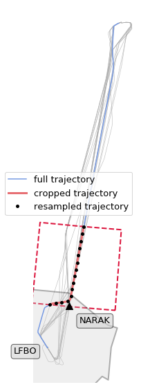
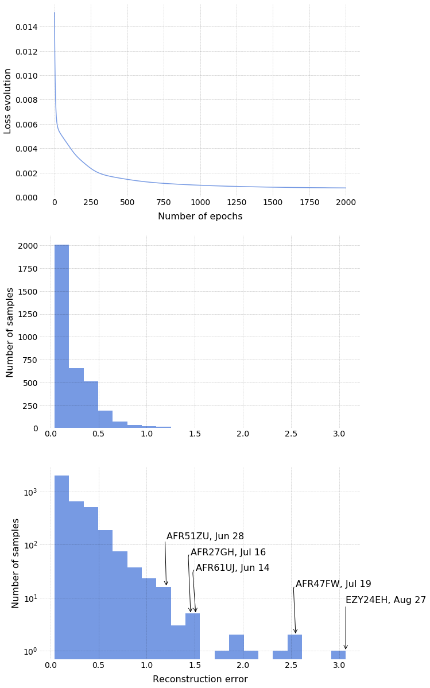

Detecting Controllers' Actions in Past Mode S Data by Autoencoder-Based Anomaly Detection
-----------------------------------------------------------------------------------------

Xavier Olive, Jeremy Grignard, Thomas Dubot and Julie Saint-Lot

| *This notebook comes with the paper published at Sesar Innovation Days
  2018.*
| Details are presented in the paper. The following code is provided for
  reproducibility concerns.

The dataset
~~~~~~~~~~~

The basic dataset consists of one year of trajectories between Paris
Orly and Toulouse Blagnac airports. A learning box is arbitrarily
defined so as to include about 20 minutes of flight before entering the
TMA.

.. code:: python

    from traffic.core import Traffic
    from shapely.geometry import box
    
    # Data: one year of traffic between LFPO and LFBO
    t = Traffic.from_file("data/2017_lfpo_lfbo.pkl")
    
    # The learning box has been set manually on the data
    learning_box = box(
        0.9488888502120971,
        44.287776947021484, 
        2.748888850212097,
        45.537776947021484
    )

The data has been downloaded from the `OpenSky Network Impala
database <../opensky_usage.html>`__. The following recalls all the
callsigns selected for this route.

.. code:: python

    # Pretty-print all the callsigns analysed
    
    cs = sorted(t.callsigns)
    for i in range(4):
        print(" ".join(cs[7*i:7*(i+1)]))

.. parsed-literal::

    AF128UU AFR21ME AFR22MT AFR22SR AFR26SA AFR27GH AFR38DV
    AFR43LC AFR47FW AFR49DL AFR51ZU AFR52BW AFR53TQ AFR57XL
    AFR59UB AFR611H AFR613R AFR61JJ AFR61UJ AFR65WA AFR77PQ
    AFR88DM EZY24EH EZY289N EZY353H EZY4019 EZY4029 EZY98KP

Data preparation
~~~~~~~~~~~~~~~~

The following plot explains how each trajectory is prepared. The basic
idea is to clip the trajectory to the learning box, then to resample
each trajectory to a fixed number of samples (15 on the figure, 150 for
the machine learning method).

.. code:: python

    %matplotlib inline
    import matplotlib.pyplot as plt
    
    from traffic.data import airports, navaids, nm_airspaces
    from traffic.drawing import EuroPP, PlateCarree
    
    with plt.style.context("traffic"):
    
        fig, ax = plt.subplots(subplot_kw=dict(projection=EuroPP()))
    
        ax.add_geometries(
            [learning_box],
            crs=PlateCarree(),
            facecolor="None",
            edgecolor="crimson",
            linewidth=2,
            linestyle="dashed",
        )
    
        # TMA of Toulouse Airport
        nm_airspaces["LFBOTMA"].plot(
            ax, edgecolor="black", facecolor="#cccccc", alpha=.3, linewidth=2
        )
    
        # Beacon marking the beginning of the STAR procedure
        navaids["NARAK"].plot(
            ax,
            zorder=2,
            marker="^",
            shift=dict(units="dots", x=15, y=-15),
            text_kw={
                "s": "NARAK",
                "verticalalignment": "top",
                "bbox": dict(facecolor="lightgray", alpha=0.6, boxstyle="round"),
            },
        )
    
        airports["LFBO"].point.plot(
            ax,
            shift=dict(units="dots", x=-15),
            alpha=0,
            text_kw=dict(
                s="LFBO",
                verticalalignment="top",
                horizontalalignment="right",
                bbox=dict(facecolor="lightgray", alpha=0.6, boxstyle="round"),
            ),
        )
    
        # Few trajectories from the data set
        t.plot(ax, color="#aaaaaa", zorder=-2, linewidth=.6, nb_flights=20)
    
        # Details of the data preparation
        t["EZY24EH_2831"].plot(ax, linewidth=1.5, label="full trajectory")
        t["EZY24EH_2831"].clip(learning_box).plot(
            ax, linewidth=3, label="cropped trajectory"
        )
        t["EZY24EH_2831"].clip(learning_box).resample(15).plot(
            ax,
            linewidth=0,
            marker=".",
            color="black",
            label="resampled trajectory",
        )
        
        ax.legend()
        ax.spines['geo'].set_visible(False)
        ax.background_patch.set_visible(False)

The following applies the preprocessing to each trajectory in the
dataset.

.. code:: python

    t_clip = Traffic.from_flights(
        flight
        # Median filters on all trajectories
        .filter()
        # Clipping to the learning box
        .clip(learning_box)
        # Resample to 150 samples per flight
        .resample(150)
        for flight in t
    )
    # Backup to one file
    t_clip.to_pickle("data/2017_lfpo_lfbo_prepared.pkl")

.. code:: python

    t_clip = Traffic.from_file("data/2017_lfpo_lfbo_prepared.pkl")
    t_clip

.. raw:: html

    <b>Traffic with 3536 identifiers</b>  
    <table id="T_4bd393a4_f168_11e8_82cd_e0d55e6d4ab4" > 
    <thead>    <tr> 
            <th class="blank level0" ></th> 
            <th class="col_heading level0 col0" >count</th> 
        </tr>    <tr> 
            <th class="index_name level0" >flight_id</th> 
            <th class="blank" ></th> 
        </tr></thead> 
    <tbody>    <tr> 
            <th id="T_4bd393a4_f168_11e8_82cd_e0d55e6d4ab4level0_row0" class="row_heading level0 row0" >AF128UU_073</th> 
            <td id="T_4bd393a4_f168_11e8_82cd_e0d55e6d4ab4row0_col0" class="data row0 col0" >150</td> 
        </tr>    <tr> 
            <th id="T_4bd393a4_f168_11e8_82cd_e0d55e6d4ab4level0_row1" class="row_heading level0 row1" >AFR77PQ_1064</th> 
            <td id="T_4bd393a4_f168_11e8_82cd_e0d55e6d4ab4row1_col0" class="data row1 col0" >150</td> 
        </tr>    <tr> 
            <th id="T_4bd393a4_f168_11e8_82cd_e0d55e6d4ab4level0_row2" class="row_heading level0 row2" >AFR77PQ_1012</th> 
            <td id="T_4bd393a4_f168_11e8_82cd_e0d55e6d4ab4row2_col0" class="data row2 col0" >150</td> 
        </tr>    <tr> 
            <th id="T_4bd393a4_f168_11e8_82cd_e0d55e6d4ab4level0_row3" class="row_heading level0 row3" >AFR77PQ_1013</th> 
            <td id="T_4bd393a4_f168_11e8_82cd_e0d55e6d4ab4row3_col0" class="data row3 col0" >150</td> 
        </tr>    <tr> 
            <th id="T_4bd393a4_f168_11e8_82cd_e0d55e6d4ab4level0_row4" class="row_heading level0 row4" >AFR77PQ_1014</th> 
            <td id="T_4bd393a4_f168_11e8_82cd_e0d55e6d4ab4row4_col0" class="data row4 col0" >150</td> 
        </tr>    <tr> 
            <th id="T_4bd393a4_f168_11e8_82cd_e0d55e6d4ab4level0_row5" class="row_heading level0 row5" >AFR77PQ_1015</th> 
            <td id="T_4bd393a4_f168_11e8_82cd_e0d55e6d4ab4row5_col0" class="data row5 col0" >150</td> 
        </tr>    <tr> 
            <th id="T_4bd393a4_f168_11e8_82cd_e0d55e6d4ab4level0_row6" class="row_heading level0 row6" >AFR77PQ_1016</th> 
            <td id="T_4bd393a4_f168_11e8_82cd_e0d55e6d4ab4row6_col0" class="data row6 col0" >150</td> 
        </tr>    <tr> 
            <th id="T_4bd393a4_f168_11e8_82cd_e0d55e6d4ab4level0_row7" class="row_heading level0 row7" >AFR77PQ_1058</th> 
            <td id="T_4bd393a4_f168_11e8_82cd_e0d55e6d4ab4row7_col0" class="data row7 col0" >150</td> 
        </tr>    <tr> 
            <th id="T_4bd393a4_f168_11e8_82cd_e0d55e6d4ab4level0_row8" class="row_heading level0 row8" >AFR77PQ_1059</th> 
            <td id="T_4bd393a4_f168_11e8_82cd_e0d55e6d4ab4row8_col0" class="data row8 col0" >150</td> 
        </tr>    <tr> 
            <th id="T_4bd393a4_f168_11e8_82cd_e0d55e6d4ab4level0_row9" class="row_heading level0 row9" >AFR77PQ_1060</th> 
            <td id="T_4bd393a4_f168_11e8_82cd_e0d55e6d4ab4row9_col0" class="data row9 col0" >150</td> 
        </tr></tbody> 
    </table> 

Machine-Learning
~~~~~~~~~~~~~~~~

The anomaly detection method is based on a shallow autoencoder
(`PyTorch <https://pytorch.org/>`__ implementation). For the sake of
this example, we focus on the track angle signal. At the end of the
training period, we look at the distribution of the reconstruction
errors.

.. code:: python

    import numpy as np
    
    from sklearn.preprocessing import minmax_scale
    from torch import from_numpy, nn, optim
    from torch.autograd import Variable
    from tqdm.autonotebook import tqdm
    
    # -- Autoencoder architecture --
    
    class Autoencoder(nn.Module):
        """Basic shallow autoencoder."""
        def __init__(self):
            super().__init__()
            self.encoder = nn.Sequential(
                nn.Linear(150, 64),
                # Activation function
                nn.Sigmoid()
            )
            self.decoder = nn.Sequential(
                nn.Linear(64, 150),
                # Activation function
                nn.Sigmoid()
            )
    
        def forward(self, x, **kwargs):
            x = self.encoder(x)
            x = self.decoder(x)
            return x
    
    
    def anomalies(t: Traffic):
    
        flight_ids = list(f.flight_id for f in t)
        
        # For this example, we only work on the track angle signal
        X = minmax_scale(np.vstack(f.data.track for f in t))
    
        model = Autoencoder().cuda()
        criterion = nn.MSELoss()
        optimizer = optim.Adam(model.parameters(), lr=1e-3, weight_decay=1e-5)
    
        # Basic training process (GPU)
        loss_evolution = []
        for epoch in tqdm(range(2000)):
    
            v = Variable(from_numpy(X.astype(np.float32))).cuda()
            output = model(v)
            loss = criterion(output, v)
            loss_evolution.append(loss.data.item())
    
            optimizer.zero_grad()
            loss.backward()
            optimizer.step()
    
        output = model(v)
        # Compute the reconstruction error for each flight
        errors = dict(
            (id_, err)
            for id_, err in zip(
                flight_ids,
                (nn.MSELoss(reduction="none")(output, v).sum(1))
                .sqrt()
                .cpu()
                .detach()
                .numpy(),
            )
        )
        return errors, loss_evolution

Now we apply the anomaly detection on the preprocessed data and analyse
the distribution as explained in the paper.

.. code:: python

    errors, loss_evolution = anomalies(t_clip)

    with plt.style.context("traffic"):
        fig, (ax1, ax2, ax3) = plt.subplots(3, 1, figsize=(10, 21))
        ax1.plot(loss_evolution)
        ax2.hist(errors.values(), bins=20)
        h = ax3.hist(errors.values(), bins=20)
        ax3.set_yscale("log")
    
        for i, id_ in enumerate(
            [
                "EZY24EH_3324",
                "AFR47FW_2174",
                "AFR61UJ_1321",
                "AFR27GH_348",
                "AFR51ZU_027",
            ]
        ):
            ax3.annotate(
                f"{t[id_].callsign}, {t[id_].stop:%b %d}",
                xy=(errors[id_], h[0][sum(h[1] - errors[id_] < 0) - 1]),
                xytext=(errors[id_], 2 ** (i + 3)),
                fontsize=16,
                horizontalalignment="left",
                arrowprops=dict(
                    arrowstyle="->", connectionstyle="arc,angleA=180,armA=70,rad=10"
                ),
            )
    
        ax1.set_xlabel("Number of epochs", labelpad=10)
        ax1.set_ylabel("Loss evolution")
        ax2.set_ylabel("Number of samples")
        ax3.set_ylabel("Number of samples")
        ax3.set_xlabel("Reconstruction error", labelpad=10)

