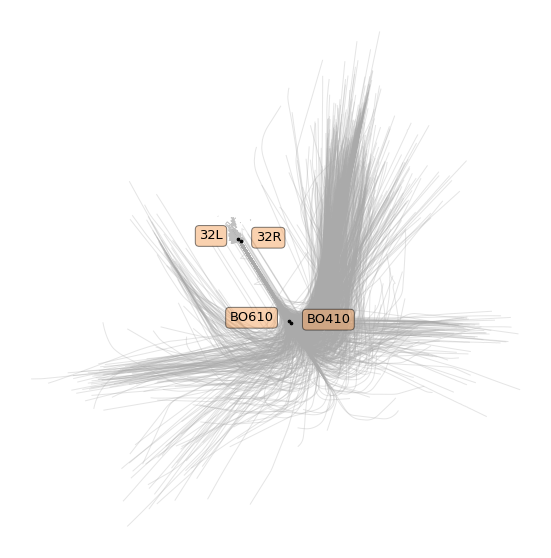
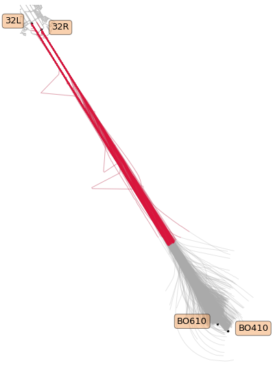
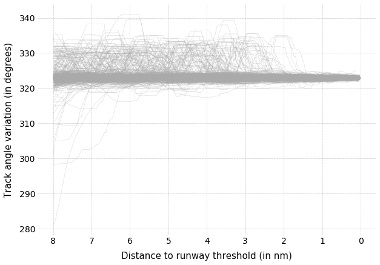
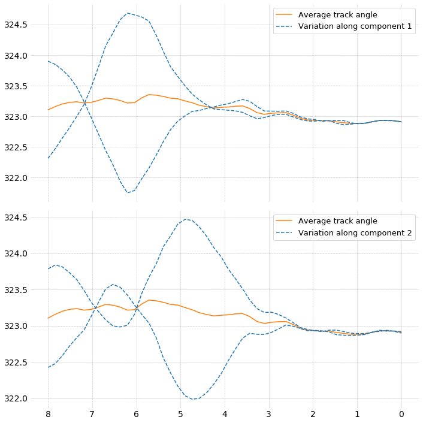
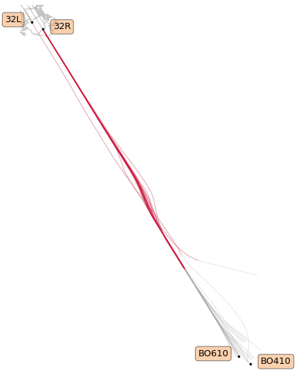

Quantitative Assessments of Runway Excursion Precursors using Mode S data
-------------------------------------------------------------------------

Xavier Olive, Pierre Bieber

| *This notebook comes with the paper published at ICRAT 2018.*
| Details are presented in the paper. The following code is provided for
  reproducibility concerns.

Data preparation
~~~~~~~~~~~~~~~~

The dataset consists of one month of trajectories around Toulouse
airport. The first step is to isolate trajectories landing. The
following code is a suggestion to select such trajectories.

.. code:: python

    from tqdm.autonotebook import tqdm
    from typing import List
    from traffic.core import Traffic, Flight
    
    february = Traffic.from_file("data/lfbo_february.pkl.gz")
    
    cumul: List[Flight] = []
    
    # The first step is to assign a specific id to all trajectories
    for item in tqdm(february.assign_id()):
    
        flight = (
            item
            # remove samples with no positional data
            .query("latitude == latitude")
            # default median filters
            .filter()
        )
    
        # remove trajectories with not enough samples
        if len(item) < 100:
            continue
    
        # Keep flights landing at LFBO
        guess = flight.guess_landing_airport()
        if guess.airport.icao != "LFBO" or guess.distance > 6000:
            continue
    
        cumul.append(flight)
    
    t_landing = Traffic.from_flights(cumul)
    
    # backup
    # t_landing.to_pickle("data/february_landing.pkl")

Since we want to focus on aircraft landing on runway 32, we need to
apply a bit more filtering.

The library offers a tool trying to guess the runway on which an
aircraft lands (only on major airports). The heuristics must be
perfectible: warnings are raised when the assigned runway looks dodgy.
We remove by hand trajectories with a raised warning (this could be
automated in a better way…)

.. code:: python

    cumul: List[Flight] = []
    
    for item in tqdm(t_landing):
    
        if item.icao24 in ["38413a", "380efa", "3801da", "398588"]:
            # aircraft with buggy data
            continue
        flight = item.query(
            # vertical_rate being NaN is often a sign of buggy data
            "~onground and vertical_rate == vertical_rate"
        )
    
        # extra sanity checks to take away invalid trajectories
        if len(flight) < 30 or flight.data.vertical_rate.mean() > -2.5:
            continue
    
        # only keep trajectories landing on runway 32
        runway = flight.guess_landing_runway()
        if runway.name.startswith("32"):
            cumul.append(
                flight.between(runway.point.start, runway.point.stop)
            )
            
    # We remove the following id because the runway detection seems to have failed
    t_32 = Traffic.from_flights(
        f for f in final if f.flight_id !='AIB103_1754'
    )
    
    # backup
    # t_32.to_pickle("data/february_landing_32.pkl")

    t_32

.. parsed-literal::

    WARNING:root:(AF118VA_2073) Candidate runway 14L is not consistent with average track 323.0394445508367.
    WARNING:root:(AIB103_1754) Candidate runway 32L is not consistent with average track 142.5683970215894.
    WARNING:root:(AIB1776_555) Candidate runway 14L is not consistent with average track 180.0.
    [...]

.. raw:: html

    <b>Traffic with 1361 identifiers</b>  
    <table id="T_37835ddc_f274_11e8_84c0_6fa57ff51d01" > 
    <thead>    <tr> 
            <th class="blank level0" ></th> 
            <th class="col_heading level0 col0" >count</th> 
        </tr>    <tr> 
            <th class="index_name level0" >flight_id</th> 
            <th class="blank" ></th> 
        </tr></thead> 
    <tbody>    <tr> 
            <th id="T_37835ddc_f274_11e8_84c0_6fa57ff51d01level0_row0" class="row_heading level0 row0" >AAF733P_3907</th> 
            <td id="T_37835ddc_f274_11e8_84c0_6fa57ff51d01row0_col0" class="data row0 col0" >598</td> 
        </tr>    <tr> 
            <th id="T_37835ddc_f274_11e8_84c0_6fa57ff51d01level0_row1" class="row_heading level0 row1" >DLH57A_353</th> 
            <td id="T_37835ddc_f274_11e8_84c0_6fa57ff51d01row1_col0" class="data row1 col0" >598</td> 
        </tr>    <tr> 
            <th id="T_37835ddc_f274_11e8_84c0_6fa57ff51d01level0_row2" class="row_heading level0 row2" >DLH53U_4609</th> 
            <td id="T_37835ddc_f274_11e8_84c0_6fa57ff51d01row2_col0" class="data row2 col0" >598</td> 
        </tr>    <tr> 
            <th id="T_37835ddc_f274_11e8_84c0_6fa57ff51d01level0_row3" class="row_heading level0 row3" >DLH53U_4660</th> 
            <td id="T_37835ddc_f274_11e8_84c0_6fa57ff51d01row3_col0" class="data row3 col0" >598</td> 
        </tr>    <tr> 
            <th id="T_37835ddc_f274_11e8_84c0_6fa57ff51d01level0_row4" class="row_heading level0 row4" >DLH53U_4708</th> 
            <td id="T_37835ddc_f274_11e8_84c0_6fa57ff51d01row4_col0" class="data row4 col0" >598</td> 
        </tr>    <tr> 
            <th id="T_37835ddc_f274_11e8_84c0_6fa57ff51d01level0_row5" class="row_heading level0 row5" >DLH53U_4709</th> 
            <td id="T_37835ddc_f274_11e8_84c0_6fa57ff51d01row5_col0" class="data row5 col0" >598</td> 
        </tr>    <tr> 
            <th id="T_37835ddc_f274_11e8_84c0_6fa57ff51d01level0_row6" class="row_heading level0 row6" >DLH57A_320</th> 
            <td id="T_37835ddc_f274_11e8_84c0_6fa57ff51d01row6_col0" class="data row6 col0" >598</td> 
        </tr>    <tr> 
            <th id="T_37835ddc_f274_11e8_84c0_6fa57ff51d01level0_row7" class="row_heading level0 row7" >DLH57A_323</th> 
            <td id="T_37835ddc_f274_11e8_84c0_6fa57ff51d01row7_col0" class="data row7 col0" >598</td> 
        </tr>    <tr> 
            <th id="T_37835ddc_f274_11e8_84c0_6fa57ff51d01level0_row8" class="row_heading level0 row8" >DLH57A_333</th> 
            <td id="T_37835ddc_f274_11e8_84c0_6fa57ff51d01row8_col0" class="data row8 col0" >598</td> 
        </tr>    <tr> 
            <th id="T_37835ddc_f274_11e8_84c0_6fa57ff51d01level0_row9" class="row_heading level0 row9" >DLH57A_336</th> 
            <td id="T_37835ddc_f274_11e8_84c0_6fa57ff51d01row9_col0" class="data row9 col0" >598</td> 
        </tr></tbody> 
    </table> 

We end up with a dataset of 1361 trajectories landing at Toulouse
airport in February 2017 on QFU32.

However, trimming trajectories to final approaches requires a bit more
work. We use here navigational beacons in the official procedures. Only
main navaids are provided by the data source embedded in the library: we
add the coordinates manually and automate some plotting for following
figures.

.. code:: python

    from traffic.core.mixins import PointMixin
    
    
    class Point(PointMixin):
        """This mixin provides the interface to plot the elements on maps."""
    
        def __init__(self, lat, lon, name):
            self.latitude = lat
            self.longitude = lon
            self.name = name
    
    
    # Coordinates for key positions for final approach in LFBO
    procedure_points = {
        "BO310": Point(lat=43.787917, lon=1.200389, name="BO310"),
        "BO410": Point(lat=43.465222, lon=1.536195, name="BO410"),
        "BO510": Point(lat=43.794389, lon=1.188889, name="BO510"),
        "BO610": Point(lat=43.468472, lon=1.528195, name="BO610"),
        "14L": Point(lat=43.6374315, lon=1.3575536, name="14L"),
        "14R": Point(lat=43.6446126, lon=1.3454186, name="14R"),
        "32L": Point(lat=43.6185805, lon=1.3725227, name="32L"),
        "32R": Point(lat=43.6156582, lon=1.3802184, name="32R"),
    }
    
    
    def params(point_id):
        left_side = point_id in ["BO610", "32L"]
        return dict(
            shift=dict(units="dots", x=-15 if left_side else 15),
            text_kw=dict(
                s=point_id,
                horizontalalignment="right" if left_side else "left",
                bbox=dict(facecolor="sandybrown", alpha=0.5, boxstyle="round"),
            ),
        )
    
    
    def plot_points(ax):
        for point_id in ["BO610", "BO410", "32L", "32R"]:
            value = procedure_points[point_id]
            value.plot(ax, s=7, zorder=2, **(params(point_id)))

With the following map, we can position trajectories landing on QFU32 with
respect to the above mentioned navigational beacons.

.. code:: python

    from traffic.drawing import EuroPP
    from traffic.data import airports
    
    with plt.style.context('traffic'):
        fig, ax = plt.subplots(
            subplot_kw=dict(projection=EuroPP())
        )
        
        airports['LFBO'].plot(ax)
        plot_points(ax)
        
        t_32.plot(ax, alpha=.3, zorder=-2)
    
        ax.spines['geo'].set_visible(False)
        ax.background_patch.set_visible(False)

First visual check: so far so good! Some trajectories seem to have their
positions quite drifted.

In order to select the final approach, we trim the trajectories between
their closest timestamp near one of the BOx10 beacon, and near one of
the two runway thresholds. We filter trajectories passing too far away
from this beacons in order to get rid of trajectories seeming to have a
wrong estimation of their position (probable drifting of the inertial
navigation system). We eliminate a few more trajectories but consider it
still acceptable for a statistical analysis.

.. code:: python

    from typing import Any, Dict, List
    
    import pandas as pd
    from traffic.core import geodesy
    
    
    cumul: List[Dict[str, Any]] = []
    
    for flight in tqdm(t_32):
        bo = flight.closest_point([proc["BO610"], proc["BO410"]])
        rw = flight.closest_point([proc["32L"], proc["32R"]])
        cumul.append(
            dict(
                flight_id=flight.flight_id,
                # estimation of roll-out point (closest to BOx10)
                bo=bo.name,
                bo_ts=bo.point.timestamp,
                bo_d=bo.distance,
                # time at runway threshold
                rw=rw.name,
                rw_ts=rw.point.timestamp,
                rw_d=rw.distance,
            )
        )
    
    analysis = pd.DataFrame.from_records(cumul)
    
    # backup
    # analysis.to_pickle("analysis.pkl")
    
    t_final = Traffic.from_flights(
        t_32[line.flight_id]
        # trim the trajectory to final approach
        .between(line.bo_ts, line.rw_ts)
        # add one column for distance to the proper runway threshold
        .assign(
            distance=lambda df: geodesy.distance(
                df.latitude.values,
                df.longitude.values,
                df.shape[0] * [procedure_points[line.rw].latitude],
                df.shape[0] * [procedure_points[line.rw].longitude],
            )
        )
        # this last filtering removes flight with data which is erroneous or
        # irrelevant to our current case study.
        for _, line in analysis.query("rw_d < 400 and bo_d < 5000").iterrows()
    )
    
    # backup
    # t_final.to_pickle("data/february_landing_32_final.pkl")

    t_final

.. raw:: html

    <b>Traffic with 1309 identifiers</b>  
    <table id="T_c2b25be8_f2ff_11e8_baca_5d6bbe481fe8" > 
    <thead>    <tr> 
            <th class="blank level0" ></th> 
            <th class="col_heading level0 col0" >count</th> 
        </tr>    <tr> 
            <th class="index_name level0" >flight_id</th> 
            <th class="blank" ></th> 
        </tr></thead> 
    <tbody>    <tr> 
            <th id="T_c2b25be8_f2ff_11e8_baca_5d6bbe481fe8level0_row0" class="row_heading level0 row0" >BGA191A_2873</th> 
            <td id="T_c2b25be8_f2ff_11e8_baca_5d6bbe481fe8row0_col0" class="data row0 col0" >374</td> 
        </tr>    <tr> 
            <th id="T_c2b25be8_f2ff_11e8_baca_5d6bbe481fe8level0_row1" class="row_heading level0 row1" >BGA241B_2939</th> 
            <td id="T_c2b25be8_f2ff_11e8_baca_5d6bbe481fe8row1_col0" class="data row1 col0" >371</td> 
        </tr>    <tr> 
            <th id="T_c2b25be8_f2ff_11e8_baca_5d6bbe481fe8level0_row2" class="row_heading level0 row2" >BGA251B_2940</th> 
            <td id="T_c2b25be8_f2ff_11e8_baca_5d6bbe481fe8row2_col0" class="data row2 col0" >349</td> 
        </tr>    <tr> 
            <th id="T_c2b25be8_f2ff_11e8_baca_5d6bbe481fe8level0_row3" class="row_heading level0 row3" >HOP41FK_4016</th> 
            <td id="T_c2b25be8_f2ff_11e8_baca_5d6bbe481fe8row3_col0" class="data row3 col0" >348</td> 
        </tr>    <tr> 
            <th id="T_c2b25be8_f2ff_11e8_baca_5d6bbe481fe8level0_row4" class="row_heading level0 row4" >GAF612_4783</th> 
            <td id="T_c2b25be8_f2ff_11e8_baca_5d6bbe481fe8row4_col0" class="data row4 col0" >347</td> 
        </tr>    <tr> 
            <th id="T_c2b25be8_f2ff_11e8_baca_5d6bbe481fe8level0_row5" class="row_heading level0 row5" >HOP17VJ_4101</th> 
            <td id="T_c2b25be8_f2ff_11e8_baca_5d6bbe481fe8row5_col0" class="data row5 col0" >347</td> 
        </tr>    <tr> 
            <th id="T_c2b25be8_f2ff_11e8_baca_5d6bbe481fe8level0_row6" class="row_heading level0 row6" >HOP11VJ_4053</th> 
            <td id="T_c2b25be8_f2ff_11e8_baca_5d6bbe481fe8row6_col0" class="data row6 col0" >342</td> 
        </tr>    <tr> 
            <th id="T_c2b25be8_f2ff_11e8_baca_5d6bbe481fe8level0_row7" class="row_heading level0 row7" >N721EE_7072</th> 
            <td id="T_c2b25be8_f2ff_11e8_baca_5d6bbe481fe8row7_col0" class="data row7 col0" >341</td> 
        </tr>    <tr> 
            <th id="T_c2b25be8_f2ff_11e8_baca_5d6bbe481fe8level0_row8" class="row_heading level0 row8" >AIB07EO_1779</th> 
            <td id="T_c2b25be8_f2ff_11e8_baca_5d6bbe481fe8row8_col0" class="data row8 col0" >337</td> 
        </tr>    <tr> 
            <th id="T_c2b25be8_f2ff_11e8_baca_5d6bbe481fe8level0_row9" class="row_heading level0 row9" >BGA121D_3023</th> 
            <td id="T_c2b25be8_f2ff_11e8_baca_5d6bbe481fe8row9_col0" class="data row9 col0" >336</td> 
        </tr></tbody> 
    </table> 

.. code:: python

    %matplotlib inline
    import matplotlib.pyplot as plt
    
    from traffic.drawing import EuroPP, rivers
    from traffic.data import airports
    
    with plt.style.context('traffic'):
        fig, ax = plt.subplots(
            subplot_kw=dict(projection=EuroPP())
        )
        
        airports['LFBO'].plot(ax)
        plot_points(ax)
        
        t_final.plot(ax, alpha=.3,)
        t_final.query('distance < 8 * 1852').plot(ax, color='crimson', alpha=.3,)
        
        ax.spines['geo'].set_visible(False)
        ax.background_patch.set_visible(False)

Visual check: in the paper we consider the final 8 nautical miles (in
red).

For the following, the idea is to consider all track angle signals and
to analyse their modes of variation. Here is the full dataset plotted.

.. code:: python

    with plt.style.context('traffic'):
        fig, ax = plt.subplots(figsize=(10, 7))
        ax.invert_xaxis()
    
        ax.set_xlabel("Distance to runway threshold (in nm)", labelpad=10, fontsize=15)
        ax.set_ylabel("Track angle variation (in degrees)", labelpad=10, fontsize=15)
    
        for flight in t_final.query('distance < 8*1852'):
            ax.plot(
                flight.data.distance/1852,
                flight.data.heading,
                color='#aaaaaa',
                alpha=.5,
                linewidth=.5
            )

Functional Principal Component Analysis
~~~~~~~~~~~~~~~~~~~~~~~~~~~~~~~~~~~~~~~

We resample all trajectories to 50 points and fit a (functional) PCA on
the dataset. The following plot displays some modes of variation around
the average signal.

.. code:: python

    import numpy as np
    from sklearn.decomposition import PCA
    
    # Prepare a dataset of track angles on final approach
    X = np.vstack(
        [
            # for this demonstration we take 50 samples on final approach
            flight.resample(50).data.track
            for flight in t_final.query("distance < 8*1852")
        ]
    )
    
    # keep track of the identifier for each trajectory
    flight_ids = list(flight.flight_id for flight in t_final)
    
    pca = PCA()
    X_t = pca.fit_transform(X)

.. code:: python

    with plt.style.context("traffic"):
        
        fig, ax = plt.subplots(2, 1, figsize=(10, 10), sharex=True)
        xlim = np.linspace(8, 0, 50)
        
        m_theme = dict(linestyle='solid', color='#ff7f0e')
        v_theme = dict(linestyle="--", color="#1f77b4")
    
        for i, a in enumerate(ax):
    
            var_i = np.sqrt(pca.explained_variance_[i + 1])
            theta_i = pca.components_[i + 1]
    
            a.plot(xlim, pca.mean_, **m_theme,
                   label="Average track angle")
            a.plot(xlim, pca.mean_ + var_i * theta_i, **v_theme,
                   label=f"Variation along component {i+1}")
            a.plot(xlim, pca.mean_ - var_i * theta_i, **v_theme)
            
            a.legend()
    
        a.invert_xaxis()
        fig.tight_layout()

One of the main ideas of the paper was to specifically select
trajectories with strong components along these modes of variation. It
appears they follow a specific pattern of late runway changes.

.. code:: python

    second_component = np.abs(X_t[:, 1])
    selected_flights = Traffic.from_flights(
        t_final[flight_id]
        for flight_id, component in zip(flight_ids, second_component)
        if component > np.percentile(second_component, 98)
    )

.. code:: python

    from traffic.drawing import EuroPP, rivers
    from traffic.data import airports
    
    with plt.style.context('traffic'):
        fig, ax = plt.subplots(
            subplot_kw=dict(projection=EuroPP())
        )
        
        airports['LFBO'].plot(ax)
        plot_points(ax)
    
        selected_flights.plot(ax, color='#aaaaaa', alpha=.3)
        selected_flights.query('distance < 8 * 1852').plot(
            ax, color='crimson', alpha=.3
        )
            
        ax.spines['geo'].set_visible(False)
        ax.background_patch.set_visible(False)

