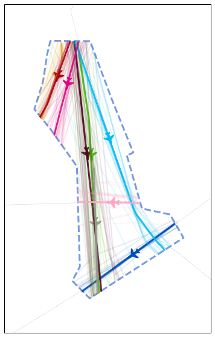
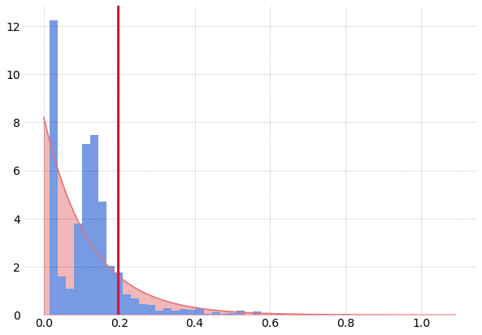

Identifying Anomalies in past en-route Trajectories with Clustering and Anomaly Detection Methods
-------------------------------------------------------------------------------------------------

Xavier Olive and Luis Basora

| *This notebook comes with the paper published at ATM Seminar 2019.*
| Details are presented in the paper. The following code is provided for
  reproducibility concerns.

Data preparation
~~~~~~~~~~~~~~~~

.. code:: python

    import numpy as np
    from traffic.core import Traffic
    
    t = (
        # trajectories during the opening hours of the sector
        Traffic.from_file("data/LFBBPT_flights_2017.pkl")
        .clean_invalid()
        # first cleaning and interpolation of positions when points are missing
        .resample("1s")
        # come back to 50 samples per trajectory
        .resample(50)
        # trajectory clustering needs the log of the altitude
        .assign(
            log_altitude=lambda x: x.altitude.apply(lambda x: x if x == 0 else np.log10(x))
        )
        # lazy evaluation multiprocessed on 12 cores
        .eval(max_workers=12)
    )

The data has been downloaded from the `OpenSky Network Impala
database <../opensky_usage.html>`__.

First a `clustering <../clustering.html>`_ is applied to the dataset. The
implementation of the specific clustering described in the paper is available on
the following `github repository <https://github.com/lbasora/sectflow>`_

.. code:: python

    from traffic.core.projection import Lambert93
    
    # pip install git+https://github.com/lbasora/sectflow
    from sectflow.clustering import TrajClust
    
    features = ["x", "y", "latitude", "longitude", "altitude", "log_altitude"]
    clustering = TrajClust(features)
    
    # use the clustering API from traffic
    t_cluster = t.clustering(
        nb_samples=2, features=features, projection=Lambert93(), clustering=clustering
    ).fit_predict(max_workers=12)

.. code:: python

    # Color distribution by cluster
    from itertools import cycle, islice
    
    n_clusters = 1 + t_cluster.data.cluster.max()
    color_cycle = cycle(
        "#fbbb35 #004cb9 #4cc700 #a50016 #510420 #01bcf5 #999999 #e60085 #ffa9c5".split()
    )
    colors = list(islice(color_cycle, n_clusters))
    colors.append("#aaaaaa")  # color for outliers, if any

    import matplotlib.pyplot as plt
    from random import sample
    
    from traffic.data import airways, aixm_airspaces
    from traffic.drawing.markers import rotate_marker, atc_tower, aircraft
    
    with plt.style.context("traffic"):
        fig, ax = plt.subplots(1, figsize=(15, 10), subplot_kw=dict(projection=Lambert93()))
    
        aixm_airspaces["LFBBPT"].plot(
            ax, linewidth=3, linestyle="dashed", color="steelblue"
        )
        for name in "UN460 UN869 UM728".split():
            airways[name].plot(ax, linestyle="dashed", color="#aaaaaa")
    
        # do not plot outliers
        for cluster in range(n_clusters):
    
            current_cluster = t_cluster.query(f"cluster == {cluster}")
    
            # plot the centroid of each cluster
            centroid = current_cluster.centroid(50, projection=Lambert93())
            centroid.plot(ax, color=colors[cluster], alpha=0.9, linewidth=3)
            centroid_mark = centroid.at_ratio(0.45)
    
            # little aircraft
            centroid_mark.plot(
                ax,
                color=colors[cluster],
                marker=rotate_marker(aircraft, centroid_mark.track),
                s=500,
                text_kw=dict(s=""),  # no text associated
            )
            
            # plot some sample flights from each cluster
            sample_size = min(20, len(current_cluster))
            for flight_id in sample(current_cluster.flight_ids, sample_size):
                current_cluster[flight_id].plot(
                    ax, color=colors[cluster], alpha=0.1, linewidth=2
                )
                
        # TODO improve this: extent with buffer
        ax.set_extent(
            tuple(
                x - 0.5 + (0 if i % 2 == 0 else 1)
                for i, x in enumerate(aixm_airspaces["LFBBPT"].extent)
            )
        )
        
        # Equivalent of Fig. 5

Machine-Learning
~~~~~~~~~~~~~~~~

The anomaly detection method is based on a stacked autoencoder
(`PyTorch <https://pytorch.org/>`__ implementation).

.. code:: python

    import torch
    from torch import nn, optim, from_numpy, rand
    from torch.autograd import Variable
    
    from sklearn.preprocessing import minmax_scale
    from tqdm.autonotebook import tqdm
    
    
    # Stacked autoencoder
    
    class Autoencoder(nn.Module):
        def __init__(self):
            super().__init__()
            self.encoder = nn.Sequential(
                nn.Linear(50, 24), nn.ReLU(), nn.Linear(24, 12), nn.ReLU()
            )
            self.decoder = nn.Sequential(
                nn.Linear(12, 24), nn.ReLU(), nn.Linear(24, 50), nn.Sigmoid()
            )
    
        def forward(self, x, **kwargs):
            x = x + (rand(50).cuda() - 0.5) * 1e-3  # add some noise
            x = self.encoder(x)
            x = self.decoder(x)
            return x
    
    # Regularisation term introduced in IV.B.2
    
    def regularisation_term(X, n):
        samples = torch.linspace(0, X.max(), 100, requires_grad=True)
        mean = samples.mean()
        return torch.relu(
            (torch.histc(X) / n * 100 - 1 / mean * torch.exp(-samples / mean))
        ).mean()
    
    # ML part
    
    def anomalies(t: Traffic, cluster_id: int, lambda_r: float, nb_it: int = 10000):
    
        t_id = t.query(f"cluster=={cluster_id}")
    
        flight_ids = list(f.flight_id for f in t_id)
        n = len(flight_ids)
        X = minmax_scale(np.vstack(f.data.track[:50] for f in t_id))
    
        model = Autoencoder().cuda()
        criterion = nn.MSELoss()
        optimizer = optim.Adam(model.parameters(), lr=1e-3, weight_decay=1e-5)
    
        for epoch in tqdm(range(nb_it), leave=False):
    
            v = Variable(from_numpy(X.astype(np.float32))).cuda()
    
            output = model(v)
            distance = nn.MSELoss(reduction="none")(output, v).sum(1).sqrt()
    
            loss = criterion(output, v)
            # regularisation
            loss = (
                lambda_r * regularisation_term(distance.cpu().detach(), n)
                + criterion(output, v).cpu()
            )
    
            optimizer.zero_grad()
            loss.backward()
            optimizer.step()
    
        output = model(v)
        return (
            (nn.MSELoss(reduction="none")(output, v).sum(1)).sqrt().cpu().detach().numpy()
        )

    # no regularisation for this plot
    output = anomalies(t_cluster, 3, lambda_r=0, nb_it=3000)

The following code plots the distribution of reconstruction errors without
regularisation, resulting in two modes in the distribution. The ``lambda_r``
parameter helps reducing this trend.

.. code:: python

    from scipy.stats import expon
    
    # Equivalent of Fig. 4
    
    with plt.style.context("traffic"):
        fig, ax = plt.subplots(1, figsize=(10, 7))
        hst = ax.hist(output, bins=50, density=True)
        mean = output.mean()
        x = np.arange(0, output.max(), 1e-2)
        e = expon.pdf(x, 0, output.mean())
    
        ax.plot(x, e, color="#e77074")
        ax.fill_between(x, e, zorder=-2, color="#e77074", alpha=0.5)
        ax.axvline(
            output.mean() * np.log(5), color="crimson", linestyle="solid", linewidth=3
        )

