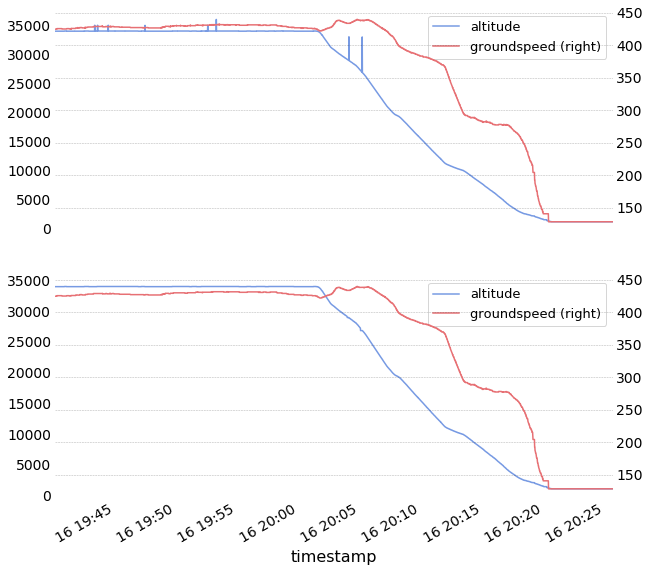
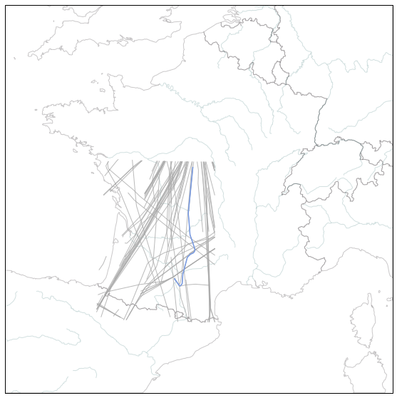
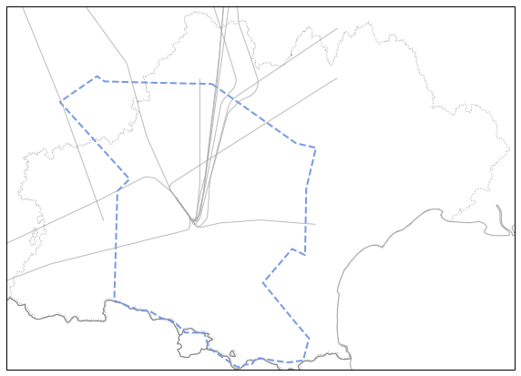
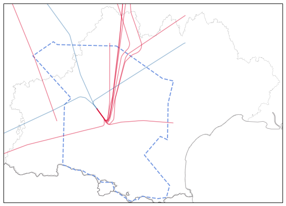
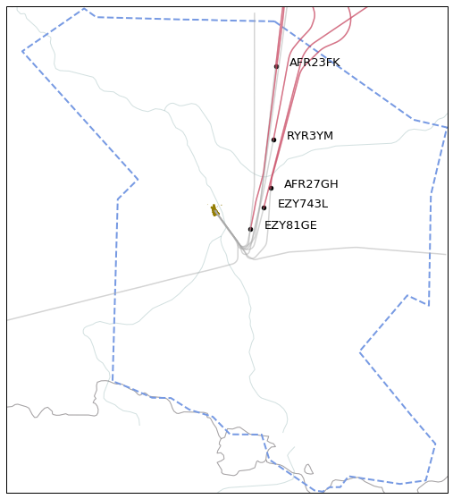

Quickstart
----------

Loading ADS-B traffic
~~~~~~~~~~~~~~~~~~~~~

The Traffic class offers a from\_file classmethod for loading traffic
data. A pandas DataFrame is loaded into a structure offering various
methods for iteration, analysis and display.

The basic representation of a Traffic object is a summary view of the
data: the structure tries to infer how to discriminate flights based on
a flight\_id column (if none, on a pair (icao24, callsign)) and returns
a number of sample points for each trajectory.

.. code:: python

    from traffic.core import Traffic
    t = Traffic.from_file('../data/sample_opensky.pkl')

.. raw:: html

    <b>Traffic with 397 identifiers</b>  
    <table id="T_4c8c4466_d968_11e8_9db5_a45e60ccda45" > 
    <thead>    <tr> 
            <th class="blank" ></th> 
            <th class="blank level0" ></th> 
            <th class="col_heading level0 col0" >count</th> 
        </tr>    <tr> 
            <th class="index_name level0" >icao24</th> 
            <th class="index_name level1" >callsign</th> 
            <th class="blank" ></th> 
        </tr></thead> 
    <tbody>    <tr> 
            <th id="T_4c8c4466_d968_11e8_9db5_a45e60ccda45level0_row0" class="row_heading level0 row0" >4ca84d</th> 
            <th id="T_4c8c4466_d968_11e8_9db5_a45e60ccda45level1_row0" class="row_heading level1 row0" >RYR3YM</th> 
            <td id="T_4c8c4466_d968_11e8_9db5_a45e60ccda45row0_col0" class="data row0 col0" >2859</td> 
        </tr>    <tr> 
            <th id="T_4c8c4466_d968_11e8_9db5_a45e60ccda45level0_row1" class="row_heading level0 row1" >393320</th> 
            <th id="T_4c8c4466_d968_11e8_9db5_a45e60ccda45level1_row1" class="row_heading level1 row1" >AFR27GH</th> 
            <td id="T_4c8c4466_d968_11e8_9db5_a45e60ccda45row1_col0" class="data row1 col0" >2770</td> 
        </tr>    <tr> 
            <th id="T_4c8c4466_d968_11e8_9db5_a45e60ccda45level0_row2" class="row_heading level0 row2" >505c98</th> 
            <th id="T_4c8c4466_d968_11e8_9db5_a45e60ccda45level1_row2" class="row_heading level1 row2" >RAM667</th> 
            <td id="T_4c8c4466_d968_11e8_9db5_a45e60ccda45row2_col0" class="data row2 col0" >2752</td> 
        </tr>    <tr> 
            <th id="T_4c8c4466_d968_11e8_9db5_a45e60ccda45level0_row3" class="row_heading level0 row3" >3944ef</th> 
            <th id="T_4c8c4466_d968_11e8_9db5_a45e60ccda45level1_row3" class="row_heading level1 row3" >HOP87DJ</th> 
            <td id="T_4c8c4466_d968_11e8_9db5_a45e60ccda45row3_col0" class="data row3 col0" >2731</td> 
        </tr>    <tr> 
            <th id="T_4c8c4466_d968_11e8_9db5_a45e60ccda45level0_row4" class="row_heading level0 row4" >4ca574</th> 
            <th id="T_4c8c4466_d968_11e8_9db5_a45e60ccda45level1_row4" class="row_heading level1 row4" >IBK5111</th> 
            <td id="T_4c8c4466_d968_11e8_9db5_a45e60ccda45row4_col0" class="data row4 col0" >2706</td> 
        </tr>    <tr> 
            <th id="T_4c8c4466_d968_11e8_9db5_a45e60ccda45level0_row5" class="row_heading level0 row5" >393322</th> 
            <th id="T_4c8c4466_d968_11e8_9db5_a45e60ccda45level1_row5" class="row_heading level1 row5" >AFR23FK</th> 
            <td id="T_4c8c4466_d968_11e8_9db5_a45e60ccda45row5_col0" class="data row5 col0" >2665</td> 
        </tr>    <tr> 
            <th id="T_4c8c4466_d968_11e8_9db5_a45e60ccda45level0_row6" class="row_heading level0 row6" >40643a</th> 
            <th id="T_4c8c4466_d968_11e8_9db5_a45e60ccda45level1_row6" class="row_heading level1 row6" >EZY57FT</th> 
            <td id="T_4c8c4466_d968_11e8_9db5_a45e60ccda45row6_col0" class="data row6 col0" >2656</td> 
        </tr>    <tr> 
            <th id="T_4c8c4466_d968_11e8_9db5_a45e60ccda45level0_row7" class="row_heading level0 row7" >394c18</th> 
            <th id="T_4c8c4466_d968_11e8_9db5_a45e60ccda45level1_row7" class="row_heading level1 row7" >AFR140W</th> 
            <td id="T_4c8c4466_d968_11e8_9db5_a45e60ccda45row7_col0" class="data row7 col0" >2613</td> 
        </tr>    <tr> 
            <th id="T_4c8c4466_d968_11e8_9db5_a45e60ccda45level0_row8" class="row_heading level0 row8" >344692</th> 
            <th id="T_4c8c4466_d968_11e8_9db5_a45e60ccda45level1_row8" class="row_heading level1 row8" >VLG2972</th> 
            <td id="T_4c8c4466_d968_11e8_9db5_a45e60ccda45row8_col0" class="data row8 col0" >2599</td> 
        </tr>    <tr> 
            <th id="T_4c8c4466_d968_11e8_9db5_a45e60ccda45level0_row9" class="row_heading level0 row9" >400cd1</th> 
            <th id="T_4c8c4466_d968_11e8_9db5_a45e60ccda45level1_row9" class="row_heading level1 row9" >EZY81GE</th> 
            <td id="T_4c8c4466_d968_11e8_9db5_a45e60ccda45row9_col0" class="data row9 col0" >2579</td> 
        </tr></tbody> 
    </table> 

A Traffic object can be indexed by flight\_id (or by callsign and
icao24): it returns a Flight object with a specific representation.

.. code:: python

    t['AFR27GH']

.. raw:: html

    <b>Flight AFR27GH</b><ul><li><b>aircraft:</b> 393320 / F-GMZA (A321)</li><li><b>origin:</b> 2017-07-16 21:30:00</li><li><b>destination:</b> 2017-07-16 22:16:10</li></ul>
<svg xmlns="http://www.w3.org/2000/svg" xmlns:xlink="http://www.w3.org/1999/xlink" width="300" height="300" viewBox="93897.91075796673 4613559.925542467 96690.17466172481 430707.8864500681" preserveAspectRatio="xMinYMin meet"><g transform="matrix(1,0,0,-1,0,9657827.737535004)"><polyline fill="none" stroke="#66cc99" stroke-width="2871.385909667121" points="158349.1706473135,5028315.66804994 158332.25641394887,5028104.037857337 158312.09456765486,5027794.432996378 158307.38018563399,5027683.545332659 158296.16984419487,5027475.556853119 158281.402838997,5027226.95379449 158260.3258352673,5026952.876363555 158249.2225829744,5026739.81887025 158232.98213784996,5026521.581059553 158221.98728569527,5026303.456214217 158221.98728569527,5026303.456214217 158196.4582609095,5025936.863423691 158186.90113160992,5025745.304667445 158171.42758475692,5025491.606860944 158152.28971608015,5025245.385411137 158138.93230054848,5025055.114348081 158123.80976540776,5024822.203928715 158112.48374246722,5024600.368237375 158100.56629908032,5024405.658902311 158084.10958770328,5024172.028087532 158067.83893787183,5023979.283022737 158055.05866589182,5023774.588341656 158036.2086620388,5023502.250765346 158022.9731390818,5023268.855921996 158015.11890309438,5023134.6951292725 158004.57302028593,5023025.212031097 157984.71541089826,5022730.8584668785 157969.44456412597,5022467.008279296 157953.1811865857,5022248.743956188 157949.80335776898,5022162.519389112 157930.1629573119,5021839.302960093 157914.66395868798,5021604.30192486 157897.27144696284,5021369.6017872915 157880.5438618,5021147.627192418 157871.217135564,5020944.537467136 157853.0298118828,5020678.03380749 157842.4936533945,5020573.955063197 157828.32386309953,5020327.0347878365 157810.93509806093,5020091.811026879 157799.8003734665,5019878.711717764 157783.6330703937,5019655.365712177 157771.59666076844,5019465.093688117 157760.021575683,5019253.527292725 157743.28243117273,5019031.539423035 157731.81712846257,5018814.818738735 157713.1726389273,5018543.908360978 157697.1080128286,5018315.488039513 157680.71246823386,5018102.264031649 157673.06359684112,5017970.321827643 157662.58396372446,5017782.479968381 157642.34786687797,5017472.784152046 157633.71532949927,5017361.263790831 157613.90190025343,5017044.357407033 157597.1506034584,5016822.355726098 157582.2204100775,5016584.671128905 157571.0696339632,5016371.550592159 157554.77357629497,5016153.248710416 157543.7306021489,5015935.059322668 157532.36471294312,5015831.292753076 157512.11443223365,5015521.579895655 157499.0991514435,5015325.852481594 157487.83287757897,5015117.790718217 157471.63975443703,5014894.414754278 157455.29022617036,5014659.521829102 157444.06644359897,5014468.038243791 157432.31765798165,5014226.025436087 157416.8178713003,5014026.457041939 157405.65543141274,5013813.321082092 157388.76231091976,5013621.968075868 157381.14859429415,5013487.776428514 157370.06169685736,5013271.030470955 157341.51425685157,5012888.946605536 157330.64742964733,5012661.891783035 157321.91676649358,5012579.222692539 157311.17475496867,5012346.3262148285 157287.1935007234,5012031.519614232 157276.40662785643,5011818.379980207 157268.77683778515,5011696.553652297 157242.94829898173,5011366.064088296 157237.15946706018,5011259.913523504 157220.6426918064,5010937.697783753 157204.39742829913,5010715.669764816 157196.66389742127,5010586.620055922 157176.8276879043,5010287.182046826 157168.02720283877,5010183.712808305 157153.3051869236,5009914.712952345 157137.3783106384,5009701.449849666 157118.17904777842,5009401.932396793 157115.0170964252,5009310.611882664 157097.79543862102,5009073.945556613 157081.31767327114,5008862.212340313 157068.4262910158,5008615.067578462 157053.95182386044,5008423.395970885 157042.73047829416,5008211.772397354 157025.86282877205,5007970.29462352 157015.3583492296,5007772.948043353 156998.87378679754,5007561.207170974 156987.64854688244,5007349.578487915 156972.70007836365,5007102.207205201 156955.8957462011,5006869.402499221 156948.15109749493,5006740.338909236 156925.96421325786,5006411.687734594 156917.3909881931,5006213.772782379 156900.8983046794,5006002.022750597 156888.7194352757,5005756.850344282 156882.14041176744,5005651.010083194 156865.23301591573,5005416.647125796 156850.37424235916,5005152.679206058 156834.53183945856,5004934.320033215 156822.73109005202,5004766.74888286 156815.29999820373,5004634.762777483 156792.02270636038,5004284.41308469 156778.8356338937,5004091.629411996 156765.24396498495,5003857.929455944 156749.50376076167,5003634.494422112 156738.78826978026,5003416.236566493 156722.82771315423,5003202.935003341 156708.38367117685,5002960.874821713 156692.10214493578,5002720.578278471 156680.73779845046,5002532.2945633335 156664.5582761261,5002305.06059645 156653.82395504418,5002111.287983836 156636.79505226525,5001881.626761186 156625.87656909964,5001654.50188314 156607.11657394702,5001415.604596806 156596.17315711707,5001207.470046428 156580.41892184582,5000984.018649719 156574.15911394556,5000874.733667144 156557.11192773582,5000633.633564533 156538.84032898417,5000311.887643131 156527.12004961335,5000115.762748216 156511.14235988242,4999902.441785409 156503.58843519425,4999775.506457225 156488.09455669072,4999485.699650177 156471.67730581042,4999268.7557558855 156457.82238305695,4999034.159946695 156442.05665335705,4998810.69517667 156431.31930783624,4998592.408072359 156419.38464509213,4998429.876375472 156403.72447272012,4998201.33907179 156400.4345385386,4998115.058732678 156384.55524748465,4997896.657183211 156373.40917054744,4997709.213008828 156346.21052693014,4997287.285739062 156333.77707300227,4997099.810867356 156326.00436024924,4996970.71233543 156306.87943997502,4996723.525420264 156296.13257684815,4996505.225723767 156280.02752202898,4996296.9527345775 156257.98850754884,4995963.569970031 156253.4973667025,4995855.167576267 156233.66531377743,4995622.656937895 156217.5504323606,4995372.603003056 156206.79735500464,4995154.295178426 156190.6852897241,4994946.014513139 156174.89773250712,4994722.524711214 156163.2171801618,4994481.327654828 156148.13477409902,4994290.859242969 156135.59830275972,4994047.49200029 156122.5465368302,4993918.269846136 156106.98217410938,4993660.049788444 156095.80439125738,4993443.184129184 156070.79891009547,4993133.18047752 156067.27874336106,4993021.18003135 156047.44496744653,4992745.841386486 156039.88013574755,4992606.416346828 156024.59088296018,4992371.059938569 156012.1323140704,4992177.714077064 155989.46992908817,4991847.891734838 155977.83375938513,4991670.12084016 155961.70365764838,4991461.8204405205 155946.005814312,4991233.239601022 155936.21313482177,4991041.320331783 155919.6406635565,4990829.482256523 155899.9973231034,4990514.413443117 155891.64913698772,4990405.310848218 155872.22863106182,4990085.686753074 155864.73552894025,4989978.664489814 155848.18760263006,4989729.251252109 155828.20615271654,4989429.641030442 155813.65987788214,4989237.009164369 155803.09509228784,4989008.52434243 155788.56706697246,4988814.944992147 155776.3765539618,4988644.455710445 155760.12141471077,4988417.135446916 155740.24070822514,4988112.358367955 155736.6163148788,4988034.90278334 155728.9272244701,4987900.616041776 155705.06982371814,4987570.902592607 155685.71833909416,4987271.202621592 155672.89412695952,4987063.722229507 155659.2065449173,4986824.238186587 155653.8833575243,4986717.682802239 155637.28808617807,4986505.819981722 155616.53304480147,4986168.938120788 155609.80939048107,4986061.577198213 155592.88900129998,4985828.552433007 155577.92898171666,4985575.964174073 155561.4374962065,4985358.938253587 155545.71360715202,4985105.814675292 155531.15634140815,4984858.303160741 155531.15634140815,4984858.303160741 155505.90356953756,4984496.203384476 155491.7664427187,4984289.281628906 155480.96262103756,4984070.907675987 155458.38360325547,4983752.280226277 155445.74003050436,4983547.621832367 155445.74003050436,4983547.621832367 155423.06454896438,4983178.85734336 155406.56033683324,4982961.817442253 155386.7510235966,4982651.838452484 155376.13824730492,4982460.459600188 155360.17626942875,4982241.965309512 155348.6083533466,4982059.077075081 155343.60146008266,4981949.247243423 155323.56582756495,4981649.574051429 155314.8712997773,4981561.678368521 155290.75910992382,4981205.160832096 155279.41424876222,4980993.378878326 155258.71441121816,4980724.64156024 155247.47691161183,4980507.699577223 155239.65606090587,4980378.542804312 155224.41633343205,4980143.712965466 155205.33692997298,4979828.738700077 155192.06622791712,4979634.537232974 155173.3840716255,4979391.718054811 155162.55791154856,4979173.315198871 155151.41310207918,4979060.938728944 155135.65313422366,4978807.772239096 155123.1994188532,4978599.13524427 155112.26206324075,4978385.79935806 155112.26206324075,4978385.79935806 155080.42731628797,4977924.254821581 155069.17705577196,4977707.296486122 155050.1498664224,4977425.499425677 155034.37652398422,4977196.832135421 155018.27930454374,4976983.378935221 155009.303383081,4976792.6941307485 154992.9839203452,4976565.301518885 154981.7274409554,4976348.335272549 154981.7274409554,4976348.335272549 154956.99573295366,4975982.467355148 154941.10717898322,4975758.863269195 154925.3603525609,4975516.339743819 154921.8252444843,4975433.699753388 154898.3742163696,4975098.296421441 154881.11502829345,4974860.037013963 154862.9347867202,4974579.957067074 154852.19415242772,4974356.453810241 154841.16115214233,4974250.258335686 154828.56267098663,4974010.888214474 154812.6636197089,4973787.272420418 154793.32478647336,4973482.38925793 154793.32478647336,4973482.38925793 154777.78465211828,4973247.7686497765 154753.60341717396,4972891.172014055 154751.41581333303,4972781.203147611 154725.77002107407,4972457.083849019 154711.86427806,4972211.997976185 154695.95566507883,4971988.371526779 154686.76406935582,4971800.839585883 154679.1362668477,4971661.335692083 154654.02337042592,4971287.157582292 154637.78828850357,4971078.743604304 154630.5267797247,4970958.426339043 154611.11584636854,4970631.584978259 154602.56538967649,4970529.474628422 154602.56538967649,4970529.474628422 154576.69393556792,4970062.456415801 154559.22454009054,4969826.655948704 154544.53151669537,4969630.395332669 154537.2132144729,4969488.137461523 154526.34213916262,4969269.676747256 154503.7111105849,4968948.086293912 154487.2402802826,4968725.805403431 154470.70950875475,4968481.84458273 154459.72676619285,4968268.451072824 154448.3980688598,4968059.178146882 154431.70485817903,4967847.21021412 154420.970973507,4967658.593150218 154403.93065159445,4967407.904980569 154389.10439576872,4967211.285218778 154378.11596589704,4966997.884529437 154359.0512372504,4966677.7268236205 154342.89950909946,4966464.214316739 154326.74660387367,4966250.700620884 154316.0746279093,4966022.0744833015 154299.6752342964,4965826.274839373 154289.03169667075,4965590.076305544 154271.88085206816,4965386.946240823 154260.57319099735,4965169.915493458 154246.03875210424,4964934.40522878 154236.10780613773,4964823.561873218 154211.856777771,4964466.886019558 154204.96744363764,4964291.238048109 154188.25447092784,4964079.249223313 154171.97473556394,4963846.620691736 154160.55141113562,4963634.740803372 154148.27121930622,4963445.124261657 154132.84396994044,4963190.227198606 154116.23375444245,4962973.072534355 154101.04283323046,4962743.643589625 154085.1907412187,4962514.887668519 154081.94788050465,4962423.450085781 154060.3670348991,4962104.664272518 154048.17636818005,4961928.894030759 154037.06984206848,4961701.523666302 154020.5602215107,4961479.200617519 154008.4711119861,4961249.311853237 153988.2963323635,4960998.430462376 153976.96857659158,4960781.374669632 153965.51950610807,4960588.492206418 153949.65598005152,4960359.7234210335 153941.99023806938,4960232.653178149 153916.73947512903,4959866.363783892 153913.50383886576,4959768.2088351175 153894.7097792697,4959531.113697533 153875.16597858726,4959231.190395211 153867.60355919908,4959099.042121377 153848.37637746808,4958783.8924444085 153836.49821220338,4958611.039343314 153825.3902895001,4958413.765045536 153808.86307771245,4958191.423012545 153797.82192447214,4957990.878272463 153781.62511074837,4957777.31746077 153765.7464512406,4957548.53197083 153754.7147089124,4957335.077104875 153738.5144712307,4957121.512672473 153716.48528154634,4956785.206550363 153711.70396751264,4956674.19016031 153692.1406546635,4956374.244592271 153676.38675065592,4956169.97766394 153664.36567177853,4955972.585863054 153653.32687706573,4955759.122230866 153637.4374708905,4955530.324781196 153625.0349907071,4955332.491511376 153614.7172669569,4955133.840399898 153601.3539539931,4954944.762331706 153579.14291109706,4954610.154838296 153568.09809062764,4954396.683639444 153555.3522298333,4954264.410498456 153540.30474541313,4953995.004371475 153529.3634304551,4953776.454748617 153513.19917719133,4953584.988062853 153509.7361492762,4953497.139077091 153485.3914465359,4953140.358190787 153473.91988400614,4952928.419078598 153459.23732984927,4952678.2882606555 153441.7772615464,4952437.219887427 153429.43898391575,4952266.566839647 153418.28730353652,4952039.13912978 153404.25150660393,4951844.438357208 153390.2486086659,4951604.814160628 153372.85413927646,4951366.494567466 153369.6982995556,4951269.954900549 153345.98706602192,4950919.105401038 153334.26622466318,4950730.988206464 153317.9137280265,4950498.279191572 153301.23641174668,4950281.053322971 153289.7519508152,4950069.098547472 153274.8359795264,4949866.537953847 153263.87596873177,4949647.964967284 153247.6360284819,4949434.358313701 153233.9545602747,4949184.914788276 153217.27031485323,4948967.681624422 153213.15807852446,4948854.763544277 153196.91404075368,4948641.152560757 153196.91404075368,4948641.152560757 153162.2048114931,4948047.340194594 153146.0719692124,4947853.006481206 153133.37302447786,4947649.103792849 153114.7368143213,4947369.937861126 153100.84821817785,4947173.323805639 153087.83021716765,4946922.502745221 153071.68198461013,4946703.805274632 153060.6018348449,4946490.290475607 153044.5571716257,4946266.5145729575 153036.95760485256,4946134.321987528 153021.2340800952,4945901.254962227 153009.82734759935,4945697.024910234 152993.3499051199,4945456.537304184 152981.09091315098,4945280.691595476 152964.38597665983,4945063.436834504 152953.09301552,4944841.129142651 152936.49327544018,4944618.709675938 152928.4616951662,4944494.59373087 152904.04240439372,4944137.730583034 152899.57323534912,4944029.008960734 152875.69746674644,4943683.170886439 152868.10623369997,4943568.874060362 152848.75436412985,4943235.6936199535 152840.93481705958,4943113.64368419 152815.66059931347,4942772.416915518 152808.80839931712,4942666.0521996245 152794.22167361647,4942371.183030285 152778.26077001734,4942142.307134315 152763.84451053722,4941944.967815441 152752.3224484313,4941732.967740349 152735.81341271393,4941505.368053815 152719.08845142572,4941288.092526482 152703.2207031686,4941029.513700944 152687.33149729623,4940784.361840078 152675.28771602866,4940584.74090928 152664.48429621523,4940387.727296173 152647.02857323442,4940155.451756467 152639.30614149012,4940015.833034022 152625.44932771873,4939772.352840003 152609.47449134066,4939543.461895872 152593.0767086999,4939334.87741882 152582.98694744875,4939146.911663091 152558.41618810626,4938795.163223399 152547.30852350537,4938562.493785124 152535.2890531425,4938373.709549198 152518.88531485724,4938165.118934622 152507.13482213058,4937982.020366939 152496.12092502278,4937763.380896059 152479.92471093228,4937544.6327212965 152474.96551610925,4937440.101366369 152457.04970066465,4937147.965606963 152434.59609432236,4936824.568141566 152426.64963969312,4936695.264331868 152415.53214437142,4936462.582485037 152398.37436360124,4936227.363437981 152383.6332600263,4935950.523424248 152375.38296777394,4935835.76052292 152359.17677230085,4935617.001753964 152348.04709495735,4935403.42664516 152327.55563088914,4935066.022198029 152312.3389266485,4934874.400294641 152304.60153965733,4934747.247001993 152291.39720421497,4934502.198686154 152274.6354236043,4934284.884913139 152271.1397744924,4934196.992350205 152246.42179612917,4933850.36384821 152235.07715246867,4933627.992776218 152222.9700259941,4933429.884895234 152206.64624023484,4933216.190701866 152190.302216784,4932965.815970594 152178.73983492548,4932753.767697948 152161.8619895055,4932541.608347541 152150.61810840527,4932314.066010238 152131.66509527585,4932076.719414962 152116.1742273518,4931822.394562065 152100.1570047757,4931593.457920514 152089.7935883255,4931398.38983164 152078.1174095918,4931191.497296385 152060.79064610405,4930988.103334124 152044.7710749708,4930746.504419984 152042.10127092668,4930637.180781736 152021.4159535831,4930382.739596395 152009.51758678156,4930136.141920952 151994.23683583614,4929940.190272763 151983.08181353414,4929726.5846560085 151958.3571630074,4929416.169901219 151947.30459615888,4929197.483206541 151930.85398511725,4928988.844822196 151920.49054011476,4928780.675488614 151912.4144677546,4928656.510013583 151895.62173136653,4928439.164633905 151876.35925806552,4928108.788926444 151868.60285331128,4927981.614097324 151852.25078728344,4927767.890968887 151831.3148695402,4927430.3279314395 151819.72749081312,4927218.250266616 151805.28220252576,4927025.143737961 151789.13458301476,4926801.258376258 151779.1086748179,4926607.724334582 151771.23942835254,4926473.222732947 151755.18040223926,4926219.712416308 151730.03538541522,4925890.5753930975 151726.99383389548,4925779.939125882 151706.5690498634,4925479.8312729625 151690.69522794127,4925280.056123227 151683.03544545668,4925147.793551159 151678.37510258378,4925040.04992041 151652.2880786729,4924623.817784602 151633.25626613246,4924388.061610954 151628.15181611263,4924282.890422868 151608.57635604875,4923972.540828696 151593.44822739428,4923736.172352759 151589.9347228954,4923648.256481632 151569.60151275437,4923342.967693204 151556.4014192778,4923208.34568765 151546.00413863597,4922975.342843851 151526.21070995947,4922675.14146577 151513.45601275115,4922537.684402771 151504.96698175956,4922344.334059438 151486.72210776966,4922069.652842512 151470.65277686832,4921840.660873382 151454.26889140712,4921626.905404848 151442.97219474422,4921418.334862304 151426.79492557532,4921194.418547976 151415.48703411644,4920998.936877249 151403.87066380066,4920786.825358543 151387.14246448153,4920564.272362623 151366.78759027246,4920258.960395685 151355.06174820318,4920052.010561272 151347.17329746453,4919917.4871335635 151332.41779413098,4919718.8279364295 151317.9695279035,4919524.136091047 151298.4558162231,4919177.490980586 151288.73685540163,4919062.392754699 151277.53312224336,4918848.729390763 151261.3422872743,4918624.798974897 151245.35518096844,4918390.880173771 151225.84647858384,4918075.233626807 151221.99195886572,4917971.794585617 151205.35470443024,4917744.060412318 151184.98017502873,4917438.727330926 151175.0836670802,4917256.0048356075 151158.98860178207,4917026.98585267 151149.44463868265,4916833.329519941 151132.58943789764,4916615.921032648 151121.05923856702,4916398.620589929 151104.09584101397,4916186.375866836 151091.7938384685,4915993.951137609 151079.9718633734,4915803.430394343 151064.36942014497,4915556.324460774 151051.7878429162,4915358.378201361 151036.51224199412,4915063.468872192 151024.78299856605,4914950.73012371 151011.7440635302,4914711.510417905 150997.97263263012,4914482.611232311 150981.86282038252,4914253.576767041 150970.63771282407,4914039.888159023 150954.1095914201,4913831.1722814655 150938.90204501717,4913583.287474963 150927.2523486006,4913371.137312033 150915.6017560703,4913158.986046431 150898.83295975407,4912936.391679116 150887.98373054905,4912742.172666072 150874.89281552046,4912543.082771253 150868.12052893505,4912441.896071699 150848.46306579662,4912131.456331627 150833.96387019815,4911937.5035176575 150817.25598202218,4911622.554570599 150810.75447337597,4911508.01838109 150789.89326068907,4911179.800661375 150773.3506235173,4910971.070348218 150761.89626232287,4910767.870367839 150744.90357737112,4910555.5967173 150737.7263691489,4910384.87435072 150720.83725254593,4910167.431897864 150702.78611154217,4909841.242586866 150694.14830954958,4909754.656935558 150678.53208856418,4909500.192166448 150667.49335455138,4909276.317097818 150652.36775394832,4909080.529190982 150640.59243267032,4908873.522775199 150623.90628447384,4908645.738332591 150612.23447701446,4908433.562669492 150595.54595784147,4908205.775813885 150584.80533789535,4907973.370597135 150568.14270072625,4907769.70521294 150556.88878872365,4907555.982850544 150549.17840428042,4907423.662813644 150527.5560400315,4907092.985357944 150513.75187929443,4906863.785449653 150502.51202165525,4906751.293588728 150491.04241608817,4906528.773569425 150474.15075875085,4906252.982235129 150458.90750489323,4906011.1692583645 150446.6320756589,4905815.252082317 150430.3108325369,4905581.5136454 150422.16965655796,4905457.27767039 150401.81518087848,4905146.686110566 150393.7780398344,4905017.281332177 150375.62859783508,4904700.527834097 150359.36338984736,4904476.520713144 150350.04074355503,4904282.293652976 150339.44398870112,4904176.184186231 150317.14399011698,4903800.834999238 150305.4505620944,4903588.634491923 150296.2552503805,4903483.930472145 150284.7676270309,4903293.532176646 150268.60624651154,4903051.252815758 150251.7547010035,4902817.229920691 150232.29827375856,4902531.970164263 150221.12441702213,4902313.13905317 150204.53656022364,4902104.364398975 150195.44035333671,4901911.337367733 150178.61173133698,4901688.682850317 150164.8698130473,4901493.491434792 150155.4149634378,4901253.9232455315 150137.30465500298,4901055.711297274 150125.93178254217,4900865.562973098 150109.32222194597,4900638.254307091 150092.89199885036,4900389.233122448 150090.51225935234,4900281.988516823 150073.1317382816,4900047.595052028 150049.89184385753,4899716.827398658 150041.02752809343,4899524.742083058 150023.97629328707,4899312.411407248 150015.9224150952,4899182.988549104 149995.41892375244,4898877.518673914 149982.3974793455,4898678.278904458 149966.75236388453,4898447.7897867765 149954.59860843397,4898250.633828461 149938.29127862735,4898007.719714405 149926.79561098374,4897822.984404466 149911.31869870506,4897558.282093477 149899.19465007805,4897385.165960553 149879.22679322038,4897084.778623325 149865.02576040386,4896879.043277736 149856.8600881934,4896754.781486733 149848.05699559563,4896565.52790845 149833.5134391174,4896325.139207485 149820.21497635473,4896190.430267758 149804.7514378242,4895873.148439698 149788.79919765654,4895631.348427002 149777.13172375277,4895435.309715352 149755.59716912502,4895160.128167051 149744.91406326505,4894966.86506549 149731.50342565004,4894766.651275631 149717.4912977446,4894518.851559447 149705.25219721775,4894350.805694163 149688.82941356738,4894131.826252035 149685.26373485953,4894050.396772526 149665.99335629144,4893714.406175954 149651.02739546515,4893461.927097545 149633.94457136194,4893249.566074215 149625.76876620867,4893125.2936106315 149605.32771629747,4892814.610858971 149597.25524464,4892685.168048493 149572.617469175,4892317.513725902 149571.11958543363,4892217.506125555 149554.27464297827,4892018.84771828 149536.96132649912,4891701.41136892 149524.48204720175,4891525.334172289 149511.00205556268,4891321.310719559 149499.7776598051,4891102.421074679 149483.33805180504,4890883.424918027 149467.4192776357,4890645.04529551 149451.15718764995,4890391.315400912 149439.61232751652,4890168.708314963 149428.7160856313,4889972.056990248 149412.06531731572,4889763.221602974 149403.82379548362,4889557.744176938 149386.72074955056,4889345.363749476 149374.85806535167,4889138.259723903 149360.68729529536,4888948.519334314 149346.20120550803,4888703.262442205 149333.92369875085,4888464.858148663 149321.8659826886,4888286.621474728 149305.77689553343,4888055.9818066945 149294.22144288142,4887833.362458469 149277.2137360924,4887615.803789626 149266.37297144253,4887415.866485404 149256.6300764291,4887310.250570108 149232.26040506302,4886927.040489472 149228.89339653312,4886828.706439677 149215.05563669984,4886596.035687098 149207.1830079306,4886468.733316852 149183.71971207118,4886150.270241849 149172.1555143981,4885927.64092499 149155.02921721045,4885689.554641154 149155.02921721045,4885689.554641154 149127.31087983056,4885251.611012521 149115.95694093182,4885037.7739396375 149099.3144912673,4884762.453020193 149083.6279534228,4884569.215035544 149078.81535092922,4884451.709350071 149053.79714598382,4884099.494576644 149042.0154351909,4883887.19491125 149024.88294966964,4883674.78651305 149016.80453365482,4883479.455556673 149000.58646770785,4883286.373678463 148984.59503024587,4883017.089274702 148972.808479366,4882804.784246437 148972.808479366,4882804.784246437 148953.02357229483,4882457.833993279 148935.98771148676,4882240.248199542 148924.19771745996,4882027.939326015 148914.11565063772,4881834.5434568 148894.24702557482,4881523.877938229 148875.2620030236,4881266.591883951 148870.0748400984,4881167.346240238 148854.09464426804,4880922.8776558 148842.8237734987,4880703.934577468 148826.43251190148,4880479.801048586 148810.20203197614,4880241.099816024 148798.45971943953,4880051.973308643 148786.36799724313,4879873.701761555 148778.57873477205,4879741.294966447 148757.85582194102,4879381.369585821 148740.70004779645,4879168.939127289 148729.10394995252,4878946.273530728 148716.57282606853,4878770.144072699 148708.46048113357,4878640.658785258 148687.0373917621,4878315.196667824 148676.00744154028,4878122.713761353 148659.04381970994,4877887.347544514 148647.969270486,4877651.408478413 148631.25008311315,4877449.324631027 148618.47462256503,4877252.492043264 148606.86975283522,4877029.816556056 148595.05658213433,4876817.48201451 148588.59749757254,4876605.253786692 148580.03317375662,4876354.614553699 148567.04000309846,4876077.156815425 148569.5276492188,4875953.049302008 148558.34047498644,4875611.47664853 148562.37444224337,4875508.00569098 148562.92606345366,4875213.138447856 148562.92606345366,4875213.138447856 148564.5136594185,4874866.556320409 148567.3118371457,4874726.931353591 148574.15186583385,4874385.623948663 148583.8613852376,4874168.534255896 148592.17626045854,4873923.220058305 148607.11346899546,4873699.679681285 148616.72282179655,4873481.118656608 148631.45730029448,4873267.746578529 148641.57402844282,4873160.856581718 148664.59312345096,4872814.687345934 148678.10819442576,4872675.27050941 148700.44820952843,4872434.799020919 148731.55027542092,4872148.628530992 148751.95707246594,4871952.523171232 148771.82266082498,4871744.334016961 148791.70599524427,4871554.85603276 148822.52295863593,4871302.735011516 148849.7937867808,4871064.5107569145 148872.92210898304,4870876.388479536 148894.9892072105,4870682.552855835 148926.35435755644,4870455.531409258 148948.01942305063,4870262.289532455 148984.2492623762,4869975.518256771 149009.91052939655,4869785.286515276 149034.92014737762,4869588.487152635 149059.91883166478,4869379.269039619 149073.31601996516,4869278.816899734 149123.99498280694,4868891.78006976 149151.95885734775,4868704.435896209 149181.0792493123,4868453.1273111785 149181.0792493123,4868453.1273111785 149232.32506963398,4868090.413637889 149263.04745510936,4867844.221874264 149288.30050150404,4867648.88510669 149320.14573807138,4867405.559411452 149344.1792772311,4867212.438433425 149372.76571150572,4866999.3146512825 149405.60911125253,4866760.490058536 149431.11667875838,4866533.331372323 149457.57303717837,4866339.565583914 149486.84664067268,4866104.977711323 149512.04031367452,4865918.342694295 149541.8526507509,4865712.826880052 149567.1583606072,4865496.007921516 149596.76634596416,4865263.664780441 149623.00603008756,4865062.472441157 149653.65257432166,4864840.583472731 149679.06788289885,4864618.587969938 149709.6131360041,4864401.869474985 149746.95810165678,4864107.667027098 149772.48225545854,4863880.495452114 149803.0324821273,4863663.773613722 149827.09494359666,4863472.10366821 149859.0081900312,4863225.048715257 149872.0860713168,4863095.942848212 149912.69032997702,4862776.699886739 149927.86001819707,4862667.558165349 149940.83526956922,4862543.623506181 149983.8484497065,4862228.824043942 150009.44408747752,4862035.712869651 150040.23543163115,4861776.811412881 150065.06743710188,4861578.421688513 150089.13527808778,4861380.878169029 150115.9391013158,4861134.398762015 150150.93475889825,4860852.893139339 150178.64679821333,4860623.334568089 150209.21878996145,4860406.598001046 150209.21878996145,4860406.598001046 150234.76564540592,4860179.40849281 150291.53729066355,4859715.825575839 150309.11120848762,4859611.641782741 150340.63232459035,4859348.342478207 150364.09940644063,4859162.594122903 150384.93261444147,4858971.443896622 150403.3660342919,4858837.259052779 150441.07263300815,4858527.502415443 150466.63092274795,4858300.303834984 150497.2183825049,4858083.556806448 150534.61712930407,4857789.315215079 150547.761362018,4857670.1148984805 150572.64608666798,4857451.783015447 150609.9464959361,4857174.959658559 150641.59030085625,4856906.473398757 150664.2986944337,4856715.69682939 150694.19966756302,4856502.551476471 150722.9079222788,4856255.99819894 150749.20154169822,4856060.892370586 150772.79409852243,4855863.660669773 150772.79409852243,4855863.660669773 150811.36642125415,4855512.496014002 150853.90075724473,4855187.632905443 150878.6968273591,4854974.376996856 150908.91896379096,4854745.961630064 150918.08013130355,4854645.132994386 150946.53061656395,4854405.7244975185 150980.35594005467,4854159.8678120235 151011.81174379727,4853901.712071843 151037.0828324392,4853690.012677238 151062.3551369317,4853478.312341446 151075.5699846198,4853344.005716517 151119.51145985324,4852987.754977897 151131.78136724385,4852900.011985806 151168.01980699328,4852572.846043586 151192.10667492653,4852395.192434383 151216.81532939812,4852187.0117476825 151245.69463343246,4851939.576288884 151266.75361276904,4851745.208699578 151296.68658956003,4851532.041462584 151321.71072459605,4851308.593496303 151353.4425801392,4851025.581563981 151378.7301357416,4850813.869405534 151403.38692319128,4850633.201246034 151428.7821657041,4850416.313183085 151454.07329345326,4850204.598338543 151482.32574942373,4849957.916028603 151507.25536582404,4849739.548686204 151530.37559657227,4849548.751077319 151562.23704747076,4849302.915286967 151581.28522491394,4849109.789786574 151606.05284031658,4848911.862351052 151638.1822567669,4848634.710663448 151656.76253206367,4848495.322722845 151682.17014480263,4848278.42496905 151710.7147742019,4848048.648664044 151732.67252774184,4847860.149943941 151764.4896274866,4847586.436756999 151795.99199909103,4847328.245618787 151809.75797273158,4847210.7566012405 151841.48507287752,4846911.067807737 151872.2389096498,4846677.533599372 151897.86828893694,4846450.278358161 151927.50655483,4846210.334356872 151947.12886712613,4846002.022250762 151961.73612759836,4845892.484929846 151987.26437163082,4845670.40068532 152009.14790142112,4845473.866653611 152039.95230021153,4845219.963750408 152056.6014373576,4845102.355777492 152089.13906146996,4844818.804917131 152120.78002373298,4844524.18970386 152152.2241941904,4844275.989511921 152177.65607586,4844059.072719414 152188.77448397587,4843955.413236656 152228.62939911193,4843620.061245405 152238.80758743195,4843513.534134457 152274.04228666946,4843196.463472065 152299.69195736744,4842969.191737705 152325.1311780077,4842752.269056286 152350.4657513596,4842540.52048992 152368.85852729736,4842411.465308825 152394.47694087215,4842167.621794683 152419.45091752458,4841949.218995259 152439.94093077205,4841760.579424118 152463.44485924373,4841553.0171122 152503.34659838327,4841228.607822103 152528.58380488862,4841022.027865797 152554.24625423935,4840794.745890031 152579.69795138625,4840577.813469033 152599.79492952192,4840365.947844626 152625.76763000642,4840135.907697166 152650.70421850902,4839932.078170203 152676.16073222927,4839715.141880149 152689.31383137137,4839585.971673437 152718.9211882163,4839343.575933144 152747.18078422276,4839069.395013177 152769.73711586575,4838866.029854543 152792.11047004478,4838671.634758336 152819.61880018818,4838434.28272353 152844.50925087958,4838220.952380195 152869.60975814293,4837997.442409619 152888.54040282912,4837824.719888413 152914.0826455788,4837591.983305877 152945.33670145416,4837306.548614335 152957.36693134802,4837220.238820975 152991.34543662658,4836899.734324258 153017.03149613345,4836672.432970145 153042.39995678773,4836460.657899923 153042.39995678773,4836460.657899923 153080.9333878838,4836119.702394761 153108.02257445175,4835879.135848964 153131.99680501973,4835680.618947732 153152.11747800923,4835468.731626603 153177.7053530104,4835246.599497423 153203.1881080061,4835029.642302165 153235.52217308868,4834735.15256487 153264.89889909045,4834487.203955626 153274.3897089197,4834378.656909169 153296.61498911955,4834192.525535347 153334.1954135132,4833862.322187354 153352.82960319766,4833704.854415677 153372.5116616968,4833496.487677661 153396.58519876844,4833293.733927843 153422.0788635462,4833076.768066128 153447.58194595043,4832841.159234606 153474.02892954065,4832596.24752071 153492.6093177811,4832399.0731401285 153517.53270742888,4832185.7163835 153542.45729348328,4831972.358701757 153567.59274262012,4831748.820010112 153591.1233867315,4831506.000316706 153616.52022751176,4831294.202893939 153642.1315919159,4831072.051783721 153662.59606456006,4830874.909857866 153688.36698892512,4830620.82514675 153701.17544364755,4830503.6201358335 153726.50143340294,4830265.146618706 153760.1199385903,4829940.358339436 153785.84544609344,4829713.024535065 153808.6464771466,4829518.255591201 153818.43119287462,4829408.149491283 153857.23800283574,4829056.791454733 153882.7549129787,4828839.806842318 153898.45859019604,4828649.289960556 153923.61215397535,4828425.736069241 153948.6619205508,4828207.271597576 153973.71291256716,4827988.806159508 153980.5274687673,4827907.464700209 154019.46441170934,4827568.614218844 154037.86974107614,4827368.825752441 154065.25657858854,4827134.522337662 154087.98194956552,4826931.886455293 154113.03989197855,4826713.415360104 154130.57460741082,4826519.561289897 154156.21231130723,4826297.388578517 154181.85129164558,4826075.214872019 154202.0174377017,4825863.285423145 154233.31813205668,4825615.848579143 154253.3014069048,4825418.933101026 154273.68469253168,4825196.646698518 154297.29897330012,4825006.01969622 154322.68317632322,4824772.26764321 154347.64756889935,4824558.877829341 154383.03286802536,4824235.554767459 154404.82230429366,4824030.383943264 154422.9550521527,4823832.387776144 154436.71767045523,4823730.551536187 154474.26155234885,4823388.017224076 154494.00819828737,4823196.957780902 154513.001164097,4823024.182916495 154526.014820903,4822892.029279689 154565.18572803412,4822555.997146237 154589.19113984265,4822322.895268499 154611.02936130104,4822121.860989557 154643.88472841872,4821806.583965303 154656.2338975746,4821718.785641988 154691.639969061,4821347.100125109 154708.3149656912,4821238.153787194 154740.96232374068,4820933.226175747 154761.26000855397,4820716.096898736 154786.01715793228,4820513.735156518 154806.47828371945,4820313.010130045 154831.06512092229,4820076.628885982 154856.37137590005,4819847.944876275 154881.46774181727,4819629.442566588 154901.21479630028,4819421.015506488 154930.33876929947,4819165.64454025 154955.80240852345,4818953.794418215 154964.54467256495,4818846.750245116 155001.79035956197,4818514.448876815 155027.47246477567,4818292.240375548 155046.8961274872,4818099.686366744 155072.10769187802,4817876.084850496 155072.10769187802,4817876.084850496 155113.23271406523,4817460.0255462425 155125.4851320381,4817377.397628873 155125.4851320381,4817377.397628873 155184.81845643898,4816803.629608035 155210.29481621133,4816591.769520636 155236.09513862923,4816364.3744656015 155256.4145804521,4816147.225046391 155276.49066304116,4815959.942717531 155307.69850610328,4815707.964170006 155328.02108611408,4815490.811871071 155353.50456434613,4815278.9462684095 155372.0369971993,4815075.569251333 155397.15916951076,4814857.046120676 155422.17667184045,4814643.613960477 155439.21523200427,4814451.85928304 155467.39011228885,4814201.3640813 155491.59503900044,4813960.800711077 155503.74816930338,4813883.345475216 155536.66423981637,4813568.016166762 155556.99691843742,4813350.8544904385 155582.38408795407,4813144.158292726 155601.7845720518,4812935.696077841 155626.81225519857,4812722.255784242 155651.84113482648,4812508.814596261 155686.9642454105,4812172.367723357 155707.30353669316,4811955.19995226 155726.56510228055,4811789.816560715 155752.28425839305,4811567.57835215 155765.62981664698,4811433.155326957 155786.3924134042,4811238.011649973 155824.47866358573,4810892.37856438 155844.30814814704,4810693.93205522 155869.51781760406,4810460.280255678 155896.29960955697,4810223.551550691 155919.91937821047,4810018.100694426 155942.48502129846,4809778.950506448 155960.78352844727,4809660.168906464 155970.85694042855,4809550.454991553 156013.11111465568,4809174.242376139 156027.2202722809,4809003.56111375 156052.95478062323,4808781.310699298 156078.5824943935,4808564.238201855 156091.82913320127,4808434.986029795 156111.38746372412,4808244.036627585 156154.75226573827,4807893.397912513 156176.58975725668,4807659.576105316 156202.2236551639,4807442.498842942 156224.98538904818,4807242.717962431 156248.32992458614,4807003.052378803 156282.16618177024,4806724.226605695 156282.16618177024,4806724.226605695 156318.99836201366,4806398.311370155 156339.25707042587,4806186.297705749 156359.3752941178,4805987.061032698 156391.51664590067,4805705.517079319 156410.46458809442,4805514.285292875 156435.63856772505,4805295.720982915 156460.81377286726,4805077.155744362 156485.7771980122,4804868.775500173 156514.36894336628,4804625.149230058 156541.2833276977,4804431.748194449 156576.00574447846,4804201.547577588 156588.29048394016,4804118.898596589 156648.4168423937,4803767.804667198 156665.63063718835,4803659.867960941 156725.89448676628,4803344.5278363805 156761.34730292618,4803163.909844213 156820.29407684892,4802869.784688381 156861.22907200948,4802685.652867844 156907.4735371728,4802488.159095167 156968.17315181464,4802254.781335811 157011.14364301122,4802075.785973907 157063.6502587907,4801879.717273911 157119.653914016,4801666.880277767 157180.59835584508,4801464.337533612 157233.80412303875,4801277.264036007 157291.65755152202,4801084.501228473 157369.3907950639,4800855.190944374 157440.29221001838,4800634.114199242 157484.18854367483,4800507.645796343 157572.4708047242,4800237.618139335 157637.89038478432,4800062.459006043 157723.71053484545,4799826.235024426 157796.58785028916,4799625.667484397 157878.45966715325,4799410.174707709 157938.79620229665,4799238.189724737 158037.34207007306,4798977.790458546 158115.40508753434,4798782.513738544 158200.7833894021,4798550.683802346 158243.94134146284,4798448.382100765 158342.42507924075,4798191.867474959 158418.99738587986,4797984.55310684 158490.0483181879,4797800.614996864 158609.63683959597,4797504.469558686 158646.33386846297,4797404.881181151 158730.03730917347,4797194.175921221 158816.84377976434,4796973.776087776 158893.2243526285,4796776.648815356 158975.0880944017,4796564.349443063 159043.0024134582,4796387.16757283 159127.868960039,4796170.094667794 159221.5696483872,4795940.08022393 159291.3012600649,4795760.777246971 159372.53737816482,4795549.414005781 159449.48630161965,4795356.444067143 159482.15645291875,4795275.5993663585 159596.04511877356,4794978.899040897 159689.26397570668,4794755.093031682 159757.94561500452,4794572.916594062 159869.55752935403,4794295.429588303 159940.37030796488,4794108.115582725 160022.07256590403,4793906.0038680835 160098.51317583353,4793708.876119385 160166.02046683923,4793529.5244802935 160249.6952051301,4793323.999448875 160322.26467773993,4793137.758976737 160389.53237591736,4792964.1894236645 160480.44646842338,4792738.519417891 160557.01903347945,4792536.297279459 160629.70476443195,4792362.929905238 160708.23123615107,4792152.1111151725 160797.07681169122,4791929.851695351 160873.55604739353,4791732.723662049 160955.3070166565,4791530.6120248595 161038.2325935587,4791309.175393143 161088.46479232292,4791185.860457456 161194.77563865512,4790913.440610804 161228.4897456839,4790820.869186717 161359.73324363344,4790484.282324264 161441.39999854934,4790287.265147693 161513.6407338352,4790101.361601453 161592.1017434706,4789895.722915421 161627.36108287468,4789801.974994474 161748.9242879085,4789489.626230414 161834.97480923147,4789271.279011698 161900.14136507883,4789098.958002924 161984.02055390822,4788888.252296381 162062.39395667135,4788687.794276928 162146.39280770626,4788477.782093887 162223.1597750255,4788270.464284693 162223.1597750255,4788270.464284693 162321.34626821816,4788027.930412826 162432.16275747732,4787731.675373012 162534.87726750143,4787466.777451511 162622.48049625003,4787248.549137259 162700.88646626784,4787048.090934379 162762.64652982258,4786883.556499936 162841.0596957324,4786683.098238662 162906.86888501554,4786506.383608802 162998.01057635993,4786277.000463539 163081.9095257564,4786056.531194586 163125.6451122149,4785945.341792193 163169.60355703806,4785823.9625998875 163295.43712829755,4785500.4717925135 163372.04135613266,4785303.342794016 163441.04840049468,4785125.487359232 163525.48338806437,4784898.894751233 163598.17415426977,4784714.207634959 163671.11481775317,4784523.996457279 163760.7282251099,4784297.429941521 163837.46701559823,4784095.205707556 163917.99088120105,4783881.40019293 164013.3521240394,4783634.655136173 164086.53935821596,4783434.080761465 164131.3528552994,4783321.013321189 164210.06300403524,4783110.191503897 164292.59473562267,4782891.936318641 164369.13762455343,4782699.902050621 164406.57298184055,4782596.090488396 164522.79302752827,4782290.357352074 164594.29407374372,4782093.11451642 164664.94710707804,4781917.45344791 164731.47062936792,4781729.0869315285 164844.9591808518,4781434.093209469 164923.59330772772,4781228.452372843 164996.8258865629,4781027.876909642 165038.5365558019,4780925.281784744 165115.01853363123,4780709.051914265 165193.66689618365,4780503.410833716 165274.91257083626,4780283.051490898 165339.9346278062,4780112.622720571 165412.03960737112,4779924.118243545 165508.75818798802,4779660.11857447 165581.79154964714,4779469.906121719 165660.57870806757,4779259.082779424 165733.84817398438,4779058.506379206 165818.3282024823,4778847.203523705 165878.882485117,4778680.304362131 165955.73003879836,4778478.078367982 166032.14225374366,4778261.498714111 166098.87595815194,4778083.588938013 166175.8476766819,4777876.26704069 166273.99725805034,4777623.962054673 166347.2973844073,4777423.384912505 166347.2973844073,4777423.384912505 166471.12248805203,4777094.310674775 166549.52550049263,4776880.193185399 166617.7462248721,4776693.1557799755 166696.35860132973,4776492.695675409 166774.78850629754,4776283.590166057 166859.6963278615,4776055.617504645 166933.025784928,4775855.039643203 167006.24374403714,4775659.643943151 167072.04783556366,4775474.452913621 167158.33222538928,4775253.423254088 167231.56130344662,4775058.027349539 167304.9093957478,4774857.449033211 167385.55940452512,4774635.0836229315 167468.4299178203,4774415.187112124 167541.67438645253,4774219.790889964 167578.33470687602,4774109.131079085 167671.57802179691,4773871.577216674 167743.23348892477,4773674.330349154 167778.59317704698,4773576.949450096 167859.10598320357,4773350.604444161 167963.50637454906,4773077.608528057 168060.82739384568,4772805.491095739 168134.2172761362,4772604.9116781335 168200.3537941477,4772435.367265204 168277.4353775753,4772228.043015763 168354.29308610433,4772008.355451504 168437.2395550202,4771793.125088812 168501.1061313632,4771607.195755037 168579.81674754177,4771406.734589702 168641.41328321112,4771226.630627546 168713.1167183258,4771029.382413794 168783.24786787474,4770846.099176458 168856.79053732275,4770640.336077774 168929.98761871507,4770450.121190612 169003.6542654464,4770239.175075297 169071.2288411265,4770063.525550627 169150.29961184098,4769848.379369375 169220.0846151172,4769658.9514167905 169291.81657538065,4769461.702464818 169370.64498256397,4769246.636682325 169407.58397130406,4769148.165856049 169528.87937708566,4768819.456021086 169591.02373113224,4768644.8931382345 169672.4923463838,4768419.860621358 169749.5363332103,4768217.631240518 169816.85380286595,4768038.085430624 169884.79689638704,4767847.75013278 169953.78031687008,4767656.228158437 170030.72365498843,4767459.095236888 170102.3803213821,4767266.941975154 170195.70672662507,4766999.134513395 170269.2042044677,4766798.552399275 170306.67366737136,4766705.537726193 170411.59226896797,4766417.248750348 170478.1746830038,4766238.030736644 170546.14897507709,4766047.694519407 170636.62964687028,4765800.823704333 170698.60312970317,4765641.466447941 170775.87403612002,4765426.016055773 170852.97519753722,4765223.785794987 170919.06466792861,4765044.901471626 170992.59847132245,4764844.318551208 171051.96524339868,4764672.455103378 171134.25586213215,4764448.215180215 171207.80060273697,4764247.63196416 171272.7366436618,4764075.721859257 171354.90121058098,4763846.46527096 171428.33898288204,4763651.065241889 171473.36969700668,4763537.996142754 171554.33215914684,4763312.082626564 171648.91045533924,4763054.497860526 171694.06596773167,4762936.245214914 171790.63234600518,4762658.392660148 171858.2088624305,4762482.6521362765 171937.55487185772,4762267.591775551 171994.27697388857,4762108.112716048 172073.92263047284,4761885.798004575 172151.09119273207,4761683.566718961 172217.67201034608,4761491.292911666 172288.6514617867,4761305.775436544 172356.8298637084,4761110.25310578 172430.19878162717,4760920.035889401 172466.26908682194,4760818.689445573 172605.85537060886,4760436.534672917 172665.5979174,4760262.255533462 172702.3648623906,4760163.863760645 172786.9296840833,4759943.734553217 172866.36974461624,4759726.772367575 172934.57580677175,4759531.249127581 173008.33049517756,4759325.479968754 173081.85064361957,4759130.078462 173155.37440522574,4758934.676914506 173235.03050744455,4758714.69321899 173307.07812723808,4758512.341817159 173378.89464674253,4758320.185420349 173456.24842577326,4758112.855587218 173522.89049751707,4757920.579683028 173594.7175609952,4757728.423089766 173666.90077540916,4757520.9735352835 173745.24942800996,4757304.0703626145 173813.37807377716,4757113.729772794 173877.702052639,4756923.992745845 173933.35931050777,4756748.232796774 174014.15138806423,4756470.0068143625 174046.13039709767,4756366.8345687 174129.92069250016,4756057.7280396605 174176.64982870617,4755880.204133834 174205.394759647,4755758.456243347 174276.92777762064,4755443.876889259 174324.08503830613,4755242.67404577 174344.18452483445,4755139.398369758 174365.93452534673,4755041.347789501 174414.29653427325,4754788.3008931205 174458.0713479172,4754504.024088756 174502.2092564879,4754204.19287701 174525.79027744426,4754016.3589833975 174551.13390637076,4753818.018018236 174570.7034289376,4753645.046302986 174589.62789220214,4753412.578954486 174604.93577624456,4753210.631529339 174617.28764440032,4752977.923499583 174624.59933975496,4752886.278216314 174631.09742619202,4752605.882799507 174635.94147709646,4752396.859776262 174635.47758418636,4752122.0064657545 174632.08774271794,4752038.930188536 174623.71952201845,4751711.931468985 174612.82739924756,4751493.808095513 174605.08502318387,4751369.13059798 174597.22219473612,4751249.63746708 174566.87773658306,4750953.249704309 174545.11559821691,4750745.246566592 174513.445772966,4750505.888238137 174487.0449578302,4750312.214797915 174455.456515609,4750107.440392959 174416.02299884098,4749891.50348525 174373.11694882027,4749677.820043824 174339.81175979046,4749497.731692169 174287.34673652262,4749297.573410386 174240.06643738068,4749097.534631109 174187.83114227178,4748887.1785582 174163.65849036022,4748810.101974891 174080.98229863492,4748514.223619948 174024.15282059603,4748332.465875757 173927.2310480764,4748033.404760554 173863.63879777776,4747864.546630695 173797.0479530394,4747682.822936921 173721.73896606543,4747489.139427809 173638.23094547942,4747282.902967943 173560.35814508508,4747106.712938431 173519.91353025613,4747009.807241285 173444.17996013365,4746839.459971609 173306.9733105288,4746561.089225529 173184.8594832773,4746319.900450096 173093.21376638557,4746141.407602276 173031.9158595283,4746031.054655671 172918.7938465215,4745827.773589004 172813.89322671285,4745646.817264908 172708.75392120896,4745476.059464416 172586.35326027015,4745278.967763161 172473.29301195827,4745105.177686068 172359.99045774492,4744941.759374827 172221.71659781892,4744745.606390015 172126.00156663265,4744615.882313242 171979.8853789256,4744418.689248086 171823.49537955772,4744216.162848576 171761.14168619298,4744139.515641865 171697.19972718626,4744060.238675604 171484.84882575637,4743805.428442531 171336.27329903792,4743636.983896552 171211.22627073104,4743503.317565633 171055.6792098571,4743340.080786912 170910.17284113314,4743186.326559279 170779.86788400312,4743054.795734485 170632.41672465278,4742913.713367736 170474.69106019964,4742767.299771262 170327.1133895293,4742631.321778563 170174.22309583912,4742500.328393612 170016.36490250484,4742359.022457121 169858.1564126706,4742233.017029641 169699.9426307015,4742107.0146350125 169531.4528692733,4741975.68273155 169448.84085110272,4741913.383928219 169204.26967031267,4741738.7583756205 169124.1563959161,4741677.816080821 168928.08230702952,4741543.803623048 168678.3746466486,4741382.482651451 168542.03137356305,4741291.235190706 168363.4732914362,4741183.483268525 168184.9101456835,4741075.735367311 167943.07907052146,4740940.641776296 167774.52219593528,4740849.728750356 167574.82351323508,4740745.675883155 167395.89387282674,4740653.50322748 167395.89387282674,4740653.50322748 167075.5561026779,4740502.601208355 166916.57130519758,4740424.976385582 166710.6369281414,4740321.067644061 166468.9145617915,4740207.554812317 166363.532800771,4740158.5358914705 166155.2102372278,4740058.826699015 165952.633667182,4739962.708465438 165856.8745604333,4739919.615367674 165563.72218141786,4739780.529422901 165399.41458283522,4739701.522409512 165209.67889561085,4739614.3526814105 165030.4675203362,4739532.606191619 164914.5385056578,4739478.188331069 164619.3876298867,4739342.0352032855 164440.16359499862,4739260.302347258 164250.51891903498,4739167.970084816 164065.9655655407,4739086.130089467 163901.95517425018,4739009.58312891 163691.75052506325,4738911.975861469 163512.50654532353,4738830.2644288475 163333.2587453287,4738748.557138006 163180.3909760156,4738677.801182009 162995.92638239742,4738590.800603659 162836.886631831,4738512.049095082 162651.7339609012,4738421.323591099 162466.79638362364,4738320.403168143 162322.86738125255,4738245.878924578 162117.57816103948,4738124.121266495 161922.2064760016,4738012.526421532 161763.3650522585,4737917.544119366 161543.7885543077,4737781.313667046 161438.78542717532,4737711.616814676 161202.60437381733,4737550.914284146 161055.96892361683,4737453.439868354 160917.74894598918,4737353.553275102 160740.96784686597,4737224.570405835 160564.55171813956,4737096.031651815 160503.28390197313,4737043.7080053175 160258.9906837997,4736851.124599553 160089.21732426132,4736713.484414977 159936.13816136526,4736577.585031259 159767.30703758073,4736430.805037803 159621.10802107153,4736292.8087475365 159487.26070329835,4736170.123005445 159339.5715069367,4736024.144311617 159208.76856933258,4735894.955022233 159084.99924019453,4735768.769728299 158953.26255224642,4735635.327352942 158794.78069266595,4735476.937744925 158645.58893648314,4735322.724308153 158484.28540368177,4735159.179076895 158416.2294843759,4735084.417169846 158191.9624765765,4734856.600457113 158061.87259968213,4734721.736451763 157936.49420934243,4734591.815833666 157787.16705654838,4734430.264016796 157639.51685004367,4734279.213908831 157514.29555614947,4734147.140844856 157390.13164128392,4734018.896807103 157252.7555550604,4733873.169907016 157123.3500978332,4733734.27004009 156972.8948967061,4733576.514258289 156852.26063385038,4733448.437960889 156693.0120412507,4733279.867398114 156565.38896320164,4733151.909693764 156482.00729631833,4733061.970846781 156275.58735259683,4732842.617748502 156122.26021022748,4732680.92602115 156000.74320447852,4732551.200456684 155858.21909825137,4732400.287431475 155720.7834479715,4732254.584162557 155608.81433806338,4732134.920041262 155460.07226886647,4731977.1399858715 155319.35333108963,4731823.765143074 155165.99707136178,4731661.4847414885 155033.62955162805,4731520.999217613 154902.1696618393,4731379.323590011 154753.69735837769,4731219.312858551 154636.23696672064,4731093.668175427 154490.05141850293,4730945.384255767 154354.5143984982,4730797.320376009 154208.8461834034,4730641.78716773 154020.6586581072,4730442.839057187 153954.22759825827,4730371.259415809 153791.23298302596,4730199.553621559 153639.8768049381,4730035.525330121 153485.71445406027,4729871.875167792 153353.28373549506,4729731.414587914 153196.37931369265,4729564.687032992 153129.1906851548,4729492.14713241 152924.98877995805,4729278.974594652 152803.11784432773,4729148.768735459 152679.90536192298,4729009.36988188 152538.9689164976,4728861.225823057 152395.74181381467,4728706.810823999 152258.47911720444,4728545.85879757 152131.40916454504,4728395.319625447 152004.33408557507,4728244.782184059 151877.4588267376,4728084.044950069 151742.4448625712,4727911.124199946 151639.1967951847,4727767.9893017495 151529.666078022,4727621.443015465 151410.41419154347,4727452.994503195 151301.7123527509,4727289.9479622245 151198.92985236598,4727141.724241383 151087.8310725158,4726971.10748194 150970.66244637637,4726779.959024836 150861.02558573397,4726599.168002001 150755.31758467117,4726418.45641597 150659.90968745187,4726243.054008562 150569.599246772,4726072.856826323 150474.48694156765,4725882.152713071 150379.16913928688,4725688.763902395 150297.38226680303,4725510.694257774 150210.5695020228,4725316.956538779 150134.2084820426,4725133.805831316 150093.61830041476,4725029.2088157395 150022.68556468797,4724840.97653797 149936.57738134524,4724610.926640475 149876.2997652038,4724422.905700507 149824.83207934137,4724251.579528858 149766.31329476513,4724051.397496015 149706.52275221457,4723838.302380893 149662.22918059138,4723650.5971170645 149611.25607625558,4723466.565198347 149562.93413173134,4723276.79027791 149518.25896945896,4723108.019118401 149468.82809714152,4722909.831627438 149419.3944522058,4722711.643746752 149355.29043160513,4722445.698465842 149325.6471948792,4722325.747669125 149273.45127807755,4722112.626757236 149230.3174430758,4721922.95202219 149182.17588531342,4721722.97144312 149133.70850007402,4721507.15491234 149089.38502426934,4721319.445065285 149038.1367393779,4721102.6214026045 148995.703331173,4720928.355412111 148946.7347963451,4720718.063287929 148894.07218093873,4720482.26713901 148867.7321969411,4720380.890161048 148823.49656526433,4720187.990043952 148784.49128174206,4720000.382413545 148730.75492567878,4719779.874089207 148690.77509968888,4719609.28721035 148634.81215841547,4719359.496909399 148601.4598508596,4719200.630678075 148553.5109234924,4718988.97098951 148509.1561040696,4718801.25600116 148465.0024402462,4718603.164322115 148420.74455581675,4718410.260370552 148386.44437980378,4718253.88255587 148337.49657001835,4718047.13199226 148284.793451105,4717811.328719514 148243.79032906302,4717633.452199101 148204.65370546817,4717451.027183461 148160.03590785354,4717262.785239956 148121.95217652168,4717078.304006751 148081.79316033504,4716908.833694863 148030.547623751,4716688.627191121 147986.47730430227,4716493.820145353 147939.33908409672,4716288.399042826 147896.29729351256,4716090.324075033 147853.15175985996,4715897.437068087 147813.12306169452,4715724.853143921 147761.74398489587,4715506.371651916 147723.98635145507,4715335.215510567 147681.85974934752,4715145.547715102 147622.66508004823,4714885.994313334 147593.6220672737,4714771.237364859 147536.3418273569,4714500.2146727685 147507.2958233107,4714385.457263528 147459.11943837945,4714182.087941313 147401.82919053544,4713911.063410121 147362.84553657533,4713745.936351805 147310.26963403932,4713525.178191851 147287.54315222206,4713428.017770045 147223.91253433947,4713139.3927291185 147194.95668528497,4713019.445032745 147151.77305187783,4712826.551426755 147089.14623572252,4712560.610183569 147048.20192428204,4712377.0159539115 147007.47486063887,4712200.865648308 146968.37263263421,4712028.380090527 146930.70660489105,4711856.787221902 146882.49628743404,4711653.41239479 146825.06256281913,4711387.568854359 146776.74546803944,4711189.381874854 146757.41695221548,4711085.104466891 146690.53132713656,4710793.208622415 146667.96544740515,4710705.6518753255 146618.2436991596,4710485.548275018 146569.91462425614,4710287.359438736 146512.45790744416,4710021.511813215 146470.7310428262,4709839.195597286 146420.99964556322,4709625.232592824 146377.67372171776,4709437.520796542 146339.34583848453,4709254.750100519 146295.82957003423,4709082.953042353 146249.94707194294,4708870.1875149645 146202.74612271492,4708675.305188366 146170.13688906786,4708516.43571208 146122.9313701325,4708321.552662689 146084.15943640604,4708154.863711017 146033.60728199885,4707931.883582634 145991.39069955636,4707742.200207744 145939.57077862063,4707534.335619565 145902.0519912397,4707352.528687973 145854.83129778056,4707157.6433007615 145819.64305878134,4706986.955034285 145771.2676207378,4706788.759023745 145728.0067045543,4706595.852217881 145681.0138022668,4706388.597411159 145641.3780745908,4706215.226725179 145598.30938068806,4706011.939978748 145549.49865947288,4705804.129966128 145511.66655492192,4705631.312051913 145468.59052457684,4705428.023951232 145418.0595456797,4705214.555836069 145380.80894630315,4705030.067482163 145329.1099578544,4704807.577777125 145291.49984335678,4704635.281532203 145239.73341760234,4704409.674857718 145192.6701573965,4704204.577411856 145146.31196868216,4703994.21508395 145108.1363549799,4703806.59178571 145108.1363549799,4703806.59178571 145035.807264495,4703493.7189989 144992.40673306945,4703305.994834077 144943.77430403957,4703086.934619613 144896.49863208583,4702892.040586548 144844.7067725587,4702666.429710856 144844.7067725587,4702666.429710856 144760.99729169445,4702299.60334081 144712.95535892964,4702087.041816522 144688.43940779605,4701997.1050994685 144623.3769831277,4701702.449920219 144582.4979033114,4701527.836418593 144533.6916343819,4701322.95980957 144480.8735903808,4701105.373273169 144437.54243247033,4700912.454595307 144394.1101343325,4700724.725380748 144350.8730016178,4700526.616033552 144307.53472864573,4700333.696150155 144263.99673770904,4700151.155704352 144222.75218325286,4699969.264271866 144194.28509228452,4699856.406985054 144138.02676297378,4699594.967776706 144085.38875689337,4699379.371550832 144071.2994458406,4699296.034194295 144003.80496215713,4698998.815825628 143974.63789516952,4698884.040617034 143926.02870622603,4698666.875346855 143878.2602583353,4698456.475089517 143839.92232929982,4698274.030124346 143796.6545722543,4698075.915484794 143753.18778281956,4697888.180672928 143709.71868511406,4697700.445498435 143666.44374871347,4697502.329628736 143618.53220636945,4697272.973374843 143577.90203594256,4697108.2224090295 143577.90203594256,4697108.2224090295 143488.19397531357,4696704.572830068 143450.8523456456,4696539.104383261 143406.54689517542,4696324.0058564 143363.15696103146,4696131.077284808 143314.3473200456,4695928.959768754 143281.5171846593,4695775.171112415 143232.77709294614,4695562.669891549 143194.60243238544,4695369.838307731 143170.43635365934,4695265.538263444 143127.1312943165,4695067.417118003 143083.62818500522,4694879.676364659 143036.83580373065,4694672.835007032 142994.5551198667,4694478.020475581 142952.07993230884,4694293.413441102 142909.6985791775,4694103.702081978 142867.31494774733,4693913.990339061 142818.21375307828,4693706.411376412 142794.23162540488,4693591.72847825 142740.05445418108,4693349.956853858 142692.6529566148,4693155.0436254665 142653.98892711135,4692986.775531491 142615.5894603665,4692804.3194997385 142552.7111608578,4692533.131960705 142518.5281096332,4692365.466229738 142480.5427518909,4692199.459704864 142438.05645277418,4692026.964444607 142403.3350133112,4691855.3068474615 142362.58712600716,4691693.661423925 142301.92766822563,4691406.848536294 142258.3801222231,4691219.1006901665 142214.63592619097,4691041.734023215 142190.63490608957,4690927.047780603 142132.95157356022,4690655.952829455 142132.95157356022,4690655.952829455 142065.1957840461,4690363.898221508 142021.63554063078,4690176.1483790325 141963.74559806107,4689915.43296706 141923.8939800695,4689750.253326903 141881.45775001898,4689560.532913185 141842.72407940292,4689393.90237194 141799.05510497655,4689211.341627276 141755.57755461865,4689018.398660246 141711.40447665294,4688816.960846178 141668.76662838736,4688637.447538824 141620.09467208607,4688429.087972563 141583.76975409468,4688263.106480427 141531.09928253296,4688073.192891317 141498.76388717722,4687888.76398391 141461.12840685286,4687714.448662302 141422.00986058757,4687547.808228291 141388.1031342761,4687401.776454718 141337.99341959026,4687191.310710484 141286.47106593032,4686958.488723302 141267.33981917764,4686868.295296638 141205.76009722965,4686606.7244588565 141163.1909504323,4686422.102564228 141120.5248217279,4686242.585016355 141073.38092687033,4686035.374585887 141059.03611558446,4685962.406159082 141000.88361747132,4685712.061878249 140967.0556892003,4685560.836159617 140923.34056749917,4685378.268542223 140879.52700593494,4685200.891913993 140831.83276837016,4684996.352484888 140777.83155786022,4684757.59442247 140753.6897018307,4684648.091794259 140708.98205793148,4684452.781207032 140666.48147506025,4684263.05048794 140623.8842057556,4684078.424278867 140586.20686492193,4683904.102016402 140525.91382408794,4683662.369050577 140501.7643362286,4683552.865193421 140458.3013633486,4683355.325310584 140415.78747830552,4683165.592472681 140373.08285953983,4682986.069223698 140327.36782522316,4682791.429626078 140287.7613178182,4682621.916802594 140245.0501981248,4682442.392626288 140201.253261092,4682248.99927843 140159.7155626614,4682078.238303791 140137.99744541105,4681988.166219852 140074.4661906839,4681708.97761194 140036.76270504703,4681534.651102047 139994.03870383644,4681355.125047906 139943.82734978234,4681158.842017151 139905.19795327098,4680981.554674473 139861.42734890681,4680798.979052765 139817.6544987447,4680616.403122853 139773.68862762596,4680444.210355678 139729.91134955097,4680261.633843075 139685.24579271898,4680067.6150138145 139647.29951501024,4679912.151339912 139599.66659965485,4679713.662976537 139554.97023531748,4679520.941083015 139533.3175844118,4679426.453803498 139476.4427278459,4679180.273872236 139452.6501392583,4679082.804053892 139409.31667120976,4678895.040039364 139365.3303270772,4678722.8446641145 139326.76826018628,4678540.361106616 139282.7777338669,4678368.165186801 139243.92660325553,4678201.256779115 139196.09696774333,4678005.618603142 139158.25882711782,4677836.391055141 139136.8867364743,4677752.641235968 139077.55521801408,4677492.73614074 139034.9756600508,4677309.311526411 138992.10132154523,4677128.564691081 138949.23128057798,4676954.13677013 138913.2392659508,4676803.292785969 138874.6551093731,4676620.805665758 138840.23410972705,4676477.174696871 138806.53626538283,4676333.90300807 138754.56972104873,4676123.210923136 138711.5947807261,4675953.887022078 138673.73416287478,4675784.656090684 138635.78961973725,4675640.007793394 138602.05225827423,4675478.382650198 138557.93085884672,4675311.374326578 138543.4437502153,4675243.589698831 138475.29839544365,4674956.68342949 138436.40967856103,4674789.769652921 138412.00890734716,4674690.640661716 138378.88430624956,4674548.416136505 138340.91550374674,4674384.288647701 138293.2665593127,4674189.340444315 138251.28623073487,4674017.694865415 138207.45482921504,4673840.475157308 138169.38565203405,4673681.452400309 138131.31477630776,4673522.429414472 138090.53319864377,4673344.744950764 138069.50384196537,4673260.82542398 138027.0267908958,4673089.083062312 137987.83510292965,4672937.743637482 137945.498392318,4672758.039093804 137905.05267069387,4672588.237406905 137865.8556577625,4672436.897356164 137826.93890362512,4672269.979721937 137787.73849514904,4672118.639277262 137754.70800617966,4671983.339145002 137709.52048504679,4671805.572837365 137675.6499330837,4671649.134048162 137641.68404772645,4671497.8875437835 137607.3681806515,4671352.43475811 137569.8256655401,4671162.772313916 137555.57380480948,4671101.222600199 137514.015088332,4670850.19459811 137488.2139163346,4670705.587190464 137458.56806589742,4670517.191354857 137435.73225841057,4670363.546807681 137408.09719021735,4670205.48676975 137389.8733931709,4670066.468990013 137366.53696485894,4669893.075936306 137348.56381832284,4669726.531867845 137331.96298365225,4669585.291527548 137317.01503468334,4669440.271466684 137304.09489607575,4669284.206216824 137293.7915145229,4669145.329377733 137277.6913374973,4669003.231128508 137270.0123012242,4668847.25927555 137257.18333127737,4668685.999791214 137248.86771523394,4668511.142398816 137241.476334328,4668352.66383885 137228.99222153664,4668212.793399573 137221.4787971629,4668040.719557962 137214.17800938984,4667877.133486152 137206.60133138383,4667708.520618676 137194.72904147595,4667534.548817175 137191.79644888657,4667365.412604363 137184.29983383522,4667199.050793647 137175.49416116695,4667105.389481692 137169.6289513372,4666936.459042393 137160.7792512501,4666757.0851646885 137154.83721690593,4666619.493435094 137147.4407220784,4666461.010021768 137143.06041683775,4666284.052814483 137135.37401190182,4666128.074101179 137127.22004896426,4665998.060086495 137122.97360850076,4665827.164468607 137115.57512809036,4665668.679020128 137115.57512809036,4665668.679020128 137095.33275341368,4665145.550125372 137087.26267516625,4664963.241453477 137080.14047039527,4664823.200330794 137077.696125055,4664667.3122619735 137069.44884623188,4664528.722117095 137062.40809785275,4664350.153131683 137059.49610242722,4664220.22971247 137052.3665493251,4664053.346691321 137044.0190999541,4663913.454687121 137042.13402807066,4663767.098345054 137034.7304273108,4663608.607617907 137027.41818441424,4663445.009804769 137018.7735015973,4663274.028143244 137018.7735015973,4663274.028143244 137010.23680649648,4662974.732756384 137002.8312198129,4662816.240005407 137000.55039470652,4662657.838930542 136990.88694851377,4662489.087998238 136992.0065103233,4662426.768152368 136984.0060891425,4662151.808364249 136976.50685616725,4661998.420311619 136974.13294425752,4661845.12394419 136966.17441799733,4661717.269275227 136963.89173475953,4661558.865367153 136951.35679554194,4661400.276946965 136950.57998028697,4661225.967637389 136948.0361048434,4661075.263873484 136940.4301188992,4660914.078602896 136937.97897385742,4660758.18061117 136929.96013167573,4660592.74441175 136928.38672361433,4660415.128257716 136924.81608545873,4660321.551063244 136917.11510044176,4660165.557353982 136914.41036706735,4660030.520331519 136907.8931167674,4659801.727535637 136900.68477911185,4659652.235428594 136897.83085835737,4659484.637754929 136890.89331077418,4659340.431605021 136888.51505386902,4659187.128627661 136886.1365977824,4659033.825269202 136883.84957464886,4658875.4144653 136876.34289161343,4658722.0183327645 136873.87210942633,4658573.820910542 136870.15201410736,4658393.129874361 136862.3534760244,4658242.325014809 136858.7801152193,4658148.744549318 136858.85872942995,4657980.935679069 136855.83726710713,4657863.379382411 136847.18666657526,4657623.803270494 136842.1012645959,4657485.081284075 136839.81178192084,4657326.666515965 136838.1404739305,4657249.57100698 136831.36380387735,4657041.631833336 136832.11790940672,4656897.384857359 136825.98342098808,4656755.784952032 136818.0881336918,4656610.169959283 136819.20145560385,4656473.115529465 136811.68948739624,4656319.713496731 136810.62044685925,4656147.636116302 136802.8925471265,4655951.712600746 136800.60072066955,4655793.29391813 136797.21019926827,4655696.16280495 136790.1874611452,4655528.9993954925 136788.19322667018,4655347.118233525 136785.64027703006,4655196.400159651 136777.8346802738,4655045.5875982875 136775.46736286135,4654884.48087296 136773.19292198526,4654745.456876383 136765.58565497087,4654597.158036942 136766.2237752233,4654520.620131593 136759.62632853354,4654302.283847715 136753.20628457185,4654142.228352135 136749.1708086074,4654005.942216413 136746.61575042226,4653855.22090177 136740.1095603674,4653631.688232528 136734.0381660583,4653493.026451578 136729.27940652883,4653356.1197989015 136725.14200775395,4653293.696600815 136719.00620179478,4653049.385475 136716.44959387495,4652898.661855086 136708.63875765976,4652747.843796928 136704.13332884194,4652583.055856767 136701.836092642,4652424.628620096 136695.89845010714,4652285.187246134 136693.2476401908,4652139.655979423 136684.22126435608,4651974.698939113 136682.9697113312,4651832.9157233955 136675.24938414965,4651676.900895287 136672.5975804792,4651531.368218515 136670.131501918,4651375.446693057 136662.00512519872,4651207.905838074 136659.9435355803,4651063.508436764 136652.18147396378,4650896.059889739 136650.03312707704,4650735.9857137455 136647.3985015217,4650589.411992326 136639.87332168865,4650435.995640895 136636.72426850762,4650304.480450442 136634.90619948323,4650139.561071665 136626.9966181286,4649966.565043572 136624.43511918085,4649815.834021826 136621.87341931768,4649665.10263861 136619.31151853662,4649514.370894016 136616.7114460616,4649434.131621239 136613.25812946833,4649264.850658246 136607.4293007717,4649091.629683253 136603.5265740811,4648926.929682536 136600.8706901473,4648781.39064391 136600.52051049826,4648616.320353013 136595.74409589038,4648479.922565669 136590.04819120013,4648340.217143609 136587.65303537186,4648186.887156196 136585.25768015633,4648033.5567957815 136579.85967222697,4647897.666280943 136575.23984741952,4647731.911142265 136572.84379417868,4647578.579677646 136567.55784794144,4647409.001228093 136562.82427263868,4647276.931862114 136557.26213011713,4647102.238018364 136552.89484659059,4646970.174572155 136545.27048720635,4646821.85754173 136538.9550648428,4646655.030075681 136535.33915300996,4646515.098062679 136528.19211979775,4646374.236601244 136521.3874032792,4646166.261516547 136517.70643659608,4646077.857808874 136505.27098408717,4645890.566671887 136497.62973313933,4645729.342555501 136495.26459334456,4645594.627276156 136487.72807542922,4645441.198907278 136479.40596351205,4645276.930281602 136472.56260992738,4645139.449270763 136463.28508139297,4645001.231653165 136452.2583910897,4644837.606513017 136447.5336523808,4644704.752626013 136435.18584784935,4644512.262719731 136427.3553282694,4644361.424842909 136419.6171129767,4644205.391765263 136414.5611551418,4644070.452080719 136403.86131825976,4643908.909110213 136396.02916448854,4643758.069832267 136388.19660216125,4643607.2302043 136379.6225102987,4643436.19700448 136372.7155943346,4643295.1600483 136363.99055449347,4643159.979829586 136352.2501115111,4642967.409707104 136348.65706029563,4642873.806663019 136336.67282800336,4642660.53146409 136323.57617380464,4642509.595485534 136320.31201198013,4642438.689692199 136307.90357733483,4642207.910111156 136304.30931552514,4642114.305971802 136292.90017412874,4641957.855738673 136283.37307526532,4641812.524984303 136272.75829877652,4641645.781408718 136265.02869899015,4641502.560707698 136249.3339398172,4641359.804057066 136241.49444572392,4641208.958902251 136229.31796576898,4641006.068535011 136219.87014500605,4640862.989095694 136208.46680536773,4640699.087378727 136199.44796791993,4640566.235306105 136192.1359448932,4640433.759824821 136183.6182355089,4640300.223248375 136179.56961641854,4640238.828657341 136162.88289432332,4640007.099225892 136144.6061005897,4639850.8683845075 136141.9325309008,4639705.308681714 136130.16150659593,4639548.0669782255 136117.55774270988,4639389.424260235 136104.7715359119,4639240.998514353 136094.66979885547,4639106.825122449 136082.02208096645,4638929.904758132 136074.08277701322,4638784.24934792 136061.06416159176,4638628.109369069 136047.95250942578,4638477.164354898 136029.57628951344,4638326.125401602 136006.39702835112,4638149.015809439 135982.754808495,4637997.882611589 135973.24222579136,4637940.546473372 135940.52037212864,4637776.518872025 135905.17306577953,4637622.318742654 135887.95211163914,4637550.726850658 135810.3043166883,4637288.716156117 135761.3296614669,4637149.864942753 135735.76812137285,4637078.81786623 135675.53855337529,4636911.443029724 135620.0187332741,4636775.334350134 135553.96664086168,4636639.039225957 135484.9385704577,4636490.824985226 135415.200189843,4636361.827881097 135340.31645710886,4636232.740192006 135260.2871119654,4636103.56206904 135185.3078656827,4635979.584329876 135114.56042684507,4635872.4860147815 135114.56042684507,4635872.4860147815 134939.74300465873,4635630.331455017 134826.7329357667,4635467.226800006 134770.18031403737,4635388.2727398565 134770.18031403737,4635388.2727398565 134631.10671543816,4635209.11993179 134497.13221817333,4635032.224404454 134411.75228685696,4634913.180475869 134317.07834987855,4634793.021387247 134230.3379237162,4634695.350600116 134115.9685494962,4634545.22395359 134115.9685494962,4634545.22395359 133971.6881596153,4634360.792893466 133971.6881596153,4634360.792893466 133762.12686892704,4634104.539962855 133713.70938662495,4634049.642171985 133631.04916499485,4633948.930275391 133497.03068499797,4633785.99504297 133454.73379313856,4633731.205447748 133357.71632338615,4633617.25253997 133357.71632338615,4633617.25253997 133162.300581798,4633383.695515016 133112.00702185932,4633316.381464805 133112.00702185932,4633316.381464805 132872.6107130463,4633031.91189626 132872.6107130463,4633031.91189626 132691.93740082192,4632815.6859677 132597.66938035056,4632704.387881778 132500.8978380454,4632588.889575925 132500.8978380454,4632588.889575925 132330.55979785943,4632383.244803852 132242.79812510422,4632277.780171066 132154.9443148529,4632177.512247973 132113.59388196893,4632123.611641022 131989.85593631165,4631971.964732024 131989.85593631165,4631971.964732024 131834.93763150668,4631787.385195679 131752.3412503595,4631687.211878811 131680.01177084696,4631602.808284968 131589.15344393562,4631491.060011412 131499.27025668477,4631386.605884874 131411.48543925374,4631281.149211061 131328.8779268919,4631180.979704924 131292.70861016845,4631138.779517191 131170.42721073303,4630993.232903549 131081.04226636168,4630880.475635074 131034.18317613057,4630832.462903768 130918.08329028303,4630697.593897589 130882.75531597644,4630656.102808311 130741.17783967701,4630505.468079307 130620.33704566848,4630389.233311753 130557.98997122546,4630336.194661174 130431.8359342478,4630229.314304454 130335.34780571505,4630151.007572249 130235.61397280823,4630076.025214422 130142.10512256325,4630009.725874193 130040.29055584647,4629941.554074019 129923.03253503019,4629873.121571472 129810.7464750017,4629814.997006902 129739.20426928224,4629783.118964135 129535.72327518954,4629695.127199172 129467.65390275531,4629667.988242808 129406.78964518281,4629649.720899478 129168.58354940079,4629584.97443775 129042.5421009006,4629556.8617111575 128929.80475734897,4629539.4568244405 128811.58550781493,4629527.245609333 128677.92354305045,4629514.776739763 128542.50366760092,4629512.069485063 128442.28619588606,4629515.585644793 128315.71877849537,4629518.661583324 128189.06452421015,4629526.935735141 128072.77678980118,4629545.780476982 127945.8628854564,4629569.647005838 127811.44461437085,4629602.486112248 127697.60547873225,4629636.3636611365 127590.95633504048,4629672.8748033075 127464.52784110773,4629719.36664004 127350.52211159517,4629763.468298153 127229.9264835742,4629827.992406948 127229.9264835742,4629827.992406948 127012.7279403104,4629952.0731299585 127012.7279403104,4629952.0731299585 126913.74635059656,4630021.984707046 126814.68195567481,4630097.006973752 126680.69004145743,4630208.701320693 126552.16022083694,4630331.316125615 126516.7406502445,4630368.066170119 126422.32530047098,4630473.834911981 126343.52135899322,4630569.640469 126275.01273016776,4630665.616430007 126211.65240878797,4630761.677687192 126153.35602206441,4630862.933547889 126104.35540307773,4630958.019204939 126041.74596953086,4631075.749672616 125993.74678886095,4631177.175688926 125940.64396784434,4631298.354656405 125892.01785700755,4631415.709293585 125844.10664380781,4631512.026323684 125792.8376958756,4631633.755489268 125743.71395173494,4631736.896061879 125721.21541500758,4631785.988216708 125640.20197494767,4631943.091195744 125596.776627807,4632020.338935753 125551.18309862434,4632110.284739765 125492.90523434633,4632211.543491424 125439.39884458485,4632298.41480062 125376.52137752224,4632403.843201028 125318.33159556665,4632499.993501398 125260.79056307791,4632586.539690629 125179.5629911325,4632720.340621096 125149.2502016802,4632768.093122021 125076.92775036568,4632874.581371324 125012.18797158099,4632967.0746868765 124943.6644296638,4633066.263062871 124875.19490254184,4633162.247780899 124817.97786477185,4633244.557108366 124753.3289191461,4633331.856222194 124696.01990012304,4633419.96826744 124627.63972549912,4633510.845423242 124564.4058599169,4633601.806780094 124496.11192423962,4633687.575621892 124397.49012435303,4633830.194308391 124338.12046502718,4633909.87261685 124278.999809169,4633989.382069499 124198.22523833717,4634097.211483397 124133.59034250805,4634184.514653523 124063.60593634669,4634276.928658205 124006.73201997708,4634354.2239858145 123964.66810871496,4634409.7582808575 123896.63618585936,4634502.897992088 123826.65746705925,4634595.313697041 123762.03088934378,4634682.619315791 123702.67216238627,4634770.010480628 123632.78209065356,4634857.2318279045 123568.15986968276,4634944.538721181 123476.70502564116,4635062.595511948 123412.08626767993,4635149.903438614 123347.46896197573,4635237.211789947 123312.63092394307,4635278.226829259 123249.59137633095,4635358.978286696 123153.87660465339,4635483.552310897 123100.13099188126,4635550.24903487 123029.04543389143,4635636.502572589 122965.92965162448,4635722.364988327 122902.89732160141,4635803.118731424 122839.9483198909,4635878.763819272 122772.07770779014,4635971.133971264 122745.24978903194,4636001.885548777 122650.86301656922,4636121.028804893 122594.65111809797,4636196.9566710945 122524.81270920348,4636282.540872058 122466.93237716779,4636363.379839684 122403.91044997686,4636444.136869074 122346.03257967113,4636524.976543529 122288.12830672285,4636592.217451894 122228.88372935049,4636674.421790513 122162.12102776494,4636767.333347412 122094.35468136173,4636854.166238943 122041.31535752937,4636923.824832953 121986.65309002332,4637003.158713293 121920.35173396162,4637090.535803153 121888.76501032525,4637136.02502938 121814.53766874812,4637229.079733297 121755.38564268422,4637306.091345218 121696.15214691534,4637388.298874475 121610.10168234524,4637501.261576212 121550.87121243734,4637583.469974669 121491.72450356687,4637660.483189946 121448.86691312905,4637706.574288669 121389.63971766955,4637788.783666204 121330.49617572974,4637865.797875576 121239.1921400695,4637978.680399662 121185.04306166763,4638049.798278325 121120.9121158887,4638132.711039972 121090.47035652406,4638176.055460935 121018.75749414612,4638266.210986077 120932.80876594473,4638373.98424177 120900.48623145711,4638420.244327151 120809.1949898856,4638533.130982768 120754.63105246502,4638600.0005822275 120696.78641692318,4638680.849952295 120637.22973449045,4638753.877516822 120586.56410037332,4638822.195310344 120523.66222182594,4638897.855803708 120454.50181279406,4638990.047664904 120392.31904711046,4639074.64134948 120329.42111521587,4639150.303134333 120261.01329666574,4639241.642023691 120208.60923642287,4639311.92641913 120182.34296023592,4639347.284235641 120098.40479124978,4639453.277383763 120035.43262710769,4639534.0499327965 119970.84480998365,4639616.443143975 119914.7930464855,4639685.459278769 119858.04074898288,4639760.18107512 119772.12472665902,4639867.964793293 119713.09442635016,4639939.7935786545 119675.44157318372,4639991.170668065 119589.53065290285,4640098.956038142 119563.26309639536,4640134.748480786 119474.12186901581,4640245.775536023 119416.3826115215,4640321.523710456 119353.5043401427,4640397.192006858 119295.76738962143,4640472.940907921 119232.81187594729,4640553.718744194 119181.30425658992,4640622.63663915 119127.86240889813,4640690.052297651 119070.05029954566,4640770.911262651 119004.00779168219,4640853.721079243 118954.58862934036,4640922.412780169 118881.12259037257,4641018.35912553 118826.72189652848,4641084.808772509 118767.70963773817,4641156.643450677 118708.53717186635,4641238.869041628 118649.52718307772,4641310.704453934 118590.43771738693,4641387.735497519 118531.34942612448,4641464.766902369 118482.42914817102,4641533.3819807265 118424.7882901413,4641604.027420816 118370.27862421217,4641670.13144472 118289.66605395546,4641778.009963734 118236.05947954781,4641841.270636897 118178.34420343161,4641917.026216579 118120.6300553767,4641992.782139625 118058.84581100821,4642070.640728448 117999.76801082748,4642147.675394935 117940.77152394147,4642219.515225764 117886.95725247571,4642296.6317392085 117827.96294678749,4642368.472268155 117800.69236616365,4642406.851965904 117764.01264107457,4642452.2751695365 117661.42869374658,4642589.353180868 117602.35879798818,4642666.390274761 117548.6308656448,4642738.313457987 117496.51845629273,4642800.735051532 117435.9171747004,4642882.079894811 117386.2562042411,4642952.334274049 117333.77428570692,4643023.065222906 117269.40512767773,4643102.967519592 117210.42269542623,4643174.811879477 117178.1423351549,4643221.084126456 117102.98214978926,4643318.6628703205 117050.67005711792,4643386.626494262 116990.28517397853,4643462.434531775 116936.56843910605,4643534.361093511 116877.59238289832,4643606.207520992 116823.8776909283,4643678.1347077675 116764.98313057101,4643744.786755117 116715.27753413777,4643810.713416387 116663.05673892144,4643873.137742264 116605.20077637282,4643952.104472375 116547.59505225824,4644022.761306118 116516.14587611072,4644063.159173409 116458.54179217396,4644133.816551402 116378.6537065793,4644237.7373828525 116332.75072001132,4644295.40981417 116282.07903691813,4644360.977476972 116238.41086120992,4644416.605842795 116180.8119442369,4644487.264909897 116126.54559895699,4644556.069663926 116078.18297697857,4644622.885881915 116024.56161563701,4644689.622492533 115971.13063181473,4644759.999623882 115923.8885143571,4644825.707717391 115871.51007585312,4644891.338151535 115845.2050485761,4644931.816093505 115788.33954845314,4645003.00815113 115723.8900612724,4645090.3670429485 115675.53424244883,4645157.185231754 115627.25785107088,4645218.808682286 115578.98222834236,4645280.432376271 115530.70737426385,4645342.0563137 115488.78070618385,4645396.501805948 115439.4974796756,4645460.189399954 115407.31564575073,4645501.272465631 115342.95300277235,4645583.438921501 115294.6819173021,4645645.064047332 115253.00314875497,4645699.514255936 115205.92685974755,4645755.009090713 115163.91077056107,4645815.689913573 115137.68952975578,4645851.061343672 115085.43786348175,4645917.303991112 115037.24910988564,4645973.735494724 114978.07479593945,4646061.178464588 114929.88772180311,4646117.610513479 114891.43660832517,4646169.252902112 114843.95463930188,4646235.828310502 114843.95463930188,4646235.828310502 114843.95463930188,4646235.828310502 114731.26406537287,4646384.82136712 114681.76957497149,4646447.12385387 114623.99197872821,4646523.504852375 114581.06864119419,4646580.017554697 114538.14593011461,4646636.530446321 114538.14593011461,4646636.530446321 114487.90793098153,4646699.688746595 114441.63047241932,4646759.789002584 114382.62439646895,4646836.845771332 114362.12320805545,4646866.415986052 114320.27259641817,4646916.883829118 114269.95144476449,4646985.844178059 114210.13101563333,4647068.518759272 114189.45123824646,4647093.756645425 114189.45123824646,4647093.756645425 114189.45123824646,4647093.756645425 114189.45123824646,4647093.756645425 114012.45169705462,4647324.932617818 113948.2438748826,4647406.937051614 113926.70091784261,4647432.7688061185 113846.21014049735,4647540.684106398 113819.45776643365,4647571.461225037 113770.21629721,4647634.204956645 113770.21629721,4647634.204956645 113670.74602976647,4647760.457844307 113628.82879674241,4647816.036936881 113628.82879674241,4647816.036936881 113628.82879674241,4647816.036936881 113508.57469622069,4647966.922789215 113461.31760487099,4648028.138743797 113412.01511466077,4648095.386438535 113412.01511466077,4648095.386438535 113412.01511466077,4648095.386438535 113412.01511466077,4648095.386438535 113241.33113850973,4648316.104626953 113219.05953351759,4648341.927121083 113138.66500464529,4648444.653551676 113095.76316135113,4648501.172831782 113052.86194453188,4648557.692300815 113052.86194453188,4648557.692300815 112977.7287044767,4648660.49786045 112953.40245631392,4648684.818414229 112897.41745925821,4648758.031593051 112853.80810300262,4648821.296019833 112806.76803728314,4648876.802812854 112768.72430534814,4648927.593198946 112722.95867092324,4648987.968637395 112672.26560495762,4649050.869506938 112639.15171151991,4649099.135180098 112592.03958841751,4649159.75113983 112554.24824509284,4649210.199652182 112534.4340232135,4649235.540322968 112534.4340232135,4649235.540322968 112409.57175819414,4649395.117688162 112366.68050772006,4649451.640187146 112339.86424459727,4649487.616176029 112298.96414415268,4649533.516914443 112238.08684483734,4649616.014177143 112215.1691841829,4649644.687119695 112152.36204433619,4649725.511217631 112130.90421549203,4649754.725361968 112130.90421549203,4649754.725361968 112130.90421549203,4649754.725361968 111991.65632525027,4649929.337604096 111991.65632525027,4649929.337604096 111911.56360648433,4650038.746076288 111911.56360648433,4650038.746076288 111911.56360648433,4650038.746076288 111761.0890418237,4650237.703486318 111723.09052177123,4650286.333540324 111680.80953039796,4650335.2474964745 111680.80953039796,4650335.2474964745 111597.57289334925,4650442.880543921 111562.8321635375,4650494.589618998 111525.36043830418,4650540.803461891 111525.36043830418,4650540.803461891 111525.36043830418,4650540.803461891 111393.42202539132,4650710.681418547 111393.42202539132,4650710.681418547 111284.24359198714,4650854.221722418 111241.44431395664,4650905.554651703 111241.44431395664,4650905.554651703 111161.027080506,4651013.492124531 111118.22950334163,4651064.825610465 111118.22950334163,4651064.825610465 111118.22950334163,4651064.825610465 111118.22950334163,4651064.825610465 111118.22950334163,4651064.825610465 110906.68629168413,4651347.336202689 110906.68629168413,4651347.336202689 110906.68629168413,4651347.336202689 110769.93634229351,4651522.17481473 110769.93634229351,4651522.17481473 110769.93634229351,4651522.17481473 110769.93634229351,4651522.17481473 110769.93634229351,4651522.17481473 110769.93634229351,4651522.17481473 110769.93634229351,4651522.17481473 110769.93634229351,4651522.17481473 110769.93634229351,4651522.17481473 110769.93634229351,4651522.17481473 110769.93634229351,4651522.17481473 110769.93634229351,4651522.17481473 110769.93634229351,4651522.17481473 110769.93634229351,4651522.17481473 110769.93634229351,4651522.17481473 110769.93634229351,4651522.17481473 110769.93634229351,4651522.17481473 110769.93634229351,4651522.17481473 110116.73727761117,4652369.191841021 110095.07098665528,4652396.956805414 110095.07098665528,4652396.956805414 110095.07098665528,4652396.956805414 110095.07098665528,4652396.956805414 110009.50553498494,4652508.141212522 109989.9110273483,4652532.126221462 109989.9110273483,4652532.126221462 109989.9110273483,4652532.126221462 109931.05469462482,4652609.189330773 109931.05469462482,4652609.189330773 109931.05469462482,4652609.189330773 109931.05469462482,4652609.189330773 109887.543244072,4652666.730777807 109867.4480244337,4652693.717869897 109867.4480244337,4652693.717869897 109850.05470056181,4652715.54839541 109850.05470056181,4652715.54839541 109850.05470056181,4652715.54839541 109850.05470056181,4652715.54839541 109850.05470056181,4652715.54839541 109850.05470056181,4652715.54839541 109850.05470056181,4652715.54839541 109850.05470056181,4652715.54839541 109850.05470056181,4652715.54839541 109850.05470056181,4652715.54839541 109850.05470056181,4652715.54839541 109850.05470056181,4652715.54839541 109850.05470056181,4652715.54839541 109850.05470056181,4652715.54839541 109850.05470056181,4652715.54839541 109850.05470056181,4652715.54839541 109850.05470056181,4652715.54839541 109850.05470056181,4652715.54839541 109850.05470056181,4652715.54839541 109850.05470056181,4652715.54839541 109850.05470056181,4652715.54839541 109850.05470056181,4652715.54839541 109850.05470056181,4652715.54839541 109850.05470056181,4652715.54839541 109850.05470056181,4652715.54839541 109850.05470056181,4652715.54839541 109850.05470056181,4652715.54839541 109850.05470056181,4652715.54839541 109850.05470056181,4652715.54839541 109850.05470056181,4652715.54839541 109850.05470056181,4652715.54839541 109850.05470056181,4652715.54839541 109850.05470056181,4652715.54839541 109850.05470056181,4652715.54839541 109850.05470056181,4652715.54839541 109850.05470056181,4652715.54839541 109850.05470056181,4652715.54839541 109850.05470056181,4652715.54839541 109850.05470056181,4652715.54839541 109850.05470056181,4652715.54839541 109850.05470056181,4652715.54839541 109850.05470056181,4652715.54839541 109850.05470056181,4652715.54839541 109850.05470056181,4652715.54839541 109850.05470056181,4652715.54839541 109850.05470056181,4652715.54839541 109850.05470056181,4652715.54839541 109850.05470056181,4652715.54839541 109850.05470056181,4652715.54839541 109850.05470056181,4652715.54839541 109850.05470056181,4652715.54839541 109850.05470056181,4652715.54839541 109850.05470056181,4652715.54839541 109850.05470056181,4652715.54839541 109850.05470056181,4652715.54839541 109850.05470056181,4652715.54839541 109850.05470056181,4652715.54839541 109850.05470056181,4652715.54839541 109850.05470056181,4652715.54839541 109850.05470056181,4652715.54839541 109946.98312310941,4652918.2680092 109946.98312310941,4652918.2680092 109946.98312310941,4652918.2680092 109946.98312310941,4652918.2680092 109946.98312310941,4652918.2680092 109946.98312310941,4652918.2680092 109946.98312310941,4652918.2680092 109946.98312310941,4652918.2680092 109946.98312310941,4652918.2680092 109946.98312310941,4652918.2680092 109946.98312310941,4652918.2680092 109946.98312310941,4652918.2680092 109946.98312310941,4652918.2680092 109946.98312310941,4652918.2680092 109946.98312310941,4652918.2680092 109946.98312310941,4652918.2680092 109946.98312310941,4652918.2680092 109946.98312310941,4652918.2680092 109946.98312310941,4652918.2680092 109946.98312310941,4652918.2680092 109946.98312310941,4652918.2680092 109946.98312310941,4652918.2680092 109946.98312310941,4652918.2680092 109946.98312310941,4652918.2680092 109946.98312310941,4652918.2680092 109946.98312310941,4652918.2680092 109946.98312310941,4652918.2680092 109946.98312310941,4652918.2680092 109946.98312310941,4652918.2680092 109946.98312310941,4652918.2680092 109946.98312310941,4652918.2680092 109946.98312310941,4652918.2680092 109946.98312310941,4652918.2680092 109946.98312310941,4652918.2680092 109946.98312310941,4652918.2680092 109946.98312310941,4652918.2680092 109946.98312310941,4652918.2680092 109946.98312310941,4652918.2680092 109946.98312310941,4652918.2680092 109946.98312310941,4652918.2680092 109946.98312310941,4652918.2680092 109946.98312310941,4652918.2680092 109946.98312310941,4652918.2680092 109946.98312310941,4652918.2680092 109946.98312310941,4652918.2680092 109946.98312310941,4652918.2680092 109946.98312310941,4652918.2680092 109946.98312310941,4652918.2680092 109946.98312310941,4652918.2680092 109946.98312310941,4652918.2680092 109946.98312310941,4652918.2680092 109946.98312310941,4652918.2680092 109946.98312310941,4652918.2680092 109946.98312310941,4652918.2680092 109946.98312310941,4652918.2680092 109946.98312310941,4652918.2680092 109946.98312310941,4652918.2680092 109946.98312310941,4652918.2680092 109946.98312310941,4652918.2680092 109946.98312310941,4652918.2680092 109946.98312310941,4652918.2680092 109946.98312310941,4652918.2680092 109946.98312310941,4652918.2680092 109946.98312310941,4652918.2680092 109946.98312310941,4652918.2680092 109946.98312310941,4652918.2680092 109946.98312310941,4652918.2680092 109946.98312310941,4652918.2680092 109946.98312310941,4652918.2680092 109946.98312310941,4652918.2680092 109946.98312310941,4652918.2680092 109946.98312310941,4652918.2680092 109946.98312310941,4652918.2680092 109946.98312310941,4652918.2680092 109946.98312310941,4652918.2680092 109946.98312310941,4652918.2680092 109946.98312310941,4652918.2680092 109946.98312310941,4652918.2680092 109946.98312310941,4652918.2680092 109946.98312310941,4652918.2680092 109946.98312310941,4652918.2680092 109946.98312310941,4652918.2680092 109946.98312310941,4652918.2680092 109946.98312310941,4652918.2680092 109946.98312310941,4652918.2680092 109946.98312310941,4652918.2680092 109946.98312310941,4652918.2680092 109946.98312310941,4652918.2680092 109946.98312310941,4652918.2680092 109946.98312310941,4652918.2680092 109946.98312310941,4652918.2680092 109946.98312310941,4652918.2680092 109946.98312310941,4652918.2680092 109946.98312310941,4652918.2680092 109946.98312310941,4652918.2680092 109946.98312310941,4652918.2680092 109946.98312310941,4652918.2680092 109946.98312310941,4652918.2680092 109946.98312310941,4652918.2680092 109946.98312310941,4652918.2680092 109946.98312310941,4652918.2680092 109946.98312310941,4652918.2680092 109946.98312310941,4652918.2680092 109946.98312310941,4652918.2680092 109946.98312310941,4652918.2680092 109946.98312310941,4652918.2680092 109946.98312310941,4652918.2680092 109946.98312310941,4652918.2680092 109946.98312310941,4652918.2680092 109946.98312310941,4652918.2680092 109946.98312310941,4652918.2680092 109946.98312310941,4652918.2680092 109946.98312310941,4652918.2680092 109946.98312310941,4652918.2680092 109946.98312310941,4652918.2680092 109946.98312310941,4652918.2680092 109946.98312310941,4652918.2680092 109946.98312310941,4652918.2680092 109946.98312310941,4652918.2680092 109946.98312310941,4652918.2680092 109946.98312310941,4652918.2680092 109946.98312310941,4652918.2680092 109946.98312310941,4652918.2680092 109946.98312310941,4652918.2680092 109946.98312310941,4652918.2680092 109946.98312310941,4652918.2680092 109946.98312310941,4652918.2680092 109946.98312310941,4652918.2680092 109946.98312310941,4652918.2680092 109946.98312310941,4652918.2680092 109946.98312310941,4652918.2680092 109946.98312310941,4652918.2680092 109946.98312310941,4652918.2680092 109946.98312310941,4652918.2680092 109946.98312310941,4652918.2680092 109946.98312310941,4652918.2680092 109946.98312310941,4652918.2680092 109946.98312310941,4652918.2680092 109946.98312310941,4652918.2680092 109946.98312310941,4652918.2680092 109946.98312310941,4652918.2680092 109946.98312310941,4652918.2680092 109946.98312310941,4652918.2680092 109946.98312310941,4652918.2680092 109946.98312310941,4652918.2680092 109946.98312310941,4652918.2680092 109946.98312310941,4652918.2680092 109946.98312310941,4652918.2680092 109946.98312310941,4652918.2680092 109946.98312310941,4652918.2680092 109946.98312310941,4652918.2680092 109946.98312310941,4652918.2680092 109946.98312310941,4652918.2680092 109946.98312310941,4652918.2680092 109946.98312310941,4652918.2680092 109946.98312310941,4652918.2680092 109946.98312310941,4652918.2680092 109946.98312310941,4652918.2680092 109946.98312310941,4652918.2680092 109946.98312310941,4652918.2680092 109946.98312310941,4652918.2680092 109946.98312310941,4652918.2680092 109946.98312310941,4652918.2680092 109946.98312310941,4652918.2680092 109946.98312310941,4652918.2680092 109946.98312310941,4652918.2680092 109946.98312310941,4652918.2680092 109946.98312310941,4652918.2680092 109946.98312310941,4652918.2680092 109946.98312310941,4652918.2680092 109946.98312310941,4652918.2680092 109946.98312310941,4652918.2680092 109946.98312310941,4652918.2680092 109946.98312310941,4652918.2680092 109946.98312310941,4652918.2680092 109946.98312310941,4652918.2680092 109946.98312310941,4652918.2680092 109946.98312310941,4652918.2680092 109946.98312310941,4652918.2680092 109946.98312310941,4652918.2680092 109946.98312310941,4652918.2680092 109946.98312310941,4652918.2680092 109946.98312310941,4652918.2680092 109946.98312310941,4652918.2680092 109946.98312310941,4652918.2680092 109946.98312310941,4652918.2680092 109946.98312310941,4652918.2680092 109946.98312310941,4652918.2680092 109946.98312310941,4652918.2680092 109946.98312310941,4652918.2680092 109946.98312310941,4652918.2680092 109946.98312310941,4652918.2680092 109946.98312310941,4652918.2680092 109946.98312310941,4652918.2680092 109946.98312310941,4652918.2680092 109946.98312310941,4652918.2680092 109946.98312310941,4652918.2680092 109946.98312310941,4652918.2680092 109946.98312310941,4652918.2680092 109946.98312310941,4652918.2680092 109946.98312310941,4652918.2680092 109946.98312310941,4652918.2680092 109946.98312310941,4652918.2680092 109946.98312310941,4652918.2680092 109946.98312310941,4652918.2680092 109946.98312310941,4652918.2680092 109946.98312310941,4652918.2680092 109946.98312310941,4652918.2680092 109946.98312310941,4652918.2680092 109946.98312310941,4652918.2680092 109946.98312310941,4652918.2680092 109946.98312310941,4652918.2680092 109946.98312310941,4652918.2680092 109946.98312310941,4652918.2680092 109946.98312310941,4652918.2680092 109946.98312310941,4652918.2680092 109946.98312310941,4652918.2680092 109946.98312310941,4652918.2680092 109946.98312310941,4652918.2680092 109946.98312310941,4652918.2680092 109946.98312310941,4652918.2680092 109946.98312310941,4652918.2680092 109946.98312310941,4652918.2680092 109946.98312310941,4652918.2680092 109946.98312310941,4652918.2680092 109946.98312310941,4652918.2680092 109946.98312310941,4652918.2680092 109946.98312310941,4652918.2680092 109946.98312310941,4652918.2680092 109946.98312310941,4652918.2680092 109946.98312310941,4652918.2680092 109946.98312310941,4652918.2680092 109946.98312310941,4652918.2680092 109946.98312310941,4652918.2680092 109946.98312310941,4652918.2680092 109946.98312310941,4652918.2680092 109946.98312310941,4652918.2680092 109946.98312310941,4652918.2680092 109946.98312310941,4652918.2680092 109946.98312310941,4652918.2680092 109946.98312310941,4652918.2680092 109946.98312310941,4652918.2680092 109946.98312310941,4652918.2680092 109946.98312310941,4652918.2680092 109946.98312310941,4652918.2680092 109946.98312310941,4652918.2680092 109946.98312310941,4652918.2680092 109946.98312310941,4652918.2680092 109946.98312310941,4652918.2680092 109946.98312310941,4652918.2680092 109946.98312310941,4652918.2680092 109946.98312310941,4652918.2680092 109946.98312310941,4652918.2680092 109946.98312310941,4652918.2680092 109946.98312310941,4652918.2680092 109946.98312310941,4652918.2680092 109946.98312310941,4652918.2680092 109946.98312310941,4652918.2680092 109946.98312310941,4652918.2680092 109946.98312310941,4652918.2680092 109946.98312310941,4652918.2680092 109946.98312310941,4652918.2680092 109946.98312310941,4652918.2680092 109946.98312310941,4652918.2680092 109946.98312310941,4652918.2680092 109946.98312310941,4652918.2680092 109946.98312310941,4652918.2680092 109946.98312310941,4652918.2680092 109946.98312310941,4652918.2680092 109946.98312310941,4652918.2680092 109946.98312310941,4652918.2680092 109946.98312310941,4652918.2680092 109946.98312310941,4652918.2680092 109946.98312310941,4652918.2680092 109946.98312310941,4652918.2680092 109946.98312310941,4652918.2680092 109946.98312310941,4652918.2680092 109946.98312310941,4652918.2680092 109946.98312310941,4652918.2680092 109946.98312310941,4652918.2680092 109946.98312310941,4652918.2680092 109946.98312310941,4652918.2680092 109946.98312310941,4652918.2680092 109946.98312310941,4652918.2680092 109946.98312310941,4652918.2680092 109946.98312310941,4652918.2680092 109946.98312310941,4652918.2680092 109946.98312310941,4652918.2680092 109946.98312310941,4652918.2680092 109946.98312310941,4652918.2680092 109946.98312310941,4652918.2680092 109946.98312310941,4652918.2680092 109946.98312310941,4652918.2680092 109946.98312310941,4652918.2680092 109946.98312310941,4652918.2680092 109946.98312310941,4652918.2680092 109946.98312310941,4652918.2680092 109946.98312310941,4652918.2680092 109946.98312310941,4652918.2680092 109946.98312310941,4652918.2680092" opacity="0.8" /></g></svg>

The access to the underlying DataFrame is direct:

.. code:: python

    t['AFR27GH'].data.iloc[50:60,:7]

.. raw:: html

    

    
    <table border="0" class="dataframe">
      <thead>
        <tr style="text-align: right;">
          <th></th>
          <th>alert</th>
          <th>altitude</th>
          <th>callsign</th>
          <th>geoaltitude</th>
          <th>groundspeed</th>
          <th>hour</th>
          <th>icao24</th>
        </tr>
      </thead>
      <tbody>
        <tr>
          <th>136988</th>
          <td>False</td>
          <td>33000.0</td>
          <td>AFR27GH</td>
          <td>34750.0</td>
          <td>424.614753</td>
          <td>1500231600</td>
          <td>393320</td>
        </tr>
        <tr>
          <th>136989</th>
          <td>False</td>
          <td>32975.0</td>
          <td>AFR27GH</td>
          <td>34750.0</td>
          <td>424.528784</td>
          <td>1500231600</td>
          <td>393320</td>
        </tr>
        <tr>
          <th>136990</th>
          <td>False</td>
          <td>32975.0</td>
          <td>AFR27GH</td>
          <td>34725.0</td>
          <td>424.528784</td>
          <td>1500231600</td>
          <td>393320</td>
        </tr>
        <tr>
          <th>136991</th>
          <td>False</td>
          <td>32975.0</td>
          <td>AFR27GH</td>
          <td>34750.0</td>
          <td>424.614753</td>
          <td>1500231600</td>
          <td>393320</td>
        </tr>
        <tr>
          <th>136992</th>
          <td>False</td>
          <td>32975.0</td>
          <td>AFR27GH</td>
          <td>34750.0</td>
          <td>424.614753</td>
          <td>1500231600</td>
          <td>393320</td>
        </tr>
        <tr>
          <th>136993</th>
          <td>False</td>
          <td>32975.0</td>
          <td>AFR27GH</td>
          <td>34750.0</td>
          <td>424.614753</td>
          <td>1500231600</td>
          <td>393320</td>
        </tr>
        <tr>
          <th>136994</th>
          <td>False</td>
          <td>32975.0</td>
          <td>AFR27GH</td>
          <td>34750.0</td>
          <td>424.528784</td>
          <td>1500231600</td>
          <td>393320</td>
        </tr>
        <tr>
          <th>136995</th>
          <td>False</td>
          <td>32975.0</td>
          <td>AFR27GH</td>
          <td>34750.0</td>
          <td>424.528784</td>
          <td>1500231600</td>
          <td>393320</td>
        </tr>
        <tr>
          <th>136996</th>
          <td>False</td>
          <td>32975.0</td>
          <td>AFR27GH</td>
          <td>34750.0</td>
          <td>424.614753</td>
          <td>1500231600</td>
          <td>393320</td>
        </tr>
        <tr>
          <th>136997</th>
          <td>False</td>
          <td>32975.0</td>
          <td>AFR27GH</td>
          <td>34750.0</td>
          <td>424.614753</td>
          <td>1500231600</td>
          <td>393320</td>
        </tr>
      </tbody>
    </table>
    

Basic treatments
~~~~~~~~~~~~~~~~

Specific methods are provided to pretreat/posttreat data. The following
plot shows the same flight displayed with non-processed data and columns
pretreated with a cascade of median filters. All timestamps are plotted
in UTC.

.. code:: python

    %matplotlib inline
    import matplotlib.pyplot as plt

    with plt.style.context('traffic'):
        fig, (ax1, ax2) = plt.subplots(2, 1, sharex=True)
        t['HOP87DJ'].plot_time(ax1, ['altitude', 'groundspeed'], 'groundspeed')
        t['HOP87DJ'].filter().plot_time(ax2, ['altitude', 'groundspeed'], 'groundspeed')

Display trajectories
~~~~~~~~~~~~~~~~~~~~

The most basic displaying option uses
`Cartopy <https://github.com/SciTools/cartopy>`__ for producing
Matplotlib plots. A projection it taken from the drawing module (here
Lambert 93) and all traffic structures adapt to the projection passed to
Matplotlib.

.. code:: python

    %matplotlib inline
    import matplotlib.pyplot as plt
    
    from traffic.drawing import Lambert93, rivers, countries
    
    with plt.style.context('traffic'):
        fig, ax = plt.subplots(
            subplot_kw=dict(projection=Lambert93())
        )
        ax.add_feature(countries(edgecolor='#524c50', alpha=.3))
        ax.add_feature(rivers(alpha=.2))    
        ax.set_global()
            
        # The map becomes too noisy if we plot everything
        t.plot(ax, nb_flights=100)
        
        # Plot a specific flight
        t['AFR27GH'].plot(ax)

Airspaces
~~~~~~~~~

European FIRs are embedded in the package. The representation displays a
bullet list of min/max altitudes with corresponding extruded polygons.

FIRs usually consist of simple polygons extruded from the ground to
FL195.

.. code:: python

    from traffic.data import eurofirs
    eurofirs['LOVV']

.. raw:: html

    <b>WIEN (FIR)</b><ul><li>0, 999</li></ul>
<svg xmlns="http://www.w3.org/2000/svg" xmlns:xlink="http://www.w3.org/1999/xlink" width="100.0" height="100.0" viewBox="9.22554789743999 46.067098953439995 8.240432010119983 3.258817065120006" preserveAspectRatio="xMinYMin meet"><g transform="matrix(1,0,0,-1,0,95.393014972)"><path fill-rule="evenodd" fill="#66cc99" stroke="#555555" stroke-width="0.16480864020239966" opacity="0.6" d="M 10.46931949399999,46.864742078 L 10.47030025,46.86670908299999 L 10.471266028,46.872963500000026 L 10.469742556000028,46.877172917 L 10.46923175,46.88110572199997 L 10.466890889000013,46.88346330600001 L 10.464697249999972,46.88428158300002 L 10.469189638999978,46.88932686099997 L 10.471956305999981,46.890823110999975 L 10.472403499999984,46.89249158299998 L 10.47509211099998,46.89429297200002 L 10.475183416999982,46.90113972199998 L 10.477414249999981,46.903053417000024 L 10.478677249999976,46.910790389 L 10.483477889000028,46.91259713900001 L 10.48616958299999,46.915575472 L 10.485283,46.918628194 L 10.486844194000014,46.920446861000016 L 10.486385111,46.922009667 L 10.488307777999978,46.92628544399997 L 10.488050611,46.92802583299999 L 10.485583806000022,46.929788 L 10.48529108299999,46.931192443999976 L 10.485946333000015,46.93303086100002 L 10.488020194,46.934361583 L 10.486895139000012,46.934628417 L 10.487355556000011,46.93598580600002 L 10.489350527999989,46.937790388999986 L 10.488218667000012,46.93865022199998 L 10.48350558300001,46.93903355600003 L 10.480468471999984,46.940234056 L 10.47927775,46.94012238900001 L 10.476505583,46.941086778 L 10.472331639,46.94381980600002 L 10.471796805999986,46.94506041699998 L 10.470717222000019,46.94520086099999 L 10.468998250000027,46.94694791699999 L 10.46500402800001,46.94800233299998 L 10.456926778000025,46.950858278 L 10.455592138999975,46.952849694 L 10.44987744399998,46.952415389 L 10.441506555999979,46.95425669399998 L 10.440739278000024,46.953875 L 10.438568722000014,46.95452488900003 L 10.437797111,46.95566861100002 L 10.434373889000028,46.956351444 L 10.42893202800002,46.956084138999984 L 10.422233472000016,46.96006444400001 L 10.422146888999976,46.961201861 L 10.422600889000023,46.96132591700001 L 10.42335119400002,46.964215583 L 10.422947333000025,46.965534056000024 L 10.425797972,46.968433333 L 10.42708991699999,46.971221361 L 10.427145250000024,46.974952583 L 10.423653555999977,46.97816658300002 L 10.417442083000026,46.981169528 L 10.41247375,46.98268736099999 L 10.40679097200001,46.98855161099999 L 10.402184389000013,46.990858806 L 10.398716028000024,46.99688227799999 L 10.389317972000015,47.000524556000016 L 10.385388832999979,46.99991086099999 L 10.384630110999979,46.99997497200002 L 10.380137027999979,46.996816889 L 10.378711028,46.995116639 L 10.373711833000016,46.99256350000002 L 10.37208777799998,46.990678 L 10.367936860999976,46.990887722000025 L 10.367279944000018,46.99135088899999 L 10.365871083,46.991547083 L 10.364618306000011,46.99116249999997 L 10.36299333300002,46.99166069400002 L 10.359274194000022,46.99141880600001 L 10.355229749999978,46.99233866700001 L 10.348974221999981,46.990621917 L 10.348060222000015,46.98957716699999 L 10.34652283299999,46.98959169400001 L 10.346308,46.98591458300001 L 10.34382208300002,46.982172278 L 10.34189127799999,46.98229497199998 L 10.339987443999973,46.9812895 L 10.339852361,46.979616943999986 L 10.340722056,46.978379722 L 10.334528166999974,46.97252330600003 L 10.33398620600002,46.97074954499999 L 10.333152499999983,46.96802094399999 L 10.3313655,46.96703391699998 L 10.329489777999981,46.96371533299998 L 10.32909177800002,46.96188102799999 L 10.329669583,46.958906806000016 L 10.327831694,46.953980555999976 L 10.325559278000014,46.952563806 L 10.320857250000017,46.95144686100002 L 10.319319167,46.951749888999984 L 10.316195306,46.951556332999985 L 10.309366943999976,46.950206028000025 L 10.307829194000021,46.947334028 L 10.308580721999988,46.94339944400002 L 10.30739463899999,46.942510777999985 L 10.306135944,46.94028630600002 L 10.307420805999982,46.93827188900002 L 10.30901591700001,46.937545833 L 10.31000958300001,46.93589075 L 10.311858861000019,46.934472889 L 10.312754222000024,46.934449417 L 10.317177694,46.930957944 L 10.317001139000013,46.92601161099998 L 10.31603125,46.92522211099998 L 10.313804833,46.925195417 L 10.309531944000014,46.925829389 L 10.300602305999973,46.92456330599998 L 10.296884722000016,46.91995663900002 L 10.291047889000026,46.92326624999998 L 10.289906332999976,46.92289572200002 L 10.266893832999983,46.928836 L 10.241451722000022,46.931617361 L 10.240579167000021,46.931231638999975 L 10.241593610999985,46.92957222199999 L 10.240762110999981,46.924416 L 10.242030278000016,46.918888666999976 L 10.239864582999985,46.91657861099998 L 10.237051194,46.915707888999975 L 10.237177889,46.91492225000002 L 10.235914556000012,46.913345639 L 10.236656111,46.912214861 L 10.233918639000024,46.905672193999976 L 10.23438433299998,46.90407072199997 L 10.233875110999975,46.90268705599999 L 10.23037991699999,46.898304611000015 L 10.22598388900002,46.896576444 L 10.225737556000013,46.895946528000025 L 10.22683347200001,46.895478222 L 10.227264278,46.89417888899999 L 10.22663797199999,46.89307258299999 L 10.227799917000027,46.890025278 L 10.229100528,46.88921172200003 L 10.230505639,46.88908683300002 L 10.234829666999985,46.88477011100002 L 10.234051389,46.88145563900002 L 10.234565694000025,46.8809465 L 10.23393452800002,46.87784102799998 L 10.232006443999978,46.875799528000016 L 10.232739693999974,46.870890556 L 10.230871666999974,46.86947163899998 L 10.231939639000018,46.866736667 L 10.232685555999979,46.866299638999976 L 10.222887028,46.86635305599998 L 10.220656167000016,46.86716930599999 L 10.219145528000013,46.86727483300001 L 10.20920963899999,46.86482047200002 L 10.207395694000013,46.86520127799997 L 10.205123777999972,46.865135194 L 10.203843806,46.864621082999975 L 10.19903255600002,46.86663388900001 L 10.19374155600002,46.866457222 L 10.190284722,46.862334917 L 10.185431806,46.86037897199998 L 10.18323444399999,46.858610527999986 L 10.182847305999985,46.85659955599999 L 10.181612471999983,46.85535527799999 L 10.178716443999974,46.85442913899999 L 10.178506332999973,46.854050056 L 10.176092583000013,46.85395880599998 L 10.17564816700002,46.853615193999985 L 10.173808028,46.85395108300003 L 10.171728889,46.853616472 L 10.169082,46.850666193999984 L 10.162710888999982,46.85099638899999 L 10.157430556,46.84786697200002 L 10.156930111,46.848225722 L 10.1561825,46.84791511100002 L 10.15571430599999,46.849720193999985 L 10.154230056000017,46.850428222 L 10.147019333,46.851320278 L 10.145199221999974,46.85104622199998 L 10.143451832999972,46.84876738899999 L 10.140355582999973,46.84754919400001 L 10.131597278000015,46.847403444 L 10.12317141699998,46.848476249999976 L 10.122177277999981,46.84732911100002 L 10.119984860999978,46.847369610999976 L 10.119143278000024,46.844176806 L 10.11817205599999,46.84428444399998 L 10.11713508299999,46.843755250000015 L 10.116549528,46.843932306 L 10.110769055999981,46.841648222 L 10.109664972000019,46.84180066699997 L 10.108999332999986,46.841444833000025 L 10.10632377799999,46.8414315 L 10.10614616700002,46.84099441699999 L 10.105169750000016,46.840909778000025 L 10.100971139000023,46.845796861 L 10.09854463900001,46.847198472 L 10.096129667000014,46.849664528 L 10.093147778,46.850643056000024 L 10.09259341699999,46.85122461100002 L 10.091974360999984,46.85143305600002 L 10.09230261099998,46.851684917 L 10.092163471999982,46.853624638999975 L 10.091650277999975,46.85437411100003 L 10.09298013900002,46.85710522199997 L 10.091581916999985,46.85885588899998 L 10.088515889,46.85995177799998 L 10.087380583000026,46.86121136100002 L 10.083907167,46.86022469400001 L 10.080437972000027,46.86070122199999 L 10.075093417,46.86192188899997 L 10.068810750000011,46.861255583 L 10.06333988900002,46.861564527999974 L 10.060734222,46.86073791699999 L 10.059581138999988,46.860782083 L 10.05681594399999,46.86206152800003 L 10.055526917,46.86158783299999 L 10.051063278000015,46.86432280600002 L 10.050676194,46.86861180599999 L 10.05128533300001,46.87048847199998 L 10.050566694,46.87088202799998 L 10.051859444,46.872076333 L 10.051544222000018,46.87377097199999 L 10.052602861000025,46.87470130600002 L 10.052619889000027,46.875753889 L 10.05157986099999,46.87618325 L 10.051952694000022,46.876750361 L 10.051267721999977,46.87662 L 10.04551075,46.87994738899999 L 10.042573778000019,46.880441667000014 L 10.041259556,46.883933222 L 10.037890888999982,46.88670502799999 L 10.035139333000018,46.88660175000001 L 10.032213249999984,46.888059806 L 10.031695277999972,46.88942230599997 L 10.02923544399999,46.89117036099998 L 10.026700694,46.89558697199999 L 10.023273916999983,46.896567306 L 10.021147111,46.898444917 L 10.019880027999989,46.89878613899998 L 10.017886861000022,46.90155627799999 L 10.014638778,46.900128472 L 10.010770611,46.900534278 L 10.005929083000012,46.898807 L 10.001039750000018,46.89985 L 9.997538667000015,46.901909778 L 9.990244194000013,46.902406472 L 9.986908417,46.90537594400001 L 9.982454222,46.906205833 L 9.981430193999984,46.908215278 L 9.982189111000025,46.90985188899998 L 9.98080130599999,46.91316691700001 L 9.97788722199999,46.915889806 L 9.973217971999986,46.91523472199998 L 9.97150558300001,46.91338586099999 L 9.968832028,46.913074 L 9.966815111000017,46.91225119400002 L 9.96439175,46.91267233299999 L 9.963176361000023,46.912405166999974 L 9.961562277999974,46.91444363900001 L 9.95909136099999,46.916031471999986 L 9.95448475,46.915329583000016 L 9.95253208299999,46.91449666699998 L 9.950264806,46.91434016699998 L 9.94616736099999,46.91236019399997 L 9.943893417000027,46.91304163900003 L 9.93822097200001,46.91315708299999 L 9.921520193999982,46.91900411099999 L 9.9160645,46.92222016699998 L 9.916136527999981,46.92325119399999 L 9.914687222,46.92473566699999 L 9.91213288900002,46.92609538900001 L 9.91136613899999,46.925505444 L 9.90982091699999,46.92550238899997 L 9.907975194000016,46.924930777999975 L 9.906342,46.92530766700003 L 9.906174306000025,46.92583641700003 L 9.90426633300001,46.926037916999974 L 9.902561750000018,46.926856611 L 9.90146825,46.92667930599998 L 9.900046083,46.92734413900001 L 9.89768372200001,46.93022025 L 9.89492283300001,46.931491556000026 L 9.888769583,46.932139167 L 9.883792167000024,46.933314 L 9.883221693999985,46.934141361 L 9.881324944000028,46.93485022200002 L 9.87876666699998,46.934985944 L 9.87837158299999,46.93440858299999 L 9.87622163899999,46.93463374999999 L 9.87768833299998,46.938086527999985 L 9.87959102799999,46.93862716699999 L 9.880658917,46.940170610999985 L 9.876592222,46.94071269400001 L 9.877281666999977,46.941858556 L 9.876411361,46.94789447199997 L 9.874899777999985,46.950397167 L 9.87701327799999,46.951389361 L 9.878714749999972,46.95708438899999 L 9.877391,46.95839141699997 L 9.873384139,46.9604235 L 9.872740222,46.961791749999975 L 9.870934944,46.963234278000016 L 9.872335443999987,46.96501211100002 L 9.874153971999988,46.965925722 L 9.875599471999976,46.967552306000016 L 9.87619494400002,46.96997719400002 L 9.874745861,46.97166352800002 L 9.87562516700001,46.973512777999986 L 9.877442083,46.97474963899998 L 9.879165221999983,46.97524775 L 9.879923389,46.9771 L 9.884570388999975,46.980854471999976 L 9.883402083000021,46.98321983300002 L 9.885015,46.985483250000016 L 9.891978056000028,46.98893233299998 L 9.892325332999974,46.990365527999984 L 9.890594361000012,46.991907500000025 L 9.888798806000011,47.00073319400002 L 9.884088861,47.00192544399999 L 9.87959661100001,47.00396633299999 L 9.87905947199999,47.003717806 L 9.872956750000014,47.006528444000026 L 9.873343166999973,47.007478639 L 9.87082275,47.009716583 L 9.871921972,47.01005125 L 9.871138917,47.01296861100002 L 9.873364889000015,47.01405211100001 L 9.875058943999989,47.01409805600002 L 9.877675,47.016333694000025 L 9.879193778,47.01657094400002 L 9.880371083,47.017230111 L 9.880396694000012,47.017959167000015 L 9.879294972000025,47.018338417 L 9.879662250000024,47.01839205599998 L 9.879252416999975,47.01967124999999 L 9.876361583,47.02118030600002 L 9.871306417000028,47.021597944 L 9.869490083000017,47.021170944 L 9.861591861000022,47.022331416999975 L 9.860681444000022,47.023314583 L 9.859766556000011,47.023216056000024 L 9.856993472,47.018848693999985 L 9.85443336100002,47.01749308299998 L 9.853767416999972,47.017438389 L 9.852750194,47.01641908300002 L 9.846179416999973,47.016226277999976 L 9.84333888899999,47.01523191699999 L 9.841030278,47.01512488899999 L 9.83816477800002,47.012955722000015 L 9.839752389000012,47.012660805999985 L 9.838396639,47.01248861099998 L 9.837325138999972,47.012862 L 9.836022333000017,47.01261452799997 L 9.835619139000016,47.01332977800001 L 9.834909917,47.013197693999984 L 9.833692056000018,47.01446352800002 L 9.830817861000014,47.014314 L 9.830444167,47.01530683300001 L 9.828769971999975,47.016816361 L 9.828214444000025,47.01668833299999 L 9.824545333,47.01864588900003 L 9.824152332999972,47.01962325 L 9.815493221999986,47.022514639 L 9.812475082999981,47.02173602800002 L 9.809700471999975,47.023288166999976 L 9.806581333,47.02433530600001 L 9.805751666999981,47.02545575 L 9.801063278000015,47.02815513899998 L 9.80154530599998,47.02896991699998 L 9.791895582999985,47.031728972 L 9.790798278000011,47.03339286099998 L 9.789474278,47.03486858299999 L 9.786832888999982,47.035745471999974 L 9.785292083,47.03692038899999 L 9.784936722,47.03849066700002 L 9.782383083000013,47.03843922200002 L 9.781123389000015,47.037979667 L 9.778438472,47.03882538900001 L 9.776962889,47.03845525000003 L 9.774897833000011,47.039092778 L 9.767287,47.038781056 L 9.76313216699998,47.037393167 L 9.761532111,47.03767577799999 L 9.759570027999985,47.03727527799998 L 9.757688361000021,47.03782761100001 L 9.752539916999979,47.03674591700002 L 9.747474194,47.03706341700001 L 9.746027138999978,47.039117556 L 9.745582443999979,47.03917408299998 L 9.745273306,47.04107433299998 L 9.744607167000026,47.041483056 L 9.742322417000025,47.041490194 L 9.741669221999985,47.042627111 L 9.738589389000026,47.04198538899999 L 9.734651,47.04230558299997 L 9.731986972000016,47.043418832999976 L 9.729274722000014,47.04334277800001 L 9.724998361000019,47.04402336099997 L 9.721829249999985,47.04368161100001 L 9.72053775,47.04389486100001 L 9.719337027999984,47.04341291700001 L 9.718438444000014,47.043376333000026 L 9.717717,47.043576 L 9.716870556,47.04484405599999 L 9.714971666999986,47.045151722000014 L 9.713998694,47.045805805999976 L 9.713178583,47.045716500000026 L 9.709475082999973,47.04709 L 9.709080332999974,47.04704125 L 9.706977139,47.048172610999984 L 9.705799333000016,47.05034952800003 L 9.708577278,47.05164838899998 L 9.708054444000027,47.053439583 L 9.707326667000018,47.053838917 L 9.704183555999975,47.05261402799999 L 9.701612861,47.05220880600001 L 9.700481110999988,47.05248875 L 9.697849749999989,47.05238561099998 L 9.693214110999975,47.05395522200001 L 9.692519388999983,47.05459483300001 L 9.688142556,47.055272917000025 L 9.687986806000026,47.05561438900003 L 9.6820955,47.05892275000002 L 9.682664056000021,47.06033911100002 L 9.681863639000028,47.062101278 L 9.679852305999987,47.062216417 L 9.676125528,47.06067383300001 L 9.67487330599999,47.060591139 L 9.67403188899999,47.06006125 L 9.673426055999983,47.06007780599998 L 9.67251675,47.05968672199998 L 9.671661305999976,47.059780166999985 L 9.669271556000012,47.059254555999985 L 9.666933638999978,47.059924361000014 L 9.66281058300001,47.05950891700002 L 9.661282638999978,47.05875863900002 L 9.658752333,47.058284861 L 9.654293917000018,47.058336472 L 9.65327786099999,47.05876191700003 L 9.645169694,47.05972683300001 L 9.643725,47.05908172199997 L 9.643444666999983,47.05758566700001 L 9.642459694000024,47.05705997199999 L 9.641193193999982,47.055016333000026 L 9.641370806,47.05400944399997 L 9.636675333000028,47.05174322200003 L 9.632806500000015,47.051265194 L 9.627569778,47.051764972 L 9.626350806,47.051330139000015 L 9.625112278000017,47.05235736100002 L 9.62223244400002,47.052469056 L 9.61967477799999,47.05339766700001 L 9.617255527999987,47.053619056 L 9.615683472,47.055352167000024 L 9.613267778000022,47.05621827800002 L 9.612328193999986,47.05714719399998 L 9.610614417000022,47.05768425000002 L 9.609796416999984,47.058864083 L 9.607078194,47.06077463899999 L 9.610746944000027,47.06342033300001 L 9.611794861000021,47.064804944 L 9.611147277999976,47.06684324999998 L 9.612706111000023,47.067886750000014 L 9.613446639000017,47.06949441699999 L 9.613396638999973,47.071283944000015 L 9.61129441700001,47.07466538900002 L 9.610532471999989,47.07514102800002 L 9.611387889000014,47.076589667 L 9.61151933299999,47.07941225000002 L 9.613999917,47.07864022199999 L 9.614624721999974,47.07883511099999 L 9.617353278,47.078552167 L 9.618688667000015,47.07814483300001 L 9.62062583300002,47.079405361 L 9.620943333000014,47.080229832999976 L 9.623539221999977,47.082524583 L 9.63354525,47.08343050000002 L 9.633213582999986,47.086240222000015 L 9.635362889000021,47.09062191700002 L 9.635708861000012,47.09623961099999 L 9.634373056000015,47.10116738900001 L 9.630125333000024,47.10475455599999 L 9.628231694000021,47.10547083300003 L 9.628549833000022,47.107501694 L 9.625979056,47.10747186100002 L 9.622455639,47.108277944 L 9.620834694,47.11054547200001 L 9.623603694,47.112859222 L 9.624675833000026,47.11469663899999 L 9.624679416999982,47.1176605 L 9.62536797199999,47.11927858299998 L 9.631695083000011,47.12403805600002 L 9.631971167000017,47.124468 L 9.632839556000022,47.12498613899999 L 9.633734694,47.126536972 L 9.63371516699999,47.12690905599999 L 9.635003193999978,47.12809080599999 L 9.634734917,47.128189306000024 L 9.634023472000024,47.12800680599997 L 9.631361028000015,47.129313610999986 L 9.630042667,47.130446139000014 L 9.62915758299999,47.130759861 L 9.628717472,47.130654556000025 L 9.626404611,47.131509083000026 L 9.624725249999983,47.13262691699998 L 9.624894,47.13343661099998 L 9.624342806000016,47.13495852800003 L 9.625017610999976,47.138468972 L 9.623902917,47.13917075 L 9.622622971999988,47.14140152800002 L 9.62340377800001,47.141985583 L 9.625856972,47.14588897200002 L 9.624945777999983,47.145990444 L 9.624002416999986,47.14649641699998 L 9.624012027999981,47.14685375 L 9.623307333000014,47.147097444 L 9.621407166999973,47.150407583 L 9.621798333000015,47.15117363899998 L 9.620609472000012,47.15164033299999 L 9.618837417,47.150371028 L 9.61877225,47.149825083 L 9.614485,47.14769936099998 L 9.61304072199999,47.147419694 L 9.60979111099999,47.14753836099999 L 9.60517891699999,47.14932430599998 L 9.605126832999986,47.14981411100001 L 9.602844833,47.15161127800002 L 9.603311389,47.15232647200003 L 9.602985750000016,47.15374236100001 L 9.601960610999981,47.15557427800002 L 9.600220444,47.15682958299999 L 9.600802611,47.15735772199997 L 9.60077980599999,47.15901219400001 L 9.59775111099998,47.16153044399999 L 9.596754832999977,47.16289188899998 L 9.590926722,47.16468755599999 L 9.57945733299999,47.1711335 L 9.575188889,47.16984108299999 L 9.571339222,47.16949305600002 L 9.569779917,47.169988166999985 L 9.56884488899999,47.169574778000026 L 9.56798394399999,47.16982374999998 L 9.566186139000024,47.16986788899999 L 9.56534366699998,47.17032636099998 L 9.564650028000017,47.17025761100001 L 9.565481166999973,47.17080511099999 L 9.56671875,47.17278141700001 L 9.569898083,47.17435730599999 L 9.573121777999972,47.175576138999986 L 9.57337933299999,47.17726702800002 L 9.574288833000026,47.178111221999984 L 9.573530139000013,47.17878636099999 L 9.573522,47.185959277999984 L 9.57260344399998,47.19079772200001 L 9.573283972000013,47.19098727800002 L 9.578589610999984,47.19440411099998 L 9.57914019399999,47.195701027999974 L 9.580299528000012,47.19577219400003 L 9.580527277999977,47.198461443999975 L 9.583277806000012,47.20342583299998 L 9.584807028,47.20457083299999 L 9.584893138999973,47.205344056 L 9.583024638999973,47.20608438900001 L 9.578324388999988,47.20904527800002 L 9.577551332999974,47.211262499999975 L 9.575662638999972,47.21370872199998 L 9.568657971999983,47.219726166999976 L 9.56471061100001,47.220779221999976 L 9.564230028,47.22063483300002 L 9.562902472000019,47.22219658300003 L 9.561681110999984,47.223055750000015 L 9.5585365,47.224119389 L 9.55769686100001,47.22331013899998 L 9.55541183299999,47.22251338900003 L 9.555438305999985,47.22379388899998 L 9.554330388999972,47.224110333 L 9.553693778000024,47.223818860999984 L 9.551767917,47.223755332999986 L 9.552744722,47.22475019400002 L 9.552472971999975,47.224993 L 9.552846722000027,47.225014250000015 L 9.554686667,47.226665861000015 L 9.55420361099999,47.226929611 L 9.55845475000001,47.233002972 L 9.567408278000016,47.240917389 L 9.566723056,47.242914778 L 9.559170333,47.25065616699999 L 9.557394027999976,47.25103972199997 L 9.555499639,47.252865972 L 9.554430861000014,47.25308472199998 L 9.552880167000012,47.254070861 L 9.55211433300002,47.254840778000016 L 9.54886133299999,47.256882167000015 L 9.54367836099999,47.25875180600002 L 9.542953582999985,47.25953661099999 L 9.53952177799999,47.261351972 L 9.539735472000018,47.26169055600002 L 9.539362805999986,47.261819833 L 9.540395139,47.26276691700002 L 9.539904138999987,47.264903667 L 9.538981361000026,47.26575150000002 L 9.537818694,47.266105528000026 L 9.53740630599998,47.265777528 L 9.536640193999972,47.26586219400002 L 9.53074908299999,47.270580972 L 9.533156222,47.27309588899999 L 9.545949778000022,47.27981036099999 L 9.551457361000018,47.28702269399997 L 9.555595417,47.297513444 L 9.564885167,47.30371550000001 L 9.582261833000018,47.31157358299998 L 9.588793888999987,47.31821855599998 L 9.59992697199999,47.345896111 L 9.605782083,47.35185994400001 L 9.624479639000015,47.36614480600002 L 9.626292583,47.36508047199999 L 9.632314888999986,47.366848806 L 9.636917693999976,47.367482306 L 9.649545778,47.36744586100002 L 9.653885639,47.368080528 L 9.660437721999983,47.37013044399998 L 9.664656,47.37266075000002 L 9.67060466700002,47.37776975000003 L 9.67315994400002,47.38106569399997 L 9.674101639000014,47.39014924999998 L 9.671868916999983,47.393061278 L 9.661475360999987,47.396802917 L 9.65875480599999,47.39858669400002 L 9.654392667000025,47.404400082999985 L 9.651635888999976,47.404626611000026 L 9.651910556000018,47.408452 L 9.649815611,47.422783111 L 9.644598694000024,47.433333167 L 9.644363555999973,47.43574074999998 L 9.645314611,47.43806561100001 L 9.647160860999975,47.440161389000025 L 9.65801611099999,47.44780366700002 L 9.659055722,47.449120944000015 L 9.659449444000018,47.45138230600003 L 9.65859580599999,47.452615166999976 L 9.655383389,47.45404705599998 L 9.645977472000027,47.455610166999975 L 9.626869111000019,47.45665841700003 L 9.623000666999985,47.45727816700003 L 9.620512056,47.458560638999984 L 9.616876027999979,47.462067417000014 L 9.612176361000024,47.46881180600002 L 9.610807277999982,47.46997252800003 L 9.608804916999986,47.47057786099998 L 9.60724891699999,47.47032827800001 L 9.606466249999983,47.46938302799998 L 9.605124250000017,47.46416891699999 L 9.603145583000014,47.462127055999986 L 9.60117311099998,47.461585472000024 L 9.597770722,47.462158139 L 9.596024806,47.462750777999986 L 9.594002693999983,47.46451383300001 L 9.587347167000019,47.474885056 L 9.583471167000027,47.481110082999976 L 9.581503360999989,47.48343058299997 L 9.56651775,47.491951305999976 L 9.562419861000024,47.49557925 L 9.561314528000025,47.50008633300001 L 9.561841500000014,47.504560556 L 9.563723,47.53917 L 9.620306,47.52708 L 9.680139,47.5245 L 9.728065472000026,47.53348072199998 L 9.73065538899999,47.53407438900001 L 9.733064806000016,47.53365541699998 L 9.735175805999972,47.53404825000001 L 9.73652741699999,47.53473744399997 L 9.736843916999987,47.536116693999986 L 9.73607886100001,47.53753405600003 L 9.736305972000025,47.54013844399998 L 9.73572502799999,47.541941 L 9.735987389,47.54334549999999 L 9.73504516700001,47.545790582999985 L 9.735382222,47.546946221999974 L 9.737510972,47.54819633300002 L 9.738453333,47.550629361 L 9.7405235,47.55167972200002 L 9.740895443999989,47.554050167000014 L 9.741643139000018,47.554974472000026 L 9.743393833000027,47.55521819400002 L 9.745207111000013,47.55469011100001 L 9.74682172199999,47.55537444399999 L 9.747281193999981,47.556377472 L 9.746563917,47.55721758300001 L 9.743485333000024,47.557936083000016 L 9.743383583000025,47.55867361100002 L 9.747015417,47.56069366700001 L 9.747370278,47.564298139000016 L 9.749188167,47.565956167000024 L 9.751007694,47.56666825000002 L 9.752053889000024,47.56744444399999 L 9.75157716699999,47.56845969400001 L 9.748832778,47.569294361 L 9.748346861000016,47.56968094400003 L 9.748126277999972,47.570606333 L 9.75085586099999,47.57126830599998 L 9.75136708299999,47.571998 L 9.753821749999986,47.572506583 L 9.755604806,47.57215447200002 L 9.756446083000014,47.57278611100003 L 9.755394806000027,47.576032055999974 L 9.756438944000024,47.57978466700001 L 9.758935888999986,47.579916389 L 9.762047472,47.581040889 L 9.76068127799999,47.58351322200002 L 9.762402806000011,47.58471216700002 L 9.763059639,47.586292472000025 L 9.764100166999981,47.586486111 L 9.765160889000015,47.585318056 L 9.766023194000013,47.58536733300002 L 9.76516361099999,47.58754675 L 9.765618722,47.589172194000014 L 9.766512832999979,47.58927755600001 L 9.76882838900002,47.587440861 L 9.769373722000012,47.58738152799998 L 9.76971194399999,47.58868905600002 L 9.77120125,47.58878149999998 L 9.77215097200002,47.589233611 L 9.772648139000012,47.59031452800002 L 9.776388388999976,47.593770111000026 L 9.776187778,47.594541221999975 L 9.776928111000018,47.595425111 L 9.778790777999973,47.59542325000001 L 9.779517221999981,47.59440055599998 L 9.780858971999976,47.59401308299999 L 9.781457722000027,47.594518139 L 9.782344443999989,47.59414427799999 L 9.78321016699999,47.59422625000002 L 9.784173555999985,47.59476344400002 L 9.78459411099999,47.59460861100001 L 9.785188333,47.593664278 L 9.786909666999975,47.59427683299998 L 9.78770147199998,47.594036222 L 9.789942721999978,47.59405777799998 L 9.790315667000016,47.593533889000014 L 9.79112733300002,47.593787083 L 9.791530443999989,47.59351977799997 L 9.792604693999976,47.59397 L 9.79324305599999,47.593921 L 9.794371249999983,47.59440361100002 L 9.79566597199999,47.59365711100003 L 9.796287194,47.59417555599998 L 9.798356528,47.59464416700001 L 9.800164833,47.596092055999975 L 9.80041569399998,47.59567102800003 L 9.802421944,47.595905277999975 L 9.804712472,47.59419961100002 L 9.805834417000028,47.594195610999975 L 9.810850333000019,47.59112719400002 L 9.81088433299999,47.590215667 L 9.813368861000015,47.58919297199998 L 9.814241778,47.588064971999984 L 9.815304277999985,47.588112638999974 L 9.816316167000025,47.588703082999984 L 9.817818389000024,47.58888272199999 L 9.819574250000016,47.58834150000001 L 9.820300305999979,47.587644167 L 9.823830222000026,47.587119083 L 9.824596611,47.58595397200003 L 9.82458286100001,47.580943666999985 L 9.827297111,47.57997266699999 L 9.827390056000013,47.57863877800003 L 9.825357139,47.573266389000025 L 9.820773194000026,47.57078524999997 L 9.821927028,47.56954966699999 L 9.822069,47.567711832999976 L 9.824040806000028,47.56434041699998 L 9.825810778,47.56267280600002 L 9.825629360999983,47.55919983299998 L 9.823653028000024,47.558151667 L 9.823653971999988,47.55721041700002 L 9.820821971999976,47.55485519400003 L 9.818882667000025,47.554479222 L 9.817115527999988,47.55332777799998 L 9.816108222000025,47.55024880600001 L 9.81512541699999,47.549589389 L 9.81601419399999,47.54753516699998 L 9.82498905599999,47.547311278 L 9.82562636099999,47.54679613899998 L 9.828138971999977,47.546646778000024 L 9.829318249999972,47.546179 L 9.829888111,47.54442125000003 L 9.834016443999985,47.544148611000026 L 9.834236722000014,47.54365225 L 9.837367861000018,47.542850027999975 L 9.837631527999974,47.54307975 L 9.839192138999977,47.54304474999998 L 9.840349694,47.54219377800001 L 9.844174361,47.54139502800001 L 9.848520582999981,47.54216208299999 L 9.850349972,47.541581 L 9.850428333000025,47.541061333000016 L 9.853351667000027,47.54009372199999 L 9.855481860999987,47.53759786099999 L 9.855959056000017,47.536042778000024 L 9.856561555999974,47.53616102799998 L 9.856602694,47.536159750000024 L 9.858111833,47.535073306000015 L 9.858434166999984,47.53388227800002 L 9.859273805999976,47.533617721999974 L 9.860299611000016,47.53357805600001 L 9.86109130599999,47.533830333000026 L 9.861993499999983,47.53334191699997 L 9.863430027999982,47.53357780599998 L 9.867505,47.53163758300002 L 9.86850594399999,47.532045944 L 9.8696625,47.53115858299998 L 9.870350528000017,47.53114675 L 9.871301500000015,47.530513417 L 9.873229138999989,47.52999830599998 L 9.87351486099999,47.52899313900002 L 9.874490138999988,47.528538583 L 9.875037333000023,47.52928783300001 L 9.875663667000026,47.53211447199999 L 9.873911,47.53363080600002 L 9.87615152799998,47.53495080599998 L 9.876066166999976,47.535804444 L 9.87805688899999,47.538742 L 9.877869556,47.54161372200002 L 9.875117666999984,47.5430455 L 9.875856027999987,47.54447225000001 L 9.88023388900001,47.547914417000015 L 9.881416750000028,47.54813372199999 L 9.88672430600002,47.54593108300003 L 9.886464139,47.54535733300003 L 9.889026444000024,47.544177972 L 9.891206528,47.54405022200001 L 9.897291250000023,47.54495180599997 L 9.898002056,47.544563417 L 9.89932141700001,47.544760333 L 9.900723528000015,47.54411383299998 L 9.902068278,47.54411966700002 L 9.906790333,47.54192269399999 L 9.908464305999985,47.54068388899998 L 9.908536,47.53839102799998 L 9.911548638999989,47.536225582999975 L 9.912483139000017,47.53481249999999 L 9.913232693999987,47.532940333 L 9.91433444400002,47.53215161100002 L 9.915512611,47.531909111 L 9.91790611099998,47.53036269400002 L 9.91770438899999,47.53021241699997 L 9.92038911100002,47.52996805599997 L 9.920725333,47.529688389 L 9.922687306,47.52977694399999 L 9.92667483299999,47.53125522200003 L 9.927470361000019,47.531023388999984 L 9.929416611000022,47.53176105599999 L 9.930965333000017,47.53259336100001 L 9.933263194,47.53293677800002 L 9.933536306,47.53265 L 9.93581316699999,47.53404741700001 L 9.936021,47.53389075000001 L 9.941092222,47.53822269400001 L 9.94423972200002,47.53691961099997 L 9.948637139000027,47.536439417 L 9.951035917000013,47.535789833000024 L 9.954271721999987,47.53562383299999 L 9.957161499999984,47.535085305999985 L 9.958910306,47.534589805999985 L 9.96167227799998,47.534848082999986 L 9.962445388999981,47.534465861 L 9.963713,47.534719833 L 9.963923110999986,47.535001056 L 9.959585221999987,47.538175722 L 9.960553944000026,47.54146874999998 L 9.958954917000028,47.542158832999974 L 9.958998611000027,47.54330575 L 9.963193027999978,47.54228997199999 L 9.964797971999985,47.544362361000026 L 9.965987332999987,47.54425850000001 L 9.968047833000014,47.546337139 L 9.97064586099998,47.545813528 L 9.970747610999979,47.543487083 L 9.96716083299998,47.541352389 L 9.96752761099998,47.539427972 L 9.967025,47.538494749999984 L 9.964944749999972,47.538141860999986 L 9.965893888999972,47.535804778 L 9.964720333,47.53541766699999 L 9.965639916999976,47.533532166999976 L 9.964879221999979,47.532177639 L 9.965653361000022,47.52974913899999 L 9.967170916999976,47.530364722 L 9.968374499999982,47.527903944 L 9.96732883300001,47.52696797200002 L 9.967843361,47.524773693999975 L 9.96525044399999,47.523016832999986 L 9.965252806000024,47.520923056000015 L 9.967447027999981,47.519349444 L 9.971000111000023,47.51752233299999 L 9.971824028000015,47.51546274999998 L 9.97329238899999,47.515479556 L 9.979116971999986,47.512965055999985 L 9.979748222000012,47.51173044400002 L 9.981234056,47.51047169399999 L 9.982535444,47.51020336099998 L 9.98324624999998,47.510474250000016 L 9.984569194000017,47.510973361000026 L 9.98742,47.508660056 L 9.989595943999973,47.505742139 L 9.993447417000027,47.50408113899999 L 9.995708361000027,47.502778389000014 L 9.987372583000024,47.498464833000014 L 9.988690110999983,47.497055 L 9.995076444,47.48625586100002 L 10.000778028000013,47.48210558300002 L 10.001257167,47.482188194 L 10.002260944,47.481767972 L 10.00325808299999,47.48185177800002 L 10.005004583000016,47.482281167 L 10.008957082999984,47.482256 L 10.010224721999975,47.481798777999984 L 10.012080638999976,47.482244166999976 L 10.016451472000028,47.48482561100002 L 10.01699294399998,47.48438766700002 L 10.018175556000017,47.484441806 L 10.019882444000018,47.48376872199998 L 10.0228535,47.484071083 L 10.025808,47.485059138999986 L 10.02806855599999,47.48538255599999 L 10.034778722,47.488525193999976 L 10.037516778,47.489165833000015 L 10.042267556000013,47.487650889 L 10.044745528000021,47.487635306000016 L 10.047111971999982,47.486363360999974 L 10.047028,47.48570055599998 L 10.045596693999983,47.485503833 L 10.04529572199999,47.484859528000015 L 10.05275291700002,47.476343111 L 10.053644443999985,47.47635136100001 L 10.05411491699999,47.47592694399998 L 10.054538611,47.47418313899999 L 10.05368355600001,47.47373844399999 L 10.051637556,47.470287444 L 10.052938693999977,47.46914647199998 L 10.053469361,47.46685333300002 L 10.054477306000024,47.466183417000025 L 10.064694,47.46363575 L 10.064957721999974,47.46288452800002 L 10.06617219399999,47.46246911100002 L 10.066319138999972,47.461788528 L 10.068011194,47.461262361000024 L 10.070311667,47.45742902799998 L 10.070026889000019,47.455936416999975 L 10.070836527999973,47.45575588899999 L 10.072055028000023,47.456285193999975 L 10.073616694,47.455602972 L 10.074798666999982,47.45627563900001 L 10.07690575,47.456257306 L 10.078155417,47.45555975000002 L 10.080779611000025,47.455395361 L 10.082824361,47.456778722000024 L 10.08405794399999,47.458684306 L 10.085428305999983,47.45917361099998 L 10.08682080599999,47.45863494399998 L 10.08780008299999,47.45880622200002 L 10.08777397199998,47.459933861000025 L 10.089550305999978,47.460411556 L 10.090196889000026,47.459431611000014 L 10.090924444,47.45945327800001 L 10.091660639,47.45889302799998 L 10.091661193999983,47.45685102800002 L 10.092566583,47.45500430599998 L 10.093368360999989,47.45437569400002 L 10.093401832999973,47.45291172200001 L 10.094643471999973,47.451536917 L 10.094437332999973,47.45051347200001 L 10.095001638999975,47.44984608300001 L 10.093210806,47.447959389 L 10.093392693999988,47.441988889000015 L 10.09407977799998,47.44107002800001 L 10.09381180600002,47.44059016699998 L 10.09523172199999,47.43959488899998 L 10.105597527999976,47.428717111000026 L 10.101138583000022,47.426301222 L 10.095737332999988,47.42192975 L 10.095335556,47.418472 L 10.095761444,47.418207806 L 10.095700194000017,47.417886694 L 10.094528110999988,47.417537666999976 L 10.093760528000018,47.41689647200002 L 10.091869528000018,47.41663952800002 L 10.09071977799999,47.41612516700002 L 10.089193610999985,47.416020944000024 L 10.088195556000016,47.415261278 L 10.085387777999983,47.414514639 L 10.08513811099999,47.414645416999974 L 10.083478749999983,47.41468430600003 L 10.082882083000015,47.415053833 L 10.081207221999989,47.41496011100003 L 10.079297278000013,47.41531088900001 L 10.078680861,47.41494713899999 L 10.07763775,47.41500802799999 L 10.076637,47.414469527999984 L 10.074623028000019,47.414834583000015 L 10.07363238900001,47.41443105600001 L 10.071849,47.41251094400002 L 10.07220025,47.411419833000025 L 10.070620971999972,47.41011741699998 L 10.06964475,47.410378417 L 10.069155943999988,47.410169972 L 10.069324806,47.409947750000015 L 10.06920075,47.409794 L 10.070550889,47.409498472 L 10.070923556000025,47.408781944 L 10.070459556,47.407705971999974 L 10.072213361000024,47.407010861 L 10.072999,47.406101917 L 10.073454222,47.40606405599999 L 10.074550111,47.405439139 L 10.075126972000021,47.405434361 L 10.07547725,47.40488555600001 L 10.076502721999987,47.40436138899997 L 10.078201111,47.403970028 L 10.07888852799999,47.404442139000025 L 10.07959825,47.404376833000015 L 10.080789917,47.403555111 L 10.081620472,47.40146675 L 10.082736110999974,47.40079072200001 L 10.08406802799999,47.400583278 L 10.085216972000012,47.39967508299998 L 10.086110777999977,47.39968188900002 L 10.08624275,47.39829236100002 L 10.084302444,47.39649824999998 L 10.082923250000022,47.393716778 L 10.092430444,47.371843861 L 10.099850888999981,47.35476119399999 L 10.119346667,47.37561383299999 L 10.137932028000023,47.36788755600003 L 10.141698028,47.367180194000014 L 10.149847889,47.367102778 L 10.165885721999985,47.368875639 L 10.169590332999974,47.37130080600002 L 10.168995139,47.375087 L 10.169407222000018,47.385831 L 10.172402138999985,47.385802667 L 10.176546389,47.385266333 L 10.18131463899999,47.387252639 L 10.182727278000016,47.388072083 L 10.18179055600001,47.388367277999976 L 10.181396278000022,47.38986036099999 L 10.181851221999977,47.39241886100001 L 10.187336806000019,47.38997819399998 L 10.19037555599999,47.389493277999975 L 10.191060693999987,47.38977866699997 L 10.192170417,47.389360555999986 L 10.19281830599999,47.38952186099999 L 10.195170306000023,47.389316833 L 10.195443861,47.38814622199999 L 10.198311750000016,47.385126861 L 10.199094833,47.38492108299999 L 10.198888472000021,47.38440041699999 L 10.200066083000024,47.383281943999975 L 10.20098722199998,47.383700083 L 10.201490444,47.382984471999976 L 10.20237122200001,47.38307669400001 L 10.20321041699998,47.382624110999984 L 10.204208666999989,47.38301072199999 L 10.204470639000021,47.38279336099998 L 10.206971110999973,47.383257028 L 10.209248639,47.382619971999986 L 10.209573861000024,47.382152194000014 L 10.21226044399998,47.38103108299998 L 10.212605750000023,47.38039311099999 L 10.214911889,47.38202 L 10.216383249999978,47.382270806 L 10.21719116700001,47.38212936100001 L 10.218608361,47.38250536100003 L 10.219346,47.383382805999986 L 10.224386222000021,47.38706230600002 L 10.226111721999985,47.38748222200002 L 10.226961361,47.388841222 L 10.22924294400002,47.38833358300002 L 10.231526444,47.38554675 L 10.233463332999975,47.38451411099999 L 10.23357163899999,47.384001806000015 L 10.236271750000014,47.381858222 L 10.234955582999987,47.38148511100002 L 10.232635861,47.380134306 L 10.23168933300002,47.378970278 L 10.235488167000028,47.37615344400001 L 10.23717280599999,47.37356602800003 L 10.234792667000022,47.370648639000024 L 10.23071844399999,47.36809572200002 L 10.229183917,47.36607930600002 L 10.229522917,47.36537969400001 L 10.22898838899999,47.36339869400001 L 10.225956055999973,47.362269777999984 L 10.224758388999987,47.360844250000014 L 10.224325333000024,47.359413889 L 10.224627972,47.358824305999974 L 10.222745917,47.35744355600002 L 10.219267167,47.35610127799998 L 10.21679269399999,47.35407880600002 L 10.217586278,47.350608083 L 10.215930639000021,47.348473833000014 L 10.213300694,47.34671694399998 L 10.212963582999976,47.34570313900002 L 10.205671139,47.33889669400003 L 10.204247,47.33675472200002 L 10.206750221999982,47.335854332999986 L 10.207620056,47.33491869400001 L 10.207488,47.33244677800002 L 10.205760555999973,47.330458306000025 L 10.201429306000023,47.328450722000014 L 10.199519082999984,47.326461806 L 10.200942082999973,47.32575183300003 L 10.201935166999988,47.324523167 L 10.20431702799999,47.32383775 L 10.206729027999984,47.32220158299998 L 10.206810389,47.321580444 L 10.207629611000016,47.32073663900002 L 10.20894016699998,47.320604249999974 L 10.211142944000017,47.31897152800002 L 10.210900444,47.31746238900001 L 10.215982082999972,47.31106563899999 L 10.2144475,47.31142444400001 L 10.212370138999972,47.31122266699998 L 10.210188389,47.30709063900002 L 10.210768777999988,47.30629138900002 L 10.20967772199998,47.30590394400002 L 10.2087985,47.30481147199998 L 10.20582766699999,47.302910250000025 L 10.204081583,47.302440472 L 10.202608972,47.300225110999975 L 10.199047888999985,47.297509221999974 L 10.198151860999985,47.297669360999976 L 10.1966845,47.29716144399998 L 10.195547332999979,47.297196 L 10.192719,47.295481860999985 L 10.190052861000026,47.29444516699999 L 10.189743,47.29405277799998 L 10.186560917,47.29423447200003 L 10.185466056,47.29391058300001 L 10.18388675,47.29420580599998 L 10.181727583,47.29609333299999 L 10.179883777999976,47.29614480599997 L 10.178305556,47.294711749999976 L 10.177834528,47.29197419399998 L 10.177044861000013,47.29036258299999 L 10.176442388999988,47.290371333 L 10.17488161099999,47.289225972 L 10.17593991699999,47.28205177799998 L 10.173783722,47.279927 L 10.172087917,47.279078556 L 10.175208472,47.27576825 L 10.173474860999988,47.275087611 L 10.172523610999974,47.27412561099999 L 10.17371097199998,47.272907722000014 L 10.174052500000016,47.270250722000014 L 10.17835305599999,47.270113889000015 L 10.179548361,47.27087241700002 L 10.187303832999987,47.272589778 L 10.192581389,47.27261125000001 L 10.19502580599999,47.27312672199997 L 10.195706167000026,47.27441830599997 L 10.201076944000022,47.27641238899997 L 10.20124063899999,47.276901194 L 10.20763286099998,47.27530477800002 L 10.222444556000028,47.27583727799998 L 10.23235927799999,47.270521471999984 L 10.232369721999987,47.27079019400003 L 10.236429027999975,47.272021306 L 10.238243833000013,47.27193258300002 L 10.238094472,47.2725 L 10.238456111,47.27262341699998 L 10.23927244399999,47.274262 L 10.2406375,47.27489847200002 L 10.242261583000015,47.278106889000014 L 10.245406333,47.279024444000015 L 10.245147471999985,47.27938658300002 L 10.245592583000018,47.28038280599998 L 10.24615480599999,47.28029780600002 L 10.246662639000021,47.279604806 L 10.247774083000024,47.27919316700002 L 10.2498015,47.279288667 L 10.250654472,47.280078472000014 L 10.25116508299999,47.279860278 L 10.254692361000025,47.28089669399998 L 10.25706936099999,47.28092541699999 L 10.257293167,47.28126755599999 L 10.259387667,47.28137780600002 L 10.260343861000024,47.282015 L 10.261467638999989,47.284230889000014 L 10.263242389000027,47.284951583 L 10.266103666999982,47.285174360999974 L 10.266893305999986,47.286828222 L 10.26586922199999,47.28810433299998 L 10.268031249999979,47.288044528 L 10.26843044399999,47.288284917 L 10.272453111,47.287632444 L 10.273472167000023,47.288237028000026 L 10.276712194000027,47.28808977800003 L 10.278442,47.28771766699998 L 10.279204944000014,47.28800561100002 L 10.280302333,47.28747008300002 L 10.28167105599999,47.28773444400002 L 10.285631971999976,47.291648278000025 L 10.28758180599999,47.29214522199999 L 10.292354527999976,47.294571167000015 L 10.292431694000015,47.29531474999999 L 10.293236444,47.296061639000015 L 10.293231639,47.297596472 L 10.295574611,47.299852 L 10.297521694000011,47.299722583 L 10.297532417000014,47.29972261099999 L 10.298055222000016,47.298718694 L 10.30138330599999,47.29867688899998 L 10.30681691699999,47.30207536099999 L 10.308396528,47.302135028 L 10.314995861,47.306462778000025 L 10.31682080600001,47.306715833 L 10.318618833000016,47.30589002800002 L 10.321195639,47.30640994399999 L 10.323934194,47.305570666999984 L 10.324426,47.303861556000015 L 10.330342,47.30481713900002 L 10.335632417,47.308782028 L 10.339373889,47.310536833000015 L 10.340706306000016,47.314278917000024 L 10.346476860999985,47.31519483300002 L 10.348802417,47.31750883299998 L 10.347791056,47.31795252799998 L 10.34536022200001,47.31994608299999 L 10.346826416999988,47.323310306 L 10.348945222,47.324562722 L 10.356657056000017,47.333391861 L 10.356309694,47.33486738900001 L 10.356883111,47.33702438900002 L 10.364551472000016,47.34126425 L 10.36839080599998,47.34474052799999 L 10.370852110999977,47.345306806 L 10.37752005599998,47.35251358300002 L 10.378556388999982,47.35220947200003 L 10.380240306000019,47.352601278 L 10.38166258299998,47.353645889 L 10.381832,47.35416866700001 L 10.38351483299999,47.354297417 L 10.3847065,47.35600402799997 L 10.385556806000011,47.35604227800002 L 10.386688472,47.35707291699998 L 10.386399222000023,47.357278916999974 L 10.387264861,47.359778833 L 10.386906610999972,47.360846528000025 L 10.385681083,47.361789944 L 10.386234667,47.363166944 L 10.387663638999982,47.364525528 L 10.389204611000025,47.36750358299997 L 10.388747889,47.369615194 L 10.389412333,47.37059547199999 L 10.389994,47.37059083299999 L 10.392591805999984,47.372765472000026 L 10.393346972000018,47.37458552800001 L 10.396422861000019,47.376470805999986 L 10.400752082999986,47.377612778000014 L 10.406128610999986,47.37713677800002 L 10.409717833,47.377888583000015 L 10.411296,47.37786952800002 L 10.411499860999982,47.37821413900002 L 10.41342197199998,47.37859461099998 L 10.416669139000021,47.38005791699999 L 10.419152111000017,47.38279011100002 L 10.418841778,47.383180611 L 10.419716917000017,47.38464094400001 L 10.424481194,47.384297833 L 10.425282083000013,47.38450302799998 L 10.427422722000017,47.38364461100002 L 10.429694693999977,47.383421639 L 10.430905888999973,47.383945332999986 L 10.43676836100002,47.380363111 L 10.429249861000017,47.39104127799999 L 10.429680471999973,47.394029778 L 10.430608249999977,47.395168582999986 L 10.430522333,47.39649336100001 L 10.431941,47.397195 L 10.432203861,47.398146333 L 10.4342775,47.399976778 L 10.431121222,47.40207227799999 L 10.431339611,47.40270172200002 L 10.435505971999987,47.40479897199998 L 10.437504611,47.40681441700002 L 10.436838222,47.40778286099999 L 10.436016693999989,47.408201861 L 10.43560391699998,47.409729389 L 10.438551361,47.41354230600001 L 10.44652,47.414713111000026 L 10.452438389,47.41779297199997 L 10.456193805999987,47.41921777800002 L 10.456338139000025,47.42360438899999 L 10.457300583,47.42430758299997 L 10.459272388999977,47.428164889000016 L 10.46449461100002,47.429622721999976 L 10.466063416999987,47.430659666999986 L 10.4719935,47.43191669399999 L 10.472894360999987,47.431770167000025 L 10.472896139,47.431765278 L 10.47293483300001,47.431475861000024 L 10.475182443999984,47.43148044399999 L 10.475981221999973,47.432803111 L 10.473168556000019,47.436782472 L 10.473391472,47.437713583 L 10.472017250000022,47.440753667000024 L 10.473157139000023,47.44308369399999 L 10.470263472,47.444760917 L 10.469829361,47.44607944400002 L 10.470331832999989,47.44841488899999 L 10.46734963900002,47.450363778 L 10.465785528000026,47.45373722199997 L 10.466809443999978,47.45448141700001 L 10.468177971999978,47.458928194 L 10.467519638999988,47.45956608300003 L 10.467589361000023,47.460918083000024 L 10.46551658300001,47.463991806000024 L 10.46650516699998,47.464875861 L 10.466257027999973,47.465347888999986 L 10.46994288899998,47.46867016700003 L 10.466648471999974,47.47348702800002 L 10.466707056000018,47.47524333299998 L 10.467979749999984,47.477110417 L 10.46718475,47.47732086100001 L 10.466368666999983,47.478035944 L 10.466456444000016,47.47852372199998 L 10.465914139,47.47900513899998 L 10.465582528000027,47.478836806 L 10.465204083,47.479364 L 10.464585860999989,47.47953508299997 L 10.46355875,47.48058624999999 L 10.463735083000017,47.482761 L 10.461868193999976,47.48256227799999 L 10.45758661100001,47.48256333299997 L 10.454163472,47.484283249999976 L 10.45374969400001,47.484935611000026 L 10.451545833000011,47.485719861 L 10.447512639000024,47.484412943999985 L 10.44456127799998,47.48399294400002 L 10.442500527999982,47.48492819400002 L 10.441478277999977,47.486075305999975 L 10.440283556,47.48656288900003 L 10.440598056,47.48781844400003 L 10.43974872199999,47.489951667000014 L 10.4382865,47.49030580599998 L 10.437441889000013,47.491145861 L 10.437631806000013,47.49167952800002 L 10.431447166999988,47.50379119399997 L 10.43535722199999,47.506749806000016 L 10.436112917,47.509501778000015 L 10.44053936099999,47.51349919400002 L 10.442156778000026,47.518788889 L 10.43873025,47.523523361 L 10.45135763899998,47.55468655599998 L 10.450413277999985,47.55525775000001 L 10.449831749999987,47.556291 L 10.45001208299999,47.55688855599999 L 10.44521813900002,47.56724241699999 L 10.435547444,47.567869667000025 L 10.434772361,47.569561889 L 10.433194749999984,47.569536389 L 10.431963388999975,47.57248427799999 L 10.433602972000017,47.572591639 L 10.431643749999978,47.57477438900003 L 10.431625527999984,47.57551916699998 L 10.429020389000016,47.57760111099998 L 10.435403694,47.579403667 L 10.434482278000019,47.580660889 L 10.432964361000018,47.581370556000024 L 10.434909361,47.583601250000015 L 10.438729138999975,47.58422961100001 L 10.440906860999974,47.58349669400002 L 10.441561305999983,47.583851611 L 10.44160991699999,47.58384933299999 L 10.442643056,47.58353830599998 L 10.445338360999983,47.58395805599997 L 10.449183944000026,47.58406919399999 L 10.45000216699998,47.58345561099998 L 10.455824249999978,47.582655750000015 L 10.457947499999989,47.58313813900003 L 10.46061225,47.584287528 L 10.462244,47.585708333000014 L 10.464329777999978,47.58572419400002 L 10.46894294399999,47.58702913899998 L 10.472409,47.58686919399997 L 10.472374749999972,47.584923167 L 10.482018666999977,47.584484444 L 10.47904875,47.580641472000025 L 10.473151056,47.579350083 L 10.470724416999985,47.579725111000016 L 10.470425722000016,47.577956305999976 L 10.470585889,47.577108278000026 L 10.47336883299999,47.571057139 L 10.473170193999977,47.570090721999975 L 10.47089022199998,47.57008227799997 L 10.469932332999974,47.569701028 L 10.468832971999973,47.568441388999986 L 10.46720625,47.56771172200001 L 10.462866222,47.563133806 L 10.461874167000019,47.56282775 L 10.456685611000012,47.55845852800002 L 10.455332527999985,47.555930166999985 L 10.460500971999977,47.55262202799997 L 10.472345694000012,47.551109250000025 L 10.48891477799998,47.54040416700002 L 10.524536861,47.535166194 L 10.536533694000013,47.53660786099999 L 10.558928138999988,47.53730130600002 L 10.559886361,47.53624608299998 L 10.56281175,47.53631619399999 L 10.563056277999976,47.534657805999984 L 10.563860417,47.534177555999975 L 10.565371500000026,47.533842693999986 L 10.567575083,47.533874722 L 10.567931583000018,47.53368913899999 L 10.568654028000026,47.533706639 L 10.569417166999983,47.53386341700002 L 10.569790055999988,47.53355072199997 L 10.570570722000014,47.533846832999984 L 10.571146860999988,47.533516667000015 L 10.573022444,47.533757417 L 10.57336888899999,47.53401497200002 L 10.577365360999977,47.54005422199998 L 10.578521056,47.542468360999976 L 10.579514528,47.543447972000024 L 10.5823375,47.550203167 L 10.580697611,47.55119608299998 L 10.579321444000016,47.55333605599998 L 10.579827833000024,47.553923888999975 L 10.579771693999987,47.55470591699998 L 10.580629472,47.555826056 L 10.5818885,47.55581205599998 L 10.582642,47.557017694000024 L 10.584318,47.55754424999998 L 10.58544866699998,47.55831575000002 L 10.587352667,47.5587385 L 10.589811360999988,47.559801806 L 10.593238222000025,47.56361463899998 L 10.595918805999986,47.56490897200001 L 10.595808471999987,47.56710758299999 L 10.597957082999983,47.56974 L 10.601090055999975,47.56811163899999 L 10.601423694,47.56829269399998 L 10.602583944,47.56835825000002 L 10.60320816699999,47.56819541700003 L 10.604746832999979,47.567262332999974 L 10.605270443999984,47.566683110999975 L 10.606222806,47.566641944000025 L 10.60822,47.565799583 L 10.609287527999982,47.56578430600001 L 10.610230221999984,47.56588222200003 L 10.611890749999986,47.565491639000015 L 10.613320944,47.565455027999974 L 10.614286417000017,47.566012667 L 10.614615028,47.56666072199999 L 10.61906675,47.56686955599997 L 10.622312500000021,47.565547444 L 10.623199333,47.56463330600002 L 10.624263027999973,47.56430486099998 L 10.626098333000016,47.56295533299999 L 10.625924806,47.561318083 L 10.626103417000024,47.56101138899999 L 10.62665377799999,47.560815278 L 10.627620917,47.56084563899998 L 10.634762306000027,47.559042111 L 10.636305639,47.55890236099998 L 10.641893278,47.559411582999985 L 10.651923249999982,47.558737361 L 10.656334,47.559349250000025 L 10.658389721999981,47.558921027999986 L 10.660390944000028,47.5593965 L 10.664289250000024,47.558398306000015 L 10.665990416999989,47.55897452800002 L 10.670847278,47.55881575 L 10.676821639000025,47.55897713899998 L 10.677699500000017,47.55713241699999 L 10.680907666999985,47.55557675 L 10.687336806000019,47.55831472199998 L 10.690547332999984,47.55817711100002 L 10.691139471999975,47.558549167000024 L 10.692412972,47.556007722 L 10.69023694399999,47.55536255599998 L 10.69460469400002,47.54477874999998 L 10.700182693999977,47.543571860999975 L 10.704968306000012,47.544059721999986 L 10.708982444000014,47.543715306000024 L 10.710907528,47.54312675 L 10.711866666999981,47.542505611000024 L 10.712986472000011,47.541265861 L 10.715592639000022,47.5405565 L 10.718388972000014,47.538135778000026 L 10.719178888999977,47.53822855599998 L 10.724303194000015,47.537623472 L 10.730305778,47.53890969399998 L 10.731538278000016,47.538187778 L 10.733006139,47.53863522199998 L 10.734957443999974,47.537798278000025 L 10.736377888999982,47.538694028 L 10.74097341700002,47.53857325000001 L 10.743845583,47.537523110999985 L 10.746437306000018,47.53730297200002 L 10.746929556,47.53755180600001 L 10.746972832999973,47.53756416700003 L 10.747963277999986,47.537241111000014 L 10.75101652799998,47.5372865 L 10.753995499999974,47.535713722000025 L 10.753828750000025,47.53499522200002 L 10.754459639,47.535182943999985 L 10.754468889,47.535182916999986 L 10.75691630599999,47.534956694000016 L 10.758531944000026,47.53448075 L 10.760058777999973,47.53255741700002 L 10.761105832999988,47.53196444399998 L 10.760556582999982,47.531557028 L 10.761313277999989,47.531299389000026 L 10.761391167,47.53063061099999 L 10.763968722000016,47.52823122199999 L 10.763566722,47.52696261099999 L 10.76461694400001,47.524886417 L 10.762245055999983,47.522933222 L 10.762349556,47.521835028 L 10.763706110999976,47.51973958299999 L 10.765181860999974,47.519053944 L 10.76685213899998,47.5187565 L 10.772648721999985,47.51565222200003 L 10.77576133299999,47.51588569400002 L 10.776418889000013,47.51567666699998 L 10.777514333,47.51391955600002 L 10.782288,47.51634752799998 L 10.782743528000026,47.517044639 L 10.784356694,47.517708028000015 L 10.785359556,47.51780163900003 L 10.786601139000027,47.51666716699998 L 10.795421028000021,47.52119336099997 L 10.796716333,47.52052211099999 L 10.798700055999973,47.520166139000025 L 10.801427472,47.52062258299998 L 10.802952139000013,47.520153083000025 L 10.805363055999976,47.520164222 L 10.806769471999985,47.52065577799999 L 10.809718194000027,47.51968419399998 L 10.811069083,47.520039972 L 10.81244175,47.520040639 L 10.811089611,47.52438905600002 L 10.81182202799999,47.52568355599999 L 10.813149,47.52642811099997 L 10.816345333000015,47.52605283299999 L 10.81895958299998,47.52625680599999 L 10.821951,47.52725216699997 L 10.824437611,47.52761541699999 L 10.825450250000017,47.528124139 L 10.827283138999974,47.528141306 L 10.828075749999982,47.528462778 L 10.83441086099998,47.52811505599999 L 10.836830443999986,47.52687958299998 L 10.838531250000017,47.52544483299999 L 10.839989278000019,47.52774647199999 L 10.84135261099999,47.52818283300002 L 10.84293550000001,47.52776505600002 L 10.846669389,47.53003161100003 L 10.848484917,47.53022383299998 L 10.85307813899999,47.533374444 L 10.853567750000025,47.53466480600002 L 10.857349306,47.534113139 L 10.858827694000013,47.53458788900002 L 10.862123611000015,47.53399655599998 L 10.86641302800001,47.53480030600002 L 10.866924305999987,47.53574441699999 L 10.886873611,47.536854694 L 10.890294083000015,47.53731597199999 L 10.8926315,47.530513917 L 10.895621806,47.52816805600003 L 10.900897250000014,47.52106838899999 L 10.903496500000017,47.519925778000015 L 10.904386278,47.51808102799998 L 10.905542361000016,47.517472888999976 L 10.911383333,47.51856213899998 L 10.913062610999987,47.519178528 L 10.9158895,47.519305917 L 10.918576667000025,47.517326638999975 L 10.917272138999977,47.51532713900002 L 10.917985472,47.513616694 L 10.91002172200001,47.511684944000024 L 10.908656249999979,47.511609556 L 10.905003916999988,47.51074666699998 L 10.904060361,47.50984008299997 L 10.900567610999985,47.509086361000016 L 10.89773388899999,47.508138583 L 10.893309250000016,47.507651361 L 10.892669778000027,47.50779172199998 L 10.892352277999976,47.50757005600002 L 10.890788360999977,47.507579943999986 L 10.89051152799999,47.50718502799998 L 10.889269472000024,47.50681874999998 L 10.88728997200002,47.505693194 L 10.886845583000024,47.505751944 L 10.886070694000011,47.50524222199999 L 10.885634083000014,47.50536780599998 L 10.882155778000026,47.504243471999985 L 10.882066916999975,47.503985806 L 10.880880721999972,47.50409955600003 L 10.88027344400001,47.503931110999986 L 10.880011889,47.504014583000014 L 10.878121167000018,47.50329730599998 L 10.87720638899998,47.503198750000024 L 10.87312508299999,47.500592111 L 10.872262917,47.500484889 L 10.871428889000015,47.499292222 L 10.870494082999983,47.49926522200002 L 10.870085833000019,47.49823880600002 L 10.870395667000025,47.49716302799999 L 10.871480167000016,47.496144249999986 L 10.871506667,47.495109528 L 10.871036917000026,47.494407361000015 L 10.871572582999988,47.494009806 L 10.871800861,47.49280483299998 L 10.87093249999998,47.49141269400002 L 10.871112860999972,47.49086877799999 L 10.869693556000016,47.488397389 L 10.869544639000026,47.484311417000015 L 10.87006261099998,47.483939889 L 10.869969556,47.48340363900002 L 10.871472860999972,47.481621639000025 L 10.87221183299999,47.481835472 L 10.873489167,47.48133994400001 L 10.874162361,47.480572333 L 10.875234305999982,47.480247916999986 L 10.876566889,47.480485111 L 10.878486806000012,47.47935816699999 L 10.88022541700002,47.479577694 L 10.881647278,47.479204417 L 10.882762861,47.47963894399999 L 10.88466330599999,47.47933402799998 L 10.885897527999987,47.479684167000016 L 10.887132,47.48081705599998 L 10.890438194000012,47.481261889 L 10.891267889,47.481009167000025 L 10.89217338899999,47.48114877799998 L 10.89362166699999,47.482524028 L 10.894914832999973,47.482787389 L 10.895828778,47.48334316699999 L 10.896857861,47.483112972000015 L 10.898795,47.48325533299999 L 10.898987028000022,47.483709917 L 10.89996,47.48344858299998 L 10.901603583,47.48369969399999 L 10.902535417000024,47.484056361 L 10.903590972000018,47.48406947199999 L 10.904705583,47.48475511100003 L 10.909391083,47.485276306 L 10.909943750000025,47.48555366699998 L 10.912429944,47.485197167000024 L 10.913170971999989,47.48476997199998 L 10.915006444000028,47.484729694 L 10.91612575,47.48415319399999 L 10.918284,47.484281861 L 10.920408278000025,47.483562361 L 10.925372,47.48254125 L 10.928980943999989,47.48226513899999 L 10.932701943999973,47.48289805600001 L 10.934966694000025,47.48253638900002 L 10.938480332999973,47.47997277799999 L 10.931892611000023,47.47502883300001 L 10.928812056000027,47.473176833000025 L 10.928111194,47.471922694 L 10.929773416999979,47.47001788900002 L 10.932485693999979,47.468031306 L 10.934985556000015,47.466798917 L 10.939578332999986,47.46251941700001 L 10.951145611000015,47.45632041699997 L 10.958174944,47.45154638899999 L 10.960669888999973,47.448478138999974 L 10.983613917000014,47.430017694000014 L 10.984655332999978,47.421049444 L 10.980708111000013,47.418448167 L 10.971874194,47.41730936099998 L 10.968795582999974,47.41184863900003 L 10.971017472000028,47.40807263900001 L 10.96969436099999,47.403993 L 10.969688167000015,47.403988861000016 L 10.970763471999987,47.40254041700001 L 10.970411861,47.40019522199998 L 10.979768138999987,47.396942583 L 10.983042082999987,47.39696022200002 L 10.988362750000022,47.39568369400001 L 10.992735332999985,47.396408361 L 10.993962055999987,47.395364832999974 L 10.996846388999984,47.3947655 L 11.00043027800001,47.394839 L 11.006063028000028,47.39414619399997 L 11.011479167,47.39497919399997 L 11.018314389000011,47.396796 L 11.019208693999985,47.396560333000025 L 11.02346086099999,47.39701233300002 L 11.02514972199998,47.39645988900003 L 11.028355028000021,47.39348108299998 L 11.0295155,47.39364386099999 L 11.03140969399999,47.39335802800002 L 11.033241389000011,47.39391041699997 L 11.03701761100001,47.396342111000024 L 11.03838083300002,47.396547806 L 11.040796221999983,47.395976889 L 11.043085861,47.39481725000002 L 11.045810639000024,47.39451374999999 L 11.04649105599998,47.39408330600003 L 11.04858297200002,47.39391055599998 L 11.050690332999977,47.394793221999976 L 11.051763417000018,47.39496958299998 L 11.05339263899998,47.39611422199999 L 11.058944972,47.395401444000015 L 11.060605167,47.396386 L 11.06176872200001,47.396541472000024 L 11.066314305999981,47.395603583000025 L 11.069381528,47.3955995 L 11.073316083,47.396048861 L 11.076841194,47.39602374999998 L 11.078182389,47.39565675 L 11.08495577799999,47.39602130600002 L 11.091576556,47.39545125 L 11.094093860999976,47.395910528 L 11.096028778,47.395091111 L 11.100222528000018,47.394306583 L 11.104366,47.395604278 L 11.10735538900002,47.395273917 L 11.107620888999975,47.39546758300003 L 11.11247644399998,47.395806221999976 L 11.114946471999986,47.39548461099997 L 11.12222091699999,47.398183361 L 11.124209443999973,47.400313832999984 L 11.123162917,47.40067933300003 L 11.122187833,47.40344575 L 11.12409075,47.408206194 L 11.12634044399999,47.40981933299997 L 11.127971778000017,47.412143249999986 L 11.130796083,47.412674332999984 L 11.131918499999983,47.41232994400002 L 11.1385745,47.413411888999974 L 11.14146838900001,47.41441530600002 L 11.14275177799999,47.41558669400001 L 11.147081528,47.417077749999976 L 11.150547528,47.419320083 L 11.15155852800001,47.419335527999976 L 11.155208777999974,47.42082258300002 L 11.157813583,47.421527500000025 L 11.169145333000017,47.42246586099998 L 11.171408417,47.423196777999976 L 11.17642566699999,47.42410625000002 L 11.177419778,47.425476333 L 11.179960721999976,47.426358056000026 L 11.19786661099999,47.42750361100002 L 11.198985472,47.427871056000015 L 11.20548413900002,47.433892 L 11.20698452800002,47.433938110999975 L 11.207715167,47.43338919399997 L 11.212051194000026,47.43288113900002 L 11.218654306000019,47.43145702800001 L 11.22130716700002,47.43050430599999 L 11.22170275000002,47.43145547199998 L 11.22563208299999,47.430907611 L 11.23665588900002,47.432320306 L 11.238994639,47.432332222000014 L 11.240839556000026,47.43154333299998 L 11.242288917,47.432278611000015 L 11.249979639,47.432330193999974 L 11.253596222,47.42769744399999 L 11.248247721999974,47.424785499999984 L 11.245187778,47.42247113899998 L 11.24426127800001,47.421039167 L 11.24034169399999,47.419548722 L 11.239726222,47.41567361099999 L 11.234694666999985,47.413012444 L 11.23435369399999,47.41187741700003 L 11.232373139,47.410785444 L 11.232329,47.40888963899999 L 11.230646305999983,47.407465833 L 11.230804499999977,47.406448861 L 11.2303465,47.40529319400002 L 11.228537139000025,47.404612499999985 L 11.227791305999972,47.40330388899997 L 11.226436028000023,47.402880305999986 L 11.226351610999984,47.402463306000016 L 11.22412775,47.401602277999984 L 11.222850027999982,47.398288917 L 11.22328977799998,47.39802888899999 L 11.222306611000022,47.39734752800001 L 11.22495394399999,47.39525127799999 L 11.228305861000024,47.3951065 L 11.230624166999974,47.39599625 L 11.232796194,47.39762836099999 L 11.254890389000025,47.39872541699998 L 11.259471500000018,47.39820244399999 L 11.262859360999983,47.399353667000014 L 11.2676,47.397758028 L 11.269920443999979,47.39756819399997 L 11.270135166999978,47.397882111 L 11.272598916999982,47.39798527800002 L 11.280045444,47.400760639 L 11.280544777999978,47.40050308299999 L 11.284859,47.402735833 L 11.288199722,47.40660927800002 L 11.290047443999981,47.40726255599998 L 11.29021038899998,47.41147983299999 L 11.291275528000028,47.41301666700002 L 11.291107194,47.41361902800003 L 11.293054250000012,47.41596269399997 L 11.292262889000028,47.41829402799999 L 11.293180194,47.41898113899998 L 11.292000832999975,47.421236556 L 11.290214083000023,47.422144944000024 L 11.290780889000018,47.423762 L 11.290995639000016,47.42700872199998 L 11.293027556000027,47.427951194 L 11.293574111,47.427715583 L 11.295318611000027,47.427698056 L 11.297662194,47.428491361 L 11.299376056000028,47.43067574999998 L 11.300297667,47.43079922200002 L 11.300905778000015,47.43053583300002 L 11.302946333000023,47.430877194 L 11.30604077800001,47.43010808299999 L 11.310251360999985,47.430430221999984 L 11.311021832999984,47.430161055999974 L 11.314222583,47.43090191700003 L 11.315749305999987,47.431839 L 11.31762525,47.432436611000014 L 11.321256111000025,47.436660889 L 11.32123636099999,47.437671889 L 11.32487261099999,47.437309389 L 11.32956094399998,47.43809338900002 L 11.33126802800001,47.439028194 L 11.330196917000023,47.44120824999999 L 11.331335943999989,47.44468444400002 L 11.332332278000024,47.444942500000025 L 11.334060389,47.4469995 L 11.336050582999974,47.448289250000016 L 11.336433833,47.44890575 L 11.338688778,47.44991033299999 L 11.340166139000019,47.44957783299998 L 11.344449360999988,47.449679221999986 L 11.34581930600001,47.449109028 L 11.348078972,47.44874052799997 L 11.350028416999976,47.44760383300002 L 11.357572167,47.44872369400002 L 11.362264944,47.44680094400002 L 11.364429277999989,47.444838694 L 11.371116471999983,47.44543466699997 L 11.375469667,47.449149556 L 11.385093583000014,47.44858569399997 L 11.386627722000014,47.448178417 L 11.388431305999973,47.44652363900002 L 11.395663277999972,47.44775974999999 L 11.397791889000018,47.447394944 L 11.402548861000014,47.448036 L 11.403702611000028,47.447620332999975 L 11.404370694000022,47.447020416999976 L 11.40495327799999,47.44701425 L 11.407436861,47.44584691699998 L 11.408628138999973,47.446958333 L 11.409877833,47.446898361000024 L 11.41127483299999,47.4465065 L 11.412307055999975,47.44683380599997 L 11.412790028000018,47.44666786099998 L 11.415411749999976,47.447016443999985 L 11.417263583000022,47.445928278 L 11.417243556000017,47.445806 L 11.418776056000013,47.444959332999986 L 11.419224083000017,47.44512080599998 L 11.420321639,47.444378389 L 11.421183860999975,47.44460152800002 L 11.421427417000018,47.444852 L 11.411805167000011,47.45623288899998 L 11.412575611000022,47.4577935 L 11.410348250000027,47.46293313899997 L 11.408367582999972,47.4642435 L 11.408149332999983,47.46517675000001 L 11.409329667,47.466153943999984 L 11.409428556000023,47.466730278 L 11.406392805999985,47.46670713899999 L 11.40429088899998,47.467241778000016 L 11.39974780599999,47.467157722000024 L 11.399317917000019,47.46731822200002 L 11.398077194,47.467154721999975 L 11.396436583000025,47.466326778 L 11.39424305599999,47.466160806 L 11.392808221999985,47.46652552799998 L 11.389916528000015,47.46696447199997 L 11.38843125,47.468325 L 11.388599806,47.468655167 L 11.386454028,47.46975136100002 L 11.38511875,47.47137566700002 L 11.383811056000013,47.472179611 L 11.38504766699998,47.474055806000024 L 11.384997082999973,47.47593236099999 L 11.386877638999977,47.47724727799999 L 11.38674925,47.477975749999985 L 11.388877638999986,47.479382722000025 L 11.389299917000017,47.480505556000026 L 11.391183110999975,47.48138977799999 L 11.39069686099998,47.48204547199998 L 11.391319416999977,47.48238972199999 L 11.393348139000011,47.48247375 L 11.393918611,47.482095694 L 11.394979138999986,47.48220611099998 L 11.396200971999974,47.48325686099997 L 11.395610361000024,47.483957694000026 L 11.39795525,47.484164222 L 11.398854638999978,47.48497525 L 11.3984585,47.486079028 L 11.400458416999982,47.487222944 L 11.400923166999974,47.48725513900001 L 11.401250221999987,47.487745861 L 11.402665222,47.487835416999985 L 11.402837694000027,47.48840819399999 L 11.40482605599999,47.48891616700001 L 11.405380693999973,47.48963905599999 L 11.405897278,47.48968594399997 L 11.40628075,47.49044391699999 L 11.407324222,47.49050188899997 L 11.408471639000027,47.491968611 L 11.408571360999986,47.49365508300002 L 11.408998111000017,47.493720333 L 11.409794499999975,47.49496969400002 L 11.411208611,47.495175528 L 11.413050388999977,47.49888686100002 L 11.416230222000024,47.50079466699998 L 11.416619138999977,47.50228669400002 L 11.41817738899999,47.50250783299998 L 11.418671222,47.50318711099999 L 11.420517471999972,47.50347780599998 L 11.420923028,47.504477416999976 L 11.421915110999976,47.504977 L 11.421855193999988,47.506310444 L 11.422852499999976,47.50666769399999 L 11.423032583,47.507033444 L 11.425244610999982,47.50792769399999 L 11.425633055999981,47.508795083 L 11.42653005599999,47.508833 L 11.430418917,47.510954277999986 L 11.43099466699999,47.511774249999974 L 11.432632972000022,47.512904306 L 11.432826444,47.51360466699998 L 11.437349583000014,47.515959278000025 L 11.43818663899998,47.51575647200002 L 11.439169472,47.516430222 L 11.440218916999982,47.516636167 L 11.442146861000026,47.51794894400001 L 11.442180611000026,47.515917333 L 11.445831055999975,47.511445028000026 L 11.447815639,47.510521360999974 L 11.449323333,47.50723108300002 L 11.45408319400002,47.50867558300001 L 11.455537333,47.50871038899999 L 11.455886306000025,47.50896549999999 L 11.457455278,47.50840188900003 L 11.459396167000023,47.509074055999974 L 11.460606083000016,47.508335611 L 11.462558555999976,47.508851360999984 L 11.463980056000025,47.508808750000014 L 11.464868306000028,47.50848041699999 L 11.466199416999984,47.508423333 L 11.467857278,47.508866528 L 11.47448350000002,47.508677556 L 11.481166471999984,47.509269861 L 11.485518833000015,47.50880186099999 L 11.487595972,47.50900247200002 L 11.488158917000021,47.507895056 L 11.489165,47.50718422199998 L 11.49128844400002,47.506697832999976 L 11.493495639,47.50703488900001 L 11.49413886100001,47.507362167 L 11.499029833,47.50733588899999 L 11.50224508299999,47.506766 L 11.505657527999972,47.50472602799999 L 11.50917836100001,47.50616424999998 L 11.51252861099999,47.50635927799999 L 11.518605138999988,47.511001333000024 L 11.521992833000013,47.509860833 L 11.524331943999982,47.50987575 L 11.52614166699999,47.50931541699998 L 11.531295555999975,47.509191111 L 11.532445639,47.50896161100002 L 11.535206639000023,47.50900455599998 L 11.537840500000016,47.509751306 L 11.53942466699999,47.50950411100001 L 11.541331333000016,47.51000630599998 L 11.5449815,47.511822 L 11.551775806000023,47.51338277799999 L 11.552883916999974,47.512261 L 11.562078527999972,47.51405783299998 L 11.56876961099999,47.51361455599999 L 11.572407221999981,47.514505499999984 L 11.57561063899999,47.517142111 L 11.577310028,47.520228056 L 11.580209167000021,47.521047582999984 L 11.581716556,47.521891083000014 L 11.58235169400001,47.522025 L 11.585643472000015,47.523724472000026 L 11.588101917000017,47.52544933299998 L 11.587899917000016,47.530482611000025 L 11.588649,47.53132205600002 L 11.587856666999983,47.531477583000026 L 11.587523722000014,47.539256 L 11.585902583,47.541795611 L 11.585746471999983,47.54548977799999 L 11.587511167,47.54723050000001 L 11.589103500000022,47.54940191700001 L 11.58961319399998,47.55183386099998 L 11.589016028,47.55206650000002 L 11.588475416999984,47.55344491699998 L 11.586878778000028,47.554716499999984 L 11.58856011099999,47.557617778 L 11.59008069399999,47.55926183299999 L 11.589996166999981,47.559400693999976 L 11.591554556,47.560709417 L 11.592283333000012,47.560862722000024 L 11.593086056,47.561683028 L 11.593976250000026,47.561838333000026 L 11.594906638999987,47.562569027999984 L 11.59489916699999,47.562809528 L 11.595669750000013,47.563267611000015 L 11.597244666999984,47.563579694 L 11.597318528000017,47.564049943999976 L 11.598438111,47.565648306000014 L 11.599884194000026,47.56644938900001 L 11.601331749999986,47.56916511100002 L 11.60154480599999,47.570324332999974 L 11.602609,47.57132952799998 L 11.60184994399998,47.572888499999976 L 11.60301411099999,47.57471566700002 L 11.60303891699999,47.575700917 L 11.603626943999984,47.57670722199998 L 11.604034333000016,47.576736832999984 L 11.604678444,47.577266167 L 11.60511019400002,47.57993950000002 L 11.606185499999981,47.58147822199999 L 11.607021222000014,47.58179791700002 L 11.608386139,47.58073311099997 L 11.608976917,47.580517722000025 L 11.609372388999986,47.58069758300002 L 11.610101,47.580675860999975 L 11.610686278,47.580019806 L 11.613005193999982,47.579836417000024 L 11.61530841699999,47.580875444000014 L 11.615430082999978,47.58117302800002 L 11.616378055999974,47.581359 L 11.616786556000022,47.581688860999975 L 11.61674447199999,47.582265361 L 11.618288361,47.584105833000024 L 11.619353389000025,47.584354639000026 L 11.622297221999986,47.584310749999986 L 11.623960194,47.58399861100003 L 11.624624583000013,47.583350972 L 11.62634852799999,47.582601333000014 L 11.626540138999985,47.58214463899998 L 11.628019111000015,47.58116427800002 L 11.628855499999986,47.58095694399998 L 11.630456832999982,47.5802605 L 11.631107778,47.58056241700001 L 11.633538,47.58063197199999 L 11.634436417000018,47.58197694400002 L 11.633095722,47.58278486099999 L 11.632401,47.584190111 L 11.631204971999978,47.584463028000016 L 11.630784694,47.585187916999985 L 11.63262508299999,47.589667528 L 11.632436944,47.59164791699999 L 11.633017250000023,47.592657222000014 L 11.633765722000021,47.592691639 L 11.634662083000023,47.593296055999986 L 11.635090889000026,47.59415722199998 L 11.636196693999977,47.594561833 L 11.638093083,47.593749806 L 11.638049028000012,47.59354502799999 L 11.641328027999975,47.593385028 L 11.643302972000015,47.59057772199998 L 11.643338083,47.58930105600001 L 11.645989278,47.58959325 L 11.64926697200002,47.590347 L 11.649637417,47.589487306000024 L 11.651412444000016,47.58893386099999 L 11.65231663899999,47.588122472 L 11.652775167000016,47.587162166999974 L 11.655290528000023,47.586019389 L 11.657805139,47.584522556000024 L 11.658200861000012,47.584124667000026 L 11.660301333,47.58380380599999 L 11.661000721999983,47.584262556 L 11.66386666699998,47.58360580599998 L 11.668818360999978,47.58440133300002 L 11.670288528000015,47.58531066699999 L 11.672842582999976,47.58546438899998 L 11.674186056,47.585056028 L 11.677945694000016,47.58513975 L 11.678079777999983,47.584294778000015 L 11.681253222,47.583828832999984 L 11.68272194399998,47.584440389 L 11.686395749999974,47.58506988900001 L 11.68654805599999,47.585347110999976 L 11.689344472000016,47.58589275000003 L 11.689686639,47.58667986099999 L 11.69672097199998,47.588181528 L 11.697504332999983,47.58866422199998 L 11.69861583300002,47.58856847200002 L 11.700165610999989,47.58896522200001 L 11.723254806,47.589120389000016 L 11.73913741699999,47.588116333000016 L 11.74528275,47.58772772200001 L 11.74634275,47.587968611 L 11.74777663899999,47.58794738900002 L 11.752648277999981,47.58910147199998 L 11.755277193999973,47.589132 L 11.757115278000015,47.58877047200002 L 11.763008110999976,47.58914119399998 L 11.767322056000012,47.59016358299999 L 11.769715806000022,47.58943716700003 L 11.772275805999982,47.58957097199999 L 11.776148638999985,47.59069727799999 L 11.777534833,47.590620833 L 11.781042082999988,47.59119633300003 L 11.789555861,47.58769152799999 L 11.81077375000001,47.58542038899998 L 11.812710193999976,47.58479375000002 L 11.817000249999978,47.584394917 L 11.818782055999975,47.58502536100002 L 11.822251556000026,47.58530922199998 L 11.824600667000027,47.58490819399998 L 11.827442110999982,47.58550758299998 L 11.828391278000026,47.58537147200002 L 11.829441417,47.582123610999986 L 11.837157193999985,47.581889778 L 11.839674417000026,47.58217108299999 L 11.840372111000022,47.5816345 L 11.84434977799998,47.58119497199999 L 11.845197944,47.58201794399997 L 11.847358778,47.58230705599999 L 11.85495172200001,47.60235808300001 L 11.85597597200001,47.60175227799999 L 11.85614436100002,47.60201741700001 L 11.858949806,47.601802889 L 11.860057417,47.601139972 L 11.86422611099999,47.60101 L 11.86495630600001,47.601923972 L 11.894289110999978,47.608448443999976 L 11.894333916999983,47.60874397200001 L 11.896074582999972,47.609188222 L 11.902242111000021,47.60824158299999 L 11.905775917000028,47.609725389 L 11.906732138999985,47.60968394399998 L 11.909854250000024,47.611933389 L 11.913906944000018,47.61381027800002 L 11.933326471999976,47.61272952799999 L 11.953016166999987,47.61589138900001 L 11.968161611000028,47.617240056000014 L 11.969437583,47.61660272199998 L 11.971655555999973,47.616404972 L 11.974414083,47.61539919400002 L 11.975507111000013,47.61447611099999 L 11.976224221999985,47.612978139 L 11.97684127799999,47.61480997199999 L 11.980899667000017,47.618865528000015 L 11.989906667000014,47.620755471999985 L 11.999462139,47.62150419400001 L 12.001303667,47.62235861099998 L 12.006443027999978,47.623522917 L 12.008526139000026,47.625179249999974 L 12.012756471999978,47.62320161100001 L 12.012266888999989,47.621836832999975 L 12.014020472000027,47.620764416999975 L 12.016168693999987,47.618449806 L 12.01624275,47.61785380600003 L 12.01702266699999,47.617241611 L 12.019621694000023,47.61195833300002 L 12.021903388999988,47.611082278000026 L 12.02378530599998,47.61145449999998 L 12.027602472000012,47.611073583 L 12.029888332999974,47.611816944 L 12.031436778,47.614782306 L 12.033512471999984,47.615463638999984 L 12.034259028,47.61678575000002 L 12.037320943999987,47.617623389000016 L 12.038466528000015,47.61760316700003 L 12.042055055999981,47.616648306 L 12.046112806,47.616322638999975 L 12.04952436100001,47.61494786100002 L 12.05122383299999,47.614881277999984 L 12.0530225,47.61549538899999 L 12.054314194000028,47.615253139 L 12.060020388999988,47.617638750000026 L 12.060715249999987,47.618828167 L 12.06420822199999,47.61868319400003 L 12.065333333000012,47.61684588899999 L 12.069197083,47.615626 L 12.070834944000012,47.614666750000026 L 12.078170306,47.613514055999985 L 12.079592693999984,47.611108 L 12.082348222,47.60974519400003 L 12.092680056,47.610059417 L 12.093263166999975,47.61046761099999 L 12.097358360999976,47.610004 L 12.10003294400002,47.610722194 L 12.109551361,47.611739555999975 L 12.109834193999973,47.61133386099999 L 12.114246389000016,47.61120116699999 L 12.11521011100001,47.61144941700002 L 12.11938152800002,47.610091333000014 L 12.12047727800001,47.60872294400002 L 12.123284361,47.608289 L 12.12505672200001,47.607022528000016 L 12.12901572200002,47.60564991699999 L 12.130264472000022,47.60624327800002 L 12.137466833000019,47.60595988900002 L 12.139795693999986,47.605336 L 12.145393055999989,47.607542722 L 12.148287528000026,47.607823388999975 L 12.149820138999985,47.608903027999986 L 12.151922916999979,47.60958088899997 L 12.154346667000027,47.609739889000025 L 12.162345806000019,47.613146167000025 L 12.163225833000013,47.613145917 L 12.16356061099998,47.613438056 L 12.171402055999977,47.61449138900002 L 12.172412167,47.61407261099998 L 12.175813361,47.61457911100001 L 12.17899166699999,47.61439183300001 L 12.181429056000013,47.61034386099999 L 12.18008738899999,47.608178443999975 L 12.179815167000015,47.604955916999984 L 12.177259193999987,47.60128247199998 L 12.178138499999989,47.60089019399999 L 12.180387527999983,47.60253097200001 L 12.184196611,47.60428244399998 L 12.186362417,47.60480875000002 L 12.193214555999987,47.60501638900001 L 12.201527555999974,47.60605419400002 L 12.203956639000012,47.606766444000016 L 12.20587138899998,47.607877417 L 12.208140861,47.61174419399998 L 12.208130722000021,47.614047 L 12.203470444,47.62384183299997 L 12.20257858299999,47.6302885 L 12.198367028,47.64222988900002 L 12.18473316699999,47.66020822199999 L 12.183565166999983,47.66549005600001 L 12.18101636099999,47.66937455599998 L 12.171930332999978,47.67615080600001 L 12.168539582999983,47.68029408299998 L 12.16479958299999,47.68975502799998 L 12.162417721999986,47.701168611000014 L 12.183468055999981,47.70048788899999 L 12.18584016699998,47.70194105600001 L 12.186446,47.70366197200002 L 12.194709027999977,47.707412556 L 12.19553836099999,47.708097167 L 12.19770722200002,47.70876377799999 L 12.198410971999976,47.70861561100003 L 12.19939258300002,47.707621139000025 L 12.20363669400001,47.70743069399998 L 12.205963139,47.710525139000026 L 12.206878528,47.710709443999974 L 12.208001056,47.70997191700002 L 12.21096411100001,47.71086191699999 L 12.226736361,47.718140667 L 12.238936610999986,47.731377028 L 12.249700028,47.741556249999974 L 12.257024167,47.74303788899999 L 12.26318769400001,47.736900889000026 L 12.264975889000027,47.732519389 L 12.2585575,47.72269069399999 L 12.25667488900001,47.720452361000014 L 12.255249193999987,47.719571332999976 L 12.254173361000028,47.71737536099999 L 12.250827833000017,47.714295221999976 L 12.250453056000026,47.712892582999984 L 12.250792611,47.712840389 L 12.249837194,47.71190911100001 L 12.247551472,47.71144963900002 L 12.247373638999989,47.710793722 L 12.246918556000026,47.710960278000016 L 12.245121360999974,47.705694111000014 L 12.243531749999988,47.701044222 L 12.241256110999984,47.694379861000016 L 12.245880388999979,47.68775488900002 L 12.252967028,47.68384441699999 L 12.255245417000026,47.67945416700002 L 12.263239082999974,47.67832461099999 L 12.267699193999988,47.680765888999986 L 12.271130332999974,47.68404180599998 L 12.277509639000016,47.68789152800002 L 12.284716221999986,47.690148889 L 12.29212122199999,47.690124056 L 12.33800288899999,47.69699772199999 L 12.335059306,47.692700582999976 L 12.337731139000027,47.691039972 L 12.33921494399999,47.69037597200003 L 12.341147028000023,47.690531056 L 12.343627332999972,47.691796943999975 L 12.34424766699999,47.69183777799998 L 12.344671972000015,47.692250444000024 L 12.346912471999985,47.69236286099999 L 12.351489806000018,47.692073944000015 L 12.352028749999988,47.69174958299999 L 12.352135083,47.69086377799999 L 12.353110972000025,47.69053524999998 L 12.357030972000018,47.690430556000024 L 12.36361363899999,47.683844889 L 12.37400522199999,47.685064694 L 12.377056528000026,47.686329582999974 L 12.380724166999983,47.686448472 L 12.38378669399998,47.687734444 L 12.391447583,47.689199694000024 L 12.392964278000022,47.68990086100001 L 12.40136783299999,47.692276639 L 12.413489500000026,47.693612083 L 12.429115333000027,47.696366361 L 12.43263347200002,47.694426028 L 12.440066917000024,47.69522058299998 L 12.440545499999985,47.69355213900002 L 12.441137500000025,47.69343766700001 L 12.442990416999976,47.69184522199998 L 12.441907861,47.69068113899999 L 12.442664722000018,47.68994213899998 L 12.441226389,47.68781308299998 L 12.44159130600002,47.68397722200001 L 12.439532389000021,47.679734972 L 12.440870110999981,47.67875911099998 L 12.44059461099999,47.67673258299999 L 12.43899425,47.676557582999976 L 12.440756833000023,47.67389169400002 L 12.444587082999988,47.673876 L 12.445662361000018,47.67264172199998 L 12.444232027999988,47.671752777999984 L 12.445678527999974,47.670690444 L 12.446799750000025,47.670758138999986 L 12.448963360999983,47.66978136099999 L 12.450096222000013,47.66868463899999 L 12.450804139000013,47.66868283299999 L 12.45274419399999,47.66789608300002 L 12.45266127799999,47.66683694400001 L 12.453870527999982,47.66340094399999 L 12.455456583,47.66280152799999 L 12.45646547199999,47.66037849999998 L 12.465113805999977,47.649728805999985 L 12.470373417000019,47.647556667 L 12.491346943999986,47.63690083300003 L 12.49066230599999,47.635059806000015 L 12.499170444000015,47.625098417 L 12.512270582999975,47.62531 L 12.525239278000015,47.63074963899999 L 12.536360972000011,47.63646969400003 L 12.575026805999983,47.632315694 L 12.575614444,47.63309219400003 L 12.578008694,47.63421830599998 L 12.578431056,47.63677705600003 L 12.580835444,47.640291472 L 12.582881027999974,47.64732577799998 L 12.596902611000019,47.666108361 L 12.602077111000028,47.668670028 L 12.60339736100002,47.6722155 L 12.60480802799998,47.673191556 L 12.605650277999985,47.67321352800002 L 12.607202056,47.67367816699999 L 12.609315138999989,47.67381669399998 L 12.613985528,47.672632306000025 L 12.616763,47.67243258299999 L 12.621828944000015,47.67344097199998 L 12.623163111,47.674754861 L 12.626940278,47.67498658300002 L 12.630090250000023,47.676216167 L 12.63156394399999,47.67579952800003 L 12.634245333000024,47.67404233299999 L 12.636291889,47.67334186099998 L 12.637298250000015,47.67186288900001 L 12.638770306000026,47.671036028 L 12.639935556000012,47.671857972 L 12.64098272199999,47.672119667 L 12.643408167000018,47.67333894400002 L 12.645609666999974,47.673555222 L 12.646890583000015,47.67303994399998 L 12.648277306000011,47.670121806 L 12.650260388999982,47.670888889000025 L 12.650649666999982,47.671360333 L 12.651817193999989,47.671748028000025 L 12.654890694000017,47.672084360999975 L 12.655441027999984,47.673406167 L 12.656848277999984,47.67397483299999 L 12.657244417000015,47.676059943999974 L 12.66602377800001,47.680979278 L 12.670468861000018,47.680608806 L 12.677730806,47.68235974999999 L 12.683060028,47.68266602800003 L 12.68409419400001,47.68255625 L 12.684505806,47.68153302799999 L 12.689252139000018,47.681207417 L 12.689875222000012,47.681565722000016 L 12.69579588900001,47.682222722 L 12.700743666999983,47.679677556 L 12.705109611000012,47.68113433299999 L 12.70955708299999,47.67838311100002 L 12.715235721999989,47.676287167 L 12.717649693999988,47.67649141700002 L 12.722893055999975,47.67820055599998 L 12.7255475,47.67828297199998 L 12.729611722000016,47.679275389 L 12.730993443999978,47.679058527999985 L 12.731788860999984,47.67970186100001 L 12.732641944000022,47.67960102799998 L 12.733806916999981,47.67903802799998 L 12.73519866700002,47.67806563900001 L 12.737781611,47.677641778 L 12.739325139000016,47.67616988899999 L 12.740269694,47.676034861 L 12.741059916999973,47.67625180599998 L 12.744898917,47.675738583 L 12.74713622199999,47.673976056000015 L 12.747195611,47.67369391699998 L 12.748718,47.673070139 L 12.749834889,47.67188080599999 L 12.750740639000014,47.67164344399998 L 12.75055194399999,47.67062802800001 L 12.752030583000021,47.66910688899998 L 12.754754693999985,47.66809224999997 L 12.754492083,47.666928556000016 L 12.756040832999986,47.666253360999974 L 12.755524056000013,47.66542255600001 L 12.756091638999976,47.66437497200002 L 12.75697355599999,47.664142389 L 12.756836777999979,47.66376947200001 L 12.75722033300002,47.66303180599999 L 12.757231444000013,47.66303186099998 L 12.758403832999988,47.66329872199998 L 12.758920027999977,47.66360580600002 L 12.76141644400002,47.66623825 L 12.763308306,47.667042693999974 L 12.76606544399999,47.667202056 L 12.771598556000015,47.66562505600001 L 12.773150222000027,47.666189471999985 L 12.778401528000018,47.67189944400002 L 12.781185472,47.673821917 L 12.78242036099999,47.672417027999984 L 12.784066888999973,47.67156480599999 L 12.782714778000013,47.67002758299998 L 12.78305036099999,47.66940797199999 L 12.782221778,47.668512028 L 12.781847305999975,47.66675475 L 12.778031778000013,47.66286266700001 L 12.7784585,47.66091194400002 L 12.777212639000027,47.660000889 L 12.776299639,47.65997530599998 L 12.772931528000015,47.657653528000026 L 12.77059588899999,47.657109139 L 12.769972278000012,47.65639950000002 L 12.767639471999985,47.655430610999986 L 12.76589619399999,47.65531575 L 12.763454638999974,47.65575652799998 L 12.762441694000017,47.65560352799997 L 12.759403028,47.654075638999984 L 12.758403166999983,47.652885277999985 L 12.75856977799998,47.651559222 L 12.759652749999987,47.650230389 L 12.761481944000025,47.64946075 L 12.765077194000014,47.646833500000014 L 12.76587813899999,47.644027111000014 L 12.77056975,47.64133955599999 L 12.771620056000017,47.63918097200002 L 12.780938221999975,47.63265341699997 L 12.784980694000012,47.632153222 L 12.789381527999979,47.63335 L 12.797599472,47.62766416699998 L 12.799817,47.627258778 L 12.799320610999985,47.626035667 L 12.810967444000028,47.62127894399998 L 12.818110917000013,47.61643955599999 L 12.824489194000023,47.612102056000026 L 12.82287597200002,47.60961172200001 L 12.813270389000024,47.61197744399999 L 12.807368639,47.610252833 L 12.805021555999986,47.60890749999999 L 12.803172749999987,47.60730894400001 L 12.802794694,47.605405889 L 12.801222,47.60577733299999 L 12.799397306,47.60520936099999 L 12.797459778000018,47.603755444 L 12.796534194,47.60179136099998 L 12.794336193999982,47.60150036099998 L 12.792882028,47.60057733299999 L 12.792506388999982,47.59930430600002 L 12.791256056,47.598224028 L 12.791594917,47.59732102800001 L 12.792171139,47.59710138899999 L 12.79295350000001,47.59568311100003 L 12.794067778,47.595317083 L 12.795384055999989,47.593390055999976 L 12.793565027999989,47.59107027800002 L 12.787610194000024,47.588729221999984 L 12.786889722000012,47.588006694 L 12.78662902799999,47.586413556000025 L 12.785567833000016,47.58568025 L 12.784803528,47.585705916999984 L 12.783698916999981,47.58505305599999 L 12.78320344399998,47.583914056000026 L 12.781573389000016,47.58253055599999 L 12.781683111,47.581148472 L 12.78095966699999,47.58091538899998 L 12.780097749999982,47.57945211100002 L 12.77913883299999,47.579117111000016 L 12.779899582999974,47.5786235 L 12.780506249999974,47.57717494399998 L 12.780380193999974,47.57617950000002 L 12.780743777999987,47.57599711099999 L 12.780189388999986,47.57448827799999 L 12.781663917,47.573975639000025 L 12.784178639,47.56979933299999 L 12.784279222,47.56886558299999 L 12.786358361,47.56802058300002 L 12.787054972000021,47.567172889 L 12.788463,47.56705775 L 12.78921913900001,47.565898667 L 12.79077522199998,47.565202167 L 12.792355860999976,47.56510750000001 L 12.792991471999983,47.55963094399999 L 12.794530443999975,47.556821667 L 12.797785861000023,47.55522394399998 L 12.798068778000015,47.55470091699999 L 12.799084611000012,47.554419306 L 12.80215522200001,47.551958667 L 12.802263889000017,47.55156605600001 L 12.803951832999985,47.550122750000014 L 12.806516972,47.54914291699998 L 12.807284360999972,47.548382917000026 L 12.810204833,47.54720541699999 L 12.81124797199999,47.54740222200002 L 12.813327749999985,47.546430278 L 12.814787556,47.546296444 L 12.815261806000024,47.54641774999999 L 12.816578360999983,47.545331971999985 L 12.817728,47.54489541700002 L 12.818672778,47.54525775000002 L 12.822525778,47.545885055999975 L 12.824414193999985,47.54521911099999 L 12.828520971999978,47.54460936100003 L 12.83124025,47.54508322200002 L 12.836244528,47.545032 L 12.836626306000028,47.54540227799998 L 12.839627306000011,47.545588555999984 L 12.842637889,47.546847528 L 12.84768913900001,47.54598216699998 L 12.848343027999988,47.544539472 L 12.848323693999987,47.54242313899999 L 12.850177944,47.540673889 L 12.849679361000028,47.53845024999998 L 12.849685443999988,47.53845027800003 L 12.85011327799998,47.53819975 L 12.849715249999974,47.537792056 L 12.850021167000023,47.536518555999976 L 12.849335444000019,47.536165528000026 L 12.849969972,47.535265693999975 L 12.850133694000021,47.53312408300002 L 12.851665583,47.53083580600003 L 12.852897611,47.53031069399998 L 12.853170611,47.529740306 L 12.853782,47.52987605599998 L 12.854690361,47.52975944399998 L 12.854962194,47.528909527999986 L 12.855859694,47.52869249999998 L 12.857374778,47.526908139 L 12.858530528000017,47.526776417 L 12.859167139000022,47.527180611 L 12.861166500000024,47.527272278 L 12.862782,47.52813619400001 L 12.86375919400001,47.527841083 L 12.864507778000018,47.52546711100001 L 12.867726221999988,47.523896278 L 12.87177227799998,47.52388263900002 L 12.874372444000016,47.52273213900003 L 12.875622306000025,47.52294419399999 L 12.880749305999984,47.52176025 L 12.882841305999989,47.5206215 L 12.883029667000017,47.520206417 L 12.88444886100001,47.519438917 L 12.885185722000017,47.51846863899999 L 12.88443436099999,47.516810389 L 12.884791082999982,47.51666436099998 L 12.88460608299999,47.51536891699999 L 12.885508472000026,47.514502721999975 L 12.884713417,47.51369216699999 L 12.884469610999986,47.51275544399999 L 12.885906444,47.512506194000025 L 12.908688805999986,47.496957416999976 L 12.92849075,47.489738778 L 12.931923805999986,47.487750611000024 L 12.932641666999984,47.48823711099999 L 12.951112138999974,47.48005602799998 L 12.952681027999972,47.479182 L 12.960380499999985,47.47706519399998 L 12.963794555999982,47.47529974999998 L 12.970858639000028,47.47416669400002 L 12.972705500000018,47.47432827799997 L 12.972607193999977,47.47844991699998 L 12.97432755599999,47.48069544399999 L 12.974330361,47.48155550000001 L 12.973478388999979,47.483199861 L 12.97523388899998,47.485068361 L 12.97800072199999,47.484691972 L 12.977522916999988,47.483756583 L 12.977888111000027,47.48295130600002 L 12.980448471999978,47.48277561100002 L 12.981089417000021,47.48295875000002 L 12.983216167000023,47.4820075 L 12.984356444000014,47.481943 L 12.985586443999978,47.48147583299999 L 12.98585375,47.480484639 L 12.986429860999976,47.48033880600002 L 12.986210056,47.47945283299998 L 12.989397721999978,47.477569722 L 12.99149119399999,47.47852055599998 L 12.994762111,47.47865458299998 L 12.993398500000012,47.47171202800001 L 12.99738838899998,47.469574138999974 L 13.001053806000016,47.464011083 L 13.003671888999975,47.46339852800003 L 13.006631500000026,47.464388444 L 13.008420472000012,47.465820278000024 L 13.010326333000023,47.468551639 L 13.01484230599999,47.470676277999985 L 13.016222332999973,47.47189086100002 L 13.018331917000012,47.475690917 L 13.01983691700002,47.4774605 L 13.02198125000001,47.477649944 L 13.022524222000015,47.479046528000026 L 13.023951416999978,47.480070694 L 13.024828472000024,47.48206408300001 L 13.026076527999976,47.48287372200002 L 13.026483222000024,47.483456389000025 L 13.02578875,47.48510175000001 L 13.026176471999975,47.486203611 L 13.026884556000027,47.486693639 L 13.02878619400002,47.48690619400003 L 13.032558556000026,47.48689066700001 L 13.034241888999986,47.48750222199999 L 13.034863167000026,47.48838866699998 L 13.0363645,47.48910602799998 L 13.039538250000021,47.48864974999998 L 13.04189205599999,47.48874477800001 L 13.044229471999984,47.49097322199998 L 13.045222083,47.49111230599999 L 13.046382027999982,47.49186772199999 L 13.047643721999975,47.49216811100001 L 13.045971943999973,47.49466486099999 L 13.048067611000022,47.496385917 L 13.04827316699999,47.49815975000001 L 13.047823833,47.50077005600002 L 13.046089806,47.503745056000014 L 13.046946306,47.505782528 L 13.04605627799998,47.510387278 L 13.046699250000017,47.514767694 L 13.046092360999978,47.515789360999975 L 13.044873693999989,47.51612455600002 L 13.043779805999975,47.51608722200001 L 13.043368027999975,47.51671811099999 L 13.043394528000022,47.51882672199997 L 13.044140471999981,47.519038 L 13.043269528,47.519934861000024 L 13.044777082999985,47.52055777800001 L 13.04605575,47.52050227799998 L 13.047294277999981,47.521498028 L 13.046238443999982,47.52387830599997 L 13.042213249999975,47.52640994400002 L 13.037387056,47.527609 L 13.03093727800001,47.532564611 L 13.031701278000014,47.535530806 L 13.034052667000026,47.536566306 L 13.034895639000013,47.53888852799997 L 13.036681778,47.53945875 L 13.037127778000013,47.54065644399998 L 13.03812675,47.541128249999986 L 13.036725056000023,47.54205191699998 L 13.037184110999988,47.542848221999975 L 13.04112083299998,47.54458458300002 L 13.042678110999987,47.54591549999998 L 13.043522639,47.54607030599999 L 13.045058417,47.54798647199999 L 13.044725556,47.550305528000024 L 13.047512111,47.55139405599999 L 13.055703556000026,47.55733844399998 L 13.055183221999982,47.55958230599998 L 13.05652263899998,47.56037130599998 L 13.056502916999989,47.561732361 L 13.057512167000027,47.562154306000025 L 13.053256222000016,47.56249863900001 L 13.050731360999976,47.563542278 L 13.048095472,47.567534806000026 L 13.046270666999987,47.568842167000014 L 13.047098,47.56927113900002 L 13.046212806000028,47.57080161099998 L 13.04433975,47.57169538900001 L 13.043555722,47.57329866700002 L 13.042658500000016,47.57371766699998 L 13.041574222,47.57648763899999 L 13.043228611000018,47.577401555999984 L 13.043525527999975,47.577355528 L 13.045109722,47.579164889000026 L 13.045025,47.580180111 L 13.044113944,47.58077888899999 L 13.043651443999977,47.583362556 L 13.058219416999975,47.58575688899998 L 13.060568056000022,47.58556802800001 L 13.060883027999978,47.58582008299999 L 13.065490361,47.586410139 L 13.068523277999986,47.585806666999986 L 13.069441860999973,47.58605875 L 13.072095778,47.588434416999974 L 13.071110417,47.59164880600002 L 13.068126472000017,47.592188583 L 13.067231583000023,47.593838333 L 13.064789972000028,47.595580583000014 L 13.063976861000015,47.596749778 L 13.06377161099999,47.59914341699999 L 13.063164500000028,47.59946330600002 L 13.062653082999987,47.60148372200001 L 13.063430111,47.60172788900002 L 13.063188722,47.602343861 L 13.06416819399999,47.603031611 L 13.065757639000026,47.60353341699999 L 13.066113499999972,47.603947611000024 L 13.067026417000022,47.60388438899997 L 13.069489194000028,47.604817222 L 13.071406694000018,47.607074 L 13.072009361000028,47.60909888899999 L 13.071577083000022,47.61002627800002 L 13.072342527999979,47.61137066700002 L 13.077393194000024,47.61444011100002 L 13.078653832999976,47.61673230600002 L 13.07939477799999,47.616835778 L 13.079906083000026,47.61836280599999 L 13.081340916999977,47.619532444000015 L 13.082645139000022,47.61955438899997 L 13.09142722199999,47.62496438900001 L 13.093111583,47.627015305999976 L 13.095903971999974,47.62799875000002 L 13.096691889,47.63175930599999 L 13.098825556,47.63544397200002 L 13.097022805999984,47.640711778000025 L 13.093999388999976,47.643439 L 13.092037444000027,47.64428372200001 L 13.090638972000022,47.646833 L 13.089110721999987,47.647916555999984 L 13.089340139,47.64854780600001 L 13.088495667000018,47.649125556 L 13.088521861,47.65113463900002 L 13.089701193999986,47.65373116699999 L 13.085731139000018,47.658037583 L 13.084439556,47.660476277999976 L 13.080051556,47.662487278000015 L 13.076864721999982,47.67083841700003 L 13.077004417000012,47.67322980599999 L 13.078005167000015,47.67457647200001 L 13.077712639000026,47.677239250000014 L 13.078774194,47.68048488900001 L 13.078767667000022,47.68137463900001 L 13.07971705599999,47.68185688900002 L 13.07934983299998,47.68291736100002 L 13.080031943999984,47.686036221999984 L 13.080745805999982,47.687032722000026 L 13.078397139,47.68816541699999 L 13.074237389000018,47.691862610999976 L 13.073128027999985,47.691724528 L 13.07244883300001,47.692035499999974 L 13.070565499999987,47.69171655600002 L 13.070076889,47.69195313900002 L 13.069418805999987,47.691850778 L 13.06766894399999,47.69309750000002 L 13.067399333000026,47.69356025000002 L 13.066207471999974,47.694153305999976 L 13.064525,47.69573102800001 L 13.063124639000023,47.69577583300003 L 13.060860527999978,47.697143444 L 13.058144500000026,47.70050066699997 L 13.056713472000013,47.70166525000002 L 13.055691861000014,47.70377013900003 L 13.054315667000026,47.704701055999976 L 13.052750111000023,47.70528019400001 L 13.05033063899998,47.70757269400002 L 13.04803425,47.70913372199999 L 13.049505582999984,47.71053022199999 L 13.04594141699999,47.71269780599999 L 13.042273667000018,47.71282427800003 L 13.043000916999972,47.71393925000001 L 13.039936167,47.71455025 L 13.038800444,47.715346694 L 13.030811222000011,47.71686011100002 L 13.028768500000012,47.715842194 L 13.026973527999985,47.716552666999974 L 13.026512500000024,47.717617028 L 13.024786278000022,47.718738583 L 13.024746806,47.71932694399999 L 13.022792944,47.720843167 L 13.022044778,47.72081152800001 L 13.01916191700002,47.72167247200002 L 13.018460416999972,47.722821443999976 L 13.01675594400001,47.72289469399999 L 13.015016778000017,47.72262813899999 L 13.01376086099998,47.72274791699999 L 13.012903,47.722387389 L 13.010389638999982,47.7228735 L 13.009878110999978,47.722578306 L 13.009601417,47.72260749999998 L 13.0094555,47.72228519399999 L 13.008659056,47.72237791700002 L 13.0083,47.722162028000014 L 13.007903833,47.720276 L 13.007540806,47.720503055999984 L 13.005793305999987,47.718462250000016 L 13.004745361,47.71805863899999 L 13.005959694000012,47.71693347199999 L 13.002294443999972,47.71337688900002 L 12.994965138999987,47.713061693999975 L 12.993598889,47.711700139000015 L 12.99235902800001,47.71128630599998 L 12.99118066699998,47.709691028 L 12.991479667000021,47.70864411100001 L 12.987198583,47.707411417 L 12.975420832999987,47.70764463900002 L 12.973803528000019,47.707151167 L 12.969580194,47.70798147199997 L 12.966309056,47.707990306 L 12.962702583,47.70948477799999 L 12.961428306000016,47.709105833000024 L 12.959614027999976,47.709272055999975 L 12.956748917000027,47.707802972000025 L 12.95554477799999,47.70779744399999 L 12.953320749999989,47.70889169399999 L 12.950687416999983,47.71080466699999 L 12.948948083,47.71118888900003 L 12.946456778000027,47.712171582999986 L 12.944648222000012,47.711821860999976 L 12.944334777999984,47.711483027999975 L 12.941111193999973,47.71194411099998 L 12.939089638999974,47.711727388999975 L 12.933178472,47.70954461100001 L 12.928288082999984,47.70977036099998 L 12.926792305999982,47.71049633299998 L 12.92597783299999,47.710259416999975 L 12.92490105600001,47.710297638999975 L 12.925001443999975,47.711035666999976 L 12.92499277799999,47.71104319400001 L 12.9243525,47.71108566700002 L 12.923851306000017,47.711501639 L 12.922949361,47.71387375 L 12.921968721999974,47.71439433299997 L 12.921862222000016,47.71413702799998 L 12.920484944,47.71436358300002 L 12.920554583000012,47.714603194 L 12.918521444000021,47.71495055600002 L 12.916607833,47.71688186099999 L 12.91578725,47.71705083299997 L 12.915234278000014,47.71680088900001 L 12.912985639,47.71736375 L 12.912484916999972,47.7179025 L 12.912660472000027,47.71850680599999 L 12.911511916999984,47.71923216699997 L 12.91134175000002,47.71994625000002 L 12.908290638999972,47.722373721999986 L 12.906837333,47.72291958300002 L 12.906221528,47.722890694 L 12.905258,47.72343544400002 L 12.904272360999983,47.72558130599998 L 12.904576277999979,47.727456222 L 12.905732667,47.72791394400002 L 12.905596582999976,47.72834780599999 L 12.906457889000023,47.72850830599998 L 12.90802736099999,47.729290778 L 12.908004388999984,47.729741666999985 L 12.911406611000018,47.732489611 L 12.91135144399999,47.73313325 L 12.91175575,47.733497278000016 L 12.911332139000024,47.73373880600002 L 12.911214222000012,47.735251806 L 12.912452222000013,47.73630036100002 L 12.912334111,47.737006028 L 12.913403249999988,47.737467944 L 12.913971721999985,47.737408777999974 L 12.91474991699999,47.738074056000016 L 12.915092861,47.73934275 L 12.916108082999983,47.73919202799999 L 12.917535556000018,47.741966778 L 12.918343360999984,47.74242686100001 L 12.918235305999985,47.742582083 L 12.92113730599999,47.743509277999976 L 12.921298222000019,47.74416677800002 L 12.928505305999977,47.74485636100002 L 12.93097958300001,47.744853166999974 L 12.931072667000024,47.74552091700002 L 12.932389917000023,47.746462639000015 L 12.932699749999983,47.747233721999976 L 12.93415141700001,47.74803036100002 L 12.935201944000028,47.74732136099999 L 12.936281472000019,47.74905933299999 L 12.936163943999986,47.75073630600002 L 12.9359455,47.75388288900001 L 12.93791197199999,47.75665177799999 L 12.937578194000025,47.75725508300002 L 12.937844693999978,47.75812861100002 L 12.936930861,47.75825691699998 L 12.936405332999982,47.75790866699998 L 12.93625688899999,47.75714149999999 L 12.935380443999975,47.757024667 L 12.935126861000015,47.75793019399998 L 12.936300028,47.758858056 L 12.937311806000025,47.758884222 L 12.939218832999984,47.75952158299998 L 12.939749944000027,47.75924577799998 L 12.940225250000026,47.759853806000024 L 12.940734361000011,47.759853667000016 L 12.944815388999984,47.76440922199998 L 12.942235917,47.770980555999984 L 12.934779139,47.77019050000001 L 12.935615556000016,47.772143583 L 12.934805889000017,47.772277889 L 12.93274225,47.770686194 L 12.930995,47.77060980599998 L 12.929705972000022,47.770150417000025 L 12.929736917000014,47.769874861 L 12.928727583000011,47.76957936100001 L 12.927723416999982,47.769884193999985 L 12.92977055599999,47.77316047199997 L 12.93163825,47.77491944399998 L 12.933376055999986,47.77601275 L 12.939390388999982,47.778129917 L 12.939802527999973,47.779522499999985 L 12.938422111000023,47.78337397199999 L 12.939884278000022,47.78519975 L 12.94365263899999,47.78624194399998 L 12.946336971999983,47.786126610999986 L 12.947055166999974,47.78640041699998 L 12.94856113899999,47.78769638900002 L 12.95088411099999,47.790563556 L 12.95304538900001,47.792270917 L 12.961818806,47.79779888899998 L 12.969989111000018,47.806688443999974 L 12.976820332999978,47.81557725 L 12.982844278000016,47.82581413899999 L 12.986263694,47.82973908299999 L 12.992024806000018,47.833904361 L 12.996522777999985,47.836547806 L 13.000293055999975,47.83948988899999 L 13.00296225,47.84210694400002 L 13.003787611,47.843921971999976 L 13.004091277999976,47.84700277799999 L 13.003608278,47.84932391699999 L 13.001390249999986,47.85439438899999 L 12.989713027999983,47.86685058299997 L 12.981564860999981,47.87681066699997 L 12.965385028000014,47.90212622199999 L 12.962653778,47.9054625 L 12.95074019399999,47.91676005599999 L 12.948110166999982,47.919806639 L 12.94221275000001,47.92874336099999 L 12.940268833,47.93352202800003 L 12.938956722,47.938120556 L 12.938818583,47.939731388999974 L 12.938883083,47.94090166699999 L 12.938946083000019,47.942062806000024 L 12.938325694000014,47.943140167000024 L 12.937067555999988,47.94396194400002 L 12.93605041699999,47.944025943999975 L 12.935101444,47.94316769400001 L 12.93448675000002,47.941045222000014 L 12.933306277999975,47.940227333 L 12.929808444,47.939420611 L 12.926320499999974,47.93902094399999 L 12.922876056,47.93928569399998 L 12.920834082999988,47.940289833 L 12.919470083000022,47.94191733299999 L 12.919185722,47.944952833 L 12.920676416999981,47.95137961099999 L 12.920309056,47.95253413900002 L 12.918820111,47.95413897200001 L 12.915915444,47.955663249999986 L 12.910071277999975,47.95736830599998 L 12.899002917000018,47.95810375000002 L 12.89011861099999,47.958587806000025 L 12.881909611000026,47.960009833000015 L 12.875926306,47.962575277999974 L 12.870291861,47.96750050000003 L 12.860066389,47.996912528 L 12.85753383299999,48.006859528 L 12.854853,48.01120974999998 L 12.845010278000018,48.020369028 L 12.838677443999984,48.025140306000026 L 12.810011138999982,48.042415806 L 12.77790044400001,48.06141127799998 L 12.76896522200002,48.067007139 L 12.763989832999982,48.070965333 L 12.760114722000026,48.074479611000015 L 12.757148,48.07816936099999 L 12.755283833000021,48.08152461100002 L 12.752755278,48.08759577799998 L 12.749240778,48.10851741699997 L 12.75028175,48.11164936099999 L 12.758507361,48.11844258299999 L 12.759236,48.12088986100002 L 12.757945611000025,48.12525777799999 L 12.758616167000014,48.126739 L 12.761556889000019,48.12820786100002 L 12.764768139000012,48.128904638999984 L 12.769507194000028,48.12858516699998 L 12.77476561100002,48.127243722 L 12.781666889,48.12330169400002 L 12.785034306,48.12291275000001 L 12.78793822199998,48.12460019399998 L 12.79788238899999,48.13995069399999 L 12.797558278,48.14364888900002 L 12.79798961099999,48.14533713899999 L 12.799838943999987,48.14707702800001 L 12.809894027999974,48.15106530600002 L 12.814812500000016,48.152072944 L 12.825501222000014,48.15237108299999 L 12.82751155599999,48.15290083299999 L 12.833034944000019,48.15631105599999 L 12.835113193999973,48.15940219399999 L 12.83502955599999,48.16409236099997 L 12.836678416999973,48.165614611000024 L 12.83958669399999,48.16630325 L 12.843408249999982,48.16561288899999 L 12.84616758300001,48.166272693999986 L 12.847498971999983,48.16721908300002 L 12.852342,48.17757483299999 L 12.860208888999978,48.18457744400001 L 12.862310278,48.18881155600002 L 12.86474197199999,48.197107861 L 12.866420249999976,48.19914541700001 L 12.872909556000025,48.202322528000025 L 12.901709860999972,48.20423497199999 L 12.914732722,48.206160333000014 L 12.946793082999989,48.20688436099999 L 12.954136167,48.20862747199999 L 12.960606556000016,48.21115416700002 L 12.99440525,48.23427494399999 L 13.004372083000021,48.24248361100001 L 13.00958144399999,48.24959811100001 L 13.012721639,48.252810306000015 L 13.016201833000025,48.255251472 L 13.021108556,48.25760308299999 L 13.026529389000018,48.259219471999984 L 13.054917860999979,48.26541519400001 L 13.064909888999978,48.269760222 L 13.073035139000012,48.27445119399999 L 13.07993163899999,48.276976972 L 13.08834563900001,48.27828369399998 L 13.113311416999977,48.27733466699999 L 13.122030583000026,48.27760319399999 L 13.130923,48.27906561100002 L 13.166382778000013,48.291518888999974 L 13.179828444,48.29485261100001 L 13.19413691699998,48.295529111 L 13.206190639,48.294950389 L 13.214614860999973,48.294545167000024 L 13.223038944,48.29413930599998 L 13.231462916999988,48.29373283299998 L 13.23988672199999,48.293325778 L 13.248310417000027,48.29292227799999 L 13.25673219399999,48.293666417 L 13.261680443999978,48.29517366699997 L 13.27790347199999,48.30171669399999 L 13.292211943999973,48.307484278 L 13.307259250000016,48.31352361099999 L 13.321230194,48.31912780599998 L 13.327723778,48.32228519400002 L 13.332218306000016,48.32515322199998 L 13.347664139000017,48.33621161100001 L 13.35991,48.347258167 L 13.365626500000019,48.35187908299997 L 13.372370750000016,48.35568388899998 L 13.391636221999988,48.36466916699999 L 13.40430625,48.37039402800002 L 13.408458444000019,48.37254272199999 L 13.410457111000028,48.37397030599999 L 13.414296917,48.37814544399998 L 13.417956139000012,48.384962889 L 13.419039611000017,48.39403488900001 L 13.42086086099999,48.402116138999986 L 13.424792528000012,48.40961308300001 L 13.434954972000014,48.424231471999974 L 13.43964725,48.43177405599999 L 13.439907306,48.43539013899999 L 13.437887278,48.440580806000014 L 13.434544943999981,48.444826638999984 L 13.428460028000018,48.45097677799998 L 13.427493332999973,48.452720082999974 L 13.426979139000025,48.45457569400003 L 13.427612028,48.45837152799999 L 13.430363917000022,48.46381230600002 L 13.433195833000013,48.468936917 L 13.436998139000025,48.47308580599997 L 13.438490417000025,48.477048083 L 13.446602250000012,48.49100744399999 L 13.44771013899998,48.495805639000025 L 13.45335533299999,48.50551966699999 L 13.457486777999975,48.510146943999985 L 13.458167667,48.51194377799999 L 13.457826667,48.51300033299998 L 13.450437306000026,48.51986730599998 L 13.447671416999981,48.522003360999975 L 13.44607313900002,48.524474639 L 13.444922056,48.528552056000024 L 13.445889694000016,48.53086722199998 L 13.447521693999988,48.531634972 L 13.450014416999977,48.533572333 L 13.450600888999986,48.535489556000016 L 13.450151833,48.53766819399999 L 13.44951525,48.538883833 L 13.442747527999984,48.54375725 L 13.439865778000012,48.546851667 L 13.437925749999977,48.550236083000016 L 13.43702433300001,48.55588074999997 L 13.438328249999984,48.557982805999984 L 13.439096111000026,48.55867952800003 L 13.442593944,48.559954361 L 13.446606917,48.561678167000025 L 13.448205971999982,48.562533444 L 13.449979083000017,48.563947611 L 13.45255688899999,48.562846389000015 L 13.452605806,48.56262322200001 L 13.455717721999974,48.56068580599998 L 13.45595244399999,48.558186944 L 13.458010972000011,48.55720405599999 L 13.458847556000023,48.55616272200001 L 13.461973555999975,48.555523360999985 L 13.463563667000017,48.553979556 L 13.464022639,48.55409847200002 L 13.465837638999972,48.553828916999976 L 13.468298306,48.55390175000002 L 13.47158636099999,48.55525580599999 L 13.475382610999986,48.55606475000002 L 13.474829388999979,48.557457139 L 13.476389278,48.558872139000016 L 13.475861110999972,48.55981647200002 L 13.475333861000024,48.55991816699998 L 13.474506971999972,48.56237552800002 L 13.475348972,48.562559389 L 13.478942194000012,48.56467213899998 L 13.479639610999982,48.564123806 L 13.481272639,48.563837861000025 L 13.484892806,48.56153919399998 L 13.486249611,48.563043806 L 13.488807888999986,48.56280205600001 L 13.489462333,48.56322752800003 L 13.489445278,48.563407944 L 13.491720944,48.56431655599999 L 13.49182083300002,48.56556288899998 L 13.493401667,48.566986 L 13.493448306,48.56774150000001 L 13.491794777999985,48.568557472 L 13.491431417,48.569059666999976 L 13.491960861,48.56973547199999 L 13.49253902800001,48.569556556 L 13.492461360999982,48.56932238899998 L 13.494548278000025,48.569351556000015 L 13.495094083000026,48.56957355600002 L 13.495932583000013,48.56940952799999 L 13.49946141700002,48.5707175 L 13.500379694,48.57058455599997 L 13.504044138999973,48.572518721999984 L 13.503774556,48.572863778 L 13.506440472,48.57550516700002 L 13.506978944000025,48.577736861 L 13.50600588899999,48.5778115 L 13.505290388999981,48.577624528 L 13.504913472,48.57818947200002 L 13.505106278000028,48.579188166999984 L 13.503423027999986,48.579429833 L 13.503783111000018,48.57975358300001 L 13.50377605599999,48.579757 L 13.502591693999989,48.580746222000016 L 13.501649278,48.58089541700002 L 13.505392861000018,48.588107 L 13.510060778000025,48.590943778 L 13.517271972,48.59058447199999 L 13.522623916999976,48.589124056 L 13.528327278,48.58683308299999 L 13.543970417000025,48.57452833299999 L 13.547904249999988,48.57291033299998 L 13.553300332999981,48.56971030599999 L 13.558424778000017,48.567218361000016 L 13.561737417000018,48.56474011099999 L 13.567015667000021,48.56204308299999 L 13.569561806000024,48.56129525 L 13.578567556,48.55952919399999 L 13.582110944000021,48.55987761099999 L 13.58427586099998,48.56177183300002 L 13.58714525,48.56630305599998 L 13.592493360999981,48.56959427800001 L 13.59978047200002,48.569391860999986 L 13.605737083,48.566872611 L 13.61212005599998,48.56120147199999 L 13.62241530599999,48.55548538900001 L 13.627292333000014,48.55363902800002 L 13.632797,48.552905278000026 L 13.64081925,48.55254474999998 L 13.652325028,48.54956116699998 L 13.654399667,48.548414444 L 13.655794,48.54687958300002 L 13.659902666999983,48.538379083 L 13.661885278,48.535611277999976 L 13.665422693999972,48.533642860999976 L 13.689156138999977,48.52711602800002 L 13.69816436100001,48.523083583000016 L 13.700409861000026,48.521536222 L 13.703501443999983,48.518929028 L 13.70552419400002,48.51771455599999 L 13.706911221999974,48.51724625000003 L 13.712576277999972,48.516270943999984 L 13.72709052800002,48.51301925000001 L 13.72799347199998,48.51407705600002 L 13.728540555999984,48.51442366700002 L 13.729540499999985,48.51438291699998 L 13.730576111,48.514803832999974 L 13.732242583000016,48.51659352799999 L 13.730824666999979,48.517687333000026 L 13.731400361,48.51908688899999 L 13.730854528,48.521294333000014 L 13.73334977799999,48.52211575000001 L 13.733318055999973,48.52529836100001 L 13.735255221999978,48.52607002799999 L 13.737663860999987,48.52659483299999 L 13.740602583,48.52667308299999 L 13.743095778,48.528244167000025 L 13.745534138999972,48.52824183299998 L 13.747042556,48.52958625000002 L 13.747788194,48.52939647199997 L 13.74806963899999,48.53163652799998 L 13.749096582999982,48.532196527999986 L 13.748357333,48.539603333 L 13.745011222000016,48.54046927799999 L 13.743900027999985,48.54236197199998 L 13.744078972000011,48.54340047199997 L 13.74361811099999,48.54388913899999 L 13.746336860999975,48.546543472 L 13.747769249999976,48.546506971999975 L 13.748064582999973,48.54694791700001 L 13.750209778,48.547792722 L 13.751778221999984,48.549596416999975 L 13.75480475,48.551363944 L 13.75192572200001,48.552621389000024 L 13.74666205599999,48.55242025000001 L 13.746825888999979,48.553283471999976 L 13.747622028000023,48.554192582999974 L 13.74930630599999,48.554005722 L 13.749375389000022,48.55443988899998 L 13.747767861,48.55597027800002 L 13.748060694,48.55668450000002 L 13.74892169399999,48.55663088900002 L 13.75049777800001,48.55766775 L 13.754030555999975,48.56338452799997 L 13.75559225,48.56494625 L 13.760276556,48.565455611 L 13.766169083000023,48.55845191700001 L 13.768128889000025,48.55364030599998 L 13.76999419399999,48.553551028000015 L 13.773297972000023,48.555244139000024 L 13.77210186100001,48.55576480600001 L 13.773309944,48.55786197200001 L 13.77498955599998,48.557878749999986 L 13.775563028000022,48.55965025 L 13.777880389000018,48.561395361 L 13.779489749999982,48.56179144399999 L 13.781415,48.56337338899999 L 13.780950416999985,48.564887750000025 L 13.78157977799998,48.56567336099999 L 13.782695417000014,48.565779028 L 13.784603472000015,48.56735808299999 L 13.78851219400002,48.568507 L 13.789799500000015,48.570014222 L 13.790282166999987,48.571788028000014 L 13.794436416999986,48.572538 L 13.79536322199999,48.571902583 L 13.796098194000024,48.572707193999975 L 13.800024943999972,48.57317261100002 L 13.800934722000022,48.573597361 L 13.80085877800002,48.57414505600002 L 13.80227050000002,48.5747965 L 13.803858193999986,48.578518417 L 13.80596119400002,48.579917556 L 13.80483072200002,48.581574527999976 L 13.807271500000013,48.584569499999986 L 13.805677333,48.587491778000015 L 13.806242250000025,48.58856252800001 L 13.805424806000019,48.588673556 L 13.805314333000013,48.589542860999984 L 13.807026667,48.589999499999976 L 13.80652341699999,48.590509833 L 13.803962306000017,48.590958555999975 L 13.801877193999985,48.592170278000026 L 13.801455917,48.59448708299999 L 13.800891722000017,48.594751667000025 L 13.801218221999989,48.59593208299998 L 13.801773889,48.59570541699998 L 13.802108,48.596098917 L 13.801399555999978,48.596150138999974 L 13.801498666999976,48.59629177800002 L 13.80196855600002,48.596245582999984 L 13.802296249999984,48.596477639 L 13.801298167000027,48.59732102800001 L 13.801820443999986,48.598149361000026 L 13.802921305999973,48.59862650000002 L 13.802927028,48.59862072200002 L 13.805100166999978,48.59859855600001 L 13.805159194,48.59921294399999 L 13.805768306,48.59904402799998 L 13.80868525,48.599961167 L 13.808088806,48.600336722 L 13.808532861,48.60151144399998 L 13.809026443999983,48.601180333 L 13.80873780600001,48.60318930599999 L 13.807374028000027,48.60487586099998 L 13.809671832999982,48.605511444 L 13.811384444,48.607893389000026 L 13.810224972000015,48.60849130600002 L 13.812447610999982,48.60893663899998 L 13.813359944000013,48.608717833000014 L 13.81489825,48.60963516700002 L 13.814560222000011,48.61304197200002 L 13.8163925,48.61448527800002 L 13.817560139000022,48.614544971999976 L 13.818240388999982,48.61358247200002 L 13.819850305999978,48.613347111 L 13.822613139,48.614244583000016 L 13.822459528000024,48.616122389 L 13.82245875000001,48.6161275 L 13.823453694000023,48.61703675000001 L 13.822983306000026,48.617485611 L 13.825538888999972,48.61806886099998 L 13.825791111,48.618610193999984 L 13.82485175,48.619254861 L 13.825240443999974,48.621777888999986 L 13.82466525000001,48.621967778 L 13.824426610999978,48.62394625000002 L 13.823592861,48.62455519399998 L 13.82356841699999,48.62531547200001 L 13.827139389000024,48.627970111000025 L 13.825586666999982,48.63120586100001 L 13.825492139,48.633319389 L 13.826443222000023,48.63427722199998 L 13.826078693999989,48.635898833 L 13.823614110999983,48.637217722 L 13.822127610999985,48.637683056000014 L 13.822019972000021,48.639543833 L 13.823686806000012,48.640997083 L 13.823952889,48.64213591700002 L 13.820287888999985,48.644089861 L 13.81416697200001,48.649942916999976 L 13.815483889,48.65473591699998 L 13.816599611000015,48.656255250000015 L 13.816267028000027,48.65765816700002 L 13.816668111000013,48.65771849999999 L 13.816795694,48.658231806 L 13.81758075,48.65886897199999 L 13.817846499999973,48.660687333 L 13.817389639,48.66223450000001 L 13.818385056000011,48.663581556 L 13.817559139000025,48.666433583000014 L 13.819775027999981,48.67042005600001 L 13.81949086100002,48.672918111 L 13.818709443999978,48.673659444 L 13.819255833,48.674993389 L 13.818478028000015,48.67562874999999 L 13.816698222000014,48.67906844399999 L 13.817266972000027,48.67958438900001 L 13.81623636099999,48.680908139 L 13.816673111,48.68132361099998 L 13.813203166999983,48.683491194 L 13.814415860999986,48.686346861 L 13.81358194400002,48.690675972 L 13.814002249999987,48.69158055600002 L 13.813641194000013,48.691943444 L 13.816004943999985,48.69452230600001 L 13.817156443999977,48.69479455599998 L 13.823411333000024,48.694176028000015 L 13.825780416999976,48.692418417 L 13.82955544399999,48.69194072200003 L 13.83034311099999,48.692434 L 13.830919472,48.69202174999998 L 13.832093556000018,48.692185388999974 L 13.832628055999976,48.691834 L 13.833552306,48.69186511100003 L 13.834670861,48.693740056000024 L 13.834384027999988,48.69440655599999 L 13.835334417000013,48.695658611 L 13.835122806000015,48.69631366700003 L 13.83742227800002,48.70059244399999 L 13.836315028,48.70057811100003 L 13.835383666999974,48.700055556 L 13.83518361099999,48.700314917000014 L 13.834228333,48.70028061099998 L 13.83477861099999,48.70072902800001 L 13.833722722,48.70123616699999 L 13.833102972,48.70100211099998 L 13.833908194,48.70083366699998 L 13.833939778,48.700494417000016 L 13.833265583000014,48.700730194000016 L 13.833056055999975,48.70032083299998 L 13.832260306000023,48.70102252800001 L 13.831649556,48.70092488900002 L 13.83171725,48.70066491699998 L 13.830170167,48.700711333000015 L 13.829708278,48.70045652800002 L 13.830511750000028,48.70000238900002 L 13.83037527800002,48.69981694400002 L 13.829459860999975,48.69981802799998 L 13.829096778,48.70042519399999 L 13.828645111000014,48.700115944 L 13.827992250000023,48.70068841699998 L 13.827731694000022,48.70068236100002 L 13.827953389000015,48.700042306 L 13.825204944,48.700612166999974 L 13.825237806000018,48.70016691699999 L 13.82465,48.69987325 L 13.822824583,48.69967544399998 L 13.82140541699999,48.699202833000015 L 13.820424582999976,48.699076278 L 13.819665583000017,48.699295611000025 L 13.818617306000021,48.700515111000016 L 13.816689,48.701582805999976 L 13.814060778,48.700917694 L 13.812120306,48.702317833 L 13.81137461100002,48.70226344399998 L 13.81113475,48.704444583 L 13.812909250000018,48.70508147200002 L 13.812458360999983,48.707308806000015 L 13.811811666999972,48.707320444 L 13.811448278,48.708645417000014 L 13.810091444000022,48.709146138999984 L 13.806373,48.70891147200001 L 13.804848666999987,48.70793624999999 L 13.803201221999984,48.70804486100002 L 13.799829860999978,48.711229721999985 L 13.79966638899998,48.71186194400002 L 13.796718444000021,48.713408972000025 L 13.79619025,48.713405389 L 13.794942056000025,48.71465244400002 L 13.794919666999988,48.715144667 L 13.795535028000018,48.715353139 L 13.795525333,48.71564844400001 L 13.796420582999986,48.715888194 L 13.796866056,48.71554330599997 L 13.79754902799999,48.71602775000002 L 13.798830778000024,48.716325444 L 13.801169139000024,48.716678167 L 13.802352944,48.71927180599999 L 13.801827944000024,48.719382388999975 L 13.802339972000027,48.71988519400003 L 13.802030721999984,48.72008466699998 L 13.802606277999985,48.720241278 L 13.802680082999984,48.71996422199999 L 13.802934917000016,48.719998722000014 L 13.803644056,48.72161338900003 L 13.80644386099999,48.72397516699999 L 13.80844108299999,48.72458372199998 L 13.808141111,48.726037889 L 13.809250500000019,48.72684883300002 L 13.81041422200002,48.72894455599999 L 13.814043194000021,48.729159056000015 L 13.81473649999998,48.73008416699997 L 13.81798550000002,48.73086158299998 L 13.81908247199999,48.7318505 L 13.819186749999972,48.733767639 L 13.818150778000017,48.73411927799998 L 13.817879944000026,48.73592888899998 L 13.81883975,48.73698527800002 L 13.81836536100002,48.737493389 L 13.820439610999983,48.73920216699997 L 13.820638056,48.74298538900001 L 13.821469722000018,48.74476483299998 L 13.821357528000021,48.746306694 L 13.82067286099999,48.7472085 L 13.822073444000011,48.74930583299999 L 13.820969417000015,48.75423794400001 L 13.822832472000016,48.75653444400001 L 13.825188389,48.75688208299999 L 13.825794,48.75768944399999 L 13.835797806000016,48.762544972 L 13.837183805999985,48.76437188900002 L 13.838462056000026,48.76508525000003 L 13.839555306000022,48.766365416999975 L 13.839498389000028,48.76897283300002 L 13.839279138999984,48.770570389 L 13.839565388999972,48.77162025000001 L 13.844094889000019,48.772555361 L 13.846689167000022,48.77058563899999 L 13.848482389000026,48.76977438900002 L 13.851164499999982,48.77002625 L 13.855163917000027,48.771382528 L 13.857317667000018,48.77128297199999 L 13.861881332999985,48.769535889 L 13.868420139000023,48.769624667000016 L 13.876125639,48.766605861000016 L 13.882907,48.76190594399998 L 13.889219361000016,48.75846677800001 L 13.89547844399999,48.75707980599998 L 13.90086258299999,48.753668721999986 L 13.904520917000013,48.74985330599998 L 13.910208749999981,48.74748772200002 L 13.910941638999986,48.74639966699999 L 13.913027639,48.745425167 L 13.916280638999979,48.74259888900002 L 13.919742750000012,48.74078002800002 L 13.920906388999981,48.738187 L 13.920853861000012,48.73702194399999 L 13.923732971999982,48.73645894399999 L 13.926298332999977,48.735144693999985 L 13.926307,48.73323916700002 L 13.927146944000015,48.73177430599998 L 13.933471527999984,48.728653416999975 L 13.93356663899999,48.728180278000025 L 13.937558943999989,48.72566102799999 L 13.937774472,48.724460583 L 13.937792917000024,48.72445777799999 L 13.940348805999975,48.722548167000014 L 13.940747750000014,48.72285830599998 L 13.941307250000023,48.72198291699999 L 13.942801,48.72141347199999 L 13.944171444,48.722446417000015 L 13.94756883299999,48.72186549999998 L 13.9501095,48.720967583 L 13.953697944,48.720731333 L 13.955811778,48.717306888999985 L 13.955814332999978,48.71445191700002 L 13.967237,48.71270472200001 L 13.970479833000013,48.71316452799999 L 13.974031305999972,48.71148308300002 L 13.975810638999974,48.71145794400002 L 13.97825766699998,48.70976505599998 L 13.981298083000013,48.709798166999974 L 13.983183944000018,48.7107765 L 14.003288860999987,48.70858249999998 L 14.005239472000028,48.707209722000016 L 14.005350556,48.706077639 L 14.007214917,48.70651713900003 L 14.009847278,48.704809110999975 L 14.008265360999985,48.703796528 L 14.008767499999976,48.70228644399998 L 14.010822528,48.699627222 L 14.011478806000014,48.70025716700002 L 14.01336758299999,48.69842616699998 L 14.0127175,48.69705349999998 L 14.011570082999981,48.696824444000015 L 14.009945916999982,48.69536575 L 14.012355139000022,48.69476558299999 L 14.014580277999983,48.696484833 L 14.015053971999976,48.697727250000014 L 14.015584639,48.697762694 L 14.016227472000026,48.69636127799998 L 14.01818036100002,48.696242444 L 14.018462082999974,48.694111722 L 14.016177583,48.69189111100002 L 14.01776133300001,48.691094 L 14.025380193999979,48.689086944 L 14.025616306000018,48.68707155599998 L 14.028678582999987,48.68538102799999 L 14.028574666999987,48.68481494399998 L 14.025683277999974,48.684874193999974 L 14.025993167000024,48.68389908299997 L 14.024566693999986,48.683393610999985 L 14.027529333000018,48.68271102800003 L 14.031937861000017,48.68000155599998 L 14.03349977800002,48.67970597200002 L 14.03432058300001,48.677410055999985 L 14.038825528000018,48.676958222 L 14.03886361100001,48.67630783300001 L 14.043360139000015,48.677495471999976 L 14.04971186099999,48.675225694 L 14.05187541700002,48.67509788900003 L 14.052748028,48.67564719400002 L 14.055760667000015,48.67552969399998 L 14.0600895,48.67332133299999 L 14.058743278,48.67136777799999 L 14.05985591699999,48.66950761099997 L 14.058594777999986,48.667515666999975 L 14.060223694,48.665602138999986 L 14.06006338899999,48.663965167000015 L 14.058224111000015,48.66242016699999 L 14.057729139,48.66052627800002 L 14.058449333,48.658869028000026 L 14.052950167,48.65265333299999 L 14.05103419400001,48.65261758299999 L 14.044721222000021,48.65453244399998 L 14.032777694,48.654330139000024 L 14.028638750000027,48.652733 L 14.026576471999988,48.652667694 L 14.025774110999976,48.65227133299999 L 14.02419477799998,48.65265677799999 L 14.024605972000018,48.650737806 L 14.023392,48.64608841699999 L 14.022213277999981,48.645149167 L 14.017738388999987,48.643644472 L 14.01665544399998,48.643005277999976 L 14.014612611000018,48.640735111000026 L 14.01153413899999,48.639443417 L 14.01056975,48.63965338899999 L 14.0115525,48.63899944399998 L 14.013854805999983,48.63811425 L 14.014623500000027,48.638118 L 14.015454389000013,48.63758902799998 L 14.018265111,48.636897971999986 L 14.020530749999978,48.633871527999986 L 14.023359167000024,48.632363806 L 14.022981833000017,48.630712222 L 14.02841466699999,48.62903655600002 L 14.030192582999973,48.628745028000026 L 14.02995983300002,48.626710221999986 L 14.028711750000014,48.62618052800002 L 14.02941744399999,48.62621197200002 L 14.032513860999984,48.627641832999984 L 14.034982306000018,48.62797669399998 L 14.038203916999976,48.62763669399999 L 14.042631471999982,48.62897577799998 L 14.04325266699999,48.628569083 L 14.045590639000011,48.62860875000001 L 14.04814349999998,48.62736666699999 L 14.04553741699999,48.62320502799997 L 14.046415694000018,48.622342444000026 L 14.045354583,48.618860111 L 14.040984638999987,48.617457833 L 14.04287861099999,48.615557222 L 14.043544472,48.61375783300002 L 14.042158222000012,48.61286591700002 L 14.048491306000017,48.610999221999975 L 14.051552694,48.60946725000002 L 14.05081936099998,48.607683861 L 14.053111833,48.606472972 L 14.05424683299998,48.60413202799998 L 14.057171083000014,48.604896388999975 L 14.061630417,48.606551083 L 14.067680250000024,48.60608438899999 L 14.069004111000027,48.606974166999976 L 14.069593944000019,48.60553033299999 L 14.06620725,48.60112619400002 L 14.066883443999984,48.59496288899999 L 14.069228972000019,48.595480361 L 14.07171861099999,48.59964705599998 L 14.073282611000025,48.599911443999986 L 14.081781693999972,48.599373 L 14.086248082999987,48.600092639000025 L 14.088075888999981,48.599489 L 14.094802806000018,48.5990215 L 14.09494288899998,48.599575861 L 14.09709336100002,48.59983666699998 L 14.098164278000013,48.597869444000025 L 14.095584305999978,48.592238278000025 L 14.104393916999982,48.589804861 L 14.116141610999989,48.589284943999985 L 14.117623,48.590325167 L 14.118913943999985,48.59053816699998 L 14.120063972000025,48.592962139 L 14.123100167000018,48.59295241699999 L 14.127926833,48.59517522200002 L 14.128688610999973,48.597099472000025 L 14.130197194,48.59775858299997 L 14.14270422200002,48.59384311100001 L 14.143197083000018,48.594690361 L 14.148340056,48.59449816699998 L 14.153170499999987,48.595952028 L 14.154487749999987,48.595869917000016 L 14.156228972,48.59340325 L 14.157278139000027,48.59355430599999 L 14.158260278,48.59227463899998 L 14.160528555999974,48.59227633299997 L 14.162024138999982,48.59291183300002 L 14.163524083000027,48.591563194 L 14.16274175,48.59103950000002 L 14.163410250000027,48.589348667000024 L 14.169481028,48.59049166699998 L 14.171250278,48.5901925 L 14.174046722000014,48.591284332999976 L 14.177491444,48.591104805999976 L 14.177255111000022,48.592693833 L 14.178233222000017,48.593102972 L 14.179888639000012,48.592519444 L 14.181754082999987,48.59390602799999 L 14.189154889,48.592515917000014 L 14.190183527999977,48.592997222 L 14.19505277799999,48.59252027799999 L 14.197292249999975,48.59103477799999 L 14.202662138999983,48.589914194000016 L 14.203796082999986,48.590477943999986 L 14.204442638999978,48.59048197200002 L 14.208234806,48.588114222 L 14.212289306,48.58828036099999 L 14.215307972,48.586822832999985 L 14.226464833000023,48.58567291700001 L 14.237324417000025,48.58132602799998 L 14.239281667,48.57794074999998 L 14.23929227799999,48.577935638999975 L 14.248388471999988,48.578375972 L 14.24938025,48.57990963899999 L 14.256878861000018,48.581611778000024 L 14.271468556,48.581212 L 14.273867944000017,48.577865694000025 L 14.279423278000024,48.574065028 L 14.28658,48.57213888899997 L 14.299590833000025,48.566941111 L 14.304541471999983,48.56704344399998 L 14.309028806000015,48.56440769400001 L 14.32121602799998,48.562948833 L 14.32433611099998,48.564241889000016 L 14.326127056000018,48.55769186100002 L 14.32709833299998,48.55762702800001 L 14.327117750000014,48.55407208299999 L 14.333239721999973,48.551806972 L 14.336541806000014,48.553989667 L 14.342028138999979,48.55457244399997 L 14.34492580599999,48.557166806 L 14.344739778000019,48.55982338899997 L 14.347530194,48.561474444 L 14.353221416999986,48.56270705600002 L 14.35152777799999,48.565024333 L 14.35297591699998,48.56595752800001 L 14.352411167000014,48.56889075 L 14.357915472,48.57348313900002 L 14.357677083,48.57464577799999 L 14.362476139000023,48.57483411099997 L 14.365851416999988,48.57583913899998 L 14.368425167,48.57149116699998 L 14.368499332999988,48.56982872200001 L 14.379685444000017,48.56926302800002 L 14.388085444000012,48.571879583 L 14.393590443999983,48.577809917000025 L 14.393365943999981,48.57891047200002 L 14.391153,48.57901222200002 L 14.391546806,48.582018167 L 14.388196221999976,48.58271688899998 L 14.386248500000022,48.59267191700002 L 14.390841306000027,48.593199722 L 14.391927055999986,48.59429919399997 L 14.393304667,48.59313413899997 L 14.394356833000018,48.593595972 L 14.395633361000023,48.59312405600002 L 14.395855499999982,48.592026971999985 L 14.398877667000022,48.59286997200002 L 14.39978861100002,48.59225275 L 14.404058222,48.59331663900002 L 14.407180111,48.59202352800003 L 14.408339167,48.59212561099997 L 14.409387138999989,48.59280083300001 L 14.415733778,48.59229913899998 L 14.420826389000013,48.59076711099999 L 14.42491536099999,48.588323194 L 14.425432555999976,48.58879772199998 L 14.427710778,48.588927833000014 L 14.430354638999972,48.58852694400002 L 14.431491972,48.58918716699998 L 14.436220556000023,48.598658278000016 L 14.441921971999989,48.600240360999976 L 14.441380611,48.60129088899998 L 14.44317469399999,48.603332110999986 L 14.444715667000025,48.608414944 L 14.447965443999976,48.61242702800001 L 14.448604639,48.61532275000002 L 14.447569972,48.617158639000024 L 14.447309916999984,48.619807166999976 L 14.45012116700002,48.62216830599999 L 14.451995055999987,48.624739111 L 14.45558455600002,48.62447136100002 L 14.456054556000026,48.625138083000024 L 14.45478386100001,48.62725286099999 L 14.455295805999981,48.62734986100003 L 14.453146082999979,48.631095528 L 14.44938472199999,48.63489525 L 14.447793693999984,48.635800361 L 14.447202582999978,48.63613566700002 L 14.445388666999975,48.6381035 L 14.444325583000023,48.63975813899998 L 14.44376725,48.64342813899998 L 14.445815805999985,48.64336713900002 L 14.447341360999985,48.64365819400001 L 14.453328167,48.643899917 L 14.453262806,48.64471913900002 L 14.459144528000024,48.643325721999986 L 14.459251417000019,48.64420983299999 L 14.46134736099998,48.644326417 L 14.466634806,48.646148 L 14.467676056000016,48.645903971999985 L 14.468966222,48.64674622199999 L 14.468635694,48.64737888899998 L 14.469754556,48.64844016699999 L 14.471371917,48.646599417 L 14.470686250000028,48.64651805599999 L 14.473153777999983,48.64368277800003 L 14.47447747199999,48.64389630599999 L 14.47762508300002,48.642489361 L 14.477734306,48.64196525 L 14.475482388999978,48.641608861 L 14.47658547200001,48.639478611000015 L 14.47969838900002,48.638375806 L 14.480800860999977,48.63691947199999 L 14.483035889,48.63608363899999 L 14.485202,48.63449847200002 L 14.490697667,48.632913583 L 14.492716277999989,48.633378917000016 L 14.494730694,48.63129033299998 L 14.494581417,48.62891775000003 L 14.49589947200002,48.628418861 L 14.496336,48.62615727799999 L 14.494949833000021,48.62308672199998 L 14.495406555999978,48.622299750000025 L 14.500163332999989,48.62092983299999 L 14.50382636099999,48.61684597200002 L 14.506923832999973,48.617066333000025 L 14.51131955599999,48.61945858299998 L 14.514223139000023,48.618916333000016 L 14.514397,48.619975694 L 14.517860111,48.619580499999984 L 14.518244778,48.619207861 L 14.51865125,48.619770222 L 14.519273778000013,48.61970988899998 L 14.519778471999985,48.618670528 L 14.520435028,48.61890658300001 L 14.521659833,48.61792275 L 14.522352667,48.61796955599999 L 14.522412528000018,48.617051694 L 14.52695877799999,48.61485547199999 L 14.531387944000016,48.61461175 L 14.53537036099999,48.614975028 L 14.53978102799999,48.61452433300002 L 14.541039806000015,48.614987778 L 14.543577777999985,48.61449355600001 L 14.544790944,48.61475061099998 L 14.54601625,48.6138115 L 14.547407,48.614687167 L 14.551706222,48.610729972 L 14.55239580599999,48.60895111100001 L 14.551658499999974,48.608176528 L 14.55450025,48.60567344399999 L 14.557232917000022,48.60588838899997 L 14.559694417,48.603965749999986 L 14.562222443999985,48.60338777800001 L 14.563618443999985,48.60490627799999 L 14.563879499999985,48.60829208299998 L 14.567751389000023,48.60876080600002 L 14.568635389,48.61070344400002 L 14.570209499999976,48.610321750000026 L 14.572432666999987,48.611701305999986 L 14.575758861,48.611381833 L 14.576017193999974,48.611619416999986 L 14.575181360999977,48.612194778 L 14.577808582999978,48.61409311099999 L 14.578178638999987,48.61495280600002 L 14.579927082999973,48.61508411099999 L 14.579552305999982,48.61593733299998 L 14.58090019399998,48.61689825000002 L 14.583203028000014,48.616285111000025 L 14.584472139000013,48.61761794400002 L 14.586383333000015,48.618017528 L 14.590089389000013,48.61728388900002 L 14.592807693999987,48.61976325 L 14.59583816700001,48.62063102799999 L 14.595287417,48.62159416700001 L 14.598148444,48.62406563899998 L 14.599131,48.62425722199998 L 14.599040555999977,48.62533483300001 L 14.601967778000017,48.62534433299999 L 14.603297944000019,48.628012806000015 L 14.607109917,48.62844083300001 L 14.610537833000024,48.62797805600002 L 14.614222332999987,48.62580725 L 14.614554,48.62417919400002 L 14.617778278,48.62180052799999 L 14.621735806,48.61418947200002 L 14.621663582999986,48.61208288900002 L 14.622984417,48.610745028 L 14.622661944000015,48.60890427800001 L 14.624373472,48.607486583000025 L 14.624255472000016,48.60582205600002 L 14.629569806,48.603299778 L 14.63092530599999,48.603276806 L 14.632700917000022,48.604966278 L 14.634637778000013,48.60463663899998 L 14.636197611,48.606022639 L 14.639210750000018,48.60647825 L 14.640500471999985,48.607957278000015 L 14.645941472,48.610003333 L 14.647682083,48.609380472 L 14.64891508300002,48.60777602799999 L 14.653842972,48.604281667 L 14.65581605599999,48.600213 L 14.657675444,48.598096306 L 14.663465332999976,48.581956778 L 14.666431666999983,48.58217775000003 L 14.669911916999979,48.581390278000015 L 14.671123028000011,48.581527860999984 L 14.676339332999987,48.58309236100001 L 14.68253375,48.582671333 L 14.68773613899998,48.58509908299999 L 14.691301833000011,48.585104555999976 L 14.69101416699999,48.58430208300001 L 14.69142961099999,48.58407258300002 L 14.691684416999976,48.58410311099999 L 14.692455027999983,48.584971333 L 14.69308227800002,48.585312111 L 14.69420852799999,48.585346 L 14.69652105599999,48.584703139 L 14.70011016699999,48.58287041699998 L 14.701266583,48.58261083299999 L 14.701534166999977,48.582690528 L 14.701669917,48.583709055999975 L 14.703266527999972,48.583977306 L 14.703875332999985,48.584358694 L 14.706143111000017,48.58503472199999 L 14.706777583000019,48.586287277999986 L 14.707757222,48.58711419399998 L 14.707471778000013,48.58859294400003 L 14.706353917,48.589572111 L 14.706034056000021,48.59103247199999 L 14.70790077800001,48.59288880600002 L 14.708187972000019,48.59363802799999 L 14.71167277799998,48.594197888999986 L 14.711282360999974,48.59642463900002 L 14.711722167,48.59689811099997 L 14.71412133299998,48.597687361 L 14.718410111000026,48.600755778 L 14.71922975000001,48.6006155 L 14.721141778,48.602377889000024 L 14.714099417,48.617446917 L 14.722139722,48.63846202799999 L 14.720101027999988,48.638893333 L 14.719084306000013,48.640916694 L 14.720058388999973,48.641603222000015 L 14.72002366700002,48.642664722 L 14.71854005599999,48.643245166999975 L 14.717978749999986,48.64677466699999 L 14.71871405600001,48.64755477800003 L 14.718188639,48.647870361 L 14.71883152800001,48.648685417000024 L 14.717889139000022,48.649578667000014 L 14.71518983300001,48.649674333 L 14.714505722000013,48.649249139 L 14.712362778,48.650104306 L 14.71787552799998,48.66511511099998 L 14.723466889,48.67571627799998 L 14.724996056,48.676260610999975 L 14.727122361,48.67932411100003 L 14.72586072199999,48.68296275 L 14.726052611,48.68522552799999 L 14.72786027799998,48.68840872200002 L 14.731042694,48.690749556000014 L 14.733660917,48.69585261100002 L 14.735542778000024,48.698213528 L 14.740797583000017,48.701315333000025 L 14.748846528,48.70328347200001 L 14.75066444399999,48.70274636099998 L 14.75562438899999,48.703433139000026 L 14.757264389,48.70936672200003 L 14.77301011100002,48.711295888999985 L 14.774823722,48.71211488900002 L 14.77542233299999,48.71305458299997 L 14.778662306,48.714193138999974 L 14.78427205600002,48.71728988900003 L 14.787356250000016,48.72082549999999 L 14.787029194000013,48.722238806 L 14.790702778000025,48.72365686099999 L 14.791362944000014,48.72481483299998 L 14.793090667,48.726213889 L 14.792829722000022,48.72654555600002 L 14.793439889000012,48.72898575 L 14.794697499999984,48.72998305599998 L 14.797200667000027,48.7303035 L 14.801122971999973,48.73295744400002 L 14.80172408300001,48.731685056 L 14.808051166999974,48.73409108300001 L 14.803383250000024,48.74168744399998 L 14.802538777999985,48.74250841700001 L 14.801325333000023,48.74624225000002 L 14.800529111,48.74702480600001 L 14.801724611,48.750697721999984 L 14.80279697200001,48.751531167 L 14.803793417,48.751601972 L 14.803058110999984,48.75269183299997 L 14.804892944000017,48.753271360999975 L 14.804807832999984,48.75356536100003 L 14.805560694,48.75507049999999 L 14.807323806,48.757752444 L 14.808436500000028,48.7577665 L 14.809879,48.759182278000026 L 14.811506139000016,48.761447694000026 L 14.811375,48.763074277999976 L 14.812138111000024,48.76401377799999 L 14.81215375,48.764570721999974 L 14.811178832999985,48.765495944 L 14.810784972000022,48.767338306 L 14.809584389,48.76808938900001 L 14.809469638999985,48.768499916999986 L 14.80638941699999,48.77147219400001 L 14.806291360999978,48.771717638999974 L 14.808020888999977,48.772504638999976 L 14.809898583,48.773947667000016 L 14.808796417,48.77449394400003 L 14.809028806000015,48.775938388999975 L 14.80843561099999,48.776636806 L 14.80870163899999,48.776864527999976 L 14.80830850000001,48.77744447200001 L 14.808667416999981,48.778799306 L 14.80976463899998,48.77933938899997 L 14.8104075,48.77871319399998 L 14.8130155,48.78041808299997 L 14.814021028000013,48.78036922199999 L 14.819966833000024,48.78127302799999 L 14.82109858299998,48.78227461099999 L 14.824834888999987,48.78391702800002 L 14.825637471999983,48.783906667 L 14.82673725,48.78244461100002 L 14.8273675,48.78213072199998 L 14.827757471999973,48.78151416700001 L 14.827629194,48.78131797200001 L 14.828137028000015,48.781005639 L 14.829635111000016,48.78059055599999 L 14.833581556000013,48.781103389 L 14.83502197199999,48.78162574999999 L 14.83510752799998,48.78195061100001 L 14.837793111,48.781787694 L 14.840112694000027,48.78249230599999 L 14.840428499999973,48.781938861000015 L 14.841167832999986,48.782245193999984 L 14.840976028,48.783204943999976 L 14.842872139,48.78396691699999 L 14.844230028000027,48.78268955599998 L 14.845882416999984,48.77927572200002 L 14.846609472000011,48.77953691699997 L 14.847443278000014,48.78078869400002 L 14.84907575,48.78034213900003 L 14.849079694000011,48.77974866699998 L 14.849875250000025,48.779534110999975 L 14.850399417,48.77837183299999 L 14.850957611000013,48.778361028 L 14.851329194000016,48.777295693999974 L 14.854467027999988,48.777012333000016 L 14.856114221999974,48.77652091700003 L 14.857226610999987,48.77570788899999 L 14.859143028,48.77577741699997 L 14.858005193999986,48.776994833 L 14.863012556,48.776987 L 14.867832416999988,48.780142028 L 14.867481360999989,48.78051525 L 14.868611360999978,48.780961278 L 14.869591777999972,48.780937806 L 14.871056916999976,48.780156083 L 14.87203705600001,48.78060919400002 L 14.87721011100001,48.78053091700002 L 14.881469638999988,48.780045194000024 L 14.886255249999977,48.7764095 L 14.884628443999986,48.77384408299997 L 14.88487275,48.77197669399999 L 14.886940332999984,48.77151708299999 L 14.88800272200001,48.77005563900002 L 14.892954499999973,48.772437889 L 14.898606805999975,48.771744167 L 14.902258667000012,48.76915480600002 L 14.906444110999985,48.76692266700002 L 14.912453028000016,48.76706 L 14.912364556,48.76730172200001 L 14.915282417000014,48.768030167 L 14.916000778000011,48.76860555600001 L 14.916490361,48.76861158299999 L 14.91679725,48.76930780599997 L 14.91749427799999,48.769676111000024 L 14.917605778,48.77006416699999 L 14.91794358300001,48.76966363899999 L 14.917680943999983,48.769327694000026 L 14.918840527999976,48.76873044400003 L 14.918779861000019,48.768468917 L 14.919569889,48.76843366700001 L 14.920298694,48.768640472000016 L 14.923145028000022,48.767560306 L 14.924131722000027,48.76778822199998 L 14.925216889000012,48.767414832999975 L 14.92724591699999,48.76734075000002 L 14.927491944,48.766813167 L 14.930172638999977,48.766297361 L 14.931850360999988,48.76662358300001 L 14.935194277999983,48.763292 L 14.938660638999977,48.761904277999975 L 14.941210972000022,48.761170778 L 14.943374472000016,48.761143 L 14.946845972,48.76202122199999 L 14.948368861,48.76302877799998 L 14.950434805999976,48.76061661099999 L 14.952351056,48.761664806 L 14.953370361,48.760705832999975 L 14.953157722000014,48.760523444 L 14.954348028000027,48.75927875000002 L 14.954782889,48.75929294399998 L 14.954945778000024,48.75880930599999 L 14.956027749999976,48.758039888999974 L 14.95829863900002,48.75955086099998 L 14.959128694000015,48.760532 L 14.960180693999973,48.760859305999986 L 14.961006278000013,48.76250583299998 L 14.963744610999981,48.76334783300001 L 14.964755777999983,48.76318 L 14.967254722,48.76432480599999 L 14.967862333000028,48.76399030599998 L 14.968505721999975,48.76484325000001 L 14.967799972000023,48.765284528 L 14.969085916999973,48.76601919400002 L 14.970129278,48.76717363900002 L 14.970768667000016,48.767172222 L 14.974302500000022,48.768293167000024 L 14.979613194000024,48.772141722000015 L 14.980850167000028,48.77521377800002 L 14.978165389000026,48.77638719399999 L 14.980348944000013,48.77917363900002 L 14.973925943999973,48.783216528000025 L 14.972763556000018,48.78342761099998 L 14.966558443999986,48.785422332999985 L 14.964030389000015,48.785805917 L 14.960209,48.78670458300002 L 14.960141389,48.786191194000025 L 14.958946583,48.787085193999985 L 14.957344971999987,48.78742575000001 L 14.957137472,48.787549167 L 14.956811443999982,48.78752727800003 L 14.956149805999985,48.787834083 L 14.95512108299999,48.788622111 L 14.95399608299999,48.78895036099999 L 14.953139971999974,48.78939872199999 L 14.95335172199998,48.789617083 L 14.953189972000018,48.79005577800001 L 14.954791944000021,48.790200889 L 14.954610667,48.79085516700002 L 14.955300194000017,48.79250908300003 L 14.953438221999988,48.793898610999975 L 14.953365028,48.79557036099999 L 14.954633278000017,48.79697044400001 L 14.955326361,48.7984985 L 14.956844056000023,48.79924508300002 L 14.957153639000012,48.79986927800002 L 14.956224639000027,48.80048763899998 L 14.956389221999984,48.80093925 L 14.95553933299999,48.80115388899998 L 14.955424778,48.80135933299999 L 14.96059405599999,48.80447866700001 L 14.958749110999975,48.80622816699997 L 14.957284028,48.811498305999976 L 14.958208082999988,48.813550694000014 L 14.961207082999977,48.81740836099999 L 14.965200193999976,48.819785 L 14.969773,48.823894972 L 14.96858247199998,48.825103861 L 14.968513805999976,48.82862813899999 L 14.967468333,48.831007750000026 L 14.968461083000022,48.83406802799999 L 14.968434527999989,48.83704425000002 L 14.97209175,48.83931775000002 L 14.971976417,48.842059111000026 L 14.984739666999985,48.84214650000001 L 14.98457847200001,48.84611033300001 L 14.981920111000022,48.84717622199997 L 14.980316610999978,48.849540389000026 L 14.978383833,48.85047086100002 L 14.978025306,48.853146417 L 14.97349094399999,48.853020972000024 L 14.974247111000011,48.85478344400002 L 14.97253630599999,48.858567083000025 L 14.972908306000022,48.863436444 L 14.97349952799999,48.86374916699998 L 14.9730965,48.87457141700003 L 14.98382375,48.87463477799997 L 14.983670972000027,48.89091841700002 L 14.988877778000017,48.89101536099997 L 14.989208722,48.89493994399999 L 14.987661639,48.89566822199998 L 14.990329944,48.897372 L 14.991828333,48.897443443999975 L 14.993092389000026,48.903204361 L 14.992618388999972,48.906130389 L 14.99078847200002,48.90874383300002 L 14.990082583,48.915722749999986 L 14.98581513900001,48.919656499999974 L 14.983938889,48.92294375 L 14.985078860999977,48.92418905599999 L 14.979600694,48.92743397200002 L 14.979554916999973,48.93113830599998 L 14.983941749999985,48.932439778 L 14.986604806,48.935924055999976 L 14.985297972000012,48.939334889 L 14.98330741699999,48.94025575 L 14.984981167,48.94146236099999 L 14.980738832999975,48.943867528 L 14.976777777999985,48.95550202800001 L 14.977630361000024,48.957796167000026 L 14.977909610999973,48.960587083 L 14.97617722199999,48.97106077799998 L 14.978458166999985,48.974585693999984 L 14.97805647199999,48.976298499999984 L 14.978346499999986,48.98070816699999 L 14.979564944,48.98011102800001 L 14.98010244400001,48.97893036099998 L 14.980842111000015,48.978354556 L 14.980310471999985,48.97982305599999 L 14.980779444,48.979657694000025 L 14.979921472,48.98056483300002 L 14.980487528000026,48.98034669399999 L 14.980976250000026,48.980963917 L 14.980275333,48.98111752800003 L 14.981751361000022,48.98260961099999 L 14.982480916999975,48.98442563899999 L 14.983085528,48.984297861000016 L 14.983477721999975,48.98444633299999 L 14.983003611000015,48.98480047200002 L 14.983616805999986,48.985365167 L 14.984247917,48.98678438899998 L 14.986227111,48.987868639 L 14.988005583000017,48.988294111000016 L 14.989266832999988,48.988137972 L 14.990546721999976,48.98830577799998 L 14.991152333,48.988142 L 14.991380193999987,48.98830652800001 L 14.990897972000027,48.98845375000002 L 14.99107675,48.98942702800002 L 14.991945278,48.989140389 L 14.993053056,48.98961191699999 L 14.993708500000025,48.989628528000026 L 14.99479852799999,48.99025269399999 L 14.996279972000025,48.992077360999986 L 14.996530694,48.99190041700001 L 14.997687027999973,48.992093694 L 14.9961735,48.992480778000015 L 14.995063777999974,48.993097361000025 L 14.995838721999974,48.99375380599997 L 14.99573625,48.994516971999985 L 14.996489472,48.99496633299998 L 14.996646111000018,48.99727919399999 L 14.99715319400002,48.99773469399997 L 14.997088916999985,48.99809363899999 L 14.999335499999972,49.000448694 L 15.001023444,49.00070205600002 L 14.999816055999986,49.00087691700003 L 15.001152721999972,49.00302355600002 L 15.00111575,49.00389538899998 L 14.999271528,49.004881167 L 14.996988499999986,49.00438708299998 L 14.991516556000022,49.00862177800002 L 14.991421611000021,49.00960983300001 L 14.990513889,49.00981505599998 L 14.993368138999983,49.01143994400002 L 14.995215,49.01495044400002 L 14.996052194000015,49.01533783299999 L 15.001152278,49.012753222000015 L 15.002581,49.013003556 L 15.002562582999985,49.012158055999976 L 15.003151417000026,49.01160736100002 L 15.006039527999974,49.013007500000015 L 15.009548721999977,49.01367736100002 L 15.012372832999972,49.014923778000025 L 15.01338063899999,49.01661688899998 L 15.015168500000016,49.018282972 L 15.015927471999987,49.01853444400001 L 15.01713880599999,49.018224583 L 15.02015172199998,49.02062394400002 L 15.021024361,49.020714833 L 15.02411683299999,49.019581028 L 15.025143610999976,49.01952977799999 L 15.026240138999981,49.01890377799998 L 15.028053278000016,49.01701797200002 L 15.027982582999982,49.016585556 L 15.02857166699999,49.01601672200002 L 15.031640417,49.01577269400002 L 15.034358111000017,49.01431066700002 L 15.034798194000018,49.013686167 L 15.037929833000021,49.01311897199997 L 15.038122472,49.012545639 L 15.040489638999986,49.011933778000014 L 15.046120499999972,49.01304 L 15.046081333000018,49.01349816700002 L 15.052539971999977,49.015386638999985 L 15.053553889,49.015299 L 15.053721860999985,49.015678528000024 L 15.056195388999981,49.015715 L 15.056636889,49.01555802799999 L 15.058065750000026,49.015816667000024 L 15.059466611,49.01503186100001 L 15.065239028,49.014367221999976 L 15.06408811099999,49.012322278 L 15.066819388999988,49.009205055999985 L 15.067366889000027,49.00648641700002 L 15.065235667000024,49.004295833000015 L 15.064748028,49.00465913900001 L 15.064196583000012,49.00377183299997 L 15.06427572199999,49.00120088900002 L 15.063849944000026,49.00074658300002 L 15.064547611000023,48.99964822200002 L 15.068405805999987,48.99948386099999 L 15.076087,48.99838102799998 L 15.07894113899999,48.998466139000016 L 15.085317417,48.99815775000002 L 15.091845499999977,48.997239193999974 L 15.099654722000025,48.99534486099998 L 15.102278916999978,48.994221944 L 15.105968139000026,48.997013 L 15.10711033299998,48.998913528 L 15.109743944,48.99963397200003 L 15.113695694,48.99955002799999 L 15.121576972000014,48.997484111 L 15.12372413899999,48.999107305999985 L 15.125142499999981,48.999230110999974 L 15.12890902800001,48.99775888900001 L 15.131242332999989,48.999042194000026 L 15.132633,49.000882139 L 15.136532222000028,48.997865389000026 L 15.141671056,48.99728025000002 L 15.144466694000016,48.99638297199999 L 15.145462749999979,48.996447193999984 L 15.147575972000027,48.996082333 L 15.155865139000014,48.993442777999974 L 15.156757638999977,48.99210305600002 L 15.157041611000011,48.99107186100002 L 15.158390472,48.99007849999998 L 15.157752806000019,48.988147638999976 L 15.158150361000025,48.98751325 L 15.157195527999988,48.986865056 L 15.157003556,48.98457905599997 L 15.15598505600002,48.984316861000025 L 15.152579221999986,48.984479806000024 L 15.150900361000026,48.982682082999986 L 15.150508306,48.981931694000025 L 15.151738110999986,48.97961533300003 L 15.15338469400001,48.978733 L 15.161817917,48.97796488900002 L 15.163072527999987,48.975729582999975 L 15.15904561100001,48.97212761100002 L 15.163622556,48.97091530599999 L 15.165513389000012,48.970080250000024 L 15.166172667000012,48.96875608300002 L 15.168323193999981,48.96732111099999 L 15.168276556000023,48.965225444 L 15.169557583000028,48.96183033300002 L 15.16687636099999,48.958521 L 15.165067138999973,48.95822388900001 L 15.164229111,48.95844016699999 L 15.162978416999977,48.957618138999976 L 15.16180977800002,48.95795697199998 L 15.161824583,48.95325413900002 L 15.159558306,48.95092 L 15.15766972199998,48.949947555999984 L 15.155098833000011,48.946072528 L 15.159527777999983,48.94467002800002 L 15.160726916999977,48.94185866700002 L 15.163348222000025,48.943009389 L 15.164793638999981,48.943078028 L 15.165617527999984,48.944039583 L 15.168753889000016,48.943019278 L 15.171130972000014,48.94352888899999 L 15.17155986099999,48.94504394400002 L 15.173408972,48.945368332999976 L 15.173718167,48.94616277799997 L 15.176601749999975,48.94780141699999 L 15.179569110999978,48.94700391700002 L 15.182439278,48.945090333 L 15.186828111000011,48.94420794400003 L 15.189473110999984,48.94316416700002 L 15.192999556000018,48.944763833000025 L 15.192372305999982,48.94592663899999 L 15.19735147199998,48.94849375000001 L 15.200236277999977,48.95252375000001 L 15.20411741700002,48.953578056000026 L 15.205303222,48.953670611 L 15.206804138999985,48.95492625000003 L 15.208876,48.95569288899998 L 15.20986213899999,48.956772582999974 L 15.20977605600001,48.957563083000025 L 15.213131138999984,48.957137166999985 L 15.214795166999977,48.958439278000014 L 15.217568028000017,48.959014722 L 15.221593111,48.95855011100002 L 15.224627555999973,48.96026094400003 L 15.228531083,48.95912049999998 L 15.23307663899999,48.959200028 L 15.238709971999981,48.957626167 L 15.241016833,48.959536472000025 L 15.246235,48.95946 L 15.26004586099998,48.95414936100002 L 15.261923083,48.953843111000026 L 15.26242238899999,48.956662360999985 L 15.26219194399999,48.95785616699999 L 15.26502625,48.95813430599998 L 15.267544666999981,48.95722247200001 L 15.268665111000018,48.95718788900001 L 15.26927916699998,48.95848844400001 L 15.267346361000023,48.96394686100001 L 15.265348222,48.964144138999984 L 15.2672045,48.967389556 L 15.27209525,48.966688417 L 15.275066583000012,48.97083425 L 15.275850056000024,48.97124611100003 L 15.28051925,48.977169833 L 15.282120306000024,48.980925249999984 L 15.277958528,48.98327008299998 L 15.277008222,48.985563361 L 15.275973056,48.986057416999984 L 15.27627124999998,48.99003472200002 L 15.277140944,48.990905972 L 15.276999,48.99308977800001 L 15.27819355600002,48.994755306 L 15.27937822199999,48.994954972000016 L 15.283669583,48.99363638900002 L 15.289903111,48.992874805999975 L 15.292417721999982,48.990244889 L 15.294009028,48.989288111 L 15.291978194000023,48.98708463899999 L 15.292603083000017,48.98594827800002 L 15.291376222,48.984507416999975 L 15.294099861,48.982967389 L 15.29616225,48.982338583 L 15.29732716699999,48.980847360999974 L 15.299542667000026,48.980075972 L 15.302293667000015,48.97983088900003 L 15.304742166999972,48.979016555999976 L 15.306045499999982,48.978084 L 15.309520777999978,48.979814499999975 L 15.310229,48.97991972199998 L 15.31272122199999,48.980966971999976 L 15.317090361,48.97908130600001 L 15.318435194000017,48.978113028 L 15.32232219399998,48.97640277800002 L 15.324032,48.97764072199999 L 15.327181860999985,48.97927791699999 L 15.327436528000021,48.98019736100002 L 15.328334027999972,48.98040302800001 L 15.32836194399999,48.98105072200002 L 15.329709111,48.98267208300001 L 15.330671527999982,48.983049139 L 15.332265611000025,48.984627666999984 L 15.333347111000023,48.98452019400003 L 15.3357585,48.983498027999985 L 15.340715750000015,48.983603861 L 15.342315111,48.984247083000014 L 15.345825027999979,48.984313250000014 L 15.347930610999981,48.98492477799999 L 15.351247750000027,48.984377639 L 15.353257722000023,48.984295889 L 15.354266221999978,48.98372897199999 L 15.354841,48.98367988899997 L 15.357449138999982,48.98235322199997 L 15.359344306000025,48.982549139000014 L 15.366353944000025,48.981789972 L 15.366923083000017,48.98202855599999 L 15.369185610999978,48.980186167 L 15.372049721999986,48.979724556 L 15.374636443999975,48.977345222 L 15.379095361,48.97633922199998 L 15.385199082999975,48.973593111000014 L 15.388997667000012,48.97280608300002 L 15.389527,48.97226188899998 L 15.389075750000018,48.97084641700002 L 15.390866972000026,48.968577083000014 L 15.390993138999988,48.96695952800002 L 15.392504167000027,48.96577594399997 L 15.395979555999986,48.96470727799999 L 15.400492417,48.96438427800001 L 15.40389525,48.96353058300002 L 15.412130527999977,48.956861694 L 15.414843,48.95564244399998 L 15.419730139000023,48.95421563899998 L 15.425290806000021,48.95177783299999 L 15.427338361000011,48.951803 L 15.434467944,48.950150416999975 L 15.44445452799999,48.951334083 L 15.446780778,48.95027297199999 L 15.450525832999972,48.95004102799999 L 15.455672666999988,48.945404472 L 15.459674361,48.94686472199999 L 15.460607528000025,48.948148694 L 15.465266278,48.950315111 L 15.46628641699999,48.951320943999974 L 15.467036943999972,48.95134458299998 L 15.468394166999985,48.95181341699998 L 15.46908608299998,48.951279082999974 L 15.46944108299999,48.950490444000025 L 15.470176861000027,48.95057688899999 L 15.473137778000023,48.94751474999998 L 15.473113249999983,48.94656138900001 L 15.477181138999981,48.945791444 L 15.476956583,48.94455786100002 L 15.479948361000027,48.94363591699999 L 15.480490499999974,48.94386474999999 L 15.482647750000012,48.94384474999998 L 15.485501082999974,48.943029556 L 15.489045166999972,48.94091550000002 L 15.498708333000025,48.93854916700002 L 15.502260693999972,48.93588625000001 L 15.50237791699999,48.93294663900002 L 15.503645972000015,48.92973658300002 L 15.503037833,48.927735917 L 15.505289917000027,48.926070611 L 15.505385444000012,48.92113455600003 L 15.506288860999973,48.91931563899999 L 15.510942250000028,48.91679525 L 15.51154780600001,48.915648556 L 15.513399306,48.914232028000015 L 15.521651667000015,48.912663 L 15.528569167,48.911776444 L 15.542714889000024,48.90756736100002 L 15.545477249999976,48.90713672200002 L 15.54977961100002,48.90592519400002 L 15.5559695,48.90524786100002 L 15.55998308300002,48.904159917000015 L 15.570187222000015,48.89962411099998 L 15.57567605600002,48.89654011099998 L 15.578003583,48.895943972 L 15.581155861000013,48.89582077799997 L 15.584246694,48.896155694000015 L 15.587181972,48.89595 L 15.589629667,48.896433444000024 L 15.593365806,48.89648455600002 L 15.594394638999972,48.89700372200002 L 15.595457943999975,48.89703755599999 L 15.59580283299999,48.89677 L 15.597763,48.897025360999976 L 15.602657583,48.89713752799997 L 15.606881417000011,48.896480888999974 L 15.610510194000028,48.896413860999985 L 15.610533832999977,48.89666580599999 L 15.61186466700002,48.898005 L 15.612343167,48.89792708300001 L 15.6124355,48.898143472000015 L 15.619332611,48.895569806000026 L 15.61963375,48.89453758299999 L 15.621714278000013,48.89304877799998 L 15.623122389,48.89280572199999 L 15.625808806,48.89088894399998 L 15.624945833000027,48.88923805600001 L 15.630144389,48.885142556 L 15.633614610999985,48.884651194000014 L 15.636871360999976,48.88479688899997 L 15.63737244399999,48.88504269399999 L 15.637715667,48.88585408300003 L 15.637558916999978,48.886338722 L 15.636091138999973,48.88696827799998 L 15.636000277999983,48.88761516699998 L 15.63890325,48.88772266699999 L 15.640333360999989,48.88685905599999 L 15.642267611000022,48.887005611 L 15.64381191699999,48.885764972 L 15.65301066699999,48.88314013899998 L 15.65703244399998,48.88115861099999 L 15.657750583,48.879472306000025 L 15.659159972,48.87909391699998 L 15.660025167000015,48.877615278 L 15.660769528,48.877008166999985 L 15.661892806000026,48.876610083 L 15.664917778000017,48.87468538899998 L 15.666149333000021,48.873316750000015 L 15.665977527999985,48.87291108300002 L 15.668581528,48.87084 L 15.670268639000028,48.86902430599997 L 15.67137730600001,48.86868 L 15.671754833000023,48.86796280599998 L 15.678278666999972,48.865239583 L 15.680779167000026,48.86371613900002 L 15.68331052799999,48.86190508300001 L 15.685233360999973,48.859712833 L 15.686548667000011,48.857067528000016 L 15.690230417,48.855829305999976 L 15.692140860999984,48.855624166999974 L 15.694830222,48.856313582999974 L 15.697664,48.85851441699998 L 15.698640555999987,48.85887952799999 L 15.701376666999977,48.85912841700002 L 15.707571528000017,48.86069102800002 L 15.709602722,48.86064813899998 L 15.714958638999974,48.85955308299998 L 15.714090055999975,48.85926063900001 L 15.713559694000026,48.858070806 L 15.726079638999977,48.85615944400001 L 15.736636832999977,48.855351556000016 L 15.740568444000019,48.85476044400002 L 15.751677471999983,48.85215558300001 L 15.753692055999977,48.85233663899999 L 15.757408111000018,48.85385705599998 L 15.766165527999988,48.86025819399998 L 15.77206516699999,48.86524194399999 L 15.774136139,48.86774291699999 L 15.774956556,48.86995 L 15.776900361,48.87165897199998 L 15.779277,48.87491669399998 L 15.7819675,48.874471028000016 L 15.78396866700001,48.874723416999984 L 15.807944194000015,48.87248877799999 L 15.814355917,48.87333625000002 L 15.816646639,48.87328363900002 L 15.819964056,48.87281297200002 L 15.82207697199999,48.872813416999975 L 15.82295130599999,48.872628471999974 L 15.827016806000017,48.87096494399998 L 15.82868055599999,48.870891332999975 L 15.832240249999984,48.87205797199999 L 15.834568611,48.873686722 L 15.836626722,48.87645625 L 15.838963638999985,48.87725766699998 L 15.842515056000025,48.87656255600001 L 15.84477388900001,48.875601028 L 15.843024110999977,48.874703333000014 L 15.843614472000013,48.87288941700001 L 15.845046305999972,48.871447778 L 15.849985944000025,48.869517417 L 15.85201833299999,48.867961305999984 L 15.852085166999984,48.866684694000014 L 15.851806667,48.86588322199998 L 15.849802416999978,48.86454391699999 L 15.847776333000013,48.864058778000015 L 15.847562193999977,48.86365322199998 L 15.841501944000015,48.86178397200001 L 15.841392860999974,48.860407694 L 15.842051777999984,48.859924944 L 15.846237222000013,48.85836913899999 L 15.851655860999983,48.857501806000016 L 15.855387611000026,48.857733250000024 L 15.856574722,48.857576333 L 15.857915917000014,48.85697941699999 L 15.862921556,48.852180222000015 L 15.867130056,48.85239524999997 L 15.87327661099999,48.85375094400001 L 15.874644166999985,48.854700611 L 15.87526,48.85589902800001 L 15.874560556,48.85786552799999 L 15.87154494399999,48.858285056 L 15.870941777999974,48.858669306000024 L 15.870673167,48.859711306 L 15.871484110999972,48.860442944 L 15.87269683300002,48.86046580599998 L 15.87548327799999,48.85978458300002 L 15.877960889,48.8585895 L 15.878241721999984,48.85768238899999 L 15.880413361000024,48.85564975 L 15.880540806,48.853618 L 15.879758583000012,48.85272469400002 L 15.879830610999988,48.847797222 L 15.881357138999988,48.84472788900001 L 15.88430994399999,48.84210477800002 L 15.887553333000028,48.84199152799999 L 15.88904947200001,48.84226711100001 L 15.891115472000024,48.84434333299998 L 15.89263480599999,48.848170889000016 L 15.893718138999986,48.84893041700002 L 15.895242360999987,48.849134083000024 L 15.897871055999985,48.847687361 L 15.90399077799998,48.84111013900002 L 15.904502361000027,48.838648166999974 L 15.903610639000021,48.837790556000016 L 15.901991139000017,48.83761361099999 L 15.897202417000017,48.83844975 L 15.89437097199999,48.84131647200002 L 15.893659277999973,48.84323808300002 L 15.892963139000017,48.84338827800002 L 15.891948694,48.842557082999974 L 15.890812360999973,48.838578111 L 15.890945693999981,48.837364666999974 L 15.892532277999976,48.83509575 L 15.893750582999985,48.83441702800002 L 15.894991111000024,48.83430486100002 L 15.895898193999983,48.83493780600003 L 15.90106508299999,48.83600949999999 L 15.90517875,48.83602494399997 L 15.906966443999977,48.83564494400002 L 15.910128083000018,48.83708644400002 L 15.91415947199999,48.83717322199999 L 15.917549082999983,48.83908294399998 L 15.919783360999986,48.839064055999984 L 15.920759917,48.83793455599999 L 15.920763971999975,48.83579441699999 L 15.921858722000024,48.83518686100001 L 15.923929222000027,48.83518530600003 L 15.924817110999982,48.834882721999975 L 15.9286045,48.834806249999986 L 15.930256056000019,48.83438944400001 L 15.930658333,48.83349163899999 L 15.926727,48.83118472199999 L 15.926380611000013,48.82689416699998 L 15.92455133300001,48.82575461099998 L 15.924496638999983,48.824117833 L 15.928488610999977,48.822225667 L 15.93540272199999,48.81929141699999 L 15.940248360999988,48.81955994399999 L 15.941429638999978,48.82346666699999 L 15.940338027999985,48.827194722 L 15.943680167000025,48.82824925 L 15.945873806,48.82813977799998 L 15.947841860999972,48.82725619399997 L 15.94818133299998,48.825620749999985 L 15.946959083000024,48.825176 L 15.946047806000024,48.82326655600002 L 15.948843861,48.822709471999985 L 15.955984194,48.823929222 L 15.958645,48.82323655599998 L 15.95983991700001,48.82006619399999 L 15.955811528000027,48.817948778000016 L 15.951866721999977,48.81385319399999 L 15.949820166999984,48.80908044400002 L 15.950355555999977,48.80672625 L 15.950039472000014,48.80534036099999 L 15.959525278,48.79843866700003 L 15.965105972,48.798447778000025 L 15.968504639,48.79716377800003 L 15.971437138999988,48.79444841700001 L 15.977615222,48.790780944 L 15.985440778,48.78686636100002 L 15.990802583,48.782889943999976 L 15.994690166999987,48.77948444399999 L 15.999627528000019,48.777718472 L 16.008157666999978,48.77575574999997 L 16.01043741699999,48.77457525 L 16.012754805999975,48.773871360999976 L 16.013786693999975,48.774197972000024 L 16.01471469400002,48.77375094400003 L 16.01528544400003,48.77385147199999 L 16.020477805999974,48.772436 L 16.025127388999977,48.770749110999986 L 16.02688863899999,48.76971972199999 L 16.02945094400002,48.76893522199998 L 16.042663611000023,48.76365513899998 L 16.052361500000018,48.76132344400003 L 16.066640333,48.75421775 L 16.072073750000015,48.75285450000001 L 16.082127333000017,48.74941502799999 L 16.090132693999976,48.747463056000015 L 16.102298889,48.745357194 L 16.107492638999986,48.745448555999985 L 16.111705471999983,48.74596938899998 L 16.111549833000026,48.747326944 L 16.116902778,48.74838036099999 L 16.11765808299998,48.746673250000015 L 16.1383965,48.74267311099999 L 16.138970305999976,48.74544375 L 16.143326306,48.74417419399998 L 16.149843166999972,48.743105833000016 L 16.150761111,48.744905777999975 L 16.153003443999978,48.74523308300002 L 16.15321169399999,48.74779625000002 L 16.153847417,48.74873247199997 L 16.163752527999975,48.747075139 L 16.172850944,48.74660277800001 L 16.17900197199998,48.745019694 L 16.18995252799999,48.743343528000025 L 16.20700447199999,48.74268047200002 L 16.22251061100002,48.739963111 L 16.23382183299998,48.74018952799997 L 16.237099278000017,48.73976975 L 16.250151639000023,48.73949247199999 L 16.26311175,48.73710044400002 L 16.268448611,48.741554916999974 L 16.27918975,48.74142583299999 L 16.28529630600002,48.73954927800003 L 16.28835475,48.740180055999986 L 16.294841500000018,48.738285167000015 L 16.296065027999987,48.738375528 L 16.296826778000025,48.73783624999999 L 16.297615167,48.73800736099997 L 16.29792733300002,48.738690889 L 16.298783833000016,48.738718167 L 16.29919083300001,48.73990527799998 L 16.302386028,48.73960949999997 L 16.302617,48.739825388999975 L 16.305649472000027,48.738792111 L 16.30705088899998,48.73690408300001 L 16.309988471999986,48.73486350000002 L 16.310777417,48.733892500000024 L 16.314121972,48.733011944 L 16.326859667,48.73177272200002 L 16.329945333000012,48.73242036099998 L 16.330244556000025,48.73103555599999 L 16.331576693999978,48.73126041699999 L 16.33342533299998,48.732240666999985 L 16.33589938900002,48.73247450000002 L 16.337082082999984,48.734057139000015 L 16.340549416999977,48.743202333 L 16.341473972000017,48.743067388999975 L 16.34141963899998,48.74364291699999 L 16.340807805999987,48.743831778000015 L 16.34113413900002,48.74411052800002 L 16.341691583,48.74384972199999 L 16.34175966700002,48.744587083 L 16.342221944000016,48.74445219400002 L 16.342235639000023,48.745297472 L 16.341378971999973,48.744955806 L 16.341188666999983,48.74537844399998 L 16.341623805999973,48.74556727800001 L 16.34254841699999,48.74549527800002 L 16.343459360999987,48.745072583000024 L 16.34363608299998,48.744847778 L 16.343432111000027,48.74467691699999 L 16.343880749999983,48.74436216700002 L 16.343119306,48.74421833299999 L 16.343867056000022,48.743732694000016 L 16.34435627800002,48.74203311100001 L 16.34571566699998,48.74072011099997 L 16.349414138999975,48.74212255600003 L 16.353669333000028,48.74083608299998 L 16.357271056,48.73793091700003 L 16.351315055999976,48.733588527999984 L 16.355297639000014,48.732400944 L 16.358368860999974,48.73020624999998 L 16.36000041699998,48.731015249999984 L 16.36051669400001,48.73045761100002 L 16.359835971999985,48.728155694 L 16.366972056,48.72813602799999 L 16.369745694000017,48.729241306 L 16.370765055999982,48.72910611100002 L 16.377087277999976,48.731028417 L 16.377765778000025,48.72958938900001 L 16.376800221999986,48.72902322200002 L 16.377493,48.72846544399999 L 16.381925500000023,48.729911528 L 16.384441944,48.731709 L 16.38315191700002,48.733148305999975 L 16.38575011099999,48.734945693999975 L 16.38812952799998,48.73533130599998 L 16.389055444,48.736733722 L 16.38860911099999,48.738946055999975 L 16.39040386099998,48.73907111099999 L 16.391001277999976,48.738360417000024 L 16.392157806,48.73919616699999 L 16.39346041699997,48.73694741700001 L 16.39495513899999,48.73631719399998 L 16.399240028,48.738347222000016 L 16.400480749999986,48.74110719399999 L 16.404587639,48.74175227799998 L 16.404927027999975,48.74138338900002 L 16.404259861000014,48.74066438900002 L 16.410531221999975,48.743133417000024 L 16.40943116699998,48.743997389000015 L 16.412637972000027,48.751593861 L 16.41270594399998,48.75158483299998 L 16.413548778,48.75138641699999 L 16.415156583,48.75339961100002 L 16.41330786100002,48.75391344399998 L 16.41521316699999,48.754793388999985 L 16.41740697199998,48.757408639 L 16.422515138999984,48.762071972 L 16.423234499999978,48.761190167 L 16.42436375,48.761378166999975 L 16.42568455600002,48.762186444 L 16.427139278000027,48.76181661099997 L 16.428677806,48.762651694 L 16.428896555999984,48.763263 L 16.42995761100002,48.763316083 L 16.434695611,48.76560516699999 L 16.437408,48.768309527999975 L 16.439217222000025,48.774944249999976 L 16.435043861,48.77669244399999 L 16.435455166999986,48.778283722000026 L 16.437156861,48.778749833 L 16.436846249999974,48.77991011099999 L 16.438345389,48.781104777999985 L 16.440025139,48.78406174999998 L 16.443718527999977,48.78672908300001 L 16.443801055999984,48.78713366699998 L 16.442713138999977,48.787503361 L 16.44366624999998,48.78773627800001 L 16.44797458300002,48.79132908299999 L 16.446732250000025,48.7957725 L 16.448796,48.79956525 L 16.451630694000016,48.801055167000015 L 16.46201219400001,48.80463219400002 L 16.46111608299998,48.805586361 L 16.462642389,48.806214167 L 16.459038971999973,48.80793558300002 L 16.460116722,48.80884263899998 L 16.464462277999985,48.809845027999984 L 16.468388944000026,48.80681919400001 L 16.47401944400002,48.804762332999985 L 16.478693889,48.801753222 L 16.500512277999974,48.801022778 L 16.516130944,48.802528139 L 16.518810167000026,48.79809969399997 L 16.523484721999978,48.79965686100002 L 16.528877610999984,48.80388333299999 L 16.52805319399999,48.805449361 L 16.530738332999988,48.806299138999975 L 16.533155471999976,48.80821938899999 L 16.533874056,48.810924833 L 16.540614221999988,48.814456028 L 16.545402583,48.810122138999986 L 16.54704644399999,48.809282860999986 L 16.54956766700002,48.806670472 L 16.555599,48.803646722 L 16.557467056,48.801251193999974 L 16.558717944000023,48.80092505599998 L 16.560683222000023,48.79902386100002 L 16.561057972000015,48.797593361 L 16.5651775,48.79357469399997 L 16.566822555999977,48.79318472199998 L 16.569845750000013,48.793556333000026 L 16.57599727799999,48.793489722 L 16.579489056,48.792241472 L 16.581055111000012,48.792427 L 16.584778056,48.79117808299998 L 16.588373889000025,48.78903908299998 L 16.591919943999983,48.78788025 L 16.593586639000023,48.78647375000003 L 16.59322824999998,48.78291358299998 L 16.604391389,48.78131447200002 L 16.611954138999977,48.78082002799999 L 16.613739139000018,48.78127436099999 L 16.614813361000017,48.78114586100003 L 16.616517583000018,48.781744221999986 L 16.620625777999976,48.781545306 L 16.622664750000013,48.78118058299998 L 16.62461166700001,48.781373556 L 16.627303360999974,48.780944138999985 L 16.627557333000027,48.78016116700002 L 16.630567417,48.780675056 L 16.630317417000015,48.782132472 L 16.631928277999975,48.783018583 L 16.63378097200001,48.78567552800001 L 16.63658677799998,48.78609988900001 L 16.64454705600002,48.786006917 L 16.648789056,48.785402 L 16.65148375000001,48.78544861099999 L 16.653819860999988,48.784740806 L 16.653758332999985,48.78361691700002 L 16.655943417,48.78271163900001 L 16.65662755599999,48.78330325000002 L 16.658364278000022,48.78251605600002 L 16.663324111,48.78146797199997 L 16.66435252799999,48.78059277800003 L 16.6636085,48.779165138999986 L 16.665820278000012,48.778241611 L 16.664161305999983,48.776304 L 16.66467144400002,48.775250417 L 16.666594917,48.77395902799998 L 16.674742944,48.771732250000014 L 16.677338722,48.767327333000026 L 16.67963027799999,48.76026150000001 L 16.681004028000018,48.750329806000025 L 16.678288361,48.74692080599999 L 16.673690971999974,48.74265397200003 L 16.67350011100001,48.74055030599999 L 16.675317694,48.73789222200003 L 16.679752139000016,48.73425513900003 L 16.682919056,48.72824772199999 L 16.687751693999985,48.729285167 L 16.69166741700002,48.73135041699999 L 16.69324241700002,48.73300913899999 L 16.701031444000023,48.736725583 L 16.704229278000014,48.73527661100002 L 16.705264278000016,48.735525111000015 L 16.705159805999983,48.73610994400002 L 16.706056778,48.73607108300001 L 16.706573583000022,48.737948861 L 16.707478,48.737073667 L 16.715658110999982,48.73833294399998 L 16.719531528,48.73816725 L 16.724032833000024,48.738332028 L 16.72642180600002,48.737838361 L 16.72799272200001,48.737050694 L 16.728948082999977,48.73577949999998 L 16.729627083000025,48.735687278 L 16.72751102799998,48.734543444 L 16.727454556,48.73427386100002 L 16.727823417000025,48.73450641699998 L 16.728501306,48.734270305999985 L 16.729036861,48.73321636100002 L 16.730603583,48.733651639000016 L 16.732862055999988,48.73388669399998 L 16.735892499999977,48.73204175 L 16.73496975,48.73052522199998 L 16.73672911099999,48.72954794399999 L 16.737513693999972,48.730777166999985 L 16.739782639,48.730634361 L 16.744797139000013,48.73213641699999 L 16.744358583,48.731697333 L 16.74454713900002,48.73148086100002 L 16.747313667000014,48.73234327799997 L 16.748009722,48.73101891699997 L 16.748241167,48.73106302799999 L 16.748505389,48.73012688900002 L 16.749132056,48.73029550000001 L 16.749229582999988,48.728928306 L 16.751795861,48.72529511099998 L 16.753174278000017,48.721045694 L 16.753941639,48.72016166700001 L 16.75612411100002,48.71948827799997 L 16.75610780599999,48.719164611 L 16.757617028000027,48.71924902799998 L 16.758511860999988,48.71899397200002 L 16.757042749999982,48.71720086099998 L 16.759648028000015,48.71673269399997 L 16.763470056000017,48.71873288900002 L 16.766743943999984,48.71698513899997 L 16.768439833,48.715072389 L 16.770575694,48.71376944399998 L 16.771700416999977,48.71340550000002 L 16.773268167000026,48.71241938899999 L 16.775548028,48.712078 L 16.7784885,48.71424291699998 L 16.77923122200002,48.71216280599998 L 16.780165333000014,48.71331025 L 16.783666528000026,48.712784139 L 16.789695306,48.713794694 L 16.79206994399999,48.71191488900001 L 16.793507083,48.71155847199998 L 16.794900305999988,48.71086052800001 L 16.7952775,48.710499305999974 L 16.79641497199998,48.710072138999976 L 16.798472667,48.71072033299998 L 16.799737083000025,48.70932144400001 L 16.79987022199998,48.706065610999985 L 16.800276139,48.70588413899998 L 16.801811722000025,48.707388666999975 L 16.804326833,48.709015110999985 L 16.805988722,48.70946697199997 L 16.805190111,48.71125972200002 L 16.805066443999976,48.71257311099998 L 16.816610500000024,48.71050225 L 16.8236645,48.710697417 L 16.827271278000012,48.711311583 L 16.834104722,48.716677721999986 L 16.841309361000015,48.71146669400002 L 16.843870332999984,48.71210291699998 L 16.847541193999973,48.71230250000002 L 16.855759861000024,48.712076861000014 L 16.86574011099998,48.71268788899999 L 16.86973416699999,48.712597500000015 L 16.8699985,48.713180806000025 L 16.873777139000026,48.715825 L 16.872416250000015,48.716919416999986 L 16.874577417000012,48.718231249999974 L 16.87494155600001,48.71796875000001 L 16.875667833000023,48.71853188900002 L 16.87510111099999,48.71891222199997 L 16.876663028,48.72009191699999 L 16.876623221999978,48.721449972000016 L 16.877173889,48.722103833 L 16.879960556000015,48.723412611000015 L 16.882065610999973,48.72200880600002 L 16.880463722,48.720919305999985 L 16.882914528000015,48.720080388999975 L 16.882499639,48.71941691699999 L 16.883515250000016,48.719079389 L 16.886320249999983,48.715837722 L 16.887443943999983,48.71669563900002 L 16.889381528,48.716173777999984 L 16.892623972000024,48.71568155599999 L 16.895063611000012,48.716326193999976 L 16.896988916999987,48.71593016700001 L 16.898733778,48.71641625 L 16.90018755599999,48.717605139 L 16.90133377799998,48.718022167000015 L 16.90174033300002,48.71792125000002 L 16.903716499999973,48.716005139 L 16.905408194000017,48.715385277999985 L 16.906038722,48.71466277799999 L 16.90567891699999,48.71408902799999 L 16.904057083,48.713665417000016 L 16.9026105,48.713115 L 16.902316556000017,48.712352082999985 L 16.904323638999983,48.70958150000001 L 16.90620327800002,48.708780889000025 L 16.908283805999986,48.707727444 L 16.91088461099997,48.707031056 L 16.911284306000027,48.70633663900003 L 16.910191082999972,48.705784556000026 L 16.907817306000027,48.706129083 L 16.90736641699999,48.705906500000026 L 16.90776066699999,48.70472652799998 L 16.914149694,48.70265336099999 L 16.915994472000023,48.70240130600001 L 16.916452639,48.70207525 L 16.91634347199999,48.700852833 L 16.918134778000024,48.699503917000015 L 16.91675469400002,48.698809444 L 16.916424249999977,48.69842444400001 L 16.916063055999984,48.69654683300001 L 16.916658583000014,48.69517697200001 L 16.91820716699999,48.694000139000025 L 16.91834361100001,48.692875361 L 16.91672827799999,48.691786444 L 16.91569666700002,48.68948055599998 L 16.918143944,48.688515 L 16.918328471999985,48.688028471999985 L 16.915380528000014,48.686784389000024 L 16.91513111099999,48.686354 L 16.916851749999978,48.684807611 L 16.916086416999974,48.684388833000014 L 16.914418028,48.68456808299999 L 16.913150444,48.684169750000024 L 16.913195832999975,48.68220016700002 L 16.91165177800002,48.68255861099999 L 16.912089444,48.681639167000014 L 16.9103735,48.67882408299999 L 16.910161028,48.678051778 L 16.91042,48.67574841700002 L 16.911297556000022,48.67530338900002 L 16.91235766699998,48.674201 L 16.913356222,48.67365644400002 L 16.916637889000015,48.67328924999998 L 16.917548694,48.673383582999975 L 16.918375028000014,48.673217528 L 16.919440055999985,48.67255569399998 L 16.922203056,48.673135167 L 16.92458422200002,48.67240363899998 L 16.924904833000028,48.671952361000024 L 16.924842582999986,48.67126925000002 L 16.924399639,48.67054311099997 L 16.923703472,48.67022294399999 L 16.922564333000025,48.670336667000015 L 16.922355666999977,48.669906083 L 16.923204806,48.669371194 L 16.923295360999987,48.668984056 L 16.92246983299998,48.668044028 L 16.922534278,48.66774694399999 L 16.923516721999988,48.66700455599999 L 16.92339172200002,48.666762388999985 L 16.921667028,48.66671722199999 L 16.91987913899999,48.667077 L 16.920034250000015,48.66640177800002 L 16.92159155600001,48.66606113900002 L 16.922615639000014,48.66539947199999 L 16.922605417,48.664518278 L 16.921675972,48.66397444400002 L 16.920252611000024,48.66415252799999 L 16.919992944,48.664000972 L 16.92232875000002,48.661731971999984 L 16.92253875,48.65994138899998 L 16.923075944,48.659444055999984 L 16.923282889,48.658561722 L 16.923085139000023,48.657897306 L 16.92182308299999,48.65675266699998 L 16.922232582999982,48.655779388999974 L 16.921118971999988,48.654553056 L 16.918864556000017,48.654438583 L 16.91838124999998,48.653721639000025 L 16.919376639,48.65294325000002 L 16.919518417,48.649939 L 16.920865944000013,48.649104833000024 L 16.920970082999986,48.64754861099999 L 16.92035075000001,48.64562733299999 L 16.920819472,48.64508538899997 L 16.92271138900003,48.64440133300002 L 16.92418905599999,48.643107860999976 L 16.92513722199999,48.64295913900003 L 16.927733389000025,48.643332499999985 L 16.92827141700002,48.64292508300002 L 16.92815138899999,48.64194550000002 L 16.92742197199999,48.64106797199997 L 16.92741733299999,48.640672306 L 16.928192610999986,48.63967016700002 L 16.928249083000026,48.63869866700003 L 16.927608889,48.638486139 L 16.92485702800002,48.63870705599999 L 16.924594222,48.63827674999999 L 16.92594408299999,48.637676333 L 16.925491889,48.636131917 L 16.925994972000012,48.635059222 L 16.925118972,48.632069167 L 16.92355366700002,48.63162755600001 L 16.923140639,48.631108083000015 L 16.923486971999978,48.62938872199999 L 16.92016022199999,48.627948833 L 16.919036194,48.626938360999986 L 16.91884741699999,48.62586019399998 L 16.919874444000016,48.62434424999998 L 16.918714389,48.62255158300002 L 16.92756022200001,48.619233194 L 16.93656333299998,48.61897977799998 L 16.93904769400001,48.618031556 L 16.940188444,48.61653905600002 L 16.939320333000012,48.614425278 L 16.94021375,48.6126435 L 16.94194977799998,48.61050344400002 L 16.94207194400002,48.60663355600002 L 16.941432139000028,48.605240528000024 L 16.939319667,48.60350330599999 L 16.937114749999978,48.602709749999974 L 16.9347835,48.60220122200002 L 16.933761917000027,48.601414138999985 L 16.933683332999976,48.59932125 L 16.935813806,48.594996 L 16.937676778000025,48.58751616699999 L 16.93901391700001,48.584225667 L 16.93910202799998,48.58138658299998 L 16.937999917000013,48.57868522199999 L 16.936074943999984,48.575622082999985 L 16.93547466699999,48.573113 L 16.935785888999987,48.570856 L 16.937139167,48.56765261100003 L 16.93983291699999,48.56381030599999 L 16.943864110999982,48.56117391700002 L 16.944684972,48.55991411100001 L 16.944830138999976,48.55862975000002 L 16.94458980600001,48.55714752799997 L 16.942864027999974,48.554342194000014 L 16.94251588899999,48.55351094399998 L 16.942673361,48.552412306 L 16.943856778,48.551330639000014 L 16.945274528000027,48.55029608299998 L 16.947041028,48.54830333299998 L 16.949311638999973,48.547056306 L 16.952045111000018,48.54632286100002 L 16.953309389000026,48.54540408299999 L 16.953965028000027,48.543776389000016 L 16.953266332999988,48.54171652799999 L 16.95056433299999,48.538039389 L 16.94960261099999,48.535140028 L 16.949246777999974,48.534171472000025 L 16.948326778000023,48.53315316700002 L 16.945533610999973,48.531827 L 16.94266919400002,48.53000230599997 L 16.941152499999987,48.528376889000015 L 16.940304610999988,48.526934832999984 L 16.94051975000002,48.52548394399997 L 16.943179166999982,48.52358269400003 L 16.943894917000023,48.522779249999985 L 16.943760250000025,48.522230861000025 L 16.943301028,48.521737694000024 L 16.942174583,48.521059193999974 L 16.940978667000024,48.52075119400001 L 16.939194722000025,48.520762889000025 L 16.93625302800001,48.52137797199998 L 16.934540277999986,48.52131177799998 L 16.93174969400002,48.520621749999975 L 16.928919416999975,48.52031766699997 L 16.922553111000013,48.52033005599998 L 16.92125958299999,48.52011066699998 L 16.920123722000028,48.519392556000014 L 16.91969605600002,48.51867152800003 L 16.919833611,48.51755047199998 L 16.920260472,48.51689313899999 L 16.921339221999972,48.515884332999974 L 16.922451361000014,48.514662611 L 16.922395388999973,48.513761278 L 16.921647972000017,48.51304866700002 L 16.92079124999998,48.512689889 L 16.919356860999983,48.512615444 L 16.917190806,48.512969306 L 16.915712472,48.51297388900002 L 16.915347806,48.51290141700002 L 16.91441175,48.51246791699998 L 16.913634306,48.51151247199999 L 16.913104667000027,48.510256500000025 L 16.91311116700001,48.50668494400003 L 16.914360527999975,48.50365469399998 L 16.914352611000027,48.50258813900001 L 16.913923167,48.501455556 L 16.914111056000024,48.500372500000026 L 16.917240778,48.497532138999986 L 16.917336166999974,48.49590127800002 L 16.916267,48.49499366700002 L 16.91460094399997,48.49443811100002 L 16.913081028000022,48.49434155599999 L 16.91074763900002,48.494808722000016 L 16.908913722000023,48.495744306 L 16.90749675,48.49774705599998 L 16.90622322199999,48.498341056000015 L 16.903081472,48.498470333 L 16.899290778000022,48.49797352799999 L 16.896792472000016,48.49697805599999 L 16.89042152799999,48.492546333 L 16.889946778000024,48.49148625 L 16.89063169399998,48.49020005599999 L 16.895646055999975,48.487459778000016 L 16.896258,48.48625586100002 L 16.89578688900002,48.484682194000015 L 16.89398975,48.48302594400002 L 16.89084733300001,48.481638499999974 L 16.89002269399998,48.47995122200001 L 16.890257943999984,48.476768056000026 L 16.88967261099998,48.476093889000026 L 16.888558166999985,48.475685639 L 16.886934055999973,48.475721889 L 16.882731499999977,48.477757806 L 16.881492028000025,48.477799361 L 16.880160917000012,48.476954166999974 L 16.878174778000016,48.474063167 L 16.876415972000018,48.47230208299999 L 16.875357667,48.46951183300001 L 16.87409911100002,48.46769849999998 L 16.87271947200003,48.46675713899998 L 16.870801694000022,48.466300166999986 L 16.866499722000015,48.46608619400001 L 16.86479691699998,48.465452556 L 16.863761528,48.46429236099999 L 16.862839443999974,48.46236436100003 L 16.86088469399999,48.46053408300003 L 16.859460555999988,48.45936422199998 L 16.859464972000012,48.45825086100001 L 16.860387749999973,48.457425639 L 16.863687667000022,48.45590038900002 L 16.86414111099998,48.45470680599999 L 16.86341308300001,48.453335693999975 L 16.86149086099999,48.45194586100001 L 16.85921530600001,48.451183972000024 L 16.85352124999997,48.45130780599999 L 16.851948056000026,48.45087602799998 L 16.85021005599998,48.44946944399999 L 16.849424417000023,48.447632555999974 L 16.850922028000014,48.44456638899999 L 16.851008889000013,48.439797750000025 L 16.851510500000018,48.43544705599999 L 16.854278110999985,48.430419528000016 L 16.858522889000028,48.424257778000026 L 16.860563610999975,48.422458888999984 L 16.862904333000017,48.421057028 L 16.863610111000014,48.41997430599997 L 16.863374583,48.418695667 L 16.86173919399999,48.41731733300003 L 16.85652991699999,48.41500691700003 L 16.85255833299999,48.41267663899998 L 16.850659833,48.41038444399999 L 16.850228833000017,48.40832949999998 L 16.85118494400001,48.40498324999999 L 16.85550477800001,48.398308111 L 16.85583491699998,48.39557811100002 L 16.85472502800002,48.39387402800003 L 16.850901971999974,48.39117786100002 L 16.850350721999973,48.38951363899997 L 16.85043191699998,48.38686669399999 L 16.850857389,48.38406450000002 L 16.850075306,48.38281836099998 L 16.848921389,48.38226261099999 L 16.846740610999973,48.381914388999974 L 16.844597222,48.38179363900002 L 16.842487361,48.38250241700001 L 16.83952997199998,48.383754667 L 16.83717777800001,48.383894278000014 L 16.834834806,48.38322649999998 L 16.83331874999999,48.38138891699998 L 16.83343219400001,48.37960869400001 L 16.837857444,48.37470941700002 L 16.840225832999977,48.37305761099998 L 16.841148444,48.37170805599999 L 16.841281889000015,48.370036556 L 16.839331861,48.36598575 L 16.83928013899998,48.364342610999984 L 16.840724361000014,48.36155355599999 L 16.84243733300002,48.35987769399998 L 16.84328083299999,48.358284889 L 16.842689611000026,48.356026027999974 L 16.842349277999972,48.353494194 L 16.843433194,48.35108369400001 L 16.845804722000025,48.34951047200002 L 16.849004,48.34832275000002 L 16.852656971999977,48.34784530600001 L 16.855453806000014,48.34807077800002 L 16.859416861,48.349270389000026 L 16.861403306,48.349179444000015 L 16.865313833000016,48.34803088899997 L 16.867507139,48.34789369399999 L 16.86933836100002,48.34825455599997 L 16.8713755,48.34896655599999 L 16.872972972000014,48.34884613899999 L 16.87428519399998,48.34807322199998 L 16.875079305999975,48.347053972000026 L 16.875196500000015,48.34551836100002 L 16.87409233300002,48.34433 L 16.87045336099999,48.342464361 L 16.86957616699999,48.34141752800002 L 16.869857722,48.339486306000026 L 16.871652193999978,48.337944278 L 16.87360147200002,48.33701036100001 L 16.875866222000013,48.336590555999976 L 16.879663972,48.336316694 L 16.882713583,48.33557372199999 L 16.886353611,48.33367694399999 L 16.889160582999978,48.33196083299998 L 16.891086889,48.331667417 L 16.893798249999975,48.33162933300002 L 16.89545641699999,48.330970861000026 L 16.898592943999972,48.328870139 L 16.901862056000027,48.327737667 L 16.90734033299998,48.326726028 L 16.90853402800002,48.32618652799999 L 16.90915336099999,48.32531952800002 L 16.90915013900002,48.3238665 L 16.908788333000018,48.32306336099998 L 16.90420266699999,48.31844305599998 L 16.902083611000023,48.31744336100002 L 16.898435667,48.31619358299997 L 16.89652338899998,48.314897889 L 16.894968944000027,48.312785167000015 L 16.894589055999973,48.310557416999984 L 16.89547713899998,48.30858419399999 L 16.898199417,48.30537652800001 L 16.89936186099999,48.302419722000025 L 16.900087611,48.29879258300002 L 16.901523111000017,48.29711347199998 L 16.904997611,48.294918306 L 16.90616808300001,48.293224528 L 16.906469028,48.29086880599999 L 16.907435556,48.288600832999975 L 16.910545943999978,48.285528972 L 16.913100860999975,48.282885333000024 L 16.91463169399998,48.28087811099999 L 16.918985194000015,48.27839922200002 L 16.920198305999975,48.27620652799999 L 16.919888667,48.27405297199999 L 16.921187499999974,48.272881111 L 16.923974583000017,48.27164841699999 L 16.927507556000023,48.27114655600002 L 16.93118750000002,48.27088983300001 L 16.931617,48.270904389 L 16.93649269399998,48.27111025 L 16.940290167,48.270716972 L 16.94341880600001,48.27080022199999 L 16.946180722,48.27035791700001 L 16.948851193999985,48.269007027999976 L 16.952058306000026,48.265824082999984 L 16.956733472,48.264119583000024 L 16.95730325,48.263384471999984 L 16.957073444,48.26252 L 16.954349528000023,48.259548306 L 16.951980417000016,48.257537361 L 16.950936778000028,48.25530811099998 L 16.949684166999987,48.25123447200002 L 16.949773306,48.24875530600002 L 16.948468193999986,48.24546377799999 L 16.94826286099999,48.243901556000026 L 16.94671755600001,48.241660583 L 16.946064638999985,48.237108389000014 L 16.946448917,48.23494636100003 L 16.948410861000013,48.23240669400002 L 16.950954,48.230668528000024 L 16.955013,48.22845238899998 L 16.95793369400002,48.22612188900001 L 16.960940027999982,48.222451917 L 16.962144722,48.219526444 L 16.961936693999974,48.215366222 L 16.962735806000012,48.21305991700001 L 16.965479443999982,48.209780056 L 16.967053443999987,48.205268611 L 16.970004249999988,48.201273028 L 16.971395805999975,48.196759111 L 16.972109666999984,48.19530233299997 L 16.975749861,48.19093175 L 16.976583306,48.18859152800002 L 16.97654119399999,48.18569174999999 L 16.97743588899999,48.18240908299998 L 16.977391082999986,48.18147941699999 L 16.976116444000013,48.17881394400001 L 16.97544130599999,48.17589783300002 L 16.97622986099998,48.17216430600001 L 16.984536556000023,48.167831583 L 16.989741193999976,48.16414061099999 L 16.992871666999974,48.162177417 L 16.996777861,48.16004494399999 L 17.000724056000024,48.158274833 L 17.008761972,48.155188443999975 L 17.008959667,48.155109 L 17.011789443999987,48.15377127800002 L 17.01376413899999,48.15254725 L 17.015855389000023,48.150871583000026 L 17.01912691699999,48.14764413900002 L 17.022571638999977,48.143540667000025 L 17.02381733300001,48.14237830600001 L 17.02578016699999,48.14127597200002 L 17.028527806,48.14049386099998 L 17.03121525,48.140068417 L 17.034436,48.13975313899999 L 17.03803313899999,48.13977288900003 L 17.040947028,48.14010494399997 L 17.04699513899999,48.141292083 L 17.057197528000017,48.14372266700002 L 17.05735825,48.14179197200002 L 17.05945041699999,48.14122486100001 L 17.05935788900001,48.14034891699998 L 17.060394471999984,48.139659639 L 17.061263806,48.138211167 L 17.061637943999983,48.13599647199999 L 17.06014677799999,48.13575497199997 L 17.062063083,48.13253750000001 L 17.062619832999985,48.13177105599999 L 17.065563611000016,48.129342888999986 L 17.064082417,48.12873944400002 L 17.064342443999976,48.128066 L 17.065444972000023,48.128015333 L 17.066166888999987,48.12820472200002 L 17.067627694,48.12743091700003 L 17.067860055999972,48.127014222000014 L 17.06714027800001,48.12642244400001 L 17.067827194000017,48.125864111 L 17.06768225000002,48.12529783299999 L 17.06884280600002,48.12411436100001 L 17.06823580600002,48.12359780600002 L 17.06752558300002,48.123506694000014 L 17.066795749999983,48.12369616699999 L 17.065380611000023,48.123249472 L 17.06321177799998,48.123502583 L 17.062185639,48.123021556000026 L 17.062624638999978,48.121719083000016 L 17.063592083,48.12089688899999 L 17.064047277999975,48.120861889000025 L 17.066748194000013,48.11867469399999 L 17.067971833,48.11816927799998 L 17.068199278,48.117075 L 17.068049,48.11658383299999 L 17.068641667,48.116125 L 17.07302747199998,48.114492444 L 17.074590833,48.11455611100001 L 17.07707205600002,48.11509888900002 L 17.07287622199999,48.11029063900003 L 17.07908225,48.10789369399998 L 17.077418722,48.10594988899999 L 17.08334086100001,48.10252069400002 L 17.08373119399999,48.102999528 L 17.092714249999972,48.09963866700002 L 17.08777130599998,48.096556389 L 17.093146139,48.091423694000014 L 17.09132566699998,48.09056363899998 L 17.08963927799999,48.09223022200001 L 17.076436778000016,48.08620008299999 L 17.074563833000013,48.08591447200001 L 17.07313944399999,48.08337425000002 L 17.07485711099997,48.08263991699999 L 17.07174033299998,48.08117083299999 L 17.07155875,48.08092422200002 L 17.078915083000027,48.078237139 L 17.074440778,48.073131278 L 17.072236,48.070449611000015 L 17.086794388999976,48.065358694 L 17.075495972,48.059066583 L 17.07171022199998,48.056240444000025 L 17.070168500000023,48.057005306 L 17.068247944,48.05539577799999 L 17.071625083000015,48.0537615 L 17.07609655599998,48.05229927800002 L 17.084451639,48.050288389 L 17.08569505600002,48.04927855599999 L 17.08779222200002,48.04567738899999 L 17.080456833000028,48.040255917000025 L 17.07424194399999,48.03634116699999 L 17.075076971999977,48.035776278000014 L 17.067419917,48.031431139 L 17.069928667,48.03041786099999 L 17.071472,48.029395806000025 L 17.073512721999975,48.02860966700001 L 17.07829261099999,48.02633052800002 L 17.080347749999987,48.02588377799998 L 17.084830943999975,48.02383888899999 L 17.087088360999985,48.02256380599999 L 17.08953697200002,48.02052669400001 L 17.089862222000022,48.019786667 L 17.099257,48.025103 L 17.11005836099997,48.03122552799999 L 17.113272721999977,48.030070138999974 L 17.11501283299998,48.02961627799999 L 17.117939693999972,48.027881278 L 17.120296055999972,48.02596972200001 L 17.12203497199999,48.02415822199998 L 17.126727416999984,48.02092786100002 L 17.131192555999974,48.022987582999974 L 17.13301038899999,48.02238419399998 L 17.136617833,48.02289050000002 L 17.138754639000013,48.021678278000024 L 17.142364166999982,48.019517861 L 17.143848417000015,48.02019888900003 L 17.148604583,48.014774389000024 L 17.151736389,48.012458944 L 17.154234194000026,48.01105024999998 L 17.160778721999975,48.006656194000016 L 17.15652930599998,48.00398230600001 L 17.144438666999974,47.99900444399998 L 17.134191027999975,47.993996028000026 L 17.135040806,47.993338972 L 17.124630389,47.98727274999999 L 17.11878716699999,47.984792777999985 L 17.113225250000028,47.98027705599998 L 17.094661528000017,47.97087163899999 L 17.096601306000025,47.9686605 L 17.09965538900002,47.96718794399999 L 17.104434083,47.965920778 L 17.10820569399999,47.96347036100002 L 17.11048838900001,47.96401350000002 L 17.116985306,47.960903556 L 17.114130722000027,47.95878611099999 L 17.10902525,47.952924139 L 17.10781086100002,47.949529 L 17.10279605599999,47.94520719399998 L 17.10057238899998,47.94201280599998 L 17.09648249999998,47.93940272200001 L 17.090902,47.93439775000002 L 17.112687388999973,47.92735969400002 L 17.102394167,47.910715917 L 17.102741305999984,47.910463306 L 17.096289943999977,47.906128222 L 17.09730977800001,47.905309139 L 17.095600778,47.90429733299999 L 17.104169194,47.899260389 L 17.085183694000023,47.87444419399998 L 17.080435943999987,47.87446338900003 L 17.07779941699999,47.877547083000024 L 17.062694610999984,47.873738721999985 L 17.062697833000016,47.87372141700001 L 17.048706028000026,47.87191033300002 L 17.04959708299998,47.87007041700002 L 17.040041944,47.866819943999985 L 17.03762136099999,47.867929667 L 17.028870528000027,47.867710278 L 17.017755943999987,47.86840888900002 L 17.016218305999985,47.867480139 L 17.014383778000024,47.864497583 L 17.00995052799999,47.858353389 L 17.05154588900001,47.837910083 L 17.046603306,47.83289475 L 17.049722667000026,47.83123269399999 L 17.046913667000013,47.828351833 L 17.06083669399999,47.822749111 L 17.05969475,47.820079 L 17.074454778000018,47.80826919399999 L 17.071802221999974,47.808214 L 17.053566693999983,47.79756352800001 L 17.050962,47.79398777799997 L 17.058197972000016,47.786165417 L 17.060842861000026,47.777648278000015 L 17.063822833000017,47.77777711099998 L 17.067170138999984,47.76689275000001 L 17.06561961099999,47.766884361 L 17.068406944,47.75712349999998 L 17.06970852799998,47.75728913900002 L 17.07076274999997,47.74995561100002 L 17.070709306000026,47.731788111000014 L 17.070271472,47.72820958300002 L 17.074577638999983,47.723005082999975 L 17.093076639,47.708249138999975 L 17.040420917,47.70436752799998 L 16.976441694000016,47.69448822200002 L 16.912760193999986,47.68779091699997 L 16.875204333,47.688347556 L 16.875150916999985,47.688348528 L 16.871632389000013,47.690105361 L 16.86882194399999,47.72134422200003 L 16.866903917,47.72164344399999 L 16.85552091699998,47.711074472 L 16.841063889,47.70580130600001 L 16.839064111000027,47.704580694000015 L 16.832594028000017,47.69107505599999 L 16.832098305999978,47.688148833000014 L 16.828327721999983,47.68273536100003 L 16.749027472000023,47.681429611 L 16.72151127799998,47.722611583 L 16.720942111,47.735334610999985 L 16.671551667000017,47.740434556000025 L 16.66692041699997,47.74142275000003 L 16.658154361000015,47.74327391700001 L 16.657175333,47.74155602799999 L 16.650485667,47.74424072199997 L 16.645205944,47.745623110999986 L 16.63971397199998,47.74827822200001 L 16.638554139,47.749605471999985 L 16.639002249999976,47.75278166700002 L 16.637362333,47.75603144399997 L 16.634536277999985,47.75776080600002 L 16.634263694000026,47.75905294400002 L 16.630537111000024,47.758461943999976 L 16.627166750000015,47.75696263899999 L 16.622751778,47.757170332999976 L 16.62015444399998,47.757668583 L 16.617372693999982,47.75903333299999 L 16.612288389000014,47.76023541699999 L 16.609095,47.76035872199998 L 16.602197666999984,47.75809225 L 16.598772472,47.75612822199997 L 16.59610083299998,47.75776094399998 L 16.592530833000012,47.75909602799999 L 16.588945138999975,47.75695513900001 L 16.588026249999984,47.75544897200001 L 16.58305486099999,47.755017 L 16.566459167,47.75158613899998 L 16.54797608299998,47.75154708299999 L 16.54703336099999,47.750995778 L 16.547627583,47.74930680599999 L 16.545960693999973,47.749326860999986 L 16.546786555999972,47.74753122200002 L 16.54827086099999,47.74595061100001 L 16.546603611000023,47.745288028 L 16.548780722,47.74318069399999 L 16.544931806000022,47.74134625 L 16.543905944000016,47.74259224999997 L 16.537567610999986,47.739996 L 16.538836249999974,47.73830850000002 L 16.536464722,47.73664219400001 L 16.53931486099998,47.734284639 L 16.552228667,47.722520583 L 16.54871405599999,47.720348167 L 16.544598861,47.717055 L 16.541313306,47.71364888900001 L 16.542203305999976,47.71294852800003 L 16.540448805999972,47.71184019399999 L 16.537657389,47.71181141699998 L 16.534720306,47.71117938899999 L 16.534292221999976,47.710599221999985 L 16.530935221999982,47.710794722 L 16.527556306,47.710356639 L 16.522686889,47.711133916999984 L 16.520616443999984,47.71226611100002 L 16.516916832999982,47.70691911099999 L 16.514179861,47.70765138899998 L 16.512698278000016,47.706680611000024 L 16.51096930599999,47.707011889 L 16.510562221999976,47.70613147199998 L 16.506757417000017,47.70435788899999 L 16.505150694,47.70437897199997 L 16.505464528,47.70389797199999 L 16.50409208299999,47.70350155599999 L 16.50180511100001,47.70391841700001 L 16.500677944000017,47.704693443999986 L 16.499860194,47.704728972 L 16.49933852800001,47.70416855600001 L 16.49752336099999,47.703254722 L 16.49715425,47.701639306 L 16.49668325,47.70177072199999 L 16.494845388999977,47.69939849999997 L 16.493071,47.698497056 L 16.487137222,47.6980125 L 16.48631027800002,47.697362139 L 16.485798222000028,47.69644722200002 L 16.484706972000026,47.695879417000015 L 16.484367471999974,47.69496075 L 16.486055528,47.69274422199999 L 16.48457161099998,47.69150344399998 L 16.483083916999988,47.690939 L 16.481956138999976,47.69082883300001 L 16.480961028000024,47.69028036100002 L 16.478048582999975,47.690378443999975 L 16.47722944399999,47.69075413899998 L 16.476175306000016,47.69027649999998 L 16.47553630599998,47.68917533299998 L 16.476115139,47.687158806000014 L 16.474963167,47.68406786100002 L 16.475511556000015,47.683185611 L 16.474712778000026,47.68125941699998 L 16.472929110999985,47.68133925 L 16.472070444,47.682299667 L 16.47045291699999,47.68236130600002 L 16.469654778,47.68117952799997 L 16.467215694,47.68134674999999 L 16.466284667000025,47.680841444 L 16.46542861099999,47.68204113899998 L 16.461987971999974,47.68268694400001 L 16.460196833,47.683850833 L 16.453987027999972,47.69683766700001 L 16.451726082999983,47.69677233300001 L 16.45071611100002,47.69628352799998 L 16.449295,47.69650636099999 L 16.447327667000025,47.69630888900002 L 16.447695443999976,47.69210536100002 L 16.446024556,47.68973847199999 L 16.44600852799999,47.686304028 L 16.442491471999972,47.67718577800002 L 16.443144277999977,47.673930556000016 L 16.435123944,47.670306693999976 L 16.42939641700002,47.66860747200002 L 16.428249860999983,47.668693916999985 L 16.425687666999977,47.667928389 L 16.423157667,47.666393805999974 L 16.42154280599999,47.66529808299998 L 16.422291889,47.664093305999984 L 16.424746361000018,47.66239066700001 L 16.42797155599999,47.66078763899998 L 16.431910500000015,47.65989822199998 L 16.43308058299999,47.65990155600002 L 16.439853056,47.656696 L 16.44728311099999,47.656445916999985 L 16.451444056000014,47.65572427799998 L 16.455227666999974,47.65360338900001 L 16.458562832999974,47.653657694 L 16.460018721999973,47.65316741700002 L 16.46265116699999,47.65129969399999 L 16.46841633299999,47.651722833 L 16.471087028,47.65146475 L 16.47502952799999,47.650199444 L 16.479293,47.65010083300001 L 16.482208277999973,47.648384083 L 16.48326605599999,47.645986583000024 L 16.485603833000027,47.64434663899999 L 16.487553417000015,47.641978639 L 16.489961,47.641552693999984 L 16.492572556000027,47.642601472000024 L 16.49752730599999,47.639572611 L 16.500760806000017,47.63947805599997 L 16.502852416999986,47.64019458299998 L 16.50691947199999,47.63860563899999 L 16.509030139,47.64105786099998 L 16.511162361,47.641927055999986 L 16.51404575,47.644512916999986 L 16.513651805999984,47.64608750000002 L 16.514570583000022,47.646212 L 16.522835083000018,47.64228641699998 L 16.523563610999986,47.64132286099999 L 16.524337778000017,47.64196016699998 L 16.526521082999977,47.642163417 L 16.52931352799999,47.64152916699999 L 16.535544722,47.638802278000014 L 16.536460583,47.638180111 L 16.53836302799999,47.63805083300002 L 16.539702222000017,47.636798306 L 16.54081852799999,47.636418556000024 L 16.541417556,47.63647144399999 L 16.551912749999985,47.632260917 L 16.553580306000015,47.63009019399999 L 16.556663,47.629103944 L 16.560498721999977,47.62689294400002 L 16.562127417,47.62509091700002 L 16.568226778,47.62345980600003 L 16.57240250000001,47.62014144400001 L 16.590002638999977,47.61748652799997 L 16.597817971999973,47.61888105600002 L 16.599911389,47.61985663899998 L 16.60134825,47.619889306 L 16.604429166999978,47.621447111 L 16.612070972000026,47.62254427800002 L 16.618874306,47.625990444000024 L 16.623706583,47.626500110999984 L 16.6297295,47.628157750000014 L 16.63555413900002,47.62764802800001 L 16.63719924999998,47.62683425 L 16.641637778000018,47.62594108299999 L 16.65277983300001,47.622583028 L 16.659650139,47.60625744399999 L 16.662957694,47.605618472 L 16.67165883299998,47.60616 L 16.673206666999988,47.60488727799998 L 16.666226360999985,47.59669588899999 L 16.674682861,47.58220855600001 L 16.674596528,47.579123805999984 L 16.673144693999973,47.576591694 L 16.67064941699999,47.57507 L 16.67063916699999,47.57137338899997 L 16.667744667000022,47.569717861000015 L 16.664034333000018,47.56933277799999 L 16.66307394400002,47.56876888900001 L 16.66448047199998,47.566291444 L 16.668428416999973,47.56435530599998 L 16.66851097199998,47.562700139000015 L 16.669714306,47.561770222 L 16.670172,47.560608639 L 16.67196147200002,47.559919861000026 L 16.67359458300001,47.559726167 L 16.675177528,47.55999133300003 L 16.677364082999986,47.561127139 L 16.679900832999977,47.560939667000014 L 16.68093897199998,47.56119738899997 L 16.684035721999976,47.56129597199998 L 16.68372725,47.560865166999974 L 16.6854265,47.560626167 L 16.686105139,47.560768 L 16.689071833000014,47.559310832999984 L 16.69060288899999,47.557786083 L 16.68983125,47.55566583299998 L 16.69773502800001,47.54575647199999 L 16.700834750000013,47.54641225 L 16.702238138999974,47.54573319399998 L 16.703620582999974,47.54586369399999 L 16.705444055999976,47.542583917 L 16.707077777999984,47.542569667 L 16.709036305999973,47.54339977799998 L 16.71114555600002,47.543006139 L 16.714137083000026,47.53969541700002 L 16.702789527999983,47.53336430600001 L 16.704009360999976,47.53117477799998 L 16.703976,47.52830569399998 L 16.705290944000012,47.52644863900002 L 16.705455332999975,47.523381056 L 16.69468763899999,47.517694833 L 16.694884917000024,47.515472639 L 16.68936622199999,47.510174111000026 L 16.686637222,47.509031221999976 L 16.685004583000023,47.50905416699999 L 16.677952917000027,47.50658397199999 L 16.67621408299999,47.506598139 L 16.668947221999986,47.503561389000026 L 16.662596,47.50893127799998 L 16.657600555999977,47.506076194 L 16.652589638999984,47.500558610999974 L 16.654036528,47.49619233300001 L 16.663539722,47.481369889 L 16.66599355599999,47.481254917 L 16.667642555999976,47.47974811099999 L 16.67031436100001,47.474271778 L 16.66242575000001,47.466451361 L 16.66073563899999,47.46338908299998 L 16.661379806000014,47.46246083300002 L 16.660264860999973,47.462320083 L 16.65975436100001,47.46126016699998 L 16.661760139000023,47.45531819399997 L 16.648819167,47.451180806000025 L 16.651324472,47.448817389 L 16.643416221999985,47.44559188900001 L 16.636667193999983,47.445537806 L 16.62662186099999,47.44159713900001 L 16.625667389,47.439198056 L 16.62387933299999,47.437070861 L 16.622270972000024,47.436274389 L 16.62200902799998,47.434413194 L 16.620093278000013,47.43066727799999 L 16.618689972000027,47.430994527999985 L 16.61708561099999,47.430899528 L 16.61665675,47.43251058300001 L 16.614720944,47.43241636099998 L 16.614634861000013,47.43117536099999 L 16.613972917000012,47.43132986099999 L 16.61456702800001,47.430878694 L 16.614141443999983,47.43060988899998 L 16.613346305999983,47.43063880599999 L 16.613276944,47.43005433299999 L 16.612748555999985,47.430397389 L 16.612216472,47.430038889 L 16.611820194000018,47.43030069399998 L 16.611482610999985,47.431650666999985 L 16.610379361000014,47.431059694 L 16.609272583,47.429785111 L 16.609615806000022,47.42951447199999 L 16.608275139,47.429139889 L 16.607573582999976,47.42932144399998 L 16.60724652800002,47.430158694 L 16.60664927800002,47.430007193999984 L 16.606205750000015,47.428811972 L 16.60554216700001,47.428642638999975 L 16.605524917000025,47.427860167 L 16.60472875,47.42768213900001 L 16.605866666999987,47.42730172199998 L 16.60544138900002,47.42707786099999 L 16.605718471999978,47.426834360999976 L 16.605030527999986,47.427078806 L 16.603524388999972,47.42541836100003 L 16.602397611000015,47.425376 L 16.602319861000012,47.425726972 L 16.60193336100002,47.42530513899999 L 16.601151472000026,47.425315943999976 L 16.601139250000017,47.425522833 L 16.60066219399999,47.425541916999975 L 16.60024908299999,47.425093167 L 16.600065528000016,47.42548933299997 L 16.59949558300002,47.425481666999985 L 16.59981213899999,47.42517511099999 L 16.59931949999998,47.424726528 L 16.599503389,47.42439330600001 L 16.599103694,47.423971472 L 16.59799122200002,47.424135917 L 16.597498056,47.423570417 L 16.596204221999983,47.42458072199997 L 16.59612741699999,47.42244022199998 L 16.595756888999972,47.42255797199999 L 16.595800250000025,47.423286443999984 L 16.594859332999988,47.42329755600002 L 16.59532030600002,47.42271188900003 L 16.5946695,47.42242552800002 L 16.59424883299999,47.423128028 L 16.59373,47.42272444399998 L 16.59344841699999,47.42205050000001 L 16.592299610999987,47.42291655600002 L 16.591595860999973,47.42263927800002 L 16.590842943999974,47.423162639 L 16.58984750000002,47.422859028 L 16.589159611000014,47.423121389000016 L 16.588946306000025,47.422861028 L 16.588470528000016,47.42314091700001 L 16.587621667,47.422998861 L 16.58668702799997,47.42154380599999 L 16.58721738899999,47.421596610999984 L 16.587427306,47.42114641699999 L 16.59092675,47.42130061099999 L 16.591043361,47.42075166699999 L 16.59023363900002,47.42047463900002 L 16.588127611,47.420713138999986 L 16.588798027999985,47.419569389 L 16.586726888999976,47.41877341700001 L 16.586570917000017,47.41941236100001 L 16.58388394399998,47.420101778 L 16.583496305999972,47.41939205599999 L 16.58318097199998,47.419977389 L 16.58078027800002,47.419541805999984 L 16.57891975000001,47.41840344399998 L 16.582370083,47.41659719400002 L 16.582230528000025,47.415086417 L 16.57455816700002,47.41216144399999 L 16.575226444,47.410505082999975 L 16.577261471999975,47.409304556 L 16.574676,47.405973 L 16.57153391700001,47.40550277800003 L 16.569457555999975,47.406334528 L 16.566169444000025,47.40579250000002 L 16.559947222,47.40690213900001 L 16.55696416699999,47.406422222 L 16.55524250000002,47.406587417000026 L 16.55366497199998,47.406374556 L 16.550958166999976,47.40538127799999 L 16.548838166999985,47.40533125000002 L 16.544746667000027,47.405923417 L 16.539795222,47.410303639 L 16.537952943999983,47.410163 L 16.53557758300002,47.40919574999998 L 16.532243833,47.41058663899997 L 16.530321972000024,47.41041902799998 L 16.530055221999987,47.40994275000003 L 16.527973471999985,47.40952352800002 L 16.527480583,47.408795806 L 16.526262167000027,47.408941722 L 16.525022389000014,47.410535805999984 L 16.517997944,47.40996252799999 L 16.5169095,47.41059458299998 L 16.513691611000013,47.40523061099998 L 16.510752333000028,47.405899722000015 L 16.508857694000028,47.405798 L 16.507863778,47.40502433299997 L 16.508151778000013,47.40281719400002 L 16.510357082999974,47.40070169400002 L 16.51000811099999,47.39658050000003 L 16.50355061099998,47.39320413899998 L 16.502676555999983,47.39325638899999 L 16.50045086099999,47.391111556 L 16.498740750000024,47.3905825 L 16.496575667,47.389040110999986 L 16.49656313899999,47.39629941700002 L 16.496073110999987,47.39646083299999 L 16.49605591699998,47.39646794399999 L 16.493964721999987,47.39590383299998 L 16.493997417,47.39513783299998 L 16.493088306,47.394147083 L 16.490632167,47.39493652800002 L 16.489297806000025,47.394497417000025 L 16.488042111000027,47.39463922200002 L 16.488571889000013,47.3954445 L 16.488533028,47.39680883300002 L 16.48807363899999,47.39694588899999 L 16.48790025,47.398328306 L 16.489674944,47.399747611 L 16.489385332999973,47.399689 L 16.48438577799999,47.397227027999975 L 16.483844667000028,47.397942082999975 L 16.485052027999984,47.39875505600003 L 16.483687917,47.39939597199998 L 16.483961333000025,47.40072319400002 L 16.485063777999983,47.402263333 L 16.486587222000026,47.40345511100003 L 16.48713361099999,47.403238527999974 L 16.487748055999987,47.40442894400002 L 16.490691638999976,47.405674971999986 L 16.488866667000025,47.406373056 L 16.487567082999988,47.40604855599997 L 16.487012889000027,47.40633116700002 L 16.487749194,47.40718511099999 L 16.48509377800002,47.40853786100001 L 16.485341111000025,47.40890144399998 L 16.480166860999987,47.40942424999997 L 16.47580291700001,47.408870028000024 L 16.473695028,47.40922174999997 L 16.472945278,47.40985583299999 L 16.46603094400001,47.411397 L 16.46449097200002,47.412636 L 16.462797610999985,47.412763444 L 16.46104324999999,47.41237511100002 L 16.458157277999987,47.41304991700002 L 16.45571075,47.412495111 L 16.453523972000028,47.41087044400001 L 16.44981716699999,47.41020463900003 L 16.44665913900002,47.408274 L 16.445456138999987,47.407219306 L 16.446399250000013,47.400630389000014 L 16.447622861000013,47.399275527999976 L 16.447496778000016,47.397852167 L 16.450659583,47.39294930599999 L 16.455494944,47.388524028 L 16.455148749999978,47.387708056 L 16.457580278000023,47.384999944000015 L 16.46135861099998,47.383911582999986 L 16.461308332999977,47.383257472000025 L 16.458316083,47.383273556 L 16.455699693999975,47.38388894399998 L 16.453253389,47.38245538899997 L 16.451720194000018,47.380365917 L 16.451157556,47.37782416700003 L 16.456724778000023,47.3722315 L 16.45699655599998,47.36723338899998 L 16.45557316700001,47.36462522199997 L 16.452541860999986,47.36175519400001 L 16.451166444000023,47.36107794399999 L 16.45233638899998,47.357099388999984 L 16.44688002800001,47.357561971999985 L 16.443497111,47.356176972000014 L 16.437359972000024,47.355365388999985 L 16.434569361,47.354222360999984 L 16.433719833,47.35282938900002 L 16.437947082999983,47.35046383299999 L 16.438355806,47.34965394400001 L 16.44155633299999,47.34850875 L 16.444715556,47.34664391699999 L 16.44609955599998,47.343962222000016 L 16.445753889,47.343189 L 16.447678888999974,47.339850167 L 16.450561083000025,47.338714 L 16.452374806000023,47.339143917 L 16.453393139000013,47.33890002800001 L 16.45694027799999,47.33931908300002 L 16.459478778,47.33843491699997 L 16.461327528000027,47.336858861 L 16.462676278,47.33648861099999 L 16.46473441699999,47.334030778 L 16.46493022200002,47.332942221999986 L 16.46337975,47.33190058299999 L 16.463614749999977,47.33059611099998 L 16.464090972,47.330568583 L 16.464034389,47.329048555999975 L 16.465514860999974,47.32854319400002 L 16.46865733300001,47.324876028 L 16.469364693999978,47.32214902800001 L 16.46919613900002,47.318863943999986 L 16.470237527999984,47.316887416999975 L 16.473844860999975,47.31319327800003 L 16.478858555999977,47.301493556000025 L 16.481257638999978,47.298533194000015 L 16.482726222,47.292748389 L 16.481985055999985,47.291433417 L 16.483730666999975,47.289118667000025 L 16.483854278000024,47.287501722 L 16.48750133300001,47.283659555999975 L 16.48738144399999,47.282909916999984 L 16.48942597199999,47.28028488899997 L 16.483330056,47.277797028 L 16.48261852799999,47.277816471999984 L 16.481815889000018,47.278499667 L 16.480968972000028,47.277980028 L 16.479881722000016,47.278257611000015 L 16.478203167,47.276080583 L 16.47761494399998,47.27217741700002 L 16.47862033299998,47.26271374999999 L 16.479901583000014,47.26255025 L 16.47827130600001,47.260654389000024 L 16.47164227799999,47.256920638999986 L 16.469656,47.255106028 L 16.46910116700002,47.25512466700002 L 16.467246139,47.252914083 L 16.46615275,47.254174611 L 16.461809639000023,47.255564639 L 16.46112438900002,47.256302944000026 L 16.45418236099999,47.253593889 L 16.446757389000027,47.25334944399998 L 16.448878499999978,47.250613 L 16.442696861,47.25093372200001 L 16.432092806000014,47.25297588900003 L 16.43052927799999,47.25034175000002 L 16.441833499999973,47.24857788899999 L 16.442860250000024,47.23361869399997 L 16.441579278,47.23361988900001 L 16.440902444000017,47.2319205 L 16.441308278,47.230139167 L 16.43842930599999,47.229979861 L 16.43778211099999,47.22300050000001 L 16.436937221999983,47.22305519399998 L 16.439342861,47.21762022199999 L 16.437096250000025,47.216416917 L 16.435855333,47.216427 L 16.435127889,47.21569005600003 L 16.43511047200002,47.21342338900001 L 16.436848,47.210795389 L 16.436621833,47.209860139 L 16.429336111,47.210226083 L 16.426932389,47.20944547200003 L 16.425596693999978,47.20795338900001 L 16.42310111099999,47.20741561099999 L 16.422073806000014,47.20879258299999 L 16.42140344400002,47.21055608299997 L 16.420136943999978,47.21101575 L 16.419449611,47.21041358299999 L 16.417408638999973,47.20507213899998 L 16.41842358299999,47.204198943999984 L 16.418591472,47.201815194 L 16.41957969399999,47.200771083 L 16.42117119400001,47.197378861 L 16.419768471999987,47.194933306 L 16.428407639,47.18478950000002 L 16.432919138999978,47.184390028 L 16.441240556000025,47.185161639 L 16.44311661099999,47.186096889 L 16.446127889000024,47.18718908300002 L 16.450742472,47.18829252799998 L 16.451001110999982,47.18738794400002 L 16.451659667,47.187586778000025 L 16.45177836099998,47.18792244399998 L 16.451513138999985,47.187916583 L 16.451326333,47.18817097200002 L 16.452242361,47.188204417 L 16.45241850000002,47.18782725 L 16.45303930599999,47.188082361 L 16.454316611000024,47.18799144399998 L 16.45492008299999,47.187374583 L 16.45491544399999,47.187371 L 16.45324313899999,47.18632141699999 L 16.457461083,47.17678805600002 L 16.459318944000017,47.176540972 L 16.462270417000013,47.170619166999984 L 16.463338806000024,47.170940167000026 L 16.46434258300002,47.16819516700002 L 16.460837638999976,47.16749663899998 L 16.460624055999972,47.167071667000016 L 16.461167889000023,47.16642372199999 L 16.46030322199999,47.1662005 L 16.46105872200002,47.16508091700001 L 16.46021155599999,47.164662306000025 L 16.461290694000013,47.164290360999985 L 16.461087610999982,47.16378777800003 L 16.462272917,47.16169525 L 16.460389833000022,47.16131241699998 L 16.460388500000022,47.161311806000015 L 16.460616472000027,47.15908288899999 L 16.45820794399998,47.158283056000016 L 16.45824,47.157249861000025 L 16.45312027799997,47.15771152799999 L 16.45132541700002,47.15296177800002 L 16.449168222000026,47.151962277999985 L 16.450053556,47.145453499999974 L 16.45275575,47.14521691700003 L 16.45429961100001,47.14230972199999 L 16.458185194,47.14293005600001 L 16.458985722000023,47.142660444 L 16.45954,47.14318902799999 L 16.459966611000027,47.14291113899998 L 16.459589417000018,47.14284391699999 L 16.459563249999974,47.14264533300002 L 16.460309527999982,47.14246544399998 L 16.459876443999974,47.142223417000025 L 16.45804063899999,47.14248963900002 L 16.458287083000016,47.141881610999974 L 16.467693360999988,47.14290416699998 L 16.46870875000002,47.14275313899998 L 16.47684938899999,47.14458244399998 L 16.48064861099999,47.14611044399999 L 16.488051528000028,47.148526333 L 16.495747721999976,47.149235111 L 16.503283278000026,47.149231111 L 16.50757802800001,47.149526166999976 L 16.516774555999973,47.149333694 L 16.51960177799998,47.145875972 L 16.522647055999983,47.14000133299999 L 16.526565944000026,47.13688347200002 L 16.52878205600001,47.13731933299999 L 16.52933058299999,47.12724294399999 L 16.522388971999987,47.12634225 L 16.512984472000028,47.124374139 L 16.49987405600001,47.12341480600003 L 16.500718167,47.11020936099999 L 16.482880943999987,47.10876230600002 L 16.484766278,47.10261333300002 L 16.47779047199998,47.101434583000014 L 16.47476705600002,47.105211833 L 16.471728111,47.102061221999975 L 16.472456889,47.10048138899998 L 16.464377778000028,47.09875466699998 L 16.465937611000015,47.09558669400002 L 16.463333944,47.09496625000003 L 16.466471194,47.09083269400003 L 16.465983583000025,47.089306083 L 16.468431582999983,47.08970336099998 L 16.46835825,47.08827344399998 L 16.470867582999972,47.086796778 L 16.47260930599998,47.08717961100001 L 16.474732443999983,47.085320583 L 16.473559971999975,47.08193655600002 L 16.474013833000015,47.081962083 L 16.47353277799999,47.08113341699999 L 16.47268444399998,47.08116655600003 L 16.472573,47.081614806 L 16.472039556000027,47.081464056000016 L 16.470849111,47.077421222 L 16.47218808299999,47.07576366699999 L 16.472910082999988,47.07358430599999 L 16.48246536099998,47.07502663899999 L 16.48337183299998,47.07424577799998 L 16.482654110999988,47.074094694 L 16.48293130600001,47.072574083 L 16.482579611,47.07251319400001 L 16.482744777999983,47.072061416999986 L 16.48388880599998,47.072364333 L 16.48432116700002,47.07178883300003 L 16.483716361,47.071611861 L 16.484676722000017,47.0700195 L 16.486269666999988,47.07036536099997 L 16.487039083000013,47.068886916999986 L 16.491603555999973,47.07061252800003 L 16.492064305999975,47.07014083299998 L 16.494046861000015,47.070581472000015 L 16.494369972000015,47.07015233300001 L 16.496554,47.07041616700002 L 16.49713672199999,47.07003316700002 L 16.498336860999984,47.070197861 L 16.50865869400002,47.06669669399997 L 16.520477167000024,47.06154419400002 L 16.52057522199999,47.056192443999976 L 16.514245722,47.05364641699998 L 16.511971361,47.051704667000024 L 16.50666991700001,47.04955377800002 L 16.50353122199999,47.05032702800003 L 16.50332216700002,47.05055825 L 16.50127788899999,47.050716389 L 16.4980265,47.04856336099999 L 16.493574306000028,47.049097861 L 16.493618277999985,47.048480111 L 16.484389722,47.046975417 L 16.48412144399998,47.047903056 L 16.47585175,47.046838 L 16.474190943999986,47.046153944000025 L 16.473669694000023,47.046302722 L 16.472993194000026,47.045955417000016 L 16.47309091699998,47.04557355600002 L 16.472445083000025,47.04517477799999 L 16.47130827799998,47.04502572199999 L 16.470945305999976,47.044170888999986 L 16.46740852800002,47.04297722199999 L 16.465820416999975,47.043905333 L 16.465252667000016,47.043279222000024 L 16.461290639000026,47.043312749999984 L 16.46138838899998,47.043080944 L 16.45854041699999,47.04266438899998 L 16.456258083000023,47.040267556 L 16.451440139,47.04009602799999 L 16.448182722000013,47.03926063900002 L 16.446827444,47.039243972 L 16.440861583000014,47.03649708299997 L 16.440031111,47.03567930600002 L 16.443830693999985,47.034308528 L 16.438756443999978,47.02962674999998 L 16.44814752799999,47.02243088900002 L 16.459715749999987,47.030811417 L 16.463626417,47.03224633299999 L 16.465082917000018,47.030652583 L 16.466322139,47.03172158299998 L 16.467698722000023,47.02976808300002 L 16.46843547200001,47.02979422200002 L 16.470483639,47.02816372199999 L 16.472089193999977,47.02841369399999 L 16.475361083,47.02697055599998 L 16.477699971999982,47.02099494399999 L 16.48258377799999,47.02242802799998 L 16.48234388899999,47.02128597199999 L 16.483708193999973,47.01996194399999 L 16.483678583000028,47.018756639 L 16.482955139000012,47.01874855599999 L 16.483072917000015,47.018523528 L 16.483756832999973,47.01852266700001 L 16.48359775,47.018064111 L 16.486435083,47.01677411100002 L 16.486548777999985,47.01510988899997 L 16.488099694000027,47.01475702800002 L 16.48990758299999,47.012298944 L 16.491144333000022,47.01248616700002 L 16.492426833000025,47.010316611 L 16.494463583000027,47.00977411100001 L 16.495635721999975,47.010357167 L 16.49908947199998,47.008751167000014 L 16.50156016699998,47.008243917000016 L 16.506430943999987,47.005745139 L 16.50845,47.00388911099998 L 16.512143944,47.00359566700001 L 16.512226972,47.000852028 L 16.510203778,47.00135883299998 L 16.51060880599999,47.000575638999976 L 16.508072583,47.001011249999976 L 16.507545417000017,47.000625249999985 L 16.50674322200001,47.00057247199999 L 16.507086694,47.001084666999986 L 16.50594361100002,47.00134724999998 L 16.505953611,47.00034877799999 L 16.505480083,47.000286500000016 L 16.505101722,47.001222556000016 L 16.504234750000023,47.001484694 L 16.504246138999974,47.000926972 L 16.50320861099999,47.001306278000015 L 16.503114083000014,47.00050586100002 L 16.502601277999986,47.000497611000014 L 16.502519806,46.99967016699998 L 16.501623833,46.999050806000014 L 16.50058536099999,46.99912427800001 L 16.499899777999985,46.998504583 L 16.499256333,46.99876636099998 L 16.496098749999987,46.998060194 L 16.493510861,46.99881038900003 L 16.493945888999974,46.999196583000014 L 16.493461028000013,46.99974594399998 L 16.491448556000023,46.99946983299998 L 16.49059552799997,47.000019694 L 16.489240917000018,46.99989558300001 L 16.490068082999983,46.999489693999976 L 16.489974667000013,46.99901308300002 L 16.48885669399999,46.99887063900002 L 16.48886525,46.99726049999998 L 16.487826556000016,46.997243889 L 16.486769166999977,46.99525736099997 L 16.483255360999976,46.99395763899997 L 16.481351306000022,46.994769639000026 L 16.47895649999998,46.99399008300003 L 16.479312583000024,46.99441238899999 L 16.478536443999985,46.99423347200002 L 16.478182472000015,46.99460269399998 L 16.478814527999987,46.99498869400003 L 16.47843452799998,46.99545691700001 L 16.47780216699999,46.994962972 L 16.47422949999998,46.996244639 L 16.474717388999977,46.996801749999975 L 16.474323833000028,46.99713505599999 L 16.472140556,46.99682283300001 L 16.471012083,46.99769669400001 L 16.470642111000018,46.996968528000025 L 16.469802249999987,46.997590167 L 16.46752733300002,46.99743988900002 L 16.467134360999978,46.998034028 L 16.466305917,46.997972 L 16.466303111,46.996820610999976 L 16.464753528000017,46.99756897200001 L 16.46425244400001,46.996957861 L 16.463688193999985,46.99740824999998 L 16.462977722,46.99719316699998 L 16.462467582999977,46.99830011099999 L 16.461560139000028,46.99819316700001 L 16.461970943999972,46.999577972 L 16.46051266699999,47.00006530600001 L 16.460619416999975,47.00073980600001 L 16.45933308299999,47.001703694000014 L 16.45925141700002,47.00048944399998 L 16.458438555999976,47.00151575000001 L 16.456412639,47.00105013899997 L 16.45637497199999,47.00184174999998 L 16.45447016700001,47.002635306 L 16.4546555,47.00320180599999 L 16.452341221999973,47.00316819400001 L 16.452276832999985,47.003797916999986 L 16.45131780600002,47.004185694 L 16.451421389000018,47.003438972000026 L 16.449133416999985,47.00341427799998 L 16.448751139000024,47.002964889 L 16.448002528000018,47.003388417 L 16.445963167,47.002760722 L 16.44658741699999,46.999413944000025 L 16.445220443999972,46.99315463900001 L 16.441750361,46.993454722000024 L 16.43880441699997,46.992872722000016 L 16.43658363899999,46.993387417 L 16.434795555999983,46.993299 L 16.431875166999987,46.992258056000026 L 16.425987056,46.99309936100002 L 16.425081417,46.99398161099998 L 16.42224263899999,46.99454147199998 L 16.41920891699999,46.99659458299999 L 16.417649083000015,46.999699028 L 16.41780772200002,47.000265610999975 L 16.414209889,47.003542332999984 L 16.41227844399998,47.00456908299998 L 16.41060761099999,47.00394052799999 L 16.407438333000016,47.00368169400002 L 16.406360806,47.00420405599999 L 16.399929611,47.00315538900003 L 16.398483555999974,47.003435056 L 16.39628725,47.00306741700001 L 16.395340861000022,47.00337375 L 16.392855278000013,47.00296122200001 L 16.38886938899998,47.00116411099998 L 16.387856917000022,47.00109261099999 L 16.383213333000015,46.998611944 L 16.381570555999986,46.99942216699998 L 16.38001858299998,46.998793111 L 16.379821860999982,46.99941386099999 L 16.37633825,47.000224694 L 16.37419380599999,46.99839941699997 L 16.372984138999982,46.998291860999984 L 16.369751694,47.00136019399997 L 16.37004130600002,47.00188183300003 L 16.36816219399998,47.003816332999975 L 16.36868850000002,47.00438286100001 L 16.36751919400001,47.006011306 L 16.36687502799998,47.006299333000015 L 16.36666441699998,47.00594858300002 L 16.365021249999984,47.00692047199999 L 16.361496722000027,47.006138722 L 16.3611545,47.005437194000024 L 16.360247139000023,47.005320444 L 16.356092666999984,47.00737213899998 L 16.354080861,47.00781322199998 L 16.35054416700001,47.010287361 L 16.3483215,47.009352138999986 L 16.34788708299999,47.00726530600002 L 16.34403366700002,47.003901472 L 16.345584889,47.00179650000001 L 16.34483536099998,47.00146375000003 L 16.345242860999974,47.000951 L 16.34327033300002,46.99870233299998 L 16.344335139,46.99776677800003 L 16.34359869399998,46.99634561099998 L 16.341810611000028,46.995859972 L 16.332120889,46.999637972000016 L 16.32751894400002,47.00050125000001 L 16.322245916999975,47.00260561099998 L 16.316264,47.000508861000014 L 16.30441816699999,46.99924686100002 L 16.302420278,46.998310806 L 16.298684611,47.00072933299998 L 16.298261638999975,47.00388647199998 L 16.299258,47.00821344399998 L 16.294718139,47.01216075000002 L 16.292863416999978,47.012672778000024 L 16.29267844399999,47.01370713900002 L 16.289982416999976,47.01368808299998 L 16.287709055999983,47.011645278 L 16.282797639000023,47.00454594399997 L 16.281474582999977,46.999642972 L 16.28359341700002,46.99758408299999 L 16.27938219399999,46.988973722000026 L 16.27729319399998,46.987938222000025 L 16.275838306000026,46.98418650000002 L 16.277471693999985,46.968976527999985 L 16.27640075,46.96308413899999 L 16.27500877799997,46.96239977800002 L 16.274483417,46.96222858300001 L 16.272354861,46.962290388999975 L 16.271894417,46.962757861 L 16.269688417,46.961668194000026 L 16.269083638999973,46.961991667 L 16.26967425,46.96251372199998 L 16.267347471999983,46.963429861 L 16.266863944000022,46.961396666999974 L 16.26487933300001,46.96189916700001 L 16.264717861,46.96475955599999 L 16.263679305999972,46.96515466699998 L 16.262733889,46.964695333 L 16.260525889,46.965080667 L 16.257544388999975,46.96428708299999 L 16.255402,46.964717361 L 16.250045888999978,46.961736056 L 16.24944133299999,46.961834555999985 L 16.24188275,46.95650341700002 L 16.246361417,46.949382833000016 L 16.245533110999986,46.94983194399998 L 16.24433844399999,46.94942619400001 L 16.245222306000016,46.94719608299999 L 16.244015389000026,46.94631361099999 L 16.24098058300001,46.94666191699997 L 16.23862752799999,46.94769438899999 L 16.237236306,46.94708152800001 L 16.2365815,46.946028528 L 16.235320639,46.945991444000015 L 16.233234,46.945045083000025 L 16.232267111,46.942417611 L 16.23174166699999,46.94245311100002 L 16.23167516699999,46.942884806 L 16.230374360999974,46.943153472 L 16.229718,46.942981971999984 L 16.227904610999985,46.94340302799998 L 16.227709111000024,46.94266525 L 16.228276056000027,46.941568361 L 16.226253472,46.94156644399999 L 16.226609278000012,46.940973111 L 16.224746111,46.94009875 L 16.223668583,46.940385556000024 L 16.222607278,46.939188139 L 16.222637916999986,46.93712827799999 L 16.221496778000017,46.93646147200002 L 16.221694722,46.93601191699997 L 16.220434582999985,46.93574080600001 L 16.21730758299998,46.93642122199998 L 16.21726591700002,46.937437639 L 16.217935082999986,46.937717194000015 L 16.218130805999976,46.938302083 L 16.217617028,46.93902116700002 L 16.21810133299999,46.939759278 L 16.217533917000026,46.940964055999984 L 16.217021666999983,46.94098150000002 L 16.216735861000018,46.939577944 L 16.216302944,46.93936161099998 L 16.215304778000018,46.939378556 L 16.214553610999985,46.94050216699998 L 16.213478055999985,46.939898332999974 L 16.213843750000024,46.94079825 L 16.213383943999986,46.94084275 L 16.211835139000016,46.940427278000016 L 16.211282944,46.940687556 L 16.211491638999973,46.94129944399998 L 16.21062422199998,46.941550361 L 16.210964611,46.94201850000002 L 16.210161832999972,46.94271025 L 16.208954194,46.94241205600002 L 16.209047639,46.94178249999999 L 16.210217527999987,46.94136102800002 L 16.210074639000027,46.94068622200001 L 16.208330027999978,46.93977577800001 L 16.20781961099999,46.939037583000015 L 16.207359888999974,46.93905505599997 L 16.206741583,46.939486139 L 16.20628002799998,46.940268194 L 16.206685917000016,46.94079038899997 L 16.20648616699998,46.941923556 L 16.205830278,46.941589971999974 L 16.205540417,46.94197644399998 L 16.206143555999972,46.94239091700001 L 16.20582711100002,46.94289427799998 L 16.200115417,46.94223997199998 L 16.19881930600002,46.940619305999974 L 16.197584388999985,46.94075275 L 16.196946083,46.93873702799999 L 16.19547338900003,46.93941886099998 L 16.193431805999978,46.93669977799999 L 16.19338602800002,46.93416308299999 L 16.192155667,46.932650333000026 L 16.192525750000016,46.93175127799998 L 16.19145266700002,46.930382639000015 L 16.19016630599998,46.930201110999974 L 16.189632972000027,46.928356416999975 L 16.190001888999973,46.927889139 L 16.189320167,46.92750147200002 L 16.18883852800002,46.92598063899999 L 16.188195361,46.925898861 L 16.18826352799999,46.924990417 L 16.187416611,46.922632583 L 16.186891806,46.92250597200001 L 16.186606332999986,46.92129122199998 L 16.183973861000027,46.91902094400001 L 16.18370130599999,46.91791416699999 L 16.180447528,46.912701556 L 16.178811306,46.9066365 L 16.17717288900002,46.90587863899998 L 16.175086806000024,46.905605861000026 L 16.174442417000023,46.906027721999976 L 16.17378602799999,46.90607177800001 L 16.171598222,46.904728361000025 L 16.171247083000026,46.903675389 L 16.17094458299999,46.903881861 L 16.169777333000013,46.90361030600002 L 16.168711667000025,46.90443630599998 L 16.16731080599999,46.90332783299999 L 16.166430721999973,46.90356041699999 L 16.165929472000016,46.904360250000025 L 16.163000443999977,46.90503949999999 L 16.16254161099999,46.90487688899998 L 16.16155236100002,46.902338722000025 L 16.160017278,46.902201417000015 L 16.160045583,46.90157180599999 L 16.158540972000026,46.900166222 L 16.158661,46.899581694 L 16.157944,46.89813236100002 L 16.158130777999986,46.89721511099998 L 16.157698917,46.896854639000026 L 16.155862833000015,46.89651894399998 L 16.153303693999987,46.89656886099999 L 16.153939638999987,46.894788806 L 16.15378561099999,46.89377208299999 L 16.152277389,46.89352680600001 L 16.150912139000013,46.8936865 L 16.14857833299999,46.893134 L 16.147740027999987,46.888958806 L 16.14677138899998,46.88830055599999 L 16.14562397200001,46.886265693999974 L 16.14461411100001,46.886147083000026 L 16.143489389000024,46.885137722000024 L 16.142204221999975,46.884973639 L 16.139983332999975,46.88595933300002 L 16.13863430599997,46.88531833299999 L 16.137826943999983,46.883670806 L 16.137883889000022,46.88245652799998 L 16.137178361,46.881663721999985 L 16.136431528,46.88141055599999 L 16.136475500000017,46.880160278 L 16.13385994399999,46.877978832999986 L 16.13325163899998,46.87579188900003 L 16.132359861,46.875727332999986 L 16.131797472000017,46.87528555599999 L 16.130538167,46.875292306 L 16.126793110999984,46.873594389 L 16.124812971999972,46.873446833 L 16.124162082999987,46.872186278000015 L 16.123101028,46.87183347199999 L 16.121681138999975,46.87264941699999 L 16.12054008299998,46.872620278 L 16.119781389000025,46.872097111000016 L 16.11885047200002,46.87200538899998 L 16.11755622200002,46.870941500000015 L 16.11539525,46.87014575 L 16.11386694399999,46.86906002799998 L 16.112207028,46.869297139000025 L 16.110627583,46.868922806 L 16.107194778,46.86619066700001 L 16.106752777999986,46.865208306 L 16.101056332999974,46.86267950000001 L 16.099976222,46.86070683299999 L 16.098518277999972,46.86036091699998 L 16.095636861,46.864234861 L 16.09193163899999,46.86458044400001 L 16.090153,46.863681583000016 L 16.08744238899999,46.85909261099999 L 16.083654277999983,46.856089139 L 16.082161944,46.85596627799998 L 16.079113278000023,46.85264602799998 L 16.076275278000026,46.853217832999974 L 16.074731083000017,46.852752055999986 L 16.07147075,46.85307316699999 L 16.06994561099998,46.85117044399999 L 16.067816806,46.85011336100001 L 16.06574202799999,46.84990008300002 L 16.065970360999984,46.846052472 L 16.061201805999985,46.84232341699999 L 16.05942869400002,46.839391944 L 16.058395443999984,46.83865516700001 L 16.054703389,46.840512417000014 L 16.05283530600002,46.83924188899999 L 16.05107569400002,46.837284806000014 L 16.04826091699999,46.83900288900003 L 16.04504063899998,46.83914377799999 L 16.044503639000027,46.84036661099998 L 16.04337938899999,46.840801082999974 L 16.04101044399999,46.84000683300002 L 16.039937861,46.8361175 L 16.03841383299999,46.83596666699998 L 16.036514861,46.83485636099999 L 16.035152389000018,46.834912944 L 16.035345167,46.834073111 L 16.032391777999976,46.83269802799998 L 16.03224352799998,46.834863360999975 L 16.033865417000015,46.835461443999975 L 16.029459917,46.84030272199999 L 16.027345277999984,46.841126056 L 16.026929306,46.84010322199998 L 16.024266943999976,46.839995527999974 L 16.023172250000016,46.838589 L 16.021675361,46.83856616700001 L 16.018331,46.83633030599998 L 16.013966193999977,46.83607694400001 L 16.012482971999987,46.83501227800002 L 16.01154466700001,46.83469488899999 L 16.00834427799998,46.83175963899998 L 16.007991388999983,46.83073333300001 L 16.001499638999974,46.83152502799999 L 15.99623622199999,46.83539858300003 L 15.992465,46.833270889 L 15.991029083,46.832818417 L 15.990876667,46.83199594400003 L 15.989081,46.83046975000002 L 15.989641055999982,46.829470277999974 L 15.985455167,46.82714102800003 L 15.986565305999989,46.825999389 L 15.987516889,46.820365417 L 15.992050667,46.81711127800003 L 15.991772528000013,46.81679513900002 L 15.997650306000025,46.811245499999984 L 15.998101639000026,46.81014230599999 L 15.997615278000012,46.808056806000025 L 15.993136417000017,46.80443997200001 L 15.992339249999986,46.802219666999974 L 15.993960722,46.7928465 L 15.993066639,46.787679889 L 15.98872011100002,46.77635650000002 L 15.990299860999983,46.772511194 L 15.988779306000026,46.76896697199999 L 15.988544972,46.760540778 L 15.98969413899999,46.75749658299998 L 15.984781360999989,46.75230863899998 L 15.98675722199999,46.749879806000024 L 15.98703763899999,46.747048139000015 L 15.988776444,46.744177917 L 15.988133917000027,46.740864611 L 15.991819194000016,46.737227889 L 15.991980639000019,46.734803527999986 L 15.994025056,46.73048288899997 L 15.99598536100001,46.730000722 L 15.998917249999977,46.727336193999975 L 15.999311417,46.726282722 L 16.003713472000015,46.72270961100003 L 16.001883,46.719652333 L 16.00371161100003,46.71706936099997 L 16.008120222,46.71607908300001 L 16.01207725,46.71755213900002 L 16.016642056000023,46.716002917000026 L 16.021485528000028,46.710842694 L 16.02840972199999,46.71226330600001 L 16.028477,46.71225611099999 L 16.029853806,46.71154861100001 L 16.028858610999976,46.710344943999985 L 16.02739041699999,46.705294917 L 16.02939069400003,46.70418925000001 L 16.029754777999983,46.70277180599999 L 16.028759944,46.70098144399998 L 16.034516278000012,46.69719433300003 L 16.034710277999977,46.69642616700003 L 16.036656778,46.69503252800001 L 16.042514278,46.68565252799999 L 16.039048528000023,46.67211980600001 L 16.04079066700001,46.668742028 L 16.03981238900002,46.66535533299998 L 16.040094082999985,46.66131188899999 L 16.038101528000027,46.656137082999976 L 16.021418917,46.66253716699998 L 16.01563033299999,46.663029083000026 L 16.010822471999973,46.664885722 L 16.007297221999977,46.668071333 L 16.003907389,46.676088444000015 L 16.000817693999977,46.67916747200002 L 15.996216167,46.68138372200002 L 15.983645667000019,46.68460722200001 L 15.951783305999982,46.68789733300002 L 15.947908805999987,46.688793694000026 L 15.941967417,46.691195278 L 15.919290917000012,46.706654194 L 15.910480555999982,46.710449111 L 15.904207805999988,46.71209086099998 L 15.895513917000017,46.713374139 L 15.892374110999981,46.714117611 L 15.88559838899999,46.71694363900002 L 15.880816305999986,46.71865924999997 L 15.877440722000017,46.719610972 L 15.87379563899998,46.72043605599998 L 15.868076528000017,46.72140016700001 L 15.861108167,46.72213966700002 L 15.834885056000019,46.72219005599999 L 15.821625028000028,46.72006105600002 L 15.806045805999986,46.71657638900001 L 15.799372221999988,46.71466869400001 L 15.79483191700001,46.712565444 L 15.787064666999981,46.707741250000026 L 15.778061638999986,46.703707416999976 L 15.770544528000016,46.699470639000026 L 15.767979361000016,46.698993194000025 L 15.763438943999972,46.699340111000026 L 15.761047389,46.699256221999974 L 15.75520613899999,46.697927139 L 15.75195255599999,46.69801688899997 L 15.743196916999977,46.69988486099999 L 15.73891475,46.699888944 L 15.723085777999984,46.69580433300001 L 15.706322721999982,46.69807641699998 L 15.696249833000024,46.698717166999984 L 15.683235861000014,46.704706139 L 15.677089194000018,46.70661775000002 L 15.672265528000025,46.707025499999986 L 15.665250777999972,46.706386916999975 L 15.656863527999974,46.70644486100002 L 15.649988139000016,46.705756861 L 15.64981119399999,46.70504622200002 L 15.6509105,46.70305388899999 L 15.654103333000023,46.69944494399999 L 15.653937527999972,46.69266727799999 L 15.652687667,46.691167416999974 L 15.650467360999983,46.69133236099998 L 15.649451306,46.691899 L 15.64314155599999,46.69028169400002 L 15.641244056,46.692419417 L 15.63670288899999,46.69026219400001 L 15.634208639,46.68811 L 15.634173444,46.68620513899998 L 15.632139806,46.6843265 L 15.632909805999986,46.68308138899999 L 15.632745139,46.68270605599997 L 15.63312847200001,46.681712694 L 15.633592167000018,46.68127230599998 L 15.63404044399999,46.68118563899998 L 15.63360536099998,46.68122238900003 L 15.632625749999988,46.68149236099998 L 15.629802056000017,46.68063141699997 L 15.629994306000015,46.680041861 L 15.629162416999975,46.68020727800001 L 15.622982417,46.67956486100002 L 15.621969638999985,46.680633639 L 15.62122627799999,46.680538861 L 15.62080325,46.679930167 L 15.619898666999973,46.67982005599998 L 15.617732639,46.680865360999974 L 15.615219,46.682429833000015 L 15.614621721999981,46.682160694 L 15.613726556000017,46.68221486099998 L 15.613011500000027,46.68337527800003 L 15.611660528000016,46.683049083000014 L 15.611941306,46.68275455600002 L 15.611433138999985,46.68208663899998 L 15.610950833,46.68249747200002 L 15.610617750000017,46.682069333000015 L 15.609541611,46.68300625 L 15.605291583,46.68121925000003 L 15.603976193999983,46.683858 L 15.604789889000017,46.68416644400003 L 15.60428238899999,46.684723722 L 15.60562166699998,46.685443943999985 L 15.605199556,46.68674416699997 L 15.605554611,46.68709222199999 L 15.606832806,46.68657602799999 L 15.60856519399999,46.687670583 L 15.607057082999972,46.68818130599999 L 15.60403075,46.688159083000016 L 15.601628721999987,46.68965216700002 L 15.600198222000017,46.690044194 L 15.596824028000015,46.69036725 L 15.595055944000023,46.68998447199999 L 15.590512722000028,46.686111111 L 15.58993727799998,46.686084778 L 15.590426166999976,46.68573316700002 L 15.59065525,46.684036 L 15.590045499999974,46.683283777999975 L 15.587519527999973,46.68365094400002 L 15.586792,46.68427361099998 L 15.58565525,46.68409911100002 L 15.585640555999987,46.68347986100002 L 15.58428658299999,46.68321 L 15.582341860999975,46.681950056 L 15.581430361,46.682284889000016 L 15.581835972000022,46.68258377799998 L 15.579086416999985,46.683337721999976 L 15.577432722000026,46.68309783299998 L 15.578091222000012,46.68094197200003 L 15.575757528,46.68079775000001 L 15.57471225,46.681478889 L 15.573268528000028,46.68001475 L 15.57248611099999,46.68048136099998 L 15.570153749999974,46.68090997199999 L 15.569545333,46.67992913900002 L 15.56813,46.68030430599998 L 15.567404916999976,46.675332389 L 15.564826528000026,46.67578847200002 L 15.559956972,46.673536222 L 15.559133722000013,46.67109711099999 L 15.557955917000015,46.670984944 L 15.554726472000027,46.67209333300002 L 15.554784,46.67222641699999 L 15.553797361000022,46.672342 L 15.553247027999987,46.67255988900001 L 15.553107028,46.67238236100002 L 15.55361727799999,46.67220583300002 L 15.553056083,46.67118575 L 15.551848,46.67190272200003 L 15.550919971999974,46.67213247199999 L 15.551039694,46.67259027799997 L 15.549264944000015,46.67198922199998 L 15.548977278,46.67158658300002 L 15.54780563899999,46.670692444 L 15.547218611,46.66926527800001 L 15.54627994399999,46.670153500000026 L 15.54370119399999,46.669289444000015 L 15.544134250000013,46.66834169399999 L 15.54585588899999,46.667706194 L 15.546831472,46.666882611 L 15.546831944000019,46.66687766699999 L 15.545912944,46.66604227800002 L 15.546045389000028,46.664736472000016 L 15.54799488899999,46.6648935 L 15.548548805999985,46.65881919399999 L 15.54924927799999,46.658347417000016 L 15.550610888999984,46.65631294399998 L 15.550386278000019,46.655783 L 15.551563750000014,46.655180444 L 15.551834917,46.654089778000014 L 15.553019333,46.653019667000024 L 15.553067833,46.651462193999976 L 15.553539,46.65137402800002 L 15.552690193999979,46.64880066699999 L 15.552397027999973,46.64879425 L 15.551478722000013,46.64769147200002 L 15.54686177799999,46.648865306 L 15.54635738899998,46.647620416999985 L 15.544081194,46.646057417 L 15.544660194000016,46.64576455600002 L 15.544652750000012,46.643587556 L 15.547222638999983,46.642912638999974 L 15.547339943999987,46.64203186100002 L 15.551045499999987,46.64049208300003 L 15.54880091699999,46.637661 L 15.546394306000025,46.63700569399998 L 15.545123693999983,46.63457708300001 L 15.545823278,46.63316958299998 L 15.543904388999977,46.63222074999999 L 15.542658,46.62993616699998 L 15.54117208299999,46.63331725 L 15.540562443999988,46.63392472200002 L 15.538661639,46.63441525000002 L 15.537429222000014,46.633857917 L 15.536995389000026,46.634052806 L 15.53470975,46.63230063899999 L 15.533951472000012,46.63235827800003 L 15.533380110999985,46.63125680600001 L 15.53221788899998,46.63125763900001 L 15.531095250000021,46.63035016700002 L 15.530106527999976,46.630100305999974 L 15.530276806000018,46.629183943999976 L 15.529323722000015,46.62829563899999 L 15.527865943999984,46.62797949999998 L 15.526689194000028,46.62720652799999 L 15.524451972,46.62575136100003 L 15.522865083,46.62359908299999 L 15.520083055999976,46.62192405600001 L 15.51901525,46.621736527999985 L 15.517206778,46.623045972 L 15.51631766700001,46.62312955599998 L 15.515814083,46.623620722 L 15.511841388999983,46.622125832999984 L 15.510337472,46.620567721999976 L 15.51178325,46.619075861 L 15.511480333,46.61839 L 15.512023082999974,46.61703555600002 L 15.510557444000028,46.616404278 L 15.507933805999983,46.616376306 L 15.507039833000022,46.61592902799998 L 15.505532361,46.616331917000025 L 15.504411388999984,46.616215806000014 L 15.50390138900002,46.61542047199998 L 15.504120139,46.614774361 L 15.502782277999984,46.61433283299999 L 15.500683693999974,46.614974222 L 15.500415332999978,46.61629463899999 L 15.500164693999977,46.61646372199999 L 15.500501166999982,46.616655111 L 15.4999775,46.616750222 L 15.500784249999981,46.617772639 L 15.49985938899999,46.618485556 L 15.49835069400001,46.618960277999975 L 15.49536002799999,46.619019305999984 L 15.49534361100001,46.61923508299998 L 15.494465778,46.619435528 L 15.493366778,46.62042597200002 L 15.488267778000022,46.620883056000025 L 15.487769194,46.620204667 L 15.48600180599999,46.619678806000024 L 15.485505027999977,46.619720083 L 15.483909917,46.61903352799999 L 15.482308499999988,46.61625988899999 L 15.478323,46.61318947199999 L 15.47499688900001,46.612192944000014 L 15.474392056,46.61246725 L 15.473379083,46.61213577799998 L 15.47230663900001,46.612262611 L 15.470383056,46.613372556 L 15.469332082999983,46.61296877799998 L 15.467929389,46.614154583000015 L 15.46657844399999,46.61454913900002 L 15.463795111000024,46.61471686099998 L 15.463540610999985,46.615119721999974 L 15.463072861,46.61498122199998 L 15.462910306000026,46.615348805999986 L 15.462192361,46.615343306 L 15.462268444000017,46.61791669399997 L 15.463729139,46.61963705599999 L 15.46405625,46.622032417000014 L 15.462399139000013,46.62602288900001 L 15.459861666999984,46.62629133299998 L 15.459448943999973,46.627592556000025 L 15.45773927800002,46.628344083 L 15.457477083000015,46.629214666999985 L 15.455343832999972,46.63031375000003 L 15.456047500000011,46.63120974999998 L 15.455430332999981,46.633031139000025 L 15.45642805599999,46.63512583300002 L 15.45593886099999,46.63791075 L 15.456819944000017,46.639149944 L 15.456046833000016,46.639305917 L 15.455476971999985,46.63981427800002 L 15.454269694,46.64016480599997 L 15.45349950000002,46.640140889 L 15.449569972,46.64243141700001 L 15.441549943999973,46.640075056 L 15.439683249999973,46.640015472000016 L 15.433909194000023,46.64244388899999 L 15.430415193999977,46.64675225000002 L 15.42389797200002,46.64747408300002 L 15.423862417,46.64725791699999 L 15.421903472,46.64723327799999 L 15.421672194,46.648553806 L 15.421871667,46.649895749999985 L 15.42244363899999,46.65006225000002 L 15.423084749999987,46.65077802799999 L 15.423003556000026,46.65172194399997 L 15.423443916999986,46.65272397199999 L 15.421932083,46.653287638999984 L 15.421192416999986,46.654541139 L 15.419956472000024,46.655008 L 15.41675858299999,46.654838417 L 15.413897943999984,46.655580027999974 L 15.412107556000024,46.65484594399999 L 15.405244056000015,46.6543585 L 15.401940777999982,46.653485972 L 15.39778994400001,46.653281083000024 L 15.396034360999977,46.652816889 L 15.394155361,46.65193783299998 L 15.392365583000014,46.651941056 L 15.389187360999983,46.65290433299998 L 15.383647111000016,46.651482 L 15.382546944000012,46.65164375 L 15.381162472000028,46.65236986100001 L 15.37978411099999,46.652007500000025 L 15.375944917000027,46.651921361 L 15.374391249999974,46.650397027999986 L 15.373242639000011,46.650342389 L 15.372469667000018,46.64973316700002 L 15.370837333,46.64970141700002 L 15.369046110999989,46.650522889 L 15.368775889,46.651024361 L 15.36714888900002,46.651424389 L 15.364990638999984,46.65084836099999 L 15.364215833,46.651075666999986 L 15.35601802799999,46.65146452800002 L 15.355210860999989,46.654201306 L 15.353732417,46.65504319399997 L 15.353371556000013,46.65477025000001 L 15.35138755600002,46.65467222199999 L 15.348527944000011,46.653873917 L 15.347427,46.65335166699998 L 15.346295611000016,46.65235233300001 L 15.345322888999988,46.65196611099998 L 15.344167889,46.650831611 L 15.341385167,46.650843443999975 L 15.340602666999985,46.651484332999985 L 15.339250556000025,46.651841389000026 L 15.337447860999987,46.65325597200001 L 15.333685055999979,46.65327705599998 L 15.332707138999979,46.65246786099999 L 15.331313722,46.65223072200001 L 15.328333193999981,46.65304111099999 L 15.32686591700002,46.65256038899997 L 15.323944722000022,46.65018669400001 L 15.324148693999973,46.64975669400002 L 15.321828417,46.64879161099998 L 15.321761332999984,46.648188306 L 15.318831472,46.6476945 L 15.315258528000015,46.648751167 L 15.31405919399998,46.650008861 L 15.312551056000018,46.65101188900002 L 15.309891083000025,46.6521305 L 15.30806230600001,46.65212308299999 L 15.30516219399999,46.65280766699999 L 15.301630417000013,46.65304563900003 L 15.29338616699999,46.652413056 L 15.291402694,46.650262972 L 15.289124777999973,46.649162639 L 15.283734944,46.647547917 L 15.281734305999976,46.64496572199999 L 15.276264305999973,46.643475833000025 L 15.275445472,46.643936027999985 L 15.27018413899998,46.64380616699998 L 15.267645443999982,46.64470905600001 L 15.26390394399999,46.64434119399999 L 15.262211444,46.64472113900001 L 15.252795583000022,46.64201458299999 L 15.243465416999982,46.641584 L 15.241278277999982,46.63993486099997 L 15.235483056000021,46.63910561099999 L 15.223790388999987,46.64309458299999 L 15.21799825,46.642111555999975 L 15.2160935,46.64327136100002 L 15.212695750000023,46.643354972 L 15.21070294399999,46.643713221999974 L 15.208362389,46.64383411099999 L 15.20592547199999,46.64481758300002 L 15.203122139000016,46.645203666999976 L 15.200763860999984,46.64491938899999 L 15.198804833,46.64552963900002 L 15.196871472,46.645537389000026 L 15.194984861000023,46.64642716700001 L 15.193617,46.647493 L 15.191586028000017,46.64840824999999 L 15.19118850000001,46.64929486099999 L 15.191346278000026,46.650483888999986 L 15.189333638999983,46.652379833 L 15.18703233299999,46.65309438899999 L 15.182545306,46.655837916999985 L 15.181207805999975,46.65606730600001 L 15.17949325,46.65560019399999 L 15.178786944000024,46.655026306000025 L 15.178685138999981,46.65551105600002 L 15.177089110999987,46.65500013899998 L 15.175560528,46.655002638999974 L 15.174652332999983,46.65531725 L 15.173115221999979,46.653889306 L 15.168481166999982,46.65371616700003 L 15.166605249999975,46.65407480599998 L 15.16411875,46.657296832999975 L 15.162712917000022,46.65766025 L 15.158291139000028,46.65612149999998 L 15.157556167,46.65627586099998 L 15.155915721999975,46.655413361 L 15.154334416999973,46.65603572200001 L 15.154108361,46.65681602799998 L 15.152367222,46.65817436100002 L 15.150017193999986,46.65809605599998 L 15.149091027999987,46.65862619400002 L 15.145383944,46.659658166999975 L 15.143707167,46.65926288899999 L 15.141813361,46.656859250000025 L 15.140246944000012,46.656204167 L 15.139728221999974,46.656621556 L 15.137674472000015,46.65732872199999 L 15.137612278,46.657777861 L 15.136439278000012,46.65764861100001 L 15.133670333,46.656432111000015 L 15.133043778,46.654050611 L 15.131709194,46.652966083000024 L 15.131810028000018,46.651365888999976 L 15.13111855599999,46.65073788900003 L 15.128491555999972,46.65020644399999 L 15.127655749999974,46.650782333 L 15.127032056000019,46.65063180599998 L 15.126505443999974,46.65081516700002 L 15.125833778000015,46.65222938900001 L 15.126146249999977,46.652862389 L 15.124488722000024,46.653960332999986 L 15.121120943999983,46.654419389 L 15.120965582999986,46.654939472000024 L 15.1215115,46.65564694400001 L 15.12125688899999,46.65593211100003 L 15.120649249999985,46.655646778 L 15.119086278,46.65368708300002 L 15.118388111,46.65452525 L 15.117446305999977,46.65457819400001 L 15.11591641699999,46.65521858300002 L 15.11503736100002,46.65596486099997 L 15.115053778,46.656396832999974 L 15.11648225,46.656780889 L 15.116292527999974,46.65708472199998 L 15.110470471999975,46.659757194 L 15.10890744400001,46.65954255600002 L 15.10807597199999,46.65991144399999 L 15.107077917000026,46.65955888899998 L 15.10653294399998,46.65881536099999 L 15.100338861000012,46.655995916999984 L 15.099845861,46.655270917 L 15.10022838899999,46.65453741699997 L 15.09966594399998,46.65456730599999 L 15.098815249999973,46.653487611 L 15.096580722,46.65294166699999 L 15.094420139000022,46.653161110999974 L 15.087696693999987,46.65182852800001 L 15.089089167,46.651492889 L 15.086210917000017,46.64941041700001 L 15.083412082999985,46.646159306000015 L 15.082386499999984,46.64532047199998 L 15.074026,46.64984338900001 L 15.070499193999979,46.649831388999985 L 15.068806527999982,46.650712250000026 L 15.064282166999988,46.652090944 L 15.057915138999988,46.65229525 L 15.051096583,46.65163980599999 L 15.04439497200002,46.65220872200001 L 15.040875861000018,46.651830028 L 15.033686193999984,46.64848875000001 L 15.03006627799999,46.64516508299999 L 15.028052749999972,46.644218 L 15.017024639,46.64043833300002 L 15.01616283300001,46.64042838900002 L 15.014645471999984,46.63837783299999 L 15.013521806000028,46.63786105600002 L 15.011883333000014,46.63596197200002 L 15.011872917,46.63478341699999 L 15.010000693999984,46.633907110999985 L 15.00955133299999,46.633056306000015 L 15.007767139,46.632855667 L 15.00667197199999,46.632249221999984 L 15.005082806000019,46.62995477800001 L 14.994863611000028,46.621271361000026 L 14.994873278,46.619823139 L 14.99420816700001,46.61873583300002 L 14.994582417,46.61732788900002 L 14.996396917000027,46.61574788899998 L 14.995762610999975,46.61447202800002 L 14.99370772200001,46.613629306 L 14.988856082999973,46.60975802799999 L 14.98780149999999,46.609646639 L 14.986469167,46.60757986099998 L 14.98678172199999,46.60655802799999 L 14.984752777999972,46.60468991699997 L 14.984479056,46.60362516700002 L 14.97998880599999,46.60206969400002 L 14.977427389000013,46.604810027999974 L 14.975248361000013,46.609470972 L 14.975031639,46.61603538899999 L 14.971224,46.62468902799998 L 14.969974722000018,46.62607747200002 L 14.966096027999981,46.62920661099997 L 14.960163443999988,46.63142933300003 L 14.95666530599999,46.63290749999999 L 14.953053639000018,46.629607389 L 14.952093083000022,46.62989263899999 L 14.950964027999987,46.629105332999984 L 14.95153775,46.6286265 L 14.949741167000013,46.627390306 L 14.946592167,46.62441044399998 L 14.94441686099998,46.62318752800002 L 14.943954,46.623415806000025 L 14.943412471999977,46.62314833300002 L 14.943811666999977,46.622856333000016 L 14.941923167000027,46.621654861000025 L 14.94231230600002,46.621245778 L 14.940447111000026,46.619648778 L 14.93986302799999,46.61951569399997 L 14.938830860999985,46.62005183299999 L 14.937230417000023,46.62034713899999 L 14.934887082999978,46.61806050000001 L 14.933551471999976,46.61619097200003 L 14.93251905599999,46.616232277999984 L 14.931436694000013,46.615175471999976 L 14.930491472000028,46.61588352799998 L 14.928517027999987,46.619025806000025 L 14.923133972000016,46.620686638999985 L 14.920437972,46.616425221999975 L 14.92173588899999,46.61421030600002 L 14.921883917,46.612035139 L 14.922666778,46.611046278 L 14.92155175,46.60724522200002 L 14.922557444,46.60521558300002 L 14.923424472000022,46.60500138899999 L 14.922850528000026,46.603483 L 14.918474582999977,46.60211544399999 L 14.917096167000011,46.60441927800002 L 14.915118472000017,46.60617591699997 L 14.913469667000015,46.606335333 L 14.91374291699998,46.604872417000024 L 14.911174222,46.60427369400003 L 14.9090615,46.60520091699999 L 14.905659722,46.60550925000001 L 14.904534222,46.605126360999975 L 14.904580306000014,46.60635036100001 L 14.903464056000018,46.607595806 L 14.902719583000021,46.607613472000025 L 14.90118591700002,46.609339444 L 14.90016097199998,46.60959647200002 L 14.900980833,46.61216158299999 L 14.899928056000022,46.611986444000024 L 14.896889778,46.610382972000025 L 14.895214916999976,46.61053280599998 L 14.88980261099999,46.612794443999974 L 14.887726583000017,46.613298917 L 14.884881278000023,46.612300306 L 14.879983444,46.61141941699998 L 14.88059255600001,46.610122778 L 14.878946832999986,46.60869844400003 L 14.877712,46.60850280599999 L 14.873727028000019,46.60864083299998 L 14.873077277999982,46.608047778000014 L 14.87042,46.60735705600001 L 14.86709188899999,46.604444667 L 14.86644861100001,46.602169444000026 L 14.866849278000018,46.600384389 L 14.867612888999986,46.599656528000025 L 14.866293611,46.59632008300002 L 14.86557033299999,46.59604091699998 L 14.864952361,46.594764527999985 L 14.865034499999979,46.59365908299998 L 14.86434480600002,46.593587249999985 L 14.862688889000026,46.59401572199999 L 14.85771261100001,46.59321386099998 L 14.856873916999973,46.59238436099997 L 14.857285556000022,46.59164302800002 L 14.855443499999978,46.585492972 L 14.853755138999986,46.58424763900001 L 14.852289499999983,46.58201563900002 L 14.85231055600002,46.580765472 L 14.848822193999979,46.5799915 L 14.844747583000014,46.57776141699998 L 14.843839972000012,46.576607083 L 14.843861667,46.575815722000016 L 14.840060860999984,46.572662444 L 14.838140943999974,46.56895797200002 L 14.838150278,46.56767166700001 L 14.840169388999982,46.56729327800002 L 14.83974319399999,46.566190194 L 14.840179917,46.565962028 L 14.839289639000015,46.565608527999984 L 14.837860471999988,46.566354472 L 14.835536721999972,46.565010583 L 14.834883750000017,46.563148833000014 L 14.837288027999989,46.561093305999975 L 14.838185139000018,46.55835230600002 L 14.83466375,46.553160417000015 L 14.834828722,46.552379917 L 14.833731167,46.55198766699999 L 14.833060417000013,46.55125019399998 L 14.83206452799999,46.55131036099999 L 14.832137166999985,46.54825977799999 L 14.830695750000018,46.547999749999974 L 14.82986383299999,46.54856836099998 L 14.827590166999983,46.54791433299999 L 14.826196,46.54795050000001 L 14.825856360999978,46.546974361000025 L 14.82518180599999,46.546623306000015 L 14.825444444000027,46.54573827799999 L 14.823126667,46.545849417 L 14.823074139000028,46.542971389 L 14.82605302799999,46.54272569400001 L 14.828839777999974,46.541654833 L 14.830890110999974,46.53940602799997 L 14.831827667000027,46.53936677799999 L 14.83200319399998,46.539112611 L 14.831018583,46.538387806 L 14.830030889,46.538499667 L 14.825892861,46.535917805999986 L 14.823066778,46.53601755599999 L 14.822685889000013,46.53209125 L 14.824792388999981,46.529994778 L 14.822782972000027,46.527529028 L 14.82199405599999,46.52440866699999 L 14.81815633299999,46.52227241700001 L 14.81779480599999,46.520001111 L 14.819158861,46.51936269399999 L 14.818210306000026,46.51754880599998 L 14.818976333000023,46.510737888999984 L 14.81808152799999,46.50897724999999 L 14.81388575,46.508006 L 14.81274738899998,46.50830858299997 L 14.81116616700001,46.50765427800002 L 14.809645193999984,46.507781833000024 L 14.806107278000013,46.5075215 L 14.798076417,46.503936055999986 L 14.795237722000024,46.503504528 L 14.784669639000015,46.49900588899999 L 14.783853277999981,46.49916916699999 L 14.783167666999987,46.500824110999986 L 14.780927056,46.50132025 L 14.780100249999975,46.500107222 L 14.776882055999977,46.50452888900003 L 14.773047528,46.503875444000016 L 14.769728278,46.50448383299999 L 14.762922721999985,46.50380427800002 L 14.75906608299999,46.504293139000026 L 14.748484639000026,46.497659278000015 L 14.747449139000025,46.4989225 L 14.747442666999973,46.50068580599998 L 14.746278694000011,46.50101502799998 L 14.746291250000013,46.50200444400002 L 14.745344222000028,46.50316761099998 L 14.741121971999974,46.50514472200001 L 14.737523167,46.50300283299998 L 14.736049083000012,46.49836094400001 L 14.733073139,46.495590556000025 L 14.730927333000011,46.493691582999986 L 14.730602556,46.492706 L 14.728311222,46.490709805999984 L 14.728012944,46.49127116699998 L 14.728230111000016,46.49263594400003 L 14.725335583,46.49456930600002 L 14.72256080599999,46.498147416999984 L 14.71455427799998,46.499890472 L 14.71338930600001,46.495028639 L 14.710675693999974,46.49279427800002 L 14.711569721999979,46.49209083300002 L 14.71078019399999,46.48556919399999 L 14.709724221999977,46.48449336099998 L 14.709342056000025,46.48069263899998 L 14.704743443999973,46.480109028000015 L 14.70235522199999,46.48042547199998 L 14.700744583000017,46.477467 L 14.697648110999978,46.474445249999974 L 14.69951,46.472353972 L 14.700986944000022,46.47205747200002 L 14.701742306000028,46.47102288899998 L 14.70100861100002,46.46979919400002 L 14.702239806000023,46.46696872199999 L 14.700746332999984,46.466077944 L 14.700767860999974,46.465376 L 14.699083056,46.463596860999985 L 14.697854944000028,46.46446611099998 L 14.696256111000025,46.46456611100001 L 14.694651943999986,46.46392847200002 L 14.689949055999989,46.464326083 L 14.68610616699999,46.46581088900001 L 14.683503194000025,46.46795566700001 L 14.681617249999988,46.466448528 L 14.678683471999989,46.46256072199998 L 14.67570975000001,46.461803944 L 14.679658777999975,46.45775436100001 L 14.678667722,46.457154249999974 L 14.678204472,46.455783306 L 14.67628205599999,46.45435747200003 L 14.676537250000024,46.453616806000014 L 14.675758028000018,46.452627361 L 14.67511008299999,46.45061983300002 L 14.67249691699999,46.45074036099999 L 14.671217555999988,46.451115139000024 L 14.670802528000024,46.450643194 L 14.670293972000024,46.450604139 L 14.67002488899999,46.450778222 L 14.667825611000012,46.449724306 L 14.665539389,46.44937308300001 L 14.662854111,46.44598574999998 L 14.659167333000028,46.44422022200001 L 14.658446361000017,46.444543443999976 L 14.655285889000027,46.44408513899998 L 14.652324722,46.44487494399999 L 14.6470185,46.443937333 L 14.643471722000015,46.44255652800001 L 14.64036747199998,46.44280788899999 L 14.636964611,46.4409035 L 14.63153875,46.43928280599999 L 14.623854556000026,46.43900075 L 14.622111416999985,46.43847161100001 L 14.616452917,46.43911086100002 L 14.61544075,46.439787889 L 14.611933,46.439476222 L 14.611704917,46.439739667000026 L 14.607576333,46.439029972000014 L 14.604959694,46.43786255600003 L 14.604758582999978,46.43704613900002 L 14.596073944000011,46.436809278 L 14.596433250000018,46.43489813899998 L 14.595434167,46.433325833000026 L 14.590246666999974,46.43066602800002 L 14.587494889000027,46.430381306000015 L 14.586413278,46.429736417000015 L 14.586637888999974,46.42761088899999 L 14.584441667000021,46.42373055600001 L 14.584532583,46.42144455599998 L 14.583819944000027,46.418717500000014 L 14.582624443999975,46.418199749999985 L 14.583136806000027,46.41670980599997 L 14.585365638999974,46.415201138999976 L 14.588833971999975,46.41443450000003 L 14.588465278,46.411397833000024 L 14.589146638999978,46.410481749999974 L 14.588308360999974,46.405678 L 14.586514333000025,46.40399736099999 L 14.587307694,46.395469306 L 14.586184333,46.39410519400002 L 14.586078472,46.392316111000014 L 14.584703944000012,46.390765778 L 14.583718917,46.38861747200002 L 14.582384360999981,46.38710266700002 L 14.57906308299999,46.384538916999986 L 14.578821055999981,46.38303919399999 L 14.581637027999989,46.382252860999984 L 14.581732722000027,46.381316222 L 14.578830944,46.37889183300001 L 14.578559083000016,46.37722150000002 L 14.575134889000026,46.37581925 L 14.570345,46.37552019399999 L 14.569352111,46.37587277799997 L 14.565531056,46.37472641699998 L 14.565281667000022,46.372300139 L 14.56356647199999,46.37231855599998 L 14.561822888999984,46.37338980599998 L 14.561079749999976,46.37445033300003 L 14.55874086099999,46.37506011099998 L 14.557092278000027,46.37690394399999 L 14.557466556,46.37736775000002 L 14.556031,46.37944322200002 L 14.556709778000027,46.379570917000024 L 14.55703519399998,46.38192444399999 L 14.556139722000012,46.38315747199999 L 14.557209082999975,46.38389274999997 L 14.55689286099999,46.385452472 L 14.554730249999977,46.38816538899999 L 14.554340138999976,46.390499556 L 14.553916610999977,46.39074697199999 L 14.553859639,46.391692166999974 L 14.553358694,46.392552138999974 L 14.551719221999974,46.39425186099999 L 14.551240611000026,46.39553438899998 L 14.549612971999977,46.39718897199998 L 14.547708944000021,46.39810877799999 L 14.54789525000001,46.398889472 L 14.5425755,46.403542777999974 L 14.54075052799999,46.406296833 L 14.540994861,46.40676205599999 L 14.54001230599999,46.411756277999984 L 14.53581902799999,46.41448119400002 L 14.534877221999977,46.414239167 L 14.532232110999985,46.414617722 L 14.532094167000025,46.41544680599998 L 14.526814111000022,46.419667111000024 L 14.521956499999987,46.42480938900002 L 14.522486110999978,46.42523569399998 L 14.521923,46.42746358300002 L 14.516591249999976,46.42636725 L 14.511857361000011,46.426443 L 14.505594499999972,46.424375139 L 14.50519277799998,46.423839472 L 14.502986416999988,46.42286344399997 L 14.502519778000021,46.42050222199998 L 14.500654833,46.420278333 L 14.498163722000015,46.41935908300002 L 14.494150278,46.415342555999985 L 14.494306,46.41471124999998 L 14.49218866699999,46.41299641699999 L 14.48600841699999,46.41475 L 14.484608332999983,46.415591694 L 14.481684056,46.413839806 L 14.479568389,46.413429167 L 14.478475833,46.414051832999974 L 14.47814777799999,46.41827427800001 L 14.476540833,46.41981066699998 L 14.475997416999974,46.419951028000014 L 14.475248056,46.419571639000026 L 14.473647638999978,46.419551582999986 L 14.47110225,46.42100727799999 L 14.467910833000019,46.42142572199998 L 14.467207056,46.421990444000016 L 14.463998082999979,46.422193083000025 L 14.458828860999972,46.421326333000025 L 14.454552889000013,46.421512167 L 14.451713027999972,46.422592443999974 L 14.446818721999989,46.42180344399998 L 14.445179556000028,46.422440083000026 L 14.44350538899999,46.42263624999998 L 14.441859583,46.42423547200002 L 14.441644278000012,46.42581188899999 L 14.442134916999976,46.426913667 L 14.441830360999973,46.42858088899999 L 14.440698527999984,46.428582806 L 14.439578360999974,46.429808111 L 14.43707888900002,46.43102866700002 L 14.435417083,46.431206583 L 14.434325278000017,46.433205222000026 L 14.431367361000014,46.434286111 L 14.430510277999986,46.435670722 L 14.430191805999982,46.437311056 L 14.432331638999983,46.439548582999976 L 14.438549943999988,46.440748278 L 14.438858611,46.44121308299998 L 14.43820877799999,46.44318950000002 L 14.43467750000002,46.442962583 L 14.434591667,46.443872 L 14.433516972,46.44414322199998 L 14.429736389000027,46.447067167 L 14.428835306,46.446913860999985 L 14.42363730599999,46.445344111 L 14.41967405600002,46.44565161100002 L 14.411642583,46.445565472 L 14.411187778,46.44626244400001 L 14.409441500000014,46.44614391699997 L 14.408791388999987,46.445511306000014 L 14.406138527999985,46.44495141700003 L 14.405151750000016,46.44506858300002 L 14.40406019400001,46.44448505600002 L 14.40258458300002,46.44489463899998 L 14.399412417,46.444393417000015 L 14.39827175,46.44462891699999 L 14.398108278,46.44425258299998 L 14.396465499999977,46.444096917000024 L 14.39552705599999,46.443349943999976 L 14.394893833000026,46.44358069399999 L 14.392298111,46.442597138999986 L 14.389074639,46.44212308300001 L 14.38599186099998,46.44016330599999 L 14.383520166999972,46.44020394400002 L 14.38194013899999,46.43923783299999 L 14.381013972,46.43912036099999 L 14.380446333,46.439377444 L 14.378232500000024,46.439289667000025 L 14.375994,46.439957778 L 14.373423721999984,46.43960327799999 L 14.370338111000024,46.440206972 L 14.36809466699998,46.43993036099999 L 14.367716777999988,46.439214083000024 L 14.364033111000026,46.438464582999984 L 14.356807917000026,46.438988111000015 L 14.355070306000016,46.43861677799998 L 14.354841083,46.438187 L 14.354467306,46.438379250000025 L 14.352215472000012,46.437643611 L 14.350728139000012,46.438133583000024 L 14.34973969399999,46.43745866699999 L 14.346010638999985,46.437050833 L 14.34448077799999,46.437352222000015 L 14.341673582999988,46.43612647200001 L 14.341020722,46.43529558300003 L 14.337462,46.434939972 L 14.336334943999987,46.43378933299999 L 14.335162138999976,46.43369163900002 L 14.334260277999988,46.43275491700001 L 14.332579528,46.43191494400003 L 14.328197750000015,46.43135930599999 L 14.326498139000023,46.430906221999976 L 14.325788693999982,46.43124522199997 L 14.325160360999973,46.43103474999998 L 14.323384332999979,46.431391943999984 L 14.321647832999986,46.43105608299999 L 14.318949305999979,46.43148413900002 L 14.318548194000016,46.43088483299999 L 14.31648980599999,46.431460249999986 L 14.31540122199999,46.43097480599999 L 14.312653972000021,46.43086336099998 L 14.31045825000001,46.430306332999976 L 14.308054194000022,46.430470722 L 14.302620611,46.43589641699998 L 14.302688250000017,46.43751513900003 L 14.301763917000017,46.438224639 L 14.300645471999985,46.43826105599999 L 14.298850472000026,46.439040861000024 L 14.294068028000027,46.43939586099998 L 14.291540082999973,46.440685471999984 L 14.283195861000024,46.44352563899997 L 14.28195802800002,46.443436943999984 L 14.281594889000019,46.44275625 L 14.278502444000026,46.44303363900002 L 14.269096666999985,46.44092472199998 L 14.267873861,46.439423361000024 L 14.266646083000012,46.439154471999984 L 14.26564530600001,46.439225583 L 14.264731222000023,46.43827044400001 L 14.263649499999985,46.43817124999998 L 14.26319072199999,46.438741721999975 L 14.262091055999974,46.439119472000016 L 14.257134055999984,46.4391685 L 14.255799528000011,46.438738417000025 L 14.25534216699998,46.43785150000002 L 14.253906332999975,46.43681049999998 L 14.251665,46.435838889000024 L 14.25075444399999,46.435855167 L 14.249686027999985,46.434991083 L 14.248350028,46.434462 L 14.247531889000015,46.43455847199999 L 14.243073305999985,46.43325349999998 L 14.240878110999972,46.433477805999985 L 14.23728177800001,46.43237269399998 L 14.23695211099999,46.432105389000014 L 14.236233638999977,46.43272277800003 L 14.233799667000028,46.433461610999984 L 14.233133528,46.433304889 L 14.230850471999986,46.43372761099999 L 14.230417250000016,46.43428875 L 14.230105028000025,46.434291194000025 L 14.228934193999976,46.435101 L 14.227883306000024,46.435289110999975 L 14.226367305999986,46.436479389 L 14.223575278,46.44002755600002 L 14.223748944000022,46.440305083 L 14.221666777999985,46.441904528 L 14.219735,46.44235127799999 L 14.219097917,46.44319283300001 L 14.218715332999977,46.44287191699999 L 14.218027888999984,46.443012167 L 14.217032306000021,46.442606028 L 14.215793306000023,46.443245278 L 14.21482738899999,46.443063806 L 14.212936778000028,46.44121611100002 L 14.212385,46.44007786100002 L 14.210593249999988,46.439515805999974 L 14.208619555999974,46.43978277799999 L 14.208289556000011,46.439488417 L 14.205009306000022,46.439423444 L 14.204354722,46.439995167 L 14.20394711099999,46.43972836099999 L 14.197902139,46.440934556 L 14.197646889,46.44125136100001 L 14.195263639000018,46.44113433299998 L 14.194721806000018,46.44226291699999 L 14.192848500000025,46.442303944 L 14.190883556000017,46.44397391699999 L 14.190985972000021,46.44220094399998 L 14.189311471999986,46.441637694 L 14.1892335,46.440810639 L 14.188547638999978,46.440222 L 14.187913861000027,46.440469611000026 L 14.182712917,46.43822325000002 L 14.181235222,46.43859402800001 L 14.178282528000011,46.4369785 L 14.177405943999986,46.434978833 L 14.175882139,46.434036472 L 14.172944222000012,46.43421091699997 L 14.171470917000022,46.434014778 L 14.169887389,46.43341461099999 L 14.168272527999989,46.43331841700001 L 14.16756422200001,46.43380036100001 L 14.16645563899999,46.4336285 L 14.16342555599999,46.43373141699999 L 14.162287472,46.434189444000026 L 14.16119341699999,46.434116389 L 14.159595889,46.43430780599999 L 14.15445441700001,46.435919028 L 14.154039610999973,46.43689355599997 L 14.152450583000018,46.437660583000024 L 14.152162083,46.43838233299999 L 14.152518472,46.43872163899999 L 14.151731666999979,46.44093127799999 L 14.152078139000025,46.441477556 L 14.15077708299998,46.44324105599998 L 14.14812552799998,46.443457833000025 L 14.147717555999975,46.444027472000016 L 14.144988694,46.445180306 L 14.144337555999982,46.44603055599998 L 14.141858833000015,46.446506833 L 14.140327833000015,46.448595694 L 14.138622,46.448535693999986 L 14.135840444,46.450561306 L 14.135202360999983,46.451429389 L 14.13522197200001,46.452769639 L 14.135841556,46.453305082999975 L 14.135689277999973,46.458020056 L 14.13314361099998,46.461087471999974 L 14.13106497199999,46.46227141700001 L 14.128508694,46.465536722000024 L 14.129710693999982,46.466724833 L 14.124289138999984,46.472654722000016 L 14.122707,46.47309741700002 L 14.120602667000014,46.47435330600001 L 14.120276417000014,46.475210167 L 14.121637943999986,46.476622194000015 L 14.11754786099999,46.47744186099999 L 14.11610155599999,46.47737975000001 L 14.113396277999982,46.47852266699999 L 14.109292278,46.47929713899998 L 14.108833111000024,46.479057361 L 14.10621075,46.479632778 L 14.105526972,46.48008719400002 L 14.104875917000015,46.48009155599999 L 14.103062556,46.478934278 L 14.102791138999976,46.479080028 L 14.102383971999984,46.478830861 L 14.099355306,46.48015552800001 L 14.09958341700002,46.48156636099998 L 14.096248388999982,46.48335180599997 L 14.095442889000026,46.48442766699998 L 14.09126816700001,46.48578669400001 L 14.08960558299998,46.48516794400001 L 14.08790213899999,46.48535908299999 L 14.085923889000014,46.486406611 L 14.084564721999982,46.48606466699999 L 14.08254730599998,46.48615880599999 L 14.080314778,46.48671311099997 L 14.07761463899999,46.486406778 L 14.07358597199999,46.48705355599998 L 14.071381944,46.48683383299999 L 14.06956333300002,46.487187361 L 14.06690794399998,46.488274889000024 L 14.065425667,46.489435833000016 L 14.058686138999974,46.48998236099999 L 14.056744583000011,46.490903194 L 14.054197693999981,46.491360027999974 L 14.051742472,46.49285075 L 14.050936389000015,46.49296375 L 14.049822833,46.49247591699998 L 14.045248861,46.492315443999985 L 14.040291471999979,46.49272388899999 L 14.034718778000013,46.49085991700002 L 14.03241902799999,46.48926366699999 L 14.03132027800001,46.48685044400003 L 14.028178528000012,46.486617610999986 L 14.02714038900001,46.485886221999976 L 14.026269,46.485981444 L 14.025698666999972,46.48516625000002 L 14.024902360999988,46.48501811099999 L 14.024704832999987,46.483813833 L 14.021277888999975,46.481594417 L 14.019228860999988,46.48123783300002 L 14.014328611,46.481986667 L 14.006620639,46.48105155600001 L 14.00333477800001,46.482842972000014 L 13.998431556000014,46.486595806000025 L 13.995082028000013,46.48747875 L 13.99220355599999,46.48746830599998 L 13.989998222,46.488200611000025 L 13.989166028,46.492667360999974 L 13.987721722,46.492792528 L 13.983730444,46.49452444399998 L 13.982917750000013,46.495194722 L 13.980773278000015,46.495602667000014 L 13.976035471999978,46.49813913899999 L 13.972567138999977,46.49674611099999 L 13.97013075000001,46.496705667000015 L 13.962098889,46.500582167 L 13.960003667000024,46.503049499999975 L 13.95649266700002,46.504768833000014 L 13.9553095,46.50498213899999 L 13.953590500000018,46.50619688900002 L 13.952733389,46.50644441700001 L 13.952287694,46.507355389 L 13.94998425,46.50759266699998 L 13.947986972000024,46.508413 L 13.946592,46.509499972000015 L 13.946136194000019,46.50952038899999 L 13.943161138999983,46.51147033299998 L 13.940164556000013,46.51149519400002 L 13.931977416999985,46.513481249999984 L 13.928020694,46.513897611 L 13.92566447199999,46.51651858299999 L 13.923067833,46.518619 L 13.919286417000023,46.51962788899999 L 13.917656,46.519492249999985 L 13.91482572199999,46.52049613899999 L 13.911480944,46.520917833 L 13.909248693999984,46.520560193999984 L 13.907506278000028,46.51968733299998 L 13.904124277999983,46.51903847199998 L 13.896738528000014,46.51935377799998 L 13.893135277999988,46.52126950000002 L 13.891232111000022,46.521224777999976 L 13.89018575,46.52085202799998 L 13.887894028,46.521043028 L 13.882127305999973,46.52299580599998 L 13.880168861000016,46.520027500000026 L 13.879157028,46.519186693999984 L 13.87848208299999,46.519459778 L 13.877466556,46.519554556 L 13.87516788900001,46.51904363900002 L 13.871794971999975,46.51927538899997 L 13.866934500000013,46.517975638999985 L 13.86279,46.51522405600002 L 13.860967749999986,46.51543933300002 L 13.858637693999981,46.51433450000002 L 13.857019638999986,46.514099 L 13.854205693999972,46.51416575000002 L 13.852894083000024,46.514639472 L 13.848590778000016,46.514299 L 13.84266388899999,46.515917667 L 13.841137582999977,46.5157355 L 13.836975056000028,46.516536444 L 13.834681221999972,46.517922833 L 13.834517749999975,46.51857124999998 L 13.83158658299999,46.518673944 L 13.82875283300001,46.51658113899998 L 13.829129110999986,46.51496025 L 13.827602778000028,46.513320583 L 13.82349525,46.512987306000014 L 13.821402722000016,46.512123583 L 13.82037091699999,46.51038275000002 L 13.817920806000018,46.510321138999984 L 13.815881472,46.509556056 L 13.814728611000021,46.50735688899999 L 13.811657833000027,46.506326167 L 13.808985888999985,46.50620230599998 L 13.805464,46.507233360999976 L 13.801054277999981,46.50653169399999 L 13.798710417,46.506685111000024 L 13.796187222000015,46.50566075 L 13.794349443999977,46.505569193999975 L 13.791801916999987,46.507855333 L 13.787897889000021,46.50841955599998 L 13.786153361,46.51016263899999 L 13.779776028000015,46.51264344399999 L 13.779984778000028,46.51427988900002 L 13.779268333,46.515910916999985 L 13.778054111000017,46.517229 L 13.776349611,46.51755044399999 L 13.774592250000012,46.51616283300001 L 13.770395833,46.516106861000026 L 13.767367693999972,46.51547961099999 L 13.766541306000022,46.51479002799999 L 13.765264333,46.514794833 L 13.756685306,46.51754344400001 L 13.752362944000026,46.518072028 L 13.74673427800002,46.516464111 L 13.742595,46.51708161099998 L 13.740052306,46.51686572199998 L 13.734524138999973,46.51824347199999 L 13.732138028,46.519853028 L 13.730420028000026,46.52015583299999 L 13.729009500000018,46.521537056 L 13.726733861000014,46.522237528 L 13.726024806,46.52331944399998 L 13.721178167,46.523533778 L 13.719454472,46.52305377800002 L 13.714076611,46.52298577800002 L 13.713685417000022,46.52299308300002 L 13.710368943999981,46.521219471999984 L 13.705269527999974,46.52103749999998 L 13.702579472000025,46.522423333 L 13.696611806000021,46.523235806 L 13.691126639,46.52099974999999 L 13.687670583,46.52183580600001 L 13.680413222000027,46.52168552799998 L 13.678829082999982,46.522794056 L 13.67471236099999,46.52300522199999 L 13.673828806000017,46.523520861 L 13.673066611000024,46.52313349999997 L 13.671822833000022,46.52436977799999 L 13.666711610999982,46.52678277799998 L 13.662714083000026,46.52682349999998 L 13.659008556,46.527665667 L 13.65844591699999,46.529281222 L 13.644908499999985,46.53327716699999 L 13.643940166999982,46.53231236099998 L 13.641501416999972,46.53423277799999 L 13.631826,46.538348417 L 13.627943333000019,46.541329639000026 L 13.619767583,46.542460111000025 L 13.61305358300001,46.542597639 L 13.610600556,46.54362088900001 L 13.602759083000024,46.542895722000026 L 13.600893917,46.543209693999984 L 13.597379556000021,46.54568669399998 L 13.592001111,46.546162666999976 L 13.59056855599999,46.54506 L 13.58716122200002,46.54457824999997 L 13.583686388999979,46.541763 L 13.58341647200001,46.540031972 L 13.57661005599999,46.53800172199999 L 13.570915582999987,46.538846944 L 13.569285166999975,46.539681471999984 L 13.56995466699999,46.54048802800003 L 13.568487944000026,46.546489 L 13.566597444000024,46.54803947200003 L 13.564275110999972,46.548624 L 13.563677332999987,46.55107286100002 L 13.560752332999982,46.551854972 L 13.557510056000012,46.55125075 L 13.551571583,46.55225272199999 L 13.546048944,46.55361352800003 L 13.544500277999987,46.553257694000024 L 13.544189777999975,46.553628694 L 13.54266022199999,46.55360458299998 L 13.541126667000015,46.55282019399999 L 13.53923688899999,46.552876638999976 L 13.539063333,46.55217986100001 L 13.534860444,46.54965436100002 L 13.526709305999987,46.54880905599998 L 13.520029277999981,46.54687983299999 L 13.514920861,46.54862583300002 L 13.511921832999974,46.552189333 L 13.511511417,46.55541 L 13.505386389000023,46.55592308299998 L 13.505529333000027,46.55710575 L 13.507149528000014,46.558680111 L 13.506542389,46.562286805999975 L 13.504249610999977,46.56630377800002 L 13.498832639,46.565749805999985 L 13.495730083000012,46.564350472 L 13.481707777999986,46.56077255600002 L 13.47814963899998,46.56062113899998 L 13.476335249999977,46.55944472200002 L 13.47472191700001,46.557344555999975 L 13.468309667000028,46.557641639 L 13.462033194000014,46.55909622199999 L 13.461302972,46.55851886099998 L 13.453874556000017,46.55944944399999 L 13.450763721999976,46.558966833 L 13.44971277799999,46.55736761100002 L 13.44678297199999,46.556708194 L 13.442698749999977,46.55662644400002 L 13.43966530599999,46.557901222 L 13.439540722,46.558699639 L 13.436625972,46.559242778 L 13.427241611,46.55754322199999 L 13.423196,46.558790499999986 L 13.419242360999988,46.559082750000016 L 13.416553,46.560238028000015 L 13.407499,46.561491193999984 L 13.406971,46.564252694 L 13.40874463900002,46.570806472000015 L 13.409854306,46.572056083 L 13.402513278000015,46.57181086100002 L 13.398075167,46.572785528 L 13.396787028,46.57385375000001 L 13.38857477800002,46.57667013899999 L 13.381883416999983,46.576865333 L 13.37236138899999,46.57924219400002 L 13.368392,46.573774028 L 13.36998749999998,46.5716655 L 13.370487277999985,46.56698969399997 L 13.365832972000021,46.569392778 L 13.362880333000021,46.57006694400002 L 13.356161917,46.56854269399997 L 13.352467139,46.566501861 L 13.350062832999981,46.56769133300003 L 13.34846819400002,46.567377583 L 13.345839806000015,46.56846091699998 L 13.34471972199998,46.569996944000025 L 13.34161763899999,46.56734633299999 L 13.339367360999972,46.56638461099999 L 13.338181916999986,46.56368938899999 L 13.336154222,46.56381319399998 L 13.333576360999984,46.56167333299999 L 13.331487,46.55927794399997 L 13.327682917,46.55812519400001 L 13.325688555999989,46.55544777799997 L 13.323008639000022,46.55431258300001 L 13.321950443999981,46.55227624999998 L 13.32057011099999,46.55122849999998 L 13.31996313899998,46.552934472 L 13.315210611,46.552410055999985 L 13.313911694000012,46.55281013899997 L 13.314078388999974,46.55334280599999 L 13.312674528,46.553629306 L 13.312053917000014,46.553117778 L 13.310841499999981,46.55332844399999 L 13.310851806000016,46.553884944 L 13.308736082999985,46.554100167 L 13.300627056,46.558214056 L 13.300604167000017,46.55872861099999 L 13.297548416999973,46.560289028 L 13.295002582999984,46.560460861000024 L 13.287815861000013,46.559183777999976 L 13.285286499999984,46.55708377799999 L 13.284917388999986,46.557698222 L 13.276935056000013,46.56009227800001 L 13.274513943999978,46.559929694 L 13.273271638999972,46.56094041699998 L 13.269975056000021,46.56086219399998 L 13.26946905599999,46.56125574999999 L 13.265485222,46.559139861 L 13.26078933299999,46.55752472199998 L 13.256497471999978,46.559026 L 13.25595172200002,46.559812222 L 13.252568306,46.560443916999986 L 13.251692666999986,46.55970802799999 L 13.248805917000027,46.55916188899999 L 13.246035861,46.55598961099997 L 13.24217977799998,46.55606458300002 L 13.241188138999973,46.555501444000015 L 13.239706167,46.551926889000015 L 13.236107833,46.55360222199999 L 13.23255530599999,46.55362316700001 L 13.232368972000017,46.55895627799998 L 13.228704611000012,46.561282167 L 13.226495167,46.564221083 L 13.22120277800002,46.56557569400002 L 13.218684360999987,46.56834608299999 L 13.218820693999987,46.569543194 L 13.217348722,46.57049361100002 L 13.215626972,46.570535361 L 13.215417388999981,46.56992674999998 L 13.214974278,46.570346832999974 L 13.21380241700001,46.56969808299999 L 13.20900088899998,46.56934361100002 L 13.20347625,46.57202527800001 L 13.197276722000026,46.57138111099999 L 13.192751527999974,46.572577722 L 13.185748193999984,46.57626797199998 L 13.179129250000017,46.577798444 L 13.178813250000019,46.579113 L 13.17741336099999,46.579535306000025 L 13.177065194000022,46.581710472 L 13.175643805999982,46.581775221999976 L 13.168636583000023,46.58494652799999 L 13.169116417,46.58560186099999 L 13.168600528000013,46.588899583 L 13.165486556000019,46.589261110999985 L 13.162548806000018,46.58820616700001 L 13.155264417000012,46.58909191700002 L 13.153205110999977,46.58878333299998 L 13.15090397199998,46.590026971999976 L 13.146329444,46.587093332999984 L 13.143806027999972,46.58762841700002 L 13.142127749999986,46.58979472200002 L 13.137934471999984,46.590676332999976 L 13.137678860999983,46.59128002800003 L 13.134733778,46.59077166700001 L 13.133053194000013,46.591684472 L 13.130478832999984,46.591245361 L 13.130303610999988,46.590690833 L 13.128281443999981,46.59188055599998 L 13.126563361000024,46.59158388899999 L 13.12578180600002,46.59092719400002 L 13.124137500000018,46.59166163899999 L 13.122921028,46.59140911100002 L 13.11771663899998,46.59418463899999 L 13.113853833,46.59392280600002 L 13.112800778,46.594986667 L 13.108920943999976,46.596043916999974 L 13.106134806,46.59439608299999 L 13.096216528000014,46.597579833 L 13.092081028,46.600473471999976 L 13.083544916999983,46.602039278 L 13.08218075000002,46.60070522199999 L 13.082372889,46.599972861000026 L 13.081836916999976,46.600217722000025 L 13.07894894399999,46.599145806000024 L 13.077433,46.59968391699999 L 13.075034777999974,46.599294444 L 13.073953277999976,46.59958730599999 L 13.07247388899998,46.59876608299999 L 13.070347361000017,46.599711472000024 L 13.068603306,46.598896638999975 L 13.063689806000014,46.59991091699999 L 13.062685360999978,46.599713028 L 13.061316,46.59719472199998 L 13.059748222,46.596790639 L 13.056058249999978,46.59759891700003 L 13.051577416999976,46.596893833000024 L 13.04900888899999,46.595575027999985 L 13.046026666999978,46.59536013899998 L 13.040951055999983,46.597229528000014 L 13.038917056,46.597175778 L 13.035947861000011,46.59645825000001 L 13.033435027999985,46.59655661099998 L 13.032603527999981,46.596102083 L 13.027547583,46.597374694 L 13.027426972,46.59845961100001 L 13.021494389,46.60222419399997 L 13.020611,46.600547361 L 13.018811528000015,46.60079130600002 L 13.016997721999985,46.601870056 L 13.007356972000025,46.599234 L 13.001730639000016,46.602325 L 12.999149666999983,46.60247277799999 L 12.994611916999986,46.60134475000001 L 12.993372277999981,46.601760861 L 12.991617806000022,46.59967488900003 L 12.986742417000016,46.599703444 L 12.983415111,46.600459306 L 12.981303,46.602265611 L 12.978199194000013,46.600698138999974 L 12.974202693999985,46.60267083299999 L 12.973688056000015,46.602123806 L 12.972887306000018,46.602696528000024 L 12.971629361,46.602311472 L 12.971543139,46.603625833000024 L 12.968487528000026,46.60343425000002 L 12.966679888999977,46.60511908299998 L 12.963790861,46.60504658299999 L 12.963208667,46.60446452799999 L 12.956543333000013,46.60649930599999 L 12.95572697199998,46.60531302800001 L 12.954650694,46.60561124999998 L 12.953734639,46.604630444 L 12.95059938899999,46.604241833 L 12.950992832999987,46.603390166999986 L 12.948886861,46.602241693999986 L 12.933836166999981,46.608441889 L 12.933569305999981,46.609699638999984 L 12.927182443999982,46.610439778 L 12.927321721999988,46.609980028 L 12.925076389000026,46.60976563899999 L 12.92422775,46.60898291699999 L 12.9174835,46.60873138900001 L 12.910023056,46.60962544400002 L 12.90795166700002,46.60812680599997 L 12.905108583000015,46.60759355599998 L 12.89905166699998,46.609715972 L 12.896425916999988,46.60944094400003 L 12.88909152799999,46.60672497199999 L 12.880577389,46.60765550000002 L 12.877910166999982,46.60909783300002 L 12.873237277999976,46.607502778000026 L 12.865440111,46.60989880599999 L 12.860466305999978,46.606303722 L 12.85275647200001,46.60461350000003 L 12.842026832999977,46.60689327799997 L 12.83784605599999,46.607946556 L 12.833677971999975,46.609886722 L 12.833095972000024,46.61215119399998 L 12.83452538900002,46.614258167 L 12.833463806,46.62118330599998 L 12.837250305999987,46.62735988899999 L 12.830924611,46.62896522199998 L 12.83126525,46.631300306000014 L 12.829060028000015,46.631300443999976 L 12.827393500000028,46.63003311099999 L 12.818982139000013,46.62817905600002 L 12.816383499999972,46.63003550000002 L 12.815379028,46.630049917 L 12.816663833,46.63065111100002 L 12.816566722,46.631438333 L 12.810583528,46.63098155599999 L 12.803982639000026,46.633261972000014 L 12.79594508299999,46.63868522199999 L 12.795402833000026,46.642410278 L 12.775508749999972,46.64667358299999 L 12.766506,46.646376417 L 12.762589693999985,46.647949778 L 12.759498639000014,46.64731147200001 L 12.756502443999977,46.647199417000024 L 12.753495222000026,46.64556247199999 L 12.751178611,46.645282528 L 12.746682361000012,46.64226641699997 L 12.746154027999978,46.64071777800001 L 12.745406582999976,46.640236777999974 L 12.745098444,46.63780544399998 L 12.740214305999984,46.63650902799998 L 12.73775316699999,46.63487566700002 L 12.73500561100002,46.635155888999975 L 12.734990889000017,46.63570661099999 L 12.731389528000022,46.634291667000014 L 12.730124750000016,46.63472155599999 L 12.72869530600002,46.635895194 L 12.72816797199999,46.636826611 L 12.728603916999987,46.637537667 L 12.726764749999973,46.640439694 L 12.722305694,46.64137069399999 L 12.719561860999988,46.643805027999974 L 12.718780056000014,46.64529041700001 L 12.719329443999982,46.646004833 L 12.716733471999987,46.646861417000025 L 12.716695610999977,46.64872477799997 L 12.71592047199999,46.649204806 L 12.715404471999989,46.648894444 L 12.713424305999979,46.648913083000025 L 12.712095694000027,46.64913297200002 L 12.710348861,46.65014802799999 L 12.707675639,46.64989519400001 L 12.703399083000022,46.650852222000026 L 12.70193658300002,46.650789194000026 L 12.696048110999982,46.653048222 L 12.691171417000021,46.656017222 L 12.690635389000022,46.65697177800001 L 12.686523056,46.657000778 L 12.684514444,46.65621222200002 L 12.68204044399999,46.655905222 L 12.679970528000013,46.656631249999975 L 12.678468888999987,46.6565205 L 12.675781805999975,46.65758116699999 L 12.675241667000023,46.657438222 L 12.669486694,46.65725888899999 L 12.66770405599999,46.657662139000024 L 12.66724447199999,46.65747602800002 L 12.665723333000017,46.65783230599999 L 12.663117444000022,46.65761088900001 L 12.660336805999975,46.656951917000015 L 12.659572028000014,46.65727411099999 L 12.657728471999974,46.657173139 L 12.655683888999988,46.655596194 L 12.653853277999985,46.655639833 L 12.650602527999979,46.65315125 L 12.644888305999984,46.65278725000002 L 12.641714805999982,46.65199474999997 L 12.639869194000028,46.65360069399998 L 12.637731167000027,46.653528111000014 L 12.633626333,46.654990888999976 L 12.632051389000026,46.656967167 L 12.631777778000014,46.66049963900002 L 12.63103702799998,46.661389611 L 12.628057749999982,46.660739138999986 L 12.625183693999986,46.66169308299999 L 12.62274230600002,46.66129327800002 L 12.619141610999975,46.661863832999984 L 12.612166194,46.65805769399998 L 12.608096139,46.657747556 L 12.60362369400002,46.65614 L 12.59487933299999,46.656806222 L 12.58600666699999,46.656369583000014 L 12.583259221999981,46.65668625 L 12.581247028,46.65622274999998 L 12.578623027999981,46.65667869399999 L 12.576400583,46.65634216699999 L 12.57648683299999,46.65581827800003 L 12.575737,46.655906222 L 12.574387582999975,46.654407221999975 L 12.571128778,46.65291111099998 L 12.57115797199998,46.652427 L 12.57006825000002,46.65145627800001 L 12.565145583,46.651769582999975 L 12.559836333000021,46.653200889 L 12.558627555999976,46.65725222200001 L 12.558922027999984,46.65739788899998 L 12.5534055,46.65802422199999 L 12.55090172199999,46.658881416999975 L 12.54984061099998,46.65869944399998 L 12.547180361000017,46.65925894399999 L 12.543887805999987,46.66254497199998 L 12.543489556,46.662426278 L 12.542724333000024,46.663106083 L 12.54006377799999,46.664328167 L 12.536632888999975,46.66743225 L 12.532992056000012,46.66787416699998 L 12.52958208299998,46.66992613899998 L 12.528661721999981,46.670083917 L 12.528697361000013,46.670501806 L 12.527966166999988,46.67149177800002 L 12.528541194000013,46.67200738899999 L 12.528715583,46.67371405599999 L 12.519823222000014,46.67703269399999 L 12.519008444,46.6767635 L 12.515876193999986,46.678585639 L 12.515387,46.678635472 L 12.515010777999976,46.678278166999974 L 12.506116389,46.67781261099998 L 12.505285222,46.679697556 L 12.503256583,46.680523806 L 12.50183694399999,46.680600277999986 L 12.499303027999986,46.677769361 L 12.497147332999987,46.678315250000026 L 12.497079499999984,46.67799388899999 L 12.496704971999975,46.67795641700002 L 12.496666221999988,46.67738741699998 L 12.495819278,46.676933861 L 12.494559861000027,46.677390306 L 12.492988389,46.67742155600001 L 12.492549583000027,46.676929389 L 12.49115319399999,46.67703144400002 L 12.490626528,46.67665944399999 L 12.487637806,46.677251194 L 12.486169,46.67731927800003 L 12.48438405600001,46.67699538900001 L 12.47989616699999,46.67725413900001 L 12.479823778000025,46.677724610999974 L 12.477921166999977,46.67983911099998 L 12.477367694,46.68141963900001 L 12.477529944000025,46.68282616699997 L 12.476451833,46.68406252800003 L 12.47649172199999,46.684777972 L 12.476040694,46.68558969399999 L 12.473754611,46.68676952800001 L 12.471222278000027,46.68673880599999 L 12.46895780599999,46.68730313899999 L 12.467618249999987,46.687328389000015 L 12.4658215,46.686861806000024 L 12.465505888999985,46.686527333000015 L 12.462617167000019,46.686554778000016 L 12.460384861000023,46.68741586099998 L 12.456146639,46.688086639 L 12.45460166700002,46.68800152799997 L 12.453350194,46.68957169399999 L 12.45191513899999,46.68976719400001 L 12.448403056000018,46.68959569399999 L 12.446140694,46.690193389 L 12.442771333,46.688426972 L 12.440928917,46.68949636100001 L 12.439333056,46.68988769399999 L 12.436851611,46.691967111 L 12.433793444,46.693562944 L 12.430547527999977,46.694571388999975 L 12.428547556000012,46.69462263899999 L 12.427738028000022,46.695611583000016 L 12.42811586099998,46.696509306 L 12.427914778,46.698542971999984 L 12.426242278000018,46.699498333 L 12.422861055999988,46.699746749999974 L 12.41942222199998,46.699332528000014 L 12.413824832999978,46.70085780599999 L 12.413559694000014,46.70165341699999 L 12.411152694,46.70272002799999 L 12.410405361000016,46.703939 L 12.41058075,46.70447980599999 L 12.41004363899998,46.70553155599998 L 12.410041389000014,46.70616816699999 L 12.40938458300002,46.705913028 L 12.408122583000022,46.70582066700001 L 12.407334166999988,46.705477667000025 L 12.40457888899999,46.70633188900001 L 12.403172611,46.70706777800001 L 12.402715,46.70693541700001 L 12.40071630599999,46.708124139 L 12.400911443999973,46.70903844399999 L 12.398744694000015,46.71041044399999 L 12.39816866699999,46.71039241699998 L 12.394495555999981,46.711473667 L 12.393843139000012,46.712491806 L 12.391040056,46.713362861 L 12.389744278000023,46.71428750000001 L 12.38727663899999,46.715097722 L 12.388129666999987,46.715567 L 12.3867305,46.716587833 L 12.384057360999975,46.71633497200003 L 12.377620693999972,46.72230155599999 L 12.377591527999982,46.72455463900002 L 12.377820360999976,46.725054 L 12.37779925000001,46.72654925 L 12.375735833000022,46.732439306 L 12.375283638999974,46.73202152800002 L 12.374358417,46.73199233299999 L 12.373363332999986,46.73295441699997 L 12.371250332999978,46.74033658299999 L 12.370113472000014,46.74035263899998 L 12.37003766700002,46.74058183300002 L 12.369156944,46.74039008300002 L 12.368636805999984,46.742006221999986 L 12.368422388999988,46.74229661099997 L 12.368510610999977,46.745256 L 12.366960721999988,46.74678680599999 L 12.367338943999982,46.74739305600002 L 12.36672925,46.749742500000025 L 12.366568471999983,46.75227761100001 L 12.365958722000016,46.754063389 L 12.36518980599999,46.75463097199997 L 12.36465511099999,46.755433611 L 12.364277110999979,46.757332861 L 12.361554249999983,46.760827611000025 L 12.361572194000018,46.76134274999998 L 12.360643083000014,46.76234188900003 L 12.359513360999983,46.76494330600002 L 12.359195139,46.76768694399999 L 12.35803333299998,46.76942530600002 L 12.359263888999976,46.772384472 L 12.358898,46.77315586100002 L 12.359099222,46.77333022200003 L 12.35860550000001,46.774075056000015 L 12.358323250000012,46.774050166999984 L 12.35744469399998,46.77469374999998 L 12.357430556,46.774968167 L 12.354444527999988,46.775044861000026 L 12.352354693999985,46.775871611000014 L 12.35141005600002,46.77703802799999 L 12.349417472000027,46.77661327800001 L 12.347164777999978,46.776872777999984 L 12.344101722,46.77636672199998 L 12.344085888999984,46.776223361 L 12.342599861,46.7761405 L 12.341959777999989,46.776357028 L 12.34055711100001,46.777616889 L 12.33733913899999,46.77864286099998 L 12.337349249999988,46.77886163900001 L 12.3360495,46.779144083 L 12.332881193999981,46.77908630600001 L 12.331043833000024,46.77937341699999 L 12.329546,46.78031927799998 L 12.327708777999987,46.78073416699999 L 12.326457388999984,46.781654333 L 12.312806194000018,46.783868417 L 12.31274036100001,46.78401030600003 L 12.308964749999973,46.784989027999984 L 12.3087865,46.784797889 L 12.306844249999983,46.784276138999985 L 12.306220027999984,46.783216611 L 12.301559,46.78274313899999 L 12.300647083,46.78373861099999 L 12.297721083,46.78440988900002 L 12.293465833000027,46.78357877799999 L 12.28457658299999,46.782813499999975 L 12.280481139000017,46.789572194000016 L 12.280707361,46.79176858300002 L 12.280235249999976,46.791939806000016 L 12.281340917000023,46.79235625000001 L 12.281506917,46.79321891699999 L 12.282976500000018,46.793821917 L 12.28382130599999,46.793667777999985 L 12.287692360999984,46.79496486099998 L 12.287800749999974,46.800619 L 12.290242471999989,46.80090572199998 L 12.292168139000012,46.802469 L 12.289201860999981,46.80583394400003 L 12.289014582999982,46.80851722199998 L 12.282925638999984,46.814938556000016 L 12.287751667,46.819183943999974 L 12.289024860999973,46.821992556 L 12.290599805999989,46.822309389 L 12.29247363899998,46.82344869399998 L 12.293074444000013,46.824481889000026 L 12.29520413900002,46.825510055999985 L 12.295522833,46.826252361 L 12.29859661099999,46.827447388999985 L 12.303002417000016,46.83176705599999 L 12.305973388999973,46.833332860999974 L 12.304899971999987,46.83780413900001 L 12.306742027999974,46.84103875 L 12.30637172199999,46.841922943999975 L 12.303172639000024,46.843057139 L 12.30190797199998,46.84295608299999 L 12.295846193999978,46.84354994400002 L 12.295605028000011,46.84627008299998 L 12.296792611,46.84758605600001 L 12.29393875,46.84959608299999 L 12.292010361,46.84993977800002 L 12.291864971999985,46.851010583 L 12.291106443999979,46.852000083 L 12.291492194,46.853914944 L 12.289334083000028,46.85696574999997 L 12.289776943999982,46.85829436099999 L 12.290658555999983,46.858909693999976 L 12.290902416999984,46.861473750000016 L 12.290014527999972,46.86244863899998 L 12.290357332999974,46.86423747200001 L 12.29079019400001,46.864058806 L 12.29183416699999,46.86486263900002 L 12.286705611,46.86803680600002 L 12.285014056000023,46.867740722 L 12.280808666999974,46.86923422199999 L 12.280123749999973,46.869815222 L 12.280216444000018,46.87066549999997 L 12.277504,46.871981749999975 L 12.276294306000011,46.87228477799999 L 12.275399417000017,46.873784833 L 12.275487860999988,46.87456341699999 L 12.277726583,46.87778375 L 12.278190056000028,46.87897219400003 L 12.27747475000001,46.880091306 L 12.275295277999987,46.881377222000026 L 12.274490833000016,46.882642971999985 L 12.273893,46.88422144399999 L 12.271716194000021,46.885172194 L 12.269417111,46.88561594399999 L 12.266148666999982,46.887431944000014 L 12.265699693999977,46.88722722199998 L 12.264278027999978,46.88716922200001 L 12.264027972,46.886806166999975 L 12.26343772199999,46.886857222 L 12.263252333000025,46.88677063900002 L 12.262927693999984,46.88683111099999 L 12.262071360999983,46.887347971999986 L 12.261674500000026,46.88699827800002 L 12.260182611,46.886667527999975 L 12.259694806000027,46.887138083000025 L 12.25907541700002,46.8872025 L 12.257112944000028,46.88790949999998 L 12.256896056000016,46.888163389 L 12.25500961099999,46.888029528 L 12.253727138999977,46.88850027799998 L 12.252992221999989,46.88862486099998 L 12.25105230600002,46.88808294400002 L 12.249487166999984,46.888684361 L 12.249290694000024,46.888640861 L 12.24821638899999,46.889041028 L 12.246241306,46.88876702800002 L 12.245006722000028,46.88880688900002 L 12.243131582999979,46.89066283300002 L 12.241937139000015,46.89086475 L 12.239459110999974,46.889396499999975 L 12.238720278000017,46.889261722000015 L 12.23756075,46.88935466700002 L 12.235915917,46.88870952799999 L 12.23649316699999,46.885281694000014 L 12.234880166999972,46.88332641699998 L 12.23373469400002,46.883109778 L 12.232521,46.880818556 L 12.22785627799999,46.87862769399999 L 12.227096777999975,46.87885316699999 L 12.224908332999973,46.878802416999974 L 12.222353027999986,46.87988038899999 L 12.220933639,46.879000667000014 L 12.218507111,46.87395169400003 L 12.218132638999975,46.873751 L 12.21683008299999,46.874076194 L 12.215591889,46.874006861 L 12.214600389,46.875599110999985 L 12.21237602799999,46.87709930599999 L 12.211608972000022,46.877287722 L 12.208519056,46.879871111 L 12.207168056,46.88187975 L 12.20625050000001,46.88225355600002 L 12.203562832999978,46.88499586099999 L 12.202890277999984,46.886174278 L 12.203225722000013,46.886594333 L 12.203110805999984,46.88691758300001 L 12.199579471999982,46.88737263899998 L 12.199506,46.88872005600001 L 12.201140416999976,46.888853944 L 12.201128417,46.88906825 L 12.201487111,46.889312167000014 L 12.201447722000012,46.889463 L 12.200903499999981,46.889578583 L 12.200893833,46.88981263900001 L 12.201136416999987,46.89000169399998 L 12.200753889,46.89036349999998 L 12.200191,46.890350528 L 12.200238333000016,46.890916806 L 12.196923028000015,46.89292438899997 L 12.199621861000026,46.89591805600003 L 12.198945666999975,46.89718861099999 L 12.196509860999981,46.899524583000016 L 12.195221472000014,46.89972975 L 12.195323471999984,46.90016555599999 L 12.194412055999976,46.90043897200002 L 12.194280221999975,46.900858722 L 12.194823583000016,46.90198252800002 L 12.195051694000028,46.90204902800002 L 12.195164193999972,46.90231808300001 L 12.19449375,46.903309193999974 L 12.19399488900001,46.90366763899999 L 12.191104278000012,46.902774389 L 12.191129056000023,46.90399530600001 L 12.19049572199998,46.90439272200001 L 12.19037605599999,46.90606233300002 L 12.184938666999983,46.906626528 L 12.18428975,46.907055861 L 12.180504111,46.908000500000014 L 12.178720972,46.90770761099998 L 12.176773333000028,46.90673758299999 L 12.174551028,46.908361806000016 L 12.171070166999982,46.90904136099999 L 12.169965611,46.910100278000016 L 12.167900332999977,46.909512833 L 12.167622639,46.909233056 L 12.166683722000016,46.90910563900002 L 12.16595963899999,46.908393139 L 12.16262788900002,46.90692561100002 L 12.16153325,46.90692230600001 L 12.16072516700001,46.907267639 L 12.159808778000013,46.909031028000015 L 12.143810305999978,46.913781056 L 12.145138305999978,46.914458610999986 L 12.14580863899999,46.915253416999974 L 12.14886911100001,46.91594944399998 L 12.149354833000018,46.91550905600002 L 12.15268027799999,46.917014806 L 12.161404611000023,46.92972574999999 L 12.167827889000023,46.933253444 L 12.167985360999978,46.93638663899998 L 12.16865561100002,46.937033111 L 12.168403639000019,46.938216555999986 L 12.166858139,46.93938025 L 12.165007417000027,46.942736056 L 12.162579583000024,46.94412672200002 L 12.160711666999987,46.94801311100002 L 12.157862943999987,46.950746666999976 L 12.154263110999977,46.95105130600001 L 12.152251332999981,46.95260736099999 L 12.150292417,46.953255110999976 L 12.147665222,46.953175527999974 L 12.142859778,46.95558877799999 L 12.140555443999972,46.956246556 L 12.13992322199999,46.956086028000016 L 12.139081389000012,46.956566861 L 12.138058417000025,46.95648830599998 L 12.135623972000019,46.96022652800002 L 12.134680221999986,46.96109538899998 L 12.131975443999977,46.962250583000014 L 12.131122749999975,46.964110472000016 L 12.131911249999973,46.964373333000026 L 12.134978889000024,46.964495833 L 12.135888943999987,46.964725111 L 12.136407916999985,46.965186361 L 12.136595888999977,46.965556972 L 12.136457167,46.96607838900002 L 12.136761528000022,46.96710769399999 L 12.135897750000026,46.96884316699999 L 12.135662138999976,46.972797610999976 L 12.137057777999985,46.973669167000025 L 12.136816443999976,46.97469311100002 L 12.135979694000014,46.975207806000014 L 12.136756778,46.975936417000014 L 12.137345278,46.979540778 L 12.138174166999988,46.979885 L 12.138195055999972,46.981985082999984 L 12.137746111000013,46.982218666999984 L 12.137937443999988,46.98254988899998 L 12.137801861000014,46.982935611000016 L 12.13645,46.98304597200001 L 12.13611713900002,46.98274894399998 L 12.133168249999983,46.98296033299999 L 12.133401083000024,46.98331541699997 L 12.132094333,46.984659694000015 L 12.128125833000013,46.98503283299999 L 12.127507722000018,46.98551366700002 L 12.127693416999989,46.985789806000014 L 12.128179,46.985946582999986 L 12.128192443999978,46.98637680600001 L 12.129616917000021,46.988049472 L 12.130035361000012,46.98812961099998 L 12.12856655600001,46.99234586099999 L 12.129634139000018,46.992470638999976 L 12.13052891699999,46.99314222200002 L 12.12869783299999,46.99534880599998 L 12.125897806000012,46.99714455600002 L 12.126668111000015,46.99894111100002 L 12.126559556000018,46.999842833 L 12.124224556,47.00343347199998 L 12.122135861,47.004797888999974 L 12.121201778,47.00630041699998 L 12.121579750000024,47.00727005599998 L 12.123157944000013,47.00843169400002 L 12.124553693999985,47.011648638999986 L 12.127857667,47.01409311100002 L 12.130026278,47.01459758300001 L 12.13100558299999,47.01595275 L 12.132209778,47.016121055999974 L 12.139490806000026,47.01883344399999 L 12.141784444,47.02204716699998 L 12.146713638999984,47.02431 L 12.147504305999973,47.024918694 L 12.15087938900001,47.023823639 L 12.153330611,47.02385038900002 L 12.155490917,47.022656917 L 12.156382916999974,47.022697778 L 12.158062444,47.02216305600001 L 12.161345944,47.01992524999997 L 12.164363889000015,47.018895444 L 12.16501697199999,47.01901275 L 12.16646327799998,47.02006366699999 L 12.166431499999987,47.02042038899998 L 12.173601333000022,47.02367905599999 L 12.176827944000024,47.02340866700001 L 12.177893332999986,47.02369583299998 L 12.179533750000019,47.025201278 L 12.180361917000027,47.025501056 L 12.181807917000015,47.02492783299999 L 12.18260444399999,47.02518275 L 12.18924377799999,47.025622250000026 L 12.190035971999976,47.02601502800002 L 12.193610056000011,47.026817833 L 12.195652111000015,47.02683544400003 L 12.196569582999985,47.027049722000015 L 12.198510444000021,47.02688027800002 L 12.201462360999983,47.02729719400003 L 12.204384972000014,47.02679586099998 L 12.204877110999973,47.026977250000016 L 12.20495675,47.02833883300002 L 12.206911139,47.02954783299998 L 12.207762694,47.031642222000016 L 12.208417250000025,47.03158858299997 L 12.20956572199998,47.032897666999986 L 12.209245333000013,47.03465169399999 L 12.21074636100002,47.035424499999976 L 12.21203075,47.03751422200003 L 12.211656388999984,47.037997222 L 12.212903778,47.03977283299997 L 12.212599943999976,47.042248 L 12.216672500000016,47.045086861000016 L 12.216159472000015,47.046643361 L 12.216972,47.04784661100001 L 12.21653005600001,47.049926 L 12.217263667,47.050752472 L 12.216328471999987,47.0520545 L 12.21549188900002,47.055260944 L 12.216613860999985,47.056354750000025 L 12.216559528,47.05868394399999 L 12.22151572199999,47.05980588900002 L 12.22281750000002,47.06040672199998 L 12.226301694000028,47.060927417000016 L 12.233433221999974,47.06468486099999 L 12.237001471999974,47.065369944 L 12.238841611,47.066441806 L 12.240745582999978,47.06916836099998 L 12.237243638999985,47.07057666700001 L 12.233066667,47.074704 L 12.230288277999989,47.07630197200001 L 12.227098749999982,47.08199577800002 L 12.224004166999975,47.083258555999976 L 12.217329749999976,47.084097111 L 12.21542419399998,47.086083694000024 L 12.213668666999979,47.08630669399997 L 12.21160586100001,47.086188360999984 L 12.209586221999984,47.086568417000024 L 12.20691208300002,47.08630747199999 L 12.203756139,47.08714716700001 L 12.202113,47.08703116700002 L 12.198044166999978,47.088718777999986 L 12.19708483300002,47.088482833 L 12.194781583,47.08892530600002 L 12.19414086099999,47.08950352800002 L 12.189895638999985,47.09106241699999 L 12.188592056,47.09112516699997 L 12.185813027999984,47.09209561099999 L 12.185113721999983,47.091560028 L 12.182263305999982,47.09090038900001 L 12.180563611000025,47.091167417 L 12.180277499999988,47.09058136099998 L 12.178704444,47.089527556 L 12.177675083,47.08798347200002 L 12.173825110999985,47.087078667000014 L 12.170670722000011,47.08710741700003 L 12.169950083,47.08696344399999 L 12.16929661099999,47.086104166999974 L 12.168354138999973,47.08575838899998 L 12.164721583000016,47.08331919400001 L 12.161352971999975,47.081887833 L 12.158578861000024,47.08129905599998 L 12.157845861,47.08140049999997 L 12.15624988899998,47.08117941699999 L 12.1535515,47.08039086100001 L 12.151652694,47.07935063899998 L 12.148430139000027,47.079563833 L 12.14604458299999,47.08031675 L 12.143868527999985,47.08021136100001 L 12.140897278000011,47.07983555599998 L 12.139201028,47.08006219399999 L 12.13719425,47.080793583 L 12.136108722000017,47.080684943999984 L 12.135507277999977,47.07935052800002 L 12.133544471999983,47.07735450000001 L 12.132602777999978,47.07773875 L 12.130338139,47.077904389000025 L 12.12755802800001,47.07677405599998 L 12.126443778,47.076494222 L 12.123844916999985,47.075210722 L 12.122228278000023,47.074952639 L 12.118923472,47.073224611 L 12.116000693999979,47.074124332999986 L 12.110611111000026,47.076379083 L 12.108550944,47.07671702800002 L 12.106871222,47.077554083 L 12.105237472,47.077505 L 12.10305077800001,47.078241221999974 L 12.099616889,47.07824733299998 L 12.097429694000027,47.07789383300002 L 12.095337083,47.07710708299999 L 12.094409111,47.077075278 L 12.09208466699999,47.07613055600001 L 12.092115805999981,47.073814889 L 12.08943133299999,47.072006 L 12.08818852799999,47.071890806 L 12.087289388999977,47.07070263899999 L 12.083259,47.069946972000025 L 12.079784639000025,47.06681838899999 L 12.076551750000021,47.058890916999985 L 12.075393833000021,47.059031111000024 L 12.075084667,47.059385528 L 12.073020472,47.059998167 L 12.063463861,47.059261221999975 L 12.06253444399999,47.05943397200002 L 12.05964036099999,47.058565 L 12.056120361000012,47.06110475000003 L 12.052941638999982,47.06090741700001 L 12.051044360999981,47.061870833 L 12.04877363899999,47.06102977799998 L 12.045719306000024,47.061224805999984 L 12.044772028000011,47.06149325000001 L 12.04331055599999,47.06126852800003 L 12.042695917,47.060866499999975 L 12.039708389,47.06022644400002 L 12.035520110999983,47.058205222000026 L 12.03246769399999,47.05487597199999 L 12.031031027999973,47.050630028 L 12.029362056000025,47.049967778 L 12.02780358299998,47.049910582999985 L 12.022116222000022,47.04782002799999 L 12.021371583000018,47.04729161099999 L 12.019711277999988,47.04706622200001 L 12.016374444,47.04712783299999 L 11.99439227800002,47.049522361000015 L 11.99419533299999,47.04922422200002 L 11.992349527999977,47.04933819399997 L 11.98690080599999,47.047098361 L 11.985380943999985,47.04709761100003 L 11.980200361000016,47.04999861099998 L 11.978997083000024,47.049966778 L 11.973484583000015,47.047221444 L 11.96863836099999,47.040608694000014 L 11.962428972,47.040390221999985 L 11.961708027999975,47.04057680599999 L 11.960081639,47.041977917 L 11.956888693999986,47.043422556 L 11.955757194,47.04298997199999 L 11.953322833000016,47.039892694 L 11.951521582999987,47.038865250000015 L 11.949499167,47.035676361000014 L 11.949623056,47.035197111 L 11.948188639000023,47.033907306 L 11.94714688900001,47.03346002799998 L 11.946466222000026,47.03348202799998 L 11.942949527999986,47.035718889 L 11.938500471999987,47.037107056000025 L 11.936665611000024,47.037080833 L 11.935827972000027,47.037422444000015 L 11.932943,47.03756 L 11.931889694,47.037324694 L 11.926414306000026,47.034897082999976 L 11.91900619400002,47.033468083 L 11.918148528000017,47.03309155599999 L 11.916955083,47.03318141699998 L 11.915567110999973,47.032469917000014 L 11.914648027999988,47.028890389000026 L 11.909487778000027,47.02755508299998 L 11.908302111000012,47.026820111 L 11.908379833000026,47.02648677799999 L 11.906404416999976,47.02586430600002 L 11.906002582999974,47.02546180600001 L 11.903833471999974,47.02504336099997 L 11.902518360999977,47.02433994400002 L 11.901545,47.02339091699997 L 11.89962041699999,47.02228752799999 L 11.897845694000011,47.021876167000016 L 11.896687360999977,47.020846139000014 L 11.895186138999975,47.020427917 L 11.893116028,47.017635444 L 11.892699193999988,47.016364 L 11.891113889,47.01613711099998 L 11.880281471999979,47.01620283300002 L 11.87849011100002,47.01531158300003 L 11.876498805999972,47.011587389 L 11.874126722000028,47.01011305600002 L 11.87164694400002,47.010678278 L 11.869743777999986,47.01187219399998 L 11.868048972,47.01160266699998 L 11.863961416999985,47.009149193999974 L 11.860407555999984,47.00799888900002 L 11.85236127799999,47.00011311100002 L 11.847404722000022,47.000833972 L 11.845235472000013,47.001703028 L 11.843171193999979,47.00004308299998 L 11.84025783300001,46.99869258299998 L 11.839827082999989,46.99667438900002 L 11.837906917,46.995208639 L 11.836997778000011,46.99352272200002 L 11.836229249999974,46.99304030600001 L 11.834479778,46.993005332999985 L 11.83171841699999,46.992373972 L 11.830074110999988,46.99254641700003 L 11.82828058299998,46.99315658299997 L 11.827520583000023,46.99317888899998 L 11.825476444,46.99231780600002 L 11.815688583,46.98992086099997 L 11.814091972000028,46.98995936099999 L 11.811917,46.990360278000026 L 11.809782444,46.99018755600002 L 11.804804527999977,46.99127488900001 L 11.80398255599999,46.991716250000025 L 11.801040472000011,46.99085308299999 L 11.797844306,46.99126411100002 L 11.794216388999985,46.990816388999974 L 11.793913083,46.990590611000016 L 11.791538333,46.99000836099998 L 11.789160278,46.99018738900003 L 11.78698011099999,46.991313472 L 11.783509360999972,46.99224494399999 L 11.782617416999983,46.99216122199999 L 11.781777556,46.99246052799998 L 11.781402306000018,46.992187639 L 11.780714722000027,46.99052816699998 L 11.780471193999972,46.988739443999975 L 11.779475389000027,46.98877325 L 11.778036027999974,46.988360778000015 L 11.77519252799999,46.986226750000014 L 11.773184416999982,46.98537108300002 L 11.76745463899999,46.97878505599999 L 11.7655835,46.973526472 L 11.764148861000024,46.97269366699999 L 11.757736333000025,46.972707861 L 11.75185497199999,46.97148702800001 L 11.75086058300002,46.97016 L 11.749252167,46.96940863899999 L 11.746955833000015,46.96893858300001 L 11.743071278,46.969878139 L 11.738355306000017,46.97037 L 11.735939444,46.97175355600001 L 11.73048925,46.972005222 L 11.72998486099999,46.971862722000026 L 11.727669221999975,46.972372028 L 11.727082139,46.972867833 L 11.7257765,46.975480167 L 11.724044639,46.980504833 L 11.72080380599999,46.98247441699999 L 11.719535194,46.98289305600002 L 11.71782194399998,46.98420580599998 L 11.717338722000022,46.98500505599998 L 11.716894722,46.98759572199998 L 11.714403388999983,46.989287972 L 11.713556528000026,46.99109675 L 11.711545221999984,46.993174778000025 L 11.706104056000015,46.992372527999976 L 11.703940111,46.992857277999974 L 11.700965139,46.99296980600002 L 11.700928805999979,46.99267647200003 L 11.700189083,46.99256841699997 L 11.696820555999977,46.99340625000002 L 11.696233055999983,46.99331705600002 L 11.694814778000023,46.993573056 L 11.693205138999986,46.99454663900002 L 11.692270388999987,46.99456186100002 L 11.691836556,46.994962778 L 11.689631333000023,46.99506924999997 L 11.688527277999981,46.995499360999986 L 11.686981111000023,46.994937306 L 11.683711777999974,46.994429222 L 11.682496306000019,46.99377297199999 L 11.681207417,46.99334116699998 L 11.677499361,46.992513917 L 11.676161861000026,46.99245411099997 L 11.675098193999986,46.992881694 L 11.67437775000002,46.993701778 L 11.670770833,46.993049444 L 11.670041500000025,46.993283528 L 11.669131944000014,46.99315975000002 L 11.66524025000001,46.99180172199999 L 11.664561750000018,46.99177486100001 L 11.663905333,46.99272969399999 L 11.663135861,46.992994443999976 L 11.661121278,46.994622444000015 L 11.659703417,46.994794194 L 11.659629306,46.995344389000024 L 11.656034861000023,46.996066278 L 11.65543683300001,46.99659661099997 L 11.65264472199999,46.997331083 L 11.649552694000022,46.998572610999986 L 11.648145333,46.998722944 L 11.6478315,46.998513639 L 11.644632167,47.00075786100001 L 11.64085166699999,47.001982972 L 11.639520749999974,47.00174475 L 11.635272722000025,47.00293772200001 L 11.633034749999979,47.00669597199999 L 11.629904,47.00799152799999 L 11.629307111,47.009312971999975 L 11.628256583,47.010311778000016 L 11.627946306000013,47.012123917 L 11.627199972000028,47.013299139000026 L 11.625255278,47.01301588899997 L 11.621468360999984,47.011387249999984 L 11.620160555999973,47.011648389000015 L 11.61886255600001,47.01218983299998 L 11.61798952800001,47.01216563899999 L 11.61728547199999,47.012519833 L 11.616121471999975,47.012583111000026 L 11.614123611000025,47.01190430600002 L 11.609615861,47.010935416999985 L 11.607623027999978,47.009067528 L 11.606475972,47.00890783300002 L 11.606154778000018,47.008589167000025 L 11.60554205599999,47.00851258300003 L 11.604193694,47.00703402800002 L 11.602741556000012,47.00651933300003 L 11.60234336100001,47.00652561099997 L 11.599553610999976,47.005548722000015 L 11.598956360999978,47.00548947200002 L 11.59652,47.005747278 L 11.59467855600002,47.005606555999975 L 11.593342361,47.00575113899998 L 11.591758500000026,47.00573908299998 L 11.590084639,47.00538733299999 L 11.589533249999988,47.00546011099999 L 11.589412305999986,47.005260389 L 11.589161193999985,47.00520605600002 L 11.588611667,47.004664278 L 11.58746972199998,47.004179971999974 L 11.587024611,47.004145972 L 11.58682627799999,47.003997889 L 11.584936500000026,47.00326344400003 L 11.58467213900002,47.0029305 L 11.581180777999975,47.00202766699999 L 11.580462333000014,47.000686667000025 L 11.580888472000026,46.999677889 L 11.580999889,46.998231138999984 L 11.581515,46.99737577799999 L 11.581393556000023,46.997128556 L 11.580622361,46.997176610999986 L 11.57974925000002,46.996997194000016 L 11.577227388999972,46.99555422200001 L 11.576726167,46.995505278 L 11.576313277999986,46.99523363899999 L 11.573298194000017,46.994541028000015 L 11.57158063899999,46.99377075000001 L 11.571290667000028,46.99372972200001 L 11.571087583,46.99350850000002 L 11.56967533300002,46.993269278000014 L 11.569333638999979,46.99303558299999 L 11.56889352799999,46.99302305600003 L 11.56835338899998,46.992785056 L 11.56664916699998,46.99297741700002 L 11.565107610999974,46.992847360999974 L 11.564466583000012,46.992399361000025 L 11.563754833000019,46.99228863899998 L 11.562336861,46.99096455599999 L 11.561377778,46.990489583 L 11.559644860999981,46.990255139 L 11.559052082999983,46.99043536099998 L 11.558433,46.99032325000002 L 11.55757016699999,46.990612 L 11.554776667,46.990557389 L 11.554254361,46.990384388999985 L 11.553638917,46.990494528 L 11.549909943999978,46.98912363900001 L 11.549411694000014,46.98908216699999 L 11.54766386099999,46.988204388999975 L 11.546982082999989,46.98814066699998 L 11.546276499999976,46.98754183300002 L 11.542272333000028,46.986253971999986 L 11.542896444,46.98497402800001 L 11.541132139000013,46.98437522199998 L 11.539380556000026,46.98427566700002 L 11.538527250000016,46.98408055599998 L 11.537678777999986,46.98421811100002 L 11.536620777999985,46.984983278000016 L 11.53557491700002,46.98518705599997 L 11.534468917000027,46.98656294400001 L 11.533610139000018,46.98685636099998 L 11.533451722,46.98728583299999 L 11.533831528,46.98913516699997 L 11.534156860999985,46.98961130599997 L 11.532973138999978,46.99085547200002 L 11.532576806,46.99166975000003 L 11.528191444000015,46.993825861 L 11.528007582999976,46.994425583 L 11.526257860999976,46.99568155600002 L 11.52536188900001,46.99600252800002 L 11.525191194,46.99633766699998 L 11.52352472199999,46.99671658300002 L 11.52269352799999,46.996412528 L 11.522664194000015,46.99663275 L 11.521860444000026,46.996708 L 11.521687083000018,46.996941444000015 L 11.521884388999979,46.998028083 L 11.52061127799999,46.99842625000002 L 11.519663056000013,46.998361139 L 11.519967333000011,46.999099833 L 11.51946905599999,46.99934594400003 L 11.516432306000013,46.999690527999974 L 11.515442778000022,47.00028244399999 L 11.514814555999976,47.001017778 L 11.51554525,47.002619417 L 11.514538139000024,47.00284549999998 L 11.514513556,47.003485943999976 L 11.513839167000015,47.00363672200001 L 11.512619638999979,47.005137417000014 L 11.511514694000027,47.004843306 L 11.50856055600002,47.00509747199999 L 11.507770611000012,47.004735056000015 L 11.507351832999973,47.00500091700002 L 11.507925250000028,47.00703163899999 L 11.506484611000019,47.007088943999975 L 11.506131638999989,47.00640197199999 L 11.500816166999982,47.007307389 L 11.502225333000013,47.009441 L 11.502030750000017,47.009679111000025 L 11.50199033299998,47.009676472000024 L 11.499071,47.00993077800001 L 11.4992775,47.00943572199998 L 11.498843638999972,47.00920977800001 L 11.495457666999982,47.00944280599998 L 11.492704417000027,47.010263055999985 L 11.488407917000018,47.01070486100002 L 11.48675569400001,47.010688722 L 11.478767416999972,47.010978389 L 11.47861875000001,47.01054980599997 L 11.477239472,47.00993830599998 L 11.47698305599999,47.00886430600002 L 11.475976972000012,47.008367556 L 11.474155833,47.00502630599999 L 11.471610860999988,47.00411319400001 L 11.470039556000017,47.002581306000025 L 11.468566416999977,46.99840238899998 L 11.469853527999987,46.99522361099997 L 11.46837363899999,46.99468577800002 L 11.467269166999984,46.99464802799997 L 11.466489361000015,46.99418508299999 L 11.465315444,46.994283027999984 L 11.463558417,46.99304819399998 L 11.46257277799998,46.993327583 L 11.46046908300002,46.991411028000016 L 11.459324666999976,46.99213136100002 L 11.45459283299999,46.99291519399998 L 11.452606582999977,46.99231275 L 11.451082417,46.98954380599997 L 11.44640911099998,46.985176083 L 11.443820500000015,46.98158883299999 L 11.442898361,46.977071806000026 L 11.439956278000011,46.9750325 L 11.435701806,46.97442675000002 L 11.43234594400002,46.97269952800002 L 11.43133580599999,46.972747777999984 L 11.43065827800001,46.97209994399998 L 11.42921402799999,46.97147966699998 L 11.426258,46.96914861099998 L 11.42453366699999,46.969404 L 11.42201533299999,46.96932413899998 L 11.422013778,46.96900675 L 11.421082110999976,46.968798806 L 11.421213167000019,46.969197667 L 11.419950332999974,46.96918733299998 L 11.419060249999973,46.96881927800001 L 11.418934861000025,46.9678235 L 11.417446860999974,46.966431806 L 11.417041417,46.96672913899999 L 11.41506727799998,46.96715322199998 L 11.414154278000012,46.96713416699998 L 11.411181778000014,46.96677838900001 L 11.409851749999973,46.966987500000016 L 11.408658639,46.966246861 L 11.40839516699998,46.96631758299998 L 11.406520221999983,46.96586397200002 L 11.405601166999986,46.96481255600003 L 11.403028721999988,46.96519636099998 L 11.401521778000017,46.964975889000016 L 11.400244,46.96602344399997 L 11.392833583000026,46.96946558299999 L 11.389422028000013,46.96933474999997 L 11.387534777999974,46.969987721999985 L 11.383597443999975,46.97060555600001 L 11.382247472000017,46.97057958300002 L 11.38072022199998,46.97197652800003 L 11.381192027999987,46.97289680599999 L 11.38069766699999,46.97485194400002 L 11.37903069399999,46.976077499999974 L 11.377857667,46.976316750000024 L 11.377589306,46.977567083 L 11.37592466699999,46.979418028 L 11.374691250000012,46.98018274999998 L 11.370896500000015,46.981377278000025 L 11.369244666999975,46.982237806 L 11.36835108299999,46.98234377799997 L 11.365991888999986,46.98378041699999 L 11.36590572199998,46.98495550000001 L 11.36488044399999,46.98698163900002 L 11.362808222000012,46.988006222000024 L 11.362352778,46.98797422199999 L 11.361958333000018,46.98861783299998 L 11.361439943999983,46.98811269399999 L 11.358714,46.99053727799998 L 11.357070556,46.99049197199997 L 11.356783639000014,46.990696472000025 L 11.355249028,46.99054541700002 L 11.354577833,46.99027133300001 L 11.352008110999975,46.98974883300002 L 11.350895056000013,46.98930422199999 L 11.34873744399999,46.98957902799998 L 11.34838944400002,46.98947108300001 L 11.347280416999979,46.990435 L 11.345725472000026,46.9906815 L 11.344366083000011,46.98930777800001 L 11.342747471999985,46.988728611 L 11.342118138999979,46.988107222 L 11.342332055999975,46.98719722200002 L 11.340859277999982,46.985279693999985 L 11.33671375,46.98494705600001 L 11.336409749999973,46.985407361 L 11.335834083,46.985441389000016 L 11.334558722,46.98676633299999 L 11.3344095,46.98771422200002 L 11.333774278000021,46.98847880599999 L 11.328554639,46.988597556 L 11.326274500000011,46.990384611000025 L 11.320501889000013,46.992371472 L 11.319346944000017,46.99225752799998 L 11.312545306,46.98841480599998 L 11.309835138999972,46.985349917 L 11.308849916999975,46.985126193999974 L 11.307889472,46.984107972 L 11.305501693999986,46.984225666999976 L 11.3020505,46.98311027800003 L 11.300067972000022,46.983647 L 11.297801360999983,46.98512647199999 L 11.296756194000011,46.985179 L 11.295002472000021,46.98580316699997 L 11.291903639,46.985996 L 11.289890806000017,46.985531111 L 11.288068943999974,46.985952750000024 L 11.286636193999982,46.984257472000024 L 11.285014611,46.983152028 L 11.279009028000019,46.98169150000001 L 11.27775494399998,46.980816 L 11.27632311100001,46.980486360999976 L 11.275143694,46.98055608300001 L 11.272896721999984,46.98031297199998 L 11.271453888999986,46.979645806 L 11.265310833,46.98068152799999 L 11.26352872199999,46.98076658299999 L 11.259007833,46.978424528 L 11.258038082999974,46.97633858299997 L 11.25669702800002,46.974215028 L 11.249114610999982,46.974085221999985 L 11.244304639,46.971904833 L 11.24242547199998,46.96997455600001 L 11.241594028,46.96966161099999 L 11.239691388999972,46.969938472000024 L 11.237888972,46.969539333 L 11.236916194,46.969685500000026 L 11.236337721999973,46.969164111 L 11.23136233299999,46.968821444000014 L 11.225609194000015,46.969652388999975 L 11.222644806,46.969106306000015 L 11.220777111000018,46.96919163899997 L 11.214014139000028,46.966287889 L 11.211807389,46.96484741699999 L 11.208787861000019,46.963714917 L 11.2070215,46.96248050000003 L 11.205583972,46.963287193999975 L 11.20307563900002,46.968005667 L 11.20171447199999,46.96883902799999 L 11.195792193999978,46.96941811099998 L 11.195285028,46.97045083299997 L 11.192277166999986,46.96881958300003 L 11.189952639000012,46.97055352799998 L 11.186845139000013,46.96947641700001 L 11.182574860999978,46.965856 L 11.17837505599999,46.964283138999974 L 11.17715980600002,46.962897472 L 11.176464888999988,46.96262619399999 L 11.174737472,46.962605111000016 L 11.17128091699999,46.96366572199997 L 11.169333388999974,46.964550667000026 L 11.168662222000023,46.96455908299998 L 11.16443230599998,46.96581380600003 L 11.163885306,46.956874389 L 11.165870027999972,46.95528150000001 L 11.164665194,46.954299639 L 11.162710194,46.950092611 L 11.163953139,46.94801644400002 L 11.168116583000028,46.94504138899998 L 11.166277028000025,46.94222119400001 L 11.16536702799999,46.94172922199999 L 11.164129444000025,46.939934333 L 11.161597056,46.93916197200002 L 11.157798249999985,46.93620375 L 11.157550472000025,46.93562069400002 L 11.156677833,46.935289667 L 11.155121361,46.93407394399998 L 11.153814333000014,46.93407966699999 L 11.152879222000024,46.93393541699999 L 11.151399638999976,46.93316202800003 L 11.150738611,46.93216738900003 L 11.149815889000024,46.931606527999975 L 11.148554193999985,46.93157722199999 L 11.146004194,46.930315194 L 11.145470611,46.93045780599999 L 11.144422471999974,46.93041963899998 L 11.141391750000025,46.929024777999985 L 11.13880136099999,46.927501833 L 11.137489667000011,46.927777639 L 11.136871056000018,46.927640027999985 L 11.13383638900001,46.928599722 L 11.13228497199998,46.92821369400002 L 11.131168055999979,46.92840258299998 L 11.12968855600002,46.927711944 L 11.127676388999987,46.92926336099998 L 11.12467774999999,46.92912991700001 L 11.121673832999988,46.93028205600001 L 11.115185583000027,46.93145611099999 L 11.110123166999983,46.92727594399997 L 11.109548777999976,46.92600286099997 L 11.110305417,46.925327917 L 11.111079194000013,46.91912422199999 L 11.109451138999987,46.91682991699997 L 11.109174944000017,46.91594227799999 L 11.10707838899998,46.915972110999974 L 11.106001860999982,46.91554869399999 L 11.097630611,46.91395638900002 L 11.095333693999976,46.91036461099998 L 11.094878833,46.907924666999975 L 11.095651417,46.905695 L 11.09749608300001,46.90523722199998 L 11.098110167000016,46.901694471999974 L 11.09920516699998,46.90143936099997 L 11.099287749999974,46.89704872200002 L 11.09676636099999,46.89330447200001 L 11.0976305,46.890814111 L 11.101703750000013,46.889887972 L 11.100518861000012,46.887926 L 11.09913975,46.88718141700002 L 11.098179806000019,46.886071361 L 11.097890167,46.88507097199999 L 11.095444472,46.88282663899997 L 11.094023889000027,46.88220525000003 L 11.09370766699999,46.881859443999986 L 11.092379388999973,46.881453722 L 11.091334361,46.88045883299998 L 11.091018306000024,46.87959227800002 L 11.088768916999982,46.87867883299998 L 11.089017833000014,46.878404472 L 11.08866391700002,46.877221028 L 11.08668375000002,46.874896944 L 11.086605971999973,46.87326766699999 L 11.08445586099998,46.871518389000016 L 11.081421666999972,46.86721336099998 L 11.082001417000015,46.86594219400001 L 11.077852888999985,46.85887858299998 L 11.074482722000027,46.85759777800001 L 11.073056333000011,46.85810430599997 L 11.071899361000021,46.856208805999984 L 11.071528555999976,46.85112569400002 L 11.074821722000024,46.847169055999984 L 11.073180944,46.84587991699999 L 11.074833333000015,46.84341152799999 L 11.070311333,46.838369639 L 11.072157361,46.837039806 L 11.076736111,46.835269556000014 L 11.081404306000024,46.827913361000014 L 11.08085883299998,46.826856916999986 L 11.08342713899998,46.82252927799999 L 11.082676278,46.82140447199998 L 11.080761611000014,46.820637556 L 11.073621444000025,46.81998447199999 L 11.072636611,46.818480722 L 11.061308250000025,46.81325022200002 L 11.056870306,46.80809736100002 L 11.05133213900001,46.808582221999984 L 11.039890528,46.80548447199999 L 11.03964788899998,46.805190056000015 L 11.043212305999987,46.803228666999985 L 11.044426193999982,46.80164522199999 L 11.043793944000015,46.800450694 L 11.041039833000013,46.799330333 L 11.037382278,46.79416561099998 L 11.036104471999977,46.793949750000024 L 11.034952056,46.791385917000014 L 11.03532072199999,46.79051388900001 L 11.03337822200001,46.785443111 L 11.033419693999974,46.784603111000024 L 11.029943444000025,46.780965611 L 11.025258,46.772290278000014 L 11.025411777999977,46.76717394399998 L 11.024607806,46.76634875000002 L 11.022656805999986,46.765944389000026 L 11.022224972,46.76545716700002 L 11.013843028,46.772125389 L 11.005390556,46.76903819400002 L 10.99630238899999,46.767041 L 10.9934965,46.76712961099997 L 10.992089639000028,46.768980750000026 L 10.988292,46.76865675 L 10.987902861,46.767899806 L 10.986677222000026,46.76740702799998 L 10.98109019399999,46.769592750000015 L 10.980159528,46.769062389 L 10.977899111,46.769035917 L 10.977801721999981,46.76983575000003 L 10.97477055600001,46.77255855599998 L 10.97327852799998,46.772091666999984 L 10.94863425,46.77510594400002 L 10.944397056000014,46.774844471999984 L 10.943805527999984,46.775395333 L 10.941033444000027,46.774102889 L 10.930034305999982,46.773648611 L 10.92838027800002,46.772837944 L 10.926213167000014,46.77367016699998 L 10.924642111000026,46.774983471999974 L 10.92324,46.77534011099999 L 10.920809471999974,46.774659722000024 L 10.918040139000027,46.77495986100001 L 10.91519986100002,46.77384838900002 L 10.91357263899999,46.772820056 L 10.912692193999987,46.771908388999975 L 10.909400917000028,46.770732943999974 L 10.907540332999986,46.768911667 L 10.90605863899998,46.768156417 L 10.903995028,46.76801055599998 L 10.899251417000016,46.76879347200003 L 10.896821778,46.769964694 L 10.896102832999986,46.77003844400002 L 10.894198277999976,46.76925041700002 L 10.891644444,46.76529911099999 L 10.890336193999985,46.76429927800001 L 10.88765938900002,46.76324708300001 L 10.88267,46.762855639 L 10.88111161099999,46.763376917000016 L 10.880149194000012,46.76443719399998 L 10.876106666999988,46.765125167 L 10.87557252800002,46.765323361000014 L 10.872222389,46.76534122200002 L 10.871633499999973,46.76556358300002 L 10.8709475,46.76558036099999 L 10.870505028000025,46.76572711099999 L 10.870049111000014,46.765637500000025 L 10.869440972,46.76589197200002 L 10.868800306000026,46.765756361 L 10.868543139,46.76581475 L 10.867345333,46.772357806 L 10.866847249999978,46.772357 L 10.86641933300001,46.77249594400001 L 10.852989917,46.774029583000015 L 10.851571,46.77465883299999 L 10.850868389000027,46.77483594400002 L 10.846010499999977,46.77835516699997 L 10.842179193999982,46.77831808299999 L 10.840648611,46.7817945 L 10.838899,46.78105172199997 L 10.838832777999983,46.78104769399999 L 10.837207222000018,46.781968806 L 10.835885749999989,46.78193488900001 L 10.831904278000025,46.78030988900002 L 10.83057355599999,46.77818955599997 L 10.830674193999982,46.77779422200001 L 10.828869139,46.774886666999976 L 10.82782341699999,46.77460061099998 L 10.827227972,46.774139 L 10.825953861000016,46.774015443999986 L 10.825450860999979,46.77310141700002 L 10.823814167000023,46.77366880599999 L 10.823557778,46.774056444 L 10.823122194,46.77411102799999 L 10.822766221999984,46.77385716700002 L 10.820486249999988,46.77427977799999 L 10.819413555999972,46.774913 L 10.81902652799999,46.77493669400002 L 10.81825491699999,46.77478169400001 L 10.817334667000011,46.774830278000024 L 10.815368444,46.77578927799999 L 10.814847332999989,46.775145639000016 L 10.814092639000023,46.775126417000024 L 10.795925443999977,46.791314972 L 10.79499744399999,46.79147936099997 L 10.793686499999978,46.79101063899998 L 10.786318444000017,46.796305639000025 L 10.783027306,46.795544139000015 L 10.782723667000027,46.79424922200002 L 10.778306166999982,46.790177805999974 L 10.775387833000025,46.790844444000015 L 10.773479806000012,46.79046702800002 L 10.771489417,46.789099694000015 L 10.76669522200001,46.78759280600002 L 10.76214636100002,46.787447499999985 L 10.760889889,46.78699763899999 L 10.76023575,46.786047860999986 L 10.75822861099999,46.785341749999986 L 10.754701861,46.78508294400001 L 10.750922082999978,46.786820722000016 L 10.750882250000018,46.78745088900001 L 10.744474056,46.78722413899999 L 10.742116416999977,46.786635139 L 10.737405971999976,46.787260472000014 L 10.73560175,46.78811827800001 L 10.730776917000014,46.78821263899999 L 10.72822522199999,46.79058683300002 L 10.72867155599999,46.792903610999986 L 10.726013222,46.79705930599999 L 10.726794778,46.798092833 L 10.730879916999982,46.798231472 L 10.73523433299999,46.79931702800002 L 10.745518917000027,46.804230528 L 10.746057639000014,46.80686219400002 L 10.751383971999985,46.81508713900001 L 10.752435111000011,46.814944583 L 10.755774944,46.815867389 L 10.758786193999981,46.81776105599999 L 10.759723861,46.81966116699999 L 10.763128833,46.821207249999986 L 10.763805278,46.822774666999976 L 10.761633,46.825423139 L 10.757702806,46.827520221999976 L 10.756175693999978,46.83233497200001 L 10.755079194000018,46.83301883299998 L 10.74830638899999,46.833862278000026 L 10.746700138999984,46.83356125 L 10.73734816699999,46.83434211100001 L 10.733788417000028,46.83558155600002 L 10.732341306000023,46.83783977799999 L 10.72256475,46.83781966700002 L 10.718505360999984,46.84216252800002 L 10.715871611000011,46.843065556 L 10.716892083,46.84684461099999 L 10.703404166999974,46.84728716699999 L 10.701911221999978,46.849560250000025 L 10.693022332999988,46.85293961100001 L 10.69380955600002,46.85601844399997 L 10.694615082999974,46.856383360999985 L 10.693295111,46.858097 L 10.695622777999972,46.85928972200003 L 10.696854971999983,46.86240811099998 L 10.69562736099999,46.86339961099998 L 10.694365444000027,46.86349561100002 L 10.690416722,46.867647583 L 10.688199111000017,46.867296082999985 L 10.685608582999976,46.8686325 L 10.682256333,46.86831144400003 L 10.681031167000015,46.868740917000025 L 10.680314028,46.870060583 L 10.678020944000025,46.87075405600001 L 10.6751415,46.86989469399998 L 10.671738833,46.87061849999998 L 10.667368778000025,46.87549030600002 L 10.66655952799999,46.875412056000016 L 10.66630988899999,46.87516291700001 L 10.664036888999988,46.87478325 L 10.662267527999973,46.874012556000025 L 10.660334861000024,46.87217325 L 10.659364028000027,46.871741278 L 10.659238222,46.87125263899998 L 10.658660278000013,46.87115225000002 L 10.656000944000027,46.86948313900001 L 10.655671805999987,46.868958916999986 L 10.65596811099999,46.86818383299999 L 10.65383588899999,46.86679422200001 L 10.650214749999975,46.86606566699999 L 10.649173028,46.865531556 L 10.64637916700002,46.86523502799997 L 10.645212361,46.865541167 L 10.635866556,46.86483449999997 L 10.624352722000026,46.86444580599999 L 10.623724583000012,46.86388766699997 L 10.618958889,46.862625444 L 10.61746258300002,46.86255144400002 L 10.61513727800002,46.860244889 L 10.605087556,46.85769683299998 L 10.60192916699998,46.85790191699999 L 10.59552305599999,46.857273443999986 L 10.589865694000025,46.85034313900002 L 10.583376222000027,46.84913161100002 L 10.581059,46.84791722199998 L 10.578288778,46.84820838899998 L 10.578169111000022,46.84798680599999 L 10.577174194,46.847614 L 10.575730194000016,46.846536694 L 10.573390833000019,46.846131667 L 10.57038905600001,46.84236225 L 10.569155083,46.842222 L 10.567813527999988,46.841680027999985 L 10.565784,46.84162922199999 L 10.565297666999982,46.84128908299999 L 10.564510360999975,46.84105994399999 L 10.561086472,46.84066758300003 L 10.560767833,46.84092783300002 L 10.558910361000017,46.840881833000026 L 10.558218778000025,46.841108667000015 L 10.5568915,46.840232972000024 L 10.555823861000022,46.83983027800002 L 10.552620417000014,46.83972338900003 L 10.55037225,46.839121861000024 L 10.548509471999978,46.83809758299998 L 10.547320361,46.837683777999985 L 10.546770332999984,46.837645916999975 L 10.546170972000027,46.837266333 L 10.546013528,46.837930389 L 10.549863277999975,46.839827249999985 L 10.556369639000025,46.84687347200003 L 10.555489110999986,46.84753475000002 L 10.55528569400002,46.848590833 L 10.554490027999975,46.84876683300001 L 10.552339028,46.850051667 L 10.538015777999988,46.848688944 L 10.526290139000025,46.846630194 L 10.522926917,46.845627417 L 10.521003028,46.845417888999975 L 10.516561889,46.84679119399999 L 10.513868278000018,46.84709944399998 L 10.511038722000023,46.84711075000001 L 10.511123944000019,46.84690875000001 L 10.50857991700002,46.847516917 L 10.508449860999974,46.84743175 L 10.505405721999978,46.84774816700002 L 10.505206193999982,46.84825902799997 L 10.50498447199999,46.848299306 L 10.504791943999976,46.847981944000026 L 10.502551389000018,46.847592943999985 L 10.50062383300002,46.84789769399998 L 10.49983075,46.847514472 L 10.49882261099998,46.84749927799999 L 10.49676972200001,46.848687944 L 10.494592833000013,46.848895889 L 10.494044556,46.848683 L 10.494098667,46.84894424999999 L 10.49512477799999,46.849260528 L 10.496363,46.850096 L 10.495710971999983,46.85103252800002 L 10.495448861,46.85213950000002 L 10.494396444000017,46.85256644399999 L 10.492413527999986,46.850084193999976 L 10.491606417000014,46.85028508300002 L 10.490683083000022,46.84999911099999 L 10.49056586099999,46.850825499999985 L 10.491084444000023,46.85224633299998 L 10.48929750000002,46.85250580600001 L 10.48867352799999,46.85275427800002 L 10.487853583,46.853897889 L 10.487261778,46.854123 L 10.48693533300002,46.85493491699998 L 10.483165805999988,46.854208305999975 L 10.480268083,46.855874056 L 10.481493555999975,46.85662847200001 L 10.482795861,46.85635597200002 L 10.482878777999986,46.856611860999976 L 10.481197582999982,46.858481360999974 L 10.47873,46.859075722 L 10.477318583,46.85812575 L 10.47230422199999,46.856188471999985 L 10.469654721999973,46.85491461100003 L 10.468009111000015,46.862113971999975 L 10.46931949399999,46.864742078 z" /></g></svg>

If you have access to AIRAC files (published by Eurocontrol), you may
get information about more complex zones, here the Terminal Maneuvering
Area (TMA) for Toulouse.

.. code:: python

    from traffic.data import airac
    airac['LFBOTMA']

.. raw:: html

    <b>LFBOTMA (TMA)</b><ul><li>-inf, 115.0</li><li>115.0, 145.0</li><li>145.0, inf</li></ul>
<svg xmlns="http://www.w3.org/2000/svg" xmlns:xlink="http://www.w3.org/1999/xlink" width="100.0" height="100.0" viewBox="0.008666669726371756 42.25366763561964 2.915999930799007 2.3921093088388403" preserveAspectRatio="xMinYMin meet"><g transform="matrix(1,0,0,-1,0,86.89944458007812)"><path fill-rule="evenodd" fill="#66cc99" stroke="#555555" stroke-width="0.05831999861598014" opacity="0.6" d="M 1.7166666984558105,44.5 L 2.605555534362793,44.05833435058594 L 2.816666603088379,44.023887634277344 L 2.7166666984558105,43.71666717529297 L 2.706944465637207,43.212501525878906 L 2.5722222328186035,43.25833511352539 L 2.2750000953674316,43.0 L 2.054166555404663,42.80666732788086 L 2.1002776622772217,42.38166809082031 L 2.0586111545562744,42.36166763305664 L 2.008333444595337,42.366943359375 L 1.7280555963516235,42.50444412231445 L 1.6783332824707031,42.61750030517578 L 1.6458333730697632,42.61722183227539 L 1.4836111068725586,42.616111755371094 L 1.375,42.69444274902344 L 1.2294445037841797,42.72444534301758 L 1.1138888597488403,42.77527618408203 L 0.9972222447395325,42.774723052978516 L 0.8619444370269775,42.815834045410156 L 0.75,42.84527587890625 L 0.75,43.0 L 0.75,43.0897216796875 L 0.75,43.25138854980469 L 0.75,43.31888961791992 L 0.75,43.67388916015625 L 0.8727777600288391,43.766666412353516 L 0.2797222137451172,44.212501525878906 L 0.2175000011920929,44.258609771728516 L 0.11666666716337204,44.33333206176758 L 0.17666666209697723,44.36527633666992 L 0.5011110901832581,44.537776947021484 L 0.5797222256660461,44.5 L 0.6061111092567444,44.5 L 1.0338889360427856,44.50027847290039 L 1.1261111497879028,44.5 L 1.2799999713897705,44.5011100769043 L 1.363611102104187,44.5 L 1.7166666984558105,44.5 z" /></g></svg><svg xmlns="http://www.w3.org/2000/svg" xmlns:xlink="http://www.w3.org/1999/xlink" width="100.0" height="100.0" viewBox="0.008666669726371756 42.25366763561964 2.915999930799007 2.3921093088388403" preserveAspectRatio="xMinYMin meet"><g transform="matrix(1,0,0,-1,0,86.89944458007812)"><path fill-rule="evenodd" fill="#66cc99" stroke="#555555" stroke-width="0.05831999861598014" opacity="0.6" d="M 2.2750000953674316,43.0 L 2.5999999046325684,42.712223052978516 L 2.75,42.58333206176758 L 2.691666603088379,42.41666793823242 L 2.5333333015441895,42.400001525878906 L 2.2163889408111572,42.43333435058594 L 2.1666667461395264,42.38333511352539 L 2.104722261428833,42.38249969482422 L 2.1002776622772217,42.38166809082031 L 2.0586111545562744,42.36166763305664 L 2.008333444595337,42.366943359375 L 1.7280555963516235,42.50444412231445 L 1.6783332824707031,42.61750030517578 L 1.6458333730697632,42.61722183227539 L 1.4836111068725586,42.616111755371094 L 1.375,42.69444274902344 L 1.2294445037841797,42.72444534301758 L 1.1138888597488403,42.77527618408203 L 0.9972222447395325,42.774723052978516 L 0.8619444370269775,42.815834045410156 L 0.75,42.84527587890625 L 0.75,43.0 L 0.75,43.0897216796875 L 0.75,43.25138854980469 L 0.75,43.31888961791992 L 0.75,43.67388916015625 L 0.8727777600288391,43.766666412353516 L 0.2797222137451172,44.212501525878906 L 0.2175000011920929,44.258609771728516 L 0.11666666716337204,44.33333206176758 L 0.17666666209697723,44.36527633666992 L 0.5011110901832581,44.537776947021484 L 0.5797222256660461,44.5 L 0.6061111092567444,44.5 L 1.0338889360427856,44.50027847290039 L 1.1261111497879028,44.5 L 1.2799999713897705,44.5011100769043 L 1.363611102104187,44.5 L 1.7166666984558105,44.5 L 2.605555534362793,44.05833435058594 L 2.816666603088379,44.023887634277344 L 2.7166666984558105,43.71666717529297 L 2.706944465637207,43.212501525878906 L 2.5722222328186035,43.25833511352539 L 2.2750000953674316,43.0 z" /></g></svg><svg xmlns="http://www.w3.org/2000/svg" xmlns:xlink="http://www.w3.org/1999/xlink" width="100.0" height="100.0" viewBox="0.09814444482326508 44.193979303538796 0.5001000031828879 0.36231986582279774" preserveAspectRatio="xMinYMin meet"><g transform="matrix(1,0,0,-1,0,88.75027847290039)"><path fill-rule="evenodd" fill="#66cc99" stroke="#555555" stroke-width="0.010002000063657758" opacity="0.6" d="M 0.5797222256660461,44.5 L 0.2797222137451172,44.212501525878906 L 0.2175000011920929,44.258609771728516 L 0.11666666716337204,44.33333206176758 L 0.17666666209697723,44.36527633666992 L 0.5011110901832581,44.537776947021484 L 0.5797222256660461,44.5 z" /></g></svg>

Iteration
~~~~~~~~~

A Traffic object can be iterated: it splits flights by flight\_id. If
flights are yielded by icao24/callsign, they are also splitted so as to
remain with no empty 10 minute interval.

We create here a new Traffic object limited to flights intersecting the
TMA.

.. code:: python

    from traffic.core import Traffic
    
    t_tma = Traffic.from_flights(
        flight for flight in t
        if flight.intersects(airac['LFBOTMA'])
    )

.. raw:: html

    <b>Traffic with 37 identifiers</b>  
    <table id="T_343c884c_d963_11e8_9d93_a45e60ccda45" > 
    <thead>    <tr> 
            <th class="blank" ></th> 
            <th class="blank level0" ></th> 
            <th class="col_heading level0 col0" >count</th> 
        </tr>    <tr> 
            <th class="index_name level0" >icao24</th> 
            <th class="index_name level1" >callsign</th> 
            <th class="blank" ></th> 
        </tr></thead> 
    <tbody>    <tr> 
            <th id="T_343c884c_d963_11e8_9d93_a45e60ccda45level0_row0" class="row_heading level0 row0" >4ca84d</th> 
            <th id="T_343c884c_d963_11e8_9d93_a45e60ccda45level1_row0" class="row_heading level1 row0" >RYR3YM</th> 
            <td id="T_343c884c_d963_11e8_9d93_a45e60ccda45row0_col0" class="data row0 col0" >2859</td> 
        </tr>    <tr> 
            <th id="T_343c884c_d963_11e8_9d93_a45e60ccda45level0_row1" class="row_heading level0 row1" >393320</th> 
            <th id="T_343c884c_d963_11e8_9d93_a45e60ccda45level1_row1" class="row_heading level1 row1" >AFR27GH</th> 
            <td id="T_343c884c_d963_11e8_9d93_a45e60ccda45row1_col0" class="data row1 col0" >2770</td> 
        </tr>    <tr> 
            <th id="T_343c884c_d963_11e8_9d93_a45e60ccda45level0_row2" class="row_heading level0 row2" >393322</th> 
            <th id="T_343c884c_d963_11e8_9d93_a45e60ccda45level1_row2" class="row_heading level1 row2" >AFR23FK</th> 
            <td id="T_343c884c_d963_11e8_9d93_a45e60ccda45row2_col0" class="data row2 col0" >2665</td> 
        </tr>    <tr> 
            <th id="T_343c884c_d963_11e8_9d93_a45e60ccda45level0_row3" class="row_heading level0 row3" >40643a</th> 
            <th id="T_343c884c_d963_11e8_9d93_a45e60ccda45level1_row3" class="row_heading level1 row3" >EZY57FT</th> 
            <td id="T_343c884c_d963_11e8_9d93_a45e60ccda45row3_col0" class="data row3 col0" >2656</td> 
        </tr>    <tr> 
            <th id="T_343c884c_d963_11e8_9d93_a45e60ccda45level0_row4" class="row_heading level0 row4" >344692</th> 
            <th id="T_343c884c_d963_11e8_9d93_a45e60ccda45level1_row4" class="row_heading level1 row4" >VLG2972</th> 
            <td id="T_343c884c_d963_11e8_9d93_a45e60ccda45row4_col0" class="data row4 col0" >2599</td> 
        </tr>    <tr> 
            <th id="T_343c884c_d963_11e8_9d93_a45e60ccda45level0_row5" class="row_heading level0 row5" >400cd1</th> 
            <th id="T_343c884c_d963_11e8_9d93_a45e60ccda45level1_row5" class="row_heading level1 row5" >EZY81GE</th> 
            <td id="T_343c884c_d963_11e8_9d93_a45e60ccda45row5_col0" class="data row5 col0" >2579</td> 
        </tr>    <tr> 
            <th id="T_343c884c_d963_11e8_9d93_a45e60ccda45level0_row6" class="row_heading level0 row6" >4ca2c9</th> 
            <th id="T_343c884c_d963_11e8_9d93_a45e60ccda45level1_row6" class="row_heading level1 row6" >EIN056</th> 
            <td id="T_343c884c_d963_11e8_9d93_a45e60ccda45row6_col0" class="data row6 col0" >2526</td> 
        </tr>    <tr> 
            <th id="T_343c884c_d963_11e8_9d93_a45e60ccda45level0_row7" class="row_heading level0 row7" >400954</th> 
            <th id="T_343c884c_d963_11e8_9d93_a45e60ccda45level1_row7" class="row_heading level1 row7" >MON64PM</th> 
            <td id="T_343c884c_d963_11e8_9d93_a45e60ccda45row7_col0" class="data row7 col0" >2417</td> 
        </tr>    <tr> 
            <th id="T_343c884c_d963_11e8_9d93_a45e60ccda45level0_row8" class="row_heading level0 row8" >40666b</th> 
            <th id="T_343c884c_d963_11e8_9d93_a45e60ccda45level1_row8" class="row_heading level1 row8" >EZY72LE</th> 
            <td id="T_343c884c_d963_11e8_9d93_a45e60ccda45row8_col0" class="data row8 col0" >2413</td> 
        </tr>    <tr> 
            <th id="T_343c884c_d963_11e8_9d93_a45e60ccda45level0_row9" class="row_heading level0 row9" >4071e0</th> 
            <th id="T_343c884c_d963_11e8_9d93_a45e60ccda45level1_row9" class="row_heading level1 row9" >EZY154E</th> 
            <td id="T_343c884c_d963_11e8_9d93_a45e60ccda45row9_col0" class="data row9 col0" >2346</td> 
        </tr></tbody> 
    </table> 

.. code:: python

    %matplotlib inline
    import matplotlib.pyplot as plt
    
    from traffic.drawing import Lambert93, rivers, countries, location
    
    with plt.style.context('traffic'):
        fig, ax = plt.subplots(
            subplot_kw=dict(projection=Lambert93())
        )
        ax.add_feature(countries())
        
        # The request is sent to OpenStreetMap
        location('Occitanie').plot(ax, linestyle='dotted')
        ax.set_extent('Occitanie')
    
        # Airspaces can plot their footprint
        airac['LFBOTMA'].plot(ax, linewidth=2, linestyle='dashed')
        
        t_tma.plot(ax)

.. image:: _static/quickstart_tma.png
   :scale: 70 %
   :alt: quickstart_tma
   :align: center

There are still many flights which are definitely not landing or taking
off from Toulouse airport. That is probably due to the definition of
Toulouse TMA which includes a polygon without a max altitude limit.

Let's limit ourselves to aircraft trajectories coming under 2000ft.

.. code:: python

    t_airport = Traffic.from_flights(
        flight for flight in t_tma
        if flight.data.altitude.min() < 2000
    )

.. raw:: html

    <b>Traffic with 13 identifiers</b>  
    <table id="T_383eeb8a_d963_11e8_85e6_a45e60ccda45" > 
    <thead>    <tr> 
            <th class="blank" ></th> 
            <th class="blank level0" ></th> 
            <th class="col_heading level0 col0" >count</th> 
        </tr>    <tr> 
            <th class="index_name level0" >icao24</th> 
            <th class="index_name level1" >callsign</th> 
            <th class="blank" ></th> 
        </tr></thead> 
    <tbody>    <tr> 
            <th id="T_383eeb8a_d963_11e8_85e6_a45e60ccda45level0_row0" class="row_heading level0 row0" >4ca84d</th> 
            <th id="T_383eeb8a_d963_11e8_85e6_a45e60ccda45level1_row0" class="row_heading level1 row0" >RYR3YM</th> 
            <td id="T_383eeb8a_d963_11e8_85e6_a45e60ccda45row0_col0" class="data row0 col0" >2859</td> 
        </tr>    <tr> 
            <th id="T_383eeb8a_d963_11e8_85e6_a45e60ccda45level0_row1" class="row_heading level0 row1" >393320</th> 
            <th id="T_383eeb8a_d963_11e8_85e6_a45e60ccda45level1_row1" class="row_heading level1 row1" >AFR27GH</th> 
            <td id="T_383eeb8a_d963_11e8_85e6_a45e60ccda45row1_col0" class="data row1 col0" >2770</td> 
        </tr>    <tr> 
            <th id="T_383eeb8a_d963_11e8_85e6_a45e60ccda45level0_row2" class="row_heading level0 row2" >393322</th> 
            <th id="T_383eeb8a_d963_11e8_85e6_a45e60ccda45level1_row2" class="row_heading level1 row2" >AFR23FK</th> 
            <td id="T_383eeb8a_d963_11e8_85e6_a45e60ccda45row2_col0" class="data row2 col0" >2665</td> 
        </tr>    <tr> 
            <th id="T_383eeb8a_d963_11e8_85e6_a45e60ccda45level0_row3" class="row_heading level0 row3" >344692</th> 
            <th id="T_383eeb8a_d963_11e8_85e6_a45e60ccda45level1_row3" class="row_heading level1 row3" >VLG2972</th> 
            <td id="T_383eeb8a_d963_11e8_85e6_a45e60ccda45row3_col0" class="data row3 col0" >2599</td> 
        </tr>    <tr> 
            <th id="T_383eeb8a_d963_11e8_85e6_a45e60ccda45level0_row4" class="row_heading level0 row4" >400cd1</th> 
            <th id="T_383eeb8a_d963_11e8_85e6_a45e60ccda45level1_row4" class="row_heading level1 row4" >EZY81GE</th> 
            <td id="T_383eeb8a_d963_11e8_85e6_a45e60ccda45row4_col0" class="data row4 col0" >2579</td> 
        </tr>    <tr> 
            <th id="T_383eeb8a_d963_11e8_85e6_a45e60ccda45level0_row5" class="row_heading level0 row5" >44ce6f</th> 
            <th id="T_383eeb8a_d963_11e8_85e6_a45e60ccda45level1_row5" class="row_heading level1 row5" >BEL7NG</th> 
            <td id="T_383eeb8a_d963_11e8_85e6_a45e60ccda45row5_col0" class="data row5 col0" >2182</td> 
        </tr>    <tr> 
            <th id="T_383eeb8a_d963_11e8_85e6_a45e60ccda45level0_row6" class="row_heading level0 row6" >406134</th> 
            <th id="T_383eeb8a_d963_11e8_85e6_a45e60ccda45level1_row6" class="row_heading level1 row6" >EZY819T</th> 
            <td id="T_383eeb8a_d963_11e8_85e6_a45e60ccda45row6_col0" class="data row6 col0" >2050</td> 
        </tr>    <tr> 
            <th id="T_383eeb8a_d963_11e8_85e6_a45e60ccda45level0_row7" class="row_heading level0 row7" >4010eb</th> 
            <th id="T_383eeb8a_d963_11e8_85e6_a45e60ccda45level1_row7" class="row_heading level1 row7" >EZY743L</th> 
            <td id="T_383eeb8a_d963_11e8_85e6_a45e60ccda45row7_col0" class="data row7 col0" >1769</td> 
        </tr>    <tr> 
            <th id="T_383eeb8a_d963_11e8_85e6_a45e60ccda45level0_row8" class="row_heading level0 row8" >4ca589</th> 
            <th id="T_383eeb8a_d963_11e8_85e6_a45e60ccda45level1_row8" class="row_heading level1 row8" >RYR17G</th> 
            <td id="T_383eeb8a_d963_11e8_85e6_a45e60ccda45row8_col0" class="data row8 col0" >1643</td> 
        </tr>    <tr> 
            <th id="T_383eeb8a_d963_11e8_85e6_a45e60ccda45level0_row9" class="row_heading level0 row9" >405b67</th> 
            <th id="T_383eeb8a_d963_11e8_85e6_a45e60ccda45level1_row9" class="row_heading level1 row9" >EZY43UC</th> 
            <td id="T_383eeb8a_d963_11e8_85e6_a45e60ccda45row9_col0" class="data row9 col0" >1632</td> 
        </tr></tbody> 
    </table> 

.. code:: python

    %matplotlib inline
    import matplotlib.pyplot as plt
    
    from traffic.drawing import Lambert93, rivers, countries, location
    
    with plt.style.context('traffic'):
        fig, ax = plt.subplots(
            subplot_kw=dict(projection=Lambert93())
        )
        ax.add_feature(countries())
    
        location('Occitanie').plot(ax, linestyle='dotted')
        ax.set_extent('Occitanie')
    
        airac['LFBOTMA'].plot(ax, linewidth=2, linestyle='dashed')
        
        t_airport.plot(ax)

If we iterate on this new traffic we can be specific about each
trajectory for their plotting.

.. code:: python

    %matplotlib inline
    import matplotlib.pyplot as plt
    
    from traffic.drawing import Lambert93, rivers, countries, location
    
    with plt.style.context('traffic'):
        fig, ax = plt.subplots(
            subplot_kw=dict(projection=Lambert93())
        )
        ax.add_feature(countries())
        
        location('Occitanie').plot(ax, linestyle='dotted')
        ax.set_extent('Occitanie')
    
        airac['LFBOTMA'].plot(ax, linewidth=2, linestyle='dashed') 
        
        for flight in t_airport:
            flight.plot(
                ax, alpha=.5,
                color=(
                    'crimson'
                    if flight.data.vertical_rate.mean() < 0
                    else 'steelblue'
                )
            )

Instant snapshots
~~~~~~~~~~~~~~~~~

In the following example, we limit ourselves to aircraft landing at
Toulouse around 8pm UTC and display their full trajectories in one
color, their positions at a specific time and their trajectories before
that time in a different color.

Notice the use of:

-  a method guessing where the aircraft lands;
-  a query can be addressed as a
   `numexpr <http://numexpr.readthedocs.io/>`__ to take a subsample of
   our trajectories.

.. code:: python

    %matplotlib inline
    import matplotlib.pyplot as plt
    
    from traffic.drawing import Lambert93, rivers, countries, location
    from traffic.data import airports
    
    with plt.style.context('traffic'):
        fig, ax = plt.subplots(subplot_kw=dict(projection=Lambert93()))
        ax.add_feature(countries(edgecolor='#524c50', alpha=.3))
        ax.add_feature(rivers(alpha=.2))
        
        # Limit the extent to the TMA
        ax.set_extent(airac['LFBOTMA'])
        airac['LFBOTMA'].plot(ax, linestyle='dashed', linewidth=2)
        
        # Airports get their footprint from OpenStreetMap as well
        airports['LFBO'].plot(ax, color='xkcd:baby poop')
            
        # Fill this list for the upcoming example
        demo = []
        
        for flight in t_airport:
                
            # Just get rid of irrelevant flights
            guess = flight.guess_landing_airport()
            if guess.distance > 5000 and guess.airport.icao != 'LFBO':
                continue
            
            flight.plot(ax, color='#aaaaaa', alpha=.5)
            flight_before = flight.before('2017-07-16 20:00')
            
            if 1000 < flight_before.at().altitude < 20000:
                
                flight_before.plot(
                    ax, alpha=.5,
                    color='crimson'
                )
                flight_before.at().plot(
                    ax, s=20,
                    text_kw=dict(s=flight.callsign)
                )
                
            # Append flights trajectories when they fly under 25000ft
            demo.append(flight.query('altitude < 25000'))

Export to CesiumJS
~~~~~~~~~~~~~~~~~~

`CesiumJS <http://cesiumjs.org/>`__ is a great tool for displaying and
animating geospatial 3D data. The library provides an export of a
Traffic structure to a czml file. A copy of this file is available in
the ``data/`` directory. You may drag and drop it on the
http://cesiumjs.org/ page after you open it on your browser.

.. code:: python

    Traffic.from_flights(demo).to_czml('../data/sample_cesium.czml')
