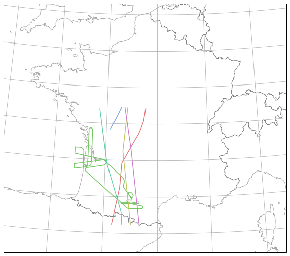
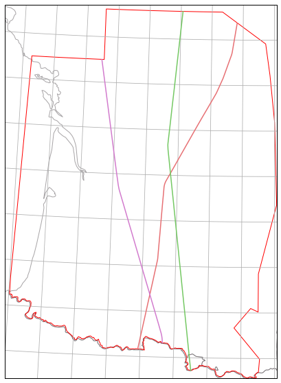

Quickstart
==========

Loading ADSB traffic
--------------------

The Traffic class offers a from_file classmethod for loading traffic data. A
pandas DataFrame is loaded into a structure offering various methods for
iteration, analysis and display.

The basic representation of a Traffic object is a summary view of the data: the
structure tries to infer how to discriminate flights based on a flight_id column
(if none, on a pair (icao24, callsign)) and returns a number of sample points
for each trajectory.

.. code:: python

    from traffic.core import Traffic
    t = Traffic.from_file("./data/20170713-opensky.pkl")
    t

.. raw:: html

    <b>Traffic with 5 identifiers</b>  
    <table id="T_11fadeb8_73bd_11e8_89f5_18dbf22f3d9e" > 
    <thead>    <tr> 
            <th class="blank" ></th> 
            <th class="blank level0" ></th> 
            <th class="col_heading level0 col0" >count</th> 
        </tr>    <tr> 
            <th class="index_name level0" >icao24</th> 
            <th class="index_name level1" >callsign</th> 
            <th class="blank" ></th> 
        </tr></thead> 
    <tbody>    <tr> 
            <th id="T_11fadeb8_73bd_11e8_89f5_18dbf22f3d9elevel0_row0" class="row_heading level0 row0" >3803da</th> 
            <th id="T_11fadeb8_73bd_11e8_89f5_18dbf22f3d9elevel1_row0" class="row_heading level1 row0" >AIB01KV</th> 
            <td id="T_11fadeb8_73bd_11e8_89f5_18dbf22f3d9erow0_col0" class="data row0 col0" >11246</td> 
        </tr>    <tr> 
            <th id="T_11fadeb8_73bd_11e8_89f5_18dbf22f3d9elevel0_row1" class="row_heading level0 row1" >a184d7</th> 
            <th id="T_11fadeb8_73bd_11e8_89f5_18dbf22f3d9elevel1_row1" class="row_heading level1 row1" >N1972N</th> 
            <td id="T_11fadeb8_73bd_11e8_89f5_18dbf22f3d9erow1_col0" class="data row1 col0" >4362</td> 
        </tr>    <tr> 
            <th id="T_11fadeb8_73bd_11e8_89f5_18dbf22f3d9elevel0_row2" class="row_heading level0 row2" >020025</th> 
            <th id="T_11fadeb8_73bd_11e8_89f5_18dbf22f3d9elevel1_row2" class="row_heading level1 row2" >RAM653D</th> 
            <td id="T_11fadeb8_73bd_11e8_89f5_18dbf22f3d9erow2_col0" class="data row2 col0" >2492</td> 
        </tr>    <tr> 
            <th id="T_11fadeb8_73bd_11e8_89f5_18dbf22f3d9elevel0_row3" class="row_heading level0 row3" >484164</th> 
            <th id="T_11fadeb8_73bd_11e8_89f5_18dbf22f3d9elevel1_row3" class="row_heading level1 row3" >KLM88T</th> 
            <td id="T_11fadeb8_73bd_11e8_89f5_18dbf22f3d9erow3_col0" class="data row3 col0" >2275</td> 
        </tr>    <tr> 
            <th id="T_11fadeb8_73bd_11e8_89f5_18dbf22f3d9elevel0_row4" class="row_heading level0 row4" >020025</th> 
            <th id="T_11fadeb8_73bd_11e8_89f5_18dbf22f3d9elevel1_row4" class="row_heading level1 row4" >RAM650E</th> 
            <td id="T_11fadeb8_73bd_11e8_89f5_18dbf22f3d9erow4_col0" class="data row4 col0" >1833</td> 
        </tr></tbody> 
    </table> 

The access to the underlying DataFrame is direct:

.. code:: python

    t.data.sample(5)[['timestamp', 'icao24', 'callsign', 'latitude', 'longitude', 'baro_altitude']]

.. raw:: html

    

    
    <table border="0" class="dataframe">
      <thead>
        <tr style="text-align: right;">
          <th></th>
          <th>timestamp</th>
          <th>icao24</th>
          <th>callsign</th>
          <th>latitude</th>
          <th>longitude</th>
          <th>baro_altitude</th>
        </tr>
      </thead>
      <tbody>
        <tr>
          <th>2317</th>
          <td>2017-07-13 13:45:36</td>
          <td>a184d7</td>
          <td>N1972N</td>
          <td>45.888775</td>
          <td>1.378716</td>
          <td>41000.0</td>
        </tr>
        <tr>
          <th>2463</th>
          <td>2017-07-13 16:43:48</td>
          <td>3803da</td>
          <td>AIB01KV</td>
          <td>43.623287</td>
          <td>1.364512</td>
          <td>NaN</td>
        </tr>
        <tr>
          <th>130</th>
          <td>2017-07-13 14:02:11</td>
          <td>a184d7</td>
          <td>N1972N</td>
          <td>43.610276</td>
          <td>1.802085</td>
          <td>41000.0</td>
        </tr>
        <tr>
          <th>3204</th>
          <td>2017-07-13 15:53:22</td>
          <td>3803da</td>
          <td>AIB01KV</td>
          <td>43.226257</td>
          <td>1.024922</td>
          <td>13200.0</td>
        </tr>
        <tr>
          <th>1537</th>
          <td>2017-07-13 15:25:37</td>
          <td>3803da</td>
          <td>AIB01KV</td>
          <td>43.023285</td>
          <td>1.958505</td>
          <td>19200.0</td>
        </tr>
      </tbody>
    </table>
    

A Traffic object can be indexed by flight_id (or by callsign and icao24): it
returns a Flight object with a specific representation.

.. code:: python

    t['AIB01KV']

.. raw:: html

    <b>Flight AIB01KV</b><ul><li><b>aircraft:</b> 3803da / F-WWKV (A332)</li><li><b>origin:</b> 2017-07-13 13:26:16</li><li><b>destination:</b> 2017-07-13 16:49:09</li></ul>
<svg xmlns="http://www.w3.org/2000/svg" xmlns:xlink="http://www.w3.org/1999/xlink" width="300" height="300" viewBox="-155801.0999626765 4570378.30164342 348935.79597329 392339.5269614216" preserveAspectRatio="xMinYMin meet"><g transform="matrix(1,0,0,-1,0,9533096.130248262)"><polyline fill="none" stroke="#66cc99" stroke-width="2615.596846409477" points="108863.16718189466,4653524.976580911 108810.83480473472,4653595.753820126 108757.98872221551,4653659.77000086 108757.98872221551,4653659.77000086 108757.98872221551,4653659.77000086 108602.75823764935,4653860.179904123 108576.04867110704,4653890.972187322 108549.55041757626,4653924.105463362 108549.55041757626,4653924.105463362 108442.35646659622,4654055.323376847 108442.35646659622,4654055.323376847 108340.63035198991,4654188.957961103 108256.92379342642,4654292.889355756 108233.58116394059,4654327.713408886 108157.48457142564,4654429.415624784 108157.48457142564,4654429.415624784 108157.48457142564,4654429.415624784 108157.48457142564,4654429.415624784 107974.51397600741,4654666.935047266 107932.67513376234,4654722.539089867 107885.56203670069,4654788.286148244 107833.31931482385,4654853.960947335 107781.00536026493,4654924.743698062 107733.9668740979,4654985.383813605 107733.9668740979,4654985.383813605 107644.6962145024,4655103.875091689 107644.6962145024,4655103.875091689 107644.6962145024,4655103.875091689 107644.6962145024,4655103.875091689 107644.6962145024,4655103.875091689 107644.6962145024,4655103.875091689 107382.21284477002,4655463.844475961 107336.51906456522,4655516.192984097 107285.92168149361,4655587.175543089 107285.92168149361,4655587.175543089 107285.92168149361,4655587.175543089 107153.38430143776,4655769.050633144 107153.38430143776,4655769.050633144 107064.60122131952,4655880.193915662 107001.89865296385,4655961.0520663215 106980.9503586451,4655991.409929551 106913.04841165183,4656077.304335856 106913.04841165183,4656077.304335856 106845.14797555139,4656163.1992244 106772.2754106815,4656255.345774882 106745.58143659012,4656286.143244467 106697.4456788964,4656347.811836089 106649.38327620839,4656404.286547748 106604.97934950977,4656461.245531206 106558.51201747899,4656517.310044559 106511.0115708115,4656577.4298705645 106467.57095621634,4656635.528515369 106424.83577885093,4656686.883538782 106355.33803786097,4656774.231438464 106302.14117443691,4656840.160651242 106280.51833415216,4656866.700793972 106205.62813506009,4656964.364819305 106152.17758263434,4657031.157149512 106124.55569333937,4657067.571413125 106050.60242668857,4657159.621623623 106002.40551396117,4657226.487764998 105973.12111136808,4657259.589142726 105920.91137105117,4657325.274348005 105847.39020930526,4657421.747850638 105821.5524014398,4657461.824211095 105743.20671926106,4657562.9070839 105713.60133362569,4657601.719319351 105654.76497022533,4657678.829730202 105596.91981213803,4657755.00177883 105574.49625909836,4657786.813961317 105499.6957247789,4657879.289421717 105440.86361179645,4657956.401127479 105392.6769427174,4658023.270238386 105339.24075563955,4658090.067091149 105278.30390038955,4658169.48841635 105221.51248979593,4658249.486771302 105135.93402283973,4658362.596159699 105105.90718833053,4658396.988638132 105045.10797622261,4658475.634009884 104985.7131858144,4658558.801350765 104922.0702498132,4658640.178955553 104868.57101274253,4658712.172362241 104793.71656161152,4658809.847257352 104735.01473193977,4658887.3977201935 104681.47406984979,4658953.763719069 104633.30019055672,4659020.636520389 104515.74298511252,4659169.676822628 104463.47795761227,4659241.256338211 104463.47795761227,4659241.256338211 104387.4070258133,4659339.35046923 104387.4070258133,4659339.35046923 104243.18663251027,4659519.198340422 104141.6759781513,4659647.68292041 104066.89175669447,4659741.554598304 103997.3962708836,4659832.72836894 103920.75739778965,4659928.567201069 103858.12062139239,4660009.445749193 103785.0923677801,4660100.39972198 103714.31837180724,4660187.315634064 103639.56340186809,4660279.805640196 103560.8912279824,4660373.195401392 103458.07340476742,4660500.716825143 103458.07340476742,4660500.716825143 103458.07340476742,4660500.716825143 103260.49661494195,4660747.387246601 103221.91782207538,4660792.57869371 103143.70905305799,4660888.5754520735 103030.95121955496,4661029.992647833 102987.22839672632,4661085.678107093 102902.81899312875,4661189.298522586 102783.93251136679,4661333.233194056 102695.27636068234,4661444.417021701 102611.88611836974,4661545.456324658 102534.54689733709,4661641.469618016 102486.80485611256,4661697.016669038 102372.11707723168,4661838.502017498 102288.66683630255,4661944.651316144 102208.99488288033,4662042.280835187 102113.00751007508,4662155.276326127 102075.02834554024,4662202.2984655695 101944.70637357055,4662364.011620312 101866.52946028025,4662460.018954895 101744.82792473477,4662607.478258273 101744.82792473477,4662607.478258273 101659.48721869221,4662710.231168374 101496.51397480725,4662914.8029245 101451.39241211084,4662967.186658436 101329.79894897397,4663116.903515603 101329.79894897397,4663116.903515603 101189.05523135062,4663293.811971539 101141.96848492902,4663347.469689532 101058.77031273731,4663455.537312824 100970.16346054427,4663566.737246727 100880.54924735712,4663671.258414476 100803.47635328941,4663768.847138547 100683.5910962244,4663920.499169462 100641.92229315045,4663971.027631611 100553.32738494068,4664082.231449134 100464.66773577864,4664198.543041838 100386.4606326392,4664299.669543188 100292.61481691427,4664421.022177554 100209.22117064752,4664527.189639418 100131.02075204147,4664628.318204013 100042.37375125162,4664744.6336430395 99964.17772650755,4664845.763550347 99882.43870097306,4664956.716889773 99797.0128772484,4665069.873478672 99727.52980395568,4665167.6563677685 99647.48977206585,4665270.496008982 99567.38403937528,4665378.529730795 99481.89972956706,4665496.8824576745 99444.50540293592,4665548.337415526 99369.48895427102,4665650.119332124 99265.03036077338,4665801.989261902 99182.69149826802,4665913.7193877995 99118.92804891526,4666004.395296896 99043.75786196209,4666109.294068999 98972.76708531416,4666211.910239752 98888.76025897545,4666330.633192066 98816.170040287,4666434.614756331 98781.8473261425,4666485.073023503 98654.32732686416,4666667.468866674 98570.7823767754,4666788.970492451 98498.58228864668,4666891.747244301 98423.68661388895,4667005.051110466 98351.42348094362,4667113.022161276 98274.1027589173,4667216.080595498 98199.21351870966,4667329.386050189 98129.77100840968,4667427.179791268 98059.1268982864,4667533.182518882 97985.44714564209,4667638.280971156 97899.94538431757,4667761.840169029 97825.06691855437,4667875.148260631 97735.54290730896,4667998.916810934 97657.27921150149,4668110.27813407 97579.01777375497,4668221.640052142 97504.60178096539,4668328.117413877 97432.94015148442,4668429.176782713 97392.36821474378,4668492.890785676 97276.43247342668,4668651.904624703 97208.61962804638,4668748.080321869 97130.37112968483,4668859.445650518 97052.1248894015,4668970.811573558 96973.94590363956,4669077.07152296 96885.33267052652,4669198.5215165755 96805.05907875337,4669316.442459836 96719.6607202578,4669434.818314157 96645.37153182804,4669542.774808786 96572.45389172094,4669638.889765696 96484.71365355965,4669769.443491405 96404.69889081262,4669877.502256951 96324.62070914298,4669990.75471194 96244.61048715019,4670098.814754452 96159.16384096476,4670222.388352972 96082.36827121726,4670327.287324948 95993.8477911706,4670443.638661377 95908.47436452056,4670562.021351775 95842.67080635238,4670656.240011317 95769.70950729512,4670757.467274177 95681.13454626419,4670878.92782106 95608.24157052298,4670975.0498322835 95530.16684533395,4671076.214584102 95444.43644690729,4671195.0293661095 95358.2818119416,4671308.992026154 95273.79068630045,4671426.611836672 95199.11610786903,4671529.552871829 95113.46286462221,4671643.004457052 95028.48512684663,4671761.139524343 94941.5394059891,4671880.89540953 94863.48261905237,4671982.065439587 94764.5712757416,4672113.619260922 94724.71336592165,4672162.463336526 94613.58781239572,4672316.026364477 94545.96716755848,4672402.007184409 94426.27590030669,4672558.841759022 94351.69009936434,4672656.423199066 94270.12845691653,4672766.296949098 94218.1232966654,4672832.045048466 94085.24671325753,4673011.485804262 93994.3158479232,4673130.594446973 93905.92209249048,4673241.858268504 93856.27482315496,4673304.694285676 93760.35844505303,4673433.3516691355 93671.71448463437,4673555.607471219 93552.5612542502,4673711.247053599 93500.1290341334,4673773.098454863 93414.16554096124,4673886.127602234 93286.79948605935,4674056.471049228 93195.72380782544,4674179.480143719 93110.56176026606,4674287.501276971 93026.68101613648,4674400.559138583 92934.75224587068,4674524.252569213 92839.40762783738,4674648.511059738 92756.16505942485,4674759.847747683 92663.13684725137,4674884.482325915 92574.08809711674,4675002.76092602 92476.81438498954,4675126.306888597 92386.24531119941,4675249.848601309 92295.67914363711,4675373.391130886 92242.35076791655,4675450.645297403 92103.8904718708,4675635.929640325 92012.33011068012,4675751.759137585 91922.90459476633,4675872.635468003 91827.0525195321,4676001.31156254 91736.50416622749,4676124.859157599 91643.04255816915,4676247.766574711 91592.70539999178,4676320.472599728 91438.31384073339,4676526.347285065 91383.01032843489,4676597.00389585 91252.06962972024,4676768.195029548 91252.06962972024,4676768.195029548 91055.39965768068,4677037.358950304 90966.97123568004,4677158.861294764 90868.19297732187,4677290.454081154 90769.41809830433,4677422.0478526475 90670.6465986336,4677553.642609107 90623.84234936748,4677617.5669221245 90453.54555906069,4677844.039564905 90400.29080436355,4677918.10138728 90293.8552191831,4678060.2546207635 90182.10193487981,4678209.529725612 90124.84594545187,4678282.506913148 89974.68564665776,4678477.115315297 89870.18643202851,4678621.632701212 89772.45868058062,4678749.9594327845 89655.4283270837,4678904.371048728 89543.63859639231,4679058.845670047 89442.5080934035,4679197.867727998 89442.5080934035,4679197.867727998 89272.43930452308,4679431.632696884 89218.95019596482,4679506.82289985 89064.35667302333,4679730.473230344 88960.35126385023,4679877.342204473 88856.23056149847,4680034.423607476 88750.16008613395,4680192.002507982 88648.0018892193,4680348.589415331 88552.95437570584,4680490.892993468 88456.97467316916,4680640.3700110875 88356.37980679562,4680799.660645785 88262.56887256961,4680951.760847968 88174.23223299989,4681094.058833087 88078.20725674415,4681248.731201706 87998.00918765533,4681393.201792005 87912.39987359052,4681553.188670141 87837.44216335638,4681697.720693705 87719.65712707234,4681924.843211954 87682.06181044431,4682007.493785412 87612.10735542876,4682172.855424211 87509.3360916743,4682418.759371733 87472.08792982386,4682513.963258286 87434.25933373593,4682617.3822547 87369.25074310882,4682808.764523678 87318.85958247153,4682978.245696717 87265.69388940137,4683156.349257384 87206.36547609694,4683426.291404447 87166.51151625109,4683600.912072301 87119.78962199284,4683843.995856268 87093.66838099534,4684020.676901486 87069.75739400827,4684195.7384901 87047.03517082517,4684394.612344567 87034.65177682719,4684583.391967729 87028.50419929126,4684684.575592738 87016.73287993723,4684798.675927717 87009.36195868015,4684985.521191795 87009.36195868015,4684985.521191795 87009.50446442753,4685440.901648695 87012.45237060511,4685629.853387155 87011.40060840163,4685721.747182845 87028.33089023361,4686070.956832406 87036.65315293205,4686257.977677483 87050.20574742956,4686445.057832788 87058.46740599627,4686637.26915873 87077.01127084452,4686845.1746021705 87077.01127084452,4686845.1746021705 87099.71357270771,4687146.588311774 87113.0245565533,4687354.432096315 87136.37819474719,4687598.73606498 87145.5286974303,4687713.070372855 87164.0669299257,4687920.972197179 87169.1755540914,4688005.83701686 87187.44118203346,4688194.9563000845 87215.04121518857,4688492.698624198 87223.73503816701,4688593.612976092 87245.9916166212,4688879.782844554 87256.44300668151,4688986.428093715 87279.30887345178,4689272.257015172 87279.30887345178,4689272.257015172 87302.59031452148,4689521.744847314 87325.4524048836,4689807.571275902 87348.49158993187,4690077.822334519 87357.8141868698,4690176.578021489 87371.80253878425,4690377.150583475 87389.81416424562,4690576.730367024 87403.28837600618,4690768.988559441 87422.0492712025,4690956.115028359 87440.6298884794,4691158.814683658 87454.28075383854,4691335.497343672 87471.27393501517,4691496.38267437 87487.04669486417,4691668.156519341 87503.19234196379,4691828.598598326 87522.02660132595,4691966.659714757 87538.98257085973,4692151.598612998 87559.16331754543,4692288.722751255 87572.57842635312,4692411.5776374135 87587.02831290454,4692528.992820473 87605.99216702525,4692687.128970844 87624.39457800082,4692830.634738308 87639.28347036686,4692973.061304808 87658.6310916048,4693108.270550545 87675.71636771492,4693249.856578496 87694.4844760918,4693393.019258228 87711.20372810021,4693534.600458003 87725.50244829676,4693654.175144877 87744.90651910096,4693784.192007579 87759.98986346845,4693909.399652728 87778.42691281445,4694049.35558408 87792.72343246992,4694168.929330982 87812.06482242176,4694304.136167669 87826.36024711757,4694423.709449649 87845.7002925778,4694558.915774705 87864.91946598301,4694704.50368292 87887.10888092281,4694834.896943468 87900.82408448622,4694972.892745268 87919.64210331957,4695110.947332089 87938.40026626355,4695254.105995063 87956.13952874295,4695401.232748404 87975.97344232387,4695535.318057227 87994.55184756024,4695693.78876804 88003.9294810794,4695765.367505804 88032.9328767016,4695988.765871041 88055.79906130502,4696133.527777794 88060.19126599836,4696194.838304477 88093.0666910982,4696440.25739421 88102.50156013899,4696506.731076719 88135.43331180436,4696747.044791459 88153.94560795599,4696910.616761819 88168.12567843962,4697007.774456641 88200.93422354749,4697258.294718948 88225.37281090637,4697413.455052938 88244.51596462908,4697564.227356048 88268.63992638698,4697735.822643062 88278.12014655102,4697818.994429117 88302.30280315487,4697985.398435679 88337.48385444406,4698240.009249011 88356.16572608563,4698388.265219631 88384.20099211355,4698578.159989517 88413.47998578906,4698755.004074378 88441.68163726755,4698930.364335504 88462.67844361094,4699015.139731037 88475.30455632403,4699109.421240828 88543.91508091123,4699350.142158987 88563.36408830447,4699432.044021574 88647.3292195231,4699667.839150272 88706.68323699835,4699826.776943434 88786.3156250551,4699996.16129758 88831.20061055118,4700083.46526619 88831.20061055118,4700083.46526619 88831.20061055118,4700083.46526619 89131.74600372268,4700551.5086156875 89242.31877239824,4700690.631941763 89422.36523544932,4700900.395052729 89499.14804815935,4700969.3034219025 89639.31237698864,4701100.215576328 89789.1171457926,4701236.954320673 89918.34181064734,4701347.496645549 89993.6853513751,4701414.143093243 90218.3581076956,4701584.654659864 90306.30207838713,4701653.184194984 90456.26951030985,4701774.364022284 90594.93519629164,4701885.8083078265 90801.97055301374,4702056.731112399 90877.77847625712,4702113.787963289 91150.34639153504,4702346.758441782 91278.11366868485,4702464.226039917 91407.60248353583,4702579.553455185 91538.68133811472,4702703.640149145 91660.05238315019,4702827.005971944 91785.34656233265,4702966.945377998 91905.90727235646,4703116.432366876 91966.09300729376,4703198.831865951 92111.57773032959,4703394.563072224 92199.58910407058,4703534.315006282 92296.85680716787,4703691.223571977 92371.37976477349,4703831.591349075 92398.64374663067,4703905.287165629 92490.35889660765,4704108.67391623 92550.77478493653,4704270.498799969 92593.60154142836,4704421.294835702 92630.53164287731,4704577.728547968 92670.97669994347,4704764.224819496 92693.92946448587,4704941.85565593 92717.63982310951,4705116.986435041 92731.42190996843,4705290.092081056 92734.73560349358,4705445.853419549 92732.64101350734,4705617.120201177 92732.64101350734,4705617.120201177 92732.64101350734,4705617.120201177 92690.2169089445,4706099.33176419 92667.67918998947,4706285.226410935 92633.54158612766,4706467.172322696 92600.14737312782,4706638.053630794 92554.18665269608,4706814.663753273 92500.92770495954,4707002.863235223 92469.37002918079,4707093.2261257125 92416.35324990108,4707251.928735964 92326.68913603092,4707500.93200928 92291.1554528218,4707589.343180946 92195.3407275442,4707825.987425571 92122.02856975286,4707988.422393769 92076.57795307922,4708074.637046519 91964.08347830376,4708317.221379811 91913.16564761086,4708404.408204494 91824.45826099275,4708576.865306431 91739.8694408701,4708740.116546059 91662.95479575613,4708870.934763553 91589.9103803254,4709012.959435691 91459.72693650889,4709246.16346732 91382.48388886469,4709394.972325018 91303.34505441142,4709540.298496289 91211.8547096819,4709704.334421023 91126.17166150818,4709869.911319607 91047.8692821335,4710027.186419848 90969.63134851339,4710179.358887683 90927.90571104178,4710260.517695794 90848.59766112317,4710421.414724534 90731.08592874663,4710653.565655602 90698.24713566467,4710722.201950433 90609.41042370794,4710909.974815797 90538.60065836913,4711050.906098698 90473.70855765471,4711183.950105323 90379.72928791908,4711376.766169897 90311.88531952401,4711513.754576793 90223.1934679096,4711701.098271762 90181.35749620476,4711782.689949426 90097.75891397987,4711960.320141924 90025.485507152,4712103.571419091 89951.60695427569,4712259.692497298 89878.56548944868,4712406.827722573 89801.0569399165,4712562.819771285 89722.0660654492,4712721.389568585 89646.13770175773,4712877.5739495335 89581.9903257786,4713011.7541146865 89507.23629072626,4713161.378957045 89435.10322108676,4713304.893626314 89362.02127112706,4713457.133734721 89282.93039453027,4713615.444638459 89213.58339544885,4713749.564683077 89143.03291058728,4713893.445097696 89064.04575470813,4714054.007079158 88981.38311543297,4714218.15907963 88913.5888749781,4714355.152917028 88834.45856357718,4714518.395548745 88762.3182319435,4714664.68058075 88679.67866998374,4714827.9691988295 88637.22645311446,4714913.276480833 88524.91118771116,4715137.544260466 88439.47321272809,4715312.99712604 88364.70303032015,4715467.815964631 88292.03590163942,4715627.849289145 88215.18978956672,4715775.897846862 88144.47095030664,4715921.942203494 88067.87304257078,4716081.930489864 87996.27524352632,4716227.532654074 87916.10569532767,4716400.108088358 87838.03815241386,4716567.086095255 87761.51312946761,4716721.88669572 87695.84542102869,4716861.244611658 87617.06992256406,4717024.323004376 87542.3037797665,4717181.653055711 87472.92712256697,4717323.736503767 87398.22571710176,4717475.96476809 87323.89284120774,4717640.565876269 87253.98221228027,4717785.584590512 87170.88775180062,4717950.171704677 87094.21071498317,4718120.541424965 87013.75845095243,4718288.0137618985 86933.69080894266,4718455.490815514 86848.35940112566,4718628.0106794825 86777.16254407492,4718775.956856999 86706.01620116128,4718930.823016382 86662.20326395221,4719028.91928906 86554.70441055537,4719252.301776875 86509.25222194128,4719338.530585254 86427.20917621272,4719514.030373491 86351.90038672063,4719678.623253243 86263.19340786987,4719859.842306855 86192.06734701201,4720014.710206594 86115.55044691569,4720174.706208234 86033.58421351336,4720345.018994968 85957.07387229423,4720505.015624236 85875.11464344485,4720675.3290894795 85836.89178302317,4720752.733416035 85754.49940530019,4720916.901907089 85647.87383039095,4721135.109640753 85563.96071615204,4721299.694170147 85520.08102982402,4721383.694555864 85477.5621101992,4721459.75376849 85351.66791677085,4721676.102442143 85231.99111382218,4721882.317103115 85137.78550047871,4722037.620598511 85058.22948905136,4722155.38233366 84963.11128355429,4722290.785555213 84873.87233556494,4722423.142130211 84767.33880395757,4722569.22945623 84673.47139789883,4722695.914358335 84571.86574493055,4722822.167648364 84451.75406124369,4722968.452355191 84332.81570560878,4723112.416566812 84228.88690825387,4723231.642381491 84118.20929751995,4723352.869846551 84014.2178013308,4723466.908381224 83907.44497271927,4723580.138878789 83791.62885754982,4723696.210803996 83691.60099762157,4723797.151660466 83582.70138721514,4723908.373335872 83517.91621810626,4723968.713482759 83344.2954943108,4724135.176987988 83297.01933005505,4724185.420462436 83097.69005398414,4724370.026107098 82981.29493221929,4724483.24823822 82865.61851156839,4724589.128948354 82758.2739689144,4724688.010991576 82650.0001905622,4724790.86225717 82539.59313486845,4724891.7025300525 82429.13340990139,4724997.64590071 82375.84083359396,4725041.861551388 82224.98744500044,4725185.504965478 82108.45785001546,4725290.089164671 82004.21779202411,4725385.468468892 81885.75671325199,4725493.147921734 81772.02978877426,4725597.680465555 81656.38721971585,4725703.577445122 81557.27079725504,4725795.731206335 81460.3684359485,4725882.894216164 81336.48068927843,4726000.899956614 81228.81107304957,4726098.327031569 81185.7774206955,4726134.185413204 81078.16808503511,4726238.1872628275 80910.01983211505,4726389.450651677 80814.26173703765,4726477.843722081 80749.63447767076,4726539.416545318 80636.59462233334,4726641.982142476 80494.82732000724,4726772.780501918 80400.24952831915,4726858.509877677 80286.72348036953,4726959.950628751 80195.18038409679,4727047.184529965 80098.30965290655,4727134.362931867 79990.36516931346,4727236.8178799795 79877.65274158011,4727334.381149079 79759.25226466995,4727442.089944778 79669.93196707396,4727524.250711688 79608.55071309625,4727580.591117352 79444.02347974156,4727731.056026275 79334.08246076945,4727831.941486417 79281.19672088341,4727877.304607778 79165.57023472867,4727988.336525625 79002.75436718244,4728134.590391902 78909.01050495877,4728216.626200309 78818.92382242843,4728301.035939587 78719.12892388654,4728391.831007489 78577.29690393391,4728523.00552019 78466.99826884671,4728623.898120001 78338.65503767802,4728739.910780337 78235.90085337288,4728835.782573707 78171.91237825212,4728888.647135723 78057.3583656742,4728997.196940641 77947.07354291325,4729098.09621982 77826.28376836535,4729209.092417817 77703.90609975456,4729314.453282753 77600.52809428243,4729410.844923119 77494.0850588151,4729509.454608344 77385.23893365945,4729607.6086192 77327.5045133639,4729658.03579462 77166.00111446255,4729807.017883956 76993.87147958545,4729966.098225609 76891.6943663007,4730058.446304676 76762.67092086385,4730171.275747755 76702.7227299737,4730228.169854256 76547.51778233226,4730371.433735207 76424.50572111935,4730480.437922815 76316.28928092377,4730581.810979557 76251.29241363016,4730636.841315489 76193.57337625201,4730687.276165795 75956.0746633707,4730905.03609594 75889.1329164676,4730964.805398994 75778.6683682347,4731064.087252952 75642.47656584471,4731186.805329616 75482.99048277058,4731330.9098936 75434.58338881384,4731377.119381544 75254.11654696101,4731540.041710411 75191.1604914297,4731595.532664961 75070.50151905497,4731701.466539282 74954.99494438664,4731812.554782306 74816.4083988834,4731936.472518969 74649.7538943375,4732090.465028304 74585.32688240311,4732141.708949521 74477.83115707152,4732239.220760715 74293.92372663325,4732408.008743882 74173.24015725967,4732519.056320838 74047.36106544467,4732630.054634771 73926.6846444849,4732741.105680002 73926.6846444849,4732741.105680002 73732.57991035865,4732917.760528904 73596.21694854935,4733038.865986933 73467.48636914608,4733157.972638755 73333.14055290366,4733281.176980851 73202.79923022671,4733397.245612687 73087.44455385001,4733498.156956338 72951.05309258122,4733624.373634572 72897.97821195202,4733671.243699134 72699.15116511544,4733856.090002304 72559.50530346784,4733979.255215506 72511.13293713148,4734025.481095546 72363.70413508534,4734154.367810305 72227.33653926563,4734280.595973187 72101.46653591933,4734396.723819307 71968.62448679438,4734513.132887592 71839.70085403266,4734631.2240489 71700.08325761712,4734754.403324075 71566.69497035109,4734876.260473732 71431.51007812869,4735000.869443424 71309.80151282954,4735108.488304475 71178.71398385604,4735229.681393591 71115.81843424421,4735285.202384707 70911.35440378924,4735472.024756514 70787.06408218035,4735586.197715083 70664.99058011842,4735694.168008798 70549.65704685278,4735800.214387763 70418.59364754146,4735921.419064842 70293.07558026254,4736032.907322335 70174.99529881074,4736135.561136594 70046.12723804987,4736253.679241455 69925.93859152221,4736365.7409813395 69799.14535111882,4736479.64541561 69659.54717083709,4736608.045145833 69514.58300264688,4736741.585227605 69375.66786282956,4736865.672829829 69251.56931933468,4736977.794344552 69129.39441787008,4737087.860237568 68993.89467978614,4737214.060184186 68872.60417704971,4737325.261696721 68752.12482077917,4737431.284816978 68573.94045155082,4737597.997132957 68446.42471975823,4737712.260479952 68371.3021426145,4737779.016346277 68178.0622813894,4737958.828293975 68178.0622813894,4737958.828293975 67968.8189542695,4738143.687775756 67829.28248029905,4738272.117236911 67693.84652490797,4738396.003520189 67582.43256756075,4738498.147148712 67452.86714419578,4738618.285656619 67314.17236797513,4738739.555039897 67154.35093125954,4738885.970023682 67028.63522501756,4739002.172120835 66960.05093704975,4739063.205736993 66772.02087517042,4739234.535867144 66698.71182129068,4739300.19829066 66567.81559866657,4739416.361240424 66423.58175429492,4739551.2557392595 66290.2285636427,4739674.058178811 66175.01689956279,4739780.16324232 66044.137015671,4739896.334199005 65902.78412995272,4740022.6171437055 65787.5832029467,4740128.727408258 65651.2237572085,4740249.957241615 65511.765420219446,4740378.42432415 65393.81776245773,4740481.144297638 65248.334488467095,4740618.813766647 65101.77090947182,4740750.165330502 64986.59228613936,4740856.286331666 64871.41689267615,4740962.40887336 64740.57747003825,4741078.599782949 64616.24108446558,4741190.266438925 64498.273914254125,4741298.185467338 64374.17885898726,4741412.105355358 64227.64582087682,4741543.471882471 64096.78301449537,4741664.772841347 63956.80248286803,4741786.344268469 63835.1131305984,4741902.280544019 63688.598946220496,4742033.656293928 63557.75325798349,4742154.965451576 63431.40172518161,4742269.484856759 63281.33682970803,4742403.085285869 63144.38698810435,4742528.9312247485 63024.0281152071,4742640.135181396 62857.85383343566,4742793.75084363 62734.618117382975,4742901.649787021 62621.18322355565,4743004.012718081 62509.517064944834,4743107.256256437 62354.32992955902,4743251.722617266 62209.41561751416,4743379.678563734 62071.83545190016,4743509.51265911 61925.41778597783,4743636.682952552 61791.44561085891,4743760.067566816 61716.18004787669,4743827.9170451835 61571.75594336188,4743960.555733906 61368.157703371086,4744145.620065813 61240.206274729215,4744262.66511181 61110.973108311635,4744382.1221179 60963.01961894382,4744515.433833753 60842.72441732706,4744626.668302875 60693.155470780024,4744757.378230932 60569.94099667662,4744870.494756634 60440.13113210705,4744985.548386937 60280.69635673193,4745132.697242602 60147.34523451218,4745248.418505252 60012.94556627052,4745369.147221905 59873.67731220713,4745497.7057192605 59734.454867511784,4745621.080200342 59582.7557245015,4745753.953516004 59441.62014556849,4745880.343095971 59295.385919637636,4746011.794990716 59159.36314621491,4746133.129247226 58995.596651019405,4746273.957351478 58936.71264116789,4746325.362161898 58746.51123246692,4746497.107549028 58578.028844841894,4746644.130647998 58449.560856386044,4746757.236367849 58305.028941876415,4746885.779157977 58165.817669143216,4747014.365396226 57999.27183839114,4747159.426574885 57852.96088366862,4747290.902190137 57722.37780664049,4747402.100797057 57591.75962509053,4747518.401078384 57437.94070566975,4747657.087306621 57288.7161306567,4747791.489191793 57152.92280819287,4747907.756772129 57074.02903124593,4747981.064610799 56870.68827034204,4748161.049797967 56694.12612559172,4748315.309549346 56533.593061699066,4748459.320508309 56458.6823150103,4748526.180920865 56306.70333733889,4748661.270579623 56144.77317136601,4748807.957865967 56003.89277675213,4748932.503669456 55854.12978880747,4749061.048499352 55700.86048065882,4749202.44913278 55549.441510437406,4749333.92587056 55387.5779307954,4749475.528022288 55241.35726557878,4749607.048361842 55067.77780419503,4749760.585282955 54907.3064509687,4749904.626801593 54832.424428598795,4749971.501483438 54682.66436162144,4750105.252816379 54516.85672261731,4750254.448961007 54367.14525737738,4750383.0200058585 54206.66319406778,4750532.2604888985 54050.95548484422,4750669.350911016 53915.22726268069,4750790.769600109 53763.871220788395,4750922.278114266 53607.7804292793,4751062.139672186 53450.65771832571,4751205.626920462 53292.30416800497,4751345.1323736 53142.59861148678,4751478.910705461 53024.95568912804,4751586.9873509575 52866.11023868011,4751726.756441031 52741.61475543688,4751839.110473249 52521.70729056506,4752030.318108302 52375.55054415038,4752166.98666829 52228.46874255289,4752291.896578082 52088.57933290698,4752419.9702541325 51921.62630895687,4752566.701592827 51838.30218627549,4752636.655505845 51677.91796990623,4752785.9432317875 51535.53960380944,4752910.81081478 51314.53572798376,4753104.980350539 51232.966016217295,4753179.0142895905 51097.362792843,4753295.37862566 50881.68327098951,4753490.978216408 50737.41128349569,4753619.303346308 50591.35182255349,4753750.903174903 50440.113019835044,4753882.470783647 50299.2701035031,4754010.826173639 50127.14702123683,4754165.9412232395 49975.924627449785,4754297.517075966 49887.25385403724,4754378.517216979 49736.03990251448,4754510.097334495 49527.43944158337,4754697.393862437 49375.06456393198,4754834.41757932 49375.06456393198,4754834.41757932 49086.623575001126,4755091.812568119 48953.097735474934,4755210.212012246 48797.4358736832,4755350.42229527 48651.410800617996,4755487.154150994 48493.73808604135,4755627.270458716 48344.20246919741,4755761.132820189 48344.20246919741,4755761.132820189 48098.819292379565,4755978.217290359 47959.70195626466,4756106.103082778 47826.211745259316,4756224.5201340085 47644.64816579915,4756389.304050612 47500.45173515446,4756523.21473771 47358.60197407754,4756646.598865694 47207.44560615302,4756783.322631242 47045.86632553249,4756930.181847318 46907.79124696075,4757058.7823399585 46733.18582522018,4757208.677484544 46587.23410250449,4757345.444340662 46523.42252761634,4757403.817086033 46321.444021257164,4757588.552529453 46165.75691086974,4757728.291319936 45967.11501442221,4757907.610880841 45824.14055403591,4758037.322105313 45663.99000770101,4758186.721904929 45589.27199945642,4758253.677460411 45423.85427880895,4758397.864548109 45300.18077073451,4758515.429121384 45221.00942248155,4758588.496903285 44987.59995635793,4758799.0870917775 44831.45759408009,4758938.760684249 44690.67601146759,4759067.552994748 44521.94663427546,4759222.108004167 44378.14099930848,4759351.233166604 44185.40883002847,4759528.554254813 44057.738966555575,4759644.557396014 43924.34236382525,4759768.220214209 43737.48217817621,4759938.931269188 43643.76444088196,4760019.965747803 43470.8745378063,4760180.393412839 43404.18125338351,4760242.920422485 43166.83135302737,4760453.450423108 43008.45771839069,4760597.551305009 42846.80347250706,4760741.982063556 42685.63232605895,4760891.430721985 42534.64570754761,4761028.236758187 42394.08084550301,4761154.90706113 42233.46576876629,4761298.4909582315 42086.926470567996,4761433.601429832 41935.96157311868,4761570.418001923 41769.514113337165,4761721.064026144 41630.88649271484,4761844.732940049 41492.23483688924,4761973.588800657 41321.615048463944,4762128.195465854 41161.697254953586,4762267.309544267 41023.06139038629,4762396.172965653 40858.5637353611,4762543.390562734 40708.5307416714,4762679.628661064 40546.31694509311,4762827.210192414 40384.99682589572,4762974.194661578 40218.11680134205,4763122.880651396 40051.992375384165,4763273.215715235 39895.89634406879,4763415.138781561 39734.60149297293,4763562.1354724625 39583.86911347337,4763695.019284473 39423.98948110149,4763839.350457035 39271.597617076135,4763977.761321411 39120.21348684326,4764117.735488642 38944.36049409635,4764277.5463352455 38777.397677323,4764428.938392356 38608.666693854146,4764581.707142604 38459.484038034454,4764715.74184405 38299.647597872136,4764860.093967794 38139.79099871462,4765009.633469185 37981.634478251144,4765148.815441314 37820.41407489486,4765295.848077069 37745.59709129837,4765360.192107737 37745.59709129837,4765360.192107737 37331.614342783105,4765736.93843206 37149.63897681913,4765899.174701661 36967.67144982482,4766061.414847224 36797.46414840276,4766221.296965847 36696.29263750856,4766308.937445651 36520.57534215931,4766461.972008739 36291.807986140695,4766674.97894852 36187.87838605918,4766761.143207887 35950.77357062959,4766979.303365511 35849.6220963043,4767066.9539033165 35663.27977786638,4767231.965647025 35498.22446423942,4767381.52904085 35403.03112459016,4767466.015988575 35137.95837123115,4767709.469661897 35137.95837123115,4767709.469661897 34784.60185072717,4768023.89185366 34613.132716152446,4768176.034567683 34518.7269130781,4768258.288416163 34342.93605954442,4768419.488981218 34162.11639123155,4768578.078177181 34000.0405881779,4768723.795580002 33833.77736420864,4768875.97732597 33833.77736420864,4768875.97732597 33475.3334554758,4769195.527976235 33310.63309519209,4769341.505832423 33080.56966599154,4769545.519517408 32992.28197631636,4769621.596193696 32753.341264785002,4769839.749358281 32656.19016901552,4769924.430902464 32501.897366825553,4770063.730225013 32241.244742840965,4770290.702909312 32161.321282920475,4770362.244842684 31911.432724180828,4770584.780826454 31805.05573836803,4770677.640741471 31522.615133292973,4770935.5601986805 31352.928784673,4771085.26971528 31182.723408241676,4771240.077896719 31007.22649474484,4771394.867590282 30847.674639564462,4771539.358626788 30749.06759569296,4771620.51348292 30512.673565197976,4771833.46877064 30349.32403359327,4771985.902086015 30252.100506460865,4772070.869707913 29986.245993385342,4772308.257402885 29810.798606534263,4772463.071695613 29607.12070483759,4772645.597576492 29417.382626765022,4772814.0140524125 29241.958740511225,4772968.840044052 29072.600166352808,4773122.656348204 28901.74698937758,4773273.360028347 28726.324611739987,4773433.3801736375 28545.612707184475,4773593.383772741 28392.881671188996,4773726.628536369 28216.462693103025,4773889.074276208 28030.06438596184,4774057.965816336 27858.49604801566,4774208.860325701 27661.3622836199,4774386.532061713 27472.09535612204,4774553.524472288 27275.473175013627,4774734.230600756 27173.766289462706,4774823.104398476 26940.365822455384,4775031.244053332 26831.452452975922,4775127.698474514 26541.024458118532,4775386.61605073 26372.282923836494,4775539.623571468 26191.65363172575,4775704.86027628 26080.106206810466,4775802.9564245865 25915.44713173802,4775947.520871413 25711.30051360536,4776138.084965342 25607.363820796687,4776226.36495612 25262.134210372682,4776536.1947924765 25102.801733540866,4776680.792710934 24907.70372429132,4776854.041993761 24826.649095090917,4776928.6717318 24662.038774569017,4777073.260349405 24391.20944672877,4777321.170791046 24197.532711222633,4777493.922456428 24000.571554936516,4777671.678387287 23913.363565946227,4777744.655686479 23741.443290326424,4777900.209699905 23462.07273599848,4778157.883840743 23269.83712115432,4778326.859915795 23095.798197046734,4778483.284068412 22984.332391533662,4778581.4206423545 22886.377452209385,4778672.257152982 22554.762182781185,4778971.957142634 22474.778253763317,4779041.169942932 22235.94189517466,4779258.145555957 21997.134511339926,4779469.944869982 21816.695799486763,4779635.27354579 21715.49903988328,4779723.781550805 21606.706014432653,4779825.399014474 21606.706014432653,4779825.399014474 21137.504375148626,4780244.916571934 20951.81100020979,4780410.248522252 20951.81100020979,4780410.248522252 20560.487959946207,4780760.219118501 20479.64720126002,4780833.939986802 20315.192012434494,4780983.795131786 20039.35535350292,4781231.828399947 19845.89061434964,4781400.445925143 19680.207182945873,4781547.804934028 19487.75013335135,4781722.738867413 19245.294603561928,4781944.193189929 19245.294603561928,4781944.193189929 18941.507923972687,4782213.698291108 18769.032647641434,4782371.077563844 18591.537399433368,4782523.783451315 18329.063704499444,4782762.4031024575 18225.674004705594,4782854.574755861 18135.535792284587,4782937.278214691 17852.90570666321,4783189.338462378 17658.399561774197,4783361.112432512 17485.47089476125,4783519.72557252 17276.71265195404,4783707.454496384 17112.384269509854,4783857.370986039 16952.504051163964,4783992.444162431 16741.373034833552,4784183.031101312 16497.189602402435,4784404.213315816 16396.863109437756,4784498.400298688 16211.390422777153,4784658.652683043 16000.543838050457,4784851.590476838 16000.543838050457,4784851.590476838 15653.965980738354,4785161.71617425 15488.447774949676,4785309.156330774 15294.680759330391,4785480.7262737425 15105.702207298813,4785654.901396603 14839.04025076967,4785894.396227624 14658.913388989427,4786059.87510585 14584.747590968409,4786127.100047056 14362.268089226054,4786323.596487735 14160.981093443406,4786504.5920153875 14160.981093443406,4786504.5920153875 13771.550818962658,4786854.96139885 13678.481439815341,4786941.419919564 13414.18402114509,4787176.903852007 13324.150693049114,4787259.657742845 13037.431505963868,4787516.101143813 12835.827249684717,4787699.199961313 12747.948885243108,4787780.581655176 12561.87588253178,4787943.330427152 12355.121744433616,4788133.77312827 12153.931705673718,4788314.815760309 11968.635639189224,4788480.342414584 11781.444695720347,4788655.456779594 11595.414353499054,4788818.226592969 11393.880269509129,4789001.359252303 11296.329565292299,4789090.77304832 11011.511611823576,4789347.286860311 10841.136093542109,4789499.4731189385 10655.898249865115,4789665.028160037 10463.858662090557,4789840.768706512 10274.854935613654,4790011.681290858 10102.24094593101,4790166.383692096 9999.68157680183,4790260.037235122 9766.8542176732,4790472.184459956 9581.664105464679,4790637.762710161 9410.085787847236,4790792.221242472 9244.808150990943,4790944.877355138 9064.048444913386,4791107.708619761 8888.589001202101,4791263.900104864 8718.046140638107,4791418.114582903 8516.652152296123,4791601.314714512 8315.268004055413,4791784.519561588 8126.8634031726515,4791957.379901934 7953.837284942776,4792110.225059143 7777.793872031008,4792267.906750189 7680.200650394502,4792359.606760803 7418.165528622346,4792599.1636411315 7254.233758435023,4792744.086846347 7081.3625248497565,4792904.20391292 6895.53955640588,4793067.0759764705 6714.882020392134,4793229.95671558 6540.401901544572,4793385.937998118 6332.9447416963185,4793576.09255018 6147.154688094765,4793738.980897064 5945.889894543764,4793917.146203386 5757.970900530534,4794089.972371482 5600.142510929662,4794232.772996362 5409.098779724954,4794400.595773645 5218.311348849844,4794573.863429991 5060.255575640001,4794711.233411502 4806.56505781297,4794944.226058345 4806.56505781297,4794944.226058345 4521.81771263836,4795194.9964350695 4330.9449641611145,4795368.801871867 4151.280223751226,4795529.3191987 3938.9131452107913,4795719.442401173 3749.7026876800414,4795891.793597814 3585.913850220414,4796036.787100714 3400.9976772315185,4796202.49883658 3200.242451614598,4796378.570095837 3036.4727874160685,4796528.755281516 2845.542864123882,4796702.248269071 2644.4361361688552,4796880.491238226 2479.4321590144687,4797028.182393865 2270.5462907350243,4797212.38984105 2170.0677903972814,4797303.201365316 1984.4606119808693,4797466.180247581 1742.401400849597,4797688.904255039 1557.5667788827693,4797854.6557779685 1386.4452516343965,4798006.079764346 1221.4908680648407,4798153.795157925 1045.3540720797805,4798310.492471249 844.7101125259724,4798491.800030207 665.1949491243699,4798652.390479436 474.12265988886037,4798826.195231035 300.90841036502593,4798978.763331825 200.98021721333365,4799070.720457218 15.459680166750827,4799233.742106557 -257.6529225043393,4799478.281976255 -458.61128180801666,4799656.597899891 -649.2550058767741,4799828.441669896 -812.8720710228725,4799978.700163451 -968.6926040909044,4800115.145406567 -1124.2558562321426,4800253.32037747 -1361.736066444842,4800465.769612528 -1442.6521911161653,4800538.055693807 -1725.8460544849315,4800792.228655187 -1916.5569320707336,4800966.086549508 -2105.7512201868385,4801139.430179369 -2297.7027416829887,4801307.5118405875 -2390.409111380616,4801389.049286863 -2580.5880345079668,4801559.208998239 -2776.6632843035854,4801730.4975796575 -2956.9016974225206,4801893.58185834 -3049.5936289876618,4801975.126464445 -3399.7482641576576,4802275.834708751 -3492.4306377997527,4802357.3841436 -3677.791829140903,4802515.391886536 -3872.938940946564,4802683.942389685 -4125.715497628963,4802897.685224592 -4125.715497628963,4802897.685224592 -4522.119760818751,4803229.030287742 -4605.9938915301245,4803295.649731019 -4780.014274818675,4803435.629675304 -5072.920445540756,4803672.565871405 -5072.920445540756,4803672.565871405 -5366.323200413824,4803891.813212958 -5561.914224776572,4804039.681931041 -5766.0387478604725,4804187.475537958 -6066.565693198206,4804400.105442432 -6066.565693198206,4804400.105442432 -6483.198150464007,4804677.167757329 -6483.198150464007,4804677.167757329 -6894.921940850268,4804932.231176342 -7085.344952761252,4805039.3807155 -7085.344952761252,4805039.3807155 -7291.195096910763,4805161.831492004 -7636.0008317897,4805345.554377286 -7636.0008317897,4805345.554377286 -8054.094493919369,4805562.351371147 -8054.094493919369,4805562.351371147 -8491.633130848515,4805775.221365612 -8696.08929567418,4805871.375037704 -8696.08929567418,4805871.375037704 -9138.637547778959,4806065.46628892 -9452.53671702999,4806193.200466559 -9586.330830942381,4806244.308279005 -9833.326947573905,4806341.410086234 -10085.478662388387,4806428.3393351715 -10320.801626811717,4806513.0953383325 -10320.801626811717,4806513.0953383325 -10320.801626811717,4806513.0953383325 -11022.022037913157,4806730.189972747 -11160.95908547821,4806771.145575467 -11380.343531912073,4806835.794799104 -11638.651084837229,4806898.352485233 -11891.680861696848,4806960.910623791 -12128.902942808878,4807013.091583225 -12257.040826409737,4807047.920143633 -12257.040826409737,4807047.920143633 -12257.040826409737,4807047.920143633 -12257.040826409737,4807047.920143633 -12257.040826409737,4807047.920143633 -12257.040826409737,4807047.920143633 -12257.040826409737,4807047.920143633 -12257.040826409737,4807047.920143633 -14212.526447525925,4807418.122757115 -14449.237093446343,4807459.325294182 -14696.106700236704,4807504.612877029 -14943.230466544755,4807546.887438062 -15170.526741345597,4807583.259284152 -15170.526741345597,4807583.259284152 -15607.024910476714,4807660.302472583 -15843.720291287946,4807701.548928503 -16161.486837128681,4807756.27272723 -16389.143747752303,4807794.408892426 -16519.918695738037,4807814.034963522 -16967.936096580055,4807892.736681025 -16967.936096580055,4807892.736681025 -17226.208411644937,4807934.766348882 -17226.208411644937,4807934.766348882 -17737.214036670393,4808021.601828828 -18080.048366338313,4808081.818880746 -18184.832879287496,4808099.080232964 -18433.1645965549,4808144.839526481 -18433.1645965549,4808144.839526481 -19097.22541115503,4808260.463069711 -19334.39652256333,4808297.331545803 -19571.551760525115,4808339.387354902 -19800.30196577789,4808378.23414479 -19800.30196577789,4808378.23414479 -19800.30196577789,4808378.23414479 -19800.30196577789,4808378.23414479 -19800.30196577789,4808378.23414479 -19800.30196577789,4808378.23414479 -21015.51683467249,4808591.938571305 -21373.87164192328,4808649.932389391 -21611.004390436512,4808692.052555892 -21719.161112359627,4808709.545654748 -22180.115244293487,4808792.135523577 -22180.115244293487,4808792.135523577 -22665.660926583252,4808875.346158412 -22665.660926583252,4808875.346158412 -22665.660926583252,4808875.346158412 -23176.042935197784,4808960.9097135365 -23421.81107136772,4809005.013111939 -23421.81107136772,4809005.013111939 -23874.459388982414,4809082.846527383 -24255.08186265852,4809150.286372372 -24347.667367476373,4809165.867615141 -24598.697546145417,4809208.904389997 -24598.697546145417,4809208.904389997 -25072.90653909332,4809288.17598747 -25473.336052231658,4809356.866336167 -25607.800598157857,4809384.00140091 -25818.673423919077,4809420.38054078 -26034.69040940696,4809456.783512874 -26034.69040940696,4809456.783512874 -26495.437055233935,4809536.5298066735 -26718.715292566845,4809576.345045593 -26934.72347703574,4809612.773898937 -27197.025590526926,4809654.470609872 -27197.025590526926,4809654.470609872 -27680.830004418476,4809737.654097381 -27906.725020697202,4809779.32728222 -28168.996803998754,4809826.15127728 -28405.574500974213,4809862.699992628 -28405.574500974213,4809862.699992628 -28892.47664501253,4809949.426530904 -29140.94367172624,4809992.8643563455 -29351.782464910477,4810029.342662958 -29758.036971169415,4810097.162280729 -29968.869877774738,4810133.657908478 -30172.53930618343,4810172.029778291 -30409.596055774895,4810209.247948799 -30683.62409739062,4810258.797512655 -30904.7228457996,4810299.332670423 -31156.68337599325,4810342.247398735 -31405.130636780184,4810384.29255483 -31655.459838102146,4810425.835940273 -31905.52718806742,4810469.285779809 -32142.543835153712,4810511.738239078 -32353.22555539497,4810548.90452678 -32601.52560085448,4810592.887888467 -32827.26891089614,4810628.665604461 -32827.26891089614,4810628.665604461 -33316.21551486867,4810713.184727201 -33527.01406478584,4810749.780213743 -33742.95585343632,4810786.404833592 -34000.01124796694,4810833.409140804 -34000.01124796694,4810833.409140804 -34452.440696920974,4810911.879788229 -34452.440696920974,4810911.879788229 -34832.9000345902,4810974.762193838 -34832.9000345902,4810974.762193838 -35424.109270351444,4811079.405787284 -35660.58838892752,4811121.276251771 -35908.22007899626,4811165.970185884 -36145.217467856084,4811203.369424915 -36382.187316795185,4811245.95563177 -36611.648581500514,4811283.764585176 -36848.11475483144,4811325.672435695 -36977.26108070195,4811347.287408851 -36977.26108070195,4811347.287408851 -37557.523161179735,4811446.34751294 -37809.273086098176,4811491.297566318 -38056.13018162301,4811535.454227271 -38266.88291413133,4811572.18272502 -38266.88291413133,4811572.18272502 -38266.88291413133,4811572.18272502 -38967.707215600814,4811694.069548258 -39204.67300430813,4811731.565365394 -39441.609129079916,4811774.248081426 -39678.542585628595,4811816.938269676 -39678.542585628595,4811816.938269676 -40178.75141766919,4811902.482627788 -40436.75653643778,4811945.310054259 -40569.62242582957,4811971.409651504 -40687.83416275156,4811992.424942779 -40687.83416275156,4811992.424942779 -41173.86537996172,4812073.642278295 -41173.86537996172,4812073.642278295 -41173.86537996172,4812073.642278295 -41895.66555619423,4812197.731234366 -41895.66555619423,4812197.731234366 -42538.09504864335,4812308.316214801 -42538.09504864335,4812308.316214801 -42927.03376473021,4812378.736376362 -43279.74038146454,4812442.924108888 -43421.89934203577,4812464.46649864 -43648.147930415646,4812503.162819449 -43910.22754141713,4812550.536194875 -44158.90726202589,4812593.0916984435 -44408.71747165405,4812634.971572501 -44645.09834377512,4812677.124858715 -44869.57427070735,4812716.451742817 -45117.85221603438,4812761.453748396 -45364.39591448028,4812802.309874123 -45590.626652391744,4812840.719437536 -45826.99456379451,4812882.909923542 -46027.6641912066,4812915.133311362 -46359.27488851681,4812974.156634215 -46489.852170101076,4812999.052080566 -46705.66708381887,4813036.049350346 -47069.87052984514,4813097.724917606 -47178.40789193343,4813115.415026267 -47389.07250665241,4813152.399478606 -47794.9647942441,4813226.287430167 -47913.169608022225,4813242.323527536 -48159.41455116617,4813285.945766517 -48267.682414057315,4813305.721695774 -48267.682414057315,4813305.721695774 -48964.69061630582,4813425.842690419 -48964.69061630582,4813425.842690419 -49296.256225160156,4813484.99570105 -49521.32289297854,4813522.739373639 -49757.647769631345,4813565.053571024 -49993.97001733092,4813607.375204825 -50217.26407724604,4813646.509107317 -50492.32301260438,4813692.214462347 -50738.27305882968,4813738.07755501 -50990.63016158371,4813782.179638794 -51332.95913111932,4813840.546673115 -51555.751392105245,4813877.731597722 -51685.562560049715,4813899.949952942 -51935.8843543225,4813946.573178666 -52132.849616016305,4813980.747188674 -52348.60498357209,4814018.510879662 -52711.59458870611,4814079.330064663 -52953.02742025955,4814121.781096427 -53201.10515393567,4814164.373530966 -53446.17085841841,4814206.779998531 -53589.990117245055,4814233.27503879 -53837.796732533614,4814277.699395035 -54048.26695472822,4814315.473979908 -54285.076375832956,4814353.4457476 -54285.076375832956,4814353.4457476 -54758.61226097433,4814439.769838718 -55007.66920087616,4814482.947228571 -55007.66920087616,4814482.947228571 -55490.0068366134,4814564.289339715 -55747.79642420811,4814612.8218461955 -56010.88958127211,4814656.223644216 -56235.24885284278,4814695.803920719 -56437.05347479035,4814731.940320373 -56668.570120633514,4814769.947518271 -56668.570120633514,4814769.947518271 -57121.02109698511,4814851.081816892 -57331.45920723606,4814888.948431092 -57589.2659928506,4814932.365147327 -57825.99857380977,4814975.627642363 -58171.50470294299,4815031.483289344 -58299.49607948375,4815056.996039319 -58557.29168731345,4815100.446007541 -58557.29168731345,4815100.446007541 -59018.86686793953,4815180.730636491 -59280.75814996233,4815228.640261062 -59525.2747537239,4815268.651704979 -59646.264471738396,4815290.333562891 -59938.104302553336,4815340.835963443 -60140.75154127355,4815377.165271503 -60351.160151220625,4815415.116524714 -60351.160151220625,4815415.116524714 -60790.539625300284,4815490.324545033 -61061.30021266708,4815540.008713804 -61283.5070940768,4815575.838246929 -61529.460872799624,4815621.537820594 -61529.460872799624,4815621.537820594 -61529.460872799624,4815621.537820594 -61529.460872799624,4815621.537820594 -61529.460872799624,4815621.537820594 -61529.460872799624,4815621.537820594 -61529.460872799624,4815621.537820594 -61529.460872799624,4815621.537820594 -61529.460872799624,4815621.537820594 -61529.460872799624,4815621.537820594 -63885.91553842123,4816029.756434467 -64101.554604041725,4816067.857836073 -64359.28308629199,4816111.507088239 -64595.94068131367,4816154.983026353 -64806.3057180235,4816193.059141572 -65057.40139385818,4816234.171628098 -65288.41414753291,4816276.929753597 -65537.3681141801,4816318.557555934 -65774.01260043333,4816362.070631586 -65774.01260043333,4816362.070631586 -65774.01260043333,4816362.070631586 -65774.01260043333,4816362.070631586 -66725.89506920984,4816528.99426231 -66952.02073943293,4816569.34314294 -67188.6494156807,4816612.900810462 -67408.63432314992,4816652.258752553 -67635.65942871549,4816689.4425815465 -67893.34681810263,4816733.21320379 -68142.7166854318,4816781.1464939015 -68387.64669659035,4816820.5881421 -68597.97454410858,4816858.770512484 -68597.97454410858,4816858.770512484 -68597.97454410858,4816858.770512484 -68597.97454410858,4816858.770512484 -68597.97454410858,4816858.770512484 -68597.97454410858,4816858.770512484 -70000.94865432402,4817103.896703973 -70000.94865432402,4817103.896703973 -70000.94865432402,4817103.896703973 -70000.94865432402,4817103.896703973 -70000.94865432402,4817103.896703973 -70000.94865432402,4817103.896703973 -70000.94865432402,4817103.896703973 -71720.37162836488,4817410.496236715 -71720.37162836488,4817410.496236715 -71720.37162836488,4817410.496236715 -71720.37162836488,4817410.496236715 -71720.37162836488,4817410.496236715 -72967.57571088523,4817626.286174335 -73224.15495241738,4817674.63188208 -73460.21901431085,4817717.691833496 -73721.98281247384,4817761.012814593 -73945.16093261469,4817800.594499102 -73945.16093261469,4817800.594499102 -73945.16093261469,4817800.594499102 -73945.16093261469,4817800.594499102 -73945.16093261469,4817800.594499102 -73945.16093261469,4817800.594499102 -75153.7667998828,4818014.640709107 -75401.33686301904,4818058.568244902 -75646.41064189888,4818101.097609 -75874.45578698235,4818141.045116899 -75874.45578698235,4818141.045116899 -76544.4394649454,4818257.935854499 -76768.06166253949,4818300.368513144 -76978.36042793222,4818333.6071752645 -76978.36042793222,4818333.6071752645 -77446.18008410839,4818416.128899399 -77661.68428913839,4818454.619821964 -77661.68428913839,4818454.619821964 -77661.68428913839,4818454.619821964 -77661.68428913839,4818454.619821964 -77661.68428913839,4818454.619821964 -77661.68428913839,4818454.619821964 -79130.53164400924,4818712.674768215 -79340.88571294832,4818750.555315026 -79551.23770770173,4818788.441758461 -79551.23770770173,4818788.441758461 -79551.23770770173,4818788.441758461 -79551.23770770173,4818788.441758461 -80469.61020976726,4818951.06093809 -80736.3751568692,4818999.9467748245 -80987.77689272129,4819043.2375552375 -81230.38216033677,4819088.167458899 -81230.38216033677,4819088.167458899 -81677.1073691443,4819165.545555595 -81926.64650718374,4819206.258044035 -82171.09294630223,4819253.828181398 -82372.93898064012,4819287.557246682 -82583.26133178777,4819325.528688513 -82833.25170061925,4819369.901744922 -83064.49623570147,4819408.72301996 -83311.74944372605,4819450.751093123 -83547.70218330236,4819494.128307402 -83815.95225149856,4819541.4143384155 -84065.79538510615,4819586.517506122 -84276.1012092027,4819624.536402636 -84512.10080037267,4819662.851924357 -84768.59682398073,4819706.500183117 -84768.59682398073,4819706.500183117 -85229.46882922506,4819790.466008811 -85229.46882922506,4819790.466008811 -85712.38602137721,4819875.1448186785 -85712.38602137721,4819875.1448186785 -85968.86818270014,4819918.834124891 -86225.28864819196,4819967.624174634 -86651.05405341777,4820038.756593411 -86651.05405341777,4820038.756593411 -87110.5059167615,4820122.908276015 -87333.1591486632,4820163.833046875 -87543.49275590804,4820196.851593885 -87543.49275590804,4820196.851593885 -88035.79703098327,4820289.213794757 -88282.15424327365,4820328.288433189 -88507.65548961725,4820371.180821016 -88764.10531029696,4820414.965714963 -88999.99773794725,4820458.514378683 -89222.5615824965,4820494.833349603 -89479.93556797676,4820544.523320813 -89610.27132136318,4820567.665105199 -89938.5249234656,4820622.537551554 -90136.60925140549,4820661.1784295235 -90338.52765172413,4820693.569917456 -90656.72044674726,4820750.337477022 -90751.27910805977,4820767.02283037 -90982.3787202399,4820811.26636729 -91256.44441342202,4820857.509376981 -91487.2332813951,4820895.981615524 -91723.09560214925,4820939.615901245 -91969.97733590829,4820983.911240474 -92215.36515338591,4821027.160509821 -92463.72802661781,4821072.871502968 -92700.13640983023,4821112.055022317 -92910.22507337485,4821150.918485123 -92910.22507337485,4821150.918485123 -93377.70198668881,4821234.43339742 -93614.10080021407,4821273.6457354585 -93614.10080021407,4821273.6457354585 -94176.10650199842,4821373.9330535205 -94412.43153305107,4821418.348622423 -94543.28160794624,4821438.216726142 -94785.33527967203,4821485.219760699 -95000.73236610464,4821519.030544316 -95245.686048204,4821564.272792088 -95583.68846901025,4821624.869273762 -95717.3899002541,4821646.693383256 -95948.06756510664,4821690.394636914 -96183.94595289667,4821729.077459697 -96440.24133242507,4821778.216531295 -96676.11458637699,4821816.91483986 -96901.91038173744,4821859.373947402 -97227.53988665549,4821915.395927908 -97357.96579995294,4821937.810967993 -97593.76305624926,4821981.629823555 -97803.9366205061,4822020.027876584 -97803.9366205061,4822020.027876584 -98309.38355800169,4822105.643775982 -98445.87476352755,4822133.336539096 -98445.87476352755,4822133.336539096 -98880.52761810108,4822207.355006911 -99234.19721638114,4822273.157866085 -99459.38164722316,4822312.492576223 -99459.38164722316,4822312.492576223 -99926.71742388113,4822396.415663341 -100264.55158265377,4822454.977662611 -100394.11269414602,4822475.189982616 -100664.36423797744,4822526.560650661 -100913.91326247563,4822570.238248296 -101171.21262570217,4822615.151296713 -101428.50900718664,4822660.073175714 -101428.50900718664,4822660.073175714 -101428.50900718664,4822660.073175714 -102120.05310234443,4822785.679061935 -102355.86729854156,4822824.556074975 -102494.21657380517,4822851.916755035 -102856.59867826289,4822917.838244693 -102986.24203490523,4822940.168231399 -103255.66782426144,4822985.493078667 -103503.94054969394,4823028.808066848 -103616.66860933797,4823050.741864901 -103734.53285123249,4823072.748736877 -104226.53016051007,4823161.081599614 -104473.66426208112,4823204.412954857 -104730.92192865437,4823249.448159476 -104933.82821459354,4823283.025178179 -105177.1692120727,4823328.22540455 -105413.37109410975,4823372.98749375 -105656.36970186692,4823415.436494214 -105901.62562350917,4823457.580182496 -106148.32335542537,4823503.895458049 -106245.69993033604,4823520.558215836 -106245.69993033604,4823520.558215836 -106245.69993033604,4823520.558215836 -107004.01292142243,4823654.5587179195 -107111.72443244462,4823675.523957011 -107111.72443244462,4823675.523957011 -107695.87884129402,4823780.68596242 -107917.37712784517,4823817.892292585 -108187.85985610548,4823864.1873638 -108444.00794490796,4823913.736470806 -108654.1492079209,4823947.347182329 -108771.98548795705,4823969.43322075 -108993.43040539781,4824009.605356078 -109250.63512710157,4824054.795648553 -109250.63512710157,4824054.795648553 -109791.26620882163,4824150.767254565 -110011.94397390875,4824191.303592085 -110237.41023965046,4824229.84568402 -110365.5033617299,4824252.539953213 -110365.5033617299,4824252.539953213 -110365.5033617299,4824252.539953213 -111231.3638712212,4824407.981557891 -111461.87121173163,4824452.159780276 -111685.96160200622,4824489.60306059 -111907.62324560921,4824530.123896141 -112153.03331038666,4824574.288008762 -112281.61880551805,4824596.849962716 -112688.33138421709,4824670.389483387 -112809.02097980825,4824692.927628105 -113055.1919495505,4824735.838249983 -113055.1919495505,4824735.838249983 -113541.84183143734,4824824.704506633 -113790.37396977798,4824868.365817225 -113920.94475684101,4824891.590492927 -114269.30596897857,4824952.932597408 -114479.31592303274,4824991.797866818 -114750.71939988651,4825038.431413405 -114878.86610161248,4825064.138632486 -115217.72471215168,4825123.30729779 -115324.54879049268,4825142.305945172 -115705.76225005504,4825208.53849244 -115800.21212039689,4825225.53956754 -115800.21212039689,4825225.53956754 -116435.1278879853,4825338.992555818 -116630.73175355438,4825376.485305363 -116748.52360323469,4825398.69667843 -116970.32036046252,4825435.399795484 -116970.32036046252,4825435.399795484 -117516.88211070755,4825532.973912911 -117762.60437245054,4825577.327574359 -118008.56613807,4825622.210990926 -118126.35033048684,4825644.444012058 -118361.91669312333,4825688.9156043315 -118710.207193952,4825750.464102452 -118953.56506428921,4825793.006872639 -118953.56506428921,4825793.006872639 -118953.56506428921,4825793.006872639 -119688.45592021702,4825923.953637329 -119798.21121832421,4825946.343231876 -120113.5018639982,4826002.076298243 -120297.86242125908,4826035.600292984 -120625.66547057891,4826091.81568854 -120821.24414348487,4826128.554870683 -121045.55816272912,4826169.90819854 -121327.2210871862,4826220.313766119 -121327.2210871862,4826220.313766119 -121327.2210871862,4826220.313766119 -122023.70223956446,4826343.702553216 -122153.71144579313,4826367.752738883 -122410.76151178966,4826413.3945133975 -122653.58040329444,4826455.876641621 -122868.64229130476,4826495.061302171 -122972.01919489492,4826515.839002468 -123323.47660189941,4826578.604709495 -123657.24029621735,4826635.397230824 -123657.24029621735,4826635.397230824 -123657.24029621735,4826635.397230824 -123657.24029621735,4826635.397230824 -123657.24029621735,4826635.397230824 -124706.89204917858,4826826.006226334 -124824.63886734852,4826848.3444762975 -125280.01508414546,4826927.096678723 -125500.55768893503,4826966.621953774 -125631.43540968199,4826989.970631266 -125631.43540968199,4826989.970631266 -125631.43540968199,4826989.970631266 -126470.5610540469,4827143.970317775 -126701.35216372438,4827184.136422669 -126923.86326026691,4827224.945605937 -127052.7494739655,4827247.0770291 -127377.93389188581,4827304.4080128865 -127519.48788178722,4827332.719209355 -127519.48788178722,4827332.719209355 -127519.48788178722,4827332.719209355 -127519.48788178722,4827332.719209355 -127519.48788178722,4827332.719209355 -128772.92782283133,4827556.214675879 -128772.92782283133,4827556.214675879 -128772.92782283133,4827556.214675879 -128772.92782283133,4827556.214675879 -128772.92782283133,4827556.214675879 -128772.92782283133,4827556.214675879 -128772.92782283133,4827556.214675879 -130403.8430681201,4827848.652942661 -130403.8430681201,4827848.652942661 -130403.8430681201,4827848.652942661 -130403.8430681201,4827848.652942661 -130403.8430681201,4827848.652942661 -130403.8430681201,4827848.652942661 -130403.8430681201,4827848.652942661 -130403.8430681201,4827848.652942661 -130403.8430681201,4827848.652942661 -130403.8430681201,4827848.652942661 -130403.8430681201,4827848.652942661 -132836.41937111737,4828290.323612778 -133104.23598359065,4828336.526126909 -133348.2862653788,4828380.932436344 -133591.87624851408,4828422.921831922 -133839.60889105368,4828471.2078147065 -134069.95821432897,4828510.990177971 -134325.87879745863,4828556.3323608795 -134572.28934016204,4828601.080220482 -134817.17913400946,4828646.671844556 -134909.29668395274,4828663.614083925 -135269.56584653544,4828727.620716307 -135513.23017420335,4828771.314203708 -135743.56218918244,4828811.148036095 -135966.81981385074,4828854.226105138 -136197.511632948,4828894.684707141 -136407.16915960202,4828934.765766466 -136643.11428587008,4828975.334248714 -136852.76736810606,4829015.427775081 -137074.08456054275,4829054.446909152 -137293.1938245183,4829090.8427051185 -137639.16219814064,4829154.182945577 -137744.49436506265,4829173.734478465 -137990.38275583982,4829217.636430688 -138247.24624871745,4829263.821340301 -138383.46741050007,4829292.2401833525 -138708.48361148173,4829350.06287275 -138931.65825785493,4829389.258091895 -139187.52201078128,4829434.766355352 -139405.62656878502,4829476.988300253 -139719.67478523898,4829531.284102514 -139940.34697768316,4829569.858527854 -139344.71822206583,4857964.360071133 -139082.84236515526,4857959.453415316 -138834.19193409092,4857961.0996421175 -138701.25872437118,4857958.616910656 -136945.2614725964,4857955.9742243895 -136945.2614725964,4857955.9742243895 -136404.9437232023,4857951.727871871 -136404.9437232023,4857951.727871871 -135878.22974822187,4857947.165804297 -135878.22974822187,4857947.165804297 -135878.22974822187,4857947.165804297 -135878.22974822187,4857947.165804297 -134824.70960430696,4857943.240933311 -134824.70960430696,4857943.240933311 -134824.70960430696,4857943.240933311 -134824.70960430696,4857943.240933311 -134558.7503737813,4857943.508571457 -134558.7503737813,4857943.508571457 -133218.82266575552,4857939.718936567 -133218.82266575552,4857939.718936567 -133218.82266575552,4857939.718936567 -133218.82266575552,4857939.718936567 -133218.82266575552,4857939.718936567 -132978.42855567613,4857940.50153982 -132717.67419085462,4857935.8393141115 -132335.11093282772,4857934.535894184 -132335.11093282772,4857934.535894184 -132335.11093282772,4857934.535894184 -131674.99745281186,4857933.158400755 -131531.13518322853,4857935.095399372 -131413.02899904895,4857933.69557944 -131308.27824551292,4857931.843631984 -131308.27824551292,4857931.843631984 -130862.99613310299,4857929.162848493 -130862.99613310299,4857929.162848493 -130426.49394528726,4857930.889208074 -130134.97310855726,4857930.86648128 -129993.29202208544,4857929.421367511 -129993.29202208544,4857929.421367511 -129993.29202208544,4857929.421367511 -129081.46250621493,4857927.755918911 -128953.6415409028,4857925.536410802 -128662.12150359731,4857925.571469148 -128385.00662361611,4857922.158042057 -128096.85235023845,4857922.359682919 -128096.85235023845,4857922.359682919 -128096.85235023845,4857922.359682919 -128096.85235023845,4857922.359682919 -128096.85235023845,4857922.359682919 -126860.43662933128,4857921.84671749 -126572.37153835835,4857916.933919648 -124581.11820639382,4857912.001121305 -124581.11820639382,4857912.001121305 -124581.11820639382,4857912.001121305 -124581.11820639382,4857912.001121305 -124581.11820639382,4857912.001121305 -124581.11820639382,4857912.001121305 -124581.11820639382,4857912.001121305 -124581.11820639382,4857912.001121305 -124581.11820639382,4857912.001121305 -124581.11820639382,4857912.001121305 -124094.39909850486,4857911.36000699 -123844.69779274313,4857909.867565484 -123486.67059530363,4857911.584895517 -123077.60106904032,4857907.298775375 -122949.69556942074,4857910.269923915 -122550.80919156976,4857908.768821546 -122264.40573530245,4857909.139214215 -121737.69845716452,4857905.579529327 -121590.24923204587,4857906.183878454 -121092.59678291812,4857903.231693463 -121092.59678291812,4857903.231693463 -120208.62358440271,4857901.038904146 -119947.78571428273,4857901.912227571 -119947.78571428273,4857901.912227571 -119390.40236680838,4857898.023762752 -118838.13197177227,4857894.258884269 -118562.35372425569,4857893.475649885 -118059.62938271489,4857880.295745917 -117557.06751132378,4857856.802548222 -117321.45753842186,4857847.903609869 -117049.18823095427,4857830.240892498 -116510.60274154313,4857773.045261432 -116510.60274154313,4857773.045261432 -115951.57959552258,4857706.168621254 -115679.26545517087,4857666.906959054 -115444.13044540574,4857627.025352849 -115188.04189666072,4857586.826339335 -115031.30889723761,4857558.523530726 -114670.93841670519,4857485.67897298 -114401.06602501305,4857432.78825425 -114120.77874332204,4857367.413716863 -114120.77874332204,4857367.413716863 -113600.65759613144,4857241.54088632 -113324.06792841252,4857170.042918931 -113086.58706054231,4857102.255281298 -112875.47937928625,4857039.015750934 -112625.14506385538,4856962.767583148 -112389.12774929944,4856888.124322023 -112056.90918526126,4856773.052199898 -111931.81208136212,4856729.766816386 -111666.05372490671,4856632.618386318 -111421.16504867974,4856540.967265135 -111071.63521157799,4856405.237872089 -111071.63521157799,4856405.237872089 -110676.37116657996,4856240.035689267 -110676.37116657996,4856240.035689267 -110676.37116657996,4856240.035689267 -109958.7686763275,4855910.3407475315 -109718.85973624968,4855791.131894715 -109718.85973624968,4855791.131894715 -109313.90094033274,4855585.319428309 -109006.34558357153,4855423.564911484 -108725.16424901168,4855266.262363465 -108501.90122320503,4855140.866288222 -108501.90122320503,4855140.866288222 -108501.90122320503,4855140.866288222 -108040.45163076324,4854859.343043735 -107816.52430755716,4854717.914017696 -107589.34479804676,4854567.818994367 -107364.84610500102,4854421.564442006 -107032.8375897867,4854183.890779007 -106940.97296518685,4854115.7216026215 -106753.60052989869,4853980.7141780015 -106540.13671091384,4853819.719524875 -106348.72309478915,4853669.569085464 -106151.38753847053,4853514.077054494 -105858.07162162384,4853270.708134046 -105767.9969167107,4853198.006322202 -105597.17920430636,4853045.492709493 -105597.17920430636,4853045.492709493 -105198.52839283827,4852693.090461805 -105033.00175558632,4852535.48787912 -104842.44445318393,4852355.539926397 -104842.44445318393,4852355.539926397 -104474.49723966916,4851989.372551453 -104298.81864824875,4851805.764173406 -104128.37331228617,4851622.23259878 -103949.59501305585,4851426.942849332 -103949.59501305585,4851426.942849332 -103617.02762355353,4851050.782566974 -103462.52270882085,4850867.658288946 -103462.52270882085,4850867.658288946 -103159.02133542125,4850489.676133071 -103008.99256426543,4850297.218946275 -102844.15265727749,4850082.735117577 -102691.5516145667,4849867.387871545 -102540.66088145529,4849654.136719649 -102540.66088145529,4849654.136719649 -102273.2702411692,4849267.449599164 -102134.53372292328,4849058.511928916 -102009.1968468381,4848855.366854841 -102009.1968468381,4848855.366854841 -101753.83077988842,4848434.523961907 -101753.83077988842,4848434.523961907 -101508.8135304391,4848003.648182276 -101508.8135304391,4848003.648182276 -101254.15072398339,4847526.8381599905 -101254.15072398339,4847526.8381599905 -101254.15072398339,4847526.8381599905 -101254.15072398339,4847526.8381599905 -101254.15072398339,4847526.8381599905 -101254.15072398339,4847526.8381599905 -101254.15072398339,4847526.8381599905 -101254.15072398339,4847526.8381599905 -101254.15072398339,4847526.8381599905 -101254.15072398339,4847526.8381599905 -101254.15072398339,4847526.8381599905 -101254.15072398339,4847526.8381599905 -101254.15072398339,4847526.8381599905 -100025.07421785462,4844454.22325418 -100025.07421785462,4844454.22325418 -100025.07421785462,4844454.22325418 -100025.07421785462,4844454.22325418 -99819.93870590649,4843706.074415096 -99765.33655360856,4843472.403961317 -99713.69280084595,4843250.850745963 -99713.69280084595,4843250.850745963 -99713.69280084595,4843250.850745963 -99713.69280084595,4843250.850745963 -99503.79009460074,4842087.467638094 -99503.79009460074,4842087.467638094 -99503.79009460074,4842087.467638094 -99503.79009460074,4842087.467638094 -99503.79009460074,4842087.467638094 -99503.79009460074,4842087.467638094 -99503.79009460074,4842087.467638094 -99338.39771140384,4840459.093158475 -99338.39771140384,4840459.093158475 -99338.39771140384,4840459.093158475 -99338.39771140384,4840459.093158475 -99302.56746598614,4839498.832205474 -99295.77668736788,4839239.120441316 -99295.77668736788,4839239.120441316 -99295.77668736788,4839239.120441316 -99295.77668736788,4839239.120441316 -99287.79549148028,4838346.247250506 -99290.96885423343,4838108.146376352 -99288.19149359556,4837884.89213887 -99287.08785332857,4837611.096157899 -99287.08785332857,4837611.096157899 -99288.45773723112,4837114.110434224 -99291.50357915802,4836866.768699292 -99291.50357915802,4836866.768699292 -99292.4126142521,4836413.688845406 -99292.4126142521,4836413.688845406 -99295.82776328323,4836166.779624756 -99296.10178887338,4835751.9100978635 -99299.47221510408,4835498.9564300645 -99299.47221510408,4835498.9564300645 -99300.80747779396,4835013.768689702 -99303.99501551637,4834774.528619333 -99303.99501551637,4834774.528619333 -99305.7835811276,4834255.254071362 -99303.50264431047,4834041.393208643 -99306.68992131182,4833802.147989583 -99310.14847499062,4833542.540044567 -99307.86694546977,4833328.675810531 -99307.86694546977,4833328.675810531 -99312.95285113309,4832946.894911543 -99312.56946202288,4832590.494829443 -99312.56946202288,4832590.494829443 -99316.02775087985,4832330.879938357 -99316.63290445073,4831843.8363212 -99316.63290445073,4831843.8363212 -99318.10707809693,4831404.262310245 -99320.2029102255,4831181.12621766 -99320.2029102255,4831181.12621766 -99321.01409805201,4830725.485532358 -99325.31583358611,4830477.6941151 -99322.37628212996,4830228.4241215205 -99325.54786421181,4829990.28048551 -99328.71946288085,4829752.135604021 -99328.0013686034,4829505.22133868 -99331.18781141727,4829265.952208581 -99331.18781141727,4829265.952208581 -99331.16564382195,4828778.694843986 -99330.68450334981,4828532.727793453 -99333.53172852223,4828318.908323884 -99334.73174734293,4828115.940098017 -99333.753770373,4827916.653014722 -99336.43575241824,4827592.963616961 -99338.9174765671,4827406.5796697065 -99337.44976247601,4827121.754924197 -99340.95724423122,4826990.013890087 -99340.5679244385,4826633.567157613 -99342.12694056169,4826516.4708001735 -99343.63300195342,4826262.232622846 -99343.6349534639,4826017.466776276 -99344.99023419495,4825765.122587534 -99348.16095088408,4825526.955673259 -99349.74631540386,4825407.871752272 -99351.17461180396,4825065.33263006 -99352.06768415864,4824838.265646203 -99348.66772917383,4824698.399313886 -99354.66403760012,4824247.941675143 -99352.22847237911,4824035.585473695 -99353.81363654212,4823916.49768234 -99354.4047484066,4823664.994893341 -99355.23706912728,4823414.184435673 -99357.19707533662,4823069.2207903825 -99357.19707533662,4823069.2207903825 -99360.6569191253,4822611.549429347 -99361.47951316522,4822361.423617677 -99363.1058753377,4822239.224738128 -99361.08552430161,4822004.940939034 -99364.54139709077,4821745.265923636 -99362.58833759531,4821505.887906386 -99367.84156212592,4821280.674033252 -99366.98818541717,4820949.208677979 -99366.59753070748,4820818.433865746 -99371.34052181794,4820462.007641078 -99371.23323845974,4820234.559400071 -99373.09364580551,4820094.749127643 -99370.99886365011,4819856.482826229 -99372.4454342289,4819606.436725993 -99376.91705090922,4819270.368979781 -99376.48253231443,4819048.607654754 -99379.65186391554,4818810.406018354 -99381.23653582312,4818691.304741161 -99378.96788714927,4818343.487305285 -99382.4229611826,4818083.791727498 -99385.26833078459,4817869.923690032 -99383.3823154287,4817738.343395453 -99385.47969149362,4817467.5770353945 -99385.47969149362,4817467.5770353945 -99388.58771127634,4816951.145386006 -99392.03224574869,4816692.21880341 -99389.59002010238,4816479.827867712 -99391.6586729647,4816230.030835147 -99394.84241077506,4815990.692703334 -99392.88430439605,4815751.284944949 -99396.33885615872,4815491.574882488 -99395.51910066957,4815241.9931131685 -99396.27681218204,4815109.577292476 -99398.17335443788,4814966.98959127 -99397.20822966033,4814718.870661091 -99398.04301298084,4814590.0801687995 -99403.82066771325,4814221.706520379 -99402.72088860569,4813851.598233375 -99406.81752613351,4813600.173828301 -99407.80053671422,4813469.655617079 -99405.77248290254,4813235.327530085 -99408.9556014333,4812995.974032999 -99408.88326799194,4812652.287270077 -99411.73543887639,4812400.062878783 -99413.97976421834,4812269.040099892 -99413.22786290062,4811900.906673581 -99414.51455702707,4811804.144138312 -99417.3588376755,4811590.247299195 -99415.32913195419,4811355.90980138 -99415.32913195419,4811355.90980138 -99421.48308455937,4810911.972598816 -99420.96395908539,4810554.537257305 -99425.371233256,4810223.065600639 -99425.371233256,4810223.065600639 -99425.28526292504,4809832.995399407 -99426.91038043305,4809710.763621392 -99426.53462731061,4809342.442485834 -99428.06140748122,4809237.044062051 -99430.9415476939,4809010.962283612 -99429.18112522758,4808746.742236915 -99433.58786765767,4808415.257840939 -99432.93448522218,4808096.050497521 -99435.8891839011,4807845.443495908 -99434.15134133256,4807617.221471941 -99436.67509115327,4807389.573043417 -99438.53403814601,4807249.724323352 -99437.53399035746,4806975.402491234 -99440.71588529098,4806736.017114112 -99438.74956737354,4806496.56209679 -99440.99891159598,4806270.631494683 -99444.70692292188,4806048.34564687 -99442.05831119813,4805794.02685009 -99444.63545880122,4805666.271208212 -99449.28667403081,4805250.150037064 -99448.35425224742,4804998.958219758 -99450.68934980988,4804747.635805631 -99447.94320741102,4804642.343040782 -99451.46304711042,4804377.478007747 -99453.60578396227,4804131.157897493 -99451.84079414334,4803866.910566861 -99456.12789301647,4803638.835804984 -99453.82040910001,4803424.833509292 -99455.71555725257,4803282.2104016505 -99459.22987172355,4802913.71825341 -99462.39609308592,4802675.434716099 -99460.28567320817,4802437.079873487 -99463.79589893512,4802172.893232669 -99463.14628600534,4801947.507998687 -99466.59791683179,4801687.721809701 -99468.2922092534,4801437.236907381 -99467.46954599975,4801234.297602305 -99469.09378068105,4801112.043625053 -99470.310011263,4800888.059823397 -99471.52127070815,4800541.452473477 -99474.36357815198,4800327.5047014225 -99475.83694438271,4800074.678150046 -99475.84286071667,4799828.221054624 -99477.16504663268,4799577.289681034 -99480.05537902509,4799359.711277224 -99478.60722898683,4799232.143956603 -99481.38272542536,4798862.315370124 -99481.38272542536,4798862.315370124 -99486.13095450355,4798504.859272586 -99486.51351337267,4798248.899716715 -99489.10896132751,4797883.120012024 -99489.10896132751,4797883.120012024 -99491.44148392255,4797489.785374681 -99490.75267368618,4797153.491407263 -99492.03823576675,4797056.69877962 -99491.28127820145,4796725.496167157 -99495.0701481386,4796440.209530615 -99495.49261675955,4796209.543501867 -99496.27460891454,4795961.263261377 -99499.45443755874,4795721.822571309 -99500.05007412517,4795468.614647014 -99500.92878247208,4795222.490959619 -99501.37310921542,4794971.178410775 -99504.2626450579,4794753.579128308 -99507.42738975039,4794515.254978056 -99508.15282616111,4794290.111131822 -99506.1756421431,4794050.593662149 -99511.63897230396,4793800.205316367 -99509.17673312532,4793587.711678056 -99510.21855567147,4793357.644802071 -99515.57451260711,4793105.869560845 -99516.84783801982,4792858.357187233 -99514.53121891756,4792644.306722794 -99519.78437050013,4792390.799030484 -99515.73159049788,4792165.322749431 -99520.82910199212,4791914.056086264 -99518.70911759204,4791675.647777043 -99516.58881268634,4791437.238295136 -99514.81207794415,4791172.920993695 -99507.40635002163,4790934.438894678 -99502.90519509026,4790799.467225923 -99487.03280803272,4790478.126697584 -99474.3397144994,4790239.571091254 -99451.14350606146,4789995.692663589 -99434.00893757182,4789769.168134178 -99401.4029378753,4789503.74210661 -99371.11011246384,4789253.547308905 -99337.26583409218,4789014.705773238 -99303.14476249595,4788796.58957067 -99264.3766521786,4788548.957084678 -99221.09972280446,4788308.864995689 -99177.48294270442,4788094.248488863 -99148.40362148188,4787951.170436172 -99148.40362148188,4787951.170436172 -99021.75182506526,4787378.718889862 -98960.2678897309,4787133.631661429 -98923.49678942928,4787000.297410316 -98849.42941061442,4786744.505184465 -98849.42941061442,4786744.505184465 -98745.99454823109,4786366.013129468 -98621.83245236574,4785992.343629173 -98549.81875535834,4785770.351040075 -98509.07644414206,4785650.611249489 -98509.07644414206,4785650.611249489 -98284.18908601333,4785051.634104304 -98186.95470212292,4784801.582164317 -98186.95470212292,4784801.582164317 -98033.02119654058,4784436.764705602 -97927.60836040563,4784194.380850827 -97817.08319933465,4783957.113733115 -97706.51490661578,4783722.61091597 -97595.82498125386,4783496.918295886 -97474.9983959956,4783255.80467679 -97353.04416569455,4783023.315785591 -97227.95885904253,4782788.800469989 -97110.03032485806,4782584.786530572 -96985.86716367259,4782365.489224619 -96848.90287046146,4782141.708609453 -96717.37097641414,4781925.947158736 -96591.96826076043,4781722.878537888 -96451.76780588676,4781513.746792403 -96399.98513243628,4781424.966556293 -96124.51415360323,4781032.68942044 -95987.4043500993,4780836.0433035735 -95911.218171671,4780733.131228559 -95687.74818429723,4780429.560346081 -95536.5705894831,4780237.319743559 -95387.73548192659,4780048.566896467 -95203.05432412757,4779823.596337769 -95112.94447580901,4779713.775596552 -94937.06348047867,4779509.223545981 -94776.76933545973,4779327.246849975 -94623.88086466976,4779157.115523284 -94369.05124286193,4778873.568959112 -94190.49916734609,4778687.831351476 -94027.18543931837,4778522.676734206 -93855.76372875017,4778350.0805366095 -93679.99264384453,4778181.925922531 -93578.42995371569,4778087.4420099845 -93286.63648869928,4777810.032545532 -93180.60060283882,4777719.644765526 -92979.90224800051,4777536.076724202 -92772.01542781055,4777362.100824993 -92565.55244310947,4777184.346412342 -92284.04558236206,4776956.602729133 -92181.67521303441,4776873.789209031 -91874.42586786368,4776635.549300621 -91696.98931853077,4776503.961292353 -91487.02239668986,4776351.073259121 -91372.28708707534,4776267.514646568 -91061.70483277713,4776050.432235027 -90825.36082373525,4775886.874430519 -90598.03245269865,4775738.206164919 -90473.19241792604,4775664.906241954 -90231.40335962138,4775511.66823043 -89942.25301632949,4775331.951428615 -89805.49249897458,4775252.5580859715 -89552.96120927665,4775109.580282278 -89347.71470410103,4774998.275945258 -89116.16619863319,4774871.113459221 -88846.95881788322,4774728.392854208 -88636.187653385,4774623.953895434 -88510.77925277877,4774552.925100132 -88116.9300185872,4774368.069204777 -87889.08794550574,4774265.696902758 -87667.7228101187,4774169.8004451 -87437.82580385066,4774069.577574342 -87309.36186644029,4774010.110203666 -86866.41664549535,4773833.906617961 -86739.83145031884,4773785.788820063 -86465.52820794386,4773684.132391618 -86217.58367440673,4773593.156174073 -85964.27686006119,4773507.310673745 -85710.96433671784,4773421.47357456 -85573.74805169398,4773375.241152355 -85177.77725461274,4773254.707642666 -84934.61503018755,4773184.477141774 -84665.5226595059,4773108.951087758 -84512.36637955446,4773065.7551458785 -84047.47376568402,4772946.49331763 -83836.0963344111,4772897.476184721 -83588.57129360925,4772843.138024799 -83365.65543902414,4772798.930586389 -83144.73412964049,4772756.652627615 -82984.8132473112,4772719.201703067 -82561.48032967994,4772648.270032183 -82432.47182804189,4772621.365757616 -82149.48434392037,4772578.177321263 -81740.42762205278,4772527.147282004 -81446.03277550015,4772488.267712089 -81165.28608262923,4772458.619124396 -80921.81098031752,4772435.2574908305 -80651.84533716014,4772411.619428395 -80397.06329226165,4772395.411129391 -80117.04135477569,4772379.979180765 -79873.45063410403,4772367.0183752375 -79590.60229628017,4772356.241647473 -79359.66809692436,4772351.207595312 -79089.4769341235,4772348.359441466 -78778.64150645494,4772347.686875647 -78654.99746580521,4772348.983878628 -78411.24148625533,4772351.6208342975 -77992.22110110862,4772370.070541402 -77723.1338766307,4772382.575799956 -77435.84625968916,4772398.5319383545 -77165.39069700977,4772421.670246864 -76884.58738990771,4772445.317191541 -76624.43201591229,4772473.159477941 -76315.0316663038,4772505.780909273 -76206.32429362444,4772514.873021338 -75844.61188670075,4772568.929007099 -75698.73598116208,4772586.206986292 -75429.35420971441,4772629.376635378 -75025.2112022647,4772701.7947123805 -74760.95842156392,4772750.136882367 -74760.95842156392,4772750.136882367 -74201.28403478734,4772861.833639789 -73949.65409140271,4772923.2885188665 -73710.70902566322,4772977.9642155245 -73434.02765718565,4773048.0030993065 -73158.3134503183,4773122.899735534 -72924.57738972614,4773188.0185687 -72637.6226324269,4773278.549350964 -72531.37822207168,4773308.626411036 -72261.8452448631,4773398.561814874 -71981.63446521918,4773497.8216954125 -71712.69198525716,4773606.616583122 -71436.16489152299,4773718.026974657 -71159.59697768142,4773834.630628627 -70927.65174661475,4773941.470366978 -70678.35872607071,4774056.361426624 -70302.92877930263,4774241.269553904 -70185.77562711333,4774307.563184106 -69924.84886741062,4774455.459020144 -69690.55803073854,4774588.059216968 -69420.5381093353,4774753.166199815 -69184.45123751965,4774904.771448933 -68947.16136731848,4775064.839171544 -68715.41067643724,4775227.037888644 -68496.76903929292,4775390.917720845 -68262.10882553473,4775570.208538655 -68262.10882553473,4775570.208538655 -68046.49671370389,4775749.85122389 -67829.79577793734,4775939.511076266 -67640.02604838253,4776108.079852933 -67447.0746077004,4776294.939332874 -67247.59255464286,4776494.098524094 -67065.80586457896,4776689.446075284 -66893.89385286093,4776881.256673381 -66721.51877398789,4777083.605926809 -66407.8505172273,4777483.491296475 -66266.60044670844,4777675.929566507 -66118.03826683089,4777883.596190073 -65978.68539501184,4778091.345702515 -65837.14480022417,4778319.465346541 -65709.98248219225,4778533.1127440715 -65564.84038418325,4778785.824274787 -65564.84038418325,4778785.824274787 -65301.5819038691,4779288.290268819 -65198.54836799754,4779513.468318688 -65101.39028421524,4779730.318206733 -65101.39028421524,4779730.318206733 -64900.7432287172,4780227.716170084 -64821.35654664562,4780446.188557897 -64752.26244265181,4780669.846209264 -64752.26244265181,4780669.846209264 -64603.316316460325,4781168.033849803 -64539.18145135301,4781417.215695355 -64474.83185088454,4781691.877752163 -64415.34513854703,4781958.287851549 -64415.34513854703,4781958.287851549 -64315.575708622455,4782486.086694858 -64281.87835135058,4782713.843240556 -64242.6707251699,4782967.465735712 -64208.5212297178,4783233.828185077 -64180.35469422292,4783448.9312317 -64152.95803927351,4783692.026758128 -64152.95803927351,4783692.026758128 -64094.49704174152,4784210.056581377 -64094.49704174152,4784210.056581377 -64094.49704174152,4784210.056581377 -64094.49704174152,4784210.056581377 -63985.9528949971,4785152.367880496 -63946.300146612084,4785519.818466829 -63918.31605442695,4785774.387324136 -63900.13173787252,4785913.4689407265 -63857.234399706336,4786278.381714172 -63829.25575634712,4786532.946945798 -63797.18536677094,4786824.7030301625 -63797.18536677094,4786824.7030301625 -63774.09616229193,4787052.531588597 -63774.09616229193,4787052.531588597 -63704.792301403875,4787741.193220699 -63671.56973008559,4788080.782313437 -63652.2833521594,4788321.161333423 -63631.33616429568,4788564.5480696475 -63611.18934735793,4788802.758239669 -63611.18934735793,4788802.758239669 -63611.18934735793,4788802.758239669 -63545.334613062296,4789577.880382453 -63527.69650307191,4789832.51693034 -63510.10261506549,4790082.056868754 -63498.72601753206,4790221.7028680425 -63464.29768771285,4790616.71249195 -63445.808874682814,4790853.458759526 -63445.808874682814,4790853.458759526 -63412.30554720991,4791273.603572836 -63412.30554720991,4791273.603572836 -63412.30554720991,4791273.603572836 -63412.30554720991,4791273.603572836 -63325.54109892221,4792383.688246498 -63304.2254935582,4792598.552442152 -63280.018935490865,4792887.749442717 -63257.27750876745,4793152.603071938 -63257.27750876745,4793152.603071938 -63222.89845196439,4793544.567426249 -63216.66688224409,4793671.897550266 -63177.17426827982,4794074.091600442 -63154.4002576414,4794328.661871756 -63128.86871028818,4794597.197842134 -63128.86871028818,4794597.197842134 -63128.86871028818,4794597.197842134 -63063.57563288029,4795316.361599662 -63036.07158127482,4795580.903268083 -63012.81043106671,4795834.598250999 -62990.123385384344,4796080.006538736 -62972.77293549689,4796304.042129899 -62948.490547007845,4796574.996035609 -62927.03744572745,4796838.6320398 -62904.492786530274,4797067.7155266665 -62884.008270802326,4797336.106549144 -62864.134119895185,4797576.867967079 -62864.134119895185,4797576.867967079 -62824.774163122784,4798102.430627506 -62811.07982280667,4798371.21837742 -62793.901510525786,4798635.830524348 -62775.89217835403,4798894.735065931 -62763.20634365819,4799148.501784189 -62751.003927487465,4799389.664019143 -62738.05387374556,4799630.127984972 -62731.47323729694,4799785.503095393 -62719.05115895866,4800128.120931724 -62706.39948899342,4800408.217861055 -62697.619024224674,4800676.343152826 -62690.215647258396,4800930.144721083 -62683.029505094484,4801158.04251604 -62677.260199270546,4801426.879591254 -62669.97628159834,4801681.54163877 -62667.14042519038,4801795.149833237 -62659.75056602576,4802287.691359405 -62656.573234692485,4802427.112473492 -62653.58133481214,4802784.555234218 -62653.58133481214,4802784.555234218 -62649.98241257606,4803214.519053579 -62649.772968546466,4803479.6782935485 -62649.772968546466,4803479.6782935485 -62651.29869656936,4803912.700708309 -62651.60100215567,4804281.729677931 -62651.60100215567,4804281.729677931 -62649.028474566614,4804799.0655982755 -62649.028474566614,4804799.0655982755 -62649.028474566614,4804799.0655982755 -62657.907832926816,4805583.626818322 -62657.907832926816,4805583.626818322 -62659.3412297429,4805877.36477299 -62661.231568026225,4806281.445072978 -62661.231568026225,4806281.445072978 -62664.22421667325,4806673.789261757 -62665.18418096971,4807068.875948004 -62664.892267650044,4807208.652503438 -62666.62638424978,4807616.173553794 -62669.853535436654,4807845.421464595 -62669.853535436654,4807845.421464595 -62671.23934243623,4808234.458497858 -62668.42864862134,4808629.845869726 -62670.956344878854,4808897.501380746 -62670.956344878854,4808897.501380746 -62673.27683598368,4809249.7598226415 -62673.27683598368,4809249.7598226415 -62674.51162352851,4809731.504532661 -62676.891859917174,4810076.505414075 -62676.891859917174,4810076.505414075 -62679.10665128574,4810441.185756178 -62679.10665128574,4810441.185756178 -62679.9678492201,4810937.332190382 -62682.80730331765,4811212.401507324 -62682.80730331765,4811212.401507324 -62683.889468109955,4811756.885440904 -62686.52069669799,4811996.812844278 -62686.52069669799,4811996.812844278 -62687.39434647436,4812506.150937364 -62686.13406835263,4812746.214527003 -62689.53573552213,4812968.964473136 -62691.80769151203,4813326.371497925 -62691.80769151203,4813326.371497925 -62691.82019163049,4813953.088840972 -62694.64176764195,4814095.28810144 -62694.74268904386,4814232.802634296 -62696.62204403043,4814636.811068632 -62696.62204403043,4814636.811068632 -62697.67527853649,4815139.216166006 -62700.32826879073,4815256.549762884 -62700.32826879073,4815256.549762884 -62697.64148345508,4815771.088031144 -62704.39483114139,4816221.736820556 -62704.39483114139,4816221.736820556 -62705.41187046303,4816489.077355788 -62704.35906015146,4816853.593986408 -62708.36497912841,4817003.821973821 -62708.085841493616,4817395.617475419 -62709.197278696454,4817532.09494148 -62712.15913403886,4817806.6085814675 -62712.15913403886,4817806.6085814675 -62714.87145346702,4818424.397799201 -62714.87145346702,4818424.397799201 -62715.77842073199,4818928.57338788 -62717.607176777725,4819039.244291927 -62717.539959674934,4819330.900103764 -62717.39267444239,4819691.776854229 -62717.205536503905,4819982.737045421 -62721.27530112271,4820110.082604865 -62723.46298748849,4820461.478570782 -62723.46298748849,4820461.478570782 -62722.616190801455,4820950.25387496 -62725.96576468264,4821178.14278838 -62726.810333927984,4821286.469668952 -62726.810333927984,4821286.469668952 -62725.96522704037,4821804.754121049 -62729.471006623215,4822192.915835031 -62729.471006623215,4822192.915835031 -62730.41538992359,4822691.958490187 -62733.455797470706,4822941.499373075 -62733.455797470706,4822941.499373075 -62735.42606243456,4823318.332444518 -62736.090421102155,4823731.227340118 -62735.08488380035,4823970.1130185975 -62737.56551707605,4824181.754366403 -62737.56551707605,4824181.754366403 -62740.084654406564,4824508.007516479 -62742.31768289952,4824942.739740562 -62742.31768289952,4824942.739740562 -62743.68500891723,4825331.374845792 -62746.038593492274,4825721.827298459 -62746.038593492274,4825721.827298459 -62746.80652373489,4826241.19725216 -62746.80652373489,4826241.19725216 -62749.58216581398,4826506.854882338 -62748.55858516589,4826643.460059916 -62750.56704533167,4827015.171397246 -62750.56704533167,4827015.171397246 -62755.08262955449,4827728.90257767 -62755.08262955449,4827728.90257767 -62755.08262955449,4827728.90257767 -62754.06937564944,4828474.505999619 -62758.50005058128,4828572.921719477 -62759.8738396298,4828960.23162194 -62758.312950619955,4829220.141468845 -62761.69739425102,4829442.811958776 -62763.884333817085,4829703.6135377195 -62762.77237074211,4829939.878316617 -62762.77237074211,4829939.878316617 -62764.817713464996,4830202.574321125 -62766.794101813204,4830711.375788165 -62766.794101813204,4830711.375788165 -62768.91313999683,4831084.176728694 -62769.542469734566,4831470.337226816 -62768.93974261143,4831705.475331916 -62768.93974261143,4831705.475331916 -62773.761091510285,4832188.224379636 -62773.39294644183,4832425.172820454 -62776.338088634155,4832699.597346087 -62776.338088634155,4832699.597346087 -62777.549158839145,4832957.00678563 -62778.69220650215,4833430.478781596 -62778.52138815313,4833688.476441846 -62781.683132123304,4833937.009173582 -62781.683132123304,4833937.009173582 -62782.969525393186,4834408.142416745 -62782.969525393186,4834408.142416745 -62784.037255845236,4834905.154344881 -62784.037255845236,4834905.154344881 -62787.44319599293,4835436.348880437 -62787.44319599293,4835436.348880437 -62787.87171555899,4835697.273774085 -62790.81317123386,4835971.678438834 -62790.81317123386,4835971.678438834 -62790.81317123386,4835971.678438834 -62790.81317123386,4835971.678438834 -62790.81317123386,4835971.678438834 -62795.926935203686,4837234.882844038 -62795.926935203686,4837234.882844038 -62796.81596037964,4837752.56916361 -62796.81596037964,4837752.56916361 -62802.69387862168,4838301.351763627 -62802.164287721884,4838556.989042329 -62802.164287721884,4838556.989042329 -62802.164287721884,4838556.989042329 -62804.467763796194,4839336.693850476 -62808.743959592095,4839600.561953667 -62810.56031794091,4839859.576350923 -62809.705791593406,4840094.323513837 -62812.727476334025,4840343.768775097 -62814.77418550428,4840605.023942532 -62814.77418550428,4840605.023942532 -62816.70905156545,4841086.963257699 -62816.70905156545,4841086.963257699 -62817.88332133795,4841555.259994697 -62820.903383014134,4841804.697109892 -62820.903383014134,4841804.697109892 -62821.79848180264,4842261.509983279 -62825.31056556287,4842496.971545871 -62825.31056556287,4842496.971545871 -62825.31056556287,4842496.971545871 -62825.31056556287,4842496.971545871 -62832.09020551894,4843529.757079406 -62832.09020551894,4843529.757079406 -62834.19243322019,4843902.451795804 -62836.51261233161,4844249.265207906 -62836.51261233161,4844249.265207906 -62836.97449313366,4844756.946242878 -62840.205798227464,4844980.918979277 -62840.205798227464,4844980.918979277 -62841.98455506421,4845465.656452354 -62841.98455506421,4845465.656452354 -62842.28413371109,4845947.960771166 -62842.28413371109,4845947.960771166 -62849.1126033796,4846485.350463041 -62850.89886357252,4846747.085038036 -62849.9431784211,4847008.104818091 -62849.9431784211,4847008.104818091 -62849.9431784211,4847008.104818091 -62852.75681755117,4847739.533203151 -62852.47665888553,4847950.091007038 -62854.13626578419,4848182.315246338 -62854.13626578419,4848182.315246338 -62856.66923168691,4848695.40304687 -62863.00144079381,4848950.866171985 -62863.00144079381,4848950.866171985 -62863.69084848573,4849475.056586686 -62866.53002521518,4849744.804207977 -62866.53002521518,4849744.804207977 -62867.64836389133,4850218.098303826 -62870.4866965526,4850487.841380267 -62872.03470399351,4850600.071610218 -62872.03470399351,4850600.071610218 -62871.852511730656,4851241.798286699 -62876.04470709473,4851366.038111253 -62876.04470709473,4851366.038111253 -62875.86116468196,4852007.753614127 -62875.86116468196,4852007.753614127 -62881.230509376925,4852243.61043329 -62881.230509376925,4852243.61043329 -62881.230509376925,4852243.61043329 -62881.230509376925,4852243.61043329 -62886.76743505182,4853403.8931024745 -62886.76743505182,4853403.8931024745 -62886.76743505182,4853403.8931024745 -62886.76743505182,4853403.8931024745 -62888.47606531489,4854411.455903398 -62891.30968877034,4854681.1732325675 -62891.30968877034,4854681.1732325675 -62896.32673343923,4855164.624147083 -62896.32673343923,4855164.624147083 -62896.32673343923,4855164.624147083 -62895.34827593495,4855899.421002302 -62895.34827593495,4855899.421002302 -62897.81764199416,4856329.883632553 -62901.03670448725,4856553.797548255 -62901.03670448725,4856553.797548255 -62901.69233675786,4857006.833746424 -62905.0619219915,4857286.5436072815 -62907.832036741835,4857519.159145731 -62905.996948972,4857780.107522043 -62905.996948972,4857780.107522043 -62911.8716197722,4858294.060147947 -62911.8716197722,4858294.060147947 -62913.66671285493,4858685.858624886 -62916.11982573409,4859014.6193267135 -62918.24529956851,4859382.009019562 -62918.24529956851,4859382.009019562 -62920.3702817865,4859749.39560616 -62920.3702817865,4859749.39560616 -62921.057475352885,4860227.579596308 -62923.28103511335,4860568.485804768 -62922.734052430795,4860706.629047461 -62924.901252915195,4861068.830764208 -62928.03238642892,4861317.209847393 -62928.03238642892,4861317.209847393 -62929.30239761561,4861667.498771324 -62928.094350272084,4861927.737684023 -62931.26841363333,4862170.938318268 -62933.2144298668,4862558.995178633 -62933.2144298668,4862558.995178633 -62935.33532929289,4862926.35483002 -62938.5082221063,4863169.549850068 -62940.14781755159,4863402.469242172 -62939.838794491494,4863630.024683122 -62939.838794491494,4863630.024683122 -62939.838794491494,4863630.024683122 -62943.06833791297,4864483.7074617045 -62947.0729880874,4864628.602476559 -62947.0729880874,4864628.602476559 -62950.24849904104,4865223.848041245 -62950.24849904104,4865223.848041245 -62952.249952250626,4865590.149321146 -62952.249952250626,4865590.149321146 -62954.88691489738,4866175.2026579175 -62956.35893512705,4866310.068613218 -62957.054865543796,4866536.410111117 -62957.596179117645,4866796.375830199 -62960.71995073415,4867060.241868231 -62960.91457825138,4867314.769537307 -62963.85794588564,4867584.407655608 -62963.85794588564,4867584.407655608 -62962.75249189083,4868084.5619550105 -62966.05042014856,4868327.72894458 -62965.85849032445,4868581.469848428 -62970.052417604034,4868703.5910187 -62972.00111375833,4869090.209590786 -62975.15826177437,4869334.404297091 -62976.560116180975,4869615.914546536 -62975.85377938124,4869868.522643917 -62977.572553504244,4870128.047089289 -62977.572553504244,4870128.047089289 -62981.95009682821,4870382.333413507 -62985.10570824471,4870626.520743488 -62985.10570824471,4870626.520743488 -62984.95428897209,4871152.339261966 -62988.910505765394,4871409.892019357 -62991.542507054415,4871638.6369847385 -62991.542507054415,4871638.6369847385 -62993.14524968021,4872142.38778083 -62996.298845490775,4872386.565038907 -62996.298845490775,4872386.565038907 -63000.71581017433,4873081.889227948 -63000.71581017433,4873081.889227948 -63003.172705596866,4873423.299028213 -63005.36588263304,4873780.307547722 -63003.51943047976,4874012.96730074 -63006.810376020236,4874256.100521943 -63009.810147525335,4874487.333340999 -63012.74485337159,4874756.926160713 -63012.1163406915,4874892.350659592 -63012.1163406915,4874892.350659592 -63016.71079131362,4875519.87854811 -63016.71079131362,4875519.87854811 -63019.83014360037,4875875.153252214 -63022.063359492255,4876242.399702041 -63022.063359492255,4876242.399702041 -63023.68036397445,4876682.047776169 -63025.544784194615,4876938.945888299 -63024.85694855479,4877173.40838883 -63028.10019820589,4877421.695161695 -63031.16714444258,4877690.667059277 -63032.60869093507,4877951.089645365 -63032.12207269197,4878207.873856779 -63032.12207269197,4878207.873856779 -63033.462689424545,4878464.758249483 -63039.92813193938,4878932.697355625 -63039.82295425663,4879190.599406652 -63039.82295425663,4879190.599406652 -63041.391542754754,4879635.388193021 -63042.19467031277,4879893.8970456775 -63045.29611864101,4880143.114781208 -63045.58321193082,4880400.840374978 -63048.822677092205,4880649.108152195 -63051.84169838765,4880923.230709685 -63054.86033880311,4881197.351480788 -63054.86033880311,4881197.351480788 -63054.86033880311,4881197.351480788 -63056.205598822446,4881667.9748370955 -63059.26737610013,4881936.919627301 -63059.26737610013,4881936.919627301 -63060.611492322096,4882407.534692378 -63065.33207753914,4882696.140216719 -63065.80807310912,4883054.00388849 -63065.80807310912,4883054.00388849 -63069.232367840974,4883464.033683871 -63071.46328202025,4883814.924541944 -63073.73704305412,4884160.727791778 -63075.75535238071,4884398.620574132 -63074.927350226484,4884633.643614789 -63077.095545562675,4884869.207975774 -63080.10937645118,4885143.302942325 -63080.10937645118,4885143.302942325 -63081.22810740793,4885639.735287067 -63084.46136154165,4885887.97203493 -63084.46136154165,4885887.97203493 -63087.473919304066,4886162.060315012 -63090.706463873736,4886410.293957209 -63089.07699624604,4886647.3672137065 -63091.778896546624,4886911.881730433 -63093.13976290472,4887394.85097043 -63093.13976290472,4887394.85097043 -63096.56673957965,4887604.815060491 -63098.07821159565,4888054.684825598 -63101.33289726395,4888269.470124718 -63101.33289726395,4888269.470124718 -63103.656746739056,4888654.534002865 -63106.2582243179,4888915.243128176 -63104.549227329786,4889176.775622233 -63111.18181627685,4889561.006093003 -63109.728047269185,4889823.1399236685 -63111.92979383882,4890084.700058446 -63115.01930773598,4890333.85702495 -63115.01930773598,4890333.85702495 -63118.35315396363,4890691.851909107 -63118.35315396363,4890691.851909107 -63117.20627227503,4891299.878174189 -63122.86584320486,4891415.741849505 -63125.03319615211,4891788.021871286 -63125.03319615211,4891788.021871286 -63126.1409891264,4892284.374816491 -63129.366374057674,4892532.571859233 -63129.366374057674,4892532.571859233 -63128.60792473217,4893018.387357225 -63132.77912196722,4893140.437662184 -63135.865058556396,4893389.576226888 -63137.865485402326,4893765.800746624 -63137.98247469055,4894026.801180802 -63138.6499339676,4894284.358021714 -63141.73459644887,4894533.489675348 -63144.81892059365,4894782.619823126 -63145.53199572864,4895019.492853846 -63148.75411066153,4895267.673439434 -63149.9009779051,4895407.957986893 -63150.032803972106,4895743.306886281 -63153.033253931884,4896017.329955465 -63152.89674448107,4896277.280015009 -63153.91328646474,4896539.478476665 -63158.19376459629,4896663.587185432 -63160.57456788329,4897009.9735886445 -63163.79427164111,4897258.142156178 -63163.79427164111,4897258.142156178 -63166.43673288133,4897741.432365915 -63166.43673288133,4897741.432365915 -63167.38821618363,4898239.60772573 -63170.46818859805,4898488.715397363 -63173.330546469544,4898763.235920886 -63173.330546469544,4898763.235920886 -63173.037434823695,4899300.158227517 -63173.037434823695,4899300.158227517 -63180.00293226995,4899810.427681529 -63180.00293226995,4899810.427681529 -63180.34483739511,4900318.566452649 -63183.560708646,4900566.714963038 -63183.560708646,4900566.714963038 -63183.560708646,4900566.714963038 -63184.43304623639,4901088.805452767 -63187.44365980232,4901376.060175574 -63189.259061823934,4901772.541406011 -63189.259061823934,4901772.541406011 -63189.259061823934,4901772.541406011 -63189.21268446382,4902401.77808843 -63195.96333019236,4902814.573567826 -63195.96333019236,4902814.573567826 -63198.410071504535,4903197.865672486 -63200.78212334471,4903544.19666672 -63200.78212334471,4903544.19666672 -63200.78212334471,4903544.19666672 -63204.91035590167,4904202.214192895 -63203.7994015565,4904438.414072336 -63206.9392977532,4904573.25714545 -63209.35933185148,4904898.557778196 -63209.35933185148,4904898.557778196 -63211.75023230762,4905379.17110484 -63211.75023230762,4905379.17110484 -63213.013006839494,4905854.686719561 -63215.204551227755,4906221.667334348 -63218.59064211679,4906449.1076408345 -63218.59064211679,4906449.1076408345 -63220.3386286501,4906867.762816005 -63221.4762886915,4907129.80811384 -63221.42203286044,4907363.932654077 -63222.67419952177,4907597.377925627 -63227.83717429289,4907860.142080072 -63230.202946321566,4908206.433214353 -63230.202946321566,4908206.433214353 -63232.56824342728,4908552.721377272 -63232.56824342728,4908552.721377272 -63233.6488153034,4909048.870503725 -63235.83591436016,4909415.822097191 -63235.85878374038,4909701.441890141 -63237.75676549293,4909813.776044782 -63237.75676549293,4909813.776044782 -63239.90144039893,4910443.423412348 -63242.03982039553,4910557.996983578 -63244.22488658482,4910924.934818076 -63244.22488658482,4910924.934818076 -63243.07084895881,4911287.017394988 -63246.35382531724,4911510.638597821 -63247.66305459042,4911767.315202941 -63251.48093744192,4912125.5570499 -63251.48093744192,4912125.5570499 -63253.28128225663,4912521.932871227 -63254.743836779184,4912806.078794192 -63253.817291339714,4913065.6562369615 -63257.14189387514,4913284.186480246 -63257.14189387514,4913284.186480246 -63257.8946175967,4913802.49459567 -63261.174837899256,4914026.101772513 -63263.38027716405,4914284.0618301 -63265.29428747997,4914681.96749635 -63265.29428747997,4914681.96749635 -63267.874536137184,4915062.736655485 -63269.38672997891,4915446.765627966 -63268.84238699404,4915555.617925487 -63272.12066770729,4915779.215297159 -63272.12066770729,4915779.215297159 -63272.215229123496,4916373.7009437615 -63276.45285211789,4916485.433682807 -63278.62986041431,4916852.317183799 -63278.62986041431,4916852.317183799 -63280.389111786826,4917237.536707395 -63278.45542765757,4917493.029233141 -63280.58689698988,4917865.070024539 -63283.782592438554,4918113.110527329 -63287.2942977544,4918248.686058178 -63290.21731887635,4918604.020417492 -63290.21731887635,4918604.020417492 -63291.1045238809,4919120.710578715 -63294.41361471591,4919234.408259058 -63293.677378094886,4919441.072479712 -63296.249791605274,4919761.431795485 -63298.82176442772,4920081.788524871 -63302.01472285919,4920329.815188689 -63303.317877532056,4920616.40134453 -63302.89900753961,4920846.482871869 -63305.36817703006,4920982.212354764 -63304.80366568082,4921244.322914593 -63304.80366568082,4921244.322914593 -63305.016892251544,4921627.42000402 -63309.943382407364,4921885.009802462 -63312.06853825322,4922257.0094043 -63312.06853825322,4922257.0094043 -63312.12353348375,4922613.058179674 -63314.12762607012,4922983.930531816 -63315.51793484665,4923093.984268371 -63319.44459508781,4923573.2731168065 -63321.05267909792,4923688.148869386 -63322.71398798989,4923796.825328361 -63323.44952042857,4924314.9962885 -63326.71811154269,4924538.544295502 -63327.46355048117,4924798.920515268 -63327.670915517,4925031.307788069 -63329.62911791037,4925165.727024185 -63331.749750677634,4925537.695686587 -63332.502127664106,4925676.493869357 -63336.643156165235,4925798.445381162 -63338.64264721403,4926169.287755663 -63341.13080888092,4926302.330111356 -63341.13080888092,4926302.330111356 -63346.77999880213,4927032.909691645 -63348.77495189911,4927268.398591755 -63347.90339129169,4927505.325023681 -63350.89235562766,4927640.347350223 -63350.89235562766,4927640.347350223 -63352.831407953214,4928032.953558528 -63355.59849736374,4928419.708649206 -63355.59849736374,4928419.708649206 -63357.81289786952,4928765.130956817 -63359.40137080676,4929122.941990919 -63362.85258497015,4929384.860771559 -63364.6980724562,4929742.840538954 -63363.79728679609,4929877.563406835 -63365.74446521887,4930238.724832316 -63365.74446521887,4930238.724832316 -63368.747502456456,4930507.3471812345 -63371.7056796614,4930781.132563887 -63374.52578698018,4931040.7965519475 -63374.52578698018,4931040.7965519475 -63375.707633023754,4931550.783656518 -63378.9315129297,4931793.573257018 -63380.28163827271,4932178.557283226 -63383.103668630385,4932452.846286021 -63385.969094506225,4932722.054812664 -63385.969094506225,4932722.054812664 -63388.88589848566,4933105.5797698805 -63388.88589848566,4933105.5797698805 -63389.70407545446,4933627.243811588 -63391.49892910194,4933885.158405271 -63394.53778486473,4934134.043581913 -63397.40117727127,4934403.240474012 -63397.40117727127,4934403.240474012 -63399.169587379045,4934799.392558888 -63401.1564130299,4935170.149481001 -63400.90944531128,4935409.185269523 -63407.230714648904,4935667.901768268 -63407.08062124899,4935925.699973442 -63408.16507489229,4936160.524874644 -63411.20122473759,4936409.395458986 -63411.735845822106,4936617.787732663 -63413.404761404796,4936754.74690067 -63415.607837798874,4937100.095260933 -63415.607837798874,4937100.095260933 -63416.71519749037,4937572.388503228 -63419.79354232382,4937816.172130598 -63423.046823978315,4938039.64283136 -63425.86160064067,4938313.890401514 -63433.900517360526,4938583.1029612515 -63445.63785185797,4938843.910742085 -63460.73136682506,4939075.912552053 -63473.483815579195,4939308.925612884 -63497.7119899309,4939577.66870934 -63517.07528992216,4939794.72736822 -63541.7018651522,4940016.994415061 -63574.9548851775,4940244.843182998 -63623.84814498221,4940580.408838229 -63668.21765594319,4940839.764912942 -63692.91936915635,4940947.818839217 -63747.82298042226,4941216.215018083 -63810.574704602375,4941460.063627853 -63873.05573464153,4941704.769552101 -63944.406026176264,4941941.461770646 -64003.98034122823,4942132.437523303 -64084.022262761464,4942366.106053352 -64170.77966969393,4942601.037612948 -64244.89581042195,4942785.770690424 -64374.950272260336,4943086.400993489 -64429.639267467464,4943197.382023334 -64531.35897147807,4943406.454196657 -64640.87856902406,4943625.750344015 -64750.54099840991,4943828.094606244 -64882.89502728834,4944054.392059419 -65012.067944617775,4944258.975893991 -65174.357625961035,4944508.260457841 -65252.98301506482,4944617.390847888 -65399.75330330723,4944820.069740658 -65520.3562170643,4944981.210013042 -65670.27342849896,4945163.181137943 -65670.27342849896,4945163.181137943 -65971.95079272555,4945506.751682676 -66140.08944633979,4945688.979932688 -66313.61791469646,4945860.933395284 -66464.97725261998,4946008.078062846 -66602.95441075126,4946132.041497434 -66771.43860067861,4946272.978967934 -66932.333149094,4946408.343244388 -67161.10137553478,4946591.488281356 -67256.06061363536,4946649.152513827 -67451.04174410363,4946790.346733658 -67630.29310935801,4946910.74821985 -67821.96193310805,4947030.838218992 -67999.52971793989,4947136.173471992 -68205.33132581318,4947251.670994027 -68395.40731861857,4947346.375138252 -68578.90031144103,4947438.95728961 -68795.37052427724,4947532.369150207 -69002.82875229226,4947620.539453023 -69182.5210954902,4947689.350466384 -69429.51391246481,4947782.035717154 -69520.87725220008,4947806.134115091 -69706.01085582473,4947859.520179201 -69961.05334455364,4947934.314984203 -70203.65310811989,4947997.554872034 -70410.22550814015,4948040.149211932 -70632.08615640404,4948080.056796012 -70849.3800745433,4948110.375439704 -71066.41022779407,4948141.0421580905 -71172.4261157739,4948147.23239268 -71506.282046148,4948176.292274355 -71702.44005405616,4948184.659655273 -71914.57067282218,4948186.735013678 -72100.88152164666,4948183.485874207 -72204.45977389657,4948174.350174279 -72508.8548303771,4948160.31300176 -72630.9836031241,4948146.03147462 -72908.76884493965,4948115.311986251 -73116.08148293808,4948081.835403599 -73231.18271604182,4948059.0608596625 -73433.12344080524,4948019.774163845 -73619.10435808574,4947985.495906292 -73831.62373923934,4947936.688467851 -74132.6952126556,4947843.2599122105 -74236.1793011858,4947805.8409390105 -74438.44674390397,4947735.606321485 -74630.11081782158,4947665.269287538 -74932.6245535377,4947546.760149556 -75140.58657903197,4947452.421737293 -75213.49679565853,4947407.474744405 -75392.13664135255,4947321.964199081 -75573.53184397714,4947220.566383094 -75749.40012037821,4947128.667557958 -76015.09514423007,4946958.791450129 -76112.71108214973,4946890.529892611 -76291.41607771852,4946763.648604365 -76470.7812997355,4946636.089611728 -76620.54333359751,4946518.896227997 -76620.54333359751,4946518.896227997 -76941.7331318364,4946243.437981163 -77095.23010985026,4946117.084099315 -77252.04044358675,4945971.491325829 -77477.70217449266,4945727.576806364 -77545.13782344709,4945664.865153662 -77686.60041544461,4945503.885572267 -77833.51416586428,4945317.578850237 -78052.69515266713,4945041.767217531 -78112.04462585009,4944949.455621547 -78253.70265454093,4944748.296343538 -78359.01718715476,4944581.862842544 -78474.85234444299,4944400.30996673 -78592.31014483041,4944200.702772892 -78695.17389863201,4944010.750819958 -78695.17389863201,4944010.750819958 -78902.88257943538,4943592.486162303 -79003.65144721132,4943370.153563472 -79094.07136104944,4943147.70952933 -79135.55185628762,4943034.3817347465 -79206.1926115487,4942834.10036518 -79321.67647387923,4942509.682500259 -79321.67647387923,4942509.682500259 -79415.47759963649,4942155.939306817 -79447.75464714537,4942044.5762798935 -79498.99954447089,4941819.64003532 -79543.86643705123,4941598.076366611 -79584.36092065909,4941385.9315958405 -79629.5867641273,4941036.129925018 -79651.62460524634,4940914.411456 -79670.44109856889,4940695.745367825 -79689.83921175844,4940375.78172322 -79694.81679718057,4940275.049199225 -79702.529730273,4940041.541245198 -79703.38097777135,4939616.795704532 -79700.5916480453,4939384.374842317 -79697.80199768205,4939151.952580169 -79684.11216181843,4938945.232284553 -79676.29134929822,4938686.931134575 -79667.18239690702,4938547.394839766 -79648.83342261023,4938304.211929112 -79635.04616179108,4938082.251121 -79617.6274774148,4937836.665390003 -79602.90528411635,4937617.101948952 -79586.14208869137,4937394.502569905 -79558.5702052247,4937069.182528388 -79542.18901238007,4936846.928572442 -79527.53953222401,4936727.98435239 -79499.41174280153,4936381.650079973 -79480.3069974338,4936159.276832119 -79456.90753702016,4935890.545702895 -79434.02415485082,4935645.8344687605 -79423.79475681414,4935513.161872915 -79399.74212765349,4935280.486957675 -79383.31857124937,4935061.235573615 -79362.03477744403,4934835.90487964 -79343.29064171515,4934603.283438688 -79324.54517704027,4934370.660653834 -79306.04799161636,4934054.797396105 -79288.10815958705,4933807.287755638 -79274.72792119642,4933569.553206815 -79256.85114150462,4933327.981077076 -79252.92537962079,4933211.122287137 -79234.97056722415,4932820.18935778 -79227.39814013064,4932692.787336732 -79219.27097084187,4932484.458088955 -79202.35872620849,4932128.738772322 -79198.649800282,4931991.562199316 -79186.64720494574,4931661.287250655 -79185.04049378546,4931533.515290501 -79180.26633217631,4931290.436187511 -79174.37487285881,4931042.694733775 -79169.73673574188,4930823.030475071 -79166.0807167245,4930680.770602261 -79166.20792261824,4930319.450289895 -79163.17005262233,4930107.6335092755 -79160.0763238052,4929900.980491415 -79161.55879141731,4929654.6870735865 -79159.86846484421,4929329.58292096 -79162.10852386254,4929121.347400905 -79158.45087067688,4928979.0813394105 -79161.99958633805,4928733.579195958 -79163.69560887774,4928491.499379769 -79162.00410796455,4928166.38556451 -79164.18233544825,4928036.232237085 -79165.99210971208,4927795.612976373 -79163.31666107212,4927561.917849702 -79165.08647437321,4927457.673373642 -79168.56090143042,4927074.3182577565 -79165.88482582867,4926840.6188334655 -79167.90594041078,4926652.687087333 -79171.1288188005,4926353.010280922 -79173.36846063018,4926144.758950942 -79171.72520758546,4925851.139088151 -79173.1694699786,4925716.8373444695 -79175.66228296238,4925448.830936829 -79173.12676996023,4925226.058329782 -79175.49734898822,4924981.467172657 -79178.34808939353,4924740.495989678 -79175.49566704706,4924498.859282091 -79178.24891694737,4924254.870453353 -79180.74837038488,4924022.415412389 -79177.70478574437,4923810.5646383185 -79180.29944385699,4923569.239120659 -79181.4259914034,4923464.4605109105 -79179.82585224394,4923118.29613626 -79182.58997753795,4922873.26559963 -79184.82908308374,4922664.9958720235 -79181.87614628469,4922456.669228697 -79184.60661412592,4922202.678929956 -79187.06405018053,4921974.08626601 -79184.11051866165,4921765.755980233 -79186.34218787945,4921521.916877195 -79188.84114235111,4921289.445748374 -79186.6170664128,4921049.430816932 -79189.12885606545,4920815.751489067 -79191.58605593113,4920587.150812879 -79188.356944326,4920343.934659514 -79190.85563714887,4920111.456615431 -79193.35434461891,4919878.977208576 -79191.13616123366,4919662.462978782 -79193.64770928379,4919428.775474004 -79195.1931876303,4919212.471470449 -79193.14875526293,4918991.821927861 -79195.87856653765,4918737.809414255 -79197.58640203274,4918494.290530804 -79195.92483365616,4918250.045009392 -79198.1631725522,4918041.750980015 -79200.61989946604,4917813.134326448 -79197.93574270445,4917579.380116049 -79199.094703885,4917362.717422842 -79201.5929122111,4917130.221931663 -79204.0911351187,4916897.725083459 -79204.0911351187,4916897.725083459 -79203.70590348786,4916437.83676023 -79206.42605568614,4916184.669060715 -79206.42605568614,4916184.669060715 -79206.64946732874,4915801.083670005 -79207.85036321652,4915689.309405447 -79209.31519062084,4915419.932287415 -79206.2085399,4915213.2023946 -79208.70637885745,4914980.694370079 -79208.91847612215,4914622.245820592 -79211.64751219445,4914368.205449803 -79212.84829355821,4914256.42717542 -79213.75848775505,4914014.422633407 -79212.6486723179,4913621.67261811 -79213.92522281164,4913502.830621976 -79211.03884071637,4913275.422499235 -79213.75829341989,4913022.234762217 -79217.53225624871,4912670.869538256 -79215.59080225609,4912549.061755686 -79216.14356155781,4912303.942383347 -79215.63042448003,4912061.221721908 -79218.14063847905,4911827.489693389 -79218.25046129526,4911611.47362026 -79217.8520998476,4911370.128119789 -79218.13685763064,4911125.687734777 -79219.35765326189,4911012.005713486 -79221.10965389431,4910582.477975887 -79225.07324236052,4910479.7628835095 -79223.238478023,4910154.155583458 -79221.8564165288,4910028.556252295 -79224.0934530252,4909820.219406535 -79225.34272115066,4909461.649773839 -79225.05763726229,4909245.961307001 -79224.72744866862,4909022.346594558 -79230.29535241784,4908758.137033363 -79226.29388184904,4908646.287290198 -79230.05829202574,4908295.658974085 -79231.25854562622,4908183.8637979245 -79230.76914805152,4907962.911809404 -79233.4876791905,4907709.690620069 -79230.37424085355,4907502.921019727 -79232.64880181769,4907291.039759786 -79234.00103874308,4906959.066481577 -79236.2376579295,4906750.713781528 -79232.50733759944,4906613.449466178 -79236.2166467335,4906267.885350092 -79237.74401852343,4906125.593385888 -79237.07121617442,4905885.245851181 -79237.72230637464,4905642.757495272 -79236.95140744989,4905399.3909787275 -79237.26362972715,4905200.571715597 -79240.97258102657,4904854.995542446 -79242.44526163119,4904717.780657016 -79241.04636236663,4904520.748767957 -79243.26501201809,4904314.020129453 -79244.16736817932,4904072.300406643 -79242.67092186616,4903726.658763559 -79245.6394241338,4903595.572667626 -79242.70099876355,4903238.712084923 -79244.17344778491,4903101.49173636 -79243.84153346768,4902768.518445326 -79246.1152882175,4902556.612437389 -79249.0545497041,4902282.683524005 -79246.21356465679,4902050.043664627 -79247.2117473867,4901957.010252209 -79248.64847056351,4901713.903819166 -79251.37497578085,4901459.782177038 -79249.52737479692,4901243.689771754 -79252.24452610587,4900990.426639698 -79255.01714687033,4900731.993251579 -79251.10268135514,4900514.324029221 -79254.31963114094,4900214.451502526 -79256.61075643776,4900085.845355621 -79252.81935481055,4899868.777110145 -79255.98567251806,4899646.440620483 -79258.20354193595,4899439.687235036 -79256.27983677307,4899060.57239561 -79258.07674209023,4898953.7553964015 -79259.98715435805,4898714.94411348 -79259.98715435805,4898714.94411348 -79261.66384609792,4898121.495295068 -79262.88355400617,4898007.776824066 -79259.49095065761,4897789.754079195 -79262.2166426912,4897535.608032509 -79265.19449019147,4897294.387399757 -79262.12728841537,4897082.395720251 -79264.96561568297,4896793.436687273 -79267.55996435804,4896575.816355221 -79265.20628792356,4896285.074798496 -79267.65917743654,4896056.3350392515 -79269.1309176976,4895919.090572592 -79266.42741274854,4895685.209733628 -79269.01782762396,4895443.629414211 -79271.60548620253,4895202.306145154 -79271.60548620253,4895202.306145154 -79270.10593252533,4894843.922988599 -79272.82559423216,4894602.425283804 -79270.12091169698,4894368.536958405 -79272.35542936946,4894160.11996314 -79272.35542936946,4894160.11996314 -79277.31500896068,4893697.532135393 -79277.31500896068,4893697.532135393 -79276.76895391407,4893225.74603125 -79275.91485158041,4892806.946604532 -79275.91485158041,4892806.946604532 -79280.51406854241,4892426.547980444 -79277.99721017358,4892114.146076264 -79277.99721017358,4892114.146076264 -79281.93173992586,4891747.0908424435 -79283.69270989516,4891643.615236026 -79280.30034357678,4891400.654505157 -79282.79393047464,4891168.010228462 -79285.28753138467,4890935.364644474 -79283.45415451594,4890692.847350326 -79285.90608634746,4890464.076578025 -79285.90608634746,4890464.076578025 -79289.86136095175,4890009.88198515 -79289.86136095175,4890009.88198515 -79290.38972757015,4889559.092811835 -79291.66365755568,4889342.885220435 -79290.30701311692,4888970.577979465 -79292.85644786402,4888842.198015867 -79294.24078032553,4888603.494898762 -79294.24078032553,4888603.494898762 -79293.60363255364,4888163.967680587 -79293.32014617683,4887825.272234514 -79297.02457384218,4887479.549812234 -79297.02457384218,4887479.549812234 -79299.47605024249,4887250.76133643 -79299.47605024249,4887250.76133643 -79299.21632414268,4886788.040455543 -79298.24787253987,4886391.410481265 -79298.24787253987,4886391.410481265 -79300.38543344928,4886033.593429963 -79300.38543344928,4886033.593429963 -79303.16151645314,4885445.66271618 -79305.88497517534,4885191.440818287 -79306.4477788488,4884968.394122943 -79302.31737081196,4884854.582186883 -79305.03139025823,4884601.21847474 -79304.38021485138,4884357.470325194 -79307.10338604734,4884103.241806222 -79309.82657378788,4883849.01174269 -79307.112487151,4883615.062814409 -79309.83552742866,4883360.829785005 -79309.95064675726,4883142.940017769 -79312.66441103254,4882889.565942163 -79312.29447140355,4882643.828423904 -79312.5196584633,4882403.439794952 -79315.01176616085,4882170.745270074 -79314.48025759871,4881952.239041008 -79314.64472332255,4881705.295040837 -79314.48707833882,4881464.034992852 -79314.22168906979,4881245.010769149 -79314.22168906979,4881245.010769149 -79316.18121630391,4880818.191055273 -79318.68592013819,4880584.281132902 -79318.28311235088,4880365.8542362265 -79320.55334931263,4880153.833437656 -79322.98971389355,4879926.297734219 -79320.12871076768,4879693.532179854 -79322.39883077734,4879481.507994926 -79322.39883077734,4879481.507994926 -79322.47174490469,4878974.656843008 -79321.63989583655,4878845.003199878 -79322.1010898358,4878509.171248252 -79322.1010898358,4878509.171248252 -79327.57408326416,4878290.710306138 -79327.3048594179,4877827.890523716 -79327.3048594179,4877827.890523716 -79328.64981969737,4877397.236702313 -79332.08218025274,4877076.596901995 -79332.08218025274,4877076.596901995 -79328.77866027773,4876714.073436994 -79333.42579808927,4876450.7678072965 -79334.22206499861,4876205.522473212 -79333.27402733944,4875964.567347787 -79333.27402733944,4875964.567347787 -79334.22279382039,4875717.251877361 -79334.22279382039,4875717.251877361 -79336.38737832059,4875173.222558061 -79338.82287906148,4874945.660028787 -79335.36530390724,4874633.893636875 -79339.4443943415,4874387.034956383 -79339.4443943415,4874387.034956383 -79337.8675360386,4873911.658082565 -79340.3165765947,4873682.79577872 -79339.1356262012,4873414.581138914 -79340.53214227426,4873174.152541237 -79342.76338150381,4872965.629985968 -79345.2123151929,4872736.762590767 -79342.70608658552,4872482.408110822 -79344.93721507155,4872273.882166351 -79343.25126799782,4872028.327526033 -79345.96281597653,4871774.886792059 -79345.96281597653,4871774.886792059 -79344.87492600827,4871302.331109227 -79347.5955326375,4871048.0239990875 -79350.73060139388,4870828.292584821 -79346.82877597059,4870630.901124729 -79349.27719836758,4870402.021193318 -79352.28794896454,4870181.681601508 -79352.28794896454,4870181.681601508 -79350.95805784578,4869756.008616269 -79353.67840438716,4869501.692299539 -79350.89718610192,4869272.7503850125 -79353.90633721795,4869028.090925949 -79355.84795849113,4868809.888331739 -79353.3381362897,4868555.510454123 -79355.7861933931,4868326.619416831 -79358.39343289156,4868107.299485692 -79355.74300598737,4867853.778162666 -79358.22614041207,4867609.363645002 -79359.42291421688,4867497.459043269 -79361.43567719808,4867309.2551914705 -79357.29634887273,4867207.122239426 -79361.58993843553,4866805.622722093 -79363.71323794575,4866607.070038833 -79359.34669418972,4866513.900397782 -79360.78488066183,4866379.40449705 -79366.1153135952,4865893.147975664 -79363.72298833297,4865650.825841879 -79363.72298833297,4865650.825841879 -79363.78227130069,4865167.52269842 -79365.99424307903,4864925.676856514 -79368.42787265404,4864698.059761616 -79370.6402743284,4864491.134086881 -79368.51806798921,4864246.7374532465 -79370.32966694863,4864030.664947498 -79372.81849398605,4863797.869890317 -79372.81849398605,4863797.869890317 -79372.98089235561,4863351.3678992 -79370.70208143322,4863016.592064959 -79370.70208143322,4863016.592064959 -79376.51821266909,4862542.461663821 -79372.3873381656,4862450.837982547 -79372.3873381656,4862450.837982547 -79372.3873381656,4862450.837982547 -79374.88998789211,4861738.572930305 -79377.33684935533,4861509.645659026 -79377.33684935533,4861509.645659026 -79380.14038059456,4861154.040862846 -79378.60973011135,4860807.355416306 -79381.04262870467,4860579.71663026 -79381.04262870467,4860579.71663026 -79379.29021777371,4860253.721240909 -79384.21105950556,4859793.262947659 -79381.41420615971,4859693.282580602 -79381.41420615971,4859693.282580602 -79385.33288213609,4859198.225558692 -79384.18530193987,4858955.534299926 -79387.61024900281,4858635.015224062 -79388.86063278925,4858517.999734965 -79386.19445632763,4858289.0008473145 -79386.19445632763,4858289.0008473145 -79389.34329840096,4857842.560314245 -79391.83100348583,4857609.732021643 -79391.83100348583,4857609.732021643 -79391.83100348583,4857609.732021643 -79394.22177987479,4856895.661535685 -79394.22177987479,4856895.661535685 -79394.88498229213,4856518.348670641 -79397.05389062333,4856140.186175195 -79394.02603066938,4855933.163708885 -79396.5133522082,4855700.325224129 -79396.5133522082,4855700.325224129 -79398.40801163547,4855230.989238461 -79398.40801163547,4855230.989238461 -79401.55463196528,4854737.857027723 -79401.55463196528,4854737.857027723 -79401.55463196528,4854737.857027723 -79401.55463196528,4854737.857027723 -79401.55463196528,4854737.857027723 -79401.55463196528,4854737.857027723 -79405.3334416687,4853402.751148763 -79403.9312141675,4853276.981932731 -79404.01634825327,4853035.305987508 -79404.95559028616,4852701.951579707 -79407.40091040569,4852472.976853623 -79406.12487409434,4852347.033818836 -79411.36779015049,4852101.52642645 -79411.36779015049,4852101.52642645 -79409.724490634,4851519.0342966 -79413.5865691979,4851414.534637335 -79411.89236019022,4851093.905651508 -79410.11834256469,4850991.1561710145 -79415.3154958941,4850773.3289761925 -79415.3154958941,4850773.3289761925 -79417.31530476347,4850106.670912997 -79414.42459993112,4849897.982589144 -79417.91525999436,4849769.840375734 -79417.14109580498,4849643.549940805 -79417.14109580498,4849643.549940805 -79419.30184602455,4849148.791851178 -79419.62833888206,4848931.076069913 -79419.62833888206,4848931.076069913 -79421.4058547925,4848460.458925539 -79423.61572330233,4848253.456244269 -79419.92856557468,4847943.73827642 -79423.56813073193,4847602.783108357 -79423.56813073193,4847602.783108357 -79424.8931716764,4847151.038673886 -79426.05284972115,4846890.276341464 -79426.05284972115,4846890.276341464 -79425.00607974891,4846648.984654301 -79425.00607974891,4846648.984654301 -79430.19847078832,4846162.506909291 -79430.19847078832,4846162.506909291 -79429.59238686264,4845727.721610087 -79428.98573544058,4845292.932051278 -79428.98573544058,4845292.932051278 -79428.98573544058,4845292.932051278 -79434.96827059017,4844615.277910495 -79434.96827059017,4844615.277910495 -79434.78514492836,4844257.77900989 -79434.78514492836,4844257.77900989 -79434.78514492836,4844257.77900989 -79434.78514492836,4844257.77900989 -79434.78514492836,4844257.77900989 -79435.55634067417,4843201.843214614 -79435.55634067417,4843201.843214614 -79435.55634067417,4843201.843214614 -79435.55634067417,4843201.843214614 -79440.92400090219,4842136.527702719 -79442.78836875543,4842032.070847439 -79440.24531668388,4841778.399731535 -79442.95102622287,4841524.783174004 -79444.65082835163,4841306.8721521115 -79442.67565865266,4841011.618361699 -79442.67565865266,4841011.618361699 -79443.93693244837,4840448.078743113 -79446.14544757635,4840241.038766271 -79446.14544757635,4840241.038766271 -79448.85089252249,4839987.413490218 -79446.02993661979,4839759.611116733 -79446.02993661979,4839759.611116733 -79450.94364745593,4839298.938783065 -79448.39811882495,4839045.252169156 -79448.39811882495,4839045.252169156 -79453.03381399203,4838598.8919881135 -79453.03381399203,4838598.8919881135 -79454.40892020443,4837989.249236453 -79451.14457079305,4837802.847076152 -79454.29106152068,4837507.797419414 -79454.29106152068,4837507.797419414 -79453.61310437381,4837102.263321218 -79454.59012404286,4837010.641418151 -79454.59012404286,4837010.641418151 -79456.03026367578,4836394.679108646 -79456.03026367578,4836394.679108646 -79461.18652705025,4835911.1093614455 -79461.18652705025,4835911.1093614455 -79459.61861364104,4835530.22912828 -79462.04712272323,4835302.460173687 -79465.88209660811,4834989.712703978 -79462.69898592877,4834748.506677382 -79462.69898592877,4834748.506677382 -79462.69898592877,4834748.506677382 -79462.69898592877,4834748.506677382 -79466.9925348249,4833852.882416871 -79466.9925348249,4833852.882416871 -79471.30837100573,4833518.471370253 -79469.0775974412,4833164.313895767 -79471.28501008567,4832957.24041748 -79469.62259104362,4832714.055083793 -79472.06443541583,4832484.97771542 -79473.64501435932,4832242.773630252 -79476.07305761539,4832014.988119958 -79476.07305761539,4832014.988119958 -79476.97226475656,4831543.148353179 -79474.282863064,4831314.010381509 -79476.72446748769,4831084.925942883 -79477.81059019866,4830865.577192504 -79480.23838593566,4830637.784771506 -79478.70055129271,4830417.974421694 -79479.61621773784,4830202.849135207 -79482.31976068817,4829949.167442136 -79481.10984240728,4829710.285678671 -79482.19341328331,4829467.630026041 -79482.19341328331,4829467.630026041 -79482.19341328331,4829467.630026041 -79482.19341328331,4829467.630026041 -79486.77328680054,4828697.124241093 -79485.27488680447,4828355.968236962 -79485.27488680447,4828355.968236962 -79485.27488680447,4828355.968236962 -79487.46466087898,4827668.612113236 -79487.46466087898,4827668.612113236 -79487.46466087898,4827668.612113236 -79492.88914750231,4827159.493276532 -79493.56032039088,4826920.18545174 -79493.12509161234,4826655.405341169 -79492.60105074993,4826222.590400179 -79492.60105074993,4826222.590400179 -79493.02490877752,4825982.929829687 -79496.94109938247,4825615.315794196 -79496.94109938247,4825615.315794196 -79497.7170636137,4825260.265916305 -79496.75773632337,4824868.169582675 -79497.95088285542,4824756.157072915 -79501.63880872398,4824409.934860262 -79499.16022792835,4824160.394881764 -79497.75963816191,4824056.638534853 -79500.46193479408,4823802.922734909 -79499.17581206342,4823676.640378061 -79500.32888892111,4823321.320609661 -79502.75531851125,4823093.490597069 -79502.552766831,4822877.196953083 -79502.40093944604,4822632.593125872 -79507.7042358402,4822393.483660662 -79507.25356200682,4822176.925155128 -79504.41698834428,4821949.033435017 -79509.39906254853,4821751.864535773 -79506.70123812793,4821522.677511902 -79510.11712830773,4821201.890362001 -79508.19658464032,4821099.761768843 -79510.62264933513,4820871.920772287 -79513.0487259969,4820644.078651866 -79513.0487259969,4820644.078651866 -79513.0487259969,4820644.078651866 -79514.69567556251,4819806.585498976 -79515.88841352616,4819694.5606812695 -79514.43569100383,4819348.245721828 -79518.6195783681,4819131.8949264465 -79518.06793043582,4819007.075007462 -79515.15089344658,4818798.242941239 -79520.1907444817,4818489.711319901 -79517.35096204885,4818261.801414433 -79519.55602607063,4818054.660576984 -79522.20211589035,4817806.090351446 -79519.41685032177,4817572.998500261 -79520.85006717271,4817438.355062214 -79521.89123159737,4817199.173361445 -79520.71018551632,4816956.686590337 -79521.89947242646,4816715.345959903 -79525.3403481455,4816521.677535897 -79525.3403481455,4816521.677535897 -79525.3403481455,4816521.677535897 -79526.02620014345,4815844.487725781 -79526.02620014345,4815844.487725781 -79526.71164476368,4815402.95202516 -79526.71164476368,4815402.95202516 -79526.71164476368,4815402.95202516 -79526.71164476368,4815402.95202516 -79526.71164476368,4815402.95202516 -79528.1039680356,4814199.4280383345 -79528.1039680356,4814199.4280383345 -79532.71016463576,4813766.551155435 -79532.71016463576,4813766.551155435 -79532.44381875565,4813308.151825224 -79535.76175965731,4813067.073948855 -79533.13756683575,4812818.421039708 -79534.8319547008,4812600.200490301 -79537.48703371765,4812350.651651331 -79535.05193672085,4812095.953876273 -79537.84143845031,4811880.93582459 -79537.84143845031,4811880.93582459 -79536.73412574513,4811454.192532634 -79536.73412574513,4811454.192532634 -79541.33940089113,4811021.290252816 -79541.33940089113,4811021.290252816 -79541.33940089113,4811021.290252816 -79541.33940089113,4811021.290252816 -79541.03792290227,4810093.903217817 -79543.18405781653,4809880.336823297 -79545.8927783453,4809625.680371259 -79543.18440586534,4809396.433648206 -79545.46236081084,4809182.261143852 -79542.88968331327,4808928.408097457 -79545.56755477346,4808688.4232788 -79547.73430450202,4808484.693066634 -79549.6653527387,4808291.319867995 -79546.70402749862,4808097.548497487 -79546.70402749862,4808097.548497487 -79547.8780586273,4807467.641878313 -79547.8780586273,4807467.641878313 -79551.0353914009,4807206.156405002 -79549.5705315076,4806859.748893492 -79551.58259898832,4806623.286400921 -79552.79431882632,4806509.330724517 -79550.70476953623,4806268.85121055 -79552.64249517152,4806027.549888303 -79555.06580762677,4805799.635389091 -79553.42627035706,4805457.705502987 -79555.62916165362,4805250.508054094 -79553.78331787787,4805010.629142447 -79553.98903843679,4804908.574202329 -79557.41150230254,4804669.353973607 -79554.55109998802,4804359.436537342 -79556.97401573893,4804131.514011419 -79559.67227651789,4803877.689910395 -79558.80802640649,4803568.997363611 -79559.02195161366,4803442.503640019 -79557.37996935498,4803100.556755694 -79558.59129721073,4802986.592607876 -79561.18370771395,4802860.899735696 -79559.66038615255,4802519.554364108 -79560.85786139162,4802276.844549271 -79562.06912987988,4802162.878427861 -79560.64607922427,4801800.201051362 -79561.63706104865,4801706.955129555 -79565.445237922,4801490.519037876 -79562.7296355127,4801261.232913313 -79567.33113562445,4800828.23730959 -79567.33113562445,4800828.23730959 -79566.07652763918,4800461.406736289 -79567.1017337831,4800199.341912232 -79566.01229213546,4799982.501530515 -79566.9866238681,4799890.806214863 -79568.59412658443,4799562.080343381 -79566.94825855747,4799220.105616034 -79570.2775890308,4799096.051357264 -79572.49680031967,4798887.18567703 -79569.99540415622,4798637.509766576 -79569.92528185171,4798442.952620972 -79572.84241554014,4798168.375365327 -79570.20452087763,4797919.644175416 -79575.01652163542,4797679.712789968 -79571.10694264318,4797562.4861286655 -79571.4736957461,4797303.075503364 -79574.88582165093,4796981.864128344 -79576.09658149027,4796867.885382053 -79575.85565140797,4796630.140364901 -79578.29086581794,4796400.885705372 -79575.78720905352,4796151.196850605 -79575.71556751811,4795909.304853933 -79578.35693737344,4795660.618053582 -79575.77173696097,4795406.692857332 -79578.19285672101,4795178.727624679 -79580.83409134466,4794930.037049597 -79580.73456764352,4794714.392450545 -79578.28343202418,4794459.600080515 -79583.09024084164,4794220.169542105 -79583.36924859129,4793980.689731221 -79580.59286516202,4793756.462533266 -79585.07039966999,4793536.197675845 -79580.99783255823,4793422.15467329 -79584.8490108197,4793059.467280221 -79585.17359089744,4792839.327875478 -79587.55395092713,4792615.150143012 -79586.33243443187,4792422.111024538 -79583.52419426323,4792188.894231874 -79589.21227455499,4791973.126121668 -79586.21777304316,4791769.269810429 -79588.65197055385,4791539.992046806 -79586.4364320651,4791416.80915372 -79588.09111157866,4791106.854099073 -79590.74154717267,4790857.192624613 -79588.2328337415,4790607.475096971 -79592.31799974389,4790364.908542494 -79593.1007257602,4790148.907497077 -79591.59800539607,4789934.78136622 -79594.2931262476,4789680.882198895 -79595.22817146496,4789592.794422809 -79593.35241307731,4789271.475661627 -79594.35521851666,4789058.408720992 -79596.78892077535,4788829.118152929 -79594.06209028017,4788599.77173243 -79597.4708372762,4788385.34542811 -79599.14555520129,4788120.803470872 -79597.51863470806,4787882.6553068515 -79599.06786664359,4787641.775726568 -79597.29082555,4787405.869364109 -79598.50290543205,4787208.60304415 -79598.50290543205,4787208.60304415 -79598.42402497867,4786729.5663405275 -79598.42402497867,4786729.5663405275 -79603.38598923381,4786333.154096214 -79600.02063731934,4786092.56023196 -79600.02063731934,4786092.56023196 -79600.28741630481,4785628.286801958 -79602.70661274623,4785400.275633748 -79605.02257335893,4785134.515023561 -79602.75086017857,4784897.554784644 -79604.950015894,4784690.268854733 -79604.950015894,4784690.268854733 -79604.71860621957,4784213.45177409 -79606.91764649021,4784006.162951284 -79609.18457925264,4783768.727130842 -79606.66948283195,4783518.973318405 -79609.1043067898,4783301.318287532 -79611.74302989313,4783052.566973289 -79611.74302989313,4783052.566973289 -79611.39727294097,4782586.3578650355 -79608.19811194725,4782389.111742019 -79610.61666433024,4782161.085519952 -79613.04302648359,4781944.201844429 -79609.8877110029,4781730.886151865 -79612.08627778213,4781523.586857978 -79614.72457012409,4781274.826554348 -79611.85128111414,4781046.739052398 -79614.76482206686,4780807.65447922 -79611.3958289741,4780590.617004073 -79613.21975281852,4780466.153623075 -79616.45199105876,4780113.816297977 -79614.10601713278,4779895.318039385 -79616.75396653447,4779645.599365294 -79618.63351713217,4779408.9159170315 -79615.53871286381,4779201.550745813 -79618.3418558514,4779008.501430298 -79615.57571832156,4778698.766571243 -79618.47003132827,4778508.999076253 -79619.44264688036,4778417.263261045 -79623.33312709603,4778050.3183017885 -79625.71065696135,4777826.072822776 -79627.38992074883,4777584.454241674 -79635.95824886346,4777347.054336897 -79642.31547111596,4777234.9849374695 -79654.77770710026,4776999.006943243 -79668.01621513123,4776761.221821982 -79685.9012673445,4776537.135013138 -79708.68584427767,4776338.585348584 -79733.06970373126,4776108.258916738 -79759.91458615243,4775895.668471619 -79793.25812147124,4775676.839398396 -79830.13818667906,4775445.77894692 -79863.95095074007,4775254.340548388 -79903.11642177292,4775057.774717779 -79953.26214027242,4774825.038692626 -80003.24525308696,4774607.851555342 -80076.73479608937,4774303.5667232955 -80141.23565973259,4774085.755301345 -80173.11900174314,4773993.649880193 -80239.89615598298,4773775.775775829 -80316.21282111727,4773574.418945539 -80392.5334770963,4773373.062071634 -80513.97561983982,4773069.545987385 -80561.55485480443,4772973.202030843 -80651.490790406,4772785.555967999 -80788.79700111815,4772521.954981389 -80847.75321667393,4772424.092390598 -80946.85473828012,4772253.480814784 -81052.75943588286,4772084.152889022 -81181.92823175463,4771898.919978632 -81309.49793430265,4771722.138609512 -81440.00390372385,4771554.376348203 -81558.144092754,4771410.501420128 -81697.53962446115,4771261.674705433 -81836.94064376054,4771112.8501249235 -81974.53273863901,4770979.992494606 -82120.92660152285,4770838.8519798545 -82277.56008549183,4770708.021560393 -82434.14311521097,4770582.291277447 -82590.67537452867,4770461.661166615 -82773.13431802555,4770336.22151876 -82955.48686343884,4770220.980488991 -83135.76789546014,4770110.991338421 -83335.61580498733,4770000.877451554 -83496.83857197824,4769926.197690058 -83678.87181334486,4769841.556988389 -83871.0230387334,4769766.6243875325 -84052.02369137682,4769696.06496817 -84259.52670654857,4769625.806731602 -84458.09577442727,4769564.785561911 -84665.73025884153,4769505.945348269 -84785.01236873052,4769481.79969578 -84987.82362128545,4769436.998062134 -85168.9053832173,4769394.3750304235 -85381.55047234875,4769350.904970063 -85471.35357591014,4769333.607112542 -85796.32601732347,4769279.1566835735 -86002.41984977179,4769246.3436837215 -86177.67807855064,4769217.243922024 -86374.13808599801,4769188.391740191 -86579.04266418252,4769160.678772877 -86692.68159113619,4769145.398015837 -86993.663908271,4769104.288269911 -87195.80297833505,4769076.041561065 -87282.01813236384,4769064.080780198 -87449.80217961379,4769038.207161666 -87646.77085095119,4769009.91235857 -87834.26625496254,4768982.376085475 -88009.5381896213,4768953.318847748 -88407.84991487446,4768890.593545065 -88583.06528322908,4768866.733369548 -88800.86817095907,4768827.826653861 -88917.65972946273,4768813.653418943 -89135.40454345527,4768779.940105951 -89231.05748131558,4768760.336663779 -89518.3534295076,4768715.88133823 -89703.72017885507,4768688.193162899 -89886.45463632504,4768659.095520946 -90161.24074986958,4768616.502424275 -90351.68240757295,4768587.076370235 -90542.87554837015,4768558.269010463 -90739.43332230237,4768524.346681905 -90928.5769547595,4768498.289401175 -91036.8295785698,4768481.280522478 -91270.55897551069,4768442.637539885 -91467.06021589568,4768413.917922309 -91663.62620647048,4768380.019640067 -91846.37099855895,4768351.401404587 -92035.43394005693,4768322.346444427 -92240.44402456516,4768289.949011316 -92515.25793617021,4768247.441578629 -92691.56957660682,4768219.023798782 -92895.94058950167,4768187.759536169 -93092.51936099841,4768153.898430726 -93298.25867266039,4768124.562967558 -93396.8299434958,4768105.393833099 -93396.8299434958,4768105.393833099 -93827.21589527195,4768039.376809554 -94003.53772959065,4768010.98965477 -94186.82538077653,4767980.879224729 -94413.23578995402,4767944.747309565 -94610.2613247655,4767916.634220108 -94797.7407427687,4767884.863079547 -94999.2065774032,4767855.260685356 -95217.00072512032,4767822.327531091 -95294.81712674972,4767808.018504759 -95512.61403971817,4767775.093875738 -95823.82087823904,4767722.9721690165 -95993.04811653103,4767697.824483135 -96168.3836168631,4767668.956593882 -96380.89524779936,4767635.384437735 -96549.8784698724,4767609.900407195 -96832.49734770358,4767563.415480206 -96938.85661011322,4767548.626757969 -97145.94003732127,4767515.610949115 -97353.7826803555,4767482.610620903 -97517.83568436447,4767458.20769173 -97735.66109394672,4767424.742398154 -97939.82719424811,4767393.352175936 -98144.81103678443,4767357.484697366 -98320.16333599098,4767328.666750615 -98436.99779303331,4767314.6408871915 -98645.25003050778,4767280.21229791 -98899.43878811877,4767237.665708426 -99153.56332345598,4767200.22511755 -99329.92641068374,4767171.962307779 -99499.68020480486,4767147.159071408 -99691.01636244863,4767113.399526542 -99921.26354868358,4767077.828515552 -99921.26354868358,4767077.828515552 -100310.29879418966,4767016.728495236 -100519.92931063964,4766984.443643347 -100725.28607100635,4766950.897563636 -100929.06039914908,4766922.520598664 -101125.71085544063,4766888.868526381 -101125.71085544063,4766888.868526381 -101508.56589962129,4766828.8702287525 -101694.32584167269,4766798.023968796 -101890.9130032121,4766769.575678212 -102094.78382991628,4766734.836733106 -102271.1004289679,4766711.740065948 -102459.54698616658,4766678.788719771 -102665.42045639895,4766645.734244874 -102868.71200713336,4766616.9707467975 -103044.10102876587,4766588.262454087 -103251.59829716527,4766556.887999704 -103437.37027695167,4766526.257391325 -103640.68970901053,4766495.959512033 -103837.86095098352,4766462.989766603 -103936.4120255836,4766449.055566479 -104247.73628839581,4766397.280897072 -104340.8619406549,4766383.190343579 -104633.12482553162,4766340.586296768 -104818.42612759724,4766308.341053738 -105015.5366816816,4766280.499534356 -105212.7200663114,4766247.565664625 -105389.13003107639,4766219.444325423 -105611.11259161215,4766183.1524502905 -105807.73195309482,4766154.806128085 -106011.75173758288,4766121.125022493 -106188.16790267518,4766093.022340114 -106397.74599366906,4766059.430075037 -106472.12494394017,4766050.112642072 -106769.7898518304,4766002.4824287575 -106961.19005985402,4765968.906963992 -107157.82057975355,4765940.595789611 -107354.52663357522,4765907.105823476 -107551.16038827172,4765878.804889739 -107775.90213893076,4765845.381082385 -107981.69864673702,4765812.383280752 -108199.62200129572,4765779.219813128 -108305.19557886977,4765761.208978542 -108412.3195539036,4765740.802289394 -108688.72487819468,4765698.1259418605 -108901.35235983996,4765664.9061007565 -108990.1601684696,4765653.834685056 -109306.7312244941,4765602.343461878 -109519.48182990146,4765569.747644386 -109716.70511906482,4765536.931306054 -109943.23262137183,4765503.770561869 -110147.3922870491,4765471.844546111 -110344.62110820705,4765439.0445949845 -110453.58473630046,4765423.100950239 -110549.26274575418,4765408.951223764 -110853.19305235594,4765359.844827671 -111071.1343773006,4765327.368990639 -111263.19476713674,4765294.516582555 -111460.43350599636,4765261.745749832 -111657.59837435055,4765234.077609686 -111854.84056029338,4765201.317071213 -112059.10491441871,4765172.036564229 -112244.07755436547,4765140.831744377 -112441.3249540821,4765108.086511277 -112606.78027383416,4765081.697519846 -112716.37787069283,4765066.314361826 -112991.43398440669,4765024.552227369 -113261.316499139,4764982.722168248 -113468.05306181568,4764949.455114496 -113655.83098450598,4764917.289948912 -113744.51867792179,4764906.963752475 -113951.682938267,4764870.778076905 -114164.47616605302,4764838.313071946 -114382.44823422027,4764805.932768509 -114558.92912832582,4764778.025560189 -114744.11196909695,4764751.032944627 -115036.5817767481,4764703.647561732 -115233.35801264056,4764670.362679413 -115233.35801264056,4764670.362679413 -115597.05670152047,4764615.448227137 -115781.03147588344,4764585.437642676 -115999.02782692727,4764552.499184603 -116183.63724167936,4764522.508134946 -116303.02601860097,4764503.957592183 -116303.02601860097,4764503.957592183 -116811.72949200323,4764425.158925488 -116919.00601518119,4764405.997916036 -117086.83390474934,4764383.545896603 -117291.21826021039,4764349.568501875 -117496.94768628203,4764318.555916734 -117751.35102936515,4764276.643697871 -117940.03325135598,4764245.635594742 -118145.8648834638,4764216.543453876 -118244.47435131157,4764202.796009591 -118546.27441517863,4764151.457736877 -118753.30089863815,4764119.03045626 -118872.70300922767,4764100.520513846 -118977.01712099308,4764085.66281461 -119262.05848230964,4764040.396747693 -119450.36222981945,4764010.197942753 -119663.08909380513,4763977.281004349 -119848.73327613689,4763947.741149349 -120045.96652599821,4763920.292007991 -120264.0744339293,4763882.983807078 -120450.2037576679,4763855.022002424 -120662.93980759892,4763822.133210647 -120880.98170870577,4763789.335616074 -121063.63136220266,4763758.135309391 -121318.075297127,4763716.3431405695 -121428.872667797,4763699.635938727 -121700.12935109089,4763657.350102636 -121880.96891665187,4763629.164954207 -122093.71821819893,4763596.316438319 -122299.38755990667,4763563.963764124 -122398.01398164667,4763550.270543039 -122673.18428175265,4763508.860921749 -122792.60664682028,4763490.412919217 -122997.94568427572,4763455.481061381 -123189.40375050681,4763427.500635747 -123478.08635353025,4763379.254660389 -123592.33503369667,4763360.734326494 -123801.17231952734,4763328.647178848 -124056.45878169921,4763291.368159216 -124220.629152553,4763264.000982057 -124407.56772641913,4763234.939561993 -124573.74424930467,4763208.650267383 -124848.9402406289,4763167.319874073 -124968.37389253639,4763148.906252661 -125072.49925081442,4763131.8821160225 -125365.1028198585,4763084.896480897 -125466.14565460985,4763071.024092733 -125669.45430145452,4763038.204716088 -125875.79881440625,4763005.268708128 -126199.16246014755,4762955.286365865 -126375.73457134738,4762927.655165213 -126573.10670270672,4762895.278809056 -126749.68173380604,4762867.656342999 -126967.7702959463,4762835.639199232 -127131.32630497229,4762808.583777336 -127336.5489029467,4762775.5820393115 -127423.9565549303,4762761.677836568 -127710.42552741914,4762720.728396069 -127817.64327322347,4762700.942284898 -128110.28241202269,4762654.062911427 -128307.08661374594,4762626.302473988 -128408.23011241804,4762607.285379428 -128593.3577707984,4762582.790172132 -128897.68601840637,4762532.683811379 -128993.43873539248,4762518.767741852 -129190.33910123346,4762485.846248241 -129497.1259283133,4762440.213834703 -129497.1259283133,4762440.213834703 -129897.93752866761,4762378.757945099 -129977.77954704595,4762364.579665871 -130281.46827330184,4762316.073316467 -130467.26844542786,4762290.079744737 -130655.39153832881,4762261.365377778 -130769.67654077054,4762242.953531372 -130967.08735721475,4762210.691895219 -131270.75767187434,4762164.039713656 -131270.75767187434,4762164.039713656 -131554.06259023616,4762118.945053012 -131829.4300626721,4762072.771198141 -131928.09529898225,4762059.2024070835 -132212.6640512476,4762014.586573776 -132322.84964590683,4761999.842454869 -132606.4325080061,4761954.100461064 -132831.9959681176,4761917.02477007 -132936.36165626088,4761902.878259156 -133250.379737432,4761851.388651792 -133361.86991349686,4761834.60841535 -133574.84061754268,4761802.690192885 -133850.1426149638,4761761.687612633 -133958.1017875177,4761744.680468041 -134155.04621810847,4761711.888266516 -134351.9924508297,4761679.101192716 -134564.8567179848,4761646.603798024 -134774.92686930645,4761615.01305021 -135001.20198470022,4761581.817312078 -135206.1666700957,4761546.25758138 -135411.02768153462,4761516.578710965 -135506.80671537961,4761502.745176431 -135804.85067587218,4761456.259212753 -136017.72821236515,4761423.80273214 -136236.00711315434,4761386.264178865 -136236.00711315434,4761386.264178865 -136629.84427092122,4761325.98765616 -136821.4125711176,4761298.352692256 -136910.30596326836,4761281.300185027 -137018.3824102278,4761265.635064953 -137227.26809806554,4761230.979010352 -137412.23284599412,4761205.399302985 -137777.96136283793,4761149.24995004 -137970.25446000218,4761117.076369739 -138157.41208264144,4761089.394221607 -138333.07521286112,4761061.5054227915 -138530.05849706664,4761028.827167407 -138726.94803447343,4761001.338154192 -138915.92492159066,4760971.2881303765 -139120.9233277001,4760936.007292703 -139339.13741054668,4760903.74241223 -139557.35347506925,4760871.48383211 -139733.02744321674,4760843.627557039 -139733.02744321674,4760843.627557039 -140137.1048256084,4760779.746886443 -140323.92328648266,4760750.901695149 -140495.64490971089,4760725.236581915 -140680.59060281888,4760695.328009005 -140882.90082728435,4760662.810207293 -141079.90676810886,4760630.198366798 -141270.00637151275,4760602.042929623 -140656.8707340425,4781506.944116194 -140365.21969393175,4781555.05059777 -140040.9397238311,4781609.4711718215 -140040.9397238311,4781609.4711718215 -139456.87029693584,4781707.456298266 -139162.690301507,4781756.9443032555 -138882.72945873492,4781807.829917282 -138571.78149228086,4781858.153716078 -138278.10184732586,4781908.549163944 -137986.05453675802,4781959.50434044 -137986.05453675802,4781959.50434044 -137439.25623602487,4782048.653606588 -137146.41901302506,4782102.132039001 -136866.5789261627,4782147.996837779 -136866.5789261627,4782147.996837779 -136318.98890516206,4782240.754497533 -136069.47134835317,4782282.879737414 -135788.11797792948,4782329.620787325 -135533.31585344093,4782371.668041027 -135270.34253186604,4782419.796915303 -135002.3712258795,4782465.771539693 -134721.03203502926,4782512.552376309 -134456.7301004219,4782558.093756119 -134163.655344491,4782606.240093898 -133855.78174234185,4782657.762299498 -133547.82037256708,4782714.478987931 -133298.3356818345,4782756.695850895 -133031.7381002853,4782797.7536369935 -132720.7844694895,4782853.414097626 -132454.3969763962,4782897.26043183 -132218.2119805794,4782936.291835277 -132218.2119805794,4782936.291835277 -131658.57474760618,4783033.492887704 -131392.7713053515,4783080.75599035 -131124.86326257678,4783126.09100866 -130803.65077911245,4783179.318141309 -130508.36038504711,4783227.48058123 -130214.54648546113,4783277.926295051 -129922.8600225259,4783329.456896626 -129669.02318835298,4783370.940151765 -129389.28087686958,4783417.082248081 -129389.28087686958,4783417.082248081 -128855.62731615183,4783509.84086461 -128590.51493716933,4783555.745271426 -128296.08052935827,4783607.291267919 -128016.35629781897,4783653.484271031 -128016.35629781897,4783653.484271031 -127444.27249294758,4783748.710249593 -127136.49649987435,4783800.506600155 -126828.63737700251,4783857.497374918 -126573.94247514277,4783899.847150508 -126573.94247514277,4783899.847150508 -125990.24539279794,4783998.874353974 -125735.56047169023,4784041.252436787 -125454.34395661142,4784088.378759119 -125454.34395661142,4784088.378759119 -124882.40457408398,4784186.8238613615 -124882.40457408398,4784186.8238613615 -124882.40457408398,4784186.8238613615 -124882.40457408398,4784186.8238613615 -124882.40457408398,4784186.8238613615 -123483.9589976972,4784423.620942245 -123483.9589976972,4784423.620942245 -123483.9589976972,4784423.620942245 -123483.9589976972,4784423.620942245 -123483.9589976972,4784423.620942245 -123483.9589976972,4784423.620942245 -123483.9589976972,4784423.620942245 -123483.9589976972,4784423.620942245 -123483.9589976972,4784423.620942245 -123483.9589976972,4784423.620942245 -123483.9589976972,4784423.620942245 -123483.9589976972,4784423.620942245 -123483.9589976972,4784423.620942245 -123483.9589976972,4784423.620942245 -123483.9589976972,4784423.620942245 -119353.13856411699,4785129.155558578 -119353.13856411699,4785129.155558578 -118864.44378486763,4785215.470869869 -118584.84319820149,4785262.01355929 -118265.65425740855,4785319.2588172 -117999.75887196204,4785359.819429003 -117703.42334738949,4785414.0788060175 -117414.61073367957,4785462.766114707 -117114.68343266938,4785513.709668295 -116838.86987211276,4785561.239682313 -116419.86785857184,4785632.471544792 -116291.0646362791,4785654.229442945 -116011.49778920402,4785700.867530088 -115746.30884325014,4785746.44198537 -115452.3749777013,4785794.174797847 -115452.3749777013,4785794.174797847 -114796.98439242107,4785908.077257837 -114653.80407785806,4785931.802555392 -114359.98462700477,4785981.307127413 -114070.43702865086,4786031.7518654205 -113815.89480056165,4786074.5323265195 -113521.2935889028,4786126.562624785 -113259.06978029106,4786169.763836425 -113259.06978029106,4786169.763836425 -112682.6363647638,4786271.911371153 -112389.33244120321,4786322.536626652 -112097.7145615277,4786370.17506503 -111818.20273417047,4786416.968591194 -111538.61877819814,4786468.867849719 -111538.61877819814,4786468.867849719 -111538.61877819814,4786468.867849719 -111538.61877819814,4786468.867849719 -110459.22593361702,4786651.486108815 -110151.69734772702,4786703.975233083 -110151.69734772702,4786703.975233083 -109576.9282878501,4786801.805094789 -109328.49434195043,4786844.048029597 -109328.49434195043,4786844.048029597 -109328.49434195043,4786844.048029597 -109328.49434195043,4786844.048029597 -109328.49434195043,4786844.048029597 -109328.49434195043,4786844.048029597 -109328.49434195043,4786844.048029597 -109328.49434195043,4786844.048029597 -107061.67817294004,4787229.255973527 -106763.89119808577,4787282.107975999 -106456.4164143621,4787334.747789004 -106456.4164143621,4787334.747789004 -105886.92619373326,4787431.723091558 -105886.92619373326,4787431.723091558 -105886.92619373326,4787431.723091558 -105035.7165835663,4787579.036223684 -105035.7165835663,4787579.036223684 -104447.32943180579,4787679.65573466 -104127.53769508658,4787733.25505792 -104127.53769508658,4787733.25505792 -103537.69023863928,4787832.111006786 -103244.09839049741,4787885.850212005 -102963.18050334026,4787933.814743338 -102655.76118724747,4787986.609525469 -102655.76118724747,4787986.609525469 -102363.13518431563,4788035.127077966 -102072.72715952087,4788087.486696642 -101804.37088273666,4788129.4460497685 -101524.99420201569,4788176.62106652 -101230.03151779446,4788231.5426120255 -100954.42706924702,4788279.65334319 -100686.81763845806,4788323.303503098 -100153.96887877648,4788412.99599863 -100153.96887877648,4788412.99599863 -99626.29395271666,4788502.7947133845 -99359.30269367457,4788548.573012617 -99093.47157917431,4788592.562171946 -98814.06335199237,4788644.932891643 -98548.50103594479,4788688.1673441 -98548.50103594479,4788688.1673441 -98548.50103594479,4788688.1673441 -97639.83936407835,4788843.58946753 -97377.39082203385,4788890.533266065 -97123.04889249359,4788933.877046136 -96815.71476182931,4788986.90992798 -96553.53513614586,4789033.367491453 -96553.53513614586,4789033.367491453 -96046.65614025216,4789118.5873166155 -95755.97184751736,4789170.235369384 -95488.05802913793,4789213.374396547 -95208.76445659534,4789260.783460195 -94903.60977071009,4789312.971505064 -94611.57772443666,4789363.005332845 -94314.01759667842,4789412.549026923 -94023.48112469593,4789464.438178062 -93769.17943156406,4789507.8951135455 -93493.67321999735,4789556.278529167 -93196.86337998576,4789607.516563454 -92958.59306062992,4789648.09058445 -92695.22387556972,4789693.025886466 -92402.32016790089,4789744.861588038 -92121.61015950106,4789788.048479354 -91826.44387077165,4789840.310523715 -91547.19842914898,4789887.855252659 -91242.09652041357,4789940.19151833 -90936.99901300226,4789992.540133939 -90683.6246490975,4790035.33462111 -90404.39420629745,4790082.921690719 -90094.149256748,4790135.242217678 -89845.94430831987,4790178.12686533 -89690.19663951833,4790204.246321107 -89245.2461453653,4790281.852789453 -88991.00177402921,4790325.470920407 -88991.00177402921,4790325.470920407 -88514.29416418546,4790407.92571863 -88376.57521819444,4790432.212183681 -87860.41028722642,4790521.498263357 -87592.68206915593,4790568.11468128 -87327.88262902883,4790612.097220679 -87063.09642692318,4790655.22548725 -86800.52735431374,4790702.793536269 -86490.33489106147,4790755.262409653 -86490.33489106147,4790755.262409653 -85931.98807056983,4790850.757580505 -85807.8904784783,4790873.951383873 -85347.803272583,4790951.095523114 -85068.643056909,4790998.8802616475 -84801.72483190495,4791043.877233932 -84510.33363504478,4791094.480761999 -84510.33363504478,4791094.480761999 -83965.06061231594,4791184.740895131 -83729.75685769426,4791228.4024751205 -83481.62687649697,4791271.496685029 -83228.39772330383,4791309.446716037 -82990.74528167416,4791350.082324986 -82561.58100817972,4791424.3699794505 -82396.22576620392,4791448.02912371 -82132.95715255967,4791496.096877601 -81837.98599517276,4791543.827626155 -81550.60529493989,4791588.197770876 -81259.12711066905,4791639.44378907 -80980.07525732784,4791682.284943891 -80692.92995418955,4791729.194885361 -80438.78766472224,4791773.101504265 -80163.51186582781,4791816.7906323485 -79899.95464072957,4791859.232823248 -79612.97020269574,4791904.199079251 -79337.70433919513,4791947.918397705 -79073.12106342292,4791993.142280323 -78825.09836043388,4792031.294808917 -78538.34641750164,4792079.413496356 -78246.37113065075,4792122.047495573 -77998.3041584302,4792165.322280352 -77712.5980635394,4792210.719481712 -77450.59873496027,4792251.363212454 -77156.83192970211,4792298.252724986 -76881.59576864762,4792342.061828346 -76592.90725522889,4792385.225296516 -76304.66209086996,4792434.622588019 -76304.66209086996,4792434.622588019 -75754.21367167012,4792522.313156807 -75492.36667552493,4792562.59452781 -75230.24844693106,4792605.1277313605 -74954.98368984333,4792654.188600109 -74691.48294906536,4792697.244849335 -74391.8291744042,4792745.219583503 -74102.84558870395,4792795.988971435 -73813.16397457608,4792841.407972206 -73565.14784591859,4792884.828735027 -73291.29701619837,4792933.100412326 -73017.44980585297,4792981.382041553 -72753.25027569105,4793021.130896571 -72478.01786669796,4793070.282256342 -72202.7891593078,4793119.443667589 -71932.89707266775,4793163.48453275 -71657.67554493474,4793212.665856065 -71356.04209536573,4793261.605685929 -71054.3635729876,4793315.738890325 -70764.96341080782,4793362.313790945 -70465.31493234586,4793415.539682052 -70202.33012572373,4793463.1617971845 -70202.33012572373,4793463.1617971845 -70202.33012572373,4793463.1617971845 -69364.9850102599,4793603.994093216 -69065.35663267238,4793657.275660784 -68786.4074919343,4793705.663542338 -68786.4074919343,4793705.663542338 -68471.95251328195,4793758.055307866 -68170.31584195694,4793812.303979949 -67895.19101511987,4793856.441480137 -67608.6731521185,4793908.949604158 -67334.94588914374,4793952.3428695295 -67030.18975195917,4794005.65904309 -66741.66845356474,4794058.527550888 -66348.36095986003,4794126.973467534 -66196.69466975295,4794152.144886371 -65921.59456508092,4794196.354494004 -65630.4581605106,4794248.0333683295 -65344.856788291516,4794300.117160225 -65082.96730604131,4794345.163398723 -64821.09299888782,4794388.837087671 -64577.70391423193,4794433.37001378 -64302.6241799182,4794477.638767675 -64302.6241799182,4794477.638767675 -63791.823542248094,4794568.441215732 -63791.823542248094,4794568.441215732 -63791.823542248094,4794568.441215732 -62996.532572753655,4794704.378643805 -62696.99568053417,4794757.913458214 -62392.306892668865,4794811.417245441 -62101.891604013246,4794858.056541142 -61844.94316568067,4794903.687778106 -61583.44642196967,4794952.226560908 -61297.55155421064,4795001.092906851 -61033.32334700599,4795046.174044906 -60784.69728423512,4795090.786472853 -60403.862060436535,4795155.066051503 -60140.89899825782,4795200.62040101 -59975.662233080395,4795229.86665686 -59562.576083594184,4795302.998153491 -59402.49984081685,4795332.297969466 -59123.678559720436,4795381.043612448 -58824.23760625216,4795429.637634727 -58531.43509902545,4795482.181473296 -58302.7439248749,4795522.36804774 -58013.12000809557,4795571.41606871 -57724.4720283605,4795624.886923872 -57489.4963377631,4795665.826917927 -57240.952417772074,4795705.375198958 -56955.22522472133,4795756.566130821 -56681.591917746,4795805.441372785 -56389.47641118553,4795854.3601114135 -56114.46085843687,4795904.109061813 -56114.46085843687,4795904.109061813 -56114.46085843687,4795904.109061813 -56114.46085843687,4795904.109061813 -54988.06830143214,4796097.830328153 -54686.628082022944,4796152.618719068 -54438.115779922315,4796192.259538798 -54152.03737270947,4796245.281084779 -53847.509434711756,4796294.035774211 -53604.88458986049,4796338.150476261 -53285.33335304989,4796396.405799376 -53285.33335304989,4796396.405799376 -52735.425073419574,4796490.959360885 -52486.93476524688,4796530.66459835 -52211.97096383142,4796580.556032556 -51953.128559615696,4796627.115079218 -51705.406243586636,4796666.160546313 -51445.29614848937,4796715.14617993 -51143.9430290273,4796764.895332681 -50868.99709258379,4796814.83579566 -50580.24110752957,4796862.275097557 -50319.15121258047,4796909.565825345 -50012.533167887654,4796959.324804616 -49737.60217611564,4797009.306574087 -49737.60217611564,4797009.306574087 -49176.44642171584,4797107.671629747 -49176.44642171584,4797107.671629747 -48643.263160056624,4797199.00632716 -48172.77886085936,4797278.864933431 -48172.77886085936,4797278.864933431 -47695.36268759383,4797363.02638502 -47695.36268759383,4797363.02638502 -47695.36268759383,4797363.02638502 -47695.36268759383,4797363.02638502 -46555.17257613521,4797563.963010386 -46555.17257613521,4797563.963010386 -46555.17257613521,4797563.963010386 -45973.72630846036,4797663.994482856 -45688.04871633208,4797712.244404831 -45414.56328743413,4797761.528932219 -44874.301803277805,4797854.2096369695 -44874.301803277805,4797854.2096369695 -44874.301803277805,4797854.2096369695 -44874.301803277805,4797854.2096369695 -44055.03523024749,4797999.597876773 -44055.03523024749,4797999.597876773 -43256.94961804073,4798140.016298958 -42982.13832311625,4798185.063773197 -42982.13832311625,4798185.063773197 -42982.13832311625,4798185.063773197 -42184.09321985315,4798325.595932922 -41895.80461331553,4798377.860557106 -41617.24376042585,4798422.159647199 -41333.22677542164,4798476.282865611 -41333.22677542164,4798476.282865611 -40766.00930355294,4798575.412679682 -40492.61635220081,4798619.781456476 -40228.763971212284,4798667.147290552 -39953.990836988174,4798712.305338108 -39693.04447358553,4798758.15112065 -39436.10269663486,4798807.999100974 -39129.63748692056,4798858.201354609 -38841.88871985482,4798911.6216986235 -38553.67334490047,4798958.83346234 -38305.31670959123,4799004.187634692 -38030.56789673986,4799049.415910642 -38030.56789673986,4799049.415910642 -37495.63923330755,4799144.206540857 -37495.63923330755,4799144.206540857 -36943.7597717393,4799238.260682839 -36670.389433746306,4799287.862770154 -36397.022763204346,4799337.474782231 -36092.74103298717,4799386.947636931 -36092.74103298717,4799386.947636931 -35637.112214730005,4799467.659854812 -35505.020635115514,4799492.936860811 -35505.020635115514,4799492.936860811 -34937.46694214034,4799590.344804449 -34937.46694214034,4799590.344804449 -34374.44399675469,4799689.71593039 -34099.72117995678,4799740.268473055 -33798.60950301968,4799790.711866857 -33523.89436978562,4799841.28542247 -33523.89436978562,4799841.28542247 -32905.57918388781,4799947.944785431 -32627.131680078888,4799992.57666493 -32340.617862879797,4800043.31463138 -32065.92207045552,4800093.941393147 -31764.838667392076,4800144.466172625 -31477.20014443556,4800196.527384875 -31183.79700588469,4800245.639778672 -31183.79700588469,4800245.639778672 -30652.184896787494,4800340.843433029 -30359.78815223205,4800392.496073389 -30074.679035748894,4800445.484516556 -30074.679035748894,4800445.484516556 -29548.773008086195,4800535.090070541 -29301.281668011066,4800579.9671061365 -29301.281668011066,4800579.9671061365 -28764.707106128855,4800671.139871098 -28516.468117441695,4800716.816916022 -28109.799804289374,4800787.80927918 -27981.41655373699,4800809.260102205 -27718.991770860684,4800853.701577972 -27417.94998529191,4800909.580929313 -27116.931498590442,4800960.291683791 -26826.587905336295,4801013.90209304 -26567.70153329764,4801056.755799201 -26305.913478994375,4801103.752757284 -26018.485858137803,4801153.260000862 -25754.32287955159,4801198.6273239935 -25506.876681138605,4801243.629123732 -25247.48995092542,4801290.498346321 -24972.90621001067,4801336.203314449 -24698.308763114666,4801387.098899477 -24698.308763114666,4801387.098899477 -24117.47790031939,4801483.637462598 -23842.89177475886,4801534.564259335 -23541.923128097045,4801585.418049632 -23254.269799245205,4801638.742839751 -23019.187854509444,4801677.04361143 -22733.682539857582,4801728.840699068 -22443.663138856868,4801778.908203605 -22443.663138856868,4801778.908203605 -21960.552470238123,4801864.0776952375 -21672.798398100862,4801916.512793313 -21398.25985887483,4801962.34823758 -21110.137610742728,4802014.458405569 -21110.137610742728,4802014.458405569 -21110.137610742728,4802014.458405569 -20228.836160176852,4802169.945817897 -19981.46946866991,4802210.035107354 -19708.32286859078,4802260.2530106995 -19404.260095846235,4802315.494805204 -19156.902699550345,4802355.611215571 -18869.443515336083,4802406.25463807 -18568.531449179147,4802462.487877966 -18320.427964570503,4802503.320661908 -18002.55858716215,4802561.607234331 -17850.61193802399,4802585.073659663 -17456.333529386644,4802657.102475283 -17208.986307000294,4802702.377074495 -17208.986307000294,4802702.377074495 -16673.467326900274,4802794.759099563 -16302.083340304149,4802863.359382857 -16162.969652456688,4802883.434202784 -15858.958714079525,4802938.81925429 -15585.866741081798,4802989.18678279 -15295.8172038034,4803040.479288972 -15034.553539714434,4803084.847138146 -14735.71979184892,4803135.193841707 -14735.71979184892,4803135.193841707 -14735.71979184892,4803135.193841707 -13897.153829805779,4803286.412509641 -13897.153829805779,4803286.412509641 -13360.088368668217,4803377.127905226 -13126.613007244216,4803419.712159755 -12891.255011496864,4803462.904790669 -12535.780772725038,4803523.4296250865 -12414.142936848566,4803548.006412827 -12134.446015442934,4803594.171187746 -11819.691389819629,4803649.61559527 -11559.219242758258,4803696.8682138715 -11273.625635909193,4803745.559731933 -10984.015926315376,4803794.428875 -10691.516272769832,4803846.585929753 -10403.544837971513,4803897.206540944 -10129.149081545655,4803943.453242858 -9881.141382300273,4803984.564410974 -9594.313353689997,4804033.577066722 -9594.313353689997,4804033.577066722 -9052.727027677633,4804107.84443064 -8765.038341162155,4804149.721579129 -8765.038341162155,4804149.721579129 -8265.435950840229,4804210.280839569 -7961.56509706208,4804240.515227001 -7683.455974747341,4804260.600402413 -7431.102183114593,4804275.62746749 -7431.102183114593,4804275.62746749 -6720.792609582332,4804297.058484747 -6426.881953157901,4804295.073541388 -6426.881953157901,4804295.073541388 -6426.881953157901,4804295.073541388 -5597.799821048842,4804258.74971913 -5597.799821048842,4804258.74971913 -5597.799821048842,4804258.74971913 -4799.6444184613565,4804166.503801551 -4484.1542756406325,4804114.0732591115 -4241.508847309517,4804067.308909906 -3972.4881857992023,4804010.177677502 -3703.468548967287,4803942.69537527 -3399.0264370289865,4803865.1911438415 -3399.0264370289865,4803865.1911438415 -3399.0264370289865,4803865.1911438415 -2765.6430719263535,4803671.357633564 -2395.253371567259,4803527.7335503 -2132.2414316013533,4803426.636433481 -1905.6510480497564,4803329.78819422 -1632.706084919646,4803207.465985361 -1424.5707553089483,4803102.692591942 -1276.8489816735087,4803035.320313381 -875.8811550199889,4802812.503382032 -628.4049787808921,4802672.433198769 -515.0913064910287,4802596.012468071 -267.853130263999,4802438.080859786 58.044896963463756,4802221.876224236 58.044896963463756,4802221.876224236 499.68515107619385,4801898.108787462 597.5685365558339,4801811.514190042 726.3642498830553,4801714.735177713 947.9034527855126,4801526.272815069 1245.488899338752,4801248.031013188 1361.6145235803085,4801134.07722223 1546.3681898102914,4800947.609588131 1829.048255403838,4800655.310311059 1999.1241415575178,4800461.7680886835 2090.1397668437507,4800346.780904792 2269.6621604638094,4800129.242068541 2437.2556606702956,4799911.702649445 2576.443286724262,4799728.349424637 2720.801845457051,4799514.433134709 2871.7083636567486,4799290.159489101 3014.7072787750653,4799061.1355120335 3151.680622023909,4798834.355680321 3273.199510089632,4798611.628889945 3368.3094276848105,4798430.338619475 3537.411884116345,4798093.654505424 3633.6845937078388,4797874.372224119 3721.409127516231,4797665.534312495 3759.427906826237,4797560.119433738 3891.6133117091867,4797207.875541286 3969.1748348789997,4796988.065702345 4046.6367711251523,4796728.274636986 4124.104071637319,4796468.4829666475 4187.865706027339,4796218.440897428 4237.787813883471,4795989.633153499 4283.185093851324,4795762.549138207 4325.707115270614,4795510.765367323 4362.683070948357,4795285.919932233 4389.219035018775,4795068.321325396 4413.748664931617,4794843.380437424 4434.5153683277695,4794603.928572974 4450.126813257284,4794364.472512031 4458.43797322031,4794135.719174968 4465.894095378501,4793865.16740724 4471.193884760635,4793625.701582625 4466.191648409814,4793365.847932079 4455.946792301139,4793248.653820438 4445.825526779577,4792922.5579281375 4427.606057971083,4792674.523916851 4404.855411182914,4792428.299568092 4380.311584927815,4792234.0617776755 4348.728731540503,4792026.778777048 4312.382362590091,4791786.2433579955 4276.404700914424,4791556.934099299 4227.597161308779,4791316.821470971 4180.1609354045295,4791093.981160392 4147.766153833195,4790970.897016792 4064.16541498164,4790601.650906183 4006.1383954963876,4790399.529887829 3979.756690737882,4790316.606963675 3868.9626570562573,4789938.275440241 3832.0173482206205,4789834.619369306 3725.456808221857,4789518.471154233 3678.9476793825543,4789404.446387333 3562.8092928569395,4789088.292999725 3515.283273831388,4788984.631661808 3416.2149093132016,4788743.797294721 3323.4172223943756,4788539.930758729 3193.135415599724,4788264.191070941 3092.770311885651,4788067.231567035 3039.9423539240684,4787968.750948336 2892.016286958228,4787694.042554717 2791.627920898953,4787517.813205869 2664.811232162347,4787305.300237974 2548.553497322651,4787118.702823869 2420.836074497514,4786924.2431696765 2305.443638526474,4786750.690192202 2229.9335632846137,4786654.10583085 2094.014615600618,4786465.607014255 1961.8628052759182,4786289.375548451 1832.5980252486634,4786124.029217267 1676.3897160348702,4785926.5483894795 1607.6596422429677,4785843.6168692475 1357.7735882090992,4785558.281906732 1300.9969508687009,4785486.928599522 1094.771724409178,4785278.652260347 903.5185868227552,4785084.288506716 810.5946061943195,4784997.645955049 629.3997794914429,4784822.550396756 475.01811601678986,4784681.6641374435 306.77814471492724,4784532.315447077 222.02612245527507,4784452.330335335 -37.02640611572629,4784236.910271922 -211.70939041726263,4784095.604714213 -382.1163783699585,4783963.112818602 -537.0368116234682,4783845.911674192 -719.4208518125885,4783708.331495169 -883.0424315786107,4783591.137723432 -1058.6360909853547,4783463.756598495 -1243.1787216701327,4783335.257842054 -1401.9027167624206,4783226.45215433 -1560.6313143505922,4783117.649582474 -1761.6921985588829,4782988.129602866 -1936.3037206642748,4782874.155593052 -2100.3380408847174,4782765.3650222765 -2200.121499909115,4782699.574422085 -2473.900959861475,4782531.483470729 -2661.2603618219396,4782407.941576634 -2846.480756064125,4782293.991156347 -3026.4158382711585,4782180.04290742 -3217.821624090834,4782062.9076259015 -3403.8139932589556,4781950.870804687 -3584.6467187862654,4781838.835868413 -3762.079381709183,4781734.663783342 -3942.041774186573,4781620.736188334 -4122.003463688819,4781518.041915726 -4296.679591417969,4781413.621128809 -4497.824024526127,4781299.718259669 -4593.1069334148015,4781242.765507742 -4889.544395779156,4781077.103785473 -5058.942109119701,4780983.925748381 -5249.51865838017,4780880.400516551 -5440.096709604504,4780782.062722317 -5620.5963444085855,4780688.300180077 -5806.646817766776,4780591.609144116 -5997.868206684904,4780494.926654444 -6266.617119194789,4780362.637782707 -6385.487685514937,4780306.676595145 -6597.3890619795475,4780210.026420308 -6809.295897309015,4780113.382036388 -7017.801453926767,4780021.491251173 -7134.279854739431,4779974.954898524 -7419.18602101613,4779854.037261254 -7620.759545605543,4779777.791040359 -7827.887918176523,4779695.768286765 -8029.087640317357,4779623.4195919335 -8251.468098625588,4779545.916473256 -8373.248582592063,4779504.587660489 -8574.452775573693,4779437.4362551365 -8685.51838719269,4779401.801447776 -9019.221913292042,4779298.01711589 -9109.362766085691,4779269.79230747 -9336.78524493207,4779208.912432045 -9646.91692852437,4779122.662104529 -9760.500144275462,4779096.807510052 -9977.710705936586,4779046.645097389 -10194.675873730823,4778993.724306731 -10194.675873730823,4778993.724306731 -10701.34686382734,4778879.452670358 -10819.465544281338,4778859.840052129 -11037.31438633062,4778813.682604684 -11232.472927339177,4778772.334955129 -11232.472927339177,4778772.334955129 -11735.493969898529,4778674.626442606 -11828.148737809874,4778661.986963385 -12026.714382441392,4778623.256707499 -12217.337379162125,4778587.2830385305 -12541.477313075351,4778525.534282867 -12736.264337758288,4778489.667045961 -12939.504720400937,4778449.759320153 -13175.77345983245,4778407.496165773 -13399.56025691749,4778369.0190475425 -13594.108243673354,4778330.495578205 -13700.019065892016,4778309.955700147 -14012.451644595889,4778253.518172808 -14128.448468086839,4778232.743971624 -14128.448468086839,4778232.743971624 -14128.448468086839,4778232.743971624 -14706.180595240161,4778125.267103243 -14912.720922510143,4778084.20951283 -15124.546932658295,4778048.351323975 -15322.639461517016,4778010.829724572 -15564.108236731963,4777966.319481034 -15782.758456286856,4777925.138001072 -16104.308975062639,4777863.795790362 -16222.205201079796,4777844.526367553 -16400.88497920697,4777812.606194174 -16400.88497920697,4777812.606194174 -16840.474163188006,4777730.648658361 -17101.12714224504,4777683.379841214 -17307.943344352734,4777643.079411663 -17529.006000864563,4777602.645103494 -17735.576274745003,4777561.664708422 -17959.414341296873,4777522.286179657 -18062.826709309462,4777502.147007785 -18419.59366049095,4777436.755146699 -18523.008454238512,4777416.622275485 -18709.153949064126,4777381.406029547 -18921.142640555106,4777346.259427648 -18921.142640555106,4777346.259427648 -19339.98392956609,4777265.777216227 -19670.91807411124,4777205.474771394 -19790.732742452925,4777183.242538308 -19986.352288479622,4777145.145557311 -20219.04123233292,4777104.9936564155 -20446.57807507409,4777059.738054028 -20648.876665548392,4777024.872725898 -20919.044101137824,4776973.787939614 -21036.085092928126,4776954.33211719 -21231.587027086018,4776917.649223039 -21517.023734658633,4776863.950972541 -21620.45481532307,4776843.860513544 -21847.99329353739,4776803.743951524 -22060.028153919982,4776763.588692712 -22060.028153919982,4776763.588692712 -22478.9359801579,4776683.280561361 -22809.921323725295,4776623.115700442 -22918.52802582,4776603.058713989 -23117.5810120829,4776565.571540658 -23345.390325767545,4776524.809784914 -23668.45351200568,4776462.670963902 -23756.37310243781,4776447.657769053 -23756.37310243781,4776447.657769053 -24108.071367173805,4776382.518364824 -24473.90103087511,4776315.886352186 -24685.840098931152,4776275.11329942 -24812.99095566128,4776254.79893627 -25019.638474919215,4776214.017760471 -25240.790710636298,4776172.167895299 -25344.224217130348,4776157.2253174195 -25680.442615934073,4776092.1068352265 -25783.89561318829,4776072.073388926 -26005.180639010854,4776030.764665794 -26317.80136735177,4775974.83650225 -26529.760224055517,4775934.1151858885 -26621.860104380175,4775916.9903523205 -27027.85773991009,4775842.590143396 -27027.85773991009,4775842.590143396 -27439.16336398792,4775767.021661859 -27439.16336398792,4775767.021661859 -27625.392050375234,4775732.025218142 -28065.09556844667,4775652.102992749 -28065.09556844667,4775652.102992749 -28474.543734441788,4775573.214667589 -28474.543734441788,4775573.214667589 -28686.506019858072,4775537.7372012995 -29115.264808577635,4775457.315904903 -29218.73585826383,4775437.329499221 -29218.73585826383,4775437.329499221 -29545.027985197336,4775380.378477201 -29751.72564697343,4775339.726744208 -29963.721353315184,4775299.101783485 -30372.422121849722,4775227.829179118 -30573.200808781294,4775187.521519452 -30770.80564570773,4775152.994376969 -30770.80564570773,4775152.994376969 -30998.46598574719,4775108.056643014 -31347.00257788802,4775045.57337359 -31629.678459134244,4774993.454734389 -31733.162711577126,4774973.502766945 -31930.021313290617,4774939.175543574 -32248.05070273872,4774878.3320264965 -32454.754684014486,4774842.937636741 -32666.77930624769,4774802.38853097 -32873.51007545046,4774761.822199411 -33085.51646855113,4774726.468251257 -33212.73960468638,4774701.11201245 -33440.6611171236,4774660.654877874 -33657.9933558167,4774619.984383213 -33890.85764395115,4774575.156959672 -34108.551585623645,4774539.252605553 -34299.38482409011,4774503.836600143 -34527.34212834991,4774458.228829296 -34729.15935236978,4774420.973509534 -34832.63625848443,4774406.161043396 -35189.7218962809,4774336.464698208 -35396.70433390985,4774301.756763134 -35513.32592297124,4774281.400027215 -35953.33256256736,4774200.555458627 -36186.60591367574,4774155.0230846 -36385.160422169174,4774117.882609022 -36612.8615180922,4774078.211118431 -36833.3999963185,4774033.759739676 -37052.78437718666,4773993.715148605 -37264.95570710934,4773959.083926866 -37464.2732238274,4773922.839479621 -37684.18477636095,4773879.619262275 -37904.34850304378,4773836.9250627905 -38103.39697389666,4773805.274953968 -38310.43384304912,4773765.549793435 -38487.55586624297,4773731.033433183 -38699.645107022276,4773690.653640662 -38900.47996719852,4773656.441889296 -39086.81532346563,4773621.728066029 -39299.03345482298,4773582.056888567 -39506.082950352895,4773542.364484242 -39692.424005464265,4773507.665594617 -39925.33246514394,4773468.121291043 -40153.09966391336,4773423.459409168 -40375.169959207866,4773383.266283691 -40572.3623827625,4773349.252127627 -40772.84895238033,4773312.841930623 -41000.88251233764,4773267.429436284 -41191.781278452436,4773232.187553354 -41382.681859759745,4773196.950493532 -41685.322725462596,4773141.25683758 -41871.68405449008,4773106.61169452 -41995.93540328604,4773081.8184322035 -42199.33422947306,4773045.980654354 -42435.949771403524,4773002.733041774 -42655.40858853635,4772960.432169038 -42875.97353547867,4772923.67328221 -42979.51676322135,4772903.875375313 -43274.60625627087,4772849.497994167 -43493.30310599652,4772809.7224908145 -43714.64807465676,4772770.487083038 -43891.07277446177,4772734.278716839 -44188.07331292304,4772678.997733153 -44408.40351831731,4772642.022939547 -44615.50658592876,4772602.470535848 -44729.048868453894,4772578.522491003 -44941.174017314836,4772543.501492475 -45179.84915360856,4772498.796801272 -45402.608742262135,4772458.150501858 -45402.608742262135,4772458.150501858 -45800.41672982256,4772382.807223544 -46028.4779123712,4772342.730023083 -46219.424394383124,4772307.615173209 -46438.03332381716,4772266.887406532 -46665.8449595924,4772227.519039058 -46665.8449595924,4772227.519039058 -47094.616246549995,4772147.165817972 -47328.022383431125,4772101.977412329 -47525.39657964517,4772069.787078269 -47704.61092113423,4772036.968224901 -47704.61092113423,4772036.968224901 -48110.541084733166,4771961.36582479 -48309.358926687804,4771921.602173428 -48500.293646082115,4771891.728612994 -48728.41820063797,4771846.54926433 -48940.6170286691,4771806.456944605 -49161.75555518861,4771769.366568682 -49359.68923745131,4771731.439046539 -49587.78978026473,4771691.469298402 -49799.99771712973,4771651.40110797 -49799.99771712973,4771651.40110797 -50228.575445788105,4771572.519941797 -50228.575445788105,4771572.519941797 -50632.92212292832,4771496.264511909 -50813.79889775404,4771464.307996571 -50993.67503094802,4771431.312226576 -51179.370047612225,4771396.286770314 -51357.59054817536,4771366.0531335445 -51564.7663982204,4771326.69117259 -51805.41906179027,4771281.344781421 -52123.73156013221,4771226.521829353 -52341.6599880214,4771184.231698463 -52558.80132837972,4771146.607898644 -52664.920877292585,4771126.614766712 -52885.49256974923,4771086.086781648 -53092.68440486803,4771046.766697651 -53284.32436240406,4771012.439607218 -53595.11922398363,4770953.478006996 -53703.89131406722,4770933.86393249 -54007.32315325531,4770882.124234941 -54227.03259242535,4770840.765100697 -54320.40773799733,4770822.172024455 -54506.13382310961,4770787.228300058 -54506.13382310961,4770787.228300058 -54946.554259452976,4770707.490242887 -55132.28619267256,4770672.5619024895 -55356.27117482419,4770634.895679522 -55563.488815870725,4770595.643319498 -55784.99212918818,4770552.960185494 -56098.06641183479,4770498.265359158 -56204.20485192492,4770478.321916582 -56423.419656395694,4770438.923563417 -56630.648472991335,4770399.700454251 -56957.78855770465,4770338.839831532 -57133.17200272393,4770306.646954415 -57366.27410077142,4770267.640630227 -57449.20045472972,4770247.883131091 -57760.02156450999,4770194.190165472 -57875.88110975207,4770174.776828878 -58221.108199691516,4770111.085929549 -58422.52473964659,4770075.32285923 -58608.28902615792,4770040.479928514 -58806.564360324934,4770003.492946746 -59018.99143998647,4769964.375775518 -59239.868050087614,4769926.195152586 -59425.6399556216,4769891.3723058775 -59653.89286559034,4769846.522672361 -59832.4268377124,4769817.873338455 -60086.3341518302,4769768.920804626 -60314.29536897073,4769729.964091761 -60534.96674602015,4769687.672234121 -60641.12883561815,4769667.791090058 -60879.07665397924,4769627.46307334 -61070.789657292844,4769593.333460247 -61070.789657292844,4769593.333460247 -61495.70363565563,4769514.022788073 -61708.03857584158,4769474.288973265 -61936.27556847212,4769434.69208255 -62158.97769111629,4769393.241832541 -62386.96150912354,4769354.347647652 -62614.99019074777,4769310.362881066 -62827.45745419242,4769271.35273783 -62827.45745419242,4769271.35273783 -63055.4485831987,4769232.478719803 -63252.74823962085,4769196.80946139 -63486.34603805065,4769152.120103135 -63703.26196677877,4769110.493533465 -63926.961071615595,4769072.905425268 -64134.02163693297,4769033.194684439 -64330.31342293297,4768998.581713616 -64553.40521802333,4768959.01959578 -64770.80863005013,4768920.797512467 -65086.95730551569,4768862.353029653 -65264.80911772297,4768830.369604585 -65356.45489025912,4768813.711858099 -65651.87151153058,4768760.208630767 -65955.03615051434,4768701.600562712 -66162.07247998637,4768667.129261611 -66374.45699995405,4768627.52651018 -66560.29533033723,4768592.878995588 -66788.58576303595,4768553.428650927 -67022.22542342548,4768508.848526108 -67022.22542342548,4768508.848526108 -67243.08336296196,4768468.39515756 -67636.9793672367,4768400.556734646 -67636.9793672367,4768400.556734646 -68056.8473742868,4768322.777889382 -68056.8473742868,4768322.777889382 -68445.23148709211,4768252.080164204 -68652.33950035673,4768212.493148615 -68652.33950035673,4768212.493148615 -69062.43143419805,4768143.3213328 -69300.13346832314,4768099.1942776535 -69523.7737365082,4768060.906705449 -69523.7737365082,4768060.906705449 -69740.87413354078,4768020.318502367 -70139.11977772038,4767951.440690848 -70358.37487519816,4767910.631031783 -70452.45952549948,4767892.1567152925 -70752.32956679956,4767842.954973393 -70938.95993795237,4767809.027008608 -71042.64957338032,4767789.61373274 -71360.5055201394,4767734.816690286 -71581.80569191556,4767692.765675981 -71783.96857565551,4767659.006358166 -71902.21075849167,4767636.287445961 -72136.50103051077,4767596.104968859 -72426.79176058465,4767547.914466628 -72426.79176058465,4767547.914466628 -72758.5854559516,4767489.9403542075 -72965.98390930097,4767451.165131732 -73166.16212966165,4767415.176796483 -73380.73764735024,4767378.729348298 -73601.63325074238,4767341.658554618 -73800.6747796498,4767306.367104937 -73925.0799200734,4767287.196524507 -74249.58044411654,4767228.783899808 -74435.43991859152,4767199.513989482 -74626.65383883445,4767165.117240392 -74739.05652750682,4767147.396291623 -75143.49427320404,4767074.954384231 -75330.1644715788,4767041.134829151 -75563.46622923801,4767002.690085528 -75776.06871132422,4766964.043943641 -75905.71174511628,4766939.860493965 -76201.2287514308,4766891.867225209 -76315.69159671605,4766870.993372776 -76543.48491036794,4766829.066501626 -76756.09759585127,4766790.447914875 -76958.42040976166,4766758.297132162 -77202.032107197,4766713.441143879 -77419.82725086315,4766674.894347475 -77686.15982347005,4766630.979087336 -77870.95146967571,4766597.980315264 -78067.99781734227,4766564.335535753 -78249.23934561113,4766533.123743832 -78467.05258003883,4766493.915909405 -78716.1879790617,4766453.8323104745 -78923.89424071196,4766415.741568369 -79151.81195606187,4766376.832240711 -79380.74566939683,4766337.59483907 -79613.37850162867,4766295.033470996 -79842.96405205935,4766254.347924701 -80060.7941156754,4766215.1860011555 -80257.36232446421,4766180.988108573 -80489.84939733634,4766141.217200279 -80698.3358535956,4766102.751293706 -80698.3358535956,4766102.751293706 -80921.47730345119,4766063.671050634 -81350.77370626091,4765992.4322757 -81452.77339629666,4765970.896221571 -81452.77339629666,4765970.896221571 -82019.88000953362,4765872.240890886 -82222.14118939995,4765838.760844728 -82456.96494889789,4765795.187191177 -82680.18216393786,4765750.974740626 -82680.18216393786,4765750.974740626 -83135.29382562658,4765655.0610845 -83358.49749710642,4765601.4494059635 -83589.33148941188,4765543.262745721 -83812.73644838932,4765483.531261132 -84030.95808858406,4765413.378824751 -84030.95808858406,4765413.378824751 -84454.60231674626,4765266.986268741 -84654.00535294793,4765187.048300074 -84860.27463252915,4765103.30426764 -85089.2607809278,4764998.824015855 -85309.73199600894,4764888.5505397525 -85526.6604916674,4764779.45272569 -85709.07281331033,4764674.461105996 -85907.19611365431,4764554.357585343 -86105.38410024096,4764429.161166369 -86292.34421207457,4764303.495125722 -86484.8209285597,4764170.89708766 -86672.12014927207,4764027.873995339 -86859.486332554,4763879.670875047 -87041.55594553739,4763731.410617009 -87249.52938880229,4763550.097713513 -87427.59585047106,4763378.120944587 -87615.41557731882,4763193.644318006 -87700.22515871105,4763091.363379287 -87937.85496711012,4762839.636128211 -88099.01240215801,4762647.339356578 -88180.14470947006,4762536.550488746 -88393.55365543092,4762263.29158158 -88472.67200971523,4762141.851690467 -88625.43719274027,4761924.402816292 -88757.31453673905,4761722.005991456 -88898.23371773525,4761482.038050171 -89026.93285059142,4761261.198808723 -89138.23506567658,4761048.364687486 -89251.02297439749,4760817.313886965 -89356.10187512684,4760586.949920814 -89398.93302634667,4760470.183582663 -89500.32123094505,4760221.540919382 -89618.10638203353,4759901.707929187 -89661.24887857423,4759759.450185554 -89736.5697257211,4759525.79363378 -89801.53367275523,4759292.013163184 -89834.01710120591,4759175.122734818 -89910.87083761644,4758814.006457034 -89977.0643667812,4758478.256521457 -89986.15176765768,4758362.986640974 -90039.66703982916,4758009.883830051 -90056.85130670531,4757777.860720319 -90076.3062923622,4757546.295885243 -90083.97601283001,4757285.54933727 -90096.30478446466,4757174.291331269 -90084.3113127692,4756813.6556580765 -90078.077379394,4756531.56398276 -90060.57814233565,4756261.09047035 -90037.34590859899,4756036.44132813 -90006.45308650892,4755775.571911127 -89965.44771181865,4755546.041309955 -89921.6995894626,4755313.019961515 -89871.50830239418,4755068.684893672 -89821.004464344,4754850.2748665735 -89758.74530904341,4754620.574474452 -89688.3714611075,4754392.332802845 -89606.54834215378,4754126.874923064 -89581.10455662636,4754033.224654038 -89418.03821575228,4753622.111598039 -89322.25066213335,4753391.493230473 -89216.08724406417,4753160.752270903 -89110.63994188241,4752943.763482033 -89003.31890712921,4752734.964555027 -88871.50696829279,4752500.119723078 -88754.4076213541,4752293.454749572 -88632.23385101432,4752098.227191721 -88501.36796180712,4751899.354986008 -88346.7382687251,4751676.694946583 -88198.73258814856,4751470.970016883 -88036.02499765823,4751255.999602921 -88036.02499765823,4751255.999602921 -87685.07879083973,4750821.448044687 -87532.92765485788,4750653.717971063 -87370.0514252216,4750471.949560455 -87170.87721437713,4750255.3615502855 -86992.31480644614,4750071.776409313 -86821.64352786148,4749894.423059836 -86635.16376290728,4749704.61691658 -86435.43821214004,4749510.427363698 -86356.50097531991,4749442.099325978 -86151.44708458005,4749247.855469316 -85946.3825870633,4749053.616483044 -85769.58359905737,4748887.883806205 -85523.0530816248,4748665.781705975 -85312.42132104888,4748479.793466981 -85146.63366165383,4748333.9937372375 -84972.94028245327,4748181.625066584 -84762.38458457962,4747997.726293008 -84557.02519506609,4747823.572735276 -84351.69884353773,4747645.6211913135 -84264.06707630967,4747570.386857071 -83971.03245252075,4747322.310695433 -83767.17523105528,4747146.378275599 -83559.75889228888,4746970.930120945 -83384.96163769245,4746821.089514161 -83384.96163769245,4746821.089514161 -83061.39167508969,4746547.293618347 -82882.241652944,4746400.0955489725 -82716.44971956145,4746257.802381251 -82450.2285138003,4746037.477675177 -82207.28464809565,4745828.912583385 -82124.96690107387,4745761.711960425 -81888.38516853878,4745560.227670646 -81692.92652501624,4745394.897792205 -81586.13348203391,4745307.122661564 -81281.3863364598,4745048.728648587 -81075.0178221431,4744871.106912795 -80858.90126470671,4744692.43492251 -80653.75967606496,4744516.652298124 -80473.65659459613,4744366.816844692 -80278.13590284072,4744201.519965873 -80103.2090106554,4744051.747723817 -79887.12277091459,4743865.839998595 -79720.43402195982,4743725.931811963 -79511.4344500066,4743550.742037116 -79336.47718734284,4743400.985765758 -79140.90645364503,4743235.715401321 -78924.71968556047,4743054.932404288 -78646.80318064115,4742817.405334214 -78539.44863413309,4742728.021494427 -78255.59255094251,4742486.901352574 -78157.78452893319,4742404.278210443 -77948.8385777646,4742229.128748253 -77753.74205840303,4742061.129844767 -77537.51937029356,4741877.357184529 -77349.48827189927,4741722.667539417 -77133.26721138474,4741536.8306816025 -76946.77624641512,4741378.535017415 -76777.96443293552,4741237.368095806 -76561.66359986669,4741056.6461304985 -76297.90624967305,4740832.482820139 -76190.88951926676,4740741.749850834 -75981.36417776128,4740564.742593331 -75758.27204993882,4740375.241608573 -75569.81027049066,4740218.254182966 -75395.73571053558,4740066.083310176 -75284.36586359172,4739977.739367606 -75100.2062030652,4739819.335896861 -74717.77095164063,4739492.632124294 -74516.80295444708,4739327.418299182 -74408.85652962778,4739236.699325857 -74125.27996951065,4738992.006803388 -74006.75232608661,4738893.926928429 -73790.31775682942,4738713.276589595 -73692.46155725147,4738625.605151467 -73476.01174869075,4738444.962930766 -73161.68335810697,4738176.661032066 -72986.47502124238,4738027.037201694 -72769.99110351077,4737846.413233113 -72582.42591719689,4737688.638371286 -72365.95160009163,4737504.99911448 -72265.61975939217,4737421.038501335 -72058.71111484646,4737242.772810454 -71832.62976991362,4737053.781934235 -71625.69178195404,4736876.477867188 -71415.41943607983,4736702.259979368 -71213.27161795965,4736525.703231422 -71115.30898345695,4736443.162332203 -70808.0411753778,4736188.158534593 -70591.48054167279,4736004.565093776 -70390.73516439219,4735836.687607994 -70195.30457152057,4735668.864420953 -69999.86527711173,4735501.045774388 -69908.64343554749,4735426.968421179 -69594.06220706663,4735158.800207428 -69408.12332155502,4735002.755414306 -69207.32492821247,4734834.906302948 -69042.191800471,4734689.522314446 -68832.18225398056,4734515.027036925 -68652.46808970522,4734368.134590378 -68469.59955240716,4734204.789564021 -68277.27865924861,4734048.280149369 -68081.7546688259,4733880.506160208 -67891.73538768978,4733720.0492012985 -67685.35536652534,4733544.924105625 -67468.64278637391,4733361.4113397375 -67251.91966072543,4733177.904174935 -67072.14286904788,4733031.045737856 -66885.51585300268,4732869.345123365 -66663.5836914264,4732683.7321628975 -66474.73337846999,4732527.727915175 -66307.44758022047,4732384.714123846 -66209.37745332548,4732302.230626921 -65909.99924829158,4732049.640567611 -65723.95487174936,4731888.2306589205 -65533.181643981414,4731730.06963693 -65306.17397844571,4731537.013116347 -65099.528752999,4731364.112108469 -64893.681073954634,4731185.862166844 -64686.503524419146,4731013.658679559 -64505.80380737674,4730859.066392951 -64309.582353186124,4730694.14273354 -64100.2803344101,4730515.018466373 -63932.62926029166,4730374.643728141 -63751.85576266844,4730225.168958529 -63544.78970884391,4730048.585227579 -63333.54739005597,4729869.6370188035 -63137.27458992084,4729704.740828733 -62925.726154954544,4729529.778109419 -62708.825499837854,4729341.20064494 -62491.871112413246,4729157.816618791 -62311.94867853059,4729005.8728536675 -62116.16131251105,4728838.237898903 -61893.84940055709,4728654.825576844 -61719.231713117995,4728502.938163029 -61608.19140701511,4728411.583436003 -61301.077012589,4728151.9204654815 -61112.184537368936,4727989.207619034 -60895.12812181027,4727808.891254784 -60672.899779598876,4727623.437230934 -60485.886010371585,4727460.494346266 -60305.88274090508,4727308.593653787 -60119.96370564637,4727149.6455149865 -59929.94722561733,4726994.300958627 -59737.453173914146,4726830.293860196 -59548.69121519366,4726674.7950758645 -59339.420587972396,4726495.532210939 -59130.374914668086,4726318.697676989 -58934.44719606609,4726151.136974984 -58733.18023118528,4725983.539437912 -58516.03276747562,4725800.258385506 -58314.74716672146,4725632.670921529 -58129.65603011868,4725470.833757665 -57917.51993507179,4725292.363116152 -57710.81937270577,4725115.582449475 -57529.79675695139,4724966.242303043 -57361.26296125869,4724826.340326549 -57090.20112337458,4724595.558259547 -56921.53178115867,4724454.626519895 -56754.00839106305,4724312.409668056 -56524.14103184482,4724119.573030351 -56314.336632628954,4723941.766343601 -56216.04759431518,4723859.39999635 -55909.47943752582,4723596.136497049 -55698.73119914631,4723421.88407217 -55600.428684918326,4723339.524952278 -55390.07365063768,4723161.651194143 -55181.35488211349,4722984.400078196 -55000.23119544811,4722835.114744163 -54705.308370365856,4722582.963422007 -54616.20468882212,4722507.427970585 -54319.34471775726,4722256.22769204 -54110.19733885803,4722078.654600349 -54017.13165323153,4722004.999847277 -53741.455592501996,4721769.538128401 -53509.80019968185,4721574.351194151 -53333.81646286552,4721425.138795874 -53131.934723190185,4721255.338522362 -53033.57604367533,4721173.009551744 -52845.3082008836,4721016.024567425 -52634.9482175589,4720838.566795447 -52438.24239681321,4720668.819461898 -52122.4250920557,4720401.307925246 -52018.836771195296,4720318.955017664 -51822.10358667653,4720149.222116499 -51521.76204993907,4719897.147086104 -51434.48961624696,4719823.215079496 -51128.20808750318,4719562.811503813 -51045.32664002597,4719495.9185010055 -50750.14151326331,4719243.906267482 -50548.143466677175,4719074.168292327 -50428.996471601655,4718976.4236499695 -50232.19263908699,4718806.727996808 -50133.77051155393,4718724.433109462 -49842.801652881266,4718478.967555527 -49842.801652881266,4718478.967555527 -49343.93847608803,4718060.565080359 -49163.487158546275,4717908.904128005 -48945.87545833413,4717725.87141813 -48776.40769484076,4717582.765664626 -48776.40769484076,4717582.765664626 -48538.08324867074,4717377.123539043 -48229.29967068488,4717119.319277458 -48118.314509648866,4717027.4546835935 -47889.54974303759,4716831.751598714 -47683.00538997968,4716657.297959402 -47403.13218172216,4716420.8098906735 -47194.024837391364,4716246.179427686 -46997.5711673699,4716078.897902734 -46997.5711673699,4716078.897902734 -46578.04467482182,4715728.616821494 -46455.91246396225,4715624.078446765 -46455.91246396225,4715624.078446765 -46029.40364755297,4715264.181932501 -45830.313349705015,4715099.679761016 -45612.55264667095,4714914.6579963965 -45409.96004425895,4714745.041872814 -45192.17885093119,4714560.031027345 -44987.17363323919,4714385.3078326965 -44805.657448392616,4714233.735555788 -44608.590217740886,4714066.507014833 -44396.92059395074,4713886.829088436 -44188.490406592944,4713711.154137686 -43981.49405871973,4713537.395607048 -43778.828009167984,4713367.818965688 -43621.76806257077,4713234.231689808 -43410.39605404883,4713057.953922865 -43241.73507009077,4712915.6579782115 -42953.87112958594,4712671.317137561 -42861.670080539385,4712597.101531718 -42652.93161743027,4712420.512029675 -42372.7376330339,4712185.403019287 -42274.15154691738,4712101.816783537 -42154.82581908164,4711997.357373546 -41827.76975085733,4711723.775152994 -41635.86716514867,4711563.738440911 -41537.26484279071,4711480.1608732585 -41236.259269377624,4711224.217105536 -41059.80601964378,4711072.754493947 -40768.276696147506,4710830.026580563 -40582.26800023161,4710670.5649628015 -40489.42689056622,4710593.777502536 -40182.53816823558,4710336.283562552 -39992.49814626126,4710177.765263334 -39881.44129844864,4710080.388437941 -39652.74633718872,4709890.189197726 -39564.73400803013,4709814.04286607 -39242.81636610102,4709542.492464141 -39054.29823292584,4709386.944532873 -39054.29823292584,4709386.944532873 -38755.070444486664,4709130.234896117 -38379.720711279304,4708811.908068596 -38197.07683691301,4708662.983414785 -38100.72203240627,4708575.738478339 -37991.29466404431,4708482.547063392 -37699.920794481695,4708242.003908272 -37380.29848231606,4707969.931664159 -37380.29848231606,4707969.931664159 -37051.08768169952,4707694.191756407 -36862.74595407064,4707533.5909600025 -36761.2415737005,4707451.440048383 -36441.552172581636,4707179.403597962 -36243.6423484231,4707010.034079517 -36053.54742306646,4706853.7683877135 -35856.119208465156,4706681.555778196 -35736.59500098407,4706582.3775847815 -35554.706449170066,4706431.006217007 -35216.921691438525,4706143.966890319 -35019.431979703244,4705976.96406823 -34837.51456156129,4705825.608295439 -34660.807482364326,4705674.280334109 -34446.72005450339,4705496.056161475 -34269.01538462915,4705347.240645772 -34091.32667962383,4705193.325185731 -33881.08813005429,4705016.776513213 -33669.87318344078,4704839.27726478 -33451.52001398037,4704654.571878736 -33283.220755496666,4704510.66329906 -33172.214521353955,4704418.566481131 -32862.03650281797,4704161.069406678 -32654.176943894487,4703982.485937756 -32461.644516891494,4703821.966797399 -32232.588949496847,4703628.51038318 -32045.6251403857,4703467.245979908 -31871.921665593487,4703325.851859413 -31612.84620516163,4703105.295863031 -31435.029811565368,4702956.540535698 -31265.45174334172,4702809.985696072 -31062.568341827893,4702643.054683703 -30835.5085994148,4702448.779842895 -30646.418765533446,4702288.403297925 -30434.063134413074,4702115.393724769 -30224.989383116714,4701938.942277151 -30017.366491382076,4701761.55021129 -29808.761960750206,4701584.332480678 -29605.813678618804,4701417.436858378 -29428.89931649337,4701266.219178998 -29219.434166191088,4701084.687313506 -29127.07856086695,4701010.710853522 -28914.426120113007,4700833.413500728 -28619.597239747505,4700582.189313734 -28528.577669104063,4700504.937106418 -28258.6407437632,4700279.686530184 -28040.024332863428,4700095.122281481 -27836.641530463035,4699925.932484108 -27740.056243926654,4699838.805976653 -27549.97603787387,4699681.17810215 -27256.96817200413,4699438.919693338 -27050.188465744617,4699258.92269691 -26847.11722447674,4699092.094117709 -26636.53947873967,4698916.073614165 -26430.575520605762,4698737.652097275 -26336.459597674326,4698664.911862765 -26029.5915440742,4698404.047937106 -25837.988510381176,4698244.637208809 -25639.60833143235,4698075.518225286 -25446.29498018,4697914.120882332 -25347.33633765901,4697830.73420587 -25039.312998496975,4697568.172575272 -24831.68524898058,4697392.986156382 -24617.012738745914,4697214.580930731 -24438.92093177499,4697065.974410185 -24240.478734088996,4696896.888537445 -24036.925409500047,4696727.7911990285 -23847.072945237705,4696564.452074039 -23649.083113603607,4696397.717690399 -23558.562350886023,4696323.030404673 -23253.077344407473,4696064.26296941 -23049.852832267512,4695892.335671899 -23049.852832267512,4695892.335671899 -22612.10602900501,4695522.446780157 -22499.863204564812,4695431.613710217 -22280.96692043044,4695247.199902289 -22070.061015969874,4695069.217571949 -21892.848296421824,4694918.159021714 -21668.706202665908,4694730.631440916 -21481.658676553307,4694571.074529025 -21262.71282706558,4694386.68733372 -21160.863337402494,4694304.726663189 -20962.27587088719,4694135.71842022 -20610.412181100735,4693839.975225026 -20511.34725074602,4693756.645733505 -20313.22475015949,4693584.798956442 -20101.614469598564,4693408.508490972 -19897.87534207463,4693239.511960288 -19678.852606954828,4693055.166196733 -19468.420956350605,4692881.750169955 -19261.156375840063,4692701.858228102 -19072.06105335824,4692543.301917951 -18868.63464084857,4692376.667533954 -18769.54432216507,4692288.167232682 -18769.54432216507,4692288.167232682 -18257.48605198086,4691862.16952122 -18070.546050914567,4691699.834023691 -17887.947738399245,4691548.847749948 -17689.69613747194,4691382.254400049 -17498.240430234848,4691217.152358166 -17230.56430365077,4690991.832236334 -17019.181297274285,4690812.765265462 -16815.3039000242,4690643.843889374 -16636.90513497725,4690495.403637784 -16406.076882482732,4690299.523414858 -16406.076882482732,4690299.523414858 -15994.629033178648,4689952.882100443 -15897.770082770272,4689870.996536127 -15706.712425766484,4689711.38762886 -15413.433646803673,4689466.69067104 -15214.591676011596,4689297.818711828 -15036.14011090352,4689144.307433257 -14845.414608491606,4688982.815281371 -14653.697108687034,4688827.0365148885 -14536.417822951817,4688724.706454199 -14230.436204174868,4688468.864514154 -14004.831673315053,4688275.1371858 -14004.831673315053,4688275.1371858 -14004.831673315053,4688275.1371858 -13399.088172664035,4687770.436983175 -13210.360464383759,4687609.331842228 -13011.420900330424,4687440.512170131 -12807.363859199038,4687271.688608119 -12720.153301866923,4687198.1632310655 -12537.3404003755,4687047.293954623 -12327.806127298656,4686867.5700678835 -12035.893665832582,4686620.7443052195 -12035.893665832582,4686620.7443052195 -11603.268469697867,4686258.883239411 -11603.268469697867,4686258.883239411 -11273.155690986327,4685980.960515598 -11095.51604221544,4685830.130542703 -10891.734825553945,4685663.690719099 -10672.279362743177,4685476.465645832 -10672.279362743177,4685476.465645832 -10281.453351351774,4685149.086043024 -10061.970630598991,4684959.886641935 -9878.196139427919,4684811.583960795 -9647.997734157267,4684613.2087634485 -9428.474865898232,4684431.20838766 -9240.067512191912,4684269.587529029 -9067.816622207594,4684124.432051444 -8869.17782767284,4683958.047854043 -8678.431589197618,4683799.206087376 -8487.560903618822,4683635.695548484 -8487.560903618822,4683635.695548484 -8084.996200528893,4683297.76161624 -7766.058587206712,4683027.431623508 -7672.425390664092,4682950.577424688 -7371.086952150506,4682700.097496253 -7371.086952150506,4682700.097496253 -7164.716027015499,4682523.18867129 -6773.467110464752,4682194.069014728 -6650.86722010019,4682091.844587186 -6437.768362456305,4681915.0343508655 -6259.937756793066,4681764.306972361 -6088.910245391126,4681621.637029929 -5919.9460787151065,4681478.452957783 -5567.763358598656,4681182.132432773 -5368.485820020005,4681013.494434093 -5368.485820020005,4681013.494434093 -5135.252625440407,4680818.443149744 -4944.352159463101,4680655.792249301 -4737.624741582635,4680480.673834536 -4525.288893640621,4680303.220556063 -4525.288893640621,4680303.220556063 -3994.589855988175,4679857.144595069 -3901.7309045640977,4679782.064002165 -3901.7309045640977,4679782.064002165 -3513.1225566054122,4679451.88670922 -3318.986281088187,4679291.608049692 -3119.609359932674,4679123.023579575 -2911.2153060436576,4678947.949614846 -2728.0112067700093,4678792.102618149 -2550.0340751826607,4678641.454032196 -2550.0340751826607,4678641.454032196 -2125.999758969014,4678288.22202644 -1836.2268195857139,4678045.214846663 -1534.5028654235264,4677789.839282285 -1437.3340797474484,4677703.015087317 -1324.9400444178941,4677612.9871467445 -1125.96254581855,4677441.594215427 -921.7383028603678,4677275.398132223 -711.0512100502924,4677095.272468286 -511.55895918762036,4676926.75010516 -312.05787394795794,4676758.232493188 -120.46512177416471,4676600.27852002 78.56597865327606,4676428.9141616365 368.3582814173279,4676186.329521297 567.898255264464,4676017.832876861 567.898255264464,4676017.832876861 1013.0573040742164,4675645.115260027 1199.589533133359,4675483.902025726 1283.4150294762348,4675416.407532516 1482.5076781316175,4675250.269432331 1770.4404853813476,4675006.954046794 1770.4404853813476,4675006.954046794 2072.405900480367,4674751.7084694 2272.0211955370796,4674583.252442646 2471.645323579616,4674414.801174002 2671.278284508106,4674246.354663954 2896.513427847027,4674062.603090654 3116.643894148828,4673873.748997385 3327.1532141384328,4673698.138833741 3654.2143555563666,4673419.505808045 3838.5376677090717,4673266.399465614 3935.822843781922,4673184.743884539 4144.90845859925,4673007.855262131 4349.366725575452,4672841.788298942 4569.567317557289,4672654.96307387 4775.63710534373,4672475.405225471 4995.856702197681,4672291.70710836 5216.086921651618,4672108.014795725 5420.960003591664,4671939.637400258 5641.210654666551,4671755.956301058 5828.060812921305,4671591.2108163 6048.329705436853,4671409.617736349 6261.049868863335,4671230.447800945 6368.267817675175,4671139.826912023 6551.845362202954,4670989.376374853 6672.490271767846,4670885.614514544 6962.946958740326,4670643.778074294 7170.833157154203,4670465.405809941 7383.118041129318,4670286.696715893 7582.967839411357,4670118.367410464 7839.19683002249,4669904.138929165 8044.187160975626,4669735.825922234 8230.64891315519,4669573.210703575 8414.300983270305,4669422.801132178 8613.711759870188,4669251.639501904 8813.12548661234,4669085.676088196 8991.557915394545,4668935.273150205 9211.985276893083,4668748.570033862 9432.423438540533,4668561.872715696 9643.4716695424,4668384.344568829 9836.581413674603,4668224.802917917 10027.994908640694,4668063.099503887 10248.46869443691,4667879.539822884 10248.46869443691,4667879.539822884 10607.412142553054,4667573.608068049 10797.267326199273,4667415.90180545 10996.784130198617,4667244.796853939 11201.546426310662,4667078.898001891 11392.04391596057,4666915.9259311715 11621.626144847723,4666721.163004037 11833.142094631892,4666543.777214327 12041.737081605155,4666368.642758281 12253.759220411403,4666192.047437012 12425.121788716948,4666047.246134128 12638.503058481925,4665870.922451717 12850.560887695076,4665689.581320659 13018.15606964001,4665549.806431655 13202.857953367915,4665396.906848649 13412.620518337459,4665217.913135189 13512.431306605004,4665134.988106369 13828.859555555637,4664871.96786145 14029.00309354196,4664698.685322569 14137.628645970914,4664606.348420825 14137.628645970914,4664606.348420825 14655.118882571605,4664173.808135885 14855.289564004172,4664005.652643822 15076.007017664178,4663817.112993045 15260.792129721773,4663664.2589076925 15472.355348095274,4663487.051500651 15693.098963878498,4663300.51912638 15887.07761257471,4663139.4739484 16107.845634687003,4662950.961479615 16328.624567828796,4662762.454817996 16423.71942017754,4662689.16331268 16693.17818747299,4662456.7949349135 16898.56428721445,4662288.699561706 17091.38092822819,4662124.476626858 17283.712219286142,4661962.680923813 17463.460744889977,4661809.863948197 17689.43207339588,4661621.404891526 17889.736625105303,4661453.322018912 18100.936906986204,4661274.968002654 18295.510671418804,4661112.075374639 18405.944364745235,4661021.183065291 18721.864416395623,4660755.5758719705 18916.101931973462,4660591.311669641 19137.013536482882,4660404.870141616 19348.63972812169,4660225.942536127 19533.597437687207,4660073.183009436 19705.113844851745,4659928.443979128 19877.859528715675,4659782.932503388 20152.287839620316,4659550.427990412 20315.37722398343,4659415.808073316 20557.411296213475,4659208.682793002 20762.6114780393,4659037.824688915 20977.60342038942,4658861.371273786 21080.397979588146,4658774.821821188 21080.397979588146,4658774.821821188 21507.01239072862,4658418.4643784035 21720.348581024187,4658235.359151404 21925.60095894562,4658064.529611319 22104.5498971727,4657914.406698374 22319.25793333328,4657731.234027556 22515.098292078565,4657572.771544775 22807.68593495795,4657324.044583575 22931.098633811827,4657217.147636199 23204.725753824434,4656987.85696327 23410.04488435532,4656817.0638806345 23636.426845973598,4656630.757304998 23825.860308373354,4656469.015702369 24020.805807414537,4656304.698396459 24126.116566086588,4656216.722273555 24326.22528261049,4656045.93509571 24643.65175609629,4655782.02697305 24849.409244434337,4655609.019450804 24952.274785069392,4655527.625625286 25163.56661867692,4655347.37134548 25368.973669429404,4655176.626411076 25574.38990442653,4655005.886530522 25765.13793428684,4654840.72977236 26080.100395188136,4654576.434673488 26264.48350160628,4654421.2240609685 26469.940069566324,4654250.5061863465 26681.050846419792,4654072.540381176 26796.57382025336,4653981.516521617 27010.38952021641,4653802.962426888 27190.54311072366,4653645.246302765 27486.83479757868,4653402.149625957 27687.092396712058,4653231.442776416 27900.837844983038,4653050.140438228 28086.14051752594,4652897.5705275405 28307.50605989841,4652709.380005603 28482.880593942267,4652569.423010517 28604.115263020925,4652465.977586078 28825.498548288426,4652279.792137282 29046.892621580948,4652093.612546338 29259.95469726872,4651916.065148447 29489.71313168793,4651721.2709407145 29674.23441300239,4651566.135522639 29874.568673160476,4651400.6759333 30089.00816188978,4651224.540261856 30289.87874544849,4651051.646446194 30511.331621128156,4650868.622617037 30718.22379729811,4650692.299664469 30939.709969583328,4650506.170182369 31060.98949622577,4650407.955352451 31161.20692857122,4650320.046564539 31361.60604435395,4650154.622658688 31683.331110639865,4649885.802732542 31883.77459642906,4649715.196284444 31994.907401315693,4649623.100215008 32314.33548207858,4649358.797268688 32494.68155997853,4649206.303562824 32613.204845484095,4649104.635942846 32901.89631607747,4648862.303827623 33113.04660585392,4648687.876268147 33318.69375133738,4648516.027649551 33519.209641902475,4648345.460359504 33690.25846807117,4648205.073780306 33886.109508430745,4648042.460782855 34057.42101031585,4647901.043778979 34252.688734298514,4647735.665863293 34540.74905529189,4647493.646826655 34736.65962914904,4647325.945088359 34917.078618076026,4647178.6122953 35023.25677909045,4647089.73739238 35252.18783634117,4646899.166093087 35350.16928032408,4646812.768610668 35649.191393458954,4646568.93318075 35857.29915720623,4646392.222318301 35931.23433961067,4646325.028554525 36232.12352242058,4646082.261729148 36506.68826576416,4645849.770938254 36690.880499187886,4645695.133917567 36886.85962346913,4645532.591309019 37082.87186519705,4645364.944464773 37272.352123191,4645209.220099094 37382.00582405752,4645121.171192094 37495.495294867185,4645024.656423658 37810.16838960215,4644760.538659561 37908.18077364363,4644679.279916966 38191.297237311876,4644444.808098338 38377.64682455329,4644288.227036172 38573.67204944618,4644130.832964531 38769.7312532638,4643968.33457794 38936.06971508778,4643830.282225663 39239.284964431376,4643577.330178163 39435.37248714371,4643414.847428973 39533.41937136253,4643333.607782618 39834.195636651566,4643086.726219369 39946.234664356525,4642998.550046284 40167.06490960271,4642813.092547699 40346.701996659416,4642668.556637019 40521.08480791965,4642523.996728847 40753.596239408405,4642332.987742957 40848.74187109185,4642250.362401912 41133.36935526331,4642018.768715382 41334.93964154307,4641852.895822091 41541.18636273935,4641683.762444569 41726.050258314965,4641532.876202661 41949.039072111045,4641348.776140873 42053.764258309355,4641264.484954065 42315.611755504375,4641049.346366687 42491.156562693606,4640907.258464002 42693.4162973788,4640738.044589392 42867.85829362507,4640598.729576784 43137.50026219704,4640376.818918648 43253.80509811857,4640283.9480562685 43456.827571581765,4640115.622824976 43660.92391323762,4639953.717038331 43823.51829445382,4639816.259475238 44035.280265940724,4639643.75485033 44142.120522518795,4639561.580317718 44432.97952928063,4639324.245517749 44613.77446813881,4639177.036411034 44834.90630281703,4638999.237321503 45030.60359250166,4638839.307495869 45269.82119295713,4638649.50209409 45432.58119468671,4638514.3282086095 45607.12372096202,4638375.0707758395 45770.974480883146,4638243.720459646 45962.134215883656,4638091.579446813 46183.71376415725,4637910.874099411 46267.00812463999,4637843.0473686475 46569.900783260084,4637601.442582154 46768.23580827955,4637442.435336941 46971.976807345505,4637281.733887821 47171.33785755263,4637117.892638583 47362.553526105745,4636965.783914142 47538.285647537945,4636823.802712026 47739.24413511016,4636662.929425195 47920.75384678665,4636519.6066069165 48111.99934138668,4636367.515176272 48316.05954494442,4636204.077060512 48490.707177341756,4636064.88034855 48665.36115839762,4635925.687317259 48877.08051667589,4635755.556288736 49072.94512476697,4635595.721709233 49173.49674156871,4635518.421161844 49461.2836818372,4635292.846082559 49657.80038981954,4635130.60436265 49861.68384926147,4634966.856277921 50062.85554086529,4634807.079364023 50258.73501902726,4634652.46900584 50469.63734018195,4634486.963039032 50666.16224896746,4634329.854832502 50867.87350330727,4634167.67578505 50978.81766089254,4634080.419431714 51259.45826882032,4633858.842587774 51447.12916054126,4633711.653454535 51635.45011252127,4633559.969221449 51857.8707243325,4633384.789062972 52067.89137158535,4633215.073506509 52281.56562339735,4633049.891885274 52461.66052654994,4632905.618508283 52662.94057686447,4632745.904773077 52864.22901845239,4632586.195930137 53056.03361444995,4632434.914086933 53262.99094887994,4632272.8290054845 53464.77564394786,4632115.823008983 53666.60442789708,4631953.712094432 53868.44175023816,4631791.606089029 54096.089992459536,4631619.466996936 54318.63856068031,4631442.187811194 54533.054280498014,4631272.738372802 54533.054280498014,4631272.738372802 54768.912983708076,4631087.684181011 55058.7647221907,4630859.804578484 55286.50429018148,4630682.588426868 55481.591710627996,4630531.212637096 55709.49542047801,4630350.977705758 55932.14028533547,4630170.710559642 56138.83417823566,4630011.11988446 56387.962785134594,4629815.468380098 56482.39463157998,4629740.809189685 56700.689686216676,4629573.522628157 56917.31254332479,4629401.638728209 57129.58111073511,4629239.688759919 57357.45497569612,4629057.419659506 57575.43065624247,4628888.854322701 57797.59837749286,4628718.334125443 57994.313988001006,4628559.406974422 58206.36505686134,4628399.908004886 58424.28591480675,4628227.380003916 58636.65796405112,4628060.358707804 58832.14874324204,4627905.772695881 59044.275386748915,4627741.098528814 59235.16500985559,4627597.053864616 59447.308853742965,4627432.390066969 59729.6705006963,4627210.244273304 59924.706471367776,4627056.719641642 60144.15837946388,4626886.413824422 60338.47799618616,4626732.54672287 60527.62313528692,4626582.80098257 60640.870037347355,4626495.864108189 60863.7015157903,4626320.9264334915 61175.38147690143,4626076.887578015 61261.65202804779,4626007.067839593 61558.78682491216,4625775.573551042 61667.776106518395,4625687.317058547 61855.981513384715,4625538.893023626 62118.72843454507,4625333.214027529 62301.80793243782,4625183.892218959 62486.81426047003,4625039.7874061195 62699.40488974458,4624867.760140025 62896.38519230857,4624716.052975633 63119.19932792464,4624540.9152223645 63202.29836573977,4624473.254834001 63501.42740062778,4624237.428082498 63606.736261190636,4624154.623469001 63862.460375817165,4623949.373912624 64063.10493214721,4623790.4483393375 64165.11440188059,4623707.623146696 64414.652625845694,4623512.213709963 64498.781711907286,4623441.456301409 64791.70883368142,4623208.741775421 64892.981068002126,4623127.911529644 65084.89757794416,4622976.212928913 65380.601756287695,4622738.518254427 65487.444208729845,4622653.324791827 65763.64768284158,4622432.195678099 65859.26543792017,4622355.053455506 66045.18688950967,4622205.924036477 66247.07574333844,4622041.343975929 66417.0514662497,4621907.67769852 66602.99459122917,4621758.560780334 66804.90716915639,4621593.994276831 66983.95783531289,4621449.070416338 67186.39797419238,4621282.178706304 67388.84691225654,4621115.291913516 67570.1160630396,4620971.78602395 67809.27789450478,4620776.385898518 67913.11249175416,4620690.590198064 68181.32646751369,4620473.021287883 68351.41692939197,4620334.197370586 68441.81043246487,4620257.037842786 68739.4777387831,4620015.406908679 68835.15549521593,4619938.298943769 69102.12586306225,4619714.770658825 69297.69552322812,4619557.829947657 69409.35646994789,4619465.279572794 69595.46402666195,4619311.032269385 69850.74997668418,4619095.044952189 69962.42431196837,4619002.501974285 70156.48412992505,4618840.109611978 70403.87105363279,4618632.296565045 70552.74080413562,4618514.11356232 70727.92363416239,4618364.901843014 70966.89558813219,4618167.769908741 71044.83725553386,4618102.0448693605 71143.18055566662,4618020.569469881 71444.97149521967,4617763.304866077 71637.9592627753,4617604.141751909 71824.15664023548,4617449.944148507 72016.61874368452,4617283.074390198 72214.12223327877,4617116.256415637 72409.53021111207,4616951.242544091 72574.49630405748,4616812.455017426 72755.45278867708,4616658.228219197 72926.2953145507,4616509.626960561 73117.43707472086,4616344.588750608 73282.42896429736,4616205.815164447 73463.41392602163,4616051.603640563 73545.02696598103,4615978.832573555 73809.46714831988,4615753.435194009 74006.46250335955,4615583.794870797 74179.46300833598,4615432.90027898 74262.04651245505,4615362.744481899 74449.90412180986,4615200.389969517 74720.41135818197,4614962.777310742 74906.427049692,4614802.407504852 75079.3611752545,4614649.364500709 75277.04890471861,4614477.507616139 75444.42223468448,4614329.442353642 75641.54135029642,4614154.642598415 75812.97363266858,4614007.404259996 75885.84098154418,4613941.673309842 76166.90516547606,4613688.875677148 76239.72777581136,4613628.25892327 76505.18726165245,4613390.652281866 76682.15233377376,4613233.956207275 76888.39254949655,4613049.399300872 77056.94379477669,4612900.337515185 77224.20277172767,4612746.067656732 77384.06430476725,4612607.321579768 77559.98692921858,4612447.947180045 77751.92039773022,4612273.143290876 77900.47304013927,4612136.978089527 78093.181056666,4611960.023600525 78167.87671165324,4611887.485874099 78450.43325800874,4611635.644110043 78450.43325800874,4611635.644110043 78733.00828782268,4611383.811789603 79020.26149091484,4611120.946725161 79111.76105921804,4611029.009000466 79364.19117766776,4610797.334161579 79543.86319746611,4610627.988262732 79702.98949304756,4610473.6818581475 79791.56374824693,4610392.811093529 79979.1984066671,4610215.845677772 80157.54140045652,4610046.931750268 80349.3329044828,4609861.873184568 80448.45663172219,4609760.671595036 80703.91123147064,4609517.976780543 80878.24759066278,4609347.475779708 81043.74894412387,4609188.06211468 81230.61353417797,4609008.082773526 81316.04025158804,4608925.807856004 81497.57807773622,4608750.976474739 81583.01049080282,4608668.704209988 81913.77799089762,4608355.016097252 81988.7283516107,4608288.318859577 82090.19185372745,4608190.626451069 82261.02788329593,4608031.292749209 82419.61692953833,4607879.889066767 82737.8576410882,4607571.469700434 82904.75858840736,4607414.792218536 83056.06852226741,4607268.173688325 83211.74542747026,4607116.146274805 83374.30442740857,4606964.889484955 83541.28702401863,4606803.112791959 83697.81691079988,4606653.5293918345 83884.74807134007,4606478.806103066 84066.40171498632,4606304.029057315 84240.49058504286,4606135.931410516 84317.52471392063,4606062.43181711 84552.57562217762,4605841.460653767 84734.25939803093,4605666.697739733 84892.77765943142,4605519.410469005 85044.10595787385,4605377.938678262 85195.43980688739,4605236.469570016 85375.33096377694,4605070.71167913 85534.61335592947,4604923.271261432 85701.62841481033,4604766.648372699 85884.3142564934,4604594.866598581 86064.61085275425,4604428.520903392 86239.2093523065,4604266.53420943 86417.25430974702,4604104.936376735 86566.88553567196,4603966.244751636 86737.84894199956,4603812.199081193 86917.63840883602,4603650.457901193 87058.46790879813,4603519.473887602 87220.39013314486,4603372.700766939 87400.38187295033,4603216.604330997 87566.09032977205,4603062.515230572 87742.32039749736,4602903.176885589 87914.53098124875,4602751.7682719 88102.42076842202,4602585.20509571 88285.15300404569,4602418.586760883 88441.65246114055,4602287.458574859 88608.72467116798,4602136.00469043 88796.58539669344,4601974.568909308 88947.99567428921,4601838.2785333935 89120.19444377912,4601692.006509137 89313.51698461852,4601517.64707735 89468.41882798666,4601389.465354884 89663.07962935064,4601217.72900282 89663.07962935064,4601217.72900282 89928.04810268244,4600989.279610584 90153.76412608226,4600794.00063388 90318.16210499771,4600655.893537154 90409.52052476237,4600577.156687008 90644.15434208131,4600378.962520451 90717.50474248802,4600314.921636545 90994.14332348177,4600083.003310204 91161.19217579087,4599941.824133296 91333.47530429979,4599795.597588879 91505.7041246552,4599654.486686353 91693.6859844923,4599493.115791338 91865.92815962328,4599352.012326711 92028.40435741538,4599215.128384967 92210.49274157106,4599064.703954653 92398.44230046221,4598908.461031888 92546.87408335699,4598784.590373753 92695.97792135476,4598666.623237589 92852.5668731225,4598540.689773001 93077.09215633181,4598354.226081079 93225.65807373343,4598231.235474751 93426.85297149516,4598072.142748581 93610.44605523342,4597923.933066097 93696.00089243124,4597852.180159637 93881.07591429606,4597704.427689388 94064.82334254845,4597555.10312813 94246.59068246871,4597407.231515579 94424.09535175201,4597266.244366343 94610.04395891594,4597119.818467568 94765.05823419245,4596996.9340972705 94941.43988691062,4596858.717148269 95113.24807090829,4596722.527217968 95374.32193250718,4596516.1239860775 95470.68735397556,4596438.889928779 95561.56881475856,4596367.221906386 95797.32820277552,4596178.803079442 95983.91867741197,4596034.495310389 96173.26543636198,4595886.932926408 96329.96771010097,4595761.065125669 96518.5729023712,4595614.801150445 96780.62837122641,4595404.900435475 96967.10450491727,4595262.866237755 97144.7083581813,4595121.937436171 97144.7083581813,4595121.937436171 97422.23275485542,4594908.612059523 97604.06977273771,4594765.3199083535 97780.55344887542,4594627.163536984 98022.15727972978,4594442.780947473 98117.4582378281,4594366.2567940345 98384.8940567509,4594156.474401494 98566.7001179307,4594018.402532084 98664.68387148512,4593944.7788962 98664.68387148512,4593944.7788962 99032.00043567037,4593660.378885312 99192.44960357474,4593537.645666579 99448.38301994817,4593336.155375647 99636.49332059444,4593189.781384639 99720.09782167722,4593124.910586474 99986.58903299218,4592918.720059947 100185.12384053752,4592767.900380743 100337.32511677184,4592647.6816159645 100444.31858080128,4592565.876055703 100551.31431681551,4592484.071884998 100833.10237391961,4592270.134533854 101026.49787482472,4592119.267358744 101225.14088331358,4591963.36015872 101396.70160084346,4591834.748244738 101578.61642642805,4591696.742856624 101768.6443830831,4591551.221754265 101946.42157432393,4591410.396168714 102145.03360670418,4591259.623728882 102327.92968909087,4591123.987651401 102432.55154803446,4591038.448998131 102643.5511861836,4590884.039707523 102820.21409506846,4590745.991119844 103002.18011777478,4590608.017185481 103200.25242418122,4590454.662298372 103382.23212928035,4590316.696761557 103580.31948222916,4590163.351002425 103770.90996483626,4590018.315992598 103859.8337104327,4589947.924274372 104110.81553311937,4589756.9958015205 104211.99222600472,4589683.046609243 104487.3809740467,4589465.504698481 104487.3809740467,4589465.504698481 104859.9202307988,4589182.209486649 104929.57072028564,4589125.954253692 105193.39566977671,4588927.95255036 105341.91238432386,4588809.160388415 105512.55775571687,4588676.632905226 105684.69707775643,4588543.435983233 105873.49274272747,4588400.330714829 106043.54378523942,4588267.545767385 106124.645294655,4588204.350780861 106423.82611280512,4587976.365603995 106522.20582658846,4587903.012296695 106794.23510340162,4587697.113498069 106977.29756936434,4587561.580881959 107152.03178587659,4587440.411180232 107332.7338298425,4587315.947979086 107520.91935243465,4587185.612558954 107778.05044336709,4587017.501799815 107980.62865171176,4586890.32527391 108168.32860114111,4586778.546525506 108366.01679649645,4586666.912630501 108366.01679649645,4586666.912630501 108702.60054882651,4586479.23354747 108905.60394854168,4586367.687815574 109108.46593652727,4586266.546436232 109316.70693586112,4586160.285873386 109514.39706811203,4586068.182462058 109722.8472723635,4585973.983590567 109931.30262270705,4585879.790228956 110213.03284890178,4585757.00656982 110441.77971656324,4585667.190803415 110655.20895911234,4585588.429746207 110756.63608231138,4585556.776400695 110996.34673768122,4585477.015668175 111227.48210641691,4585402.339113397 111466.66476331238,4585334.200024424 111677.80251078468,4585278.836765234 111879.97497648663,4585229.763224939 112137.04758650692,4585170.0523065785 112365.59289172196,4585122.242109336 112594.06638668735,4585079.551643825 112817.29026995819,4585041.905084535 113071.50560665892,4585009.833884183 113288.57903430567,4584979.911753745 113548.72777293212,4584955.484599365 113776.83565057715,4584938.394047233 113984.15926597116,4584926.116756586 114180.16822586507,4584920.264975189 114434.75631836751,4584913.641267157 114641.56119264131,4584911.515475017 114848.36626343818,4584909.395234584 115087.40802790245,4584911.836062805 115214.19281569005,4584909.657360721 115568.83254135012,4584924.157902895 115669.97548270103,4584921.688722535 116024.44588357105,4584931.006906461 116152.26058906209,4584934.146643341 116380.19028700146,4584937.586892989 116712.96508149174,4584946.522343516 116973.86716093485,4584946.579203894 117189.28672635455,4584953.754053476 117382.019608938,4584952.787958952 117678.85754601678,4584957.317000597 117885.58386328186,4584960.477911655 118079.79990251076,4584967.3532134695 118307.60534572754,4584970.848604594 118569.37030700645,4584970.972757476 118784.00432686877,4584973.065980305 119025.22741743141,4584978.003042743 119265.50171523579,4584980.50591293 119502.28673775363,4584985.389206401 119627.91879705687,4584986.125714719 119627.91879705687,4584986.125714719 120171.54392302844,4584994.587388426 120399.42847567167,4584993.031716542 120615.50478232061,4584997.538904724 120855.0377357756,4585000.1664344 121082.8422073799,4585003.743898765 121299.36980312936,4585003.076507217 121506.09489104689,4585006.334581627 121740.44896157675,4585008.994638183 121977.85181500216,4585013.790450715 122184.57661514613,4585017.066733481 122423.86127177304,4585019.825796 122423.86127177304,4585019.825796 122874.29158605628,4585026.997664203 123102.1769729017,4585025.521949402 123340.1968718601,4585030.282939556 123578.493720584,4585033.148738153 123806.297215598,4585036.806744392 124028.9232538381,4585040.388123123 124246.60300701126,4585044.849651494 124469.22881261712,4585048.443755626 124686.44606355493,4585051.003248151 124898.57828680737,4585055.393412132 125147.70681624112,4585059.43690051 125147.70681624112,4585059.43690051 125619.46048121067,4585067.1157935 125826.18384895574,4585070.4898057785 126048.8089128684,4585074.129561823 126276.73446446266,4585077.86264449 126493.3347610254,4585080.462985835 126715.95953642168,4585084.122023398 126943.76152260965,4585087.872815185 127166.38608366414,4585091.544870659 127394.18785013635,4585095.308983092 127637.52143215545,4585099.337181088 127886.0321929633,4585103.459019341 128010.02514379808,4585106.472089735 128121.3371687084,4585108.322721398 128496.86862316933,4585118.738789638 128584.88264442157,4585120.207509406 128584.88264442157,4585120.207509406 129160.16092417341,4585130.872338054 129409.28701024505,4585135.053654156 129658.41296095455,4585139.243027468 129886.42425823036,4585137.883436826 130008.63653024692,4585144.10592454 130262.32312145608,4585148.391810024 130490.12320541647,4585152.247479858 130729.21118931056,4585152.140679001 130957.13443055253,4585156.012252003 131206.17113778516,4585165.451149918 131447.91776196504,4585168.532529 131688.51935286942,4585173.682311782 131903.42907083215,4585181.433527928 132136.31772175903,4585190.539336333 132377.3192687625,4585201.091859686 132617.53741292824,4585214.152254716 132832.89374722153,4585224.537613464 133052.1597234678,4585236.99024536 133259.1598787411,4585245.682905783 133383.78443425838,4585254.861280869 133796.95004793716,4585277.629882856 134014.49825315436,4585289.473328255 134252.5171180717,4585301.159587441 134480.25439671535,4585315.534252023 134686.8801791222,4585324.345477086 134824.60015568198,4585331.955844367 135073.53738230478,4585346.719181245 135313.16045304996,4585358.206340962 135529.09777497107,4585370.324377203 135529.09777497107,4585370.324377203 135984.65584688788,4585393.956512994 136302.4942433762,4585409.976339121 136503.72375907822,4585423.941897675 136720.43137230063,4585434.1999907335 136932.86742043914,4585441.961103374 137181.79824040429,4585456.792564739 137409.61971009694,4585466.054443173 137547.33531197748,4585473.713484428 137775.06303287044,4585488.18554547 138024.0843889876,4585497.84485221 138262.2818548216,4585512.865694482 138569.64119641602,4585528.444371557 138797.3659164634,4585542.946651945 139025.0898996325,4585557.455663516 139131.3757091687,4585564.3157918565 139452.16423382796,4585580.34569292 139692.45102293856,4585595.535348019 139907.3672534754,4585609.0580573855 140047.05236059587,4585616.71095174 140279.82931935927,4585631.175630377 140279.82931935927,4585631.175630377 140781.7129664928,4585655.67568941 141081.78779324825,4585671.394988873 141221.47098892977,4585679.069178651 141474.95213861117,4585693.94967028 141681.93441149112,4585702.86865498 141805.80432514483,4585712.169653497 142176.6231642619,4585729.407819236 142383.23263860273,4585738.425477487 142649.44606744396,4585751.412940952 142902.9229370459,4585766.340419951 143109.90231482417,4585775.297774699 143316.88131426385,4585784.260691144 143549.74414700887,4585793.71154122 143765.7900753323,4585805.716126581 143972.49361479087,4585809.577130037 144191.38494274142,4585821.0400618855 144444.95335127728,4585830.905660734 144677.8140236224,4585840.390614092 145010.9182775156,4585849.862204903 145138.45358643445,4585854.171478431 145392.02027448252,4585864.068255126 145619.799186832,4585868.371361421 145733.59185883426,4585875.638041767 146091.8335793773,4585885.892144724 146334.00158755863,4585892.136349112 146334.00158755863,4585892.136349112 146823.13890185216,4585904.999195215 147029.83977575874,4585908.942248436 147224.4060871284,4585909.104782194 147422.041142732,4585916.439187609 147685.0398443474,4585923.037947276 147920.24232783006,4585925.99112389 148161.30104684568,4585932.184823432 148402.54288554177,4585935.268910384 148630.44294674037,4585939.663426597 148756.62675309982,4585943.659832329 149118.9984872266,4585950.667149516 149329.94151699822,4585958.394900882 149548.66740132516,4585958.997918083 149759.24023353058,4585966.730247382 149999.04275142468,4585967.755899638 150200.93498334588,4585971.690440247 150335.52974729936,4585974.316407408 150639.13783551866,4585978.688139995 150853.2014881296,4585984.438201275 150987.79602921382,4585987.07556692 151324.28218010737,4585993.679271323 151540.13222241946,4585996.362818552 151651.43138537818,4585998.553475343 151985.4312804562,4585999.9359225845 152096.73039173477,4586002.133014233 152447.8285443447,4586005.606914498 152556.539224469,4586007.759419268 152898.20116404037,4586014.534423555 153151.52377365466,4586017.833748792 153358.32514008842,4586016.747480699 153545.49118921455,4586017.182404961 153808.92418826764,4586020.531542248 154010.32201766962,4586024.556092009 154233.02360933294,4586023.81126105 154461.02531517757,4586023.179155899 154720.9065861467,4586025.361322561 154943.50404097352,4586029.836172956 155145.49762747524,4586028.787840774 155352.6680602692,4586027.849220113 155590.22647954684,4586030.303985037 155823.95295615224,4586027.140546325 156031.02031195586,4586031.332644405 156152.23026109245,4586031.275194093 156152.23026109245,4586031.275194093 156740.84021430236,4586027.627537834 156857.43886270688,4586030.001284054 157227.35390566726,4586030.088641161 157341.34536215573,4586027.301903215 157589.9307751358,4586027.269591282 157917.95792240216,4586025.666265646 158034.66327892046,4586022.85873379 158273.67283919023,4586020.831546636 158501.55232022837,4586020.403166239 158750.13872492284,4586020.408298415 158978.0185344137,4586019.99401453 159238.3932745259,4586016.443940425 159238.3932745259,4586016.443940425 159715.71164388073,4586010.723323708 159957.04873501885,4586009.57679559 159957.04873501885,4586009.57679559 159957.04873501885,4586009.57679559 160558.94480523717,4586002.248905969 160675.54383740545,4586004.6804536 161003.38129413183,4586000.690501245 161236.54690864394,4585995.3388395505 161359.7820298039,4585992.978394639 161599.13072815936,4585992.70851016 161953.81472135943,4585984.641078857 162055.11105936396,4585981.830460046 162478.94997943702,4585974.895787084 162478.94997943702,4585974.895787084 162478.94997943702,4585974.895787084 163127.55588165863,4585963.552551872 163355.54870471908,4585958.155387977 163474.72202292903,4585955.569209714 163790.72006122768,4585952.053305224 164039.421060752,4585947.116759262 164293.19023939612,4585947.411040737 164293.19023939612,4585947.411040737 164635.1826816984,4585939.369573564 164961.2230933251,4585939.2371468805 165085.7783098391,4585938.785005111 165417.2461396448,4585938.61482459 165618.7579020029,4585937.74390953 165836.8458098115,4585934.461064612 166059.55611120272,4585934.14482715 166287.33294211113,4585939.059142977 166499.00657923231,4585935.91662231 166758.63775667036,4585939.019527093 166886.01920068686,4585939.091124969 167235.00893857382,4585944.233488106 167469.13179907197,4585946.546451972 167659.61273447162,4585948.349859372 167659.61273447162,4585948.349859372 167659.61273447162,4585948.349859372 167659.61273447162,4585948.349859372 168529.2430036655,4585964.468395559 168762.36827985433,4585967.318991419 168876.256222643,4585969.815273002 169223.5400702775,4585979.691673155 169446.13883895913,4585984.585668377 169704.53105785235,4585988.020708107 169813.24198447977,4585990.416784045 169813.24198447977,4585990.416784045 170362.9172760129,4586010.011034808 170606.59979832955,4586020.6064630905 170807.76702531456,4586035.468118826 170807.76702531456,4586035.468118826 170807.76702531456,4586035.468118826 171483.949394019,4586088.8112998195 171483.949394019,4586088.8112998195 171739.16302844457,4586118.598164095 172077.77806232037,4586168.54839798 172273.80233218713,4586203.619416865 172273.80233218713,4586203.619416865 172794.68531124823,4586302.23998648 172890.44949768655,4586326.408838267 172890.44949768655,4586326.408838267 172890.44949768655,4586326.408838267 173633.60876900185,4586525.180231857 173759.86070179546,4586569.639694011 173931.8780475792,4586629.612192656 174157.78458730035,4586716.554425438 174469.53023725105,4586840.557584144 174569.0399732059,4586894.827543731 174569.0399732059,4586894.827543731 174569.0399732059,4586894.827543731 174569.0399732059,4586894.827543731 174569.0399732059,4586894.827543731 175473.74274858466,4587375.546868591 175783.2946751649,4587588.2382421475 175927.2622685868,4587697.895904255 175927.2622685868,4587697.895904255 176215.4859930979,4587931.009541592 176293.34820289348,4587992.695093859 176293.34820289348,4587992.695093859 176293.34820289348,4587992.695093859 176843.3656706041,4588522.763205956 176843.3656706041,4588522.763205956 176843.3656706041,4588522.763205956 177198.79435147467,4588923.901021913 177198.79435147467,4588923.901021913 177489.8542660887,4589324.436573347 177489.8542660887,4589324.436573347 177489.8542660887,4589324.436573347 177489.8542660887,4589324.436573347 177489.8542660887,4589324.436573347 177489.8542660887,4589324.436573347 177489.8542660887,4589324.436573347 178128.7057552048,4590476.896717736 178199.3880912068,4590655.289796068 178199.3880912068,4590655.289796068 178199.3880912068,4590655.289796068 178391.9694548961,4591237.177518559 178391.9694548961,4591237.177518559 178500.5443874216,4591731.210648774 178500.5443874216,4591731.210648774 178500.5443874216,4591731.210648774 178579.21522438756,4592302.565836268 178579.21522438756,4592302.565836268 178579.21522438756,4592302.565836268 178579.21522438756,4592302.565836268 178603.60241944971,4593078.1016532555 178603.60241944971,4593078.1016532555 178603.60241944971,4593078.1016532555 178603.60241944971,4593078.1016532555 178603.60241944971,4593078.1016532555 178603.60241944971,4593078.1016532555 178603.60241944971,4593078.1016532555 178603.60241944971,4593078.1016532555 178603.60241944971,4593078.1016532555 178603.60241944971,4593078.1016532555 178603.60241944971,4593078.1016532555 178603.60241944971,4593078.1016532555 178145.53460234974,4595216.11383118 178145.53460234974,4595216.11383118 178145.53460234974,4595216.11383118 178145.53460234974,4595216.11383118 177770.81320493313,4595984.808490321 177770.81320493313,4595984.808490321 177770.81320493313,4595984.808490321 177770.81320493313,4595984.808490321 177770.81320493313,4595984.808490321 177770.81320493313,4595984.808490321 177770.81320493313,4595984.808490321 176987.46169728882,4597003.877311055 176987.46169728882,4597003.877311055 176780.87779014025,4597194.502298719 176780.87779014025,4597194.502298719 176780.87779014025,4597194.502298719 176780.87779014025,4597194.502298719 176780.87779014025,4597194.502298719 176780.87779014025,4597194.502298719 176780.87779014025,4597194.502298719 176780.87779014025,4597194.502298719 176780.87779014025,4597194.502298719 176780.87779014025,4597194.502298719 175212.66317083966,4598206.21277423 175212.66317083966,4598206.21277423 175212.66317083966,4598206.21277423 175212.66317083966,4598206.21277423 174587.5313147908,4598457.228057967 174587.5313147908,4598457.228057967 174587.5313147908,4598457.228057967 174587.5313147908,4598457.228057967 174587.5313147908,4598457.228057967 173698.11509772748,4598691.91637384 173518.96059756883,4598731.123193803 173518.96059756883,4598731.123193803 173186.58731462623,4598795.224880398 172994.6774478043,4598821.5883427495 172994.6774478043,4598821.5883427495 172603.22039535848,4598885.686014622 172428.03151324645,4598907.758318628 172274.00796629422,4598930.30876014 172088.23911562804,4598952.151701407 172088.23911562804,4598952.151701407 172088.23911562804,4598952.151701407 172088.23911562804,4598952.151701407 171371.51431150574,4599045.355799119 171371.51431150574,4599045.355799119 171371.51431150574,4599045.355799119 171371.51431150574,4599045.355799119 171371.51431150574,4599045.355799119 171371.51431150574,4599045.355799119 171371.51431150574,4599045.355799119 170230.38383730224,4599181.223368249 170065.7914095597,4599203.5836495 170065.7914095597,4599203.5836495 169810.73382182117,4599236.430146034 169810.73382182117,4599236.430146034 169810.73382182117,4599236.430146034 169240.58695435707,4599300.566652103 169240.58695435707,4599300.566652103 169240.58695435707,4599300.566652103 169240.58695435707,4599300.566652103 169240.58695435707,4599300.566652103 169240.58695435707,4599300.566652103 169240.58695435707,4599300.566652103 169240.58695435707,4599300.566652103 169240.58695435707,4599300.566652103 169240.58695435707,4599300.566652103 169240.58695435707,4599300.566652103 169240.58695435707,4599300.566652103 169240.58695435707,4599300.566652103 169240.58695435707,4599300.566652103 167006.05683397522,4599584.101460253 166933.4888410055,4599592.75302509 166777.9073998369,4599614.945360129 166562.64957141946,4599641.741556699 166562.64957141946,4599641.741556699 166316.44693290524,4599676.541628119 166098.63841325883,4599707.629206744 166031.68376866463,4599718.663996144 165792.65412092258,4599752.162136473 165792.65412092258,4599752.162136473 165792.65412092258,4599752.162136473 165415.85821440283,4599804.197271234 165227.42321725265,4599832.041040347 165227.42321725265,4599832.041040347 165227.42321725265,4599832.041040347 164812.4964101372,4599894.726936752 164812.4964101372,4599894.726936752 164812.4964101372,4599894.726936752 164396.4206088975,4599953.943516923 164396.4206088975,4599953.943516923 164257.73147308934,4599969.7871199995 164045.1080763616,4600001.043102979 163923.91610888293,4600021.859695243 163923.91610888293,4600021.859695243 163923.91610888293,4600021.859695243 163483.16212174034,4600090.479742093 163483.16212174034,4600090.479742093 163483.16212174034,4600090.479742093 163483.16212174034,4600090.479742093 163053.10718473158,4600154.151371184 163053.10718473158,4600154.151371184 163053.10718473158,4600154.151371184 163053.10718473158,4600154.151371184 162500.8364515303,4600241.264098985 162500.8364515303,4600241.264098985 162255.69902604507,4600280.115702984 162255.69902604507,4600280.115702984 162006.9891854124,4600319.246442743 161890.05955101395,4600342.784711652 161821.06956104637,4600351.732798605 161821.06956104637,4600351.732798605 161821.06956104637,4600351.732798605 161433.3651760662,4600416.385665977 161327.13897858962,4600434.436844646 161197.5351975813,4600452.172585933 161197.5351975813,4600452.172585933 161197.5351975813,4600452.172585933 160855.12333794718,4600511.477134541 160741.02291660078,4600529.54490539 160626.9230648762,4600547.614363719 160520.0042686163,4600563.668664916 160520.0042686163,4600563.668664916 160296.85136693253,4600605.814605035 160232.6384143326,4600616.089812299 160232.6384143326,4600616.089812299 159951.70933911428,4600661.028469424 159951.70933911428,4600661.028469424 159765.8130424238,4600693.304427305 159646.55138114572,4600711.281001671 159646.55138114572,4600711.281001671 159431.25345117855,4600749.021354867 159378.13981773343,4600758.32043859 159205.67804742907,4600783.954696467 159086.4192723084,4600801.939930576 158967.05539118804,4600825.038370256 158858.2369659287,4600838.129468783 158799.40328722302,4600850.347760214 158677.310073387,4600868.627403655 158565.79690657413,4600887.127199212 158448.99460621295,4600905.519571507 158344.83511359527,4600919.580605789 158225.47550851508,4600942.690511324 158109.1705922348,4600960.924890169 158049.1784682076,4600969.744898453 158049.1784682076,4600969.744898453 157841.77804850056,4601001.278079894 157721.6384841577,4601020.566231352 157721.6384841577,4601020.566231352 157493.33266599278,4601057.486680181 157338.73231163755,4601083.008352346 157338.73231163755,4601083.008352346 157137.54813935875,4601117.807678141 157032.7561979293,4601133.00009357 156983.62022555774,4601140.663407918 156825.36488308868,4601164.56060316 156716.45129990258,4601182.793295927 156617.8712358044,4601201.238051835 156503.79224602302,4601219.368480917 156384.44337601945,4601242.506847567 156272.0736739276,4601261.368804485 156272.0736739276,4601261.368804485 156065.04605695023,4601293.563687922 155948.25665145615,4601311.993919468 155852.62547579902,4601330.854875037 155751.8107203058,4601344.411840609 155653.28088923494,4601360.616449412 155653.28088923494,4601360.616449412 155653.28088923494,4601360.616449412 155653.28088923494,4601360.616449412 155653.28088923494,4601360.616449412 155098.8016755137,4601450.810608765 154984.34391349967,4601469.8223908385 154875.81203166166,4601487.915235813 154833.28821182813,4601497.458750085 154833.28821182813,4601497.458750085 154559.06212981837,4601543.07407518 154424.55031881895,4601562.03755637 154318.3478746718,4601580.704995589 154258.29074926063,4601593.2797157755 154149.39002260062,4601611.548637828 154036.97652614338,4601627.06197917 153930.77602181735,4601645.734751529 153869.3913272145,4601657.0725340145 153750.31959186145,4601673.323422157 153750.31959186145,4601673.323422157 153750.31959186145,4601673.323422157 153750.31959186145,4601673.323422157 153272.5315981549,4601752.182161815 153216.10864515163,4601761.630689554 153044.91455708214,4601794.013772554 152987.88410961145,4601803.105189855 152821.30263577725,4601826.39824943 152704.4267717933,4601850.075577814 152604.17309375718,4601867.06460762 152508.00984624203,4601882.576079632 152401.9200476775,4601896.071897034 152348.82378302768,4601905.419350569 152152.4099448834,4601937.928906797 152152.4099448834,4601937.928906797 151982.44270398247,4601970.9663329 151924.9966109812,4601976.33065049 151759.0801423846,4602003.733004029 151717.550772699,4602013.1398300305 151541.92077480908,4602040.26842007 151435.73268475913,4602058.975525617 151333.86199336883,4602077.162420724 151214.64407942753,4602095.269337525 151101.30506929688,4602114.79366055 151011.087891463,4602128.6205629995 150877.6573099216,4602150.006752429 150777.56221284156,4602165.635798169 150690.9852056498,4602182.137828299 150608.03148243242,4602195.851826978 150483.55144471186,4602218.980177042 150427.17642250189,4602226.36990051 150268.00447044623,4602249.256121522 150162.1730566334,4602268.940930973 150055.64145731274,4602286.706852318 149944.17202850108,4602305.331226433 149843.28062017882,4602324.163425797 149747.4174916847,4602337.548272758 149648.87065140714,4602356.082012514 149555.5894690854,4602369.606169098 149455.7883507697,4602389.417938433 149365.57771348272,4602403.264086365 149260.05246264543,4602420.107149697 149171.93848631534,4602433.736269629 149073.39440039848,4602452.277356414 148969.68517931548,4602470.719572985 148877.30794831924,4602482.189425119 148783.12863926706,4602497.785444572 148680.92517779823,4602514.787350461 148591.3090765962,4602529.867315711 148537.6308012248,4602538.016235571 148394.33733932133,4602561.247782566 148295.88386954984,4602575.29387181 148202.50946512524,4602593.945752835 148098.90295458084,4602607.2883163495 148012.25928219574,4602621.478924435 147933.01527578058,4602634.772945637 147829.40985020666,4602648.119131943 147746.4668296674,4602661.863898953 147658.35862639328,4602675.51031139 147561.23771574668,4602690.80463905 147456.21775620832,4602707.421927054 147370.25459408955,4602718.339485506 147290.62891236087,4602732.41273032 147248.2217627336,4602736.800002133 147119.3854813061,4602757.212154941 147025.41106948722,4602768.933497226 146945.7866077394,4602783.010301956 146945.7866077394,4602783.010301956 146777.3924319939,4602806.9184454195 146673.6940682692,4602825.391525276 146580.42448208315,4602838.951673581 146489.49691754053,4602852.2975914655 146447.09096819416,4602856.6892736815 146447.09096819416,4602856.6892736815 146274.6937419976,4602884.258631279 146233.2736385631,4602888.58358408 146102.26048124363,4602907.324578485 146022.63931579958,4602921.410912329 145927.2522439229,4602929.998810811 145844.7080077616,4602942.558172438 145751.4414887251,4602956.128351908 145663.3406172364,4602969.797561806 145585.57065421235,4602983.663474152 145497.56719862635,4602992.223220145 145456.0514473692,4603001.6637110105 145378.37891032637,4603010.4203545 145290.2794015245,4603024.093827499 145205.78271986157,4603035.929763636 145136.83931574627,4603045.027097881 145057.31963989424,4603053.925406379 144979.39933074202,4603069.354507695 144898.1828785439,4603076.922479761 144813.6303217442,4603091.794877481 144735.95954570224,4603100.557998734 144670.10492678726,4603109.024349094 144595.87472033597,4603118.026974452 144489.72019912984,4603136.829672037 144415.4905038724,4603145.834035064 144341.2609955461,4603154.8391135195 144267.03167415783,4603163.844907407 144198.09068098752,4603172.950641345 144113.18797941683,4603186.957464741 144028.38302423366,4603195.767229517 143984.80076632943,4603204.05021954 143874.54077162404,4603218.884550636 143803.44693019963,4603231.333369828 143720.6137851791,4603240.010077643 143648.11106391632,4603248.880768257 143580.7736265295,4603257.848643592 143508.5932772316,4603269.239903786 143434.36618149627,4603278.253720881 143360.13927278298,4603287.268253369 143322.92894402856,4603296.97378167 143201.01305373883,4603310.300370583 143119.74638476333,4603320.832630689 143041.88784691165,4603333.335772988 142964.31904689013,4603343.505179684 142898.724355414,4603351.471446889 142861.61159174726,4603355.981204308 142739.60101831425,4603374.513091034 142674.22225152535,4603384.13186964 142606.88728810195,4603393.108255803 142527.50241561056,4603401.775063729 142453.1815628615,4603415.996328905 142373.7987335092,4603424.578087636 142296.1345499105,4603433.365811409 142209.26133566408,4603447.876967323 142209.26133566408,4603447.876967323 142057.88369135375,4603464.749562896 141980.1258941216,4603478.6518344395 141933.54688287468,4603482.904484053 141850.62457255097,4603496.712666372 141732.00318182583,4603511.856465095 141684.87513431435,4603519.220343493 141560.54019429776,4603537.3812817335 141513.96181668245,4603541.636469688 141413.77201459542,4603557.991218014 141328.97478709722,4603566.830707673 141249.37008997225,4603580.966322552 141169.86119163377,4603589.904763275 141037.28320302628,4603608.269319561 140995.9695964916,4603613.924193257 140866.47315983908,4603632.00156469 140768.06004633292,4603645.537367911 140679.97697039833,4603659.263529642 140586.48504233817,4603672.80507145 140498.64699895377,4603686.624437724 140448.62226963943,4603691.083016137 140353.65869192837,4603704.427145241 140225.87126875244,4603723.41305916 140178.09175847127,4603732.940760934 140073.827451268,4603750.4517610045 140032.41611903041,4603754.810059804 139875.55413870036,4603789.824404975 139804.14323215873,4603806.897176029 139726.30042640897,4603825.933526993 139615.13372975608,4603857.884355998 139615.13372975608,4603857.884355998 139466.48712231926,4603908.135326294 139386.34951871177,4603931.726472244 139300.1058106749,4603966.473747637 139210.63382372973,4603996.137101284 139123.39789658212,4604024.62869389 139035.01518037196,4604055.353698602 138955.13816492882,4604085.106905077 138875.2617787721,4604114.860927758 138790.64830536442,4604141.323723105 138710.31727708832,4604169.077991317 138665.86986431095,4604185.088017602 138541.09287184427,4604228.854307617 138468.3299896244,4604253.107729482 138395.47551344716,4604282.473171713 138307.1284149256,4604311.560397211 138257.89031453012,4604327.313163231 138151.18559498418,4604364.997908033 138066.33156011972,4604391.464150663 137981.17464053555,4604421.132316152 137896.57242127473,4604447.344927376 137818.55775691944,4604476.623066775 137818.55775691944,4604476.623066775 137656.60151917534,4604529.70250802 137619.3117608326,4604544.633409637 137502.2492242059,4604584.13459832 137428.7677746447,4604607.691461669 137356.01213580495,4604631.955268439 137284.08205765852,4604658.227683486 137210.5022650385,4604680.484920281 137132.49267402175,4604709.76991607 137050.05797806842,4604732.043935429 136976.65755460455,4604758.119602859 136909.06890617547,4604782.479649777 136836.316631003,4604806.748309193 136758.4007780286,4604830.925727778 136693.60476912945,4604850.484371806 136619.12480530684,4604875.157598554 136544.6453297369,4604899.831537475 136475.54560990373,4604919.402153219 136401.06704376917,4604944.077466274 136321.30206037438,4604968.659683438 136246.82448777216,4604993.3364720335 136171.4206110139,4605014.791142044 136092.67602664253,4605037.40059397 136028.86559913543,4605057.068833671 135965.05550584043,4605076.737597052 135891.03176525704,4605096.74617488 135854.61354121973,4605111.440830579 135781.95818439213,4605130.608040095 135704.04908578927,4605154.796023328 135636.55835193122,4605174.055805709 135560.96324838075,4605199.585947628 135485.99641638063,4605217.415227207 135422.77483014847,4605238.745295776 135353.68116292582,4605258.325892484 135284.58785697276,4605277.907104272 135210.2082329737,4605297.395887666 135178.30523915184,4605307.233564914 135086.1378033918,4605338.1961871665 135018.6503083118,4605357.461339724 134949.69999708422,4605376.008106778 134914.83787970178,4605386.31482858 134848.70668732387,4605405.431944047 134785.11830625703,4605419.827996087 134696.88815392667,4605443.8449007785 134629.40261318957,4605463.1134391185 134577.72394033367,4605478.673138749 134508.63469566716,4605498.261257974 134447.69185569577,4605516.17271786 134381.1212399901,4605532.426354749 134317.97662989865,4605549.693700987 134253.60894981094,4605566.593548669 134219.33311402868,4605578.64677639 134105.1997850342,4605607.330683492 134042.88075226807,4605626.694459083 133971.97433814604,4605644.869069719 133945.4515081475,4605649.606084932 133844.4658340278,4605679.042991102 133809.36529474996,4605689.090498339 133716.9584955514,4605713.219009497 133653.66084727077,4605732.395526195 133589.45232275085,4605747.397124875 133515.0817884528,4605766.90216781 133446.1465061301,4605785.029143928 133404.6617410535,4605794.534278533 133295.6095351293,4605828.431054124 133228.2197095764,4605842.600501063 133159.093809107,4605864.712961598 133093.26372593932,4605881.163712953 133021.02023773934,4605898.717172753 132953.2342763725,4605914.528632876 132890.92077367535,4605933.901655344 132861.62316113288,4605942.753928479 132750.80489338853,4605972.381508122 132683.41740838287,4605986.555699864 132606.71735598656,4606005.942484612 132532.97709493613,4606024.861139936 132452.61116671524,4606050.078900876 132388.90848708985,4606064.579142398 132325.3907397302,4606082.636043289 132240.18038876768,4606103.612980822 132171.10303337208,4606123.221918916 132102.31808741635,4606140.150118552 132027.75265904362,4606157.152887396 131948.1042065927,4606176.5821172325 131884.31435210363,4606196.284409259 131841.8474421162,4606205.954296684 131762.19999442121,4606225.385438273 131666.596877564,4606250.263258623 131599.2139757538,4606264.446894628 131521.4176726136,4606283.565577278 131459.56127128884,4606298.191671245 131395.86264811413,4606312.70008716 131316.21750466098,4606332.135818108 131241.38921533077,4606350.354803534 131167.50034478251,4606371.190250628 131106.45263672058,4606388.952594183 131028.65889497926,4606408.076227522 130954.99931914157,4606429.957470237 130878.14848432702,4606451.5250611 130815.84481239316,4606470.914744086 130732.8027461222,4606495.064679588 130662.68323069147,4606518.568731658 130609.47131524405,4606538.461331303 130550.97092347337,4606558.437718707 130455.29958694332,4606587.835307668 130395.21666778956,4606606.91941236 130322.50313010525,4606631.249020209 130242.6340126808,4606657.017780031 130173.47890346566,4606681.842379824 130104.32424898358,4606706.667592347 130067.96617163403,4606718.963615602 129992.7085765257,4606741.173441195 129912.89581197653,4606771.019331476 129839.42152352314,4606796.900335652 129777.12338738359,4606816.298334961 129704.41386536429,4606840.633711622 129642.11643947093,4606860.032792156 129564.15889355386,4606889.393582397 129503.44558938513,4606909.687037949 129397.1212280145,4606944.290544297 129330.46201023136,4606967.25815064 129258.82229508253,4606993.955351445 129216.19667230306,4607006.23648856 129117.50611120017,4607040.365604186 129046.17917426601,4607063.170494765 128977.34447584348,4607084.024806308 128902.5993004425,4607112.752822772 128865.42687477781,4607122.527720012 128759.10844918316,4607157.139938978 128716.56393136438,4607172.02480435 128650.13576860781,4607196.128551898 128572.27110981185,4607220.388029153 128472.04488825018,4607251.1199694965 128402.90105305635,4607275.960272166 128333.75767273281,4607300.8011874 128269.9868365741,4607320.533130533 128229.58724754496,4607332.250210764 128153.01668837333,4607360.174949775 128073.77873257337,4607385.889579899 127977.56377247059,4607419.64097122 127907.56272743961,4607444.471329737 127844.65460480467,4607464.221086726 127782.98745327357,4607483.298756042 127715.45305564898,4607507.738585163 127648.00404214737,4607527.067789988 127585.63269209798,4607551.594540301 127523.34661076294,4607571.010581055 127481.79445616777,4607585.658620807 127414.26194985384,4607610.101058128 127383.11933181509,4607619.809701827 127281.15098248165,4607652.434316125 127222.07597742688,4607678.491684786 127165.03862941393,4607692.88490193 127102.67021529099,4607717.415509221 127047.14663479125,4607736.9472335605 126983.38286477637,4607756.689719562 126919.53353302208,4607781.630556117 126861.05543185888,4607801.461381917 126829.17402190737,4607811.333321736 126770.27047511331,4607834.623956528 126712.21906359743,4607850.996769263 126650.86951927365,4607873.554707128 126600.55023051199,4607890.749087771 126541.98817188456,4607915.780128527 126483.51210266432,4607935.61378623 126430.32119130415,4607955.534881 126377.13056020158,4607975.456337825 126323.94020935909,4607995.3781567095 126276.12041130255,4608010.189413561 126224.89700828058,4608030.144240169 126175.02579709477,4608050.12161284 126127.20663873591,4608064.933783843 126089.84851962836,4608079.051453355 126043.14008933339,4608093.622410626 125999.6045266673,4608109.6321563665 125962.3555590546,4608124.618754024 125914.53729157215,4608139.432231395 125872.00392591339,4608154.3326169085 125809.43319183243,4608176.703763275 125786.8525642066,4608189.331891583 125739.03505185488,4608204.146446262 125712.44148725891,4608214.109483649 125653.96990968048,4608233.94936235 125612.03083037198,4608250.16067031 125570.48612283141,4608264.818890451 125526.37345592653,4608278.655476403 125492.5589108322,4608294.220339331 125430.57098953618,4608318.683683802 125393.7351414731,4608338.618928214 125346.94623914627,4608358.305227326 125308.09223366795,4608373.875271936 125281.41503879566,4608389.037572035 125237.71751017064,4608407.648454265 125190.89978135958,4608429.154910757 125144.14160869755,4608447.023189594 125105.75465273771,4608464.161584602 125060.88985840676,4608486.567146291 125015.1566040236,4608509.478736995 124977.6389734958,4608526.111980958 124920.44606323776,4608550.74398483 124871.37717778994,4608574.728621028 124828.76382342564,4608594.832466472 124800.81677960136,4608605.036514243 124759.19255364676,4608624.810194714 124706.37829548905,4608644.835629402 124660.3773692776,4608669.217989405 124621.1534716288,4608685.045337155 124577.13056661055,4608708.767052384 124525.1846353625,4608728.37451366 124504.37319138995,4608738.262054282 124434.76942290794,4608770.408393663 124381.42139025866,4608800.738962313 124337.80082970257,4608822.475498499 124280.61222516694,4608847.11215248 124223.3413103637,4608876.860363783 124168.36967882913,4608901.273727337 124124.44991600775,4608926.386015742 124067.26278461427,4608951.0242183115 124035.17324057373,4608966.709759232 124035.17324057373,4608966.709759232 123901.89522463236,4609037.34579582 123838.27069042581,4609064.914584372 123779.35536038099,4609097.758897095 123720.8119242634,4609122.810970616 123662.18516882924,4609153.06123546 123630.2299577001,4609168.1439933395 123541.61520300663,4609213.509684624 123484.34992675392,4609243.263236883 123422.39885689078,4609273.981695971 123364.659673802,4609302.688663164 123312.63885936454,4609327.415257598 123241.32657050455,4609359.457860809 123187.7902842199,4609386.760482962 123140.09921113713,4609409.824632827 123097.4951079813,4609429.937821249 123028.30556073583,4609460.023374401 122969.76739062589,4609485.081030854 122912.13082096362,4609515.265964801 122852.6090483807,4609540.395385928 122792.61278344716,4609564.477851938 122761.40244456622,4609579.316031641 122703.58395649707,4609605.600260844 122618.46348344383,4609640.633860339 122559.92805862354,4609665.6945697395 122506.75960551643,4609685.642288689 122442.9412547522,4609710.6195737915 122392.45596466458,4609731.910608756 122331.2394512548,4609755.630505539 122277.98945757994,4609780.777499702 122219.53897471131,4609800.643030102 122155.63984724421,4609830.820374348 122101.50303169807,4609849.975550923 122044.32941617379,4609874.628458816 121987.15617201137,4609899.281782828 121932.2445205426,4609920.852018009 121867.65019060932,4609948.507767419 121810.47807712114,4609973.162378201 121748.14576091948,4609997.73557362 121692.8394313759,4610021.034211159 121623.74317668399,4610045.934433604 121571.47228813928,4610071.621553395 121522.61794130933,4610091.1242813375 121453.44066605467,4610121.223709922 121399.96273197951,4610145.593105929 121341.75078816227,4610166.248742912 121280.4644432273,4610194.828037518 121214.04822479744,4610221.420513977 121160.96770632135,4610244.064790508 121103.80011581452,4610268.724547911 121049.11890021403,4610291.604271343 120990.59368257427,4610316.676685602 120958.73055402201,4610326.572593032 120875.21393526488,4610362.256677337 120807.64711618893,4610391.867173408 120755.72246821954,4610411.499606754 120687.40711581374,4610441.879195872 120623.60113060173,4610466.871301598 120623.60113060173,4610466.871301598 120527.8521436768,4610506.959276438 120495.9428375849,4610519.8890543785 120410.80886313687,4610557.112316828 120345.25482565389,4610583.985527957 120288.09244708388,4610608.651226174 120230.93043996688,4610633.317340375 120163.44854350341,4610657.8223343715 120102.27719638054,4610687.452268512 120033.56625033676,4610712.025791041 119969.30948262523,4610742.561643464 119934.8856932011,4610751.381882053 119877.72591020785,4610776.050570199 119815.13100512484,4610802.541117689 119753.00769811828,4610830.339245941 119692.73310367642,4610857.820085175 119623.65106397896,4610882.737973975 119576.37305504402,4610904.270156427 119511.98327250595,4610927.789079053 119453.46804265391,4610952.872957212 119389.342540364,4610983.1555764815 119325.79244825103,4611008.0754462 119264.71062554013,4611032.340983024 119217.95423207826,4611052.063778243 119160.79904429367,4611076.737686616 119103.64422802057,4611101.412010885 119020.53222391951,4611135.908765054 118963.37830923725,4611160.584110486 118901.06499009731,4611185.179953918 118847.12608841238,4611208.606207511 118786.75905152493,4611234.532800965 118750.40366658862,4611249.307053221 118682.93205140703,4611273.824819418 118630.93997349206,4611298.582357142 118544.01056989205,4611333.891584137 118511.47783284483,4611347.859481571 118423.21157895924,4611382.282914983 118373.84765580448,4611404.0499974815 118314.15010052835,4611426.611238731 118257.00067283964,4611451.29172933 118194.69203612479,4611475.893192649 118139.89878737714,4611499.224440063 118075.15690993502,4611530.287965664 118012.2419412401,4611554.448296009 117976.49717101999,4611569.668716161 117919.34991831987,4611594.351664532 117836.24870211871,4611628.860969891 117772.94019956396,4611654.750105856 117746.28949905567,4611669.937793899 117661.21510670416,4611705.025192891 117633.69755063616,4611712.661654556 117545.3612683215,4611752.205967487 117488.21679190152,4611776.892054047 117421.92275270274,4611805.337705941 117363.42119885482,4611830.437164887 117332.41982301803,4611840.967414895 117262.42449867548,4611870.484234413 117176.62548688748,4611905.045872559 117124.13673730745,4611930.758761379 117086.92408775736,4611945.787487678 116999.96307862859,4611984.145768924 116968.85187949105,4611993.895949039 116911.42715866822,4612021.09466359 116842.3648852948,4612046.037115438 116789.14912225382,4612071.221259248 116724.73576422813,4612097.535170155 116661.51172352406,4612126.467076238 116610.45772109112,4612146.919706509 116581.8083663802,4612156.4488728605 116491.0220680981,4612196.227607574 116411.68205626294,4612226.649862209 116356.03330143432,4612250.413655845 116294.69251432165,4612276.864278515 116231.36451200399,4612304.758267933 116198.98925549004,4612317.005082513 116148.27875659683,4612339.285456691 116080.8252770153,4612363.825665341 116018.22792521417,4612392.252278365 115956.16032125581,4612418.1746495515 115904.26213641939,4612437.839256253 115836.73319317467,4612467.49251879 115778.97897241887,4612492.614911401 115701.75393171761,4612521.689839615 115651.4343290065,4612542.6795862755 115598.22599228902,4612567.871788512 115525.12123670042,4612600.822905556 115488.77875681514,4612615.612282086 115422.75822288064,4612643.212255842 115364.26974032787,4612668.326616376 115305.78164473854,4612693.44141262 115244.70285720105,4612719.29754884 115178.24350360056,4612743.51379065 115120.1263821888,4612768.548875281 115057.83875199602,4612793.175282242 115005.86888394697,4612817.95677427 114944.29822502172,4612843.981140008 114886.45422721731,4612867.289115928 114829.3267957538,4612891.994558253 114763.63961238084,4612914.059703655 114710.4368199024,4612939.257912221 114658.02308407053,4612961.002457587 114593.46951974262,4612989.49768899 114533.37812286185,4613015.37403493 114476.3291870344,4613034.971130347 114418.02147205237,4613064.860621421 114356.92139156385,4613084.311540549 114295.85414468554,4613109.828564376 114237.3729881033,4613134.951326 114178.89221854611,4613160.074523229 114115.05330362852,4613190.317162925 114051.29213402334,4613215.36278673 113998.63141009625,4613237.454591488 113939.69181091743,4613260.493261495 113881.21299382174,4613285.618676953 113822.73456377034,4613310.744527983 113769.614716771,4613330.751574421 113702.70972343393,4613360.865421339 113640.43156305174,4613385.503098649 113578.26252196755,4613411.095968254 113525.14402407697,4613431.104674745 113463.916006506,4613459.571621221 113408.19215154553,4613481.362122425 113349.75517858923,4613503.89274126 113292.56209336857,4613533.7202612925 113235.4448659507,4613558.437305495 113173.16984605404,4613583.078697073 113116.05337889047,4613607.796610487 113046.78393563385,4613631.989330154 112986.2719710155,4613662.116728549 112918.84051772073,4613686.6842043055 112856.49242125622,4613716.438994459 112799.45311016156,4613736.04833396 112738.50388671497,4613762.618790007 112680.03291488122,4613787.753157538 112621.56233015706,4613812.887960544 112584.36784143437,4613827.938062198 112520.61709101469,4613852.996147888 112493.17950242132,4613864.4640679825 112394.5791366042,4613903.915085685 112329.36736972124,4613928.1735223355 112297.5308135055,4613938.104793132 112202.68883210505,4613972.674528421 112175.46613419987,4613977.908370076 112111.7939315168,4613997.772303044 112042.91727086021,4614012.362167633 111952.91819056089,4614026.644466908 111915.8776824159,4614031.3027808955 111852.35813428975,4614040.773873773 111788.91446350566,4614045.048002259 111721.73876870448,4614052.560760655 111662.02735660183,4614053.59783155 111577.46131590378,4614057.566385912 111514.09349707144,4614056.645295395 111484.32917435412,4614059.331985595 111396.64581529387,4614058.058656421 111334.47589676171,4614059.235872359 111267.69967261217,4614056.187933539 111207.74027909822,4614057.398227497 111149.06919359788,4614054.468782108 111149.06919359788,4614054.468782108 111001.79483571896,4614054.416518658 110948.98829889216,4614053.652868202 110880.787209438,4614055.699636154 110816.97193384593,4614051.745331826 110756.99887508091,4614053.912021876 110695.10469709292,4614053.018963548 110638.36836094472,4614052.200765285 110579.34239414289,4614048.317489515 110514.57997017902,4614050.417061455 110479.00988997494,4614046.872387642 110383.88326460862,4614050.702054533 110309.95407582434,4614049.638998453 110246.58619157481,4614048.728374391 110183.21829980788,4614047.818273592 110122.58320986004,4614044.7818394955 110093.44710694508,4614046.529859846 109993.56358833522,4614048.043404014 109956.14995931188,4614044.561375977 109876.94005043336,4614043.426829588 109813.03874456885,4614045.458005189 109750.12983918015,4614046.810762453 109686.76193159554,4614045.904761149 109616.96726880159,4614047.766691507 109586.02015593469,4614047.32469739 109477.70524686921,4614045.778700795 109420.96885722438,4614044.969503197 109359.28688865804,4614046.429600112 109286.79185444179,4614048.169406987 109224.89763018471,4614047.288206577 109163.8285376499,4614048.845239169 109126.86393560798,4614048.319498962 109058.21538224188,4614047.343596675 108961.77452898574,4614048.65956198 108920.51171624429,4614048.073787185 108848.30178636995,4614047.049215169 108757.14411577588,4614048.269404709 108693.77622026987,4614047.371602994 108619.77343218039,4614051.522344778 108559.38966961934,4614048.0686131315 108492.33759216717,4614047.120357637 108414.89759544941,4614051.13783694 108339.89862319615,4614047.566011948 108265.31993269121,4614049.026118413 108234.21214405539,4614051.273227875 108123.31836551761,4614049.709974968 108048.61818045676,4614051.083831617 107975.45995901588,4614047.628130515 107912.09205824118,4614046.736783566 107864.49307198988,4614051.266138933 107790.7256311713,4614047.457066868 107697.81255635922,4614051.264451382 107642.70549228541,4614048.151920962 107574.02415087247,4614049.528181518 107489.4935947701,4614051.202893911 107415.56441094508,4614050.167721693 107378.5998152937,4614049.650402666 107269.6394263322,4614050.379241484 107238.69232402019,4614049.946713526 107167.37350665969,4614046.69770967 107094.27249017893,4614047.929899876 107022.06255903144,4614046.922512263 106950.7940189616,4614048.874763256 106887.42612851594,4614047.991877498 106824.0582307819,4614047.109514999 106765.97098479359,4614046.3011423815 106692.04175377983,4614045.27294041 106635.15246136919,4614046.648270367 106593.88963784667,4614046.075005782 106475.4625479694,4614047.463408683 106443.77859783478,4614047.0238629235 106369.8493737985,4614045.998764877 106280.07815991167,4614044.75496046 106212.1376364085,4614045.8937372165 106153.27040676959,4614048.198325843 106121.586459672,4614047.760110336 106052.17353105008,4614048.793298602 105990.27931193015,4614047.93818693 105918.06938090951,4614046.941187586 105887.1222647437,4614046.514110155 105788.83325580439,4614048.364285243 105727.22880379837,4614044.309531592 105672.65877682478,4614046.763651723 105604.0102096788,4614045.818649505 105546.63357861039,4614046.935411499 105482.55503172183,4614044.148226879 105445.51898935287,4614048.837761484 105345.18649242599,4614047.459781233 105288.6707683235,4614048.503646968 105231.93439893973,4614047.725420379 105170.92474444782,4614045.069564882 105107.55682264137,4614044.201376414 105017.71445977726,4614048.169884601 104954.34656357692,4614047.302961267 104890.97866022015,4614046.436561195 104890.97866022015,4614046.436561195 104795.92679177596,4614045.137942203 104757.34204270734,4614046.343964064 104757.34204270734,4614046.343964064 104626.87478926484,4614048.029742567 104558.22623348671,4614047.094095553 104473.73569181244,4614045.943373028 104437.48551261933,4614047.096143343 104344.6441609392,4614045.833197877 104277.59206411579,4614044.921769139 104241.41765995855,4614049.542168986 104205.3127031868,4614049.0518125305 104102.1556711315,4614047.6517301 104102.1556711315,4614047.6517301 104102.1556711315,4614047.6517301 103903.28345803708,4614048.595438447 103844.19384760175,4614049.268520464 103771.98392919423,4614048.291715188 103704.93185387414,4614047.385290125 103637.87977063656,4614046.479450937 103575.98553293291,4614045.643811693 103508.93343448403,4614044.739099186 103441.81243494822,4614048.945905487 103375.14745419622,4614046.6613124 103312.86614026732,4614047.20884827 103245.81405550313,4614046.306434795 103245.81405550313,4614046.306434795 103116.32527596885,4614048.377615409 103049.74697660236,4614048.782906087 102987.85275749628,4614047.952010414 102915.6428267387,4614046.98326307 102878.69563567413,4614045.188228762 102778.29347971294,4614049.0413724305 102704.1708342667,4614044.150125996 102626.7346622318,4614048.226007895 102544.20902930367,4614047.122806993 102482.31479682463,4614046.295988725 102413.9280228074,4614044.170038306 102334.64879919119,4614048.310909763 102265.61682072599,4614048.516998308 102202.63234352114,4614046.55156715 102095.40769636103,4614046.250628477 102028.3705757294,4614044.232712408 101987.09277288159,4614044.810358754 101917.40766755461,4614047.956709152 101832.28931128341,4614047.866428328 101753.70725056075,4614045.7843627995 101677.5537327258,4614045.814673597 101600.56810887248,4614043.755329194 101538.29167667679,4614043.970761974 101502.18669372228,4614043.493123351 101383.4884971067,4614047.035884607 101290.64714492115,4614045.809887052 101220.29185345421,4614043.928517947 101177.17436100656,4614044.312970948 101141.06937966612,4614043.837031333 101019.55829415191,4614046.481932268 100940.34840557324,4614045.439628386 100852.16227971966,4614045.14658325 100771.36727400612,4614043.21877936 100702.58450161916,4614043.18227429 100628.72125039459,4614046.545413838 100544.23070291747,4614045.437955223 100475.57191629992,4614045.3184674615 100398.20410657326,4614044.305878304 100315.67843161701,4614043.22664295 100248.51369083427,4614041.5691757295 100164.02308859176,4614040.465903206 100084.81313796197,4614039.432430064 100016.58937490494,4614034.210893896 99952.86422792496,4614032.514204171 99878.93486440727,4614031.551638058 99810.27489449995,4614031.524729217 99741.6374504294,4614029.765904833 99671.07896146688,4614024.603739867 99593.84611604513,4614022.647963549 99516.40919326864,4614017.4845975535 99444.26520686866,4614011.437548961 99372.18729829446,4614000.280210231 99298.46449925704,4613992.827832737 99224.73636696732,4613976.278779539 99151.00792508057,4613959.73043108 99119.97904879737,4613956.123870566 99003.75127560372,4613911.043036741 98940.71730455659,4613884.237743601 98878.80826990714,4613855.887916383 98788.57855643214,4613804.300674481 98735.50265490053,4613767.1416453635 98684.38230569706,4613730.701247296 98607.733707884,4613673.4857537765 98551.65090118565,4613621.646910013 98490.63981267042,4613561.340970745 98434.58701631831,4613497.460123662 98381.40468399787,4613429.977484978 98360.74665563456,4613393.323183339 98307.8573966342,4613322.032486943 98267.50685782023,4613249.949568347 98232.31398429385,4613177.932808528 98171.85102181365,4613064.69780208 98136.8524228014,4612977.348122614 98113.49909113538,4612901.497500863 98092.51557012528,4612813.200651823 98072.92577078317,4612731.159822113 98058.62491996675,4612638.962687468 98044.38898695436,4612541.654365791 98040.05334162965,4612448.284672556 98041.24837209859,4612354.725567098 98042.50979493995,4612255.968593353 98049.22028414192,4612163.432748831 98060.87872660952,4612058.656632394 98077.98664276437,4611960.101683144 98095.22781469834,4611851.151088895 98121.51544794241,4611755.399193019 98139.41227754849,4611700.955735351 98183.59840130889,4611550.7603006745 98218.04663072898,4611470.36203276 98260.69718024303,4611363.55565029 98308.68745759354,4611271.633896101 98355.92843081233,4611180.742435597 98416.80430993924,4611080.668288421 98482.38580548122,4610977.882182838 98546.05776841955,4610889.974877411 98610.45319785134,4610812.821245483 98676.45598414636,4610734.995545614 98749.81470884537,4610649.033615577 98838.72144508797,4610558.160322835 98910.446435431,4610494.35987496 99001.39861792962,4610407.153674737 99081.51809178153,4610340.603583748 99188.4164768457,4610255.944588129 99241.55963490372,4610223.099367671 99344.61730844143,4610150.609797848 99453.914098269,4610080.455119142 99568.3071720183,4610015.480109144 99667.02132742721,4609965.639570265 99719.025577583,4609935.6420014445 99890.92190238416,4609862.4073956 100007.76904807358,4609817.139319242 100135.18478828485,4609772.010792864 100263.6264733777,4609733.136287916 100400.45221403759,4609692.293991588 100470.79220612357,4609679.610521768 100596.49221594397,4609653.269404382 100718.35779713614,4609628.872902798 100848.60371340688,4609602.7687920425 100977.87419190088,4609585.492033811 101112.27762236467,4609570.451205283 101246.66219008925,4609556.885469517 101353.63630130034,4609543.653393491 101479.2390679048,4609534.394801497 101603.23557461555,4609525.810180901 101734.41105203517,4609522.694796617 101861.48349843615,4609513.895149892 101919.48102365296,4609514.751399655 102041.07696443137,4609511.167512442 102041.07696443137,4609511.167512442 102321.25575443785,4609504.498293858 102490.40620851633,4609501.555357434 102611.933281996,4609503.178424197 102733.52987443675,4609499.605501013 102847.55673301592,4609501.478541918 102976.58405729115,4609502.861253724 103050.55704899576,4609503.853662067 103113.96246284487,4609504.704864992 103246.12694406444,4609501.281976942 103425.6469453396,4609504.131157852 103547.30269791215,4609505.337524759 103663.04856625437,4609507.332506642 103833.35836370735,4609509.633647958 103948.87012182402,4609510.763297728 104075.68082825595,4609512.481062806 104197.20772861705,4609514.129219547 104308.16116541749,4609516.068896391 104450.8290017828,4609517.575046587 104524.80185166979,4609518.581657455 104576.52779007897,4609519.719197757 104767.85543295958,4609521.89411071 104931.72338509004,4609518.932861592 104995.12867435835,4609519.799598268 105118.49151937524,4609522.0073291 105283.6400986634,4609524.269986931 105392.08898251907,4609520.645527897 105513.00969443812,4609521.699656273 105634.53644871745,4609523.370561468 105758.58279071201,4609520.572403091 105877.35383719922,4609517.096969534 105941.13853443733,4609517.196917964 106078.699402255,4609514.7636957 106181.91736729893,4609516.19034815 106295.29529774823,4609511.693669188 106429.78209648342,4609509.397473443 106548.55376226378,4609505.9324204875 106660.02035994073,4609506.353537465 106786.02640874905,4609504.119073775 106915.04904081927,4609505.914491407 107023.35678764965,4609512.535563896 107156.55066711067,4609523.664532018 107281.04467594861,4609541.692756487 107377.96018965504,4609563.149804766 107477.98753292208,4609590.543705595 107599.00332537504,4609628.630765651 107692.26616354096,4609665.030711823 107845.87698040289,4609736.071886553 107897.26154215091,4609770.153251464 107997.78609429274,4609831.786820507 108096.73089992758,4609900.7644989565 108170.38603518506,4609958.989351342 108259.03241888813,4610043.420542187 108311.02621958674,4610077.599820896 108415.2595154988,4610206.789434214 108477.55753842006,4610285.652071074 108519.16230254537,4610333.029591594 108579.6183967732,4610429.023062369 108663.48746691454,4610589.813666157 108693.93467987166,4610678.62459372 108724.45477316,4610762.237759756 108749.20357038188,4610845.509260622 108769.49720230141,4610939.635099769 108794.29066483334,4611054.35985532 108801.68976254066,4611147.869549821 108802.13042064618,4611246.825860327 108800.80441706836,4611340.384929611 108800.80441706836,4611340.384929611 108776.87554136376,4611537.598659121 108753.53237649429,4611632.838224084 108726.64910832429,4611709.138830856 108694.46223874905,4611795.588508554 108661.16293353471,4611873.877784849 108617.80247822474,4611951.244923198 108567.3121309131,4612028.944583762 108519.93988968353,4612094.731531238 108466.96572499252,4612157.060376842 108404.633686911,4612220.903604525 108338.36464730564,4612285.2115614675 108279.60416319806,4612331.170600537 108206.2829515299,4612381.690222895 108135.67642173314,4612422.717830852 108055.52151225378,4612461.358866445 107977.63442811459,4612496.046960826 107894.73287435141,4612520.441282705 107806.67299570818,4612544.764029258 107723.91599746722,4612558.938157571 107642.28422109452,4612571.742641215 107563.70503820428,4612577.139354178 107475.933176378,4612581.021833854 107393.32025251794,4612584.9774966305 107314.60234123268,4612582.750117684 107224.81400999222,4612581.495261513 107135.37843341228,4612581.372754752 107047.67818733888,4612580.149117182 106970.29560566766,4612579.070269142 106881.4331716043,4612581.90461142 106791.64483050272,4612580.654822524 106712.41981151165,4612579.552939883 106622.55924031802,4612583.502773736 106527.48925145267,4612582.182707035 106437.62883622282,4612586.134705572 106340.7044368351,4612585.657677408 106237.45699009822,4612589.339911076 106136.50204527816,4612587.163436977 106030.79697174003,4612590.901108218 105979.44474714513,4612590.885036187 105834.92697988471,4612594.002944953 105788.4975160127,4612593.362878573 105687.34579409951,4612596.561525899 105643.97992252678,4612596.484382226 105494.37390681909,4612594.4266735045 105391.12714143565,4612598.120290161 105298.26825966555,4612596.8458074415 105184.77404990673,4612595.289631981 105143.26369739194,4612594.287662806 104998.98628413542,4612597.857813277 104895.80974439076,4612596.447062052 104857.98307559779,4612595.583623508 104752.34992005718,4612594.141240433 104658.43393941953,4612598.318630714 104562.13938243898,4612596.746276018 104525.1677858617,4612596.242701618 104430.09795495741,4612594.948613768 104282.14090139625,4612598.1355925985 104239.8876556195,4612597.56163493 104106.36994140837,4612595.922779705 104106.36994140837,4612595.922779705 103930.90056130044,4612598.65676491 103801.92989723283,4612596.911489714 103716.93324271706,4612595.675827193 103631.61956776676,4612599.722085862 103537.28675518741,4612598.449007102 103451.0606550076,4612597.2863477515 103410.52701365907,4612596.740133193 103260.11526715984,4612599.82708722 103218.84466415162,4612599.271970179 103077.71275544375,4612597.461972984 102987.92459659462,4612596.256680543 102904.1562181698,4612595.046499805 102818.84192614081,4612599.1884197295 102729.05378750563,4612597.986155597 102649.8289476231,4612596.92620657 102568.76397354908,4612595.66919814 102480.81591933228,4612594.667715081 102385.7460690766,4612593.398949119 102295.95786274492,4612592.201751403 102197.32823873947,4612590.714590043 102109.62809972907,4612589.547375084 102021.92794738771,4612588.381162194 101973.77653664131,4612587.914570655 101851.68643718309,4612586.120197755 101762.50999572093,4612585.110646177 101676.28604092966,4612583.7946685795 101598.90349628533,4612582.769974084 101511.20326653816,4612581.609596781 101423.5030235381,4612580.450221551 101335.80276729658,4612579.29184839 101237.85223225248,4612572.887320245 101149.90508874845,4612571.814459138 101054.83495552833,4612570.562178193 100969.59231906707,4612569.35370505 100892.2768127674,4612563.225070284 100790.81942474257,4612561.892104424 100742.73723396916,4612556.14891296 100616.59207931648,4612554.407613613 100532.15318203936,4612548.102591362 100479.70250204863,4612547.589065757 100400.17890757705,4612541.176558727 100299.82669932644,4612539.864543365 100204.82402734704,4612533.42509076 100123.8743775592,4612532.715277965 100010.44581658153,4612526.124540092 99961.93346711627,4612525.05936974 99835.11052947791,4612518.730010724 99793.05401286347,4612512.464654611 99666.29285181225,4612510.817616803 99572.14021536455,4612505.090185984 99481.56751043016,4612498.024021005 99402.40895221473,4612491.799881748 99309.16908347787,4612491.459369345 99217.61560712276,4612484.21034726 99164.85198745989,4612479.369616221 99041.10417762597,4612472.659905213 98989.51506877481,4612471.994400532 98895.63066055646,4612464.459233945 98772.97230694674,4612458.980889274 98700.81314858848,4612452.940712654 98610.54978040016,4612450.394250927 98494.41780907972,4612443.704566832 98406.8854694343,4612438.942830891 98350.13720018705,4612438.215483816 98251.52325093317,4612435.392966547 98154.16304312578,4612430.594962438 98056.20848997278,4612424.231029298 97961.15864128564,4612421.284492012 97855.52308760301,4612419.937026628 97757.05480462503,4612415.303222976 97669.3526616382,4612414.186742999 97576.49155516578,4612413.005679974 97485.86451889723,4612410.034615084 97385.67519504603,4612405.470363734 97297.97293973238,4612404.358127175 97205.11171437833,4612403.181557181 97070.97880819722,4612401.4840505775 97024.54817991806,4612400.896998261 96916.21003346301,4612399.528301772 96825.7066067855,4612396.47995333 96730.63430215711,4612395.281233077 96635.56198268822,4612394.083690414 96540.48964839368,4612392.887325344 96436.4265816566,4612393.485312591 96345.0631369573,4612390.431828623 96239.42715881746,4612389.106604786 96147.52453632989,4612389.860989641 96039.18623419348,4612388.504671978 95948.92812500284,4612385.469735483 95868.94029218807,4612386.376405153 95753.50142490143,4612383.02930031 95626.53239421926,4612378.240637256 95626.53239421926,4612378.240637256 95473.56577340675,4612379.542210212 95363.42465782669,4612374.967234252 95272.85711490278,4612377.048316539 95177.70148230279,4612372.662026891 95089.99885226213,4612371.575018842 94997.1372304527,4612370.425161394 94888.79865410227,4612369.085080969 94808.12206801804,4612366.0953787835 94702.48575509293,4612364.791307132 94612.69487500252,4612363.683989293 94501.93794066907,4612359.200433855 94398.7581937305,4612357.930788807 94347.16831386338,4612357.296486403 94190.21316646998,4612353.289423362 94089.28150352137,4612349.019043357 94000.06747324253,4612350.958448312 93898.39870520367,4612346.681552707 93804.70341716017,4612343.369868299 93699.06679156981,4612342.079606215 93651.53030426287,4612341.499462589 93552.74592270724,4612342.460880071 93440.25698390995,4612338.924608345 93341.28911695641,4612334.774618685 93239.61040336365,4612331.28611405 93140.08795475589,4612332.3305194 93042.06685254269,4612331.141714948 92938.94861537145,4612324.780551805 92838.1905005905,4612326.4204055 92737.74719133672,4612322.346998992 92642.82503326125,4612318.861397297 92547.75176754959,4612317.714487337 92505.59162289454,4612319.545607 92397.25232864867,4612318.240693707 92262.53188528094,4612314.280823077 92162.17671120192,4612313.075202529 92077.66707870492,4612312.060960802 91982.6560169174,4612305.7232707795 91898.1463034864,4612304.711005579 91804.02652251095,4612306.010703931 91713.28126653266,4612302.499919317 91618.20779823457,4612301.364522938 91525.50018345888,4612297.572610775 91428.12273204607,4612293.899477846 91322.4854258436,4612292.641923505 91216.84810234401,4612291.385822998 91127.05636378442,4612290.319280645 91040.61195962619,4612286.694230421 90932.27220184269,4612285.40999471 90841.89698007214,4612281.740617485 90762.02397444735,4612283.394999568 90667.59513960709,4612279.679744547 90571.19985520231,4612276.029090271 90477.44762396225,4612277.436033693 90385.47428713161,4612273.839837662 90276.7974300563,4612269.874987308 90179.11248277145,4612271.412605383 90076.0859056644,4612267.5169828525 89977.96957572174,4612263.940227842 89890.26570375531,4612262.912632411 89849.0257390273,4612259.657245345 89695.85095637765,4612257.865777779 89658.87772762559,4612257.433812534 89574.36748266769,4612256.44713217 89431.75641968471,4612254.784218945 89327.98831666089,4612251.236570528 89289.20578983174,4612247.926151553 89136.03077319192,4612246.145855563 89030.3928099964,4612244.919846185 88977.23142700715,4612242.050732161 88840.30459374576,4612237.5188852735 88803.33126699505,4612237.091041094 88639.59222377217,4612235.198443374 88555.08173406431,4612234.222985361 88460.00742031223,4612233.1267072875 88354.42910893082,4612226.712189774 88265.33875876133,4612228.719664806 88265.33875876133,4612228.719664806 88111.4611536163,4612223.919282368 88059.03437914696,4612221.238248078 87884.3983672777,4612216.117659974 87884.3983672777,4612216.117659974 87704.81311760505,4612214.06359262 87615.41172417691,4612211.049843826 87525.22781992402,4612212.013726894 87525.22781992402,4612212.013726894 87525.22781992402,4612212.013726894 87274.91192937376,4612207.170766058 87274.91192937376,4612207.170766058 87274.91192937376,4612207.170766058 86938.99318155661,4612200.152944206 86846.76522799226,4612197.2027793415 86806.94493402875,4612198.658455616 86806.94493402875,4612198.658455616 86806.94493402875,4612198.658455616 86806.94493402875,4612198.658455616 86400.2946779363,4612188.871875793 86315.78367830803,4612187.921072482 86315.78367830803,4612187.921072482 86094.00055462106,4612180.231809871 85995.57115116688,4612182.507448407 85995.57115116688,4612182.507448407 85995.57115116688,4612182.507448407 85995.57115116688,4612182.507448407 85670.60446283658,4612173.761751141 85670.60446283658,4612173.761751141 85670.60446283658,4612173.761751141 85670.60446283658,4612173.761751141 85670.60446283658,4612173.761751141 85273.40954029742,4612164.227072482 85273.40954029742,4612164.227072482 85016.54088893074,4612163.02392301 85016.54088893074,4612163.02392301 85016.54088893074,4612163.02392301 84763.06440441906,4612155.022168203 84680.16710694187,4612152.547654567 84597.62108898674,4612151.637450592 84597.62108898674,4612151.637450592 84432.52902373551,4612149.819705734 84432.52902373551,4612149.819705734 84272.6521637881,4612142.950936346 84272.6521637881,4612142.950936346 84272.6521637881,4612142.950936346 84066.28684269938,4612140.688046852 83992.01150645148,4612136.149371347 83881.09005567033,4612134.93643407 83839.34074627138,4612133.094057787 83761.95365863977,4612132.249192635 83690.93895644938,4612132.860842187 83690.93895644938,4612132.860842187 83690.93895644938,4612132.860842187 83452.4607923498,4612123.7663122 83411.18762985668,4612123.317700609 83273.71914342615,4612123.124727604 83273.71914342615,4612123.124727604 83273.71914342615,4612123.124727604 83273.71914342615,4612123.124727604 82977.8192783082,4612118.620677625 82910.80555167657,4612112.784717534 82910.80555167657,4612112.784717534 82910.80555167657,4612112.784717534 82910.80555167657,4612112.784717534 82910.80555167657,4612112.784717534 82585.77886730817,4612109.280844553 82585.77886730817,4612109.280844553 82585.77886730817,4612109.280844553 82585.77886730817,4612109.280844553 82585.77886730817,4612109.280844553 82585.77886730817,4612109.280844553 82585.77886730817,4612109.280844553 82585.77886730817,4612109.280844553 81966.73459165309,4612097.533641569 81889.34714560205,4612096.707655746 81817.11885511118,4612095.937439565 81734.57222853723,4612095.058024722 81699.79729932226,4612095.814145955 81699.79729932226,4612095.814145955 81499.13641471657,4612088.482551626 81462.16237016066,4612088.090068987 81462.16237016066,4612088.090068987 81462.16237016066,4612088.090068987 81462.16237016066,4612088.090068987 81462.16237016066,4612088.090068987 81048.45699860806,4612082.671007314 81017.50196125735,4612082.344222533 81017.50196125735,4612082.344222533 81017.50196125735,4612082.344222533 81017.50196125735,4612082.344222533 81017.50196125735,4612082.344222533 81017.50196125735,4612082.344222533 81017.50196125735,4612082.344222533 81017.50196125735,4612082.344222533 81017.50196125735,4612082.344222533 81017.50196125735,4612082.344222533 81017.50196125735,4612082.344222533 81017.50196125735,4612082.344222533 81017.50196125735,4612082.344222533 81017.50196125735,4612082.344222533 81017.50196125735,4612082.344222533 81017.50196125735,4612082.344222533 81017.50196125735,4612082.344222533 79691.69942760232,4612058.241629894 79618.90151517672,4612053.154153388 79618.90151517672,4612053.154153388 79485.43768579778,4612045.879394131 79413.26179655995,4612040.0205445625 79372.04103577272,4612034.48239751 79372.04103577272,4612034.48239751 79372.04103577272,4612034.48239751 79372.04103577272,4612034.48239751 79372.04103577272,4612034.48239751 79372.04103577272,4612034.48239751 79372.04103577272,4612034.48239751 79372.04103577272,4612034.48239751 79372.04103577272,4612034.48239751 79372.04103577272,4612034.48239751 79372.04103577272,4612034.48239751 79372.04103577272,4612034.48239751 79372.04103577272,4612034.48239751 79372.04103577272,4612034.48239751 79372.04103577272,4612034.48239751 78331.00846238427,4611431.684147053 78284.15542822685,4611363.625941808 78237.35452966658,4611290.370005472 78237.35452966658,4611290.370005472 78237.35452966658,4611290.370005472 78237.35452966658,4611290.370005472 78077.0314629301,4610950.83514374 78077.0314629301,4610950.83514374 78032.74466753771,4610799.021293431 78032.74466753771,4610799.021293431 77998.49385580796,4610614.645184323 77983.89599393957,4610527.594583566 77976.65496820105,4610429.961584501 77971.84692694408,4610383.125755738 77971.84692694408,4610383.125755738 77979.66418393575,4610133.6739484975 77988.93212267639,4610031.789268616 78002.90989965154,4609925.966704011 78006.07551735331,4609868.381109315 78041.95484436426,4609723.618057089 78075.81479408279,4609608.379795909 78107.52636216902,4609511.141524944 78118.46410468979,4609474.862410886 78192.47617532637,4609302.847779476 78215.79639054109,4609257.510513679 78280.47561947006,4609133.402006982 78334.27049501195,4609040.374736544 78397.5662062128,4608931.762035963 78457.82301536342,4608844.086620365 78528.48019335236,4608749.06644742 78528.48019335236,4608749.06644742 78679.99412156786,4608571.695616172 78679.99412156786,4608571.695616172 78679.99412156786,4608571.695616172 78888.45068993402,4608379.575749226 79013.32008075019,4608272.7260604175 79096.70706968696,4608207.907166111 79159.06988504677,4608167.653009223 79295.49870099826,4608072.883759285 79392.8834325318,4608021.815769108 79429.28107379994,4607996.631603384 79593.06188389075,4607919.999326124 79704.24197160617,4607866.565369622 79704.24197160617,4607866.565369622 79704.24197160617,4607866.565369622 80020.34921805898,4607752.273598038 80020.34921805898,4607752.273598038 80250.88456228793,4607687.701411919 80250.88456228793,4607687.701411919 80436.29627313667,4607648.050731922 80605.74556280032,4607618.634517309 80722.23589440239,4607599.062807174 80832.67874037872,4607581.85530537 80944.53857754261,4607570.209695981 81060.97569516176,4607555.8413262665 81168.6536864305,4607544.501419409 81297.81746175453,4607535.643226351 81420.69476085843,4607528.453489026 81420.69476085843,4607528.453489026 81642.836548479,4607515.215211001 81705.90532075513,4607514.412888894 81881.53055719924,4607506.058895191 81984.83008935154,4607502.048699792 82103.56186459408,4607503.317007011 82224.42576721947,4607500.6242210595 82224.42576721947,4607500.6242210595 82224.42576721947,4607500.6242210595 82224.42576721947,4607500.6242210595 82224.42576721947,4607500.6242210595 82224.42576721947,4607500.6242210595 82836.7113445818,4607500.964926551 82836.7113445818,4607500.964926551 82836.7113445818,4607500.964926551 82836.7113445818,4607500.964926551 82836.7113445818,4607500.964926551 82836.7113445818,4607500.964926551 82836.7113445818,4607500.964926551 82836.7113445818,4607500.964926551 82836.7113445818,4607500.964926551 82836.7113445818,4607500.964926551 82836.7113445818,4607500.964926551 82836.7113445818,4607500.964926551 82836.7113445818,4607500.964926551 84349.11531027919,4607518.465352982 84349.11531027919,4607518.465352982 84349.11531027919,4607518.465352982 84349.11531027919,4607518.465352982 84349.11531027919,4607518.465352982 84349.11531027919,4607518.465352982 84349.11531027919,4607518.465352982 84349.11531027919,4607518.465352982 84349.11531027919,4607518.465352982 85453.65315295447,4607535.873922329 85453.65315295447,4607535.873922329 85681.04956696706,4607537.28090516 85681.04956696706,4607537.28090516 85681.04956696706,4607537.28090516 86008.59252422347,4607542.068272338 86176.62326121637,4607542.825361005 86309.84513791985,4607545.447710769 86309.84513791985,4607545.447710769 86494.82474722671,4607547.528659851 86605.08772858456,4607547.644779412 86775.44099622355,4607549.567574625 86837.3876284216,4607550.26770969 86837.3876284216,4607550.26770969 87100.6607521936,4607553.2488576975 87213.60218045091,4607555.65692254 87276.1761112033,4607555.24130334 87446.52921018595,4607557.178983332 87565.26013252618,4607558.5317220185 87694.5484191789,4607561.133249568 87694.5484191789,4607561.133249568 87931.77719544846,4607562.7191457255 88043.36635531185,4607565.123933561 88153.75222075536,4607565.263695158 88217.77525532266,4607567.125216315 88380.83056003657,4607572.985592771 88434.46503741133,4607569.617175591 88598.30360641338,4607571.505398619 88716.37372553117,4607576.85410373 88835.10434356538,4607578.226472723 88894.26995139514,4607574.925241456 89072.56551591714,4607580.97671702 89144.8362906128,4607581.815205138 89311.79367778843,4607579.76905596 89417.49584518287,4607580.998938565 89486.20224490839,4607581.799142356 89613.04481019934,4607583.278056412 89713.46182372229,4607584.450349012 89836.57044816024,4607589.875139132 89960.46305630972,4607591.325287817 90072.84890423573,4607588.6566802375 90199.69135619428,4607590.145282775 90326.53378355122,4607591.635980116 90435.3845037479,4607596.902705039 90585.08793189116,4607598.6668914035 90648.92484211904,4607595.434264306 90807.47776318685,4607597.307237171 90913.17968907008,4607598.557704156 91040.02197739833,4607600.060184774 91098.15801791908,4607600.74952181 91214.43008329866,4607602.129516044 91380.1249949656,4607602.972711443 91441.68905979203,4607604.831859942 91568.53124443046,4607606.343068901 91684.80322507668,4607607.730184008 91793.09955788968,4607607.89730902 91922.15405443359,4607609.440799641 92044.18921410879,4607612.028759326 92192.17162164809,4607613.803648794 92288.66868297642,4607613.836137465 92398.28991795973,4607616.280567752 92495.15570514716,4607616.3200866785 92588.07484332132,4607617.439674964 92722.29135231118,4607619.058842664 92835.85914549553,4607620.430739598 92953.28637269106,4607617.778558318 93073.3809537051,4607618.193182627 93191.11504677401,4607620.660601124 93312.67189014526,4607622.136489203 93423.65855281054,4607623.485719391 93527.6520551404,4607623.711611957 93636.05761059531,4607625.032480838 93734.13881136203,4607626.228871136 93851.74978299525,4607628.70491659 93952.16620222741,4607629.93262768 94064.5174803326,4607630.2680326905 94162.5986142046,4607631.469894565 94271.00406009136,4607632.7997254515 94389.73381260801,4607634.25796252 94496.4646602983,4607641.809082991 94596.09437275678,4607647.021363978 94713.02412811838,4607654.874416896 94812.71550539316,4607665.029232786 94924.10514958693,4607683.474872547 95029.61293840181,4607700.376327292 95142.45930196655,4607720.229537274 95245.38444639237,4607747.066534861 95358.69648859874,4607768.921613339 95456.60156788018,4607794.052793926 95544.02235315906,4607812.1229175 95662.4946649492,4607834.046678825 95755.219981984,4607850.538963603 95858.33272396847,4607862.049757857 95973.61816249587,4607873.280801172 96095.52929519847,4607885.462960531 96142.6050144408,4607885.792181597 96290.4518031812,4607898.042209742 96343.3006987089,4607898.7049911525 96503.1982173958,4607900.799139673 96612.82999488447,4607902.090833188 96713.1773817311,4607908.552725708 96829.44478670512,4607910.017724397 96874.7964428842,4607910.58964399 97050.30363332492,4607912.80544987 97163.86708249126,4607914.241343819 97278.65955172454,4607915.694484331 97394.9268485162,4607917.168043724 97452.93758444772,4607917.903923942 97602.63475444101,4607919.804893355 97659.35143332409,4607925.638152959 97822.93549426239,4607927.806663921 97875.78418493677,4607928.479990751 97992.05128810326,4607929.962589874 98108.44237939364,4607931.361884668 98222.00555405584,4607932.813425001 98340.66521816718,4607939.444172675 98443.9043600803,4607940.76680705 98562.6293512878,4607942.289552237 98663.16234795094,4607943.753702899 98779.42921980197,4607945.24822196 98836.21293695745,4607945.8054743055 98892.99442016502,4607946.536415233 99043.60499093312,4607953.849462868 99154.58685953367,4607955.281508698 99264.5888388697,4607956.4425471015 99323.7020480548,4607957.466757648 99486.48626758385,4607964.4260514425 99594.88701340288,4607965.831026752 99734.25937172666,4607967.639671786 99837.43168814211,4607974.092458279 99941.89375897149,4607975.884377392 100037.0208031827,4607977.122873501 100148.00233536375,4607978.569274831 100253.6311589333,4607985.146339833 100358.7200238335,4607985.998974676 100475.5939704034,4607988.04700656 100597.0769114785,4607994.836230755 100723.91265393731,4607996.4986411 100766.12302740071,4608002.2512869425 100931.55920836289,4608003.730492802 101055.37788207541,4608010.471020822 101167.70058978311,4608012.729652629 101267.01614553107,4608013.258724329 101267.01614553107,4608013.258724329 101267.01614553107,4608013.258724329 101611.55575933642,4608023.788271859 101726.35806591043,4608024.4415517775 101859.94145897812,4608027.078601224 101989.54704814822,4608033.044465378 102113.54273741994,4608035.645259407 102242.47982961948,4608036.407556984 102346.07367465156,4608038.740526659 102479.92682967694,4608039.572325718 102610.31326215206,4608042.266421825 102717.30536844903,4608047.855826585 102830.86682004557,4608049.375516807 102830.86682004557,4608049.375516807 103091.15922440049,4608053.904902746 103228.33172341215,4608054.707656283 103360.68306976931,4608057.527556886 103503.44216692637,4608054.25124459 103646.13127086467,4608056.1756020235 103762.39644021538,4608057.745557095 103894.51592197389,4608059.531733448 104037.20492773635,4608061.4633567985 104153.47001699213,4608063.039232243 104285.58940762484,4608064.832136293 104428.27831484149,4608066.771025552 104555.00294081497,4608067.54206695 104629.09967873283,4608069.504323846 104777.07326951364,4608071.521693324 104916.3338259381,4608072.469734657 105094.1594044217,4608075.854228508 105220.88396306658,4608076.63625742 105347.89948579037,4608074.131681907 105478.97717010646,4608080.176663055 105606.8530876989,4608077.6881861305 105747.46435900916,4608078.7565219365 105892.23038745672,4608081.617712287 106029.63422040208,4608083.513488411 106161.75325853546,4608085.338668388 106315.01130340669,4608087.458724605 106452.4150317813,4608089.362064816 106578.52382695618,4608090.244611157 106722.00986312868,4608087.904691937 106806.5660027623,4608089.080168354 106991.54337528162,4608090.875070769 107107.79714491498,4608093.275368994 107234.63126076129,4608095.045304018 107414.38557577468,4608092.358315443 107476.82913369307,4608092.538728923 107694.477575818,4608096.280898146 107779.03362317052,4608097.467081448 107910.42475207112,4608098.6189315785 108059.12543665119,4608101.402963111 108204.65015444481,4608102.75872516 108355.07134755315,4608105.57272935 108497.75949713166,4608107.587227136 108643.40703829267,4608108.953039359 108772.4531131806,4608110.779666894 108916.984680593,4608112.828064023 109052.65750012013,4608115.446586625 109200.88586137036,4608116.859620128 109345.41731428549,4608118.916080121 109538.85337774754,4608122.365837126 109681.54121511587,4608124.40232887 109681.54121511587,4608124.40232887 109908.78472977779,4608127.651103565 110035.6182775262,4608129.467296955 110181.63424433347,4608130.867563968 110315.70892243666,4608133.485477762 110460.37293122092,4608134.87162537 110594.58039525597,4608136.803114945 110738.48697635964,4608139.570002826 110878.48068860687,4608140.896686321 111012.68804728895,4608142.83548241 111146.8953720696,4608144.776623799 111272.24378998051,4608147.2849556515 111394.66265169124,4608148.366431056 111523.70806392455,4608150.23928814 111647.45865422496,4608152.730543118 111790.14592707134,4608154.806211479 111926.25505535433,4608161.207845055 112055.30025173731,4608163.089634525 112174.02180446779,4608164.822795929 112360.81858316719,4608168.333329638 112499.21548545497,4608169.5795495985 112561.63728861551,4608171.274054194 112757.09490017586,4608179.340366921 112834.65746711673,4608179.613040978 112957.91331766814,4608182.291453619 113102.99552077448,4608188.672641679 113247.52562151753,4608190.802537195 113391.18131412209,4608193.875403069 113539.15250695345,4608196.061596162 113692.33139056007,4608203.526793008 113820.4080870344,4608204.384102564 113959.70026819057,4608211.562187557 114109.74367549538,4608214.916592789 114247.14512223865,4608216.959390676 114400.32310939295,4608224.438708064 114537.72438572693,4608226.486704785 114622.2789990968,4608227.748232329 114780.26900026736,4608234.007189175 114919.56000471687,4608241.202682401 115053.76560991464,4608243.212097139 115208.6181876348,4608245.533566842 115342.7469507133,4608252.659302544 115497.59933788408,4608254.986599177 115641.98311502738,4608258.632446957 115763.45150614867,4608265.661559043 115900.85204473516,4608267.733943863 116044.58959551516,4608273.457244876 116191.42826586621,4608277.323826869 116260.1284354506,4608278.363540519 116390.34812780093,4608283.802037735 116581.33195709185,4608286.698871841 116730.30210178983,4608295.893857396 116844.5020537311,4608295.810843454 116978.67899310747,4608299.673155892 117107.67166267389,4608304.931833036 117253.39945442372,4608309.061747348 117386.32590062555,4608314.298519093 117517.55019255696,4608318.29842474 117675.30301140081,4608323.833493197 117675.30301140081,4608323.833493197 117961.37660544523,4608330.3019432 118103.98064122867,4608337.692789963 118232.60883234101,4608342.618166505 118368.12981792535,4608346.958722655 118510.81348096873,4608349.159257023 118637.56307128535,4608356.315376352 118769.34489760686,4608356.012712585 118901.79172256848,4608360.401801153 119060.24826161291,4608368.055878223 119202.85085181445,4608375.46712828 119362.69913356162,4608380.549500755 119507.22562218031,4608382.797200383 119651.67243361578,4608390.158840299 119796.19874134075,4608392.41197824 119931.95741739986,4608397.217118228 120074.55887550284,4608404.644553738 120152.19273943652,4608408.198392989 120275.28999225188,4608412.984826802 120487.53900310693,4608423.677350975 120639.75949438605,4608429.099915429 120776.50993020047,4608433.329014573 120936.4398069953,4608440.958363059 121094.0644542698,4608446.648349938 121252.51772809401,4608454.3476565955 121395.66221943303,4608458.42879219 121529.78314229802,4608465.66257537 121696.25137314228,4608471.764845922 121844.13474113028,4608479.308880853 121992.0178635928,4608486.855763156 122139.9007404754,4608494.405492804 122303.63679409435,4608502.210534355 122361.76600499576,4608503.136517712 122609.97021542134,4608517.4935758645 122757.85208341965,4608525.055203666 122884.595892642,4608532.28140939 123010.42433817565,4608535.249081752 123165.18905151656,4608542.842163131 123294.14577358706,4608550.023975573 123423.10228908552,4608557.207953125 123495.28168213407,4608563.480841662 123717.14542750969,4608572.164390516 123861.71575109428,4608579.174037571 123988.45791889771,4608586.418458832 124141.70596084533,4608588.894258469 124279.01659720122,4608596.314332276 124418.78206310893,4608603.949941383 124548.43709372466,4608605.878349744 124707.74358456714,4608613.74952185 124833.62576672106,4608620.907290699 124945.08956447954,4608622.720016824 125053.48101621763,4608624.484329643 125234.0500286897,4608632.539400431 125346.1267067157,4608634.4545977125 125478.1513343388,4608641.8098583035 125626.23962114193,4608644.057688567 125747.65453373635,4608646.218170651 125884.22996325376,4608653.394981142 126017.07228371128,4608655.833710892 126080.4846993117,4608656.874560102 126152.62672553274,4608657.799375195 126353.92419613231,4608661.108826736 126529.57008862737,4608669.459996442 126663.52813958097,4608671.321726894 126788.503605113,4608673.73070752 126920.61248658014,4608675.913005323 126920.61248658014,4608675.913005323 127179.67441592323,4608679.852419793 127298.38797829885,4608681.819386254 127447.98542727143,4608689.413213998 127582.18319798826,4608691.641565385 127700.89657806943,4608693.614754158 127845.28707084742,4608696.450473779 127974.4533811547,4608698.168654248 128120.07268846073,4608701.030020285 128257.46543577292,4608703.3234807355 128408.01477400814,4608705.406117633 128553.3881366393,4608708.271590624 128690.78075432124,4608710.57280364 128833.45765985125,4608712.965126609 128965.45024891137,4608714.747395579 129109.9704464108,4608717.175813586 129245.6351369488,4608719.891172436 129383.52640929769,4608721.779908422 129538.36933441149,4608724.390318889 129689.51815738392,4608727.374732271 129842.89360010163,4608729.533234305 129971.92924434104,4608731.7160783205 130116.44912232111,4608734.163437701 130260.96895421762,4608736.613516864 130328.92031765427,4608738.199720952 130545.66540303687,4608736.68205054 130693.62613414264,4608739.198768007 130841.58681673008,4608741.71833631 130984.26314322352,4608744.150619961 131148.07664750965,4608746.946510938 131237.90983420506,4608748.481225072 131391.406350979,4608750.7593836235 131556.57151214202,4608753.587117814 131713.5861438907,4608751.425986124 131845.6936880256,4608753.693010842 132009.5069885584,4608756.507277771 132155.382669075,4608758.756361726 132320.54765806295,4608761.600527469 132392.80732150184,4608762.845967032 132635.3932487033,4608767.032058515 132635.3932487033,4608767.032058515 132886.69976748872,4608771.636679765 132960.67980224977,4608772.917235113 133197.98563387035,4608776.769722377 133347.66605643302,4608779.367418639 133517.99199289308,4608782.326966714 133679.34235384932,4608785.39400542 133679.34235384932,4608785.39400542 134138.98360998128,4608798.608418548 134302.43334216197,4608801.118646391 134461.32396645955,4608804.245759151 134606.95456142467,4608806.45048193 134751.86730421547,4608814.537875511 134889.25801966616,4608816.949987202 135042.50145903623,4608819.643319368 135184.93818274795,4608821.716188152 135385.97793804275,4608825.691207056 135468.81314027595,4608826.718785054 135695.82265802706,4608835.839447648 135824.85651516885,4608838.120638858 135912.59951612237,4608839.673087337 135993.5743819605,4608841.626604469 136231.36513813693,4608845.841417928 136366.79829596632,4608847.725318295 136506.14540479274,4608850.721039589 136655.83363485427,4608852.863452521 136791.49395824416,4608855.798745859 136986.0683255544,4608863.859940911 137119.11613851797,4608861.641780748 137254.45772521902,4608868.652348491 137409.29768724242,4608871.421465951 137548.65360529887,4608873.916341097 137631.32647190703,4608870.284972851 137770.68241055124,4608872.7838772265 137920.36096077893,4608875.470702496 138064.99167576554,4608878.5896191895 138183.58862886892,4608880.202885862 138329.20234602696,4608883.344469561 138472.6227440504,4608885.409402034 138641.06456548543,4608883.769263802 138778.45404167587,4608886.250958176 138854.65279837264,4608887.1951355 139053.23286074464,4608891.2217211425 139201.28483099627,4608888.704743412 139269.9795304681,4608889.950294866 139427.65178945047,4608892.4648634335 139571.17923497697,4608895.418813158 139692.81044802704,4608892.431144259 139830.199769077,4608894.931655707 139978.15744938096,4608897.627263155 140105.0731067918,4608894.742448199 140248.48708335334,4608897.187054695 140403.32646940308,4608900.01654283 140532.45278133886,4608897.265861494 140691.7145601972,4608900.268754054 140850.24053388793,4608903.174798895 140982.44088978102,4608900.40140827 141109.26167130307,4608902.730783689 141257.21920109968,4608905.451035494 141394.57950822855,4608902.866310175 141590.2192863081,4608906.384437836 141664.19802253725,4608907.748840823 141822.81983396425,4608905.477376535 141970.7773107084,4608908.21137684 142127.67407405793,4608906.174281412 142127.67407405793,4608906.174281412 142430.5983948685,4608911.526918766 142578.65225876795,4608909.075053279 142721.31903382164,4608912.071909508 142886.48072286462,4608915.1433267025 143049.04208483218,4608912.623857921 143186.4310440716,4608915.1844166275 143376.99495085963,4608914.060642283 143516.3500941466,4608916.6638151435 143582.84227601133,4608917.386851411 143779.57634692016,4608921.587819332 143958.1169142073,4608919.213475041 144125.47905285095,4608922.959390391 144125.47905285095,4608922.959390391 144370.28329938115,4608926.95131886 144538.47876365288,4608925.609168326 144803.6839833776,4608929.912278958 144967.49352186947,4608933.002964452 145121.70464910922,4608936.608999368 145286.86580985485,4608939.732043897 145436.54305373004,4608942.56537135 145612.16267714655,4608945.2002438195 145760.11938782592,4608948.007255382 145860.51855354427,4608949.913636778 146013.7593373535,4608952.825907579 146257.18626943248,4608958.151669769 146346.6615293165,4608959.163102455 146600.301110046,4608964.00112816 146757.82942404525,4608967.703363317 146938.38751431755,4608975.662383248 146938.38751431755,4608975.662383248 147276.57285922553,4608982.141005537 147361.11915084577,4608983.762988249 147630.51041307306,4608994.136783271 147630.51041307306,4608994.136783271 147889.43297005625,4608999.11897928 148142.97096023618,4609009.205468453 148290.426526732,4609012.484875372 148481.39222487202,4609016.175017994 148481.39222487202,4609016.175017994 148806.45078341456,4609027.580032727 148909.67529354503,4609029.581051321 149085.0576730634,4609038.096835102 149347.5474977953,4609042.937510436 149505.96933173377,4609051.219730946 149673.33659589366,4609054.653434903 149673.33659589366,4609054.653434903 149931.2971211535,4609064.79857172 150182.12976990457,4609074.812976007 150282.05859782707,4609081.880808201 150530.77700933442,4609086.839085807 150730.9815212789,4609095.7924794 150826.48074130822,4609103.040433327 151095.8654693041,4609113.535793551 151095.8654693041,4609113.535793551 151375.82627677312,4609123.81580609 151463.5660123325,4609125.54594135 151703.32577198665,4609135.911639369 151872.31215536292,4609144.451464454 151956.856659664,4609146.124046315 152220.95508589895,4609156.554310693 152392.1680506024,4609164.369806353 152585.34599862533,4609174.18540443 152758.40506466,4609181.872444681 152928.7030918977,4609186.215387205 153013.1435689358,4609193.097034237 153256.10369686852,4609203.141758217 153356.49952621746,4609205.1461450355 153435.65551949566,4609211.926910668 153707.64121484937,4609221.266097785 153852.88188789794,4609230.674161377 154022.2629150733,4609237.796079278 154116.97612006599,4609241.169631748 154116.97612006599,4609241.169631748 154543.2235531146,4609263.601847093 154543.2235531146,4609263.601847093 154543.2235531146,4609263.601847093 154930.09718688636,4609281.623570032 155257.57535892172,4609300.543462699 155415.9878717553,4609308.947598326 155584.9679298585,4609317.569118441 155759.231590631,4609326.301536948 155920.29209615698,4609337.456231271 156102.36840857513,4609348.8682022635 156102.36840857513,4609348.8682022635 156397.9486334593,4609370.481457062 156640.58277979627,4609396.225394095 156806.73371600092,4609416.861738303 156898.85457738448,4609432.695612451 156997.2713751824,4609441.206648394 156997.2713751824,4609441.206648394 156997.2713751824,4609441.206648394 156997.2713751824,4609441.206648394 157792.9397561544,4609653.798994176 157880.11946980792,4609694.500918649 157880.11946980792,4609694.500918649 158294.55988633414,4609876.871473808 158452.56936732942,4609963.756368929 158525.67945803324,4610006.861670681 158729.15478898794,4610135.853906814 158880.84322123486,4610236.655514935 158941.71018742872,4610289.043800841 158941.71018742872,4610289.043800841 159186.8693017611,4610493.697105588 159186.8693017611,4610493.697105588 159430.42623066908,4610727.528403061 159430.42623066908,4610727.528403061 159430.42623066908,4610727.528403061 159832.75690285352,4611203.84602915 159881.3162404209,4611279.989215343 160012.01513720906,4611477.951298572 160091.09636277537,4611616.691672795 160091.09636277537,4611616.691672795 160175.60845980025,4611771.837458844 160270.78447220096,4611992.892289865 160338.07516358563,4612148.4595361715 160376.8215130534,4612229.0795237105 160440.1142897491,4612452.242115177 160440.1142897491,4612452.242115177 160531.07924705563,4612791.582053291 160531.07924705563,4612791.582053291 160570.7010192133,4613065.029061609 160602.77641551767,4613299.669185682 160602.77641551767,4613299.669185682 160602.77641551767,4613299.669185682 160608.8805347085,4613759.500335656 160608.8805347085,4613759.500335656 160588.38018194816,4613999.363677976 160562.40491635574,4614219.094605153 160562.40491635574,4614219.094605153 160511.92086843232,4614447.670757159 160469.98256937347,4614596.704080128 160430.30422271593,4614725.854290822 160430.30422271593,4614725.854290822 160324.49708818636,4615021.4690495925 160270.68350464696,4615127.707497044 160184.5420888205,4615299.733546668 160184.5420888205,4615299.733546668 160184.5420888205,4615299.733546668 160184.5420888205,4615299.733546668 160184.5420888205,4615299.733546668 160184.5420888205,4615299.733546668 160184.5420888205,4615299.733546668 159562.86676564364,4616049.141916255 159562.86676564364,4616049.141916255 159562.86676564364,4616049.141916255 159562.86676564364,4616049.141916255 159562.86676564364,4616049.141916255 159038.17099192835,4616391.782828737 159038.17099192835,4616391.782828737 159038.17099192835,4616391.782828737 158610.3876720813,4616575.810414357 158496.21323444098,4616609.237222513 158496.21323444098,4616609.237222513 158309.04273784917,4616662.648208883 158097.13863283675,4616694.671228755 157975.40431831504,4616707.760391345 157833.704602727,4616718.274418552 157711.0354901213,4616723.116777529 157565.37961545528,4616722.983126593 157431.32218944666,4616720.230811675 157297.26471536138,4616717.48083944 157219.92384307427,4616715.895382639 157219.92384307427,4616715.895382639 156887.96425221907,4616685.443829174 156813.2217441475,4616676.896991501 156628.01998663228,4616652.664108682 156628.01998663228,4616652.664108682 156365.683700475,4616616.638431509 156213.85909818145,4616593.70252855 156213.85909818145,4616593.70252855 156213.85909818145,4616593.70252855 155810.5861790679,4616518.434434914 155810.5861790679,4616518.434434914 155533.18778885392,4616461.682111421 155403.7490532645,4616436.876647927 155267.02056450464,4616408.113249226 155130.1860094307,4616384.549133111 154988.07159475755,4616360.88079807 154851.34033437257,4616332.124781747 154690.3473248126,4616306.607902123 154540.81630826404,4616279.072406537 154388.24463761275,4616250.005601453 154310.0118859404,4616237.600422251 154104.0059511391,4616202.698972243 154035.58535518893,4616190.926953879 153877.6267702281,4616166.961165126 153744.44820630946,4616144.448338553 153585.00766129745,4616120.805497361 153585.00766129745,4616120.805497361 153585.00766129745,4616120.805497361 153119.59940401532,4616042.616131103 152973.12080335445,4616021.670952204 152829.14526334655,4615998.352252898 152829.14526334655,4615998.352252898 152525.82359222308,4615946.305072319 152448.67803473456,4615934.547106683 152448.67803473456,4615934.547106683 152088.73004010724,4615876.2799595 152088.73004010724,4615876.2799595 152088.73004010724,4615876.2799595 152088.73004010724,4615876.2799595 152088.73004010724,4615876.2799595 151482.2530000386,4615781.357887963 151271.04279770318,4615747.643136673 151271.04279770318,4615747.643136673 150997.87155897194,4615704.222870403 150997.87155897194,4615704.222870403 150997.87155897194,4615704.222870403 150997.87155897194,4615704.222870403 150355.65110947148,4615601.841491624 150213.35926941485,4615579.644851047 150041.8852294535,4615554.800532043 149877.265655469,4615531.133746927 149743.58635712104,4615508.07430193 149586.70706593985,4615484.218245676 149586.70706593985,4615484.218245676 149360.28822331422,4615448.613448187 149149.60553433458,4615418.520204626 149149.60553433458,4615418.520204626 148946.25474545377,4615390.308082672 148946.25474545377,4615390.308082672 148946.25474545377,4615390.308082672 148946.25474545377,4615390.308082672 148946.25474545377,4615390.308082672 148946.25474545377,4615390.308082672 148004.897705198,4615249.396207087 147848.7184084855,4615226.975703802 147639.6323947636,4615196.348286591 147559.02636496496,4615185.006323195 147559.02636496496,4615185.006323195 147269.3313567728,4615143.0478605 147053.35323607308,4615112.910738517 147053.35323607308,4615112.910738517 146739.29250310326,4615066.606199929 146579.25179234796,4615046.650607402 146415.07345530082,4615024.626475579 146236.8459439067,4614998.525530662 146099.86269015854,4614980.319185252 145951.99488488186,4614959.568717142 145868.1346973927,4614944.716709057 145620.46585637442,4614914.0176658295 145473.53401985668,4614889.135049307 145309.72943950808,4614866.535187571 145141.06129285786,4614847.746049846 144998.8911991014,4614824.2623628825 144909.32538228,4614812.172477024 144735.47310828327,4614788.095431286 144656.4668244691,4614776.207691843 144387.749205476,4614740.819322317 144298.1978719174,4614727.870373899 144082.19795653477,4614697.816747715 143940.02220280218,4614674.352639673 143771.44441132536,4614650.396449809 143605.6429492889,4614629.008757367 143528.4722028567,4614617.340320404 143312.3356712851,4614587.739125708 143147.77266939843,4614559.105965043 142986.52741459952,4614536.950199161 142823.61047690912,4614512.1672458025 142684.6419588266,4614494.245062456 142504.60213778715,4614465.337974798 142359.71136784478,4614442.112772617 142238.55146252754,4614424.269151932 142108.415380233,4614406.8677577255 141906.7511853918,4614371.335579336 141779.27239657106,4614349.656474711 141630.0778391831,4614326.452227987 141459.15941545006,4614295.485230522 141311.78426728168,4614266.775194495 141159.1275383912,4614237.970841745 141079.8985568596,4614224.296321929 140922.2672806991,4614192.025930793 140759.14191068456,4614157.838379888 140607.0723383921,4614123.596925553 140473.4372437175,4614095.588056275 140329.48553575468,4614067.392860178 140195.9418971763,4614034.278216185 140123.91847057114,4614022.73816949 139912.09421377696,4613970.783045891 139691.06113243883,4613925.164834811 139553.62510740611,4613889.651023523 139401.75309979526,4613857.5166985085 139322.44473741582,4613834.327538204 139122.0240484241,4613789.793199383 138970.5163714243,4613750.915405631 138829.21837503478,4613718.030792435 138681.28978606613,4613678.097031275 138533.987123619,4613644.242870448 138391.96416727538,4613610.486751834 138307.843474871,4613588.174464089 138171.74481218285,4613552.796216646 138092.2586555996,4613532.302724062 137824.14028701515,4613459.896579282 137682.11101030654,4613426.153518072 137540.17367029065,4613387.215782757 137408.7041564514,4613353.667047311 137329.45966142512,4613333.185800797 137182.63716013136,4613292.434293262 137021.32826448994,4613250.99370705 136888.18889558985,4613214.39136902 136761.99500371775,4613180.947835682 136625.86084385184,4613146.809525288 136415.36325405375,4613086.829741567 136276.6282631172,4613053.691206142 136137.98276755985,4613015.444455027 135999.33592906428,4612977.200189556 135855.5291503927,4612938.867096399 135773.443631475,4612911.852951755 135619.31728304192,4612873.34174601 135552.61598650564,4612851.714141657 135321.3432335108,4612791.484183269 135177.74415022743,4612747.968502492 135054.47428890658,4612715.124499415 134900.43043476192,4612671.516885796 134769.33826711934,4612636.200452063 134622.18189111535,4612592.026172865 134469.65111802748,4612552.959540951 134332.96397988134,4612514.173218288 134254.1928160857,4612486.800099361 134109.63921892052,4612448.053469242 133970.24920522165,4612409.053091448 133827.2347505497,4612366.43941469 133696.86368125255,4612331.500502649 133549.6956009081,4612287.346610151 133402.52586916703,4612243.195513809 133271.11003609077,4612204.519744159 133139.6929121428,4612165.846204907 133008.2744973611,4612127.174896079 132871.57278553734,4612088.414383524 132733.58442000253,4612045.821462888 132608.81923868155,4612005.885652724 132482.67763461007,4611967.314515018 132369.1320338065,4611932.1687018145 132240.76649645047,4611894.1697431775 132114.72028208946,4611856.992701629 131999.04887595354,4611823.8087321855 131867.708433243,4611779.959308093 131741.55957004597,4611741.400234901 131619.55792900713,4611704.560696985 131483.97583360242,4611664.197769855 131342.06518590474,4611620.176299255 131205.4353069877,4611576.247710643 131152.87811557925,4611559.752547756 130967.53646797202,4611504.251479428 130828.92510834098,4611460.988992133 130711.37129325219,4611422.246746602 130603.03343817354,4611390.681763104 130422.24848529426,4611334.144940486 130300.08943889699,4611298.623470177 130233.04744856044,4611273.743630594 130049.12610849392,4611213.436423963 129970.23895732104,4611191.30433841 129843.20990844486,4611152.848230719 129775.74833551585,4611130.824751125 129581.35417781155,4611071.738129896 129476.12652604216,4611037.382094385 129345.20646285177,4610996.182442481 129218.58496806918,4610955.057375287 129055.6049275111,4610905.524552882 128939.54824928986,4610871.773696286 128808.53318258618,4610828.5886397865 128687.54982170401,4610795.365491747 128616.01019241282,4610774.323657543 128492.76770996372,4610736.473249882 128351.09534115085,4610690.951373212 128220.64925779589,4610650.125433417 128104.00995082571,4610614.037916313 127984.39056971473,4610579.722159655 127845.74647501213,4610536.513014037 127730.64476866642,4610503.836158999 127604.4551384347,4610465.344431471 127532.41671547422,4610444.391062458 127347.57934468557,4610385.086533733 127208.84362954446,4610346.999779159 127070.19116413294,4610303.804506782 126947.15810592328,4610267.282152965 126838.98775146402,4610238.632580574 126710.56787472335,4610200.725266965 126589.52456347525,4610162.59511722 126469.12168541686,4610130.283045448 126342.2342628663,4610096.133135589 126207.02904318595,4610059.509017491 126073.97679730244,4610018.936684619 125942.40256277709,4609985.582945407 125810.91238596058,4609947.033773716 125672.67570819352,4609907.596567623 125544.16124321855,4609874.819651697 125410.56851444342,4609836.849522814 125274.28681659068,4609797.88468463 125133.05772496852,4609760.747965259 125014.77692370108,4609733.259132134 124853.29037163741,4609687.045992335 124727.02009111326,4609651.893029299 124616.45358737698,4609626.008729499 124511.20098463306,4609598.305862986 124353.3627840831,4609554.155391145 124221.77353994241,4609520.830937901 124151.24066805508,4609504.526202554 123948.10798723408,4609448.820433753 123806.77841683314,4609417.165560375 123739.93297025684,4609400.75076283 123605.91443729949,4609365.318099465 123405.87875604852,4609315.308892919 123274.28154195198,4609282.000574979 123158.45173350874,4609254.146479497 123016.28449987856,4609220.6730671115 122901.80183466608,4609193.017734774 122768.76840525256,4609164.720895927 122647.65106790341,4609136.789985404 122521.3317540181,4609103.578894201 122373.87504409699,4609070.0330030685 122253.6979596762,4609044.636197444 122119.91277398559,4609016.94521587 121991.3691071575,4608984.227393257 121868.25257784984,4608958.010071942 121734.11652790822,4608929.020483678 121605.48889868881,4608901.420246317 121461.457231204,4608868.466059994 121336.19465965827,4608845.602757102 121199.29667403953,4608812.246308368 121075.56588228366,4608785.685421262 120962.2417591565,4608761.7166954875 120819.97465277332,4608733.481550494 120699.90905089074,4608708.197518608 120577.71224638072,4608677.682802676 120442.71873999582,4608647.922489572 120293.25271477732,4608616.031499255 120175.1214860464,4608592.605676271 120056.80607556229,4608565.192815267 119934.9689846961,4608542.839232372 119803.26325662396,4608514.7879139725 119661.06862138452,4608481.376309737 119552.48701281218,4608460.188533734 119408.43882060595,4608427.272671304 119295.20054616316,4608405.0629670145 119144.80131602984,4608369.367198816 119002.52075258153,4608341.165586103 118939.34723611303,4608324.589596997 118797.06514353097,4608296.391774906 118724.0750457687,4608278.625891857 118724.0750457687,4608278.625891857 118404.99335324192,4608212.350222982 118271.18078007104,4608184.726008606 118142.52908894772,4608157.183520795 118065.33764608388,4608140.659057989 117864.55909952821,4608094.85567023 117720.5922888806,4608063.792463949 117585.26287080579,4608038.583227642 117514.66475458113,4608024.851470793 117380.8459343486,4607997.242704582 117248.0676044305,4607965.839473599 117113.20550720941,4607942.032138627 116979.2530790482,4607914.948258103 116836.95672527295,4607886.786607194 116727.14625042635,4607864.580342063 116589.27664535919,4607836.2306148475 116457.54740938719,4607808.236429374 116325.67072008328,4607781.802010303 116188.72252630268,4607757.372784024 116129.9759835571,4607748.165684959 115949.84309633252,4607709.656809648 115949.84309633252,4607709.656809648 115702.67766585991,4607665.029574278 115514.04188176616,4607627.6159795225 115455.50947691861,4607620.410268686 115318.88426449453,4607598.68765457 115192.77526301997,4607580.67792733 115002.15654416646,4607552.259005262 114919.63753169555,4607545.911393958 114775.24805898653,4607533.527374553 114648.60775655984,4607526.263512999 114516.47909931769,4607524.292332486 114393.24287008945,4607527.828286145 114393.24287008945,4607527.828286145 114393.24287008945,4607527.828286145 114393.24287008945,4607527.828286145 114393.24287008945,4607527.828286145 114393.24287008945,4607527.828286145 114393.24287008945,4607527.828286145 114393.24287008945,4607527.828286145 113357.7773606471,4607716.973798021 113357.7773606471,4607716.973798021 113113.72796410281,4607810.511871824 113113.72796410281,4607810.511871824 113113.72796410281,4607810.511871824 113113.72796410281,4607810.511871824 113113.72796410281,4607810.511871824 112561.98117868579,4608114.262836435 112400.31833152474,4608224.367816512 112400.31833152474,4608224.367816512 112248.75938285873,4608349.960766923 112248.75938285873,4608349.960766923 112038.27620628852,4608537.95122742 111987.17202200124,4608586.42314367 111882.37773802297,4608692.25513994 111882.37773802297,4608692.25513994 111672.96187807736,4608943.350913886 111592.11304878668,4609051.35407804 111592.11304878668,4609051.35407804 111440.99001721703,4609267.515798663 111398.18093536468,4609329.368686949 111398.18093536468,4609329.368686949 111398.18093536468,4609329.368686949 111132.8835950232,4609741.352196888 111132.8835950232,4609741.352196888 111132.8835950232,4609741.352196888 110970.46847359718,4610009.346065762 110970.46847359718,4610009.346065762 110769.41799529028,4610332.499154638 110769.41799529028,4610332.499154638 110769.41799529028,4610332.499154638 110769.41799529028,4610332.499154638 110769.41799529028,4610332.499154638 110769.41799529028,4610332.499154638 110769.41799529028,4610332.499154638 110769.41799529028,4610332.499154638 110229.24755062217,4611209.9982437845 110229.24755062217,4611209.9982437845 110229.24755062217,4611209.9982437845 110050.82307051735,4611493.37122537 110050.82307051735,4611493.37122537 110050.82307051735,4611493.37122537 110050.82307051735,4611493.37122537 110050.82307051735,4611493.37122537 110050.82307051735,4611493.37122537 109575.28560129977,4612235.186491987 109575.28560129977,4612235.186491987 109575.28560129977,4612235.186491987 109348.87934824583,4612587.02835095 109280.21357269186,4612698.51500957 109202.47747541987,4612817.324420059 109202.47747541987,4612817.324420059 109202.47747541987,4612817.324420059 108995.39831191178,4613134.097479633 108921.64289105147,4613250.019479242 108921.64289105147,4613250.019479242 108779.11995019106,4613468.419233478 108710.68725181122,4613564.57673058 108710.68725181122,4613564.57673058 108592.35516683872,4613749.617351732 108494.43302658667,4613898.904335234 108494.43302658667,4613898.904335234 108494.43302658667,4613898.904335234 108273.81733740242,4614238.979579613 108198.27770402221,4614352.281859243 108198.27770402221,4614352.281859243 108047.13184074455,4614584.08554637 108047.13184074455,4614584.08554637 107928.47989350959,4614759.16482863 107928.47989350959,4614759.16482863 107766.49792876208,4615011.613879304 107690.9731536162,4615124.9198281355 107624.58777430201,4615225.964834052 107583.04278358098,4615289.756380892 107583.04278358098,4615289.756380892 107392.66950119777,4615580.541221206 107392.66950119777,4615580.541221206 107292.47426705355,4615737.604564168 107181.8270478527,4615904.7462796215 107181.8270478527,4615904.7462796215 107038.10763303499,4616119.079451461 107038.10763303499,4616119.079451461 107038.10763303499,4616119.079451461 107038.10763303499,4616119.079451461 106735.96235325505,4616582.722274976 106687.51248164165,4616649.626728656 106687.51248164165,4616649.626728656 106687.51248164165,4616649.626728656 106423.22371656886,4617051.424563109 106353.01674624746,4617164.813407468 106353.01674624746,4617164.813407468 106238.76250609882,4617338.239102176 106238.76250609882,4617338.239102176 106117.70814397621,4617515.470589002 106117.70814397621,4617515.470589002 106117.70814397621,4617515.470589002 105883.81313166644,4617880.880665635 105883.81313166644,4617880.880665635 105689.79379424773,4618169.305031894 105619.60755119775,4618282.698660285 105619.60755119775,4618282.698660285 105619.60755119775,4618282.698660285 105619.60755119775,4618282.698660285 105406.32998766722,4618625.097229061 105337.7736404196,4618736.6089457935 105337.7736404196,4618736.6089457935 105210.69548110008,4618980.217245883 105210.69548110008,4618980.217245883 105078.16013012541,4619273.307256343 105034.44878316985,4619381.868782659 104974.05417429293,4619552.579117353 104938.30282424323,4619671.64583005 104907.461102429,4619790.779646389 104878.18306808844,4619921.283852991 104855.82037016474,4620048.76363003 104855.82037016474,4620048.76363003 104855.82037016474,4620048.76363003 104814.01134823164,4620449.65378624 104807.46456919369,4620569.465223897 104807.46456919369,4620569.465223897 104807.46456919369,4620569.465223897 104807.46456919369,4620569.465223897 104831.60745893567,4621065.597205613 104850.6824434702,4621178.3074583 104850.6824434702,4621178.3074583 104850.6824434702,4621178.3074583 104850.6824434702,4621178.3074583 104850.6824434702,4621178.3074583 104850.6824434702,4621178.3074583 104850.6824434702,4621178.3074583 104850.6824434702,4621178.3074583 105128.95611124026,4622112.114755195 105201.68152838747,4622266.710095202 105262.03583203876,4622374.8748412775 105302.41147041452,4622436.764287674 105360.69295327595,4622525.928895252 105360.69295327595,4622525.928895252 105360.69295327595,4622525.928895252 105360.69295327595,4622525.928895252 105360.69295327595,4622525.928895252 105360.69295327595,4622525.928895252 105839.1608544968,4623123.948606824 105931.51445242764,4623214.713560178 105931.51445242764,4623214.713560178 105931.51445242764,4623214.713560178 105931.51445242764,4623214.713560178 105931.51445242764,4623214.713560178 106430.23525956685,4623602.361743748 106547.65253518408,4623680.660540921 106547.65253518408,4623680.660540921 106777.77708756563,4623813.807740362 106903.48173143124,4623877.933427175 106903.48173143124,4623877.933427175 106903.48173143124,4623877.933427175 106903.48173143124,4623877.933427175 106903.48173143124,4623877.933427175 106903.48173143124,4623877.933427175 106903.48173143124,4623877.933427175 106903.48173143124,4623877.933427175 106903.48173143124,4623877.933427175 107977.3251613402,4624237.339626746 108095.59665434818,4624253.300740792 108095.59665434818,4624253.300740792 108364.11110253909,4624288.279339969 108364.11110253909,4624288.279339969 108364.11110253909,4624288.279339969 108364.11110253909,4624288.279339969 108364.11110253909,4624288.279339969 108364.11110253909,4624288.279339969 108364.11110253909,4624288.279339969 108364.11110253909,4624288.279339969 108364.11110253909,4624288.279339969 108364.11110253909,4624288.279339969 108364.11110253909,4624288.279339969 109771.94015782796,4624323.908505425 109908.14182218375,4624321.009363943 109969.95318396568,4624321.896074708 110104.2506786713,4624323.477830765 110237.87584133343,4624320.634159389 110237.87584133343,4624320.634159389 110480.0439795874,4624319.010286079 110480.0439795874,4624319.010286079 110480.0439795874,4624319.010286079 110861.28794987353,4624319.404638227 110861.28794987353,4624319.404638227 111222.5516261742,4624318.834915681 111285.91016690583,4624314.556905834 111433.2657977377,4624312.3666065205 111486.38226650967,4624312.27282629 111675.43499342223,4624310.780504895 111799.05787460368,4624312.582933088 111799.05787460368,4624312.582933088 112061.35575260164,4624310.263129041 112193.27171578612,4624306.99538595 112329.75554265438,4624310.120853301 112451.75422368388,4624305.586011273 112597.75526203086,4624303.831362735 112649.26484607575,4624304.5883312635 112773.52015379863,4624305.116321647 112900.16308627887,4624301.78314455 113142.82543979546,4624300.164024908 113142.82543979546,4624300.164024908 113285.21270275152,4624302.2674735 113490.96008148394,4624300.113784171 113554.24331469207,4624301.051198336 113554.24331469207,4624301.051198336 113554.24331469207,4624301.051198336 113554.24331469207,4624301.051198336 114050.7798568611,4624294.650306753 114179.55396149565,4624296.567792497 114303.25328730838,4624293.300557983 114432.10371615026,4624290.112230407 114638.21882891409,4624288.081444095 114777.3715113299,4624285.053029615 114915.37640539413,4624284.955366241 115052.56835391416,4624281.815913515 115184.45168654104,4624280.938150521 115303.00095786649,4624277.60963409 115442.15427329286,4624274.593288711 115564.34390508164,4624273.922567116 115706.81011399353,4624270.874349272 115770.17209031194,4624266.63340428 115896.73910160385,4624268.546396417 116045.12788459648,4624263.254999048 116189.43294293132,4624260.330218645 116318.20762394698,4624262.283640341 116450.78525609677,4624256.15371147 116582.62607235633,4624258.158165663 116725.09326418141,4624255.128874907 116864.52359724612,4624250.150039588 116999.48082969815,4624248.917209445 117122.15136267991,4624248.971699115 117251.00441480106,4624245.830759383 117389.96871232646,4624239.294982789 117453.25244761368,4624240.264593064 117643.18337667672,4624237.979917558 117766.41800921765,4624233.288660975 117879.81872935488,4624229.920846724 118008.67260640027,4624226.792643513 118128.67895950995,4624224.656430471 118244.77953523718,4624221.2489941735 118371.34729571614,4624223.202854513 118493.10437623407,4624218.933602321 118614.09627160011,4624216.560327609 118756.56561276359,4624213.56879579 118893.7614413115,4624210.498096362 119029.12718275264,4624206.795006458 119147.05886569344,4624204.036082677 119271.38429928054,4624200.338896663 119405.63052030912,4624197.664603428 119523.86431237895,4624199.161123116 119637.26670821763,4624195.819309124 119759.04772897104,4624197.9812528705 119938.43391765282,4624195.588643117 120012.34673928279,4624191.547833858 120137.07669315561,4624193.415436847 120281.38579231179,4624190.567696461 120407.95405921536,4624192.555191403 120550.4250619513,4624189.597003289 120683.32727599936,4624186.664037563 120787.8224680354,4624188.136985631 120925.50660336245,4624185.370216438 121056.9442510036,4624181.987455891 121162.61588109996,4624178.892606705 121281.08984717834,4624180.766554634 121410.44562464773,4624177.183641284 121542.37021274611,4624174.076806976 121672.81221536061,4624171.6417588545 121801.66959911486,4624168.5773200765 121948.60953680628,4624170.134359228 122079.90759414989,4624167.893120386 122193.31215568521,4624164.589123197 122322.17000477991,4624161.5334347645 122461.33010366654,4624158.644523743 122574.65332760439,4624160.456161299 122708.43668322926,4624156.272889869 122845.6362147584,4624153.272927305 122961.65769164357,4624155.133537434 123105.45794774451,4624153.630246664 123178.0465049829,4624148.2125320025 123358.02430306614,4624147.468791744 123471.34769215834,4624149.293688455 123600.2066498934,4624146.259485848 123721.40586162217,4624146.569086131 123832.23769847836,4624143.16114965 123955.7126209205,4624146.889891526 124094.87407407873,4624144.030639291 124218.58246763425,4624140.923427478 124354.50344912661,4624141.221767517 124470.98473971998,4624145.018602014 124610.06348503187,4624147.278678923 124733.60583436175,4624154.399726837 124855.25188426394,4624164.957181165 124992.11370446278,4624182.781958839 125119.26770651001,4624201.576915398 125232.17279189335,4624228.977665319 125333.7982214189,4624255.935706885 125437.37672520484,4624283.446860378 125591.06846058367,4624337.077210738 125690.53014142296,4624376.133084144 125826.58518980516,4624427.832891071 125941.86711695566,4624489.416323315 126061.59208889634,4624549.255271193 126171.84649875051,4624617.9499002835 126223.98119190714,4624655.1940036 126331.7199630653,4624727.487994708 126437.7881580353,4624804.260766102 126531.41971095714,4624883.775084812 126614.58888172306,4624957.9196952935 126754.90095921596,4625084.98927314 126791.03856353702,4625132.368297946 126915.32987447511,4625263.59373453 126992.89738075214,4625364.418535561 127059.97985180783,4625453.894684922 127121.74537263981,4625553.245718109 127198.72260593904,4625674.507427342 127257.1493323526,4625775.276588315 127257.1493323526,4625775.276588315 127356.99250873984,4625989.007943033 127407.90231382329,4626099.009023418 127450.60316481382,4626223.1677611545 127489.92993042327,4626336.268330597 127523.19878373019,4626459.577089704 127553.04644074063,4626567.32204524 127553.04644074063,4626567.32204524 127596.48203977746,4626809.049712288 127609.13720020378,4626910.703852232 127624.13127389092,4627048.607941384 127627.6716036177,4627152.622165953 127630.95207560898,4627272.225148637 127628.96091104708,4627391.740088226 127628.96091104708,4627391.740088226 127628.96091104708,4627391.740088226 127606.32746551481,4627697.769045026 127588.15801117771,4627861.020950064 127566.38103074928,4627983.237275184 127554.88707912121,4628040.220453171 127520.59074772033,4628207.44786465 127487.57462534457,4628334.674290922 127463.9788001857,4628433.730138573 127424.83590056845,4628568.2177351685 127402.80249195418,4628625.025266889 127363.83435503168,4628749.120395845 127324.29325130399,4628863.503718436 127281.07218279305,4628985.449028173 127242.18483451594,4629090.1409955295 127203.56664832507,4629193.451419613 127162.39071901984,4629310.57960763 127119.42896937858,4629417.196371882 127071.15136589376,4629533.946852594 127028.1920494371,4629640.563759001 126978.00990408317,4629761.440821632 126945.3572382907,4629823.269982576 126901.47673318796,4629926.4934021905 126852.32771073004,4630029.629615394 126803.0078944201,4630143.15815221 126753.94751389358,4630241.098570423 126699.36099248203,4630354.540180173 126649.1229815274,4630457.139155531 126601.36549982383,4630543.233985663 126548.29347829746,4630639.4628379755 126492.68471409508,4630740.934070687 126436.83803318709,4630842.055097243 126378.6874841007,4630941.752337496 126324.45412664961,4631034.411303965 126275.83372322374,4631106.373355507 126219.84873948082,4631201.34273633 126167.62986968285,4631276.104511526 126114.2292201374,4631363.14760088 126059.43071934435,4631445.836744411 125972.99447208046,4631574.348933627 125913.79947484963,4631656.273475969 125887.3973114586,4631696.725360283 125816.53349281645,4631795.263435271 125751.77595876525,4631887.7520686565 125692.46599788067,4631969.50270704 125634.43676791148,4632055.432571531 125576.49262388315,4632136.253419395 125518.63345215547,4632211.965268003 125433.61995345313,4632329.50404397 125376.52137752224,4632403.843201028 125313.43704885856,4632484.581328944 125255.49943830988,4632565.404059022 125196.72600437274,4632637.4646601975 125129.3372335622,4632726.882313867 125094.42897941943,4632770.9218102535 125029.49036015915,4632853.017351314 124971.64185890532,4632928.732476294 124916.77694274005,4633001.897985793 124861.25997650641,4633070.029139285 124798.26971644974,4633145.661394128 124712.45958596324,4633253.231741137 124658.68515508685,4633319.9198750565 124598.60075621992,4633397.939482903 124535.61572284997,4633473.573505992 124470.52417536454,4633550.732845203 124411.40224583104,4633622.532583528 124378.20002984673,4633660.105818165 124315.13629923359,4633740.850566399 124255.53292355404,4633812.2969466755 124201.8506112953,4633873.791885908 124126.6799552838,4633960.924493824 124067.48012022064,4634037.92222232 124010.7882637951,4634103.873654692 123947.89744637196,4634174.402471705 123884.84237991025,4634255.15010622 123825.76207350589,4634325.048445545 123753.75724612757,4634406.345087145 123696.01535058563,4634476.958813974 123638.35704349079,4634542.463728248 123585.9262476862,4634602.942907049 123519.77373093282,4634678.705612228 123466.0194520558,4634745.400614985 123380.16530270141,4634842.760919888 123349.91546108134,4634880.212081381 123283.52965660948,4634955.539568389 123219.0795718775,4635032.457809442 123166.42715729072,4635091.89630159 123133.23171502558,4635129.820439369 123040.5959795599,4635238.075149467 122977.50752373916,4635314.410572148 122919.9951312927,4635379.229231898 122848.70409724637,4635463.056079493 122788.947884655,4635530.438030618 122741.30224194402,4635591.258463985 122660.81564622803,4635683.514307774 122601.81001146106,4635750.129909371 122552.91210075712,4635812.83676328 122490.04846283305,4635883.375638217 122419.2842562393,4635965.4817662835 122359.01815437095,4636034.590583931 122295.8509024917,4636109.0236269515 122227.99296806115,4636185.807408444 122166.99084401544,4636262.87436418 122102.11577476964,4636337.10817744 122039.26050920485,4636407.650165279 121986.77339471367,4636473.247531557 121925.49552688553,4636544.854802574 121866.21101139166,4636614.415439598 121808.5027877625,4636685.040921385 121743.00732918188,4636760.220059878 121689.36542760949,4636821.72972875 121640.9067217905,4636888.519011247 121576.48904703882,4636965.448713447 121517.42000670749,4637037.266896677 121463.7818177987,4637098.777874935 121399.513447151,4637174.238673381 121345.73136285415,4637237.220479791 121284.11490734894,4637315.495769861 121226.41721583475,4637386.124851338 121168.45788508044,4637457.876113474 121105.80204490769,4637532.41163688 121048.18843150063,4637597.932867392 120990.49499651,4637668.563409325 120937.64707408244,4637734.853580649 120883.93623326438,4637801.563466054 120833.00789509158,4637870.482933138 120776.51732645945,4637934.984154809 120717.38111497289,4638012.002914592 120659.94271974795,4638082.379570226 120599.27602823377,4638155.65051698 120550.83504096564,4638222.445281651 120497.13090994192,4638289.157362884 120443.34590125909,4638361.06523764 120392.1680532958,4638430.762491101 120334.48679971338,4638501.397039771 120281.94796706291,4638572.112786068 120229.41009169462,4638642.828813352 120176.87317360971,4638713.545121612 120113.89431412407,4638794.317970898 120056.05793198626,4638875.171925062 119997.06660058683,4638951.677472706 119964.75212106368,4638997.941079182 119908.98181755125,4639072.159125776 119856.53077970787,4639137.768310283 119793.55870173768,4639218.5432489365 119744.3128192972,4639290.699083077 119679.9339576231,4639367.641795712 119620.73830384613,4639449.86267469 119561.62511812238,4639526.888502806 119499.44028921919,4639612.527787864 119446.91658797197,4639683.24801286 119394.31409241015,4639759.077312823 119362.59208489711,4639799.202642031 119308.74700897372,4639876.312132146 119249.55916284531,4639958.535214879 119194.59320940087,4640037.013567228 119136.61180855491,4640112.673694882 119089.47850977283,4640183.566286984 119036.88288881384,4640259.397438466 118980.517250144,4640333.697820344 118921.33501829373,4640416.009430136 118872.92391400646,4640482.725815693 118842.48648902115,4640527.203200985 118774.15821252488,4640623.231051128 118695.47248072762,4640724.2085246295 118695.47248072762,4640724.2085246295 118595.59555551116,4640865.737487447 118539.48329883663,4640940.04419333 118485.65429993835,4641017.158069584 118458.86092106116,4641047.922183083 118369.83811664268,4641168.835289625 118340.60274324646,4641207.183489584 118259.90556044671,4641320.258381097 118206.16228516822,4641392.178493444 118152.33973091912,4641469.294156798 118103.94046724799,4641536.100870687 118044.9384394324,4641607.940598397 117996.62113792522,4641669.55260227 117944.62385233227,4641739.682253162 117894.4869638914,4641808.281909041 117835.4088889059,4641885.318163629 117776.41201315445,4641957.159559663 117713.85689784789,4642037.607271732 117713.85689784789,4642037.607271732 117626.13410359906,4642147.114618358 117546.10893182225,4642249.639297932 117491.96647988493,4642316.533811637 117438.31703407635,4642383.262981117 117384.58875011124,4642455.187638227 117336.4760935974,4642512.129191715 117278.85306461331,4642582.782149425 117218.38787303602,4642655.297211052 117168.8270337388,4642719.059299417 117105.99029188899,4642794.743145227 117074.61149721495,4642830.030942689 117014.57459268151,4642906.797525845 116933.1369905409,4643006.70732458 116880.73777143445,4643072.332763781 116844.1447332446,4643112.65134064 116786.45263240543,4643188.415867218 116703.57931940872,4643286.573523515 116676.72159714792,4643322.537873188 116612.40672531369,4643399.501410443 116564.11200053479,4643461.120686725 116498.39830728955,4643541.701062916 116440.63497213986,4643622.576185248 116393.45981079851,4643683.174070275 116322.49179886199,4643779.610894281 116293.81841651053,4643814.5093646655 116242.00881182338,4643882.312246073 116173.16354348316,4643976.1842363095 116118.42157109392,4644051.910783291 116063.0216560444,4644122.691180523 116036.79062531427,4644158.060490225 115962.72867094407,4644257.39735302 115903.68848522996,4644334.4454888925 115874.19455365768,4644375.3083867645 115821.81357177088,4644440.939633214 115748.00695722463,4644539.935494608 115715.74106440396,4644586.2128925435 115664.36674045809,4644658.268848905 115596.26871066856,4644744.101847567 115554.6529932996,4644802.016387496 115506.29691767227,4644868.835952157 115441.84960150968,4644956.19740361 115388.23611603171,4645022.938112067 115388.23611603171,4645022.938112067 115307.70005782017,4645130.842218714 115250.20209476423,4645203.847059517 115200.3221354778,4645274.715388135 115146.71293824869,4645341.45744671 115093.02643310708,4645413.394770467 115040.41949480318,4645486.820860488 114996.3307008781,4645547.038653515 114946.03768890424,4645613.13885423 114899.71640530418,4645675.48853007 114846.44564160684,4645744.488916619 114804.509119579,4645800.063371257 114749.5032054409,4645870.683633521 114706.57540015242,4645927.196223758 114662.98738094195,4645986.989943337 114609.8927406682,4646060.843884841 114563.32835895427,4646123.451224732 114542.40034765218,4646148.684873919 114497.12646184627,4646215.035703157 114422.1070049115,4646307.441172958 114400.52877242622,4646343.490500634 114400.52877242622,4646343.490500634 114301.24137996706,4646472.079172537 114233.02168320249,4646568.138378921 114175.25011623291,4646636.295578449 114132.33074360482,4646692.8106929995 114132.33074360482,4646692.8106929995 114041.08070020923,4646816.152724274 114041.08070020923,4646816.152724274 113976.32895867452,4646901.526943914 113976.32895867452,4646901.526943914 113976.32895867452,4646901.526943914 113976.32895867452,4646901.526943914 113782.50199038816,4647154.1078477 113782.50199038816,4647154.1078477 113782.50199038816,4647154.1078477 113782.50199038816,4647154.1078477 113596.00729364503,4647391.473372591 113596.00729364503,4647391.473372591 113499.51639493494,4647514.742305581 113424.44433775722,4647612.350412315 113397.69392668924,4647643.128969078 113349.37417407337,4647709.959101811 113269.3677816028,4647810.699314402 113220.73086009614,4647874.321196631 113177.82531894065,4647930.840535515 113129.50925808238,4647997.671746303 113080.79725051222,4648058.262238606 113033.59982002105,4648123.984673849 113033.59982002105,4648123.984673849 113033.59982002105,4648123.984673849 112934.14801067008,4648250.246134014 112861.3491508693,4648352.221892776 112813.19186822225,4648408.665179024 112766.51470131321,4648472.5779559715 112724.53250499685,4648533.26950692 112672.28169998794,4648593.809762563 112672.28169998794,4648593.809762563 112598.96631056929,4648689.804517329 112534.3939029407,4648773.45858726 112515.23326090148,4648795.8648245055 112515.23326090148,4648795.8648245055 112441.9969218931,4648886.752650811 112441.9969218931,4648886.752650811 112325.48454089477,4649035.370853422 112266.59331008536,4649107.246420139 112243.13547633674,4649139.288869276 112180.3240308179,4649220.113396647 112138.50045498679,4649270.59124857 112096.52750509503,4649331.285462043 112052.21708594933,4649384.671458473 112028.51015146667,4649417.143723632 111986.68863308981,4649467.622244426 111939.62624146258,4649533.698031422 111886.15076445018,4649595.263690178 111824.46715484232,4649674.721420297 111779.05033393214,4649728.785214107 111756.45584406321,4649760.581623011 111756.45584406321,4649760.581623011 111650.4739561304,4649893.168338162 111609.94636718507,4649947.477569281 111568.05584058954,4650003.0659809755 111521.03226747712,4650058.579614417 111479.0220165594,4650114.080052156 111479.0220165594,4650114.080052156 111387.85456357917,4650237.446892671 111337.85485420165,4650296.035415344 111296.84140783979,4650350.425400089 111275.44029005992,4650376.092014132 111275.44029005992,4650376.092014132 111196.57337200877,4650477.904490911 111196.57337200877,4650477.904490911 111114.74750681347,4650581.579611643 111071.87235866365,4650638.108280398 111071.87235866365,4650638.108280398 110987.2302003726,4650750.749288646 110916.44576830763,4650843.675603177 110892.97867324977,4650877.106502337 110892.97867324977,4650877.106502337 110798.49207457669,4651003.028193974 110755.69690615122,4651054.363715808 110755.69690615122,4651054.363715808 110653.8160476053,4651193.168568403 110610.31653943483,4651251.075613811 110610.31653943483,4651251.075613811 110610.31653943483,4651251.075613811 110610.31653943483,4651251.075613811 110416.63452548253,4651508.831886536 110416.63452548253,4651508.831886536 110416.63452548253,4651508.831886536 110280.60317479301,4651685.680604173 110235.81971358482,4651748.2466996545 110235.81971358482,4651748.2466996545 110235.81971358482,4651748.2466996545 110096.50093056537,4651933.276706773 110021.58951376943,4652025.71674273 109994.79311360535,4652061.699445972 109956.13267394913,4652115.262761513 109898.6485347283,4652185.9602778405 109898.6485347283,4652185.9602778405 109801.9709641219,4652313.50484837 109801.9709641219,4652313.50484837 109801.9709641219,4652313.50484837 109657.12014451482,4652519.24328265 109624.77467554137,4652575.929204464 109565.6373720352,4652668.599062448 109505.2341799197,4652772.940869192 109473.5644012094,4652833.793227973 109426.0606583584,4652925.071899294 109388.96770833086,4653006.282151258 109354.62741614322,4653091.6016530795 109338.27093911845,4653132.930911307 109319.76939813905,4653178.991940725 109272.62371139361,4653313.831091917 109239.50732238681,4653407.740598467 109223.26021413479,4653458.596355179 109195.89915282725,4653585.925301931 109172.78431696193,4653681.276563069 109163.13951305237,4653723.394469955 109137.92237238536,4653914.570206029 109131.77809069066,4653976.826779719 109116.54139997996,4654110.99560463 109116.54139997996,4654110.99560463 109116.54139997996,4654110.99560463 109108.41729023663,4654320.338469429 109108.41729023663,4654320.338469429 109122.42204553037,4654631.305569745 109133.36001253292,4654729.393463728 109141.20492656082,4654787.433220094 109165.16518530867,4654948.82986479 109174.92728260116,4655000.922306197 109199.48052321689,4655120.764860557 109224.25592858117,4655225.024671063 109253.06885251617,4655328.822664016 109291.98872609461,4655477.5310009 109314.33418538068,4655538.029189767 109364.62242051047,4655694.606514494 109405.43948042537,4655795.892183265 109445.60052998719,4655908.771145427 109474.91213426544,4655960.364305829 109499.60789505445,4656027.130564054 109568.06559380726,4656159.897791208 109639.27537676456,4656305.000174465 109694.37787178987,4656397.746547969 109724.49328621547,4656444.156706392 109803.58931331869,4656584.09170068 109870.43651827674,4656683.761681738 109927.00390903789,4656767.698610502 109965.40320798999,4656815.4410209395 110040.43449467886,4656914.797196702 110111.49414957785,4657001.4552083565 110192.23029864559,4657094.574235752 110273.1120751475,4657177.479064985 110343.88217861314,4657250.021405042 110428.40840934322,4657325.62070365 110511.36932082503,4657399.553090136 110511.36932082503,4657399.553090136 110651.63523250757,4657505.487616546 110790.17496642147,4657603.866674035 110844.10224783496,4657632.963046108 110958.08110657925,4657698.259317826 111062.891338762,4657755.631189625 111167.22190361087,4657803.906117861 111279.01724105197,4657851.0791377835 111323.82896955605,4657868.530182055 111503.54770167387,4657930.984201278 111626.10521704082,4657968.535530495 111726.44439624519,4657988.70634419 111845.94963139942,4658017.731248919 111958.47241999976,4658039.815409026 112082.5573337852,4658056.269921663 112199.12618697193,4658068.892804344 112323.76866041218,4658080.597311087 112418.19856677557,4658087.183098734 112533.62972199856,4658094.0797749655 112638.63668304187,4658095.629243743 112752.67654413577,4658097.48680681 112864.4015770151,4658098.9654952865 112988.57576781475,4658100.976502292 113100.74404908255,4658097.27015199 113214.29418644359,4658099.213940223 113352.83777678649,4658095.816115973 113484.09644476611,4658097.7672707075 113589.1806785441,4658094.135901489 113717.01409376317,4658096.472993232 113830.77414272758,4658092.541335594 113942.73313272982,4658094.731979559 114060.75915092939,4658091.3869629 114224.7057263492,4658088.038413134 114287.70995536326,4658088.981885061 114466.29981570487,4658086.463969174 114578.86545780103,4658088.932802256 114650.06216639261,4658089.223035136 114791.89979069955,4658086.160572715 114912.73614339124,4658082.784419913 115033.49432522382,4658084.604087525 115148.33222453408,4658082.180246518 115264.58836085699,4658082.896611437 115394.56566930856,4658080.791783043 115511.43367745387,4658081.434577233 115676.69712344867,4658079.9554239465 115738.31367606235,4658075.781323685 115863.36523518214,4658076.380476764 115989.45283471794,4658073.101104336 116117.96020860941,4658071.332583801 116246.79968889971,4658071.82249704 116384.78561142038,4658065.180950721 116497.6074700279,4658066.9027324915 116614.56317394515,4658061.849137756 116754.17699570519,4658060.6074210815 116877.33369448829,4658057.384442406 116992.82864469851,4658052.054505147 117118.51921864711,4658050.865727717 117251.93287548996,4658047.806237262 117364.83355216504,4658044.433517182 117502.43494711113,4658039.105014986 117631.74030255151,4658033.218158195 117733.61218279049,4658032.278424479 117843.95060257977,4658028.786661913 117975.29073109773,4658025.621193052 118078.21734240712,4658019.680407482 118191.11898760492,4658016.319910583 118324.53396548859,4658013.279170873 118448.22926579634,4658006.972786601 118575.97943056135,4658006.9655802585 118679.40876070544,4658000.174844501 118816.00036498417,4657997.105512056 118940.32786744591,4657997.310860984 119068.10128682661,4657995.840294758 119178.44114091297,4657992.367825716 119320.28364499743,4657989.389531156 119432.96539812762,4657984.571988699 119530.40348848856,4657986.097810103 119684.3331781261,4657983.402227212 119792.10810999665,4657979.984974411 119898.15603650532,4657977.667720009 120013.74714889392,4657974.28983479 120151.33194326931,4657970.307558356 120274.41186312296,4657972.246706457 120392.4440103395,4657968.999617069 120518.03437830531,4657966.653005142 120643.8936995814,4657962.754161791 120770.21967274834,4657960.250155209 120838.55765280122,4657956.136963067 120996.15329557343,4657953.439290538 121121.15298256223,4657949.881021265 121232.50580303965,4657951.995814668 121353.3486604216,4657948.721644874 121480.29958362412,4657945.373459471 121588.07625361971,4657941.981569507 121700.12667019042,4657938.659364844 121829.19017601694,4657940.719025706 121952.23148322095,4657937.48943266 122062.57414249638,4657934.058663442 122193.54830005318,4657931.219626133 122309.42889438664,4657932.816539894 122434.66296720435,4657929.976213864 122557.82557278081,4657926.844908313 122680.90619341536,4657928.822875453 122814.32570349103,4657925.860630054 122937.48862944143,4657922.735452071 123055.4123881004,4657918.835069477 123173.64059332745,4657911.218195134 123296.88652554176,4657902.991534481 123420.21536744403,4657889.659581999 123528.15948992304,4657876.080525261 123665.64492668006,4657855.968185409 123786.74374253151,4657837.151003668 123914.0330084151,4657805.7079757545 124022.22834674518,4657776.814030035 124145.46942199259,4657739.07472645 124254.33971776073,4657698.852069484 124362.09809813822,4657659.47866839 124473.20894828481,4657609.338013515 124584.40607566583,4657554.005070928 124695.6048290957,4657498.673695891 124801.63936027253,4657438.0641378565 124921.60303073347,4657362.357948752 125024.64076023016,4657291.051916403 125077.39062668035,4657247.410167946 125186.43635567134,4657167.4592131935 125280.09475372132,4657087.43021196 125365.39131954325,4657010.901555735 125461.44805650698,4656918.964694492 125540.74477962636,4656836.104700279 125629.62094236404,4656735.392613504 125718.4994257589,4656634.681392931 125796.95325818638,4656544.016669622 125879.1768979446,4656432.2869847575 125916.79430675479,4656380.953962501 125991.20571873283,4656276.456345218 126067.2689236864,4656175.623291431 126132.99335064406,4656079.555539136 126206.66584547311,4655968.379764342 126285.47019798736,4655857.289374321 126348.71822739608,4655756.159672024 126417.0977858923,4655655.115291402 126485.47912259183,4655554.071354881 126557.3999542483,4655445.986076313 126622.14932318818,4655343.150914899 126685.58841510913,4655245.749592495 126753.97684146065,4655144.707379277 126817.15189053558,4655048.687855251 126885.54376059827,4654947.646492534 126977.78299820828,4654808.728656016 127038.23434336012,4654715.1761970045 127112.5579081979,4654603.151150077 127175.1165674037,4654507.989243591 127241.8273124299,4654413.070068475 127280.2845311939,4654356.47360098 127353.98975598442,4654245.305744389 127427.69708754914,4654134.138396069 127490.80336410845,4654043.230410216 127554.39188883879,4653945.489988805 127656.80837838755,4653791.334107921 127726.75251868862,4653693.787519238 127786.1045888754,4653601.2597037405 127853.99249361806,4653502.640377672 127915.49414905954,4653405.992718353 127990.8728021242,4653298.14758344 128060.91270154952,4653195.4090710115 128096.20376302571,4653138.848868192 128168.77732516949,4653030.95786864 128238.35941861528,4652926.654064441 128308.95577729627,4652820.289453466 128401.56564852175,4652684.160381865 128470.68268725682,4652578.811033693 128538.43395076907,4652482.098639613 128596.43455089939,4652391.110933745 128664.9589885761,4652284.973408699 128733.39918265457,4652183.944013857 128796.70886715551,4652082.828496086 128875.58966937207,4651971.757750364 128945.23895394873,4651864.60171359 128980.99764356141,4651810.043769356 129054.83762334198,4651693.779951715 129144.33682796438,4651562.453776062 129186.43481547563,4651501.855311761 129260.19432883704,4651390.700653721 129323.43080236076,4651294.695957669 129386.75537385503,4651193.583860448 129465.65362757612,4651082.51759174 129527.89211379533,4650980.781658507 129603.31664600587,4650872.948155759 129678.83147048019,4650759.920828018 129744.90252809394,4650663.187204457 129802.93077273645,4650572.205955637 129867.71645230915,4650472.1604601145 129934.65229162163,4650375.182850448 130029.48895774069,4650233.735856326 130099.63499194788,4650127.98080834 130132.05497765612,4650076.573726001 130203.42317994086,4649971.013332908 130304.6734027705,4649819.71905686 130340.4731723127,4649763.867041514 130414.26563375593,4649652.720373877 130482.75169655262,4649551.702310659 130547.49837338686,4649454.9507525535 130577.60835487797,4649410.260221076 130693.06207941413,4649244.403626365 130752.48332847691,4649151.892141844 130840.96162295024,4649026.450773236 130903.49292537665,4648931.048920331 130962.11635486352,4648849.696351341 131022.07933567425,4648761.612200584 131104.25321519305,4648647.755967658 131173.10416144735,4648540.772903506 131246.57296765278,4648435.601603611 131315.08054817823,4648334.588998783 131388.83049601445,4648227.51823976 131464.30753195047,4648119.698272145 131536.37076429793,4648011.387038635 131599.57477795938,4647920.503920374 131668.09147422796,4647819.493634155 131734.06459030206,4647724.242281642 131805.13020099333,4647617.474407213 131863.2052033226,4647526.504299826 131931.72878655733,4647425.495730766 131989.89493606894,4647329.418239468 132053.2863443363,4647228.321725473 132122.0799910518,4647111.990136669 132177.6685217087,4647009.63347362 132232.13608517533,4646901.455166701 132286.69507846588,4646788.082377659 132335.90747148206,4646679.813395565 132378.23563350682,4646559.4738611225 132413.482925377,4646452.521903552 132452.54242273743,4646323.291989275 132481.84149907186,4646213.811876673 132509.73702231736,4646086.553314219 132526.93801643144,4645976.430140511 132544.18733665868,4645877.652935175 132557.37625393565,4645737.927407195 132563.44607880153,4645691.265720378 132561.16065296522,4645519.746886798 132563.23306748312,4645400.266759449 132554.81884224713,4645264.668997059 132546.4310070032,4645155.746152288 132532.8548197686,4645049.677782147 132514.0780752911,4644947.1565732 132495.56644018347,4644829.310467266 132472.00546918326,4644706.266878851 132455.9576876843,4644608.555973267 132426.46997651248,4644488.527277937 132401.97111891792,4644384.174214794 132371.90808386944,4644254.868377928 132337.97935541678,4644136.754478442 132308.32944682604,4644018.801198484 132289.69726808238,4643957.073793869 132260.99201960815,4643833.940261288 132214.31887876545,4643674.206998831 132199.5262984866,4643616.789725936 132169.85061291014,4643507.150064171 132140.26382436542,4643392.315368036 132105.50532111025,4643272.194701421 132072.35404042967,4643151.062447261 132041.33530288833,4643026.849033748 132009.70202819648,4642909.813476274 131976.98156230515,4642791.892992406 131941.81905004923,4642673.583867497 131912.92645513345,4642560.6660720585 131897.82637523723,4642499.518942485 131864.6232756309,4642380.983653796 131830.76558051302,4642257.760080303 131806.74435619966,4642160.256009229 131772.70855878742,4642047.249251941 131743.81081316745,4641934.330993927 131709.9489712209,4641811.107098752 131681.04929843996,4641698.188662901 131650.5146162058,4641580.651624276 131610.92459572226,4641434.463597045 131581.23103046464,4641324.822493114 131556.7091505502,4641220.466989259 131540.9739833993,4641174.552079379 131497.13904294607,4641011.574728776 131467.53133156098,4640896.738173617 131439.6273855318,4640789.552679851 131413.48614659812,4640672.3504117895 131378.79179267318,4640547.03276481 131349.2695189959,4640427.0006272085 131319.47863693096,4640322.554045133 131290.11351692592,4640214.650226334 131261.37624182334,4640091.513271031 131230.45742213665,4639988.432987068 131208.25046230498,4639891.305209145 131176.04161796402,4639784.82480588 131145.1908989075,4639670.48584836 131116.626848771,4639565.540290667 131087.09316418043,4639459.971769208 131046.94901821358,4639330.489219986 131014.18185470632,4639213.43218718 130971.91430429721,4639100.543126719 130930.63360539074,4638987.151332107 130910.76871929124,4638945.929381038 130846.64326688784,4638786.414413264 130794.80136615949,4638681.7635267265 130747.0496473591,4638595.631702957 130728.59288019506,4638550.709643988 130728.59288019506,4638550.709643988 130561.70244280712,4638306.290262668 130491.2022679744,4638218.2123329 130414.58679941321,4638129.597631288 130370.06736932127,4638083.279135107 130370.06736932127,4638083.279135107 130207.56040267245,4637918.194092363 130207.56040267245,4637918.194092363 130036.01234889454,4637765.864272004 129911.73384743503,4637663.711645294 129911.73384743503,4637663.711645294 129772.09931647235,4637556.969646854 129640.05081737934,4637457.634384178 129584.03605105981,4637424.291005708 129485.15228647509,4637355.056215104 129390.85186658619,4637289.884520869 129308.17482371078,4637232.532626724 129177.29337972858,4637143.185676589 129125.92691407727,4637109.9240533 128999.20687839466,4637027.752843907 128912.34655750844,4636971.200737001 128912.34655750844,4636971.200737001 128761.3261777589,4636869.914791337 128663.41622916865,4636807.462790936 128532.19923981096,4636715.349183453 128480.34315552724,4636681.737087353 128339.48349583239,4636587.385969695 128251.40773435829,4636529.694756475 128205.63668199073,4636498.265277357 128099.89609000417,4636427.460475722 128012.34849881697,4636367.268883912 127896.80889731293,4636288.940417214 127813.51788052004,4636230.381289851 127730.13886194544,4636177.018611975 127615.55147427945,4636100.009424533 127564.71737094548,4636063.38879821 127459.36540571156,4635990.606867651 127371.40727824504,4635932.407754441 127277.058431663,4635868.040089307 127183.1488986668,4635806.625857166 127089.56619352236,4635740.194342577 126995.73150474067,4635681.468742309 126903.32143129793,4635618.003904977 126821.8744666189,4635565.549078053 126730.22414885399,4635507.815651302 126646.62208317696,4635452.208702996 126552.147375556,4635387.327926589 126465.63645013436,4635329.682577607 126375.53929645175,4635281.420347799 126250.43987907095,4635201.399042737 126200.61519977279,4635177.103661157 126104.27322733733,4635121.032557049 126015.3474273432,4635083.188015455 125914.75625042684,4635039.522359241 125827.04617884842,4635002.133087143 125720.46899589259,4634964.781325814 125623.15623869859,4634937.6308676265 125517.61620353597,4634919.095185059 125412.76226593019,4634903.517236189 125310.05287792262,4634891.613821263 125212.31986274173,4634890.014193672 125075.58679527466,4634891.069838517 125021.74722765088,4634902.230095469 124923.76415481535,4634915.961533495 124832.57348830749,4634933.87607231 124726.82437195505,4634958.1373979235 124634.46172944354,4634987.901874715 124541.37486158429,4635017.049325725 124463.63684067904,4635051.5579648735 124334.67231583453,4635102.4719312545 124286.85488090452,4635127.68062146 124207.27229731703,4635162.768133086 124079.87430527274,4635223.066395494 124033.39438209403,4635248.99122188 123914.09878587918,4635308.384025549 123862.16700121127,4635338.20597492 123773.90042763903,4635387.882243999 123686.6567040036,4635434.977478955 123590.94672402993,4635490.598658719 123505.7698703126,4635546.390952635 123425.90662459412,4635591.78913994 123347.85016012758,4635646.745122032 123266.12771595306,4635708.831995218 123186.22138124018,4635764.712472174 123106.23262768143,4635825.789400086 123031.51077898897,4635886.951763134 122988.71767715682,4635927.839882736 122904.84018664395,4636002.455006099 122831.7706797289,4636067.7166068265 122763.84542096882,4636133.061347464 122685.47155435923,4636208.459789213 122617.54877766686,4636273.805680913 122544.32063764935,4636349.287813878 122475.15273004031,4636423.7095153015 122416.1542443409,4636490.3257690575 122351.80852510204,4636562.05382658 122282.52331638543,4636636.388464549 122217.68961929047,4636715.818423421 122185.51846944311,4636751.683100041 122130.36847291321,4636823.03981552 122041.23386480569,4636928.933828235 121976.04053586605,4637008.18641882 121925.7383492893,4637075.290798594 121868.508868557,4637146.789049487 121810.24719416002,4637221.649170734 121750.1209893162,4637306.0075639915 121694.5978683958,4637378.226870489 121637.16771820953,4637454.920107993 121573.64876750125,4637544.942115221 121505.34144662722,4637635.841201048 121448.86691312905,4637706.574288669 121389.63971766955,4637788.783666204 121332.00922119277,4637863.050231815 121276.70038777209,4637937.700385613 121242.73554626052,4637979.169625013 121163.76539270274,4638086.618418385 121106.21878039828,4638155.864018012 121050.91694639919,4638230.342272218 120981.0878704156,4638317.583021915 120921.95241713244,4638394.599739289 120854.1731263847,4638484.039095851 120796.40726407894,4638559.778986432 120738.64252976686,4638635.5192215545 120675.73764832785,4638711.178690534 120620.94719966313,4638784.801208453 120561.81888501521,4638861.820134603 120502.69174474174,4638938.839422947 120455.13775570739,4639004.088834904 120397.37966274442,4639079.831108966 120336.0075861386,4639159.674219498 120276.80627127962,4639226.127019329 120213.75010776854,4639312.00721583 120153.38000758429,4639390.654623778 120088.91621781776,4639472.789180063 120035.35244942285,4639539.158738781 119982.90339733138,4639604.766573979 119916.99230576289,4639693.548586021 119863.22229171933,4639765.458933499 119804.19036278623,4639837.287134027 119750.42239150751,4639909.198108953 119685.96718440345,4639991.335378859 119636.4262879765,4640059.242404083 119567.74870361389,4640145.385070817 119513.98506022185,4640217.297352955 119460.3035665263,4640284.014589866 119410.84357838063,4640346.987189485 119347.88583761653,4640427.764242014 119295.36892796945,4640498.484592402 119242.93263350858,4640564.0964923585 119180.98038978015,4640643.417898077 119117.10506673736,4640720.544493145 119057.51963662833,4640797.39185582 119003.76524638038,4640869.306972567 118939.3259380051,4640951.449269211 118880.31161631898,4641023.283232535 118818.17582693174,4641099.139667927 118762.205572523,4641172.147551384 118697.5050987754,4641255.673089693 118638.76157339623,4641326.126961356 118638.76157339623,4641326.126961356 118545.44808455165,4641447.4905717885 118466.77356763893,4641548.469071773 118418.59896808943,4641608.521796969 118359.59448665183,4641680.359019485 118298.9151059564,4641765.5949102985 118241.42813146775,4641834.42503302 118183.6412490311,4641906.888383232 118123.34673473462,4641983.29727672 118096.47786023768,4642019.257396064 118037.39929476465,4642096.291835428 117979.11616251468,4642169.441563506 117908.48283285754,4642265.785099841 117879.34948609308,4642305.868007473 117805.8311573392,4642406.931144186 117747.28517608288,4642481.5504699405 117747.28517608288,4642481.5504699405 117648.44432238293,4642614.009471568 117601.25348588494,4642674.600893921 117543.21020304566,4642748.622886938 117491.14440507148,4642815.981782129 117443.95602944576,4642876.573978202 117387.53281846599,4642948.889631256 117339.06947952799,4643012.926984354 117285.5059269176,4643082.429098265 117231.86348349781,4643149.158898999 117207.94690292164,4643184.646979015 117124.50177761633,4643287.8145312555 117076.12263631685,4643354.625801866 117044.00290555315,4643390.508264105 116977.25094601995,4643482.587322595 116925.88878094465,4643544.590363037 116877.59238289832,4643606.207520992 116850.73491232519,4643642.171077628 116772.88636790372,4643740.057604223 116721.94944264108,4643806.485048004 116668.31687327815,4643873.218022951 116625.36392731241,4643929.721663503 116573.6731065379,4643997.6106285 116526.42123192533,4644063.315806681 116479.32584541422,4644118.804266998 116432.15332227254,4644179.401433957 116378.49551458852,4644248.127473991 116332.59522486481,4644305.626728655 116281.92097393243,4644371.367549652 116233.55585732771,4644438.18298406 116206.73190296514,4644472.330060368 116158.4193807948,4644535.769096418 116133.33353683731,4644568.297310971 116056.51345468104,4644664.126530369 116018.82890767367,4644720.712720307 115965.28755235164,4644782.254637098 115923.65607705485,4644841.032971076 115879.32386055999,4644900.463344722 115831.04424528441,4644962.085764087 115787.30399639677,4645022.911153105 115761.25592429709,4645054.55967843 115719.13035613939,4645113.850955741 115675.29836284764,4645172.77016054 115629.9469548512,4645235.130669449 115588.00198406352,4645290.701287861 115540.84357158019,4645351.302806746 115498.13202386216,4645409.113868231 115451.74286148613,4645467.47576439 115412.26085600955,4645522.13168277 115369.32621174712,4645578.640874309 115325.91736398682,4645634.190467315 115283.97673489651,4645689.7623953195 115240.68271012558,4645737.779720558 115203.00932666479,4645794.368950934 115165.4930639758,4645840.568465515 115122.64024335172,4645891.8838305995 115085.0467017372,4645943.278584424 115026.10618838957,4646015.136493082 115004.68065324886,4646040.794469038 114967.08861722975,4646092.189679125 114945.66349127138,4646117.847788476 114880.70331833864,4646199.7483741995 114880.70331833864,4646199.7483741995 114816.95961703995,4646282.187266479 114760.19157275574,4646356.331021724 114739.26351942615,4646381.564038697 114699.08983322978,4646425.906799206 114645.33697465189,4646503.04088587 114607.82747949242,4646549.242606711 114575.57669367566,4646595.52331761 114519.1827053352,4646669.500824957 114500.40419765053,4646698.317177055 114440.53719949014,4646775.620492048 114440.53719949014,4646775.620492048 114377.68351678562,4646856.430062811 114339.39362068071,4646914.138922782 114339.39362068071,4646914.138922782 114257.19216553707,4647013.018974272 114220.47869199699,4647063.564040386 114220.47869199699,4647063.564040386 114125.03716960235,4647181.126058721 114103.54027731546,4647211.98089694 114103.54027731546,4647211.98089694 114103.54027731546,4647211.98089694 114103.54027731546,4647211.98089694 113942.62891046258,4647422.61439918 113899.71552871201,4647479.130103803 113851.54515928095,4647535.567651539 113803.22074221143,4647602.395036573 113803.22074221143,4647602.395036573 113754.43019259155,4647659.5166157875 113717.72306466459,4647710.063566791 113658.56160674723,4647782.099478817 113613.11948465116,4647836.240618551 113613.11948465116,4647836.240618551 113535.32446272214,4647936.1447803015 113492.73473881162,4647987.730908034 113454.99866028853,4648033.673801655 113422.76093696043,4648079.958262439 113406.75788568851,4648095.308398593 113406.75788568851,4648095.308398593 113299.37915855118,4648244.396108666 113278.0425533566,4648264.863253072 113240.3957689285,4648321.459837716 113202.8265077249,4648372.861822109 113183.6372555692,4648396.998108394 113183.6372555692,4648396.998108394 113084.8647829383,4648526.990807564 113068.40430810212,4648548.569776162 113010.7895266526,4648624.35612159 113010.7895266526,4648624.35612159 113010.7895266526,4648624.35612159 113010.7895266526,4648624.35612159 112881.1098228142,4648794.161470813 112811.82704514274,4648881.986751881 112779.31430932137,4648922.55371231 112749.00747668957,4648962.8069490045 112704.26488072213,4649020.166667004 112665.1998683629,4649073.973251679 112623.88423258797,4649122.897379689 112607.73178233985,4649148.638278335 112607.73178233985,4649148.638278335 112527.35375029815,4649251.369791647 112463.05286207615,4649333.555487289 112430.90293043623,4649374.6484967675 112393.34415297474,4649426.053580086 112356.3397775233,4649473.05054446 112312.97185088867,4649528.7868843125 112298.73885179547,4649548.841117923 112236.00511428501,4649624.5565939285 112221.86038358013,4649646.950322274 112168.23080506494,4649718.903160775 112141.79432302962,4649745.792677505 112084.19753017784,4649821.584531456 112047.5115529357,4649872.137726343 112026.60186554032,4649897.376725978 111986.17187456992,4649944.844387042 111986.17187456992,4649944.844387042 111986.17187456992,4649944.844387042 111843.47963512909,4650129.713024539 111809.30334783449,4650176.060652484 111764.90594585995,4650235.854247088 111728.29873930082,4650281.300621533 111728.29873930082,4650281.300621533 111728.29873930082,4650281.300621533 111618.3304031161,4650427.8565985 111576.51697503409,4650478.336535727 111539.83742586456,4650528.89162692 111513.6486954833,4650564.272775637 111456.06414855119,4650640.068352821 111418.05184040024,4650689.911668013 111396.65123015526,4650715.577802195 111340.97290704562,4650786.552553779 111321.63663947536,4650813.201481936 111262.6925268035,4650890.277248033 111219.89359067866,4650941.610267869 111184.00353186033,4650988.627765884 111136.91431910884,4651049.250828354 111116.01079034903,4651074.4918346545 111116.01079034903,4651074.4918346545 111116.01079034903,4651074.4918346545 111116.01079034903,4651074.4918346545 110964.334409449,4651266.429422021 110964.334409449,4651266.429422021 110964.334409449,4651266.429422021 110964.334409449,4651266.429422021 110964.334409449,4651266.429422021 110964.334409449,4651266.429422021 110964.334409449,4651266.429422021 110964.334409449,4651266.429422021 110964.334409449,4651266.429422021 110964.334409449,4651266.429422021 110964.334409449,4651266.429422021 110514.26114411795,4651857.654598011 110514.26114411795,4651857.654598011 110514.26114411795,4651857.654598011 110514.26114411795,4651857.654598011 110514.26114411795,4651857.654598011 110514.26114411795,4651857.654598011 110303.90806615616,4652128.50486785 110303.90806615616,4652128.50486785 110303.90806615616,4652128.50486785 110303.90806615616,4652128.50486785 110303.90806615616,4652128.50486785 110178.1817872505,4652290.889920619 110160.65355652169,4652313.475641214 110143.23981642128,4652336.604242921 110143.23981642128,4652336.604242921 110116.46261568606,4652371.287731739 110116.46261568606,4652371.287731739 110116.46261568606,4652371.287731739 110116.46261568606,4652371.287731739 110116.46261568606,4652371.287731739 110116.46261568606,4652371.287731739 110056.55861801234,4652448.789610408 110056.55861801234,4652448.789610408 110056.55861801234,4652448.789610408 110056.55861801234,4652448.789610408 110056.55861801234,4652448.789610408 110056.55861801234,4652448.789610408 109989.26016335025,4652537.009269592 109989.26016335025,4652537.009269592 109989.26016335025,4652537.009269592 109989.26016335025,4652537.009269592 109989.26016335025,4652537.009269592 109946.44141231319,4652590.9452452175 109946.44141231319,4652590.9452452175 109946.44141231319,4652590.9452452175 109946.44141231319,4652590.9452452175 109903.54224342608,4652648.387198848 109895.69734785958,4652658.492067564 109895.69734785958,4652658.492067564 109880.02599493516,4652677.424866138 109868.76154061066,4652693.736770672 109868.76154061066,4652693.736770672 109868.76154061066,4652693.736770672 109868.76154061066,4652693.736770672 109868.76154061066,4652693.736770672 109868.76154061066,4652693.736770672 109868.76154061066,4652693.736770672 109868.76154061066,4652693.736770672 109868.76154061066,4652693.736770672 109868.76154061066,4652693.736770672 109868.76154061066,4652693.736770672 109868.76154061066,4652693.736770672 109868.76154061066,4652693.736770672 109868.76154061066,4652693.736770672 109868.76154061066,4652693.736770672 109868.76154061066,4652693.736770672 109868.76154061066,4652693.736770672 109772.80278148156,4652816.37685917 109772.80278148156,4652816.37685917 109772.80278148156,4652816.37685917 109772.80278148156,4652816.37685917 109772.80278148156,4652816.37685917 109772.80278148156,4652816.37685917 109772.80278148156,4652816.37685917 109772.80278148156,4652816.37685917 109772.80278148156,4652816.37685917 109772.80278148156,4652816.37685917 109772.80278148156,4652816.37685917 109772.80278148156,4652816.37685917 109772.80278148156,4652816.37685917 109772.80278148156,4652816.37685917 109772.80278148156,4652816.37685917 109772.80278148156,4652816.37685917 109772.80278148156,4652816.37685917 109772.80278148156,4652816.37685917 109772.80278148156,4652816.37685917 109772.80278148156,4652816.37685917 109772.80278148156,4652816.37685917 109772.80278148156,4652816.37685917 109772.80278148156,4652816.37685917 109772.80278148156,4652816.37685917 109772.80278148156,4652816.37685917 109772.80278148156,4652816.37685917 109772.80278148156,4652816.37685917 109772.80278148156,4652816.37685917 109772.80278148156,4652816.37685917 109772.80278148156,4652816.37685917 109772.80278148156,4652816.37685917 109772.80278148156,4652816.37685917 109772.80278148156,4652816.37685917 109772.80278148156,4652816.37685917 109772.80278148156,4652816.37685917 109772.80278148156,4652816.37685917 109772.80278148156,4652816.37685917 109772.80278148156,4652816.37685917 109772.80278148156,4652816.37685917 109772.80278148156,4652816.37685917 109772.80278148156,4652816.37685917 109772.80278148156,4652816.37685917 109772.80278148156,4652816.37685917 109772.80278148156,4652816.37685917 109772.80278148156,4652816.37685917 109772.80278148156,4652816.37685917 109772.80278148156,4652816.37685917 109772.80278148156,4652816.37685917 109772.80278148156,4652816.37685917 109772.80278148156,4652816.37685917 109772.80278148156,4652816.37685917 109772.80278148156,4652816.37685917 109772.80278148156,4652816.37685917 109772.80278148156,4652816.37685917 109772.80278148156,4652816.37685917 109772.80278148156,4652816.37685917 109772.80278148156,4652816.37685917 109772.80278148156,4652816.37685917 109772.80278148156,4652816.37685917 109772.80278148156,4652816.37685917 109772.80278148156,4652816.37685917 109772.80278148156,4652816.37685917 109772.80278148156,4652816.37685917 109772.80278148156,4652816.37685917 109772.80278148156,4652816.37685917 109772.80278148156,4652816.37685917 109772.80278148156,4652816.37685917 109772.80278148156,4652816.37685917 109772.80278148156,4652816.37685917 109772.80278148156,4652816.37685917 109772.80278148156,4652816.37685917 109772.80278148156,4652816.37685917 109772.80278148156,4652816.37685917 109772.80278148156,4652816.37685917 109772.80278148156,4652816.37685917 109772.80278148156,4652816.37685917 109772.80278148156,4652816.37685917 109772.80278148156,4652816.37685917 109772.80278148156,4652816.37685917 109772.80278148156,4652816.37685917 109772.80278148156,4652816.37685917 109772.80278148156,4652816.37685917 109772.80278148156,4652816.37685917 109772.80278148156,4652816.37685917 109772.80278148156,4652816.37685917 109772.80278148156,4652816.37685917 109772.80278148156,4652816.37685917 109772.80278148156,4652816.37685917 109772.80278148156,4652816.37685917 109772.80278148156,4652816.37685917 109772.80278148156,4652816.37685917 109772.80278148156,4652816.37685917 109772.80278148156,4652816.37685917 109772.80278148156,4652816.37685917 109772.80278148156,4652816.37685917 109772.80278148156,4652816.37685917 109772.80278148156,4652816.37685917 109772.80278148156,4652816.37685917 109772.80278148156,4652816.37685917 109772.80278148156,4652816.37685917 109772.80278148156,4652816.37685917 109772.80278148156,4652816.37685917 109772.80278148156,4652816.37685917 109772.80278148156,4652816.37685917 109772.80278148156,4652816.37685917 109772.80278148156,4652816.37685917 109772.80278148156,4652816.37685917 109772.80278148156,4652816.37685917 109772.80278148156,4652816.37685917 109772.80278148156,4652816.37685917 109772.80278148156,4652816.37685917 109772.80278148156,4652816.37685917 109772.80278148156,4652816.37685917 109772.80278148156,4652816.37685917 109772.80278148156,4652816.37685917 109772.80278148156,4652816.37685917 109772.80278148156,4652816.37685917 109772.80278148156,4652816.37685917 109772.80278148156,4652816.37685917 109772.80278148156,4652816.37685917 109772.80278148156,4652816.37685917 109772.80278148156,4652816.37685917 109772.80278148156,4652816.37685917 109772.80278148156,4652816.37685917 109772.80278148156,4652816.37685917 109772.80278148156,4652816.37685917 109772.80278148156,4652816.37685917 109772.80278148156,4652816.37685917 109772.80278148156,4652816.37685917 109772.80278148156,4652816.37685917 109772.80278148156,4652816.37685917 109772.80278148156,4652816.37685917 109772.80278148156,4652816.37685917 109772.80278148156,4652816.37685917 109772.80278148156,4652816.37685917 109772.80278148156,4652816.37685917 109772.80278148156,4652816.37685917 109772.80278148156,4652816.37685917 109772.80278148156,4652816.37685917 109772.80278148156,4652816.37685917 109772.80278148156,4652816.37685917 109772.80278148156,4652816.37685917 109772.80278148156,4652816.37685917 109772.80278148156,4652816.37685917 109772.80278148156,4652816.37685917 109772.80278148156,4652816.37685917 109772.80278148156,4652816.37685917 109772.80278148156,4652816.37685917 109772.80278148156,4652816.37685917 109772.80278148156,4652816.37685917 109772.80278148156,4652816.37685917 109772.80278148156,4652816.37685917 109772.80278148156,4652816.37685917 109772.80278148156,4652816.37685917 109772.80278148156,4652816.37685917 109772.80278148156,4652816.37685917 109772.80278148156,4652816.37685917 109772.80278148156,4652816.37685917 109772.80278148156,4652816.37685917 109772.80278148156,4652816.37685917 109772.80278148156,4652816.37685917 109772.80278148156,4652816.37685917 109772.80278148156,4652816.37685917 109772.80278148156,4652816.37685917 109772.80278148156,4652816.37685917 109772.80278148156,4652816.37685917 109772.80278148156,4652816.37685917 109772.80278148156,4652816.37685917 109772.80278148156,4652816.37685917 109772.80278148156,4652816.37685917 109772.80278148156,4652816.37685917 109772.80278148156,4652816.37685917 109772.80278148156,4652816.37685917 109772.80278148156,4652816.37685917 109772.80278148156,4652816.37685917 109772.80278148156,4652816.37685917 109772.80278148156,4652816.37685917 109772.80278148156,4652816.37685917 109772.80278148156,4652816.37685917 109772.80278148156,4652816.37685917 109772.80278148156,4652816.37685917 109772.80278148156,4652816.37685917 109772.80278148156,4652816.37685917 109772.80278148156,4652816.37685917 109772.80278148156,4652816.37685917 109772.80278148156,4652816.37685917 109772.80278148156,4652816.37685917 109772.80278148156,4652816.37685917 109772.80278148156,4652816.37685917 109772.80278148156,4652816.37685917 109772.80278148156,4652816.37685917 109772.80278148156,4652816.37685917 109772.80278148156,4652816.37685917 109772.80278148156,4652816.37685917 109772.80278148156,4652816.37685917 109772.80278148156,4652816.37685917 109772.80278148156,4652816.37685917 109772.80278148156,4652816.37685917 109772.80278148156,4652816.37685917 109772.80278148156,4652816.37685917 109772.80278148156,4652816.37685917 109772.80278148156,4652816.37685917 109772.80278148156,4652816.37685917 109772.80278148156,4652816.37685917 109772.80278148156,4652816.37685917 109772.80278148156,4652816.37685917 109772.80278148156,4652816.37685917 109772.80278148156,4652816.37685917 109772.80278148156,4652816.37685917 109772.80278148156,4652816.37685917 109772.80278148156,4652816.37685917 109772.80278148156,4652816.37685917 109772.80278148156,4652816.37685917 109772.80278148156,4652816.37685917 109772.80278148156,4652816.37685917 109772.80278148156,4652816.37685917 109772.80278148156,4652816.37685917 109772.80278148156,4652816.37685917 109772.80278148156,4652816.37685917 109772.80278148156,4652816.37685917 109772.80278148156,4652816.37685917 109772.80278148156,4652816.37685917 109772.80278148156,4652816.37685917 109772.80278148156,4652816.37685917 109772.80278148156,4652816.37685917 109772.80278148156,4652816.37685917 109772.80278148156,4652816.37685917 109772.80278148156,4652816.37685917 109772.80278148156,4652816.37685917 109772.80278148156,4652816.37685917 109772.80278148156,4652816.37685917 109772.80278148156,4652816.37685917 109772.80278148156,4652816.37685917 109772.80278148156,4652816.37685917 109772.80278148156,4652816.37685917 109772.80278148156,4652816.37685917 109772.80278148156,4652816.37685917 109772.80278148156,4652816.37685917 109772.80278148156,4652816.37685917 109772.80278148156,4652816.37685917 109772.80278148156,4652816.37685917 109772.80278148156,4652816.37685917 109772.80278148156,4652816.37685917 109772.80278148156,4652816.37685917 109772.80278148156,4652816.37685917 109772.80278148156,4652816.37685917 109772.80278148156,4652816.37685917 109772.80278148156,4652816.37685917 109772.80278148156,4652816.37685917 109772.80278148156,4652816.37685917 109772.80278148156,4652816.37685917 109772.80278148156,4652816.37685917 109772.80278148156,4652816.37685917 109772.80278148156,4652816.37685917 109772.80278148156,4652816.37685917 109772.80278148156,4652816.37685917 109772.80278148156,4652816.37685917 109772.80278148156,4652816.37685917 109772.80278148156,4652816.37685917 109772.80278148156,4652816.37685917 109772.80278148156,4652816.37685917 109772.80278148156,4652816.37685917 109772.80278148156,4652816.37685917 109772.80278148156,4652816.37685917 109772.80278148156,4652816.37685917 109772.80278148156,4652816.37685917 109772.80278148156,4652816.37685917 109772.80278148156,4652816.37685917 109772.80278148156,4652816.37685917 109772.80278148156,4652816.37685917 109772.80278148156,4652816.37685917 109772.80278148156,4652816.37685917 109772.80278148156,4652816.37685917 109772.80278148156,4652816.37685917 109772.80278148156,4652816.37685917 109772.80278148156,4652816.37685917 109772.80278148156,4652816.37685917 109772.80278148156,4652816.37685917 109772.80278148156,4652816.37685917 109772.80278148156,4652816.37685917 109772.80278148156,4652816.37685917 109772.80278148156,4652816.37685917 109772.80278148156,4652816.37685917 109772.80278148156,4652816.37685917 109772.80278148156,4652816.37685917 109772.80278148156,4652816.37685917 109772.80278148156,4652816.37685917 109772.80278148156,4652816.37685917 109772.80278148156,4652816.37685917 109772.80278148156,4652816.37685917 109772.80278148156,4652816.37685917 109772.80278148156,4652816.37685917 109772.80278148156,4652816.37685917 109772.80278148156,4652816.37685917 109772.80278148156,4652816.37685917 109772.80278148156,4652816.37685917 109772.80278148156,4652816.37685917 109772.80278148156,4652816.37685917 109772.80278148156,4652816.37685917 109772.80278148156,4652816.37685917 108768.8563286245,4653480.207459301 108768.8563286245,4653480.207459301 108768.8563286245,4653480.207459301 108768.8563286245,4653480.207459301 108768.8563286245,4653480.207459301 108768.8563286245,4653480.207459301 108768.8563286245,4653480.207459301 108768.8563286245,4653480.207459301 108768.8563286245,4653480.207459301 108768.8563286245,4653480.207459301 108702.73376913177,4653388.822350682 108704.12112447058,4653383.6466946555 108704.12112447058,4653383.6466946555 108704.12112447058,4653383.6466946555 108704.12112447058,4653383.6466946555 108704.12112447058,4653383.6466946555 108704.12112447058,4653383.6466946555 108704.12112447058,4653383.6466946555 108704.12112447058,4653383.6466946555 108704.12112447058,4653383.6466946555 108704.12112447058,4653383.6466946555 108704.12112447058,4653383.6466946555 108704.12112447058,4653383.6466946555 108704.12112447058,4653383.6466946555 108704.12112447058,4653383.6466946555 108704.12112447058,4653383.6466946555 108704.12112447058,4653383.6466946555 108704.12112447058,4653383.6466946555 108704.12112447058,4653383.6466946555 108704.12112447058,4653383.6466946555 108704.12112447058,4653383.6466946555 108704.12112447058,4653383.6466946555 108704.12112447058,4653383.6466946555 108704.12112447058,4653383.6466946555 108704.12112447058,4653383.6466946555 108704.12112447058,4653383.6466946555 108704.12112447058,4653383.6466946555 108704.12112447058,4653383.6466946555 108704.12112447058,4653383.6466946555 108704.12112447058,4653383.6466946555 108704.12112447058,4653383.6466946555 108704.12112447058,4653383.6466946555 108704.12112447058,4653383.6466946555 108704.12112447058,4653383.6466946555 108704.12112447058,4653383.6466946555 108704.12112447058,4653383.6466946555 108704.12112447058,4653383.6466946555 108704.12112447058,4653383.6466946555 108704.12112447058,4653383.6466946555 108704.12112447058,4653383.6466946555 108704.12112447058,4653383.6466946555 108704.12112447058,4653383.6466946555 108704.12112447058,4653383.6466946555 108704.12112447058,4653383.6466946555 108704.12112447058,4653383.6466946555 108704.12112447058,4653383.6466946555 108704.12112447058,4653383.6466946555 108704.12112447058,4653383.6466946555 108704.12112447058,4653383.6466946555 108704.12112447058,4653383.6466946555 108704.12112447058,4653383.6466946555 108704.12112447058,4653383.6466946555 108704.12112447058,4653383.6466946555 108704.12112447058,4653383.6466946555 108704.12112447058,4653383.6466946555 108704.12112447058,4653383.6466946555 108704.12112447058,4653383.6466946555 108704.12112447058,4653383.6466946555 108704.12112447058,4653383.6466946555 108704.12112447058,4653383.6466946555 108704.12112447058,4653383.6466946555 108704.12112447058,4653383.6466946555 108704.12112447058,4653383.6466946555 108704.12112447058,4653383.6466946555 108704.12112447058,4653383.6466946555 108704.12112447058,4653383.6466946555 108704.12112447058,4653383.6466946555 108704.12112447058,4653383.6466946555 108704.12112447058,4653383.6466946555 108704.12112447058,4653383.6466946555 108704.12112447058,4653383.6466946555 108704.12112447058,4653383.6466946555 108704.12112447058,4653383.6466946555 108704.12112447058,4653383.6466946555 108704.12112447058,4653383.6466946555 108704.12112447058,4653383.6466946555 108704.12112447058,4653383.6466946555 108704.12112447058,4653383.6466946555 108704.12112447058,4653383.6466946555 108704.12112447058,4653383.6466946555 108704.12112447058,4653383.6466946555 108704.12112447058,4653383.6466946555 108704.12112447058,4653383.6466946555 108704.12112447058,4653383.6466946555 108704.12112447058,4653383.6466946555 108704.12112447058,4653383.6466946555 108704.12112447058,4653383.6466946555 108704.12112447058,4653383.6466946555 108704.12112447058,4653383.6466946555 108704.12112447058,4653383.6466946555 108704.12112447058,4653383.6466946555 108704.12112447058,4653383.6466946555 108704.12112447058,4653383.6466946555 108704.12112447058,4653383.6466946555 108704.12112447058,4653383.6466946555 108704.12112447058,4653383.6466946555 108704.12112447058,4653383.6466946555 108704.12112447058,4653383.6466946555 108704.12112447058,4653383.6466946555 108704.12112447058,4653383.6466946555 108704.12112447058,4653383.6466946555 108704.12112447058,4653383.6466946555 108704.12112447058,4653383.6466946555 109382.77495134041,4652502.319482603 109382.77495134041,4652502.319482603 109382.77495134041,4652502.319482603 109382.77495134041,4652502.319482603 109382.77495134041,4652502.319482603 109382.77495134041,4652502.319482603 109382.77495134041,4652502.319482603 109382.77495134041,4652502.319482603 109382.77495134041,4652502.319482603 109382.77495134041,4652502.319482603 109382.77495134041,4652502.319482603 109382.77495134041,4652502.319482603 109382.77495134041,4652502.319482603 109382.77495134041,4652502.319482603 109382.77495134041,4652502.319482603 109382.77495134041,4652502.319482603 109382.77495134041,4652502.319482603 109382.77495134041,4652502.319482603 109382.77495134041,4652502.319482603 109382.77495134041,4652502.319482603 109382.77495134041,4652502.319482603 109382.77495134041,4652502.319482603 109382.77495134041,4652502.319482603 109382.77495134041,4652502.319482603 109382.77495134041,4652502.319482603 109382.77495134041,4652502.319482603 109382.77495134041,4652502.319482603 109382.77495134041,4652502.319482603 109612.2156544077,4652203.556106686 109612.2156544077,4652203.556106686 109612.2156544077,4652203.556106686 109612.2156544077,4652203.556106686 109612.2156544077,4652203.556106686 109645.1533356111,4652163.179224586 109645.1533356111,4652163.179224586 109645.1533356111,4652163.179224586 109645.1533356111,4652163.179224586 109645.1533356111,4652163.179224586 109645.1533356111,4652163.179224586 109645.1533356111,4652163.179224586 109645.1533356111,4652163.179224586 109645.1533356111,4652163.179224586 109645.1533356111,4652163.179224586 109645.1533356111,4652163.179224586 109645.1533356111,4652163.179224586 109645.1533356111,4652163.179224586 109645.1533356111,4652163.179224586 109645.1533356111,4652163.179224586 109645.1533356111,4652163.179224586 109645.1533356111,4652163.179224586 109645.1533356111,4652163.179224586 109645.1533356111,4652163.179224586 109645.1533356111,4652163.179224586 109645.1533356111,4652163.179224586 109645.1533356111,4652163.179224586 109645.1533356111,4652163.179224586 109645.1533356111,4652163.179224586 109645.1533356111,4652163.179224586 109645.1533356111,4652163.179224586 109645.1533356111,4652163.179224586 109645.1533356111,4652163.179224586 109645.1533356111,4652163.179224586 109645.1533356111,4652163.179224586 109645.1533356111,4652163.179224586 109645.1533356111,4652163.179224586 109645.1533356111,4652163.179224586 109645.1533356111,4652163.179224586 109645.1533356111,4652163.179224586 109645.1533356111,4652163.179224586 109645.1533356111,4652163.179224586 109645.1533356111,4652163.179224586 109645.1533356111,4652163.179224586 109645.1533356111,4652163.179224586 109645.1533356111,4652163.179224586 109695.01761551753,4651984.649637858 109693.63697049985,4651985.0411177315 109693.63697049985,4651985.0411177315 109693.63697049985,4651985.0411177315 109693.63697049985,4651985.0411177315 109693.63697049985,4651985.0411177315 109693.63697049985,4651985.0411177315 109693.63697049985,4651985.0411177315 109693.63697049985,4651985.0411177315 109693.63697049985,4651985.0411177315 109693.63697049985,4651985.0411177315 109693.63697049985,4651985.0411177315 109693.63697049985,4651985.0411177315 109693.63697049985,4651985.0411177315 109693.63697049985,4651985.0411177315 109693.63697049985,4651985.0411177315 109693.63697049985,4651985.0411177315 109617.82476293515,4651991.615846855 109617.82476293515,4651991.615846855 109617.82476293515,4651991.615846855 109617.82476293515,4651991.615846855 109617.82476293515,4651991.615846855 109617.82476293515,4651991.615846855 109617.82476293515,4651991.615846855 109617.82476293515,4651991.615846855 109617.82476293515,4651991.615846855 109617.82476293515,4651991.615846855 109617.82476293515,4651991.615846855 109617.82476293515,4651991.615846855 109617.82476293515,4651991.615846855 109617.82476293515,4651991.615846855 109617.82476293515,4651991.615846855 109617.82476293515,4651991.615846855 109617.82476293515,4651991.615846855 109617.82476293515,4651991.615846855 109617.82476293515,4651991.615846855 109617.82476293515,4651991.615846855 109617.82476293515,4651991.615846855 109617.82476293515,4651991.615846855 109617.82476293515,4651991.615846855 109617.82476293515,4651991.615846855 109617.82476293515,4651991.615846855 109617.82476293515,4651991.615846855 109617.82476293515,4651991.615846855 109617.82476293515,4651991.615846855 109617.82476293515,4651991.615846855 109617.82476293515,4651991.615846855 109617.82476293515,4651991.615846855 109617.82476293515,4651991.615846855 109617.82476293515,4651991.615846855 109617.82476293515,4651991.615846855 109617.82476293515,4651991.615846855 109617.82476293515,4651991.615846855 109617.82476293515,4651991.615846855 109617.82476293515,4651991.615846855 109617.82476293515,4651991.615846855 109617.82476293515,4651991.615846855 109617.82476293515,4651991.615846855 109617.82476293515,4651991.615846855 109617.82476293515,4651991.615846855 109617.82476293515,4651991.615846855 109617.82476293515,4651991.615846855 109617.82476293515,4651991.615846855 109617.82476293515,4651991.615846855 109617.82476293515,4651991.615846855 109617.82476293515,4651991.615846855 109617.82476293515,4651991.615846855 109617.82476293515,4651991.615846855 109617.82476293515,4651991.615846855 109617.82476293515,4651991.615846855 109617.82476293515,4651991.615846855 109617.82476293515,4651991.615846855 109617.82476293515,4651991.615846855 109617.82476293515,4651991.615846855 109617.82476293515,4651991.615846855 109617.82476293515,4651991.615846855 109617.82476293515,4651991.615846855 109617.82476293515,4651991.615846855 109617.82476293515,4651991.615846855 109617.82476293515,4651991.615846855 109617.82476293515,4651991.615846855 109617.82476293515,4651991.615846855 109617.82476293515,4651991.615846855 109617.82476293515,4651991.615846855 109617.82476293515,4651991.615846855 109617.82476293515,4651991.615846855 109617.82476293515,4651991.615846855 109617.82476293515,4651991.615846855 109617.82476293515,4651991.615846855 109617.82476293515,4651991.615846855 109617.82476293515,4651991.615846855 109617.82476293515,4651991.615846855 109617.82476293515,4651991.615846855 109617.82476293515,4651991.615846855 109617.82476293515,4651991.615846855 109617.82476293515,4651991.615846855 109617.82476293515,4651991.615846855 109617.82476293515,4651991.615846855 109617.82476293515,4651991.615846855 109617.82476293515,4651991.615846855 109617.82476293515,4651991.615846855 109617.82476293515,4651991.615846855 109617.82476293515,4651991.615846855 109617.82476293515,4651991.615846855 109617.82476293515,4651991.615846855 109617.82476293515,4651991.615846855 109617.82476293515,4651991.615846855 109617.82476293515,4651991.615846855 109617.82476293515,4651991.615846855 109617.82476293515,4651991.615846855 109617.82476293515,4651991.615846855 109617.82476293515,4651991.615846855 109617.82476293515,4651991.615846855 109617.82476293515,4651991.615846855 109617.82476293515,4651991.615846855 109617.82476293515,4651991.615846855 109617.82476293515,4651991.615846855 109617.82476293515,4651991.615846855 109617.82476293515,4651991.615846855 109617.82476293515,4651991.615846855 109617.82476293515,4651991.615846855 109617.82476293515,4651991.615846855 109617.82476293515,4651991.615846855 109617.82476293515,4651991.615846855 109617.82476293515,4651991.615846855 109617.82476293515,4651991.615846855 109617.82476293515,4651991.615846855 109617.82476293515,4651991.615846855 109617.82476293515,4651991.615846855 109617.82476293515,4651991.615846855 109617.82476293515,4651991.615846855 109617.82476293515,4651991.615846855 109617.82476293515,4651991.615846855 109617.82476293515,4651991.615846855 109617.82476293515,4651991.615846855 109617.82476293515,4651991.615846855 109617.82476293515,4651991.615846855 109617.82476293515,4651991.615846855 109617.82476293515,4651991.615846855 109617.82476293515,4651991.615846855 109617.82476293515,4651991.615846855 109617.82476293515,4651991.615846855 109617.82476293515,4651991.615846855 109617.82476293515,4651991.615846855 109617.82476293515,4651991.615846855 109617.82476293515,4651991.615846855 109617.82476293515,4651991.615846855 109617.82476293515,4651991.615846855 109617.82476293515,4651991.615846855 109617.82476293515,4651991.615846855 109617.82476293515,4651991.615846855 109617.82476293515,4651991.615846855 109617.82476293515,4651991.615846855 109617.82476293515,4651991.615846855 109617.82476293515,4651991.615846855 109617.82476293515,4651991.615846855 109617.82476293515,4651991.615846855 109617.82476293515,4651991.615846855 109617.82476293515,4651991.615846855 109617.82476293515,4651991.615846855 109617.82476293515,4651991.615846855 109617.82476293515,4651991.615846855 109617.82476293515,4651991.615846855 109617.82476293515,4651991.615846855 109617.82476293515,4651991.615846855 109617.82476293515,4651991.615846855 109617.82476293515,4651991.615846855 109617.82476293515,4651991.615846855 109617.82476293515,4651991.615846855 109617.82476293515,4651991.615846855 109617.82476293515,4651991.615846855 109617.82476293515,4651991.615846855 109617.82476293515,4651991.615846855 109617.82476293515,4651991.615846855 109617.82476293515,4651991.615846855 109617.82476293515,4651991.615846855 109617.82476293515,4651991.615846855 109617.82476293515,4651991.615846855 109617.82476293515,4651991.615846855 109617.82476293515,4651991.615846855 109617.82476293515,4651991.615846855 109617.82476293515,4651991.615846855 109617.82476293515,4651991.615846855 109617.82476293515,4651991.615846855 109617.82476293515,4651991.615846855 109617.82476293515,4651991.615846855 109617.82476293515,4651991.615846855 109617.82476293515,4651991.615846855 109617.82476293515,4651991.615846855 109617.82476293515,4651991.615846855 109617.82476293515,4651991.615846855 109617.82476293515,4651991.615846855 109617.82476293515,4651991.615846855 109617.82476293515,4651991.615846855 109617.82476293515,4651991.615846855 109617.82476293515,4651991.615846855 109617.82476293515,4651991.615846855 109617.82476293515,4651991.615846855 109617.82476293515,4651991.615846855 109617.82476293515,4651991.615846855 109617.82476293515,4651991.615846855 109617.82476293515,4651991.615846855 109617.82476293515,4651991.615846855 109617.82476293515,4651991.615846855 109617.82476293515,4651991.615846855 109617.82476293515,4651991.615846855 109617.82476293515,4651991.615846855 109617.82476293515,4651991.615846855 109617.82476293515,4651991.615846855 109617.82476293515,4651991.615846855 109617.82476293515,4651991.615846855 109617.82476293515,4651991.615846855 109617.82476293515,4651991.615846855 109617.82476293515,4651991.615846855 109617.82476293515,4651991.615846855 109617.82476293515,4651991.615846855 109617.82476293515,4651991.615846855 109617.82476293515,4651991.615846855 109617.82476293515,4651991.615846855 109617.82476293515,4651991.615846855 109617.82476293515,4651991.615846855 109617.82476293515,4651991.615846855 109617.82476293515,4651991.615846855 109617.82476293515,4651991.615846855 109617.82476293515,4651991.615846855 109617.82476293515,4651991.615846855 109617.82476293515,4651991.615846855 109617.82476293515,4651991.615846855 109617.82476293515,4651991.615846855 109617.82476293515,4651991.615846855 109617.82476293515,4651991.615846855 109617.82476293515,4651991.615846855 109617.82476293515,4651991.615846855 109617.82476293515,4651991.615846855 109617.82476293515,4651991.615846855 109617.82476293515,4651991.615846855 109617.82476293515,4651991.615846855 109617.82476293515,4651991.615846855 109617.82476293515,4651991.615846855 109617.82476293515,4651991.615846855 109617.82476293515,4651991.615846855 109617.82476293515,4651991.615846855 109617.82476293515,4651991.615846855 109617.82476293515,4651991.615846855 109617.82476293515,4651991.615846855 109617.82476293515,4651991.615846855 109617.82476293515,4651991.615846855 109617.82476293515,4651991.615846855 109617.82476293515,4651991.615846855 109617.82476293515,4651991.615846855 109617.82476293515,4651991.615846855 109617.82476293515,4651991.615846855 109617.82476293515,4651991.615846855 109617.82476293515,4651991.615846855 109617.82476293515,4651991.615846855 109617.82476293515,4651991.615846855 109617.82476293515,4651991.615846855 109617.82476293515,4651991.615846855 109617.82476293515,4651991.615846855 109617.82476293515,4651991.615846855 109617.82476293515,4651991.615846855 109617.82476293515,4651991.615846855 109617.82476293515,4651991.615846855 109617.82476293515,4651991.615846855 109617.82476293515,4651991.615846855 109617.82476293515,4651991.615846855 109617.82476293515,4651991.615846855 109617.82476293515,4651991.615846855 109617.82476293515,4651991.615846855 109617.82476293515,4651991.615846855 109617.82476293515,4651991.615846855 109617.82476293515,4651991.615846855 109617.82476293515,4651991.615846855 109617.82476293515,4651991.615846855 109617.82476293515,4651991.615846855 109617.82476293515,4651991.615846855 109617.82476293515,4651991.615846855 109617.82476293515,4651991.615846855 109617.82476293515,4651991.615846855 109617.82476293515,4651991.615846855 109617.82476293515,4651991.615846855 109617.82476293515,4651991.615846855 109617.82476293515,4651991.615846855 109617.82476293515,4651991.615846855 109617.82476293515,4651991.615846855 109617.82476293515,4651991.615846855 109617.82476293515,4651991.615846855 109617.82476293515,4651991.615846855 109617.82476293515,4651991.615846855 109617.82476293515,4651991.615846855 109617.82476293515,4651991.615846855 109617.82476293515,4651991.615846855 109617.82476293515,4651991.615846855 109617.82476293515,4651991.615846855 109617.82476293515,4651991.615846855 109617.82476293515,4651991.615846855 109617.82476293515,4651991.615846855 109617.82476293515,4651991.615846855 109617.82476293515,4651991.615846855 109617.82476293515,4651991.615846855 109617.82476293515,4651991.615846855 109617.82476293515,4651991.615846855 109617.82476293515,4651991.615846855 109617.82476293515,4651991.615846855 109617.82476293515,4651991.615846855 109617.82476293515,4651991.615846855 109617.82476293515,4651991.615846855 109617.82476293515,4651991.615846855 109617.82476293515,4651991.615846855 109617.82476293515,4651991.615846855 109617.82476293515,4651991.615846855 109617.82476293515,4651991.615846855 109617.82476293515,4651991.615846855 109617.82476293515,4651991.615846855 109617.82476293515,4651991.615846855 109617.82476293515,4651991.615846855 109617.82476293515,4651991.615846855" opacity="0.8" /></g></svg>

The indexation may trigger a warning if the structure detects that several
flights may be embedded in a single Flight structure. In that case, it is
possible to try splitting the flight. By default, a new Flight is created if no
data has been received during a 10 minute interval.

.. code:: python

    t['020025']

.. parsed-literal::

    WARNING:root:Several callsigns for one flight, consider splitting

.. raw:: html

    <b>Flight {'RAM650E', 'RAM653D'}</b><ul><li><b>aircraft:</b> 020025 / CN-RNP (B738)</li><li><b>origin:</b> 2017-07-13 10:54:13</li><li><b>destination:</b> 2017-07-13 14:57:06</li></ul>
<svg xmlns="http://www.w3.org/2000/svg" xmlns:xlink="http://www.w3.org/1999/xlink" width="300" height="300" viewBox="-165172.87234635476 4489441.391782637 363191.6076238277 579188.6743324967" preserveAspectRatio="xMinYMin meet"><g transform="matrix(1,0,0,-1,0,9558071.457897771)"><polyline fill="none" stroke="#66cc99" stroke-width="3861.2578288833115" points="-143721.4399636697,4629137.357660638 -143721.4399636697,4629137.357660638 -143721.4399636697,4629137.357660638 -143300.07360439646,4629856.198903877 -143300.07360439646,4629856.198903877 -143066.05462838957,4630255.60092123 -143066.05462838957,4630255.60092123 -143066.05462838957,4630255.60092123 -143066.05462838957,4630255.60092123 -143066.05462838957,4630255.60092123 -143066.05462838957,4630255.60092123 -143066.05462838957,4630255.60092123 -142162.04066739662,4631802.736757518 -142162.04066739662,4631802.736757518 -142162.04066739662,4631802.736757518 -142162.04066739662,4631802.736757518 -142162.04066739662,4631802.736757518 -142162.04066739662,4631802.736757518 -142162.04066739662,4631802.736757518 -142162.04066739662,4631802.736757518 -142162.04066739662,4631802.736757518 -142162.04066739662,4631802.736757518 -142162.04066739662,4631802.736757518 -142162.04066739662,4631802.736757518 -142162.04066739662,4631802.736757518 -142162.04066739662,4631802.736757518 -142162.04066739662,4631802.736757518 -142162.04066739662,4631802.736757518 -140121.36207355192,4635296.675714432 -140121.36207355192,4635296.675714432 -140121.36207355192,4635296.675714432 -139744.22597415806,4635943.939617365 -139744.22597415806,4635943.939617365 -139744.22597415806,4635943.939617365 -139744.22597415806,4635943.939617365 -139744.22597415806,4635943.939617365 -139744.22597415806,4635943.939617365 -139744.22597415806,4635943.939617365 -139744.22597415806,4635943.939617365 -139744.22597415806,4635943.939617365 -139744.22597415806,4635943.939617365 -139744.22597415806,4635943.939617365 -139744.22597415806,4635943.939617365 -139744.22597415806,4635943.939617365 -139744.22597415806,4635943.939617365 -139744.22597415806,4635943.939617365 -139744.22597415806,4635943.939617365 -139744.22597415806,4635943.939617365 -137466.1527803582,4639843.326142627 -137334.37790001772,4640070.400292989 -137334.37790001772,4640070.400292989 -137107.81015951434,4640450.121460926 -137107.81015951434,4640450.121460926 -137107.81015951434,4640450.121460926 -136727.638753541,4641103.307228881 -136727.638753541,4641103.307228881 -136727.638753541,4641103.307228881 -136331.97066481473,4641784.809476214 -136331.97066481473,4641784.809476214 -136331.97066481473,4641784.809476214 -136331.97066481473,4641784.809476214 -135806.94562449885,4642690.164678536 -135658.62311690135,4642937.921322236 -135658.62311690135,4642937.921322236 -135658.62311690135,4642937.921322236 -135658.62311690135,4642937.921322236 -135102.02335897094,4643893.844194403 -135102.02335897094,4643893.844194403 -135102.02335897094,4643893.844194403 -135102.02335897094,4643893.844194403 -134545.55945955918,4644849.79287627 -134415.3799826295,4645079.262554228 -134415.3799826295,4645079.262554228 -134415.3799826295,4645079.262554228 -134415.3799826295,4645079.262554228 -134415.3799826295,4645079.262554228 -134415.3799826295,4645079.262554228 -134415.3799826295,4645079.262554228 -134415.3799826295,4645079.262554228 -134415.3799826295,4645079.262554228 -134415.3799826295,4645079.262554228 -134415.3799826295,4645079.262554228 -134415.3799826295,4645079.262554228 -134415.3799826295,4645079.262554228 -132622.9551292633,4648147.691102458 -132622.9551292633,4648147.691102458 -132622.9551292633,4648147.691102458 -132622.9551292633,4648147.691102458 -132622.9551292633,4648147.691102458 -132622.9551292633,4648147.691102458 -132622.9551292633,4648147.691102458 -132622.9551292633,4648147.691102458 -131696.86337618105,4649725.820542345 -131696.86337618105,4649725.820542345 -131696.86337618105,4649725.820542345 -131696.86337618105,4649725.820542345 -131696.86337618105,4649725.820542345 -130876.44024104132,4651123.277752724 -130876.44024104132,4651123.277752724 -130876.44024104132,4651123.277752724 -130876.44024104132,4651123.277752724 -130367.38057196405,4651997.860232346 -130367.38057196405,4651997.860232346 -130367.38057196405,4651997.860232346 -130367.38057196405,4651997.860232346 -129924.95028043004,4652755.912883721 -129924.95028043004,4652755.912883721 -129924.95028043004,4652755.912883721 -129522.90888174773,4653443.485010074 -129522.90888174773,4653443.485010074 -129522.90888174773,4653443.485010074 -129522.90888174773,4653443.485010074 -129522.90888174773,4653443.485010074 -129522.90888174773,4653443.485010074 -129522.90888174773,4653443.485010074 -129522.90888174773,4653443.485010074 -129522.90888174773,4653443.485010074 -129522.90888174773,4653443.485010074 -129522.90888174773,4653443.485010074 -129522.90888174773,4653443.485010074 -129522.90888174773,4653443.485010074 -129522.90888174773,4653443.485010074 -129522.90888174773,4653443.485010074 -129522.90888174773,4653443.485010074 -129522.90888174773,4653443.485010074 -129522.90888174773,4653443.485010074 -129522.90888174773,4653443.485010074 -129522.90888174773,4653443.485010074 -126807.34926641732,4658108.676488823 -126807.34926641732,4658108.676488823 -126807.34926641732,4658108.676488823 -126807.34926641732,4658108.676488823 -126807.34926641732,4658108.676488823 -126807.34926641732,4658108.676488823 -126807.34926641732,4658108.676488823 -126807.34926641732,4658108.676488823 -126807.34926641732,4658108.676488823 -126807.34926641732,4658108.676488823 -126807.34926641732,4658108.676488823 -126807.34926641732,4658108.676488823 -125255.3615966391,4660780.335246018 -125255.3615966391,4660780.335246018 -125255.3615966391,4660780.335246018 -125255.3615966391,4660780.335246018 -125255.3615966391,4660780.335246018 -125255.3615966391,4660780.335246018 -125255.3615966391,4660780.335246018 -125255.3615966391,4660780.335246018 -125255.3615966391,4660780.335246018 -125255.3615966391,4660780.335246018 -125255.3615966391,4660780.335246018 -125255.3615966391,4660780.335246018 -125255.3615966391,4660780.335246018 -125255.3615966391,4660780.335246018 -125255.3615966391,4660780.335246018 -125255.3615966391,4660780.335246018 -125255.3615966391,4660780.335246018 -125255.3615966391,4660780.335246018 -125255.3615966391,4660780.335246018 -125255.3615966391,4660780.335246018 -125255.3615966391,4660780.335246018 -125255.3615966391,4660780.335246018 -125255.3615966391,4660780.335246018 -125255.3615966391,4660780.335246018 -125255.3615966391,4660780.335246018 -125255.3615966391,4660780.335246018 -125255.3615966391,4660780.335246018 -125255.3615966391,4660780.335246018 -125255.3615966391,4660780.335246018 -121353.27167535311,4667517.486240809 -121353.27167535311,4667517.486240809 -121353.27167535311,4667517.486240809 -121353.27167535311,4667517.486240809 -120787.10692242063,4668490.216877965 -120787.10692242063,4668490.216877965 -120787.10692242063,4668490.216877965 -120787.10692242063,4668490.216877965 -120787.10692242063,4668490.216877965 -120787.10692242063,4668490.216877965 -120787.10692242063,4668490.216877965 -120787.10692242063,4668490.216877965 -119746.59890458047,4670291.757821228 -119622.6905344489,4670502.7689617565 -119622.6905344489,4670502.7689617565 -119622.6905344489,4670502.7689617565 -119207.7744371106,4671218.237608372 -119207.7744371106,4671218.237608372 -119207.7744371106,4671218.237608372 -119207.7744371106,4671218.237608372 -118684.3854997993,4672116.845673534 -118684.3854997993,4672116.845673534 -118684.3854997993,4672116.845673534 -118684.3854997993,4672116.845673534 -118684.3854997993,4672116.845673534 -118684.3854997993,4672116.845673534 -118684.3854997993,4672116.845673534 -117715.94874195936,4673781.593995229 -117715.94874195936,4673781.593995229 -117715.94874195936,4673781.593995229 -117715.94874195936,4673781.593995229 -117715.94874195936,4673781.593995229 -117032.16593204903,4674965.60936477 -117032.16593204903,4674965.60936477 -117032.16593204903,4674965.60936477 -117032.16593204903,4674965.60936477 -117032.16593204903,4674965.60936477 -117032.16593204903,4674965.60936477 -116224.94772529378,4676355.515238768 -116079.64743090303,4676607.780801143 -115955.93914004385,4676818.828875113 -115955.93914004385,4676818.828875113 -115955.93914004385,4676818.828875113 -115563.35458549004,4677488.0081245005 -115430.09298060744,4677720.382177086 -115309.2748354944,4677927.931220903 -115188.46314607003,4678135.4814436 -115052.41514036332,4678368.336347838 -114907.11213594687,4678625.8077269755 -114783.54615196688,4678831.675425021 -114633.02481775983,4679089.071004734 -114500.4481364091,4679320.079562882 -114353.4198857587,4679573.203099503 -114201.21094348424,4679831.35712422 -114095.41884739777,4680015.773113879 -113945.02103573433,4680267.985052968 -113799.79025192843,4680525.469160623 -113676.28387453272,4680731.348103794 -113525.83606815922,4680988.757162815 -113392.85717046022,4681218.472209449 -113245.8249641268,4681476.714237966 -113245.8249641268,4681476.714237966 -112973.07274438994,4681937.348384478 -112973.07274438994,4681937.348384478 -112973.07274438994,4681937.348384478 -112569.48655052332,4682636.311435847 -112569.48655052332,4682636.311435847 -112300.91347105126,4683099.704108633 -112138.8484503897,4683375.218778178 -112027.13964408012,4683563.025455387 -112027.13964408012,4683563.025455387 -112027.13964408012,4683563.025455387 -111624.90470248746,4684256.151189605 -111624.90470248746,4684256.151189605 -111624.90470248746,4684256.151189605 -111231.67145294488,4684929.515035424 -111231.67145294488,4684929.515035424 -110948.06610754198,4685416.6011428675 -110812.21358712087,4685653.569234326 -110665.42555254843,4685906.736265831 -110544.86213947496,4686114.331541942 -110544.86213947496,4686114.331541942 -110261.10750156658,4686600.910544278 -110110.88677966318,4686858.360912554 -109987.50401726064,4687069.468539753 -109853.15406490998,4687299.111796657 -109853.15406490998,4687299.111796657 -109612.04687671053,4687719.424050975 -109451.0053400103,4687996.370480102 -109300.83856689723,4688253.830584208 -109300.83856689723,4688253.830584208 -109027.42595549754,4688717.218311934 -108882.5907102593,4688969.567182852 -108732.46168419077,4689227.034133493 -108732.46168419077,4689227.034133493 -108459.1174192843,4689690.434411547 -108314.24486840397,4689947.981007664 -108174.9797428401,4690179.6477619605 -108174.9797428401,4690179.6477619605 -107931.00503379294,4690600.554498957 -107799.71965274376,4690828.530928683 -107799.71965274376,4690828.530928683 -107799.71965274376,4690828.530928683 -107799.71965274376,4690828.530928683 -107799.71965274376,4690828.530928683 -107145.89204064159,4691947.527129644 -107145.89204064159,4691947.527129644 -106862.06356734392,4692435.214590483 -106862.06356734392,4692435.214590483 -106620.95868861383,4692852.377623916 -106481.39183800736,4693086.913470927 -106481.39183800736,4693086.913470927 -106224.69133274809,4693526.969063744 -106224.69133274809,4693526.969063744 -105924.7966391568,4694041.968478822 -105790.92744972208,4694271.9183201445 -105657.01565848272,4694505.503152817 -105657.01565848272,4694505.503152817 -105384.04177888537,4694968.970950979 -105260.9169839759,4695180.125175196 -105126.82623941713,4695411.376407286 -105006.55907512843,4695619.024809924 -104870.11176433602,4695854.83196169 -104734.72348462733,4696084.944248332 -104570.46893696625,4696364.672994259 -104393.8650403206,4696668.54792848 -104329.60997119133,4696781.879760537 -104206.54281239887,4696993.044294299 -104097.07315073234,4697178.8712556185 -103825.3471719457,4697644.810353392 -103825.3471719457,4697644.810353392 -103825.3471719457,4697644.810353392 -103449.12245561401,4698293.107387503 -103449.12245561401,4698293.107387503 -103287.0945002913,4698576.775562055 -103157.88522306306,4698806.122406989 -103157.88522306306,4698806.122406989 -102895.5865326132,4699274.976622893 -102756.22977516995,4699537.846665144 -102622.17431627646,4699795.598297738 -102622.17431627646,4699795.598297738 -102375.53556412146,4700269.864395466 -102255.98227389662,4700507.741712492 -102139.29912214437,4700749.46533014 -102139.29912214437,4700749.46533014 -101888.99313076546,4701248.087464207 -101774.31449441507,4701486.898474615 -101645.47613602846,4701749.918613255 -101645.47613602846,4701749.918613255 -101422.26370692784,4702206.602261155 -101317.42871943598,4702419.5920857135 -101191.52539689951,4702683.346474621 -101076.35430817859,4702925.874986585 -101076.35430817859,4702925.874986585 -100845.56714413501,4703400.372953805 -100845.56714413501,4703400.372953805 -100614.73934935695,4703880.063903573 -100499.41288086421,4704118.700275939 -100384.00878373675,4704354.567798937 -100242.69597141624,4704641.050181486 -100126.53022710978,4704880.629217914 -100012.10248095864,4705117.809462578 -99895.79090688146,4705360.329303386 -99772.36644252599,4705618.241887864 -99643.66451022959,4705881.276534208 -99529.94659003094,4706122.10221106 -99425.21644249007,4706335.103213313 -99311.07197323263,4706572.464003527 -99311.07197323263,4706572.464003527 -99111.06053100171,4706974.109994111 -99000.08250043188,4707212.032940561 -98892.90800771225,4707428.638201103 -98781.00651874929,4707663.954913831 -98676.31777541188,4707876.960337217 -98560.51621445353,4708114.649691847 -98424.94248665859,4708399.402732097 -98320.27346219186,4708612.410241713 -98201.50080745107,4708847.035346404 -97799.56145468458,4709677.490017463 -97745.87341550905,4709796.175162442 -97569.24238451433,4710146.8404738605 -97524.858738846,4710240.472991466 -97387.07959491733,4710523.387688748 -97273.63771104309,4710762.931205162 -97273.63771104309,4710762.931205162 -97038.4469409467,4711229.457079621 -96926.5032682646,4711467.291582802 -96819.51191278406,4711678.720151573 -96703.73158421641,4711914.171248109 -96589.31174345764,4712148.083329904 -96473.70191227848,4712380.769882604 -96289.59176669836,4712756.696534774 -96243.63514234441,4712852.4742471995 -96118.13833498863,4713111.1604151605 -95979.16553231722,4713391.128497956 -95862.14353679601,4713623.368252505 -95757.61557841983,4713836.390923006 -95632.15096799571,4714095.080498666 -95632.15096799571,4714095.080498666 -95632.15096799571,4714095.080498666 -95305.17606685689,4714752.755093395 -95203.55089580006,4714959.070384723 -95062.79835861103,4715241.271532653 -94958.31426642387,4715454.298932977 -94829.26723953352,4715712.948566835 -94701.01971093194,4715966.505832278 -94599.34232949952,4716179.570212264 -94599.34232949952,4716179.570212264 -94364.17151654334,4716651.232285251 -94272.2634680028,4716836.482351974 -94146.28628969715,4717094.396278954 -94146.28628969715,4717094.396278954 -93856.37477211941,4717680.852773952 -93749.53398870624,4717893.857277348 -93621.35806583652,4718147.42267389 -93519.73909224731,4718360.493017281 -93445.68639685167,4718502.4623093745 -93284.70050489671,4718832.169711843 -93215.76682963858,4718971.8677575635 -93054.96157370247,4719298.811499567 -92996.2291383114,4719415.45641059 -92881.89637623723,4719652.763732328 -92691.80313694403,4720029.168907323 -92624.80032591299,4720168.546684609 -92449.71786338315,4720524.467172091 -92403.35892460318,4720617.567339848 -92275.2101629703,4720876.24478771 -92099.6644878349,4721231.124837165 -91997.55294615462,4721439.266764766 -91890.81538427236,4721652.282726947 -91776.97153021673,4721886.229112593 -91716.8571317641,4722004.850303475 -91612.947565284,4722216.345315953 -91508.98093543366,4722433.029256185 -91324.87208093202,4722808.82828062 -91266.19246885073,4722925.479041881 -91077.11293682191,4723304.766228627 -90951.34780236799,4723562.702497489 -90833.99026476401,4723797.909092989 -90765.5063591647,4723939.264113438 -90625.85530925308,4724224.018224586 -90519.25515530565,4724431.94085102 -90448.61946224878,4724573.703591993 -90295.61978893165,4724883.206993653 -90183.14637522172,4725116.746138982 -90028.51909107319,4725426.145670841 -89900.52969600665,4725684.840237386 -89787.42479099677,4725920.103571991 -89727.37239595785,4726038.731672066 -89596.36658029605,4726296.614093523 -89484.5479801141,4726531.980777036 -89308.6226150835,4726887.053680276 -89263.13178997643,4726977.577110649 -89100.71530997338,4727308.078828862 -89042.10354063612,4727424.737062131 -88866.21891388186,4727779.814334369 -88812.81659564133,4727896.534468694 -88812.81659564133,4727896.534468694 -88509.0574417857,4728510.318398322 -88394.9380121601,4728741.858880303 -88269.29054086015,4729005.001287596 -88199.90709140708,4729144.451779585 -88089.03921944903,4729381.6526114475 -87928.04554271868,4729707.59699396 -87821.5346620599,4729920.637498283 -87768.16295453794,4730037.360329174 -87640.32588440983,4730296.070818859 -87517.697884466,4730554.842434535 -87401.31242048474,4730790.080341426 -87253.94514023684,4731094.4833392855 -87194.03188439527,4731207.932532829 -87080.97062483497,4731442.60532474 -86958.37963243888,4731701.380435673 -86844.70564863857,4731935.442082818 -86729.4058659767,4732168.102170117 -86606.89668185855,4732421.778499377 -86490.17888754874,4732657.709457025 -86391.88167855504,4732869.294974459 -86288.32356243217,4733075.632755036 -86119.21040063568,4733426.487309275 -86053.0478505846,4733568.402771804 -85939.16746759281,4733803.158544405 -85813.8041206495,4734055.942186841 -85693.71484112524,4734313.974334091 -85568.36786637359,4734566.759607446 -85442.97044634439,4734824.732931753 -85344.78822844387,4735031.1362466905 -85219.4058587462,4735289.11101412 -85121.23555014622,4735495.515419529 -85017.6884107666,4735707.047459481 -84897.7098313596,4735959.897121484 -84897.7098313596,4735959.897121484 -84749.03973856645,4736262.486660043 -84584.06141364323,4736607.51988689 -84472.55294912508,4736842.223352257 -84360.5733295695,4737074.328270177 -84259.51571420504,4737282.346851705 -84137.16918103902,4737536.038650375 -84036.12366645217,4737744.058395242 -83913.79183605516,4737997.751585145 -83812.75842219226,4738205.772491342 -83711.730471302,4738413.793925473 -83589.41998130511,4738667.489135583 -83453.83324741892,4738942.220226467 -83344.82319610471,4739174.881819976 -83230.50817716753,4739406.620825581 -83121.54096357348,4739636.60377447 -83020.55048918304,4739844.628781299 -82962.12612244807,4739961.306472321 -82762.20219264849,4740376.689365714 -82675.05690738275,4740560.055282288 -82552.81471942301,4740813.756891603 -82451.85508347942,4741021.784826739 -82337.6472411419,4741248.688372859 -82228.73563409668,4741478.416783944 -82101.32997457181,4741732.064664667 -82016.45135418326,4741919.520997559 -81904.65722798834,4742148.182177033 -81803.73265128833,4742356.213464858 -81702.81353733936,4742564.245272514 -81532.9148624036,4742909.247412715 -81423.43632096279,4743137.24449219 -81357.619720113,4743274.594871648 -81189.49611871541,4743622.298766968 -81075.30753570632,4743854.4828559775 -80977.35757284022,4744060.907347118 -80922.95556272894,4744174.435305714 -80762.98652646475,4744497.419287632 -80651.13597066504,4744726.518542545 -80540.01384388917,4744959.170471822 -80417.91205118514,4745212.8852277575 -80364.81265596928,4745324.526589692 -80183.4793545882,4745696.648033501 -80129.1006556259,4745810.178139474 -80009.44016483739,4746063.056545206 -79850.06616323708,4746385.0162819605 -79796.92916193629,4746501.758753061 -79683.33266333833,4746733.869946116 -79558.38548897434,4746986.6948304195 -79494.5682629238,4747120.786827009 -79313.83122442788,4747492.4030084545 -79215.97495333014,4747698.835879681 -79080.8339612857,4747973.2534013875 -79014.96323953282,4748111.647257573 -78890.06050635221,4748364.476474283 -78770.4806002427,4748617.3620455 -78725.48330294588,4748709.037592084 -78542.4591351562,4749076.573499972 -78444.58983346411,4749288.195847021 -78285.50636196998,4749607.144822641 -78178.44315501032,4749840.368880248 -78062.83096556022,4750068.923581007 -78062.83096556022,4750068.923581007 -77852.70964017548,4750506.0266577285 -77739.5305485588,4750733.657481038 -77630.11218831189,4750965.303739105 -77506.28594421607,4751220.831522358 -77442.6360502215,4751357.869673314 -77331.46205717024,4751589.758535217 -77228.39896115675,4751796.146263026 -77066.38717969335,4752139.362430964 -76962.42679957068,4752348.335282982 -76854.48930268336,4752575.764912563 -76745.24775689037,4752807.676264417 -76631.98619066714,4753037.559240963 -76522.78340312115,4753266.965443486 -76468.45981878843,4753385.690649775 -76300.29319061694,4753731.442440022 -76234.64847052877,4753869.846352596 -76070.42975497276,4754214.948289219 -75975.00577419253,4754423.061194885 -75853.20531044621,4754676.803165594 -75752.60922301991,4754884.864812454 -75657.20219877582,4755092.979014543 -75535.42289714623,4755346.722793849 -75426.68669189498,4755573.977823136 -75318.31371918604,4755803.484107829 -75253.04657919523,4755945.6107753245 -75128.39537618848,4756198.463655223 -75030.76265999688,4756404.915783629 -74868.03597256685,4756750.731975226 -74813.81417563501,4756864.275943781 -74661.80761568458,4757189.025490739 -74561.27684294482,4757397.092786733 -74465.9334045032,4757605.211813303 -74358.25068553606,4757834.642585236 -74238.96767255149,4758087.55321183 -74127.21623808055,4758320.833928684 -74031.94620366521,4758523.856181206 -73910.27522758878,4758777.609119674 -73799.92878888971,4759011.4236521665 -73680.68252927184,4759264.33725774 -73583.12787167453,4759470.795691469 -73476.37130639631,4759701.362652834 -73354.73744312878,4759955.118673517 -73259.45858839988,4760163.242480571 -73159.00494004381,4760371.316293548 -73052.02772510734,4760601.191422843 -72954.50704127362,4760807.652549822 -72797.52402068816,4761127.61167765 -72689.15529184829,4761359.894574645 -72582.58828629703,4761589.429899541 -72537.5000844299,4761679.906868521 -72429.25341744124,4761914.266010804 -72320.80061093511,4762144.47556007 -72191.31203681858,4762421.840025752 -72077.2065200502,4762650.268083624 -71969.42440665368,4762878.5844126595 -71847.84229872706,4763137.446848874 -71752.69259368058,4763340.478590474 -71600.6736132088,4763667.1468766555 -71535.93847262321,4763807.4727444295 -71384.13643704001,4764126.539869216 -71329.9693429847,4764245.276686045 -71205.58276169005,4764498.1529799225 -71055.14654457153,4764822.592588841 -70945.73929794882,4765055.650447689 -70848.33217366535,4765262.120599896 -70738.15642380208,4765497.6780033335 -70631.83663933484,4765726.704841435 -70534.397921985,4765938.360461611 -70437.01314133617,4766144.83230624 -70317.94058979752,4766402.947472116 -70204.67720035276,4766634.676155077 -70101.50955316723,4766867.536402755 -69998.84670696709,4767073.960676379 -69956.4424260512,4767167.664725083 -69782.45405280798,4767538.552559103 -69676.5314786221,4767771.734262845 -69566.0876938305,4768003.146350998 -69468.75535592464,4768209.622210251 -69349.74762987954,4768467.742047603 -69252.42705137978,4768674.218785835 -69143.36872081933,4768908.756005004 -69022.02485035294,4769162.5354972575 -68911.84643899293,4769396.890558516 -68771.29760247287,4769696.289448175 -68684.28113894106,4769883.335271593 -68568.14124565394,4770137.164390642 -68467.89968266929,4770350.356737234 -68360.45679907661,4770579.036353531 -68251.59095330785,4770812.282767403 -68156.53972005057,4771025.523340033 -68056.36744723875,4771233.620128012 -67944.4124256929,4771461.742148592 -67829.7642555909,4771695.4564338345 -67712.37434308774,4771926.209012338 -67582.93445363351,4772179.058544304 -67475.15975671865,4772380.264090671 -67340.43778132062,4772633.067920824 -67219.35114412976,4772857.310593684 -67108.93153686226,4773060.222760971 -66979.62657127592,4773288.195332936 -66856.67609649307,4773511.646507661 -66720.01440183792,4773760.204634403 -66609.57602012261,4773968.217401387 -66484.25744222417,4774190.959243204 -66349.60040167386,4774443.771578038 -66214.99798398404,4774691.401747767 -66099.59609918621,4774922.009433621 -65983.20914862238,4775150.708434859 -65983.20914862238,4775150.708434859 -65983.20914862238,4775150.708434859 -65621.90963809672,4775888.798268488 -65557.1438787757,4776028.188650805 -65446.79800360329,4776261.954001289 -65341.27510437787,4776492.824444931 -65230.839754878885,4776723.911744179 -65082.26728076899,4777050.389802245 -65028.289645825236,4777169.141097238 -64920.02621225021,4777399.125360959 -64812.48536027642,4777633.781323043 -64651.39972179961,4777982.960251255 -64558.848670904525,4778191.397490096 -64493.344129553385,4778333.289096242 -64493.344129553385,4778333.289096242 -64267.574562102505,4778821.25881686 -64148.952284467785,4779074.222727798 -64045.750911371346,4779308.054472326 -63938.5482649231,4779538.915266173 -63841.47109292257,4779750.598527922 -63722.87741068473,4780003.5643758625 -63604.24769389959,4780261.71350626 -63498.30263374099,4780496.041894929 -63372.348035238036,4780772.875314828 -63275.34597646518,4780979.377921942 -63171.956078736504,4781211.91480407 -63119.314218932894,4781328.693679816 -62977.27903998627,4781633.295080538 -62882.552536823336,4781841.459296263 -62766.78746087365,4782095.316406391 -62672.02989581733,4782308.577439024 -62569.07448737047,4782538.700963679 -62461.57546609365,4782770.600934249 -62461.57546609365,4782770.600934249 -62461.57546609365,4782770.600934249 -62135.38144643808,4783491.58157246 -62135.38144643808,4783491.58157246 -61940.86201607857,4783907.873072912 -61783.095668004265,4784253.120572374 -61723.13290444381,4784392.299444947 -61723.13290444381,4784392.299444947 -61723.13290444381,4784392.299444947 -61404.439711759806,4785090.890630845 -61309.79914620092,4785299.059918965 -61194.13898792185,4785552.923258709 -61087.593095702294,4785786.390375475 -60974.47296421388,4786039.411372978 -60856.07231015373,4786292.3898570025 -60752.594652934305,4786522.687078742 -60752.594652934305,4786522.687078742 -60549.21620660845,4786963.6182786925 -60436.13145065626,4787216.641250309 -60317.767001846856,4787469.622084566 -60232.43372992889,4787654.894338699 -60232.43372992889,4787654.894338699 -60032.52605913556,4788094.388326284 -59927.70976635685,4788325.109095982 -59833.14977089933,4788533.283114453 -59725.85648440745,4788760.443606284 -59591.31070856136,4789059.937790799 -59528.5365874191,4789198.406486737 -59433.99836449837,4789406.581774014 -59297.461241048746,4789706.14762451 -59150.166455895676,4790030.675603257 -59045.41786909839,4790259.585861709 -58950.90605198393,4790467.762658533 -58843.65216887359,4790696.740232092 -58746.89925622919,4790903.259091238 -58641.288651408955,4791132.854824693 -58546.798749459,4791341.032939664 -58452.314020630954,4791549.211344744 -58349.00878112942,4791775.889577669 -58252.283038639944,4791982.410186611 -58147.94233401224,4792214.349157162 -58032.492694030116,4792468.2248689905 -57929.714983064114,4792694.99479728 -57822.63974520033,4792925.186332394 -57728.194528754866,4793133.366998496 -57607.207389891766,4793407.582710094 -57502.51598324365,4793641.161629193 -57397.63765545552,4793867.13970695 -57279.477738675196,4794120.13353025 -57188.093265976284,4794326.698155835 -57069.94747416259,4794579.692854703 -56957.09157066836,4794832.728226314 -56852.21446388424,4795062.853250573 -56747.60045171579,4795292.289720233 -56663.47401649684,4795474.125958162 -56569.09222372783,4795682.310145795 -56437.93609193972,4795981.927809796 -56333.9752925305,4796211.456727944 -56280.30855329191,4796325.042828049 -56280.30855329191,4796325.042828049 -56060.52803189291,4796809.574115635 -55958.10963475555,4797037.647618847 -55871.87384789145,4797220.851714234 -55727.27229037879,4797543.686871049 -55678.90407148332,4797657.313389353 -55523.210112866065,4798003.295769349 -55469.56816861809,4798116.883405845 -55356.81809597167,4798369.9241175195 -55244.07553697825,4798622.965180607 -55126.0613242434,4798875.967733654 -55034.792577612316,4799082.538019488 -54943.528796341656,4799289.10851969 -54839.55171464935,4799516.050957608 -54669.95636134634,4799882.917998093 -54621.58106140399,4800001.726402784 -54514.871164182325,4800226.922898588 -54362.93227305158,4800572.2464726055 -54256.83260393886,4800802.111005413 -54165.61066461977,4801008.683498668 -54112.01028486211,4801122.2736653825 -53970.19279141255,4801445.653340205 -53917.86860075236,4801557.353396131 -53823.63766768231,4801765.545522919 -53720.46389545551,4801995.00093745 -53572.42907465837,4802313.933763236 -53415.42397772016,4802659.224476772 -53415.42397772016,4802659.224476772 -53297.05437130016,4802908.949826578 -53200.979673342496,4803116.180695172 -52997.03166442578,4803549.20964886 -52879.20561369689,4803797.041032078 -52782.781644281684,4804003.580008684 -52672.92180677742,4804228.069961315 -52606.139398297455,4804364.968401049 -52504.491293567524,4804566.291232186 -52338.57018608844,4804907.035158802 -52228.86101260781,4805131.700870288 -52129.60734610625,4805334.768861152 -52129.60734610625,4805334.768861152 -51921.15965141526,4805764.062003217 -51805.81783092358,4805989.64027783 -51669.83268994742,4806259.626576725 -51546.7827625156,4806512.608187659 -51445.19168237,4806713.936206472 -51335.909523477676,4806938.954284609 -51236.70351450753,4807142.0263034105 -51132.35518530405,4807345.06357101 -51033.15996579906,4807548.136529808 -50928.82270549539,4807751.174876681 -50928.82270549539,4807751.174876681 -50669.95125910873,4808267.851451203 -50568.40709278275,4808469.183833079 -50454.05585500699,4808690.286777459 -50408.10542018413,4808784.079332169 -50285.17356391723,4809031.888378402 -50285.17356391723,4809031.888378402 -50285.17356391723,4809031.888378402 -49942.874208683,4809705.568567224 -49942.874208683,4809705.568567224 -49942.874208683,4809705.568567224 -49520.54836250551,4810532.9942281535 -49520.54836250551,4810532.9942281535 -49520.54836250551,4810532.9942281535 -49520.54836250551,4810532.9942281535 -49520.54836250551,4810532.9942281535 -49035.67452027252,4811497.53750884 -48853.76056843681,4811855.725614187 -48717.72691242506,4812127.024860338 -48660.409693054935,4812238.702681966 -48556.20091000658,4812441.753705426 -48431.12477129051,4812690.508642951 -48431.12477129051,4812690.508642951 -48207.043782715475,4813137.25749974 -48102.85958744561,4813340.310915773 -48102.85958744561,4813340.310915773 -48102.85958744561,4813340.310915773 -47753.78574532931,4814035.822423375 -47628.79488845715,4814279.489451778 -47519.36151216038,4814504.179074589 -47391.34942755656,4814751.971718356 -47279.808127187716,4814975.009009034 -47167.25043961026,4815201.147963282 -47167.25043961026,4815201.147963282 -46964.5404397515,4815603.848292045 -46964.5404397515,4815603.848292045 -46740.492133756874,4816053.02906673 -46628.840720874934,4816279.780556378 -46571.58591565335,4816391.464384891 -46384.12355628061,4816772.253850474 -46271.12114332046,4816997.876516384 -46271.12114332046,4816997.876516384 -46068.475271977695,4817405.764263349 -45957.254002162124,4817630.277343373 -45844.53378021537,4817854.954376956 -45721.93083017519,4818097.611270126 -45613.716241261856,4818325.855891446 -45503.26425983692,4818552.015745991 -45503.26425983692,4818552.015745991 -45300.73303999531,4818954.731968713 -45178.1341315939,4819202.570563052 -45178.1341315939,4819202.570563052 -45178.1341315939,4819202.570563052 -44822.82558563556,4819920.099052924 -44714.41881935431,4820147.483080527 -44604.280928369306,4820372.008932766 -44604.280928369306,4820372.008932766 -44604.280928369306,4820372.008932766 -44604.280928369306,4820372.008932766 -44182.955525227255,4821230.0973799685 -44069.72096534876,4821453.830533778 -43952.46620748042,4821701.706826645 -43851.28158904422,4821903.071906181 -43740.93735089704,4822128.808683862 -43627.60562390871,4822352.284509283 -43531.70089616107,4822553.681814882 -43430.50883162482,4822760.227028112 -43299.02456251644,4823027.52851823 -43299.02456251644,4823027.52851823 -43299.02456251644,4823027.52851823 -42981.89415157632,4823682.561145542 -42871.3613611997,4823906.574534714 -42758.432754372705,4824134.458345598 -42674.34613443402,4824314.52314889 -42560.967423511356,4824535.587373025 -42462.2281588696,4824738.698353111 -42354.96927183967,4824965.149104774 -42354.96927183967,4824965.149104774 -42124.442917014385,4825439.450260333 -42014.343930610194,4825662.261668426 -42014.343930610194,4825662.261668426 -41796.11999586731,4826116.699579701 -41695.05227291317,4826318.074407245 -41572.691593072894,4826565.932275482 -41476.895382881645,4826767.337376401 -41345.27597875553,4827038.96314531 -41225.8132854194,4827287.787973762 -41101.22473540057,4827536.585068068 -41101.22473540057,4827536.585068068 -40897.02381059247,4827965.391043539 -40784.475143857286,4828191.646205763 -40685.83169989811,4828394.764362447 -40685.83169989811,4828394.764362447 -40685.83169989811,4828394.764362447 -40343.270512102536,4829090.4213590445 -40237.631567108256,4829318.355926307 -40237.631567108256,4829318.355926307 -40014.39116261854,4829767.603592834 -39907.276076351285,4829994.323319104 -39787.90779716001,4830243.154952568 -39652.92432256518,4830511.233224782 -39535.92826639167,4830764.306807866 -39424.7189472479,4830989.625970536 -39312.772659188835,4831213.561113547 -39217.09602476443,4831414.974568958 -39116.14126479236,4831621.537966327 -39009.73422505733,4831842.7422600305 -38898.29193264173,4832070.823721952 -38802.63729712042,4832272.238669876 -38688.21751069901,4832497.803211277 -38579.54343773066,4832726.676969294 -38483.905678675495,4832928.093076354 -38383.01802001129,4833129.482451488 -38383.01802001129,4833129.482451488 -38165.229656681484,4833583.9515598975 -38064.35933657095,4833785.342313492 -38064.35933657095,4833785.342313492 -37846.635516264214,4834234.637214978 -37739.39040759797,4834463.08997014 -37640.911362381994,4834666.220165811 -37528.07046609714,4834890.503887143 -37528.07046609714,4834890.503887143 -37298.917228184175,4835361.920241731 -37179.720395376615,4835610.763967845 -37071.532618105164,4835835.590642407 -37071.532618105164,4835835.590642407 -36863.65197879262,4836265.874290714 -36765.220224206874,4836469.007895707 -36666.793792150434,4836672.1418800475 -36542.51137892708,4836920.9632955855 -36444.09689077768,4837124.098171655 -36312.717720379624,4837395.232033724 -36205.82363488184,4837621.793917281 -36107.42743230891,4837824.930058788 -35988.33371412797,4838068.688972851 -35877.7146563967,4838293.853650847 -35765.71904268523,4838520.651428724 -35654.976318527784,4838748.318452731 -35538.26757737721,4838996.231974543 -35429.17547675397,4839221.492065903 -35241.32796388401,4839605.640347396 -35241.32796388401,4839605.640347396 -35020.31927880883,4840054.338331801 -34921.9870171425,4840257.479058401 -34823.66007767635,4840460.620156983 -34711.239914816935,4840685.004889896 -34601.21008500722,4840907.503306814 -34601.21008500722,4840907.503306814 -34601.21008500722,4840907.503306814 -34250.18328849112,4841624.94136976 -34250.18328849112,4841624.94136976 -34250.18328849112,4841624.94136976 -34022.29899142933,4842100.100850329 -34022.29899142933,4842100.100850329 -34022.29899142933,4842100.100850329 -34022.29899142933,4842100.100850329 -33561.3922804681,4843045.225935366 -33444.842718308915,4843287.972451071 -33344.20604741551,4843494.559119596 -33235.76226556742,4843715.948924385 -33137.52628677943,4843919.096466358 -33137.52628677943,4843919.096466358 -33137.52628677943,4843919.096466358 -33137.52628677943,4843919.096466358 -32677.469706725427,4844863.72270653 -32579.28616445043,4845061.782954062 -32481.085600023194,4845264.932982012 -32382.890357352357,4845468.083372213 -32284.700436419585,4845671.234124284 -32165.855335145126,4845915.011076973 -32165.855335145126,4845915.011076973 -31948.824343592565,4846367.0298357075 -31840.566789570385,4846593.42908273 -31740.040751033193,4846794.846538272 -31554.849941804703,4847171.872423104 -31509.74226391832,4847265.96162128 -31390.947654529227,4847509.74213772 -31390.947654529227,4847509.74213772 -31390.947654529227,4847509.74213772 -31390.947654529227,4847509.74213772 -31390.947654529227,4847509.74213772 -30859.006088843376,4848611.860840917 -30859.006088843376,4848611.860840917 -30642.152972215074,4849058.801101058 -30642.152972215074,4849058.801101058 -30642.152972215074,4849058.801101058 -30642.152972215074,4849058.801101058 -30642.152972215074,4849058.801101058 -30642.152972215074,4849058.801101058 -30642.152972215074,4849058.801101058 -29814.784720939413,4850761.52304577 -29714.369077033352,4850962.948770825 -29604.75759317163,4851186.849669681 -29497.642763220094,4851412.313417095 -29497.642763220094,4851412.313417095 -29290.02593812863,4851836.962036103 -29192.003312665584,4852040.124158319 -29093.986008341722,4852243.286629602 -29093.986008341722,4852243.286629602 -28799.985732249384,4852847.687627831 -28799.985732249384,4852847.687627831 -28668.04290319251,4853116.785511782 -28567.68971787647,4853318.215877323 -28469.968205979494,4853518.104300226 -28351.100435188568,4853767.589739926 -28155.43314538958,4854168.230021242 -28155.43314538958,4854168.230021242 -28155.43314538958,4854168.230021242 -27828.283345072097,4854836.767967021 -27828.283345072097,4854836.767967021 -27595.968169494765,4855311.961674751 -27595.968169494765,4855311.961674751 -27479.802521608086,4855554.733742817 -27479.802521608086,4855554.733742817 -27236.997143409422,4856045.415235136 -27236.997143409422,4856045.415235136 -26951.97766830686,4856629.084676575 -26951.97766830686,4856629.084676575 -26735.58130598694,4857078.471441919 -26671.250756247788,4857210.616495432 -26582.564615119052,4857388.380741802 -26408.55398066382,4857749.010133662 -26297.64743247417,4857972.0572347045 -26244.87024429652,4858085.703218691 -26081.32928103644,4858421.449148943 -25981.116936289574,4858622.889860857 -25914.19574223937,4858754.682669683 -25914.19574223937,4858754.682669683 -25718.53802468703,4859155.943882624 -25611.901040838264,4859382.199279254 -25502.297257268154,4859602.925862469 -25390.446431403747,4859826.404696471 -25226.981958243185,4860162.155935481 -25174.236516643257,4860275.803776543 -25018.474176472922,4860588.299611214 -24920.68222031928,4860791.477122615 -24852.66603185145,4860926.632092739 -24745.726132114723,4861147.025794035 -24627.355144346133,4861395.9241303215 -24473.14069742277,4861706.617457316 -24364.969449848817,4861929.250479778 -24299.221609545504,4862063.034671317 -24148.889955937848,4862376.243156949 -24083.14209350603,4862512.442227401 -23961.951582254795,4862760.385501875 -23850.578241341605,4862980.6820169855 -23740.6952745747,4863204.60532881 -23634.559977071636,4863427.678750275 -23524.682421537345,4863654.017222914 -23403.545303479015,4863896.789586649 -23261.321317728016,4864191.231108726 -23197.492626686788,4864321.661171366 -23032.980841872683,4864656.904437659 -22924.260376618902,4864883.421246743 -22811.952158647815,4865103.891826844 -22811.952158647815,4865103.891826844 -22603.10020560232,4865529.104045693 -22551.086609959413,4865642.758336176 -22355.635607260272,4866043.6123735625 -22255.62085057457,4866246.79207611 -22155.626729267242,4866444.885237298 -22055.62280310732,4866648.065731979 -21934.579040368444,4866891.879739361 -21839.818210445133,4867095.076484608 -21839.818210445133,4867095.076484608 -21606.974483925263,4867564.369493591 -21497.79375657186,4867785.889639605 -21403.05618723772,4867989.087715286 -21294.150737232492,4868210.092117809 -21150.530078018648,4868502.12590924 -21082.163144800048,4868634.18597617 -20987.447681236743,4868837.385323446 -20878.9623275914,4869057.271759238 -20711.85001601541,4869393.038744656 -20614.805887550723,4869594.508410193 -20517.767005681857,4869795.978393283 -20408.903292240568,4870020.9521798305 -20351.07710162246,4870132.6971018175 -20242.887289531285,4870353.880044638 -20067.145672751893,4870711.783913795 -19946.232918119684,4870955.607134648 -19841.06706319085,4871179.127407479 -19730.94110666101,4871402.54857317 -19630.808134675215,4871605.823641585 -19530.955638015515,4871803.927277204 -19478.384139109807,4871915.688088565 -19378.52656048644,4872118.8785878355 -19229.90867268894,4872430.5646535335 -19127.586315513883,4872632.025496489 -19063.213663824725,4872764.015258301 -18858.27279346434,4873189.955061632 -18800.505395475357,4873297.393470773 -18800.505395475357,4873297.393470773 -18606.108916345434,4873698.706909945 -18454.41680002496,4874011.337283729 -18400.56579786599,4874124.993149319 -18212.1510618702,4874502.100661576 -18101.863506623802,4874724.838252348 -18007.306716661107,4874928.046512508 -17886.52984267722,4875171.879073094 -17840.722380076124,4875261.5049415445 -17655.498377866283,4875639.227421216 -17544.712457340243,4875865.931274245 -17492.72944993994,4875974.5072832685 -17492.72944993994,4875974.5072832685 -17251.23946821023,4876467.263393467 -17156.73981090634,4876665.388410264 -17036.019005235976,4876909.224799273 -16915.29450588293,4877158.147400496 -16807.56937950738,4877379.602947008 -16683.870335860047,4877622.399771311 -16574.18844284266,4877849.02362966 -16574.18844284266,4877849.02362966 -16443.014149536284,4878113.181638667 -16327.563378399884,4878357.032783648 -16215.945312656468,4878583.308896696 -16215.945312656468,4878583.308896696 -15944.588670554209,4879139.363971966 -15877.186182277399,4879275.577773984 -15694.38252503189,4879652.714685981 -15586.858985363315,4879874.864661249 -15473.989410106995,4880097.003839778 -15473.989410106995,4880097.003839778 -15366.478883228256,4880319.154663486 -15236.557944883596,4880587.199519566 -15060.125434209234,4880944.270965094 -14941.894424599803,4881187.0871560685 -14832.847372948287,4881410.18486957 -14721.58150588929,4881636.553750358 -14680.813765213501,4881725.160972349 -14571.133263230671,4881946.534624761 -14460.67774383738,4882167.131516025 -14298.19566337818,4882502.429453995 -14211.198661499462,4882680.151527665 -14104.282449940485,4882903.773133808 -14060.783025101691,4882995.306178649 -13851.325473042565,4883418.9441428995 -13851.325473042565,4883418.9441428995 -13851.325473042565,4883418.9441428995 -13561.323456672484,4884018.251123713 -13561.323456672484,4884018.251123713 -13328.884889888102,4884483.736222287 -13187.460424550589,4884773.314936586 -13099.599242908498,4884953.365682096 -13002.963870969037,4885154.860461838 -13002.963870969037,4885154.860461838 -12794.675496650723,4885576.008994796 -12700.40160680829,4885779.232370762 -12589.66335119271,4886002.163085371 -12459.556146610814,4886266.944718501 -12369.644183853363,4886446.477086279 -12251.588672060414,4886689.304215089 -12112.07463526374,4886978.632624982 -12053.06699120402,4887092.290682318 -11946.544013484743,4887313.507243698 -11838.459352690092,4887536.617535648 -11693.63047496032,4887825.939382163 -11597.070660226249,4888027.438597877 -11479.065578592501,4888270.268808285 -11365.664369999622,4888492.16613089 -11313.333389674202,4888603.940330397 -11162.643698245069,4888916.092128691 -11051.73251772578,4889142.475539952 -11051.73251772578,4889142.475539952 -10832.032326119217,4889584.475185845 -10680.3357035694,4889899.471549566 -10572.852096986908,4890119.915862857 -10471.13824305329,4890321.152653333 -10363.794555282419,4890543.579853921 -10267.306236880157,4890745.083202202 -10165.47854034302,4890946.579480185 -10120.779020919239,4891032.428999354 -9958.686885714922,4891367.750612168 -9849.285215663193,4891592.41720437 -9752.831348330892,4891788.752098914 -9639.793232818552,4892012.983852363 -9639.793232818552,4892012.983852363 -9639.793232818552,4892012.983852363 -9639.793232818552,4892012.983852363 -9195.639530099208,4892925.435560971 -9093.870916656624,4893126.935944734 -8976.022654664292,4893374.945963002 -8866.29122394051,4893598.150901364 -8808.821623585114,4893709.922749307 -8646.853336310269,4894040.167729601 -8526.688109395083,4894289.124450205 -8440.490544628372,4894465.14112706 -8328.183155146382,4894690.49919916 -8220.97087094827,4894909.487476988 -8097.838601450698,4895157.49480698 -7980.061559981483,4895400.338856567 -7878.360004966513,4895601.843843084 -7760.591800090457,4895849.858303566 -7707.067815425888,4895958.362660283 -7541.153959184827,4896294.209856924 -7429.948848285801,4896514.489297427 -7289.633551519217,4896805.733976865 -7231.558001384964,4896920.954982771 -7123.757619056572,4897141.583601465 -6960.113359632574,4897474.765455808 -6861.591288722793,4897678.947990094 -6861.591288722793,4897678.947990094 -6685.056608019162,4898035.467464369 -6562.032350655244,4898278.312224381 -6444.350809351133,4898526.331450331 -6333.860009507111,4898750.062056997 -6234.726202349565,4898948.215347089 -6114.72590331011,4899192.098483627 -6000.479626763343,4899415.051941896 -5947.003055020855,4899528.728669061 -5781.249068874391,4899864.586058606 -5671.320606834853,4900086.338194946 -5572.21861491867,4900289.576720681 -5520.0582611746,4900401.359795437 -5332.3131188089965,4900777.348969427 -5219.93668712786,4901001.340926458 -5113.295381463685,4901224.475846778 -5000.800572996451,4901450.880712127 -4889.097421741305,4901671.600860619 -4781.694447042702,4901895.253256022 -4658.796840494046,4902138.106717441 -4562.614656501676,4902339.627446088 -4461.101470561275,4902541.145203384 -4407.6711549884185,4902654.824347301 -4242.0571195495395,4902990.690483556 -4140.561612185931,4903192.209418261 -4034.245264686943,4903414.400467171 -3921.5587912185074,4903636.588441714 -3798.715728866996,4903884.614332783 -3690.3383106438187,4904105.427205496 -3591.3446182451758,4904308.67221405 -3471.518440274902,4904552.566142002 -3360.8162084679525,4904778.547526385 -3238.013214913709,4905021.407378439 -3195.4287015323794,4905111.4908683775 -3028.7540994739256,4905446.846530807 -2971.4646062097736,4905558.631272153 -2810.0139882957906,4905893.990265437 -2711.070338770641,4906092.155992608 -2554.723836078883,4906406.242238317 -2445.5087887251225,4906630.763175055 -2346.5831725898156,4906834.012191801 -2277.2121008415675,4906964.313801683 -2133.134632576167,4907258.853354292 -2070.6637998566775,4907392.947455432 -1893.6816496570357,4907748.6345097795 -1826.0174717433747,4907880.746648398 -1669.8763111343699,4908195.785219427 -1560.5847827298094,4908419.361809857 -1508.5424361768905,4908531.150778342 -1396.9194825432407,4908757.397538707 -1274.2472039213594,4909000.266130043 -1165.1090585447173,4909227.289366318 -1066.2542052729127,4909425.460768615 -946.593740035808,4909674.446425786 -831.6254399239265,4909894.235182532 -702.0968017084907,4910167.336848244 -603.2669727823906,4910365.509823424 -490.39939864767746,4910591.84600581 -379.6191359766722,4910812.670597257 -271.8354643038621,4911036.251807956 -161.19835463132566,4911259.833285821 -53.29782308523951,4911485.826722624 57.19594884003992,4911706.997461348 181.98096694263208,4911955.987325451 280.7628977767548,4912159.244658865 400.3338562641707,4912403.153901683 490.2671504592385,4912581.349354302 612.8133282877279,4912829.393577694 730.0226299691842,4913077.4377721865 842.1587140352261,4913297.492069041 953.7677126063041,4913521.8528708555 1039.6448066363341,4913704.011097465 1150.8523248784395,4913924.927721896 1294.6571516127274,4914219.48314732 1335.8340338498454,4914308.710741352 1502.0952442256826,4914644.091971055 1614.184175485818,4914865.441167088 1614.184175485818,4914865.441167088 1832.4933994491885,4915315.028949306 1933.6538422668264,4915516.569621407 2042.337581527744,4915741.7087415755 2146.214166126111,4915944.9732579095 2253.0670599722785,4916167.70129495 2354.2042960686526,4916369.243430001 2520.111999358203,4916707.2136556795 2630.9703202755813,4916927.360863826 2686.265216386138,4917042.601425584 2838.513340695531,4917356.284218035 2961.4218006793053,4917601.58239149 3062.001444800563,4917800.715628848 3169.0595367590213,4918023.36056094 3280.1376815058934,4918245.146479427 3402.4958450731124,4918493.201840927 3498.245139161724,4918694.7454394875 3498.245139161724,4918694.7454394875 3667.296112020044,4919029.537216408 3843.7225814688522,4919385.258362076 3950.3436202319986,4919609.455511271 3950.3436202319986,4919609.455511271 4120.521021711849,4919945.369997796 4274.3387781769,4920254.23848499 4274.3387781769,4920254.23848499 4502.5718241319255,4920721.760408053 4556.512354528442,4920834.247813646 4700.04952227811,4921123.652184415 4795.732453886051,4921320.032995996 4896.729379565792,4921521.5838645995 4958.954355178328,4921651.7287786845 5145.626120100973,4922027.7848918475 5252.819485187156,4922250.26433222 5375.048400076792,4922493.161251165 5428.182929984447,4922606.854860145 5550.400131171306,4922849.752497543 5658.869236133069,4923069.565072836 5778.085238737211,4923313.494553533 5897.297402275671,4923552.344571053 5897.297402275671,4923552.344571053 6102.9145097923965,4923971.213305333 6102.9145097923965,4923971.213305333 6320.684371594002,4924415.664869829 6425.863893181491,4924634.788453621 6554.35148014665,4924901.458543829 6655.25573863899,4925097.849453882 6741.899460403862,4925275.114378854 6846.4039552019185,4925495.7883136235 6968.526322777585,4925738.691684585 7073.409786903944,4925956.095019584 7192.5320836884885,4926200.029525419 7311.646474054818,4926443.964445437 7410.042689468002,4926642.163504568 7529.147891214491,4926881.019744541 7627.532390286447,4927079.219506128 7746.618095095476,4927323.1560057 7844.990809934976,4927521.356442133 7950.4714539215,4927738.763098798 8041.725869439837,4927912.678934946 8152.116384601249,4928136.720607616 8259.134703475027,4928354.818715112 8369.650744439805,4928570.855017121 8470.456143019395,4928767.252455642 8580.044032365346,4928990.089537263 8678.37793927747,4929183.213528821 8836.481174726034,4929490.818996715 8889.5178669393,4929599.352146519 9045.784218508159,4929909.969651034 9144.09356599495,4930103.095326871 9268.266404092505,4930347.04406328 9387.251152573273,4930585.9077809295 9435.75955443245,4930674.3784495 9531.191807322488,4930870.77304305 9700.8607551233,4931201.555250475 9832.100653839734,4931465.1428317325 9889.000024048644,4931571.875177105 9997.73058995879,4931790.756582551 10152.738061262806,4932100.43169486 10256.174091565295,4932293.568554773 10363.454486023842,4932514.343088632 10478.512015961996,4932730.652876021 10530.200172792127,4932842.458011743 10700.816070813216,4933172.817650741 10808.597147350476,4933387.827217452 10923.10088067345,4933609.905546189 10923.10088067345,4933609.905546189 11152.970453869617,4934070.075371111 11311.905658314483,4934375.028704959 11408.925720500696,4934570.484762962 11512.2859374267,4934768.705457031 11610.457333540993,4934966.918406718 11734.474065819923,4935205.799938581 11786.125647724035,4935317.606784322 11942.160059310308,4935620.6657708995 12054.783403542018,4935841.110633584 12164.552185796832,4936060.00195382 12276.906720374052,4936278.209431077 12400.871011488533,4936522.172326509 12513.994298967365,4936737.111453602 12614.567895460801,4936938.688680036 12715.144894292844,4937135.10204963 12824.35343686992,4937355.716401958 12948.290242722514,4937594.603689229 13038.004413804028,4937770.859008138 13144.474459604746,4937991.039329469 13260.265679010961,4938210.203951038 13325.177839942304,4938341.746376458 13434.878815920916,4938556.511332851 13593.614942598693,4938865.265577784 13704.717908047909,4939083.735099731 13815.55491661337,4939302.376708614 13926.899399005517,4939523.085278471 14058.0907551165,4939790.306875992 14170.201452185027,4940008.95230959 14279.975005460296,4940227.421558814 14403.805865106799,4940471.393303964 14460.568912738849,4940578.136209535 14524.52777213172,4940711.916979633 14693.7441228537,4941042.730355261 14759.773643895893,4941172.81509404 14878.404137635234,4941411.7009013 15002.195047467954,4941655.67523234 15111.39968185854,4941874.921039515 15259.428848624408,4942159.222260676 15312.279015547716,4942267.76622384 15425.08509379315,4942489.258263387 15534.267547737463,4942707.128689577 15713.83272559253,4943058.538084301 15837.567965060822,4943302.5160432095 15946.470893213136,4943518.666318566 16018.011479196784,4943653.240940763 16136.560745160821,4943892.131649661 16295.196655862725,4944200.987786145 16348.016727235707,4944309.53343023 16461.274191804918,4944532.579713363 16617.434305092476,4944836.785310583 16682.871374238133,4944969.713032936 16806.542011143345,4945213.695160136 16930.216107494798,4945452.600805511 17033.27364883651,4945650.843131985 17156.921091167333,4945894.826820991 17288.156052607705,4946154.9202575805 17332.06219892213,4946245.548187515 17488.788859136355,4946552.944028302 17615.51327933712,4946795.904508223 17715.82094550458,4946992.335936361 17826.54708315179,4947211.337497741 17986.20100948385,4947521.410852701 18053.143391352107,4947653.570844376 18164.487028827432,4947876.275260653 18274.538315923004,4948095.793179457 18377.522198385697,4948294.040661904 18501.092927565463,4948532.953507969 18604.06451176171,4948731.201896925 18739.706673893834,4948998.0247893175 18861.04467887609,4949240.977664988 18987.676945590276,4949483.944714673 18987.676945590276,4949483.944714673 19188.125948553676,4949881.980195466 19314.736241011346,4950124.948798588 19414.95260650245,4950321.3862907775 19414.95260650245,4950321.3862907775 19414.95260650245,4950321.3862907775 19777.444672142978,4951028.82704897 19777.444672142978,4951028.82704897 20003.80469823856,4951471.076281483 20074.164747458795,4951603.422585692 20142.713197894805,4951735.419986747 20253.40843222374,4951960.109616351 20369.01513334287,4952182.748367521 20369.01513334287,4952182.748367521 20682.706062656278,4952802.9109910475 20754.19901270924,4952937.155200372 20888.405027186025,4953199.424842605 21016.96644815726,4953443.439869586 21140.349240427015,4953687.440674415 21207.4321629888,4953821.157310204 21333.89206032542,4954069.29741492 21376.809878741034,4954155.1102899965 21560.4445487612,4954513.883153414 21674.942732679847,4954734.631778706 21813.338470817464,4954999.843491532 21926.78142295432,4955222.654826846 22039.832892983704,4955444.433099331 22039.832892983704,4955444.433099331 22224.18409598453,4955801.148018571 22350.575146833256,4956049.292656649 22461.149724438008,4956269.860718075 22517.657184333784,4956381.697130031 22517.657184333784,4956381.697130031 22517.657184333784,4956381.697130031 22956.095841743252,4957233.165183473 23056.11679796873,4957429.6155060595 23169.98418898284,4957657.680762899 23308.79373965307,4957920.751221218 23366.69031031575,4958034.486286899 23524.308454597853,4958349.059677639 23640.35875080787,4958572.144498969 23709.162331857504,4958704.926307687 23709.162331857504,4958704.926307687 23971.881426675576,4959218.3803225085 24098.153861449908,4959466.532568498 24186.54824803506,4959645.40065911 24186.54824803506,4959645.40065911 24429.57811574981,4960117.934766106 24540.662619587107,4960341.867153073 24587.361059167655,4960433.288589039 24807.52531712315,4960855.343017242 24860.849509998774,4960970.958041344 24860.849509998774,4960970.958041344 24860.849509998774,4960970.958041344 25218.462912510226,4961663.746351608 25323.637734599484,4961865.383466453 25438.53645523843,4962090.708621764 25549.68720222667,4962315.161041083 25664.175215903557,4962543.152044655 25781.001496628247,4962764.958811204 25894.967371805145,4962990.540561177 25951.37013226461,4963102.383416892 26159.442475375152,4963504.2796158185 26264.564704888795,4963705.920318484 26369.68111610624,4963907.561441734 26438.504413719755,4964042.93067853 26595.6026671029,4964357.346722013 26710.16778458655,4964581.815791437 26826.787570686094,4964807.152932419 26940.83114392193,4965029.212843857 27068.98188368033,4965273.257072956 27068.98188368033,4965273.257072956 27068.98188368033,4965273.257072956 27436.145209931852,4965991.138194995 27484.065014158077,4966081.623066299 27586.526327660926,4966284.979184714 27772.264463060328,4966642.5976831755 27888.8311678462,4966864.585204318 27982.34296783453,4967040.731767524 28082.074210013758,4967242.359206827 28082.074210013758,4967242.359206827 28339.361775830588,4967733.5597171765 28397.10195602429,4967847.304650694 28488.13652914266,4968023.787506833 28616.162885174777,4968272.913082054 28801.29359113881,4968628.042612855 28906.268742935234,4968829.693476164 29005.949873294892,4969031.323789648 29005.949873294892,4969031.323789648 29215.891978094714,4969429.467667242 29215.891978094714,4969429.467667242 29481.43694041409,4969945.6517893635 29629.86474637682,4970235.454468446 29629.86474637682,4970235.454468446 29860.16962188904,4970682.8753897445 29976.59421649232,4970908.22567652 30081.503899918065,4971109.880985975 30197.942129766983,4971328.6108652875 30300.253759866915,4971531.976192972 30300.253759866915,4971531.976192972 30463.982713743622,4971847.214539903 30591.895363401625,4972091.275573489 30765.82742652106,4972426.852380968 30810.444848095864,4972516.297896993 30810.444848095864,4972516.297896993 31077.829090034393,4973031.903637965 31193.153700179,4973255.706812085 31193.153700179,4973255.706812085 31470.958079973625,4973793.459950429 31528.62344951041,4973902.051837515 31659.66860994037,4974150.259103135 31785.4204951303,4974398.444076974 31843.076367278147,4974507.03666043 32015.988476737464,4974843.13317679 32136.286847412637,4975065.758470891 32251.789170157655,4975293.00639043 32412.271688749166,4975604.717308664 32473.63113668663,4975716.595144536 32621.821915124685,4976006.413169219 32729.15406766714,4976209.809643151 32796.59432743625,4976342.695024166 32974.701325046415,4976678.821129285 33100.364530107334,4976927.011646401 33148.16140229816,4977013.207908714 33357.60716593278,4977419.982089191 33357.60716593278,4977419.982089191 33545.49465961642,4977775.07223955 33545.49465961642,4977775.07223955 33733.976141740015,4978137.044767241 33893.95336091687,4978447.12875468 33964.30622546169,4978581.750022271 34095.183801875544,4978829.969299806 34267.88883724733,4979166.079474771 34317.83098783964,4979255.641313404 34317.83098783964,4979255.641313404 34587.16630601005,4979771.12027369 34587.16630601005,4979771.12027369 34828.342699109045,4980242.1062387265 34828.342699109045,4980242.1062387265 35073.71671932111,4980717.412940343 35190.73984712783,4980938.748437573 35309.162302001234,4981162.154543046 35405.10848636055,4981345.56244796 35532.68805869893,4981589.646687212 35639.85618306301,4981793.05486148 35816.53917311258,4982129.194468497 35863.5920760781,4982222.270301626 35976.574079704136,4982443.9335237285 36093.63658746743,4982672.150788433 36221.42415403894,4982916.841191432 36292.3175436366,4983054.8241527565 36455.9187818608,4983394.771315907 36558.91768591117,4983571.943235027 36684.33903903957,4983820.148517591 36804.57842190641,4984047.697021276 36909.109009026375,4984249.377901283 36909.109009026375,4984249.377901283 37154.61085318576,4984722.039407645 37269.68304949278,4984947.500720871 37409.47295153261,4985220.3673571 37452.51612589427,4985309.471009324 37638.7979634591,4985672.921445547 37708.50501318751,4985805.916222478 37708.50501318751,4985805.916222478 37912.15680200368,4986214.414656735 38041.35435999649,4986461.0980290435 38168.72872474173,4986710.265276459 38329.96894753837,4987026.312902918 38443.79647599161,4987254.350912773 38580.562232448945,4987522.737483546 38647.50383797947,4987661.135156903 38764.67906561446,4987884.894288937 38892.00351754016,4988134.064356474 38956.36022988478,4988272.534766953 39060.77001243817,4988474.222935888 39165.14630987392,4988681.068466686 39380.74293716617,4989110.354671329 39493.864763032216,4989337.790802737 39592.94285515478,4989544.6089726975 39718.15693207485,4989792.825422065 39718.15693207485,4989792.825422065 39945.62806549458,4990249.339877654 40062.693472217135,4990478.174599083 40171.900812192405,4990708.083842519 40240.723802776614,4990844.259973865 40297.07490560948,4990956.302216977 40469.14666335184,4991302.759808575 40591.72812081406,4991551.050820185 40703.71633735742,4991783.641125981 40828.82472315882,4992037.0177151505 40886.176381778205,4992150.785381881 41039.18005578704,4992471.355380598 41162.336347035656,4992724.721996141 41288.3312653181,4992974.753272163 41410.30838725279,4993228.9733654745 41466.20929894828,4993345.9135199115 41633.93012091803,4993691.663942416 41735.46140424867,4993920.415572037 41806.77649491439,4994037.444359303 41891.72923263766,4994219.092252773 42074.03777412302,4994591.397456742 42132.001660558155,4994703.537761728 42319.92845688616,4995100.11098198 42376.0871786493,4995211.897458474 42490.65961250443,4995444.593089137 42604.46866365345,4995674.706516194 42726.3539345594,4995928.929472739 42839.51038766309,4996158.180372988 42964.43786687845,4996416.718549351 43073.73446096902,4996644.228634605 43178.372834496324,4996854.352894756 43234.21709750244,4996971.294763055 43391.26220355937,4997290.607179065 43559.17866509924,4997637.397209276 43625.13697127519,4997779.749625592 43739.90396122896,4998009.35633085 43792.651617360614,4998125.506853592 43939.74913074056,4998445.792459545 44062.454224640045,4998676.393152062 44173.17020631252,4998933.903231461 44296.514337099354,4999162.446415576 44395.320484658696,4999369.273083378 44462.54978109368,4999508.540739857 44604.575967575714,4999808.518219305 44726.32107777958,5000062.74516027 44858.085580915795,5000336.195261208 44956.859565221304,5000543.022723273 45071.26432091312,5000775.724133623 45177.730737494705,5001003.393100719 45289.28850912418,5001237.280276671 45289.28850912418,5001237.280276671 45507.81558684898,5001696.090775624 45606.5523275561,5001902.919130954 45710.14957971921,5002111.840239479 45826.713034312415,5002360.967794997 45918.35813650221,5002549.279334109 46037.833589747424,5002802.635664853 46146.02548843436,5003032.121352961 46323.43859067296,5003398.226435658 46389.32199747744,5003535.511893233 46445.06256379451,5003652.456389841 46617.310662981465,5004018.529483616 46617.310662981465,5004018.529483616 46617.310662981465,5004018.529483616 46880.75155397801,5004572.741461804 47042.85140821081,5004913.405508562 47164.788894853824,5005170.817739712 47270.75269911808,5005396.424745516 47270.75269911808,5005396.424745516 47502.0502761058,5005904.982564902 47620.16410131715,5006133.676255195 47716.330659151434,5006342.123558547 47817.65771034652,5006545.536142634 47817.65771034652,5006545.536142634 47817.65771034652,5006545.536142634 48130.078514984205,5007213.218104186 48177.08779577825,5007303.131226296 48374.00545744269,5007714.817348289 48482.96047324062,5007942.336048023 48576.266398086336,5008149.133078795 48633.36821442904,5008262.910088593 48742.272233932184,5008495.5832098825 48742.272233932184,5008495.5832098825 48961.54011436195,5008950.545294436 49123.408909417245,5009296.28142468 49265.082804891215,5009591.198677436 49351.06643582734,5009774.237712432 49351.06643582734,5009774.237712432 49577.10962768487,5010258.798202004 49577.10962768487,5010258.798202004 49806.22143339157,5010740.287844485 49851.76492921931,5010831.825126526 49851.76492921931,5010831.825126526 50022.885329565346,5011199.874473097 50183.52928080038,5011541.137626952 50240.57881593065,5011654.916261142 50240.57881593065,5011654.916261142 50240.57881593065,5011654.916261142 50569.3777500553,5012373.572398921 50665.25904306742,5012580.81829756 50841.26121688269,5012972.266374819 50893.010401600564,5013089.186669686 50893.010401600564,5013089.186669686 51153.402634632796,5013666.069216111 51195.875572447876,5013759.131988163 51312.27043643901,5014014.450547598 51405.22571762732,5014248.216552594 51405.22571762732,5014248.216552594 51694.68538452349,5014875.808635085 51747.77701657532,5014989.560468051 51837.93343851491,5015196.336623433 52015.77399385785,5015595.44185708 52015.77399385785,5015595.44185708 52015.77399385785,5015595.44185708 52272.878643051954,5016173.417367145 52394.8175377038,5016452.566399637 52506.94389662724,5016708.713079883 52596.23184816323,5016917.80136566 52707.55607605366,5017171.107840981 52707.55607605366,5017171.107840981 52707.55607605366,5017171.107840981 52707.55607605366,5017171.107840981 53115.70278103273,5018096.461957181 53226.990392560394,5018349.767799582 53317.02422074921,5018561.694897591 53359.47800635,5018649.604668481 53507.77361550867,5018995.932862916 53628.16753030316,5019270.689416606 53715.91473798886,5019479.078115058 53715.91473798886,5019479.078115058 53824.325580913435,5019733.220846796 53926.17968774386,5019962.58207229 53926.17968774386,5019962.58207229 54170.06290376033,5020556.600897588 54319.99324451506,5020871.85260487 54366.37821233058,5020988.731810857 54495.44113712082,5021283.560962468 54495.44113712082,5021283.560962468 54688.47078143238,5021735.5897007575 54794.694818222815,5021984.991420197 54894.89459318301,5022211.162044227 54990.78001888681,5022437.3858342925 54990.78001888681,5022437.3858342925 54990.78001888681,5022437.3858342925 54990.78001888681,5022437.3858342925 55365.7026636492,5023317.311563432 55365.7026636492,5023317.311563432 55558.08626927468,5023769.075099344 55609.71961653244,5023880.926683083 55712.82606182694,5024124.893321501 55877.81293688401,5024511.1867516935 55877.81293688401,5024511.1867516935 56022.181387689496,5024846.660147488 56127.28087478559,5025090.297961432 56181.92653639486,5025227.846218455 56354.56046734405,5025627.849950142 56449.95843804622,5025853.037151552 56506.61283776845,5025990.257060176 56613.572586219976,5026232.620619752 56650.763934408955,5026345.990662139 56650.763934408955,5026345.990662139 56861.94037792443,5026816.700353608 57004.59797186362,5027152.67327648 57114.72683887429,5027398.237955975 57150.77124289023,5027484.638126881 57305.311647347684,5027845.517143725 57305.311647347684,5027845.517143725 57411.540745875755,5028088.3033176195 57562.81757287509,5028450.35785451 57650.41839751805,5028648.608179165 57753.386641468875,5028892.569935623 57753.386641468875,5028892.569935623 57918.61178833002,5029271.991401367 58003.07301396881,5029473.564639438 58108.678587544506,5029721.066813207 58206.574678041594,5029939.66043641 58299.180066698915,5030163.276814494 58463.92903093131,5030544.496127819 58463.92903093131,5030544.496127819 58463.92903093131,5030544.496127819 58710.99905886218,5031118.856545173 58816.16017115571,5031365.409561039 58906.62797454253,5031566.171577374 58906.62797454253,5031566.171577374 59095.929677666754,5032011.5460409755 59095.929677666754,5032011.5460409755 59307.057291344194,5032497.446050081 59354.52123539465,5032611.151306729 59354.52123539465,5032611.151306729 59549.866481082354,5033050.393025889 59688.64891656551,5033385.812626995 59688.64891656551,5033385.812626995 59903.318614707736,5033872.426953013 59903.318614707736,5033872.426953013 60074.478736854784,5034270.263256272 60172.35484357636,5034492.717964677 60209.25510706112,5034580.58237792 60295.634661920485,5034778.562594455 60460.213067371384,5035154.711418102 60460.213067371384,5035154.711418102 60594.24545853835,5035469.659008236 60594.24545853835,5035469.659008236 60789.262313821004,5035929.668529352 60942.30166148266,5036265.719215706 61000.33236743235,5036394.962499533 61105.770297611445,5036637.909004799 61241.65972280586,5036949.008332991 61279.751136454935,5037035.93792885 61411.205627863936,5037345.4544116855 61519.15897996355,5037589.451666959 61559.11975236855,5037676.912008827 61685.616411702315,5037966.386677448 61740.10938285134,5038097.745343658 61740.10938285134,5038097.745343658 62012.49802826606,5038712.822953676 62107.139045701435,5038938.166233862 62107.139045701435,5038938.166233862 62302.140754513144,5039377.571842682 62341.27545877283,5039465.110772881 62491.747120464504,5039816.930675055 62549.67650740905,5039951.322092849 62660.38027752483,5040194.31203358 62744.62330379469,5040390.726434168 62791.980084711045,5040504.4277142715 62897.34106713025,5040742.221599044 63055.11952543608,5041096.764358205 63171.228811627545,5041362.544653835 63265.60151311914,5041579.644580345 63265.60151311914,5041579.644580345 63413.48136546753,5041910.498938076 63413.48136546753,5041910.498938076 63413.48136546753,5041910.498938076 63413.48136546753,5041910.498938076 63799.46731788708,5042794.505299864 63845.09250772479,5042902.95534474 63999.55861810071,5043257.038480983 64086.62048637043,5043475.531672929 64234.6413387391,5043781.756259724 64234.6413387391,5043781.756259724 64424.01168015672,5044221.108216095 64455.44133060921,5044308.921190919 64550.27619242642,5044510.576694858 64702.81680003647,5044862.066888538 64753.787139035616,5044970.049084277 64917.89589379295,5045346.185513773 64917.89589379295,5045346.185513773 176567.3028947879,5047178.633732448 176551.40277836125,5047065.542578151 176520.5790088261,5046826.764986632 176475.91566198439,5046522.325856045 176453.4453623177,5046359.200528118 176413.75222660825,5046054.363759842 176373.562135844,5045769.770674582 176346.72564077284,5045581.727928889 176346.72564077284,5045581.727928889 176275.1222224659,5045065.023952654 176266.14107567724,5044992.698212971 176266.14107567724,5044992.698212971 176178.93171649097,5044382.810018473 176165.08120969785,5044289.762068813 176127.84968697722,5044031.667958945 176127.84968697722,5044031.667958945 176127.84968697722,5044031.667958945 176047.90621175812,5043442.200824961 175986.48813851934,5043018.344433417 175953.84122022009,5042786.536678513 175953.84122022009,5042786.536678513 175953.84122022009,5042786.536678513 175858.27101167513,5042103.524892044 175820.74475798613,5041795.6161103565 175790.33953536372,5041581.626431405 175776.47715192902,5041488.571482098 175734.88756154873,5041209.405253389 175734.88756154873,5041209.405253389 175652.446042619,5040620.17769448 175639.20333937107,5040501.379521732 175639.20333937107,5040501.379521732 175639.20333937107,5040501.379521732 175538.62484748388,5039772.616993872 175490.05366296618,5039442.356958169 175472.53576791706,5039300.098699702 175423.49981303015,5038944.323867906 175405.36650282936,5038827.376794713 175405.36650282936,5038827.376794713 175341.77412634238,5038356.36697613 175289.62588337142,5037978.614049295 175266.86080738556,5037836.223482722 175235.82007129095,5037602.448723115 175235.82007129095,5037602.448723115 175167.7218781676,5037105.470756837 175135.82879120717,5036867.721307861 175097.2606965599,5036611.262825065 175070.95818833265,5036397.858814305 175039.88644167923,5036164.761490744 175007.48670686048,5035947.601520586 174975.45743856527,5035714.993577877 174943.5500013414,5035477.235236795 174911.01926492353,5035265.220285326 174878.49720337236,5035030.449715764 174842.79767337372,5034771.214779019 174810.27258066717,5034536.355287554 174783.1079803296,5034324.46459459 174783.1079803296,5034324.46459459 174718.64187928243,5033874.67462921 174673.641896068,5033520.836411782 174654.66248049372,5033404.282234634 174617.97458127057,5033140.63322711 174570.6290257883,5032788.792775639 174535.3226752704,5032551.278235183 174508.14015783675,5032339.37622726 174490.3959591019,5032199.147135988 174445.2744735029,5031894.067436214 174445.2744735029,5031894.067436214 174379.6139983001,5031419.145181612 174355.6268267039,5031258.581861745 174315.85725741088,5030948.5567338 174296.91721983106,5030829.763195102 174251.54489137264,5030478.292770411 174227.99143613834,5030338.604501134 174203.85290609064,5030150.380171426 174168.8237695598,5029888.896033004 174127.08678449967,5029609.643768952 174100.73043492256,5029418.27100582 174067.90501986738,5029159.926550336 174020.41036023555,5028828.572450347 174002.22222673902,5028711.59417047 173980.48740844397,5028523.591337 173944.10724825866,5028289.6325447 173911.90496166394,5028032.841431036 173859.60373730207,5027654.211902572 173823.21414874122,5027420.247793929 173797.1271781265,5027205.595670075 173761.04089078525,5026947.502016589 173729.28430912283,5026738.981384337 173716.3314286319,5026622.122233004 173680.0517857834,5026383.087315934 173631.17697779567,5026011.9962207945 173604.13420356717,5025819.902404423 173568.37009469743,5025564.555879108 173536.72128364156,5025350.963053523 173502.96194552496,5025096.004969659 173465.58276610868,5024812.099060038 173465.58276610868,5024812.099060038 173401.88945098573,5024366.9430888 173370.97092647836,5024156.109873501 173339.79187988985,5023922.249695914 173295.77888684138,5023622.286491397 173286.23312162305,5023525.684530411 173236.35838072406,5023177.648603949 173218.61096629017,5023057.829753103 173169.68306609872,5022686.705979224 173169.68306609872,5022686.705979224 173116.87847397124,5022314.111948607 173089.60359369914,5022102.1521039 173039.5231199019,5021756.160413854 173012.96713119268,5021547.736578349 172990.09218306214,5021405.284885466 172958.88535653552,5021171.407734581 172923.51028447307,5020891.816288032 172891.69588717626,5020683.262752709 172864.35935521807,5020473.26841342 172827.27625411088,5020219.831868372 172813.93582575305,5020100.967985575 172762.89410763347,5019754.42067938 172730.10982938326,5019523.84656915 172698.50247050944,5019289.003820406 172698.50247050944,5019289.003820406 172625.52955292273,5018730.598450004 172606.6726952514,5018616.753446772 172573.23603156675,5018384.782756656 172537.82807237902,5018105.170738661 172529.00564143716,5018034.000971921 172488.2205215606,5017759.327510682 172441.32975392518,5017406.6729438845 172398.53526826482,5017108.408018651 172371.9906790473,5016920.492661149 172339.64508791378,5016692.919525656 172312.80790529246,5016460.320891807 172280.09164480885,5016248.200661012 172252.64014988882,5016041.358847983 172234.37882255175,5015901.746371047 172188.17302617244,5015575.896861552 172174.7209983318,5015460.796412807 172119.28217291448,5015069.085246659 172119.28217291448,5015069.085246659 172076.0186764501,5014743.728175812 172035.19280914057,5014469.031347518 171990.1771162787,5014143.284287954 171972.57827474544,5014003.680813095 171929.54672941816,5013680.812186708 171891.4889528703,5013429.543715386 171876.75200931905,5013309.509186751 171837.0621619366,5013034.829473129 171806.34516156686,5012803.7500244845 171761.32099101425,5012483.058639495 171761.32099101425,5012483.058639495 171721.06287699597,5012183.098643693 171671.9883840592,5011810.7526366385 171653.11234254032,5011697.231688215 171604.81688034863,5011351.364353744 171587.5251196379,5011214.078288635 171554.7341929339,5010983.111279615 171554.7341929339,5010983.111279615 171478.34097923108,5010429.664305365 171446.99531153528,5010196.922391677 171416.7126642904,5009967.984996447 171399.41298329743,5009830.693972245 171355.74293590314,5009505.198786832 171321.95336016966,5009250.481897564 171290.11016999095,5009022.017936479 171259.08072612973,5008813.421849673 171245.51878935625,5008697.0101055205 171204.60602350588,5008422.785925463 171173.72496286788,5008169.419563081 171136.49122633223,5007913.152376702 171123.981230624,5007822.800470036 171106.2105531963,5007683.17079339 171043.34109953148,5007222.805700599 171007.18681148463,5006969.307840542 170987.35608419034,5006829.712747502 170970.03838990448,5006692.410517103 170917.01024250174,5006326.108182831 170882.4871758192,5006046.432133487 170864.5705140851,5005934.464783317 170831.63384483542,5005701.917386571 170813.85069950126,5005562.280038933 170772.93385757328,5005242.744763852 170755.5968866783,5005127.780944381 170698.0131214303,5004713.660800372 170662.87771766994,5004459.311793269 170636.93984401616,5004250.811729858 170602.9985555892,5004000.0973575255 170566.53748206433,5003747.17385807 170535.45857330324,5003538.54973477 170512.81909748592,5003353.412888955 170496.24256012298,5003238.461590408 170456.429901281,5002963.710959573 170413.13796035608,5002617.886134747 170386.77804734337,5002437.728833382 170351.4310192245,5002180.352521432 170320.21894347252,5001976.788223843 170287.59117774433,5001723.769957916 170259.09153146492,5001513.906633447 170227.87325512446,5001310.3389185285 170206.1918469038,5001149.451839832 170161.60553386915,5000802.89364131 170143.1920020767,5000689.009662495 170089.15047485204,5000295.813279926 170052.9186202466,5000042.270664003 170043.9504008868,4999975.0190276485 169990.69534341685,4999580.630794594 169964.59689940404,4999377.172996124 169945.28737790012,4999235.243384359 169898.28012573606,4998914.140846323 169898.28012573606,4998914.140846323 169850.66710539543,4998547.121653781 169850.66710539543,4998547.121653781 169779.85364132802,4998039.106216001 169739.97748314406,4997764.319409768 169739.97748314406,4997764.319409768 169682.72644298195,4997352.195457023 169669.8613793161,4997258.717395369 169669.8613793161,4997258.717395369 169586.16775768241,4996639.928403464 169552.55608565602,4996410.149273008 169525.73930618246,4996203.22049979 169502.4159109159,4996039.524398725 169457.85111346157,4995721.9783008685 169426.35806838202,4995489.148671971 169414.44970883234,4995398.439407827 169366.3785667652,4995032.151625548 169331.13604503302,4994777.739993006 169304.79481987332,4994594.024421797 169277.96221568825,4994387.086082354 169236.8727131459,4994112.7627028525 169210.035851892,4993905.821841403 169177.18136468492,4993653.263966283 169147.36980397772,4993424.674003893 169115.1368279053,4993222.7626140425 169080.39199157103,4992945.999605447 169053.76687552722,4992762.785159778 169020.8146103408,4992513.914667609 168988.6924921882,4992306.843302361 168957.0458653956,4992079.149043383 168925.76155687385,4991846.819490251 168895.0402962537,4991617.854550569 168864.19948819123,4991393.957923459 168833.47380796802,4991164.99036785 168804.17038473432,4990935.62457533 168777.30586792636,4990728.667050163 168736.17130502564,4990454.318638598 168736.17130502564,4990454.318638598 168675.13635377775,4989999.734501873 168646.44301029522,4989771.322033539 168605.17755729842,4989502.122932072 168591.97742006398,4989388.328858282 168560.2314730783,4989180.39105749 168546.62412244163,4989067.446458692 168470.78784875662,4988594.965832722 168440.319218355,4988414.996853972 168416.87992189286,4988253.846857219 168361.47895529502,4987943.729605237 168319.23886779044,4987715.767344458 168284.0174815614,4987540.586192419 168233.9182076448,4987295.932398229 168196.35081358388,4987093.869291568 168196.35081358388,4987093.869291568 168129.62276037442,4986782.795573641 168061.50869147587,4986470.140346878 168061.50869147587,4986470.140346878 168061.50869147587,4986470.140346878 167916.06185989562,4985852.952742442 167821.74169064197,4985480.789466161 167797.96671926512,4985366.741717087 167739.62432567286,4985148.715925673 167675.0830127173,4984908.8783198735 167612.84795044074,4984691.793476459 167583.67136778616,4984582.779415024 167485.58160449707,4984255.493948733 167436.5122061205,4984081.531458261 167364.62762590233,4983846.509151349 167364.62762590233,4983846.509151349 167364.62762590233,4983846.509151349 167186.7729134322,4983289.433632946 167116.5704060002,4983075.859410911 166992.87057313093,4982711.865675724 166992.87057313093,4982711.865675724 166853.83165722605,4982302.632082239 166776.75859739154,4982067.486582745 166706.14277797838,4981853.986353694 166637.00692721194,4981643.185252822 166569.29527461692,4981448.841195488 166506.73043261745,4981254.6141132 166429.63386549943,4981019.465594277 166357.10573368592,4980809.789443641 166294.52913504795,4980615.560815643 166207.5771363492,4980359.891261339 166144.9922575587,4980165.661548247 166068.5190821134,4979930.352639134 165995.43592095954,4979715.759865115 165928.14795721014,4979501.126249981 165860.28036501,4979311.848870572 165792.98426421048,4979097.214155997 165725.22401749197,4978902.864538504 165648.07462572813,4978667.709308385 165585.4586833081,4978473.475502342 165512.99314167516,4978258.721783214 165421.28881584885,4977982.642402272 165346.58402792158,4977746.766269729 165282.23370959368,4977554.3834669 165233.27804612028,4977405.006239279 165129.09111339677,4977081.340013605 165099.2603310513,4976998.101702127 165034.89617393262,4976805.717195238 164987.2823435507,4976653.530943731 164856.70091921807,4976270.180596099 164856.70091921807,4976270.180596099 164752.96369672118,4975947.896876253 164658.86226246,4975666.768784867 164625.17829380746,4975559.446489312 164525.25388204912,4975261.586644027 164456.17242697877,4975048.192600588 164364.49735200085,4974767.030598391 164364.49735200085,4974767.030598391 164253.56025067554,4974424.5396842705 164154.32895714254,4974123.07964629 164085.08999738074,4973909.9375957595 164085.08999738074,4973909.9375957595 163936.60733436616,4973457.624027226 163867.37426417324,4973243.620532138 163828.5098521016,4973136.179412598 163733.6611850147,4972838.942328131 163702.95841594084,4972752.757012776 163604.8913674857,4972448.995637854 163520.6834418673,4972194.2279169075 163452.0404603276,4971975.762033564 163452.0404603276,4971975.762033564 163331.15157254567,4971612.739194295 163253.31407028215,4971377.98154027 163186.3849570828,4971162.906685238 163110.00956893212,4970925.772047645 163036.4414716213,4970712.956702857 162964.38043490908,4970472.820386633 162901.50189036367,4970283.639495932 162824.27315990248,4970043.386975196 162785.37468637264,4969935.9422095725 162674.122360216,4969594.8037600545 162609.6219473205,4969402.402442971 162609.6219473205,4969402.402442971 162505.67693360144,4969080.091325684 162403.8470534002,4968755.073318403 162362.2759333798,4968627.868739384 162258.30775977432,4968305.554481592 162200.8655021908,4968131.372311292 162157.23626519038,4968003.519170862 162060.0070555814,4967702.428339998 161985.80662887232,4967468.516370159 161951.17804542521,4967359.357210051 161872.09243460515,4967124.218004501 161809.26580096624,4966929.956497093 161712.66289619822,4966628.36002558 161643.96440741947,4966413.149017434 161572.40020473592,4966198.906625311 161509.55677152766,4966004.642914612 161430.5944225716,4965768.385021108 161395.8348627079,4965664.38285392 161286.9408979638,4965321.303024112 161258.036067731,4965232.656820203 161190.45971128528,4965017.983610692 161083.92503245326,4964695.859122864 161006.45933271712,4964460.663564623 160972.66401238597,4964353.32599923 160865.31948932493,4964031.869937436 160830.65605123603,4963922.706123721 160771.34372599772,4963730.408232629 160696.6553189275,4963514.80127238 160602.61428759774,4963215.65944748 160561.43008516458,4963085.445085799 160448.83401656445,4962742.533048139 160414.1575626237,4962633.367482628 160333.6298124833,4962400.251091989 160250.2166522965,4962139.36698947 160180.73754587106,4961926.193940058 160111.05985034286,4961710.090786167 160028.80656512405,4961454.478561522 159989.81678618302,4961347.024197771 159888.33484933514,4961024.998631603 159858.0598369273,4960938.297697978 159747.8457469841,4960595.516532825 159684.90035870092,4960401.239700732 159614.83620750697,4960189.599015428 159573.50130576192,4960058.688985617 159485.59931678223,4959799.593919304 159411.227243421,4959565.6591417845 159370.01018748202,4959434.922925116 159370.01018748202,4959434.922925116 159244.0736687252,4959046.363431044 159180.98991348626,4958857.157268175 159045.13942602472,4958448.0736234095 159011.28438894462,4958340.728086365 158899.8190201569,4957998.169053697 158899.8190201569,4957998.169053697 158790.48220933383,4957652.299125286 158691.47893225716,4957353.978191196 158628.47456674514,4957159.693882797 158556.72924443736,4956945.084647984 158521.9939996212,4956835.911384638 158410.18661899344,4956494.974878387 158347.16659215573,4956300.688613687 158278.48244844878,4956087.176376866 158235.63571000582,4955958.121357752 158143.4551361269,4955676.895092565 158143.4551361269,4955676.895092565 157990.12650984203,4955203.227184083 157990.12650984203,4955203.227184083 157876.55157707454,4954863.882315309 157835.87938780818,4954735.216858118 157735.8133329472,4954434.369372008 157648.76203747783,4954153.249315171 157571.06219112308,4953918.024913447 157512.5336089629,4953747.237506362 157444.81596832743,4953534.51518694 157373.34564564793,4953315.6878890805 157338.46292060075,4953211.670934923 157240.94240757884,4952910.701658923 157163.2148870979,4952675.473955312 157100.12533891108,4952481.179025569 157037.0322639571,4952286.883654958 156954.55402438762,4952031.242826511 156891.45279649342,4951836.946431428 156818.43902335866,4951622.127455263 156791.01987015476,4951537.287878955 156721.40557157542,4951320.47550506 156721.40557157542,4951320.47550506 156546.48589677122,4950788.665098774 156472.12808557687,4950575.192509249 156401.97713915186,4950382.636603014 156401.97713915186,4950382.636603014 156204.10296378346,4949857.218384577 156164.8812780366,4949754.827334155 156071.45532813354,4949524.337226791 155974.7005785031,4949273.6369303 155899.11067735584,4949086.128285759 155830.69636044037,4948920.030389123 155702.3828831621,4948606.863936618 155633.76973370407,4948443.602028064 155594.5318548876,4948341.210284114 155501.06847388798,4948110.719020827 155359.15223687305,4947778.501463347 155318.79898291943,4947679.528758581 155207.79440381294,4947408.644131222 155162.24211556462,4947304.397312076 155077.33767961134,4947096.292954611 154983.73371415597,4946870.876800077 154879.4893784761,4946621.910825726 154796.61486124466,4946414.968164517 154707.73310276103,4946210.308874861 154707.73310276103,4946210.308874861 154546.2407976147,4945814.416210902 154450.115411472,4945590.324246738 154354.09244551833,4945361.070087322 154278.41743890307,4945173.5592338415 154172.097159014,4944928.595398625 154071.96910298613,4944678.166725941 153985.20663534358,4944475.360011676 153909.51231660822,4944287.848694681 153820.41295955045,4944078.709514076 153752.69716678016,4943917.876966783 153752.69716678016,4943917.876966783 153585.79213521507,4943521.871032659 153484.72980595738,4943277.017747379 153409.00932624968,4943089.505826796 153322.24423316226,4942884.977850895 153237.08130761865,4942677.900964972 153191.4694286293,4942573.653718847 153055.97830175576,4942239.506108716 152976.9343833792,4942055.023804674 152903.06471026005,4941870.649262086 152817.5210781597,4941662.014978109 152736.45741614784,4941474.391825886 152645.52382627485,4941250.408931583 152557.65598052586,4941040.693392507 152473.61367486336,4940833.639788167 152362.39207171556,4940562.750631723 152320.95883865282,4940461.861568439 152185.46018556922,4940130.382157316 152139.81636350002,4940026.134658598 152013.3888038609,4939718.774814927 151937.59103584144,4939531.26101047 151861.7892396237,4939343.747091169 151780.67362559395,4939156.123388986 151704.75705758014,4938973.772350206 151618.74905048782,4938765.386736199 151512.77235065808,4938494.605707466 151467.10805803305,4938390.358044325 151334.11124400442,4938059.360484583 151279.87069080168,4937937.115792475 151230.32324236043,4937813.418098386 151113.11026464496,4937520.452598299 151016.76309258293,4937296.35810994 150940.91285134986,4937108.84302309 150815.7240552796,4936799.18405506 150781.22081930534,4936712.125771645 150642.78319820968,4936384.201759958 150566.3844228205,4936197.191918024 150566.3844228205,4936197.191918024 150399.5408056399,4935780.526494947 150311.97384991075,4935574.863989195 150227.25946432332,4935368.915460345 150193.39462506337,4935287.982877708 150064.95748255056,4934975.5022958685 150040.28462484037,4934914.042815794 149901.88096762195,4934581.040210985 149817.0376852029,4934373.883721317 149728.72884282414,4934171.133741466 149644.68819158673,4933962.271674991 149644.68819158673,4933962.271674991 149472.31865187193,4933550.659383458 149377.79886515456,4933320.74837451 149295.13902745306,4933113.119669045 149219.09342325688,4932930.766362789 149115.89369333966,4932680.445694118 149021.461135401,4932451.483562572 148950.29786267047,4932289.893571658 148874.33904577495,4932102.376039539 148798.37619966408,4931914.858404346 148710.23983317774,4931707.032701958 148616.22844526597,4931481.60942556 148534.81946065152,4931274.091885119 148438.30559843488,4931049.995794051 148341.88976123626,4930820.735526986 148260.15203376682,4930615.880514007 148164.46782181558,4930388.357154672 148093.36824407,4930221.602798793 148002.14250070308,4929997.61349825 147926.13393931097,4929810.094928007 147880.36080778777,4929705.846668478 147760.19614357388,4929417.0400418285 147666.12410545425,4929191.615915862 147586.79369590056,4929007.130650342 147542.14307361003,4928904.627280486 147418.1692557436,4928616.777920149 147336.70947893106,4928434.316924385 147249.9278514455,4928251.749601014 147154.37238533102,4928053.507264315 147014.7023916577,4927776.884238008 146917.5774980249,4927578.61153212 146866.3539143011,4927479.422232998 146753.67762282526,4927260.173232032 146646.21007355565,4927046.195406989 146594.97891142173,4926947.006678343 146441.2769001467,4926649.441159406 146349.02902008986,4926471.935283651 146224.99176947278,4926241.527169131 146118.08176654228,4926043.666719986 146025.8180677633,4925866.162215777 145909.63534246522,4925650.982320037 145799.68381382333,4925435.40994229 145704.49191511713,4925260.777050386 145599.93484577976,4925067.186140505 145494.13577684606,4924870.471147052 145404.11941063256,4924695.942248633 145297.16537600625,4924498.000031595 145184.29221896257,4924283.923853159 145066.09162524366,4924069.743449547 144963.3540891129,4923874.297761769 144860.8840529701,4923678.168976786 144758.1082267459,4923484.101634446 144650.2313368878,4923291.65711099 144537.3198506601,4923077.584439868 144432.42482671278,4922878.1380094765 144432.42482671278,4922878.1380094765 144221.92948769627,4922487.84537469 144171.89812374668,4922390.323379952 143992.94018466974,4922059.29997089 143891.26072732452,4921866.551129087 143826.0396009156,4921748.408389612 143680.70624180257,4921476.264185832 143620.67093084924,4921358.223407951 143505.29263349687,4921147.6405111095 143396.88636197426,4920952.179878385 143294.69604566295,4920757.357662008 143199.38102310023,4920582.736919278 143093.66776568478,4920388.191950573 142988.75121683918,4920192.457368533 142888.24700238576,4919996.636759183 142748.0174421822,4919745.700707863 142697.9752211286,4919646.718494798 142572.61707109926,4919412.005552136 142466.58988354943,4919218.492087982 142361.91880590963,4919021.732645135 142246.46601419646,4918811.157321251 142183.82560959973,4918691.090110951 142029.56398313024,4918403.88761452 141985.64287880954,4918323.371019671 141830.17101338852,4918030.720851815 141734.78414969984,4917856.107319243 141628.3267106244,4917662.3327091485 141515.2363406682,4917448.276616617 141428.5928514648,4917291.23141871 141313.0848682848,4917080.661749811 141197.6674245513,4916865.012816538 141147.55566261822,4916767.497836842 140991.91876277886,4916479.934186766 140887.54552605437,4916283.792600908 140769.08487398762,4916069.638909282 140665.59915244865,4915874.032476767 140557.9883147127,4915683.17159933 140454.5965941196,4915488.860318298 140364.33962371398,4915314.352630552 140311.15295912678,4915213.336051124 140203.53919420694,4915021.616199688 140100.00660305016,4914826.873737461 140007.44937821676,4914649.395526283 139888.83754241324,4914440.413811366 139721.34812243978,4914128.174309954 139615.96047808378,4913933.9165584445 139575.70472356628,4913856.060094302 139471.8572274921,4913662.435385416 139304.41108709466,4913352.871254572 139219.4552603881,4913197.678934607 139113.48152706004,4912998.589508224 139003.0355515317,4912788.131957475 138947.66656366482,4912690.524206753 138791.94888373322,4912397.89771761 138689.07314682181,4912205.674487428 138600.87322409495,4912048.701596817 138465.16292106966,4911797.113523391 138374.81118818957,4911622.61442894 138266.50341974138,4911427.621514519 138173.7602989631,4911255.318415133 138060.46602502553,4911041.281756694 138009.0015463018,4910942.1137047345 137869.7217028102,4910691.41139803 137726.24502357686,4910421.163044182 137670.84050372906,4910323.559246516 137524.43399567303,4910049.209108755 137424.6225472948,4909856.447853707 137329.02007877268,4909681.85644347 137213.36413688018,4909466.230904222 137117.75135831587,4909291.640574089 137001.98847251714,4909081.097316898 136911.56705724247,4908906.604599683 136856.13983609565,4908809.003325513 136751.0467489893,4908618.560254977 136604.52102514604,4908346.886731314 136604.52102514604,4908346.886731314 136373.0219618815,4907920.7262283135 136271.49905113768,4907725.786307285 136166.85226599113,4907530.617023354 136071.09470631895,4907361.113291659 135975.42625448707,4907186.528840447 135859.68963121457,4906970.911454033 135755.45072834005,4906780.6630776385 135755.45072834005,4906780.6630776385 135518.28294968858,4906331.752283208 135518.28294968858,4906331.752283208 135411.72524686108,4906139.223565793 135200.15548421966,4905754.1105193095 135159.92037027798,4905677.126316925 135044.1350483438,4905461.513836494 134928.24992062722,4905250.983567493 134795.64999952415,4905000.344592811 134701.75653995192,4904824.938648074 134595.8898847776,4904634.926670102 134490.9880965347,4904441.659017535 134398.15853393282,4904264.206415789 134293.77907226025,4904070.260267788 134293.77907226025,4904070.260267788 134051.87180389554,4903628.693967961 133986.32325783634,4903510.585825782 133875.58139623184,4903300.156613275 133788.663548291,4903146.853253139 133684.02550070154,4902951.010865487 133558.0159503273,4902719.973494161 133452.94851494135,4902525.589573446 133411.81639168708,4902452.987603007 133266.9977318226,4902181.030588136 133119.56797138182,4901908.855442681 133069.15059432707,4901816.441923579 132920.79781587602,4901544.07967079 132817.13569889555,4901349.294379417 132750.1577545292,4901235.9909571335 132636.54427834266,4901021.985723512 132543.53219670668,4900849.710048357 132393.41481936895,4900579.130585363 132302.68372831872,4900409.740665224 132217.8161546546,4900254.501258285 132156.48173662234,4900137.682608011 131985.08935423594,4899831.57072171 131884.06085334872,4899639.681971102 131778.382542211,4899445.298186003 131659.37334575164,4899231.203566816 131556.11872148167,4899039.018669959 131440.02841577338,4898828.5106286965 131328.53961038665,4898615.241661636 131261.15135087923,4898500.300666517 131168.07387916002,4898328.031889085 131054.2759331957,4898119.204652109 130961.28019770324,4897941.768293385 130895.0412500267,4897827.452562976 130758.79330902873,4897575.919949113 130602.3254866969,4897288.442175301 130551.9333227846,4897190.953033585 130435.7839882966,4896980.451460528 130329.99427381369,4896787.971232818 130216.23884299904,4896573.980416347 130112.7213544379,4896384.988614806 130009.25299249537,4896192.896103031 129905.79274695975,4896000.028827857 129802.33604626666,4895806.645223069 129698.8420584586,4895615.071296035 129636.76840870363,4895498.679912804 129538.36253403417,4895321.156683886 129383.09401826134,4895034.0566746 129279.7518007775,4894839.989005004 129217.49076858307,4894726.095080877 129062.19668979321,4894438.997739211 128969.10447832737,4894261.570859279 128875.91758905914,4894089.313522831 128761.98645840054,4893880.500463466 128648.1386740356,4893666.518945989 128542.37255180227,4893474.654441982 128451.54990932236,4893300.20000699 128355.51014315715,4893125.655482402 128239.23135300541,4892915.168040136 128135.42661358269,4892721.702884721 128042.19996328211,4892549.449747868 127885.49260904518,4892263.287410834 127824.95320659888,4892145.29203442 127728.88294862505,4891970.750860134 127627.83523014524,4891782.162804831 127562.09610673499,4891662.785908259 127420.66437757683,4891395.938063609 127314.40873000871,4891205.9695260385 127208.12679058338,4891009.623673279 127107.18238944099,4890821.04067408 126990.91741244937,4890605.477938241 126879.77296791378,4890395.088809297 126763.40724341189,4890184.610942969 126647.03474525872,4889974.1338586835 126596.53801132028,4889876.654729405 126439.73752012048,4889589.2124754395 126358.27903650398,4889433.373494453 126257.88843090576,4889240.323503562 126202.16577315063,4889142.756374606 126050.54941722826,4888855.406343444 125943.64470463185,4888660.954455995 125834.88961015019,4888452.250638996 125741.64085378469,4888274.839214051 125635.80513681652,4888085.578953284 125524.6686852945,4887870.113884833 125409.79951857895,4887658.981971006 125306.09844908712,4887465.881551088 125206.01010993695,4887274.825321571 125104.02710716057,4887079.772822292 125010.65536403262,4886907.534917536 124896.58646836637,4886693.575851335 124796.38830141813,4886500.020596532 124700.08419860889,4886330.579445085 124588.89283604309,4886115.11951303 124507.68425093277,4885963.000012036 124447.242635532,4885848.293557778 124300.17971708142,4885576.8096002545 124212.11804881711,4885404.665488264 124098.00180455149,4885190.71116018 124057.65066862901,4885114.527520345 123911.2436995807,4884841.0755802095 123802.37238847004,4884632.382854521 123750.52258170811,4884533.2517767055 123587.02334308502,4884226.848445421 123470.54726503951,4884011.307537632 123419.96596933488,4883913.836394198 123268.12925291792,4883626.508002943 123156.76902185986,4883416.140219079 123060.46999951472,4883241.623779194 123009.87779175326,4883144.153676911 122847.62792601199,4882837.347484527 122754.23337849492,4882659.950281326 122655.52571164595,4882472.035303031 122593.4145161968,4882352.135845233 122427.23090818187,4882044.234222371 122427.23090818187,4882044.234222371 122271.39426102533,4881757.193672368 122128.71777677929,4881486.836377983 122017.1042454785,4881271.989546056 121916.05008186182,4881081.54039348 121866.5865316527,4880985.040492771 121713.46737398006,4880696.756960717 121617.25480744448,4880520.612888879 121529.0676338264,4880348.48029625 121414.48312764759,4880137.4679063475 121362.79274881711,4880040.588138235 121253.86024878203,4879826.738471744 121139.56849300195,4879612.80180996 121039.61072344886,4879424.358672362 120928.20400362842,4879208.918878229 120816.70773069543,4878998.564563986 120713.69626943563,4878804.125267506 120620.1131510772,4878631.909384253 120511.13748586744,4878418.06361307 120459.19801166301,4878318.941184166 120303.20314314966,4878031.917099918 120256.61207917384,4877932.882124876 120091.94765387868,4877623.649713611 119990.52093891184,4877433.809715556 119929.72819353276,4877315.83790274 119778.5843123422,4877025.104064875 119726.93447586393,4876931.075034755 119580.94709201949,4876659.823879032 119492.74779078296,4876482.528659884 119440.69715068517,4876388.580312405 119321.36426490334,4876156.470385781 119217.24665982413,4875960.81554949 119118.58748598013,4875766.628513772 119014.52853689872,4875574.769292103 118915.70729362931,4875381.874002321 118804.17512965832,4875166.445900062 118656.95292320714,4874894.493450993 118557.03602506839,4874703.565624825 118468.78779651005,4874526.274542696 118372.84611526348,4874355.8445312325 118312.63241521038,4874239.267102793 118161.90400334763,4873947.174706786 118068.19748718955,4873774.971647737 117979.92597088683,4873597.682572298 117875.73948537721,4873401.7763949055 117756.30311217108,4873169.934194628 117652.46499876263,4872976.01797962 117548.07129726678,4872783.818017488 117490.03777707324,4872668.226424578 117386.89335117917,4872470.874101239 117334.78662431834,4872376.931822633 117170.12848319979,4872067.987276272 117069.44589245679,4871870.934465268 116960.2635418398,4871657.107416562 116845.71603153489,4871443.196493408 116751.94590824001,4871271.000115852 116652.35351660257,4871078.019320739 116549.04649768671,4870879.807339542 116449.29096205396,4870688.2047101315 116357.88973220978,4870513.805995843 116252.33087084339,4870316.422740577 116154.79554510073,4870123.994381489 116049.29687496724,4869930.407252401 115951.67952253768,4869734.184830457 115900.89710508673,4869636.732765436 115716.19224152555,4869288.860545393 115616.45864226298,4869093.038038007 115525.0172812742,4868918.643187429 115461.10533533635,4868798.569061757 115299.74866317424,4868485.641791616 115211.34492262546,4868308.364068799 115159.36575808626,4868210.895614271 115018.68129052616,4867938.042878444 114924.82251009409,4867765.855728869 114824.00444376015,4867569.762198002 114721.72643984243,4867374.681424152 114620.74536611911,4867179.966224522 114518.60846929514,4866983.5091701755 114409.35699940436,4866764.523041593 114315.46859827645,4866592.338969906 114224.40192588228,4866415.025018387 114127.83803952401,4866220.984262833 114013.65573790901,4866005.546426225 113914.4859386571,4865810.087047188 113823.00723799547,4865632.768823775 113720.97645635522,4865436.3180822255 113599.36502032373,4865199.9007542925 113548.54431345161,4865100.81660477 113395.99484583442,4864808.737759357 113304.49085614357,4864631.421868327 113197.83572255976,4864417.656634058 113085.94118377668,4864203.812171148 113035.10649228479,4864104.729282795 112882.51543712188,4863812.654347799 112780.83363588084,4863614.489712784 112688.61238991778,4863441.391758736 112599.34962345399,4863261.9576333845 112485.07543210185,4863046.528761473 112384.0493108045,4862853.033221118 112292.49595432435,4862675.721896599 112180.54791804905,4862461.8825904615 112088.98466297708,4862284.572196147 111997.41693718242,4862107.262215371 111899.11585909639,4861913.206948072 111784.79969136289,4861697.782241335 111681.89633105934,4861502.279087002 111581.08829212497,4861308.015428538 111478.31929014514,4861111.135684199 111386.64428147244,4860939.00184639 111287.95260827205,4860743.909234765 111183.03556992998,4860547.861533285 111084.26390085241,4860349.060416092 110969.8989803018,4860133.640601944 110880.47711640659,4859959.300884772 110775.75239533918,4859765.587238116 110676.66847893968,4859569.543499832 110572.07793194936,4859374.453261936 110460.02840322373,4859160.623868316 110358.43656224909,4858964.372156227 110268.9856442711,4858790.035180786 110174.49351386893,4858610.535375843 110085.0338299083,4858436.199218683 109990.45724630654,4858261.787761794 109881.13985151859,4858046.450218219 109736.74527621274,4857773.413004033 109685.81988149957,4857674.338588204 109582.70255837069,4857477.206499994 109582.70255837069,4857477.206499994 109383.86819201612,4857087.53810604 109217.0282099545,4856777.346732846 109105.21030353414,4856559.303550087 109013.18618133858,4856386.229071937 108911.1410608685,4856190.065591177 108850.09677683483,4856073.336484371 108702.30455786493,4855779.903262323 108600.49959173152,4855583.227613654 108508.26835199403,4855405.581546855 108401.52858132588,4855212.888945231 108363.87697911187,4855133.7638474265 108197.5988760407,4854821.779864818 108100.11962754837,4854626.118974551 108045.25850757508,4854528.631004888 107901.80554099656,4854258.5561465705 107801.32885627513,4854061.9908674145 107738.62065487418,4853945.672961359 107606.0413283668,4853690.162832048 107507.60767576944,4853497.941595269 107393.02909160715,4853282.543568653 107289.71521405914,4853090.425640259 107177.54696450505,4852871.441144371 107126.47783578622,4852777.547682873 106973.41144171024,4852485.519453483 106934.866517376,4852405.694256289 106769.3285863115,4852094.425597792 106718.32301264623,4851995.358862746 106565.22381016964,4851703.333915109 106451.59008628686,4851487.783555139 106350.83470304593,4851296.570886035 106310.00653568904,4851218.353275011 106207.45640503058,4851021.163887773 106097.91815004469,4850805.846951669 105983.18301888362,4850595.546029422 105893.59673215187,4850416.140542733 105753.7549515628,4850144.238186552 105689.25345719914,4850026.436351642 105599.58068242749,4849852.120580949 105435.07327930945,4849539.327374099 105386.15403742145,4849440.294197872 105305.51910995507,4849288.105135247 105181.82744867884,4849054.392073951 105081.21156778274,4848857.40942192 104971.60746761729,4848642.098666062 104870.417535176,4848449.594895819 104767.16512806555,4848252.404375599 104666.10867033877,4848058.523491779 104574.18071296393,4847881.248342944 104461.777883066,4847667.454291075 104354.61338600832,4847453.734478312 104248.56858519363,4847257.715754111 104158.82726118878,4847083.406592492 104069.08164454374,4846909.097837061 103915.18463794734,4846614.239274973 103853.82736193933,4846499.508254514 103741.38210722346,4846285.718514092 103629.00232471956,4846066.754294998 103542.19805152716,4845894.732276647 103440.60067039347,4845699.125852043 103378.63842396392,4845581.88638053 103378.63842396392,4845581.88638053 103112.78825503326,4845076.102474043 103011.44167383942,4844878.776713947 102898.08298732998,4844664.203623092 102796.82597804685,4844468.60582798 102736.90605009819,4844355.796893601 102607.2368664558,4844099.503557555 102504.4768297828,4843903.024056037 102504.4768297828,4843903.024056037 102332.64294093089,4843576.529617993 102282.81424944874,4843474.041387747 102085.0454690191,4843105.264002291 102049.37366261221,4843027.127501055 101923.23988645012,4842792.111422559 101865.18832207432,4842677.778309188 101763.46932484284,4842484.509860371 101619.62753733678,4842208.531861561 101518.80322343107,4842012.861387468 101408.99094451152,4841797.57043475 101307.62957505636,4841603.79199267 101204.16629134759,4841407.914936481 101102.93779862122,4841212.759114409 101044.33511920832,4841100.319405163 101044.33511920832,4841100.319405163 100799.5761444682,4840628.680159017 100698.66836241217,4840435.946946675 100639.77963919485,4840315.998438435 100499.16137770991,4840044.99158462 100447.98618892775,4839945.941376699 100344.94965608348,4839752.05994999 100255.02265049433,4839577.7689411985 100094.83258652869,4839263.016238952 100094.83258652869,4839263.016238952 99951.42451215239,4838991.890221943 99818.29988376467,4838736.434201136 99659.60214514483,4838428.867058079 99659.60214514483,4838428.867058079 99475.36215702546,4838075.747462275 99367.80382568581,4837860.672217143 99275.45668545998,4837686.181566033 99225.47698538212,4837588.790409679 99065.66239693889,4837276.813399775 98965.57458020421,4837081.340453768 98965.57458020421,4837081.340453768 98850.49919384088,4836864.960533704 98670.4847431081,4836517.428193644 98568.7386805927,4836322.798518995 98517.51122615987,4836223.753483747 98375.41656680671,4835948.43055522 98285.39572293528,4835774.148784634 98184.4648253657,4835582.552315198 98092.22206715944,4835405.308506398 97970.22204517933,4835169.256113258 97880.1819429647,4834994.976268131 97880.1819429647,4834994.976268131 97700.08885765189,4834646.417850305 97554.02757652034,4834373.1208837535 97494.86575311019,4834256.803265459 97384.81812774614,4834041.535031946 97282.31365211206,4833851.82201251 97129.45969489274,4833559.628680635 97077.18908967613,4833460.833361487 97077.18908967613,4833460.833361487 96864.1384539202,4833052.140506864 96764.44109941495,4832856.167917544 96672.06239281435,4832684.1079058675 96543.9637083819,4832428.743324947 96451.57442103204,4832256.684444535 96359.24769573357,4832079.449231836 96307.89369930894,4831985.587063437 96159.21336587364,4831693.715556286 96118.21392346043,4831611.810044814 95962.88880303042,4831319.595736805 95822.6836667252,4831047.943303599 95723.14927663928,4830854.481519044 95610.22482522095,4830640.741303382 95512.16909802305,4830448.249002031 95420.42704931067,4830270.681330582 95316.71544939785,4830079.153401748 95215.03646080353,4829884.8905727435 95156.4534148437,4829766.517310095 95106.36466315,4829669.13698005 94943.05500894338,4829358.448961129 94885.98422395177,4829238.628729781 94784.01420590836,4829045.745637344 94640.36561793009,4828772.160773747 94542.79839643084,4828576.659716887 94480.04606737645,4828459.530364944 94378.39954433625,4828269.070387131 94270.71997225602,4828050.227709319 94116.61956758209,4827758.305583415 94008.859408166,4827544.64163424 93968.84391823618,4827470.348262326 93838.5668740702,4827214.113168291 93728.30564903296,4826998.866031793 93678.17895611016,4826901.489464213 93522.65648960618,4826609.296196996 93472.5243970922,4826511.92019251 93382.27052779852,4826337.661961023 93243.64797441583,4826064.411130016 93181.7192553795,4825948.160228256 93022.76022966324,4825637.027827864 93022.76022966324,4825637.027827864 92796.58610600131,4825209.581714445 92700.28387566494,4825015.401273138 92650.12994010707,4824918.02745004 92508.9233560156,4824646.735599671 92404.22400992947,4824451.589650226 92354.06228181254,4824354.216635832 92354.06228181254,4824354.216635832 92102.82374303811,4823870.110417345 91989.68589160289,4823656.392816005 91907.43251806374,4823498.294922618 91850.99674462684,4823380.217977724 91696.63807875772,4823093.494376635 91636.43496879416,4822975.544455217 91636.43496879416,4822975.544455217 91372.73079591751,4822468.078656101 91325.29733469493,4822370.8284481345 91203.0520566153,4822139.74249341 91099.27514180583,4821945.393301866 90988.85411336494,4821730.162274662 90898.48227173116,4821555.9161887355 90848.28072104426,4821458.547246668 90697.66806934337,4821166.4412280945 90607.28236138808,4820992.196564441 90503.44414020992,4820800.267352889 90364.64493281339,4820524.103231033 90323.47315830718,4820445.920920908 90163.97895016444,4820138.43442949 90059.80035620913,4819941.584008037 90059.80035620913,4819941.584008037 89880.99255226897,4819591.226877143 89778.50577574872,4819398.369240452 89688.0764462815,4819224.129122779 89577.57302008127,4819008.906451484 89474.33452284009,4818814.660671347 89371.47904420974,4818619.384333041 89260.89637436093,4818409.255693325 89201.52926639341,4818288.3033299465 89088.22075640075,4818074.604209708 88980.17143602653,4817860.968557173 88878.97800725463,4817671.32599855 88878.97800725463,4817671.32599855 88666.02649376178,4817261.618651241 88562.24695707913,4817066.595513391 88451.67802022057,4816851.379613798 88451.67802022057,4816851.379613798 88250.54495636544,4816467.023751279 88160.1033154427,4816287.698903963 88047.93377233928,4816078.595786785 88047.93377233928,4816078.595786785 87857.3764101603,4815708.612828169 87752.67250655651,4815513.843121585 87642.05645120601,4815298.632109195 87532.81558030256,4815083.265285153 87470.93624538592,4814968.591118422 87370.4518735349,4814775.945166558 87320.15709877788,4814678.5858981125 87125.65936876516,4814306.752573626 87023.26626331224,4814114.8634942 86976.25394389061,4814014.953686117 86872.35055659835,4813822.789024486 86728.71439269898,4813551.087500744 86691.21224081863,4813474.338372852 86527.72662569556,4813160.280267353 86424.43969737492,4812967.003494089 86326.65766402065,4812774.654286563 86233.84029636462,4812597.470613481 86120.3576233209,4812383.790744995 86011.79053741254,4812167.664680578 85921.1827218456,4811993.443464169 85815.31228629663,4811803.766937066 85815.31228629663,4811803.766937066 85603.90491829281,4811393.858640698 85513.2778992408,4811219.639525793 85460.16847791796,4811122.685494055 85362.2427034003,4810927.577699509 85217.76575282284,4810653.721973634 85166.11893771696,4810559.893635565 85016.55949434986,4810268.110856203 84913.9795566671,4810071.830429458 84810.11946491277,4809877.262834074 84722.44182249562,4809705.326324717 84629.54703626614,4809528.151118561 84505.86214424472,4809298.050157873 84464.3052056303,4809220.655667432 84309.41859093375,4808928.819279525 84208.5381018236,4808734.375654734 84097.71614576293,4808519.186352556 84047.27795039232,4808426.929521884 83890.98006257003,4808134.8224425195 83840.59373303867,4808037.472975123 83679.6090727756,4807725.112424601 83576.29166969331,4807532.28596477 83514.28706491135,4807417.626337057 83400.64543925959,4807203.964500331 83301.24608643517,4807007.557317731 83199.24955229754,4806818.374374478 83054.63724688542,4806542.205937864 83013.25176808433,4806469.220653547 82857.37069765491,4806177.387766055 82754.88906712402,4805984.576142871 82646.47758961817,4805770.977696632 82584.50084541347,4805651.141669396 82448.87712131508,4805398.563052949 82347.97144821884,4805208.966149098 82243.33648701898,4805015.357145169 82201.61262515221,4804937.36258437 82050.31691769569,4804645.329226788 81999.8823479103,4804547.9850587165 81835.06387450102,4804238.968547281 81742.03055881034,4804061.808955968 81690.29319020416,4803967.991688681 81540.46183367506,4803676.238197184 81500.33619895559,4803600.076201833 81395.6692541035,4803405.263862333 81240.5385953303,4803113.455582229 81111.7175515574,4802862.257895566 81111.7175515574,4802862.257895566 80955.18505743054,4802570.178247975 80894.14399393117,4802451.740500992 80744.19437476652,4802165.174024277 80599.39859475898,4801889.026275688 80516.58164225887,4801737.888526723 80415.03316299428,4801540.353296291 80314.94076292885,4801347.151782841 80273.68203005218,4801268.822056421 80086.76970133226,4800920.384750213 80026.14275006443,4800807.653874098 79935.2532325298,4800633.463879343 79824.1843469412,4800418.301583048 79719.9498984817,4800221.691999577 79575.02250415123,4799950.733461744 79575.02250415123,4799950.733461744 79415.0505734876,4799639.549275459 79352.5523353428,4799523.519842669 79212.97399750365,4799255.298312179 79109.32340946318,4799059.821613868 78964.35074408441,4798788.868384266 78874.41501840082,4798614.867283465 78772.8879339158,4798418.983435192 78679.70749989404,4798241.840540693 78581.38235927722,4798051.345541212 78477.8192986125,4797856.305771594 78389.90468022072,4797679.219747081 78288.30491246823,4797487.828710383 78182.70564200723,4797293.633201245 78086.16376497323,4797098.496590358 77995.23572024246,4796919.222285133 77898.16219584276,4796725.894663922 77778.02139331852,4796488.976457999 77692.23357648434,4796309.75710226 77586.18945244954,4796094.662264592 77586.18945244954,4796094.662264592 77412.21630400018,4795710.465797556 77324.10313880038,4795511.1021850305 77236.81449121941,4795304.493111234 77153.00303098439,4795101.719878386 77071.95724010363,4794898.629788124 76992.19654835643,4794692.443982269 76912.47036660652,4794482.45865397 76825.00898587143,4794253.567165207 76751.31842370571,4794042.866371485 76686.2090102416,4793853.671111284 76621.09622550089,4793664.475680176 76546.13402173642,4793429.320713512 76491.75124028468,4793260.443469557 76420.16478753899,4793026.5314395325 76391.24527994008,4792938.577271683 76296.51897819343,4792616.596482418 76236.29007521553,4792402.835518514 76202.04327227702,4792269.139681166 76093.8682444506,4791857.286445103 76093.8682444506,4791857.286445103 75992.38785740997,4791441.699140301 75941.8007525087,4791218.360213726 75894.83138535611,4791022.694809536 75855.57090147851,4790823.565858572 75855.57090147851,4790823.565858572 75770.34668695084,4790403.041775306 75710.11658247584,4790086.323961141 75695.14976619137,4789998.076429294 75640.0361313001,4789685.0357930735 75600.36872135068,4789437.44515143 75560.58834902305,4789188.297682602 75542.94836942165,4789077.651918113 75542.94836942165,4789077.651918113 75466.07631915243,4788511.232776433 75466.07631915243,4788511.232776433 75418.82560981908,4788077.601355405 75408.80962848732,4787984.477386936 75375.23867542084,4787642.103047291 75353.22776431602,4787414.460586455 75332.23465840991,4787185.618129679 75330.64491468914,4787093.181839763 75303.1026874456,4786751.466830795 75290.17438470459,4786496.530690027 75286.18860401842,4786379.2793125585 75273.25885111377,4786124.341260559 75265.03037855976,4785915.314907164 75256.9035793182,4785733.756464228 75244.52038529697,4785386.397070893 75235.5875303217,4785247.412726314 75235.5875303217,4785247.412726314 75210.63763221375,4784645.799021147 75201.34561833173,4784416.802283454 75197.25071158497,4784297.55819152 75176.7338602934,4783906.485508031 75176.7338602934,4783906.485508031 75155.55906481777,4783442.498007124 75147.06785428402,4783258.940182742 75134.12603646136,4783003.986149562 75125.83764812318,4782800.042665644 75113.1490295729,4782519.6060877275 75113.1490295729,4782519.6060877275 75091.25104711541,4782126.950891524 75078.43552290628,4781896.698038324 75074.28471510035,4781782.630395071 75056.5917038949,4781435.190455134 75043.6570515117,4781203.983035616 75043.6570515117,4781203.983035616 75022.41239173862,4780745.066668955 75009.4604295209,4780490.099844014 74999.55495574215,4780258.054513185 74990.10921224649,4780143.930262085 74981.59479987055,4779936.517464849 74968.25287633613,4779682.406549554 74953.08584165826,4779409.0116985645 74932.11755360158,4779060.054195976 74922.46031289936,4778853.143883192 74913.29518661102,4778735.8229354825 74913.29518661102,4778735.8229354825 74887.66221042405,4778209.542880897 74874.36008565081,4777975.984601512 74860.49769720978,4777747.948666436 74847.92413816084,4777516.987270799 74834.95866376387,4777262.004125229 74829.17095131196,4777172.272117596 74829.17095131196,4777172.272117596 74798.09665289633,4776570.673828266 74782.1223159704,4776338.895715748 74769.10110987705,4776089.0033470765 74769.10110987705,4776089.0033470765 74769.10110987705,4776089.0033470765 74733.93349414004,4775466.78970694 74721.38358519797,4775232.535247538 74711.78556994755,4775094.466950723 74698.56327998602,4774864.26469883 74676.35375294404,4774497.7255195 74663.37536041117,4774242.727204941 74649.88955944647,4774038.696809741 74640.21731638983,4773806.192373907 74630.75619415598,4773692.053760371 74613.01670070115,4773344.558233451 74597.0005262014,4773115.530003929 74590.1836534479,4772976.274090488 74567.09088870317,4772633.904573246 74558.55246254952,4772426.460938901 74544.04586626086,4772197.443637888 74525.88557377474,4771942.382536907 74521.87467826623,4771850.671690266 74504.11793917784,4771529.256765772 74504.11793917784,4771529.256765772 74477.67995161937,4771065.1042143535 74468.44564549733,4770952.862722774 74454.99749867154,4770743.722019027 74437.73826883847,4770396.902615213 74426.31545900056,4770263.382787925 74411.24047022883,4769937.837168574 74404.3845600324,4769801.76924417 74381.32221665554,4769454.194859092 74372.77344523623,4769246.7382948855 74362.50019669854,4769111.4988077935 74340.76293679983,4768693.252775026 74327.25395318675,4768489.373186497 74318.70210681905,4768281.912710195 74305.71548730525,4768050.559187091 74305.71548730525,4768050.559187091 74277.60040245291,4767612.713398216 74265.73760975292,4767382.318495767 74255.64966871185,4767151.076005332 74244.39078428675,4766923.277283913 74226.20431283824,4766668.190182699 74219.78518588046,4766487.098460466 74206.3852409283,4766232.920563736 74192.98423385799,4765978.741414176 74178.32080840928,4765750.0398646165 74165.7190263555,4765517.037070738 74156.56017668165,4765331.766534233 74138.4499560941,4765055.328619275 74125.2969015954,4764826.724342554 74117.00218785756,4764617.60986941 74102.5617637356,4764391.32415735 74090.45799992449,4764158.493033074 74077.3852640236,4763908.541309528 74061.87252249733,4763675.4152315715 74053.30545951067,4763467.935327474 74039.8416414771,4763218.927022102 74024.53247602802,4762964.800843933 74011.5048947321,4762709.74529969 73999.34198279637,4762482.263937659 73984.94542165425,4762250.611609888 73981.53736759369,4762134.692697309 73968.08881296185,4761857.851704959 73958.62929456266,4761766.32870872 73945.800415312,4761490.528882801 73927.3480662334,4761169.7345635155 73919.23128016401,4761031.384445895 73900.5018682733,4760661.325383881 73889.07995704476,4760409.039834664 73878.49993440781,4760199.625923784 73874.31285702546,4760085.5096216155 73854.19248855217,4759740.751674756 73840.90153926481,4759511.172262438 73829.3827227425,4759255.42333964 73823.77872134141,4759143.883749261 73810.73537056158,4758888.809467966 73793.15940100998,4758567.402926591 73779.99701952697,4758337.128279859 73775.83145489391,4758220.501831205 73767.46646059412,4758016.459201673 73749.39336699281,4757667.905100724 73735.70255522286,4757439.60913261 73723.786385958,4757184.883336587 73708.5718037783,4756957.0889300825 73702.1167445912,4756751.245132382 73688.61468506708,4756542.047355942 73677.70036015405,4756313.773703718 73671.47506124008,4756174.737945509 73654.1340071163,4755827.820979835 73641.76649519727,4755644.472688627 73632.2556708588,4755414.56673441 73623.9321271237,4755205.414315354 73606.33673959662,4754883.985187798 73593.03541952322,4754653.52030304 73583.73157699926,4754518.598742431 73575.87673114827,4754287.061875728 73561.68543708032,4754056.845006067 73548.23348625412,4753802.606489194 73539.63608337865,4753595.087207848 73525.72687104125,4753387.515272602 73514.29293321933,4753159.482238371 73501.22506262099,4752904.378851553 73490.16542428039,4752676.693126058 73476.70775519082,4752422.447956371 73470.49731587233,4752332.928631227 73454.19170460994,4752007.3458895385 73444.75124424307,4751781.919402687 73427.21914805991,4751504.0335024735 73418.61464659873,4751296.505151795 73405.03112369956,4751067.577861972 73391.88878482803,4750767.257585048 73378.1708112232,4750538.931779335 73365.74894419193,4750307.333013488 73350.9843068674,4750056.348464178 73342.3753349678,4749848.814420191 73333.10996596384,4749708.694876841 73320.29557345809,4749387.019812056 73309.27809653728,4749179.719049664 73299.9935339993,4749067.430967585 73282.61309964414,4748720.467273551 73270.5597146209,4748489.296428126 73261.1326532074,4748261.261959646 73247.54933129821,4748057.130227835 73239.80458326888,4747825.133963502 73225.87359654573,4747617.539546177 73212.84806234248,4747316.595890456 73199.88175949994,4747087.657632447 73186.54155275038,4746858.023233193 73173.39833368002,4746607.9891954865 73165.04790900707,4746398.801828095 73151.95236775727,4746143.665925136 73145.58904855853,4746029.671031483 73138.80633142761,4745893.62853718 73113.904072975,4745458.829783616 73105.07998457717,4745272.022682223 73095.16004586179,4745041.46280385 73083.16823098861,4744789.44322635 73069.67795558137,4744535.160342924 73060.50139074854,4744332.181056668 73047.19994120025,4744097.434929776 73034.04564808196,4743847.387978791 73029.60238831853,4743730.813391946 73020.97421339263,4743523.254627038 73007.42862463665,4743274.15216276 72995.56346329501,4742995.239896883 72982.40488191557,4742745.187800609 72966.93607161818,4742511.2783333585 72958.3041764737,4742303.714834851 72947.3267761992,4742076.676489302 72936.1203547856,4741847.041449065 72922.61808265503,4741592.744621742 72916.99089895721,4741454.108564297 72900.47934189551,4741130.878550103 72891.79326524642,4740928.496362566 72877.83655117478,4740720.875354269 72869.64996156048,4740466.624577684 72855.69155701046,4740259.001798054 72847.50344188482,4740004.748826333 72829.960930101,4739708.81983257 72820.43301017392,4739501.323378086 72808.22061732737,4739269.9386286335 72794.85038806108,4739040.270842634 72788.73715827816,4738925.22596401 72773.30207793367,4738580.982435139 72765.12431310288,4738351.361799615 72751.75064644744,4738121.690115862 72744.36860522727,4738006.631072747 72729.55738021673,4737728.700771782 72721.13127377213,4737524.579236803 72709.08432094377,4737248.921018767 72695.56340071111,4736994.602541879 72681.59208074688,4736786.966507854 72668.01921436089,4736537.832967047 72660.12085402147,4736304.83444015 72646.93552333712,4736054.751366459 72636.74426342559,4735915.019728047 72623.6167549271,4735619.197574707 72611.78599654294,4735386.15730064 72598.59691887548,4735136.070006281 72585.01467193845,4734926.787944063 72573.87709458244,4734700.495471865 72563.43738731986,4734467.464665209 72549.8036429267,4734263.280908616 72537.65771863233,4734036.1113852905 72528.22160288745,4733803.952033006 72515.46498990954,4733574.180819291 72501.43787398616,4733344.5693866825 72493.21926803091,4733117.433760981 72479.23331178597,4732909.783038495 72466.09231262037,4732613.94454164 72452.35315181535,4732380.354440489 72447.87269474598,4732292.115842356 72429.89991075656,4731944.347566336 72418.26015513066,4731716.39513975 72402.5146110406,4731466.785510373 72394.09761771635,4731233.241567235 72383.45423910946,4731006.938649503 72366.70667945399,4730755.673326976 72356.84412596804,4730527.12773316 72354.05267943116,4730407.946310233 72335.77164891823,4730091.292400164 72321.6344816502,4729858.466102054 72313.42880260997,4729628.808524081 72299.94861938708,4729380.162375262 72286.80783730277,4729148.985587647 72281.95971942497,4729032.375644324 72268.35517803315,4728783.2068073945 72264.11766115503,4728669.02315005 72243.32461385296,4728255.745272596 72234.87023098151,4728051.5882221265 72228.27877395283,4727957.874736272 72210.6784369618,4727568.575343614 72202.00131459697,4727360.954658987 72197.76161701036,4727246.768036663 72178.39354488777,4726882.697475411 72164.7807506326,4726673.384080044 72157.41884574151,4726447.353272944 72143.1454138558,4726213.991604047 72135.17232769112,4725985.358793642 72126.44106131939,4725782.920267826 72113.04528679636,4725550.428966842 72104.1899769044,4725320.920227222 72091.40238545075,4725091.02713937 72078.17204308673,4724840.892983277 72070.14526971465,4724590.807292057 72056.52422989535,4724381.485263323 72046.00581610444,4724152.907125339 72034.82470698064,4723927.1755691245 72023.69385878155,4723696.081816918 72013.17066373733,4723467.760267589 72001.37871855586,4723239.252746714 71991.51349679203,4723008.341158389 71983.04393543962,4722804.164673581 71969.80467135429,4722554.020213254 71965.71489828434,4722436.62529215 71943.35432475903,4722050.441883234 71939.23248677526,4721936.33194576 71926.0382489748,4721681.081541281 71917.56480160507,4721476.900172076 71904.32027476504,4721226.749755603 71891.07472626885,4720976.598219812 71881.0585322014,4720747.405553029 71867.47030794327,4720493.010863451 71853.38837093978,4720290.501620515 71844.68954827182,4720082.853621374 71831.04926721664,4719833.644617086 71822.3490853456,4719625.994915286 71808.70698000153,4719376.783878095 71800.00543889684,4719169.132475028 71785.96781999244,4718961.429692968 71776.93067282418,4718735.438153212 71763.61930862325,4718504.561838178 71750.03160141758,4718275.930670923 71737.40265206313,4717959.434840948 71732.51288336674,4717845.222805133 71719.80473670768,4717617.375719728 71697.23694301622,4717249.752867917 71686.91287504962,4717024.866656109 71675.2946022974,4716815.795126855 71671.14728537334,4716703.490612617 71660.09741789526,4716474.530263212 71639.84277544133,4716157.173743869 71627.89063189797,4715929.327059895 71622.47614601374,4715789.590693765 71604.86626882773,4715447.518398524 71596.17142641236,4715264.762682789 71582.4280520131,4715039.057832248 71569.08701131411,4714834.806401063 71564.64696580314,4714740.312972469 71547.97491939522,4714375.322165614 71533.75464859571,4714148.398379438 71524.40919018863,4714034.1365856165 71507.23603655958,4713644.7447198685 71495.8966612786,4713420.526624125 71482.54966950961,4713216.26938744 71471.75724102846,4712985.308023888 71458.46919741634,4712736.071274877 71448.07668657412,4712552.512381519 71431.4986083826,4712279.109817946 71418.2075940656,4712029.869976573 71404.47053636426,4711776.386413345 71395.56461205815,4711666.362544039 71382.2308901381,4711434.246494009 71364.4468137202,4711095.174017409 71351.72586918567,4710887.886958902 71342.67716887382,4710638.2485323455 71325.63641557249,4710413.013505491 71321.8401555257,4710275.181844811 71306.53055012226,4710046.242147925 71293.23022070176,4709796.992551549 71278.20387803644,4709499.0249265535 71269.7441280687,4709315.214395251 71256.81368677647,4709065.013580041 71243.45051708152,4708860.740818356 71230.51817005518,4708610.538017808 71222.24770778872,4708406.311514254 71209.55333903781,4708130.59020985 71200.44064269816,4708015.886288762 71192.38615578557,4707788.47640799 71179.44967472185,4707538.268910806 71166.51219538582,4707288.060320814 71156.80555804721,4707107.172219464 71143.54215924583,4706852.719899445 71130.2290279802,4706603.4563931255 71126.08322825757,4706489.228611675 71107.9895370608,4706193.204793629 71094.67370029271,4705943.938428376 71086.62309643537,4705689.529871827 71072.86755570794,4705486.971740923 71059.98665230606,4705190.99167965 71055.8386503462,4705076.761071809 71038.17545998802,4704734.018988726 71024.65949209272,4704505.506841704 71016.36115858857,4704277.042660567 71002.84347889837,4704048.528703578 70994.90443053,4703846.365381015 70985.12611047826,4703710.970713435 70973.23761585772,4703437.829885021 70960.33171952993,4703182.499695097 70950.41410199474,4702957.994691265 70939.09010808174,4702728.025373015 70923.9986202286,4702433.481252872 70919.6522361407,4702340.006492612 70906.32123239579,4702090.723459627 70888.39947393858,4701773.915578592 70880.3350813914,4701519.488475824 70865.62557133067,4701313.446430985 70858.25626614122,4701088.438919062 70849.04165535631,4700904.940668344 70835.98068088663,4700678.148111712 70822.6848434336,4700450.400813227 70809.7194147266,4700200.161460565 70801.42448472888,4699995.905004157 70791.42112570943,4699857.557815524 70778.0801270533,4699608.264120194 70762.32961214986,4699265.594261739 70749.12157044385,4699040.870448527 70740.82319968044,4698836.609903053 70724.75431549038,4698605.887995175 70723.41624846736,4698514.857673649 70702.89707404813,4698148.863251398 70697.46901263105,4698014.361241128 70675.14620673093,4697672.139980279 70675.14620673093,4697672.139980279 70653.86633641743,4697217.622455607 70649.809527247,4697105.280466032 70631.98636425236,4696788.10055611 70619.17598908729,4696558.785357813 70615.11814530531,4696446.442094378 70600.73033977416,4696216.764810077 70583.01897954053,4695873.970405526 70580.41975063327,4695787.59630846 70560.66006516227,4695468.833916412 70549.7742561297,4695241.088923935 70538.78063271008,4695011.784613996 70528.47754023699,4694786.552479925 70516.89808975239,4694554.731739682 70498.69583986617,4694263.838359393 70489.5103945797,4694035.758402337 70476.32986018581,4693805.909962147 70463.10104575395,4693581.165243133 70449.91868519735,4693351.315035413 70441.79276609454,4693126.615933917 70428.37205877354,4692922.287325559 70419.1725556647,4692695.240387129 70410.64438610969,4692487.494539305 70397.2737252703,4692238.169481871 70385.74326027915,4692013.174999637 70375.32368918,4691786.28631964 70363.99876741899,4691604.5566957705 70355.67843220333,4691400.270127953 70342.2515556473,4691195.935567511 70329.67450069315,4690899.713027844 70317.70104734192,4690669.517545464 70312.60404401892,4690537.078265119 70295.34273545067,4690194.860936662 70282.33653307048,4689944.577812945 70274.20827168347,4689719.00040847 70264.80725758694,4689604.690980455 70247.06014326122,4689261.858087259 70239.85613703114,4689014.9994805455 70230.31872656317,4688810.000477796 70216.54983923449,4688602.19259073 70207.96163736942,4688399.623897242 70194.57481239588,4688150.281617656 70181.42667223747,4687874.980062439 70172.83637828365,4687672.40887808 70162.38947670118,4687446.887970496 70155.8937370938,4687241.305911171 70142.50250887746,4686991.958766351 70136.77874433616,4686900.350640911 70120.756232885,4686514.076681292 70106.66647815771,4686287.392821709 70102.94512064765,4686176.4177318085 70085.30886883313,4685832.787390586 70086.15606230502,4685740.891930643 70068.03512416831,4685423.21616348 70064.79512857294,4685286.28230797 70042.58458363282,4684923.566107382 70038.32089608282,4684831.622138165 70030.35742590086,4684586.468905082 70012.8772313815,4684264.639035741 70006.50463680048,4684150.520321522 69988.87225445383,4683792.079966249 69984.92974294999,4683651.847331429 69974.58580915474,4683426.918040327 69956.44222852119,4683176.559426797 69948.0977974406,4682972.243774097 69929.9050581123,4682726.988858727 69911.33555654115,4682522.577688186 69893.1403077755,4682277.320987083 69869.87849311708,4682026.910713626 69851.25845966111,4681827.60290997 69827.99363786016,4681577.190854393 69801.91115638855,4681355.051996423 69775.83101010056,4681132.479704858 69743.38335112718,4680887.1734875385 69728.9167737697,4680752.030370467 69694.46160264716,4680512.84915411 69660.05168107884,4680268.474803048 69641.78746223728,4680135.545893389 69588.57522023872,4679803.15345721 69549.85960480924,4679562.805070138 69520.99615202707,4679363.39628157 69477.16181678633,4679122.999757119 69436.9343536649,4678900.723979094 69416.98498615333,4678791.491424414 69357.08596300111,4678468.98535322 69322.22913625024,4678271.3366364455 69282.31266434764,4678053.994712888 69238.46255318026,4677813.594266749 69199.35327881895,4677614.087759988 69165.31072496247,4677419.73330571 69121.45292919589,4677179.33097279 69102.52664257282,4677090.531396277 69038.4738686286,4676739.419314031 69004.42292185004,4676545.062726905 68960.55454417934,4676304.657794503 68926.5457147326,4676105.193992075 68898.09118707642,4675951.39298777 68838.19276896962,4675623.682894656 68798.25749511414,4675405.208762725 68758.31982514713,4675186.734041973 68711.89698335974,4674944.051759707 68693.35743291832,4674838.20237182 68633.93892439718,4674509.280522668 68613.46718812747,4674401.249302894 68575.4757651702,4674181.923968687 68531.57898356077,4673941.512009723 68497.54732821198,4673742.042245239 68433.72576274462,4673412.9033845 68394.98249736267,4673194.693904271 68353.80431032955,4672975.942653654 68316.98677757046,4672759.913229092 68273.87327280003,4672538.97958306 68254.07518314778,4672408.966382392 68209.05014910894,4672169.664512265 68164.0686400568,4671925.168896568 68121.84253972115,4671685.717605011 68077.91574589655,4671445.298274122 68034.06903387287,4671222.88323911 67994.80838233203,4671005.355914482 67994.80838233203,4671005.355914482 67936.28835797033,4670677.985186868 67894.11623021544,4670458.17994268 67838.57654921975,4670151.088788667 67804.46271335652,4669956.716237303 67764.24925361348,4669735.108810441 67726.44247782425,4669516.811530828 67687.20197541699,4669322.391945843 67649.301104305,4669100.457161622 67609.16787497756,4668882.483826449 67569.96613768942,4668682.956020825 67516.34873059377,4668376.048615962 67491.8728839612,4668248.15128164 67449.05979662585,4668028.767055632 67408.69377445529,4667808.192053239 67369.06618957524,4667586.584243628 67325.5046478982,4667368.230542724 67281.52559429737,4667127.798643642 67243.9278784448,4666910.2755452255 67198.88156967927,4666665.764370373 67153.78648333419,4666426.446017831 67115.46627821529,4666207.010291411 67078.5909716883,4666031.042980391 67043.61267752884,4665833.363843605 66992.96216648305,4665572.612377506 66953.39910605279,4665354.721757799 66919.56607184911,4665178.692981063 66883.42735319115,4664959.359764342 66841.44132932824,4664738.762724432 66798.1198929238,4664517.114618952 66763.12674417897,4664319.431861439 66718.00290489347,4664080.106876281 66674.9148190383,4663858.80546735 66621.22426999285,4663551.880037091 66577.5936995656,4663336.113062034 66542.58891977485,4663138.427498186 66503.75780068529,4662917.507178633 66482.52455842542,4662805.472679705 66417.34309639125,4662456.889176509 66387.39637654134,4662280.0227831425 66337.22591810876,4662014.6768067945 66322.25086055495,4661926.243178836 66283.65296597872,4661705.062037134 66227.09969735505,4661400.787750613 66181.9853612493,4661156.260545424 66146.77418076587,4660937.703985347 66107.48992447957,4660738.157732668 66072.05810853996,4660516.394919315 66029.26870063049,4660298.203914637 65995.10471067454,4660098.700548777 65951.03804909757,4659858.247754352 65911.68475884036,4659637.141293802 65872.79796976454,4659418.289254626 65856.58814515262,4659330.188543256 65806.55739355585,4659044.056643742 65765.1474307752,4658819.727032167 65721.518483678,4658555.033015112 65682.10873801335,4658338.857591105 65641.27167242637,4658117.994181429 65596.11746338615,4657873.457419037 65561.05990219396,4657675.758812023 65525.5980443873,4657453.814385309 65486.278149065125,4657254.260067163 65440.924505496914,4656989.026847544 65405.858497750516,4656791.326129455 65370.79059231928,4656593.62494188 65325.617922561396,4656349.083761143 65275.91826187273,4656062.252100657 65235.39672574011,4655844.415974022 65217.1562632129,4655734.822330983 65160.21027034836,4655422.99141927 65119.091695447445,4655202.724354815 65080.11698121929,4654959.963807329 65035.79523703328,4654742.265743764 65004.868236586575,4654543.729344027 64984.82993958465,4654429.270098412 64957.48870707652,4654297.172297465 64898.6982694012,4653969.735687949 64859.289497795675,4653747.661303279 64820.37511526159,4653524.638129224 64778.982478625556,4653305.403040875 64728.868238946714,4653019.250430252 64683.652047948155,4652774.699006597 64643.86447257433,4652552.53179778 64603.32374038743,4652332.435700771 64568.2127444036,4652134.724044288 64526.26538605241,4651892.535642932 64493.1251942118,4651692.501805075 64452.85757778708,4651467.9033724265 64407.69368235578,4651229.409191752 64369.30443225737,4651027.857579556 64327.3317416805,4650787.137871685 64287.16899567393,4650563.403913262 64252.04096771861,4650365.688127842 64217.2252424042,4650188.755688619 64173.083306819986,4649943.166498276 64141.433044942656,4649767.298907814 64101.389814887305,4649527.977359483 64061.038988661516,4649325.020090593 64016.16730344858,4649063.143537672 63975.72659439349,4648841.134709022 63932.603294540815,4648617.97720761 63888.39962867973,4648377.492020827 63850.03982373641,4648154.286633874 63814.88843644749,4647956.565287844 63775.67264884165,4647732.832122873 63736.210329349626,4647538.3643567115 63684.086833583606,4647248.885727157 63669.04932688961,4647160.436334814 63618.321261967205,4646893.655372228 63578.427612063744,4646676.494972079 63533.13387112053,4646431.925686225 63487.837111164816,4646187.355723502 63446.24591150205,4645967.495139787 63402.010320048386,4645727.002678368 63367.70639950742,4645527.464541157 63326.881875157866,4645302.759426178 63281.52825314461,4645063.38167869 63241.13024284923,4644860.41440018 63195.77109943445,4644621.03549311 63156.15732918969,4644396.597964006 63111.90276277591,4644156.101227178 63069.93896600155,4643934.154445038 63034.74630335517,4643736.423513229 63008.56064823727,4643603.4544352265 62964.39807494177,4643335.76479771 62919.020491449744,4643096.3817929905 62878.601665644324,4642893.410152375 62843.39885393132,4642695.676869033 62802.039603382356,4642472.605789163 62762.84894891246,4642253.362326459 62717.50073467901,4642008.780849914 62679.18290707216,4641786.945437151 62629.75761121816,4641546.399514332 62616.78229869563,4641457.181945059 62571.42430551891,4641212.598285958 62531.48224454347,4640993.778649749 62487.228450311544,4640748.163582414 62437.78991010764,4640507.614993408 62389.9197518258,4640239.452738669 62344.546693315955,4639994.865771601 62304.95984943561,4639775.872957074 62265.45752479447,4639576.2792651495 62221.14473638158,4639335.769530706 62186.77876917074,4639136.2166982675 62142.81460073951,4638912.423097025 62102.99077609605,4638691.000902712 62058.66733325623,4638450.488794056 62024.292803606135,4638250.9339416865 61980.00552522304,4638005.311308864 61925.94524148281,4637741.5084775975 61906.10412431248,4637606.157474423 61860.365512601165,4637387.628887412 61820.22200126012,4637143.076746515 61777.93985259274,4636920.41796638 61758.27725601101,4636807.844527749 61694.10186781954,4636475.191326114 61663.79783241267,4636300.001475772 61603.29089216236,4635966.94301591 61562.754805326396,4635769.151900428 61562.754805326396,4635769.151900428 61472.23989574649,4635282.813991389 61437.83460368096,4635083.251975025 61401.33915311747,4634884.452221689 61366.09981890961,4634681.504888873 61320.65839593432,4634436.902901021 61280.14955335799,4634218.4092663 61240.589627153604,4634018.803671611 61199.36956099245,4633796.752387242 61161.83080970635,4633573.604063504 61113.729102679295,4633307.585119072 61088.262917585904,4633198.252161435 61027.70440435319,4632865.182310175 60989.1742321857,4632642.197032923 60954.743455300224,4632442.629067061 60911.67372051328,4632219.866461218 60866.202000936086,4631975.257903195 60830.89265686306,4631777.5003857 60786.81514591081,4631557.240041367 60750.10188349519,4631335.132159668 60704.619332966446,4631090.521241289 60664.23818217122,4630866.73747687 60619.0487590203,4630646.293069105 60583.26294896043,4630445.151029291 60545.16119829785,4630226.667277392 60502.442684426314,4630002.776388685 60456.943686651866,4629758.161953172 60416.54770286409,4629534.374933329 60376.10829619801,4629315.78400034 60355.92864580213,4629201.291692752 60293.32527698701,4628870.443692536 60259.96451438319,4628670.442953169 60214.454003307845,4628425.218700581 60189.757088726525,4628292.1536919195 60145.34854481126,4628046.504043679 60103.181485337635,4627827.289829293 60076.03559973555,4627693.3386114 60022.34437888833,4627379.7057951465 60007.07628498834,4627294.180237237 59926.16987270121,4626869.633852994 59906.09842849974,4626739.547932014 59844.10624765263,4626403.672358205 59804.465511857234,4626204.050331491 59779.75375591959,4626070.982151425 59718.85445032261,4625735.026178771 59681.096830494374,4625513.155910619 59641.446906877354,4625313.532032655 59622.79925889716,4625204.157449601 59562.49812623735,4624868.289695417 59526.770598165676,4624668.08864726 59486.11673284318,4624470.274358869 59450.734318076014,4624272.5006025955 59409.16849590651,4624049.38462505 59364.70836118508,4623803.723696375 59308.90415438889,4623517.781028352 59265.63401593902,4623291.878202771 59227.77074772801,4623096.161843968 59211.17675613063,4623005.25151943 59141.71424842378,4622627.72560071 59101.038869734475,4622429.907266692 59082.507254440476,4622319.404123274 59038.02582258167,4622073.738684039 58988.388805067676,4621828.032945871 58949.10628580533,4621607.527808457 58903.50393730138,4621362.89148488 58859.67811190571,4621142.17714573 58815.18217272251,4620896.508653583 58770.68327048155,4620650.839514 58736.21639512425,4620472.81605766 58696.43360380405,4620251.610988125 58656.728852622895,4620051.976386358 58614.473239215724,4619832.570662032 58572.51017642957,4619606.669559924 58523.22144761834,4619343.288349483 58477.59102014015,4619098.646257472 58442.155809165255,4618900.86119119 58404.353751900184,4618675.162910795 58364.63265593675,4618475.525114696 58320.10417239692,4618229.849690253 58275.53389377151,4617989.284537433 58235.99966447032,4617764.090715355 58198.97948821769,4617563.172174122 58151.7295596938,4617318.773293225 58112.753842666534,4617099.90626702 58087.38435656854,4616964.568391766 58047.83103377845,4616740.411629414 57988.27652904823,4616433.282376594 57950.55369017378,4616209.831288428 57950.55369017378,4616209.831288428 57869.45856054927,4615762.191812234 57869.45856054927,4615762.191812234 57820.01266258148,4615496.63338491 57778.1071558297,4615272.888690135 57717.25163563934,4614939.754869733 57696.240525471796,4614810.771174556 57656.54685085732,4614585.82866747 57587.30510379753,4614206.799418748 57544.862834181564,4613987.20631823 57504.44780731826,4613742.590133066 57463.489755999384,4613520.9278629115 57423.298567483915,4613294.939010493 57387.80725948689,4613097.141762704 57344.50458253186,4612875.980359504 57344.50458253186,4612875.980359504 57296.39104886125,4612607.82508059 57225.431899961455,4612207.029344505 57184.80290987259,4611988.398457562 57149.33764772516,4611785.4004783565 57113.831761566005,4611587.600095337 57071.989481383855,4611366.013106908 57032.53496790094,4611120.357642036 56987.91783618363,4610874.663187791 56948.2683138577,4610654.56376503 56923.453003013834,4610521.4739189 56865.352858347964,4610187.391463593 56824.37198908156,4609963.5550988 56789.53320659115,4609789.495636396 56753.69205984258,4609567.949065361 56710.24611668536,4609344.179749708 56672.45153445913,4609120.278388729 56625.93893618006,4608878.377275383 56596.28951198366,4608699.242360847 56545.40263182731,4608433.134726729 56504.771071674775,4608209.297032796 56504.771071674775,4608209.297032796 56457.29273354477,4607946.765581944 56393.05023683715,4607589.84194845 56357.50397796403,4607392.032901907 56337.163741652614,4607282.712100909 56258.7892358718,4606856.453489226 56240.663124394894,4606746.541814729 56220.31939113691,4606637.220294661 56179.40137653982,4606416.235799109 56118.81958030287,4606059.420110199 56100.041406532,4605970.904278087 56037.46422086422,4605616.931729584 56017.11438662526,4605507.608951176 55975.95017145951,4605284.973916977 55916.40351262564,4604952.249531261 55896.56583376614,4604839.63717631 55818.83255755559,4604419.611588271 55782.28335025164,4604220.229357555 55747.5785593409,4604020.600175302 55702.87595439922,4603774.887743068 55702.87595439922,4603774.887743068 55635.86729996585,4603399.299742166 55635.86729996585,4603399.299742166 55549.50379538886,4602909.9728523325 55503.67351687781,4602665.28937649 55468.07985114784,4602467.4703082405 55447.75047636735,4602352.945304551 55385.11402061538,4601998.612938265 55371.603353318314,4601910.478381853 55310.52945763287,4601577.298583991 55295.804513249415,4601486.728661383 55236.19675502068,4601153.991275584 55216.30183190303,4601046.48669522 55176.40017407603,4600846.813834903 55137.51910237837,4600624.618313181 55101.94312474476,4600421.59623088 55037.294779611584,4600068.715765821 55015.509628336506,4599932.254344357 54977.846805293695,4599710.412111015 54934.021106787084,4599489.738489883 54883.15542858096,4599203.416994273 54858.422915873365,4599065.373546272 54796.69328238847,4598714.069015753 54750.812238973434,4598469.375266734 54734.10103375918,4598379.394915198 54694.49935042428,4598133.70519075 54654.56801932679,4597934.026698128 54619.803363127176,4597734.384552526 54577.694353926636,4597511.466008657 54525.365396611,4597201.991265828 54480.58114478043,4596956.261863335 54420.719501205465,4596649.071831647 54385.94252682119,4596449.427081692 54343.333584045904,4596225.549065037 54311.393502681916,4596024.536989951 54266.91078533717,4595803.851204448 54226.603553467845,4595584.2343386095 54185.33229254617,4595361.3171866955 54147.01011229621,4595138.853619821 54103.744081291035,4594918.781250155 54062.23625750068,4594693.434567617 54022.328693949035,4594450.246685479 53976.21340796605,4594231.539494573 53976.21340796605,4594231.539494573 53897.93699494127,4593787.288837253 53897.93699494127,4593787.288837253 53853.11138838098,4593541.551160072 53813.15936317355,4593320.458824202 53767.21259529293,4593075.7521621045 53731.52657137841,4592877.91403057 53653.66047997459,4592476.644971422 53608.78327842064,4592236.017012391 53573.963783944666,4592036.363436415 53532.390643398205,4591815.776663614 53519.233491645464,4591724.08210929 53464.321010012856,4591437.36434235 53419.46689472993,4591191.621033348 53399.51895647769,4591084.105907102 53333.3779923009,4590727.630438742 53312.94744669313,4590618.291550615 53250.01483436551,4590259.843443838 53211.00136465584,4590040.397379594 53190.04845706831,4589952.6338727325 53129.29671445159,4589597.838513854 53105.47560191407,4589461.175290469 53105.47560191407,4589461.175290469 53005.61383678244,4588933.815727188 52960.72946109347,4588688.066445642 52960.72946109347,4588688.066445642 52960.72946109347,4588688.066445642 52850.987915802856,4588089.047903862 52831.05852350259,4587976.416408322 52786.98385673567,4587754.677541276 52786.98385673567,4587754.677541276 52786.98385673567,4587754.677541276 52633.77861927904,4586911.210259139 52596.44132480456,4586711.78933515 52576.46948109633,4586604.26959092 52516.620222898266,4586271.4831355885 52475.380449896824,4586046.900124386 52454.92444616503,4585937.556349099 52396.76650671853,4585626.360313498 52373.12978446839,4585494.980120585 52316.956684421835,4585180.936165448 52291.360702370905,4585047.201996669 52262.08839344012,4584873.747183409 52217.15497350458,4584627.988315689 52173.77840517804,4584406.767636109 52137.32369251101,4584182.559849191 52071.658609133134,4583828.83842146 52027.31131130515,4583603.9693472115 52027.31131130515,4583603.9693472115 51969.38264374864,4583271.706607949 51912.516584723955,4582963.978655512 51892.55925371494,4582851.341558178 51832.64923874843,4582518.54307687 51832.64923874843,4582518.54307687 51832.64923874843,4582518.54307687 51832.64923874843,4582518.54307687 51832.64923874843,4582518.54307687 51627.87917366204,4581387.013339908 51611.45302312473,4581298.320744514 51562.93658766931,4581028.607236537 51529.592057667745,4580850.52469528 51529.592057667745,4580850.52469528 51529.592057667745,4580850.52469528 51393.02049161423,4580096.738741517 51348.02957867227,4579850.968722225 51324.96586526575,4579720.625448503 51263.52786655489,4579387.373807958 51243.20921416927,4579251.934211666 51243.20921416927,4579251.934211666 51143.11260061101,4578719.410317446 51108.16355409438,4578519.730364959 51094.78632475417,4578434.522836698 51053.19629879848,4578212.521762003 50993.21147870416,4577879.708570044 50993.21147870416,4577879.708570044 50993.21147870416,4577879.708570044 50993.21147870416,4577879.708570044 50993.21147870416,4577879.708570044 50773.075411123384,4576681.545102207 50773.075411123384,4576681.545102207 50695.27380296953,4576257.94116212 50659.59617663032,4576034.067632738 50643.12053151095,4575949.357797166 50577.91552281191,4575616.503516853 50527.820882327185,4575350.232987905 50497.88961982925,4575171.03688167 50477.89001806376,4575058.391410147 50418.5385968104,4574753.051507133 50372.36559155975,4574508.302138117 50351.88100634705,4574393.7457911 50351.88100634705,4574393.7457911 50247.48474010507,4573819.215717732 50208.26819975818,4573623.053095134 50162.20139942191,4573378.8221244635 50122.1818574232,4573153.527323477 50105.712912945026,4573065.868143691 50061.94890209453,4572846.269658764 50001.87672190574,4572513.439884083 49962.08286523641,4572289.965212387 49936.77869125048,4572155.004085633 49876.66231161271,4571827.286486376 49833.78175698485,4571602.57688329 49833.78175698485,4571602.57688329 49771.34699784851,4571269.121374677 49726.24942276116,4571023.331296816 49664.41360400297,4570691.264982201 49664.41360400297,4570691.264982201 49582.28591118188,4570248.626053931 49545.7637920535,4570050.394354337 49505.326153637616,4569826.823970407 49490.70259766045,4569738.047141132 49490.70259766045,4569738.047141132 49387.297664226186,4569181.097860126 49387.297664226186,4569181.097860126 49387.297664226186,4569181.097860126 49259.05629345906,4568467.684193009 49243.68426349219,4568379.161545149 49190.06846649062,4568068.72605953 49190.06846649062,4568068.72605953 49130.922835972604,4567733.460712167 49130.922835972604,4567733.460712167 49130.922835972604,4567733.460712167 48987.12208069687,4566952.318983104 48946.167232534935,4566707.586161487 48946.167232534935,4566707.586161487 48946.167232534935,4566707.586161487 48822.85903803805,4566041.002454507 48822.85903803805,4566041.002454507 48758.884394597866,4565682.466599035 48738.8331333218,4565569.81125976 48738.8331333218,4565569.81125976 48633.47357473036,4564991.15577307 48597.04243638794,4564770.374846205 48597.04243638794,4564770.374846205 48499.29914463228,4564254.790780213 48478.85563962616,4564124.619040593 48417.802517107106,4563787.769441241 48397.58079778505,4563700.686518893 48332.32903092435,4563342.2220017435 48332.32903092435,4563342.2220017435 48332.32903092435,4563342.2220017435 48332.32903092435,4563342.2220017435 48206.80765589664,4562656.011587809 48206.80765589664,4562656.011587809 48206.80765589664,4562656.011587809 48206.80765589664,4562656.011587809 48206.80765589664,4562656.011587809 47995.52942946954,4561499.8788866475 47995.52942946954,4561499.8788866475 47895.500328611386,4560940.483362159 47875.423353960745,4560827.8231936125 47875.423353960745,4560827.8231936125 47789.99322885637,4560364.578239926 47744.75830917501,4560119.804434336 47686.943491507605,4559808.713291507 47647.7210423089,4559583.396393453 47647.7210423089,4559583.396393453 47563.78908310401,4559140.703990618 47523.60637170022,4558916.767107799 47488.32867211052,4558739.67889102 47488.32867211052,4558739.67889102 47421.70676040986,4558359.428516029 47377.51679187471,4558113.616552191 47337.67034657683,4557890.806888489 47297.31503219264,4557692.877428695 47259.60015566725,4557468.3459482705 47215.3996147295,4557222.53204789 47215.3996147295,4557222.53204789 47136.47514454896,4556802.317834177 47082.7494416418,4556490.202494955 47082.7494416418,4556490.202494955 47033.614323088346,4556218.778671835 46970.68451896136,4555864.900722937 46930.34021758508,4555661.765829705 46930.34021758508,4555661.765829705 46870.11922884525,4555307.642516217 46809.79807115739,4554969.124547848 46792.84105300283,4554882.142481556 46724.015260514665,4554503.166681344 46679.7796683912,4554257.346357898 46638.69645019822,4554036.862984137 46638.69645019822,4554036.862984137 46556.939128486825,4553565.983412048 46517.496153861226,4553366.231783707 46517.496153861226,4553366.231783707 46517.496153861226,4553366.231783707 46394.62605925648,4552674.863442315 46351.87616884503,4552453.586805369 46316.69619349766,4552250.477290701 46266.28910024463,4551984.845665031 46266.28910024463,4551984.845665031 46266.28910024463,4551984.845665031 46150.54718607351,4551339.034545037 46150.54718607351,4551339.034545037 46064.92399383964,4550872.109755978 46064.92399383964,4550872.109755978 46064.92399383964,4550872.109755978 45946.78052409197,4550226.79861113 45903.64788062668,4550005.688787438 45863.01506158952,4549781.2116499925 45843.209640617795,4549672.357713436 45784.29253593036,4549340.768961547 45739.99571684326,4549094.937654992 45739.99571684326,4549094.937654992 45656.20537513002,4548649.346466898 45636.62070717734,4548542.14036678 45581.23838527355,4548229.646268081 45542.92532678621,4548029.63273353 45505.68458060825,4547807.773295414 45465.22683954605,4547609.827622468 45429.77672114663,4547384.335900622 45385.426763607946,4547143.616461702 45344.389428508955,4546922.340089791 45301.59364841991,4546698.018006336 45257.265447873375,4546452.181164117 45257.265447873375,4546452.181164117 45178.004506713194,4546010.85601924 45152.77551887663,4545875.431983717 45107.36711406541,4545630.6277795 45107.36711406541,4545630.6277795 45025.73652610081,4545166.652805468 45001.56394715812,4545031.667570643 44941.01545687034,4544703.52525373 44902.56509082722,4544480.351742976 44902.56509082722,4544480.351742976 44902.56509082722,4544480.351742976 44804.859872920926,4543948.292319643 44804.859872920926,4543948.292319643 44713.99418076516,4543458.675536412 44673.762362162284,4543213.896432572 44673.762362162284,4543213.896432572 44673.762362162284,4543213.896432572 44567.293100557144,4542636.513549411 44512.30051574599,4542323.225933197 44456.67626004055,4542036.730410036 44411.222021665664,4541791.918399831 44370.85219822231,4541567.94800665 44355.73896289257,4541479.406309182 44305.30934283019,4541192.938643871 44305.30934283019,4541192.938643871 44207.1720668903,4540659.475166992 44174.115012342794,4540458.5257112235 44133.730973008656,4540234.552800449 44113.51385833231,4540126.815440002 44088.255345373786,4539989.737140705 44009.80861952861,4539568.513057013 44009.80861952861,4539568.513057013 43940.701938883896,4539189.4880615035 43920.98075264305,4539076.809405094 43851.980900948634,4538677.316712386 43807.55800292693,4538431.4633015925 43765.016399406435,4538208.341800009 43765.016399406435,4538208.341800009 43728.624915232904,4537985.861695377 43684.16506904211,4537745.123469947 43644.59159831178,4537540.229746033 43583.233339725564,4537187.433253349 43547.906893960375,4536984.297025356 43486.64939485294,4536654.134951116 43467.032686585924,4536541.541274124 43467.032686585924,4536541.541274124 43386.17809782096,4536093.580498929 43330.61043895249,4535781.05348976 43305.284826386895,4535650.82153431 43244.616859411675,4535317.276948833 43210.11117736577,4535112.407667063 43210.11117736577,4535112.407667063 43163.850820314605,4534848.671094174 43096.425530513436,4534492.624191855 43051.953283494564,4534246.762323131 43051.953283494564,4534246.762323131 42972.93160909688,4533801.145252027 42956.48046309343,4533713.110849601 42918.63241543454,4533488.706272542 42878.987507510705,4533288.92252833 42804.77793461755,4532869.260891118 42760.29412500176,4532643.517223776 42723.844565400934,4532421.286671718 42700.99616283393,4532310.579431288 42700.99616283393,4532310.579431288 42607.1274608723,4531777.882666248 42567.46532803899,4531578.096306141 42526.3972395618,4531353.410000588 42526.3972395618,4531353.410000588 42458.656738196216,4530978.791272974 42409.98756789893,4530712.691089086 42369.62629187933,4530487.0530858785 42325.07879863167,4530246.3003443135 42280.55635199881,4530000.430053392 42260.78624949577,4529887.742811315 42207.604573125085,4529577.121589137 42166.85628628505,4529355.03554653 42126.57215170757,4529134.339391062 42080.96430635493,4528889.501890943 42045.530224810456,4528691.555644924 42003.47183419283,4528468.8538697995 42003.47183419283,4528468.8538697995 41924.32761725396,4528023.215887967 41879.75138020301,4527782.458459416 41879.75138020301,4527782.458459416 41797.271433448506,4527337.147069959 41756.718358702725,4527118.3542682845 41741.10051235057,4527024.335083594 41681.68589509358,4526696.49951158 41637.12154687194,4526450.622274711 41637.12154687194,4526450.622274711 41574.28408099943,4526118.169865533 41513.4619189913,4525784.773321089 41477.99838398784,4525586.822195956 41477.99838398784,4525586.822195956 41394.40613994638,4525118.772155282 41356.44253319709,4524899.208849852 41315.16360900234,4524678.239697763 41275.43004850239,4524478.442667457 41240.793984623255,4524278.67244583 41209.353455270306,4524102.164966448 41166.41650082509,4523879.103979615 41166.41650082509,4523879.103979615 41082.530481391,4523414.515885662 41082.530481391,4523414.515885662 40991.284976504874,4522904.001638814 40950.68476878929,4522685.201322983 40915.21935657195,4522482.041061342 40888.854349129935,4522352.571504673 40829.39291001244,4522019.606367525 40813.730617291876,4521929.833471797 40745.01042226316,4521573.918850415 40732.53441483347,4521487.02484686 40680.54215734556,4521220.454401787 40626.03062130689,4520913.101351606 40601.217137671105,4520779.908574671 40546.725914373725,4520467.436768626 40546.725914373725,4520467.436768626 40478.69093612947,4520111.695471013 40437.46353945512,4519893.668096508 40437.46353945512,4519893.668096508 40356.92900739327,4519429.257038464 40295.89132953594,4519116.661307429 40278.77464375804,4519007.448149779 40229.9501447523,4518741.583378441 40194.41993127116,4518543.621380689 40169.60319001886,4518408.084164306 40169.60319001886,4518408.084164306 40070.2790261181,4517875.3021796495 40025.58386582819,4517634.526027106 40011.57186290556,4517543.370713208 39965.79875955358,4517303.716125214 39965.79875955358,4517303.716125214 39869.28768941826,4516772.332288612 39822.09105396899,4516507.51248664 39787.380027180414,4516307.72971706 39747.56220685308,4516107.920520452 39712.84738099358,4515908.13713938 39676.331181034046,4515688.739256513 39630.562803070316,4515443.876635214 39630.562803070316,4515443.876635214 39549.09266999718,4514980.919880139 39508.675697377985,4514756.208912191 39462.86984371147,4514516.549389318 39462.86984371147,4514516.549389318 39386.74007444257,4514073.742358917 39386.74007444257,4514073.742358917 39386.74007444257,4514073.742358917 39386.74007444257,4514073.742358917 39386.74007444257,4514073.742358917 39386.74007444257,4514073.742358917 39152.835460753864,4512792.129804546 39112.258740766716,4512547.2882066285 39072.267391660054,4512327.259915906 39030.86228128654,4512104.448133773 38997.63219386214,4511932.773695932 38959.67495467793,4511708.50379665 38918.137419808176,4511487.07840406 38898.243064152426,4511379.493031426 38833.70390879188,4511005.528204666 38813.832634874285,4510892.824165322 38813.832634874285,4510892.824165322" opacity="0.8" /></g></svg>

.. code:: python

    from IPython.display import HTML
     
    HTML("".join(f"
{flight._repr_html_()}
"
                 for flight in t['020025'].split()))

.. raw:: html

    
<b>Flight RAM650E</b><ul><li><b>aircraft:</b> 020025 / CN-RNP (B738)</li><li><b>origin:</b> 2017-07-13 10:54:13</li><li><b>destination:</b> 2017-07-13 11:24:47</li></ul>
<svg xmlns="http://www.w3.org/2000/svg" xmlns:xlink="http://www.w3.org/1999/xlink" width="300" height="300" viewBox="-160369.7930777951 4612489.004546513 241936.04208571344 449505.5340813855" preserveAspectRatio="xMinYMin meet"><g transform="matrix(1,0,0,-1,0,9674483.543174412)"><polyline fill="none" stroke="#66cc99" stroke-width="2996.70356054257" points="-143721.4399636697,4629137.357660638 -143721.4399636697,4629137.357660638 -143721.4399636697,4629137.357660638 -143300.07360439646,4629856.198903877 -143300.07360439646,4629856.198903877 -143066.05462838957,4630255.60092123 -143066.05462838957,4630255.60092123 -143066.05462838957,4630255.60092123 -143066.05462838957,4630255.60092123 -143066.05462838957,4630255.60092123 -143066.05462838957,4630255.60092123 -143066.05462838957,4630255.60092123 -142162.04066739662,4631802.736757518 -142162.04066739662,4631802.736757518 -142162.04066739662,4631802.736757518 -142162.04066739662,4631802.736757518 -142162.04066739662,4631802.736757518 -142162.04066739662,4631802.736757518 -142162.04066739662,4631802.736757518 -142162.04066739662,4631802.736757518 -142162.04066739662,4631802.736757518 -142162.04066739662,4631802.736757518 -142162.04066739662,4631802.736757518 -142162.04066739662,4631802.736757518 -142162.04066739662,4631802.736757518 -142162.04066739662,4631802.736757518 -142162.04066739662,4631802.736757518 -142162.04066739662,4631802.736757518 -140121.36207355192,4635296.675714432 -140121.36207355192,4635296.675714432 -140121.36207355192,4635296.675714432 -139744.22597415806,4635943.939617365 -139744.22597415806,4635943.939617365 -139744.22597415806,4635943.939617365 -139744.22597415806,4635943.939617365 -139744.22597415806,4635943.939617365 -139744.22597415806,4635943.939617365 -139744.22597415806,4635943.939617365 -139744.22597415806,4635943.939617365 -139744.22597415806,4635943.939617365 -139744.22597415806,4635943.939617365 -139744.22597415806,4635943.939617365 -139744.22597415806,4635943.939617365 -139744.22597415806,4635943.939617365 -139744.22597415806,4635943.939617365 -139744.22597415806,4635943.939617365 -139744.22597415806,4635943.939617365 -139744.22597415806,4635943.939617365 -137466.1527803582,4639843.326142627 -137334.37790001772,4640070.400292989 -137334.37790001772,4640070.400292989 -137107.81015951434,4640450.121460926 -137107.81015951434,4640450.121460926 -137107.81015951434,4640450.121460926 -136727.638753541,4641103.307228881 -136727.638753541,4641103.307228881 -136727.638753541,4641103.307228881 -136331.97066481473,4641784.809476214 -136331.97066481473,4641784.809476214 -136331.97066481473,4641784.809476214 -136331.97066481473,4641784.809476214 -135806.94562449885,4642690.164678536 -135658.62311690135,4642937.921322236 -135658.62311690135,4642937.921322236 -135658.62311690135,4642937.921322236 -135658.62311690135,4642937.921322236 -135102.02335897094,4643893.844194403 -135102.02335897094,4643893.844194403 -135102.02335897094,4643893.844194403 -135102.02335897094,4643893.844194403 -134545.55945955918,4644849.79287627 -134415.3799826295,4645079.262554228 -134415.3799826295,4645079.262554228 -134415.3799826295,4645079.262554228 -134415.3799826295,4645079.262554228 -134415.3799826295,4645079.262554228 -134415.3799826295,4645079.262554228 -134415.3799826295,4645079.262554228 -134415.3799826295,4645079.262554228 -134415.3799826295,4645079.262554228 -134415.3799826295,4645079.262554228 -134415.3799826295,4645079.262554228 -134415.3799826295,4645079.262554228 -134415.3799826295,4645079.262554228 -132622.9551292633,4648147.691102458 -132622.9551292633,4648147.691102458 -132622.9551292633,4648147.691102458 -132622.9551292633,4648147.691102458 -132622.9551292633,4648147.691102458 -132622.9551292633,4648147.691102458 -132622.9551292633,4648147.691102458 -132622.9551292633,4648147.691102458 -131696.86337618105,4649725.820542345 -131696.86337618105,4649725.820542345 -131696.86337618105,4649725.820542345 -131696.86337618105,4649725.820542345 -131696.86337618105,4649725.820542345 -130876.44024104132,4651123.277752724 -130876.44024104132,4651123.277752724 -130876.44024104132,4651123.277752724 -130876.44024104132,4651123.277752724 -130367.38057196405,4651997.860232346 -130367.38057196405,4651997.860232346 -130367.38057196405,4651997.860232346 -130367.38057196405,4651997.860232346 -129924.95028043004,4652755.912883721 -129924.95028043004,4652755.912883721 -129924.95028043004,4652755.912883721 -129522.90888174773,4653443.485010074 -129522.90888174773,4653443.485010074 -129522.90888174773,4653443.485010074 -129522.90888174773,4653443.485010074 -129522.90888174773,4653443.485010074 -129522.90888174773,4653443.485010074 -129522.90888174773,4653443.485010074 -129522.90888174773,4653443.485010074 -129522.90888174773,4653443.485010074 -129522.90888174773,4653443.485010074 -129522.90888174773,4653443.485010074 -129522.90888174773,4653443.485010074 -129522.90888174773,4653443.485010074 -129522.90888174773,4653443.485010074 -129522.90888174773,4653443.485010074 -129522.90888174773,4653443.485010074 -129522.90888174773,4653443.485010074 -129522.90888174773,4653443.485010074 -129522.90888174773,4653443.485010074 -129522.90888174773,4653443.485010074 -126807.34926641732,4658108.676488823 -126807.34926641732,4658108.676488823 -126807.34926641732,4658108.676488823 -126807.34926641732,4658108.676488823 -126807.34926641732,4658108.676488823 -126807.34926641732,4658108.676488823 -126807.34926641732,4658108.676488823 -126807.34926641732,4658108.676488823 -126807.34926641732,4658108.676488823 -126807.34926641732,4658108.676488823 -126807.34926641732,4658108.676488823 -126807.34926641732,4658108.676488823 -125255.3615966391,4660780.335246018 -125255.3615966391,4660780.335246018 -125255.3615966391,4660780.335246018 -125255.3615966391,4660780.335246018 -125255.3615966391,4660780.335246018 -125255.3615966391,4660780.335246018 -125255.3615966391,4660780.335246018 -125255.3615966391,4660780.335246018 -125255.3615966391,4660780.335246018 -125255.3615966391,4660780.335246018 -125255.3615966391,4660780.335246018 -125255.3615966391,4660780.335246018 -125255.3615966391,4660780.335246018 -125255.3615966391,4660780.335246018 -125255.3615966391,4660780.335246018 -125255.3615966391,4660780.335246018 -125255.3615966391,4660780.335246018 -125255.3615966391,4660780.335246018 -125255.3615966391,4660780.335246018 -125255.3615966391,4660780.335246018 -125255.3615966391,4660780.335246018 -125255.3615966391,4660780.335246018 -125255.3615966391,4660780.335246018 -125255.3615966391,4660780.335246018 -125255.3615966391,4660780.335246018 -125255.3615966391,4660780.335246018 -125255.3615966391,4660780.335246018 -125255.3615966391,4660780.335246018 -125255.3615966391,4660780.335246018 -121353.27167535311,4667517.486240809 -121353.27167535311,4667517.486240809 -121353.27167535311,4667517.486240809 -121353.27167535311,4667517.486240809 -120787.10692242063,4668490.216877965 -120787.10692242063,4668490.216877965 -120787.10692242063,4668490.216877965 -120787.10692242063,4668490.216877965 -120787.10692242063,4668490.216877965 -120787.10692242063,4668490.216877965 -120787.10692242063,4668490.216877965 -120787.10692242063,4668490.216877965 -119746.59890458047,4670291.757821228 -119622.6905344489,4670502.7689617565 -119622.6905344489,4670502.7689617565 -119622.6905344489,4670502.7689617565 -119207.7744371106,4671218.237608372 -119207.7744371106,4671218.237608372 -119207.7744371106,4671218.237608372 -119207.7744371106,4671218.237608372 -118684.3854997993,4672116.845673534 -118684.3854997993,4672116.845673534 -118684.3854997993,4672116.845673534 -118684.3854997993,4672116.845673534 -118684.3854997993,4672116.845673534 -118684.3854997993,4672116.845673534 -118684.3854997993,4672116.845673534 -117715.94874195936,4673781.593995229 -117715.94874195936,4673781.593995229 -117715.94874195936,4673781.593995229 -117715.94874195936,4673781.593995229 -117715.94874195936,4673781.593995229 -117032.16593204903,4674965.60936477 -117032.16593204903,4674965.60936477 -117032.16593204903,4674965.60936477 -117032.16593204903,4674965.60936477 -117032.16593204903,4674965.60936477 -117032.16593204903,4674965.60936477 -116224.94772529378,4676355.515238768 -116079.64743090303,4676607.780801143 -115955.93914004385,4676818.828875113 -115955.93914004385,4676818.828875113 -115955.93914004385,4676818.828875113 -115563.35458549004,4677488.0081245005 -115430.09298060744,4677720.382177086 -115309.2748354944,4677927.931220903 -115188.46314607003,4678135.4814436 -115052.41514036332,4678368.336347838 -114907.11213594687,4678625.8077269755 -114783.54615196688,4678831.675425021 -114633.02481775983,4679089.071004734 -114500.4481364091,4679320.079562882 -114353.4198857587,4679573.203099503 -114201.21094348424,4679831.35712422 -114095.41884739777,4680015.773113879 -113945.02103573433,4680267.985052968 -113799.79025192843,4680525.469160623 -113676.28387453272,4680731.348103794 -113525.83606815922,4680988.757162815 -113392.85717046022,4681218.472209449 -113245.8249641268,4681476.714237966 -113245.8249641268,4681476.714237966 -112973.07274438994,4681937.348384478 -112973.07274438994,4681937.348384478 -112973.07274438994,4681937.348384478 -112569.48655052332,4682636.311435847 -112569.48655052332,4682636.311435847 -112300.91347105126,4683099.704108633 -112138.8484503897,4683375.218778178 -112027.13964408012,4683563.025455387 -112027.13964408012,4683563.025455387 -112027.13964408012,4683563.025455387 -111624.90470248746,4684256.151189605 -111624.90470248746,4684256.151189605 -111624.90470248746,4684256.151189605 -111231.67145294488,4684929.515035424 -111231.67145294488,4684929.515035424 -110948.06610754198,4685416.6011428675 -110812.21358712087,4685653.569234326 -110665.42555254843,4685906.736265831 -110544.86213947496,4686114.331541942 -110544.86213947496,4686114.331541942 -110261.10750156658,4686600.910544278 -110110.88677966318,4686858.360912554 -109987.50401726064,4687069.468539753 -109853.15406490998,4687299.111796657 -109853.15406490998,4687299.111796657 -109612.04687671053,4687719.424050975 -109451.0053400103,4687996.370480102 -109300.83856689723,4688253.830584208 -109300.83856689723,4688253.830584208 -109027.42595549754,4688717.218311934 -108882.5907102593,4688969.567182852 -108732.46168419077,4689227.034133493 -108732.46168419077,4689227.034133493 -108459.1174192843,4689690.434411547 -108314.24486840397,4689947.981007664 -108174.9797428401,4690179.6477619605 -108174.9797428401,4690179.6477619605 -107931.00503379294,4690600.554498957 -107799.71965274376,4690828.530928683 -107799.71965274376,4690828.530928683 -107799.71965274376,4690828.530928683 -107799.71965274376,4690828.530928683 -107799.71965274376,4690828.530928683 -107145.89204064159,4691947.527129644 -107145.89204064159,4691947.527129644 -106862.06356734392,4692435.214590483 -106862.06356734392,4692435.214590483 -106620.95868861383,4692852.377623916 -106481.39183800736,4693086.913470927 -106481.39183800736,4693086.913470927 -106224.69133274809,4693526.969063744 -106224.69133274809,4693526.969063744 -105924.7966391568,4694041.968478822 -105790.92744972208,4694271.9183201445 -105657.01565848272,4694505.503152817 -105657.01565848272,4694505.503152817 -105384.04177888537,4694968.970950979 -105260.9169839759,4695180.125175196 -105126.82623941713,4695411.376407286 -105006.55907512843,4695619.024809924 -104870.11176433602,4695854.83196169 -104734.72348462733,4696084.944248332 -104570.46893696625,4696364.672994259 -104393.8650403206,4696668.54792848 -104329.60997119133,4696781.879760537 -104206.54281239887,4696993.044294299 -104097.07315073234,4697178.8712556185 -103825.3471719457,4697644.810353392 -103825.3471719457,4697644.810353392 -103825.3471719457,4697644.810353392 -103449.12245561401,4698293.107387503 -103449.12245561401,4698293.107387503 -103287.0945002913,4698576.775562055 -103157.88522306306,4698806.122406989 -103157.88522306306,4698806.122406989 -102895.5865326132,4699274.976622893 -102756.22977516995,4699537.846665144 -102622.17431627646,4699795.598297738 -102622.17431627646,4699795.598297738 -102375.53556412146,4700269.864395466 -102255.98227389662,4700507.741712492 -102139.29912214437,4700749.46533014 -102139.29912214437,4700749.46533014 -101888.99313076546,4701248.087464207 -101774.31449441507,4701486.898474615 -101645.47613602846,4701749.918613255 -101645.47613602846,4701749.918613255 -101422.26370692784,4702206.602261155 -101317.42871943598,4702419.5920857135 -101191.52539689951,4702683.346474621 -101076.35430817859,4702925.874986585 -101076.35430817859,4702925.874986585 -100845.56714413501,4703400.372953805 -100845.56714413501,4703400.372953805 -100614.73934935695,4703880.063903573 -100499.41288086421,4704118.700275939 -100384.00878373675,4704354.567798937 -100242.69597141624,4704641.050181486 -100126.53022710978,4704880.629217914 -100012.10248095864,4705117.809462578 -99895.79090688146,4705360.329303386 -99772.36644252599,4705618.241887864 -99643.66451022959,4705881.276534208 -99529.94659003094,4706122.10221106 -99425.21644249007,4706335.103213313 -99311.07197323263,4706572.464003527 -99311.07197323263,4706572.464003527 -99111.06053100171,4706974.109994111 -99000.08250043188,4707212.032940561 -98892.90800771225,4707428.638201103 -98781.00651874929,4707663.954913831 -98676.31777541188,4707876.960337217 -98560.51621445353,4708114.649691847 -98424.94248665859,4708399.402732097 -98320.27346219186,4708612.410241713 -98201.50080745107,4708847.035346404 -97799.56145468458,4709677.490017463 -97745.87341550905,4709796.175162442 -97569.24238451433,4710146.8404738605 -97524.858738846,4710240.472991466 -97387.07959491733,4710523.387688748 -97273.63771104309,4710762.931205162 -97273.63771104309,4710762.931205162 -97038.4469409467,4711229.457079621 -96926.5032682646,4711467.291582802 -96819.51191278406,4711678.720151573 -96703.73158421641,4711914.171248109 -96589.31174345764,4712148.083329904 -96473.70191227848,4712380.769882604 -96289.59176669836,4712756.696534774 -96243.63514234441,4712852.4742471995 -96118.13833498863,4713111.1604151605 -95979.16553231722,4713391.128497956 -95862.14353679601,4713623.368252505 -95757.61557841983,4713836.390923006 -95632.15096799571,4714095.080498666 -95632.15096799571,4714095.080498666 -95632.15096799571,4714095.080498666 -95305.17606685689,4714752.755093395 -95203.55089580006,4714959.070384723 -95062.79835861103,4715241.271532653 -94958.31426642387,4715454.298932977 -94829.26723953352,4715712.948566835 -94701.01971093194,4715966.505832278 -94599.34232949952,4716179.570212264 -94599.34232949952,4716179.570212264 -94364.17151654334,4716651.232285251 -94272.2634680028,4716836.482351974 -94146.28628969715,4717094.396278954 -94146.28628969715,4717094.396278954 -93856.37477211941,4717680.852773952 -93749.53398870624,4717893.857277348 -93621.35806583652,4718147.42267389 -93519.73909224731,4718360.493017281 -93445.68639685167,4718502.4623093745 -93284.70050489671,4718832.169711843 -93215.76682963858,4718971.8677575635 -93054.96157370247,4719298.811499567 -92996.2291383114,4719415.45641059 -92881.89637623723,4719652.763732328 -92691.80313694403,4720029.168907323 -92624.80032591299,4720168.546684609 -92449.71786338315,4720524.467172091 -92403.35892460318,4720617.567339848 -92275.2101629703,4720876.24478771 -92099.6644878349,4721231.124837165 -91997.55294615462,4721439.266764766 -91890.81538427236,4721652.282726947 -91776.97153021673,4721886.229112593 -91716.8571317641,4722004.850303475 -91612.947565284,4722216.345315953 -91508.98093543366,4722433.029256185 -91324.87208093202,4722808.82828062 -91266.19246885073,4722925.479041881 -91077.11293682191,4723304.766228627 -90951.34780236799,4723562.702497489 -90833.99026476401,4723797.909092989 -90765.5063591647,4723939.264113438 -90625.85530925308,4724224.018224586 -90519.25515530565,4724431.94085102 -90448.61946224878,4724573.703591993 -90295.61978893165,4724883.206993653 -90183.14637522172,4725116.746138982 -90028.51909107319,4725426.145670841 -89900.52969600665,4725684.840237386 -89787.42479099677,4725920.103571991 -89727.37239595785,4726038.731672066 -89596.36658029605,4726296.614093523 -89484.5479801141,4726531.980777036 -89308.6226150835,4726887.053680276 -89263.13178997643,4726977.577110649 -89100.71530997338,4727308.078828862 -89042.10354063612,4727424.737062131 -88866.21891388186,4727779.814334369 -88812.81659564133,4727896.534468694 -88812.81659564133,4727896.534468694 -88509.0574417857,4728510.318398322 -88394.9380121601,4728741.858880303 -88269.29054086015,4729005.001287596 -88199.90709140708,4729144.451779585 -88089.03921944903,4729381.6526114475 -87928.04554271868,4729707.59699396 -87821.5346620599,4729920.637498283 -87768.16295453794,4730037.360329174 -87640.32588440983,4730296.070818859 -87517.697884466,4730554.842434535 -87401.31242048474,4730790.080341426 -87253.94514023684,4731094.4833392855 -87194.03188439527,4731207.932532829 -87080.97062483497,4731442.60532474 -86958.37963243888,4731701.380435673 -86844.70564863857,4731935.442082818 -86729.4058659767,4732168.102170117 -86606.89668185855,4732421.778499377 -86490.17888754874,4732657.709457025 -86391.88167855504,4732869.294974459 -86288.32356243217,4733075.632755036 -86119.21040063568,4733426.487309275 -86053.0478505846,4733568.402771804 -85939.16746759281,4733803.158544405 -85813.8041206495,4734055.942186841 -85693.71484112524,4734313.974334091 -85568.36786637359,4734566.759607446 -85442.97044634439,4734824.732931753 -85344.78822844387,4735031.1362466905 -85219.4058587462,4735289.11101412 -85121.23555014622,4735495.515419529 -85017.6884107666,4735707.047459481 -84897.7098313596,4735959.897121484 -84897.7098313596,4735959.897121484 -84749.03973856645,4736262.486660043 -84584.06141364323,4736607.51988689 -84472.55294912508,4736842.223352257 -84360.5733295695,4737074.328270177 -84259.51571420504,4737282.346851705 -84137.16918103902,4737536.038650375 -84036.12366645217,4737744.058395242 -83913.79183605516,4737997.751585145 -83812.75842219226,4738205.772491342 -83711.730471302,4738413.793925473 -83589.41998130511,4738667.489135583 -83453.83324741892,4738942.220226467 -83344.82319610471,4739174.881819976 -83230.50817716753,4739406.620825581 -83121.54096357348,4739636.60377447 -83020.55048918304,4739844.628781299 -82962.12612244807,4739961.306472321 -82762.20219264849,4740376.689365714 -82675.05690738275,4740560.055282288 -82552.81471942301,4740813.756891603 -82451.85508347942,4741021.784826739 -82337.6472411419,4741248.688372859 -82228.73563409668,4741478.416783944 -82101.32997457181,4741732.064664667 -82016.45135418326,4741919.520997559 -81904.65722798834,4742148.182177033 -81803.73265128833,4742356.213464858 -81702.81353733936,4742564.245272514 -81532.9148624036,4742909.247412715 -81423.43632096279,4743137.24449219 -81357.619720113,4743274.594871648 -81189.49611871541,4743622.298766968 -81075.30753570632,4743854.4828559775 -80977.35757284022,4744060.907347118 -80922.95556272894,4744174.435305714 -80762.98652646475,4744497.419287632 -80651.13597066504,4744726.518542545 -80540.01384388917,4744959.170471822 -80417.91205118514,4745212.8852277575 -80364.81265596928,4745324.526589692 -80183.4793545882,4745696.648033501 -80129.1006556259,4745810.178139474 -80009.44016483739,4746063.056545206 -79850.06616323708,4746385.0162819605 -79796.92916193629,4746501.758753061 -79683.33266333833,4746733.869946116 -79558.38548897434,4746986.6948304195 -79494.5682629238,4747120.786827009 -79313.83122442788,4747492.4030084545 -79215.97495333014,4747698.835879681 -79080.8339612857,4747973.2534013875 -79014.96323953282,4748111.647257573 -78890.06050635221,4748364.476474283 -78770.4806002427,4748617.3620455 -78725.48330294588,4748709.037592084 -78542.4591351562,4749076.573499972 -78444.58983346411,4749288.195847021 -78285.50636196998,4749607.144822641 -78178.44315501032,4749840.368880248 -78062.83096556022,4750068.923581007 -78062.83096556022,4750068.923581007 -77852.70964017548,4750506.0266577285 -77739.5305485588,4750733.657481038 -77630.11218831189,4750965.303739105 -77506.28594421607,4751220.831522358 -77442.6360502215,4751357.869673314 -77331.46205717024,4751589.758535217 -77228.39896115675,4751796.146263026 -77066.38717969335,4752139.362430964 -76962.42679957068,4752348.335282982 -76854.48930268336,4752575.764912563 -76745.24775689037,4752807.676264417 -76631.98619066714,4753037.559240963 -76522.78340312115,4753266.965443486 -76468.45981878843,4753385.690649775 -76300.29319061694,4753731.442440022 -76234.64847052877,4753869.846352596 -76070.42975497276,4754214.948289219 -75975.00577419253,4754423.061194885 -75853.20531044621,4754676.803165594 -75752.60922301991,4754884.864812454 -75657.20219877582,4755092.979014543 -75535.42289714623,4755346.722793849 -75426.68669189498,4755573.977823136 -75318.31371918604,4755803.484107829 -75253.04657919523,4755945.6107753245 -75128.39537618848,4756198.463655223 -75030.76265999688,4756404.915783629 -74868.03597256685,4756750.731975226 -74813.81417563501,4756864.275943781 -74661.80761568458,4757189.025490739 -74561.27684294482,4757397.092786733 -74465.9334045032,4757605.211813303 -74358.25068553606,4757834.642585236 -74238.96767255149,4758087.55321183 -74127.21623808055,4758320.833928684 -74031.94620366521,4758523.856181206 -73910.27522758878,4758777.609119674 -73799.92878888971,4759011.4236521665 -73680.68252927184,4759264.33725774 -73583.12787167453,4759470.795691469 -73476.37130639631,4759701.362652834 -73354.73744312878,4759955.118673517 -73259.45858839988,4760163.242480571 -73159.00494004381,4760371.316293548 -73052.02772510734,4760601.191422843 -72954.50704127362,4760807.652549822 -72797.52402068816,4761127.61167765 -72689.15529184829,4761359.894574645 -72582.58828629703,4761589.429899541 -72537.5000844299,4761679.906868521 -72429.25341744124,4761914.266010804 -72320.80061093511,4762144.47556007 -72191.31203681858,4762421.840025752 -72077.2065200502,4762650.268083624 -71969.42440665368,4762878.5844126595 -71847.84229872706,4763137.446848874 -71752.69259368058,4763340.478590474 -71600.6736132088,4763667.1468766555 -71535.93847262321,4763807.4727444295 -71384.13643704001,4764126.539869216 -71329.9693429847,4764245.276686045 -71205.58276169005,4764498.1529799225 -71055.14654457153,4764822.592588841 -70945.73929794882,4765055.650447689 -70848.33217366535,4765262.120599896 -70738.15642380208,4765497.6780033335 -70631.83663933484,4765726.704841435 -70534.397921985,4765938.360461611 -70437.01314133617,4766144.83230624 -70317.94058979752,4766402.947472116 -70204.67720035276,4766634.676155077 -70101.50955316723,4766867.536402755 -69998.84670696709,4767073.960676379 -69956.4424260512,4767167.664725083 -69782.45405280798,4767538.552559103 -69676.5314786221,4767771.734262845 -69566.0876938305,4768003.146350998 -69468.75535592464,4768209.622210251 -69349.74762987954,4768467.742047603 -69252.42705137978,4768674.218785835 -69143.36872081933,4768908.756005004 -69022.02485035294,4769162.5354972575 -68911.84643899293,4769396.890558516 -68771.29760247287,4769696.289448175 -68684.28113894106,4769883.335271593 -68568.14124565394,4770137.164390642 -68467.89968266929,4770350.356737234 -68360.45679907661,4770579.036353531 -68251.59095330785,4770812.282767403 -68156.53972005057,4771025.523340033 -68056.36744723875,4771233.620128012 -67944.4124256929,4771461.742148592 -67829.7642555909,4771695.4564338345 -67712.37434308774,4771926.209012338 -67582.93445363351,4772179.058544304 -67475.15975671865,4772380.264090671 -67340.43778132062,4772633.067920824 -67219.35114412976,4772857.310593684 -67108.93153686226,4773060.222760971 -66979.62657127592,4773288.195332936 -66856.67609649307,4773511.646507661 -66720.01440183792,4773760.204634403 -66609.57602012261,4773968.217401387 -66484.25744222417,4774190.959243204 -66349.60040167386,4774443.771578038 -66214.99798398404,4774691.401747767 -66099.59609918621,4774922.009433621 -65983.20914862238,4775150.708434859 -65983.20914862238,4775150.708434859 -65983.20914862238,4775150.708434859 -65621.90963809672,4775888.798268488 -65557.1438787757,4776028.188650805 -65446.79800360329,4776261.954001289 -65341.27510437787,4776492.824444931 -65230.839754878885,4776723.911744179 -65082.26728076899,4777050.389802245 -65028.289645825236,4777169.141097238 -64920.02621225021,4777399.125360959 -64812.48536027642,4777633.781323043 -64651.39972179961,4777982.960251255 -64558.848670904525,4778191.397490096 -64493.344129553385,4778333.289096242 -64493.344129553385,4778333.289096242 -64267.574562102505,4778821.25881686 -64148.952284467785,4779074.222727798 -64045.750911371346,4779308.054472326 -63938.5482649231,4779538.915266173 -63841.47109292257,4779750.598527922 -63722.87741068473,4780003.5643758625 -63604.24769389959,4780261.71350626 -63498.30263374099,4780496.041894929 -63372.348035238036,4780772.875314828 -63275.34597646518,4780979.377921942 -63171.956078736504,4781211.91480407 -63119.314218932894,4781328.693679816 -62977.27903998627,4781633.295080538 -62882.552536823336,4781841.459296263 -62766.78746087365,4782095.316406391 -62672.02989581733,4782308.577439024 -62569.07448737047,4782538.700963679 -62461.57546609365,4782770.600934249 -62461.57546609365,4782770.600934249 -62461.57546609365,4782770.600934249 -62135.38144643808,4783491.58157246 -62135.38144643808,4783491.58157246 -61940.86201607857,4783907.873072912 -61783.095668004265,4784253.120572374 -61723.13290444381,4784392.299444947 -61723.13290444381,4784392.299444947 -61723.13290444381,4784392.299444947 -61404.439711759806,4785090.890630845 -61309.79914620092,4785299.059918965 -61194.13898792185,4785552.923258709 -61087.593095702294,4785786.390375475 -60974.47296421388,4786039.411372978 -60856.07231015373,4786292.3898570025 -60752.594652934305,4786522.687078742 -60752.594652934305,4786522.687078742 -60549.21620660845,4786963.6182786925 -60436.13145065626,4787216.641250309 -60317.767001846856,4787469.622084566 -60232.43372992889,4787654.894338699 -60232.43372992889,4787654.894338699 -60032.52605913556,4788094.388326284 -59927.70976635685,4788325.109095982 -59833.14977089933,4788533.283114453 -59725.85648440745,4788760.443606284 -59591.31070856136,4789059.937790799 -59528.5365874191,4789198.406486737 -59433.99836449837,4789406.581774014 -59297.461241048746,4789706.14762451 -59150.166455895676,4790030.675603257 -59045.41786909839,4790259.585861709 -58950.90605198393,4790467.762658533 -58843.65216887359,4790696.740232092 -58746.89925622919,4790903.259091238 -58641.288651408955,4791132.854824693 -58546.798749459,4791341.032939664 -58452.314020630954,4791549.211344744 -58349.00878112942,4791775.889577669 -58252.283038639944,4791982.410186611 -58147.94233401224,4792214.349157162 -58032.492694030116,4792468.2248689905 -57929.714983064114,4792694.99479728 -57822.63974520033,4792925.186332394 -57728.194528754866,4793133.366998496 -57607.207389891766,4793407.582710094 -57502.51598324365,4793641.161629193 -57397.63765545552,4793867.13970695 -57279.477738675196,4794120.13353025 -57188.093265976284,4794326.698155835 -57069.94747416259,4794579.692854703 -56957.09157066836,4794832.728226314 -56852.21446388424,4795062.853250573 -56747.60045171579,4795292.289720233 -56663.47401649684,4795474.125958162 -56569.09222372783,4795682.310145795 -56437.93609193972,4795981.927809796 -56333.9752925305,4796211.456727944 -56280.30855329191,4796325.042828049 -56280.30855329191,4796325.042828049 -56060.52803189291,4796809.574115635 -55958.10963475555,4797037.647618847 -55871.87384789145,4797220.851714234 -55727.27229037879,4797543.686871049 -55678.90407148332,4797657.313389353 -55523.210112866065,4798003.295769349 -55469.56816861809,4798116.883405845 -55356.81809597167,4798369.9241175195 -55244.07553697825,4798622.965180607 -55126.0613242434,4798875.967733654 -55034.792577612316,4799082.538019488 -54943.528796341656,4799289.10851969 -54839.55171464935,4799516.050957608 -54669.95636134634,4799882.917998093 -54621.58106140399,4800001.726402784 -54514.871164182325,4800226.922898588 -54362.93227305158,4800572.2464726055 -54256.83260393886,4800802.111005413 -54165.61066461977,4801008.683498668 -54112.01028486211,4801122.2736653825 -53970.19279141255,4801445.653340205 -53917.86860075236,4801557.353396131 -53823.63766768231,4801765.545522919 -53720.46389545551,4801995.00093745 -53572.42907465837,4802313.933763236 -53415.42397772016,4802659.224476772 -53415.42397772016,4802659.224476772 -53297.05437130016,4802908.949826578 -53200.979673342496,4803116.180695172 -52997.03166442578,4803549.20964886 -52879.20561369689,4803797.041032078 -52782.781644281684,4804003.580008684 -52672.92180677742,4804228.069961315 -52606.139398297455,4804364.968401049 -52504.491293567524,4804566.291232186 -52338.57018608844,4804907.035158802 -52228.86101260781,4805131.700870288 -52129.60734610625,4805334.768861152 -52129.60734610625,4805334.768861152 -51921.15965141526,4805764.062003217 -51805.81783092358,4805989.64027783 -51669.83268994742,4806259.626576725 -51546.7827625156,4806512.608187659 -51445.19168237,4806713.936206472 -51335.909523477676,4806938.954284609 -51236.70351450753,4807142.0263034105 -51132.35518530405,4807345.06357101 -51033.15996579906,4807548.136529808 -50928.82270549539,4807751.174876681 -50928.82270549539,4807751.174876681 -50669.95125910873,4808267.851451203 -50568.40709278275,4808469.183833079 -50454.05585500699,4808690.286777459 -50408.10542018413,4808784.079332169 -50285.17356391723,4809031.888378402 -50285.17356391723,4809031.888378402 -50285.17356391723,4809031.888378402 -49942.874208683,4809705.568567224 -49942.874208683,4809705.568567224 -49942.874208683,4809705.568567224 -49520.54836250551,4810532.9942281535 -49520.54836250551,4810532.9942281535 -49520.54836250551,4810532.9942281535 -49520.54836250551,4810532.9942281535 -49520.54836250551,4810532.9942281535 -49035.67452027252,4811497.53750884 -48853.76056843681,4811855.725614187 -48717.72691242506,4812127.024860338 -48660.409693054935,4812238.702681966 -48556.20091000658,4812441.753705426 -48431.12477129051,4812690.508642951 -48431.12477129051,4812690.508642951 -48207.043782715475,4813137.25749974 -48102.85958744561,4813340.310915773 -48102.85958744561,4813340.310915773 -48102.85958744561,4813340.310915773 -47753.78574532931,4814035.822423375 -47628.79488845715,4814279.489451778 -47519.36151216038,4814504.179074589 -47391.34942755656,4814751.971718356 -47279.808127187716,4814975.009009034 -47167.25043961026,4815201.147963282 -47167.25043961026,4815201.147963282 -46964.5404397515,4815603.848292045 -46964.5404397515,4815603.848292045 -46740.492133756874,4816053.02906673 -46628.840720874934,4816279.780556378 -46571.58591565335,4816391.464384891 -46384.12355628061,4816772.253850474 -46271.12114332046,4816997.876516384 -46271.12114332046,4816997.876516384 -46068.475271977695,4817405.764263349 -45957.254002162124,4817630.277343373 -45844.53378021537,4817854.954376956 -45721.93083017519,4818097.611270126 -45613.716241261856,4818325.855891446 -45503.26425983692,4818552.015745991 -45503.26425983692,4818552.015745991 -45300.73303999531,4818954.731968713 -45178.1341315939,4819202.570563052 -45178.1341315939,4819202.570563052 -45178.1341315939,4819202.570563052 -44822.82558563556,4819920.099052924 -44714.41881935431,4820147.483080527 -44604.280928369306,4820372.008932766 -44604.280928369306,4820372.008932766 -44604.280928369306,4820372.008932766 -44604.280928369306,4820372.008932766 -44182.955525227255,4821230.0973799685 -44069.72096534876,4821453.830533778 -43952.46620748042,4821701.706826645 -43851.28158904422,4821903.071906181 -43740.93735089704,4822128.808683862 -43627.60562390871,4822352.284509283 -43531.70089616107,4822553.681814882 -43430.50883162482,4822760.227028112 -43299.02456251644,4823027.52851823 -43299.02456251644,4823027.52851823 -43299.02456251644,4823027.52851823 -42981.89415157632,4823682.561145542 -42871.3613611997,4823906.574534714 -42758.432754372705,4824134.458345598 -42674.34613443402,4824314.52314889 -42560.967423511356,4824535.587373025 -42462.2281588696,4824738.698353111 -42354.96927183967,4824965.149104774 -42354.96927183967,4824965.149104774 -42124.442917014385,4825439.450260333 -42014.343930610194,4825662.261668426 -42014.343930610194,4825662.261668426 -41796.11999586731,4826116.699579701 -41695.05227291317,4826318.074407245 -41572.691593072894,4826565.932275482 -41476.895382881645,4826767.337376401 -41345.27597875553,4827038.96314531 -41225.8132854194,4827287.787973762 -41101.22473540057,4827536.585068068 -41101.22473540057,4827536.585068068 -40897.02381059247,4827965.391043539 -40784.475143857286,4828191.646205763 -40685.83169989811,4828394.764362447 -40685.83169989811,4828394.764362447 -40685.83169989811,4828394.764362447 -40343.270512102536,4829090.4213590445 -40237.631567108256,4829318.355926307 -40237.631567108256,4829318.355926307 -40014.39116261854,4829767.603592834 -39907.276076351285,4829994.323319104 -39787.90779716001,4830243.154952568 -39652.92432256518,4830511.233224782 -39535.92826639167,4830764.306807866 -39424.7189472479,4830989.625970536 -39312.772659188835,4831213.561113547 -39217.09602476443,4831414.974568958 -39116.14126479236,4831621.537966327 -39009.73422505733,4831842.7422600305 -38898.29193264173,4832070.823721952 -38802.63729712042,4832272.238669876 -38688.21751069901,4832497.803211277 -38579.54343773066,4832726.676969294 -38483.905678675495,4832928.093076354 -38383.01802001129,4833129.482451488 -38383.01802001129,4833129.482451488 -38165.229656681484,4833583.9515598975 -38064.35933657095,4833785.342313492 -38064.35933657095,4833785.342313492 -37846.635516264214,4834234.637214978 -37739.39040759797,4834463.08997014 -37640.911362381994,4834666.220165811 -37528.07046609714,4834890.503887143 -37528.07046609714,4834890.503887143 -37298.917228184175,4835361.920241731 -37179.720395376615,4835610.763967845 -37071.532618105164,4835835.590642407 -37071.532618105164,4835835.590642407 -36863.65197879262,4836265.874290714 -36765.220224206874,4836469.007895707 -36666.793792150434,4836672.1418800475 -36542.51137892708,4836920.9632955855 -36444.09689077768,4837124.098171655 -36312.717720379624,4837395.232033724 -36205.82363488184,4837621.793917281 -36107.42743230891,4837824.930058788 -35988.33371412797,4838068.688972851 -35877.7146563967,4838293.853650847 -35765.71904268523,4838520.651428724 -35654.976318527784,4838748.318452731 -35538.26757737721,4838996.231974543 -35429.17547675397,4839221.492065903 -35241.32796388401,4839605.640347396 -35241.32796388401,4839605.640347396 -35020.31927880883,4840054.338331801 -34921.9870171425,4840257.479058401 -34823.66007767635,4840460.620156983 -34711.239914816935,4840685.004889896 -34601.21008500722,4840907.503306814 -34601.21008500722,4840907.503306814 -34601.21008500722,4840907.503306814 -34250.18328849112,4841624.94136976 -34250.18328849112,4841624.94136976 -34250.18328849112,4841624.94136976 -34022.29899142933,4842100.100850329 -34022.29899142933,4842100.100850329 -34022.29899142933,4842100.100850329 -34022.29899142933,4842100.100850329 -33561.3922804681,4843045.225935366 -33444.842718308915,4843287.972451071 -33344.20604741551,4843494.559119596 -33235.76226556742,4843715.948924385 -33137.52628677943,4843919.096466358 -33137.52628677943,4843919.096466358 -33137.52628677943,4843919.096466358 -33137.52628677943,4843919.096466358 -32677.469706725427,4844863.72270653 -32579.28616445043,4845061.782954062 -32481.085600023194,4845264.932982012 -32382.890357352357,4845468.083372213 -32284.700436419585,4845671.234124284 -32165.855335145126,4845915.011076973 -32165.855335145126,4845915.011076973 -31948.824343592565,4846367.0298357075 -31840.566789570385,4846593.42908273 -31740.040751033193,4846794.846538272 -31554.849941804703,4847171.872423104 -31509.74226391832,4847265.96162128 -31390.947654529227,4847509.74213772 -31390.947654529227,4847509.74213772 -31390.947654529227,4847509.74213772 -31390.947654529227,4847509.74213772 -31390.947654529227,4847509.74213772 -30859.006088843376,4848611.860840917 -30859.006088843376,4848611.860840917 -30642.152972215074,4849058.801101058 -30642.152972215074,4849058.801101058 -30642.152972215074,4849058.801101058 -30642.152972215074,4849058.801101058 -30642.152972215074,4849058.801101058 -30642.152972215074,4849058.801101058 -30642.152972215074,4849058.801101058 -29814.784720939413,4850761.52304577 -29714.369077033352,4850962.948770825 -29604.75759317163,4851186.849669681 -29497.642763220094,4851412.313417095 -29497.642763220094,4851412.313417095 -29290.02593812863,4851836.962036103 -29192.003312665584,4852040.124158319 -29093.986008341722,4852243.286629602 -29093.986008341722,4852243.286629602 -28799.985732249384,4852847.687627831 -28799.985732249384,4852847.687627831 -28668.04290319251,4853116.785511782 -28567.68971787647,4853318.215877323 -28469.968205979494,4853518.104300226 -28351.100435188568,4853767.589739926 -28155.43314538958,4854168.230021242 -28155.43314538958,4854168.230021242 -28155.43314538958,4854168.230021242 -27828.283345072097,4854836.767967021 -27828.283345072097,4854836.767967021 -27595.968169494765,4855311.961674751 -27595.968169494765,4855311.961674751 -27479.802521608086,4855554.733742817 -27479.802521608086,4855554.733742817 -27236.997143409422,4856045.415235136 -27236.997143409422,4856045.415235136 -26951.97766830686,4856629.084676575 -26951.97766830686,4856629.084676575 -26735.58130598694,4857078.471441919 -26671.250756247788,4857210.616495432 -26582.564615119052,4857388.380741802 -26408.55398066382,4857749.010133662 -26297.64743247417,4857972.0572347045 -26244.87024429652,4858085.703218691 -26081.32928103644,4858421.449148943 -25981.116936289574,4858622.889860857 -25914.19574223937,4858754.682669683 -25914.19574223937,4858754.682669683 -25718.53802468703,4859155.943882624 -25611.901040838264,4859382.199279254 -25502.297257268154,4859602.925862469 -25390.446431403747,4859826.404696471 -25226.981958243185,4860162.155935481 -25174.236516643257,4860275.803776543 -25018.474176472922,4860588.299611214 -24920.68222031928,4860791.477122615 -24852.66603185145,4860926.632092739 -24745.726132114723,4861147.025794035 -24627.355144346133,4861395.9241303215 -24473.14069742277,4861706.617457316 -24364.969449848817,4861929.250479778 -24299.221609545504,4862063.034671317 -24148.889955937848,4862376.243156949 -24083.14209350603,4862512.442227401 -23961.951582254795,4862760.385501875 -23850.578241341605,4862980.6820169855 -23740.6952745747,4863204.60532881 -23634.559977071636,4863427.678750275 -23524.682421537345,4863654.017222914 -23403.545303479015,4863896.789586649 -23261.321317728016,4864191.231108726 -23197.492626686788,4864321.661171366 -23032.980841872683,4864656.904437659 -22924.260376618902,4864883.421246743 -22811.952158647815,4865103.891826844 -22811.952158647815,4865103.891826844 -22603.10020560232,4865529.104045693 -22551.086609959413,4865642.758336176 -22355.635607260272,4866043.6123735625 -22255.62085057457,4866246.79207611 -22155.626729267242,4866444.885237298 -22055.62280310732,4866648.065731979 -21934.579040368444,4866891.879739361 -21839.818210445133,4867095.076484608 -21839.818210445133,4867095.076484608 -21606.974483925263,4867564.369493591 -21497.79375657186,4867785.889639605 -21403.05618723772,4867989.087715286 -21294.150737232492,4868210.092117809 -21150.530078018648,4868502.12590924 -21082.163144800048,4868634.18597617 -20987.447681236743,4868837.385323446 -20878.9623275914,4869057.271759238 -20711.85001601541,4869393.038744656 -20614.805887550723,4869594.508410193 -20517.767005681857,4869795.978393283 -20408.903292240568,4870020.9521798305 -20351.07710162246,4870132.6971018175 -20242.887289531285,4870353.880044638 -20067.145672751893,4870711.783913795 -19946.232918119684,4870955.607134648 -19841.06706319085,4871179.127407479 -19730.94110666101,4871402.54857317 -19630.808134675215,4871605.823641585 -19530.955638015515,4871803.927277204 -19478.384139109807,4871915.688088565 -19378.52656048644,4872118.8785878355 -19229.90867268894,4872430.5646535335 -19127.586315513883,4872632.025496489 -19063.213663824725,4872764.015258301 -18858.27279346434,4873189.955061632 -18800.505395475357,4873297.393470773 -18800.505395475357,4873297.393470773 -18606.108916345434,4873698.706909945 -18454.41680002496,4874011.337283729 -18400.56579786599,4874124.993149319 -18212.1510618702,4874502.100661576 -18101.863506623802,4874724.838252348 -18007.306716661107,4874928.046512508 -17886.52984267722,4875171.879073094 -17840.722380076124,4875261.5049415445 -17655.498377866283,4875639.227421216 -17544.712457340243,4875865.931274245 -17492.72944993994,4875974.5072832685 -17492.72944993994,4875974.5072832685 -17251.23946821023,4876467.263393467 -17156.73981090634,4876665.388410264 -17036.019005235976,4876909.224799273 -16915.29450588293,4877158.147400496 -16807.56937950738,4877379.602947008 -16683.870335860047,4877622.399771311 -16574.18844284266,4877849.02362966 -16574.18844284266,4877849.02362966 -16443.014149536284,4878113.181638667 -16327.563378399884,4878357.032783648 -16215.945312656468,4878583.308896696 -16215.945312656468,4878583.308896696 -15944.588670554209,4879139.363971966 -15877.186182277399,4879275.577773984 -15694.38252503189,4879652.714685981 -15586.858985363315,4879874.864661249 -15473.989410106995,4880097.003839778 -15473.989410106995,4880097.003839778 -15366.478883228256,4880319.154663486 -15236.557944883596,4880587.199519566 -15060.125434209234,4880944.270965094 -14941.894424599803,4881187.0871560685 -14832.847372948287,4881410.18486957 -14721.58150588929,4881636.553750358 -14680.813765213501,4881725.160972349 -14571.133263230671,4881946.534624761 -14460.67774383738,4882167.131516025 -14298.19566337818,4882502.429453995 -14211.198661499462,4882680.151527665 -14104.282449940485,4882903.773133808 -14060.783025101691,4882995.306178649 -13851.325473042565,4883418.9441428995 -13851.325473042565,4883418.9441428995 -13851.325473042565,4883418.9441428995 -13561.323456672484,4884018.251123713 -13561.323456672484,4884018.251123713 -13328.884889888102,4884483.736222287 -13187.460424550589,4884773.314936586 -13099.599242908498,4884953.365682096 -13002.963870969037,4885154.860461838 -13002.963870969037,4885154.860461838 -12794.675496650723,4885576.008994796 -12700.40160680829,4885779.232370762 -12589.66335119271,4886002.163085371 -12459.556146610814,4886266.944718501 -12369.644183853363,4886446.477086279 -12251.588672060414,4886689.304215089 -12112.07463526374,4886978.632624982 -12053.06699120402,4887092.290682318 -11946.544013484743,4887313.507243698 -11838.459352690092,4887536.617535648 -11693.63047496032,4887825.939382163 -11597.070660226249,4888027.438597877 -11479.065578592501,4888270.268808285 -11365.664369999622,4888492.16613089 -11313.333389674202,4888603.940330397 -11162.643698245069,4888916.092128691 -11051.73251772578,4889142.475539952 -11051.73251772578,4889142.475539952 -10832.032326119217,4889584.475185845 -10680.3357035694,4889899.471549566 -10572.852096986908,4890119.915862857 -10471.13824305329,4890321.152653333 -10363.794555282419,4890543.579853921 -10267.306236880157,4890745.083202202 -10165.47854034302,4890946.579480185 -10120.779020919239,4891032.428999354 -9958.686885714922,4891367.750612168 -9849.285215663193,4891592.41720437 -9752.831348330892,4891788.752098914 -9639.793232818552,4892012.983852363 -9639.793232818552,4892012.983852363 -9639.793232818552,4892012.983852363 -9639.793232818552,4892012.983852363 -9195.639530099208,4892925.435560971 -9093.870916656624,4893126.935944734 -8976.022654664292,4893374.945963002 -8866.29122394051,4893598.150901364 -8808.821623585114,4893709.922749307 -8646.853336310269,4894040.167729601 -8526.688109395083,4894289.124450205 -8440.490544628372,4894465.14112706 -8328.183155146382,4894690.49919916 -8220.97087094827,4894909.487476988 -8097.838601450698,4895157.49480698 -7980.061559981483,4895400.338856567 -7878.360004966513,4895601.843843084 -7760.591800090457,4895849.858303566 -7707.067815425888,4895958.362660283 -7541.153959184827,4896294.209856924 -7429.948848285801,4896514.489297427 -7289.633551519217,4896805.733976865 -7231.558001384964,4896920.954982771 -7123.757619056572,4897141.583601465 -6960.113359632574,4897474.765455808 -6861.591288722793,4897678.947990094 -6861.591288722793,4897678.947990094 -6685.056608019162,4898035.467464369 -6562.032350655244,4898278.312224381 -6444.350809351133,4898526.331450331 -6333.860009507111,4898750.062056997 -6234.726202349565,4898948.215347089 -6114.72590331011,4899192.098483627 -6000.479626763343,4899415.051941896 -5947.003055020855,4899528.728669061 -5781.249068874391,4899864.586058606 -5671.320606834853,4900086.338194946 -5572.21861491867,4900289.576720681 -5520.0582611746,4900401.359795437 -5332.3131188089965,4900777.348969427 -5219.93668712786,4901001.340926458 -5113.295381463685,4901224.475846778 -5000.800572996451,4901450.880712127 -4889.097421741305,4901671.600860619 -4781.694447042702,4901895.253256022 -4658.796840494046,4902138.106717441 -4562.614656501676,4902339.627446088 -4461.101470561275,4902541.145203384 -4407.6711549884185,4902654.824347301 -4242.0571195495395,4902990.690483556 -4140.561612185931,4903192.209418261 -4034.245264686943,4903414.400467171 -3921.5587912185074,4903636.588441714 -3798.715728866996,4903884.614332783 -3690.3383106438187,4904105.427205496 -3591.3446182451758,4904308.67221405 -3471.518440274902,4904552.566142002 -3360.8162084679525,4904778.547526385 -3238.013214913709,4905021.407378439 -3195.4287015323794,4905111.4908683775 -3028.7540994739256,4905446.846530807 -2971.4646062097736,4905558.631272153 -2810.0139882957906,4905893.990265437 -2711.070338770641,4906092.155992608 -2554.723836078883,4906406.242238317 -2445.5087887251225,4906630.763175055 -2346.5831725898156,4906834.012191801 -2277.2121008415675,4906964.313801683 -2133.134632576167,4907258.853354292 -2070.6637998566775,4907392.947455432 -1893.6816496570357,4907748.6345097795 -1826.0174717433747,4907880.746648398 -1669.8763111343699,4908195.785219427 -1560.5847827298094,4908419.361809857 -1508.5424361768905,4908531.150778342 -1396.9194825432407,4908757.397538707 -1274.2472039213594,4909000.266130043 -1165.1090585447173,4909227.289366318 -1066.2542052729127,4909425.460768615 -946.593740035808,4909674.446425786 -831.6254399239265,4909894.235182532 -702.0968017084907,4910167.336848244 -603.2669727823906,4910365.509823424 -490.39939864767746,4910591.84600581 -379.6191359766722,4910812.670597257 -271.8354643038621,4911036.251807956 -161.19835463132566,4911259.833285821 -53.29782308523951,4911485.826722624 57.19594884003992,4911706.997461348 181.98096694263208,4911955.987325451 280.7628977767548,4912159.244658865 400.3338562641707,4912403.153901683 490.2671504592385,4912581.349354302 612.8133282877279,4912829.393577694 730.0226299691842,4913077.4377721865 842.1587140352261,4913297.492069041 953.7677126063041,4913521.8528708555 1039.6448066363341,4913704.011097465 1150.8523248784395,4913924.927721896 1294.6571516127274,4914219.48314732 1335.8340338498454,4914308.710741352 1502.0952442256826,4914644.091971055 1614.184175485818,4914865.441167088 1614.184175485818,4914865.441167088 1832.4933994491885,4915315.028949306 1933.6538422668264,4915516.569621407 2042.337581527744,4915741.7087415755 2146.214166126111,4915944.9732579095 2253.0670599722785,4916167.70129495 2354.2042960686526,4916369.243430001 2520.111999358203,4916707.2136556795 2630.9703202755813,4916927.360863826 2686.265216386138,4917042.601425584 2838.513340695531,4917356.284218035 2961.4218006793053,4917601.58239149 3062.001444800563,4917800.715628848 3169.0595367590213,4918023.36056094 3280.1376815058934,4918245.146479427 3402.4958450731124,4918493.201840927 3498.245139161724,4918694.7454394875 3498.245139161724,4918694.7454394875 3667.296112020044,4919029.537216408 3843.7225814688522,4919385.258362076 3950.3436202319986,4919609.455511271 3950.3436202319986,4919609.455511271 4120.521021711849,4919945.369997796 4274.3387781769,4920254.23848499 4274.3387781769,4920254.23848499 4502.5718241319255,4920721.760408053 4556.512354528442,4920834.247813646 4700.04952227811,4921123.652184415 4795.732453886051,4921320.032995996 4896.729379565792,4921521.5838645995 4958.954355178328,4921651.7287786845 5145.626120100973,4922027.7848918475 5252.819485187156,4922250.26433222 5375.048400076792,4922493.161251165 5428.182929984447,4922606.854860145 5550.400131171306,4922849.752497543 5658.869236133069,4923069.565072836 5778.085238737211,4923313.494553533 5897.297402275671,4923552.344571053 5897.297402275671,4923552.344571053 6102.9145097923965,4923971.213305333 6102.9145097923965,4923971.213305333 6320.684371594002,4924415.664869829 6425.863893181491,4924634.788453621 6554.35148014665,4924901.458543829 6655.25573863899,4925097.849453882 6741.899460403862,4925275.114378854 6846.4039552019185,4925495.7883136235 6968.526322777585,4925738.691684585 7073.409786903944,4925956.095019584 7192.5320836884885,4926200.029525419 7311.646474054818,4926443.964445437 7410.042689468002,4926642.163504568 7529.147891214491,4926881.019744541 7627.532390286447,4927079.219506128 7746.618095095476,4927323.1560057 7844.990809934976,4927521.356442133 7950.4714539215,4927738.763098798 8041.725869439837,4927912.678934946 8152.116384601249,4928136.720607616 8259.134703475027,4928354.818715112 8369.650744439805,4928570.855017121 8470.456143019395,4928767.252455642 8580.044032365346,4928990.089537263 8678.37793927747,4929183.213528821 8836.481174726034,4929490.818996715 8889.5178669393,4929599.352146519 9045.784218508159,4929909.969651034 9144.09356599495,4930103.095326871 9268.266404092505,4930347.04406328 9387.251152573273,4930585.9077809295 9435.75955443245,4930674.3784495 9531.191807322488,4930870.77304305 9700.8607551233,4931201.555250475 9832.100653839734,4931465.1428317325 9889.000024048644,4931571.875177105 9997.73058995879,4931790.756582551 10152.738061262806,4932100.43169486 10256.174091565295,4932293.568554773 10363.454486023842,4932514.343088632 10478.512015961996,4932730.652876021 10530.200172792127,4932842.458011743 10700.816070813216,4933172.817650741 10808.597147350476,4933387.827217452 10923.10088067345,4933609.905546189 10923.10088067345,4933609.905546189 11152.970453869617,4934070.075371111 11311.905658314483,4934375.028704959 11408.925720500696,4934570.484762962 11512.2859374267,4934768.705457031 11610.457333540993,4934966.918406718 11734.474065819923,4935205.799938581 11786.125647724035,4935317.606784322 11942.160059310308,4935620.6657708995 12054.783403542018,4935841.110633584 12164.552185796832,4936060.00195382 12276.906720374052,4936278.209431077 12400.871011488533,4936522.172326509 12513.994298967365,4936737.111453602 12614.567895460801,4936938.688680036 12715.144894292844,4937135.10204963 12824.35343686992,4937355.716401958 12948.290242722514,4937594.603689229 13038.004413804028,4937770.859008138 13144.474459604746,4937991.039329469 13260.265679010961,4938210.203951038 13325.177839942304,4938341.746376458 13434.878815920916,4938556.511332851 13593.614942598693,4938865.265577784 13704.717908047909,4939083.735099731 13815.55491661337,4939302.376708614 13926.899399005517,4939523.085278471 14058.0907551165,4939790.306875992 14170.201452185027,4940008.95230959 14279.975005460296,4940227.421558814 14403.805865106799,4940471.393303964 14460.568912738849,4940578.136209535 14524.52777213172,4940711.916979633 14693.7441228537,4941042.730355261 14759.773643895893,4941172.81509404 14878.404137635234,4941411.7009013 15002.195047467954,4941655.67523234 15111.39968185854,4941874.921039515 15259.428848624408,4942159.222260676 15312.279015547716,4942267.76622384 15425.08509379315,4942489.258263387 15534.267547737463,4942707.128689577 15713.83272559253,4943058.538084301 15837.567965060822,4943302.5160432095 15946.470893213136,4943518.666318566 16018.011479196784,4943653.240940763 16136.560745160821,4943892.131649661 16295.196655862725,4944200.987786145 16348.016727235707,4944309.53343023 16461.274191804918,4944532.579713363 16617.434305092476,4944836.785310583 16682.871374238133,4944969.713032936 16806.542011143345,4945213.695160136 16930.216107494798,4945452.600805511 17033.27364883651,4945650.843131985 17156.921091167333,4945894.826820991 17288.156052607705,4946154.9202575805 17332.06219892213,4946245.548187515 17488.788859136355,4946552.944028302 17615.51327933712,4946795.904508223 17715.82094550458,4946992.335936361 17826.54708315179,4947211.337497741 17986.20100948385,4947521.410852701 18053.143391352107,4947653.570844376 18164.487028827432,4947876.275260653 18274.538315923004,4948095.793179457 18377.522198385697,4948294.040661904 18501.092927565463,4948532.953507969 18604.06451176171,4948731.201896925 18739.706673893834,4948998.0247893175 18861.04467887609,4949240.977664988 18987.676945590276,4949483.944714673 18987.676945590276,4949483.944714673 19188.125948553676,4949881.980195466 19314.736241011346,4950124.948798588 19414.95260650245,4950321.3862907775 19414.95260650245,4950321.3862907775 19414.95260650245,4950321.3862907775 19777.444672142978,4951028.82704897 19777.444672142978,4951028.82704897 20003.80469823856,4951471.076281483 20074.164747458795,4951603.422585692 20142.713197894805,4951735.419986747 20253.40843222374,4951960.109616351 20369.01513334287,4952182.748367521 20369.01513334287,4952182.748367521 20682.706062656278,4952802.9109910475 20754.19901270924,4952937.155200372 20888.405027186025,4953199.424842605 21016.96644815726,4953443.439869586 21140.349240427015,4953687.440674415 21207.4321629888,4953821.157310204 21333.89206032542,4954069.29741492 21376.809878741034,4954155.1102899965 21560.4445487612,4954513.883153414 21674.942732679847,4954734.631778706 21813.338470817464,4954999.843491532 21926.78142295432,4955222.654826846 22039.832892983704,4955444.433099331 22039.832892983704,4955444.433099331 22224.18409598453,4955801.148018571 22350.575146833256,4956049.292656649 22461.149724438008,4956269.860718075 22517.657184333784,4956381.697130031 22517.657184333784,4956381.697130031 22517.657184333784,4956381.697130031 22956.095841743252,4957233.165183473 23056.11679796873,4957429.6155060595 23169.98418898284,4957657.680762899 23308.79373965307,4957920.751221218 23366.69031031575,4958034.486286899 23524.308454597853,4958349.059677639 23640.35875080787,4958572.144498969 23709.162331857504,4958704.926307687 23709.162331857504,4958704.926307687 23971.881426675576,4959218.3803225085 24098.153861449908,4959466.532568498 24186.54824803506,4959645.40065911 24186.54824803506,4959645.40065911 24429.57811574981,4960117.934766106 24540.662619587107,4960341.867153073 24587.361059167655,4960433.288589039 24807.52531712315,4960855.343017242 24860.849509998774,4960970.958041344 24860.849509998774,4960970.958041344 24860.849509998774,4960970.958041344 25218.462912510226,4961663.746351608 25323.637734599484,4961865.383466453 25438.53645523843,4962090.708621764 25549.68720222667,4962315.161041083 25664.175215903557,4962543.152044655 25781.001496628247,4962764.958811204 25894.967371805145,4962990.540561177 25951.37013226461,4963102.383416892 26159.442475375152,4963504.2796158185 26264.564704888795,4963705.920318484 26369.68111610624,4963907.561441734 26438.504413719755,4964042.93067853 26595.6026671029,4964357.346722013 26710.16778458655,4964581.815791437 26826.787570686094,4964807.152932419 26940.83114392193,4965029.212843857 27068.98188368033,4965273.257072956 27068.98188368033,4965273.257072956 27068.98188368033,4965273.257072956 27436.145209931852,4965991.138194995 27484.065014158077,4966081.623066299 27586.526327660926,4966284.979184714 27772.264463060328,4966642.5976831755 27888.8311678462,4966864.585204318 27982.34296783453,4967040.731767524 28082.074210013758,4967242.359206827 28082.074210013758,4967242.359206827 28339.361775830588,4967733.5597171765 28397.10195602429,4967847.304650694 28488.13652914266,4968023.787506833 28616.162885174777,4968272.913082054 28801.29359113881,4968628.042612855 28906.268742935234,4968829.693476164 29005.949873294892,4969031.323789648 29005.949873294892,4969031.323789648 29215.891978094714,4969429.467667242 29215.891978094714,4969429.467667242 29481.43694041409,4969945.6517893635 29629.86474637682,4970235.454468446 29629.86474637682,4970235.454468446 29860.16962188904,4970682.8753897445 29976.59421649232,4970908.22567652 30081.503899918065,4971109.880985975 30197.942129766983,4971328.6108652875 30300.253759866915,4971531.976192972 30300.253759866915,4971531.976192972 30463.982713743622,4971847.214539903 30591.895363401625,4972091.275573489 30765.82742652106,4972426.852380968 30810.444848095864,4972516.297896993 30810.444848095864,4972516.297896993 31077.829090034393,4973031.903637965 31193.153700179,4973255.706812085 31193.153700179,4973255.706812085 31470.958079973625,4973793.459950429 31528.62344951041,4973902.051837515 31659.66860994037,4974150.259103135 31785.4204951303,4974398.444076974 31843.076367278147,4974507.03666043 32015.988476737464,4974843.13317679 32136.286847412637,4975065.758470891 32251.789170157655,4975293.00639043 32412.271688749166,4975604.717308664 32473.63113668663,4975716.595144536 32621.821915124685,4976006.413169219 32729.15406766714,4976209.809643151 32796.59432743625,4976342.695024166 32974.701325046415,4976678.821129285 33100.364530107334,4976927.011646401 33148.16140229816,4977013.207908714 33357.60716593278,4977419.982089191 33357.60716593278,4977419.982089191 33545.49465961642,4977775.07223955 33545.49465961642,4977775.07223955 33733.976141740015,4978137.044767241 33893.95336091687,4978447.12875468 33964.30622546169,4978581.750022271 34095.183801875544,4978829.969299806 34267.88883724733,4979166.079474771 34317.83098783964,4979255.641313404 34317.83098783964,4979255.641313404 34587.16630601005,4979771.12027369 34587.16630601005,4979771.12027369 34828.342699109045,4980242.1062387265 34828.342699109045,4980242.1062387265 35073.71671932111,4980717.412940343 35190.73984712783,4980938.748437573 35309.162302001234,4981162.154543046 35405.10848636055,4981345.56244796 35532.68805869893,4981589.646687212 35639.85618306301,4981793.05486148 35816.53917311258,4982129.194468497 35863.5920760781,4982222.270301626 35976.574079704136,4982443.9335237285 36093.63658746743,4982672.150788433 36221.42415403894,4982916.841191432 36292.3175436366,4983054.8241527565 36455.9187818608,4983394.771315907 36558.91768591117,4983571.943235027 36684.33903903957,4983820.148517591 36804.57842190641,4984047.697021276 36909.109009026375,4984249.377901283 36909.109009026375,4984249.377901283 37154.61085318576,4984722.039407645 37269.68304949278,4984947.500720871 37409.47295153261,4985220.3673571 37452.51612589427,4985309.471009324 37638.7979634591,4985672.921445547 37708.50501318751,4985805.916222478 37708.50501318751,4985805.916222478 37912.15680200368,4986214.414656735 38041.35435999649,4986461.0980290435 38168.72872474173,4986710.265276459 38329.96894753837,4987026.312902918 38443.79647599161,4987254.350912773 38580.562232448945,4987522.737483546 38647.50383797947,4987661.135156903 38764.67906561446,4987884.894288937 38892.00351754016,4988134.064356474 38956.36022988478,4988272.534766953 39060.77001243817,4988474.222935888 39165.14630987392,4988681.068466686 39380.74293716617,4989110.354671329 39493.864763032216,4989337.790802737 39592.94285515478,4989544.6089726975 39718.15693207485,4989792.825422065 39718.15693207485,4989792.825422065 39945.62806549458,4990249.339877654 40062.693472217135,4990478.174599083 40171.900812192405,4990708.083842519 40240.723802776614,4990844.259973865 40297.07490560948,4990956.302216977 40469.14666335184,4991302.759808575 40591.72812081406,4991551.050820185 40703.71633735742,4991783.641125981 40828.82472315882,4992037.0177151505 40886.176381778205,4992150.785381881 41039.18005578704,4992471.355380598 41162.336347035656,4992724.721996141 41288.3312653181,4992974.753272163 41410.30838725279,4993228.9733654745 41466.20929894828,4993345.9135199115 41633.93012091803,4993691.663942416 41735.46140424867,4993920.415572037 41806.77649491439,4994037.444359303 41891.72923263766,4994219.092252773 42074.03777412302,4994591.397456742 42132.001660558155,4994703.537761728 42319.92845688616,4995100.11098198 42376.0871786493,4995211.897458474 42490.65961250443,4995444.593089137 42604.46866365345,4995674.706516194 42726.3539345594,4995928.929472739 42839.51038766309,4996158.180372988 42964.43786687845,4996416.718549351 43073.73446096902,4996644.228634605 43178.372834496324,4996854.352894756 43234.21709750244,4996971.294763055 43391.26220355937,4997290.607179065 43559.17866509924,4997637.397209276 43625.13697127519,4997779.749625592 43739.90396122896,4998009.35633085 43792.651617360614,4998125.506853592 43939.74913074056,4998445.792459545 44062.454224640045,4998676.393152062 44173.17020631252,4998933.903231461 44296.514337099354,4999162.446415576 44395.320484658696,4999369.273083378 44462.54978109368,4999508.540739857 44604.575967575714,4999808.518219305 44726.32107777958,5000062.74516027 44858.085580915795,5000336.195261208 44956.859565221304,5000543.022723273 45071.26432091312,5000775.724133623 45177.730737494705,5001003.393100719 45289.28850912418,5001237.280276671 45289.28850912418,5001237.280276671 45507.81558684898,5001696.090775624 45606.5523275561,5001902.919130954 45710.14957971921,5002111.840239479 45826.713034312415,5002360.967794997 45918.35813650221,5002549.279334109 46037.833589747424,5002802.635664853 46146.02548843436,5003032.121352961 46323.43859067296,5003398.226435658 46389.32199747744,5003535.511893233 46445.06256379451,5003652.456389841 46617.310662981465,5004018.529483616 46617.310662981465,5004018.529483616 46617.310662981465,5004018.529483616 46880.75155397801,5004572.741461804 47042.85140821081,5004913.405508562 47164.788894853824,5005170.817739712 47270.75269911808,5005396.424745516 47270.75269911808,5005396.424745516 47502.0502761058,5005904.982564902 47620.16410131715,5006133.676255195 47716.330659151434,5006342.123558547 47817.65771034652,5006545.536142634 47817.65771034652,5006545.536142634 47817.65771034652,5006545.536142634 48130.078514984205,5007213.218104186 48177.08779577825,5007303.131226296 48374.00545744269,5007714.817348289 48482.96047324062,5007942.336048023 48576.266398086336,5008149.133078795 48633.36821442904,5008262.910088593 48742.272233932184,5008495.5832098825 48742.272233932184,5008495.5832098825 48961.54011436195,5008950.545294436 49123.408909417245,5009296.28142468 49265.082804891215,5009591.198677436 49351.06643582734,5009774.237712432 49351.06643582734,5009774.237712432 49577.10962768487,5010258.798202004 49577.10962768487,5010258.798202004 49806.22143339157,5010740.287844485 49851.76492921931,5010831.825126526 49851.76492921931,5010831.825126526 50022.885329565346,5011199.874473097 50183.52928080038,5011541.137626952 50240.57881593065,5011654.916261142 50240.57881593065,5011654.916261142 50240.57881593065,5011654.916261142 50569.3777500553,5012373.572398921 50665.25904306742,5012580.81829756 50841.26121688269,5012972.266374819 50893.010401600564,5013089.186669686 50893.010401600564,5013089.186669686 51153.402634632796,5013666.069216111 51195.875572447876,5013759.131988163 51312.27043643901,5014014.450547598 51405.22571762732,5014248.216552594 51405.22571762732,5014248.216552594 51694.68538452349,5014875.808635085 51747.77701657532,5014989.560468051 51837.93343851491,5015196.336623433 52015.77399385785,5015595.44185708 52015.77399385785,5015595.44185708 52015.77399385785,5015595.44185708 52272.878643051954,5016173.417367145 52394.8175377038,5016452.566399637 52506.94389662724,5016708.713079883 52596.23184816323,5016917.80136566 52707.55607605366,5017171.107840981 52707.55607605366,5017171.107840981 52707.55607605366,5017171.107840981 52707.55607605366,5017171.107840981 53115.70278103273,5018096.461957181 53226.990392560394,5018349.767799582 53317.02422074921,5018561.694897591 53359.47800635,5018649.604668481 53507.77361550867,5018995.932862916 53628.16753030316,5019270.689416606 53715.91473798886,5019479.078115058 53715.91473798886,5019479.078115058 53824.325580913435,5019733.220846796 53926.17968774386,5019962.58207229 53926.17968774386,5019962.58207229 54170.06290376033,5020556.600897588 54319.99324451506,5020871.85260487 54366.37821233058,5020988.731810857 54495.44113712082,5021283.560962468 54495.44113712082,5021283.560962468 54688.47078143238,5021735.5897007575 54794.694818222815,5021984.991420197 54894.89459318301,5022211.162044227 54990.78001888681,5022437.3858342925 54990.78001888681,5022437.3858342925 54990.78001888681,5022437.3858342925 54990.78001888681,5022437.3858342925 55365.7026636492,5023317.311563432 55365.7026636492,5023317.311563432 55558.08626927468,5023769.075099344 55609.71961653244,5023880.926683083 55712.82606182694,5024124.893321501 55877.81293688401,5024511.1867516935 55877.81293688401,5024511.1867516935 56022.181387689496,5024846.660147488 56127.28087478559,5025090.297961432 56181.92653639486,5025227.846218455 56354.56046734405,5025627.849950142 56449.95843804622,5025853.037151552 56506.61283776845,5025990.257060176 56613.572586219976,5026232.620619752 56650.763934408955,5026345.990662139 56650.763934408955,5026345.990662139 56861.94037792443,5026816.700353608 57004.59797186362,5027152.67327648 57114.72683887429,5027398.237955975 57150.77124289023,5027484.638126881 57305.311647347684,5027845.517143725 57305.311647347684,5027845.517143725 57411.540745875755,5028088.3033176195 57562.81757287509,5028450.35785451 57650.41839751805,5028648.608179165 57753.386641468875,5028892.569935623 57753.386641468875,5028892.569935623 57918.61178833002,5029271.991401367 58003.07301396881,5029473.564639438 58108.678587544506,5029721.066813207 58206.574678041594,5029939.66043641 58299.180066698915,5030163.276814494 58463.92903093131,5030544.496127819 58463.92903093131,5030544.496127819 58463.92903093131,5030544.496127819 58710.99905886218,5031118.856545173 58816.16017115571,5031365.409561039 58906.62797454253,5031566.171577374 58906.62797454253,5031566.171577374 59095.929677666754,5032011.5460409755 59095.929677666754,5032011.5460409755 59307.057291344194,5032497.446050081 59354.52123539465,5032611.151306729 59354.52123539465,5032611.151306729 59549.866481082354,5033050.393025889 59688.64891656551,5033385.812626995 59688.64891656551,5033385.812626995 59903.318614707736,5033872.426953013 59903.318614707736,5033872.426953013 60074.478736854784,5034270.263256272 60172.35484357636,5034492.717964677 60209.25510706112,5034580.58237792 60295.634661920485,5034778.562594455 60460.213067371384,5035154.711418102 60460.213067371384,5035154.711418102 60594.24545853835,5035469.659008236 60594.24545853835,5035469.659008236 60789.262313821004,5035929.668529352 60942.30166148266,5036265.719215706 61000.33236743235,5036394.962499533 61105.770297611445,5036637.909004799 61241.65972280586,5036949.008332991 61279.751136454935,5037035.93792885 61411.205627863936,5037345.4544116855 61519.15897996355,5037589.451666959 61559.11975236855,5037676.912008827 61685.616411702315,5037966.386677448 61740.10938285134,5038097.745343658 61740.10938285134,5038097.745343658 62012.49802826606,5038712.822953676 62107.139045701435,5038938.166233862 62107.139045701435,5038938.166233862 62302.140754513144,5039377.571842682 62341.27545877283,5039465.110772881 62491.747120464504,5039816.930675055 62549.67650740905,5039951.322092849 62660.38027752483,5040194.31203358 62744.62330379469,5040390.726434168 62791.980084711045,5040504.4277142715 62897.34106713025,5040742.221599044 63055.11952543608,5041096.764358205 63171.228811627545,5041362.544653835 63265.60151311914,5041579.644580345 63265.60151311914,5041579.644580345 63413.48136546753,5041910.498938076 63413.48136546753,5041910.498938076 63413.48136546753,5041910.498938076 63413.48136546753,5041910.498938076 63799.46731788708,5042794.505299864 63845.09250772479,5042902.95534474 63999.55861810071,5043257.038480983 64086.62048637043,5043475.531672929 64234.6413387391,5043781.756259724 64234.6413387391,5043781.756259724 64424.01168015672,5044221.108216095 64455.44133060921,5044308.921190919 64550.27619242642,5044510.576694858 64702.81680003647,5044862.066888538 64753.787139035616,5044970.049084277 64917.89589379295,5045346.185513773 64917.89589379295,5045346.185513773" opacity="0.8" /></g></svg>

<b>Flight RAM653D</b><ul><li><b>aircraft:</b> 020025 / CN-RNP (B738)</li><li><b>origin:</b> 2017-07-13 14:15:35</li><li><b>destination:</b> 2017-07-13 14:57:06</li></ul>
<svg xmlns="http://www.w3.org/2000/svg" xmlns:xlink="http://www.w3.org/1999/xlink" width="300" height="300" viewBox="17362.400252189225 4489441.391782637 180656.3350252837 579188.6743324967" preserveAspectRatio="xMinYMin meet"><g transform="matrix(1,0,0,-1,0,9558071.457897771)"><polyline fill="none" stroke="#66cc99" stroke-width="3861.2578288833115" points="176567.3028947879,5047178.633732448 176551.40277836125,5047065.542578151 176520.5790088261,5046826.764986632 176475.91566198439,5046522.325856045 176453.4453623177,5046359.200528118 176413.75222660825,5046054.363759842 176373.562135844,5045769.770674582 176346.72564077284,5045581.727928889 176346.72564077284,5045581.727928889 176275.1222224659,5045065.023952654 176266.14107567724,5044992.698212971 176266.14107567724,5044992.698212971 176178.93171649097,5044382.810018473 176165.08120969785,5044289.762068813 176127.84968697722,5044031.667958945 176127.84968697722,5044031.667958945 176127.84968697722,5044031.667958945 176047.90621175812,5043442.200824961 175986.48813851934,5043018.344433417 175953.84122022009,5042786.536678513 175953.84122022009,5042786.536678513 175953.84122022009,5042786.536678513 175858.27101167513,5042103.524892044 175820.74475798613,5041795.6161103565 175790.33953536372,5041581.626431405 175776.47715192902,5041488.571482098 175734.88756154873,5041209.405253389 175734.88756154873,5041209.405253389 175652.446042619,5040620.17769448 175639.20333937107,5040501.379521732 175639.20333937107,5040501.379521732 175639.20333937107,5040501.379521732 175538.62484748388,5039772.616993872 175490.05366296618,5039442.356958169 175472.53576791706,5039300.098699702 175423.49981303015,5038944.323867906 175405.36650282936,5038827.376794713 175405.36650282936,5038827.376794713 175341.77412634238,5038356.36697613 175289.62588337142,5037978.614049295 175266.86080738556,5037836.223482722 175235.82007129095,5037602.448723115 175235.82007129095,5037602.448723115 175167.7218781676,5037105.470756837 175135.82879120717,5036867.721307861 175097.2606965599,5036611.262825065 175070.95818833265,5036397.858814305 175039.88644167923,5036164.761490744 175007.48670686048,5035947.601520586 174975.45743856527,5035714.993577877 174943.5500013414,5035477.235236795 174911.01926492353,5035265.220285326 174878.49720337236,5035030.449715764 174842.79767337372,5034771.214779019 174810.27258066717,5034536.355287554 174783.1079803296,5034324.46459459 174783.1079803296,5034324.46459459 174718.64187928243,5033874.67462921 174673.641896068,5033520.836411782 174654.66248049372,5033404.282234634 174617.97458127057,5033140.63322711 174570.6290257883,5032788.792775639 174535.3226752704,5032551.278235183 174508.14015783675,5032339.37622726 174490.3959591019,5032199.147135988 174445.2744735029,5031894.067436214 174445.2744735029,5031894.067436214 174379.6139983001,5031419.145181612 174355.6268267039,5031258.581861745 174315.85725741088,5030948.5567338 174296.91721983106,5030829.763195102 174251.54489137264,5030478.292770411 174227.99143613834,5030338.604501134 174203.85290609064,5030150.380171426 174168.8237695598,5029888.896033004 174127.08678449967,5029609.643768952 174100.73043492256,5029418.27100582 174067.90501986738,5029159.926550336 174020.41036023555,5028828.572450347 174002.22222673902,5028711.59417047 173980.48740844397,5028523.591337 173944.10724825866,5028289.6325447 173911.90496166394,5028032.841431036 173859.60373730207,5027654.211902572 173823.21414874122,5027420.247793929 173797.1271781265,5027205.595670075 173761.04089078525,5026947.502016589 173729.28430912283,5026738.981384337 173716.3314286319,5026622.122233004 173680.0517857834,5026383.087315934 173631.17697779567,5026011.9962207945 173604.13420356717,5025819.902404423 173568.37009469743,5025564.555879108 173536.72128364156,5025350.963053523 173502.96194552496,5025096.004969659 173465.58276610868,5024812.099060038 173465.58276610868,5024812.099060038 173401.88945098573,5024366.9430888 173370.97092647836,5024156.109873501 173339.79187988985,5023922.249695914 173295.77888684138,5023622.286491397 173286.23312162305,5023525.684530411 173236.35838072406,5023177.648603949 173218.61096629017,5023057.829753103 173169.68306609872,5022686.705979224 173169.68306609872,5022686.705979224 173116.87847397124,5022314.111948607 173089.60359369914,5022102.1521039 173039.5231199019,5021756.160413854 173012.96713119268,5021547.736578349 172990.09218306214,5021405.284885466 172958.88535653552,5021171.407734581 172923.51028447307,5020891.816288032 172891.69588717626,5020683.262752709 172864.35935521807,5020473.26841342 172827.27625411088,5020219.831868372 172813.93582575305,5020100.967985575 172762.89410763347,5019754.42067938 172730.10982938326,5019523.84656915 172698.50247050944,5019289.003820406 172698.50247050944,5019289.003820406 172625.52955292273,5018730.598450004 172606.6726952514,5018616.753446772 172573.23603156675,5018384.782756656 172537.82807237902,5018105.170738661 172529.00564143716,5018034.000971921 172488.2205215606,5017759.327510682 172441.32975392518,5017406.6729438845 172398.53526826482,5017108.408018651 172371.9906790473,5016920.492661149 172339.64508791378,5016692.919525656 172312.80790529246,5016460.320891807 172280.09164480885,5016248.200661012 172252.64014988882,5016041.358847983 172234.37882255175,5015901.746371047 172188.17302617244,5015575.896861552 172174.7209983318,5015460.796412807 172119.28217291448,5015069.085246659 172119.28217291448,5015069.085246659 172076.0186764501,5014743.728175812 172035.19280914057,5014469.031347518 171990.1771162787,5014143.284287954 171972.57827474544,5014003.680813095 171929.54672941816,5013680.812186708 171891.4889528703,5013429.543715386 171876.75200931905,5013309.509186751 171837.0621619366,5013034.829473129 171806.34516156686,5012803.7500244845 171761.32099101425,5012483.058639495 171761.32099101425,5012483.058639495 171721.06287699597,5012183.098643693 171671.9883840592,5011810.7526366385 171653.11234254032,5011697.231688215 171604.81688034863,5011351.364353744 171587.5251196379,5011214.078288635 171554.7341929339,5010983.111279615 171554.7341929339,5010983.111279615 171478.34097923108,5010429.664305365 171446.99531153528,5010196.922391677 171416.7126642904,5009967.984996447 171399.41298329743,5009830.693972245 171355.74293590314,5009505.198786832 171321.95336016966,5009250.481897564 171290.11016999095,5009022.017936479 171259.08072612973,5008813.421849673 171245.51878935625,5008697.0101055205 171204.60602350588,5008422.785925463 171173.72496286788,5008169.419563081 171136.49122633223,5007913.152376702 171123.981230624,5007822.800470036 171106.2105531963,5007683.17079339 171043.34109953148,5007222.805700599 171007.18681148463,5006969.307840542 170987.35608419034,5006829.712747502 170970.03838990448,5006692.410517103 170917.01024250174,5006326.108182831 170882.4871758192,5006046.432133487 170864.5705140851,5005934.464783317 170831.63384483542,5005701.917386571 170813.85069950126,5005562.280038933 170772.93385757328,5005242.744763852 170755.5968866783,5005127.780944381 170698.0131214303,5004713.660800372 170662.87771766994,5004459.311793269 170636.93984401616,5004250.811729858 170602.9985555892,5004000.0973575255 170566.53748206433,5003747.17385807 170535.45857330324,5003538.54973477 170512.81909748592,5003353.412888955 170496.24256012298,5003238.461590408 170456.429901281,5002963.710959573 170413.13796035608,5002617.886134747 170386.77804734337,5002437.728833382 170351.4310192245,5002180.352521432 170320.21894347252,5001976.788223843 170287.59117774433,5001723.769957916 170259.09153146492,5001513.906633447 170227.87325512446,5001310.3389185285 170206.1918469038,5001149.451839832 170161.60553386915,5000802.89364131 170143.1920020767,5000689.009662495 170089.15047485204,5000295.813279926 170052.9186202466,5000042.270664003 170043.9504008868,4999975.0190276485 169990.69534341685,4999580.630794594 169964.59689940404,4999377.172996124 169945.28737790012,4999235.243384359 169898.28012573606,4998914.140846323 169898.28012573606,4998914.140846323 169850.66710539543,4998547.121653781 169850.66710539543,4998547.121653781 169779.85364132802,4998039.106216001 169739.97748314406,4997764.319409768 169739.97748314406,4997764.319409768 169682.72644298195,4997352.195457023 169669.8613793161,4997258.717395369 169669.8613793161,4997258.717395369 169586.16775768241,4996639.928403464 169552.55608565602,4996410.149273008 169525.73930618246,4996203.22049979 169502.4159109159,4996039.524398725 169457.85111346157,4995721.9783008685 169426.35806838202,4995489.148671971 169414.44970883234,4995398.439407827 169366.3785667652,4995032.151625548 169331.13604503302,4994777.739993006 169304.79481987332,4994594.024421797 169277.96221568825,4994387.086082354 169236.8727131459,4994112.7627028525 169210.035851892,4993905.821841403 169177.18136468492,4993653.263966283 169147.36980397772,4993424.674003893 169115.1368279053,4993222.7626140425 169080.39199157103,4992945.999605447 169053.76687552722,4992762.785159778 169020.8146103408,4992513.914667609 168988.6924921882,4992306.843302361 168957.0458653956,4992079.149043383 168925.76155687385,4991846.819490251 168895.0402962537,4991617.854550569 168864.19948819123,4991393.957923459 168833.47380796802,4991164.99036785 168804.17038473432,4990935.62457533 168777.30586792636,4990728.667050163 168736.17130502564,4990454.318638598 168736.17130502564,4990454.318638598 168675.13635377775,4989999.734501873 168646.44301029522,4989771.322033539 168605.17755729842,4989502.122932072 168591.97742006398,4989388.328858282 168560.2314730783,4989180.39105749 168546.62412244163,4989067.446458692 168470.78784875662,4988594.965832722 168440.319218355,4988414.996853972 168416.87992189286,4988253.846857219 168361.47895529502,4987943.729605237 168319.23886779044,4987715.767344458 168284.0174815614,4987540.586192419 168233.9182076448,4987295.932398229 168196.35081358388,4987093.869291568 168196.35081358388,4987093.869291568 168129.62276037442,4986782.795573641 168061.50869147587,4986470.140346878 168061.50869147587,4986470.140346878 168061.50869147587,4986470.140346878 167916.06185989562,4985852.952742442 167821.74169064197,4985480.789466161 167797.96671926512,4985366.741717087 167739.62432567286,4985148.715925673 167675.0830127173,4984908.8783198735 167612.84795044074,4984691.793476459 167583.67136778616,4984582.779415024 167485.58160449707,4984255.493948733 167436.5122061205,4984081.531458261 167364.62762590233,4983846.509151349 167364.62762590233,4983846.509151349 167364.62762590233,4983846.509151349 167186.7729134322,4983289.433632946 167116.5704060002,4983075.859410911 166992.87057313093,4982711.865675724 166992.87057313093,4982711.865675724 166853.83165722605,4982302.632082239 166776.75859739154,4982067.486582745 166706.14277797838,4981853.986353694 166637.00692721194,4981643.185252822 166569.29527461692,4981448.841195488 166506.73043261745,4981254.6141132 166429.63386549943,4981019.465594277 166357.10573368592,4980809.789443641 166294.52913504795,4980615.560815643 166207.5771363492,4980359.891261339 166144.9922575587,4980165.661548247 166068.5190821134,4979930.352639134 165995.43592095954,4979715.759865115 165928.14795721014,4979501.126249981 165860.28036501,4979311.848870572 165792.98426421048,4979097.214155997 165725.22401749197,4978902.864538504 165648.07462572813,4978667.709308385 165585.4586833081,4978473.475502342 165512.99314167516,4978258.721783214 165421.28881584885,4977982.642402272 165346.58402792158,4977746.766269729 165282.23370959368,4977554.3834669 165233.27804612028,4977405.006239279 165129.09111339677,4977081.340013605 165099.2603310513,4976998.101702127 165034.89617393262,4976805.717195238 164987.2823435507,4976653.530943731 164856.70091921807,4976270.180596099 164856.70091921807,4976270.180596099 164752.96369672118,4975947.896876253 164658.86226246,4975666.768784867 164625.17829380746,4975559.446489312 164525.25388204912,4975261.586644027 164456.17242697877,4975048.192600588 164364.49735200085,4974767.030598391 164364.49735200085,4974767.030598391 164253.56025067554,4974424.5396842705 164154.32895714254,4974123.07964629 164085.08999738074,4973909.9375957595 164085.08999738074,4973909.9375957595 163936.60733436616,4973457.624027226 163867.37426417324,4973243.620532138 163828.5098521016,4973136.179412598 163733.6611850147,4972838.942328131 163702.95841594084,4972752.757012776 163604.8913674857,4972448.995637854 163520.6834418673,4972194.2279169075 163452.0404603276,4971975.762033564 163452.0404603276,4971975.762033564 163331.15157254567,4971612.739194295 163253.31407028215,4971377.98154027 163186.3849570828,4971162.906685238 163110.00956893212,4970925.772047645 163036.4414716213,4970712.956702857 162964.38043490908,4970472.820386633 162901.50189036367,4970283.639495932 162824.27315990248,4970043.386975196 162785.37468637264,4969935.9422095725 162674.122360216,4969594.8037600545 162609.6219473205,4969402.402442971 162609.6219473205,4969402.402442971 162505.67693360144,4969080.091325684 162403.8470534002,4968755.073318403 162362.2759333798,4968627.868739384 162258.30775977432,4968305.554481592 162200.8655021908,4968131.372311292 162157.23626519038,4968003.519170862 162060.0070555814,4967702.428339998 161985.80662887232,4967468.516370159 161951.17804542521,4967359.357210051 161872.09243460515,4967124.218004501 161809.26580096624,4966929.956497093 161712.66289619822,4966628.36002558 161643.96440741947,4966413.149017434 161572.40020473592,4966198.906625311 161509.55677152766,4966004.642914612 161430.5944225716,4965768.385021108 161395.8348627079,4965664.38285392 161286.9408979638,4965321.303024112 161258.036067731,4965232.656820203 161190.45971128528,4965017.983610692 161083.92503245326,4964695.859122864 161006.45933271712,4964460.663564623 160972.66401238597,4964353.32599923 160865.31948932493,4964031.869937436 160830.65605123603,4963922.706123721 160771.34372599772,4963730.408232629 160696.6553189275,4963514.80127238 160602.61428759774,4963215.65944748 160561.43008516458,4963085.445085799 160448.83401656445,4962742.533048139 160414.1575626237,4962633.367482628 160333.6298124833,4962400.251091989 160250.2166522965,4962139.36698947 160180.73754587106,4961926.193940058 160111.05985034286,4961710.090786167 160028.80656512405,4961454.478561522 159989.81678618302,4961347.024197771 159888.33484933514,4961024.998631603 159858.0598369273,4960938.297697978 159747.8457469841,4960595.516532825 159684.90035870092,4960401.239700732 159614.83620750697,4960189.599015428 159573.50130576192,4960058.688985617 159485.59931678223,4959799.593919304 159411.227243421,4959565.6591417845 159370.01018748202,4959434.922925116 159370.01018748202,4959434.922925116 159244.0736687252,4959046.363431044 159180.98991348626,4958857.157268175 159045.13942602472,4958448.0736234095 159011.28438894462,4958340.728086365 158899.8190201569,4957998.169053697 158899.8190201569,4957998.169053697 158790.48220933383,4957652.299125286 158691.47893225716,4957353.978191196 158628.47456674514,4957159.693882797 158556.72924443736,4956945.084647984 158521.9939996212,4956835.911384638 158410.18661899344,4956494.974878387 158347.16659215573,4956300.688613687 158278.48244844878,4956087.176376866 158235.63571000582,4955958.121357752 158143.4551361269,4955676.895092565 158143.4551361269,4955676.895092565 157990.12650984203,4955203.227184083 157990.12650984203,4955203.227184083 157876.55157707454,4954863.882315309 157835.87938780818,4954735.216858118 157735.8133329472,4954434.369372008 157648.76203747783,4954153.249315171 157571.06219112308,4953918.024913447 157512.5336089629,4953747.237506362 157444.81596832743,4953534.51518694 157373.34564564793,4953315.6878890805 157338.46292060075,4953211.670934923 157240.94240757884,4952910.701658923 157163.2148870979,4952675.473955312 157100.12533891108,4952481.179025569 157037.0322639571,4952286.883654958 156954.55402438762,4952031.242826511 156891.45279649342,4951836.946431428 156818.43902335866,4951622.127455263 156791.01987015476,4951537.287878955 156721.40557157542,4951320.47550506 156721.40557157542,4951320.47550506 156546.48589677122,4950788.665098774 156472.12808557687,4950575.192509249 156401.97713915186,4950382.636603014 156401.97713915186,4950382.636603014 156204.10296378346,4949857.218384577 156164.8812780366,4949754.827334155 156071.45532813354,4949524.337226791 155974.7005785031,4949273.6369303 155899.11067735584,4949086.128285759 155830.69636044037,4948920.030389123 155702.3828831621,4948606.863936618 155633.76973370407,4948443.602028064 155594.5318548876,4948341.210284114 155501.06847388798,4948110.719020827 155359.15223687305,4947778.501463347 155318.79898291943,4947679.528758581 155207.79440381294,4947408.644131222 155162.24211556462,4947304.397312076 155077.33767961134,4947096.292954611 154983.73371415597,4946870.876800077 154879.4893784761,4946621.910825726 154796.61486124466,4946414.968164517 154707.73310276103,4946210.308874861 154707.73310276103,4946210.308874861 154546.2407976147,4945814.416210902 154450.115411472,4945590.324246738 154354.09244551833,4945361.070087322 154278.41743890307,4945173.5592338415 154172.097159014,4944928.595398625 154071.96910298613,4944678.166725941 153985.20663534358,4944475.360011676 153909.51231660822,4944287.848694681 153820.41295955045,4944078.709514076 153752.69716678016,4943917.876966783 153752.69716678016,4943917.876966783 153585.79213521507,4943521.871032659 153484.72980595738,4943277.017747379 153409.00932624968,4943089.505826796 153322.24423316226,4942884.977850895 153237.08130761865,4942677.900964972 153191.4694286293,4942573.653718847 153055.97830175576,4942239.506108716 152976.9343833792,4942055.023804674 152903.06471026005,4941870.649262086 152817.5210781597,4941662.014978109 152736.45741614784,4941474.391825886 152645.52382627485,4941250.408931583 152557.65598052586,4941040.693392507 152473.61367486336,4940833.639788167 152362.39207171556,4940562.750631723 152320.95883865282,4940461.861568439 152185.46018556922,4940130.382157316 152139.81636350002,4940026.134658598 152013.3888038609,4939718.774814927 151937.59103584144,4939531.26101047 151861.7892396237,4939343.747091169 151780.67362559395,4939156.123388986 151704.75705758014,4938973.772350206 151618.74905048782,4938765.386736199 151512.77235065808,4938494.605707466 151467.10805803305,4938390.358044325 151334.11124400442,4938059.360484583 151279.87069080168,4937937.115792475 151230.32324236043,4937813.418098386 151113.11026464496,4937520.452598299 151016.76309258293,4937296.35810994 150940.91285134986,4937108.84302309 150815.7240552796,4936799.18405506 150781.22081930534,4936712.125771645 150642.78319820968,4936384.201759958 150566.3844228205,4936197.191918024 150566.3844228205,4936197.191918024 150399.5408056399,4935780.526494947 150311.97384991075,4935574.863989195 150227.25946432332,4935368.915460345 150193.39462506337,4935287.982877708 150064.95748255056,4934975.5022958685 150040.28462484037,4934914.042815794 149901.88096762195,4934581.040210985 149817.0376852029,4934373.883721317 149728.72884282414,4934171.133741466 149644.68819158673,4933962.271674991 149644.68819158673,4933962.271674991 149472.31865187193,4933550.659383458 149377.79886515456,4933320.74837451 149295.13902745306,4933113.119669045 149219.09342325688,4932930.766362789 149115.89369333966,4932680.445694118 149021.461135401,4932451.483562572 148950.29786267047,4932289.893571658 148874.33904577495,4932102.376039539 148798.37619966408,4931914.858404346 148710.23983317774,4931707.032701958 148616.22844526597,4931481.60942556 148534.81946065152,4931274.091885119 148438.30559843488,4931049.995794051 148341.88976123626,4930820.735526986 148260.15203376682,4930615.880514007 148164.46782181558,4930388.357154672 148093.36824407,4930221.602798793 148002.14250070308,4929997.61349825 147926.13393931097,4929810.094928007 147880.36080778777,4929705.846668478 147760.19614357388,4929417.0400418285 147666.12410545425,4929191.615915862 147586.79369590056,4929007.130650342 147542.14307361003,4928904.627280486 147418.1692557436,4928616.777920149 147336.70947893106,4928434.316924385 147249.9278514455,4928251.749601014 147154.37238533102,4928053.507264315 147014.7023916577,4927776.884238008 146917.5774980249,4927578.61153212 146866.3539143011,4927479.422232998 146753.67762282526,4927260.173232032 146646.21007355565,4927046.195406989 146594.97891142173,4926947.006678343 146441.2769001467,4926649.441159406 146349.02902008986,4926471.935283651 146224.99176947278,4926241.527169131 146118.08176654228,4926043.666719986 146025.8180677633,4925866.162215777 145909.63534246522,4925650.982320037 145799.68381382333,4925435.40994229 145704.49191511713,4925260.777050386 145599.93484577976,4925067.186140505 145494.13577684606,4924870.471147052 145404.11941063256,4924695.942248633 145297.16537600625,4924498.000031595 145184.29221896257,4924283.923853159 145066.09162524366,4924069.743449547 144963.3540891129,4923874.297761769 144860.8840529701,4923678.168976786 144758.1082267459,4923484.101634446 144650.2313368878,4923291.65711099 144537.3198506601,4923077.584439868 144432.42482671278,4922878.1380094765 144432.42482671278,4922878.1380094765 144221.92948769627,4922487.84537469 144171.89812374668,4922390.323379952 143992.94018466974,4922059.29997089 143891.26072732452,4921866.551129087 143826.0396009156,4921748.408389612 143680.70624180257,4921476.264185832 143620.67093084924,4921358.223407951 143505.29263349687,4921147.6405111095 143396.88636197426,4920952.179878385 143294.69604566295,4920757.357662008 143199.38102310023,4920582.736919278 143093.66776568478,4920388.191950573 142988.75121683918,4920192.457368533 142888.24700238576,4919996.636759183 142748.0174421822,4919745.700707863 142697.9752211286,4919646.718494798 142572.61707109926,4919412.005552136 142466.58988354943,4919218.492087982 142361.91880590963,4919021.732645135 142246.46601419646,4918811.157321251 142183.82560959973,4918691.090110951 142029.56398313024,4918403.88761452 141985.64287880954,4918323.371019671 141830.17101338852,4918030.720851815 141734.78414969984,4917856.107319243 141628.3267106244,4917662.3327091485 141515.2363406682,4917448.276616617 141428.5928514648,4917291.23141871 141313.0848682848,4917080.661749811 141197.6674245513,4916865.012816538 141147.55566261822,4916767.497836842 140991.91876277886,4916479.934186766 140887.54552605437,4916283.792600908 140769.08487398762,4916069.638909282 140665.59915244865,4915874.032476767 140557.9883147127,4915683.17159933 140454.5965941196,4915488.860318298 140364.33962371398,4915314.352630552 140311.15295912678,4915213.336051124 140203.53919420694,4915021.616199688 140100.00660305016,4914826.873737461 140007.44937821676,4914649.395526283 139888.83754241324,4914440.413811366 139721.34812243978,4914128.174309954 139615.96047808378,4913933.9165584445 139575.70472356628,4913856.060094302 139471.8572274921,4913662.435385416 139304.41108709466,4913352.871254572 139219.4552603881,4913197.678934607 139113.48152706004,4912998.589508224 139003.0355515317,4912788.131957475 138947.66656366482,4912690.524206753 138791.94888373322,4912397.89771761 138689.07314682181,4912205.674487428 138600.87322409495,4912048.701596817 138465.16292106966,4911797.113523391 138374.81118818957,4911622.61442894 138266.50341974138,4911427.621514519 138173.7602989631,4911255.318415133 138060.46602502553,4911041.281756694 138009.0015463018,4910942.1137047345 137869.7217028102,4910691.41139803 137726.24502357686,4910421.163044182 137670.84050372906,4910323.559246516 137524.43399567303,4910049.209108755 137424.6225472948,4909856.447853707 137329.02007877268,4909681.85644347 137213.36413688018,4909466.230904222 137117.75135831587,4909291.640574089 137001.98847251714,4909081.097316898 136911.56705724247,4908906.604599683 136856.13983609565,4908809.003325513 136751.0467489893,4908618.560254977 136604.52102514604,4908346.886731314 136604.52102514604,4908346.886731314 136373.0219618815,4907920.7262283135 136271.49905113768,4907725.786307285 136166.85226599113,4907530.617023354 136071.09470631895,4907361.113291659 135975.42625448707,4907186.528840447 135859.68963121457,4906970.911454033 135755.45072834005,4906780.6630776385 135755.45072834005,4906780.6630776385 135518.28294968858,4906331.752283208 135518.28294968858,4906331.752283208 135411.72524686108,4906139.223565793 135200.15548421966,4905754.1105193095 135159.92037027798,4905677.126316925 135044.1350483438,4905461.513836494 134928.24992062722,4905250.983567493 134795.64999952415,4905000.344592811 134701.75653995192,4904824.938648074 134595.8898847776,4904634.926670102 134490.9880965347,4904441.659017535 134398.15853393282,4904264.206415789 134293.77907226025,4904070.260267788 134293.77907226025,4904070.260267788 134051.87180389554,4903628.693967961 133986.32325783634,4903510.585825782 133875.58139623184,4903300.156613275 133788.663548291,4903146.853253139 133684.02550070154,4902951.010865487 133558.0159503273,4902719.973494161 133452.94851494135,4902525.589573446 133411.81639168708,4902452.987603007 133266.9977318226,4902181.030588136 133119.56797138182,4901908.855442681 133069.15059432707,4901816.441923579 132920.79781587602,4901544.07967079 132817.13569889555,4901349.294379417 132750.1577545292,4901235.9909571335 132636.54427834266,4901021.985723512 132543.53219670668,4900849.710048357 132393.41481936895,4900579.130585363 132302.68372831872,4900409.740665224 132217.8161546546,4900254.501258285 132156.48173662234,4900137.682608011 131985.08935423594,4899831.57072171 131884.06085334872,4899639.681971102 131778.382542211,4899445.298186003 131659.37334575164,4899231.203566816 131556.11872148167,4899039.018669959 131440.02841577338,4898828.5106286965 131328.53961038665,4898615.241661636 131261.15135087923,4898500.300666517 131168.07387916002,4898328.031889085 131054.2759331957,4898119.204652109 130961.28019770324,4897941.768293385 130895.0412500267,4897827.452562976 130758.79330902873,4897575.919949113 130602.3254866969,4897288.442175301 130551.9333227846,4897190.953033585 130435.7839882966,4896980.451460528 130329.99427381369,4896787.971232818 130216.23884299904,4896573.980416347 130112.7213544379,4896384.988614806 130009.25299249537,4896192.896103031 129905.79274695975,4896000.028827857 129802.33604626666,4895806.645223069 129698.8420584586,4895615.071296035 129636.76840870363,4895498.679912804 129538.36253403417,4895321.156683886 129383.09401826134,4895034.0566746 129279.7518007775,4894839.989005004 129217.49076858307,4894726.095080877 129062.19668979321,4894438.997739211 128969.10447832737,4894261.570859279 128875.91758905914,4894089.313522831 128761.98645840054,4893880.500463466 128648.1386740356,4893666.518945989 128542.37255180227,4893474.654441982 128451.54990932236,4893300.20000699 128355.51014315715,4893125.655482402 128239.23135300541,4892915.168040136 128135.42661358269,4892721.702884721 128042.19996328211,4892549.449747868 127885.49260904518,4892263.287410834 127824.95320659888,4892145.29203442 127728.88294862505,4891970.750860134 127627.83523014524,4891782.162804831 127562.09610673499,4891662.785908259 127420.66437757683,4891395.938063609 127314.40873000871,4891205.9695260385 127208.12679058338,4891009.623673279 127107.18238944099,4890821.04067408 126990.91741244937,4890605.477938241 126879.77296791378,4890395.088809297 126763.40724341189,4890184.610942969 126647.03474525872,4889974.1338586835 126596.53801132028,4889876.654729405 126439.73752012048,4889589.2124754395 126358.27903650398,4889433.373494453 126257.88843090576,4889240.323503562 126202.16577315063,4889142.756374606 126050.54941722826,4888855.406343444 125943.64470463185,4888660.954455995 125834.88961015019,4888452.250638996 125741.64085378469,4888274.839214051 125635.80513681652,4888085.578953284 125524.6686852945,4887870.113884833 125409.79951857895,4887658.981971006 125306.09844908712,4887465.881551088 125206.01010993695,4887274.825321571 125104.02710716057,4887079.772822292 125010.65536403262,4886907.534917536 124896.58646836637,4886693.575851335 124796.38830141813,4886500.020596532 124700.08419860889,4886330.579445085 124588.89283604309,4886115.11951303 124507.68425093277,4885963.000012036 124447.242635532,4885848.293557778 124300.17971708142,4885576.8096002545 124212.11804881711,4885404.665488264 124098.00180455149,4885190.71116018 124057.65066862901,4885114.527520345 123911.2436995807,4884841.0755802095 123802.37238847004,4884632.382854521 123750.52258170811,4884533.2517767055 123587.02334308502,4884226.848445421 123470.54726503951,4884011.307537632 123419.96596933488,4883913.836394198 123268.12925291792,4883626.508002943 123156.76902185986,4883416.140219079 123060.46999951472,4883241.623779194 123009.87779175326,4883144.153676911 122847.62792601199,4882837.347484527 122754.23337849492,4882659.950281326 122655.52571164595,4882472.035303031 122593.4145161968,4882352.135845233 122427.23090818187,4882044.234222371 122427.23090818187,4882044.234222371 122271.39426102533,4881757.193672368 122128.71777677929,4881486.836377983 122017.1042454785,4881271.989546056 121916.05008186182,4881081.54039348 121866.5865316527,4880985.040492771 121713.46737398006,4880696.756960717 121617.25480744448,4880520.612888879 121529.0676338264,4880348.48029625 121414.48312764759,4880137.4679063475 121362.79274881711,4880040.588138235 121253.86024878203,4879826.738471744 121139.56849300195,4879612.80180996 121039.61072344886,4879424.358672362 120928.20400362842,4879208.918878229 120816.70773069543,4878998.564563986 120713.69626943563,4878804.125267506 120620.1131510772,4878631.909384253 120511.13748586744,4878418.06361307 120459.19801166301,4878318.941184166 120303.20314314966,4878031.917099918 120256.61207917384,4877932.882124876 120091.94765387868,4877623.649713611 119990.52093891184,4877433.809715556 119929.72819353276,4877315.83790274 119778.5843123422,4877025.104064875 119726.93447586393,4876931.075034755 119580.94709201949,4876659.823879032 119492.74779078296,4876482.528659884 119440.69715068517,4876388.580312405 119321.36426490334,4876156.470385781 119217.24665982413,4875960.81554949 119118.58748598013,4875766.628513772 119014.52853689872,4875574.769292103 118915.70729362931,4875381.874002321 118804.17512965832,4875166.445900062 118656.95292320714,4874894.493450993 118557.03602506839,4874703.565624825 118468.78779651005,4874526.274542696 118372.84611526348,4874355.8445312325 118312.63241521038,4874239.267102793 118161.90400334763,4873947.174706786 118068.19748718955,4873774.971647737 117979.92597088683,4873597.682572298 117875.73948537721,4873401.7763949055 117756.30311217108,4873169.934194628 117652.46499876263,4872976.01797962 117548.07129726678,4872783.818017488 117490.03777707324,4872668.226424578 117386.89335117917,4872470.874101239 117334.78662431834,4872376.931822633 117170.12848319979,4872067.987276272 117069.44589245679,4871870.934465268 116960.2635418398,4871657.107416562 116845.71603153489,4871443.196493408 116751.94590824001,4871271.000115852 116652.35351660257,4871078.019320739 116549.04649768671,4870879.807339542 116449.29096205396,4870688.2047101315 116357.88973220978,4870513.805995843 116252.33087084339,4870316.422740577 116154.79554510073,4870123.994381489 116049.29687496724,4869930.407252401 115951.67952253768,4869734.184830457 115900.89710508673,4869636.732765436 115716.19224152555,4869288.860545393 115616.45864226298,4869093.038038007 115525.0172812742,4868918.643187429 115461.10533533635,4868798.569061757 115299.74866317424,4868485.641791616 115211.34492262546,4868308.364068799 115159.36575808626,4868210.895614271 115018.68129052616,4867938.042878444 114924.82251009409,4867765.855728869 114824.00444376015,4867569.762198002 114721.72643984243,4867374.681424152 114620.74536611911,4867179.966224522 114518.60846929514,4866983.5091701755 114409.35699940436,4866764.523041593 114315.46859827645,4866592.338969906 114224.40192588228,4866415.025018387 114127.83803952401,4866220.984262833 114013.65573790901,4866005.546426225 113914.4859386571,4865810.087047188 113823.00723799547,4865632.768823775 113720.97645635522,4865436.3180822255 113599.36502032373,4865199.9007542925 113548.54431345161,4865100.81660477 113395.99484583442,4864808.737759357 113304.49085614357,4864631.421868327 113197.83572255976,4864417.656634058 113085.94118377668,4864203.812171148 113035.10649228479,4864104.729282795 112882.51543712188,4863812.654347799 112780.83363588084,4863614.489712784 112688.61238991778,4863441.391758736 112599.34962345399,4863261.9576333845 112485.07543210185,4863046.528761473 112384.0493108045,4862853.033221118 112292.49595432435,4862675.721896599 112180.54791804905,4862461.8825904615 112088.98466297708,4862284.572196147 111997.41693718242,4862107.262215371 111899.11585909639,4861913.206948072 111784.79969136289,4861697.782241335 111681.89633105934,4861502.279087002 111581.08829212497,4861308.015428538 111478.31929014514,4861111.135684199 111386.64428147244,4860939.00184639 111287.95260827205,4860743.909234765 111183.03556992998,4860547.861533285 111084.26390085241,4860349.060416092 110969.8989803018,4860133.640601944 110880.47711640659,4859959.300884772 110775.75239533918,4859765.587238116 110676.66847893968,4859569.543499832 110572.07793194936,4859374.453261936 110460.02840322373,4859160.623868316 110358.43656224909,4858964.372156227 110268.9856442711,4858790.035180786 110174.49351386893,4858610.535375843 110085.0338299083,4858436.199218683 109990.45724630654,4858261.787761794 109881.13985151859,4858046.450218219 109736.74527621274,4857773.413004033 109685.81988149957,4857674.338588204 109582.70255837069,4857477.206499994 109582.70255837069,4857477.206499994 109383.86819201612,4857087.53810604 109217.0282099545,4856777.346732846 109105.21030353414,4856559.303550087 109013.18618133858,4856386.229071937 108911.1410608685,4856190.065591177 108850.09677683483,4856073.336484371 108702.30455786493,4855779.903262323 108600.49959173152,4855583.227613654 108508.26835199403,4855405.581546855 108401.52858132588,4855212.888945231 108363.87697911187,4855133.7638474265 108197.5988760407,4854821.779864818 108100.11962754837,4854626.118974551 108045.25850757508,4854528.631004888 107901.80554099656,4854258.5561465705 107801.32885627513,4854061.9908674145 107738.62065487418,4853945.672961359 107606.0413283668,4853690.162832048 107507.60767576944,4853497.941595269 107393.02909160715,4853282.543568653 107289.71521405914,4853090.425640259 107177.54696450505,4852871.441144371 107126.47783578622,4852777.547682873 106973.41144171024,4852485.519453483 106934.866517376,4852405.694256289 106769.3285863115,4852094.425597792 106718.32301264623,4851995.358862746 106565.22381016964,4851703.333915109 106451.59008628686,4851487.783555139 106350.83470304593,4851296.570886035 106310.00653568904,4851218.353275011 106207.45640503058,4851021.163887773 106097.91815004469,4850805.846951669 105983.18301888362,4850595.546029422 105893.59673215187,4850416.140542733 105753.7549515628,4850144.238186552 105689.25345719914,4850026.436351642 105599.58068242749,4849852.120580949 105435.07327930945,4849539.327374099 105386.15403742145,4849440.294197872 105305.51910995507,4849288.105135247 105181.82744867884,4849054.392073951 105081.21156778274,4848857.40942192 104971.60746761729,4848642.098666062 104870.417535176,4848449.594895819 104767.16512806555,4848252.404375599 104666.10867033877,4848058.523491779 104574.18071296393,4847881.248342944 104461.777883066,4847667.454291075 104354.61338600832,4847453.734478312 104248.56858519363,4847257.715754111 104158.82726118878,4847083.406592492 104069.08164454374,4846909.097837061 103915.18463794734,4846614.239274973 103853.82736193933,4846499.508254514 103741.38210722346,4846285.718514092 103629.00232471956,4846066.754294998 103542.19805152716,4845894.732276647 103440.60067039347,4845699.125852043 103378.63842396392,4845581.88638053 103378.63842396392,4845581.88638053 103112.78825503326,4845076.102474043 103011.44167383942,4844878.776713947 102898.08298732998,4844664.203623092 102796.82597804685,4844468.60582798 102736.90605009819,4844355.796893601 102607.2368664558,4844099.503557555 102504.4768297828,4843903.024056037 102504.4768297828,4843903.024056037 102332.64294093089,4843576.529617993 102282.81424944874,4843474.041387747 102085.0454690191,4843105.264002291 102049.37366261221,4843027.127501055 101923.23988645012,4842792.111422559 101865.18832207432,4842677.778309188 101763.46932484284,4842484.509860371 101619.62753733678,4842208.531861561 101518.80322343107,4842012.861387468 101408.99094451152,4841797.57043475 101307.62957505636,4841603.79199267 101204.16629134759,4841407.914936481 101102.93779862122,4841212.759114409 101044.33511920832,4841100.319405163 101044.33511920832,4841100.319405163 100799.5761444682,4840628.680159017 100698.66836241217,4840435.946946675 100639.77963919485,4840315.998438435 100499.16137770991,4840044.99158462 100447.98618892775,4839945.941376699 100344.94965608348,4839752.05994999 100255.02265049433,4839577.7689411985 100094.83258652869,4839263.016238952 100094.83258652869,4839263.016238952 99951.42451215239,4838991.890221943 99818.29988376467,4838736.434201136 99659.60214514483,4838428.867058079 99659.60214514483,4838428.867058079 99475.36215702546,4838075.747462275 99367.80382568581,4837860.672217143 99275.45668545998,4837686.181566033 99225.47698538212,4837588.790409679 99065.66239693889,4837276.813399775 98965.57458020421,4837081.340453768 98965.57458020421,4837081.340453768 98850.49919384088,4836864.960533704 98670.4847431081,4836517.428193644 98568.7386805927,4836322.798518995 98517.51122615987,4836223.753483747 98375.41656680671,4835948.43055522 98285.39572293528,4835774.148784634 98184.4648253657,4835582.552315198 98092.22206715944,4835405.308506398 97970.22204517933,4835169.256113258 97880.1819429647,4834994.976268131 97880.1819429647,4834994.976268131 97700.08885765189,4834646.417850305 97554.02757652034,4834373.1208837535 97494.86575311019,4834256.803265459 97384.81812774614,4834041.535031946 97282.31365211206,4833851.82201251 97129.45969489274,4833559.628680635 97077.18908967613,4833460.833361487 97077.18908967613,4833460.833361487 96864.1384539202,4833052.140506864 96764.44109941495,4832856.167917544 96672.06239281435,4832684.1079058675 96543.9637083819,4832428.743324947 96451.57442103204,4832256.684444535 96359.24769573357,4832079.449231836 96307.89369930894,4831985.587063437 96159.21336587364,4831693.715556286 96118.21392346043,4831611.810044814 95962.88880303042,4831319.595736805 95822.6836667252,4831047.943303599 95723.14927663928,4830854.481519044 95610.22482522095,4830640.741303382 95512.16909802305,4830448.249002031 95420.42704931067,4830270.681330582 95316.71544939785,4830079.153401748 95215.03646080353,4829884.8905727435 95156.4534148437,4829766.517310095 95106.36466315,4829669.13698005 94943.05500894338,4829358.448961129 94885.98422395177,4829238.628729781 94784.01420590836,4829045.745637344 94640.36561793009,4828772.160773747 94542.79839643084,4828576.659716887 94480.04606737645,4828459.530364944 94378.39954433625,4828269.070387131 94270.71997225602,4828050.227709319 94116.61956758209,4827758.305583415 94008.859408166,4827544.64163424 93968.84391823618,4827470.348262326 93838.5668740702,4827214.113168291 93728.30564903296,4826998.866031793 93678.17895611016,4826901.489464213 93522.65648960618,4826609.296196996 93472.5243970922,4826511.92019251 93382.27052779852,4826337.661961023 93243.64797441583,4826064.411130016 93181.7192553795,4825948.160228256 93022.76022966324,4825637.027827864 93022.76022966324,4825637.027827864 92796.58610600131,4825209.581714445 92700.28387566494,4825015.401273138 92650.12994010707,4824918.02745004 92508.9233560156,4824646.735599671 92404.22400992947,4824451.589650226 92354.06228181254,4824354.216635832 92354.06228181254,4824354.216635832 92102.82374303811,4823870.110417345 91989.68589160289,4823656.392816005 91907.43251806374,4823498.294922618 91850.99674462684,4823380.217977724 91696.63807875772,4823093.494376635 91636.43496879416,4822975.544455217 91636.43496879416,4822975.544455217 91372.73079591751,4822468.078656101 91325.29733469493,4822370.8284481345 91203.0520566153,4822139.74249341 91099.27514180583,4821945.393301866 90988.85411336494,4821730.162274662 90898.48227173116,4821555.9161887355 90848.28072104426,4821458.547246668 90697.66806934337,4821166.4412280945 90607.28236138808,4820992.196564441 90503.44414020992,4820800.267352889 90364.64493281339,4820524.103231033 90323.47315830718,4820445.920920908 90163.97895016444,4820138.43442949 90059.80035620913,4819941.584008037 90059.80035620913,4819941.584008037 89880.99255226897,4819591.226877143 89778.50577574872,4819398.369240452 89688.0764462815,4819224.129122779 89577.57302008127,4819008.906451484 89474.33452284009,4818814.660671347 89371.47904420974,4818619.384333041 89260.89637436093,4818409.255693325 89201.52926639341,4818288.3033299465 89088.22075640075,4818074.604209708 88980.17143602653,4817860.968557173 88878.97800725463,4817671.32599855 88878.97800725463,4817671.32599855 88666.02649376178,4817261.618651241 88562.24695707913,4817066.595513391 88451.67802022057,4816851.379613798 88451.67802022057,4816851.379613798 88250.54495636544,4816467.023751279 88160.1033154427,4816287.698903963 88047.93377233928,4816078.595786785 88047.93377233928,4816078.595786785 87857.3764101603,4815708.612828169 87752.67250655651,4815513.843121585 87642.05645120601,4815298.632109195 87532.81558030256,4815083.265285153 87470.93624538592,4814968.591118422 87370.4518735349,4814775.945166558 87320.15709877788,4814678.5858981125 87125.65936876516,4814306.752573626 87023.26626331224,4814114.8634942 86976.25394389061,4814014.953686117 86872.35055659835,4813822.789024486 86728.71439269898,4813551.087500744 86691.21224081863,4813474.338372852 86527.72662569556,4813160.280267353 86424.43969737492,4812967.003494089 86326.65766402065,4812774.654286563 86233.84029636462,4812597.470613481 86120.3576233209,4812383.790744995 86011.79053741254,4812167.664680578 85921.1827218456,4811993.443464169 85815.31228629663,4811803.766937066 85815.31228629663,4811803.766937066 85603.90491829281,4811393.858640698 85513.2778992408,4811219.639525793 85460.16847791796,4811122.685494055 85362.2427034003,4810927.577699509 85217.76575282284,4810653.721973634 85166.11893771696,4810559.893635565 85016.55949434986,4810268.110856203 84913.9795566671,4810071.830429458 84810.11946491277,4809877.262834074 84722.44182249562,4809705.326324717 84629.54703626614,4809528.151118561 84505.86214424472,4809298.050157873 84464.3052056303,4809220.655667432 84309.41859093375,4808928.819279525 84208.5381018236,4808734.375654734 84097.71614576293,4808519.186352556 84047.27795039232,4808426.929521884 83890.98006257003,4808134.8224425195 83840.59373303867,4808037.472975123 83679.6090727756,4807725.112424601 83576.29166969331,4807532.28596477 83514.28706491135,4807417.626337057 83400.64543925959,4807203.964500331 83301.24608643517,4807007.557317731 83199.24955229754,4806818.374374478 83054.63724688542,4806542.205937864 83013.25176808433,4806469.220653547 82857.37069765491,4806177.387766055 82754.88906712402,4805984.576142871 82646.47758961817,4805770.977696632 82584.50084541347,4805651.141669396 82448.87712131508,4805398.563052949 82347.97144821884,4805208.966149098 82243.33648701898,4805015.357145169 82201.61262515221,4804937.36258437 82050.31691769569,4804645.329226788 81999.8823479103,4804547.9850587165 81835.06387450102,4804238.968547281 81742.03055881034,4804061.808955968 81690.29319020416,4803967.991688681 81540.46183367506,4803676.238197184 81500.33619895559,4803600.076201833 81395.6692541035,4803405.263862333 81240.5385953303,4803113.455582229 81111.7175515574,4802862.257895566 81111.7175515574,4802862.257895566 80955.18505743054,4802570.178247975 80894.14399393117,4802451.740500992 80744.19437476652,4802165.174024277 80599.39859475898,4801889.026275688 80516.58164225887,4801737.888526723 80415.03316299428,4801540.353296291 80314.94076292885,4801347.151782841 80273.68203005218,4801268.822056421 80086.76970133226,4800920.384750213 80026.14275006443,4800807.653874098 79935.2532325298,4800633.463879343 79824.1843469412,4800418.301583048 79719.9498984817,4800221.691999577 79575.02250415123,4799950.733461744 79575.02250415123,4799950.733461744 79415.0505734876,4799639.549275459 79352.5523353428,4799523.519842669 79212.97399750365,4799255.298312179 79109.32340946318,4799059.821613868 78964.35074408441,4798788.868384266 78874.41501840082,4798614.867283465 78772.8879339158,4798418.983435192 78679.70749989404,4798241.840540693 78581.38235927722,4798051.345541212 78477.8192986125,4797856.305771594 78389.90468022072,4797679.219747081 78288.30491246823,4797487.828710383 78182.70564200723,4797293.633201245 78086.16376497323,4797098.496590358 77995.23572024246,4796919.222285133 77898.16219584276,4796725.894663922 77778.02139331852,4796488.976457999 77692.23357648434,4796309.75710226 77586.18945244954,4796094.662264592 77586.18945244954,4796094.662264592 77412.21630400018,4795710.465797556 77324.10313880038,4795511.1021850305 77236.81449121941,4795304.493111234 77153.00303098439,4795101.719878386 77071.95724010363,4794898.629788124 76992.19654835643,4794692.443982269 76912.47036660652,4794482.45865397 76825.00898587143,4794253.567165207 76751.31842370571,4794042.866371485 76686.2090102416,4793853.671111284 76621.09622550089,4793664.475680176 76546.13402173642,4793429.320713512 76491.75124028468,4793260.443469557 76420.16478753899,4793026.5314395325 76391.24527994008,4792938.577271683 76296.51897819343,4792616.596482418 76236.29007521553,4792402.835518514 76202.04327227702,4792269.139681166 76093.8682444506,4791857.286445103 76093.8682444506,4791857.286445103 75992.38785740997,4791441.699140301 75941.8007525087,4791218.360213726 75894.83138535611,4791022.694809536 75855.57090147851,4790823.565858572 75855.57090147851,4790823.565858572 75770.34668695084,4790403.041775306 75710.11658247584,4790086.323961141 75695.14976619137,4789998.076429294 75640.0361313001,4789685.0357930735 75600.36872135068,4789437.44515143 75560.58834902305,4789188.297682602 75542.94836942165,4789077.651918113 75542.94836942165,4789077.651918113 75466.07631915243,4788511.232776433 75466.07631915243,4788511.232776433 75418.82560981908,4788077.601355405 75408.80962848732,4787984.477386936 75375.23867542084,4787642.103047291 75353.22776431602,4787414.460586455 75332.23465840991,4787185.618129679 75330.64491468914,4787093.181839763 75303.1026874456,4786751.466830795 75290.17438470459,4786496.530690027 75286.18860401842,4786379.2793125585 75273.25885111377,4786124.341260559 75265.03037855976,4785915.314907164 75256.9035793182,4785733.756464228 75244.52038529697,4785386.397070893 75235.5875303217,4785247.412726314 75235.5875303217,4785247.412726314 75210.63763221375,4784645.799021147 75201.34561833173,4784416.802283454 75197.25071158497,4784297.55819152 75176.7338602934,4783906.485508031 75176.7338602934,4783906.485508031 75155.55906481777,4783442.498007124 75147.06785428402,4783258.940182742 75134.12603646136,4783003.986149562 75125.83764812318,4782800.042665644 75113.1490295729,4782519.6060877275 75113.1490295729,4782519.6060877275 75091.25104711541,4782126.950891524 75078.43552290628,4781896.698038324 75074.28471510035,4781782.630395071 75056.5917038949,4781435.190455134 75043.6570515117,4781203.983035616 75043.6570515117,4781203.983035616 75022.41239173862,4780745.066668955 75009.4604295209,4780490.099844014 74999.55495574215,4780258.054513185 74990.10921224649,4780143.930262085 74981.59479987055,4779936.517464849 74968.25287633613,4779682.406549554 74953.08584165826,4779409.0116985645 74932.11755360158,4779060.054195976 74922.46031289936,4778853.143883192 74913.29518661102,4778735.8229354825 74913.29518661102,4778735.8229354825 74887.66221042405,4778209.542880897 74874.36008565081,4777975.984601512 74860.49769720978,4777747.948666436 74847.92413816084,4777516.987270799 74834.95866376387,4777262.004125229 74829.17095131196,4777172.272117596 74829.17095131196,4777172.272117596 74798.09665289633,4776570.673828266 74782.1223159704,4776338.895715748 74769.10110987705,4776089.0033470765 74769.10110987705,4776089.0033470765 74769.10110987705,4776089.0033470765 74733.93349414004,4775466.78970694 74721.38358519797,4775232.535247538 74711.78556994755,4775094.466950723 74698.56327998602,4774864.26469883 74676.35375294404,4774497.7255195 74663.37536041117,4774242.727204941 74649.88955944647,4774038.696809741 74640.21731638983,4773806.192373907 74630.75619415598,4773692.053760371 74613.01670070115,4773344.558233451 74597.0005262014,4773115.530003929 74590.1836534479,4772976.274090488 74567.09088870317,4772633.904573246 74558.55246254952,4772426.460938901 74544.04586626086,4772197.443637888 74525.88557377474,4771942.382536907 74521.87467826623,4771850.671690266 74504.11793917784,4771529.256765772 74504.11793917784,4771529.256765772 74477.67995161937,4771065.1042143535 74468.44564549733,4770952.862722774 74454.99749867154,4770743.722019027 74437.73826883847,4770396.902615213 74426.31545900056,4770263.382787925 74411.24047022883,4769937.837168574 74404.3845600324,4769801.76924417 74381.32221665554,4769454.194859092 74372.77344523623,4769246.7382948855 74362.50019669854,4769111.4988077935 74340.76293679983,4768693.252775026 74327.25395318675,4768489.373186497 74318.70210681905,4768281.912710195 74305.71548730525,4768050.559187091 74305.71548730525,4768050.559187091 74277.60040245291,4767612.713398216 74265.73760975292,4767382.318495767 74255.64966871185,4767151.076005332 74244.39078428675,4766923.277283913 74226.20431283824,4766668.190182699 74219.78518588046,4766487.098460466 74206.3852409283,4766232.920563736 74192.98423385799,4765978.741414176 74178.32080840928,4765750.0398646165 74165.7190263555,4765517.037070738 74156.56017668165,4765331.766534233 74138.4499560941,4765055.328619275 74125.2969015954,4764826.724342554 74117.00218785756,4764617.60986941 74102.5617637356,4764391.32415735 74090.45799992449,4764158.493033074 74077.3852640236,4763908.541309528 74061.87252249733,4763675.4152315715 74053.30545951067,4763467.935327474 74039.8416414771,4763218.927022102 74024.53247602802,4762964.800843933 74011.5048947321,4762709.74529969 73999.34198279637,4762482.263937659 73984.94542165425,4762250.611609888 73981.53736759369,4762134.692697309 73968.08881296185,4761857.851704959 73958.62929456266,4761766.32870872 73945.800415312,4761490.528882801 73927.3480662334,4761169.7345635155 73919.23128016401,4761031.384445895 73900.5018682733,4760661.325383881 73889.07995704476,4760409.039834664 73878.49993440781,4760199.625923784 73874.31285702546,4760085.5096216155 73854.19248855217,4759740.751674756 73840.90153926481,4759511.172262438 73829.3827227425,4759255.42333964 73823.77872134141,4759143.883749261 73810.73537056158,4758888.809467966 73793.15940100998,4758567.402926591 73779.99701952697,4758337.128279859 73775.83145489391,4758220.501831205 73767.46646059412,4758016.459201673 73749.39336699281,4757667.905100724 73735.70255522286,4757439.60913261 73723.786385958,4757184.883336587 73708.5718037783,4756957.0889300825 73702.1167445912,4756751.245132382 73688.61468506708,4756542.047355942 73677.70036015405,4756313.773703718 73671.47506124008,4756174.737945509 73654.1340071163,4755827.820979835 73641.76649519727,4755644.472688627 73632.2556708588,4755414.56673441 73623.9321271237,4755205.414315354 73606.33673959662,4754883.985187798 73593.03541952322,4754653.52030304 73583.73157699926,4754518.598742431 73575.87673114827,4754287.061875728 73561.68543708032,4754056.845006067 73548.23348625412,4753802.606489194 73539.63608337865,4753595.087207848 73525.72687104125,4753387.515272602 73514.29293321933,4753159.482238371 73501.22506262099,4752904.378851553 73490.16542428039,4752676.693126058 73476.70775519082,4752422.447956371 73470.49731587233,4752332.928631227 73454.19170460994,4752007.3458895385 73444.75124424307,4751781.919402687 73427.21914805991,4751504.0335024735 73418.61464659873,4751296.505151795 73405.03112369956,4751067.577861972 73391.88878482803,4750767.257585048 73378.1708112232,4750538.931779335 73365.74894419193,4750307.333013488 73350.9843068674,4750056.348464178 73342.3753349678,4749848.814420191 73333.10996596384,4749708.694876841 73320.29557345809,4749387.019812056 73309.27809653728,4749179.719049664 73299.9935339993,4749067.430967585 73282.61309964414,4748720.467273551 73270.5597146209,4748489.296428126 73261.1326532074,4748261.261959646 73247.54933129821,4748057.130227835 73239.80458326888,4747825.133963502 73225.87359654573,4747617.539546177 73212.84806234248,4747316.595890456 73199.88175949994,4747087.657632447 73186.54155275038,4746858.023233193 73173.39833368002,4746607.9891954865 73165.04790900707,4746398.801828095 73151.95236775727,4746143.665925136 73145.58904855853,4746029.671031483 73138.80633142761,4745893.62853718 73113.904072975,4745458.829783616 73105.07998457717,4745272.022682223 73095.16004586179,4745041.46280385 73083.16823098861,4744789.44322635 73069.67795558137,4744535.160342924 73060.50139074854,4744332.181056668 73047.19994120025,4744097.434929776 73034.04564808196,4743847.387978791 73029.60238831853,4743730.813391946 73020.97421339263,4743523.254627038 73007.42862463665,4743274.15216276 72995.56346329501,4742995.239896883 72982.40488191557,4742745.187800609 72966.93607161818,4742511.2783333585 72958.3041764737,4742303.714834851 72947.3267761992,4742076.676489302 72936.1203547856,4741847.041449065 72922.61808265503,4741592.744621742 72916.99089895721,4741454.108564297 72900.47934189551,4741130.878550103 72891.79326524642,4740928.496362566 72877.83655117478,4740720.875354269 72869.64996156048,4740466.624577684 72855.69155701046,4740259.001798054 72847.50344188482,4740004.748826333 72829.960930101,4739708.81983257 72820.43301017392,4739501.323378086 72808.22061732737,4739269.9386286335 72794.85038806108,4739040.270842634 72788.73715827816,4738925.22596401 72773.30207793367,4738580.982435139 72765.12431310288,4738351.361799615 72751.75064644744,4738121.690115862 72744.36860522727,4738006.631072747 72729.55738021673,4737728.700771782 72721.13127377213,4737524.579236803 72709.08432094377,4737248.921018767 72695.56340071111,4736994.602541879 72681.59208074688,4736786.966507854 72668.01921436089,4736537.832967047 72660.12085402147,4736304.83444015 72646.93552333712,4736054.751366459 72636.74426342559,4735915.019728047 72623.6167549271,4735619.197574707 72611.78599654294,4735386.15730064 72598.59691887548,4735136.070006281 72585.01467193845,4734926.787944063 72573.87709458244,4734700.495471865 72563.43738731986,4734467.464665209 72549.8036429267,4734263.280908616 72537.65771863233,4734036.1113852905 72528.22160288745,4733803.952033006 72515.46498990954,4733574.180819291 72501.43787398616,4733344.5693866825 72493.21926803091,4733117.433760981 72479.23331178597,4732909.783038495 72466.09231262037,4732613.94454164 72452.35315181535,4732380.354440489 72447.87269474598,4732292.115842356 72429.89991075656,4731944.347566336 72418.26015513066,4731716.39513975 72402.5146110406,4731466.785510373 72394.09761771635,4731233.241567235 72383.45423910946,4731006.938649503 72366.70667945399,4730755.673326976 72356.84412596804,4730527.12773316 72354.05267943116,4730407.946310233 72335.77164891823,4730091.292400164 72321.6344816502,4729858.466102054 72313.42880260997,4729628.808524081 72299.94861938708,4729380.162375262 72286.80783730277,4729148.985587647 72281.95971942497,4729032.375644324 72268.35517803315,4728783.2068073945 72264.11766115503,4728669.02315005 72243.32461385296,4728255.745272596 72234.87023098151,4728051.5882221265 72228.27877395283,4727957.874736272 72210.6784369618,4727568.575343614 72202.00131459697,4727360.954658987 72197.76161701036,4727246.768036663 72178.39354488777,4726882.697475411 72164.7807506326,4726673.384080044 72157.41884574151,4726447.353272944 72143.1454138558,4726213.991604047 72135.17232769112,4725985.358793642 72126.44106131939,4725782.920267826 72113.04528679636,4725550.428966842 72104.1899769044,4725320.920227222 72091.40238545075,4725091.02713937 72078.17204308673,4724840.892983277 72070.14526971465,4724590.807292057 72056.52422989535,4724381.485263323 72046.00581610444,4724152.907125339 72034.82470698064,4723927.1755691245 72023.69385878155,4723696.081816918 72013.17066373733,4723467.760267589 72001.37871855586,4723239.252746714 71991.51349679203,4723008.341158389 71983.04393543962,4722804.164673581 71969.80467135429,4722554.020213254 71965.71489828434,4722436.62529215 71943.35432475903,4722050.441883234 71939.23248677526,4721936.33194576 71926.0382489748,4721681.081541281 71917.56480160507,4721476.900172076 71904.32027476504,4721226.749755603 71891.07472626885,4720976.598219812 71881.0585322014,4720747.405553029 71867.47030794327,4720493.010863451 71853.38837093978,4720290.501620515 71844.68954827182,4720082.853621374 71831.04926721664,4719833.644617086 71822.3490853456,4719625.994915286 71808.70698000153,4719376.783878095 71800.00543889684,4719169.132475028 71785.96781999244,4718961.429692968 71776.93067282418,4718735.438153212 71763.61930862325,4718504.561838178 71750.03160141758,4718275.930670923 71737.40265206313,4717959.434840948 71732.51288336674,4717845.222805133 71719.80473670768,4717617.375719728 71697.23694301622,4717249.752867917 71686.91287504962,4717024.866656109 71675.2946022974,4716815.795126855 71671.14728537334,4716703.490612617 71660.09741789526,4716474.530263212 71639.84277544133,4716157.173743869 71627.89063189797,4715929.327059895 71622.47614601374,4715789.590693765 71604.86626882773,4715447.518398524 71596.17142641236,4715264.762682789 71582.4280520131,4715039.057832248 71569.08701131411,4714834.806401063 71564.64696580314,4714740.312972469 71547.97491939522,4714375.322165614 71533.75464859571,4714148.398379438 71524.40919018863,4714034.1365856165 71507.23603655958,4713644.7447198685 71495.8966612786,4713420.526624125 71482.54966950961,4713216.26938744 71471.75724102846,4712985.308023888 71458.46919741634,4712736.071274877 71448.07668657412,4712552.512381519 71431.4986083826,4712279.109817946 71418.2075940656,4712029.869976573 71404.47053636426,4711776.386413345 71395.56461205815,4711666.362544039 71382.2308901381,4711434.246494009 71364.4468137202,4711095.174017409 71351.72586918567,4710887.886958902 71342.67716887382,4710638.2485323455 71325.63641557249,4710413.013505491 71321.8401555257,4710275.181844811 71306.53055012226,4710046.242147925 71293.23022070176,4709796.992551549 71278.20387803644,4709499.0249265535 71269.7441280687,4709315.214395251 71256.81368677647,4709065.013580041 71243.45051708152,4708860.740818356 71230.51817005518,4708610.538017808 71222.24770778872,4708406.311514254 71209.55333903781,4708130.59020985 71200.44064269816,4708015.886288762 71192.38615578557,4707788.47640799 71179.44967472185,4707538.268910806 71166.51219538582,4707288.060320814 71156.80555804721,4707107.172219464 71143.54215924583,4706852.719899445 71130.2290279802,4706603.4563931255 71126.08322825757,4706489.228611675 71107.9895370608,4706193.204793629 71094.67370029271,4705943.938428376 71086.62309643537,4705689.529871827 71072.86755570794,4705486.971740923 71059.98665230606,4705190.99167965 71055.8386503462,4705076.761071809 71038.17545998802,4704734.018988726 71024.65949209272,4704505.506841704 71016.36115858857,4704277.042660567 71002.84347889837,4704048.528703578 70994.90443053,4703846.365381015 70985.12611047826,4703710.970713435 70973.23761585772,4703437.829885021 70960.33171952993,4703182.499695097 70950.41410199474,4702957.994691265 70939.09010808174,4702728.025373015 70923.9986202286,4702433.481252872 70919.6522361407,4702340.006492612 70906.32123239579,4702090.723459627 70888.39947393858,4701773.915578592 70880.3350813914,4701519.488475824 70865.62557133067,4701313.446430985 70858.25626614122,4701088.438919062 70849.04165535631,4700904.940668344 70835.98068088663,4700678.148111712 70822.6848434336,4700450.400813227 70809.7194147266,4700200.161460565 70801.42448472888,4699995.905004157 70791.42112570943,4699857.557815524 70778.0801270533,4699608.264120194 70762.32961214986,4699265.594261739 70749.12157044385,4699040.870448527 70740.82319968044,4698836.609903053 70724.75431549038,4698605.887995175 70723.41624846736,4698514.857673649 70702.89707404813,4698148.863251398 70697.46901263105,4698014.361241128 70675.14620673093,4697672.139980279 70675.14620673093,4697672.139980279 70653.86633641743,4697217.622455607 70649.809527247,4697105.280466032 70631.98636425236,4696788.10055611 70619.17598908729,4696558.785357813 70615.11814530531,4696446.442094378 70600.73033977416,4696216.764810077 70583.01897954053,4695873.970405526 70580.41975063327,4695787.59630846 70560.66006516227,4695468.833916412 70549.7742561297,4695241.088923935 70538.78063271008,4695011.784613996 70528.47754023699,4694786.552479925 70516.89808975239,4694554.731739682 70498.69583986617,4694263.838359393 70489.5103945797,4694035.758402337 70476.32986018581,4693805.909962147 70463.10104575395,4693581.165243133 70449.91868519735,4693351.315035413 70441.79276609454,4693126.615933917 70428.37205877354,4692922.287325559 70419.1725556647,4692695.240387129 70410.64438610969,4692487.494539305 70397.2737252703,4692238.169481871 70385.74326027915,4692013.174999637 70375.32368918,4691786.28631964 70363.99876741899,4691604.5566957705 70355.67843220333,4691400.270127953 70342.2515556473,4691195.935567511 70329.67450069315,4690899.713027844 70317.70104734192,4690669.517545464 70312.60404401892,4690537.078265119 70295.34273545067,4690194.860936662 70282.33653307048,4689944.577812945 70274.20827168347,4689719.00040847 70264.80725758694,4689604.690980455 70247.06014326122,4689261.858087259 70239.85613703114,4689014.9994805455 70230.31872656317,4688810.000477796 70216.54983923449,4688602.19259073 70207.96163736942,4688399.623897242 70194.57481239588,4688150.281617656 70181.42667223747,4687874.980062439 70172.83637828365,4687672.40887808 70162.38947670118,4687446.887970496 70155.8937370938,4687241.305911171 70142.50250887746,4686991.958766351 70136.77874433616,4686900.350640911 70120.756232885,4686514.076681292 70106.66647815771,4686287.392821709 70102.94512064765,4686176.4177318085 70085.30886883313,4685832.787390586 70086.15606230502,4685740.891930643 70068.03512416831,4685423.21616348 70064.79512857294,4685286.28230797 70042.58458363282,4684923.566107382 70038.32089608282,4684831.622138165 70030.35742590086,4684586.468905082 70012.8772313815,4684264.639035741 70006.50463680048,4684150.520321522 69988.87225445383,4683792.079966249 69984.92974294999,4683651.847331429 69974.58580915474,4683426.918040327 69956.44222852119,4683176.559426797 69948.0977974406,4682972.243774097 69929.9050581123,4682726.988858727 69911.33555654115,4682522.577688186 69893.1403077755,4682277.320987083 69869.87849311708,4682026.910713626 69851.25845966111,4681827.60290997 69827.99363786016,4681577.190854393 69801.91115638855,4681355.051996423 69775.83101010056,4681132.479704858 69743.38335112718,4680887.1734875385 69728.9167737697,4680752.030370467 69694.46160264716,4680512.84915411 69660.05168107884,4680268.474803048 69641.78746223728,4680135.545893389 69588.57522023872,4679803.15345721 69549.85960480924,4679562.805070138 69520.99615202707,4679363.39628157 69477.16181678633,4679122.999757119 69436.9343536649,4678900.723979094 69416.98498615333,4678791.491424414 69357.08596300111,4678468.98535322 69322.22913625024,4678271.3366364455 69282.31266434764,4678053.994712888 69238.46255318026,4677813.594266749 69199.35327881895,4677614.087759988 69165.31072496247,4677419.73330571 69121.45292919589,4677179.33097279 69102.52664257282,4677090.531396277 69038.4738686286,4676739.419314031 69004.42292185004,4676545.062726905 68960.55454417934,4676304.657794503 68926.5457147326,4676105.193992075 68898.09118707642,4675951.39298777 68838.19276896962,4675623.682894656 68798.25749511414,4675405.208762725 68758.31982514713,4675186.734041973 68711.89698335974,4674944.051759707 68693.35743291832,4674838.20237182 68633.93892439718,4674509.280522668 68613.46718812747,4674401.249302894 68575.4757651702,4674181.923968687 68531.57898356077,4673941.512009723 68497.54732821198,4673742.042245239 68433.72576274462,4673412.9033845 68394.98249736267,4673194.693904271 68353.80431032955,4672975.942653654 68316.98677757046,4672759.913229092 68273.87327280003,4672538.97958306 68254.07518314778,4672408.966382392 68209.05014910894,4672169.664512265 68164.0686400568,4671925.168896568 68121.84253972115,4671685.717605011 68077.91574589655,4671445.298274122 68034.06903387287,4671222.88323911 67994.80838233203,4671005.355914482 67994.80838233203,4671005.355914482 67936.28835797033,4670677.985186868 67894.11623021544,4670458.17994268 67838.57654921975,4670151.088788667 67804.46271335652,4669956.716237303 67764.24925361348,4669735.108810441 67726.44247782425,4669516.811530828 67687.20197541699,4669322.391945843 67649.301104305,4669100.457161622 67609.16787497756,4668882.483826449 67569.96613768942,4668682.956020825 67516.34873059377,4668376.048615962 67491.8728839612,4668248.15128164 67449.05979662585,4668028.767055632 67408.69377445529,4667808.192053239 67369.06618957524,4667586.584243628 67325.5046478982,4667368.230542724 67281.52559429737,4667127.798643642 67243.9278784448,4666910.2755452255 67198.88156967927,4666665.764370373 67153.78648333419,4666426.446017831 67115.46627821529,4666207.010291411 67078.5909716883,4666031.042980391 67043.61267752884,4665833.363843605 66992.96216648305,4665572.612377506 66953.39910605279,4665354.721757799 66919.56607184911,4665178.692981063 66883.42735319115,4664959.359764342 66841.44132932824,4664738.762724432 66798.1198929238,4664517.114618952 66763.12674417897,4664319.431861439 66718.00290489347,4664080.106876281 66674.9148190383,4663858.80546735 66621.22426999285,4663551.880037091 66577.5936995656,4663336.113062034 66542.58891977485,4663138.427498186 66503.75780068529,4662917.507178633 66482.52455842542,4662805.472679705 66417.34309639125,4662456.889176509 66387.39637654134,4662280.0227831425 66337.22591810876,4662014.6768067945 66322.25086055495,4661926.243178836 66283.65296597872,4661705.062037134 66227.09969735505,4661400.787750613 66181.9853612493,4661156.260545424 66146.77418076587,4660937.703985347 66107.48992447957,4660738.157732668 66072.05810853996,4660516.394919315 66029.26870063049,4660298.203914637 65995.10471067454,4660098.700548777 65951.03804909757,4659858.247754352 65911.68475884036,4659637.141293802 65872.79796976454,4659418.289254626 65856.58814515262,4659330.188543256 65806.55739355585,4659044.056643742 65765.1474307752,4658819.727032167 65721.518483678,4658555.033015112 65682.10873801335,4658338.857591105 65641.27167242637,4658117.994181429 65596.11746338615,4657873.457419037 65561.05990219396,4657675.758812023 65525.5980443873,4657453.814385309 65486.278149065125,4657254.260067163 65440.924505496914,4656989.026847544 65405.858497750516,4656791.326129455 65370.79059231928,4656593.62494188 65325.617922561396,4656349.083761143 65275.91826187273,4656062.252100657 65235.39672574011,4655844.415974022 65217.1562632129,4655734.822330983 65160.21027034836,4655422.99141927 65119.091695447445,4655202.724354815 65080.11698121929,4654959.963807329 65035.79523703328,4654742.265743764 65004.868236586575,4654543.729344027 64984.82993958465,4654429.270098412 64957.48870707652,4654297.172297465 64898.6982694012,4653969.735687949 64859.289497795675,4653747.661303279 64820.37511526159,4653524.638129224 64778.982478625556,4653305.403040875 64728.868238946714,4653019.250430252 64683.652047948155,4652774.699006597 64643.86447257433,4652552.53179778 64603.32374038743,4652332.435700771 64568.2127444036,4652134.724044288 64526.26538605241,4651892.535642932 64493.1251942118,4651692.501805075 64452.85757778708,4651467.9033724265 64407.69368235578,4651229.409191752 64369.30443225737,4651027.857579556 64327.3317416805,4650787.137871685 64287.16899567393,4650563.403913262 64252.04096771861,4650365.688127842 64217.2252424042,4650188.755688619 64173.083306819986,4649943.166498276 64141.433044942656,4649767.298907814 64101.389814887305,4649527.977359483 64061.038988661516,4649325.020090593 64016.16730344858,4649063.143537672 63975.72659439349,4648841.134709022 63932.603294540815,4648617.97720761 63888.39962867973,4648377.492020827 63850.03982373641,4648154.286633874 63814.88843644749,4647956.565287844 63775.67264884165,4647732.832122873 63736.210329349626,4647538.3643567115 63684.086833583606,4647248.885727157 63669.04932688961,4647160.436334814 63618.321261967205,4646893.655372228 63578.427612063744,4646676.494972079 63533.13387112053,4646431.925686225 63487.837111164816,4646187.355723502 63446.24591150205,4645967.495139787 63402.010320048386,4645727.002678368 63367.70639950742,4645527.464541157 63326.881875157866,4645302.759426178 63281.52825314461,4645063.38167869 63241.13024284923,4644860.41440018 63195.77109943445,4644621.03549311 63156.15732918969,4644396.597964006 63111.90276277591,4644156.101227178 63069.93896600155,4643934.154445038 63034.74630335517,4643736.423513229 63008.56064823727,4643603.4544352265 62964.39807494177,4643335.76479771 62919.020491449744,4643096.3817929905 62878.601665644324,4642893.410152375 62843.39885393132,4642695.676869033 62802.039603382356,4642472.605789163 62762.84894891246,4642253.362326459 62717.50073467901,4642008.780849914 62679.18290707216,4641786.945437151 62629.75761121816,4641546.399514332 62616.78229869563,4641457.181945059 62571.42430551891,4641212.598285958 62531.48224454347,4640993.778649749 62487.228450311544,4640748.163582414 62437.78991010764,4640507.614993408 62389.9197518258,4640239.452738669 62344.546693315955,4639994.865771601 62304.95984943561,4639775.872957074 62265.45752479447,4639576.2792651495 62221.14473638158,4639335.769530706 62186.77876917074,4639136.2166982675 62142.81460073951,4638912.423097025 62102.99077609605,4638691.000902712 62058.66733325623,4638450.488794056 62024.292803606135,4638250.9339416865 61980.00552522304,4638005.311308864 61925.94524148281,4637741.5084775975 61906.10412431248,4637606.157474423 61860.365512601165,4637387.628887412 61820.22200126012,4637143.076746515 61777.93985259274,4636920.41796638 61758.27725601101,4636807.844527749 61694.10186781954,4636475.191326114 61663.79783241267,4636300.001475772 61603.29089216236,4635966.94301591 61562.754805326396,4635769.151900428 61562.754805326396,4635769.151900428 61472.23989574649,4635282.813991389 61437.83460368096,4635083.251975025 61401.33915311747,4634884.452221689 61366.09981890961,4634681.504888873 61320.65839593432,4634436.902901021 61280.14955335799,4634218.4092663 61240.589627153604,4634018.803671611 61199.36956099245,4633796.752387242 61161.83080970635,4633573.604063504 61113.729102679295,4633307.585119072 61088.262917585904,4633198.252161435 61027.70440435319,4632865.182310175 60989.1742321857,4632642.197032923 60954.743455300224,4632442.629067061 60911.67372051328,4632219.866461218 60866.202000936086,4631975.257903195 60830.89265686306,4631777.5003857 60786.81514591081,4631557.240041367 60750.10188349519,4631335.132159668 60704.619332966446,4631090.521241289 60664.23818217122,4630866.73747687 60619.0487590203,4630646.293069105 60583.26294896043,4630445.151029291 60545.16119829785,4630226.667277392 60502.442684426314,4630002.776388685 60456.943686651866,4629758.161953172 60416.54770286409,4629534.374933329 60376.10829619801,4629315.78400034 60355.92864580213,4629201.291692752 60293.32527698701,4628870.443692536 60259.96451438319,4628670.442953169 60214.454003307845,4628425.218700581 60189.757088726525,4628292.1536919195 60145.34854481126,4628046.504043679 60103.181485337635,4627827.289829293 60076.03559973555,4627693.3386114 60022.34437888833,4627379.7057951465 60007.07628498834,4627294.180237237 59926.16987270121,4626869.633852994 59906.09842849974,4626739.547932014 59844.10624765263,4626403.672358205 59804.465511857234,4626204.050331491 59779.75375591959,4626070.982151425 59718.85445032261,4625735.026178771 59681.096830494374,4625513.155910619 59641.446906877354,4625313.532032655 59622.79925889716,4625204.157449601 59562.49812623735,4624868.289695417 59526.770598165676,4624668.08864726 59486.11673284318,4624470.274358869 59450.734318076014,4624272.5006025955 59409.16849590651,4624049.38462505 59364.70836118508,4623803.723696375 59308.90415438889,4623517.781028352 59265.63401593902,4623291.878202771 59227.77074772801,4623096.161843968 59211.17675613063,4623005.25151943 59141.71424842378,4622627.72560071 59101.038869734475,4622429.907266692 59082.507254440476,4622319.404123274 59038.02582258167,4622073.738684039 58988.388805067676,4621828.032945871 58949.10628580533,4621607.527808457 58903.50393730138,4621362.89148488 58859.67811190571,4621142.17714573 58815.18217272251,4620896.508653583 58770.68327048155,4620650.839514 58736.21639512425,4620472.81605766 58696.43360380405,4620251.610988125 58656.728852622895,4620051.976386358 58614.473239215724,4619832.570662032 58572.51017642957,4619606.669559924 58523.22144761834,4619343.288349483 58477.59102014015,4619098.646257472 58442.155809165255,4618900.86119119 58404.353751900184,4618675.162910795 58364.63265593675,4618475.525114696 58320.10417239692,4618229.849690253 58275.53389377151,4617989.284537433 58235.99966447032,4617764.090715355 58198.97948821769,4617563.172174122 58151.7295596938,4617318.773293225 58112.753842666534,4617099.90626702 58087.38435656854,4616964.568391766 58047.83103377845,4616740.411629414 57988.27652904823,4616433.282376594 57950.55369017378,4616209.831288428 57950.55369017378,4616209.831288428 57869.45856054927,4615762.191812234 57869.45856054927,4615762.191812234 57820.01266258148,4615496.63338491 57778.1071558297,4615272.888690135 57717.25163563934,4614939.754869733 57696.240525471796,4614810.771174556 57656.54685085732,4614585.82866747 57587.30510379753,4614206.799418748 57544.862834181564,4613987.20631823 57504.44780731826,4613742.590133066 57463.489755999384,4613520.9278629115 57423.298567483915,4613294.939010493 57387.80725948689,4613097.141762704 57344.50458253186,4612875.980359504 57344.50458253186,4612875.980359504 57296.39104886125,4612607.82508059 57225.431899961455,4612207.029344505 57184.80290987259,4611988.398457562 57149.33764772516,4611785.4004783565 57113.831761566005,4611587.600095337 57071.989481383855,4611366.013106908 57032.53496790094,4611120.357642036 56987.91783618363,4610874.663187791 56948.2683138577,4610654.56376503 56923.453003013834,4610521.4739189 56865.352858347964,4610187.391463593 56824.37198908156,4609963.5550988 56789.53320659115,4609789.495636396 56753.69205984258,4609567.949065361 56710.24611668536,4609344.179749708 56672.45153445913,4609120.278388729 56625.93893618006,4608878.377275383 56596.28951198366,4608699.242360847 56545.40263182731,4608433.134726729 56504.771071674775,4608209.297032796 56504.771071674775,4608209.297032796 56457.29273354477,4607946.765581944 56393.05023683715,4607589.84194845 56357.50397796403,4607392.032901907 56337.163741652614,4607282.712100909 56258.7892358718,4606856.453489226 56240.663124394894,4606746.541814729 56220.31939113691,4606637.220294661 56179.40137653982,4606416.235799109 56118.81958030287,4606059.420110199 56100.041406532,4605970.904278087 56037.46422086422,4605616.931729584 56017.11438662526,4605507.608951176 55975.95017145951,4605284.973916977 55916.40351262564,4604952.249531261 55896.56583376614,4604839.63717631 55818.83255755559,4604419.611588271 55782.28335025164,4604220.229357555 55747.5785593409,4604020.600175302 55702.87595439922,4603774.887743068 55702.87595439922,4603774.887743068 55635.86729996585,4603399.299742166 55635.86729996585,4603399.299742166 55549.50379538886,4602909.9728523325 55503.67351687781,4602665.28937649 55468.07985114784,4602467.4703082405 55447.75047636735,4602352.945304551 55385.11402061538,4601998.612938265 55371.603353318314,4601910.478381853 55310.52945763287,4601577.298583991 55295.804513249415,4601486.728661383 55236.19675502068,4601153.991275584 55216.30183190303,4601046.48669522 55176.40017407603,4600846.813834903 55137.51910237837,4600624.618313181 55101.94312474476,4600421.59623088 55037.294779611584,4600068.715765821 55015.509628336506,4599932.254344357 54977.846805293695,4599710.412111015 54934.021106787084,4599489.738489883 54883.15542858096,4599203.416994273 54858.422915873365,4599065.373546272 54796.69328238847,4598714.069015753 54750.812238973434,4598469.375266734 54734.10103375918,4598379.394915198 54694.49935042428,4598133.70519075 54654.56801932679,4597934.026698128 54619.803363127176,4597734.384552526 54577.694353926636,4597511.466008657 54525.365396611,4597201.991265828 54480.58114478043,4596956.261863335 54420.719501205465,4596649.071831647 54385.94252682119,4596449.427081692 54343.333584045904,4596225.549065037 54311.393502681916,4596024.536989951 54266.91078533717,4595803.851204448 54226.603553467845,4595584.2343386095 54185.33229254617,4595361.3171866955 54147.01011229621,4595138.853619821 54103.744081291035,4594918.781250155 54062.23625750068,4594693.434567617 54022.328693949035,4594450.246685479 53976.21340796605,4594231.539494573 53976.21340796605,4594231.539494573 53897.93699494127,4593787.288837253 53897.93699494127,4593787.288837253 53853.11138838098,4593541.551160072 53813.15936317355,4593320.458824202 53767.21259529293,4593075.7521621045 53731.52657137841,4592877.91403057 53653.66047997459,4592476.644971422 53608.78327842064,4592236.017012391 53573.963783944666,4592036.363436415 53532.390643398205,4591815.776663614 53519.233491645464,4591724.08210929 53464.321010012856,4591437.36434235 53419.46689472993,4591191.621033348 53399.51895647769,4591084.105907102 53333.3779923009,4590727.630438742 53312.94744669313,4590618.291550615 53250.01483436551,4590259.843443838 53211.00136465584,4590040.397379594 53190.04845706831,4589952.6338727325 53129.29671445159,4589597.838513854 53105.47560191407,4589461.175290469 53105.47560191407,4589461.175290469 53005.61383678244,4588933.815727188 52960.72946109347,4588688.066445642 52960.72946109347,4588688.066445642 52960.72946109347,4588688.066445642 52850.987915802856,4588089.047903862 52831.05852350259,4587976.416408322 52786.98385673567,4587754.677541276 52786.98385673567,4587754.677541276 52786.98385673567,4587754.677541276 52633.77861927904,4586911.210259139 52596.44132480456,4586711.78933515 52576.46948109633,4586604.26959092 52516.620222898266,4586271.4831355885 52475.380449896824,4586046.900124386 52454.92444616503,4585937.556349099 52396.76650671853,4585626.360313498 52373.12978446839,4585494.980120585 52316.956684421835,4585180.936165448 52291.360702370905,4585047.201996669 52262.08839344012,4584873.747183409 52217.15497350458,4584627.988315689 52173.77840517804,4584406.767636109 52137.32369251101,4584182.559849191 52071.658609133134,4583828.83842146 52027.31131130515,4583603.9693472115 52027.31131130515,4583603.9693472115 51969.38264374864,4583271.706607949 51912.516584723955,4582963.978655512 51892.55925371494,4582851.341558178 51832.64923874843,4582518.54307687 51832.64923874843,4582518.54307687 51832.64923874843,4582518.54307687 51832.64923874843,4582518.54307687 51832.64923874843,4582518.54307687 51627.87917366204,4581387.013339908 51611.45302312473,4581298.320744514 51562.93658766931,4581028.607236537 51529.592057667745,4580850.52469528 51529.592057667745,4580850.52469528 51529.592057667745,4580850.52469528 51393.02049161423,4580096.738741517 51348.02957867227,4579850.968722225 51324.96586526575,4579720.625448503 51263.52786655489,4579387.373807958 51243.20921416927,4579251.934211666 51243.20921416927,4579251.934211666 51143.11260061101,4578719.410317446 51108.16355409438,4578519.730364959 51094.78632475417,4578434.522836698 51053.19629879848,4578212.521762003 50993.21147870416,4577879.708570044 50993.21147870416,4577879.708570044 50993.21147870416,4577879.708570044 50993.21147870416,4577879.708570044 50993.21147870416,4577879.708570044 50773.075411123384,4576681.545102207 50773.075411123384,4576681.545102207 50695.27380296953,4576257.94116212 50659.59617663032,4576034.067632738 50643.12053151095,4575949.357797166 50577.91552281191,4575616.503516853 50527.820882327185,4575350.232987905 50497.88961982925,4575171.03688167 50477.89001806376,4575058.391410147 50418.5385968104,4574753.051507133 50372.36559155975,4574508.302138117 50351.88100634705,4574393.7457911 50351.88100634705,4574393.7457911 50247.48474010507,4573819.215717732 50208.26819975818,4573623.053095134 50162.20139942191,4573378.8221244635 50122.1818574232,4573153.527323477 50105.712912945026,4573065.868143691 50061.94890209453,4572846.269658764 50001.87672190574,4572513.439884083 49962.08286523641,4572289.965212387 49936.77869125048,4572155.004085633 49876.66231161271,4571827.286486376 49833.78175698485,4571602.57688329 49833.78175698485,4571602.57688329 49771.34699784851,4571269.121374677 49726.24942276116,4571023.331296816 49664.41360400297,4570691.264982201 49664.41360400297,4570691.264982201 49582.28591118188,4570248.626053931 49545.7637920535,4570050.394354337 49505.326153637616,4569826.823970407 49490.70259766045,4569738.047141132 49490.70259766045,4569738.047141132 49387.297664226186,4569181.097860126 49387.297664226186,4569181.097860126 49387.297664226186,4569181.097860126 49259.05629345906,4568467.684193009 49243.68426349219,4568379.161545149 49190.06846649062,4568068.72605953 49190.06846649062,4568068.72605953 49130.922835972604,4567733.460712167 49130.922835972604,4567733.460712167 49130.922835972604,4567733.460712167 48987.12208069687,4566952.318983104 48946.167232534935,4566707.586161487 48946.167232534935,4566707.586161487 48946.167232534935,4566707.586161487 48822.85903803805,4566041.002454507 48822.85903803805,4566041.002454507 48758.884394597866,4565682.466599035 48738.8331333218,4565569.81125976 48738.8331333218,4565569.81125976 48633.47357473036,4564991.15577307 48597.04243638794,4564770.374846205 48597.04243638794,4564770.374846205 48499.29914463228,4564254.790780213 48478.85563962616,4564124.619040593 48417.802517107106,4563787.769441241 48397.58079778505,4563700.686518893 48332.32903092435,4563342.2220017435 48332.32903092435,4563342.2220017435 48332.32903092435,4563342.2220017435 48332.32903092435,4563342.2220017435 48206.80765589664,4562656.011587809 48206.80765589664,4562656.011587809 48206.80765589664,4562656.011587809 48206.80765589664,4562656.011587809 48206.80765589664,4562656.011587809 47995.52942946954,4561499.8788866475 47995.52942946954,4561499.8788866475 47895.500328611386,4560940.483362159 47875.423353960745,4560827.8231936125 47875.423353960745,4560827.8231936125 47789.99322885637,4560364.578239926 47744.75830917501,4560119.804434336 47686.943491507605,4559808.713291507 47647.7210423089,4559583.396393453 47647.7210423089,4559583.396393453 47563.78908310401,4559140.703990618 47523.60637170022,4558916.767107799 47488.32867211052,4558739.67889102 47488.32867211052,4558739.67889102 47421.70676040986,4558359.428516029 47377.51679187471,4558113.616552191 47337.67034657683,4557890.806888489 47297.31503219264,4557692.877428695 47259.60015566725,4557468.3459482705 47215.3996147295,4557222.53204789 47215.3996147295,4557222.53204789 47136.47514454896,4556802.317834177 47082.7494416418,4556490.202494955 47082.7494416418,4556490.202494955 47033.614323088346,4556218.778671835 46970.68451896136,4555864.900722937 46930.34021758508,4555661.765829705 46930.34021758508,4555661.765829705 46870.11922884525,4555307.642516217 46809.79807115739,4554969.124547848 46792.84105300283,4554882.142481556 46724.015260514665,4554503.166681344 46679.7796683912,4554257.346357898 46638.69645019822,4554036.862984137 46638.69645019822,4554036.862984137 46556.939128486825,4553565.983412048 46517.496153861226,4553366.231783707 46517.496153861226,4553366.231783707 46517.496153861226,4553366.231783707 46394.62605925648,4552674.863442315 46351.87616884503,4552453.586805369 46316.69619349766,4552250.477290701 46266.28910024463,4551984.845665031 46266.28910024463,4551984.845665031 46266.28910024463,4551984.845665031 46150.54718607351,4551339.034545037 46150.54718607351,4551339.034545037 46064.92399383964,4550872.109755978 46064.92399383964,4550872.109755978 46064.92399383964,4550872.109755978 45946.78052409197,4550226.79861113 45903.64788062668,4550005.688787438 45863.01506158952,4549781.2116499925 45843.209640617795,4549672.357713436 45784.29253593036,4549340.768961547 45739.99571684326,4549094.937654992 45739.99571684326,4549094.937654992 45656.20537513002,4548649.346466898 45636.62070717734,4548542.14036678 45581.23838527355,4548229.646268081 45542.92532678621,4548029.63273353 45505.68458060825,4547807.773295414 45465.22683954605,4547609.827622468 45429.77672114663,4547384.335900622 45385.426763607946,4547143.616461702 45344.389428508955,4546922.340089791 45301.59364841991,4546698.018006336 45257.265447873375,4546452.181164117 45257.265447873375,4546452.181164117 45178.004506713194,4546010.85601924 45152.77551887663,4545875.431983717 45107.36711406541,4545630.6277795 45107.36711406541,4545630.6277795 45025.73652610081,4545166.652805468 45001.56394715812,4545031.667570643 44941.01545687034,4544703.52525373 44902.56509082722,4544480.351742976 44902.56509082722,4544480.351742976 44902.56509082722,4544480.351742976 44804.859872920926,4543948.292319643 44804.859872920926,4543948.292319643 44713.99418076516,4543458.675536412 44673.762362162284,4543213.896432572 44673.762362162284,4543213.896432572 44673.762362162284,4543213.896432572 44567.293100557144,4542636.513549411 44512.30051574599,4542323.225933197 44456.67626004055,4542036.730410036 44411.222021665664,4541791.918399831 44370.85219822231,4541567.94800665 44355.73896289257,4541479.406309182 44305.30934283019,4541192.938643871 44305.30934283019,4541192.938643871 44207.1720668903,4540659.475166992 44174.115012342794,4540458.5257112235 44133.730973008656,4540234.552800449 44113.51385833231,4540126.815440002 44088.255345373786,4539989.737140705 44009.80861952861,4539568.513057013 44009.80861952861,4539568.513057013 43940.701938883896,4539189.4880615035 43920.98075264305,4539076.809405094 43851.980900948634,4538677.316712386 43807.55800292693,4538431.4633015925 43765.016399406435,4538208.341800009 43765.016399406435,4538208.341800009 43728.624915232904,4537985.861695377 43684.16506904211,4537745.123469947 43644.59159831178,4537540.229746033 43583.233339725564,4537187.433253349 43547.906893960375,4536984.297025356 43486.64939485294,4536654.134951116 43467.032686585924,4536541.541274124 43467.032686585924,4536541.541274124 43386.17809782096,4536093.580498929 43330.61043895249,4535781.05348976 43305.284826386895,4535650.82153431 43244.616859411675,4535317.276948833 43210.11117736577,4535112.407667063 43210.11117736577,4535112.407667063 43163.850820314605,4534848.671094174 43096.425530513436,4534492.624191855 43051.953283494564,4534246.762323131 43051.953283494564,4534246.762323131 42972.93160909688,4533801.145252027 42956.48046309343,4533713.110849601 42918.63241543454,4533488.706272542 42878.987507510705,4533288.92252833 42804.77793461755,4532869.260891118 42760.29412500176,4532643.517223776 42723.844565400934,4532421.286671718 42700.99616283393,4532310.579431288 42700.99616283393,4532310.579431288 42607.1274608723,4531777.882666248 42567.46532803899,4531578.096306141 42526.3972395618,4531353.410000588 42526.3972395618,4531353.410000588 42458.656738196216,4530978.791272974 42409.98756789893,4530712.691089086 42369.62629187933,4530487.0530858785 42325.07879863167,4530246.3003443135 42280.55635199881,4530000.430053392 42260.78624949577,4529887.742811315 42207.604573125085,4529577.121589137 42166.85628628505,4529355.03554653 42126.57215170757,4529134.339391062 42080.96430635493,4528889.501890943 42045.530224810456,4528691.555644924 42003.47183419283,4528468.8538697995 42003.47183419283,4528468.8538697995 41924.32761725396,4528023.215887967 41879.75138020301,4527782.458459416 41879.75138020301,4527782.458459416 41797.271433448506,4527337.147069959 41756.718358702725,4527118.3542682845 41741.10051235057,4527024.335083594 41681.68589509358,4526696.49951158 41637.12154687194,4526450.622274711 41637.12154687194,4526450.622274711 41574.28408099943,4526118.169865533 41513.4619189913,4525784.773321089 41477.99838398784,4525586.822195956 41477.99838398784,4525586.822195956 41394.40613994638,4525118.772155282 41356.44253319709,4524899.208849852 41315.16360900234,4524678.239697763 41275.43004850239,4524478.442667457 41240.793984623255,4524278.67244583 41209.353455270306,4524102.164966448 41166.41650082509,4523879.103979615 41166.41650082509,4523879.103979615 41082.530481391,4523414.515885662 41082.530481391,4523414.515885662 40991.284976504874,4522904.001638814 40950.68476878929,4522685.201322983 40915.21935657195,4522482.041061342 40888.854349129935,4522352.571504673 40829.39291001244,4522019.606367525 40813.730617291876,4521929.833471797 40745.01042226316,4521573.918850415 40732.53441483347,4521487.02484686 40680.54215734556,4521220.454401787 40626.03062130689,4520913.101351606 40601.217137671105,4520779.908574671 40546.725914373725,4520467.436768626 40546.725914373725,4520467.436768626 40478.69093612947,4520111.695471013 40437.46353945512,4519893.668096508 40437.46353945512,4519893.668096508 40356.92900739327,4519429.257038464 40295.89132953594,4519116.661307429 40278.77464375804,4519007.448149779 40229.9501447523,4518741.583378441 40194.41993127116,4518543.621380689 40169.60319001886,4518408.084164306 40169.60319001886,4518408.084164306 40070.2790261181,4517875.3021796495 40025.58386582819,4517634.526027106 40011.57186290556,4517543.370713208 39965.79875955358,4517303.716125214 39965.79875955358,4517303.716125214 39869.28768941826,4516772.332288612 39822.09105396899,4516507.51248664 39787.380027180414,4516307.72971706 39747.56220685308,4516107.920520452 39712.84738099358,4515908.13713938 39676.331181034046,4515688.739256513 39630.562803070316,4515443.876635214 39630.562803070316,4515443.876635214 39549.09266999718,4514980.919880139 39508.675697377985,4514756.208912191 39462.86984371147,4514516.549389318 39462.86984371147,4514516.549389318 39386.74007444257,4514073.742358917 39386.74007444257,4514073.742358917 39386.74007444257,4514073.742358917 39386.74007444257,4514073.742358917 39386.74007444257,4514073.742358917 39386.74007444257,4514073.742358917 39152.835460753864,4512792.129804546 39112.258740766716,4512547.2882066285 39072.267391660054,4512327.259915906 39030.86228128654,4512104.448133773 38997.63219386214,4511932.773695932 38959.67495467793,4511708.50379665 38918.137419808176,4511487.07840406 38898.243064152426,4511379.493031426 38833.70390879188,4511005.528204666 38813.832634874285,4510892.824165322 38813.832634874285,4510892.824165322" opacity="0.8" /></g></svg>

 

A Traffic object can be iterated: it splits flights by flight_id. If flights are
yielded by icao24/callsign, they are also splitted so as to remain with no empty
10 minute interval. We can create a new Traffic object with a flight_id
identifier.

.. code:: python

    from traffic.core import Flight
    
    Traffic.from_flights(Flight(f.data.assign(flight_id=f"{f.callsign}_{id_:>03}"))
                         for id_, f in enumerate(t))

.. raw:: html

    <b>Traffic with 6 identifiers</b>  
    <table id="T_136cb6c2_73bd_11e8_89f5_18dbf22f3d9e" > 
    <thead>    <tr> 
            <th class="blank level0" ></th> 
            <th class="col_heading level0 col0" >count</th> 
        </tr>    <tr> 
            <th class="index_name level0" >flight_id</th> 
            <th class="blank" ></th> 
        </tr></thead> 
    <tbody>    <tr> 
            <th id="T_136cb6c2_73bd_11e8_89f5_18dbf22f3d9elevel0_row0" class="row_heading level0 row0" >AIB01KV_002</th> 
            <td id="T_136cb6c2_73bd_11e8_89f5_18dbf22f3d9erow0_col0" class="data row0 col0" >11246</td> 
        </tr>    <tr> 
            <th id="T_136cb6c2_73bd_11e8_89f5_18dbf22f3d9elevel0_row1" class="row_heading level0 row1" >RAM653D_001</th> 
            <td id="T_136cb6c2_73bd_11e8_89f5_18dbf22f3d9erow1_col0" class="data row1 col0" >2492</td> 
        </tr>    <tr> 
            <th id="T_136cb6c2_73bd_11e8_89f5_18dbf22f3d9elevel0_row2" class="row_heading level0 row2" >KLM88T_003</th> 
            <td id="T_136cb6c2_73bd_11e8_89f5_18dbf22f3d9erow2_col0" class="data row2 col0" >2275</td> 
        </tr>    <tr> 
            <th id="T_136cb6c2_73bd_11e8_89f5_18dbf22f3d9elevel0_row3" class="row_heading level0 row3" >N1972N_005</th> 
            <td id="T_136cb6c2_73bd_11e8_89f5_18dbf22f3d9erow3_col0" class="data row3 col0" >2201</td> 
        </tr>    <tr> 
            <th id="T_136cb6c2_73bd_11e8_89f5_18dbf22f3d9elevel0_row4" class="row_heading level0 row4" >N1972N_004</th> 
            <td id="T_136cb6c2_73bd_11e8_89f5_18dbf22f3d9erow4_col0" class="data row4 col0" >2161</td> 
        </tr>    <tr> 
            <th id="T_136cb6c2_73bd_11e8_89f5_18dbf22f3d9elevel0_row5" class="row_heading level0 row5" >RAM650E_000</th> 
            <td id="T_136cb6c2_73bd_11e8_89f5_18dbf22f3d9erow5_col0" class="data row5 col0" >1833</td> 
        </tr></tbody> 
    </table> 

Display trajectories
--------------------

The most basic displaying option uses
`Cartopy <https://github.com/SciTools/cartopy>`__ for producing Matplotlib
plots. A projection it taken from the drawing module (here Lambert 93) and all
traffic structures adapt to the projection passed to Matplotlib.

.. code:: python

    %matplotlib inline
    import matplotlib.pyplot as plt
    
    from traffic.drawing import Lambert93, countries
    from traffic.data import eurofirs
    
    with plt.style.context('traffic'):
        ax = plt.axes(projection=Lambert93())
        ax.set_extent((-8.0, 10, 41.0, 51))
        ax.add_feature(countries())
        ax.gridlines()
    
        t.plot(ax)

Sectors (example of European FIRs)
----------------------------------

European FIRs are embedded in the package. The representation displays a bullet
list of min/max altitudes with corresponding extruded polygons.

FIRs usually consist of simple polygons extruded from the ground to FL195.

.. code:: python

    from traffic.data import eurofirs
    eurofirs['LOVV']

.. raw:: html

    <b>WIEN (FIR)</b><ul><li>0, 999</li></ul>
<svg xmlns="http://www.w3.org/2000/svg" xmlns:xlink="http://www.w3.org/1999/xlink" width="100.0" height="100.0" viewBox="9.22554789743999 46.067098953439995 8.240432010119983 3.258817065120006" preserveAspectRatio="xMinYMin meet"><g transform="matrix(1,0,0,-1,0,95.393014972)"><path fill-rule="evenodd" fill="#66cc99" stroke="#555555" stroke-width="0.16480864020239966" opacity="0.6" d="M 10.46931949399999,46.864742078 L 10.47030025,46.86670908299999 L 10.471266028,46.872963500000026 L 10.469742556000028,46.877172917 L 10.46923175,46.88110572199997 L 10.466890889000013,46.88346330600001 L 10.464697249999972,46.88428158300002 L 10.469189638999978,46.88932686099997 L 10.471956305999981,46.890823110999975 L 10.472403499999984,46.89249158299998 L 10.47509211099998,46.89429297200002 L 10.475183416999982,46.90113972199998 L 10.477414249999981,46.903053417000024 L 10.478677249999976,46.910790389 L 10.483477889000028,46.91259713900001 L 10.48616958299999,46.915575472 L 10.485283,46.918628194 L 10.486844194000014,46.920446861000016 L 10.486385111,46.922009667 L 10.488307777999978,46.92628544399997 L 10.488050611,46.92802583299999 L 10.485583806000022,46.929788 L 10.48529108299999,46.931192443999976 L 10.485946333000015,46.93303086100002 L 10.488020194,46.934361583 L 10.486895139000012,46.934628417 L 10.487355556000011,46.93598580600002 L 10.489350527999989,46.937790388999986 L 10.488218667000012,46.93865022199998 L 10.48350558300001,46.93903355600003 L 10.480468471999984,46.940234056 L 10.47927775,46.94012238900001 L 10.476505583,46.941086778 L 10.472331639,46.94381980600002 L 10.471796805999986,46.94506041699998 L 10.470717222000019,46.94520086099999 L 10.468998250000027,46.94694791699999 L 10.46500402800001,46.94800233299998 L 10.456926778000025,46.950858278 L 10.455592138999975,46.952849694 L 10.44987744399998,46.952415389 L 10.441506555999979,46.95425669399998 L 10.440739278000024,46.953875 L 10.438568722000014,46.95452488900003 L 10.437797111,46.95566861100002 L 10.434373889000028,46.956351444 L 10.42893202800002,46.956084138999984 L 10.422233472000016,46.96006444400001 L 10.422146888999976,46.961201861 L 10.422600889000023,46.96132591700001 L 10.42335119400002,46.964215583 L 10.422947333000025,46.965534056000024 L 10.425797972,46.968433333 L 10.42708991699999,46.971221361 L 10.427145250000024,46.974952583 L 10.423653555999977,46.97816658300002 L 10.417442083000026,46.981169528 L 10.41247375,46.98268736099999 L 10.40679097200001,46.98855161099999 L 10.402184389000013,46.990858806 L 10.398716028000024,46.99688227799999 L 10.389317972000015,47.000524556000016 L 10.385388832999979,46.99991086099999 L 10.384630110999979,46.99997497200002 L 10.380137027999979,46.996816889 L 10.378711028,46.995116639 L 10.373711833000016,46.99256350000002 L 10.37208777799998,46.990678 L 10.367936860999976,46.990887722000025 L 10.367279944000018,46.99135088899999 L 10.365871083,46.991547083 L 10.364618306000011,46.99116249999997 L 10.36299333300002,46.99166069400002 L 10.359274194000022,46.99141880600001 L 10.355229749999978,46.99233866700001 L 10.348974221999981,46.990621917 L 10.348060222000015,46.98957716699999 L 10.34652283299999,46.98959169400001 L 10.346308,46.98591458300001 L 10.34382208300002,46.982172278 L 10.34189127799999,46.98229497199998 L 10.339987443999973,46.9812895 L 10.339852361,46.979616943999986 L 10.340722056,46.978379722 L 10.334528166999974,46.97252330600003 L 10.33398620600002,46.97074954499999 L 10.333152499999983,46.96802094399999 L 10.3313655,46.96703391699998 L 10.329489777999981,46.96371533299998 L 10.32909177800002,46.96188102799999 L 10.329669583,46.958906806000016 L 10.327831694,46.953980555999976 L 10.325559278000014,46.952563806 L 10.320857250000017,46.95144686100002 L 10.319319167,46.951749888999984 L 10.316195306,46.951556332999985 L 10.309366943999976,46.950206028000025 L 10.307829194000021,46.947334028 L 10.308580721999988,46.94339944400002 L 10.30739463899999,46.942510777999985 L 10.306135944,46.94028630600002 L 10.307420805999982,46.93827188900002 L 10.30901591700001,46.937545833 L 10.31000958300001,46.93589075 L 10.311858861000019,46.934472889 L 10.312754222000024,46.934449417 L 10.317177694,46.930957944 L 10.317001139000013,46.92601161099998 L 10.31603125,46.92522211099998 L 10.313804833,46.925195417 L 10.309531944000014,46.925829389 L 10.300602305999973,46.92456330599998 L 10.296884722000016,46.91995663900002 L 10.291047889000026,46.92326624999998 L 10.289906332999976,46.92289572200002 L 10.266893832999983,46.928836 L 10.241451722000022,46.931617361 L 10.240579167000021,46.931231638999975 L 10.241593610999985,46.92957222199999 L 10.240762110999981,46.924416 L 10.242030278000016,46.918888666999976 L 10.239864582999985,46.91657861099998 L 10.237051194,46.915707888999975 L 10.237177889,46.91492225000002 L 10.235914556000012,46.913345639 L 10.236656111,46.912214861 L 10.233918639000024,46.905672193999976 L 10.23438433299998,46.90407072199997 L 10.233875110999975,46.90268705599999 L 10.23037991699999,46.898304611000015 L 10.22598388900002,46.896576444 L 10.225737556000013,46.895946528000025 L 10.22683347200001,46.895478222 L 10.227264278,46.89417888899999 L 10.22663797199999,46.89307258299999 L 10.227799917000027,46.890025278 L 10.229100528,46.88921172200003 L 10.230505639,46.88908683300002 L 10.234829666999985,46.88477011100002 L 10.234051389,46.88145563900002 L 10.234565694000025,46.8809465 L 10.23393452800002,46.87784102799998 L 10.232006443999978,46.875799528000016 L 10.232739693999974,46.870890556 L 10.230871666999974,46.86947163899998 L 10.231939639000018,46.866736667 L 10.232685555999979,46.866299638999976 L 10.222887028,46.86635305599998 L 10.220656167000016,46.86716930599999 L 10.219145528000013,46.86727483300001 L 10.20920963899999,46.86482047200002 L 10.207395694000013,46.86520127799997 L 10.205123777999972,46.865135194 L 10.203843806,46.864621082999975 L 10.19903255600002,46.86663388900001 L 10.19374155600002,46.866457222 L 10.190284722,46.862334917 L 10.185431806,46.86037897199998 L 10.18323444399999,46.858610527999986 L 10.182847305999985,46.85659955599999 L 10.181612471999983,46.85535527799999 L 10.178716443999974,46.85442913899999 L 10.178506332999973,46.854050056 L 10.176092583000013,46.85395880599998 L 10.17564816700002,46.853615193999985 L 10.173808028,46.85395108300003 L 10.171728889,46.853616472 L 10.169082,46.850666193999984 L 10.162710888999982,46.85099638899999 L 10.157430556,46.84786697200002 L 10.156930111,46.848225722 L 10.1561825,46.84791511100002 L 10.15571430599999,46.849720193999985 L 10.154230056000017,46.850428222 L 10.147019333,46.851320278 L 10.145199221999974,46.85104622199998 L 10.143451832999972,46.84876738899999 L 10.140355582999973,46.84754919400001 L 10.131597278000015,46.847403444 L 10.12317141699998,46.848476249999976 L 10.122177277999981,46.84732911100002 L 10.119984860999978,46.847369610999976 L 10.119143278000024,46.844176806 L 10.11817205599999,46.84428444399998 L 10.11713508299999,46.843755250000015 L 10.116549528,46.843932306 L 10.110769055999981,46.841648222 L 10.109664972000019,46.84180066699997 L 10.108999332999986,46.841444833000025 L 10.10632377799999,46.8414315 L 10.10614616700002,46.84099441699999 L 10.105169750000016,46.840909778000025 L 10.100971139000023,46.845796861 L 10.09854463900001,46.847198472 L 10.096129667000014,46.849664528 L 10.093147778,46.850643056000024 L 10.09259341699999,46.85122461100002 L 10.091974360999984,46.85143305600002 L 10.09230261099998,46.851684917 L 10.092163471999982,46.853624638999975 L 10.091650277999975,46.85437411100003 L 10.09298013900002,46.85710522199997 L 10.091581916999985,46.85885588899998 L 10.088515889,46.85995177799998 L 10.087380583000026,46.86121136100002 L 10.083907167,46.86022469400001 L 10.080437972000027,46.86070122199999 L 10.075093417,46.86192188899997 L 10.068810750000011,46.861255583 L 10.06333988900002,46.861564527999974 L 10.060734222,46.86073791699999 L 10.059581138999988,46.860782083 L 10.05681594399999,46.86206152800003 L 10.055526917,46.86158783299999 L 10.051063278000015,46.86432280600002 L 10.050676194,46.86861180599999 L 10.05128533300001,46.87048847199998 L 10.050566694,46.87088202799998 L 10.051859444,46.872076333 L 10.051544222000018,46.87377097199999 L 10.052602861000025,46.87470130600002 L 10.052619889000027,46.875753889 L 10.05157986099999,46.87618325 L 10.051952694000022,46.876750361 L 10.051267721999977,46.87662 L 10.04551075,46.87994738899999 L 10.042573778000019,46.880441667000014 L 10.041259556,46.883933222 L 10.037890888999982,46.88670502799999 L 10.035139333000018,46.88660175000001 L 10.032213249999984,46.888059806 L 10.031695277999972,46.88942230599997 L 10.02923544399999,46.89117036099998 L 10.026700694,46.89558697199999 L 10.023273916999983,46.896567306 L 10.021147111,46.898444917 L 10.019880027999989,46.89878613899998 L 10.017886861000022,46.90155627799999 L 10.014638778,46.900128472 L 10.010770611,46.900534278 L 10.005929083000012,46.898807 L 10.001039750000018,46.89985 L 9.997538667000015,46.901909778 L 9.990244194000013,46.902406472 L 9.986908417,46.90537594400001 L 9.982454222,46.906205833 L 9.981430193999984,46.908215278 L 9.982189111000025,46.90985188899998 L 9.98080130599999,46.91316691700001 L 9.97788722199999,46.915889806 L 9.973217971999986,46.91523472199998 L 9.97150558300001,46.91338586099999 L 9.968832028,46.913074 L 9.966815111000017,46.91225119400002 L 9.96439175,46.91267233299999 L 9.963176361000023,46.912405166999974 L 9.961562277999974,46.91444363900001 L 9.95909136099999,46.916031471999986 L 9.95448475,46.915329583000016 L 9.95253208299999,46.91449666699998 L 9.950264806,46.91434016699998 L 9.94616736099999,46.91236019399997 L 9.943893417000027,46.91304163900003 L 9.93822097200001,46.91315708299999 L 9.921520193999982,46.91900411099999 L 9.9160645,46.92222016699998 L 9.916136527999981,46.92325119399999 L 9.914687222,46.92473566699999 L 9.91213288900002,46.92609538900001 L 9.91136613899999,46.925505444 L 9.90982091699999,46.92550238899997 L 9.907975194000016,46.924930777999975 L 9.906342,46.92530766700003 L 9.906174306000025,46.92583641700003 L 9.90426633300001,46.926037916999974 L 9.902561750000018,46.926856611 L 9.90146825,46.92667930599998 L 9.900046083,46.92734413900001 L 9.89768372200001,46.93022025 L 9.89492283300001,46.931491556000026 L 9.888769583,46.932139167 L 9.883792167000024,46.933314 L 9.883221693999985,46.934141361 L 9.881324944000028,46.93485022200002 L 9.87876666699998,46.934985944 L 9.87837158299999,46.93440858299999 L 9.87622163899999,46.93463374999999 L 9.87768833299998,46.938086527999985 L 9.87959102799999,46.93862716699999 L 9.880658917,46.940170610999985 L 9.876592222,46.94071269400001 L 9.877281666999977,46.941858556 L 9.876411361,46.94789447199997 L 9.874899777999985,46.950397167 L 9.87701327799999,46.951389361 L 9.878714749999972,46.95708438899999 L 9.877391,46.95839141699997 L 9.873384139,46.9604235 L 9.872740222,46.961791749999975 L 9.870934944,46.963234278000016 L 9.872335443999987,46.96501211100002 L 9.874153971999988,46.965925722 L 9.875599471999976,46.967552306000016 L 9.87619494400002,46.96997719400002 L 9.874745861,46.97166352800002 L 9.87562516700001,46.973512777999986 L 9.877442083,46.97474963899998 L 9.879165221999983,46.97524775 L 9.879923389,46.9771 L 9.884570388999975,46.980854471999976 L 9.883402083000021,46.98321983300002 L 9.885015,46.985483250000016 L 9.891978056000028,46.98893233299998 L 9.892325332999974,46.990365527999984 L 9.890594361000012,46.991907500000025 L 9.888798806000011,47.00073319400002 L 9.884088861,47.00192544399999 L 9.87959661100001,47.00396633299999 L 9.87905947199999,47.003717806 L 9.872956750000014,47.006528444000026 L 9.873343166999973,47.007478639 L 9.87082275,47.009716583 L 9.871921972,47.01005125 L 9.871138917,47.01296861100002 L 9.873364889000015,47.01405211100001 L 9.875058943999989,47.01409805600002 L 9.877675,47.016333694000025 L 9.879193778,47.01657094400002 L 9.880371083,47.017230111 L 9.880396694000012,47.017959167000015 L 9.879294972000025,47.018338417 L 9.879662250000024,47.01839205599998 L 9.879252416999975,47.01967124999999 L 9.876361583,47.02118030600002 L 9.871306417000028,47.021597944 L 9.869490083000017,47.021170944 L 9.861591861000022,47.022331416999975 L 9.860681444000022,47.023314583 L 9.859766556000011,47.023216056000024 L 9.856993472,47.018848693999985 L 9.85443336100002,47.01749308299998 L 9.853767416999972,47.017438389 L 9.852750194,47.01641908300002 L 9.846179416999973,47.016226277999976 L 9.84333888899999,47.01523191699999 L 9.841030278,47.01512488899999 L 9.83816477800002,47.012955722000015 L 9.839752389000012,47.012660805999985 L 9.838396639,47.01248861099998 L 9.837325138999972,47.012862 L 9.836022333000017,47.01261452799997 L 9.835619139000016,47.01332977800001 L 9.834909917,47.013197693999984 L 9.833692056000018,47.01446352800002 L 9.830817861000014,47.014314 L 9.830444167,47.01530683300001 L 9.828769971999975,47.016816361 L 9.828214444000025,47.01668833299999 L 9.824545333,47.01864588900003 L 9.824152332999972,47.01962325 L 9.815493221999986,47.022514639 L 9.812475082999981,47.02173602800002 L 9.809700471999975,47.023288166999976 L 9.806581333,47.02433530600001 L 9.805751666999981,47.02545575 L 9.801063278000015,47.02815513899998 L 9.80154530599998,47.02896991699998 L 9.791895582999985,47.031728972 L 9.790798278000011,47.03339286099998 L 9.789474278,47.03486858299999 L 9.786832888999982,47.035745471999974 L 9.785292083,47.03692038899999 L 9.784936722,47.03849066700002 L 9.782383083000013,47.03843922200002 L 9.781123389000015,47.037979667 L 9.778438472,47.03882538900001 L 9.776962889,47.03845525000003 L 9.774897833000011,47.039092778 L 9.767287,47.038781056 L 9.76313216699998,47.037393167 L 9.761532111,47.03767577799999 L 9.759570027999985,47.03727527799998 L 9.757688361000021,47.03782761100001 L 9.752539916999979,47.03674591700002 L 9.747474194,47.03706341700001 L 9.746027138999978,47.039117556 L 9.745582443999979,47.03917408299998 L 9.745273306,47.04107433299998 L 9.744607167000026,47.041483056 L 9.742322417000025,47.041490194 L 9.741669221999985,47.042627111 L 9.738589389000026,47.04198538899999 L 9.734651,47.04230558299997 L 9.731986972000016,47.043418832999976 L 9.729274722000014,47.04334277800001 L 9.724998361000019,47.04402336099997 L 9.721829249999985,47.04368161100001 L 9.72053775,47.04389486100001 L 9.719337027999984,47.04341291700001 L 9.718438444000014,47.043376333000026 L 9.717717,47.043576 L 9.716870556,47.04484405599999 L 9.714971666999986,47.045151722000014 L 9.713998694,47.045805805999976 L 9.713178583,47.045716500000026 L 9.709475082999973,47.04709 L 9.709080332999974,47.04704125 L 9.706977139,47.048172610999984 L 9.705799333000016,47.05034952800003 L 9.708577278,47.05164838899998 L 9.708054444000027,47.053439583 L 9.707326667000018,47.053838917 L 9.704183555999975,47.05261402799999 L 9.701612861,47.05220880600001 L 9.700481110999988,47.05248875 L 9.697849749999989,47.05238561099998 L 9.693214110999975,47.05395522200001 L 9.692519388999983,47.05459483300001 L 9.688142556,47.055272917000025 L 9.687986806000026,47.05561438900003 L 9.6820955,47.05892275000002 L 9.682664056000021,47.06033911100002 L 9.681863639000028,47.062101278 L 9.679852305999987,47.062216417 L 9.676125528,47.06067383300001 L 9.67487330599999,47.060591139 L 9.67403188899999,47.06006125 L 9.673426055999983,47.06007780599998 L 9.67251675,47.05968672199998 L 9.671661305999976,47.059780166999985 L 9.669271556000012,47.059254555999985 L 9.666933638999978,47.059924361000014 L 9.66281058300001,47.05950891700002 L 9.661282638999978,47.05875863900002 L 9.658752333,47.058284861 L 9.654293917000018,47.058336472 L 9.65327786099999,47.05876191700003 L 9.645169694,47.05972683300001 L 9.643725,47.05908172199997 L 9.643444666999983,47.05758566700001 L 9.642459694000024,47.05705997199999 L 9.641193193999982,47.055016333000026 L 9.641370806,47.05400944399997 L 9.636675333000028,47.05174322200003 L 9.632806500000015,47.051265194 L 9.627569778,47.051764972 L 9.626350806,47.051330139000015 L 9.625112278000017,47.05235736100002 L 9.62223244400002,47.052469056 L 9.61967477799999,47.05339766700001 L 9.617255527999987,47.053619056 L 9.615683472,47.055352167000024 L 9.613267778000022,47.05621827800002 L 9.612328193999986,47.05714719399998 L 9.610614417000022,47.05768425000002 L 9.609796416999984,47.058864083 L 9.607078194,47.06077463899999 L 9.610746944000027,47.06342033300001 L 9.611794861000021,47.064804944 L 9.611147277999976,47.06684324999998 L 9.612706111000023,47.067886750000014 L 9.613446639000017,47.06949441699999 L 9.613396638999973,47.071283944000015 L 9.61129441700001,47.07466538900002 L 9.610532471999989,47.07514102800002 L 9.611387889000014,47.076589667 L 9.61151933299999,47.07941225000002 L 9.613999917,47.07864022199999 L 9.614624721999974,47.07883511099999 L 9.617353278,47.078552167 L 9.618688667000015,47.07814483300001 L 9.62062583300002,47.079405361 L 9.620943333000014,47.080229832999976 L 9.623539221999977,47.082524583 L 9.63354525,47.08343050000002 L 9.633213582999986,47.086240222000015 L 9.635362889000021,47.09062191700002 L 9.635708861000012,47.09623961099999 L 9.634373056000015,47.10116738900001 L 9.630125333000024,47.10475455599999 L 9.628231694000021,47.10547083300003 L 9.628549833000022,47.107501694 L 9.625979056,47.10747186100002 L 9.622455639,47.108277944 L 9.620834694,47.11054547200001 L 9.623603694,47.112859222 L 9.624675833000026,47.11469663899999 L 9.624679416999982,47.1176605 L 9.62536797199999,47.11927858299998 L 9.631695083000011,47.12403805600002 L 9.631971167000017,47.124468 L 9.632839556000022,47.12498613899999 L 9.633734694,47.126536972 L 9.63371516699999,47.12690905599999 L 9.635003193999978,47.12809080599999 L 9.634734917,47.128189306000024 L 9.634023472000024,47.12800680599997 L 9.631361028000015,47.129313610999986 L 9.630042667,47.130446139000014 L 9.62915758299999,47.130759861 L 9.628717472,47.130654556000025 L 9.626404611,47.131509083000026 L 9.624725249999983,47.13262691699998 L 9.624894,47.13343661099998 L 9.624342806000016,47.13495852800003 L 9.625017610999976,47.138468972 L 9.623902917,47.13917075 L 9.622622971999988,47.14140152800002 L 9.62340377800001,47.141985583 L 9.625856972,47.14588897200002 L 9.624945777999983,47.145990444 L 9.624002416999986,47.14649641699998 L 9.624012027999981,47.14685375 L 9.623307333000014,47.147097444 L 9.621407166999973,47.150407583 L 9.621798333000015,47.15117363899998 L 9.620609472000012,47.15164033299999 L 9.618837417,47.150371028 L 9.61877225,47.149825083 L 9.614485,47.14769936099998 L 9.61304072199999,47.147419694 L 9.60979111099999,47.14753836099999 L 9.60517891699999,47.14932430599998 L 9.605126832999986,47.14981411100001 L 9.602844833,47.15161127800002 L 9.603311389,47.15232647200003 L 9.602985750000016,47.15374236100001 L 9.601960610999981,47.15557427800002 L 9.600220444,47.15682958299999 L 9.600802611,47.15735772199997 L 9.60077980599999,47.15901219400001 L 9.59775111099998,47.16153044399999 L 9.596754832999977,47.16289188899998 L 9.590926722,47.16468755599999 L 9.57945733299999,47.1711335 L 9.575188889,47.16984108299999 L 9.571339222,47.16949305600002 L 9.569779917,47.169988166999985 L 9.56884488899999,47.169574778000026 L 9.56798394399999,47.16982374999998 L 9.566186139000024,47.16986788899999 L 9.56534366699998,47.17032636099998 L 9.564650028000017,47.17025761100001 L 9.565481166999973,47.17080511099999 L 9.56671875,47.17278141700001 L 9.569898083,47.17435730599999 L 9.573121777999972,47.175576138999986 L 9.57337933299999,47.17726702800002 L 9.574288833000026,47.178111221999984 L 9.573530139000013,47.17878636099999 L 9.573522,47.185959277999984 L 9.57260344399998,47.19079772200001 L 9.573283972000013,47.19098727800002 L 9.578589610999984,47.19440411099998 L 9.57914019399999,47.195701027999974 L 9.580299528000012,47.19577219400003 L 9.580527277999977,47.198461443999975 L 9.583277806000012,47.20342583299998 L 9.584807028,47.20457083299999 L 9.584893138999973,47.205344056 L 9.583024638999973,47.20608438900001 L 9.578324388999988,47.20904527800002 L 9.577551332999974,47.211262499999975 L 9.575662638999972,47.21370872199998 L 9.568657971999983,47.219726166999976 L 9.56471061100001,47.220779221999976 L 9.564230028,47.22063483300002 L 9.562902472000019,47.22219658300003 L 9.561681110999984,47.223055750000015 L 9.5585365,47.224119389 L 9.55769686100001,47.22331013899998 L 9.55541183299999,47.22251338900003 L 9.555438305999985,47.22379388899998 L 9.554330388999972,47.224110333 L 9.553693778000024,47.223818860999984 L 9.551767917,47.223755332999986 L 9.552744722,47.22475019400002 L 9.552472971999975,47.224993 L 9.552846722000027,47.225014250000015 L 9.554686667,47.226665861000015 L 9.55420361099999,47.226929611 L 9.55845475000001,47.233002972 L 9.567408278000016,47.240917389 L 9.566723056,47.242914778 L 9.559170333,47.25065616699999 L 9.557394027999976,47.25103972199997 L 9.555499639,47.252865972 L 9.554430861000014,47.25308472199998 L 9.552880167000012,47.254070861 L 9.55211433300002,47.254840778000016 L 9.54886133299999,47.256882167000015 L 9.54367836099999,47.25875180600002 L 9.542953582999985,47.25953661099999 L 9.53952177799999,47.261351972 L 9.539735472000018,47.26169055600002 L 9.539362805999986,47.261819833 L 9.540395139,47.26276691700002 L 9.539904138999987,47.264903667 L 9.538981361000026,47.26575150000002 L 9.537818694,47.266105528000026 L 9.53740630599998,47.265777528 L 9.536640193999972,47.26586219400002 L 9.53074908299999,47.270580972 L 9.533156222,47.27309588899999 L 9.545949778000022,47.27981036099999 L 9.551457361000018,47.28702269399997 L 9.555595417,47.297513444 L 9.564885167,47.30371550000001 L 9.582261833000018,47.31157358299998 L 9.588793888999987,47.31821855599998 L 9.59992697199999,47.345896111 L 9.605782083,47.35185994400001 L 9.624479639000015,47.36614480600002 L 9.626292583,47.36508047199999 L 9.632314888999986,47.366848806 L 9.636917693999976,47.367482306 L 9.649545778,47.36744586100002 L 9.653885639,47.368080528 L 9.660437721999983,47.37013044399998 L 9.664656,47.37266075000002 L 9.67060466700002,47.37776975000003 L 9.67315994400002,47.38106569399997 L 9.674101639000014,47.39014924999998 L 9.671868916999983,47.393061278 L 9.661475360999987,47.396802917 L 9.65875480599999,47.39858669400002 L 9.654392667000025,47.404400082999985 L 9.651635888999976,47.404626611000026 L 9.651910556000018,47.408452 L 9.649815611,47.422783111 L 9.644598694000024,47.433333167 L 9.644363555999973,47.43574074999998 L 9.645314611,47.43806561100001 L 9.647160860999975,47.440161389000025 L 9.65801611099999,47.44780366700002 L 9.659055722,47.449120944000015 L 9.659449444000018,47.45138230600003 L 9.65859580599999,47.452615166999976 L 9.655383389,47.45404705599998 L 9.645977472000027,47.455610166999975 L 9.626869111000019,47.45665841700003 L 9.623000666999985,47.45727816700003 L 9.620512056,47.458560638999984 L 9.616876027999979,47.462067417000014 L 9.612176361000024,47.46881180600002 L 9.610807277999982,47.46997252800003 L 9.608804916999986,47.47057786099998 L 9.60724891699999,47.47032827800001 L 9.606466249999983,47.46938302799998 L 9.605124250000017,47.46416891699999 L 9.603145583000014,47.462127055999986 L 9.60117311099998,47.461585472000024 L 9.597770722,47.462158139 L 9.596024806,47.462750777999986 L 9.594002693999983,47.46451383300001 L 9.587347167000019,47.474885056 L 9.583471167000027,47.481110082999976 L 9.581503360999989,47.48343058299997 L 9.56651775,47.491951305999976 L 9.562419861000024,47.49557925 L 9.561314528000025,47.50008633300001 L 9.561841500000014,47.504560556 L 9.563723,47.53917 L 9.620306,47.52708 L 9.680139,47.5245 L 9.728065472000026,47.53348072199998 L 9.73065538899999,47.53407438900001 L 9.733064806000016,47.53365541699998 L 9.735175805999972,47.53404825000001 L 9.73652741699999,47.53473744399997 L 9.736843916999987,47.536116693999986 L 9.73607886100001,47.53753405600003 L 9.736305972000025,47.54013844399998 L 9.73572502799999,47.541941 L 9.735987389,47.54334549999999 L 9.73504516700001,47.545790582999985 L 9.735382222,47.546946221999974 L 9.737510972,47.54819633300002 L 9.738453333,47.550629361 L 9.7405235,47.55167972200002 L 9.740895443999989,47.554050167000014 L 9.741643139000018,47.554974472000026 L 9.743393833000027,47.55521819400002 L 9.745207111000013,47.55469011100001 L 9.74682172199999,47.55537444399999 L 9.747281193999981,47.556377472 L 9.746563917,47.55721758300001 L 9.743485333000024,47.557936083000016 L 9.743383583000025,47.55867361100002 L 9.747015417,47.56069366700001 L 9.747370278,47.564298139000016 L 9.749188167,47.565956167000024 L 9.751007694,47.56666825000002 L 9.752053889000024,47.56744444399999 L 9.75157716699999,47.56845969400001 L 9.748832778,47.569294361 L 9.748346861000016,47.56968094400003 L 9.748126277999972,47.570606333 L 9.75085586099999,47.57126830599998 L 9.75136708299999,47.571998 L 9.753821749999986,47.572506583 L 9.755604806,47.57215447200002 L 9.756446083000014,47.57278611100003 L 9.755394806000027,47.576032055999974 L 9.756438944000024,47.57978466700001 L 9.758935888999986,47.579916389 L 9.762047472,47.581040889 L 9.76068127799999,47.58351322200002 L 9.762402806000011,47.58471216700002 L 9.763059639,47.586292472000025 L 9.764100166999981,47.586486111 L 9.765160889000015,47.585318056 L 9.766023194000013,47.58536733300002 L 9.76516361099999,47.58754675 L 9.765618722,47.589172194000014 L 9.766512832999979,47.58927755600001 L 9.76882838900002,47.587440861 L 9.769373722000012,47.58738152799998 L 9.76971194399999,47.58868905600002 L 9.77120125,47.58878149999998 L 9.77215097200002,47.589233611 L 9.772648139000012,47.59031452800002 L 9.776388388999976,47.593770111000026 L 9.776187778,47.594541221999975 L 9.776928111000018,47.595425111 L 9.778790777999973,47.59542325000001 L 9.779517221999981,47.59440055599998 L 9.780858971999976,47.59401308299999 L 9.781457722000027,47.594518139 L 9.782344443999989,47.59414427799999 L 9.78321016699999,47.59422625000002 L 9.784173555999985,47.59476344400002 L 9.78459411099999,47.59460861100001 L 9.785188333,47.593664278 L 9.786909666999975,47.59427683299998 L 9.78770147199998,47.594036222 L 9.789942721999978,47.59405777799998 L 9.790315667000016,47.593533889000014 L 9.79112733300002,47.593787083 L 9.791530443999989,47.59351977799997 L 9.792604693999976,47.59397 L 9.79324305599999,47.593921 L 9.794371249999983,47.59440361100002 L 9.79566597199999,47.59365711100003 L 9.796287194,47.59417555599998 L 9.798356528,47.59464416700001 L 9.800164833,47.596092055999975 L 9.80041569399998,47.59567102800003 L 9.802421944,47.595905277999975 L 9.804712472,47.59419961100002 L 9.805834417000028,47.594195610999975 L 9.810850333000019,47.59112719400002 L 9.81088433299999,47.590215667 L 9.813368861000015,47.58919297199998 L 9.814241778,47.588064971999984 L 9.815304277999985,47.588112638999974 L 9.816316167000025,47.588703082999984 L 9.817818389000024,47.58888272199999 L 9.819574250000016,47.58834150000001 L 9.820300305999979,47.587644167 L 9.823830222000026,47.587119083 L 9.824596611,47.58595397200003 L 9.82458286100001,47.580943666999985 L 9.827297111,47.57997266699999 L 9.827390056000013,47.57863877800003 L 9.825357139,47.573266389000025 L 9.820773194000026,47.57078524999997 L 9.821927028,47.56954966699999 L 9.822069,47.567711832999976 L 9.824040806000028,47.56434041699998 L 9.825810778,47.56267280600002 L 9.825629360999983,47.55919983299998 L 9.823653028000024,47.558151667 L 9.823653971999988,47.55721041700002 L 9.820821971999976,47.55485519400003 L 9.818882667000025,47.554479222 L 9.817115527999988,47.55332777799998 L 9.816108222000025,47.55024880600001 L 9.81512541699999,47.549589389 L 9.81601419399999,47.54753516699998 L 9.82498905599999,47.547311278 L 9.82562636099999,47.54679613899998 L 9.828138971999977,47.546646778000024 L 9.829318249999972,47.546179 L 9.829888111,47.54442125000003 L 9.834016443999985,47.544148611000026 L 9.834236722000014,47.54365225 L 9.837367861000018,47.542850027999975 L 9.837631527999974,47.54307975 L 9.839192138999977,47.54304474999998 L 9.840349694,47.54219377800001 L 9.844174361,47.54139502800001 L 9.848520582999981,47.54216208299999 L 9.850349972,47.541581 L 9.850428333000025,47.541061333000016 L 9.853351667000027,47.54009372199999 L 9.855481860999987,47.53759786099999 L 9.855959056000017,47.536042778000024 L 9.856561555999974,47.53616102799998 L 9.856602694,47.536159750000024 L 9.858111833,47.535073306000015 L 9.858434166999984,47.53388227800002 L 9.859273805999976,47.533617721999974 L 9.860299611000016,47.53357805600001 L 9.86109130599999,47.533830333000026 L 9.861993499999983,47.53334191699997 L 9.863430027999982,47.53357780599998 L 9.867505,47.53163758300002 L 9.86850594399999,47.532045944 L 9.8696625,47.53115858299998 L 9.870350528000017,47.53114675 L 9.871301500000015,47.530513417 L 9.873229138999989,47.52999830599998 L 9.87351486099999,47.52899313900002 L 9.874490138999988,47.528538583 L 9.875037333000023,47.52928783300001 L 9.875663667000026,47.53211447199999 L 9.873911,47.53363080600002 L 9.87615152799998,47.53495080599998 L 9.876066166999976,47.535804444 L 9.87805688899999,47.538742 L 9.877869556,47.54161372200002 L 9.875117666999984,47.5430455 L 9.875856027999987,47.54447225000001 L 9.88023388900001,47.547914417000015 L 9.881416750000028,47.54813372199999 L 9.88672430600002,47.54593108300003 L 9.886464139,47.54535733300003 L 9.889026444000024,47.544177972 L 9.891206528,47.54405022200001 L 9.897291250000023,47.54495180599997 L 9.898002056,47.544563417 L 9.89932141700001,47.544760333 L 9.900723528000015,47.54411383299998 L 9.902068278,47.54411966700002 L 9.906790333,47.54192269399999 L 9.908464305999985,47.54068388899998 L 9.908536,47.53839102799998 L 9.911548638999989,47.536225582999975 L 9.912483139000017,47.53481249999999 L 9.913232693999987,47.532940333 L 9.91433444400002,47.53215161100002 L 9.915512611,47.531909111 L 9.91790611099998,47.53036269400002 L 9.91770438899999,47.53021241699997 L 9.92038911100002,47.52996805599997 L 9.920725333,47.529688389 L 9.922687306,47.52977694399999 L 9.92667483299999,47.53125522200003 L 9.927470361000019,47.531023388999984 L 9.929416611000022,47.53176105599999 L 9.930965333000017,47.53259336100001 L 9.933263194,47.53293677800002 L 9.933536306,47.53265 L 9.93581316699999,47.53404741700001 L 9.936021,47.53389075000001 L 9.941092222,47.53822269400001 L 9.94423972200002,47.53691961099997 L 9.948637139000027,47.536439417 L 9.951035917000013,47.535789833000024 L 9.954271721999987,47.53562383299999 L 9.957161499999984,47.535085305999985 L 9.958910306,47.534589805999985 L 9.96167227799998,47.534848082999986 L 9.962445388999981,47.534465861 L 9.963713,47.534719833 L 9.963923110999986,47.535001056 L 9.959585221999987,47.538175722 L 9.960553944000026,47.54146874999998 L 9.958954917000028,47.542158832999974 L 9.958998611000027,47.54330575 L 9.963193027999978,47.54228997199999 L 9.964797971999985,47.544362361000026 L 9.965987332999987,47.54425850000001 L 9.968047833000014,47.546337139 L 9.97064586099998,47.545813528 L 9.970747610999979,47.543487083 L 9.96716083299998,47.541352389 L 9.96752761099998,47.539427972 L 9.967025,47.538494749999984 L 9.964944749999972,47.538141860999986 L 9.965893888999972,47.535804778 L 9.964720333,47.53541766699999 L 9.965639916999976,47.533532166999976 L 9.964879221999979,47.532177639 L 9.965653361000022,47.52974913899999 L 9.967170916999976,47.530364722 L 9.968374499999982,47.527903944 L 9.96732883300001,47.52696797200002 L 9.967843361,47.524773693999975 L 9.96525044399999,47.523016832999986 L 9.965252806000024,47.520923056000015 L 9.967447027999981,47.519349444 L 9.971000111000023,47.51752233299999 L 9.971824028000015,47.51546274999998 L 9.97329238899999,47.515479556 L 9.979116971999986,47.512965055999985 L 9.979748222000012,47.51173044400002 L 9.981234056,47.51047169399999 L 9.982535444,47.51020336099998 L 9.98324624999998,47.510474250000016 L 9.984569194000017,47.510973361000026 L 9.98742,47.508660056 L 9.989595943999973,47.505742139 L 9.993447417000027,47.50408113899999 L 9.995708361000027,47.502778389000014 L 9.987372583000024,47.498464833000014 L 9.988690110999983,47.497055 L 9.995076444,47.48625586100002 L 10.000778028000013,47.48210558300002 L 10.001257167,47.482188194 L 10.002260944,47.481767972 L 10.00325808299999,47.48185177800002 L 10.005004583000016,47.482281167 L 10.008957082999984,47.482256 L 10.010224721999975,47.481798777999984 L 10.012080638999976,47.482244166999976 L 10.016451472000028,47.48482561100002 L 10.01699294399998,47.48438766700002 L 10.018175556000017,47.484441806 L 10.019882444000018,47.48376872199998 L 10.0228535,47.484071083 L 10.025808,47.485059138999986 L 10.02806855599999,47.48538255599999 L 10.034778722,47.488525193999976 L 10.037516778,47.489165833000015 L 10.042267556000013,47.487650889 L 10.044745528000021,47.487635306000016 L 10.047111971999982,47.486363360999974 L 10.047028,47.48570055599998 L 10.045596693999983,47.485503833 L 10.04529572199999,47.484859528000015 L 10.05275291700002,47.476343111 L 10.053644443999985,47.47635136100001 L 10.05411491699999,47.47592694399998 L 10.054538611,47.47418313899999 L 10.05368355600001,47.47373844399999 L 10.051637556,47.470287444 L 10.052938693999977,47.46914647199998 L 10.053469361,47.46685333300002 L 10.054477306000024,47.466183417000025 L 10.064694,47.46363575 L 10.064957721999974,47.46288452800002 L 10.06617219399999,47.46246911100002 L 10.066319138999972,47.461788528 L 10.068011194,47.461262361000024 L 10.070311667,47.45742902799998 L 10.070026889000019,47.455936416999975 L 10.070836527999973,47.45575588899999 L 10.072055028000023,47.456285193999975 L 10.073616694,47.455602972 L 10.074798666999982,47.45627563900001 L 10.07690575,47.456257306 L 10.078155417,47.45555975000002 L 10.080779611000025,47.455395361 L 10.082824361,47.456778722000024 L 10.08405794399999,47.458684306 L 10.085428305999983,47.45917361099998 L 10.08682080599999,47.45863494399998 L 10.08780008299999,47.45880622200002 L 10.08777397199998,47.459933861000025 L 10.089550305999978,47.460411556 L 10.090196889000026,47.459431611000014 L 10.090924444,47.45945327800001 L 10.091660639,47.45889302799998 L 10.091661193999983,47.45685102800002 L 10.092566583,47.45500430599998 L 10.093368360999989,47.45437569400002 L 10.093401832999973,47.45291172200001 L 10.094643471999973,47.451536917 L 10.094437332999973,47.45051347200001 L 10.095001638999975,47.44984608300001 L 10.093210806,47.447959389 L 10.093392693999988,47.441988889000015 L 10.09407977799998,47.44107002800001 L 10.09381180600002,47.44059016699998 L 10.09523172199999,47.43959488899998 L 10.105597527999976,47.428717111000026 L 10.101138583000022,47.426301222 L 10.095737332999988,47.42192975 L 10.095335556,47.418472 L 10.095761444,47.418207806 L 10.095700194000017,47.417886694 L 10.094528110999988,47.417537666999976 L 10.093760528000018,47.41689647200002 L 10.091869528000018,47.41663952800002 L 10.09071977799999,47.41612516700002 L 10.089193610999985,47.416020944000024 L 10.088195556000016,47.415261278 L 10.085387777999983,47.414514639 L 10.08513811099999,47.414645416999974 L 10.083478749999983,47.41468430600003 L 10.082882083000015,47.415053833 L 10.081207221999989,47.41496011100003 L 10.079297278000013,47.41531088900001 L 10.078680861,47.41494713899999 L 10.07763775,47.41500802799999 L 10.076637,47.414469527999984 L 10.074623028000019,47.414834583000015 L 10.07363238900001,47.41443105600001 L 10.071849,47.41251094400002 L 10.07220025,47.411419833000025 L 10.070620971999972,47.41011741699998 L 10.06964475,47.410378417 L 10.069155943999988,47.410169972 L 10.069324806,47.409947750000015 L 10.06920075,47.409794 L 10.070550889,47.409498472 L 10.070923556000025,47.408781944 L 10.070459556,47.407705971999974 L 10.072213361000024,47.407010861 L 10.072999,47.406101917 L 10.073454222,47.40606405599999 L 10.074550111,47.405439139 L 10.075126972000021,47.405434361 L 10.07547725,47.40488555600001 L 10.076502721999987,47.40436138899997 L 10.078201111,47.403970028 L 10.07888852799999,47.404442139000025 L 10.07959825,47.404376833000015 L 10.080789917,47.403555111 L 10.081620472,47.40146675 L 10.082736110999974,47.40079072200001 L 10.08406802799999,47.400583278 L 10.085216972000012,47.39967508299998 L 10.086110777999977,47.39968188900002 L 10.08624275,47.39829236100002 L 10.084302444,47.39649824999998 L 10.082923250000022,47.393716778 L 10.092430444,47.371843861 L 10.099850888999981,47.35476119399999 L 10.119346667,47.37561383299999 L 10.137932028000023,47.36788755600003 L 10.141698028,47.367180194000014 L 10.149847889,47.367102778 L 10.165885721999985,47.368875639 L 10.169590332999974,47.37130080600002 L 10.168995139,47.375087 L 10.169407222000018,47.385831 L 10.172402138999985,47.385802667 L 10.176546389,47.385266333 L 10.18131463899999,47.387252639 L 10.182727278000016,47.388072083 L 10.18179055600001,47.388367277999976 L 10.181396278000022,47.38986036099999 L 10.181851221999977,47.39241886100001 L 10.187336806000019,47.38997819399998 L 10.19037555599999,47.389493277999975 L 10.191060693999987,47.38977866699997 L 10.192170417,47.389360555999986 L 10.19281830599999,47.38952186099999 L 10.195170306000023,47.389316833 L 10.195443861,47.38814622199999 L 10.198311750000016,47.385126861 L 10.199094833,47.38492108299999 L 10.198888472000021,47.38440041699999 L 10.200066083000024,47.383281943999975 L 10.20098722199998,47.383700083 L 10.201490444,47.382984471999976 L 10.20237122200001,47.38307669400001 L 10.20321041699998,47.382624110999984 L 10.204208666999989,47.38301072199999 L 10.204470639000021,47.38279336099998 L 10.206971110999973,47.383257028 L 10.209248639,47.382619971999986 L 10.209573861000024,47.382152194000014 L 10.21226044399998,47.38103108299998 L 10.212605750000023,47.38039311099999 L 10.214911889,47.38202 L 10.216383249999978,47.382270806 L 10.21719116700001,47.38212936100001 L 10.218608361,47.38250536100003 L 10.219346,47.383382805999986 L 10.224386222000021,47.38706230600002 L 10.226111721999985,47.38748222200002 L 10.226961361,47.388841222 L 10.22924294400002,47.38833358300002 L 10.231526444,47.38554675 L 10.233463332999975,47.38451411099999 L 10.23357163899999,47.384001806000015 L 10.236271750000014,47.381858222 L 10.234955582999987,47.38148511100002 L 10.232635861,47.380134306 L 10.23168933300002,47.378970278 L 10.235488167000028,47.37615344400001 L 10.23717280599999,47.37356602800003 L 10.234792667000022,47.370648639000024 L 10.23071844399999,47.36809572200002 L 10.229183917,47.36607930600002 L 10.229522917,47.36537969400001 L 10.22898838899999,47.36339869400001 L 10.225956055999973,47.362269777999984 L 10.224758388999987,47.360844250000014 L 10.224325333000024,47.359413889 L 10.224627972,47.358824305999974 L 10.222745917,47.35744355600002 L 10.219267167,47.35610127799998 L 10.21679269399999,47.35407880600002 L 10.217586278,47.350608083 L 10.215930639000021,47.348473833000014 L 10.213300694,47.34671694399998 L 10.212963582999976,47.34570313900002 L 10.205671139,47.33889669400003 L 10.204247,47.33675472200002 L 10.206750221999982,47.335854332999986 L 10.207620056,47.33491869400001 L 10.207488,47.33244677800002 L 10.205760555999973,47.330458306000025 L 10.201429306000023,47.328450722000014 L 10.199519082999984,47.326461806 L 10.200942082999973,47.32575183300003 L 10.201935166999988,47.324523167 L 10.20431702799999,47.32383775 L 10.206729027999984,47.32220158299998 L 10.206810389,47.321580444 L 10.207629611000016,47.32073663900002 L 10.20894016699998,47.320604249999974 L 10.211142944000017,47.31897152800002 L 10.210900444,47.31746238900001 L 10.215982082999972,47.31106563899999 L 10.2144475,47.31142444400001 L 10.212370138999972,47.31122266699998 L 10.210188389,47.30709063900002 L 10.210768777999988,47.30629138900002 L 10.20967772199998,47.30590394400002 L 10.2087985,47.30481147199998 L 10.20582766699999,47.302910250000025 L 10.204081583,47.302440472 L 10.202608972,47.300225110999975 L 10.199047888999985,47.297509221999974 L 10.198151860999985,47.297669360999976 L 10.1966845,47.29716144399998 L 10.195547332999979,47.297196 L 10.192719,47.295481860999985 L 10.190052861000026,47.29444516699999 L 10.189743,47.29405277799998 L 10.186560917,47.29423447200003 L 10.185466056,47.29391058300001 L 10.18388675,47.29420580599998 L 10.181727583,47.29609333299999 L 10.179883777999976,47.29614480599997 L 10.178305556,47.294711749999976 L 10.177834528,47.29197419399998 L 10.177044861000013,47.29036258299999 L 10.176442388999988,47.290371333 L 10.17488161099999,47.289225972 L 10.17593991699999,47.28205177799998 L 10.173783722,47.279927 L 10.172087917,47.279078556 L 10.175208472,47.27576825 L 10.173474860999988,47.275087611 L 10.172523610999974,47.27412561099999 L 10.17371097199998,47.272907722000014 L 10.174052500000016,47.270250722000014 L 10.17835305599999,47.270113889000015 L 10.179548361,47.27087241700002 L 10.187303832999987,47.272589778 L 10.192581389,47.27261125000001 L 10.19502580599999,47.27312672199997 L 10.195706167000026,47.27441830599997 L 10.201076944000022,47.27641238899997 L 10.20124063899999,47.276901194 L 10.20763286099998,47.27530477800002 L 10.222444556000028,47.27583727799998 L 10.23235927799999,47.270521471999984 L 10.232369721999987,47.27079019400003 L 10.236429027999975,47.272021306 L 10.238243833000013,47.27193258300002 L 10.238094472,47.2725 L 10.238456111,47.27262341699998 L 10.23927244399999,47.274262 L 10.2406375,47.27489847200002 L 10.242261583000015,47.278106889000014 L 10.245406333,47.279024444000015 L 10.245147471999985,47.27938658300002 L 10.245592583000018,47.28038280599998 L 10.24615480599999,47.28029780600002 L 10.246662639000021,47.279604806 L 10.247774083000024,47.27919316700002 L 10.2498015,47.279288667 L 10.250654472,47.280078472000014 L 10.25116508299999,47.279860278 L 10.254692361000025,47.28089669399998 L 10.25706936099999,47.28092541699999 L 10.257293167,47.28126755599999 L 10.259387667,47.28137780600002 L 10.260343861000024,47.282015 L 10.261467638999989,47.284230889000014 L 10.263242389000027,47.284951583 L 10.266103666999982,47.285174360999974 L 10.266893305999986,47.286828222 L 10.26586922199999,47.28810433299998 L 10.268031249999979,47.288044528 L 10.26843044399999,47.288284917 L 10.272453111,47.287632444 L 10.273472167000023,47.288237028000026 L 10.276712194000027,47.28808977800003 L 10.278442,47.28771766699998 L 10.279204944000014,47.28800561100002 L 10.280302333,47.28747008300002 L 10.28167105599999,47.28773444400002 L 10.285631971999976,47.291648278000025 L 10.28758180599999,47.29214522199999 L 10.292354527999976,47.294571167000015 L 10.292431694000015,47.29531474999999 L 10.293236444,47.296061639000015 L 10.293231639,47.297596472 L 10.295574611,47.299852 L 10.297521694000011,47.299722583 L 10.297532417000014,47.29972261099999 L 10.298055222000016,47.298718694 L 10.30138330599999,47.29867688899998 L 10.30681691699999,47.30207536099999 L 10.308396528,47.302135028 L 10.314995861,47.306462778000025 L 10.31682080600001,47.306715833 L 10.318618833000016,47.30589002800002 L 10.321195639,47.30640994399999 L 10.323934194,47.305570666999984 L 10.324426,47.303861556000015 L 10.330342,47.30481713900002 L 10.335632417,47.308782028 L 10.339373889,47.310536833000015 L 10.340706306000016,47.314278917000024 L 10.346476860999985,47.31519483300002 L 10.348802417,47.31750883299998 L 10.347791056,47.31795252799998 L 10.34536022200001,47.31994608299999 L 10.346826416999988,47.323310306 L 10.348945222,47.324562722 L 10.356657056000017,47.333391861 L 10.356309694,47.33486738900001 L 10.356883111,47.33702438900002 L 10.364551472000016,47.34126425 L 10.36839080599998,47.34474052799999 L 10.370852110999977,47.345306806 L 10.37752005599998,47.35251358300002 L 10.378556388999982,47.35220947200003 L 10.380240306000019,47.352601278 L 10.38166258299998,47.353645889 L 10.381832,47.35416866700001 L 10.38351483299999,47.354297417 L 10.3847065,47.35600402799997 L 10.385556806000011,47.35604227800002 L 10.386688472,47.35707291699998 L 10.386399222000023,47.357278916999974 L 10.387264861,47.359778833 L 10.386906610999972,47.360846528000025 L 10.385681083,47.361789944 L 10.386234667,47.363166944 L 10.387663638999982,47.364525528 L 10.389204611000025,47.36750358299997 L 10.388747889,47.369615194 L 10.389412333,47.37059547199999 L 10.389994,47.37059083299999 L 10.392591805999984,47.372765472000026 L 10.393346972000018,47.37458552800001 L 10.396422861000019,47.376470805999986 L 10.400752082999986,47.377612778000014 L 10.406128610999986,47.37713677800002 L 10.409717833,47.377888583000015 L 10.411296,47.37786952800002 L 10.411499860999982,47.37821413900002 L 10.41342197199998,47.37859461099998 L 10.416669139000021,47.38005791699999 L 10.419152111000017,47.38279011100002 L 10.418841778,47.383180611 L 10.419716917000017,47.38464094400001 L 10.424481194,47.384297833 L 10.425282083000013,47.38450302799998 L 10.427422722000017,47.38364461100002 L 10.429694693999977,47.383421639 L 10.430905888999973,47.383945332999986 L 10.43676836100002,47.380363111 L 10.429249861000017,47.39104127799999 L 10.429680471999973,47.394029778 L 10.430608249999977,47.395168582999986 L 10.430522333,47.39649336100001 L 10.431941,47.397195 L 10.432203861,47.398146333 L 10.4342775,47.399976778 L 10.431121222,47.40207227799999 L 10.431339611,47.40270172200002 L 10.435505971999987,47.40479897199998 L 10.437504611,47.40681441700002 L 10.436838222,47.40778286099999 L 10.436016693999989,47.408201861 L 10.43560391699998,47.409729389 L 10.438551361,47.41354230600001 L 10.44652,47.414713111000026 L 10.452438389,47.41779297199997 L 10.456193805999987,47.41921777800002 L 10.456338139000025,47.42360438899999 L 10.457300583,47.42430758299997 L 10.459272388999977,47.428164889000016 L 10.46449461100002,47.429622721999976 L 10.466063416999987,47.430659666999986 L 10.4719935,47.43191669399999 L 10.472894360999987,47.431770167000025 L 10.472896139,47.431765278 L 10.47293483300001,47.431475861000024 L 10.475182443999984,47.43148044399999 L 10.475981221999973,47.432803111 L 10.473168556000019,47.436782472 L 10.473391472,47.437713583 L 10.472017250000022,47.440753667000024 L 10.473157139000023,47.44308369399999 L 10.470263472,47.444760917 L 10.469829361,47.44607944400002 L 10.470331832999989,47.44841488899999 L 10.46734963900002,47.450363778 L 10.465785528000026,47.45373722199997 L 10.466809443999978,47.45448141700001 L 10.468177971999978,47.458928194 L 10.467519638999988,47.45956608300003 L 10.467589361000023,47.460918083000024 L 10.46551658300001,47.463991806000024 L 10.46650516699998,47.464875861 L 10.466257027999973,47.465347888999986 L 10.46994288899998,47.46867016700003 L 10.466648471999974,47.47348702800002 L 10.466707056000018,47.47524333299998 L 10.467979749999984,47.477110417 L 10.46718475,47.47732086100001 L 10.466368666999983,47.478035944 L 10.466456444000016,47.47852372199998 L 10.465914139,47.47900513899998 L 10.465582528000027,47.478836806 L 10.465204083,47.479364 L 10.464585860999989,47.47953508299997 L 10.46355875,47.48058624999999 L 10.463735083000017,47.482761 L 10.461868193999976,47.48256227799999 L 10.45758661100001,47.48256333299997 L 10.454163472,47.484283249999976 L 10.45374969400001,47.484935611000026 L 10.451545833000011,47.485719861 L 10.447512639000024,47.484412943999985 L 10.44456127799998,47.48399294400002 L 10.442500527999982,47.48492819400002 L 10.441478277999977,47.486075305999975 L 10.440283556,47.48656288900003 L 10.440598056,47.48781844400003 L 10.43974872199999,47.489951667000014 L 10.4382865,47.49030580599998 L 10.437441889000013,47.491145861 L 10.437631806000013,47.49167952800002 L 10.431447166999988,47.50379119399997 L 10.43535722199999,47.506749806000016 L 10.436112917,47.509501778000015 L 10.44053936099999,47.51349919400002 L 10.442156778000026,47.518788889 L 10.43873025,47.523523361 L 10.45135763899998,47.55468655599998 L 10.450413277999985,47.55525775000001 L 10.449831749999987,47.556291 L 10.45001208299999,47.55688855599999 L 10.44521813900002,47.56724241699999 L 10.435547444,47.567869667000025 L 10.434772361,47.569561889 L 10.433194749999984,47.569536389 L 10.431963388999975,47.57248427799999 L 10.433602972000017,47.572591639 L 10.431643749999978,47.57477438900003 L 10.431625527999984,47.57551916699998 L 10.429020389000016,47.57760111099998 L 10.435403694,47.579403667 L 10.434482278000019,47.580660889 L 10.432964361000018,47.581370556000024 L 10.434909361,47.583601250000015 L 10.438729138999975,47.58422961100001 L 10.440906860999974,47.58349669400002 L 10.441561305999983,47.583851611 L 10.44160991699999,47.58384933299999 L 10.442643056,47.58353830599998 L 10.445338360999983,47.58395805599997 L 10.449183944000026,47.58406919399999 L 10.45000216699998,47.58345561099998 L 10.455824249999978,47.582655750000015 L 10.457947499999989,47.58313813900003 L 10.46061225,47.584287528 L 10.462244,47.585708333000014 L 10.464329777999978,47.58572419400002 L 10.46894294399999,47.58702913899998 L 10.472409,47.58686919399997 L 10.472374749999972,47.584923167 L 10.482018666999977,47.584484444 L 10.47904875,47.580641472000025 L 10.473151056,47.579350083 L 10.470724416999985,47.579725111000016 L 10.470425722000016,47.577956305999976 L 10.470585889,47.577108278000026 L 10.47336883299999,47.571057139 L 10.473170193999977,47.570090721999975 L 10.47089022199998,47.57008227799997 L 10.469932332999974,47.569701028 L 10.468832971999973,47.568441388999986 L 10.46720625,47.56771172200001 L 10.462866222,47.563133806 L 10.461874167000019,47.56282775 L 10.456685611000012,47.55845852800002 L 10.455332527999985,47.555930166999985 L 10.460500971999977,47.55262202799997 L 10.472345694000012,47.551109250000025 L 10.48891477799998,47.54040416700002 L 10.524536861,47.535166194 L 10.536533694000013,47.53660786099999 L 10.558928138999988,47.53730130600002 L 10.559886361,47.53624608299998 L 10.56281175,47.53631619399999 L 10.563056277999976,47.534657805999984 L 10.563860417,47.534177555999975 L 10.565371500000026,47.533842693999986 L 10.567575083,47.533874722 L 10.567931583000018,47.53368913899999 L 10.568654028000026,47.533706639 L 10.569417166999983,47.53386341700002 L 10.569790055999988,47.53355072199997 L 10.570570722000014,47.533846832999984 L 10.571146860999988,47.533516667000015 L 10.573022444,47.533757417 L 10.57336888899999,47.53401497200002 L 10.577365360999977,47.54005422199998 L 10.578521056,47.542468360999976 L 10.579514528,47.543447972000024 L 10.5823375,47.550203167 L 10.580697611,47.55119608299998 L 10.579321444000016,47.55333605599998 L 10.579827833000024,47.553923888999975 L 10.579771693999987,47.55470591699998 L 10.580629472,47.555826056 L 10.5818885,47.55581205599998 L 10.582642,47.557017694000024 L 10.584318,47.55754424999998 L 10.58544866699998,47.55831575000002 L 10.587352667,47.5587385 L 10.589811360999988,47.559801806 L 10.593238222000025,47.56361463899998 L 10.595918805999986,47.56490897200001 L 10.595808471999987,47.56710758299999 L 10.597957082999983,47.56974 L 10.601090055999975,47.56811163899999 L 10.601423694,47.56829269399998 L 10.602583944,47.56835825000002 L 10.60320816699999,47.56819541700003 L 10.604746832999979,47.567262332999974 L 10.605270443999984,47.566683110999975 L 10.606222806,47.566641944000025 L 10.60822,47.565799583 L 10.609287527999982,47.56578430600001 L 10.610230221999984,47.56588222200003 L 10.611890749999986,47.565491639000015 L 10.613320944,47.565455027999974 L 10.614286417000017,47.566012667 L 10.614615028,47.56666072199999 L 10.61906675,47.56686955599997 L 10.622312500000021,47.565547444 L 10.623199333,47.56463330600002 L 10.624263027999973,47.56430486099998 L 10.626098333000016,47.56295533299999 L 10.625924806,47.561318083 L 10.626103417000024,47.56101138899999 L 10.62665377799999,47.560815278 L 10.627620917,47.56084563899998 L 10.634762306000027,47.559042111 L 10.636305639,47.55890236099998 L 10.641893278,47.559411582999985 L 10.651923249999982,47.558737361 L 10.656334,47.559349250000025 L 10.658389721999981,47.558921027999986 L 10.660390944000028,47.5593965 L 10.664289250000024,47.558398306000015 L 10.665990416999989,47.55897452800002 L 10.670847278,47.55881575 L 10.676821639000025,47.55897713899998 L 10.677699500000017,47.55713241699999 L 10.680907666999985,47.55557675 L 10.687336806000019,47.55831472199998 L 10.690547332999984,47.55817711100002 L 10.691139471999975,47.558549167000024 L 10.692412972,47.556007722 L 10.69023694399999,47.55536255599998 L 10.69460469400002,47.54477874999998 L 10.700182693999977,47.543571860999975 L 10.704968306000012,47.544059721999986 L 10.708982444000014,47.543715306000024 L 10.710907528,47.54312675 L 10.711866666999981,47.542505611000024 L 10.712986472000011,47.541265861 L 10.715592639000022,47.5405565 L 10.718388972000014,47.538135778000026 L 10.719178888999977,47.53822855599998 L 10.724303194000015,47.537623472 L 10.730305778,47.53890969399998 L 10.731538278000016,47.538187778 L 10.733006139,47.53863522199998 L 10.734957443999974,47.537798278000025 L 10.736377888999982,47.538694028 L 10.74097341700002,47.53857325000001 L 10.743845583,47.537523110999985 L 10.746437306000018,47.53730297200002 L 10.746929556,47.53755180600001 L 10.746972832999973,47.53756416700003 L 10.747963277999986,47.537241111000014 L 10.75101652799998,47.5372865 L 10.753995499999974,47.535713722000025 L 10.753828750000025,47.53499522200002 L 10.754459639,47.535182943999985 L 10.754468889,47.535182916999986 L 10.75691630599999,47.534956694000016 L 10.758531944000026,47.53448075 L 10.760058777999973,47.53255741700002 L 10.761105832999988,47.53196444399998 L 10.760556582999982,47.531557028 L 10.761313277999989,47.531299389000026 L 10.761391167,47.53063061099999 L 10.763968722000016,47.52823122199999 L 10.763566722,47.52696261099999 L 10.76461694400001,47.524886417 L 10.762245055999983,47.522933222 L 10.762349556,47.521835028 L 10.763706110999976,47.51973958299999 L 10.765181860999974,47.519053944 L 10.76685213899998,47.5187565 L 10.772648721999985,47.51565222200003 L 10.77576133299999,47.51588569400002 L 10.776418889000013,47.51567666699998 L 10.777514333,47.51391955600002 L 10.782288,47.51634752799998 L 10.782743528000026,47.517044639 L 10.784356694,47.517708028000015 L 10.785359556,47.51780163900003 L 10.786601139000027,47.51666716699998 L 10.795421028000021,47.52119336099997 L 10.796716333,47.52052211099999 L 10.798700055999973,47.520166139000025 L 10.801427472,47.52062258299998 L 10.802952139000013,47.520153083000025 L 10.805363055999976,47.520164222 L 10.806769471999985,47.52065577799999 L 10.809718194000027,47.51968419399998 L 10.811069083,47.520039972 L 10.81244175,47.520040639 L 10.811089611,47.52438905600002 L 10.81182202799999,47.52568355599999 L 10.813149,47.52642811099997 L 10.816345333000015,47.52605283299999 L 10.81895958299998,47.52625680599999 L 10.821951,47.52725216699997 L 10.824437611,47.52761541699999 L 10.825450250000017,47.528124139 L 10.827283138999974,47.528141306 L 10.828075749999982,47.528462778 L 10.83441086099998,47.52811505599999 L 10.836830443999986,47.52687958299998 L 10.838531250000017,47.52544483299999 L 10.839989278000019,47.52774647199999 L 10.84135261099999,47.52818283300002 L 10.84293550000001,47.52776505600002 L 10.846669389,47.53003161100003 L 10.848484917,47.53022383299998 L 10.85307813899999,47.533374444 L 10.853567750000025,47.53466480600002 L 10.857349306,47.534113139 L 10.858827694000013,47.53458788900002 L 10.862123611000015,47.53399655599998 L 10.86641302800001,47.53480030600002 L 10.866924305999987,47.53574441699999 L 10.886873611,47.536854694 L 10.890294083000015,47.53731597199999 L 10.8926315,47.530513917 L 10.895621806,47.52816805600003 L 10.900897250000014,47.52106838899999 L 10.903496500000017,47.519925778000015 L 10.904386278,47.51808102799998 L 10.905542361000016,47.517472888999976 L 10.911383333,47.51856213899998 L 10.913062610999987,47.519178528 L 10.9158895,47.519305917 L 10.918576667000025,47.517326638999975 L 10.917272138999977,47.51532713900002 L 10.917985472,47.513616694 L 10.91002172200001,47.511684944000024 L 10.908656249999979,47.511609556 L 10.905003916999988,47.51074666699998 L 10.904060361,47.50984008299997 L 10.900567610999985,47.509086361000016 L 10.89773388899999,47.508138583 L 10.893309250000016,47.507651361 L 10.892669778000027,47.50779172199998 L 10.892352277999976,47.50757005600002 L 10.890788360999977,47.507579943999986 L 10.89051152799999,47.50718502799998 L 10.889269472000024,47.50681874999998 L 10.88728997200002,47.505693194 L 10.886845583000024,47.505751944 L 10.886070694000011,47.50524222199999 L 10.885634083000014,47.50536780599998 L 10.882155778000026,47.504243471999985 L 10.882066916999975,47.503985806 L 10.880880721999972,47.50409955600003 L 10.88027344400001,47.503931110999986 L 10.880011889,47.504014583000014 L 10.878121167000018,47.50329730599998 L 10.87720638899998,47.503198750000024 L 10.87312508299999,47.500592111 L 10.872262917,47.500484889 L 10.871428889000015,47.499292222 L 10.870494082999983,47.49926522200002 L 10.870085833000019,47.49823880600002 L 10.870395667000025,47.49716302799999 L 10.871480167000016,47.496144249999986 L 10.871506667,47.495109528 L 10.871036917000026,47.494407361000015 L 10.871572582999988,47.494009806 L 10.871800861,47.49280483299998 L 10.87093249999998,47.49141269400002 L 10.871112860999972,47.49086877799999 L 10.869693556000016,47.488397389 L 10.869544639000026,47.484311417000015 L 10.87006261099998,47.483939889 L 10.869969556,47.48340363900002 L 10.871472860999972,47.481621639000025 L 10.87221183299999,47.481835472 L 10.873489167,47.48133994400001 L 10.874162361,47.480572333 L 10.875234305999982,47.480247916999986 L 10.876566889,47.480485111 L 10.878486806000012,47.47935816699999 L 10.88022541700002,47.479577694 L 10.881647278,47.479204417 L 10.882762861,47.47963894399999 L 10.88466330599999,47.47933402799998 L 10.885897527999987,47.479684167000016 L 10.887132,47.48081705599998 L 10.890438194000012,47.481261889 L 10.891267889,47.481009167000025 L 10.89217338899999,47.48114877799998 L 10.89362166699999,47.482524028 L 10.894914832999973,47.482787389 L 10.895828778,47.48334316699999 L 10.896857861,47.483112972000015 L 10.898795,47.48325533299999 L 10.898987028000022,47.483709917 L 10.89996,47.48344858299998 L 10.901603583,47.48369969399999 L 10.902535417000024,47.484056361 L 10.903590972000018,47.48406947199999 L 10.904705583,47.48475511100003 L 10.909391083,47.485276306 L 10.909943750000025,47.48555366699998 L 10.912429944,47.485197167000024 L 10.913170971999989,47.48476997199998 L 10.915006444000028,47.484729694 L 10.91612575,47.48415319399999 L 10.918284,47.484281861 L 10.920408278000025,47.483562361 L 10.925372,47.48254125 L 10.928980943999989,47.48226513899999 L 10.932701943999973,47.48289805600001 L 10.934966694000025,47.48253638900002 L 10.938480332999973,47.47997277799999 L 10.931892611000023,47.47502883300001 L 10.928812056000027,47.473176833000025 L 10.928111194,47.471922694 L 10.929773416999979,47.47001788900002 L 10.932485693999979,47.468031306 L 10.934985556000015,47.466798917 L 10.939578332999986,47.46251941700001 L 10.951145611000015,47.45632041699997 L 10.958174944,47.45154638899999 L 10.960669888999973,47.448478138999974 L 10.983613917000014,47.430017694000014 L 10.984655332999978,47.421049444 L 10.980708111000013,47.418448167 L 10.971874194,47.41730936099998 L 10.968795582999974,47.41184863900003 L 10.971017472000028,47.40807263900001 L 10.96969436099999,47.403993 L 10.969688167000015,47.403988861000016 L 10.970763471999987,47.40254041700001 L 10.970411861,47.40019522199998 L 10.979768138999987,47.396942583 L 10.983042082999987,47.39696022200002 L 10.988362750000022,47.39568369400001 L 10.992735332999985,47.396408361 L 10.993962055999987,47.395364832999974 L 10.996846388999984,47.3947655 L 11.00043027800001,47.394839 L 11.006063028000028,47.39414619399997 L 11.011479167,47.39497919399997 L 11.018314389000011,47.396796 L 11.019208693999985,47.396560333000025 L 11.02346086099999,47.39701233300002 L 11.02514972199998,47.39645988900003 L 11.028355028000021,47.39348108299998 L 11.0295155,47.39364386099999 L 11.03140969399999,47.39335802800002 L 11.033241389000011,47.39391041699997 L 11.03701761100001,47.396342111000024 L 11.03838083300002,47.396547806 L 11.040796221999983,47.395976889 L 11.043085861,47.39481725000002 L 11.045810639000024,47.39451374999999 L 11.04649105599998,47.39408330600003 L 11.04858297200002,47.39391055599998 L 11.050690332999977,47.394793221999976 L 11.051763417000018,47.39496958299998 L 11.05339263899998,47.39611422199999 L 11.058944972,47.395401444000015 L 11.060605167,47.396386 L 11.06176872200001,47.396541472000024 L 11.066314305999981,47.395603583000025 L 11.069381528,47.3955995 L 11.073316083,47.396048861 L 11.076841194,47.39602374999998 L 11.078182389,47.39565675 L 11.08495577799999,47.39602130600002 L 11.091576556,47.39545125 L 11.094093860999976,47.395910528 L 11.096028778,47.395091111 L 11.100222528000018,47.394306583 L 11.104366,47.395604278 L 11.10735538900002,47.395273917 L 11.107620888999975,47.39546758300003 L 11.11247644399998,47.395806221999976 L 11.114946471999986,47.39548461099997 L 11.12222091699999,47.398183361 L 11.124209443999973,47.400313832999984 L 11.123162917,47.40067933300003 L 11.122187833,47.40344575 L 11.12409075,47.408206194 L 11.12634044399999,47.40981933299997 L 11.127971778000017,47.412143249999986 L 11.130796083,47.412674332999984 L 11.131918499999983,47.41232994400002 L 11.1385745,47.413411888999974 L 11.14146838900001,47.41441530600002 L 11.14275177799999,47.41558669400001 L 11.147081528,47.417077749999976 L 11.150547528,47.419320083 L 11.15155852800001,47.419335527999976 L 11.155208777999974,47.42082258300002 L 11.157813583,47.421527500000025 L 11.169145333000017,47.42246586099998 L 11.171408417,47.423196777999976 L 11.17642566699999,47.42410625000002 L 11.177419778,47.425476333 L 11.179960721999976,47.426358056000026 L 11.19786661099999,47.42750361100002 L 11.198985472,47.427871056000015 L 11.20548413900002,47.433892 L 11.20698452800002,47.433938110999975 L 11.207715167,47.43338919399997 L 11.212051194000026,47.43288113900002 L 11.218654306000019,47.43145702800001 L 11.22130716700002,47.43050430599999 L 11.22170275000002,47.43145547199998 L 11.22563208299999,47.430907611 L 11.23665588900002,47.432320306 L 11.238994639,47.432332222000014 L 11.240839556000026,47.43154333299998 L 11.242288917,47.432278611000015 L 11.249979639,47.432330193999974 L 11.253596222,47.42769744399999 L 11.248247721999974,47.424785499999984 L 11.245187778,47.42247113899998 L 11.24426127800001,47.421039167 L 11.24034169399999,47.419548722 L 11.239726222,47.41567361099999 L 11.234694666999985,47.413012444 L 11.23435369399999,47.41187741700003 L 11.232373139,47.410785444 L 11.232329,47.40888963899999 L 11.230646305999983,47.407465833 L 11.230804499999977,47.406448861 L 11.2303465,47.40529319400002 L 11.228537139000025,47.404612499999985 L 11.227791305999972,47.40330388899997 L 11.226436028000023,47.402880305999986 L 11.226351610999984,47.402463306000016 L 11.22412775,47.401602277999984 L 11.222850027999982,47.398288917 L 11.22328977799998,47.39802888899999 L 11.222306611000022,47.39734752800001 L 11.22495394399999,47.39525127799999 L 11.228305861000024,47.3951065 L 11.230624166999974,47.39599625 L 11.232796194,47.39762836099999 L 11.254890389000025,47.39872541699998 L 11.259471500000018,47.39820244399999 L 11.262859360999983,47.399353667000014 L 11.2676,47.397758028 L 11.269920443999979,47.39756819399997 L 11.270135166999978,47.397882111 L 11.272598916999982,47.39798527800002 L 11.280045444,47.400760639 L 11.280544777999978,47.40050308299999 L 11.284859,47.402735833 L 11.288199722,47.40660927800002 L 11.290047443999981,47.40726255599998 L 11.29021038899998,47.41147983299999 L 11.291275528000028,47.41301666700002 L 11.291107194,47.41361902800003 L 11.293054250000012,47.41596269399997 L 11.292262889000028,47.41829402799999 L 11.293180194,47.41898113899998 L 11.292000832999975,47.421236556 L 11.290214083000023,47.422144944000024 L 11.290780889000018,47.423762 L 11.290995639000016,47.42700872199998 L 11.293027556000027,47.427951194 L 11.293574111,47.427715583 L 11.295318611000027,47.427698056 L 11.297662194,47.428491361 L 11.299376056000028,47.43067574999998 L 11.300297667,47.43079922200002 L 11.300905778000015,47.43053583300002 L 11.302946333000023,47.430877194 L 11.30604077800001,47.43010808299999 L 11.310251360999985,47.430430221999984 L 11.311021832999984,47.430161055999974 L 11.314222583,47.43090191700003 L 11.315749305999987,47.431839 L 11.31762525,47.432436611000014 L 11.321256111000025,47.436660889 L 11.32123636099999,47.437671889 L 11.32487261099999,47.437309389 L 11.32956094399998,47.43809338900002 L 11.33126802800001,47.439028194 L 11.330196917000023,47.44120824999999 L 11.331335943999989,47.44468444400002 L 11.332332278000024,47.444942500000025 L 11.334060389,47.4469995 L 11.336050582999974,47.448289250000016 L 11.336433833,47.44890575 L 11.338688778,47.44991033299999 L 11.340166139000019,47.44957783299998 L 11.344449360999988,47.449679221999986 L 11.34581930600001,47.449109028 L 11.348078972,47.44874052799997 L 11.350028416999976,47.44760383300002 L 11.357572167,47.44872369400002 L 11.362264944,47.44680094400002 L 11.364429277999989,47.444838694 L 11.371116471999983,47.44543466699997 L 11.375469667,47.449149556 L 11.385093583000014,47.44858569399997 L 11.386627722000014,47.448178417 L 11.388431305999973,47.44652363900002 L 11.395663277999972,47.44775974999999 L 11.397791889000018,47.447394944 L 11.402548861000014,47.448036 L 11.403702611000028,47.447620332999975 L 11.404370694000022,47.447020416999976 L 11.40495327799999,47.44701425 L 11.407436861,47.44584691699998 L 11.408628138999973,47.446958333 L 11.409877833,47.446898361000024 L 11.41127483299999,47.4465065 L 11.412307055999975,47.44683380599997 L 11.412790028000018,47.44666786099998 L 11.415411749999976,47.447016443999985 L 11.417263583000022,47.445928278 L 11.417243556000017,47.445806 L 11.418776056000013,47.444959332999986 L 11.419224083000017,47.44512080599998 L 11.420321639,47.444378389 L 11.421183860999975,47.44460152800002 L 11.421427417000018,47.444852 L 11.411805167000011,47.45623288899998 L 11.412575611000022,47.4577935 L 11.410348250000027,47.46293313899997 L 11.408367582999972,47.4642435 L 11.408149332999983,47.46517675000001 L 11.409329667,47.466153943999984 L 11.409428556000023,47.466730278 L 11.406392805999985,47.46670713899999 L 11.40429088899998,47.467241778000016 L 11.39974780599999,47.467157722000024 L 11.399317917000019,47.46731822200002 L 11.398077194,47.467154721999975 L 11.396436583000025,47.466326778 L 11.39424305599999,47.466160806 L 11.392808221999985,47.46652552799998 L 11.389916528000015,47.46696447199997 L 11.38843125,47.468325 L 11.388599806,47.468655167 L 11.386454028,47.46975136100002 L 11.38511875,47.47137566700002 L 11.383811056000013,47.472179611 L 11.38504766699998,47.474055806000024 L 11.384997082999973,47.47593236099999 L 11.386877638999977,47.47724727799999 L 11.38674925,47.477975749999985 L 11.388877638999986,47.479382722000025 L 11.389299917000017,47.480505556000026 L 11.391183110999975,47.48138977799999 L 11.39069686099998,47.48204547199998 L 11.391319416999977,47.48238972199999 L 11.393348139000011,47.48247375 L 11.393918611,47.482095694 L 11.394979138999986,47.48220611099998 L 11.396200971999974,47.48325686099997 L 11.395610361000024,47.483957694000026 L 11.39795525,47.484164222 L 11.398854638999978,47.48497525 L 11.3984585,47.486079028 L 11.400458416999982,47.487222944 L 11.400923166999974,47.48725513900001 L 11.401250221999987,47.487745861 L 11.402665222,47.487835416999985 L 11.402837694000027,47.48840819399999 L 11.40482605599999,47.48891616700001 L 11.405380693999973,47.48963905599999 L 11.405897278,47.48968594399997 L 11.40628075,47.49044391699999 L 11.407324222,47.49050188899997 L 11.408471639000027,47.491968611 L 11.408571360999986,47.49365508300002 L 11.408998111000017,47.493720333 L 11.409794499999975,47.49496969400002 L 11.411208611,47.495175528 L 11.413050388999977,47.49888686100002 L 11.416230222000024,47.50079466699998 L 11.416619138999977,47.50228669400002 L 11.41817738899999,47.50250783299998 L 11.418671222,47.50318711099999 L 11.420517471999972,47.50347780599998 L 11.420923028,47.504477416999976 L 11.421915110999976,47.504977 L 11.421855193999988,47.506310444 L 11.422852499999976,47.50666769399999 L 11.423032583,47.507033444 L 11.425244610999982,47.50792769399999 L 11.425633055999981,47.508795083 L 11.42653005599999,47.508833 L 11.430418917,47.510954277999986 L 11.43099466699999,47.511774249999974 L 11.432632972000022,47.512904306 L 11.432826444,47.51360466699998 L 11.437349583000014,47.515959278000025 L 11.43818663899998,47.51575647200002 L 11.439169472,47.516430222 L 11.440218916999982,47.516636167 L 11.442146861000026,47.51794894400001 L 11.442180611000026,47.515917333 L 11.445831055999975,47.511445028000026 L 11.447815639,47.510521360999974 L 11.449323333,47.50723108300002 L 11.45408319400002,47.50867558300001 L 11.455537333,47.50871038899999 L 11.455886306000025,47.50896549999999 L 11.457455278,47.50840188900003 L 11.459396167000023,47.509074055999974 L 11.460606083000016,47.508335611 L 11.462558555999976,47.508851360999984 L 11.463980056000025,47.508808750000014 L 11.464868306000028,47.50848041699999 L 11.466199416999984,47.508423333 L 11.467857278,47.508866528 L 11.47448350000002,47.508677556 L 11.481166471999984,47.509269861 L 11.485518833000015,47.50880186099999 L 11.487595972,47.50900247200002 L 11.488158917000021,47.507895056 L 11.489165,47.50718422199998 L 11.49128844400002,47.506697832999976 L 11.493495639,47.50703488900001 L 11.49413886100001,47.507362167 L 11.499029833,47.50733588899999 L 11.50224508299999,47.506766 L 11.505657527999972,47.50472602799999 L 11.50917836100001,47.50616424999998 L 11.51252861099999,47.50635927799999 L 11.518605138999988,47.511001333000024 L 11.521992833000013,47.509860833 L 11.524331943999982,47.50987575 L 11.52614166699999,47.50931541699998 L 11.531295555999975,47.509191111 L 11.532445639,47.50896161100002 L 11.535206639000023,47.50900455599998 L 11.537840500000016,47.509751306 L 11.53942466699999,47.50950411100001 L 11.541331333000016,47.51000630599998 L 11.5449815,47.511822 L 11.551775806000023,47.51338277799999 L 11.552883916999974,47.512261 L 11.562078527999972,47.51405783299998 L 11.56876961099999,47.51361455599999 L 11.572407221999981,47.514505499999984 L 11.57561063899999,47.517142111 L 11.577310028,47.520228056 L 11.580209167000021,47.521047582999984 L 11.581716556,47.521891083000014 L 11.58235169400001,47.522025 L 11.585643472000015,47.523724472000026 L 11.588101917000017,47.52544933299998 L 11.587899917000016,47.530482611000025 L 11.588649,47.53132205600002 L 11.587856666999983,47.531477583000026 L 11.587523722000014,47.539256 L 11.585902583,47.541795611 L 11.585746471999983,47.54548977799999 L 11.587511167,47.54723050000001 L 11.589103500000022,47.54940191700001 L 11.58961319399998,47.55183386099998 L 11.589016028,47.55206650000002 L 11.588475416999984,47.55344491699998 L 11.586878778000028,47.554716499999984 L 11.58856011099999,47.557617778 L 11.59008069399999,47.55926183299999 L 11.589996166999981,47.559400693999976 L 11.591554556,47.560709417 L 11.592283333000012,47.560862722000024 L 11.593086056,47.561683028 L 11.593976250000026,47.561838333000026 L 11.594906638999987,47.562569027999984 L 11.59489916699999,47.562809528 L 11.595669750000013,47.563267611000015 L 11.597244666999984,47.563579694 L 11.597318528000017,47.564049943999976 L 11.598438111,47.565648306000014 L 11.599884194000026,47.56644938900001 L 11.601331749999986,47.56916511100002 L 11.60154480599999,47.570324332999974 L 11.602609,47.57132952799998 L 11.60184994399998,47.572888499999976 L 11.60301411099999,47.57471566700002 L 11.60303891699999,47.575700917 L 11.603626943999984,47.57670722199998 L 11.604034333000016,47.576736832999984 L 11.604678444,47.577266167 L 11.60511019400002,47.57993950000002 L 11.606185499999981,47.58147822199999 L 11.607021222000014,47.58179791700002 L 11.608386139,47.58073311099997 L 11.608976917,47.580517722000025 L 11.609372388999986,47.58069758300002 L 11.610101,47.580675860999975 L 11.610686278,47.580019806 L 11.613005193999982,47.579836417000024 L 11.61530841699999,47.580875444000014 L 11.615430082999978,47.58117302800002 L 11.616378055999974,47.581359 L 11.616786556000022,47.581688860999975 L 11.61674447199999,47.582265361 L 11.618288361,47.584105833000024 L 11.619353389000025,47.584354639000026 L 11.622297221999986,47.584310749999986 L 11.623960194,47.58399861100003 L 11.624624583000013,47.583350972 L 11.62634852799999,47.582601333000014 L 11.626540138999985,47.58214463899998 L 11.628019111000015,47.58116427800002 L 11.628855499999986,47.58095694399998 L 11.630456832999982,47.5802605 L 11.631107778,47.58056241700001 L 11.633538,47.58063197199999 L 11.634436417000018,47.58197694400002 L 11.633095722,47.58278486099999 L 11.632401,47.584190111 L 11.631204971999978,47.584463028000016 L 11.630784694,47.585187916999985 L 11.63262508299999,47.589667528 L 11.632436944,47.59164791699999 L 11.633017250000023,47.592657222000014 L 11.633765722000021,47.592691639 L 11.634662083000023,47.593296055999986 L 11.635090889000026,47.59415722199998 L 11.636196693999977,47.594561833 L 11.638093083,47.593749806 L 11.638049028000012,47.59354502799999 L 11.641328027999975,47.593385028 L 11.643302972000015,47.59057772199998 L 11.643338083,47.58930105600001 L 11.645989278,47.58959325 L 11.64926697200002,47.590347 L 11.649637417,47.589487306000024 L 11.651412444000016,47.58893386099999 L 11.65231663899999,47.588122472 L 11.652775167000016,47.587162166999974 L 11.655290528000023,47.586019389 L 11.657805139,47.584522556000024 L 11.658200861000012,47.584124667000026 L 11.660301333,47.58380380599999 L 11.661000721999983,47.584262556 L 11.66386666699998,47.58360580599998 L 11.668818360999978,47.58440133300002 L 11.670288528000015,47.58531066699999 L 11.672842582999976,47.58546438899998 L 11.674186056,47.585056028 L 11.677945694000016,47.58513975 L 11.678079777999983,47.584294778000015 L 11.681253222,47.583828832999984 L 11.68272194399998,47.584440389 L 11.686395749999974,47.58506988900001 L 11.68654805599999,47.585347110999976 L 11.689344472000016,47.58589275000003 L 11.689686639,47.58667986099999 L 11.69672097199998,47.588181528 L 11.697504332999983,47.58866422199998 L 11.69861583300002,47.58856847200002 L 11.700165610999989,47.58896522200001 L 11.723254806,47.589120389000016 L 11.73913741699999,47.588116333000016 L 11.74528275,47.58772772200001 L 11.74634275,47.587968611 L 11.74777663899999,47.58794738900002 L 11.752648277999981,47.58910147199998 L 11.755277193999973,47.589132 L 11.757115278000015,47.58877047200002 L 11.763008110999976,47.58914119399998 L 11.767322056000012,47.59016358299999 L 11.769715806000022,47.58943716700003 L 11.772275805999982,47.58957097199999 L 11.776148638999985,47.59069727799999 L 11.777534833,47.590620833 L 11.781042082999988,47.59119633300003 L 11.789555861,47.58769152799999 L 11.81077375000001,47.58542038899998 L 11.812710193999976,47.58479375000002 L 11.817000249999978,47.584394917 L 11.818782055999975,47.58502536100002 L 11.822251556000026,47.58530922199998 L 11.824600667000027,47.58490819399998 L 11.827442110999982,47.58550758299998 L 11.828391278000026,47.58537147200002 L 11.829441417,47.582123610999986 L 11.837157193999985,47.581889778 L 11.839674417000026,47.58217108299999 L 11.840372111000022,47.5816345 L 11.84434977799998,47.58119497199999 L 11.845197944,47.58201794399997 L 11.847358778,47.58230705599999 L 11.85495172200001,47.60235808300001 L 11.85597597200001,47.60175227799999 L 11.85614436100002,47.60201741700001 L 11.858949806,47.601802889 L 11.860057417,47.601139972 L 11.86422611099999,47.60101 L 11.86495630600001,47.601923972 L 11.894289110999978,47.608448443999976 L 11.894333916999983,47.60874397200001 L 11.896074582999972,47.609188222 L 11.902242111000021,47.60824158299999 L 11.905775917000028,47.609725389 L 11.906732138999985,47.60968394399998 L 11.909854250000024,47.611933389 L 11.913906944000018,47.61381027800002 L 11.933326471999976,47.61272952799999 L 11.953016166999987,47.61589138900001 L 11.968161611000028,47.617240056000014 L 11.969437583,47.61660272199998 L 11.971655555999973,47.616404972 L 11.974414083,47.61539919400002 L 11.975507111000013,47.61447611099999 L 11.976224221999985,47.612978139 L 11.97684127799999,47.61480997199999 L 11.980899667000017,47.618865528000015 L 11.989906667000014,47.620755471999985 L 11.999462139,47.62150419400001 L 12.001303667,47.62235861099998 L 12.006443027999978,47.623522917 L 12.008526139000026,47.625179249999974 L 12.012756471999978,47.62320161100001 L 12.012266888999989,47.621836832999975 L 12.014020472000027,47.620764416999975 L 12.016168693999987,47.618449806 L 12.01624275,47.61785380600003 L 12.01702266699999,47.617241611 L 12.019621694000023,47.61195833300002 L 12.021903388999988,47.611082278000026 L 12.02378530599998,47.61145449999998 L 12.027602472000012,47.611073583 L 12.029888332999974,47.611816944 L 12.031436778,47.614782306 L 12.033512471999984,47.615463638999984 L 12.034259028,47.61678575000002 L 12.037320943999987,47.617623389000016 L 12.038466528000015,47.61760316700003 L 12.042055055999981,47.616648306 L 12.046112806,47.616322638999975 L 12.04952436100001,47.61494786100002 L 12.05122383299999,47.614881277999984 L 12.0530225,47.61549538899999 L 12.054314194000028,47.615253139 L 12.060020388999988,47.617638750000026 L 12.060715249999987,47.618828167 L 12.06420822199999,47.61868319400003 L 12.065333333000012,47.61684588899999 L 12.069197083,47.615626 L 12.070834944000012,47.614666750000026 L 12.078170306,47.613514055999985 L 12.079592693999984,47.611108 L 12.082348222,47.60974519400003 L 12.092680056,47.610059417 L 12.093263166999975,47.61046761099999 L 12.097358360999976,47.610004 L 12.10003294400002,47.610722194 L 12.109551361,47.611739555999975 L 12.109834193999973,47.61133386099999 L 12.114246389000016,47.61120116699999 L 12.11521011100001,47.61144941700002 L 12.11938152800002,47.610091333000014 L 12.12047727800001,47.60872294400002 L 12.123284361,47.608289 L 12.12505672200001,47.607022528000016 L 12.12901572200002,47.60564991699999 L 12.130264472000022,47.60624327800002 L 12.137466833000019,47.60595988900002 L 12.139795693999986,47.605336 L 12.145393055999989,47.607542722 L 12.148287528000026,47.607823388999975 L 12.149820138999985,47.608903027999986 L 12.151922916999979,47.60958088899997 L 12.154346667000027,47.609739889000025 L 12.162345806000019,47.613146167000025 L 12.163225833000013,47.613145917 L 12.16356061099998,47.613438056 L 12.171402055999977,47.61449138900002 L 12.172412167,47.61407261099998 L 12.175813361,47.61457911100001 L 12.17899166699999,47.61439183300001 L 12.181429056000013,47.61034386099999 L 12.18008738899999,47.608178443999975 L 12.179815167000015,47.604955916999984 L 12.177259193999987,47.60128247199998 L 12.178138499999989,47.60089019399999 L 12.180387527999983,47.60253097200001 L 12.184196611,47.60428244399998 L 12.186362417,47.60480875000002 L 12.193214555999987,47.60501638900001 L 12.201527555999974,47.60605419400002 L 12.203956639000012,47.606766444000016 L 12.20587138899998,47.607877417 L 12.208140861,47.61174419399998 L 12.208130722000021,47.614047 L 12.203470444,47.62384183299997 L 12.20257858299999,47.6302885 L 12.198367028,47.64222988900002 L 12.18473316699999,47.66020822199999 L 12.183565166999983,47.66549005600001 L 12.18101636099999,47.66937455599998 L 12.171930332999978,47.67615080600001 L 12.168539582999983,47.68029408299998 L 12.16479958299999,47.68975502799998 L 12.162417721999986,47.701168611000014 L 12.183468055999981,47.70048788899999 L 12.18584016699998,47.70194105600001 L 12.186446,47.70366197200002 L 12.194709027999977,47.707412556 L 12.19553836099999,47.708097167 L 12.19770722200002,47.70876377799999 L 12.198410971999976,47.70861561100003 L 12.19939258300002,47.707621139000025 L 12.20363669400001,47.70743069399998 L 12.205963139,47.710525139000026 L 12.206878528,47.710709443999974 L 12.208001056,47.70997191700002 L 12.21096411100001,47.71086191699999 L 12.226736361,47.718140667 L 12.238936610999986,47.731377028 L 12.249700028,47.741556249999974 L 12.257024167,47.74303788899999 L 12.26318769400001,47.736900889000026 L 12.264975889000027,47.732519389 L 12.2585575,47.72269069399999 L 12.25667488900001,47.720452361000014 L 12.255249193999987,47.719571332999976 L 12.254173361000028,47.71737536099999 L 12.250827833000017,47.714295221999976 L 12.250453056000026,47.712892582999984 L 12.250792611,47.712840389 L 12.249837194,47.71190911100001 L 12.247551472,47.71144963900002 L 12.247373638999989,47.710793722 L 12.246918556000026,47.710960278000016 L 12.245121360999974,47.705694111000014 L 12.243531749999988,47.701044222 L 12.241256110999984,47.694379861000016 L 12.245880388999979,47.68775488900002 L 12.252967028,47.68384441699999 L 12.255245417000026,47.67945416700002 L 12.263239082999974,47.67832461099999 L 12.267699193999988,47.680765888999986 L 12.271130332999974,47.68404180599998 L 12.277509639000016,47.68789152800002 L 12.284716221999986,47.690148889 L 12.29212122199999,47.690124056 L 12.33800288899999,47.69699772199999 L 12.335059306,47.692700582999976 L 12.337731139000027,47.691039972 L 12.33921494399999,47.69037597200003 L 12.341147028000023,47.690531056 L 12.343627332999972,47.691796943999975 L 12.34424766699999,47.69183777799998 L 12.344671972000015,47.692250444000024 L 12.346912471999985,47.69236286099999 L 12.351489806000018,47.692073944000015 L 12.352028749999988,47.69174958299999 L 12.352135083,47.69086377799999 L 12.353110972000025,47.69053524999998 L 12.357030972000018,47.690430556000024 L 12.36361363899999,47.683844889 L 12.37400522199999,47.685064694 L 12.377056528000026,47.686329582999974 L 12.380724166999983,47.686448472 L 12.38378669399998,47.687734444 L 12.391447583,47.689199694000024 L 12.392964278000022,47.68990086100001 L 12.40136783299999,47.692276639 L 12.413489500000026,47.693612083 L 12.429115333000027,47.696366361 L 12.43263347200002,47.694426028 L 12.440066917000024,47.69522058299998 L 12.440545499999985,47.69355213900002 L 12.441137500000025,47.69343766700001 L 12.442990416999976,47.69184522199998 L 12.441907861,47.69068113899999 L 12.442664722000018,47.68994213899998 L 12.441226389,47.68781308299998 L 12.44159130600002,47.68397722200001 L 12.439532389000021,47.679734972 L 12.440870110999981,47.67875911099998 L 12.44059461099999,47.67673258299999 L 12.43899425,47.676557582999976 L 12.440756833000023,47.67389169400002 L 12.444587082999988,47.673876 L 12.445662361000018,47.67264172199998 L 12.444232027999988,47.671752777999984 L 12.445678527999974,47.670690444 L 12.446799750000025,47.670758138999986 L 12.448963360999983,47.66978136099999 L 12.450096222000013,47.66868463899999 L 12.450804139000013,47.66868283299999 L 12.45274419399999,47.66789608300002 L 12.45266127799999,47.66683694400001 L 12.453870527999982,47.66340094399999 L 12.455456583,47.66280152799999 L 12.45646547199999,47.66037849999998 L 12.465113805999977,47.649728805999985 L 12.470373417000019,47.647556667 L 12.491346943999986,47.63690083300003 L 12.49066230599999,47.635059806000015 L 12.499170444000015,47.625098417 L 12.512270582999975,47.62531 L 12.525239278000015,47.63074963899999 L 12.536360972000011,47.63646969400003 L 12.575026805999983,47.632315694 L 12.575614444,47.63309219400003 L 12.578008694,47.63421830599998 L 12.578431056,47.63677705600003 L 12.580835444,47.640291472 L 12.582881027999974,47.64732577799998 L 12.596902611000019,47.666108361 L 12.602077111000028,47.668670028 L 12.60339736100002,47.6722155 L 12.60480802799998,47.673191556 L 12.605650277999985,47.67321352800002 L 12.607202056,47.67367816699999 L 12.609315138999989,47.67381669399998 L 12.613985528,47.672632306000025 L 12.616763,47.67243258299999 L 12.621828944000015,47.67344097199998 L 12.623163111,47.674754861 L 12.626940278,47.67498658300002 L 12.630090250000023,47.676216167 L 12.63156394399999,47.67579952800003 L 12.634245333000024,47.67404233299999 L 12.636291889,47.67334186099998 L 12.637298250000015,47.67186288900001 L 12.638770306000026,47.671036028 L 12.639935556000012,47.671857972 L 12.64098272199999,47.672119667 L 12.643408167000018,47.67333894400002 L 12.645609666999974,47.673555222 L 12.646890583000015,47.67303994399998 L 12.648277306000011,47.670121806 L 12.650260388999982,47.670888889000025 L 12.650649666999982,47.671360333 L 12.651817193999989,47.671748028000025 L 12.654890694000017,47.672084360999975 L 12.655441027999984,47.673406167 L 12.656848277999984,47.67397483299999 L 12.657244417000015,47.676059943999974 L 12.66602377800001,47.680979278 L 12.670468861000018,47.680608806 L 12.677730806,47.68235974999999 L 12.683060028,47.68266602800003 L 12.68409419400001,47.68255625 L 12.684505806,47.68153302799999 L 12.689252139000018,47.681207417 L 12.689875222000012,47.681565722000016 L 12.69579588900001,47.682222722 L 12.700743666999983,47.679677556 L 12.705109611000012,47.68113433299999 L 12.70955708299999,47.67838311100002 L 12.715235721999989,47.676287167 L 12.717649693999988,47.67649141700002 L 12.722893055999975,47.67820055599998 L 12.7255475,47.67828297199998 L 12.729611722000016,47.679275389 L 12.730993443999978,47.679058527999985 L 12.731788860999984,47.67970186100001 L 12.732641944000022,47.67960102799998 L 12.733806916999981,47.67903802799998 L 12.73519866700002,47.67806563900001 L 12.737781611,47.677641778 L 12.739325139000016,47.67616988899999 L 12.740269694,47.676034861 L 12.741059916999973,47.67625180599998 L 12.744898917,47.675738583 L 12.74713622199999,47.673976056000015 L 12.747195611,47.67369391699998 L 12.748718,47.673070139 L 12.749834889,47.67188080599999 L 12.750740639000014,47.67164344399998 L 12.75055194399999,47.67062802800001 L 12.752030583000021,47.66910688899998 L 12.754754693999985,47.66809224999997 L 12.754492083,47.666928556000016 L 12.756040832999986,47.666253360999974 L 12.755524056000013,47.66542255600001 L 12.756091638999976,47.66437497200002 L 12.75697355599999,47.664142389 L 12.756836777999979,47.66376947200001 L 12.75722033300002,47.66303180599999 L 12.757231444000013,47.66303186099998 L 12.758403832999988,47.66329872199998 L 12.758920027999977,47.66360580600002 L 12.76141644400002,47.66623825 L 12.763308306,47.667042693999974 L 12.76606544399999,47.667202056 L 12.771598556000015,47.66562505600001 L 12.773150222000027,47.666189471999985 L 12.778401528000018,47.67189944400002 L 12.781185472,47.673821917 L 12.78242036099999,47.672417027999984 L 12.784066888999973,47.67156480599999 L 12.782714778000013,47.67002758299998 L 12.78305036099999,47.66940797199999 L 12.782221778,47.668512028 L 12.781847305999975,47.66675475 L 12.778031778000013,47.66286266700001 L 12.7784585,47.66091194400002 L 12.777212639000027,47.660000889 L 12.776299639,47.65997530599998 L 12.772931528000015,47.657653528000026 L 12.77059588899999,47.657109139 L 12.769972278000012,47.65639950000002 L 12.767639471999985,47.655430610999986 L 12.76589619399999,47.65531575 L 12.763454638999974,47.65575652799998 L 12.762441694000017,47.65560352799997 L 12.759403028,47.654075638999984 L 12.758403166999983,47.652885277999985 L 12.75856977799998,47.651559222 L 12.759652749999987,47.650230389 L 12.761481944000025,47.64946075 L 12.765077194000014,47.646833500000014 L 12.76587813899999,47.644027111000014 L 12.77056975,47.64133955599999 L 12.771620056000017,47.63918097200002 L 12.780938221999975,47.63265341699997 L 12.784980694000012,47.632153222 L 12.789381527999979,47.63335 L 12.797599472,47.62766416699998 L 12.799817,47.627258778 L 12.799320610999985,47.626035667 L 12.810967444000028,47.62127894399998 L 12.818110917000013,47.61643955599999 L 12.824489194000023,47.612102056000026 L 12.82287597200002,47.60961172200001 L 12.813270389000024,47.61197744399999 L 12.807368639,47.610252833 L 12.805021555999986,47.60890749999999 L 12.803172749999987,47.60730894400001 L 12.802794694,47.605405889 L 12.801222,47.60577733299999 L 12.799397306,47.60520936099999 L 12.797459778000018,47.603755444 L 12.796534194,47.60179136099998 L 12.794336193999982,47.60150036099998 L 12.792882028,47.60057733299999 L 12.792506388999982,47.59930430600002 L 12.791256056,47.598224028 L 12.791594917,47.59732102800001 L 12.792171139,47.59710138899999 L 12.79295350000001,47.59568311100003 L 12.794067778,47.595317083 L 12.795384055999989,47.593390055999976 L 12.793565027999989,47.59107027800002 L 12.787610194000024,47.588729221999984 L 12.786889722000012,47.588006694 L 12.78662902799999,47.586413556000025 L 12.785567833000016,47.58568025 L 12.784803528,47.585705916999984 L 12.783698916999981,47.58505305599999 L 12.78320344399998,47.583914056000026 L 12.781573389000016,47.58253055599999 L 12.781683111,47.581148472 L 12.78095966699999,47.58091538899998 L 12.780097749999982,47.57945211100002 L 12.77913883299999,47.579117111000016 L 12.779899582999974,47.5786235 L 12.780506249999974,47.57717494399998 L 12.780380193999974,47.57617950000002 L 12.780743777999987,47.57599711099999 L 12.780189388999986,47.57448827799999 L 12.781663917,47.573975639000025 L 12.784178639,47.56979933299999 L 12.784279222,47.56886558299999 L 12.786358361,47.56802058300002 L 12.787054972000021,47.567172889 L 12.788463,47.56705775 L 12.78921913900001,47.565898667 L 12.79077522199998,47.565202167 L 12.792355860999976,47.56510750000001 L 12.792991471999983,47.55963094399999 L 12.794530443999975,47.556821667 L 12.797785861000023,47.55522394399998 L 12.798068778000015,47.55470091699999 L 12.799084611000012,47.554419306 L 12.80215522200001,47.551958667 L 12.802263889000017,47.55156605600001 L 12.803951832999985,47.550122750000014 L 12.806516972,47.54914291699998 L 12.807284360999972,47.548382917000026 L 12.810204833,47.54720541699999 L 12.81124797199999,47.54740222200002 L 12.813327749999985,47.546430278 L 12.814787556,47.546296444 L 12.815261806000024,47.54641774999999 L 12.816578360999983,47.545331971999985 L 12.817728,47.54489541700002 L 12.818672778,47.54525775000002 L 12.822525778,47.545885055999975 L 12.824414193999985,47.54521911099999 L 12.828520971999978,47.54460936100003 L 12.83124025,47.54508322200002 L 12.836244528,47.545032 L 12.836626306000028,47.54540227799998 L 12.839627306000011,47.545588555999984 L 12.842637889,47.546847528 L 12.84768913900001,47.54598216699998 L 12.848343027999988,47.544539472 L 12.848323693999987,47.54242313899999 L 12.850177944,47.540673889 L 12.849679361000028,47.53845024999998 L 12.849685443999988,47.53845027800003 L 12.85011327799998,47.53819975 L 12.849715249999974,47.537792056 L 12.850021167000023,47.536518555999976 L 12.849335444000019,47.536165528000026 L 12.849969972,47.535265693999975 L 12.850133694000021,47.53312408300002 L 12.851665583,47.53083580600003 L 12.852897611,47.53031069399998 L 12.853170611,47.529740306 L 12.853782,47.52987605599998 L 12.854690361,47.52975944399998 L 12.854962194,47.528909527999986 L 12.855859694,47.52869249999998 L 12.857374778,47.526908139 L 12.858530528000017,47.526776417 L 12.859167139000022,47.527180611 L 12.861166500000024,47.527272278 L 12.862782,47.52813619400001 L 12.86375919400001,47.527841083 L 12.864507778000018,47.52546711100001 L 12.867726221999988,47.523896278 L 12.87177227799998,47.52388263900002 L 12.874372444000016,47.52273213900003 L 12.875622306000025,47.52294419399999 L 12.880749305999984,47.52176025 L 12.882841305999989,47.5206215 L 12.883029667000017,47.520206417 L 12.88444886100001,47.519438917 L 12.885185722000017,47.51846863899999 L 12.88443436099999,47.516810389 L 12.884791082999982,47.51666436099998 L 12.88460608299999,47.51536891699999 L 12.885508472000026,47.514502721999975 L 12.884713417,47.51369216699999 L 12.884469610999986,47.51275544399999 L 12.885906444,47.512506194000025 L 12.908688805999986,47.496957416999976 L 12.92849075,47.489738778 L 12.931923805999986,47.487750611000024 L 12.932641666999984,47.48823711099999 L 12.951112138999974,47.48005602799998 L 12.952681027999972,47.479182 L 12.960380499999985,47.47706519399998 L 12.963794555999982,47.47529974999998 L 12.970858639000028,47.47416669400002 L 12.972705500000018,47.47432827799997 L 12.972607193999977,47.47844991699998 L 12.97432755599999,47.48069544399999 L 12.974330361,47.48155550000001 L 12.973478388999979,47.483199861 L 12.97523388899998,47.485068361 L 12.97800072199999,47.484691972 L 12.977522916999988,47.483756583 L 12.977888111000027,47.48295130600002 L 12.980448471999978,47.48277561100002 L 12.981089417000021,47.48295875000002 L 12.983216167000023,47.4820075 L 12.984356444000014,47.481943 L 12.985586443999978,47.48147583299999 L 12.98585375,47.480484639 L 12.986429860999976,47.48033880600002 L 12.986210056,47.47945283299998 L 12.989397721999978,47.477569722 L 12.99149119399999,47.47852055599998 L 12.994762111,47.47865458299998 L 12.993398500000012,47.47171202800001 L 12.99738838899998,47.469574138999974 L 13.001053806000016,47.464011083 L 13.003671888999975,47.46339852800003 L 13.006631500000026,47.464388444 L 13.008420472000012,47.465820278000024 L 13.010326333000023,47.468551639 L 13.01484230599999,47.470676277999985 L 13.016222332999973,47.47189086100002 L 13.018331917000012,47.475690917 L 13.01983691700002,47.4774605 L 13.02198125000001,47.477649944 L 13.022524222000015,47.479046528000026 L 13.023951416999978,47.480070694 L 13.024828472000024,47.48206408300001 L 13.026076527999976,47.48287372200002 L 13.026483222000024,47.483456389000025 L 13.02578875,47.48510175000001 L 13.026176471999975,47.486203611 L 13.026884556000027,47.486693639 L 13.02878619400002,47.48690619400003 L 13.032558556000026,47.48689066700001 L 13.034241888999986,47.48750222199999 L 13.034863167000026,47.48838866699998 L 13.0363645,47.48910602799998 L 13.039538250000021,47.48864974999998 L 13.04189205599999,47.48874477800001 L 13.044229471999984,47.49097322199998 L 13.045222083,47.49111230599999 L 13.046382027999982,47.49186772199999 L 13.047643721999975,47.49216811100001 L 13.045971943999973,47.49466486099999 L 13.048067611000022,47.496385917 L 13.04827316699999,47.49815975000001 L 13.047823833,47.50077005600002 L 13.046089806,47.503745056000014 L 13.046946306,47.505782528 L 13.04605627799998,47.510387278 L 13.046699250000017,47.514767694 L 13.046092360999978,47.515789360999975 L 13.044873693999989,47.51612455600002 L 13.043779805999975,47.51608722200001 L 13.043368027999975,47.51671811099999 L 13.043394528000022,47.51882672199997 L 13.044140471999981,47.519038 L 13.043269528,47.519934861000024 L 13.044777082999985,47.52055777800001 L 13.04605575,47.52050227799998 L 13.047294277999981,47.521498028 L 13.046238443999982,47.52387830599997 L 13.042213249999975,47.52640994400002 L 13.037387056,47.527609 L 13.03093727800001,47.532564611 L 13.031701278000014,47.535530806 L 13.034052667000026,47.536566306 L 13.034895639000013,47.53888852799997 L 13.036681778,47.53945875 L 13.037127778000013,47.54065644399998 L 13.03812675,47.541128249999986 L 13.036725056000023,47.54205191699998 L 13.037184110999988,47.542848221999975 L 13.04112083299998,47.54458458300002 L 13.042678110999987,47.54591549999998 L 13.043522639,47.54607030599999 L 13.045058417,47.54798647199999 L 13.044725556,47.550305528000024 L 13.047512111,47.55139405599999 L 13.055703556000026,47.55733844399998 L 13.055183221999982,47.55958230599998 L 13.05652263899998,47.56037130599998 L 13.056502916999989,47.561732361 L 13.057512167000027,47.562154306000025 L 13.053256222000016,47.56249863900001 L 13.050731360999976,47.563542278 L 13.048095472,47.567534806000026 L 13.046270666999987,47.568842167000014 L 13.047098,47.56927113900002 L 13.046212806000028,47.57080161099998 L 13.04433975,47.57169538900001 L 13.043555722,47.57329866700002 L 13.042658500000016,47.57371766699998 L 13.041574222,47.57648763899999 L 13.043228611000018,47.577401555999984 L 13.043525527999975,47.577355528 L 13.045109722,47.579164889000026 L 13.045025,47.580180111 L 13.044113944,47.58077888899999 L 13.043651443999977,47.583362556 L 13.058219416999975,47.58575688899998 L 13.060568056000022,47.58556802800001 L 13.060883027999978,47.58582008299999 L 13.065490361,47.586410139 L 13.068523277999986,47.585806666999986 L 13.069441860999973,47.58605875 L 13.072095778,47.588434416999974 L 13.071110417,47.59164880600002 L 13.068126472000017,47.592188583 L 13.067231583000023,47.593838333 L 13.064789972000028,47.595580583000014 L 13.063976861000015,47.596749778 L 13.06377161099999,47.59914341699999 L 13.063164500000028,47.59946330600002 L 13.062653082999987,47.60148372200001 L 13.063430111,47.60172788900002 L 13.063188722,47.602343861 L 13.06416819399999,47.603031611 L 13.065757639000026,47.60353341699999 L 13.066113499999972,47.603947611000024 L 13.067026417000022,47.60388438899997 L 13.069489194000028,47.604817222 L 13.071406694000018,47.607074 L 13.072009361000028,47.60909888899999 L 13.071577083000022,47.61002627800002 L 13.072342527999979,47.61137066700002 L 13.077393194000024,47.61444011100002 L 13.078653832999976,47.61673230600002 L 13.07939477799999,47.616835778 L 13.079906083000026,47.61836280599999 L 13.081340916999977,47.619532444000015 L 13.082645139000022,47.61955438899997 L 13.09142722199999,47.62496438900001 L 13.093111583,47.627015305999976 L 13.095903971999974,47.62799875000002 L 13.096691889,47.63175930599999 L 13.098825556,47.63544397200002 L 13.097022805999984,47.640711778000025 L 13.093999388999976,47.643439 L 13.092037444000027,47.64428372200001 L 13.090638972000022,47.646833 L 13.089110721999987,47.647916555999984 L 13.089340139,47.64854780600001 L 13.088495667000018,47.649125556 L 13.088521861,47.65113463900002 L 13.089701193999986,47.65373116699999 L 13.085731139000018,47.658037583 L 13.084439556,47.660476277999976 L 13.080051556,47.662487278000015 L 13.076864721999982,47.67083841700003 L 13.077004417000012,47.67322980599999 L 13.078005167000015,47.67457647200001 L 13.077712639000026,47.677239250000014 L 13.078774194,47.68048488900001 L 13.078767667000022,47.68137463900001 L 13.07971705599999,47.68185688900002 L 13.07934983299998,47.68291736100002 L 13.080031943999984,47.686036221999984 L 13.080745805999982,47.687032722000026 L 13.078397139,47.68816541699999 L 13.074237389000018,47.691862610999976 L 13.073128027999985,47.691724528 L 13.07244883300001,47.692035499999974 L 13.070565499999987,47.69171655600002 L 13.070076889,47.69195313900002 L 13.069418805999987,47.691850778 L 13.06766894399999,47.69309750000002 L 13.067399333000026,47.69356025000002 L 13.066207471999974,47.694153305999976 L 13.064525,47.69573102800001 L 13.063124639000023,47.69577583300003 L 13.060860527999978,47.697143444 L 13.058144500000026,47.70050066699997 L 13.056713472000013,47.70166525000002 L 13.055691861000014,47.70377013900003 L 13.054315667000026,47.704701055999976 L 13.052750111000023,47.70528019400001 L 13.05033063899998,47.70757269400002 L 13.04803425,47.70913372199999 L 13.049505582999984,47.71053022199999 L 13.04594141699999,47.71269780599999 L 13.042273667000018,47.71282427800003 L 13.043000916999972,47.71393925000001 L 13.039936167,47.71455025 L 13.038800444,47.715346694 L 13.030811222000011,47.71686011100002 L 13.028768500000012,47.715842194 L 13.026973527999985,47.716552666999974 L 13.026512500000024,47.717617028 L 13.024786278000022,47.718738583 L 13.024746806,47.71932694399999 L 13.022792944,47.720843167 L 13.022044778,47.72081152800001 L 13.01916191700002,47.72167247200002 L 13.018460416999972,47.722821443999976 L 13.01675594400001,47.72289469399999 L 13.015016778000017,47.72262813899999 L 13.01376086099998,47.72274791699999 L 13.012903,47.722387389 L 13.010389638999982,47.7228735 L 13.009878110999978,47.722578306 L 13.009601417,47.72260749999998 L 13.0094555,47.72228519399999 L 13.008659056,47.72237791700002 L 13.0083,47.722162028000014 L 13.007903833,47.720276 L 13.007540806,47.720503055999984 L 13.005793305999987,47.718462250000016 L 13.004745361,47.71805863899999 L 13.005959694000012,47.71693347199999 L 13.002294443999972,47.71337688900002 L 12.994965138999987,47.713061693999975 L 12.993598889,47.711700139000015 L 12.99235902800001,47.71128630599998 L 12.99118066699998,47.709691028 L 12.991479667000021,47.70864411100001 L 12.987198583,47.707411417 L 12.975420832999987,47.70764463900002 L 12.973803528000019,47.707151167 L 12.969580194,47.70798147199997 L 12.966309056,47.707990306 L 12.962702583,47.70948477799999 L 12.961428306000016,47.709105833000024 L 12.959614027999976,47.709272055999975 L 12.956748917000027,47.707802972000025 L 12.95554477799999,47.70779744399999 L 12.953320749999989,47.70889169399999 L 12.950687416999983,47.71080466699999 L 12.948948083,47.71118888900003 L 12.946456778000027,47.712171582999986 L 12.944648222000012,47.711821860999976 L 12.944334777999984,47.711483027999975 L 12.941111193999973,47.71194411099998 L 12.939089638999974,47.711727388999975 L 12.933178472,47.70954461100001 L 12.928288082999984,47.70977036099998 L 12.926792305999982,47.71049633299998 L 12.92597783299999,47.710259416999975 L 12.92490105600001,47.710297638999975 L 12.925001443999975,47.711035666999976 L 12.92499277799999,47.71104319400001 L 12.9243525,47.71108566700002 L 12.923851306000017,47.711501639 L 12.922949361,47.71387375 L 12.921968721999974,47.71439433299997 L 12.921862222000016,47.71413702799998 L 12.920484944,47.71436358300002 L 12.920554583000012,47.714603194 L 12.918521444000021,47.71495055600002 L 12.916607833,47.71688186099999 L 12.91578725,47.71705083299997 L 12.915234278000014,47.71680088900001 L 12.912985639,47.71736375 L 12.912484916999972,47.7179025 L 12.912660472000027,47.71850680599999 L 12.911511916999984,47.71923216699997 L 12.91134175000002,47.71994625000002 L 12.908290638999972,47.722373721999986 L 12.906837333,47.72291958300002 L 12.906221528,47.722890694 L 12.905258,47.72343544400002 L 12.904272360999983,47.72558130599998 L 12.904576277999979,47.727456222 L 12.905732667,47.72791394400002 L 12.905596582999976,47.72834780599999 L 12.906457889000023,47.72850830599998 L 12.90802736099999,47.729290778 L 12.908004388999984,47.729741666999985 L 12.911406611000018,47.732489611 L 12.91135144399999,47.73313325 L 12.91175575,47.733497278000016 L 12.911332139000024,47.73373880600002 L 12.911214222000012,47.735251806 L 12.912452222000013,47.73630036100002 L 12.912334111,47.737006028 L 12.913403249999988,47.737467944 L 12.913971721999985,47.737408777999974 L 12.91474991699999,47.738074056000016 L 12.915092861,47.73934275 L 12.916108082999983,47.73919202799999 L 12.917535556000018,47.741966778 L 12.918343360999984,47.74242686100001 L 12.918235305999985,47.742582083 L 12.92113730599999,47.743509277999976 L 12.921298222000019,47.74416677800002 L 12.928505305999977,47.74485636100002 L 12.93097958300001,47.744853166999974 L 12.931072667000024,47.74552091700002 L 12.932389917000023,47.746462639000015 L 12.932699749999983,47.747233721999976 L 12.93415141700001,47.74803036100002 L 12.935201944000028,47.74732136099999 L 12.936281472000019,47.74905933299999 L 12.936163943999986,47.75073630600002 L 12.9359455,47.75388288900001 L 12.93791197199999,47.75665177799999 L 12.937578194000025,47.75725508300002 L 12.937844693999978,47.75812861100002 L 12.936930861,47.75825691699998 L 12.936405332999982,47.75790866699998 L 12.93625688899999,47.75714149999999 L 12.935380443999975,47.757024667 L 12.935126861000015,47.75793019399998 L 12.936300028,47.758858056 L 12.937311806000025,47.758884222 L 12.939218832999984,47.75952158299998 L 12.939749944000027,47.75924577799998 L 12.940225250000026,47.759853806000024 L 12.940734361000011,47.759853667000016 L 12.944815388999984,47.76440922199998 L 12.942235917,47.770980555999984 L 12.934779139,47.77019050000001 L 12.935615556000016,47.772143583 L 12.934805889000017,47.772277889 L 12.93274225,47.770686194 L 12.930995,47.77060980599998 L 12.929705972000022,47.770150417000025 L 12.929736917000014,47.769874861 L 12.928727583000011,47.76957936100001 L 12.927723416999982,47.769884193999985 L 12.92977055599999,47.77316047199997 L 12.93163825,47.77491944399998 L 12.933376055999986,47.77601275 L 12.939390388999982,47.778129917 L 12.939802527999973,47.779522499999985 L 12.938422111000023,47.78337397199999 L 12.939884278000022,47.78519975 L 12.94365263899999,47.78624194399998 L 12.946336971999983,47.786126610999986 L 12.947055166999974,47.78640041699998 L 12.94856113899999,47.78769638900002 L 12.95088411099999,47.790563556 L 12.95304538900001,47.792270917 L 12.961818806,47.79779888899998 L 12.969989111000018,47.806688443999974 L 12.976820332999978,47.81557725 L 12.982844278000016,47.82581413899999 L 12.986263694,47.82973908299999 L 12.992024806000018,47.833904361 L 12.996522777999985,47.836547806 L 13.000293055999975,47.83948988899999 L 13.00296225,47.84210694400002 L 13.003787611,47.843921971999976 L 13.004091277999976,47.84700277799999 L 13.003608278,47.84932391699999 L 13.001390249999986,47.85439438899999 L 12.989713027999983,47.86685058299997 L 12.981564860999981,47.87681066699997 L 12.965385028000014,47.90212622199999 L 12.962653778,47.9054625 L 12.95074019399999,47.91676005599999 L 12.948110166999982,47.919806639 L 12.94221275000001,47.92874336099999 L 12.940268833,47.93352202800003 L 12.938956722,47.938120556 L 12.938818583,47.939731388999974 L 12.938883083,47.94090166699999 L 12.938946083000019,47.942062806000024 L 12.938325694000014,47.943140167000024 L 12.937067555999988,47.94396194400002 L 12.93605041699999,47.944025943999975 L 12.935101444,47.94316769400001 L 12.93448675000002,47.941045222000014 L 12.933306277999975,47.940227333 L 12.929808444,47.939420611 L 12.926320499999974,47.93902094399999 L 12.922876056,47.93928569399998 L 12.920834082999988,47.940289833 L 12.919470083000022,47.94191733299999 L 12.919185722,47.944952833 L 12.920676416999981,47.95137961099999 L 12.920309056,47.95253413900002 L 12.918820111,47.95413897200001 L 12.915915444,47.955663249999986 L 12.910071277999975,47.95736830599998 L 12.899002917000018,47.95810375000002 L 12.89011861099999,47.958587806000025 L 12.881909611000026,47.960009833000015 L 12.875926306,47.962575277999974 L 12.870291861,47.96750050000003 L 12.860066389,47.996912528 L 12.85753383299999,48.006859528 L 12.854853,48.01120974999998 L 12.845010278000018,48.020369028 L 12.838677443999984,48.025140306000026 L 12.810011138999982,48.042415806 L 12.77790044400001,48.06141127799998 L 12.76896522200002,48.067007139 L 12.763989832999982,48.070965333 L 12.760114722000026,48.074479611000015 L 12.757148,48.07816936099999 L 12.755283833000021,48.08152461100002 L 12.752755278,48.08759577799998 L 12.749240778,48.10851741699997 L 12.75028175,48.11164936099999 L 12.758507361,48.11844258299999 L 12.759236,48.12088986100002 L 12.757945611000025,48.12525777799999 L 12.758616167000014,48.126739 L 12.761556889000019,48.12820786100002 L 12.764768139000012,48.128904638999984 L 12.769507194000028,48.12858516699998 L 12.77476561100002,48.127243722 L 12.781666889,48.12330169400002 L 12.785034306,48.12291275000001 L 12.78793822199998,48.12460019399998 L 12.79788238899999,48.13995069399999 L 12.797558278,48.14364888900002 L 12.79798961099999,48.14533713899999 L 12.799838943999987,48.14707702800001 L 12.809894027999974,48.15106530600002 L 12.814812500000016,48.152072944 L 12.825501222000014,48.15237108299999 L 12.82751155599999,48.15290083299999 L 12.833034944000019,48.15631105599999 L 12.835113193999973,48.15940219399999 L 12.83502955599999,48.16409236099997 L 12.836678416999973,48.165614611000024 L 12.83958669399999,48.16630325 L 12.843408249999982,48.16561288899999 L 12.84616758300001,48.166272693999986 L 12.847498971999983,48.16721908300002 L 12.852342,48.17757483299999 L 12.860208888999978,48.18457744400001 L 12.862310278,48.18881155600002 L 12.86474197199999,48.197107861 L 12.866420249999976,48.19914541700001 L 12.872909556000025,48.202322528000025 L 12.901709860999972,48.20423497199999 L 12.914732722,48.206160333000014 L 12.946793082999989,48.20688436099999 L 12.954136167,48.20862747199999 L 12.960606556000016,48.21115416700002 L 12.99440525,48.23427494399999 L 13.004372083000021,48.24248361100001 L 13.00958144399999,48.24959811100001 L 13.012721639,48.252810306000015 L 13.016201833000025,48.255251472 L 13.021108556,48.25760308299999 L 13.026529389000018,48.259219471999984 L 13.054917860999979,48.26541519400001 L 13.064909888999978,48.269760222 L 13.073035139000012,48.27445119399999 L 13.07993163899999,48.276976972 L 13.08834563900001,48.27828369399998 L 13.113311416999977,48.27733466699999 L 13.122030583000026,48.27760319399999 L 13.130923,48.27906561100002 L 13.166382778000013,48.291518888999974 L 13.179828444,48.29485261100001 L 13.19413691699998,48.295529111 L 13.206190639,48.294950389 L 13.214614860999973,48.294545167000024 L 13.223038944,48.29413930599998 L 13.231462916999988,48.29373283299998 L 13.23988672199999,48.293325778 L 13.248310417000027,48.29292227799999 L 13.25673219399999,48.293666417 L 13.261680443999978,48.29517366699997 L 13.27790347199999,48.30171669399999 L 13.292211943999973,48.307484278 L 13.307259250000016,48.31352361099999 L 13.321230194,48.31912780599998 L 13.327723778,48.32228519400002 L 13.332218306000016,48.32515322199998 L 13.347664139000017,48.33621161100001 L 13.35991,48.347258167 L 13.365626500000019,48.35187908299997 L 13.372370750000016,48.35568388899998 L 13.391636221999988,48.36466916699999 L 13.40430625,48.37039402800002 L 13.408458444000019,48.37254272199999 L 13.410457111000028,48.37397030599999 L 13.414296917,48.37814544399998 L 13.417956139000012,48.384962889 L 13.419039611000017,48.39403488900001 L 13.42086086099999,48.402116138999986 L 13.424792528000012,48.40961308300001 L 13.434954972000014,48.424231471999974 L 13.43964725,48.43177405599999 L 13.439907306,48.43539013899999 L 13.437887278,48.440580806000014 L 13.434544943999981,48.444826638999984 L 13.428460028000018,48.45097677799998 L 13.427493332999973,48.452720082999974 L 13.426979139000025,48.45457569400003 L 13.427612028,48.45837152799999 L 13.430363917000022,48.46381230600002 L 13.433195833000013,48.468936917 L 13.436998139000025,48.47308580599997 L 13.438490417000025,48.477048083 L 13.446602250000012,48.49100744399999 L 13.44771013899998,48.495805639000025 L 13.45335533299999,48.50551966699999 L 13.457486777999975,48.510146943999985 L 13.458167667,48.51194377799999 L 13.457826667,48.51300033299998 L 13.450437306000026,48.51986730599998 L 13.447671416999981,48.522003360999975 L 13.44607313900002,48.524474639 L 13.444922056,48.528552056000024 L 13.445889694000016,48.53086722199998 L 13.447521693999988,48.531634972 L 13.450014416999977,48.533572333 L 13.450600888999986,48.535489556000016 L 13.450151833,48.53766819399999 L 13.44951525,48.538883833 L 13.442747527999984,48.54375725 L 13.439865778000012,48.546851667 L 13.437925749999977,48.550236083000016 L 13.43702433300001,48.55588074999997 L 13.438328249999984,48.557982805999984 L 13.439096111000026,48.55867952800003 L 13.442593944,48.559954361 L 13.446606917,48.561678167000025 L 13.448205971999982,48.562533444 L 13.449979083000017,48.563947611 L 13.45255688899999,48.562846389000015 L 13.452605806,48.56262322200001 L 13.455717721999974,48.56068580599998 L 13.45595244399999,48.558186944 L 13.458010972000011,48.55720405599999 L 13.458847556000023,48.55616272200001 L 13.461973555999975,48.555523360999985 L 13.463563667000017,48.553979556 L 13.464022639,48.55409847200002 L 13.465837638999972,48.553828916999976 L 13.468298306,48.55390175000002 L 13.47158636099999,48.55525580599999 L 13.475382610999986,48.55606475000002 L 13.474829388999979,48.557457139 L 13.476389278,48.558872139000016 L 13.475861110999972,48.55981647200002 L 13.475333861000024,48.55991816699998 L 13.474506971999972,48.56237552800002 L 13.475348972,48.562559389 L 13.478942194000012,48.56467213899998 L 13.479639610999982,48.564123806 L 13.481272639,48.563837861000025 L 13.484892806,48.56153919399998 L 13.486249611,48.563043806 L 13.488807888999986,48.56280205600001 L 13.489462333,48.56322752800003 L 13.489445278,48.563407944 L 13.491720944,48.56431655599999 L 13.49182083300002,48.56556288899998 L 13.493401667,48.566986 L 13.493448306,48.56774150000001 L 13.491794777999985,48.568557472 L 13.491431417,48.569059666999976 L 13.491960861,48.56973547199999 L 13.49253902800001,48.569556556 L 13.492461360999982,48.56932238899998 L 13.494548278000025,48.569351556000015 L 13.495094083000026,48.56957355600002 L 13.495932583000013,48.56940952799999 L 13.49946141700002,48.5707175 L 13.500379694,48.57058455599997 L 13.504044138999973,48.572518721999984 L 13.503774556,48.572863778 L 13.506440472,48.57550516700002 L 13.506978944000025,48.577736861 L 13.50600588899999,48.5778115 L 13.505290388999981,48.577624528 L 13.504913472,48.57818947200002 L 13.505106278000028,48.579188166999984 L 13.503423027999986,48.579429833 L 13.503783111000018,48.57975358300001 L 13.50377605599999,48.579757 L 13.502591693999989,48.580746222000016 L 13.501649278,48.58089541700002 L 13.505392861000018,48.588107 L 13.510060778000025,48.590943778 L 13.517271972,48.59058447199999 L 13.522623916999976,48.589124056 L 13.528327278,48.58683308299999 L 13.543970417000025,48.57452833299999 L 13.547904249999988,48.57291033299998 L 13.553300332999981,48.56971030599999 L 13.558424778000017,48.567218361000016 L 13.561737417000018,48.56474011099999 L 13.567015667000021,48.56204308299999 L 13.569561806000024,48.56129525 L 13.578567556,48.55952919399999 L 13.582110944000021,48.55987761099999 L 13.58427586099998,48.56177183300002 L 13.58714525,48.56630305599998 L 13.592493360999981,48.56959427800001 L 13.59978047200002,48.569391860999986 L 13.605737083,48.566872611 L 13.61212005599998,48.56120147199999 L 13.62241530599999,48.55548538900001 L 13.627292333000014,48.55363902800002 L 13.632797,48.552905278000026 L 13.64081925,48.55254474999998 L 13.652325028,48.54956116699998 L 13.654399667,48.548414444 L 13.655794,48.54687958300002 L 13.659902666999983,48.538379083 L 13.661885278,48.535611277999976 L 13.665422693999972,48.533642860999976 L 13.689156138999977,48.52711602800002 L 13.69816436100001,48.523083583000016 L 13.700409861000026,48.521536222 L 13.703501443999983,48.518929028 L 13.70552419400002,48.51771455599999 L 13.706911221999974,48.51724625000003 L 13.712576277999972,48.516270943999984 L 13.72709052800002,48.51301925000001 L 13.72799347199998,48.51407705600002 L 13.728540555999984,48.51442366700002 L 13.729540499999985,48.51438291699998 L 13.730576111,48.514803832999974 L 13.732242583000016,48.51659352799999 L 13.730824666999979,48.517687333000026 L 13.731400361,48.51908688899999 L 13.730854528,48.521294333000014 L 13.73334977799999,48.52211575000001 L 13.733318055999973,48.52529836100001 L 13.735255221999978,48.52607002799999 L 13.737663860999987,48.52659483299999 L 13.740602583,48.52667308299999 L 13.743095778,48.528244167000025 L 13.745534138999972,48.52824183299998 L 13.747042556,48.52958625000002 L 13.747788194,48.52939647199997 L 13.74806963899999,48.53163652799998 L 13.749096582999982,48.532196527999986 L 13.748357333,48.539603333 L 13.745011222000016,48.54046927799999 L 13.743900027999985,48.54236197199998 L 13.744078972000011,48.54340047199997 L 13.74361811099999,48.54388913899999 L 13.746336860999975,48.546543472 L 13.747769249999976,48.546506971999975 L 13.748064582999973,48.54694791700001 L 13.750209778,48.547792722 L 13.751778221999984,48.549596416999975 L 13.75480475,48.551363944 L 13.75192572200001,48.552621389000024 L 13.74666205599999,48.55242025000001 L 13.746825888999979,48.553283471999976 L 13.747622028000023,48.554192582999974 L 13.74930630599999,48.554005722 L 13.749375389000022,48.55443988899998 L 13.747767861,48.55597027800002 L 13.748060694,48.55668450000002 L 13.74892169399999,48.55663088900002 L 13.75049777800001,48.55766775 L 13.754030555999975,48.56338452799997 L 13.75559225,48.56494625 L 13.760276556,48.565455611 L 13.766169083000023,48.55845191700001 L 13.768128889000025,48.55364030599998 L 13.76999419399999,48.553551028000015 L 13.773297972000023,48.555244139000024 L 13.77210186100001,48.55576480600001 L 13.773309944,48.55786197200001 L 13.77498955599998,48.557878749999986 L 13.775563028000022,48.55965025 L 13.777880389000018,48.561395361 L 13.779489749999982,48.56179144399999 L 13.781415,48.56337338899999 L 13.780950416999985,48.564887750000025 L 13.78157977799998,48.56567336099999 L 13.782695417000014,48.565779028 L 13.784603472000015,48.56735808299999 L 13.78851219400002,48.568507 L 13.789799500000015,48.570014222 L 13.790282166999987,48.571788028000014 L 13.794436416999986,48.572538 L 13.79536322199999,48.571902583 L 13.796098194000024,48.572707193999975 L 13.800024943999972,48.57317261100002 L 13.800934722000022,48.573597361 L 13.80085877800002,48.57414505600002 L 13.80227050000002,48.5747965 L 13.803858193999986,48.578518417 L 13.80596119400002,48.579917556 L 13.80483072200002,48.581574527999976 L 13.807271500000013,48.584569499999986 L 13.805677333,48.587491778000015 L 13.806242250000025,48.58856252800001 L 13.805424806000019,48.588673556 L 13.805314333000013,48.589542860999984 L 13.807026667,48.589999499999976 L 13.80652341699999,48.590509833 L 13.803962306000017,48.590958555999975 L 13.801877193999985,48.592170278000026 L 13.801455917,48.59448708299999 L 13.800891722000017,48.594751667000025 L 13.801218221999989,48.59593208299998 L 13.801773889,48.59570541699998 L 13.802108,48.596098917 L 13.801399555999978,48.596150138999974 L 13.801498666999976,48.59629177800002 L 13.80196855600002,48.596245582999984 L 13.802296249999984,48.596477639 L 13.801298167000027,48.59732102800001 L 13.801820443999986,48.598149361000026 L 13.802921305999973,48.59862650000002 L 13.802927028,48.59862072200002 L 13.805100166999978,48.59859855600001 L 13.805159194,48.59921294399999 L 13.805768306,48.59904402799998 L 13.80868525,48.599961167 L 13.808088806,48.600336722 L 13.808532861,48.60151144399998 L 13.809026443999983,48.601180333 L 13.80873780600001,48.60318930599999 L 13.807374028000027,48.60487586099998 L 13.809671832999982,48.605511444 L 13.811384444,48.607893389000026 L 13.810224972000015,48.60849130600002 L 13.812447610999982,48.60893663899998 L 13.813359944000013,48.608717833000014 L 13.81489825,48.60963516700002 L 13.814560222000011,48.61304197200002 L 13.8163925,48.61448527800002 L 13.817560139000022,48.614544971999976 L 13.818240388999982,48.61358247200002 L 13.819850305999978,48.613347111 L 13.822613139,48.614244583000016 L 13.822459528000024,48.616122389 L 13.82245875000001,48.6161275 L 13.823453694000023,48.61703675000001 L 13.822983306000026,48.617485611 L 13.825538888999972,48.61806886099998 L 13.825791111,48.618610193999984 L 13.82485175,48.619254861 L 13.825240443999974,48.621777888999986 L 13.82466525000001,48.621967778 L 13.824426610999978,48.62394625000002 L 13.823592861,48.62455519399998 L 13.82356841699999,48.62531547200001 L 13.827139389000024,48.627970111000025 L 13.825586666999982,48.63120586100001 L 13.825492139,48.633319389 L 13.826443222000023,48.63427722199998 L 13.826078693999989,48.635898833 L 13.823614110999983,48.637217722 L 13.822127610999985,48.637683056000014 L 13.822019972000021,48.639543833 L 13.823686806000012,48.640997083 L 13.823952889,48.64213591700002 L 13.820287888999985,48.644089861 L 13.81416697200001,48.649942916999976 L 13.815483889,48.65473591699998 L 13.816599611000015,48.656255250000015 L 13.816267028000027,48.65765816700002 L 13.816668111000013,48.65771849999999 L 13.816795694,48.658231806 L 13.81758075,48.65886897199999 L 13.817846499999973,48.660687333 L 13.817389639,48.66223450000001 L 13.818385056000011,48.663581556 L 13.817559139000025,48.666433583000014 L 13.819775027999981,48.67042005600001 L 13.81949086100002,48.672918111 L 13.818709443999978,48.673659444 L 13.819255833,48.674993389 L 13.818478028000015,48.67562874999999 L 13.816698222000014,48.67906844399999 L 13.817266972000027,48.67958438900001 L 13.81623636099999,48.680908139 L 13.816673111,48.68132361099998 L 13.813203166999983,48.683491194 L 13.814415860999986,48.686346861 L 13.81358194400002,48.690675972 L 13.814002249999987,48.69158055600002 L 13.813641194000013,48.691943444 L 13.816004943999985,48.69452230600001 L 13.817156443999977,48.69479455599998 L 13.823411333000024,48.694176028000015 L 13.825780416999976,48.692418417 L 13.82955544399999,48.69194072200003 L 13.83034311099999,48.692434 L 13.830919472,48.69202174999998 L 13.832093556000018,48.692185388999974 L 13.832628055999976,48.691834 L 13.833552306,48.69186511100003 L 13.834670861,48.693740056000024 L 13.834384027999988,48.69440655599999 L 13.835334417000013,48.695658611 L 13.835122806000015,48.69631366700003 L 13.83742227800002,48.70059244399999 L 13.836315028,48.70057811100003 L 13.835383666999974,48.700055556 L 13.83518361099999,48.700314917000014 L 13.834228333,48.70028061099998 L 13.83477861099999,48.70072902800001 L 13.833722722,48.70123616699999 L 13.833102972,48.70100211099998 L 13.833908194,48.70083366699998 L 13.833939778,48.700494417000016 L 13.833265583000014,48.700730194000016 L 13.833056055999975,48.70032083299998 L 13.832260306000023,48.70102252800001 L 13.831649556,48.70092488900002 L 13.83171725,48.70066491699998 L 13.830170167,48.700711333000015 L 13.829708278,48.70045652800002 L 13.830511750000028,48.70000238900002 L 13.83037527800002,48.69981694400002 L 13.829459860999975,48.69981802799998 L 13.829096778,48.70042519399999 L 13.828645111000014,48.700115944 L 13.827992250000023,48.70068841699998 L 13.827731694000022,48.70068236100002 L 13.827953389000015,48.700042306 L 13.825204944,48.700612166999974 L 13.825237806000018,48.70016691699999 L 13.82465,48.69987325 L 13.822824583,48.69967544399998 L 13.82140541699999,48.699202833000015 L 13.820424582999976,48.699076278 L 13.819665583000017,48.699295611000025 L 13.818617306000021,48.700515111000016 L 13.816689,48.701582805999976 L 13.814060778,48.700917694 L 13.812120306,48.702317833 L 13.81137461100002,48.70226344399998 L 13.81113475,48.704444583 L 13.812909250000018,48.70508147200002 L 13.812458360999983,48.707308806000015 L 13.811811666999972,48.707320444 L 13.811448278,48.708645417000014 L 13.810091444000022,48.709146138999984 L 13.806373,48.70891147200001 L 13.804848666999987,48.70793624999999 L 13.803201221999984,48.70804486100002 L 13.799829860999978,48.711229721999985 L 13.79966638899998,48.71186194400002 L 13.796718444000021,48.713408972000025 L 13.79619025,48.713405389 L 13.794942056000025,48.71465244400002 L 13.794919666999988,48.715144667 L 13.795535028000018,48.715353139 L 13.795525333,48.71564844400001 L 13.796420582999986,48.715888194 L 13.796866056,48.71554330599997 L 13.79754902799999,48.71602775000002 L 13.798830778000024,48.716325444 L 13.801169139000024,48.716678167 L 13.802352944,48.71927180599999 L 13.801827944000024,48.719382388999975 L 13.802339972000027,48.71988519400003 L 13.802030721999984,48.72008466699998 L 13.802606277999985,48.720241278 L 13.802680082999984,48.71996422199999 L 13.802934917000016,48.719998722000014 L 13.803644056,48.72161338900003 L 13.80644386099999,48.72397516699999 L 13.80844108299999,48.72458372199998 L 13.808141111,48.726037889 L 13.809250500000019,48.72684883300002 L 13.81041422200002,48.72894455599999 L 13.814043194000021,48.729159056000015 L 13.81473649999998,48.73008416699997 L 13.81798550000002,48.73086158299998 L 13.81908247199999,48.7318505 L 13.819186749999972,48.733767639 L 13.818150778000017,48.73411927799998 L 13.817879944000026,48.73592888899998 L 13.81883975,48.73698527800002 L 13.81836536100002,48.737493389 L 13.820439610999983,48.73920216699997 L 13.820638056,48.74298538900001 L 13.821469722000018,48.74476483299998 L 13.821357528000021,48.746306694 L 13.82067286099999,48.7472085 L 13.822073444000011,48.74930583299999 L 13.820969417000015,48.75423794400001 L 13.822832472000016,48.75653444400001 L 13.825188389,48.75688208299999 L 13.825794,48.75768944399999 L 13.835797806000016,48.762544972 L 13.837183805999985,48.76437188900002 L 13.838462056000026,48.76508525000003 L 13.839555306000022,48.766365416999975 L 13.839498389000028,48.76897283300002 L 13.839279138999984,48.770570389 L 13.839565388999972,48.77162025000001 L 13.844094889000019,48.772555361 L 13.846689167000022,48.77058563899999 L 13.848482389000026,48.76977438900002 L 13.851164499999982,48.77002625 L 13.855163917000027,48.771382528 L 13.857317667000018,48.77128297199999 L 13.861881332999985,48.769535889 L 13.868420139000023,48.769624667000016 L 13.876125639,48.766605861000016 L 13.882907,48.76190594399998 L 13.889219361000016,48.75846677800001 L 13.89547844399999,48.75707980599998 L 13.90086258299999,48.753668721999986 L 13.904520917000013,48.74985330599998 L 13.910208749999981,48.74748772200002 L 13.910941638999986,48.74639966699999 L 13.913027639,48.745425167 L 13.916280638999979,48.74259888900002 L 13.919742750000012,48.74078002800002 L 13.920906388999981,48.738187 L 13.920853861000012,48.73702194399999 L 13.923732971999982,48.73645894399999 L 13.926298332999977,48.735144693999985 L 13.926307,48.73323916700002 L 13.927146944000015,48.73177430599998 L 13.933471527999984,48.728653416999975 L 13.93356663899999,48.728180278000025 L 13.937558943999989,48.72566102799999 L 13.937774472,48.724460583 L 13.937792917000024,48.72445777799999 L 13.940348805999975,48.722548167000014 L 13.940747750000014,48.72285830599998 L 13.941307250000023,48.72198291699999 L 13.942801,48.72141347199999 L 13.944171444,48.722446417000015 L 13.94756883299999,48.72186549999998 L 13.9501095,48.720967583 L 13.953697944,48.720731333 L 13.955811778,48.717306888999985 L 13.955814332999978,48.71445191700002 L 13.967237,48.71270472200001 L 13.970479833000013,48.71316452799999 L 13.974031305999972,48.71148308300002 L 13.975810638999974,48.71145794400002 L 13.97825766699998,48.70976505599998 L 13.981298083000013,48.709798166999974 L 13.983183944000018,48.7107765 L 14.003288860999987,48.70858249999998 L 14.005239472000028,48.707209722000016 L 14.005350556,48.706077639 L 14.007214917,48.70651713900003 L 14.009847278,48.704809110999975 L 14.008265360999985,48.703796528 L 14.008767499999976,48.70228644399998 L 14.010822528,48.699627222 L 14.011478806000014,48.70025716700002 L 14.01336758299999,48.69842616699998 L 14.0127175,48.69705349999998 L 14.011570082999981,48.696824444000015 L 14.009945916999982,48.69536575 L 14.012355139000022,48.69476558299999 L 14.014580277999983,48.696484833 L 14.015053971999976,48.697727250000014 L 14.015584639,48.697762694 L 14.016227472000026,48.69636127799998 L 14.01818036100002,48.696242444 L 14.018462082999974,48.694111722 L 14.016177583,48.69189111100002 L 14.01776133300001,48.691094 L 14.025380193999979,48.689086944 L 14.025616306000018,48.68707155599998 L 14.028678582999987,48.68538102799999 L 14.028574666999987,48.68481494399998 L 14.025683277999974,48.684874193999974 L 14.025993167000024,48.68389908299997 L 14.024566693999986,48.683393610999985 L 14.027529333000018,48.68271102800003 L 14.031937861000017,48.68000155599998 L 14.03349977800002,48.67970597200002 L 14.03432058300001,48.677410055999985 L 14.038825528000018,48.676958222 L 14.03886361100001,48.67630783300001 L 14.043360139000015,48.677495471999976 L 14.04971186099999,48.675225694 L 14.05187541700002,48.67509788900003 L 14.052748028,48.67564719400002 L 14.055760667000015,48.67552969399998 L 14.0600895,48.67332133299999 L 14.058743278,48.67136777799999 L 14.05985591699999,48.66950761099997 L 14.058594777999986,48.667515666999975 L 14.060223694,48.665602138999986 L 14.06006338899999,48.663965167000015 L 14.058224111000015,48.66242016699999 L 14.057729139,48.66052627800002 L 14.058449333,48.658869028000026 L 14.052950167,48.65265333299999 L 14.05103419400001,48.65261758299999 L 14.044721222000021,48.65453244399998 L 14.032777694,48.654330139000024 L 14.028638750000027,48.652733 L 14.026576471999988,48.652667694 L 14.025774110999976,48.65227133299999 L 14.02419477799998,48.65265677799999 L 14.024605972000018,48.650737806 L 14.023392,48.64608841699999 L 14.022213277999981,48.645149167 L 14.017738388999987,48.643644472 L 14.01665544399998,48.643005277999976 L 14.014612611000018,48.640735111000026 L 14.01153413899999,48.639443417 L 14.01056975,48.63965338899999 L 14.0115525,48.63899944399998 L 14.013854805999983,48.63811425 L 14.014623500000027,48.638118 L 14.015454389000013,48.63758902799998 L 14.018265111,48.636897971999986 L 14.020530749999978,48.633871527999986 L 14.023359167000024,48.632363806 L 14.022981833000017,48.630712222 L 14.02841466699999,48.62903655600002 L 14.030192582999973,48.628745028000026 L 14.02995983300002,48.626710221999986 L 14.028711750000014,48.62618052800002 L 14.02941744399999,48.62621197200002 L 14.032513860999984,48.627641832999984 L 14.034982306000018,48.62797669399998 L 14.038203916999976,48.62763669399999 L 14.042631471999982,48.62897577799998 L 14.04325266699999,48.628569083 L 14.045590639000011,48.62860875000001 L 14.04814349999998,48.62736666699999 L 14.04553741699999,48.62320502799997 L 14.046415694000018,48.622342444000026 L 14.045354583,48.618860111 L 14.040984638999987,48.617457833 L 14.04287861099999,48.615557222 L 14.043544472,48.61375783300002 L 14.042158222000012,48.61286591700002 L 14.048491306000017,48.610999221999975 L 14.051552694,48.60946725000002 L 14.05081936099998,48.607683861 L 14.053111833,48.606472972 L 14.05424683299998,48.60413202799998 L 14.057171083000014,48.604896388999975 L 14.061630417,48.606551083 L 14.067680250000024,48.60608438899999 L 14.069004111000027,48.606974166999976 L 14.069593944000019,48.60553033299999 L 14.06620725,48.60112619400002 L 14.066883443999984,48.59496288899999 L 14.069228972000019,48.595480361 L 14.07171861099999,48.59964705599998 L 14.073282611000025,48.599911443999986 L 14.081781693999972,48.599373 L 14.086248082999987,48.600092639000025 L 14.088075888999981,48.599489 L 14.094802806000018,48.5990215 L 14.09494288899998,48.599575861 L 14.09709336100002,48.59983666699998 L 14.098164278000013,48.597869444000025 L 14.095584305999978,48.592238278000025 L 14.104393916999982,48.589804861 L 14.116141610999989,48.589284943999985 L 14.117623,48.590325167 L 14.118913943999985,48.59053816699998 L 14.120063972000025,48.592962139 L 14.123100167000018,48.59295241699999 L 14.127926833,48.59517522200002 L 14.128688610999973,48.597099472000025 L 14.130197194,48.59775858299997 L 14.14270422200002,48.59384311100001 L 14.143197083000018,48.594690361 L 14.148340056,48.59449816699998 L 14.153170499999987,48.595952028 L 14.154487749999987,48.595869917000016 L 14.156228972,48.59340325 L 14.157278139000027,48.59355430599999 L 14.158260278,48.59227463899998 L 14.160528555999974,48.59227633299997 L 14.162024138999982,48.59291183300002 L 14.163524083000027,48.591563194 L 14.16274175,48.59103950000002 L 14.163410250000027,48.589348667000024 L 14.169481028,48.59049166699998 L 14.171250278,48.5901925 L 14.174046722000014,48.591284332999976 L 14.177491444,48.591104805999976 L 14.177255111000022,48.592693833 L 14.178233222000017,48.593102972 L 14.179888639000012,48.592519444 L 14.181754082999987,48.59390602799999 L 14.189154889,48.592515917000014 L 14.190183527999977,48.592997222 L 14.19505277799999,48.59252027799999 L 14.197292249999975,48.59103477799999 L 14.202662138999983,48.589914194000016 L 14.203796082999986,48.590477943999986 L 14.204442638999978,48.59048197200002 L 14.208234806,48.588114222 L 14.212289306,48.58828036099999 L 14.215307972,48.586822832999985 L 14.226464833000023,48.58567291700001 L 14.237324417000025,48.58132602799998 L 14.239281667,48.57794074999998 L 14.23929227799999,48.577935638999975 L 14.248388471999988,48.578375972 L 14.24938025,48.57990963899999 L 14.256878861000018,48.581611778000024 L 14.271468556,48.581212 L 14.273867944000017,48.577865694000025 L 14.279423278000024,48.574065028 L 14.28658,48.57213888899997 L 14.299590833000025,48.566941111 L 14.304541471999983,48.56704344399998 L 14.309028806000015,48.56440769400001 L 14.32121602799998,48.562948833 L 14.32433611099998,48.564241889000016 L 14.326127056000018,48.55769186100002 L 14.32709833299998,48.55762702800001 L 14.327117750000014,48.55407208299999 L 14.333239721999973,48.551806972 L 14.336541806000014,48.553989667 L 14.342028138999979,48.55457244399997 L 14.34492580599999,48.557166806 L 14.344739778000019,48.55982338899997 L 14.347530194,48.561474444 L 14.353221416999986,48.56270705600002 L 14.35152777799999,48.565024333 L 14.35297591699998,48.56595752800001 L 14.352411167000014,48.56889075 L 14.357915472,48.57348313900002 L 14.357677083,48.57464577799999 L 14.362476139000023,48.57483411099997 L 14.365851416999988,48.57583913899998 L 14.368425167,48.57149116699998 L 14.368499332999988,48.56982872200001 L 14.379685444000017,48.56926302800002 L 14.388085444000012,48.571879583 L 14.393590443999983,48.577809917000025 L 14.393365943999981,48.57891047200002 L 14.391153,48.57901222200002 L 14.391546806,48.582018167 L 14.388196221999976,48.58271688899998 L 14.386248500000022,48.59267191700002 L 14.390841306000027,48.593199722 L 14.391927055999986,48.59429919399997 L 14.393304667,48.59313413899997 L 14.394356833000018,48.593595972 L 14.395633361000023,48.59312405600002 L 14.395855499999982,48.592026971999985 L 14.398877667000022,48.59286997200002 L 14.39978861100002,48.59225275 L 14.404058222,48.59331663900002 L 14.407180111,48.59202352800003 L 14.408339167,48.59212561099997 L 14.409387138999989,48.59280083300001 L 14.415733778,48.59229913899998 L 14.420826389000013,48.59076711099999 L 14.42491536099999,48.588323194 L 14.425432555999976,48.58879772199998 L 14.427710778,48.588927833000014 L 14.430354638999972,48.58852694400002 L 14.431491972,48.58918716699998 L 14.436220556000023,48.598658278000016 L 14.441921971999989,48.600240360999976 L 14.441380611,48.60129088899998 L 14.44317469399999,48.603332110999986 L 14.444715667000025,48.608414944 L 14.447965443999976,48.61242702800001 L 14.448604639,48.61532275000002 L 14.447569972,48.617158639000024 L 14.447309916999984,48.619807166999976 L 14.45012116700002,48.62216830599999 L 14.451995055999987,48.624739111 L 14.45558455600002,48.62447136100002 L 14.456054556000026,48.625138083000024 L 14.45478386100001,48.62725286099999 L 14.455295805999981,48.62734986100003 L 14.453146082999979,48.631095528 L 14.44938472199999,48.63489525 L 14.447793693999984,48.635800361 L 14.447202582999978,48.63613566700002 L 14.445388666999975,48.6381035 L 14.444325583000023,48.63975813899998 L 14.44376725,48.64342813899998 L 14.445815805999985,48.64336713900002 L 14.447341360999985,48.64365819400001 L 14.453328167,48.643899917 L 14.453262806,48.64471913900002 L 14.459144528000024,48.643325721999986 L 14.459251417000019,48.64420983299999 L 14.46134736099998,48.644326417 L 14.466634806,48.646148 L 14.467676056000016,48.645903971999985 L 14.468966222,48.64674622199999 L 14.468635694,48.64737888899998 L 14.469754556,48.64844016699999 L 14.471371917,48.646599417 L 14.470686250000028,48.64651805599999 L 14.473153777999983,48.64368277800003 L 14.47447747199999,48.64389630599999 L 14.47762508300002,48.642489361 L 14.477734306,48.64196525 L 14.475482388999978,48.641608861 L 14.47658547200001,48.639478611000015 L 14.47969838900002,48.638375806 L 14.480800860999977,48.63691947199999 L 14.483035889,48.63608363899999 L 14.485202,48.63449847200002 L 14.490697667,48.632913583 L 14.492716277999989,48.633378917000016 L 14.494730694,48.63129033299998 L 14.494581417,48.62891775000003 L 14.49589947200002,48.628418861 L 14.496336,48.62615727799999 L 14.494949833000021,48.62308672199998 L 14.495406555999978,48.622299750000025 L 14.500163332999989,48.62092983299999 L 14.50382636099999,48.61684597200002 L 14.506923832999973,48.617066333000025 L 14.51131955599999,48.61945858299998 L 14.514223139000023,48.618916333000016 L 14.514397,48.619975694 L 14.517860111,48.619580499999984 L 14.518244778,48.619207861 L 14.51865125,48.619770222 L 14.519273778000013,48.61970988899998 L 14.519778471999985,48.618670528 L 14.520435028,48.61890658300001 L 14.521659833,48.61792275 L 14.522352667,48.61796955599999 L 14.522412528000018,48.617051694 L 14.52695877799999,48.61485547199999 L 14.531387944000016,48.61461175 L 14.53537036099999,48.614975028 L 14.53978102799999,48.61452433300002 L 14.541039806000015,48.614987778 L 14.543577777999985,48.61449355600001 L 14.544790944,48.61475061099998 L 14.54601625,48.6138115 L 14.547407,48.614687167 L 14.551706222,48.610729972 L 14.55239580599999,48.60895111100001 L 14.551658499999974,48.608176528 L 14.55450025,48.60567344399999 L 14.557232917000022,48.60588838899997 L 14.559694417,48.603965749999986 L 14.562222443999985,48.60338777800001 L 14.563618443999985,48.60490627799999 L 14.563879499999985,48.60829208299998 L 14.567751389000023,48.60876080600002 L 14.568635389,48.61070344400002 L 14.570209499999976,48.610321750000026 L 14.572432666999987,48.611701305999986 L 14.575758861,48.611381833 L 14.576017193999974,48.611619416999986 L 14.575181360999977,48.612194778 L 14.577808582999978,48.61409311099999 L 14.578178638999987,48.61495280600002 L 14.579927082999973,48.61508411099999 L 14.579552305999982,48.61593733299998 L 14.58090019399998,48.61689825000002 L 14.583203028000014,48.616285111000025 L 14.584472139000013,48.61761794400002 L 14.586383333000015,48.618017528 L 14.590089389000013,48.61728388900002 L 14.592807693999987,48.61976325 L 14.59583816700001,48.62063102799999 L 14.595287417,48.62159416700001 L 14.598148444,48.62406563899998 L 14.599131,48.62425722199998 L 14.599040555999977,48.62533483300001 L 14.601967778000017,48.62534433299999 L 14.603297944000019,48.628012806000015 L 14.607109917,48.62844083300001 L 14.610537833000024,48.62797805600002 L 14.614222332999987,48.62580725 L 14.614554,48.62417919400002 L 14.617778278,48.62180052799999 L 14.621735806,48.61418947200002 L 14.621663582999986,48.61208288900002 L 14.622984417,48.610745028 L 14.622661944000015,48.60890427800001 L 14.624373472,48.607486583000025 L 14.624255472000016,48.60582205600002 L 14.629569806,48.603299778 L 14.63092530599999,48.603276806 L 14.632700917000022,48.604966278 L 14.634637778000013,48.60463663899998 L 14.636197611,48.606022639 L 14.639210750000018,48.60647825 L 14.640500471999985,48.607957278000015 L 14.645941472,48.610003333 L 14.647682083,48.609380472 L 14.64891508300002,48.60777602799999 L 14.653842972,48.604281667 L 14.65581605599999,48.600213 L 14.657675444,48.598096306 L 14.663465332999976,48.581956778 L 14.666431666999983,48.58217775000003 L 14.669911916999979,48.581390278000015 L 14.671123028000011,48.581527860999984 L 14.676339332999987,48.58309236100001 L 14.68253375,48.582671333 L 14.68773613899998,48.58509908299999 L 14.691301833000011,48.585104555999976 L 14.69101416699999,48.58430208300001 L 14.69142961099999,48.58407258300002 L 14.691684416999976,48.58410311099999 L 14.692455027999983,48.584971333 L 14.69308227800002,48.585312111 L 14.69420852799999,48.585346 L 14.69652105599999,48.584703139 L 14.70011016699999,48.58287041699998 L 14.701266583,48.58261083299999 L 14.701534166999977,48.582690528 L 14.701669917,48.583709055999975 L 14.703266527999972,48.583977306 L 14.703875332999985,48.584358694 L 14.706143111000017,48.58503472199999 L 14.706777583000019,48.586287277999986 L 14.707757222,48.58711419399998 L 14.707471778000013,48.58859294400003 L 14.706353917,48.589572111 L 14.706034056000021,48.59103247199999 L 14.70790077800001,48.59288880600002 L 14.708187972000019,48.59363802799999 L 14.71167277799998,48.594197888999986 L 14.711282360999974,48.59642463900002 L 14.711722167,48.59689811099997 L 14.71412133299998,48.597687361 L 14.718410111000026,48.600755778 L 14.71922975000001,48.6006155 L 14.721141778,48.602377889000024 L 14.714099417,48.617446917 L 14.722139722,48.63846202799999 L 14.720101027999988,48.638893333 L 14.719084306000013,48.640916694 L 14.720058388999973,48.641603222000015 L 14.72002366700002,48.642664722 L 14.71854005599999,48.643245166999975 L 14.717978749999986,48.64677466699999 L 14.71871405600001,48.64755477800003 L 14.718188639,48.647870361 L 14.71883152800001,48.648685417000024 L 14.717889139000022,48.649578667000014 L 14.71518983300001,48.649674333 L 14.714505722000013,48.649249139 L 14.712362778,48.650104306 L 14.71787552799998,48.66511511099998 L 14.723466889,48.67571627799998 L 14.724996056,48.676260610999975 L 14.727122361,48.67932411100003 L 14.72586072199999,48.68296275 L 14.726052611,48.68522552799999 L 14.72786027799998,48.68840872200002 L 14.731042694,48.690749556000014 L 14.733660917,48.69585261100002 L 14.735542778000024,48.698213528 L 14.740797583000017,48.701315333000025 L 14.748846528,48.70328347200001 L 14.75066444399999,48.70274636099998 L 14.75562438899999,48.703433139000026 L 14.757264389,48.70936672200003 L 14.77301011100002,48.711295888999985 L 14.774823722,48.71211488900002 L 14.77542233299999,48.71305458299997 L 14.778662306,48.714193138999974 L 14.78427205600002,48.71728988900003 L 14.787356250000016,48.72082549999999 L 14.787029194000013,48.722238806 L 14.790702778000025,48.72365686099999 L 14.791362944000014,48.72481483299998 L 14.793090667,48.726213889 L 14.792829722000022,48.72654555600002 L 14.793439889000012,48.72898575 L 14.794697499999984,48.72998305599998 L 14.797200667000027,48.7303035 L 14.801122971999973,48.73295744400002 L 14.80172408300001,48.731685056 L 14.808051166999974,48.73409108300001 L 14.803383250000024,48.74168744399998 L 14.802538777999985,48.74250841700001 L 14.801325333000023,48.74624225000002 L 14.800529111,48.74702480600001 L 14.801724611,48.750697721999984 L 14.80279697200001,48.751531167 L 14.803793417,48.751601972 L 14.803058110999984,48.75269183299997 L 14.804892944000017,48.753271360999975 L 14.804807832999984,48.75356536100003 L 14.805560694,48.75507049999999 L 14.807323806,48.757752444 L 14.808436500000028,48.7577665 L 14.809879,48.759182278000026 L 14.811506139000016,48.761447694000026 L 14.811375,48.763074277999976 L 14.812138111000024,48.76401377799999 L 14.81215375,48.764570721999974 L 14.811178832999985,48.765495944 L 14.810784972000022,48.767338306 L 14.809584389,48.76808938900001 L 14.809469638999985,48.768499916999986 L 14.80638941699999,48.77147219400001 L 14.806291360999978,48.771717638999974 L 14.808020888999977,48.772504638999976 L 14.809898583,48.773947667000016 L 14.808796417,48.77449394400003 L 14.809028806000015,48.775938388999975 L 14.80843561099999,48.776636806 L 14.80870163899999,48.776864527999976 L 14.80830850000001,48.77744447200001 L 14.808667416999981,48.778799306 L 14.80976463899998,48.77933938899997 L 14.8104075,48.77871319399998 L 14.8130155,48.78041808299997 L 14.814021028000013,48.78036922199999 L 14.819966833000024,48.78127302799999 L 14.82109858299998,48.78227461099999 L 14.824834888999987,48.78391702800002 L 14.825637471999983,48.783906667 L 14.82673725,48.78244461100002 L 14.8273675,48.78213072199998 L 14.827757471999973,48.78151416700001 L 14.827629194,48.78131797200001 L 14.828137028000015,48.781005639 L 14.829635111000016,48.78059055599999 L 14.833581556000013,48.781103389 L 14.83502197199999,48.78162574999999 L 14.83510752799998,48.78195061100001 L 14.837793111,48.781787694 L 14.840112694000027,48.78249230599999 L 14.840428499999973,48.781938861000015 L 14.841167832999986,48.782245193999984 L 14.840976028,48.783204943999976 L 14.842872139,48.78396691699999 L 14.844230028000027,48.78268955599998 L 14.845882416999984,48.77927572200002 L 14.846609472000011,48.77953691699997 L 14.847443278000014,48.78078869400002 L 14.84907575,48.78034213900003 L 14.849079694000011,48.77974866699998 L 14.849875250000025,48.779534110999975 L 14.850399417,48.77837183299999 L 14.850957611000013,48.778361028 L 14.851329194000016,48.777295693999974 L 14.854467027999988,48.777012333000016 L 14.856114221999974,48.77652091700003 L 14.857226610999987,48.77570788899999 L 14.859143028,48.77577741699997 L 14.858005193999986,48.776994833 L 14.863012556,48.776987 L 14.867832416999988,48.780142028 L 14.867481360999989,48.78051525 L 14.868611360999978,48.780961278 L 14.869591777999972,48.780937806 L 14.871056916999976,48.780156083 L 14.87203705600001,48.78060919400002 L 14.87721011100001,48.78053091700002 L 14.881469638999988,48.780045194000024 L 14.886255249999977,48.7764095 L 14.884628443999986,48.77384408299997 L 14.88487275,48.77197669399999 L 14.886940332999984,48.77151708299999 L 14.88800272200001,48.77005563900002 L 14.892954499999973,48.772437889 L 14.898606805999975,48.771744167 L 14.902258667000012,48.76915480600002 L 14.906444110999985,48.76692266700002 L 14.912453028000016,48.76706 L 14.912364556,48.76730172200001 L 14.915282417000014,48.768030167 L 14.916000778000011,48.76860555600001 L 14.916490361,48.76861158299999 L 14.91679725,48.76930780599997 L 14.91749427799999,48.769676111000024 L 14.917605778,48.77006416699999 L 14.91794358300001,48.76966363899999 L 14.917680943999983,48.769327694000026 L 14.918840527999976,48.76873044400003 L 14.918779861000019,48.768468917 L 14.919569889,48.76843366700001 L 14.920298694,48.768640472000016 L 14.923145028000022,48.767560306 L 14.924131722000027,48.76778822199998 L 14.925216889000012,48.767414832999975 L 14.92724591699999,48.76734075000002 L 14.927491944,48.766813167 L 14.930172638999977,48.766297361 L 14.931850360999988,48.76662358300001 L 14.935194277999983,48.763292 L 14.938660638999977,48.761904277999975 L 14.941210972000022,48.761170778 L 14.943374472000016,48.761143 L 14.946845972,48.76202122199999 L 14.948368861,48.76302877799998 L 14.950434805999976,48.76061661099999 L 14.952351056,48.761664806 L 14.953370361,48.760705832999975 L 14.953157722000014,48.760523444 L 14.954348028000027,48.75927875000002 L 14.954782889,48.75929294399998 L 14.954945778000024,48.75880930599999 L 14.956027749999976,48.758039888999974 L 14.95829863900002,48.75955086099998 L 14.959128694000015,48.760532 L 14.960180693999973,48.760859305999986 L 14.961006278000013,48.76250583299998 L 14.963744610999981,48.76334783300001 L 14.964755777999983,48.76318 L 14.967254722,48.76432480599999 L 14.967862333000028,48.76399030599998 L 14.968505721999975,48.76484325000001 L 14.967799972000023,48.765284528 L 14.969085916999973,48.76601919400002 L 14.970129278,48.76717363900002 L 14.970768667000016,48.767172222 L 14.974302500000022,48.768293167000024 L 14.979613194000024,48.772141722000015 L 14.980850167000028,48.77521377800002 L 14.978165389000026,48.77638719399999 L 14.980348944000013,48.77917363900002 L 14.973925943999973,48.783216528000025 L 14.972763556000018,48.78342761099998 L 14.966558443999986,48.785422332999985 L 14.964030389000015,48.785805917 L 14.960209,48.78670458300002 L 14.960141389,48.786191194000025 L 14.958946583,48.787085193999985 L 14.957344971999987,48.78742575000001 L 14.957137472,48.787549167 L 14.956811443999982,48.78752727800003 L 14.956149805999985,48.787834083 L 14.95512108299999,48.788622111 L 14.95399608299999,48.78895036099999 L 14.953139971999974,48.78939872199999 L 14.95335172199998,48.789617083 L 14.953189972000018,48.79005577800001 L 14.954791944000021,48.790200889 L 14.954610667,48.79085516700002 L 14.955300194000017,48.79250908300003 L 14.953438221999988,48.793898610999975 L 14.953365028,48.79557036099999 L 14.954633278000017,48.79697044400001 L 14.955326361,48.7984985 L 14.956844056000023,48.79924508300002 L 14.957153639000012,48.79986927800002 L 14.956224639000027,48.80048763899998 L 14.956389221999984,48.80093925 L 14.95553933299999,48.80115388899998 L 14.955424778,48.80135933299999 L 14.96059405599999,48.80447866700001 L 14.958749110999975,48.80622816699997 L 14.957284028,48.811498305999976 L 14.958208082999988,48.813550694000014 L 14.961207082999977,48.81740836099999 L 14.965200193999976,48.819785 L 14.969773,48.823894972 L 14.96858247199998,48.825103861 L 14.968513805999976,48.82862813899999 L 14.967468333,48.831007750000026 L 14.968461083000022,48.83406802799999 L 14.968434527999989,48.83704425000002 L 14.97209175,48.83931775000002 L 14.971976417,48.842059111000026 L 14.984739666999985,48.84214650000001 L 14.98457847200001,48.84611033300001 L 14.981920111000022,48.84717622199997 L 14.980316610999978,48.849540389000026 L 14.978383833,48.85047086100002 L 14.978025306,48.853146417 L 14.97349094399999,48.853020972000024 L 14.974247111000011,48.85478344400002 L 14.97253630599999,48.858567083000025 L 14.972908306000022,48.863436444 L 14.97349952799999,48.86374916699998 L 14.9730965,48.87457141700003 L 14.98382375,48.87463477799997 L 14.983670972000027,48.89091841700002 L 14.988877778000017,48.89101536099997 L 14.989208722,48.89493994399999 L 14.987661639,48.89566822199998 L 14.990329944,48.897372 L 14.991828333,48.897443443999975 L 14.993092389000026,48.903204361 L 14.992618388999972,48.906130389 L 14.99078847200002,48.90874383300002 L 14.990082583,48.915722749999986 L 14.98581513900001,48.919656499999974 L 14.983938889,48.92294375 L 14.985078860999977,48.92418905599999 L 14.979600694,48.92743397200002 L 14.979554916999973,48.93113830599998 L 14.983941749999985,48.932439778 L 14.986604806,48.935924055999976 L 14.985297972000012,48.939334889 L 14.98330741699999,48.94025575 L 14.984981167,48.94146236099999 L 14.980738832999975,48.943867528 L 14.976777777999985,48.95550202800001 L 14.977630361000024,48.957796167000026 L 14.977909610999973,48.960587083 L 14.97617722199999,48.97106077799998 L 14.978458166999985,48.974585693999984 L 14.97805647199999,48.976298499999984 L 14.978346499999986,48.98070816699999 L 14.979564944,48.98011102800001 L 14.98010244400001,48.97893036099998 L 14.980842111000015,48.978354556 L 14.980310471999985,48.97982305599999 L 14.980779444,48.979657694000025 L 14.979921472,48.98056483300002 L 14.980487528000026,48.98034669399999 L 14.980976250000026,48.980963917 L 14.980275333,48.98111752800003 L 14.981751361000022,48.98260961099999 L 14.982480916999975,48.98442563899999 L 14.983085528,48.984297861000016 L 14.983477721999975,48.98444633299999 L 14.983003611000015,48.98480047200002 L 14.983616805999986,48.985365167 L 14.984247917,48.98678438899998 L 14.986227111,48.987868639 L 14.988005583000017,48.988294111000016 L 14.989266832999988,48.988137972 L 14.990546721999976,48.98830577799998 L 14.991152333,48.988142 L 14.991380193999987,48.98830652800001 L 14.990897972000027,48.98845375000002 L 14.99107675,48.98942702800002 L 14.991945278,48.989140389 L 14.993053056,48.98961191699999 L 14.993708500000025,48.989628528000026 L 14.99479852799999,48.99025269399999 L 14.996279972000025,48.992077360999986 L 14.996530694,48.99190041700001 L 14.997687027999973,48.992093694 L 14.9961735,48.992480778000015 L 14.995063777999974,48.993097361000025 L 14.995838721999974,48.99375380599997 L 14.99573625,48.994516971999985 L 14.996489472,48.99496633299998 L 14.996646111000018,48.99727919399999 L 14.99715319400002,48.99773469399997 L 14.997088916999985,48.99809363899999 L 14.999335499999972,49.000448694 L 15.001023444,49.00070205600002 L 14.999816055999986,49.00087691700003 L 15.001152721999972,49.00302355600002 L 15.00111575,49.00389538899998 L 14.999271528,49.004881167 L 14.996988499999986,49.00438708299998 L 14.991516556000022,49.00862177800002 L 14.991421611000021,49.00960983300001 L 14.990513889,49.00981505599998 L 14.993368138999983,49.01143994400002 L 14.995215,49.01495044400002 L 14.996052194000015,49.01533783299999 L 15.001152278,49.012753222000015 L 15.002581,49.013003556 L 15.002562582999985,49.012158055999976 L 15.003151417000026,49.01160736100002 L 15.006039527999974,49.013007500000015 L 15.009548721999977,49.01367736100002 L 15.012372832999972,49.014923778000025 L 15.01338063899999,49.01661688899998 L 15.015168500000016,49.018282972 L 15.015927471999987,49.01853444400001 L 15.01713880599999,49.018224583 L 15.02015172199998,49.02062394400002 L 15.021024361,49.020714833 L 15.02411683299999,49.019581028 L 15.025143610999976,49.01952977799999 L 15.026240138999981,49.01890377799998 L 15.028053278000016,49.01701797200002 L 15.027982582999982,49.016585556 L 15.02857166699999,49.01601672200002 L 15.031640417,49.01577269400002 L 15.034358111000017,49.01431066700002 L 15.034798194000018,49.013686167 L 15.037929833000021,49.01311897199997 L 15.038122472,49.012545639 L 15.040489638999986,49.011933778000014 L 15.046120499999972,49.01304 L 15.046081333000018,49.01349816700002 L 15.052539971999977,49.015386638999985 L 15.053553889,49.015299 L 15.053721860999985,49.015678528000024 L 15.056195388999981,49.015715 L 15.056636889,49.01555802799999 L 15.058065750000026,49.015816667000024 L 15.059466611,49.01503186100001 L 15.065239028,49.014367221999976 L 15.06408811099999,49.012322278 L 15.066819388999988,49.009205055999985 L 15.067366889000027,49.00648641700002 L 15.065235667000024,49.004295833000015 L 15.064748028,49.00465913900001 L 15.064196583000012,49.00377183299997 L 15.06427572199999,49.00120088900002 L 15.063849944000026,49.00074658300002 L 15.064547611000023,48.99964822200002 L 15.068405805999987,48.99948386099999 L 15.076087,48.99838102799998 L 15.07894113899999,48.998466139000016 L 15.085317417,48.99815775000002 L 15.091845499999977,48.997239193999974 L 15.099654722000025,48.99534486099998 L 15.102278916999978,48.994221944 L 15.105968139000026,48.997013 L 15.10711033299998,48.998913528 L 15.109743944,48.99963397200003 L 15.113695694,48.99955002799999 L 15.121576972000014,48.997484111 L 15.12372413899999,48.999107305999985 L 15.125142499999981,48.999230110999974 L 15.12890902800001,48.99775888900001 L 15.131242332999989,48.999042194000026 L 15.132633,49.000882139 L 15.136532222000028,48.997865389000026 L 15.141671056,48.99728025000002 L 15.144466694000016,48.99638297199999 L 15.145462749999979,48.996447193999984 L 15.147575972000027,48.996082333 L 15.155865139000014,48.993442777999974 L 15.156757638999977,48.99210305600002 L 15.157041611000011,48.99107186100002 L 15.158390472,48.99007849999998 L 15.157752806000019,48.988147638999976 L 15.158150361000025,48.98751325 L 15.157195527999988,48.986865056 L 15.157003556,48.98457905599997 L 15.15598505600002,48.984316861000025 L 15.152579221999986,48.984479806000024 L 15.150900361000026,48.982682082999986 L 15.150508306,48.981931694000025 L 15.151738110999986,48.97961533300003 L 15.15338469400001,48.978733 L 15.161817917,48.97796488900002 L 15.163072527999987,48.975729582999975 L 15.15904561100001,48.97212761100002 L 15.163622556,48.97091530599999 L 15.165513389000012,48.970080250000024 L 15.166172667000012,48.96875608300002 L 15.168323193999981,48.96732111099999 L 15.168276556000023,48.965225444 L 15.169557583000028,48.96183033300002 L 15.16687636099999,48.958521 L 15.165067138999973,48.95822388900001 L 15.164229111,48.95844016699999 L 15.162978416999977,48.957618138999976 L 15.16180977800002,48.95795697199998 L 15.161824583,48.95325413900002 L 15.159558306,48.95092 L 15.15766972199998,48.949947555999984 L 15.155098833000011,48.946072528 L 15.159527777999983,48.94467002800002 L 15.160726916999977,48.94185866700002 L 15.163348222000025,48.943009389 L 15.164793638999981,48.943078028 L 15.165617527999984,48.944039583 L 15.168753889000016,48.943019278 L 15.171130972000014,48.94352888899999 L 15.17155986099999,48.94504394400002 L 15.173408972,48.945368332999976 L 15.173718167,48.94616277799997 L 15.176601749999975,48.94780141699999 L 15.179569110999978,48.94700391700002 L 15.182439278,48.945090333 L 15.186828111000011,48.94420794400003 L 15.189473110999984,48.94316416700002 L 15.192999556000018,48.944763833000025 L 15.192372305999982,48.94592663899999 L 15.19735147199998,48.94849375000001 L 15.200236277999977,48.95252375000001 L 15.20411741700002,48.953578056000026 L 15.205303222,48.953670611 L 15.206804138999985,48.95492625000003 L 15.208876,48.95569288899998 L 15.20986213899999,48.956772582999974 L 15.20977605600001,48.957563083000025 L 15.213131138999984,48.957137166999985 L 15.214795166999977,48.958439278000014 L 15.217568028000017,48.959014722 L 15.221593111,48.95855011100002 L 15.224627555999973,48.96026094400003 L 15.228531083,48.95912049999998 L 15.23307663899999,48.959200028 L 15.238709971999981,48.957626167 L 15.241016833,48.959536472000025 L 15.246235,48.95946 L 15.26004586099998,48.95414936100002 L 15.261923083,48.953843111000026 L 15.26242238899999,48.956662360999985 L 15.26219194399999,48.95785616699999 L 15.26502625,48.95813430599998 L 15.267544666999981,48.95722247200001 L 15.268665111000018,48.95718788900001 L 15.26927916699998,48.95848844400001 L 15.267346361000023,48.96394686100001 L 15.265348222,48.964144138999984 L 15.2672045,48.967389556 L 15.27209525,48.966688417 L 15.275066583000012,48.97083425 L 15.275850056000024,48.97124611100003 L 15.28051925,48.977169833 L 15.282120306000024,48.980925249999984 L 15.277958528,48.98327008299998 L 15.277008222,48.985563361 L 15.275973056,48.986057416999984 L 15.27627124999998,48.99003472200002 L 15.277140944,48.990905972 L 15.276999,48.99308977800001 L 15.27819355600002,48.994755306 L 15.27937822199999,48.994954972000016 L 15.283669583,48.99363638900002 L 15.289903111,48.992874805999975 L 15.292417721999982,48.990244889 L 15.294009028,48.989288111 L 15.291978194000023,48.98708463899999 L 15.292603083000017,48.98594827800002 L 15.291376222,48.984507416999975 L 15.294099861,48.982967389 L 15.29616225,48.982338583 L 15.29732716699999,48.980847360999974 L 15.299542667000026,48.980075972 L 15.302293667000015,48.97983088900003 L 15.304742166999972,48.979016555999976 L 15.306045499999982,48.978084 L 15.309520777999978,48.979814499999975 L 15.310229,48.97991972199998 L 15.31272122199999,48.980966971999976 L 15.317090361,48.97908130600001 L 15.318435194000017,48.978113028 L 15.32232219399998,48.97640277800002 L 15.324032,48.97764072199999 L 15.327181860999985,48.97927791699999 L 15.327436528000021,48.98019736100002 L 15.328334027999972,48.98040302800001 L 15.32836194399999,48.98105072200002 L 15.329709111,48.98267208300001 L 15.330671527999982,48.983049139 L 15.332265611000025,48.984627666999984 L 15.333347111000023,48.98452019400003 L 15.3357585,48.983498027999985 L 15.340715750000015,48.983603861 L 15.342315111,48.984247083000014 L 15.345825027999979,48.984313250000014 L 15.347930610999981,48.98492477799999 L 15.351247750000027,48.984377639 L 15.353257722000023,48.984295889 L 15.354266221999978,48.98372897199999 L 15.354841,48.98367988899997 L 15.357449138999982,48.98235322199997 L 15.359344306000025,48.982549139000014 L 15.366353944000025,48.981789972 L 15.366923083000017,48.98202855599999 L 15.369185610999978,48.980186167 L 15.372049721999986,48.979724556 L 15.374636443999975,48.977345222 L 15.379095361,48.97633922199998 L 15.385199082999975,48.973593111000014 L 15.388997667000012,48.97280608300002 L 15.389527,48.97226188899998 L 15.389075750000018,48.97084641700002 L 15.390866972000026,48.968577083000014 L 15.390993138999988,48.96695952800002 L 15.392504167000027,48.96577594399997 L 15.395979555999986,48.96470727799999 L 15.400492417,48.96438427800001 L 15.40389525,48.96353058300002 L 15.412130527999977,48.956861694 L 15.414843,48.95564244399998 L 15.419730139000023,48.95421563899998 L 15.425290806000021,48.95177783299999 L 15.427338361000011,48.951803 L 15.434467944,48.950150416999975 L 15.44445452799999,48.951334083 L 15.446780778,48.95027297199999 L 15.450525832999972,48.95004102799999 L 15.455672666999988,48.945404472 L 15.459674361,48.94686472199999 L 15.460607528000025,48.948148694 L 15.465266278,48.950315111 L 15.46628641699999,48.951320943999974 L 15.467036943999972,48.95134458299998 L 15.468394166999985,48.95181341699998 L 15.46908608299998,48.951279082999974 L 15.46944108299999,48.950490444000025 L 15.470176861000027,48.95057688899999 L 15.473137778000023,48.94751474999998 L 15.473113249999983,48.94656138900001 L 15.477181138999981,48.945791444 L 15.476956583,48.94455786100002 L 15.479948361000027,48.94363591699999 L 15.480490499999974,48.94386474999999 L 15.482647750000012,48.94384474999998 L 15.485501082999974,48.943029556 L 15.489045166999972,48.94091550000002 L 15.498708333000025,48.93854916700002 L 15.502260693999972,48.93588625000001 L 15.50237791699999,48.93294663900002 L 15.503645972000015,48.92973658300002 L 15.503037833,48.927735917 L 15.505289917000027,48.926070611 L 15.505385444000012,48.92113455600003 L 15.506288860999973,48.91931563899999 L 15.510942250000028,48.91679525 L 15.51154780600001,48.915648556 L 15.513399306,48.914232028000015 L 15.521651667000015,48.912663 L 15.528569167,48.911776444 L 15.542714889000024,48.90756736100002 L 15.545477249999976,48.90713672200002 L 15.54977961100002,48.90592519400002 L 15.5559695,48.90524786100002 L 15.55998308300002,48.904159917000015 L 15.570187222000015,48.89962411099998 L 15.57567605600002,48.89654011099998 L 15.578003583,48.895943972 L 15.581155861000013,48.89582077799997 L 15.584246694,48.896155694000015 L 15.587181972,48.89595 L 15.589629667,48.896433444000024 L 15.593365806,48.89648455600002 L 15.594394638999972,48.89700372200002 L 15.595457943999975,48.89703755599999 L 15.59580283299999,48.89677 L 15.597763,48.897025360999976 L 15.602657583,48.89713752799997 L 15.606881417000011,48.896480888999974 L 15.610510194000028,48.896413860999985 L 15.610533832999977,48.89666580599999 L 15.61186466700002,48.898005 L 15.612343167,48.89792708300001 L 15.6124355,48.898143472000015 L 15.619332611,48.895569806000026 L 15.61963375,48.89453758299999 L 15.621714278000013,48.89304877799998 L 15.623122389,48.89280572199999 L 15.625808806,48.89088894399998 L 15.624945833000027,48.88923805600001 L 15.630144389,48.885142556 L 15.633614610999985,48.884651194000014 L 15.636871360999976,48.88479688899997 L 15.63737244399999,48.88504269399999 L 15.637715667,48.88585408300003 L 15.637558916999978,48.886338722 L 15.636091138999973,48.88696827799998 L 15.636000277999983,48.88761516699998 L 15.63890325,48.88772266699999 L 15.640333360999989,48.88685905599999 L 15.642267611000022,48.887005611 L 15.64381191699999,48.885764972 L 15.65301066699999,48.88314013899998 L 15.65703244399998,48.88115861099999 L 15.657750583,48.879472306000025 L 15.659159972,48.87909391699998 L 15.660025167000015,48.877615278 L 15.660769528,48.877008166999985 L 15.661892806000026,48.876610083 L 15.664917778000017,48.87468538899998 L 15.666149333000021,48.873316750000015 L 15.665977527999985,48.87291108300002 L 15.668581528,48.87084 L 15.670268639000028,48.86902430599997 L 15.67137730600001,48.86868 L 15.671754833000023,48.86796280599998 L 15.678278666999972,48.865239583 L 15.680779167000026,48.86371613900002 L 15.68331052799999,48.86190508300001 L 15.685233360999973,48.859712833 L 15.686548667000011,48.857067528000016 L 15.690230417,48.855829305999976 L 15.692140860999984,48.855624166999974 L 15.694830222,48.856313582999974 L 15.697664,48.85851441699998 L 15.698640555999987,48.85887952799999 L 15.701376666999977,48.85912841700002 L 15.707571528000017,48.86069102800002 L 15.709602722,48.86064813899998 L 15.714958638999974,48.85955308299998 L 15.714090055999975,48.85926063900001 L 15.713559694000026,48.858070806 L 15.726079638999977,48.85615944400001 L 15.736636832999977,48.855351556000016 L 15.740568444000019,48.85476044400002 L 15.751677471999983,48.85215558300001 L 15.753692055999977,48.85233663899999 L 15.757408111000018,48.85385705599998 L 15.766165527999988,48.86025819399998 L 15.77206516699999,48.86524194399999 L 15.774136139,48.86774291699999 L 15.774956556,48.86995 L 15.776900361,48.87165897199998 L 15.779277,48.87491669399998 L 15.7819675,48.874471028000016 L 15.78396866700001,48.874723416999984 L 15.807944194000015,48.87248877799999 L 15.814355917,48.87333625000002 L 15.816646639,48.87328363900002 L 15.819964056,48.87281297200002 L 15.82207697199999,48.872813416999975 L 15.82295130599999,48.872628471999974 L 15.827016806000017,48.87096494399998 L 15.82868055599999,48.870891332999975 L 15.832240249999984,48.87205797199999 L 15.834568611,48.873686722 L 15.836626722,48.87645625 L 15.838963638999985,48.87725766699998 L 15.842515056000025,48.87656255600001 L 15.84477388900001,48.875601028 L 15.843024110999977,48.874703333000014 L 15.843614472000013,48.87288941700001 L 15.845046305999972,48.871447778 L 15.849985944000025,48.869517417 L 15.85201833299999,48.867961305999984 L 15.852085166999984,48.866684694000014 L 15.851806667,48.86588322199998 L 15.849802416999978,48.86454391699999 L 15.847776333000013,48.864058778000015 L 15.847562193999977,48.86365322199998 L 15.841501944000015,48.86178397200001 L 15.841392860999974,48.860407694 L 15.842051777999984,48.859924944 L 15.846237222000013,48.85836913899999 L 15.851655860999983,48.857501806000016 L 15.855387611000026,48.857733250000024 L 15.856574722,48.857576333 L 15.857915917000014,48.85697941699999 L 15.862921556,48.852180222000015 L 15.867130056,48.85239524999997 L 15.87327661099999,48.85375094400001 L 15.874644166999985,48.854700611 L 15.87526,48.85589902800001 L 15.874560556,48.85786552799999 L 15.87154494399999,48.858285056 L 15.870941777999974,48.858669306000024 L 15.870673167,48.859711306 L 15.871484110999972,48.860442944 L 15.87269683300002,48.86046580599998 L 15.87548327799999,48.85978458300002 L 15.877960889,48.8585895 L 15.878241721999984,48.85768238899999 L 15.880413361000024,48.85564975 L 15.880540806,48.853618 L 15.879758583000012,48.85272469400002 L 15.879830610999988,48.847797222 L 15.881357138999988,48.84472788900001 L 15.88430994399999,48.84210477800002 L 15.887553333000028,48.84199152799999 L 15.88904947200001,48.84226711100001 L 15.891115472000024,48.84434333299998 L 15.89263480599999,48.848170889000016 L 15.893718138999986,48.84893041700002 L 15.895242360999987,48.849134083000024 L 15.897871055999985,48.847687361 L 15.90399077799998,48.84111013900002 L 15.904502361000027,48.838648166999974 L 15.903610639000021,48.837790556000016 L 15.901991139000017,48.83761361099999 L 15.897202417000017,48.83844975 L 15.89437097199999,48.84131647200002 L 15.893659277999973,48.84323808300002 L 15.892963139000017,48.84338827800002 L 15.891948694,48.842557082999974 L 15.890812360999973,48.838578111 L 15.890945693999981,48.837364666999974 L 15.892532277999976,48.83509575 L 15.893750582999985,48.83441702800002 L 15.894991111000024,48.83430486100002 L 15.895898193999983,48.83493780600003 L 15.90106508299999,48.83600949999999 L 15.90517875,48.83602494399997 L 15.906966443999977,48.83564494400002 L 15.910128083000018,48.83708644400002 L 15.91415947199999,48.83717322199999 L 15.917549082999983,48.83908294399998 L 15.919783360999986,48.839064055999984 L 15.920759917,48.83793455599999 L 15.920763971999975,48.83579441699999 L 15.921858722000024,48.83518686100001 L 15.923929222000027,48.83518530600003 L 15.924817110999982,48.834882721999975 L 15.9286045,48.834806249999986 L 15.930256056000019,48.83438944400001 L 15.930658333,48.83349163899999 L 15.926727,48.83118472199999 L 15.926380611000013,48.82689416699998 L 15.92455133300001,48.82575461099998 L 15.924496638999983,48.824117833 L 15.928488610999977,48.822225667 L 15.93540272199999,48.81929141699999 L 15.940248360999988,48.81955994399999 L 15.941429638999978,48.82346666699999 L 15.940338027999985,48.827194722 L 15.943680167000025,48.82824925 L 15.945873806,48.82813977799998 L 15.947841860999972,48.82725619399997 L 15.94818133299998,48.825620749999985 L 15.946959083000024,48.825176 L 15.946047806000024,48.82326655600002 L 15.948843861,48.822709471999985 L 15.955984194,48.823929222 L 15.958645,48.82323655599998 L 15.95983991700001,48.82006619399999 L 15.955811528000027,48.817948778000016 L 15.951866721999977,48.81385319399999 L 15.949820166999984,48.80908044400002 L 15.950355555999977,48.80672625 L 15.950039472000014,48.80534036099999 L 15.959525278,48.79843866700003 L 15.965105972,48.798447778000025 L 15.968504639,48.79716377800003 L 15.971437138999988,48.79444841700001 L 15.977615222,48.790780944 L 15.985440778,48.78686636100002 L 15.990802583,48.782889943999976 L 15.994690166999987,48.77948444399999 L 15.999627528000019,48.777718472 L 16.008157666999978,48.77575574999997 L 16.01043741699999,48.77457525 L 16.012754805999975,48.773871360999976 L 16.013786693999975,48.774197972000024 L 16.01471469400002,48.77375094400003 L 16.01528544400003,48.77385147199999 L 16.020477805999974,48.772436 L 16.025127388999977,48.770749110999986 L 16.02688863899999,48.76971972199999 L 16.02945094400002,48.76893522199998 L 16.042663611000023,48.76365513899998 L 16.052361500000018,48.76132344400003 L 16.066640333,48.75421775 L 16.072073750000015,48.75285450000001 L 16.082127333000017,48.74941502799999 L 16.090132693999976,48.747463056000015 L 16.102298889,48.745357194 L 16.107492638999986,48.745448555999985 L 16.111705471999983,48.74596938899998 L 16.111549833000026,48.747326944 L 16.116902778,48.74838036099999 L 16.11765808299998,48.746673250000015 L 16.1383965,48.74267311099999 L 16.138970305999976,48.74544375 L 16.143326306,48.74417419399998 L 16.149843166999972,48.743105833000016 L 16.150761111,48.744905777999975 L 16.153003443999978,48.74523308300002 L 16.15321169399999,48.74779625000002 L 16.153847417,48.74873247199997 L 16.163752527999975,48.747075139 L 16.172850944,48.74660277800001 L 16.17900197199998,48.745019694 L 16.18995252799999,48.743343528000025 L 16.20700447199999,48.74268047200002 L 16.22251061100002,48.739963111 L 16.23382183299998,48.74018952799997 L 16.237099278000017,48.73976975 L 16.250151639000023,48.73949247199999 L 16.26311175,48.73710044400002 L 16.268448611,48.741554916999974 L 16.27918975,48.74142583299999 L 16.28529630600002,48.73954927800003 L 16.28835475,48.740180055999986 L 16.294841500000018,48.738285167000015 L 16.296065027999987,48.738375528 L 16.296826778000025,48.73783624999999 L 16.297615167,48.73800736099997 L 16.29792733300002,48.738690889 L 16.298783833000016,48.738718167 L 16.29919083300001,48.73990527799998 L 16.302386028,48.73960949999997 L 16.302617,48.739825388999975 L 16.305649472000027,48.738792111 L 16.30705088899998,48.73690408300001 L 16.309988471999986,48.73486350000002 L 16.310777417,48.733892500000024 L 16.314121972,48.733011944 L 16.326859667,48.73177272200002 L 16.329945333000012,48.73242036099998 L 16.330244556000025,48.73103555599999 L 16.331576693999978,48.73126041699999 L 16.33342533299998,48.732240666999985 L 16.33589938900002,48.73247450000002 L 16.337082082999984,48.734057139000015 L 16.340549416999977,48.743202333 L 16.341473972000017,48.743067388999975 L 16.34141963899998,48.74364291699999 L 16.340807805999987,48.743831778000015 L 16.34113413900002,48.74411052800002 L 16.341691583,48.74384972199999 L 16.34175966700002,48.744587083 L 16.342221944000016,48.74445219400002 L 16.342235639000023,48.745297472 L 16.341378971999973,48.744955806 L 16.341188666999983,48.74537844399998 L 16.341623805999973,48.74556727800001 L 16.34254841699999,48.74549527800002 L 16.343459360999987,48.745072583000024 L 16.34363608299998,48.744847778 L 16.343432111000027,48.74467691699999 L 16.343880749999983,48.74436216700002 L 16.343119306,48.74421833299999 L 16.343867056000022,48.743732694000016 L 16.34435627800002,48.74203311100001 L 16.34571566699998,48.74072011099997 L 16.349414138999975,48.74212255600003 L 16.353669333000028,48.74083608299998 L 16.357271056,48.73793091700003 L 16.351315055999976,48.733588527999984 L 16.355297639000014,48.732400944 L 16.358368860999974,48.73020624999998 L 16.36000041699998,48.731015249999984 L 16.36051669400001,48.73045761100002 L 16.359835971999985,48.728155694 L 16.366972056,48.72813602799999 L 16.369745694000017,48.729241306 L 16.370765055999982,48.72910611100002 L 16.377087277999976,48.731028417 L 16.377765778000025,48.72958938900001 L 16.376800221999986,48.72902322200002 L 16.377493,48.72846544399999 L 16.381925500000023,48.729911528 L 16.384441944,48.731709 L 16.38315191700002,48.733148305999975 L 16.38575011099999,48.734945693999975 L 16.38812952799998,48.73533130599998 L 16.389055444,48.736733722 L 16.38860911099999,48.738946055999975 L 16.39040386099998,48.73907111099999 L 16.391001277999976,48.738360417000024 L 16.392157806,48.73919616699999 L 16.39346041699997,48.73694741700001 L 16.39495513899999,48.73631719399998 L 16.399240028,48.738347222000016 L 16.400480749999986,48.74110719399999 L 16.404587639,48.74175227799998 L 16.404927027999975,48.74138338900002 L 16.404259861000014,48.74066438900002 L 16.410531221999975,48.743133417000024 L 16.40943116699998,48.743997389000015 L 16.412637972000027,48.751593861 L 16.41270594399998,48.75158483299998 L 16.413548778,48.75138641699999 L 16.415156583,48.75339961100002 L 16.41330786100002,48.75391344399998 L 16.41521316699999,48.754793388999985 L 16.41740697199998,48.757408639 L 16.422515138999984,48.762071972 L 16.423234499999978,48.761190167 L 16.42436375,48.761378166999975 L 16.42568455600002,48.762186444 L 16.427139278000027,48.76181661099997 L 16.428677806,48.762651694 L 16.428896555999984,48.763263 L 16.42995761100002,48.763316083 L 16.434695611,48.76560516699999 L 16.437408,48.768309527999975 L 16.439217222000025,48.774944249999976 L 16.435043861,48.77669244399999 L 16.435455166999986,48.778283722000026 L 16.437156861,48.778749833 L 16.436846249999974,48.77991011099999 L 16.438345389,48.781104777999985 L 16.440025139,48.78406174999998 L 16.443718527999977,48.78672908300001 L 16.443801055999984,48.78713366699998 L 16.442713138999977,48.787503361 L 16.44366624999998,48.78773627800001 L 16.44797458300002,48.79132908299999 L 16.446732250000025,48.7957725 L 16.448796,48.79956525 L 16.451630694000016,48.801055167000015 L 16.46201219400001,48.80463219400002 L 16.46111608299998,48.805586361 L 16.462642389,48.806214167 L 16.459038971999973,48.80793558300002 L 16.460116722,48.80884263899998 L 16.464462277999985,48.809845027999984 L 16.468388944000026,48.80681919400001 L 16.47401944400002,48.804762332999985 L 16.478693889,48.801753222 L 16.500512277999974,48.801022778 L 16.516130944,48.802528139 L 16.518810167000026,48.79809969399997 L 16.523484721999978,48.79965686100002 L 16.528877610999984,48.80388333299999 L 16.52805319399999,48.805449361 L 16.530738332999988,48.806299138999975 L 16.533155471999976,48.80821938899999 L 16.533874056,48.810924833 L 16.540614221999988,48.814456028 L 16.545402583,48.810122138999986 L 16.54704644399999,48.809282860999986 L 16.54956766700002,48.806670472 L 16.555599,48.803646722 L 16.557467056,48.801251193999974 L 16.558717944000023,48.80092505599998 L 16.560683222000023,48.79902386100002 L 16.561057972000015,48.797593361 L 16.5651775,48.79357469399997 L 16.566822555999977,48.79318472199998 L 16.569845750000013,48.793556333000026 L 16.57599727799999,48.793489722 L 16.579489056,48.792241472 L 16.581055111000012,48.792427 L 16.584778056,48.79117808299998 L 16.588373889000025,48.78903908299998 L 16.591919943999983,48.78788025 L 16.593586639000023,48.78647375000003 L 16.59322824999998,48.78291358299998 L 16.604391389,48.78131447200002 L 16.611954138999977,48.78082002799999 L 16.613739139000018,48.78127436099999 L 16.614813361000017,48.78114586100003 L 16.616517583000018,48.781744221999986 L 16.620625777999976,48.781545306 L 16.622664750000013,48.78118058299998 L 16.62461166700001,48.781373556 L 16.627303360999974,48.780944138999985 L 16.627557333000027,48.78016116700002 L 16.630567417,48.780675056 L 16.630317417000015,48.782132472 L 16.631928277999975,48.783018583 L 16.63378097200001,48.78567552800001 L 16.63658677799998,48.78609988900001 L 16.64454705600002,48.786006917 L 16.648789056,48.785402 L 16.65148375000001,48.78544861099999 L 16.653819860999988,48.784740806 L 16.653758332999985,48.78361691700002 L 16.655943417,48.78271163900001 L 16.65662755599999,48.78330325000002 L 16.658364278000022,48.78251605600002 L 16.663324111,48.78146797199997 L 16.66435252799999,48.78059277800003 L 16.6636085,48.779165138999986 L 16.665820278000012,48.778241611 L 16.664161305999983,48.776304 L 16.66467144400002,48.775250417 L 16.666594917,48.77395902799998 L 16.674742944,48.771732250000014 L 16.677338722,48.767327333000026 L 16.67963027799999,48.76026150000001 L 16.681004028000018,48.750329806000025 L 16.678288361,48.74692080599999 L 16.673690971999974,48.74265397200003 L 16.67350011100001,48.74055030599999 L 16.675317694,48.73789222200003 L 16.679752139000016,48.73425513900003 L 16.682919056,48.72824772199999 L 16.687751693999985,48.729285167 L 16.69166741700002,48.73135041699999 L 16.69324241700002,48.73300913899999 L 16.701031444000023,48.736725583 L 16.704229278000014,48.73527661100002 L 16.705264278000016,48.735525111000015 L 16.705159805999983,48.73610994400002 L 16.706056778,48.73607108300001 L 16.706573583000022,48.737948861 L 16.707478,48.737073667 L 16.715658110999982,48.73833294399998 L 16.719531528,48.73816725 L 16.724032833000024,48.738332028 L 16.72642180600002,48.737838361 L 16.72799272200001,48.737050694 L 16.728948082999977,48.73577949999998 L 16.729627083000025,48.735687278 L 16.72751102799998,48.734543444 L 16.727454556,48.73427386100002 L 16.727823417000025,48.73450641699998 L 16.728501306,48.734270305999985 L 16.729036861,48.73321636100002 L 16.730603583,48.733651639000016 L 16.732862055999988,48.73388669399998 L 16.735892499999977,48.73204175 L 16.73496975,48.73052522199998 L 16.73672911099999,48.72954794399999 L 16.737513693999972,48.730777166999985 L 16.739782639,48.730634361 L 16.744797139000013,48.73213641699999 L 16.744358583,48.731697333 L 16.74454713900002,48.73148086100002 L 16.747313667000014,48.73234327799997 L 16.748009722,48.73101891699997 L 16.748241167,48.73106302799999 L 16.748505389,48.73012688900002 L 16.749132056,48.73029550000001 L 16.749229582999988,48.728928306 L 16.751795861,48.72529511099998 L 16.753174278000017,48.721045694 L 16.753941639,48.72016166700001 L 16.75612411100002,48.71948827799997 L 16.75610780599999,48.719164611 L 16.757617028000027,48.71924902799998 L 16.758511860999988,48.71899397200002 L 16.757042749999982,48.71720086099998 L 16.759648028000015,48.71673269399997 L 16.763470056000017,48.71873288900002 L 16.766743943999984,48.71698513899997 L 16.768439833,48.715072389 L 16.770575694,48.71376944399998 L 16.771700416999977,48.71340550000002 L 16.773268167000026,48.71241938899999 L 16.775548028,48.712078 L 16.7784885,48.71424291699998 L 16.77923122200002,48.71216280599998 L 16.780165333000014,48.71331025 L 16.783666528000026,48.712784139 L 16.789695306,48.713794694 L 16.79206994399999,48.71191488900001 L 16.793507083,48.71155847199998 L 16.794900305999988,48.71086052800001 L 16.7952775,48.710499305999974 L 16.79641497199998,48.710072138999976 L 16.798472667,48.71072033299998 L 16.799737083000025,48.70932144400001 L 16.79987022199998,48.706065610999985 L 16.800276139,48.70588413899998 L 16.801811722000025,48.707388666999975 L 16.804326833,48.709015110999985 L 16.805988722,48.70946697199997 L 16.805190111,48.71125972200002 L 16.805066443999976,48.71257311099998 L 16.816610500000024,48.71050225 L 16.8236645,48.710697417 L 16.827271278000012,48.711311583 L 16.834104722,48.716677721999986 L 16.841309361000015,48.71146669400002 L 16.843870332999984,48.71210291699998 L 16.847541193999973,48.71230250000002 L 16.855759861000024,48.712076861000014 L 16.86574011099998,48.71268788899999 L 16.86973416699999,48.712597500000015 L 16.8699985,48.713180806000025 L 16.873777139000026,48.715825 L 16.872416250000015,48.716919416999986 L 16.874577417000012,48.718231249999974 L 16.87494155600001,48.71796875000001 L 16.875667833000023,48.71853188900002 L 16.87510111099999,48.71891222199997 L 16.876663028,48.72009191699999 L 16.876623221999978,48.721449972000016 L 16.877173889,48.722103833 L 16.879960556000015,48.723412611000015 L 16.882065610999973,48.72200880600002 L 16.880463722,48.720919305999985 L 16.882914528000015,48.720080388999975 L 16.882499639,48.71941691699999 L 16.883515250000016,48.719079389 L 16.886320249999983,48.715837722 L 16.887443943999983,48.71669563900002 L 16.889381528,48.716173777999984 L 16.892623972000024,48.71568155599999 L 16.895063611000012,48.716326193999976 L 16.896988916999987,48.71593016700001 L 16.898733778,48.71641625 L 16.90018755599999,48.717605139 L 16.90133377799998,48.718022167000015 L 16.90174033300002,48.71792125000002 L 16.903716499999973,48.716005139 L 16.905408194000017,48.715385277999985 L 16.906038722,48.71466277799999 L 16.90567891699999,48.71408902799999 L 16.904057083,48.713665417000016 L 16.9026105,48.713115 L 16.902316556000017,48.712352082999985 L 16.904323638999983,48.70958150000001 L 16.90620327800002,48.708780889000025 L 16.908283805999986,48.707727444 L 16.91088461099997,48.707031056 L 16.911284306000027,48.70633663900003 L 16.910191082999972,48.705784556000026 L 16.907817306000027,48.706129083 L 16.90736641699999,48.705906500000026 L 16.90776066699999,48.70472652799998 L 16.914149694,48.70265336099999 L 16.915994472000023,48.70240130600001 L 16.916452639,48.70207525 L 16.91634347199999,48.700852833 L 16.918134778000024,48.699503917000015 L 16.91675469400002,48.698809444 L 16.916424249999977,48.69842444400001 L 16.916063055999984,48.69654683300001 L 16.916658583000014,48.69517697200001 L 16.91820716699999,48.694000139000025 L 16.91834361100001,48.692875361 L 16.91672827799999,48.691786444 L 16.91569666700002,48.68948055599998 L 16.918143944,48.688515 L 16.918328471999985,48.688028471999985 L 16.915380528000014,48.686784389000024 L 16.91513111099999,48.686354 L 16.916851749999978,48.684807611 L 16.916086416999974,48.684388833000014 L 16.914418028,48.68456808299999 L 16.913150444,48.684169750000024 L 16.913195832999975,48.68220016700002 L 16.91165177800002,48.68255861099999 L 16.912089444,48.681639167000014 L 16.9103735,48.67882408299999 L 16.910161028,48.678051778 L 16.91042,48.67574841700002 L 16.911297556000022,48.67530338900002 L 16.91235766699998,48.674201 L 16.913356222,48.67365644400002 L 16.916637889000015,48.67328924999998 L 16.917548694,48.673383582999975 L 16.918375028000014,48.673217528 L 16.919440055999985,48.67255569399998 L 16.922203056,48.673135167 L 16.92458422200002,48.67240363899998 L 16.924904833000028,48.671952361000024 L 16.924842582999986,48.67126925000002 L 16.924399639,48.67054311099997 L 16.923703472,48.67022294399999 L 16.922564333000025,48.670336667000015 L 16.922355666999977,48.669906083 L 16.923204806,48.669371194 L 16.923295360999987,48.668984056 L 16.92246983299998,48.668044028 L 16.922534278,48.66774694399999 L 16.923516721999988,48.66700455599999 L 16.92339172200002,48.666762388999985 L 16.921667028,48.66671722199999 L 16.91987913899999,48.667077 L 16.920034250000015,48.66640177800002 L 16.92159155600001,48.66606113900002 L 16.922615639000014,48.66539947199999 L 16.922605417,48.664518278 L 16.921675972,48.66397444400002 L 16.920252611000024,48.66415252799999 L 16.919992944,48.664000972 L 16.92232875000002,48.661731971999984 L 16.92253875,48.65994138899998 L 16.923075944,48.659444055999984 L 16.923282889,48.658561722 L 16.923085139000023,48.657897306 L 16.92182308299999,48.65675266699998 L 16.922232582999982,48.655779388999974 L 16.921118971999988,48.654553056 L 16.918864556000017,48.654438583 L 16.91838124999998,48.653721639000025 L 16.919376639,48.65294325000002 L 16.919518417,48.649939 L 16.920865944000013,48.649104833000024 L 16.920970082999986,48.64754861099999 L 16.92035075000001,48.64562733299999 L 16.920819472,48.64508538899997 L 16.92271138900003,48.64440133300002 L 16.92418905599999,48.643107860999976 L 16.92513722199999,48.64295913900003 L 16.927733389000025,48.643332499999985 L 16.92827141700002,48.64292508300002 L 16.92815138899999,48.64194550000002 L 16.92742197199999,48.64106797199997 L 16.92741733299999,48.640672306 L 16.928192610999986,48.63967016700002 L 16.928249083000026,48.63869866700003 L 16.927608889,48.638486139 L 16.92485702800002,48.63870705599999 L 16.924594222,48.63827674999999 L 16.92594408299999,48.637676333 L 16.925491889,48.636131917 L 16.925994972000012,48.635059222 L 16.925118972,48.632069167 L 16.92355366700002,48.63162755600001 L 16.923140639,48.631108083000015 L 16.923486971999978,48.62938872199999 L 16.92016022199999,48.627948833 L 16.919036194,48.626938360999986 L 16.91884741699999,48.62586019399998 L 16.919874444000016,48.62434424999998 L 16.918714389,48.62255158300002 L 16.92756022200001,48.619233194 L 16.93656333299998,48.61897977799998 L 16.93904769400001,48.618031556 L 16.940188444,48.61653905600002 L 16.939320333000012,48.614425278 L 16.94021375,48.6126435 L 16.94194977799998,48.61050344400002 L 16.94207194400002,48.60663355600002 L 16.941432139000028,48.605240528000024 L 16.939319667,48.60350330599999 L 16.937114749999978,48.602709749999974 L 16.9347835,48.60220122200002 L 16.933761917000027,48.601414138999985 L 16.933683332999976,48.59932125 L 16.935813806,48.594996 L 16.937676778000025,48.58751616699999 L 16.93901391700001,48.584225667 L 16.93910202799998,48.58138658299998 L 16.937999917000013,48.57868522199999 L 16.936074943999984,48.575622082999985 L 16.93547466699999,48.573113 L 16.935785888999987,48.570856 L 16.937139167,48.56765261100003 L 16.93983291699999,48.56381030599999 L 16.943864110999982,48.56117391700002 L 16.944684972,48.55991411100001 L 16.944830138999976,48.55862975000002 L 16.94458980600001,48.55714752799997 L 16.942864027999974,48.554342194000014 L 16.94251588899999,48.55351094399998 L 16.942673361,48.552412306 L 16.943856778,48.551330639000014 L 16.945274528000027,48.55029608299998 L 16.947041028,48.54830333299998 L 16.949311638999973,48.547056306 L 16.952045111000018,48.54632286100002 L 16.953309389000026,48.54540408299999 L 16.953965028000027,48.543776389000016 L 16.953266332999988,48.54171652799999 L 16.95056433299999,48.538039389 L 16.94960261099999,48.535140028 L 16.949246777999974,48.534171472000025 L 16.948326778000023,48.53315316700002 L 16.945533610999973,48.531827 L 16.94266919400002,48.53000230599997 L 16.941152499999987,48.528376889000015 L 16.940304610999988,48.526934832999984 L 16.94051975000002,48.52548394399997 L 16.943179166999982,48.52358269400003 L 16.943894917000023,48.522779249999985 L 16.943760250000025,48.522230861000025 L 16.943301028,48.521737694000024 L 16.942174583,48.521059193999974 L 16.940978667000024,48.52075119400001 L 16.939194722000025,48.520762889000025 L 16.93625302800001,48.52137797199998 L 16.934540277999986,48.52131177799998 L 16.93174969400002,48.520621749999975 L 16.928919416999975,48.52031766699997 L 16.922553111000013,48.52033005599998 L 16.92125958299999,48.52011066699998 L 16.920123722000028,48.519392556000014 L 16.91969605600002,48.51867152800003 L 16.919833611,48.51755047199998 L 16.920260472,48.51689313899999 L 16.921339221999972,48.515884332999974 L 16.922451361000014,48.514662611 L 16.922395388999973,48.513761278 L 16.921647972000017,48.51304866700002 L 16.92079124999998,48.512689889 L 16.919356860999983,48.512615444 L 16.917190806,48.512969306 L 16.915712472,48.51297388900002 L 16.915347806,48.51290141700002 L 16.91441175,48.51246791699998 L 16.913634306,48.51151247199999 L 16.913104667000027,48.510256500000025 L 16.91311116700001,48.50668494400003 L 16.914360527999975,48.50365469399998 L 16.914352611000027,48.50258813900001 L 16.913923167,48.501455556 L 16.914111056000024,48.500372500000026 L 16.917240778,48.497532138999986 L 16.917336166999974,48.49590127800002 L 16.916267,48.49499366700002 L 16.91460094399997,48.49443811100002 L 16.913081028000022,48.49434155599999 L 16.91074763900002,48.494808722000016 L 16.908913722000023,48.495744306 L 16.90749675,48.49774705599998 L 16.90622322199999,48.498341056000015 L 16.903081472,48.498470333 L 16.899290778000022,48.49797352799999 L 16.896792472000016,48.49697805599999 L 16.89042152799999,48.492546333 L 16.889946778000024,48.49148625 L 16.89063169399998,48.49020005599999 L 16.895646055999975,48.487459778000016 L 16.896258,48.48625586100002 L 16.89578688900002,48.484682194000015 L 16.89398975,48.48302594400002 L 16.89084733300001,48.481638499999974 L 16.89002269399998,48.47995122200001 L 16.890257943999984,48.476768056000026 L 16.88967261099998,48.476093889000026 L 16.888558166999985,48.475685639 L 16.886934055999973,48.475721889 L 16.882731499999977,48.477757806 L 16.881492028000025,48.477799361 L 16.880160917000012,48.476954166999974 L 16.878174778000016,48.474063167 L 16.876415972000018,48.47230208299999 L 16.875357667,48.46951183300001 L 16.87409911100002,48.46769849999998 L 16.87271947200003,48.46675713899998 L 16.870801694000022,48.466300166999986 L 16.866499722000015,48.46608619400001 L 16.86479691699998,48.465452556 L 16.863761528,48.46429236099999 L 16.862839443999974,48.46236436100003 L 16.86088469399999,48.46053408300003 L 16.859460555999988,48.45936422199998 L 16.859464972000012,48.45825086100001 L 16.860387749999973,48.457425639 L 16.863687667000022,48.45590038900002 L 16.86414111099998,48.45470680599999 L 16.86341308300001,48.453335693999975 L 16.86149086099999,48.45194586100001 L 16.85921530600001,48.451183972000024 L 16.85352124999997,48.45130780599999 L 16.851948056000026,48.45087602799998 L 16.85021005599998,48.44946944399999 L 16.849424417000023,48.447632555999974 L 16.850922028000014,48.44456638899999 L 16.851008889000013,48.439797750000025 L 16.851510500000018,48.43544705599999 L 16.854278110999985,48.430419528000016 L 16.858522889000028,48.424257778000026 L 16.860563610999975,48.422458888999984 L 16.862904333000017,48.421057028 L 16.863610111000014,48.41997430599997 L 16.863374583,48.418695667 L 16.86173919399999,48.41731733300003 L 16.85652991699999,48.41500691700003 L 16.85255833299999,48.41267663899998 L 16.850659833,48.41038444399999 L 16.850228833000017,48.40832949999998 L 16.85118494400001,48.40498324999999 L 16.85550477800001,48.398308111 L 16.85583491699998,48.39557811100002 L 16.85472502800002,48.39387402800003 L 16.850901971999974,48.39117786100002 L 16.850350721999973,48.38951363899997 L 16.85043191699998,48.38686669399999 L 16.850857389,48.38406450000002 L 16.850075306,48.38281836099998 L 16.848921389,48.38226261099999 L 16.846740610999973,48.381914388999974 L 16.844597222,48.38179363900002 L 16.842487361,48.38250241700001 L 16.83952997199998,48.383754667 L 16.83717777800001,48.383894278000014 L 16.834834806,48.38322649999998 L 16.83331874999999,48.38138891699998 L 16.83343219400001,48.37960869400001 L 16.837857444,48.37470941700002 L 16.840225832999977,48.37305761099998 L 16.841148444,48.37170805599999 L 16.841281889000015,48.370036556 L 16.839331861,48.36598575 L 16.83928013899998,48.364342610999984 L 16.840724361000014,48.36155355599999 L 16.84243733300002,48.35987769399998 L 16.84328083299999,48.358284889 L 16.842689611000026,48.356026027999974 L 16.842349277999972,48.353494194 L 16.843433194,48.35108369400001 L 16.845804722000025,48.34951047200002 L 16.849004,48.34832275000002 L 16.852656971999977,48.34784530600001 L 16.855453806000014,48.34807077800002 L 16.859416861,48.349270389000026 L 16.861403306,48.349179444000015 L 16.865313833000016,48.34803088899997 L 16.867507139,48.34789369399999 L 16.86933836100002,48.34825455599997 L 16.8713755,48.34896655599999 L 16.872972972000014,48.34884613899999 L 16.87428519399998,48.34807322199998 L 16.875079305999975,48.347053972000026 L 16.875196500000015,48.34551836100002 L 16.87409233300002,48.34433 L 16.87045336099999,48.342464361 L 16.86957616699999,48.34141752800002 L 16.869857722,48.339486306000026 L 16.871652193999978,48.337944278 L 16.87360147200002,48.33701036100001 L 16.875866222000013,48.336590555999976 L 16.879663972,48.336316694 L 16.882713583,48.33557372199999 L 16.886353611,48.33367694399999 L 16.889160582999978,48.33196083299998 L 16.891086889,48.331667417 L 16.893798249999975,48.33162933300002 L 16.89545641699999,48.330970861000026 L 16.898592943999972,48.328870139 L 16.901862056000027,48.327737667 L 16.90734033299998,48.326726028 L 16.90853402800002,48.32618652799999 L 16.90915336099999,48.32531952800002 L 16.90915013900002,48.3238665 L 16.908788333000018,48.32306336099998 L 16.90420266699999,48.31844305599998 L 16.902083611000023,48.31744336100002 L 16.898435667,48.31619358299997 L 16.89652338899998,48.314897889 L 16.894968944000027,48.312785167000015 L 16.894589055999973,48.310557416999984 L 16.89547713899998,48.30858419399999 L 16.898199417,48.30537652800001 L 16.89936186099999,48.302419722000025 L 16.900087611,48.29879258300002 L 16.901523111000017,48.29711347199998 L 16.904997611,48.294918306 L 16.90616808300001,48.293224528 L 16.906469028,48.29086880599999 L 16.907435556,48.288600832999975 L 16.910545943999978,48.285528972 L 16.913100860999975,48.282885333000024 L 16.91463169399998,48.28087811099999 L 16.918985194000015,48.27839922200002 L 16.920198305999975,48.27620652799999 L 16.919888667,48.27405297199999 L 16.921187499999974,48.272881111 L 16.923974583000017,48.27164841699999 L 16.927507556000023,48.27114655600002 L 16.93118750000002,48.27088983300001 L 16.931617,48.270904389 L 16.93649269399998,48.27111025 L 16.940290167,48.270716972 L 16.94341880600001,48.27080022199999 L 16.946180722,48.27035791700001 L 16.948851193999985,48.269007027999976 L 16.952058306000026,48.265824082999984 L 16.956733472,48.264119583000024 L 16.95730325,48.263384471999984 L 16.957073444,48.26252 L 16.954349528000023,48.259548306 L 16.951980417000016,48.257537361 L 16.950936778000028,48.25530811099998 L 16.949684166999987,48.25123447200002 L 16.949773306,48.24875530600002 L 16.948468193999986,48.24546377799999 L 16.94826286099999,48.243901556000026 L 16.94671755600001,48.241660583 L 16.946064638999985,48.237108389000014 L 16.946448917,48.23494636100003 L 16.948410861000013,48.23240669400002 L 16.950954,48.230668528000024 L 16.955013,48.22845238899998 L 16.95793369400002,48.22612188900001 L 16.960940027999982,48.222451917 L 16.962144722,48.219526444 L 16.961936693999974,48.215366222 L 16.962735806000012,48.21305991700001 L 16.965479443999982,48.209780056 L 16.967053443999987,48.205268611 L 16.970004249999988,48.201273028 L 16.971395805999975,48.196759111 L 16.972109666999984,48.19530233299997 L 16.975749861,48.19093175 L 16.976583306,48.18859152800002 L 16.97654119399999,48.18569174999999 L 16.97743588899999,48.18240908299998 L 16.977391082999986,48.18147941699999 L 16.976116444000013,48.17881394400001 L 16.97544130599999,48.17589783300002 L 16.97622986099998,48.17216430600001 L 16.984536556000023,48.167831583 L 16.989741193999976,48.16414061099999 L 16.992871666999974,48.162177417 L 16.996777861,48.16004494399999 L 17.000724056000024,48.158274833 L 17.008761972,48.155188443999975 L 17.008959667,48.155109 L 17.011789443999987,48.15377127800002 L 17.01376413899999,48.15254725 L 17.015855389000023,48.150871583000026 L 17.01912691699999,48.14764413900002 L 17.022571638999977,48.143540667000025 L 17.02381733300001,48.14237830600001 L 17.02578016699999,48.14127597200002 L 17.028527806,48.14049386099998 L 17.03121525,48.140068417 L 17.034436,48.13975313899999 L 17.03803313899999,48.13977288900003 L 17.040947028,48.14010494399997 L 17.04699513899999,48.141292083 L 17.057197528000017,48.14372266700002 L 17.05735825,48.14179197200002 L 17.05945041699999,48.14122486100001 L 17.05935788900001,48.14034891699998 L 17.060394471999984,48.139659639 L 17.061263806,48.138211167 L 17.061637943999983,48.13599647199999 L 17.06014677799999,48.13575497199997 L 17.062063083,48.13253750000001 L 17.062619832999985,48.13177105599999 L 17.065563611000016,48.129342888999986 L 17.064082417,48.12873944400002 L 17.064342443999976,48.128066 L 17.065444972000023,48.128015333 L 17.066166888999987,48.12820472200002 L 17.067627694,48.12743091700003 L 17.067860055999972,48.127014222000014 L 17.06714027800001,48.12642244400001 L 17.067827194000017,48.125864111 L 17.06768225000002,48.12529783299999 L 17.06884280600002,48.12411436100001 L 17.06823580600002,48.12359780600002 L 17.06752558300002,48.123506694000014 L 17.066795749999983,48.12369616699999 L 17.065380611000023,48.123249472 L 17.06321177799998,48.123502583 L 17.062185639,48.123021556000026 L 17.062624638999978,48.121719083000016 L 17.063592083,48.12089688899999 L 17.064047277999975,48.120861889000025 L 17.066748194000013,48.11867469399999 L 17.067971833,48.11816927799998 L 17.068199278,48.117075 L 17.068049,48.11658383299999 L 17.068641667,48.116125 L 17.07302747199998,48.114492444 L 17.074590833,48.11455611100001 L 17.07707205600002,48.11509888900002 L 17.07287622199999,48.11029063900003 L 17.07908225,48.10789369399998 L 17.077418722,48.10594988899999 L 17.08334086100001,48.10252069400002 L 17.08373119399999,48.102999528 L 17.092714249999972,48.09963866700002 L 17.08777130599998,48.096556389 L 17.093146139,48.091423694000014 L 17.09132566699998,48.09056363899998 L 17.08963927799999,48.09223022200001 L 17.076436778000016,48.08620008299999 L 17.074563833000013,48.08591447200001 L 17.07313944399999,48.08337425000002 L 17.07485711099997,48.08263991699999 L 17.07174033299998,48.08117083299999 L 17.07155875,48.08092422200002 L 17.078915083000027,48.078237139 L 17.074440778,48.073131278 L 17.072236,48.070449611000015 L 17.086794388999976,48.065358694 L 17.075495972,48.059066583 L 17.07171022199998,48.056240444000025 L 17.070168500000023,48.057005306 L 17.068247944,48.05539577799999 L 17.071625083000015,48.0537615 L 17.07609655599998,48.05229927800002 L 17.084451639,48.050288389 L 17.08569505600002,48.04927855599999 L 17.08779222200002,48.04567738899999 L 17.080456833000028,48.040255917000025 L 17.07424194399999,48.03634116699999 L 17.075076971999977,48.035776278000014 L 17.067419917,48.031431139 L 17.069928667,48.03041786099999 L 17.071472,48.029395806000025 L 17.073512721999975,48.02860966700001 L 17.07829261099999,48.02633052800002 L 17.080347749999987,48.02588377799998 L 17.084830943999975,48.02383888899999 L 17.087088360999985,48.02256380599999 L 17.08953697200002,48.02052669400001 L 17.089862222000022,48.019786667 L 17.099257,48.025103 L 17.11005836099997,48.03122552799999 L 17.113272721999977,48.030070138999974 L 17.11501283299998,48.02961627799999 L 17.117939693999972,48.027881278 L 17.120296055999972,48.02596972200001 L 17.12203497199999,48.02415822199998 L 17.126727416999984,48.02092786100002 L 17.131192555999974,48.022987582999974 L 17.13301038899999,48.02238419399998 L 17.136617833,48.02289050000002 L 17.138754639000013,48.021678278000024 L 17.142364166999982,48.019517861 L 17.143848417000015,48.02019888900003 L 17.148604583,48.014774389000024 L 17.151736389,48.012458944 L 17.154234194000026,48.01105024999998 L 17.160778721999975,48.006656194000016 L 17.15652930599998,48.00398230600001 L 17.144438666999974,47.99900444399998 L 17.134191027999975,47.993996028000026 L 17.135040806,47.993338972 L 17.124630389,47.98727274999999 L 17.11878716699999,47.984792777999985 L 17.113225250000028,47.98027705599998 L 17.094661528000017,47.97087163899999 L 17.096601306000025,47.9686605 L 17.09965538900002,47.96718794399999 L 17.104434083,47.965920778 L 17.10820569399999,47.96347036100002 L 17.11048838900001,47.96401350000002 L 17.116985306,47.960903556 L 17.114130722000027,47.95878611099999 L 17.10902525,47.952924139 L 17.10781086100002,47.949529 L 17.10279605599999,47.94520719399998 L 17.10057238899998,47.94201280599998 L 17.09648249999998,47.93940272200001 L 17.090902,47.93439775000002 L 17.112687388999973,47.92735969400002 L 17.102394167,47.910715917 L 17.102741305999984,47.910463306 L 17.096289943999977,47.906128222 L 17.09730977800001,47.905309139 L 17.095600778,47.90429733299999 L 17.104169194,47.899260389 L 17.085183694000023,47.87444419399998 L 17.080435943999987,47.87446338900003 L 17.07779941699999,47.877547083000024 L 17.062694610999984,47.873738721999985 L 17.062697833000016,47.87372141700001 L 17.048706028000026,47.87191033300002 L 17.04959708299998,47.87007041700002 L 17.040041944,47.866819943999985 L 17.03762136099999,47.867929667 L 17.028870528000027,47.867710278 L 17.017755943999987,47.86840888900002 L 17.016218305999985,47.867480139 L 17.014383778000024,47.864497583 L 17.00995052799999,47.858353389 L 17.05154588900001,47.837910083 L 17.046603306,47.83289475 L 17.049722667000026,47.83123269399999 L 17.046913667000013,47.828351833 L 17.06083669399999,47.822749111 L 17.05969475,47.820079 L 17.074454778000018,47.80826919399999 L 17.071802221999974,47.808214 L 17.053566693999983,47.79756352800001 L 17.050962,47.79398777799997 L 17.058197972000016,47.786165417 L 17.060842861000026,47.777648278000015 L 17.063822833000017,47.77777711099998 L 17.067170138999984,47.76689275000001 L 17.06561961099999,47.766884361 L 17.068406944,47.75712349999998 L 17.06970852799998,47.75728913900002 L 17.07076274999997,47.74995561100002 L 17.070709306000026,47.731788111000014 L 17.070271472,47.72820958300002 L 17.074577638999983,47.723005082999975 L 17.093076639,47.708249138999975 L 17.040420917,47.70436752799998 L 16.976441694000016,47.69448822200002 L 16.912760193999986,47.68779091699997 L 16.875204333,47.688347556 L 16.875150916999985,47.688348528 L 16.871632389000013,47.690105361 L 16.86882194399999,47.72134422200003 L 16.866903917,47.72164344399999 L 16.85552091699998,47.711074472 L 16.841063889,47.70580130600001 L 16.839064111000027,47.704580694000015 L 16.832594028000017,47.69107505599999 L 16.832098305999978,47.688148833000014 L 16.828327721999983,47.68273536100003 L 16.749027472000023,47.681429611 L 16.72151127799998,47.722611583 L 16.720942111,47.735334610999985 L 16.671551667000017,47.740434556000025 L 16.66692041699997,47.74142275000003 L 16.658154361000015,47.74327391700001 L 16.657175333,47.74155602799999 L 16.650485667,47.74424072199997 L 16.645205944,47.745623110999986 L 16.63971397199998,47.74827822200001 L 16.638554139,47.749605471999985 L 16.639002249999976,47.75278166700002 L 16.637362333,47.75603144399997 L 16.634536277999985,47.75776080600002 L 16.634263694000026,47.75905294400002 L 16.630537111000024,47.758461943999976 L 16.627166750000015,47.75696263899999 L 16.622751778,47.757170332999976 L 16.62015444399998,47.757668583 L 16.617372693999982,47.75903333299999 L 16.612288389000014,47.76023541699999 L 16.609095,47.76035872199998 L 16.602197666999984,47.75809225 L 16.598772472,47.75612822199997 L 16.59610083299998,47.75776094399998 L 16.592530833000012,47.75909602799999 L 16.588945138999975,47.75695513900001 L 16.588026249999984,47.75544897200001 L 16.58305486099999,47.755017 L 16.566459167,47.75158613899998 L 16.54797608299998,47.75154708299999 L 16.54703336099999,47.750995778 L 16.547627583,47.74930680599999 L 16.545960693999973,47.749326860999986 L 16.546786555999972,47.74753122200002 L 16.54827086099999,47.74595061100001 L 16.546603611000023,47.745288028 L 16.548780722,47.74318069399999 L 16.544931806000022,47.74134625 L 16.543905944000016,47.74259224999997 L 16.537567610999986,47.739996 L 16.538836249999974,47.73830850000002 L 16.536464722,47.73664219400001 L 16.53931486099998,47.734284639 L 16.552228667,47.722520583 L 16.54871405599999,47.720348167 L 16.544598861,47.717055 L 16.541313306,47.71364888900001 L 16.542203305999976,47.71294852800003 L 16.540448805999972,47.71184019399999 L 16.537657389,47.71181141699998 L 16.534720306,47.71117938899999 L 16.534292221999976,47.710599221999985 L 16.530935221999982,47.710794722 L 16.527556306,47.710356639 L 16.522686889,47.711133916999984 L 16.520616443999984,47.71226611100002 L 16.516916832999982,47.70691911099999 L 16.514179861,47.70765138899998 L 16.512698278000016,47.706680611000024 L 16.51096930599999,47.707011889 L 16.510562221999976,47.70613147199998 L 16.506757417000017,47.70435788899999 L 16.505150694,47.70437897199997 L 16.505464528,47.70389797199999 L 16.50409208299999,47.70350155599999 L 16.50180511100001,47.70391841700001 L 16.500677944000017,47.704693443999986 L 16.499860194,47.704728972 L 16.49933852800001,47.70416855600001 L 16.49752336099999,47.703254722 L 16.49715425,47.701639306 L 16.49668325,47.70177072199999 L 16.494845388999977,47.69939849999997 L 16.493071,47.698497056 L 16.487137222,47.6980125 L 16.48631027800002,47.697362139 L 16.485798222000028,47.69644722200002 L 16.484706972000026,47.695879417000015 L 16.484367471999974,47.69496075 L 16.486055528,47.69274422199999 L 16.48457161099998,47.69150344399998 L 16.483083916999988,47.690939 L 16.481956138999976,47.69082883300001 L 16.480961028000024,47.69028036100002 L 16.478048582999975,47.690378443999975 L 16.47722944399999,47.69075413899998 L 16.476175306000016,47.69027649999998 L 16.47553630599998,47.68917533299998 L 16.476115139,47.687158806000014 L 16.474963167,47.68406786100002 L 16.475511556000015,47.683185611 L 16.474712778000026,47.68125941699998 L 16.472929110999985,47.68133925 L 16.472070444,47.682299667 L 16.47045291699999,47.68236130600002 L 16.469654778,47.68117952799997 L 16.467215694,47.68134674999999 L 16.466284667000025,47.680841444 L 16.46542861099999,47.68204113899998 L 16.461987971999974,47.68268694400001 L 16.460196833,47.683850833 L 16.453987027999972,47.69683766700001 L 16.451726082999983,47.69677233300001 L 16.45071611100002,47.69628352799998 L 16.449295,47.69650636099999 L 16.447327667000025,47.69630888900002 L 16.447695443999976,47.69210536100002 L 16.446024556,47.68973847199999 L 16.44600852799999,47.686304028 L 16.442491471999972,47.67718577800002 L 16.443144277999977,47.673930556000016 L 16.435123944,47.670306693999976 L 16.42939641700002,47.66860747200002 L 16.428249860999983,47.668693916999985 L 16.425687666999977,47.667928389 L 16.423157667,47.666393805999974 L 16.42154280599999,47.66529808299998 L 16.422291889,47.664093305999984 L 16.424746361000018,47.66239066700001 L 16.42797155599999,47.66078763899998 L 16.431910500000015,47.65989822199998 L 16.43308058299999,47.65990155600002 L 16.439853056,47.656696 L 16.44728311099999,47.656445916999985 L 16.451444056000014,47.65572427799998 L 16.455227666999974,47.65360338900001 L 16.458562832999974,47.653657694 L 16.460018721999973,47.65316741700002 L 16.46265116699999,47.65129969399999 L 16.46841633299999,47.651722833 L 16.471087028,47.65146475 L 16.47502952799999,47.650199444 L 16.479293,47.65010083300001 L 16.482208277999973,47.648384083 L 16.48326605599999,47.645986583000024 L 16.485603833000027,47.64434663899999 L 16.487553417000015,47.641978639 L 16.489961,47.641552693999984 L 16.492572556000027,47.642601472000024 L 16.49752730599999,47.639572611 L 16.500760806000017,47.63947805599997 L 16.502852416999986,47.64019458299998 L 16.50691947199999,47.63860563899999 L 16.509030139,47.64105786099998 L 16.511162361,47.641927055999986 L 16.51404575,47.644512916999986 L 16.513651805999984,47.64608750000002 L 16.514570583000022,47.646212 L 16.522835083000018,47.64228641699998 L 16.523563610999986,47.64132286099999 L 16.524337778000017,47.64196016699998 L 16.526521082999977,47.642163417 L 16.52931352799999,47.64152916699999 L 16.535544722,47.638802278000014 L 16.536460583,47.638180111 L 16.53836302799999,47.63805083300002 L 16.539702222000017,47.636798306 L 16.54081852799999,47.636418556000024 L 16.541417556,47.63647144399999 L 16.551912749999985,47.632260917 L 16.553580306000015,47.63009019399999 L 16.556663,47.629103944 L 16.560498721999977,47.62689294400002 L 16.562127417,47.62509091700002 L 16.568226778,47.62345980600003 L 16.57240250000001,47.62014144400001 L 16.590002638999977,47.61748652799997 L 16.597817971999973,47.61888105600002 L 16.599911389,47.61985663899998 L 16.60134825,47.619889306 L 16.604429166999978,47.621447111 L 16.612070972000026,47.62254427800002 L 16.618874306,47.625990444000024 L 16.623706583,47.626500110999984 L 16.6297295,47.628157750000014 L 16.63555413900002,47.62764802800001 L 16.63719924999998,47.62683425 L 16.641637778000018,47.62594108299999 L 16.65277983300001,47.622583028 L 16.659650139,47.60625744399999 L 16.662957694,47.605618472 L 16.67165883299998,47.60616 L 16.673206666999988,47.60488727799998 L 16.666226360999985,47.59669588899999 L 16.674682861,47.58220855600001 L 16.674596528,47.579123805999984 L 16.673144693999973,47.576591694 L 16.67064941699999,47.57507 L 16.67063916699999,47.57137338899997 L 16.667744667000022,47.569717861000015 L 16.664034333000018,47.56933277799999 L 16.66307394400002,47.56876888900001 L 16.66448047199998,47.566291444 L 16.668428416999973,47.56435530599998 L 16.66851097199998,47.562700139000015 L 16.669714306,47.561770222 L 16.670172,47.560608639 L 16.67196147200002,47.559919861000026 L 16.67359458300001,47.559726167 L 16.675177528,47.55999133300003 L 16.677364082999986,47.561127139 L 16.679900832999977,47.560939667000014 L 16.68093897199998,47.56119738899997 L 16.684035721999976,47.56129597199998 L 16.68372725,47.560865166999974 L 16.6854265,47.560626167 L 16.686105139,47.560768 L 16.689071833000014,47.559310832999984 L 16.69060288899999,47.557786083 L 16.68983125,47.55566583299998 L 16.69773502800001,47.54575647199999 L 16.700834750000013,47.54641225 L 16.702238138999974,47.54573319399998 L 16.703620582999974,47.54586369399999 L 16.705444055999976,47.542583917 L 16.707077777999984,47.542569667 L 16.709036305999973,47.54339977799998 L 16.71114555600002,47.543006139 L 16.714137083000026,47.53969541700002 L 16.702789527999983,47.53336430600001 L 16.704009360999976,47.53117477799998 L 16.703976,47.52830569399998 L 16.705290944000012,47.52644863900002 L 16.705455332999975,47.523381056 L 16.69468763899999,47.517694833 L 16.694884917000024,47.515472639 L 16.68936622199999,47.510174111000026 L 16.686637222,47.509031221999976 L 16.685004583000023,47.50905416699999 L 16.677952917000027,47.50658397199999 L 16.67621408299999,47.506598139 L 16.668947221999986,47.503561389000026 L 16.662596,47.50893127799998 L 16.657600555999977,47.506076194 L 16.652589638999984,47.500558610999974 L 16.654036528,47.49619233300001 L 16.663539722,47.481369889 L 16.66599355599999,47.481254917 L 16.667642555999976,47.47974811099999 L 16.67031436100001,47.474271778 L 16.66242575000001,47.466451361 L 16.66073563899999,47.46338908299998 L 16.661379806000014,47.46246083300002 L 16.660264860999973,47.462320083 L 16.65975436100001,47.46126016699998 L 16.661760139000023,47.45531819399997 L 16.648819167,47.451180806000025 L 16.651324472,47.448817389 L 16.643416221999985,47.44559188900001 L 16.636667193999983,47.445537806 L 16.62662186099999,47.44159713900001 L 16.625667389,47.439198056 L 16.62387933299999,47.437070861 L 16.622270972000024,47.436274389 L 16.62200902799998,47.434413194 L 16.620093278000013,47.43066727799999 L 16.618689972000027,47.430994527999985 L 16.61708561099999,47.430899528 L 16.61665675,47.43251058300001 L 16.614720944,47.43241636099998 L 16.614634861000013,47.43117536099999 L 16.613972917000012,47.43132986099999 L 16.61456702800001,47.430878694 L 16.614141443999983,47.43060988899998 L 16.613346305999983,47.43063880599999 L 16.613276944,47.43005433299999 L 16.612748555999985,47.430397389 L 16.612216472,47.430038889 L 16.611820194000018,47.43030069399998 L 16.611482610999985,47.431650666999985 L 16.610379361000014,47.431059694 L 16.609272583,47.429785111 L 16.609615806000022,47.42951447199999 L 16.608275139,47.429139889 L 16.607573582999976,47.42932144399998 L 16.60724652800002,47.430158694 L 16.60664927800002,47.430007193999984 L 16.606205750000015,47.428811972 L 16.60554216700001,47.428642638999975 L 16.605524917000025,47.427860167 L 16.60472875,47.42768213900001 L 16.605866666999987,47.42730172199998 L 16.60544138900002,47.42707786099999 L 16.605718471999978,47.426834360999976 L 16.605030527999986,47.427078806 L 16.603524388999972,47.42541836100003 L 16.602397611000015,47.425376 L 16.602319861000012,47.425726972 L 16.60193336100002,47.42530513899999 L 16.601151472000026,47.425315943999976 L 16.601139250000017,47.425522833 L 16.60066219399999,47.425541916999975 L 16.60024908299999,47.425093167 L 16.600065528000016,47.42548933299997 L 16.59949558300002,47.425481666999985 L 16.59981213899999,47.42517511099999 L 16.59931949999998,47.424726528 L 16.599503389,47.42439330600001 L 16.599103694,47.423971472 L 16.59799122200002,47.424135917 L 16.597498056,47.423570417 L 16.596204221999983,47.42458072199997 L 16.59612741699999,47.42244022199998 L 16.595756888999972,47.42255797199999 L 16.595800250000025,47.423286443999984 L 16.594859332999988,47.42329755600002 L 16.59532030600002,47.42271188900003 L 16.5946695,47.42242552800002 L 16.59424883299999,47.423128028 L 16.59373,47.42272444399998 L 16.59344841699999,47.42205050000001 L 16.592299610999987,47.42291655600002 L 16.591595860999973,47.42263927800002 L 16.590842943999974,47.423162639 L 16.58984750000002,47.422859028 L 16.589159611000014,47.423121389000016 L 16.588946306000025,47.422861028 L 16.588470528000016,47.42314091700001 L 16.587621667,47.422998861 L 16.58668702799997,47.42154380599999 L 16.58721738899999,47.421596610999984 L 16.587427306,47.42114641699999 L 16.59092675,47.42130061099999 L 16.591043361,47.42075166699999 L 16.59023363900002,47.42047463900002 L 16.588127611,47.420713138999986 L 16.588798027999985,47.419569389 L 16.586726888999976,47.41877341700001 L 16.586570917000017,47.41941236100001 L 16.58388394399998,47.420101778 L 16.583496305999972,47.41939205599999 L 16.58318097199998,47.419977389 L 16.58078027800002,47.419541805999984 L 16.57891975000001,47.41840344399998 L 16.582370083,47.41659719400002 L 16.582230528000025,47.415086417 L 16.57455816700002,47.41216144399999 L 16.575226444,47.410505082999975 L 16.577261471999975,47.409304556 L 16.574676,47.405973 L 16.57153391700001,47.40550277800003 L 16.569457555999975,47.406334528 L 16.566169444000025,47.40579250000002 L 16.559947222,47.40690213900001 L 16.55696416699999,47.406422222 L 16.55524250000002,47.406587417000026 L 16.55366497199998,47.406374556 L 16.550958166999976,47.40538127799999 L 16.548838166999985,47.40533125000002 L 16.544746667000027,47.405923417 L 16.539795222,47.410303639 L 16.537952943999983,47.410163 L 16.53557758300002,47.40919574999998 L 16.532243833,47.41058663899997 L 16.530321972000024,47.41041902799998 L 16.530055221999987,47.40994275000003 L 16.527973471999985,47.40952352800002 L 16.527480583,47.408795806 L 16.526262167000027,47.408941722 L 16.525022389000014,47.410535805999984 L 16.517997944,47.40996252799999 L 16.5169095,47.41059458299998 L 16.513691611000013,47.40523061099998 L 16.510752333000028,47.405899722000015 L 16.508857694000028,47.405798 L 16.507863778,47.40502433299997 L 16.508151778000013,47.40281719400002 L 16.510357082999974,47.40070169400002 L 16.51000811099999,47.39658050000003 L 16.50355061099998,47.39320413899998 L 16.502676555999983,47.39325638899999 L 16.50045086099999,47.391111556 L 16.498740750000024,47.3905825 L 16.496575667,47.389040110999986 L 16.49656313899999,47.39629941700002 L 16.496073110999987,47.39646083299999 L 16.49605591699998,47.39646794399999 L 16.493964721999987,47.39590383299998 L 16.493997417,47.39513783299998 L 16.493088306,47.394147083 L 16.490632167,47.39493652800002 L 16.489297806000025,47.394497417000025 L 16.488042111000027,47.39463922200002 L 16.488571889000013,47.3954445 L 16.488533028,47.39680883300002 L 16.48807363899999,47.39694588899999 L 16.48790025,47.398328306 L 16.489674944,47.399747611 L 16.489385332999973,47.399689 L 16.48438577799999,47.397227027999975 L 16.483844667000028,47.397942082999975 L 16.485052027999984,47.39875505600003 L 16.483687917,47.39939597199998 L 16.483961333000025,47.40072319400002 L 16.485063777999983,47.402263333 L 16.486587222000026,47.40345511100003 L 16.48713361099999,47.403238527999974 L 16.487748055999987,47.40442894400002 L 16.490691638999976,47.405674971999986 L 16.488866667000025,47.406373056 L 16.487567082999988,47.40604855599997 L 16.487012889000027,47.40633116700002 L 16.487749194,47.40718511099999 L 16.48509377800002,47.40853786100001 L 16.485341111000025,47.40890144399998 L 16.480166860999987,47.40942424999997 L 16.47580291700001,47.408870028000024 L 16.473695028,47.40922174999997 L 16.472945278,47.40985583299999 L 16.46603094400001,47.411397 L 16.46449097200002,47.412636 L 16.462797610999985,47.412763444 L 16.46104324999999,47.41237511100002 L 16.458157277999987,47.41304991700002 L 16.45571075,47.412495111 L 16.453523972000028,47.41087044400001 L 16.44981716699999,47.41020463900003 L 16.44665913900002,47.408274 L 16.445456138999987,47.407219306 L 16.446399250000013,47.400630389000014 L 16.447622861000013,47.399275527999976 L 16.447496778000016,47.397852167 L 16.450659583,47.39294930599999 L 16.455494944,47.388524028 L 16.455148749999978,47.387708056 L 16.457580278000023,47.384999944000015 L 16.46135861099998,47.383911582999986 L 16.461308332999977,47.383257472000025 L 16.458316083,47.383273556 L 16.455699693999975,47.38388894399998 L 16.453253389,47.38245538899997 L 16.451720194000018,47.380365917 L 16.451157556,47.37782416700003 L 16.456724778000023,47.3722315 L 16.45699655599998,47.36723338899998 L 16.45557316700001,47.36462522199997 L 16.452541860999986,47.36175519400001 L 16.451166444000023,47.36107794399999 L 16.45233638899998,47.357099388999984 L 16.44688002800001,47.357561971999985 L 16.443497111,47.356176972000014 L 16.437359972000024,47.355365388999985 L 16.434569361,47.354222360999984 L 16.433719833,47.35282938900002 L 16.437947082999983,47.35046383299999 L 16.438355806,47.34965394400001 L 16.44155633299999,47.34850875 L 16.444715556,47.34664391699999 L 16.44609955599998,47.343962222000016 L 16.445753889,47.343189 L 16.447678888999974,47.339850167 L 16.450561083000025,47.338714 L 16.452374806000023,47.339143917 L 16.453393139000013,47.33890002800001 L 16.45694027799999,47.33931908300002 L 16.459478778,47.33843491699997 L 16.461327528000027,47.336858861 L 16.462676278,47.33648861099999 L 16.46473441699999,47.334030778 L 16.46493022200002,47.332942221999986 L 16.46337975,47.33190058299999 L 16.463614749999977,47.33059611099998 L 16.464090972,47.330568583 L 16.464034389,47.329048555999975 L 16.465514860999974,47.32854319400002 L 16.46865733300001,47.324876028 L 16.469364693999978,47.32214902800001 L 16.46919613900002,47.318863943999986 L 16.470237527999984,47.316887416999975 L 16.473844860999975,47.31319327800003 L 16.478858555999977,47.301493556000025 L 16.481257638999978,47.298533194000015 L 16.482726222,47.292748389 L 16.481985055999985,47.291433417 L 16.483730666999975,47.289118667000025 L 16.483854278000024,47.287501722 L 16.48750133300001,47.283659555999975 L 16.48738144399999,47.282909916999984 L 16.48942597199999,47.28028488899997 L 16.483330056,47.277797028 L 16.48261852799999,47.277816471999984 L 16.481815889000018,47.278499667 L 16.480968972000028,47.277980028 L 16.479881722000016,47.278257611000015 L 16.478203167,47.276080583 L 16.47761494399998,47.27217741700002 L 16.47862033299998,47.26271374999999 L 16.479901583000014,47.26255025 L 16.47827130600001,47.260654389000024 L 16.47164227799999,47.256920638999986 L 16.469656,47.255106028 L 16.46910116700002,47.25512466700002 L 16.467246139,47.252914083 L 16.46615275,47.254174611 L 16.461809639000023,47.255564639 L 16.46112438900002,47.256302944000026 L 16.45418236099999,47.253593889 L 16.446757389000027,47.25334944399998 L 16.448878499999978,47.250613 L 16.442696861,47.25093372200001 L 16.432092806000014,47.25297588900003 L 16.43052927799999,47.25034175000002 L 16.441833499999973,47.24857788899999 L 16.442860250000024,47.23361869399997 L 16.441579278,47.23361988900001 L 16.440902444000017,47.2319205 L 16.441308278,47.230139167 L 16.43842930599999,47.229979861 L 16.43778211099999,47.22300050000001 L 16.436937221999983,47.22305519399998 L 16.439342861,47.21762022199999 L 16.437096250000025,47.216416917 L 16.435855333,47.216427 L 16.435127889,47.21569005600003 L 16.43511047200002,47.21342338900001 L 16.436848,47.210795389 L 16.436621833,47.209860139 L 16.429336111,47.210226083 L 16.426932389,47.20944547200003 L 16.425596693999978,47.20795338900001 L 16.42310111099999,47.20741561099999 L 16.422073806000014,47.20879258299999 L 16.42140344400002,47.21055608299997 L 16.420136943999978,47.21101575 L 16.419449611,47.21041358299999 L 16.417408638999973,47.20507213899998 L 16.41842358299999,47.204198943999984 L 16.418591472,47.201815194 L 16.41957969399999,47.200771083 L 16.42117119400001,47.197378861 L 16.419768471999987,47.194933306 L 16.428407639,47.18478950000002 L 16.432919138999978,47.184390028 L 16.441240556000025,47.185161639 L 16.44311661099999,47.186096889 L 16.446127889000024,47.18718908300002 L 16.450742472,47.18829252799998 L 16.451001110999982,47.18738794400002 L 16.451659667,47.187586778000025 L 16.45177836099998,47.18792244399998 L 16.451513138999985,47.187916583 L 16.451326333,47.18817097200002 L 16.452242361,47.188204417 L 16.45241850000002,47.18782725 L 16.45303930599999,47.188082361 L 16.454316611000024,47.18799144399998 L 16.45492008299999,47.187374583 L 16.45491544399999,47.187371 L 16.45324313899999,47.18632141699999 L 16.457461083,47.17678805600002 L 16.459318944000017,47.176540972 L 16.462270417000013,47.170619166999984 L 16.463338806000024,47.170940167000026 L 16.46434258300002,47.16819516700002 L 16.460837638999976,47.16749663899998 L 16.460624055999972,47.167071667000016 L 16.461167889000023,47.16642372199999 L 16.46030322199999,47.1662005 L 16.46105872200002,47.16508091700001 L 16.46021155599999,47.164662306000025 L 16.461290694000013,47.164290360999985 L 16.461087610999982,47.16378777800003 L 16.462272917,47.16169525 L 16.460389833000022,47.16131241699998 L 16.460388500000022,47.161311806000015 L 16.460616472000027,47.15908288899999 L 16.45820794399998,47.158283056000016 L 16.45824,47.157249861000025 L 16.45312027799997,47.15771152799999 L 16.45132541700002,47.15296177800002 L 16.449168222000026,47.151962277999985 L 16.450053556,47.145453499999974 L 16.45275575,47.14521691700003 L 16.45429961100001,47.14230972199999 L 16.458185194,47.14293005600001 L 16.458985722000023,47.142660444 L 16.45954,47.14318902799999 L 16.459966611000027,47.14291113899998 L 16.459589417000018,47.14284391699999 L 16.459563249999974,47.14264533300002 L 16.460309527999982,47.14246544399998 L 16.459876443999974,47.142223417000025 L 16.45804063899999,47.14248963900002 L 16.458287083000016,47.141881610999974 L 16.467693360999988,47.14290416699998 L 16.46870875000002,47.14275313899998 L 16.47684938899999,47.14458244399998 L 16.48064861099999,47.14611044399999 L 16.488051528000028,47.148526333 L 16.495747721999976,47.149235111 L 16.503283278000026,47.149231111 L 16.50757802800001,47.149526166999976 L 16.516774555999973,47.149333694 L 16.51960177799998,47.145875972 L 16.522647055999983,47.14000133299999 L 16.526565944000026,47.13688347200002 L 16.52878205600001,47.13731933299999 L 16.52933058299999,47.12724294399999 L 16.522388971999987,47.12634225 L 16.512984472000028,47.124374139 L 16.49987405600001,47.12341480600003 L 16.500718167,47.11020936099999 L 16.482880943999987,47.10876230600002 L 16.484766278,47.10261333300002 L 16.47779047199998,47.101434583000014 L 16.47476705600002,47.105211833 L 16.471728111,47.102061221999975 L 16.472456889,47.10048138899998 L 16.464377778000028,47.09875466699998 L 16.465937611000015,47.09558669400002 L 16.463333944,47.09496625000003 L 16.466471194,47.09083269400003 L 16.465983583000025,47.089306083 L 16.468431582999983,47.08970336099998 L 16.46835825,47.08827344399998 L 16.470867582999972,47.086796778 L 16.47260930599998,47.08717961100001 L 16.474732443999983,47.085320583 L 16.473559971999975,47.08193655600002 L 16.474013833000015,47.081962083 L 16.47353277799999,47.08113341699999 L 16.47268444399998,47.08116655600003 L 16.472573,47.081614806 L 16.472039556000027,47.081464056000016 L 16.470849111,47.077421222 L 16.47218808299999,47.07576366699999 L 16.472910082999988,47.07358430599999 L 16.48246536099998,47.07502663899999 L 16.48337183299998,47.07424577799998 L 16.482654110999988,47.074094694 L 16.48293130600001,47.072574083 L 16.482579611,47.07251319400001 L 16.482744777999983,47.072061416999986 L 16.48388880599998,47.072364333 L 16.48432116700002,47.07178883300003 L 16.483716361,47.071611861 L 16.484676722000017,47.0700195 L 16.486269666999988,47.07036536099997 L 16.487039083000013,47.068886916999986 L 16.491603555999973,47.07061252800003 L 16.492064305999975,47.07014083299998 L 16.494046861000015,47.070581472000015 L 16.494369972000015,47.07015233300001 L 16.496554,47.07041616700002 L 16.49713672199999,47.07003316700002 L 16.498336860999984,47.070197861 L 16.50865869400002,47.06669669399997 L 16.520477167000024,47.06154419400002 L 16.52057522199999,47.056192443999976 L 16.514245722,47.05364641699998 L 16.511971361,47.051704667000024 L 16.50666991700001,47.04955377800002 L 16.50353122199999,47.05032702800003 L 16.50332216700002,47.05055825 L 16.50127788899999,47.050716389 L 16.4980265,47.04856336099999 L 16.493574306000028,47.049097861 L 16.493618277999985,47.048480111 L 16.484389722,47.046975417 L 16.48412144399998,47.047903056 L 16.47585175,47.046838 L 16.474190943999986,47.046153944000025 L 16.473669694000023,47.046302722 L 16.472993194000026,47.045955417000016 L 16.47309091699998,47.04557355600002 L 16.472445083000025,47.04517477799999 L 16.47130827799998,47.04502572199999 L 16.470945305999976,47.044170888999986 L 16.46740852800002,47.04297722199999 L 16.465820416999975,47.043905333 L 16.465252667000016,47.043279222000024 L 16.461290639000026,47.043312749999984 L 16.46138838899998,47.043080944 L 16.45854041699999,47.04266438899998 L 16.456258083000023,47.040267556 L 16.451440139,47.04009602799999 L 16.448182722000013,47.03926063900002 L 16.446827444,47.039243972 L 16.440861583000014,47.03649708299997 L 16.440031111,47.03567930600002 L 16.443830693999985,47.034308528 L 16.438756443999978,47.02962674999998 L 16.44814752799999,47.02243088900002 L 16.459715749999987,47.030811417 L 16.463626417,47.03224633299999 L 16.465082917000018,47.030652583 L 16.466322139,47.03172158299998 L 16.467698722000023,47.02976808300002 L 16.46843547200001,47.02979422200002 L 16.470483639,47.02816372199999 L 16.472089193999977,47.02841369399999 L 16.475361083,47.02697055599998 L 16.477699971999982,47.02099494399999 L 16.48258377799999,47.02242802799998 L 16.48234388899999,47.02128597199999 L 16.483708193999973,47.01996194399999 L 16.483678583000028,47.018756639 L 16.482955139000012,47.01874855599999 L 16.483072917000015,47.018523528 L 16.483756832999973,47.01852266700001 L 16.48359775,47.018064111 L 16.486435083,47.01677411100002 L 16.486548777999985,47.01510988899997 L 16.488099694000027,47.01475702800002 L 16.48990758299999,47.012298944 L 16.491144333000022,47.01248616700002 L 16.492426833000025,47.010316611 L 16.494463583000027,47.00977411100001 L 16.495635721999975,47.010357167 L 16.49908947199998,47.008751167000014 L 16.50156016699998,47.008243917000016 L 16.506430943999987,47.005745139 L 16.50845,47.00388911099998 L 16.512143944,47.00359566700001 L 16.512226972,47.000852028 L 16.510203778,47.00135883299998 L 16.51060880599999,47.000575638999976 L 16.508072583,47.001011249999976 L 16.507545417000017,47.000625249999985 L 16.50674322200001,47.00057247199999 L 16.507086694,47.001084666999986 L 16.50594361100002,47.00134724999998 L 16.505953611,47.00034877799999 L 16.505480083,47.000286500000016 L 16.505101722,47.001222556000016 L 16.504234750000023,47.001484694 L 16.504246138999974,47.000926972 L 16.50320861099999,47.001306278000015 L 16.503114083000014,47.00050586100002 L 16.502601277999986,47.000497611000014 L 16.502519806,46.99967016699998 L 16.501623833,46.999050806000014 L 16.50058536099999,46.99912427800001 L 16.499899777999985,46.998504583 L 16.499256333,46.99876636099998 L 16.496098749999987,46.998060194 L 16.493510861,46.99881038900003 L 16.493945888999974,46.999196583000014 L 16.493461028000013,46.99974594399998 L 16.491448556000023,46.99946983299998 L 16.49059552799997,47.000019694 L 16.489240917000018,46.99989558300001 L 16.490068082999983,46.999489693999976 L 16.489974667000013,46.99901308300002 L 16.48885669399999,46.99887063900002 L 16.48886525,46.99726049999998 L 16.487826556000016,46.997243889 L 16.486769166999977,46.99525736099997 L 16.483255360999976,46.99395763899997 L 16.481351306000022,46.994769639000026 L 16.47895649999998,46.99399008300003 L 16.479312583000024,46.99441238899999 L 16.478536443999985,46.99423347200002 L 16.478182472000015,46.99460269399998 L 16.478814527999987,46.99498869400003 L 16.47843452799998,46.99545691700001 L 16.47780216699999,46.994962972 L 16.47422949999998,46.996244639 L 16.474717388999977,46.996801749999975 L 16.474323833000028,46.99713505599999 L 16.472140556,46.99682283300001 L 16.471012083,46.99769669400001 L 16.470642111000018,46.996968528000025 L 16.469802249999987,46.997590167 L 16.46752733300002,46.99743988900002 L 16.467134360999978,46.998034028 L 16.466305917,46.997972 L 16.466303111,46.996820610999976 L 16.464753528000017,46.99756897200001 L 16.46425244400001,46.996957861 L 16.463688193999985,46.99740824999998 L 16.462977722,46.99719316699998 L 16.462467582999977,46.99830011099999 L 16.461560139000028,46.99819316700001 L 16.461970943999972,46.999577972 L 16.46051266699999,47.00006530600001 L 16.460619416999975,47.00073980600001 L 16.45933308299999,47.001703694000014 L 16.45925141700002,47.00048944399998 L 16.458438555999976,47.00151575000001 L 16.456412639,47.00105013899997 L 16.45637497199999,47.00184174999998 L 16.45447016700001,47.002635306 L 16.4546555,47.00320180599999 L 16.452341221999973,47.00316819400001 L 16.452276832999985,47.003797916999986 L 16.45131780600002,47.004185694 L 16.451421389000018,47.003438972000026 L 16.449133416999985,47.00341427799998 L 16.448751139000024,47.002964889 L 16.448002528000018,47.003388417 L 16.445963167,47.002760722 L 16.44658741699999,46.999413944000025 L 16.445220443999972,46.99315463900001 L 16.441750361,46.993454722000024 L 16.43880441699997,46.992872722000016 L 16.43658363899999,46.993387417 L 16.434795555999983,46.993299 L 16.431875166999987,46.992258056000026 L 16.425987056,46.99309936100002 L 16.425081417,46.99398161099998 L 16.42224263899999,46.99454147199998 L 16.41920891699999,46.99659458299999 L 16.417649083000015,46.999699028 L 16.41780772200002,47.000265610999975 L 16.414209889,47.003542332999984 L 16.41227844399998,47.00456908299998 L 16.41060761099999,47.00394052799999 L 16.407438333000016,47.00368169400002 L 16.406360806,47.00420405599999 L 16.399929611,47.00315538900003 L 16.398483555999974,47.003435056 L 16.39628725,47.00306741700001 L 16.395340861000022,47.00337375 L 16.392855278000013,47.00296122200001 L 16.38886938899998,47.00116411099998 L 16.387856917000022,47.00109261099999 L 16.383213333000015,46.998611944 L 16.381570555999986,46.99942216699998 L 16.38001858299998,46.998793111 L 16.379821860999982,46.99941386099999 L 16.37633825,47.000224694 L 16.37419380599999,46.99839941699997 L 16.372984138999982,46.998291860999984 L 16.369751694,47.00136019399997 L 16.37004130600002,47.00188183300003 L 16.36816219399998,47.003816332999975 L 16.36868850000002,47.00438286100001 L 16.36751919400001,47.006011306 L 16.36687502799998,47.006299333000015 L 16.36666441699998,47.00594858300002 L 16.365021249999984,47.00692047199999 L 16.361496722000027,47.006138722 L 16.3611545,47.005437194000024 L 16.360247139000023,47.005320444 L 16.356092666999984,47.00737213899998 L 16.354080861,47.00781322199998 L 16.35054416700001,47.010287361 L 16.3483215,47.009352138999986 L 16.34788708299999,47.00726530600002 L 16.34403366700002,47.003901472 L 16.345584889,47.00179650000001 L 16.34483536099998,47.00146375000003 L 16.345242860999974,47.000951 L 16.34327033300002,46.99870233299998 L 16.344335139,46.99776677800003 L 16.34359869399998,46.99634561099998 L 16.341810611000028,46.995859972 L 16.332120889,46.999637972000016 L 16.32751894400002,47.00050125000001 L 16.322245916999975,47.00260561099998 L 16.316264,47.000508861000014 L 16.30441816699999,46.99924686100002 L 16.302420278,46.998310806 L 16.298684611,47.00072933299998 L 16.298261638999975,47.00388647199998 L 16.299258,47.00821344399998 L 16.294718139,47.01216075000002 L 16.292863416999978,47.012672778000024 L 16.29267844399999,47.01370713900002 L 16.289982416999976,47.01368808299998 L 16.287709055999983,47.011645278 L 16.282797639000023,47.00454594399997 L 16.281474582999977,46.999642972 L 16.28359341700002,46.99758408299999 L 16.27938219399999,46.988973722000026 L 16.27729319399998,46.987938222000025 L 16.275838306000026,46.98418650000002 L 16.277471693999985,46.968976527999985 L 16.27640075,46.96308413899999 L 16.27500877799997,46.96239977800002 L 16.274483417,46.96222858300001 L 16.272354861,46.962290388999975 L 16.271894417,46.962757861 L 16.269688417,46.961668194000026 L 16.269083638999973,46.961991667 L 16.26967425,46.96251372199998 L 16.267347471999983,46.963429861 L 16.266863944000022,46.961396666999974 L 16.26487933300001,46.96189916700001 L 16.264717861,46.96475955599999 L 16.263679305999972,46.96515466699998 L 16.262733889,46.964695333 L 16.260525889,46.965080667 L 16.257544388999975,46.96428708299999 L 16.255402,46.964717361 L 16.250045888999978,46.961736056 L 16.24944133299999,46.961834555999985 L 16.24188275,46.95650341700002 L 16.246361417,46.949382833000016 L 16.245533110999986,46.94983194399998 L 16.24433844399999,46.94942619400001 L 16.245222306000016,46.94719608299999 L 16.244015389000026,46.94631361099999 L 16.24098058300001,46.94666191699997 L 16.23862752799999,46.94769438899999 L 16.237236306,46.94708152800001 L 16.2365815,46.946028528 L 16.235320639,46.945991444000015 L 16.233234,46.945045083000025 L 16.232267111,46.942417611 L 16.23174166699999,46.94245311100002 L 16.23167516699999,46.942884806 L 16.230374360999974,46.943153472 L 16.229718,46.942981971999984 L 16.227904610999985,46.94340302799998 L 16.227709111000024,46.94266525 L 16.228276056000027,46.941568361 L 16.226253472,46.94156644399999 L 16.226609278000012,46.940973111 L 16.224746111,46.94009875 L 16.223668583,46.940385556000024 L 16.222607278,46.939188139 L 16.222637916999986,46.93712827799999 L 16.221496778000017,46.93646147200002 L 16.221694722,46.93601191699997 L 16.220434582999985,46.93574080600001 L 16.21730758299998,46.93642122199998 L 16.21726591700002,46.937437639 L 16.217935082999986,46.937717194000015 L 16.218130805999976,46.938302083 L 16.217617028,46.93902116700002 L 16.21810133299999,46.939759278 L 16.217533917000026,46.940964055999984 L 16.217021666999983,46.94098150000002 L 16.216735861000018,46.939577944 L 16.216302944,46.93936161099998 L 16.215304778000018,46.939378556 L 16.214553610999985,46.94050216699998 L 16.213478055999985,46.939898332999974 L 16.213843750000024,46.94079825 L 16.213383943999986,46.94084275 L 16.211835139000016,46.940427278000016 L 16.211282944,46.940687556 L 16.211491638999973,46.94129944399998 L 16.21062422199998,46.941550361 L 16.210964611,46.94201850000002 L 16.210161832999972,46.94271025 L 16.208954194,46.94241205600002 L 16.209047639,46.94178249999999 L 16.210217527999987,46.94136102800002 L 16.210074639000027,46.94068622200001 L 16.208330027999978,46.93977577800001 L 16.20781961099999,46.939037583000015 L 16.207359888999974,46.93905505599997 L 16.206741583,46.939486139 L 16.20628002799998,46.940268194 L 16.206685917000016,46.94079038899997 L 16.20648616699998,46.941923556 L 16.205830278,46.941589971999974 L 16.205540417,46.94197644399998 L 16.206143555999972,46.94239091700001 L 16.20582711100002,46.94289427799998 L 16.200115417,46.94223997199998 L 16.19881930600002,46.940619305999974 L 16.197584388999985,46.94075275 L 16.196946083,46.93873702799999 L 16.19547338900003,46.93941886099998 L 16.193431805999978,46.93669977799999 L 16.19338602800002,46.93416308299999 L 16.192155667,46.932650333000026 L 16.192525750000016,46.93175127799998 L 16.19145266700002,46.930382639000015 L 16.19016630599998,46.930201110999974 L 16.189632972000027,46.928356416999975 L 16.190001888999973,46.927889139 L 16.189320167,46.92750147200002 L 16.18883852800002,46.92598063899999 L 16.188195361,46.925898861 L 16.18826352799999,46.924990417 L 16.187416611,46.922632583 L 16.186891806,46.92250597200001 L 16.186606332999986,46.92129122199998 L 16.183973861000027,46.91902094400001 L 16.18370130599999,46.91791416699999 L 16.180447528,46.912701556 L 16.178811306,46.9066365 L 16.17717288900002,46.90587863899998 L 16.175086806000024,46.905605861000026 L 16.174442417000023,46.906027721999976 L 16.17378602799999,46.90607177800001 L 16.171598222,46.904728361000025 L 16.171247083000026,46.903675389 L 16.17094458299999,46.903881861 L 16.169777333000013,46.90361030600002 L 16.168711667000025,46.90443630599998 L 16.16731080599999,46.90332783299999 L 16.166430721999973,46.90356041699999 L 16.165929472000016,46.904360250000025 L 16.163000443999977,46.90503949999999 L 16.16254161099999,46.90487688899998 L 16.16155236100002,46.902338722000025 L 16.160017278,46.902201417000015 L 16.160045583,46.90157180599999 L 16.158540972000026,46.900166222 L 16.158661,46.899581694 L 16.157944,46.89813236100002 L 16.158130777999986,46.89721511099998 L 16.157698917,46.896854639000026 L 16.155862833000015,46.89651894399998 L 16.153303693999987,46.89656886099999 L 16.153939638999987,46.894788806 L 16.15378561099999,46.89377208299999 L 16.152277389,46.89352680600001 L 16.150912139000013,46.8936865 L 16.14857833299999,46.893134 L 16.147740027999987,46.888958806 L 16.14677138899998,46.88830055599999 L 16.14562397200001,46.886265693999974 L 16.14461411100001,46.886147083000026 L 16.143489389000024,46.885137722000024 L 16.142204221999975,46.884973639 L 16.139983332999975,46.88595933300002 L 16.13863430599997,46.88531833299999 L 16.137826943999983,46.883670806 L 16.137883889000022,46.88245652799998 L 16.137178361,46.881663721999985 L 16.136431528,46.88141055599999 L 16.136475500000017,46.880160278 L 16.13385994399999,46.877978832999986 L 16.13325163899998,46.87579188900003 L 16.132359861,46.875727332999986 L 16.131797472000017,46.87528555599999 L 16.130538167,46.875292306 L 16.126793110999984,46.873594389 L 16.124812971999972,46.873446833 L 16.124162082999987,46.872186278000015 L 16.123101028,46.87183347199999 L 16.121681138999975,46.87264941699999 L 16.12054008299998,46.872620278 L 16.119781389000025,46.872097111000016 L 16.11885047200002,46.87200538899998 L 16.11755622200002,46.870941500000015 L 16.11539525,46.87014575 L 16.11386694399999,46.86906002799998 L 16.112207028,46.869297139000025 L 16.110627583,46.868922806 L 16.107194778,46.86619066700001 L 16.106752777999986,46.865208306 L 16.101056332999974,46.86267950000001 L 16.099976222,46.86070683299999 L 16.098518277999972,46.86036091699998 L 16.095636861,46.864234861 L 16.09193163899999,46.86458044400001 L 16.090153,46.863681583000016 L 16.08744238899999,46.85909261099999 L 16.083654277999983,46.856089139 L 16.082161944,46.85596627799998 L 16.079113278000023,46.85264602799998 L 16.076275278000026,46.853217832999974 L 16.074731083000017,46.852752055999986 L 16.07147075,46.85307316699999 L 16.06994561099998,46.85117044399999 L 16.067816806,46.85011336100001 L 16.06574202799999,46.84990008300002 L 16.065970360999984,46.846052472 L 16.061201805999985,46.84232341699999 L 16.05942869400002,46.839391944 L 16.058395443999984,46.83865516700001 L 16.054703389,46.840512417000014 L 16.05283530600002,46.83924188899999 L 16.05107569400002,46.837284806000014 L 16.04826091699999,46.83900288900003 L 16.04504063899998,46.83914377799999 L 16.044503639000027,46.84036661099998 L 16.04337938899999,46.840801082999974 L 16.04101044399999,46.84000683300002 L 16.039937861,46.8361175 L 16.03841383299999,46.83596666699998 L 16.036514861,46.83485636099999 L 16.035152389000018,46.834912944 L 16.035345167,46.834073111 L 16.032391777999976,46.83269802799998 L 16.03224352799998,46.834863360999975 L 16.033865417000015,46.835461443999975 L 16.029459917,46.84030272199999 L 16.027345277999984,46.841126056 L 16.026929306,46.84010322199998 L 16.024266943999976,46.839995527999974 L 16.023172250000016,46.838589 L 16.021675361,46.83856616700001 L 16.018331,46.83633030599998 L 16.013966193999977,46.83607694400001 L 16.012482971999987,46.83501227800002 L 16.01154466700001,46.83469488899999 L 16.00834427799998,46.83175963899998 L 16.007991388999983,46.83073333300001 L 16.001499638999974,46.83152502799999 L 15.99623622199999,46.83539858300003 L 15.992465,46.833270889 L 15.991029083,46.832818417 L 15.990876667,46.83199594400003 L 15.989081,46.83046975000002 L 15.989641055999982,46.829470277999974 L 15.985455167,46.82714102800003 L 15.986565305999989,46.825999389 L 15.987516889,46.820365417 L 15.992050667,46.81711127800003 L 15.991772528000013,46.81679513900002 L 15.997650306000025,46.811245499999984 L 15.998101639000026,46.81014230599999 L 15.997615278000012,46.808056806000025 L 15.993136417000017,46.80443997200001 L 15.992339249999986,46.802219666999974 L 15.993960722,46.7928465 L 15.993066639,46.787679889 L 15.98872011100002,46.77635650000002 L 15.990299860999983,46.772511194 L 15.988779306000026,46.76896697199999 L 15.988544972,46.760540778 L 15.98969413899999,46.75749658299998 L 15.984781360999989,46.75230863899998 L 15.98675722199999,46.749879806000024 L 15.98703763899999,46.747048139000015 L 15.988776444,46.744177917 L 15.988133917000027,46.740864611 L 15.991819194000016,46.737227889 L 15.991980639000019,46.734803527999986 L 15.994025056,46.73048288899997 L 15.99598536100001,46.730000722 L 15.998917249999977,46.727336193999975 L 15.999311417,46.726282722 L 16.003713472000015,46.72270961100003 L 16.001883,46.719652333 L 16.00371161100003,46.71706936099997 L 16.008120222,46.71607908300001 L 16.01207725,46.71755213900002 L 16.016642056000023,46.716002917000026 L 16.021485528000028,46.710842694 L 16.02840972199999,46.71226330600001 L 16.028477,46.71225611099999 L 16.029853806,46.71154861100001 L 16.028858610999976,46.710344943999985 L 16.02739041699999,46.705294917 L 16.02939069400003,46.70418925000001 L 16.029754777999983,46.70277180599999 L 16.028759944,46.70098144399998 L 16.034516278000012,46.69719433300003 L 16.034710277999977,46.69642616700003 L 16.036656778,46.69503252800001 L 16.042514278,46.68565252799999 L 16.039048528000023,46.67211980600001 L 16.04079066700001,46.668742028 L 16.03981238900002,46.66535533299998 L 16.040094082999985,46.66131188899999 L 16.038101528000027,46.656137082999976 L 16.021418917,46.66253716699998 L 16.01563033299999,46.663029083000026 L 16.010822471999973,46.664885722 L 16.007297221999977,46.668071333 L 16.003907389,46.676088444000015 L 16.000817693999977,46.67916747200002 L 15.996216167,46.68138372200002 L 15.983645667000019,46.68460722200001 L 15.951783305999982,46.68789733300002 L 15.947908805999987,46.688793694000026 L 15.941967417,46.691195278 L 15.919290917000012,46.706654194 L 15.910480555999982,46.710449111 L 15.904207805999988,46.71209086099998 L 15.895513917000017,46.713374139 L 15.892374110999981,46.714117611 L 15.88559838899999,46.71694363900002 L 15.880816305999986,46.71865924999997 L 15.877440722000017,46.719610972 L 15.87379563899998,46.72043605599998 L 15.868076528000017,46.72140016700001 L 15.861108167,46.72213966700002 L 15.834885056000019,46.72219005599999 L 15.821625028000028,46.72006105600002 L 15.806045805999986,46.71657638900001 L 15.799372221999988,46.71466869400001 L 15.79483191700001,46.712565444 L 15.787064666999981,46.707741250000026 L 15.778061638999986,46.703707416999976 L 15.770544528000016,46.699470639000026 L 15.767979361000016,46.698993194000025 L 15.763438943999972,46.699340111000026 L 15.761047389,46.699256221999974 L 15.75520613899999,46.697927139 L 15.75195255599999,46.69801688899997 L 15.743196916999977,46.69988486099999 L 15.73891475,46.699888944 L 15.723085777999984,46.69580433300001 L 15.706322721999982,46.69807641699998 L 15.696249833000024,46.698717166999984 L 15.683235861000014,46.704706139 L 15.677089194000018,46.70661775000002 L 15.672265528000025,46.707025499999986 L 15.665250777999972,46.706386916999975 L 15.656863527999974,46.70644486100002 L 15.649988139000016,46.705756861 L 15.64981119399999,46.70504622200002 L 15.6509105,46.70305388899999 L 15.654103333000023,46.69944494399999 L 15.653937527999972,46.69266727799999 L 15.652687667,46.691167416999974 L 15.650467360999983,46.69133236099998 L 15.649451306,46.691899 L 15.64314155599999,46.69028169400002 L 15.641244056,46.692419417 L 15.63670288899999,46.69026219400001 L 15.634208639,46.68811 L 15.634173444,46.68620513899998 L 15.632139806,46.6843265 L 15.632909805999986,46.68308138899999 L 15.632745139,46.68270605599997 L 15.63312847200001,46.681712694 L 15.633592167000018,46.68127230599998 L 15.63404044399999,46.68118563899998 L 15.63360536099998,46.68122238900003 L 15.632625749999988,46.68149236099998 L 15.629802056000017,46.68063141699997 L 15.629994306000015,46.680041861 L 15.629162416999975,46.68020727800001 L 15.622982417,46.67956486100002 L 15.621969638999985,46.680633639 L 15.62122627799999,46.680538861 L 15.62080325,46.679930167 L 15.619898666999973,46.67982005599998 L 15.617732639,46.680865360999974 L 15.615219,46.682429833000015 L 15.614621721999981,46.682160694 L 15.613726556000017,46.68221486099998 L 15.613011500000027,46.68337527800003 L 15.611660528000016,46.683049083000014 L 15.611941306,46.68275455600002 L 15.611433138999985,46.68208663899998 L 15.610950833,46.68249747200002 L 15.610617750000017,46.682069333000015 L 15.609541611,46.68300625 L 15.605291583,46.68121925000003 L 15.603976193999983,46.683858 L 15.604789889000017,46.68416644400003 L 15.60428238899999,46.684723722 L 15.60562166699998,46.685443943999985 L 15.605199556,46.68674416699997 L 15.605554611,46.68709222199999 L 15.606832806,46.68657602799999 L 15.60856519399999,46.687670583 L 15.607057082999972,46.68818130599999 L 15.60403075,46.688159083000016 L 15.601628721999987,46.68965216700002 L 15.600198222000017,46.690044194 L 15.596824028000015,46.69036725 L 15.595055944000023,46.68998447199999 L 15.590512722000028,46.686111111 L 15.58993727799998,46.686084778 L 15.590426166999976,46.68573316700002 L 15.59065525,46.684036 L 15.590045499999974,46.683283777999975 L 15.587519527999973,46.68365094400002 L 15.586792,46.68427361099998 L 15.58565525,46.68409911100002 L 15.585640555999987,46.68347986100002 L 15.58428658299999,46.68321 L 15.582341860999975,46.681950056 L 15.581430361,46.682284889000016 L 15.581835972000022,46.68258377799998 L 15.579086416999985,46.683337721999976 L 15.577432722000026,46.68309783299998 L 15.578091222000012,46.68094197200003 L 15.575757528,46.68079775000001 L 15.57471225,46.681478889 L 15.573268528000028,46.68001475 L 15.57248611099999,46.68048136099998 L 15.570153749999974,46.68090997199999 L 15.569545333,46.67992913900002 L 15.56813,46.68030430599998 L 15.567404916999976,46.675332389 L 15.564826528000026,46.67578847200002 L 15.559956972,46.673536222 L 15.559133722000013,46.67109711099999 L 15.557955917000015,46.670984944 L 15.554726472000027,46.67209333300002 L 15.554784,46.67222641699999 L 15.553797361000022,46.672342 L 15.553247027999987,46.67255988900001 L 15.553107028,46.67238236100002 L 15.55361727799999,46.67220583300002 L 15.553056083,46.67118575 L 15.551848,46.67190272200003 L 15.550919971999974,46.67213247199999 L 15.551039694,46.67259027799997 L 15.549264944000015,46.67198922199998 L 15.548977278,46.67158658300002 L 15.54780563899999,46.670692444 L 15.547218611,46.66926527800001 L 15.54627994399999,46.670153500000026 L 15.54370119399999,46.669289444000015 L 15.544134250000013,46.66834169399999 L 15.54585588899999,46.667706194 L 15.546831472,46.666882611 L 15.546831944000019,46.66687766699999 L 15.545912944,46.66604227800002 L 15.546045389000028,46.664736472000016 L 15.54799488899999,46.6648935 L 15.548548805999985,46.65881919399999 L 15.54924927799999,46.658347417000016 L 15.550610888999984,46.65631294399998 L 15.550386278000019,46.655783 L 15.551563750000014,46.655180444 L 15.551834917,46.654089778000014 L 15.553019333,46.653019667000024 L 15.553067833,46.651462193999976 L 15.553539,46.65137402800002 L 15.552690193999979,46.64880066699999 L 15.552397027999973,46.64879425 L 15.551478722000013,46.64769147200002 L 15.54686177799999,46.648865306 L 15.54635738899998,46.647620416999985 L 15.544081194,46.646057417 L 15.544660194000016,46.64576455600002 L 15.544652750000012,46.643587556 L 15.547222638999983,46.642912638999974 L 15.547339943999987,46.64203186100002 L 15.551045499999987,46.64049208300003 L 15.54880091699999,46.637661 L 15.546394306000025,46.63700569399998 L 15.545123693999983,46.63457708300001 L 15.545823278,46.63316958299998 L 15.543904388999977,46.63222074999999 L 15.542658,46.62993616699998 L 15.54117208299999,46.63331725 L 15.540562443999988,46.63392472200002 L 15.538661639,46.63441525000002 L 15.537429222000014,46.633857917 L 15.536995389000026,46.634052806 L 15.53470975,46.63230063899999 L 15.533951472000012,46.63235827800003 L 15.533380110999985,46.63125680600001 L 15.53221788899998,46.63125763900001 L 15.531095250000021,46.63035016700002 L 15.530106527999976,46.630100305999974 L 15.530276806000018,46.629183943999976 L 15.529323722000015,46.62829563899999 L 15.527865943999984,46.62797949999998 L 15.526689194000028,46.62720652799999 L 15.524451972,46.62575136100003 L 15.522865083,46.62359908299999 L 15.520083055999976,46.62192405600001 L 15.51901525,46.621736527999985 L 15.517206778,46.623045972 L 15.51631766700001,46.62312955599998 L 15.515814083,46.623620722 L 15.511841388999983,46.622125832999984 L 15.510337472,46.620567721999976 L 15.51178325,46.619075861 L 15.511480333,46.61839 L 15.512023082999974,46.61703555600002 L 15.510557444000028,46.616404278 L 15.507933805999983,46.616376306 L 15.507039833000022,46.61592902799998 L 15.505532361,46.616331917000025 L 15.504411388999984,46.616215806000014 L 15.50390138900002,46.61542047199998 L 15.504120139,46.614774361 L 15.502782277999984,46.61433283299999 L 15.500683693999974,46.614974222 L 15.500415332999978,46.61629463899999 L 15.500164693999977,46.61646372199999 L 15.500501166999982,46.616655111 L 15.4999775,46.616750222 L 15.500784249999981,46.617772639 L 15.49985938899999,46.618485556 L 15.49835069400001,46.618960277999975 L 15.49536002799999,46.619019305999984 L 15.49534361100001,46.61923508299998 L 15.494465778,46.619435528 L 15.493366778,46.62042597200002 L 15.488267778000022,46.620883056000025 L 15.487769194,46.620204667 L 15.48600180599999,46.619678806000024 L 15.485505027999977,46.619720083 L 15.483909917,46.61903352799999 L 15.482308499999988,46.61625988899999 L 15.478323,46.61318947199999 L 15.47499688900001,46.612192944000014 L 15.474392056,46.61246725 L 15.473379083,46.61213577799998 L 15.47230663900001,46.612262611 L 15.470383056,46.613372556 L 15.469332082999983,46.61296877799998 L 15.467929389,46.614154583000015 L 15.46657844399999,46.61454913900002 L 15.463795111000024,46.61471686099998 L 15.463540610999985,46.615119721999974 L 15.463072861,46.61498122199998 L 15.462910306000026,46.615348805999986 L 15.462192361,46.615343306 L 15.462268444000017,46.61791669399997 L 15.463729139,46.61963705599999 L 15.46405625,46.622032417000014 L 15.462399139000013,46.62602288900001 L 15.459861666999984,46.62629133299998 L 15.459448943999973,46.627592556000025 L 15.45773927800002,46.628344083 L 15.457477083000015,46.629214666999985 L 15.455343832999972,46.63031375000003 L 15.456047500000011,46.63120974999998 L 15.455430332999981,46.633031139000025 L 15.45642805599999,46.63512583300002 L 15.45593886099999,46.63791075 L 15.456819944000017,46.639149944 L 15.456046833000016,46.639305917 L 15.455476971999985,46.63981427800002 L 15.454269694,46.64016480599997 L 15.45349950000002,46.640140889 L 15.449569972,46.64243141700001 L 15.441549943999973,46.640075056 L 15.439683249999973,46.640015472000016 L 15.433909194000023,46.64244388899999 L 15.430415193999977,46.64675225000002 L 15.42389797200002,46.64747408300002 L 15.423862417,46.64725791699999 L 15.421903472,46.64723327799999 L 15.421672194,46.648553806 L 15.421871667,46.649895749999985 L 15.42244363899999,46.65006225000002 L 15.423084749999987,46.65077802799999 L 15.423003556000026,46.65172194399997 L 15.423443916999986,46.65272397199999 L 15.421932083,46.653287638999984 L 15.421192416999986,46.654541139 L 15.419956472000024,46.655008 L 15.41675858299999,46.654838417 L 15.413897943999984,46.655580027999974 L 15.412107556000024,46.65484594399999 L 15.405244056000015,46.6543585 L 15.401940777999982,46.653485972 L 15.39778994400001,46.653281083000024 L 15.396034360999977,46.652816889 L 15.394155361,46.65193783299998 L 15.392365583000014,46.651941056 L 15.389187360999983,46.65290433299998 L 15.383647111000016,46.651482 L 15.382546944000012,46.65164375 L 15.381162472000028,46.65236986100001 L 15.37978411099999,46.652007500000025 L 15.375944917000027,46.651921361 L 15.374391249999974,46.650397027999986 L 15.373242639000011,46.650342389 L 15.372469667000018,46.64973316700002 L 15.370837333,46.64970141700002 L 15.369046110999989,46.650522889 L 15.368775889,46.651024361 L 15.36714888900002,46.651424389 L 15.364990638999984,46.65084836099999 L 15.364215833,46.651075666999986 L 15.35601802799999,46.65146452800002 L 15.355210860999989,46.654201306 L 15.353732417,46.65504319399997 L 15.353371556000013,46.65477025000001 L 15.35138755600002,46.65467222199999 L 15.348527944000011,46.653873917 L 15.347427,46.65335166699998 L 15.346295611000016,46.65235233300001 L 15.345322888999988,46.65196611099998 L 15.344167889,46.650831611 L 15.341385167,46.650843443999975 L 15.340602666999985,46.651484332999985 L 15.339250556000025,46.651841389000026 L 15.337447860999987,46.65325597200001 L 15.333685055999979,46.65327705599998 L 15.332707138999979,46.65246786099999 L 15.331313722,46.65223072200001 L 15.328333193999981,46.65304111099999 L 15.32686591700002,46.65256038899997 L 15.323944722000022,46.65018669400001 L 15.324148693999973,46.64975669400002 L 15.321828417,46.64879161099998 L 15.321761332999984,46.648188306 L 15.318831472,46.6476945 L 15.315258528000015,46.648751167 L 15.31405919399998,46.650008861 L 15.312551056000018,46.65101188900002 L 15.309891083000025,46.6521305 L 15.30806230600001,46.65212308299999 L 15.30516219399999,46.65280766699999 L 15.301630417000013,46.65304563900003 L 15.29338616699999,46.652413056 L 15.291402694,46.650262972 L 15.289124777999973,46.649162639 L 15.283734944,46.647547917 L 15.281734305999976,46.64496572199999 L 15.276264305999973,46.643475833000025 L 15.275445472,46.643936027999985 L 15.27018413899998,46.64380616699998 L 15.267645443999982,46.64470905600001 L 15.26390394399999,46.64434119399999 L 15.262211444,46.64472113900001 L 15.252795583000022,46.64201458299999 L 15.243465416999982,46.641584 L 15.241278277999982,46.63993486099997 L 15.235483056000021,46.63910561099999 L 15.223790388999987,46.64309458299999 L 15.21799825,46.642111555999975 L 15.2160935,46.64327136100002 L 15.212695750000023,46.643354972 L 15.21070294399999,46.643713221999974 L 15.208362389,46.64383411099999 L 15.20592547199999,46.64481758300002 L 15.203122139000016,46.645203666999976 L 15.200763860999984,46.64491938899999 L 15.198804833,46.64552963900002 L 15.196871472,46.645537389000026 L 15.194984861000023,46.64642716700001 L 15.193617,46.647493 L 15.191586028000017,46.64840824999999 L 15.19118850000001,46.64929486099999 L 15.191346278000026,46.650483888999986 L 15.189333638999983,46.652379833 L 15.18703233299999,46.65309438899999 L 15.182545306,46.655837916999985 L 15.181207805999975,46.65606730600001 L 15.17949325,46.65560019399999 L 15.178786944000024,46.655026306000025 L 15.178685138999981,46.65551105600002 L 15.177089110999987,46.65500013899998 L 15.175560528,46.655002638999974 L 15.174652332999983,46.65531725 L 15.173115221999979,46.653889306 L 15.168481166999982,46.65371616700003 L 15.166605249999975,46.65407480599998 L 15.16411875,46.657296832999975 L 15.162712917000022,46.65766025 L 15.158291139000028,46.65612149999998 L 15.157556167,46.65627586099998 L 15.155915721999975,46.655413361 L 15.154334416999973,46.65603572200001 L 15.154108361,46.65681602799998 L 15.152367222,46.65817436100002 L 15.150017193999986,46.65809605599998 L 15.149091027999987,46.65862619400002 L 15.145383944,46.659658166999975 L 15.143707167,46.65926288899999 L 15.141813361,46.656859250000025 L 15.140246944000012,46.656204167 L 15.139728221999974,46.656621556 L 15.137674472000015,46.65732872199999 L 15.137612278,46.657777861 L 15.136439278000012,46.65764861100001 L 15.133670333,46.656432111000015 L 15.133043778,46.654050611 L 15.131709194,46.652966083000024 L 15.131810028000018,46.651365888999976 L 15.13111855599999,46.65073788900003 L 15.128491555999972,46.65020644399999 L 15.127655749999974,46.650782333 L 15.127032056000019,46.65063180599998 L 15.126505443999974,46.65081516700002 L 15.125833778000015,46.65222938900001 L 15.126146249999977,46.652862389 L 15.124488722000024,46.653960332999986 L 15.121120943999983,46.654419389 L 15.120965582999986,46.654939472000024 L 15.1215115,46.65564694400001 L 15.12125688899999,46.65593211100003 L 15.120649249999985,46.655646778 L 15.119086278,46.65368708300002 L 15.118388111,46.65452525 L 15.117446305999977,46.65457819400001 L 15.11591641699999,46.65521858300002 L 15.11503736100002,46.65596486099997 L 15.115053778,46.656396832999974 L 15.11648225,46.656780889 L 15.116292527999974,46.65708472199998 L 15.110470471999975,46.659757194 L 15.10890744400001,46.65954255600002 L 15.10807597199999,46.65991144399999 L 15.107077917000026,46.65955888899998 L 15.10653294399998,46.65881536099999 L 15.100338861000012,46.655995916999984 L 15.099845861,46.655270917 L 15.10022838899999,46.65453741699997 L 15.09966594399998,46.65456730599999 L 15.098815249999973,46.653487611 L 15.096580722,46.65294166699999 L 15.094420139000022,46.653161110999974 L 15.087696693999987,46.65182852800001 L 15.089089167,46.651492889 L 15.086210917000017,46.64941041700001 L 15.083412082999985,46.646159306000015 L 15.082386499999984,46.64532047199998 L 15.074026,46.64984338900001 L 15.070499193999979,46.649831388999985 L 15.068806527999982,46.650712250000026 L 15.064282166999988,46.652090944 L 15.057915138999988,46.65229525 L 15.051096583,46.65163980599999 L 15.04439497200002,46.65220872200001 L 15.040875861000018,46.651830028 L 15.033686193999984,46.64848875000001 L 15.03006627799999,46.64516508299999 L 15.028052749999972,46.644218 L 15.017024639,46.64043833300002 L 15.01616283300001,46.64042838900002 L 15.014645471999984,46.63837783299999 L 15.013521806000028,46.63786105600002 L 15.011883333000014,46.63596197200002 L 15.011872917,46.63478341699999 L 15.010000693999984,46.633907110999985 L 15.00955133299999,46.633056306000015 L 15.007767139,46.632855667 L 15.00667197199999,46.632249221999984 L 15.005082806000019,46.62995477800001 L 14.994863611000028,46.621271361000026 L 14.994873278,46.619823139 L 14.99420816700001,46.61873583300002 L 14.994582417,46.61732788900002 L 14.996396917000027,46.61574788899998 L 14.995762610999975,46.61447202800002 L 14.99370772200001,46.613629306 L 14.988856082999973,46.60975802799999 L 14.98780149999999,46.609646639 L 14.986469167,46.60757986099998 L 14.98678172199999,46.60655802799999 L 14.984752777999972,46.60468991699997 L 14.984479056,46.60362516700002 L 14.97998880599999,46.60206969400002 L 14.977427389000013,46.604810027999974 L 14.975248361000013,46.609470972 L 14.975031639,46.61603538899999 L 14.971224,46.62468902799998 L 14.969974722000018,46.62607747200002 L 14.966096027999981,46.62920661099997 L 14.960163443999988,46.63142933300003 L 14.95666530599999,46.63290749999999 L 14.953053639000018,46.629607389 L 14.952093083000022,46.62989263899999 L 14.950964027999987,46.629105332999984 L 14.95153775,46.6286265 L 14.949741167000013,46.627390306 L 14.946592167,46.62441044399998 L 14.94441686099998,46.62318752800002 L 14.943954,46.623415806000025 L 14.943412471999977,46.62314833300002 L 14.943811666999977,46.622856333000016 L 14.941923167000027,46.621654861000025 L 14.94231230600002,46.621245778 L 14.940447111000026,46.619648778 L 14.93986302799999,46.61951569399997 L 14.938830860999985,46.62005183299999 L 14.937230417000023,46.62034713899999 L 14.934887082999978,46.61806050000001 L 14.933551471999976,46.61619097200003 L 14.93251905599999,46.616232277999984 L 14.931436694000013,46.615175471999976 L 14.930491472000028,46.61588352799998 L 14.928517027999987,46.619025806000025 L 14.923133972000016,46.620686638999985 L 14.920437972,46.616425221999975 L 14.92173588899999,46.61421030600002 L 14.921883917,46.612035139 L 14.922666778,46.611046278 L 14.92155175,46.60724522200002 L 14.922557444,46.60521558300002 L 14.923424472000022,46.60500138899999 L 14.922850528000026,46.603483 L 14.918474582999977,46.60211544399999 L 14.917096167000011,46.60441927800002 L 14.915118472000017,46.60617591699997 L 14.913469667000015,46.606335333 L 14.91374291699998,46.604872417000024 L 14.911174222,46.60427369400003 L 14.9090615,46.60520091699999 L 14.905659722,46.60550925000001 L 14.904534222,46.605126360999975 L 14.904580306000014,46.60635036100001 L 14.903464056000018,46.607595806 L 14.902719583000021,46.607613472000025 L 14.90118591700002,46.609339444 L 14.90016097199998,46.60959647200002 L 14.900980833,46.61216158299999 L 14.899928056000022,46.611986444000024 L 14.896889778,46.610382972000025 L 14.895214916999976,46.61053280599998 L 14.88980261099999,46.612794443999974 L 14.887726583000017,46.613298917 L 14.884881278000023,46.612300306 L 14.879983444,46.61141941699998 L 14.88059255600001,46.610122778 L 14.878946832999986,46.60869844400003 L 14.877712,46.60850280599999 L 14.873727028000019,46.60864083299998 L 14.873077277999982,46.608047778000014 L 14.87042,46.60735705600001 L 14.86709188899999,46.604444667 L 14.86644861100001,46.602169444000026 L 14.866849278000018,46.600384389 L 14.867612888999986,46.599656528000025 L 14.866293611,46.59632008300002 L 14.86557033299999,46.59604091699998 L 14.864952361,46.594764527999985 L 14.865034499999979,46.59365908299998 L 14.86434480600002,46.593587249999985 L 14.862688889000026,46.59401572199999 L 14.85771261100001,46.59321386099998 L 14.856873916999973,46.59238436099997 L 14.857285556000022,46.59164302800002 L 14.855443499999978,46.585492972 L 14.853755138999986,46.58424763900001 L 14.852289499999983,46.58201563900002 L 14.85231055600002,46.580765472 L 14.848822193999979,46.5799915 L 14.844747583000014,46.57776141699998 L 14.843839972000012,46.576607083 L 14.843861667,46.575815722000016 L 14.840060860999984,46.572662444 L 14.838140943999974,46.56895797200002 L 14.838150278,46.56767166700001 L 14.840169388999982,46.56729327800002 L 14.83974319399999,46.566190194 L 14.840179917,46.565962028 L 14.839289639000015,46.565608527999984 L 14.837860471999988,46.566354472 L 14.835536721999972,46.565010583 L 14.834883750000017,46.563148833000014 L 14.837288027999989,46.561093305999975 L 14.838185139000018,46.55835230600002 L 14.83466375,46.553160417000015 L 14.834828722,46.552379917 L 14.833731167,46.55198766699999 L 14.833060417000013,46.55125019399998 L 14.83206452799999,46.55131036099999 L 14.832137166999985,46.54825977799999 L 14.830695750000018,46.547999749999974 L 14.82986383299999,46.54856836099998 L 14.827590166999983,46.54791433299999 L 14.826196,46.54795050000001 L 14.825856360999978,46.546974361000025 L 14.82518180599999,46.546623306000015 L 14.825444444000027,46.54573827799999 L 14.823126667,46.545849417 L 14.823074139000028,46.542971389 L 14.82605302799999,46.54272569400001 L 14.828839777999974,46.541654833 L 14.830890110999974,46.53940602799997 L 14.831827667000027,46.53936677799999 L 14.83200319399998,46.539112611 L 14.831018583,46.538387806 L 14.830030889,46.538499667 L 14.825892861,46.535917805999986 L 14.823066778,46.53601755599999 L 14.822685889000013,46.53209125 L 14.824792388999981,46.529994778 L 14.822782972000027,46.527529028 L 14.82199405599999,46.52440866699999 L 14.81815633299999,46.52227241700001 L 14.81779480599999,46.520001111 L 14.819158861,46.51936269399999 L 14.818210306000026,46.51754880599998 L 14.818976333000023,46.510737888999984 L 14.81808152799999,46.50897724999999 L 14.81388575,46.508006 L 14.81274738899998,46.50830858299997 L 14.81116616700001,46.50765427800002 L 14.809645193999984,46.507781833000024 L 14.806107278000013,46.5075215 L 14.798076417,46.503936055999986 L 14.795237722000024,46.503504528 L 14.784669639000015,46.49900588899999 L 14.783853277999981,46.49916916699999 L 14.783167666999987,46.500824110999986 L 14.780927056,46.50132025 L 14.780100249999975,46.500107222 L 14.776882055999977,46.50452888900003 L 14.773047528,46.503875444000016 L 14.769728278,46.50448383299999 L 14.762922721999985,46.50380427800002 L 14.75906608299999,46.504293139000026 L 14.748484639000026,46.497659278000015 L 14.747449139000025,46.4989225 L 14.747442666999973,46.50068580599998 L 14.746278694000011,46.50101502799998 L 14.746291250000013,46.50200444400002 L 14.745344222000028,46.50316761099998 L 14.741121971999974,46.50514472200001 L 14.737523167,46.50300283299998 L 14.736049083000012,46.49836094400001 L 14.733073139,46.495590556000025 L 14.730927333000011,46.493691582999986 L 14.730602556,46.492706 L 14.728311222,46.490709805999984 L 14.728012944,46.49127116699998 L 14.728230111000016,46.49263594400003 L 14.725335583,46.49456930600002 L 14.72256080599999,46.498147416999984 L 14.71455427799998,46.499890472 L 14.71338930600001,46.495028639 L 14.710675693999974,46.49279427800002 L 14.711569721999979,46.49209083300002 L 14.71078019399999,46.48556919399999 L 14.709724221999977,46.48449336099998 L 14.709342056000025,46.48069263899998 L 14.704743443999973,46.480109028000015 L 14.70235522199999,46.48042547199998 L 14.700744583000017,46.477467 L 14.697648110999978,46.474445249999974 L 14.69951,46.472353972 L 14.700986944000022,46.47205747200002 L 14.701742306000028,46.47102288899998 L 14.70100861100002,46.46979919400002 L 14.702239806000023,46.46696872199999 L 14.700746332999984,46.466077944 L 14.700767860999974,46.465376 L 14.699083056,46.463596860999985 L 14.697854944000028,46.46446611099998 L 14.696256111000025,46.46456611100001 L 14.694651943999986,46.46392847200002 L 14.689949055999989,46.464326083 L 14.68610616699999,46.46581088900001 L 14.683503194000025,46.46795566700001 L 14.681617249999988,46.466448528 L 14.678683471999989,46.46256072199998 L 14.67570975000001,46.461803944 L 14.679658777999975,46.45775436100001 L 14.678667722,46.457154249999974 L 14.678204472,46.455783306 L 14.67628205599999,46.45435747200003 L 14.676537250000024,46.453616806000014 L 14.675758028000018,46.452627361 L 14.67511008299999,46.45061983300002 L 14.67249691699999,46.45074036099999 L 14.671217555999988,46.451115139000024 L 14.670802528000024,46.450643194 L 14.670293972000024,46.450604139 L 14.67002488899999,46.450778222 L 14.667825611000012,46.449724306 L 14.665539389,46.44937308300001 L 14.662854111,46.44598574999998 L 14.659167333000028,46.44422022200001 L 14.658446361000017,46.444543443999976 L 14.655285889000027,46.44408513899998 L 14.652324722,46.44487494399999 L 14.6470185,46.443937333 L 14.643471722000015,46.44255652800001 L 14.64036747199998,46.44280788899999 L 14.636964611,46.4409035 L 14.63153875,46.43928280599999 L 14.623854556000026,46.43900075 L 14.622111416999985,46.43847161100001 L 14.616452917,46.43911086100002 L 14.61544075,46.439787889 L 14.611933,46.439476222 L 14.611704917,46.439739667000026 L 14.607576333,46.439029972000014 L 14.604959694,46.43786255600003 L 14.604758582999978,46.43704613900002 L 14.596073944000011,46.436809278 L 14.596433250000018,46.43489813899998 L 14.595434167,46.433325833000026 L 14.590246666999974,46.43066602800002 L 14.587494889000027,46.430381306000015 L 14.586413278,46.429736417000015 L 14.586637888999974,46.42761088899999 L 14.584441667000021,46.42373055600001 L 14.584532583,46.42144455599998 L 14.583819944000027,46.418717500000014 L 14.582624443999975,46.418199749999985 L 14.583136806000027,46.41670980599997 L 14.585365638999974,46.415201138999976 L 14.588833971999975,46.41443450000003 L 14.588465278,46.411397833000024 L 14.589146638999978,46.410481749999974 L 14.588308360999974,46.405678 L 14.586514333000025,46.40399736099999 L 14.587307694,46.395469306 L 14.586184333,46.39410519400002 L 14.586078472,46.392316111000014 L 14.584703944000012,46.390765778 L 14.583718917,46.38861747200002 L 14.582384360999981,46.38710266700002 L 14.57906308299999,46.384538916999986 L 14.578821055999981,46.38303919399999 L 14.581637027999989,46.382252860999984 L 14.581732722000027,46.381316222 L 14.578830944,46.37889183300001 L 14.578559083000016,46.37722150000002 L 14.575134889000026,46.37581925 L 14.570345,46.37552019399999 L 14.569352111,46.37587277799997 L 14.565531056,46.37472641699998 L 14.565281667000022,46.372300139 L 14.56356647199999,46.37231855599998 L 14.561822888999984,46.37338980599998 L 14.561079749999976,46.37445033300003 L 14.55874086099999,46.37506011099998 L 14.557092278000027,46.37690394399999 L 14.557466556,46.37736775000002 L 14.556031,46.37944322200002 L 14.556709778000027,46.379570917000024 L 14.55703519399998,46.38192444399999 L 14.556139722000012,46.38315747199999 L 14.557209082999975,46.38389274999997 L 14.55689286099999,46.385452472 L 14.554730249999977,46.38816538899999 L 14.554340138999976,46.390499556 L 14.553916610999977,46.39074697199999 L 14.553859639,46.391692166999974 L 14.553358694,46.392552138999974 L 14.551719221999974,46.39425186099999 L 14.551240611000026,46.39553438899998 L 14.549612971999977,46.39718897199998 L 14.547708944000021,46.39810877799999 L 14.54789525000001,46.398889472 L 14.5425755,46.403542777999974 L 14.54075052799999,46.406296833 L 14.540994861,46.40676205599999 L 14.54001230599999,46.411756277999984 L 14.53581902799999,46.41448119400002 L 14.534877221999977,46.414239167 L 14.532232110999985,46.414617722 L 14.532094167000025,46.41544680599998 L 14.526814111000022,46.419667111000024 L 14.521956499999987,46.42480938900002 L 14.522486110999978,46.42523569399998 L 14.521923,46.42746358300002 L 14.516591249999976,46.42636725 L 14.511857361000011,46.426443 L 14.505594499999972,46.424375139 L 14.50519277799998,46.423839472 L 14.502986416999988,46.42286344399997 L 14.502519778000021,46.42050222199998 L 14.500654833,46.420278333 L 14.498163722000015,46.41935908300002 L 14.494150278,46.415342555999985 L 14.494306,46.41471124999998 L 14.49218866699999,46.41299641699999 L 14.48600841699999,46.41475 L 14.484608332999983,46.415591694 L 14.481684056,46.413839806 L 14.479568389,46.413429167 L 14.478475833,46.414051832999974 L 14.47814777799999,46.41827427800001 L 14.476540833,46.41981066699998 L 14.475997416999974,46.419951028000014 L 14.475248056,46.419571639000026 L 14.473647638999978,46.419551582999986 L 14.47110225,46.42100727799999 L 14.467910833000019,46.42142572199998 L 14.467207056,46.421990444000016 L 14.463998082999979,46.422193083000025 L 14.458828860999972,46.421326333000025 L 14.454552889000013,46.421512167 L 14.451713027999972,46.422592443999974 L 14.446818721999989,46.42180344399998 L 14.445179556000028,46.422440083000026 L 14.44350538899999,46.42263624999998 L 14.441859583,46.42423547200002 L 14.441644278000012,46.42581188899999 L 14.442134916999976,46.426913667 L 14.441830360999973,46.42858088899999 L 14.440698527999984,46.428582806 L 14.439578360999974,46.429808111 L 14.43707888900002,46.43102866700002 L 14.435417083,46.431206583 L 14.434325278000017,46.433205222000026 L 14.431367361000014,46.434286111 L 14.430510277999986,46.435670722 L 14.430191805999982,46.437311056 L 14.432331638999983,46.439548582999976 L 14.438549943999988,46.440748278 L 14.438858611,46.44121308299998 L 14.43820877799999,46.44318950000002 L 14.43467750000002,46.442962583 L 14.434591667,46.443872 L 14.433516972,46.44414322199998 L 14.429736389000027,46.447067167 L 14.428835306,46.446913860999985 L 14.42363730599999,46.445344111 L 14.41967405600002,46.44565161100002 L 14.411642583,46.445565472 L 14.411187778,46.44626244400001 L 14.409441500000014,46.44614391699997 L 14.408791388999987,46.445511306000014 L 14.406138527999985,46.44495141700003 L 14.405151750000016,46.44506858300002 L 14.40406019400001,46.44448505600002 L 14.40258458300002,46.44489463899998 L 14.399412417,46.444393417000015 L 14.39827175,46.44462891699999 L 14.398108278,46.44425258299998 L 14.396465499999977,46.444096917000024 L 14.39552705599999,46.443349943999976 L 14.394893833000026,46.44358069399999 L 14.392298111,46.442597138999986 L 14.389074639,46.44212308300001 L 14.38599186099998,46.44016330599999 L 14.383520166999972,46.44020394400002 L 14.38194013899999,46.43923783299999 L 14.381013972,46.43912036099999 L 14.380446333,46.439377444 L 14.378232500000024,46.439289667000025 L 14.375994,46.439957778 L 14.373423721999984,46.43960327799999 L 14.370338111000024,46.440206972 L 14.36809466699998,46.43993036099999 L 14.367716777999988,46.439214083000024 L 14.364033111000026,46.438464582999984 L 14.356807917000026,46.438988111000015 L 14.355070306000016,46.43861677799998 L 14.354841083,46.438187 L 14.354467306,46.438379250000025 L 14.352215472000012,46.437643611 L 14.350728139000012,46.438133583000024 L 14.34973969399999,46.43745866699999 L 14.346010638999985,46.437050833 L 14.34448077799999,46.437352222000015 L 14.341673582999988,46.43612647200001 L 14.341020722,46.43529558300003 L 14.337462,46.434939972 L 14.336334943999987,46.43378933299999 L 14.335162138999976,46.43369163900002 L 14.334260277999988,46.43275491700001 L 14.332579528,46.43191494400003 L 14.328197750000015,46.43135930599999 L 14.326498139000023,46.430906221999976 L 14.325788693999982,46.43124522199997 L 14.325160360999973,46.43103474999998 L 14.323384332999979,46.431391943999984 L 14.321647832999986,46.43105608299999 L 14.318949305999979,46.43148413900002 L 14.318548194000016,46.43088483299999 L 14.31648980599999,46.431460249999986 L 14.31540122199999,46.43097480599999 L 14.312653972000021,46.43086336099998 L 14.31045825000001,46.430306332999976 L 14.308054194000022,46.430470722 L 14.302620611,46.43589641699998 L 14.302688250000017,46.43751513900003 L 14.301763917000017,46.438224639 L 14.300645471999985,46.43826105599999 L 14.298850472000026,46.439040861000024 L 14.294068028000027,46.43939586099998 L 14.291540082999973,46.440685471999984 L 14.283195861000024,46.44352563899997 L 14.28195802800002,46.443436943999984 L 14.281594889000019,46.44275625 L 14.278502444000026,46.44303363900002 L 14.269096666999985,46.44092472199998 L 14.267873861,46.439423361000024 L 14.266646083000012,46.439154471999984 L 14.26564530600001,46.439225583 L 14.264731222000023,46.43827044400001 L 14.263649499999985,46.43817124999998 L 14.26319072199999,46.438741721999975 L 14.262091055999974,46.439119472000016 L 14.257134055999984,46.4391685 L 14.255799528000011,46.438738417000025 L 14.25534216699998,46.43785150000002 L 14.253906332999975,46.43681049999998 L 14.251665,46.435838889000024 L 14.25075444399999,46.435855167 L 14.249686027999985,46.434991083 L 14.248350028,46.434462 L 14.247531889000015,46.43455847199999 L 14.243073305999985,46.43325349999998 L 14.240878110999972,46.433477805999985 L 14.23728177800001,46.43237269399998 L 14.23695211099999,46.432105389000014 L 14.236233638999977,46.43272277800003 L 14.233799667000028,46.433461610999984 L 14.233133528,46.433304889 L 14.230850471999986,46.43372761099999 L 14.230417250000016,46.43428875 L 14.230105028000025,46.434291194000025 L 14.228934193999976,46.435101 L 14.227883306000024,46.435289110999975 L 14.226367305999986,46.436479389 L 14.223575278,46.44002755600002 L 14.223748944000022,46.440305083 L 14.221666777999985,46.441904528 L 14.219735,46.44235127799999 L 14.219097917,46.44319283300001 L 14.218715332999977,46.44287191699999 L 14.218027888999984,46.443012167 L 14.217032306000021,46.442606028 L 14.215793306000023,46.443245278 L 14.21482738899999,46.443063806 L 14.212936778000028,46.44121611100002 L 14.212385,46.44007786100002 L 14.210593249999988,46.439515805999974 L 14.208619555999974,46.43978277799999 L 14.208289556000011,46.439488417 L 14.205009306000022,46.439423444 L 14.204354722,46.439995167 L 14.20394711099999,46.43972836099999 L 14.197902139,46.440934556 L 14.197646889,46.44125136100001 L 14.195263639000018,46.44113433299998 L 14.194721806000018,46.44226291699999 L 14.192848500000025,46.442303944 L 14.190883556000017,46.44397391699999 L 14.190985972000021,46.44220094399998 L 14.189311471999986,46.441637694 L 14.1892335,46.440810639 L 14.188547638999978,46.440222 L 14.187913861000027,46.440469611000026 L 14.182712917,46.43822325000002 L 14.181235222,46.43859402800001 L 14.178282528000011,46.4369785 L 14.177405943999986,46.434978833 L 14.175882139,46.434036472 L 14.172944222000012,46.43421091699997 L 14.171470917000022,46.434014778 L 14.169887389,46.43341461099999 L 14.168272527999989,46.43331841700001 L 14.16756422200001,46.43380036100001 L 14.16645563899999,46.4336285 L 14.16342555599999,46.43373141699999 L 14.162287472,46.434189444000026 L 14.16119341699999,46.434116389 L 14.159595889,46.43430780599999 L 14.15445441700001,46.435919028 L 14.154039610999973,46.43689355599997 L 14.152450583000018,46.437660583000024 L 14.152162083,46.43838233299999 L 14.152518472,46.43872163899999 L 14.151731666999979,46.44093127799999 L 14.152078139000025,46.441477556 L 14.15077708299998,46.44324105599998 L 14.14812552799998,46.443457833000025 L 14.147717555999975,46.444027472000016 L 14.144988694,46.445180306 L 14.144337555999982,46.44603055599998 L 14.141858833000015,46.446506833 L 14.140327833000015,46.448595694 L 14.138622,46.448535693999986 L 14.135840444,46.450561306 L 14.135202360999983,46.451429389 L 14.13522197200001,46.452769639 L 14.135841556,46.453305082999975 L 14.135689277999973,46.458020056 L 14.13314361099998,46.461087471999974 L 14.13106497199999,46.46227141700001 L 14.128508694,46.465536722000024 L 14.129710693999982,46.466724833 L 14.124289138999984,46.472654722000016 L 14.122707,46.47309741700002 L 14.120602667000014,46.47435330600001 L 14.120276417000014,46.475210167 L 14.121637943999986,46.476622194000015 L 14.11754786099999,46.47744186099999 L 14.11610155599999,46.47737975000001 L 14.113396277999982,46.47852266699999 L 14.109292278,46.47929713899998 L 14.108833111000024,46.479057361 L 14.10621075,46.479632778 L 14.105526972,46.48008719400002 L 14.104875917000015,46.48009155599999 L 14.103062556,46.478934278 L 14.102791138999976,46.479080028 L 14.102383971999984,46.478830861 L 14.099355306,46.48015552800001 L 14.09958341700002,46.48156636099998 L 14.096248388999982,46.48335180599997 L 14.095442889000026,46.48442766699998 L 14.09126816700001,46.48578669400001 L 14.08960558299998,46.48516794400001 L 14.08790213899999,46.48535908299999 L 14.085923889000014,46.486406611 L 14.084564721999982,46.48606466699999 L 14.08254730599998,46.48615880599999 L 14.080314778,46.48671311099997 L 14.07761463899999,46.486406778 L 14.07358597199999,46.48705355599998 L 14.071381944,46.48683383299999 L 14.06956333300002,46.487187361 L 14.06690794399998,46.488274889000024 L 14.065425667,46.489435833000016 L 14.058686138999974,46.48998236099999 L 14.056744583000011,46.490903194 L 14.054197693999981,46.491360027999974 L 14.051742472,46.49285075 L 14.050936389000015,46.49296375 L 14.049822833,46.49247591699998 L 14.045248861,46.492315443999985 L 14.040291471999979,46.49272388899999 L 14.034718778000013,46.49085991700002 L 14.03241902799999,46.48926366699999 L 14.03132027800001,46.48685044400003 L 14.028178528000012,46.486617610999986 L 14.02714038900001,46.485886221999976 L 14.026269,46.485981444 L 14.025698666999972,46.48516625000002 L 14.024902360999988,46.48501811099999 L 14.024704832999987,46.483813833 L 14.021277888999975,46.481594417 L 14.019228860999988,46.48123783300002 L 14.014328611,46.481986667 L 14.006620639,46.48105155600001 L 14.00333477800001,46.482842972000014 L 13.998431556000014,46.486595806000025 L 13.995082028000013,46.48747875 L 13.99220355599999,46.48746830599998 L 13.989998222,46.488200611000025 L 13.989166028,46.492667360999974 L 13.987721722,46.492792528 L 13.983730444,46.49452444399998 L 13.982917750000013,46.495194722 L 13.980773278000015,46.495602667000014 L 13.976035471999978,46.49813913899999 L 13.972567138999977,46.49674611099999 L 13.97013075000001,46.496705667000015 L 13.962098889,46.500582167 L 13.960003667000024,46.503049499999975 L 13.95649266700002,46.504768833000014 L 13.9553095,46.50498213899999 L 13.953590500000018,46.50619688900002 L 13.952733389,46.50644441700001 L 13.952287694,46.507355389 L 13.94998425,46.50759266699998 L 13.947986972000024,46.508413 L 13.946592,46.509499972000015 L 13.946136194000019,46.50952038899999 L 13.943161138999983,46.51147033299998 L 13.940164556000013,46.51149519400002 L 13.931977416999985,46.513481249999984 L 13.928020694,46.513897611 L 13.92566447199999,46.51651858299999 L 13.923067833,46.518619 L 13.919286417000023,46.51962788899999 L 13.917656,46.519492249999985 L 13.91482572199999,46.52049613899999 L 13.911480944,46.520917833 L 13.909248693999984,46.520560193999984 L 13.907506278000028,46.51968733299998 L 13.904124277999983,46.51903847199998 L 13.896738528000014,46.51935377799998 L 13.893135277999988,46.52126950000002 L 13.891232111000022,46.521224777999976 L 13.89018575,46.52085202799998 L 13.887894028,46.521043028 L 13.882127305999973,46.52299580599998 L 13.880168861000016,46.520027500000026 L 13.879157028,46.519186693999984 L 13.87848208299999,46.519459778 L 13.877466556,46.519554556 L 13.87516788900001,46.51904363900002 L 13.871794971999975,46.51927538899997 L 13.866934500000013,46.517975638999985 L 13.86279,46.51522405600002 L 13.860967749999986,46.51543933300002 L 13.858637693999981,46.51433450000002 L 13.857019638999986,46.514099 L 13.854205693999972,46.51416575000002 L 13.852894083000024,46.514639472 L 13.848590778000016,46.514299 L 13.84266388899999,46.515917667 L 13.841137582999977,46.5157355 L 13.836975056000028,46.516536444 L 13.834681221999972,46.517922833 L 13.834517749999975,46.51857124999998 L 13.83158658299999,46.518673944 L 13.82875283300001,46.51658113899998 L 13.829129110999986,46.51496025 L 13.827602778000028,46.513320583 L 13.82349525,46.512987306000014 L 13.821402722000016,46.512123583 L 13.82037091699999,46.51038275000002 L 13.817920806000018,46.510321138999984 L 13.815881472,46.509556056 L 13.814728611000021,46.50735688899999 L 13.811657833000027,46.506326167 L 13.808985888999985,46.50620230599998 L 13.805464,46.507233360999976 L 13.801054277999981,46.50653169399999 L 13.798710417,46.506685111000024 L 13.796187222000015,46.50566075 L 13.794349443999977,46.505569193999975 L 13.791801916999987,46.507855333 L 13.787897889000021,46.50841955599998 L 13.786153361,46.51016263899999 L 13.779776028000015,46.51264344399999 L 13.779984778000028,46.51427988900002 L 13.779268333,46.515910916999985 L 13.778054111000017,46.517229 L 13.776349611,46.51755044399999 L 13.774592250000012,46.51616283300001 L 13.770395833,46.516106861000026 L 13.767367693999972,46.51547961099999 L 13.766541306000022,46.51479002799999 L 13.765264333,46.514794833 L 13.756685306,46.51754344400001 L 13.752362944000026,46.518072028 L 13.74673427800002,46.516464111 L 13.742595,46.51708161099998 L 13.740052306,46.51686572199998 L 13.734524138999973,46.51824347199999 L 13.732138028,46.519853028 L 13.730420028000026,46.52015583299999 L 13.729009500000018,46.521537056 L 13.726733861000014,46.522237528 L 13.726024806,46.52331944399998 L 13.721178167,46.523533778 L 13.719454472,46.52305377800002 L 13.714076611,46.52298577800002 L 13.713685417000022,46.52299308300002 L 13.710368943999981,46.521219471999984 L 13.705269527999974,46.52103749999998 L 13.702579472000025,46.522423333 L 13.696611806000021,46.523235806 L 13.691126639,46.52099974999999 L 13.687670583,46.52183580600001 L 13.680413222000027,46.52168552799998 L 13.678829082999982,46.522794056 L 13.67471236099999,46.52300522199999 L 13.673828806000017,46.523520861 L 13.673066611000024,46.52313349999997 L 13.671822833000022,46.52436977799999 L 13.666711610999982,46.52678277799998 L 13.662714083000026,46.52682349999998 L 13.659008556,46.527665667 L 13.65844591699999,46.529281222 L 13.644908499999985,46.53327716699999 L 13.643940166999982,46.53231236099998 L 13.641501416999972,46.53423277799999 L 13.631826,46.538348417 L 13.627943333000019,46.541329639000026 L 13.619767583,46.542460111000025 L 13.61305358300001,46.542597639 L 13.610600556,46.54362088900001 L 13.602759083000024,46.542895722000026 L 13.600893917,46.543209693999984 L 13.597379556000021,46.54568669399998 L 13.592001111,46.546162666999976 L 13.59056855599999,46.54506 L 13.58716122200002,46.54457824999997 L 13.583686388999979,46.541763 L 13.58341647200001,46.540031972 L 13.57661005599999,46.53800172199999 L 13.570915582999987,46.538846944 L 13.569285166999975,46.539681471999984 L 13.56995466699999,46.54048802800003 L 13.568487944000026,46.546489 L 13.566597444000024,46.54803947200003 L 13.564275110999972,46.548624 L 13.563677332999987,46.55107286100002 L 13.560752332999982,46.551854972 L 13.557510056000012,46.55125075 L 13.551571583,46.55225272199999 L 13.546048944,46.55361352800003 L 13.544500277999987,46.553257694000024 L 13.544189777999975,46.553628694 L 13.54266022199999,46.55360458299998 L 13.541126667000015,46.55282019399999 L 13.53923688899999,46.552876638999976 L 13.539063333,46.55217986100001 L 13.534860444,46.54965436100002 L 13.526709305999987,46.54880905599998 L 13.520029277999981,46.54687983299999 L 13.514920861,46.54862583300002 L 13.511921832999974,46.552189333 L 13.511511417,46.55541 L 13.505386389000023,46.55592308299998 L 13.505529333000027,46.55710575 L 13.507149528000014,46.558680111 L 13.506542389,46.562286805999975 L 13.504249610999977,46.56630377800002 L 13.498832639,46.565749805999985 L 13.495730083000012,46.564350472 L 13.481707777999986,46.56077255600002 L 13.47814963899998,46.56062113899998 L 13.476335249999977,46.55944472200002 L 13.47472191700001,46.557344555999975 L 13.468309667000028,46.557641639 L 13.462033194000014,46.55909622199999 L 13.461302972,46.55851886099998 L 13.453874556000017,46.55944944399999 L 13.450763721999976,46.558966833 L 13.44971277799999,46.55736761100002 L 13.44678297199999,46.556708194 L 13.442698749999977,46.55662644400002 L 13.43966530599999,46.557901222 L 13.439540722,46.558699639 L 13.436625972,46.559242778 L 13.427241611,46.55754322199999 L 13.423196,46.558790499999986 L 13.419242360999988,46.559082750000016 L 13.416553,46.560238028000015 L 13.407499,46.561491193999984 L 13.406971,46.564252694 L 13.40874463900002,46.570806472000015 L 13.409854306,46.572056083 L 13.402513278000015,46.57181086100002 L 13.398075167,46.572785528 L 13.396787028,46.57385375000001 L 13.38857477800002,46.57667013899999 L 13.381883416999983,46.576865333 L 13.37236138899999,46.57924219400002 L 13.368392,46.573774028 L 13.36998749999998,46.5716655 L 13.370487277999985,46.56698969399997 L 13.365832972000021,46.569392778 L 13.362880333000021,46.57006694400002 L 13.356161917,46.56854269399997 L 13.352467139,46.566501861 L 13.350062832999981,46.56769133300003 L 13.34846819400002,46.567377583 L 13.345839806000015,46.56846091699998 L 13.34471972199998,46.569996944000025 L 13.34161763899999,46.56734633299999 L 13.339367360999972,46.56638461099999 L 13.338181916999986,46.56368938899999 L 13.336154222,46.56381319399998 L 13.333576360999984,46.56167333299999 L 13.331487,46.55927794399997 L 13.327682917,46.55812519400001 L 13.325688555999989,46.55544777799997 L 13.323008639000022,46.55431258300001 L 13.321950443999981,46.55227624999998 L 13.32057011099999,46.55122849999998 L 13.31996313899998,46.552934472 L 13.315210611,46.552410055999985 L 13.313911694000012,46.55281013899997 L 13.314078388999974,46.55334280599999 L 13.312674528,46.553629306 L 13.312053917000014,46.553117778 L 13.310841499999981,46.55332844399999 L 13.310851806000016,46.553884944 L 13.308736082999985,46.554100167 L 13.300627056,46.558214056 L 13.300604167000017,46.55872861099999 L 13.297548416999973,46.560289028 L 13.295002582999984,46.560460861000024 L 13.287815861000013,46.559183777999976 L 13.285286499999984,46.55708377799999 L 13.284917388999986,46.557698222 L 13.276935056000013,46.56009227800001 L 13.274513943999978,46.559929694 L 13.273271638999972,46.56094041699998 L 13.269975056000021,46.56086219399998 L 13.26946905599999,46.56125574999999 L 13.265485222,46.559139861 L 13.26078933299999,46.55752472199998 L 13.256497471999978,46.559026 L 13.25595172200002,46.559812222 L 13.252568306,46.560443916999986 L 13.251692666999986,46.55970802799999 L 13.248805917000027,46.55916188899999 L 13.246035861,46.55598961099997 L 13.24217977799998,46.55606458300002 L 13.241188138999973,46.555501444000015 L 13.239706167,46.551926889000015 L 13.236107833,46.55360222199999 L 13.23255530599999,46.55362316700001 L 13.232368972000017,46.55895627799998 L 13.228704611000012,46.561282167 L 13.226495167,46.564221083 L 13.22120277800002,46.56557569400002 L 13.218684360999987,46.56834608299999 L 13.218820693999987,46.569543194 L 13.217348722,46.57049361100002 L 13.215626972,46.570535361 L 13.215417388999981,46.56992674999998 L 13.214974278,46.570346832999974 L 13.21380241700001,46.56969808299999 L 13.20900088899998,46.56934361100002 L 13.20347625,46.57202527800001 L 13.197276722000026,46.57138111099999 L 13.192751527999974,46.572577722 L 13.185748193999984,46.57626797199998 L 13.179129250000017,46.577798444 L 13.178813250000019,46.579113 L 13.17741336099999,46.579535306000025 L 13.177065194000022,46.581710472 L 13.175643805999982,46.581775221999976 L 13.168636583000023,46.58494652799999 L 13.169116417,46.58560186099999 L 13.168600528000013,46.588899583 L 13.165486556000019,46.589261110999985 L 13.162548806000018,46.58820616700001 L 13.155264417000012,46.58909191700002 L 13.153205110999977,46.58878333299998 L 13.15090397199998,46.590026971999976 L 13.146329444,46.587093332999984 L 13.143806027999972,46.58762841700002 L 13.142127749999986,46.58979472200002 L 13.137934471999984,46.590676332999976 L 13.137678860999983,46.59128002800003 L 13.134733778,46.59077166700001 L 13.133053194000013,46.591684472 L 13.130478832999984,46.591245361 L 13.130303610999988,46.590690833 L 13.128281443999981,46.59188055599998 L 13.126563361000024,46.59158388899999 L 13.12578180600002,46.59092719400002 L 13.124137500000018,46.59166163899999 L 13.122921028,46.59140911100002 L 13.11771663899998,46.59418463899999 L 13.113853833,46.59392280600002 L 13.112800778,46.594986667 L 13.108920943999976,46.596043916999974 L 13.106134806,46.59439608299999 L 13.096216528000014,46.597579833 L 13.092081028,46.600473471999976 L 13.083544916999983,46.602039278 L 13.08218075000002,46.60070522199999 L 13.082372889,46.599972861000026 L 13.081836916999976,46.600217722000025 L 13.07894894399999,46.599145806000024 L 13.077433,46.59968391699999 L 13.075034777999974,46.599294444 L 13.073953277999976,46.59958730599999 L 13.07247388899998,46.59876608299999 L 13.070347361000017,46.599711472000024 L 13.068603306,46.598896638999975 L 13.063689806000014,46.59991091699999 L 13.062685360999978,46.599713028 L 13.061316,46.59719472199998 L 13.059748222,46.596790639 L 13.056058249999978,46.59759891700003 L 13.051577416999976,46.596893833000024 L 13.04900888899999,46.595575027999985 L 13.046026666999978,46.59536013899998 L 13.040951055999983,46.597229528000014 L 13.038917056,46.597175778 L 13.035947861000011,46.59645825000001 L 13.033435027999985,46.59655661099998 L 13.032603527999981,46.596102083 L 13.027547583,46.597374694 L 13.027426972,46.59845961100001 L 13.021494389,46.60222419399997 L 13.020611,46.600547361 L 13.018811528000015,46.60079130600002 L 13.016997721999985,46.601870056 L 13.007356972000025,46.599234 L 13.001730639000016,46.602325 L 12.999149666999983,46.60247277799999 L 12.994611916999986,46.60134475000001 L 12.993372277999981,46.601760861 L 12.991617806000022,46.59967488900003 L 12.986742417000016,46.599703444 L 12.983415111,46.600459306 L 12.981303,46.602265611 L 12.978199194000013,46.600698138999974 L 12.974202693999985,46.60267083299999 L 12.973688056000015,46.602123806 L 12.972887306000018,46.602696528000024 L 12.971629361,46.602311472 L 12.971543139,46.603625833000024 L 12.968487528000026,46.60343425000002 L 12.966679888999977,46.60511908299998 L 12.963790861,46.60504658299999 L 12.963208667,46.60446452799999 L 12.956543333000013,46.60649930599999 L 12.95572697199998,46.60531302800001 L 12.954650694,46.60561124999998 L 12.953734639,46.604630444 L 12.95059938899999,46.604241833 L 12.950992832999987,46.603390166999986 L 12.948886861,46.602241693999986 L 12.933836166999981,46.608441889 L 12.933569305999981,46.609699638999984 L 12.927182443999982,46.610439778 L 12.927321721999988,46.609980028 L 12.925076389000026,46.60976563899999 L 12.92422775,46.60898291699999 L 12.9174835,46.60873138900001 L 12.910023056,46.60962544400002 L 12.90795166700002,46.60812680599997 L 12.905108583000015,46.60759355599998 L 12.89905166699998,46.609715972 L 12.896425916999988,46.60944094400003 L 12.88909152799999,46.60672497199999 L 12.880577389,46.60765550000002 L 12.877910166999982,46.60909783300002 L 12.873237277999976,46.607502778000026 L 12.865440111,46.60989880599999 L 12.860466305999978,46.606303722 L 12.85275647200001,46.60461350000003 L 12.842026832999977,46.60689327799997 L 12.83784605599999,46.607946556 L 12.833677971999975,46.609886722 L 12.833095972000024,46.61215119399998 L 12.83452538900002,46.614258167 L 12.833463806,46.62118330599998 L 12.837250305999987,46.62735988899999 L 12.830924611,46.62896522199998 L 12.83126525,46.631300306000014 L 12.829060028000015,46.631300443999976 L 12.827393500000028,46.63003311099999 L 12.818982139000013,46.62817905600002 L 12.816383499999972,46.63003550000002 L 12.815379028,46.630049917 L 12.816663833,46.63065111100002 L 12.816566722,46.631438333 L 12.810583528,46.63098155599999 L 12.803982639000026,46.633261972000014 L 12.79594508299999,46.63868522199999 L 12.795402833000026,46.642410278 L 12.775508749999972,46.64667358299999 L 12.766506,46.646376417 L 12.762589693999985,46.647949778 L 12.759498639000014,46.64731147200001 L 12.756502443999977,46.647199417000024 L 12.753495222000026,46.64556247199999 L 12.751178611,46.645282528 L 12.746682361000012,46.64226641699997 L 12.746154027999978,46.64071777800001 L 12.745406582999976,46.640236777999974 L 12.745098444,46.63780544399998 L 12.740214305999984,46.63650902799998 L 12.73775316699999,46.63487566700002 L 12.73500561100002,46.635155888999975 L 12.734990889000017,46.63570661099999 L 12.731389528000022,46.634291667000014 L 12.730124750000016,46.63472155599999 L 12.72869530600002,46.635895194 L 12.72816797199999,46.636826611 L 12.728603916999987,46.637537667 L 12.726764749999973,46.640439694 L 12.722305694,46.64137069399999 L 12.719561860999988,46.643805027999974 L 12.718780056000014,46.64529041700001 L 12.719329443999982,46.646004833 L 12.716733471999987,46.646861417000025 L 12.716695610999977,46.64872477799997 L 12.71592047199999,46.649204806 L 12.715404471999989,46.648894444 L 12.713424305999979,46.648913083000025 L 12.712095694000027,46.64913297200002 L 12.710348861,46.65014802799999 L 12.707675639,46.64989519400001 L 12.703399083000022,46.650852222000026 L 12.70193658300002,46.650789194000026 L 12.696048110999982,46.653048222 L 12.691171417000021,46.656017222 L 12.690635389000022,46.65697177800001 L 12.686523056,46.657000778 L 12.684514444,46.65621222200002 L 12.68204044399999,46.655905222 L 12.679970528000013,46.656631249999975 L 12.678468888999987,46.6565205 L 12.675781805999975,46.65758116699999 L 12.675241667000023,46.657438222 L 12.669486694,46.65725888899999 L 12.66770405599999,46.657662139000024 L 12.66724447199999,46.65747602800002 L 12.665723333000017,46.65783230599999 L 12.663117444000022,46.65761088900001 L 12.660336805999975,46.656951917000015 L 12.659572028000014,46.65727411099999 L 12.657728471999974,46.657173139 L 12.655683888999988,46.655596194 L 12.653853277999985,46.655639833 L 12.650602527999979,46.65315125 L 12.644888305999984,46.65278725000002 L 12.641714805999982,46.65199474999997 L 12.639869194000028,46.65360069399998 L 12.637731167000027,46.653528111000014 L 12.633626333,46.654990888999976 L 12.632051389000026,46.656967167 L 12.631777778000014,46.66049963900002 L 12.63103702799998,46.661389611 L 12.628057749999982,46.660739138999986 L 12.625183693999986,46.66169308299999 L 12.62274230600002,46.66129327800002 L 12.619141610999975,46.661863832999984 L 12.612166194,46.65805769399998 L 12.608096139,46.657747556 L 12.60362369400002,46.65614 L 12.59487933299999,46.656806222 L 12.58600666699999,46.656369583000014 L 12.583259221999981,46.65668625 L 12.581247028,46.65622274999998 L 12.578623027999981,46.65667869399999 L 12.576400583,46.65634216699999 L 12.57648683299999,46.65581827800003 L 12.575737,46.655906222 L 12.574387582999975,46.654407221999975 L 12.571128778,46.65291111099998 L 12.57115797199998,46.652427 L 12.57006825000002,46.65145627800001 L 12.565145583,46.651769582999975 L 12.559836333000021,46.653200889 L 12.558627555999976,46.65725222200001 L 12.558922027999984,46.65739788899998 L 12.5534055,46.65802422199999 L 12.55090172199999,46.658881416999975 L 12.54984061099998,46.65869944399998 L 12.547180361000017,46.65925894399999 L 12.543887805999987,46.66254497199998 L 12.543489556,46.662426278 L 12.542724333000024,46.663106083 L 12.54006377799999,46.664328167 L 12.536632888999975,46.66743225 L 12.532992056000012,46.66787416699998 L 12.52958208299998,46.66992613899998 L 12.528661721999981,46.670083917 L 12.528697361000013,46.670501806 L 12.527966166999988,46.67149177800002 L 12.528541194000013,46.67200738899999 L 12.528715583,46.67371405599999 L 12.519823222000014,46.67703269399999 L 12.519008444,46.6767635 L 12.515876193999986,46.678585639 L 12.515387,46.678635472 L 12.515010777999976,46.678278166999974 L 12.506116389,46.67781261099998 L 12.505285222,46.679697556 L 12.503256583,46.680523806 L 12.50183694399999,46.680600277999986 L 12.499303027999986,46.677769361 L 12.497147332999987,46.678315250000026 L 12.497079499999984,46.67799388899999 L 12.496704971999975,46.67795641700002 L 12.496666221999988,46.67738741699998 L 12.495819278,46.676933861 L 12.494559861000027,46.677390306 L 12.492988389,46.67742155600001 L 12.492549583000027,46.676929389 L 12.49115319399999,46.67703144400002 L 12.490626528,46.67665944399999 L 12.487637806,46.677251194 L 12.486169,46.67731927800003 L 12.48438405600001,46.67699538900001 L 12.47989616699999,46.67725413900001 L 12.479823778000025,46.677724610999974 L 12.477921166999977,46.67983911099998 L 12.477367694,46.68141963900001 L 12.477529944000025,46.68282616699997 L 12.476451833,46.68406252800003 L 12.47649172199999,46.684777972 L 12.476040694,46.68558969399999 L 12.473754611,46.68676952800001 L 12.471222278000027,46.68673880599999 L 12.46895780599999,46.68730313899999 L 12.467618249999987,46.687328389000015 L 12.4658215,46.686861806000024 L 12.465505888999985,46.686527333000015 L 12.462617167000019,46.686554778000016 L 12.460384861000023,46.68741586099998 L 12.456146639,46.688086639 L 12.45460166700002,46.68800152799997 L 12.453350194,46.68957169399999 L 12.45191513899999,46.68976719400001 L 12.448403056000018,46.68959569399999 L 12.446140694,46.690193389 L 12.442771333,46.688426972 L 12.440928917,46.68949636100001 L 12.439333056,46.68988769399999 L 12.436851611,46.691967111 L 12.433793444,46.693562944 L 12.430547527999977,46.694571388999975 L 12.428547556000012,46.69462263899999 L 12.427738028000022,46.695611583000016 L 12.42811586099998,46.696509306 L 12.427914778,46.698542971999984 L 12.426242278000018,46.699498333 L 12.422861055999988,46.699746749999974 L 12.41942222199998,46.699332528000014 L 12.413824832999978,46.70085780599999 L 12.413559694000014,46.70165341699999 L 12.411152694,46.70272002799999 L 12.410405361000016,46.703939 L 12.41058075,46.70447980599999 L 12.41004363899998,46.70553155599998 L 12.410041389000014,46.70616816699999 L 12.40938458300002,46.705913028 L 12.408122583000022,46.70582066700001 L 12.407334166999988,46.705477667000025 L 12.40457888899999,46.70633188900001 L 12.403172611,46.70706777800001 L 12.402715,46.70693541700001 L 12.40071630599999,46.708124139 L 12.400911443999973,46.70903844399999 L 12.398744694000015,46.71041044399999 L 12.39816866699999,46.71039241699998 L 12.394495555999981,46.711473667 L 12.393843139000012,46.712491806 L 12.391040056,46.713362861 L 12.389744278000023,46.71428750000001 L 12.38727663899999,46.715097722 L 12.388129666999987,46.715567 L 12.3867305,46.716587833 L 12.384057360999975,46.71633497200003 L 12.377620693999972,46.72230155599999 L 12.377591527999982,46.72455463900002 L 12.377820360999976,46.725054 L 12.37779925000001,46.72654925 L 12.375735833000022,46.732439306 L 12.375283638999974,46.73202152800002 L 12.374358417,46.73199233299999 L 12.373363332999986,46.73295441699997 L 12.371250332999978,46.74033658299999 L 12.370113472000014,46.74035263899998 L 12.37003766700002,46.74058183300002 L 12.369156944,46.74039008300002 L 12.368636805999984,46.742006221999986 L 12.368422388999988,46.74229661099997 L 12.368510610999977,46.745256 L 12.366960721999988,46.74678680599999 L 12.367338943999982,46.74739305600002 L 12.36672925,46.749742500000025 L 12.366568471999983,46.75227761100001 L 12.365958722000016,46.754063389 L 12.36518980599999,46.75463097199997 L 12.36465511099999,46.755433611 L 12.364277110999979,46.757332861 L 12.361554249999983,46.760827611000025 L 12.361572194000018,46.76134274999998 L 12.360643083000014,46.76234188900003 L 12.359513360999983,46.76494330600002 L 12.359195139,46.76768694399999 L 12.35803333299998,46.76942530600002 L 12.359263888999976,46.772384472 L 12.358898,46.77315586100002 L 12.359099222,46.77333022200003 L 12.35860550000001,46.774075056000015 L 12.358323250000012,46.774050166999984 L 12.35744469399998,46.77469374999998 L 12.357430556,46.774968167 L 12.354444527999988,46.775044861000026 L 12.352354693999985,46.775871611000014 L 12.35141005600002,46.77703802799999 L 12.349417472000027,46.77661327800001 L 12.347164777999978,46.776872777999984 L 12.344101722,46.77636672199998 L 12.344085888999984,46.776223361 L 12.342599861,46.7761405 L 12.341959777999989,46.776357028 L 12.34055711100001,46.777616889 L 12.33733913899999,46.77864286099998 L 12.337349249999988,46.77886163900001 L 12.3360495,46.779144083 L 12.332881193999981,46.77908630600001 L 12.331043833000024,46.77937341699999 L 12.329546,46.78031927799998 L 12.327708777999987,46.78073416699999 L 12.326457388999984,46.781654333 L 12.312806194000018,46.783868417 L 12.31274036100001,46.78401030600003 L 12.308964749999973,46.784989027999984 L 12.3087865,46.784797889 L 12.306844249999983,46.784276138999985 L 12.306220027999984,46.783216611 L 12.301559,46.78274313899999 L 12.300647083,46.78373861099999 L 12.297721083,46.78440988900002 L 12.293465833000027,46.78357877799999 L 12.28457658299999,46.782813499999975 L 12.280481139000017,46.789572194000016 L 12.280707361,46.79176858300002 L 12.280235249999976,46.791939806000016 L 12.281340917000023,46.79235625000001 L 12.281506917,46.79321891699999 L 12.282976500000018,46.793821917 L 12.28382130599999,46.793667777999985 L 12.287692360999984,46.79496486099998 L 12.287800749999974,46.800619 L 12.290242471999989,46.80090572199998 L 12.292168139000012,46.802469 L 12.289201860999981,46.80583394400003 L 12.289014582999982,46.80851722199998 L 12.282925638999984,46.814938556000016 L 12.287751667,46.819183943999974 L 12.289024860999973,46.821992556 L 12.290599805999989,46.822309389 L 12.29247363899998,46.82344869399998 L 12.293074444000013,46.824481889000026 L 12.29520413900002,46.825510055999985 L 12.295522833,46.826252361 L 12.29859661099999,46.827447388999985 L 12.303002417000016,46.83176705599999 L 12.305973388999973,46.833332860999974 L 12.304899971999987,46.83780413900001 L 12.306742027999974,46.84103875 L 12.30637172199999,46.841922943999975 L 12.303172639000024,46.843057139 L 12.30190797199998,46.84295608299999 L 12.295846193999978,46.84354994400002 L 12.295605028000011,46.84627008299998 L 12.296792611,46.84758605600001 L 12.29393875,46.84959608299999 L 12.292010361,46.84993977800002 L 12.291864971999985,46.851010583 L 12.291106443999979,46.852000083 L 12.291492194,46.853914944 L 12.289334083000028,46.85696574999997 L 12.289776943999982,46.85829436099999 L 12.290658555999983,46.858909693999976 L 12.290902416999984,46.861473750000016 L 12.290014527999972,46.86244863899998 L 12.290357332999974,46.86423747200001 L 12.29079019400001,46.864058806 L 12.29183416699999,46.86486263900002 L 12.286705611,46.86803680600002 L 12.285014056000023,46.867740722 L 12.280808666999974,46.86923422199999 L 12.280123749999973,46.869815222 L 12.280216444000018,46.87066549999997 L 12.277504,46.871981749999975 L 12.276294306000011,46.87228477799999 L 12.275399417000017,46.873784833 L 12.275487860999988,46.87456341699999 L 12.277726583,46.87778375 L 12.278190056000028,46.87897219400003 L 12.27747475000001,46.880091306 L 12.275295277999987,46.881377222000026 L 12.274490833000016,46.882642971999985 L 12.273893,46.88422144399999 L 12.271716194000021,46.885172194 L 12.269417111,46.88561594399999 L 12.266148666999982,46.887431944000014 L 12.265699693999977,46.88722722199998 L 12.264278027999978,46.88716922200001 L 12.264027972,46.886806166999975 L 12.26343772199999,46.886857222 L 12.263252333000025,46.88677063900002 L 12.262927693999984,46.88683111099999 L 12.262071360999983,46.887347971999986 L 12.261674500000026,46.88699827800002 L 12.260182611,46.886667527999975 L 12.259694806000027,46.887138083000025 L 12.25907541700002,46.8872025 L 12.257112944000028,46.88790949999998 L 12.256896056000016,46.888163389 L 12.25500961099999,46.888029528 L 12.253727138999977,46.88850027799998 L 12.252992221999989,46.88862486099998 L 12.25105230600002,46.88808294400002 L 12.249487166999984,46.888684361 L 12.249290694000024,46.888640861 L 12.24821638899999,46.889041028 L 12.246241306,46.88876702800002 L 12.245006722000028,46.88880688900002 L 12.243131582999979,46.89066283300002 L 12.241937139000015,46.89086475 L 12.239459110999974,46.889396499999975 L 12.238720278000017,46.889261722000015 L 12.23756075,46.88935466700002 L 12.235915917,46.88870952799999 L 12.23649316699999,46.885281694000014 L 12.234880166999972,46.88332641699998 L 12.23373469400002,46.883109778 L 12.232521,46.880818556 L 12.22785627799999,46.87862769399999 L 12.227096777999975,46.87885316699999 L 12.224908332999973,46.878802416999974 L 12.222353027999986,46.87988038899999 L 12.220933639,46.879000667000014 L 12.218507111,46.87395169400003 L 12.218132638999975,46.873751 L 12.21683008299999,46.874076194 L 12.215591889,46.874006861 L 12.214600389,46.875599110999985 L 12.21237602799999,46.87709930599999 L 12.211608972000022,46.877287722 L 12.208519056,46.879871111 L 12.207168056,46.88187975 L 12.20625050000001,46.88225355600002 L 12.203562832999978,46.88499586099999 L 12.202890277999984,46.886174278 L 12.203225722000013,46.886594333 L 12.203110805999984,46.88691758300001 L 12.199579471999982,46.88737263899998 L 12.199506,46.88872005600001 L 12.201140416999976,46.888853944 L 12.201128417,46.88906825 L 12.201487111,46.889312167000014 L 12.201447722000012,46.889463 L 12.200903499999981,46.889578583 L 12.200893833,46.88981263900001 L 12.201136416999987,46.89000169399998 L 12.200753889,46.89036349999998 L 12.200191,46.890350528 L 12.200238333000016,46.890916806 L 12.196923028000015,46.89292438899997 L 12.199621861000026,46.89591805600003 L 12.198945666999975,46.89718861099999 L 12.196509860999981,46.899524583000016 L 12.195221472000014,46.89972975 L 12.195323471999984,46.90016555599999 L 12.194412055999976,46.90043897200002 L 12.194280221999975,46.900858722 L 12.194823583000016,46.90198252800002 L 12.195051694000028,46.90204902800002 L 12.195164193999972,46.90231808300001 L 12.19449375,46.903309193999974 L 12.19399488900001,46.90366763899999 L 12.191104278000012,46.902774389 L 12.191129056000023,46.90399530600001 L 12.19049572199998,46.90439272200001 L 12.19037605599999,46.90606233300002 L 12.184938666999983,46.906626528 L 12.18428975,46.907055861 L 12.180504111,46.908000500000014 L 12.178720972,46.90770761099998 L 12.176773333000028,46.90673758299999 L 12.174551028,46.908361806000016 L 12.171070166999982,46.90904136099999 L 12.169965611,46.910100278000016 L 12.167900332999977,46.909512833 L 12.167622639,46.909233056 L 12.166683722000016,46.90910563900002 L 12.16595963899999,46.908393139 L 12.16262788900002,46.90692561100002 L 12.16153325,46.90692230600001 L 12.16072516700001,46.907267639 L 12.159808778000013,46.909031028000015 L 12.143810305999978,46.913781056 L 12.145138305999978,46.914458610999986 L 12.14580863899999,46.915253416999974 L 12.14886911100001,46.91594944399998 L 12.149354833000018,46.91550905600002 L 12.15268027799999,46.917014806 L 12.161404611000023,46.92972574999999 L 12.167827889000023,46.933253444 L 12.167985360999978,46.93638663899998 L 12.16865561100002,46.937033111 L 12.168403639000019,46.938216555999986 L 12.166858139,46.93938025 L 12.165007417000027,46.942736056 L 12.162579583000024,46.94412672200002 L 12.160711666999987,46.94801311100002 L 12.157862943999987,46.950746666999976 L 12.154263110999977,46.95105130600001 L 12.152251332999981,46.95260736099999 L 12.150292417,46.953255110999976 L 12.147665222,46.953175527999974 L 12.142859778,46.95558877799999 L 12.140555443999972,46.956246556 L 12.13992322199999,46.956086028000016 L 12.139081389000012,46.956566861 L 12.138058417000025,46.95648830599998 L 12.135623972000019,46.96022652800002 L 12.134680221999986,46.96109538899998 L 12.131975443999977,46.962250583000014 L 12.131122749999975,46.964110472000016 L 12.131911249999973,46.964373333000026 L 12.134978889000024,46.964495833 L 12.135888943999987,46.964725111 L 12.136407916999985,46.965186361 L 12.136595888999977,46.965556972 L 12.136457167,46.96607838900002 L 12.136761528000022,46.96710769399999 L 12.135897750000026,46.96884316699999 L 12.135662138999976,46.972797610999976 L 12.137057777999985,46.973669167000025 L 12.136816443999976,46.97469311100002 L 12.135979694000014,46.975207806000014 L 12.136756778,46.975936417000014 L 12.137345278,46.979540778 L 12.138174166999988,46.979885 L 12.138195055999972,46.981985082999984 L 12.137746111000013,46.982218666999984 L 12.137937443999988,46.98254988899998 L 12.137801861000014,46.982935611000016 L 12.13645,46.98304597200001 L 12.13611713900002,46.98274894399998 L 12.133168249999983,46.98296033299999 L 12.133401083000024,46.98331541699997 L 12.132094333,46.984659694000015 L 12.128125833000013,46.98503283299999 L 12.127507722000018,46.98551366700002 L 12.127693416999989,46.985789806000014 L 12.128179,46.985946582999986 L 12.128192443999978,46.98637680600001 L 12.129616917000021,46.988049472 L 12.130035361000012,46.98812961099998 L 12.12856655600001,46.99234586099999 L 12.129634139000018,46.992470638999976 L 12.13052891699999,46.99314222200002 L 12.12869783299999,46.99534880599998 L 12.125897806000012,46.99714455600002 L 12.126668111000015,46.99894111100002 L 12.126559556000018,46.999842833 L 12.124224556,47.00343347199998 L 12.122135861,47.004797888999974 L 12.121201778,47.00630041699998 L 12.121579750000024,47.00727005599998 L 12.123157944000013,47.00843169400002 L 12.124553693999985,47.011648638999986 L 12.127857667,47.01409311100002 L 12.130026278,47.01459758300001 L 12.13100558299999,47.01595275 L 12.132209778,47.016121055999974 L 12.139490806000026,47.01883344399999 L 12.141784444,47.02204716699998 L 12.146713638999984,47.02431 L 12.147504305999973,47.024918694 L 12.15087938900001,47.023823639 L 12.153330611,47.02385038900002 L 12.155490917,47.022656917 L 12.156382916999974,47.022697778 L 12.158062444,47.02216305600001 L 12.161345944,47.01992524999997 L 12.164363889000015,47.018895444 L 12.16501697199999,47.01901275 L 12.16646327799998,47.02006366699999 L 12.166431499999987,47.02042038899998 L 12.173601333000022,47.02367905599999 L 12.176827944000024,47.02340866700001 L 12.177893332999986,47.02369583299998 L 12.179533750000019,47.025201278 L 12.180361917000027,47.025501056 L 12.181807917000015,47.02492783299999 L 12.18260444399999,47.02518275 L 12.18924377799999,47.025622250000026 L 12.190035971999976,47.02601502800002 L 12.193610056000011,47.026817833 L 12.195652111000015,47.02683544400003 L 12.196569582999985,47.027049722000015 L 12.198510444000021,47.02688027800002 L 12.201462360999983,47.02729719400003 L 12.204384972000014,47.02679586099998 L 12.204877110999973,47.026977250000016 L 12.20495675,47.02833883300002 L 12.206911139,47.02954783299998 L 12.207762694,47.031642222000016 L 12.208417250000025,47.03158858299997 L 12.20956572199998,47.032897666999986 L 12.209245333000013,47.03465169399999 L 12.21074636100002,47.035424499999976 L 12.21203075,47.03751422200003 L 12.211656388999984,47.037997222 L 12.212903778,47.03977283299997 L 12.212599943999976,47.042248 L 12.216672500000016,47.045086861000016 L 12.216159472000015,47.046643361 L 12.216972,47.04784661100001 L 12.21653005600001,47.049926 L 12.217263667,47.050752472 L 12.216328471999987,47.0520545 L 12.21549188900002,47.055260944 L 12.216613860999985,47.056354750000025 L 12.216559528,47.05868394399999 L 12.22151572199999,47.05980588900002 L 12.22281750000002,47.06040672199998 L 12.226301694000028,47.060927417000016 L 12.233433221999974,47.06468486099999 L 12.237001471999974,47.065369944 L 12.238841611,47.066441806 L 12.240745582999978,47.06916836099998 L 12.237243638999985,47.07057666700001 L 12.233066667,47.074704 L 12.230288277999989,47.07630197200001 L 12.227098749999982,47.08199577800002 L 12.224004166999975,47.083258555999976 L 12.217329749999976,47.084097111 L 12.21542419399998,47.086083694000024 L 12.213668666999979,47.08630669399997 L 12.21160586100001,47.086188360999984 L 12.209586221999984,47.086568417000024 L 12.20691208300002,47.08630747199999 L 12.203756139,47.08714716700001 L 12.202113,47.08703116700002 L 12.198044166999978,47.088718777999986 L 12.19708483300002,47.088482833 L 12.194781583,47.08892530600002 L 12.19414086099999,47.08950352800002 L 12.189895638999985,47.09106241699999 L 12.188592056,47.09112516699997 L 12.185813027999984,47.09209561099999 L 12.185113721999983,47.091560028 L 12.182263305999982,47.09090038900001 L 12.180563611000025,47.091167417 L 12.180277499999988,47.09058136099998 L 12.178704444,47.089527556 L 12.177675083,47.08798347200002 L 12.173825110999985,47.087078667000014 L 12.170670722000011,47.08710741700003 L 12.169950083,47.08696344399999 L 12.16929661099999,47.086104166999974 L 12.168354138999973,47.08575838899998 L 12.164721583000016,47.08331919400001 L 12.161352971999975,47.081887833 L 12.158578861000024,47.08129905599998 L 12.157845861,47.08140049999997 L 12.15624988899998,47.08117941699999 L 12.1535515,47.08039086100001 L 12.151652694,47.07935063899998 L 12.148430139000027,47.079563833 L 12.14604458299999,47.08031675 L 12.143868527999985,47.08021136100001 L 12.140897278000011,47.07983555599998 L 12.139201028,47.08006219399999 L 12.13719425,47.080793583 L 12.136108722000017,47.080684943999984 L 12.135507277999977,47.07935052800002 L 12.133544471999983,47.07735450000001 L 12.132602777999978,47.07773875 L 12.130338139,47.077904389000025 L 12.12755802800001,47.07677405599998 L 12.126443778,47.076494222 L 12.123844916999985,47.075210722 L 12.122228278000023,47.074952639 L 12.118923472,47.073224611 L 12.116000693999979,47.074124332999986 L 12.110611111000026,47.076379083 L 12.108550944,47.07671702800002 L 12.106871222,47.077554083 L 12.105237472,47.077505 L 12.10305077800001,47.078241221999974 L 12.099616889,47.07824733299998 L 12.097429694000027,47.07789383300002 L 12.095337083,47.07710708299999 L 12.094409111,47.077075278 L 12.09208466699999,47.07613055600001 L 12.092115805999981,47.073814889 L 12.08943133299999,47.072006 L 12.08818852799999,47.071890806 L 12.087289388999977,47.07070263899999 L 12.083259,47.069946972000025 L 12.079784639000025,47.06681838899999 L 12.076551750000021,47.058890916999985 L 12.075393833000021,47.059031111000024 L 12.075084667,47.059385528 L 12.073020472,47.059998167 L 12.063463861,47.059261221999975 L 12.06253444399999,47.05943397200002 L 12.05964036099999,47.058565 L 12.056120361000012,47.06110475000003 L 12.052941638999982,47.06090741700001 L 12.051044360999981,47.061870833 L 12.04877363899999,47.06102977799998 L 12.045719306000024,47.061224805999984 L 12.044772028000011,47.06149325000001 L 12.04331055599999,47.06126852800003 L 12.042695917,47.060866499999975 L 12.039708389,47.06022644400002 L 12.035520110999983,47.058205222000026 L 12.03246769399999,47.05487597199999 L 12.031031027999973,47.050630028 L 12.029362056000025,47.049967778 L 12.02780358299998,47.049910582999985 L 12.022116222000022,47.04782002799999 L 12.021371583000018,47.04729161099999 L 12.019711277999988,47.04706622200001 L 12.016374444,47.04712783299999 L 11.99439227800002,47.049522361000015 L 11.99419533299999,47.04922422200002 L 11.992349527999977,47.04933819399997 L 11.98690080599999,47.047098361 L 11.985380943999985,47.04709761100003 L 11.980200361000016,47.04999861099998 L 11.978997083000024,47.049966778 L 11.973484583000015,47.047221444 L 11.96863836099999,47.040608694000014 L 11.962428972,47.040390221999985 L 11.961708027999975,47.04057680599999 L 11.960081639,47.041977917 L 11.956888693999986,47.043422556 L 11.955757194,47.04298997199999 L 11.953322833000016,47.039892694 L 11.951521582999987,47.038865250000015 L 11.949499167,47.035676361000014 L 11.949623056,47.035197111 L 11.948188639000023,47.033907306 L 11.94714688900001,47.03346002799998 L 11.946466222000026,47.03348202799998 L 11.942949527999986,47.035718889 L 11.938500471999987,47.037107056000025 L 11.936665611000024,47.037080833 L 11.935827972000027,47.037422444000015 L 11.932943,47.03756 L 11.931889694,47.037324694 L 11.926414306000026,47.034897082999976 L 11.91900619400002,47.033468083 L 11.918148528000017,47.03309155599999 L 11.916955083,47.03318141699998 L 11.915567110999973,47.032469917000014 L 11.914648027999988,47.028890389000026 L 11.909487778000027,47.02755508299998 L 11.908302111000012,47.026820111 L 11.908379833000026,47.02648677799999 L 11.906404416999976,47.02586430600002 L 11.906002582999974,47.02546180600001 L 11.903833471999974,47.02504336099997 L 11.902518360999977,47.02433994400002 L 11.901545,47.02339091699997 L 11.89962041699999,47.02228752799999 L 11.897845694000011,47.021876167000016 L 11.896687360999977,47.020846139000014 L 11.895186138999975,47.020427917 L 11.893116028,47.017635444 L 11.892699193999988,47.016364 L 11.891113889,47.01613711099998 L 11.880281471999979,47.01620283300002 L 11.87849011100002,47.01531158300003 L 11.876498805999972,47.011587389 L 11.874126722000028,47.01011305600002 L 11.87164694400002,47.010678278 L 11.869743777999986,47.01187219399998 L 11.868048972,47.01160266699998 L 11.863961416999985,47.009149193999974 L 11.860407555999984,47.00799888900002 L 11.85236127799999,47.00011311100002 L 11.847404722000022,47.000833972 L 11.845235472000013,47.001703028 L 11.843171193999979,47.00004308299998 L 11.84025783300001,46.99869258299998 L 11.839827082999989,46.99667438900002 L 11.837906917,46.995208639 L 11.836997778000011,46.99352272200002 L 11.836229249999974,46.99304030600001 L 11.834479778,46.993005332999985 L 11.83171841699999,46.992373972 L 11.830074110999988,46.99254641700003 L 11.82828058299998,46.99315658299997 L 11.827520583000023,46.99317888899998 L 11.825476444,46.99231780600002 L 11.815688583,46.98992086099997 L 11.814091972000028,46.98995936099999 L 11.811917,46.990360278000026 L 11.809782444,46.99018755600002 L 11.804804527999977,46.99127488900001 L 11.80398255599999,46.991716250000025 L 11.801040472000011,46.99085308299999 L 11.797844306,46.99126411100002 L 11.794216388999985,46.990816388999974 L 11.793913083,46.990590611000016 L 11.791538333,46.99000836099998 L 11.789160278,46.99018738900003 L 11.78698011099999,46.991313472 L 11.783509360999972,46.99224494399999 L 11.782617416999983,46.99216122199999 L 11.781777556,46.99246052799998 L 11.781402306000018,46.992187639 L 11.780714722000027,46.99052816699998 L 11.780471193999972,46.988739443999975 L 11.779475389000027,46.98877325 L 11.778036027999974,46.988360778000015 L 11.77519252799999,46.986226750000014 L 11.773184416999982,46.98537108300002 L 11.76745463899999,46.97878505599999 L 11.7655835,46.973526472 L 11.764148861000024,46.97269366699999 L 11.757736333000025,46.972707861 L 11.75185497199999,46.97148702800001 L 11.75086058300002,46.97016 L 11.749252167,46.96940863899999 L 11.746955833000015,46.96893858300001 L 11.743071278,46.969878139 L 11.738355306000017,46.97037 L 11.735939444,46.97175355600001 L 11.73048925,46.972005222 L 11.72998486099999,46.971862722000026 L 11.727669221999975,46.972372028 L 11.727082139,46.972867833 L 11.7257765,46.975480167 L 11.724044639,46.980504833 L 11.72080380599999,46.98247441699999 L 11.719535194,46.98289305600002 L 11.71782194399998,46.98420580599998 L 11.717338722000022,46.98500505599998 L 11.716894722,46.98759572199998 L 11.714403388999983,46.989287972 L 11.713556528000026,46.99109675 L 11.711545221999984,46.993174778000025 L 11.706104056000015,46.992372527999976 L 11.703940111,46.992857277999974 L 11.700965139,46.99296980600002 L 11.700928805999979,46.99267647200003 L 11.700189083,46.99256841699997 L 11.696820555999977,46.99340625000002 L 11.696233055999983,46.99331705600002 L 11.694814778000023,46.993573056 L 11.693205138999986,46.99454663900002 L 11.692270388999987,46.99456186100002 L 11.691836556,46.994962778 L 11.689631333000023,46.99506924999997 L 11.688527277999981,46.995499360999986 L 11.686981111000023,46.994937306 L 11.683711777999974,46.994429222 L 11.682496306000019,46.99377297199999 L 11.681207417,46.99334116699998 L 11.677499361,46.992513917 L 11.676161861000026,46.99245411099997 L 11.675098193999986,46.992881694 L 11.67437775000002,46.993701778 L 11.670770833,46.993049444 L 11.670041500000025,46.993283528 L 11.669131944000014,46.99315975000002 L 11.66524025000001,46.99180172199999 L 11.664561750000018,46.99177486100001 L 11.663905333,46.99272969399999 L 11.663135861,46.992994443999976 L 11.661121278,46.994622444000015 L 11.659703417,46.994794194 L 11.659629306,46.995344389000024 L 11.656034861000023,46.996066278 L 11.65543683300001,46.99659661099997 L 11.65264472199999,46.997331083 L 11.649552694000022,46.998572610999986 L 11.648145333,46.998722944 L 11.6478315,46.998513639 L 11.644632167,47.00075786100001 L 11.64085166699999,47.001982972 L 11.639520749999974,47.00174475 L 11.635272722000025,47.00293772200001 L 11.633034749999979,47.00669597199999 L 11.629904,47.00799152799999 L 11.629307111,47.009312971999975 L 11.628256583,47.010311778000016 L 11.627946306000013,47.012123917 L 11.627199972000028,47.013299139000026 L 11.625255278,47.01301588899997 L 11.621468360999984,47.011387249999984 L 11.620160555999973,47.011648389000015 L 11.61886255600001,47.01218983299998 L 11.61798952800001,47.01216563899999 L 11.61728547199999,47.012519833 L 11.616121471999975,47.012583111000026 L 11.614123611000025,47.01190430600002 L 11.609615861,47.010935416999985 L 11.607623027999978,47.009067528 L 11.606475972,47.00890783300002 L 11.606154778000018,47.008589167000025 L 11.60554205599999,47.00851258300003 L 11.604193694,47.00703402800002 L 11.602741556000012,47.00651933300003 L 11.60234336100001,47.00652561099997 L 11.599553610999976,47.005548722000015 L 11.598956360999978,47.00548947200002 L 11.59652,47.005747278 L 11.59467855600002,47.005606555999975 L 11.593342361,47.00575113899998 L 11.591758500000026,47.00573908299998 L 11.590084639,47.00538733299999 L 11.589533249999988,47.00546011099999 L 11.589412305999986,47.005260389 L 11.589161193999985,47.00520605600002 L 11.588611667,47.004664278 L 11.58746972199998,47.004179971999974 L 11.587024611,47.004145972 L 11.58682627799999,47.003997889 L 11.584936500000026,47.00326344400003 L 11.58467213900002,47.0029305 L 11.581180777999975,47.00202766699999 L 11.580462333000014,47.000686667000025 L 11.580888472000026,46.999677889 L 11.580999889,46.998231138999984 L 11.581515,46.99737577799999 L 11.581393556000023,46.997128556 L 11.580622361,46.997176610999986 L 11.57974925000002,46.996997194000016 L 11.577227388999972,46.99555422200001 L 11.576726167,46.995505278 L 11.576313277999986,46.99523363899999 L 11.573298194000017,46.994541028000015 L 11.57158063899999,46.99377075000001 L 11.571290667000028,46.99372972200001 L 11.571087583,46.99350850000002 L 11.56967533300002,46.993269278000014 L 11.569333638999979,46.99303558299999 L 11.56889352799999,46.99302305600003 L 11.56835338899998,46.992785056 L 11.56664916699998,46.99297741700002 L 11.565107610999974,46.992847360999974 L 11.564466583000012,46.992399361000025 L 11.563754833000019,46.99228863899998 L 11.562336861,46.99096455599999 L 11.561377778,46.990489583 L 11.559644860999981,46.990255139 L 11.559052082999983,46.99043536099998 L 11.558433,46.99032325000002 L 11.55757016699999,46.990612 L 11.554776667,46.990557389 L 11.554254361,46.990384388999985 L 11.553638917,46.990494528 L 11.549909943999978,46.98912363900001 L 11.549411694000014,46.98908216699999 L 11.54766386099999,46.988204388999975 L 11.546982082999989,46.98814066699998 L 11.546276499999976,46.98754183300002 L 11.542272333000028,46.986253971999986 L 11.542896444,46.98497402800001 L 11.541132139000013,46.98437522199998 L 11.539380556000026,46.98427566700002 L 11.538527250000016,46.98408055599998 L 11.537678777999986,46.98421811100002 L 11.536620777999985,46.984983278000016 L 11.53557491700002,46.98518705599997 L 11.534468917000027,46.98656294400001 L 11.533610139000018,46.98685636099998 L 11.533451722,46.98728583299999 L 11.533831528,46.98913516699997 L 11.534156860999985,46.98961130599997 L 11.532973138999978,46.99085547200002 L 11.532576806,46.99166975000003 L 11.528191444000015,46.993825861 L 11.528007582999976,46.994425583 L 11.526257860999976,46.99568155600002 L 11.52536188900001,46.99600252800002 L 11.525191194,46.99633766699998 L 11.52352472199999,46.99671658300002 L 11.52269352799999,46.996412528 L 11.522664194000015,46.99663275 L 11.521860444000026,46.996708 L 11.521687083000018,46.996941444000015 L 11.521884388999979,46.998028083 L 11.52061127799999,46.99842625000002 L 11.519663056000013,46.998361139 L 11.519967333000011,46.999099833 L 11.51946905599999,46.99934594400003 L 11.516432306000013,46.999690527999974 L 11.515442778000022,47.00028244399999 L 11.514814555999976,47.001017778 L 11.51554525,47.002619417 L 11.514538139000024,47.00284549999998 L 11.514513556,47.003485943999976 L 11.513839167000015,47.00363672200001 L 11.512619638999979,47.005137417000014 L 11.511514694000027,47.004843306 L 11.50856055600002,47.00509747199999 L 11.507770611000012,47.004735056000015 L 11.507351832999973,47.00500091700002 L 11.507925250000028,47.00703163899999 L 11.506484611000019,47.007088943999975 L 11.506131638999989,47.00640197199999 L 11.500816166999982,47.007307389 L 11.502225333000013,47.009441 L 11.502030750000017,47.009679111000025 L 11.50199033299998,47.009676472000024 L 11.499071,47.00993077800001 L 11.4992775,47.00943572199998 L 11.498843638999972,47.00920977800001 L 11.495457666999982,47.00944280599998 L 11.492704417000027,47.010263055999985 L 11.488407917000018,47.01070486100002 L 11.48675569400001,47.010688722 L 11.478767416999972,47.010978389 L 11.47861875000001,47.01054980599997 L 11.477239472,47.00993830599998 L 11.47698305599999,47.00886430600002 L 11.475976972000012,47.008367556 L 11.474155833,47.00502630599999 L 11.471610860999988,47.00411319400001 L 11.470039556000017,47.002581306000025 L 11.468566416999977,46.99840238899998 L 11.469853527999987,46.99522361099997 L 11.46837363899999,46.99468577800002 L 11.467269166999984,46.99464802799997 L 11.466489361000015,46.99418508299999 L 11.465315444,46.994283027999984 L 11.463558417,46.99304819399998 L 11.46257277799998,46.993327583 L 11.46046908300002,46.991411028000016 L 11.459324666999976,46.99213136100002 L 11.45459283299999,46.99291519399998 L 11.452606582999977,46.99231275 L 11.451082417,46.98954380599997 L 11.44640911099998,46.985176083 L 11.443820500000015,46.98158883299999 L 11.442898361,46.977071806000026 L 11.439956278000011,46.9750325 L 11.435701806,46.97442675000002 L 11.43234594400002,46.97269952800002 L 11.43133580599999,46.972747777999984 L 11.43065827800001,46.97209994399998 L 11.42921402799999,46.97147966699998 L 11.426258,46.96914861099998 L 11.42453366699999,46.969404 L 11.42201533299999,46.96932413899998 L 11.422013778,46.96900675 L 11.421082110999976,46.968798806 L 11.421213167000019,46.969197667 L 11.419950332999974,46.96918733299998 L 11.419060249999973,46.96881927800001 L 11.418934861000025,46.9678235 L 11.417446860999974,46.966431806 L 11.417041417,46.96672913899999 L 11.41506727799998,46.96715322199998 L 11.414154278000012,46.96713416699998 L 11.411181778000014,46.96677838900001 L 11.409851749999973,46.966987500000016 L 11.408658639,46.966246861 L 11.40839516699998,46.96631758299998 L 11.406520221999983,46.96586397200002 L 11.405601166999986,46.96481255600003 L 11.403028721999988,46.96519636099998 L 11.401521778000017,46.964975889000016 L 11.400244,46.96602344399997 L 11.392833583000026,46.96946558299999 L 11.389422028000013,46.96933474999997 L 11.387534777999974,46.969987721999985 L 11.383597443999975,46.97060555600001 L 11.382247472000017,46.97057958300002 L 11.38072022199998,46.97197652800003 L 11.381192027999987,46.97289680599999 L 11.38069766699999,46.97485194400002 L 11.37903069399999,46.976077499999974 L 11.377857667,46.976316750000024 L 11.377589306,46.977567083 L 11.37592466699999,46.979418028 L 11.374691250000012,46.98018274999998 L 11.370896500000015,46.981377278000025 L 11.369244666999975,46.982237806 L 11.36835108299999,46.98234377799997 L 11.365991888999986,46.98378041699999 L 11.36590572199998,46.98495550000001 L 11.36488044399999,46.98698163900002 L 11.362808222000012,46.988006222000024 L 11.362352778,46.98797422199999 L 11.361958333000018,46.98861783299998 L 11.361439943999983,46.98811269399999 L 11.358714,46.99053727799998 L 11.357070556,46.99049197199997 L 11.356783639000014,46.990696472000025 L 11.355249028,46.99054541700002 L 11.354577833,46.99027133300001 L 11.352008110999975,46.98974883300002 L 11.350895056000013,46.98930422199999 L 11.34873744399999,46.98957902799998 L 11.34838944400002,46.98947108300001 L 11.347280416999979,46.990435 L 11.345725472000026,46.9906815 L 11.344366083000011,46.98930777800001 L 11.342747471999985,46.988728611 L 11.342118138999979,46.988107222 L 11.342332055999975,46.98719722200002 L 11.340859277999982,46.985279693999985 L 11.33671375,46.98494705600001 L 11.336409749999973,46.985407361 L 11.335834083,46.985441389000016 L 11.334558722,46.98676633299999 L 11.3344095,46.98771422200002 L 11.333774278000021,46.98847880599999 L 11.328554639,46.988597556 L 11.326274500000011,46.990384611000025 L 11.320501889000013,46.992371472 L 11.319346944000017,46.99225752799998 L 11.312545306,46.98841480599998 L 11.309835138999972,46.985349917 L 11.308849916999975,46.985126193999974 L 11.307889472,46.984107972 L 11.305501693999986,46.984225666999976 L 11.3020505,46.98311027800003 L 11.300067972000022,46.983647 L 11.297801360999983,46.98512647199999 L 11.296756194000011,46.985179 L 11.295002472000021,46.98580316699997 L 11.291903639,46.985996 L 11.289890806000017,46.985531111 L 11.288068943999974,46.985952750000024 L 11.286636193999982,46.984257472000024 L 11.285014611,46.983152028 L 11.279009028000019,46.98169150000001 L 11.27775494399998,46.980816 L 11.27632311100001,46.980486360999976 L 11.275143694,46.98055608300001 L 11.272896721999984,46.98031297199998 L 11.271453888999986,46.979645806 L 11.265310833,46.98068152799999 L 11.26352872199999,46.98076658299999 L 11.259007833,46.978424528 L 11.258038082999974,46.97633858299997 L 11.25669702800002,46.974215028 L 11.249114610999982,46.974085221999985 L 11.244304639,46.971904833 L 11.24242547199998,46.96997455600001 L 11.241594028,46.96966161099999 L 11.239691388999972,46.969938472000024 L 11.237888972,46.969539333 L 11.236916194,46.969685500000026 L 11.236337721999973,46.969164111 L 11.23136233299999,46.968821444000014 L 11.225609194000015,46.969652388999975 L 11.222644806,46.969106306000015 L 11.220777111000018,46.96919163899997 L 11.214014139000028,46.966287889 L 11.211807389,46.96484741699999 L 11.208787861000019,46.963714917 L 11.2070215,46.96248050000003 L 11.205583972,46.963287193999975 L 11.20307563900002,46.968005667 L 11.20171447199999,46.96883902799999 L 11.195792193999978,46.96941811099998 L 11.195285028,46.97045083299997 L 11.192277166999986,46.96881958300003 L 11.189952639000012,46.97055352799998 L 11.186845139000013,46.96947641700001 L 11.182574860999978,46.965856 L 11.17837505599999,46.964283138999974 L 11.17715980600002,46.962897472 L 11.176464888999988,46.96262619399999 L 11.174737472,46.962605111000016 L 11.17128091699999,46.96366572199997 L 11.169333388999974,46.964550667000026 L 11.168662222000023,46.96455908299998 L 11.16443230599998,46.96581380600003 L 11.163885306,46.956874389 L 11.165870027999972,46.95528150000001 L 11.164665194,46.954299639 L 11.162710194,46.950092611 L 11.163953139,46.94801644400002 L 11.168116583000028,46.94504138899998 L 11.166277028000025,46.94222119400001 L 11.16536702799999,46.94172922199999 L 11.164129444000025,46.939934333 L 11.161597056,46.93916197200002 L 11.157798249999985,46.93620375 L 11.157550472000025,46.93562069400002 L 11.156677833,46.935289667 L 11.155121361,46.93407394399998 L 11.153814333000014,46.93407966699999 L 11.152879222000024,46.93393541699999 L 11.151399638999976,46.93316202800003 L 11.150738611,46.93216738900003 L 11.149815889000024,46.931606527999975 L 11.148554193999985,46.93157722199999 L 11.146004194,46.930315194 L 11.145470611,46.93045780599999 L 11.144422471999974,46.93041963899998 L 11.141391750000025,46.929024777999985 L 11.13880136099999,46.927501833 L 11.137489667000011,46.927777639 L 11.136871056000018,46.927640027999985 L 11.13383638900001,46.928599722 L 11.13228497199998,46.92821369400002 L 11.131168055999979,46.92840258299998 L 11.12968855600002,46.927711944 L 11.127676388999987,46.92926336099998 L 11.12467774999999,46.92912991700001 L 11.121673832999988,46.93028205600001 L 11.115185583000027,46.93145611099999 L 11.110123166999983,46.92727594399997 L 11.109548777999976,46.92600286099997 L 11.110305417,46.925327917 L 11.111079194000013,46.91912422199999 L 11.109451138999987,46.91682991699997 L 11.109174944000017,46.91594227799999 L 11.10707838899998,46.915972110999974 L 11.106001860999982,46.91554869399999 L 11.097630611,46.91395638900002 L 11.095333693999976,46.91036461099998 L 11.094878833,46.907924666999975 L 11.095651417,46.905695 L 11.09749608300001,46.90523722199998 L 11.098110167000016,46.901694471999974 L 11.09920516699998,46.90143936099997 L 11.099287749999974,46.89704872200002 L 11.09676636099999,46.89330447200001 L 11.0976305,46.890814111 L 11.101703750000013,46.889887972 L 11.100518861000012,46.887926 L 11.09913975,46.88718141700002 L 11.098179806000019,46.886071361 L 11.097890167,46.88507097199999 L 11.095444472,46.88282663899997 L 11.094023889000027,46.88220525000003 L 11.09370766699999,46.881859443999986 L 11.092379388999973,46.881453722 L 11.091334361,46.88045883299998 L 11.091018306000024,46.87959227800002 L 11.088768916999982,46.87867883299998 L 11.089017833000014,46.878404472 L 11.08866391700002,46.877221028 L 11.08668375000002,46.874896944 L 11.086605971999973,46.87326766699999 L 11.08445586099998,46.871518389000016 L 11.081421666999972,46.86721336099998 L 11.082001417000015,46.86594219400001 L 11.077852888999985,46.85887858299998 L 11.074482722000027,46.85759777800001 L 11.073056333000011,46.85810430599997 L 11.071899361000021,46.856208805999984 L 11.071528555999976,46.85112569400002 L 11.074821722000024,46.847169055999984 L 11.073180944,46.84587991699999 L 11.074833333000015,46.84341152799999 L 11.070311333,46.838369639 L 11.072157361,46.837039806 L 11.076736111,46.835269556000014 L 11.081404306000024,46.827913361000014 L 11.08085883299998,46.826856916999986 L 11.08342713899998,46.82252927799999 L 11.082676278,46.82140447199998 L 11.080761611000014,46.820637556 L 11.073621444000025,46.81998447199999 L 11.072636611,46.818480722 L 11.061308250000025,46.81325022200002 L 11.056870306,46.80809736100002 L 11.05133213900001,46.808582221999984 L 11.039890528,46.80548447199999 L 11.03964788899998,46.805190056000015 L 11.043212305999987,46.803228666999985 L 11.044426193999982,46.80164522199999 L 11.043793944000015,46.800450694 L 11.041039833000013,46.799330333 L 11.037382278,46.79416561099998 L 11.036104471999977,46.793949750000024 L 11.034952056,46.791385917000014 L 11.03532072199999,46.79051388900001 L 11.03337822200001,46.785443111 L 11.033419693999974,46.784603111000024 L 11.029943444000025,46.780965611 L 11.025258,46.772290278000014 L 11.025411777999977,46.76717394399998 L 11.024607806,46.76634875000002 L 11.022656805999986,46.765944389000026 L 11.022224972,46.76545716700002 L 11.013843028,46.772125389 L 11.005390556,46.76903819400002 L 10.99630238899999,46.767041 L 10.9934965,46.76712961099997 L 10.992089639000028,46.768980750000026 L 10.988292,46.76865675 L 10.987902861,46.767899806 L 10.986677222000026,46.76740702799998 L 10.98109019399999,46.769592750000015 L 10.980159528,46.769062389 L 10.977899111,46.769035917 L 10.977801721999981,46.76983575000003 L 10.97477055600001,46.77255855599998 L 10.97327852799998,46.772091666999984 L 10.94863425,46.77510594400002 L 10.944397056000014,46.774844471999984 L 10.943805527999984,46.775395333 L 10.941033444000027,46.774102889 L 10.930034305999982,46.773648611 L 10.92838027800002,46.772837944 L 10.926213167000014,46.77367016699998 L 10.924642111000026,46.774983471999974 L 10.92324,46.77534011099999 L 10.920809471999974,46.774659722000024 L 10.918040139000027,46.77495986100001 L 10.91519986100002,46.77384838900002 L 10.91357263899999,46.772820056 L 10.912692193999987,46.771908388999975 L 10.909400917000028,46.770732943999974 L 10.907540332999986,46.768911667 L 10.90605863899998,46.768156417 L 10.903995028,46.76801055599998 L 10.899251417000016,46.76879347200003 L 10.896821778,46.769964694 L 10.896102832999986,46.77003844400002 L 10.894198277999976,46.76925041700002 L 10.891644444,46.76529911099999 L 10.890336193999985,46.76429927800001 L 10.88765938900002,46.76324708300001 L 10.88267,46.762855639 L 10.88111161099999,46.763376917000016 L 10.880149194000012,46.76443719399998 L 10.876106666999988,46.765125167 L 10.87557252800002,46.765323361000014 L 10.872222389,46.76534122200002 L 10.871633499999973,46.76556358300002 L 10.8709475,46.76558036099999 L 10.870505028000025,46.76572711099999 L 10.870049111000014,46.765637500000025 L 10.869440972,46.76589197200002 L 10.868800306000026,46.765756361 L 10.868543139,46.76581475 L 10.867345333,46.772357806 L 10.866847249999978,46.772357 L 10.86641933300001,46.77249594400001 L 10.852989917,46.774029583000015 L 10.851571,46.77465883299999 L 10.850868389000027,46.77483594400002 L 10.846010499999977,46.77835516699997 L 10.842179193999982,46.77831808299999 L 10.840648611,46.7817945 L 10.838899,46.78105172199997 L 10.838832777999983,46.78104769399999 L 10.837207222000018,46.781968806 L 10.835885749999989,46.78193488900001 L 10.831904278000025,46.78030988900002 L 10.83057355599999,46.77818955599997 L 10.830674193999982,46.77779422200001 L 10.828869139,46.774886666999976 L 10.82782341699999,46.77460061099998 L 10.827227972,46.774139 L 10.825953861000016,46.774015443999986 L 10.825450860999979,46.77310141700002 L 10.823814167000023,46.77366880599999 L 10.823557778,46.774056444 L 10.823122194,46.77411102799999 L 10.822766221999984,46.77385716700002 L 10.820486249999988,46.77427977799999 L 10.819413555999972,46.774913 L 10.81902652799999,46.77493669400002 L 10.81825491699999,46.77478169400001 L 10.817334667000011,46.774830278000024 L 10.815368444,46.77578927799999 L 10.814847332999989,46.775145639000016 L 10.814092639000023,46.775126417000024 L 10.795925443999977,46.791314972 L 10.79499744399999,46.79147936099997 L 10.793686499999978,46.79101063899998 L 10.786318444000017,46.796305639000025 L 10.783027306,46.795544139000015 L 10.782723667000027,46.79424922200002 L 10.778306166999982,46.790177805999974 L 10.775387833000025,46.790844444000015 L 10.773479806000012,46.79046702800002 L 10.771489417,46.789099694000015 L 10.76669522200001,46.78759280600002 L 10.76214636100002,46.787447499999985 L 10.760889889,46.78699763899999 L 10.76023575,46.786047860999986 L 10.75822861099999,46.785341749999986 L 10.754701861,46.78508294400001 L 10.750922082999978,46.786820722000016 L 10.750882250000018,46.78745088900001 L 10.744474056,46.78722413899999 L 10.742116416999977,46.786635139 L 10.737405971999976,46.787260472000014 L 10.73560175,46.78811827800001 L 10.730776917000014,46.78821263899999 L 10.72822522199999,46.79058683300002 L 10.72867155599999,46.792903610999986 L 10.726013222,46.79705930599999 L 10.726794778,46.798092833 L 10.730879916999982,46.798231472 L 10.73523433299999,46.79931702800002 L 10.745518917000027,46.804230528 L 10.746057639000014,46.80686219400002 L 10.751383971999985,46.81508713900001 L 10.752435111000011,46.814944583 L 10.755774944,46.815867389 L 10.758786193999981,46.81776105599999 L 10.759723861,46.81966116699999 L 10.763128833,46.821207249999986 L 10.763805278,46.822774666999976 L 10.761633,46.825423139 L 10.757702806,46.827520221999976 L 10.756175693999978,46.83233497200001 L 10.755079194000018,46.83301883299998 L 10.74830638899999,46.833862278000026 L 10.746700138999984,46.83356125 L 10.73734816699999,46.83434211100001 L 10.733788417000028,46.83558155600002 L 10.732341306000023,46.83783977799999 L 10.72256475,46.83781966700002 L 10.718505360999984,46.84216252800002 L 10.715871611000011,46.843065556 L 10.716892083,46.84684461099999 L 10.703404166999974,46.84728716699999 L 10.701911221999978,46.849560250000025 L 10.693022332999988,46.85293961100001 L 10.69380955600002,46.85601844399997 L 10.694615082999974,46.856383360999985 L 10.693295111,46.858097 L 10.695622777999972,46.85928972200003 L 10.696854971999983,46.86240811099998 L 10.69562736099999,46.86339961099998 L 10.694365444000027,46.86349561100002 L 10.690416722,46.867647583 L 10.688199111000017,46.867296082999985 L 10.685608582999976,46.8686325 L 10.682256333,46.86831144400003 L 10.681031167000015,46.868740917000025 L 10.680314028,46.870060583 L 10.678020944000025,46.87075405600001 L 10.6751415,46.86989469399998 L 10.671738833,46.87061849999998 L 10.667368778000025,46.87549030600002 L 10.66655952799999,46.875412056000016 L 10.66630988899999,46.87516291700001 L 10.664036888999988,46.87478325 L 10.662267527999973,46.874012556000025 L 10.660334861000024,46.87217325 L 10.659364028000027,46.871741278 L 10.659238222,46.87125263899998 L 10.658660278000013,46.87115225000002 L 10.656000944000027,46.86948313900001 L 10.655671805999987,46.868958916999986 L 10.65596811099999,46.86818383299999 L 10.65383588899999,46.86679422200001 L 10.650214749999975,46.86606566699999 L 10.649173028,46.865531556 L 10.64637916700002,46.86523502799997 L 10.645212361,46.865541167 L 10.635866556,46.86483449999997 L 10.624352722000026,46.86444580599999 L 10.623724583000012,46.86388766699997 L 10.618958889,46.862625444 L 10.61746258300002,46.86255144400002 L 10.61513727800002,46.860244889 L 10.605087556,46.85769683299998 L 10.60192916699998,46.85790191699999 L 10.59552305599999,46.857273443999986 L 10.589865694000025,46.85034313900002 L 10.583376222000027,46.84913161100002 L 10.581059,46.84791722199998 L 10.578288778,46.84820838899998 L 10.578169111000022,46.84798680599999 L 10.577174194,46.847614 L 10.575730194000016,46.846536694 L 10.573390833000019,46.846131667 L 10.57038905600001,46.84236225 L 10.569155083,46.842222 L 10.567813527999988,46.841680027999985 L 10.565784,46.84162922199999 L 10.565297666999982,46.84128908299999 L 10.564510360999975,46.84105994399999 L 10.561086472,46.84066758300003 L 10.560767833,46.84092783300002 L 10.558910361000017,46.840881833000026 L 10.558218778000025,46.841108667000015 L 10.5568915,46.840232972000024 L 10.555823861000022,46.83983027800002 L 10.552620417000014,46.83972338900003 L 10.55037225,46.839121861000024 L 10.548509471999978,46.83809758299998 L 10.547320361,46.837683777999985 L 10.546770332999984,46.837645916999975 L 10.546170972000027,46.837266333 L 10.546013528,46.837930389 L 10.549863277999975,46.839827249999985 L 10.556369639000025,46.84687347200003 L 10.555489110999986,46.84753475000002 L 10.55528569400002,46.848590833 L 10.554490027999975,46.84876683300001 L 10.552339028,46.850051667 L 10.538015777999988,46.848688944 L 10.526290139000025,46.846630194 L 10.522926917,46.845627417 L 10.521003028,46.845417888999975 L 10.516561889,46.84679119399999 L 10.513868278000018,46.84709944399998 L 10.511038722000023,46.84711075000001 L 10.511123944000019,46.84690875000001 L 10.50857991700002,46.847516917 L 10.508449860999974,46.84743175 L 10.505405721999978,46.84774816700002 L 10.505206193999982,46.84825902799997 L 10.50498447199999,46.848299306 L 10.504791943999976,46.847981944000026 L 10.502551389000018,46.847592943999985 L 10.50062383300002,46.84789769399998 L 10.49983075,46.847514472 L 10.49882261099998,46.84749927799999 L 10.49676972200001,46.848687944 L 10.494592833000013,46.848895889 L 10.494044556,46.848683 L 10.494098667,46.84894424999999 L 10.49512477799999,46.849260528 L 10.496363,46.850096 L 10.495710971999983,46.85103252800002 L 10.495448861,46.85213950000002 L 10.494396444000017,46.85256644399999 L 10.492413527999986,46.850084193999976 L 10.491606417000014,46.85028508300002 L 10.490683083000022,46.84999911099999 L 10.49056586099999,46.850825499999985 L 10.491084444000023,46.85224633299998 L 10.48929750000002,46.85250580600001 L 10.48867352799999,46.85275427800002 L 10.487853583,46.853897889 L 10.487261778,46.854123 L 10.48693533300002,46.85493491699998 L 10.483165805999988,46.854208305999975 L 10.480268083,46.855874056 L 10.481493555999975,46.85662847200001 L 10.482795861,46.85635597200002 L 10.482878777999986,46.856611860999976 L 10.481197582999982,46.858481360999974 L 10.47873,46.859075722 L 10.477318583,46.85812575 L 10.47230422199999,46.856188471999985 L 10.469654721999973,46.85491461100003 L 10.468009111000015,46.862113971999975 L 10.46931949399999,46.864742078 z"></path></g></svg>

We can test whether a trajectory intersects a sector (list of extruded
polygons), and clip the trajectory to the 2D projection of a sector. If
the trajectory reenters a sector many times, a generator is yielded in
place of a Flight.

.. code:: python

    >>> t['KLM88T'].intersects(eurofirs['LOVV'])
    False

.. code:: python

    >>> t['KLM88T'].intersects(eurofirs['LFBB'])
    True

The clipping only functions with 2D shapes: sectors can be flattened into 2D
polygons.

.. code:: python

    t['KLM88T'].clip(eurofirs['LFBB'].flatten())

.. raw:: html

    <b>Flight KLM88T</b><ul><li><b>aircraft:</b> 484164 / PH-BXL (B738)</li><li><b>origin:</b> 2017-07-13 18:07:07</li><li><b>destination:</b> 2017-07-13 18:44:26</li></ul>
<svg xmlns="http://www.w3.org/2000/svg" xmlns:xlink="http://www.w3.org/1999/xlink" width="300" height="300" viewBox="57676.23187737468 4498458.951277197 87022.61124360833 568332.4348519025" preserveAspectRatio="xMinYMin meet"><g transform="matrix(1,0,0,-1,0,9565250.337406296)"><polyline fill="none" stroke="#66cc99" stroke-width="3788.8828990126835" points="123649.4936820237,4519508.300716157 123585.38527275236,4520008.894245949 123551.48232218077,4520312.167203616 123517.72814005846,4520412.177946225 123487.51697134436,4520722.361872085 123453.47125602288,4520923.00140737 123421.65575209739,4521252.243732605 123389.95347886837,4521387.768249462 123358.53005962462,4521610.396533447 123295.0792273818,4521989.363530874 123295.0792273818,4521989.363530874 123259.21804790698,4522230.224687461 123229.89989875341,4522477.608712816 123195.31432636666,4522720.570954516 123163.07706682416,4523069.926448026 123132.14803511754,4523164.861793239 123100.30555594587,4523407.258597423 123061.45509367564,4523762.579170191 123035.64245798481,4523864.274886428 122999.9244516584,4524104.526555683 122964.20205388617,4524420.076094608 122902.53638208339,4524778.588306021 122899.0593347549,4524908.30967213 122873.23349983903,4525018.679089906 122873.23349983903,4525018.679089906 122802.97782698032,4525590.801074366 122775.00048150682,4525822.409449058 122739.36692943265,4526065.780602993 122704.90874807644,4526294.943178229 122677.78481579621,4526412.837760732 122640.0412030714,4526767.557241795 122611.92336304663,4527031.083283047 122582.28722570404,4527120.571293116 122544.20540398383,4527444.574594197 122515.62525641802,4527707.657693974 122479.00695416835,4528021.879772949 122479.00695416835,4528021.879772949 122417.12650248487,4528389.397445474 122417.12650248487,4528389.397445474 122355.170709791,4528762.0306191845 122323.48495411074,4528974.575771898 122286.8336341908,4529216.4485081285 122258.65815164073,4529447.177506296 122221.58466815973,4529798.859899864 122187.3127709055,4530002.947938467 122151.49030141212,4530365.837731042 122127.87883961838,4530465.220347887 122094.65556681917,4530738.544157472 122056.95937814031,4530994.968768777 122025.62329099087,4531239.00191559 121993.79870664795,4531363.496499331 121963.54407020188,4531621.858113145 121934.13891613334,4531841.372220132 121900.34459820656,4532076.34349545 121869.27281557201,4532319.163663039 121869.27281557201,4532319.163663039 121804.25038878947,4532807.359093625 121774.60822237548,4532944.376873787 121738.90850537241,4533316.3645320935 121710.54495648295,4533455.13651165 121673.81913477484,4533809.75808924 121642.03799864344,4533924.882767242 121610.69561488747,4534178.276077196 121578.3105442931,4534415.17201227 121545.70157368729,4534666.4624033775 121514.42985286727,4534915.6913622515 121481.20396239104,4535123.428374301 121446.34578704232,4535359.849520857 121416.71315544097,4535580.392277666 121382.63980687229,4535850.131607629 121351.33321940136,4536094.586339768 121317.57974305833,4536427.386522378 121287.34490665008,4536520.328379707 121256.2897091573,4536764.178149324 121226.37550453148,4537086.627634149 121193.64461863124,4537187.94334016 121164.02733409528,4537408.308592308 121130.36601542072,4537652.635718755 121099.32635274593,4537880.870515726 121067.41386498752,4538096.861557907 121034.3886373387,4538369.038527854 121001.35267222267,4538740.611504719 120969.70184867119,4538841.595831622 120940.09170322548,4539077.395849087 120940.09170322548,4539077.395849087 120877.15961897359,4539521.615275683 120840.83622802993,4539755.487464819 120809.14471033019,4539965.753371487 120774.87269501765,4540311.280720476 120744.2325531115,4540537.867332064 120712.07888707546,4540664.168072582 120682.75558605832,4540889.993806674 120652.22850276023,4541162.808509125 120618.81437264787,4541400.711617738 120587.6643004664,4541630.1497725975 120555.75641063706,4541855.152319298 120523.43085536426,4542076.67862784 120487.53773467295,4542314.627595121 120459.20405877118,4542523.205487202 120429.97850669974,4542743.564233347 120394.90303920435,4542974.932835945 120361.61455945273,4543213.26696434 120335.57155591605,4543442.346378431 120298.1859819249,4543693.277978034 120263.33181884995,4544070.871009693 120263.33181884995,4544070.871009693 120206.03367706518,4544408.219272067 120171.82614043304,4544622.598720768 120141.2755280646,4544891.15207336 120106.51380622541,4545225.378036825 120076.9279736945,4545348.07077325 120042.95522233789,4545715.610038162 120017.30707437618,4545836.281825307 119981.78215003511,4546052.372131329 119952.5700257426,4546319.207393487 119923.16319678021,4546552.909842449 119888.48470553168,4546760.512589537 119855.80728500712,4546961.20792711 119824.24489998116,4547212.220245044 119792.7506062168,4547420.738118157 119763.92641111535,4547747.241198715 119734.86383891724,4547875.2292906605 119700.98763408266,4548115.709747378 119664.68001410684,4548467.677721792 119634.83775318369,4548692.261977298 119603.38353751072,4548814.6617129715 119577.27378331401,4549050.403276032 119577.27378331401,4549050.403276032 119513.30825610876,4549486.4940187475 119480.04398241788,4549887.2408297965 119451.98042019548,4550089.128079333 119417.97571547127,4550285.373056817 119390.27627477718,4550379.557992278 119355.7554230738,4550693.734302123 119325.20691015327,4550888.4704341 119293.30445860296,4551117.439663383 119265.5054724252,4551387.056353132 119265.5054724252,4551387.056353132 119265.5054724252,4551387.056353132 119265.5054724252,4551387.056353132 119265.5054724252,4551387.056353132 119265.5054724252,4551387.056353132 119265.5054724252,4551387.056353132 119265.5054724252,4551387.056353132 119265.5054724252,4551387.056353132 119265.5054724252,4551387.056353132 118955.82496554778,4553598.808301491 118955.82496554778,4553598.808301491 118955.82496554778,4553598.808301491 118862.23510441578,4554359.695215913 118862.23510441578,4554359.695215913 118797.2418437847,4554952.17981143 118767.18388207762,4555047.53868601 118736.18424968475,4555288.911488966 118736.18424968475,4555288.911488966 118673.16896727314,4555753.516162828 118641.8334584078,4556101.800548524 118610.16044814994,4556218.118524115 118577.80782083789,4556548.262227946 118552.15856869784,4556687.911333386 118492.36624330502,4557036.015753698 118487.90899992739,4557234.346767378 118456.24763289021,4557358.034303437 118426.64495274301,4557586.415314917 118392.3206808641,4557799.288640666 118362.01828628885,4558158.41933327 118362.01828628885,4558158.41933327 118302.09687695734,4558423.533377438 118267.05510040201,4558853.518501211 118236.38920943704,4559067.138494851 118208.26394572147,4559300.046573307 118173.27176288211,4559541.953585513 118151.14872890746,4559637.343347807 118117.50436674747,4559868.518076414 118087.01584429402,4560094.191027655 118054.63375550124,4560327.9851474175 118054.63375550124,4560327.9851474175 117992.863209267,4560715.845164271 117964.75804121747,4560955.94598785 117964.75804121747,4560955.94598785 117964.75804121747,4560955.94598785 117870.89510820374,4561660.404591285 117870.89510820374,4561660.404591285 117806.67449124232,4562124.957497818 117806.67449124232,4562124.957497818 117741.91514619987,4562625.309594144 117713.33869771831,4562861.409374644 117682.35533465071,4563125.737999089 117647.57631002406,4563339.02499939 117619.94685823853,4563472.651257239 117586.81971888394,4563837.523485877 117555.6754231102,4563942.309460343 117522.89189652409,4564195.509176352 117489.07698795616,4564565.39659187 117462.38580529089,4564678.399799962 117430.47807752418,4565004.441905342 117397.04648436293,4565130.000891035 117367.86049413419,4565366.691450377 117334.89437374895,4565722.107089369 117301.75231968735,4565959.082668467 117270.0434998505,4566142.49725839 117245.34666092604,4566254.922077405 117245.34666092604,4566254.922077405 117179.95207117853,4566801.279299707 117146.77874858746,4566910.540196488 117117.7462847026,4567137.951145989 117086.78581428973,4567362.211010046 117052.13379698468,4567699.645457367 117019.20050574199,4567964.623098613 116989.24220022486,4568082.341508297 116960.56100867158,4568327.874947085 116930.30533645985,4568546.9404204525 116900.82389207784,4568763.93628172 116869.98101369583,4569103.5901496895 116833.73455968802,4569335.134243035 116833.73455968802,4569335.134243035 116772.27971819486,4569885.605965869 116742.53868430537,4569981.477528015 116714.13574288315,4570217.646251936 116683.39594429891,4570461.408340046 116655.28885628369,4570596.491295186 116625.8053976509,4570839.057550502 116593.0684596169,4571198.961087268 116565.12997549424,4571421.261966896 116533.2911532156,4571640.208904748 116501.20662326035,4571875.537075429 116473.20595224934,4572102.256705044 116443.67590741039,4572299.476278693 116406.48408060365,4572652.63055229 116378.79721694232,4572768.817230158 116324.94209188463,4573129.954173592 116324.94209188463,4573129.954173592 116289.63999997608,4573358.294256811 116257.02973425046,4573621.178388154 116227.46427071487,4573960.744385216 116196.86020905527,4574172.681346982 116196.86020905527,4574172.681346982 116139.16201386953,4574560.542512098 116107.20857524546,4574895.213790596 116075.43840871658,4575004.574384213 116043.2697692139,4575263.558841829 116014.59754633236,4575602.090978142 115981.20261115694,4575860.794997486 115956.99405735492,4575984.832321228 115921.48883191479,4576302.019494602 115892.13764690162,4576505.560525356 115863.42196858094,4576634.037141375 115829.9005624048,4576852.42541708 115804.11014903038,4577049.256891702 115771.62284038741,4577281.183174011 115738.48350905342,4577531.997221755 115707.32453490778,4577766.10933605 115678.32572683047,4578004.414246311 115643.34025208518,4578230.579022133 115612.86936241401,4578476.74910924 115584.31450788303,4578710.464187482 115553.0367905131,4578928.360711237 115520.34386530358,4579174.928847432 115487.28272844436,4579421.490738429 115456.60990520596,4579624.051015889 115421.53618857797,4579914.617966944 115392.04058838973,4580129.417390299 115362.34623697549,4580324.622368044 115334.41895204653,4580517.25279575 115297.15828616369,4580781.344972794 115269.86347732808,4581022.613945293 115236.8917713542,4581264.144035893 115198.83643602939,4581614.8192888135 115171.484495171,4581736.46135182 115141.38632161198,4581992.421782165 115105.77373060568,4582229.575452661 115077.69311216705,4582441.5295454245 115046.22670404558,4582665.568115611 115014.15923820362,4582880.408785696 114981.07338271028,4583122.278545067 114950.47933001493,4583329.51204975 114921.38377056188,4583568.666225728 114886.88235744214,4583773.499969039 114856.94166901785,4583978.574610962 114827.93641560066,4584253.354032493 114791.26612088748,4584471.675992657 114759.17505801721,4584697.260103879 114724.59136337196,4585032.369788179 114700.6232003348,4585151.544139582 114666.16677769802,4585395.553893297 114631.49527962272,4585621.010426332 114600.82243673214,4585867.848841699 114567.55162786097,4586090.551247001 114540.70769449577,4586345.419573506 114508.79129826483,4586560.166469425 114476.3049383087,4586755.315210356 114445.08926742767,4587014.36362661 114411.05869138926,4587222.403283611 114374.62353817615,4587575.850269925 114345.89677660313,4587684.2893998325 114317.32597396993,4587948.314661086 114285.73169596976,4588167.049342524 114254.02376670347,4588376.940854778 114219.19531957328,4588722.519067132 114190.42462598681,4588826.015801762 114155.75113850701,4589070.011582255 114155.75113850701,4589070.011582255 114096.06872085237,4589521.567720714 114063.24641056625,4589724.158733192 114030.78727384032,4589993.840082896 113998.6073382027,4590244.803211891 113998.6073382027,4590244.803211891 113998.6073382027,4590244.803211891 113998.6073382027,4590244.803211891 113872.52925220114,4591071.355681249 113841.82040231436,4591306.736314319 113808.66784604848,4591540.866719831 113776.64350501499,4591773.7997422535 113744.5867518168,4592025.712596454 113716.46209539079,4592261.735330365 113685.53415774136,4592520.856963245 113657.63381495154,4592658.510782958 113623.12799598696,4592893.224041367 113592.58982845716,4593117.941523026 113559.21838281085,4593367.837375898 113527.21021509466,4593600.592083209 113495.24042977772,4593847.560380679 113461.68462594107,4594093.637840054 113431.72186264106,4594296.606744922 113402.30356737506,4594529.570306815 113373.0794567617,4594766.176086983 113337.0220218373,4595007.013849007 113309.12231881144,4595245.89106385 113277.11774699604,4595479.333753707 113246.07546732665,4595664.256688359 113212.69208121535,4595899.584557543 113182.80917514104,4596097.956885677 113146.66680731707,4596429.008468014 113117.74490209027,4596654.346544964 113087.08863848794,4596880.525128777 113057.78294609576,4597215.9204090815 113022.07177005269,4597342.359036884 112990.11982274904,4597598.415782299 112963.72834011712,4597710.691326369 112926.58057757597,4598052.554231208 112898.64819784723,4598177.719446745 112869.7921347593,4598399.413727024 112869.7921347593,4598399.413727024 112804.99036171283,4598940.45168579 112773.1902295229,4599153.434413 112741.5459113721,4599389.470933949 112713.49825072952,4599615.333418736 112676.31006220053,4599961.173705831 112676.31006220053,4599961.173705831 112620.74280261723,4600226.235313267 112589.98560224823,4600461.068428974 112525.17512187336,4600912.485733017 112525.17512187336,4600912.485733017 112492.0289733064,4601252.053261093 112457.1011043398,4601587.433523552 112428.84247173656,4601685.724730706 112399.72358531832,4601893.366638118 112365.43823162984,4602134.729245114 112334.63012145995,4602365.569670341 112306.90744688972,4602604.253706876 112267.72129363673,4602962.5300281225 112242.91916089381,4603094.146694939 112211.11912095368,4603216.475353834 112181.17680349013,4603430.687201964 112144.83239359154,4603771.8432569 112117.42571768723,4603905.240479981 112086.64712501538,4604134.949666768 112054.05442490395,4604354.233064795 112020.22391971029,4604700.707611815 111988.82716830964,4604931.012016558 111962.20187650855,4605053.413695542 111926.43828945635,4605313.549228061 111896.85388881784,4605546.391246237 111863.31080865682,4605747.199694432 111838.08607832651,4605951.074990277 111805.12974161691,4606196.257436323 111773.3572027456,4606402.462546854 111740.67658594674,4606721.908833418 111706.97209791336,4606968.204442623 111678.5351275912,4607089.103862575 111648.82759984698,4607331.297187496 111613.42793994828,4607660.751570907 111584.19478237207,4607777.47922999 111551.4474211197,4608017.719926235 111519.11588779793,4608254.84650661 111488.13655409029,4608466.690134523 111459.32859067022,4608732.2876789225 111422.97825170819,4609043.439125807 111395.24418225615,4609142.077051767 111364.1013311722,4609543.590553805 111329.8094654315,4609645.425495327 111303.03431859946,4609839.216819301 111263.70451176744,4610195.550876144 111233.99731266363,4610328.991464389 111205.7518260823,4610548.234190431 111170.6463705066,4610783.060103284 111140.79049482147,4611020.387443863 111110.16865064885,4611395.644252644 111075.98678186612,4611482.142565105 111041.82065945571,4611839.410038897 111009.38607164181,4612068.638733036 110980.2646450996,4612170.805916814 110946.62586863771,4612390.052102363 110915.46377966262,4612727.083764178 110887.04955181043,4612857.073376378 110853.7716628153,4613068.698178793 110821.1478252428,4613396.781311634 110790.46142105352,4613522.751512031 110756.30451178957,4613863.72035813 110725.53558105695,4614089.2415276645 110693.26766432711,4614205.917160897 110662.23970986853,4614543.289023004 110628.58750386757,4614662.456758528 110593.57239799768,4615012.5920367325 110567.17202026311,4615259.399975213 110530.14322432756,4615476.855900063 110504.1533933397,4615601.591204813 110468.33988496363,4615828.680888099 110432.94290532808,4616146.401698625 110405.21789895775,4616272.497301635 110373.42081723231,4616613.400815497 110373.42081723231,4616613.400815497 110310.27085394223,4616965.981254109 110278.33250849608,4617206.118585406 110245.3335240279,4617443.294204915 110215.23069968057,4617649.92740669 110179.50758641298,4617982.970691954 110151.8419186152,4618114.17606689 110114.80914997254,4618444.6859809905 110082.0582299331,4618665.227030128 110049.96860022025,4618916.792865094 110025.37838456052,4619022.22324988 109990.41223449721,4619388.972629857 109956.48961773502,4619511.94231413 109927.07579383053,4619757.132700612 109892.68942048286,4620006.842669761 109863.52157663555,4620140.882348982 109801.88490802671,4620588.2473549135 109797.36843784039,4620706.525157828 109767.37919524436,4620838.212846091 109734.27360038483,4621059.088617704 109703.89243728702,4621312.663567612 109669.02820603801,4621562.361652291 109640.26657743198,4621797.33199209 109609.06563225164,4622065.70683469 109574.82175021527,4622409.753588967 109544.42937964547,4622527.398496172 109512.89050903465,4622776.880189604 109479.50326405685,4623009.874718935 109451.11067397903,4623133.784869278 109416.21660926368,4623378.018840873 109387.51282616216,4623618.442016142 109350.11799360951,4623943.637791235 109322.82878378883,4624179.747792738 109290.48723713678,4624426.180486954 109260.92165047018,4624546.866555582 109227.58989263429,4624768.33487182 109197.85489183037,4624995.744554596 109161.8845965012,4625307.960329463 109135.01315948095,4625429.289965369 109096.03955786157,4625857.9750940455 109070.72305573578,4625965.03254365 109038.35928702798,4626205.395195339 109007.45878473693,4626429.232211248 108979.35330151464,4626646.351466671 108943.91077127794,4626913.868708951 108913.97357290048,4627165.177638148 108882.04039095854,4627280.975210725 108849.5616617268,4627616.446397794 108817.48970713721,4627837.144068092 108809.8877249107,4628182.4079953255 108754.47086733131,4628286.003149788 108726.39799708565,4628493.069078935 108691.74876101136,4628714.420619106 108662.1536673866,4628933.937528966 108628.3807749632,4629188.82331865 108597.32659949939,4629416.374040949 108564.73011847238,4629683.661832144 108532.21232115825,4629919.592616887 108501.44882180904,4630152.948864625 108473.03756961656,4630376.116378797 108438.53631046672,4630596.6849563625 108438.53631046672,4630596.6849563625 108375.41344877916,4631055.74727223 108344.61063959701,4631257.829529964 108312.65883645957,4631489.259129902 108279.9663370264,4631729.8592027025 108249.40497577346,4631958.535180941 108220.81775264913,4632186.372166808 108183.99195102738,4632581.092384127 108183.99195102738,4632581.092384127 108183.99195102738,4632581.092384127 108091.490891314,4633135.613173385 108064.25316190578,4633407.293862886 108033.31553943381,4633524.569849464 107994.51302314548,4633973.563237904 107994.51302314548,4633973.563237904 107939.39358158047,4634233.414081698 107902.63830930217,4634572.516613271 107869.16449773361,4634835.442347574 107844.48154838027,4634961.466049828 107806.39189979072,4635274.042220968 107780.62510635304,4635381.514461259 107741.97128044821,4635830.151520928 107714.87345539754,4635936.651522372 107686.08120227125,4636146.197721839 107650.51916256311,4636393.064971463 107617.46656028704,4636635.809286325 107590.92535942575,4636885.919807875 107552.70941560231,4637217.453879776 107526.65797693084,4637337.131854739 107497.7690222609,4637467.076604129 107463.63818839964,4637700.015157605 107433.24159780172,4638033.387551958 107399.09211861274,4638172.005009693 107366.1627420559,4638415.697907338 107333.45969879505,4638721.9255915 107302.65458444851,4638910.476057691 107275.28498792693,4639116.049701982 107240.2282669414,4639328.61692926 107240.2282669414,4639328.61692926 107177.16384198281,4639792.735663604 107146.6793253525,4640028.835879212 107113.89166973461,4640272.178117674 107082.02319793565,4640511.202035155 107048.910258622,4640874.2290970525 107017.15630722702,4641009.151256188 106987.15432903395,4641246.380106844 106958.21282019423,4641460.412542575 106922.9035569284,4641797.33556155 106894.08674089417,4641906.402198019 106856.23528486726,4642154.084219733 106829.89487150723,4642357.584537568 106791.9998630626,4642705.032888835 106765.78243526458,4642803.568955608 106730.83946868383,4643036.306105078 106701.02419246521,4643296.307653477 106667.68807824787,4643510.619139884 106636.92571784115,4643742.286534658 106604.68624600508,4643974.712004821 106572.6891801034,4644198.653074938 106541.62012310332,4644443.91050844 106508.17003341169,4644675.797243004 106478.41865636059,4644923.323027052 106443.73051896761,4645147.74328818 106415.22433505475,4645402.732422543 106384.55713695072,4645619.759545714 106352.96134817488,4645815.7292625345 106320.49307973341,4646065.724647996 106283.29469745203,4646392.120645177 106256.2913506628,4646522.077017818 106256.2913506628,4646522.077017818 106191.44681168815,4647025.180778165 106158.37663838468,4647248.751109483 106127.54799009139,4647460.747783402 106101.13336570881,4647672.025761172 106068.69681448744,4647911.969785671 106032.7751319624,4648156.454268843 106004.59485418115,4648363.116046125 105969.91366390862,4648615.409887142 105940.42773383523,4648819.454352205 105911.91005071304,4649094.866474871 105880.51592595632,4649348.5887907585 105843.43264553646,4649589.501896347 105815.78725279355,4649846.478361296 105785.15979573772,4650089.384286117 105751.64157659732,4650302.80742023 105722.25539331145,4650553.435785272 105687.28720589173,4650774.717477949 105659.2165658056,4651027.700352813 105627.69215450012,4651283.059100031 105597.8093415515,4651384.47854979 105564.788314183,4651651.072313476 105534.21902046964,4651899.601280095 105500.2393920029,4652138.557187998 105469.36638617555,4652506.662227717 105441.16721797606,4652610.527995342 105407.97814415385,4652863.433459052 105407.97814415385,4652863.433459052 105346.31329619484,4653240.634427394 105316.06929080798,4653679.052514441 105316.06929080798,4653679.052514441 105254.98765267139,4653917.195696011 105220.67716666279,4654163.586898353 105190.47393672966,4654404.665379694 105157.69350711086,4654637.828025524 105125.32382571783,4654938.880093439 105092.60714801116,4655265.295991835 105065.21952164907,4655488.745677654 105030.13078446625,4655703.776370218 105001.08592727165,4655950.233712255 104967.2394593445,4656172.8996612085 104937.24505659727,4656390.942290579 104906.04018313518,4656519.438655404 104874.19610013958,4656774.513126658 104841.26726660636,4657126.459608139 104813.62152980517,4657360.722721727 104778.60743303617,4657580.251209984 104749.80119601362,4657801.422769124 104717.49646991833,4657921.676344844 104686.05884835924,4658236.926205975 104653.72839619899,4658457.181520004 104623.67642465066,4658573.742018058 104590.80854101796,4658931.394271058 104563.13183712724,4659159.936437612 104527.61583004918,4659426.03315335 104493.23530340171,4659662.880150526 104464.8501491782,4659890.024886503 104429.87596543138,4660072.403360553 104397.59376292281,4660307.978244222 104367.02033269135,4660445.567771873 104334.562428034,4660792.39318763 104301.75549602308,4660995.318274246 104273.91234512084,4661103.160882403 104237.63483428206,4661461.965022275 104204.37259555067,4661689.643247931 104173.45034529286,4661933.80241429 104141.29296854527,4662179.155914991 104108.84761617152,4662436.798494509 104078.42975726878,4662653.344011854 104046.59116461805,4662768.402261068 104012.26002381908,4662994.676498799 103980.79841746092,4663359.683011577 103947.80887019595,4663586.31987909 103918.48326504185,4663696.476314304 103884.82789021994,4664070.712472085 103852.70662883032,4664287.749141452 103852.70662883032,4664287.749141452 103791.46429312981,4664546.636562988 103757.2394047403,4664784.074529026 103719.75102758966,4665189.764854134 103686.79322326908,4665442.021666773 103655.83596597353,4665645.997568141 103626.20171040544,4665752.7707223995 103591.92786379179,4666102.227377759 103561.79838925978,4666344.390457786 103527.60345529547,4666589.613982643 103495.61028831016,4666690.813348381 103469.23573160493,4667025.135961704 103431.2924939749,4667277.318332819 103399.61113217166,4667517.638202547 103370.30847198094,4667618.699831268 103370.30847198094,4667618.699831268 103308.77566448684,4668000.932779249 103272.06943371754,4668414.4915271485 103244.20397566595,4668607.852837915 103210.31368112433,4668714.910737509 103177.14838727127,4669020.650331475 103151.13359242256,4669212.736535216 103114.59809579466,4669479.473282253 103086.5775225676,4669720.873766644 103051.77833597554,4669958.719031919 103022.45058414049,4670197.849395403 102988.96571992543,4670437.961472526 102958.05016648567,4670695.593509969 102927.7472453202,4670799.754059128 102895.83197964748,4671032.354187457 102865.43076752218,4671243.246432808 102830.60420341261,4671592.40675795 102801.1221200519,4671834.818603439 102766.92651603252,4672038.212730526 102740.19766863923,4672176.179212301 102708.4960747609,4672484.086584088 102671.47484955203,4672716.612070235 102646.02157371213,4672841.61022683 102608.77334156088,4673190.729377318 102580.61445368931,4673417.226086287 102547.86683742603,4673532.08376567 102517.0338905134,4673857.827854421 102485.31592472846,4673995.983389712 102452.83117975436,4674345.160506004 102420.985979639,4674592.637543064 102388.8454088826,4674816.911966768 102358.24393413344,4675071.847995015 102324.86683586572,4675288.660221673 102292.5880446705,4675387.594891485 102261.10472437952,4675744.827765522 102228.62508716197,4675958.707004221 102197.55871584128,4676185.414948459 102166.10985841951,4676422.590310116 102134.99487673267,4676553.305387472 102098.21195897591,4676906.825322087 102064.55324949665,4677118.434695116 102036.19019747831,4677334.961511523 102006.12586506222,4677569.468180631 101968.37566697743,4677814.084432779 101940.06491551227,4678017.972821212 101905.95708934196,4678272.849588572 101878.8172180063,4678471.385957559 101843.34034253335,4678746.928808542 101814.13107744769,4679000.223830521 101782.16490118548,4679113.785687719 101746.4392450611,4679362.837689769 101712.40002199396,4679740.959596099 101681.00502483103,4679948.782235256 101650.00978882087,4680199.711862312 101618.63126836007,4680306.269252646 101584.14951892883,4680535.859660006 101584.14951892883,4680535.859660006 101522.65813194272,4680928.235070184 101492.02972181694,4681161.4233436305 101459.74250958975,4681427.823447558 101422.50071859651,4681664.210602375 101392.13045094255,4681896.7073383825 101358.49062524592,4682146.296149684 101329.43388972832,4682380.9723697705 101294.48788861468,4682628.378271461 101266.6085868688,4682875.444620871 101230.83805851455,4683084.4976449115 101204.47007912394,4683318.860100292 101172.22080354652,4683556.259086179 101136.68397843053,4683803.046938233 101108.17049221956,4684043.522941906 101074.08425262176,4684282.193070019 101044.95554513595,4684468.482378981 101012.23773317871,4684705.178673276 100981.60916981174,4684903.822658831 100950.39751450246,4685128.161711817 100923.43211642202,4685344.421329366 100893.13138193592,4685592.0509524625 100859.61661310839,4685816.0974703515 100831.03293559358,4686035.448843064 100795.60179200397,4686303.345076293 100762.81686257204,4686555.351706176 100737.03141464666,4686775.083835522 100705.70604920453,4687009.0209940765 100673.44358353526,4687231.175438161 100643.62807306573,4687452.409608753 100615.3675984833,4687666.567375589 100581.62426299487,4687890.690423664 100551.93058189655,4688112.27014326 100551.93058189655,4688112.27014326 100488.0884863451,4688589.118310514 100456.96140278665,4688818.292037935 100423.97924190179,4689086.728442035 100394.10078424202,4689322.926412178 100365.44912232921,4689558.447423887 100331.85434819733,4689781.614128505 100302.10835901341,4689998.946453143 100267.93054761353,4690367.916447311 100267.93054761353,4690367.916447311 100206.30470759362,4690780.654906763 100180.46941353116,4690895.578481929 100150.53126025856,4691137.307245257 100116.7381364277,4691367.215667766 100082.936963238,4691616.333649388 100057.89929373181,4691864.873840899 100025.22514908665,4692121.013881309 99988.88716430687,4692341.62635948 99958.31775564564,4692548.988101262 99930.26757665093,4692823.704080034 99895.51503973422,4693053.593953567 99866.76985501879,4693279.75466503 99833.25664952866,4693517.360477811 99802.80156063712,4693772.138620534 99770.8710479188,4693991.332539238 99738.97713888907,4694254.137131772 99708.1573941324,4694490.822916715 99675.90960041668,4694679.032905014 99641.55341219276,4694898.365022693 99612.1675506363,4695155.834052932 99579.32290578874,4695362.1186989 99549.2494874779,4695570.342661748 99517.16621674108,4695820.764897915 99485.31745305505,4696062.709593683 99454.61516118592,4696310.033031995 99421.93676996301,4696513.547420836 99387.43694458675,4696763.501693805 99358.01944659736,4697005.907289883 99324.96732651797,4697247.658712724 99294.58493701929,4697461.929315323 99257.33657539864,4697736.849475456 99225.3915882504,4697959.404328616 99195.81565522654,4698149.543041302 99162.92105761403,4698342.752694056 99129.19983403053,4698562.167481966 99097.4741917222,4698954.479571103 99059.32615897115,4699224.882425763 99029.52419453101,4699358.515817151 98996.89391432483,4699709.021194766 98964.36562662157,4699949.471438355 98964.36562662157,4699949.471438355 98903.7488768599,4700192.669342149 98864.84440754706,4700447.483641696 98834.6017049678,4700690.1239926275 98802.83152605183,4700900.990909567 98735.79265390051,4701349.324948513 98735.79265390051,4701349.324948513 98700.26953990865,4701783.703910398 98665.64119921083,4702037.529311948 98636.77255238272,4702250.073344114 98603.78360819803,4702480.8181823185 98541.62769473923,4702741.983120018 98537.76270803189,4702852.587437234 98506.13089062185,4703063.362598726 98469.09750537989,4703428.497270939 98441.03792029509,4703654.283995538 98408.51896767653,4703774.8099825 98372.21643948747,4704130.952410689 98341.1938086271,4704248.642066573 98311.58158386068,4704379.326973567 98311.58158386068,4704379.326973567 98247.85741515378,4704866.437866122 98211.86147915297,4705181.0518707875 98211.86147915297,4705181.0518707875 98151.1085870488,4705542.66592689 98115.01241515513,4705856.1505674375 98086.20169283886,4706225.787075091 98086.20169283886,4706225.787075091 98020.23435526338,4706597.536054302 97989.09274503517,4706716.171855503 97957.06048264758,4707147.961928768 97924.39975340277,4707281.110751431 97894.75156941146,4707632.041674397 97859.84938976922,4707835.66519457 97859.84938976922,4707835.66519457 97796.5127473495,4708296.801797674 97767.16744851269,4708436.8253467865 97734.25383782036,4708674.901987532 97701.03505957164,4708823.871598102 97666.51790719593,4709073.691072298 97638.42499413565,4709333.454034557 97602.66689026554,4709576.335006559 97571.38608330904,4709791.936961183 97539.29111549356,4710042.6488110665 97509.25082379415,4710265.791057674 97475.78894448101,4710519.33804989 97441.50478886637,4710780.399281116 97412.0271845917,4711016.7811764935 97378.99077976213,4711284.863103607 97349.73989092605,4711400.055367541 97316.8775663423,4711758.706050549 97316.8775663423,4711758.706050549 97249.483045949,4712247.788372456 97220.92065767734,4712498.708593363 97186.99160127947,4712752.240438527 97158.8531022221,4712866.406546198 97126.6013474462,4713093.4028455755 97090.44802097087,4713322.251317855 97064.5160565607,4713567.232395652 97064.5160565607,4713567.232395652 96995.77885382673,4714163.455360394 96963.75187464779,4714260.010184515 96930.77376373751,4714468.827542236 96899.51822058596,4714798.936123543 96869.03629235932,4714917.134327196 96836.55351717601,4715239.267016458 96805.74000655078,4715487.897237083 96768.1858768218,4715695.095107608 96739.17899445772,4715925.928434816 96703.7381027982,4716202.867292959 96669.87728976218,4716455.779452461 96640.2576852572,4716575.7157995505 96606.70570575955,4716914.259854635 96574.33411322138,4717140.547967845 96543.67124930043,4717362.5323750675 96509.87462634016,4717591.222509955 96474.13390504393,4717912.780304282 96445.62050197161,4718026.327771906 96417.75282747102,4718248.863586599 96380.77858026895,4718508.128132574 96354.21921768265,4718737.944120509 96317.46277198868,4718870.586420101 96286.91272578822,4719114.707779062 96250.98536218722,4719482.094958138 96222.09618209522,4719705.823317568 96193.41338241659,4719813.48443357 96160.335574365,4720057.137430974 96128.53423788481,4720300.459720411 96097.4141222287,4720500.285941473 96063.0699142463,4720834.12727015 96032.81594423547,4721076.082267338 95998.40383752488,4721305.529364117 95965.73763356764,4721437.526901686 95934.99502863502,4721678.349023064 95902.06114554916,4721941.88830574 95869.81696496031,4722191.251486148 95838.90938478579,4722405.430963578 95805.76386685895,4722615.948984304 95774.08537806974,4723001.616463764 95744.62040442813,4723232.6757559795 95712.43343163043,4723347.811236885 95681.23802867442,4723605.484331911 95647.56121443724,4723949.089171035 95614.84461498861,4724216.945350434 95583.92314748181,4724453.429956861 95551.8690079938,4724558.619674893 95517.47231248235,4724768.941636141 95487.6541874994,4724998.865515169 95453.14025343745,4725329.393045894 95422.1370153119,4725542.868505069 95422.1370153119,4725542.868505069 95358.78723561444,4725915.663886066 95328.2318840214,4726154.39502894 95298.22364946581,4726490.85344413 95265.08013760547,4726623.007907769 95229.42622435285,4726873.951949268 95196.47575367843,4727111.957308524 95170.31509488703,4727335.000099703 95131.54145643156,4727723.400524222 95103.98867414414,4727946.423454078 95070.2731243986,4728044.063791494 95070.2731243986,4728044.063791494 95006.57341174476,4728558.5737336995 94971.25030993744,4728754.169763924 94944.41930625423,4728950.650159542 94912.03667915368,4729225.579152268 94880.73436454296,4729465.152493059 94847.5669166326,4729691.73040031 94812.24034317728,4729948.978444802 94782.64903895979,4730194.191102831 94748.69913606717,4730453.270173271 94717.73901804541,4730696.647658898 94687.14692420015,4730799.425484413 94653.48660961243,4731147.225372554 94622.8534162218,4731364.922221301 94589.04643733974,4731613.362125713 94554.77328823159,4731818.127669554 94524.80823247146,4732063.93321877 94490.49658699756,4732383.614774327 94460.70677474534,4732504.126378468 94428.52361551479,4732765.465742295 94396.09369435073,4732985.8148378655 94365.66447568152,4733218.725999647 94331.68245894955,4733451.937753444 94302.68490251608,4733682.184481904 94267.1490468038,4733928.4315573005 94234.32349082526,4734160.876806848 94202.55839275455,4734410.108812571 94171.23131277224,4734634.529563963 94137.9106191656,4734896.969376703 94108.01925663285,4735118.3799144225 94072.49515558631,4735446.070789801 94045.06864170864,4735581.824014566 94009.60642164072,4735792.873463289 93982.37899802282,4736024.862387351 93950.49775359721,4736264.228302437 93918.87144800561,4736534.204195538 93886.00832685777,4736740.7001720285 93851.1265488495,4736966.97015616 93821.8485932708,4737191.23386203 93788.2044997835,4737430.4002581155 93757.24504177744,4737678.072188823 93725.41615164695,4737883.626076662 93692.90657113602,4738144.159400074 93662.50816703535,4738347.049204029 93628.3824050491,4738625.803313572 93598.78518044353,4738876.772512701 93563.6086248451,4739128.190210199 93537.02939822858,4739248.383615291 93504.163630403,4739630.63879495 93473.95295717799,4739727.096952229 93441.45986173893,4739967.045533776 93410.8838223084,4740205.80647326 93377.02882424094,4740443.488392304 93345.92960267067,4740837.515264896 93310.68144347325,4741075.523166499 93284.20010565549,4741209.114614477 93254.14967042995,4741344.563703636 93222.41327044486,4741585.811867465 93189.8042800775,4741815.80925384 93154.05444486573,4742074.642444611 93125.21022434159,4742307.796712216 93090.89597772536,4742563.533149327 93060.49592681584,4742810.152808554 93028.1222558777,4743021.82051987 92996.42874619026,4743260.6416565785 92965.10416134413,4743500.50377535 92932.17694873153,4743726.6859496785 92896.83932514784,4743984.219053766 92867.48552304659,4744229.030108792 92834.33828628878,4744422.096611684 92803.63140190236,4744663.949901754 92771.78120635904,4744865.070732458 92738.50881486548,4745202.588963408 92702.53628640898,4745430.369688592 92675.68865446013,4745554.524569717 92639.86868853953,4745883.535579921 92610.07199847547,4746134.643737089 92578.02179561602,4746270.403635643 92541.43941739936,4746527.996764747 92515.11727594005,4746743.961381864 92482.68191542795,4746983.709111119 92447.15599790975,4747207.252766739 92383.99081606921,4747661.954891902 92383.99081606921,4747661.954891902 92348.16128277028,4747983.087247637 92314.19727458282,4748317.466388851 92283.9831407827,4748449.094895397 92252.75860644421,4748673.722984136 92252.75860644421,4748673.722984136 92185.514054627,4749080.907245058 92156.40941547634,4749318.87083274 92122.71595394782,4749549.343418295 92092.37933767293,4749774.496797924 92028.22975838817,4750240.490536501 92028.22975838817,4750240.490536501 91989.7140473464,4750669.710982362 91961.93628344595,4750882.789731369 91926.87693043209,4751143.233526503 91892.17386023488,4751374.637356748 91865.35228218611,4751509.671979091 91865.35228218611,4751509.671979091 91801.04426934043,4751876.592982398 91771.32538707595,4752135.541576455 91735.76857446882,4752354.657229645 91735.76857446882,4752354.657229645 91672.7729831065,4752843.463256345 91642.98070019323,4753077.858974911 91642.98070019323,4753077.858974911 91578.88242891086,4753543.8267463455 91547.11396067734,4753795.56877762 91514.6654713591,4754020.161332053 91484.14055758875,4754284.362713295 91450.14124090406,4754522.418022371 91421.66963080765,4754732.362535111 91392.00435599263,4754936.587293488 91353.89832922134,4755190.4935191525 91320.11054865767,4755609.879742326 91320.11054865767,4755609.879742326 91263.935445395,4755863.304689773 91228.74439827321,4756106.870595568 91171.42222797393,4756560.017937173 91171.42222797393,4756560.017937173 91135.58178424851,4756815.932342857 91103.24836589948,4757053.824525255 91071.35341938201,4757297.425261777 91040.63446561065,4757517.098752368 91007.25790570767,4757768.54446334 91007.25790570767,4757768.54446334 90943.54548353796,4758208.550935862 90913.27326989792,4758622.079407884 90883.08218546679,4758819.715665121 90851.54323962655,4759013.964421912 90819.0092878222,4759290.822431355 90784.39263683662,4759426.17762104 90754.75624675071,4759777.479391537 90721.7533926056,4759894.53122167 90690.57327576772,4760258.947634714 90657.2792981694,4760515.826729289 90626.1481483878,4760761.150145178 90594.77824446124,4760973.975094063 90562.41705436986,4761206.318534459 90532.4068244538,4761421.923665871 90498.44355915776,4761672.221469857 90464.74074284144,4761880.002646886 90434.66424148026,4762122.567386734 90434.66424148026,4762122.567386734 90372.44840752159,4762443.300064989 90341.0732576112,4762689.217159903 90306.94006711907,4763038.801862733 90277.13869447655,4763269.698500021 90244.42550997251,4763385.451315659 90214.61881568476,4763732.923021225 90178.93385351771,4763980.943154621 90148.21134280502,4764089.02751961 90114.8176022886,4764462.376426941 90084.11804297812,4764684.787754853 90052.57049652192,4764788.281077803 90023.02291681316,4765030.753174023 89987.41384943786,4765357.837558337 89955.41544103388,4765488.804077201 89924.74501327079,4765720.02595542 89891.52964696426,4766069.256555118 89859.41876509698,4766305.125049124 89828.5659298219,4766573.239257349 89796.63920112354,4766677.675642192 89761.2254432552,4767010.887751551 89731.76254615204,4767226.477349677 89698.88493903104,4767463.887237761 89698.88493903104,4767463.887237761 89631.37656971707,4767916.821480162 89598.52547392313,4768173.670869362 89570.20382140626,4768272.9631854 89541.44331767902,4768515.170226597 89507.33751986985,4768771.8291330775 89470.31107663592,4769146.830543582 89470.31107663592,4769146.830543582 89408.92756556341,4769405.322233615 89377.84797091507,4769652.249116239 89345.20720249342,4769860.791963572 89310.25459435339,4770115.360929678 89310.25459435339,4770115.360929678 89247.72083968091,4770588.724832635 89247.72083968091,4770588.724832635 89179.77981075255,4771082.411921332 89147.31473837353,4771351.520638064 89116.89839285507,4771586.350223203 89083.74701636237,4771796.607970651 89049.15471275976,4772064.737552684 89019.38812121976,4772309.0760331685 88986.40953523587,4772558.4730751915 88955.22130184842,4772805.989357043 88920.06865776023,4772919.622724212 88886.37815026968,4773251.002674715 88856.43384478783,4773489.804178201 88822.41061844902,4773732.357998406 88788.60081219659,4773978.369251835 88754.74588585075,4774078.883321359 88726.72861015298,4774400.732936245 88696.63967461149,4774513.645791557 88658.06893000256,4774960.644573824 88626.60243541023,4775062.308508503 88597.41306008864,4775281.067024684 88562.84775141823,4775528.099313931 88562.84775141823,4775528.099313931 88499.40565306527,4775967.9712085 88467.2252303042,4776237.836862954 88434.99410265515,4776490.767208375 88404.78710725631,4776711.149559853 88404.78710725631,4776711.149559853 88337.36763320006,4777169.107930756 88302.66844080949,4777385.979052157 88275.24367795313,4777616.930478351 88239.25491719863,4777825.836633601 88206.70170536615,4778171.713485087 88175.84826615616,4778265.690833953 88140.5616583388,4778522.636375616 88105.27001719995,4778866.144020122 88077.92089121258,4779016.315203255 88047.71859452064,4779259.408081154 88015.526616278,4779489.604518272 87978.85858858314,4779714.736984849 87948.33125472078,4779932.251918717 87915.2986947094,4780170.124279576 87915.2986947094,4780170.124279576 87915.2986947094,4780170.124279576 87817.5189286847,4780955.192559072 87783.02974927965,4781070.460982744 87783.02974927965,4781070.460982744 87719.24920074073,4781546.567135563 87719.24920074073,4781546.567135563 87655.1129734167,4782053.763533782 87622.43791910964,4782176.13475432 87586.6616229085,4782477.976113168 87553.74074591546,4782751.256093 87522.60139917306,4782979.981723894 87522.60139917306,4782979.981723894 87453.68174126846,4783445.645425149 87423.91354416669,4783697.707266741 87423.91354416669,4783697.707266741 87357.85322269639,4784048.597559701 87357.85322269639,4784048.597559701 87357.85322269639,4784048.597559701 87263.01836614599,4784827.251961165 87227.1218134375,4785076.558295812 87227.1218134375,4785076.558295812 87227.1218134375,4785076.558295812 87227.1218134375,4785076.558295812 87227.1218134375,4785076.558295812 87227.1218134375,4785076.558295812 87227.1218134375,4785076.558295812 86998.2055588613,4786679.58186248 86969.4793197603,4786811.404809507 86969.4793197603,4786811.404809507 86900.9850896892,4787376.286618968 86870.65152227452,4787647.239537194 86839.78512066492,4787757.787333206 86839.78512066492,4787757.787333206 86777.23495757216,4788256.479249722 86739.51942117451,4788469.731255282 86710.53351264691,4788668.486374748 86710.53351264691,4788668.486374748 86710.53351264691,4788668.486374748 86612.80234558697,4789369.99668888 86580.8991231379,4789614.8371791495 86549.09550321313,4789851.213344136 86518.61421650207,4790093.131439843 86485.21687841072,4790347.970301733 86485.21687841072,4790347.970301733 86421.82384294784,4790803.271000346 86389.14229155889,4791029.2675537625 86358.55729685567,4791248.2051119795 86327.055475128,4791492.264316925 86327.055475128,4791492.264316925 86259.99337806346,4791939.912831642 86231.98545617997,4792143.243962715 86196.74908051916,4792504.800635818 86163.15840222078,4792614.012958621 86130.93205700073,4792845.448253436 86130.93205700073,4792845.448253436 86068.81535531055,4793313.524568256 86068.81535531055,4793313.524568256 86001.5488183249,4793781.537666057 85972.7514544505,4794010.934551806 85937.98604742187,4794376.97446915 85907.81207597443,4794606.093845966 85876.00885136591,4794834.848112162 85840.38987735395,4794957.678326477 85810.51637358172,4795150.008776345 85777.06908275554,4795412.940914106 85748.3774512677,4795623.159912217 85748.3774512677,4795623.159912217 85681.20689180637,4796086.05882658 85650.09344872407,4796354.53998846 85650.09344872407,4796354.53998846 85587.03100570211,4796789.067611507 85557.31476005244,4797001.773868252 85522.49660165799,4797353.111185622 85489.93401190663,4797485.038803673 85459.0940987767,4797818.715131002 85426.84384974824,4798044.773534128 85397.29372301951,4798144.436841672 85360.75683552813,4798415.954418362 85333.19634104475,4798672.201688687 85333.19634104475,4798672.201688687 85264.18217605875,4799168.817716986 85229.7540199176,4799509.868592735 85201.16239960716,4799603.322990553 85167.79805083583,4799972.79311326 85137.50149082903,4800094.810073031 85101.6810019378,4800349.0553733045 85075.26093447558,4800461.962370263 85075.26093447558,4800461.962370263 85009.90862586688,4801103.67246981 85009.90862586688,4801103.67246981 84942.63945037861,4801450.0368528655 84911.18634063206,4801696.985531396 84877.77524980299,4802050.2926891735 84877.77524980299,4802050.2926891735 84816.85297511819,4802303.466987396 84788.15920224496,4802551.479102159 84721.3894461323,4802988.850223056 84721.3894461323,4802988.850223056 84690.33119226199,4803224.225694114 84690.33119226199,4803224.225694114 84626.78823158785,4803710.499563095 84592.10061202759,4803945.139991478 84562.66755757543,4804248.569255061 84529.40957960206,4804479.337917317 84498.43832063374,4804796.993308589 84466.72670718234,4805013.5303339865 84436.61411591468,4805133.034927774 84436.61411591468,4805133.034927774 84373.568555211,4805577.852289002 84337.55744633201,4805964.690039351 84309.88788957949,4806079.644112815 84275.64439127508,4806432.652344587 84246.85667772296,4806524.453614154 84215.34387910768,4806757.99487218 84183.30783159,4807015.876991124 84148.23899119617,4807230.985773622 84119.35894459745,4807543.553462568 84085.60232336933,4807765.150209778 84057.51371547347,4807884.758248652 84057.51371547347,4807884.758248652 83989.17984357124,4808334.673187441 83957.83676868827,4808599.116850056 83929.30553149735,4808971.165541674 83894.48041249342,4809199.478479045 83894.48041249342,4809199.478479045 83832.90314750775,4809641.946689475 83799.11024128163,4809767.443936247 83767.04264448042,4810007.957523481 83736.19396071092,4810207.043451513 83700.73215191695,4810414.710343297 83671.83560753868,4810776.122402424 83637.5797314889,4810999.771994366 83604.59022467362,4811132.78625025 83571.73939119773,4811365.773925152 83541.05862731225,4811629.346037693 83509.45689213827,4811874.431720934 83477.99744882737,4812084.467739774 83477.99744882737,4812084.467739774 83414.59663641341,4812570.660252356 83381.02110452669,4812779.633927035 83381.02110452669,4812779.633927035 83345.01030867035,4813139.654435704 83283.41457612607,4813465.287754707 83283.41457612607,4813465.287754707 83219.51731211667,4813998.078185241 83191.33315227479,4814106.881252532 83191.33315227479,4814106.881252532 83122.25363870498,4814768.232195993 83087.45889234095,4814975.543403095 83087.45889234095,4814975.543403095 83087.45889234095,4814975.543403095 83087.45889234095,4814975.543403095 82961.10203670098,4815916.797643331 82961.10203670098,4815916.797643331 82899.48600580017,4816247.593375527 82899.48600580017,4816247.593375527 82834.88944062476,4816847.677635595 82803.61737214388,4817066.759399337 82773.05633541453,4817199.182195899 82744.07758294875,4817336.024595125 82744.07758294875,4817336.024595125 82681.83650256856,4817849.716211169 82647.74502137899,4818052.361958173 82615.64591356179,4818256.41008793 82584.326426328,4818548.855959204 82552.85724897802,4818821.013784502 82520.80116765597,4819055.701968902 82492.3831042299,4819176.836224871 82457.51252663381,4819541.829569393 82425.42635075965,4819654.808561474 82395.6597889849,4819898.49506084 82362.04392952561,4820275.408367137 82331.47186729444,4820467.4668283025 82302.15046194904,4820580.301870082 82268.43386261917,4820932.868378128 82235.3848902898,4821042.985724862 82206.71436132667,4821279.168352653 82173.59680099592,4821520.997546916 82138.5978181228,4821728.970531244 82111.14401171547,4822060.106148517 82074.21470785807,4822318.634038019 82045.4088911737,4822431.125847907 82011.37669833186,4822768.485057116 81982.63614306701,4823000.774829528 81982.63614306701,4823000.774829528 81982.63614306701,4823000.774829528 81885.38095205514,4823699.242765823 81854.1024459429,4823946.51799274 81854.1024459429,4823946.51799274 81792.30326523508,4824429.594237856 81760.60544735164,4824521.250180175 81760.60544735164,4824521.250180175 81697.80221887205,4824971.082214758 81664.48324574338,4825314.214303752 81664.48324574338,4825314.214303752 81664.48324574338,4825314.214303752 81570.29248007698,4826046.774058153 81570.29248007698,4826046.774058153 81502.42168980128,4826481.002506925 81474.76175126928,4826697.148271836 81474.76175126928,4826697.148271836 81474.76175126928,4826697.148271836 81474.76175126928,4826697.148271836 81341.32403381361,4827632.585411348 81341.32403381361,4827632.585411348 81341.32403381361,4827632.585411348 81341.32403381361,4827632.585411348 81212.60706539819,4828608.789974748 81187.10283637699,4828869.825318064 81187.10283637699,4828869.825318064 81150.66043520336,4829112.186120683 81089.16428551069,4829574.849724103 81057.3906835301,4829676.162413913 81057.3906835301,4829676.162413913 80994.21723326891,4830167.366744306 80958.08504881203,4830301.509897687 80932.39989397298,4830534.315672052 80896.16738885386,4830804.88938176 80862.58081572736,4831154.8810914345 80862.58081572736,4831154.8810914345 80799.59909090046,4831630.540071815 80762.64490756873,4831760.615041342 80732.43410504912,4832007.775741808 80700.80570679679,4832258.889287966 80700.80570679679,4832258.889287966 80633.12819867942,4832823.280603366 80633.12819867942,4832823.280603366 80572.84559809616,4833179.009415918 80538.4115855386,4833424.305291019 80506.06437895195,4833661.942747381 80470.77122374976,4833848.119013843 80439.89547019391,4834088.876758419 80408.72736325343,4834240.925877762 80378.09408106345,4834587.127981409 80345.9641879238,4834701.026250365 80312.54304964891,4834958.060680722 80312.54304964891,4834958.060680722 80246.06641555604,4835415.525847296 80246.06641555604,4835415.525847296 80246.06641555604,4835415.525847296 80151.68537486887,4836153.716566414 80151.68537486887,4836153.716566414 80088.95185608904,4836613.799535274 80056.49943384787,4836828.728179033 80026.39231691272,4837058.349194623 79995.34394419413,4837270.961391621 79995.34394419413,4837270.961391621 79929.12306005157,4837708.045712904 79895.82040589965,4837968.085635351 79867.49021385094,4838196.081085867 79867.49021385094,4838196.081085867 79805.64670110682,4838704.471322744 79769.91945309186,4838934.799913494 79739.28458601533,4839156.812935687 79706.06639124134,4839503.555666909 79678.00099165988,4839614.295203706 79644.6575594589,4839844.558847246 79644.6575594589,4839844.558847246 79582.31381451694,4840273.552129521 79550.43866511104,4840519.013030403 79519.53463407619,4840743.949450511 79519.53463407619,4840743.949450511 79519.53463407619,4840743.949450511 79420.8424007675,4841617.11945695 79420.8424007675,4841617.11945695 79361.16876684724,4841926.9823197 79361.16876684724,4841926.9823197 79361.16876684724,4841926.9823197 79268.1608122792,4842656.548783776 79268.1608122792,4842656.548783776 79199.95042460742,4843147.570460481 79199.95042460742,4843147.570460481 79199.95042460742,4843147.570460481 79199.95042460742,4843147.570460481 79199.95042460742,4843147.570460481 79199.95042460742,4843147.570460481 79199.95042460742,4843147.570460481 79199.95042460742,4843147.570460481 79199.95042460742,4843147.570460481 79199.95042460742,4843147.570460481 79199.95042460742,4843147.570460481 79199.95042460742,4843147.570460481 79199.95042460742,4843147.570460481 79199.95042460742,4843147.570460481 79199.95042460742,4843147.570460481 79199.95042460742,4843147.570460481 79199.95042460742,4843147.570460481 79199.95042460742,4843147.570460481 79199.95042460742,4843147.570460481 79199.95042460742,4843147.570460481 79199.95042460742,4843147.570460481 79199.95042460742,4843147.570460481 79199.95042460742,4843147.570460481 79199.95042460742,4843147.570460481 79199.95042460742,4843147.570460481 79199.95042460742,4843147.570460481 78725.65046826826,4849281.158464605 78727.26907239667,4849529.342167185 78725.581316334,4849783.182514516 78733.35875937167,4849921.277521359 78733.35875937167,4849921.277521359 78733.35875937167,4849921.277521359 78748.10990362319,4850627.01681193 78758.08628679947,4850969.9041224765 78766.97888851032,4851320.712777134 78778.49958819781,4851458.670184591 78794.64876932219,4851678.100420304 78803.21767007331,4852023.81111045 78821.0540695267,4852154.501795295 78841.29340055135,4852293.929190891 78838.91951228575,4852517.816666394 78838.91951228575,4852517.816666394 78838.91951228575,4852517.816666394 78838.91951228575,4852517.816666394 78910.52309023748,4853485.458740446 78935.44694481585,4853723.774995278 78989.76188892957,4854213.992558189 78989.76188892957,4854213.992558189 79010.22022816831,4854578.439748629 79030.55306409983,4854708.028758696 79047.1870095656,4855044.573294942 79066.43996330215,4855181.653098618 79066.43996330215,4855181.653098618 79066.43996330215,4855181.653098618 79105.05331099333,4855879.19714606 79141.7410889033,4856276.4907383425 79161.42078325628,4856618.92064751 79161.42078325628,4856618.92064751 79198.36545650628,4857085.033207746 79198.36545650628,4857085.033207746 79235.30492821394,4857551.140976738 79259.6710676311,4857687.233158845 79277.36626587498,4858027.6476876335 79295.41670724281,4858171.001683156 79316.22814131074,4858312.659906817 79330.7224732187,4858695.465961036 79352.65525928455,4858825.319653573 79367.38136679109,4859092.735035007 79387.91554781885,4859446.622584679 79408.33192542843,4859566.368083852 79408.33192542843,4859566.368083852 79444.00205623839,4860055.203905365 79444.00205623839,4860055.203905365 79444.00205623839,4860055.203905365 79498.80497333416,4860829.337723653 79519.62000772078,4861109.224335052 79540.32809054539,4861352.371818597 79560.43824198222,4861593.01079571 79576.83163366011,4861854.649873373 79597.3401831033,4861964.818366603 79618.56399572677,4862356.978409117 79636.34711712315,4862616.472129822 79656.55444002476,4862719.564576709 79656.55444002476,4862719.564576709 79691.93106168095,4863325.293317411 79712.8877244802,4863578.8656021645 79734.92329220749,4863708.620941375 79755.04286614839,4863935.450764972 79776.02059204182,4864267.833847525 79796.1547184492,4864388.685281726 79796.1547184492,4864388.685281726 79796.1547184492,4864388.685281726 79796.1547184492,4864388.685281726 79796.1547184492,4864388.685281726 79893.09402597434,4865546.996800341 79908.96817976516,4865773.68557495 79931.48036377852,4866173.414010695 79951.54845188638,4866435.497162785 79951.54845188638,4866435.497162785 79988.3019266277,4866909.008771795 80006.85161061201,4867141.668941839 80025.21468280611,4867367.255580301 80044.72422835675,4867607.683810868 80066.14539720485,4867937.457776301 80082.81483015766,4868053.002939553 80104.31001122815,4868278.705071616 80104.31001122815,4868278.705071616 80104.31001122815,4868278.705071616 80163.05577734753,4869062.655781667 80182.06434141955,4869312.208843887 80200.68273589993,4869549.340754811 80218.84026510501,4869780.603565802 80238.8076747411,4869989.468039799 80260.7847861649,4870254.136168359 80276.25583311603,4870491.660142659 80296.50373156887,4870819.158482394 80319.61740777316,4870942.180898861 80334.30979317785,4871190.90083336 80357.2221403618,4871428.845291552 80375.9615932844,4871689.848854367 80375.9615932844,4871689.848854367 80375.9615932844,4871689.848854367 80432.0222197204,4872438.363341741 80454.35034983454,4872657.155649779 80469.44167199015,4872940.527627345 80490.48104650376,4873181.459945614 80507.19233318951,4873411.653780709 80507.19233318951,4873411.653780709 80507.19233318951,4873411.653780709 80507.19233318951,4873411.653780709 80588.70874821428,4874291.885758399 80606.27564358432,4874550.963211219 80625.14952140825,4874881.951182108 80642.16242881177,4875095.587580584 80662.82169359508,4875358.228458994 80684.04319627267,4875569.063554153 80700.99519207419,4875787.954606016 80700.99519207419,4875787.954606016 80700.99519207419,4875787.954606016 80700.99519207419,4875787.954606016 80776.03100532261,4876766.342741311 80793.58941939396,4877024.888368293 80813.56872314747,4877252.942824184 80830.00155916809,4877518.628173133 80830.00155916809,4877518.628173133 80872.96358833906,4877890.371703727 80888.23229474093,4878262.327114458 80908.47659126707,4878465.466014936 80925.47070643325,4878774.767622758 80945.64988833814,4878887.996721885 80963.6639791461,4879199.289088954 80981.42885491255,4879437.652101295 81002.36127178548,4879577.264698131 81022.86862243967,4879946.676990324 81038.39538424012,4880198.285911635 81059.13598471653,4880450.553807702 81081.01964779933,4880705.591070399 81096.6225197701,4880842.555577533 81114.23655401274,4881093.837431433 81137.3204498096,4881417.66789849 81156.1693023234,4881663.184941847 81173.84949668749,4881896.103466485 81193.76426640183,4882139.3884910485 81210.20593037977,4882389.788119076 81232.60165200414,4882501.826067306 81247.1705284296,4882827.53516744 81270.47012536327,4882952.1660323 81288.5684494644,4883336.520532515 81306.68683804045,4883552.4554328695 81325.1874916194,4883804.7657671785 81344.14649986476,4884038.979838105 81361.57781050669,4884293.344157959 81361.57781050669,4884293.344157959 81403.29310985771,4884771.805426405 81418.76480839838,4885037.865456674 81439.5044445607,4885275.626210548 81457.40247212174,4885415.790933041 81477.22117358168,4885642.162927393 81493.98647722727,4885979.8523058845 81512.63816045287,4886217.154055531 81531.64619092704,4886445.667594336 81555.61890637931,4886578.656105373 81570.26931202749,4886823.580930645 81590.40730985854,4887209.560874835 81606.37950893953,4887428.98657163 81628.3291203272,4887555.744790081 81643.79478474673,4887915.46737007 81663.61002824966,4888140.878425885 81681.43278932398,4888381.261802559 81701.46663773953,4888492.139016819 81720.03618898753,4888759.158374947 81736.39883831498,4889107.763611174 81756.00726128578,4889374.876798058 81773.62802675378,4889514.939462301 81794.42917527657,4889768.274874839 81809.61584912323,4890033.956280561 81831.4168639639,4890290.919151992 81846.10411533384,4890507.212719656 81863.51158117969,4890772.13853749 81882.36200591108,4891000.798854828 81900.83140850253,4891263.751371703 81919.79676291505,4891387.62216324 81938.20289247445,4891750.188765642 81938.20289247445,4891750.188765642 81976.31374394016,4892169.414001503 81991.83535064013,4892415.436925169 82009.64963823964,4892536.8789745895 82028.07160880744,4892909.001035365 82045.39986530713,4893168.051567236 82064.02029268838,4893427.976575383 82083.78265127266,4893561.415143733 82100.35829975276,4893911.362212967 82119.97915862231,4894151.216492627 82136.63444927019,4894399.825676505 82151.86099005252,4894647.9005307825 82173.01815467996,4894878.117040107 82189.36680356844,4895118.7912427625 82209.67916560645,4895330.987083946 82227.09723157997,4895568.999500918 82246.22201639607,4895794.018601073 82264.88004061453,4896014.0337700555 82282.816288617,4896251.962014506 82303.52112368595,4896381.525276107 82317.93356508373,4896842.058824101 82334.2839141781,4896976.396973625 82355.13992792222,4897244.078467544 82371.18718885722,4897498.952734718 82391.49179445789,4897722.337849743 82408.89147634682,4897949.135865785 82427.72494129075,4898210.757506717 82446.12925346517,4898440.665903932 82464.46315565787,4898653.42654735 82482.89981987272,4898973.541349971 82499.83440478801,4899218.076160223 82519.89522095119,4899485.734767174 82537.35698149254,4899589.577480169 82558.38648263775,4899863.534074676 82579.57202142006,4900006.877338909 82595.42873527571,4900370.548024709 82614.35751664892,4900622.334187263 82634.19969477563,4900722.496244067 82650.89904249378,4901080.225506348 82670.07433170607,4901332.871782637 82686.24067539859,4901644.842505309 82706.63651345088,4901881.216213896 82722.42986855344,4902133.216782757 82743.88728772735,4902367.532044832 82765.12960538526,4902504.751075388 82782.3491042571,4902745.3058710145 82801.02330641796,4903018.526608677 82820.51678269391,4903148.9181796545 82837.31035973587,4903496.720645305 82856.65013264515,4903733.416900986 82878.51195842227,4904000.378213621 82893.87921576813,4904219.711372316 82916.21462627134,4904351.509675247 82932.37984577173,4904592.300623451 82951.05847315364,4904956.7385191955 82967.97224627263,4905223.291974253 82986.7524823681,4905485.729746658 83005.12638525177,4905714.737199472 83023.41221764385,4905928.322616912 83043.0306996302,4906138.993071657 83061.03910886592,4906284.519971527 83061.03910886592,4906284.519971527 83101.57668483781,4906844.043503557 83118.94116482908,4906977.156352786 83118.94116482908,4906977.156352786 83154.67665071682,4907592.608123559 83173.7152658409,4907830.828710288 83198.59191963315,4907954.892382116 83214.92103037842,4908329.352770105 83234.37265507849,4908565.161996393 83252.58141683027,4908680.448457751 83252.58141683027,4908680.448457751 83252.58141683027,4908680.448457751 83252.58141683027,4908680.448457751 83329.4762098567,4909702.818778472 83329.4762098567,4909702.818778472 83365.22806541785,4910221.587124371 83390.05715338647,4910360.286626169 83406.05956567646,4910750.570269259 83425.4557119091,4911001.524867242 83442.02935700573,4911249.000724115 83462.4840155809,4911498.069404619 83484.57337816677,4911625.536731427 83484.57337816677,4911625.536731427 83484.57337816677,4911625.536731427 83484.57337816677,4911625.536731427 83560.82133864728,4912698.644818781 83560.82133864728,4912698.644818781 83560.82133864728,4912698.644818781 83560.82133864728,4912698.644818781 83560.82133864728,4912698.644818781 83560.82133864728,4912698.644818781 83674.47820224594,4914138.017857895 83674.47820224594,4914138.017857895 83674.47820224594,4914138.017857895 83674.47820224594,4914138.017857895 83674.47820224594,4914138.017857895 83674.47820224594,4914138.017857895 83674.47820224594,4914138.017857895 83674.47820224594,4914138.017857895 83825.50072838296,4915943.61803618 83825.50072838296,4915943.61803618 83825.50072838296,4915943.61803618 83825.50072838296,4915943.61803618 83901.52592056444,4917026.774869942 83920.85603099849,4917120.435643887 83939.44794783933,4917347.315543273 83939.44794783933,4917347.315543273 83980.3041532143,4917866.047108792 83998.73260666814,4918232.260246785 83998.73260666814,4918232.260246785 83998.73260666814,4918232.260246785 84056.62865620879,4918918.672043608 84073.14432196398,4919178.673121148 84092.79323079521,4919391.6031616125 84110.3125880044,4919654.45450762 84134.14641963826,4919864.588136291 84134.14641963826,4919864.588136291 84134.14641963826,4919864.588136291 84134.14641963826,4919864.588136291 84189.5427722333,4920642.224247312 84228.87956228318,4920926.845088631 84248.94652507827,4921181.7935701525 84248.94652507827,4921181.7935701525 84290.21915052664,4921659.837953667 84308.37228700127,4921888.75479346 84326.11903674166,4922153.0567510165 84344.91653614069,4922416.163510354 84367.03079514483,4922661.568244451 84367.03079514483,4922661.568244451 84407.76152671652,4923185.312423227 84407.76152671652,4923185.312423227 84407.76152671652,4923185.312423227 84462.2037969705,4923791.782936628 84484.53699297314,4924187.005304171 84502.62258218374,4924443.202536489 84520.69957855002,4924654.796163691 84539.96678230155,4924898.260717415 84561.75544698816,4925148.0383158075 84582.09147690688,4925399.864187311 84582.09147690688,4925399.864187311 84618.94972843082,4925896.234970908 84639.12633700507,4926093.810854842 84656.39631023443,4926340.946279328 84680.63167258666,4926546.401851271 84699.27540390787,4926775.383378632 84716.8840210841,4927004.007326178 84736.29533129673,4927256.241736252 84756.79913952918,4927593.724008753 84779.10376550198,4927695.834355774 84779.10376550198,4927695.834355774 84815.21974961036,4928254.158288162 84836.04479259848,4928371.833459842 84853.8305823982,4928595.543145694 84875.9992496553,4928956.4513297165 84894.95415389897,4929179.740827533 84912.1658692481,4929419.10853365 84930.9324991011,4929748.3739878675 84953.69006857982,4929866.583950841 84974.84502773451,4930089.807838184 84989.55281492545,4930354.624454936 84989.55281492545,4930354.624454936 84989.55281492545,4930354.624454936 84989.55281492545,4930354.624454936 84989.55281492545,4930354.624454936 85083.79960073858,4931702.681262232 85107.47937574922,4931818.8304496575 85107.47937574922,4931818.8304496575 85143.37849349811,4932301.768848952 85164.82917040876,4932509.401226424 85184.8687190118,4932749.212575817 85201.72223471229,4932995.355970923 85201.72223471229,4932995.355970923 85238.49004412237,4933491.633632325 85256.28656192664,4933745.531021002 85256.28656192664,4933745.531021002 85256.28656192664,4933745.531021002 85317.6214296897,4934458.410853376 85317.6214296897,4934458.410853376 85317.6214296897,4934458.410853376 85374.03265956476,4935214.692055141 85374.03265956476,4935214.692055141 85374.03265956476,4935214.692055141 85374.03265956476,4935214.692055141 85445.27592432806,4936221.105104043 85445.27592432806,4936221.105104043 85486.60260297786,4936678.661259963 85486.60260297786,4936678.661259963 85522.56460358312,4937151.385486075 85522.56460358312,4937151.385486075 85558.9941849321,4937583.481875229 85581.1497681493,4937839.211892276 85581.1497681493,4937839.211892276 85581.1497681493,4937839.211892276 85581.1497681493,4937839.211892276 85581.1497681493,4937839.211892276 85676.48393001144,4939062.657569854 85691.38668485214,4939317.519048478 85712.35962074513,4939540.431122978 85728.02068149175,4939818.881812117 85747.87448297448,4940048.663696337 85765.43246858258,4940253.112951239 85789.8079408605,4940450.324873886 85807.06253037936,4940780.343019682 85826.201398468,4940882.385702089 85826.201398468,4940882.385702089 85860.39448856431,4941502.301129461 85882.34251531155,4941607.4733204115 85897.60842444003,4941863.26953475 85917.68059612751,4942217.235104633 85936.96711877476,4942483.230068424 85955.36808278476,4942625.624340241 85973.81475156253,4942874.652167464 85991.11656010347,4943199.228704287 86009.885110874,4943332.071807287 86009.885110874,4943332.071807287 86009.885110874,4943332.071807287 86009.885110874,4943332.071807287 86086.83016318464,4944277.417340026 86103.34724698811,4944491.471751933 86122.94429714287,4944729.743979837 86138.52693540968,4945111.51445966 86138.52693540968,4945111.51445966 86182.15566998076,4945463.1457102625 86199.4987569803,4945705.516481692 86199.4987569803,4945705.516481692 86199.4987569803,4945705.516481692 86199.4987569803,4945705.516481692 86270.7955002641,4946686.280663796 86292.36784605743,4946920.518458876 86292.36784605743,4946920.518458876 86292.36784605743,4946920.518458876 86292.36784605743,4946920.518458876 86292.36784605743,4946920.518458876 86292.36784605743,4946920.518458876 86292.36784605743,4946920.518458876 86292.36784605743,4946920.518458876 86292.36784605743,4946920.518458876 86459.73693131936,4949100.133961244 86476.49146932687,4949302.892782808 86495.91776744663,4949542.252956235 86495.91776744663,4949542.252956235 86495.91776744663,4949542.252956235 86495.91776744663,4949542.252956235 86495.91776744663,4949542.252956235 86495.91776744663,4949542.252956235 86495.91776744663,4949542.252956235 86495.91776744663,4949542.252956235 86495.91776744663,4949542.252956235 86495.91776744663,4949542.252956235 86495.91776744663,4949542.252956235 86495.91776744663,4949542.252956235 86495.91776744663,4949542.252956235 86495.91776744663,4949542.252956235 86495.91776744663,4949542.252956235 86495.91776744663,4949542.252956235 86495.91776744663,4949542.252956235 86495.91776744663,4949542.252956235 86495.91776744663,4949542.252956235 86495.91776744663,4949542.252956235 86495.91776744663,4949542.252956235 86495.91776744663,4949542.252956235 86495.91776744663,4949542.252956235 86495.91776744663,4949542.252956235 86495.91776744663,4949542.252956235 86495.91776744663,4949542.252956235 86495.91776744663,4949542.252956235 86495.91776744663,4949542.252956235 87021.32994838581,4956274.763093949 87021.32994838581,4956274.763093949 87021.32994838581,4956274.763093949 87075.15024167708,4956965.73182955 87098.03424811535,4957214.722323321 87098.03424811535,4957214.722323321 87098.03424811535,4957214.722323321 87098.03424811535,4957214.722323321 87098.03424811535,4957214.722323321 87098.03424811535,4957214.722323321 87098.03424811535,4957214.722323321 87098.03424811535,4957214.722323321 87223.95162025982,4959130.463875933 87262.19722262352,4959476.747723117 87278.77570950396,4959830.8569632275 87297.6107655407,4960060.425405877 87314.53821310677,4960298.228152317 87334.55540091802,4960515.076360568 87355.70256851357,4960745.356558236 87371.49484893699,4960969.72198581 87391.15181550308,4961238.089779865 87391.15181550308,4961238.089779865 87426.3533616846,4961751.11485524 87426.3533616846,4961751.11485524 87426.3533616846,4961751.11485524 87485.91112486797,4962473.022463516 87502.81221419103,4962701.089986822 87522.64373675961,4962943.126213868 87522.64373675961,4962943.126213868 87559.67942368073,4963387.422626541 87579.55197210818,4963625.670346337 87579.55197210818,4963625.670346337 87579.55197210818,4963625.670346337 87579.55197210818,4963625.670346337 87655.35885172222,4964626.34089295 87655.35885172222,4964626.34089295 87655.35885172222,4964626.34089295 87655.35885172222,4964626.34089295 87726.04124893463,4965621.849494354 87726.04124893463,4965621.849494354 87768.42086936052,4965962.363364151 87768.42086936052,4965962.363364151 87768.42086936052,4965962.363364151 87768.42086936052,4965962.363364151 87844.11002548886,4966968.046873696 87859.15248787751,4967101.627782283 87859.15248787751,4967101.627782283 87859.15248787751,4967101.627782283 87859.15248787751,4967101.627782283 87859.15248787751,4967101.627782283 87859.15248787751,4967101.627782283 87968.24347796291,4968589.146062744 87985.15951959335,4968974.136887696 87985.15951959335,4968974.136887696 88008.14680359342,4969229.502647205 88044.80270808964,4969699.523591683 88062.48827823816,4969837.685149429 88082.5710719521,4970076.669880403 88099.42091591033,4970198.393707431 88099.42091591033,4970198.393707431 88139.7354856275,4970706.287382423 88139.7354856275,4970706.287382423 88139.7354856275,4970706.287382423 88192.92744189812,4971450.569797309 88213.41433031573,4971869.113919171 88234.28340658773,4971967.059293915 88250.0823310813,4972250.095794962 88270.16028589213,4972498.955155743 88292.02522756855,4972620.99006311 88306.40478456605,4972999.88966512 88325.74422969317,4973245.467445386 88347.8039288219,4973511.199181445 88367.61520699339,4973621.425033981 88384.34829856828,4973986.326118449 88401.62787028728,4974220.521667318 88422.44649370738,4974332.477604248 88442.20000639878,4974702.997790564 88442.20000639878,4974702.997790564 88477.85671271475,4975165.11466406 88477.85671271475,4975165.11466406 88477.85671271475,4975165.11466406 88477.85671271475,4975165.11466406 88554.00178950287,4976114.756712861 88577.67971706785,4976351.682356565 88594.61212457779,4976592.136285139 88614.12844501881,4976831.932115109 88635.03199273643,4977084.72714546 88650.4465982557,4977322.4924906865 88650.4465982557,4977322.4924906865 88692.10360549834,4977807.952255076 88710.57726783074,4978079.971692465 88728.53548196887,4978288.183474822 88746.627005508,4978506.541700484 88770.11776384097,4978778.789023218 88787.02324885657,4978999.1076200055 88806.78898888316,4979238.375502027 88827.53661841841,4979481.522936919 88842.70253305041,4979759.852667768 88862.5840628136,4979989.229571266 88862.5840628136,4979989.229571266 88903.51747112372,4980436.12852388 88921.29787613662,4980679.060275667 88938.61534870446,4980938.750338247 88957.82187421848,4981148.93920935 88979.16694083903,4981416.069007565 88999.55679911813,4981624.034318427 89019.52716972724,4981908.59690052 89036.82398938874,4982032.009144685 89054.48414217205,4982421.342293849 89071.00516377257,4982692.702949919 89094.46113653816,4982944.28663395 89094.46113653816,4982944.28663395 89129.77760206685,4983426.5885459045 89129.77760206685,4983426.5885459045 89150.4764148086,4983534.476774681 89150.4764148086,4983534.476774681 89206.84362571705,4984284.736908241 89206.84362571705,4984284.736908241 89248.098039608,4984701.156838899 89265.1469818092,4984949.210320972 89288.47916891151,4985188.570354329 89288.47916891151,4985188.570354329 89288.47916891151,4985188.570354329 89288.47916891151,4985188.570354329 89288.47916891151,4985188.570354329 89288.47916891151,4985188.570354329 89400.40999178599,4986559.36717565 89402.63840278047,4986797.770970604 89439.2770262508,4987168.460965805 89458.01623475472,4987298.407346264 89481.18200342933,4987529.068496066 89481.18200342933,4987529.068496066 89513.89470496819,4988219.217141565 89535.23065750298,4988315.409759453 89556.16210880835,4988549.389716439 89571.79284681476,4988774.879258605 89571.79284681476,4988774.879258605 89613.30684132352,4989260.1911336025 89613.30684132352,4989260.1911336025 89647.76780350598,4989889.816142206 89666.66906097003,4990026.545868192 89685.51689132609,4990251.292425339 89685.51689132609,4990251.292425339 89725.55449786225,4990855.183103801 89747.9185253248,4990950.522556213 89762.34220676866,4991293.995655578 89782.0809353844,4991518.917483569 89800.26721591811,4991639.989462179 89800.26721591811,4991639.989462179 89800.26721591811,4991639.989462179 89800.26721591811,4991639.989462179 89800.26721591811,4991639.989462179 89800.26721591811,4991639.989462179 89800.26721591811,4991639.989462179 89800.26721591811,4991639.989462179 89955.47506646032,4993591.2314858325 89955.47506646032,4993591.2314858325 89991.72263021945,4994071.259437939 89991.72263021945,4994071.259437939 89991.72263021945,4994071.259437939 89991.72263021945,4994071.259437939 89991.72263021945,4994071.259437939 89991.72263021945,4994071.259437939 89991.72263021945,4994071.259437939 89991.72263021945,4994071.259437939 89991.72263021945,4994071.259437939 89991.72263021945,4994071.259437939 89991.72263021945,4994071.259437939 89991.72263021945,4994071.259437939 89991.72263021945,4994071.259437939 89991.72263021945,4994071.259437939 89991.72263021945,4994071.259437939 89991.72263021945,4994071.259437939 90291.0193803869,4997993.874061958 90291.0193803869,4997993.874061958 90291.0193803869,4997993.874061958 90291.0193803869,4997993.874061958 90291.0193803869,4997993.874061958 90291.0193803869,4997993.874061958 90404.34931132165,4999475.072988921 90404.34931132165,4999475.072988921 90404.34931132165,4999475.072988921 90404.34931132165,4999475.072988921 90404.34931132165,4999475.072988921 90404.34931132165,4999475.072988921 90404.34931132165,4999475.072988921 90537.71834464176,5001086.128504705 90558.92645136948,5001446.518487279 90577.7097347475,5001588.533018838 90596.4298418941,5001818.192097812 90617.31658160064,5002121.343895605 90638.87259335954,5002215.701377267 90651.84432027613,5002649.014256226 90673.15924075438,5002845.102460666 90673.15924075438,5002845.102460666 90713.92166313669,5003376.620650908 90713.92166313669,5003376.620650908 90713.92166313669,5003376.620650908 90713.92166313669,5003376.620650908 90713.92166313669,5003376.620650908 90809.91195322965,5004389.808327005 90809.91195322965,5004389.808327005 90809.91195322965,5004389.808327005 90809.91195322965,5004389.808327005 90889.29850437092,5005435.06664296 90889.29850437092,5005435.06664296 90926.00042089456,5005785.297010624 90942.58720353733,5006142.661723355 90963.46279285458,5006485.29891326 90963.46279285458,5006485.29891326 90963.46279285458,5006485.29891326 90963.46279285458,5006485.29891326 90963.46279285458,5006485.29891326 91061.29760462543,5007692.932013242 91061.29760462543,5007692.932013242 91061.29760462543,5007692.932013242 91115.26927969481,5008301.865688699 91140.11183096345,5008439.033360966 91140.11183096345,5008439.033360966 91140.11183096345,5008439.033360966 91140.11183096345,5008439.033360966 91210.96304969897,5009501.766323359 91230.77554121519,5009732.678287769 91250.92740058398,5010089.876713254 91250.92740058398,5010089.876713254 91250.92740058398,5010089.876713254 91306.99477705378,5010610.4858259335 91325.62143307635,5010843.351759363 91347.50238315306,5011062.082780188 91359.07980490882,5011529.288977599 91381.22039621364,5011645.364824851 91381.22039621364,5011645.364824851 91381.22039621364,5011645.364824851 91381.22039621364,5011645.364824851 91381.22039621364,5011645.364824851 91381.22039621364,5011645.364824851 91381.22039621364,5011645.364824851 91381.22039621364,5011645.364824851 91532.15824372067,5013654.249223364 91548.65206856275,5013778.837396848 91568.33738525177,5014120.957786431 91586.06745614082,5014232.847215592 91586.06745614082,5014232.847215592 91621.14069727686,5014872.356365131 91641.25433396273,5015008.753671533 91664.84313579828,5015254.280413123 91664.84313579828,5015254.280413123 91701.39693810751,5015775.257634485 91717.93556586083,5016013.131748688 91738.20468460914,5016275.616445123 91755.30240927867,5016383.540469241 91755.30240927867,5016383.540469241 91794.46457278873,5017027.614979383 91812.19304734754,5017245.39768061 91812.19304734754,5017245.39768061 91849.1787380587,5017730.278402945 91849.1787380587,5017730.278402945 91891.28561020453,5018235.830231391 91891.28561020453,5018235.830231391 91891.28561020453,5018235.830231391 91891.28561020453,5018235.830231391 91966.27072086843,5019123.121915176 91966.27072086843,5019123.121915176 92003.6250659313,5019577.063910211 92003.6250659313,5019577.063910211 92040.5826313472,5020061.912913239 92040.5826313472,5020061.912913239 92077.338710652,5020562.21145488 92098.42329566632,5020821.7533980915 92114.28486865055,5021047.046988068 92134.45589443644,5021293.43428083 92151.35603730065,5021521.572073251 92175.99028574172,5021744.911447493 92193.93695103799,5021985.855453694 92212.20480078753,5022201.382249445 92212.20480078753,5022201.382249445 92248.4784402063,5022652.781301933 92269.88297932791,5022790.626424383 92267.00416248095,5023017.30124305 92267.00416248095,5023017.30124305 92319.46522006199,5023677.139770241 92341.7499742522,5023914.776827516 92341.7499742522,5023914.776827516 92379.04949928453,5024368.657593961 92379.04949928453,5024368.657593961 92379.04949928453,5024368.657593961 92433.1478188807,5025056.657510475 92433.1478188807,5025056.657510475 92468.93800077394,5025543.478280007 92490.32581346945,5025776.626442176 92504.65812211735,5026035.357681771 92526.88187882862,5026287.146454212 92526.88187882862,5026287.146454212 92526.88187882862,5026287.146454212 92581.6508117787,5026993.836550223 92581.6508117787,5026993.836550223 92581.6508117787,5026993.836550223 92637.43449002292,5027746.54839656 92637.43449002292,5027746.54839656 92674.03291190953,5028251.888842149 92693.92400379488,5028474.525126613 92693.92400379488,5028474.525126613 92729.28646466795,5028991.68812854 92748.001827048,5029200.738921192 92767.16750726457,5029311.313509839 92784.97797812996,5029675.15434236 92806.98645586064,5029889.30887015 92806.98645586064,5029889.30887015 92806.98645586064,5029889.30887015 92806.98645586064,5029889.30887015 92806.98645586064,5029889.30887015 92806.98645586064,5029889.30887015 92806.98645586064,5029889.30887015 92938.1386972187,5031577.971066604 92938.1386972187,5031577.971066604 92938.1386972187,5031577.971066604 92938.1386972187,5031577.971066604 92938.1386972187,5031577.971066604 93027.19870459725,5032759.153003323 93049.56082109295,5032954.749941438 93049.56082109295,5032954.749941438 93087.08731019482,5033382.7635545535 93087.08731019482,5033382.7635545535 93123.94766950766,5033862.272367589 93123.94766950766,5033862.272367589 93123.94766950766,5033862.272367589 93180.12448413372,5034731.4220034685 93202.56341782113,5034857.388469723 93222.27925257334,5035121.959370235 93238.94299348131,5035372.925644342 93262.14979198719,5035689.730417868 93281.48567701898,5035826.727487031 93281.48567701898,5035826.727487031 93318.3170854322,5036306.202653644 93318.3170854322,5036306.202653644 93354.01583876797,5036873.214099271 93376.52215290123,5036982.692815753 93376.52215290123,5036982.692815753 93415.77989381866,5037596.006217565 93415.77989381866,5037596.006217565 93453.18558457178,5037945.935640731 93470.02983732158,5038296.197409321 93487.32238915337,5038549.037386475 93508.16090465628,5038672.652601313 93529.82572219319,5038909.151742122 93529.82572219319,5038909.151742122 93529.82572219319,5038909.151742122 93529.82572219319,5038909.151742122 93529.82572219319,5038909.151742122 93624.17430326049,5040090.413265189 93624.17430326049,5040090.413265189 93624.17430326049,5040090.413265189 93683.23247240293,5040820.314184874 93702.90071653858,5041064.755279204 93702.90071653858,5041064.755279204 93738.1378244972,5041662.581469639 93758.16515127617,5041910.025251976 93774.83394007533,5042147.124567156 93795.59283993902,5042254.848608121 93795.59283993902,5042254.848608121 93836.67792974567,5042721.245346546 93836.67792974567,5042721.245346546 93872.45681885486,5043192.630786917 93891.85836737344,5043477.217341381 93912.48015613567,5043740.018324536 93928.1984458709,5043987.477357493 93947.65662271067,5044256.953476797 93969.76687232874,5044508.096197544 93988.65192105105,5044728.385721843 94006.49553917462,5044987.450934671 94024.21084914182,5045214.931060746 94024.21084914182,5045214.931060746 94064.47104064375,5045742.03669014" opacity="0.8"></polyline></g></svg>

Sectors also provide their plotting facilities:

.. code:: python

    %matplotlib inline
    import matplotlib.pyplot as plt
    
    from traffic.drawing import Lambert93, countries
    from traffic.data import eurofirs
    
    with plt.style.context('traffic'):
        ax = plt.axes(projection=Lambert93())
        ax.set_extent(eurofirs['LFBB'])  # some convenience!
        ax.add_feature(countries())
        ax.gridlines()
    
        for flight in t:
            clip = flight.clip(eurofirs['LFBB'].flatten())
            if isinstance(clip, Flight):
                clip.plot(ax)
        
        eurofirs['LFBB'].plot(ax)

