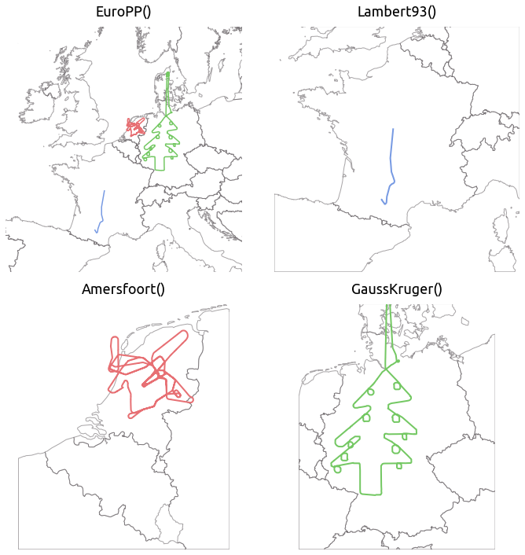
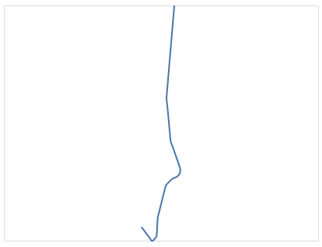
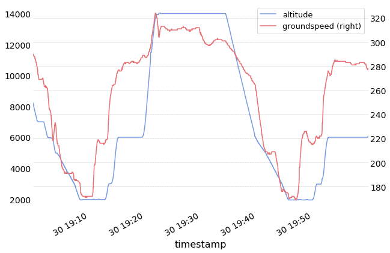
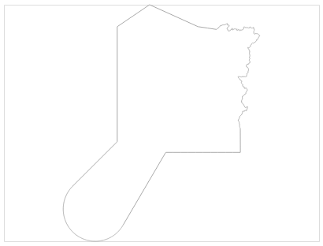
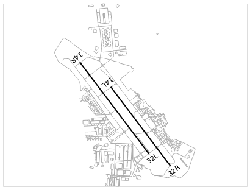
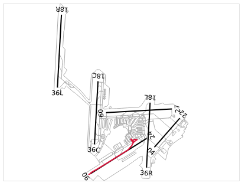
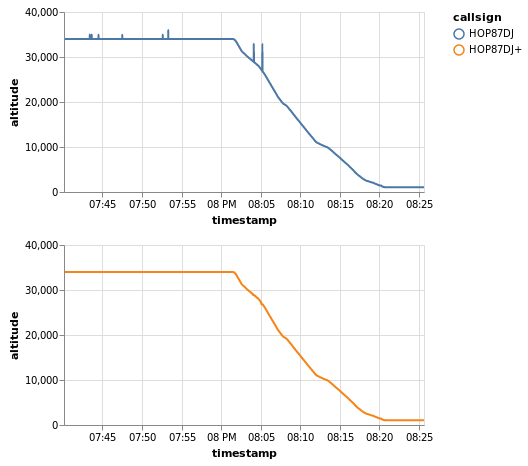
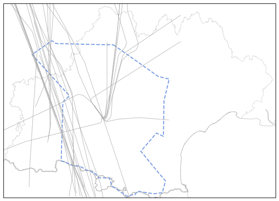
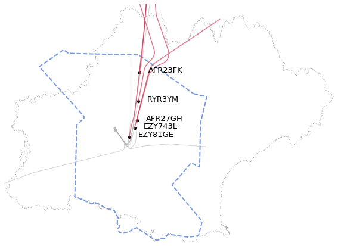

Quickstart
==========

The motivation for this page/notebook is to take the reader through all
basic functionalities of the traffic library. We will cover:

1. a `basic introduction <#basic-introduction>`__ about ``Flight`` and
   ``Traffic`` structures;
2. how to produce `visualisations <#visualisation-of-data>`__ of
   trajectory data;
3. how to access basic `sources of data <#sources-of-data>`__;
4. a simple `use case <#a-simple-use-case>`__ to select
   trajectories landing at Toulouse airport;
5. an introduction to `declarative descriptions <#lazy-iteration>`__ of
   data preprocessing through lazy iteration.

This page is also available as a notebook which can be `downloaded <https://github.com/xoolive/traffic/tree/master/docs/quickstart.ipynb>`__ and executed locally; or loaded and executed in `Google Colab <https://colab.research.google.com/github/xoolive/traffic/blob/master/docs/quickstart.ipynb>`__.

Basic introduction
------------------

The traffic library provides natural methods and attributes that can be
applied on trajectories and collection of trajectories, all represented
as pandas DataFrames.

The *Flight* structure
~~~~~~~~~~~~~~~~~~~~~~

*Flight* is the core class offering representations, methods and
attributes to single trajectories. A comprehensive description of the
API is available `here </traffic.core.flight.html>`__.

Sample trajectories are provided in the library: ``belevingsvlucht`` is
one of them, context is explained
`here </samples.html#belevingsvlucht>`__.

.. code:: python

    from traffic.data.samples import belevingsvlucht
    
    belevingsvlucht

.. raw:: html

    <b>Flight TRA051</b><ul><li><b>aircraft:</b> 484506 / PH-HZO (B738)</li><li><b>from:</b> 2018-05-30 15:21:38+00:00</li><li><b>to:</b> 2018-05-30 20:22:56+00:00</li></ul>
<object data="_static/belevingsvlucht.svg" type="image/svg+xml"></object>

Among available attributes, you may want to access:

-  its ``callsign`` (the identifier of the flight displayed on ATC
   screens);
-  its transponder unique identification number (``icao24``);
-  its ``registration`` number (tail number);
-  its ``typecode`` (i.e. the model of aircraft).

.. code:: python

    (
        belevingsvlucht.callsign,
        belevingsvlucht.icao24,
        belevingsvlucht.registration,
        belevingsvlucht.typecode,
    )
    
    # ('TRA051', '484506', 'PH-HZO', 'B738')

Methods are provided to select relevant parts of the flight, e.g. based
on timestamps.

The ``start`` and ``stop`` attributes refer to the timestamps of the
first and last recorded samples. Note that all timestamps are by default
set to universal time (UTC) as it is common practice in aviation.

.. code:: python

    (belevingsvlucht.start, belevingsvlucht.stop)

    # (Timestamp('2018-05-30 15:21:38+0000', tz='UTC'),
    #  Timestamp('2018-05-30 20:22:56+0000', tz='UTC'))

.. code:: python

    first30 = belevingsvlucht.first(minutes=30)
    after19 = belevingsvlucht.after("2018-05-30 19:00", strict=False)

    # Notice the "strict" comparison (>) vs. "or equal" comparison (>=)
    print(f"between {first30.start:%H:%M:%S} and {first30.stop:%H:%M:%S}")
    print(f"between {after19.start:%H:%M:%S} and {after19.stop:%H:%M:%S}")

    # between 15:21:38 and 15:51:37
    # between 19:00:00 and 20:22:56

.. code:: python

    between1920 = belevingsvlucht.between(
        "2018-05-30 19:00", "2018-05-30 20:00"
    )
    between1920

.. raw:: html

    <b>Flight TRA051</b><ul><li><b>aircraft:</b> 484506 / PH-HZO (B738)</li><li><b>from:</b> 2018-05-30 19:00:01+00:00</li><li><b>to:</b> 2018-05-30 19:59:59+00:00</li></ul>
<object data="_static/quickstart_between.svg" type="image/svg+xml"></object>

The underlying dataframe is always accessible.

.. code:: python

    between1920.data.head()

.. raw:: html

    

    
    <table border="0" class="dataframe">
      <thead>
        <tr style="text-align: right;">
          <th></th>
          <th>timestamp</th>
          <th>icao24</th>
          <th>latitude</th>
          <th>longitude</th>
          <th>groundspeed</th>
          <th>track</th>
          <th>vertical_rate</th>
          <th>callsign</th>
          <th>altitude</th>
        </tr>
      </thead>
      <tbody>
        <tr>
          <td>11750</td>
          <td>2018-05-30 19:00:01+00:00</td>
          <td>484506</td>
          <td>52.839973</td>
          <td>5.793947</td>
          <td>290</td>
          <td>52</td>
          <td>-1664</td>
          <td>TRA051</td>
          <td>8233</td>
        </tr>
        <tr>
          <td>11751</td>
          <td>2018-05-30 19:00:02+00:00</td>
          <td>484506</td>
          <td>52.840747</td>
          <td>5.795680</td>
          <td>290</td>
          <td>52</td>
          <td>-1664</td>
          <td>TRA051</td>
          <td>8200</td>
        </tr>
        <tr>
          <td>11752</td>
          <td>2018-05-30 19:00:03+00:00</td>
          <td>484506</td>
          <td>52.841812</td>
          <td>5.797501</td>
          <td>290</td>
          <td>52</td>
          <td>-1664</td>
          <td>TRA051</td>
          <td>8200</td>
        </tr>
        <tr>
          <td>11753</td>
          <td>2018-05-30 19:00:04+00:00</td>
          <td>484506</td>
          <td>52.842609</td>
          <td>5.799133</td>
          <td>290</td>
          <td>52</td>
          <td>-1599</td>
          <td>TRA051</td>
          <td>8149</td>
        </tr>
        <tr>
          <td>11754</td>
          <td>2018-05-30 19:00:05+00:00</td>
          <td>484506</td>
          <td>52.843277</td>
          <td>5.801010</td>
          <td>289</td>
          <td>52</td>
          <td>-1599</td>
          <td>TRA051</td>
          <td>8125</td>
        </tr>
      </tbody>
    </table>
    

The *Traffic* structure
~~~~~~~~~~~~~~~~~~~~~~~

*Traffic* is the core class to represent collections of trajectories,
which are all flattened in the same pandas DataFrame. A comprehensive
description of the API is available
`here </traffic.core.traffic.html>`__.

We will demonstrate here with a sample of ADS-B data from the `OpenSky
Network </opensky_usage.html>`__.

The basic representation of a *Traffic* object is a summary view of the
data: the structure tries to infer how to separate trajectories in the
data structure based on customizable heuristics, and returns a number of
sample points for each trajectory.

.. code:: python

    from traffic.data.samples import quickstart
    
    quickstart

.. raw:: html

    <b>Traffic with 397 identifiers</b><table id="T_dc04a3bc_e2f5_11e9_bcf3_eb15e9e9d753" ><thead>    <tr>        <th class="blank" ></th>        <th class="blank level0" ></th>        <th class="col_heading level0 col0" >count</th>    </tr>    <tr>        <th class="index_name level0" >icao24</th>        <th class="index_name level1" >callsign</th>        <th class="blank" ></th>    </tr></thead><tbody>
                    <tr>
                            <th id="T_dc04a3bc_e2f5_11e9_bcf3_eb15e9e9d753level0_row0" class="row_heading level0 row0" >4ca84d</th>
                            <th id="T_dc04a3bc_e2f5_11e9_bcf3_eb15e9e9d753level1_row0" class="row_heading level1 row0" >RYR3YM</th>
                            <td id="T_dc04a3bc_e2f5_11e9_bcf3_eb15e9e9d753row0_col0" class="data row0 col0" >2859</td>
                </tr>
                <tr>
                            <th id="T_dc04a3bc_e2f5_11e9_bcf3_eb15e9e9d753level0_row1" class="row_heading level0 row1" >393320</th>
                            <th id="T_dc04a3bc_e2f5_11e9_bcf3_eb15e9e9d753level1_row1" class="row_heading level1 row1" >AFR27GH</th>
                            <td id="T_dc04a3bc_e2f5_11e9_bcf3_eb15e9e9d753row1_col0" class="data row1 col0" >2770</td>
                </tr>
                <tr>
                            <th id="T_dc04a3bc_e2f5_11e9_bcf3_eb15e9e9d753level0_row2" class="row_heading level0 row2" >505c98</th>
                            <th id="T_dc04a3bc_e2f5_11e9_bcf3_eb15e9e9d753level1_row2" class="row_heading level1 row2" >RAM667</th>
                            <td id="T_dc04a3bc_e2f5_11e9_bcf3_eb15e9e9d753row2_col0" class="data row2 col0" >2752</td>
                </tr>
                <tr>
                            <th id="T_dc04a3bc_e2f5_11e9_bcf3_eb15e9e9d753level0_row3" class="row_heading level0 row3" >3944ef</th>
                            <th id="T_dc04a3bc_e2f5_11e9_bcf3_eb15e9e9d753level1_row3" class="row_heading level1 row3" >HOP87DJ</th>
                            <td id="T_dc04a3bc_e2f5_11e9_bcf3_eb15e9e9d753row3_col0" class="data row3 col0" >2731</td>
                </tr>
                <tr>
                            <th id="T_dc04a3bc_e2f5_11e9_bcf3_eb15e9e9d753level0_row4" class="row_heading level0 row4" >4ca574</th>
                            <th id="T_dc04a3bc_e2f5_11e9_bcf3_eb15e9e9d753level1_row4" class="row_heading level1 row4" >IBK5111</th>
                            <td id="T_dc04a3bc_e2f5_11e9_bcf3_eb15e9e9d753row4_col0" class="data row4 col0" >2706</td>
                </tr>
                <tr>
                            <th id="T_dc04a3bc_e2f5_11e9_bcf3_eb15e9e9d753level0_row5" class="row_heading level0 row5" >393322</th>
                            <th id="T_dc04a3bc_e2f5_11e9_bcf3_eb15e9e9d753level1_row5" class="row_heading level1 row5" >AFR23FK</th>
                            <td id="T_dc04a3bc_e2f5_11e9_bcf3_eb15e9e9d753row5_col0" class="data row5 col0" >2665</td>
                </tr>
                <tr>
                            <th id="T_dc04a3bc_e2f5_11e9_bcf3_eb15e9e9d753level0_row6" class="row_heading level0 row6" >40643a</th>
                            <th id="T_dc04a3bc_e2f5_11e9_bcf3_eb15e9e9d753level1_row6" class="row_heading level1 row6" >EZY57FT</th>
                            <td id="T_dc04a3bc_e2f5_11e9_bcf3_eb15e9e9d753row6_col0" class="data row6 col0" >2656</td>
                </tr>
                <tr>
                            <th id="T_dc04a3bc_e2f5_11e9_bcf3_eb15e9e9d753level0_row7" class="row_heading level0 row7" >394c18</th>
                            <th id="T_dc04a3bc_e2f5_11e9_bcf3_eb15e9e9d753level1_row7" class="row_heading level1 row7" >AFR140W</th>
                            <td id="T_dc04a3bc_e2f5_11e9_bcf3_eb15e9e9d753row7_col0" class="data row7 col0" >2613</td>
                </tr>
                <tr>
                            <th id="T_dc04a3bc_e2f5_11e9_bcf3_eb15e9e9d753level0_row8" class="row_heading level0 row8" >344692</th>
                            <th id="T_dc04a3bc_e2f5_11e9_bcf3_eb15e9e9d753level1_row8" class="row_heading level1 row8" >VLG2972</th>
                            <td id="T_dc04a3bc_e2f5_11e9_bcf3_eb15e9e9d753row8_col0" class="data row8 col0" >2599</td>
                </tr>
                <tr>
                            <th id="T_dc04a3bc_e2f5_11e9_bcf3_eb15e9e9d753level0_row9" class="row_heading level0 row9" >400cd1</th>
                            <th id="T_dc04a3bc_e2f5_11e9_bcf3_eb15e9e9d753level1_row9" class="row_heading level1 row9" >EZY81GE</th>
                            <td id="T_dc04a3bc_e2f5_11e9_bcf3_eb15e9e9d753row9_col0" class="data row9 col0" >2579</td>
                </tr>
        </tbody></table>

*Traffic* offers the ability to **index** and **iterate** on all flights
contained in the structure. *Traffic* will use either:

-  a combination of ``timestamp``, ``icao24`` (aircraft identifier) and
   ``callsign`` (mission identifier); or
-  a customizable flight identifier (``flight_id``);

as a way to separate and identify flights.

Indexation will be made on either of ``icao24``, ``callsign`` (or
``flight_id`` if available).

.. code:: python

    quickstart["AFR27GH"]  # on callsign
    quickstart["393320"]  # on icao24

.. raw:: html

    <b>Flight AFR27GH</b><ul><li><b>aircraft:</b> 393320 / F-GMZA (A321)</li><li><b>from:</b> 2017-07-16 19:30:00+00:00</li><li><b>to:</b> 2017-07-16 20:16:10+00:00</li></ul>
<object data="_static/quickstart_afr27gh.svg" type="image/svg+xml"></object>

A subset of trajectories can also be selected if a list is passed an
index:

.. code:: python

    quickstart[["AFR27GH", "HOP87DJ"]]

.. raw:: html

    <b>Traffic with 2 identifiers</b><table id="T_dc704eb4_e2f5_11e9_bcf3_eb15e9e9d753" ><thead>    <tr>        <th class="blank" ></th>        <th class="blank level0" ></th>        <th class="col_heading level0 col0" >count</th>    </tr>    <tr>        <th class="index_name level0" >icao24</th>        <th class="index_name level1" >callsign</th>        <th class="blank" ></th>    </tr></thead><tbody>
                    <tr>
                            <th id="T_dc704eb4_e2f5_11e9_bcf3_eb15e9e9d753level0_row0" class="row_heading level0 row0" >393320</th>
                            <th id="T_dc704eb4_e2f5_11e9_bcf3_eb15e9e9d753level1_row0" class="row_heading level1 row0" >AFR27GH</th>
                            <td id="T_dc704eb4_e2f5_11e9_bcf3_eb15e9e9d753row0_col0" class="data row0 col0" >2770</td>
                </tr>
                <tr>
                            <th id="T_dc704eb4_e2f5_11e9_bcf3_eb15e9e9d753level0_row1" class="row_heading level0 row1" >3944ef</th>
                            <th id="T_dc704eb4_e2f5_11e9_bcf3_eb15e9e9d753level1_row1" class="row_heading level1 row1" >HOP87DJ</th>
                            <td id="T_dc704eb4_e2f5_11e9_bcf3_eb15e9e9d753row1_col0" class="data row1 col0" >2731</td>
                </tr>
        </tbody></table>

In many cases, ``flight_id`` are more convenient to access specific
flights yielded by iteration. We may construct custom ``flight_id``:

.. code:: python

    from traffic.core import Traffic
    
    quickstart_id = Traffic.from_flights(
        flight.assign(flight_id=f"{flight.callsign}_{i:03}")
        for i, flight in enumerate(quickstart)
    )
    quickstart_id

.. raw:: html

    <b>Traffic with 379 identifiers</b><table id="T_ded72dc6_e2f5_11e9_bcf3_eb15e9e9d753" ><thead>    <tr>        <th class="blank level0" ></th>        <th class="col_heading level0 col0" >count</th>    </tr>    <tr>        <th class="index_name level0" >flight_id</th>        <th class="blank" ></th>    </tr></thead><tbody>
                    <tr>
                            <th id="T_ded72dc6_e2f5_11e9_bcf3_eb15e9e9d753level0_row0" class="row_heading level0 row0" >RYR3YM_343</th>
                            <td id="T_ded72dc6_e2f5_11e9_bcf3_eb15e9e9d753row0_col0" class="data row0 col0" >2859</td>
                </tr>
                <tr>
                            <th id="T_ded72dc6_e2f5_11e9_bcf3_eb15e9e9d753level0_row1" class="row_heading level0 row1" >AFR27GH_046</th>
                            <td id="T_ded72dc6_e2f5_11e9_bcf3_eb15e9e9d753row1_col0" class="data row1 col0" >2770</td>
                </tr>
                <tr>
                            <th id="T_ded72dc6_e2f5_11e9_bcf3_eb15e9e9d753level0_row2" class="row_heading level0 row2" >RAM667_373</th>
                            <td id="T_ded72dc6_e2f5_11e9_bcf3_eb15e9e9d753row2_col0" class="data row2 col0" >2752</td>
                </tr>
                <tr>
                            <th id="T_ded72dc6_e2f5_11e9_bcf3_eb15e9e9d753level0_row3" class="row_heading level0 row3" >HOP87DJ_055</th>
                            <td id="T_ded72dc6_e2f5_11e9_bcf3_eb15e9e9d753row3_col0" class="data row3 col0" >2731</td>
                </tr>
                <tr>
                            <th id="T_ded72dc6_e2f5_11e9_bcf3_eb15e9e9d753level0_row4" class="row_heading level0 row4" >IBK5111_316</th>
                            <td id="T_ded72dc6_e2f5_11e9_bcf3_eb15e9e9d753row4_col0" class="data row4 col0" >2706</td>
                </tr>
                <tr>
                            <th id="T_ded72dc6_e2f5_11e9_bcf3_eb15e9e9d753level0_row5" class="row_heading level0 row5" >AFR23FK_048</th>
                            <td id="T_ded72dc6_e2f5_11e9_bcf3_eb15e9e9d753row5_col0" class="data row5 col0" >2665</td>
                </tr>
                <tr>
                            <th id="T_ded72dc6_e2f5_11e9_bcf3_eb15e9e9d753level0_row6" class="row_heading level0 row6" >EZY57FT_172</th>
                            <td id="T_ded72dc6_e2f5_11e9_bcf3_eb15e9e9d753row6_col0" class="data row6 col0" >2656</td>
                </tr>
                <tr>
                            <th id="T_ded72dc6_e2f5_11e9_bcf3_eb15e9e9d753level0_row7" class="row_heading level0 row7" >AFR140W_064</th>
                            <td id="T_ded72dc6_e2f5_11e9_bcf3_eb15e9e9d753row7_col0" class="data row7 col0" >2613</td>
                </tr>
                <tr>
                            <th id="T_ded72dc6_e2f5_11e9_bcf3_eb15e9e9d753level0_row8" class="row_heading level0 row8" >VLG2972_036</th>
                            <td id="T_ded72dc6_e2f5_11e9_bcf3_eb15e9e9d753row8_col0" class="data row8 col0" >2599</td>
                </tr>
                <tr>
                            <th id="T_ded72dc6_e2f5_11e9_bcf3_eb15e9e9d753level0_row9" class="row_heading level0 row9" >EZY81GE_149</th>
                            <td id="T_ded72dc6_e2f5_11e9_bcf3_eb15e9e9d753row9_col0" class="data row9 col0" >2579</td>
                </tr>
        </tbody></table>

| or use the available ``.assign_id()`` method, which is implemented
  exactly that way.
| (We will explain ``eval()`` further below)

.. code:: python

    quickstart.assign_id().eval()

.. raw:: html

    <b>Traffic with 379 identifiers</b><table id="T_e129183c_e2f5_11e9_bcf3_eb15e9e9d753" ><thead>    <tr>        <th class="blank level0" ></th>        <th class="col_heading level0 col0" >count</th>    </tr>    <tr>        <th class="index_name level0" >flight_id</th>        <th class="blank" ></th>    </tr></thead><tbody>
                    <tr>
                            <th id="T_e129183c_e2f5_11e9_bcf3_eb15e9e9d753level0_row0" class="row_heading level0 row0" >RYR3YM_343</th>
                            <td id="T_e129183c_e2f5_11e9_bcf3_eb15e9e9d753row0_col0" class="data row0 col0" >2859</td>
                </tr>
                <tr>
                            <th id="T_e129183c_e2f5_11e9_bcf3_eb15e9e9d753level0_row1" class="row_heading level0 row1" >AFR27GH_046</th>
                            <td id="T_e129183c_e2f5_11e9_bcf3_eb15e9e9d753row1_col0" class="data row1 col0" >2770</td>
                </tr>
                <tr>
                            <th id="T_e129183c_e2f5_11e9_bcf3_eb15e9e9d753level0_row2" class="row_heading level0 row2" >RAM667_373</th>
                            <td id="T_e129183c_e2f5_11e9_bcf3_eb15e9e9d753row2_col0" class="data row2 col0" >2752</td>
                </tr>
                <tr>
                            <th id="T_e129183c_e2f5_11e9_bcf3_eb15e9e9d753level0_row3" class="row_heading level0 row3" >HOP87DJ_055</th>
                            <td id="T_e129183c_e2f5_11e9_bcf3_eb15e9e9d753row3_col0" class="data row3 col0" >2731</td>
                </tr>
                <tr>
                            <th id="T_e129183c_e2f5_11e9_bcf3_eb15e9e9d753level0_row4" class="row_heading level0 row4" >IBK5111_316</th>
                            <td id="T_e129183c_e2f5_11e9_bcf3_eb15e9e9d753row4_col0" class="data row4 col0" >2706</td>
                </tr>
                <tr>
                            <th id="T_e129183c_e2f5_11e9_bcf3_eb15e9e9d753level0_row5" class="row_heading level0 row5" >AFR23FK_048</th>
                            <td id="T_e129183c_e2f5_11e9_bcf3_eb15e9e9d753row5_col0" class="data row5 col0" >2665</td>
                </tr>
                <tr>
                            <th id="T_e129183c_e2f5_11e9_bcf3_eb15e9e9d753level0_row6" class="row_heading level0 row6" >EZY57FT_172</th>
                            <td id="T_e129183c_e2f5_11e9_bcf3_eb15e9e9d753row6_col0" class="data row6 col0" >2656</td>
                </tr>
                <tr>
                            <th id="T_e129183c_e2f5_11e9_bcf3_eb15e9e9d753level0_row7" class="row_heading level0 row7" >AFR140W_064</th>
                            <td id="T_e129183c_e2f5_11e9_bcf3_eb15e9e9d753row7_col0" class="data row7 col0" >2613</td>
                </tr>
                <tr>
                            <th id="T_e129183c_e2f5_11e9_bcf3_eb15e9e9d753level0_row8" class="row_heading level0 row8" >VLG2972_036</th>
                            <td id="T_e129183c_e2f5_11e9_bcf3_eb15e9e9d753row8_col0" class="data row8 col0" >2599</td>
                </tr>
                <tr>
                            <th id="T_e129183c_e2f5_11e9_bcf3_eb15e9e9d753level0_row9" class="row_heading level0 row9" >EZY81GE_149</th>
                            <td id="T_e129183c_e2f5_11e9_bcf3_eb15e9e9d753row9_col0" class="data row9 col0" >2579</td>
                </tr>
        </tbody></table>

Saving and loading data
~~~~~~~~~~~~~~~~~~~~~~~

Some processing operations are computationally expensive and time
consuming. Therefore, it may be relevant to store intermediate results
in files for sharing and reusing purposes.

One option is to store *Traffic* and *Flight* underlying DataFrames in
pickle format. Details about storage formats are presented
`here <https://traffic-viz.github.io/export.html>`__.

.. code:: python

    quickstart_id.to_pickle("quickstart_id.pkl")

.. code:: python

    from traffic.core import Traffic
    
    # load from file again
    quickstart_id = Traffic.from_file("quickstart_id.pkl")

Visualisation of data
---------------------

*traffic* offers facilities to leverage the power of common
visualisation renderers including
`Cartopy <https://scitools.org.uk/cartopy/>`__, a map plotting library
built around Matplotlib, and `Altair <https://altair-viz.github.io/>`__.

More visualisation renderers such as Leaflet are available as
`plugins </plugins.html>`__.

Visualisation of trajectories
~~~~~~~~~~~~~~~~~~~~~~~~~~~~~

When you choose to plot trajectories on a map, you have to make a choice
concerning how to represent points at the surface of a sphere (more
precisely, an oblate spheroid) on a 2D plane. This transformation is
called a
`projection <https://serialmentor.com/dataviz/geospatial-data.html#projections>`__.

The choice of the right projection depends on the data. The most basic
projection (sometimes wrongly referred to as *no projection*) is the
``PlateCarree()``, when you plot latitude on the y-axis and longitude on
the x-axis. The famous ``Mercator()`` projection distorts the latitude
so as lines with constant bearing appear as straight lines. Conformal
projections are also convenient when plotting smaller areas (countries)
as they preserve distances (locally).

Many countries define official projections to produce maps of their
territory. In general, they fall either in the conformal or in the
Transverse Mercator category. ``Lambert93()`` projection is defined over
France, ``GaussKruger()`` over Germany, ``Amersfoort()`` over the
Netherlands, ``OSGB()`` over the British Islands, etc.

When plotting trajectories over Western Europe, ``EuroPP()`` is a decent
choice.

.. code:: python

    from traffic.data.samples import airbus_tree

.. code:: python

    %matplotlib inline
    import matplotlib.pyplot as plt
    
    from traffic.core.projection import Amersfoort, GaussKruger, Lambert93, EuroPP
    from traffic.drawing import countries
    
    with plt.style.context("traffic"):
        fig = plt.figure()
    
        # Choose the projection type
        ax0 = fig.add_subplot(221, projection=EuroPP())
        ax1 = fig.add_subplot(222, projection=Lambert93())
        ax2 = fig.add_subplot(223, projection=Amersfoort())
        ax3 = fig.add_subplot(224, projection=GaussKruger())
    
        for ax in [ax0, ax1, ax2, ax3]:
            ax.add_feature(countries())
            # Maximum extent for the map
            ax.set_global()
            # Remove border and set transparency for background
            ax.spines['geo'].set_visible(False)
            ax.background_patch.set_visible(False)
    
        # Flight.plot returns the result from Matplotlib as is
        # Here we catch it to reuse the color of each trajectory
        ret, *_ = quickstart["AFR27GH"].plot(ax0)
        quickstart["AFR27GH"].plot(
            ax1, color=ret.get_color(), linewidth=2
        )
    
        ret, *_ = belevingsvlucht.plot(ax0)
        belevingsvlucht.plot(
            ax2, color=ret.get_color(), linewidth=2
        )
    
        ret, *_ = airbus_tree.plot(ax0)
        airbus_tree.plot(
            ax3, color=ret.get_color(), linewidth=2
        )
    
        # We reduce here the extent of the EuroPP() map
        # between 8°W and 18°E, and 40°N and 60°N
        ax0.set_extent((-8, 18, 40, 60))
        
        params = dict(fontname="Ubuntu", fontsize=18, pad=12)
    
        ax0.set_title("EuroPP()", **params)
        ax1.set_title("Lambert93()", **params)
        ax2.set_title("Amersfoort()", **params)
        ax3.set_title("GaussKruger()", **params)
    
        fig.tight_layout()

Altair API is not very mature yet with geographical data, but basic
visualisations are possible.

.. code:: python

    # Mercator projection is the default one with Altair
    quickstart["AFR27GH"].geoencode().project(type="mercator")

Visualisation of time series
~~~~~~~~~~~~~~~~~~~~~~~~~~~~

Facilities are provided to plot time series, after a basic cleaning of
data (remove NaN values), both with Matplotlib and Altair. The traffic
style context offers a convenient first style to customise further.

.. code:: python

    with plt.style.context("traffic"):
        fig, ax = plt.subplots(figsize=(10, 7))
        between1920.plot_time(
            ax, y=["altitude", "groundspeed"], secondary_y=["groundspeed"]
        )

.. code:: python

    (
        quickstart["EZY81GE"].encode("groundspeed")
        + quickstart["EZY743L"].encode("groundspeed")
        + quickstart["AFR27GH"].encode("groundspeed")
    )

.. image:: _static/quickstart_altair.png

Sources of data
---------------

Basic navigational data are embedded in the library, together with
parsing facilities for most common sources of information, with a main
focus on Europe at the time being.

Airspaces are a key element of aviation: they are regulated by specific
rules, whereby navigation is allowed to determined types of aircraft
meeting strict requirements. Such volumes, assigned to air traffic
controllers to ensure the safety of flights and proper separation
between aircraft are most commonly described as a combination of
extruded polygons. Flight Information Regions (FIR) are one of the basic
form of airspaces.

A non official list of European FIRs, airports, navaids and airways is
available in the traffic library (Details `here </data.html>`__).

.. code:: python

    from traffic.data import eurofirs
    
    # LISBOA FIR
    eurofirs["LPPC"].geoencode()

.. code:: python

    from traffic.data import airports
    
    airports["AMS"]

.. raw:: html

    <b>Amsterdam Schiphol Airport</b> (Netherlands) <code>EHAM/AMS</code>
<object data="_static/quickstart_eham.svg" type="image/svg+xml"></object>

The details of airport representations are also available (fetched from
OpenStreetMap) in their Matplotlib and Altair representation.

.. code:: python

    airports["LFBO"].geoencode(runways=True, labels=True)

Intersections can be computed between trajectories and geometries
(airports, airspaces). ``Flight.intersects()`` provides a fast boolean
test; ``Flight.clip()`` trims the trajectory between the first point of
entry in and last point of exit from the 2D footprint of the geometry.

.. code:: python

    belevingsvlucht.intersects(airports["EHAM"])
    # True

Of course, all these methods can be chained.

.. code:: python

    (
        airports["EHAM"].geoencode(runways=True, labels=True)
        + belevingsvlucht.last(hours=1)
        .clip(airports["EHAM"])
        .geoencode()
        .mark_line(color="crimson")
    )

A simple use case
-----------------

The following use case showcases various preprocessing methods that can
be chained to select all trajectories landing at Toulouse airport. We
will need the coordinates of Toulouse Terminal Maneuvering Area (TMA)
which is available in Eurocontrol AIRAC files.

You may not be entitled access to these data but the coordinates of
Toulouse TMA are public, so we provide them in this library for the sake
of this example.

**If you have set the configuration for the AIRAC files
(details** `here </airac_usage.html>`__\ **), you may uncomment the
following cell.**

.. code:: python

    # from traffic.data import nm_airspaces
    # lfbo_tma = nm_airspaces["LFBOTMA"]

Since you may not be entitled access to these data and coordinates of
Toulouse TMA are public, we provide them in this library for the sake of
this example.

.. code:: python

    from traffic.data.samples import lfbo_tma
    
    lfbo_tma

.. raw:: html

    <b>SIV TOULOUSE [SIV TOULOUSE] (AUA)</b><ul><li>0.0, 65.0</li><li>65.0, 115.0</li><li>115.0, 145.0</li></ul>
<svg xmlns="http://www.w3.org/2000/svg" xmlns:xlink="http://www.w3.org/1999/xlink" width="100.0" height="100.0" viewBox="0.008666666666666656 42.25366666666667 2.9160000000000004 2.392111666666665" preserveAspectRatio="xMinYMin meet"><g transform="matrix(1,0,0,-1,0,86.899445)"><path fill-rule="evenodd" fill="#66cc99" stroke="#555555" stroke-width="0.05832000000000001" opacity="0.6" d="M 1.8583333333333334,44.166666666666664 L 2.6055550000000003,44.05833333333333 L 2.816666666666667,44.02388833333334 L 2.716666666666667,43.71666666666667 L 2.7069449999999997,43.2125 L 2.5722216666666666,43.25833333333333 L 2.275,43.0 L 2.0541666666666667,42.806666666666665 L 2.1002783333333332,42.38166666666667 L 2.0586116666666667,42.361666666666665 L 2.0083333333333333,42.366945 L 1.7280550000000001,42.504445000000004 L 1.696945,42.493055 L 1.6713883333333333,42.50388833333333 L 1.6475,42.471111666666665 L 1.5488883333333334,42.440555 L 1.5127783333333333,42.435278333333336 L 1.4647216666666667,42.441111666666664 L 1.4372216666666666,42.4775 L 1.4308333333333332,42.48527833333333 L 1.4641666666666666,42.516945 L 1.4477783333333332,42.540555000000005 L 1.4238883333333334,42.54222166666667 L 1.4266666666666665,42.591945 L 1.4402783333333333,42.606388333333335 L 1.375,42.694445 L 1.229445,42.724444999999996 L 1.1138883333333331,42.77527833333333 L 0.9972216666666667,42.774721666666665 L 0.8619450000000001,42.81583333333333 L 0.75,42.84527833333333 L 0.75,43.0 L 0.75,43.08972166666667 L 0.75,43.25138833333333 L 0.75,43.318888333333334 L 0.75,43.67388833333334 L 0.8727783333333333,43.766666666666666 L 0.2797216666666667,44.2125 L 0.2175,44.25861166666667 L 0.11666666666666667,44.333333333333336 L 0.17666666666666667,44.365278333333336 L 0.5011116666666667,44.537778333333335 L 0.5797216666666666,44.5 L 0.6061116666666667,44.5 L 1.036945,44.5 L 1.025555,44.346111666666665 L 1.2941666666666667,44.32722166666667 L 1.7488883333333334,44.295278333333336 L 1.804445,44.29333333333333 L 1.8583333333333334,44.166666666666664 z" /></g></svg><svg xmlns="http://www.w3.org/2000/svg" xmlns:xlink="http://www.w3.org/1999/xlink" width="100.0" height="100.0" viewBox="0.1782438666666667 42.26018886666667 2.7399006000000004 2.341288933333331" preserveAspectRatio="xMinYMin meet"><g transform="matrix(1,0,0,-1,0,86.86166666666666)"><path fill-rule="evenodd" fill="#66cc99" stroke="#555555" stroke-width="0.05479801200000001" opacity="0.6" d="M 1.8583333333333334,44.166666666666664 L 2.6055550000000003,44.05833333333333 L 2.816666666666667,44.02388833333334 L 2.716666666666667,43.71666666666667 L 2.7069449999999997,43.2125 L 2.5722216666666666,43.25833333333333 L 2.275,43.0 L 2.0541666666666667,42.806666666666665 L 2.1002783333333332,42.38166666666667 L 2.0586116666666667,42.361666666666665 L 2.0083333333333333,42.366945 L 1.7280550000000001,42.504445000000004 L 1.696945,42.493055 L 1.6713883333333333,42.50388833333333 L 1.6475,42.471111666666665 L 1.5488883333333334,42.440555 L 1.5127783333333333,42.435278333333336 L 1.4647216666666667,42.441111666666664 L 1.4372216666666666,42.4775 L 1.4308333333333332,42.48527833333333 L 1.4641666666666666,42.516945 L 1.4477783333333332,42.540555000000005 L 1.4238883333333334,42.54222166666667 L 1.4266666666666665,42.591945 L 1.4402783333333333,42.606388333333335 L 1.375,42.694445 L 1.229445,42.724444999999996 L 1.1138883333333331,42.77527833333333 L 0.9972216666666667,42.774721666666665 L 0.8619450000000001,42.81583333333333 L 0.75,42.84527833333333 L 0.75,43.0 L 0.75,43.08972166666667 L 0.75,43.25138833333333 L 0.75,43.318888333333334 L 0.75,43.67388833333334 L 0.8727783333333333,43.766666666666666 L 0.2797216666666667,44.2125 L 0.5797216666666666,44.5 L 0.6061116666666667,44.5 L 1.036945,44.5 L 1.025555,44.346111666666665 L 1.2941666666666667,44.32722166666667 L 1.7488883333333334,44.295278333333336 L 1.804445,44.29333333333333 L 1.8583333333333334,44.166666666666664 z" /></g></svg><svg xmlns="http://www.w3.org/2000/svg" xmlns:xlink="http://www.w3.org/1999/xlink" width="100.0" height="100.0" viewBox="0.1782438666666667 42.26018886666667 2.7399006000000004 2.3424005999999977" preserveAspectRatio="xMinYMin meet"><g transform="matrix(1,0,0,-1,0,86.86277833333332)"><path fill-rule="evenodd" fill="#66cc99" stroke="#555555" stroke-width="0.05479801200000001" opacity="0.6" d="M 2.275,43.0 L 2.6,42.712221666666665 L 2.75,42.583333333333336 L 2.691666666666667,42.416666666666664 L 2.533333333333333,42.4 L 2.2163883333333336,42.43333333333333 L 2.1666666666666665,42.38333333333333 L 2.104721666666667,42.3825 L 2.1002783333333332,42.38166666666667 L 2.0586116666666667,42.361666666666665 L 2.0083333333333333,42.366945 L 1.7280550000000001,42.504445000000004 L 1.696945,42.493055 L 1.6713883333333333,42.50388833333333 L 1.6475,42.471111666666665 L 1.5488883333333334,42.440555 L 1.5127783333333333,42.435278333333336 L 1.4647216666666667,42.441111666666664 L 1.4372216666666666,42.4775 L 1.4308333333333332,42.48527833333333 L 1.4641666666666666,42.516945 L 1.4477783333333332,42.540555000000005 L 1.4238883333333334,42.54222166666667 L 1.4266666666666665,42.591945 L 1.4402783333333333,42.606388333333335 L 1.375,42.694445 L 1.229445,42.724444999999996 L 1.1138883333333331,42.77527833333333 L 0.9972216666666667,42.774721666666665 L 0.8619450000000001,42.81583333333333 L 0.75,42.84527833333333 L 0.75,43.0 L 0.75,43.08972166666667 L 0.75,43.25138833333333 L 0.75,43.318888333333334 L 0.75,43.67388833333334 L 0.8727783333333333,43.766666666666666 L 0.2797216666666667,44.2125 L 0.5797216666666666,44.5 L 0.6061116666666667,44.5 L 1.036945,44.5 L 1.28,44.50111166666667 L 1.7166666666666666,44.5 L 2.6055550000000003,44.05833333333333 L 2.816666666666667,44.02388833333334 L 2.716666666666667,43.71666666666667 L 2.7069449999999997,43.2125 L 2.5722216666666666,43.25833333333333 L 2.275,43.0 z" /></g></svg>

A first common necessary prepocessing concerns filtering of faulty
values, esp. when data comes for a wide network of ADS-B sensors such as
the OpenSky Network. A common pattern in such data is spikes in various
signals, esp. altitude. Some filtering methods have been developped to
take this faulty values out:

.. code:: python

    hop87dj = quickstart["HOP87DJ"]
    # Set a different callsign and identify signals on the visualisation
    filtered = hop87dj.filter().assign(callsign="HOP87DJ+")

.. code:: python

    import altair as alt
    
    # Let's define a common y-scale for both flights
    scale = alt.Scale(domain=(0, 40000))
    
    visualisations = [
        (flight.encode(alt.Y("altitude", scale=scale)).properties(height=180, width=360))
        for flight in [hop87dj, filtered]
    ]
    
    alt.vconcat(*visualisations)

Let’s select first trajectories intersecting Toulouse TMA, filter
signals, then plot the results.

.. code:: python

    # A progressbar may be convenient...
    landing_trajectories = []
    
    for flight in quickstart:
        if flight.intersects(lfbo_tma):
            filtered = flight.filter()
            landing_trajectories.append(filtered)
    
    t_tma = Traffic.from_flights(landing_trajectories)
    t_tma

.. raw:: html

    <b>Traffic with 17 identifiers</b><table id="T_f00c0d96_e2f5_11e9_bcf3_eb15e9e9d753" ><thead>    <tr>        <th class="blank" ></th>        <th class="blank level0" ></th>        <th class="col_heading level0 col0" >count</th>    </tr>    <tr>        <th class="index_name level0" >icao24</th>        <th class="index_name level1" >callsign</th>        <th class="blank" ></th>    </tr></thead><tbody>
                    <tr>
                            <th id="T_f00c0d96_e2f5_11e9_bcf3_eb15e9e9d753level0_row0" class="row_heading level0 row0" >4ca84d</th>
                            <th id="T_f00c0d96_e2f5_11e9_bcf3_eb15e9e9d753level1_row0" class="row_heading level1 row0" >RYR3YM</th>
                            <td id="T_f00c0d96_e2f5_11e9_bcf3_eb15e9e9d753row0_col0" class="data row0 col0" >2859</td>
                </tr>
                <tr>
                            <th id="T_f00c0d96_e2f5_11e9_bcf3_eb15e9e9d753level0_row1" class="row_heading level0 row1" >393320</th>
                            <th id="T_f00c0d96_e2f5_11e9_bcf3_eb15e9e9d753level1_row1" class="row_heading level1 row1" >AFR27GH</th>
                            <td id="T_f00c0d96_e2f5_11e9_bcf3_eb15e9e9d753row1_col0" class="data row1 col0" >2770</td>
                </tr>
                <tr>
                            <th id="T_f00c0d96_e2f5_11e9_bcf3_eb15e9e9d753level0_row2" class="row_heading level0 row2" >393322</th>
                            <th id="T_f00c0d96_e2f5_11e9_bcf3_eb15e9e9d753level1_row2" class="row_heading level1 row2" >AFR23FK</th>
                            <td id="T_f00c0d96_e2f5_11e9_bcf3_eb15e9e9d753row2_col0" class="data row2 col0" >2665</td>
                </tr>
                <tr>
                            <th id="T_f00c0d96_e2f5_11e9_bcf3_eb15e9e9d753level0_row3" class="row_heading level0 row3" >40643a</th>
                            <th id="T_f00c0d96_e2f5_11e9_bcf3_eb15e9e9d753level1_row3" class="row_heading level1 row3" >EZY57FT</th>
                            <td id="T_f00c0d96_e2f5_11e9_bcf3_eb15e9e9d753row3_col0" class="data row3 col0" >2656</td>
                </tr>
                <tr>
                            <th id="T_f00c0d96_e2f5_11e9_bcf3_eb15e9e9d753level0_row4" class="row_heading level0 row4" >400cd1</th>
                            <th id="T_f00c0d96_e2f5_11e9_bcf3_eb15e9e9d753level1_row4" class="row_heading level1 row4" >EZY81GE</th>
                            <td id="T_f00c0d96_e2f5_11e9_bcf3_eb15e9e9d753row4_col0" class="data row4 col0" >2579</td>
                </tr>
                <tr>
                            <th id="T_f00c0d96_e2f5_11e9_bcf3_eb15e9e9d753level0_row5" class="row_heading level0 row5" >4ca2c9</th>
                            <th id="T_f00c0d96_e2f5_11e9_bcf3_eb15e9e9d753level1_row5" class="row_heading level1 row5" >EIN056</th>
                            <td id="T_f00c0d96_e2f5_11e9_bcf3_eb15e9e9d753row5_col0" class="data row5 col0" >2526</td>
                </tr>
                <tr>
                            <th id="T_f00c0d96_e2f5_11e9_bcf3_eb15e9e9d753level0_row6" class="row_heading level0 row6" >44ce6f</th>
                            <th id="T_f00c0d96_e2f5_11e9_bcf3_eb15e9e9d753level1_row6" class="row_heading level1 row6" >BEL7NG</th>
                            <td id="T_f00c0d96_e2f5_11e9_bcf3_eb15e9e9d753row6_col0" class="data row6 col0" >2182</td>
                </tr>
                <tr>
                            <th id="T_f00c0d96_e2f5_11e9_bcf3_eb15e9e9d753level0_row7" class="row_heading level0 row7" >406134</th>
                            <th id="T_f00c0d96_e2f5_11e9_bcf3_eb15e9e9d753level1_row7" class="row_heading level1 row7" >EZY819T</th>
                            <td id="T_f00c0d96_e2f5_11e9_bcf3_eb15e9e9d753row7_col0" class="data row7 col0" >2050</td>
                </tr>
                <tr>
                            <th id="T_f00c0d96_e2f5_11e9_bcf3_eb15e9e9d753level0_row8" class="row_heading level0 row8" >4010eb</th>
                            <th id="T_f00c0d96_e2f5_11e9_bcf3_eb15e9e9d753level1_row8" class="row_heading level1 row8" >EZY743L</th>
                            <td id="T_f00c0d96_e2f5_11e9_bcf3_eb15e9e9d753row8_col0" class="data row8 col0" >1769</td>
                </tr>
                <tr>
                            <th id="T_f00c0d96_e2f5_11e9_bcf3_eb15e9e9d753level0_row9" class="row_heading level0 row9" >4ca647</th>
                            <th id="T_f00c0d96_e2f5_11e9_bcf3_eb15e9e9d753level1_row9" class="row_heading level1 row9" >RYR3TL</th>
                            <td id="T_f00c0d96_e2f5_11e9_bcf3_eb15e9e9d753row9_col0" class="data row9 col0" >1753</td>
                </tr>
        </tbody></table>

.. code:: python

    from traffic.drawing import Nominatim
    
    with plt.style.context("traffic"):
        fig, ax = plt.subplots(subplot_kw=dict(projection=Lambert93()))
        ax.background_patch.set_visible(False)
        ax.spines['geo'].set_visible(False)
    
        # We may add contours from OpenStreetMap
        # (Occitanie is the name of the administrative region)
        Nominatim.search("Occitanie").plot(ax, linestyle="dotted")
        ax.set_extent("Occitanie")
    
        # Plot the airport, the TMA
        airports["LFBO"].plot(ax)
        lfbo_tma.plot(ax, linewidth=2, linestyle="dashed")
    
        # and the resulting traffic
        t_tma.plot(ax)

There is still one trajectory which does not seem to be coming to
Toulouse airport. Also, we actually wanted to select landing
trajectories. Let’s only select trajectories coming below 10,000 ft and
with an average vertical speed below 1,000 ft/min.

.. code:: python

    landing_trajectories = []
    
    for flight in quickstart:
        if flight.intersects(lfbo_tma):
            filtered = flight.filter()
            if filtered.min("altitude") < 10_000:
                if filtered.mean("vertical_rate") < - 500:
                    landing_trajectories.append(filtered)
    
    t_tma = Traffic.from_flights(landing_trajectories)
    t_tma

.. raw:: html

    <b>Traffic with 9 identifiers</b><table id="T_f93e3e84_e2f5_11e9_bcf3_eb15e9e9d753" ><thead>    <tr>        <th class="blank" ></th>        <th class="blank level0" ></th>        <th class="col_heading level0 col0" >count</th>    </tr>    <tr>        <th class="index_name level0" >icao24</th>        <th class="index_name level1" >callsign</th>        <th class="blank" ></th>    </tr></thead><tbody>
                    <tr>
                            <th id="T_f93e3e84_e2f5_11e9_bcf3_eb15e9e9d753level0_row0" class="row_heading level0 row0" >4ca84d</th>
                            <th id="T_f93e3e84_e2f5_11e9_bcf3_eb15e9e9d753level1_row0" class="row_heading level1 row0" >RYR3YM</th>
                            <td id="T_f93e3e84_e2f5_11e9_bcf3_eb15e9e9d753row0_col0" class="data row0 col0" >2859</td>
                </tr>
                <tr>
                            <th id="T_f93e3e84_e2f5_11e9_bcf3_eb15e9e9d753level0_row1" class="row_heading level0 row1" >393320</th>
                            <th id="T_f93e3e84_e2f5_11e9_bcf3_eb15e9e9d753level1_row1" class="row_heading level1 row1" >AFR27GH</th>
                            <td id="T_f93e3e84_e2f5_11e9_bcf3_eb15e9e9d753row1_col0" class="data row1 col0" >2770</td>
                </tr>
                <tr>
                            <th id="T_f93e3e84_e2f5_11e9_bcf3_eb15e9e9d753level0_row2" class="row_heading level0 row2" >393322</th>
                            <th id="T_f93e3e84_e2f5_11e9_bcf3_eb15e9e9d753level1_row2" class="row_heading level1 row2" >AFR23FK</th>
                            <td id="T_f93e3e84_e2f5_11e9_bcf3_eb15e9e9d753row2_col0" class="data row2 col0" >2665</td>
                </tr>
                <tr>
                            <th id="T_f93e3e84_e2f5_11e9_bcf3_eb15e9e9d753level0_row3" class="row_heading level0 row3" >400cd1</th>
                            <th id="T_f93e3e84_e2f5_11e9_bcf3_eb15e9e9d753level1_row3" class="row_heading level1 row3" >EZY81GE</th>
                            <td id="T_f93e3e84_e2f5_11e9_bcf3_eb15e9e9d753row3_col0" class="data row3 col0" >2579</td>
                </tr>
                <tr>
                            <th id="T_f93e3e84_e2f5_11e9_bcf3_eb15e9e9d753level0_row4" class="row_heading level0 row4" >44ce6f</th>
                            <th id="T_f93e3e84_e2f5_11e9_bcf3_eb15e9e9d753level1_row4" class="row_heading level1 row4" >BEL7NG</th>
                            <td id="T_f93e3e84_e2f5_11e9_bcf3_eb15e9e9d753row4_col0" class="data row4 col0" >2182</td>
                </tr>
                <tr>
                            <th id="T_f93e3e84_e2f5_11e9_bcf3_eb15e9e9d753level0_row5" class="row_heading level0 row5" >4010eb</th>
                            <th id="T_f93e3e84_e2f5_11e9_bcf3_eb15e9e9d753level1_row5" class="row_heading level1 row5" >EZY743L</th>
                            <td id="T_f93e3e84_e2f5_11e9_bcf3_eb15e9e9d753row5_col0" class="data row5 col0" >1769</td>
                </tr>
                <tr>
                            <th id="T_f93e3e84_e2f5_11e9_bcf3_eb15e9e9d753level0_row6" class="row_heading level0 row6" >4ca589</th>
                            <th id="T_f93e3e84_e2f5_11e9_bcf3_eb15e9e9d753level1_row6" class="row_heading level1 row6" >RYR17G</th>
                            <td id="T_f93e3e84_e2f5_11e9_bcf3_eb15e9e9d753row6_col0" class="data row6 col0" >1643</td>
                </tr>
                <tr>
                            <th id="T_f93e3e84_e2f5_11e9_bcf3_eb15e9e9d753level0_row7" class="row_heading level0 row7" >405b67</th>
                            <th id="T_f93e3e84_e2f5_11e9_bcf3_eb15e9e9d753level1_row7" class="row_heading level1 row7" >EZY43UC</th>
                            <td id="T_f93e3e84_e2f5_11e9_bcf3_eb15e9e9d753row7_col0" class="data row7 col0" >1632</td>
                </tr>
                <tr>
                            <th id="T_f93e3e84_e2f5_11e9_bcf3_eb15e9e9d753level0_row8" class="row_heading level0 row8" >39b9eb</th>
                            <th id="T_f93e3e84_e2f5_11e9_bcf3_eb15e9e9d753level1_row8" class="row_heading level1 row8" >HOP47FK</th>
                            <td id="T_f93e3e84_e2f5_11e9_bcf3_eb15e9e9d753row8_col0" class="data row8 col0" >1449</td>
                </tr>
        </tbody></table>

.. code:: python

    from traffic.drawing import Nominatim
    
    with plt.style.context("traffic"):
        fig, ax = plt.subplots(subplot_kw=dict(projection=Lambert93()))
        ax.background_patch.set_visible(False)
        ax.spines['geo'].set_visible(False)
    
        # We may add contours from OpenStreetMap
        # (Occitanie is the name of the administrative region)
        Nominatim.search("Occitanie").plot(ax, linestyle="dotted")
        ax.set_extent("Occitanie")
    
        # Plot the airport, the TMA
        airports["LFBO"].plot(ax)
        lfbo_tma.plot(ax, linewidth=2, linestyle="dashed")
    
        # and the resulting traffic
        t_tma.plot(ax, alpha=0.5)
    
        for flight in t_tma:
            flight_before = flight.before("2017-07-16 20:00")
    
            # Avoid unnecessary noise on the map
            if 1000 < flight_before.at().altitude < 20000:
    
                flight_before.plot(ax, alpha=0.5, color="crimson")
                flight_before.at().plot(ax, s=20, text_kw=dict(s=flight.callsign))

Lazy iteration
--------------

Basic operations on Flights define a little language which enables to
express programmatically any kind of preprocessing.

The downside with programmatic preprocessing is that it may become
unnecessarily complex and nested with loops and conditions to express
even basic treatments. As a reference, here is the final code we came
to:

.. code:: python

    # unnecessary list
    landing_trajectories = []
    
    for flight in quickstart:
        # loop
        if flight.intersects(lfbo_tma):
            # first condition
            filtered = flight.filter()
            if filtered.min("altitude") < 10_000:
                # second condition
                if filtered.mean("vertical_rate") < 1_000:
                    # third condition
                    landing_trajectories.append(filtered)
    
    t_tma = Traffic.from_flights(landing_trajectories)

As we define operations on single trajectories, we may also want to
express operations, like filtering or intersections on collections of
trajectories rather than single ones.

.. code:: python

   # Traffic.filter() would be
   Traffic.from_flights(
       flight.filter() for flight in quickstart
   )

   # Traffic.intersects(airspace) would be
   Traffic.from_flights(
       flight for flight in quickstart
       if flight.intersects(airspace)
   )

Such implementation would be very inefficient because Python would
constantly start a new iteration for every single operation that is
chained. To avoid this, a mechanism of **lazy iteration** has been
implemented:

-  Most ``Flight`` methods returning a ``Flight``, a boolean or ``None``
   can be stacked on ``Traffic`` structures;
-  When such a method is stacked, it is **not** evaluated, just pushed
   for later evaluation;
-  The final ``.eval()`` call starts one single iteration and apply all
   stacked method to every ``Flight`` it can iterate on.
-  If one of the methods returns ``False`` or ``None``, the ``Flight``
   is discarded;
-  If one of the methods returns ``True``, the ``Flight`` is passed as
   is not the next method.

.. code:: python

    # A custom grammar can be defined
    # here we define conditions for detecting landing trajectories
    
    def landing_trajectory(flight: "Flight") -> bool:
        return flight.min("altitude") < 10_000 and flight.mean("vertical_rate") < -500
    
    
    t_tma = (
        quickstart
        # non intersecting flights are discarded
        .intersects(lfbo_tma)
        # intersecting flights are filtered
        .filter()
        # filtered flights not matching the condition are discarded
        .filter_if(landing_trajectory)
        # final multiprocessed evaluation (4 cores) through one iteration
        .eval(max_workers=4)
    )
    t_tma

.. raw:: html

    <b>Traffic with 9 identifiers</b><table id="T_02a44acc_e2f6_11e9_bcf3_eb15e9e9d753" ><thead>    <tr>        <th class="blank" ></th>        <th class="blank level0" ></th>        <th class="col_heading level0 col0" >count</th>    </tr>    <tr>        <th class="index_name level0" >icao24</th>        <th class="index_name level1" >callsign</th>        <th class="blank" ></th>    </tr></thead><tbody>
                    <tr>
                            <th id="T_02a44acc_e2f6_11e9_bcf3_eb15e9e9d753level0_row0" class="row_heading level0 row0" >4ca84d</th>
                            <th id="T_02a44acc_e2f6_11e9_bcf3_eb15e9e9d753level1_row0" class="row_heading level1 row0" >RYR3YM</th>
                            <td id="T_02a44acc_e2f6_11e9_bcf3_eb15e9e9d753row0_col0" class="data row0 col0" >2859</td>
                </tr>
                <tr>
                            <th id="T_02a44acc_e2f6_11e9_bcf3_eb15e9e9d753level0_row1" class="row_heading level0 row1" >393320</th>
                            <th id="T_02a44acc_e2f6_11e9_bcf3_eb15e9e9d753level1_row1" class="row_heading level1 row1" >AFR27GH</th>
                            <td id="T_02a44acc_e2f6_11e9_bcf3_eb15e9e9d753row1_col0" class="data row1 col0" >2770</td>
                </tr>
                <tr>
                            <th id="T_02a44acc_e2f6_11e9_bcf3_eb15e9e9d753level0_row2" class="row_heading level0 row2" >393322</th>
                            <th id="T_02a44acc_e2f6_11e9_bcf3_eb15e9e9d753level1_row2" class="row_heading level1 row2" >AFR23FK</th>
                            <td id="T_02a44acc_e2f6_11e9_bcf3_eb15e9e9d753row2_col0" class="data row2 col0" >2665</td>
                </tr>
                <tr>
                            <th id="T_02a44acc_e2f6_11e9_bcf3_eb15e9e9d753level0_row3" class="row_heading level0 row3" >400cd1</th>
                            <th id="T_02a44acc_e2f6_11e9_bcf3_eb15e9e9d753level1_row3" class="row_heading level1 row3" >EZY81GE</th>
                            <td id="T_02a44acc_e2f6_11e9_bcf3_eb15e9e9d753row3_col0" class="data row3 col0" >2579</td>
                </tr>
                <tr>
                            <th id="T_02a44acc_e2f6_11e9_bcf3_eb15e9e9d753level0_row4" class="row_heading level0 row4" >44ce6f</th>
                            <th id="T_02a44acc_e2f6_11e9_bcf3_eb15e9e9d753level1_row4" class="row_heading level1 row4" >BEL7NG</th>
                            <td id="T_02a44acc_e2f6_11e9_bcf3_eb15e9e9d753row4_col0" class="data row4 col0" >2182</td>
                </tr>
                <tr>
                            <th id="T_02a44acc_e2f6_11e9_bcf3_eb15e9e9d753level0_row5" class="row_heading level0 row5" >4010eb</th>
                            <th id="T_02a44acc_e2f6_11e9_bcf3_eb15e9e9d753level1_row5" class="row_heading level1 row5" >EZY743L</th>
                            <td id="T_02a44acc_e2f6_11e9_bcf3_eb15e9e9d753row5_col0" class="data row5 col0" >1769</td>
                </tr>
                <tr>
                            <th id="T_02a44acc_e2f6_11e9_bcf3_eb15e9e9d753level0_row6" class="row_heading level0 row6" >4ca589</th>
                            <th id="T_02a44acc_e2f6_11e9_bcf3_eb15e9e9d753level1_row6" class="row_heading level1 row6" >RYR17G</th>
                            <td id="T_02a44acc_e2f6_11e9_bcf3_eb15e9e9d753row6_col0" class="data row6 col0" >1643</td>
                </tr>
                <tr>
                            <th id="T_02a44acc_e2f6_11e9_bcf3_eb15e9e9d753level0_row7" class="row_heading level0 row7" >405b67</th>
                            <th id="T_02a44acc_e2f6_11e9_bcf3_eb15e9e9d753level1_row7" class="row_heading level1 row7" >EZY43UC</th>
                            <td id="T_02a44acc_e2f6_11e9_bcf3_eb15e9e9d753row7_col0" class="data row7 col0" >1632</td>
                </tr>
                <tr>
                            <th id="T_02a44acc_e2f6_11e9_bcf3_eb15e9e9d753level0_row8" class="row_heading level0 row8" >39b9eb</th>
                            <th id="T_02a44acc_e2f6_11e9_bcf3_eb15e9e9d753level1_row8" class="row_heading level1 row8" >HOP47FK</th>
                            <td id="T_02a44acc_e2f6_11e9_bcf3_eb15e9e9d753row8_col0" class="data row8 col0" >1449</td>
                </tr>
        </tbody></table>

