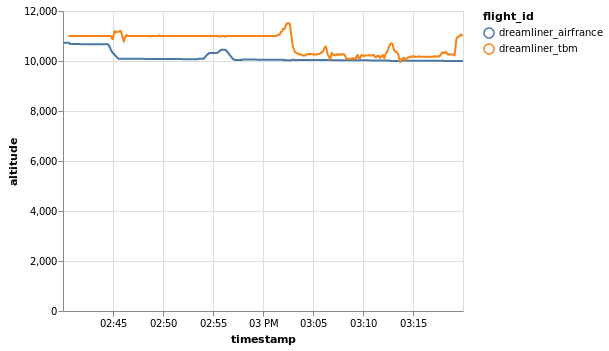

Sample trajectories
-------------------

A bundle of sample trajectories covering various situations has been included in
the library for reference, testing and for providing a baseline to compare the
performance of various `algorithms <algorithms.html>`_.

All sample trajectories are available in the `traffic.data.samples` module. The
import automatically dispatch to Flight or Traffic according to the nature of
the data.

.. warning::

    The dynamic import of trajectories from the `traffic.data.samples` module is
    only available in Python versions above 3.7.

    .. code:: python

        # Python >= 3.7
        from traffic.data.samples.featured import belevingsvlucht
        from traffic.data.samples import belevingsvlucht  # no ambiguity

        # Python >= 3.6
        from traffic.data.samples import featured, get_sample
        belevingsvlucht = get_sample(featured, 'belevingsvlucht')

.. note::

    A subset of the sample trajectories are presented on this page. Other parts of
    the documentation (e.g. `calibration flights
    <scenarios/calibration.html>`_ or `trajectory clustering <clustering.html>`_)
    may refer to other available sample trajectories.

.. raw:: html

    Select a different sample trajectory: <select
        id="city_selector"
        style="-webkit-appearance: none; -moz-appearance: none; -o-appearance: none; appearance: none; padding-top: 0.25em; padding-bottom: 0.25em; background-image: url('data:image/svg+xml;base64,PD94bWwgdmVyc2lvbj0iMS4wIiBlbmNvZGluZz0idXRmLTgiPz4KPCEtLSBHZW5lcmF0b3I6IEFkb2JlIElsbHVzdHJhdG9yIDE5LjIuMSwgU1ZHIEV4cG9ydCBQbHVnLUluIC4gU1ZHIFZlcnNpb246IDYuMDAgQnVpbGQgMCkgIC0tPgo8c3ZnIHZlcnNpb249IjEuMSIgaWQ9IkxheWVyXzEiIHhtbG5zPSJodHRwOi8vd3d3LnczLm9yZy8yMDAwL3N2ZyIgeG1sbnM6eGxpbms9Imh0dHA6Ly93d3cudzMub3JnLzE5OTkveGxpbmsiIHg9IjBweCIgeT0iMHB4IgoJIHZpZXdCb3g9IjAgMCAxOCAxOCIgc3R5bGU9ImVuYWJsZS1iYWNrZ3JvdW5kOm5ldyAwIDAgMTggMTg7IiB4bWw6c3BhY2U9InByZXNlcnZlIj4KPHN0eWxlIHR5cGU9InRleHQvY3NzIj4KCS5zdDB7ZmlsbDpub25lO30KPC9zdHlsZT4KPHBhdGggZD0iTTUuMiw1LjlMOSw5LjdsMy44LTMuOGwxLjIsMS4ybC00LjksNWwtNC45LTVMNS4yLDUuOXoiLz4KPHBhdGggY2xhc3M9InN0MCIgZD0iTTAtMC42aDE4djE4SDBWLTAuNnoiLz4KPC9zdmc+Cg'); background-position-x: 100%; background-position-y: 50%; background-repeat: no-repeat; background-size: 20px auto; box-shadow: none; box-sizing: border-box; border-radius: 0px 0px 0px 0px; height: 28px; width: 15em; line-height: 16px; font-size: 13px;"
        onchange="city_select()"
        >
        <option value="belevingsvlucht">Belevingsvlucht</option>
        <option value="dreamliner_airfrance">Dreamliner Air France</option>
        <option value="airbus_tree">Airbus Tree</option>
        <option value="fontainebleau">Aerial Survey: Fontainebleau</option>
        <option value="gascogne">Aerial Survey: Lot-et-Garonne</option>
        <option value="mercantour">Aerial Survey: Mercantour</option>
    </select>

    

    
    

Belevingsvlucht
~~~~~~~~~~~~~~~

https://www.belevingsvlucht.nl/

On May 30th 2018, test flights were conducted along future routes arriving and
departing from Lelystad Airport in the Netherlands. The purpose of this flight
operated by a Boeing 737 owned by Transavia was to assess noise exposure in
neighbouring cities.

.. code:: python

    from traffic.data.samples import belevingsvlucht
    belevingsvlucht

.. raw:: html

    <b>Flight TRA051</b><ul><li><b>aircraft:</b> 484506 / PH-HZO (B738)</li><li><b>from:</b> 2018-05-30 15:21:38+00:00</li><li><b>to:</b> 2018-05-30 20:22:56+00:00</li></ul>
<svg xmlns="http://www.w3.org/2000/svg" xmlns:xlink="http://www.w3.org/1999/xlink" width="300" height="300" viewBox="-93457.47857037435 -96031.11816039249 187294.02989658856 192730.00384717208" preserveAspectRatio="xMinYMin meet"><g transform="matrix(1,0,0,-1,0,667.7675263870769)"><polyline fill="none" stroke="#66cc99" stroke-width="1284.8666923144806" points="-58601.536523163486,-23917.09147661889 -58594.29840819029,-23839.68059727158 -58587.060491856675,-23762.26969460532 -58580.4649246194,-23645.174340743786 -58575.94498264377,-23565.097424522563 -58573.32388609472,-23482.234766495287 -58563.70524186494,-23435.721459391716 -58560.92222129803,-23314.263230698147 -58556.013539947,-23238.94000492602 -58555.998051697745,-23238.80826429074 -58543.46674896782,-23083.663214064585 -58531.10283184792,-22993.663160795786 -58525.51051301003,-22923.269820687092 -58508.42496269081,-22836.002638880047 -58491.51036543749,-22763.06710418815 -58470.028346118575,-22668.339767340443 -58446.569865124125,-22582.270593705434 -58421.235267297416,-22500.800039716927 -58386.32649276291,-22463.825817099507 -58357.39132264207,-22379.289121687536 -58319.816910630776,-22267.74143335588 -58288.04946481836,-22232.369898229328 -58248.51694486197,-22118.340767034766 -58208.256680375816,-22080.494058029668 -58172.24131886265,-22000.083193941606 -58133.600648633015,-21923.431266093474 -58095.47984665741,-21840.383148611352 -58053.633710067705,-21756.25618376209 -58013.80379866355,-21717.006038109994 -57979.05073463004,-21604.29994097333 -57937.112714538,-21562.48359450528 -57899.69364058309,-21488.060495676847 -57855.07951394782,-21408.022791635034 -57814.66294829421,-21331.130221557432 -57773.17305762752,-21263.920918289652 -57729.81694638218,-21189.47993299237 -57691.149785867696,-21109.457285688786 -57644.79664273418,-21032.54662500256 -57609.13156655096,-20954.992246977396 -57564.97941779158,-20875.550958425534 -57521.95398463276,-20816.12884834617 -57474.98349295455,-20739.03709828227 -57434.236754737845,-20630.642262611218 -57389.7676663537,-20561.737578339238 -57352.35511337358,-20486.53315008895 -57304.828017687505,-20409.892038011858 -57265.0118470556,-20332.124508364835 -57219.77497154253,-20247.85729162993 -57172.087546895484,-20157.05568472001 -57129.3529449876,-20070.599840925228 -57084.69545232757,-19997.463563842684 -57044.42951400183,-19918.74965003685 -56992.384089404906,-19874.193127331044 -56948.94106092484,-19751.73676799928 -56899.17808111971,-19673.218017010313 -56853.57678853986,-19594.909688894808 -56801.053707899664,-19508.56419364105 -56752.845858122484,-19422.859110217087 -56702.87605377024,-19338.728149977196 -56652.00446287281,-19240.61868170944 -56604.46648953476,-19148.169280691927 -56551.11181944436,-19053.28224587818 -56495.97135741057,-19009.53327734492 -56450.34370318799,-18876.131418419645 -56290.87349704952,-18835.73580696056 -56290.28222980496,-18784.100648601525 -56288.73805268171,-18649.248209156576 -56238.43834604167,-18521.942243786936 -56184.59969588654,-18422.48035456367 -56132.845960840365,-18375.407428155926 -56080.76625635475,-18221.611288497086 -56026.61208067698,-18172.89246215165 -55971.53897558199,-18015.620580108753 -55914.5147344626,-17909.197814347393 -55857.036623022905,-17814.868306903318 -55803.22981564799,-17716.869831298227 -55747.768658893074,-17603.692234987237 -55686.58609071291,-17509.316420808824 -55628.000857345665,-17408.1752896599 -55569.83684609169,-17291.572365547043 -55518.75143781819,-17196.993955829217 -55453.845023204965,-17140.046155664517 -55393.89387130345,-17022.25245820302 -55342.25076392754,-16917.144027556824 -55278.91298576042,-16774.86414997805 -55220.05075895611,-16673.980358809786 -55159.12525435571,-16574.15521742162 -55103.569812986716,-16476.60051181278 -55044.74656156916,-16378.563706643212 -54804.87185183888,-15946.049575223304 -54804.87185183888,-15946.049575223304 -54804.87185183888,-15946.049575223304 -54748.36531505213,-15828.468674454958 -54690.23306409592,-15724.548273847313 -54631.866064660026,-15625.983393171027 -54576.410117151194,-15575.567897450637 -54515.658905964694,-15448.964917776435 -54455.87542952401,-15302.317630261434 -54393.647708035816,-15215.967873196398 -54336.38528240419,-15122.309141329242 -54273.75029021377,-14703.34818086321 -54273.740791473465,-14703.348285822914 -54102.142870716714,-14705.241414542978 -54044.208252734956,-14603.38361270394 -53982.338195229466,-14494.142430781052 -53927.54239742112,-14380.505386262297 -53862.37321004695,-14267.499597657496 -53800.50561808857,-14157.738018177191 -53742.98598087565,-14092.656611827395 -53684.52923026669,-13995.981236303474 -53628.09729418405,-13840.047991982427 -53381.39836321609,-13739.463074420992 -53381.39786702346,-13739.417427700535 -53377.95962090936,-13423.119585648688 -53308.15160871887,-13276.6536961888 -53242.314850523115,-13222.536700364564 -53166.31909861328,-13120.260015796444 -53090.779857521266,-13032.483778355467 -53018.921128948496,-12928.260433526553 -52928.58142729826,-12842.541201176868 -52845.753269480425,-12751.817619851252 -52755.887776605865,-12668.248850196052 -52662.32908923383,-12585.667907485951 -52567.36124792876,-12509.662781606283 -52468.75739332304,-12439.998145516534 -52368.44916727963,-12377.084912374008 -52254.3881940683,-12289.4476802239 -52148.36537976191,-12260.266719061805 -52045.922728833655,-12205.054633989808 -51928.45649909616,-12158.979614947208 -51474.257001421356,-12109.190873171428 -51474.043629133914,-12088.841410780078 -51473.03665976195,-11992.806046439184 -51353.228032962565,-11962.716358839096 -51232.29447491067,-11938.334508665272 -51124.62278635087,-11934.535177153539 -51114.2536084444,-11934.643156533564 -50757.290410261085,-11938.347033920492 -50636.92154863067,-11939.590137644236 -50511.809051762204,-11940.879102469682 -50398.25905533717,-11942.046184691282 -50266.327560149315,-11943.398895363727 -50149.219804311,-11944.596645485035 -50037.22260355965,-11981.746692230303 -49916.41875804314,-12013.198389491989 -49797.758821807605,-12051.53320170211 -49683.71440276135,-12091.977108642744 -49574.507822211286,-12141.867779480948 -49461.43111368201,-12175.734263735418 -49351.144531116915,-12221.831488157035 -49249.77312506531,-12284.847326989673 -49138.862737957315,-12343.12104885753 -49032.96785840043,-12399.0970906642 -48931.90761306197,-12464.34820169447 -48826.73303106385,-12533.610124063596 -48733.518851557295,-12911.876119485358 -48359.88613684944,-12915.57038792188 -48359.88613684944,-12915.57038792188 -48359.88613684944,-12915.57038792188 -48270.93435953181,-13007.801534434333 -48190.45527973004,-13057.119448280371 -48111.409254506725,-13146.919010627318 -48037.839267561314,-13281.391736436599 -47968.439533293276,-13387.75960403972 -47644.68610387365,-13476.913676920114 -47648.70714333014,-13891.342410971867 -47648.70714333014,-13891.342410971867 -47648.70714333014,-13891.342410971867 -47591.08615856936,-14005.879701697248 -47533.462441079355,-14120.416291947031 -47478.438172408176,-14243.302722389273 -47418.206808053066,-14349.487381773954 -47366.354136567534,-14463.448057534844 -47302.89035292121,-14573.375307819628 -47249.019667449495,-14678.546666702894 -47192.853101697634,-14792.028782968364 -47136.91509183451,-14898.68658636345 -47072.12611408025,-15010.782059051116 -47019.608632686526,-15118.873554108488 -46795.978758699304,-15625.362025134158 -46795.978758699304,-15625.362025134158 -46795.978758699304,-15625.362025134158 -46748.003309314445,-15744.37316733809 -46704.795034914954,-15865.669840396953 -46659.474736701704,-15983.532270095156 -46624.08429943505,-16116.065318789353 -46587.157445099496,-16243.259122070562 -46558.79927122412,-16351.029736348559 -46530.66056225043,-16482.11170027265 -46504.183510731564,-16616.458907710265 -46479.74472959017,-16746.814687933565 -46459.99682122397,-16886.883132163126 -46444.99622495393,-17026.906591931547 -46431.57899396632,-17177.535627788304 -46415.53691874898,-17301.76729917575 -46402.72459837312,-17422.34182395846 -46396.80828836432,-17581.707146610443 -46389.93102305467,-17717.940605124535 -46383.298318096364,-17846.055124563274 -46388.62716350226,-18410.710843732755 -46388.62716350226,-18410.710843732755 -46380.88387798648,-18410.783913615658 -46381.60567696101,-18487.280028158948 -46385.70294243304,-18669.777663856486 -46389.68516742826,-18792.870029976966 -46393.5890086539,-18939.103909773505 -46397.38069140578,-19057.70799252465 -46401.18228839664,-19177.348102167045 -46405.0767807256,-19322.54580254568 -46409.265087800035,-19467.3952984805 -46413.01385697092,-19612.853323666815 -46417.05508510481,-19726.36045160047 -46415.514382806134,-19877.739872986418 -46411.627295491024,-20016.534856560724 -46412.96217159947,-20157.95723951904 -46414.12101973091,-20280.730479070313 -46415.6066594411,-20438.125391379603 -46408.98882396566,-20570.90175183197 -46407.51946543946,-20682.73375127698 -46405.74483859152,-20793.705144826334 -46404.58098771401,-20922.198980750643 -46403.23352134959,-21094.212869324656 -46397.06864795688,-21227.934566446136 -46395.32585848194,-21389.590568734875 -46388.73826962788,-21447.072731882385 -46381.70385511314,-21803.74747924117 -46378.52980751689,-21876.73962904469 -46378.57029885838,-22022.836343441784 -46375.91734546311,-22166.88610729593 -46376.444751093244,-22348.89796773429 -46373.06009237344,-22431.130996441214 -46373.21411969906,-22557.798687166272 -46374.55940282759,-22700.51541571332 -46375.75900759287,-22827.77759868392 -46368.479757522604,-23158.981613131287 -46364.53369960649,-23229.04506036868 -46360.19120060202,-23383.2127884717 -46346.30989494458,-23565.964328525955 -46337.25911755118,-23709.46941678902 -46316.79894810557,-23840.82079147624 -46178.617006792265,-23986.057254683332 -46183.06252253102,-24459.79248219256 -46183.06252253102,-24459.79248219256 -46183.06252253102,-24459.79248219256 -46152.75625116902,-24603.928024183813 -46080.76173766185,-24915.445473198863 -46042.8990081322,-25046.958149041093 -45882.77543501913,-25171.149841269453 -45882.7756300303,-25171.17076161436 -45886.09525485572,-25527.292389125796 -45841.96393307285,-25705.142615568067 -45795.337675817,-25838.893260799163 -45758.20980195632,-26483.026198499098 -45581.58184221334,-26484.66457851124 -45581.58184221334,-26484.66457851124 -45581.58184221334,-26484.66457851124 -45531.98870144409,-26620.771152126086 -45299.86057269834,-26699.672792335547 -45305.05550145411,-27264.31923991569 -45305.05550145411,-27264.31923991569 -45305.05550145411,-27264.31923991569 -45258.004142403945,-27387.447600752803 -45211.123180537514,-27529.396997213895 -45023.46424302947,-28085.447849971843 -45023.46424302947,-28085.447849971843 -45023.46424302947,-28085.447849971843 -44973.56782509968,-28159.296477747375 -44929.07505243926,-28303.897682784 -44882.4225474864,-28440.315373806246 -44835.24316368817,-28584.50834545433 -44785.9679082659,-28711.191967935178 -44735.998309820076,-28859.985458904554 -44689.68726349524,-29002.442056012547 -44642.14428496905,-29140.59210722305 -44593.21049013807,-29273.31453658975 -44548.138764576055,-29405.65611583655 -44496.722854314925,-29544.18495237947 -44448.86052975192,-29681.126938871297 -44400.17845748518,-29809.959439396123 -44349.43105246183,-29941.054939360678 -44298.232725783804,-30055.403175000796 -44249.897804293425,-30190.620347044965 -44196.413706883206,-30316.126310054075 -44139.594536841025,-30435.09937399875 -44089.28451442741,-30566.706029349338 -44034.8222115572,-30700.248770964376 -43982.18968998531,-30822.37714360225 -43924.72731937155,-30970.6237505745 -43870.192410492135,-31113.74926785388 -43814.75826722214,-31256.536724449008 -43757.95546775781,-31379.64929904876 -43704.45462857532,-31506.18561817503 -43650.96043380243,-31650.594340185497 -43594.322877711595,-31776.552707683757 -43538.51898544044,-31896.113586506683 -43426.64954334641,-32207.850353980175 -43368.98274422582,-32353.587552772635 -43308.61574730414,-32412.65905821049 -43247.594929567524,-32567.058511041825 -43191.33071063982,-32704.060459405686 -43132.14485765769,-32847.822013132485 -43073.94252630311,-32985.27114107842 -43017.737551912986,-33113.11800078405 -42961.5296103257,-33240.964181678166 -42900.93404817479,-33378.25922953876 -42839.16946517641,-33552.777443957464 -42785.669252878884,-33684.9150217356 -42721.65194583608,-33823.79149769718 -42664.71553973974,-33955.35299431163 -42608.804815448566,-34033.63135912001 -42548.61744838417,-34168.759548418006 -42486.182467716695,-34319.96606123598 -42427.861294731265,-34465.09230656847 -42368.58284414398,-34585.87736480396 -42281.47780949552,-34979.138654451206 -42191.090209134694,-34990.36015757304 -42133.431906540485,-35127.8787315651 -42074.94657334527,-35203.75504914037 -41959.98254636515,-35557.01175134256 -41898.48796305116,-35700.43119498863 -41838.936039781074,-35827.42826702398 -41780.69314401873,-35951.046112055534 -41723.107412841826,-36082.25577054799 -41662.97220942165,-36211.84572264821 -41607.266619561124,-36337.08040956796 -41549.42891410631,-36474.8519761402 -41491.587919232996,-36612.6228189016 -41427.62067965355,-36748.717513409494 -41370.53239323372,-36888.207309391844 -41309.94670064683,-37019.69585085225 -41254.87038959351,-37168.923965496295 -41192.38713482038,-37305.95265560805 -41139.0654181925,-37434.097242347045 -41074.72888154035,-37582.018826980806 -41018.09851793897,-37725.212991350265 -40956.97267033258,-37847.89437861661 -40897.11708393099,-38016.32556797854 -40844.67248266008,-38144.28666316723 -40786.50907115798,-38265.90512010972 -40737.07032391801,-38379.50739162061 -40686.876789066926,-38546.47447346786 -40640.519883723755,-38691.04687581771 -40598.09230563456,-38842.49378018166 -40559.523988220564,-38992.26804686513 -40530.80391152179,-39143.51522148249 -40498.759941167096,-39216.90944545941 -40479.01168234199,-39371.8816261298 -40454.31022836476,-39522.92254115425 -40438.414489888135,-39657.1409183713 -40420.043691249244,-40035.46627771399 -40412.60652922847,-40165.12537310415 -40406.274031670124,-40320.50505518768 -40404.54620566429,-40455.5568111627 -40403.1955493196,-40600.27563932584 -40401.87012178399,-40766.320453931854 -40400.32836602786,-40905.94660192762 -40398.98502181103,-41051.6149433268 -40400.209071912745,-41201.233917706326 -40401.402043553775,-41347.05408727748 -40402.667059173065,-41501.68038833065 -40403.90240901154,-41652.68056027894 -40403.90560144409,-41653.070779996306 -40406.98972186073,-42030.05120992707 -40409.87149372152,-42382.298025317905 -40411.23680281947,-42549.18347115082 -40414.86528969548,-42682.72283685162 -40418.749755592435,-42829.2974906616 -40424.98645592131,-43272.43272113058 -40427.06545468078,-43420.14435738348 -40429.14451176783,-43567.85592497112 -40431.2236205203,-43715.56744613967 -40435.35558222055,-43874.05465843915 -40438.780079860946,-44000.77432258397 -40443.1011522133,-44164.094929859304 -40446.378841329635,-44291.074727382 -40447.79855667372,-44464.520761802974 -40448.421846134435,-44540.667776560564 -40448.65844197471,-44540.699958931575 -40455.511787039795,-45023.942194339186 -40458.731928987545,-45162.06005780266 -40463.21682799428,-45308.801505765805 -40466.41592655842,-45462.54697492598 -40471.04973176648,-45609.200750909265 -40474.183984243085,-45773.221083276745 -40475.3857969118,-45919.989181622484 -40476.77000171908,-46089.03142304238 -40481.08915365977,-46178.962226576616 -40483.95502466515,-46328.39306367348 -40488.88122461355,-46474.18070113539 -40491.6829277937,-46633.97273164684 -40496.75879933627,-46779.75901958444 -40499.411467911654,-46939.552126994335 -40504.721911217806,-47095.69713320543 -40506.973733475264,-47224.756479291 -40511.83684049606,-47308.03437815929 -40520.26814480447,-47680.95229268013 -40522.43399735461,-47835.9139899887 -40528.10589795442,-47981.34954336826 -40529.83111258192,-48100.74287563773 -40535.73199634451,-48255.84645522104 -40542.580876794076,-48380.809756813294 -40555.76724090685,-48732.189095311966 -40556.44757514359,-48815.155563887805 -40559.37846205214,-49172.57596619278 -40565.48830286319,-49261.88691610976 -40569.313713903655,-49409.581843630716 -40573.13928047151,-49557.27669733064 -40574.50876038689,-49706.02771034382 -40580.74908887591,-49847.572574750026 -40582.181014065965,-49985.70325759722 -40590.36385511772,-50327.538416458454 -40600.075012922985,-50928.37713335684 -40600.340087751334,-50928.374958298074 -40606.05160991871,-50928.328089223054 -40606.7537363433,-51013.88404737935 -40607.96456747803,-51161.42701723314 -40613.66102327675,-51309.278469076955 -40615.724641810244,-51451.46131894118 -40621.19058272963,-51589.38558819735 -40623.4428166823,-51736.3154122728 -40626.2492243108,-52078.19300890469 -40631.68974143538,-52231.14013376231 -40632.90030518524,-52378.59626013769 -40634.1569379666,-52531.663954622105 -40636.5625328554,-52679.02380328272 -40637.19263919739,-52755.77342198915 -40638.561294900945,-52922.4814780552 -40638.46407257321,-53056.306613833614 -40640.77268960684,-53191.83871059893 -40646.205170169145,-53361.88037842758 -40643.36682350441,-53507.815196222466 -40648.58903220118,-53652.21602582733 -40651.13037885271,-53797.847529164195 -40651.09835842698,-53957.83222530353 -40652.25165536558,-54098.29472221498 -40653.60768245963,-54263.448157671504 -40654.803509325415,-54409.09046523359 -40655.364207974584,-54477.379151035966 -40655.27429334484,-54958.19540843237 -40657.61325481822,-55243.090813045455 -40657.69974075725,-55399.361342679906 -40654.78088043505,-55553.92972106857 -40649.530562762935,-55679.594070414205 -40646.35098258679,-55838.91302228139 -40646.80404259378,-55985.25145593032 -40643.43193470984,-56139.391595851666 -40638.716313034274,-56275.67083343795 -40635.169801275006,-56445.09397586221 -40630.752689871886,-56581.370630863625 -40627.03377364855,-56766.33575586953 -40622.82954019641,-56892.16370583916 -40618.38671343762,-57025.4185681598 -40613.80599387235,-57086.263690732965 -40606.52008343366,-57457.719919673145 -40606.94231515427,-57600.51809385486 -40603.66289533902,-57748.09507384886 -40598.63155551034,-57901.03923934471 -40595.69324188195,-58053.79350009535 -40590.31949394885,-58201.560105465316 -40587.638855465215,-58349.30456881985 -40581.836440053434,-58481.3612227389 -40579.45809240991,-58629.5347692476 -40578.78204120565,-58766.29785261794 -40576.55579965548,-58914.815373453006 -40570.466452209694,-59066.81791777641 -40568.37295596771,-59195.045086559956 -40567.19849420371,-59325.854780184294 -40565.46915708803,-59480.32519455133 -40558.92309677149,-59631.55417089395 -40556.7841066901,-59699.43222379837 -40552.982955414736,-59875.201371783005 -40549.18142492614,-60050.97041354466 -40547.41841871856,-60201.46929354197 -40546.35853461453,-60346.436803160854 -40544.40170627902,-60491.58427449629 -40538.33687538755,-60647.03928356303 -40535.44415137505,-60714.40526109569 -40532.93407928391,-61066.6777167481 -40527.238740924535,-61212.54610108272 -40524.48255641215,-61351.65616218948 -40524.17642873431,-61487.67511005662 -40521.505022050886,-61646.949948949565 -40516.30347210344,-61798.42586144442 -40513.13593229753,-61942.28751475151 -40513.30946745666,-62073.51675026129 -40510.02986032997,-62222.041330943706 -40505.19808536376,-62363.9306491455 -40501.53165181153,-62501.83893944927 -40502.24419512133,-62644.114533755914 -40498.508638124586,-62791.95188507087 -40494.13068229214,-62934.52792056431 -40490.09284804524,-63082.10858035321 -40486.140666456304,-63240.22141352691 -40481.887154968616,-63398.163956761295 -40477.56747426616,-63474.60619092919 -40473.046165923675,-63636.5222217586 -40469.65811724564,-63790.48606680615 -40470.01970301694,-63926.6341298466 -40461.581258875274,-64085.99182110929 -40456.290322856126,-64227.19330571436 -40453.58620933579,-64391.684179151176 -40448.163836970394,-64553.607058805996 -40445.672903878236,-64707.563122904605 -40440.07813790736,-64885.20023129465 -40437.88278597251,-65038.722038453714 -40431.822183991935,-65196.07400827174 -40429.344307551364,-65278.19886503442 -40422.97416678308,-65434.4308585018 -40421.51009216481,-65604.26374851541 -40414.92657156338,-65771.20284087001 -40413.715971758305,-65935.42170115709 -40406.75099798722,-66092.43521497336 -40400.50888017177,-66246.24834509424 -40398.57401814262,-66413.66724122633 -40392.711647816104,-66577.40560981662 -40390.35349809646,-66729.71919679451 -40386.17950514735,-66879.97545014386 -40382.00518497648,-67030.23162881959 -40364.023015823055,-67565.82451171489 -40360.79182352956,-67740.07363421927 -40356.17843320738,-67891.88694629897 -40352.48111662061,-68045.76476785306 -40338.51872627368,-68320.4211804504 -40330.37337364503,-68646.83054355903 -40331.08854167528,-68734.8855337356 -40313.53550673238,-69135.10071243308 -40302.30443429143,-69512.12520073388 -40295.466436632574,-69667.58163820261 -40288.753969840946,-69838.57705918506 -40282.04095151102,-70009.5723657233 -40268.73919522435,-70367.10172441715 -40263.88546694314,-70527.08848314882 -40259.031341983675,-70687.07516539197 -40254.176820165136,-70847.06174879284 -40246.98404032116,-71014.77965005995 -40241.065401081025,-71173.16310851676 -40233.21450567725,-71315.33145773999 -40222.53571283254,-71478.93327049715 -40208.8916512972,-71647.04830833002 -40191.348181193694,-71815.54007458633 -40173.80342883467,-71984.03169734092 -40155.59570511884,-72101.59195230425 -40137.38708217338,-72219.15210644825 -40119.17754605127,-72336.71213759187 -39874.01392748001,-73203.74108342174 -39827.837262160974,-73376.94949042825 -39766.227344663785,-73520.58239876323 -39766.89036806185,-73603.45646218097 -39436.26937074061,-74276.54882370902 -39353.04844545459,-74420.00205534676 -39280.81654772971,-74619.09705694804 -39021.20088165746,-74987.2306201552 -38839.9883749169,-75335.70444236176 -38790.030768515964,-75404.81470589552 -38740.0717691872,-75473.92444046066 -38417.90889813115,-75805.17572115014 -38308.96180287726,-75935.68656692818 -38075.67215133078,-76192.15678021222 -37964.448697479806,-76305.92886836512 -37841.622003620505,-76351.84372694316 -37711.90352851357,-76475.9666197814 -37582.17855772702,-76600.08608901098 -37452.447091184484,-76724.20211207774 -37313.28524690927,-76829.53638871599 -37185.86120345439,-76928.21777713356 -37043.64123113965,-77025.10675017185 -36898.18615489148,-77127.19545403651 -36748.36228029286,-77215.75811445454 -36615.51675027645,-77295.04013449044 -36463.45113453953,-77350.54576562581 -36311.382150602076,-77406.04673797614 -36002.46376926281,-77584.40742064736 -35856.28275901939,-77650.12511764528 -35690.42568193232,-77707.34658213767 -35524.564813201156,-77764.5625173155 -35378.14067365362,-77796.12438539043 -35047.86162512839,-77917.55506166004 -34881.33329668273,-77962.66779577587 -34717.18294670698,-78002.75116355576 -34544.208793823425,-78041.42273464997 -34381.127471823595,-78072.42282760501 -34217.060844233456,-78084.43158844598 -34048.38610349443,-78108.50958636013 -33879.570437198854,-78112.1224681388 -33708.32194530174,-78113.28568435875 -33547.02146236334,-78114.3759370158 -33377.05192223542,-78115.51912607723 -33209.3561923897,-78116.6413307879 -33040.52350338584,-78117.76543358577 -32539.14134491406,-78121.06990707788 -32372.724459290297,-78122.15554622466 -32211.64252602659,-78113.10043076298 -32051.77016364513,-78093.15467131538 -31888.532563951234,-78057.9448868711 -31725.297305797052,-78022.72973088533 -31566.13632519534,-77979.7136533614 -31409.31728019011,-77947.03734485639 -31258.664180140982,-77900.1591950459 -31098.63735461405,-77876.47162968454 -30940.811909164644,-77795.18289290876 -30782.484077330402,-77769.66167329997 -30643.530085499482,-77705.34013144526 -30487.12163381844,-77621.26572767229 -30340.988134550196,-77590.04426750023 -30186.645009090535,-77493.60260766328 -30038.398774977748,-77464.5433620096 -29891.596967146168,-77391.78785789282 -29463.746177195655,-77177.65125060434 -29316.851252592274,-77110.31818462386 -29171.58367772001,-77077.50340626524 -29021.662633057458,-76977.37382961746 -28602.199468313513,-76800.66802934406 -28442.053785561457,-76747.62986754961 -28315.07536974631,-76680.06701540602 -28162.6802653999,-76614.54417283573 -28012.535569559943,-76544.25581903757 -27878.065211753026,-76481.4721810361 -27730.498299574247,-76413.40546303037 -27583.03885098124,-76363.98115777799 -27438.331703396078,-76297.87553213415 -27293.08379040875,-76210.18605133184 -27151.12605889393,-76151.74039163944 -27008.599698360213,-76092.60313798535 -26869.16137996969,-76025.93436522313 -26724.24044882041,-75995.72262406809 -26294.99365096443,-75764.14157218693 -26149.7820656424,-75703.52631971122 -26013.126050977982,-75648.47356804476 -25865.488919346084,-75611.77625664002 -25726.07908409432,-75517.53589584818 -25586.168671148687,-75463.0062431727 -25439.15151531771,-75406.95508136426 -25301.926160003517,-75376.40358686206 -25152.159467086876,-75281.07754407893 -25017.32875466732,-75217.26883656901 -24865.156536402956,-75150.09000983628 -24727.752175412552,-75109.94090460068 -24583.28172830097,-75019.06058509991 -24438.11178841625,-74987.0569449687 -24301.596093897897,-74923.66878967342 -24153.740580226666,-74864.13053625464 -24014.513342902723,-74767.16507786389 -23869.383489814973,-74741.18781171572 -23732.78005417936,-74656.46082194915 -23584.91764368909,-74592.33017380291 -23451.131441681784,-74561.02072557234 -23305.820372637012,-74464.15045535663 -23164.07279602177,-74399.37431678151 -23016.205032283036,-74330.82394241472 -22877.150040680597,-74263.17825405633 -22737.160881978554,-74207.79191102447 -22590.497644814575,-74182.99300161304 -22452.829804651024,-74074.40842795231 -22308.600861187497,-74021.27376828431 -22163.329461315356,-73956.57126169982 -22027.015841194436,-73925.75278921117 -21884.327560604383,-73833.49120396783 -21740.196309004197,-73799.67771001242 -21605.429573315334,-73731.11441871192 -21458.45896309004,-73663.37713431363 -21310.58271438255,-73582.17180996745 -21166.6443984087,-73557.66459229444 -21028.31192754264,-73481.84905479242 -20889.983676093856,-73406.02964820278 -20742.214113236594,-73346.30331500527 -20603.223143802632,-73279.88874570985 -20458.00747129084,-73217.98511842608 -19889.638324382453,-72961.2997972875 -19889.638324382453,-72961.2997972875 -19889.638324382453,-72961.2997972875 -19748.26134294624,-72931.90678575763 -19616.124277875784,-72869.14960183427 -19466.628090985167,-72795.49292416994 -19326.6007260022,-72709.70860622165 -19179.899806604135,-72659.08276733539 -19042.546617971344,-72602.02828955826 -18898.297683276873,-72522.63656376323 -18763.659393996044,-72468.41299083504 -18627.10338020049,-72431.97710227438 -18474.379189222087,-72360.71994054921 -18340.419223368775,-72295.51834640547 -18195.539821718226,-72232.25241953426 -18054.015361318532,-72165.43051328199 -17912.49471516821,-72098.60456156754 -17774.766871758366,-72063.27180115799 -17625.842218157413,-72001.21236887982 -17487.821729577758,-71924.00220203573 -17349.805535140487,-71846.78817064303 -17217.116680680618,-71790.18494685933 -17068.59804724243,-71754.52467743358 -16922.57767946025,-71658.76511337914 -16781.807115706928,-71605.28569306011 -16638.625114696846,-71547.66648337246 -16500.503507361143,-71476.73136703442 -16354.618221606099,-71416.17768309514 -16213.847150910553,-71358.53829388661 -16081.161429502788,-71294.82557357788 -15927.18787035126,-71235.14883100367 -15791.965272762913,-71173.50846172943 -15651.360932070189,-71116.8885694914 -15502.815062696458,-71062.36143146349 -15364.76166960044,-71003.82618880714 -15218.92851498607,-70951.18144982801 -15078.206930078974,-70901.10686056697 -14924.584172924655,-70850.20374994098 -14780.878412221813,-70803.58294515363 -14640.767795818998,-70754.27112445698 -14488.977156117367,-70711.20527429928 -14341.211291337928,-70658.3677512125 -14202.472324221293,-70613.61516603197 -14052.18134915096,-70567.51009206982 -13905.221834308499,-70531.57822955903 -13752.689856970537,-70486.85167561186 -13607.967008615791,-70444.34365857464 -13468.958460594811,-70406.13248940924 -13316.094951900204,-70346.71712336552 -13174.73627108215,-70325.42493594179 -13024.27514877495,-70264.61292195748 -12875.260553113962,-70239.6200475872 -12727.091705607892,-70192.86506997209 -12586.281989974877,-70148.6769753735 -12429.878002181495,-70105.55990603955 -12281.61519806664,-70078.13006076824 -12143.502000147522,-70038.95680674701 -11992.632376789195,-69976.96538555369 -11840.89399696684,-69936.06311215433 -11693.198244505053,-69891.08912296381 -11549.11085494466,-69848.6922984697 -11399.059034244587,-69820.46329861207 -11251.973810963551,-69776.85608457836 -11115.438459101219,-69754.89006439333 -10963.081629465101,-69699.19972636343 -10810.728224072138,-69643.50469355426 -10663.058151906544,-69602.03960669981 -10506.139425866977,-69583.03581234359 -10360.560424328234,-69535.34145571865 -10217.242735551357,-69491.95472803466 -10057.997432818223,-69432.36587259128 -9917.878922652833,-69411.0648469293 -9766.326382932226,-69370.78947582755 -9613.266066474353,-69325.07352075638 -9474.613187072853,-69283.29662772268 -9319.171096524815,-69244.13733305264 -9172.093570592744,-69185.44685901862 -9014.551169922008,-69142.82865562005 -8875.021609760926,-69108.28843680077 -8720.521521188995,-69087.32464132823 -8572.560297733653,-69031.1215583156 -8426.46390985875,-69011.4290541838 -8275.498308881093,-68948.74737158239 -8132.373599529884,-68910.04836625575 -7978.446201054401,-68866.35539328054 -7827.814545902883,-68818.8538617532 -7681.4280197750495,-68799.48523633501 -7528.5690893424635,-68763.28748816889 -7378.973380354777,-68701.52607912594 -7239.760145911487,-68661.84588704615 -7087.378753723768,-68639.79221154391 -6945.750491462694,-68585.86253020901 -6790.350775024604,-68546.9693275002 -6644.546912751383,-68505.72748040117 -6498.745470485604,-68464.48134662255 -6352.497183479628,-68423.66316357914 -6196.341129119036,-68371.62994008271 -6042.752878778566,-68332.3657413547 -5899.358218341921,-68289.11344610351 -5752.921455178484,-68249.4288987136 -5606.487037147363,-68209.74002758274 -5460.05497125462,-68170.04683280089 -5300.029971186579,-68129.21275187015 -5300.025407893633,-68129.00374621188 -4856.4099233371635,-68012.77358490524 -4711.535319281329,-67969.22941599085 -4567.713472490717,-67926.45702778375 -4425.414455451602,-67907.33395765655 -4268.549798528269,-67860.50692523991 -4123.070052569994,-67798.81645101617 -3974.612894254635,-67758.87965419059 -3831.5491820313596,-67710.99175798945 -3831.535620347229,-67710.9753894192 -3381.566279416826,-67611.60561472928 -3243.1448106292564,-67540.47435813995 -3092.906174178763,-67504.82892790521 -2946.273179845962,-67478.50062700549 -2799.031671957863,-67433.69335986783 -2644.00108106331,-67395.79240476765 -2494.6615809628383,-67342.17137416385 -2352.5227374657525,-67292.34104218349 -2200.8075501172457,-67276.09393103927 -2055.6728038999577,-67219.95419741183 -1912.2041588783522,-67199.80991155647 -1758.8260290520118,-67132.00986268627 -1613.1130638106822,-67113.32536310004 -1461.95319011293,-66919.81632953035 -1461.9386873822286,-66919.816333801 -1025.4508230209851,-66919.9256939056 -884.5404192180075,-66883.60710300389 -726.3957773699826,-66858.85553982684 -582.3401657135196,-66811.13302363124 -432.5908398218195,-66757.0182654575 -285.54487188107004,-66738.64022262915 -138.79823762954234,-66665.35073754087 11.24172276627776,-66650.58991188982 149.7379124486741,-66588.9467014751 308.01810866077403,-66567.70175299562 448.7562364786577,-66502.33777482549 599.3856056657041,-66458.89690364526 737.2761352849317,-66441.18028776154 890.7486956745519,-66396.69417535543 1041.5200731993828,-66349.44123990777 1192.889625160818,-66308.57214754597 1330.0196884114591,-66272.96851932732 1489.6273827329055,-66230.79317834193 1629.0000547501704,-66191.38199860552 1786.3539792820973,-66147.81652216568 1933.2181569567308,-66114.86897731147 2077.670928906319,-66054.46451994995 2226.9244676229564,-66012.8740726088 2374.387073554109,-65992.17234937815 2520.626472488427,-65926.14253054789 2671.073473693756,-65888.42304645004 2809.075823851292,-65844.4901418385 2967.7598592702534,-65805.37567184618 3108.006091133589,-65762.81440908983 3259.051514783119,-65737.8538641279 3406.923030936146,-65676.02706246235 3550.3241357435672,-65654.77516410868 3690.1134092063644,-65614.70139086126 3841.5830109324856,-65566.4994118493 3994.273296458472,-65527.82102276598 4143.6080552332405,-65462.65776651557 4287.881071314263,-65420.66406243476 4440.239756585047,-65374.342318597504 4576.27670596271,-65344.00244052499 4726.071819372156,-65286.01941396311 4864.618501945475,-65221.48163278735 5011.85709668472,-65161.42047959951 5011.8309377659925,-65135.52080582477 5420.226290208056,-64925.47652344215 5567.167347001421,-64881.11163944104 5698.040432205093,-64808.01217575573 5825.8957966635735,-64720.23627736964 5949.498945080675,-64588.69157211924 6073.788253906546,-64533.460834932805 6073.755083295382,-64486.65712999194 6441.948236601529,-64216.242305089116 6547.875529776247,-64108.101513420814 6661.897532603538,-64007.11317032057 6774.180405553746,-63952.3988720684 6984.088103326931,-63651.669896166044 7080.674341091417,-63522.638109940366 7172.552559379469,-63470.27827719323 7269.132643185088,-63328.80730567146 7355.597586360692,-63252.27524685202 7609.082888541729,-62793.46488007215 7683.590999791433,-62645.720518110546 7750.156886523887,-62497.814719114365 7823.3169313456265,-62355.42287443028 7886.004968356959,-62222.543197969404 7946.878233181137,-62080.68691829624 8011.339141045228,-61937.097366266695 8075.9177887922615,-61868.09868006813 8193.942507749216,-61520.84510446746 8251.533809898752,-61396.77486325578 8317.583999395438,-61318.6191062684 8436.885503711243,-60991.51585434176 8496.915968872174,-60856.43086565444 8553.726389638407,-60722.516143599496 8611.736180703754,-60591.36130832683 8682.577413116476,-60437.391188219284 8742.190574845856,-60285.51181079811 8800.608044528826,-60136.741762676334 8862.196161575685,-60005.145725097085 8924.078194650896,-59872.339649646055 8924.095245354289,-59872.210141143645 9107.451780202024,-59469.862930528354 9227.321984712828,-59138.550427723145 9294.37050044105,-59058.39350731628 9357.872990052929,-58924.3698803298 9423.125512953886,-58768.067853321234 9477.771587233501,-58623.61296562736 9546.478230052055,-58477.74899674667 9608.288256237915,-58404.33180251627 9664.591258783958,-58270.317907717785 9858.488623311954,-57802.78093800463 9923.678100621539,-57667.66697413573 9988.864009475908,-57532.55209897819 10108.721510157926,-57247.05983569897 10173.965487213167,-57108.963668934826 10239.015883554375,-56951.35536571447 10302.585591220783,-56803.07334583166 10494.376455844267,-56385.4151237717 10559.932547616285,-56263.802766112996 10624.69050490907,-56120.262160915794 10683.14461786247,-55968.27341590381 10749.722657174087,-55839.835724217 10817.132741210693,-55683.077388274054 10879.919058510832,-55533.92570269862 10951.128272209424,-55408.23765605756 11015.469317011379,-55289.125281480505 11085.155252944536,-55154.11440507798 11161.43943718454,-55029.01615669061 11230.124042823894,-54967.33211311612 11396.231618750968,-54645.75753095436 11479.523663279993,-54518.91132642121 11567.893879574653,-54391.533783170045 11656.880770994589,-54273.99538728894 11744.933180669052,-54142.47123486658 11839.440912540464,-54023.966662220766 11932.89373310005,-53965.89758284025 12027.413089535461,-53855.4185161419 12230.792913068259,-53574.761580481056 12329.979457119318,-53483.172537469225 12771.042480987582,-53390.02062079411 12770.911082516914,-53339.08686755805 12770.170729573727,-53052.10518563041 12872.73860550821,-52946.59630386737 12995.652591692651,-52849.49277824116 13107.785340022094,-52803.35282625194 13347.912466961312,-52609.146265992604 13457.519242482345,-52516.72914617354 13582.831581449445,-52430.22365485908 13709.965555019147,-52355.45159326175 13838.714356082653,-52271.60645516438 13967.644161241707,-52147.524873428454 14094.479199206706,-52077.31948494021 14214.7939640264,-52027.67753203985 14345.20012372496,-51954.347325394316 14472.64128522017,-51881.805869400465 14595.803450732574,-51795.70594442709 14724.858235798232,-51673.935075292284 14856.851259248786,-51637.02039944749 14977.220285291509,-51512.59252216786 15102.052114727421,-51432.524839923004 15234.929335013832,-51346.04033831124 15357.818841537648,-51268.73487407166 15487.387750649423,-51226.11261707042 15608.451413742418,-51140.60466102486 15734.306570020834,-51059.56795562696 15864.05565764217,-50936.03806000711 15997.362211006219,-50898.13887431892 16119.920876792516,-50818.052626269695 16244.145473019677,-50700.48784201579 16375.655910139332,-50664.39737345867 16507.269099590616,-50570.11228008307 16626.06039275435,-50485.27743874495 16753.98053654687,-50362.07537080034 16886.83493038674,-50285.733853435915 17017.108404042974,-50242.03284567431 17142.624549096035,-50162.6015326621 17269.178082940845,-50039.13169972726 17392.922153734224,-49968.161137073315 17521.373851504974,-49877.658684096845 17643.30907856483,-49804.270775755635 17768.15693762429,-49711.011925875224 17898.99973243533,-49665.8177758939 18020.432932084514,-49580.59416316536 18149.31722745756,-49491.71406178253 18283.431160628817,-49444.943623988904 18410.09169340164,-49322.652503886486 18535.408279011455,-49241.97751300769 18670.867576504585,-49158.670931806046 18798.256279631285,-49075.21860423 18921.132250694285,-48984.5279220759 19050.43285146936,-48934.387807232255 19176.76458587524,-48851.10237434479 19302.453561120874,-48757.283077726584 19432.223038627588,-48676.91308886531 19559.89406980954,-48595.684601334644 19682.436546147303,-48502.73134377167 19811.90003534704,-48423.733896068676 19943.291395464254,-48379.43282368292 20069.432681307062,-48293.189661712204 20198.573678238947,-48174.640855064594 20326.802714783917,-48126.37091718918 20448.776923134956,-48010.60772252882 20584.004451610184,-47923.27763814185 20704.147181725893,-47836.35235008343 20836.158841735374,-47803.075974955966 20959.628995781393,-47692.64661597701 21087.991708302612,-47610.33926848679 21209.82633410072,-47538.76241373829 21329.255803340056,-47464.25742838906 21460.03021419256,-47389.95931244406 21586.427150405903,-47271.47197264608 21710.174323621235,-47230.95584349764 21832.96618096507,-47109.80146768475 21955.054292822515,-47066.869034583906 22079.627908493174,-46979.19955989138 22563.02257179571,-46906.22017126733 22563.02061777882,-46905.79201375885 22561.998123805595,-46681.746625686836 22684.34839551612,-46569.465587872255 22808.380288955603,-46499.30658749073 22929.42317426587,-46461.36233687895 23054.865059772295,-46342.75499702331 23168.880595894938,-46271.770173972815 23295.936041450885,-46181.03621034974 23419.03389638745,-46138.14893800812 23542.537551897363,-46055.54116246098 23663.82744839417,-45979.07086220004 23783.628446164596,-45904.158805377054 23913.878668029723,-45830.14298039965 24024.679399923676,-45747.584457230296 24158.64106381204,-45671.040283006485 24276.334146488207,-45565.04469576203 24403.236809203292,-45481.36240223661 24517.32727732057,-45403.26602968781 24647.966196837806,-45322.23531761484 24773.420565867043,-45041.440194322626 24773.574915313548,-45041.4394206024 25142.782377759777,-45039.57486751756 25267.312408559632,-44964.34336512147 25387.439944092264,-44875.31714583023 25513.58938243595,-44797.30822098767 25632.107674310097,-44716.14109263556 25759.876716516163,-44635.44089957295 25881.95576428514,-44551.83165827781 26011.547113973644,-44478.71314154026 26132.0296892269,-44433.354061254155 26252.375493230993,-44306.489063785055 26381.846892983416,-44269.01923279065 26998.31078527657,-44167.78129979618 26996.612540847607,-43856.97092014583 26996.612540847607,-43856.97092014583 26996.612540847607,-43856.97092014583 27125.976887330784,-43775.967254876196 27242.77593476023,-43689.849122098254 27365.340683793776,-43621.82744694415 27489.00914121793,-43538.255539639285 27615.07588411993,-43457.42993153747 27740.539819581376,-43376.259104819415 27859.630469785385,-43303.23686187934 27992.02466374134,-43209.06962383619 28109.304155969123,-43133.72039449608 28232.89979779635,-43067.82954953972 28358.989955932724,-42969.28507165313 28478.952227864196,-42895.46566293697 28603.762652094716,-42860.899575420204 28719.79817619797,-42754.20174681657 28847.989181237226,-42660.81274402744 28965.84839364822,-42586.99364929888 29097.65653093825,-42501.43373968131 29211.881952594144,-42419.77322564449 29342.08733341024,-42342.07306711943 29458.146016415838,-42293.98192922211 29586.68545856324,-42213.26330704265 29704.02372779853,-42106.01612886178 29836.367944783447,-42064.03448748525 29950.322498698803,-41990.56056477396 30080.75331856136,-41904.6370867188 30201.725466258213,-41833.6183862785 30319.746757514622,-41719.790348331626 30447.551974690745,-41645.615366702084 30569.35065581057,-41565.43043824357 30693.520733004963,-41483.500934053576 30818.970765550497,-41416.151694163775 30939.570724101937,-41336.91473740723 31063.58078667784,-41302.55006062455 31191.007188397583,-41195.46251530841 31323.675728999187,-41163.367729504396 31453.23168283716,-41064.289439679116 31578.341541293903,-40993.64195387592 31710.074218639886,-40933.13686133752 31838.53714349737,-40874.80781227914 31977.7731933154,-40822.62210976058 32109.22406245122,-40766.07975554954 32245.49407616507,-40717.27300645507 32385.18460746423,-40667.49029646692 32523.939046515705,-40611.83864772415 32650.663378799236,-40563.86056966758 33207.91924413866,-40392.039729431664 33207.91924413866,-40392.039729431664 33207.91924413866,-40392.039729431664 33338.153264497385,-40357.748405156344 33489.36649273221,-40339.19799251268 33622.169190074485,-40288.47705538487 33770.70328650071,-40271.05866835965 33906.248392926274,-40229.54971599111 34046.77910231041,-40197.845444586004 34184.9536805877,-40170.64318893553 34333.530988134895,-40160.20110180563 34479.93483244902,-40137.50936498355 34615.02480134274,-40117.48283617774 34758.77416079508,-40099.29114186939 34901.76790008935,-40079.80548348014 35048.38030050211,-40066.161144369384 35193.79738380137,-40052.261934911345 35337.98267019766,-40033.014145447836 36043.7029183361,-39959.53055045724 36043.7029183361,-39959.53055045724 36043.7029183361,-39959.53055045724 36043.7029183361,-39959.53055045724 36201.476140821396,-39943.87092205752 36346.117676905524,-39926.7488122538 36480.330143901185,-39910.73561500091 36632.87497749255,-39894.06472470681 36769.952947290854,-39882.68477817222 36914.448860657794,-39866.49681332311 37064.900591297235,-39849.39650390805 37201.23752087934,-39838.873536674226 37349.1106703828,-39816.171822516706 37487.945734145804,-39801.04595087791 37627.98971165898,-39788.15183661787 37774.64967535879,-39763.201722579695 37922.926295698686,-39754.81228297135 38061.42788792926,-39735.5284593081 38212.532369092696,-39726.67680893462 38351.8668669042,-39699.69403026911 38491.32103793101,-39688.2477535798 38645.370434351564,-39674.95647953206 38786.286899462524,-39660.03677035609 38926.88125255239,-39642.1799730782 39075.84187126175,-39626.67050269926 39208.38846215372,-39609.38741145253 39354.618538740026,-39588.19267556814 39500.32709599299,-39576.49530983126 39644.20731056752,-39559.973205544586 39792.220913895944,-39538.49213312138 39922.97602827722,-39521.46327708415 40073.79954291059,-39515.83782158547 40212.600094336485,-39498.39060700516 40360.46820835257,-39477.84340273141 40496.6851196003,-39454.62442418306 40636.73976520056,-39445.01203448316 40636.92103723749,-39444.64039183274 41048.99979063421,-39398.25768666098 41194.447027286966,-39374.165572517624 41327.74903652853,-39359.66842887725 41465.53312304334,-39346.42514822476 41590.48238693814,-39331.55933949501 41736.573219351936,-39313.5760410336 41869.267810342804,-39298.119610164904 42007.65318471807,-39285.80583103604 42142.72755886317,-39269.89008036428 42273.425788618726,-39247.87785614006 42410.729060722486,-39231.33127379198 43066.258234968285,-39220.64782265902 43065.72494705761,-39159.52245678988 43065.72494705761,-39159.52245678988 43065.72494705761,-39159.52245678988 43204.20367049139,-39141.56203587971 43209.524449923345,-39136.334943462956 43607.76127376706,-39093.63361459009 43740.26485158931,-39074.674794134175 43868.385516864764,-39065.853377704596 44002.92416164986,-39041.25718320173 44134.1328082596,-39027.825205138746 44265.67294431731,-39018.18579858668 44394.75085418605,-39000.017172509484 44528.32594016645,-38984.740225880756 45054.0384828426,-38963.47835507977 45053.9960454829,-38958.829041091645 45053.668893706956,-38922.98724182272 45181.71165738849,-38906.27525160688 45305.58014940976,-38889.59824796936 45447.48774936838,-38873.27011592522 45578.999194729215,-38861.17833774981 45702.82692333957,-38840.34728544329 45841.683650251754,-38832.84296119764 45973.8603894944,-38812.35924908286 46098.95108479042,-38799.36363290413 46239.67422749011,-38784.405213347694 46367.04389911387,-38776.13026383878 46500.220543370415,-38751.392252949896 46629.67074634863,-38742.57286061523 46760.81175010202,-38723.45929195926 46892.24494306848,-38703.82138911324 47026.56819806808,-38690.369118444745 47149.64747339599,-38685.82754180137 47292.37002821338,-38662.358372841496 47417.67993433016,-38657.35702267787 47552.95243722536,-38634.383584522475 47680.243789264096,-38618.56363527145 47808.3648663956,-38611.539303494814 47937.63938615779,-38600.52867932307 48063.67585659018,-38578.494328036686 48200.2975651727,-38572.067776739554 48334.68272722247,-38550.376654422165 48462.85112730352,-38533.23273877374 48595.20368745429,-38517.253091810184 48595.32527842629,-38516.818272100834 48988.10048912741,-38471.0609625737 49116.336884893266,-38461.152163784216 49245.48425854301,-38452.95780819436 49376.95020421594,-38438.174789377874 49508.127711387744,-38424.42728759463 49637.612454886315,-38420.277382136075 49765.584015131826,-38413.894430600136 49898.37595609909,-38412.55366137641 50028.485195659865,-38411.23651307575 50164.406834629524,-38409.8568598983 50291.38622739581,-38408.56459139206 50425.221283021165,-38407.199016204155 50559.6524411591,-38405.82370483803 50691.25187215919,-38404.47381661749 50817.26965053395,-38411.12147511094 50952.22379378801,-38417.0692673211 51080.33151725943,-38423.94766851278 51213.19718135521,-38429.65091800236 51338.02952942719,-38436.815652649726 51463.73939799386,-38442.32756406149 51595.7290304366,-38449.6701807151 51729.93204400686,-38454.82749491019 52116.44317047886,-38470.10218721301 52246.618814657995,-38474.85626720916 52384.82268683045,-38477.6221606523 52512.81563548711,-38487.31397196488 52642.5276099839,-38490.422029211346 52768.52672013136,-38494.775189170236 52896.40990418762,-38501.04766486723 53024.29344858494,-38507.31683799305 53157.88609990205,-38510.80138069649 53546.15352928922,-38522.05982452834 53673.19307822488,-38525.94689662924 53796.70765026186,-38534.61803472144 53941.635506990184,-38538.56222203979 54057.640258545405,-38541.9555999322 54193.92614635323,-38546.159712528155 54329.006675166784,-38549.16452845246 54451.583188373166,-38553.68511483019 54584.78104042991,-38561.625307185524 54714.60665005274,-38561.13758864864 54840.50024514085,-38568.979160385126 54977.73166317505,-38577.607023950724 55498.18578208004,-38571.78223716272 55498.18578208004,-38571.78223716272 55498.31721862377,-38583.471230893774 55633.74571806993,-38590.66730500197 55761.40298376057,-38596.04790580563 55889.46858970003,-38597.9668198001 56024.4314550052,-38603.4305756433 56145.25030924956,-38610.34672798314 56282.09531659069,-38610.86041536273 56411.408281565156,-38617.50049685724 56539.819451604955,-38623.45677789955 56677.68416515707,-38634.827207973525 56802.910629373306,-38635.9779345076 56938.74553023857,-38652.19972309261 57060.87724590082,-38669.26699321074 57194.82843419594,-38689.99344377784 57324.21314510071,-38702.48024008967 57451.09326416697,-38743.05476229027 57571.87863352625,-38772.126972600374 57691.83272240599,-38806.472982748 57819.611909722706,-38846.94123157165 57948.468009531134,-38890.07023162213 58062.10879796828,-38932.166078337235 58179.08771677573,-38979.05526074515 58288.69969996171,-39033.10895824002 58630.76517142179,-39228.427462516534 58737.40620546058,-39307.546509197644 58835.691214329396,-39348.25317072164 58943.11932780414,-39455.33409455 59036.20172150374,-39534.349587763165 59133.055116273434,-39629.205585542986 59226.10858793089,-39705.28217897412 59317.57514504672,-39797.954264692155 59394.7895023238,-39845.89696422425 59480.88927123413,-39987.6743593032 59558.87651320423,-40037.504787512924 59633.168520956126,-40151.61902433885 59707.62949466004,-40254.76434118863 59775.663669285306,-40393.38763944742 59841.04863349453,-40497.67695862782 60016.8696126662,-40804.91553673917 60070.710872397314,-40927.906196217 60116.45620106558,-41047.19568277997 60157.06838617753,-41161.19389852333 60205.18907890302,-41279.24478189797 60238.33862508465,-41404.730757119774 60272.644896625956,-41527.093966411216 60298.61336548867,-41638.333962404955 60323.05120957611,-41697.440469658366 60348.080214892,-41841.50251414004 60360.55422031148,-42007.82200155691 60361.81924597218,-42111.333390950844 60363.08638137236,-42215.0174108875 60365.05619078581,-42376.19810117902 60366.31488487792,-42479.19140664682 60367.23490231664,-42554.47231699366 60368.910346732286,-42691.566436666864 60370.347345769515,-42809.149637959286 60354.28315468323,-42935.23569503229 60336.849111601055,-43059.179773160795 60309.04943648851,-43189.639748637615 60287.682769020874,-43309.40070094055 60252.94279485296,-43433.81450669217 60217.31380516473,-43534.407908470246 60180.46478297148,-43657.46529554746 60136.556300664946,-43764.63466192479 60091.803146703925,-43876.13103616014 60040.12444095788,-43995.0503431674 59987.01893304324,-44094.990725275784 59927.58361709504,-44189.99931906054 59871.35621147967,-44303.61852647954 59804.896775330526,-44410.53972236947 59734.0704678513,-44502.143589643805 59666.22268644153,-44605.79852020606 59596.77354819115,-44700.66472621865 59511.86836060675,-44801.24203744675 59262.73704177251,-45072.50499118859 59171.35507288561,-45156.83496521512 59076.616456659845,-45235.331971888954 58979.851187988235,-45306.85748063559 58879.49089380791,-45377.56045690657 58782.99075139197,-45446.747593563894 58676.85793035579,-45509.485093733565 58570.387196462165,-45581.722027280375 58468.840983685666,-45641.46495408865 58357.531494356066,-45696.313139924096 58244.32672600884,-45742.54680782782 58128.813931484554,-45795.79877797802 58014.369146237725,-45838.50164744103 57905.07276824189,-45874.838478871454 57789.53400031441,-45913.66347275416 57665.53290098494,-45943.86383311939 57543.1375447345,-45983.885460625024 57425.8089354864,-45997.59695080166 57301.74756021902,-46022.95364004079 57180.542934883626,-46024.35720498627 57054.56173362204,-46025.812932911904 56929.774629330626,-46027.25169716492 56807.375764350145,-46028.65986482333 56684.23052520924,-46030.073560329096 56554.81603839761,-46031.55591961805 56428.2375861602,-46033.00251588929 56302.25616480407,-46034.43907016283 56182.537172854696,-46022.07276283619 56054.658573469234,-46000.9891721036 55936.416925418955,-45973.92194771226 55812.14558373013,-45941.56674455554 55690.30160015669,-45925.75886010554 55569.52206730763,-45871.772628732695 55449.12968010902,-45852.05709196669 55326.90551974817,-45801.966590032156 55218.0717986895,-45747.66542134929 55094.63833734477,-45695.769533621344 54986.9670802196,-45638.16934343897 54873.012450183574,-45579.08242219027 54771.37476938776,-45513.2080566023 54656.54094050239,-45441.606283491165 54545.177424775,-45373.0718891871 54445.39725108997,-45298.88150542327 54349.829803811735,-45186.738484742855 54244.55624544825,-45114.590375019165 54154.83173064658,-45030.958821021624 54054.6449590046,-44945.713240309065 53965.291536799494,-44895.488724642615 53875.26520952396,-44755.991895064864 53795.60020138774,-44663.00556350305 53707.093560215966,-44607.58665485606 53384.99286519871,-44134.46671424466 53384.99286519871,-44134.46671424466 53384.99286519871,-44134.46671424466 53313.99577330789,-44082.391671179386 53232.971022044636,-43985.87096229549 53155.29965460675,-43895.615842567546 53074.58545417894,-43744.08904293389 53001.18161732997,-43647.65535233449 52921.91895825819,-43533.32410453993 52842.18414337563,-43430.307516594265 52759.02187173948,-43369.28870997607 52678.522276473916,-43263.94640864209 52595.58404867613,-43153.44821755807 52519.55108753065,-43046.587970735265 52443.065833736284,-42953.02810663696 52360.80970310562,-42849.59883378451 52279.7101232408,-42742.35689765135 52196.375670076806,-42606.816877988975 52121.46472535474,-42505.723624608545 52042.72054644051,-42394.48119357145 51958.137222194164,-42295.0415357455 51878.63793158624,-42182.2502850508 51800.68177708566,-42130.91752549489 51715.04928415033,-42015.856717950766 51637.21765152255,-41904.68464754119 51556.26613783157,-41808.6538946804 51474.03827250843,-41704.34622816129 51392.170510155105,-41591.3128349784 51310.76437501243,-41493.642295839156 51228.24769484089,-41389.24721432945 51152.76541401769,-41272.5172408115 51069.45204258469,-41176.934727733875 50989.46573871224,-41056.6224460599 50905.24087508971,-40944.296100508225 50826.233510335005,-40845.902143548046 50741.04500535989,-40711.65187415632 50663.1745288299,-40650.716402186896 50424.28007694614,-40358.30131599917 50260.28150026422,-40140.92184185868 50184.4926287456,-40033.93698075487 50096.400594820334,-39933.724211242145 50015.90857305511,-39818.06386308213 49937.64794737952,-39716.280835484125 49858.22932287664,-39617.61660648494 49778.96050892583,-39503.92594941067 49694.98775249654,-39396.49805698124 49615.17175399704,-39301.80571586567 49537.490700876486,-39211.58048890734 49451.141144915455,-39074.211340963484 49368.858880129905,-38985.32472770985 49292.90180661599,-38902.59026906928 49205.81463587857,-38779.729812552614 49128.34133278337,-38618.953950458366 49048.04641282485,-38563.715978629814 48975.39447248435,-38452.36429957217 48890.24053632627,-38342.516897971575 48816.63709533994,-38224.69660108135 48737.71134978342,-38110.89953084744 48674.19487600442,-38063.087982698016 48601.4436117511,-37894.65907076639 48535.87549113428,-37789.361522362466 48470.39955403759,-37662.82179784241 48413.61702642921,-37556.22751240365 48360.82467122724,-37430.770666020224 48312.18061138924,-37317.792380548184 48231.3145746176,-37048.58863022578 48189.068389124775,-36872.947763191434 48166.299699854564,-36799.60571869092 48138.77375653432,-36666.21512197374 48121.403467819815,-36535.14291906077 48120.05610458192,-36397.00689714625 48118.77021430783,-36265.17328161723 48117.37821878533,-36122.461414027865 48116.01401203716,-35982.598541151136 48114.64980493391,-35842.73563186949 48113.40433401714,-35715.04593913053 48112.32559917744,-35604.45056643086 48151.98725514627,-35272.50470355512 48176.74967050939,-35199.90704415718 48214.21539563744,-35064.91772540347 48246.98957869633,-34919.03564996244 48286.73103381437,-34794.57097007655 48333.207538287454,-34673.666347360086 48380.94930787851,-34560.51974097493 48490.98641498277,-34300.40784436481 48557.88575981704,-34197.69121659586 48690.52651935118,-33906.00901235713 48690.52651935118,-33906.00901235713 48929.04932121881,-33601.87589110746 49014.75114792552,-33490.15899774726 49098.405926744155,-33382.60544743964 49195.20788107119,-33294.77839143801 49289.49655739673,-33194.195575902435 49391.3843312921,-33109.4220948709 49491.3954276016,-33016.03087400711 49919.74669220282,-32971.648416524185 49919.23091185626,-32920.71073775521 49917.26743848589,-32726.80110843539 50032.95977633093,-32654.653238107127 50146.34073467073,-32589.779033266295 50271.38255883396,-32529.963949810368 50386.55348681798,-32499.075079900533 50509.89772303612,-32415.450693988627 50621.05728553135,-32367.33901351679 50759.29360309639,-32346.66266779864 50877.47562670601,-32286.98902089843 51003.3674234282,-32267.72835380303 51128.634596177515,-32217.041494387362 51263.11563746239,-32193.713202431078 51390.71961240156,-32167.689907619137 51390.850392107954,-32177.992919626657 51778.28909815645,-32132.290806349585 51899.3989717187,-32126.095470710196 52038.718027770396,-32124.45390508772 52167.37852187625,-32128.44729583963 52294.0987526829,-32131.939849162885 52430.16528270443,-32146.381882949656 52560.11697944563,-32159.676545561404 52687.76166445682,-32179.900038190055 52815.882656598325,-32202.791837990084 52934.81140063424,-32229.060142028364 53061.45272281822,-32266.381073781307 53192.80709365226,-32298.81259904722 53312.29418174725,-32334.995496739233 53440.14885858918,-32373.84784143907 53553.1655639453,-32444.460399328473 53559.16731288741,-32476.170166625107 53908.797062032696,-32591.515239485223 54013.702603727936,-32627.931915726444 54130.05182007154,-32728.9697709731 54234.49788767401,-32803.80549893006 54335.24103578105,-32866.59154518546 54439.27702478064,-32944.19054355384 54546.08772068016,-33030.04580174835 54644.63239614718,-33135.50438129366 54735.797282029496,-33219.62937528058 54823.32600136915,-33271.06833718449 54920.1037612509,-33404.08519916804 55002.59764935578,-33457.56302785171 55087.929934505126,-33552.53433355475 55171.631257822766,-33659.44892906723 55245.7594688346,-33763.096490958815 55324.9298265193,-33851.3169488389 55403.36090610165,-33953.01428522592 55478.46944004351,-34063.55496432917 55555.73040052632,-34153.3474487357 55631.73479358471,-34250.3195438458 55702.86825119016,-34364.09644083697 55779.97240342524,-34452.419350681674 55860.62348377081,-34564.35942755804 55933.60765369922,-34669.7365944258 56013.030031212234,-34764.67816554795 56081.11696493708,-34805.6090464803 56159.91029336469,-34949.51305339497 56235.008544640754,-35043.2914893856 56312.163214805194,-35134.28228082075 56393.48709355305,-35224.87882802808 56464.6053349369,-35334.586786699074 56541.84293728348,-35432.048934603336 56611.69750317863,-35534.94801767351 56695.30735760657,-35628.967197455066 56774.94835247503,-35740.29966028447 56848.901305640255,-35836.06795129045 56921.945399416836,-35930.29141893867 56997.235362245876,-36038.13038511041 57079.91906470429,-36140.87464808344 57155.89139289129,-36229.88010911032 57226.75926411027,-36315.31714634009 57309.64129926862,-36447.153538673054 57390.18153227768,-36531.008019027555 57462.811311093385,-36613.485464554265 57542.64922819918,-36726.09851880546 57616.52691642355,-36825.65547542336 57840.07041864733,-36929.848603611885 57841.32639787932,-37036.98793346437 57841.89214505928,-37085.248105434875 57923.27976472805,-37188.857015822956 58152.33407918054,-37480.51260633398 58230.978967073424,-37628.44372598806 58304.8606358342,-37675.57909085349 58384.51740739445,-37820.214730821004 58458.01271760944,-37922.44041028325 58532.79136951416,-38006.949100212616 58610.38014550763,-38101.95735385411 58686.534785951604,-38213.991395458346 58768.43215136802,-38307.30541649958 58845.26431450142,-38400.59212917946 58920.94620397207,-38497.172506412324 58993.694548917854,-38597.499610698644 59073.59586169857,-38697.39467666815 59301.02393510067,-38991.175559610274 59378.24648079992,-39040.845260640715 59454.70680894646,-39188.00620548502 59525.93968890179,-39272.19733266009 59608.40180312582,-39384.831968342165 59684.00378692578,-39472.3355184218 59756.70642018944,-39566.43522543211 59836.651089330386,-39667.35368395671 59909.86865890585,-39717.40909702423 59989.499138427884,-39877.90677817903 60202.368264446275,-40167.247158597005 60268.1440335197,-40278.606468109225 60340.53005407183,-40369.3340772961 60404.92616142218,-40489.3428993661 60463.23438409133,-40586.889478239056 60515.07114782512,-40715.94414501272 60575.136772774844,-40774.00835639406 60619.28563048964,-40895.98962077166 60661.70342231708,-41022.56801552771 60702.9897860777,-41153.99523084385 60737.77721663424,-41266.16083548872 60770.27788935959,-41386.29802252406 60798.19953336581,-41509.945130863 60827.025821572046,-41634.27167673885 60836.44299927904,-41962.86914114933 60838.20078960846,-42105.57484305068 60839.76823178958,-42232.827185325215 60841.26336272826,-42354.20896019729 60842.90524133379,-42487.50440216034 60844.45354100078,-42613.20266493533 60846.042248945756,-42742.18146212735 60847.64371713077,-42872.196195733304 60826.763965333215,-42981.85147930868 60802.11723016641,-43100.70547054156 60777.43525328074,-43216.796714579614 60746.09969203781,-43350.06573887655 60712.68709120276,-43472.3079840345 60673.89967946201,-43594.443258018 60631.766129703086,-43687.26226687794 60590.50512589062,-43802.69229696399 60540.33131281704,-43897.2495671334 60490.92568940747,-44005.95726884207 60433.22158617956,-44107.426692483124 60370.610768220824,-44271.64096252152 60316.27922823545,-44368.664154958904 60248.89317205125,-44423.364736544514 60177.31623588232,-44538.46969323201 60106.498960402016,-44642.68498278168 60033.43004857266,-44733.80231623241 59958.342505645865,-44830.98706589777 59868.51621129054,-44919.19676657717 59793.86908505255,-45003.940078298045 59703.83603771094,-45124.959696904516 59613.57843052848,-45202.98126404529 59528.14265078934,-45285.001185401736 59427.401943784236,-45360.641539628195 59336.583218888234,-45429.94395851618 59240.654781547586,-45471.67605423375 58716.413503262025,-45559.61244951643 58719.19694272976,-45793.914712262675 58719.19694272976,-45793.914712262675 58719.19694272976,-45793.914712262675 58611.000711651766,-45847.0047295254 58495.94720682747,-45913.729360944286 58381.16750524105,-45953.3363104835 58272.266382324444,-45997.879176593604 58156.45435427547,-46038.87452103522 58032.785230228015,-46072.01583716951 57915.36962439576,-46103.87196029142 57798.164130847064,-46115.518590311505 57679.35022512605,-46142.89560484271 57553.14937346129,-46164.225409015 57427.14572069716,-46176.91541621574 57307.66852454371,-46173.12142484837 57185.26604060418,-46174.53894987013 57062.117173940765,-46175.96205954711 56938.07263386625,-46177.39241769146 56816.565675685575,-46178.79049666398 56685.50530842593,-46180.29515009636 56560.565034650404,-46181.726305448414 56438.311614464146,-46183.12362650797 56319.76608211545,-46158.069413607074 56190.705609305915,-46149.68055763315 56063.35951665998,-46110.02746462482 55942.75134870819,-46085.1457652187 55816.948556831674,-46036.40293246065 55700.11892341888,-46015.35808773878 55575.88385698058,-45972.894485152414 55462.63448895924,-45924.77861148781 55350.21292515655,-45883.730973014404 55344.64654760351,-45853.22807764783 54997.97750481618,-45702.02657043923 54898.27340840494,-45649.34366182915 54781.497152502234,-45564.55595062557 54677.51544305609,-45529.52988284291 54570.45900885764,-45432.196385419695 54471.99018596382,-45368.78486078982 54364.34917265408,-45258.3293313167 54266.64605068171,-45223.311971714145 54179.85770697022,-45094.57789714581 54081.85444330538,-45047.06957906262 53995.548199102355,-44946.35927957841 53907.336876824374,-44850.27343094419 53826.80233395679,-44746.1589183184 53737.926744812605,-44643.25625060421 53657.90127659891,-44530.41287408914 53573.64288621917,-44425.989311856465 53499.4218182132,-44283.46497758392 53419.487750176,-44178.04221863532 53347.33608557175,-44129.69286512797 53261.05914380522,-44016.73790418309 53183.959437923506,-43924.23216898107 53106.932119108984,-43768.78079204598 53025.522601649696,-43677.268689707686 52948.089939730526,-43566.71728862471 52867.37853795136,-43456.19976493509 52789.260633153346,-43364.64857116169 52715.39285164167,-43307.58782249961 52636.09966051688,-43203.268065268116 52557.439569319184,-43102.048644929 52477.24047201387,-42996.0954966696 52394.07415130796,-42891.38131134243 52318.39446597973,-42788.91769651198 52241.46247262501,-42680.5948763031 52158.97000917447,-42525.704578836696 52078.12418812763,-42469.91686225432 52000.20578345256,-42323.609945297605 51920.22366369761,-42264.3568730331 51919.78352447639,-42223.04462571512 51683.19565533552,-41965.24799210347 51519.08934206205,-41747.911237848944 51441.285273221816,-41652.881884091854 51359.84609668265,-41494.85894989067 51283.490647846214,-41452.48110229525 51206.89458085175,-41343.62070103393 51120.34028928293,-41252.13075135191 51037.715597315095,-41136.50907791097 50962.51779400578,-41046.5395009839 50878.93609711963,-40924.19031582416 50799.02059641355,-40809.91822948333 50714.84675765252,-40701.73258090884 50635.69825706556,-40588.831464318246 50555.99052299733,-40479.21582551638 50472.602194963554,-40388.45927021819 50391.00621652232,-40283.09108514564 50309.41368759296,-40177.721523293425 50228.19545605285,-40064.83499231839 50146.659904259985,-40008.418556361015 49988.759576755,-39787.25542386082 49905.41504859691,-39624.91068466293 49825.55893918507,-39571.32132491517 49747.19384124533,-39458.39810841864 49667.79091444107,-39360.50776548641 49588.522711335565,-39246.03696209472 49499.20008066134,-39139.43658889533 49425.107180110834,-39079.56632143762 49341.45952221783,-38928.612370082126 49260.88922706917,-38831.59061337998 49178.98599296153,-38779.99719853041 49096.99159234784,-38614.171662738285 49015.85344055662,-38564.03579534179 48933.71428878938,-38457.87194737545 48852.529926078125,-38327.34858906348 48774.908340850634,-38225.10918126352 48689.57964898859,-38126.916361348674 48610.800999551844,-37982.205047946794 48526.69342654753,-37931.658738366255 48447.60976114168,-37830.98275131462 48374.498405231425,-37731.11039052548 48283.830396291865,-37618.630007893735 48205.969492941,-37504.814067086816 48125.180865591276,-37396.03334019716 48043.02173642691,-37299.17999609279 47966.79308639786,-37198.900248894126 47890.764946989024,-37088.256224561985 47803.10435514796,-36991.62498249172 47727.99416645705,-36898.15183061553 47644.84058987839,-36804.66888547427 47570.49941578594,-36697.63005688482 47486.44163725019,-36602.42631460979 47407.65410524311,-36497.15470793483 47322.645949586076,-36379.853473519725 47249.93688290886,-36270.72194963466 47164.127502452466,-36162.319010800886 47086.92067105754,-36049.51533878249 47005.76851747387,-35960.06070002963 46924.11604774834,-35849.02369977383 46836.80195970045,-35737.52105664972 46755.520303318124,-35601.95629792378 46673.40113404768,-35550.582725048786 46503.93506092754,-35271.999720192616 46424.715834709634,-35211.35598155632 46340.705614356826,-35100.33155233471 46250.90202361258,-34974.681691839956 46171.55953902047,-34852.29964546228 46087.92421961655,-34748.26122627183 46007.92768839898,-34634.77603419217 46007.89856237808,-34634.72924321095 45711.316870242896,-34128.108924220236 45641.86868555294,-34058.2097222794 45516.04060827471,-33784.800973673584 45349.56079217289,-33331.65068162308 45306.92236572637,-33196.138114724505 45263.80089666722,-33072.631343102024 45224.10397975297,-32932.68749254661 45188.143675682586,-32777.857967578035 45151.632803205954,-32627.695736517842 45128.078636473634,-32477.846316206324 45100.69987804846,-32332.866983806125 45083.156556122565,-32172.601044040184 45081.78099412394,-32022.202998911835 45080.454389793296,-31877.157775078344 45079.80215635293,-31805.845370041767 45078.17152368058,-31627.55899219123 45073.252815242406,-31089.768522259998 45072.06834454087,-30960.263579407423 45070.931252297654,-30835.938793841447 45090.598388680235,-30659.53094560581 45116.726188542525,-30571.307313615893 45172.89653507383,-30270.315612056693 45238.91583490491,-29875.98095733872 45279.89199473295,-29720.44412919776 45316.58822016421,-29585.1508093109 45360.6260765434,-29439.514590951872 45405.05745303268,-29304.580960333547 45451.66969589948,-29148.299710410338 45493.42064788735,-29013.648920306772 45538.155326610795,-28928.44543620758 45582.44422220907,-28795.238176551862 45670.787278676005,-28504.302624994 45758.3976737331,-28135.66192973013 45800.16508460051,-27988.660648794343 45846.717821296304,-27844.722797762788 45891.05946052544,-27687.248929507456 45934.930583032314,-27543.421433076976 45981.942382852845,-27385.835333080846 46023.18063738179,-27247.2985174951 46067.56187822977,-27079.37466304726 46244.44997252473,-26517.33837803218 46288.0113278581,-26374.459875378398 46335.38428566577,-26226.10530666882 46376.02275034266,-26057.608915994428 46420.912284613696,-25914.54381003433 46469.765230796365,-25782.147611174296 46506.814104108016,-25643.73188303539 46552.696369729136,-25496.42508864711 46598.39092912735,-25423.808157792173 46683.25936727093,-25046.020696704363 46729.1810101758,-24919.693493247763 46768.888715974455,-24749.734115623083 46811.638211170415,-24587.34379041714 46859.56346283432,-24438.11458087082 46900.42114589233,-24358.546617861004 46940.55279506321,-24203.001205404205 47031.40070998338,-23911.753839901176 47076.62360473917,-23761.08012642599 47116.988126030905,-23615.46049172234 47159.28473623911,-23454.6250978491 47203.05357921946,-23370.10472719983 47247.98039254062,-23220.640848414725 47288.42480581856,-23053.432350692125 47368.04543620654,-22680.77509663702 47413.20135272512,-22602.542503137764 47454.27772485791,-22455.790200778003 47495.820729162595,-22296.081092095345 47534.4659536516,-22144.25703451233 47578.629885515016,-22010.33919312596 47620.138320040554,-21863.235662376945 47661.328723384824,-21714.235186389324 47700.40448910308,-21561.887300404018 47743.91669490727,-21407.769036661648 47785.8586467639,-21260.48692895621 47826.8970313195,-21142.743572402454 47866.4511878732,-20994.793096869846 47944.383615413884,-19924.116573585543 48162.498702059864,-19921.984930598013 48162.498702059864,-19921.984930598013 48162.498702059864,-19921.984930598013 48202.82372247829,-19779.03172892913 48245.226588234145,-19636.23043162899 48283.21788986098,-19498.048403136825 48327.842709103745,-19340.11379537846 48368.698340905205,-19206.824574642338 48410.75460914962,-19075.07736543806 48454.41937798642,-18941.068886419867 48499.614629353964,-18872.15027631819 48581.58734043529,-18513.865301739126 48625.22815578976,-18348.425043324398 48664.00920251383,-18202.201434958515 48710.66706986887,-18057.194606153364 48751.814635318246,-17895.663312383764 48790.95164043163,-17771.108048054735 48834.626384994226,-17625.43867461906 48876.31939005479,-17474.780427194084 48917.37717637797,-17350.032193913077 48962.79307251758,-17290.518530666668 49006.18378569084,-17147.09525081007 49087.93314811273,-16773.259681734726 49132.81726851395,-16631.633428681573 49170.343451169465,-16466.766591262414 49213.478725770605,-16391.395315945734 49298.31718239293,-16044.109442638326 49340.785069797705,-15884.803992022602 49383.724770726716,-15757.959982020675 49423.476325580305,-15609.38806617102 49464.64811827805,-15543.176936062355 49549.88260541806,-15241.742356536231 49589.03932858292,-15079.27291253893 49635.05480044244,-14935.21214642729 49671.75463594765,-14809.032710358992 49759.694962633745,-14528.376238209285 49801.00178617177,-14403.703247858895 49837.25312865353,-14273.80312295534 49913.505053975205,-13899.93088510118 49944.95873264724,-13755.23754072804 49974.66967969064,-13614.360977000546 49999.82098411311,-13535.614737661163 50004.18101420994,-13454.057934878114 50005.72449872317,-13095.957385942154 50003.97558141498,-12924.229093060292 50002.55903723181,-12785.136916872314 50001.92684856593,-12723.061551809456 49998.68398215672,-12404.64060080618 49995.31188184751,-12073.530017809177 49993.59021941872,-11904.477914298226 49992.199172106266,-11767.88930649587 49959.70891003045,-11619.873923623514 49932.237440350815,-11542.440090856055 49893.410190717055,-11397.769934699278 49851.9786414264,-11244.577443739285 49804.985870112716,-11098.176171681273 49755.8651989164,-10975.541788501358 49644.304030838786,-10716.849613210272 49580.93871952568,-10577.174233898188 49450.391348236124,-10329.808362906231 49303.33282624973,-10030.795968349626 49221.1664640991,-9905.984040429696 49140.96388628792,-9799.284239887393 49058.10344024313,-9678.362237385594 48978.61009842056,-9567.767042691985 48972.70735758274,-9510.83606003425 48690.69041253889,-9238.796113875194 48595.485065680885,-9126.019268432685 48503.33041749642,-8976.685096221923 48396.61269291647,-8972.558107714854 48287.849964741086,-8881.064430840943 48181.09185061548,-8751.90081175007 48073.4645097249,-8699.766113263882 47955.38037540928,-8577.961867432829 47853.562304956526,-8482.850487995378 47740.24946302273,-8393.547881077697 47623.706237563485,-8306.77815238966 47509.638935388735,-8261.083484404891 47404.33368592684,-8140.782952530314 47283.6741701205,-8056.031008771577 46728.772908543855,-7979.145244192634 46725.42433394416,-7627.653530760178 46725.42433394416,-7627.653530760178 46725.42433394416,-7627.653530760178 46612.110700846555,-7534.007713150051 46501.12209656322,-7482.0434566518525 46386.804725833776,-7391.078795206667 46271.26525802598,-7295.719265783163 46166.45321381637,-7206.645845334119 46051.93576693444,-7124.569194576928 45935.16467975184,-6991.220182863943 45822.2078742199,-6948.412042444974 45715.33095395127,-6858.571225147154 45602.767424536076,-6761.9594770258855 45489.69769562973,-6674.157380903005 45378.632380749346,-6626.486064572647 45264.03354492337,-6484.552651081088 45154.087564951784,-6445.155386999472 45043.812405292556,-6305.2494195523595 44929.13921435145,-6217.967333690938 44818.27709865719,-6125.984967545204 44705.001205559434,-6077.368895640149 44598.13542241668,-5951.842063322845 44480.59877125007,-5906.195440616236 44372.67949689911,-5777.737464014757 44261.34775819666,-5729.87075938091 44147.56611318526,-5639.8857250978745 44031.74935720808,-5553.629317568409 43916.85298343766,-5470.989145436826 43807.485386812055,-5392.613157948213 43696.8694436162,-5307.16591149928 43578.009630926485,-5226.538628266359 43471.24542949991,-5107.117296656479 43353.730455621924,-5060.407492422049 43240.49365505013,-4927.82715352949 43134.243906392185,-4848.373179754169 43015.49661411931,-4795.103715909767 42904.99473577074,-4702.643562392749 42800.35482560906,-4569.028075810046 42685.854055955926,-4526.248082948554 42570.14777088824,-4446.691625764748 42456.36853560008,-4349.932498980822 42339.4599820824,-4267.358870092892 42232.21129961515,-4188.843967098907 42113.93901035981,-4067.2474399751404 42006.97951231037,-4021.5374054098493 41658.32916229404,-3749.926637906365 41543.468627002185,-3608.8591568023594 41432.991107755464,-3565.3252280107117 41319.289315329675,-3437.5403410628496 41213.12794482911,-3396.2101310665016 41095.467422514375,-3306.964600106936 40977.16874444907,-3211.6772481057687 40865.84117193609,-3100.0091539825803 40751.75175301914,-3011.5027826031665 40646.84531174084,-2923.5220452503504 40526.567372064885,-2837.220508520235 40412.28739246463,-2742.059081953029 40301.69726345522,-2699.191537723569 40183.21767592003,-2596.2016776453283 40071.04743076565,-2504.2099255177504 39959.132156877036,-2424.8203592298514 39845.952662204996,-2335.076768597991 39729.80160344265,-2243.2823307410154 39615.50560265159,-2160.795747818517 39505.378344891644,-2026.0323853529173 39395.64306349584,-1976.0571095790403 38820.85402603151,-1899.0468566602522 38818.02824280208,-1542.4524108361165 38818.02824280208,-1542.4524108361165 38818.02824280208,-1542.4524108361165 38704.122163658794,-1411.6731417633557 38588.5805129491,-1335.3896647054914 38479.53163564079,-1294.2824396945243 38364.96741519643,-1209.783005202378 38249.14159395222,-1114.7563086152525 38135.75267573495,-1028.1700131026055 38029.45783084229,-940.3171755208136 37906.63376272192,-856.7347026886589 37793.77649874009,-760.8108638361564 37677.09979440424,-629.2521439994567 37573.80682069976,-544.9066620320235 37573.76550988004,-544.7629342320836 37224.16203159003,-291.38251037149416 37119.01454019152,-253.06501416320685 37000.400710246926,-135.1479598722989 36893.96883061163,-63.073339720924004 36776.730175104916,10.908394068906688 36669.05693387006,111.38697880640001 36552.426550431606,243.57707061576022 36433.47597349536,290.95905136555933 36328.862244781245,379.4654773321776 36208.55839955729,470.62120940776293 36099.75963921054,566.2684262546921 35978.25830717822,660.6158180425651 35876.259979455484,697.0833145878153 35764.133203315294,824.8349529948749 35647.04111741812,904.2845433407969 35528.65727455816,999.2701507270499 35418.09957252011,1075.8367763129006 35303.61856696336,1204.877066274421 35188.91774967275,1283.0595620342006 35089.83689214499,1327.6810131341515 34970.540191856555,1429.235921275251 34848.7552956384,1548.7363405696847 34741.683009686116,1595.7256553400905 34629.605017348076,1681.8837863190508 34517.979302307715,1767.356880634839 34399.53222615652,1856.4111644053298 34289.08193317781,1944.0563927962612 34180.06700151718,2036.2619354187902 34070.54797982218,2120.838673914972 34065.05544726126,2166.6511296099934 33730.7318666736,2375.0244478856407 33618.04310645659,2469.231732242007 33500.723652335495,2549.594251104118 33388.38604638685,2636.9013761751658 33276.052444192486,2724.2110798720114 33170.74078354501,2822.7961462567014 33051.36225801983,2904.0188932993115 32936.87163551279,2984.2412604578294 32832.14780954723,3063.1502310090846 32718.535026701327,3145.8012941666775 32612.844031765922,3237.833331904466 32489.834605309974,3312.396715911296 32382.71047600838,3443.539718774394 32271.4601897281,3484.1653711283866 32158.35841712401,3581.943595973766 32045.249226818196,3674.0254143158586 31932.14428053804,3766.1098706429434 31819.04359204796,3858.1969426161018 31714.407393392095,3952.0684225175446 31606.184607719977,3984.180325431465 31490.23093459963,4069.780445281769 31377.234503914093,4201.771009970352 31265.701133161292,4244.489938914064 31161.387534021418,4337.080028939719 31057.07787439589,4429.672355340562 30940.787165498656,4525.040580884963 30829.031656144696,4616.01873457792 30717.280297489855,4706.999452968046 30608.292651425367,4748.057645706873 30499.258658497747,4843.222673396643 30394.139978157968,4974.680495125414 30280.706975905927,5066.023738598114 30175.264366981268,5108.027964610381 30057.34935110331,5232.765294923011 29950.892514849646,5272.436724790656 29839.42553447239,5358.794015930803 29731.75892827092,5452.430136865641 29615.78786980466,5576.499072415804 29507.136487706663,5663.4853783283925 29392.751701024994,5697.422133543833 29283.57856441899,5798.657612856645 29174.409942828304,5899.895543379791 29069.476440239534,5935.450458204148 28951.15820877623,6061.593474940048 28844.904686065533,6146.536265229054 28743.428588239953,6223.392734910167 28636.544922996123,6316.280316061231 28515.155724369564,6364.70290004853 28407.114074421654,6454.825598732178 28307.42390359383,6531.615093954235 28193.316914888877,6650.4611742147235 28084.2004035981,6698.447089551529 27985.268017027545,6773.606870410005 27876.55552064177,6855.188959879119 27760.86963176669,6969.200603975571 27663.553914909025,7047.570915299918 27547.325033717454,7128.599689896771 27445.60727001237,7204.290236343013 27339.05206954397,7298.399256895659 27232.263234985945,7383.287573448879 27125.47809781642,7468.178232057145 27024.16951247927,7524.606737156996 26922.86327652033,7581.037345723721 26817.552801218677,7694.955653740213 26714.74446054088,7730.140780300701 26599.766844182817,7831.317832847273 26490.637184241594,7889.528104943948 26387.21885991157,7957.582169190622 26272.026372307308,8017.870015116558 26154.033412467114,8078.544239271048 26042.880416745586,8130.622959865967 25931.413317700586,8158.87057423003 25808.457804054422,8238.17787979068 25693.08542356786,8279.88053041984 25574.181042215158,8319.840465904328 25460.254547398705,8339.79655135704 25334.65140802197,8391.125301892513 25222.210053866962,8409.885751584437 25100.576186118004,8436.545568795817 24979.031723652606,8474.865777096918 24861.111980021735,8497.492172471197 24746.34798719498,8509.343933810549 24741.098242771204,8519.453556387134 24377.22327685122,8552.044653211982 24257.626377837667,8556.630586487174 24138.029717805573,8561.219434618375 24012.406400574488,8560.600751954293 23893.573508992904,8560.018482772866 23776.659647364315,8559.448435802986 23659.74577213581,8558.881184975684 23534.872956326606,8555.68798358346 23409.999986033905,8552.497971961035 23289.094481536427,8553.129327867264 23170.85761940192,8551.358612744876 23056.619016149456,8546.932830325124 22931.739493265715,8545.050212125232 22813.785895943893,8545.793534079548 22692.59075053179,8545.229437354978 22570.952726215863,8544.666300496485 22453.453971384657,8542.829985110802 22338.45283138112,8543.598337902697 22219.61952698532,8543.05676058015 22090.452883360093,8542.471366014322 21975.168234567416,8540.656553210858 21863.119548842827,8541.449360868424 21741.339573774792,8539.611017614983 21680.812866188353,8539.989804168192 21620.286164492798,8540.369351228193 21263.03099115453,8542.688006604585 21139.76387368974,8543.362248504378 21029.20242834612,8541.676534332648 20902.07546592525,8547.434660882165 20790.03750220809,8545.834382063724 20669.575697871238,8546.446071317258 20545.54574569759,8553.076780206931 20431.879331393793,8552.600378210427 20426.711019863902,8552.578779451966 20249.643168939558,8551.842100216852 20072.56672790672,8553.197399488903 19956.534541733512,8553.672147551468 19833.403380269356,8557.402049785254 19718.847869615733,8557.802090982554 19599.554751499625,8561.639704751695 19486.32829550025,8561.964183705748 19370.068670214507,8564.0493774762 19253.809155121697,8566.137336194619 19126.562157251697,8565.637814190266 19010.97700035549,8565.186942883665 18898.031599910155,8569.239052609197 18773.29187454842,8569.36284995511 18669.516260378994,8568.965418787115 18545.959794175466,8568.495105534097 18424.53418108299,8570.58318783495 18303.100924143135,8574.7465885005 18196.520681933463,8574.348697844174 18079.607164659414,8573.914903095834 17962.684118669393,8576.074280170104 17838.092929994018,8576.049796329055 17718.228660420325,8575.182137181428 17603.178355932912,8576.608560396875 17488.128135168674,8578.037691362264 17373.077984647458,8579.46953003086 17261.18482471547,8578.72776276031 17145.746375788076,8578.666900934433 17022.025701898536,8583.069967397723 16908.063858015852,8582.933509516088 16793.56132025201,8582.068542047724 16680.732410747678,8582.152505362816 16559.686655368376,8581.48192251297 16443.067676697992,8581.347304531264 16336.471131152608,8585.911687911503 16215.719257183617,8585.682344252564 16102.64464147812,8585.135865414317 15988.38850333246,8584.76083815188 15874.13235645271,8584.388481364897 15761.057142036547,8584.022602440757 15316.727565790467,8582.610212123484 15316.790873095191,8562.40523104056 15316.790873095191,8562.40523104056 15204.650816182615,8545.994619061408 15089.552824042388,8531.131709724556 14986.908209106676,8498.694896253131 14872.738316655315,8469.333660667153 14763.893975381041,8435.846525671255 14661.085158221265,8407.560725519184 14562.147337480972,8367.8908370369 14454.638740516764,8330.528973043247 14360.440771783453,8284.401183021944 14258.579212718938,8233.158391394127 14164.117033889936,8175.031423417244 14067.722957065871,8120.52729109318 13983.728930167186,8065.715143185699 13638.469725447516,7991.949456234155 13638.569205331252,7956.288522642849 13639.061546498004,7779.797105564117 13559.528801536891,7709.635024203406 13479.99376520879,7639.474243218835 13402.673537142105,7568.457361947664 13402.757324126222,7537.890854397964 13177.763526588882,7364.067834499868 13098.625572855613,7251.777212258336 13024.026068232657,7208.231917444619 12943.921793936854,7124.003929121961 12867.326996104834,7051.831852599762 12790.729941612464,6979.6609941310335 12716.481303256895,6912.116989628135 12644.89269041387,6843.026759611776 12567.99117532045,6771.851624818922 12495.35873364272,6705.092282052736 12414.228767516328,6610.854251433064 12345.893497391917,6536.595920174569 12265.905079340573,6485.4501841206875 12185.914995625715,6434.305759973898 12111.810649311576,6361.417913303166 11665.378297935662,6290.392034726935 11665.475507475538,6249.636718471052 11666.212404906833,5940.690827984668 11225.036390751662,5876.711888440152 11225.83121557549,5530.378306126554 11225.83121557549,5530.378306126554 11225.83121557549,5530.378306126554 11225.83121557549,5530.378306126554 11149.091888459034,5499.549828392808 11082.515331653392,5416.074301651527 11004.679001818842,5346.389756408574 10933.909677026822,5286.220352774817 10862.262831031701,5221.300994828776 10790.614088680957,5156.382681096694 10715.714477115123,5091.026579250145 10646.053816240552,5027.194089009237 10576.391342759009,4963.362596539119 10571.297949380316,4927.690570306462 10465.997075168438,4844.701260437022 10360.69262720569,4761.714226947753 10292.563236940554,4702.941325741107 10217.366444056783,4631.8934443614025 10148.057694362653,4570.184328523872 10074.000639560883,4517.619123850453 10003.55471946359,4432.337228046467 9936.445393650438,4376.161801192473 9869.334526063785,4319.987288243615 9799.532371051006,4254.339021163073 9729.728334591735,4188.691756104139 9659.922423456122,4123.045504260701 9585.43140830453,4059.607282660609 9521.878134445027,3993.2557093271334 9445.990347101262,3962.5420934258127 9378.45750077437,3889.3633839217296 9172.377942689212,3707.3005704388506 9102.35273272121,3619.442200519539 9033.022093767526,3554.2087956719256 8958.959652338544,3489.6585009184732 8893.592705030951,3436.781831572879 8820.85086027034,3375.4308351282066 8754.174848061008,3309.1700560142476 8682.763193806,3245.6648670362547 8625.076416063364,3191.7693001384705 8549.970282850296,3126.2735899614318 8485.600401856407,3089.6372028022297 8417.188709332764,2996.5244605342277 8346.153316866239,2967.131516549357 8279.070868574172,2871.9506929996487 8211.880479955507,2839.5441026124627 8008.134803345497,2622.823612426069 7938.173878281716,2563.9944362128226 7869.987661957067,2503.4422048343226 7803.863084492854,2446.607086618186 7742.483937151878,2378.900793984001 7669.513915369914,2349.6010079526477 7599.018393294264,2249.1571738770235 7530.07231768516,2196.5523570699656 7466.171974451566,2129.7954829896967 7395.75703772213,2068.987480533973 7333.319073250717,2010.4374300441045 7266.555461776985,1977.0947306902692 7195.145786947964,1885.894436518919 6848.027894117675,1594.4113145224746 6848.027894117675,1594.4113145224746 6848.027894117675,1594.4113145224746 6848.027894117675,1594.4113145224746 6775.24028862668,1527.8238302499371 6713.685292646103,1461.7708894595457 6642.361216962894,1403.3038878591674 6574.154265097225,1334.2216062688449 6498.831021874481,1278.7734454453303 6434.615970156962,1206.6763245826398 6227.702886904635,1040.1070043539567 6227.749016198533,1003.841885815761 6089.480503283123,910.4146791901735 6021.1072027361015,844.4484036759725 5849.219829279689,666.9725097598159 5747.147628965952,584.3052467461306 5674.769400800697,521.361250515475 5607.560562990372,461.878069374859 5541.834989584399,396.87138329637185 5333.552043020378,206.8526003731925 5265.293503965161,153.07180911106326 5198.830685362485,77.8802089068721 5132.3658309931325,2.6895083817777174 5064.669637095056,-27.774578890763763 4994.085120590427,-126.97168374816285 4925.089034268277,-190.93720954800304 4861.110652250787,-246.26222747228059 4790.605421945922,-282.7694844503733 4785.469255382173,-323.5295524958991 4516.404600741634,-420.57831149278024 4516.432788810656,-451.1445652397394 4516.517353009675,-542.8433177523857 4511.3692433760225,-573.4143364910921 4376.871920143151,-670.329572728613 4307.8778831857035,-754.4911480498791 4232.029467645751,-782.5331769037543 4169.523075457816,-847.8638858447953 4097.576278197141,-945.6675414373724 4031.2184232104887,-1008.582013935607 3952.7069545123995,-1042.579723473091 3884.164894258497,-1106.3142374908355 3815.621049698443,-1170.0477859754542 3747.0754208460103,-1233.780368855427 3678.5280145005595,-1297.5119860868513 3605.5042606138263,-1361.2027533811179 3538.861315464088,-1455.5403937457554 3461.8340487019677,-1511.5471721719052 3393.979973070074,-1572.8134457117023 3328.7916860162377,-1641.157272418547 3256.942432195856,-1705.9644899352804 2836.2712391012205,-1770.9850343614792 2836.2712452867695,-1770.9957180187112 2836.271251472322,-1771.0064016823162 2836.2712576578724,-1771.0170853416728 2836.4407103561825,-2063.6951611943414 2769.90463776734,-2128.4921162444557 2700.5510704015587,-2184.568845140647 2636.821627720074,-2247.721877259728 2565.9923454298696,-2317.0946375477615 2498.408634095285,-2372.131421746745 2431.4212827011165,-2439.4279766223485 2359.9936006312532,-2506.8984450262087 2296.8315646113783,-2536.285798037351 2226.8879776974086,-2620.9362864388277 2162.258999925031,-2684.083493253198 1955.33353814268,-2854.1838961105705 1893.067857403643,-2923.6297758559635 1822.21484011664,-2983.752784183594 1758.4743045830992,-3076.5106479303968 1689.0873149953484,-3108.1373428882957 1618.6747216901513,-3173.351596065136 1550.6275819525647,-3237.700632629563 1489.2356636866748,-3295.657172053532 1422.8134902368122,-3362.0762060643356 1349.4259172012346,-3397.5847502639303 1279.0094662050817,-3481.2719240729184 1214.7985847894597,-3535.1675244518174 1145.857055543951,-3616.0030081605 1080.1625691153242,-3667.65220286198 735.6548963973365,-3719.695677939166 735.6603401467381,-3755.9605528212064 735.6898919197394,-3952.8269534138453 665.8487881068465,-4049.8022550838673 602.5135510644548,-4118.6273233052825 531.1843438247714,-4187.366100932806 256.650767131126,-4431.916779941075 186.9399491879758,-4491.670558670401 121.96332398834508,-4528.714534709867 59.05853854398906,-4616.010301442607 -12.729564385716236,-4676.451997802834 -79.48698184832224,-4750.707886936116 -148.76244359171645,-4812.874522929604 -218.03965567956288,-4875.040162301572 -287.3185692187933,-4936.255032320709 -356.5993579965495,-4999.368506616481 -561.9366803335718,-5196.042582293814 -628.4118970972828,-5258.375388440639 -701.8476822565673,-5328.477334741273 -772.3230764181923,-5387.87189340149 -836.5812888785108,-5440.531613447515 -910.9045926954963,-5475.919682210295 -976.5066870039636,-5572.958472747262 -981.6933691537971,-5598.429121225824 -1116.4384769287108,-5700.286981947495 -1182.781586773205,-5771.160382434889 -1256.3710074229937,-5802.139796583908 -1323.7547034923432,-5875.989908052513 -1391.1404291607812,-5949.839073044086 -1460.0045201399885,-6009.39682947787 -1525.9116275566316,-6077.15728133482 -1737.2580562427213,-6257.978854619448 -1805.826653537053,-6296.118390632795 -1875.9013145243107,-6397.805975708463 -1945.816788766194,-6464.177686852705 -2220.592207465318,-6688.211345594104 -2291.847040034376,-6749.914885429591 -2291.861567578555,-6780.998907853217 -2430.5148815218445,-6879.364867908904 -2495.4108770677167,-6947.889795723353 -2569.1954707754276,-7019.172225247726 -2635.426823447911,-7085.363286312838 -2707.8782440871987,-7148.614304683413 -2774.555198999115,-7210.745030272745 -2841.2338497698784,-7272.874853766891 -2979.9341222179723,-7407.489830792522 -3113.283925431278,-7500.65895793407 -3185.1552210087516,-7563.903255622639 -3251.991233908889,-7624.904874496414 -3320.0173458081476,-7691.171788913868 -3390.6876544694733,-7723.2435416297885 -3391.054881699972,-7734.771404230019 -3391.422110611397,-7746.299255452251 -3391.7893412113763,-7757.8271064075225 -3735.01802856215,-8078.041388423729 -3806.878657854908,-8106.307073326299 -3880.269217542069,-8195.097866747481 -3945.6373245333584,-8251.255865571526 -4009.97807197161,-8317.257072288712 -4044.5202301326576,-8351.550570660462 -4079.062871066738,-8385.8438237219 -4217.788476118432,-8473.79766266335 -4290.131841054826,-8536.075488307313 -4361.8795828572265,-8592.826741561346 -4559.950181212263,-8765.07608679428 -4629.1493086017435,-8835.324257721988 -4698.350416773393,-8905.571443828212 -4839.149695067408,-9040.552049544143 -4839.149695067408,-9040.552049544143 -4839.149695067408,-9040.552049544143 -4974.622549668341,-9164.901695056067 -5390.371785807991,-9518.191365750017 -5390.371785807991,-9518.191365750017 -5390.371785807991,-9518.191365750017 -5390.371785807991,-9518.191365750017 -5461.560963609698,-9581.23019336467 -5530.524970179512,-9640.298667858071 -5600.3865502855215,-9705.409226787944 -5670.691008517965,-9767.496238397058 -5704.957876349564,-9801.130709197632 -5739.225220504907,-9834.76494979129 -5878.021553772451,-9922.67160718124 -5951.032520828882,-10011.690687801254 -6016.867333816096,-10046.83878085036 -6086.021016374865,-10128.694017346172 -6150.4114794654515,-10191.731230167969 -6220.983656264863,-10220.222151706574 -6289.231920501173,-10284.806839980325 -6361.17754206109,-10342.305571815066 -6428.0983436331735,-10408.962296557895 -6496.164675176976,-10444.014674565726 -6561.622912498394,-10522.759667609163 -6631.198703611921,-10576.28577462029 -6705.831016816333,-10641.719450182138 -6771.448102423779,-10723.828816292562 -6839.404458959016,-10781.41235740952 -6911.670056347573,-10845.896398015244 -6978.306199338002,-10910.732754829933 -7046.726327110457,-10978.155967924988 -7117.162675163019,-11003.784821344972 -7154.663301182896,-11057.090855244856 -7192.164747289607,-11110.396586307126 -7266.810736088628,-11174.526517642962 -7337.6033780052585,-11237.538591294722 -7411.078542194774,-11309.007300429548 -7638.886856568038,-11496.887715431665 -7720.949887472762,-11557.200035189437 -7799.904350579333,-11618.89740729045 -7875.938868802555,-11707.19211315929 -7955.749996739155,-11746.004477906952 -8201.894509068428,-11970.87043604506 -8277.945339062157,-12061.317439099019 -8358.48329288532,-12129.953800977783 -8439.023490940232,-12198.588843961768 -8522.620229623384,-12275.981141067225 -8605.30831247577,-12340.940106464846 -8682.98428841814,-12420.757663291843 -8761.17953363057,-12457.832896665614 -8843.367130941295,-12570.709511338393 -8927.584365071549,-12656.210081230625 -9003.769257074668,-12725.836679418031 -9078.331165236565,-12798.573471447242 -9164.191187124365,-12886.139172649016 -9239.513376759805,-12966.383980836756 -9319.266160646182,-13036.085303239672 -9401.861645119303,-13117.925555249813 -9484.459880320375,-13199.764394150414 -9567.060873070512,-13281.601842105492 -9645.509585891105,-13361.834305584083 -9728.265519298606,-13444.30190766158 -9971.79625467843,-13687.56142996365 -10054.70136033271,-13765.101606545712 -10137.609081936667,-13842.640383214673 -10217.112706764641,-13922.170736824053 -10303.432366001789,-13997.713691998804 -10378.35987643561,-14084.849251425847 -10463.96027498714,-14168.33450945935 -10549.999223659017,-14247.500142549246 -10635.13276733136,-14318.204560906554 -10709.971060430506,-14359.486821607668 -10800.999182959742,-14478.441509214175 -10881.261009968039,-14555.97349535758 -10961.525368380218,-14633.504158375928 -11049.354311369912,-14709.980365113557 -11132.740973059943,-14788.53731037446 -11215.834637101241,-14867.525225696283 -11298.567982844483,-14917.673847875829 -11382.266616360148,-14999.59321309242 -11464.585068303524,-15124.513404134947 -11553.995083369318,-15172.397192251714 -11635.845906236711,-15284.709443059828 -11720.59231907528,-15365.584427233758 -11801.702871319862,-15413.828870884377 -11887.030067893818,-15487.446729376203 -11887.12868176169,-15528.20055713587 -11996.403416133588,-15626.423924564422 -12105.682523232097,-15724.644831375324 -12214.965989445125,-15822.863299682316 -12299.585439481682,-15904.7646874443 -12381.521346632318,-15980.368308750141 -12460.218585692162,-16064.958471900934 -12542.907622052462,-16142.975095725953 -12581.891215721325,-16186.65147735708 -12620.875494439195,-16230.327534838443 -12774.480189677128,-16397.295446031934 -12774.480189677128,-16397.295446031934 -13121.05823926198,-16798.623688937085 -13121.05823926198,-16798.623688937085 -13178.251333826936,-16933.425057749984 -13230.765316983314,-17037.759198568165 -13285.6091454706,-17124.817824528873 -13329.943100082864,-17220.88404142899 -13371.6198026795,-17321.446910495804 -13408.421386208636,-17429.534571396896 -13446.994593104873,-17533.645313843223 -13476.349991282124,-17577.081825781137 -13506.37573012659,-17756.247627408058 -13529.12004495745,-17877.497068166205 -13549.732837144758,-17978.893341158124 -13555.386230336304,-18091.38271173081 -13555.67602631614,-18196.461335409025 -13555.962250405832,-18300.244808959687 -13556.261809345067,-18408.86343459823 -13556.524220994133,-18504.012632100745 -13556.664713613116,-18554.954577699413 -13557.100240619344,-18712.874568222025 -13557.433374625567,-18833.667351110562 -13496.296113711947,-19166.42823352905 -13467.79088320954,-19274.262224548867 -13439.697671040492,-19370.352279765615 -13404.19329538453,-19471.297563585118 -13367.50534207343,-19574.318010891722 -13324.569749880122,-19673.556015330836 -13274.46557071412,-19757.962028578684 -13228.84832347853,-19855.13416491696 -13172.974004900947,-19948.53426777416 -13117.097555753664,-20041.93371798613 -13062.434379166481,-20145.69039380174 -12999.883133445981,-20187.300631343318 -12933.005434063383,-20334.518423415237 -12861.482306265321,-20410.42846076657 -12793.078977941046,-20487.710802551763 -12717.934807385871,-20571.960177543806 -12642.788057561116,-20656.208400888027 -12568.273119955118,-20727.200259874946 -12487.133891808673,-20763.584463362586 -12397.472026581054,-20836.42533957599 -12305.649869634273,-20937.244926626885 -12221.381374103263,-20971.5603260969 -12129.162574607824,-21034.47322588487 -12029.190808207915,-21086.00616676535 -11942.334090700551,-21157.19130299789 -11841.082382819724,-21203.283928319383 -11739.828780094509,-21249.37446480013 -11639.37481473402,-21288.985338203234 -11537.232235509811,-21305.890072884995 -11441.715068211503,-21361.976703516088 -11329.456250804566,-21372.59765454354 -11227.96154367173,-21414.274715102358 -11116.44174782056,-21424.025678666705 -11008.810201200988,-21445.85334682429 -10898.159373476292,-21446.09976727871 -10794.934774301606,-21446.32740512363 -10685.026556682327,-21446.56740079058 -10570.365543194479,-21446.81515703895 -10461.496987924575,-21447.047923225236 -10024.983042738806,-21447.9570095275 -10024.983042738806,-21447.9570095275 -10024.983042738806,-21447.9570095275 -9918.013947022044,-21432.63226707765 -9806.429748272698,-21411.529463245977 -9693.353459721055,-21386.455341913443 -9593.189133805807,-21355.91387448967 -9593.159325600493,-21340.63135028263 -9270.671374342295,-21237.03466398119 -9177.023650640214,-21193.69378209724 -9072.682542366947,-21149.33474087642 -9067.288222226322,-21123.441999355844 -8771.208838402476,-20990.666446047457 -8681.999285501182,-20932.457330794754 -8589.08730262121,-20878.915556874344 -8539.179234392279,-20830.737104235748 -8489.272150059993,-20782.558140317968 -8209.182953014082,-20599.383492781868 -8114.681568661012,-20565.607785779055 -8021.916269407687,-20502.902742624392 -7927.373627244446,-20441.58028563803 -7834.60823513343,-20375.849714002143 -7740.06698133723,-20312.36509256611 -7647.317810066088,-20253.883711337414 -7552.547370428868,-20038.087782844243 -7552.529735078648,-20038.08780993249 -7360.114578240387,-20038.37959162566 -7075.101524882716,-19882.863491451637 -6974.940302168496,-19821.3580815961 -6882.63074662486,-19745.593128560242 -6782.330189461301,-19686.93327880389 -6690.205380919698,-19633.786178472154 -6589.758383099565,-19573.22306336619 -6487.382663945686,-19511.797001763283 -6391.830553801449,-19443.970594103223 -6284.570014922194,-19389.799428129998 -6183.230513860766,-19319.904129324375 -6081.761139152961,-19262.69925223966 -5979.9791454149,-19190.64174350211 -5878.944469557583,-19120.308065832458 -5766.037724075327,-19051.022372067862 -5660.558159186544,-18983.020653818738 -5553.976053177179,-18922.011671053366 -5447.396593527192,-18861.000370034122 -5332.9091831653695,-18828.747425239006 -5218.648299576395,-18728.798971400436 -5108.324890728374,-18699.47201910455 -4995.143902478901,-18632.241081210846 -4889.091016239065,-18565.000446923685 -4771.608725318036,-18494.91932232252 -4659.181926830436,-18430.52920283183 -4537.728771857588,-18393.256448110424 -3964.1953413218625,-18037.416174321253 -3964.1953413218625,-18037.416174321253 -3964.1953413218625,-18037.416174321253 -3964.1953413218625,-18037.416174321253 -3964.1953413218625,-18037.416174321253 -3723.658024772744,-17913.270765596088 -3363.168072577285,-17721.763421181247 -3242.616448311689,-17659.763983014185 -3124.169468097062,-17635.31935187077 -3012.823358482662,-17571.840582019737 -2885.1403986003743,-17482.638752339633 -2772.3211949082843,-17426.926240658537 -2640.9486001988216,-17360.51462555282 -2526.4988392333703,-17297.544531094718 -2408.9361004558637,-17235.436730654023 -2291.3763270801805,-17173.326099121005 -2162.9979568748736,-17136.602226376344 -2045.5750122418526,-17033.559134605322 -1564.7679169817986,-16973.813806715614 -1564.767911652135,-16973.79706943034 -1564.706164975006,-16779.88769050015 -1451.33359926391,-16754.796691377363 -1324.2938566103307,-16665.985703607355 -1206.7607856086374,-16601.258782491434 -1089.2308114125751,-16536.5290307555 -973.485006831708,-16474.731767558966 -859.5197509807873,-16396.69898999529 -739.7737187873267,-16332.133923867053 -624.4811777232638,-16262.039429473936 -500.88370714867347,-16194.6196974256 -378.81346803351494,-16168.771679936877 -262.0076118319649,-16067.282292893182 -149.10204623509557,-16003.047806723504 -28.336474231197545,-15945.027459479687 -23.143803401034425,-15919.556291339975 326.22731421558495,-15749.190642099727 449.35363239273175,-15680.106455312734 921.83762265574,-15614.419760925124 921.837595688374,-15614.276046917856 921.8002285671555,-15415.139849113786 1036.4552734870892,-15350.186955195799 1155.4072986479734,-15277.545824932089 1271.391805462695,-15215.43643730017 1383.8210567359433,-15180.696094819577 1500.614183163208,-15111.889465225704 1617.4040378712273,-15043.080038586406 1741.2390515393517,-14982.165740752593 1850.9739250715181,-14905.452839188552 1965.45508318782,-14837.024529683204 2089.7133618498115,-14747.435284599962 2200.332306615469,-14681.507068220946 2435.25638188891,-14650.485328597773 2435.256374881499,-14650.471195327777 2435.1972187185647,-14531.158932760856 2774.7610184009004,-14390.498278342882 2899.5968738245588,-14318.502178648672 3018.630180175457,-14222.243977730648 3134.4131139740443,-14152.578707747274 3251.835865733808,-14100.69634038495 3369.256137618031,-14048.811160474426 3475.2194160359554,-13946.852125885549 3604.062627727648,-13908.768160883163 3713.8675414468375,-13819.367755444599 3833.533363223799,-13789.44047339975 3950.923379978389,-13716.81894920167 4068.3099252462657,-13644.194608996246 4180.788947772441,-13559.138167693469 4292.377990442367,-13478.224399560206 4355.892279152336,-13457.42646293504 4419.406023615284,-13436.627715112636 4530.9182559843275,-13352.490247609656 4642.426659789926,-13268.350234571115 4996.633387945898,-13094.193027381016 5114.436281940106,-13023.356348271253 5114.404444018671,-12992.790756134973 5352.973671776307,-12860.08539408775 5706.091958597191,-12689.331735145015 5824.926749793798,-12630.305817418935 5935.410810908236,-12533.641288973964 6055.41148244199,-12463.556371445833 6175.408722185858,-12393.468511827572 6291.548951783653,-12324.07339270836 6410.062810164349,-12258.471548369878 6524.865312444147,-12191.317574727123 6644.746070582534,-12154.54702480673 6768.538908255382,-12053.442063900682 6885.203652463085,-11999.789852078618 7001.865841950814,-11946.134862476118 7119.308575224378,-11879.344127574519 7235.145048242314,-11813.345196538592 7235.09248903739,-11777.685274842148 7588.47589218832,-11583.30978176518 7706.805513372295,-11517.158704874026 7828.3884417964955,-11448.236577260515 8292.557268564124,-11409.223990143078 8292.497079432638,-11373.597529188395 8292.175518015069,-11183.262579923809 8416.861834592342,-11118.637767946906 8532.112208759254,-11084.419245837284 8660.438070867815,-10985.762359924554 8777.245049112777,-10913.025907244804 8893.626802572646,-10852.893653957231 9012.828689305568,-10796.638923453385 9132.027846330837,-10740.381303265614 9246.304573286676,-10668.674462275409 9365.172725176839,-10597.301563381609 9496.83698089529,-10554.22188603187 9613.874223507246,-10459.274539125643 9736.585085010454,-10387.971414953294 9857.36490134136,-10316.151012219309 9981.704326966421,-10247.601460557347 10100.841383625553,-10173.01536796412 10221.528942136398,-10133.133493929277 10349.565179443587,-10065.51666570919 10466.599501784332,-9982.37800587997 10587.806726183215,-9912.179165026606 10711.688930415945,-9847.152124944037 10831.32059924669,-9804.66718218811 10956.730155644063,-9696.372082092017 11079.83721131507,-9620.7170938418 11207.184942695094,-9587.012626756823 11323.267080887783,-9487.709196101401 11452.222153522036,-9446.569036401981 11577.0308867583,-9344.476157744231 11691.82524349482,-9269.861459782724 11825.594470837506,-9201.242471426014 11952.833244026253,-9129.354633183957 12074.181163663925,-9073.279013006086 12197.942211428475,-9035.499388372307 12322.742107526137,-8940.208637659838 12442.857859609225,-8869.10301684687 12571.289573905411,-8807.125649823505 12693.170356888733,-8733.764379317092 12824.981805691159,-8663.827898553138 12938.13613568591,-8598.427017680362 13068.289821097213,-8520.54462773186 13193.698223044124,-8442.326159132677 13316.851162660705,-8407.800932935317 13433.288871457102,-8301.797699596134 13560.033559102993,-8228.833164954196 13678.183808352453,-8156.061993702247 13792.901426445958,-8075.353915621087 13912.370244921323,-7999.9830186880245 14030.924223682568,-7916.754446665774 14135.847732178638,-7833.562287774246 14248.003669782776,-7691.977826190514 14353.88717341691,-7636.0631017665955 14848.818228951464,-7522.082437835314 14847.568942221345,-7109.4444052055005 14847.568942221345,-7109.4444052055005 14847.568942221345,-7109.4444052055005 14847.383862630164,-7048.312819843604 15348.171513344534,-6415.071656744969 15348.171513344534,-6415.071656744969 15348.171513344534,-6415.071656744969 15416.010247359342,-6280.678756829186 15482.111569629218,-6159.932867356428 15546.444934587467,-6019.634507761001 15610.774588296603,-5879.335270877088 15670.21357155741,-5761.802706326049 15723.894287132842,-5603.878358749214 15775.876698859576,-5471.344296173893 15821.490082573664,-5338.657517173651 15865.589899152852,-5196.477202809578 15908.63046192061,-5047.9966831462625 15944.618239079606,-4916.462355129592 15980.467346618336,-4833.799584925776 16031.125725436594,-4482.122628280647 16054.692781707296,-4356.585782193245 16076.830550466491,-4201.782409920356 16101.643313208195,-3870.566529609213 16121.080559991076,-3480.8258286106434 16120.669830244868,-3355.9716653058395 16120.143209875549,-3195.888919417583 16120.060313434196,-3169.427069791206 16119.977416907615,-3142.965207896729 16119.89452036896,-3116.5033559880967 16111.269762098475,-2522.4230605353137 16109.444184897735,-2372.1877610799697 16107.61869602677,-2221.9524247240215 16106.089164137562,-2071.7160788687665 16104.432819658008,-1567.8945876612543 16103.955502645034,-1422.705846898944 16103.47818552236,-1277.5170727674008 16102.975746346887,-1124.686754103322 16102.473307050448,-971.85639864344 16102.07972952339,-852.1392630866935 16101.68615188581,-732.4220939114578 16101.485176058006,-671.2899185024446 16100.547288619897,-386.00635974690476 16099.140456627274,41.91923251452547 16098.671512422505,184.56115963598234 16098.328178222155,288.99544304680234 16097.984843966571,393.42974325695343 16091.818303885006,560.0571987009159 16086.646787729713,693.9628448096184 16080.253581685167,839.7802558306227 16064.99414517033,984.2734112995244 16047.393417535728,1129.8196107192425 16027.80423858604,1279.6277249383736 15985.42804066746,1580.0599252631541 15954.978837009088,1714.9195756488864 15927.552373571436,1875.3477297590673 15890.159741776622,2010.012545513952 15854.295371165894,2129.8310802892743 15723.449234151769,2553.455193939451 15671.430516611488,2689.6290522415666 15621.411555211716,2848.4325818887773 15561.87728716466,2979.661927419161 15508.87710399951,3101.932706565939 15447.324475630228,3223.8023358778237 15385.69809499019,3360.582772996099 15317.141156698859,3498.521807419008 15246.605402565268,3608.8248261584645 15171.551269686417,3747.695499913356 15096.888000730774,3857.038087328721 15025.94684869783,4007.081956574053 14941.771687923761,4136.324186773615 14859.669067592686,4266.370836931827 14770.779248191155,4394.844164700279 14693.609727122237,4459.457943568514 14516.919581936036,4754.407925428056 14423.667618221405,4865.259969613408 14345.79448338531,4922.019644736639 14252.93917075678,5051.267913737722 14076.72690081076,5299.435500565354 13988.627453143712,5423.521706994112 13900.532454685303,5547.60952184906 13816.288852811076,5669.378454655612 13735.019474522218,5785.458323792536 13645.006471212473,5913.4309783358085 13553.700672562001,5976.641809049785 13468.754317746478,6091.248052693224 13121.142922119216,6564.086699619209 13030.736068716533,6684.989237360525 12944.771366705048,6803.0557769292445 12859.905852861213,6953.938436886906 12773.50540594774,7072.611277704689 12683.886151059805,7181.433792060083 12602.402692852544,7286.134287583052 12507.909293432329,7398.574031301 12420.940527953275,7514.920330043488 12257.118319316522,7781.318132545514 12171.831460262218,7879.540293268146 12078.66058730999,8003.130397791062 11995.864218961695,8112.241479300658 11907.620631497815,8216.677977616606 11819.913689179497,8344.949071489411 11731.36767780165,8455.691350811358 11649.343503594513,8556.952631736214 11478.751585149681,8784.504535152962 11394.4952260066,8898.112460006263 11302.861735936343,9012.050159082579 11218.280120315976,9142.238975589504 11132.242758523715,9265.518201353383 11047.24834557782,9386.383595439498 10959.190294618369,9493.169074244892 10871.136084505993,9599.956154534111 10785.847701213239,9725.833584081789 10700.126435974093,9849.207511616214 10610.0350843763,9948.223647358021 10524.067906325758,10052.603826149567 10439.539887144963,10175.812219866571 10263.726509710365,10413.757244111244 10177.010837975065,10530.74863505406 10093.220809149261,10662.081215100197 10000.894274901928,10785.108456657306 9912.151011761218,10889.666474517102 9830.03178181399,11003.823940716644 9741.690038753233,11132.822058963493 9653.990528056866,11237.818609711638 9571.286592846367,11355.260483827395 9483.100005139815,11487.113072104115 9395.6474288633,11546.609881974677 9219.806895746899,11851.943305012785 9136.351057646276,11909.293630512488 9044.160935903508,12064.028672632909 8960.310110481547,12178.974775190767 8877.59384382379,12239.957465908288 8698.187796676619,12508.951225090976 8613.59240492606,12636.85404264608 8522.533796517713,12752.14039070195 8442.830126944335,12870.901931136566 8352.22442175306,12984.983394970785 8266.92233778657,13104.947116669635 8176.604704950437,13228.185132392033 8096.277436778317,13288.062575276419 7915.223325200482,13532.300939082294 7830.7595473152,13693.893033003746 7749.646432979406,13791.854037928213 7655.264301042114,13890.486358326567 7568.691438314477,13995.349607513625 7485.012012417263,14138.9023833744 7403.117715485426,14275.29250319558 7309.531130174058,14345.869886565739 7134.034833902623,14573.567049811458 7051.585699734841,14697.614629778505 6963.840184172503,14816.820626495044 6880.962916194449,14936.812180433224 6793.662474025508,15060.08019443657 6353.75043939996,15628.948394354988 6353.75043939996,15628.948394354988 6353.75043939996,15628.948394354988 6267.378243999049,15738.066136602492 6188.385517382345,15842.70470024366 6097.286673633167,15965.807749073205 5921.82955549897,16255.718934509277 5831.857888880111,16310.959275930069 5746.539646859111,16421.296415551922 5650.986466976709,16596.001302146826 5374.63140661024,16881.9679400101 5274.012379931306,16987.892841152403 5067.4911547123165,17191.45403125746 4965.713010132602,17290.82168544111 4860.997300542029,17384.83500660325 4753.289857530868,17528.92921795105 4644.166782062366,17618.97092577868 4535.6698497774705,17673.78587829922 4417.126423281707,17761.40620166203 4302.131889945325,17839.361605126738 4190.051196424335,17959.891564894126 4073.879173143073,18046.399765032023 3952.743343756945,18081.96164767564 3824.4755812465078,18196.442614656957 3705.0802953046236,18275.35848904782 3585.7022061742728,18336.144317867216 3462.6581438217086,18377.070520809717 3336.353247044341,18449.94620292225 3204.7274093265655,18555.20200161362 3087.0028129587413,18584.484261288944 2952.0207352529683,18651.838176935908 2816.462219517514,18703.480231690843 2683.853640591526,18753.573416858948 2551.2460637787035,18806.951418819754 2415.69773063654,18855.323409009332 2280.740584533884,18905.25370318498 2157.8778529814003,18926.525669512946 2015.5596179412898,18977.668918848754 1884.5848845333658,19033.397109608806 1745.0744125182266,19076.0009251989 1616.4661178039564,19119.907540128403 1479.9044041996704,19169.16869344352 1348.3540425641313,19216.621741382678 1214.7432458628484,19267.531738613456 1085.4067552377633,19318.446347032597 949.5978280716186,19340.00491809883 817.3178436909409,19405.000729214196 679.152051183235,19453.938640212516 549.2401635790967,19476.28632133019 408.720647268689,19547.163940686616 276.0124068348063,19598.531475104235 138.29972958713174,19635.223388670915 13.108160776082546,19680.035874067155 -132.11085431797474,19744.02127153469 -254.94184397664202,19766.649233761702 -397.21077131639805,19811.386840476956 -528.134278572022,19878.750437798488 -667.6017760487183,19904.671839998246 -791.0124583679304,19945.014664686234 -932.6806043997868,19997.970833108095 -1064.183692899918,20052.05140960772 -1192.4475598623078,20091.282943307564 -1327.0397058448943,20138.72260125436 -1457.5062077038408,20184.610480005453 -1600.1849859485742,20255.978416195296 -1733.152248423573,20293.49877439483 -1863.0321637664463,20312.111424401304 -2003.501616757512,20360.95357588445 -2131.011882351264,20403.922451285423 -2268.5204541844087,20475.04866514384 -2666.9326950938603,20602.87225493853 -2803.8368976892466,20677.380822636773 -2940.035132332363,20694.730587439517 -3074.137126430394,20765.618455853688 -3207.9735579151966,20786.60083010752 -3344.4275795911717,20853.87109090298 -3486.212800156674,20873.3986411179 -3620.0244420461254,20921.419171785084 -3743.8201470171766,20970.385506789156 -3890.2922610343953,21014.88293955948 -4289.924088465796,21164.427199807764 -4430.787424493863,21212.217174684512 -4562.969305054702,21251.28195251757 -4695.723196752757,21305.72078780683 -4835.969433204532,21373.813634580318 -4965.949127689046,21399.24421199774 -5103.850866788392,21450.504552721297 -5236.15913867388,21497.96348359231 -5376.854357753667,21547.59395299708 -5501.058122702594,21596.691767925313 -5644.717765981178,21624.31460149361 -5776.552504817978,21690.26611740332 -5907.38912989303,21726.516327841677 -6057.336210632097,21783.86263581931 -6190.666458064425,21823.66381053919 -6327.52302451808,21867.0998282635 -6458.481677176122,21915.71275889121 -6597.644534946277,21991.79893776615 -6731.425166364749,22017.972563122697 -6862.532931604216,22059.516027289475 -6994.067205617112,22110.04382860498 -7132.668022851105,22158.34046533349 -7277.300651341523,22207.254497418216 -7402.800044704061,22251.99901851692 -7545.066458409283,22304.45768336796 -7678.212817476743,22350.86175623161 -7817.989959551693,22391.494799905344 -8218.432997788492,22533.07346937657 -8353.477896588975,22580.880795532757 -8493.804379531963,22637.163176966515 -8626.344493271024,22683.246753449137 -8769.182653956508,22730.90672479129 -8894.10381439856,22755.051487466022 -9039.241994944092,22829.836871982312 -9172.100880059541,22857.45741684215 -9304.001634965736,22923.591010584354 -9712.656839290674,23036.81346788098 -9849.396236020546,23105.993677739472 -9990.589371480524,23154.54966558434 -10124.722052629617,23199.813847779144 -10247.968381753377,23241.691253697478 -10394.739049259219,23293.63827598684 -10525.964363382318,23318.701851605158 -10659.458855737943,23382.28520728991 -10664.700325180174,23408.20113269814 -11076.651809164496,23528.798621529815 -11210.025745339652,23575.21353429 -11349.432064330207,23621.128063023603 -11480.049962187264,23648.3746622008 -11894.949211330922,23810.92729437744 -12030.516085261057,23856.938329202967 -12162.598676755593,23882.911640291226 -12289.87814316895,23945.660787010693 -12424.97298465436,24000.74820057037 -12570.380471970106,24049.99427586414 -12707.988583738774,24098.274519570452 -12845.655441738156,24123.244756799646 -12970.473759760265,24165.19529477696 -13385.429738221379,24326.752781619696 -13520.974735406953,24370.473900495406 -13655.394396491063,24394.85361502205 -13793.676224407018,24457.845707654677 -13935.84177348387,24499.265732813827 -14071.591280780378,24519.77506929015 -14216.413209979739,24557.066240716555 -14354.604004288924,24597.018998386608 -14491.650406093131,24625.228877625043 -14632.496983369694,24653.836762476683 -14777.473393087163,24693.439183969498 -14920.727461292898,24710.800081818663 -15058.103848568062,24725.383869482557 -15198.709287046497,24742.22666224498 -15328.137359157861,24757.31137003267 -15481.869458596944,24763.496432131225 -15624.716951813332,24768.615262281495 -15765.078058263873,24769.067404481142 -15905.439144881135,24769.52359021335 -16466.88337843242,24771.388768746834 -16466.88337843242,24771.388768746834 -16466.88337843242,24771.388768746834 -16619.897492630033,24771.908317178226 -16763.495333962423,24772.400264340555 -16892.873157091526,24757.99515251149 -17039.029380288994,24742.270546507847 -17186.504037588576,24728.45464717088 -17330.493862341882,24701.85120873122 -17464.726285506833,24688.6874333078 -17606.072946440516,24661.391863587723 -17748.10277551284,24648.95485265148 -17886.97249427941,24615.786703185186 -18031.50279715409,24604.14426044086 -18173.19353570242,24565.036636852194 -18304.666028318334,24544.027949076906 -18448.82674909501,24514.263263671546 -18588.116251758827,24489.060739561006 -18729.703002524264,24479.068391586425 -18866.383602378948,24444.279071643952 -19000.07017975882,24423.12499522854 -19149.80603560419,24399.533534347174 -19296.846953991437,24388.024810199324 -19432.95047217539,24370.127727716976 -19577.79922840662,24337.336292329106 -19711.49609177297,24315.1655742481 -19853.46024310813,24286.642391019635 -19994.954881045145,24265.374716212635 -20139.700085207554,24241.18870942969 -20273.269420798526,24215.57890955338 -20415.350798416577,24195.70743485493 -20561.86852065183,24170.936947917595 -20701.557330915282,24160.64843962359 -20845.257403791406,24141.57351046219 -20982.559937050242,24104.86009989324 -21133.910458072594,24086.7764492703 -21268.79863264327,24064.653583564766 -21401.92413344302,24042.094944181703 -21555.065037781584,24019.28304461172 -21695.69444716217,23997.542765578688 -21835.992901126876,23984.26725734413 -21974.042045229166,23947.844126998752 -22117.018932551677,23928.544337428724 -22262.649706130338,23908.397383996216 -22398.003826383785,23883.19929436029 -22535.857831907953,23858.707302711853 -22684.243445634213,23848.25675404483 -22814.1982720851,23814.15113178789 -22954.716210759172,23787.352033225416 -23102.845023877187,23769.659685164333 -23240.965595195215,23752.442196999906 -23381.171433494914,23730.230380802856 -23942.704881392838,23709.210880681683 -23942.70494645868,23709.19763712831 -23943.08880443066,23631.06688280401 -24084.024441966798,23611.469312486515 -24221.45546378147,23586.591101160826 -24364.99460341983,23576.599328162538 -24504.978094487793,23542.157107496758 -24640.775666589885,23520.99550693047 -24788.45414827406,23507.928559916138 -24927.07971981937,23481.003913093147 -25066.914390485956,23448.217680673515 -25202.819169967286,23435.79351633104 -25334.947169663632,23413.94145740002 -25335.02661869489,23398.65807142922 -25754.567433484524,23350.72314162881 -25902.065752974762,23320.125106833853 -26040.72050009061,23289.950964410073 -26180.523302010548,23265.572330087354 -26316.42544450449,23255.16520539895 -26458.876541977676,23231.413277983564 -26608.085951351048,23210.120180142865 -26737.28965465784,23187.08122223478 -26883.856779858495,23165.004919652365 -27020.887396225804,23137.699173794852 -27154.363218339226,23114.694938788387 -27299.311145306303,23093.3992274295 -27435.413986366082,23074.821205793356 -27582.86253935577,23054.238789289662 -28139.76466781819,22960.624572221117 -28139.76466781819,22960.624572221117 -28139.76466781819,22960.624572221117 -28283.92308539045,22950.147218479426 -28423.301091587924,22926.60746983794 -28570.321964783,22905.188890856163 -28712.053087805016,22882.448330161027 -28851.427497828485,22860.216037967893 -28990.507289808273,22838.245007574264 -29127.239543803884,22815.22772128122 -29284.421445807628,22794.150423100487 -29418.95322124385,22770.350943606525 -29557.765310851806,22744.85413504097 -29705.405073744594,22720.278545124413 -29851.690422492316,22700.793761109042 -29986.64086206441,22680.785385877483 -30135.34894788403,22651.592968875953 -30283.561327445106,22630.57873080534 -30424.13329987295,22607.53527059793 -30575.29708635454,22585.77116747431 -30712.955078309922,22558.400254696797 -30867.071125003917,22535.800289712057 -31006.90226851182,22514.40955040199 -31158.818132170076,22491.027654881138 -31311.19149245714,22465.408324828724 -31455.903200795296,22441.125903937347 -31615.486948062535,22416.42610825088 -31768.892156539532,22391.345844361625 -31914.603222719215,22372.523565473137 -32060.690489793313,22341.44643608611 -32066.120722608073,22325.527255580666 -32523.326509507195,22259.370222160385 -32665.537677415625,22236.66125271423 -32822.460938770455,22215.523394796757 -32973.253131673344,22186.92302641789 -33116.51782345167,22161.471112122224 -33286.27449611211,22137.240409903254 -33425.933532106435,22122.82573267359 -33583.3323025615,22097.829844712636 -33745.76477783017,22068.98812082952 -33896.4018792598,22043.005665550398 -34055.29836864584,22015.099487237447 -34204.178956661766,21988.164408928467 -34364.731196894514,21976.51371211352 -34511.92640880276,21938.52332397584 -34674.350232604615,21912.475600970814 -34819.6802568401,21888.901669139857 -34989.02043412265,21863.777321765116 -35143.3399886775,21839.414032375123 -35293.31802852086,21825.213504954478 -35445.84456762526,21784.612978066365 -35613.2274262965,21766.40403997971 -35764.17991610991,21740.308773831814 -35922.68903063676,21727.917164833972 -36077.259537615624,21690.805400689547 -36237.49776125497,21664.01631900438 -36379.7455753587,21641.243027185574 -36552.20029912191,21615.41894038147 -36703.43828476311,21591.85897958843 -36851.450547424654,21566.72501955134 -37005.937091362,21542.335473898107 -37176.43281628679,21523.34022675672 -37335.02255629788,21482.67215516276 -37480.96571364592,21459.441116182465 -37648.135369692856,21433.26967513904 -37806.040047678434,21405.90956004305 -37971.85532794421,21383.969864756753 -38125.888873712356,21362.5480967926 -38274.38048108771,21334.52506107307 -38440.7510365958,21298.789560457262 -38598.11363180197,21285.266825810395 -38765.72557063292,21260.605072363476 -38916.59434609062,21230.80708136091 -39090.78703903743,21212.25354987441 -39235.082335720974,21176.36814346289 -39405.67198547307,21148.55732615685 -39558.87819774797,21121.993003325224 -39725.63570404972,21095.11213272793 -39877.380772855235,21067.596026808926 -40045.56475721869,21046.782278400427 -40206.40663486854,21023.668647135095 -40355.19331150382,20998.3881045646 -40519.62240888109,20969.269923173255 -40680.373828752694,20939.953879192723 -40843.44699348369,20914.980113056707 -40990.058602998484,20886.505692653245 -41161.978060729656,20860.667050722197 -41320.36502508928,20833.251810121837 -41475.171373824225,20811.51040472779 -41635.21764459016,20779.8882789316 -41793.71656080283,20757.238616701907 -41944.792063212866,20741.783719695548 -42096.36580858582,20702.85033757757 -42259.746042387036,20678.2718672357 -42419.961965682,20663.966919475002 -42569.37658735945,20635.112647418504 -42728.054744364184,20609.904313576837 -42894.60899944949,20576.826116038763 -43046.67343749621,20550.533740403007 -43209.36079333265,20538.84718702617 -43365.1157716619,20511.906616761375 -43524.345002040885,20475.417028886888 -43673.19268264188,20447.302047768797 -43834.09186246953,20422.149492991615 -43986.345684873755,20408.668021605357 -44148.95370470411,20374.04260309361 -44305.040578123786,20344.199024232686 -44458.760601165704,20315.720452545564 -44618.205553512984,20305.60557784903 -44763.32726348582,20267.559280353616 -44926.31274821461,20241.08019134421 -45083.36309016762,20219.560043274745 -45239.441549913514,20207.707280553215 -45398.25101388927,20171.533826861072 -45552.81676100021,20148.451310875713 -45702.88421145592,20118.337045119264 -45855.596297059856,20089.1157602114 -46022.891532880385,20075.49376548627 -46179.5415028351,20035.18040867314 -46332.692414358135,20022.384963948567 -46482.13852851003,19996.606281173223 -46642.50021649025,19969.29585664678 -46790.19149595094,19942.55993026148 -46947.16029600904,19916.176811716963 -47103.50337499549,19893.764858056013 -47267.24191157541,19868.32091348437 -47411.519712522364,19844.93837248583 -48201.80170304314,19719.53023312154 -48201.80170304314,19719.53023312154 -48201.80170304314,19719.53023312154 -48201.80170304314,19719.53023312154 -48356.96950741243,19683.244083784462 -48506.596567583474,19656.320088877346 -48665.064097536895,19629.316179344907 -48816.4015262362,19608.46336481219 -48978.259883117404,19596.183362804702 -49136.574112651506,19555.635910307185 -49291.66953179991,19542.34829276513 -49436.133508637104,19502.62044698087 -49594.4815260934,19488.425525116883 -49745.80203629364,19470.105498167242 -49913.101689756535,19445.045480055825 -50065.99434743851,19417.339074244774 -50215.926953556685,19391.161299971085 -50370.83331975811,19354.24545568835 -50529.47152481302,19327.044614871676 -50680.623936844815,19311.601393406778 -50842.754530570906,19288.850963984834 -50995.62874987877,19263.93667015319 -51140.351963828354,19229.78834836719 -51300.489884897484,19200.901164413644 -51453.646387594585,19191.633926805356 -51620.663749569176,19153.33104591595 -51772.578570415855,19122.47254263881 -51925.43179388457,19100.523047481438 -52080.52709873616,19089.482691477006 -52235.253082909825,19057.977736755634 -52388.75818413508,19030.609491713876 -52540.03411962616,19005.208155487977 -52696.94093576549,18976.936331841887 -52855.133268623336,18952.569335720284 -53010.43366603054,18923.340270988672 -53164.97266044271,18910.083072635643 -53313.270749615,18874.828974980483 -53480.085100375436,18857.484627852245 -53626.834164233645,18816.091983316215 -53774.58126956609,18804.679159836443 -53940.233477948575,18772.91676981074 -54100.075745093294,18747.140252148678 -54253.69617245083,18724.581153925916 -54404.84072232578,18699.581392164135 -54561.91996014676,18671.02584193983 -54714.8821033406,18641.91103605626 -54875.27922318448,18633.09123179951 -55019.66004817797,18594.390592120457 -55188.81940192357,18579.635192749647 -55334.8141055882,18541.911979739183 -55486.5742119611,18515.657289198578 -55649.9751584979,18489.453719253226 -55805.3732827314,18467.4817183555 -55965.02632227176,18447.20416618903 -56108.268230945236,18419.14397104032 -56269.82944202147,18399.761849893966 -56421.71667622833,18376.128204715424 -56584.95129282926,18352.45816789888 -56729.98770529906,18322.70990297785 -56879.513468049176,18299.840174762678 -57043.44826478209,18279.734076510216 -57205.02065047448,18247.60264513021 -57357.09727508636,18221.236930274878 -57514.88548501265,18210.48689217426 -57665.32774097848,18173.058227900958 -57814.74411011079,18147.797874335145 -57973.56451038333,18124.899001839713 -58129.898300229856,18100.593999868044 -58276.627415875344,18066.334947384563 -58450.1544001743,18058.566398786865 -58595.29871327862,18033.883159156263 -58755.19168317326,17995.996973017613 -58903.616654091995,17980.602230147964 -59065.147060116244,17953.88555931327 -59211.94154674263,17927.3407883991 -59364.91844778212,17901.48009961059 -59530.81846117873,17879.40871306732 -59674.947845647795,17854.31330382131 -59833.78932002691,17831.302318877755 -59984.98345741068,17807.166221991083 -60152.67909312679,17783.410891385567 -60305.33913743684,17760.166295752984 -60450.35819465112,17735.277410560466 -60605.07333857835,17712.931147200397 -60769.325281893005,17682.24583520774 -60920.41183534605,17655.71935140494 -61077.69071972297,17629.10231900805 -61235.63009465915,17608.71612997777 -61391.23721758549,17586.405904587442 -61540.604653953866,17556.509094037276 -61699.68145667786,17528.121261141227 -61845.58596230643,17504.321123330028 -62002.76288163159,17474.969147150256 -62155.79615307297,17447.12382069504 -62316.39424085427,17427.1517576304 -62465.94863565918,17395.040315833474 -62624.86027799725,17368.925620337952 -62776.042446328196,17348.070607279522 -62938.30457531086,17336.68946094597 -63096.523145069645,17296.159907680376 -63246.85136554262,17273.32222986828 -63401.40613312304,17254.257335491013 -63549.89913802178,17225.446647098834 -63696.112577645705,17202.051042561907 -63863.630676338944,17172.548311138908 -64011.455819025556,17150.13311318823 -64166.7593494634,17119.53063733177 -64321.71553619432,17093.07353564572 -64480.29951501394,17082.213148568586 -64631.712879355626,17056.40988454666 -64778.34220597914,17013.622209009907 -64942.12187165036,16989.20165581364 -65097.337669612665,16966.054020984357 -65252.40342819063,16932.20126266426 -65405.868117966034,16908.00372722637 -65552.17147309375,16890.36412856842 -65703.58640399175,16865.371181094426 -65867.62481319605,16833.47214437731 -66017.43619877551,16807.430988953354 -66177.85873099836,16781.62463767126 -66320.61258082202,16754.5471259457 -66482.94146612247,16729.72657603453 -66629.10118037458,16701.754541997136 -66777.57539858694,16687.894462499928 -66937.52564207611,16654.161821177808 -67098.21522211874,16631.15261973774 -67245.813619961,16616.949282352103 -67398.15971769218,16579.24087956364 -67559.77066045179,16553.927945484476 -67713.51482521527,16532.656247226358 -67857.38697221228,16521.787505163655 -68018.63067790965,16480.854216587064 -68165.90814719099,16469.092082158728 -68328.62631624157,16449.519438922904 -68479.81464262614,16411.310272517614 -68633.75439933926,16397.755869794782 -68788.35002987042,16358.654204531022 -68939.03310736404,16335.823408740083 -69096.67231445115,16321.55859872659 -69249.33374807595,16284.17119708934 -69869.80967127204,16191.113889853594 -69869.80967127204,16191.113889853594 -69869.80967127204,16191.113889853594 -70016.95742069512,16168.870112521332 -70174.67855910854,16159.822537809463 -70330.38417810093,16147.46947993126 -70489.79535139042,16133.793183079291 -70643.9639229897,16115.72838495755 -70804.84188951913,16112.878130474232 -70945.96576092516,16150.592574373382 -71108.97534791584,16152.964722790974 -71269.63248014801,16155.307965794063 -71423.3593255489,16157.555079970029 -71593.29888596619,16160.044820606316 -71748.35207950871,16162.321628147298 -71906.11512611002,16180.79197548505 -72062.20000768352,16222.990748456261 -72213.01882812112,16242.318464913042 -72376.11594170461,16278.586130633876 -72519.68414526398,16319.405050381478 -72679.87171769343,16344.241039247527 -72836.79690219837,16407.029785022452 -72992.6200847971,16455.904130269482 -73137.74872770908,16509.977358795237 -73300.43493755072,16572.60888950121 -73448.90929254268,16639.004434898205 -73593.06837064635,16668.72405453094 -73744.45068013089,16747.089838301734 -73889.17173280435,16827.000331038485 -74033.8880666201,16906.915121810867 -74033.4830131098,16943.253679316615 -74447.00575360002,17170.803942878174 -74590.85344109645,17267.7347384764 -74718.1716777956,17317.61097073426 -74987.9122904586,17556.123201079536 -75116.30892355365,17602.226850474854 -75238.3341700646,17707.73611565975 -75508.78527350437,17915.283476141 -75634.70209531343,18045.478140870793 -75767.93547177667,18149.015861530133 -75886.39110191537,18235.91942516227 -76154.05192726705,18421.44186244069 -76303.87147031118,18508.931852128484 -76437.84594328317,18591.68762608872 -76574.50777231698,18681.311624138038 -76716.23559779146,18767.046731757146 -76870.98411561776,18849.018733014665 -77005.70189419239,18911.50793036077 -77163.00977706433,18970.81751174334 -77311.30606579511,19040.69784077085 -77470.40668619664,19097.973265195415 -77622.6091530331,19144.090293061345 -77783.18683562502,19209.949035891743 -77928.84492562232,19231.877325801746 -78086.13160315015,19291.216693119848 -78251.22695319074,19304.39820438888 -78399.86822395065,19342.105777706474 -78568.46408596044,19366.4946119154 -78724.46637722797,19358.646903124252 -78892.08510137185,19361.35511274173 -79049.24597688334,19363.89958893241 -79215.53888692714,19366.597430341804 -79374.02521931133,19369.173900086644 -79544.29483847308,19371.947667199365 -79703.95933122226,19374.554073575913 -79857.14290289025,19377.05959748043 -80018.61298674252,19368.392819933462 -80186.74973797608,19330.6515336455 -80344.39878225037,19312.605890474522 -80490.02110899225,19273.46788149164 -80660.30283185797,19231.20115907845 -80815.28301258842,19170.03317068143 -80966.07590731645,19139.458134162902 -81113.8724916348,19076.53946877568 -81267.12948226398,19022.179407698884 -81402.2999937209,18956.986404167546 -81547.91550020613,18884.199309306674 -81696.39191733053,18816.818715391528 -81834.12975783837,18731.040535092005 -81969.98413693093,18634.871346424497 -82100.16647434997,18552.08252796551 -82237.94398322335,18473.5704116551 -82366.05072388874,18383.32663336699 -82485.05726863927,18291.205076043705 -82737.668575691,18098.582017965437 -82852.50289863521,17983.944903468608 -82953.69945779751,17874.260121810876 -83067.8293834373,17758.320550161523 -83190.9675420007,17650.309538116046 -83293.66380114344,17522.694296769874 -83396.7835960505,17405.106142264372 -83498.80295442048,17291.819265164777 -83597.31513722829,17159.82061302656 -83699.32780709007,17030.30198900667 -83792.47241552676,16919.632369884603 -83879.32945890122,16763.344644304332 -83977.66168553899,16643.008908777934 -84058.73629011797,16532.05015318958 -84145.9717732313,16423.098827465772 -84228.37033355836,16270.021883847074 -84315.5495533751,16130.673746534307 -84393.21570543452,15987.535484124193 -84463.7424420139,15848.247431200178 -84542.60239098761,15704.786657275321 -84612.2213504902,15550.285547164061 -84676.79276108179,15406.492843313054 -84744.43715181216,15272.772078182687 -84805.13134790731,15148.862886785391 -84865.87285925806,15005.437833246157 -84923.9605758032,14845.213461731813 -84982.37472422385,14717.617940361559 -85032.03976084509,14566.855817585547 -85077.56755065724,14433.963364399235 -85124.64897269895,14288.230725178479 -85168.00501231207,14119.461740828548 -85207.47974574522,13978.865162179187 -85242.07562072284,13830.584037731736 -85274.65870457748,13679.418108681642 -85305.71768249157,13531.162012868823 -85326.53860545674,13369.514120293577 -85385.59993775144,12910.765033444233 -85377.98703729713,12738.602638621509 -85380.50425666288,12594.598031998763 -85382.70606859594,12468.637193784418 -85385.75600789038,12294.156846821132 -85388.22644300478,12152.828664750019 -85390.8266623125,12004.075813235437 -85393.5687385946,11847.207634917344 -85396.62169365217,11672.55476275059 -85379.40927104905,11525.960147881133 -85364.42344958965,11387.004227032527 -85342.9057860277,11250.17964627719 -85316.37680500855,11095.99572494887 -85286.45254207021,10933.289480281725 -85257.70018637179,10804.80241939224 -85224.11607505832,10657.05942445106 -85182.98925727296,10518.512096010487 -85141.82312305296,10339.720859187835 -85093.1434504443,10185.325377123829 -85043.84620785748,10032.301470130515 -84996.16995751094,9955.648266449523 -84939.36300606647,9801.199567235302 -84878.92458523484,9668.623881348864 -84814.91440053728,9528.991919484448 -84750.85852663539,9391.778162152907 -84685.37381909139,9251.604354452811 -84612.23981985674,9109.57190976998 -84535.153206873,8973.862892968305 -84457.75219857735,8821.914199440902 -84374.75790187878,8685.760412839187 -84292.17071354415,8559.978274175875 -84202.34257466806,8494.265275672708 -84015.46327741047,8241.385634885832 -83922.41572255961,8113.185024919894 -83828.47699867285,7993.606909930193 -83724.18071516938,7892.161431878172 -83620.19160930903,7781.137679331687 -83509.98188569269,7670.873561265984 -83406.89405148033,7558.401834260139 -83290.35978872048,7454.684622891486 -83172.55854239552,7355.698470327941 -83054.15511666345,7274.4949144852335 -82942.93965456997,7178.5625311193535 -82823.95076946974,7052.966434881807 -82692.88933385506,6985.806677753516 -82571.32377843055,6898.430211979142 -82432.13878272277,6813.264218635643 -82308.13557801704,6738.548069488382 -82181.36483599739,6661.284227416311 -82044.93024711103,6578.680113673685 -81899.0506603571,6539.359943313431 -81769.84215631457,6480.348722622761 -81627.48549706684,6392.155927267261 -81490.24440544461,6356.96476401402 -81339.88852443946,6275.271400269677 -80609.38489498282,6238.7374116145 -80612.37309786933,6057.435130718069 -80612.37309786933,6057.435130718069 -80612.37309786933,6057.435130718069 -80464.83382854365,6036.611421303281 -80304.83821688282,6000.561383738847 -80166.0152890556,5970.563225035851 -80013.24782040679,5943.967899819101 -79851.34794855517,5924.655040285949 -79700.21343180652,5897.405348578786 -79551.76923293679,5904.488058370747 -79391.66380601042,5901.886640872227 -79231.26289997615,5899.285679157176 -79077.95145066448,5896.804593596582 -78931.4340814592,5894.437950659814 -78769.55593862559,5891.828295309351 -78610.92709126542,5889.2762208840495 -78466.21413053828,5903.360390099682 -78305.52044498207,5909.852603623045 -78146.5226025617,5939.693593302296 -77989.45292334711,5950.658278387586 -77842.78737199582,5976.3015375589775 -77678.23676073547,6011.941587167104 -77533.5757078512,6023.204293241479 -77377.68957456818,6053.03312198383 -77224.20668751953,6080.48684940695 -77061.47944968718,6104.086350913817 -76920.24356248786,6132.692460721115 -76755.77448220391,6145.134664264449 -76611.05150293707,6179.65355032813 -76455.17440466571,6202.044540669353 -76291.23206866923,6226.468294367618 -76138.65659793933,6262.864797385221 -75982.13304593552,6268.289014517861 -75827.72215225865,6308.984460141681 -75683.51270251656,6320.654105226192 -75522.04149569629,6350.109901026895 -75369.02890997285,6367.611454075232 -75216.28792151579,6396.348276571389 -75059.78854881879,6419.850780450825 -74915.63126776206,6447.77876692614 -74755.87161252007,6472.190928986838 -74604.64354973227,6499.070044563883 -74441.32848920506,6524.388105614917 -74283.40246645182,6545.130227510653 -74126.79236911413,6576.605516700192 -73972.35109883067,6601.5555519201625 -73822.89598793027,6629.003667359769 -73671.87470663682,6642.874835052777 -73508.52950159696,6670.900482320518 -73360.83716186155,6699.339062859453 -73199.32988560198,6723.257470385887 -73055.05172909923,6750.806424476507 -72890.13716420266,6775.634012180781 -72739.1632858854,6786.857549202102 -72586.42126429183,6817.748613299732 -72433.46586161345,6833.269927568212 -72272.23176192239,6849.364501928601 -72122.9065972023,6859.249686954076 -71969.10953577397,6851.88884838953 -71807.70608976086,6849.516124414279 -71650.1419980211,6847.204980926324 -71507.93554159517,6845.123462190112 -71341.80642536527,6842.69701878136 -71192.65932591415,6840.523419650038 -71044.10284843831,6838.362950815397 -70877.38282109227,6835.9437034678 -70730.626650027,6821.642754316113 -70572.81052553246,6806.06398165477 -70417.49545769858,6780.854548755603 -70263.28581648496,6760.84727012651 -70115.1403611778,6729.878353378406 -69964.31148153174,6700.516301708486 -69812.92712009115,6668.560360493498 -69655.06520675469,6634.962464298754 -69505.46378289847,6602.0052290374915 -69361.46165816882,6559.460263215609 -69219.47815975209,6520.2296320514015 -69073.16198814311,6473.860853361515 -68917.75245713415,6422.705197151815 -68769.56048500496,6372.778609877727 -68621.3316245791,6325.273985263852 -68486.55158397376,6277.098647961499 -68340.92197953862,6222.903345610274 -68193.26448549813,6176.196994608495 -68049.7948497434,6125.581095230859 -67899.96547818507,6075.312931028922 -67753.4110731587,6023.022260770153 -67606.72497401346,5969.352529617981 -67462.4036429939,5915.374453317672 -67318.71155993415,5858.38693894803 -67176.77198874879,5802.63672561392 -67025.51562310892,5747.367481834852 -66875.03352131043,5700.058136700576 -66732.16756250495,5646.553505297425 -66594.62306621738,5592.607427925866 -66448.87046686921,5566.273388318296 -66287.26140760939,5510.713870081134 -66140.12804102396,5455.0963803230325 -66006.82754876201,5403.29687317071 -65852.05196917916,5344.2172299617 -65699.86203093022,5290.358491747946 -65558.72456810332,5238.379732987867 -65414.08503521626,5182.904098884325 -65265.38465390132,5132.559828940705 -65127.950813721756,5101.367924647383 -64966.59125225389,5047.064746548828 -64831.72022637036,4978.265070759191 -64683.7030812194,4931.229158546854 -64529.60995588032,4896.552516669641 -64390.12522101917,4840.743690825651 -64238.4665851036,4789.096700872798 -64096.67017116751,4740.087912591065 -63936.80903352404,4671.1585778690915 -63803.46895627381,4619.073815068034 -63645.50479152256,4574.098718023093 -63504.75185547521,4523.480112071694 -63348.87047154056,4476.987346243956 -63211.26009926268,4422.877475158778 -63068.31454581716,4369.738985156922 -62917.756452014015,4322.292457840161 -62761.151778568936,4262.165505066561 -62325.736813594885,4105.827433289637 -62189.20798648119,4057.977796510602 -62032.131892478035,4010.3895852898527 -61887.19510418259,3960.887511661242 -61743.68725900584,3915.0346222380845 -61585.170428130994,3863.8158809614447 -61444.8882390707,3819.5667815620836 -61299.157284045636,3761.7824523342983 -61156.612252198924,3708.9644345936385 -60997.30274287616,3649.206096770588 -60863.15149957391,3598.3147473170407 -60716.58483468746,3547.273062471834 -60564.37953967175,3497.806711279548 -60425.151773684316,3450.4051097169086 -60270.70484818776,3402.4746393578434 -60128.45106206572,3348.3088026268365 -59971.90912028849,3302.002791810652 -59826.35477572157,3251.3458167635217 -59688.68036143302,3196.644405233317 -59545.59030525262,3149.4800140702864 -59384.7498441168,3091.0513372029136 -59243.59596278867,3042.192296851053 -59096.38552308695,2980.5704794844287 -58946.9089422687,2934.9873209633997 -58797.41821278968,2890.358457118257 -58650.20908167098,2827.8003358443393 -58503.85636461501,2779.8504020008177 -58364.01406951557,2731.1189950234066 -58215.3331108948,2679.6095721973456 -58072.302807887434,2649.932419469245 -57911.33955858334,2574.1080858009323 -57479.00089599343,2420.141431038353 -57334.173834661015,2378.8074203689653 -57192.759544724584,2323.5286463705997 -57030.08376113422,2278.454752565215 -56879.841105943364,2231.803747412801 -56741.50157682401,2178.3008889494718 -56599.01829726401,2124.9267619253155 -56442.61947779983,2072.9506626549874 -56302.10006605897,2028.2430456935576 -56154.013462812785,1972.8314526914203 -56005.28880468733,1921.216549688193 -55865.39580058262,1872.7292843158302 -55713.72736913034,1819.4490411782472 -55571.41917507744,1787.867592851324 -55411.33462881493,1733.119642348989 -55267.4873130385,1667.2482672118917 -55130.45189697852,1626.3269759720376 -54973.54552759999,1577.3284343135483 -54833.64930899314,1514.1911799386885 -54684.994830932344,1467.1077734462822 -54541.809024457725,1433.2151795863667 -54390.97404411645,1382.3170212118384 -54239.544628191135,1331.4169734110794 -54102.34274260264,1277.224811491 -53947.969376474015,1224.5743002556233 -53803.35027893179,1172.0358822380804 -53667.026258941245,1117.865680690489 -53514.63856972921,1072.072435817957 -53369.990659741,1021.3599802499399 -53225.61985867713,1002.646805292552 -53078.26607744202,924.9300019762625 -52931.89531172436,882.3288675322136 -52781.095797884744,838.8209008717632 -52632.854198938105,777.211493021013 -52483.80416412493,763.0907158253597 -52328.13543200535,717.9039323400772 -52170.53503968336,687.2084089430049 -52023.40947326287,658.615329719111 -51867.682694959716,632.1806744602463 -51713.39366302508,609.4792448822934 -51569.98300012865,592.7690712481416 -51398.03630549875,575.5907752673584 -51245.445167006284,573.9914041870752 -51097.881200746546,572.4492483561751 -50936.71409642571,570.7700108781893 -50771.850440047434,569.0577474873594 -50622.659866719594,567.5130487225128 -50461.34473532465,565.8479293360689 -50303.282475341795,564.221542030295 -50145.66373745338,562.6047998362591 -49989.07092406679,576.3739066022904 -49839.969766401366,595.1462078087372 -49674.59660513429,614.6214283368384 -49529.00196214605,637.8425958173437 -49370.66865503373,663.3574163843375 -49207.536235664265,695.7370917881321 -49055.78992488357,743.0884245978732 -48906.67613666027,764.0476728595719 -48757.04441197684,807.457255558315 -48590.14848372472,847.5050737188745 -48442.03151462425,902.7691767631404 -48294.07940008925,956.6577656653405 -48137.574152268055,1008.5669968461756 -47997.97370327156,1070.9225148508904 -47844.2218364786,1099.5749985303678 -47691.582694058234,1180.0102308922042 -47544.46481771201,1241.0964723861273 -47405.80414495249,1299.5058077511355 -47245.27040422048,1357.3625098326256 -47109.985380322985,1388.353568511187 -46956.982715112084,1447.8464422313523 -46803.58571189667,1502.5910585841045 -46657.76576944468,1569.328916941146 -46059.71797362383,1776.0852236733408 -46059.71797362383,1776.0852236733408 -46059.71797362383,1776.0852236733408 -45910.150911342935,1866.0379431613965 -45771.18673314618,1897.72210323713 -45614.15684087572,1980.44702738563 -45466.561447871056,2034.7692561302504 -45318.4596987834,2064.3089535026256 -45178.39509149842,2120.1775022303896 -45022.49169742074,2178.753849603831 -44868.43186879296,2262.3933432793515 -44721.45745539768,2282.9810149061072 -44574.77987140985,2368.510468801557 -44425.609342887095,2387.273661424725 -44281.42193427807,2443.5620474445705 -44139.79849015019,2527.336846572856 -43976.87289778362,2580.702017123306 -43838.80483875126,2631.618351605026 -43693.85473343119,2692.1482258921874 -43532.74196628217,2725.6839755448864 -43384.15509663415,2813.7360098181252 -43246.97671588274,2865.799367283168 -43090.56895122779,2919.9422772913963 -42945.93385622616,2980.324239028712 -42791.63007325017,3031.3001977253984 -42645.038376862845,3079.585017222797 -42503.435213609555,3132.407695258918 -42354.45580998022,3184.0480566994893 -42209.84294699423,3243.847397200201 -42048.28155448422,3298.5834374031015 -41910.89987096553,3360.4397348659145 -41747.46767345216,3392.805237947145 -41611.97114027468,3477.050342873408 -41456.57794264428,3538.0753968954427 -41308.04322362336,3557.370348724068 -41155.7047156391,3642.522053766314 -41014.24358973983,3699.9652730053717 -40860.01618097465,3747.030408213496 -40710.21027661354,3795.8641541353413 -40569.469778609266,3856.693759660532 -40416.65651994302,3912.5921237955968 -40263.380069096755,3971.340933505308 -40112.520957370434,4024.0699103939623 -39973.06865230247,4055.5685341644958 -39818.95319328542,4146.014357094483 -39666.79908760624,4195.724267582278 -39520.2067624828,4252.391706453479 -39371.053353581185,4315.6054158777115 -39221.431894813235,4363.967901652429 -39080.818748328245,4394.791757461366 -38928.19557259655,4449.701704791159 -38779.80754552248,4529.950133440802 -38629.20104370391,4592.397676463166 -38489.47521560272,4624.454344756373 -38335.94840610102,4683.347600982675 -38183.3637630997,4754.514523009994 -38037.10645027037,4810.538007760486 -37893.01703120056,4854.148426990992 -37738.479935652,4911.843632513724 -37597.43346139474,4963.94835682038 -37439.74695732946,5028.709348121876 -37301.78556927795,5083.954711576785 -37141.264340348986,5114.509622052717 -36996.120104761045,5163.146555157336 -36842.4021370025,5252.13432143975 -36695.13801556259,5308.621889369132 -36549.068075783274,5363.913911468391 -36404.77916032495,5418.532748695873 -36245.07389057779,5480.812925638622 -36098.92388458653,5528.346364964491 -35946.92646400791,5550.611979041488 -35798.36403454739,5622.934107487523 -35648.066169848214,5673.300115333583 -35507.97031246181,5743.0868196525635 -35360.177234794966,5774.828564357609 -35202.265760614406,5837.673693860349 -35056.014612386134,5922.885352680158 -34906.80292205541,5947.636348607877 -34762.946272408866,6008.868957351823 -34611.31741005072,6062.7111593801355 -34469.70578121095,6120.7733529000925 -34315.84588957008,6177.8038511623845 -34165.88139716153,6227.440409432438 -34015.25475227888,6287.784138783501 -33872.667852229584,6339.380647051721 -33725.05022325645,6392.759906486075 -33568.8347013956,6451.265472774296 -33419.35175354268,6497.646910628992 -33280.85908825832,6578.819671229465 -33118.76621677519,6612.776661421151 -32971.703298917535,6695.886119296236 -32828.361091619205,6753.465875084307 -32673.229345665342,6807.862487870024 -32527.87312653827,6858.443356215265 -32374.974945390837,6888.773105339873 -32227.49887569486,6948.15635146977 -32076.492629544737,7005.966598361934 -31932.13766589436,7063.393183941334 -31932.13766589436,7063.393183941334 -31479.637876716963,7230.046946606647 -31331.1865637133,7283.665504407544 -31186.381516241032,7368.051741804922 -31040.87316686103,7424.460991581476 -30440.133949829156,7624.465603077634 -30440.133949829156,7624.465603077634 -30440.133949829156,7624.465603077634 -30296.531344188814,7709.57633625303 -30144.699170949505,7765.282194954332 -29998.34023799909,7795.812694555557 -29849.623586707512,7850.07887498895 -29700.002394533392,7907.970688413749 -29549.08311728636,7985.805606613707 -29401.67831122464,8020.146903686485 -29248.77275047319,8085.890400475174 -29103.30632181858,8142.702732549277 -28958.718323129466,8201.337900857177 -28804.949356269928,8265.276802165954 -28653.147087111764,8321.80611014495 -28501.353382348414,8377.47669783353 -28358.101841870306,8411.787229193904 -28213.684550212467,8494.968161870136 -28052.587960305475,8527.19866101558 -27899.576832763112,8591.602022341049 -27767.72588007761,8647.840906160678 -27606.621103020556,8709.098905430865 -27457.045778735737,8768.354604386623 -27308.36555188156,8826.583684553792 -27156.741983388583,8883.85108954817 -27004.810556906552,8944.057319878275 -26861.590635641867,9004.488813172858 -26706.725471655926,9035.675271760922 -26566.5092990657,9114.95561477619 -26408.539685357682,9148.03428110369 -26261.08211612494,9230.479113598434 -26120.828564984717,9291.55261340448 -25960.808192239674,9351.143520075646 -25812.04528505397,9403.89126992289 -25660.656152984728,9451.448870763441 -25514.092037163937,9480.03983608638 -25360.4900746041,9556.867052501895 -25215.854142384396,9613.19457176327 -25065.47636920692,9667.424560176407 -24917.738202645298,9725.644622071219 -24775.64144053314,9778.026074019403 -24619.662152891335,9832.932132838683 -24465.133214236703,9893.635711277106 -24316.20915859124,9955.753606371678 -24165.095927605656,9983.84420029232 -24023.447642636995,10068.28468284511 -23880.3159964649,10125.090738895473 -23720.09981147699,10175.600993768545 -23575.06523271974,10230.593437022593 -23422.077760370645,10282.961608552203 -23264.6629386559,10336.090613935981 -23124.06887562116,10390.340412942565 -22969.624427464973,10472.246728479293 -22826.024743920378,10508.098902349175 -22669.60335292802,10572.735896674974 -22533.30705779743,10625.900069770174 -22379.87685464434,10683.479610672113 -22224.691428420094,10738.465545979034 -22079.857992209585,10789.099424883929 -21926.73688693878,10845.917419829555 -21779.806739618925,10904.9264991975 -21623.369206347998,10979.267758963026 -21474.672905225936,11005.466072795367 -21330.844675819888,11066.0565032093 -21184.97728790094,11121.375100349087 -21022.284803702547,11178.69797388304 -20879.804014673868,11237.235103795947 -20729.62914724987,11301.788053854187 -20574.645280032066,11353.114174186858 -19985.06688034244,11574.825161339812 -19985.06688034244,11574.825161339812 -19985.06688034244,11574.825161339812 -19830.65462565074,11634.811931216624 -19685.07290304887,11700.969819811653 -19527.455652590772,11752.75021040015 -19380.092947562665,11786.3570249904 -19229.683999898425,11844.824373677817 -19085.250982592483,11922.747884171922 -18926.57289547562,11947.257670642783 -18780.315067691045,12003.078136635204 -18628.666486045364,12080.814690685818 -18480.359428418007,12134.391261408191 -18336.16449827022,12193.68671173079 -18190.802342802228,12250.477979192083 -18033.036551394987,12311.717830984891 -17890.952473219862,12361.449610045087 -17740.58106401801,12419.444771204804 -17580.864589533,12452.02473910517 -17432.26412622216,12511.589996400617 -17291.2757143768,12588.542565262185 -17145.016505015286,12655.637071300329 -16986.26947088465,12709.74037900356 -16831.380393047053,12758.163203536971 -16681.278416502875,12830.957256653293 -16533.616123407217,12881.486535350436 -16391.87404194312,12926.77293045719 -16241.245286347723,12984.12252100811 -16086.911376228776,13048.026955395464 -15938.217359959743,13102.283745004212 -15797.465707301313,13164.255664808368 -15645.822549474196,13220.497792829216 -15487.403373310011,13275.341562016853 -14742.319952821375,13528.537644223205 -14742.319952821375,13528.537644223205 -14742.319952821375,13528.537644223205 -14742.319952821375,13528.537644223205 -14593.415245968357,13613.919760350373 -14439.285706020803,13672.69594994818 -14288.57021507021,13725.09726663232 -14147.006553188594,13775.457394314548 -13988.900174362596,13836.308599677366 -13844.152149960935,13867.84463234049 -13689.31523785639,13922.066036107097 -13541.17994100021,14006.87791509998 -13389.671020145786,14033.314168766618 -13238.295251990636,14120.02598800287 -13089.958549505223,14175.147474102607 -12935.424637374585,14233.192852266853 -12790.31689109268,14296.62134136172 -12643.17063152063,14351.586813017131 -12495.876717332734,14407.937891825657 -12340.341338159022,14459.609812875195 -12191.129296298688,14519.246431587633 -12042.807653392758,14578.026316886739 -11896.76592330331,14610.221268143483 -11750.658380844474,14670.56967185318 -11597.180794937602,14731.76841621256 -11453.04253628112,14835.649498995635 -11302.664457757253,14899.19614465314 -11166.132463746208,14969.686855546284 -11018.660349407182,14990.247865835896 -10868.716138243386,15062.270890599186 -10729.305573899412,15173.005301194908 -10581.723171822201,15248.150839897182 -10434.88922955604,15320.107571953733 -10289.521725900213,15397.770743436067 -10145.607639638516,15487.616244542322 -10002.676722817441,15531.876549319264 -9856.57553865967,15619.426066899909 -9726.367670870777,15712.647821880286 -9577.46199700394,15802.327432030383 -9434.190248150288,15877.861484124749 -9293.387565083243,15974.99129902796 -9157.921854248236,16058.664994747236 -9009.305028435909,16162.95519368107 -8871.015010572548,16265.369038650751 -8740.8017259057,16305.11298785499 -8600.149881191664,16415.128854354058 -8467.023193985222,16523.693919001347 -8329.195281824299,16627.073746887716 -8198.444297395687,16732.109950736103 -8068.883305069801,16833.87042093744 -7935.029548048432,16950.73816026167 -7797.950184532418,17061.38740837639 -7671.718488908786,17118.435744515944 -7403.144444211759,17367.651620454897 -7277.524616939807,17418.062303477094 -7150.220595740214,17529.919307696786 -7017.28448044408,17635.27693842531 -6751.749007969161,17862.85985333709 -6623.563188106022,17972.77730741954 -6502.184534700344,18064.574223348503 -6242.04652305385,18255.92612203061 -6102.258621162827,18354.185538001067 -5849.355764152781,18557.65612001546 -5721.801323656955,18664.57589991877 -5586.150604888915,18771.317041184557 -5461.714298983498,18866.33122474703 -5328.151952023371,18959.525318974524 -5201.648791468564,19068.10047057989 -5070.15731377752,19163.030798335487 -4941.625783044166,19249.160200287257 -4822.474504272332,19386.93817330747 -4692.177140964287,19482.0525782114 -4564.523567052043,19590.47048881096 -4432.223362226139,19632.054403320388 -4311.793957561209,19743.07593599361 -4177.534387301113,19844.24495178099 -4059.0335334266033,19951.73413648835 -3922.8717430802876,20051.26797973344 -3801.120488285887,20185.874022595955 -3673.5478698690413,20237.58490070011 -3413.611291791616,20465.35405896612 -3290.5878641395157,20557.40255333116 -3169.6224290534456,20662.06226690668 -3043.108399000846,20699.888343728082 -2790.4518354584748,20908.61248171902 -2671.125087009443,21014.062651891956 -2537.816892262941,21117.34976600014 -2411.2767085090004,21241.885428166675 -2285.215522433469,21300.627576079136 -2162.082943251286,21402.37550127804 -2037.7818760441064,21494.10969557536 -1923.495629444705,21588.786843789185 -1795.518753701111,21692.700841308146 -1669.0233067386162,21785.566182103536 -1542.970256980367,21891.3007807458 -1419.868184137464,21992.722116742858 -1300.7483909201756,22084.822052181342 -1170.7417000711341,22168.805593216133 -1048.2458322256457,22257.975074754686 -932.2307872416226,22350.08471600173 -800.9056757798583,22476.99278611796 -688.4392587155165,22526.19391875914 -553.5952592034724,22629.794233941982 -439.3641237343169,22728.219232176285 -311.4493635046031,22823.364810721643 -190.3102419098145,22914.71469469431 -59.01990194190198,23022.041839041398 64.02283049419944,23116.765614560507 183.0872555030139,23205.447989906435 302.4408016045544,23308.467072375024 435.4763143826847,23409.245236895273 556.7352732942912,23489.82025589461 672.3934594413441,23602.864376382968 805.7164050927653,23650.46234422452 929.9046498240285,23740.459087651925 1044.0757557590882,23857.74282170167 1161.627145717941,23969.762820284515 1298.3167278520743,24028.773026984305 1413.9519597516362,24117.570997457988 1661.0766876841944,24367.28121477127 1785.5397264037083,24417.493471292997 2023.806970074029,24655.907323806725 2145.0006542574065,24754.655047046916 2272.689823399851,24795.90098353324 2510.9414139750575,24982.52988495772 2639.1790349920607,25080.9481802738 2759.767174549828,25169.17645743525 2875.90928579303,25305.241965410347 3003.277866248642,25355.8324906794 3246.738813105107,25589.128730262877 3369.944090010751,25687.649334838483 3484.910584177797,25780.98627889268 3611.8199521120328,25830.469896250343 3853.6010168183916,26075.193321644776 3971.8218985021554,26123.297905693675 4095.443448583781,26218.03794663541 4332.060430188918,26432.21361760371 4458.593634761575,26543.371685872822 4578.961240015825,26636.22140693075 4701.970513140932,26730.112849684625 4825.856506197081,26824.958114173987 4945.365552388034,26880.599960060266 5188.712432668171,27062.184623359703 5304.15433554459,27197.35777503626 5426.689479915942,27295.584506528023 5551.045302289306,27340.280417563466 5670.045929240617,27435.74611444967 5792.720599608094,27529.060388797967 5918.5749168035345,27664.001546617725 6039.523545229434,27717.858764676836 6161.872574487921,27824.911367559987 6275.995256019665,27921.94004552138 6394.513427257201,28027.266622438605 6517.586289341304,28131.134271956384 6643.034790715484,28214.11197636372 6764.344755304824,28309.7803863103 6880.944364354391,28406.135965188812 7000.779296290906,28498.61331839687 7124.188295039264,28556.732169594685 7252.677151708651,28656.91342430587 7489.052376920619,28861.05377402088 7735.72200859817,29049.93832401927 7853.59578330086,29153.658963941332 7977.23604783838,29233.732413139358 8096.71195428266,29340.57015174482 8213.535667028218,29448.097146187687 8329.226509636821,29527.475377362756 8455.029599254725,29621.72588858247 8577.58787909092,29719.600592641127 8691.32571188053,29815.735669655816 8820.638580953164,29911.72891775864 8943.044270241468,30004.690727246125 9063.708682347718,30083.145811476086 9174.196964669221,30178.336345070304 9301.470984765429,30254.564741687554 9420.77386787749,30346.928254414932 9544.496867041085,30431.186590984067 9776.82042781081,30659.608348593054 9898.291189431524,30760.536503239196 10025.152238689432,30810.360375182117 10144.845365077097,30913.881512443837 10257.51155960982,31002.538826595275 10380.956986540235,31133.446277109688 10495.164523047968,31184.378000560417 10622.367800125692,31271.520893076035 10743.29859443105,31402.518473089945 10858.54282672508,31445.257901156798 10975.624623329688,31584.36949216187 11099.83164922765,31624.112681701972 11335.806329829722,31869.19666521906 11461.343311513778,31963.697393075367 11572.011676763783,32007.306493878452 11693.715313509305,32104.135549066836 11818.363304292137,32196.39832196991 11936.42211905911,32337.867013308936 12054.425466590103,32380.382600814155 12179.261234219979,32509.439782319652 12300.790969863145,32549.120686013695 12416.887754267285,32644.744879617458 12531.545410411056,32784.06072284621 12654.23149263514,32883.67966239041 12777.820375445606,32973.20124208793 12886.525120417899,33024.17488405603 13008.735995672167,33131.745655801635 13134.52798204793,33216.53305557959 13239.608834616673,33300.49015514354 13366.649463275078,33408.860279404355 13485.801846713843,33499.85569616327 13604.068598558875,33590.85158402927 13721.737637283486,33683.9210578633 13841.440475512676,33783.216310061376 13962.795465166751,33868.012631958816 14073.506925497928,33975.577344786754 14198.769696474497,34026.628399557994 14310.887168037638,34152.42232566129 14429.452928952694,34231.09135887165 14542.963894413277,34329.263102363024 14675.596143293284,34415.23359802396 14790.913433521126,34495.801379492776 15017.478409426361,34734.819602304735 15142.147833262474,34778.380853377166 15254.77098306197,34916.891647049066 15372.803997737721,34967.60501232026 15497.446787811403,35062.72582912749 15608.58073804244,35156.85663079816 15729.420122373533,35244.80423379379 15839.184173850472,35351.19752028955 16327.037955009182,35438.46992444878 16327.037468671397,35438.61473784636 16326.264841137208,35668.67462893639 16441.01972416104,35811.88318367628 16501.40889610687,35860.40027130554 16561.7968619411,35908.918099518065 16688.793050975324,35988.88019730938 17074.67623426877,36165.42325084973 17211.091118679306,36234.206739074034 17341.46120050696,36268.260031579004 17474.8903874044,36349.12921195298 17608.234921437543,36371.11144985987 17754.604712336048,36443.40029730721 17890.465077538247,36458.75057826315 18023.875008596446,36501.38199634947 18172.6660564188,36551.500640265076 18308.97089660054,36564.619203775 18449.87405254572,36603.49120740907 18449.842586382674,36611.78063282098 18879.442449003363,36613.430354111515 19024.746089637883,36613.996933239614 19170.04971326935,36614.56785626798 19317.995211075588,36615.153622833765 19460.656915736916,36615.72273405102 19595.392958487533,36616.26407288241 19745.980281372293,36616.8735186357 19883.140228870925,36598.953865457566 20020.90678041037,36576.55039391228 20165.845004787385,36559.361557047334 20299.123653829007,36522.670866711866 20432.404327833618,36485.98383190489 20565.68702665391,36449.30046384932 20705.908423902856,36403.69870533186 20840.85211932856,36357.21485419902 20973.37354249354,36328.42597488975 21110.76604017349,36259.940995946876 21230.79474877569,36202.177724335714 21354.337792924656,36147.02334398375 21359.735899844996,36121.14214912337 21735.37920092022,35954.77073558813 21852.247409913478,35885.00601377804 21977.518723947233,35808.11505188516 22090.61766505343,35761.73977171961 22204.375207405756,35635.92836645051 22323.953103287797,35586.65219730853 22420.853849663657,35489.17751379074 22833.631329921627,35124.28488077096 22929.16634815007,35009.198503528976 23024.868231919445,34890.833488465854 23296.125444401627,34539.47311500633 23376.5365502315,34428.89956716922 23455.85570726768,34301.915618964755 23537.03864578962,34185.13125642712 23610.01309554271,34126.50811260794 23692.119075328046,34002.47741465222 23764.53601292832,33878.57344285325 23842.320931266957,33768.858219841066 23918.972664655998,33651.3671639091 23992.562255796056,33530.14917594354 24073.47495308976,33413.804116430714 24142.767658766792,33301.6338428797 24227.940629790042,33186.60772428093 24303.217661378338,33083.36356237652 24377.340636977813,32917.94293788185 24453.68179853676,32809.00733278851 24531.80994285684,32695.937139534413 24603.956636028517,32575.41185262516 24681.057571258985,32463.54773099045 24759.33547381733,32352.036225021067 24830.3722564178,32220.801260279433 24909.430248503602,32159.206292534313 25065.203708173503,31864.51748924026 25134.25480868543,31750.892039748822 25215.404712249212,31656.41355791524 25293.78832553348,31585.927267184277 25365.751285009454,31422.841815251995 25438.033184617216,31312.087040065162 25516.032053765142,31204.558246412806 25592.683055358677,31074.572675963347 25666.11125641851,31027.03531337124 25811.81489689221,30706.843960187292 25886.18443143793,30594.293532796393 26112.55555387759,30255.025850355247 26116.086512060218,30144.776176356372 26262.87796479555,30041.860029499505 26339.477709314502,29928.37866377198 26408.179866620874,29808.29305416762 26478.312918224437,29695.987661879728 26558.66784671473,29569.66403044215 26633.120950072607,29448.145010640776 26709.2263865258,29320.85074772806 26782.595795552832,29210.63986129424 27005.07450621711,28853.776626273724 27076.238978566395,28745.975697071037 27150.4185731579,28625.32650735978 27225.466977310192,28560.29252601724 27300.607622733838,28452.948831655925 27374.997604221287,28322.805743737517 27375.376293157904,28255.45508478151 27446.408126719143,28148.0905345669 27823.735592693036,27600.01163534682 27892.840363646075,27473.04114408845 27962.796314676496,27352.121000923642 28038.354717728245,27229.33441025059 28112.339653426032,27125.01873701338 28178.67738844767,26995.791212631273 28251.12786311075,26928.94453364596 28318.746813656937,26808.10225143428 28438.593685164924,26559.163584183763 28497.605819864813,26427.82520226162 28548.455502860852,26259.222981189614 28599.82005205029,26153.832278699185 28647.614658818802,26030.546746274245 28691.515766115757,25869.417581554164 28736.876860856417,25735.583925191004 28772.17149130598,25662.654084005117 28810.19105892063,25527.137117260194 28868.879703102804,25181.049741118903 28940.861196314403,24902.04939301914 28959.62369834289,24641.557732599835 28971.876721349632,24313.02719361566 28972.70970280652,24172.92996094448 28973.548588172267,24031.83976344073 28974.6482774005,23846.885565000444 28976.72136046992,23498.218498380047 28977.52584789189,23362.91361181315 28978.32314776085,23228.817583232685 28979.131228794977,23092.908295313857 28973.65762757885,22949.017529052828 28965.312159577614,22817.716754275778 28959.393095260726,22674.341494313525 28956.643218250007,22542.555916846257 28950.487531421328,22389.3354771322 28928.96671775435,21997.267810411977 28927.06541906525,21871.100091729804 28920.20305429356,21737.390558758652 28912.76366101329,21601.60526020045 28906.496727887486,21441.821824583374 28903.88337093609,21311.418859792004 28897.700323133504,21187.0392033097 28889.45554060923,21062.647356529196 28883.809620143904,20922.037268811488 28880.541823432864,20777.64192751282 28875.071102393846,20657.0659611869 28866.233568831685,20508.147531720893 28861.117024749496,20402.253083710428 28857.255777553415,20233.50385345058 28847.553072605668,20081.21279989611 28843.09747841932,19938.105837482133 28838.99127536892,19785.67524970429 28828.93725234608,19642.70794282378 28825.122593996843,19515.579442011454 28819.955189961172,19368.06458204836 28811.312388119353,19235.294914205468 28805.699716600204,19088.209238898515 28797.13950822462,19016.143536097465 28797.620703381697,18934.632841758015 28776.908251626464,18575.125778341317 28774.81701416176,18430.133394034234 28746.851252739787,17925.603954668793 28739.150031660472,17782.21927356322 28730.09724856091,17517.938147557685 28719.118950143897,17380.31966262729 28715.86043977099,17232.902867539873 28705.355092823647,17089.847271651775 28701.621778334473,16947.867719616755 28696.92706661836,16768.838886391553 28687.5639761022,16631.748192830888 28683.010027972283,16503.83878160349 28673.13887716765,16377.797833442213 28668.971620009805,16259.216416964733 28664.07901015135,16113.517234985522 28654.81202996966,16034.971765743927 28641.428190715364,15678.27277705735 28635.67688080267,15527.905872633148 28627.564089897664,15403.08436525228 28621.245144414337,15273.95597676198 28613.728102980633,15122.80167890903 28606.96353792896,14994.10249269774 28599.71127344128,14873.08550256273 28597.835946652096,14740.18392570957 28590.97243207957,14603.022081680921 28583.5207485996,14465.511421146033 28577.071905582532,14332.928545397283 28569.26438319364,14180.47756837387 28563.318665724153,14037.363179539574 28554.642614578326,13957.612701283017 28540.655238813593,13625.952493069159 28535.1516679623,13558.309432610067 28521.63116456285,13221.989365729843 28517.196965319614,13097.362603170248 28499.062536231395,12666.55067870853 28488.66477230413,12527.296376020162 28485.268991990815,12376.080514675396 28474.486478404764,12226.721290591071 28471.29544560771,12116.17677583247 28465.345144957922,11972.803820019131 28457.557665771517,11815.518123458038 28451.07290100031,11687.771177530287 28443.610359990438,11550.52026461888 28436.82895198494,11397.55796118468 28429.750297804512,11270.239407679874 28422.552972150508,11112.525619042299 28415.592189451327,11040.902430374914 28407.853437692287,10900.02346135979 28393.754597886506,10583.907076686135 28388.04107790836,10449.775154517132 28379.32274102731,10324.77871913419 28374.02608127995,10194.966687029344 28370.32212699318,10044.958482620808 28360.18684575858,9909.592152860996 28356.007331122015,9765.107523970324 28351.4522158183,9634.436451965028 28341.69071630389,9485.256720217263 28337.60968750199,9349.062178470975 28332.265416171198,9277.966763813867 28317.97570453226,8992.935495024394 28303.804113086535,8687.181563960165 28300.795585772357,8569.38552570407 28294.8850251468,8391.819950531868 28286.975838056896,8278.9174479129 28280.53000661413,8117.150529418133 28273.124794307227,7993.543869056031 28271.47388882423,7844.993390176742 28270.553564246868,7844.988068527646 28272.553234892006,7339.973752911538 28242.500528224635,7339.800078139278 28236.346518042003,7203.680419863666 28233.364949882864,7080.703969288232 28227.539499099534,6938.714624327328 28218.97187017209,6811.215914701364 28213.562721397746,6673.719119054343 28209.953269099373,6531.397273295231 28205.10573718119,6347.6214333761345 28195.855609054037,6210.1026132976685 28191.1509440904,6103.867877475041 28186.446048092927,5997.633161880438 28172.434416383454,5660.7967588007505 28168.477041640595,5527.194254641811 28162.96285733551,5458.688882509868 28147.411123637587,5144.985093404271 28140.27112826575,5037.959443349743 28140.622779084242,4976.82742097935 28125.45498870499,4582.909357031749 28117.46411836081,4508.000193496283 28103.882557774104,4171.68529796694 28081.95824168552,3821.0754217021718 28075.602355873085,3692.6404522922967 28061.985796849593,3361.420395419895 28058.390917628527,3292.4946539157922 28044.419945326397,2945.2985905707865 28034.016874918387,2826.3388503863107 28029.58628608479,2748.3419357738503 28019.81114094714,2597.005673592233 28020.248602981308,2520.5909197699443 27995.72004279122,2157.533463892657 27981.65997464731,2031.299923384944 27965.302106821367,1893.1374299344272 27941.492869538884,1817.1023778783726 27918.560770852837,1690.818465334165 27896.496493368395,1541.7440221652284 27825.623093876322,1266.2390691155226 27783.459009074977,1114.9787356651366 27739.24647546663,985.5529795695469 27694.41476735675,860.6142026348288 27642.42359126883,720.0930063595972 27589.450770876083,595.8000946245736 27530.00713217479,464.7363552491447 27468.47657563308,336.07937738404735 27407.113814700868,229.70164290088218 27336.639990916814,112.56683181658879 27262.746215225146,-1.822864664633098 27188.848963920784,-116.21143715914981 26934.362190053485,-389.3508125524812 26850.432819279544,-537.7235300097966 26749.302214909632,-624.7099173195481 26659.75016023425,-720.0931397919168 26558.771526358494,-809.1470210681667 26458.40415838109,-902.5128226583488 26357.84555573572,-988.5380947114039 26246.31034988746,-1069.4393141409116 26146.550975450235,-1167.9761442991537 26023.634816670186,-1251.9550975820785 25914.39766798289,-1322.0431501178984 25795.42656692778,-1398.224258083313 25682.176339961643,-1465.91049928407 25556.500137356616,-1534.1770295091899 25439.560143794344,-1604.7263115788057 25317.533699986336,-1664.9374898210435 25202.029129865256,-1728.2205341441797 24834.289478123726,-1936.8116361222853 24714.827628266183,-2009.9466290579871 24595.362215487137,-2083.0787004842255 24474.085154729724,-2149.654577612884 24345.691481810805,-2213.845102626145 24112.189786632225,-2385.965285463673 23740.689616019452,-2540.439454365069 23628.582907859873,-2611.0944012472914 23508.322437191284,-2679.1091692293867 23378.90900953888,-2752.1727144231554 23265.60895720898,-2822.91132747044 23139.89865266739,-2898.368603119531 23012.499668957884,-2961.6557800172095 22906.104060076024,-3023.80532658244 22774.91298434562,-3100.314938702072 22656.41234802466,-3170.0273701498345 22537.28944172924,-3233.868253129486 22411.961850112722,-3300.6703499567043 22294.52006926575,-3377.6221682767878 21933.769459637766,-3582.5945617758202 21814.027507549854,-3644.693578001097 21694.560925479775,-3702.8165295697786 21576.35146115465,-3778.200176184634 21444.753228992617,-3838.6153793851386 21323.056506621713,-3896.479938669692 21210.892966528776,-3969.151675444457 21095.758683958105,-4040.10668686474 20966.408528637596,-4110.083662657677 20852.842178298044,-4168.506100552745 20732.544530768406,-4245.777715340499 20609.977225553164,-4312.176349619958 20493.339256061496,-4381.482859985588 20372.2149440796,-4440.530088459036 20254.14216774641,-4522.356940386878 20129.34337919598,-4589.270760933037 20020.19650269066,-4647.655621658957 19896.673750826918,-4702.2972090356725 19780.993759539968,-4793.687189847717 19658.955643520036,-4850.993467302405 19541.694172464417,-4918.984489563175 19426.38391884456,-4994.563338627414 19302.443564668243,-5059.81200083299 19188.577571535843,-5127.953817519847 18829.09125495612,-5305.146926230019 18718.049152079053,-5379.39740805631 18595.209475366195,-5466.641922262679 18475.11938048482,-5538.244470862918 18361.21527715316,-5602.222510864297 18242.42358077537,-5666.47510967561 18121.87834665477,-5737.81160338799 18004.552510072434,-5799.808010563857 17893.15028394093,-5862.988800980144 17771.850486864045,-5933.110548823095 17659.136465055777,-6003.716427552259 17544.299699126655,-6061.289181617922 17419.74215313217,-6134.090515325266 17306.40851626523,-6199.682411538786 17180.353286530757,-6269.633512315722 16830.446021357966,-6435.6797702231925 16717.404297756817,-6504.365393131501 16597.819924316842,-6609.6808203438895 16488.7440860259,-6670.922029857446 16359.841486312673,-6737.839396687584 16243.97235373376,-6806.437108585998 16132.216529403391,-6865.952317258981 16015.180469805384,-6941.887744681234 15889.07995087263,-7009.387936139269 15770.382162427695,-7077.379133056008 15651.063639780074,-7137.512039167966 15541.548163857055,-7207.626974975643 15428.617079509973,-7275.764253626713 15301.925773071243,-7301.632901509016 15190.575845156145,-7403.865949173866 15067.848662674693,-7468.139681744047 14952.537715328956,-7537.050349579586 14833.661654504776,-7603.551416245687 14714.501954392961,-7675.317463729303 14599.384616640762,-7713.048746065894 14486.730412447845,-7782.976630243076 14370.53546421881,-7858.783712230514 14243.50034161557,-7926.330420373453 14125.631134495196,-7989.012137533729 14010.595403359368,-8059.453937598657 13896.72569329231,-8124.363653071398 13782.87650563944,-8197.646085061384 13662.388499613246,-8228.635496054418 13544.775781496037,-8335.856269339329 13422.822144606953,-8374.355794622821 13306.564912721635,-8438.394831563463 13183.213713217947,-8509.703094240758 13073.651012470604,-8586.756599922926 12959.604672431675,-8650.177048913467 12840.696368242536,-8724.9186942732 12719.902846329793,-8759.598485252433 12607.728604517979,-8863.069692624238 12480.348501503366,-8931.175794938788 12364.364479614014,-8996.141459327424 12256.687202869074,-9066.43697728259 12136.555794892221,-9134.25694631082 12022.333730207003,-9196.533442374544 11899.812412710278,-9259.000096812733 11777.287978932638,-9321.463673546768 11660.096878237131,-9385.033989931924 11553.565134010352,-9446.331444633339 11432.214729301053,-9507.833818371631 11319.162954101317,-9571.213608312406 11204.344449724864,-9640.811604275563 11079.496631553031,-9732.361004078108 10615.503457422654,-9769.478656716632 10615.591626442629,-9810.232952711269 10615.952147938448,-9976.876517054601 10498.661460917512,-10008.212774713344 10376.177201740398,-10106.905673129148 10256.42413324432,-10167.598356178154 10147.101812540755,-10257.62354476555 10033.719637656217,-10320.887907651186 9912.62514412568,-10382.438330053139 9795.379928115683,-10443.632702510531 9672.740302785454,-10476.168651754091 9562.195321271232,-10556.167231982226 9095.499610893887,-10622.330485342793 9095.566820792246,-10658.594855191226 9095.860144005239,-10816.862933862432 8974.608783421814,-10886.765774873746 8862.687791191416,-10954.835539820971 8750.789558566537,-11037.408490344917 8624.332815099813,-11102.994714605333 8510.922437723344,-11172.526877918697 8396.312482876261,-11235.841693614142 8270.981015562087,-11271.369160223634 8152.665916045018,-11338.138261994847 8047.105678649757,-11411.618438265625 7919.450526387945,-11481.160202988673 7812.528804241455,-11541.513236849356 7686.189649915929,-11603.793921857154 7567.274991794966,-11676.593861240555 7463.308794456773,-11736.589318978098 7343.337838640968,-11801.2690861484 7224.858659204245,-11874.491762040456 7103.394694267451,-11936.318494635007 6991.52547696993,-11971.621023737674 6868.789548057921,-12081.709910686817 6763.476803342661,-12145.14610827059 6639.430303258422,-12170.09608918377 6519.77821046774,-12267.738532804233 6410.150746562328,-12325.819533450058 6286.471128266894,-12410.682636900321 5946.147945652741,-12585.434497214133 5824.956969572135,-12655.777164786208 5711.46547936147,-12720.409192871723 5706.164209735889,-12751.499072013477 5359.397809682955,-12904.718025473918 5242.061857757854,-12990.324849437742 5130.004663836507,-13023.340107155396 5007.330130408828,-13114.904578678479 4896.651717561975,-13196.783541412527 4777.939586306345,-13255.009685122624 4668.413994784163,-13309.07974557949 4216.9518420213135,-13364.316332735712 4216.982985080504,-13400.580579893229 4217.127874411187,-13569.295620583482 4100.336023309738,-13638.98735783292 3978.493510318796,-13701.945623469477 3865.552500628104,-13773.873557979461 3760.580218108549,-13798.908314627177 3646.741388750274,-13867.291817688068 3314.384682411484,-14048.848498642568 3203.8094204111635,-14136.992123579685 3086.080812561114,-14176.353737418762 2979.649362159772,-14261.467664073773 2873.343493588579,-14314.027751919075 2760.8171632784897,-14385.929945262456 2645.021337912721,-14451.700926463458 2536.634520739717,-14510.38520681766 2427.0610610652625,-14574.075573725746 2323.1194854433375,-14634.825166490726 2209.0761778883,-14665.87502156188 1890.7172157464058,-14883.67920841043 1783.5017422775184,-14951.326051379401 1677.1589806070742,-14977.00744975401 1570.6862094534474,-15063.472197768535 1458.2711313676664,-15132.495063259732 1352.6720286424893,-15185.799022144112 1244.6991166167254,-15246.52682208522 1134.646990735206,-15308.116141422077 1036.4618317561412,-15381.270483004319 932.1890367757319,-15440.609120451536 822.8692114853092,-15495.283847159239 714.1407403805374,-15552.719021963843 603.9267719855745,-15614.469129186717 496.08403594178907,-15680.10195873994 390.31438734852935,-15733.644215422311 283.2081288308217,-15802.380643616933 166.01020678275611,-15857.990937673601 59.936642366123834,-15929.74445630548 -47.62323775078904,-15961.605179374428 -371.06035848766396,-16153.877321477607 -480.2628604174451,-16215.430417727057 -594.3647787303149,-16281.211311513413 -693.9291346313511,-16344.919378955517 -802.1008334314322,-16403.44344969628 -912.9471915734614,-16469.21744150395 -1025.4288372379847,-16535.85201256444 -1137.3203339843874,-16603.865632065408 -1243.5755626036967,-16668.251718280582 -1351.0122698832372,-16702.242462678318 -1461.7219212367813,-16759.887847655493 -1564.7210118521002,-16826.512850754836 -1674.6950618986161,-16887.17565239735 -1778.440563941012,-16950.773913651137 -1882.4855693444258,-17014.456197902822 -1992.1688255460538,-17069.845083851633 -2308.4652212279157,-17223.137927711723 -2419.6589753672233,-17313.140015610075 -2521.475147890588,-17340.200468177896 -2622.7279594192382,-17421.827776362657 -2633.4296413488323,-17452.90547200837 -2942.358639506794,-17620.148891712168 -3044.94360087291,-17675.432125890442 -3145.008740872514,-17732.0963081153 -3253.38772400185,-17789.271005608935 -3358.0606588090573,-17849.122468128153 -3456.483896091293,-17882.382538139573 -3461.848803325464,-17913.462144544203 -3773.785774331578,-18057.683916446687 -3980.396885047745,-18249.806131623984 -4285.070667808237,-18363.522295069346 -4387.092598625247,-18418.864294049767 -4493.567978323161,-18472.12786694645 -4589.818063570168,-18540.940373701742 -4696.750525567696,-18601.45189881263 -4792.528759906933,-18637.537015661153 -4889.224984467838,-18699.694820610843 -4995.273317031557,-18759.596319863263 -5087.077954036702,-18823.827413812935 -5187.642018117801,-18886.752419394732 -5284.979903021684,-18984.215858306055 -5380.054121812035,-19044.46618043634 -5472.171392293672,-19113.524903089197 -5567.2594997078495,-19181.801450591003 -5664.7291602284695,-19253.18172442725 -5759.635644890073,-19288.558243986285 -5851.916213997206,-19361.754068182767 -6128.893938372912,-19558.10482501868 -6231.732224702267,-19635.856478827664 -6326.545924388172,-19705.58646323535 -6418.980191053388,-19770.309845416115 -6706.260227421985,-19975.076067892613 -6798.86652955437,-20049.54875884201 -6893.502373083853,-20086.88960011567 -6986.131043211862,-20173.619341257705 -7268.095049527376,-20366.531276515867 -7366.088505225739,-20457.994716337253 -7465.782760939471,-20493.59011566375 -7553.351050639273,-20561.321481693958 -7658.299070695136,-20630.837438844752 -7746.00830757581,-20690.535302907607 -7840.422714492692,-20762.999582525314 -7938.692415212483,-20830.102606492055 -8027.762237857308,-20900.24066050897 -8120.677617596894,-20959.31892645254 -8402.481359055886,-21179.79544895828 -8495.40577639221,-21238.43489671449 -8589.816852451704,-21296.638272780652 -8688.132613664931,-21377.97266615156 -9057.137648199272,-21418.0605301863 -9057.203313380156,-21453.719758017407 -9057.510969770221,-21620.791395669326 -9151.952586876107,-21687.87715328446 -9244.921506918514,-21760.317079207784 -9334.155506734653,-21819.98368323133 -9426.975436988325,-21889.4848070529 -9516.368212756895,-21952.0834383197 -9607.478232063266,-22018.130759802538 -9698.59070464597,-22084.176395681683 -9789.710685803439,-22152.767419542215 -9880.833207534874,-22221.356734500638 -9962.520013875748,-22287.330046302486 -10052.666407981123,-22348.363219826293 -10144.622971682273,-22421.651580759353 -10229.676153903796,-22460.070375136016 -10318.248148904435,-22546.486512733227 -10406.823245728421,-22632.901051036104 -10492.825057748867,-22695.48905374909 -10583.906065653517,-22770.066179908965 -10669.631681806912,-22840.163441836088 -10669.632360878175,-22840.300575727226 -10938.123955917492,-23054.56549857585 -11023.264503983984,-23124.312520298747 -11104.836342305469,-23191.734875346225 -11110.10556212687,-23222.28804537563 -11366.21617944442,-23398.0997478255 -11453.902324532222,-23471.114398329006 -11542.973952607324,-23506.589710784294 -11636.257173293436,-23613.323432703837 -11722.219618602541,-23676.79657948793 -11808.184281238864,-23740.268215895045 -11902.094253107965,-23800.913023374964 -11995.68576205978,-23851.886519908185 -12089.60484337499,-23914.427238880115 -12188.409396598348,-23968.57890648216 -12287.810542182684,-24022.727099707223 -12391.493168891917,-24064.860984736093 -12496.685113179385,-24115.450355730925 -12496.715970901672,-24115.542598462922 -12813.142685502236,-24201.323829124136 -12930.303703482004,-24223.12091336238 -13042.079689363038,-24231.287461545806 -13149.672396705373,-24231.001148384705 -13259.345614157624,-24230.706877844153 -13369.018831842133,-24230.410163150347 -13834.46117437557,-24229.12373835982 -13834.46117437557,-24229.12373835982 -13834.46117437557,-24229.12373835982 -13947.10651981967,-24228.80578448929 -14053.738972491286,-24204.499371993414 -14160.227983291801,-24182.349598956385 -14272.918950837618,-24146.882880777284 -14325.67354060179,-24120.999681293033 -14378.427576319662,-24095.115926009672 -14700.424905985936,-23985.028290710536 -14799.246644435818,-23935.94884767775 -14897.942121213991,-23894.89760478692 -14996.635962015442,-23853.84436778136 -15095.710638548637,-23792.15222909401 -15188.660653811978,-23720.806675889868 -15282.40995117459,-23620.61859992446 -15364.961736280231,-23552.151243088978 -15453.162923832291,-23485.39158670554 -15531.042855830194,-23444.651916291088 -15607.793908603886,-23329.48761759955 -15686.456142461064,-23255.67392438134 -15757.016541013043,-23158.054442760553 -15823.240413847256,-23068.045984312128 -15889.461856014397,-22978.036628638227 -15955.680867430205,-22888.026353560675 -16012.609828540206,-22804.952797256006 -16074.712305094909,-22714.4362178556 -16124.3141951103,-22618.088549102573 -16173.054472716647,-22576.570567132538 -16214.80603458253,-22488.277582160572 -16260.823897658534,-22387.79583986616 -16299.739227671775,-22296.316795359722 -16338.18823617342,-22199.054030350828 -16373.918809132021,-22088.84861005848 -16415.478594319633,-21989.93431931517 -16448.109401744336,-21886.55970411309 -16487.580682262364,-21785.924886332486 -16581.1648226467,-21699.6131562634 -16581.008414879547,-21653.215515524003 -16580.483742487293,-21497.573876974046 -16605.89571276654,-21413.64950020208 -16628.010735487434,-21321.27454930275 -16646.809876494357,-21214.836856644622 -16664.735836974534,-21113.927951728376 -16677.34214640152,-21021.15320593484 -16685.436462747377,-20911.815930900048 -16655.77411105581,-20791.986482978606 -16655.267925075565,-20642.52896603304 -16654.96321915579,-20552.560867457727 -16654.5664138987,-20435.399328518757 -16654.238591965623,-20338.605948161516 -16635.251695196333,-20300.679400669083 -16606.82730592994,-20150.279981309566 -16581.113987534507,-20098.820091820267 -16544.000628121164,-20012.947643215288 -16505.66325001228,-19912.416509944353 -16460.203037279072,-19819.648225859426 -16414.21258235036,-19741.92071009676 -16366.05301900375,-19636.570254208586 -16312.158509184283,-19592.023739149805 -16256.439122884893,-19489.201204897647 -16194.15489158144,-19452.509303897186 -16136.589974903296,-19387.711396592527 -16070.72487314668,-19313.067817318642 -16011.416975446637,-19245.482132413526 -15941.934488746636,-19152.889275780788 -15880.989481190278,-19082.889699620613 -15813.319106304363,-19044.512542502816 -15750.766456661442,-18981.423960820484 -15679.33219112966,-18925.788414697516 -15615.272244058655,-18854.50032929851 -15615.158972470237,-18818.84103296219 -15484.932369410333,-18712.27400855081 -15421.96801770687,-18657.212427428152 -15349.516045810109,-18605.719737160693 -15287.952740992228,-18522.935960374696 -15224.385638730115,-18463.470211147334 -15159.416160267921,-18430.08357752989 -15089.013081136989,-18367.097099048322 -15025.4459101908,-18306.160951737857 -14693.164580101473,-18026.982252938018 -14693.164580101473,-18026.982252938018 -14693.164580101473,-18026.982252938018 -14693.164580101473,-18026.982252938018 -14628.017975992823,-17955.857182583386 -14562.873253764044,-17884.73124977741 -14500.364096840533,-17825.94372626207 -14302.817223326045,-17773.421582801137 -14302.81717620516,-17773.405390906388 -14302.476250630783,-17656.25498112274 -14237.899147733351,-17598.76527932003 -14167.055871960953,-17529.29110054914 -14103.974738586576,-17474.817334224717 -14036.880223840046,-17417.591236066248 -14036.760498187892,-17387.01034555017 -13911.875628477976,-17295.68479055866 -13852.202265101709,-17237.22634415287 -13786.891518428289,-17178.86933582562 -13718.297413327278,-17113.267800379137 -13656.705461573922,-17056.97091076578 -13595.14536479672,-17025.6836635324 -13531.719446428206,-16935.05470856516 -13471.932383632799,-16886.003361841413 -13466.49107873455,-16849.75412358468 -13343.402537164493,-16767.20041920827 -13157.166855087844,-16706.83064224444 -13157.084878370231,-16676.215258773784 -13156.825844349192,-16579.475280438706 -13097.030739720953,-16524.375347332632 -13031.904879700403,-16472.828899728378 -12968.560409346765,-16421.104203898267 -12906.975958583724,-16361.085099314267 -12845.382619974534,-16297.093468690176 -12845.328443762464,-16276.371217361726 -12722.237862217564,-16183.440732895178 -12651.92926203512,-16132.507057749377 -12593.744480162106,-16064.618018935715 -12526.978646530042,-16005.470855410478 -12470.598208515856,-15945.778374283404 -12407.226964267986,-15878.41833344767 -12342.10410045253,-15821.768461179656 -12277.134972432965,-15766.671511257779 -12213.719501037633,-15739.199708538325 -12152.228530548184,-15649.814137382815 -12110.585994644722,-15607.46482120222 -12068.944182554731,-15565.115148543558 -12027.303080643076,-15522.765108324116 -11962.038852720272,-15465.247094335582 -11833.707398627315,-15398.210070861824 -11767.258715798222,-15340.001555751129 -11705.268350210152,-15284.544510786485 -11642.375232473309,-15223.131133729372 -11582.150870142512,-15160.501835928822 -11517.497692445295,-15106.257499453735 -11453.71176713553,-15041.649084570696 -11392.614266976088,-14984.286436537897 -11325.21914372337,-14896.890039399568 -11262.557310768036,-14867.418316770141 -11202.191850364436,-14803.921228630123 -11137.68627531742,-14745.440716635096 -11073.771240617774,-14685.058461515633 -11007.607454190904,-14613.283063392924 -10945.333757987726,-14555.831128818258 -10882.839497712925,-14532.052847727731 -10817.00571276095,-14473.225677175744 -10757.94176839862,-14389.68855407051 -10693.953515641402,-14359.521724009475 -10627.926661424412,-14277.897734530297 -10565.512232974854,-14219.923201252477 -10503.086344237818,-14155.903864461223 -10431.772373995374,-14095.87440371206 -10373.072458560693,-14039.011998349708 -10308.749407308904,-13987.341304215706 -10243.064757369113,-13922.116675620751 -10175.033091036503,-13868.466059217506 -10113.094706256024,-13820.500622980457 -10052.085112975272,-13791.010038764001 -9988.299507089561,-13708.682070452502 -9923.67691012048,-13651.394591881926 -9853.129862567543,-13596.881150526217 -9790.7221116099,-13533.327562043098 -9728.315981108391,-13469.773172825146 -9667.014958336593,-13439.501275956423 -9598.34862719995,-13357.954904800277 -9533.298900845051,-13305.066640724777 -9468.387195908732,-13246.133173428036 -9404.957817613897,-13186.159898043014 -9338.441369090237,-13139.402240311458 -9271.324294688202,-13087.982268568514 -9213.681095684065,-13027.563860268927 -9148.342540412319,-12974.239286987295 -9148.29427775511,-12948.336270222862 -9014.738936719528,-12886.415845808142 -8953.780552621538,-12793.707916267216 -8886.355704935284,-12731.231224565074 -8818.714517107515,-12712.44390828166 -8752.735682810497,-12627.858784237647 -8688.724800796606,-12564.941556398446 -8624.485783709331,-12540.01514914728 -8564.002791740935,-12458.180807243636 -8496.14185429144,-12395.181435400815 -8434.11496190507,-12361.614326195928 -8373.248403517373,-12312.502566714715 -8304.197772571028,-12244.667305011973 -8234.278977282758,-12188.402593721337 -8174.261314825625,-12112.43402344593 -8105.981396094079,-12059.100425354616 -8044.37359713712,-12005.668620947228 -7972.387679213903,-11950.52600870157 -7914.49152715146,-11898.899749715229 -7843.979027712081,-11743.507694761514 -7843.961075303005,-11743.507723448687 -7710.570565491223,-11743.719062232665 -7649.532458991305,-11670.076921965494 -7582.330394060553,-11635.125582443816 -7514.495533921165,-11573.494042140024 -7454.072292592024,-11510.986872415084 -7389.808887915892,-11456.514720773052 -7325.828399220528,-11392.02541126646 -7254.707644249279,-11308.981871973105 -7192.2321227145485,-11257.526517325281 -7130.056100546991,-11207.278734263826 -6807.586717775729,-10921.333797551088 -6807.586717775729,-10921.333797551088 -6807.586717775729,-10921.333797551088 -6807.586717775729,-10921.333797551088 -6776.623073870383,-10876.089253694983 -6745.65999994634,-10830.84449964472 -6621.0380102549825,-10734.22263474309 -6551.194928462914,-10704.095964976364 -6486.020119887775,-10617.23415115026 -6485.979723747231,-10586.668434115869 -6356.195460292517,-10500.235224308228 -6356.162469848105,-10474.763779871073 -6231.57012263659,-10388.320536100005 -6161.249898892063,-10326.41432471245 -6101.732235682186,-10250.937666964737 -6033.049151091726,-10191.876921605346 -5966.770987645299,-10159.406257910958 -5899.539612758582,-10072.88445920246 -5842.163179310933,-10047.481612004758 -5836.934443899713,-10011.827734260665 -5712.339270771678,-9904.994059124758 -5643.250189789636,-9871.140774542459 -5515.156268244195,-9808.427928682715 -5515.121923123366,-9777.871073810966 -5515.052232335029,-9715.867177663402 -5386.936328439941,-9627.938520441938 -5328.19805392294,-9569.202313257712 -5264.131163197798,-9514.097564133095 -5198.428701719973,-9452.172529879681 -5125.319499391338,-9389.908974982789 -5063.479972884588,-9335.144655516477 -4997.182152832557,-9265.705577997542 -4991.816880542692,-9234.627143743508 -4858.379137883264,-9136.32874049607 -4793.576934938142,-9075.606170669515 -4719.563505438055,-8986.225352791398 -4647.516784183338,-8937.077932724203 -4575.47150651576,-8887.929461492191 -4502.943692022903,-8795.694599425717 -4430.307808094985,-8744.817635073514 -4357.673437565203,-8693.939590706452 -4282.430368503762,-8622.685511167105 -4207.189484404839,-8551.43025750294 -4132.468305837699,-8479.050942644106 -4056.7142712061027,-8408.916272559418 -3983.0618667750373,-8370.380744333825 -3906.2518548856337,-8271.491950234229 -3828.3092759966385,-8235.806864793309 -3753.5865332457906,-8147.793426104405 -3678.866463598836,-8059.778824503689 -3605.34855501269,-7991.535045298785 -3529.4791119597867,-7945.914078237549 -3449.741918331176,-7874.477687831285 -3364.0740126603546,-7790.61047408306 -3294.1153300879814,-7716.660839755255 -3213.7172495549457,-7642.846566773893 -3133.321581561799,-7569.0309664754295 -3049.2999934809,-7495.518496273584 -2972.5344228361646,-7416.301450941876 -2889.3051332310665,-7376.434109761624 -2816.9640596166996,-7304.318225567881 -2733.988239669112,-7230.497513170804 -2651.014924010862,-7156.675398642811 -2569.2090413528613,-7045.075559116172 -2486.5355648257664,-6967.408148604758 -2403.8647132286765,-6889.739345140312 -2329.512523690921,-6861.367885197052 -2238.556865237453,-6791.384862344551 -2153.1023563718127,-6428.776128010401 -1907.8965675080397,-6428.877666663284 -1907.8965675080397,-6428.877666663284 -1907.8965675080397,-6428.877666663284 -1655.5178884774725,-6235.039487041217 -1561.3210428363109,-6149.243872248777 -1479.283327379016,-6112.831881406415 -1396.041788084638,-6004.2347864920175 -1313.405221706896,-5929.483179553129 -1225.4423655874812,-5859.2214289820395 -1142.3684379391798,-5791.9790213259375 -1054.8541486713907,-5719.38278576832 -971.3392288473387,-5644.280199232998 -884.2747212261538,-5574.357498564333 -884.2431326604956,-5574.240140510214 -629.3091077467325,-5328.487183091353 -543.1427102372129,-5253.204898612483 -453.1303554596436,-5180.770831058611 -361.93639897690065,-5108.162493568521 -281.99535327309314,-5035.6381534467955 -191.39853259683602,-4957.9322585655345 -108.79808177327963,-4887.995520078004 -26.199981094838833,-4818.05739273389 64.98080007350343,-4737.583696853375 144.317191703888,-4657.454038236528 230.7560695804775,-4584.748401115554 320.15199107452077,-4502.025038336848 401.7001243108861,-4416.624003094645 485.317502272017,-4331.048698098915 572.6330468580234,-4253.587935960577 645.0970291443521,-3807.7802688132333 954.1042759215911,-3807.729852414722 954.1042759215911,-3807.729852414722 954.1042759215911,-3807.729852414722 1023.205368466334,-3754.268393450582 1087.2545255805458,-3616.0163600824494 1163.0103158359148,-3560.6518481141147 1225.7177640218333,-3408.7557556035445 1292.4349643714854,-3326.2791569701735 1357.154633679801,-3252.3935167872214 1421.8723509541553,-3178.5070018472966 1481.3284112827218,-3082.3010444122397 1547.8756614649433,-2957.943622318321 1614.4195389637916,-2833.585260317975 1675.4926997265743,-2730.1233635632843 1747.5100829912164,-2621.1307125345015 1810.0623869492351,-2531.395442060967 1880.593057285479,-2419.0338820827874 1949.7912009428458,-2312.284250752746 2013.68208265688,-2258.3790467909566 2084.333941924124,-2103.359938820047 2152.0381637792657,-1983.7425877584149 2229.2368237078254,-1930.0877118948347 2295.762414560612,-1833.4367130188602 2368.92479780123,-1700.7756263981898 2439.4365718883464,-1600.2351597803436 2508.6179485152866,-1507.1200480737625 2583.0915706607234,-1356.667896383068 2658.6099742911897,-1231.9448996294748 2731.0268640369554,-1122.3760444628363 2803.4405050580863,-1012.8060998187912 2881.0458795526815,-928.6943236735732 2958.648587683963,-844.5813068654666 3035.328815373287,-724.3607820019115 3109.80076221431,-615.5188916369788 3184.2693967208934,-506.6758504385596 3258.719206289123,-374.5184039547705 3333.16499385137,-242.3597985940115 3408.5156791475033,-141.28377206367864 3482.118185399557,-81.6536318053583 3636.3042880322614,187.85632142403165 3718.7258563876826,307.24770470201037 3793.715951667397,391.36775918850407 3868.7034623112304,475.4889618070237 3944.6964780011735,638.8187003104583 4023.7545057327607,694.6622613822326 4178.759832173129,980.0779245581626 4247.754373138122,1037.9888548158704 4333.841757370807,1158.5164445541127 4407.222460342826,1266.0822817610508 4566.675681122508,1494.180970156308 4643.899190670138,1591.8242414596446 4726.119030176543,1717.1042075334037 4809.242363720713,1821.231755620096 4890.88483022055,1924.4957984069092 4979.759096602938,2035.3669988657853 5060.636255284211,2443.002055200062 5060.653965956177,2443.0020735112194 5346.635480102263,2443.3061129300513 5448.907665059467,2583.040102173766 5548.173189740432,2632.0233576419564 5661.534448595816,2759.426975547399 5770.368179830207,2836.056513967391 5890.188097993085,2868.492619895518 6003.0020834671,2948.4132887109267 6118.760313045156,3034.5571702315983 6118.71497210573,3070.8223888782004 6488.886689265228,3203.7538617052037 6618.536613501556,3278.703068377278 6747.319490125948,3336.5580367712023 6868.467883285952,3356.75883881163 7000.631832274738,3423.518872157499 7687.597506321072,3446.0499855094763 7687.402176908622,3570.3879393625266 7687.402176908622,3570.3879393625266 7687.402176908622,3570.3879393625266 7817.551229553016,3592.8713991891823 7953.327739171229,3607.078245500749 8096.799955819981,3613.7031391154587 8240.553951738275,3628.276561270606 8370.883194128506,3629.447571106978 8370.967103166457,3593.786807980305 8799.177191416547,3594.5380628132757 8934.68084928182,3594.7835962999766 9075.821805671183,3583.1275721880056 9214.020743046935,3564.7350968322803 9352.543986729932,3531.8410005779438 9488.261277407999,3499.0317204370112 9613.33298059285,3470.177202166648 9752.165068873193,3433.323094536865 9757.37776947528,3412.9558226332347 10151.041016408277,3274.3940325327067 10274.950136671601,3240.804967705371 10401.29077569507,3176.485003837809 10523.503880669457,3108.878282861893 10651.618227754021,3047.5043706001275 10777.22114514813,2987.1644268250825 10896.661562697913,2908.1632423614237 11005.144991777357,2839.9335741173386 11131.136646084875,2742.9065243690043 11243.475065435461,2672.3595669871947 11365.579435146621,2598.384007276553 11481.785600339059,2520.080356415166 11594.739721313805,2443.4986900088106 11709.69146490607,2398.354342355351 11829.16047581934,2319.721369986861 11937.69564712826,2240.9782748861603 12058.348487041327,2164.857812425141 12170.849987655392,2098.9088826295483 12292.846370066674,2020.379849635644 12398.882949801779,1941.5543689648164 12511.472953675386,1844.787968652613 12637.31763922157,1768.954084052626 12746.02652805433,1689.9703368215844 12860.193595745199,1616.702165634605 12980.485046485734,1576.6097347664365 13098.510441503919,1500.1625509586108 13204.450207187376,1411.4244783836834 13326.628858528924,1332.6626574615143 13673.643109504941,1107.0478207410868 13777.623182029663,1038.4352730839057 13892.271788127515,962.6021389340561 14010.93196785341,881.1706807568067 14126.896370228835,813.0315911457797 14233.75778038497,774.8308040052128 14356.258010104184,647.914584868707 14467.214200037391,576.8331080983796 14580.23494338505,508.6960512843033 14705.681187774655,439.99448030593084 14814.870949726415,369.51999243204494 14933.810765876942,303.1359175062734 15038.873670826148,230.32248719290197 15162.01619843448,145.9105773182459 15268.27721333736,70.42906353496397 15385.028572779089,-1.1316440907970415 15390.316338125323,-36.77586371436295 15727.062692575473,-228.602646194856 16080.077046769464,-457.39528282255804 16196.535379604062,-522.3753377558202 16303.178391415247,-614.5842442879002 16426.02936666788,-687.3950327350988 16531.38458957586,-746.2737964424832 16650.073423557893,-810.9765151861675 16764.832002128933,-893.2180151236014 16879.578365763937,-970.7941979249204 16987.939847443136,-1040.1869813238875 17109.062093767057,-1120.2397112718802 17226.62775755407,-1197.2798414830115 17343.92147166942,-1280.016944191989 17454.831510415017,-1313.6432373665498 17568.090155187107,-1424.2790511523872 17683.285195161152,-1496.2223419150293 17797.578511306674,-1563.3308341206803 17911.6255093038,-1643.1303985844079 18021.773533751428,-1707.572113382456 18145.138246143248,-1784.914277130937 18256.61363132831,-1846.58273365599 18368.289939622537,-1921.631496429036 18486.199983254966,-2001.1441823255466 18607.045757668897,-2073.562530398228 18721.08714854198,-2145.313149839733 18835.421126813006,-2215.3330689672994 18945.33602285709,-2289.512013118162 19058.67116602865,-2367.3017178772243 19180.108574593738,-2397.394225728389 19292.271719893877,-2514.12507276552 19404.567178306814,-2588.198008521909 19520.7280680821,-2666.0522002430234 19639.530311025213,-2737.5034619674875 19749.11645607297,-2797.5913658793033 19869.16005185253,-2881.6385576937614 19982.61280650737,-2908.721487369285 20098.7608111961,-3015.401538618279 20216.414018867556,-3091.1608379909476 20323.154560704563,-3175.079096726817 20434.54646929706,-3237.993630479871 20547.302252236594,-3272.578509721703 20668.20831635314,-3379.6568565479756 20787.79222137105,-3452.890300803451 20896.747717178794,-3531.519604212625 21012.139608635942,-3591.813597705907 21125.257367316368,-3673.183051382699 21247.17744426893,-3735.8610612554935 21358.982163923793,-3819.907532149645 21476.992127763537,-3900.6431401126233 21935.34463845804,-3934.5329398275535 21935.527230561183,-3975.3290499583854 21936.366417335736,-4162.826512797042 22054.94577219126,-4234.565726949351 22160.8257576204,-4312.05833668792 22273.184242757972,-4381.316386050721 22390.627201061532,-4461.255505419044 22501.703200241285,-4507.63257298484 22625.819040582188,-4620.778536796296 22735.72171884279,-4700.139786886897 22844.830908852782,-4739.068182287311 22855.673272614917,-4775.134451880354 23533.334962898276,-4961.284116475737 23533.53061483013,-5002.038362791827 23534.266382131253,-5155.298499489457 23650.22130592542,-5256.196674855511 23769.62926110973,-5335.488940454602 23878.91586995573,-5402.825563892407 23999.527696121688,-5484.61041278576 24112.855790780977,-5559.606819323324 24459.237318911255,-5756.917829999145 24574.1792047333,-5826.283080921049 24689.12435323156,-5895.6456399236395 24798.93572961908,-5973.925069409804 24913.904862051473,-6075.834580244138 25022.698000337798,-6156.186494857792 25138.40971064454,-6199.026498039868 25251.344462151672,-6277.279822730814 25370.98611982355,-6363.266962764485 25490.631972901578,-6449.251181853059 25604.95278548639,-6504.674514056943 25719.276189521403,-6560.095175592765 25833.642430730844,-6630.595311812771 25943.019569981498,-6732.164828918128 26058.49868307549,-6810.7315462962315 26176.817042767518,-6837.904699127314 26293.811562650597,-6949.355515017142 26405.715901845047,-6994.603805355628 26523.94657977809,-7113.899947646595 26634.629391521004,-7151.292184114189 26748.4829949521,-7226.656736282497 26873.868519843414,-7297.724544936789 26983.835383682712,-7365.247504271729 27097.571257416108,-7444.231151626625 27219.459852775715,-7550.452169421701 27336.923704412275,-7605.923566501547 27449.26737096275,-7647.802130554035 27560.74022671409,-7767.691677000339 27679.65922541633,-7843.178921934468 27784.513788616056,-7919.261055261544 27904.285170794625,-7961.0632287081235 28023.70834059678,-8045.260206803987 28145.127085656353,-8115.1094547797 28247.68491414684,-8227.373750122062 28369.98644962998,-8269.23636213196 28476.65566147237,-8373.787351055053 29050.074440604014,-8747.0650904627 29050.074440604014,-8747.0650904627 29050.074440604014,-8747.0650904627 29050.074440604014,-8747.0650904627 29158.58609872053,-8833.371456693172 29264.355619050733,-8906.394539439767 29366.9325999193,-8990.054984084063 29468.108316781843,-9086.500876434722 29575.722324461014,-9218.04858092583 29666.82422785688,-9313.255914436008 29763.325124100324,-9369.745956303399 29849.17840419249,-9477.933603879315 29941.003199672665,-9592.818276087348 30021.161951008406,-9689.294666307156 30097.921812986348,-9810.917164812232 30098.296779239245,-9872.047576245457 30317.450245252345,-10158.920156597893 30380.933784546814,-10288.045942755398 30447.05593510095,-10411.973808225792 30507.18477133902,-10572.548541661617 30560.411275820556,-10623.679340635324 30614.765273775578,-11188.040321408123 30614.790438301254,-11188.040164445836 30740.006802842756,-11187.25753507908 30776.378524899366,-11314.648241749728 30811.062304021332,-11456.209914397203 30840.39070217705,-11594.437490484283 30860.38931300741,-11663.129117048926 30899.960463857544,-12015.169457968515 30916.454720205653,-12139.05756248631 30928.308116090586,-12279.207754967218 30938.91027782069,-12408.917992916255 30951.321429368352,-12543.279409800802 30961.43237290328,-12688.966520315626 30968.639955500235,-12750.466063911883 30986.74476417576,-13081.85041890483 30995.943484872085,-13223.657533979607 31009.764437369802,-13345.921406059186 31023.56539526775,-13488.390106096676 31032.85188331905,-13620.353160414143 31051.25453186128,-13763.31070409475 31064.105754117016,-13903.770484030221 31076.957667420163,-14044.230193105288 31089.810264896485,-14184.689820171378 31101.25713425259,-14282.618973681 31118.01506795367,-14422.823496120516 31128.954528881914,-14557.538721424311 31141.112857521475,-14697.254183664134 31156.654829106625,-14832.45816929489 31157.10721025092,-14903.776231914077 31203.500580700125,-15271.915486483787 31217.4503352184,-15412.82803090156 31231.88114731993,-15535.950412163218 31245.062607083793,-15672.464114563852 31260.330511017506,-15810.345999031997 31272.710055861346,-15937.194052312274 31288.683876453837,-16069.199851026415 31305.585569560506,-16206.984751105345 31317.139121632725,-16343.594825845512 31333.30389115475,-16481.902329971035 31351.03814215053,-16633.496817575746 31366.348583156832,-16777.162967597684 31379.598980494633,-16923.432527099318 31393.747670939192,-17001.138665429964 31427.059701474136,-17337.15155945285 31441.509268712365,-17415.200953886768 31454.36654230063,-17545.844317410072 31470.013049242316,-17694.77478520137 31487.457482986683,-17846.19763132362 31503.896194580528,-17979.4944908538 31520.486903886496,-18136.362334622037 31532.539319482952,-18279.789447914052 31551.463547399097,-18915.594193524306 31613.811789422947,-18915.193635079115 31613.811789422947,-18915.193635079115 31613.811789422947,-18915.193635079115 31628.377243180592,-19056.27287294613 31641.527901152847,-19185.01390915683 31656.799901516748,-19320.303376763197 31674.508762373705,-19464.988597368876 31690.70386514584,-19605.020879453572 31702.198070772352,-19729.714131799767 31719.132663752072,-19869.050741259885 31735.02125180738,-19984.21763938307 31763.111239823356,-20310.071614493896 31781.21070131844,-20376.353272630688 31810.117421924286,-20712.90812333694 31828.905980063308,-20839.453206291273 31844.005276919495,-20992.443344089857 31856.346422544848,-21063.424497328466 31889.780102017394,-21409.619663645582 31934.794325753268,-21800.033595197165 31950.30351580297,-21923.749911220646 31968.52762351412,-22053.665273729992 31983.18583676077,-22183.344695180585 31997.051193384756,-22328.05300118639 32010.905178854828,-22448.067010389743 32025.645185549827,-22612.801213005077 32044.12563561381,-22758.60170357329 32059.556988487704,-22892.333833595574 32071.851095195747,-23023.323356034532 32087.988527439047,-23151.17936481348 32104.779664195543,-23288.010764438113 32116.490513557423,-23420.385378516472 32132.4444685017,-23542.543680415285 32144.893895274676,-23674.049895181255 32155.044267373807,-23817.486476816026 32162.7363101618,-23948.505614278358 32172.44523546406,-24092.46302580194 32175.332209493197,-24238.537226582313 32184.779742024,-24387.84953131117 32187.827726892225,-24513.027488321746 32191.61385182773,-24637.423496573567 32202.120716129753,-25062.077457605978 32205.71693230944,-25202.793420895527 32208.895231652,-25279.618102380922 32212.219333336085,-25401.4266133861 32216.043147337234,-25554.14268932805 32219.388971561802,-25701.94027401557 32223.191665679533,-25828.667102567375 32226.592582803984,-26007.54774462054 32230.20512233621,-26082.469887454856 32232.239983981082,-26393.29152375672 32242.369367762873,-26827.61669310653 32246.54062144563,-26942.33912318175 32249.308243916872,-27092.47129128739 32253.793630852862,-27232.403704856242 32255.88063134396,-27301.291632378976 32257.682467569568,-27576.368039097553 32262.33686753985,-27719.321191175695 32264.989784936053,-27897.2562137611 32269.59134223998,-28009.385250862877 32271.763737050016,-28136.640148597926 32276.540921288157,-28252.826084686934 32283.694750435963,-28527.348778328065 32292.689705788227,-28946.482984130445 32293.609459643907,-29086.783542847108 32294.593171384324,-29236.8403280886 32300.008113551226,-29382.03284036305 32301.569943743503,-29506.787417280782 32307.062149849207,-29641.01384209897 32308.4804690984,-29766.546363243066 32308.82861107378,-29910.390445770503 32320.63239160016,-30031.364970552357 32321.57142637671,-30174.514349079975 32322.37000216247,-30296.25172270314 32323.236541610164,-30428.349688086342 32324.14102725195,-30566.232289180076 32330.09692288701,-30702.87291582568 32331.187175642895,-30846.366452363396 32337.289487574693,-30982.57430890585 32338.1670692498,-31116.31248863109 32339.12510030235,-31262.31067059237 32345.21438891352,-31396.446277646206 32346.35257335957,-31547.191995310364 32352.262306397282,-31676.57987541704 32353.580657781724,-31832.073121858706 32361.1501377124,-32236.880700736834 32362.441829690088,-32365.607944111125 32368.099188950004,-32501.731884979785 32369.637411257117,-32645.30821350058 32375.282963681955,-32802.240512564655 32382.261012459905,-32935.33366551165 32383.12641892528,-33067.08544841949 32383.962335655473,-33194.34763557718 32384.899764250476,-33337.064259131235 32385.867816379374,-33484.443090966546 32390.990972772037,-33607.014533981186 32393.031489682122,-33758.96232468405 32397.976055416544,-33876.95874816868 32400.26383402358,-34043.841907174596 32401.242416198522,-34192.77456135663 32402.203979227987,-34339.11703295392 32407.204491312717,-34488.195843335 32409.50534104927,-34634.356732185806 32414.124105764673,-34747.95163178285 32416.6371060003,-34903.694918162226 32417.55528960181,-35043.389149197996 32417.999059284844,-35110.90512805753 32422.71853447997,-35262.403058989636 32425.301905343535,-35406.14425881857 32429.907437513673,-35562.90963945521 32432.673511988527,-35711.74365366772 32433.60391854487,-35853.25069786185 32434.580873473667,-36001.83735962033 32438.9057589406,-36138.48687879965 32441.817187701046,-36286.71533944804 32446.062717743906,-36433.89889614309 32448.679343422977,-36514.610530120895 32454.4600500427,-36917.78479967844 32457.688834241686,-37068.860143500795 32461.618453305822,-37213.19623378684 32464.927239642053,-37353.737360183986 32467.07443167304,-37680.09143745179 32470.755006235333,-37809.14663674456 32474.143361567018,-37939.067122516666 32477.747358698205,-38079.08800926402 32478.66667406537,-38218.78113883258 32479.557580219112,-38354.15739078404 32483.25847664974,-38508.85539276512 32486.819022206186,-38664.84935917395 32487.80383503308,-38814.471022487385 32488.59600384226,-38934.824465922116 32492.3748252176,-39078.642830088516 32495.824844893283,-39240.42211555204 32496.737632586945,-39379.0788041121 32497.568576076686,-39505.302978111846 32501.424191011938,-39638.069057913905 32504.630646967464,-39785.430885339425 32508.70103640036,-39928.12458375476 32509.60609797233,-40065.57232970292 32510.679436831037,-40228.57561183989 32513.77304274531,-40381.377386122134 32518.05958449507,-40534.17124401206 32520.97082504558,-40681.88003949198 32525.235665781733,-40808.68555045899 32533.220453617694,-40956.87885467129 32534.2232739889,-41109.089733237 32535.032697075047,-41231.94623138049 32535.86145966477,-41357.7381334264 32536.87849931244,-41512.107253512615 32541.56930818047,-41658.16349678529 32544.044865324508,-41807.515174789114 32548.84991659231,-41948.21747831202 32551.278989028317,-42113.11052382415 32556.30186717585,-42264.172040679645 32558.37945949083,-42398.33031560536 32578.149439699293,-43134.33188362627 32578.149439699293,-43134.33188362627 32578.149439699293,-43134.33188362627 32579.650874506442,-43248.894589424 32585.39904915293,-43419.20456689625 32586.552153711247,-43503.55065430452 32592.307563634102,-43652.27560814424 32599.86595815758,-43983.769123900216 32601.062104121742,-44119.832077677376 32607.01487331521,-44253.10074500411 32613.288562717797,-44389.734468826246 32614.30112114879,-44543.15268054594 32615.272082857475,-44690.26834758661 32616.21569309158,-44833.23984458454 32622.377977853313,-44975.48613562555 32628.909718182065,-45128.43598506785 32634.808907550934,-45275.95057474115 32641.53659618426,-45413.27162463809 32652.364014057326,-45561.09889513008 32664.5688782713,-45646.23486458788 32704.237623221732,-45956.792872693724 32728.937994720956,-46080.18040392621 32759.620747814115,-46205.08223967223 32793.62443707259,-46380.297372585876 32831.716337227466,-46541.32548681371 32873.993587635065,-46680.309033313206 32919.08270716739,-46747.9576330798 32964.211608328245,-46888.56181278845 33017.689826991584,-47027.03766211616 33070.55646408802,-47162.92682148071 33132.36345592745,-47295.64729493692 33192.41945711355,-47411.71536671954 33262.966109511086,-47533.06512798858 33335.26750791837,-47670.54734638217 33404.43716455239,-47785.94696831235 33477.99241509202,-47909.00005397834 33562.01476646787,-48033.53508600285 33641.91450513571,-48188.05620667299 33725.125368571826,-48301.801641199425 33820.80413767483,-48360.03109980757 33909.11968637297,-48476.67402900574 34010.82569678447,-48628.70841534659 34109.82797030349,-48734.309259744434 34205.63715975996,-48831.123672796886 34315.17912543403,-48883.11766643651 34420.98463438662,-48977.35474218869 34526.20878378814,-49073.32038330725 34647.08552478934,-49164.252883196474 34764.06745027938,-49252.965006838764 34878.28765521884,-49330.72887568538 34996.63936729925,-49442.99624115789 35114.62487028727,-49481.8757463497 35250.44392700281,-49591.42287924909 35377.263021359446,-49653.199201061194 35503.89195986807,-49688.036061017374 35639.40559951441,-49753.19680931474 35762.952344725236,-49815.67756542327 35901.63278612774,-49863.3678999588 36043.49986650252,-49937.96873451595 36184.86028067562,-49983.55950808721 36609.20985935209,-50073.682943589774 36761.057318010986,-50121.94252125597 36905.50252542606,-50138.82547836738 37054.244230129945,-50170.69494322288 37190.89106059849,-50183.311054427024 37336.97949044041,-50219.50890578044 37487.158935721855,-50243.238719660796 37640.59699113276,-50263.05394504308 37788.654110718024,-50282.38750620339 37933.68412342263,-50296.47319302587 38074.05922062003,-50326.8221153954 38221.70386570293,-50350.290169176114 38370.22624093024,-50371.15685171807 38514.800343048795,-50383.67497068998 38671.73658967556,-50410.25180628992 38808.060732639206,-50437.41708736829 39560.327205946756,-50548.27539719216 39560.327205946756,-50548.27539719216 39560.327205946756,-50548.27539719216 39560.327205946756,-50548.27539719216 39698.21659791315,-50583.17418506257 39845.88945766857,-50608.14773795103 40001.837049204,-50621.48060056975 40142.13199594385,-50657.5563459443 40295.21128958608,-50685.321829063716 40433.00188754372,-50706.99115528644 41035.606655154195,-50725.08244318028 41035.60667407303,-50725.08472426447 41036.23174695295,-50800.45110537957 41174.913926194466,-50820.71100342828 41332.49822560253,-50849.78839897542 41478.689188912045,-50874.20768228841 41634.14965011224,-50899.062698553804 41772.01211646181,-50927.774011090136 41919.71424666827,-50953.63530101273 42075.800685067145,-50981.23402400817 42232.180379456746,-51007.961932684 42374.322713325724,-51029.62653318352 42528.47175731884,-51057.22759317877 42678.080401037405,-51077.95590957912 42824.72435310173,-51101.29555258295 42971.38471862295,-51126.35748662961 43126.40669075939,-51150.47882534006 43280.5179141359,-51189.88531819268 43422.761391950015,-51204.87087175192 43568.56033847926,-51233.203600799185 43719.122758261656,-51259.2451485538 43872.342784334374,-51281.45964269196 44031.5366601582,-51303.09820659345 44170.901360835596,-51329.743703577486 44327.86449565805,-51352.25607174882 44474.69590751628,-51377.96275174576 44618.77220828172,-51396.26475067286 44772.32069528281,-51420.779642809815 44925.87074415868,-51445.28976847081 45071.79664876012,-51469.34655654334 45216.836873897046,-51494.44321247476 45375.60901072408,-51517.51026283974 45529.375007110415,-51548.56152605867 45669.01406388197,-51570.84546038188 45825.685202842345,-51592.44972704128 45983.346616549024,-51623.96888550501 46138.2848079255,-51651.70949290592 46276.574319227686,-51656.89369795111 46276.574319227686,-51656.89369795111 46741.645101449896,-51734.11367644791 46889.724568884725,-51778.47279236216 47043.60384784203,-51803.777660939726 47193.52598354288,-51821.431273082155 47345.27392286648,-51842.34379218962 47507.74496590407,-51859.17711508401 47652.32883443727,-51880.839729328174 47806.32649643429,-51902.14817415088 47959.58948835188,-51940.03617881146 48105.1114181982,-51965.47545711539 48266.756631407494,-51988.85376986237 48414.21602863441,-52013.4016928796 48568.54985769667,-52037.7050903183 48712.76508863631,-52051.22448363175 48864.969020487675,-52086.59112371832 49027.11205189911,-52099.06093858454 49172.20616056182,-52140.53237079006 49331.15596226582,-52162.26233048488 49490.003615045636,-52173.62744414911 49635.003476450955,-52205.0708871327 49791.87298195345,-52227.58401700826 49944.1901434273,-52257.99505898171 50099.129510567225,-52281.46769735326 50242.92163816047,-52311.00612153475 50406.392914915035,-52335.33229338768 50552.0697477138,-52358.798776081836 50713.5039555103,-52373.638232377765 50876.86491647137,-52401.317292921194 51031.541259540325,-52427.35372907996 51175.615577311415,-52454.27203540388 51651.38700115315,-52524.53218001797 51804.52408233999,-52559.79898991757 51953.24819408068,-52573.17699722272 52113.596494817495,-52597.30704847384 52271.25783777932,-52621.63296159696 52428.0130110007,-52644.92738818723 52578.67731747234,-52685.72231186212 52737.36719428476,-52707.864000638154 52902.081611251306,-52734.08056758878 53062.150832259205,-52745.14555818496 53214.73052302145,-52782.53339654888 53371.51973144524,-52808.04251639841 53516.62375594327,-52831.082826093945 53686.017772085244,-52860.676416698974 53834.55359743219,-52869.07866689978 53995.235525467935,-52908.253898376606 54158.03963430233,-52922.53465378845 54309.57931400275,-52945.56771535864 54470.82755180218,-52981.26772468046 54629.27217319612,-52992.99076470173 54778.18453689277,-53034.86077366797 54943.96575769746,-53060.82512808071 55096.19563967306,-53077.95536215749 55253.26576213228,-53113.41746290194 55414.386450617,-53136.56888215372 55573.03631213161,-53165.87301370834 55737.9080794936,-53189.92156331783 55892.75633860285,-53213.214427282815 56055.99680131517,-53238.13425259941 56055.99680131517,-53238.13425259941 56692.193478308596,-53334.49828847602 56846.83933419738,-53365.36172160056 57010.420741000926,-53393.00916642891 57177.10842325652,-53417.59342254706 57344.68076963223,-53440.95306092849 57502.15251588275,-53469.86386843362 57657.54130187787,-53499.484667595374 57816.79867060414,-53527.32860945828 57980.93037525044,-53537.15140908304 58141.85717660692,-53579.55702316148 58315.332287773905,-53595.38924360793 58477.32736941745,-53626.54707270859 58644.36041354982,-53653.66824520374 58797.16740473825,-53678.79424360419 58957.18895499695,-53706.937923278565 59122.30773282119,-53736.05167188487 59291.42843843941,-53749.57057110085 59452.627205205,-53788.13150458785 59609.777245410565,-53813.09401190269 59788.18647053182,-53840.12609013977 59944.1554438872,-53866.04204218164 60113.349577103254,-53897.31840111879 60278.414922717224,-53908.6080440637 60433.16337609071,-53944.36644283124 60612.87065067302,-53966.69060978418 60779.2098081439,-53996.16607612584 60931.12382425538,-54019.76961587989 61093.992547605834,-54058.51580432438 61260.084686418384,-54067.515249648844 61429.39904928277,-54095.118963986555 61600.0747138427,-54135.82392187965 61765.00139905426,-54146.979520049565 61927.604212458486,-54175.513398807525 62090.208961904835,-54204.041934794725 62756.21751267994,-54307.716973758295 62756.21751267994,-54307.716973758295 62756.21751267994,-54307.716973758295 62932.4276519732,-54347.01092782843 63092.04392333133,-54374.767604680295 63261.497270935164,-54399.80321498031 63432.917177881805,-54426.44835885337 63595.956937455216,-54452.504501277515 63757.96683851412,-54468.12114541991 63930.29024341871,-54494.82384296842 64093.68663310892,-54524.91711962407 64270.21408896759,-54552.58971454302 64429.34812949805,-54576.5969990862 64594.59813034846,-54605.00919786543 64759.850087544546,-54633.41587914994 64933.80157201082,-54657.90393403759 65105.92645742888,-54679.819647907745 65263.119581576364,-54726.10207658365 65431.41198168788,-54751.94244409434 65608.25320091618,-54768.16617168358 65761.7350353004,-54793.41448323836 65932.06726527134,-54826.031856131725 66097.5694895176,-54855.16782612187 66266.58631233059,-54878.55265513634 66433.27593937246,-54906.711801755264 66606.3566837739,-54920.619207982505 66769.05833876294,-54963.326292968704 66935.50651154724,-54973.16720696573 67108.29957548222,-55009.682802726296 67281.09526762638,-55046.19235355023 67451.1148357743,-55076.344367324964 67615.78607102248,-55108.98118875305 67776.45330779885,-55133.03308457345 67944.74678116417,-55145.92326449162 68117.43151328719,-55184.39118845956 68279.52472250856,-55213.84682375315 68453.25342678557,-55240.891434325895 68616.6219734722,-55268.53401901798 68779.99240669186,-55296.17122303812 68943.36473281807,-55323.80302393908 69114.4527262544,-55353.969657212 69278.024339309,-55381.299879594306 69447.39819371917,-55409.80973620533 69616.77407365866,-55438.31378628591 69786.15198610237,-55466.81205189384 69947.36774157004,-55496.2257001606 70111.61688746545,-55528.440509710155 70283.6042453886,-55557.66198521296 70455.59371848962,-55586.87748509584 70627.5852997003,-55616.087009363764 70783.29149504824,-55636.05437168681 70956.75317270946,-55663.18803787506 71119.17676767982,-55692.37373224939 71291.53540737256,-55725.72830120018 71460.15762269909,-55738.40835946517 71620.86727403762,-55783.14425385811 71796.27964308261,-55809.96141123058 71949.98134003935,-55824.99970229307 72121.49716813887,-55851.0849009596 72290.323471027,-55897.75325428212 72457.63698220596,-55922.5930428086 72630.37208832188,-55949.7653333328 72788.3273825294,-55978.8757251369 72959.50667735236,-55991.553674561124 73129.49542988687,-56034.981746664955 73294.41484015193,-56059.13799510408 73460.12604263984,-56086.12636968809 73618.17835923903,-56100.962226201926 73791.02434982712,-56134.65472218797 73963.87277342225,-56168.34117154144 74137.26636745168,-56198.30067882166 74298.65212673649,-56225.49856440345 74462.45437560872,-56234.17722923681 74630.5923650441,-56272.4012401992 74798.7330184332,-56310.619550135394 74962.8501329657,-56339.82691748364 75129.55530803879,-56371.83898205168 75303.03841749179,-56396.83488556993 75460.15331020622,-56417.75689902356 75632.38589670887,-56448.804485520806 75801.38438676229,-56473.6787881724 75967.12559500703,-56500.66958560177 76121.4469299022,-56514.619635343304 76291.18230052962,-56557.85738395856 76452.37903967596,-56580.84381672863 76620.47167612067,-56604.58180367403 76788.31901750129,-56631.685362831086 76960.61836359538,-56656.29644142443 77119.1099125655,-56687.678740060364 77289.8404358739,-56697.79691775294 77449.82896948421,-56738.556921712596 77624.7782473421,-56759.90881331241 77785.87083580275,-56794.42389425113 77948.95409897713,-56822.16752681473 78783.24812201735,-56941.682198367336 78783.24812201735,-56941.682198367336 78783.24812201735,-56941.682198367336 78783.24812201735,-56941.682198367336 78937.11128275582,-56972.30314020442 79098.37638689278,-56997.79311763259 79266.53859645936,-57024.0309830724 79434.37440380917,-57048.45514742664 79606.8275857973,-57080.74322160289 79770.3796360612,-57099.09436828868 79919.94562128326,-57122.328430207475 80101.15598876221,-57149.795452669634 80265.55132897026,-57173.72914409986 80431.85675442226,-57195.38140350233 80594.6421182166,-57202.92468525438 80756.66360727967,-57200.28629440809 80917.78737526086,-57197.6572660944 81086.54087648554,-57194.898125029926 81262.47527773377,-57192.01545342045 81421.65392851889,-57189.40193846545 81596.39130451059,-57186.527078369305 81751.53047837836,-57183.96949057973 81919.22146837454,-57162.20339547139 82091.11938498737,-57132.504393467745 82246.88991828289,-57104.96677989713 82425.21137551346,-57065.82408930593 82579.24604888969,-57006.18403926356 82748.39749344607,-56973.831125534736 82911.50255284185,-56902.19965105121 83071.40110038602,-56871.63103799526 83222.2041439464,-56798.55488285991 83377.91309099489,-56723.837237699794 83537.57945194439,-56653.36520729669 83694.87795249329,-56575.84751044873 83841.90349119566,-56492.799730724226 83995.85898484637,-56412.82481957808 84280.24832473019,-56199.12107087744 84422.15719232718,-56089.20242903965 84560.33467232621,-56041.51316599044 85075.60291052592,-55553.807573402235 85197.16244926641,-55428.32750692096 85429.7621033103,-55175.63982345321 85537.9021989243,-55036.39413452766 85747.022545813,-54716.9176351434 85839.08410513768,-54557.21978580097 85935.35939216679,-54407.98135796587 86027.64835650209,-54253.456582112805 86102.65214152164,-54094.30871255905 86184.88738123896,-54007.22064960581 86329.99165280485,-53683.47754775518 86396.55900921635,-53538.978254124835 86515.90290956425,-53180.275484104604 86560.58551371368,-53016.29588023673 86609.51662075314,-52847.49224043672 86681.92461193196,-52499.794423565596 86682.0514196402,-52499.768397289765 86698.4030355782,-51972.51995417272 86696.03337855752,-51837.252991292684 86685.42813181723,-51231.87444720611 86683.72082611288,-51134.41643732604 86680.52851085499,-50952.189732901046 86677.2968758607,-50767.71854276658 86674.63081368303,-50615.53190542811 86668.27944147325,-50252.97697809231 86634.23917889819,-50075.60758947932 86587.18267615131,-49922.81623473362 86546.12605850793,-49822.41977799846 86371.88116760035,-49299.68477459684 86299.12035719979,-49154.24735203819 86151.76372376576,-48800.193593213786 86076.52480177207,-48709.02347909733 85899.07822147502,-48401.251048530336 85802.44724326493,-48256.04829024233 85700.41901660188,-48109.38292916376 85598.63111586655,-47958.99831675828 85496.40722769617,-47817.59953227081 85385.00248075029,-47697.77186642105 85271.72198808886,-47572.79313362991 85150.8435990463,-47457.26844096607 84910.78192791167,-47176.098640519995 84780.04113555714,-47120.14277129752 84651.93906094077,-47017.5096933538 84518.5090238645,-46917.38221617345 84371.34277284476,-46808.332628072065 84085.37197627242,-46589.04211818112 83942.29531053905,-46543.808850563706 83643.2979445872,-46346.819781279046 83505.72448864966,-46308.47519593841 83340.26053885884,-46227.59525232989 83036.80291416807,-46082.4546927862 82878.95349949955,-46018.442343067865 82733.79673711247,-45963.19289635937 82419.88583492556,-45833.732699223976 82263.38296379572,-45768.901326618 82116.73809694307,-45704.0739927995 81952.7982280487,-45631.41235414909 81802.86022158468,-45574.574515085 81642.56747560356,-45514.2765765481 81489.16979696898,-45455.41409825061 81332.18402286716,-45386.93489867487 81034.35669646673,-45250.47416418055 80720.66467382948,-45055.624135727034 80567.48558056189,-44962.794807577055 80425.920961437,-44922.876186988244 80291.13417383513,-44822.226736751654 80145.70591594483,-44718.55137201674 79997.59212796253,-44614.569876427704 79860.53820809929,-44529.57465217763 79720.35739920709,-44416.99461582199 79595.95438788137,-44319.87196744515 79459.009881085,-44203.60587210667 79332.0471409211,-44150.900973513555 79198.43203435639,-44036.819388350836 78936.54778865859,-43787.145727223884 78807.23415759667,-43670.221873823626 78556.78586150578,-43358.347851146784 78439.79349655732,-43292.509590448295 78323.88958989162,-43163.3579577736 78205.65822278871,-43094.16630237096 77969.82481047821,-42787.03991246122 77851.00453147215,-42651.18823684061 77729.30258209388,-42521.423498799726 77618.16906265412,-42456.16471017634 77511.34063751812,-42322.793375925925 76831.81265095732,-41452.65740863202 76718.40528010612,-41344.32627850983 76614.01354605131,-41259.16678670714 76281.36616462647,-40765.222834756816 76064.25758102478,-40564.789870943954 75846.4623156485,-40318.50707611595 75743.90446608682,-40194.96265910873 75633.6725027779,-40056.854502907576 75415.68718784585,-39795.27229482112 75202.47661339071,-39503.04056329649 75097.72196499382,-39360.34709116865 74984.15111674617,-39215.972047156145 74879.06019241596,-39099.44268615339 74766.39068396446,-38964.54737875695 74558.16212103375,-38651.834612448256 74441.96138498298,-38587.96378434659 74335.921816075,-38446.309990137 74228.57708308844,-38316.589665081185 74112.70554498812,-38174.56093737144 73795.35136830821,-37696.19723896927 73687.20769534748,-37630.72053891992 73469.42995031663,-37369.050813130016 73245.2503211245,-37025.95375176502 73140.4709170561,-36954.71635087615 73028.50208236829,-36830.47888350918 72932.5903182776,-36683.20559961839 72709.63522643094,-36479.26021665158 72485.25239155027,-36176.888685527614 72385.83750058671,-36054.92483784799 72272.45657505935,-35931.32735573356 72064.81704489887,-35670.13895950035 71956.05102641012,-35536.936889993856 71846.47508805538,-35409.097877802145 71627.17804807026,-35080.70936544205 71526.09498307681,-35013.3566271043 71415.29618719131,-34892.08839762846 71308.61820564228,-34756.683356734036 71208.49258347046,-34682.66153371494 70990.01494766104,-34406.042428800014 70776.92216965315,-34129.336511373986 70667.25634363043,-34022.11030581535 70564.14949339363,-33873.34059214712 70449.57589658,-33745.02449014017 70351.32474190724,-33612.155487202675 70237.5660150486,-33498.415798354785 70127.94995513883,-33361.47322690861 70019.85989399454,-33216.21714505834 69921.41098144362,-33162.35134982686 69808.75921421878,-33030.712107495165 69703.5838636412,-32921.933316577575 69496.4229650086,-32676.17456169781 69385.02803558976,-32547.61661847959 69172.40701066951,-32250.025918465926 69065.28837697468,-32127.876992250127 68955.10059889071,-31988.153643748305 68858.91554427681,-31933.889911539125 68634.89767882254,-31626.160139550164 68531.54076324866,-31504.98360562426 68427.77135611871,-31375.175829906526 68324.85916821078,-31253.12537404181 68209.87937231122,-31119.15106213746 68108.62628633267,-31062.525310078334 67998.36755675121,-30935.561465777948 67785.3750593885,-30643.184291779417 67678.96997671302,-30502.94909438382 67567.61916062057,-30392.31061708401 67462.2366355292,-30271.571543951162 67366.80407643339,-30203.366755687737 67251.21758761456,-30075.768512054005 67150.53988015432,-29949.777758428754 66930.90234616646,-29665.312499686148 66821.94980820894,-29531.39714046113 66718.44752201714,-29403.968073799697 66610.43647172161,-29294.817352540667 66506.22476672634,-29158.154214643448 66388.46179600152,-29053.275075286096 66283.24327632118,-28907.29522594889 66177.33157386167,-28842.144613337154 66071.75802498689,-28713.26207851787 65965.53716109016,-28580.068568076527 65853.89591651714,-28441.59167212868 65743.48975425764,-28328.309535944205 65636.54077817162,-28206.171364833775 65537.08093097643,-28076.33258713667 65429.70773827714,-27955.059112148305 65325.420325865845,-27819.322215572924 65212.050996085614,-27693.719842806044 65103.23723801288,-27552.252908271017 65000.38585424087,-27478.920162516064 64902.835994943205,-27356.210486937296 64580.56123246413,-26904.182611104472 64469.255275112846,-26842.261462395985 64369.22787405079,-26710.075486699607 64263.10553255415,-26600.417658006456 64157.371089065455,-26474.519017020353 64051.63974990709,-26348.445396156345 63950.61734526787,-26218.1636604866 63845.464715822716,-26101.490139930334 63749.3708347003,-25972.090254391744 63531.55478555009,-25684.775371007607 63433.50424050956,-25633.02188659425 63325.99889088016,-25516.454105871886 63227.585838372375,-25401.321506700177 63119.46064671933,-25270.423410185576 63016.2887126386,-25154.39783633014 62913.14146138103,-25039.924091347537 62810.08459446038,-24897.211130840737 62706.24746149387,-24762.795424206503 62598.829610514214,-24650.26926891455 62494.48671189798,-24521.98634115788 62282.877607761344,-24291.528164075626 62076.637879572445,-24060.993293125688 61869.57062318155,-23763.10854139827 61759.02851356532,-23647.06330978902 61658.607015306145,-23579.243941827604 61451.9729828762,-23312.421875170417 61235.050671292985,-23076.804752882956 61130.96192707209,-22890.30681656075 60816.60789176414,-22548.36188913337 60719.4027493959,-22437.309659117 60615.72876812834,-22307.338588369585 60508.16824982483,-22174.995423980847 60415.44171093312,-22112.92808565876 60303.09157309002,-21989.01511513355 60198.304050688035,-21851.364024450617 60003.08296179964,-21630.97043034498 59891.43388270685,-21489.683616709448 59791.334887534606,-21369.322907197937 59690.92693728072,-21247.582367387342 59590.55319791603,-21128.257150365804 59485.118411873584,-20995.348086608647 59389.728439669634,-20882.002930456405 59284.52840191413,-20743.042395137323 59183.3905584074,-20620.26426123152 59079.00618502419,-20511.166126296637 58878.639322546085,-20274.125111279005 58678.534745262055,-20057.451136433512 58571.02480703269,-19933.35503810274 58472.826952850985,-19805.17386524325 58370.17592583523,-19676.69823132829 58272.57791315972,-19573.201643415377 58169.59294374815,-19440.75381469549 58066.85064253045,-19315.813300451195 57871.77622058559,-19078.669295863445 57769.020337337795,-18957.608483885942 57666.2694683623,-18836.545494401722 57471.53079215591,-18624.854679732187 57265.76565077961,-18357.24458660803 57166.7231679257,-18240.18646521637 56966.01530802509,-17983.471424942338 56870.29802746403,-17857.474987847905 56765.44785354203,-17737.10849162539 56670.02627796385,-17610.15495483697 56565.49653948144,-17542.53945921511 56465.224231587235,-17418.919060030938 56265.22369580735,-17191.957870525614 56059.3505092369,-16903.920950328364 55969.07294815589,-16782.59428623682 55763.614715420445,-16567.332147938952 55664.52409098511,-16439.710190044752 55563.164223631386,-16320.919463659411 55459.40686937172,-16212.774597119476 55357.56770435241,-16090.099412012632 55151.93219559954,-15854.090403198907 55064.577506604204,-15738.32717335795 54962.3379212546,-15617.893445068226 54854.09720669607,-15491.048506506713 54751.34279546732,-15376.746930578787 54654.36157522699,-15274.20875515493 54459.609150704004,-15036.927502067556 54356.39962159831,-14920.032375562349 54161.53943307244,-14683.863174818945 54054.586968148426,-14562.512936163248 53961.92767924994,-14499.547633444537 53761.31013202427,-14221.978749894733 53665.38109899913,-14103.176264692138 53561.279973216595,-13996.204453126564 53460.50770084189,-13881.250155959959 53361.211773123825,-13765.241609750412 53161.162238526435,-13534.27051473177 53060.86557744038,-13406.696096010037 52966.86055566558,-13339.495717063275 52872.00096565445,-13220.234643051574 52772.01743975791,-13092.91008098036 52672.061284079646,-12967.655577547317 52572.07804245509,-12867.095001674877 52477.603337672364,-12740.482672558295 52382.72097265448,-12630.797178783549 52283.05474343773,-12503.113999403846 52088.416696886416,-12255.549544250223 51987.66662796286,-12122.086595738692 51889.25583153861,-12069.159985032424 51799.07649640834,-11953.110203094506 51593.89122014292,-11727.311120673026 51285.18541742054,-11367.364595572591 51069.7331017905,-11104.693989738236 50967.72287628462,-11044.792349369733 50855.30653131396,-10938.800034187298 50752.15688860579,-10839.789917981314 50645.71353691939,-10737.185021905392 50526.09855595833,-10650.4288777177 50415.54735129214,-10551.056226023386 50304.91464989682,-10414.37942547749 50195.77188540978,-10364.81047906104 49970.25599084927,-10122.573335777082 49847.554340071416,-10035.659569224466 49740.608810625126,-9982.258948132074 49621.88205787091,-9877.338831009978 49499.57482583514,-9740.157694851607 49379.49204278307,-9646.643442659255 49264.87544477337,-9610.061331925843 49148.726389266485,-9509.076036359073 49029.22137661387,-9383.166868440807 48911.96857016442,-9304.205890645939 48799.382378889284,-9217.338014761679 48675.5388462838,-9130.40658975268 48558.98670776679,-9031.224784456217 48438.97240791557,-8941.05465733803 48328.97933501269,-8844.997565973476 48208.21543964908,-8798.262438919264 48089.019175724636,-8699.613661278307 47966.29943087634,-8603.759609378532 47854.009541413696,-8528.697075002627 47735.32005143017,-8435.043035902272 47618.47230900284,-8301.734421461517 47503.95520034053,-8224.872257095378 47388.73157798804,-8135.839156661751 47267.52741991729,-8040.643944216616 47153.67533577704,-7954.700703067689 47041.78160045438,-7856.301920148432 46918.490249330964,-7758.268684068409 46799.958108672254,-7661.741241192774 46688.99256157457,-7612.716832701974 46574.73917163256,-7529.181842144499 46332.607712747245,-7298.335011936313 46218.663070174305,-7214.702549488956 46102.135442167135,-7170.984631279525 45865.810985223616,-6986.688418410731 45634.69060549534,-6786.789834819753 45524.50458496732,-6706.646688123808 45409.255555451426,-6623.094039597134 45284.49700877332,-6535.654536729935 45178.4572224196,-6454.256515818295 45054.917817204616,-6369.649476851477 44936.53919056501,-6233.701244262974 44830.02407711658,-6147.550964089253 44705.63370932073,-6049.299972838161 44595.52804491617,-6007.042244592367 44480.59249584073,-5921.824513120286 44249.25126483234,-5685.597008087 43785.231021086256,-5652.633383961677 43784.82496732664,-5607.167112715536 43782.78662507516,-5378.931763324223 43671.952267913475,-5302.120713522321 43551.8726404776,-5184.114937368426 43436.71741407311,-5069.861931196407 43320.8854008762,-4978.926216686782 43212.674697274146,-4929.194990775931 43090.46391584627,-4835.89235518462 42983.06206641853,-4742.715917367058 42865.02214032466,-4651.3571375799775 42743.15027347098,-4561.410522387749 42628.89539749715,-4461.723691195118 42518.70880574795,-4369.770249856337 42403.577785722206,-4287.528113700534 42289.324500079005,-4203.635113549875 42172.99270092226,-4118.548483488048 42059.86830361797,-4027.300869996379 41947.75136668717,-3949.512348065584 41825.29230487366,-3856.0942073656925 41711.826110122245,-3775.3760133425812 41601.13511553881,-3689.8825128940857 41481.15738902059,-3590.8221682793724 41371.77069074954,-3518.610075670576 41250.680438365,-3426.9794478082113 41131.93554311176,-3332.1312916691973 41020.08880467206,-3247.584305225935 40907.35799666912,-3109.851798896318 40800.12471535995,-3062.909046565697 40678.298633825725,-2969.1118124557206 40344.35196795126,-2704.0213790850353 40224.93793345132,-2631.521057689342 40102.92039275869,-2493.5873986876923 39990.40960168256,-2450.0378120364785 39878.16231914956,-2365.899969172827 39771.47425140772,-2273.5113942050775 39652.91283609271,-2176.0357557419024 39542.157712123706,-2091.9645487179123 39427.88924072485,-2012.063836594332 39307.843930600095,-1930.82527021634 39192.14664428808,-1837.8056701788594 39078.2354775021,-1708.5029842420545 38966.741892153696,-1622.0070145588752 38854.1887032301,-1531.9766765339368 38736.76923739561,-1499.4899599089142 38625.30228320875,-1396.2345685665775 38511.522235474105,-1299.2119100588643 38401.20622646997,-1209.4990341012785 38286.77952963022,-1161.0901196561595 38056.40281005334,-981.5548846126455 37942.83049815087,-851.3598983460364 37831.407426094374,-807.1481998559718 37719.21684946161,-720.6294261069403 37490.00989647996,-533.8918685487047 37381.26695652068,-432.4008357696305 37260.78164078279,-342.04928489103406 36920.938555179106,-109.49793572486234 36813.22803103305,-24.47904202882829 36695.9847600103,70.1417192090548 36584.08811404081,162.3011263804622 36471.12460835302,239.43059821139005 36355.11693536769,328.7150971454194 36240.41095971434,442.49158338359615 36125.71029461227,556.2707766331514 36015.97555455317,598.7226521598235 35907.38444599684,687.122426361633 35785.61322385797,799.0875461595684 35673.02615949578,889.1902333510412 35566.14046957207,968.4570773843595 35454.50592592815,1050.627663018103 35341.39795080208,1132.6174611260906 35230.78902520914,1217.1319197173032 35116.63332965868,1301.9688009122824 35007.01447027776,1393.8349481138246 34897.09543983305,1486.9102643592157 34788.68349594216,1534.9251786129205 34672.65596150013,1614.8372223760232 34559.65762586066,1726.8947705596631 34452.94792589575,1817.8439642438332 34346.242176476044,1908.7954853795843 34233.368430321716,2026.2149559990714 34127.846654914014,2065.198099905312 34014.32826611986,2149.028807285252 33909.394503426396,2231.7990642190102 33794.69105097754,2359.923028238978 33690.92214467072,2403.504078946766 33575.60576778486,2493.1178204209873 33472.708969806816,2539.5589405058417 33361.570640414335,2667.8037204386974 33254.09258481669,2736.754951221405 33142.370619514804,2821.740471000546 32822.59740668001,3054.796781176142 32719.903162486076,3140.111495118443 32614.578360790725,3221.5251558171267 32500.64124910034,3309.6190012963775 32406.573470584266,3388.262413338087 32297.35387119966,3479.241690120568 32188.439916206982,3524.3747288373947 32088.794935118614,3643.6573293174647 31980.262635615032,3721.6959728833704 31869.88106361819,3766.567430032038 31767.393563532827,3847.6723171968088 31661.38224890536,3925.82070163092 31554.30550262988,4009.3180727695403 31447.278191610578,4131.67457993514 31356.621418571827,4167.358801415016 31238.709417440594,4306.487902198428 31138.416560523674,4347.986287915192 31035.901444621326,4413.995375104116 30935.841738185143,4489.34768781685 30827.26144706742,4604.368289771352 30731.266911309933,4645.211279069265 30624.21545097835,4753.338151785088 30307.189886986693,4964.297403646126 30208.463769719267,5042.651767129839 30109.740811519387,5121.008131793855 29999.197857807634,5200.200624056314 29896.544952532655,5318.3866452515485 29801.487987123022,5354.418050289433 29699.277942123877,5449.642390556098 29593.061366292768,5524.121155845912 29496.82100266445,5585.969259953342 29389.779808042582,5724.949195743811 29091.69859481437,5899.402889152851 28989.381885579754,5991.964571255473 28883.927380512177,6066.290495277488 28786.17495886788,6187.637150680624 28681.130307522253,6268.877637631304 28585.160105391118,6326.902705703834 28489.19218336197,6384.929650575478 28385.7877153474,6465.063486720162 28286.77820213389,6526.401127732048 28182.714082812152,6645.219201285597 28089.456799290023,6683.1937349158 27985.327311759975,6763.2454823592625 27886.776215090304,6875.625296307593 27793.089499308728,6912.394137607706 27694.938469407163,6981.519871060815 27589.997764773005,7102.935960175409 27497.654373068122,7138.336455663392 27398.0175553195,7210.654629815698 27295.24336680492,7290.037822919337 27200.269089781086,7401.242504537485 27102.954666696463,7482.559750012455 27008.280571884654,7514.157218606061 26900.57012511966,7634.277526603454 26613.135863130836,7843.565615550566 26506.532368094562,7871.567583009783 26397.687406502147,7932.112852457715 26288.845152260183,7992.66056124301 26186.655691365704,8079.582341204001 26081.53015591665,8108.723989314934 25968.309042839057,8161.3114503757615 25863.971869739267,8209.4584342913 25749.806012852496,8274.134614762643 25636.168897685235,8294.865269196647 25526.296190696332,8329.95192258775 25408.453357947987,8364.999596990363 25292.109004719066,8396.0858712877 25175.6300907832,8424.929180688057 25057.90165502558,8467.411783938864 24942.838567897732,8479.775488036234 24595.186716914515,8537.593859316168 24477.500927698093,8543.651929544018 24355.96617682143,8551.938697220176 24244.92518394645,8557.776433000397 24127.401191182737,8561.166965140363 24007.23423733576,8561.697864818994 23888.23392458054,8565.17323509971 23769.548767494944,8564.594702203092 23654.406441066356,8564.036192736061 23540.14980770144,8563.484660313614 23425.893161476975,8562.935798379365 23309.717459537704,8562.380455961538 23181.437032612346,8561.770458123203 23077.23756429241,8557.219118817384 22952.92364762699,8560.69217292609 22839.571610480172,8556.10293490156 22724.41021248634,8559.624569685317 22617.405558844606,8555.069994555995 22495.896727689786,8558.567648404423 22384.882830917966,8559.094216649157 22267.38319373666,8557.521409084116 22157.550269108757,8558.05851935945 22049.49814793183,8556.533780310085 21930.217659381502,8557.033393909882 21875.601096515933,8556.270601463597 21820.96139376142,8560.689153717229 21480.700742714947,8559.182152254733 21369.24874791621,8558.693685006137 21258.530702044056,8559.16076245477 21151.359645696102,8558.69588129066 21041.53144422155,8558.221911782626 20481.744013581563,8560.075479460997 20372.790761498618,8562.210615822827 20263.837607981593,8564.3481804825 19832.49349515939,8563.35631924787 19723.993968315273,8562.917340771497 19615.47675491192,8566.884406593503 19501.81116662,8566.303117222935 19449.720512847183,8566.095586554997 19397.62985686592,8565.888610957521 19072.976701478703,8565.428449748308 18972.45128877171,8564.346489004989 18861.144370494516,8564.60654762853 18759.880821386283,8563.52611043102 18654.478644621726,8563.813538148854 18541.9763960643,8567.875564312597 18432.29601793537,8567.460775876629 18329.406075772575,8567.073904531342 18225.628159647018,8567.290318459512 18111.519220289596,8566.866218226001 18003.46262798078,8566.46706775722 17584.94819499083,8569.520058173046 17584.947891257776,8569.60449321766 17584.94633135813,8570.03813122677 17473.854527774303,8572.18700986415 17362.764357591368,8573.906678048743 17266.517364524647,8573.565776277825 17156.097511051248,8573.608749507672 17053.929219197296,8578.000333532587 16949.415701297516,8577.636843025228 16841.359340579034,8577.263380160488 16727.249459328694,8577.216978236314 16628.789436888077,8576.535670225883 16515.40042333385,8581.591142463123 16416.202097111145,8580.997972009964 16308.73541760188,8580.897302169426 16203.615176892532,8585.46950761179 16102.053602192347,8585.306619046041 15996.359858154723,8584.786916175377 15890.222128608779,8584.613456285 15783.790282416921,8584.095950290135 15683.557251207516,8583.946046168405 15576.550588401384,8578.509434931315 15466.575217354974,8578.160246461943 15369.328373012497,8567.232859581592 15265.140326587565,8557.149197225706 15167.450846747786,8545.879057456545 15058.58413885697,8520.847272100933 14965.6667374696,8493.449011636163 14862.37385255687,8479.491069362972 14763.893975381041,8435.846525671255 14666.282538014646,8397.38737631385 14572.74540408349,8378.284033716738 14475.321386703697,8325.495701729564 14382.163624893967,8126.53666626409 14382.149449781771,8126.536624564587 14119.379367494526,8125.770670163988 14036.847219770727,8076.228972763153 13949.155547194516,8023.392783957792 13872.426757196125,7956.6010965849655 13789.24488073073,7926.144409953799 13718.628355529649,7837.008573780409 13427.026041929192,7571.978053247593 13427.026041929192,7571.978053247593 13427.026041929192,7571.978053247593 13351.163505227316,7507.182965824375 13273.16244262353,7467.9418941053445 12918.027128671381,7144.313264094677 12918.027128671381,7144.313264094677 12918.027128671381,7144.313264094677 12918.027128671381,7144.313264094677 12854.317464350506,7057.539688373283 12849.09686145374,7021.260390512093 12705.822262360698,6922.450867568348 12639.61889034604,6883.768716167062 12573.240786098628,6797.769085258592 12500.371078699161,6766.238467943817 12429.940894534473,6704.148453990321 12361.219577534683,6607.956881659442 12292.043064067899,6574.280056296747 12216.813828176528,6480.232856146577 12148.885675733765,6418.4985725460165 12148.950024031177,6392.594774444867 12010.908686123954,6314.541947703111 11943.437258189926,6245.213164597563 11873.821451953863,6176.268685440091 11804.203680729177,6107.325192679658 11735.086277222625,6044.4713416424665 11735.148429000068,6018.567551640033 11597.151349546764,5914.622657571593 11530.822437909721,5857.045455317248 11530.894497670957,5826.478989961315 11391.56616017113,5719.169305100789 11321.175564083696,5691.202339046414 11253.51150607387,5612.010458138973 11185.845253314323,5532.819533193062 11118.176805869334,5453.62954200926 11045.279846345713,5421.170859233951 10978.805915288489,5356.520495020606 10978.885952111714,5320.859630995979 10844.678681275802,5223.766018843805 10774.59172549722,5187.432035653434 10705.351551558098,5101.192750464014 10636.652147075445,5036.887590921266 10566.039441165494,4968.434661553681 10498.592886236696,4938.154596144772 10431.868617200853,4845.880385530723 10365.956137947951,4787.629253473517 10296.964572437266,4717.543098064682 10227.971021242358,4647.457922580005 10158.367690784802,4585.489005399939 10089.88183609576,4553.917263131542 10019.005160241728,4462.935396916713 9957.15880047142,4434.487582458771 9884.786163034076,4350.585028322336 9819.193588848018,4273.604861025583 9750.560998681318,4238.23835995907 9686.415309986558,4174.9055613452 9617.415529453718,4099.6483068655 9548.413630517545,4024.392022481313 9277.576600244338,3790.7365099636595 9277.576600244338,3790.7365099636595 9277.576600244338,3790.7365099636595 9203.360695164984,3732.830834284476 9139.503104772282,3666.138318109385 9069.603324596952,3350.499810353171 8795.479171563802,3349.9994451256416 8795.479171563802,3349.9994451256416 8795.479171563802,3349.9994451256416 8730.514183765164,3318.280466476226 8661.210534003452,3232.588424680851 8597.779022909317,3167.803422541727 8532.10785620619,3115.19013444751 8464.972962295928,3053.5952148846886 8392.618982104972,3018.1550988506538 8326.80506379034,2960.104538839131 8263.564410394016,2865.1031547559596 8194.065103182236,2799.2770390624787 8129.244307784176,2762.9899990903564 8061.256676170643,2674.718365327479 7994.985172660814,2620.12539073814 7928.3911318531445,2581.247755761386 7860.6609202071695,2512.925256703918 7795.5700209697825,2456.6963316437286 7726.3468654943,2395.54004306874 7657.429212490216,2326.959473181112 7457.536430953181,2267.7629652110363 7457.5830011194585,2237.196608822742 7457.738234986036,2135.3087679868227 7391.752617783383,2077.875053771606 7391.791734364207,2051.9713671384507 7253.567370671877,1963.691862803999 7189.101016751102,1875.0923241671385 7126.0640509542,1818.4436741099403 7056.976675668427,1753.5842589076083 6987.887461785099,1688.7258250619504 6920.377611378721,1655.6458437130652 6849.689047694008,1569.3733835751582 6783.23751455968,1517.473414521817 6716.784565387486,1465.5743515425631 6646.490507717543,1410.7352262022812 6573.2511344048535,1346.2224439698673 6506.963051659619,1278.093488725957 6445.697871212729,1211.353567329062 6372.622404703408,1130.1793185354456 6302.163709613322,1081.6482001840482 6233.047095049127,1023.0173643127367 6169.247426203886,967.5026576651976 6093.465667735815,915.8594066809108 6031.015060145351,842.9927224356842 5964.227817073864,808.71804227181 5892.7818956091,713.3059780537235 5824.695004065897,650.6239507282565 5749.218472378929,583.6169203980695 5690.257301066979,553.6724680270225 5616.293594459337,453.94428621003885 5545.533083270872,395.5803933740224 5478.026859720877,334.63079442337477 5411.110995074569,273.16470434609954 5339.759034099809,210.14048546981275 5271.473746122894,181.3134430152383 5201.4841754609815,85.65411585387466 5131.889985528321,33.42801226121571 5065.618340166448,-15.685227865338627 4999.345365423957,-64.79757852382104 4930.20581663294,-132.21713492836778 4857.832698401821,-221.57067950817492 4791.936226606119,-282.59548502842034 4791.966642121367,-313.6798243492908 4690.4440972140055,-392.5683167581617 4588.918281200211,-471.45470602589245 4520.624019917396,-505.62466086934023 4449.281397998438,-604.0374065401435 4377.013942804072,-635.0760218547125 4308.887329310088,-725.1040422588368 4238.687684725519,-785.6358479047016 4169.971930431887,-853.9076741876247 4100.361038477518,-915.2716543589935 4033.8551580904887,-977.4955232353554 3967.347580585672,-1039.7184941172275 3898.1800568452286,-1107.1233873824367 3829.0106287054605,-1174.5272856236356 3761.314126670015,-1236.3166330078082 3690.6543422668433,-1293.7900097808572 3616.448351174549,-1358.6906777495262 3552.302588005668,-1428.5909434837206 3481.929856799516,-1481.0530540358973 3413.9359953380977,-1553.0265122475637 3347.411732809453,-1608.5475914222318 3270.240439346671,-1682.6424248170358 3202.534322251523,-1751.2452607238579 3137.191675671654,-1817.4279817304762 3065.829225199797,-1880.332485532994 2994.4649484746897,-1943.2359323499832 2923.0988387324774,-2006.1383332577852 2860.3932685056825,-2040.368043418819 2793.7260834745307,-2133.572958764331 2723.850673584064,-2182.0087735022785 2653.9738752870912,-2230.443587857198 2445.108347695209,-2294.4476829639166 2445.1264464784294,-2330.712637520984 2445.1755717355095,-2429.1460622413965 2384.8441028532666,-2495.4888483096024 2312.081371780422,-2558.7283465134124 2245.085156770994,-2617.8195632690554 2178.9640093604103,-2652.0420646547213 1975.8462449203364,-2719.822734848621 1975.8462505300135,-2719.8366458475493 1975.8934943853367,-2836.992975632894 1975.9078746574662,-2872.6534841262055 1875.100754255311,-2951.52613426171 1774.290381584646,-3030.3967003645703 1768.9747420895924,-3061.4828318003215 1706.7008072779388,-3122.3781628862966 1577.2620134046335,-3234.4973683353587 1508.028386391527,-3294.70162726 1437.4618134706259,-3356.804887682891 1369.5542494262218,-3408.7176676778013 1302.823181730408,-3438.352199152631 1236.4036857447707,-3533.089841485679 1168.1970638245016,-3591.2167289300073 1097.918819952657,-3657.459557397195 1033.5518017144018,-3693.1340085450283 970.0833061750168,-3787.003928099195 898.9102831793762,-3845.9910768284203 826.2558062605789,-3906.1862770041157 759.0757123432181,-3968.2791308496876 698.4058841806399,-4030.5428190146163 624.4096346651298,-4054.902061767667 559.887979982785,-4108.271000970884 489.74440309197314,-4197.559107493987 489.7469483007172,-4223.030838462272 349.8895845896367,-4319.835404451296 288.17449698065053,-4388.051848829739 215.20863529590403,-4452.296147380062 149.64155801652382,-4517.575276196447 80.52039955376952,-4584.753171468444 16.429888148115314,-4636.733377252541 -54.17489052861471,-4696.8290904301275 -122.11713127141265,-4761.068387388211 -194.05731602549838,-4813.9954191349725 -255.34148512959806,-4869.857679168687 -323.5849580298163,-4936.252772484948 -393.90240341007865,-4999.365651061599 -458.3000921173181,-5058.506196490225 -527.1409365894616,-5123.689563230181 -598.2043694849573,-5190.94394842907 -671.0419485366779,-5227.285643226885 -732.9503979226591,-5282.58059747575 -798.9676905166552,-5372.325579326467 -867.6699599187747,-5440.526209749081 -937.6306725585466,-5499.098194799921 -1007.5930500189396,-5557.669175685688 -1081.4745205488287,-5589.860002884396 -1147.5252180558743,-5684.996800890874 -1209.4167594296127,-5714.166419568659 -1282.2761437208426,-5786.850088867062 -1282.2841379174722,-5817.416088321972 -1417.0444536520579,-5929.454321276456 -1486.6393303215748,-5957.58206706219 -1551.8109278680809,-6041.488828845443 -1625.268668458719,-6102.597005758573 -1686.5870651305365,-6163.708267095165 -1753.2380648423798,-6226.889122338006 -1826.5541536139956,-6291.016379931852 -1891.8749039692136,-6351.1737708790515 -1961.3439963923981,-6413.22821383521 -2030.5187702166975,-6475.454473102579 -2101.3100577503933,-6504.8681382855075 -2169.169663471741,-6599.731228672942 -2235.8264286229396,-6648.917672195445 -2435.7558675543387,-6698.0388185365655 -2435.7713074657577,-6729.122832147695 -2435.8253471547823,-6837.916877894561 -2470.78716742158,-6880.143985036457 -2505.7495895553598,-6922.3708398392855 -2640.577087317829,-7024.22863668257 -2707.82961482093,-7060.542979648531 -2774.50757116493,-7126.55921692917 -2841.1873289659484,-7192.574551235143 -2907.8688746110647,-7258.588960257272 -2974.552221681604,-7324.602455087479 -3034.721062006806,-7390.791767497589 -3107.9207193749767,-7453.9788609331 -3177.2720564170063,-7513.540826497911 -3246.625077598448,-7573.101805243646 -3309.611884538008,-7635.141312297226 -3309.6325100709846,-7665.707209044238 -3449.6595102112997,-7757.308445557074 -3513.3934208264614,-7821.58976518498 -3579.338630044153,-7869.29050666605 -3646.7761707376553,-7930.286291945206 -3714.2193765490542,-7996.548132854214 -3785.513136979338,-8059.697679009423 -3854.2873945081847,-8118.703635424637 -3924.249132431692,-8178.743810473312 -3989.1779857812367,-8240.859330923948 -4052.330951954248,-8302.975465042307 -4124.079576416938,-8368.105603545086 -4191.084726320784,-8427.194647376227 -4398.974344823765,-8495.2246038995 -4398.997186151975,-8520.696138197924 -4399.0839832058355,-8617.48797595397 -4461.329408343612,-8647.997626970708 -4528.812210456607,-8734.539061781676 -4598.863636721974,-8793.058462428073 -4668.916727032939,-8851.576845589743 -4702.22229421909,-8900.761243327042 -4735.528528475953,-8949.945399545988 -4874.261265297659,-9017.158004128034 -4938.790606123933,-9100.933681007913 -5006.2646603014355,-9164.54412914891 -5073.740463390212,-9228.153642115814 -5146.54593196935,-9286.273778112643 -5213.872068475009,-9345.175748751883 -5280.015828377947,-9405.286882889717 -5349.422962839875,-9467.379487315075 -5418.831846566877,-9529.471091889907 -5418.87189730695,-9565.735584523436 -5552.332545539226,-9664.018667449409 -5613.557387112256,-9691.147404753296 -5683.661950172124,-9772.575536350718 -5753.768844815227,-9854.002643301534 -5819.337463574883,-9917.560913400763 -5888.760528528881,-9981.200014217817 -5958.1816123735525,-10041.72974872582 -6023.721686181136,-10077.827893510104 -6023.759207203906,-10108.393642260276 -6158.732906472711,-10210.11206919696 -6230.543066148309,-10279.701056263208 -6298.898804502399,-10311.820121377617 -6358.738090823956,-10403.872011570515 -6433.957268283152,-10469.568115178196 -6497.616495550768,-10533.206112130354 -6568.942587185777,-10566.180902438358 -6631.125051844026,-10631.459679022539 -6703.981932467715,-10698.44997062148 -6770.045655262992,-10781.508524093206 -6839.04984847211,-10845.998130506941 -6903.566416940166,-10879.754635089057 -7108.922243306726,-10942.406223044209 -7108.96645699928,-10972.931161919565 -7109.136228113287,-11090.14039232964 -7176.020185521716,-11117.673114160096 -7245.471687566987,-11177.148379985447 -7314.924865285646,-11236.622656582003 -7379.234153175941,-11324.07910664114 -7731.361031977825,-11391.403400087976 -7731.785357806001,-11660.795603408442 -7731.785357806001,-11660.795603408442 -7731.785357806001,-11660.795603408442 -7805.213826158001,-11695.30328759051 -7881.408254142644,-11790.073420870754 -7955.931637425882,-11858.078482555688 -8031.039020918853,-11919.34663560031 -8106.608958957347,-11990.283377249554 -8180.686298002317,-12053.795878893365 -8257.285823479493,-12117.38935265433 -8257.354372858914,-12158.143512885532 -8330.40330353814,-12224.504814036507 -8565.555091321467,-12413.193004757124 -8640.415336909644,-12493.36151394714 -8719.858650656703,-12564.886358704536 -8795.45264164375,-12638.143694197646 -8880.974872452345,-12707.23740052768 -8961.174023564856,-12782.901456351376 -9197.788231916618,-12854.388213955583 -9197.90582342753,-12917.159857238936 -9198.045898048269,-12991.93323210011 -9203.284524124769,-13032.70045252598 -9442.402860184971,-13227.532987619525 -9530.782181129483,-13307.143774181284 -9608.122630429358,-13351.546363649317 -9686.786480843339,-13464.760995130098 -9773.954181733947,-13537.6157556394 -9863.56114881407,-13622.331568358659 -9945.135476154719,-13703.157340763095 -10024.75558808957,-13769.739044591453 -10110.93731118827,-13853.056601487766 -10191.107804946201,-13896.753411184769 -10271.432141616286,-14013.322563147929 -10271.475971208783,-14013.349803312101 -10524.045460355517,-14247.555825737732 -10608.448269129509,-14323.4428783079 -10685.313455836904,-14410.224161285369 -10763.635357457244,-14483.704151305497 -10841.378538954907,-14562.710134239893 -10918.86711091167,-14659.502218298325 -10987.161962856117,-14755.968255841146 -11052.79779134612,-14856.065744458014 -11122.562315961699,-14944.151260660536 -11181.399233355267,-15052.63770265827 -11237.264534129614,-15157.849182158014 -11283.357789709993,-15269.9899314526 -11331.19717988092,-15366.498060985497 -11369.172212960546,-15430.390749490034 -11409.620459086336,-15600.652403755888 -11433.750715989974,-15642.64549371083 -11460.743646303054,-15766.916986316457 -11487.737934622755,-15891.188289582633 -11466.706646343682,-16033.53114126028 -11466.967006903387,-16145.086013313468 -11467.122779882964,-16211.828974788095 -11467.934290267349,-16559.531165942597 -11467.934290267349,-16559.531165942597 -11467.934290267349,-16559.531165942597 -11468.180947414294,-16665.214632360934 -11468.490477866775,-16797.836985232614 -11468.599297135792,-16844.46201801661 -11420.907640530073,-17010.351869195118 -11387.195069642672,-17113.64732083949 -11346.573277843418,-17207.386295736087 -11304.533683337459,-17317.656911602335 -11261.547945678953,-17404.444006893427 -11211.576297178399,-17552.204813589487 -11155.227239730397,-17637.812594257655 -11097.716992345962,-17735.85572193449 -11032.681333140861,-17788.32597470337 -10755.103388236697,-17904.72710406546 -10755.103442224823,-17904.751775879296 -10755.564210584316,-18115.31643515086 -10688.452889923274,-18241.091712414756 -10611.653953267281,-18281.40753650961 -10527.670551049447,-18363.700173788522 -10457.035678127899,-18442.336575521924 -10377.35668515731,-18527.03503772722 -10302.472412292489,-18634.343960096103 -10227.075216808502,-18710.742058904096 -10147.822190133655,-18790.082610203535 -10076.719843418728,-18863.8792328768 -9998.51686476289,-18950.98602793036 -9921.097617107684,-18986.457047582993 -9838.430111599417,-19070.46192983182 -9760.403205217133,-19175.26479321866 -9674.760075545635,-19221.282029263315 -9589.115337039815,-19267.297769115245 -9502.319724512006,-19371.595497964718 -9412.76143730536,-19430.653443674943 -9320.818350304944,-19485.915195306417 -9225.897856814365,-19537.986120267495 -9139.23149230778,-19558.783863403653 -9033.78286046385,-19619.850256892973 -8936.316108222833,-19662.767943798208 -8936.363187555846,-19688.670612916896 -8628.702591167255,-19758.121518472788 -8524.988680581164,-19798.19267702372 -8419.295438009187,-19810.549094750433 -8313.601661228266,-19822.903240172887 -8207.890356029602,-19825.066719398226 -8097.42446565834,-19825.249883476994 -7984.434488891798,-19825.434665226403 -7883.619505210766,-19825.597344282032 -7766.175244082002,-19825.784250315493 -7664.469403411892,-19825.943842942277 -7547.915990780541,-19826.12414685704 -7438.786361931258,-19826.29046192196 -7329.633940533072,-19811.171770500227 -7215.440268110871,-19800.28883172888 -7106.105080687251,-19760.557843850816 -7001.540490755343,-19733.250942893425 -6887.784496032964,-19715.02067327338 -6781.202899211462,-19676.962282808112 -6674.622954793477,-19638.9015678696 -6573.2172402933165,-19583.00191046858 -6471.813832751065,-19527.10014412625 -6370.491991461829,-19475.08160403472 -6263.856661939916,-19445.862154455186 -6167.255279173164,-19366.549169644302 -6066.235830995478,-19313.66053543756 -5969.37204688783,-19258.001823767838 -5873.8398668957725,-19196.727342347793 -5766.141020024316,-19139.091665192354 -5766.104562634187,-19108.008388361195 -5365.03561615394,-18885.69858322417 -5260.32123976258,-18830.6388320595 -5156.485197319978,-18761.58841579495 -5156.463460475893,-18740.86621655052 -5052.340284265917,-18678.030563429766 -4728.723577565468,-18508.171189779878 -4620.016491521849,-18452.92891995039 -4511.311843170962,-18397.684239971353 -4402.609639386013,-18342.43716103948 -4284.9938918317675,-18275.45283758347 -4179.108543819052,-18210.18258641692 -4060.458178951039,-18140.94885109616 -3950.4328621128698,-18088.11043318725 -3830.6037215717533,-18021.980417868257 -3498.306512222813,-17838.83620471876 -3376.260424616253,-17768.46587766203 -3254.078398439297,-17711.64840705678 -3146.433326496064,-17639.104230040073 -3025.436358261868,-17569.156217163447 -3020.2201832545156,-17533.499849455275 -2670.782407659364,-17369.996216108626 -2557.8147383265814,-17304.522109473368 -2195.1997912182123,-17137.10601265126 -2074.660229500943,-17034.755742659614 -1954.73683316039,-16976.60981271184 -1846.1030282942968,-16943.150787718514 -1719.6368765345917,-16831.641648811983 -1607.1423549531612,-16775.125132469202 -1484.5680096978251,-16743.648528080543 -1368.2207129513297,-16688.595514714445 -1249.49044557214,-16588.29666089956 -1129.2899262386763,-16525.640775415788 -1019.7756289161791,-16464.015846465223 -905.959586646858,-16393.23691944983 -784.7286153128581,-16324.183394942942 -667.06195904984,-16255.730789425586 -555.037319248159,-16194.70022450281 -438.563158193607,-16118.212091299472 -321.7235583749421,-16069.82586652132 -204.8862600894972,-16021.436858668862 -85.00898561250894,-15920.160012372105 28.78097715802156,-15848.236890100748 155.3272775012911,-15816.54661635374 614.5968500583249,-15526.397838791427 729.7020013543728,-15450.831856810275 849.5515870619506,-15381.306363091928 1202.1089397739431,-15175.649684163038 1308.7518882405514,-15137.717773397068 1430.5155617981516,-15073.703511984393 1549.010665692283,-15002.952497308224 2024.1576364105572,-14754.111175044092 2136.408303947411,-14686.284169955521 2253.7038541609936,-14629.676916011304 2608.6629043990856,-14410.966334439907 2739.4372028485673,-14344.497122844654 2847.3716514078615,-14283.47733817314 2974.285185614252,-14220.026110573288 3329.2095374129676,-14041.067573355811 3454.6375606132947,-13991.76520925073 3572.0436598616784,-13926.923665988847 3689.4466663566823,-13862.079319190947 3802.1103397627026,-13809.06486787279 3924.0149776245166,-13724.913635826155 4045.9154376449096,-13640.759364412736 4164.344089850823,-13576.766207764433 4279.381668631046,-13538.676174453354 5343.393466304685,-12912.506386097582 5343.393466304685,-12912.506386097582 5343.393466304685,-12912.506386097582 5343.393466304685,-12912.506386097582 5343.393466304685,-12912.506386097582 5343.393466304685,-12912.506386097582 5472.293199545049,-12829.388219861117 5578.112875603059,-12793.091162246214 5705.685306357853,-12722.142795877666 6063.477943300799,-12512.762305220267 6172.355698238876,-12441.393099870134 6298.174042906586,-12403.673789381664 6410.909473526596,-12339.201812492838 6527.481451889471,-12263.497449672428 6649.356719405921,-12165.679123591692 6767.449275144425,-12123.295661504611 6893.047018634363,-12043.080243917922 7002.059399987932,-11977.90909955167 7354.412132259438,-11772.413681270044 7481.9263338522105,-11697.447219920348 7598.018002356333,-11619.21405578767 7716.511245859582,-11562.387642678415 7836.461525303194,-11491.48198219922 7956.410859934118,-11422.127559491362 8069.679818077925,-11348.463986891273 8196.288111633998,-11276.675088302403 8308.072052360645,-11205.426095775265 8425.515388982027,-11151.951679370382 8551.664422589674,-11077.6503896335 8910.583899393047,-10886.882433152594 9038.792362654134,-10811.874066619344 9155.693672295905,-10715.470120542765 9282.336567874661,-10678.967733191806 9395.560381297371,-10601.042618940824 9515.454391878893,-10525.69227764347 9640.700003884282,-10460.689763081626 9769.334711744834,-10387.647297554493 9885.825619517762,-10320.324627362492 10012.838097379232,-10254.70460182901 10136.218348989705,-10154.033057743001 10499.80532376519,-9988.782881314075 10621.15200477879,-9914.697426334193 10743.24684934545,-9845.615280745233 10864.962294827392,-9774.02694342099 10986.674183974606,-9702.435566773156 11105.932865003311,-9628.688107640352 11224.901511807326,-9559.255618094796 11230.00569561051,-9523.583739703192 11601.275708574287,-9321.883019478244 11716.834484319077,-9257.540902348253 11841.054879384097,-9222.87761737529 11965.389580546815,-9114.300100540382 12085.953686061554,-9040.957218922065 12208.745006797926,-8971.05957735399 12336.349910545126,-8931.540002081649 12462.520980995225,-8853.2520732535 12575.988981055112,-8791.053538038872 12700.70362870712,-8725.283124745052 12836.932676317912,-8645.318918659636 12959.559150020408,-8576.870682912133 13081.876269693135,-8504.793715334656 13208.043537891122,-8433.56675898164 13326.791759264957,-8359.075604916654 13446.144504830589,-8290.278646799072 13577.025210052077,-8213.330484652572 13704.954559301437,-8141.826761376031 13827.273010124682,-8077.933828955459 13948.26896004301,-8018.876885600366 14072.174801729052,-7942.539676017362 14196.710988660552,-7880.617043008949 14322.425402860661,-7817.478976036907 14455.521788048181,-7747.408336807899 14577.949002738733,-7676.847723399709 14698.767330600978,-7614.232563323911 14838.86809467084,-7562.090180663379 14967.964317872948,-7496.24856197235 15105.09071606429,-7442.121694091745 15231.996534540054,-7388.454449550018 15366.049970763132,-7348.058624531809 15501.248872453954,-7295.912607534559 15643.01014303748,-7259.1112989000685 15770.572985899982,-7228.827438455427 16186.408904565826,-7133.011286299006 16329.283030994162,-7101.453475485578 16329.283030994162,-7101.453475485578 16329.314022805887,-7110.761159232436 17018.052263876536,-7117.727282501721 17017.80789090408,-7047.305578483618 17159.064409235158,-7040.769221158911 17300.344926282734,-7041.13630235546 17438.97184585478,-7044.876199206946 17577.605799303583,-7050.511759238423 17718.916626261416,-7059.155786440717 17854.92437270252,-7075.413424714652 17988.534116883086,-7083.646011055721 18132.226656302704,-7095.1187914018565 18268.539751850785,-7113.177085103593 18398.926923814717,-7130.3903792566725 18543.404093077166,-7152.90033784212 18676.33326404834,-7175.9681141217425 18818.272941933174,-7192.608193282077 18948.373359392466,-7211.1895104379855 19087.923300054794,-7222.132245206026 19220.397114139734,-7241.215181935975 19352.453910725755,-7266.944767762039 19503.149011896465,-7286.725240874322 19637.702700840484,-7306.565758144484 19769.869823874516,-7321.922260021444 19902.20165261551,-7341.160067212544 20041.883749693243,-7346.72174220339 20182.21293842265,-7365.487581582268 20308.65470841807,-7392.25068824358 20451.902542362142,-7400.030907219159 20591.40390251017,-7432.517377182786 20721.617520930165,-7439.653666408865 20852.808987976714,-7467.677873175746 20991.358726870734,-7484.355865256047 21130.213067444318,-7502.755547953914 21271.383830104674,-7508.621198781197 21402.289411327656,-7537.840788302044 21541.15633629932,-7558.387416089095 21674.369703815566,-7572.910944112745 21816.05013086232,-7592.832945563839 21946.43077623589,-7602.785387152361 22080.603273441444,-7632.404008523445 22213.210289476905,-7643.030107093524 22350.298117157632,-7661.748655240191 22490.658081111702,-7683.211425205753 22630.38741234027,-7696.1249109462215 22762.754480643023,-7718.221193273874 22894.929104383533,-7730.557787445084 23024.190826989965,-7753.2659349235655 23164.70659162683,-7775.140427334587 23301.65170397506,-7793.401368451568 23444.832624426097,-7814.564416887363 23845.84746571373,-7858.135192133906 23979.078604858634,-7873.11416960831 24112.631420503134,-7893.095981711964 24118.014521700647,-7903.430961236233 24518.59807952279,-7946.862564509316 24651.543172510475,-7962.9472140197895 24793.53526363771,-7981.141181240667 24928.950653079813,-7987.448798880765 25068.424294021093,-8005.215883241351 25467.96551826054,-8072.752099092428 25608.028433279094,-8089.032927721942 25745.383506255526,-8097.207504567966 25882.981494134136,-8123.250468620762 26012.221960265655,-8137.245536441934 26152.726994710374,-8152.385995094121 26284.369545947564,-8172.0598893612 26422.475769186036,-8181.506685946796 26556.493024802152,-8201.678575818009 26972.43600523709,-8254.929259050508 27106.16851256175,-8276.382894785558 27247.379972121715,-8283.976070457371 27378.30297782706,-8305.9559841693 27517.19995355791,-8323.22501243853 27655.831848653994,-8345.845049101012 27792.208861478146,-8362.429749905234 27922.670455001902,-8380.598553070773 27922.670455001902,-8380.598553070773 28342.18124623673,-8430.604494183812 28477.660210094593,-8444.757670124365 28617.17329818299,-8464.668745624485 28744.6013315158,-8495.008164651244 28887.014572635115,-8503.842325919815 29011.51736190679,-8540.063558984268 29416.707347983458,-8643.337745581624 29556.37361651939,-8687.052660918418 29686.750037603906,-8713.032614504946 29807.623366107808,-8783.966660221986 29941.556458449093,-8833.74968557572 30064.121075581617,-8865.293449429928 30185.87977428121,-8934.140487171975 30310.248825127022,-8993.297661610774 30430.3711167908,-9059.990128603706 30878.356089225963,-9383.232827409898 30990.6268761284,-9470.856716716806 31092.03141647285,-9549.998694690164 31194.400692234096,-9640.530094760106 31295.706731657534,-9772.857499365264 31575.985130354125,-10083.633622298265 31661.061920966094,-10132.216181238044 31748.030811319848,-10289.753374242528 31823.260904157614,-10350.226200327574 32044.148457411964,-10702.288312906174 32106.471669303653,-10827.254962595756 32168.521979343215,-10955.33105303432 32227.68244529029,-11116.841099539099 32385.18830843622,-11446.076541699771 32427.699521822997,-11553.64157495066 32466.941753429088,-11704.573355805358 32507.407239814154,-11838.400267645682 32538.133492278408,-11978.680960635025 32599.624113720896,-12398.171396292153 32600.55118387603,-12537.785915713639 32601.383081521337,-12663.06768572285 32602.271164993177,-12796.810905090915 32604.867188232067,-13187.765715683188 32605.77992383807,-13325.221486732127 32606.592327169586,-13447.567460312112 32607.465502886702,-13579.065607934366 32537.180858307533,-13982.93696558264 32514.942502793765,-14118.47357450354 32481.837596218153,-14248.210458043359 32447.31623957078,-14388.317845101496 32416.139721821,-14518.64586091018 32385.021856508694,-14658.125832954733 32350.4008699801,-14783.986114504507 32317.414727764033,-14933.148514578425 32289.879822761777,-15054.385371048596 32254.867798798256,-15166.691250464688 32218.901314539187,-15314.663580521394 32192.552423632045,-15436.496397956369 32158.232722511024,-15564.684406689132 32130.196132416044,-15701.120146427182 32092.631599493514,-15855.49132974798 32062.59344270856,-15981.319250021368 32031.916345896116,-16100.416204112611 32000.087900035065,-16225.219201368935 31966.068194062882,-16355.562261249082 31937.778042687405,-16500.201040666296 31905.43936104163,-16615.767708787058 31807.59351023812,-17019.113718896668 31779.198709922468,-17171.86840991596 31750.738497394643,-17314.780012357438 31718.746636868662,-17462.635842720585 31693.37529497915,-17532.738621253735 31668.01961816838,-17651.45313172879 31646.95947712675,-17792.071318551007 31633.462423819266,-17931.863600237124 31629.13564680166,-18066.761503327776 31630.103523724993,-18217.167292115 31631.002504481392,-18356.866779220585 31631.9392666067,-18502.437401854633 31632.902697838035,-18652.15234060147 31633.840570602737,-18797.895553975068 31634.769553328715,-18942.257276319862 31635.643530246805,-19078.071225984233 31650.821642610186,-19221.909425016864 31663.033563731777,-19296.950295474235 31678.9459378651,-19439.31577263031 31695.91779805794,-19561.642487578683 31712.684841420803,-19698.13087664191 31734.06779183355,-19836.488963595028 31746.594365478457,-19982.847775976847 31767.090719397667,-20121.556755212223 31780.474116006117,-20262.383840767274 31795.117632564252,-20437.22227538639 31814.1564239372,-20510.836959901517 31848.27811338912,-20826.63522052042 31860.78533734378,-20946.226974472334 31876.72158982579,-21090.66351228748 31893.756171459496,-21221.105115812203 31910.61556340778,-21370.198045316545 31926.862757081035,-21516.35917052991 31939.26698424643,-21665.30815607216 31954.64196351747,-21791.270309546522 31972.999686472293,-21918.939874881886 32015.20948941356,-22310.493419862367 32029.880291582274,-22441.8130891786 32048.163925728157,-22580.275680991726 32074.42027760506,-22710.915262985185 32075.95514660075,-22855.185524451626 32092.32354789664,-22995.732583071134 32109.015905316613,-23140.249237745837 32120.92643901371,-23280.47984130827 32136.87982280298,-23425.346525813176 32149.397030689375,-23544.50519253739 32159.379540686878,-23685.007221522235 32167.307042895736,-23829.321738218365 32176.68044797044,-23944.701681709976 32184.913985462204,-24067.514575952628 32194.016325994955,-24209.489984952117 32197.44362746757,-24347.18530241832 32201.050754735796,-24489.62827717719 32204.624139021973,-24626.890831321864 32208.185773435573,-24785.048503637958 32209.116899666893,-24927.33617025377 32209.852534415535,-25039.750307396618 32213.636022870553,-25186.336387582756 32216.55502383911,-25268.947757048096 32222.17440268567,-25673.256112348634 32229.357262951384,-25952.960816403185 32232.462794564093,-26109.39415148621 32236.64249016436,-26248.206408544265 32239.333914236755,-26364.061133909538 32241.46873902495,-26690.07828092364 32245.72640763637,-26818.01064827902 32260.617959525876,-27229.941398449537 32261.55013346391,-27372.22829715521 32262.420086839284,-27505.017857933337 32263.382804708483,-27651.96697799349 32264.288958345416,-27790.282141602078 32269.014321665483,-27921.319466025594 32270.762395277878,-27983.82013633549 32275.828013232564,-28144.038989647004 32277.796996956266,-28444.498519880384 32286.91581147437,-28859.919273590607 32292.27546225993,-29019.445131551613 32293.591347542075,-29084.020697123677 32294.025471273904,-29150.24254740638 32300.891198398538,-29516.721243079064 32302.571928141337,-29659.606900699935 32308.115232638393,-29801.60376119253 32314.85698596432,-29944.80150514297 32315.650336984585,-30065.761889002933 32316.59431691032,-30209.68831155239 32317.451090177365,-30340.31853778991 32318.398467137784,-30484.762898312274 32324.2642296004,-30630.383730873236 32325.377402524617,-30754.709176647822 32332.423749320256,-31034.843216975238 32332.92506283984,-31111.25269580828 32340.38283428528,-31453.981780218473 32346.484791148552,-31590.016773889063 32347.610514877746,-31738.862976941768 32355.539131139754,-32175.78747972842 32356.743031338312,-32313.840236591288 32362.58815825787,-32455.920556135086 32363.904243170524,-32588.3602670633 32369.570887751,-32725.865541038984 32371.100066005612,-32868.06039981905 32376.587633091254,-33000.90430257463 32388.00759064647,-33152.877050437775 32388.882754157017,-33286.09650997816 32389.8792945844,-33437.79225088293 32390.723262521034,-33566.263046377404 32392.597233442477,-33851.523332414334 32394.46083497657,-33976.53364505167 32401.659377195545,-34256.23280693652 32408.858519591296,-34535.931783513915 32409.883788270556,-34691.94395022129 32410.86706995531,-34841.56707753085 32415.697657561446,-34987.36584889317 32418.2033522738,-35141.9866589748 32429.84045639224,-35552.72181040693 32432.537271872963,-35691.02267322878 32436.996493434395,-35848.13425944163 32439.46665881524,-35929.278684606725 32440.37337274111,-36067.15948008111 32441.44246585222,-36229.73270675271 32445.627201659812,-36367.67818822694 32448.611200936586,-36504.25005483168 32452.751214082033,-36657.99613055506 32455.91683911253,-36799.48814553894 32459.875832028087,-36948.31385740223 32463.22311775873,-37094.726001742434 32453.307916553516,-37218.345014777864 32454.23294883054,-37358.98816643705 32455.11709532147,-37493.41498818326 32456.140933284645,-37649.080689267525 32456.624743431632,-37722.63983478842 32457.503778487484,-37856.28950706874 32438.258033663835,-38193.144718036936 32421.911324745543,-38313.78364518103 32402.334830501175,-38442.04167442565 32376.6697861082,-38573.87947418128 32350.480706817783,-38716.94479314392 32321.089890240877,-38849.324653256685 32287.787029606217,-38976.37677588416 32249.885737724097,-39129.96516934878 32209.25831939756,-39277.354487721816 32162.954859869227,-39400.51874174171 32108.98386706921,-39537.02878725215 32060.29523920656,-39660.98454873334 32003.231113689148,-39781.19509603415 31941.87208723854,-39906.26777657751 31881.29961178782,-40015.102598444035 31818.120409384388,-40136.30007260298 31743.254446604027,-40249.11050334476 31673.581678921604,-40381.74465926754 31594.56035379655,-40498.72368736141 31518.59117985231,-40627.25148758679 31435.08238626046,-40743.22041016928 31347.799113240115,-40852.47731028175 31072.67519832082,-41159.94577265783 30974.532373586288,-41252.168907341715 30880.549513057147,-41342.464555415485 30777.373755847577,-41441.88134564276 30666.999067998087,-41535.46953719457 30335.93801813211,-41806.28957059515 30218.244638809403,-41900.862230609506 30112.476959172902,-41970.66622611512 29993.59082845328,-42042.1017120441 29628.845160760487,-42279.23294892498 29506.843308918276,-42355.85563703748 29384.426658869506,-42438.60783670848 29271.470359019317,-42507.486611331944 28905.864906749768,-42736.884668839215 28784.510440668088,-42800.44827676514 28666.53282884146,-42880.911772625615 28549.094177715306,-42952.044657440754 28427.157495402498,-43019.83338256338 28302.892943007428,-43098.511134812084 28187.884979380255,-43179.11871173643 28072.84775183314,-43255.234104905125 27943.289111420465,-43323.140401707555 27821.275737751792,-43406.88715255757 27698.76467261171,-43482.43143695212 27585.801071222424,-43558.43739093316 27464.583175855787,-43626.37075357944 27350.34064570089,-43715.15651777418 27230.500345173095,-43790.67427473552 27109.408763416093,-43856.35332254901 26985.762892244467,-43919.366820838426 26863.035394723407,-43987.20717078762 26741.233269729193,-44088.79789819771 26622.243826750466,-44159.46115109931 26506.858569248347,-44207.22240878856 26381.380149645112,-44321.34296137058 26267.439662661185,-44361.32039022638 26145.653359766653,-44441.74317852126 26033.255410402704,-44520.47303676877 25915.50446113729,-44603.54531510278 25788.63683331378,-44684.76288053533 25663.797742654526,-44755.08796438199 25549.146086278757,-44833.73203191626 25422.7937407129,-44901.38229336995 25309.64091489672,-44982.68953013572 25187.17442540825,-45052.81761113033 25070.302196289274,-45167.29218114463 24946.324848610093,-45235.349763022095 24830.792042856352,-45321.32016597089 24705.353904730655,-45397.149428195 24585.99252532486,-45465.17481219514 24469.688991936677,-45548.55034258236 24346.47796016495,-45624.273039005464 24228.661796783294,-45705.14646282645 24112.172056229774,-45783.33409973316 23987.41821893311,-45820.28945906266 23867.181217612735,-45896.59000746422 23740.988970517017,-45976.88776069465 23617.222571414288,-46065.890803216214 23505.31619614261,-46138.602788056196 23383.88797622968,-46439.634794056525 23378.720042502166,-46439.65923703506 23012.331618059943,-46441.37838931647 22903.558773743356,-46517.515522206755 22776.636757175336,-46608.23863174266 22658.90088215445,-46717.30630265773 22535.45710426232,-46754.39142227072 22413.807503659442,-46825.39606903533 22289.075484871584,-46941.99789904112 22169.09174079329,-47020.06862238132 22047.911356823683,-47098.4870898393 21684.35901793871,-47302.38398137131 21565.424366818217,-47385.52921815068 21449.91012309848,-47466.41194936544 21324.260421708266,-47552.34323373141 21199.78940236909,-47635.58978154207 21088.411464491783,-47708.76219265729 20954.813036105523,-47789.45129129339 20841.796382741086,-47865.21515119726 20720.295506153652,-47948.3506316589 20600.584637205626,-48031.99365588407 20475.33092654381,-48112.37588015333 20359.186011481404,-48157.31912447341 20230.162561128935,-48230.54461500402 20112.54659056913,-48318.91567891396 19985.188347643234,-48399.63927393121 19865.870249992495,-48475.31970757457 19745.404078231215,-48563.60705062319 19629.972313929284,-48642.02899277255 19505.583829581592,-48722.46930395512 19388.64123346494,-48798.38774985175 19265.7283316712,-48876.2260697902 19141.918102333853,-48954.75546558989 19015.422482148155,-49035.1051338326 18900.55634984748,-49111.090263133 18780.744947976706,-49183.72434073885 18659.120716426292,-49251.87280480219 18540.82548156035,-49332.35194025356 18417.709936631018,-49403.00377933318 18290.416788829985,-49475.91271923804 18176.26537333979,-49548.94276325241 18055.696588093888,-49624.497346950455 17929.44776060871,-49700.069542464866 17810.54236654007,-49783.29602369268 17693.277967152433,-49825.24480147979 17570.61898748934,-49947.15772879159 17446.596257395988,-50022.96859168503 17320.168907514344,-50095.7629391614 17199.750733080957,-50179.238895027025 17090.636578854763,-50249.37701329833 17080.570276191484,-50285.016075578955 16722.183341375705,-50502.04810283525 16605.315147646532,-50536.285631364175 16485.910257337368,-50616.80519367708 16360.102923572053,-50705.19961906294 16239.038807166295,-50783.38756321599 16120.086830960743,-50868.990555244185 15992.150737491715,-50949.95753791755 15874.759852547495,-51012.4113878821 15750.559228357466,-51095.77748925743 15399.911530332967,-51350.105459751736 15272.840870942508,-51428.80622979607 15154.461853549581,-51468.021462486235 15041.885360686578,-51548.65756466197 14919.568425889353,-51621.55021808627 14794.903344097474,-51709.98732965392 14679.490453387702,-51795.458414643246 14553.254733187685,-51860.9286376547 14553.34613261237,-51892.009344250524 14069.942759626774,-52173.13589593974 13948.425566630742,-52215.24820009573 13828.263911471591,-52329.22171692425 13718.798042954071,-52414.567203337916 13597.388009893994,-52505.986570135516 13478.611673584577,-52578.22919626708 13361.030868891994,-52651.67443467292 13248.85866485796,-52736.75769658642 13130.109495855057,-52823.23721624552 13013.872735846968,-52900.38299494153 12915.302142923632,-52989.56694435092 12808.986550617381,-53090.94228097187 12702.666592006923,-53192.31530516744 12596.342280858042,-53293.6860167422 12496.577188827412,-53389.51237599911 12398.04849021508,-53503.03238386531 12297.998004225823,-53607.575263125895 12194.49290338528,-53707.28980793294 12104.770719647504,-53820.43680066094 12017.1456792095,-53936.94410688595 11927.673725782566,-54033.251782816806 11834.463797479786,-54130.94811695288 11756.030117290398,-54282.30816557742 11667.598949742473,-54380.939612277434 11584.24800459054,-54479.55754963931 11354.71831307936,-54865.57597896914 11283.979932576576,-54993.08203264813 11219.220133498038,-55120.57347979242 11219.220143959998,-55120.57809768593 10957.521967878916,-55121.168684962235 10958.502509330794,-55564.31503025216 10844.070149226329,-55895.66140144987 10785.538741616372,-56009.49224076875 10724.210810608402,-56145.51645782142 10667.493395047111,-56201.41122395246 10609.530986465086,-56374.98230731199 10554.956206502477,-56455.476560635325 10496.07304031264,-56621.36434519304 10437.185908046704,-56787.25134957748 10375.08493470238,-56920.509811561256 10313.86310371109,-57046.51350439399 10255.208565244537,-57185.63392197536 10195.934525542685,-57316.121412230605 10135.173436501429,-57379.442941943984 10015.293625383292,-57654.74830674626 9655.60370566735,-58495.92676197932 9594.359171940276,-58629.77735430866 9533.111317134257,-58763.6271366481 9471.860141260599,-58897.476108890725 9410.436479096563,-59021.050840535136 9348.424112653613,-59151.53258603168 9165.93083277132,-59527.426193622014 9105.093567194595,-59652.72247223003 9044.253208631311,-59778.017957238895 8983.409770825536,-59903.312648520434 8914.66059197083,-60045.80119041325 8854.590033370958,-60188.445879590734 8794.656970954211,-60326.16851193649 8736.506659499266,-60458.01652690549 8674.621905526998,-60596.34535989056 8607.640214881852,-60732.78286465241 8549.333680874099,-60866.52810909189 8489.432786366313,-60945.36722303309 8456.59381070576,-61048.658230679415 8423.753459740383,-61151.94898857766 8242.447954244284,-61515.5847145947 8183.826528769866,-61651.57050910946 8124.316430122891,-61795.499657347544 8063.734142276086,-61926.82512363183 7995.3894161871685,-62075.428954050316 7938.411398449377,-62217.365925356804 7877.197603716506,-62334.61763792999 7813.009725128652,-62467.15418363395 7748.226350535392,-62604.180092562776 7682.392855714217,-62742.415382652856 7613.849112513857,-62873.74726203787 7551.745927974688,-63007.485648245325 7474.010373821675,-63107.05894615193 7394.819011432639,-63236.93600889642 7317.981165468596,-63340.39041308714 7232.6199218091415,-63456.20161922519 7151.136954795494,-63563.37244719247 6962.786032354731,-63843.358537313885 6866.23990549895,-63899.868361850895 6768.8791872929,-64019.74559746996 6667.298322938609,-64124.25932134987 6661.294030509831,-64227.08955139017 6222.082590527747,-64506.85933100296 6111.665567289026,-64631.833373742214 5986.3541469072425,-64710.894035928744 5863.739002148952,-64792.710954907954 5745.308921359206,-64869.081037455115 5615.743593135923,-64906.95662409322 5488.509429714491,-65022.18007087635 5362.3873036326295,-65062.63518748574 4953.685645461379,-65129.70859412632 4953.685653703631,-65129.71685047211 4953.828022854221,-65272.329438059685 4537.385908306594,-65420.873867889604 4408.548552775563,-65461.30714437655 4262.332296272752,-65509.17661127178 4114.906996603074,-65548.15054309092 3976.4302007624674,-65566.55779723398 3836.986436182599,-65629.87080222793 3685.197771285193,-65654.67684213823 3543.310388571164,-65696.30594047304 3410.1089541034253,-65732.57242981583 3265.3654383582502,-65767.80696595999 3124.224538979712,-65815.63948647036 2982.176386595163,-65854.57633040265 2827.537201108307,-65893.51629202635 2683.23577034834,-65931.15086496116 2541.633783351543,-65976.54974648103 2111.561096553556,-66099.51553579267 1969.7941744621307,-66132.20733392458 1828.3254824067521,-66165.84462345378 1689.256473380272,-66210.00956302186 1545.0854683777818,-66242.3447041397 1403.2923355662926,-66298.00303565268 1251.3451594156077,-66318.8312584219 1111.966396107669,-66360.3901199609 978.5802737246739,-66400.38990545059 826.0065684432554,-66438.1447047773 679.575932158277,-66476.84361459049 550.830125895831,-66521.06151985696 401.5469368606742,-66558.37122537762 254.06005922395403,-66593.6043788945 113.01655575143845,-66639.8834912377 -21.13457388174672,-66681.66936282345 -170.27673443093462,-66711.19197952413 -312.5271157861447,-66764.53815393994 -457.4769620851527,-66799.3761977717 -602.428836370838,-66834.21000498974 -747.3827453955686,-66869.03957550487 -889.9385595325318,-66893.96595875305 -1035.9511101922978,-66955.57854042966 -1170.570185539257,-66997.50588042925 -1319.281629130009,-67037.00853603693 -1456.6039669960012,-67080.30869519808 -1607.86808265736,-67118.42064201289 -1752.1639615842712,-67156.57360209596 -1896.4620596963475,-67194.72237430561 -2028.6959180251815,-67235.50500481861 -2174.5735558465935,-67276.105491951 -2320.152063919097,-67313.07589261014 -2457.9420680205913,-67331.96734731372 -2600.8263763951463,-67395.81521143866 -2746.559199653086,-67428.62909456232 -2886.9039613737336,-67473.35559872331 -3035.1824950995224,-67494.6774217957 -3178.3874985698058,-67550.8760400115 -3313.3260835402907,-67570.90309582869 -3462.897166409061,-67611.54955159861 -3612.4706940924216,-67652.19149584105 -3745.1981973485754,-67716.23754119792 -3890.65194540933,-67753.85260300414 -4025.919083630579,-67798.8961801273 -4179.294579424977,-67819.85130304573 -4328.234269082137,-67876.34026374898 -4462.754583463259,-67916.36534758103 -4603.576483376061,-67958.97090041272 -4756.676662221736,-67982.30876630734 -4895.115385101015,-68036.39042379266 -5040.142361386633,-68078.80676761815 -5186.668803258977,-68118.97269036992 -5318.3549699561045,-68160.01351873271 -5462.033095519267,-68196.37576318903 -5612.320147291344,-68241.18687789043 -5753.60536455687,-68278.92469648177 -5901.034943316783,-68312.16196530797 -6045.181037902562,-68356.27660902496 -6184.529069137895,-68398.40742239628 -6325.9764826995415,-68438.80502049098 -6473.274498808369,-68479.53629100339 -6617.5497843004105,-68500.5836502128 -6756.788158492722,-68565.74902886013 -6892.971995887378,-68588.26702253503 -7035.034558077682,-68631.57882685878 -7184.598637918671,-68675.91169927924 -7313.310858486582,-68712.67364485262 -7470.821681245945,-68753.18759040881 -7607.34147334822,-68793.72875089334 -7746.264941271838,-68835.64369500543 -7890.892830753704,-68879.87664693083 -8032.522735221576,-68923.24692168958 -8169.2054572600955,-68966.01696452341 -8324.1545077714,-68990.10510369111 -8457.981729849434,-69026.65612315958 -8602.394581576262,-69069.70324477805 -8746.809942738822,-69112.74614966601 -8891.301178920367,-69154.87824321588 -9032.19477536115,-69196.52345392336 -9173.090747562777,-69238.16467281622 -9313.989081631938,-69279.80188870335 -9453.086643522936,-69319.59680033888 -9602.83707693249,-69360.74852592526 -9750.15975663183,-69402.09175342188 -9896.903005718616,-69421.29377910282 -10025.697224377209,-69479.05007919623 -10170.042185395843,-69512.4257895153 -10312.010972435608,-69556.16199348148 -10464.19918802406,-69608.59208145739 -10598.366792492985,-69648.79694597839 -10747.835803340125,-69689.4830820586 -10884.710617902108,-69731.05565896688 -11031.47038004946,-69765.26436410373 -11171.06396423538,-69813.29784089101 -11315.102031292505,-69835.93589916972 -11451.979487701492,-69874.81656818824 -11599.169981155934,-70089.95767100644 -12171.395186115387,-70088.58845415637 -12171.395186115387,-70088.58845415637 -12171.395186115387,-70088.58845415637 -12311.134110097171,-70126.57511275474 -12460.324270356537,-70164.27515993733 -12602.933918536015,-70208.72124692601 -12744.038395262034,-70250.14551873144 -12878.55688918952,-70296.0720854377 -13032.945579582845,-70310.5183639893 -13170.362373093543,-70373.004999681 -13321.929868472665,-70396.3398332985 -13456.776780756683,-70449.93539489704 -13605.698411351848,-70492.34998005477 -13743.200090118009,-70526.84925596134 -13884.158214793471,-70562.88902019028 -14024.231986777244,-70603.76181966111 -14173.155723532609,-70643.56946049619 -14316.073437606707,-70680.62736130036 -14451.587683936548,-70698.79617694997 -14598.741537899921,-70746.75450644683 -14745.89824987473,-70794.70846927328 -14883.643904524848,-70855.07478678295 -15024.49917243671,-70900.83792967528 -15164.696357325038,-70926.74293229569 -15303.033583304747,-70981.48429442031 -15445.83748832609,-71024.29423560874 -15586.87581452969,-71077.37901023177 -15727.022483886947,-71132.18922362942 -15870.761590221675,-71183.44443514064 -15997.41770304453,-71240.10305139956 -16138.922941491288,-71294.63827883577 -16278.609987221771,-71342.78694030586 -16417.548162047085,-71390.50248988529 -16554.395437819156,-71440.29306758847 -16696.88593280681,-71695.18333879924 -17248.290158027667,-71693.29980423776 -17248.290158027667,-71693.29980423776 -17248.290158027667,-71693.29980423776 -17392.746978644736,-71768.94017280568 -17526.995222830206,-71799.28859604163 -17663.139568069175,-71856.04394249686 -17805.712215754946,-71905.26171692333 -17949.80316130848,-71958.61381637272 -18084.441135958925,-72011.21917694659 -18220.196926394234,-72040.50742159887 -18357.98651450109,-72132.46072520211 -18499.96511559696,-72179.32984884264 -18631.43069834603,-72223.12644913871 -18778.65286367381,-72266.3420615026 -18917.944233154838,-72313.72739918134 -19057.429874716625,-72374.05772750548 -19199.436714356874,-72424.70534143694 -19330.966714131166,-72481.77814863394 -19470.720997120483,-72535.70734109869 -19604.515451387284,-72589.48347384698 -19742.017443352033,-72646.69450064251 -19888.581136932295,-72697.13167252971 -20028.616880716334,-72747.41816965524 -20167.364495732658,-72794.42537655306 -20310.096448478216,-72843.05271382582 -20440.948693523267,-72902.08454651535 -20581.3863565829,-72943.80707179054 -20725.007298512726,-72999.3252948842 -20862.909159389936,-73044.50367731109 -20998.57117399253,-73096.59417350276 -21144.48674918927,-73155.3711626493 -21272.190134554505,-73204.20747446362 -21410.699612685235,-73256.10188564975 -21545.79854032991,-73306.62592495036 -21697.368290690323,-73356.72909691716 -21829.924823808167,-73408.98313325552 -21968.73709318799,-73462.50095867654 -22103.57912253535,-73516.55055004994 -22250.34041856262,-73568.21221486994 -22389.0953102493,-73617.48835580413 -22527.85296587711,-73666.76062620475 -22666.61338523651,-73716.02900368684 -22808.424724716475,-73769.42339236903 -22935.025214604448,-73818.3947409594 -23084.951662721833,-73875.11070547941 -23213.979978700798,-73925.87662972946 -23356.40245474586,-73985.90002408397 -23492.946855985505,-74033.34282435966 -24050.100010327315,-74079.36910427434 -24050.10025633367,-74079.41995327546 -24050.866827788825,-74237.8686774627 -24185.990933791043,-74282.45043699615 -24324.589847440668,-74340.1337854754 -24457.438583723266,-74382.99268507316 -24608.858560314417,-74447.5114914661 -24744.335881888583,-74503.81731469094 -24877.40206041807,-74560.13151631378 -25020.8170125832,-74583.92974356363 -25161.56432676324,-74641.57897618809 -25287.36689340585,-74720.1059752995 -25430.077938208004,-74743.80966327644 -25569.11261509842,-74825.6287348204 -25988.21222242241,-74958.47699118877 -26122.333873829157,-75021.39986272655 -26267.352249633157,-75076.14648502028 -26399.001499240294,-75126.90234350968 -26546.450232527633,-75183.4408804523 -26680.79408772964,-75232.3619673957 -26814.88217718235,-75259.6981219239 -26962.46060306088,-75312.33876032256 -27099.28598009201,-75372.112758451 -27234.049051287227,-75417.82239309321 -27373.10620378807,-75469.02991771908 -27505.64907760087,-75523.29116411445 -27652.279137969013,-75581.44177132343 -27782.402717688285,-75633.80982634184 -27920.895199775285,-75683.53758130512 -28059.226195741914,-75754.49974444648 -28200.151420290684,-75806.2779561432 -28341.060893035967,-75854.77169328931 -28898.72196744959,-75895.50457162106 -28898.722925241924,-75895.66938950968 -28899.62095884727,-76050.20393437982 -29042.684577042426,-76075.96035465247 -29177.140552255336,-76147.69107986361 -29311.600414901637,-76219.41815202463 -29453.231626936315,-76265.9769157657 -29601.279952157176,-76316.11934387666 -29735.154194607014,-76371.26299412965 -29870.00722262373,-76423.28925989958 -30006.798395891434,-76466.40813518428 -30149.165097490535,-76514.8419523618 -30288.79523526635,-76568.38188124633 -30428.428388833538,-76621.9178800575 -30560.44134273252,-76671.87090373656 -30707.511897464152,-76697.90024013222 -30847.249626603654,-76766.96337705078 -30986.99124147814,-76836.02257141475 -31119.308892988636,-76887.42651717935 -31271.482691873614,-76932.6590140669 -31401.238036454633,-76982.43130814123 -31542.174383983966,-77024.8343919978 -31683.113147958968,-77067.23347612444 -31829.88512471179,-77110.41139655278 -31980.34339842568,-77151.92101935652 -32124.85655686623,-77196.57239905887 -32257.122915918593,-77236.72349180248 -32404.032434463,-77277.6390247388 -32554.339920598028,-77316.28338759564 -32704.11110378004,-77337.83326815067 -32841.3020961363,-77390.79976428066 -32987.32727370683,-77425.48813714122 -33133.35450583922,-77460.17221908555 -33278.24529453113,-77494.60062449529 -33430.5307091667,-77529.4931231356 -33578.31297518407,-77549.56247885265 -33727.749824674334,-77603.88953846146 -33862.72002863725,-77620.15243723588 -34014.60724946368,-77657.9650387349 -34152.32193422951,-77680.33080900743 -34306.71873847545,-77727.29747404646 -34452.55427537175,-77755.95829506525 -34598.891483312866,-77811.83466593729 -34743.27602293375,-77845.38949772807 -34887.662529146015,-77878.9401349828 -35032.051008719405,-77912.48657758179 -35183.10420857388,-77950.355795501 -35332.27426861751,-77982.88131193724 -35475.18660400436,-78014.49734989207 -35627.099576870205,-78032.57723989936 -35767.34987981769,-78088.8082475087 -35911.60139366463,-78108.229499569 -36064.453572755316,-78137.59862786296 -36206.5909170393,-78178.60938489418 -36351.62849585368,-78227.19201600863 -36501.626904408324,-78254.15131885457 -36648.821447188675,-78286.1339654784 -36791.29857055885,-78314.17592782677 -36946.097208248255,-78355.24462880493 -37091.64884389107,-78394.82352323114 -37233.07219096741,-78414.22762683469 -37391.81434661046,-78449.5551506745 -37525.24742076241,-78483.34195057572 -37539.60247442423,-78520.96026923576 -37971.36780616113,-78590.20195834794 -38125.01158865733,-78626.49468786984 -38271.614556421526,-78655.07412019001 -38411.938006807526,-78675.22318156043 -38561.39200389558,-78720.34057362999 -38709.34143400337,-78754.41484363611 -38852.890140104646,-78788.95072858274 -38996.44086027899,-78823.48247901106 -39146.22925573157,-78855.63009355192 -39288.66529893845,-78892.49313180636 -39441.31006519673,-78925.81796915532 -39586.01497574407,-78961.44591078367 -39725.88095411282,-78996.07231155424 -39883.3322019077,-79025.28769315634 -40026.23776899372,-79066.1834744031 -40170.50512482776,-79099.38072518545 -40175.78675716243,-79119.71221528576 -40324.49430787786,-79156.7108945795 -40473.204094038294,-79193.70511376699 -40911.61474055832,-79276.76389675663 -40916.96854937162,-79292.03314818283 -41355.06333992225,-79390.19615985012 -41502.02531812655,-79437.40449689481 -41652.64276392062,-79479.39804803899 -41786.87281448317,-79533.4383939957 -41929.89117152572,-79584.03416371653 -42071.81898753896,-79639.8149481545 -42212.35549022955,-79698.79774398968 -42351.649686089084,-79761.7584001624 -42351.95822270075,-79798.01486994413 -42616.201654310935,-79940.79562101234 -43134.34784196319,-80241.94443276152 -43251.80885686951,-80341.84624431036 -43365.27957770492,-80440.18291914392 -43478.75476991204,-80538.51698397081 -43595.54972240501,-80641.95609389307 -44019.95028553821,-81037.07079387967 -44019.95028553821,-81037.07079387967 -44019.95028553821,-81037.07079387967 -44115.778996810215,-81163.12913195729 -44211.61251295995,-81289.18556914358 -44310.696294615176,-81412.3623007243 -44397.93972854955,-81530.98078323761 -44481.916001106096,-81665.51180950445 -44568.03487871047,-81721.11574488615 -44725.86303201876,-82032.60682094336 -44798.48476868458,-82136.37112030022 -44929.43273047986,-82461.17639955184 -44996.39480250112,-82535.67952926327 -45054.308787686554,-82679.06921093007 -45109.40288251738,-82809.18880302606 -45110.15355901904,-82892.05945088004 -45258.42447872156,-83279.20195829238 -45309.526454654166,-83978.01408613726 -45435.8732785398,-83976.86317421573 -45435.8732785398,-83976.86317421573 -45435.8732785398,-83976.86317421573 -45456.92416862967,-84147.43254895575 -45471.10151653605,-84297.56105804969 -45485.27962891915,-84447.68943533572 -45489.18965292854,-84595.36473997118 -45493.09982799477,-84743.03995257925 -45465.20286906843,-84883.0631021414 -45466.43733259237,-85018.33106380342 -45467.708033884934,-85157.56982654548 -45468.369775092775,-85230.08098835534 -45445.2612484137,-85375.32617439062 -45422.15129756913,-85520.5711666678 -45399.03991586046,-85665.81598743517 -45275.04681135696,-85977.7313837048 -45177.65850089747,-86273.862761733 -45121.70184302671,-86388.13776044366 -45065.742570145514,-86502.41208414467 -45009.780695969166,-86616.68572150689 -44953.81620689951,-86730.95869482889 -44897.849116652185,-86845.23099278366 -44841.87941142733,-86959.50261541083 -44487.47664258784,-87451.64735139471 -44388.11581826165,-87518.92026720109 -44286.30634881082,-87623.42075209638 -44184.49258342318,-87727.91910736135 -43965.411722411234,-87978.48356082535 -43836.75567856688,-88068.62164428737 -43718.87385277373,-88104.96534365666 -43714.02749186836,-88151.65762094945 -43341.65798331909,-88354.29606740239 -43215.89602463087,-88435.67346354076 -43076.75365707003,-88518.3718699544 -42937.79008698665,-88572.74901999351 -42805.99317998199,-88632.75842039124 -42659.181450183816,-88652.83637045104 -41929.87692993611,-88710.82023307067 -41929.96797598016,-88721.64620418096 -41929.96797598016,-88721.64620418096 -41930.99637115228,-88843.92912751062 -41786.19794873292,-88867.4174735612 -41638.960115560345,-88871.8434273357 -41491.27160625282,-88890.59927945702 -41338.436805847276,-88891.7869114929 -41185.60197170997,-88892.96986975649 -41039.161066336914,-88887.00320997997 -40890.3046707092,-88867.8527769899 -40731.3615305672,-88869.15376754325 -40584.47061461991,-88846.2660541097 -40428.526340925884,-88830.87166210842 -40278.49918861161,-88807.30975274381 -40130.82307014575,-88792.52988034487 -39977.719142835165,-88757.93371240293 -39837.88533726797,-88708.29208551397 -39682.04975435011,-88687.78016363518 -39545.11921099992,-88644.40918514915 -39401.99220713693,-88591.58735473714 -39246.91306122402,-88539.80513182485 -39100.86865511953,-88495.5441164151 -39100.66554934174,-88469.6472932703 -38681.21944740621,-88320.11871860076 -38675.85574652417,-88289.60020332041 -38270.33914946916,-88077.25491377985 -37751.409228873745,-87739.35260015343 -37751.409228873745,-87739.35260015343 -37751.409228873745,-87739.35260015343 -37751.409228873745,-87739.35260015343 -37372.9049926958,-87510.06852911264 -37248.08298928237,-87365.02197254285 -37123.75678275418,-87293.3345279552 -36999.434152893074,-87221.64397434273 -36635.684543022544,-86939.9918810466 -36511.8800081645,-86831.78152029641 -36398.51113249061,-86748.18176681297 -36268.25720232949,-86652.27105992759 -36156.231125311846,-86556.39740332673 -36034.91396314758,-86435.03524103707 -35913.60269428934,-86313.67007147596 -35786.14514081629,-86267.27907599861 -35661.514575128276,-86177.95941897007 -35537.27241087356,-86082.59088670688 -35419.25438434071,-85981.04571841274 -35293.31773839234,-85846.05841710759 -35176.76161984357,-85748.46823906824 -35060.64739575128,-85713.02868004987 -34573.70303764863,-85610.0746809727 -34573.34979497049,-85559.16663113731 -34571.5296019508,-85296.8470341835 -34445.28137228256,-85193.30715134036 -34334.953950963354,-85106.8769006254 -34203.18691271395,-85006.51990351635 -34086.15741962305,-84916.93599503193 -33966.198887733975,-84814.59268688872 -33848.191853020115,-84768.34679753042 -33719.32817573924,-84673.65496964418 -33609.8561090543,-84562.77187825141 -33477.14923721587,-84466.45945965993 -33366.34626435786,-84367.49718526009 -33240.180833226594,-84269.40417613127 -33117.62178215307,-84177.58986335564 -32998.1426236997,-84077.46457690961 -32874.4217431245,-84023.80926360133 -32636.33137981662,-83844.08470061867 -32514.487827395114,-83749.5746796711 -32272.172782246224,-83506.66762326512 -32160.03494960083,-83458.703553613 -32040.517359062018,-83324.80096291557 -31916.80000466454,-83289.33725981135 -31794.425329346195,-83285.63090525387 -31551.74840612142,-82976.47685294066 -31435.218077363534,-82883.20166125533 -31320.175939747107,-82799.66953497673 -31196.65075804784,-82701.12352149219 -31073.130459404914,-82602.5743980694 -30953.875543536396,-82502.91659109108 -30836.314068329175,-82400.31023982729 -30715.895117526856,-82317.91972131678 -30589.463948119035,-82228.65690547634 -30472.638153689943,-82127.76402352894 -30357.867210483368,-82036.52471416457 -30239.855763365766,-81996.49554198192 -30116.171600051322,-81864.8164721362 -29991.348406635876,-81731.84622845991 -29874.400973054442,-81677.81669631062 -29758.95007838564,-81588.20789170405 -29632.618176387918,-81485.7118264653 -29505.18040615461,-81387.70821001423 -29390.823948946447,-81288.50182707833 -29267.520173057226,-81238.89837468152 -29144.019109595654,-81106.58967173268 -29029.42108414472,-81012.38348739331 -28902.292182064375,-80914.44894515199 -28786.35211508828,-80832.50369251888 -28665.58538918046,-80701.89383283962 -28538.039757047645,-80652.64207968493 -28413.920992915424,-80555.62740336478 -28300.178491763505,-80457.16937622939 -28177.3674109883,-80363.42186867539 -28051.785643720126,-80256.56488851806 -27925.67734569834,-80206.94404511724 -27814.02023802544,-80071.42789162805 -27694.135549774346,-79989.22022356985 -27570.954993903655,-79875.9493356889 -27447.372787620847,-79791.94328952416 -27322.990155218336,-79742.6429836572 -27200.90795713904,-79645.58682462084 -27079.932056784608,-79541.96061325926 -26969.258276734654,-79397.26912247109 -26842.181028757954,-79346.41747924202 -26717.709741271174,-79250.91626709355 -26599.272368188165,-79166.42984887732 -26481.41907225761,-79084.09574218345 -26245.0367953781,-78896.89070844102 -26118.549220776684,-78764.95401632298 -26003.31597095145,-78663.86128577322 -25875.856698562682,-78616.00852198395 -25643.541598033975,-78430.5271474243 -25515.504983486044,-78330.21915113361 -25268.70377094148,-78092.08650631458 -25152.234363860687,-77992.96585677422 -25037.709507199485,-77940.45075741074 -24914.390782870996,-77834.10729877891 -24791.07732958524,-77727.7607331489 -24677.0501620045,-77601.68185559477 -24554.74754458259,-77525.19452585817 -24429.174546239556,-77447.51161900762 -24308.529886835426,-77388.88035559957 -23716.76245875489,-76896.72146950883 -23716.76245875489,-76896.72146950883 -23716.76245875489,-76896.72146950883 -23589.57244485364,-76801.50007128132 -23468.78066044304,-76706.2452262683 -23348.316555054967,-76619.27358203137 -23231.16162091026,-76479.44958881932 -23112.19274573931,-76437.01151254032 -22988.738880118126,-76345.90118795335 -22865.647022191315,-76208.94485970393 -22745.950129743924,-76129.46576749078 -22624.51587300356,-76041.96300219637 -22498.067153681033,-75944.12033546757 -22378.40167995903,-75900.45924319202 -22255.759768312048,-75826.07507179277 -22002.471197553758,-75599.2905856688 -21880.631145384545,-75510.47645146 -21759.943076343476,-75424.24418764957 -21634.608773667238,-75379.122404646 -21506.921581538354,-75249.2313296973 -21393.51538393022,-75201.89360324673 -21259.35010591591,-75115.62081509558 -21136.970374945944,-74994.15787668858 -21016.893645818665,-74945.71760929092 -20895.913373055064,-74816.90471652128 -20758.516552914985,-74734.43049713814 -20639.726162931987,-74685.54410285698 -20526.73310193559,-74595.53767597197 -20398.555567618485,-74472.61279495328 -20268.395025019963,-74384.22484308596 -20142.25480453457,-74305.57251808212 -20015.499814842053,-74214.3152192613 -19891.225988546063,-74174.15239249723 -19768.06123165554,-74090.9894684341 -19645.161392777794,-74001.9519776103 -19520.431546001422,-73915.85386248514 -19404.225574807206,-73829.71933208294 -19276.06682948844,-73735.98819509397 -18768.097014000086,-73643.70233257394 -18767.90473732838,-73592.7784763808 -18767.19932144142,-73405.95135448276 -18655.866691716456,-73287.57955797708 -18519.65833008078,-73235.94525507603 -18399.64791485429,-73110.2619103669 -18271.962880741263,-73019.30879327346 -18148.688432173458,-72968.56638054263 -18024.570791652583,-72880.3564420915 -17902.688848588932,-72780.99869045356 -17777.007268123267,-72689.59394464189 -17651.633542948588,-72603.62375892805 -17529.49928298656,-72509.17856181643 -17400.578323015627,-72421.14259393723 -17271.66700498519,-72375.40533135478 -17018.816845827754,-72158.72406358077 -16892.488947714814,-72076.53649100219 -16772.29808943217,-71988.62714538787 -16634.58445941516,-71909.32033303176 -16501.776472072055,-71860.03657649641 -16381.932059022027,-71736.97993503502 -15845.40036780691,-71463.6695308632 -15845.40036780691,-71463.6695308632 -15845.40036780691,-71463.6695308632 -15722.457549875553,-71396.37661748903 -15577.14071465742,-71321.89904499492 -15441.064548711849,-71226.32373099502 -15303.676854442783,-71190.31713579543 -15176.083152666051,-71118.36312412938 -15035.44746834624,-71048.5172631053 -14894.833344950917,-70984.53786408024 -14751.526872302062,-70922.03010584904 -14619.045039375254,-70866.22020403283 -14472.91580272907,-70810.79186095331 -14332.483882370427,-70753.09816925254 -14194.259026828277,-70679.16396066618 -14051.292214515128,-70624.40482648081 -13910.438103949775,-70573.00256911907 -13764.844116402224,-70542.32893073543 -13337.66473845581,-70391.20613772438 -13197.29393887969,-70347.03417398593 -13059.168827372147,-70300.26241865216 -12905.47609946375,-70264.92299336151 -12754.459808941061,-70219.5575370516 -12613.654792305764,-70177.61481427548 -12470.785610590208,-70148.96828789485 -12321.83093060197,-70085.10961971819 -12171.270374980284,-70037.65335338084 -12030.080700424023,-70018.48646270488 -11887.6392989544,-69977.21777749405 -11738.289369128079,-69931.12678627289 -11588.195098450213,-69886.24167884135 -11451.919772913667,-69848.91733886571 -11304.54505684491,-69810.49223081551 -11165.548051200029,-69761.51150402408 -11015.620414425615,-69719.45765662726 -10862.999819013652,-69679.30444432698 -10726.728395191816,-69638.59328542861 -10565.860877016094,-69597.06744998302 -10427.34739239219,-69557.73414213376 -10279.519359772958,-69509.61046906035 -10127.955403853288,-69466.669886867 -9982.410706589453,-69432.51837449828 -9839.112818985053,-69395.94087890876 -9696.099122418507,-69350.20756363237 -9107.547069106231,-69315.83959422683 -9107.5097527722,-69295.49101093886 -9107.317665600236,-69190.74594637776 -8967.321410885388,-69148.00771433492 -8810.246408538036,-69113.58366176541 -8667.998827467034,-69067.04239367225 -8529.362474065234,-69026.01605187879 -8379.174644203173,-68980.94777088116 -8226.902995738126,-68943.64822616157 -8090.410289155825,-68925.39756151561 -7946.047295520702,-68861.22745154811 -7796.33196202883,-68823.99694444002 -7643.631493066097,-68794.36366801911 -7502.288759199175,-68737.85949193143 -7346.583838409111,-68701.57410371296 -7203.022300138923,-68661.89931334888 -7060.387799764441,-68639.83066174436 -6909.027381872765,-68596.10086639583 -6768.737234235998,-68531.4591789867 -6620.234071832139,-68489.52964011373 -6477.133200617609,-68448.96992474963 -6326.231166939666,-68403.32246813299 -6180.134532999599,-68361.2903582626 -6032.250858950718,-68327.2849610895 -5888.574882537024,-68299.48602753636 -5738.29135384355,-68261.41712950023 -5300.041029674112,-68139.57252530647 -5155.617045500547,-68104.15600241188 -5013.887292513763,-68062.1713675934 -4861.662485534523,-68017.86200936316 -4722.320385299694,-67958.85938010135 -4583.446525387399,-67916.25539630126 -4425.386753378135,-67876.25461896276 -4273.792827729709,-67855.4088478994 -4139.2575608642455,-67793.6230900948 -3990.3466324701512,-67748.67990788564 -3843.400578050848,-67720.78123377524 -3696.45618523291,-67692.87820791724 -3545.439423025292,-67628.32596318165 -3407.7845720149066,-67586.11985760622 -2962.4577800684688,-67468.13119252342 -2815.270891394164,-67431.23810216982 -2668.086192621168,-67394.340654847 -2520.9036838670063,-67357.43882840223 -2379.5113259983373,-67302.68798749724 -2232.2814760389583,-67260.79916391398 -2082.6560401729307,-67219.94295043673 -1933.1831002568613,-67179.42749240896 -1785.8125141504388,-67142.36004084165 -1639.341151602819,-67098.03604960736 -1494.3731936155245,-67059.57783906447 -1356.0088449565194,-67042.0922177606 -1197.5509630691615,-66992.31953055119 -1056.9304461257948,-66925.01266018032 -916.921930666072,-66904.32086808058 -768.3666457762058,-66858.84922053512 -614.7180255309568,-66816.30902550658 -479.8090640722178,-66777.38824544531 -317.9212787445679,-66733.45833625986 -180.76858291251216,-66695.91086858453 -37.32252370930369,-66650.5897843037 113.01574392940815,-66604.22841852541 264.85171141251044,-66588.42390526013 401.5452886060641,-66537.9968918358 556.2231123996356,-66495.16134159954 695.3080917141081,-66436.09276743038 847.5853337111286,-66412.24148296812 994.3117768007735,-66369.82526776471 1138.9264756190637,-66323.99690484018 1282.8106639393254,-66283.16812682748 1435.6746667987413,-66241.16890906586 1576.5467664699277,-66201.58611039906 1721.6117960007605,-66158.19923599 1870.2712900378247,-66114.89309688944 2023.7255816648571,-66075.20649494643 2163.9877847522735,-66033.27628255723 2309.6433270557063,-65992.2029015194 2309.6360953032654,-65976.66313382234 2756.6314536129203,-65859.80033243219 2897.644616150393,-65841.6765879121 3045.073072025609,-65778.13421025833 3188.9160552414737,-65737.89942655571 3338.7537586290146,-65701.54137602009 3480.2043804200384,-65675.54454731928 3627.1840612426327,-65630.02858070753 3771.4657125811063,-65587.27292719613 3920.8429931068617,-65548.30766413984 4057.330385366115,-65509.34845354321 4219.732823325909,-65461.47129140934 4359.338351179371,-65395.13379458545 4502.854729309207,-65349.163214256376 4645.163350240359,-65296.455687979935 4791.213388310811,-65241.92747792682 4930.956410382152,-65177.04134721439 5069.054912735281,-65119.40485752054 5200.531116080597,-65036.90775191174 5341.638331654301,-64996.87229379528 5470.107733614019,-64912.29926351279 5598.389311232134,-64797.93838847066 5734.193006663659,-64715.163149431995 6534.169013509855,-64564.18581786384 6541.896112175023,-64458.907504414274 6549.62287700344,-64353.629144518694 6557.349307980376,-64248.35072708237 6565.075412007746,-64143.0722743741 6572.801175325114,-64037.79377531897 6687.848990029464,-63921.43622969979 6792.778878832495,-63859.22045938552 6996.868049704688,-63578.78702029728 7097.136121933696,-63511.650314850776 7190.559684480087,-63374.76457423651 7285.512469756413,-63262.738618650816 7378.932288998698,-63129.99318676466 7463.046763821084,-62987.93598737175 7541.0445159514375,-62864.87986238429 7624.394065308033,-62718.33163962452 7703.21057276669,-62645.603759194324 7780.421722865109,-62505.70997764306 7920.0883846398865,-62184.32961928326 8054.346059658655,-61862.9537609993 8126.419200961933,-61799.381212380016 8188.748802111598,-61639.993712207695 8457.279380050724,-61054.20239864224 8457.279380050724,-61054.20239864224 8457.279380050724,-61054.20239864224 8522.759209417996,-60910.085967915984 8588.235212302387,-60765.968609819065 8653.707402426238,-60621.8503244662 8714.976793810536,-60473.594478810744 8778.974693373639,-60346.57106354709 8909.522135080222,-60101.841037916136 9039.945182212206,-59795.98325629907 9101.456895944342,-59628.555661268154 9165.094653588414,-59479.94407753493 9224.84041629292,-59333.06553821998 9290.266295823149,-59184.27619946968 9353.73377987069,-59110.082237335744 9482.318170962088,-58731.69462351793 9482.383988804899,-58730.952156195235 9734.438013136647,-58176.94017789302 9801.498578495632,-58113.61128412447 9925.989934245952,-57763.62303262383 9988.80124063948,-57625.1027444259 10051.60901405218,-57486.581603643506 10115.336686779854,-57409.527876474865 10115.072287679106,-57280.02666428112 10367.122737469537,-56761.49807155724 10432.207342227553,-56696.26510068243 10692.723623334665,-56109.92824207979 10817.762789622584,-55834.59381889732 10942.619174140078,-55482.84992412442 11015.572631678122,-55335.57330808872 11088.484817308346,-55171.80564647286 11154.884431030529,-55039.99549070407 11234.45917076733,-54916.7880224621 11315.818405588212,-54790.98509177077 11396.107122311663,-54656.63605630054 11476.676117632038,-54516.06885583825 11562.983123945913,-54401.560148959405 11653.712282659339,-54261.82957040476 11745.552732963126,-54151.53497689026 11846.877076837445,-54007.54515005825 11943.74040585128,-53875.99624752289 12040.185755483395,-53820.59428898881 12142.130837925533,-53692.13712541363 12249.45883034398,-53566.25455035774 12345.510119444109,-53416.5691181602 12453.44610593113,-53358.54025763798 12564.820861403785,-53242.82811766785 12678.91512106964,-53140.40213852166 12794.474443275578,-53028.300105841794 12909.758850903621,-52927.419699943384 13024.255530385873,-52869.79283775115 13259.007693229418,-52619.57285394949 13387.598649734335,-52527.279054399834 13509.623869949848,-52440.611646092984 13629.358099128607,-52391.93529801531 13755.104241009421,-52302.40244338769 13892.509527644457,-52215.07838688523 14016.205697654328,-52143.761469962155 14144.941091735982,-52058.95862566424 14261.569149384597,-51974.96433595873 14397.31152863021,-51887.28557915286 14522.726800567401,-51846.85920250962 14649.679793936479,-51720.779697965285 14778.44283851408,-51652.53666844575 14907.457514902726,-51569.78503146312 15289.924823421918,-51299.50815409734 15417.554207313799,-51257.41174104919 15545.694469205646,-51140.802222973005 15675.26798434138,-51101.19676371304 15796.153082398847,-50961.72451840694 15916.745320686734,-50919.11959483001 16051.905570517152,-50808.08606061738 16179.78754437673,-50757.68075234657 16307.575023602869,-50634.05913646001 16432.07267117512,-50601.44373063207 16558.202043120782,-50521.16197339342 16684.341874451366,-50445.19376730321 16808.540745487448,-50326.75133780332 16936.4532846304,-50247.48981883787 17064.334426697194,-50203.62307878896 17440.944358891473,-49945.28551699837 17565.083031939797,-49860.58168930172 17698.377706496314,-49747.52350945079 17820.7237309554,-49706.851335765234 17950.67619476213,-49622.289452944984 18076.311325306073,-49542.92011502024 18197.508321638277,-49476.341729476844 18326.54087045684,-49348.432145211525 18454.848369923726,-49268.17981559349 18577.03769651425,-49230.3385272207 18701.569620479306,-49101.48621745634 18832.362285849493,-49010.33612576253 18948.393317950788,-48965.861101751194 19082.672720240633,-48851.466303880894 19211.29322606553,-48819.800698868836 19333.086554606765,-48723.14660932736 19463.159634138938,-48606.426696867464 19593.820435419082,-48564.20992942846 19709.97907294775,-48481.123695957984 19849.290275492247,-48400.18659065132 19967.391902876414,-48319.50388766585 20099.475099560692,-48225.98360544128 20230.10026441499,-48142.308172538476 20349.72614610911,-48072.14314690593 20476.791364011355,-47996.246131961394 20605.018167560553,-47877.51765983308 20723.250817805343,-47798.37020956827 20855.23586810753,-47723.65146530886 20975.219664662945,-47636.720174568465 21105.372782613653,-47554.49110164515 21232.52497924236,-47469.854000764004 21366.16424951048,-47436.211056345855 21490.0155762334,-47349.59577673292 21605.8178659648,-47267.070400221426 21741.75429194407,-47146.46522177779 21866.402035201325,-47108.01329354599 21988.39720099018,-47010.687711947176 22111.225158745572,-46933.73105194715 22245.58917665093,-46833.40822063767 22371.72942117519,-46764.459525211365 22497.553431736014,-46692.400855090826 22626.96759492363,-46590.10428553182 22754.829827471087,-46540.99553724926 22877.104457867455,-46446.322926087654 22995.872082406957,-46368.931139494496 23127.15528948433,-46287.24737636108 23258.41710723211,-46201.933991118836 23382.36630755408,-46117.9467504081 23510.197169046183,-46034.97395379532 23642.832828470222,-45958.795542025524 23767.38347642592,-45878.33551827323 23892.982135066108,-45830.2440350889 24019.1550565239,-45716.52957874208 24148.018927669687,-45635.434523454496 24265.511642372876,-45549.556966002565 24392.7641472408,-45476.320139956915 24522.700202100757,-45403.23937393274 24647.940793389447,-45317.14148174427 24779.74370144599,-45231.007487840805 24903.126684681327,-45163.04342014142 25026.102873413678,-45074.35709923778 25158.244818701663,-44998.7444576287 25277.79234726112,-44912.48671278284 25408.096734635223,-44829.36526335066 25534.837567047165,-44750.57568473884 25657.93152927926,-44659.97337456221 25788.31784324441,-44623.636860306615 25923.470795493457,-44500.67427968419 26043.505649334315,-44426.74164472794 26168.102723854783,-44341.47153531593 26295.12886245084,-44264.81917738538 26428.413321687487,-44187.26666249554 26557.450783516637,-44097.64593003394 26672.93099820918,-44012.757277719276 26809.209063395883,-43966.77821462379 26933.208557049198,-43858.52568156552 27065.984739430332,-43773.70609576551 27188.191937930187,-43694.12138752324 27322.940871861152,-43616.8817678829 27448.46496734922,-43544.95636875198 27820.633967917933,-43292.923257466595 27947.81898718459,-43200.85866370651 28082.793860655038,-43115.30825750961 28207.926809108707,-43031.278080021395 28334.194413654397,-42937.74088207849 28463.00123539113,-42897.37072048431 28580.32672708316,-42780.91243271751 28712.456071013858,-42697.26052301145 28842.52289626809,-42618.79743204427 28967.529492073234,-42568.4208374048 29094.114983545835,-42482.6326236255 29222.34855778251,-42398.81718536815 29345.447020426585,-42305.01350227511 29482.5833002599,-42264.826068144204 29596.854105571343,-42142.922070466404 29732.148864092724,-42095.227144243305 29859.20233747557,-42017.01412871236 29981.728224202165,-41930.7093885699 30105.14572768319,-41844.56879269856 30236.26131608562,-41725.396215110675 30361.873375212883,-41682.40549313633 30485.805201420564,-41560.8528232332 30618.552070790018,-41515.04860320842 30751.21283829438,-41431.85621759957 30869.909622933756,-41358.07223680956 30995.345608351443,-41241.850209805016 31126.35836309922,-41159.60768890106 31639.758220215812,-40850.701538696674 31639.758220215812,-40850.701538696674 31639.758220215812,-40850.701538696674 31759.598438937002,-40773.434957964004 31891.04955744188,-40693.672940143275 32014.229131932454,-40603.68653762327 32142.19004345636,-40515.91073975346 32274.094057290167,-40438.98466192868 32404.149290765148,-40353.60580719224 32523.538696499752,-40279.4316461198 32655.42533087174,-40201.718300877554 32783.40341865107,-40119.79667884248 32912.01850651236,-40044.60199066363 32912.01850651236,-40044.60199066363 33292.64701050509,-39800.555911691605 33419.719045308295,-39720.005127516015 33541.922716843124,-39625.66964604669 33676.43962076042,-39588.749855549824 33796.46789879324,-39460.922692312095 33921.87969637207,-39379.85212525587 34056.2836163537,-39306.31426880622 34183.75615581791,-39222.63252697568 34310.795209037205,-39141.54066602382 34434.920022557504,-39070.65404163042 34560.14425641774,-38986.9781180822 34691.32510573744,-38903.084432507654 34819.839321621956,-38822.141622466384 34942.34711128121,-38735.53943652356 35079.51706112979,-38657.291386961355 35204.34172874013,-38604.16641002587 35323.4554235165,-38482.351746430686 35455.145093211446,-38410.69425269937 35577.845577040076,-38312.41863965288 35706.04121272939,-38232.74983073104 35842.72422992707,-38152.584302120056 35968.06441426884,-38111.696481325984 36218.698761948974,-37902.644717326126 36346.50181950246,-37853.44035894996 36475.21243746109,-37766.06314074202 36611.02869379939,-37652.81376530594 36736.72934614106,-37582.806542809565 36858.805387860004,-37307.33074163749 36858.848445107295,-37307.33042000508 37249.64164783656,-37304.395768104274 37374.117054875926,-37173.337956692594 37505.82020630421,-37131.49908901045 37638.876557139745,-37013.406789030676 37767.06701638517,-36922.286635116434 37888.17057460018,-36879.05077772036 38017.88400746608,-36754.58445514045 38152.58256171088,-36678.34108834571 38279.73218786751,-36628.22776765476 38401.84572168951,-36543.959027354926 38530.314566736764,-36434.598456551656 38661.20434151646,-36368.73178186512 38786.64750554841,-36292.71607749399 38920.54455498005,-36193.4908295452 39053.73249055876,-36155.91561946631 39309.70574928934,-35972.56443516205 39428.78329264656,-35848.14502461215 39811.03785233858,-35626.62930937613 39947.666126342025,-35538.31913066837 40077.84806453896,-35463.872232648115 40207.08314194431,-35383.38563238453 40339.32111740492,-35306.32471481612 40461.27097558742,-35228.48119031758 40590.05393788108,-35148.85154149467 40725.7422097354,-35058.19597109174 40851.107833162314,-34944.655047527995 40979.89704275981,-34903.26469537696 41112.744644174774,-34812.96728568897 41238.82241603363,-34697.338157899634 41363.080176204916,-34614.01310746711 41498.06904158754,-34532.14875637329 41880.65275037791,-34319.53356739062 42006.34693460752,-34232.38078536925 42147.27990481528,-34151.483881941684 42275.879548252415,-34056.87380040054 42336.688238362054,-34002.08562709642 42397.49558015385,-33947.29669691035 42778.49644323182,-33716.31975741123 42898.90126414312,-33658.028268786395 43022.0954846993,-33561.37317661008 43021.635274809974,-33505.31970623337 43383.1203333691,-33249.705899060384 43497.88224853463,-33144.56487239257 43606.30404496421,-33030.152123469044 43818.19678477827,-32748.521145049883 43915.41303789487,-32631.43795905841 44009.64707374048,-32581.03648329184 44111.667814333494,-32436.103829692496 44200.06243092656,-32299.58013774073 44286.38140808611,-32164.541261958137 44374.42732401616,-32023.441188928962 44456.41744890339,-31954.145588906023 44610.35009053137,-31692.946855027694 44747.714453054185,-31330.007857835462 44816.852752168714,-31174.996963013884 44881.148646713016,-31109.740333174643 44932.63868135751,-30945.994959544423 44992.853728654474,-30792.875935453852 45042.34645437613,-30639.336036667188 45094.22151971924,-30486.29182914809 45136.01806102202,-30338.001899228304 45179.90688632744,-30174.75483978407 45224.13147885889,-30015.994114914534 45271.584011646875,-29949.764133660006 45478.35961358861,-29122.581818912746 45478.35961358861,-29122.581818912746 45478.35961358861,-29122.581818912746 45517.75386861938,-28974.482838415235 45561.455947053684,-28842.058308035703 45603.66743918242,-28693.50072711458 45649.8491404,-28556.303391277143 45689.66543007926,-28422.704720038822 45732.92558568065,-28275.77663471467 45732.22311834097,-28197.703753111502 45774.8015100291,-28060.2170538235 45904.01663844453,-27673.22667926751 45946.69807989386,-27513.522735731935 46118.31685572065,-26941.352278758884 46118.31685572065,-26941.352278758884 46118.31685572065,-26941.352278758884 46158.284424824014,-26810.856101163372 46204.25425045593,-26670.54623408211 46289.99034844343,-26379.362928859795 46334.91392479926,-26239.320517153774 46375.52406453317,-26067.802323969972 46422.870914925676,-25917.288387424906 46466.29759277242,-25761.284827031683 46505.56248938825,-25605.66550618556 46637.646487104575,-25173.812358415133 46676.90251965499,-25049.707478179527 46765.15901993299,-24763.930194074703 46809.19544471657,-24611.802768743026 46847.90684755559,-24462.661309575564 46894.809182516314,-24315.513723434124 46935.84582599929,-24145.799047493456 46980.16913232606,-23993.753388238514 47024.07012941264,-23860.01656214607 47065.90730513789,-23712.74275378957 47106.736304971906,-23553.56247994849 47151.537772425596,-23421.542611277666 47194.98912743315,-23272.956847520047 47236.962166948484,-23109.96508359898 47277.68390247445,-22971.679791792005 47323.30631541488,-22895.170553515556 47366.26504695152,-22727.33263156125 47574.33442624939,-21965.56717422236 47619.65461229165,-21828.615590936348 47659.90249631092,-21674.35711803673 47707.64444877605,-21527.278638161413 47750.60895228391,-21378.000999991553 47790.37719303464,-21236.352445803055 47830.95773601982,-21086.83809392842 47878.34530175756,-20935.012074370625 47922.28768758474,-20856.69976472302 48001.82164009548,-20484.030573190303 48043.759251281124,-20353.151682732572 48092.88277834801,-20228.41903259787 48132.202109491576,-20103.609127103122 48220.026118987684,-19791.901377114737 48264.48284927999,-19707.10463937296 48343.870440142346,-19324.241130478753 48390.34618905339,-19173.713476956265 48435.19233371171,-19099.18642400108 48473.66038730536,-18950.118288529888 48515.36028591893,-18797.823073167037 48561.543116049674,-18648.76431467683 48600.96512338965,-18521.876691489255 48686.45915260998,-18235.74073263291 48814.43884553787,-17744.798048477558 48851.61442840319,-17602.38789294679 48896.883655938276,-17438.310112152467 48936.97540522666,-17306.05912089364 48980.40209742299,-17240.607140625878 49062.258565611184,-16877.13269635723 49102.726610183425,-16738.918389137238 49144.82776736539,-16586.18102982649 49187.903462395334,-16427.3028287474 49232.67624112163,-16289.993993170068 49268.84695724341,-16212.523283166644 49315.95280192003,-16071.563600371172 49397.81539266503,-15713.263065925807 49439.04635808568,-15579.096149968449 49480.50038061257,-15437.846090255533 49524.43714684931,-15292.943989664165 49563.64622535764,-15209.05049220119 49610.383589557016,-15062.824047513548 49695.23945140631,-14725.728755081007 49733.52268342609,-14580.449912235303 49775.305316188,-14429.436314499415 49816.16856087113,-14305.026697892255 49855.46460211741,-14143.330385235466 49893.36079400065,-14019.29553756456 49931.20076250412,-13933.68567827729 49965.62688087216,-13775.05999146338 50000.65086523329,-13617.118680984358 50031.86111129663,-13463.533300504962 50054.522354305605,-13300.709237686387 50076.84072339629,-13162.584016625751 50093.130059066985,-13015.021877018757 50041.75114410364,-12862.450814045396 50040.24815470896,-12714.983739693815 50038.583250160766,-12551.63022325051 50037.91183251386,-12485.753513536254 50036.689992759246,-12365.871673666234 50035.46815273273,-12245.989807117256 50033.810286546024,-12083.326865459945 50030.66350747086,-11774.577977750549 49963.56865421512,-11474.76967761765 49925.43376536228,-11325.343550916832 49880.52711694188,-11180.303353529729 49834.45045340022,-11051.162692024847 49787.08713943703,-10911.845552455508 49727.915749241976,-10777.137708086233 49666.928959183206,-10638.475506571902 49605.935241461055,-10513.455640867216 49536.37566358976,-10391.111939563163 49395.27039700123,-10154.212958174288 49228.587966842584,-9870.247738362441 49147.02947963126,-9753.890614141357 49059.39662761027,-9644.673462441468 48968.57005525245,-9541.703708726587 48881.101879578535,-9418.493326826028 48784.52668162581,-9362.464624267324 48682.05458311445,-9249.502645164685 48575.29896281823,-9107.481584718069 48477.022078336726,-9013.211429239102 48360.89303670134,-8926.195902238389 48256.570360446574,-8834.053330982117 48146.65288902794,-8760.182971442087 48036.28689422269,-8670.426474193764 47697.22996624535,-8402.86024158724 47584.69668750852,-8301.803127340752 47472.419765424536,-8211.448180545787 47359.02700936654,-8127.836616462017 47248.215875068105,-8081.154645839953 47128.09087679836,-7959.0913085712245 47012.87451661839,-7869.4449656313955 46902.45312789795,-7785.103675596283 46793.59076503025,-7708.516396991146 46682.26181977054,-7621.415717835176 46563.80895908609,-7532.394168618469 46451.32371084002,-7447.457973535534 46344.362437172626,-7351.0690742807365 46225.58696216106,-7257.897755443962 46118.47055348346,-7207.097299827614 46005.636248611336,-7114.90101373351 45890.0640519732,-6998.7229799601855 45779.641811846705,-6894.237520432901 45665.81538534407,-6853.074544341462 45543.43898302667,-6720.286582303211 45440.87195946507,-6631.0042484385585 45312.487847221986,-6535.91404730752 45206.00655217332,-6454.866092402288 45092.21499737698,-6351.432548522443 44976.20014965844,-6263.386761016444 44861.48772582774,-6187.7604758232865 44751.96572978827,-6112.602244302307 44636.011653432135,-6013.668056916777 44522.28555923963,-5931.2897704790275 44410.692340074624,-5855.106617549114 44297.896170543056,-5760.107910296732 44183.04763834442,-5666.895270760565 44068.20346470747,-5573.679926051994 43949.066729128,-5496.604326194674 43833.43790302447,-5397.475722940781 43723.88578525319,-5348.372119878941 43609.00630526124,-5216.073916013502 43492.791734909246,-5132.830601969268 43379.81599213847,-5080.55487799688 43273.015998949064,-4989.710796628855 43155.146573825084,-4868.567343055711 43036.857235890624,-4800.097112923519 42925.4943427834,-4676.991406207397 42805.95481378403,-4600.064478652573 42696.126265763465,-4515.969535714657 42580.939600242506,-4462.140534552395 42466.905668550025,-4370.219358766245 42355.53414952593,-4277.581757396354 42236.99631745096,-4142.951919099973 42129.789393576735,-4051.5685681605005 42012.63738087329,-3956.3824901540643 41899.446264453174,-3908.478499967885 41783.59355522582,-3825.8826947025123 41668.89636777078,-3739.4750467418557 41554.21639901308,-3654.6188356696434 41437.96811517261,-3523.836096545074 41330.120561537835,-3493.4888615431496 41213.12794482911,-3396.2101310665016 41100.68933577535,-3312.015340946842 40987.952864232386,-3227.129695136035 40871.275084161534,-3130.5310248032715 40757.03551029126,-3006.2779499853486 40652.3199442009,-2959.1383520779555 40526.52452419302,-2832.039987802581 40422.98079110991,-2782.7271175598557 40301.65465201607,-2694.0110027473024 40188.479680126686,-2606.347587711713 40076.41610159385,-2509.3468997733503 39959.132156877036,-2424.8203592298514 39840.58442307175,-2329.9395514899475 39729.51242990751,-2207.6229760198694 39615.589383777085,-2171.156827348312 39505.748056069104,-2071.880177761737 39384.82503308539,-1955.4205897745844 39270.98722485719,-1854.7029316444928 39160.02757389114,-1817.339026742426 39042.033567500715,-1713.8861725286267 38929.546885839554,-1632.6644988275964 38812.89128388738,-1547.5876465613483 38699.24725860043,-1468.7012862612046 38578.58738618238,-1381.3191237348162 38468.800303477816,-1284.004977212071 38359.79043810839,-1209.8235506463493 38238.168483718866,-1073.3949881534095 38130.61554829799,-1033.304537509576 38018.72821437106,-930.0387212511458 37896.16231536527,-841.5321566341053 37788.33218744129,-745.310252242142 37782.64812916654,-698.7262320126055 37448.132398701164,-473.07795415671734 37332.916175312734,-375.78003733642305 37213.81002548472,-291.4611842900242 37097.28747075779,-196.24005136575113 36985.02709263251,-155.64218050257816 36867.35063280257,-63.27380506139848 36755.83626585607,36.22414030751245 36636.96119389092,131.87023674088712 36526.701363065375,223.0070117825621 36406.66711373752,316.6640148559381 36291.52658228273,409.0649740938289 36176.39038985782,501.4686651002307 36061.43022973522,570.5624189433945 35946.4733123543,639.6588791684221 35834.338344407464,768.0996479766042 35721.70298579781,803.8017321560196 35600.209177693476,939.6054580947665 35480.905079608376,978.2003796082536 35361.03226191235,1095.8023537891609 35240.012446046334,1168.152728066353 35116.87895133148,1226.5025733561217 34989.16074190564,1264.7900393694035 34857.25219863241,1352.010182214616 34722.02204116362,1407.9523943103009 34592.57266865046,1462.2122147218845 34460.476158681115,1514.9025559050901 34317.52134235987,1577.4503058913297 34188.442881645075,1601.0699207626942 34047.97582586736,1646.8914110110645 33916.455151245464,1682.0717915254343 33773.29930047537,1711.2174018376238 33639.33285099259,1737.1491236517502 33483.17833198715,1765.2640635865575 33343.363489976866,1782.140533454711 33203.638072348826,1785.9831084655498 33064.24091088553,1785.0395844657878 32919.07862463302,1784.0612579481538 32776.87276965931,1783.1070305906794 32634.519065681176,1782.1559488215557 32494.82615272142,1781.226668593207 32349.959396454906,1780.267181090713 32212.779421130417,1779.3625570799577 32081.035928854635,1760.96884907367 31930.96913491922,1741.2502847409223 31786.52429810858,1697.9136163811506 31654.710774567797,1666.9242369148337 31523.04898859576,1635.075910990981 31389.054579718613,1597.8626501381868 31244.17495274201,1551.7761422027413 31118.23371164211,1502.878487427134 30986.117051418034,1448.2460716219834 30852.822397501062,1392.40095627998 30722.81008620349,1354.885723937745 30603.30092973417,1292.3988862823014 30475.333335923857,1210.6932356875086 30353.8978015463,1171.6870000661718 29989.593465473336,1100.7095255772824 29989.811898255248,1065.0494678419448 29990.685629196065,922.4092674040843 29627.313176301413,742.4082158963233 29500.406901648956,700.3680365638544 29383.33645547364,595.8749011372639 29268.508339331074,535.9530954887796 29149.867952376444,470.1396996541008 29144.760737703466,433.84355545573345 28416.415157982738,271.11595126693373 28416.65166019764,230.3615694402053 28417.810620806653,30.647908400313078 28303.879856397733,-9.731484424873027 28184.230849874886,-84.67987481544031 28061.439027455537,-153.7717266342913 27945.434577030508,-220.74943320881889 27818.955026790456,-292.70563450592795 27701.35970398333,-367.19870818481525 27581.461298897368,-401.03257834797796 27457.270247010194,-513.6357968259344 27339.150556192348,-575.6027487229024 27213.02229337891,-634.1574695932123 26848.853758877336,-843.226602599465 26730.012859143,-911.3996564280068 26606.27367530665,-977.0060277287669 26491.164042101427,-1052.5787735218214 26374.143819196797,-1131.0948561377268 26247.004358120106,-1198.9553749839558 26121.182493302924,-1264.90592480113 26002.74760366282,-1329.777857606079 25888.889147332957,-1393.5002057024985 25758.50507284898,-1465.7687717736246 25641.0783791826,-1527.2590722432515 25514.22202283927,-1596.5668286251234 25393.22769862655,-1655.911060108667 25269.899224734738,-1722.1720373979415 25145.44247696805,-1799.833390533967 25030.968928956125,-1863.2797563023262 24913.09824967544,-1928.381288672767 24791.99866369613,-1999.1951508905834 24670.43742023607,-2067.1588960270965 24303.392047130765,-2276.224371935675 24179.720413579245,-2309.0434245648617 24048.428368290162,-2417.3632802398924 23937.1693588273,-2478.3504216853976 23815.813262373595,-2547.716494458137 23694.45373497369,-2617.0795648440057 23570.31637643698,-2678.7249866381376 23451.675621950715,-2745.6080565228863 23325.93932618792,-2814.5943091551467 23198.599682521464,-2889.4564417729734 23081.57314281706,-2955.632053983753 22955.77125170677,-3012.866003066425 22831.79356192063,-3081.1404705675955 22718.18047828146,-3151.522399732792 22587.399914936293,-3222.1535214750006 22465.015408265917,-3285.14419569218 22342.968600815177,-3357.973688220994 22227.374480523085,-3418.68244221863 22103.874491534254,-3498.9382691813644 21974.273647503793,-3572.6560295950903 21848.645483392025,-3608.8785559807275 21731.312885324718,-3680.7218743129974 21609.547802099176,-3754.9995903935283 21493.65518961642,-3819.31874661151 21370.368106197697,-3885.5670024593446 21245.624312221626,-3957.948982678913 21125.870085559094,-4021.3263233304697 20759.924030392634,-4245.316438216388 20631.61426763109,-4318.733926330978 20517.052548531752,-4388.982064873732 20397.60170095177,-4423.3280920897705 20274.145780078405,-4527.541318550019 20153.071293191868,-4564.219402030582 20036.28097731597,-4635.501526585207 19908.54788660136,-4710.279120064033 19788.167699605146,-4774.057814215817 19311.800398421656,-4842.1846807953 19311.943269097374,-4878.4492050851295 19312.62326524854,-5051.051013095599 19185.44727353512,-5122.439966837608 19064.42893146577,-5179.381977871676 18940.80720379845,-5252.909357064172 18821.53984351364,-5343.340560561122 18696.252919425227,-5409.269718635974 18578.518674360716,-5476.72125759835 18456.934646117512,-5544.8752104288615 18330.28363919985,-5605.014962074201 18212.273407820627,-5680.488790288152 17849.431591919714,-5892.0738014436765 17722.816740652524,-5925.776011868084 17611.42913006959,-5994.8217820561285 17488.887439817747,-6092.398707067506 17373.615271785973,-6153.595481126789 17004.737948907958,-6353.1369780341165 16887.40084924863,-6420.2008760762865 16765.34465154799,-6493.840310989778 16649.508349043448,-6568.750739805058 16520.62430296934,-6639.73052195087 16401.082514844027,-6671.475043084561 16275.837821173342,-6770.066573744067 16168.413206185898,-6840.361353247404 16036.28470715713,-6874.469731345946 15925.229324510505,-6968.515884611853 15802.219512154481,-7030.650409679633 15676.84955161295,-7096.674888848473 15552.079545148057,-7166.1480563703035 15438.871589506767,-7240.071558684348 15317.93648084083,-7306.763617386406 15195.585737610427,-7347.81263839151 15083.70034115276,-7421.464769572229 14957.566009387867,-7486.0916045698405 14838.946464973698,-7587.9933742676085 14719.548160008138,-7629.453261896913 14349.550255656857,-7849.606263276723 14227.889012176227,-7905.998391955264 14114.906991860937,-7968.320295181863 13989.82949169541,-8049.324532225695 13864.716629456358,-8119.273559370787 13513.598578932588,-8310.470608614984 13390.826093576448,-8374.443242205138 13270.355300035393,-8469.05889191798 13151.300111732166,-8540.872786094442 12788.900324302467,-8745.431298724301 12301.616139233885,-8786.568541621104 12301.707074483988,-8822.832989314084 12302.116499488358,-8986.109294580916 11942.38062918881,-9217.451366578965 11825.778654060108,-9277.656793887734 11702.665534211581,-9342.36488069111 11577.223213769508,-9425.984760911817 11457.60438759624,-9467.279113257195 11344.151309192426,-9548.79272372939 11223.24617267088,-9612.879203171282 11100.730490288503,-9686.895921594241 10972.871515610239,-9758.503884293004 10857.307244107087,-9830.081297881969 10733.139355646897,-9898.911791334902 10619.045014764313,-9968.149052421284 10498.705797003095,-10028.935292571494 10370.38587412436,-10101.132859116527 10008.504672809077,-10309.714658877183 9883.410746742069,-10372.13595715168 9758.017254324766,-10434.554660105145 9639.90803488613,-10510.166487767368 9518.227401241471,-10580.08367031464 9396.372126754593,-10637.99632113641 9278.393943250878,-10710.059043247953 9152.842537039724,-10776.002618322625 9033.231510737174,-10850.393737543236 8914.495746057282,-10919.081638108446 8788.04578983967,-10985.535530683044 8670.947681027572,-11062.158223580274 8548.191254306144,-11125.836369402718 8416.992875448608,-11195.051937569695 8302.978434906483,-11260.953862852566 7934.972841785077,-11455.663692080861 7812.5123131795535,-11531.15199572549 7701.7535239674735,-11603.76952645477 7577.939528585701,-11671.396782739232 7214.474681732325,-11869.412746043501 7087.377572614094,-11931.16102249901 6970.815488391531,-12002.216173047127 6858.094427259341,-12066.182987915212 6852.815590750898,-12107.635364122729 6737.56211631995,-12165.558859552124 6372.825573282026,-12351.771240830129 6255.35123800767,-12420.91093888438 6132.8417992983705,-12497.134287803288 5778.30929308004,-12701.680759921193 5663.482664367671,-12767.090342312122 5543.454357420731,-12824.214114509454 5423.423259381422,-12881.33494633171 5067.8100174813635,-13099.818748891765 4948.661001849803,-13161.589582920971 4852.63207084763,-13215.21841089774 4756.601042943748,-13268.845366581132 4660.5679181640835,-13322.470438766635 4305.291495244287,-13492.8051394357 4196.360792526208,-13561.197129244034 4077.043421375487,-13625.450827547631 3961.583626359489,-13696.087940195846 3843.592780279343,-13758.089949252544 3721.458888805617,-13836.152138382446 3615.323661460228,-13895.808371997085 3491.979565982363,-13950.293970182995 3371.466666756311,-14028.43261297153 3148.375481141591,-14186.50271005475 2808.8493163239164,-14349.638511346837 2691.717721301847,-14410.921518418896 2573.9909371467656,-14474.101581938383 2458.1897976788946,-14538.400322915168 2349.2079881629097,-14602.131831472821 2240.223344006072,-14665.860914094903 2125.601271389657,-14733.345935906405 2120.275105780596,-14764.431806082252 1778.304715592472,-14936.045186114095 1671.8279416241116,-15002.912231400618 1671.8402842613102,-15039.176366165342 1442.2617130646458,-15168.76393043581 1337.1106566825779,-15236.745757152476 1223.3514324033974,-15298.338072920951 1108.6933646250707,-15333.593304777385 999.0839974180525,-15402.000586250459 667.4143168760428,-15573.102570037876 545.1836373919919,-15640.37893068928 104.07218196314929,-15883.895559054565 -7.566268788274306,-15934.83905960467 -122.39720020938323,-16003.048544592555 -448.95512929075466,-16189.530475944075 -560.3849909472439,-16251.685995965225 -565.7298108316521,-16282.768857944113 -672.2673777148325,-16347.426331598388 -779.404552949874,-16432.976391285363 -890.3934506428824,-16464.559062024207 -1222.7953105722913,-16640.109130040142 -1331.870144678288,-16698.79397435449 -1874.5975328647655,-16953.32845661011 -1874.6111363833159,-16988.988064122103 -1874.6321180779628,-17043.988466646973 -2088.366764506843,-17163.055431146553 -2302.109342666263,-17276.932495606456 -2620.2050189422334,-17421.656441123843 -2724.2672597108717,-17478.758799074236 -2828.0338179764635,-17533.61419893147 -2937.1521470900884,-17599.77511755749 -3046.273407661967,-17665.933593595186 -3151.8325546755623,-17727.170402194555 -3151.8491661594303,-17753.073220835366 -3248.934500214881,-17788.065151643703 -3467.20031713844,-17925.460021365958 -3568.7623713900703,-17985.91357737908 -3669.871155767055,-18032.29150657268 -3985.6856869631215,-18182.45454747336 -4085.625009208458,-18240.826491971566 -4139.9140225502515,-18286.672209284865 -4194.204055194672,-18332.51731163459 -4298.752570889287,-18393.471252634496 -4595.155490537042,-18534.200661960913 -4605.876913879357,-18570.454529507562 -4704.202210442024,-18632.528117433598 -4803.7124591504235,-18689.41801134436 -4901.748844177991,-18754.59624930038 -5192.843052441463,-18891.84113358376 -5291.6319100380215,-18957.960555063593 -5386.565288709621,-19025.5500350271 -5473.62430789375,-19085.116587173263 -5478.888298281387,-19146.24125405243 -5568.445974883097,-19180.763990423085 -5853.262138455262,-19369.95500447932 -5948.219655050099,-19444.527312665545 -6045.69570895762,-19512.359968719386 -6093.24625191981,-19545.67264349782 -6140.7974392535025,-19578.984856119037 -6232.976244232376,-19680.23493581941 -6515.335501333462,-19878.974603196046 -6794.669294009094,-20020.80252380968 -6895.15579098032,-20101.22012050158 -6981.958592781831,-20163.1778302739 -7077.071686921186,-20220.11418995182 -7456.727958548245,-20300.024235612087 -7456.7897579721275,-20340.777758080523 -7457.006579591074,-20483.760397139184 -7549.026452078363,-20549.499217285564 -8105.493623682472,-20757.30295537042 -8105.553393506752,-20793.56663924475 -8105.812965229777,-20951.054586048336 -8293.201417623974,-21108.662212403782 -8480.61066586404,-21271.356828451328 -8673.131831221443,-21377.999141461816 -8757.751855456423,-21440.015598334812 -8860.49048878286,-21499.925785962765 -9084.968709985422,-21649.967592370762 -9132.523925533134,-21703.541204008234 -9224.886078964406,-21769.24793219295 -9507.2660567822,-21930.774518387636 -9507.336146330541,-21967.03809549161 -9776.667352747521,-22129.86951700634 -9866.08297400665,-22199.45544361317 -9871.55542280668,-22261.61078903004 -9964.174875696906,-22297.601406005895 -10048.751453954017,-22613.527764024475 -10048.953402353958,-22613.52735152456 -10412.425961852505,-22612.77148820469 -10412.49174909325,-22643.85449205451 -10677.601255682128,-22815.711351568043 -10766.004929652583,-22886.578193590645 -10854.709435929695,-22957.960839013187 -10937.477839784304,-23031.254598219097 -11026.639163523525,-23105.309710041725 -11125.01884679942,-23181.06921530109 -11208.99132953238,-23257.722998561832 -11209.084170190437,-23298.476210680255 -11386.213286492117,-23435.612266306754 -11655.565698358061,-23609.824059457613 -11655.65159591382,-23646.087474029264 -12229.549184390196,-23779.992442900595 -12229.637767845285,-23815.63578605496 -12229.998626280307,-23960.834469227037 -12328.951989580668,-24014.07634949039 -12334.204140699163,-24034.439878678815 -12437.745794238426,-24079.336087965687 -12542.468720673436,-24120.514400515127 -12761.063901665377,-24175.98829697132 -12870.338927040888,-24194.38235578367 -12979.569982975829,-24195.793532838583 -13088.796598477287,-24195.504238887424 -13203.224471220545,-24195.19856884369 -13317.652336825566,-24194.890238131902 -13432.080188412869,-24194.57924677047 -13772.763092201554,-24193.63758755381 -13884.59028709981,-24193.323352016654 -13996.417474828617,-24193.006575377447 -14108.186239487815,-24172.31072197215 -14113.358267114976,-24162.10754562958 -14224.798904061092,-24146.90690716371 -14544.699098016054,-24038.591349425176 -14646.959285934889,-23995.548760856647 -14747.282511324789,-23951.38738778996 -14845.955682917707,-23902.695982263816 -14944.626898060933,-23854.002593241137 -15035.908030876799,-23800.52598929625 -15127.18717449495,-23747.047675008238 -15218.464335768667,-23693.56767265229 -15313.16195761746,-23618.53711807398 -15393.621611170787,-23546.4206488834 -15474.078910581216,-23474.302841965004 -15554.533842228542,-23402.183708574998 -15629.479670746992,-23327.17388794507 -15698.477839637706,-23251.491156275864 -15774.615812346869,-23178.97921318948 -15842.396323351837,-23095.613857864762 -15904.093682971044,-23015.548233114503 -15964.92843417423,-22944.982256340012 -16023.196420931446,-22862.33596051732 -16082.036938889292,-22773.643114450144 -16137.04189196268,-22693.855386423744 -16188.440974453475,-22602.33633232696 -16240.43008140464,-22510.124026788293 -16282.90698139916,-22058.06743406042 -16448.681053730405,-22057.515903673804 -16448.681053730405,-22057.515903673804 -16448.681053730405,-22057.515903673804 -16488.492477125023,-21969.31329101484 -16528.302463316275,-21881.110351117313 -16560.081394569854,-21790.34382808007 -16591.859149249896,-21699.57709375817 -16606.984951659386,-21648.281752532617 -16620.9424272623,-21251.3609274227 -16621.08015865271,-21251.360461967786 -16713.321071976763,-21251.047873297575 -16729.05271942679,-21160.33462151269 -16734.727183733154,-21082.08887770612 -16734.39402288259,-20984.177442568656 -16734.051166739668,-20883.416693091516 -16733.724175370382,-20787.31838445137 -16733.461818353215,-20710.215231347254 -16733.124837908686,-20611.181269580622 -16732.04044787097,-20292.493810770346 -16695.660454719367,-20292.617465507472 -16695.660454719367,-20292.617465507472 -16672.337443552748,-20202.123001858494 -16618.514426361464,-20093.51325474785 -16580.43008518168,-20028.107618003854 -16548.53582617898,-19948.693315796427 -16542.963984861108,-19881.3646417831 -16462.421956253234,-19772.84296189829 -16462.008166446365,-19731.390676459134 -16412.889077843352,-19656.791042468547 -16365.57272125944,-19581.485083161333 -16263.780480241592,-19509.294827178306 -16204.325078730863,-19443.525159721958 -16145.735953139361,-19369.808387024492 -16084.07781434816,-19310.433864809733 -16022.421169466952,-19251.05857325727 -16022.336751428475,-19225.155965776492 -15899.112327275809,-19132.305637933012 -15834.177485784328,-19067.75799513213 -15834.095446908248,-19042.287090378795 -15714.298459594664,-18950.975257770453 -15647.085933754819,-18868.90479517545 -15646.986997385477,-18837.82163885421 -15523.861153151767,-18770.864471526766 -15458.890931295284,-18691.979031674036 -15453.599388658742,-18661.43024656037 -15395.070272889745,-18600.310355898702 -15328.543981059944,-18544.65432591815 -15266.449198234619,-18481.558129599827 -15203.478751231702,-18422.78101368645 -15078.607239308405,-18362.034788456574 -15013.481750556813,-18301.103266561928 -14948.357874386142,-18240.170874355856 -14886.154757168055,-18187.431361326 -14885.997860087304,-18135.62599657961 -14824.417245004415,-18091.77715107631 -14762.83773541416,-18047.927530168883 -14692.966607010878,-17960.757698504018 -14634.169225219337,-17903.255931531356 -14505.737628804734,-17836.289044363333 -14443.083134260834,-17778.105632907147 -14442.933431554673,-17727.163634963872 -14377.097370909823,-17696.791203962814 -14312.746277299322,-17615.471121979142 -14193.085825004018,-17549.592978772955 -14187.744520518383,-17498.665948017508 -14125.240783649142,-17438.492132919353 -14062.763275787991,-17386.95176452452 -13932.709298752237,-17316.002758040842 -13868.273054041227,-17252.722786617298 -13807.70986455513,-17194.093627214283 -13739.709563147657,-17128.749750981067 -13672.314972981536,-17067.116009282287 -13611.181256209093,-17015.134428272828 -13542.148750538425,-16950.308724812985 -13512.332619081208,-16907.747619852373 -13482.517002566612,-16865.186330415643 -13417.09873559079,-16802.91852773453 -13348.673971301832,-16741.283132821256 -13220.290255681415,-16674.282502566723 -13220.19268781157,-16638.018601841235 -13091.758217941862,-16550.292374744124 -13091.687101668893,-16524.485070924948 -12991.54711852548,-16445.353672303412 -12891.410359457464,-16366.22022054077 -12857.679783712729,-16318.733463373641 -12823.949858148997,-16271.246470239783 -12761.215075303598,-16223.920998376498 -12695.478490044588,-16162.787565799841 -12636.272416423153,-16101.981822904421 -12566.973043303371,-16038.783586716352 -12500.950782921045,-15980.065876863859 -12438.487191803863,-15919.956778756228 -11986.54824655411,-15843.37121671572 -11985.865703316085,-15563.620460629589 -11985.865703316085,-15563.620460629589 -11985.865703316085,-15563.620460629589 -11985.865703316085,-15563.620460629589 -11924.75676772573,-15506.782555406271 -11855.779329280658,-15446.768168700266 -11793.322212448207,-15383.240261027528 -11730.866702157637,-15319.71156261713 -11662.497649784224,-15263.923830354955 -11662.423853119863,-15232.840383256726 -11534.053905472925,-15145.073192353242 -11533.749798346555,-15015.558772219372 -11533.73844132265,-15015.558798886292 -11405.592305743934,-15015.85802134974 -11345.831647653446,-14958.923408695326 -11218.36466065376,-14871.232212138468 -11215.776476095776,-14842.054033442408 -11154.087802797016,-14783.308277545744 -11020.387506253886,-14690.359132519772 -10960.909934686186,-14623.576034362944 -10902.641592337604,-14566.287302780656 -10897.244713117845,-14540.396232120807 -10768.889139481642,-14426.60204172731 -10706.032738688791,-14389.801981042216 -10645.855956101628,-14338.90376691634 -10640.471906292343,-14318.192996515854 -10517.472051222432,-14225.206933215086 -10451.201466908129,-14166.203085070601 -10389.083127235273,-14106.326122769302 -10255.491093297484,-14049.447490100762 -10255.491077401966,-14049.439878169775 -10255.285906158264,-13951.188951102265 -10126.985253661478,-13868.565375952794 -10066.361106436132,-13810.408102551299 -10066.288010144715,-13774.748349916003 -9936.356444112662,-13688.410355264736 -9936.294597762375,-13657.844847640621 -9811.548265822063,-13566.398771169917 -9741.893389370216,-13511.88194524539 -9686.74628369674,-13444.383987009303 -9681.496119159168,-13413.82869740694 -9618.79880662635,-13351.525461998657 -9495.872539517095,-13274.055440786926 -9432.000621495368,-13215.637550157222 -9431.941908664416,-13185.072009178746 -9302.0467410671,-13103.81139744025 -9273.264060676698,-13062.263498818687 -9244.481866388463,-13020.715439383399 -9116.2299175407,-12927.673428715387 -9052.51655295574,-12869.94103981147 -8987.918260984872,-12813.936313350248 -8927.7603661985,-12753.001061798754 -8927.70478689442,-12722.435488529503 -8797.83019960601,-12641.161456697366 -8736.631596553427,-12576.081227362918 -8678.256802966254,-12514.01727362169 -8619.012153021087,-12462.315389911535 -8553.554062883488,-12417.444776713986 -8553.50968507151,-12391.973450139109 -8428.803749546847,-12290.303491758721 -8362.459772589518,-12245.172814194813 -8298.897179994674,-12178.450586989347 -8234.157324320147,-12115.874020492502 -8174.168007037001,-12056.397048800025 -8142.67000995464,-12013.709220144065 -8111.172559743634,-11971.021174901785 -8049.403264797096,-11908.868960395446 -7854.827164974513,-11853.147014310862 -7854.770061320961,-11817.460048556448 -7854.651700904675,-11743.490628738597 -7789.673914186575,-11710.610832959435 -7726.449114512356,-11660.804005747106 -7603.538851837273,-11547.022046134769 -7603.490702157343,-11515.938331531055 -7535.111343431051,-11486.884106919433 -7410.444735924174,-11380.069276911825 -7410.398589544343,-11349.503610456706 -7341.727787055968,-11319.472781885564 -7248.8145855425055,-11232.792091270889 -7155.9046705711935,-11146.10962811506 -7090.612242424505,-11091.894065403067 -7090.567336646399,-11060.810308956103 -6962.388091602409,-10972.923006435612 -6962.351345945677,-10947.0198751767 -6901.345884010423,-10881.570982886431 -6834.126876590731,-10822.864810845524 -6444.60403388374,-10790.49471479999 -6444.232258511004,-10507.373302283517 -6444.232258511004,-10507.373302283517 -6444.232258511004,-10507.373302283517 -6382.056545735763,-10444.16439627904 -6376.8300910424,-10413.605411288368 -6314.511022196351,-10352.554432068315 -6252.193502970351,-10291.502654737704 -6112.048189011656,-10205.076147114676 -6043.661033395142,-10145.238073871207 -5977.044572057659,-10077.884970058787 -5910.152503523489,-10026.24590135096 -5842.054008261609,-9955.78434658272 -5771.310008873078,-9902.075703611765 -5771.267356225087,-9865.811235753781 -5696.692068527967,-9828.59773767452 -5627.122511445587,-9762.36574355649 -5482.9837510453235,-9658.91600899348 -5411.193459722207,-9589.488689391075 -5344.15680946361,-9529.552995226328 -4980.361028901451,-9187.494865395436 -4980.361028901451,-9187.494865395436 -4980.361028901451,-9187.494865395436 -4980.361028901451,-9187.494865395436 -4980.324829872572,-9151.834765299216 -4840.239489376974,-9070.466056815512 -4762.245318551538,-9001.726061732876 -4689.734844765869,-8933.065929003895 -4618.112994545372,-8861.986241193086 -4544.418896177681,-8790.562041955294 -4468.6510963886585,-8717.066355855777 -4388.737164838178,-8642.968792704218 -4313.874250749779,-8582.507877936876 -4239.153187962026,-8512.634168485232 -4164.434253043756,-8442.759312334789 -4087.7878042807306,-8368.13598063594 -4009.661697610037,-8292.649210989612 -3937.321669750778,-8225.618287405785 -3860.251421553458,-8168.4332723860125 -3781.6879026206034,-8093.2885741820855 -3705.508565272339,-8033.855471042227 -3705.4811693279466,-7997.590879732809 -3631.201379747439,-7899.818285366919 -3475.6259041981452,-7823.516242910435 -3475.4201408433973,-7533.140244766605 -3475.4079993893815,-7533.140253369499 -3169.5843961618602,-7533.3474274821865 -3086.6024713692636,-7464.411179681113 -3009.250106393268,-7394.520267877332 -2931.899945565707,-7324.628138774933 -2853.224251057959,-7263.542685825634 -2775.4261054139542,-7179.531024781182 -2697.6306242462924,-7095.518106309209 -2697.613810718666,-7064.9521770901465 -2225.915867754745,-6998.617386172267 -2225.77959930477,-6698.3976536486225 -2225.77959930477,-6698.3976536486225 -2225.77959930477,-6698.3976536486225 -2147.858023465879,-6625.643968337719 -2070.238295663493,-6560.918965430798 -1993.210809742182,-6491.011796374627 -1909.5212478929081,-6418.343000952137 -1833.2396664177645,-6351.196043586397 -1753.9885870831404,-6255.382563252265 -1753.9740084471807,-6214.627932144112 -1667.9244154257244,-6144.028085300304 -1588.1052871672844,-6102.609183680331 -1513.300767026992,-5993.838641160652 -1353.3766843444464,-5916.17524602005 -1266.7425594272513,-5832.7031397086785 -1193.4400137902232,-5765.977125197977 -1193.4236197078728,-5698.628302898733 -1033.5131483085497,-5615.773749191234 -950.5918434707298,-5537.30322398189 -862.9370508127081,-5465.567006364585 -784.7595045367657,-5394.691151629749 -784.7521652109075,-5348.842118230891 -624.1501143201353,-5241.864426547511 -377.9161837158155,-5009.728271289175 -292.49978879626866,-4941.349070419137 -212.7098831751269,-4854.317657115148 -126.70635048114872,-4783.431570803105 -126.68665711962235,-4783.397773271013 128.32816866782096,-4538.298642623337 210.02801290400447,-4447.2020345818255 298.83023034555464,-4372.509140934641 386.1257600960984,-3994.3125114513155 386.1386260468637,-3994.3125104372943 639.7936630057308,-3994.2859615899556 722.8044703774681,-3886.775020447359 799.598117143611,-3792.215400486745 888.5258253927584,-3708.445502306958 970.0422868039198,-3579.7760787016327 1049.045881147781,-3484.262276609462 1135.1516500396885,-3398.41618216114 1214.7392314190022,-3295.7329049823425 1294.9107607038038,-3175.6064667133237 1370.0519016868607,-3071.540283938176 1370.0362336616433,-3015.502366286422 1763.427811918877,-2450.1617049461133 1917.8054878751964,-2237.694674758318 1991.1376339712801,-2118.681796997394 2296.4375196823416,-1695.7157715154342 2529.8732143556167,-1418.8642596164018 2607.0267086176245,-1304.8480465458902 2684.176609023543,-1190.8305977799198 2762.0608539298837,-1073.9620942737768 2838.4656281800885,-962.7919824995082 2917.232241650955,-849.7196485408701 2992.737106032735,-729.5677102164376 3072.383020326434,-615.2834726143936 3125.8155558906574,-526.947105361901 3179.246169098965,-438.6101541471278 3232.674853153051,-350.27260787673737 3466.1361976174553,-66.12278894766324 3548.119510557504,57.49629232389054 3630.988601617587,177.49091500219163 3703.20745418137,297.04717767499034 3779.8712391023573,400.37498692062877 3863.471413254561,516.2296044222171 3944.7006517704367,633.6379743788211 4023.716827116933,740.5117276832251 4104.200394158226,856.5406512781159 4183.938841407414,974.9879531122677 4263.676584976994,1089.810068853051 4338.971081786621,1209.4649162744024 4417.801404470089,1338.6221617398596 4509.492189908047,1464.3387106702608 4509.492189908047,1464.3387106702608 4752.667193079449,1779.2988201120168 4824.698396731973,1887.4741326303995 4917.398550882032,2017.7757603502403 4990.012703380002,2127.076640980422 5071.471598906631,2256.247301889325 5155.2893387619515,2387.062397285321 5236.154704918707,2510.2773680169116 5236.082654221156,2577.627037652067 5325.66031748088,2703.0978551215567 5400.752098170455,2826.4820212201635 5645.9530912020455,3070.2541484871667 5730.186265296861,3199.870925298806 5811.169008778682,3325.1680163248507 5981.496007390263,3615.7547029463335 6229.345015762267,3930.967818658967 6306.772425573466,4044.093965266009 6306.680495993898,4115.41567492763 6388.55867423484,4210.9342837266295 6717.710282291155,4667.282538468281 6722.943349949938,4729.458935113873 6807.358144707515,4793.64450096942 7216.640157044814,5351.854820897291 7297.572171807462,5461.720942149538 7307.744575486297,5573.813558679008 7472.905879694476,5752.368144616644 7715.332120657872,6098.647831803381 7803.029715245275,6211.382582182593 7885.081674262298,6342.415255099779 7968.026855012381,6466.370386714391 7967.918952758579,6532.597878446706 8049.378486899842,6658.710674698567 8282.559376976147,6920.297987515694 8287.546440360129,7027.289685702241 8367.507379497089,7156.600161843765 8704.933473122352,7725.953717700171 8759.622858732353,7856.693730446066 8812.955691967745,8001.247402421262 8812.827126856919,8072.569449465908 8910.72464804699,8225.580401975569 8955.329941886575,8375.127908024706 8997.79474751916,8643.484931513665 9126.15023407393,9076.751549418665 9150.345508824588,9240.682871271925 9166.915317311525,9377.40082046782 9117.903779573575,9541.10895540029 9117.610605472377,9698.259556687906 9117.352869960436,9836.4139520097 9117.236888975298,9898.58343245836 9116.584173525507,10248.45958108672 9116.065641463041,10526.409185334871 9115.91889316229,10605.070921166915 9115.226550216255,10976.188662543937 9088.39851585495,11121.201550626476 9056.24153257621,11276.56635639038 9018.50235965269,11420.005215214695 8976.067346923415,11551.001787494632 8930.199234146161,11705.133463319733 8885.23356954401,11851.323320663254 8836.770985007606,11974.970703643356 8778.498425390044,12141.25638521061 8722.656506430472,12270.245199218338 8655.92834742522,12384.536362234854 8586.669250879791,12513.934730325927 8517.413813410452,12643.334112295293 8442.997448049111,12774.107105780515 8373.604361423057,12902.126766930407 8287.690742953295,13033.659587801225 8213.891029776374,13155.716103174882 8127.247341522671,13288.114015485251 8038.25874472208,13414.46532189326 8032.864535879819,13466.264747360925 7770.363864076451,13746.036602090478 7687.139600542932,13874.993938411119 7599.680644053308,13980.114283166411 7506.308532145992,14097.488409866233 7418.707898249918,14203.99334644613 7330.801927907689,14319.997603378724 7237.713966927866,14453.351565463832 7155.280934641045,14563.236466328832 7072.25586200745,14677.266580106521 6979.792209393057,14796.120054049026 6886.15874953154,14911.3470606815 6799.005751686034,15034.183442542351 6710.39183970725,15150.543346454366 6623.536843524571,15277.441625778267 6534.642129608126,15389.74603819936 6442.778703274844,15520.699177844679 6358.9096127375515,15628.955112391473 6267.391547965317,15727.704468497044 6183.200756258418,15863.076099997994 6097.280201882426,15970.98857920049 5997.203882851337,16087.00181549025 5916.580175949034,16209.084967839754 5821.504517926356,16341.513896270564 5741.191264051483,16457.556027282284 5651.01699658545,16565.471409413294 5560.550199039533,16674.942378837637 5465.071257352476,16789.417581968042 5379.896647758964,16918.239674742203 5289.452466255023,17018.476552238917 5199.27764908424,17146.00119855774 5108.698022128062,17242.441999670158 5002.7614484706755,17373.75311268218 4912.457667391078,17496.965591642584 4816.857098899281,17617.066005676556 4721.292313400133,17705.047070457 4625.730972948914,17793.03000434572 4615.068613715538,17850.009272723633 4525.246966492143,17950.00193337449 4222.241905544244,18217.494042988095 4117.5390424139405,18336.823232967166 4009.9080948394376,18440.091617631166 3911.106745924293,18560.811671070383 3797.589617921661,18667.87934640768 3699.545291467027,18774.615989112284 3588.6195242901836,18876.423296124773 3477.6983790809304,18978.233147729617 3371.9532494179557,19057.123793798004 3266.211533196815,19136.016749970553 3266.16886944137,19187.01703923953 2927.401141445213,19418.503828077246 2817.464935496519,19517.825238675592 2699.283459575825,19620.425778161814 2595.691347952297,19716.38815432075 2481.7939770811627,19812.00210200443 2370.4084564454974,19900.021330845775 2259.02695591001,19988.04311162688 1808.2204771656118,20391.962437366605 1808.2204771656118,20391.962437366605 1808.2204771656118,20391.962437366605 1688.1702780650387,20485.261296792753 1580.1980056497455,20583.575198755057 1466.4851148476096,20688.970275970023 1409.330542725676,20760.57888978803 1352.1776488160315,20832.18817878775 684.1905701203337,21334.592827009765 684.1905701203337,21334.592827009765 684.1905701203337,21334.592827009765 564.4789987206001,21432.582259522344 456.2563419225311,21526.25832547023 348.03812047913937,21615.96479642368 228.3397915379811,21723.115382802338 111.00243935103362,21819.734536463722 58.37137395204646,21869.858551187215 5.741384043705049,21919.983136617775 -326.94576389263887,22201.833559535677 -337.2470514504101,22247.684988637116 -667.2507320092255,22469.201353023116 -785.4350793266391,22568.69175151348 -900.3767567863051,22666.11208632389 -1006.9242850277607,22762.324528120876 -1117.588989659923,22857.849463774266 -1233.5447430007948,22966.157760196682 -1681.7358180134822,23342.42354908812 -1795.6117201045274,23438.31044412693 -1857.0273406301023,23510.563561596522 -1918.4411463462288,23582.817458027104 -2247.996413242669,23786.73965668139 -2361.2617072332378,23883.58936826677 -2478.7888341886387,23982.602583408334 -2582.633943029162,24067.104908471672 -2587.740910820132,24148.620174924967 -2918.242417658881,24381.77400057424 -3035.6058974869557,24469.834407223658 -3145.892495181449,24573.608424431288 -3262.0654993772664,24668.667733148948 -3320.4439806352384,24717.062115491495 -3378.8212952829304,24765.457188350705 -3493.6268056497315,24908.271613596586 -3601.1350350979556,24962.490161333168 -3834.0354663308326,25143.998992377146 -4162.631201908171,25392.778693026637 -4283.892170386622,25512.2170180252 -4388.997303421699,25596.759105592617 -4506.163977329662,25678.206093490986 -4625.646125269812,25795.665296790146 -4736.261136454591,25879.82757363148 -4846.872324925527,25963.992357513802 -4955.91525920654,26051.66723978736 -5073.188188380982,26152.72907757747 -5188.696569350086,26248.783662216858 -5299.491912391011,26346.56284411497 -5416.164209463506,26445.905363685313 -5530.919474896498,26545.507547189798 -5643.631442064883,26627.49503887157 -5752.057342398347,26724.07294581109 -5871.07546389585,26814.276253487456 -5988.614507262711,26907.761912641232 -6093.201339618169,27006.242392165434 -6209.712635448807,27091.44268473941 -6320.630594753763,27177.501996327264 -6435.934218641959,27280.23487140029 -6553.302833858318,27374.683824143143 -6662.145226049964,27463.94304811396 -6775.383441112187,27561.5002798822 -6888.331954189932,27652.756310989414 -7002.7404108289065,27748.334503015532 -7114.493691817952,27846.674660134293 -7227.567802785363,27943.637774605533 -7340.63740841257,28040.60353399776 -7452.085208010241,28137.56945135426 -7577.062739418937,28229.4644080589 -7679.397467051914,28319.25445618075 -7792.895240074303,28413.20925164301 -7906.68434243913,28506.131003831575 -8019.010768916722,28591.886090092674 -8133.945107136923,28698.199083081687 -8239.921304173746,28796.037483210228 -8355.8868728384,28895.44960718467 -8471.138843356497,28979.838630611324 -8588.421958445157,29077.186251720195 -8697.1849470243,29168.736145175517 -8810.356151748287,29258.914874478127 -8923.222839165483,29352.54963161163 -9032.264147687287,29445.834524674843 -9143.206885752666,29541.88860648994 -9254.145242843053,29637.945224331317 -9364.909812864153,29745.661124437884 -9374.842897164302,29797.057301858706 -9703.841572249623,30041.810127936336 -9811.669241728845,30138.823172426368 -9924.931853877368,30235.07256836349 -9935.396919365314,30292.084052705417 -10263.01237906971,30484.458034488434 -10373.890568680643,30588.311587418724 -10489.481120132548,30685.356299179595 -10595.632724967141,30796.026319129003 -10710.181700425015,30894.71466311969 -10817.390487065903,30988.208465201824 -10930.897599577866,31088.799401789947 -11044.408639466705,31185.59366741047 -11097.99698932423,31236.79091137681 -11151.58421040821,31287.988736395786 -11382.573318866947,31471.928512390157 -11493.137132478192,31564.8407107544 -11823.99286101694,31814.318221744765 -11934.278672947654,31924.12104774795 -12044.559507498188,32033.926382721034 -12154.886265798737,32123.356009630104 -12265.208966000591,32212.788144380334 -12385.148452678819,32302.722191454406 -12485.842198590228,32391.659947927583 -12606.780208201933,32489.805204454537 -12711.573840050818,32580.744305244498 -12833.710287074266,32666.55048219147 -12942.428979154864,32769.852850121286 -13055.280378238635,32864.01577521448 -13178.448431153563,32943.70264138563 -13298.082138077707,33025.28266114445 -13414.493161022776,33102.280245624235 -13540.896655526358,33176.19987892856 -13665.972752362564,33250.72351479755 -13789.012825812642,33316.78241545583 -13912.340330996109,33383.88144693027 -14037.129618585652,33452.19672554404 -14174.100395338099,33522.19133356051 -14301.093783975139,33587.67032003323 -14425.58046282238,33655.390261204055 -14565.058779657678,33717.977345802865 -14697.65289657468,33773.380652013075 -14823.801835750619,33822.37810114501 -15241.885982388128,33968.65069597292 -15373.056055309042,34005.41659171951 -15514.05119871351,34045.93037800991 -15658.265755789418,34089.221793717596 -15796.487065086394,34123.25866464137 -15932.926765099339,34162.647276520824 -16084.07038907179,34195.52580264048 -16228.759525298785,34225.79701378223 -16361.434831149225,34247.397170477925 -16503.509796665905,34268.16935141729 -16643.950282682526,34294.20739756222 -16788.809990896083,34315.774595348375 -16941.896293050155,34335.993182861974 -17013.286886301084,34349.712924023974 -17084.677086792122,34363.433724569884 -17510.068091542824,34406.39459561715 -17655.381279743782,34422.462912755516 -18092.57277277449,34487.882129196 -18236.546864791104,34507.50317340842 -18380.235617333085,34524.623268294396 -18521.855856292146,34544.84831847469 -19243.137952994803,34650.232444030546 -19243.137952994803,34650.232444030546 -19243.137952994803,34650.232444030546 -19243.137952994803,34650.232444030546 -19398.859121370355,34667.43030525127 -19546.1998493426,34687.10360301534 -19617.797094376117,34701.16469269971 -19689.393922501586,34715.22683673401 -20126.594198161594,34765.89071266224 -20265.24724130406,34790.12640289463 -20419.321784232678,34812.962839177104 -20566.359708314987,34832.838521132915 -20639.18031959434,34851.539541228325 -20712.000367945406,34870.241663271765 -21136.87785440347,34912.99985685137 -21277.005109992915,34933.816855744895 -21422.118558865717,34955.69606657421 -21569.711722445936,34980.95824508172 -21717.925369961315,34998.45621897181 -21862.458548169754,35017.92820479524 -22003.15610053088,35041.18651828259 -22150.039139578796,35059.98689780345 -22283.120200191934,35078.7284436813 -22432.476236815754,35102.03889002557 -22437.54430248558,35117.346178428605 -22584.125377466073,35137.10814713721 -22941.070738990064,35177.85258701516 -23012.727396756844,35191.35957858076 -23154.60018133378,35212.32538322681 -23310.51613267452,35243.72461434713 -23731.669625853374,35286.51927263234 -23875.41972984537,35312.696292616485 -24026.109755872916,35330.53593004969 -24178.380967058907,35354.950702524206 -24316.586417244554,35373.428074361604 -24321.793779790543,35388.99710463739 -24460.75826730008,35402.21504710754 -25338.79266702433,35523.88902733896 -25483.754703680264,35540.017056807344 -25494.215896128502,35560.79590514303 -25641.647849386507,35581.518151941666 -25934.355769947568,35613.63877296134 -26227.00495058493,35655.966040778316 -26671.95493496958,35712.18303979625 -26812.31639214806,35735.57891059025 -26962.357464192733,35760.4141182513 -27115.1982051184,35783.110833408275 -27247.52775333618,35798.27123139213 -27407.82725998954,35825.509177698 -27548.518178530856,35841.41573603979 -27695.31352879517,35867.89587525594 -27772.364172315065,35884.00803448464 -27849.414311450655,35900.1214151502 -28290.881371701176,35942.65082598115 -28425.065936446303,35965.62565616336 -28583.490955656132,35985.11994470123 -28726.066550905023,36003.66222455038 -28876.09552522824,36027.60668890642 -29016.462856416914,36046.83517891829 -29532.011847475733,36117.811424968495 -29532.011847475733,36117.811424968495 -29532.011847475733,36117.811424968495 -29607.84042227035,36128.11666491046 -30041.38916926266,36187.509044959304 -30188.66238108396,36204.22361240454 -30334.001102491577,36224.98906055171 -30484.350871829127,36242.33625517859 -30631.745994585228,36262.5190524347 -30774.750694292805,36280.43342741795 -30919.211740708706,36300.00192603206 -31065.146076825426,36318.5479387614 -31075.648015271952,36328.97714856746 -31504.33870987242,36385.27421070464 -31651.140026927478,36405.225075591035 -31791.79078155984,36422.8086913393 -31952.055256379994,36448.64223395463 -32084.34205541366,36465.48854541002 -32231.89832605373,36481.57618915908 -32376.922237513278,36503.09154468969 -32527.519993187758,36524.993939345746 -32669.463763212196,36545.80661833846 -32679.669396361063,36556.064621129124 -32823.10151363929,36573.610481515236 -33254.531726106776,36631.28960081245 -33393.25470177573,36650.02900139434 -33552.23026024685,36668.99848924703 -33688.892116150164,36688.33658365698 -33839.61502717068,36711.74854712035 -33979.24133544337,36726.625207201105 -33984.45253224167,36737.023755188035 -34419.578695002165,36787.14708494508 -34565.173131553485,36808.472852014485 -34712.085960511635,36829.98511438703 -34860.75497855883,36852.032516277366 -35004.58818957729,36872.84073776401 -35151.04819248345,36895.57194209069 -35291.948699056826,36915.67666274065 -35441.37410454867,36933.94791510632 -35584.47819771057,36953.47274404275 -35736.97892731104,36972.38007865533 -35882.102259816565,36996.418794171936 -36016.69080443627,37015.893523294115 -36169.44808768345,37039.30661608621 -36174.50879284268,37049.5337323975 -36607.83830794664,37098.02659010247 -36749.338395486935,37114.98316770894 -36903.424426992045,37136.529703503984 -37041.84518043694,37152.86697131737 -37193.722839970884,37175.010359197324 -37334.30839769603,37195.86280951582 -37484.01678338923,37213.50834499675 -37631.9423514497,37233.82159304521 -37774.26597991132,37257.20445753992 -38365.35595723052,37339.55132222887 -38365.35595723052,37339.55132222887 -38365.35595723052,37339.55132222887 -38507.852715089844,37358.81220968555 -38650.3483684972,37378.07728671935 -38801.806946802964,37395.863762714755 -38940.61928667968,37416.662283517464 -39094.240747123404,37438.96552768958 -39246.69244878284,37460.573363105 -39391.80557849854,37482.12651066893 -39542.19463031162,37504.417736663054 -39679.09318969628,37525.22183011063 -39755.772392414816,37534.13831859141 -39832.451323390436,37543.0560170489 -39970.9862521569,37632.272438062595 -39971.27451934073,37632.27480921482 -40423.38734062405,37636.01472736216 -40566.64825889381,37649.72961129683 -40718.95561608781,37669.569154937984 -40859.05194461707,37692.93756922226 -41003.911066939814,37708.23313524483 -41449.06681058794,37769.26128584654 -41592.69410531189,37790.86762931936 -41736.32015742934,37812.47822941508 -41879.791529852584,37834.86891800211 -42033.83989715583,37855.80099541635 -42481.21953012287,37928.16895044417 -42481.21953012287,37928.16895044417 -42481.21953012287,37928.16895044417 -42623.77300945066,37937.36174189901 -42776.75683713863,37961.84854568969 -42931.54874597751,37980.8295962159 -43367.57039006497,38040.74428586418 -43511.18158809733,38062.40734786958 -43657.87669608857,38083.670606469226 -44106.15545716784,38149.28845283617 -44106.15545716784,38149.28845283617 -44106.15545716784,38149.28845283617 -44560.08187876127,38205.846168825294 -44705.14724041585,38227.90336043941 -44850.21131645062,38249.964872173165 -44995.298108401745,38269.44037026128 -45140.38376935502,38288.92018972381 -45213.12496698562,38300.9519241131 -45285.86581397979,38312.98474760946 -45741.842625674566,38367.08166199104 -45891.145596054186,38389.99142571359 -46475.86671156046,38466.87699428476 -46475.86671156046,38466.87699428476 -46475.86671156046,38466.87699428476 -46628.1009647769,38489.49209283118 -46778.441523127156,38510.539384702344 -46922.04910133932,38529.756079535946 -47065.655576413315,38548.97701920518 -47213.667785166996,38567.68372707795 -47363.13507383987,38587.53172796787 -47509.034518900626,38612.01252670014 -47655.4251770053,38631.14864189171 -47804.44699944071,38651.17859904133 -47963.11465162214,38674.935183064306 -48105.08510364543,38695.59560834023 -48255.44504835965,38713.49385077942 -48395.206581790975,38734.74529978002 -48552.85479570053,38757.215750979805 -48690.55305052773,38779.14593241702 -48839.98999160298,38800.85262015021 -48985.94652326129,38818.38384799678 -49142.57564687025,38839.56790779439 -49281.335405737416,38857.639724905945 -49434.887454752745,38878.197546252835 -49581.04167688303,38897.51896122204 -49727.19478660301,38916.844773377925 -49866.76494485856,38941.33179973849 -49882.4490742994,38957.03645718938 -50311.690493647235,39004.38061387354 -50462.73730189404,39025.20413958831 -50614.25263752067,39043.187576571974 -50758.10254554592,39064.54981015834 -50901.35358848099,39086.94627001167 -51048.18212887054,39103.85793088683 -51193.583877653495,39130.7760467893 -51268.45178277859,39147.3683456936 -51343.31918754904,39163.961798569755 -51638.66940531813,39203.361010139524 -51783.11362251624,39218.95924111254 -52218.905659371914,39271.738472272424 -52362.61879307546,39290.98802604171 -52508.96192512062,39311.13382254527 -52653.98836806479,39330.83800385003 -52799.01367320145,39350.54650386174 -52941.89105629824,39378.784998421725 -52946.914075599314,39389.02953198828 -53099.509133764215,39400.45319862404 -53244.35466814085,39422.850052573354 -53384.213492106384,39445.02373016059 -53818.63174515959,39495.412448289695 -53969.621524041395,39518.848974315304 -54110.86966125453,39534.32343423827 -54254.369360215744,39558.289889716005 -54403.04602899599,39578.34626851843 -54560.23485162628,39597.984690990896 -54690.14082451486,39617.234609892126 -54850.19560257337,39642.70046210573 -54987.44110243811,39661.35040216815 -55140.21001795694,39682.25293857266 -55289.92789750459,39700.448569076725 -55430.219899681404,39721.8227311781 -55577.0089511233,39739.389330199614 -55714.944897969544,39761.349257633236 -55858.95193251557,39778.288007618794 -56002.517976678384,39795.225953710615 -56146.0241878475,39817.26240050748 -56300.22232595944,39840.635990672454 -56438.166406358265,39861.40766134666 -56584.933843185514,39880.213516178366 -56735.49653036351,39900.53619409767 -56869.64090760749,39919.807742199955 -57022.5551038496,39939.56239372638 -57170.18391881675,39959.60508108674 -57309.54915492706,39983.699791461055 -57449.6018555132,39999.17114555423 -57596.65899390766,40017.665679126265 -57744.793965540724,40044.12216720195 -57888.776947039434,40061.89819180836 -58040.10463688417,40078.72999141328 -58186.14514104487,40096.021303328824 -58319.44699782576,40123.52667922886 -58462.85361083678,40140.10386624619 -58609.406717897,40163.28627773013 -58614.56158722628,40173.71113087425 -59041.729335535296,40220.33577375217 -59184.09582277106,40237.61252222396 -59339.27260167921,40262.82195385064 -59473.91537599018,40287.78486711886 -59484.41147186904,40293.09473844264 -59908.1082396589,40346.2299655377 -60053.7933456151,40367.45923271474 -60200.250113744005,40385.50729070317 -60343.72550747784,40407.32238524479 -60492.387472968,40424.802178363345 -60638.9327205451,40447.26875344181 -60774.19071125618,40469.080374489466 -60928.855726857575,40487.16683841475 -61066.31881355294,40508.409786915596 -61213.49466923546,40527.01567215917 -61355.77974310754,40549.53661995155 -61498.06354092666,40572.06173649395 -61645.36399740796,40592.15038373175 -61803.81093062005,40612.21263475507 -61942.61102481505,40631.5976643497 -62088.43598657466,40652.11276156335 -62229.58803489484,40670.93159779206 -62378.402450544825,40686.91685436057 -62527.21947122928,40679.849606300726 -63260.168312098765,40689.34190799219 -63260.168312098765,40689.34190799219 -63260.168312098765,40689.34190799219 -63260.168312098765,40689.34190799219 -63404.91014294754,40691.22951786079 -63550.531802314705,40693.13295591551 -63687.20786608759,40694.92343818209 -63841.1175264798,40680.01840010397 -63975.2420332146,40652.85399592816 -64116.46428402627,40621.46914071006 -64127.228331062564,40606.067076413085 -64546.73478975992,40527.9449720094 -64688.57243308324,40483.97675305484 -64814.79919063081,40444.899331324654 -64964.426158328555,40389.212181288596 -65088.347300550915,40336.46658535296 -65219.44999940287,40273.45772501088 -65351.91558661472,40207.53456455567 -65480.04537902699,40137.06596301614 -65480.53427701137,40100.80265080399 -65611.12157957097,40022.512102506655 -65725.58633216139,39943.48866573292 -66086.78975792686,39779.30279217583 -66209.6808921972,39685.81089442647 -66315.24358687323,39593.89895358255 -66428.79968858317,39497.089840687884 -66538.6505399047,39403.34143360916 -66544.35828731091,39362.67895312205 -66752.64642695361,39151.52378141986 -67044.57973391941,38888.959287510705 -67132.51945236299,38789.912942352 -67227.08277512848,38679.04249955329 -67310.13384526967,38573.28211942858 -67399.82843826324,38412.001194407974 -67400.69080936883,38349.83592436424 -67484.3975472796,38229.23406181568 -67724.41931248509,37959.98673036543 -67802.83900225391,37861.72623297309 -67879.46180071439,37734.72802707637 -67960.25771893891,37624.45632472876 -67966.9610968887,37512.458208741125 -68128.67805024383,37336.394702957 -68616.27068089606,37004.12885539438 -68622.27179851483,36579.075671206556 -68622.27179851483,36579.075671206556 -68622.27179851483,36579.075671206556 -68705.92457912693,36456.16172549729 -68789.39638258483,36387.82454757607 -69287.23508336213,35707.05726314029 -69287.23508336213,35707.05726314029 -69287.23508336213,35707.05726314029 -69373.62590580004,35589.97941111912 -69460.28112365076,35464.961932138816 -69546.22503852379,35348.91694765974 -69628.27862518853,35217.705146074266 -69629.15407807758,35156.57647227919 -69885.8159046346,34892.63651171843 -69969.3164164934,34733.471155286796 -70052.56763385284,34663.33839562183 -70141.84215044393,34532.15262698902 -70225.69403910957,34420.838773351636 -70314.82397016039,34300.275990512484 -70403.88707256046,34164.342144354465 -70404.7870832236,34102.177571536784 -70661.57653743269,33785.60093855005 -70749.45321091374,33671.936276915316 -70834.46052631871,33563.93097236113 -70916.67271813954,33446.38699335435 -71007.58317406963,33326.985110810274 -71095.3153637221,33164.014026928766 -71096.22402370018,33101.84963642957 -71182.51158628492,32967.788835761676 -71440.25946602481,32723.461241206347 -71522.1342674596,32600.82707193112 -71613.28846990112,32466.93157918119 -71695.62395409834,32343.529790924196 -71780.81754609813,32225.871138956372 -71874.1229441473,32096.502725886057 -71953.95821456333,31964.173339920748 -72042.28027589264,31854.423960725195 -72132.4062864631,31702.560154973187 -72210.9076889916,31581.787038235998 -72305.04494495603,31477.137363058835 -72306.58460594664,31373.530537802395 -72562.6592221907,31102.982897485952 -72645.93045096722,30969.24760294456 -72736.33165327332,30840.629021867466 -72819.08326517999,30712.761169761932 -72904.95541272164,30573.110359458067 -72910.9383015226,30517.153527933595 -73170.65554863182,30205.06681169708 -73251.7786633595,30089.18536268617 -73348.99713350541,29959.039578580636 -73430.35988397119,29847.30981402391 -73522.06519141846,29712.938999569917 -73609.03561705994,29600.34688633352 -73700.28512812163,29477.2853536319 -73787.96085439519,29338.108655133998 -73868.33154855219,29215.576135670195 -73956.38292562166,29091.002615619138 -74046.82229388217,28964.394365804157 -74130.0445761998,28838.88684310207 -74225.41013761194,28708.03888590111 -74308.94713857405,28581.76187868568 -74398.8029876111,28446.428827216016 -74487.86826833975,28324.64355434368 -74582.87934204983,28179.80687156683 -74661.74005697746,28062.358992450736 -74755.75279076428,27954.47167602189 -74835.55194170233,27805.17464855824 -74923.90652984352,27692.799229847846 -75014.29301515022,27563.357676197797 -75102.58560155018,27436.476201340913 -75193.60215872261,27285.889734504 -75281.52339992767,27164.618960351538 -75367.15352170212,27049.10028262786 -75459.9189379774,26929.03025098711 -75551.25327092742,26797.194970410987 -75633.51959670102,26662.284309866976 -75719.84964424671,26550.150482258636 -75806.89702574603,26411.085396683677 -75893.69008364,26298.0981661223 -75980.53444174687,26144.351945166567 -76157.4692397714,26006.695886652924 -76158.42494911434,25945.568869987506 -76160.61984065441,25805.183958259284 -76334.21619387425,25543.643496121753 -76422.46388047007,25414.71177417398 -76684.64013537367,25155.351018590634 -76773.77692116902,25017.71720230492 -76863.74691039948,24883.55247250108 -76948.12688039782,24740.23336111849 -77043.03710452862,24601.400106772413 -77122.33503638585,24472.943628000114 -77128.53306675777,24406.804501627226 -77302.7625521004,24139.52130134482 -77568.62019812332,23868.779267209313 -77571.584027808,23756.559855984593 -77828.19269807333,23495.701961891587 -77926.46314811346,23361.51597583694 -78007.56152468691,23233.62032261092 -78100.23812720043,23100.03906235042 -78186.45900093284,23002.10857408636 -78273.53226167145,22869.649639350235 -78458.44100105517,22577.27458438083 -78545.69952145037,22452.50926962087 -78632.10428394724,22326.177234179846 -78724.81484824805,22210.829738997672 -79150.34133888841,22075.4866603547 -79151.51882539959,22002.96405764948 -79158.75195532753,21557.46816186053 -79165.14554671243,21490.21183439796 -79421.66762421254,21192.90379196734 -79516.58615458958,21071.043513755532 -79606.19098352498,20941.153219657786 -79690.35563607898,20819.984244222105 -79961.25148512829,20350.82457804751 -79961.25148512829,20350.82457804751 -79961.25148512829,20350.82457804751 -80050.1658134085,20219.635419971204 -80308.72486536503,19913.251837097585 -80402.11304185477,19779.81084195457 -80488.01774636227,19671.637724543114 -80575.54454143949,19554.68420068962 -80667.41233115508,19424.936450285397 -80760.19727773966,19293.478356005817 -80841.92258932079,19162.87497601138 -80934.26367145235,19032.103594907174 -80940.6839441219,18964.849773013422 -81028.11640884326,18819.49026123869 -81368.48503900881,18510.807108959794 -81369.69462599384,18438.285311665088 -81371.90932214349,18305.501355470664 -81536.18260136791,18043.293050350516 -81761.74101498233,17766.053742776894 -81832.3002010867,17610.06223542856 -81894.17255045353,17462.5618498191 -81950.28992346043,17341.99609701698 -81952.51411396667,17209.55791544679 -82146.50100177657,16718.58379755849 -82185.36367370942,16555.50039902224 -82224.03386103522,16403.986237234873 -82225.49271416239,16317.392200087146 -82255.22876159412,16188.78576099424 -82282.05758523695,16022.823178709423 -82303.17919190624,15863.155123373626 -82266.73778996836,15707.093733692245 -82269.18225000711,15562.05103577244 -82272.15052251019,15385.927783529252 -82274.6429979105,15238.03608113685 -82280.13720946251,14912.035551854056 -82282.45216930228,14774.67678328668 -82287.17666486585,14494.347560478738 -82290.1813094856,14316.066158848662 -82267.95522416067,14173.371473316844 -82238.47657649282,14014.57832515134 -82204.18124801519,13861.404035772992 -82171.45266553025,13702.643065759554 -82124.471936526,13549.169673131828 -82083.6021386089,13400.549276020867 -82033.52434753247,13273.018964604209 -81984.98890416323,13123.75262666824 -81921.501982847,12986.153588080953 -81860.55341325689,12846.525395421633 -81804.15617368826,12699.20194501424 -81736.01809630186,12574.395170344344 -81664.94951749223,12448.158677710378 -81344.43879113533,11919.47619522441 -81344.43879113533,11919.47619522441 -81344.43879113533,11919.47619522441 -81253.13505088806,11802.06325978334 -81162.6120288321,11672.92030869689 -81066.23740885763,11549.29534874076 -80964.74731918375,11431.287286278206 -80863.57592887527,11311.559524468315 -80756.06873140295,11199.846940015448 -80643.58366589398,11094.35882871831 -80531.09371336848,10988.873309288729 -80531.8621133387,10942.252422911606 -80181.49711801439,10699.091293310805 -80054.10028684908,10592.422603761543 -79936.85620176574,10496.372752831488 -79807.39454059281,10407.034898718548 -79676.03605919973,10334.164046046186 -79538.99865076695,10247.21434491506 -79404.86877289334,10171.801434492185 -79271.65434768575,10103.402122263033 -79133.27113734976,10034.922819028394 -79001.4845299374,9969.058496716982 -78846.08053745293,9902.903075912813 -78711.28630092356,9840.020711972347 -78711.78687622825,9808.939975683827 -77832.11277764161,9652.27517732429 -77832.59949462504,9621.712369379728 -77834.54498740271,9499.547488870236 -77824.33091641901,9473.477590202256 -77680.8576886424,9425.684793906039 -77242.32623014777,9308.801831102215 -77089.2883685432,9258.3710855922 -76951.79885800924,9195.409061431052 -76801.67808443922,9146.846857290568 -76655.78203117657,9092.31054973329 -76645.4150358532,9066.740606386755 -76354.84372289246,8963.246181622104 -75917.47124240026,8852.80543132224 -75772.6507676332,8803.925688261925 -75624.57997130325,8755.000008185682 -75471.27213460694,8700.816591151577 -75331.49106113052,8650.128026891298 -75180.429793758,8603.069704657408 -75033.55095763951,8533.454859467254 -75033.86369923431,8513.079507223467 -74583.00465423572,8391.844070420691 -74442.17508976327,8340.992521647146 -74286.89097669019,8288.889128586923 -74143.96379139595,8239.655159225062 -73990.68663306246,8191.1323225657425 -73850.98438568617,8133.320202276249 -73705.25640460492,8083.193332347684 -73552.74859417093,8032.0189289753325 -73403.79127843578,7980.211797221003 -73264.75894598392,7935.984586406093 -73112.78875539625,7887.768212809714 -72966.4993972512,7834.719099543809 -72816.53749752586,7790.0825951782235 -72678.41131189375,7743.8131900052795 -72530.82818599627,7697.752843696274 -72380.12832250704,7642.583497877908 -72234.70726531542,7589.742080068319 -72092.31884890432,7531.336638551598 -71943.88890226901,7481.827484244998 -71793.93638046847,7435.236617059475 -71652.7542552025,7394.651085240525 -71495.31895689535,7354.4364788112325 -71345.51138240023,7317.619780585299 -71196.5435520095,7283.84236545222 -71043.27372216905,7261.4059364922205 -70891.85318563433,7264.130549598552 -70734.89307696105,7261.857459027112 -70123.58963343907,7253.052617810757 -70123.58963343907,7253.052617810757 -70123.58963343907,7253.052617810757 -69961.60880426406,7250.73235567083 -69804.6482727654,7248.489125801297 -69656.69481467798,7246.379236092223 -69501.20824056509,7275.513614709722 -69335.4096640634,7302.952296514855 -69191.87342581319,7343.664791370758 -69180.9490753642,7364.235400990319 -68743.54294364309,7466.873483188083 -68588.5227213915,7526.87195231406 -68442.45223857815,7580.7829994739295 -68294.07781750792,7673.00772196014 -68150.64778217448,7749.934637346 -68015.59585323691,7819.383046435895 -67874.71915061979,7893.849191396784 -67742.15845244977,7986.569040427776 -67603.34010879179,8083.696337571254 -67226.30096238427,8388.769275145862 -67111.75328773294,8504.896707507809 -66994.51367609395,8623.925919018127 -66876.11540099896,8730.938761356552 -66876.11540099896,8730.938761356552 -66471.64679253906,9214.533841999099 -66384.15874732187,9340.976794032782 -66209.7782969592,9659.850192778316 -66208.6554416122,9742.735313808345 -66126.62350174387,9892.572377448521 -65926.09065308636,10205.22972325549 -65720.8192615447,10850.123502864404 -65720.8192615447,10850.123502864404 -65720.8192615447,10850.123502864404 -65688.00715142839,11007.53836181524 -65652.90134794953,11160.086775295145 -65626.82328590506,11332.790947141015 -65606.16638349269,11475.516684967351 -65605.97233113802,11475.578644380683 -65573.0744520589,11962.112326270155 -65574.62344424846,12143.47785588184 -65570.33276956406,12463.105201310971 -65568.0865971207,12630.430432947647 -65565.82477742301,12798.921283218375 -65563.56295740166,12967.412157599725 -65561.34112292464,13132.924369107228 -65558.98136500479,13308.710979664389 -65558.14819363631,13469.665092384299 -65564.2450571034,13806.53068600047 -65567.32772205857,13972.373354200627 -65570.41002606784,14138.21605662967 -65570.55367688187,14248.320445444084 -65570.69726127393,14358.424837378456 -65583.12767187627,14969.984619825105 -65589.03545446381,15122.912265847744 -65591.15204551065,15245.219348406297 -65593.26844799872,15367.526448972225 -65603.16707403438,15782.897587445052 -65606.10086355908,15948.522825196767 -65613.4547123248,16465.197810337846 -65617.49008070496,16636.49427941868 -65623.01125380729,16993.21529640443 -65625.55107740662,17144.111949779992 -65628.87347491755,17324.466273443377 -65636.93644925382,17481.050374645576 -65634.66577173184,17660.811429467405 -65636.01432203947,17752.279775241543 -65637.36276880692,17843.748130336604 -65646.93153457882,18282.56170560575 -65650.42318837975,18450.137997350736 -65652.65111471072,18624.00126432623 -65656.49822247121,18787.00557484866 -65658.36924993941,18965.44095313319 -65660.36596831054,19052.427693921432 -65662.36258040562,19139.41444354129 -65663.992731696,19554.54685719489 -65664.78341718332,19638.063210098353 -65669.27295957034,19807.898475819486 -65670.56619261896,19974.409231774407 -65677.52246699666,20606.279785751845 -65677.71249639506,20756.195566475148 -65678.62815583461,20906.898352655695 -65684.12740467515,21067.162013653702 -65684.54336097666,21233.056704373645 -65685.17082876708,21383.237548228746 -65690.38854373679,21564.309218595998 -65690.95513824605,21740.82777632602 -65690.73657596938,21920.962718062572 -65697.0869516763,22072.51613650962 -65696.92251753196,22226.74517568042 -65703.21732835606,22404.204611446166 -65707.91570225536,22558.067470621958 -65709.83510660294,22699.630388015317 -65714.2360370492,22853.66200388485 -65716.10236989237,23020.958267627164 -65720.07429391851,23184.915084972745 -65722.92419839576,23355.635730675778 -65725.77374844252,23526.35640553971 -65728.21347542909,23694.6968062472 -65731.4717582447,23867.7978418786 -65734.1270636406,24041.927055070308 -65737.5119332489,24183.76905010388 -65740.52838751458,24352.894557294156 -65748.35687839724,24525.28019446116 -65752.22512653556,24663.93362195269 -65755.35451707988,24824.597874635532 -65758.48356480684,24985.262152725558 -65760.56728823228,25147.0349763084 -65764.5308160364,25322.132015004732 -65766.32666775091,25483.382878993318 -65776.88909318959,25845.27079505643 -65781.91622019008,25995.943595344506 -65782.98920456723,26156.148539607242 -65787.88873588256,26337.994212729674 -65800.24925214652,26991.013234862283 -65800.24925214652,26991.013234862283 -65800.24925214652,26991.013234862283 -65805.25851005247,27175.451251559374 -65808.16816600897,27341.07846882802 -65811.07746471258,27506.705721912433 -65817.8275914952,27649.284629432226 -65817.2393021455,27812.489861812202 -65824.14258432634,27965.43364282685 -65828.47694627296,28123.43774790456 -65830.52623947272,28276.402324383707 -65834.29144368826,28454.69250609097 -65836.48820563442,28618.4536572898 -65840.10453986672,28785.94734923283 -65842.58882473798,28950.144230993457 -65845.7784238689,29127.390473560346 -65846.97057278622,29292.86528204837 -65848.16249513451,29458.340101461905 -65849.35417727835,29623.814942640078 -65852.18443791127,29794.925141415097 -65855.59099553303,29945.144938619957 -65858.6126304428,30080.333530872977 -65862.38726333305,30225.031538249412 -65862.9103345284,30577.37270630492 -65868.65245776744,30934.966004388596 -65869.52745315671,31022.32737965896 -65870.40237445972,31109.68877192268 -65869.31386441296,31276.946482949967 -65877.8296614135,31700.812995281678 -65877.1157527288,31872.91181680177 -65880.26504329142,32030.986875207414 -65883.41398339818,32189.061942494238 -65890.25771262731,33061.35584950417 -65893.08651772678,33232.07797446393 -65895.91496847506,33402.80012133987 -65898.84658737751,33565.88113740184 -65901.77786825928,33728.962162376156 -65902.6961379037,33888.82074899135 -65902.43064813793,34060.14873796508 -65902.92501564509,34142.88510751256 -65903.41932797802,34225.62149282127 -65908.08398577377,34401.59325576397 -65909.49799825464,34557.3135146444 -65908.66595182563,34737.874082591945 -65912.65928929995,35201.57741031305 -65915.51856561688,35369.752734855305 -65915.87748021979,35532.79914068604 -65916.23622915975,35695.8455523736 -65917.00925716053,35828.327316033254 -65917.78214515175,35960.809079683 -65920.01234223448,36510.845744981845 -65920.47616224833,36671.475713586464 -65920.93980758615,36832.10568673011 -65918.96180655141,37010.405725258635 -65921.86657348387,37153.36570188799 -65920.70219444936,37250.02639372944 -65919.5378093464,37346.68710251892 -65923.85856434747,37785.52498262036 -65923.31555856507,37951.754630975534 -65922.772428855,38117.984284028345 -65922.22918164855,38284.21396399946 -65920.07398854598,38453.87606446572 -65922.87153442751,38615.401464161274 -65920.71641830521,38795.85822469155 -65923.2366865533,38966.96552793078 -65923.90288183899,39107.088725062145 -65924.56893562064,39247.21193307017 -65922.84268999584,39417.657160265786 -65923.16291514087,39588.648328046926 -65923.48295434515,39759.63950027999 -65923.80280745935,39930.63068796343 -65924.12247433398,40101.62190210418 -65924.5825920511,40262.252195567395 -65925.04252839528,40422.882491152115 -65926.9184133306,40587.24538333081 -65925.82123599428,40754.50408272441 -65927.41755823807,40928.62156246993 -65926.45855685057,41096.486658713846 -65927.98515204717,41264.903657061084 -65927.65783915199,41397.0255255117 -65929.03621584397,41565.52690242568 -65928.71577285472,41707.925390733224 -65930.08665019041,41866.150202817924 -65929.77303672342,42018.82530253387 -65930.79053915791,42192.24419306321 -65930.5482036029,42350.44714133689 -65930.8651583654,42521.43855899498 -65931.18192049144,42692.42997884611 -65931.85029736994,42869.90297649358 -65931.95563273,43024.0519201899 -65930.74751867547,43184.94767582426 -65929.53933967356,43345.84344317721 -65928.33109572549,43506.7392221553 -65928.5062994118,43666.502381808285 -65928.35390740015,43780.23271832753 -65928.20144318513,43893.96307141312 -65923.0310997089,44535.64774691454 -65920.93685953565,44689.801470984305 -65919.37010292242,44843.96237165266 -65917.80331265094,44998.123282310415 -65916.2364887223,45152.284202878946 -65913.17055362009,45313.24123744042 -65910.10467669574,45474.19828399596 -65907.03886467207,45635.15534249386 -65905.06828735677,45780.20876001484 -65903.13289888532,45940.320239756096 -65901.19748772771,46100.43172970767 -65899.262067326,46260.543229936826 -65897.5663183696,46420.65799650714 -65895.39117863443,46580.76626056299 -65893.45571049866,46740.87777962377 -65891.52022625289,46900.98931958458 -65889.58472604961,47061.10086921612 -65887.64920989028,47221.212428418556 -65885.71367777628,47381.323997082116 -65883.77812970894,47541.43557511333 -65879.00280364846,47892.93137333175 -65874.43509989431,48229.14478719238 -65869.86739544924,48565.35825190987 -65867.1266531422,48961.09679315475 -65851.85074675584,50268.62788431107 -65851.94418224624,50268.62915380063 -65857.94903730034,50268.71074430793 -65856.6858535759,50433.49229646666 -65855.42260339887,50598.27385594447 -65853.94001474495,50761.238935416215 -65852.45738349145,50924.20402204558 -65850.97469621272,51087.16911553872 -65849.70796562842,51255.779168262154 -65848.44116350784,51424.389239157244 -65847.17429015496,51592.999305851794 -65847.02736280324,51754.57207231847 -65845.73437538825,51928.67989051407 -65844.44131060799,52102.78772681971 -65843.14816876662,52276.89555886463 -65842.73245051125,52447.44588426011 -65841.85714500505,52594.385598965084 -65840.98177154623,52741.32530707892 -65840.10632983346,52888.26503076068 -65838.82116962773,53047.404382040986 -65837.53594496811,53206.54373839777 -65835.97429224825,53386.01652562232 -65834.41256768923,53565.48931911439 -65832.85078471251,53744.962118920725 -65831.2889366102,53924.43492480695 -65830.46311879692,54044.37425203883 -65829.63726781443,54164.313581880124 -65826.03164555554,54750.20019320645 -65824.35547631592,54873.50208382281 -65828.5570626466,54996.88387202298 -65822.83713564667,55417.61395794107 -65823.07551884024,55588.302831256355 -65823.31372829214,55758.99170833811 -65822.47313216906,55921.188496654446 -65821.63243786141,56083.38528812332 -65820.79165893485,56245.58207167829 -65819.63358572393,56406.01862379913 -65821.75690214548,56561.66376183371 -65820.26652655475,56861.1890033707 -65820.42456120139,56974.98160696174 -65820.58251565497,57088.77421172045 -65821.70804373742,57570.27601244159 -65822.08287384902,57730.77660924619 -65822.38824956673,57896.371375894814 -65822.6934503966,58061.96613327987 -65825.37478168108,58230.14076804332 -65823.23402087069,58398.24980995532 -65825.84245635786,58582.485977039694 -65826.63986383294,58717.21462519169 -65827.43711814053,58851.94327420123 -65827.5998424226,59033.296373955716 -65827.76236954049,59214.64947496498 -65828.13617981832,59380.46109362873 -65828.50980983603,59546.27271312593 -65831.05636554053,59702.700930969426 -65831.17708601055,60069.54956061419 -65829.57947534602,60240.60217525629 -65830.47296155065,60335.95310484064 -65831.36636153478,60431.3040235009 -65836.65996884972,60862.71816534203 -65838.58751782263,61027.528716741974 -65837.58255600474,61390.99411427628 -65837.8127600871,61567.16672729061 -65839.30704701135,61725.56688544096 -65838.62530037803,61893.60947556667 -65841.52178692441,62066.968593517406 -65841.00996844596,62240.79945504002 -65842.19902444322,62403.25427029328 -65847.38564140254,62567.31798546529 -65848.47783897146,62714.14076221485 -65848.49122307323,62883.40183485805 -65849.29205638809,63040.23812677686 -65848.95010164412,63156.125361257444 -65848.60809432085,63272.01259493928 -65849.87731186918,63768.8451324556 -65853.22278235415,63909.005900465214 -65856.56795473541,64049.166680296825 -65857.1853243274,64230.69876294766 -65857.17069263023,64390.54646856304 -65857.4717833058,64561.23635844959 -65857.77268846954,64731.92624531531 -65859.03477982708,64888.76884202362 -65859.1463570126,65277.37954212606 -65863.9491357154,65435.13396751272 -65865.29935069941,65619.43947567926 -65864.40960804201,65786.70201282423 -65865.08582293628,65884.42484510799 -65865.76195661646,65982.14767617593 -65869.8431583986,66158.7182418775 -65872.24509199044,66532.03167993658 -65872.9380053386,66645.47181472543 -65876.56617947502,66821.17263521232 -65880.25093126784,67298.43492064647 -65878.17365061278,67473.36705253753 -65880.9915012457,67640.42105779739 -65883.87869242621,67825.0065953368 -65885.36571865351,67914.10473355495 -65886.85264536204,68003.20285959424 -65891.28639290744,68436.51933884004 -65889.46025616411,68604.28718627733 -65891.73864368041,68788.08719703133 -65894.72783617617,68953.71864643201 -65897.71666216335,69119.35008051686 -65896.1243571966,69303.87446904214 -65898.30609934065,69460.7295966451 -65902.52290315035,69824.69793673405 -65902.85449810607,69998.28116684267 -65904.66050790674,70148.65434001261 -65903.94151206138,70314.364671556 -65905.45602112243,70474.75133568967 -65910.22877853372,70842.95875540607 -65911.08966576366,70977.68829015757 -65910.85555302161,71113.4823270368 -65910.62134233023,71249.27636992937 -65954.93563078882,71846.00796933974 -65972.67479159747,72004.45750156177 -66032.57734072882,72362.79720238068 -66066.51273493742,72509.8969203578 -66156.02806195551,72867.78035466056 -66212.80219846765,73002.58622983808 -66239.61942021902,73116.81686589652 -66266.4353000891,73231.04765796482 -66387.80312362051,73558.80283037548 -66620.96899481543,73954.3405222264 -66700.05422586792,74113.3817734646 -66704.49833124231,74180.15392504518 -66979.96536855672,74526.1649335157 -67070.11101307505,74653.50015208154 -67175.96446589082,74793.14598766899 -67281.49615751415,74911.20028105078 -67395.14995547,75032.52253868218 -67508.79798898326,75153.8474584878 -67622.65436208545,75270.9033385085 -67741.17522588043,75406.76718521332 -67851.32505041816,75512.46366005245 -67974.03061701401,75624.03933324356 -68096.45143772333,75733.54159097235 -68222.66036903048,75836.45107100648 -68357.88759650027,75944.50056709678 -68492.30409951022,76044.07930793706 -68624.84323275277,76145.1896073921 -68767.38325877997,76236.51508080517 -68908.10885792898,76335.76387008201 -69050.03010310497,76410.33551262412 -69191.94697930984,76484.91133100947 -69331.125010577,76562.04275269365 -69470.29860550401,76639.17817905753 -69614.92067692449,76712.33752866383 -69764.96509128214,76783.33444043832 -69927.33585187065,76854.42853901329 -70070.62814235166,76912.12428453282 -70224.45848163053,76965.74630872882 -70229.25305286351,76996.38707372699 -71012.03214673979,77099.56891609108 -71012.02604825456,77099.98284948684 -71010.31615450064,77216.04152667268 -71482.58827265014,77300.1410823731 -71634.5260975609,77323.72755182015 -71639.76571661394,77334.16848570119 -72114.55758381946,77330.88609918905 -72276.36579290639,77333.30986675767 -72446.3413718252,77335.86182730667 -72605.37555150036,77338.25494643956 -72771.1901814095,77340.75568588127 -72939.77857780563,77343.30410788103 -73090.79918285717,77345.591979481 -73268.78765928697,77348.29447463155 -73415.97218037253,77329.20345891677 -73421.36688927689,77319.09523776724 -73901.18721582775,77269.86304341855 -74062.07466324247,77232.08907527546 -74236.87161114777,77192.11658584222 -74388.10975611955,77160.6817769918 -75012.39681825199,77121.21852133167 -75012.79992702308,77095.31685608844 -75014.96193362244,76956.39759854774 -75174.83885037173,76895.7593807159 -75325.86790606301,76849.15113767437 -75326.42513962406,76813.49320872175 -75479.26042245125,76750.25048013205 -75938.76621614338,76537.76764303063 -76082.84634971616,76454.02486361783 -76234.8850302346,76374.29838033215 -76524.6896205151,76279.66220804834 -76525.51194453619,76227.85911373892 -76526.34934437707,76175.10630363064 -76945.5248705396,75820.01494813846 -77469.63238365755,75444.9673486557 -77593.75829107733,75320.87687907521 -77716.44733967859,75200.22075941045 -77828.33906453972,75080.08426094445 -78053.20068773239,74793.28777876112 -78169.07870200241,74580.55831273184 -78373.2177653634,74309.24420649273 -78472.45736786434,74163.1808939321 -78737.5372549731,73817.73949249985 -78904.71730791057,73499.20866313572 -78973.64509588688,73340.82790536329 -78974.97946684646,73259.3249466371 -79051.76897710269,73092.2650795876 -79180.26729064868,72830.10762417242 -79343.55817196495,72423.43869788849 -79390.11414809844,72257.26844568978 -79397.52049284034,72097.88124420834 -79437.525430705,71926.85369585351 -79508.50855615948,71745.02210119151 -79590.2269109841,71220.17166620783 -79614.33408052554,71068.65989079008 -79616.85513226154,70915.84207369051 -79659.1293545215,70580.24889069634 -79696.16148539007,70244.56941779162 -79711.99776086108,70061.48590034695 -79749.79983351639,69735.66459464186 -79799.0106198561,69373.76028450429 -79818.21572506153,69192.7189854086 -79820.87071769005,69032.1308000805 -79869.20454830081,68667.88072523237 -79906.68305149433,68306.73307313972 -79921.89243348215,68152.91610102373 -79940.7716740376,67833.43241673821 -79987.25625021641,67470.01613604912 -80007.46449836508,67294.4326891432 -80025.52057564518,67118.29547510372 -80039.62539568133,66938.29292506503 -80058.55591805138,66756.12498428582 -80077.0413524011,66582.2404016019 -80090.99410395793,66430.21652291478 -80108.78802238898,66251.57067300304 -80123.69368527562,66088.76747845455 -80145.87469937948,65915.89434312399 -80161.97556421853,65737.04781616508 -80177.62895106102,65585.22503251009 -80194.16734584521,65426.68078953507 -80209.55591563898,65244.368072583915 -80227.22271210693,65064.51134550231 -80246.57041593871,64913.78639415096 -80259.76589213808,64733.42367951274 -80278.58974051154,64567.83593417938 -80297.9790762904,64386.885298081615 -80315.95123467011,64216.87906669704 -80330.78844496579,64040.25729498874 -80348.14785567108,63860.74120026986 -80369.09669368115,63688.5391946398 -80370.73331063088,63590.114268440666 -80422.38456640387,63189.392278482606 -80439.71430767774,63021.27563558142 -80459.42470936726,62858.81214879729 -80491.80724870905,62492.48736141193 -80511.03847723648,62312.57101948939 -80527.9798949895,62161.89315735977 -80547.54652558659,61986.73239365558 -80564.41136893784,61816.01747411755 -80584.60891293053,61655.721516381505 -80600.59251103742,61485.42380198261 -80601.95102814754,61403.92111402915 -80653.92134302638,60967.71164533546 -80691.68792876016,60595.2595298911 -80712.22125881145,60310.26342485964 -80766.63020968126,59886.617972943306 -80768.36012279816,59783.012916439606 -80818.87378162038,59435.64653606633 -80850.48225409565,59074.4058244114 -80896.9604650229,58698.127859947024 -80899.83749027702,58526.05721481533 -80901.39654057262,58432.812711738545 -80907.45951357944,58070.19522160211 -80905.23035755105,57888.798526517814 -80893.7553743608,57709.57903124483 -80879.46700429884,57541.19413875603 -80863.65496101805,57367.68851280387 -80838.00144799767,57188.1459969831 -80770.1784371626,56530.492956851565 -80606.38609057557,55610.60338239528 -80606.38609057557,55610.60338239528 -80606.38609057557,55610.60338239528 -80577.41966606284,55453.11600441093 -80500.3836536886,54905.684639243766 -80473.67991502679,54725.95439040344 -80449.75936657359,54563.4565085454 -80421.19481570619,54398.63623803141 -80393.8396221793,54231.3317868493 -80368.61593967832,54076.49893424652 -80342.86118399602,53909.48048679535 -80316.11526815276,53749.18195192905 -80269.4732068433,53385.691010532486 -80217.72889739346,53011.752800952534 -80196.77172000964,52837.04228466769 -80170.64189849139,52674.164153115 -80145.84675749941,52510.09920922389 -80118.28089054344,52336.48887343708 -80095.25105400437,52162.78100594517 -80070.92202875552,52014.44201663313 -80049.26326638492,51846.11148561974 -80023.9839494495,51666.49433657133 -79998.73625403443,51493.700410677986 -79948.36913861652,51131.102033811934 -79897.90962106679,50773.59813855755 -79872.67266631695,50617.300232235684 -79826.13013533784,50243.45326649387 -79801.75299060713,50079.05206171714 -79779.06791846707,49900.68835968128 -79775.41846674761,49802.17663227752 -79704.47675786757,49450.72904850322 -79700.79274757394,49353.857823205464 -79609.34735443779,48689.9659967536 -79585.3887601753,48534.72735608887 -79558.07931946179,48378.31120599216 -79538.2040339108,48197.14522032395 -79512.76423309486,48015.80174112093 -79514.1842234226,47929.20497904225 -79421.69398379255,47316.253850490335 -79397.36912313494,47137.77936727402 -79370.81332018894,46979.13153923706 -79372.4805586267,46877.25296911949 -79278.94900015072,46325.43191022887 -79255.11099301677,46161.302237443095 -79208.72064379556,45771.920897211225 -79210.3276762954,45673.49583368159 -79189.96720507083,45493.44665221639 -79118.90843855625,45133.11295028754 -79096.13401594384,44956.91117523058 -79050.91011645673,44584.21860162994 -79030.16664134362,44426.963334346394 -79010.06088921746,44257.455371919044 -78988.0853848599,44094.653216482555 -78964.32483199734,43915.32728028756 -78940.80588586463,43757.07742547106 -78918.49872882213,43578.2935898145 -78920.98359271509,43425.475711098974 -78896.21356694365,43253.73358180469 -78832.03823891262,42899.21705473852 -78809.72993343389,42728.98361734119 -78786.27376165324,42557.090837592026 -78789.08463094606,42383.89723897634 -78720.71992814161,42033.2009053232 -78673.64897128863,41680.08721149336 -78631.84899195103,41327.059521372925 -78634.19785065581,41182.01204452495 -78567.93769911269,40826.257371712316 -78544.99375154375,40657.74257878769 -78522.21274537154,40479.040053956196 -78481.86066477466,40116.62437400532 -78458.63042923041,39956.30976582387 -78461.22449005797,39795.72150698064 -78443.64054870231,39621.76696420622 -78397.72819138138,39284.73887032791 -78357.02540608763,38942.70016306231 -78228.59427652211,37987.81877088514 -78207.6034691561,37832.98261541944 -78039.47613654585,36457.15514797992 -77997.57295242089,36104.13389990301 -77999.15226406923,36005.7089025751 -77973.57481129319,35632.22367907227 -77976.06606677224,35476.9021548623 -77977.72921152119,35373.21059068483 -77984.79169016918,34932.88844888491 -77990.60923240789,34570.18396704026 -77995.84238788679,34243.91406327251 -78000.91075113641,33927.91840895228 -78003.51832665737,33765.34471556178 -78126.47394181837,33344.41435345998 -78127.88853930526,33256.35006813578 -78234.43173591373,32879.80665668225 -78419.91020245019,32493.13777834648 -78564.07377827434,32164.273860123507 -78634.42577885812,32020.930442796885 -78712.82134158586,31871.154779252298 -78792.91729696513,31707.41754876004 -78872.28383689886,31552.73754586791 -78946.0551704035,31399.004302421617 -79110.3809640024,31054.506335037935 -79274.56053997959,30720.374465020453 -79275.57320104622,30658.211793183327 -79510.66938787074,30258.746111934885 -79585.9266793375,30124.391003474604 -79659.27880088081,29980.938024929375 -79733.87056460694,29815.916397597906 -79808.65642126108,29657.289687011915 -79876.71114513103,29496.999120622648 -79942.53554190417,29338.48637716662 -80076.85051558322,28994.217520891096 -80146.65525894225,28853.735758293784 -80205.28303723615,28695.7124323256 -80268.54982478138,28524.121359252647 -80328.75315676394,28386.938189402972 -80389.94701274777,28225.59125367836 -80452.65918331391,28052.697887096947 -80506.3222596858,27911.436159895256 -80507.692654094,27828.55313260401 -80562.2378939651,27651.985302387136 -80613.8398847908,27493.504936762525 -80771.56769932367,27135.737837578086 -80828.63315931305,26994.449542395072 -80879.32982594929,26847.09725781738 -80928.74955454865,26705.94218227641 -80982.21064254745,26543.092023878737 -81034.68923273576,26386.443991517142 -81085.18850498872,26233.995203272934 -81135.0880484101,26082.400508333434 -81188.26370651484,25919.806806316505 -81235.67156708585,25767.99883792813 -81285.86294589896,25625.910083859697 -81341.39033408908,25464.04808549614 -81535.93568418302,24918.04964338079 -81535.93568418302,24918.04964338079 -81535.93568418302,24918.04964338079 -81636.65350631603,24598.476425559904 -81687.09866467956,24425.04709679694 -81732.17357315822,24273.636369824282 -81784.92603961637,24120.973128357746 -81786.20842811366,24044.565922656744 -81833.9600970747,23891.905615158255 -81926.6318197824,23738.014429203795 -81974.26520785618,23584.058025322356 -82021.83751483439,23433.900890346747 -82028.26903310565,23366.6482122202 -82124.36039348507,23010.73537680366 -82262.04201028396,22712.523756520728 -82360.62470078947,22367.71145953383 -82362.08777318463,22281.11694473957 -82497.94730680305,21918.542512059776 -82545.97153408063,21769.606903109514 -82593.04499633562,21624.800912677933 -82643.81410720978,21470.644736643695 -82688.24141398644,21325.881125998723 -82689.5591785369,21248.17932721344 -82782.30559995692,21094.30480600632 -82828.01483081958,20943.86438935861 -82835.59127092303,20801.326100341892 -82973.07763920611,20446.996060515536 -83019.48877899621,20294.92844812717 -83068.78490700846,20150.94189258534 -83169.69164996348,19831.401829098988 -83169.69164996348,19831.401829098988 -83169.69164996348,19831.401829098988 -83354.39532658734,19264.577781693108 -83355.63461929448,19192.056417512973 -83498.52087232746,18815.292695639593 -83544.62043838385,18687.491686961308 -83546.12854748755,18599.430157157934 -83688.23601465786,18278.447029305327 -83740.01439109743,18120.86457505295 -83786.64905427318,17954.040129478235 -83830.12730089598,17816.697044883596 -83874.05986646553,17670.207970403073 -83920.16173254007,17517.71136273059 -83961.83088203426,17366.002507418543 -84005.16925533181,17203.095893327994 -84039.5600526285,17046.33984493361 -84041.05130520237,16959.746309849652 -84121.26672639414,16624.75562497506 -84126.75898382107,16477.17448858126 -84129.66089565225,16308.82231078289 -84140.46493187387,15682.034478227546 -84140.46493187387,15682.034478227546 -84140.46493187387,15682.034478227546 -84143.0900436122,15529.740644428399 -84145.8223022946,15371.230763270636 -84148.62152741829,15208.835875645656 -84132.48816332,15049.741823179478 -84112.78556876272,14892.313576638919 -84084.14434350727,14774.284357419325 -84050.4413089997,14616.097212544897 -84020.04938675236,14488.193296579508 -83982.84132476951,14344.886682433427 -83939.9329187374,14207.009454806557 -83895.02762790667,14047.853840367468 -83844.14821634437,13910.013367873384 -83846.4607263452,13775.331874200208 -83667.66438540576,13458.002363974696 -83599.27380032744,13325.478166412118 -83600.13915669687,13257.673779067229 -83387.4924627326,12933.498702295945 -83305.4908974143,12802.301065307494 -83302.21319138972,12683.069109096072 -83223.4811713388,12558.751169991112 -82953.58288615358,12257.42939259349 -82949.41615239953,12189.998386139063 -82650.46863694405,11937.598403157337 -82546.56073575541,11825.64724773678 -82442.3926831467,11720.084577380732 -82321.60403839833,11619.77110040246 -82213.4724384481,11512.419530607649 -82091.31712097923,11413.8161177878 -82092.70974584515,11330.93493631491 -81975.31617601786,11238.373340486243 -81846.20458598994,11140.264101525388 -81720.10705059704,11055.76710357284 -81324.5078695363,10882.839744864956 -81202.68951997368,10797.4776723345 -81056.10091453108,10728.115867654731 -80920.76271104516,10665.421733987358 -80782.10806954339,10588.859227522564 -80638.90488246898,10528.28833101234 -80481.19740604013,10469.900812860826 -80351.53163713562,10411.461327986897 -80201.4365758967,10356.489756104493 -80053.64833139432,10304.669544100958 -79895.0160672856,10247.840500309505 -79760.91714780274,10197.98024039945 -79599.03852795016,10149.743737727618 -79452.42986788345,10106.33785896697 -79308.36198028344,10051.751126292864 -79159.59163030075,10004.778380587824 -79017.5902429326,9958.955941618406 -78871.90667602837,9903.319808464892 -78716.43230759489,9850.466531403204 -78573.96121288056,9796.61828878467 -78431.03391074344,9752.611713666696 -78265.59047770328,9694.863306381809 -78129.85068827028,9644.15848718751 -77535.54994228101,9586.42031501828 -77535.946938363,9561.395736457436 -77537.98929001899,9432.656457199437 -77386.89469200776,9390.451043449259 -77382.37408517582,9349.618802480054 -76951.1464266115,9236.85025384718 -76790.78584198598,9182.341225169579 -76644.66728863481,9123.224813792085 -76503.0847824516,9075.928395214096 -76348.5589500168,9025.325076250334 -76194.70653435102,8969.210335917614 -76053.26961914187,8926.247202779237 -75911.83027082573,8883.288164321311 -75761.6213344279,8829.661786930319 -75619.16307568924,8761.565677574354 -75465.79807669118,8711.094892439982 -75168.95700345034,8657.816108461393 -75169.34864585625,8632.34691947464 -75170.04032625172,8587.365736524338 -74724.56247900927,8462.486511928035 -74582.7675611316,8407.384628354765 -74431.68621981423,8351.022868909118 -74281.3402839919,8304.348933331898 -74143.80928325029,8249.842871233184 -73985.21518152417,8201.412274883396 -73845.58646488596,8148.5237205365 -73699.70734671935,8098.653793359192 -73547.42812587145,8042.1289103384415 -73403.63572827993,7990.572186772304 -73259.59164186975,7935.907155245057 -73112.78875539625,7887.768212809714 -72956.08855772288,7839.6587450613 -72811.29953684859,7784.823236094971 -72668.22770837828,7733.471820780664 -72515.03622767891,7687.155899232262 -72364.77624839912,7632.166276851016 -72229.62151726184,7574.122913262495 -72219.37341269499,7548.0648071570085 -71778.58242832616,7424.821228350011 -71631.79567619695,7373.618658824362 -71495.76584469911,7323.873153451662 -71346.19164252345,7270.997733502144 -71197.43358041903,7222.715666946617 -71055.18475157322,7173.496482425064 -70904.25735415456,7121.651331722517 -70753.75956138215,7060.318016457652 -70743.5024768147,7034.263021814309 -70307.53238944449,6919.426818126459 -70171.61214481403,6870.583664246406 -70019.41575236365,6823.583789733308 -69875.3166259845,6767.896162137816 -69721.09608810644,6717.422532544733 -69579.0825610532,6660.046369595969 -69428.00469901606,6606.258958040654 -69144.46025529671,6550.256156512696 -69144.82646296675,6524.354879531996 -69145.59794031852,6469.789532579816 -68689.93936166023,6362.506081885077 -68548.08052652734,6313.625123338209 -67964.7688399279,6248.749315914556 -67965.12877852148,6222.847961391673 -67966.8120910996,6101.715977670151 -67822.17320780129,6049.881621312488 -67668.40521558034,5995.68005405777 -67536.48596143448,5942.3031351567215 -67380.25436819502,5894.898701463659 -67234.69221527406,5844.882611757463 -67092.02195515588,5799.228284276723 -66948.8386243058,5747.699037023471 -66798.67834861306,5698.410312224748 -66794.06515562191,5657.5881525210825 -66652.97429533738,5603.764687331805 -66505.8769088726,5556.858356506081 -66212.57599221237,5450.981624967894 -65778.93273215469,5343.233441956329 -65630.35499493188,5295.383869379998 -65493.021818263645,5246.135012819739 -65482.73279993891,5220.091129772581 -65038.63766721166,5073.496399167318 -64900.23777602332,5025.804545677401 -64765.82384491273,4978.169414364038 -64603.72338033591,4923.436737720879 -64024.68219890166,4866.516549771998 -64025.015528495685,4841.046659728284 -64026.342067345184,4739.685126755257 -63885.337211174396,4686.375196125765 -63875.59430245411,4640.394350649858 -63443.8682053292,4535.211435188529 -63298.57429235594,4469.859878311635 -63152.74700823325,4422.639966332407 -62999.904133702126,4369.203040135138 -62856.16059241297,4320.37816530881 -62716.80072908815,4263.669273571298 -62717.06191400935,4243.293301062983 -62278.710582176434,4131.652634787843 -62129.48399491498,4082.952228095286 -61987.342356654124,4034.691577377126 -61841.17425924794,3977.403516547996 -61696.02807671611,3932.5675450574236 -61542.38089698829,3881.9297146282365 -61394.12799068689,3825.1470232750166 -61259.15491673509,3781.5743696630066 -61113.42825101261,3723.191200343079 -61102.806606950915,3696.865011597398 -60672.044102162356,3575.562354381577 -60525.26725135993,3529.359559255188 -60378.37613000444,3480.2238110125545 -60239.14930564615,3432.5684858786162 -60229.08344935752,3385.814294905424 -59791.13086189471,3279.411579317046 -59645.72602176347,3228.416435318351 -59502.66274772517,3179.0947972247577 -59354.31624980536,3126.431927509512 -59209.07215311534,3073.6384300247378 -59068.21477420116,3024.5290079929873 -58910.235196219386,2973.231450950962 -58771.5229550415,2917.3346665520826 -58626.904124129695,2873.028598265911 -58474.81831000848,2810.158316578681 -58333.33750116752,2762.530773461692 -57754.42235497138,2718.7065366911806 -57754.9113967694,2677.2634599479616 -57756.21041396873,2567.180293843046 -57600.285149856274,2514.8270584822662 -57452.20026817106,2461.707340703268 -57314.11235569391,2413.0267732523857 -57168.87001783292,2356.494930958624 -57158.82104298757,2330.903842673493 -56720.50685640195,2204.0493526046084 -56581.36191538671,2156.0682088082026 -56428.97676913877,2102.2392049345676 -56282.3579725704,2060.9158873084825 -56148.01808617668,2005.7488961198767 -55988.574455106216,1960.74695053331 -55840.44098738169,1908.9711330592224 -55705.242466660624,1850.5252762133289 -55554.25589569541,1802.093434199233 -55411.3771565202,1755.4850765612591 -55262.61975555065,1705.5332107238987 -55122.73190087461,1655.4267151825184 -54965.76678034832,1598.5698061719668 -54823.78393346243,1550.1754256301576 -54679.4870223113,1496.9236899228238 -54524.82327599473,1444.9423968798458 -54393.253076690096,1390.1139294737939 -54241.37275613946,1339.899611705866 -54085.54637950596,1298.626930775135 -53952.67968374219,1239.9103001953954 -53804.61045007551,1191.9104161263015 -53658.800471456496,1139.8813119102585 -53512.96100607588,1090.2740987866162 -53354.67123715244,1029.5690207905043 -53216.03340193828,983.4168827298269 -53065.886991687395,934.7261337031864 -52918.92501715177,892.1189877710465 -52782.211594277775,845.050169631072 -52621.86138301696,795.6586956957509 -52477.77176523072,760.2628378768147 -52329.94291412254,714.8146276591906 -52178.38797990388,685.7377890746019 -52032.526934576366,649.4727269462995 -52032.69208816854,633.9314057777733 -51713.81143851988,583.9239677723914 -51563.506028513184,571.8451149232685 -51107.10167424259,567.4508142127013 -50942.681487023125,565.7374288632088 -50787.724277774905,564.1277092335436 -50632.175571401094,562.516777580011 -50468.34665845008,560.8254359595252 -50321.669458950986,559.315816901513 -50170.26069390075,557.7621092128484 -50011.16314413843,556.1345467689414 -50011.11111421826,561.228668418621 -49541.57641383718,608.0927302183242 -49389.27638766399,636.4312074480324 -49221.576739942306,667.0373608312946 -49072.98727119846,694.3867396393724 -48917.50155566951,731.3428873180558 -48772.02756313524,772.8938609090291 -48613.177344721196,821.569685059865 -48470.875934302014,871.7960293764178 -48319.407422930264,922.2814070198577 -48169.836858027375,960.5284588631522 -48015.05559979481,1017.7258850713675 -47865.36812893265,1083.6129433300498 -47715.684720330275,1149.5045848645993 -47572.32288476593,1204.323088489964 -47421.85296313874,1260.631203776197 -47271.124210919574,1313.4874227941818 -47122.662725144124,1376.9047269144012 -47122.662725144124,1376.9047269144012 -46823.18951840698,1524.2795630970838 -46529.40086121146,1635.4598090883487 -46393.04486384452,1687.1842743015443 -45942.25290053609,1816.4291358871708 -45791.05997747219,1875.111717386715 -45643.132372989385,1932.7931865070052 -45500.29024220144,1984.481912363457 -45349.347536170455,2049.2248320713547 -45209.39247126863,2109.151922166673 -45198.763305402244,2139.6214426582737 -45049.96948307916,2196.7082874206267 -44612.35422317964,2332.9314903594795 -44612.35422317964,2332.9314903594795 -44169.26195092149,2489.177224707421 -44015.416852085764,2551.6897458817875 -43864.904650962155,2605.6020263217342 -43724.72767307001,2661.1655195522585 -43571.20317083422,2722.1405065443687 -43565.60587380689,2753.1763890240045 -43277.28673479704,2864.599358114233 -42837.31040819126,2979.372258701438 -42685.179354052,3035.5515241423896 -42674.087073714676,3087.264255000889 -42245.66097489812,3203.486055145063 -42092.668258861726,3258.3809708754306 -41934.31834727754,3317.983933615138 -41799.04882211325,3375.0259059352575 -41638.59330031901,3422.4451873252046 -41493.299965856175,3477.2515563824722 -41348.00991831463,3532.0622549610175 -41206.53258184101,3608.3238757761883 -41200.994842842505,3634.181934190528 -41052.09685943538,3662.030111363489 -40902.10000548785,3750.8359642817204 -40758.020557704396,3804.033561839095 -40613.944261233526,3857.2354058926267 -40455.18874225757,3916.882591195944 -40016.73303256024,4028.4665105331496 -40010.990207430084,4080.2288512055866 -39578.84644685029,4200.106597328451 -39419.02150868033,4267.118231748143 -39277.972943774694,4314.857294481123 -39125.65156165303,4368.3819597677675 -38986.99062153041,4413.903391482896 -38971.618015174136,4470.3393460224825 -38538.82599949593,4586.504019212897 -38385.89918582085,4644.01886955118 -38234.77581143227,4698.0986266649215 -38095.42270919996,4758.923522606983 -37941.33610608614,4814.975242609386 -37804.9599618658,4873.845430088319 -37658.62668997367,4921.5901215319145 -37504.24822254697,4978.51678157179 -37349.299615173055,5033.198878135549 -37213.851349991564,5088.379560267 -37061.219417342574,5150.168946149994 -36913.12720470512,5198.181556205921 -36762.634199418106,5251.5341995361305 -36028.19684148003,5303.664309485861 -36026.545957924915,5527.812756263433 -36026.545957924915,5527.812756263433 -36026.545957924915,5527.812756263433 -35882.67798768912,5586.940151325968 -35736.17813847073,5642.85762572617 -35584.06886980466,5698.738656442592 -35445.82405664333,5757.919739559201 -35296.10801062917,5810.632138051651 -35150.35084581677,5867.867668916254 -34997.56321658576,5917.285852562918 -34849.757935089074,5972.702329229872 -34709.62881682959,6029.213896983561 -34554.3472774142,6077.591996360629 -34405.75698586699,6141.04668675269 -34269.18062070841,6197.854854322616 -34117.813335466104,6258.190259453603 -33968.591778613845,6307.8380242377625 -33819.32192715085,6364.915947253807 -33673.185457818974,6417.875271849634 -33536.828766622,6466.58857825807 -33393.333693409695,6522.9419213578185 -33243.64414864834,6578.566554787152 -33097.95348029309,6633.013948094969 -32950.50794075528,6685.381470016455 -32802.5866505319,6743.103832299394 -32657.315430877283,6802.57529856557 -32501.99703894901,6863.365852832714 -32501.793885534204,6893.931768101902 -32071.040769330524,7026.6544069376505 -31921.668182941263,7083.7029872396615 -31916.333725540502,7109.140883079171 -31046.26743329586,7388.833468252506 -31046.26743329586,7388.833468252506 -31046.26743329586,7388.833468252506 -30898.850045204043,7443.93959598232 -30756.160819762445,7499.079879106659 -30605.81762760404,7550.895176439127 -30600.30772461034,7581.945994269719 -30160.673010100938,7688.962687422839 -30019.950526314926,7738.955632347059 -29875.83412387337,7789.104564868117 -29721.640219637688,7845.931613753169 -29580.61062365755,7899.389209788174 -29428.68915422894,7947.777101708742 -29285.46155039968,7999.502993454511 -29285.18691228091,8045.352129357329 -28847.98574080715,8177.4556341061 -28695.02051149715,8230.350185197416 -28549.697888931347,8289.683877462285 -28394.65413024533,8345.770540370699 -28256.76819982335,8396.780354382407 -28099.43948753751,8466.333415006391 -28099.263793306975,8496.899568193166 -27660.172545863938,8636.869398256935 -27503.973571489914,8692.200539565707 -27361.940294257845,8749.170181381674 -27213.996765522865,8807.751644390766 -27053.093944468124,8861.43035655072 -26908.562982615316,8918.14026308495 -26770.83094395518,8973.855491608194 -26608.253765205398,9038.764841311686 -26461.928374181858,9101.695199061645 -26318.236605820624,9169.652264951528 -26163.669105278605,9229.611311843437 -26017.98464966109,9285.218770417463 -25870.821182236363,9342.03159949727 -25717.77377325701,9395.709366075249 -25577.95967706045,9459.650181813813 -25417.5235541029,9516.407175741431 -25274.539594029524,9566.86990807213 -25127.671631814992,9626.98778976991 -24971.07994985793,9684.469948943475 -24822.310800632626,9742.601258672916 -24678.23465860111,9807.323222132327 -24522.078641165972,9868.44852263462 -24385.378290132518,9935.374792926108 -24227.02713248112,9994.339853780994 -24076.67600002348,10047.823175312005 -23932.01582910046,10115.154621797028 -23778.56261959411,10170.704255493747 -23616.384283302883,10230.792944641873 -23616.384283302883,10230.792944641873 -23469.690245127753,10324.63694138791 -23026.57935318577,10441.9477034908 -22873.858332330536,10503.141710705073 -22721.31962281742,10557.69255970638 -22565.131334483278,10636.408650875183 -22565.131334483278,10636.408650875183 -22115.961915698634,10799.45172214421 -21969.161255183088,10861.650567753457 -21810.700794418528,10925.442340062673 -21665.839316526788,10984.636761069214 -21521.037275487746,11031.142614069402 -21351.955001165737,11097.233849307411 -21215.828204119476,11152.076019058382 -21210.531603221018,11182.620088463724 -20900.197772820382,11298.45640133375 -20452.900050327433,11430.143131147606 -20295.276608874537,11479.308349887957 -20155.048377379062,11532.52237074938 -20005.595557695935,11605.476221307094 -19841.171265015873,11660.758902065523 -19841.171265015873,11660.758902065523 -19395.501753609457,11806.796202301604 -19240.223775967414,11865.589289341991 -19100.740267360623,11922.8084226737 -18947.6745682115,11983.605430124446 -18790.50390575354,12038.77885208976 -18639.247830888842,12091.216749036155 -18490.646600929114,12144.619205586467 -18346.765668760807,12198.907363873595 -18185.620625771302,12255.553192500704 -18038.36587256189,12306.556650558017 -17896.115099986848,12361.468521810593 -17880.440727847756,12412.356144188372 -17735.101695891793,12466.052523651904 -17286.131356928297,12583.42985067386 -17139.779408829407,12634.895287257805 -16986.340338978105,12689.362614538983 -16836.725814864607,12747.819925985816 -16681.36541322252,12805.485050183357 -16533.68627465012,12860.76337214914 -16386.746197519515,12916.566724781125 -16225.351339786515,12973.7079940964 -16086.961716682736,13032.743618848997 -15932.958740815004,13086.724043951985 -15922.188035710966,13133.316547588076 -15482.322456578437,13249.852954981161 -15337.612336602622,13307.594529550974 -15182.595924558074,13360.990964497056 -15024.00852706772,13425.779186913007 -14882.852025107688,13482.336284387362 -14726.377736525035,13533.670397639795 -14726.221507344279,13585.478388551313 -14278.322315403595,13699.594800044413 -14278.173359016959,13750.53934915064 -13833.981444151514,13866.434252503199 -13689.31523785639,13922.066036107097 -13541.237408895744,13986.154695408775 -13384.482225305434,14043.488936611871 -13233.029149266133,14104.469177086343 -13089.985863985672,14164.958554077135 -12935.479537061501,14212.469619959154 -12790.370270917729,14276.243484016471 -12632.62171387137,14325.6552791765 -12632.541290483856,14356.740142669216 -12480.369268464192,14418.087221800071 -12329.686380497002,14475.12543051558 -11896.778336775218,14605.126796711676 -11745.350755663636,14670.556900558287 -11602.32880996844,14736.875137870376 -11447.8201262134,14799.371338576762 -11297.563450756907,14873.711850752936 -11160.884382852426,14943.770625063504 -11150.186905318944,14980.01210565059 -10863.29365460114,15114.067282476874 -10724.11233824763,15188.277386082782 -10571.07552800093,15263.670308799083 -10150.904685334597,15421.398766479551 -10145.607639638516,15487.616244542322 -9721.123083772496,15681.55228439824 -9577.54196415816,15761.57158399962 -9439.556675107931,15846.786766673142 -9303.78287120642,15934.255104937803 -8622.077469773603,16016.242254776838 -8621.39109238624,16404.804628998325 -8621.39109238624,16404.804628998325 -8621.39109238624,16404.804628998325 -8492.867536862319,16493.1718128137 -8361.072636287128,16601.224004746982 -8224.303029375304,16691.39743167965 -8095.495606673232,16782.105987203176 -8084.80770822823,16828.71591875663 -7697.570792468475,17077.72041699924 -7574.962226264456,17175.01491687143 -7439.3700824917405,17286.194634341606 -7314.695902816454,17392.213629687143 -7181.183930158094,17499.777048306623 -7175.875987498765,17551.102292553896 -6794.276018297708,17795.567780768586 -6659.757440137233,17901.50348212392 -6534.112208755118,17986.904048854987 -6401.69142882049,18074.371301027742 -6263.361192244145,18178.240599599838 -6133.286056046848,18282.90131984149 -6008.523068179384,18385.15432831303 -5880.378221820965,18486.370277689 -5743.087639358438,18602.430618897295 -5617.156131017062,18710.218522517996 -5488.3053859771735,18799.00991154217 -5359.153047256472,18898.425148139355 -5228.224081734188,19011.13943374753 -5095.998385133456,19101.923585875607 -4962.883808116455,19202.554049078266 -4832.855581246028,19315.625274798687 -4713.456803402586,19409.541048108567 -4580.055506479827,19519.161863899328 -4574.847875137269,19575.19662078357 -4064.2221078246366,19910.98232977517 -3928.2068956282715,20009.82536846 -3806.3424469337747,20099.271316837618 -3668.2774723334446,20196.134021519476 -3543.3173434404225,20302.853770054408 -3408.3497970498674,20408.36086526481 -3275.160173014799,20506.446987355477 -3148.4547837707737,20605.05901974186 -3022.4836569047093,20715.159071453207 -2893.872464725541,20817.31681190755 -2769.83455507328,20913.69524967634 -2631.4923598435935,21019.22197632273 -2631.4768513072495,21047.958420045805 -2114.521536203236,21076.443284136087 -2114.3869406291833,21386.811966214696 -1981.0908431579555,21514.464422148696 -1865.1905375571546,21599.125932739702 -1723.3710052507279,21718.14741497085 -1605.412705883478,21821.810912010806 -1605.397351258657,21868.438757121356 -1470.8098590912878,21972.790863681912 -1085.946690240818,22184.328584100196 -950.3486441127163,22288.522159964978 -831.5374923970777,22391.51349129824 -703.018103541491,22482.072215996363 -187.80926489812109,22884.492819550993 -187.80926489812109,22884.492819550993 -187.80926489812109,22884.492819550993 74.91403942242842,23118.83812143139 140.99506189923125,23198.10701344153 207.0739280885757,23277.37681861116 327.31210676115944,23322.629749672087 710.3594339211098,23619.362221296233 710.3518821457699,23671.171027022752 718.7321647947819,23725.139769319725 1478.386010447788,24173.889055108666 1614.7457916202407,24311.225749090903 1997.3188788092684,24666.258167922744 2371.525478730567,24866.83989114409 2371.4808429020018,24958.541571701393 2634.0188272625887,25101.323551369744 3008.551471934406,25392.10197690984 3637.5429003357794,25855.961765107997 3776.024994692052,25962.53448354869 3899.9383164527308,26070.13566329155 4019.448531718544,26159.603237120748 4146.888599620577,26258.83785281033 4278.7325673345795,26361.87900521882 4404.106011458274,26457.75097541228 4532.6955541963835,26569.34456876154 4596.994754219742,26618.105259095915 4661.292666646013,26666.866800398126 5030.016289084776,26937.676548701424 5030.335299930338,26938.09558153611 5407.048074863562,27238.22735680709 5527.214749584734,27347.5065690222 5659.003746187246,27447.390294859048 5781.0977323906645,27534.31382598531 5910.968688950434,27631.093574171875 6024.361552659916,27731.48302183722 6157.742554471235,27835.18160226692 6272.892198672652,27933.85212259505 6278.131956747948,27975.306114734783 6764.6635170969685,28291.99304253145 6882.596731068019,28381.26993737899 7007.879461854307,28468.487911364286 7124.1687098294815,28570.116150021513 7256.347038614576,28660.545533243247 7365.729651917471,28753.879824692704 7494.19464751781,28862.96135984771 7612.377636088838,28963.136313916108 7737.330908710154,29055.035448009792 7848.74753916169,29152.01052680189 7980.456472399696,29241.940803073358 8329.261971690381,29506.751784142773 8336.752319122697,29596.049039987745 8461.315174826976,29641.683345685975 8704.300234611766,29875.2530559736 9061.223081761276,30076.233286148225 9179.95142492917,30166.258382946864 9297.5021505014,30254.988906521023 9422.986134394367,30342.87415184503 9533.763859272336,30433.75601137086 9660.70251549473,30524.67247318005 9661.927253594926,30647.98084022815 9661.836218985822,30693.83182122492 10021.475792055362,30883.058424951498 10373.734037708626,31075.318161322262 10493.999470247221,31179.539951712413 10616.65739342458,31262.35546908823 10740.479913332794,31348.198851904723 10854.26113296002,31454.574026115024 10976.589541009873,31547.414379905895 11102.448069909547,31636.46653315667 11212.726787547314,31726.263163483593 11334.725356192932,31828.696540289286 11459.106619133709,31915.336758556623 11582.86290362099,32015.79450350938 11582.86290362099,32015.79450350938 11941.575704416846,32273.11798162499 12057.978660668257,32369.25239845302 12177.642237777094,32452.013702499677 12295.536828299182,32535.636971212163 12413.69140435014,32630.920890619414 12538.299996962605,32727.951307806547 12654.824455932228,32825.13660261671 12770.509203882446,32904.70730137748 12901.119580716791,33004.09425242673 13017.658902735353,33090.55227332248 13134.194074296152,33177.01308060298 13250.725108748156,33263.476696383375 13373.037684479685,33382.36868414979 13482.79667214878,33471.35217932974 13609.040467508097,33546.05032748252 13608.826632979322,33622.46864645156 13957.632126048808,33824.99595849624 14086.020240406298,33914.21936152196 14200.26517251944,34017.393405986244 14311.603899323038,34108.472722800754 14437.623398177251,34199.425477809986 14437.469578331302,34251.2345083837 14552.45123992855,34343.52898460282 14907.079931020116,34537.60373199555 15019.175269880358,34660.82358177859 15024.156910731,34711.785003258694 15138.987545008884,34755.9202246862 15259.975625687108,34895.92512433783 15376.159853976182,34974.26452205278 15613.44394694925,35151.17319063591 15962.403771215275,35382.16817676898 16075.159972770329,35469.14804690769 16187.912138040185,35556.13053712669 16314.762114614172,35640.48613324101 16428.818157818,35730.15545498126 16433.80108360548,35776.02379800029 16669.592973913743,35944.938407988804 16799.659024190598,36020.347868608435 17182.47308045401,36191.27618649769 17187.520458012536,36216.76710429256 17580.534038808262,36359.8721018306 17721.08733654644,36417.373141968776 17790.609895885973,36451.30340622266 17860.1314865543,36485.23465445748 18275.330694676642,36572.26404937821 18414.50993275849,36601.28470704633 18547.418886290314,36619.146326482834 18557.63451535122,36634.46918642899 18974.368258880175,36660.42877121962 19123.162704841652,36519.4849874558 19170.00262090085,36519.66949997334 19216.842535179698,36519.85446388049 19263.682440940673,36520.039879148935 19310.522351645945,36520.22574583319 19357.362253824587,36520.41206387944 19404.20216093877,36520.598833340795 20389.45647693092,36524.63204439458 20525.739991368966,36489.5432414305 20530.963200938408,36469.186789501284 20925.41918595193,36352.39720719609 21318.064069519496,36217.843574616665 21444.147626569746,36152.599695869074 21807.352620479942,35944.903820092935 21928.43338267228,35869.02899471945 22049.517927348694,35793.15718909087 22049.679681276026,35757.49547775653 22483.074689186604,35463.04184354155 22589.160241111727,35380.63784023052 22694.105122376874,35291.75458247332 22694.533175832898,35200.05313670019 22796.566962953744,35107.01369717319 22885.37674807576,35048.10863304732 22977.225632943737,34905.80566298656 23071.310986462417,34850.29655520541 23247.20138137953,34606.5917740122 23487.39822685754,34338.33477790195 23562.613038472784,34210.728286768914 23562.8352062974,34164.87763587645 23796.459277348225,33837.28165630545 24023.63027025855,33484.45081324246 24023.957408962826,33418.22215660782 24100.24492758929,33346.58387450271 24323.958915007763,33047.80478544091 24396.44068213129,32946.27507223393 24474.143342647127,32829.488778140745 24552.90974687294,32706.405559205752 24855.101382050656,32556.31005132985 24855.387717143352,32500.270511280785 24856.894395555464,32205.393748458755 24893.654109182477,32141.596531972395 24930.414779676772,32077.799607429286 25155.35745600225,31761.36307643219 25230.83142036042,31656.493533270666 25304.609294212947,31539.35466883579 25756.08425084236,31185.444445691817 25756.407847648017,31124.31052004941 25758.03771497906,30816.395897655002 25827.32573051878,30691.642351755494 25867.500541323774,30611.93905394861 25907.676655976727,30532.236081674433 26127.959354907656,30260.203151073656 26128.26021059649,30204.16378613234 26200.962458135917,30103.78449076147 26350.42441095718,29861.08511662881 26719.431904853423,29336.190659856307 26787.773572480037,29231.392294384143 26793.379038229854,29174.432320603733 27012.084305091492,28862.191446106644 27086.852445036915,28740.85375856017 27155.535593935005,28630.449684728548 27428.786999860775,28535.528852604348 27429.078884217575,28483.720645377718 27431.171208122687,28112.342228089547 27493.34029740935,27986.708644034275 27611.258416406665,27728.326746472238 27665.663761365202,27599.11098404292 27708.01407263576,27469.8272301131 27832.885689225142,27156.830895717303 27918.537430498865,26761.23518322703 27943.924717043512,26642.909041085197 27954.996881722283,26507.57631385523 27955.85724170555,26357.678269624757 27956.57288668675,26232.993503793034 27957.348499028674,26097.860797255184 27958.119155291537,25963.591574111662 27958.86899635352,25832.94892352254 27959.64386502067,25697.945785302323 27960.418733592527,25562.942663683167 27942.117207402844,25419.497362196427 27920.77677387876,25292.700208191338 27895.996340644393,25149.822449312287 27864.870831884487,25035.662950327125 27833.743841754327,24921.503662188294 27800.13752740422,24777.453512500448 27761.069048631784,24662.0405351566 27719.07857339899,24542.639188950507 27672.406965967126,24418.03067932792 27622.70606764426,24282.266394934966 27573.170601199123,24168.781735767414 27515.79237821926,24062.593013601465 27457.826904025267,23955.710883862677 27398.567953369653,23842.864097193866 27331.993737856268,23721.860178354647 27265.852179568355,23628.146025432015 27196.90024725418,23523.321216287484 27127.9453224146,23418.49738202391 27058.838803887356,23300.678153214674 27053.828141223083,23248.84075450906 26980.0908049094,23142.567779052617 26874.184372480606,23041.788731929475 26768.273543480424,22941.01200697679 26662.358331586103,22840.237582162255 26579.72157177317,22743.67957779684 26493.436900724886,22640.62698305197 26493.686106653135,22594.776918496093 26416.83305451489,22488.92747096009 26171.063624955994,22231.317511086043 26130.771341455456,22154.596052426125 26090.477771874423,22077.87492145725 26012.650266620403,21985.928971582733 25768.737390132435,21786.030755951913 25689.629186021604,21683.63504966552 25605.50200080301,21583.113965467073 25526.47505599849,21492.03310267861 25447.445140718435,21400.953540274084 25218.3823048736,21109.63089467712 25142.004106926386,21015.97961899804 25064.787309557276,20941.667406218417 24761.219983202966,20843.060273442192 24761.614603985417,20765.348301880193 24762.71910369299,20547.841131246674 24688.94815774196,20459.3049205207 24689.184220481697,20412.67775176946 24394.12079901853,20048.52793468328 24251.410764858847,19959.740479753138 24246.520986963744,19876.821373782594 24178.878072454423,19796.008545315137 23956.312493570535,19590.436531831096 23886.478094749164,19504.1770909779 23813.985774715416,19418.769189479317 23740.19257422526,19327.74337968137 23666.3966152416,19236.718695099422 23666.64798063183,19184.910746162153 23594.60980625777,19095.19094105408 23519.021211083076,19008.045557659498 23331.538917867194,18815.149171385317 23297.244428651473,18747.331177736498 23143.34138233709,18583.572572496683 22917.531618024175,18357.56872300061 22912.422650069744,18316.097454636016 22759.51070034089,18123.688133633175 22601.25856208945,17936.439873811985 22522.63343761895,17892.902090725256 22289.5962085457,17655.23736390915 22209.530438050668,17570.509926089617 22131.28724981732,17473.185232684267 22050.534376092197,17376.19587219409 22050.695524328028,17340.534741119296 21819.985084238044,17098.758618825592 21732.368000221148,17018.150099886054 21732.730997593877,16936.638958679014 21583.56051502279,16844.275103836986 21583.92101398682,16762.763967494702 21508.817648741042,16682.905685671856 21202.31767645303,16401.796404359884 21202.63276461389,16329.265325240745 21054.47206091951,16235.367947427096 20977.92882645601,16143.682050171301 20901.35460539337,16058.559690781769 20829.045887534136,15974.924681418024 20748.248044442684,15876.575486815735 20680.19579032444,15795.982991141747 20600.45840583714,15689.43771818118 20600.587700441647,15652.944401672363 20457.812129619164,15538.592235315222 20387.49446201586,15468.701555556627 20348.780618093897,15402.311104927121 20310.065708096517,15335.920977528243 20162.199990195993,15159.158174444347 19945.934436273925,14942.140911478851 19871.53292948716,14857.475600593649 19871.743799320782,14805.667714434356 19734.210101511922,14691.13065368859 19658.333667716986,14604.735729979175 19580.954534849057,14524.725716367364 19514.497967360552,14441.133976504016 19438.31497898004,14353.411136076702 19365.491999333328,14277.5160330184 19296.145949089278,14195.729164319184 19226.79757561348,14113.943288468647 19152.974943851023,14025.664779763643 19153.117190846737,13989.399282395718 18939.058514278797,13786.769681003718 18867.58645759656,13698.159296060463 18800.355398147116,13618.114714224232 18521.971262984025,13531.04863007998 18522.148108744605,13484.42155082533 18522.901012985272,13285.911133692334 18450.936190709843,13206.67379965966 18169.866375545862,12882.118729588177 18169.866375545862,12882.118729588177 18169.866375545862,12882.118729588177 18170.00128942656,12845.853254425336 17962.641360890106,12641.91044291182 17894.94563291306,12559.89083885837 17849.177756322097,12494.155668368076 17803.408649728604,12428.420932062312 17757.638299603328,12362.686629924796 17630.57165252366,12248.078426615737 17561.66428828977,12171.758085722284 17493.061542304327,12092.158617546958 17493.228514785096,12045.531584275906 17360.908464782726,11920.719229238435 17361.07416997881,11874.092212545076 17289.386485374544,11788.699414492019 17160.591924194476,11706.733359592961 17160.69929504926,11676.166760606437 17026.878203472752,11553.4306409276 17027.144530698657,11477.014141910868 16893.173685391812,11395.037175638812 16826.64193760053,11307.510426575915 16761.415002150818,11226.004604930447 16696.185884101786,11144.499662482545 16630.954583465333,11062.995599292399 16567.478370449488,10985.412783322938 16567.618905353378,10943.966567840262 16497.34413965432,10868.952062970659 16436.133991506562,10554.959907152852 16436.131764418446,10554.959899661699 16170.52909877768,10554.073737156988 16138.402331687317,10496.892025670011 16106.274808981132,10439.710529588214 15977.558036531167,10317.02037234594 15911.231499636726,10247.55354317971 15911.383315926452,10200.926567169 15849.132196306093,10102.63392479768 15779.10450695159,10029.360664913886 15715.300440760439,9959.55627015224 15586.49617701165,9857.254198329374 15581.46084045002,9816.482307143513 15452.682204700724,9703.99492197007 15392.5384654595,9634.55479051546 15324.041398096871,9545.661126452858 15324.169181233909,9504.905715735082 15195.376396764805,9392.425156080846 15195.487264687124,9356.764189721498 15133.271356246461,9286.630083336366 15006.097843045536,9172.259949727146 14943.141491095188,9101.262553889886 14878.997223135813,9031.989302866652 14809.255690882148,8958.209899859656 14746.575386520837,8891.705953081937 14685.710094725613,8810.097556754736 14551.60440359016,8735.697186827118 14551.727781682417,8694.251037983771 14551.960400770125,8616.107786160253 14476.594106462544,8543.78435906942 14338.726636383104,8439.76178639537 14333.503378205858,8408.661600685566 14200.928543975251,8309.839268870783 14119.040970113436,8242.942330006676 14047.164195702251,8185.055593417757 13974.729499997955,8115.166123354747 13898.736261355214,8049.930357865473 13830.424890914317,7982.29978630837 13755.62965267447,7909.643820528778 13103.752650233515,7267.074309215189 13103.752650233515,7267.074309215189 13103.752650233515,7267.074309215189 13103.752650233515,7267.074309215189 13103.752650233515,7267.074309215189 13103.752650233515,7267.074309215189 13103.752650233515,7267.074309215189 12954.069173677144,7195.353127733496 12809.869776024785,7001.384093965887 12735.062170745443,6950.244193775426 12660.253001013833,6899.1054415852805 12515.915821702614,6750.99488311046 11938.280595659524,6240.10613893516 11938.280595659524,6240.10613893516 11938.280595659524,6240.10613893516 11938.280595659524,6240.10613893516 11938.280595659524,6240.10613893516 11938.280595659524,6240.10613893516 11866.012082917134,6199.174718077519 11788.646846785728,6127.665442042825 11788.781917758944,6071.626912817244 11639.07895461178,5984.662870319402 11570.541125658296,5924.921210770116 11565.358751233887,5867.920307786814 11459.579740859237,5836.586610817306 11459.707231186487,5782.171057707787 11459.707231186487,5782.171057707787 11056.126124247809,5458.583338054229 11056.126124247809,5458.583338054229 10983.90731031095,5387.098554359384 10911.686390105107,5315.614832982887 10832.93983427897,5254.911033234307 10762.034356022314,5187.922468609998 10694.958653878932,5125.087948683576 10617.555904901332,5055.151524667286 10546.333863590806,4995.245827477724 10478.229189278107,4927.490344030723 10403.019456253312,4865.419563135957 10249.147419387695,4694.129201912061 9745.359345542098,4253.511267493703 9745.359345542098,4253.511267493703 9745.359345542098,4253.511267493703 9745.359345542098,4253.511267493703 9745.359345542098,4253.511267493703 9665.108474951505,4190.405743656966 9600.835659929504,4115.6761241894355 9521.767234936562,4050.2439363965705 9456.274288469107,3993.1284835573942 9378.397922532378,3920.4478658974153 9306.553449943074,3860.386497620212 9235.020992036498,3790.656009561865 9156.834016252553,3722.554714065317 9081.026112286947,3645.3063974274337 9012.27804504723,3584.7370504848427 8937.623765643797,3520.7040591110567 8867.695468336917,3457.1125021605635 8794.223415596358,3390.9251942022506 8717.951310502289,3319.294228074809 8718.060216226277,3258.1614367441402 8573.362130602198,3186.584012973184 8573.46030244189,3130.5456425863977 8428.773870770028,3048.7837060658644 8428.826514478062,3018.217324231441 8279.004847428532,2910.9789461072337 7917.338939903558,2835.086851699085 7917.8166506972475,2539.784609408832 7917.8166506972475,2539.784609408832 7917.8166506972475,2539.784609408832 7917.8166506972475,2539.784609408832 7845.21529586397,2467.0508123142845 7705.646199308847,2400.601819880226 7636.515082101744,2089.734778856363 7421.59368660691,2089.404201571647 7421.59368660691,2089.404201571647 7421.59368660691,2089.404201571647 7137.193049718833,1992.187611436785 7137.245044780253,1956.5268699366666 7137.349034878551,1885.2054037655016 7132.2569762068615,1829.1595630849802 7067.608783766166,1761.370721422838 6997.884830082644,1727.0776273637698 6849.609310377042,1626.3614590080435 6785.841026431922,1558.9229733709071 6713.643374557766,1492.3372170558657 6713.678306293092,1466.865281006015 6637.074286709482,1377.3930148263846 6569.000490343157,1318.931499810062 6424.240391428162,1227.0402829987886 6216.900113854449,1164.4310261211083 6216.9461643091945,1128.1659006235539 6217.05800109913,1040.0934756127458 6145.292833407209,970.0628995862141 6073.525611523012,900.0333829520957 6000.4267224336345,829.1398406077634 6000.457938993036,803.6679142272292 5935.339146563424,734.0803318892658 5791.734556204853,640.6551115948012 5791.76519656487,614.7514698172192 5648.154373372033,521.3304775519684 5576.509321563865,461.84260785287927 5509.896150079605,396.8353401899633 5509.931127522094,365.7509841781034 5442.135123970421,298.6710260908651 5152.597984635358,28.355369350091415 5152.597984635358,28.355369350091415 5152.597984635358,28.355369350091415 5085.577772900746,-35.52400920887388 5018.555818678135,-99.40246421462982 4951.532108412495,-163.2799956253976 4879.723441299372,-225.52080166961548 4807.912948379446,-287.76055987715614 4738.909573358846,-349.04673942400177 4664.291412431486,-417.4176049395553 4377.604556611604,-690.2459218583962 4377.604556611604,-690.2459218583962 4377.604556611604,-690.2459218583962 4295.558754827765,-761.1793368442542 4213.510575945348,-832.1113806735831 4131.460019977749,-903.0420421319583 4049.4070869392895,-973.971310019826 3900.9408414557975,-1044.9525480056932 3900.9697237831488,-1081.2175675033207 3901.024187586586,-1149.603015447212 3829.038977710511,-1210.7922981434933 3695.9715042301737,-1283.4245623740028 3626.795069449721,-1348.4942767660998 3626.8365604725786,-1404.5323418673186 3481.9407202511347,-1496.3361582928774 3413.939605896752,-1558.2072209075568 3359.6609787858815,-1615.232623593693 3305.3810942231985,-1672.2574085446904 3251.0999386511053,-1729.2815868850425 3196.817518862487,-1786.305158576511 3142.734896260413,-2156.7610435899924 3139.913660451937,-2156.7628525473992 3137.0924246425293,-2156.764659881097 3134.2711888319727,-2156.76646558967 2799.213285704432,-2156.969362769273 2732.6754528336423,-2221.7658025513874 2669.5330114832373,-2276.2844099676486 2599.5835033566427,-2330.6331177939487 2466.469983192707,-2408.4125525145137 2395.1957870360293,-2485.2950787136565 2333.3769167069527,-2537.995430699248 2328.0678222846245,-2574.2629052126235 2265.8107833097038,-2643.2818220997974 2001.7807146331686,-2821.6993914718228 1934.0391085625683,-2885.276566347457 1535.8322978228955,-3244.699235222329 1535.8322978228955,-3244.699235222329 1535.8322978228955,-3244.699235222329 1535.8322978228955,-3244.699235222329 1468.5220040201896,-3305.8521291343127 1406.8392479726185,-3387.9843152906315 1370.37508440379,-3433.5416303648626 1333.910242684811,-3479.098659604041 1268.3708472726742,-3543.44305908574 1204.4484864948886,-3570.830540093045 1140.5391966293414,-3657.4498236612676 1069.8134349961708,-3713.5036359097467 1007.368606552715,-3745.5508399467353 940.3473848541457,-3840.8889586135997 735.6953356670572,-3989.0918144146985 613.1651160071048,-4082.361159462631 541.5423336828381,-4166.987574609643 541.5457109885554,-4197.553657612263 479.982124343179,-4258.519539022088 218.90859224786215,-4445.043021408089 147.86496633082203,-4503.242092412698 147.86665682897777,-4559.279886633555 52.84204285929888,-4634.272294486339 -42.18547197049564,-4709.262850777242 -42.1856949014931,-4735.16628944182 -370.2046283669757,-4823.224176744613 -370.20736720996354,-4859.488974678579 -370.2189355615455,-5012.664580003819 -499.7536168722041,-5109.445545338173 -569.7800930989147,-5175.491622303144 -569.7843081343543,-5211.756409885879 -697.6985383392026,-5299.811489758733 -764.0283600146009,-5359.034062745642 -830.9529412751668,-5424.127081722254 -830.9582099488397,-5455.211165931786 -958.8855166566302,-5553.6207468101475 -958.8926096072853,-5589.885510908941 -1220.0930837695994,-5781.512598913358 -1282.290799749622,-5842.887760746812 -1348.043830432174,-5905.815357756425 -1348.0523768840528,-5936.899415973871 -1417.0650666335787,-6000.774973875363 -1476.0119879656957,-6066.379473978908 -1546.6561692686566,-6128.094084825652 -1671.057795031665,-6214.656891629603 -1737.263562861739,-6273.520885379142 -1742.6068446155252,-6309.783701062855 -1805.854796110971,-6372.533317692697 -1870.5826438636539,-6428.892043248832 -2003.8805314823232,-6511.730142653112 -2070.2425971943153,-6571.10761442154 -2070.2555017910286,-6601.673571447588 -2137.2100578681648,-6625.853522822287 -2265.1877101255213,-6739.565940275285 -2265.2020687071804,-6770.649952207473 -2531.794139670378,-6858.59094222475 -2531.8075131343626,-6884.494283332969 -2531.858332288651,-6982.926962401434 -2531.877055135215,-7019.191634115946 -2665.204974598179,-7107.192333340455 -2665.2218675392505,-7138.276335482946 -2723.6305001145315,-7192.348684279341 -2793.2416915612266,-7257.360414873903 -2921.2461373657497,-7340.176502288327 -2957.2678153163665,-7396.062922035987 -2993.29032039797,-7451.949071799051 -3054.641395332357,-7511.057163035921 -3122.9379731626805,-7543.565985928583 -3187.9954324581686,-7604.224242139041 -3321.361552358013,-7707.748991879372 -3387.4598211524517,-7767.540440227982 -3452.299865134651,-7826.079876870181 -3517.1414496756815,-7884.618450364251 -3522.3474246613077,-7915.180612903356 -3587.1928850487593,-7976.265409647727 -3652.0399668627915,-8037.349342568427 -3714.290741311888,-8090.792912910336 -3776.5428719800507,-8144.23568821491 -3906.2234575095295,-8235.83178548565 -3906.247798122795,-8266.397647484022 -3977.695586249373,-8328.939842276899 -4041.143740124297,-8388.55188241448 -4111.1197808600145,-8458.346250594097 -4239.182287777016,-8546.308411297046 -4239.209149135776,-8577.392317412709 -4305.924922241241,-8639.502065163822 -4372.642377329814,-8701.61090991053 -4435.501960889716,-8755.001557002714 -4501.72831970866,-8816.562227813067 -4567.956333208609,-8878.121997889233 -4634.186014969802,-8939.680867175977 -4767.61895353575,-9043.166055848415 -4830.009350205972,-9213.11672242654 -4830.016255601941,-9213.116715627923 -4964.830585086577,-9212.982143542718 -5029.194638224114,-9276.03417010514 -5059.314158991506,-9318.311840055498 -5089.434198273353,-9360.589321922602 -5190.115890366035,-9437.33014400885 -5290.800738355088,-9514.068878385919 -5290.834256574788,-9545.152735877418 -5354.166007043167,-9604.834158493597 -5418.980606431489,-9664.167754286233 -5483.954495072223,-9732.048378032854 -5618.894993443734,-9823.593135922616 -5680.602302864663,-9881.458967395358 -5685.978633705367,-9917.717256689659 -5819.448054152908,-10010.81237975141 -5888.858344785354,-10062.708694403582 -5888.895025876172,-10093.274445008308 -5953.010525000617,-10176.432744813392 -6091.813920587343,-10259.152671216134 -6164.060171291665,-10322.179934179501 -6169.298006567578,-10362.927724769854 -6236.0292285256455,-10398.848839371836 -6309.514328151775,-10500.295463378428 -6380.246000273844,-10533.360107317607 -6449.691622868531,-10601.999144161275 -6529.812744056052,-10673.040633709916 -6750.868160612636,-10846.120218229886 -6828.774764570656,-10917.332546901029 -6828.964537457054,-10947.20728242915 -6901.53213292409,-11014.022321248864 -6978.549278208767,-11081.693406871218 -7056.034911030566,-11164.472783032646 -7133.523155269493,-11247.250923361242 -7236.79904705811,-11326.536125723935 -7340.078274706142,-11405.81914348955 -7443.360838150127,-11485.099965408259 -7514.472137689616,-11558.211215033769 -7598.323015154329,-11624.739599092527 -7670.332337398997,-11700.610184782638 -7747.9658183394795,-11769.563332136473 -7748.023057373545,-11805.827654540462 -7826.2015815398545,-11843.004168101434 -7908.348918267215,-11950.629592679383 -8100.001331016818,-11990.29428444963 -8100.001397195194,-11990.334391941895 -8100.20773053954,-12115.38298864021 -8218.355239098262,-12240.235544988163 -8378.700302287607,-12379.841398530945 -8460.216774605466,-12453.26647894898 -8616.025515540614,-12534.503995776657 -8621.339692754444,-12605.814595325593 -8787.642371991768,-12743.116263178428 -9025.4998018125,-12933.021664466287 -9109.854014717353,-13007.380482606697 -9191.247599243788,-13082.952190275586 -9196.643607862596,-13114.025813807777 -9276.281869836272,-13200.651372777305 -9442.507298051863,-13281.842937948766 -9528.037024667208,-13361.933169614787 -9614.087626531544,-13444.526781128567 -9693.879728515054,-13527.518812425908 -9780.468942129839,-13597.026406566061 -9780.550111736999,-13637.780419905086 -9986.226266789854,-13819.465102232432 -10025.58266763529,-13884.315276497624 -10236.908082776892,-14098.874766470335 -10303.801911565559,-14173.853744410042 -10368.376633757412,-14273.358264367535 -10421.688195193663,-14375.648831037099 -10421.798124007193,-14427.454697100198 -10472.746213564908,-14532.944395883846 -10604.160461073525,-14810.429338819324 -10634.4960978729,-14914.666610819813 -10663.357953007699,-15022.705985849901 -10686.89832747338,-15138.70034349413 -10701.23384461685,-15250.570154515039 -10701.467270841218,-15357.721745286075 -10701.707844663833,-15468.15435782116 -10701.922273185497,-15566.585274335734 -10702.159273089488,-15675.377321134984 -10702.388372941257,-15780.542940931553 -10702.61070133443,-15882.600201492374 -10702.847701093566,-15991.392181796751 -10688.993014558702,-16101.50995893379 -10671.263288532022,-16203.86520792738 -10627.154256877793,-16320.696810530213 -10596.249269379461,-16437.93124932578 -10570.527446644806,-16551.18252581606 -10539.584447099456,-16652.011428939393 -10506.860683907964,-16753.361978644458 -10477.731986192759,-16871.19616479872 -10443.22167702871,-16971.08221829533 -10443.419852005174,-17064.332302846477 -10405.637473628547,-17161.721060152424 -10328.040451482644,-17309.61766554332 -10322.96417280224,-17365.664933973665 -10234.994226904126,-17523.770242274924 -10235.110927629892,-17579.80657612237 -10141.834735258411,-17686.978852180804 -10086.986159792124,-17790.357868602976 -10038.373556324632,-17896.054771820105 -9991.203394866434,-17982.234741646902 -9929.657251497607,-18079.667878382446 -9745.820457629576,-18184.769705442734 -9745.98480850721,-18267.658493235504 -9746.221062854438,-18386.811105831744 -9602.121862336757,-18477.668285027943 -9602.201471963532,-18518.421926507926 -9602.36996769943,-18604.678012485703 -9478.34857589706,-18681.504737344465 -9354.323308884846,-18758.32831022201 -9266.140398984155,-18833.268116926956 -9177.922888426163,-18891.110535404125 -9084.6630445593,-18952.75975804549 -8985.897594318734,-19008.632300006255 -8887.115852608329,-19056.73204423189 -8783.666910345608,-19235.647223896936 -8361.007359263263,-19236.384202514768 -8361.007359263263,-19236.384202514768 -8361.007359263263,-19236.384202514768 -8251.484572108066,-19259.88175219967 -8144.619135251805,-19274.997220471043 -8037.746544744853,-19286.13862231753 -7921.212883801674,-19290.644889466355 -7813.28418712102,-19291.681025567417 -7813.292420335464,-19296.861574332816 -7479.518993464524,-19273.722824681347 -7364.314799394486,-19273.896743267673 -7256.088177162611,-19274.057668837533 -7203.310996368985,-19274.135280686973 -7150.52301477119,-19266.786877890972 -6809.180346356111,-19241.368736242806 -6701.527086521203,-19225.974989446597 -6590.906059268199,-19211.100940356057 -6487.707167203935,-19195.17848582782 -6477.011467261883,-19190.012039045043 -6159.529606168804,-19125.0587380244 -6038.64064939369,-19086.958955158094 -5941.215268925443,-19054.00846019576 -5837.25021723814,-19013.379300802964 -5733.286885862111,-18972.747950561847 -5621.599920267,-18926.856330345374 -5621.576223567625,-18906.13414014924 -5520.152564899597,-18876.201849644138 -5413.064086581627,-18823.479264381906 -5317.3956603036495,-18759.25843480085 -5209.891934061295,-18730.448764619214 -4913.148265838776,-18575.33758032486 -4814.237873250126,-18523.62985710732 -4714.446410917332,-18479.691829216732 -4660.088658882129,-18455.096558839938 -4605.731451168345,-18430.500697263218 -4407.911573498788,-18296.06638349687 -4111.535955812571,-18164.391603571057 -4106.162311239214,-17950.43884260296 -4106.1315288647675,-17950.43886831888 -3711.3676360294776,-17950.752813481966 -3606.0920285188186,-17887.455607196705 -3503.501064640433,-17838.83250459103 -3397.649883604908,-17794.35396547687 -3300.8418116858857,-17731.994118280152 -3194.5449936959158,-17680.517724297115 -3092.9970525174645,-17625.15062477648 -3039.5420183084902,-17580.37206667874 -2986.087958047421,-17535.59293432132 -2661.7413288433067,-17391.068764757896 -2563.9170994771566,-17338.969707929762 -2451.695238601223,-17276.860145356506 -2339.4762216790323,-17214.748001430497 -2230.529003169384,-17162.043186720737 -2120.3910808419328,-17095.69428988311 -2012.3400182363641,-17044.97011309736 -1906.6565830464713,-16971.448134727638 -1901.302532982731,-16940.366763328242 -1794.1409716342134,-16871.850800474265 -1457.8576078970577,-16738.475954559635 -1342.252651369432,-16683.50845178055 -1228.1317942939688,-16619.385500652454 -1113.7173675387855,-16556.209733254564 -998.4150123761669,-16489.92312223609 -885.1930154092836,-16423.806115668594 -779.3922263007648,-16355.267725757929 -768.7038525821205,-16319.005353331831 -661.867707333636,-16245.543022186583 -544.3532394929221,-16179.15968018155 -428.1776972370595,-16118.213007362943 -79.66911325096606,-15982.327088596725 33.97388365927201,-15914.461984719917 144.64650450461102,-15842.449863393069 267.6301096704274,-15787.098793414722 374.29117697094154,-15718.103708809615 496.0814638646266,-15654.630750472743 612.898290178114,-15585.845280426594 729.7118384781078,-15517.057034686117 849.5632341613045,-15448.654008217209 849.5587545077374,-15422.751067960402 1207.319366407719,-15251.7167370463 1324.7817511665774,-15173.977605209713 1324.7817511665774,-15173.977605209713 1430.5155617981516,-15073.703511984393 1794.6111467092444,-14909.618230993328 1912.058073704563,-14837.045605962925 2029.5015235810167,-14764.470151577203 2259.076167516749,-14639.98325017718 2380.3238892899285,-14538.438676809785 2499.253826718109,-14500.043172097643 2619.3474163138767,-14422.27161585547 2739.4372028485673,-14344.497122844654 3091.2714940777046,-14176.350472977481 3152.8546987240325,-14117.813702706499 3214.43643492616,-14059.276142633988 3569.4375065703034,-13911.8586397526 3694.76192320761,-13830.9916847327 3694.76192320761,-13830.9916847327 3802.0708985358106,-13758.122272229799 4159.0013692135735,-13571.590120657487 4164.3089433408195,-13535.321371775637 4284.509448273505,-13467.351991983169 4639.186331615491,-13291.407022390164 4639.186331615491,-13291.407022390164 4879.253123706305,-13146.117195879951 5113.984185549971,-13016.362992066946 5468.752257396574,-12845.02036023289 5588.770146535801,-12777.53719268119 5705.661625883718,-12701.765722234948 5828.796023971342,-12642.562031291814 5946.125985373204,-12567.302347483255 6063.45235024886,-12492.039860453086 6074.088200540539,-12460.942991524917 6193.05966602581,-12400.612797256947 6308.749454144722,-12336.392571477445 6436.766321375946,-12272.94234679284 6548.753047741656,-12206.482261167934 6670.027872496796,-12104.519708910026 7039.393270049435,-11962.313826207672 7044.685233913685,-11931.222474530623 7406.262761087801,-11751.958578013135 7529.929081380874,-11681.83192919761 7644.709777761151,-11619.141560225346 7780.503883425894,-11536.383464418263 7898.682819648234,-11471.005091455505 8025.710943713747,-11380.569665999305 8147.452866017753,-11322.864045347345 8270.963555810376,-11261.00791559318 8761.750159190648,-11199.542899177552 8761.750099056659,-11199.509212847202 8761.358968448527,-10980.402607224565 8888.541119862442,-10908.940123481807 9006.526150677295,-10834.900896099403 9137.252834204646,-10760.748774068963 9251.678809432555,-10689.386911586482 9380.77235801484,-10617.648972997948 9385.89107795582,-10581.979082982503 9629.414476678803,-10449.055471038639 10003.085416286625,-10268.280522966816 10132.02317462771,-10203.516916508552 10253.54729623686,-10138.24734177708 10375.496842646877,-10065.461904625108 10503.962645523046,-9992.659475385262 10629.329194660782,-9927.372321702485 10749.040214543851,-9852.25110593052 10867.589150754247,-9789.304057830594 10999.437898356631,-9711.818495847603 11121.37029650824,-9641.000373680145 11249.821259694525,-9571.373084568204 11369.950386005185,-9492.69555623623 11494.844334708849,-9425.746734128024 11613.353998258308,-9354.57895548211 11745.21133896503,-9290.456600804615 11867.127117362908,-9221.519453571578 11990.218361009991,-9149.986069154227 12120.87389310588,-9083.352513640353 12245.865167772849,-9004.296014747828 12364.210413503404,-8935.009988424601 12369.292801563191,-8894.24259295613 12617.836676031082,-8761.157236100422 12980.785780903905,-8593.13366967982 13104.582720558428,-8520.447809835463 13231.041441258467,-8447.406259194915 13353.060024587954,-8377.136526111235 13475.949645447525,-8301.680687140597 13596.310180064142,-8223.638412824577 13715.467417789587,-8140.415855623516 13720.683903264096,-8098.955846569405 13844.686210050082,-8054.830687374711 14066.978891809475,-7835.141796494301 14294.52446384503,-7645.99341734522 14401.767539726961,-7599.657949333975 14708.263967721772,-7323.826621860928 15033.11435471825,-6887.102370040583 15033.11435471825,-6887.102370040583 15033.11435471825,-6887.102370040583 15079.857714961488,-6797.98044605788 15239.925337337312,-6603.900297678791 15399.955171575108,-6409.832011021707 15466.849694670926,-6254.235128944501 15533.739950843226,-6098.637304376246 15601.568624703707,-5964.069070440565 15657.232809592902,-5823.14918589838 15770.233875375074,-5512.031007930721 15862.65599977339,-5246.844295113213 15919.60057179851,-5073.830641850237 15976.541086790383,-4900.816277261919 16006.138482100587,-4762.394666303041 16028.932188716333,-4626.06736854339 16051.780721100795,-4461.677538340642 16051.53047198014,-4385.262773931319 16081.659655658475,-4094.7846989102122 16090.681248792032,-3957.5523159597888 16105.935748915666,-3600.5503827198368 16110.374757128477,-3465.318859252291 16110.378827800369,-3465.2044970009847 16110.38290526078,-3465.0901347277268 16108.635846585457,-2864.360065486257 16108.201107878338,-2714.1202755557006 16107.715417765847,-2566.3846325418012 16107.22972757431,-2418.648965483133 16106.97850845817,-2342.2339496000604 16106.05737142338,-2062.045474192881 16109.97761947748,-1724.5937661506252 16109.643681887615,-1578.0662422209675 16109.166211431408,-1432.877504297492 16108.688740902093,-1287.6887441434396 16108.40393383222,-1201.084895697775 16107.17256172913,-826.650500359782 16106.678337361602,-676.3672498686572 16090.712234362767,-543.4471541485616 16090.422879003896,-455.3753513092359 16089.91054966924,-299.43641060085406 16088.97326472439,-14.152684774678113 16088.72078775633,62.694351475898316 16088.203351759223,220.1876196042613 16086.496152444555,739.812077348245 16080.560347833416,836.413763524197 16074.624764860502,933.0154822621299 16017.238878777416,1345.820592133388 15992.941620905514,1497.4512411104104 15981.307280777277,1574.3907927492967 15969.673298468575,1651.3303921031265 15887.539113048826,2043.2041438645306 15868.387137431873,2160.184252463989 15809.014661079435,2328.2376799086887 15749.646219576236,2496.2918807252236 15594.467377039613,2862.852829122037 15538.31280874672,3000.482852507693 15482.16137601745,3138.1135592488395 15421.36771762684,3249.221971425836 15356.306811366607,3378.9253936057075 15291.24932808354,3508.6296942417475 15219.91048192892,3639.826400684349 15140.442051000755,3773.0713123980872 15070.163456724285,3898.4019569877914 14989.68221164392,4027.3289076146834 14904.459255333746,4162.114300471227 14646.918380614094,4510.26232422776 14567.986295844925,4622.190644893448 14480.75505229663,4744.11187235011 14391.803646223936,4849.623770298354 14220.7897153773,5134.066952689076 13961.709385199658,5435.446962868248 13879.247590198336,5552.729866920291 13615.034505965032,5909.461859444922 13526.97201384026,6028.375738495122 13442.72600702502,6157.404238776177 13356.176608871538,6266.222817939964 13268.119777610607,6387.731792753261 13180.067302877824,6509.242373518594 13095.176365410354,6609.867137301059 13004.003009837907,6741.906830704983 12918.807713622764,6848.837166173812 12833.298597292087,6964.230134569035 12742.456260020144,7087.813623145177 12657.200048450019,7222.811030072214 12566.095806776817,7336.985362888654 12475.897153426578,7445.119449299123 12395.011366879136,7550.515696088557 12310.543379846376,7672.655533250902 12213.517769170485,7799.687212223335 11956.862976595663,8153.117465425574 11871.315480738978,8272.628717392348 11782.574836053407,8401.847792713623 11689.863059728685,8526.914335907737 11601.281465455164,8655.273637148794 11515.986354200573,8769.049684047357 11430.695197578578,8882.827247572734 11340.07618693615,9004.36514894486 11249.461672375655,9125.904749837982 10995.487452371233,9432.117041180509 10990.172808931798,9498.333110672762 10727.222768502224,9808.597547426298 10643.119689929375,9935.688945327678 10546.06957554033,10046.520629271161 10503.946892141015,10110.628815620572 10461.82531780248,10174.737370396078 10285.691877821338,10423.992360810085 10199.719959201953,10537.962782356903 10114.78296482914,10652.886674750298 9853.596566473447,10951.717839614737 9762.766606994915,11069.917186412684 9677.293291082833,11204.750642119272 9591.82468082225,11339.585605027654 9502.059259498308,11448.380097268224 9410.682679316431,11553.201185446607 9326.366809575207,11670.816826602775 9239.854098632182,11782.126428212203 9156.000962208485,11893.269875690114 9063.859589260535,12021.23705105905 8974.972699450524,12146.794234293136 8893.017192437741,12275.64686182997 8804.620723684015,12379.621287280603 8719.446186822788,12498.627474553563 8634.275799264024,12617.635164577105 8546.321546337871,12728.436493038585 8458.682708809858,12829.74178502642 8370.438608060216,12942.10005671753 8288.387867052385,13057.406229094375 8194.536851704559,13176.147869909852 8112.79974373334,13285.067851709578 8018.635197250265,13420.391018741475 7937.185863252937,13538.639922918826 7847.912356338428,13664.648867086911 7761.598421155693,13787.03757243716 7677.238601441347,13888.534873851497 7591.377398781088,14009.545767841799 7502.7866141557715,14118.465375439331 7414.199776699832,14227.386604512205 7325.6168864430365,14336.30945492163 7064.8544324758595,14697.806513011754 6974.015910127019,14814.676465689628 6884.0455918773505,14946.228380844836 6798.2128476643275,15074.247487729393 6708.583531911678,15179.121822210396 6622.483731362689,15293.069063223196 6538.431131244405,15422.39040164974 6446.743445025151,15532.274959416514 6357.702820289339,15650.108639910484 6271.00726210247,15781.676216138685 6187.590842278906,15888.208751909326 6099.913877147397,15986.534395778377 6012.240448127951,16084.86162566035 5924.839955698046,16204.0868382185 5836.805038912024,16364.41424201507 5754.276831110964,16484.08009640359 5672.048824193407,16602.538852650323 5594.101755267188,16718.2407884289 5512.619777234596,16835.49424306028 5439.0827767314195,16967.696025923076 5363.781800671885,17099.551601158957 5294.378030321954,17232.45092370107 5220.270137612409,17358.438409420938 5149.6889585666095,17497.210190656224 5082.061910309361,17632.87756905543 5020.491573854942,17756.89521730792 4960.926181252217,17868.35212528708 4901.363505488336,17979.809785277066 4896.433889259035,18047.155924528975 4725.919117216987,18404.46670100831 4575.954001020267,18867.06053267587 4555.190366091731,18938.752796906203 4534.4273395706105,19010.445166189 4488.0390001413625,19157.365951594827 4332.913950961862,19676.865977209876 4300.377731749734,19828.80913386499 4270.8098019674435,19957.00950814532 4241.8122244267415,20108.524453290363 4167.099558342358,20680.34123835183 4151.140644357912,20745.692903811858 4071.067310067609,21413.957487184 4053.0417527219447,21490.273975056272 4033.7809419182663,21636.70397099206 4016.7232368290674,21790.820829915512 3996.434257502065,21937.163828823017 3980.4050084630708,22096.462583896962 3912.2398874840947,22563.679187930917 3902.6630526731306,22666.98682909031 3884.5496360017873,22677.938553451328 3824.9711727419117,23196.75640892113 3809.838280119813,23351.393827429438 3788.675299082878,23502.40000318135 3770.536941524924,23645.03287755089 3752.399639250241,23787.665838950652 3735.2188977308238,23931.594833822972 3713.8944286008696,24107.72858387495 3692.5714845726916,24283.862456654664 3673.9220021406118,24428.913143094003 3655.273623534056,24573.963931817078 3636.6398830719745,24700.881709539775 3618.0071084522597,24827.799584694912 3602.148427058403,24984.76873871906 3543.4065257050415,25444.270551596914 3524.4704820923184,25590.962373248447 3506.122597087168,25739.55436494381 3488.2183553286895,25886.41981100431 3470.0866727232315,26044.33773612338 3451.95615847212,26202.255762293353 3431.601073458929,26283.49507310746 3415.7450749197315,26451.863002663627 3394.3122192101255,26604.684432483275 3379.505875495249,26747.32147751618 3357.0389672003803,26910.331497142986 3338.113461850007,27058.060409290763 3319.770367116356,27215.978917939454 3301.1430797309567,27361.03142695326 3282.516896197844,27506.084014321455 3265.6543499773657,27654.073727375508 3250.554279680623,27806.554799399237 3245.20568683141,27889.44565173094 3229.426343408267,27959.722726569114 3157.0070236127012,28535.35990295481 3138.8429101221573,28661.33048031933 3120.815182728441,28805.348061161618 3101.6144622744655,28946.256416722415 3084.6111890753114,29100.809325319893 3064.3838279772526,29241.544517919414 3043.2765069831325,29380.984028372903 3027.148021714976,29552.37568203652 3007.0594310536558,29712.107922347204 2989.92331155656,29852.84540223187 2970.872126129879,30002.475687270166 2963.2910711395475,30142.960101390927 2934.695268691984,30282.65467030753 2915.500025787981,30433.062278409056 2898.5195227148643,30567.928550434808 2877.8616125638678,30710.564093871362 2862.1224464633938,30861.92383186831 2846.3842606731127,31013.283638614063 2831.3086537735862,31163.95311751634 2819.7458198276136,31339.66577747412 2810.549280817108,31489.99337177026 2798.414975947261,31640.146606004786 2803.6204093292113,31785.474331640875 2803.536963771538,31930.280928086868 2803.447198830179,32086.0538176308 2803.3608174797005,32235.955019179553 2803.2861792039803,32365.477967710092 2803.197882120843,32518.703620958888 2803.1095850213233,32671.929302637098 2803.0234524307853,32821.39882056832 2814.8249167445074,32987.79957111726 2823.9855111987,33147.80903519286 2840.3386535214017,33313.86713592557 2855.5282173900837,33458.68284930069 2871.016155468646,33594.08677789515 2892.3506495592346,33774.74099726346 2911.939377541378,33925.25856560665 2934.467290360234,34070.07897919937 2958.0150861164548,34225.86643098539 2987.135303953538,34391.32850872876 3019.4995272434867,34531.57893697118 3019.4425821280997,34623.28132580893 3050.3225046092643,34785.11825802757 3157.8707204255866,35127.732701572764 3197.9931182244454,35287.76332748189 3239.890887941831,35423.27240759872 3287.6594982019064,35557.231557734325 3332.176954863703,35718.82058794044 3382.564494756695,35878.51445672089 3429.575021349224,36034.75253023185 3477.482864112843,36163.53276456516 3526.975194022904,36330.308153793936 3577.647336274254,36484.82338165755 3629.489066271624,36641.153369033986 3677.8181398077336,36780.21147308482 3731.985886616644,36957.0953956337 3777.952577374906,37106.687284294 3829.3651690970214,37232.27890508041 3878.13554072257,37355.451198771276 3978.231888521483,37697.47405825295 4029.1714177441813,37848.88580739806 4078.3271545926787,38023.956241807275 4078.5332827131247,38024.28732242612 4178.351013196495,38417.79274096491 4228.829291106246,38577.582113914104 4383.902035867443,38904.98244956114 4589.2355399505,39578.6948531119 4594.447480423707,39651.23302529184 4751.170971414335,40030.02462026347 4799.84806166013,40195.43103793832 4853.507772039875,40361.27468931288 4905.136825073002,40501.21216854922 4955.856565574008,40667.054016413196 5010.401609922073,40817.35751081061 5063.314203931996,40983.03007402697 5115.641726829024,41143.86706800604 5170.752386620167,41304.1031721055 5170.654734390234,41395.80589919301 5220.789664436549,41542.91221636642 5400.923423135297,41997.21971181045 5599.8730113189595,42377.46805349183 5672.245768317592,42542.651829827606 5672.245768317592,42542.651829827606 5984.498007271616,43128.90647138097 6068.456618256817,43269.155600688275 6148.319537333632,43399.12543150074 6236.959488150587,43538.7789806479 6332.6343045179565,43674.471275545984 6426.547396938779,43808.43615385269 6426.471931173474,43865.42659886153 6521.984099402264,44021.20917888616 6832.10967360807,44296.000360921884 6936.83424401908,44434.39423686639 7042.7428695579065,44560.53050282397 7151.895559901889,44669.0585952763 7263.941534430314,44799.180833100516 7387.448993253468,44903.76369609319 7500.958278586033,45027.503814407224 7622.971624248247,45143.57485965656 7622.971624248247,45143.57485965656 7743.23533883478,45250.66585167582 8114.635831771897,45516.279168290275 8233.128345942336,45619.320969933004 8370.672403917755,45715.40421162814 8496.482461875677,45816.6517631609 8616.424575430525,45919.619163366966 8743.985163279402,46019.14928214499 8867.310929601284,46108.572145291015 8991.496004361165,46206.11659393458 9107.914650775092,46302.61344642508 9233.694897971163,46403.4483990276 9369.015159406896,46491.611667075405 9491.713089558287,46590.46134886536 9614.726347769383,46675.49884052625 9739.18675355477,46767.10493569539 9870.671233906676,46859.419327010924 9986.631723551476,46948.94212803058 10111.218794239116,47043.32125831084 10121.268729550398,47140.140047341905 10249.754705215597,47187.815792193745 10628.071270012366,47441.807022099536 10755.100095839156,47546.397362251126 10883.914416259347,47635.9702235552 11002.469754220012,47728.81355626812 11129.475091979359,47835.218012987774 11260.32262979934,47925.75543046848 11260.11810411737,48013.83155553833 11640.998043729742,48249.083879358375 11765.340390297582,48356.9756516979 11891.608526149806,48453.47720117982 11891.608526149806,48453.47720117982 12286.263670009073,48715.755307342064 12408.242543401528,48821.58526723909 12533.486874651458,48908.08442475466 12663.968183521,49005.65327756921 12801.743873936364,49110.84367740586 12924.675862636264,49235.59980917023 13054.112735646751,49334.29896566471 13054.112735646751,49334.29896566471 13311.784914391934,49537.05809677143 13821.898728068756,49906.33583409801 13952.345607997173,49997.54954898756 14074.26935302806,50098.758612430036 14202.753256110365,50207.15700698031 14331.873522429403,50296.39105803019 14463.444863339548,50396.42960475798 14578.872559358731,50509.54833627596 14713.825244119862,50600.96890261548 14841.68687611197,50712.4046919682 14969.25927040308,50820.82074536999 15099.227102298119,50910.07796580602 15224.798147235138,50999.92932330467 15351.511129408764,51097.38634678698 15470.042393469757,51189.207842010954 15603.775649712514,51284.707881300725 15725.51026638145,51378.53202182306 15861.237396617196,51487.60261652206 15991.13330438091,51588.28183806523 16108.160041352889,51685.29506025188 16246.542676898483,51782.72808984177 16370.829022256834,51893.4153418877 16370.671473109456,51940.04380187402 16757.229430764313,52192.0393782428 16880.35329753972,52294.100761502785 17007.473765536477,52381.413477912945 17142.93773464007,52507.44387489477 17262.727889061876,52596.2916884512 17395.11533764819,52679.31589639586 17513.023660730858,52760.21898248285 17652.44677734986,52877.124928485915 17768.21668943362,52980.218435816336 17899.206296822842,53080.089640544684 18018.323904266672,53184.92852833873 18151.210771284903,53283.08664895981 18156.282209770987,53334.91572730175 18278.629278904864,53394.78476900169 18413.685567075576,53496.49867989312 18528.596037739553,53624.99415819209 18922.95304959258,53876.67529411988 19044.294567508634,53963.24205959655 19164.40506162938,54064.1411310728 19164.423413707722,54064.37611316974 19549.45825010221,54357.54392230567 19678.797221018634,54449.59903792622 19804.599503338268,54547.083224292524 19930.67709125831,54647.50774311209 20054.58183219245,54741.70935822389 20187.800305111534,54845.451510161685 20314.757946312235,54941.48590390006 20439.638758354242,55043.38670210874 20559.560337387506,55141.2112219741 20564.461377482374,55192.17872529286 20938.057769372655,55423.73087133961 21069.616791651977,55530.598888709144 21200.361648345835,55621.75118101902 21324.6366828341,55720.21830701739 21452.11827881226,55819.73905396242 21574.42916865367,55930.20665239603 21579.341369154594,55976.080611461744 21955.616734664738,56205.39225663379 22084.390526970576,56304.41754789206 22207.28832791244,56408.6003417537 22344.445860844044,56494.11403522119 22469.51092858576,56601.508519812865 22594.249237471504,56683.77673763259 22715.90281893668,56799.53772076412 22720.921434464766,56851.3715737041 22843.648312690722,56954.96541437348 22978.010166173673,57008.016202727566 23353.747641343016,57257.98613321026 23481.439272129108,57357.56173866685 23613.65225763189,57457.93996108702 23738.273234289074,57555.69405025472 23863.28074524474,57662.951862531125 23984.53889851154,57758.968753411566 24112.862676214438,57873.071197248006 24235.966564001676,57977.82506175743 24240.967571890804,58029.66050559986 24744.437564130858,58332.709268175895 24872.04643565431,58437.32977992607 24990.59459335034,58541.216081049155 25116.5366285222,58627.09638220134 25247.35792736032,58729.06667927801 25376.294779364933,58827.144883199 25509.278893836683,58932.50135067794 25630.89114142861,59032.27479683091 25755.399965885692,59135.86618109452 25885.60219065159,59211.94535310542 26001.639554112287,59313.33903346502 26011.712022465385,59396.28997397035 26139.991501316596,59447.66936347352 26520.017212423438,59730.637177108765 26638.975890338,59827.39935825452 26638.72338431248,59873.25028960533 27022.820234898692,60096.093783083736 27143.10831291212,60186.831324710816 27268.8767907053,60289.173820909025 27397.615793446108,60381.86512538044 27397.096340277687,60473.56690942741 27781.782801167752,60706.57754308222 27901.251945787102,60807.605186256704 28038.292686066132,60899.75713869238 28163.866046529936,61004.10805351871 28289.433980885064,61108.462240099725 28289.100598930687,61165.45198836544 28659.5932610952,61362.26889054345 28664.160512370603,61454.00082954332 28786.27141105531,61546.60380742605 28913.703481999444,61603.23328692491 29298.364307927146,61876.086904216274 29419.724696855035,61978.200090553895 29546.03107846617,62079.65576275993 29676.058686663426,62178.460728531776 29804.52980504999,62278.12313975396 29928.473114807446,62359.195448345075 30052.412264281083,62440.270922950134 30057.242747062104,62533.56030649493 30183.15290308845,62619.74616800306 30563.931247172317,62832.05854780774 30685.740174007842,62928.59382555177 30816.971328654505,63025.36497030621 30941.938655948863,63134.016092931466 31069.957866132434,63223.86549943678 31192.860623000768,63339.41802315244 31322.822881411917,63437.9218738672 31443.893799138685,63524.45490254755 31575.936238250444,63610.54454851344 31705.382960075607,63714.668258656144 31830.9159496745,63802.10385696339 31961.361608776067,63940.52259825606 32334.682574598817,64201.02411973541 32334.12796263373,64283.917857308326 32714.221438997643,64495.79203921283 32845.79476492997,64598.23397691132 32965.10150679531,64686.00241386503 33103.987653945725,64802.058535525925 33221.07475310915,64896.63993115844 33346.61991607193,64973.92588006747 33609.601787162224,65194.13126500611 33727.98614152682,65277.1629704503 33851.69116113849,65371.978719054576 33989.14713305982,65487.87784107081 34109.76362690755,65581.03785316186 34239.88932045566,65683.2488662161 34362.44405166577,65784.89145929487 34490.57484710712,65883.72739752618 34615.10313342023,65988.7582862996 34741.20290814318,66089.31342713951 35120.54557105363,66370.627377314 35247.86926176047,66469.99585869335 35378.58554412344,66569.39257940759 35509.0491338684,66660.41489030793 35634.38034299323,66755.5909586471 35759.70661661304,66850.77027762849 35894.717250173206,66951.42183777156 36020.84570936563,67041.21697175139 36140.887292511514,67138.91425300887 36260.92401927186,67236.61452741516 36265.753709098615,67292.69322314381 36652.410295069014,67542.57886606394 36772.40623489996,67642.96860597064 36899.51585518994,67741.34326263938 37022.923799532895,67838.48399227984 37157.44913683515,67935.02262143519 37283.70601184633,68031.84660208198 37409.957819955365,68128.6738820582 37539.72541525246,68219.48717497977 37667.80950832788,68327.56129953661 37784.81316391334,68430.28466278435 37914.7923310882,68531.55842585649 38045.78689264459,68620.84077418015 38172.683587250984,68720.11117280532 38301.45084230671,68816.46379715069 38419.74862641739,68908.59167402133 38546.6376321726,69006.92207784812 38672.11418489686,69107.48970857289 38796.97152905706,69207.62388633822 38929.86152031312,69306.44447723133 39057.73960103718,69413.51803277778 39434.6574024137,69683.58380904207 39563.75822447354,69789.5583424392 39563.048409416515,69876.16399965461 39939.245769436166,70076.3182776325 39949.62043315811,70128.21560044847 40074.77608632343,70186.07300406914 40454.207129162896,70510.64227417529 40585.495714821096,70608.11391965614 40585.495714821096,70608.11391965614 40710.55977657689,70711.06324336136 40835.618494082206,70814.01579403228 41221.84897205441,71071.52139623449 41341.48249921357,71174.95900466872 41479.38615659463,71270.61217910837 41602.12336646833,71370.80160859681 41726.1017335967,71469.6232821595 41857.45310203239,71571.70719286146 41988.9967669224,71668.78792720685 42112.85048263695,71762.43742987317 42112.09462913249,71849.04264695164 42492.986807081565,72082.51219955101 42623.31459921632,72174.5049295655 42745.018213239244,72281.6229170731 42883.80408883086,72375.51112420103 43002.520181221305,72470.4333707639 43264.70389939401,72737.01736698409 43393.77072056548,72828.41540132563 43769.2246599539,73067.98267407932 43894.21972136518,73164.1067292897 44021.24634973795,73256.79848687783 44154.74261066779,73349.89826268723 44278.69381703422,73440.4962484488 44404.61747738809,73550.89048878023 44530.53259601578,73644.88088776713 44664.86392582229,73762.18153643407 44793.04878199174,73859.74039018892 44919.98672018254,73958.15460223441 45044.94058272164,74053.79037415114 45164.650556325934,74148.9485453721 45291.41503133958,74247.80281284268 45419.732551565365,74344.9480096295 45554.15802445441,74431.61927353719 45680.181093813306,74525.72746035045 45800.54344044638,74630.83843559043 45935.17365020517,74726.8485515543 46057.39539179007,74829.91126321974 46179.61189073198,74932.97707991762 46189.559336851155,74989.11567509227 46566.6071885457,75223.6511332249 46566.05682700457,75280.63906655388 46938.760168096924,75577.16382825916 47193.64444673484,75778.35138424393 47578.92786923984,75995.17244410721 47709.49734317853,76089.1202075553 47772.616332113874,76152.22209246107 47835.73365417324,76215.32480216767 48208.59434360997,76496.5797123175 48333.61104905766,76603.70120239921 48468.56592289485,76702.98136390989 48468.56592289485,76702.98136390989 48717.62335145897,76950.04589300351 49025.30053092085,77151.52013565904 49087.73402452217,77248.612776058 49472.28631990788,77457.03059409471 49602.11648314907,77585.47795343542 49716.38187310804,77668.43248341481 49848.440923186325,77759.00021728176 49971.30354423382,77844.29500539828 49970.45835330735,77925.80436311032 50351.44316518276,78142.4598600576 50480.55742413836,78247.00373479327 50597.385757439595,78347.10440331943 50729.91410468284,78448.3231010763 50853.98254799478,78562.23661453438 50984.3262796133,78664.99375120217 51099.99216377197,78756.54543465227 51233.74853867286,78856.15050284068 51351.42892551171,78945.74360364446 51479.808065402336,79042.96673423107 51608.1820132988,79140.19328109166 51722.00408058423,79243.48455987751 51848.74026663428,79334.48252774982 51976.659244615534,79429.64164405706 52099.89330079403,79544.44231568684 52225.83678845937,79636.13261908555 52351.249585376216,79733.6925898642 52475.103905109885,79832.4478501897 52597.08227405095,79933.2583786368 52729.47572677702,80039.0218845545 52853.61864544754,80138.13562330014 52978.645375759406,80240.45744613279 53094.01955697635,80337.66758890476 53222.44544583712,80452.03658381617 53222.05140751261,80487.69662939387 53601.65282484822,80742.2479364621 53726.19955508939,80829.55844765344 53852.88746018534,80931.5764454924 53980.521968505185,81031.1041516021 54098.42198422222,81146.76060497062 54108.73500486447,81188.32668310753 54606.17903905782,81525.54355788598 54727.71471969781,81630.54893453913 54857.27421868207,81720.10499418245 54992.48018744055,81827.17272964158 55114.35662943499,81927.91736055497 55236.227966492,82028.66508201988 55365.8870426558,82134.60041320503 55495.54040142588,82240.53924092762 55500.18734796057,82291.54216292313 55626.06331669674,82350.67986391074 55744.36209501104,82452.30611824011 56629.136785464325,83109.69012848541 56629.136785464325,83109.69012848541 56629.136785464325,83109.69012848541 56756.08941357696,83218.17918388732 56886.362316112754,83318.76620406873 57010.09812146275,83424.97881318396 57131.76191786566,83523.7435338335 57136.53365661407,83575.61326239926 57269.31761608305,83631.85408678309 57512.39140263446,83874.21531667246 57649.42936288887,83934.05816655548 58151.53967709926,84287.24690952599 58280.677280122145,84387.85858308402 58407.355532176975,84513.14157031325 58534.31070667235,84615.11538179808 58663.52619518332,84707.96646785902 58778.01741223807,84796.4097998152 58914.41782005245,84892.37795080863 59042.44299964401,84993.25586776972 59159.77788056694,85087.09737262985 59159.20465632244,85133.72229720603 59666.33483789274,85497.49611530134 59794.338828181215,85597.53057559751 59922.33748802695,85697.56844608425 60057.959142246196,85790.4510371889 60183.962055086566,85876.99957691523 60312.00902950151,85971.95360369123 60429.189215120896,86071.87594827912 60565.84735273939,86168.75210222047 60690.6749875742,86261.6033132992 60824.765753838044,86375.8184541961 60941.01402289518,86477.20339834342 61073.202919083385,86582.7659156573 61196.779582837444,86687.70443854472 61316.58424245401,86774.37700554631 61447.47069094254,86872.24772496069 61580.66661386415,86981.5506187879 61703.45882808487,87062.05361508175 61829.498224539166,87152.87788865126 61953.97751152569,87256.98426817592 62083.08047237164,87359.94461451822 62215.10640106159,87462.42816661335 62342.9378135653,87567.71079455515 62470.76361585771,87672.99680140015 62595.993991915086,87770.48044108434 62721.219283949926,87867.96733512834 62849.12356759301,87966.01070617243 62976.90052062138,88073.38233186463 63102.75256221926,88162.94277726846 63226.87846418476,88266.4735999868 63350.999013671215,88370.00760809735 63488.539341236705,88458.3506305078 63487.92375093296,88504.97491577963 63885.167575025225,88698.06142534966 64023.46022630799,88782.37122751285 64161.74804996869,88866.68499106298 64300.03103227538,88951.0027378475 64450.76078789252,89016.40655041032 64599.74384364953,89074.1923061473 64741.81525395339,89142.59784819992 64893.99121028158,89202.5083712742 65033.06131980622,89253.52443296165 65193.954451799225,89305.01314011437 65346.69183847135,89351.12865506898 65499.426349891284,89397.24902087645 65647.49749648427,89430.01165805991 65810.5504060563,89468.85619661749 65955.08338605564,89490.26717520914 66116.49923563957,89524.86820848561 66262.91648771531,89532.06549492075 66433.84526958474,89534.42448908329 66592.16952064048,89536.61495032081 66740.50236919324,89538.67190943983 68154.81059819434,89558.51428469873 68154.81059819434,89558.51428469873 68154.81059819434,89558.51428469873 68311.4432272241,89560.73739614357 68458.32052546884,89535.45135835993 68618.83804884559,89513.30062274332 68777.99538154517,89478.87296882608 68921.08197763679,89450.26518465784 69087.59134220943,89396.69536444612 69087.59134220943,89396.69536444612 69235.78207708131,89344.93999740515 69383.9760506961,89293.18920720753 69532.17326323391,89241.44297175863 69676.04691930245,89191.1930398564 69829.74376641923,89131.76337050647 69975.74299868122,89073.2628292399 70391.9941393818,88940.49691639023 70530.26463358039,88869.91767416034 70668.53921315297,88799.34241559824 70806.8178848089,88728.77112987613 70939.98502199257,88655.7750776986 70951.9699309952,88573.048038781 71087.31899492473,88498.53370659809 71472.47495364747,88316.50006341517 71603.77211918234,88225.96350823001 71722.76202710881,88136.02410627641 71841.75637109885,88046.08764254236 71967.67839559985,87955.99863317874 71969.07382537071,87862.75233234622 72214.28933945458,87664.34913965296 72448.91655106781,87455.43556683426 72884.91485696132,87104.49758680996 72896.62230836246,87042.49666933164 73000.6239882969,86930.08029157198 73104.6304749767,86817.66616467273 73413.91919520404,86449.56494423536 73690.29078055978,86194.45430973967 73786.16244997634,86052.74040119654 73877.55215828911,85922.70432080865 73962.7469661104,85795.5972264901 74048.60170163338,85655.8932662815 74134.27641668155,85528.19191758968 74135.37523125976,85456.87613145617 74215.383690183,85316.24580675046 74440.85197654938,84987.73891840967 74513.5556913706,84844.38496231119 74514.67868641816,84771.86048881095 74582.46785779067,84628.17230162212 74781.62375864017,84231.93681457905 74954.9487680716,83895.15380511266 75009.87213263595,83758.78412473889 75063.931901902,83606.04827009064 75116.74103875614,83470.28253697207 75162.60755457393,83332.82314220814 75213.090952376,83166.07399453575 75261.89806363906,83008.2804993972 75303.98400698423,82866.96335971248 75350.17584307583,82719.23382337225 75351.13257099316,82658.1061369762 75505.58487910792,82156.09872444336 75543.6656320654,82015.7569002065 75545.94133059806,81870.70817630064 75579.4669216445,81785.30628911767 75725.44820756736,81080.74446479951 75749.88688988262,80937.0805368899 75773.12755940072,80791.32521497642 75796.501294539,80637.19516370483 75815.66666707226,80486.28061497003 75832.4078500493,80352.42721305382 75845.20636103518,80204.866902776 75863.40250226863,80047.20113062533 75873.47905521124,79896.48901826116 75889.32408573745,79731.70474396004 75891.86617876941,79570.33802963606 75894.62045309806,79395.50249326056 75896.84427482047,79254.33897167604 75899.03409322821,79115.33390892699 75901.90397982234,78933.15954931272 75904.33046220169,78779.13155584462 75906.63725280027,78632.70134465802 75909.06509550252,78478.58700075744 75903.83929754962,78311.39806855095 75904.90009398502,78244.05397135389 75892.04313265819,78228.65210965724 75823.88375304498,77565.19795820052 75799.4616722024,77402.97515403888 75776.21640713804,77263.82910628234 75744.44750974268,77127.48546907438 75717.98268236803,76967.39002311844 75684.68314543233,76810.46910295918 75649.58056868694,76650.41117632078 75612.55593585336,76504.61597342697 75575.52893092907,76358.82103493359 75530.75819291854,76205.26222600938 75480.74355987624,76051.62176504334 75439.70432564282,75915.39428786578 75385.9455247071,75744.42430959344 75336.57620029326,75608.06754131058 75279.85636956376,75488.00493817413 75227.13865648888,75368.32224996225 75164.77653720562,75209.15270234039 75102.41015138471,75049.98396278235 75037.1418691386,74913.5555903476 75033.16793298317,74831.97005679824 74755.55906096495,74474.61965816967 74756.68328562817,74402.09486478537 74758.85277174057,74262.13926943268 74525.40146940816,73968.443796152 74450.5726397365,73849.75254627121 74412.60182724887,73721.39738802532 74374.6288940808,73593.04252304969 74215.72387317843,73393.69489183405 73971.37240290063,72950.71660023855 73884.61410028065,72803.0939081282 73797.11924125862,72683.09665639141 73447.23560062484,72234.47406875822 73448.2436958499,72168.25170511234 72903.34283036947,71426.27860638131 72800.46927603334,71289.14140310147 72609.48536129521,71058.27555692151 72506.67701064065,70936.25870271 72215.34207713159,70684.47150798266 72206.16751521565,70575.5216899896 72114.87220459388,70466.72595082002 71908.5602826614,70224.17403802463 71594.32958681884,69939.44066754112 71158.43161298128,69820.72864116411 71159.40781274671,69754.50575254056 71162.9626053706,69513.35773719828 71059.40855527578,69390.06632637697 70955.84915817998,69266.77713348443 70842.95254119794,69163.90662672643 70408.9221742445,68688.80218016064 70408.9221742445,68688.80218016064 70408.9221742445,68688.80218016064 70190.04974607678,68576.80353720127 70190.95342577911,68514.63843305342 70191.87467689575,68451.26457230921 69761.86084122358,68052.70580598152 69651.18006699147,67931.67427871206 69534.25275633454,67815.04606525204 69427.4835804204,67700.46667866674 69428.0793815941,67659.02317794293 69094.28269178857,67370.5486672967 69084.51069298123,67319.45743652727 68985.13479288593,67258.88149872431 68648.61825697302,66951.48724552234 68537.0051659685,66837.98191875964 68420.5419426217,66739.35051038142 68318.16995595618,66637.98506418325 68202.87606950941,66532.46692323635 68094.12981846763,66422.38054842663 67982.13865814974,66311.9919508704 67870.14234705786,66201.60594795684 67762.73656055692,66082.99662457491 67640.94555710313,65965.22463142073 67539.903054281,65865.88098747282 67422.10558944997,65760.08788694812 67311.86817713051,65643.60831155251 67198.05631089846,65539.34442992785 67199.35324482541,65446.09591023821 67084.87311704004,65344.93438813362 66862.04513891914,65122.75586008888 66750.96941682181,65020.18147674404 66420.1801623342,64780.384705053715 66301.51102445615,64666.83545245754 66197.4348783159,64548.048529814914 66085.8799882612,64444.6196549092 65974.3202993983,64341.193365319545 65529.30832664786,64221.060414514104 65529.870276850605,64179.616426749904 65534.1165131759,63866.45528640431 65534.876316639624,63810.41956419938 65415.94836023453,63758.37567210309 64977.928318460385,63343.13313471388 64864.602906474785,63240.9183884445 64753.51513165163,63132.86402797491 64646.89785073511,63013.81833970349 64534.630371107494,62912.31652421741 64434.22380621284,62802.08066696021 64321.27335139782,62681.48988211035 64205.89973821351,62579.95456859811 63755.54207506246,62451.194592742686 63756.36188764272,62389.028303878724 63759.700346993915,62135.87333482242 63653.47957677902,62030.15439027538 63547.24036342847,61924.17851710257 63432.65754971776,61819.995443925494 63325.058056840826,61717.46100871507 63209.477970927,61599.45317724049 63098.01187324138,61490.31025889048 62996.79160193781,61379.05816768216 62881.03362716725,61273.49146328938 62768.381696913595,61153.28724565912 62659.122657707754,61041.333571906674 62555.58832563392,60938.09217485393 62447.281525074344,60819.506274936364 62332.5278553737,60702.048760111604 62219.9548055966,60607.679343947515 62119.36229266239,60512.77560838725 61885.810844436375,60271.43720524465 61568.91749678906,59942.08774536342 61449.728330334496,59825.458841481624 61346.88162584167,59709.99008888153 61237.01387649792,59594.78012949488 61232.41083896494,59542.907962450714 61130.58085721574,59427.02504556603 61019.67337724296,59312.2388202747 60912.779239642645,59261.23677015839 60691.06363313817,58998.603884492855 60364.26612993051,58723.70204495825 60255.88406578095,58626.32288291695 60145.93320255339,58513.72799586698 60033.72400702084,58394.28551979719 59922.513502849855,58288.1569282047 59811.290624935435,58182.63529483026 59704.205453906616,58073.02224457559 59594.01484579806,57965.964050235074 59480.68089222049,57852.65215987333 59371.667339605694,57744.14556807148 59267.721147171695,57627.240660796604 59164.644032531396,57522.52487661909 59160.214138911964,57466.42567304545 58836.10243415927,57207.46539232135 58724.901472476675,57084.093928593924 58617.759526621354,56987.19914799205 58507.40399882533,56877.65999059562 58399.39663439,56766.94275903025 58295.31044252082,56645.826173570335 58181.07601358607,56541.515632195944 58067.54265049044,56439.28879606605 57967.68709686655,56342.0643818042 57855.10413412316,56232.945559268504 57749.32697719075,56116.65672780218 57632.47509983272,56021.39556134689 57525.560468236035,55901.55761874357 57420.0599333852,55809.97716115507 57420.845411404516,55743.751717148196 57313.0359921652,55624.426137942595 57208.64942981183,55511.9655497012 56880.27597153533,55272.17332931746 56770.95762048089,55167.263737362904 56661.634515759804,55062.35661530231 56549.86129408289,54953.969200795946 56443.034413322224,54847.36917691062 56332.41145518302,54727.25596800152 56235.12364375117,54616.9719935627 56120.11826010105,54495.517547412295 56120.826711767484,54434.386190797886 55800.84766752347,54216.70021020185 55689.59035044767,54098.235486676094 55578.96862279026,53987.63900980703 55472.06135448142,53871.56093395692 55370.97933377773,53757.27896394379 55264.517347421686,53665.39011975762 55152.14439675188,53552.71112125409 55041.771670786555,53443.77078623842 54938.7327479748,53332.67097463559 54824.18260812091,53217.12534964412 54714.76993096465,53112.521268214005 54606.22849169388,53021.055488753664 54506.3516952961,52913.282225575786 54398.55359519689,52820.01610648164 54399.69773507577,52718.13013415281 54288.48677870376,52615.50189006648 53968.47195212449,52356.66131907837 53969.09619475151,52300.62398547175 53641.5359602587,52059.07871605691 53542.69648505623,51959.62734790544 53433.142096080715,51849.52460266736 53324.80165278598,51748.332278220965 53325.922963488265,51646.446067507895 52995.62596915457,51393.948198032565 52899.64250025435,51285.12884270768 52781.96375305303,51179.18385226548 52356.3317801722,51075.43151184213 52356.992257201506,51014.29966612955 52359.458784285416,50786.00504504439 52255.69431729265,50676.94198492538 52251.67066752795,50575.000339511455 52152.069091024365,50472.892811997765 52043.90154062319,50363.873399573 51723.79469789497,50115.977459024034 51622.53470995684,50002.723654331436 51515.343558899316,49896.14461395634 51404.57532096177,49781.326394907635 51405.11556983469,49730.38309682686 51302.261780842346,49614.096857415745 50983.37779023583,49394.760631254656 50979.27217687295,49297.9144078276 50770.453644860754,49173.46438888306 50456.3979016013,48853.93797472361 50349.660132853016,48741.08615241354 50242.51001547373,48639.28578495729 50141.834123053595,48519.852201225774 50034.03440811703,48409.155363468366 49928.65455726053,48318.95177897409 49825.059762288736,48225.660133222766 49710.43687171352,48107.81951390403 49184.08151557261,48011.866808094775 49184.60554465268,47960.20325222908 49188.39048107238,47587.04977352978 49189.33635148178,47493.797260270796 48873.152757890406,47273.93895398216 48765.590744517634,47163.10062164888 48665.093564521856,47062.95711822819 48551.604542629524,46943.34245115285 48451.99178653508,46841.74430297887 48347.83455833862,46754.78307096507 48238.87046485453,46620.54088004337 48133.914055329886,46524.68195393778 48030.50314871795,46435.05810452756 47930.11010122982,46336.14014073557 47817.3445579893,46213.873224820294 47716.10015415563,46111.238198797146 47604.06644079782,46002.88646603525 47507.24247447173,45896.75878318998 47395.946751456235,45786.86482260379 47298.36623204259,45682.28836666949 47192.886408006394,45575.996361790625 47089.37085858656,45478.1883913383 46979.45416323868,45375.22584683711 46880.35783079652,45274.09744725638 46776.309200968164,45169.46922861269 46666.15221413404,45059.603343156516 46557.71352089819,44968.66786374972 46462.229172216284,44871.12332785004 46349.405113634624,44762.879949248185 46242.712094459326,44656.597446620886 46151.2877045896,44562.29291916957 46038.903000270315,44452.59308426816 45724.42139394305,44140.475603645544 45620.73048243052,44039.33017350291 45516.13733588977,43924.53476983928 45416.96604388478,43824.990545366694 45312.82144668837,43723.933942241485 45202.48643057741,43626.103374663675 45099.2292940385,43523.24630809918 44998.58993665335,43422.14281002936 44890.74932395398,43322.615534723656 44580.334425806956,42998.60827733139 44473.87749303571,42906.09773283437 44381.61487444877,42799.90288447908 44265.43785379636,42695.305102692604 44172.3244586139,42601.109583049256 44067.10288163859,42499.89774590721 43963.06375395615,42397.14460132032 43858.58196308364,42294.217009202555 43753.832085214046,42188.00791380931 43650.134900674704,42078.356464533965 43237.953653144825,41687.463164458684 43238.77025599937,41595.764016537905 42932.239574161766,41387.95676508087 42825.88551263775,41276.227331259375 42723.056386110795,41163.32236387604 42617.3484310104,41060.41124000499 42519.132805104986,40938.74323089695 42414.01424417026,40834.46015162924 42214.703199870484,40734.02269991222 42215.19858645303,40677.03445115604 42216.05950826494,40577.99578497906 41702.314700547664,40149.30841631364 41599.44001973764,40053.00698408035 41503.40399842011,39945.54040103041 41401.06261381142,39837.33120027105 41293.915798167596,39741.690772597176 41192.22705158884,39641.95411704933 41100.5945972074,39549.47194127762 40988.852536734856,39405.87405084161 40890.946932248444,39308.248207355784 40790.20744144367,39215.6953548956 40492.92801673448,38905.967768226044 40203.30992819308,38782.842364229815 40203.731505317235,38731.89819358368 40205.50212897206,38517.93270909087 39922.58958114497,38253.6081040826 39833.65516632463,38148.04699535977 39739.41487930385,38044.86202109024 39640.17325502594,37942.67431605275 39556.182182807395,37841.303630878654 39462.206453120314,37722.15121580059 39373.143937839464,37611.84834049063 39363.08215384806,37549.59355352392 39274.44534635623,37440.41857287378 38996.36572454088,37163.23529264975 38907.66238689187,37060.45663844576 38813.151034633716,36949.34349101149 38724.452263969986,36845.01397140717 38624.512978217106,36750.958953279995 38530.83067511068,36644.78004389832 38446.591047439215,36531.94225072844 38347.6281939317,36424.25722050727 38258.08478334662,36312.848898953765 38169.58641886838,36198.68723106266 38170.06646584894,36137.554119326735 37886.26517509524,35879.90618421573 37886.749703220456,35817.73689647149 37698.19017747715,35598.665357930695 37615.04517918994,35491.29096698179 37426.618713600896,35270.76325799915 37147.553327042275,35034.86992728519 37054.07660376927,34931.65763025265 36969.34369345547,34836.630659324604 36874.98688021297,34732.29260990668 36780.978698221086,34581.32939802758 36687.467134644045,34480.54187937298 36597.568092739384,34367.52150326194 36597.99700273545,34310.532937025026 36504.51916876571,34204.050094539554 36321.09362329639,33988.6984347287 36046.970184845384,33762.40496956833 36047.738193553545,33658.789354748784 35770.082017702254,33429.29060021359 35680.34785248869,33288.224702928055 35591.80957515567,33203.81551796948 35496.65051518466,33100.362425913154 35413.29795451707,33008.91361688722 35408.787603971614,32922.27076772879 35134.80046301257,32683.250689810124 35035.99696010947,32573.131457149557 34951.282353793446,32464.324392459286 34674.16212216778,32122.205302870858 34589.485072622694,32026.530274150708 34495.609789941365,31922.24280462382 34400.51849049541,31823.129615266018 34306.86613655734,31706.931027731367 34216.86167509346,31614.592738301686 34128.319050428305,31501.887638539978 34038.442228781845,31411.2806220595 33949.72129578862,31301.945256302246 33854.8623302967,31187.215103326558 33760.92918774215,31086.65477000703 33671.12204050552,30983.879721263515 33577.228211035224,30876.501575942406 33487.43763018179,30770.189716505323 33393.54624964272,30661.2608930606 33306.022652166976,30222.51848213921 33216.52135841895,30221.90680210109 33036.48997890917,30220.68139640322 32941.61299664711,30124.016553420443 32852.55276568668,30036.027902069458 32763.11995542586,29915.57064360663 32668.80670594029,29820.814727871326 32579.28558687301,29712.276681898897 32490.188724447147,29605.64286397816 32400.899726598785,29483.12096664698 32306.444051301005,29385.348995277527 32216.999465722885,29285.02154529774 32132.804258366228,29190.60225159401 32038.41022039184,29081.783152200456 31954.172659140575,28970.35571822914 31859.80599493217,28878.55133376611 31765.167709249883,28760.23751285586 31683.406572606444,28673.095446484378 31681.62508387808,28607.975786213123 31323.54680678365,28324.32991037538 31323.907341857594,28268.290988114564 31324.67007632575,28149.737147848773 31140.708335236952,27946.497819092343 31055.49469798816,27889.56696585262 30956.434745379,27789.892634280015 30697.603785995503,27515.387886908793 30604.254010256256,27393.910292464152 30513.762157918653,27284.973190147775 30514.113297515552,27228.934246872926 30425.948221377766,27123.38104595013 30247.300707256465,26904.666348339393 30156.51038403162,26793.661785348566 29936.026675314206,26581.65102596597 29890.02916535363,26455.547245902486 29843.81604543906,26455.26386152673 29843.81604543906,26455.26386152673 29261.533504095194,25820.221387714504 29261.533504095194,25820.221387714504 29261.808927230246,25774.37133566961 29000.693491710404,25528.267479309376 28908.621260665364,25425.827627319642 28821.794182691185,25331.364732985858 28729.61417239991,25220.98352310258 28648.335023336815,25107.559588925382 28474.207846946643,24995.32050746561 28474.44603993777,24954.56490068412 28475.04152247356,24852.675873812168 28213.395954638556,24555.665626752303 28127.681985182844,24467.266264794067 28034.21014506699,24371.22504238821 27907.12381996918,24247.274828827332 27525.7583015074,24121.884990092334 27526.080216250248,24064.896196675698 27527.589313339795,23797.73967715064 27438.09524671114,23696.551591767315 27358.679567863684,23608.287811264716 27269.60887864766,23509.09129747412 27189.841912596316,23403.558479606545 27101.109501189516,23321.63685073887 27101.33997125593,23280.190465514544 27015.92353942705,23183.523127108827 26938.181873600584,23082.409571675205 26852.17997768117,22983.928586533908 26606.328926258342,22723.1009370037 26519.306593072964,22620.389246572595 26437.80475798285,22530.488772730798 26438.0014516826,22494.223182103357 26314.812761293793,22367.918574169067 26116.101328827106,22241.21195119397 26116.374258251886,22190.267430117077 26116.89236149312,22093.559200454958 26038.14045634413,22037.01101937781 25948.326906141006,21900.96407812126 25710.616415798973,21612.421376283834 25474.00080640139,21390.7303339115 25392.757948188682,21299.985506313136 25387.81698048786,21259.203067072736 25229.06863252834,21064.784720882835 24761.272599327986,20832.698673158626 24761.535679831464,20780.890695692804 24762.69323409415,20552.935585515177 24725.834185788037,20503.529710432616 24688.974386917038,20454.124127592844 24607.352653584356,20344.912064921165 24525.72724673161,20235.70138072085 24455.42193443928,20159.102333607192 24225.08152971178,19923.34315107079 24225.338865268393,19871.535193768552 24072.297709282655,19725.711572805143 23845.287264373037,19493.786403517217 23766.364590834804,19397.81323786824 23691.525292492155,19309.63258810407 23618.773026092396,19215.764199619436 23618.97371292543,19174.31783252145 23394.18001705575,18961.76683691263 23384.11291998973,18910.77290278796 23274.635360884844,18808.314861711282 23165.153201142497,18705.85927775274 22948.44174881602,18363.585729195427 22721.683891296874,18273.758133687763 22722.053457628765,18194.40562315811 22722.262972372006,18149.419055296385 22645.63957330918,18056.497275949467 22134.946603844004,17835.864927455117 22135.111126329084,17799.599354258648 22136.662337839727,17457.666915324673 22065.9833254465,17381.360252107523 21851.5134021089,17166.25135639197 21778.51454251191,17079.49039765295 21773.538745569924,17038.711804185463 21709.202692798743,16958.38034701456 21640.116601491918,16885.281926621243 21529.476070676275,16760.58064160593 21418.82986866219,16635.881882471727 21281.813423952575,16422.86596120507 21176.091860050798,16331.870062885158 21070.36634248295,16240.87647514102 21065.383714714666,16200.09864271566 20991.358022513832,16105.573921749401 20926.69197660972,16061.949486400226 20854.0865387108,15944.37802765398 20782.805254553936,15861.179849082175 20711.52152607834,15777.982719381602 20639.376137315503,15688.824987408774 20361.91023144245,15417.649448072627 20288.83810719435,15335.83270714905 20219.069898696052,15250.634393729444 20149.29924675132,15165.437096976691 20079.526144703654,15080.240794689247 20008.97377699481,14992.739712031538 19940.30721094685,14912.155197888693 19871.6383644056,14831.571657112856 19866.520653138585,14784.92296771891 19729.007173249393,14665.205261960691 19693.8042080402,14601.856497139797 19658.600323717736,14538.507990880888 19586.532488761146,14457.396767073446 19448.961613083553,14348.048570959516 19449.12670433006,14306.602274465598 19242.440512784164,14073.248759234031 19026.180729616623,13869.743139694532 18959.683229311526,13791.944234877128 18676.179018761777,13697.42351143434 18676.337529146633,13655.977221491905 18677.10762536341,13454.61734772981 18603.375996431503,13375.932239941023 18538.347292393046,13296.158772433675 18471.257650501037,13214.8241195859 18399.558738052623,13142.798600431393 18328.472910606826,13064.041313786334 18328.764546286544,12986.329567504892 18191.046758400516,12897.740134159929 18122.031017727055,12815.712424714613 18048.33978108255,12721.061674874303 17972.984774232435,12636.853983643068 17905.56546550399,12559.929757688913 17630.609050398158,12237.716861240138 17561.68260343461,12166.66364729503 17493.080094824807,12086.977829757187 17422.885635450722,11998.048143612124 17350.287235650805,11920.681494581579 17281.560833903925,11832.363522037183 17212.83193934825,11744.046514972099 17141.426915900855,11660.901952910628 17070.01946245731,11577.75844321211 17070.164277817817,11536.312211404538 16866.4139344836,11325.780501242201 16800.299314461616,11245.249694061527 16728.73921021861,11160.124746917882 16657.47580860601,11073.793013749204 16584.703360645897,10996.61001759749 16584.876281431243,10945.665718921959 16450.900578183544,10858.606490602131 16382.370337986638,10746.470213853276 16312.07892296262,10674.739540988168 16234.17100765024,10585.369751606057 16168.014752828381,10511.237207572256 16096.535163979981,10439.851138169313 16029.088971003557,10352.850515525344 16029.222655502797,10312.095081034717 15821.373019063441,10107.379409348545 15751.259587282842,10020.805795952854 15678.481730703395,9935.951598381447 15602.008267786494,9852.209212862821 15540.860395781363,9774.90643203667 15324.07334389921,9535.47226800723 15254.915353618302,9468.336972465335 15249.73138869675,9426.87422089352 15046.14935581351,9203.467999540027 15046.290495003645,9157.61817233454 14974.517801871305,9073.727545224643 14903.04336857006,8988.02561015422 14831.566429731756,8902.32472993011 14693.654348313037,8819.01516657316 14618.79087341419,8728.385474588023 14618.897519964481,8692.724515491815 14469.506094322633,8544.540503128037 14397.215516164273,8429.572063211186 14320.120521504017,8391.266660868518 13965.624899841641,8046.4512324244215 13925.487437085427,7987.836782635778 13602.071939436468,7701.981982299049 13516.193841095468,7629.903347771056 13437.699440831248,7556.4649673571785 13284.065662683111,7476.433478352658 13283.948177172328,7410.982366498571 13124.705206954894,7327.659519913953 13041.750063562913,7261.8140886556685 13041.913114631177,7200.68108810804 12806.56934840836,7021.148829105253 12801.361906780767,6979.688815361293 12722.247325808383,6909.455241232419 12567.405029692489,6827.5436615250355 12530.584408485029,6760.746432408792 12493.762770612893,6693.949497785729 12412.777380516633,6659.031947378067 12335.472399881564,6569.683526296117 12258.164589380885,6480.336327107746 12098.270629367507,6342.388160104942 12021.618511098468,6283.483522783624 11943.549224595276,6199.3634515310805 11867.722154715397,6163.949504000703 11765.141173687172,6075.628269829078 11662.556485349816,5987.309186935573 11559.968089695909,5898.992277705843 11484.344744443673,5836.558356924254 11411.401893354723,5763.94298404299 11329.577560800983,5698.64758644822 11070.116673543242,5444.583693736688 10697.06537840419,5107.434729062999 10697.06537840419,5107.434729062999 10697.06537840419,5107.434729062999 10697.06537840419,5107.434729062999 10657.890671010162,5052.476147762556 10586.688135962377,4983.762595189561 10436.9522394322,4886.646672705036 10442.188016268934,4856.091267521943 10297.626727118628,4753.896256791442 10298.548367568757,4316.036523885895 9797.834887399777,4315.008205375915 9797.834887399777,4315.008205375915 9797.834887399777,4315.008205375915 9797.834887399777,4315.008205375915 9797.834887399777,4315.008205375915 9724.674547507742,4253.470111513294 9654.470438538401,4190.384741278299 9654.593109460548,4128.215750184154 9511.10875953558,4060.58474509611 9440.769697022835,3988.0041302609434 9435.666980849985,3952.333337183735 9301.381838344449,3860.376664209245 9229.681995241051,3801.007469695843 9161.986696460706,3732.7531925214066 9086.297623332883,3671.220004680931 8883.193092974772,3467.3294386593047 8883.257827406977,3431.6686402911423 8815.49362526547,3396.1442330470304 8677.351285824452,3297.4628742102686 8672.09556140892,3261.188230885438 8544.577744045864,3167.7102450102334 8475.51926163866,3108.0114330512856 8406.459086800802,3048.313589682398 8335.78216761,2982.3970753821754 8273.671592946805,2918.568368922213 8135.625405528578,2747.3719880146364 8067.30536193898,2681.376973674342 7938.082991472993,2620.032772113678 7869.904359960741,2555.249594873764 7803.798104942447,2487.3622332372224 7731.776492017594,2420.3298843954294 7664.316775813537,2364.8760843146265 7598.937963629497,2300.964560014749 7530.017458178404,2232.2130959288133 7460.779654131629,2176.4140149289583 7400.861227243167,2114.844824294379 6997.428625392232,2046.210979038825 6997.913960033861,1706.7000662352536 6997.913960033861,1706.7000662352536 6997.913960033861,1706.7000662352536 6997.913960033861,1706.7000662352536 6997.913960033861,1706.7000662352536 6924.092584218502,1642.0084751032023 6791.162898535045,1558.9303531646547 6791.206019899249,1527.8459524338875 6652.970110763205,1429.222008314135 6589.635980414558,1364.808798419072 6589.683980286199,1329.1480849652824 6520.49228038181,1284.4977175876295 6520.49228038181,1284.4977175876295 6186.520627074962,987.2975973050208 6186.520627074962,987.2975973050208 6116.0804725913895,920.8093025024292 6116.1128307206645,894.9056517424027 5983.142819721917,817.0303012121278 5977.889711433548,760.0357809669799 5912.602449186048,706.7676142413875 5778.143987744543,630.1912323434723 5711.9881297065585,557.6696722150438 5643.7517768956695,492.48597956707334 5573.738452689924,427.9919917647259 5509.34053862717,364.97320256338014 5374.955847433892,206.89787189867488 5307.738158269208,148.2391083496484 5240.518858185364,89.58128391254407 5174.899635067587,54.54157201826006 5106.048873025004,-2.2596927954739314 4903.644306235792,-189.23182150504886 4837.149108797384,-241.96867308580156 4770.660897005075,-303.3391691748466 4701.509855283064,-365.5747547058504 4632.357062234337,-427.8093689120519 4504.718361810098,-578.1694573390737 4421.036439610432,-648.3797591975728 4337.352117637772,-718.5886235349623 4253.665389141631,-788.7960614141299 4169.976267697308,-859.0020504961574 3967.343384290373,-1034.5377705344092 3900.836256584746,-1099.350188703134 3834.327361376911,-1164.1616972210804 3766.4793731320506,-1221.0295450341923 3435.2188706690604,-1527.108054617757 3368.103690904505,-1588.1144151898216 3302.1718887934785,-1651.536709747338 3250.0197220084,-1706.4871563845477 3197.86639154743,-1761.4370541373921 3145.7118838293068,-1816.3863807129806 3093.556205653835,-1871.3351472308502 3041.399363813613,-1926.2833536527623 2974.8491438348824,-1960.2578853491916 2845.461200401109,-2057.1277040931427 2840.304002255603,-2092.791247704545 2716.0822545142673,-2179.4659022765186 2716.0992001696263,-2210.0320794783215 2586.6968523914315,-2301.8006597070707 2519.7079079129408,-2361.7590951242883 2519.7265586264866,-2398.0240454779823 2457.3254278308314,-2464.886860118097 2391.961497023388,-2527.6057639912415 2269.4897479202914,-2600.1939095089374 2203.6757986508624,-2658.5932432133304 2141.7082650929538,-2719.4076605974283 2074.2670936932986,-2786.008735363093 2013.9248286027841,-2848.979464903747 1820.6065148317653,-3035.733105209941 1820.6197644016795,-3071.393591545612 1691.1761326715855,-3158.0440425068555 1630.5287827632187,-3222.13259749038 1561.7425285946636,-3290.540241802521 1497.3914961462503,-3351.6925835947595 1432.295974776843,-3402.655587359556 1374.8975172995565,-3465.7038660566486 1308.0229037068357,-3514.7661131861037 1178.58177316714,-3698.195631160833 1119.2514853046725,-3755.8879595368257 1054.296497277645,-3815.3940112310866 924.8167765996786,-3886.741063532639 858.2308777441323,-3952.8070267199123 858.2363210210433,-3983.8911869378485 730.3805570845027,-4077.1643932940383 665.8605539141448,-4136.406176783367 665.868167081523,-4192.443993381381 602.5301099235731,-4253.325318549092 474.66144697928513,-4336.2304282841405 412.0595654807868,-4401.340107208489 344.7191800576891,-4459.930272884298 208.25490936264208,-4518.522931901894 208.25642448827426,-4554.183345073659 208.25795061951376,-4590.102789244029 147.86942309798144,-4650.978071964842 23.535237969475663,-4747.77275228681 -108.79888667133653,-4924.260325319014 -175.41257615771363,-4983.836273497302 -308.64253607642524,-5066.720653080172 -370.22778463163945,-5129.834399628635 -504.95254962053826,-5282.652529998481 -569.7999639765491,-5346.45416030231 -629.3163012364688,-5384.524888577554 -764.0458267756427,-5471.1094733703585 -769.2361002701143,-5527.146354925281 -893.6059673930645,-5598.445968349719 -958.387572269261,-5657.0185833535215 -1023.1707181518136,-5715.590336552491 -1092.1753680135523,-5776.362077904922 -1152.744048786884,-5842.919930772544 -1220.121447107382,-5895.487503221886 -1282.3227765306294,-5965.151737490812 -1348.07659182962,-6024.970909084914 -1411.9050372972004,-6077.191436280401 -1417.094513741581,-6102.661591189744 -1481.3718884792838,-6164.810702893485 -1609.3256624178541,-6247.661172311417 -1609.342666137976,-6299.467900498711 -1737.2966025491376,-6366.772994559124 -1865.285590153351,-6516.965490239481 -1935.495978493538,-6576.256982382211 -2059.9179769677867,-6667.904175127813 -2065.11359504578,-6698.467947222553 -2189.5388485296407,-6785.017503770107 -2259.909334150492,-6853.543109656089 -2324.3537261395313,-6912.313582548604 -2387.9043170408095,-6957.095838487565 -2453.989913622429,-7034.514197690292 -2454.005208801587,-7065.080129307742 -2583.624509035978,-7141.428397088653 -2626.8454850351272,-7192.348663351697 -2670.067358197582,-7243.268544229278 -2713.290128513702,-7294.1880285707 -2848.1118772280397,-7385.809361891586 -2972.6147008558437,-7548.753722012743 -3038.687911804068,-7578.415701599053 -3107.4482973838863,-7640.367885744663 -3237.119871804066,-7757.453325104678 -3300.1034619228585,-7811.376583999527 -3710.9741300038772,-8209.99374429993 -3710.9741300038772,-8209.99374429993 -3710.9741300038772,-8209.99374429993 -3710.9741300038772,-8209.99374429993 -3710.9741300038772,-8209.99374429993 -3710.9741300038772,-8209.99374429993 -3844.359631252648,-8303.142863097584 -3913.73507020838,-8367.846219775402 -3983.112345531764,-8432.548576801673 -4051.6012132605874,-8495.523807849979 -4121.65209319649,-8564.238647173557 -4772.924993100113,-9167.323834427909 -4772.924993100113,-9167.323834427909 -4772.924993100113,-9167.323834427909 -4772.924993100113,-9167.323834427909 -4772.924993100113,-9167.323834427909 -4772.924993100113,-9167.323834427909 -4853.148130068769,-9239.94691657063 -4928.624676310654,-9304.716146573808 -4997.29823840171,-9379.679749024901 -5084.338355903677,-9447.197785993681 -5152.118958082653,-9514.21646126341 -5229.6839783929445,-9584.591211952082 -5312.293446087411,-9659.103778237382 -5546.359010336763,-9884.807270485251 -5627.354217236535,-9964.41063122505 -5627.401746618207,-10005.855726496693 -5707.487778640402,-10065.340636204493 -5787.5757521250125,-10124.824221347635 -6034.38253536148,-10312.152516803997 -6532.390546441144,-10382.921372461806 -6532.438819041329,-10419.185799531631 -6532.709145511387,-10622.26652277564 -6532.770175835991,-10668.115094162446 -6532.980391364663,-10826.03792573207 -6615.489767588497,-10906.05457938924 -6962.630612874539,-11143.883628829519 -7041.889847736042,-11222.68888965228 -7130.185606137095,-11296.428618879938 -7218.484016635118,-11370.166760883798 -7299.233366426933,-11449.051989179952 -7389.916261258004,-11527.834589316786 -7475.5507609561555,-11599.024951944855 -7561.343818456114,-11675.307850149491 -7646.534509212368,-11743.819230751538 -7732.781671674351,-11822.775072672108 -7817.5860919946,-11924.87183961023 -7909.459203453443,-11995.699273836528 -7909.524866936249,-12036.453448002736 -8164.9606101702575,-12224.78276249528 -8423.990929481213,-12509.365853680501 -8512.422463237295,-12550.571967822741 -8688.880624764985,-12736.765289055154 -8948.879166514167,-12951.639457067078 -9212.715418170235,-13145.079399720458 -9218.140806684554,-13191.694785868847 -9302.3555688482,-13266.82762515703 -9383.923001506426,-13351.97993613367 -9565.70050938083,-13496.68648044948 -9655.867298127227,-13576.895901123218 -9923.886292795363,-13755.006471699766 -10009.30943675481,-13830.90180430573 -10089.699865574681,-13910.087034024906 -10591.706452287503,-13987.602641276555 -10591.805334289425,-14033.450860613848 -10592.62078458328,-14411.547412101658 -10592.732515574962,-14463.353270739459 -10731.780569929982,-14566.663604288357 -10737.312506604396,-14654.721850901678 -10800.264301357625,-14751.288503982496 -10919.913017306264,-14863.097753585595 -10978.261678811601,-14954.664412783224 -11034.59308802368,-15071.706212653935 -11080.24428001443,-15187.56262884313 -11123.33517957383,-15285.464986236453 -11236.161209214653,-15648.281996275844 -11260.44319320421,-15757.018972363281 -11284.726241284734,-15865.755805544522 -11284.869036125796,-15927.922633273016 -11279.666315153287,-15988.115847816498 -11280.051480418451,-16155.879895583457 -11280.309578755969,-16268.29818907866 -11280.443980144493,-16326.838569024823 -11280.860267622422,-16508.158326146957 -11281.65458332642,-16854.13349514597 -11281.883144737463,-16953.686572611095 -11257.262553317843,-17088.52460465331 -11229.007653753888,-17192.114590128305 -11117.95310362577,-17496.380890716915 -11075.004336604976,-17601.729972522626 -11024.9262702753,-17705.4541391776 -10973.95559696982,-17809.179762666827 -10916.296287650423,-17909.465966445216 -10916.409432320934,-17960.40804119069 -10611.866454534173,-18379.83791386791 -10553.88669273262,-18475.716930272545 -10483.996856409483,-18556.251646282395 -10419.178037691201,-18649.207957286653 -10212.208451527775,-18914.282813008133 -10134.13433176469,-18991.11671052625 -10057.557130246601,-19075.199082592855 -9978.581871866874,-19149.355694089445 -9721.44957362449,-19371.167084522076 -9721.511036123136,-19402.250316185386 -9449.399403421226,-19568.12691653959 -9353.143111233645,-19620.548239485764 -9347.847455635265,-19646.461071692025 -9054.840650605802,-19767.543616994706 -8952.615065935152,-19807.79375124683 -8847.123815941944,-19849.429107850094 -8847.16048065051,-19869.805878575888 -8738.976598588148,-19901.428018868617 -8596.480021056224,-19925.8551183069 -8453.982027781101,-19950.278075761198 -8311.438847805774,-19948.79424235431 -8311.438847805774,-19948.79424235431 -8202.900413146426,-19948.976513006644 -7865.109760834081,-19949.528440064667 -7755.9773929461035,-19949.70179522052 -7755.9773929461035,-19949.70179522052 -7478.320866752038,-19950.131927703358 -7424.125870603754,-19950.21405521214 -7210.216718403338,-19883.185265440763 -7106.252330875406,-19862.441755417804 -7001.658525414444,-19816.13956312979 -6685.140533005238,-19730.58299645306 -6579.214263858179,-19682.02872559202 -6477.1510944877045,-19634.071469873637 -6375.984537988889,-19589.04658651132 -6370.606105975969,-19563.150808224156 -6178.135010113188,-19490.98918969979 -5874.028547997597,-19354.64761051681 -5873.998115568896,-19329.176605444758 -5771.643521421418,-19273.779585643508 -5484.078549816394,-19141.141252654583 -5478.848557190081,-19110.58181933548 -5281.270245950986,-18978.34419877074 -5183.407145058973,-18953.240668896346 -4896.5888438697975,-18790.26089199265 -4793.070138548578,-18736.053418878717 -4693.855213427544,-18678.38594134302 -4605.925455275268,-18622.26006620067 -4511.902727890344,-18556.295155212207 -4413.431789888198,-18492.922712590294 -4402.716594442422,-18461.848959397917 -4215.586946149335,-18342.860142710455 -4106.443201029143,-18286.657107535983 -3820.6080965668566,-18146.79658490224 -3727.0597947844863,-18093.379112834515 -3716.6508981930842,-18067.915888513133 -3622.212708488814,-18011.777294447405 -3328.234075534209,-17856.56823523855 -3232.0194880569993,-17794.465676039734 -3134.6198684629994,-17732.102945090977 -3124.211566164911,-17701.544234368997 -2937.1460581153315,-17589.586665524104 -2638.7694064097227,-17447.722032597427 -2537.0861463049705,-17396.228929042634 -2446.3838368780125,-17339.029621773156 -2344.8492433981446,-17279.157197770353 -2294.0757839917915,-17234.023863889055 -2243.303250247919,-17188.889990282154 -2045.5879513345901,-17064.642558641648 -1747.4191587185533,-16927.90418034603 -1698.8062836204826,-16882.375347617766 -1650.1943160283574,-16836.846041032804 -1452.5112436852817,-16722.93580297337 -1254.83601458106,-16603.837026343066 -963.1007893067801,-16484.9222792113 -963.090804063277,-16433.979941721707 -859.5215634873198,-16407.060137799454 -563.202690625606,-16240.461082221585 -464.23632588193345,-16184.348479658976 -365.865310809836,-16123.312284372134 -266.60673125932226,-16065.209812304003 -173.7299504998264,-16006.155342144106 -68.98678750951062,-15951.243757784507 -17.50620475924952,-15917.570427217299 33.9736722936576,-15883.896543889501 128.62371647197298,-15826.908558813564 523.8169198533592,-15598.936567055145 620.681712939787,-15547.63748289133 726.7417110276842,-15495.29900843868 823.1575997561876,-15445.722837546527 918.9734521601138,-15370.932698019378 918.9676372907611,-15339.849158314519 1212.502467743402,-15216.401103552646 1319.4375072873077,-15158.437272828118 1420.881235146248,-15098.83218262067 1522.322501281334,-15039.22497953833 1567.2520152314846,-14992.758205120948 1612.1806721811936,-14946.291015628945 1918.4249509115614,-14808.636190627642 2017.0375166567073,-14752.559922391003 2114.9042522276454,-14691.905789418584 2734.259778094806,-14635.04521912398 2734.0864994002786,-14323.777700618724 2734.0864994002786,-14323.777700618724 2734.0864994002786,-14323.777700618724 2734.0864994002786,-14323.777700618724 2734.0864994002786,-14323.777700618724 2842.169071263487,-14263.10332050747 2943.352436788621,-14201.912635465007 3044.533281278218,-14140.719858776949 3379.891037885166,-13986.636621394118 3489.291792065804,-13924.392859455058 3598.6897668440965,-13862.146664303833 3713.8715612039105,-13804.038126469854 3936.906750698223,-13620.47091926515 4175.568596104886,-13523.482751554388 4521.816660099608,-13364.045056642102 4751.174484915403,-13177.326481597896 4865.453292896379,-13135.683325089441 5109.23622396313,-13013.17322418211 5451.555978517074,-12847.241245686351 5570.831222464762,-12778.334668186268 5684.760487688177,-12704.898333357905 5804.176602606219,-12635.424670953304 5924.786427655248,-12575.099080292612 6042.716099999514,-12507.779969576071 6154.118988668441,-12440.120834014544 6276.0479176585295,-12375.036022242635 6286.373281040945,-12334.268576546829 6404.779979987718,-12299.923427961863 6758.24619676149,-12114.587624427388 6879.419403708953,-12050.61127400719 7001.916705127148,-11981.794775610737 7119.366769356514,-11910.392217710389 7240.378308522112,-11843.903189026145 7240.378308522112,-11843.903189026145 7359.246071592996,-11733.89709054358 7717.261340439866,-11568.085162799473 7844.4792852145965,-11500.017220185247 7961.7846650688425,-11445.431700114248 8079.087438437621,-11390.843371262225 8448.056659710232,-11159.33851525309 8574.82433558092,-11099.886722595427 8691.643099252466,-11031.555851270832 8820.030942243939,-10969.936238731436 8940.38552746164,-10893.563067742261 9054.534749195267,-10829.631922633791 9183.945976595893,-10765.755909866548 9315.691276514823,-10684.085172339195 9432.621943759155,-10607.36098341126 9550.167268153566,-10543.757102480991 9676.145343374543,-10474.435058673804 9811.304265547167,-10403.364538044243 9924.84218853266,-10341.486520648838 10045.76328576363,-10268.193342326322 10173.51500788605,-10203.431072350299 10296.22403482883,-10138.157982918921 10296.082724778438,-10070.809832130519 10665.621436356045,-9922.199259571295 10797.025950944662,-9841.784442522881 10909.03217822552,-9768.834848599416 11406.250477815398,-9492.611303204905 11526.847243030017,-9425.67165328645 11654.862855877693,-9364.669157643946 11777.22580050938,-9295.560514439092 11898.239758270729,-9221.444100331442 12022.21947743589,-9149.90775716696 12151.973046558558,-9078.181269922034 12267.198609658533,-9004.242718298598 12390.11037093725,-8924.755994499294 12517.496407152505,-8858.5518051967 12638.668364445299,-8796.763883827469 12757.126736775828,-8718.056475072572 12881.975040482439,-8648.395592387033 12996.743343508622,-8577.549405990998 13125.294261224122,-8510.203786054677 13246.997734463574,-8431.821166373706 13373.770442496758,-8366.891450713143 13490.261419176592,-8307.98767698111 13606.749608690341,-8249.081130882183 13855.011457977464,-8039.518531519872 14205.209878538226,-7848.903938140412 14315.586679942193,-7758.0074343628075 14417.945788147414,-7661.778620457106 14417.808725909304,-7615.152871725193 14734.303587829694,-7364.503197905928 14832.611869579427,-7256.448553642782 14925.425594494336,-7144.868492228335 15018.562476863053,-7043.474328322891 15018.356224621097,-6976.12598019829 15111.127670775382,-6853.922017468404 15353.034893725395,-6596.898905579904 15426.11697133133,-6481.053652085212 15564.897481848631,-6118.915922872534 15693.570978077907,-5843.410434115076 15749.994673442683,-5709.740007641349 15801.717065525421,-5634.194312431547 15935.105524563282,-5268.781668864232 15934.903445456966,-5206.6138096012955 16032.37535525787,-4864.19629724757 16032.142091096988,-4792.875901184022 16055.643072681314,-4646.702816896935 16102.580592410062,-4155.848507431144 16127.94770847905,-3993.6948786923144 16126.787863198062,-3641.2368381310807 16126.536402289934,-3564.821974521156 16124.405247054608,-3441.8443150680105 16122.274185179345,-3318.8666300122427 16120.143209875549,-3195.888919417583 16117.776779764088,-3016.2980977484544 16115.410479638405,-2836.707222686712 16113.044302711376,-2657.1162944015964 16112.621362681855,-2517.259464975169 16112.198413649861,-2377.402604092129 16111.812458301849,-2237.545601260973 16111.3525225519,-2097.6887992485276 16110.86667585254,-1949.9530216997728 16110.380829002086,-1802.2171982063626 16109.827968681684,-1634.1039859156624 16109.610175206002,-1567.8775640466636 16109.040561316217,-1394.669943164447 16108.470947270387,-1221.4622748321217 16107.465745655072,-915.8015748052976 16106.51080363705,-625.42376276708 16105.807161899607,-411.46108825696456 16104.751698853926,-90.51694284420482 16103.299049316562,306.23780547315033 16100.160466305888,451.2886905863176 16097.02204762545,596.3396211463348 16091.671068962583,739.8290820037525 16080.066420182711,896.7680147684728 16075.000489428781,976.1897313610878 16069.934707803635,1055.611451646525 16014.398867986,1445.7137239634217 15990.568781634152,1590.265551793538 15975.265407785222,1704.4083304726205 15959.962730275472,1818.5511765883703 15877.325193982366,2116.047169602056 15859.270749361407,2190.9802921495952 15676.391247039473,2755.8725089353316 15624.240571919361,2888.1608918752954 15561.402278007667,3057.213022328624 15561.402278007667,3057.213022328624 15561.402278007667,3057.213022328624 15246.508551804962,3639.909201006904 15246.508551804962,3639.909201006904 15166.332163113984,3762.9626236947847 15091.472749292376,3888.1060674675214 15011.301122877774,4012.198227284913 14931.133540691953,4136.291711859569 14849.326695768508,4266.339437324382 14760.14166303526,4394.8120615581765 14677.959232671514,4505.260908945128 14583.97282230019,4611.876700465611 14496.282186895645,4739.063412905955 14407.758544041097,4849.670732428951 14076.170155277108,5223.405826773642 14008.699375421846,5352.170605361237 13941.23213071337,5480.936338021109 13873.768414421018,5609.703013503428 13613.989800289068,5913.344547768027 13527.014998866523,6012.833481766581 13437.612810237875,6137.012409387492 13356.190756983953,6261.0420671463935 13266.420881529633,6360.700708532547 13126.985428878585,6615.6944652697175 13084.579964885981,6706.633310226768 12822.707353345008,6948.659949817926 12737.30132262179,7082.705749170373 12641.293063761816,7207.227487048069 12553.297447472249,7318.387957517429 12465.30582299317,7429.5500395555955 12379.482422015415,7560.6652685394065 12289.29547771983,7667.421284382846 12208.388476434142,7784.391037833995 12118.591511931996,7915.673656046423 12026.925560309504,8028.475142553564 11937.288085748589,8158.725336969407 11851.96396511808,8277.676225331143 11766.643992832052,8396.628610726137 11674.423845087887,8501.40515309895 11585.437205570706,8613.789615717611 11322.049163195907,8948.888715155204 11233.639780198251,9074.06027922014 11151.0054758991,9193.029652749601 11063.061726792861,9311.988401248122 10974.835986805097,9426.976159331392 10881.862328684738,9555.079670996416 10793.484098867946,9676.201005186915 10707.99156997829,9795.7328638601 10622.503213373342,9915.266225547992 10365.021900800979,10243.004175172431 10354.177476835288,10346.597471461771 10099.40548306315,10596.815715653187 10013.39245591221,10734.448395082196 9923.284986104212,10856.272797207956 9837.82403615082,10980.914500913725 9752.367436414821,11105.557719194894 9360.571601779035,11643.294369633784 9315.57709201744,11758.870196436996 9229.46986497871,11812.673656863319 8969.633791512992,12162.326907855171 8882.701014771534,12270.533610847728 8799.30127517312,12384.792533269849 8706.732443471985,12514.751699797709 8618.327945767796,12627.968653428412 8360.062260521176,12972.649165851379 8277.698862244928,13098.834724763172 8178.991825332216,13211.783174083672 8096.20564894238,13331.365562116069 8013.423526040241,13450.949359754957 8008.153447536265,13517.168996106899 7921.183670991709,13585.241421249157 7661.699596095084,13924.171855152163 7570.111903065911,14030.236078932232 7485.882683170019,14148.05652516755 7394.58428807101,14263.104608024234 7352.271239365024,14358.281712323558 7309.959835174957,14453.45919410082 7048.886773167323,14728.868447597153 6963.652236680344,14845.228609218582 6878.701768036932,14972.125036975645 6782.733555282133,15074.225957055525 6703.24800433936,15199.837852801222 6612.1508672683785,15303.244036480704 6265.880948070332,15756.197155376685 6176.984795561265,15883.014469690786 6085.015973001409,15995.409582843871 5996.290368043888,16110.746221254409 5914.485777325755,16234.641257578833 5831.517825578257,16348.865390230576 5733.649724325572,16478.961330028324 5650.832729864925,16597.333399952964 5645.4492898622175,16664.67816561597 5387.555776646964,16921.788370295453 5300.195155387704,17032.131100330913 5206.782376121732,17155.939156987923 5114.268420321037,17270.25172948859 5020.863752246586,17395.185892285648 4928.3545737199265,17513.56034619639 4834.988582416661,17608.967276888292 4737.190195923068,17720.605030962855 4633.649434109239,17832.93007095144 4540.718667445138,17948.37569795169 4437.4853711270425,18056.9059263996 4333.667038293338,18165.783209277117 4231.053067486142,18250.313744230505 4137.263004804183,18357.304288775886 4029.7933232204305,18443.734604522037 3930.2717409823913,18543.643910362654 3924.8932979410665,18636.894977134372 3611.8165971798035,18881.53492891379 3500.91154339785,18960.418967634047 3390.0100765146685,19039.305534461728 3282.850869461117,19144.14460400918 3178.505469929863,19232.75451064877 3065.3204978559734,19330.513944139428 2956.7104033824594,19421.111934201388 2842.510421264259,19506.528221616023 2731.10851507943,19599.72004908522 2619.6913861744947,19729.180436409093 2508.0037725315087,19823.327050256798 2396.9105121771972,19915.57686658799 2281.1116631184263,20001.52364130527 2170.252458406428,20082.985272153892 2059.396957046722,20164.449440995235 1951.4122760883752,20257.315179375502 1842.8416463624962,20352.859875465107 1728.681057076579,20443.742235668924 1618.2057667765462,20535.794185563038 1507.7346401861384,20627.84864693165 1505.9508728214855,20681.9881385373 1389.1573680354636,20760.27088919046 1172.6702171765935,20943.577662042728 1055.2720298539227,21080.79648372749 945.8624537655604,21132.064625091265 832.6197541346019,21225.817679174124 502.6388150016211,21468.23714493597 497.48060819817675,21519.181834911855 170.03900529340936,21759.3790995396 59.475736739216835,21850.300775119325 -52.5555038690616,21945.88777613428 -162.07950493361488,22048.9895478037 -280.4370044606281,22137.714092620277 -383.6170810431015,22242.59388806714 -497.69129729705975,22339.659232395505 -605.1389641041678,22420.924765156866 -714.937717926185,22505.474228848576 -821.4919670494739,22604.35938854135 -942.7642005817079,22686.843597006853 -1051.3717130575458,22780.121581806154 -1159.9750752380942,22873.40199504421 -1269.6033664458976,22971.261541159354 -1387.763374484357,23070.33485803425 -1491.0597117952088,23149.632803651173 -1604.9418304636324,23251.7322809097 -1717.643707894474,23348.394085951833 -1827.3963837193176,23448.68402062132 -1939.064497367609,23531.880293458285 -2049.8329553326816,23645.64595085149 -2165.6101836456555,23735.75701122922 -2165.6151136919643,23771.392663784514 -2505.2576860372583,24018.882303004677 -2608.3688696150184,24097.685826789777 -2717.060781803385,24189.964944585867 -2834.8602438858256,24301.593764628316 -2944.721482553046,24392.151703580996 -3061.345462052439,24485.13412301452 -3161.776343200666,24583.98048052815 -3277.5040896040923,24683.96170913296 -3725.2354385350463,25056.184860032077 -3725.2354385350463,25056.184860032077 -3725.2354385350463,25056.184860032077 -3828.735155277288,25149.175709151685 -3941.3539919410528,25239.75838602007 -4056.31351614716,25341.052803659426 -4172.902733259889,25423.354736107915 -4273.3004987595,25512.207715478475 -4394.132155541441,25612.0473657841 -4495.543972441983,25709.281633180766 -4605.057222285287,25790.551252021098 -4723.079939823638,25890.828191258737 -4831.396408954831,25984.36320546067 -4945.293200636025,26082.741809322146 -5057.722862782755,26173.091174863683 -5172.789452072575,26269.490331623336 -5278.872907864379,26372.01319026701 -5389.66716975522,26466.59955294494 -5500.022134971107,26555.661664031773 -5617.134420651159,26648.187993968102 -5726.30211791318,26739.32624671077 -5833.995892708256,26829.77440226725 -5942.27055053426,26922.988799815455 -6050.821884304893,27026.913159852793 -6500.3301229090675,27400.517339206413 -6500.3301229090675,27400.517339206413 -6500.3301229090675,27400.517339206413 -6610.637046564658,27494.44017999501 -6722.418737417194,27582.15048232614 -6836.838654805524,27673.061967067246 -6949.77676946389,27768.982235804855 -7063.008884230173,27861.883377764847 -7177.109712348989,27961.005524941775 -7289.146312844148,28060.904413593966 -7393.823052655908,28163.385165016713 -7399.037269930556,28215.20216450295 -7504.978752804663,28264.99087577028 -7843.181694556291,28500.84737035154 -7957.240081069254,28607.068422046228 -8065.152832294284,28692.903713951106 -8188.468700209458,28795.950666913544 -8297.66428784887,28900.530927390028 -8399.08155419998,28994.997465824024 -8409.283647588758,29045.960714635006 -8519.581119894907,29102.969852421105 -8847.24783650079,29341.876424619964 -8856.267950500778,29393.183882445188 -8968.698175772268,29487.23259176217 -9298.05394280781,29735.343803862845 -9417.81626737752,29824.77220536608 -9529.186882018768,29919.19534239406 -9634.373905735145,30016.8900608755 -9749.994177234861,30113.226372120836 -9856.226161465713,30198.666490790067 -9981.102533812382,30292.004871034824 -10088.653665149674,30375.29408687403 -10196.774106880175,30465.667469474698 -10201.83216030141,30506.434669010454 -10432.806924609438,30731.08564502276 -10643.339192854373,30874.196650264726 -10761.429347947507,30971.249854212077 -10879.514796982903,31068.305942276857 -11151.587079926096,31286.736688016073 -11207.994573832739,31356.938348106494 -11541.626143915133,31625.140641179714 -11651.467450590844,31710.28335949331 -11772.609146530382,31798.9098660197 -11878.46863024199,31886.983967500222 -11988.099719139209,31993.03024852476 -12100.113054482632,32084.405633364342 -12159.54984534758,32138.349191933114 -12218.985310203465,32192.293478792257 -12321.726352988133,32287.018334119453 -12660.214272752299,32560.23202076032 -13235.630983002517,32657.265599124257 -13234.700587939593,32999.205087096205 -13234.700587939593,32999.205087096205 -13234.700587939593,32999.205087096205 -13363.156053257786,33076.66597490309 -13482.762813946727,33165.67649636802 -13599.15982064866,33245.44166053337 -13722.360711972187,33306.92281568481 -13845.558493008732,33368.40709418553 -13978.940572065221,33462.3910210368 -14105.67546148194,33517.15684509408 -14232.407502643398,33571.92598482126 -14237.512575875444,33634.11227914497 -14358.728764051686,33665.38162867949 -14749.818015166475,33811.79125102402 -14892.676437826196,33870.77134971187 -15029.682925193016,33921.448047637474 -15154.50949573868,33968.37762392716 -15299.02729464501,34010.3640806127 -15431.777445042882,34050.76319577961 -15431.712826574854,34071.12624382907 -15853.856973467777,34092.84741323356 -15853.528918073169,34193.47349664512 -15981.245834623958,34205.375996858056 -16128.284223078172,34235.82463264916 -16268.872723945058,34262.3704307811 -16693.657182863244,34315.447005346425 -16828.829382144715,34335.60056568094 -16973.702734847968,34352.68317107805 -17121.649884121238,34372.28504282588 -17681.562835639623,34450.70792772405 -18109.700752131153,34501.84813071742 -18262.033882447442,34524.17790292819 -18395.011015246953,34539.18584404401 -18539.415006515777,34560.88987942172 -18685.58303307423,34581.74149352455 -18816.77227781643,34602.712212361555 -18965.578160970057,34624.2732614318 -19104.403000354952,34644.59075028742 -19250.87484894001,34661.66119583671 -19392.049142861997,34681.391762044506 -19530.860556808253,34704.2255168722 -19679.67038318081,34723.30432034781 -19821.43413096618,34741.668154127896 -19967.307644469824,34760.13936492889 -20111.981874212175,34784.309047078 -20260.05830764366,34802.1073633126 -20402.546329007837,34821.786424961574 -20547.66511516662,34844.07126912251 -20687.79865224931,34864.43955160108 -20830.12820577561,34886.030181169815 -20973.06838603632,34901.928538667904 -21128.002822574806,34928.07245893092 -21268.882307812957,34944.661369499925 -21420.733631658688,34970.110344265304 -21569.976636273186,34987.43564468034 -21713.50495603358,35001.97681245055 -21865.826853016202,35019.843038801235 -22016.633920731598,35015.34262272119 -22161.83851754142,35016.00232071908 -22314.67771258939,35016.7013891177 -22457.826793342043,35017.360493469125 -22617.860108189023,35018.102327998604 -22753.81499264703,35018.73668535416 -22905.62636421557,35019.44952083573 -23060.374107029817,35020.18102283199 -23203.77580993881,34998.671387353934 -23361.84677842574,34980.172342553946 -23502.04225899019,34954.2522479007 -23652.828933884266,34924.58832052883 -23800.41398607358,34889.47333166198 -23949.205556042176,34848.32428263803 -24098.894744292564,34804.33467154673 -24238.405216623003,34770.40184314589 -24377.917646847065,34736.473018482946 -24387.210243501,34698.78471867729 -24531.650467206506,34649.1693252453 -24670.34748900517,34603.41481433278 -24812.27922839551,34557.335351338144 -25251.835350771882,34458.65512104765 -25405.150629698972,34399.78590676578 -25540.19662908714,34353.173552248714 -25691.1241345228,34302.84943005851 -25828.543422572366,34252.803611899464 -25971.822726333467,34205.90155283688 -25977.275163972565,34174.84468415972 -26405.162277266678,34072.49304651246 -26405.411239147696,34026.64253818063 -26554.59808446669,33975.903917833646 -26981.880712698163,33882.06187997996 -27131.65057412547,33834.02100882662 -27280.536943627725,33786.92962149561 -27280.765565862457,33746.17365535402 -27417.89662911408,33700.92023320228 -27847.072755850775,33591.448945048796 -27989.779942610974,33548.74767761486 -28150.874794967098,33501.494073477494 -28286.39990649777,33457.205621079345 -28423.84586738456,33411.37783994389 -28572.517388019016,33355.25784821775 -28577.956901128473,33329.38474734574 -29440.46279218059,33223.82805691708 -29440.616975952802,33198.35565150706 -29441.266638214995,33091.02619468504 -29577.552118746957,33046.34644011803 -29727.36684240124,32999.508054343976 -29865.998124064532,32956.40498775452 -30018.733718864147,32913.22018637074 -30154.48645516119,32861.3861698483 -30304.887687445495,32816.55519965964 -30442.986138469325,32766.384480456905 -30443.113673556923,32746.00659096888 -30882.452307422653,32633.67094361117 -31019.954591141548,32586.621365933275 -31173.8287266878,32552.633114657812 -31318.6392345425,32512.1150725992 -31454.70539882632,32461.182720332035 -31454.839397092772,32440.459484272033 -31895.704134026346,32327.36140957874 -32027.067634065923,32278.40023956172 -32032.52668503192,32252.531029408132 -32889.99274064556,32150.573457072005 -32890.16495108748,32125.10119881971 -32890.91100185302,32014.750179695904 -32896.33989799884,31994.062749912388 -33187.824140263416,31907.964797684228 -33616.59803988247,31814.19586356279 -33755.71668505403,31774.401587761116 -34193.834383546215,31629.714927165838 -34343.10385831013,31589.57697313274 -34482.45106487141,31540.04737311544 -34613.51797931586,31498.23440631534 -34760.793563484345,31450.323457880793 -34899.773460247794,31412.20143475016 -34905.24871561293,31386.33546990528 -35049.57831170705,31340.311811779575 -35333.048538958574,31255.75213132585 -35763.81476855017,31164.604057465804 -35905.011332000635,31107.097975809716 -36055.43878522142,31073.497213980776 -36193.57743410493,31032.81524347825 -36759.68516146867,30985.507363660738 -36759.88084755903,30959.60353768958 -36760.60423371369,30863.84573995266 -36909.05942384001,30820.844111608854 -37044.13255066727,30779.38576976726 -37195.39612298987,30734.946263342943 -37195.59411817037,30709.04246007326 -37616.362353026474,30610.55518457738 -37762.769613725766,30568.340817308464 -37899.92058666222,30526.14509458069 -38043.80561281703,30487.63261022779 -38188.63228509093,30441.791903424026 -38745.43010838468,30283.161865032456 -38755.87975997769,30262.86618477823 -39034.45721372302,30163.198070365852 -39459.75072106906,30079.240158114073 -39465.20963340434,30058.56010885933 -39884.98125966656,29951.02052659287 -40021.98877275048,29912.855332417508 -40163.38989302917,29876.889009964492 -40303.100922192454,29832.277648240834 -40864.26172271498,29801.207195651066 -40864.60389394152,29760.452162026722 -40865.35348091565,29671.1710069647 -41009.170659778014,29629.204835322707 -41141.20247603892,29590.597323861988 -41277.3695567909,29549.956005721786 -41411.769224838376,29509.99425809266 -41555.86637622089,29470.809790083178 -41695.11823091841,29431.24266535087 -41834.3723710074,29391.679514544794 -41968.804911913605,29348.970112060993 -42112.93160045561,29307.470820643317 -42255.364317344494,29258.18942676988 -42386.44449106244,29213.044538260667 -42520.76706960594,29167.24067470616 -42659.96809250571,29118.633632210705 -42802.05572743058,29076.44596526777 -42938.602491159894,29029.377844366594 -43067.47879910378,28985.52703513947 -43206.956993940934,28940.046670141128 -43217.47334003138,28914.666242030984 -43614.092507132664,28819.41692408143 -43759.085954265436,28766.66180028593 -43895.51551089046,28718.324034687917 -44032.661769808416,28672.32806403867 -44166.36538098269,28617.151395863926 -44436.69619965665,28574.103853719756 -44436.92869211737,28548.632148696113 -44437.41574412989,28495.27108418712 -44828.05333982298,28353.521835751468 -44833.480531854344,28323.003195536177 -45569.61705701671,28298.491736321 -45569.95540824285,28262.341772573214 -45573.04282758492,27932.477156565506 -45697.836809122484,27859.297605473286 -45806.106173172164,27776.726070987643 -45921.71821466499,27695.607777002853 -46023.98568128759,27595.368580314727 -46128.75842695479,27075.82919496246 -46509.93618531853,27079.45467572604 -46509.93618531853,27079.45467572604 -46509.93618531853,27079.45467572604 -46606.441931523615,26969.155649083055 -47035.06469984323,26431.67506367569 -47035.06469984323,26431.67506367569 -47035.06469984323,26431.67506367569 -47035.06469984323,26431.67506367569 -47111.97710451455,26326.982321157306 -47201.46381425794,26200.133719995356 -47284.18103977413,26089.19618435131 -47550.195803612696,25737.22328302491 -47643.88541322207,25634.170574214677 -47732.27638093033,25531.75852905143 -47826.18696696938,25421.97595711811 -47914.47411035336,25315.939343348084 -48013.5027130659,25225.121809888435 -48107.07581039696,25120.954139485788 -48195.83545280721,25012.941105629063 -48289.253940157534,24910.329681044463 -48393.68300702017,24795.82639630408 -48487.49253172753,24684.32831182828 -48581.350222165376,24568.42850200959 -48680.348880625694,24468.643374151725 -48768.67790301991,24376.697833798782 -48867.9249771524,24252.912986844483 -48961.57986982601,24144.27195008327 -49050.16797751322,24042.317153899625 -49334.50696308133,23939.146739533986 -49335.12584805375,23878.015483559786 -49337.34351894341,23658.961842151355 -49607.74521391307,23395.13685065012 -49701.580133359515,23300.932473891582 -49794.33860917789,22764.939832446093 -50159.95731768864,22768.68862353077 -50159.95731768864,22768.68862353077 -50159.95731768864,22768.68862353077 -50254.31573933899,22654.466322177475 -50342.31082153468,22558.141423633886 -50431.68883083136,22442.316724282195 -50530.14033349131,22332.114237510363 -50614.335215807594,22220.03862245059 -50707.22637973809,22121.525863029463 -50707.873022324275,22059.35876734866 -50807.88701008122,21941.838087091517 -51077.18110995819,21716.07684307643 -51352.333715314446,21621.475214794536 -51353.29954653394,21529.778931641933 -51355.553152478395,21315.820959868888 -51448.344893716654,21201.863922285534 -51538.28313673846,21093.577731462297 -51817.604210870995,20874.18011417531 -51912.96147590825,20756.200460136428 -52000.264808196225,20648.15364029839 -52090.42026986206,20549.205856734272 -52182.6650132328,20448.036902804317 -52278.147780336745,20347.422476567826 -52370.49290272389,20237.622820252283 -52371.54992274364,20139.192140714214 -52920.43778577699,19885.62737298086 -52920.990092191074,19834.72688618676 -52923.91828752113,19564.864788028786 -52929.895211735,19502.755692733834 -53112.48855965752,19292.312873378087 -53203.27347737338,19180.525582911814 -53300.51357940246,19071.573772708867 -53573.34783637212,18856.95361968466 -53670.11402197415,18738.85046630388 -53760.96640533368,18636.400221250504 -53761.976910848614,18544.704699941616 -54035.838195146614,18281.763746547746 -54041.83050261419,18219.656100832402 -54132.92032747261,18110.652474111783 -54496.41138124458,17887.936433439798 -54497.51077203656,17789.50647095714 -54498.65838168053,17686.759408655013 -54782.822614458535,17419.65709291301 -54788.65075185316,17373.091988699085 -54869.73145935826,17252.76360562822 -54971.400227386104,17162.654345825224 -55153.87753386836,16978.255974829277 -55428.05928344203,16688.453314271388 -55524.58641031789,16573.14682096175 -55616.18740273411,16476.611001825928 -55707.39955726707,16362.801848380703 -55799.23145301481,16259.62285403077 -55890.346978093585,16142.10276498984 -55890.9995110729,16085.117291787074 -55988.2099926013,15976.476787008925 -56261.11981031444,15742.230449332077 -56358.54350654586,15629.195645924514 -56449.48170914428,15516.433161935125 -56536.492366903876,15412.175798987657 -56632.49382851309,15295.76212532912 -56730.113396501765,15180.059922935165 -56815.58262006562,15069.917520149167 -56913.19533057993,14968.208026314132 -57009.12157875824,14859.74521941805 -57096.412163042645,14746.174785797713 -57097.00790263461,14695.2334494545 -57380.44724579928,14428.875681539295 -57467.63622205504,14337.848710842713 -57740.85361393896,14028.991838213702 -57833.821245434825,13924.395824255867 -57934.4730210318,13818.856473280406 -58022.098009150955,13717.74107267423 -58112.244278285914,13603.358840946446 -58205.53274625828,13485.561566242874 -58578.52654217445,13375.776100211244 -58579.08646866297,13329.09542353988 -58582.3501339559,13057.005948535641 -58677.57041441969,12952.107305661231 -58940.91821144355,12862.621253249783 -58942.14769869739,12760.73928226187 -58944.852570296614,12536.598975854235 -59033.75679942011,12479.729650202042 -59295.002835412466,12189.292950992955 -59378.63459810828,12069.41428737056 -59463.189133742635,11946.784959334826 -59545.97376936772,11848.659806041358 -59625.917703615276,11729.69022243812 -59702.95925954102,11607.059607507346 -59788.722903518865,11507.506882239019 -59789.34631436667,11456.56608220758 -60016.59430641348,11154.957063847662 -60099.2611187251,11032.401660021258 -60173.62469115849,10913.37220198196 -60246.994526327006,10779.478826315255 -60330.92621204235,10651.07083697308 -60399.718631248885,10541.90658392157 -60400.31072273689,10496.021720258814 -60634.182596089166,10188.516518417002 -60715.54081546931,10066.904958081432 -60791.46693870006,9931.410618959813 -60873.53803215794,9824.317845302954 -60948.57374193192,9689.851045224732 -60949.413583493966,9622.505938060303 -61184.34921374209,9344.18858072167 -61257.25996407829,9227.402232090137 -61331.93236149011,9111.675296073778 -61414.2164594127,9001.39900168666 -61484.56748184251,8889.419597717198 -61791.03030108098,8762.631314346641 -61791.816103431884,8700.466805684226 -61795.62506080496,8399.14171632228 -61880.512996134814,8271.54899826427 -61958.959764470346,8151.56152353068 -62032.344749065756,8035.137896138906 -62106.74402635115,7908.883952566041 -62189.70372390832,7783.258110693226 -62264.74814741029,7676.530574575726 -62575.56750552274,7216.867238197444 -62575.56750552274,7216.867238197444 -62575.56750552274,7216.867238197444 -62650.64709099305,7074.136577662928 -62734.00770889128,6953.965165105554 -62808.0012812109,6827.457369209715 -62887.09949978648,6706.283873778196 -62887.951083221735,6640.061778883383 -62966.17146056471,6518.619183485563 -63197.70804958316,6272.130715013194 -63199.09035403078,6165.156722269323 -63352.0975734013,5927.678250444618 -63515.591064393615,5680.150924872402 -63741.07627874629,5404.33523115892 -63820.882699514266,5266.346787746448 -63903.855402968984,5157.7611489079945 -63978.98446406463,5039.143657078652 -64055.946377617525,4916.233622907813 -64132.06364063857,4801.689975598522 -64443.5711532755,4316.6773771407015 -64443.5711532755,4316.6773771407015 -64443.5711532755,4316.6773771407015 -64449.61458017112,4250.523892268953 -64523.765671928944,4129.656502896179 -64760.31104069652,3831.7534079328652 -64837.69491998143,3724.4909343972613 -64913.32952132602,3604.5124916862137 -65070.115129279235,3484.0592396096295 -65071.07949225359,3411.535149455491 -65072.68561565273,3290.7480171243483 -65304.78193716366,3010.5139372180965 -65383.29048768087,2887.2995159741854 -65457.145113369515,2758.67016193871 -65536.4347082087,2654.984463959618 -65614.63619205171,2522.443371522088 -65694.83473143129,2417.6497730732535 -65772.28144699018,2275.8611932129675 -65778.43792125746,2213.769424163451 -65853.7295983459,2144.6627646321626 -66007.25619342182,1886.8465567096168 -66244.53979293637,1593.1285461342547 -66318.23770768319,1468.222951726984 -66396.92358669038,1346.494818849061 -66471.74589686141,1215.5619894342508 -66783.94394137122,1092.6982812223744 -66784.8625501621,1025.3550347962953 -66788.46396675718,761.3350431981695 -66864.31606506353,643.0297296832989 -67169.5767564006,511.80542659916796 -67170.27507938305,460.8992168060426 -67174.82584394887,129.15848719264343 -67248.89223649699,23.78752348425739 -67327.01553697462,-96.72479006015165 -67407.59788630395,-223.67856647979806 -67484.89987968249,-348.43105322623495 -67566.3895778618,-476.2333103750894 -67642.80015848417,-600.132127451848 -67719.52785941711,-693.1971727056185 -67794.96165237893,-820.8203871726422 -68178.243928539,-916.1020558851937 -68186.46897504154,-1506.9914839197854 -68186.46897504154,-1506.9914839197854 -68186.46897504154,-1506.9914839197854 -68420.73178958084,-1775.825121022721 -68492.16406937121,-1889.936232473451 -68573.18121779032,-2012.0294051764024 -68650.84962878187,-2127.173548393236 -68725.49975487088,-2237.868452421878 -68804.30056733196,-2359.3845077488822 -68805.83074175812,-2466.3760635263297 -69041.853156886,-2761.904619813461 -69122.32127994132,-2874.5841249700543 -69123.32729603299,-2945.8979782811834 -69351.77274185455,-3203.1124662725933 -69429.11083280608,-3323.689522525573 -69514.96452813891,-3439.136100408043 -69585.83778420035,-3552.116973038675 -69667.51664370966,-3675.3056805625392 -69826.00145477535,-3952.8358296028377 -69900.95744301942,-4081.2113849586244 -70060.72631266253,-4384.621902952384 -70294.22673695936,-4645.607141779939 -70599.580801839,-4753.91012725501 -70601.19483951083,-4865.9739346772185 -70604.97128847321,-5128.175528013539 -70679.3092003441,-5241.868257899653 -70757.62661483162,-5364.310509345947 -70833.31842130284,-5499.483471183833 -70915.77590202674,-5610.72383406989 -70987.19599299002,-5746.906147072267 -71068.76102851202,-5867.569465538579 -71140.79316714602,-5973.948720946816 -71215.82971537448,-6083.046626902656 -71294.55244823011,-6211.173976682493 -71379.2039932004,-6319.007032665592 -71380.7875670274,-6427.789545906782 -71690.23327658058,-6806.685376338025 -71760.95187257662,-6912.556824640963 -71837.66001045215,-7042.863980852549 -71920.17687019103,-7164.967547193425 -71995.91572456204,-7289.241742019322 -72074.00984411263,-7402.167862887504 -72148.93147969453,-7540.87283171808 -72233.34126900612,-7659.661970480956 -72312.09211077001,-7756.081172654345 -72382.2457989703,-7912.2100296530525 -72470.623424157,-8017.983581039634 -72540.85600913844,-8118.7563796125005 -72541.60931003725,-8169.693883531486 -72776.30158643503,-8490.130128444891 -72854.14159865341,-8613.41034111282 -72934.64940909133,-8736.47697325761 -73013.40016249918,-8860.691073373971 -73014.46149040916,-8932.003390228225 -73245.74892927712,-9208.514379738399 -73326.39832164861,-9329.845554629484 -73398.576314226,-9439.385370969836 -73475.02633023121,-9556.891064149606 -73475.7891044743,-9607.828306687597 -73704.04002773867,-9885.572631686204 -73782.61880481306,-10005.718639262577 -73856.98727431151,-10121.609109681385 -73931.13416419513,-10222.56263449403 -74009.71458418685,-10342.100593508218 -74079.81620315867,-10449.589459453155 -74157.12032805852,-10562.667866454945 -74233.69871817215,-10676.533231087154 -74304.61751500622,-10788.410642001088 -74377.22077512095,-10903.629325428217 -74452.1280096748,-11014.148903127096 -74520.60117628134,-11120.533723241519 -74599.41563503449,-11224.342552811244 -74669.10420884438,-11332.261260166748 -74741.45853477,-11439.79298385286 -74807.1664161319,-11539.048661116729 -74878.25644524119,-11660.500645820288 -74956.00515075657,-11771.142080350442 -75025.73937835693,-11881.041284889174 -75099.27969284025,-11977.841885217089 -75167.73996739354,-12091.29910283739 -75237.53363720146,-12194.804291837854 -75309.67303892708,-12296.372731932177 -75380.83196468765,-12401.495706255802 -75451.77697867171,-12511.802180614968 -75519.10981713564,-12618.450012784948 -75593.89315530399,-12727.227429662556 -75662.74590963857,-12845.50768645469 -75730.92361140641,-12958.270778302423 -75731.8823569221,-13020.430665052776 -75872.50416664472,-13137.427859671625 -75944.07958698012,-13248.753906436126 -76014.57604531635,-13347.660699403741 -76082.40525410719,-13465.69200385836 -76151.40188403447,-13563.152106048932 -76220.74290669367,-13682.626115853856 -76293.8999442065,-13799.276563738375 -76359.17173775494,-13904.649872529708 -76501.20359599483,-14023.885041703832 -76502.01268537942,-14075.825120284562 -76503.75559387187,-14187.712392294654 -76635.27137560258,-14297.749120488968 -76704.4223897757,-14403.66190017393 -76773.73557499824,-14519.760932224377 -76846.22448301369,-14630.02362882053 -76912.21203929804,-14741.76875727048 -76988.37963572916,-14840.227696030172 -77055.57264772912,-14943.316674927555 -77119.94818642983,-15055.775193350304 -77194.07330223089,-15165.316362275442 -77256.70527819845,-15260.875205451082 -77332.26547439607,-15366.937624322749 -77398.73234801817,-15460.707256959724 -77465.19631189684,-15563.543188535361 -77536.16595615557,-15707.238819601687 -77804.77736678276,-15802.73070760946 -77805.66471027718,-15858.760259741013 -77809.67894748546,-16112.231338686346 -77810.66336491806,-16174.390432886972 -77876.61683818931,-16290.700214578545 -78018.60478632236,-16400.534819816246 -78082.45906057856,-16496.323051280513 -78084.47094044117,-16594.90704670714 -78226.73378764628,-16805.074469693285 -78423.6796222156,-17046.23001765478 -78493.94461219439,-17142.774260823095 -78562.13606805626,-17258.003077489313 -78630.98070434076,-17358.194978212185 -78631.97525528989,-17420.35375664643 -78701.50145409314,-17525.801367495376 -78769.02480202043,-17635.77050688383 -78972.21728263276,-17883.194675955496 -79041.90966985316,-17988.893982051246 -79248.82382200123,-18281.237463546786 -79315.5854012848,-18388.620956210252 -79382.1539985608,-18493.07065395265 -79458.03461719248,-18603.93184830961 -79520.7732881712,-18709.909637172652 -79521.76205269626,-18771.032100169927 -79658.66172056721,-18880.902805193015 -79721.2566917623,-19014.168217106933 -79732.95330240096,-19076.15322576744 -79996.23329440688,-19185.863155305735 -79997.75044650913,-19279.100564439403 -79999.47129028717,-19384.855956498297 -80068.92954092141,-19500.907325464574 -80136.95912159726,-19592.88833335281 -80207.52328801944,-19712.63297691344 -80279.73156356317,-19823.71443038021 -80340.84874787365,-19919.34604046164 -80416.40931034855,-20008.005121559414 -80484.24563381133,-20105.511246338836 -80547.92130715663,-20202.739198299474 -80623.29118208622,-20342.692443148593 -80624.20980455456,-20398.720986804776 -80691.91992997154,-20506.070713860823 -80757.65424916169,-20610.515951686026 -80896.14007535724,-20812.034721549175 -81038.32418080178,-20921.781038388974 -81106.83312717853,-21022.54914472046 -81171.63195378165,-21123.377567361254 -81238.65522493017,-21232.803787780635 -81310.40127462836,-21340.164898006475 -81375.66383236094,-21432.606711867124 -81443.99101922663,-21556.993980948166 -81518.37383345435,-21653.036356749475 -81582.27026186077,-21743.252934784217 -81583.62193989533,-21824.74849336754 -81715.62169822953,-21944.834374016544 -81787.01354071285,-22047.531502540496 -81854.35244964507,-22156.51252717599 -81924.32503339004,-22262.85819338112 -81993.0948879818,-22368.18667382315 -82061.64828873763,-22478.18094286811 -82126.7344991701,-22585.037073902957 -82198.72367468393,-22677.960428641065 -82265.24473474892,-22781.423008902075 -82335.72329405224,-22872.55623756984 -82398.65115688003,-22982.985479544044 -82467.47171971852,-23072.417562251332 -82537.18303913917,-23179.363593020622 -82604.49254140192,-23267.00572443108 -82670.43979248803,-23370.731650270027 -82741.87240510886,-23482.309039112293 -82809.16446964027,-23577.288809065234 -82878.91506221108,-23676.88937831574 -82947.90055283245,-23783.84195464796 -83010.79359247588,-23881.91557534194 -83076.24595450793,-23990.56672686043 -83142.77038173038,-24092.117904861745 -83143.55799297389,-24138.7356460591 -83348.65909611068,-24408.835109965174 -83422.6320944585,-24501.88012477052 -83487.00831625899,-24589.905633775248 -83554.5544342459,-24706.891385862986 -83620.59835591969,-24796.52759841814 -83691.57395637385,-24896.268849636 -83759.40148218007,-25003.05733294482 -83823.87046792415,-25121.991637469902 -83893.18731196442,-25219.858516760014 -83955.56038749233,-25311.452704158397 -84021.26043657264,-25406.184424101983 -84092.78851702771,-25511.178180792238 -84154.98117631665,-25617.88491054876 -84219.23590630903,-25705.90316911544 -84288.53874355789,-25819.39490736843 -84356.48529394432,-25905.62112266625 -84427.3975651258,-26025.905332189963 -84488.92699452688,-26136.50523967588 -84556.03591282808,-26242.777244651596 -84556.99816560437,-26298.804342332474 -84694.26957393705,-26714.224490853947 -84694.29635276692,-26714.22403022626 -84819.1638469894,-26712.0745743629 -84886.05683085934,-26813.5964463511 -85016.48961030965,-26925.333134451455 -85084.90472535591,-27028.46682342303 -85154.16226265453,-27145.747045345455 -85218.97774377152,-27255.417703695668 -85286.31421742143,-27355.890365332747 -85352.79797472103,-27467.084786541353 -85418.47720089521,-27566.030051572474 -85419.46547240052,-27623.00641522043 -85549.8413972465,-27729.54909750095 -85614.3815735156,-27839.5648883393 -85676.4910460017,-27929.415353229386 -85742.67393024053,-28030.938258574715 -85803.33120815789,-28139.63756700789 -85866.2145160089,-28247.86558778365 -85925.00827031233,-28360.30914412621 -86078.3529380739,-28468.337218144185 -86079.86612987016,-28554.923656403702 -86081.9133886469,-28672.06997328922 -86125.91739358059,-28823.110711151687 -86164.5164931784,-28930.443474104584 -86204.78367166169,-29044.523863175324 -86236.24085274228,-29158.478329661564 -86262.23515850934,-29266.3107929584 -86287.292344731,-29397.043254747005 -86305.15236981324,-29524.620218194923 -86306.33225400429,-29591.971463409627 -86309.32634913009,-29762.88318215561 -86311.29991473399,-29875.54008691239 -86313.59106489553,-30006.32564834724 -86315.58277701985,-30120.018409636148 -86317.40208545899,-30223.86986364779 -86319.33027973835,-30333.936840318656 -86304.43177212075,-30452.070344591433 -86286.97866678033,-30568.866840498322 -86260.21116423988,-30680.817775974676 -86233.87970145211,-30809.254395899 -86200.27696913642,-30930.56432854793 -86165.14962439289,-31049.914490977168 -86123.99231347116,-31165.052060774517 -86080.25236563495,-31260.28672132472 -86025.81715742538,-31374.014538568146 -85974.68944468866,-31481.207484712868 -85916.73699694553,-31572.80254437424 -85858.07728443173,-31666.654362919693 -85796.8414287623,-31766.594989153007 -85726.09383079737,-31867.650116710065 -85650.2346434164,-31966.02966956946 -85578.29377242854,-32058.72702129659 -85503.5259405352,-32160.280289632068 -85498.97598956552,-32206.98977960132 -85245.57232688638,-32405.845094543787 -85246.3650396235,-32451.68470236015 -84981.24534343916,-32645.97912630107 -84981.95966346929,-32687.416076258007 -84791.61530259854,-32840.94714227095 -84515.80041929141,-33004.31276293677 -84425.6392566821,-33070.01739385345 -84325.8838152988,-33175.69287846165 -84240.97646538225,-33244.15378100816 -84140.6433352286,-33316.41689202123 -84055.77072372181,-33387.20541423118 -83950.35466004265,-33467.40924078503 -83865.37039640259,-33540.70047773256 -83860.80978299005,-33581.81960417523 -83675.57347559494,-33730.44554959879 -83580.769387503,-33804.84819658071 -83490.50836535987,-33883.83505255331 -83395.57003891321,-33950.637323671814 -83113.67320856746,-34112.98889376776 -83019.3262883919,-34206.629151830326 -82928.66333702646,-34271.53680735201 -82833.83855903985,-34337.117129203856 -82738.28051726524,-34430.16768191463 -82739.06263683342,-34476.78441765814 -82458.21753197954,-34633.81237668981 -82367.59513953175,-34710.97063307764 -82267.91124634712,-34789.83264409638 -82171.72944063217,-34864.48937037068 -82082.80551624937,-34945.75876150516 -81991.93643542634,-35017.732900676056 -81897.43431607759,-35086.397923718345 -81801.2367930176,-35160.788393661525 -81717.26545514722,-35226.943720236064 -81626.6119285319,-35303.57028333548 -81532.04161255954,-35377.75569056586 -81441.25271586719,-35446.52302553374 -81361.84637353892,-35510.00619568218 -81266.60726131721,-35589.292076614925 -81182.07817951594,-35658.64215845041 -81094.53920749301,-35726.31320944733 -81001.86794451458,-35799.16162738916 -80917.20096935693,-35869.631849824094 -80826.94455459288,-35944.68237308617 -80737.16256688818,-36012.46997910596 -80646.63044937527,-36080.095455531606 -80557.02912644987,-36150.12183954226 -80471.43731392968,-36210.32352490767 -80376.63244837998,-36272.228098501364 -80377.13879132285,-36303.30604727994 -80094.20786968402,-36425.34421513856 -80094.95207836237,-36471.18420261669 -79791.14137418791,-36556.32662997061 -79684.83655370728,-36589.90801374214 -79582.89119320897,-36616.6814343359 -79482.2146765346,-36639.0284394809 -79379.74946415215,-36661.40215423739 -79268.9144346751,-36673.028080592354 -78841.32885646226,-36679.87949259934 -78841.32885646226,-36679.87949259934 -78841.32885646226,-36679.87949259934 -78730.93122998266,-36681.64242699088 -78632.75031087117,-36683.20819748156 -78527.12011846917,-36684.890585215086 -78527.12011846917,-36684.890585215086 -78210.37832223652,-36689.92181729647 -78006.94011906713,-36688.479683312486 -78006.93921974885,-36688.42280401644 -78006.85276327412,-36682.95468051782 -77853.80003509633,-36677.77344613733 -77700.74770290477,-36672.58745251641 -77594.58932672982,-36669.077220440064 -77491.41081852563,-36665.51790441685 -77391.06589791595,-36662.084680510896 -77287.43809132221,-36658.355446362795 -77187.54317721541,-36655.0837335178 -77187.54317721541,-36655.0837335178 -77088.82950529477,-36651.10075466045 -76790.92871145383,-36640.89436358135 -76790.92871145383,-36640.89436358135 -76493.08831535839,-36634.46843249989 -76487.72491626085,-36634.551585476685 -76196.09087754233,-36624.64390147407 -76085.23023003982,-36625.232266551655 -75992.65062011716,-36622.687071247776 -75886.7051717718,-36623.108913371914 -75794.34680762741,-36615.54833152373 -75693.46432260498,-36615.71554962491 -75590.90734679758,-36613.57493502204 -75484.13406292358,-36608.560820076775 -75387.39034157073,-36606.4997274138 -75290.97367487894,-36606.33143299694 -75189.16605305746,-36604.43008478921 -75092.37137237216,-36598.99637120021 -74990.86462565663,-36597.25904920448 -74888.48506054924,-36596.91448036207 -74787.42674839533,-36595.25252071355 -74689.96239778437,-36594.742959872514 -74583.98915695772,-36593.23759238076 -74480.63513429652,-36587.54566305995 -74380.47506897172,-36586.120859006434 -74271.30861518101,-36580.33947339218 -73967.92923726367,-36551.566649732005 -73873.64573471477,-36534.50069463739 -73769.17549346117,-36513.78593379955 -73669.06725041737,-36485.75054399613 -73565.05876686907,-36465.88807785186 -73464.49291298377,-36436.99190389463 -73371.29872721076,-36412.7332544837 -73270.57206266154,-36382.88571171142 -72967.77257567005,-36281.164888289684 -72866.27185091743,-36248.989197552386 -72779.01507037946,-36212.62929273998 -72677.34660383013,-36168.88153320622 -72584.82415631127,-36128.8828209349 -72396.5150423247,-36090.11634649658 -72392.41521171098,-35810.75287904959 -72392.41521171098,-35810.75287904959 -71944.0501878568,-35817.312530196876 -71944.0501878568,-35817.312530196876 -71854.3810866572,-35747.295768275 -71769.22010026393,-35689.99136348828 -71670.35522422419,-35642.98740310936 -71596.19570679848,-35594.06867758158 -71501.90311342115,-35533.35197289689 -71417.51591656882,-35477.498283096014 -71328.17170522186,-35418.69267263939 -71244.35623260203,-35371.20357281814 -71159.73487091404,-35309.04549605621 -70812.0193628868,-35059.3225116939 -70812.0193628868,-35059.3225116939 -70812.0193628868,-35059.3225116939 -70812.0193628868,-35059.3225116939 -70557.153869921,-34945.88697770466 -70470.86155981373,-34901.18348101497 -70470.2065435205,-34855.341940976 -70253.78864044513,-34741.77313196371 -70210.47411544477,-34702.15171360053 -70128.34964658823,-34646.24405195274 -69960.83303425611,-34597.67789734234 -69875.79836798809,-34546.297470956335 -69787.31469544294,-34493.15109354463 -69713.42679671793,-34439.79683776896 -69629.51176888662,-34393.49092261989 -69545.92050586449,-34348.90600224385 -69466.64679805597,-34304.08616008249 -69388.9962703431,-34247.498881303414 -69388.41317517051,-34206.06000672054 -69226.86323968999,-34156.521740366385 -69221.21169173923,-34135.87753733009 -69145.28934374556,-34064.06496010746 -68988.15451128125,-34010.22597462633 -68987.51315656572,-33964.384141132985 -68757.75619016214,-33967.58323099665 -68755.78690941159,-33826.35536432101 -68677.68794687442,-33800.589526418706 -68599.32797823603,-33756.00224198436 -68448.16183717498,-33680.38984861648 -68220.62949046784,-33542.0189457579 -68220.62949046784,-33542.0189457579 -68220.62949046784,-33542.0189457579 -68220.0656846031,-33501.27051931387 -68068.24048727461,-33452.42359782339 -67999.12262957216,-33386.11230237459 -67993.47702492138,-33365.46666587327 -67915.22556834326,-33316.98147748284 -67773.83084738773,-33267.98189686886 -67773.48075646351,-33242.51408369662 -67626.4496399652,-33184.00318442804 -67620.89958280826,-33137.62415025355 -67474.09320410914,-33073.40671460048 -67399.14917307528,-33026.50878304374 -67399.14917307528,-33026.50878304374 -67253.24204926469,-32940.426549769225 -67252.95939778155,-32919.706918288095 -67112.91087542262,-32869.80674029108 -67038.07648283525,-32819.534334746655 -66966.87270231279,-32773.356175267814 -66896.08288069104,-32724.667302187718 -66820.84024187642,-32676.901261864736 -66749.02249922186,-32640.053886314785 -66680.31263183452,-32590.72935538403 -66612.31856146472,-32550.201679206464 -66539.78993919285,-32504.55341406571 -66539.44034107009,-32478.65380250529 -66464.8562241985,-32435.01820245552 -66323.50152873683,-32385.976923345555 -66253.47022688513,-32337.441434174878 -66181.6025957547,-32296.182811913473 -66181.46490612134,-32295.738738205087 -66044.91857203757,-32206.31479596971 -65972.3898873463,-32159.88117014759 -65897.7521690328,-32111.488669959635 -65831.82273008807,-32068.505027415576 -65766.28798833565,-32021.543237578677 -65691.32982626357,-31982.30479219614 -65624.47754243038,-31936.82662124964 -65624.2062760287,-31916.452179788197 -65482.67198487205,-31852.10590780635 -65477.12429227706,-31826.70704416596 -65341.00636739454,-31777.568312983432 -65275.37593819652,-31733.968919252184 -65209.69606339523,-31697.795203721606 -65140.39724990478,-31658.04185052107 -65134.83389371965,-31642.57280730178 -65005.42272984144,-31582.111071570165 -64936.73730733012,-31543.46932456687 -64870.384212053934,-31500.99662910748 -64805.37284379373,-31458.591759556497 -64800.126019823736,-31438.230231474732 -64674.14660220317,-31383.897941363324 -64605.813996753954,-31349.046296357945 -64542.857645301505,-31304.106991620498 -64476.14604495188,-31267.850770858193 -64416.914799484905,-31234.431703281272 -64353.94471434234,-31199.592859006436 -64290.90908056317,-31159.659555590555 -64233.149442379625,-31124.751198297454 -64227.267707428844,-31084.58991551398 -64108.86659655213,-31044.684796526442 -64044.051423349454,-31004.94422389923 -63984.5721082051,-30963.406582875286 -63923.19956801318,-30925.001307181054 -63865.77312795917,-30892.415753333164 -63802.48354097553,-30855.242690738167 -63746.9105711423,-30816.242059869775 -63681.70511145028,-30780.387463784762 -63681.31016215523,-30749.825566114116 -63566.204216516424,-30710.555738241408 -63509.3300192436,-30674.246017279565 -63445.43294459062,-30635.694694648504 -63445.17061395808,-30615.320073289622 -63329.80787687214,-30555.67008655835 -63266.20691560698,-30516.767269632182 -63214.31725625219,-30485.830065022532 -63152.852155371605,-30450.870387082352 -63093.55685716337,-30410.960357723423 -63039.43417261904,-30379.79089476027 -62862.59241056019,-30271.26649701008 -62862.59241056019,-30271.26649701008 -62862.59241056019,-30271.26649701008 -62807.18556755849,-30232.51231591563 -62806.921452043774,-30211.79230640282 -62699.1339770506,-30161.356673375838 -62636.84863009603,-30131.495554959612 -62580.504525197124,-30100.6947265002 -62526.64993179251,-30066.66681791404 -62467.16856681758,-30034.78200576212 -62416.45413514285,-30001.835606431945 -62353.96987151573,-29968.696641702667 -62300.98950572105,-29931.97409935187 -62245.796407084206,-29897.70103992053 -62190.79971459307,-29867.137820376774 -62127.113617450894,-29831.848130301656 -62070.13426642139,-29797.33660816923 -62019.14587084901,-29765.857520890564 -61965.157658799406,-29732.429657239412 -61905.82516939683,-29699.931836141845 -61802.959161571365,-29613.149093062173 -61802.959161571365,-29613.149093062173 -61802.959161571365,-29613.149093062173 -61695.32490661702,-29573.05146620637 -61639.8943694774,-29542.919325836338 -61587.36864967029,-29507.05135474552 -61534.865255102246,-29472.909483804928 -61484.70621449577,-29435.801995358634 -61484.51226650579,-29420.261912787424 -61429.58506561002,-29382.522606434886 -61376.691252954464,-29364.617221704575 -61274.292559987356,-29314.083582943014 -61219.98573562437,-29278.14754226993 -61219.60593423259,-29247.58534527534 -61165.961733668046,-29216.9940018542 -61114.71547683034,-29187.753895263737 -61009.9537458964,-29138.10760727277 -61009.701406213695,-29117.732788526708 -60905.06818661193,-29078.271678081812 -60853.1765850768,-29044.719490315536 -60847.56550408613,-29024.065482734597 -60739.888157988156,-28978.766878178663 -60689.910163863795,-28943.376112091522 -60637.2490111759,-28907.49978326269 -60369.767087071625,-28738.43629683899 -60369.767087071625,-28738.43629683899 -60369.767087071625,-28738.43629683899 -60369.767087071625,-28738.43629683899 -60364.31133052435,-28718.125240150108 -60313.15824817061,-28683.52220558144 -60200.138623931896,-28638.277341540314 -60172.08925708953,-28613.320364889714 -60144.04018006766,-28588.363227001937 -60028.82728425888,-28533.729413205514 -60001.056350092644,-28507.08430984941 -59973.28571467101,-28480.43904829748 -59918.38900310996,-28443.373490701804 -59854.66763831303,-28414.53118674396 -59779.18125806469,-28372.27438682549 -59703.696177879494,-28330.016425882335 -59628.21239777563,-28287.757303963357 -59572.52934823995,-28259.07311291671 -59514.895274157316,-28216.59634351757 -59451.87911119041,-28184.113787152986 -59421.250987682244,-28154.477793028862 -59390.62323076433,-28124.841617569116 -59336.37659294421,-28103.9950423054 -59221.18407889837,-28049.342276277508 -59158.96375808944,-28008.470771481785 -59100.54435716331,-27974.37430791721 -59040.305924436274,-27937.363155482708 -58979.90830807837,-27899.40336057538 -58979.66430161445,-27879.028393461427 -58939.391865656704,-27852.46982951116 -58899.11985773576,-27825.910945835432 -58858.848291232986,-27799.35172002027 -58714.68993603817,-27724.7290451679 -58648.44894840489,-27686.15196920623 -58582.20899480912,-27647.57399893156 -58515.970089039634,-27608.995145335968 -58449.732224021805,-27570.415386273853 -58383.49539307802,-27531.83473296601 -58317.25960986445,-27493.25318527507 -58251.02486088111,-27454.670754522373 -58213.7384302529,-27432.03094281738 -58176.452343365796,-27409.39085874286 -58139.16659995919,-27386.750480063274 -58101.88120029789,-27364.10982902974 -58064.596144252646,-27341.468894519887 -58027.31143169451,-27318.827665404264 -57990.02706288803,-27296.186163956638 -57952.74303770412,-27273.54437904261 -57915.45935601404,-27250.90229953627 -57878.176011260366,-27228.259947797058 -57840.89301682656,-27205.617301387643 -57803.61036615482,-27182.97438265756 -57766.328059116466,-27160.33118048727 -57729.046095583166,-27137.68768374874 -57691.764475818316,-27115.043914713617 -57654.483199693335,-27092.39986223829 -57617.202267080145,-27069.755515208173 -57579.92167824157,-27047.110895889255 -57542.64142609807,-27024.46598210194 -57505.36152455452,-27001.820795946518 -57468.08196666181,-26979.17532638983 -57430.802752292155,-26956.52956229323 -57393.523881707544,-26933.883525926238 -57356.24535465043,-26911.23719502995 -57318.96717138259,-26888.590591876015 -57281.68933177617,-26865.94370532649 -57244.41183570426,-26843.296524274574 -57207.134683427656,-26820.649070966432 -57169.85786799809,-26798.001334353332 -57132.58140293075,-26775.353303171993 -57095.305281664936,-26752.704999748585 -57058.02950394486,-26730.056401829872 -57020.754070030474,-26707.40753168538 -57011.911291759745,-26697.598697196394 -57003.0685552618,-26687.789846539006 -56994.225846894726,-26677.9809798598 -56985.38318030041,-26668.172097005114 -56976.540541837145,-26658.36319813781 -56967.69794514663,-26648.55428309361 -56958.85537658735,-26638.74535204175 -56950.01284980079,-26628.936404808745 -56941.170351016786,-26619.1274304358 -56932.32788731349,-26609.31845109047 -56923.48546538312,-26599.509455576026 -56914.64307158413,-26589.700444051803 -56905.80071955799,-26579.89141635139 -56896.95839566314,-26570.082372627036 -56888.11611354144,-26560.273312738525 -56879.27385955108,-26550.464236831736 -56870.43164733377,-26540.655144753717 -56861.58946324811,-26530.846036666622 -56852.74732093528,-26521.03691239767 -56843.905206754425,-26511.227772128852 -56835.063127525755,-26501.418615754657 -56826.221090070125,-26491.609443207104 -56817.379080746374,-26481.80025465189 -56812.59863663856,-26473.43659906813 -56807.81820167123,-26465.072938777525 -56801.36119814007,-26456.383227072565 -56794.90421726559,-26447.693517851676 -56791.775725289415,-26439.663364498578 -56788.64724336318,-26431.63322014067 -56785.51877123016,-26423.603062530383 -56780.35860407153,-26415.07466097916 -56775.1984476844,-26406.546253936507 -56770.0383157097,-26398.01784125017 -56764.878194506484,-26389.489423070987 -56759.718097715726,-26380.96099924741 -56754.558011696594,-26372.43256993594 -56749.70443638274,-26364.15604683799 -56746.33561076139,-26355.689705899003 -56744.95277313264,-26351.820044006916 -56738.11325788146,-26338.94683872795 -56733.726893924744,-26332.49978088238 -56733.69754507613,-26329.95288473616 -56727.77956922834,-26324.292553407708 -56721.86159996738,-26318.632203862984 -56715.94364424159,-26312.971847124514 -56710.0257020511,-26307.311483197966 -56704.1077735242,-26301.651123221993 -56698.18985840435,-26295.99074493486 -56692.27195681991,-26290.33035945965 -56686.35406889888,-26284.66997792298 -56680.43619438506,-26279.009578079396 -56674.518333406595,-26273.34917104986 -56668.60048609158,-26267.68876796594 -56662.68265218383,-26262.028346568037 -56656.76483181144,-26256.367917983465 -56650.84702497454,-26250.707482222144 -56644.929231800954,-26245.047050390152 -56639.01145203478,-26239.386600255504 -56632.92515905683,-26235.543882690403 -56626.838868774306,-26231.701157650434 -56620.752594827594,-26227.858424969192 -56614.6663235763,-26224.015684808834 -56608.58006866095,-26220.172937019946 -56602.49381644106,-26216.330181747697 -56596.40758055694,-26212.48741883559 -56590.32134736826,-26208.644648446494 -56584.235130515604,-26204.801870425326 -56578.14891648624,-26200.959096047412 -56572.062718665016,-26197.116302918603 -56565.97652353916,-26193.273502297223 -56559.890344749285,-26189.430694048024 -56553.80416865493,-26185.587878314043 -56547.718008896605,-26181.745054952244 -56541.6318518338,-26177.902224108497 -56535.54571110692,-26174.059385630557 -56536.57799224613,-26170.134798935258 -56536.533065471594,-26166.222582427104 -56536.530124355544,-26165.96647050134 -56536.52718323942,-26165.710358569908 -56536.52424212337,-26165.454246642727 -56536.521301135144,-26165.198145847826 -56536.51836001906,-26164.94203391923 -56536.5154189029,-26164.685921982134 -56538.70574369077,-26164.40462273023 -56540.89606823917,-26164.123322503256 -56543.08639936837,-26163.84202122331 -56545.27672343781,-26163.560719037687 -56547.46704726798,-26163.27941588336 -56549.65737780674,-26162.99812281189 -56551.84770115796,-26162.716817703873 -56554.0380242699,-26162.43551162432 -56556.2283539625,-26162.154204498176 -56558.41867659556,-26161.872896469184 -56560.60899898917,-26161.591587469364 -56562.7993211434,-26161.31027749376 -56564.9896498783,-26161.028966466605 -56567.179971681515,-26160.747665663934 -56569.37029311751,-26160.46635276948 -56571.56062113413,-26160.185038814267 -56573.75094209125,-26159.903723969663 -56575.941262808934,-26159.622408145027 -56578.13159010726,-26159.341091259634 -56580.32191034612,-26159.059773490513 -56582.51223034554,-26158.778454745607 -56584.70255023342,-26158.497146154372 -56586.892876574064,-26158.215825374344 -56589.083195855186,-26157.93450370492 -56591.27351489688,-26157.653181056176 -56593.463840519275,-26157.37185735588 -56595.65415908213,-26157.090532761234 -56597.84447740552,-26156.809207190807 -56600.03480230967,-26156.52788057095 -56602.225120282135,-26156.24656417982 -56604.41543788729,-26155.96523568204 -56606.60575525302,-26155.683906217688 -56608.79607919939,-26155.40257569399 -56610.986396086315,-26155.121244282316 -56613.1767127337,-26154.83991189061 -56615.367035961746,-26154.558578440272 -56617.55735213032,-26154.277244099125 -56619.74766818745,-26153.99591991306 -56621.937990697224,-26153.71458354529 -56624.128306147504,-26153.433246278917 -56626.31862135824,-26153.151908035346 -56628.50893632977,-26152.87056882732 -56630.699257881824,-26152.58922855712 -56632.88957237431,-26152.307887395407 -56635.079886627325,-26152.026545252953 -56637.27020758917,-26151.745213196184 -56639.4605213634,-26151.46386910783 -56641.65083489822,-26151.18252404723 -56643.84115501362,-26150.90117792729 -56646.03146806953,-26150.61983092008 -56648.22178088598,-26150.338482930718 -56650.41209346296,-26150.057133969818 -56652.60598991056,-26150.08665453838 -56654.79924942458,-26150.061415492906 -56656.99250892741,-26150.036175470235 -56659.185775239086,-26150.01093439176 -56661.37903471937,-26149.98569241469 -56662.124002412376,-26149.977118443003 -56662.86897010397,-26149.968544358013 -56663.61393097423,-26149.959970239037 -56664.364021664194,-26150.396498222395 -56665.11411248748,-26150.833026088207 -56665.86420344424,-26151.26955383718 -56666.61428771434,-26151.706081562785 -56667.36437893793,-26152.14260908516 -56668.11447029485,-26152.579136494947 -56668.86456178519,-26153.015663787894 -56669.61464658887,-26153.45219104685 -56670.36473834598,-26153.888718108952 -56671.11483023658,-26154.32524505917 -56671.864922260575,-26154.761771897505 -56672.61501441788,-26155.19829861334 -56673.36509988865,-26155.634825305802 -56674.11519231273,-26156.071351789375 -56674.86528487036,-26156.50787817027 -56675.61537756133,-26156.944404436446 -56676.36546356566,-26157.380930662974 -56677.11555652336,-26157.817456691933 -56677.86564961467,-26158.25398261751 -56678.61574283913,-26158.690508414205 -56679.36582937704,-26159.12703418329 -56680.11592286842,-26159.56355975622 -56680.86601649326,-26160.00008521515 -56681.616110251394,-26160.43661055936 -56682.36620414295,-26160.873135786027 -56683.11629134789,-26161.30966098437 -56683.86638550621,-26161.746185983022 -56684.61647979805,-26162.182710867666 -56685.366574223175,-26162.619235635473 -56686.11666196175,-26163.0557603785 -56686.866756653726,-26163.492284917582 -56687.616851479164,-26163.928809347617 -56688.36694643786,-26164.365333650192 -56689.11703470997,-26164.801857927276 -56689.867129935636,-26165.238382016 -56690.61722529461,-26165.674905980803 -56694.62752338429,-26168.218751896333 -56698.63783257261,-26170.762605578468 -56702.64813896302,-26173.306444931182 -56706.658449503804,-26175.85028100886 -56710.66877101507,-26178.394113714494 -56714.67908998469,-26180.93795435031 -56718.689419796785,-26183.481780503753 -56722.69974693898,-26186.025603454385 -56726.71007823153,-26188.569423120072 -56730.720420622725,-26191.113250545288 -56736.90208500419,-26193.63204102543 -56738.066166851975,-26294.64268276209 -56738.066166851975,-26294.64268276209 -56742.84104050597,-26294.587653137965 -56747.61591410656,-26294.532618882768 -56752.39078765381,-26294.477579996495 -56757.16566114768,-26294.42253647915 -56761.85924175209,-26287.3164486449 -56766.55280862501,-26280.21035623056 -56771.24636176633,-26273.104259232587 -56775.939901304526,-26265.99816878256 -56780.63342698276,-26258.892062618743 -56785.3269389295,-26251.785951872 -56790.02043714472,-26244.679836549418 -56794.71392175677,-26237.573727768406 -56799.407392508874,-26230.467603276433 -56804.10084952943,-26223.36147420154 -56808.79429281837,-26216.2553405416 -56813.48772250413,-26209.149213428893 -56818.18113833005,-26202.043070614436 -56733.69754507613,-26329.95288473616 -56740.59227265547,-26319.82899093311 -56747.48697138784,-26309.705076134433 -56754.3816414013,-26299.581151454713 -56761.276282824256,-26289.457228034025 -56768.17089540007,-26279.33328361417 -56775.06547243679,-26269.20932939754 -56781.96002770316,-26259.08537635001 -56788.85455412239,-26248.961402306853 -56795.74905195104,-26238.83742951494 -56802.64352093241,-26228.7134357274 -56809.53795437456,-26218.589432132463 -56816.43236604645,-26208.46542972008 -56823.326748871004,-26198.341406307114 -56830.22110297651,-26188.2173730216 -56837.11542849152,-26178.093340988748 -56844.009718338944,-26167.969288033917 -56850.90398641599,-26157.845236258094 -56857.79822564548,-26147.721163476028 -56750.99884796707,-26304.009535518264 -56768.299959153905,-26278.066113011835 -56785.600885713444,-26252.122639402838 -56802.90162751729,-26226.179103560404 -56820.202184436566,-26200.235494352964 -56837.50255672802,-26174.291834049327 -56854.802744134504,-26148.348100380677 -56872.1027469127,-26122.404315615127 -56741.767543287235,-26312.66887308167 -56749.837476778346,-26295.384847645837 -56757.90735236965,-26278.100808330233 -56765.97717675334,-26260.816743953008 -56774.04693654511,-26243.53267690406 -56782.11663843725,-26226.248595988796 -56790.18628924983,-26208.964501136405 -56798.25587521392,-26191.68038135835 -56806.32540340656,-26174.39625884343 -56814.39488051937,-26157.112122372968 -56822.46429291231,-26139.82797213037 -56830.53364727672,-26122.543796884922 -56838.60295068979,-26105.25961882613 -56846.67218938286,-26087.975426976795" opacity="0.8" /></g></svg>

Dreamliner Air France
~~~~~~~~~~~~~~~~~~~~~

After getting their first Boeing 787 Dreamliner, Air France equipped a
Socata TBM 900 and shot the following video in 8k. Both trajectories are
(partly) available as sample flights.

.. raw:: html

    <iframe max-width="800" width="100%" height="400" src="https://www.youtube.com/embed/JkDsYkhCl-U?rel=0&amp;controls=0&amp;showinfo=0" frameborder="0" allowfullscreen></iframe>

.. code:: python

    from traffic.data.samples import dreamliner_airfrance
    dreamliner_airfrance.between("2017-12-01 14:40", "2017-12-01 15:20")

.. raw:: html

    <b>Traffic with 2 identifiers</b><table id="T_5b8b46a0_7c0c_11e9_96da_a45e60ccda45" ><thead>    <tr>        <th class="blank level0" ></th>        <th class="col_heading level0 col0" >count</th>    </tr>    <tr>        <th class="index_name level0" >flight_id</th>        <th class="blank" ></th>    </tr></thead><tbody>
                    <tr>
                            <th id="T_5b8b46a0_7c0c_11e9_96da_a45e60ccda45level0_row0" class="row_heading level0 row0" >dreamliner_airfrance</th>
                            <td id="T_5b8b46a0_7c0c_11e9_96da_a45e60ccda45row0_col0" class="data row0 col0" >13143</td>
                </tr>
                <tr>
                            <th id="T_5b8b46a0_7c0c_11e9_96da_a45e60ccda45level0_row1" class="row_heading level0 row1" >dreamliner_tbm</th>
                            <td id="T_5b8b46a0_7c0c_11e9_96da_a45e60ccda45row1_col0" class="data row1 col0" >4767</td>
                </tr>
        </tbody></table>
       
        

        
<b>Flight AFR787V (dreamliner_airfrance)</b><ul><li><b>aircraft:</b> 39c424 / F-HRBE (B789)</li><li><b>from:</b> 2017-12-01 14:40:01+00:00</li><li><b>to:</b> 2017-12-01 15:19:59+00:00</li></ul>
<svg xmlns="http://www.w3.org/2000/svg" xmlns:xlink="http://www.w3.org/1999/xlink" width="300" height="300" viewBox="-28982.777857650577 -34097.50085293796 57899.75611833506 68270.6637202856" preserveAspectRatio="xMinYMin meet"><g transform="matrix(1,0,0,-1,0,75.66201440968871)"><polyline fill="none" stroke="#66cc99" stroke-width="455.1377581352374" points="26388.43515993317,4164.14189353602 26294.536982555597,4099.350611496933 26200.636986113568,4034.5606591570486 26111.448816604403,3972.7531686808597 26022.25901422832,3910.946879038189 25933.06756293306,3849.141767977217 25843.87447076855,3787.337846679087 25754.679745785546,3725.5351263306065 25665.48337193047,3663.7335846742903 25576.285357253975,3601.9332328941146 25487.085709807347,3540.1340821868007 25397.884413535874,3478.336110280701 25308.681476490605,3416.539328376786 25219.476906723827,3354.7437476462856 25130.270688179164,3292.9493458416277 25049.417218206814,3236.5203639201964 24968.56239017214,3180.092370853674 24887.706204169783,3123.665344441224 24806.848660170162,3067.239295825752 24725.989758144297,3010.8142361473297 24645.129498185845,2954.390143219284 24564.267880265816,2897.967028170357 24483.40490435546,2841.544902150535 24402.540570547862,2785.123742953317 24321.674878814163,2728.7035617329384 24240.80782912618,2672.2843696167247 24159.939421576175,2615.8661444265003 24069.65534193726,2552.5729049055894 23979.369553464512,2489.280884490408 23889.08207233226,2425.990083265931 23798.792890478195,2362.700501253401 23708.501999839602,2299.412138458483 23618.209416591315,2236.124994984562 23527.91513267084,2172.839070833054 23437.619140015115,2109.5543660237868 23347.32145479958,2046.2708806530638 23257.02206896134,1982.9886147364637 23166.720974437303,1919.7075682782347 23076.418187403207,1856.4277413845946 22974.086373147034,1786.1426277634373 22871.75241064035,1715.8590688182592 22769.416315991206,1645.577086873108 22667.078081181673,1575.296670864388 22564.737706235912,1505.0178208303375 22462.395183134824,1434.7405257059443 22360.050527988424,1364.4648078124237 22257.703732777885,1294.1906560833474 22159.081273780677,1227.1145280878052 22060.456846568835,1160.0398542540854 21961.830451163816,1092.966634628924 21763.273991495076,961.9807159467186 21763.29161432088,961.9812063223362 21659.51363288774,902.6828273517625 21555.733830141842,843.3860562635471 21444.93222027791,788.7234726758502 21334.128803090487,734.0627203115423 21218.030784544502,681.9731875541391 21012.172146604837,603.7434562065692 20907.69539163388,567.6432703460491 20789.083314927717,531.6733924495828 20679.537944743326,504.4400229835222 20618.866680334384,490.4611024465353 20500.20516566113,469.7541693534412 20278.335113135654,438.5651728944572 20206.098623300066,428.1756334829496 20101.16956103587,417.68903400593024 19996.240184308528,407.20406163377135 19891.310484995785,396.7207385843033 19659.946069242378,366.7523178958379 19597.19705098384,355.1688614111009 19478.544799925967,329.3940054800341 19308.300493031133,293.30088161104516 19184.513022546438,257.34449802155115 19065.90075122503,216.3190943847651 18962.9014654348,173.52953777470924 18846.7754920603,121.48102332165918 18730.647723751226,69.43450818727739 18607.064739596863,1.4217760293263875 18547.490663356188,-34.732681119604536 18487.915954776763,-70.88661932754037 18282.408882921813,-207.99447760117428 18184.549721517367,-292.1786631197353 18086.688107213093,-376.36140172191085 17997.413522270468,-454.9596207596444 17916.75740750403,-539.5678962603303 17829.248052016243,-636.4341981587869 17829.21924422949,-636.4095314922416 17713.44678919952,-779.135381824671 17597.669399526992,-921.8592059031363 17517.96578426081,-1045.8548739445778 17442.56212093632,-1185.7523328498696 17367.155314620006,-1325.6489034583126 17291.745349184304,-1465.5445968094266 17283.125086139127,-1539.5435802400525 17224.40950075352,-1662.9644247322651 17165.691741295188,-1786.3847207182462 17116.262399974836,-1915.7692113913513 17066.83113645329,-2045.153311490631 17017.39796690229,-2174.5370208942895 16966.08774853622,-2296.694927567667 16907.001862500958,-2416.3639156319127 16847.91386398248,-2536.0323610658693 16801.3480860967,-2615.8289514199014 16754.781191041933,-2695.625208877528 16708.213186905643,-2775.4211334019274 16631.932973773237,-2897.681078778786 16550.96277777255,-2999.5922125797542 16472.333627293356,-3111.676347718674 16397.305401442554,-3205.4757921034097 16302.380650723557,-3310.4427783012343 16223.27287051246,-3397.267716744511 16120.544047375128,-3480.889909580364 16017.812668414035,-3564.510521640519 15915.078733627275,-3648.129541736751 15812.342243092156,-3731.74699203449 15709.603204893214,-3815.3628613186042 15478.943905811913,-3952.36970975927 15426.619805882628,-3978.3439583229947 15374.29530230037,-4004.3177986992305 15167.887926237294,-4096.333489105261 15049.185769553942,-4142.373643443997 14947.049512552061,-4172.255041769226 14844.912359023665,-4202.134887649041 14797.350125078665,-4217.756132802759 14569.074147825966,-4270.579347907631 14447.72742148904,-4291.18485957848 14326.379956172896,-4311.7881924687135 14274.745727826043,-4322.069853722466 14155.979976279246,-4342.664629654901 14032.058498605771,-4368.353999123738 13898.66876095173,-4395.52610541187 13789.388807542478,-4424.801233015602 13670.650790471149,-4460.645185439161 13565.682769756364,-4494.476639358729 13319.697336096158,-4603.729373650638 13319.665434395316,-4603.755690707712 13211.293390438925,-4659.914749061546 13105.767624024831,-4725.893569144108 13000.239788202627,-4791.87071529272 12894.709883041714,-4857.84620967989 12786.869285898429,-4954.9434618776095 12679.025581611177,-5052.03896920662 12571.178754032493,-5149.132731603191 12463.32881127869,-5246.224748952607 12366.703486970899,-5345.018434079865 12271.66439592947,-5438.290876505523 12176.687371517095,-5533.328984096335 12081.707661201988,-5628.365735333064 11988.36230365674,-5710.1087218187 11895.014668419562,-5791.850390572286 11801.664771725986,-5873.590763716765 11701.29350939337,-5951.347995320031 11600.919926492179,-6029.1037301994875 11500.544023025584,-6106.857957181072 11447.090680862762,-6143.15398831606 11294.477785526304,-6252.026535986586 11199.354609104765,-6311.406362847174 11090.962517694757,-6382.788815909444 10982.559825202881,-6449.083592443035 10874.146777781665,-6510.290727071961 10776.55354478956,-6568.375494639918 10636.661384850215,-6642.9042275260845 10538.690490904508,-6698.05526589034 10440.459083651278,-6744.929870534268 10326.861041136459,-6801.050263448885 10205.635451484299,-6858.904329950143 10128.980511657786,-6897.811038814104 10052.324694117893,-6936.716871777487 9887.937979169605,-7015.318002893294 9793.264206420125,-7061.2296784392465 9750.968317280973,-7081.9795684075525 9576.491348226533,-7164.983971599302 9465.44971175954,-7211.690103681523 9412.82646798732,-7239.779539066509 9253.957885113845,-7315.426535102244 9105.906150933806,-7388.122918724111 9042.466500719238,-7424.328398382977 8936.714808907274,-7476.19076981963 8829.25531947344,-7540.63919109772 8746.63244350205,-7591.606168864517 8648.523506313219,-7657.849766643913 8540.206942859493,-7730.139006620899 8447.700796510468,-7802.665267284865 8355.192655924475,-7875.190247051531 8295.297315616921,-7925.292425473567 8235.401075130185,-7975.394055284572 8175.5039506793555,-8025.495158662719 8008.289996422514,-8177.40430850009 7956.658608927054,-8223.238659750252 7847.757536069405,-8336.118357687306 7762.694049230443,-8419.918849071952 7677.62844294415,-8503.718252804003 7592.560717224576,-8587.516568832478 7507.490872073379,-8671.313785990393 7455.852281704332,-8717.144254736984 7419.733697604379,-8747.65256992224 7241.311019925158,-8880.874228552699 7134.036470415998,-8962.736632959952 7038.841260650527,-9024.901990353264 6938.346636018961,-9081.899378530445 6846.33342231115,-9129.749259612145 6731.001377339231,-9183.56914607584 6615.667481102093,-9237.387051201338 6500.138888422439,-9282.66920870728 6391.620134975511,-9323.460243489984 6340.557808689689,-9341.093656105133 6213.580149905428,-9387.760878993555 6139.507863385865,-9413.689300004673 6065.435006800994,-9439.616904700291 5937.690595434979,-9493.412776608047 5809.944151781392,-9547.20621901133 5682.195667802713,-9600.997242960992 5554.445143526277,-9654.785826174053 5504.613577973509,-9678.014952057232 5404.0920722775045,-9729.817274769368 5290.895147056302,-9787.231159241572 5240.047057558226,-9817.73513268914 5102.526116748761,-9895.559363383967 4955.001262589127,-9980.750358588253 4913.660342746244,-10006.210070344698 4763.915628653519,-10092.346695087563 4666.915797146971,-10151.031584817601 4569.914266679225,-10209.71505950778 4472.911053466916,-10268.397130214615 4360.686013599787,-10332.087351004491 4262.4907525781055,-10393.180797316125 4176.5978602462865,-10444.43821511328 4089.802676672039,-10498.625935348009 4003.0061041588447,-10552.81252010403 3916.208126545387,-10606.997991565178 3806.1918947961503,-10677.401337255322 3716.4798252049113,-10736.370034960735 3626.766192305556,-10795.337530845518 3528.6239806724043,-10865.773003195696 3430.4797074982707,-10936.207046896034 3340.545438698758,-11008.633472473577 3245.2647168690833,-11075.944858636907 3158.790103565953,-11146.958320444037 3072.313665992609,-11217.970651165604 2985.8354122694373,-11288.98187297412 2897.960080819327,-11360.222435332947 2804.9118324456304,-11431.46400858607 2768.7270357131542,-11461.994193945482 2634.3209308100645,-11568.851336773929 2499.910559728101,-11675.705775397257 2345.5978348348294,-11800.32555756784 2398.483632914194,-11753.84087539778 2290.860284822926,-11841.803465019006 2183.234116702594,-11929.7643311382 2075.605136670043,-12017.723451453972 2038.5505500519184,-12043.595089839551 1869.1608233503896,-12184.496744875558 1796.7729651233926,-12240.46091170005 1688.1895592813805,-12326.948634480155 1641.5299106390019,-12364.371400843544 1507.2117768940182,-12474.48147288072 1507.2307873245263,-12474.512177299359 1326.2250550332185,-12616.923557442873 1281.5316216319095,-12654.084830285177 1154.4662109430442,-12757.54894118023 1072.831441345521,-12820.402921857783 979.7437140781672,-12891.619064403363 886.6540181115145,-12962.833921774625 793.562353460601,-13034.047471695672 693.8189860769658,-13109.311863868694 619.6873827296199,-13166.211668711367 524.3730147891603,-13233.456439832384 429.0567435992573,-13300.699853440843 343.5908553252493,-13364.665780498553 250.4877053908651,-13430.785928014118 157.38284634279688,-13501.99062084688 429.01164687973136,-13300.711866451007 145.7219758490577,-13507.599947812982 -137.58509836023728,-13714.476020504122 -238.21080180105642,-13781.709818672296 -333.54270078873617,-13854.114410455823 -421.978568352163,-13913.932770956071 -465.9513507057418,-13952.37540449839 -572.0037830478263,-14025.810262372817 -727.2071167921758,-14137.68383170659 -825.5052643206747,-14208.874280199321 -923.805489542441,-14280.063295574004 -1022.1077924333223,-14351.250855541999 -1079.0205158708288,-14391.928703952217 -1202.2114786980035,-14485.004550258847 -1302.859318667939,-14552.222342947205 -1446.3608954935985,-14661.457983438246 -1493.5698616042653,-14696.999824199493 -1594.2250000106167,-14769.385267971786 -1689.5854514641221,-14841.770539249987 -1784.946581767818,-14908.98239777646 -1885.608018138772,-14981.363469124179 -1974.1975968557529,-15047.798722359448 -2067.3483210688687,-15118.972447559974 -2177.0110359365603,-15198.501006629176 -2288.280654969419,-15286.388668645013 -2367.758658859876,-15343.253545731097 -2463.1355439148274,-15415.627785767223 -2542.616540059176,-15472.490585704252 -2683.2244809658805,-15581.565865600302 -2745.3318951511715,-15622.227463512843 -2838.4987072593326,-15693.390445817324 -2945.343760071663,-15767.132165389701 -3040.7305154342203,-15834.326136366033 -3169.7629984739956,-15922.10490748164 -3226.701958959025,-15962.764473023515 -3337.497774331061,-16035.894653321213 -3374.59784627989,-16066.908315201597 -3533.5865132697377,-16170.267284446822 -3628.9848338387437,-16237.452873801822 -3718.464647714831,-16293.089521239055 -3825.0823154143673,-16366.644942122935 -3923.1338761438064,-16431.238829314254 -4021.1873168041407,-16495.831281417548 -4100.691064329115,-16547.50355393948 -4222.5948489704515,-16619.8365389171 -4267.220268324661,-16653.85754824445 -4407.006759158244,-16745.31229170843 -4514.130188231138,-16816.184212657972 -4614.8423514644155,-16878.180196690246 -4660.70068574585,-16907.887720086594 -4759.07721952353,-16973.934563619117 -4919.585946570103,-17075.53558324871 -5028.31840641641,-17141.657113433346 -5116.347059291075,-17202.53440882222 -5209.552897150255,-17263.49275153294 -5292.40128384057,-17314.286321331925 -5406.32495477056,-17390.483062770116 -5504.71168767195,-17451.43314637906 -5603.104428672135,-17517.4675960925 -5701.49480354463,-17578.41479131408 -5786.4484738005285,-17632.389884362925 -5887.189059330967,-17699.53875067339 -5970.788020103468,-17751.099086636706 -6069.189703275426,-17817.126680585916 -6124.008807709759,-17851.202621094468 -6178.8284665425645,-17885.278102259857 -6322.959309942427,-17974.5533826424 -6470.447276346801,-18071.3885088728 -6571.196197012845,-18133.355084853225 -6659.615175453616,-18187.83295356735 -6767.400061443913,-18257.289040587428 -6862.854907701184,-18319.256552305604 -6963.611142216753,-18381.21724238788 -7068.809966184384,-18446.792156373325 -7172.409060043181,-18512.79812956647 -7260.591183184694,-18567.095917093633 -7356.054952143873,-18629.056416011645 -7446.953922903432,-18685.417590575875 -7566.107517820576,-18766.65768158734 -7633.450015445519,-18809.80746155989 -7700.79337535772,-18852.95656493945 -7844.018314769444,-18954.342130321424 -7902.367745822411,-18995.649950854935 -8024.373046697472,-19081.705748287426 -8146.381454472472,-19167.759322295453 -8182.651253736178,-19193.14437412831 -8353.650132646682,-19320.079480364537 -8401.029880619659,-19357.086554985188 -8503.93380020188,-19436.86481744606 -8623.865047347343,-19527.480920520004 -8719.368327603632,-19599.765943641127 -8799.332746754671,-19665.346319423046 -8883.857053845666,-19728.850936362716 -8934.079223522262,-19766.88488717546 -9099.936117159288,-19898.893564793172 -9181.012811217368,-19961.192287409278 -9234.085324319502,-20007.667694494747 -9374.650447277238,-20117.206012117942 -9460.919679642058,-20186.347004018804 -9547.19068905567,-20255.4868931743 -9642.714178193391,-20327.75872601074 -9732.938494692633,-20400.03684921663 -9778.977259100437,-20437.036113115624 -9913.392921259358,-20544.589451816402 -10008.924430064653,-20616.856052536452 -10090.028085909258,-20685.781116631817 -10173.47045337384,-20751.081279962564 -10255.930206065015,-20817.761100999163 -10349.248123290805,-20888.819420223736 -10449.484924520722,-20967.882290705842 -10567.016173991718,-21066.48389029481 -10624.041759086702,-21107.10589359178 -10753.675531325534,-21213.676318869257 -10840.46446975761,-21281.764325032764 -10927.25516040323,-21349.85120437073 -11007.75711792692,-21416.697337316178 -11101.09124288762,-21487.74516131658 -11203.326948046133,-21571.79303695813 -11293.584629912502,-21644.05009629261 -11351.978468955635,-21685.327820116414 -11442.24803772038,-21762.75481247512 -11541.896145986484,-21843.009133572275 -11659.937110641315,-21933.0569430488 -11750.213528363265,-22010.479772269286 -11796.025160352303,-22046.000179452043 -11914.819060142378,-22139.490158875567 -12042.262734362224,-22242.612518061465 -12127.960426385729,-22304.785542502643 -12179.837082492932,-22350.46394512214 -12281.22506129247,-22428.46294966585 -12371.505750236987,-22500.70543813976 -12475.497574635283,-22583.868687004124 -12573.31379464731,-22660.663087737776 -12672.619119820238,-22741.15983167665 -12716.719023922671,-22779.349344088227 -12828.251180178457,-22867.06145936416 -12911.247118953785,-22928.880415215262 -13035.760788367354,-23030.356108092066 -13120.377719281296,-23099.23768671961 -13201.778203843794,-23162.262941866924 -13279.73257214815,-23228.22476981842 -13354.048122681546,-23284.81762868182 -13492.32938619967,-23395.63283614249 -13534.713010124524,-23434.596185837534 -13637.612521852947,-23512.31304007016 -13736.57656303264,-23594.518705208924 -13819.226101200187,-23659.430298098967 -13912.620863963657,-23730.438861156294 -14012.821876340253,-23811.17249957332 -14057.91846692818,-23847.1099388155 -14223.975958256371,-23978.991367502433 -14312.19867162715,-24050.00528158149 -14405.604027864982,-24121.006958720194 -14493.841427354835,-24197.10419308379 -14550.929532246395,-24242.753035188518 -14650.402099521736,-24321.840938200603 -14746.037846598034,-24394.039820133115 -14799.172221773548,-24435.299036570657 -14926.706524086432,-24538.456974276913 -15017.055278305206,-24615.835628241566 -15121.841664767899,-24694.12892223463 -15203.040340034406,-24760.23350265191 -15303.519402371148,-24841.20582451156 -15396.94613916108,-24912.193662969752 -15479.392323556207,-24981.99860400211 -15578.635740865382,-25059.26308627145 -15665.39736708746,-25126.38361614668 -15708.366661752516,-25160.667233094402 -15846.105327114135,-25270.775904227117 -15931.639197264089,-25338.154470510308 -16048.090875213002,-25435.80051332584 -16106.546623253738,-25477.03671754629 -16206.796082851972,-25556.185878448094 -16297.65738326051,-25629.710198054276 -16388.52066284809,-25703.2332932297 -16481.98317375746,-25779.291667141915 -16591.019169791798,-25865.481929231413 -16675.329044437894,-25930.78525149353 -16728.487310877223,-25972.029131011383 -16802.920274585955,-26033.907365885334 -16951.76431860083,-26147.317572131273 -16728.46595874529,-25971.908807615455 -16967.709874310214,-26162.73310209762 -17206.96731445052,-26353.548821631608 -17343.957772698188,-26458.619257454375 -17395.90165474577,-26504.25710988057 -17494.0759161817,-26580.37544118032 -17589.774083754288,-26652.533642893955 -17671.140044208347,-26717.142536922613 -17759.448186114598,-26793.19661196645 -17860.961934437553,-26869.042194870268 -17977.5883390541,-26965.53368841168 -18025.802793529823,-26997.901992842264 -18153.434816839388,-27100.998334098884 -18252.863874676543,-27178.39516889669 -18341.184599685672,-27254.44155253491 -18387.427598907474,-27286.55402519853 -18522.9874190856,-27396.34523092017 -18605.484377511268,-27461.801681669505 -18684.036056857123,-27528.13002680288 -18777.535530960216,-27599.070617850586 -18871.036969856883,-27670.009891120924 -18959.356799226673,-27740.962430952728 -19052.862113239706,-27811.899162530444 -19153.314729112142,-27894.710291049865 -19234.709390000484,-27958.869167128938 -19334.156560254512,-28033.83637853081 -19424.58771587191,-28105.983521303722 -19510.065059414894,-28171.678887604598 -19562.036754572608,-28217.299887753943 -19663.97274187317,-28296.65112788694 -19791.639157076424,-28394.544320726123 -19873.79182871294,-28460.503388670168 -19956.554099381046,-28523.356509180052 -20052.30612245975,-28595.479468248068 -20147.511415869612,-28669.84386181695 -20242.718813984768,-28744.20689992397 -20336.25150138134,-28815.125688535845 -20424.60169956607,-28886.05886820219 -20525.804687859552,-28961.261725523127 -20627.26155374073,-29038.01386924606 -20706.71922685939,-29105.522559124114 -20802.471579641668,-29172.462931048416 -20892.933658248527,-29244.59021199573 -20946.143775910372,-29285.800547805477 -21084.615494966467,-29392.600268935603 -21127.059800845713,-29424.878151762685 -21084.604827252537,-29392.560806611575 -21354.886814018417,-29600.264562016793 -21448.443043945175,-29671.167810938703 -21484.83554027837,-29701.56630052832 -21573.209394783386,-29772.484290502092 -21703.14835263929,-29868.696137066432 -21796.711948357253,-29939.59450465393 -21877.409186420176,-30001.74106116837 -21957.868557581427,-30066.214763292697 -22058.36356292414,-30140.793476543957 -22103.424891804916,-30177.62515768921 -22244.651407585432,-30284.995341664715 -22326.953977827154,-30344.71766134101 -22372.392821058547,-30382.839268454518 -22462.870674626865,-30449.773478093295 -22579.477252067245,-30539.030669452688 -22696.08691907677,-30628.285839510674 -22798.200960498045,-30702.072265929655 -22878.054838606597,-30764.985439916923 -22984.513189856876,-30844.227902363193 -23090.9740389019,-30923.468671660085 -23138.011816335587,-30957.35592312029 -23293.961534026523,-31063.619240578708 -23366.74326821203,-31114.22467610948 -23458.17353213936,-31165.281757785193 -23564.225679492763,-31230.50928354885 -23612.47989464842,-31257.8379192951 -23756.079865619176,-31324.56879888046 -23808.409909684808,-31351.70930335807 -23963.47443891005,-31411.7580877134 -24078.462593053326,-31452.465564998434 -24182.31855555315,-31487.694282747674 -24277.110512845964,-31508.90370091813 -24332.85392261721,-31522.753379767066 -24478.16748385712,-31547.656674806734 -24595.896163803274,-31559.46906190525 -24732.380355174508,-31567.073241844897 -24829.573961516784,-31568.95775218664 -24924.262546488615,-31561.2821277893 -25015.36657807191,-31552.756473102196 -25126.441760245758,-31535.10451809864 -25216.991694933902,-31510.6315509746 -25302.610864413982,-31488.675592244148 -25437.286225863754,-31442.398462768666 -25519.287891768174,-31411.230178834034 -25602.981635823042,-31370.572669218993 -25678.269604099725,-31327.87733633357 -25753.037044491997,-31278.459674038328 -25842.45819014074,-31218.641341032788 -25916.556190849944,-31156.2946776946 -25996.048774013132,-31084.272223291402 -26054.08902603643,-31021.296237775114 -26109.652314646875,-30956.691555338188 -26166.403205813313,-30880.186433281644 -26212.553077822973,-30808.63527392009 -26260.015925270447,-30725.700504102864 -26295.141858966497,-30645.744175005257 -26333.681091706127,-30554.7409403189 -26361.882270955586,-30472.57007417018 -26386.06579769818,-30373.51988387657 -26407.75774072353,-30268.962630768718 -26417.191743249336,-30187.20962791491 -26422.577936061116,-30080.733492296113 -26426.97963527645,-29975.12316272999 -26426.635514177386,-29887.202060951728 -26426.779380567983,-29836.6024484597 -26420.49706203998,-29675.17777348293 -26415.48240342868,-29592.533006992766 -26409.070827023497,-29468.345973620268 -26406.52473053056,-29385.51910186309 -26403.9786966175,-29302.692213329243 -26397.321688299693,-29178.76465333065 -26392.793982254774,-29094.22149882939 -26392.555399126504,-29033.193792595615 -26390.881354401838,-28889.16236126995 -26385.351105575257,-28832.29284895357 -26385.20960757901,-28796.089958333338 -26379.295479548335,-28640.955383737797 -26378.91149055659,-28542.69032723403 -26375.883832861782,-28447.021539659392 -26372.856250309538,-28351.352729892413 -26368.73785167219,-28244.999514379906 -26366.801310633207,-28160.01504387775 -26361.110231481314,-28061.77060782916 -26355.439500444503,-27968.69799351017 -26349.607398511827,-27834.25052365899 -26346.580394863548,-27738.581569173042 -26343.553466358677,-27642.912592660454 -26340.118875339303,-27553.451510503764 -26337.72183164181,-27508.465013586712 -26331.89040824535,-27374.01739985497 -26326.20040993105,-27275.772748846608 -26320.45004992794,-27162.01249797439 -26314.7704553224,-27066.353731151157 -26309.091011077177,-26970.694939024128 -26308.86923759845,-26913.804429392105 -26306.18354270466,-26826.32284293945 -26303.038809644106,-26779.356600156752 -26297.289205414203,-26665.596202987883 -26291.620376130417,-26572.523242801228 -26283.907044032752,-26429.72132031657 -26280.101888196514,-26339.83041163957 -26274.43353436979,-26246.757369460225 -26268.745185948464,-26148.512433567103 -26261.91007209878,-26104.318846849106 -26263.099082461733,-26055.52450385881 -26250.516647001295,-25839.903914180897 -26244.958702546937,-25743.29614651681 -26235.000446979746,-25657.307979326262 -26228.681135581686,-25555.186366869333 -26223.60582804506,-25455.645869499425 -26217.9389006994,-25362.572608802737 -26217.388576360612,-25316.199492859658 -26206.66959404578,-25224.69739336878 -26201.132464524868,-25133.175149871127 -26195.312806018184,-25000.62306085873 -26189.86743713141,-24964.440438611593 -26184.403493423404,-24828.094136602307 -26173.05014246322,-24731.767188091384 -26172.709059028395,-24643.845048011928 -26167.971815949888,-24599.298288982587 -26157.1362583923,-24477.28180926076 -26151.620049161276,-24390.845064052166 -26146.103972687055,-24304.40830916222 -26139.198404117436,-24209.529351800225 -26155.954944499936,-24431.989220239793 -26129.57623806024,-24050.18360128027 -26127.668536786117,-23971.663156300692 -26122.044073687546,-23888.933304999882 -26116.539879265958,-23837.23483587981 -26110.715461448137,-23702.78593042085 -26107.357372379363,-23663.75047967089 -26101.842384932854,-23577.31355232367 -26093.843673422674,-23454.596131377344 -26090.852150669794,-23414.611034880287 -26085.219549344034,-23297.65979929905 -26082.336486889217,-23221.901373604895 -26076.79311193681,-23159.858978542794 -26074.03352353305,-23084.10006115876 -26068.421100837943,-22972.234432923444 -26062.985715761934,-22906.140188432677 -26059.602333093317,-22818.404061913367 -26051.938454503575,-22728.18024087579 -26048.318666872834,-22653.114147597287 -26040.95064814235,-22565.4773456429 -26037.09373036329,-22492.82574686372 -26036.77427060704,-22410.07508770922 -26035.025022721882,-22372.240085315563 -26025.549968033883,-22249.78657362761 -26025.430219377908,-22218.75506468288 -26018.603743956723,-22143.44265128496 -26012.934052086686,-22016.319585648216 -26008.445189150465,-21939.53272524092 -26001.88938652273,-21838.35921898753 -25997.10262940721,-21748.21246354426 -25996.84343799031,-21680.97744495751 -25990.590453846304,-21594.284317825808 -25985.098045649807,-21512.93263371863 -25984.921671352957,-21467.16108099224 -25979.351050203164,-21365.46644947101 -25973.858942605115,-21284.114728116954 -25973.545513104313,-21202.743032365353 -25968.05359281372,-21121.39126735032 -25962.75761283906,-21090.896814520707 -25957.040075545396,-20982.91004729757 -25951.240764497303,-20853.632128329034 -25951.001900795847,-20791.568911995873 -25945.715333949403,-20699.355045003857 -25940.2241124125,-20618.00318269942 -25940.106716802078,-20587.488756678893 -25933.844042193716,-20465.79810976343 -25928.32799906906,-20419.238586157135 -25922.744373564863,-20336.54041526058 -25917.967220375835,-20216.309396179087 -25917.771717070736,-20165.451971543513 -25906.986268339726,-20053.605422367396 -25905.469639275358,-19979.73757578112 -25899.910455838275,-19912.522671041093 -25899.612424604882,-19834.943498072855 -25895.51744796275,-19763.75773355709 -25889.94938340405,-19662.062667036284 -25884.479109603904,-19585.796325418603 -25877.158605886183,-19509.192266582406 -25876.86081843524,-19431.613039178497 -25865.823324691282,-19317.870813940353 -25864.016126164788,-19248.443293551103 -25862.208959296066,-19179.01575168471 -25856.719841672795,-19097.663554394927 -25851.23084896467,-19016.311339070864 -25848.41497089334,-18924.863403438783 -25840.175255508362,-18833.263836077287 -25837.180480295792,-18759.40145843237 -25831.58325006615,-18681.8424112426 -25828.944833043195,-18604.44441818176 -25823.45653125398,-18523.092098297366 -25823.339627255362,-18492.577538560563 -25817.65667279354,-18360.367579551006 -25812.168683318134,-18279.01522120886 -25806.68081871612,-18197.662833865143 -25802.82673209166,-18092.34039600455 -25800.80371115557,-18014.595140623434 -25800.6869007733,-17984.080549025686 -25800.18072233848,-17851.850622926333 -25801.618950598335,-17776.850506857976 -25803.108128021562,-17715.168183651404 -25804.59728198281,-17653.485863535043 -25807.813092376142,-17559.988842913088 -25811.02879545007,-17466.491803217337 -25813.87752960834,-17373.72885630552 -25820.992511299046,-17300.94813314753 -25828.78062802915,-17210.924651852692 -25836.254367830992,-17135.384081629913 -25846.534293258443,-17052.591861927405 -25862.112481471635,-16969.779280743118 -25863.935484602152,-16931.06809942647 -25882.80996198472,-16840.398508152004 -25898.387194103103,-16757.58580811337 -25919.728876876332,-16635.874280673164 -25940.115815769328,-16554.42215621929 -25945.13646868227,-16514.319385683633 -25976.486830411315,-16400.41335338035 -25976.472362263037,-16400.39066653239 -26018.1924349338,-16224.402453074183 -26042.003694981217,-16136.988859768398 -26062.387601251412,-16055.536285050817 -26082.77100729232,-15974.083635597313 -26096.539738369956,-15934.464046052057 -26128.710731384912,-15811.158059598894 -26149.092574182912,-15729.705170381747 -26174.64820428528,-15648.232107152138 -26195.028984111934,-15566.779064055836 -26206.222519050083,-15530.617266575016 -26230.753546513624,-15439.493412326276 -26253.19367557248,-15349.412006340304 -26268.762770328736,-15266.59820692835 -26284.3314826029,-15183.784358112594 -26305.136267206177,-15085.433801784458 -26311.851226485505,-15006.878284973707 -26327.054615994115,-14925.444934133431 -26335.927809986202,-14831.88191519949 -26340.901088416464,-14749.109270756755 -26351.75155571101,-14620.183238134987 -26351.729631342532,-14620.1960229301 -26356.584758789028,-14538.803011026794 -26358.773474191923,-14437.076903568226 -26360.962111441273,-14335.350786499115 -26358.52024734562,-14378.59941419447 -26356.07835785553,-14421.848048479545 -26363.856772915944,-14083.588413745034 -26364.821595550147,-13999.667602806696 -26369.636238801682,-13908.102878581989 -26374.450741324323,-13816.538123694469 -26379.264765647415,-13724.887168133804 -26384.358143693153,-13673.146355069095 -26389.188015538086,-13554.169429901845 -26399.455345382023,-13471.375787768167 -26391.892158414354,-13572.306956269817 -26384.32874094339,-13673.238085660834 -26419.786345344914,-13254.068306764384 -26429.931044831577,-13140.242501550158 -26431.691215607705,-13086.661339996324 -26433.45136311104,-13033.080172497155 -26443.256771245593,-12895.722598429913 -26444.700630067695,-12855.719395747818 -26447.90966155942,-12763.471095564042 -26451.07225125719,-12675.102034503438 -26454.23475689926,-12586.73295716609 -26452.999010793686,-12507.259912236972 -26451.763294536122,-12427.786855118355 -26451.3637673748,-12326.070475182001 -26445.872471838855,-12244.717662123518 -26445.53293999577,-12158.258699767028 -26445.413105224718,-12127.743771137479 -26434.550856417773,-11995.55300698099 -26430.374835909708,-11904.109373687053 -26423.54931565375,-11827.761418433607 -26418.058714964984,-11746.40850659585 -26413.57825070387,-11671.430544034223 -26402.665059434712,-11588.719640499508 -26397.107182758402,-11521.504047713435 -26388.770565807437,-11420.68061192829 -26380.43418668093,-11319.85715799698 -26380.31260547731,-11288.824979997855 -26364.075618939532,-11166.826763988429 -26358.566302868432,-11080.387879139593 -26353.077025601004,-10999.034801115637 -26342.397320366657,-10912.616112528249 -26337.027725689753,-10861.77800034106 -26326.169451099948,-10729.586749700758 -26320.80010599475,-10678.748607420077 -26314.09535657226,-10601.193076186408 -26304.53359568266,-10485.547431207533 -26297.447103369268,-10404.717683403984 -26291.810367379137,-10316.813680884747 -26286.244450165315,-10247.011809184494 -26280.678642696817,-10177.209923943657 -26269.728997243063,-10084.154489590443 -26261.087840825046,-9951.695697771846 -26255.560882884463,-9860.17068823643 -26247.346592430204,-9773.914462882412 -26239.397159095377,-9692.398298214403 -26229.442294267734,-9557.45641750436 -26219.48780742683,-9422.514500109688 -26217.49017644199,-9377.156373039035 -26217.351516773153,-9341.555431678795 -26206.497809815824,-9209.363620645834 -26197.194619172624,-9127.593981192978 -26195.664301754245,-9082.257603969258 -26184.732258597604,-8929.72228359156 -26184.593762859284,-8894.121312800626 -26173.82046117696,-8782.272749830545 -26165.572653119012,-8655.156536103053 -26157.325137890137,-8528.040294385175 -26151.780846429847,-8431.42910353944 -26143.652367781226,-8334.827930689127 -26135.524111662624,-8238.226731348217 -26129.8107599385,-8129.634011545694 -26124.278268289872,-8067.589826914386 -26118.404641142275,-7917.620564115053 -26112.77207130465,-7829.716016961559 -26102.53987518272,-7729.760971800933 -26096.740543826632,-7567.033366113053 -26090.36347920652,-7509.130075140125 -26079.159943199986,-7348.837002559607 -26078.879325977003,-7276.428047773688 -26067.836695457674,-7157.5114506131085 -26058.27931544538,-6977.2129041915205 -26052.7178582706,-6875.51549153126 -26047.241857693196,-6804.351436341226 -26036.270580446824,-6631.453624104057 -26030.709701072738,-6529.756142919463 -26022.34967725308,-6340.487647758101 -26014.047663876787,-6229.749422334114 -26005.499607869016,-6087.117153870643 -26002.927302602766,-6026.354247565696 -25988.650733524002,-5833.74651774545 -25988.450942756997,-5782.025692685434 -25980.76701665126,-5639.907161794908 -25971.983571755107,-5489.057632504442 -25963.200494517267,-5338.208052688524 -25954.417784895435,-5187.358411317544 -25947.589889857005,-5075.4935716863365 -25937.55288217945,-4928.815158707956 -25936.45948368096,-4867.007312749311 -25925.415889161144,-4683.9597906890185 -25914.57471393508,-4551.766418878957 -25909.115376197256,-4411.707827644711 -25898.139796315398,-4308.306650585796 -25897.821171309144,-4225.553113192646 -25881.583933715356,-4033.1245397166754 -25875.373802113925,-3889.448153626663 -25869.68768046569,-3786.0265037093213 -25859.41674131602,-3641.589840749639 -25853.160796244705,-3501.792655993509 -25846.90509692098,-3361.995443894209 -25841.418538645168,-3310.2947180923215 -25835.624086496242,-3178.426348426709 -25829.829841659033,-3046.5579560178444 -25821.34670541037,-2901.6915317892704 -25812.863918700066,-2756.825073245421 -25807.06612598586,-2625.034425968196 -25801.268540599558,-2493.2437450979733 -25792.773528586036,-2426.296496511533 -25781.52875203149,-2187.2982739617437 -25773.08826537474,-2038.1991234379477 -25765.02350042411,-1922.8901480519296 -25757.719550531776,-1781.4586501656188 -25750.41587692463,-1640.0271118600776 -25742.830155115003,-1521.1818693256644 -25738.932123442664,-1402.1500667614134 -25733.131138499943,-1267.6951487451067 -25727.650420819376,-1216.1236329728438 -25716.26362065861,-1003.9775299034985 -25710.4633713346,-869.5224950467256 -25704.683101204733,-740.2395598208767 -25693.498774657517,-579.9440211617235 -25687.817863678483,-476.5216576920159 -25682.018557293657,-342.0664849368391 -25675.915253632662,-224.5083213046884 -25670.24783500106,-92.2938682743845 -25664.760138488502,25.094299112877984 -25659.17882650661,102.65612693750008 -25642.018464124987,443.7972181879423 -25642.021258644727,443.9565430989317 -25630.958518389023,573.2196519021201 -25625.180812887615,702.5029509364464 -25619.403310558857,831.7862921928647 -25613.82312046001,909.3482559459134 -25602.544889526052,1095.5050622602553 -25596.81734125156,1211.8581441554024 -25591.08998400185,1328.2112408614923 -25585.31358315138,1457.494737241931 -25581.106801317943,1626.4379228182208 -25575.442529077784,1758.652838260663 -25567.77608864634,1902.331828729924 -25561.997069835084,2031.5690484765978 -25556.21825430924,2160.80629877987 -25553.019544486757,2226.481397689097 -25550.148124330215,2367.672261800128 -25547.066195817555,2434.985706270975 -25538.578916006463,2631.4119178674105 -25532.902723970543,2734.834928812398 -25527.226694480087,2838.25797186334 -25514.11456820383,2958.72114857953 -25495.51419718734,3101.059334099937 -25476.914591418532,3243.3976016328597 -25440.154516540177,3411.124862983909 -25403.39623774902,3578.8523787282684 -25366.811700256752,3705.8098408392907 -25326.07888788589,3822.419425113649 -25285.347475118346,3939.0292655062867 -25237.39096127833,4050.0520702345707 -25189.436019893983,4161.075235613137 -25127.228048972735,4273.640212423571 -25065.02215075106,4386.205772953403 -25007.92893019051,4477.547459205156 -24950.837262776622,4568.889654161387 -24828.16321970783,4728.676825745328 -24753.876144141013,4822.451288135458 -24660.648494085366,4923.829165997952 -24566.787717227056,5014.387422233798 -24472.92945889827,5104.9470020266535 -24366.987124084048,5192.48999880221 -24267.353765374733,5268.247506362363 -24132.89272244295,5364.397840606847 -24028.127114061277,5434.364776054822 -23895.093042016055,5511.042842062448 -23745.240222352888,5586.8020181182255 -23616.076125096974,5647.379120285341 -23476.644774312823,5696.063653639507 -23337.215444450863,5744.751096150062 -23197.78815179903,5793.441425579348 -23060.35314849476,5829.235212248942 -22975.792797189548,5849.634392486449 -22774.990349761392,5890.328421395715 -22632.345770695483,5910.535191550038 -22516.139335693682,5920.489089618045 -22368.250136944403,5930.339401019526 -22162.27576291372,5940.001029878824 -22014.421446466553,5939.514752391591 -21866.600799308348,5928.6873591086005 -21713.49915846481,5917.846134027978 -21583.015817488693,5899.926108708268 -21490.225332260117,5884.370437752114 -21284.028093575173,5848.111549517475 -21148.79198495696,5817.771537236544 -21001.048189280096,5781.102232509703 -20871.73764885737,5740.01084324611 -20727.474468746597,5688.70370904523 -20568.495344700517,5629.768652083819 -20426.10371082906,5567.267226995785 -20283.70944058416,5504.768837441507 -20129.93520921185,5427.498487410269 -19996.051674916347,5350.808085159017 -19862.180117896172,5269.034370108005 -19714.333596237928,5177.222657661202 -19605.43218830419,5094.148176692999 -19496.5280857508,5011.075471372452 -19387.62128053086,4928.004541756209 -19266.4330918479,4829.383469431258 -19145.270817644505,4720.420220982714 -19018.116698063648,4600.359796077385 -18918.79396943356,4497.372757342844 -18766.08860985236,4331.433184075859 -18678.701513401324,4217.917914622289 -18575.872478168363,4090.482301754958 -18492.418627844552,3973.7908439225585 -18411.421510918808,3856.0727555319836 -18324.08780427941,3718.5115378068203 -18247.858449715663,3584.5159832170293 -18171.62603407162,3450.5213314135453 -18098.047649938155,3310.672883835754 -18031.44799790776,3178.602320797819 -17961.48871820894,3015.490191207748 -17906.42583139062,2862.7629482206285 -17851.36042397226,2710.036191683335 -17806.019332513082,2572.7661104455724 -17765.153811570337,2414.991785543158 -17720.52535005488,2239.018889670258 -17698.706487940093,2160.5407742180864 -17663.202096447058,1936.6387542750522 -17647.548974688976,1861.2558620948998 -17627.011020841903,1633.6250371266904 -17612.76722578138,1488.938467615594 -17608.167743345075,1277.8653235538288 -17603.567937087413,1066.7922516985966 -17607.56917464688,987.0491802121525 -17624.019131415207,759.5156936951323 -17635.53353783443,680.3251076908077 -17656.40595965092,500.99100574276696 -17683.251714529324,340.72362096102165 -17709.057544073432,202.43544824013566 -17756.01365255776,14.377818079673473 -17811.501193567412,-191.67328088228555 -17838.161179667575,-279.5297631088329 -17917.43991280215,-509.05018704125035 -17979.786315985195,-656.3771814553237 -18013.785143046935,-729.0415469514296 -18109.486013473655,-935.6717367957796 -18136.069072419486,-992.4940848953281 -18208.20183281295,-1118.5865224695463 -18318.805893256114,-1286.1233141904427 -18429.41543997222,-1453.658229745278 -18540.030489126086,-1621.1912799455597 -18645.65844481804,-1761.754794496951 -18724.954003630817,-1848.7717997800228 -18804.25160306186,-1935.7878575338038 -18921.404050935813,-2060.970638850001 -18985.035511632264,-2128.0295413550252 -19089.081190403565,-2224.8856290789213 -19292.444687268475,-2396.1075757798094 -19353.073513413357,-2442.8277131493646 -19477.27817985029,-2534.0165389851686 -19668.597810551688,-2658.79861616921 -19766.955800725587,-2717.903965809635 -19865.31552104968,-2777.007882091252 -19986.387484194576,-2844.059751334406 -20124.06154657608,-2910.887378553412 -20372.886001493145,-3013.581571847459 -20431.111912423105,-3034.0935997700763 -20653.427974014605,-3110.9970552533764 -20723.703315816987,-3130.4351075157247 -20925.28385009848,-3180.670575063633 -21069.991409333226,-3210.7345599152136 -21214.668184146023,-3230.623601623312 -21330.915419295903,-3242.9708098036426 -21447.163079395632,-3255.3160083749713 -21447.139447062407,-3255.360025627586 -21722.063035456027,-3273.139730525283 -21899.672528558935,-3265.753692690817 -22077.28164668231,-3258.36297533768 -22145.015262420624,-3251.0716464058987 -22372.30194217125,-3224.458528089569 -22495.441041628506,-3201.031588817067 -22603.814865472523,-3175.238362469095 -22763.78311321657,-3134.011018507877 -22831.946922021947,-3109.1259151284503 -23011.513827807314,-3046.447785157858 -23143.543049227137,-2999.445135913468 -23260.537958026805,-2943.612985388646 -23377.53093614499,-2887.778805506898 -23481.34958764867,-2827.5922413656713 -23609.468633727134,-2754.733156049725 -23666.02650044355,-2718.3290901515834 -23861.161766010227,-2577.990638859823 -23959.758879801582,-2504.281273712813 -24045.677693912545,-2427.3400764376847 -24145.798101599754,-2333.8819962487523 -24227.399021580237,-2254.1092453308775 -24320.00153953791,-2157.1412818981394 -24402.25521921429,-2055.1236062949033 -24488.022568776054,-1939.558196767928 -24561.55421942302,-1840.9321946508119 -24624.75712030445,-1742.5156132807465 -24694.988077267222,-1616.6599840721717 -24761.29315410709,-1493.748954812175 -24808.526834856024,-1400.475345106341 -24853.852787843713,-1290.5179379503618 -24897.29834015916,-1170.8630013411605 -24940.742339367618,-1051.2077609773376 -24973.2856955846,-920.8050354588862 -25005.827771037428,-790.4021140799485 -25038.368573890464,-659.9990190951773 -25067.67995717826,-470.8781924387503 -25067.448627089165,-414.9868729478044 -25077.299480388323,-287.800133897897 -25081.968572481688,-155.54667308004613 -25089.12141873406,-96.03961991863241 -25088.484379776113,74.64082349813614 -25087.847340687724,245.32130186606733 -25079.84315994052,414.07786247691587 -25079.34976030316,546.3122093778774 -25075.71437375931,664.2250658718526 -25075.23197129223,793.528574011426 -25073.030556126134,856.5351676511502 -25063.698459296516,1052.0962586096005 -25061.53148856045,1171.8249678099914 -25057.54632983355,1284.8230394575369 -25051.76088327784,1419.279127657293 -25045.994923841878,1548.5631057814219 -25045.609408015684,1652.0060517499048 -25033.20486009846,1848.1594068863228 -25027.551522524274,1980.374818060568 -25021.898387898284,2112.590271898769 -25019.3214349537,2210.6805138964996 -25016.74454648457,2308.7707826864867 -25010.611657764643,2371.935307973307 -24999.298469665515,2636.3801685775697 -24993.95651213677,2753.497484059289 -24988.192617449753,2882.7817643900994 -24982.62123695583,2960.344496346448 -24976.926405568935,3104.1975400947995 -24971.075151357352,3224.085354805103 -24965.642790621256,3363.543041180259 -24959.453043564776,3508.5149941329787 -24954.24662560866,3653.4044284953757 -24947.831829919734,3792.9447745514426 -24947.620555955542,3849.838591028825 -24937.33340081902,4039.8801229944534 -24931.683471139415,4172.0960628391995 -24930.14255975944,4289.413978740789 -24924.668846995737,4341.116073277451 -24920.214411874425,4482.3017294528145 -24914.187851137674,4716.237144648744 -24907.7163616772,4838.907192605974 -24901.245099977954,4961.577268838254 -24897.27915068709,5102.7135454731615 -24897.090630176026,5153.573262111351 -24889.260013501167,5344.400170569146 -24889.068352473045,5396.121945268637 -24879.995423436772,5590.909712487357 -24874.366535772915,5718.040019771605 -24868.926168749174,5794.310575623703 -24865.742368788367,5990.8443626528715 -24857.36809554145,6129.946976895316 -24854.224334003407,6249.414415914238 -24848.561313789152,6352.838566422346 -24845.980405217622,6419.80973083219 -24842.28618094485,6621.772688942814 -24836.508838775797,6756.230015375915 -24833.954086317062,6882.596097872634 -24824.93566702448,7030.316967551686 -24822.624845448838,7157.20122746843 -24816.73497205285,7355.535702282736 -24811.258860716855,7441.978468383193 -24806.99469358787,7599.199531837826 -24805.031297074816,7731.860873584706 -24800.970386418983,7800.895621397695 -24789.438335148792,8064.638638148354 -24788.060066576927,8138.683189719157 -24777.792587607022,8359.414974724396 -24771.979603806918,8504.217086226266 -24766.147766802023,8654.19143994094 -24765.259559204478,8728.582683024397 -24754.29201774448,8906.554623452648 -24748.480316377187,9084.545640160035 -24742.893848733143,9201.504667896143 -24737.195103834383,9348.979747181373 -24731.702713257597,9440.508811316487 -24720.206335855233,9662.615806198619 -24714.926749850973,9796.47219539051 -24709.22902782872,9943.947405415098 -24702.71744604006,10112.539814676491 -24696.84070750051,10275.445087391723 -24690.96422501619,10438.350400507776 -24685.135550288476,10588.325215198529 -24679.307119372545,10738.300064697407 -24674.7856521504,10900.003603634177 -24667.87910539827,10976.183245456456 -24660.192938656244,11164.383189780483 -24652.507156002725,11352.583189168983 -24650.28249814633,11457.141495050491 -24646.69979169099,11530.574873057087 -24638.647643615775,11751.919410746657 -24629.8207292735,11917.055573482072 -24626.880824835553,12082.903028812498 -24621.0547473017,12232.878220441606 -24609.953460979556,12382.834094174086 -24607.23103448337,12456.09831664587 -24597.282929177538,12626.316650723005 -24587.335296874673,12796.535036369358 -24569.206405022465,12989.998863109822 -24565.26894485032,13060.241528211853 -24543.525938718398,13236.020215252354 -24527.17213448829,13380.78489108354 -24510.810697309513,13525.483427010806 -24489.489695323748,13655.986218044947 -24467.566166638775,13815.040820074943 -24440.666912666784,13959.767333071684 -24410.43613036833,14143.963806654287 -24385.177384529994,14276.714059995194 -24359.919611564917,14409.464419003922 -24333.137553790104,14523.15801967448 -24305.472769377102,14677.623602393445 -24274.06979027975,14814.834745914348 -24237.425390221895,14977.457644978882 -24209.74995133355,15102.010442551611 -24185.01901921762,15226.487767296958 -24153.620994433055,15363.699566103653 -24122.242528313258,15495.825497404225 -24091.879103622836,15618.81747804917 -24064.712412386103,15739.75214230394 -24033.337405252834,15871.878549109702 -23968.790882096368,16120.000237132026 -23968.8091169401,16120.091288527745 -23923.588908707494,16319.064119719449 -23892.2283735836,16448.64823912365 -23860.869033056737,16578.23253607506 -23826.923071934456,16707.79282585758 -23792.97839726159,16837.353307128687 -23761.64048830113,16964.405106640952 -23730.30374224732,17091.457071391957 -23698.9681751849,17218.509212496283 -23679.983497107733,17282.837577160943 -23647.70059764136,17415.824823085146 -23615.418952650274,17548.812233719833 -23584.078905516224,17675.854959478893 -23573.602677247396,17726.67933941249 -23510.92695558467,17980.765387516465 -23487.451723134953,18068.354089952467 -23448.273708724737,18229.76603991323 -23401.857086391283,18419.93268062556 -23385.885803165307,18487.46854590567 -23369.914837108692,18555.004454375157 -23349.05701869444,18631.223670681284 -23319.357067925266,18747.713294078007 -23289.658127673,18864.203053132653 -23239.398045731723,19078.42187038147 -23218.560917893257,19149.555465226098 -23192.383133504245,19276.618084566904 -23145.2868088702,19463.693858636572 -23134.58637840709,19510.207943204885 -23087.979604941916,19698.40652917794 -23072.293055032576,19769.55836024452 -23032.912907824502,19959.85117791696 -22999.11676383073,20094.819385695413 -22973.220898412234,20213.39266985848 -22947.325935207824,20331.966069326816 -22936.345088677994,20389.600088784686 -22907.85404365473,20527.173133993765 -22879.364157451226,20664.746320728216 -22850.875413954072,20802.31964885774 -22824.10848105414,20926.36467704436 -22810.78341585578,20989.335695099573 -22786.55901616614,21122.785975683364 -22737.322688038705,21411.235622583907 -22743.637959263116,21350.22336868556 -22716.612096131168,21551.853214884424 -22697.976028382007,21682.34872385325 -22679.340669376103,21812.84431359397 -22673.363503052147,21877.5646555136 -22652.856429907915,22036.54502943448 -22647.45319678383,22112.81892326211 -22631.41600737975,22290.779791159486 -22624.34475311694,22353.255150905665 -22609.90848638944,22565.35905706913 -22604.33451612753,22692.493910846897 -22598.760741057013,22819.62879687224 -22593.444461875028,22870.472348065916 -22582.46922646704,23073.8812875621 -22576.901848612324,23199.320875789643 -22571.334663384725,23324.76048452704 -22565.767670821988,23450.20010260023 -22561.179145125072,23571.386251419044 -22556.590762589654,23692.572418031385 -22550.850713381697,23842.645632345237 -22548.622672952253,23958.75760364565 -22548.451451496025,24009.618556190315 -22542.828309125252,24152.011947191775 -22537.205385407768,24294.405362903635 -22531.582680344043,24436.798803226757 -22527.57548468075,24499.457105716763 -22521.19402963351,24830.54025542881 -22520.184002536615,24767.36064506214 -22514.356803828116,24970.78737528643 -22508.70086571981,25123.353128101284 -22504.026294052765,25239.025997512126 -22503.765575128153,25316.610616618993 -22497.74991011414,25448.830571822513 -22491.734456976177,25581.05056017292 -22487.500703103324,25711.46622215207 -22483.267097069078,25841.881891794445 -22479.033638798992,25972.297591258393 -22474.80032836784,26102.713298282182 -22474.343371556184,26165.90089069479 -22468.501428368196,26374.414042627515 -22462.932822941613,26501.549497643453 -22457.28883087054,26614.719306451898 -22454.223035643216,26744.018339308874 -22451.157341992253,26873.3174000741 -22446.05765921454,26933.817077047468 -22439.693065334428,27152.58717703288 -22434.169246185782,27230.154296182263 -22429.252647562822,27345.74041626503 -22423.51510850201,27523.737152925125 -22417.94816650382,27650.872767810877 -22412.364391227013,27783.09453119854 -22412.194106550523,27833.955681502863 -22406.372229521057,28037.38307423147 -22399.505771756485,28150.721409632246 -22393.81012376226,28280.011855314722 -22389.75911506161,28393.359632327596 -22382.505917192702,28512.731176033212 -22378.866003634834,28576.425502523234 -22366.043565355296,28714.399021564077 -22352.315105981117,28830.645558317487 -22336.4703735567,28957.747075002488 -22296.009999050628,29200.36937040813 -22273.60510925281,29313.569983725916 -22242.343972014918,29440.62047757525 -22201.68568944152,29560.341133481954 -22161.028840007068,29680.06204858299 -22120.373439806037,29799.783222868446 -22072.625296271508,29918.59045692059 -22019.413962691287,30024.793907955984 -22097.058009719785,29862.256263273088 -21895.307338352144,30258.351009429345 -21813.286576252038,30383.254928966537 -21739.275594796592,30491.634227281567 -21657.291480941403,30588.09203607952 -21575.309716796695,30684.55086813263 -21496.362746048475,30770.15842578975 -21396.089715283713,30868.112423460716 -21348.473049339045,30912.698132998146 -21229.85970843478,31008.916787194696 -21111.249768681893,31105.13755160221 -21008.5189212637,31171.020778405364 -20877.636826638347,31241.64524637256 -20746.757498371626,31312.272278643926 -20615.88094455811,31382.901875158554 -20555.559708921923,31413.76276592201 -20289.337374872863,31511.213374082236 -20184.035635599907,31541.929209153663 -20118.4249671006,31554.834974543584 -19999.783125274487,31587.927377818774 -19862.937360407876,31613.38164393369 -19647.203258035086,31633.434189772302 -19522.145443215097,31644.61976659633 -19370.575379825183,31644.179207616176 -19219.005306493294,31643.742082470555 -19094.87069150063,31631.834981409163 -18958.14657482186,31615.9289856651 -19218.988633611883,31643.78608941584 -18938.722169478395,31603.568483735922 -18658.452376265635,31563.36262010154 -18521.783131626293,31526.77616702146 -18376.825308406296,31478.618087321243 -18171.52249933681,31396.678484488555 -18089.394470423555,31365.938866311557 -17980.53245910235,31313.231931181224 -17863.078314437986,31247.572882746885 -17745.62187466231,31181.915899706884 -17630.21731484666,31102.77509388624 -17514.810033364596,31023.63628368649 -17401.989117065965,30936.876935687782 -17305.61354857129,30838.834516271563 -17209.235159976313,30740.793492886554 -17112.853935239807,30642.75385447624 -17016.46988237005,30544.71562334767 -16920.083001443898,30446.678777386405 -16833.08287988681,30327.27917459172 -16746.07964575434,30207.88070364736 -16646.285261188117,30039.78813039916 -16546.48584581304,29871.69706905394 -16509.002365663797,29788.530417859096 -16471.517941200054,29705.3639935402 -16434.03258857021,29622.197773938897 -16372.74406168709,29464.376396731634 -16301.358922599542,29230.23853646374 -16301.367129065904,29230.196135048456 -16270.558381662133,29090.186646552334 -16239.748331298124,28950.17732788496 -16217.392199573984,28756.935134100255 -16195.034749990806,28563.693047484572 -16190.068618166759,28495.033649093977 -16185.102381079903,28426.374247416312 -16178.34946893526,28225.897140573958 -16178.699502263644,28081.07173902164 -16179.049535520113,27936.24636722292 -16176.341571184052,27790.55155275255 -16179.687095999174,27672.457336562074 -16176.779994440332,27607.481971360634 -16177.226487587544,27424.35037428358 -16180.449668145653,27356.94504567182 -16180.949715361166,27150.05177891774 -16180.253561838588,27015.999748071397 -16179.557359374692,26881.947733708563 -16178.861124095381,26747.89572480955 -16179.045481528628,26671.60387504057 -16177.123049055106,26555.22116706341 -16177.43547667671,26425.912965714462 -16177.747904233922,26296.604791016147 -16178.185302761405,26115.573368212772 -16173.272895512728,25960.397885818544 -16173.59649257442,25831.08626125821 -16173.920098110839,25701.774641396925 -16168.904896784024,25598.315457870867 -16171.513226683175,25532.28804374616 -16168.96730261362,25403.432831970298 -16166.421260478475,25274.5776480956 -16163.875116434345,25145.722469992044 -16161.328854350864,25016.867308794033 -16158.78249033166,24888.012164572385 -16156.236008245816,24759.15704847425 -16153.689416198802,24630.3019383342 -16151.142722216106,24501.446845344704 -16148.595910166066,24372.591780635925 -16144.818792002354,24212.15370327829 -16141.041474271853,24051.715664494543 -16139.424037967541,23909.73088681318 -16139.546591061666,23858.86978670858 -16131.46484686378,23663.906409542156 -16130.128268546421,23497.731286186787 -16126.861468465704,23379.27677886717 -16125.41256936082,23319.7051505982 -16122.20462681287,23125.820821990095 -16121.07602661713,22984.009765300394 -16116.23730160298,22856.844775165537 -16117.746501550117,22789.607992782152 -16112.852443099344,22634.42604812062 -16107.958140547707,22479.244142773652 -16107.195118953838,22338.037502024476 -16104.828846368424,22249.011658122232 -16102.462505165307,22159.985834346044 -16098.591352376736,21993.022015278122 -16098.078021188701,21849.7471130531 -16095.39016966878,21724.25984674492 -16092.702198110197,21598.772586852265 -16090.014122597951,21473.285344566193 -16087.325927019854,21347.798119903695 -16084.63762748827,21222.31091294409 -16082.282687837886,21105.92782070241 -16079.92764856547,20989.54475474173 -16074.969160231012,20860.22463592722 -16075.279349368044,20730.917164689206 -16070.402511619064,20581.062507397957 -16068.078310206027,20444.81816261781 -16065.754000959852,20308.573838627926 -16060.92423754211,20176.323140293094 -16061.28990331177,20023.74044667846 -16056.38670976841,19922.00633592341 -16053.862428156579,19824.7175112482 -16051.338066471153,19727.42869785752 -16049.30606179687,19578.029934023118 -16047.27395052748,19428.631195315484 -16047.65144160038,19270.962536978972 -16045.082892312075,19137.00170101803 -16042.514227464717,19003.040897056824 -16038.34221481709,18858.965077925975 -16036.893984678265,18747.067163526208 -16035.445689184644,18635.16925232995 -16033.997344428488,18523.271355508437 -16029.16549841848,18391.020951905422 -16029.287113366321,18340.16014742628 -16026.580613323644,18164.81223471863 -16023.87394159641,17989.46436905817 -16019.975190368888,17928.163144514354 -16017.147805392726,17751.909880202362 -16014.320241467047,17575.65665260049 -16010.697329381623,17511.121245383205 -16005.828873745113,17383.916123970484 -16006.265983944424,17200.817452991734 -16001.420374475843,17073.653345541203 -15999.863825790762,17006.668259047594 -15995.990389271883,16831.619569876893 -15992.116736709111,16656.570907601836 -15990.30695236846,16592.861057773647 -15985.404717054074,16437.68026185241 -15985.71297293011,16308.37343999734 -15982.920918880536,16193.714089593928 -15978.15204483777,16038.56601224785 -15973.38293298882,15883.417955734525 -15973.554074426842,15802.062452568087 -15968.706706744986,15674.898566890819 -15971.558832626912,15610.079226052987 -15964.173919718687,15415.497066777552 -15959.447088345642,15237.472625241897 -15956.909164198221,15118.676213663815 -15954.853071913425,15003.50156489478 -15953.705816779655,14867.122701203229 -15952.558501770904,14730.743849199835 -15950.621547183186,14616.948825413217 -15947.838298686933,14497.979508302149 -15945.905783128976,14433.838516701418 -15941.189737740286,14250.7282524097 -15939.762565810863,14154.52027988837 -15938.335338266574,14058.312330171186 -15933.491202370022,13877.270768201088 -15932.1675027113,13711.582050494768 -15928.953816562898,13566.922844448447 -15927.631612815883,13452.181197851118 -15924.29316923026,13308.297583782783 -15924.60010225262,13178.991251517326 -15919.632115018047,13049.672410228068 -15918.558637182006,12933.37975458211 -15918.962284088078,12755.398235192852 -15918.981005692604,12755.36811406166 -15915.449151901847,12589.329586585467 -15909.411707993491,12445.094916447064 -15910.664474088826,12382.427134062817 -15911.032427305889,12227.259705846005 -15905.295806464967,12007.683022291987 -15903.409502358432,11897.638426500183 -15901.523135884792,11787.593835757241 -15896.480020309651,11689.308708361033 -15896.206569754442,11493.968605983191 -15891.354231946458,11366.805459354693 -15887.03006900779,11223.78196205339 -15886.682303347725,11163.35179765005 -15882.292303411716,10996.190934252929 -15882.082280503995,10929.381987642219 -15877.627599459525,10737.566558633864 -15877.650352902241,10624.20780309386 -15872.796956209877,10497.044814867957 -15872.989413414585,10415.668314909883 -15868.316128822522,10212.214920661863 -15868.46816949898,10147.906821343813 -15863.762739153757,9957.901313807339 -15861.52122612241,9818.02801921166 -15859.279605833013,9678.154751583852 -15854.246347609884,9622.199193620605 -15852.02923680513,9469.612360253972 -15849.812008746543,9317.025559014535 -15847.474592706978,9215.299018000951 -15845.137098540015,9113.5724807163 -15844.914438313876,8947.887425608296 -15840.701899861508,8808.399062438086 -15840.941923997016,8706.678666038299 -15836.086272718101,8579.516043507292 -15835.49274601548,8466.845780322396 -15830.51912023402,8337.52781853236 -15831.830095474728,8198.052605622732 -15826.91391070512,8096.320148740717 -15826.142691103632,7954.771174242641 -15827.573331836611,7816.589382362299 -15827.59338388963,7816.603206806859 -15821.570655411659,7654.770176806434 -15822.058165881299,7447.881592382246 -15818.51887122144,7282.533913596062 -15817.436760537603,7168.569651534174 -15817.72916903682,7044.436578080391 -15819.405513244248,6906.169332136933 -15819.585237917701,6829.879240124365 -15814.727656293995,6702.716965282297 -15813.582231406788,6563.408687039315 -15813.886721654975,6434.103517336567 -15814.179032249891,6309.970572827776 -15815.795214412237,6244.979021519011 -15814.666216459587,6103.082380886492 -15815.080322930855,5927.227463166539 -15810.10419096815,5797.9099672088405 -15811.965297966482,5685.504548886944 -15811.509603344692,5539.991433597782 -15811.053882137216,5394.47834895869 -15812.923202706568,5278.624867305449 -15811.650482736406,5141.0406494011495 -15811.954870694291,5011.735744367883 -15812.137503457163,4934.152806386589 -15813.881106906556,4871.745415136366 -15812.734103629558,4680.715288132098 -15812.904560803387,4608.304576398436 -15809.799868102602,4413.994174815846 -15810.099115203171,4286.844479538621 -15810.338512827455,4185.124747184015 -15814.341270373738,3997.986100455137 -15814.584780355946,3894.542339595886 -15814.828290274545,3791.0986057597365 -15811.415801729177,3727.386124760044 -15812.014295263547,3473.087017516924 -15812.229752873915,3381.5393652548078 -15812.445210454687,3289.9917255659893 -15812.660668005845,3198.4440984646317 -15813.079613176686,3020.4348522298233 -15813.378859654682,2893.285421483289 -15813.678106049025,2766.1360262813187 -15813.97735241188,2638.986644459898 -15817.933038628627,2472.1923196509874 -15818.225249916215,2348.060100185859 -15814.815241904567,2282.968512726953 -15815.174337258439,2130.3893741719726 -15815.533432554634,1977.8102601220355 -15815.83267853135,1850.6610423695492 -15816.012226099787,1774.3715191932076 -15816.431170361531,1596.3626592339635 -15820.2585519312,1484.3073887645833 -15820.706837699281,1277.2364242707695 -15819.167520351803,1182.501306956347 -15817.628153290014,1087.7662039345266 -15821.463921324172,972.2629045836188 -15818.226644412603,833.4681214520172 -15818.346342587703,782.6085259539709 -15818.765286203983,604.5999402506752 -15819.064531568878,477.45098246011867 -15819.483474958379,299.4424931143416 -15818.029545209383,186.08196799947837 -15818.394686008733,30.917250333914065 -15815.159047789413,-56.586494323106685 -15813.584054043491,-170.809269027507 -15813.888236233262,-300.1131394545258 -15810.846035312203,-417.7012325026904 -15810.204895804136,-563.2134324464089 -15809.563713645824,-708.7255985492899 -15809.867793909027,-838.0293582780358 -15806.998832426176,-977.167683125612 -15805.116956569176,-1065.6163325013151 -15805.414855403806,-1192.33393600963 -15805.712754177604,-1319.0515136391575 -15801.909869969226,-1453.2783616866266 -15798.106821257956,-1587.505178450971 -15798.524226588324,-1765.5353269893217 -15796.343267209899,-1831.1185718553768 -15793.77957539285,-1943.5330759231213 -15796.756400765751,-2006.9713427632933 -15794.376891840693,-2197.8299195477284 -15792.247044819447,-2338.000631876897 -15792.477836136544,-2436.2712261919164 -15790.108615107893,-2579.2871313781347 -15787.846453428963,-2715.5789293329603 -15785.421904323437,-2782.736523152249 -15783.15393740609,-2969.0258525871523 -15780.961638198012,-3082.8185074627354 -15781.45708408751,-3311.70585407229 -15781.618040599058,-3362.5445138040905 -15779.116295968568,-3501.7675921195128 -15779.40752848342,-3625.898629752692 -15777.395711534791,-3764.3446662407264 -15777.515018261756,-3815.2038951162444 -15775.005023909678,-4003.476111792566 -15775.308289207296,-4132.779173867554 -15770.25026349552,-4231.061877050328 -15770.541300456807,-4355.192763135471 -15769.745262807215,-4461.568472118107 -15768.949200108193,-4567.944150732504 -15766.291171206743,-4810.426437949731 -15766.319472711624,-4810.351520786212 -15766.780126241685,-5006.891894015639 -15763.497252019877,-5128.186317916414 -15760.214257169588,-5249.480703976916 -15760.559792695713,-5396.972082206251 -15757.267951894004,-5462.062535663575 -15755.810266599554,-5574.990957620199 -15752.680871026738,-5762.057228216798 -15752.132636039822,-5869.423422580606 -15751.584383548077,-5976.789585866643 -15749.466703242231,-6167.524759740343 -15747.348877405737,-6358.259869894982 -15745.554169253399,-6414.460067741465 -15743.759437026736,-6470.660270707621 -15742.726185668214,-6607.465494399755 -15742.904676173925,-6683.753960565075 -15744.76391055463,-6899.944491500439 -15744.945441844959,-6977.525947213391 -15752.325176363345,-7107.803097682614 -15759.705192889072,-7238.080221329839 -15777.6231808236,-7375.702877029815 -15801.692707965049,-7512.6213916391835 -15827.819990170938,-7634.622009244835 -15859.080480670353,-7741.352658730016 -15890.341955074291,-7848.083153889931 -15931.977291595169,-7970.046666785316 -15982.774766328954,-8088.9279796361825 -16033.574026542507,-8207.808883859112 -16082.674889528693,-8310.444388569727 -16143.188052027715,-8424.430800896593 -16203.703256228968,-8538.416645833204 -16279.35981923946,-8640.383269065274 -16355.018669130952,-8742.349023135193 -16430.67981398572,-8844.313907939575 -16506.34323760852,-8946.277923468504 -16632.441221379126,-9077.056460498588 -16668.722489758078,-9112.592027301669 -16766.293041289282,-9199.0686794614 -16856.445411026678,-9271.253012358882 -16969.942884788412,-9346.780712392072 -17083.442914120045,-9422.306499373468 -17196.945482746058,-9497.830351035669 -17243.55347109517,-9518.016324824772 -17291.13212737336,-9544.27200738698 -17411.224517924835,-9592.235421391451 -17531.31863166428,-9640.196699746619 -17651.41446040209,-9688.15582020916 -17783.843730457545,-9729.184095258364 -17889.769073081035,-9754.763945496301 -18014.51485357582,-9775.378296647437 -18090.980806105817,-9785.258841028364 -18211.021419282668,-9795.193177481982 -18319.60090142892,-9799.984463292421 -18387.910931527833,-9799.78509910476 -18456.22095134283,-9799.585030659458 -18567.35378496459,-9789.13387789135 -18722.745968345836,-9763.27397575326 -18837.16030736738,-9741.83535818681 -18895.338003697798,-9726.15598404498 -18986.21764881928,-9696.419281801012 -19099.821541642705,-9650.32476986309 -19201.982717485786,-9606.329826297026 -19291.81838090218,-9556.93794090697 -19381.652735486703,-9507.544863342233 -19463.16329513921,-9446.135115010731 -19544.67236722792,-9384.724384023164 -19626.179951708633,-9323.312659286194 -19698.34360644775,-9251.899128029376 -19764.334949351196,-9174.770521756293 -19830.32476855914,-9097.641257859219 -19894.058336561862,-9007.199796567795 -19945.47894347597,-8915.50118773319 -19996.898134991858,-8823.802171019835 -20037.977966867715,-8732.133531469563 -20068.70870601125,-8645.606140214612 -20092.33797646281,-8554.567815661383 -20119.516903772874,-8465.784783053172 -20127.785442492255,-8397.523285587995 -20136.05380935684,-8329.2617696495 -20144.3220043667,-8261.000235229192 -20152.59003561354,-8192.73868232424 -20160.857886913713,-8124.477110984209 -20165.54717762692,-7932.918403638594 -20163.926012911106,-7833.359843707809 -20162.30488728254,-7733.801265805054 -20160.683800741233,-7634.242669952988 -20159.06275328733,-7534.684056181352 -20153.477347445845,-7436.430335273349 -20152.84343608457,-7389.107243941271 -20152.55404704904,-7292.475482895309 -20152.264657930948,-7195.843694282414 -20151.975268763676,-7099.211889246903 -20151.518338417034,-6946.6353274220955 -20151.552983600388,-6876.035595621557 -20151.587623560685,-6805.435843986706 -20153.884328644144,-6689.05591568844 -20156.180942122406,-6572.675951865439 -20155.907867018395,-6481.517840485102 -20155.634791871027,-6390.359714632302 -20155.361716680334,-6299.201574316951 -20155.0886414464,-6208.043419567376 -20154.815566202564,-6116.885261510901 -20154.542490882297,-6025.727077942442 -20154.269415518942,-5934.568879989326 -20153.996340112553,-5843.410667669964 -20153.07526365709,-5741.263575077615 -20152.806112833256,-5651.412727283303 -20152.536961934493,-5561.561854478352 -20152.267811027436,-5471.710978900421 -20147.17309653189,-5331.3886254026565 -20146.770367186775,-5196.913954133259 -20146.141782171715,-5151.314722447198 -20145.974240471238,-5095.369791651273 -20145.45638429564,-4922.449092965391 -20145.166993989922,-4825.81690778518 -20142.47230769322,-4726.90753850589 -20139.77769191627,-4627.9981626453755 -20139.49895216449,-4534.900203938117 -20139.266668998884,-4457.318558617338 -20138.584890922484,-4352.843036852454 -20133.145259018012,-4261.312135040186 -20132.916909918524,-4185.023486198073 -20132.688560789673,-4108.734827548561 -20132.292755574632,-3976.501133054195 -20126.940350281864,-3872.9015308664334 -20126.56431463907,-3788.3378129033736 -20126.396901444405,-3732.392752693684 -20126.08490413209,-3628.1315058002156 -20125.772906765385,-3523.870240728007 -20123.73905688684,-3419.5422696603064 -20121.70526845529,-3315.214279823298 -20119.671533384528,-3210.886271272214 -20119.54284647403,-3167.8714714038274 -20119.20049793295,-3053.43827907452 -20118.858149360152,-2939.0050761447237 -20116.009923929993,-2870.654745725989 -20113.16175225377,-2802.304417485417 -20112.86783513501,-2704.0340527697526 -20109.891635039767,-2592.8412630768594 -20106.915522312574,-2481.648451731212 -20106.807265458858,-2445.4435584755 -20106.296911704554,-2274.7633422844838 -20106.126793754698,-2217.8699262662185 -20101.068795807165,-2171.0768542383184 -20100.283265948343,-2031.689050907867 -20097.299767001103,-1917.9100694372335 -20094.316365504234,-1804.131054418922 -20094.20816549639,-1767.926132000183 -20091.60834499645,-1679.6189316210791 -20089.00857776866,-1591.3117287111702 -20088.86237403951,-1550.6526570118458 -20087.747160326115,-1374.859695410362 -20083.055096505417,-1326.8586217398768 -20082.76644658359,-1230.225858064745 -20079.90382132956,-1136.1437600036384 -20077.041268288034,-1042.0616464772902 -20071.48340614934,-909.8426985736687 -20071.19490445583,-813.2098696003784 -20067.78701046278,-721.6723263874189 -20064.379209878734,-630.1347680193726 -20062.698192001804,-519.9434230944202 -20061.017218394478,-409.75205838330567 -20059.336289056828,-299.5606739270998 -20057.966940820534,-252.58401990414188 -20057.673717880327,-154.3132473607109 -20057.303330937877,-30.181721534325497 -20056.93294392265,93.94982867955618 -20052.747564330726,178.50272869907738 -20052.519975217147,254.79193265980436 -20052.29238607617,331.0811458033726 -20050.371148039976,512.8979378010768 -20050.39810985435,512.8782303857159 -20050.050963212983,629.2516641067803 -20049.703816541438,745.6251079425658 -20045.643836519972,829.488841046283 -20045.355630877108,926.1219369394455 -20045.067425190784,1022.7550474027914 -20043.33949451494,1107.6602196622653 -20043.046425479875,1205.931202714259 -20042.93845268539,1242.1362990843916 -20042.645383556017,1340.4073137594053 -20040.502224550015,1440.95719785253 -20038.359128702486,1541.5071094035395 -20037.173955366423,1671.1104560939154 -20035.988812760817,1800.7138288755134 -20035.865447676926,1842.0911281013928 -20035.356566602226,2012.7725221730736 -20035.23320147816,2054.1498348729738 -20034.832264762652,2188.626122044845 -20031.014868413826,2273.870024564134 -20029.759659133964,2404.4107064738982 -20028.50448342712,2534.951414565523 -20028.407977898973,2571.3507205370674 -20028.06881297426,2685.1384312046707 -20027.868397300328,2752.3766361523512 -20027.66798160601,2819.6148479404264 -20024.71050131156,2925.636467062619 -20021.75310429637,3031.6581155645213 -20021.42944112235,3140.273737082726 -20021.10577789538,3248.8893763675464 -20020.782114615602,3357.5050333764975 -20017.85574988005,3453.1823990929174 -20014.92946033343,3548.8597797873954 -20014.636699272683,3647.1311295001556 -20013.29437057809,3740.342086664468 -20011.952063310266,3833.5530570053925 -20010.60979365705,3926.7640294664147 -20005.28394020616,3982.694408795642 -20004.996178449015,4079.3279699858053 -20002.424235585222,4200.522817572453 -19999.216241525406,4287.837697769597 -20001.873337360157,4397.226650559047 -20000.113237847767,4487.482596174799 -19998.353178409,4577.73854313597 -19992.92194774414,4669.270859404611 -19992.634334151855,4765.904507821852 -19988.490772794932,4858.17340668201 -19984.347317697026,4950.442320561296 -19984.17804774005,5007.33638714364 -19983.731790585472,5157.329833824901 -19980.89491710691,5243.956312349617 -19978.03593119079,5338.039386526635 -19975.177017492326,5432.122474766827 -19975.056010612516,5472.810381124341 -19969.50477261302,5605.030727648042 -19969.11160173169,5737.2664487915 -19968.945260202727,5793.212331567929 -19963.394369633268,5925.4327442083695 -19961.594269393743,6014.605438536846 -19959.794217959152,6103.778144768743 -19959.625126685907,6160.672295689054 -19957.11820259052,6301.78084873291 -19956.846147727872,6393.328739842369 -19953.407349758105,6476.160626063908 -19951.129707942186,6581.495233389944 -19950.8577232772,6673.043161155708 -19948.993147044246,6742.690532780263 -19947.128613250472,6812.337911814539 -19946.8520645714,6905.437522165692 -19944.748877225204,6993.445694046917 -19942.745853450597,7089.083224412587 -19940.74288664393,7184.7207793866855 -19939.616176934676,7274.714568858069 -19938.48949826966,7364.708381013222 -19938.217653916337,7456.256410324158 -19936.095718700486,7571.332705542922 -19933.97385252493,7686.409019930371 -19933.697449906667,7779.508744921166 -19931.792830568396,7883.465392913782 -19926.364910712815,7974.998183830796 -19926.08565940202,8069.089296407 -19925.80640805487,8163.180421232186 -19925.65546135758,8214.04049650536 -19922.745440542545,8325.92501970685 -19919.835505636125,8437.809550298232 -19914.408151903946,8529.342420910809 -19912.09107992801,8627.651576994109 -19909.77406723485,8725.960747106594 -19908.528449860583,8773.455640984117 -19908.256956508445,8865.00384974284 -19903.774984023086,8969.039212685027 -19902.66420163626,9012.482919820904 -19897.85293946539,9186.256684246744 -19896.84554577405,9236.252248909237 -19896.634493524143,9307.456451744514 -19891.915909047846,9408.646440199454 -19886.239722677146,9543.10852144939 -19886.13246021282,9579.314068845166 -19879.964050564522,9714.291951369989 -19879.84354294995,9754.980091374448 -19879.57240073554,9846.528433944331 -19869.007103995827,10019.035531162155 -19868.495146072317,10105.88490933372 -19863.069705514004,10197.41802797648 -19860.205647235336,10294.34652108632 -19857.341663360658,10391.275027895363 -19851.89635780158,10448.153906817424 -19851.620978917632,10541.253995316458 -19846.34301815521,10624.598183531483 -19846.19261778326,10675.458429580864 -19840.363821849576,10779.145289577418 -19835.162927358506,10919.557166809529 -19834.536797586912,10965.329952056187 -19828.832326526,11110.136825264857 -19828.710065946052,11151.514676179238 -19817.775379568746,11280.789298673477 -19817.622635134227,11332.511627226886 -19812.0714979643,11425.596245796654 -19806.291512456526,11596.264387636294 -19806.184648236653,11632.470034510961 -19800.557573876355,11751.41587773065 -19794.930694618328,11870.361732873585 -19790.871650182675,11956.985480773397 -19789.273494075424,11999.652099359013 -19785.178667025626,12140.067505892368 -19783.28099548303,12242.731737072463 -19777.83773483945,12299.610813293903 -19774.168276405144,12379.080767902373 -19774.003394187603,12435.027160136715 -19768.55710705256,12531.644914185952 -19760.80773469859,12708.171198967415 -19757.49680215402,12791.004250742746 -19752.07482886995,12882.537778346257 -19750.67885388087,12960.850726634693 -19749.28291411017,13039.163694093231 -19743.84053983039,13096.042855404656 -19738.07869458906,13261.539178756453 -19732.530098254734,13354.624092594786 -19729.672191982296,13429.613917071734 -19726.814344685918,13504.603738689311 -19718.89838771756,13645.348577777851 -19713.542044151654,13721.628602937863 -19710.109218161047,13804.547630466208 -19707.837441138563,13909.797140146295 -19702.41695943497,14001.33083609151 -19696.98168364937,14097.950597428548 -19692.306005364873,14186.555541311074 -19687.63043564562,14275.160498105377 -19686.02201621134,14321.706457624172 -19680.602131931435,14413.240217679328 -19676.369398987048,14518.225448173029 -19670.82259550832,14611.310557938412 -19665.27593838771,14704.395682878709 -19659.623303148557,14833.686606669411 -19653.475012267798,14881.081348697808 -19648.53077760877,15019.85694060614 -19642.889089638928,15117.683117630908 -19637.247557832627,15215.509322092315 -19631.606182222557,15313.335542844628 -19631.397753117686,15384.540307222544 -19626.024039452663,15460.816062789088 -19620.62043076063,15547.350145681274 -19615.068698397292,15684.57240941046 -19609.378811202845,15785.243325044712 -19614.934242443698,15740.529863449143 -19604.05457148868,15928.67305992743 -19598.636975390036,16020.207063915615 -19593.219519864462,16111.741082226143 -19592.472448858578,16157.600036105136 -19586.76184600273,16307.580312871361 -19581.217611975488,16400.665696741155 -19575.68108223278,16491.16495321365 -19570.144694752456,16581.664234991356 -19567.23693880414,16674.75735450416 -19564.329256024026,16767.850485427534 -19558.785684637387,16860.93592702148 -19544.335317955803,16981.322482199736 -19538.034090072473,17040.052975199556 -19531.732977611387,17098.783489261565 -19515.646770565072,17191.838307933886 -19478.339127513966,17306.326774326644 -19441.032747745998,17420.815463482613 -19403.72763126268,17535.30437534231 -19403.70166363407,17535.29995587054 -19346.771285055132,17636.857664068684 -19308.54732319288,17713.642582375873 -19248.583688337418,17791.054916452915 -19188.621442711712,17868.46778262632 -19128.66057013585,17945.88120305727 -19067.684059906347,18007.344288177217 -18927.819515847634,18136.6869288148 -18856.08295512912,18189.845857281915 -18764.087966555544,18255.189981748543 -18676.98960356224,18301.497622679788 -18589.892445236004,18347.80639768201 -18502.796499620865,18394.116317861288 -18415.701750673394,18440.427360926155 -18263.154581504867,18493.405083632577 -18215.21904046234,18512.29206835452 -18098.32137365288,18543.785212117975 -18015.911898844904,18558.821566816092 -17914.613639842715,18578.722128142166 -17794.452624919053,18593.832837206384 -17683.75068891249,18601.169052562847 -17573.049008048874,18608.507107278943 -17526.703894811413,18613.471878587337 -17393.863377292888,18602.99674446824 -17261.022443318074,18592.52425405429 -17145.109744402725,18576.709821191904 -17035.595285472795,18551.05752138587 -16926.079992430034,18525.407022572355 -16816.56385730016,18499.758302539198 -16703.40151932287,18461.329536456622 -16590.23788758175,18422.902693442837 -16477.091714118615,18376.848637865838 -16313.025783939378,18300.500549336564 -16224.874576759299,18244.684245700606 -16136.721902252793,18188.869093626075 -16048.567768441695,18133.055115378957 -15960.412159274481,18077.24228873717 -15870.47598497768,18009.185277539153 -15777.995590915332,17927.589277874114 -15691.534450817111,17842.60031366703 -15605.071124210699,17757.612461668567 -15518.605594963547,17672.625733004632 -15428.728421389937,17565.66295836176 -15355.62493211983,17475.841777153662 -15285.637784782162,17344.650064616708 -15215.647888445228,17213.459091387693 -15145.65524309185,17082.268868670424 -15075.659848705065,16951.079407667283 -15005.661705343164,16819.890686275157 -14935.6608129644,16688.702726802516 -14935.666832140114,16688.888700821495 -14882.36195779157,16508.63798572523 -14829.054196952677,16328.387732512849 -14803.58624305975,16201.179100787707 -14790.230000032994,16085.979767790863 -14776.873281345339,15970.780477098251 -14763.516103097789,15855.581239895264 -14753.094960248683,15743.31946120302 -14748.255305580207,15602.105134621095 -14745.921923109667,15492.145626614021 -14743.588456139378,15382.186145049394 -14741.268505928045,15210.245381019842 -14738.948417307583,15038.304653478064 -14741.812464368873,14934.865120150222 -14744.67659275802,14831.425589918259 -14744.898316867353,14730.566418347396 -14745.120040973838,14629.70724807097 -14745.404302578158,14500.400651655787 -14751.043014994224,14334.46880172901 -14751.322638793405,14207.317354163442 -14751.613447481448,14075.079877390754 -14751.917905552624,13936.635708524658 -14752.202268606317,13807.329211663427 -14752.50824318739,13668.195450461342 -14750.189565227762,13551.21055731411 -14747.870797416317,13434.225670940714 -14748.262133557855,13256.213857657087 -14748.394732033754,13140.096450005622 -14743.668899956332,13001.899998975465 -14743.791848286837,12945.95345767432 -14739.02374015772,12767.924006594289 -14738.913090632932,12653.881458496857 -14734.447752475813,12508.530686867269 -14734.726985042387,12381.37952946759 -14734.89452455568,12305.08884716148 -14730.020839155113,12177.92640865552 -14729.838669307303,11981.465850687944 -14725.548771811273,11867.666446503372 -14720.6745550306,11740.504086293737 -14719.956564558868,11676.280155942377 -14721.076227663621,11557.406611450868 -14716.20167485283,11430.244305582013 -14711.50532276596,11221.705416830515 -14711.616820321356,11170.845033235373 -14706.908962897067,10967.39224739307 -14707.03415286304,10911.481011772566 -14707.310213285607,10784.294956391135 -14701.345100648492,10538.340768452861 -14701.62834409787,10409.034843910367 -14696.464604352426,10357.300918623792 -14698.30538604726,10189.206482750116 -14693.429293759667,10062.044422305582 -14692.13858162879,9922.821630721686 -14688.831261268915,9807.731655402033 -14689.120646556472,9675.494925120407 -14684.243964267107,9548.332958805659 -14682.658602802658,9431.436521315325 -14682.95897697964,9302.049640313528 -14677.878450764456,9203.846889325141 -14676.606765524342,9055.659072446088 -14675.33501784092,8907.471285670441 -14673.561458552742,8764.19606699712 -14668.554390634807,8640.051134971736 -14668.836921689983,8510.745539780823 -14666.201888510452,8368.330559780856 -14664.123291348236,8252.122875413394 -14664.394423425802,8127.989565650153 -14659.397961036833,7998.672522264621 -14657.00048516649,7859.706336892321 -14654.525766861407,7796.941106930628 -14654.728677113195,7719.361181261151 -14652.450305328952,7553.844467341024 -14650.171803325282,7388.327792443724 -14645.17445408282,7259.01089283537 -14645.445195384587,7134.87775397013 -14645.614408659034,7057.294560135392 -14643.694548807542,6867.900290384948 -14638.703860880718,6791.598927863755 -14636.047146985684,6602.116918715198 -14634.267219988686,6460.997261234204 -14636.486783952872,6400.400772760844 -14634.102345228355,6537.286480545457 -14631.702457319225,6172.812132388634 -14630.15137270875,5982.90168935485 -14627.086741636476,5867.64050642428 -14626.042557627537,5740.9186266010665 -14624.998315651563,5614.196781165356 -14623.954031882939,5487.474959097455 -14622.90969824654,5360.753160425688 -14621.330681224574,5296.269311450169 -14619.105806758851,5133.511824056262 -14616.880807242836,4970.754364848182 -14617.157498102131,4843.604514000825 -14613.78809992606,4703.773112157027 -14617.600203340826,4640.164815224048 -14612.718089748196,4513.003801906658 -14613.105319975373,4334.994134460701 -14613.381912929064,4207.844402214185 -14609.82263818568,4093.53069421356 -14610.20508047038,3917.676219827699 -14610.317563480554,3865.9543223735614 -14610.598770943912,3736.6496072809355 -14611.037454501684,3534.93429085268 -14608.615555948778,3434.070917439422 -14606.193578084916,3333.2075490297075 -14610.43483477307,3190.6362092629975 -14606.744544965351,3079.770528603041 -14605.66197093794,3012.6156847189654 -14607.306755866204,2821.1614168332335 -14607.464174871313,2748.75088721837 -14606.657000293042,2554.8776680636906 -14602.911764925731,2412.5477432383223 -14603.181528310084,2288.415483722184 -14603.462531796198,2159.1110647889336 -14602.491369296722,2097.128764709699 -14602.944499765617,1888.603916821256 -14598.898157174199,1828.08040624377 -14599.324851588526,1621.1204040365974 -14598.612283835095,1507.1449976536755 -14598.860864908163,1392.7107239230181 -14599.109445937182,1278.2764704742033 -14594.951021135503,1212.5805880605476 -14594.863750447097,1054.6992372244101 -14594.776467571224,896.8179140840842 -14590.609939025615,778.1071063397859 -14590.222098427814,617.0787935436359 -14591.21624623326,498.8102629706608 -14588.792756579931,397.9473663088789 -14586.3691876144,297.0844754040757 -14586.009424952706,179.67509583628294 -14581.746198907958,-8.08441890719026 -14582.026693060992,-137.3883768501982 -14576.622582408892,-252.65353620168946 -14576.898294598761,-379.8023755613523 -14577.174006708718,-506.9511780678544 -14572.554855222477,-644.2825350752539 -14570.059982103203,-740.9214465450369 -14567.565031228161,-837.5603532591166 -14567.950754512774,-1015.5685575728445 -14564.773711538295,-1141.0164763396835 -14561.596531747522,-1266.4643793991056 -14558.419231283155,-1391.912255560054 -14558.624092942599,-1533.926641014397 -14553.88175743305,-1671.6890195959913 -14554.156980763148,-1798.8375699298338 -14549.257449733323,-1920.9113253082505 -14549.477550205345,-2022.63013102014 -14544.11858421598,-2159.7903062755836 -14544.753771290989,-2226.0788525445646 -14544.666756666984,-2413.2251564643384 -14542.213365310183,-2501.157219326013 -14539.759896730171,-2589.0892797064516 -14540.028291592173,-2713.2205573426186 -14535.942886437533,-2927.9601999143188 -14530.157687692514,-3039.087901366624 -14530.425887157582,-3163.219087076659 -14526.371846585995,-3278.9117331891293 -14525.518030354462,-3339.082981969949 -14525.786132087203,-3463.2141059875494 -14520.877900957405,-3639.077909634498 -14522.283251135543,-3777.3437198512106 -14521.413908901526,-3887.3400079330204 -14519.037745474332,-4011.4767266617823 -14516.661484390503,-4135.6134186620175 -14516.94055331567,-4264.916495954408 -14513.138072766178,-4326.645653574459 -14512.85256644927,-4507.843770275314 -14512.567031630677,-4689.041820271691 -14509.022148173355,-4799.70104458957 -14507.75781262738,-4911.454313426451 -14508.025523256376,-5035.585109345836 -14503.01514691367,-5164.89939476471 -14503.282759828513,-5289.030137167562 -14498.26093596905,-5413.172254582716 -14498.528451171787,-5537.302944378254 -14498.795966317453,-5661.433607693107 -14499.018895573823,-5764.875812420493 -14495.70833940864,-5827.034744985979 -14494.108015596095,-5940.738909582069 -14494.542568787863,-6142.451088068912 -14491.614602783133,-6330.528142416964 -14491.62605722323,-6330.550471825238 -14489.539301268898,-6485.086648542488 -14487.452442172884,-6639.622783031981 -14485.365463755257,-6794.158875220072 -14486.667743598096,-6913.287320665031 -14487.970060418198,-7032.415741001632 -14486.12259195894,-7145.861591373409 -14483.800026230601,-7295.858083057343 -14481.47734248391,-7445.854534317798 -14480.207126243105,-7541.756956578082 -14478.936867858449,-7637.659351237442 -14482.288181009704,-7823.3363352223805 -14477.971027968593,-7913.2202423667495 -14477.488060048207,-8051.000637342927 -14477.758794718246,-8176.854783267722 -14478.02952935143,-8302.708912060372 -14478.300263899857,-8428.563001452063 -14478.567289699069,-8552.693035831515 -14477.327509928657,-8634.285697202371 -14476.08769584291,-8715.87835751247 -14474.031680772188,-8904.40603768049 -14474.309730734114,-9033.708041737516 -14473.246816769843,-9164.703656433632 -14472.183850404615,-9295.699239975498 -14475.010416381776,-9359.548972729312 -14475.444173959864,-9561.259930474678 -14470.418305841695,-9685.401090829308 -14473.302470662227,-9824.610491353713 -14470.990878464152,-9951.762814515372 -14468.679188555709,-10078.915107368271 -14468.020714856764,-10192.558904383952 -14467.36221063026,-10306.20267768343 -14466.703675876135,-10419.84642722422 -14466.9704079181,-10543.976013579022 -14466.42858863733,-10673.767879035808 -14465.886745717698,-10803.559702271916 -14465.344871112173,-10933.35150546411 -14468.059563128367,-11050.838199058604 -14468.326294883307,-11174.967651841589 -14466.000475053657,-11238.503063665894 -14464.844164578733,-11359.316769046347 -14463.687803237377,-11480.130447080795 -14466.819979457625,-11619.942268042383 -14462.074775286233,-11818.301666552148 -14464.721009339251,-11961.131491257061 -14464.987643020146,-12085.260722288027 -14462.893985868639,-12199.74045805909 -14460.237137997705,-12338.70252414959 -14463.49473993018,-12479.462068289406 -14460.781315373464,-12592.132822773303 -14458.890297332482,-12754.136290767945 -14461.26996424333,-12819.70279265477 -14459.349261338011,-12957.542490776454 -14459.622233373808,-13084.688515435248 -14459.89520534355,-13211.834509325008 -14457.051549415117,-13321.402140584187 -14457.440104540166,-13502.423470016081 -14457.678788321675,-13613.622248919753 -14457.917472052344,-13724.821004136962 -14455.967094938409,-13791.630936917407 -14456.338203500029,-13964.549246070517 -14456.556502607471,-14066.265876870933 -14456.524012855127,-14066.259758206736 -14454.03088203311,-14381.680354951955 -14453.247270443031,-14475.727176428887 -14452.463623179063,-14569.773969585449 -14454.574658786192,-14635.109675135722 -14460.404220475495,-14883.355473241025 -14468.901512067072,-14996.94984755378 -14484.029452728568,-15100.415712515962 -14499.157859348792,-15203.881522587866 -14514.286715727047,-15307.347277775158 -14551.735867856469,-15477.943873233799 -14589.220127670658,-15606.991418474752 -14630.84846024263,-15723.858623016029 -14677.692108121637,-15840.747818041695 -14705.300218991499,-15902.234860092563 -14732.908839647465,-15963.721792647539 -14838.827602587367,-16170.974185736068 -14892.51524712943,-16268.52098017849 -14961.618562906398,-16371.808564484541 -15020.587912862695,-16460.46392056504 -15100.164481194413,-16562.00269084272 -15179.743442882167,-16663.540489689385 -15259.32480604094,-16765.077328126135 -15342.323969375133,-16851.34795915296 -15440.919493818354,-16952.835732214593 -15440.8860474485,-16952.839386315525 -15529.053477927546,-17034.010021839564 -15674.247223694989,-17155.73370091628 -15767.57182440668,-17226.717553218383 -15824.597857888615,-17267.27048222489 -15970.601849199847,-17362.522316387654 -16007.743818628262,-17388.475557882153 -16151.010046624839,-17465.532860824955 -16251.80165389654,-17511.838766285597 -16357.893634048447,-17558.13031172705 -16472.371984867776,-17606.468492598662 -16575.975369677937,-17641.81523498863 -16684.75568982467,-17677.147559686236 -16788.33594404119,-17702.31945572219 -16897.09285973975,-17727.4767729766 -16938.52549761967,-17737.544409517715 -17100.263429587692,-17757.996472832852 -17211.585075985695,-17773.22916993081 -17306.118289190283,-17777.297119688523 -17423.564665050875,-17777.85652450382 -17571.9590118466,-17772.322953291212 -17621.82295289746,-17766.307417030075 -17778.540101938797,-17751.069378475615 -17870.17243396204,-17730.05274809146 -17911.55249183042,-17719.771248268204 -18064.51333396443,-17683.072632121784 -18196.848943459147,-17636.343013822723 -18270.952388924856,-17602.437050578734 -18345.05509819741,-17568.530281360563 -18435.91970571375,-17516.17416268111 -18526.782910686143,-17463.816813466943 -18562.942642177215,-17438.28816718078 -18636.01352512092,-17391.883055363764 -18741.74612596663,-17303.665338597184 -18821.14339627385,-17229.053034083616 -18862.419295474094,-17183.16515573615 -18950.116197906376,-17081.202485520367 -19016.421931117464,-16997.745973469882 -19094.480504438005,-16877.368374000573 -19125.37211957654,-16831.501524863685 -19140.796588511173,-16795.85689082263 -19178.463170247487,-16695.728346905293 -19216.128616661288,-16595.599583676103 -19253.79294389171,-16495.47057890873 -19284.48105501838,-16368.203200904327 -19292.052840488355,-16302.0824169091 -19299.624481748655,-16235.96161573499 -19309.813639021617,-16179.98815621366 -19306.09182869022,-16085.063100638921 -19302.37011548036,-15990.1380140813 -19298.648507525148,-15895.21290766812 -19282.86308464257,-15803.712884380255 -19243.684624971324,-15674.135805582497 -19204.5076504126,-15544.558465934831 -19171.007462051082,-15461.21147967806 -19152.40413489663,-15417.560566154303 -19092.628026861992,-15321.099076484408 -19032.853624096602,-15224.6370381964 -18973.08092660576,-15128.174451334182 -18913.309934425906,-15031.711327060484 -18856.170221955676,-14950.497844370975 -18825.134072204233,-14908.777194603299 -18745.363904634694,-14795.214416152898 -18692.180501607538,-14717.781346907388 -18633.687319761146,-14635.190485670842 -18612.400541492152,-14599.044938126872 -18535.278774740436,-14482.886267395368 -18458.159667042262,-14366.72669864459 -18388.67338818699,-14260.101437882047 -18388.64438638307,-14260.113782746272 -18336.676818319058,-14173.79582231344 -18277.307583703074,-14082.75649018981 -18224.121157082936,-14000.147598406285 -18147.91629252882,-13881.351321245513 -18071.714106816915,-13762.55415476254 -18043.302576598016,-13721.342929585275 -17990.121854293622,-13638.732132648274 -17921.013631394137,-13540.647104701497 -17874.37642929496,-13463.017624878788 -17817.262466392836,-13381.795084769466 -17766.82067794013,-13308.31256204766 -17739.366164554285,-13265.025754203023 -17655.178272303732,-13143.099922283678 -17593.97935369374,-13051.800629301051 -17562.826231153987,-13006.10911151234 -17505.719877416643,-12924.883858731673 -17474.4597764332,-12884.967679346111 -17389.387559976836,-12750.713981313875 -17330.92733089465,-12668.111497218952 -17303.246333072468,-12630.426537196654 -17209.812956618112,-12498.433229158332 -17160.863349900763,-12425.459470206513 -17081.150470900477,-12311.876446971759 -17035.98059467701,-12247.339897623728 -16990.811589937337,-12182.803048530424 -16911.0914470095,-12064.045907066926 -16873.912136561645,-12017.590463287082 -16794.2089068112,-11904.003945111677 -16762.281319612997,-11852.421105393565 -16703.8681292068,-11769.754541795428 -16645.437562399165,-11692.318012142643 -16586.971176649786,-11599.795798364616 -16540.268161980835,-11533.794225120497 -16493.566060426023,-11467.792308695303 -16439.32963108515,-11391.59360196339 -16385.094426063642,-11315.39443642223 -16305.407700167967,-11201.801994720834 -16268.224819050101,-11150.17106861563 -16212.439102059418,-11067.55223193969 -16156.654742199165,-10984.932920411438 -16057.70358916915,-10843.28200400643 -16000.940781709043,-10761.784327934132 -15944.179344858057,-10680.286172124943 -15880.44900667107,-10592.51124307668 -15843.272723968706,-10540.877911997539 -15771.562508650288,-10435.018400562527" opacity="0.8" /></g></svg>

<b>Flight FWKDL (dreamliner_tbm)</b><ul><li><b>aircraft:</b> 3900fb / F-WKDL (TBM9)</li><li><b>from:</b> 2017-12-01 14:40:33+00:00</li><li><b>to:</b> 2017-12-01 15:19:59+00:00</li></ul>
<svg xmlns="http://www.w3.org/2000/svg" xmlns:xlink="http://www.w3.org/1999/xlink" width="300" height="300" viewBox="-28575.337053603642 -33191.81756047853 57025.61525649353 66445.60448268776" preserveAspectRatio="xMinYMin meet"><g transform="matrix(1,0,0,-1,0,61.969361730705714)"><polyline fill="none" stroke="#66cc99" stroke-width="442.97069655125176" points="25989.329888716267,3957.2463807091135 25895.39443180322,3891.5415340678874 25801.45713892018,3825.8379952125215 25662.458496934323,3733.757735242063 25564.648802660555,3667.266940093005 25515.022762608773,3629.5798470046066 25410.217610624703,3559.875233249897 25294.057674130494,3480.819558746093 25177.895014545862,3401.765900524571 25061.729623825555,3322.714258623569 25013.804600161875,3288.8302105006555 24866.70721734657,3187.512653283261 24829.811759003594,3161.515247136248 24715.86311935231,3084.5467105430826 24601.91187149669,3007.5801139738296 24493.794745176743,2930.8953265328873 24397.55700727233,2865.117022444422 24349.616322331003,2833.7375932056134 24202.507984197084,2729.9347757159635 24107.622945803734,2662.35525778339 24002.18468464373,2589.5672148359386 23912.562205030627,2527.1814629609703 23803.79755955598,2455.419167238734 23717.475379727966,2397.1854974814314 23613.264492280592,2322.511462583856 23572.056080574584,2296.9368929682223 23438.157601466613,2204.9209335859528 23332.582310204798,2132.05680702755 23232.394787884274,2064.4713646484365 23137.49061096468,1996.905616190836 23087.942905760934,1964.667704784552 22990.08202842752,1898.2145352878895 22836.91008319815,1794.1625498098294 22747.266194981872,1731.7924054750347 22647.189749974128,1664.216138950877 22547.111294192702,1596.6413686916708 22449.23971917971,1530.1961182285886 22399.193870516272,1497.8754578310393 22279.978168859627,1416.9225994112378 22160.759589660967,1335.9718643351102 22062.880405698343,1269.5322520926354 21964.99928820658,1203.094082270013 21872.279341913305,1136.674121789273 21787.403726783534,1076.9185035912615 21687.168285704938,1014.5283196825569 21650.265256749488,983.3763236765847 21518.39265392195,895.0259900760274 21460.376195498007,853.4631618250831 21323.21222512028,765.0998189497318 21224.22034645471,695.3932801180108 21125.226415947167,625.6882169082595 21017.267820109286,552.0774587899471 20934.588588475046,492.8567828068133 20877.89950575532,457.07876461929044 20743.927546896215,365.11671976411884 20648.602117524682,298.7057545179089 20553.274805949277,232.29614711990618 20447.5054378936,162.40803949085827 20341.989685526387,89.24666454194339 20244.066746077984,25.376617073127978 20146.14194771252,-38.49199847152239 20110.069923699026,-64.02977705220893 20012.150117595997,-130.4393963536324 19898.766082663282,-207.06527113792058 19809.0512761058,-263.6205033873054 19723.528419395945,-324.5585834337575 19597.972648679555,-403.88730956694445 19470.952363358225,-488.0452735574548 19386.900126513476,-549.3195915154197 19300.86435470657,-605.5125736597481 19249.680330911506,-637.6404502534361 19115.291261108858,-728.1055169290321 18996.351007028825,-803.8698091416336 18896.06167386691,-866.2182072692111 18800.82304523917,-932.430098885943 18703.305796123066,-998.0004483039311 18605.786654601154,-1063.569377310295 18505.48983340531,-1125.9119272242108 18398.70019440434,-1198.0116196874858 18362.615321282236,-1223.5399798326891 18223.396750123637,-1310.3797567333597 18114.873914483196,-1380.410737754488 18019.869739789905,-1447.9038910356232 17929.507710737504,-1504.4355896938298 17824.540095612894,-1572.5559237552857 17782.303128649928,-1598.5284582887293 17697.478076256924,-1657.628466138422 17507.77503797023,-1775.101612692586 17423.309176939856,-1832.2145340629131 17367.874753321074,-1868.5629141950276 17312.439722827414,-1904.9108243905687 17189.245703413093,-1984.5329744025216 17066.048769380755,-2064.1528585653978 16942.84892077234,-2143.770476788558 16834.60701872522,-2213.866142939973 16726.362862251193,-2283.960059870601 16676.37176501174,-2311.2379112036538 16614.483205957087,-2352.078546249232 16467.607738126182,-2444.9347819622667 16341.12896933729,-2530.755885239514 16288.062229800771,-2559.1589296232255 16201.857291931972,-2617.5536444342515 16062.582015190037,-2704.348497739845 15943.943535261962,-2780.9197123599574 15855.027096595097,-2839.4887839795147 15768.569813471795,-2898.3095042207233 15680.749920367314,-2953.684190038568 15582.857389673904,-3015.7186253929376 15474.528972943901,-3087.1716913445975 15371.341417247573,-3148.4393842324293 15284.631681897532,-3208.0302314204805 15157.859607041624,-3285.8989893427593 15083.916563325145,-3335.200407726368 15009.972444520008,-3384.5009985340284 14860.587063000596,-3475.0862425241676 14778.032416981405,-3526.127316163768 14729.997752711983,-3555.7999810345586 14605.863219552539,-3636.238557943945 14481.725711848332,-3716.6748234101165 14385.8970540573,-3776.187422291016 14286.264731737941,-3841.223668135087 14225.938884055402,-3878.245958768961 14065.975864497646,-3980.300665094312 13967.928884990935,-4041.5359474329603 13921.488282201095,-4072.147707453464 13863.622805747433,-4111.058089792395 13705.118087005678,-4209.653073336866 13615.29913275079,-4266.7287343474845 13567.759566671519,-4303.029587663749 13409.245996191883,-4401.617571993958 13322.869281474701,-4459.889262517919 13213.75543749755,-4531.30722255964 13108.076558594823,-4598.751414722908 12994.474637492182,-4673.967408476346 12880.870186185255,-4749.181486531053 12806.889484545158,-4795.871705205463 12755.158621446628,-4832.2609492713445 12669.50653748739,-4889.229796080426 12532.110159507492,-4977.412963294883 12429.43250496457,-5045.09944061249 12326.752785981434,-5112.784344007539 12228.68274546912,-5179.080070553074 12130.610773577897,-5245.374360910172 12094.480431225973,-5270.868920666744 11944.779199369506,-5367.768506012555 11845.092457008699,-5428.630748370888 11758.94086113488,-5490.157495708691 11650.527647963285,-5559.005751351964 11542.11221794832,-5627.852241911247 11438.12729182693,-5698.284192518604 11337.70377243611,-5765.691462433131 11289.147052660075,-5796.116081290438 11149.751126354688,-5887.894676192841 11031.000680472745,-5964.3788482018645 10953.555082993815,-6015.364316816178 10867.256283019886,-6071.6214999777485 10772.105924794492,-6134.443071669637 10676.95379119319,-6197.263280727873 10581.799890362801,-6260.0821493023095 10524.998928692865,-6295.772474286339 10349.439165939168,-6413.020311058974 10287.474525742824,-6453.802455980391 10174.119525438582,-6530.320636753765 10060.761948967453,-6606.836887858706 9947.401796395392,-6683.351231440818 9858.870181123584,-6739.253888479095 9751.778326001859,-6812.939804358731 9703.949563192959,-6846.282724011533 9603.575011998511,-6914.640822136743 9503.198422987341,-6982.997415839511 9402.8197961822,-7051.352505063188 9352.77371035661,-7085.816614515232 9208.16217265812,-7182.647852231577 9098.558120268737,-7259.803537590268 8988.951564355597,-7336.957428492339 8879.342496854944,-7414.109524891057 8802.665132681796,-7465.931089755542 8725.98659657958,-7517.751776793374 8634.768673446722,-7583.016115809811 8543.548982211523,-7648.2792117224835 8452.327522904956,-7713.5410755921575 8361.104303610007,-7778.801685140104 8211.299796717867,-7880.703681076511 8165.4223479262155,-7911.5333644596685 8059.649150593577,-7986.656004990379 7953.87359349968,-8061.776963115245 7816.362738677325,-8160.207537277239 7767.035228869416,-8191.469491222793 7654.774600605859,-8270.845805236875 7542.511326170891,-8350.220225685081 7430.245405608928,-8429.592763588524 7355.822581790026,-8481.179741319505 7281.398609844996,-8532.765891936227 7176.347660410622,-8610.890810901992 7082.196980067172,-8676.532176016599 6988.044464608807,-8742.17221729095 6893.8901059705195,-8807.810945814135 6800.883563064808,-8874.021845662772 6706.151580807021,-8940.233180760237 6611.417728039971,-9006.44317561608 6516.682020962814,-9072.651819066146 6413.335811869972,-9149.039083561804 6361.655600205465,-9180.63772151603 6237.633880876838,-9270.259266045141 6113.608853143149,-9359.878523657324 5989.580533218478,-9449.495472004457 5932.732820683816,-9490.232723840658 5827.278039059579,-9563.854332548048 5777.686540863157,-9597.170685982022 5682.074573983753,-9665.911191666179 5586.460655735589,-9734.650342787783 5403.9588404868,-9859.014979039455 5335.576833889758,-9907.514487536846 5267.193850751376,-9956.013286478475 5198.809874903157,-10004.511398093504 5054.692475834026,-10102.373051691244 5007.556832495021,-10136.88866932129 4864.17801296097,-10242.158959878698 4768.915981977693,-10309.463837060342 4673.652047593222,-10376.767370010839 4573.336186450611,-10442.34895952814 4469.946926875082,-10518.706202695814 4371.720834267965,-10584.88679076875 4278.664965908165,-10651.062655976435 4180.4382204438825,-10722.326284186443 4087.378566812004,-10788.499490593375 3989.144783019495,-10854.674467937579 3890.912006666504,-10925.933848252193 3842.6540559033956,-10956.562861735192 3710.319650704077,-11054.906032065073 3658.2439450352745,-11088.81145225957 3487.614954518246,-11210.962337697709 3389.369120931184,-11277.128507215803 3291.123833920888,-11348.379097880215 3192.8740672362032,-11414.542396524057 3085.63567294655,-11489.673253299983 3048.0833579651517,-11516.32638701958 2932.102355301004,-11603.52684358951 2831.50567476171,-11670.806467103805 2773.2655827268686,-11712.207052794232 2646.1928851812177,-11800.182911908521 2550.8886278795057,-11872.628289374808 2402.6302102242953,-11976.123640185235 2313.723011656362,-12040.460481200078 2215.4535573306002,-12106.609441695588 2127.28247088718,-12172.75378006943 2042.5573353963778,-12234.844472122075 1941.9438395739573,-12307.282770056812 1843.0517286841177,-12376.271072890084 1796.499913944696,-12411.88450078296 1640.0903739548191,-12524.588602267575 1523.5812464947558,-12612.54058075463 1422.9565332037016,-12684.971078388337 1338.2184685755626,-12747.052865938702 1248.1828128904162,-12814.306593785515 1142.255938870914,-12891.905880735021 1082.6402608900507,-12935.878001805113 1031.0303029645852,-12974.676343304092 932.6124125866985,-13047.788738330426 787.753067233422,-13154.609674567017 681.4466088439451,-13238.494364305141 580.803499259366,-13310.912201240968 490.7527446564222,-13378.155737769772 394.54085635140984,-13454.708073108468 284.1591912805343,-13538.500470329835 146.4246172301819,-13641.94540614665 99.6087065676995,-13678.495249334796 1.2936382050832067,-13754.783357855074 -107.86578822273304,-13838.483082743547 -203.22847544234017,-13910.889222512777 -288.48999771950787,-13978.553409375541 -381.6387801656776,-14049.750293734205 -477.87007225166343,-14125.126366660556 -574.103524554835,-14200.501065927896 -664.1781951334718,-14272.901071787202 -764.6058576317438,-14354.866939655973 -844.3333326808274,-14417.697453283956 -945.0111668125929,-14495.264353882001 -1045.6913178007815,-14572.82975029553 -1135.776028200206,-14645.22340218529 -1225.862665248741,-14717.615851173832 -1326.5503860736694,-14800.34902967124 -1427.239483178034,-14877.90867051102 -1522.6310461065152,-14950.295997050427 -1609.459460763132,-15018.675691338854 -1696.2896448328913,-15087.054269291762 -1782.3196685126545,-15151.940808826155 -1872.4200271221293,-15224.324545943899 -1975.8339404395126,-15305.667981211309 -2012.073137717572,-15336.172130029337 -2105.2588819873063,-15407.344994913488 -2229.511843738381,-15509.021206196228 -2322.9508309431444,-15586.224970134332 -2405.5426909179105,-15651.363291268794 -2503.9167694099674,-15732.700369945213 -2587.9931753079177,-15803.35268995844 -2678.1108879683925,-15875.725555474488 -2773.16157401633,-15951.28459152848 -2900.766075662329,-16061.825558453747 -2980.289163166958,-16129.19929879415 -3068.3219954620445,-16205.44683019433 -3145.996738799992,-16266.440642187268 -3234.774380916368,-16346.13364177337 -3335.5110709528476,-16428.83654708454 -3425.6472671761426,-16505.336929691766 -3473.365564816972,-16542.550900861545 -3612.088327319771,-16657.813550140603 -3706.6648763048956,-16728.61857652776 -3793.352361156203,-16795.030503369268 -3886.5799985241224,-16871.264336307122 -3984.986731096311,-16947.49382263546 -4067.8584142089003,-17013.55964718435 -4162.691787944727,-17085.22007627941 -4269.859509780842,-17166.008539722632 -4374.813449759568,-17250.589528464443 -4475.570765117135,-17322.931273864087 -4571.029641660294,-17395.275109232512 -4684.250949126565,-17481.05242713805 -4793.772535922815,-17560.624086692525 -4889.237931672589,-17632.618571305677 -4984.705373556203,-17704.6117052325 -5064.265162702366,-17767.305860459157 -5175.647429669956,-17849.973068149196 -5255.21016269163,-17911.975351126195 -5361.29198431099,-17989.471621139044 -5471.693902501922,-18070.410694733346 -5564.953941999918,-18141.535344210355 -5663.398177382849,-18217.74012974806 -5767.022658279751,-18293.939052441026 -5870.527618974861,-18371.77425514124 -5969.105014145928,-18451.422416227913 -6093.339288828287,-18542.251962882547 -6181.553323207887,-18608.890202896684 -6274.828291919407,-18680.004969772774 -6378.466780760429,-18756.194415500264 -6438.18377051729,-18800.53046694133 -6585.755746863811,-18913.654267920883 -6622.035189642893,-18944.133398861264 -6761.957199894968,-19045.71006812249 -6865.611984716811,-19126.97774334806 -6974.078439788968,-19208.583631012687 -7062.560825597408,-19279.347587347827 -7098.839028772624,-19304.73836171377 -7255.319450670843,-19425.509785623777 -7303.078416166907,-19461.66204244414 -7446.115952251203,-19573.909800294587 -7539.417592721315,-19645.006927050235 -7637.900312556279,-19716.096902546487 -7736.385107816944,-19787.185418790985 -7849.689017267499,-19874.805556807405 -7939.911489287212,-19941.9355245743 -8035.444579370195,-20014.22991535903 -8130.363437156198,-20086.782293152166 -8231.81967336721,-20158.808149224467 -8337.977403352726,-20241.42918610435 -8436.234046970661,-20315.26609224011 -8523.753156043736,-20380.839993511403 -8633.246534073744,-20462.503945184635 -8731.75271904668,-20533.5778310373 -8788.789486658063,-20579.27561222476 -8932.477240244083,-20680.284898067606 -9027.297309048843,-20756.962267088522 -9136.18564056301,-20838.187827852675 -9235.070121292425,-20907.44362547135 -9335.941329910582,-20984.884134397347 -9436.807620429096,-21057.151194103673 -9537.68338166147,-21134.58866276287 -9623.61819764519,-21198.598875060907 -9685.846910972454,-21244.281618997473 -9835.005756835022,-21356.555826520856 -9935.890562160079,-21433.98729319912 -10036.769989914772,-21506.245315853863 -10142.971013616167,-21588.83771592868 -10225.213137161609,-21650.34599089936 -10275.718076897196,-21686.903907810327 -10376.612876198613,-21764.32874247043 -10536.414256273672,-21883.811706058223 -10634.969238482685,-21959.943316691006 -10723.14849400611,-22025.918474441507 -10826.888601943218,-22102.039025275335 -10912.981076394653,-22172.066400834567 -10966.083458384597,-22208.183932668617 -11114.79359565519,-22321.723397359452 -11215.707508643627,-22399.135581644583 -11304.148799469867,-22467.430053154563 -11396.288718123871,-22533.303539886285 -11507.836058084466,-22621.037239254896 -11584.301574442738,-22680.556130024863 -11736.235296181896,-22791.317928463646 -11821.105947389577,-22857.71541187563 -11905.97827607345,-22924.1118185839 -12009.74552680204,-23000.214039397397 -12118.70392900935,-23080.270494193424 -12230.26032353062,-23162.820236942858 -12336.643933741396,-23248.8255352817 -12430.038533056726,-23314.768744654393 -12538.400022042886,-23400.16380880366 -12596.835763451345,-23441.43046580117 -12689.50516934801,-23512.629549654244 -12819.974917570082,-23606.512169516853 -12912.643657956705,-23674.949807672187 -13021.882574410663,-23761.283577224418 -13109.861747266596,-23827.141575675352 -13213.65644923552,-23903.225138077138 -13356.626831927902,-24008.88207836731 -13404.450912632032,-24044.99077469927 -13493.918912643423,-24111.185582278627 -13616.996976099408,-24199.723154956337 -13717.10685762053,-24278.564732927603 -13834.880049491323,-24364.78172497488 -13930.538879098252,-24436.991932226985 -14036.833644503493,-24519.522517775265 -14127.17974685537,-24586.569050156173 -14230.98977404655,-24658.930320700845 -14319.239425538726,-24724.858108434917 -14423.061555673467,-24800.922924855186 -14521.702958030493,-24876.997282070457 -14610.821027249765,-24942.402170850506 -14711.814195553847,-25019.761629953595 -14822.81255951705,-25100.11456663631 -14937.023992040002,-25181.234334884903 -15025.42113331666,-25251.8072418147 -15123.942058514302,-25323.218300662327 -15264.135774127142,-25429.702847006003 -15365.631497776383,-25504.46538549989 -15418.7839155841,-25540.54760129074 -15508.169048298789,-25607.14677079388 -15627.604527906615,-25698.414236977875 -15737.758569119802,-25777.71962773273 -15849.403775871675,-25860.209056457945 -15939.785810935813,-25927.231131308537 -16048.234022048482,-26012.741741023146 -16152.083262364116,-26083.69407695027 -16250.762868100343,-26159.742953558518 -16313.082154929787,-26205.36406784333 -16466.15497537986,-26313.861174253136 -16567.17721518623,-26386.020761132655 -16673.528491439316,-26465.92353613393 -16779.882283785326,-26545.824621908792 -16870.26980722647,-26607.662272523423 -16960.671975002842,-26674.670570225906 -17060.979272793855,-26752.772223557044 -17152.123951789967,-26819.000278129974 -17263.79043234548,-26896.294265100423 -17367.428009354066,-26970.67629636374 -17481.701641932024,-27051.752686731325 -17580.410359443944,-27127.781966366147 -17683.926787133558,-27200.349280651015 -17784.97529679014,-27272.490504796682 -17876.509459430614,-27340.604094816114 -17987.09256509779,-27421.940247943145 -18093.456165257125,-27494.06269228912 -18141.461808775162,-27533.154119621046 -18263.67900966206,-27622.901902775793 -18396.031028501766,-27715.55060882358 -18476.44901263591,-27777.480015124147 -18582.82343701639,-27849.594694525298 -18683.891259261036,-27921.722362668726 -18784.975622967802,-27999.02036407032 -18886.04783907468,-28071.144982771188 -18977.979656974396,-28141.138823332134 -19072.24222692097,-28205.09095016142 -19130.77412229355,-28251.47242512703 -19306.33028447389,-28375.09825541654 -19407.42855220263,-28452.386861325587 -19497.880573612496,-28519.3609099874 -19611.949268145476,-28597.039977161206 -19662.81647986602,-28637.836203323837 -19804.24615750632,-28738.878192177468 -19897.789603202367,-28804.717228430913 -19980.947548681488,-28865.500001682554 -20131.064092122866,-28977.80137247231 -20194.05042174398,-29022.522559899237 -20338.59409699574,-29127.16433097839 -20386.3716395415,-29164.344053792956 -20542.302822252528,-29275.756721591304 -20641.933411410548,-29348.635139949052 -20743.061520919702,-29425.903570603605 -20838.60506027131,-29493.533549381682 -20937.387231919416,-29569.51333165555 -21051.75384686623,-29652.511353524667 -21110.311864838797,-29698.87553002563 -21216.74466064425,-29770.948393390714 -21316.89713638395,-29848.038871466113 -21368.878637789287,-29883.4744061893 -21520.158127424616,-29997.55125556083 -21623.639829255026,-30070.833868939546 -21675.624653350016,-30106.267014155455 -21847.17679748603,-30222.685004605475 -21956.30585507856,-30283.359350544495 -22052.339562653033,-30342.350727420482 -22121.49818430871,-30378.327748825315 -22299.25011177172,-30460.234802673665 -22414.02134941995,-30506.660492749263 -22470.669798991086,-30530.86633177699 -22610.767155500394,-30578.41117228782 -22725.126789921826,-30611.38610040571 -22855.298833118646,-30644.82280344155 -22972.22906644771,-30670.285641931358 -23104.108199583596,-30696.557340568208 -23243.251932529063,-30715.905653016194 -23349.49121588891,-30720.71126400229 -23477.734917418165,-30730.86924630491 -23535.414846379415,-30730.41000616271 -23710.662400709276,-30724.62548506138 -23838.091775163775,-30713.83340994735 -23939.338423111785,-30703.82132510618 -24061.064587871904,-30687.183802036576 -24172.504092320793,-30660.9267186393 -24291.835715168156,-30631.36390501492 -24358.222264861186,-30613.71295048928 -24421.89807226377,-30597.96749805807 -24576.814846265894,-30538.7912582699 -24670.058459791682,-30502.851734544005 -24755.997013965476,-30462.282998397986 -24851.402488458847,-30410.214023642813 -24954.820423837857,-30354.321405359075 -25047.96523165988,-30292.948601640015 -25126.950223063606,-30243.694879047016 -25227.56386102486,-30165.741782952442 -25312.282204920888,-30098.190487023647 -25391.66888670275,-30025.486260943806 -25465.743379404328,-29952.80111844377 -25528.84059060474,-29884.29414000715 -25595.962278261948,-29802.669193648726 -25629.6617020438,-29765.99345256877 -25725.0140423269,-29639.43701660399 -25777.522012004752,-29548.211637339966 -25833.25478949126,-29461.024807859983 -25877.761197644984,-29377.156038896905 -25919.884187579544,-29283.900495169313 -25972.46668517654,-29149.22931605598 -26007.993549300096,-29043.327372013195 -26035.427352931834,-28952.454909704167 -26048.934662749016,-28900.77006235468 -26069.306436151004,-28804.063170379304 -26092.65527774129,-28647.092058556133 -26108.14386901387,-28533.25037777862 -26109.360219196482,-28432.6521521644 -26114.38873943002,-28391.947073811658 -26113.77926218148,-28234.292519123963 -26106.544782096924,-28119.504151135465 -26102.64149996349,-28035.992927830273 -26091.87760056985,-27934.320299322826 -26084.150260845003,-27819.61993746254 -26075.516371110934,-27725.869285751996 -26064.753338016137,-27624.196542698377 -26053.97099948769,-27517.438126575806 -26043.20859860595,-27415.765312493957 -26035.949409117184,-27310.07071838255 -26028.690442075636,-27204.376080203707 -26016.068878143444,-27100.55534931487 -26006.700413897794,-27007.927875022753 -26000.99402995242,-26904.511427786863 -25989.029431196614,-26810.773303570604 -25978.96591786912,-26697.71930368272 -25972.67382862525,-26602.321503233936 -25961.914003243808,-26500.64835098872 -25951.09585950227,-26383.7181991387 -25940.280797285177,-26299.629721506615 -25929.268419263015,-26196.23344741079 -25918.176972452035,-26072.14970874173 -25912.71078098143,-26030.7952399413 -25901.699239875456,-25927.39884802781 -25879.796056937983,-25751.637098029827 -25875.768683198843,-25666.91900553569 -25857.7949583023,-25550.015905031563 -25846.78498555069,-25446.619324733867 -25835.735758706105,-25332.878962900126 -25819.380131627742,-25219.158860874115 -25813.836102500205,-25157.116779444845 -25795.487507955782,-25006.080001551658 -25782.75375648955,-24903.250084169114 -25770.02037277481,-24800.420108510083 -25759.052343741314,-24707.366947530383 -25748.045158170797,-24603.970003843413 -25731.732112750862,-24500.593256325836 -25720.72565041409,-24397.196221459086 -25715.261945511218,-24355.84144052278 -25699.131476728373,-24202.89932663922 -25683.196836129096,-24101.244920076693 -25671.49563554483,-24009.487265869022 -25660.49084716915,-23906.090022358887 -25647.74996351431,-23800.328860364243 -25635.009458366327,-23694.567650134195 -25624.25901429577,-23592.893310798565 -25608.30757746536,-23486.152903026385 -25597.577129575253,-23389.564155635166 -25583.85847463177,-23285.74595684823 -25572.89531313141,-23192.69218771065 -25561.91284968627,-23094.46649728527 -25550.871968318064,-22980.725087629016 -25538.651561370938,-22881.21101852713 -25523.623372325423,-22789.46545838052 -25511.974905924402,-22677.881214106834 -25501.227817908024,-22576.20644565182 -25485.319015486533,-22479.636917431773 -25479.81786280597,-22427.593183956174 -25463.377338056616,-22288.012012374522 -25452.456356043444,-22205.301650373935 -25430.67365497311,-22055.396531371865 -25419.733956032873,-21967.514166708268 -25410.52210449058,-21879.797669004918 -25394.59702878535,-21778.142074706175 -25383.853039334695,-21676.466924966397 -25376.01681165581,-21626.32820387666 -25363.91523308087,-21524.313307157812 -25351.814008784655,-21422.298366780815 -25330.557773706958,-21279.976288728678 -25325.148416838238,-21218.967194474066 -25303.912423845744,-21081.730688675067 -25293.189894065014,-20985.14096363982 -25277.736739447682,-20876.759565356006 -25266.54674130934,-20786.89509344441 -25255.958436691282,-20725.905275487476 -25239.829012530237,-20568.30615653166 -25228.672341739388,-20520.0759671361 -25215.008804863224,-20411.51522930863 -25201.345694659467,-20302.95445038497 -25191.881850862545,-20212.47990649889 -25175.98279287668,-20115.909157537368 -25163.125969127064,-20008.293420888065 -25152.154309514764,-19910.06640394009 -25135.80337299228,-19791.171396919497 -25124.87096336346,-19703.288148859207 -25113.93882998894,-19615.404856034693 -25101.27583382998,-19526.23497739986 -25092.075392168954,-19439.638180556965 -25074.662663846553,-19333.07348527611 -25063.946007372604,-19236.48304536574 -25047.975440770868,-19119.568857927672 -25037.24060668582,-19017.892604864704 -25021.270992348043,-18900.978312939955 -25021.138940918107,-18865.37814799432 -25005.226505388582,-18763.720986427892 -24988.28703842302,-18617.67449554149 -24983.79716528309,-18570.539635849167 -24962.500762447504,-18412.95833156 -24950.085617563596,-18323.011249685696 -24939.15786431007,-18235.127425342638 -24928.21127231538,-18142.071627474106 -24917.264964806913,-18049.0158054206 -24906.29985908736,-17950.78798361302 -24892.646405047566,-17842.226031779664 -24878.993377605064,-17733.664017394225 -24868.029299901922,-17635.436070845026 -24857.12272584595,-17552.72394906565 -24846.159249521424,-17454.495942257243 -24834.368112158718,-17365.752992658912 -24821.15946753865,-17260.206133418444 -24807.951224243756,-17154.659237079803 -24791.612680512335,-17035.762740398142 -24781.062537602123,-16948.91146986167 -24769.689514766033,-16839.306261992755 -24753.409315771532,-16735.92547494134 -24742.4485902255,-16637.697127869294 -24731.469204765544,-16534.29679750828 -24715.2092584955,-16436.087813891594 -24709.68197358316,-16374.043675940673 -24704.154794332324,-16311.999536902089 -24682.36889994105,-16151.746256419212 -24671.46686859571,-16069.033589549552 -24658.36497089018,-15957.624136140761 -24642.31584054345,-15815.279373287116 -24627.804660847454,-15722.666690769178 -24615.729668629698,-15622.11461691823 -24605.871372143327,-15521.037211821647 -24594.469219788254,-15469.616998778449 -24578.348362453147,-15306.928855369273 -24567.646668277484,-15210.854042261224 -24562.197042247302,-15169.497543466565 -24540.493312950268,-15029.93136008465 -24530.34188965384,-14915.493674092902 -24514.427238175278,-14808.748781215148 -24503.706828109098,-14707.070793100784 -24489.33095018592,-14599.673704544812 -24474.955517855327,-14492.276551837827 -24466.353979130483,-14396.969624894831 -24452.993019549616,-14280.302118791536 -24447.5072844727,-14228.601478425197 -24431.200553526287,-14114.875407558055 -24420.229765962576,-14011.474048662172 -24407.62391663397,-13898.768873896877 -24392.953945947662,-13794.346417754705 -24386.189325256473,-13695.412185646726 -24371.03354198748,-13592.715419978833 -24360.064469150188,-13489.313859462654 -24354.580054631548,-13437.61306483761 -24332.755190735963,-13227.706164174497 -24321.69393011302,-13132.580111250018 -24310.744967876846,-13034.350384546718 -24302.444862282617,-12936.111071777179 -24294.144988254215,-12837.87171934326 -24283.159595975845,-12729.297888214598 -24272.342200275045,-12667.272040710273 -24257.71783320011,-12505.783719952422 -24252.32462535132,-12444.772698282603 -24236.273599396518,-12297.340206921772 -24222.9226894951,-12181.275167700953 -24220.13185703286,-12124.478594826944 -24206.42008528084,-12010.656023915895 -24195.437366666443,-11902.081880430425 -24184.454989374746,-11793.50769694068 -24171.966822438702,-11677.094561065383 -24155.919262068557,-11529.6616548452 -24150.96463416633,-11470.286705711882 -24146.010081680204,-11410.911735286947 -24134.87244281855,-11310.139157357899 -24123.735134390405,-11209.36654210975 -24107.598684119348,-11036.504309089723 -24102.189722217052,-10970.407177762369 -24085.610447822975,-10811.166235350034 -24074.63149189917,-10702.591652647456 -24059.52102655236,-10609.461856298904 -24048.79554419726,-10502.696521541358 -24041.752034437435,-10392.383749466753 -24027.273008574288,-10268.822434648735 -24014.410029517945,-10149.392977066322 -24003.506936568483,-10061.50625097093 -23995.08247395692,-9943.440130355886 -23981.57269491558,-9849.528516026176 -23976.057128649463,-9787.48299906714 -23962.931120188863,-9628.229137524528 -23952.208619547055,-9521.463457383668 -23941.48644673889,-9414.697739484678 -23931.99122796841,-9306.634596390099 -23920.043084624544,-9201.166190495858 -23909.59291443538,-9101.381732784297 -23899.1430433539,-9001.597240892004 -23887.898537317127,-8885.954415287559 -23882.52937293297,-8830.028532933336 -23866.494480969046,-8682.594168532067 -23860.72913946931,-8618.997694167267 -23850.46026813412,-8535.15973803247 -23829.148352745793,-8357.228456828889 -23818.447838884855,-8255.548167071627 -23806.12842813789,-8148.529037996385 -23795.176283476736,-8045.125529464502 -23778.876508325397,-7926.224522149706 -23767.961626720476,-7833.165017918491 -23754.502466205937,-7716.667539998924 -23746.02330883096,-7616.013608455802 -23738.490782673623,-7574.318443318661 -23718.848272030973,-7414.396856746345 -23707.86216378987,-7300.6489501647775 -23696.53131052374,-7211.254293625268 -23685.20075780823,-7121.8595928115465 -23669.31700458584,-7015.111165239541 -23658.620893094816,-6913.430368931889 -23647.95355116539,-6819.852435920904 -23637.151092777178,-6757.824901352749 -23623.525818971106,-6645.379034126386 -23609.90098707197,-6532.933117262545 -23596.276597118962,-6420.487161891386 -23582.652640942342,-6308.04114587297 -23562.868305666707,-6140.705885182941 -23557.55725308908,-6100.037064958698 -23543.38290035803,-5988.196252908506 -23529.20899747196,-5876.355389409478 -23515.035552522997,-5764.514474461615 -23509.689549730727,-5713.673858740731 -23490.07383989443,-5558.405947635067 -23483.08489005512,-5495.0716968527195 -23467.15481165174,-5373.0648792982975 -23451.225295262833,-5251.057998527576 -23437.983688096352,-5141.066910767776 -23424.742501127068,-5031.075776289351 -23413.836925020063,-4938.015240417475 -23408.62553144146,-4890.104876471338 -23386.64614140493,-4726.0520426850535 -23381.17583930103,-4674.3496386382085 -23366.030201322814,-4529.151263021212 -23350.17498004004,-4427.487488273908 -23337.595739141878,-4312.450925661174 -23326.656605912125,-4209.045956465551 -23315.681973178263,-4095.2967928742496 -23307.479869172876,-4036.017927490842 -23296.84645156864,-3949.5936979141807 -23281.769904413493,-3823.402363142546 -23266.693898186924,-3697.210979046422 -23259.482178963342,-3603.8786100702387 -23250.324103075185,-3552.4473583469185 -23238.920006650278,-3438.3546239134375 -23227.516291591415,-3324.2618484390014 -23206.686535685876,-3169.8587442336884 -23201.25446784054,-3128.50024602689 -23184.93999997122,-2963.306140166676 -23173.970428972945,-2885.502983460816 -23163.609751027012,-2770.1133773528513 -23152.101858263068,-2678.691996234451 -23135.84354768933,-2564.9604441883 -23124.91906370421,-2464.140904189554 -23113.99488855611,-2363.321318667482 -23103.09767528083,-2270.259853209962 -23088.159725487134,-2146.5240688273548 -23073.222309470817,-2022.7882262603168 -23070.336857045844,-1970.3868735238952 -23054.134713370364,-1872.1712893336226 -23043.239076820508,-1779.1096633944803 -23026.843067582875,-1624.0008282306603 -23016.018958250846,-1551.6275394116913 -23004.14021291032,-1458.4829510538698 -22999.659448202252,-1406.862798132226 -22972.28134078392,-1204.2935361390569 -22966.960181827642,-1158.5380031893349 -22950.94507587809,-1006.0136324462411 -22939.780377584753,-905.3667746451168 -22924.428100679444,-802.6652844280743 -22919.05558585567,-741.6519509793925 -22897.89536740661,-594.2308496230853 -22890.92445477096,-533.1367089433502 -22881.84848442686,-431.53435293702535 -22866.009803799872,-329.8687426312487 -22863.626344037424,-279.792938439528 -22839.359776145357,-85.83251240655275 -22836.36533388171,-36.79318499661508 -22818.117014433265,87.01857958234635 -22807.478786875537,178.53008539851686 -22802.10805574009,239.54360738152232 -22787.45102576193,356.12662915607604 -22770.178333453245,519.1642821734798 -22760.12518938117,619.815427661837 -22743.638124922443,732.6856775740976 -22732.99371424435,826.6110554674349 -22722.331535941645,925.8809977058178 -22711.167453999748,1028.2525838052693 -22701.026133525622,1119.0764324417758 -22689.325004543294,1235.0663717939583 -22678.404271483963,1338.4733228574519 -22669.001681273443,1429.213545255278 -22653.17040858234,1530.8799534981226 -22642.485204398316,1637.649718771204 -22631.783212046987,1749.5054540048036 -22626.449456813065,1800.3473938180307 -22607.618691588894,1953.7258128835044 -22596.70030740095,2057.13300010067 -22585.782240192584,2160.5402325097634 -22573.304001440247,2252.822028044444 -22562.552874101195,2379.935789129082 -22551.887424421635,2481.619895984121 -22536.060292877828,2583.2867439666634 -22531.300800095094,2646.544026031979 -22520.349996707293,2760.2957446936175 -22509.57270012245,2822.3260572298595 -22493.45422138354,2974.7658580033135 -22482.739679660797,3091.707993434219 -22466.914968059333,3193.3750868934817 -22455.136358038653,3297.9866705264317 -22444.23962883569,3396.2221728587274 -22434.876603222845,3513.686194719278 -22427.834717184618,3561.678008927616 -22408.392120908527,3717.0380001125704 -22403.027619096596,3778.0521717688466 -22392.366657984545,3879.7367456600177 -22371.26569430508,4016.988646861964 -22360.605568423645,4118.67331831445 -22351.707270866595,4207.950557568108 -22346.217333881075,4269.998847168785 -22335.323676892844,4368.234668119046 -22312.790802539275,4530.48111895294 -22308.23677619895,4569.861033702435 -22297.344131093083,4668.0969595727465 -22286.17891577548,4774.521352205289 -22275.52120203006,4876.206272046265 -22264.880647238362,4972.805262949269 -22248.4080813028,5086.88430842192 -22237.55132173475,5174.776079641657 -22224.70905158897,5287.315567633761 -22211.867207150524,5399.855087481148 -22204.948518266112,5448.795906974476 -22190.58978213438,5593.0534483399415 -22174.75833648825,5699.8075707987855 -22169.447747060345,5745.564216495296 -22161.357068078254,5852.085320283622 -22148.055244570314,5974.36455396213 -22134.229975105452,6069.229325730767 -22128.675329999674,6151.966631415375 -22116.178342930216,6253.990741798294 -22112.335521620353,6301.907394877511 -22101.465380983373,6394.971706511633 -22089.58000401238,6498.032361826782 -22073.668677206682,6630.2167167793 -22068.85673876798,6674.164854298993 -22063.01693533554,6731.902234273971 -22052.36668814452,6870.6554398812 -22036.115031071164,6994.735662537506 -22030.528369202453,7087.817513173181 -22020.346421799637,7158.988528952613 -22015.004644817534,7214.917347398521 -22003.257788091476,7351.512025724553 -21992.407697231163,7439.4044882731605 -21983.055625244557,7519.974535705062 -21977.61461045829,7606.419273813592 -21965.12304820172,7708.271462051781 -21954.27400175348,7796.164029946724 -21948.858022257897,7837.524230082111 -21937.8573924624,7971.966479704739 -21927.042866149968,8049.514743048147 -21916.228583629505,8127.0630432319695 -21913.875568542604,8170.7607881866215 -21897.971443133778,8302.945868722387 -21887.374554351834,8389.373953792263 -21881.968532743496,8465.646899317338 -21866.082249349824,8592.746121021393 -21855.519295920836,8669.002324763953 -21844.940038340865,8750.344542188912 -21839.65050324539,8791.015654980843 -21823.782272628625,8913.02904302386 -21813.09357384468,8990.49179360563 -21802.625506096323,9075.713657682703 -21797.35297381748,9111.298830060943 -21780.642957428976,9228.309809304894 -21770.95816459284,9299.396799307078 -21760.347922487013,9390.911195986184 -21748.19459236212,9466.128047331167 -21737.384540357154,9543.676785402258 -21728.782121543114,9584.078693988338 -21712.934125569882,9701.006478986523 -21697.218100442245,9777.24637947539 -21688.901021965685,9843.510536687409 -21676.16546618463,9909.415619100202 -21662.979275662427,10000.921924887523 -21649.79343642534,10092.428267740439 -21641.870629879297,10150.892286262839 -21633.94795795782,10209.356329788796 -21618.217611480413,10290.682456005234 -21607.692742411007,10356.767233740133 -21591.897643878852,10458.437442843668 -21586.51836021766,10489.712287753502 -21570.800125343852,10605.865117540858 -21560.25986942455,10677.035989021937 -21549.7361517819,10743.120891373826 -21539.21263710194,10809.205815967623 -21528.770845946918,10849.86075241148 -21518.24769815488,10915.945719142395 -21511.04289424823,10980.834474208597 -21491.96513182682,11073.529224468246 -21481.458951679106,11134.528262013348 -21470.920436559427,11205.699323147574 -21468.00630828299,11234.137432895948 -21462.62902634986,11265.153811022245 -21451.874608849277,11327.186561731709 -21439.30619452754,11419.212667643686 -21424.906907996483,11508.129591042227 -21418.31224212372,11536.12497474914 -21408.776431817623,11601.178856559847 -21398.006548471356,11668.383937323837 -21387.25335006791,11730.416835132957 -21381.893293591707,11756.261080553671 -21365.763987808237,11849.310468180138 -21355.237642161057,11917.378454715932 -21344.29182241629,11963.031991653037 -21338.86636313901,12009.565122103924 -21328.97882704839,12069.876801363478 -21318.507924813173,12120.704146398833 -21306.64338891691,12185.31980718869 -21301.185543193915,12242.197411728115 -21290.458725451022,12296.472184175978 -21279.732078381272,12350.746977528828 -21266.026883943527,12415.52929758507 -21258.246536004594,12469.641060521066 -21250.24160180554,12517.200582408035 -21239.691524944214,12593.458149706214 -21229.22209025475,12644.285667993347 -21218.752811648486,12695.113217009855 -21213.42181159849,12751.043086388321 -21202.93675196934,12806.95667365034 -21192.435809798983,12867.956299500593 -21187.18540896996,12898.456120343866 -21176.63662016722,12974.713823604461 -21166.152204550985,13030.627484133767 -21155.683987582714,13081.455156345373 -21150.667116322224,13115.834954723285 -21145.211298534443,13172.712753259435 -21134.49532244167,13224.401730697979 -21124.088231261816,13294.970486558672 -21118.774464289498,13345.814451907834 -21107.575987047538,13395.00202650457 -21102.13700455554,13446.707661928662 -21092.542382406966,13493.227977238856 -21080.690484689214,13555.25802907531 -21071.560724795403,13610.141677319292 -21063.66286591009,13663.520630451932 -21055.765130011532,13716.89958530671 -21050.484092156803,13757.57159402048 -21042.978307632362,13803.408894587088 -21034.7051019891,13859.24354620119 -21026.907049952555,13880.942674292763 -21018.94250562146,13955.82953379598 -21010.739023279963,13989.509852097484 -21000.009158222285,14046.37131894344 -20989.230961450656,14118.749485835237 -20982.20194012692,14169.329630518348 -20978.43682750143,14196.299910747808 -20967.707563828844,14253.161443769985 -20956.994627423708,14304.850774018556 -20946.201143757724,14382.4012685148 -20935.472440886148,14439.262866083116 -20929.687681036754,14484.502273180487 -20919.20760179767,14540.416424316258 -20908.611186237547,14594.347528000906 -20903.416526939378,14647.174813357662 -20892.446711456803,14702.915085982902 -20882.441645164323,14764.089282162573 -20876.282756797067,14811.482697291658 -20865.57138900848,14863.17220877105 -20854.84411252969,14920.033968609689 -20849.408238998658,14971.739905978458 -20840.39927993938,15028.434628708803 -20833.309812960586,15059.618718073554 -20819.442423523826,15140.263304050972 -20806.485382315335,15204.359446010789 -20798.470492533164,15257.178105258023 -20795.6789932096,15287.082497920435 -20784.90490909567,15359.461102436082 -20777.452042176385,15389.351071350333 -20766.911645340253,15465.609652484316 -20758.050684900118,15514.546540043368 -20751.21943676101,15541.852324716934 -20740.648129776717,15628.2830341774 -20731.181694003368,15674.804358074847 -20720.39293255469,15752.355344433752 -20712.159033224805,15797.0702043704 -20703.925233702976,15841.78508787455 -20693.480451722055,15887.527617618027 -20688.15619672536,15943.458112331835 -20677.415625459,16005.66487925196 -20661.97468908066,16080.70171911262 -20656.66649611966,16131.546211784032 -20646.20682697228,16182.374871006612 -20635.731673514852,16238.289579021372 -20629.08785239579,16284.819767674579 -20625.19416116319,16314.548470975553 -20614.65688304529,16390.8073752297 -20604.18230726401,16446.722146248325 -20593.72351242091,16497.550906186167 -20588.400541645435,16553.481520390207 -20577.895235297827,16619.56842896914 -20567.421311350303,16675.483272395402 -20556.963141013894,16726.312103280747 -20548.47114944916,16775.94010439473 -20543.03905141088,16827.646404145835 -20537.654529002775,16863.835966798244 -20526.948939998267,16915.526145026404 -20521.517114252503,16967.232470618055 -20509.654558382703,17036.41873490901 -20500.02766895442,17096.47413317315 -20489.27535365825,17163.68112442414 -20478.22137321481,17209.249784070915 -20472.899893546662,17265.18053630932 -20462.45069277625,17313.59583124008 -20451.971421418835,17371.92461833398 -20446.315484672516,17416.99256988655 -20436.209656167863,17473.598428186193 -20425.753687251214,17524.42749955746 -20420.43287893967,17580.358324852135 -20408.75771296503,17628.942392344794 -20403.311612345133,17685.82110221279 -20389.035369657926,17743.01780032749 -20381.905229529268,17789.20200576619 -20376.45947035976,17846.08074784211 -20367.98614572154,17890.45058686483 -20357.515890781888,17946.365840102997 -20352.211394302765,17997.210694914567 -20341.75685392068,18048.03993876293 -20331.317883699947,18093.783149641247 -20328.17268821951,18120.066140405484 -20317.37667040095,18202.79024461577 -20310.24018545404,18251.38826016729 -20294.559487270442,18327.632258807786 -20285.193526970193,18383.723395210094 -20281.974815510275,18414.144046827903 -20278.756140505608,18444.564689946914 -20270.877722805082,18495.401854382464 -20262.9994222374,18546.239019866025 -20247.55240177453,18626.707896806307 -20242.016772573108,18673.328123979634 -20236.75972430829,18708.914955043267 -20226.253459699125,18777.545605606207 -20215.747405902934,18846.176266792292 -20210.444654255964,18897.021285284747 -20201.91056275144,18950.725974731693 -20193.376605364785,19004.43066713573 -20184.842790090774,19058.13538475009 -20176.30910083937,19111.840116402134 -20167.7755456725,19165.544862120183 -20159.24213265169,19219.24962191273 -20150.708845687226,19272.954384624136 -20145.281718030834,19324.661153123594 -20139.9167943063,19355.67888125501 -20130.525180400942,19421.209692522556 -20121.133746221087,19486.74051056393 -20118.348986236768,19515.955691988176 -20110.274879750563,19571.533795740812 -20102.200912424116,19627.111901522905 -20094.127076129625,19682.690031526796 -20086.05337093379,19738.268163526158 -20073.8335560045,19807.02329724412 -20069.883136962697,19857.182878008847 -20063.21649924255,19913.799725540906 -20052.751841561992,19969.71559169407 -20047.451162682642,20020.560790925916 -20039.568678820207,20073.941347720545 -20031.68631794705,20127.321905769957 -20026.370728568614,20183.25320613646 -20021.298585888653,20239.788666526314 -20010.58677257629,20296.65212658698 -20005.29128570673,20345.945705172297 -19999.99124696522,20396.790973761217 -19989.024946833422,20456.929517717064 -19983.630794688088,20498.291946439076 -19978.54525908878,20545.80460233204 -19973.45979351495,20593.317275619145 -19968.37438997292,20640.829944051413 -19962.024043301313,20674.086262455825 -19951.22107410685,20761.983453418477 -19947.237218236187,20823.86696766703 -19940.35686823798,20870.569753185697 -19934.97871003455,20906.75997388555 -19927.913066336303,20974.62561229747 -19920.847553517215,21042.491263032014 -19914.37597319141,21096.134825334262 -19907.904501926096,21149.778396966634 -19899.758161708327,21210.27032520111 -19891.855563492267,21271.280218932232 -19883.95310580054,21332.290125907944 -19880.924209311834,21361.763349439065 -19870.154020439277,21439.316198118955 -19864.71538567173,21496.19558333224 -19854.006851987055,21553.059369719416 -19848.583743852276,21604.766505287516 -19843.176032189363,21651.30136717416 -19837.768393648752,21697.836246801933 -19831.213473064126,21759.367456843367 -19820.678361729286,21840.714143116984 -19816.18443149086,21868.458973989673 -19810.492693009703,21928.311769787615 -19804.80104496604,21988.164563016515 -19799.93223889755,22018.408262194604 -19789.13346381092,22106.305849963912 -19778.350223442485,22189.031179202604 -19773.168450783247,22242.377016209906 -19767.475741955317,22302.790195241847 -19762.604783314215,22333.895976987696 -19756.915163957998,22393.31781873875 -19751.22564235601,22452.7396689532 -19745.78877965649,22509.619210531124 -19735.082822614608,22566.483246690448 -19735.006693517924,22592.344643857123 -19720.35292397052,22699.97207267231 -19713.428091977014,22762.967870650056 -19708.66001311512,22814.84951066876 -19703.891997636427,22866.731156801332 -19699.124061655373,22918.612809084592 -19693.88802878641,22949.114146739495 -19688.562416214227,23010.131949866747 -19675.573231092883,23093.885505837992 -19667.499657040058,23172.826003201848 -19659.342169557425,23238.66303352566 -19659.251156039227,23269.696739095518 -19653.906692657532,23295.542706222488 -19646.288831915346,23386.380929155202 -19635.75840478826,23467.7280414679 -19630.523074544126,23498.22944552704 -19619.978119551237,23584.66266422011 -19614.653650726726,23645.68056509704 -19609.433429965113,23671.09591808528 -19602.433278910135,23732.59742924902 -19595.433253018917,23794.09895148485 -19588.433352291486,23855.600484789942 -19581.433576727883,23917.10202916713 -19574.433926328107,23978.603584605076 -19567.434401092276,24040.10515108821 -19561.88912532937,24093.105357113214 -19554.000264007078,24151.57279654138 -19546.1115373875,24210.040237520316 -19535.568737143298,24296.473650027423 -19530.275205582737,24347.319496709057 -19524.220345573318,24407.21471298192 -19519.643938173976,24464.26946375669 -19509.190690246418,24520.186429845417 -19509.116665126196,24545.616850738872 -19497.219553066643,24634.71879184789 -19491.801557686464,24686.426365964635 -19481.071046171786,24753.635515918337 -19472.27317673283,24830.332919478456 -19472.184510538715,24860.84943875625 -19459.430450913966,24950.121387981002 -19454.073045783694,24981.139845227743 -19445.869723926302,25064.218236154567 -19437.821095767802,25136.262767360015 -19435.211493121922,25191.34059133058 -19429.90464382442,25247.272642596872 -19421.524899012828,25306.902643131267 -19419.379634800553,25328.620243234487 -19411.80939672829,25394.286994996273 -19404.23930330092,25459.953759417753 -19396.669354518453,25525.620536505998 -19389.099558402602,25591.287337377013 -19382.382245955534,25669.284012988468 -19375.612797414764,25729.054213400967 -19368.84347461417,25788.824424052815 -19362.074261446545,25848.594644887362 -19355.305165965437,25908.364875941432 -19348.53619622442,25968.135117216443 -19341.767336116554,26027.905368672735 -19334.99860174871,26087.675630335805 -19329.642651604376,26118.694220617614 -19324.32842285614,26177.729789999124 -19319.023232592794,26233.661981300917 -19308.48639306013,26320.09592964182 -19303.210746457808,26365.85595605146 -19297.935170120018,26411.61598857214 -19292.630374122356,26467.548212964164 -19280.994754886087,26553.03079209276 -19275.654294690987,26578.87714278604 -19275.55013238867,26615.083238906147 -19264.77271343707,26700.395918733695 -19253.995570809824,26785.70861152259 -19248.581095059886,26837.416498586714 -19245.168653402747,26874.302749302682 -19234.72133880327,26930.22027111051 -19227.08728620158,26987.35277750977 -19218.897490604973,27067.50063127149 -19216.184953300613,27116.63012621027 -19208.290279821256,27179.365279783753 -19200.032344344152,27240.720115769924 -19194.66309076442,27276.91115771376 -19183.924754331787,27349.2932469562 -19178.49644279081,27406.17351753615 -19171.47340593781,27464.08370654214 -19162.37478129021,27519.91902872175 -19156.93199180394,27581.97162670221 -19155.62296525238,27611.536468530703 -19145.17751259274,27667.454178525877 -19139.87492604929,27723.38658797821 -19134.65959244777,27748.80240885091 -19124.06932193769,27855.58116540865 -19119.204257976908,27887.032392004403 -19113.791655945082,27938.740439548736 -19103.02571291056,28021.467319206215 -19092.333740657625,28078.332681640295 -19086.936238326667,28124.868455865726 -19081.53880918477,28171.404225249065 -19071.499394026716,28257.236656910627 -19065.361682469586,28305.839277375188 -19059.920380579184,28367.89200872636 -19054.479184315787,28429.944736796126 -19050.351640561934,28460.622287749924 -19039.864977747147,28531.79850720217 -19029.3062846631,28628.405280796786 -19018.848981994128,28689.409336256187 -19011.437604095783,28755.680613329765 -18997.90608606988,28821.58971445497 -18995.365903648642,28853.909718205727 -18982.19223960585,28923.26811455374 -18966.565279108938,28994.429907047226 -18936.77180375897,29096.844418908713 -18915.525663043612,29164.024986892393 -18899.077089510138,29223.115798891366 -18873.16871733693,29294.248829529428 -18846.5404675262,29360.3799826193 -18816.240812276377,29426.328520587704 -18782.99706857007,29494.682708410146 -18730.0702807465,29597.981596411362 -18687.773318410957,29665.104063976552 -18650.880702243252,29725.94881062468 -18608.474187733103,29789.019799704656 -18558.001599322757,29847.75839634659 -18506.422298889516,29908.649467855394 -18455.34757238292,29964.45617308408 -18381.461509681554,30036.665963741947 -18310.549094182923,30096.298620891852 -18286.495734763983,30119.16367943895 -18175.7427252302,30201.6198724098 -18112.458515272865,30247.999614972367 -18073.588479044036,30273.67017116606 -17960.314933094676,30339.485374662294 -17847.04360736628,30405.302497851033 -17796.188066420626,30428.184144975614 -17710.957797343104,30467.311190912897 -17625.728517898904,30506.43932292084 -17543.386314517076,30541.826150549834 -17450.763976116683,30577.187190404067 -17374.67721064463,30608.109682590963 -17291.263888997935,30632.721075048696 -17211.408506348394,30654.23924022635 -17111.217771192845,30683.12007502341 -16982.629815393368,30713.309616569866 -16890.064143466923,30728.333939324228 -16805.949422247373,30741.13939575828 -16669.06595252801,30761.486655196077 -16622.66297064035,30768.353977582978 -16566.106462390766,30773.299968317002 -16422.15161972155,30783.117658285435 -16324.47265519463,30787.964959621353 -16237.074511489664,30792.83860803561 -16090.088637469895,30791.104486963904 -16041.741662453882,30792.367787013536 -15900.630407179182,30790.651901784226 -15815.748139130244,30784.129111898532 -15730.865708258154,30777.607386971744 -15645.983114550143,30771.086738115617 -15558.613108762436,30763.986676177483 -15450.762544301191,30748.21988086321 -15342.91147579979,30732.45482290029 -15269.268020348602,30716.76942224274 -15169.321939499503,30695.852844204746 -15090.426512695445,30674.985156396597 -15058.872856077558,30664.569410209915 -14951.689529181716,30622.821086626038 -14844.504860407502,30581.074480151332 -14808.555100736809,30565.736439865388 -14654.031265712469,30482.63885687547 -14618.589315316012,30458.509953565175 -14533.162540668674,30399.61781222842 -14454.342792199084,30341.17205962774 -14382.49336951027,30285.069753708234 -14315.79437853273,30223.893095661802 -14249.094175950278,30162.71710510199 -14228.584923338856,30137.242780184995 -14161.904571639647,30065.89541384415 -14105.493985660902,29999.656500385867 -14055.21409875121,29927.913751904693 -14002.731441922364,29855.390921884493 -13960.774685874416,29782.890455818688 -13890.27045317445,29663.521239454894 -13855.90021593011,29591.29580260791 -13813.467095616525,29510.778156491535 -13798.116481050687,29475.14352551883 -13756.31541913152,29384.19666261651 -13700.919857867179,29235.8954177404 -13665.13667197603,29134.099527089904 -13649.794762852598,29093.37913767785 -13614.990976550911,28990.809679065685 -13573.150353478493,28856.243827421586 -13531.339394396558,28706.16129067571 -13515.681968914172,28638.889228930922 -13486.429623846057,28513.228570219308 -13458.26178845202,28395.673574861405 -13432.177292474309,28276.657382055146 -13406.091853201837,28157.641303300792 -13384.532982170427,28040.013681728306 -13359.074302021374,27912.80953218139 -13338.360095960417,27800.61472181875 -13318.378830174786,27688.93868749287 -13286.30428015306,27500.51572184935 -13266.770294145668,27378.49608787113 -13247.235595911177,27256.476513225905 -13235.586574773808,27171.5409976626 -13223.93725405897,27086.605497808127 -13208.254505986863,26951.016303305183 -13192.57112037999,26815.42717347018 -13176.887081177581,26679.838086112188 -13161.202404462774,26544.249052430765 -13143.514084438428,26384.001376697295 -13125.824903342807,26223.753760410116 -13110.652111031603,26091.484829831534 -13095.478709532197,25959.215938889003 -13089.364552952538,25891.53269863481 -13070.284251102556,25689.602246256833 -13060.26338162626,25552.257426613633 -13050.261900085305,25404.740441167647 -13042.75306741178,25297.917298222368 -13035.24398871388,25191.094174602975 -13025.182074477103,25074.09386354889 -13020.294263175721,24941.84528840336 -13010.345243258076,24766.354899747592 -13000.395684425775,24590.86455573567 -12995.398513657214,24514.563121233125 -12987.089778500314,24313.774758983705 -12982.07241651108,24184.457042221446 -12977.06486542677,24049.967039101048 -12971.9469915048,23972.372346093045 -12966.939054225453,23837.88237872398 -12961.925912551302,23705.978591030966 -12956.912563529291,23574.07481331671 -12946.039201177438,23431.125467775513 -12941.239057921337,23294.279721955525 -12936.438715918272,23157.43399843126 -12931.63816711165,23020.588297262202 -12926.578776345841,22911.9599584422 -12921.640382094369,22772.254887791725 -12916.701762680292,22632.549851761014 -12911.839229524543,22485.043405510336 -12909.520503704844,22352.800208837336 -12907.20167635226,22220.557019861553 -12902.033065925845,22104.457470093024 -12896.864268736152,21988.35793826531 -12891.695284783109,21872.258424435062 -12886.783423207798,21686.045927077816 -12887.767565063035,21620.359531150953 -12882.910089863279,21469.462548487543 -12878.052382962876,21318.565582185845 -12873.194444319055,21167.668654543006 -12866.974245415544,21023.95289635987 -12862.752947210087,20892.352805005165 -12858.531465340806,20760.75272364763 -12853.636890016624,20628.504850475365 -12853.861108264522,20511.525093940996 -12847.974711419403,20384.964882219636 -12842.088075161468,20258.40469292996 -12837.16358071276,20077.36483715555 -12834.79031138065,19940.294421670576 -12832.41693427864,19803.224027501295 -12827.382983257512,19679.07929343667 -12827.511581721772,19611.839713985904 -12822.487262718458,19482.522738636104 -12820.11393487382,19355.883216176655 -12817.74050825582,19229.243701162333 -12815.36697478147,19102.604204726125 -12814.277969743274,18966.700169587915 -12813.188910037426,18830.796144085743 -12810.97531236393,18705.881117658504 -12808.400702150346,18577.34481433529 -12803.375171322888,18448.028002104136 -12801.413707688973,18319.32050453073 -12796.506337492488,18192.15908446191 -12793.63913868774,18023.881904422637 -12793.905459008694,17884.230714127025 -12788.859359008202,17765.258558696605 -12788.977674794642,17703.19137233114 -12787.456831459573,17536.03751548294 -12784.266428705161,17408.362266835597 -12782.819887355627,17266.466593794692 -12783.042757729185,17149.48726262953 -12778.163156996005,17007.06786830721 -12778.405309706783,16879.91646459948 -12773.506028241658,16747.669213152585 -12775.128113329,16668.7088609494 -12768.751718099731,16539.13118926498 -12765.190495856954,16348.008809892683 -12764.093831586171,16279.732682828764 -12760.408178494075,16089.385976592983 -12755.389506364376,15954.897321970837 -12749.528358812855,15811.78664564425 -12750.508202242336,15747.997148642407 -12745.47922724768,15618.680815350805 -12745.01399838696,15476.09766447464 -12740.11292816897,15343.850668415247 -12737.807110420652,15201.436487237494 -12735.501183298076,15059.02233133238 -12730.842372803945,14992.808476189384 -12725.959499015276,14785.908560154705 -12726.214474913013,14651.430142446125 -12721.056694522373,14589.353183212148 -12716.13482076633,14435.081081149216 -12711.212707277227,14280.809011864947 -12706.300380952873,14153.648275599146 -12701.416730186753,14011.229436973263 -12696.039135708597,13870.361374328302 -12696.619437975944,13823.036292398705 -12691.11512774239,13684.150723873538 -12680.904729357368,13503.102397282162 -12676.82232244544,13390.684298358676 -12670.830438245635,13249.642791840202 -12665.788114840376,13125.49914677217 -12667.138684687838,13060.072672073919 -12655.722382172204,12866.86745349649 -12650.708702397025,12727.207178878343 -12647.346814859793,12622.635146079601 -12640.612520729856,12484.09233446605 -12637.516882128792,12368.314308010948 -12635.822082624367,12225.470818776605 -12630.69069746336,12147.877439066431 -12625.64672726216,12023.73399789883 -12620.61228326079,11894.418344817268 -12615.674808876502,11713.380450029823 -12615.908023908052,11589.247003297227 -12612.208791219984,11467.606102199188 -12608.50941618253,11345.965233476187 -12603.56414965375,11234.063095378746 -12600.948023648743,11123.717023227406 -12601.180945807386,10999.583671294473 -12599.076706713256,10878.032072450676 -12594.149984353031,10755.957979047682 -12596.475023091134,10694.41269937246 -12591.51649971237,10523.719536319946 -12594.703168751787,10460.969033682593 -12589.776032383983,10338.895010714426 -12586.935730414612,10151.309940141105 -12585.220372602049,10018.466495473907 -12585.458618705778,9891.31620707493 -12585.687334961349,9769.251932352685 -12582.60627641559,9644.422971130436 -12581.921047852264,9518.650263765525 -12581.235776671658,9392.877588876205 -12583.381381074945,9230.646022762303 -12583.613912408962,9106.512972305278 -12578.566575216753,8982.37006548443 -12582.216947433226,8869.018947436964 -12582.426517801974,8757.126855910237 -12579.205767720763,8641.004369852999 -12579.418831815503,8527.215843770622 -12577.812018372239,8467.21503915029 -12579.89338354698,8273.777824843099 -12578.430949301026,8136.625014743239 -12580.416358756629,7994.478873245732 -12580.648792111306,7870.34604423057 -12580.890910138669,7741.041040937787 -12584.588901050152,7602.604936757541 -12584.836574670464,7470.369069832938 -12585.074722352696,7343.219213596822 -12585.3128699925,7216.0693800147355 -12587.421607034104,7073.8374577239765 -12585.78916512359,6961.769792145331 -12586.91541590568,6852.293415223514 -12588.041688595396,6742.817055415431 -12588.332351742893,6587.651286868294 -12591.862658925862,6473.524486017119 -12593.943666813051,6411.806693552402 -12594.181141189918,6285.08804874898 -12594.418615523819,6158.369426872921 -12594.767557340221,5972.170668620994 -12592.3977742647,5827.344507344352 -12590.027885404397,5682.518365985581 -12584.948801883804,5573.892600231963 -12583.468084321728,5446.136444877503 -12583.60139197145,5374.932733567823 -12580.247091878464,5263.551738721525 -12573.795454887248,5100.270588332601 -12570.232841050305,4968.71768626768 -12565.18186007991,4844.575513839036 -12559.03745531029,4713.707471832584 -12549.776684397792,4606.625727227598 -12549.030061058183,4545.8510470402425 -12528.738834701893,4357.63156500214 -12518.56739004827,4244.169190351175 -12508.395594879903,4130.70686121079 -12493.179666519123,4020.338500760109 -12477.963231857906,3909.9701817044424 -12452.450387322793,3752.2573336098917 -12435.313744319867,3649.5576803887957 -12414.378065489685,3540.903076378345 -12409.179838238379,3494.3437972701527 -12379.69522937227,3356.1920951854777 -12350.20939853187,3218.040539897385 -12325.36297901474,3095.931421476729 -12304.165353910406,2994.1730141771645 -12293.962888655822,2928.0366257093183 -12262.56215017354,2759.6247943424733 -12236.33600330368,2650.961243143126 -12227.461558336196,2597.3268473671233 -12191.650420309772,2419.2527001372805 -12178.717918698145,2366.386855027539 -12168.269454496343,2299.1296425034993 -12140.561790144093,2124.1738225614454 -12133.592345766348,2035.7601522042241 -12126.622705816586,1947.3465121415982 -12111.111156754554,1755.9481673567018 -12106.04906396649,1631.8069385797082 -12106.272519331258,1507.6752504065248 -12101.219440345034,1378.3619137136563 -12100.809537054924,1264.573473258016 -12101.675462291047,1124.9265122796794 -12101.908126496357,995.6227654145588 -12101.505012571386,878.041484792547 -12107.613250636768,762.8856119384823 -12107.135215305687,618.6676024070712 -12112.53684627937,486.4423726455479 -12118.950046004213,338.78872236693707 -12123.386550113295,196.56232200723295 -12128.788809498106,64.33720423841758 -12129.036413022717,-72.9831476776094 -12135.80844305841,-214.60181775107162 -12138.633984486547,-315.4537505946984 -12141.459605173577,-416.3056771955793 -12147.017701679777,-566.2881036799472 -12150.849996162342,-713.7737282403637 -12154.538973679015,-815.8739602614506 -12158.228057523187,-917.9741624383037 -12162.03988493276,-1076.5798654997536 -12165.85188657007,-1235.1855259241559 -12169.664046242768,-1393.7911325317834 -12172.998775377382,-1537.6569556312563 -12175.326445076758,-1600.666705450614 -12179.13277057933,-1755.8241425124115 -12182.939250505584,-1910.981527216152 -12186.745892961935,-2066.1388705432905 -12189.619722563735,-2192.85110727856 -12192.493651691226,-2319.5633054144564 -12192.727940639936,-2448.866326209147 -12192.962229559009,-2578.169330647786 -12198.485582780739,-2707.4627109320722 -12196.046692095713,-2854.8729712107083 -12201.397285280036,-2956.581905449009 -12199.198129556526,-3100.543575170355 -12202.03505387881,-3206.5671296613086 -12204.872061500027,-3312.5906642938726 -12206.289734113356,-3449.9081299992836 -12207.707446269758,-3587.2255639967007 -12210.780920003031,-3653.940436084118 -12213.35408592867,-3851.6833933049907 -12213.474063039188,-3917.800178524092 -12211.503467271192,-4052.1927821410013 -12214.434789504094,-4209.937209424618 -12217.366235664698,-4367.681604609361 -12217.610318122019,-4502.156293121369 -12220.494991869258,-4634.040089301689 -12223.379769241157,-4765.923865858712 -12230.659538520587,-4890.041448583047 -12237.939567905129,-5014.15899722012 -12245.219849303649,-5138.2765117203635 -12272.004686257544,-5319.2517050822435 -12283.326722677048,-5387.502946252737 -12322.995357682465,-5547.248687234934 -12362.665869860899,-5706.99416169097 -12387.39082134051,-5768.755412900648 -12449.703235815066,-5926.303572819167 -12512.018554008275,-6083.851113054522 -12532.780595596467,-6130.79246080769 -12617.739340394268,-6285.796930753285 -12702.701977507248,-6440.800286833269 -12740.208912171347,-6490.295408093702 -12812.777585422024,-6596.961631556539 -12914.937161431106,-6730.034273390582 -13001.147155521374,-6823.440280267314 -13087.359538518924,-6916.845179147296 -13180.09475656479,-7008.813868259697 -13282.465349717886,-7086.021788914831 -13384.83828184396,-7163.228142742723 -13487.213561034188,-7240.432940751739 -13589.591187220021,-7317.636160663148 -13656.868120794788,-7353.101323526132 -13785.867355320212,-7415.334635104386 -13914.868976795698,-7477.565468618442 -14043.872985173475,-7539.793823991823 -14091.542051897703,-7555.641541168297 -14267.44378681368,-7616.301887571296 -14381.255943529275,-7651.661045978344 -14464.136839069712,-7670.189293469616 -14547.018184509636,-7688.716509215427 -14738.12036756183,-7717.006118458614 -14857.050539859774,-7726.916573779406 -14973.373492343695,-7726.658943683845 -15089.696440360227,-7726.39930434467 -15193.071672790196,-7715.995094740995 -15330.38974345228,-7692.150860345593 -15389.44653716946,-7679.947936090756 -15476.298131719444,-7657.336490066877 -15563.149153320906,-7634.723911920753 -15761.391689948627,-7557.026189734191 -15822.259660582002,-7530.6781637573 -15922.701478881329,-7478.720432243487 -15999.525003417779,-7433.58417573815 -16076.347506877357,-7388.447050355323 -16200.19885074002,-7296.604055727152 -16251.7964429366,-7255.792533235425 -16328.732682166034,-7174.490607526048 -16405.66705287848,-7093.187791268015 -16482.599563183983,-7011.884095602814 -16576.551414548587,-6878.644161727583 -16628.030483388105,-6792.056853058213 -16679.50822375926,-6705.46914886954 -16704.00955073399,-6659.635258394354 -16761.758429093945,-6522.172264702315 -16782.804796261218,-6448.546577085621 -16803.850707379937,-6374.920814247237 -16826.20050079272,-6232.287131088051 -16848.549340381105,-6089.653338472626 -16844.42154506499,-5989.2169024077275 -16840.29386539427,-5888.7804574758065 -16836.16630131357,-5788.343981493024 -16832.038852878522,-5687.907496702701 -16823.045903784336,-5610.111162540547 -16814.053158008726,-5532.31479483638 -16805.060615607403,-5454.518415840605 -16796.06828464366,-5376.7220144230605 -16785.234497178913,-5275.892699665135 -16774.40103476934,-5175.063338932106 -16771.45916384618,-5056.111874408688 -16768.51738632959,-4937.160373346514 -16769.938044906008,-4865.35052052233 -16771.358677397613,-4793.540647482866 -16772.779267679027,-4721.730776516764 -16778.209463302373,-4580.259599768971 -16780.661318479903,-4502.671580630168 -16783.113112680745,-4425.083561529605 -16782.72028604853,-4326.745130998847 -16782.327455627343,-4228.406695257777 -16781.93462947945,-4130.068243194644 -16781.5418156944,-4031.7297748094516 -16781.148998093187,-3933.3912901715926 -16780.85734692293,-3816.415609535622 -16780.565695723173,-3699.4399170670426 -16780.324766411286,-3602.8077992569365 -16780.09651756235,-3511.2615714979356 -16779.868268678547,-3419.7153297536543 -16779.640019759918,-3328.1690740410872 -16774.780215177623,-3204.480884209822 -16774.48370089191,-3085.5224337563873 -16774.251646172244,-2992.42449142359 -16773.37062357971,-2885.708176066062 -16770.565720925624,-2796.7112326951556 -16767.760886563286,-2707.7142750882954 -16762.32878589479,-2600.923052575752 -16757.198869347994,-2516.629879320756 -16754.249637088997,-2418.9267836359168 -16751.300483398456,-2321.223682089298 -16745.90689652161,-2229.690116985408 -16740.508627064482,-2185.6540969064845 -16740.28987858009,-2097.728127242343 -16734.75689514699,-1999.4710750788245 -16729.48671662214,-1858.4569157483836 -16723.627106619624,-1777.0963162651014 -16723.537119022174,-1740.8914811145114 -16717.953242405165,-1621.9458845059444 -16712.369552688266,-1503.000249200284 -16712.279621962356,-1466.7953978055255 -16702.321354386004,-1319.4137535558489 -16696.96072365823,-1240.5948009610397 -16691.600213932175,-1161.7758340835421 -16691.373088636727,-1070.229237016839 -16684.59500431607,-965.1650634938253 -16680.526470003446,-861.7319936866558 -16680.299485157007,-770.1853521474696 -16678.58923677318,-675.5390725380585 -16674.668481038974,-582.0189016221577 -16673.619777256943,-481.3798781116046 -16672.57109732124,-380.7408271814048 -16673.962524164806,-297.2069487220843 -16673.723003034374,-200.57430242983537 -16673.483481839685,-103.94163021489584 -16672.437612207155,-4.423156947867934 -16671.391766155888,95.09534325303942 -16667.57587859687,196.11553936351987 -16662.172678959174,292.73546795459464 -16654.839647445042,374.35135843406505 -16649.309764546975,472.608881076573 -16646.026904262497,557.1657149932671 -16639.39306642953,654.5154049506634 -16632.759413630996,751.8651162903141 -16624.70642960122,826.6692874183666 -16619.291739901277,928.3752883422108 -16613.91489665944,1014.8235026065037 -16610.822060455866,1072.4855928373495 -16608.26187602248,1213.1624163232646 -16608.12372095112,1269.1077653789132 -16612.947510483657,1406.4409599572487 -16617.871628078377,1503.0866217429616 -16625.4911963385,1553.5341935377414 -16643.194855875987,1701.5022825267038 -16646.147526884364,1750.1280701709318 -16668.52916701063,1894.832138231779 -16678.60192760433,1996.576677097236 -16687.700355038716,2045.0453391110336 -16698.052661654925,2132.998139006352 -16708.224772376445,2293.361084447458 -16718.915136674645,2393.3832121213095 -16726.4289070833,2485.639198609441 -16733.942465038206,2577.8951953199266 -16738.982727284023,2676.17929152017 -16744.02283503549,2774.463395026749 -16748.81111893645,2825.766180083055 -16754.115474947965,2965.8595044016192 -16755.68366994663,3043.446245716342 -16757.251824242358,3121.033007572078 -16758.819929782123,3198.6197788372524 -16763.104563929086,3303.884549276381 -16761.071329531464,3429.333877130662 -16759.038151199686,3554.783229138761 -16757.005045094684,3680.232605307759 -16756.83390921403,3748.8930598681336 -16756.66277328818,3817.5535325619285 -16755.25906348168,3912.373629291093 -16753.855386572188,4007.193739668475 -16752.45174255979,4102.013863675663 -16751.04813144457,4196.834001284333 -16750.20909750377,4336.308883014029 -16749.942967838888,4443.114150336662 -16749.705352024346,4538.476013147169 -16749.46773620417,4633.8378782179825 -16749.230120323024,4729.199767758432 -16748.99250440865,4824.561670634113 -16748.840430210465,4885.593293685316 -16748.96027258767,5034.725487222944 -16751.074839081415,5122.916862214972 -16753.18934432107,5211.108238082231 -16753.30375057391,5288.433016919329 -16753.418149766014,5365.757793333256 -16758.455833672782,5464.042299246269 -16760.78759377959,5588.181132461597 -16763.119264369998,5712.3199776525735 -16765.02513575662,5810.122607505924 -16766.930952619987,5907.925251687283 -16767.953781815453,6000.182828782587 -16768.97658468548,6092.4404071510835 -16769.999353097086,6184.698008969532 -16771.022079028713,6276.955611983279 -16772.04477857924,6369.21323843423 -16771.399961636573,6479.925771562913 -16770.755164869133,6590.6383222132035 -16770.11038020002,6701.350890327038 -16770.008840960058,6742.038744317999 -16765.47242469532,6886.418516793414 -16765.227242565856,6984.690077534493 -16764.982060430124,7082.961640789382 -16763.75882796415,7179.420498358723 -16763.492369236228,7286.226202026349 -16759.0556860179,7341.557915026469 -16757.864654996723,7474.3948557580115 -16755.419774287442,7568.307719931329 -16752.974955373375,7662.220586189338 -16750.81526115764,7740.315794937645 -16748.65560452507,7818.4110128447155 -16746.49600162637,7896.506239933212 -16746.166404564738,8028.7420047957185 -16745.93822194186,8120.289858758857 -16745.811453796316,8171.149786340392 -16745.58327112851,8262.697658329318 -16745.505041139117,8355.668282544206 -16745.426806871707,8448.638918654018 -16745.34856832633,8541.609566634677 -16745.270325530815,8634.580215363107 -16747.276509675517,8741.090091408734 -16749.282621751187,8847.59998355549 -16749.407149032242,8945.398599766539 -16749.531665555383,9043.197229001245 -16750.41942981048,9130.351593516201 -16751.307165365677,9217.5059684532 -16752.19487222105,9304.660353793834 -16753.08255037663,9391.81474952535 -16758.89120914847,9524.238511179705 -16760.74385981292,9618.248566816437 -16762.59646012652,9712.258623754686 -16762.970487829334,9783.765765067708 -16763.344511824784,9855.272913272109 -16767.01659216803,10007.259741655607 -16769.347122312698,10106.443280531295 -16771.677576257396,10205.626844426119 -16771.44897127816,10297.17496778187 -16771.220366271125,10388.723102269194 -16770.991761236317,10480.271247879597 -16770.775856437274,10566.733402999796 -16768.59572631926,10653.23375043754 -16766.41565481657,10739.734119586099 -16765.061350464566,10790.504955169867 -16759.499497642435,10953.244447698731 -16754.11553470776,11044.779797907868 -16751.741515496124,11135.33132431923 -16749.367562260002,11225.882862318193 -16743.93469385159,11287.936301796151 -16738.295655767648,11432.745253043267 -16732.798614833748,11520.65981457513 -16726.893770384424,11624.521154756587 -16721.472748781227,11731.314661459815 -16716.051891091618,11838.10819839249 -16710.683113983963,11924.040447375277 -16710.45399439412,12016.105998204384 -16705.084133050237,12102.555502122534 -16699.73970354421,12178.83297288775 -16694.471265025673,12224.594334188496 -16688.848927926898,12412.764290281855 -16682.894503063253,12487.747218609327 -16680.05677853442,12567.91016624569 -16677.219116993216,12648.073123261749 -16677.000709364,12736.000977495865 -16674.536346719473,12838.836621246646 -16672.072059807942,12941.67226820094 -16670.978871230072,13035.977113063589 -16670.888967077426,13072.182722644646 -16666.248832397185,13211.218838104593 -16664.99602252763,13320.436675457098 -16662.139558034116,13408.358056167703 -16659.28316259475,13496.279458882287 -16659.16764467103,13542.829546198676 -16654.792893605823,13674.021809503583 -16649.387125028283,13775.72962941175 -16649.27359510475,13821.503901904802 -16643.823880946336,13941.012844583156 -16638.374350245016,14060.521809373124 -16636.52421161319,14163.44536522571 -16632.717057957012,14263.950345801664 -16630.876779951763,14313.427167412834 -16627.09787437666,14452.120834506895 -16630.33854937057,14530.661164242269 -16630.586619422866,14603.84941635342 -16630.834672027628,14677.037674994814 -16631.082715279506,14750.225929075943 -16631.33075719042,14823.414200817471 -16636.14297528347,14960.749973023869 -16636.64864966695,15053.696983532813 -16637.1543117043,15146.644004553023 -16637.65994523504,15239.591047139598 -16638.16556644707,15332.538089094533 -16638.671167246426,15425.485141489922 -16634.86970372704,15474.439933173267 -16634.504110772807,15621.93512313428 -16629.12527674925,15713.471120290442 -16627.262943176367,15771.999448575376 -16621.69375877622,15890.948068440392 -16616.175988970765,15989.207711840536 -16610.671176438762,16082.295126787976 -16607.359603242177,16181.336098600914 -16605.051321200644,16221.932796361078 -16591.452222661454,16364.395522240908 -16586.061949181883,16461.017662780727 -16570.26881319534,16598.30275632814 -16567.09766736357,16640.793864551157 -16554.350828540046,16786.448398971443 -16547.163412546044,16866.1700676286 -16539.97617076141,16945.891740303603 -16528.006532510404,17025.42924043367 -16522.71785399057,17081.36310479843 -16512.12823768034,17198.31692301269 -16501.538980533565,17315.27076266444 -16491.037591325236,17396.622274128826 -16480.461491234062,17508.490128071568 -16472.517145952857,17597.477087947853 -16464.5730136774,17686.464066345605 -16458.85445534111,17768.086013060398 -16453.947892260217,17818.67622276913 -16448.573133648497,17910.212588495135 -16443.16111718153,18017.007136513297 -16442.135509321066,18135.27769945552 -16442.27433446389,18228.724130608465 -16442.413149361608,18322.170560540617 -16447.109434053313,18407.180106068172 -16451.80559445477,18492.189651911547 -16452.21401467858,18525.63815788944 -16453.693575470115,18622.277499876425 -16455.173078715477,18718.916852645176 -16456.652532504308,18815.556205086777 -16456.440408976185,18902.019249238852 -16450.562465214745,18999.07160381375 -16445.465526468433,19077.678027586993 -16440.36870265732,19156.284462106592 -16429.36184774546,19245.22102846924 -16418.355278961488,19334.157621653885 -16407.34898824434,19423.094241616625 -16389.587193491723,19500.63531868008 -16371.825805160348,19578.17643829702 -16354.06482319622,19655.717622666874 -16327.455595037587,19759.09882194628 -16289.359837121652,19847.624956977463 -16253.12144419941,19928.914595800274 -16198.504620597521,20006.596870330635 -16143.889050832791,20084.279607304292 -16089.274751083676,20161.962784527488 -16031.023132460385,20223.373706941322 -15963.947972325355,20284.246888568865 -15896.87402879901,20345.12074506584 -15814.344372735366,20411.044900578334 -15730.113188328887,20471.44896991596 -15645.659084829922,20522.974451865834 -15561.206287810563,20574.500989165488 -15476.754781112897,20626.028603960523 -15391.5877326335,20669.45236641421 -15283.373106071002,20714.979762976698 -15186.572458437524,20754.67279833769 -15075.808103141364,20790.628997440446 -14965.044946948981,20826.587038603593 -14866.074593266107,20851.366378147548 -14748.921919810453,20867.63751148189 -14631.769819236051,20883.910691786823 -14514.618291578643,20900.18591907226 -14397.467336874015,20916.463193301377 -14279.054338153835,20921.296093921297 -14159.807388413243,20914.83646575604 -14040.560205340244,20908.378969276055 -13921.31279707881,20901.923582286177 -13754.081592101295,20864.251700442554 -13690.21273854649,20838.819825555805 -13626.343401422999,20813.388548562096 -13525.049219015289,20731.71972501346 -13423.752568461137,20650.0524275556 -13322.453449739285,20568.38667848849 -13221.151862917393,20486.72245564244 -13099.61287055074,20331.401163924485 -12978.068246635303,20176.082089847103 -12895.166108383899,20067.131513552333 -12811.507749864651,19967.605607198788 -12727.846896665544,19868.080755151263 -12644.18356494229,19768.556946415556 -12556.844387150499,19666.67106075439 -12469.502552128377,19564.786323812274 -12390.417526948817,19471.4522624005 -12311.330297632234,19378.11915418294 -12222.88087548389,19274.425326840148 -12130.388776762895,19167.44959519698 -12053.574733619122,19067.31349702749 -11981.53098845806,18972.22979213206 -11909.485197351427,18877.146871083616 -11832.440289599128,18765.116669779272 -11791.351001875253,18704.011313937215 -11759.071282305651,18653.007617812196 -11682.880111862609,18505.464297255025 -11606.685588009446,18357.921866579465 -11555.283298649381,18230.594899059168 -11524.593103354773,18108.476187547767 -11501.847452232429,18000.853649296565 -11493.98020029713,17940.58305961035 -11483.914855689824,17803.241712719715 -11473.849089331668,17665.900402476884 -11479.251867894358,17518.413418744083 -11484.532987703198,17442.131318998396 -11495.147862012032,17259.050793748684 -11505.632473014724,17152.261205569444 -11518.732157398199,17022.588800090667 -11531.832331446914,16892.916450829176 -11537.175732878333,16781.032046043 -11550.272341517019,16653.902788076808 -11563.369438143394,16526.77357461284 -11568.608413415133,16475.92191058996 -11573.952736167486,16364.03758977495 -11584.580435176917,16175.871379680328 -11589.86375678448,16099.589482440082 -11595.068393876143,15926.930795012482 -11593.614661848085,15821.730037430158 -11592.160870455346,15716.529293337431 -11590.707035829177,15611.328562789537 -11585.770159293765,15486.711468727191 -11580.833091418126,15362.094385827579 -11568.171796049399,15234.920974125182 -11555.510012542316,15107.74760581185 -11530.141294640127,14878.831232769446 -11509.766551940838,14741.472647611054 -11488.109018993897,14612.416296984155 -11466.450644764498,14483.360047685746 -11444.791421204682,14354.303888660728 -11433.24766151697,14288.682710321656 -11407.698710921604,14161.487837053211 -11371.93715609697,13978.329176704183 -11346.394439524762,13846.048542785651 -11331.063171192473,13769.731847079369 -11300.476634286737,13571.324245003565 -11290.272162079731,13510.274456471152 -11277.638965360591,13360.947459105697 -11267.303128401036,13231.623741397769 -11260.041485899561,13098.25363176789 -11260.152380258965,13032.135183863958 -11250.193858504934,12823.590530473417 -11245.261209841545,12691.345062047076 -11240.328358119721,12559.099608329709 -11240.575284722578,12411.604728771104 -11237.236705202235,12279.879227379313 -11235.837865121604,12162.380668207124 -11236.059145984349,12030.14393456903 -11231.12558342759,11897.898610555756 -11232.841954481755,11752.30279755705 -11233.06691200055,11617.824838670462 -11231.08425036026,11482.30876747632 -11229.101491438432,11346.792720713578 -11227.118643324362,11211.276687339883 -11228.602040379736,11131.626676461616 -11227.53528944073,10962.061640628204 -11229.112280592775,10826.465431363617 -11223.920302218577,10774.734384838282 -11223.017158178427,10580.601584429724 -11223.153143324585,10499.22529860293 -11223.374119139615,10366.988862548942 -11223.680085597258,10183.89229197659 -11223.892562266268,10056.741918297852 -11225.320641034446,9936.834718310902 -11220.300722604514,9781.659400532275 -11220.542642445223,9636.83735752341 -11220.183169521537,9521.280545549078 -11219.823685649948,9405.723740491616 -11214.879210291423,9278.564888005532 -11214.981105262816,9217.532781802905 -11210.146723205104,9024.255863555894 -11205.92109903297,8907.528942439016 -11205.371428339926,8795.376965991592 -11201.02061553795,8679.942925094983 -11200.621220525729,8551.240131080769 -11195.735027843219,8388.479415819036 -11196.412834271225,8276.501979767572 -11191.001076021572,8134.170725514919 -11191.128151700397,8057.880712577604 -11191.804426548633,7873.0612508190015 -11186.385282873756,7808.658133177305 -11186.596977963372,7681.508169658865 -11187.031765534446,7567.892563458727 -11186.978029019014,7452.638298790662 -11182.116009392212,7274.61985611315 -11182.430773474453,7159.280045450173 -11182.766463684055,6957.564365601487 -11182.981649654219,6828.259479654765 -11183.04703730244,6715.160612961246 -11183.274302524542,6652.404864274619 -11178.293720721093,6471.369316559927 -11178.551821751122,6316.203560880663 -11178.742673090208,6201.467125120858 -11177.223125595745,6081.095898377657 -11175.70350836666,5960.72470381972 -11174.183837576118,5840.353530420273 -11171.687581856262,5716.21654001452 -11169.191226264886,5592.079572759893 -11169.675160260596,5448.7242346650555 -11169.55222577201,5374.847791589728 -11164.595985945956,5178.296027557024 -11164.681897501723,5126.574208675377 -11165.241915520286,5011.321355012331 -11165.231731412217,4795.554595771109 -11165.446510197065,4666.25011152129 -11165.575377459489,4588.667426079459 -11166.264153088794,4395.918217137966 -11165.99634371805,4335.23073311512 -11166.339989532376,4128.343703664319 -11166.813288599385,4065.3299793869355 -11167.117425067354,3882.2350291569414 -11162.040871469537,3831.3667549519737 -11162.336422939086,3653.357840306389 -11162.547531094095,3526.2086381607674 -11162.29284465312,3383.542137644317 -11162.507521359397,3254.2379240560513 -11162.722198042426,3124.933724468644 -11158.221862215289,3022.6894822667523 -11158.449753397143,2885.36846777984 -11158.643882863273,2768.391342935318 -11152.99398089997,2618.0439897105434 -11153.962911655835,2478.4830272709605 -11153.457242971099,2338.7472361318746 -11149.222466972,2224.1765365575575 -11148.592320923983,2085.302622032268 -11145.62345475194,1963.2344234142734 -11142.654481497104,1841.1662489741725 -11139.685384994758,1719.0980987162145 -11136.716173327195,1597.0299727154597 -11133.746846494247,1474.9618710115622 -11135.082997926736,1410.398184004029 -11134.166416448745,1221.5263568824269 -11129.840487270778,1087.0859909984463 -11125.514384310029,952.6456449034604 -11125.724710710367,825.4969659078722 -11122.49975503342,731.2720659276105 -11119.274712695298,637.047181398428 -11121.099552694719,499.98792911851115 -11116.23014270382,321.97138470309375 -11114.612170767612,259.47179233540544 -11111.486479315894,67.66577092978385 -11109.863603812584,-66.38196156652546 -11111.814131199708,-130.68587629045572 -11109.458875566335,-268.0104756996661 -11107.103514462788,-405.33504433701125 -11102.149063948833,-532.4919766349127 -11102.350508285464,-654.5544200119724 -11095.20540742016,-795.6797112170407 -11092.474376746188,-929.2118695098467 -11090.2418430957,-992.229567302047 -11087.720394101996,-1178.4310257908126 -11085.363189359168,-1240.5006725841513 -11080.407484130472,-1442.222506998488 -11080.569324172655,-1540.4929759487475 -11080.773753665682,-1664.6240740110836 -11075.689848905988,-1788.7638542557722 -11074.652536175348,-1905.7421475247852 -11073.61518066344,-2022.7204294667831 -11071.014217418662,-2161.16562686916 -11071.218451579512,-2285.296599723938 -11070.23564641637,-2398.137008373478 -11069.252802012872,-2510.9773848802406 -11069.478688248937,-2648.2972038388352 -11069.562349785943,-2699.156376648604 -11064.730790391652,-2902.6015547788697 -11061.882231123358,-3040.4435497225995 -11062.001253722034,-3112.8531794997484 -11060.224893738781,-3304.397289921901 -11057.213234070217,-3418.0166551826746 -11056.38228031771,-3511.245615995492 -11055.551291187807,-3604.4745622253795 -11050.718567761569,-3807.919424242992 -11047.38107273348,-3873.179860413118 -11046.73347429717,-4003.3029312572767 -11046.085850587571,-4133.425962471046 -11046.283387064577,-4253.792383614202 -11046.480923501484,-4374.15878032171 -11046.678459898216,-4494.525152551083 -11045.734878445544,-4644.288251349557 -11044.79125207953,-4794.05130085753 -11043.847564637637,-4943.8143121216035 -11044.029999159557,-5055.014459638254 -11044.212433646873,-5166.214586062977 -11042.652383263443,-5290.347828839912 -11041.092275885487,-5414.481044862829 -11039.532095330931,-5538.614234124646 -11039.735645398798,-5662.744504494903 -11039.917992296518,-5773.944515146998 -11040.100339177514,-5885.144515600815 -11038.72849816065,-5949.108471549762 -11033.885013877756,-6147.466617978277 -11034.010036931406,-6223.754936028504 -11031.650648106815,-6361.078117988845 -11029.291153808834,-6498.40126635619 -11030.779725317107,-6655.8030678003615 -11028.29883147993,-6756.663050462244 -11025.81785836101,-6857.523025535962 -11026.059225931356,-7004.927374058904 -11026.300593457481,-7152.331695575739 -11020.251632754984,-7291.815732851639 -11020.376479862067,-7368.103898591897 -11020.622012453941,-7518.137259404582 -11020.867544998937,-7668.1705915711655 -11021.034007687875,-7769.888072254583 -11021.200470364978,-7871.605545706725 -11021.366932993848,-7973.322989687103 -11022.65871128089,-8160.8952023892125 -11022.870335112604,-8290.196969282795 -11022.954984638887,-8341.917672127749 -11022.701968703392,-8488.201837682576 -11022.448939391288,-8634.48595379395 -11023.159055440983,-8767.493459406918 -11023.869198983102,-8900.500933139114 -11018.76140638341,-9014.29500205753 -11018.481592200822,-9106.660136660332 -11018.20176617522,-9199.025255847462 -11018.409746366138,-9326.171763799302 -11014.389185139727,-9578.058311278808 -11013.754158111931,-9641.50342130425 -11013.962040527105,-9768.649827322872 -11014.921963546667,-9903.897878154157 -11009.197822087173,-10017.865147691433 -11010.12596221636,-10209.05771476378 -11009.588457215683,-10256.900203097468 -11010.531693068113,-10457.31616920922 -11010.338509623341,-10527.484146781075 -11010.145319751122,-10597.652115297551 -11010.988140050398,-10736.606792216022 -11010.685559178359,-10928.232116935063 -11011.52911395229,-11067.617717806932 -11011.009702697978,-11126.580034254863 -11011.300600604536,-11304.584499642511 -11012.103898368438,-11419.31660926583 -11006.54331804594,-11558.884955096386 -11007.264221537196,-11698.61539873733 -11002.170768279764,-11822.752947201792 -11001.993233588408,-11940.33117204503 -11002.175911653834,-12052.219536408891 -10997.226772400865,-12189.545482237325 -10997.57510953416,-12252.040478730356 -10997.862086518426,-12427.889564366102 -10997.988693986026,-12505.470027723222 -10998.300992312243,-12696.835113153684 -11003.44635347491,-12830.351585529266 -11009.2412009734,-12908.870931782742 -11036.031462188603,-13095.020532410514 -11046.727628127826,-13157.067459686277 -11086.71238265589,-13312.16292227242 -11126.698957869543,-13467.258090608268 -11163.978587024216,-13586.1532359054 -11211.84632165032,-13699.85850684833 -11258.586380142151,-13801.32482797995 -11310.51984850852,-13913.126159041607 -11362.437888227458,-14014.755429372068 -11393.57226868208,-14065.561167948208 -11455.8510775713,-14172.258004284518 -11564.811006240796,-14339.904238819328 -11595.930917902648,-14380.5373930398 -11715.2302975219,-14537.991690888075 -11785.616064992008,-14624.672822706832 -11859.939583648696,-14707.294854535665 -11944.871183241816,-14795.069287609947 -12040.42072621894,-14893.167730472625 -12114.722430676798,-14960.270898165561 -12233.694619289778,-15060.910467172856 -12321.799632218288,-15126.86566233151 -12369.429497928602,-15161.517177975955 -12518.727020995193,-15263.8199782556 -12581.643913308993,-15300.768993607768 -12730.161136619268,-15378.070475529948 -12824.39290929361,-15420.905832938595 -12942.30046903291,-15470.762900577787 -13056.311004340023,-15511.919216715201 -13170.322926174138,-15553.073601565433 -13275.009287120853,-15582.779788509988 -13339.987924170895,-15599.288186569142 -13488.422140279117,-15627.43895607531 -13636.857601875638,-15655.586456127448 -13741.020062897082,-15668.305016509068 -13787.60411301528,-15668.20991625788 -13968.785375160323,-15678.008618632974 -14071.437925837461,-15675.381551284296 -14161.514304186041,-15670.020933961881 -14267.477317884168,-15659.453511908947 -14376.877615676416,-15642.756864807394 -14486.277375215885,-15626.058442062433 -14615.605040722658,-15592.721513688108 -14744.931431942936,-15559.382102475469 -14844.79801228632,-15523.73462969161 -14905.25008813212,-15497.999756124558 -14951.787847251706,-15477.553429486403 -15098.889852816179,-15404.213910819557 -15188.845301162259,-15347.11961877439 -15284.086447208556,-15284.84010645252 -15370.452677534184,-15222.320887697706 -15453.356223505301,-15155.153657817811 -15525.394635468509,-15079.562787008805 -15597.67588614754,-15003.108566125198 -15664.780058937244,-14926.665586590021 -15738.720830920387,-14823.483821622945 -15762.79227396635,-14789.119794171518 -15828.456658223304,-14678.45690812914 -15886.472863441993,-14565.052971983552 -15902.256965677656,-14517.950267659677 -15953.304591963788,-14376.719374681274 -15978.938551086,-14274.942004895309 -15989.179852643942,-14229.145217294954 -16009.49292811425,-14066.350284284174 -16012.33035695679,-14016.00239476875 -16014.293134185988,-13908.677950972902 -16007.633086112904,-13802.020480448731 -16000.973240752028,-13695.362981505052 -15984.871647133705,-13607.476505176144 -15966.13393423502,-13524.768258887161 -15947.396684568377,-13442.059947389242 -15910.094465270582,-13349.051331749168 -15851.512650926094,-13217.302243044312 -15792.933115826176,-13085.552623143814 -15763.863660922789,-13034.503623329998 -15713.149325957922,-12946.093850513886 -15659.994010707214,-12866.912857223588 -15622.79882537111,-12817.002716815383 -15500.598982717403,-12656.95137453684 -15447.464239977544,-12584.66468611794 -15394.307005507797,-12502.033519036077 -15335.854381329293,-12419.413975288442 -15298.636650454357,-12357.433943726464 -15252.549028895302,-12276.509594252986 -15206.462510509033,-12195.584928336875 -15160.377095247739,-12114.65992379712 -15126.670362465773,-12042.32690268862 -15092.964358278017,-11969.993714235441 -15059.259074561158,-11897.660347365492 -15032.627674119238,-11830.483078899595 -14995.239278286794,-11744.451632063483 -14968.716777328307,-11670.2915762827 -14943.193542385006,-11602.163254612347 -14931.414846916035,-11566.933174934738 -14891.127512719737,-11449.702773015453 -14856.83721516387,-11370.559744533697 -14833.891174683045,-11297.25323554969 -14819.527265501474,-11262.028622558802 -14776.657412353752,-11144.80316863733 -14766.223179054143,-11104.139153364498 -14734.263179263004,-11019.128666706183 -14707.627172627337,-10946.777968223287 -14659.697290344251,-10822.752865497774 -14626.009830931362,-10753.865202117682 -14592.323049581146,-10684.977361538777 -14558.636962489674,-10616.089343744065 -14516.118763549219,-10543.772143335485 -14452.376460407639,-10450.811949686744 -14402.614987336583,-10387.819271781824 -14371.496482484632,-10347.19877238329 -14272.992937968877,-10235.519075435019 -14205.619667769575,-10169.545170088672 -14165.7644342327,-10130.752352720152 -14076.866979849625,-10046.116720168802 -13987.971749017592,-9961.479901419263 -13930.517591864485,-9906.085382059366 -13873.064378680776,-9850.6903559678 -13815.612109493844,-9795.294834270475 -13744.4073004423,-9717.859372532272 -13677.0340393969,-9646.794273157451 -13609.631380381521,-9560.470918411547 -13555.550850247579,-9485.498660328893 -13505.899128983468,-9408.103443423362 -13449.312051682235,-9309.860987849075 -13412.4833442585,-9240.456172615402 -13364.275731480811,-9144.523722692333 -13331.221175236096,-9052.741713282698 -13298.167523200902,-8960.95951532741 -13272.609594094733,-8861.490463422137 -13247.05242228224,-8762.021285596942 -13225.68419002188,-8663.79369890777 -13214.695405002829,-8584.768579968239 -13204.164825218284,-8488.157456499688" opacity="0.8" /></g></svg>

.. code:: python

    import altair as alt
    
    alt_chart = []
    for flight in dreamliner_airfrance.between("2017-12-01 14:40", "2017-12-01 15:20"):
        alt_chart.append(flight.encode("altitude"))
    
    alt.layer(*alt_chart)

Airbus tree
~~~~~~~~~~~

Before Christmas 2017, an Airbus pilot in Germany has delivered an early
festive present by tracing the outline of an enormous Christmas tree
during a test flight.

.. code:: python

    from traffic.data.samples import airbus_tree
    airbus_tree

.. raw:: html

    <b>Flight AIB232E</b><ul><li><b>aircraft:</b> 3807fa / F-WWAE (A388)</li><li><b>from:</b> 2017-12-13 11:47:15+00:00</li><li><b>to:</b> 2017-12-13 17:08:40+00:00</li></ul>
<svg xmlns="http://www.w3.org/2000/svg" xmlns:xlink="http://www.w3.org/1999/xlink" width="300" height="300" viewBox="-213110.7417901154 -500985.79461683356 422050.8090326628 1002902.1250504262" preserveAspectRatio="xMinYMin meet"><g transform="matrix(1,0,0,-1,0,930.5358167591039)"><polyline fill="none" stroke="#66cc99" stroke-width="6686.0141670028415" points="47306.1596591209,49618.0627309526 47306.1596591209,49618.0627309526 47306.1596591209,49618.0627309526 47306.1596591209,49618.0627309526 47306.1596591209,49618.0627309526 47306.1596591209,49618.0627309526 47306.1596591209,49618.0627309526 47306.1596591209,49618.0627309526 47255.521595489015,49577.5523148046 47204.88266713138,49537.042439601566 47154.24288066777,49496.533105422815 47103.6022228759,49456.024312168505 47061.69316361771,49422.402809170526 47019.7835170096,49388.78167675839 46977.873269826676,49355.1609148082 46935.96242868618,49321.54052340207 46894.05100020568,49287.92050260587 46852.13897116002,49254.300852310545 46809.7523899566,49217.518430828175 46756.72991173603,49175.43678492241 46714.31635537007,49141.25245435023 46671.90218793979,49107.06849209652 46626.866725514876,49067.66425458596 46581.83051429705,49028.26043396279 46532.01670986368,48985.520128321376 46454.75495101687,48923.46381794863 46418.71872819532,48892.461483492356 46382.682034031284,48861.45942308385 46311.54689779043,48797.0409666849 46290.37484410688,48776.05490414445 46226.705989283575,48728.680641905514 46202.49149314614,48706.453231810134 46136.619724458826,48649.88104657501 46094.27256397002,48607.9105575453 46035.99367760013,48555.396238930094 46012.05510919227,48536.02971038763 45960.58747140496,48489.556460159525 45914.26079539005,48448.24179433127 45866.39308299923,48408.29804529541 45826.74718389166,48370.77177430138 45785.56042136398,48334.616313892344 45744.42218794927,48293.35332976082 45675.65469795331,48235.0281476473 45649.13305386008,48213.99358942548 45606.77767408362,48172.02747058412 45569.38082903168,48138.42118074637 45516.67051328421,48093.23965198407 45474.263186221426,48056.4691900973 45435.52081828627,48019.647546585635 45373.51216447043,47972.38738874696 45336.39767810651,47940.86362848378 45296.413514330656,47905.936125456035 45255.170046871026,47874.893171052136 45172.730905268814,47807.67342190663 45150.768521477985,47788.44369475827 45131.48488412182,47776.65856272834 45085.14402134652,47735.35200364091 45065.892841473426,47720.10416247143 45023.274313717404,47688.79046281054 44927.82696797553,47620.21866543884 44906.62781395475,47604.30847242469 44869.50735348945,47572.788378768455 44853.57042441797,47562.24812048253 44806.69672522481,47528.38538107682 44744.82159364143,47481.8274725353 44704.93633842326,47451.7545508503 44657.12303489701,47420.135606207565 44619.9507186823,47393.811932765166 44564.333571359544,47347.31515020066 44540.35694061495,47330.72644390738 44497.30894680519,47295.60389957183 44476.68201650042,47280.08585244751 44399.31791069316,47223.17095296261 44358.062646448656,47192.13580067534 44332.28973820167,47171.46203433713 44269.635223466496,47125.59580489332 44249.776903428974,47109.39325472676 44184.735015982405,47057.27203400243 44147.60547781174,47025.75759241542 44105.421626999196,46995.66844049264 44057.35605564276,46957.38646897306 44009.5334745922,46925.77403995838 43961.05944259437,46881.94803186255 43816.690343938106,46768.23200678932 43816.690343938106,46768.23200678932 43816.690343938106,46768.23200678932 43765.08797815583,46731.998405311555 43713.5317788069,46690.6574698473 43651.63502959977,46644.11382459639 43542.858761685835,46516.27397599216 43542.82104550033,46516.27363061593 43494.705514570145,46515.83326863066 43436.3246927529,46468.54540257413 43383.24158463779,46426.50150406775 43321.63813309438,46380.57096474174 43270.12074336528,46334.126941753864 43213.40867045163,46287.63627835561 43155.00181291021,46242.602813268444 43085.96824076468,46190.02775571725 43016.98013658116,46132.25920323737 42953.290098970654,46079.73444497868 42893.65845036882,46034.43342599405 42821.49509705901,45972.48320732274 42751.56455344706,45916.87464599272 42671.9227509907,45853.647369061495 42615.24485213576,45802.05594758596 42548.177205206186,45750.37225055871 42486.124889806764,45701.50493390707 42417.122385553,45643.74512079198 42341.90749924622,45579.956879504025 42264.53551877784,45517.9688953792 42182.012245322876,45450.8281954088 42098.59215086936,45381.1701315921 42016.9586908498,45316.55108126245 41939.57817730398,45254.568398674826 41862.19564408163,45192.58697856854 41779.66102092,45125.45326885971 41702.22951342708,45068.58237602976 41620.59438066514,45002.93124384257 41553.030350340436,44953.075681765884 41485.464903134365,44903.22108172282 41439.94333265449,44866.28692025504 41190.07042305707,44692.68549047668 41104.992640390206,44634.805864975766 41020.673108527415,44577.36722136564 40940.11195031164,44524.33491964154 40844.98958295295,44463.47297100029 40751.9927011643,44401.37585332318 40679.48385950425,44355.81959287646 40589.08950681511,44292.70897694324 40493.34401043908,44229.55455181661 40402.98643548561,44166.441283634835 40317.848033988696,44108.58197353721 40280.581815886566,44087.48681225261 40152.65001248563,43997.83284640813 40062.54534900413,43934.99456049924 39945.519947445115,43856.0875739048 39860.455601703114,43793.03574818658 39812.52985023153,43766.66014378301 39572.06222001153,43596.85997921895 39496.424588796624,43547.91929743071 39371.07693643755,43456.48988772902 39275.36647376628,43388.12917976924 39201.94005742555,43336.04455849426 39108.94170459102,43268.871698653216 39015.89884318187,43206.80859428868 38929.56647253775,43146.36068744576 38876.371739046255,43108.60942191966 38736.86744157425,43005.30664423246 38647.66391633915,42941.4635702048 38545.65766207714,42870.938649977856 38463.661175546025,42811.61669829343 38381.66265110399,42752.29615185493 38307.93393675714,42700.44626293943 38200.83309285789,42615.7751682373 38080.58873286731,42530.04895243812 37992.71586960016,42468.04749562438 37897.588665302406,42395.167319304164 37855.03014260158,42363.65957695601 37754.99273154152,42292.47486103531 37713.65130393341,42261.49753736208 37574.10993719712,42158.228716350255 37475.90754580489,42085.93887913878 37367.3455957496,42008.46150664628 37269.772956183355,41933.064032149676 37189.94956868801,41875.29650745264 37083.52886340958,41796.543718061585 36995.16874698648,41734.81687754046 36907.93706871801,41665.30821375721 36817.44160106143,41602.26944936098 36737.64727188519,41539.31501856545 36622.988383504766,41456.093494648594 36535.11590505177,41389.01107630414 36439.61841547292,41318.841623169086 36338.48529224846,41245.341033740384 36240.4048007702,41172.2121728905 36136.249112834754,41093.151791972385 36072.37615224124,41045.91400200965 35981.89710442347,40977.69664923025 35875.436328720236,40898.97095640322 35790.56517435741,40836.7735943879 35651.83778800501,40736.25201351374 35599.248455304405,40692.3086492063 35495.78594980951,40620.02090329628 35283.765050004324,40460.08980444265 35188.689298241516,40389.9489166277 35092.83197601358,40321.708948428655 35004.427572321096,40258.807105658874 34901.14715823965,40180.040296995205 34787.17364094312,40098.859953008585 34682.79717487428,40022.60076388596 34585.432723064514,39949.25194420192 34471.6112834045,39866.695081400445 34357.78589624632,39784.140946642794 34251.40770879111,39707.79031323297 34160.8398538711,39644.80219315991 34059.63598062429,39571.35015446713 33958.46602073292,39492.70573809819 33855.85254144751,39422.97096482039 33752.37218338272,39345.61326280526 33660.106833471145,39282.79592200408 33550.56682286246,39196.04922219722 33447.076570537276,39118.69817305212 33348.74878190415,39046.49374656073 33255.65533308708,38969.219727905824 33175.50654217736,38900.176207209384 33090.16022853094,38830.14555241776 32983.85131418254,38737.806845951265 32904.02998081953,38664.527826449674 32808.319854143105,38565.16679565934 32728.52860431739,38486.69620504279 32648.80593532447,38397.83788180035 32552.83644726165,38290.08210897719 32468.142072963412,38188.81202495503 32388.480154223453,38089.569035257766 32308.814890580845,37990.32738874011 32238.151316453306,37894.61119558182 32171.13533535014,37802.210733863016 32093.779475928764,37699.52518902165 32026.792252534742,37602.01883052164 31959.76799306447,37509.62136148287 31863.065481548394,37369.147892829445 31794.090210455193,37269.98659591402 31722.696723543675,37165.78861226634 31650.52447866654,37063.14500066053 31578.381172003214,36955.44563199999 31506.20437012707,36852.7531236787 31439.19303266801,36755.255121844624 31367.008373407094,36652.61584202535 31294.854129846462,36544.86972076912 31217.492165910226,36437.090606974234 31146.667377674105,36335.735630612864 31067.013388125673,36226.23920464255 30990.589920851296,36113.794727718036 30913.08785691329,36001.8639900978 30849.363593897688,35913.14033688638 30784.312247216694,35816.183985481395 30695.350644145492,35699.16129612437 30615.709773506103,35584.364646592505 30541.79971944413,35482.59295627983 30461.675567554554,35370.3932398993 30387.035822791662,35261.95276464984 30323.572078149224,35177.3072280268 30233.26121635687,35052.05981803624 30142.94557106246,34926.81413784924 30067.052347226465,34820.621942532765 29994.80842474164,34718.00369832331 29917.387006434223,34610.24592701353 29834.75551972035,34502.456838777274 29755.030967799124,34394.51419943563 29670.017754191187,34274.50557027895 29590.328057861632,34159.72625256396 29505.24216001301,34050.109640571405 29313.291113451847,33784.081210653196 29228.805237300076,33674.38677036226 29143.7340192552,33559.582153548654 29053.361118557707,33434.35734721948 28973.579226547554,33329.97751117776 28877.86776922897,33199.52897271725 28786.398788869763,33075.94771672646 28697.026889684686,32959.48032555413 28611.961128754174,32839.49077791805 28517.74620218353,32711.65598787324 28330.020813280524,32463.78840666988 28233.516346304183,32331.963190115974 28145.688256408186,32208.848998373836 28037.13897757866,32065.182133864822 27946.97216301779,31947.25266388469 27845.859543156505,31813.76350856966 27760.734042941007,31696.819450116694 27664.979340571714,31562.413055042074 27571.912342009797,31439.27934865485 27473.63049345353,31316.11746804818 27256.502155220787,31018.601247223673 27148.678756237463,30872.53507813167 27052.838027325266,30747.318102830075 26946.3521805102,30606.45890673099 26855.86494376992,30481.27623112085 26760.032872482156,30351.736427558182 26664.176209327892,30225.66159263802 26568.64511428954,30095.261648279837 26488.445801368427,29990.922143428314 26289.28607798663,29720.822978499204 25977.162081604925,29302.414216545836 25774.730953929557,29031.19376451605 25673.536985018134,28889.959412334167 25585.55132383513,28772.000878839302 25482.031574324832,28633.528710086128 25383.691736018216,28500.19447805483 25280.160174385193,28361.72673857445 25083.47921432821,28089.96078802641 24985.090184863806,27961.74279816538 24881.535262363588,27823.28380673483 24793.510162886356,27705.340057795613 24700.319450553696,27577.15508730798 24597.071519636684,27435.414067325455 24495.779630331508,27299.83237515989 24394.50850066728,27159.05834986216 24208.345880624547,26910.58591801611 23970.05319903839,26592.68365798793 23876.84397671882,26459.40702412653 23773.2240078909,26320.97236665802 23695.52407587002,26213.316916640062 23589.28728810553,26074.52705659619 23493.447572344667,25941.59142526558 23386.582191565394,25803.409135764185 23286.18158049523,25659.633294290583 23244.70056909543,25608.35070090289 22866.3590013649,25095.719395842334 22821.117402907184,25026.674256931426 22607.186110904615,24742.03061844043 22372.807159091728,24427.172224725033 22285.744824837486,24306.336767277706 22180.68093545671,24161.350953464174 22078.35950209964,24019.32379677442 21860.559274390987,23722.056341256426 21801.664840100864,23645.33993234343 21704.961065416435,23511.917719933124 21491.987978000496,23223.173944721977 21191.405297358084,22814.921130709343 21092.82460617053,22681.67644968971 20989.08608643664,22533.087153661007 20890.493882870047,22399.84670274253 20444.194140879114,21790.063206383486 20247.422637037576,21519.10722951812 20148.330554633514,21385.274319729575 20054.890621141363,21257.181267021173 19847.21653807087,20975.374402543806 19748.560096975263,20842.1578398818 19643.522975006676,20690.649545779852 19535.690626664487,20545.01939271719 19333.135535980415,20273.47232473721 19224.067315116514,20124.90078623095 19000.728491401584,19817.52869979446 18902.02437902994,19684.329837248686 18675.722295828524,19377.740775630275 18574.718497128313,19238.652698908194 18392.86852841464,18987.658832907302 18169.422736521617,18680.326118245284 18065.44784439487,18547.124934966527 17851.900421719918,18252.571463120865 17623.630884281334,17942.73619030543 17514.76331631216,17794.205322426624 17415.68699222384,17655.928562414567 17322.07906099916,17533.776766835632 17091.8874183112,17226.47120715645 16994.480412525918,17087.43016133289 16900.85328051525,16964.507555443834 16792.097896760726,16815.041604839662 16690.375403029346,16674.433411051796 16486.894505607655,16398.418068569674 16380.678767320594,16262.909079175177 16151.765902690158,15950.546245905092 16058.11186806113,15822.532474709436 15740.679232536204,15392.41090209206 15532.49424989532,15110.794243485294 15308.665941855461,14808.705066465209 15214.96686420324,14680.708053755094 15110.07903217363,14539.43159299128 15002.876126229887,14398.842832161015 14633.054626784475,13888.63720499958 14538.093432783942,13759.178123383248 14440.039512519248,13633.520924469223 14343.532003586493,13503.368523694638 14006.806732665507,13042.4862117763 13903.85192480766,12899.51095318339 13584.815379728581,12464.076812784615 13356.74436468837,12160.337485397098 12830.056142118905,11087.970975804048 12730.645920650097,11087.705760847337 12631.77441367196,10883.128451814602 12417.24842746657,10882.567602354557 12349.478162262685,10785.342562775064 11827.205282205825,10078.530982580487 11719.805560452909,9938.016865056463 11612.412113504754,9792.310786829348 11505.01211959345,9646.607143096797 11395.304835932859,9497.408656768164 11285.59069790629,9348.212722806284 10672.440194023577,8517.486896044738 10672.440194023577,8517.486896044738 10672.440194023577,8517.486896044738 10460.882610662135,8237.127116211683 10163.329958558921,7832.966384101646 9813.512260524842,7357.20737400665 9348.726069676077,6722.905818359478 9249.471585126616,6595.01731185596 9145.927408964944,6452.145498830489 8902.142788551173,6119.244504276482 8798.162703304493,5978.803618476566 8694.176510043546,5838.36501389679 8597.355015764451,5708.330371653144 8148.121624530145,5102.05226977704 8037.793571844255,4953.479562174289 7927.458673058388,4804.909424031489 7822.920656441059,4656.611046479141 7591.194810489967,4345.700841592961 7127.510971914618,3715.689928894331 7022.916926164274,3572.517101909424 6912.927885885385,3425.2699020986433 6808.4767010131945,3281.0631863820604 6600.625910985618,2998.8914097833303 6320.573413617664,2624.519726122997 6266.719969980557,2546.5335830052422 5771.129871769881,1875.8391937543934 5536.985672370887,1558.101557209524 5463.706593856935,1455.861939718167 4631.220559091978,321.49331384062 4531.7143777123165,186.3454989995718 4353.634211692012,-52.758850734599555 4111.630228304167,-382.29304281203184 2214.9662682621774,-2962.059761465601 2109.740338657475,-3106.5664575458527 2004.5080764422767,-3251.0708154968506 1895.383664487771,-3399.498939575416 1826.0290765704808,-3491.205166135517 1448.6172284660813,-4007.2138237368194 1392.5085253588759,-4083.846210901747 486.07136962621007,-6213.937482330581 419.9085866141282,-6213.943716244818 353.74581021393584,-6213.9490396465 287.58303374653667,-6213.953452534918 221.42025722488657,-6213.956954910781 167.8890790333504,-6213.959122265955 -184.36645388738256,-6213.95851863081 -732.2269106567519,-6627.542880849933 -892.9366196273508,-6707.507354632731 -1053.6516811348495,-6787.466442472383 -1214.3720816112411,-6867.420132929991 -1375.0978275729974,-6947.368448032904 -1869.277160190225,-8256.153008106605 -2431.667096396286,-8835.059355288491 -2552.571031654092,-8957.061271351291 -2831.198642949101,-9237.393999268423 -3408.2467257563935,-9807.267601921505 -3536.0695294372345,-9933.59435859549 -3663.8990428648976,-10059.917693678964 -3791.735265929282,-10186.237584540557 -3858.210325839964,-10252.58420827871 -4487.843609753323,-10882.702776898017 -5045.054720529954,-12614.232438454615 -5182.054945827763,-12614.086917712717 -5319.055173629211,-12613.937498233701 -5456.055390422813,-12613.784180030316 -5593.5683555490505,-13054.971865240768 -5730.581129819269,-13054.810734798235 -5867.593892747436,-13054.645705275148 -6621.164010989766,-13053.668346698232 -7291.072297452971,-13751.664874450487 -7388.519788113194,-13850.205794881163 -8136.664326381946,-14628.126438658956 -9879.612902761948,-16439.534554197726 -10730.826818587448,-17316.217767012717 -10962.52203897624,-17945.63008508389 -11126.285558051117,-17945.254801594125 -11290.611473548977,-18184.957141798022 -11569.608163333089,-18184.295492402467 -12048.121943626576,-18676.45107902356 -12173.044430477128,-18806.04777358176 -12297.973618280288,-18935.64118809322 -12506.044719268908,-19145.554553237213 -13286.33872585318,-19950.46053378938 -13691.994426667183,-20370.654925852104 -15324.681282215935,-22048.63287187233 -17449.219258025183,-24232.714399411067 -17479.709638937897,-24263.162513039246 -17916.0801459173,-24714.65834059122 -18534.39137620441,-25352.23238564245 -19557.037489604623,-26406.74644739251 -19641.744677017152,-26489.507389590046 -20462.69365437934,-27337.92165005807 -21065.495803552087,-28125.47281861262 -23760.681920944226,-28112.965198649756 -23775.129646934533,-31049.639822549543 -23775.129646934533,-31049.639822549543 -24186.902676531394,-31678.494632068505 -24245.438741250044,-31771.693302077878 -24810.267255643983,-32765.64066917923 -24856.96632370213,-32862.441728206635 -25313.763121367298,-33825.37250363461 -25506.270732749414,-34304.45679434039 -25787.313274874625,-35196.59688245575 -25599.61904258629,-36418.50739671839 -25604.834298993268,-37404.114017777756 -25608.85314156671,-38163.61605186415 -25609.42843900308,-38272.33879109705 -25614.486383296236,-39228.215740428954 -25642.914754315425,-44600.75900886356 -25643.783021580344,-44764.848729170626 -25648.72135439455,-45698.12087129755 -25482.37297559467,-46142.027942287634 -25210.482264085815,-46803.058659089846 -25008.091234950607,-47233.63097826158 -22697.281584658125,-50658.82953147546 -20386.937063778798,-52730.104381403995 -18797.90447663556,-53698.2046732216 -18303.86821541201,-53938.56579890616 -17825.125889077553,-54144.62891349973 -16943.4792827805,-54454.20790182237 -13152.9091462469,-54669.164284753555 -11110.395099852025,-54674.26684422415 -11035.6426613679,-54674.43729313963 -10960.890213509909,-54674.6065913937 -10886.137769813708,-54674.774738955195 -10811.38532353793,-54674.94173583828 -10736.632867941642,-54675.10758205995 -10661.880416560061,-54675.272277588345 -10587.041226982605,-54635.651054296104 -10014.367023279876,-54493.86929835044 -9487.1915403551,-54322.587605705994 -9332.812943110637,-54268.39845767117 -9178.437798697963,-54214.20440284376 -8600.594108204084,-53980.77001734754 -6817.662351938537,-53018.28559345692 -5546.889004941986,-52058.731539124026 -5439.329563605037,-51965.791738208325 -5331.774240201348,-51872.84952515043 -3250.8406463713877,-49350.09119759433 -3178.646928641579,-49227.56872190348 -2705.8698020768416,-48296.111778903025 -2662.8925438936653,-48200.95779040959 -2435.3901379989047,-47631.46417797854 -2090.6506816159513,-46511.17214220749 -2090.3049070942066,-45709.35004297907 -2090.0712111019693,-45167.42864827496 -2089.99608711844,-44993.222434722666 -2089.8617037359613,-44681.59864793678 -2089.0407304331566,-42777.8304531504 -2088.4350668142124,-41373.34734688208 -2088.2826892778994,-41019.9966273872 -2135.806062008087,-40843.38692543602 -2324.4181715564227,-40183.254637406884 -2375.810277811414,-40030.23298788564 -2427.1991310637504,-39877.21071104279 -2883.5735522969744,-38351.699593619735 -2982.247701311854,-38351.639798289376 -3080.844696872803,-38230.38856255203 -3154.848457152947,-38230.340888237144 -3407.5332052688623,-37792.41545075298 -3490.949911388539,-37662.98227391049 -3574.3621513387393,-37533.54759846203 -3657.769931843055,-37404.11144689095 -3741.1732393965135,-37274.67380820944 -5097.331176640444,-35610.98039655336 -6111.649924416893,-34648.763041371545 -6111.649924416893,-34648.763041371545 -6111.649924416893,-34648.763041371545 -6896.454621208805,-34014.398076192556 -7000.654329719358,-33939.474857444075 -7104.850802319455,-33864.54936613996 -7209.044052452359,-33789.621624695596 -8917.18349208632,-32754.73368281765 -9075.365443837716,-32673.562986493398 -9233.542094822318,-32592.387106946004 -11749.769541541704,-31662.40431579612 -12245.675717486092,-31542.058691853763 -12673.016103660526,-31452.313546424128 -14610.91893896134,-31327.3823597202 -14610.917538860187,-31326.919247683418 -14610.91501332838,-31326.08387648328 -14794.634092577646,-31325.524956660513 -16340.336780214646,-31320.54597377588 -16995.74238149255,-31318.28554305825 -17356.43525896954,-31317.00363011811 -18521.208673095993,-31312.68016152381 -19281.267013840283,-31309.70757541639 -20481.70284340287,-31304.769185348654 -21349.57603233857,-31443.54669908233 -21801.656352283877,-31539.043820229017 -22830.80760544564,-31804.55247843854 -22937.267552143574,-31835.125793822972 -24761.299072655238,-32511.819211708524 -25071.67005372272,-32651.975743933646 -26883.81551190899,-33652.98109204382 -27734.52742804264,-34236.00907887718 -29303.45870900086,-35534.25421981788 -29339.62956020175,-35569.78678947556 -29375.80094122763,-35605.31908493536 -30118.05536453577,-36335.32807972583 -31392.96085400366,-37747.97139699886 -31719.171893961855,-38123.79063421118 -32791.225458947716,-39403.18564053234 -33784.42846701651,-40597.106597729704 -33895.90370811607,-40729.11882136373 -35863.51913069885,-43006.76216771808 -36992.7270830529,-44266.275005782685 -37496.15300829269,-44819.10395234514 -37854.4539745262,-45209.40893948279 -39328.73068680183,-46776.00367098031 -39632.75931380295,-47096.1535833699 -40006.71231424857,-47487.816129005674 -40923.36735460115,-48438.001146814524 -41032.87378605808,-48549.85946120501 -41142.38524500155,-48661.715273347734 -41251.90173793419,-48773.568560666565 -41361.42325148559,-48885.41934539491 -41470.94979215735,-48997.2676049616 -42288.76063063059,-49834.25505657614 -42395.709499091114,-49944.98921108262 -44327.49707805294,-51885.29685753152 -44399.52890904084,-51965.503419839864 -44471.563105713336,-52045.70889157889 -44543.59966805325,-52125.9132726707 -44615.63858928855,-52206.116563125215 -44687.67988291292,-52286.318762749106 -46270.118150789334,-53908.844697398796 -46707.498481052295,-54351.064949254665 -49557.231273469,-55984.053044535394 -49568.330565267395,-56138.706551603165 -49579.430469392704,-56293.35995222064 -49590.53097232152,-56448.01324643953 -49601.63208081313,-56602.66643410545 -49612.73379486646,-56757.31951512068 -49623.836121241904,-56911.9724893344 -49634.93904641431,-57066.62535679476 -49646.04257714396,-57221.27811734101 -49657.146713429414,-57375.930770880404 -50095.17554170286,-57820.86990672264 -51170.44073127588,-58923.64565183138 -51634.28312360126,-59398.21201006711 -54617.663562685855,-62686.24462211826 -54757.95419034444,-62719.29230204209 -54898.246764244715,-62752.33594269197 -55196.448785936176,-63056.69068286254 -56699.8026451416,-64601.41948939687 -57297.01879699086,-65212.478324028154 -57948.22519300839,-65879.95272451855 -59381.774863613675,-67348.513311625 -60156.20769576697,-68148.79327048847 -61045.370618674155,-69062.20840108732 -63553.06717168408,-71642.56852160263 -63931.69235072067,-72535.94955949686 -64085.93429224548,-72554.35241375817 -64240.17746718484,-72572.7503964436 -64394.421868454374,-72591.14349643435 -64729.63897181694,-72852.79271913637 -67149.58322353497,-75354.57467737808 -67754.47902532118,-75977.5846139475 -68701.10889343392,-76953.38892326958 -70178.78609943979,-78459.06580129439 -70304.50109146471,-78586.976138962 -74042.9196306565,-82438.616755411 -74603.68764296015,-83012.54763279154 -74716.55741884779,-83128.54436408622 -77075.51328972068,-84818.10727609435 -77076.85413952317,-84903.11302849809 -77078.1949886848,-84988.11874027298 -77079.53583755695,-85073.12443369566 -77007.57439146297,-85159.2857802538 -76935.6103705376,-85245.4460380108 -76863.64378857611,-85331.60521785462 -77265.9543025886,-85742.82658617347 -79439.57847180219,-87976.72156206888 -81356.42043238823,-89950.79746350757 -82785.42437929867,-91429.75806912663 -84736.60612430355,-94562.68143404301 -84862.77784296346,-94923.80401837268 -85119.47415019889,-95945.15507477392 -85218.22390520872,-98792.37783028308 -84606.6939035645,-98929.9253194857 -84608.88506313688,-99056.83838336171 -84635.33115892288,-100588.60954511202 -84644.1514711677,-101099.48646409345 -83685.79850618224,-103078.5884353676 -82506.12952916473,-104613.36733939023 -80787.97048179894,-106160.54198510635 -79457.52899935235,-107005.81129920835 -78962.95512772728,-107263.06300526657 -71625.7352068346,-107328.86767800893 -70862.34801073356,-107339.94697435929 -70686.6359139671,-107342.48033243134 -70510.92373346435,-107345.00740082577 -70335.21145578603,-107347.52817973659 -70159.49908798972,-107350.04266906185 -69983.78663713233,-107352.55086870099 -68614.6710509421,-107371.87877516498 -67659.83408677702,-107068.86580035528 -65604.99040997491,-106482.10304044589 -65544.4011021617,-106372.47579171795 -63954.111427241114,-105933.88135842222 -59681.395790509625,-105160.47497447509 -58345.27019001303,-104982.50369678909 -54812.44527585233,-104533.55566802801 -50606.805486128746,-103934.78660169433 -46938.8512543281,-103326.20925055265 -46766.69471646896,-103295.51412113899 -46594.54038707362,-103264.81294452342 -46422.3882663549,-103234.10572083767 -46250.23835452509,-103203.39245019291 -46078.09065179697,-103172.67313271377 -39915.74517846094,-102029.07214570633 -36611.607195383636,-101379.79748476672 -36178.5444115173,-101294.90841457117 -35260.94546412933,-101117.77019036537 -34611.383603469236,-100994.48418680784 -32493.517464678767,-100583.17381617689 -30761.179099560813,-99197.50044183171 -28513.09625385717,-99211.09569210961 -26778.410744100674,-99220.88127688736 -23865.99911472547,-99235.9296924947 -22999.860129571938,-99323.15465225563 -21536.319076157382,-99629.68354303077 -21006.175819542408,-99795.3813968002 -17001.707241381897,-102190.36311456292 -15659.438880810621,-103807.38964261347 -14958.848026504855,-105051.29258184099 -15193.142810236286,-106682.08524379913 -15193.142810236286,-106682.08524379913 -15193.814072493033,-106898.93959159851 -15193.814072493033,-106898.93959159851 -15195.236533157356,-107358.47202699508 -15199.7251670648,-108808.54577794278 -15209.350340456776,-111918.00214525248 -15214.233995676583,-113495.6893411665 -15660.051513288125,-114193.74009437015 -16118.661074516818,-114777.56457278499 -16414.78733504676,-115105.25871121274 -20491.210059211207,-119029.50695447938 -21565.45758859806,-120125.50654362889 -22715.916652675132,-121310.85987114745 -22823.987705977004,-121426.10250047022 -27226.018484113367,-125980.1731144776 -28766.31426459262,-127440.00190216959 -28860.44724903447,-127528.49548165574 -31114.021185616002,-129549.63536014363 -31677.43374149791,-130036.1746945031 -33090.10606967054,-131250.56734116055 -33389.32440666528,-131500.36245919004 -34087.30271301085,-132095.2626768994 -35003.44637865731,-132862.45133772137 -37324.71896070454,-134800.90063931915 -40187.97760586405,-137184.18117529026 -40560.03079916264,-137491.44112134134 -40647.4086918711,-137567.30297882867 -42868.50417550674,-139468.13184294052 -42951.41459195775,-139543.99149360726 -44879.27463633764,-141640.45128380833 -45577.49310651117,-142661.51876876954 -45889.60633961915,-143188.27931221164 -46387.94098763248,-144025.99252414476 -47087.57626708521,-146127.8270401372 -47236.16239868163,-146698.18874023337 -44547.59910211927,-148485.59531148477 -44547.59910211927,-148485.59531148477 -44547.59910211927,-148485.59531148477 -44547.59910211927,-148485.59531148477 -44547.59910211927,-148485.59531148477 -44558.53107068584,-149700.32834522933 -44578.666256206125,-151937.6998527601 -44643.00138264933,-159086.45836270164 -42097.64788348092,-161994.25657676047 -41218.57022889265,-162769.9270819134 -40438.72394832274,-163328.77626476693 -39963.62760461312,-162081.9780071423 -39033.67004219926,-162089.3782678446 -37337.07523654981,-162102.43023346417 -37177.1977961212,-162103.6302764187 -37017.32031021395,-162104.82516981178 -32884.94696108903,-162133.92292730877 -31608.00765230358,-162142.21856163561 -22320.65251857452,-162192.67030560982 -19196.434883923946,-157993.1596021218 -18355.058199540985,-153526.7011827388 -18344.212467501766,-150598.83019766115 -18334.21697319738,-147900.48603338454 -18333.933501997002,-147823.96126772658 -18333.650030677552,-147747.43646992443 -18333.366559197795,-147670.91162884582 -18323.462785132226,-144997.32789798282 -18321.301243216807,-144413.8065797078 -21052.246063287523,-138930.25774480205 -22168.682303941274,-137475.4946755386 -23752.72043325396,-135798.7109442125 -24844.66807617292,-134843.75124352775 -24976.727448424524,-134735.8732100096 -27029.307295541643,-133300.66918898947 -27557.838035074292,-132991.42367810494 -28174.675222227088,-132670.6276920139 -28213.197379126417,-132652.9281081784 -28251.7192606586,-132635.22822203216 -31447.156429546973,-133345.9694180366 -31840.167508303246,-133343.44933300526 -33889.06193640011,-133329.80436557517 -34014.825091492596,-133328.93911264424 -35030.13716452286,-133321.83635629565 -35199.093696352,-133320.63412332552 -37178.80896251789,-133306.11617810396 -38679.800384414026,-133294.5795030359 -39739.28618330484,-134218.0339123881 -40164.4720346396,-134661.18716616926 -41215.330279628106,-135908.45589127377 -44085.984582104706,-139581.80702977677 -44192.9412498584,-139711.72946567618 -49428.5928303881,-142382.8385811612 -49429.813391317155,-142504.92074712925 -49431.03395155673,-142627.0028441332 -49432.25451088362,-142749.08484984978 -49454.935489608375,-145017.6672229749 -50207.59221591361,-145679.82067137596 -51276.93567637204,-146842.87699265874 -51436.371752727406,-146918.92500776594 -51595.812764013426,-146994.96785279544 -51755.258696286764,-147071.0055276566 -51914.70956327032,-147147.0380431008 -52985.79263284096,-148033.85253321248 -53935.28007073611,-148823.11911737558 -54628.48600629576,-149399.32345938528 -55473.99318287499,-150083.27096649297 -56587.53983108656,-150568.65612798845 -56629.76069329556,-150718.31653799946 -56671.98399916601,-150867.97646343717 -56714.20976247615,-151017.63590402468 -56756.437976326204,-151167.29485973364 -60579.87244066816,-154363.67267928497 -63385.26032255716,-156720.90208979027 -63527.15981581286,-156839.56812881143 -63669.066083852405,-156958.2300133199 -63810.97911289219,-157076.88775431772 -63952.898916611106,-157195.5413513021 -65394.848686085126,-158408.86689094978 -65515.55353769099,-158511.19149060195 -65636.26335018603,-158613.51310236592 -68546.29333436648,-161055.7127862951 -69244.93462976212,-161643.03767061155 -70902.57789314653,-163033.10839158413 -71571.3137025424,-163593.19190945796 -73034.38339927972,-164828.22515038433 -74204.18188793457,-165807.64594380578 -74482.49017151569,-166043.67178999123 -76047.93190401781,-167367.6540324823 -76793.94558445546,-167994.09212836513 -76915.65583777652,-168094.10595172545 -77037.37097049598,-168194.1167329566 -77550.86084661855,-168627.40126280562 -78647.55000719779,-169544.62355049056 -79402.74682519044,-170176.13622158076 -79541.2786341674,-170293.5402310332 -81270.85555050013,-171755.50073086942 -82658.363288012,-172921.45964756366 -82974.59919598582,-173191.33714874813 -83515.88081235068,-173644.31073222327 -83933.90325949472,-173990.28825726826 -84017.48613881873,-174059.479935201 -84586.13756605002,-174539.90887197625 -85097.41790951217,-174967.26466601883 -86459.52559678564,-176105.5229265524 -88896.89144350018,-178161.01519010068 -90223.64052180314,-179279.241669666 -90838.5403758353,-180967.59452200937 -91014.19002767628,-180998.72997413552 -91189.84197889079,-181029.8592267201 -91365.49622925959,-181060.9822796405 -91541.15277856348,-181092.09913275664 -91716.81162658353,-181123.20978596152 -91892.47277310066,-181154.31423912555 -92068.13621096074,-181185.41249225588 -92243.80195381453,-181216.50454496368 -92419.46999450782,-181247.59039725608 -92595.14033282187,-181278.67004901622 -94636.00486988726,-182986.1547672863 -96912.95791015319,-183724.34170156834 -96915.12262121824,-183835.69564721573 -96936.31569140578,-184925.8790088024 -100247.86247196715,-189605.1798741071 -100425.76676731321,-189601.6034635763 -100603.6709420152,-189598.02071167828 -100781.57498890025,-189594.43161855682 -102450.3143921502,-189560.4571040563 -102764.20450335188,-189826.32535786412 -102900.00524407373,-189940.11300820735 -103035.81213853814,-190053.89687748245 -103171.62518663674,-190167.6769654019 -106197.00454017505,-192711.07946422682 -107066.92403056553,-193445.39143600225 -107764.13772570735,-194032.4061306169 -109314.75058076088,-195336.92772895028 -109367.74697516637,-195381.38086846442 -109420.7443132448,-195425.83343232813 -109473.74258107996,-195470.28542081758 -109526.74179257517,-195514.73683360987 -110765.54509463048,-196557.15300797863 -113361.9876123918,-198191.3197303999 -113363.98898592712,-198279.58842414813 -113365.99035804007,-198367.8570551637 -113367.99172923567,-198456.1256457211 -113374.92666937043,-198761.98464510698 -115812.8872177956,-200808.52064037535 -119104.06485604189,-203570.35324847116 -119214.96617516788,-203664.69953923512 -119621.43663589697,-204002.11164251663 -120133.72506996243,-204433.93935412844 -122056.97457518628,-206056.60913129133 -122728.15319069018,-206617.01817239198 -124150.09650483569,-207813.89716779612 -125557.70446178933,-208997.0685825312 -125696.67807436349,-209113.79995045878 -125835.65811158698,-209230.52735533463 -126203.2626337445,-209537.24344987888 -127404.81615662335,-210543.05765077868 -128338.42828770728,-211326.53145207049 -130079.92266872477,-212791.82565131487 -130954.81946273876,-213539.81154220246 -131650.46226826956,-214126.8710146261 -132013.63421312495,-214434.82480878138 -132153.26709059544,-214551.38889813967 -132292.90640573995,-214667.94900156633 -132432.5521584414,-214784.50511875827 -132572.20434858266,-214901.0572494252 -134233.0248948885,-216301.46505742308 -134806.21201412045,-216781.23376057128 -135871.5410635291,-217668.80146023538 -137089.25606075648,-218684.6179479846 -138962.04038300453,-220257.5656884403 -140576.62538125445,-221625.3563135598 -143746.5143484408,-224282.29227069227 -143872.55339608094,-224386.31160783456 -145111.7328459431,-225431.96504516838 -145964.06009391235,-226148.03907290514 -149812.1677738126,-229408.99594034418 -151581.42734793032,-230886.6399528421 -151677.1032292615,-230967.50420141852 -152788.04405177906,-231891.45448360688 -153828.43631561418,-232755.3764228715 -157031.61010764958,-235772.96150112673 -158194.7897004577,-237359.41720861744 -158459.19065743478,-238098.594621436 -158472.88707397506,-238534.1950045112 -158500.17650749185,-239402.1072543246 -158516.85118217577,-239932.42806185948 -158611.9263832367,-242956.19664259537 -158734.74084214706,-246862.1836714854 -158828.36663778336,-249839.85540956596 -158875.66104331077,-251344.00513402064 -158290.8912526181,-252912.52105283164 -156534.77660226438,-256245.1201219046 -155644.60079839075,-257525.63081129434 -155300.9451832124,-257967.30395760358 -154425.8440231863,-258995.39316734218 -152296.26713505786,-261049.15963743208 -149886.3727950685,-262759.1601303632 -148871.33907762085,-263324.95178635535 -148364.17046685802,-263577.5130168438 -145384.76989143534,-264834.63296992664 -142819.17097422061,-265254.59540542477 -141140.02127351603,-265301.6476879812 -140316.9582847625,-265324.5077522651 -138928.7046743763,-265362.76246814674 -138149.70582706903,-265384.0618344669 -137689.0305381493,-265396.6012097859 -137040.21073032756,-265414.19070700096 -130920.11552540632,-265576.0156363305 -130228.48169389102,-265383.8595497838 -128985.41929362164,-264984.97607634513 -128104.69690808303,-264644.0344078853 -126464.97711582738,-263865.45014946494 -125542.59971127167,-263348.74957435124 -124777.25777869896,-262864.3391266965 -123950.88660888416,-262281.687869023 -122880.44967348479,-261421.50564747726 -122259.66852901908,-260886.50884092142 -121787.01241478544,-260467.22061228694 -121600.24794944352,-260305.80076171778 -120846.47533334163,-259642.2361976816 -120488.60409019329,-259334.415692114 -120018.56125539333,-258927.18219592576 -116935.58185782086,-256264.44296067304 -116173.44998381057,-255602.2475896964 -114165.48619262889,-253853.01495430994 -112518.52376534832,-252405.09944229882 -111799.28611847624,-251773.0345135591 -110153.22327788075,-250303.9234190259 -107086.77877666922,-247671.89745051906 -104438.75406104352,-246201.57546606424 -103041.73913664561,-246588.33461084904 -101453.02841659855,-246620.51312008838 -99731.88965247765,-246654.80942576402 -97842.10072094735,-246691.79020355208 -96501.97068478965,-246717.585974161 -95081.42542202657,-246744.54107389913 -94928.28714424069,-246747.42302279608 -93232.02503684231,-246779.03460386163 -89116.87126195006,-250045.3060460505 -86915.36424939116,-255354.103777603 -86947.18615099842,-257205.5571248724 -86954.37450548349,-257623.7880381916 -86978.30629568933,-259016.18103938852 -87030.45846921646,-262050.4848165759 -87039.0164106754,-262548.4006719961 -87050.8890125044,-263239.1692083451 -87054.88419549272,-263471.6158737891 -87840.66289964879,-264965.1878896476 -88050.56942855274,-265293.14744913124 -90739.76406685665,-268087.2752981428 -91354.92378766676,-268504.80712420976 -92159.673844173,-268953.3033318449 -94706.4988556814,-269846.17813539365 -95303.35564628305,-269789.0832025989 -95421.51756483973,-269786.8612548951 -95539.67942453474,-269784.6365541488 -96074.11363265714,-269774.54005764995 -96787.09507034626,-269760.98273903586 -97216.3169690577,-269752.7727445257 -97818.85344441867,-269741.18633828335 -99113.40596251632,-269716.050661414 -101418.27403713966,-268854.2148552789 -102609.62563270798,-268161.1428485081 -103605.04947091694,-267412.1242708412 -105387.08780671898,-265494.0724175119 -105322.67598902615,-264214.25382104894 -105314.25883019177,-263809.4103902584 -105284.06661870412,-262357.2436054403 -105212.58278491002,-258919.05726623614 -105183.54731286652,-257522.52663778854 -105093.94618127569,-253212.9454323356 -105070.08738361356,-252065.3993671921 -104984.40244844246,-247944.17701600367 -103975.31950708845,-246351.2491384291 -103408.5635268937,-245548.02536261713 -103043.45096849557,-245044.78644731056 -102459.40131987412,-244276.40949361032 -101676.35733740377,-243232.7051227044 -101362.15799819696,-242797.94573617078 -100058.93685714752,-240852.05958735434 -99406.71764885332,-239954.24333934416 -96289.87671778242,-236908.83487434834 -96267.04037262732,-236803.81219563543 -96244.20490280616,-236698.78934261636 -93954.37066051256,-234908.44316253776 -88243.13770915472,-231073.0313901492 -87809.66624377134,-230780.49180005302 -85566.11859987114,-229251.07066782058 -84155.27764392791,-228283.68579361198 -83343.69791116541,-227728.34810242066 -78284.80435798352,-224273.2868586489 -78050.22098846936,-224236.1112154234 -75002.97302926109,-224282.51097368862 -74015.96854045495,-224297.14364075032 -73882.26188342714,-224299.11097512374 -70103.83755364837,-224353.23511953777 -59071.67542057405,-224495.00765782845 -59071.67542057405,-224495.00765782845 -59125.21232339905,-229050.11692926905 -59139.17604792541,-230238.20005880395 -59166.43311513623,-232557.327856878 -59166.43311513623,-232557.327856878 -59196.27841117208,-235096.67132854406 -59199.33639965899,-235356.85581762777 -59957.01834601237,-236046.9159428296 -64353.327780461725,-239538.78961182138 -65857.46044562662,-240890.65884124706 -66383.1391174664,-241384.99428242203 -67077.98648636183,-242062.7819317011 -68821.1159807553,-243798.25466629476 -70695.36654814822,-245624.67766958958 -72781.62556869526,-247556.30516672888 -74854.95686916319,-249368.6123625487 -75605.66362494323,-250005.38700730322 -76525.75272597879,-250782.34256542096 -78531.102008388,-252435.57055083703 -79228.58633718935,-253005.96086888755 -80146.27912268174,-253754.0163720478 -80578.11716451065,-254107.0532352757 -82134.71990200233,-255372.78820601583 -82627.7246514621,-255773.85897501587 -82987.09072538228,-256068.8991990906 -83929.08883109504,-256831.60666205056 -86979.25279664651,-259317.21136526173 -89031.26403494322,-260993.6205905217 -91210.09592816237,-262783.34469702485 -93713.24800988173,-264834.4586068152 -94702.2804000024,-265642.54299343424 -96920.84665467599,-267457.6070838102 -97990.95805429707,-268340.7168009785 -99073.23150787728,-269227.08177762333 -99593.86720155353,-269648.0124517222 -101516.93974650576,-271234.6996435233 -102819.9202694603,-272300.19478712464 -103176.05463452493,-272595.8594636413 -103890.84928233644,-273183.0849437936 -106690.94725414536,-275480.1739552795 -107104.1056715146,-275819.24147186347 -107377.19203297375,-276037.0745784418 -108334.22984880362,-276822.78128952073 -109973.26350584661,-278170.4275030271 -110256.57331512052,-278402.81541348126 -113358.67769900167,-280938.87719119055 -113446.73594575295,-281006.6027682112 -115312.99514773642,-282546.04073852114 -116919.41983776799,-283866.3192900756 -118532.83108289372,-285189.0440046897 -120286.08262677814,-286624.16309096944 -121192.83730953341,-287367.49746290286 -121294.83352457223,-287453.2593210151 -122164.00834021336,-288158.75535215804 -122727.77271930908,-288627.6532723634 -123141.11496304374,-288965.24917136127 -123570.542320716,-289312.79685841023 -123855.1062992474,-289544.5172526622 -124220.49554811566,-289852.0663255669 -124503.72605290852,-290083.43746745767 -125740.75096821896,-291096.1168044599 -128122.04207778652,-293044.4096493419 -130246.28467647436,-294786.0018941408 -130317.0040966074,-294845.9269954811 -130919.64252553432,-295333.68324489635 -133552.96262645588,-297832.55515638983 -133806.41844486434,-299720.05823179067 -133946.48866877492,-305060.11269627063 -133993.16108761443,-306839.457739303 -134002.92121898418,-307211.55418949644 -134204.6633438321,-314902.79579952895 -134222.201731965,-315571.431468368 -134260.6838447468,-317038.5282747119 -134264.07590195053,-317167.84748124145 -132663.43749246007,-319320.5299261488 -130823.10377549681,-321058.6631866647 -128170.11595624358,-322126.34530665074 -127365.4926659853,-322146.4100214584 -123211.79829051548,-322247.9787598244 -120423.25954454658,-322314.2756504374 -119047.0174279601,-322346.43586842075 -118270.91839872989,-322364.4087660569 -117005.69424685824,-322393.4566591873 -113887.32246094198,-322463.71580857417 -112770.54838764087,-321866.2738772421 -112075.0126304285,-321440.90171325405 -111069.3984095903,-320731.5806170259 -110744.86419080257,-320472.39330316836 -108068.01810183351,-317751.6009464218 -110234.83087578886,-315662.05126909056 -110232.35180372093,-315546.97064058477 -110199.87795506061,-314039.5070366865 -110111.33943255658,-309929.47371067514 -110062.74143314343,-307673.51334995823 -109997.96739980052,-304666.6477713347 -109866.0687503134,-298543.8005663433 -109807.43245067619,-295821.85379326635 -110047.7034256424,-295583.5103265005 -111059.11922901428,-294679.14647247334 -111399.21231169846,-294402.33403235424 -112820.5402793959,-293385.65462350816 -114228.81494319932,-292565.62501143833 -114557.31625749801,-292403.231954699 -115534.10566480507,-292972.87995385483 -115928.17103350499,-292963.9280199532 -120475.73159467778,-292858.4149185833 -120912.58716269219,-292848.0651099594 -121749.45257428172,-292828.1337493371 -122160.5431486079,-292818.2925535597 -122565.40010690503,-292808.56814477954 -123943.95784649238,-292775.2146154895 -125112.54317415923,-293379.18982999824 -125981.58206229407,-293888.29292337026 -130945.93636728231,-296859.5457231057 -133041.36317849898,-298090.43567046424 -133411.6031678817,-298315.75998547033 -133523.55618380345,-298383.89968261897 -135073.06919838104,-299354.6733980402 -137613.59349701527,-301060.9200471706 -138178.50124509586,-301465.844980655 -140361.1855424018,-303102.8667805304 -141511.62807012306,-304004.5997389782 -142751.30113496626,-304992.0302667776 -144372.58410378324,-306310.76556994 -146384.8533207778,-307970.5536963068 -147456.70107259948,-308863.10214194615 -151638.44291272844,-312309.71726178174 -152323.68108996082,-312875.529045989 -152836.58397691324,-313295.96867372136 -155075.07669364102,-315134.18437645293 -155451.2095565612,-315442.571933759 -158877.59980861263,-318257.8352002283 -160328.360733791,-319442.00915198034 -161415.74903286624,-320336.3802792018 -162341.28227427884,-321092.89071699785 -162450.74468105275,-321182.9359362588 -162560.21090666892,-321272.9787374882 -164497.2879886707,-322274.09875760775 -164498.0278472578,-322297.14407477004 -164498.76770604492,-322320.18939816306 -164499.50756431703,-322343.2347055144 -164500.2474227891,-322366.28001909435 -164500.987280746,-322389.325316627 -164516.5117878151,-322872.8868991265 -165786.9449686884,-323903.63607961487 -170661.84131834164,-327890.37605906226 -171374.8061240221,-328473.85662013566 -174338.7306344424,-331011.09537684533 -174639.48353713335,-331342.6196836423 -175966.2186400996,-333551.8217697642 -174962.32626994344,-338109.3249223818 -175037.9712654256,-340331.44997608574 -175111.9862793354,-342505.69317235745 -175111.9862793354,-342505.69317235745 -175111.9862793354,-342505.69317235745 -175164.44075247372,-344046.5802885034 -175164.44075247372,-344046.5802885034 -173807.5234110806,-344092.5929920561 -173716.2501401156,-344188.85008369567 -172844.22918921686,-345006.5543853367 -171204.62278461922,-346124.55819059024 -167799.81544724922,-347340.2879582478 -167269.79473129677,-347425.9906724478 -165358.44968062168,-347526.36390973727 -165228.01331837333,-347523.0313554332 -163598.88082505765,-347367.6102945728 -163465.54742198947,-347352.2246348346 -162839.9618441905,-347244.5585494572 -161175.57324720392,-346909.33666444744 -159148.40350832534,-346569.5688710014 -156543.48417195157,-346140.1004597122 -155356.2387358398,-346015.6818771447 -155264.43266378055,-345950.45973148866 -155172.62891930877,-345885.2359042885 -153873.02179529556,-345665.7368255849 -151404.0440712273,-346413.0969832529 -150281.80405815542,-346445.9802815128 -146070.6114537921,-346567.1912051734 -145595.9765594398,-346580.6364541662 -144200.84049637945,-347168.0092413942 -143554.2004748909,-347490.8968160665 -143393.3464131,-347575.83946571033 -142760.2874094024,-347932.20954165934 -142643.65683485987,-347995.9377795259 -141060.1242953357,-349081.8066912559 -140955.82294580745,-349162.44138591544 -140639.2142334078,-349423.35925353185 -137951.93428655041,-352478.7640412626 -137561.67302555437,-353874.1047409189 -137561.67302555437,-353874.1047409189 -137177.96725838844,-353884.3288698539 -136883.71696859252,-356020.1099376926 -136887.50996616523,-356163.0238230218 -136922.45686032792,-357479.765088796 -136924.41750304154,-357553.6388687213 -137004.73501018513,-360579.86991311086 -137077.542568277,-363323.1384780812 -137080.58820445623,-363437.8930201896 -137111.6847322493,-364609.5588390978 -137584.65892758893,-365575.8411539476 -138216.71334551013,-366615.9705766009 -138296.94453864725,-366729.34768652613 -140043.86543214598,-368775.2893387156 -140470.1145646423,-369158.505529394 -140571.43715825438,-369247.5126619395 -141721.68197707078,-370113.76318569464 -142530.14588927868,-370621.2850359934 -143174.92715298035,-370965.4203182186 -143533.98721599553,-371144.087506388 -144519.29051690656,-371555.06430103525 -144877.6610265908,-371680.1340342024 -145422.55989402274,-371846.2473143065 -147713.2950466593,-371969.53657170624 -148972.75556932602,-371933.42315344024 -149097.66026620235,-371929.82494580076 -149826.26926349557,-371908.77529841394 -150742.51194583453,-371882.15910138725 -150883.30964682368,-371878.05463234737 -151024.1072288545,-371873.94633161963 -152433.62413634028,-371832.6069808739 -154508.10722602715,-371006.3548687858 -155729.48707648632,-370317.1440698144 -155864.90606851524,-370231.51398122363 -156247.71770294366,-369975.249616965 -156968.3253128188,-369429.7785892895 -157640.44171792726,-368849.38550316636 -157723.61984773027,-368771.6704752697 -157806.79544265597,-368693.95406429545 -159502.60949551695,-366781.1692757611 -159742.34529896412,-366446.51219135476 -160754.58559213858,-364797.41337865195 -160754.58559213858,-364797.41337865195 -160754.58559213858,-364797.41337865195 -161215.2852327646,-363852.29914599773 -161291.5831755378,-363686.6284958573 -161723.5740332357,-362587.3541583637 -162184.22494988632,-361154.2331607876 -162360.23464349323,-360469.42993650504 -162860.11293509507,-357026.134767281 -162867.60057797344,-355573.9508944771 -162850.16619829062,-355190.7689697548 -162782.52028282903,-354399.5075565163 -162739.32732806157,-354075.8184353506 -162667.64931407053,-353614.0513331555 -162417.50300334516,-352461.20969147224 -161927.5042325767,-346751.5031285062 -161958.92427600326,-346750.51478685817 -159210.97626224984,-346836.22791418975 -157724.37617121826,-345603.6989208663 -156937.70531959838,-345106.7046962947 -155048.50548133414,-344225.0871201799 -152929.42005104554,-343645.4529555332 -151908.4396284368,-343483.8210558907 -151801.95975726374,-343471.806768892 -146569.3793311397,-342970.764163358 -145784.11280541058,-342888.3251189792 -144940.8348094486,-342787.6959972198 -143450.7172498053,-342574.2422532834 -140728.92663139696,-342088.51126798155 -139944.39833469162,-341935.5928093731 -138623.30881867977,-341655.04619178595 -132065.49232825194,-340248.0339234418 -128851.88367630134,-339606.8053505667 -125429.02237011975,-338949.9404989742 -120498.19621746118,-338048.972124189 -118273.17284615927,-337652.12732589 -116929.01653744944,-337413.25066799455 -116774.33851022882,-337385.65603281435 -114790.37367074218,-337032.38671042066 -108368.61211152612,-335876.7469543755 -105960.61856718609,-335442.59660764324 -101997.33970353115,-334723.9656587998 -101197.78723545563,-334580.0796096414 -99859.5003691339,-334336.04363054415 -99781.70515919336,-334322.2595975031 -98673.16666850196,-334120.02693603747 -98495.41774537852,-334087.0569566411 -92444.44804497302,-332986.0768464208 -91174.44950694671,-332753.8551597753 -90063.02425573001,-332551.6392853415 -89599.91842441884,-332466.4120299594 -86997.38989505843,-331995.26637990633 -86023.54283014497,-331817.24075606145 -84432.49853519019,-333399.3929992337 -80977.81019866132,-333455.03521618235 -75370.09446538308,-333540.4051749536 -72158.8035127042,-333586.53461782535 -68244.93046412994,-333640.0406362348 -63996.7704005224,-333694.73996095016 -62377.04907841782,-333714.669943652 -60938.54816123255,-333731.9416836409 -60308.65282011753,-334708.62364690175 -59826.37068125273,-335678.57450331055 -59543.04498198513,-336423.23835968133 -59242.043537156795,-337484.3298530483 -58959.53066596295,-341095.8197583206 -58962.161193715154,-341605.8237617404 -58945.856913291136,-343148.8854115481 -58918.03254239313,-344078.70226261555 -58579.54794885648,-351141.3936632047 -58551.9058098124,-351520.1139837747 -58449.312155558204,-352963.70133214386 -58221.874997162704,-356717.72046143474 -58145.278286528504,-358434.2641209267 -58096.647718431355,-359798.00463594095 -58063.05222972675,-361078.62659794255 -58020.86035514571,-363758.66210662655 -58013.98653448541,-364785.05460266495 -58013.77664274596,-366368.1756427416 -58016.07101485699,-367035.7870044754 -58019.99608774327,-368080.5095557641 -58019.05431125053,-368228.3154795308 -58051.492881562976,-378083.87092922314 -58054.90449127076,-378853.3066773417 -58066.19457713346,-381722.0921107693 -58072.13462338945,-383322.05656603904 -58092.92049850874,-388529.5556007765 -58095.76508495727,-391357.2113495901 -58091.79086744856,-392870.50846898684 -58093.83763197379,-393887.25197793945 -58094.04283977886,-394006.68057616707 -58093.8527776267,-395392.51911374595 -58091.982538788805,-400375.2674867921 -58092.4946549119,-400889.82273777435 -58092.34542263076,-401446.6074147995 -58093.05789217899,-402346.8745989011 -58109.267784508396,-407300.7268573626 -58111.80945019503,-409397.27921696065 -58111.01842894716,-409784.44479395385 -58113.40261980343,-413666.0832512555 -58121.06660298407,-417567.8717883236 -58133.62458189098,-421454.15654096607 -58134.3931912847,-423472.964092947 -58135.5325763536,-424047.8977516195 -58140.38858244023,-425284.31110805616 -58138.807741136974,-426063.5973179176 -58140.450227884714,-426211.282785555 -58141.96017201596,-426989.835883269 -58143.81971520138,-427897.08782689675 -58142.77357694311,-429429.3418098511 -58150.13176922998,-431232.9557747115 -58146.58708389933,-431375.59733039874 -58152.24524858504,-433598.52746498585 -58154.91769475284,-433972.8610756256 -58154.607440576154,-434869.1892381634 -58151.7357466168,-441625.80084083433 -57274.942269932224,-453063.07394917234 -57199.34817606642,-453216.64654183295 -56633.343531334765,-454230.9135821774 -55353.15219621428,-455890.920698224 -54551.48113714756,-456676.4756978765 -50311.51680989015,-459060.7466879775 -47845.7548709256,-459536.86614618445 -47298.92062271419,-459578.31185131276 -44516.4437563563,-459768.2688310279 -42352.92463345173,-459936.27422877296 -38448.99055029543,-460271.7148861255 -34052.635759738136,-460662.42969035055 -23951.958059590095,-461527.55574610084 -23121.691827831026,-461597.4503822867 -22537.616300665006,-461653.0499487185 -21166.74628982658,-461767.46209765866 -18784.797201362773,-461968.05668771383 -14724.488067638476,-462307.1397241492 -10208.34426193967,-462695.7625620041 -8842.252750742236,-462812.12989922997 -2709.042207125159,-463332.59387731925 -1883.3848241059009,-463399.1335824963 -773.875366451603,-463491.046799991 3391.00465707709,-463841.27146681777 6959.66207897841,-462266.1851021535 6960.340957559836,-462266.1842045138 10187.100555176343,-462260.9284278057 10263.87479869867,-462260.77928553196 15580.293777805617,-462247.72799379396 19085.72427805256,-462236.185010495 21896.932837272765,-462225.24124309566 25519.384003324485,-462208.9255639833 29154.14091158805,-455915.08482424996 29257.93449674013,-454510.60228358814 28439.911383490075,-447090.813430642 28518.60382822003,-445502.51109329995 28853.822160395885,-441708.3510007211 28898.277658590618,-439493.2275321214 28895.963356158132,-439318.67998884723 28851.788541562117,-437826.88251846476 28650.10224852427,-434360.99177894514 28603.31796552546,-433708.4513732178 28473.68429007508,-431575.3449600118 28329.327098055426,-428624.3884268912 28262.10235650551,-426595.6976263029 28249.211360653648,-426106.8399064482 28230.37355102583,-425465.22039391624 28203.228295111174,-424232.84171698283 28051.728793229187,-409411.4760220315 27997.37174191745,-404104.58420503937 27943.14564580455,-399017.40162459295 27931.67756566094,-397882.84611481195 27911.14085720897,-396059.2507871259 27852.909710963413,-391209.9923328884 27789.031776876258,-385067.4192496579 27786.34628206867,-384890.7973911417 27783.66090391208,-384714.1751948233 27766.79381130262,-382841.81434891844 27764.231854497535,-382666.12332071026 27761.630049298095,-382548.7702858538 27733.985719936325,-380306.9138627324 27713.609787956782,-378447.1388944079 27664.812757810087,-374192.4629366166 27597.85600061839,-368556.0510070966 27578.434617443483,-366918.46769057616 27524.384615569885,-361787.8533394376 27642.86533295616,-360004.2994755765 27639.118154651926,-359304.618100776 27602.82562280939,-352527.9967305323 27598.840365996748,-351783.86081299273 27576.593366745765,-347629.85218107636 27568.34946549224,-346090.5328067423 27565.751533137125,-345605.4411633028 27555.39669716582,-343671.96341551177 33217.68718096206,-336386.11110586824 35153.64244628586,-335589.17423527257 36799.15252529749,-335159.65770689026 36929.96102398405,-335132.1063854203 40020.78505613264,-334704.57998117263 40429.10690289297,-334665.0134970964 45480.25267256731,-334503.60825815756 48172.102618033976,-334479.0661118846 48700.78002756242,-334474.0802847802 51200.05140054841,-334449.7734732506 53132.78625969148,-334496.6760890003 53264.886285019165,-334495.3078006659 60094.13281029262,-334419.9419319353 64869.71266564725,-334361.8438258203 79652.65069425135,-334153.8461200539 81497.2783116661,-334140.20042339945 82406.7173597633,-334135.8849341673 85118.59422555816,-334124.05947043456 89364.23420162205,-334103.7859278826 90343.8189987159,-334099.2636116617 91030.66167436425,-334095.2581386027 95334.70040891044,-334069.01389085385 96751.76335609192,-334063.25292421685 98476.77061806673,-334061.57549771084 101463.88913551392,-334267.8698665091 104025.82949948483,-334958.30023557344 105424.19117650155,-335577.73152164463 107246.93986367286,-336721.1808500879 108246.93722537406,-337551.646020449 109884.16528651277,-340346.70365981245 109932.62937497642,-342614.5143038391 109978.33102957961,-344753.0606387517 110010.89142917626,-346276.67994368274 110056.01742831383,-348388.2892694885 110066.37589984182,-348872.99975784606 110138.3448814868,-352240.68968637503 110164.3712102877,-353458.55609737535 109205.50231115015,-354666.77800142014 108415.8926118579,-355427.7030577525 108058.62128081685,-355715.5800574252 105674.58612028048,-355831.251434038 105659.7600110493,-355107.6750435977 105659.7600110493,-355107.6750435977 105262.85060082939,-355115.79245175864 105089.7020016666,-355119.3240324077 102569.71064982204,-355170.0640654805 99750.04640927253,-355225.3775858835 97675.04799836036,-355265.0978135797 95911.25958371948,-355298.2040385456 95337.313141976,-354879.6135026305 93919.50601518134,-353642.4656980358 93522.16437138816,-353233.23888087895 92716.7117097234,-352288.7396492146 92061.44820304983,-351388.08673673554 91969.15546914299,-350991.16243081115 91934.73292932307,-349062.6577741972 91916.69425480402,-348052.0505386153 91903.93448377792,-347337.1910898381 91872.55117596936,-345578.9578053281 91805.68314126653,-341832.7113930167 91789.49654878143,-340925.8660775485 91701.23413589675,-335981.01090002304 93757.22934639566,-334236.889278862 95406.0694362517,-333341.87012681895 96191.14070287763,-333036.76872703154 96587.40329585366,-333226.3638420441 98051.58818378509,-333198.61295268004 98290.32757078216,-333194.0484905786 99137.57600915551,-333177.76030534186 99679.94003989128,-333167.2600455367 100227.45540242875,-333156.6019260034 101011.76358998072,-333141.23256226286 109048.62682033457,-332976.8351922464 111881.02383822663,-333144.0560476827 113550.83242718953,-333215.343959403 120397.14748746078,-333375.5243798792 121164.52310580273,-333384.5260207404 123655.016705487,-333423.68290459097 125686.4565147518,-333452.75211216015 127253.28548189286,-333480.45337386365 128427.03894668657,-333497.1257384846 128980.27993215882,-333503.6567325464 131187.918648803,-333221.19663559645 133623.46946953028,-333158.3926921846 136464.39551518808,-333083.67492663354 137595.58903139067,-333053.48612677783 141261.90535080442,-332953.9270061407 145876.98063546757,-332824.8796032791 146418.05077522778,-332809.47822539526 147839.67829795583,-332768.74013638246 148704.74278960083,-332353.22746993694 150845.68982027867,-329735.65499239037 150829.53427299805,-329186.09708057094 150767.49345660835,-327075.6751363067 150672.31613070265,-323838.05950071895 150621.58419176468,-322112.3279027126 150617.23715323448,-321964.45612989407 150562.10643978848,-320089.0928734099 150482.79089443263,-317391.04218386253 150025.6298576022,-316963.55596434907 149072.25764539637,-316031.7928850371 148843.65178665167,-315803.8150332904 147866.68284763134,-314801.7974610632 147765.80079102385,-314697.59694063157 146450.8690810659,-313388.81637669273 141780.7630990224,-308507.58694278554 141680.0025751973,-308398.8545474814 138331.31408009632,-304877.30376365915 138036.70561048115,-304571.7852696369 137596.4024607445,-304121.8187281922 137201.0237137724,-303728.0146025592 136181.15098906364,-302705.99566332967 135379.1717569081,-301916.2753390442 134724.93312456433,-301265.3592542978 134408.61131272276,-300957.43905582913 134090.30104159584,-300646.352683906 132639.6886098531,-299226.59192970267 132084.6294772343,-298686.9706726913 130784.13645305132,-297424.81862819707 126555.14745829263,-293317.0170265266 125972.16954183491,-292745.2639130925 124952.83688528676,-291750.7396937456 124086.80493467052,-290902.4621849712 123960.25480881869,-290780.2620322884 123151.1489432087,-289986.9855773011 121797.95661871471,-288669.5272895938 120672.72717160845,-287571.8038564909 119999.13987670715,-286911.50973799394 118492.43607268395,-285438.99903302995 118148.0045977714,-285099.42883468396 117169.75752443612,-284146.2333762743 116324.69420306322,-283315.35056947585 115685.13715993303,-282697.02626878035 113925.20820843808,-280980.5960723599 113172.26168442155,-280247.50988882186 112691.31548945283,-279778.663543654 111526.00260523162,-278646.3471397298 108586.16588288051,-275781.79559509497 107898.28091050054,-275107.23584738566 107817.95408661006,-275031.1223769345 106916.59189455069,-274149.02889033465 106425.13132948527,-273670.1265158482 105600.57970370603,-272867.6401335559 105252.59855166943,-272527.2701439279 104086.16012309448,-271386.6981109109 100413.07096442254,-267818.1744772042 99291.3232094308,-266722.99775596254 97418.72359495459,-264896.4300454754 96015.00579957079,-263556.732199955 95157.27671269423,-262832.9862816492 94230.14229827847,-262155.0931647125 93604.31625419793,-261762.01424906703 88505.4068459069,-259897.74231420935 88020.34580187341,-259828.3768560759 87418.1156355555,-259838.81419015498 86429.5026119699,-259855.79256684863 85978.0228458543,-259863.48200386498 85153.85866342756,-259877.41497598682 84295.82454860772,-259891.77791145243 83384.84154822768,-259906.86793412105 83226.29260633243,-259909.47746979434 81827.69473424491,-260234.66499809324 80932.43917982535,-260514.34503753833 79908.95968822856,-260907.17503694672 79247.01222606207,-261213.30099840768 78100.62656400687,-261843.3047328918 76838.29205314988,-262705.46009594476 75608.40411878214,-263754.5029390214 74902.01442064601,-264470.03195504594 73400.03020321048,-266322.364825429 73077.24020951863,-266816.7530493083 73258.26614023186,-267497.7604682137 73299.56804706299,-270355.60326120205 73408.84589253373,-277916.9709333752 73427.43878811551,-279203.48714330373 73464.16429398334,-281744.67059743335 73472.40868805523,-282315.13293170935 73503.96186855856,-284498.4226734153 73520.5014496112,-285642.8619048438 74092.06916979984,-286512.80412888766 74676.77258466564,-287303.2646581321 75768.77408855909,-288593.99112687213 76259.68885396793,-289106.5546828626 77610.43232792945,-290351.03470643813 77693.40047597556,-290416.07399414724 81435.88974464875,-292800.6647891588 83056.55780163035,-293478.355611673 84726.0915276786,-293287.64250764146 85262.99547754934,-293278.6855775406 87189.52536686305,-293246.0802464565 88548.11761702916,-293222.64877109905 90210.88854713668,-293193.47797368374 90758.30987411576,-293183.75551782583 93942.80717719247,-293126.03065807844 94934.02473863434,-293107.65667128377 96032.89505454662,-292552.10978886683 96167.95873009098,-292477.5488248778 99940.26805528047,-289375.06509568443 101039.63662670284,-287909.91172279144 102365.93030181539,-285353.3203417934 102554.71445612144,-284903.39629550645 103593.44762509227,-281027.9777844032 103557.30079168521,-279254.5214084529 103547.68268474982,-278782.6324084657 103538.06454007282,-278310.74155678006 103527.60080117246,-277797.3636832562 103501.68083639673,-276525.66371777677 103486.61034936254,-275786.26696292305 103457.71633116415,-274368.6523070622 103340.06863085713,-273899.8960852998 103056.171981721,-272958.60284979374 102716.29603448945,-272062.52036564075 102256.90343219988,-271056.5863814424 102194.48836326023,-270934.9701644801 101473.9335771289,-269684.63015681936 101126.43842401571,-269171.5045198102 100352.68334330697,-268201.1322056197 99587.10958564439,-267380.4172334762 99269.51136191431,-267065.49929707823 97693.84899289315,-265646.969925575 96974.57912978664,-265029.4680224096 95941.45570293932,-264187.89274998073 93288.33529926771,-262174.0881067644 88471.40025140256,-258750.51114935204 86824.89066450491,-257580.09502199158 84195.19341679344,-255706.23978705838 82878.46281261342,-254768.8317506815 82355.05791177641,-254394.73962533652 79152.97942407573,-252119.7512795616 78419.05490932922,-251595.14024024093 77638.88852914593,-251043.28875519766 77172.41626064182,-250718.37332238109 75052.0408420427,-249219.71795213094 73263.51772256043,-247959.22995557866 72478.00590686241,-247410.2051871399 71339.95365058446,-245047.02337672707 71339.92745168439,-245047.02374708277 68962.10473375978,-245080.07705354615 67748.02028712169,-244377.12519753084 65186.99156098338,-242974.83285653577 64507.22135956713,-242604.80260274815 62128.782641079706,-241306.37310234268 61700.878703755596,-241066.89592924426 60924.58571267814,-240642.65066805517 57757.707987459995,-238899.26355654912 53854.70690317684,-236758.73323799728 53240.603216480114,-236421.76650747756 52744.65153979581,-236148.00254160014 51027.726949072094,-235201.35961154182 50927.15447141337,-235148.5009520287 50127.7036094973,-234710.37442927586 47222.6832986653,-233103.90332366916 45868.52037535391,-232353.66911368698 43868.64802929153,-231243.09977454162 43757.4903808353,-231184.22285247967 40559.53508659392,-229331.4466720164 40552.133956019046,-229187.10828250498 40544.73318218656,-229042.76973108933 40537.332758096316,-228898.4310178948 40837.2176880773,-228064.30845149103 40800.735143172795,-223571.0423803054 40799.809322346635,-223457.01636273766 40780.63815770602,-221095.85587214382 40760.036276764025,-218558.48538766746 40759.04409099186,-218436.2857253893 40753.084638818815,-217702.3072071113 40747.899672706684,-217063.71600211557 43027.78382530028,-214961.48426760998 43117.04457458429,-213261.1732666811 47526.13380183333,-213221.3256189118 47951.73391469635,-213175.75768884344 49043.036284055735,-213134.0663324193 50344.033123493966,-213236.1228225512 53597.6729533992,-214166.88734272312 54382.59595404021,-214433.57564079654 57499.90831312267,-214995.4439793953 60212.59018912129,-215072.67701249616 63414.08028220557,-215011.77836249856 65652.88521344635,-214967.66844603285 67152.96623001355,-214943.05475260635 68932.03976922968,-214913.73396389183 72317.89909486395,-214870.90906989528 73177.59573691532,-214863.97753809855 74935.40542876667,-214838.02712198684 79683.07611573994,-214795.0462314025 83617.29565110277,-214766.73316871122 90507.3454705853,-214716.17681728807 91098.68642473467,-214710.66257575867 93678.15752345837,-214670.5932288595 97373.58797125496,-214608.35026343848 99755.38977929503,-214566.73916081843 99898.41061657864,-214563.89285919137 103909.1507532348,-214482.4125833314 109922.47251754737,-214354.2376423999 110865.31705868959,-214338.67717869813 115840.60652735225,-214257.38372217704 117326.81643969452,-214233.2204158995 124703.44738319305,-214178.95639325958 130524.33839294208,-215485.61881522584 131469.302269183,-216005.56155647803 130710.05240433729,-216331.66131810079 130843.41911725365,-221451.51256228803 130913.95152549369,-224159.20048670785 130957.8939641429,-225846.11879091695 130967.85855627707,-226228.65224563185 131243.94011576442,-236827.22279542775 131249.5635620029,-237043.10281219645 131262.67472498555,-237546.4308364191 130364.20967330165,-237263.53980166363 130184.60648743842,-237268.18330948244 128909.1588510659,-237300.97478985618 128004.26566957038,-237324.04349053805 127825.02185346521,-237328.59370925825 126920.77448425621,-237351.45132508065 123020.15797533453,-237448.19044569673 121853.70405326318,-237476.5328130819 120601.49588635121,-236684.93097953012 118852.84135297236,-235195.47709601946 115773.47450057333,-231028.7836976747 115708.47049105763,-230910.39014868365 115337.74640109825,-230213.58111832407 114964.46802907142,-229319.06195701822 114950.59579227377,-228712.01211982785 114935.46115267977,-228049.7194675676 114880.44179153329,-225642.06922964889 114839.05902778206,-223831.15723584744 114792.08243278347,-221775.4588822468 114683.87483771108,-217040.28863322872 114651.3875615552,-215618.6436606921 114940.35245588889,-215202.01643326622 115386.26113173498,-214641.8940308679 117916.61362886585,-212573.94026744817 118902.49805499367,-212363.7913043932 119568.03031175691,-212347.96428324695 122800.38938847887,-212269.83837862837 123634.37806115342,-212249.34253352106 124551.24365102213,-212226.64974522896 126281.5067129659,-212183.3679960457 127338.07494107164,-212156.64459138212 130519.25630172553,-212074.8387958296 131511.53030136647,-212187.85646531376 132319.9223711313,-212276.81106352914 132676.16167768734,-212320.5191134161 135000.449300276,-212585.17171411417 135811.62794193235,-212675.568174417 136344.19796738372,-212734.82982709352 138460.97503956078,-212977.9165974911 140632.898226996,-213221.59754063888 146818.28975224536,-213907.05016224354 147853.8164600147,-214024.67312661998 148722.8175037815,-214121.4994883673 149112.9817009018,-214160.96494087068 153349.02240636366,-214620.3250040266 161221.70765399095,-214717.165344058 161223.2078918916,-214763.84372068255 161236.4071874473,-215174.52637899554 162609.91347620476,-215130.1938180715 164260.8403736006,-215076.40879552497 166258.71598312294,-215010.593288665 166892.32370370076,-214989.5541470335 169507.7808578588,-214901.85914904095 170570.8235802367,-214865.82564682353 171223.84819624704,-214843.57852618577 171795.5440925316,-211842.29777231094 171760.0151205209,-210805.48364974567 171667.44606795764,-208104.11359656273 171446.36877330844,-201652.5883117413 171382.40290332076,-199785.92250037385 171342.03092475323,-198607.77871613804 171330.6262957159,-198274.96637231327 171249.4009089048,-195904.6296192216 169384.64349281858,-194753.06205532403 168628.4636781603,-194223.0086970682 166954.3886862412,-192981.12219183298 166561.6510854124,-192667.43395387748 165799.12820467376,-192022.5021219228 165700.53993994798,-191935.24647541635 165184.4173016683,-191477.46437714857 164475.59780978973,-190840.77234446484 164131.0479113458,-190530.1577415618 163614.81063920833,-190068.7603513601 159953.39281292143,-186812.23154037073 153670.9644115326,-181326.57477279514 152135.1909778451,-179979.7030854227 151791.61340962403,-179683.80987304822 150694.17793039983,-178725.31173057834 143428.07698779748,-172339.98129689106 142929.9516437667,-171903.84750718408 138470.10632083463,-167980.8261101792 137711.67420599077,-167312.56144874793 134175.13117681726,-164197.52969719266 133786.13263012693,-163860.80199304453 132543.04655871147,-162765.5799454756 132040.79797344477,-162327.19321268576 128496.25350095368,-159216.03969227965 126114.73658579522,-157127.4442547829 120080.5964146114,-151818.75267148687 119693.50696449832,-151480.89740638115 117771.11680632613,-149793.0294049393 117199.40319545893,-149293.80760515423 113352.12553243474,-146222.65073866447 111060.03291975943,-144693.08990340243 107315.24418426646,-142364.25194928297 103765.77222710369,-140152.11349628255 102999.97840698362,-139680.01689249685 98478.31935297528,-136900.81777959174 98070.17720833923,-136653.63084709586 97978.39559935151,-136593.8323841917 97298.82688292117,-136181.46613199302 96324.40423463649,-135595.2739387472 94009.78381141058,-134510.8260216454 93370.81668871109,-134293.78317537703 92835.18895836022,-134564.29968648346 91027.99416900595,-134597.95740021716 89266.85164296807,-134630.12064026238 86404.97089518586,-134681.0457485828 85389.38010693992,-134698.71844982833 84633.31581965847,-134711.73930703595 83432.98708646715,-134732.1733042893 82390.6109829219,-134749.68150810315 78367.31993178398,-136657.66439405343 78369.3088261044,-136782.991354482 78372.76879308769,-137001.01558067673 78098.31644853136,-137223.45418465915 77063.92408816791,-138169.11568870486 76522.0148821825,-138748.69182892158 76434.36073960374,-138848.70201292395 75528.67868553351,-140015.30937036691 75278.59530370905,-140387.68644772572 74138.17008587575,-142487.07198506332 73940.25676194638,-142946.94310081739 73345.44825613889,-144679.89053456983 73018.64520560556,-146088.77041860242 74855.88904050787,-146878.1948215716 74863.406332037,-147375.1316008632 74865.67269302071,-147524.95126976832 74867.93905230769,-147674.77082651007 74870.20540972835,-147824.59025987686 74872.47176511258,-147974.4095586231 74942.29059501785,-152589.84110502194 75037.95505689178,-158913.819547533 75611.66578069056,-159925.147001962 76459.03069599565,-161225.6471739263 79737.16658490442,-164808.196134864 81654.34001365217,-166235.87827019603 83676.13404952231,-165636.3505035728 86708.49183718687,-165584.3420167621 90316.71591783228,-165520.04407534184 90469.10076671766,-165517.27089871172 92468.05705398084,-165480.45983708408 97300.955674637,-165388.1364462478 98917.41334693429,-165356.20723471654 99941.59209893181,-165335.70470205002 100049.48112433922,-165232.07718644457 101675.25186761688,-163401.89413368647 101752.12495684737,-163303.54935035526 101828.99493977259,-163205.20332297354 102453.96936870003,-162309.48713206447 102021.89390282206,-158548.90993620458 101926.27794765771,-153900.27143415448 101889.95671100021,-152134.4123902538 101864.65760222205,-150904.42508393424 101826.00831583858,-149025.3813568684 101807.10544322242,-148106.36505575117 101741.55617818185,-144919.50323206393 101729.86608326406,-144351.15639879717 100347.08071302893,-142714.83690211643 99705.0799111241,-142048.71957614706 97065.5801737866,-139799.74245589503 96474.75860382842,-139375.54587379345 95139.16307325927,-138440.68401780605 94580.84003199633,-138046.5091275929 94202.52202665522,-137780.7800302692 93089.86162702154,-136979.7989075476 90629.73478403379,-135181.58110639855 89880.48443088033,-134639.6693423599 87086.41512322979,-132591.94422384308 86518.35645935369,-132177.09455984592 85983.14119750666,-131785.66710239413 84353.28640119063,-130601.06910264064 83902.47639776995,-130276.86306496918 82813.02067125756,-129482.45818870795 81526.20968034328,-128548.45815197416 80714.46408451287,-127985.43253219684 78894.08113461081,-126642.31829133883 76612.40202401597,-124971.67254595006 73644.08619515138,-122791.89514507627 73238.81019632048,-122499.36148949034 69570.39008873272,-119847.19117462604 63829.21262169533,-115744.91961430755 63379.23281664149,-115423.60003110525 62612.697226518285,-114876.93661421408 59768.325540306934,-112834.13524813125 58016.559683046595,-111370.93426130079 57920.91806552891,-111372.06276374248 57823.82234480443,-111249.6483190639 57572.527061775494,-111252.59965598397 56742.03968916738,-110643.72129426127 55608.942085141316,-109627.77398820988 57563.56216112569,-109572.0542786584 57550.097779099204,-108423.32437171582 57544.73627298625,-107965.90104503858 57524.664503843356,-106253.45397881955 57496.83722037358,-103879.33590285898 57466.9597078261,-101330.30007330158 57459.59576566553,-100702.03651273121 57393.50195295038,-95063.16358262245 60112.75957980811,-93282.60340099839 60716.825482674794,-92948.32259028211 62945.58295397016,-91733.59784720995 63407.586464806234,-91499.12935440168 64108.660983516245,-91157.6241914659 66040.69069889019,-90326.01079570463 68728.96305210989,-89427.83154785655 71540.48178671279,-88752.3579126161 72679.97377511,-88518.98796381848 74622.15577591429,-88180.28983227481 80450.00433122166,-87368.99476438611 82296.17668889846,-87245.34306870743 82338.51262611055,-87208.83728985237 82380.84792831438,-87172.3311391581 82423.1826023108,-87135.82461651697 82465.51663448806,-87099.3177221634 82507.8500314591,-87062.81044485672 83838.78234398263,-86856.30977614473 87065.86823332123,-86362.32418045487 90052.22531815986,-85908.2063304116 91518.46623869543,-85749.45779013568 91647.46442892871,-85707.45895416231 91776.46044709964,-85665.45671830923 91905.45429950186,-85623.45106024959 99176.87146856754,-84510.87947581463 99942.64898743127,-84393.12593557705 109764.94138813134,-82854.32325840149 111486.8063881327,-82585.47467071816 112029.72238079303,-82501.54251442198 112748.35808187972,-82387.95708362087 115183.14164590165,-81999.12915237193 116547.63430473725,-81777.76243868093 117416.84168563898,-81639.37078841623 123523.40755713133,-80641.98214387306 125558.45928223389,-80309.55217489302 128043.14991560567,-79901.20312376966 130552.0890902536,-79492.8350776475 132150.96507847702,-79236.81464018783 133340.65693387322,-79043.41258271612 135845.96771881613,-78643.04934700122 138003.68354639833,-78286.21237799822 142052.48946733994,-77168.7237796232 144229.7835952568,-76103.51897427901 144229.7835952568,-76103.51897427901 144229.7835952568,-76103.51897427901 145774.85502130492,-75071.57741381942 147350.08717034804,-73564.55221928163 148746.0191304191,-71548.60921816339 149815.9320184998,-68657.42432778236 149526.59180019665,-63074.1986703712 148317.9528973972,-60630.30013548161 145610.16575714352,-60573.08517129507 145606.00492166603,-60434.14967499442 145576.34921062287,-59443.90842315922 145509.84954234064,-57223.40139601001 145396.35415167644,-57097.80027628388 145282.86450888758,-56972.19646179819 145169.38060018353,-56846.58994206219 145055.9024323936,-56720.98071712547 143914.22378269496,-55451.364461906785 143422.29224254124,-54904.597991431845 142811.0090027014,-54226.55157975513 141115.93775244243,-52338.09542949864 138352.39179567836,-49388.55567346983 137709.2151628166,-48585.93300580416 136316.99566079976,-47067.591358840196 134053.52056242767,-44591.489776986884 133229.93333593366,-43669.02205578071 131283.05816418075,-41555.92725159748 129697.01465346997,-39808.07289749691 129140.76958066797,-39189.074869482036 128769.75786073523,-38777.679174406374 127927.43606618226,-37849.735506863355 126254.15012247112,-35998.238271818846 124738.60070246439,-34321.972956490354 124627.9943039217,-34200.130432110294 124517.39337077037,-34078.285334932225 123128.16726035054,-32538.30175721429 122744.60763267291,-32112.92671767841 120603.66199517052,-29761.370895022654 119008.77509164759,-27997.985524964854 114983.95899495539,-23563.39036881956 114857.83289486927,-23433.56268919151 106177.90187627393,-13838.86797590033 104841.21206153849,-12361.056653852365 104598.31017658676,-12096.26605624817 104060.69136575825,-11504.385924195387 103714.71354994278,-11123.064710752622 103625.94144356606,-11023.32031238714 103089.95392729044,-10435.110152207248 102438.43249343954,-9716.474677804332 98199.39605251061,-6161.212659373231 97596.73982222575,-5837.519857980662 96528.4846360504,-5347.35325502469 96425.23870396493,-5305.268300147799 93904.40442953382,-4669.394573961914 93744.81025328996,-4672.51010197513 92637.19901209259,-4693.986334771224 91620.71785747973,-4713.4708855064555 90353.71962730784,-4737.456416539627 89235.5946635033,-4758.346094886691 86986.2066301556,-4799.582626187082 86820.84829449952,-4802.572477594566 85690.68787126734,-5199.489274485624 83727.96516851174,-6240.899020437839 81965.24054082349,-7672.3567462904975 81022.00792964203,-8713.741130423472 80946.98626270401,-8809.486255964843 80871.96156598722,-8905.230180345545 79709.48887128496,-10738.92134371425 80762.36446659986,-11448.509907170775 80778.26106688492,-12395.85750978444 80834.31508105762,-15736.360195334424 80886.83489155167,-18866.244300680843 80932.16629967536,-21567.74022049797 80973.8126437461,-24049.627133771788 80982.12474145294,-24544.981215402036 81027.81130738165,-27267.642534683248 81668.21668200154,-28195.97341405116 83013.07676947064,-29820.899917800296 83115.23611336575,-29928.11583433586 85735.29192803029,-32121.379728128686 88157.8897919963,-32249.236920674863 88312.53363409298,-32246.41407152789 88467.17737907325,-32243.586275090518 88621.82104023427,-32240.753531118437 91521.83097444937,-32186.71486472306 95951.33972907982,-32100.816054271992 99913.41252758756,-32020.541359230938 101333.51301685098,-31990.978040085763 102748.51672376125,-30833.050227490166 103829.72603715566,-29688.60305764483 105206.72847866623,-27710.52273293471 105888.71647700241,-26324.07565441266 105764.94802707726,-25490.786928051708 105656.19772009067,-20527.514558551455 105633.48528623027,-19490.938216405295 105610.9946647953,-18464.485206439535 105545.07361616101,-15455.904096912755 105545.07361616101,-15455.904096912755 105469.45034286761,-12004.521629784489 105469.45034286761,-12004.521629784489 104820.35270560007,-10699.062584004629 104240.72274037341,-9672.568153871915 104150.68870455089,-9521.145902859806 104060.66015283058,-9369.72190380309 103169.10004075414,-7996.765297764317 102702.05003787232,-7341.851150406317 102600.36437247135,-7203.641518493834 101844.38864575305,-6242.974045079785 101146.47222999345,-5441.075925750585 99288.38105247708,-3497.602041396633 97878.77318392695,-2036.3598676524052 97816.67901018845,-1967.2706081486401 97754.58659683912,-1898.1805358586255 97692.49594411669,-1829.0896619741266 96248.33217172044,-294.96157275287896 95617.53670941663,387.22839505313436 93801.97260846956,2343.82366049212 89411.57893646842,6941.994346683229 89404.13143571213,7053.544124216061 88111.18125080472,8417.46274984671 87144.54849197358,9432.958260580852 83828.61623652313,12896.175246597879 83342.8363129727,13399.947206984565 80287.62984895124,16586.434762594083 79068.64971717901,17853.681579149088 78990.05372895813,17931.177144246456 76637.41052538126,20386.593562444326 76128.88231244542,20918.768482165808 76011.33884887178,21041.58253330908 75893.80136029431,21164.39949788363 75317.43702647701,21762.513371161436 73560.66357954191,23606.01652481213 71900.85395206547,25336.96908283219 70940.99964322783,26335.40835754116 64534.93265058141,33060.46809049723 62468.42840514516,35261.63406983633 61786.79271430828,35984.47482817218 60653.64723358361,37196.731759157126 59987.4031697398,37907.81212676708 57367.4319167926,40710.729637716686 56384.06323978053,41628.719262940074 53690.287672419596,44677.086890468585 51720.07609050236,46811.181825141444 49076.878253650306,49879.546720859216 48151.81955265405,51246.57918135725 48070.34004586256,51380.82352027921 47357.80916429237,52667.21596613474 46917.470375362696,53581.75019751009 46615.755742934496,54280.706498196974 46265.197309979565,55196.78817133355 46089.313017375454,55792.88916124874 46012.419460682824,55947.6027675247 45734.38679211181,56875.33576658795 45345.15954049707,58557.370550698186 45345.15261283027,58557.401864891326 45213.67405770072,59307.04988558476 45416.53092246832,61334.247484140935 45414.938368254225,61500.46498810503 45413.34581378748,61666.682518437934 45411.753259283,61832.900052709374 45397.69312714553,63300.37918064628 45396.4240060985,63432.839432735615 45386.84670118993,64432.43850604514 45294.44616453913,74076.43456664 45302.46195465762,75458.386235966 45341.69771548461,79515.55472740078 45347.38858611427,79554.83180025339 45353.07935588002,79594.10888008165 45371.852255150596,80955.38543758562 45395.36306203977,82373.85316024577 45401.08805624375,82784.66346375093 45404.02770407142,82930.27327439994 45406.967084068805,83075.88308662805 45409.90619623718,83221.49290034958 45412.84504046959,83367.10272665008 45415.78361698159,83512.71254313679 45469.541009481065,86425.82139879183 45477.552171285395,86600.36492569536 45485.56260905564,86774.90846292392 45489.30979009252,86935.99040403895 45496.25162259033,87315.29424022298 45555.242372938854,88811.51174895615 45613.971173697406,92127.02487464444 45704.11693124913,95930.65455002671 45799.4009016906,96081.45728954967 45923.39731559222,96232.54216585447 45880.947739271534,100581.91511100064 45861.327574570496,102592.19226630875 45903.47468427497,104273.01481672934 45993.840675964704,108140.96902568753 46059.07642078721,110895.0393273034 46130.68307013618,113878.3536651785 46137.7982380951,114226.48685755242 46299.07471397394,121365.94966311328 46321.49377240638,122290.87070688944 46370.18152623328,124476.16811134564 46379.963436855345,124883.7203908753 46398.7798541532,125637.1707351338 46412.537713166166,126369.79071416525 46527.93986222184,131716.23157730914 46570.03562479486,133368.88276838374 46581.281929720026,133867.70279493174 46734.790591018485,140669.29486979693 46738.93955151647,140794.01224477237 46743.08821688011,140918.72959978107 46757.07402218051,141677.3135607728 46788.36330992558,142862.04485951975 46821.60900122015,144244.62927975217 46888.23196059564,146988.40652096516 46898.17473227774,147496.90180479223 46902.20489212239,147632.0064444645 46931.349126745525,148940.1687296044 47010.80256358686,152355.12989963448 47030.78011698556,153073.6759211946 47069.48871825551,154928.32082571977 47089.151856589684,155784.4336485004 47106.555079786485,156425.37558789336 47203.071604696575,160288.07506848156 47214.79682752623,160892.07240747564 47260.80520470595,162817.1538512735 47293.78403672226,164217.4400346106 47362.05105142147,167200.87413856716 47394.99488633477,168565.04596882244 47433.93178226117,170358.34503587382 47465.45165960498,171855.30033131133 47489.33637315581,172909.94642843274 47535.107593212684,174718.1036571384 47556.1502878224,175692.2862210441 47594.400641034976,177289.97956165645 47675.91389618702,180812.6492251554 47678.75228507961,180949.55135573845 47700.90466218909,181823.21989276935 47788.637047633805,185436.81780199814 47816.84110074623,186676.82729762935 47841.51030750131,187800.7897924992 47891.11079858417,189988.10778995976 48038.801912433024,196316.23605146565 48056.42261272629,197183.84995735603 48083.5505857357,198401.73461979566 48111.12494452313,199604.90301630925 48126.852950126275,200200.05659190565 48241.616847641526,204951.0043769573 48260.028071612054,205748.22551547908 48270.4332556281,206233.5451748787 48280.88884224594,206713.75719916078 48350.65357818018,209901.53335199744 48372.17923754619,210754.09089804086 48420.706458074594,213048.42175809687 48432.24802113779,213421.38056823186 48457.08259859244,214489.0776370719 48485.16677602086,215735.56135545435 48552.0205380254,218672.95853585246 48558.04510253257,218811.7839986647 48591.83182469094,220131.36967008613 48681.95763309087,223899.01582344616 48715.27312028397,225487.43387492254 48877.252708012915,232588.242268399 48956.385930493154,235633.10006684886 49013.76677358732,238059.28179750097 49023.6801100012,238564.9249600251 49023.96096943059,238697.96629063797 49060.284101341924,240235.60623343286 49064.11555458908,240370.6756512554 49179.66308850947,245331.55754322483 49293.66301287127,250401.37803746347 49340.61378129098,252392.24611858276 49408.92493688169,255320.50409544903 49611.98943279775,263859.9265186603 49641.43439879029,265132.49158473307 49664.93342795467,266091.16668111697 49675.54966335549,266561.056664241 49710.92035849118,268186.6037452023 49740.283246369734,269459.1418985761 49766.7756616561,270497.9704873516 49781.98190221976,271219.05264729925 49829.54057412802,273157.2924029099 49846.934274625026,273900.4577505811 49876.17909974431,275307.53283671895 49895.48631076154,276008.7384068438 49943.12381721293,278060.3022638798 49973.043162673675,279265.2829640726 49981.79032666772,279732.9584088879 50012.94748598234,281178.26377658994 50073.44696738994,283752.2639426646 50089.4975712916,284355.0958501498 50105.82169162936,285080.12061361154 50119.87583839909,285508.11993302364 50159.31711313746,287299.881586567 50181.687104470955,288198.3815425283 56490.90313121136,456306.5610876 56596.140605550194,456442.6731650996 56701.371419805415,456578.78759304044 56806.595561982,456714.9043597818 56911.81304383693,456851.0234874587 57017.023853376144,456987.14496440854 57122.22800264696,457123.2687905002 67461.08129571045,464752.13977306266 67640.31831782138,464754.93161163444 67819.55522439377,464757.73085798544 67998.79201512174,464760.5375121113 68178.02868969874,464763.35157400643 68357.2652478189,464766.17304366664 68535.52588151942,464768.9864999156 68713.78640545941,464771.80728357687 70612.98224858694,464018.6537473623 70741.54477204388,463931.27851337177 70870.11248440496,463843.9070005322 70998.68537970963,463756.53919788974 71127.2634574884,463669.1751279519 71255.84671178025,463581.81477972865 71384.43515455464,463494.4581536831 72513.69191515858,462291.88110056234 72586.76545091218,462176.15058639465 72659.8427961577,462060.42115047155 72732.92395692013,461944.69279304374 72806.00893318557,461828.9655142478 72879.09773097966,461713.23931435426 72952.19033820856,461597.5141932881 73517.19156751975,459925.002537748 73495.92468021286,459793.524740328 73498.1435776692,459662.4443681788 73500.36247813315,459531.36381835485 73502.58138198018,459400.2830686774 73504.80028883216,459269.20214148465 73507.01919906492,459138.12101457355 73509.48046966773,458992.7225574897 73511.94174419485,458847.3238685802 73465.95031710698,458701.10502240335 73419.95563414195,458554.8864413449 73373.95770776136,458408.6681034852 73327.95652568304,458262.4500199154 73281.95209999215,458116.2321910059 73235.94441859455,457970.01461668935 73189.93349357609,457823.79729734606 73143.91931284161,457677.580232918 73097.90188829087,457531.36343490845 73051.88120820257,457385.14688098343 73005.85728447708,457238.93058265204 72959.83010501738,457092.7145398731 72913.79968191232,456946.49875299155 72867.7660030639,456800.28322197404 72821.72908056209,456654.06794716965 72775.68890212131,456507.85293967964 72729.64548020551,456361.638177582 72683.59880252864,456215.423671961 72637.54888118156,456069.20942318975 72548.29856562644,455957.09515962604 72459.04358356794,455844.9825955373 72369.78392898617,455732.8717310021 72280.5196140062,455620.7625664376 72191.2506327937,455508.65509076527 72101.97698500624,455396.5493264834 72012.69866480926,455284.44526251766 71923.4156843288,455172.34289928246 71834.12803754478,455060.2422368513 71741.53039604476,454912.57730071427 71648.92634315041,454764.9141049593 71556.31586678723,454617.25264970964 71463.69897908026,454469.5929354666 71371.07566795433,454321.93496234994 71278.44594535264,454174.278742013 71185.80979956457,454026.62425229535 71093.16724253408,453878.9715048385 71000.51826218436,453731.32049977116 70907.86287064283,453583.6712375913 70815.20105583219,453436.02371841844 70769.28724343335,453290.9479287396 70723.37022265646,453145.8724094135 70677.44999386024,453000.79713832226 70631.52655685898,452855.72212675464 70585.59991146816,452710.6473860086 70539.6700580454,452565.5728939569 70522.15104880658,452430.8839980611 70504.63083029665,452296.1949665606 70487.10939004422,452161.5058216262 70469.58673427963,452026.8165522987 70452.06286299901,451892.12715866574 70434.53778243298,451757.4376297877 70417.01148010943,451622.7479878257 70415.85687859468,451457.1405402271 70418.64761192606,451291.5966648031 70421.32735398447,451126.0506991611 70424.00710079161,450960.50444015884 70426.6868523448,450794.95788796 70429.36660864163,450629.41104271397 70431.98207212483,450467.8360035911 70434.5975403025,450306.2606744595 70437.21301281179,450144.685077734 70446.25846554774,449983.2132911102 70455.30439426041,449821.7412320184 70464.35081070091,449660.2689230815 70474.589415927,449510.01109906624 70484.82857037369,449359.7530458793 70495.06826156517,449209.49478571024 70505.30849573825,449059.23630764126 70515.54927913102,448908.97760074056 70524.44048825113,448758.69681224576 70527.14111140411,448592.0141539712 70529.84173915703,448425.3312117884 70532.5423718683,448258.64796357515 70535.24300935506,448091.96442061797 70537.94365143422,447925.28059421846 70540.64429846428,447758.5964622487 70542.84013511533,447623.0692637474 70511.02226378107,447486.9909184053 70479.20227399579,447350.9125989703 70447.38015933461,447214.83432770695 70415.55593227386,447078.7560826708 70383.72958656886,446942.6778750005 70351.90112203588,446806.59971593384 70320.07053903057,446670.5215832983 70288.23783736861,446534.4434883514 70256.40301686597,446398.36544233677 70224.56607181656,446262.2874229749 70192.72701397991,446126.20945285185 70160.88583764929,445990.1315097094 70129.0425426412,445854.05360477895 70097.19712877195,445717.97574932035 70065.3495963962,445581.8979211489 70033.49994533022,445445.82013152307 70001.64816932814,445309.7423915729 69969.79428086928,445173.6646793469 69937.93827352919,445037.58701710746 69906.08014766112,444901.5093826991 69825.57905113329,444786.0925705206 69745.07361974147,444670.67709736223 69664.56385921157,444555.26298576966 69584.04975779128,444439.85021343303 69503.53132120715,444324.4388029129 69423.00854983414,444209.0287320856 69342.4814494002,444093.62002351094 69261.95000815004,443978.212654894 69181.41423181287,443862.8066487627 68103.42293270203,442929.1969815729 67957.77823996506,442852.50573895284 67812.12845921992,442775.81930516334 67666.47359062356,442699.13768045703 67520.81363433195,442622.4608651208 67375.14859050213,442545.788859423 67229.47845929055,442469.1216636129 67083.80324085386,442392.4592779815 66938.12293534867,442315.8017027872 66792.43754293167,442239.1489383 66653.35203621993,442194.9092522044 66514.26376236715,442150.67398521025 66375.17272151308,442106.4431374329 66236.0789137976,442062.21670901834 66096.9823393604,442017.9947001073 65957.88299834119,441973.77711082535 65818.78089087996,441929.5639413019 65679.67601711623,441885.3551916885 65540.56837719015,441841.15086209786 65401.45797124116,441796.95095268707 65264.45428348159,441737.5246429208 65127.44690330506,441678.1026041621 64990.43583084376,441618.6848365767 64853.42106622975,441559.2713403423 64716.40260959454,441499.86211565154 64579.38046107039,441440.4571626828 64442.35462078934,441381.0564816082 64305.325088883335,441321.6600726147 64168.29186548411,441262.2679358828 64031.25495072403,441202.88007158675 63907.59793879547,441080.5501031694 63783.93394451514,440958.2234903971 63660.26296796839,440835.9002336269 63536.58501547258,440713.58032216964 63412.90007464997,440591.2637784706 63289.208151817715,440468.95059185836 63165.509247061826,440346.64076266374 63041.80336046777,440224.33429126546 62918.090492121,440102.0311780226 62794.370642107526,439979.73142327927 62670.64381674366,439857.4350163472 62546.91000365338,439735.14197969425 62423.169209153595,439612.8523026178 62299.421433329924,439490.56598548905 62246.372550841945,439368.2344929211 62193.32060169276,439245.9034811841 62140.26559770854,439123.5729728322 62087.20753297821,439001.24295677064 62034.14640143127,438878.9134330101 61981.08221537058,438756.58439071634 61928.01496233681,438634.25585211365 61874.944654634055,438511.9278063444 61821.87128619175,438389.60025342635 61768.79485109573,438267.27318227186 61715.71536117706,438144.9466154414 61702.60482299967,437960.46979189164 61689.49296166197,437775.99265747203 61676.37977715738,437591.51521239657 61663.26526324792,437407.0374679362 61650.14943238967,437222.55940218485 61637.032278344625,437038.0810264254 61623.913801106675,436853.60234085063 61610.79400066898,436669.12334568775 61597.672877025056,436484.6440411436 61584.5504301685,436300.16442742135 61571.426653859555,436115.68451580836 61561.5884167533,435931.2506328025 61564.18674549235,435746.99179541104 61566.78507911399,435562.7326117724 61568.94222660058,435409.7598635637 61571.09937760609,435256.786865813 61573.2565318144,435103.8136409378 61575.413689381,434950.84017791133 61577.570850461416,434797.86646570475 61586.677007365804,434644.99052357685 61596.19592975585,434491.6188261734 61605.71537243278,434338.24689805956 61615.2353350819,434184.8747616352 61624.75581785955,434031.5024058883 61634.27682092251,433878.1298198 61643.79834395624,433724.7570257431 61649.97018523556,433567.6044153478 61656.14232078938,433410.4515512291 61662.31473814333,433253.2984556069 61668.48744961281,433096.1451176421 61674.66044319427,432938.9915261586 61680.83372465164,432781.83770365303 61687.007300221834,432624.68363918376 61693.18115789982,432467.529321583 61699.35530953159,432310.3747734156 61705.52974311127,432153.2199835097 61711.70447095748,431996.06494101684 61717.879480591604,431838.9096681662 61724.054778251,431681.75415404723 61730.23037017439,431524.5983877194 61736.40624388154,431367.44239142194 61742.582411693395,431210.2861543164 61748.75886160109,431053.12966522295 61754.93559937106,430895.9729466279 61761.112631242984,430738.81598760426 61767.289945206845,430581.6587769645 61773.4675531136,430424.50133729057 61779.645442951914,430267.3436574004 61785.823620961804,430110.18572636653 61792.002092911636,429953.02756668074 61798.18084678934,429795.86916715483 61804.359894919966,429638.7105169603 61810.53922481821,429481.5516383115 61816.718842724855,429324.39252030186 61822.89875488198,429167.23315199255 61829.07894880249,429010.07355562196 61835.25943681395,428852.91372035304 61841.44020690148,428695.75363498693 61556.328273886946,428534.4832442494 61558.541328122104,428377.26656736044 61560.75438597818,428220.04963324 61562.96744713966,428062.83246430143 61565.18051176165,427905.6150495257 61567.39357999917,427748.3973779016 61569.60665153675,427591.1794718382 61587.22013779337,426339.90702957445 61531.01236500555,426195.6625171205 61474.800760698316,426051.41852243 61418.58533096069,425907.17504577263 61362.36608188278,425762.9320873971 61306.14300128418,425618.6896473032 61229.20610296761,425491.9543238486 61152.26466833422,425365.2201967685 61075.31869724311,425238.4872773956 60998.36819001979,425111.7555436204 60921.4131404319,424985.0250067048 60844.45356067637,424858.29566698015 60767.48944452176,424731.56753570976 60690.520792292205,424604.84059078625 60613.54760384699,424478.1148435558 60501.06901712108,424349.4633524624 60388.583764563184,424220.81460372667 60276.09183435682,424092.1685752455 60163.593232501524,423963.5252785435 60051.08796499809,423834.8847251862 59938.5760200277,423706.24689305364 59818.452024649036,423601.965134924 59698.32228710002,423497.6865804602 59578.186807766375,423393.4112076463 59458.04558657694,423289.13902791473 59337.898623462424,423184.8700526556 59217.745918806206,423080.604259891 59108.014713826415,423006.8637549384 58998.279824519326,422933.12594890065 58888.541238761965,422859.39084173803 58778.79896271308,422785.65843370615 58669.053002531946,422711.9287250323 58559.30334609464,422638.2017157024 58406.49795788344,422560.3559989542 58253.68716779457,422482.51554702385 58100.87098790067,422404.68038263766 57948.049412435874,422326.8504948715 57795.22243563164,422249.0258728147 57642.39006956401,422171.2065392014 57493.44997180458,422119.2381670051 57344.506385254914,422067.2748245459 57195.559321983055,422015.3165344529 57046.60877621003,421963.36328567675 56897.654742154475,421911.4150671842 56748.69723188755,421859.47190160246 56593.88850496688,421826.01020719094 56439.07747173597,421792.5539639548 56284.26414429073,421759.1031944632 56129.448516872166,421725.6578876093 55974.63058371857,421692.2180323218 55819.81035692959,421658.7836511335 55660.29808728179,421646.55840492825 55500.784994513924,421634.33896699327 55341.05689581656,421639.07752847637 55181.41436652292,421637.0633146767 55021.77175782321,421635.05491960404 54862.1290821218,421633.0523434142 54697.375890824886,421630.99176247936 54532.62262823019,421628.9373789356 54367.869282378866,421626.88919263205 54203.115859600046,421624.84720365016 54038.215752959804,421634.6946889897 53873.31645763894,421644.5483923542 53721.73279404809,421674.01484128175 53570.1512232573,421703.48651551927 53418.571757365804,421732.96343741065 53266.99439059536,421762.4455956006 53115.41911716552,421791.9329787839 52963.84594917781,421821.42560927774 52800.433472934674,421876.5377692194 52637.02516534124,421931.65600548266 52473.6210268898,421986.7802955525 52310.221057669965,422041.91065031395 52146.825257773235,422097.0470806834 51983.43362768905,422152.1895641377 51843.775659733365,422222.28945371136 51704.12218226555,422292.39374641486 51564.4732076129,422362.5024421767 51424.82872981787,422432.61554069526 51285.18874292307,422502.7330416597 51145.5532592553,422572.8549450069 51006.717143710826,422668.93295201665 50867.88711602754,422765.0152782757 50729.06318878454,422861.1019013269 50590.24535588848,422957.1928319252 50451.433611248365,423053.28808081546 50312.62796744008,423149.38762555254 50186.18470330957,423267.22996602237 50059.748214695486,423385.0758070355 49933.31850143698,423502.9251705498 49806.89556375578,423620.7780450563 49680.4794018723,423738.63441909273 49554.07001562745,423856.4943145647 49449.11908155202,423986.70748415915 49344.17433823877,424116.9230110253 49239.235773803295,424247.14087246463 49134.30339426118,424377.36107938696 49029.377205629025,424507.5836426987 57620.78719706044,424743.65571141505 57592.12609322261,426920.71021470125 57590.03378064575,427079.6391430324 57587.9414712194,427238.5678320551 57585.8491650918,427397.4962705105 57583.75686241147,427556.4244471154 57581.66456288688,427715.35238401615 57211.44595609074,455836.60304086877 57302.596157561646,455939.36827967607 57393.742018327626,456042.13530672627 57484.88353216147,456144.9041329052 57576.020692835096,456247.67476910446 57667.153512706805,456350.4471930304 59038.834105672984,457499.6866652921 59195.16812786831,457598.0971369039 59351.49509242111,457696.5131441517 59507.81499324566,457794.9346753982 59664.1278301514,457893.3617302243 59820.433597054805,457991.79429701396 59976.732305550024,458090.2323977783 63600.255999196415,458973.81695151015 63759.89753770177,458976.15796503297 63919.53898399472,458978.5048472241 64079.18034390346,458980.8575981677 64238.821623256306,458983.2162179518 64398.46280974941,458985.58070639346 64558.10390921118,458987.9510635792 64717.74492746961,458990.3272895953 64877.71089736175,458970.9526291407 65037.678379300705,458951.5838561491 65197.647379113994,458932.22097080474 65357.617884497005,458912.863973002 65517.58990127714,458893.5128629315 65677.56343528212,458874.16764076735 65837.53847420726,458854.828306404 65997.51502388001,458835.4948600186 66157.49309012797,458816.1673017987 66317.4726606463,458796.84563164454 66477.45374126283,458777.5298497182 66637.43633780515,458758.21995622007 66797.42043796832,458738.9159510178 66957.40604757969,458719.61783432524 67117.39317246736,458700.3256062981 67277.38180032604,458681.0392668423 70972.24096419373,456186.1829702618 71036.72027175628,456106.4975199994 71101.20190570378,456026.81296635343 71165.68587225472,455947.1292983638 71230.17217762882,455867.44650504895 71294.66080935278,455787.76460856805 72176.2969242612,454259.09767773823 72224.54079019155,454134.2479686765 72272.78731221326,454009.3986234275 72321.03650242626,453884.54964231764 72369.2883487272,453759.7010252372 72417.54286321656,453634.8527725098 72465.80003379006,453510.00488404545 72501.58705491041,453341.36654104246 72537.37664251903,453172.7281822726 72573.1687966172,453004.0898079397 72608.96351720703,452835.45141823794 72643.7180174937,452666.7955944419 72646.54416679754,452497.6062468075 72649.37032124074,452328.41659150046 72652.19648082093,452159.22662866523 72654.98618895453,451992.21885643766 72657.77590190209,451825.2107960191 72660.56562003306,451658.20242529304 72663.35534315887,451491.1937555482 72641.14737547278,451323.7672957206 72618.9374847589,451156.3406598143 72596.72567743642,450988.91382582055 72574.51195936737,450821.4868051563 72552.29631843414,450654.0595977867 72530.0787604991,450486.63221512595 72507.85929198246,450319.2046351623 72485.6379005798,450151.7768689969 72463.41459839577,449984.3489170234 72441.18937312523,449816.9207903344 72418.96223118856,449649.4924669168 72396.7331784499,449482.063958196 72374.50220278805,449314.63526413875 72352.26931006786,449147.20639614284 72330.03450670994,448979.7773322284 72307.79778040711,448812.34808347386 72285.55913720952,448644.91865016526 72263.31858298379,448477.48904371186 72241.07610597563,448310.05924179807 72225.90989208235,448135.15071509714 72210.74222721782,447960.2419159233 72195.5731234941,447785.332844654 72180.40257484476,447610.42350139684 72165.23057520359,447435.51388621907 72150.05713686768,447260.60398837295 72134.88225340164,447085.69383021933 72119.7059189223,446910.78340070596 72104.52814554446,446735.87270021526 72089.34892720064,446560.96172883775 72074.16825782284,446386.0504866422 72058.9861495266,446211.1389740344 72043.8025962443,446036.22719108226 72028.61759190701,445861.31513788283 72013.43114863182,445686.40281481703 71998.24326053438,445511.4902108334 71983.05392723974,445336.5773483783 71967.86314286197,445161.6642164202 71952.67091952066,444986.7508153266 71937.47725114602,444811.8371451915 71922.28213166729,444636.9232060979 71907.08557320578,444462.00899841683 71891.88756969047,444287.09452226514 71876.68811505055,444112.1797776937 71861.48722140798,443937.2647651056 71846.28488287555,443762.34947343357 71831.08109301377,443587.43392505555 71815.87586413026,443412.5181092011 71800.6691901529,443237.60202597146 71785.46106500909,443062.68567543384 71770.25150082407,442887.7690579863 71755.0404915252,442712.85217371024 71739.82803103942,442537.9350226758 71724.61413149287,442363.01760528225 71709.39878681253,442188.0999216189 71694.18199092415,442013.18197175435 71678.96375613922,441838.2637449346 71663.74407601742,441663.3452635332 71648.52294466652,441488.4265164999 71633.30037421695,441313.5075041925 71618.07635859333,441138.58822672337 71602.85089172047,440963.6686841628 71587.62398572931,440788.74887688947 71572.39563454443,440613.8288049998 71557.16583208932,440438.9084685752 71541.93459049697,440263.987867996 71526.70190387368,440089.06699219556 71511.46777184724,439914.14586366527 71496.23218852322,439739.2244713258 71480.99516603617,439564.30281557096 71465.75669830914,439389.38089648564 71450.51677926374,439214.4587141478 71435.27542103632,439039.53626894194 71420.03261754882,438864.61356095725 71404.78836272283,438689.6905902617 71389.5426686954,438514.76735726325 71374.29552957053,438339.8438508876 71359.04693890382,438164.9200935176 71343.79690901708,437989.99607437145 71328.54543383072,437815.07179354905 71313.29250726456,437640.1472511254 71298.03814145905,437465.2224474936 71291.06228728243,437309.9478844866 71284.08576682478,437154.6730847247 71277.10856775187,436999.39805929706 71270.1306964985,436844.12278612604 71263.15215895358,436688.8472765974 71256.17294296436,436533.571530612 71249.19305441977,436378.29555955285 71242.21249975557,436223.01934136066 71235.23126663515,436067.7428870991 71228.24936113077,435912.46619698475 71221.26678913303,435757.18928239506 71214.28353884965,435601.9121209647 71207.29961617112,435446.63472405844 71200.3150271711,435291.35709190485 71193.32975951061,435136.0792355662 71186.34381962579,434980.8011329973 71179.35721340947,434825.5227955417 71172.36992870271,434670.244223146 71165.38197139776,434514.9654271622 71158.39334185462,434359.686385429 71151.40404596622,434204.4071093189 71144.41407157236,434049.12759875663 71137.42342456612,433893.8478651083 71130.43211138633,433738.56788630254 71123.44011968942,433583.2876734293 71116.44745555101,433428.00722669874 71109.45412486602,433272.7265574741 71102.46011583431,433117.4456433952 71095.46543435023,432962.16449584137 71088.47008649069,432806.8831150194 71081.47405991047,432651.60151200934 71074.47736104878,432496.31966473616 71067.47999580135,432341.03758458653 71060.48195200317,432185.75527147326 71053.48323555033,432030.472736751 71046.4838528831,431875.1899583825 71039.48379165359,431719.90694742574 70990.86403745107,431558.2428596842 70942.24050647709,431396.57905123057 70893.61319872581,431234.9155222842 70844.98211419233,431073.25227304065 70796.34725287123,430911.58930369245 70747.70861475688,430749.9266144542 70699.0661998442,430588.2642055157 70650.42000812765,430426.60207709495 70581.84630831823,430280.407553932 70513.26789275749,430134.2139058779 70444.6847496418,429988.02111067524 70376.0968848805,429841.8291797586 70307.50430438382,429695.6381245925 70238.90699634615,429549.44792291865 70157.8575951536,429417.8034594173 70076.80320930136,429286.16031667875 69995.74385061975,429154.5185173832 69914.67951321923,429022.8780505103 69833.61019120917,428891.2389050339 69752.53589642126,428759.601103657 69673.20986966044,428655.47639817727 69593.880006364,428551.35303686216 69514.54631907873,428447.2309977799 69435.20880156085,428343.11029210023 69355.86744756665,428238.99093100295 69276.52226964264,428134.872892562 69159.17767142794,428009.7650690438 69041.82629574889,427884.66025337914 68924.46815520243,427759.55842382676 68807.10324359658,427634.45959177945 68689.73155474017,427509.3637685955 68572.3531012295,427384.2709325328 68467.96092265064,427294.7237817969 68363.56444873346,427205.1790453652 68259.16369170768,427115.6367236 68154.75864553882,427026.09681660275 68050.34930419183,426936.55932443845 67945.93567989714,426847.024247484 67811.03615220397,426750.92791344854 67676.13070117489,426654.83566252084 67541.219327274,426558.74747274717 67406.30203044858,426462.66335555934 67271.37881064694,426366.5833223955 67136.44966833199,426270.5073512801 67008.61737274146,426199.187184386 66880.78094007877,426127.870704749 66752.94035826893,426056.557912379 66625.09563350677,425985.2488075577 66497.24677198658,425913.9433905818 66369.3937616337,425842.64166144293 66228.26837847593,425780.6508475273 66087.13904736505,425718.6645609776 65946.00575660095,425656.68277952494 65804.86851224801,425594.7055146104 65663.72732037329,425532.7327776446 65522.5821692735,425470.76454638055 65390.24907289485,425428.704789084 65257.91347582016,425386.6490176093 65125.575390350656,425344.5972322475 64993.23481034975,425302.5494441536 64860.89173626774,425260.50563119113 64728.546161968094,425218.465804486 64596.1980997519,425176.4299643682 64445.84123313429,425145.9490238827 64295.48233680644,425115.47325233475 64145.12142345488,425085.0026277184 63994.75848700109,425054.5371611963 63844.39352136778,425024.07686392975 63694.0265392399,424993.6217139013 63560.048280334864,424979.1388794622 63425.67265225914,424992.02253806335 63291.5123384073,424990.0803174506 63157.35196508087,424988.14220944507 63023.191532405996,424986.20821404795 62889.031040508555,424984.27833126154 62736.15501182008,424982.08424192795 62583.27890658394,424979.89549266646 62430.402724986365,424977.7120834785 62277.15890086225,425001.36476103583 62123.91680541711,425025.02279774554 61970.67643883785,425048.6861935183 61817.43780131163,425072.3549482755 61664.20089302588,425096.0290618961 61510.96571416777,425119.70853431214 61357.73226492422,425143.3933654259 61204.50054548265,425167.08355513535 61051.27055603015,425190.77910336264 60898.042296753745,425214.4800100079 60744.815767840766,425238.1862749756 60591.59096947829,425261.8978981786 60438.36790185351,425285.61487951915 60285.14656515362,425309.3372189038 60131.926959565666,425333.06491624546 59978.709085276954,425356.7979714479 59825.49294247419,425380.53638443374 59672.27853134499,425404.2801550835 59519.06585207621,425428.02928332204 59365.85490485508,425451.7837690509 59212.64568986864,425475.5436121824 59062.4219424012,425542.64977246185 58912.2028492767,425609.76104237995 58761.988398486385,425676.8774215182 58611.77859629322,425743.998909708 58461.57344895957,425811.1255067837 58311.372944477305,425878.2572123382 58167.45885321483,425963.11893759394 58023.55036837211,426047.9853326127 57879.64747821404,426132.8563746526 57735.75018883097,426217.7320746313 57591.858506314216,426302.6124434864 57447.972418927224,426387.4974584676 57327.86144930866,426477.2481252434 57207.75539603064,426567.0019953027 57087.65427106415,426656.7590908639 56967.558068549646,426746.51940047985 56847.46678262741,426836.28291270934 56727.38042526934,426926.0496497681 56609.84000550592,427037.1544817084 56492.30551756364,427148.26235658437 56374.77697398217,427259.3732520097 56257.254368461035,427370.48718988703 56139.73770136265,427481.60414766794 56022.226966388436,427592.7241472536 55904.72217607493,427703.8471662415 54834.71530280674,429128.5841566947 54748.288657057215,429284.83722786297 54661.8680771344,429441.091770452 54575.45355711328,429597.34777294775 54489.045091069,429753.6052238342 54402.6426909142,429909.86414523004 54344.27548965103,430050.8749774531 54285.91194578679,430191.886375903 54227.55207121696,430332.8983628379 54169.19585999922,430473.91092689184 54110.843306191775,430614.9240566692 54052.49442168975,430755.93777443864 53704.331216850296,432058.358988222 53676.92825090397,432237.57975080074 53649.527363702946,432416.80037024454 53622.12854930054,432596.0208351344 53620.705416289464,432775.55984855874 53618.50193400396,432955.0889697398 53616.24519179636,433138.95745278697 53613.988453786136,433322.825593854 53611.73171997582,433506.6933927321 53609.474990367904,433690.5608492193 53607.2182649649,433874.42796311044 53604.96154376935,434058.29473419784 53611.229780547066,434242.2658031313 53617.497303519514,434426.2365366892 53623.764112691024,434610.2069346634 53630.0302080662,434794.17699685 53636.295589649526,434978.1467230506 53642.560257445555,435162.11611304164 53648.82421145868,435346.0851666431 53655.08745169345,435530.0538836298 53661.34997815449,435714.02226379357 53667.61179084609,435897.9903069504 53673.87288977301,436081.95801287924 53680.13327493967,436265.92538136843 53686.39294635052,436449.8924122324 53692.65190401024,436633.85910523747 53698.91014792307,436817.8254602102 53705.16767809393,437001.7914769176 53711.42449452698,437185.7571551699 53717.680597226936,437369.72249474685 53721.02359646663,437549.74493773776 53724.36614132688,437729.7670498709 53727.70823194823,437909.78881983354 53731.04986806035,438089.8102697003 53734.39104980377,438269.83138815203 53737.73177718218,438449.8521749834 53741.072050336545,438629.8726188702 53744.4118689962,438809.89274188725 53747.75123330152,438989.9125327181 53751.09014325643,439169.93199116876 53754.42859900194,439349.9511058946 53757.76660026684,439529.9698989971 53761.10414719232,439709.98835913744 53764.44123978196,439890.00648612075 53767.77787803921,440070.02427976154 53771.114056035236,440250.0417286521 53774.44978563938,440430.05885502364 53777.78506092198,440610.07564747485 53781.11988188697,440790.09210581315 53784.45424867537,440970.1082187015 53787.78816101596,441150.12400822475 53791.12161904979,441330.1394630664 53794.4546227806,441510.1545830162 53797.78717234934,441690.1693567506 53801.119267484966,441870.1838063516 53804.450908328516,442050.19792049634 53807.78209488352,442230.2116989745 53811.11282715363,442410.2251416204 53814.4431052802,442590.2382370794 53817.77292899177,442770.25100743555 53821.10229842944,442950.26344138023 53824.431213597076,443130.2755386946 53827.75967463553,443310.2872880715 53831.08768127389,443490.2987115736 53834.41523365289,443670.309797886 53837.742331776426,443850.320546797 53841.06897564812,444030.3309581331 53844.39516540924,444210.3410205594 53847.72090078823,444390.3507561473 53851.04618192652,444570.3601535725 53854.37100882774,444750.3692126445 53857.69538163294,444930.3779220336 53861.019300070664,445110.3863038287 53864.34276428246,445290.3943466736 53867.66577427168,445470.40205039637 53870.988324117374,445650.40940359427 53874.31042567311,445830.41642848426 53877.63207301721,446010.42311368 53880.953266153796,446190.4294589676 53884.274005086416,446370.4354641657 53887.59428995636,446550.4411179367 53890.9141204919,446730.44644237176 53894.233496834604,446910.45142612467 53897.55241898781,447090.4560690205 53900.870887093406,447270.4603597224 53904.1889008793,447450.4643203051 53907.5064604869,447630.4679394431 53910.82356592013,447810.47121693863 53914.140217320484,447990.4741414748 53917.45641441572,448170.476735115 53920.77215734764,448350.47898653575 56947.228596450725,456119.74341678794 57072.89723104174,456208.7174126444 57198.56071599032,456297.6949594081 57324.21905724661,456386.67605693464 57449.87226076063,456475.66070505755 57575.52031433998,456564.648903347 58916.572777038054,457227.3790226346 59076.17501061345,457278.17160590267 59235.773583092916,457328.97003792546 59395.36848247432,457379.77429607295 59554.959720333754,457430.5844025807 59714.54728467131,457481.40033479035 59874.131187060775,457532.22211494535 60033.71141550455,457583.0497203951 60199.543387585676,457182.45662274945 61768.76974574378,457204.4848183712 61941.08314934423,457206.9382326464 62113.396449450476,457209.3984814728 62285.709651837766,457211.865564934 62458.02276228168,457214.3394831114 62630.335768417965,457216.8202358287 65075.84153743031,457252.76461943664 65240.33428938672,457179.3036012826 65404.832665048816,457105.8487374138 65569.33665797436,457032.4000392217 65733.84626171924,456958.9575180659 65898.36148848437,456885.5211522022 66038.94843527049,456800.9782591712 66179.54086492767,456716.43984426156 66320.13878974937,456631.90588565776 66460.74220337943,456547.3763947073 66601.3510994602,456462.85138272523 66741.96549028794,456378.3308279206 66856.07584666906,456289.0334844081 66970.19088177591,456199.7390582031 67084.31059587923,456110.44752724643 67198.43498268725,456021.15890279564 67312.56405422445,455931.8731852402 67426.69780419776,455842.5903858251 67540.83623288047,455753.3104824952 68768.65888406032,454371.3899049964 68846.53063267266,454251.76314907667 68924.40659132498,454132.1376295719 69002.28675394916,454012.5133465521 69080.171120528,453892.8903001858 69158.05968499232,453773.2684905503 69235.952459427,453653.64791800163 69307.8493927214,453506.2890957778 69379.75106040009,453358.93123462726 69451.65746280838,453211.57431249245 69523.56859975876,453064.21834074054 69595.48447106288,452916.8633307391 69667.40507706735,452769.509260421 69718.9278997626,452623.369963729 69770.45404583908,452477.2310330017 69821.98350283277,452331.0924904866 69873.51627697388,452184.9543253094 69925.05237449433,452038.8165265733 69976.5917829282,451892.67911652965 70011.03923566862,451738.2836108585 70045.48897088305,451583.8881192958 70079.94097646423,451429.4926418239 70114.39525846817,451275.09717867366 70148.85182295108,451120.7017300922 70183.31065780504,450966.3062960292 70203.35676772859,450797.4938520711 70223.40422781167,450628.68118188076 70243.45303769519,450459.8683079196 70263.50319755984,450291.05521920184 70283.55470758583,450122.24190477515 70303.60756741428,449953.4283870662 70312.44038301837,449800.02892512846 70321.27365088988,449646.629217389 70330.10737066784,449493.2292862391 70338.9415425315,449339.82912067394 70347.77616060225,449186.42870956485 70356.61123663439,449033.02807551617 70365.44676474945,448879.6272074013 70374.28274512677,448726.22609421343 70383.11917740545,448572.82475834305 70391.77756335794,448414.2216908675 70400.43639165348,448255.61837166897 70409.09567440819,448097.01480110217 70417.75539950293,447938.4109790956 70426.41557905528,447779.8069059757 70435.07620094526,447621.2025816738 70443.7372772914,447462.5980065256 70452.39879597252,447303.993180468 70461.06076910808,447145.3881038224 70470.69355106812,446987.4120626532 70480.32684455936,446829.43578825344 70489.96066206285,446671.459258668 70499.59499127553,446513.4824849845 70509.2298441386,446355.50547864754 70518.86521495071,446197.5282174372 70528.5010972886,446039.55072364915 70538.13750363534,445881.57297535025 70547.77442168591,445723.59498359915 70557.41186338363,445565.616759868 70567.04981696342,445407.6382818037 70576.68829436903,445249.6595609005 70586.3272893572,445091.6806083039 70595.96679622399,444933.70140178286 70605.60682691509,444775.7219528003 70615.24736912176,444617.7422724296 70624.88843533189,444459.7623387186 70634.53001911966,444301.7821739962 70644.17211478096,444143.80175598874 70653.814734263,443985.82109618676 70663.45786525535,443827.8402056503 70673.10152024784,443669.8590624363 70682.74569299433,443511.8776777174 70692.39037724744,443353.89606266207 70702.03558549895,443195.9141953193 70711.68130543575,443037.9320867655 70721.32754900784,442879.9497484756 70730.97430444369,442721.9671580995 70740.62158351406,442563.98433823383 70750.26938051287,442406.00126664445 70759.91768919125,442248.0179545068 70769.56652150201,442090.0344132782 70779.21586567102,441932.05062061484 70788.86573365159,441774.0665879945 70798.51611919486,441616.0823265814 70808.16701659307,441458.0978141314 70817.81843762023,441300.113073249 70827.47037050013,441142.12808159465 70837.12282718829,440984.14285064116 70846.77579536558,440826.1573914373 70856.4292875305,440668.17168206396 70866.08329743269,440510.18573367904 70875.7378188205,440352.19955744594 70885.39286419429,440194.2131314237 70895.04842123219,440036.2264666879 70904.70450189279,439878.2395747059 70914.36110046711,439720.2524332307 70924.0182105211,439562.26506456727 70933.67584455818,439404.27744676406 70943.33399025368,439246.2895909066 70952.99265956854,439088.30150845356 70962.65184679268,438930.31317716243 70972.3115456721,438772.32460820297 70981.9717681688,438614.33581304096 70991.6325024996,438456.34676933754 71001.29376062735,438298.35748855205 71010.95553022483,438140.36798176233 71020.61782379916,437982.3782270161 71030.28063491426,437824.3882466246 71039.94395785792,437666.39801835094 71049.60780459529,437508.407553646 71059.27216279657,437350.41686359467 71068.9370449713,437192.42592623964 71074.44092846574,437028.3277733546 71079.94502328546,436864.2293498667 71085.44934157778,436700.13065613934 71090.95387744787,436536.0316810678 71096.45863053121,436371.932447078 71101.96359493144,436207.8329430789 71107.46878279762,436043.73316942656 71112.97418805311,435879.6331261437 71118.47981069592,435715.5328133727 71123.98564464728,435551.4322311835 71129.49170205845,435387.3313799076 71134.99797703298,435223.2302484503 71140.50446920568,435059.12885924464 71146.01117267911,434895.0272011767 71151.51809960573,434730.9252746134 71157.02524390699,434566.82307958434 71162.53260558084,434402.7206162291 71168.04017854677,434238.6178846199 71173.54797514137,434074.5148739325 71179.05598892154,433910.41160651075 71184.56421398779,433746.30807125213 71190.07266249617,433582.20426850714 71195.58132836627,433418.10019830056 71201.09021159592,433253.9958608151 71206.59930610364,433089.89125605643 71212.10862404708,432925.78638439206 71217.61815952629,432761.6812347166 71223.12791217661,432597.57582945394 71228.63787609633,432433.47015752346 71234.14806344548,432269.3642192581 71239.65846814153,432105.25801469875 71245.16909018278,431941.1515439985 71250.67992348541,431777.04480719764 71256.19098021096,431612.93780464743 71261.70225445769,431448.83052524464 71267.2137397782,431284.7229913154 71272.72544851684,431120.61519206665 71278.23737458953,430956.5071275408 71283.74951799428,430792.3987978902 71289.26187264634,430628.29020314733 71294.77445071015,430464.18134365574 71300.28724628233,430300.07220833114 71305.80025899757,430135.96281960537 71311.3134829518,429971.8531663545 71316.82693031125,429807.74324894836 71322.3405949902,429643.6330674172 71307.44667045583,429479.189726396 71310.12404318566,429315.0327363691 71312.80142030292,429150.87547733693 71315.47880198681,428986.7179383124 71318.15618787172,428822.56014171225 71320.83357813684,428658.4020765494 71323.51097278003,428494.24374295416 71325.4791607602,428373.568795073 71290.01393244445,428252.28331866 71254.54663522853,428130.99799525796 71219.07726929187,428009.71281381603 71183.60583481316,427888.4277632919 71148.13233142771,427767.142866021 71078.57957568372,427626.2880624372 71009.0222101542,427485.4341699557 70939.46024702115,427344.58118897537 70869.89367411545,427203.7291195067 70800.32250361978,427062.8779619449 70730.74672336434,426922.02771628357 70661.16634553226,426781.1783829475 70568.33733378352,426660.4568962713 70475.50313418395,426539.7372380703 70382.66373458684,426419.01940839185 70289.8191411131,426298.30340754485 70196.9693598838,426177.5892358549 70104.11437875192,426056.876893349 69967.99968251532,425945.669805391 69831.87805016045,425834.46683387307 69695.74948180722,425723.2679791798 69559.61397757565,425612.07324165886 69423.47153758569,425500.8826216926 69287.32216195727,425389.6961196394 69151.16585081028,425278.5137358865 69015.00260426482,425167.3354707838 68901.58547887481,425111.5074891443 68788.16548562831,425055.6824179322 68674.74262459954,424999.8602572644 68561.31689586204,424944.0410072641 68447.88829948963,424888.22466804466 68334.45683555627,424832.41123972496 68221.02250413569,424776.6007224148 68083.64825043119,424740.7835391538 67946.2718076448,424704.97065650887 67808.89317591098,424669.16207458184 67671.51235536364,424633.3577934897 67534.12934613742,424597.55781332013 67395.99335677546,424610.52105757734 67258.09011473972,424608.3997916472 67120.18680593783,424606.2828706208 66967.63810335755,424603.94619436533 66815.08931942981,424601.61483488 66662.54045434014,424599.28879216634 66509.99150827364,424596.9680662278 66357.44248141581,424594.65265706717 66204.54215351753,424615.5624609753 66051.64336384139,424636.47760082234 65898.7461125732,424657.39807652676 65745.85039989931,424678.3238879994 65592.95622600536,424699.2550351709 65440.06359107778,424720.19151794416 65287.17249530231,424741.13333624345 65134.28293886522,424762.0804899817 64981.39492195213,424783.0329790888 64828.508444749416,424803.99080347334 64675.62350744292,424824.953963049 64522.74011021869,424845.9224577435 64369.858253262595,424866.89628747053 64216.97793676082,424887.87545214716 64064.0991608992,424908.85995168984 63911.2219258639,424929.84978601366 63758.34623184053,424950.84495505196 63605.472079015664,424971.84545869293 63452.59946757452,424992.8512968934 63299.728397703846,425013.8624695293 63126.19446490112,425069.0448846955 62952.66498625031,425124.2341476638 62779.1399620201,425179.4302581695 62605.61939247953,425234.63321595406 62432.10327789763,425289.84302072716 62258.59161854346,425345.059672224 62085.08441468572,425400.2831701783 61911.58166659352,425455.5135143125 61769.254411568225,425515.01073989994 61626.931062236115,425574.51255691436 61484.61163092517,425634.0189653253 61342.29611153603,425693.52997597976 61199.98450452798,425753.0455664204 61057.67680380152,425812.56574748654 60915.37302168407,425872.0905191546 60773.073152232304,425931.6198811366 60630.77718950326,425991.153833159 60488.485145823906,426050.6923751922 60346.197015097256,426110.23551809153 60203.91279777816,426169.78323937225 60061.63248777027,426229.3355498876 59919.35609739897,426288.8924496299 59777.08362072207,426348.4539382917 59634.815051797064,426408.0200156146 59492.550402949455,426467.5906815433 59350.28966808558,426527.1659469517 59208.032847655115,426586.7457893557 59065.77993556434,426646.3302196178 58923.53094413797,426705.9192377075 58781.28586743408,426765.5128433374 58639.04469951065,426825.1110362255 58496.807452692214,426884.7138163352 58354.57412088788,426944.3211945423 58212.344704542185,427003.9331483492 58070.11919756458,427063.5496886314 57927.89761227872,427123.17081534397 57780.94750454839,427220.4310822766 57634.00393860881,427317.6961876184 57487.066914616305,427414.96613103023 57340.136432727304,427512.24091214093 57193.212493098385,427609.52053059364 57046.295095885725,427706.80498603644 56899.38424124586,427804.0942780912 56752.479929335,427901.38840642374 56645.72847411814,427992.59179417446 56538.98145523249,428083.797701912 56432.23887273573,428175.0061294401 56325.50072668597,428266.217076557 56218.7670171403,428357.4305431005 56112.03774415717,428448.6465288576 56005.3129077936,428539.8650336702 55891.14576153314,428663.63566982717 55776.985026425704,428787.4091296434 55662.83070253771,428911.18541280663 55548.682789935716,429034.964519008 55434.54128868651,429158.74644792546 55320.40619885622,429282.53119924595 54577.955821339456,430380.4320680484 54505.5591528672,430532.9447294913 54433.167413909905,430685.45835305995 54360.78061664422,430837.97293866216 54288.39874891378,430990.488485905 54216.02182289422,431143.0049947063 54143.64982642996,431295.5224646774 54071.28277169575,431448.0408957374 53998.92064653701,431600.5602874842 53955.396753088564,431779.28404641384 53911.876247559405,431958.00791417796 53868.359123865834,432136.7318904544 53824.845394168005,432315.45597516885 53781.335052381924,432494.18016800756 53737.8280985048,432672.9044687326 53694.32452645368,432851.628877043 53650.82434838729,433030.3533928263 53647.9221548959,433209.57637451135 53645.7203091111,433388.8633370457 53643.5184673227,433568.149974172 53641.316629533125,433747.4362856884 53639.11479574469,433926.7222714115 53636.912965959746,434106.00793114514 53634.7111401805,434285.293264713 53632.509318409444,434464.57827191043 53636.1048233913,434643.93415407365 53639.69985626877,434823.2897113351 53643.29442312256,435002.64494359633 53646.88851180128,435181.99985051533 53650.48212838637,435361.3544319724 53654.07527288124,435540.70868779125 53657.6679452896,435720.0626177644 53661.260145615175,435899.4162217184 53664.85187386139,436078.76949945634 53668.44313610749,436258.1224508614 53672.0339202059,436437.4750755937 53675.624232235896,436616.8273735434 53679.21407220106,436796.1793445187 53682.80344010524,436975.53098832694 53686.392335951765,437154.88230478903 53689.98076581873,437334.23329377244 53693.568717561226,437513.58395495155 53697.15619725714,437692.9342882017 53700.74320491004,437872.2842933366 54008.55195060245,450794.05851263483 54032.291602946985,450975.3798646504 54056.029101375774,451156.70100549737 54079.76443997983,451338.02192375535 54103.49761285143,451519.3426079954 54127.2286318305,451700.66308042035 54524.68135968911,452982.02189048665 54593.3369981327,453127.35242388764 54661.98793744883,453272.683815482 54730.634183685004,453418.0160651396 54799.27574288768,453563.3491727208 54867.91260294904,453708.6831378539 54967.89119177939,453858.8377916333 55067.862778116345,454008.9945041352 55167.82736192522,454159.1532750027 55267.78494936313,454309.3140928358 55367.73552801215,454459.4769793758 55467.67910402925,454609.6419232249 55567.61567738018,454759.8089240219 56517.53572034147,455728.539336165 56661.42861823545,455842.59589634836 56805.313957281265,455956.65709482605 56949.19173143234,456070.7229199305 57093.0619346434,456184.79336003074 57236.92457857519,456298.8684371267 60706.88232703984,457655.4174835031 60879.25603552414,457650.09240507067 61051.521530116086,457652.51011237403 61223.786928693546,457654.9346512157 61396.05223703111,457657.3660216783 61568.31744276662,457659.80422358704 61736.44520956805,457662.19045384845 61904.57288388549,457664.58319142467 62072.70046546706,457666.9824363121 62241.25893590821,457639.3094422901 62409.81964162229,457611.6429790852 62578.38258235676,457583.9830468391 62746.947757858914,457556.32964568835 62915.51516787591,457528.68277576123 63084.08481215505,457501.0424371916 63252.65669044402,457473.4086300983 63421.23080248984,457445.78135463357 63589.80714803959,457418.16061092925 63758.38572684083,457390.54639910074 63926.9665386409,457362.9387192938 64095.549583186796,457335.33757164166 64264.13486022596,457307.7429562689 64432.72236950568,457280.1548733072 64601.31211077307,457252.57332289615 64769.90408377538,457224.9983051688 64938.49828826015,457197.4298202442 66654.96300337736,456271.6967864783 66791.18358096911,456168.48977574357 66927.41062430787,456065.2869256177 67063.64412739301,455962.08822523966 67199.88408422553,455858.89366368874 67336.13050643445,455755.70326378406 68505.05530118398,454490.9273779771 68594.64514225363,454362.17995564704 68684.24019312761,454233.434195591 68773.8404598282,454104.69009814126 68863.44594837842,453975.9476636157 68953.056646648,453847.20689206885 69036.94362968767,453685.9988992848 69120.83666469717,453524.7922497179 69204.7357641159,453363.58692157944 69288.64092169843,453202.3829262396 69372.55213119724,453041.1802750473 69456.46940505404,452879.9789462451 69506.11608994215,452733.6960847989 69555.76597498608,452587.4135452506 69605.4190477233,452441.13134985784 69655.07532043745,452294.84948781953 69704.73478120005,452148.5679479611 69754.39744176062,452002.2867529159 69804.06329018968,451856.00589150214 69853.73233877275,451709.7253529536 69903.40457504442,451563.44515948533 69929.18712170716,451419.63497891155 69954.97123152863,451275.824727279 69980.75689240076,451132.014404493 70006.54411020003,450988.2040219073 70032.33288528578,450844.39355735655 70052.28926594698,450700.4890863394 70054.61083145266,450556.30049243744 70057.2446029453,450392.72130104597 70059.87837903909,450229.14182388387 70062.5121597317,450065.5620610963 70065.14594484161,449901.98202395864 70067.7797347251,449738.40169034083 70070.41352920026,449574.8210715423 70068.1619936888,449411.1615121694 70065.91009543052,449247.5016674629 70063.65783442222,449083.8415375699 70061.40521671849,448920.1811227355 70059.15223020024,448756.5204229094 70056.89888074297,448592.8594494661 70054.64516870158,448429.19818028907 70052.39109995251,448265.53662674554 70050.1366623751,448101.87478878885 70047.88186202451,447938.21266666544 70045.62669889735,447774.55026052403 70043.37117905055,447610.8875705926 70041.1152903611,447447.2245968385 70038.85903870627,447283.5613506257 70036.60242444095,447119.89780984685 70034.34545344378,446956.23398585076 70032.08811358965,446792.5698786227 70030.32349438546,446639.1447337637 70028.55858112662,446485.7193399901 70026.79337987235,446332.29369751783 70025.02787849712,446178.8678062711 70023.26208305931,446025.44166646956 70021.4959935565,445872.0152782356 70019.72960998627,445718.5886416769 70017.96293858731,445565.1617458799 70016.19596687394,445411.7346130406 70014.42870108502,445258.30723225395 70012.66114121796,445104.87960361695 70010.89329333359,444951.4517273513 70009.12514530252,444798.0236033954 70007.35670318508,444644.5952319679 70005.58796697906,444491.1666131646 70003.81893668181,444337.73774712137 70002.04961835511,444184.30863404495 70000.27999986724,444030.8792738759 69998.51008728045,443877.44966681325 69996.73988059149,443724.01981299283 69994.96937979807,443570.5897125245 69993.19859096332,443417.159365615 69991.42750213206,443263.72876107396 69989.65611900968,443110.2979213784 69987.884441772,442956.8668355185 69986.11247648338,442803.43550369615 69984.3402110083,442650.0039258476 69982.56765141003,442496.5721021916 69980.79479768635,442343.1400328451 69979.02164983458,442189.7077179241 69977.2482139196,442036.27515763335 69975.47447780379,441882.8423519239 69973.7004475522,441729.4093009891 69971.9261231617,441575.9760049614 69970.15150463002,441422.5424639591 69968.37659802326,441269.1086781881 69966.60139120134,441115.6746475855 69964.82589023058,440962.2403723531 69963.05009528667,440808.80584149173 69961.2740120792,440655.3710774777 69959.49762864533,440501.93606910645 69957.72095105212,440348.50081658975 69955.94397929669,440195.065320043 69954.16671337635,440041.6295795887 69952.38915935921,439888.19359545136 69950.61130510169,439734.757367546 69948.83315667162,439581.3208960843 69947.05471406615,439427.8841812001 69945.27597728296,439274.44722299615 69943.49695239085,439121.01002169895 69941.71762724435,438967.57257722504 69939.93800791197,438814.1348898073 69938.15809439137,438660.6969595506 69936.377892931,438507.2587755244 69934.59739102608,438353.82035995583 69932.81659492536,438200.3817018952 69931.03550462559,438046.94280148204 69929.25412012475,437893.5036588149 69927.4724474935,437740.06427412934 69925.69047458214,437586.62464734697 69923.90820746183,437433.18477867165 69915.0946363021,437267.28094685037 69906.28019835474,437101.37683872593 69897.46489343642,436935.47246559075 69888.64872136453,436769.5678387413 69879.83168231287,436603.662947182 69871.01377645486,436437.75777994 69862.19500342973,436271.8523594276 69853.37536358905,436105.94666353136 69844.5548567504,435940.0407035356 69835.73348273078,435774.1344907377 69826.91124170371,435608.2280141533 69818.08813384293,435442.32126279746 69809.26415878767,435276.41425908916 69800.43931688937,435110.5069809039 69791.61360796556,434944.5994395447 69782.78703183356,434778.6916462968 69773.95958866694,434612.7835901661 69765.131278639,434446.87526018085 69756.30210156701,434280.9666676264 69747.47205726906,434115.05782378657 69738.64114609608,433949.1487065412 69729.8093676877,433783.2393383199 69720.97672221754,433617.3297081328 69712.14320985839,433451.41980501096 69703.30883042811,433285.5096402214 69694.47358374472,433119.59922506067 69685.63747015868,432953.68853742344 69676.80048931026,432787.7775997145 69667.96264137277,432621.866400956 69659.12392651913,432455.9549301622 69650.28434456697,432290.0431986247 69641.44389533454,432124.1312176358 69601.5765813084,431987.5484933063 69561.70665483251,431850.96595687314 69521.83410409489,431714.38358599454 69481.95893499618,431577.8013920166 69442.08115343872,431441.2193862876 69402.20074760841,431304.6375464694 69348.44530475527,431181.31996745383 69294.68673204047,431058.00290936773 69240.9250298185,430934.68635007594 69187.16020382108,430811.3703120514 69133.39224223595,430688.05477295147 69079.62115079531,430564.73975526955 69025.84692985247,430441.4252368551 68941.14371337496,430306.2049357089 68856.4351557302,430170.9860955465 68771.72125693836,430035.7687165811 68687.00201701933,429900.5527990612 68602.2774359929,429765.3383432247 68517.54751387892,429630.12534930103 68432.8122506971,429494.9138175339 68348.07164646739,429359.70374816953 68250.61383952326,429246.1568391841 68153.15091671085,429132.61198788666 68055.6828784174,429019.06917220016 67958.20971842237,428905.5284033879 67860.73144893599,428791.9896818664 67763.24806373929,428678.45301890874 67665.75956321706,428564.9183924415 67555.74739328581,428469.00550177554 67445.73037277222,428373.09530101495 67335.70851425543,428277.1877682812 67225.68180528161,428181.2829258721 67115.65025842928,428085.3807519125 67005.6138612449,427989.4812687066 66895.57262630647,427893.5844543773 66785.52654116142,427797.690331221 66675.4756183872,427701.79887735395 66527.87307785139,427609.7043862222 66380.26434256228,427517.61479575856 66232.64941267931,427425.53010631487 66085.02828836243,427333.45031820214 65937.40096977085,427241.37543178635 65789.76745706427,427149.30544738827 65642.1277504023,427057.2403653536 65494.48184994443,426965.1801860192 65373.64169490771,426911.57780390856 65252.79861682227,426857.97872208327 65131.95260326787,426804.38296277745 65011.10366075476,426750.7905039405 64890.251789041824,426697.2013679685 64769.39699463861,426643.61553279177 64648.53926512709,426590.0330206465 64489.12936418555,426543.6829066238 64329.71615859648,426497.3385818472 64170.29964856961,426451.0000464752 64010.87983431396,426404.66730072605 63851.45671603932,426358.34034475544 63692.03029395515,426312.0191787567 63532.600568271046,426265.7038029146 63373.16753919657,426219.39421740343 63246.498053051444,426199.35195337574 63119.8274633236,426179.313364514 62993.15575826167,426159.27842839574 62866.48294390009,426139.24715629057 62739.809020344714,426119.21954826015 62613.1339936318,426099.1956155699 62486.45785200688,426079.17533581855 62333.986496791505,426078.7089772799 62181.539453454745,426076.5398285721 62029.09234072396,426074.375991422 61876.64515269464,426072.2174657475 61724.197883462,426070.0642514643 61571.75054539054,426067.91634874674 61410.58459770736,426065.6513823733 61249.41856670572,426063.39235239016 61088.06244731213,426074.7484659006 60926.70724762662,426086.1105279561 60765.35296802289,426097.4785273601 60603.99960841059,426108.85248634935 60454.83363895592,426137.522300996 60305.66968875924,426166.1972027051 60156.50775829996,426194.8771690967 60007.34784759707,426223.56221119897 59858.189956670045,426252.25234005647 59709.034085996784,426280.9475332834 59560.941440261035,426326.3937534856 59412.85191963852,426371.8449637873 59264.76553647542,426417.30116420693 59116.682284849885,426462.762354491 58968.60215883991,426508.22853438667 58820.5251707918,426553.69970390113 58667.16003337744,426621.351548975 58513.79967624332,426689.00871068594 58360.44411145262,426756.6712111909 58207.09333324927,426824.33903902327 58053.74733587564,426892.0121827025 57900.40613139715,426959.6906643911 57759.467935094646,427043.82376385835 57618.53518229773,427127.96134156745 57477.60786126321,427212.10337478435 57336.68597807177,427296.24987444654 57195.76953880534,427380.4008515008 57054.858531718775,427464.55628321733 56928.61246745682,427562.2955970519 56802.37203521162,427660.0384561224 56676.13723507996,427757.78486016265 56549.90806715936,427855.5348088915 56423.6845315468,427953.2883020278 56297.46662833928,428051.0453393202 56192.51395205983,428153.33142214036 56087.56614975773,428255.61990505416 55982.62323337356,428357.9108102752 55877.68519701726,428460.2041263672 55772.752034797675,428562.4998419121 55667.82375865642,428664.7979791297 55564.32015428033,428792.6864096177 55460.82254654331,428920.5771118025 55357.33092303763,429048.47010755475 55253.84529003836,429176.3653855185 55150.365653818466,429304.26293434127 55046.89200197305,429432.1627758833 54956.98139364875,429579.65852598485 54867.07674468695,429727.1559033442 54777.1780672831,429874.65490782267 54687.28534929405,430022.155538974 54597.398602914414,430169.65779667924 54507.517816001986,430317.1616804789 54417.64300075036,430464.6671902483 53808.42018515116,432080.6220016055 53770.66077657348,432250.170461194 53732.90414318419,432419.7189546183 53695.1502849809,432589.26748169656 53657.39920196124,432758.8160422191 53619.65089412291,432928.364635994 53604.279902338196,433108.0846742308 53588.90999800111,433287.8044492915 53573.54118138464,433467.52393869986 53576.28954681787,433647.46532707184 53574.08314272611,433827.34562649194 53571.876742794666,434007.2255867347 53569.73324353296,434181.9774784846 53567.5897480732,434356.72906027467 53565.44625641763,434531.4803319236 53563.30276856823,434706.23129326856 53561.15928452729,434880.9819441233 53567.900767295956,435055.8412759412 53574.641542488316,435230.70030626684 53581.38161010843,435405.55903494806 53588.12097016025,435580.4174617816 53594.85962264773,435755.27558661805 53601.597567574936,435930.13340926555 53608.334804946186,436104.99092953926 53615.07133476521,436279.8481472799 53621.807157036244,436454.7050622954 53628.54227176316,436629.56167441246 53635.276678950046,436804.4179834681 53642.010378601015,436979.27398926346 53648.74337072013,437154.12969164475 53655.47565531135,437328.98509040807 53662.20723237884,437503.8401853941 53952.87128762593,449769.2921227393 53968.16066242411,449943.2048834743 53983.44864800259,450117.11736373743 53998.73524422903,450291.0295744926 54014.0204509713,450464.9415266964 54029.30426851132,450638.85319789377 54044.586696717306,450812.76459901733 54059.86773545632,450986.67574105633 54075.14738501079,451160.58660154435 54090.425645248724,451334.4971914211 54105.70251603728,451508.4075216468 54120.97799765915,451682.31756978267 54170.30388289807,451850.15761064715 54219.625806189644,452017.9979096466 54268.94377964776,452185.8384666996 54318.25779103267,452353.6792925568 54367.567852735156,452521.5203648835 54416.873952516595,452689.3616944239 54466.17610248874,452857.20328112494 55278.3412865964,454564.85580415215 55365.24954403622,454717.0960891354 55452.15160561174,454869.3378522969 55539.047477070344,455021.5811156817 55625.93714657924,455173.82585655793 55712.82061988516,455326.0720969791 55799.697897255464,455478.3198143612 56966.2919530567,457122.4093627266 57086.008374025216,457259.38544287876 57205.71717466519,457396.36463216686 57325.41836109629,457533.3469191181 57445.11193943866,457670.3322922723 57564.79789723335,457807.3207733452 57694.80051555125,457927.03138931765 57824.795936745366,458046.7457432411 57954.78416071363,458166.4638347388 58084.76519325053,458286.18567463866 58215.741892174934,458331.09187298594 58347.29553909733,458332.85719480715 58478.84913248847,458334.6265013307 70795.60893419087,458517.93338303233 70922.53711238637,458520.0042983925 71049.46522395866,458522.07892323384 71176.39328088879,458524.1572577533 71303.32127097908,458526.23930175044 71432.04277946423,458419.27467570506 71560.77059721203,458312.3137338831 74449.14141977667,453840.74430121505 74493.81633223551,453692.60727644997 74538.49413240848,453544.47047032684 74583.17480800244,453396.33389392134 74627.85837150276,453248.19752531796 74672.54481061525,453100.06137560296 74717.23413744455,452951.9254451234 75004.28352667157,451191.39192083164 75002.8558397734,451054.2845837954 75005.2184663112,450917.2424041005 75007.58109631173,450780.2000235529 75009.94372977357,450643.15744223475 75012.30636688753,450506.1146490789 75014.6690072675,450369.0716664802 75017.44660902054,450207.95919590135 75020.22421554898,450046.846448329 75007.2969958187,449885.46269874263 74994.36861698561,449724.078709069 74981.43907904436,449562.69447946816 74968.50838198973,449401.31001007534 74955.57652581659,449239.9253010265 74942.64351051951,449078.54035247606 74929.70933609323,448917.15516456554 74916.77400253247,448755.7697374388 74903.83750983195,448594.3840712459 74890.89985798651,448432.9981661242 74877.96104699076,448271.61202222883 74865.02107683953,448110.22563968936 74852.07994752745,447948.83901866013 74839.13765904926,447787.4521592877 74826.19421139959,447626.0650617159 74813.24960457347,447464.67772608344 74800.30383856564,447303.290152532 74787.3569133707,447141.9023412117 66015.571135091,327909.2297895176 66001.977711644,327724.6051574578 65988.38295218919,327539.9803344965 65974.78685049509,327355.35532073554 65961.1894003289,327170.7301163011 65947.59061414014,326986.10472155636 65933.99048586065,326801.4791254555 65920.38900892845,326616.8533504131 65906.78619595878,326432.2273856574 65893.18203448983,326247.60123119113 65879.57653697344,326062.9748874159 65865.9696971763,325878.34835441096 65852.36150886343,325693.72163229604 65838.75198448852,325509.0947214506 65825.14111781718,325324.46762197244 65811.52890261397,325139.8403339642 65797.915351334,324955.2128578132 65784.30045774198,324770.58519362786 65770.68421576552,324585.9573303586 65757.06663753386,324401.3292906773 65743.44771697478,324216.70106354513 65729.82744785126,324032.0726490725 65716.2058426216,323847.4440476206 65702.58289504908,323662.8152593111 65688.95859889594,323478.18628424895 65675.33296662189,323293.5571228037 65661.70598575655,323108.927774996 65648.07766876074,322924.2982411911 65634.44800939613,322739.66852151643 65620.8170014242,322555.03861605783 65607.18465747035,322370.40851405263 65593.55097096918,322185.7782378998 65579.91593584443,322001.1477765607 65566.27956456007,321816.5171303985 65552.64185087626,321631.8862995378 65539.00278855281,321447.255284077 65525.362390055045,321262.6240843902 65511.72064914265,321077.9927005904 65345.91677309204,318864.0239935947 65096.35172543028,315448.2978846342 65083.30398456972,315272.83521669026 65070.255027660045,315097.3723995967 65044.3261200838,314734.53694187576 64874.30102927345,312470.51496453735 64802.473332476526,311320.81741821615 64794.72189467398,311136.91918247804 64788.674523773574,310680.28232882323 64824.72721626056,310499.9327287891 64827.33739803933,310319.1003304685 64829.94758277324,310138.26772741677 64832.55777045979,309957.43491980823 64835.16796109622,309776.6019078312 64837.77815468023,309595.76869164925 64839.964675760195,309444.2873449914 64853.691979106596,308493.265003638 64863.913455933485,308314.8579753654 64874.135542719814,308136.4507824028 64993.17492362917,306407.2129251644 65091.0286709273,305044.2226734579 65104.05109981594,304864.44658071524 65117.07437101496,304684.67033801007 65130.098472328624,304504.89392303384 65143.17886279541,304321.2891093433 65164.42312510036,303942.88121503725 65176.49260827153,303758.78760820924 65188.5628703106,303574.6938375651 65200.633905279625,303390.59988092165 65212.94791531169,303207.7616303887 65225.262720261104,303024.9232095702 65237.57830760436,302842.08461848815 65282.81460585051,302171.67605976603 65290.378551173555,302077.0317713143 65298.25736368865,301893.3490474403 65325.10871799089,301480.1946639502 65338.249292093074,301315.7982225868 65359.95558627797,300931.9028582508 65419.285638897425,299944.1539742034 65429.063764435625,299776.0296009637 65438.84244660507,299607.90507943754 65448.621673035086,299439.78039841965 65473.22782944492,299059.2115336181 65512.56679967439,298411.4189546397 65523.2939041987,298251.268234609 65557.69088779927,297680.4609576396 65564.32750196541,297583.03177508805 65605.81649315135,296884.16574527306 65636.64117718211,296335.71513036045 65644.67029842798,296154.10551875783 65717.74214347648,294935.4340177595 65730.63981242754,294767.1342083387 65737.50388395632,294587.4098548895 65750.69515014523,294421.4505318102 65759.26751600263,294236.55850922293 65772.16798485286,294068.2581309723 65773.5087319256,293976.3747489069 65801.26568661319,293539.50458800135 65809.07584449979,293373.4658191534 65833.72358578356,292976.6160320486 65844.03882938152,292823.5940720251 65900.63056023428,291900.1900021148 65908.25580982357,291747.1278751386 65915.88142715741,291594.06562605704 65925.8396716949,291415.50835267827 65937.3564818975,291230.9159666823 65950.56137056068,291064.95399926126 65994.06529419716,290323.8618595908 66019.25861450224,289869.11865589634 66029.58422252399,289716.09438493237 66037.63328989915,289534.4785152454 66086.84277668892,288751.1457713687 66100.28589917389,288569.6079559412 66126.41153335012,288069.0077319598 66167.13491074521,287431.3662484661 66188.36064261448,287053.83925587387 66222.89415232376,286482.4809692504 66229.69681692841,286375.35591152654 66257.96786850836,285908.1865161422 66283.75250134885,285543.8778464545 66306.62720372844,285166.37141199206 66363.74578200647,284216.97592088697 66371.8117017429,284035.3550354051 66392.42634066765,283734.4894057344 66429.02771316825,283080.76295122737 66442.95506563288,282901.3042143794 66490.47229824953,282084.68762061687 66502.14404329943,281903.1177781109 66513.81650779786,281721.54779629735 66519.01475895772,281646.3312389725 66554.81418245265,280993.2784788589 66567.69278576021,280830.0727961798 66606.56922290534,280191.0829094389 66609.64227190342,280115.83447384107 66620.89018162372,279952.4310052327 66665.6155086483,279161.8113405442 66714.15746237339,278390.8040926769 66736.1883965652,277996.4819914821 66748.36578251456,277815.0025407807 66786.0466807974,277181.95725779014 66817.80538233517,276662.0249610328 66844.57823798466,276269.2408609473 66852.4598255678,276090.6390427755 66873.61776501818,275723.3021515663 66886.74368710043,275544.77734543127 66908.3584492297,275146.8086664001 66921.51105537817,274966.63938957336 66949.180326778,274514.2344338256 66956.23651847546,274391.78800350253 66965.16709457921,274209.13233533 66978.67186943213,274027.58272123744 67000.27507319603,273664.403076318 67040.70628129788,272937.7411719767 67094.20113485456,272071.5813849152 67102.36465359568,271963.3438628403 67130.08594325118,271509.2888616317 67166.23825900251,270840.8900219882 67187.94592660574,270494.32387171104 67241.99810705044,269626.69117998215 67245.42244423695,269539.6732949046 67289.7562924676,268808.2084164888 67298.85212921842,268626.67545582505 67309.11635307038,268465.97493895225 67319.3811310449,268305.2743250839 67338.86085883748,267988.3577414931 67361.20180233117,267578.44167226815 67368.73213118137,267458.3351643597 67396.84847236978,267002.54558788706 67410.38358814943,266820.9905431884 67437.34873279391,266376.7803650439 67440.23579686505,266270.9716047775 67468.0080793288,265861.13308197143 67527.06492358171,264866.9751220468 67535.52142342937,264723.72840154864 67555.21375095358,264372.01609378454 67590.89829702777,263796.112296959 67633.14315827905,263111.24897913315 67641.10868561493,262929.60785269993 67647.68171429176,262841.4224180991 67700.45274085339,261989.06058690164 67703.60292951878,261912.68147490383 67727.18995034033,261565.61014298975 67752.42228050328,261108.4673127633 67761.39780995295,260983.96471448653 67794.90902170808,260376.86067441173 67807.21295711552,260257.60060009477 67849.49952505213,259529.88319969663 67856.89440731681,259376.79338614328 67869.85435610177,259193.146520804 67914.06293540871,258389.6329473385 67927.3053695845,258208.0668326575 67938.17831794669,258040.054213813 67971.89182713006,257494.13955692737 67996.9484648227,257071.78100322137 68006.2991031746,256902.2733664039 68026.16528782569,256526.9220242785 68040.17805348903,256346.1450449973 68052.66642128133,256163.78712013352 68060.41948993385,255997.71711267947 68087.573250285,255570.62673525637 68102.7460017782,255281.67198232506 68143.22986275429,254585.8511427906 68149.71949076882,254494.0260443275 68164.6200040187,254316.6365803829 68183.85486536525,253922.57549399766 68196.60738718574,253754.24182092445 68235.44378186193,253107.6424693651 68242.58223240337,252983.10817818937 68255.84716101771,252801.53840635475 68263.8434984098,252619.88944093758 68291.70216423928,252168.4811914559 68312.50146069267,251836.41481446679 68340.83535092861,251353.8516735538 68369.17372416313,250871.28764018594 68403.95918510776,250310.91769525417 68434.83009801789,249815.31944842092 68462.3649644155,249345.89712273667 68495.85361688928,248759.45020579005 68509.1359553001,248577.8776532639 68517.144815949,248396.225629033 68530.5290652851,248218.28982313097 68565.04346667073,247626.4024752224 68572.62369498443,247463.0937264429 68593.67484932509,247085.49486555334 68619.8496495522,246707.97262407385 68637.71244078073,246346.59771479084 68651.00460865207,246165.02362478318 68674.67241579757,245789.53967284615 68702.01302742842,245335.4278951443 68707.07880213454,245246.607563264 68710.06150634766,245141.4825555642 68735.94470025024,244732.87810525735 68785.29241221145,243891.393932779 68798.89221850327,243710.6883998051 68811.26230342126,243529.1851366347 68819.16214934795,243345.4502561069 68828.24344024996,243165.8014131016 68869.25989638765,242548.3784980916 68877.2865502107,242366.72226542715 68900.0271388602,242064.79552927177 68925.71476831974,241609.1806878355 68935.07545145047,241442.25931686396 68941.74630897373,241340.21804888675 68968.32259464271,240887.90468743053 68996.51176606477,240431.97935558768 69003.26205027082,240324.8317701917 69037.55798569693,239753.35144400634 69059.71773643828,239388.30945727663 69082.41195867931,238936.7995914809 69095.49874634214,238770.79856705753 69106.47852586278,238589.96340604 69130.42164668774,238210.40437098916 69152.25973989877,237816.01072737385 69161.98979998774,237635.76192318875 69187.1934010372,237255.6147131971 69196.16093175595,237074.48834440197 69221.89735163229,236710.79539667256 69243.51035771327,236331.977471674 69272.46311200917,235818.23180692695 69300.55375762003,235361.60391578678 69308.36522559881,235195.52074450892 69321.70335754844,235013.93993312103 69326.61157300175,234905.89661120268 69367.73195613355,234227.2559447512 69375.42643933705,234058.83306540738 69381.88030712996,233972.1075485111 69409.55978839275,233502.65887569397 69422.62515228207,233318.99530822242 69443.12284244133,232943.44516250238 69478.23353144494,232364.7768605967 69519.74316692105,231734.439041816 69525.22508309648,231640.2534823561 69532.84917601902,231476.93523051072 69542.10314842369,231308.88062257168 69569.4445561968,230904.1729491086 69593.86391675999,230507.47080720108 69618.05232605875,230146.60260075555 69641.73962445253,229726.77530670783 69668.09432480806,229316.1639672258 69675.99969424277,229165.48721235292 69710.79921281766,228579.44843655857 69718.6297696123,228413.36142145368 69768.30598776766,227588.27930282475 69776.37687647012,227406.61343847658 69789.74704045251,227225.0283115166 69822.2990629712,226654.87953490234 69843.26436391119,226292.57236104194 69847.99254334642,226187.11984331472 69875.14008680958,225797.9842110315 69884.42247858977,225619.01927698439 69897.28592444895,225450.67008542997 69932.84192876327,224807.67427090806 69939.66727025548,224697.83832588547 69982.51293683963,223976.52225676324 70023.24403697811,223271.70653663675 70030.18789374523,223154.34045225554 70061.02325037753,222658.4327471804 70070.99706920961,222506.31251767973 70095.6514519544,222129.16705811897 70132.34455787635,221526.6088339942 70139.408214927,221350.72378150898 70160.89297047506,220987.46588057236 70188.95262286795,220521.29174059356 70195.51154058472,220429.4564369681 70249.39956764113,219602.85872268828 70272.7869005666,219228.37398568486 70302.3040843732,218688.6358464078 70326.83038904694,218250.53909430015 70339.87932969631,218071.97370475478 70367.15545344286,217638.2467712268 70387.6053982498,217293.23485973483 70395.37642399808,217143.24246747573 70408.50830383805,216959.5701539434 70415.39824186568,216856.8311509037 70436.73568641394,216464.56488876417 70474.08573346146,215803.31141324993 70479.20285376422,215714.39601293055 70516.33770576812,215128.71353068447 70544.53754122951,214677.24992178666 70588.16355448063,213914.36881320257 70610.9592713323,213520.1302351824 70623.28772831956,213359.12513276027 70631.40051607542,213177.45118245584 70638.15464660285,213084.0585825974 70646.1855601134,212907.75061435404 70673.8210708874,212453.5915643847 70717.42518854626,211734.7697306432 70745.89558783955,211267.7228108535 70774.77063032772,210774.7099928723 70811.74505366231,210203.21416614726 70839.08993305756,209769.4779853013 70851.61654465598,209586.39838364092 70859.93604663768,209422.47275637637 70873.02040185207,209243.90333434785 70880.9888996473,209062.2248379486 70908.37588604625,208626.41014288756 70921.30574581366,208458.0534631857 70928.04695164884,208356.00217737877 70959.48175638674,207770.04580216375 70997.36559889517,207212.93020276367 71044.77573657071,206384.46835583265 71047.73572139491,206294.30507862187 71067.7315064984,205932.9121079237 71078.36724629064,205761.66180677526 71089.00357632943,205590.4114443564 71130.91217248743,204926.69635307958 71138.84624369301,204748.04503352472 71160.67473079698,204339.75595023006 71173.779195757,204161.18435842817 71182.89863398366,203997.18192029404 71189.67178064559,203903.787231723 71217.97308560458,203452.31051601667 71262.0020960404,202673.82723069086 71272.02236691787,202492.43668696022 71297.97671644774,202071.8288404781 71311.37014895091,201895.42501923416 71340.44074285997,201415.73452890874 71376.60005337137,200752.2690170007 71389.7188464268,200573.69597020425 71398.59780100266,200395.57651002842 71410.78549389793,200216.4694059971 71423.98576642325,200032.7894795665 71430.74476184217,199930.73612677198 71458.89313819278,199451.0287891761 71462.85653621536,199347.2869512245 71486.56994412382,199001.9611030187 71528.09275030167,198328.35871303565 71533.43794640012,198236.7585489651 71557.68468212857,197756.72869528146 71570.81546125875,197578.15450503997 71577.30090042125,197473.8452846925 71605.11512826888,197037.2443188093 71626.99335662294,196679.85389981218 71649.54067587314,196259.446375508 71668.79299345879,195940.02120651377 71709.87923918992,195297.0546477727 71717.60238250878,195133.71916811488 71728.60034302983,194951.64757662604 71742.10347985307,194770.0478010247 71764.17990122554,194380.79833523286 71785.78357668755,194082.53294369797 71793.82839392018,193898.76990585483 71828.88470610681,193311.89434906052 71857.04167565504,192875.8136556582 71864.24283020599,192756.45000796957 71877.67408661472,192580.04278613994 71898.45958197914,192173.88854817662 71908.1847462447,191993.52731692555 71931.43925401241,191630.742805857 71936.83694243665,191526.45836350528 72015.36899612159,190260.19320905497 72024.2056689947,190096.8730074243 72037.36720552186,189918.2960648712 72045.42418001375,189734.53124102065 72093.93252523514,188953.7526935484 72101.67294569672,188790.41483691128 72123.06005279502,188417.85838649087 72136.3080386212,188234.17402945482 72181.20580234767,187514.80673850724 72203.82266572917,187094.39066816724 72227.47565563778,186718.4916343179 72249.11716734302,186330.61297766867 72283.52303246227,185760.59945059722 72291.47265986519,185594.49306562712 72327.15826654127,185023.63283863914 72334.66924691263,184845.48485132903 72348.81696653464,184665.53604115936 72361.11453880572,184483.22054644403 72361.99496062947,184427.04464575034 72390.28518351314,183947.32127097232 72417.93905641009,183508.45274844067 72437.02439012937,183134.47037852983 72452.63213053382,182952.20620162773 72458.69590361958,182776.37226710643 72472.24861715653,182594.76835742223 72481.81753200707,182416.3053071711 72516.17272635824,181842.21675617507 72566.11213615802,181048.200126083 72574.07476260683,180882.09213513255 72586.43229621055,180716.91891217776 72609.07916737207,180357.96847037246 72656.12710797932,179589.09872506454 72685.66640562187,179032.76650361475 72712.39928794788,178655.177734473 72733.93754749134,178277.50696420617 72768.68830866524,177721.25519508566 72790.393911368,177333.36981938733 72835.05913738604,176548.52687397384 72855.28512723035,176185.0330221824 72878.5781158061,175827.12839933528 72892.15918582662,175645.5224585862 72914.2104114732,175266.6452964654 72944.16201828068,174726.85150639046 72981.19071729455,174138.5966316979 73003.2437946057,173730.28068530702 73016.4701866916,173551.69880978725 73045.82689199902,173010.68161789974 73068.31496589936,172635.27262074273 73090.38722946982,172256.3935230804 73112.38012068241,171882.70778277976 73144.41850235542,171382.68438708122 73180.85861131962,170724.28507200873 73207.65872139802,170346.6914579375 73214.63750869986,170164.80619879175 73250.90753948345,169567.9626263619 73264.50020078682,169387.2206592397 73272.61638245368,169203.44822727214 73294.27638639885,168862.13690062 73328.5079613196,168305.2607733948 73341.75582567404,168126.67754879757 73360.17032521505,167751.4603890297 73384.65834849751,167391.75085946755 73425.8406393458,166656.36301979437 73447.21462124678,166324.2234234937 73511.96795155322,165278.89408776347 73519.85305599566,165110.44174387577 73556.26128086142,164528.4873433093 73564.51650018744,164346.79340464258 73572.27775422919,164196.2615626618 73630.42288223759,163241.30331475733 73654.57778812837,162864.87517790665 73681.36069946592,162492.3848243403 73702.93076803707,162119.8114617492 73724.34106017568,161757.4522124041 73745.6726336956,161400.19994770593 73788.18376186902,160755.3924939324 73794.04808146544,160655.13488465908 73843.73525321961,159828.3544039909 73847.63352004107,159722.5239698031 73884.02443586057,159125.67175749442 73927.70268191466,158409.44851917695 73964.58623554208,157812.42977668284 73984.7974498664,157527.19583094618 74014.1786553851,157034.13155549156 74034.94974264027,156674.35678388044 74042.77718010133,156511.00952170193 74065.91730885171,156151.79173371915 74086.00309503879,155765.85690202226 74109.38850316744,155451.1473080999 74134.95216130013,154990.14365068116 74142.78407941431,154826.79603384936 74156.08544226014,154648.21007931195 74176.39594286481,154288.51325017362 74185.54397225284,154112.28527226375 74213.0983565933,153676.07585664757 74221.05342270403,153515.15425344376 74242.59938185048,153157.90094645135 74265.22383301775,152772.95735624997 74299.6719924899,152203.51561450245 74309.48759508938,152025.56603935844 74331.78943282616,151641.48253611953 74356.4351496906,151269.55829987317 74374.8229300522,150971.99754430525 74426.77942394295,150141.69165564736 74432.88032409472,150037.79965238634 74441.17768571101,149856.10204799287 74491.01868072123,149069.9199717932 74513.61092116241,148698.74093100257 74536.18640885556,148299.07460598202 74548.08393396535,148120.637920966 74558.09896952972,147940.9588306653 74605.16629434202,147171.35500280146 74609.90401788612,147063.80411831697 74618.12663092434,146887.29974021725 74668.53220939107,146098.43964888286 74690.37658231209,145745.5170017024 74712.59011670154,145369.74127162126 74734.7395807366,144998.1204921542 74742.30148987615,144823.59652518187 74777.5820509966,144257.10632931718 74816.01534066931,143633.08614997313 74823.83051639567,143482.55049943656 74859.65663976001,142932.4331588144 74878.4700831087,142542.22808773405 74890.42595935098,142361.45332138307 74912.54614255624,141992.94791275592 74926.26433110757,141811.3355100185 74934.25128402839,141650.41183111447 74957.21190287356,141229.96733090482 74970.55706929482,141051.98545065778 74979.1727511104,140871.84937370877 75006.12584462829,140470.17159976216 75014.24314251963,140291.4993524796 75036.49312820284,139994.77616951885 75115.45709248968,139215.2020810683 75126.1369677739,139123.46528858348 75356.66303171053,137916.3829456109 75502.08592745694,137356.78004259637 75614.34699806888,137001.2503301025 75728.1476425954,136649.81749824254 75954.02221033564,136056.0317999507 76510.0952650686,134781.8780026076 76727.12503619312,134311.54207957015 77336.33123139526,133023.8901807883 77891.55884014358,131843.38618760655 78338.19395417301,130889.7154162579 78409.07665184926,130735.04380992409 79003.44426662299,129446.2135812742 79541.03221538918,128274.07408872279 80193.80944779492,126829.213731658 80841.78078184855,125389.46111726429 81276.56447383256,124424.8416467152 81397.04353970684,124151.57739769286 81588.62333997834,123723.69152378381 81922.44964872955,122986.57286600384 82160.12770465022,122464.61140038329 82314.53041140908,122114.81119698171 82383.75883652287,121957.65360413739 82623.22222468238,121425.44033413765 82941.15390477765,120728.89119556891 83171.3240216222,120218.61942578935 83412.34788388347,119692.9646518462 83730.37734060465,118986.85384897006 83895.40056173461,118627.9385116358 84044.56862276282,118298.53164806929 84119.65589497374,118131.37096817959 84177.95179603931,117994.39008653164 84251.2634883489,117842.78604097429 84412.32329570649,117482.60354519817 84481.80176496241,117327.38339118537 84668.37437312912,116915.10734205799 84822.89277905496,116570.40601150374 84897.5835726226,116403.16280042139 85085.8330564619,115977.07726746463 85355.22622023926,115363.70315203213 85432.01878631148,115198.8438997071 85661.15741453005,114674.89525005508 85730.50667301797,114522.89334681339 85800.14074324658,114355.57058641184 85877.4540874608,114188.64921392636 86131.52050614115,113600.40623892567 86191.31283326074,113461.8300408637 86422.55135370926,112930.93936275119 86725.45125261444,112235.12396088203 86791.6024180165,112080.47923824142 87030.27758272203,111537.63000436497 87254.68125031517,111003.18558550192 87298.27931730232,110903.98083739076 87670.00139295137,109935.08516762289 87729.61406756905,109762.49169139589 87899.79787248738,109233.12264705387 87953.01825424974,109056.51514249611 88168.05703143762,108253.31824135807 88206.25499863853,108090.6324027521 88292.54104223118,107712.97127338941 88327.6258874711,107531.78304265303 88362.71317514205,107350.59505142961 88433.18861831911,106972.63829700842 88463.00495825612,106791.35156220404 88573.42904279973,106064.0474426492 88662.39357136172,105459.82378790565 88736.25227243999,104905.28092140549 88791.43521778812,104501.0605318897 88816.14027378579,104351.97848416197 88840.04202758652,104173.61230031314 88913.17585296923,103651.2706857557 88962.51223909875,103278.11500166905 89011.85534628667,102904.95976645678 89121.91693317877,102117.3003788584 89144.12692966012,101941.58750135198 89226.33150600357,101350.31821469154 89287.59147583123,100876.50781297997 89341.36870077219,100479.019122344 89394.86240900058,100096.8527708537 89417.31563890293,99925.12868449629 89441.8193897391,99748.94072125536 89502.35846058054,99306.98535155822 89521.07152512141,99133.63166682796 89546.52198858956,98971.57708706542 89568.28736749159,98812.65644754937 89614.97352351261,98432.52691247848 89640.53309575029,98257.13908303496 89664.09897811711,98099.20558355871 89712.20895341772,97732.2662809323 89732.08654407461,97561.87953648086 89806.16056056134,97007.35121711301 89826.98345522411,96835.25085643388 89899.67157268328,96259.30795232631 89923.35122342758,96096.2683527413 89937.38962814966,95955.12638788363 90014.99551446813,95336.7602520634 90030.55899377707,95234.70215100069 90081.99560028987,94791.36509955871 90105.58924387083,94633.43360378366 90124.74712572068,94462.34132531975 90143.08508505502,94286.7304334138 90163.06635526824,94120.1569828723 90182.02870245355,93959.4525600658 90271.81039893832,93206.06015837693 90295.12839275076,93031.58424270457 90338.7607448945,92665.78397989529 90358.43180413276,92492.44213739829 90400.58533869857,92125.39302142875 90419.35001082908,91952.04244007962 90437.72354199259,91799.12096487742 90478.98117969726,91455.60909336139 90518.33517994032,91085.38940136405 90562.00288124515,90719.4094243628 90580.09355511822,90550.11627273627 90599.97442869045,90398.00355167978 90619.161623952,90226.91306995049 90638.54981606657,90045.43502608755 90682.927387613,89666.99963707461 90702.31950587305,89485.52183192022 90721.51286897773,89314.43174210026 90741.21183354598,89132.87334466894 90765.34054515563,88949.40860318896 90783.93004797265,88786.2738579314 90804.09703402214,88604.20507288045 90821.60434918548,88434.46828819586 90837.09769696889,88267.11740190446 90859.1848216718,88087.77024279532 90875.60201954885,87919.74448244892 90896.57286760773,87751.28699031333 90914.11103977209,87572.37185568159 90958.79754952659,87195.58942280759 90965.43028792202,87110.94007373344 91015.09606667582,86680.65125558106 91028.6490105724,86512.3107384332 91061.8894109715,86234.72004561778 91078.62638995315,86058.56089406236 91100.621821522,85876.96121654278 91116.53401646817,85696.54301223837 91159.89357338907,85319.30322877162 91178.50622360273,85156.16994543612 91196.92243408933,85003.25121741598 91244.55529091376,84672.07705228686 91270.30438175912,84508.56249688812 91529.51445327642,83453.64964972615 91529.51445327642,83453.64964972615 91529.51445327642,83453.64964972615 91585.38036921411,83309.42559493663 91650.59212075965,83136.98014824651 91785.95413032701,82819.5521177761 91860.82179000053,82665.9153071247 92037.37607233756,82337.25911024392 92132.76415288603,82182.03482747686 92214.89226030884,82053.74448591212 92313.35014281563,81904.99174612683 92419.88607420141,81762.28766411252 92472.78699664958,81691.78675062321 92851.86074809532,81245.29865405615 92971.17479581082,81117.75238588084 93090.18793519631,81005.79045401019 93349.76969366187,80766.71404921051 93490.13451221747,80649.98829452124 93630.23097542759,80539.49622221259 93703.53368043985,80484.7492794414 94018.05466596669,80270.78648919902 94141.80065859358,80190.11930188212 94302.91715493536,80099.80990036724 94450.49013190412,80019.36678418923 94601.67539866634,79940.64589385716 94732.17463932603,79879.78666548179 94872.40032626042,79818.34702638039 95028.4479724696,79755.06494188013 95176.56168467428,79701.67330029786 95329.82905996955,79648.73666036972 95480.42152869163,79600.6868854661 95614.83239522841,79565.04399224122 95776.04413828439,79524.92574998333 95910.8618589585,79491.8973687485 95983.0542369625,79478.98904390926 96381.85673973351,79419.56592418047 96520.65373069695,79422.40091536543 96820.25061374602,79428.53422981338 97189.60854841421,79436.12185831266 97348.88322209811,79439.40271752172 97439.13881786351,79441.26425569667 97778.9242702337,79448.28787155726 97853.2522752376,79449.82754680306 98255.12566957479,79536.11108404769 98339.63772387183,79558.6539967112 98703.99487656335,79678.44467587727 98851.97991668682,79731.37797603128 98851.97991668682,79731.37797603128 99179.03324082048,79881.29749305922 99313.93872791398,79953.15243418612 99447.72119964073,80031.30937687602 99581.49926463104,80109.47012120481 99702.05698967865,80184.75757263362 99841.34322635678,80278.5117474409 99989.83429881299,80388.28945735507 100108.39381096966,80485.62805439213 100226.9484234307,80582.96961763276 100343.37027890101,80687.62987906658 100439.38031675808,80781.64006465595 100535.38649605597,80875.65220270304 100646.31175720802,80995.53125980041 100734.30342485283,81102.1501675359 100822.29105329486,81208.7707263481 100902.70528191191,81307.56703741601 100977.85151562185,81411.36147779503 101067.91318583359,81541.0234132642 101152.70531807994,81675.68360885394 101218.44292323728,81786.20845849364 101276.97803813264,81892.94254030648 101346.40330276164,82022.16737394474 101412.05504462979,82164.47537783187 101467.74203227274,82290.37596879232 101513.14946110034,82400.46819097304 101552.56738584524,82506.88140861466 101593.12288965067,82630.81264914742 101629.97358156546,82743.57970958149 101667.11135813298,82892.20561989881 101724.13231589537,83159.46929177745 101746.113797914,83335.56777257708 101744.65783031224,83403.0842736668 101741.96989017518,83527.73011947906 101735.80256071137,83813.72309484836 101732.88409241496,83949.05905128096 101729.96562411696,84084.39500778579 101727.41021431371,84202.89512314505 101721.70580782836,84467.4213160515 101687.84932805574,84638.50544715002 101670.48409902478,84705.67899987778 101575.76603277422,85021.19983651284 101532.1363888128,85132.66696211295 101488.61859064482,85239.0274636187 101466.82966395032,85293.63609786196 101402.1376303221,85426.21454973376 101369.9147942346,85486.83444171182 101284.21049744307,85638.27450716966 101251.33157522812,85694.29127631604 101182.95036924201,85794.49159841596 101109.13345723908,85893.88349742409 100918.21029459892,86126.03734078052 100833.95113522356,86211.09411861587 100788.43943411577,86255.9322470325 100660.50998956879,86370.88817707439 100581.8453218536,86435.6312459886 100513.70005003031,86490.38108145319 100410.69860388368,86559.63093526688 100335.99971408787,86609.22093196741 100238.63262504141,86670.28080479398 100201.08394813376,86690.2664975247 100093.8510407729,86745.14427244029 99997.26555992835,86791.07073010455 99847.5878846511,86854.2334647515 99742.67420408927,86892.97414328447 99628.63361649803,86926.32830149926 99530.15025400186,86954.90424250717 99416.32814222609,86978.04939604679 99307.76398269327,86996.19869458918 99266.95485818652,86977.06688927294 98980.71800880144,86971.04874439308 98874.70426701976,86968.82421198074 98772.62813416541,86966.68455781964 98689.18009699305,86964.93701641778 98588.46691791656,86962.8298819817 98540.95600846726,86961.83659964644 98387.04041827832,86958.62206731494 98334.25006356211,86947.12886663413 98186.69536164486,86902.48627896197 98099.71537729811,86873.8301131848 98007.77032434016,86836.15272755983 97923.70661157991,86798.2944447468 97819.04429494985,86745.37515719426 97717.11306263572,86692.16844768652 97624.6748533146,86641.41210043317 97509.44791000288,86571.48103229202 97427.06873564543,86517.5352690157 97345.83552086336,86459.67930412205 97263.61561438587,86405.33085306549 97178.20781049572,86343.81713616522 97091.238546547,86277.07696738112 97046.30688387154,86244.02411569994 96929.34855748339,86154.24102327795 96856.29956058266,86095.58530565073 96772.75185799286,86031.51942490858 96696.40016556809,85971.15312968755 96650.7799261425,85934.45293745598 96558.88977481195,85855.67152390821 96485.83152411286,85797.02155449247 96407.52954149811,85735.32122443175 96316.27925661283,85661.92685716342 96203.97292678923,85573.03670753943 96131.01172086211,85509.19853355459 96047.44372994419,85445.14548832775 95974.37272257045,85386.50343999274 95895.52335709737,85321.25024155706 95807.33135439598,85253.21068215903 95758.5191295519,85216.2813591181 95713.35984040117,85178.56070155257 95593.2924782204,85082.60027835907 95504.99445788171,85011.87986678934 95428.96376527748,84949.0299314288 95317.28326133572,84865.02370871176 95233.06100551721,84794.73731039568 95159.86495824435,84741.30160016364 95092.07520944612,84682.78021171254 95013.02585876954,84618.75058031047 94941.92851177452,84566.22660281775 94841.38241019356,84485.48701809962 94764.38341517423,84424.70700754345 94688.33332374747,84361.86900794547 94611.67506336514,84299.02007705378 94530.97247631772,84241.20061963308 94454.91629945693,84178.36638220577 94366.1416992977,84107.05224691174 94287.82877652285,84043.13648887453 94201.17706558679,83979.14214400425 94125.8924242723,83915.20303012275 94047.57304944017,83851.29124849301 93963.94727514306,83787.27512910646 93896.12887270104,83728.77092549368 93822.9010912136,83675.35595944372 93704.0414784487,83575.83209173332 93300.57492300156,83254.52930423866 93300.57492300156,83254.52930423866 93300.57492300156,83254.52930423866 93300.57492300156,83254.52930423866 93227.33301978704,83201.12358090462 93185.61164275087,83163.92882627394 93096.75937998653,83094.62954133643 92988.44566505027,83004.77139829594 92908.64113649947,82945.43947997429 92840.69526531271,82892.14421987615 92765.10219177,82826.6627181377 92678.67998302254,82764.2604337262 92610.83081994746,82705.774704493 92527.16516895009,82641.78404031055 92438.39510090927,82567.30335868683 92353.84389647236,82501.82638851834 92272.57632517986,82438.9264586559 92196.46083500115,82376.12863328015 92120.34331195451,82313.33203544875 92044.22375605932,82250.53666521763 91942.72785692522,82166.81142213182 91894.9010663888,82130.6352639938 91806.01030359884,82061.36027297156 91712.01249320935,81981.59622939893 91633.62813440569,81917.72453493784 91539.5237913154,81843.1577387386 91450.72300777359,81768.69562480283 91346.20059104948,81683.53943312548 91346.18675759542,81683.46508895696 91100.09353900644,81476.06188476126 91027.50404965381,81417.59476001323 90932.52870191657,81339.99279128108 90860.28161643336,81279.28344001851 90766.25213092861,81199.53823315751 90688.99481369184,81130.94163088026 90612.83701065564,81068.1693381304 90531.61937467326,81000.19214661785 90496.11651607222,80968.85654093375 90384.89418326024,80875.2806962558 90308.38088585225,80806.87796407755 90201.76445097307,80717.98424951285 90120.5348151087,80650.01413085219 90079.87039071771,80618.58322908757 89966.92215878445,80519.18271513408 89892.2036783324,80451.51392558742 89810.25276867699,80381.11091223428 89734.78333463133,80320.79100825619 89663.89475425179,80258.8274481933 89602.84667887106,80205.88445549303 89522.83750447984,80136.64917129434 89522.82119897233,80136.2066056205 89272.06185098969,79918.87666913627 89183.18880689783,79844.4572263738 89135.7640897773,79808.75046781167 89026.47389108669,79706.41143623259 88948.03144363507,79641.7187009545 88869.6520068034,79573.5646961646 88786.0751523108,79499.2526611779 88704.41722271676,79427.66263662909 88623.93033745897,79366.31426179282 88550.86715282314,79297.39956120081 88503.76472511717,79260.14666513124 88420.17650972068,79185.8411073552 88303.18372659346,79088.05129198896 88252.46424329033,79041.12132480255 88171.27281265742,78968.0774282626 88059.44202790828,78877.75079220322 87902.08240279618,78738.25940327975 87834.69517247702,78681.32527282505 87734.51726891771,78592.08924220373 87663.3425763394,78534.56771420003 87588.97757587057,78468.93482507944 87547.16952872193,78431.78995407466 87421.64529344745,78325.55146197288 87348.45221454436,78261.84925981142 87270.04257497027,78192.85616698144 87154.93537041018,78097.20880976408 87076.48995370611,78028.13755742178 86997.93173849233,77960.26634429234 86916.60815998295,77892.35136552707 86835.28222780128,77824.43778712668 86752.21409835678,77752.07734756045 86679.00302958778,77688.38552271204 86579.5195804379,77608.62630485841 86499.82302785348,77542.39384200619 86406.81453705991,77465.18157751947 86321.85229619923,77396.08488046311 86209.82858195754,77312.34062923446 86148.65782404783,77270.30612963515 86071.33388169752,77214.86203506975 85990.74810864149,77155.03016993609 85892.909400065,77092.11501615784 85772.05825550754,77017.18049030958 85679.32480460775,76965.44656853314 85577.40028643786,76909.73788600122 85485.0866148144,76859.74733273484 85382.63966471696,76807.49723217583 85293.13266114162,76759.19897854993 85188.46062747308,76706.22776744877 85111.6978966543,76669.08114747175 85014.4756421117,76621.34957415375 84922.41203864814,76573.71275097695 84825.18594750493,76525.98507308704 84724.39888857935,76473.5195255379 84613.85971178739,76414.38700658944 84503.2249032779,76360.45102010106 84424.27804879725,76317.47494493336 84292.66591018451,76247.58240144321 84245.31422800236,76220.75991677797 84098.03554514862,76135.00680024269 84034.83531064937,76102.70883795922 83935.48749849215,76045.17701994676 83829.75112113824,75979.56741473086 83735.03665946858,75925.93221089881 83654.51614674312,75876.7066515339 83545.78496795958,75808.27953709941 83466.9120414346,75760.12549658393 83337.93447538764,75676.97125917561 83286.85880540717,75645.41688156297 83188.32457994093,75583.7589732801 83062.26140348557,75498.41231755467 82980.56985826869,75445.8873889397 82883.56999514837,75382.87742397291 82715.19392567605,75267.52997165013 82628.51105517785,75204.70594840306 82536.57453705146,75146.90078008165 82416.20685785364,75055.86951803404 82321.63891391932,74991.87465795949 82232.29228058472,74933.16814368426 82184.67005296976,74895.511900722 82090.61241771857,74826.79410719385 81995.94222824309,74759.42703786046 81893.84104226143,74691.2404171261 81843.80608153052,74651.06075581214 81715.35555906474,74560.42741136749 81628.51103752003,74496.6668753056 81534.01085879092,74427.49378030725 81455.22130062782,74372.01515367735 81363.43011404782,74304.01793651242 81276.71162115094,74241.21871783808 81179.75210774911,74173.1363012512 81093.0287748775,74110.34045352436 80970.59705081912,74021.38976710233 80888.02264901176,73964.383924392 80793.47202127414,73895.3041624096 80709.43015827521,73836.63876671353 80628.74419452288,73775.42679001731 80530.82801905432,73708.90035880999 80431.06871235635,73634.46476420376 80378.67748248683,73597.46484673615 80240.90058175649,73498.05480739767 80154.15239078902,73435.27619181623 80092.8762799502,73393.36633929644 79963.50674141641,73299.21593241837 79879.32729364696,73245.83785819935 79791.64372468612,73183.91617294044 79711.2695287568,73123.3689554237 79616.58224302626,73059.56339677078 79532.56934761054,72995.8034256158 79429.26814268834,72922.36902361336 79347.57756716863,72864.79943889331 79248.79146636563,72793.60964071116 79159.36523776995,72734.96124887184 79076.92598254776,72676.34482342763 78974.73781319635,72608.22129478332 78880.79587396416,72538.13177738605 78796.66741176814,72479.51977939547 78712.46024745813,72426.16248968145 78612.64525746067,72351.7652885974 78523.20280434008,72293.12893307516 78433.26936331135,72236.4777656307 78344.3112731215,72175.86128833193 78220.71576655087,72090.7854900403 78097.11581856797,72005.71292344245 78049.7126454044,71978.75741576892 77949.79219211111,71909.56827694134 77870.88305066213,71856.31363478616 77818.30446144199,71819.07990471041 77686.81170559763,71728.59517875218 77590.12109474567,71665.70143708804 77539.44529608589,71632.65848426327 77436.73117056952,71566.11896377473 77323.61768572495,71494.04305501396 77247.58865055433,71440.41316720788 77155.59676345704,71377.60522945554 77063.51922592151,71319.90661362611 76961.27285401785,71251.82662119105 76874.35698288989,71194.21574920174 76760.39746434585,71126.38281201616 76681.4619167612,71073.14801438944 76586.73691699958,71009.26799462698 76497.2440790444,70950.66997912808 76407.74902902723,70892.07365756882 76318.25176697997,70833.47903001928 76224.88061631957,70769.88803960365 76139.16701149021,70721.48895370899 76050.92908666242,70659.80248631265 75949.68579469615,70593.75255462207 75849.53890834661,70534.99602720734 75764.35496693297,70481.50351531491 75667.07580957646,70423.74933982066 75575.51428169526,70369.55216508755 75477.59636543957,70313.43698440048 75380.22890888761,70260.79625647832 75277.69175854321,70208.07532333725 75185.10102397809,70160.7101076266 75082.86491753877,70107.91165674747 74942.20613765022,70042.66614994117 74862.98939001923,70004.93522136632 74767.97236351336,69956.67401916996 74656.93097787905,69912.14504080075 74567.12899371848,69870.37789959602 74477.262760738,69832.59462297504 74329.17636607267,69773.29371759934 74239.33156925942,69735.33815101723 74138.25675174574,69694.52808108203 74027.8290734998,69648.89800261709 73927.31402602409,69610.95873418031 73821.55817804804,69567.74445287026 73721.03980946311,69529.80955591273 73609.95997232768,69486.5171214882 73501.0601364966,69449.5822588183 73398.27403855634,69410.49340734557 73297.7490338957,69372.56750372623 73197.86398349755,69332.48891984123 73096.6942704278,69296.72211547485 72997.3953304203,69257.86911500842 72885.07186909573,69215.52720502012 72805.74158856251,69183.13374976392 72694.17479699804,69140.80806570734 72551.70231352882,69090.91076846846 72445.92438495872,69047.56964941257 72344.6541512659,69007.73229715978 72250.08244397267,68977.19344183867 72154.418709953,68938.41384881164 72041.32415838641,68895.82067380553 71948.74840787631,68863.75968388653 71890.2351161957,68842.00476073414 71757.9144379932,68793.062823317 71655.7383943856,68752.02995484605 71556.8111251657,68717.28286400392 71398.11509734245,68652.5418289538 71297.55845570762,68614.65842695518 71191.77864148538,68571.30066073303 71131.47973992027,68544.87963471467 71043.69409957815,68506.93388743856 70890.04959034247,68439.08211702314 70805.7830248687,68399.4617560916 70694.80591829335,68345.84939529512 70610.30043673933,68302.890886652 70520.58517203858,68249.7342205196 70430.8112671778,68201.6394504439 70346.18346299094,68155.09490153358 70261.9018095709,68105.61299159593 70141.13261501725,68034.55067709829 70045.62552382662,67972.52415041777 69992.56431628243,67940.39406699217 69903.23421368953,67882.09853677289 69792.81600309703,67809.72613193268 69700.58026648,67752.17096944331 69618.6828799382,67694.76966891282 69541.95385767965,67637.44572598573 69460.51766511188,67579.44787434064 69372.97879798338,67522.57425315033 69291.14822429113,67460.07098041347 69219.50736044571,67407.93560663439 69142.76885254655,67350.61813973119 69060.17565166141,67287.84804852432 68991.66028266498,67240.09122290563 68881.1647127766,67150.16189921799 68807.47349395057,67091.94186309716 68764.29359308309,67059.01697633504 68446.85849208928,66993.19907023545 68446.85906150643,66993.15968306868 68449.41163638548,66816.59547138197 68380.74787492976,66757.15609957285 68302.08128208628,66694.9757818222 68228.30098480888,66641.95899151938 68123.10054518032,66552.12409445836 68091.53215720346,66525.69351633354 68007.32320291687,66456.94438742827 67896.78490784772,66367.07852905565 67865.2196914628,66340.60898702804 67782.50296684075,66273.4439346931 67721.17129952642,66221.47932405928 67649.64030673148,66159.15240004414 67567.76335360383,66096.67895196895 67502.1311510121,66039.13141033635 67433.69079961897,65981.16414183167 67363.35212174877,65920.07085685636 67302.01124831579,65868.11169358762 67230.39685220529,65810.89877238781 67154.81807579593,65743.41336161911 67061.7239098739,65665.4830167848 67025.88832921292,65639.41293675004 66944.25883907641,65568.98792914888 66887.8889745602,65519.961936794985 66821.43701511709,65462.82826571575 66744.78182163024,65395.33438262888 66686.34463272958,65352.34286999901 66616.89855816399,65291.36011547887 66545.26711993948,65234.15757976657 66475.82355875177,65172.74404852723 66407.1721410817,65119.82827828045 66338.89624784331,65061.72351803282 66233.62458103878,64971.83625941978 66202.03509511467,64945.51268976233 66128.27648198976,64887.33441388444 66059.38998070895,64828.878905594844 65992.8471067392,64776.86457760276 65916.09784950466,64714.491805559854 65843.86560124469,64654.70129544652 65807.02794684374,64623.097229780244 65728.00563118458,64559.656954047685 65670.06899302104,64512.09606080592 65596.29706274612,64453.926079689794 65490.99777468164,64364.149765046575 65414.68878850809,64303.90933228042 65383.970353114,64277.98866873147 65312.37904929176,64215.69710738185 65235.61169485882,64153.335376559786 65159.09667089598,64094.61506930652 65101.14859810545,64047.06114405537 65032.61763780636,63994.16741575951 64969.411722068646,63941.34773474487 64897.68533101831,63888.15242171525 64805.57807952169,63810.29922751354 64737.526313517665,63756.33987913709 64677.62440734531,63706.34012155233 64616.15557181508,63659.52350025204 64539.370001152296,63597.17306761599 64474.01420860535,63544.9369691231 64416.494990260406,63498.436505230624 64342.24931944179,63439.24102348059 64247.346781027074,63365.21991455699 64180.94137776976,63311.32856668048 64104.98739842221,63254.19183110273 64047.83915894695,63202.24597687247 63983.79095753567,63153.84430703761 63924.94362040279,63103.52218038474 63830.90379276642,63032.2920456293 63799.28786841698,63005.89012265896 63720.21157794095,62942.483380846934 63643.18289074433,62885.16659133617 63556.15770287683,62812.47767647993 63482.90040433445,62757.46539301692 63443.45646674921,62724.12066007446 63366.93659562684,62662.399334373506 63305.213093741644,62609.88194925865 63208.82809629935,62530.40734552949 63146.46334141216,62480.04820236355 63084.96342125821,62433.251475476325 63018.35412056781,62381.27898844173 62946.702879512784,62319.023239120615 62876.6681411249,62261.03279584031 62803.259372931476,62204.73044642595 62739.57194968494,62150.11649407345 62670.987099290316,62097.256991849834 62607.7294269537,62044.46886058436 62544.401795997626,61996.87587265892 62480.58713955642,61939.925973103265 62396.7691377187,61875.4402784064 62333.50543576783,61822.65581301852 62270.24032083373,61769.87219343348 62198.82449263292,61711.44092743967 62132.26223960095,61654.373186869656 62069.84612512867,61606.19252163085 61988.77889268905,61540.10508447064 61788.844946495,61491.51713351704 61788.84553455175,61491.472021603615 61790.309750163484,61379.146864157796 61721.70311896362,61326.30110914954 61653.1625081285,61268.26203991303 61589.152500081946,61213.05362015426 61521.33854958006,61157.45035698799 61463.35022278178,61110.14677074286 61404.68581615137,61062.511068774125 61336.747743266125,61004.39789764016 61236.48645283245,60925.17393579642 61173.19708159136,60872.404984604225 61109.90629757406,60819.63687981606 61071.567465447944,60792.560814941746 61004.37395781832,60735.15480441954 60925.22223476162,60671.79479767451 60898.85026807207,60650.66236304053 60798.6283510036,60566.26606711024 60733.36383063868,60512.35217392106 60671.962343961946,60465.935054257454 60619.25520125157,60418.504272931605 60553.95564401005,60367.01687456177 60512.92043234026,60335.84143486483 60441.14007199874,60278.73139754891 60227.7627905833,60179.847663820095 60227.76425586112,60179.73231172535 60228.688000689064,60107.011698895796 60170.64147238988,60059.51821192755 60113.090229716116,60008.91462491447 60082.27700126184,59988.08975394675 60012.35670105575,59927.63305974791 59928.529600158545,59858.42961733795 59901.51930212609,59837.913778684226 59825.98368976018,59775.39748564649 59774.709385089045,59733.88224170825 59702.84667369221,59681.89115594616 59642.90413437345,59626.84742749046 59574.248121613804,59574.03280750869 59508.094125347794,59515.968858906876 59447.52959696805,59473.73456432654 59389.46745094619,59426.25064653528 59333.72599349779,59375.852582614134 59267.032438826514,59323.93291906429 59231.15457496338,59294.48217833341 59169.57912832234,59246.087502678114 59115.00552044946,59199.42982814454 59051.65860813196,59147.55497752973 58964.43053600683,59080.058336252434 58908.02483682713,59033.38030740887 58872.173477351374,59002.31188664381 58787.71071166595,58930.40889923888 58761.24271754458,58914.49545502095 58677.27414576471,58841.50310077246 58610.565869810445,58789.5926858244 58579.80120057191,58763.66982598172 58523.6669937894,58719.1148527607 58433.9080912979,58645.498975125556 58400.260561396535,58618.41617765094 58333.54823481071,58566.33652536515 58282.30836761681,58519.90281884761 58227.979843698806,58476.722014703344 58169.8932250764,58429.25306888323 58107.86724752814,58379.83170041012 58016.70659787087,58308.0091364235 57990.35695550192,58281.5909320781 57928.359937632515,58229.4881641762 57861.63482671789,58177.5883133314 57800.206557074685,58128.6112674551 57769.25336468216,58104.942702843866 57692.34947749601,58037.59570412036 57631.18768803972,57991.481451075655 57583.6927192005,57949.34365625882 57536.13390015923,57912.4007046487 57476.858408883745,57861.289420987836 57419.93176803222,57817.48049302625 57369.05906658324,57778.3008777079 57324.870954748396,57738.40397702053 57250.890772227765,57680.36425277369 57192.78458718799,57632.90729652936 57163.83124518524,57607.18882836732 57097.71626499287,57553.83534121133 57076.58272410832,57538.07434575847 56989.323388553596,57467.1589260781 56933.865765583185,57427.18334934289 56875.75328897221,57379.73028355923 56825.04608322823,57337.475157707835 56778.839556537794,57301.16224052597 56622.141039150345,57174.087330712704 56622.141039150345,57174.087330712704 56622.141039150345,57174.087330712704 56569.35657680029,57126.70167891394 56522.25221247554,57088.648918337596 56474.20585007955,57052.83662025893 56426.69114441592,57010.710434982946 56384.386555057186,56979.036864397836 56342.58490414204,56943.47331981008 56291.24936498739,56901.99582309279 56239.91291977125,56860.51889397252 56188.920399192284,56815.669783350815 56142.35912321715,56782.73581526858 56101.32420035561,56746.49083098995 56051.44827529037,56710.141772410294 56009.19980994196,56673.277171073125 55961.677158592945,56631.15565297336 55916.50878686695,56596.16233337571 55875.470515508336,56559.919306653224 55813.821807162174,56513.217146171075 55771.39492171311,56478.257484233596 55726.499059396745,56445.78017057032 55692.16291321674,56409.79065565508 55644.35647932429,56378.40557676102 55598.19138993601,56336.996382464975 55554.728758086014,56299.08267807317 55512.41198604698,56267.41689704202 55469.81811387006,56233.32388320989 55417.22751672386,56193.5730663911 55374.96949907464,56156.71413579332 55331.19248221032,56119.31836102788 55284.96262374641,56083.02002296391 55237.58104339895,56040.820972898626 55187.37712116084,56005.25661862617 55146.32814130287,55969.01991215348 55105.400822344425,55935.38253326365 55053.86194282612,55896.42730735589 55031.35073141141,55877.45095665993 54967.9391855647,55824.691584921595 54930.58898078393,55797.937362480014 54879.22865645674,55756.475186518255 54814.583626772706,55703.43093383473 54772.316539936444,55666.57738188226 54730.048794688424,55629.72419610055 54684.08652694895,55595.85929006902 54612.19925334565,55533.689617250886 54591.66471633675,55518.167889595934 54535.17344516873,55471.542002365844 54486.80267450149,55434.70749374956 54444.530636042546,55397.85685650795 54396.50301807018,55357.56384319258 54344.03525569599,55318.77900989097 54298.88798387618,55279.818747445475 54257.767518641755,55248.697567839525 54206.53793325231,55208.11016173243 54160.1479724528,55170.95533121549 54103.648312174715,55124.33459119875 54063.75682610849,55092.1901150709 54037.31073483539,55071.10868926607 53980.3354952535,55025.86938130061 53889.221816790836,54949.92218542011 53873.41045226298,54934.17383124932 53825.79242395772,54897.268149395604 53769.753457201,54849.790847720345 53749.189689460356,54834.232510013426 53693.607630349565,54786.67471256603 53587.82139884068,54702.5601532148 53587.808435936306,54702.35814016903 53543.65982868397,54668.43839257186 53497.899578662466,54628.61315420452 53429.10258851107,54575.887712261494 53397.37208462875,54549.55538303246 53353.5548635764,54513.043639203286 53302.166804033135,54471.59855723572 53240.52285622293,54419.82207932925 53209.643127563104,54399.04196347894 53164.574010142416,54365.11548188223 53138.11986011109,54344.03907688222 53050.340890135674,54269.54731671926 53000.62407288706,54228.2108287993 52957.86639361071,54191.88780576613 52885.88985459754,54134.921398194565 52865.33198516777,54119.337936865704 52839.63380105864,54098.61797453462 52794.310008576016,54059.67036063433 52747.152513127294,54020.962577356986 52699.0388325771,53985.88118417322 52644.29756746119,53943.19397851935 52625.0372992196,53922.55683797381 52536.423423880755,53850.046722166604 52508.60247692839,53827.91975650587 52439.782862313325,53775.20868280538 52392.1420274597,53738.31741423247 52344.55771933509,53696.232217832265 52299.97620172025,53658.423206799394 52243.44019355628,53611.82466187417 52202.34792388705,53575.61348623018 52156.06927851086,53539.34569959367 51904.25662518811,53327.139717821876 51904.25662518811,53327.139717821876 51904.25662518811,53327.139717821876 51904.25662518811,53327.139717821876 51847.656996622296,53285.65373049578 51788.98609128616,53238.171557441514 51736.05273107957,53196.03425037319 51693.739297760556,53159.20818742658 51636.862762599434,53114.777894014864 51582.52939098796,53074.87829479296 51533.998347902365,53037.017037594786 51460.806630352214,52974.8520168169 51415.73583298413,52938.691263969944 51354.98343668589,52885.39091181428 51307.325216964324,52848.51055292693 51256.39061460704,52804.149120383925 51233.19495627689,52790.56490841936 51153.5398484953,52721.305038830906 51095.66339197487,52669.59755342332 51050.740390263716,52633.35534858566 51004.44373494115,52597.0988123997 50947.88232284892,52550.515731556836 50922.16724103255,52529.80617335795 50846.83186542247,52469.51599786742 50793.58847484248,52426.26049825289 50742.15539709003,52384.843196260765 50716.49306464956,52359.026910539455 50640.364628423275,52301.069362539565 50613.56876748383,52281.30240612841 50550.177209117275,52230.62523116524 50486.78430230592,52179.94890430771 50445.02740657997,52146.430279120825 50403.269920337436,52112.91203305895 50361.51184381828,52079.394143815036 50312.056478550105,52037.829399234426 50243.17546572468,51986.189130870676 50191.998076443444,51943.741610324156 50140.81976379471,51901.29464249149 50089.64053439464,51858.848227494476 50053.22561462983,51831.926512210695 50016.81028198838,51805.0050654967 49950.01546243139,51743.001080819835 49913.92494675762,51714.092437796346 49877.83399092765,51685.18408079273 49825.58452720024,51643.0464266664 49773.33414130063,51600.90935987581 49721.082826741505,51558.77286920583 49668.83058364608,51516.63694351284 49616.57740517595,51474.50160506355 49564.32330479278,51432.36683169676 49512.06827565907,51390.23264567988 49468.927512215545,51355.08827327331 49425.78610920682,51319.94429362086 49382.64406663613,51284.8007067296 49339.50138450722,51249.6575126059 49296.3580628235,51214.514711261814 49253.21410158898,51179.372302699456 49210.06950080676,51144.23028694077 49166.924260480504,51109.088663998526 49123.77838061401,51073.94743386208 49080.631861210604,51038.8065965633 49745.776260824845,51578.31996480371 49613.712584440786,51471.45954030837 49481.642948772605,51364.60279629338 49349.56736714569,51257.749733173 49217.4858265552,51150.900339923974 49085.3983400952,51044.05463929595 48953.30489476079,50937.21262025011 48821.205503993006,50830.37427206558 48689.10015444055,50723.539617193164 47994.280346314416,50156.04140109459 47964.51095536785,50132.082740927806 47934.741270313185,50108.12426779555 47904.971277925884,50084.16598158099 47875.20098481971,50060.20788234998 47845.43039099617,50036.249970096156 47815.65950306964,50012.29224490165 47785.88830781466,49988.33470663333 47756.1168118458,49964.37735535352 47737.00135398806,49948.8689270217 47717.88577112915,49933.36057577887 47698.77006326954,49917.85230163211 47679.65423040949,49902.34410457576 47660.53827254911,49886.83598462114 47641.42218968896,49871.327941764 47622.30598182914,49855.81997600506 47603.18964897013,49840.312087340775 47594.00557145778,49832.76186310868 47584.821464813875,49825.211645518 47575.637328815006,49817.661456877206 47566.45316357286,49810.111286040556 47557.26896919927,49802.56112183682 47548.08474547083,49795.01098659006 49734.54665621254,51568.943680756216 49591.25230217476,51452.707613632854 49447.950922334116,51336.47587972005 49304.64251682155,51220.24847937895 49161.327085768076,51104.02541295156 49018.004622577675,50987.80669190582 48874.67514083573,50871.592294398484 48731.33863394596,50755.38223188546 48587.99510203935,50639.17650473141 48444.64453863446,50522.97511321393 48301.28695708732,50406.77805784356 48157.92235091675,50290.58533889081 48014.55072025378,50174.39695672247 47871.172065116945,50058.21292286101 47727.786379249555,49942.03321526986 47584.39367589649,49825.85784559895 47440.9939485757,49709.686814140725 47437.558627689476,49707.80500568219 47434.12330398144,49705.92321087611 47430.68797106066,49704.041407328354 47427.25264193178,49702.159617486876 47423.81731020356,49700.27781897736 47420.38197565389,49698.39603410685 47416.94663189112,49696.51424050741 47413.511291920346,49694.63246060787 47410.07594935049,49692.75067204525 47406.61482651423,49692.716140974946 47403.15369703931,49692.68161235967 47399.69257415287,49692.64708633114 47396.231451241154,49692.612562824215 47392.7703216907,49692.578041771616 47389.309198728806,49692.54352330647" opacity="0.8" /></g></svg>

Aerial surveys
~~~~~~~~~~~~~~

National Geographic Institutes sometimes conduct aerial surveys
including photography and LIDAR measurements from aircraft.

Note that each submodule gives access to the ``traffic`` instance, but
you can access each flight individually directly from the
``traffic.data.samples`` level.

.. code:: python

    from traffic.data.samples import surveys
    surveys.traffic

.. raw:: html

    <b>Traffic with 6 identifiers</b><table id="T_e10e482c_7c0c_11e9_96da_a45e60ccda45" ><thead>    <tr>        <th class="blank level0" ></th>        <th class="col_heading level0 col0" >count</th>    </tr>    <tr>        <th class="index_name level0" >flight_id</th>        <th class="blank" ></th>    </tr></thead><tbody>
                    <tr>
                            <th id="T_e10e482c_7c0c_11e9_96da_a45e60ccda45level0_row0" class="row_heading level0 row0" >fontainebleau</th>
                            <td id="T_e10e482c_7c0c_11e9_96da_a45e60ccda45row0_col0" class="data row0 col0" >1930</td>
                </tr>
                <tr>
                            <th id="T_e10e482c_7c0c_11e9_96da_a45e60ccda45level0_row1" class="row_heading level0 row1" >pixair</th>
                            <td id="T_e10e482c_7c0c_11e9_96da_a45e60ccda45row1_col0" class="data row1 col0" >1819</td>
                </tr>
                <tr>
                            <th id="T_e10e482c_7c0c_11e9_96da_a45e60ccda45level0_row2" class="row_heading level0 row2" >gascogne</th>
                            <td id="T_e10e482c_7c0c_11e9_96da_a45e60ccda45row2_col0" class="data row2 col0" >814</td>
                </tr>
                <tr>
                            <th id="T_e10e482c_7c0c_11e9_96da_a45e60ccda45level0_row3" class="row_heading level0 row3" >indiana</th>
                            <td id="T_e10e482c_7c0c_11e9_96da_a45e60ccda45row3_col0" class="data row3 col0" >755</td>
                </tr>
                <tr>
                            <th id="T_e10e482c_7c0c_11e9_96da_a45e60ccda45level0_row4" class="row_heading level0 row4" >texas</th>
                            <td id="T_e10e482c_7c0c_11e9_96da_a45e60ccda45row4_col0" class="data row4 col0" >703</td>
                </tr>
                <tr>
                            <th id="T_e10e482c_7c0c_11e9_96da_a45e60ccda45level0_row5" class="row_heading level0 row5" >mercantour</th>
                            <td id="T_e10e482c_7c0c_11e9_96da_a45e60ccda45row5_col0" class="data row5 col0" >630</td>
                </tr>
        </tbody></table>

.. code:: python

    from traffic.data.samples import fontainebleau
    fontainebleau

.. raw:: html

    <b>Flight FGALN</b><ul><li><b>aircraft:</b> 39016d / F-GALN (BE20)</li><li><b>from:</b> 2019-02-27 08:51:13+00:00</li><li><b>to:</b> 2019-02-27 16:04:21+00:00</li></ul>
<svg xmlns="http://www.w3.org/2000/svg" xmlns:xlink="http://www.w3.org/1999/xlink" width="300" height="300" viewBox="-53467.921628327145 -71247.00156311224 106315.99355227858 142635.46294207906" preserveAspectRatio="xMinYMin meet"><g transform="matrix(1,0,0,-1,0,141.45981585459958)"><polyline fill="none" stroke="#66cc99" stroke-width="950.9030862805271" points="-44996.190029155805,64717.76953779763 -44598.13237611891,64782.82835938989 -39145.4435924381,65875.13061200146 -37394.15267808916,66105.66645518613 -37022.48445237324,66038.65147680309 -34683.67166094307,65727.71576086587 -33975.32932233759,65296.44347804357 -33195.27279646938,64627.708796283296 -32292.8188130622,63733.14664137793 -31014.265569586292,63069.39176251414 -30229.57536222453,62302.62427013581 -29316.576370943374,61619.36909862251 -28252.819258159358,60498.3983208036 -27396.152308958004,59632.350506710565 -26208.990943823566,58296.51278824951 -25235.72784403562,57150.756719996956 -24151.87908878413,56134.8165536209 -23096.396682680348,55189.72240298576 -22038.50799976231,54283.85985012641 -20579.922154706175,53023.24101265547 -19114.59471077287,51817.26134234795 -18051.906266194866,50960.08581244075 -16926.007991265535,49930.199228806734 -15870.764433572385,49073.02330033747 -14750.76079561438,48209.9822323909 -13761.145321041862,47405.547689534484 -12270.901295162608,46185.314205536255 -11209.974497770409,45306.10816384452 -10082.830048585365,44389.616151841474 -9064.16676174868,43510.01059431179 -8026.4767548248055,42623.4477258822 -6994.808068776925,41723.07424308365 -5921.1997210307445,40835.52757034079 -4911.359468210212,39861.273517658556 -3523.847204828548,38701.99636680807 -2452.2133070167956,37855.83104051506 -1364.592564658822,36964.04783716989 -1077.3734320515591,36024.75274740542 842.8308487031173,34708.56518674802 1557.8660227566993,34209.353974157864 3037.3844913917133,33124.374565049475 4539.15390052487,31944.27275952654 5642.284384899197,31106.039778497692 7047.7465450186255,29965.557676319837 8391.87833570812,28781.63038489213 9442.873062550703,27930.506144121446 10495.195853577792,27088.147060086736 11642.565118727365,26137.97170345252 13088.823991879051,24954.506635743503 14251.449769223327,23841.639689097545 15068.750676290085,22698.708125912868 15462.442936705178,21953.525666770533 15609.04473557306,21540.65457992493 15847.732208445213,20679.735579522105 15936.30900514398,19846.31065037882 15855.93511069845,17595.39893316934 15763.070479159413,16707.186678474925 15496.407727353715,14949.561881874468 15383.488729111989,14050.29292270309 15135.405780843728,11235.864891686055 14899.597302737231,9406.298642022059 14811.819530208119,8174.027500114917 15275.594820079783,5850.895670405473 15739.431531961103,4706.678498999982 16197.269091484533,4178.4985562961265 16689.94797654002,3504.102789014871 17150.635935993538,2992.6920984523745 17665.340341621995,2311.2218292381626 18565.205449906847,1211.1239711249941 19073.208159813938,699.9189840602985 19510.42894537256,229.6615478388758 20782.897193798868,-1455.9704830073526 21692.20878671526,-2462.6637509866673 22388.679814754327,-3298.241245247551 22924.112595464343,-4153.412108276691 23594.5153387974,-5018.194403597519 24011.331273384603,-5709.2756834985585 24783.11363203623,-6858.961354266106 26027.91237509571,-8669.962849716487 26876.545231282955,-10176.657829404292 27571.79307580884,-11262.708736193728 28242.085984217814,-12392.504680948814 29031.705045631476,-14353.576318206457 29826.89164285377,-15488.8691161629 30883.688683983877,-17002.28661967929 31844.332670020493,-18363.02433349937 32678.541146283245,-19719.55299347047 33547.292398591584,-20971.87856456824 34283.72122415816,-21845.985329022773 34820.94154263099,-22187.092399628815 35356.213920184084,-22314.08019406009 35975.715478636295,-22543.791633129316 36939.42714547858,-20953.435916967963 35986.991774241564,-18450.70825406583 35464.2647544141,-17970.494729550515 34546.028775097664,-17341.994576938814 33829.6464545769,-16943.337386292493 33212.42075504926,-16506.634469163026 31858.078897369378,-15940.09658736044 31376.57112265296,-15238.957572280719 31499.50759637063,-13602.896641445306 34242.24889349391,-14296.543593599434 34480.58352904948,-14783.301913948659 34055.67347163389,-16096.42473126946 33597.855707770446,-16473.306911386735 32281.92673172656,-16716.59435825577 31687.51381594631,-17008.027115483816 31337.21614246965,-17133.88775433661 31044.739832928903,-17243.614126504133 29410.2443657821,-17766.231428473708 28168.655565919173,-18014.38599879669 27816.42867176886,-18076.422617155586 27071.323330985862,-18247.66796860321 26365.12161884889,-18388.492898993296 25062.551116434908,-18542.93857019253 23819.85595195675,-18718.512658052616 22688.417425761192,-18878.903841141186 21521.47985875994,-19052.770289554086 20189.524404689317,-19262.132758195883 19040.98955625046,-19393.044555445147 18045.892140590415,-19536.351251450793 17058.773002798076,-19704.478834948903 15955.775106052031,-19824.387395450824 14985.663850193048,-20005.668356505557 13422.43215462447,-20297.218351847834 12424.5653900203,-20488.79777556641 11470.240439487212,-20649.416631658543 10482.331540247718,-20838.85002679681 9176.462858639092,-21064.781609525493 8200.910208250121,-21243.560926513936 7163.0396772178665,-21409.572473923137 6145.387777398582,-21597.05521585015 5241.772743696867,-21788.028616319414 4175.228856832545,-21983.205856920224 3162.0964807682567,-22184.933839796962 2178.3433024496057,-22346.20980378264 1093.1645416048173,-22516.675227290692 145.90896680567403,-22666.466272285517 -621.1121590276222,-22789.87491720605 -2948.573548124421,-23234.189040960766 -4252.504828297124,-23443.31252785002 -5022.47671009727,-23589.91513156899 -6361.829521259001,-23832.434608228872 -7754.260368169412,-24058.54701789277 -8751.29126752404,-24239.905489457837 -10116.720097684305,-24462.025917338306 -11190.31023100231,-24635.2499879394 -11848.985030022288,-24752.666992949024 -13290.452729371718,-25045.916435933876 -14354.420015489284,-25177.744417422295 -16412.424725086817,-24968.032013630997 -17144.86310508453,-24789.79785576107 -18124.787477506987,-24513.14357438595 -18822.014671986424,-24460.802721880496 -20096.28915104174,-25050.233721709425 -19914.380274029816,-26875.919770121738 -19384.98568280001,-27318.15721703687 -19080.145496737456,-27463.883558821188 -17969.85776404157,-27729.221287326785 -17127.89831902748,-27779.00682741235 -14897.462522321002,-27638.578790089083 -13090.050760274728,-27352.05721490171 -11011.896855784345,-26856.31039987806 -9448.294502043556,-26432.458899448837 -7921.425437104662,-26117.103169294154 -6754.114359500243,-25886.98499837326 -6071.714605027299,-25734.187601551715 -4329.95810806208,-25368.039224027478 -3317.3086449390516,-25168.444662156693 -2409.7666539911156,-24988.195572133707 -1125.0709542699597,-24754.39698298209 218.18238900011042,-24570.45671903527 1470.3882642699186,-24313.155644481787 2387.142688509572,-24129.569668850432 3373.6249870030333,-23952.13103259748 4298.456352890161,-23792.9156532947 6120.530505948832,-23454.818108480755 7145.472641847944,-23287.682830592294 7830.395806463813,-23170.55537602812 8829.152354687154,-23002.37009106306 9805.755462985673,-22839.049881696214 11016.754296278408,-22575.46079581397 11688.143137975418,-22442.20770397882 13185.402419870046,-22217.024335897033 14514.451998599068,-21967.635233477427 15690.784954379753,-21779.969917186656 16796.648711978163,-21601.165775512167 18217.679178267696,-21371.861834507396 19257.996067660548,-21197.788474879588 22523.25371078529,-20649.474791674857 23487.33676833083,-20482.5944085665 24771.63437919269,-20214.830865749707 26134.74955629152,-19804.389843323548 27027.46995867885,-19350.864897338284 27395.838695484294,-19138.665553058378 28312.59426000345,-18558.036502476087 28762.780595751086,-18112.79060077791 29042.080800387685,-17872.468468779487 29654.090658230853,-17400.06238667965 30105.52127420275,-16963.263153013686 30915.061790444226,-16325.948712947413 31824.62567639386,-15983.992992267771 32907.22674113504,-16469.4011715617 33009.30901279148,-16957.575001483157 32659.295330445795,-18452.08265716908 32282.402400528852,-19059.58900244918 31357.97383409861,-20158.93091296045 30599.969950674124,-20697.265661866586 29696.6626003117,-21322.345003307295 29238.666045677754,-21520.705381618005 28447.801644640112,-21843.836922827988 27981.642190006485,-22003.211920178896 26961.993696758116,-22316.5941228362 25292.087204698295,-22831.71540002236 24252.00610235355,-22867.783919842746 23600.59439525678,-22876.90324757999 22540.102695800375,-22971.569558653267 21441.73578657652,-23054.836769357174 18540.275510497813,-23169.942391098914 16880.894820802074,-23233.346931809105 15749.218812731491,-23465.285189891067 15419.185927744775,-23571.40583727081 14927.721073414707,-23715.638802973896 14421.622004047022,-23823.945941596387 13852.75224520207,-23945.37413368084 12997.989524816783,-24122.240226443395 12088.260887024784,-24294.423850072493 11099.499193734406,-24479.29441034306 10129.660889143997,-24649.49922584611 9151.666700798085,-24825.55467612652 8144.64156109954,-24998.479020481802 6756.370984119209,-25251.430595520626 5842.061208756191,-25415.821683325797 4725.199679575976,-25563.6679765025 3684.456310263771,-25759.17272027756 2069.573570662632,-26045.025909209762 1071.8468632452043,-26231.577756179297 110.91454462939532,-26400.0470460608 -938.3254744212271,-26582.0160725273 -1981.4451624690607,-26776.91339701405 -2977.955393882574,-26950.401043045946 -3928.1460806826176,-27117.73906931275 -4968.290125432409,-27302.29671532304 -5597.431867217088,-27421.363186960803 -6931.235799271525,-27663.862364288074 -7990.913602276507,-27805.354311641975 -9237.326992473885,-27926.102118517898 -11311.489997266885,-27934.53664762073 -13043.3849747455,-27926.55185929622 -14412.958534975976,-27909.633494461912 -16164.35095224833,-28016.846944856523 -17264.76385649535,-28067.5044178731 -18708.300615266453,-28196.437136755383 -19810.031073222264,-28352.238394763324 -20855.067468637477,-28536.281215994186 -22348.265633681418,-28859.81873984986 -23791.799541701577,-29240.77571015484 -24848.15635973623,-29514.43954018865 -26081.96643396154,-29806.210707046794 -27596.48035844232,-30221.5578470641 -28761.818513524588,-30496.06228784753 -29547.94600999943,-30697.268816541753 -31075.21125976039,-31138.746593154665 -31850.160015809353,-31341.472543468113 -33369.41688688358,-31789.93507438911 -34099.61472225686,-31946.688114147506 -35736.508512160086,-32304.38465191193 -37246.173270543135,-32554.13358692051 -38832.91395876729,-32999.89486119127 -39947.41964078989,-33240.62825537427 -41613.56775984295,-33517.00456680073 -42700.40208375818,-33758.28757801548 -43247.83713712817,-34060.478845624086 -43607.44644233598,-34469.170404725315 -43757.63267082736,-35399.59590919041 -42823.5388658573,-36577.258287337136 -42193.210580509105,-36723.705222665674 -39796.138160970244,-36508.65735552303 -38911.810852210074,-36345.59304068271 -37590.81679180055,-35947.344504844266 -36254.8606056638,-35569.678581859305 -35004.32236271095,-35160.1374060743 -33723.728269527004,-34817.223400925795 -32577.345611310277,-34470.1275559956 -31154.231168609684,-34037.82090215338 -29753.217563529004,-33722.249609071645 -28770.644640462575,-33443.123861773216 -27387.932220771134,-33188.70082211045 -26177.853449746206,-32984.51328327631 -24915.902621595513,-32696.668173520164 -23928.65190333371,-32501.12328365347 -23296.80180476149,-32371.889061522383 -22025.26761193279,-32125.471032347024 -21148.203999715293,-31956.583780389916 -19866.200544771345,-31741.966650954975 -18956.34861004769,-31571.629959749287 -17588.423034118314,-31337.655035657997 -16261.60048869415,-31116.350500179502 -15239.58611632621,-30943.622719056242 -13859.786363240419,-30704.101343482023 -12853.723733016659,-30536.793947643582 -11409.978914373914,-30277.355556330313 -10008.739160075187,-30032.705600166162 -8967.334273942028,-29850.30788538501 -7156.484423780712,-29554.319213433944 -6150.976185950178,-29384.141851658438 -5074.857007783774,-29201.504689207435 -4381.719998714018,-29073.53373201903 -3005.2075350490372,-28826.22625902329 -1922.2446915751232,-28720.27684639653 -597.6207838732338,-28424.875335390425 132.78084102329066,-28285.785793189418 1459.8564188774724,-28020.03531467432 2821.469914867262,-27765.85265016041 3742.0739427837552,-27598.50356083732 5080.925330889869,-27350.570955237767 6454.637826386141,-27128.96832702464 7443.91109471798,-26975.055241101352 8821.704256565063,-26746.08349048672 9445.156684597765,-26626.74365762087 10773.31181474545,-26395.26252758868 11836.509290485374,-26209.849539653704 12715.930880425281,-26055.681412275535 13706.839800316799,-25872.634683630284 15079.439902183163,-25660.37498821949 16350.411342886417,-25413.26807951911 17400.269246297597,-25227.282777294422 18402.786063724445,-25055.268445755246 19068.663398399753,-24932.938734375253 20422.988521973246,-24696.522607400304 21850.73169303991,-24454.93367311801 23261.462597303427,-24209.492522700533 24315.790321812612,-24018.410704096532 25570.65731754873,-23768.5016578282 27007.369612896367,-23508.43008870907 28171.765904732514,-23101.011130023195 28902.572961933496,-22809.59149566441 29497.5989466686,-22476.087635071744 30090.428047216843,-22075.805812392697 30736.499181341394,-21620.898197061764 31035.62377379681,-21392.26963606969 32007.049192477556,-20724.99240364885 33486.73372854295,-19946.432883297177 34942.000105946194,-20500.940684904992 34563.099691137584,-22306.68261466386 34114.982769066715,-22867.25892935643 33511.78614135505,-23410.600130052488 32869.27530920014,-23942.53989764718 31761.13768840975,-24652.661425962116 31013.55715123087,-24953.88638720601 30229.182921836677,-25267.44251943322 29386.16011394916,-25532.37508958201 28641.5125338043,-25690.251889805517 27822.12688127597,-25843.618822229953 27054.888991077754,-25950.907682075616 26666.72878207275,-25989.687924574097 24907.63856182125,-26265.009704899647 23858.695537278883,-26326.39708951114 22479.00803033227,-26442.414608005198 21476.69904694997,-26548.208499046606 20944.29709917576,-26598.152360984164 19997.13090628643,-26738.617188985492 18419.36434051801,-26961.653588142934 17851.74471947894,-27039.8883743047 16614.284336228746,-27227.73847270177 16001.879635397709,-27313.925281851778 14793.12477196547,-27527.647424652252 13979.28353567469,-27673.970325695198 12641.585301259036,-27903.673200352296 12116.28949190309,-27991.462607802485 10934.77382598101,-28216.526367818788 10337.115585548723,-28325.41892739503 9455.731907177296,-28483.55292830439 8480.504918902561,-28653.478891049825 7592.818531885928,-28808.32693475717 6690.11150743238,-28963.49719080614 5826.140156707099,-29107.806194784505 4870.024572739798,-29281.42137534572 3995.950673994935,-29459.82002674561 3086.55146212654,-29619.08564927797 1858.7415582278543,-29826.69314512662 979.8413334828361,-30012.630211915122 61.26703081004343,-30158.28462256107 -1256.1154103724032,-30377.44339749158 -2153.0419487571025,-30518.84790500286 -3420.426369966363,-30738.407201140893 -4384.764850326489,-30894.315211418594 -5547.978121451312,-31100.24094865606 -6427.134038631731,-31249.098047389216 -7309.146569111998,-31402.37320578965 -8253.130143920584,-31564.426745297296 -9496.040633895575,-31778.424461150677 -10376.188916333102,-31909.98062372967 -11358.959612072385,-32079.89191556207 -12269.235711499372,-32245.11946022734 -13163.941778611685,-32419.57732470195 -14393.36511771299,-32665.21748435784 -15357.738019399068,-32814.904021672235 -16342.80146464001,-33005.62233361534 -17250.82830847381,-33157.70539106821 -18154.178206957546,-33308.87840344535 -19360.541518637834,-33552.95025407189 -19957.2768466343,-33656.952198415805 -21682.08808266834,-33860.51588628483 -22543.7100216847,-34076.86727100627 -23151.37970766198,-34190.27241716255 -24353.86009320215,-34430.842256506185 -25603.78166700762,-34641.13564389814 -26488.159262838017,-34833.42562196595 -27412.262143907283,-35028.38543891269 -28339.63078764858,-35199.04518623976 -29614.529907373166,-35392.64115771433 -30495.502369135666,-35521.5986356 -31421.18354248807,-35780.836114464444 -32763.877304108995,-35970.3363493159 -33656.862400161124,-36214.93989951607 -34183.309733883005,-36436.622040273825 -35404.66897849289,-36822.286860504035 -36662.11346001097,-37051.76198322606 -37570.91651419832,-37212.570203447 -38190.748592128526,-37322.93553631535 -39493.9836413076,-37391.55101467971 -41100.11705997507,-37458.88088431199 -42017.48151348804,-37502.585610303584 -43311.7228546899,-37598.85285521272 -44372.04183307495,-37731.37086077299 -46046.94726359993,-37686.09287821735 -47016.33982264786,-37650.93244441109 -47894.88808716029,-37836.12733593486 -48185.12670454644,-38393.24682682662 -47674.781603012045,-40246.76306252633 -47078.737192001674,-40692.05537729512 -46350.82048834051,-40906.83828880214 -45535.65591929201,-41006.911827157826 -44660.12230488977,-41020.271680159356 -42396.23155350772,-40609.75994562692 -41064.2535305374,-40225.528367349034 -39336.54058602337,-39742.34444893349 -38159.24560806598,-39320.311503771554 -36991.31176171044,-38912.42801223364 -35913.77364289423,-38587.24176173757 -34805.55973419745,-38346.445120148615 -33812.29638270234,-38113.30300410965 -32785.75999030505,-38063.336496469885 -31061.170459271252,-37904.3206290981 -29510.107646101373,-37500.326692069575 -28565.08443317632,-37280.795754386345 -27957.275830274382,-37110.815848155435 -26676.81134415025,-36716.47647670803 -25661.50508512515,-36546.05544757364 -24660.051229357065,-36320.23231578385 -23387.036907252223,-36054.11044342319 -22358.463544254493,-35870.80463212444 -20918.78325941542,-35646.042199773336 -20316.532486431468,-34958.44287416378 -18843.957848573875,-34891.06929961587 -18422.711433240045,-34861.88496315701 -17742.06993374865,-34825.48747853631 -16977.1705365284,-34781.14480884073 -15639.798974465053,-34660.365872781695 -14578.138204120507,-34529.107420383625 -13172.381997551136,-34319.28746219275 -12118.213035954797,-34146.84544032923 -10740.363444761293,-33915.894935619166 -9748.344616893151,-33737.88482159807 -8695.867641242243,-33564.79771163563 -7349.728247497213,-33318.17602789099 -6348.0213712916175,-33129.34711678493 -4956.626887581611,-32884.20448158218 -3961.94827766109,-32703.506554419746 -2577.556587947992,-32463.774528565744 -1556.897231321337,-32256.64017913155 -924.1270583709395,-32141.79309330171 438.89141577579835,-31908.986777655915 1502.2898782502898,-31719.196744445675 3107.397809723074,-31432.627033635235 4176.739740889965,-31241.882034275088 5862.654374063204,-30948.12461666323 7277.049106691722,-30719.497194061634 8296.83772953868,-30532.256639698615 9341.661407679816,-30356.688123364576 10309.908677879537,-30175.505794413617 11324.766652180517,-29982.71931707247 12291.91724680883,-29830.444270325537 13471.545747146909,-29621.55935901239 14467.281618107243,-29444.708452938587 15908.817067390022,-29209.274168426044 17300.49062370653,-28963.725633172897 18618.38318192106,-28723.63711822875 19666.681507421836,-28546.577371264524 20799.005230346243,-28354.108829904788 21831.52929534677,-28156.79626932002 22835.520498585523,-27978.426086110874 24268.86117574209,-27735.202617227496 25706.45678914742,-27481.472861718714 26669.690724046086,-27295.039693812505 27806.647779755822,-27093.12524311389 28802.130229260358,-26895.04430829266 29850.804517659264,-26536.1402882678 30745.46083899761,-26104.59881606616 31312.169201242963,-25751.822030740244 32487.180908745453,-24934.53308767436 32720.0317136422,-24709.98156942137 33794.337634132164,-23796.582195496067 35199.15979416638,-22574.189102275704 36109.52468674568,-22031.80715253688 37069.72576273364,-21856.27577859972 38058.97412468415,-22365.44171382151 38389.245286461715,-22978.40779001798 37584.57189567246,-24790.585431996195 37314.217162013214,-25132.69401089946 36529.46329171769,-26075.02646741367 35593.04092832042,-26745.30182878806 34764.75862490158,-27267.619574309403 34345.03808170571,-27542.22246770421 31890.54625490496,-28813.703225196205 30851.748593192282,-29091.859888928022 30098.02937333187,-29330.935929349194 29145.60669110664,-29444.168502084303 28763.895861537683,-29476.275224462377 27520.276804469315,-29620.742664465724 27049.898246766224,-29687.529990449246 24344.448567610092,-30065.122671962185 22411.254561787977,-30190.275870724225 21329.656098615553,-30302.694837890023 20249.25810241975,-30432.249169785962 18745.140511724167,-30593.608205926972 17302.454041695288,-30797.189462116366 16278.544924095468,-30954.718134473085 15320.449269015215,-31132.120204634586 14282.31047200135,-31310.11876040363 13219.260220518996,-31496.769122700207 12206.604070225325,-31678.993982548178 11180.393410286722,-31868.625002847344 9842.319243818127,-32139.692800619083 8681.778590492893,-32329.878935946046 7293.906705307165,-32564.829659432533 6540.600610715349,-32692.53228431552 5221.717866727225,-32937.45420385244 3793.9244262943757,-33184.253666195094 2817.1104744737295,-33334.511373070374 1748.4275318008642,-33513.54189419144 773.2782789195683,-33698.69557840139 -251.17319840253245,-33881.23135446062 -900.3659017561408,-33993.148664359396 -2292.226889847878,-34240.85229851098 -3244.0776806565195,-34413.52991449563 -4239.780343057139,-34602.47165074537 -5193.097417152206,-34792.165842243805 -6587.038189568679,-35033.79891607026 -7607.460987562946,-35209.770852104695 -9247.39518036429,-35476.649776971666 -10210.362950037463,-35640.455523678684 -11562.926872294245,-35877.481806607066 -12524.599854224405,-36061.24421369707 -13526.272180949318,-36237.51760589701 -14606.889884674083,-36415.965563299564 -15603.06090109609,-36585.54451181368 -16608.667267754747,-36778.16095215576 -17932.242596416014,-37016.7429058997 -19310.481400380773,-37265.94630141493 -20292.84128626613,-37435.52033546262 -21605.721881110065,-37672.83158342137 -22627.01844337967,-37844.85071391492 -23972.384283821768,-38082.81325547158 -24987.05509364591,-38276.11728330415 -26390.271174698693,-38517.02526509529 -27643.754816359367,-38860.074639322855 -29459.041449418222,-38948.048692002754 -30062.613098893737,-39302.37931668928 -30595.677020053765,-39736.0964348937 -31949.343496309248,-39966.10235276731 -32660.132051346216,-40015.84209619322 -33328.923374474776,-40059.95845462526 -34004.25779563075,-40084.272344941426 -35088.8273399209,-40182.36467647315 -36110.11750949566,-40340.92836306362 -38152.945959738696,-40090.79189553952 -39395.731193692925,-39783.966082541054 -40062.23924988114,-39595.98800098883 -41404.989803058685,-39445.80556085172 -42081.77792552374,-39411.08830898652 -43257.17938198873,-39976.99696996852 -43387.59937093643,-40510.56387469598 -42595.390483590076,-42391.22812174969 -41614.35064892398,-42843.617716326225 -40827.54696282555,-43028.75787799948 -39605.62375962274,-43113.44636074854 -39114.76323871148,-43164.81013461282 -36460.41250713129,-42982.024488582 -35473.34426734001,-42758.3629446709 -34248.77898291292,-42385.852703138866 -32986.23609009183,-42014.18898608565 -31126.047198904675,-41484.33446673107 -30407.916103625146,-41283.75704220036 -28997.803687139185,-41049.8898610274 -27958.33753223944,-40845.532452405045 -26907.02749433289,-40729.33647766913 -25597.396885789476,-40553.519365626475 -24757.686570921236,-40245.46107921846 -23432.177244936196,-39921.530320818376 -22498.23800345778,-39704.71481525197 -21155.880588536314,-39448.59509905662 -20191.748884064302,-39295.67546393421 -19265.970344295918,-39106.762623548624 -17821.77998770439,-38868.43311026511 -16541.60484636051,-38636.03606636712 -15951.481521093225,-38525.75857883095 -14612.644984984852,-38288.86287669784 -13557.482975347684,-38093.451526772216 -12185.747563958115,-37851.720297281194 -11190.320051510824,-37669.74668411226 -10519.654537695418,-37552.720267187324 -9152.487712833836,-37322.58409732335 -8105.416613569743,-37150.712517726664 -7068.080322069763,-36974.4078579113 -5674.591465567165,-36726.88922526213 -4305.525893415298,-36481.675267042774 -2948.3989322377784,-36241.12565718608 -1936.1343161184263,-36067.6412836871 -498.6425830080269,-35816.40729835327 550.3894650535864,-35623.46189707222 1611.6088907514604,-35436.98934645187 2601.513670429369,-35271.14506231525 3937.747863099641,-35030.72035171637 5357.6591245495465,-34781.335600596845 6390.427636856219,-34591.0954730427 7321.580441778788,-34374.887813101086 8269.75874252674,-34188.19241179724 9604.997165540986,-33872.13456308973 10651.097244867959,-33712.44737803403 11744.199560419484,-33571.92809708364 12833.741463567998,-33479.68978784952 13841.64923920803,-33313.489868973964 14572.293099130025,-33186.97965949775 16600.927702036006,-32835.94303670333 17724.987819104554,-32618.3242464488 18679.685488545245,-32452.312193666803 20776.514841370692,-32061.949720889424 22015.356704084803,-31611.734432088906 22582.782257126863,-31310.445212080955 23089.021753465917,-31001.232055257835 23640.539388245386,-30647.29939332512 24628.249643671297,-29880.72578667673 25654.418459172557,-29034.397763241406 26378.81747981015,-28395.59691898624 26871.02714951377,-27965.22111347915 27790.20858921,-27197.965132085465 28298.34632198754,-26868.805276598025 30135.90979767355,-27278.714009583993 29650.43527021478,-29023.158908477577 29322.263247707495,-29654.43241473055 28927.883532849726,-30279.688190305165 28466.966059688883,-30968.863470486467 28232.641004303838,-31250.067454721797 27730.018604017496,-31836.3002258992 26873.427796399323,-32673.6292846852 25809.1275098099,-33552.92963512429 25029.739600121604,-33895.414766926864 24315.42783542601,-34148.43340744236 23603.90229186592,-34359.313102448454 22852.66340368883,-34548.69004932622 22544.431087920708,-34587.63444410675 21878.267007237228,-34684.90486628883 21152.260437814737,-34758.52374996826 20818.950981963873,-34770.77830080438 18411.274652178956,-34819.10823777178 16829.80554156934,-34856.76327605617 16129.127097980332,-34909.194889727725 14871.614884722416,-35033.211437984464 13652.324612499124,-35199.22282449355 12668.715890649564,-35324.07529972404 11391.659545066585,-35541.43602683571 10109.588812045862,-35775.97438900223 9113.254925032777,-35904.56374746592 7802.151842060919,-36152.96753139907 6798.09537930592,-36344.76596135028 5836.117142641855,-36512.543440774396 4546.901365238628,-36779.29139437848 3252.230175090868,-37019.390976445626 2567.444886640489,-37146.62997132591 1218.7553539847208,-37381.72582011359 242.99027306467156,-37553.21878607886 -1115.0574891154313,-37805.88103352113 -2123.0293332761835,-37978.735851272955 -3132.838780433419,-38155.96820831466 -4480.244646560779,-38401.48438834014 -5495.455565545192,-38583.84811960055 -6490.846289890435,-38756.26543703868 -7497.738930176428,-38919.70604048271 -8929.010253547465,-39161.48564204647 -9889.128319554626,-39326.12892492812 -10997.516716924414,-39519.233264377945 -11947.420691683772,-39687.88204853412 -12923.250300575333,-39890.11690496365 -14001.437166997313,-40064.905921488964 -14986.511025680267,-40244.296585703385 -16382.345893183934,-40498.84147685187 -17392.44340007557,-40665.839092368464 -18392.290150735258,-40843.80932819499 -19770.037272671165,-41164.07305027499 -20528.078354814512,-41211.0654292819 -21441.225015894364,-41532.59674602555 -22032.290543905732,-41793.31012207522 -23477.742084874193,-42020.76862681036 -24197.68736190362,-42147.93758236627 -24937.15994207879,-42186.29821529197 -25999.69883247102,-42395.22186956811 -27383.41812352373,-42572.3656140926 -28527.606343176405,-42693.89730334062 -29562.0117589267,-42851.137472102164 -30550.848875444026,-43034.56838044318 -31594.54101854906,-43190.82886043087 -32652.151576295135,-43390.51863869794 -34004.82798683795,-43626.93357245444 -35040.6238397955,-43846.65740280508 -37108.16321092479,-43802.041723681665 -37787.938439112484,-43723.67720035426 -38785.04774930089,-43337.68196371467 -39449.881826707875,-43111.53806674818 -40079.73430122257,-42860.65435984264 -41393.2539160947,-42621.168948710285 -42045.10990685821,-42592.647721558 -43322.60615709165,-43127.64220020552 -43596.29131962102,-43606.16062925782 -43652.81335705629,-44219.13420892961 -42505.49543958104,-45946.819675617364 -41446.81134293397,-46360.279185073516 -40621.8349954077,-46605.160691849596 -39779.9952208619,-46693.46388161501 -39304.55041995435,-46708.257556567114 -36605.084107196286,-46524.51113690494 -35707.80509125368,-46406.39297655724 -34384.00979390878,-46174.99012115356 -33540.47371942522,-45957.33816023252 -32437.48108595877,-45635.862395988275 -30561.133009893296,-45119.03498271308 -29864.279422033782,-44927.27964372865 -28590.005679515984,-44614.0754761672 -27461.777820980846,-44357.47592758792 -26455.45286540935,-44162.13037202429 -25406.96906181882,-43966.23957415132 -24463.987702182363,-43662.050701365864 -23001.527315507272,-43529.54858261233 -21891.6690760901,-43423.21771272394 -21494.29477098076,-43369.148095480785 -20788.602256426548,-43261.930801679075 -18575.93656773952,-43029.583456832435 -17525.842842304643,-42774.62718734296 -16010.82612577459,-42607.333806831506 -15043.271868300759,-42317.761816693084 -13968.348356728848,-42036.74257247862 -12938.062155454616,-41799.45205951061 -11531.189294406258,-41504.37571576448 -10445.702837167832,-41286.313489473694 -9424.37718948902,-41107.41190779718 -8319.037179504048,-40900.87128658735 -7269.680190220667,-40713.94677581676 -5843.037480165931,-40471.629304833994 -4821.94730818081,-40307.68254821577 -3813.768579235762,-40132.754848659395 -2744.8245659237386,-39940.439753624494 -2051.0094791728916,-39821.525182927486 -707.5838248960579,-39590.9955864088 313.1218503403907,-39425.67121012173 1401.004134916135,-39243.909334029755 2348.06072161835,-39066.33438575917 3361.6200936770438,-38873.99268182379 4724.612530259356,-38634.257118115216 6123.4597357389985,-38386.36759094314 7045.559072896014,-38216.9241265379 8068.570385890064,-38033.507159591674 9113.91091611942,-37857.540768013445 10486.435519017288,-37604.047675475085 11122.407414247138,-37470.04674051147 12153.837059938336,-37306.33041150205 13435.615373579649,-37085.33958006978 14450.124985884973,-36914.7918868223 15338.620950201434,-36654.107665692325 16395.755585455445,-36507.779226509556 17782.729258976706,-36311.39840842423 18896.400829585502,-36148.62863143876 20179.688449769797,-35937.6576525761 20953.450038069088,-35813.500007863 22163.418555966295,-35605.23953869365 23487.42277948072,-35141.24704955227 24114.430876064038,-34860.241663708184 24991.023715103514,-34352.53449327987 25211.640927785735,-34192.41220349127 25856.318665766426,-33766.118149649265 26379.58174864989,-33347.10444688392 26594.242540000483,-33161.5999168809 27684.67724066987,-32383.77480033517 29061.605857999628,-31485.04488924947 30373.628354919274,-31652.91843055761 30803.096489327054,-32687.36649850258 30307.959019694634,-34403.09521646765 30115.965328100086,-34754.09573568615 29250.867054797443,-35961.81037495928 28912.401922298195,-36232.01420180273 27746.872336100816,-36953.61259180407 26973.992973142125,-37233.944368939534 26147.12796059999,-37469.93845995153 25356.425865648976,-37615.23732473978 24546.1867236633,-37761.733333991106 22670.48545953808,-38108.56552192268 21371.312904254384,-38154.356361079175 20964.33502156653,-38177.573984974326 20172.725537908034,-38236.40679968164 19381.178374191357,-38296.4623089358 17987.717244033276,-38402.95777168151 16451.514532613113,-38525.985464457575 15515.00108891743,-38664.429072982 14721.151998688008,-38788.77775831627 13038.610026845407,-38967.18927954744 11676.111597765841,-39209.05096723063 10650.78046014084,-39351.09297854193 9668.280199246365,-39549.69962474783 8344.40034269118,-39812.70483470423 7302.413962359889,-40024.55239978727 5958.2767695404855,-40279.793193900376 4870.714311527977,-40466.66178052283 3923.8678762042127,-40640.43503456596 2600.264814131036,-40874.17427011459 1488.9763464151044,-41078.19187196744 480.79775314462194,-41301.108862781235 -442.59784720380935,-41498.720351486394 -1846.714968883343,-41726.290133030394 -2923.2028842563964,-41900.533965469745 -3906.0801280433757,-42059.06906670965 -5256.726106084167,-42281.93216030057 -6271.835517332418,-42451.4775352503 -7268.149393766353,-42618.19516013572 -8994.23870862706,-42941.08042334854 -9641.467927567703,-43048.987401753686 -11346.723275000084,-43356.84142772885 -11974.075896395554,-43462.40730254455 -13768.169577389359,-43705.61850719326 -14716.143506485952,-43879.69812051581 -16107.174211118787,-44212.27716585114 -17078.568835553233,-44374.437968431885 -18069.733032241067,-44686.936564484015 -19463.306247579992,-44996.66011600085 -20440.310657526985,-45192.4721418466 -22237.02671695527,-45451.21268006653 -23318.19489716838,-45587.28662706421 -24372.66542904679,-45695.690354047474 -25383.00589331943,-45818.88588177614 -26777.990067321443,-46014.36721082003 -27785.905780239333,-46177.84376111138 -28497.62982794972,-46309.61995172653 -29862.991025033447,-46538.849340145265 -30846.4785903057,-46719.81187282556 -32288.261410638697,-46975.94665744587 -32865.292854223146,-47080.80868270918 -34304.36927677025,-47335.22051504139 -35651.085757494846,-47591.185150604084 -38107.807830001744,-47452.88002245234 -38747.34162847856,-47357.32761699152 -39438.73087414905,-47262.11781350099 -40773.25015218035,-47068.90133912179 -41786.2559104578,-47026.33293844693 -42750.08747407231,-46989.84963597871 -44016.87798041943,-48177.9864072704 -43181.75098297843,-48297.77008056874 -41439.60651633561,-49534.21626107842 -39699.85320337058,-49978.21767500225 -38769.15234306179,-50074.66394940598 -35879.49618569739,-50001.73535489276 -34941.78338475958,-49860.842512026444 -33626.57842274885,-49623.64562016548 -31964.128626489502,-49264.24368736192 -30384.037625595116,-48901.016863588826 -28972.81207318738,-48519.02233984013 -28309.233397815897,-48349.36603469626 -27311.84809056461,-48120.988790797506 -26380.84029014392,-47952.72995339931 -25430.226339707508,-47723.80053674064 -24551.839386191317,-47528.31311783089 -23585.551131133932,-47337.728250559 -22551.989417629105,-47164.595190904656 -21288.07642124509,-46991.36989478372 -20295.026202266,-46831.79221783514 -19363.90947743134,-46656.81447425479 -18225.259393658194,-46600.45553417721 -16934.844838359953,-46382.970333967874 -15901.526918937343,-46184.930309119954 -14491.493113512033,-46040.28189109221 -13254.495884674914,-45707.38838902357 -11894.329689671094,-45406.733421043245 -11146.506229655508,-45236.790035588645 -9911.265873862598,-44973.215912120824 -8433.925958003127,-44668.037781506326 -7444.879711118815,-44481.500914377226 -6052.09018094511,-44223.1796582373 -4971.061397084638,-44043.08948873897 -3607.3565194157704,-43817.164438735796 -2469.980804119112,-43620.50512206884 -1874.594193047711,-43531.66161367664 -700.1437623238206,-43341.44001730568 720.00237725242,-43087.78386864304 1412.2042614418963,-42945.98022034646 2823.0649365740055,-42699.35700907074 3911.4228425812043,-42512.99649070373 5316.805197618461,-42253.852500783665 6628.802620788301,-41965.66627256124 7707.595166334609,-41790.81427511152 8805.151615864805,-41603.38226998969 9702.670594817233,-41451.33604785307 11091.564209415932,-41232.47751970759 12356.260898252795,-40985.415366220215 12951.202469103055,-40860.64051909041 13906.133279586478,-40704.45408425393 15137.151204943986,-40445.061202366735 16016.802990416743,-40241.1226270647 17295.237171181798,-40060.40981368532 18242.98128073315,-39908.06734873099 19127.18616188269,-39796.14863926114 20069.13596300648,-39619.719884692786 20977.22920696025,-39475.175198808225 21913.977666174596,-39281.55309770765 22876.884969682305,-39140.268107642194 23877.565892249397,-38996.54474354847 24864.454235612982,-38836.13444753154 26514.457766009094,-38577.49262429464 27266.313180352812,-38443.674424466735 28547.04444963044,-38092.02261679975 29174.246250534194,-37818.12727667946 29740.369307425888,-37502.11550642473 30347.68135667392,-37124.215656825734 30664.5199446957,-36913.42808888027 31257.905941550576,-36471.00490319344 32355.233569183085,-35708.477195656174 32907.23105961427,-35165.25056986274 33692.51830970904,-34451.650174753006 35218.252858848195,-33808.51975466904 36370.98493060717,-34309.837289361516 36567.99177246529,-34881.72200101267 36726.931983749,-35622.66096985906 35794.60104750847,-38030.96877451312 35543.594509496164,-38374.52146980429 34891.171246742226,-38998.36134851213 33418.47282782461,-39869.71002486705 32466.744202819085,-40082.79576786836 31267.638705579775,-40399.632238536695 30341.163148214117,-40515.91281746121 29501.253663522995,-40614.1278458283 29037.21835313981,-40681.04203534368 28144.66297115696,-40784.32997654134 27321.555005340288,-40857.11380230012 26160.036847167685,-40943.70514579435 24651.453419980633,-41098.19995302518 23558.859553511866,-41177.94603376368 22864.755179428397,-41245.64294554773 21342.3370670142,-41342.92500941911 20145.288493251188,-41508.03003045122 18752.80990900313,-41722.909473356085 17773.93372188974,-41918.24813278653 16452.470847533325,-42161.912550114976 15494.904399734998,-42258.37643644624 14392.733331709684,-42398.7519999727 13475.102029902908,-42592.29480029908 12488.820852530138,-42797.85043706811 11282.298142205265,-43052.38584674963 10277.816044686488,-43258.25696264323 8973.713829914037,-43516.36610571741 7345.2532841810635,-43799.51481563432 6424.642982533798,-44059.85478332361 5417.824502335268,-44205.14406276082 4445.27230866711,-44352.33897193805 3425.7921108739793,-44521.0789393899 2430.28143708856,-44672.94343667118 1477.540784858823,-44818.83815099377 512.1788397149046,-44989.148369978706 -457.90198347034607,-45165.18624873382 -1476.494009207502,-45339.709893095125 -3087.8856015941897,-45630.51735920489 -4094.5060419867423,-45797.45666807924 -5083.217022653139,-45972.68347706685 -6555.4746858853705,-46288.420761432666 -7908.342174983295,-46504.304953446226 -8838.213246527355,-46653.155656110954 -9841.467903324177,-46807.50746837548 -11469.645934731567,-47071.75514199148 -12523.271949712629,-47250.21311212887 -13505.176703670233,-47424.42078579186 -14735.529415126925,-47641.848475238236 -15964.90259406372,-48027.92581454026 -17584.95875478707,-48280.19816811227 -18247.651499792875,-48441.778805656824 -19287.608742848963,-48617.347851138635 -20305.45454790754,-48841.622365260046 -21212.316740307535,-49056.68002463675 -22212.34504463164,-49227.63398592453 -23542.073642159645,-49434.739505507925 -24841.870997317106,-49580.16877799546 -25916.240604480372,-49741.24115288634 -27217.313296678665,-49892.45536440849 -28208.204782062334,-50019.0211033746 -29210.89894603968,-50156.916543314604 -30580.798651465928,-50376.609898488365 -31579.096260202397,-50553.02898218091 -32509.752686386633,-50711.536180345865 -33500.53472334429,-50898.33407678672 -34421.64131650051,-51135.42526576608 -35390.831693611384,-51257.52573513357 -35728.577723263035,-51280.414589986925 -37693.410806511674,-51160.30108423582 -39263.87249319438,-50925.6120120704 -40276.47922628633,-50739.42629997829 -40907.57487271316,-50607.55098792043 -41868.38787997406,-50440.58110172283 -42792.272881861936,-50331.887110800526 -43412.64429316979,-50204.927093589424 -44984.12315953706,-50834.800349178906 -45166.77403742019,-51653.80134364214 -44406.880654129614,-52925.22573103754 -43799.815909456804,-53332.53167663882 -43457.442775363066,-53518.4444339767 -42271.34895861683,-53909.33480811892 -41359.054435272075,-54083.57351373723 -39933.19832216264,-54198.27396656912 -37071.5235327232,-53973.509741856 -36153.025845783995,-53829.24204631389 -34841.63491906781,-53600.41874402625 -33546.76322971596,-53303.24831500131 -32382.68936788599,-53004.586102035384 -30897.312526454865,-52617.60377193863 -30166.392752215,-52435.746029626986 -28780.591067781264,-52097.268691870566 -27754.60461045276,-51869.11491237189 -27070.743546056903,-51729.10322419442 -25437.519296929255,-51387.98570757682 -24511.737302203685,-51203.71426755365 -23442.42156166747,-51014.88588464577 -22054.665013982813,-50775.29055198018 -20679.132795670717,-50565.444362518996 -19606.89340339076,-50378.0121393323 -18548.944726444963,-50191.55214265646 -17148.941547101957,-49974.14178360012 -15973.437841353034,-49784.997397126754 -14921.281754799817,-49628.30916392982 -13790.121036704912,-49469.61683726407 -12866.586185278939,-49278.312147901495 -11698.089001555098,-49042.55608079835 -10421.621334745312,-48804.08962877324 -9652.577332656114,-48667.57064606683 -8232.586398293088,-48401.71911812024 -7486.510767275325,-48258.08742867289 -6388.725018007736,-48121.995005945246 -5296.846418700005,-47914.847686921166 -4257.515483259334,-47707.115497614286 -3587.713313951258,-47574.36270680042 -2064.160492407651,-47271.32469177629 -689.8731100245333,-47024.34834391224 750.6620411731138,-46774.91508857218 1804.9546224394055,-46587.63435462862 3163.7445148918127,-46350.73070561812 4181.329848277453,-46162.135513024405 5121.280529852183,-46014.68334713097 6136.242428971484,-45842.19476906121 7558.358357216896,-45601.26884189805 8480.962383378564,-45451.05441826273 9420.980924994708,-45260.40424228912 10418.164343535735,-45097.40314216319 11688.423580007133,-44852.26435961482 12698.2595857339,-44686.38604950381 13160.512068923394,-44459.13765472025 14533.025021006175,-44275.50051304962 15486.173530356888,-44082.46740702705 16880.045192728754,-43875.290492651045 17795.733227223525,-43645.0583190266 18485.798808540003,-43568.66078840195 19788.400020706846,-43379.632488645664 21147.733038118862,-43198.207102822686 22331.362993831386,-43015.04019239397 23389.199838125744,-42844.49190777874 24420.073229895508,-42676.75278934313 25786.676961675526,-42439.460870870025 26718.06864974296,-42276.9815963098 27819.79115469613,-42079.36815200502 28869.19658147916,-41828.9849952804 29806.912022547596,-41471.908168053546 30434.402527096885,-41192.4256728686 30807.79891903583,-41023.25137909534 31402.992985197165,-40762.07445596753 33080.55119630195,-39786.858389684305 33494.04410629864,-39393.29953393355 34803.53202070328,-39021.36823362441 36155.37535162672,-39586.4382797149 35757.58240445985,-41864.91931439452 34905.63676168848,-42842.092995642546 34114.38610379567,-43242.725093212146 33307.70850050787,-43529.68502631254 32457.12453847583,-43731.933034678055 31565.66347136769,-43908.815679494204 30703.464879748346,-44037.02326956095 29814.05427637213,-44159.23772061442 28100.391176689274,-44351.76539489296 26847.640006165562,-44470.75365909741 25663.169010164373,-44587.37252031162 24459.561015022893,-44702.26817948044 22605.09797077768,-44893.619541954155 21589.27791667196,-45036.389690805496 20529.15605582247,-45154.00613949936 19211.35172230604,-45336.805854069215 18110.504897740364,-45474.12160774194 17576.793837595742,-45594.57813324862 16118.334459362466,-45759.29787247195 15097.162870986389,-45843.97456802319 14244.232866989561,-46091.84370682564 13667.224282338006,-46231.94353391925 12478.463269371097,-46497.36383156117 11525.276818700786,-46704.2302510461 10576.88819564903,-46902.47466119808 9344.380891193843,-47151.968249633326 8338.045782707122,-47347.81804515437 7104.4397386761075,-47585.03492173862 6406.537690866849,-47711.41886619773 5109.331380931836,-47929.03234707126 3797.9014321905183,-48163.81498269039 2840.394607957319,-48326.06612456187 1889.9351156206533,-48479.92309889531 885.8390532398681,-48643.08036344867 -69.24254002645246,-48825.964332545394 -1372.8795531306998,-49057.42932530545 -2329.810023062573,-49246.712543330024 -3702.9995163930644,-49478.49837462257 -4986.3555007446685,-49707.36075662955 -6580.121496718753,-49970.4936742063 -7919.18599263026,-50059.954938214825 -8205.132350154881,-50132.04863070538 -9488.708695088973,-50381.23539206527 -12176.317635239382,-50543.20205137377 -12754.58986598733,-50782.44988294327 -13030.21763065717,-50864.10770784226 -14664.059700562515,-51258.746736145826 -15605.344756762697,-51569.69308157864 -16851.75349857539,-51872.79465521342 -17832.41673439561,-52035.24305759892 -18815.29941516302,-52179.721367741 -19798.502749873256,-52274.32049055888 -20447.628311378878,-52386.984009567204 -22087.025431288504,-52665.359738792424 -22754.84913007431,-52781.46521802378 -24301.52093330955,-53129.293860473656 -25298.347649223513,-53295.3783858198 -26333.7081251247,-53467.11172978692 -27557.034009249335,-53796.42293854942 -28884.182596278017,-53972.14789058567 -30149.482270647608,-54162.347983253465 -31120.841878985866,-54292.845442716396 -32740.067557864004,-54542.88354838899 -33671.29028492817,-54692.63527504869 -34714.971952735796,-54842.43164363851 -35564.42379042085,-54887.177551258435 -37182.80561954159,-54681.57696981514 -38501.48865224534,-54374.92640580253 -39771.91918100638,-54074.64533050666 -40770.64940612525,-53901.262510077795 -42329.67895901611,-54435.32991086491 -42580.468607169336,-54893.70797063497 -42636.53080163167,-55163.839483073985 -41991.9416149401,-56532.902826091566 -41029.27891797174,-56639.29196303925 -39106.26671966616,-57285.912037972004 -37631.7937592848,-57429.93987133047 -33890.367171705075,-57216.1379775367 -32465.609760855205,-56908.93280343078 -31190.716261830683,-56611.55024187046 -29549.14364710671,-56227.18667011971 -28079.824411978265,-55875.406849503604 -26653.787121449473,-55531.93627421095 -25958.10201877082,-55376.499370692654 -24698.265420303145,-55175.54906126671 -23636.07143207528,-54940.02110560814 -22768.73821701585,-54734.868036481166 -21431.05121428594,-54489.80055609257 -20550.661396510284,-54319.606608705166 -19893.90218239405,-54185.853711417665 -18911.00930971288,-54018.655902764425 -17660.46247295883,-53788.19171805189 -16704.368812803645,-53593.39250702674 -15669.03534410982,-53436.01529170311 -15045.274367929913,-53370.66122318389 -13629.161616829744,-53100.71135197886 -12172.916107794837,-52978.94476240495 -10742.677244326314,-52672.16028408054 -9294.365561842687,-52359.149070919295 -8369.712332995416,-52177.3403934701 -6272.447407406729,-51767.73478412061 -4885.541097310699,-51514.1257226892 -3483.0704228247005,-51274.30728574201 -2535.0990574309108,-51113.1281836961 -1771.6362347363493,-50981.091449763706 -95.84632425865958,-50696.25107204568 526.1635582654537,-50587.25074818727 1909.3920210003785,-50420.70679213514 2903.3211510818264,-50227.682610194235 4192.516579439731,-49959.988741521716 5073.870348882288,-49804.47218588358 6182.894088630799,-49590.41418592244 7125.3374625822335,-49421.720835009684 8111.540252915121,-49249.025940530664 9030.497839883967,-49091.94578368664 10028.128672723402,-48917.22858842708 11035.366228347211,-48728.19308142496 12458.96993200628,-48655.27775243723 13445.267508882822,-48428.6045767222 13987.644934006086,-48316.97144451367 14521.496097038738,-48092.88304789172 14859.573897276778,-48013.15897496237 16369.997364400951,-47639.89124359758 17236.37118405489,-47627.5198803096 18228.14425172212,-47445.80580854605 19520.561830487797,-47216.733415184084 20492.073238490517,-47057.59777067079 21782.219213728113,-46822.78705891542 22702.946787501227,-46688.93091913312 23728.14107475039,-46529.01915554407 24768.15905926536,-46354.398788712 25724.689221132663,-46185.973044721104 26707.095392565934,-46010.03349971027 27296.185554421183,-45852.74618677793 28105.24837951177,-45117.04528965718 28865.633449234774,-45040.246959879776 30322.839755444158,-44686.85108377098 31638.016566890452,-44202.76711559349 32586.46615922102,-43782.89551593083 33169.430219706876,-43530.946756955265 34488.26144207213,-43267.57958468397 35521.864647663955,-43920.371126494065 35586.19122189073,-44198.75500585555 35295.278414836976,-45514.35717754336 34466.83678579376,-46676.68048570655 33348.39567779818,-47065.17932610638 32371.480005695943,-47370.463430144366 31480.026791133834,-47586.35982963005 30649.088952267073,-47756.3034425285 30192.295750088007,-47846.17700222248 29336.405218059906,-47957.233783614116 28422.64328247968,-48090.026013595925 27180.76435966336,-48225.48631472148 25926.037046469988,-48363.73403419573 25170.244892786526,-48434.2180614845 23340.91823050884,-48642.3727509488 21905.076287403386,-48790.14591854507 20041.95735723517,-48947.31838365788 19444.66144153075,-49065.618169593065 18818.22611237825,-49176.72381797419 17617.930479361417,-49262.11725935156 15882.484140058745,-49480.2293600245 14434.662557111878,-49787.816641518526 13212.273401820034,-50098.843688422516 12543.35658938792,-50255.16475088808 11427.62886462256,-50506.072692987 11076.082791661014,-50576.83138842865 9515.165808568268,-50878.70286722643 8305.92033094494,-51105.018282092235 7322.602921303164,-51293.53259781599 6301.304943384214,-51481.36171301866 5069.935818547518,-51684.54410912184 3713.4109542296114,-51910.00351585519 3072.875142995814,-52017.6974145993 1846.3851481096285,-52225.621012293486 1447.8090605550794,-52310.58316980008 -138.91071600089538,-52580.98347633705 -1351.9380579511126,-52785.31970813932 -2947.089348603862,-53085.06213314825 -3774.4235597129004,-53442.52085442359 -4498.454699112027,-53534.5076446573 -5095.878461700845,-53594.60299979896 -6158.265876499057,-53744.217934413806 -6756.407102443893,-53813.0324757937 -8087.280194891009,-54008.99305994173 -10091.444491353168,-54060.916350905754 -11001.39201297315,-54378.57924980924 -11979.75476250853,-54590.42182235826 -12943.050400376556,-54791.009281243976 -13594.500001383887,-54915.02029952618 -15211.444205996331,-55215.909785017386 -16435.999176385176,-55455.99991243036 -17690.471004533625,-55702.402398882885 -18626.84051177898,-55887.3140226901 -19572.777886631946,-56056.357917793255 -20563.49871522549,-56214.51615100194 -21854.13569239525,-56425.50029964085 -22103.606514852483,-56461.00143460113 -23730.085679276126,-56732.27957943478 -24786.01504716636,-56982.71831006868 -25322.024058584397,-57067.295248150745 -26982.007730285233,-57314.022819085265 -27942.751934902783,-57452.79248006426 -28983.989781996926,-57651.14468783224 -29914.401860898713,-57795.18347599738 -30874.335738419624,-57946.46906219669 -31867.194806040836,-58089.510395125566 -32822.92015142832,-58289.305373035706 -33672.57149355919,-58619.00962304763 -34269.15470910682,-59227.46150427256 -34453.42726062307,-59773.10838376957 -33694.96606248918,-61326.91727171428 -32960.67532460833,-61767.70879901064 -32146.644197212874,-62153.70372386487 -31693.62869100179,-62354.42110370689 -30720.75747189696,-62694.50619724593 -29676.11561420039,-63039.80427428524 -28544.20811655686,-63308.28981353415 -28030.059635442998,-63377.02839212954 -27124.560622308538,-63594.728127036964 -25864.329922145615,-63669.027960517415 -24550.359181445474,-63748.284151209344 -23371.37023135314,-63778.30654978566 -22844.240998687903,-63782.13172769562 -18206.257662556545,-63883.83402703939 -14242.034049077183,-63992.74356360011 -13269.958803209773,-64029.02655486405 -11044.800737883392,-64147.57113365594 -9592.03017151985,-64221.50254707409 -8064.93078953551,-64348.985723087135 -6004.640163121067,-64491.54817221646 -4515.312504396895,-64612.471083430784 -3585.914679576626,-64670.40362598116 -1526.4355678723816,-64812.66581257981 -88.36896626061343,-64943.52654686876 1492.1367198756843,-65070.53814692934 2952.3813868117354,-65192.61253874422 4910.039749423459,-65384.619354230796 6358.017167039472,-65549.41260480382 7663.108722156682,-65723.48195342989 9435.518385160221,-65964.20663933153 14353.886438746335,-65806.73770463979 14767.58316440855,-65136.71596709864 15849.82134568166,-64005.4726374243 13656.175300525334,-59916.478489636305 12820.553903600368,-58467.74862752416 11644.16357491724,-56838.90547942943 11177.016018194567,-56076.247591215404 10709.255955596007,-55275.85414218872 9675.566059595318,-53435.92451527924 8896.633602762078,-52022.96555115246 8308.613233818702,-50922.645358254726 7762.446291890801,-49782.72685663981 6943.591352012878,-47968.213706709525 6548.419547062058,-46965.09243981119 6104.3142933583595,-45938.196895227404 5591.444289511183,-44622.76210335523 5204.161343835339,-43640.658608439284 4706.205949190674,-42419.866743207356 4206.218555644278,-41158.661755949164 3834.677903457279,-40233.713608172344 3485.040177414831,-39281.14668579104 3135.897750256627,-38342.233636585566 2760.2507084978247,-37494.38629818171 2368.446266946428,-36593.91912504862 1867.302644835065,-35387.64635282048 1522.8279626119254,-34529.58014539149 971.1747098381923,-33219.36892682107 646.8181527027709,-32328.101722706586 255.11907028314678,-31367.313571927396 -118.22437578623155,-30439.969461294007 -486.79841452087373,-29524.053213766307 -876.7797061272532,-28558.842899336873 -1407.900702181963,-27270.84667431083 -1920.0732268638292,-26039.629915264162 -2436.7272852324504,-24784.562547563623 -2958.722126163885,-23476.83980108526 -3336.01055462501,-22535.25055471677 -3776.1662151817486,-21507.961359730776 -4148.999278057927,-20583.331238682487 -4690.794599323312,-19246.950824393698 -5058.33749965482,-18341.72169582883 -5459.543994375513,-17359.25455309485 -5866.325922164853,-16354.286386805974 -6383.775323906878,-15097.604336026876 -6768.006829198247,-14149.864800738354 -7163.519919633344,-13154.039644786639 -7694.522771369772,-11861.178310151598 -8061.5939507286275,-10895.128543942987 -8480.771738858166,-9910.179323023494 -8877.267217047254,-8942.804153606608 -9269.457990991052,-8032.568873015504 -9662.996210851143,-7040.895037804386 -10190.295070060094,-5723.097957615168 -10573.380004718685,-4037.298303668198 -9514.779180714722,-2622.687872241399 -7645.256442922717,-2299.261980136758 -6493.28188436669,-3097.4466635414883 -7286.441343419307,-4599.169454953215 -7811.81914697021,-4928.9822124314705 -8808.73896436915,-5378.464755474133 -9509.950589462534,-5608.858999181297 -10297.86285009831,-5862.471919467343 -11037.786349775974,-6031.213971955948 -12193.335311286975,-6283.71037530797 -13463.108593483792,-6519.679476262048 -14994.481543949674,-6740.207048215146 -16210.670107317275,-6914.529162747258 -17674.227968404142,-7110.831076605869 -18845.710432462038,-7290.282038880048 -19938.65475003561,-7449.750163274525 -21385.28134507044,-7661.267340125516 -22770.115837298894,-7882.338007974581 -23842.38537545866,-8067.040308267493 -27177.17122371825,-8627.572372955565 -28144.049682130466,-8796.725875435837 -29457.149582118273,-9007.9395151442 -31383.91408424014,-8786.70877857684 -31985.434650367144,-8603.802268641317 -32964.04452821451,-8281.605484313837 -33905.84779530674,-7954.788948548128 -34881.747853626934,-7634.0506575948875 -36837.29024579607,-8335.49968140122 -36970.63656705271,-8886.12844019742 -36140.76101589894,-10653.507603893668 -35505.24152972293,-11181.502610740949 -34362.100348243046,-11663.742666152832 -33510.44567514057,-11832.280294876797 -32634.361225761208,-11905.743773010465 -29890.273632503468,-11693.314737241059 -28993.625680521167,-11534.217975394145 -27358.092100706064,-11149.654311391252 -26126.677342090043,-10839.921469170926 -24635.288739773074,-10442.766733543858 -23562.470631325894,-10155.124045601622 -22446.347437410834,-9873.67772989554 -21435.489608885026,-9622.74582391696 -20420.06027940329,-9403.00988392884 -19765.715389817695,-9263.23220815925 -18426.229222555998,-9019.581593990828 -17703.26518091765,-8879.788504115548 -16330.425671334706,-8626.844819091024 -15324.075456027967,-8441.411945509442 -13991.465252767728,-8232.268673134393 -12959.1760616791,-8045.140708024792 -11927.232298921886,-7849.369409087512 -10877.16894488418,-7668.6790044076315 -9528.552703056534,-7430.144565660388 -8457.99754242162,-7246.476924115937 -7429.320921645715,-7010.835344026247 -6355.136233096869,-6733.351990174786 -5428.580165745209,-6394.910313759906 -4758.369911098252,-6084.572804717997 -4098.86459164167,-5747.011272602554 -2842.240493015544,-5247.2266777514515 -1955.1241403531465,-4861.924175043843 -903.7897765725343,-4502.866870959512 24.56189763498242,-4094.0128002138895 984.2726774208668,-3664.535689899821 2121.347765626881,-3204.801493570667 4198.485685474197,-3626.567067304451 4440.083849514721,-4320.90080739324 3778.661257758006,-5589.872074930855 2741.2506314819525,-6585.711956096726 2446.1772686831073,-6802.266881688169 1820.6199200128224,-7226.222021835928 699.0997317737387,-7791.985502849511 -40.89190560609915,-8036.805501691097 -821.5833571102283,-8271.401380358435 -1650.757144064918,-8468.951885759798 -2429.339675100466,-8629.368208970822 -3177.7298660761685,-8732.530713706652 -3517.933004786553,-8763.354980131206 -4597.542849728327,-8901.696874093412 -5588.877176693702,-8976.751236878572 -6944.90919571484,-9105.90478057489 -7874.519042398713,-9192.863547051056 -8776.751170751933,-9284.492924991924 -9698.822828776953,-9398.29587075788 -10617.35418881429,-9524.298002322781 -11764.695602383905,-9699.384125984445 -12715.61765659187,-9868.67958014752 -13645.555115024177,-10029.857445527148 -14932.42850554938,-10243.765501100987 -16198.055624361497,-10473.564867806655 -17176.59110877415,-10641.577420764543 -18172.698415615792,-10814.14394413036 -19562.59634617277,-11162.774676915511 -20505.947023172972,-11298.521751099079 -21435.98374240294,-11439.721488301804 -22416.0062107616,-11602.252947236477 -23444.324862456924,-11765.189204450546 -24424.575100076898,-11919.13855992069 -25813.760583045103,-12158.123354948 -27189.098292717827,-12397.720667804651 -28248.787631243245,-12583.755384587523 -28898.030657190928,-12700.104005986233 -30230.41596414637,-12875.451991240314 -32707.87848096395,-12745.746943788185 -33430.10570746483,-12625.261605416981 -34490.86059462072,-12404.516743852524 -35921.03048296884,-12075.669607041042 -36998.75267397922,-11848.444540827284 -39151.497313166874,-12210.917983341307 -39486.4882010457,-12651.52633751343 -39065.09748006304,-14340.473346627718 -38514.13326055494,-14775.685772158064 -37827.41445362731,-15114.228662114441 -37028.35786946731,-15468.333149010123 -36151.58810642543,-15700.158057822597 -35244.18772451665,-15870.204135006168 -34329.8147742825,-15919.925491503338 -32023.929062321302,-15770.331165319873 -30252.000759665207,-15454.33669492761 -28968.279913687038,-15161.634261266407 -27370.691913449908,-14748.849896465903 -26255.21492531066,-14450.36395410453 -25078.537645007786,-14174.951387006002 -24048.047251657772,-13912.233347338439 -22345.19926666687,-13499.246650123601 -21278.642306031878,-13258.627933381886 -20354.004921065054,-13066.113452368494 -18997.697496797427,-12822.659346765578 -18058.892324915352,-12659.062586434842 -17021.08921176284,-12472.700996804571 -16000.199136444582,-12287.32203986452 -15028.5436148848,-12118.64018653956 -14026.576212578466,-11948.976079842 -12667.42596635874,-11731.242375872134 -11681.33536302257,-11561.122485622911 -10671.84269414152,-11386.64752709817 -9657.24625206608,-11200.099702798701 -8528.272318720377,-11029.669049029151 -6830.6617565110755,-10760.978547803948 -5796.553551392778,-10593.661165695072 -4464.06743747115,-10357.336676314353 -3486.9859303427183,-10165.413694575447 -2424.7807965629386,-9979.36294231982 -1101.8414701927213,-9720.991860153521 213.25860491830642,-9476.320639542839 919.3460249801964,-9344.68632292598 2256.5019656095947,-9010.450530764487 4129.936113603211,-8434.529293749238 5017.368970383715,-8045.675415544008 6385.982197582068,-7497.452386705284 7177.21855503935,-7096.797755795117 8060.757392091955,-6644.629699120459 8744.953418741778,-6389.037128259156 10068.498127031844,-5999.458225429794 11524.712533945294,-6563.9375464872 11030.499210383394,-8741.681942645633 10447.865295675469,-9211.112372319682 10160.51544459515,-9464.98135481329 9537.362383841057,-9881.786592225966 8829.109774383887,-10233.820816923648 8087.818896880687,-10473.823324274368 6341.864833653731,-10902.792005330066 5553.635090767029,-11010.170183561548 5062.610548409103,-11106.055068643675 4309.5985253064555,-11187.31374958642 3069.141463292223,-11331.037757801081 1503.492093501979,-11481.478544760601 419.2193653033957,-11642.809221912896 -644.8139444714666,-11737.87291975887 -1777.3465301504293,-11852.619601761658 -2829.117342600625,-11974.295916012436 -3826.7532009892047,-12115.829704114924 -4927.849135294888,-12277.446975197514 -6230.773238496461,-12482.332213143874 -7232.504531715313,-12639.379729146114 -8162.7397082675125,-12799.689005208984 -9187.929641404024,-12976.703775323604 -10486.217542700151,-13204.849802212113 -11486.33038608634,-13382.713864150503 -12499.242485273335,-13565.152743161607 -13531.19804487159,-13747.251150437474 -14522.891773075551,-13921.701670056049 -15850.50327880242,-14165.876487129908 -16849.600057818316,-14330.885961622484 -17834.600267127407,-14508.996221783877 -18803.341659234677,-14689.990610433608 -19829.859611110172,-14880.288440714445 -20870.14140764717,-15052.998024082008 -22189.003832704886,-15270.236024942493 -25798.443486343218,-15983.531451906696 -27077.184380408802,-16217.264114575431 -28435.23216319735,-16438.73698671199 -29747.766270191034,-16675.025206155675 -30763.6360528317,-16839.689344838214 -31726.223316320764,-16994.240152841645 -32752.99597482291,-17127.454170448193 -35463.40899307266,-16917.10321301765 -36513.16134866322,-16656.23728487683 -37885.18728802431,-16356.080028453578 -39479.63320853456,-16894.898510434454 -39623.74202991751,-17175.5814114817 -39021.84021738536,-19188.073685160525 -38380.22887384248,-19565.06515275172 -37612.22120909023,-19807.82158946336 -36741.531211698595,-19966.737152597452 -35831.83383916303,-19998.54111647382 -33338.82489381286,-19803.51932397793 -32370.861728396416,-19638.598372452165 -30498.63622506174,-19237.623965903542 -29192.005357130558,-18899.27632870744 -27927.244281161533,-18583.65890703197 -26404.630866170366,-18180.454363876062 -24930.842606187718,-17864.364526757436 -23554.843084458826,-17534.687759876135 -22535.487950934414,-17320.79889434443 -21569.39151149837,-17117.19600780259 -20660.962830817454,-16925.113662550488 -19614.221183895756,-16707.347089368774 -18607.156803154998,-16512.273846990483 -17631.945672274454,-16337.715734403404 -16611.76769546939,-16165.568117484287 -15936.85171845215,-16047.867708423215 -14575.239614411064,-15833.161165700818 -13212.067885149323,-15598.554340143533 -12160.260536221778,-15405.76397794292 -11516.061767256335,-15285.795952423134 -10189.200115855574,-15048.265565651294 -9092.012784633109,-14870.217126812222 -7065.708605106072,-14499.920339513717 -6085.26461544414,-14331.69901426055 -5068.612059291899,-14161.003446060611 -4101.673132950108,-13989.086102122661 -3110.4493991937775,-13822.1309102059 -1790.5497707711615,-13590.279342807311 -514.7445070337938,-13376.2398131286 760.0062128499748,-13156.460180380358 1788.8078030070037,-12972.95110805458 2756.0637910040946,-12796.95697611075 3700.2421225504736,-12622.923863277803 5046.865987306119,-12397.893188816784 6392.563575545666,-12164.42089976967 7406.2984664318765,-11985.011227494539 8394.170338295733,-11812.685294006507 9763.511403756369,-11551.675428853745 10735.108700009348,-11289.772926632537 11708.566473746663,-10941.286462915908 12657.029790307857,-10548.869511864474 13222.835232157793,-10224.714195018145 14618.30630375573,-9591.672963055562 15590.859417877999,-9110.502601039461 16765.653388522205,-8390.566107682793 17575.29035011489,-7890.072515373409 18858.15213896841,-7580.837524235808 20178.786395944284,-8188.004819689249 20318.217268525397,-8904.81768614488 19604.25322563144,-10210.21282459838 19093.15942447205,-10776.268550256149 17743.955449282606,-11861.24056646216 16691.947351118382,-12405.742647783261 15818.635500158145,-12703.211304767397 14873.60286422668,-13002.736123023416 13739.582719461447,-13328.035353171128 12921.92719011575,-13457.65295469439 12187.95429617671,-13560.723655043643 11401.577680579609,-13660.802338140647 9465.894141605499,-13910.853444472394 8137.160571849491,-14023.263721318175 7073.0433190315125,-14133.362135254776 6055.5140674705945,-14235.089599056806 5042.669434881202,-14351.418753448894 4099.967438481481,-14472.295657300976 2794.502913026984,-14664.047428008767 1741.2879639813784,-14833.735871086581 793.4383345017391,-15005.325117524733 -200.96853345789285,-15181.867982653259 -1515.8039603286786,-15405.198349617729 -2460.910410772113,-15584.35545245345 -3485.835294363121,-15755.185517987802 -4439.740819271581,-15926.329538556367 -5419.019682051438,-16098.509827315022 -7647.125989874124,-16190.54952295182 -8598.265669139902,-16441.17115801484 -9550.12761665898,-16676.72788311417 -10523.619624199315,-16904.51995054949 -11499.465612978147,-17128.690485820294 -12820.828462361105,-17424.86426800491 -13782.32409134087,-17635.213611656614 -14445.89658157999,-17750.978795026662 -15800.768450447837,-17996.318915398013 -16828.43134216232,-18156.247785132517 -17867.030617546505,-18333.41328887443 -18850.4420914328,-18498.56168909686 -19864.189687175425,-18668.99056666005 -20863.74536937507,-18846.962496208107 -22565.084700972682,-19168.325604981637 -23185.268166651433,-19260.76645817533 -24512.910138817853,-19469.749826908665 -25566.39499940409,-19653.43113395408 -26518.20575710668,-19810.595107311656 -27515.942385888095,-19981.495916624168 -28504.125362398376,-20187.410344047647 -29482.952904228052,-20266.753855569932 -31110.631796052603,-20162.86760386835 -32406.364731107937,-19869.60033693133 -33765.2601521884,-19717.77974442349 -35119.67458512488,-20495.159025679182 -35208.36641202664,-21037.64514800475 -34083.071110412864,-22562.848082371547 -32988.580997591926,-22952.960056930227 -32114.074733964095,-23028.43408581985 -29318.179476039404,-22780.74285968789 -26935.2419076857,-22299.26283303193 -25595.822921581905,-21985.700801213745 -23913.687333409634,-21573.981885379148 -22422.67435017754,-21189.022091421393 -21361.83955697016,-20940.720909052878 -20288.851159749647,-20685.924208143286 -19400.883569510668,-20495.23099552951 -18322.33383965523,-20287.23014816569 -17397.180708653574,-20102.235251099773 -16173.321991871922,-19858.905775868378 -15023.073389785692,-19649.14229806095 -14177.926199851361,-19511.443508251476 -13275.81213191903,-19365.523084410797 -12066.807412471333,-19158.739369139446 -11176.04279980555,-18998.555331098254 -9894.70591831757,-18765.423856250836 -8605.47745567947,-18548.69288598899 -7544.7889616770835,-18393.305662099858 -6549.005091162573,-18229.968644825967 -5444.888651969911,-18032.086058958062 -4079.646507175752,-17781.69126490968 -3064.915152269722,-17580.49339582167 -1990.7896735474385,-17391.254887073246 -967.1544610647136,-17207.028666085793 66.56997248760234,-17024.728145519086 1079.4014544388042,-16853.250547744592 1796.0461973960937,-16738.075804182972 3140.0492231898443,-16499.04989390393 4079.70679002643,-16349.089434727335 5497.750542510763,-16091.649272777697 7218.241423732802,-15779.531113446952 7812.486307914932,-15669.302816868056 8831.757736036086,-15500.194167406411 10105.044131008315,-15258.382874238132 11018.637178682722,-15110.751433966076 12211.382108254802,-14859.276815123922 13366.274132886647,-14666.579719496778 14294.29893247353,-14508.147250405718 15327.21983002896,-14339.487938393997 16429.42488505111,-14162.872507045264 17526.441511405057,-13972.043451211062 18525.52041976885,-13726.608368086841 19439.61950140628,-13435.026594795987 20089.099452223476,-13192.628083553409 21108.59677749633,-12810.86836693057 22254.35819024537,-12315.09687801972 23257.699413525785,-11870.284669548078 24550.95526327455,-11511.772787503407 25672.233750406744,-11876.296586279901 25958.16655217837,-12344.17979381826 25428.499327025223,-13856.420001480908 24928.654565849545,-14282.494992183289 24027.304010820648,-14820.58391644406 23303.398307882184,-15111.2359871072 22507.100649604374,-15367.832558797436 21788.31510234338,-15556.398201974675 21007.026205050246,-15710.07483652943 20247.810827883142,-15854.554394414843 17901.874737509628,-16176.493962072182 17186.378704716695,-16249.132048080279 15796.4432368789,-16411.03319697259 14795.543347467063,-16499.510455992884 13301.714992334715,-16662.733594987596 12007.65646351739,-16845.03969362192 10858.27992412479,-17025.210879335995 9876.61392955202,-17189.950567315303 8926.06288040833,-17332.337791526916 7912.891565471079,-17468.758276908706 6991.8723143195375,-17641.80262358196 6032.316193654479,-17830.862382376403 5001.593408474893,-18027.495050629317 3931.394437413844,-18195.05131554081 3001.598633974104,-18375.897041187727 1654.566827674338,-18629.6803510598 393.5504787446582,-18859.891463242388 -334.6599223006509,-18988.008211574364 -1401.0781987904106,-19154.990273209653 -2341.069630251578,-19331.16510227626 -3383.9920383655463,-19521.911738196733 -3990.3427192160534,-19618.709341843067 -5645.463825681226,-19914.213994887883 -6691.101682932016,-20096.335165327437 -7724.293415707235,-20281.72585277287 -8663.406584943295,-20447.499523893348 -10012.268259788547,-20695.471710371028 -10694.548454235628,-20818.097797373655 -12003.316233795227,-21072.11732910979 -12994.71953851379,-21250.175704564826 -14730.133555296725,-21544.590083765077 -15704.698614467678,-21750.68300359245 -16710.86680525516,-21908.136545719375 -18011.89732392082,-22132.752049080253 -19376.977418007646,-22356.84472319824 -20348.87817751477,-22512.87434304959 -21664.594717762924,-22725.579652202334 -22010.675488270925,-22770.939218769738 -25019.18404803767,-22648.88862380707 -26285.10768077902,-22377.86065472838 -27265.818795671683,-22288.434084079607 -28588.787598029532,-22868.02874096459 -28796.33857591469,-23341.72020468759 -28161.671529976942,-25037.660841036664 -27537.389909223206,-25519.293316450607 -26784.98456078451,-25868.68537796916 -25917.455784530637,-26132.767106487197 -25013.912674090967,-26257.753054520213 -24548.834335730753,-26281.49348302292 -21766.669588835663,-25943.00769497001 -21237.11394489194,-25774.88917047718 -19482.44289730942,-25147.483057434754 -18113.571962049267,-24623.0536966254 -16277.811363285808,-24043.616273306758 -14999.832956938411,-23650.166995224132 -13820.788334635816,-23324.799123096815 -12682.36968754674,-23049.246637535885 -11602.122162158681,-22810.597790118245 -10534.616708261206,-22599.296604691965 -9477.172053739578,-22408.237533334635 -8142.815563770049,-22168.901244171542 -6798.066551463815,-21951.39043849673 -5763.511792270562,-21784.068898078272 -4700.49527238373,-21595.450709135617 -3386.134082227883,-21360.970440725632 -1970.1710236394517,-21132.1125573457 -618.0294396469765,-20891.10202949839 773.4722856955337,-20665.32905300228 2177.9671464510147,-20430.864706564764 3551.631561391517,-20188.283156566395 4291.325714236244,-20063.100281103416 5176.5665305211705,-19857.394238987286 6693.7435811341065,-19657.278904974508 7359.22750025562,-19534.225488299235 8816.29311776362,-19278.89873312014 10182.77755455305,-19043.264512538106 11234.571752383956,-18850.307395801254 12166.85743756718,-18679.988946578742 12654.364420325632,-18415.008678960407 13810.450606211694,-18325.311592554157 15015.83925732843,-18159.287600671545 15442.110830809537,-18095.851110483138 17475.17367503282,-17744.90365227752 18580.169032294307,-17561.075282645987 19672.067446344085,-17377.853076116564 20731.979473765354,-17201.876049464194 22445.268881090502,-16921.582182913327 23711.096021983343,-16714.40683215964 25889.289092536837,-17424.73776482167 25457.74180338023,-18785.48546482225 23896.97229892033,-19641.227810446755 21288.177778938196,-20220.697004825426 20069.88195361487,-20394.00945478681 19190.766209079575,-20492.951920368454 17050.71932101677,-19888.999816048105 16633.989084968103,-19386.696162513883 16476.87971704648,-18766.944664685852 16433.489571853173,-18030.196496968103 17943.684521111016,-17052.80781759937 19437.391160616648,-18091.417816642304 18982.417413245235,-19425.938966753503 18306.395376533725,-20435.30194324839 17920.708342592552,-21536.963996736504 17794.80292324329,-21831.401914129267 18572.147039124127,-23338.206905375864 20362.754593912297,-22844.56035498355 20571.73285248863,-22612.59384087711 20805.98137205374,-21929.238915584618 20724.564942250676,-20809.106659748224 19293.384070669552,-17808.107803015508 18348.539003526403,-16373.558401518103 17367.41036322783,-15182.510777409107 16448.715326784226,-14018.575605567281 15226.679556721238,-12590.306246005295 14293.02483948933,-11475.654721838111 13405.524017708933,-10446.590683938506 12576.497846715381,-9422.257967768695 11573.581691681866,-8098.2259989963995 10553.140426787011,-7085.104654160973 10064.058435954457,-6634.1528546433665 9360.955327147605,-6242.12930899044 8981.769405932078,-6104.848727312531 7844.115472111488,-5963.209056200864 5826.623905779001,-6647.405159218272 4784.016191106329,-6955.11671271933 3921.870987617641,-7558.221459982065 2894.1670237156445,-8230.00929028672 1993.8861766343134,-8942.711470101776 1082.0642440043478,-9695.08353300611 330.03314943362966,-10449.856559074022 -545.3696408507814,-11400.581358583238 -1156.4834256025988,-12352.896548603987 -1517.3937144994081,-13398.967097765028 -1726.4029405695244,-14517.681442871999 -797.2989848026293,-17834.499136537008 -66.73693182798982,-18683.41594299236 896.479420869397,-19393.97079858189 2277.526125333168,-20051.491770349563 5208.0850011022585,-20414.410421442408 9604.974353656738,-18662.058630470627 10147.96762515354,-18320.02195538238 11303.833982633332,-17638.206820383926 11797.89479494595,-17223.932523476236 12955.272785270916,-16298.221110104547 13633.86551362263,-15824.522973546196 15068.119917884736,-14773.801191607377 15703.787552486052,-14258.706076597155 17630.82714529049,-12666.321956949158 19379.75060348381,-11482.476742057248 23562.21801519067,-8472.929907625561 23916.551550052278,-8209.742714027354 25130.570178130307,-7454.733566439591 26434.037747639337,-6715.606724114652 38962.79641607172,569.0946833517443 44171.515761695955,5848.7571512479435 47105.741651612785,29434.06517358132 47012.52947562309,30416.801915792614 47565.27700017074,33916.63654464503 45764.749247390326,37460.35072038014 44928.48822190532,38362.74588122479 44518.80243622425,38732.36593099026 43202.76508899722,41162.367928241976 40221.03771330192,42641.404934965474 39089.15487060967,42991.87859744663 34938.18866951482,44209.81003207409 33087.54121082173,44772.45135310941 31180.575397586574,45141.98034062374 27592.918795647867,45595.95778140058 24661.139118413765,45633.50745703017 24172.772731320973,45675.063029461395 22257.84799844263,46030.60915251961 21858.458732827832,46091.41182816903 19587.449888354615,46625.881927763854 18202.056380048958,46887.63364665727 17073.597798383624,47134.391468175694 13963.676035930923,47929.22679894305" opacity="0.8" /></g></svg>

