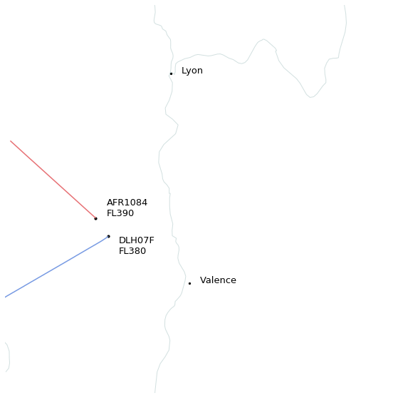

Is this a plane?
----------------

.. image:: images/aircraft.jpg
   :alt: View from my seat
   :align: center

On my way to the `Opensky Network workshop 2018 <https://workshop.opensky-network.org/>`__,
I could catch a picture of this aircraft which looked really close.
I wondered how close it came to us considering that the usual separation rule
between aircraft is of 5 nautical miles (horizontal) and 1000ft (vertical).

First let's get information about the flight I was on.

.. code:: python

    from traffic.data import opensky
    
    flight = opensky.history(
        "2018-11-15 06:00",  # UTC
        "2018-11-15 08:00",
        callsign='DLH07F', # of course, you need to know the callsign of your flight
        return_flight=True
    )

I can check the shape of the trajectory with a good overview of
Frankfurt approach up to the North.

.. raw:: html

    <b>Flight DLH07F</b><ul><li><b>aircraft:</b> 3c6608 / D-AIPH (A320)</li><li><b>origin:</b> 2018-11-15 07:16:18</li><li><b>destination:</b> 2018-11-15 08:58:38</li></ul>
<svg xmlns="http://www.w3.org/2000/svg" xmlns:xlink="http://www.w3.org/1999/xlink" width="300" height="300" viewBox="80789.08496019535 4616079.8765822435 618505.6952146767 803453.1386698317" preserveAspectRatio="xMinYMin meet"><g transform="matrix(1,0,0,-1,0,10035612.891834319)"><polyline fill="none" stroke="#66cc99" stroke-width="5356.354257798878" points="110546.60861463354,4651750.834477484 110619.27768276751,4651695.688084773 110619.27768276751,4651695.688084773 110619.27768276751,4651695.688084773 110744.9773797283,4651523.80445896 110802.82221556299,4651429.131264039 110802.82221556299,4651429.131264039 110883.00384934533,4651336.774281739 110943.87726932009,4651261.023184037 110984.81158098594,4651203.16732062 111012.31195677277,4651144.510164962 111070.85728222875,4651069.332116246 111111.47235516184,4651033.553516299 111151.04585473762,4650976.97740397 111179.91156323857,4650917.041566868 111221.33091987911,4650842.913959476 111263.9033676779,4650807.164515332 111322.54524294529,4650750.866872057 111363.14413505931,4650674.476386493 111392.60802110666,4650632.38820199 111447.28836496308,4650537.758741551 111462.68834343419,4650537.983475938 111521.47018425241,4650447.224405903 111572.42827687527,4650406.749536416 111633.58426433365,4650329.361403306 111644.62717162147,4650293.152936769 111713.7947881433,4650219.779171247 111745.49281990818,4650158.933509181 111784.08871338802,4650102.9516010275 111829.87374119753,4650006.894828655 111886.4608822034,4649932.991656765 111929.06048009524,4649895.946731312 111982.74370363957,4649820.0964546185 112023.41590249378,4649764.492220649 112084.59036525381,4649686.500847083 112111.40474131014,4649650.5240796 112164.88003025972,4649572.420178894 112181.18431762699,4649552.829109818 112248.97526686263,4649440.816991303 112293.77965356596,4649403.806134961 112347.4889582239,4649326.659147866 112390.3807411075,4649270.136427485 112447.45336651195,4649213.822623387 112492.24167401441,4649136.545057778 112546.73442631672,4649097.773006553 112604.3130386353,4649023.888465694 112631.14255633485,4648945.740555641 112685.38407000636,4648874.405127375 112745.75784329642,4648835.028262581 112787.02521526946,4648756.400950197 112840.44186796887,4648683.149040603 112873.05240800315,4648627.7754385965 112924.55821093323,4648551.551387647 112971.3744648052,4648511.369466723 113039.56148141969,4648415.302023655 113082.0684041447,4648360.68165823 113151.56408627,4648283.772476169 113196.70716928857,4648208.148309989 113237.91055937207,4648134.371071468 113291.32993113365,4648078.008164351 113333.01803936048,4648021.125140945 113393.22210251506,4647944.426216983 113446.952468481,4647867.285130113 113516.46253066947,4647773.491980789 113559.5966864989,4647718.2767269835 113616.00601771688,4647642.128904964 113672.32252668282,4647564.074827412 113715.62890945411,4647505.658624826 113757.85263762137,4647429.646825996 113841.16091708891,4647354.247178872 113897.71022819525,4647260.869679863 113924.54142847258,4647224.8978586765 113998.34958992894,4647147.106382807 114026.45574829781,4647091.3225054955 114098.21442120631,4646995.315215848 114124.73220561593,4646939.5078267045 114192.86713680584,4646865.183674183 114262.3873242436,4646788.282725263 114305.30715307797,4646731.768426002 114391.54924347512,4646616.494777468 114434.38158014308,4646541.447170512 114517.1089138819,4646465.092250051 114573.1224171001,4646408.428933484 114642.06041572183,4646354.5578766 114674.43503113229,4646316.419599587 114772.22845054,4646238.994171088 114865.76952743027,4646184.1954718465 114938.27762379216,4646129.081470572 114993.45982491363,4646087.390377195 115078.11129027126,4646054.543696809 115173.34865877296,4646017.3541801125 115268.63136909575,4645977.22204264 115367.51991547056,4645941.388965738 115453.78411948433,4645907.271636324 115548.1440398001,4645887.91334991 115643.72742189918,4645868.574728035 115728.5386716034,4645849.766967562 115838.53778238068,4645855.936818613 115923.95722963504,4645837.400236682 116059.72164785571,4645838.508227202 116114.00715548132,4645840.2854607105 116254.29654280748,4645841.465661298 116334.64260947902,4645858.969492827 116432.54099531061,4645880.55205559 116513.79599689617,4645902.574921924 116595.66730501772,4645924.2616476575 116708.43464766,4645941.311514847 116788.38948091512,4646000.296446585 116912.7189699294,4646021.076715706 116982.08550622557,4646060.416257006 117091.6411333493,4646119.251281204 117172.32359436339,4646178.337896582 117254.19016657294,4646200.031591132 117350.91584763733,4646257.720804108 117435.99353178267,4646301.20274972 117544.59857698738,4646357.777914321 117595.33104918164,4646399.434354495 117733.14020566772,4646457.760651172 117773.67763972675,4646494.151689779 117900.14930149121,4646557.762115262 117952.17086014512,4646594.937472899 118079.47210000189,4646652.155135278 118170.97099804645,4646714.883220807 118254.81849846052,4646750.301208121 118322.20921641595,4646813.697205832 118430.52642307573,4646872.185504174 118541.27683316359,4646931.405867123 118639.66612397203,4646967.400041105 118749.82185016864,4647048.957164585 118827.54305849655,4647108.2745567495 118968.55269198396,4647187.456791851 119036.35311457269,4647223.932412878 119145.8616001522,4647283.748233568 119281.34759112075,4647363.802607358 119361.996011989,4647423.170965853 119474.09659610802,4647481.12668278 119552.06724868457,4647539.502509818 119692.83730714486,4647617.395086668 119770.76961586451,4647678.024075654 119911.57024570505,4647753.669472365 120005.23634274902,4647816.799331402 120140.48529822195,4647895.219462927 120267.65667701424,4647973.861179435 120333.84912783511,4648010.669175386 120496.96141375758,4648089.880810362 120578.14113932055,4648168.75491934 120730.74835566043,4648246.853061493 120786.58579330896,4648288.6106384415 120937.84369137007,4648366.691514814 121030.95389303273,4648425.321648588 121152.64863863403,4648524.32841391 121292.0233947605,4648580.144921244 121375.47344963695,4648623.037931867 121552.71907610263,4648719.383143678 121631.07910677556,4648797.616905219 121781.5338551023,4648878.905555633 121880.55038718093,4648934.435795489 122015.92756013402,4649017.739999261 122124.55182985697,4649091.612533661 122261.95153385411,4649170.45019464 122411.76583713769,4649252.693358011 122506.1834055382,4649312.314572094 122656.39917443146,4649407.298840279 122699.47595793827,4649427.821683102 122849.29587783392,4649509.120774063 122943.77377773296,4649564.591528752 123125.11419044546,4649685.0260966495 123243.54666939648,4649763.575324735 123340.51236896064,4649800.905445896 123518.29623498293,4649921.291677407 123614.56686627449,4649978.704685382 123777.63361652834,4650078.767940748 123833.52389150891,4650115.438705581 124000.04811028184,4650197.9833569685 124067.78262026056,4650235.454285062 124245.60695216745,4650352.047374223 124380.33631657402,4650412.0007058075 124489.76459184325,4650493.972637573 124572.59190762363,4650550.225777473 124733.66294292499,4650651.228995593 124833.16132009872,4650689.571803471 124992.95071547893,4650808.744782993 125129.57255044904,4650886.667663387 125212.72066606965,4650945.18432798 125348.83335407893,4651024.055262017 125445.43741150529,4651081.842698177 125582.76740830256,4651160.73771374 125760.82096068899,4651260.742430571 125826.95876635872,4651297.596184263 125993.46857232458,4651415.254861928 126128.81021713115,4651495.425627612 126253.63936679663,4651575.424930607 126389.31935312315,4651634.822756438 126472.48127111809,4651691.447880845 126581.50797921585,4651773.095821923 126700.90353277468,4651848.509201123 126893.94128301044,4651949.740993807 126990.5647105489,4652027.031893076 127138.39824359,4652104.483670807 127237.19452834949,4652168.478056782 127372.59654389038,4652243.475669462 127523.99905880324,4652362.906459067 127630.83399628583,4652420.891794959 127741.74650395935,4652483.449766617 127892.55249760606,4652579.496959955 128012.09150171869,4652659.435683431 128123.84388795088,4652715.258766917 128230.32627765782,4652793.682808524 128367.25352937682,4652893.0564355 128504.86494726068,4652951.5712684095 128589.17122405536,4653032.83093716 128748.60274371498,4653108.949950928 128859.82802925455,4653188.068643719 129022.42895229641,4653307.717141519 129118.97657685964,4653365.5490372665 129281.53884396235,4653465.3721541865 129431.83735059205,4653545.853444958 129498.89907991713,4653619.729649441 129665.3325438901,4653721.271677792 129774.6817934006,4653780.281646838 129895.91486803393,4653858.978942245 130008.16195336528,4653955.709734647 130169.68251181235,4654036.39636714 130322.3924855526,4654131.916627201 130413.65182843596,4654212.0153217735 130565.7059474162,4654309.780524261 130591.0104010565,4654330.649371368 130809.70825701802,4654446.791758685 130933.07348330614,4654563.815726275 131058.15918855359,4654623.11363492 131179.9482416781,4654703.485572411 131302.0000425587,4654803.9534303285 131453.65417264545,4654902.335100116 131585.45951511446,4654996.567433297 131764.90953326182,4655076.903576981 131821.34067938378,4655155.811089863 131997.0413769161,4655233.576677302 132106.8947394102,4655352.982835459 132257.85950221407,4655433.530132603 132366.8491490899,4655510.754543917 132543.39195729804,4655630.7173703415 132706.91692974957,4655726.125521694 132761.7190467018,4655764.399626608 132980.54653284606,4655925.026676624 133031.47072073154,4655961.330069671 133239.4864847322,4656082.809702786 133358.3416597343,4656195.6359024765 133497.4330488443,4656296.781606646 133659.20797359804,4656413.913376298 133781.3697954771,4656490.781888378 133944.30302535516,4656631.92544919 134027.3212916725,4656690.532899717 134191.09714187618,4656824.942185107 134286.2310603082,4656902.90190032 134448.99185000325,4657038.943792154 134570.6487530137,4657157.292320088 134706.51142340148,4657273.382288189 134852.80960852315,4657413.9041215945 134989.54724891626,4657528.369081171 135155.8276725954,4657684.92259143 135263.41685617855,4657782.597072456 135413.30351840355,4657919.382579775 135531.64870388553,4658057.51545722 135670.76346445808,4658153.850399002 135779.59975222807,4658290.518850907 135912.45945244314,4658408.480439712 136063.91544637998,4658544.959421408 136144.97705702152,4658601.6489904765 136249.4849526309,4658740.49750948 136441.67784865046,4658933.9068443915 136578.0223898858,4659053.846483964 136683.31163997191,4659148.294645596 136850.7901740221,4659288.625369302 136957.0660134082,4659402.57698549 137107.88388326232,4659538.457695094 137214.68054324694,4659677.3590758145 137349.4873633079,4659793.127727431 137514.64340949082,4659932.131466649 137621.83617688477,4660048.359322329 137782.8112900845,4660201.926214083 137889.03990030006,4660303.50694001 138025.05973733214,4660438.790644975 138123.31346675334,4660535.381238082 138309.44023946635,4660694.60911821 138433.36816119417,4660829.333931635 138584.7477916247,4660964.905648036 138665.35884647488,4661043.951582918 138801.64767888887,4661162.974872101 139003.62347396446,4661335.235169729 139109.70412415094,4661436.482638081 139233.57137227073,4661553.03539325 139367.2662451887,4661706.135266532 139516.98399270384,4661843.945077537 139678.91763129842,4661981.02893611 139800.66043411198,4662119.284004765 139966.4858794115,4662236.61713092 140017.91194423955,4662294.706801344 140168.03122392006,4662429.332313125 140318.97207072465,4662585.36193074 140477.185908049,4662723.9517594455 140601.37079375522,4662840.877330119 140752.67156771122,4662976.487789385 140900.35155901994,4663116.190149038 140993.06708367993,4663211.413867409 141199.76642982688,4663386.673294401 141307.14243809998,4663487.36704022 141443.04411383014,4663622.704907448 141589.1898104344,4663758.23523153 141741.4017345839,4663895.43942296 141845.88074781903,4664013.316220227 141982.04865508352,4664133.342853288 142102.16115625395,4664250.21528852 142238.80892019573,4664383.3290096745 142401.77940033533,4664505.161531375 142510.82832797687,4664638.716688243 142700.6970693943,4664796.46995056 142767.43279272705,4664875.642624465 142984.90294095452,4665051.1491969135 143108.2856028472,4665167.751369214 143242.1308893424,4665305.331371578 143351.72099684324,4665441.15862077 143499.70750418532,4665559.528092124 143701.0399356138,4665734.750094373 143767.75688876226,4665813.930346074 143946.53086177778,4665968.300041241 144051.22842102466,4666084.217165422 144190.67806338385,4666201.139259231 144308.8089499585,4666322.508546546 144499.55531132405,4666513.480426813 144623.55234976744,4666614.532713488 144783.27049694298,4666768.212867237 144867.6266482854,4666849.035638351 145015.21625655398,4666985.606872101 145216.47582166144,4667160.8649504585 145310.7024728883,4667261.014225378 145500.14271351276,4667415.621468919 145566.82596366183,4667494.815349257 145773.70037225552,4667649.415774435 145865.5038963393,4667786.234047822 146071.31408243324,4667944.717732479 146149.52393806563,4668020.241225808 146287.5247487985,4668158.296506388 146531.25293613772,4668354.834890045 146569.1219579097,4668434.435002473 146747.37058827997,4668571.973661031 146906.3416817581,4668747.4115262665 147056.04560354995,4668884.406660711 147218.71846442504,4669019.057833378 147339.2849084112,4669154.802579811 147515.61185367353,4669295.52439127 147571.48657423293,4669351.495677998 147731.74318394318,4669509.139552374 147921.22826700594,4669706.313020447 148071.43995905406,4669802.732704341 148194.32561772544,4669955.76339208 148340.1964485158,4670093.05377708 148503.99786478467,4670211.130330376 148627.16527101138,4670348.935619944 148812.83778755434,4670508.048829241 148884.80222598818,4670582.177737346 149101.50017164176,4670763.028239491 149167.81103962782,4670857.826786643 149357.1513647997,4670996.592783583 149477.01513498672,4671152.180090007 149628.39255435046,4671267.525185696 149760.07480734406,4671404.475599446 149894.39460097076,4671543.471180035 150111.50150938935,4671700.981925715 150207.76319297362,4671834.038204992 150397.64387545062,4671992.664636186 150516.4700291128,4672131.01807521 150664.40039421522,4672227.787987725 150789.70292059766,4672364.974878954 150925.21228652028,4672503.66447829 151031.4767586222,4672598.316976945 151181.697616002,4672738.601156252 151298.61142892053,4672873.724533871 151448.09889869645,4672989.066316668 151680.28237242452,4673187.7812786065 151761.8451659344,4673303.680741251 151951.0581339294,4673443.457722852 152015.75649390474,4673536.687694398 152205.20960760387,4673676.129192792 152393.0564606287,4673871.121538758 152518.6903329853,4673988.862674369 152694.68815623637,4674147.870872309 152774.7234243327,4674241.414136186 152961.56029345136,4674382.119576081 153056.26811616056,4674497.3431597855 153244.3829796448,4674652.711196298 153367.7761264819,4674789.638764854 153503.97988233782,4674889.4283677135 153624.31225065072,4675044.737311536 153825.27536345963,4675202.369224992 154000.53910943883,4675358.793734507 154041.6063684449,4675401.177739565 154288.8420865075,4675613.949899246 154392.18061650792,4675770.570106261 154514.6897916973,4675847.071907407 154648.44765564788,4676005.611221718 154771.52910239054,4676101.60646432 154894.46667901147,4676240.451853815 155040.128365481,4676376.212557545 155218.6550462367,4676531.431174518 155325.9035358071,4676668.058461792 155511.68545496953,4676807.503162296 155660.06804221842,4676981.939480026 155727.3037664233,4677024.8670818955 155932.86080318043,4677221.254417074 156092.87093253032,4677338.802613282 156199.90887171135,4677472.493409158 156349.28641252095,4677608.959670635 156511.1728904895,4677764.903620723 156672.01590445766,4677906.113052155 156864.30959190175,4678040.269549413 156973.43559716598,4678177.908692284 157119.33889400822,4678298.38935998 157254.26988286013,4678454.397454897 157390.46238184845,4678549.145555748 157525.38327445707,4678705.157824061 157670.5370179789,4678825.632912092 157791.2585993517,4678960.925908985 158009.75737967851,4679139.108971349 158066.16554662894,4679197.413201072 158252.63511780088,4679409.736360499 158441.24532753517,4679548.009306759 158564.05918605678,4679686.906201163 158724.00364937496,4679803.207166155 158821.09216901285,4679919.497440773 159020.9789815549,4680099.91625975 159114.29408199465,4680174.92685672 159288.5934924069,4680355.163385328 159467.72955708136,4680507.631657319 159628.13778391472,4680664.2121941205 159777.0888994256,4680786.103270957 159898.98594900742,4680920.153101551 160043.72454071837,4681056.589586942 160220.9430994442,4681177.179300103 160315.28771017876,4681311.953389905 160475.32155310235,4681450.018342226 160611.65173838398,4681568.455784049 160788.90579313584,4681726.713230125 160897.4471467339,4681840.066893577 161086.87537181383,4681997.895899358 161192.58071572764,4682152.742716374 161337.6100426215,4682273.281037392 161458.64409910527,4682388.2054704875 161609.70167516076,4682528.352829585 161732.87777722196,4682645.231173735 161889.68444182552,4682800.827165683 162056.50111544377,4682937.769319631 162175.71382954333,4683057.166692325 162349.0335816432,4683214.075813967 162497.57549368346,4683367.862352075 162672.79473535303,4683486.559647642 162795.30792308028,4683644.295898869 162942.5636064898,4683783.43439278 163103.48372527273,4683920.964323285 163228.62970811216,4684034.704801028 163427.44571522376,4684192.790228922 163509.04298805166,4684293.221274021 163725.03705246598,4684489.682637631 163857.90456601424,4684622.728457653 164005.49970082162,4684761.2875593705 164171.23351719926,4684899.548507161 164261.60455404661,4684976.199800844 164479.30783194886,4685176.267038141 164531.69938666234,4685252.7056799 164710.23631144868,4685389.00431167 164881.98141755033,4685602.4551498685 165033.1687667944,4685702.76601281 165178.02252810888,4685859.117538804 165325.04127643403,4685999.592230452 165488.92732387868,4686136.541696954 165612.21775295658,4686270.705755724 165799.92064480289,4686408.872934077 165879.55173963367,4686507.639527635 166069.38071345913,4686664.988293769 166175.18881533257,4686779.650009069 166325.88888419102,4686900.402009786 166432.8031782109,4687036.470407966 166621.49454500104,4687172.428105664 166807.90326079237,4687351.098423945 166941.7246184905,4687485.859670132 167121.0111485621,4687628.02769869 167186.83198720333,4687728.147548495 167387.9488338914,4687878.678239566 167478.7625028684,4688015.011171397 167643.59574331628,4688132.896828621 167752.73726538414,4688254.403459607 167940.9521534157,4688409.510276144 168128.26934607027,4688604.849071511 168247.94092656803,4688722.700268615 168381.71671877688,4688824.334039963 168529.56469263794,4688998.986758352 168694.360198297,4689116.893316696 168814.42191041983,4689232.857320206 169002.21242364048,4689388.585403112 169094.07089937167,4689525.045077095 169269.40900411512,4689682.146692784 169339.99721195278,4689724.5721820425 169564.68582447295,4689959.378855399 169646.90328083176,4690036.514277413 169780.40164427875,4690137.819025278 170010.62760147694,4690352.335467849 170105.48110980765,4690451.482711201 170318.55369839334,4690643.553219489 170385.49266354676,4690723.296338339 170575.17304147693,4690862.226010923 170695.66211034745,4691016.223036008 170846.66481453323,4691116.640666692 170953.38665521544,4691255.012323077 171111.19242587738,4691393.237469717 171327.7382488088,4691585.412716082 171435.81688270613,4691722.26312754 171640.03588952168,4691883.270217882 171746.25065856508,4691999.91644353 171922.35720480935,4692118.145582029 172026.14557615682,4692271.783594888 172177.23295086846,4692409.531145915 172351.8503224454,4692549.806031111 172485.17929281894,4692665.778851569 172618.47468367338,4692783.051350313 172752.01512247307,4692921.449454623 172981.63417315838,4693139.238402247 173101.4435820396,4693276.637012889 173238.2100940047,4693352.801978079 173356.53563732983,4693512.240142263 173519.4781973723,4693629.252252812 173693.24125623182,4693804.588564676 173817.03247124067,4693921.057576801 174005.82928756453,4694081.771983613 174111.50830111213,4694218.861376956 174297.135424707,4694374.057429603 174420.92043669877,4694532.337465863 174578.3265396722,4694650.542240245 174768.19441431615,4694805.500483843 174876.19387659073,4694941.09500017 175037.26992722755,4695041.824551501 175196.1043273272,4695239.523550404 175371.4477702194,4695395.805239767 175468.5576977867,4695491.517989267 175653.04160919,4695651.565402559 175760.11295752815,4695768.282929815 175925.69072824984,4695925.302525961 176056.50997996738,4696060.748623772 176205.2891797569,4696197.305962949 176379.84811794932,4696317.502229051 176542.5519634275,4696513.412561353 176730.7293207066,4696653.751872146 176810.22706788266,4696747.512764452 177010.2717131821,4696925.781665452 177119.78021991384,4697045.775746356 177280.00731781282,4697164.099648398 177386.54677657175,4697301.596229215 177550.08246315984,4697418.358556325 177668.1226082241,4697552.233293784 177857.24618703552,4697733.2099358095 178006.03761503735,4697850.9343014555 178153.9717282744,4698004.989181 178339.14123834277,4698161.91199153 178488.58034227,4698318.604523485 178609.28196192032,4698420.707765577 178743.33362448256,4698554.368830856 178906.32037366423,4698676.944455441 178906.32037366423,4698676.944455441 178906.32037366423,4698676.944455441 179428.06041751243,4699167.922311545 179507.49788002312,4699261.707501628 179698.59031120967,4699422.609498419 179816.84097740325,4699560.067960132 179979.51787163285,4699694.0815150635 180086.34136042497,4699816.041655426 180271.03381240682,4699989.526718135 180367.733651767,4700066.768366802 180596.10223941045,4700267.866980321 180782.38797590023,4700424.5264268555 180915.6819830936,4700561.407060452 181050.6950946828,4700676.955653551 181184.7292045766,4700833.329622863 181333.50426808608,4700972.490578405 181450.85320748095,4701089.527515138 181640.29409459257,4701249.83033263 181844.53339923485,4701405.646183439 181923.30517405082,4701524.96727214 182111.00183199,4701660.92214019 182192.1598235743,4701761.524207111 182378.60891843154,4701898.407374292 182527.03021690136,4702090.88898925 182711.99400684514,4702248.513193391 182766.60295559198,4702311.097198931 183011.38318598852,4702526.33244782 183156.5256505661,4702642.160738184 183274.91343569392,4702779.3255527755 183480.879685252,4702941.022981013 183586.2753162874,4703077.61834164 183784.94001680423,4703234.300820406 183908.17671427896,4703370.986397655 184069.45265081487,4703491.376195615 184123.6696276471,4703569.27649467 184347.98013057106,4703784.055352278 184537.13179983658,4703921.054810941 184641.7778978969,4704077.1155811185 184858.4542638272,4704235.215170091 184923.8919312443,4704335.460482095 185166.28364497374,4704528.982602943 185302.20151995847,4704666.604372214 185449.70199965886,4704826.924038509 185633.89632666044,4704981.048670663 185743.4160922963,4705120.02179586 185956.01843233555,4705258.927505106 186063.09029549002,4705393.345055013 186267.68142117182,4705536.562370931 186347.9765286471,4705668.335529059 186548.14405662936,4705808.249622909 186666.06856873666,4705964.66171322 186827.94712838627,4706105.890120318 186950.34776861494,4706223.130549512 187094.88711098896,4706358.139093055 187340.2949120525,4706537.783300337 187471.21361182394,4706692.883664049 187644.05956020046,4706831.198055818 187777.54471339274,4706970.444883241 187943.0846845964,4707109.190502872 188073.54892564777,4707242.569639997 188221.32720622048,4707401.993994958 188340.8208786351,4707517.279503572 188501.6728517828,4707658.169930193 188674.9488803759,4707816.592459407 188822.67010097462,4707972.478406798 189014.78110982268,4708090.535027761 189157.68731133762,4708288.101171505 189318.64523233968,4708384.62056274 189452.1419173625,4708540.508726396 189597.8531676446,4708697.915921983 189720.97825669276,4708797.391081056 189894.5036152787,4708938.972720475 189999.4725994794,4709074.945360505 190204.10030349487,4709248.550548111 190348.36247004013,4709390.013318662 190470.01626057873,4709503.7403274095 190682.96946522623,4709663.895476601 190806.49669966628,4709818.516198747 190981.38408103547,4709957.300247483 191125.23199969105,4710114.08185946 191275.5148077244,4710256.059023075 191459.13412224146,4710413.50438602 191581.16717509401,4710549.3222302515 191798.7482791746,4710687.559762918 191918.0799932484,4710843.388623245 192101.44492538515,4711019.359040652 192225.60592916538,4711137.415813722 192397.00184629989,4711296.822193465 192569.214685086,4711452.445798633 192653.3203894614,4711551.580140523 192850.85530316862,4711708.113277305 192986.70808832062,4711866.367875921 193187.53444630012,4712007.418528918 193305.7034088807,4712145.066943111 193493.04108842256,4712300.750125463 193598.82535677796,4712438.432468345 193787.8734864158,4712616.83581719 193894.51369180364,4712715.953534342 194057.46149987698,4712833.041167815 194190.07075291322,4712988.290541697 194414.74956130818,4713204.654578492 194603.89184290738,4713325.973337223 194699.4590907536,4713463.407038698 194750.6478264349,4713501.063128856 195005.3817606534,4713736.040354842 195153.59067525325,4713854.068960112 195285.45277398577,4714013.210151135 195448.92359690176,4714131.637762557 195563.6799632143,4714285.842708542 195804.35956715894,4714504.215796464 195968.57793472047,4714607.09934782 196086.2921009915,4714758.792277022 196273.3325463742,4714921.2815172495 196410.13413137075,4715075.377162475 196568.51705335453,4715215.412948091 196687.75856378104,4715330.814645348 196863.38095652353,4715432.369242658 197051.8781291185,4715626.148898057 197130.7881147514,4715725.193394368 197332.3932628921,4715904.006429024 197543.2357711121,4716118.798708497 197704.23080826135,4716240.755646526 197759.64758730156,4716314.88031537 197986.7076564833,4716492.8172994945 198121.02555541653,4716651.375474646 198278.94269577146,4716806.746851917 198467.82960676085,4716945.975134887 198639.92843048507,4717142.562742089 198746.7088692134,4717222.281199898 198960.50563558456,4717441.686686001 199135.0244750844,4717559.182997785 199253.0253075827,4717714.129077999 199413.65458658116,4717852.376611763 199535.58350616903,4717972.995588323 199695.94299178716,4718130.7083617365 199826.33243343004,4718248.353699013 200070.00443637272,4718461.828556248 200192.30665661593,4718543.534106211 200363.3071710566,4718740.128592738 200548.9548270124,4718877.763446534 200670.95913495653,4719018.214032565 200859.50002848398,4719156.53851144 200978.17511533728,4719311.872778061 201138.36670778654,4719449.797180208 201377.58395287074,4719665.442804356 201509.66361626433,4719803.578348602 201698.48144212243,4719944.525673578 201789.22945223533,4720059.243067512 201989.8137341013,4720216.084016499 202109.1412600977,4720374.047131116 202297.34517390694,4720494.228514838 202405.7606268648,4720632.092055346 202577.21069903558,4720807.980607193 202765.4621912104,4720968.404111887 202910.39244259364,4721123.171484048 203057.09894953013,4721225.734043626 203207.7933542289,4721378.41202389 203395.57574060702,4721541.087157803 203550.98114214564,4721716.5649010455 203742.55739961367,4721836.871724928 203858.5330870634,4721989.578568014 204061.35786290647,4722187.10712756 204260.26077015972,4722345.949796669 204300.52306583468,4722421.957662086 204580.93691798882,4722625.14200767 204701.76490733642,4722780.587086252 204885.55761314384,4722919.225059149 204991.28466199432,4723054.799927747 205181.54993138302,4723193.27411055 205301.0772009622,4723349.038580345 205461.6162430261,4723491.55743957 205712.48875629305,4723685.241877472 205834.6019290857,4723843.333589899 205875.1322085012,4723885.270165827 206154.73865449027,4724137.886474353 206325.97890120788,4724278.118973554 206474.71103636723,4724437.551761989 206632.75843475392,4724571.980500829 206820.2619027623,4724753.241538565 206911.43090624816,4724847.609488841 207022.11777189764,4724966.73561429 207245.9770869945,4725183.432837261 207460.41088598347,4725326.517176491 207582.03318634542,4725463.166403306 207767.10312391032,4725620.419371163 207875.91340578324,4725737.6023110775 208089.76311088307,4725914.772538917 208271.0485189095,4726111.813782504 208419.18257500275,4726267.112957978 208566.8467148319,4726388.576900512 208713.11383640004,4726523.673406395 208858.63371381248,4726662.644810357 209074.4894247933,4726861.956425705 209260.00566984597,4727000.743553495 209327.7219677985,4727119.057739495 209540.3420238654,4727278.412152302 209657.98721647845,4727414.030231443 209882.59514954602,4727630.475139007 210085.514058529,4727767.861602512 210205.08572856983,4727924.908276412 210338.68132331784,4728024.992719217 210435.23861841872,4728087.023486296 210684.47314167308,4728320.439647075 210844.5175856855,4728518.849007246 211016.6025662192,4728658.60028842 211219.63814638712,4728835.552562203 211296.37686518347,4728951.884852251 211510.42547868314,4729129.498319251 211628.8308704743,4729267.4148910325 211856.54919303412,4729409.693770047 211977.24092207063,4729583.406070707 212191.2428281823,4729725.310038947 212321.74264978655,4729897.399500582 212497.6475154392,4730039.193216468 212707.8279413318,4730234.896029007 212788.31115237714,4730334.132734121 213001.5703980961,4730510.120459629 213133.32504461607,4730650.07847238 213350.3042356885,4730810.609835945 213452.3088651194,4730965.303763308 213666.60869750663,4731125.768098045 213759.26597955145,4731242.572542329 213960.92182428087,4731382.878057911 214024.47193487015,4731478.446707609 214280.41811507175,4731677.736062337 214534.55918501646,4731913.31346563 214638.73303650584,4732070.678166652 214773.08611799226,4732148.455056424 214918.17492009743,4732308.283845749 215146.76965871148,4732503.622621334 215252.6101862783,4732624.019648591 215462.39208025212,4732837.602184718 215663.39870895253,4732998.08756776 215810.4748904776,4733153.75031242 215956.17923239735,4733277.284759608 216113.98412359264,4733434.557183847 216304.22085628644,4733593.453204395 216356.94020563847,4733671.169502571 216647.5030770668,4733888.740320059 216767.6162434957,4734045.290590942 216953.4849456732,4734182.970892174 217071.29499191654,4734339.80534446 217299.62514550667,4734540.301532381 217457.52547392136,4734657.1213771915 217618.26785805202,4734855.681092541 217831.23544161202,4734976.344199819 217912.0840534982,4735129.183605179 218125.9442429239,4735288.804742798 218231.69723632393,4735409.237573058 218445.5527063762,4735568.521279899 218560.93855746044,4735724.00906841 218738.63953715176,4735843.330570377 218854.39524612392,4735998.833096447 219027.88762547277,4736157.914365379 219240.46512075653,4736316.231071691 219411.51697504605,4736515.124840708 219640.9048710534,4736674.892281226 219770.26497117587,4736828.208303973 219933.37782883455,4736989.60197489 220133.34430051313,4737165.739583945 220277.33822801875,4737321.133566529 220371.9820098137,4737385.480137073 220530.87472040826,4737542.870394378 220729.83653951713,4737717.6961526945 220956.11978701662,4737938.044320582 221140.12038024017,4738077.4120425 221259.47589413286,4738232.707193376 221434.50259126193,4738392.231436208 221553.01661774196,4738506.6807173155 221776.29716136857,4738724.0228832 221979.80219502698,4738845.8194631785 222108.3340735664,4739024.403939063 222323.43658645265,4739182.532082764 222403.24453850416,4739297.151416027 222642.27149000176,4739477.703004751 222747.44085550128,4739613.486033349 222933.60167796063,4739754.516171625 223066.089960954,4739913.77121672 223227.84216221786,4740069.396108935 223441.39291850303,4740231.055075703 223569.3269985462,4740406.443846304 223786.1072284374,4740527.037653757 223940.90696333486,4740740.85268722 224129.58308247026,4740863.822447125 224264.07661347647,4741039.416617683 224435.16286165625,4741194.997152228 224564.7642508447,4741313.020607343 224792.50064616057,4741532.568126628 224994.39410591216,4741670.309964505 225139.78623428434,4741849.097384087 225256.35539025653,4741948.580276304 225481.72333482016,4742165.481900798 225671.93599550615,4742302.892182403 225803.44193673437,4742444.950321904 225958.74213825003,4742617.648377753 226082.74193698,4742717.971317556 226318.21154698235,4742934.593641564 226518.6208179413,4743094.298468635 226667.2670790168,4743251.242292481 226865.76110118267,4743410.898382773 226929.72387095276,4743509.170035253 227168.50823263885,4743689.85152522 227289.2062636051,4743843.97596121 227460.6345637576,4743984.063667488 227620.79522455635,4744144.572138035 227794.38919732484,4744300.646093865 227925.3509357766,4744437.273295149 228086.06742598093,4744599.710446137 228351.60600312278,4744794.5557655115 228470.83854035469,4744953.842156911 228588.6597606343,4745050.81716868 228814.51850747262,4745270.42154363 228987.58574892447,4745387.932636624 229132.83817329406,4745565.834572682 229292.55722037092,4745705.260207537 229421.37319301753,4745844.0949141495 229597.4511035721,4746003.483486381 229794.21289290866,4746182.359883862 229901.38291819568,4746257.668075255 230168.28469933674,4746479.16722411 230284.5902136251,4746636.74691781 230508.68855145454,4746832.04293872 230618.36134703647,4746932.690840045 230815.43550426842,4747112.207347037 231015.50655268642,4747309.376725297 231157.8232722434,4747464.565513653 231373.52798000094,4747605.749383104 231490.89694411118,4747780.934507314 231704.30845315952,4747922.0571167655 231718.5012345039,4747979.572010818 232007.74494206844,4748199.917032401 232205.18258406362,4748414.850332813 232313.27789505204,4748532.336902709 232511.8011090788,4748695.075805902 232617.28894461042,4748810.583399436 232831.77479600167,4748968.633992367 232960.6163045058,4749127.32982565 233162.4332194005,4749284.997956246 233308.47102991803,4749464.6406470025 233509.4870570368,4749586.316760953 233636.80924868476,4749760.542632576 233807.8007355993,4749939.324423468 233944.37324382272,4750055.813388768 234166.5865937676,4750256.60203336 234166.5865937676,4750256.60203336 234458.70432276622,4750534.203091444 234687.82501626707,4750691.2029905915 234805.16353982422,4750851.126023399 234924.44692457822,4750928.177549984 235146.2806027162,4751167.897317422 235372.19245106858,4751386.044207511 235519.0863946068,4751502.88262047 235678.5844739076,4751661.887057433 235878.36294942565,4751799.843868533 235993.06639523813,4751977.86144203 236211.0437015314,4752116.396672637 236340.04393325013,4752274.112405875 236511.7612624236,4752393.650412936 236633.35252738337,4752553.127166687 236816.0424312416,4752693.770980677 236935.49793854755,4752848.342261603 237202.50922261586,4753084.696086902 237374.03102751836,4753209.435471859 237490.11878862916,4753365.811104624 237689.68412614928,4753484.004431668 237742.12067158576,4753603.352938051 238009.8063373813,4753784.669955294 238111.274638497,4753938.344027214 238314.1171277028,4754060.202557631 238418.7938384825,4754196.1678749155 238654.29876040257,4754417.304984642 238788.75740495665,4754535.71278993 239013.55090848773,4754750.727130058 239185.5936696344,4754888.839813898 239315.51324546555,4755046.02591654 239492.18771846298,4755149.529758146 239689.37094510088,4755364.031220335 239847.0238875666,4755524.010701289 239992.06304105525,4755642.7757656565 240194.18047275016,4755804.870748677 240392.13375055432,4755942.539053507 240497.2340565627,4756063.238402841 240697.11257284763,4756199.678861403 240774.96327724063,4756301.697588364 241042.96208226297,4756519.447585128 241255.73407945133,4756679.316820552 241401.779308717,4756816.645304398 241624.0194631635,4756960.917230238 241756.53117874806,4757078.015995647 241934.30722650237,4757195.965695249 242064.26412187886,4757317.484125611 242289.02283671938,4757457.359708245 242421.87150248606,4757598.779078803 242622.98668720998,4757718.101362844 242753.7472232883,4757853.31954089 242940.88926305066,4757993.644529836 243220.93875908843,4758155.73863378 243355.74870508982,4758298.188192884 243580.74594492785,4758417.35638614 243714.60329296274,4758538.077177228 243902.654892999,4758637.554462841 244046.19335497348,4758779.347431088 244260.8035830227,4758898.1990822945 244391.06121216307,4759020.111754771 244577.14366201087,4759136.7492988035 244858.67444112166,4759301.545771662 244951.67220855286,4759382.393608099 245194.70348709283,4759505.395785415 245336.28347151255,4759643.949320099 245576.6778241491,4759765.926647663 245710.93149956258,4759884.446569215 245941.26071452923,4759988.899633541 246056.74137911017,4760104.909951741 246309.32550368118,4760267.171073408 246551.03680314313,4760371.064033627 246700.34011028695,4760492.68816762 246927.500105416,4760592.571134673 247059.665295154,4760711.997179624 247287.7328388753,4760833.970179971 247434.71713986446,4760937.028223825 247633.2726592405,4761036.943362377 247673.1614399954,4761116.076904667 247969.21320175653,4761239.010766087 248100.71892397947,4761358.432900317 248298.30685453478,4761479.431681218 248632.4748896983,4761661.3229790395 248683.6754439468,4761742.132141254 248980.9072301902,4761885.551051201 249125.98456217168,4762006.7366217915 249313.4037211977,4762109.267119252 249553.40286687954,4762250.466943301 249647.25584180854,4762291.53859262 249929.00877427327,4762492.500499351 250088.70456128608,4762591.535520311 250315.6254190119,4762714.512760873 250421.14888810233,4762814.952250418 250604.51247849906,4762912.88349543 250754.41399849902,4763013.162715097 250996.09616347626,4763140.197358588 251123.24693781324,4763258.9204112645 251391.1319370456,4763418.661543776 251618.3145842121,4763540.04371413 251737.70768402226,4763621.856106389 251955.6368985721,4763743.63055764 252071.479196167,4763844.438091884 252351.41465079194,4764005.567968924 252497.50295094916,4764123.997677336 252683.71872094536,4764229.424526397 252898.8082951633,4764367.040225552 253020.49099584346,4764447.652667925 253203.2641848406,4764568.540121173 253416.5855418627,4764690.547341749 253537.57064964273,4764791.550116864 253749.80307280415,4764893.037992847 253980.9096456814,4765015.661037149 254175.55436651243,4765177.178408847 254367.10763594677,4765242.967143138 254592.0712545977,4765419.527485041 254751.55696696235,4765521.247264033 254993.18087367248,4765645.813777299 255055.5820772314,4765684.243966095 255361.2207229516,4765907.313203434 255469.93140701036,4765988.821364368 255696.1826870787,4766088.93799364 255843.94518369326,4766229.7957479535 256041.5473490149,4766350.650492245 256203.2646813354,4766433.973653315 256426.12898364317,4766592.013259601 256670.33025412276,4766698.564160367 256760.3602877673,4766793.460116175 257004.90329475008,4766897.093837788 257090.95844747452,4767019.352765061 257334.73617458894,4767119.1667169705 257506.6846081407,4767242.381012064 257721.44479432332,4767362.5701172585 257855.37212430994,4767481.290322924 258104.2467534558,4767645.4585063765 258334.5471441608,4767746.744535519 258373.2679287282,4767807.733127974 258708.91817192538,4767972.309219528 258840.23406480742,4768089.054584459 259041.03914548978,4768191.249209518 259144.74332206382,4768272.98302559 259358.31127164632,4768378.565620342 259611.47645942125,4768559.445182515 259772.51879347986,4768678.183881154 259997.50230818742,4768781.930993564 260130.3625380375,4768918.810549158 260372.45183157237,4769024.457580647 260499.32229802638,4769144.276311253 260660.83500594474,4769223.191958074 260795.49840341345,4769325.734348647 261035.03388793225,4769486.129648033 261263.13504623284,4769611.724204666 261366.60922178967,4769687.94668648 261552.11537037737,4769810.16718497 261806.17589159677,4769951.638759275 261978.6973132655,4770054.569410008 262140.9127647145,4770155.847742308 262312.35837815324,4770260.391206337 262470.54599227855,4770357.386021379 262686.66850975057,4770480.9626443945 262926.6798324829,4770643.682136646 263044.8785743724,4770706.176747701 263322.1345689962,4770887.0715047475 263417.73844307294,4770966.936744576 263522.39838499256,4771008.214411595 263750.09213998425,4771171.824935176 263991.5144068989,4771293.127658101 264175.2980497638,4771451.318230672 264359.7855243385,4771571.323565648 264507.09176971216,4771653.020977943 264760.85643980216,4771799.682476734 264876.5830666305,4771895.57772814 265078.96222313354,4772001.879176735 265303.4807880129,4772124.875672902 265453.10633650975,4772222.5815492375 265678.81577379094,4772347.273968639 265821.01472561056,4772469.018968574 266023.0433932687,4772605.852614155 266143.7892618587,4772669.782778122 266355.8518354598,4772794.0121382475 266636.0255003195,4772952.479711062 266671.6485388978,4773012.706975897 266995.0431680555,4773194.76803522 267138.2844162611,4773314.585957842 267299.8752509592,4773358.632098171 267445.2865481735,4773481.126672566 267659.3968520578,4773585.667088109 267818.550577419,4773722.664087011 268015.7672959465,4773843.817202376 268204.9401742251,4773967.282001808 268352.1588151612,4774049.0513061145 268533.7833638925,4774189.113503389 268682.05108145846,4774234.269722176 268960.4981559349,4774417.055673611 269106.14893258276,4774535.094653551 269334.4107511357,4774637.941788356 269481.2535762815,4774757.673304743 269692.2273930436,4774863.455907019 269841.3754317816,4774964.430002185 270063.35848075856,4775125.430543788 270209.9851062742,4775222.517219603 270437.6724658792,4775368.431420571 270662.06370677584,4775468.931799268 270823.03598264756,4775591.445962053 271020.54929811636,4775673.783845238 271167.0222031677,4775812.986502197 271350.4803287726,4775934.680862096 271542.0034570958,4776035.662981113 271739.9469173918,4776161.435006107 271967.9153904179,4776280.604878103 272112.9422739118,4776403.174144794 272295.450635901,4776487.595688328 272442.7170306274,4776603.854865187 272682.9801882079,4776766.200040805 272817.4368845754,4776831.685881025 273026.21954378125,4776949.845147454 273172.386662779,4777033.312918392 273398.6647879951,4777214.969772533 273638.33897754725,4777319.660076548 273689.9612091104,4777357.850982671 273930.1963700095,4777540.378022852 274113.5084426365,4777663.7764916625 274355.20277204836,4777805.824208214 274355.20277204836,4777805.824208214 274689.4076227266,4778006.4189645285 274870.5894713474,4778146.010712146 275088.6867405685,4778249.266071201 275270.99825736904,4778374.903624189 275418.05576659954,4778456.804951608 275524.234860184,4778514.213199754 275830.0830448626,4778701.801391239 275989.4418728196,4778819.524174054 276177.0714397203,4778923.334002639 276331.722225634,4779041.841747657 276653.0290640344,4779206.08531923 276787.5895459267,4779328.35757011 276943.5120506298,4779411.91221126 277142.19565121405,4779550.560994654 277332.0597774777,4779654.482060618 277476.81004508,4779753.196106042 277688.9029758765,4779876.793794998 277834.910144719,4779958.357653195 278098.14802183304,4780141.867440984 278284.6054248456,4780265.483288298 278471.956861042,4780385.246654871 278618.9410782692,4780467.207733148 278841.33237524814,4780608.077633327 278999.3469966805,4780712.154577684 279200.92274935835,4780815.261302774 279346.56411313685,4780932.890065448 279615.4197331896,4781075.511892772 279731.3843356066,4781156.339346908 279932.00444949535,4781281.128688295 280154.51572007756,4781424.289364856 280358.2292662161,4781546.957818137 280499.43442594487,4781644.041114638 280688.10875467124,4781750.250027414 280858.1683340627,4781871.673587122 281020.0214404483,4781969.539198308 281205.78297387826,4782075.652028276 281454.0976903374,4782256.125760399 281613.08370975486,4782376.200035953 281696.3756884996,4782415.633593227 281878.5767637563,4782521.9751504455 282131.0692090326,4782684.473956099 282358.4947636986,4782825.636565799 282408.79838954506,4782863.231903605 282717.30881238193,4783048.259900935 282874.5244851149,4783130.689495875 283047.569139349,4783254.868033039 283275.4492080116,4783393.136229679 283420.6373055197,4783476.419957568 283606.7945987468,4783596.957060259 283859.7921705324,4783744.231731123 283910.8529585388,4783761.464346246 284162.48918013385,4783944.399965815 284347.3342517256,4784045.714602063 284531.5246253071,4784167.49665223 284770.86168708844,4784331.486661168 284971.27920208586,4784434.0992080625 285197.8252239301,4784595.715149488 285264.9481063859,4784598.266725999 285449.1938577804,4784741.079493547 285754.7431094623,4784923.871606062 285925.7274547759,4785023.746292101 286086.95035540336,4785144.691016605 286334.68554663885,4785291.848179583 286455.67649291124,4785372.970351292 286638.77955006255,4785491.823097721 286854.77192760503,4785617.729514872 287037.87723825,4785719.735359926 287094.66274085507,4785758.214863009 287425.07151413424,4785981.271812561 287622.3649945574,4786084.440608647 287809.3987006134,4786205.114900406 288036.66967471625,4786328.548887172 288208.4067715126,4786449.942412291 288324.1971858977,4786530.894695554 288537.85293133114,4786653.820537576 288760.0440060223,4786797.22235792 288950.94037728437,4786901.822273212 289054.8557861003,4786979.735011853 289304.20681442297,4787124.545311178 289505.2777443411,4787246.062397452 289718.6025492484,4787370.046351264 289783.9924031202,4787433.168880455 290076.98590166384,4787593.003271833 290260.19589864457,4787716.097282614 290444.88153571996,4787836.7460347535 290632.6340550844,4787943.168698061 290752.9942379241,4788022.087750146 290989.3907346872,4788164.463562292 291132.9960424367,4788284.140447487 291397.3824687507,4788429.258054277 291569.66236579843,4788553.601510892 291650.3804039671,4788594.688141642 291903.56885339756,4788754.94761237 292125.6346580715,4788898.443667526 292125.6346580715,4788898.443667526 292471.5287546177,4789124.571990611 292660.4946789161,4789208.099251698 292660.4946789161,4789208.099251698 292999.57509597513,4789430.441832474 293158.9815056829,4789550.774358213 293331.2521970866,4789632.109962349 293464.1516993032,4789733.864528825 293704.10370075697,4789876.205422416 293913.4438251586,4790021.157351796 294086.4512330614,4790141.0916746445 294337.08899556834,4790286.72441004 294525.52421891154,4790408.225301456 294750.9487467335,4790531.184978757 294853.5949182842,4790613.017086214 295055.2260089231,4790735.05019641 295251.56580308167,4790856.880333656 295422.80870342656,4790979.023196023 295634.2697864443,4791084.603469776 295783.84731353045,4791183.858124681 296006.5863176415,4791306.749598256 296150.6655894315,4791410.980796017 296432.6398798904,4791574.777131576 296496.52963909233,4791632.106198726 296774.34584253456,4791817.792811504 296972.0146631206,4791920.617464122 297066.86961438373,4791997.676012968 297360.1028174039,4792143.455494799 297394.8303384519,4792201.882677766 297647.5712614525,4792367.50371489 297844.6501904758,4792468.685650392 298046.29960206384,4792572.042611459 298125.7866871491,4792651.7015394205 298376.706930716,4792795.838000699 298654.3652181428,4792999.1344846 298840.655286288,4793104.7532601515 299038.61613228725,4793208.249191781 299169.04932931764,4793305.251294315 299381.7915781443,4793410.642924863 299542.14235070016,4793534.345671054 299724.20633427514,4793637.915878413 299868.3970201053,4793737.036132214 299868.3970201053,4793737.036132214 300307.6639520744,4794023.9634766495 300493.0797111398,4794125.093550755 300675.7348724915,4794247.813076958 300864.2734655995,4794368.180133472 301048.9406008837,4794471.887007632 301245.3363515939,4794597.073982859 301380.8451578653,4794679.36478115 301592.20218810334,4794817.5229530325 301764.14382494957,4794923.933405611 301973.68175792746,4795066.264380075 302171.9391713459,4795185.154299566 302372.0260182591,4795289.774952002 302555.1607786598,4795414.806726003 302738.44850436883,4795517.203002015 302795.08065133315,4795555.794403329 302993.01291193295,4795697.684710228 303270.39131016674,4795861.897790309 303454.12564830063,4796002.533981155 303668.3926295974,4796107.504364357 303808.8203628971,4796210.091261053 304050.90255840623,4796352.503295276 304234.55279305123,4796454.259408395 304378.4203113126,4796558.638855101 304629.67248354317,4796722.791486093 304853.5077271314,4796842.446669395 304961.2386945793,4796924.622478972 305122.61569156335,4796988.240498853 305358.55363762134,4797168.994142828 305531.4336183809,4797274.578293001 305740.6363692822,4797397.207003268 305885.3108013869,4797480.903990114 306112.9824044443,4797604.297341837 306163.45519553917,4797663.40643277 306468.8329740501,4797826.289338814 306601.23610144615,4797950.9861136135 306801.3951265051,4798035.329999497 307075.30422332603,4798255.636850097 307263.03576102614,4798360.227572457 307329.408801847,4798378.249464923 307514.7167731437,4798501.8487586845 307777.0094558629,4798666.905623642 307962.95635334455,4798789.937174578 308211.67167855013,4798914.259776991 308385.7118271556,4799054.011844167 308516.5529887654,4799135.893521928 308715.58109642303,4799261.729833073 308899.59323268273,4799360.763076521 309081.8350779776,4799484.274495633 309271.46386772994,4799605.588867199 309453.13223350456,4799712.231374865 309613.02506004437,4799833.881348442 309719.76019093324,4799873.991571099 309996.84061577386,4800038.441193356 310143.1052586047,4800120.989788121 310393.56090682105,4800304.749141337 310577.8755305806,4800386.290711041 310720.7211128185,4800511.492204582 310948.22368178144,4800635.025761228 311134.2634564801,4800738.346940587 311287.95709601836,4800856.576857262 311475.9291775352,4800961.629052085 311621.3124854071,4801064.567513583 311819.4924843048,4801169.102494506 312094.5618684028,4801349.4491635915 312189.9773467085,4801412.718565103 312427.1195900092,4801557.44240292 312638.73166832316,4801680.364312933 312809.3081719271,4801782.130697208 312994.19984667166,4801902.649754833 313138.7086108132,4801986.479966814 313321.9740365005,4802109.531962176 313468.16274431255,4802192.142405173 313762.0326722929,4802375.584639985 313945.569604627,4802497.712500665 314128.64013660105,4802582.833526538 314287.0730117993,4802721.115690261 314458.993313431,4802804.825955741 314643.7942788659,4802950.27338437 314894.9029894209,4803113.812492429 315041.91228542605,4803176.091028815 315224.41871489055,4803297.861047434 315368.221981888,4803397.261756396 315554.38733613683,4803503.636819892 315780.5662389725,4803645.757451585 315950.6395506956,4803748.524883552 316110.03304401005,4803853.783647657 316278.3880962681,4803952.337399197 316466.1730542359,4804055.519364888 316634.9911652143,4804181.584820053 316836.14797553816,4804304.528827843 317056.62754756224,4804464.250768389 317217.74591652525,4804528.120877135 317403.48168867454,4804673.0704670595 317587.67296831415,4804777.165328444 317731.41700310353,4804876.608729388 317927.9059095834,4804978.295626076 318103.07038057654,4805084.266805301 318274.20580718515,4805184.280105329 318535.57539122226,4805351.575372393 318640.3381924445,4805429.325820111 318882.4991113882,4805556.923171793 319065.17359845596,4805695.646929754 319248.5937762948,4805801.99697178 319431.47635506646,4805903.142988506 319589.79162215936,4806025.628490801 319857.6600016023,4806154.355661375 320011.9638471607,4806290.938853739 320197.9527105699,4806398.372753055 320382.5992335687,4806519.409093965 320569.9844657955,4806623.368600769 320709.98677551263,4806726.25213396 320897.76526945585,4806826.693279872 321082.86103416415,4806930.9131772015 321252.5276219217,4807054.525785596 321506.03026528854,4807179.497713223 321623.31086736295,4807277.878343024 321805.9884665872,4807385.209939499 322046.5003997273,4807548.532711365 322230.6142004628,4807651.442422535 322414.15108037373,4807753.03544986 322569.7025768427,4807873.476659655 322771.26799264253,4807962.2008593315 322956.0015655547,4808102.7499217475 323167.34292142926,4808224.056875449 323282.42516926414,4808305.515516717 323454.24338251515,4808430.221463046 323654.05173893797,4808535.746371075 323835.43913063797,4808654.134055 324062.26119084016,4808783.223405781 324205.8438473691,4808882.783787085 324402.8251914325,4808986.304931299 324560.41037224897,4809110.764530548 324736.51043628476,4809191.004636996 324930.9957723455,4809334.2726125205 325114.60137410706,4809455.726045599 325260.5206422592,4809538.55564175 325511.8460606838,4809687.162983196 325657.7565752379,4809769.999982546 325908.49892885744,4809931.645171493 326064.59425638913,4810017.181011515 326224.3755347674,4810136.326542005 326408.07398893737,4810223.073828941 326590.89972002624,4810361.381851352 326826.73546405375,4810509.356953868 326987.3844418156,4810608.160935502 327213.80499658786,4810735.340875227 327353.6403790741,4810838.340845736 327537.8010316645,4810956.939647028 327724.1417355453,4811042.884608948 327870.20951620233,4811166.908635548 328135.79459016817,4811289.093225687 328211.80432176037,4811370.554765779 328438.18169152754,4811497.770011954 328632.69265473034,4811637.591639723 328819.113011532,4811743.963061474 329002.806928462,4811866.466371938 329185.48249372747,4811969.1388929365 329397.2895338258,4812075.346356204 329542.4389103313,4812173.5224044565 329767.872220417,4812321.131803 329963.8541798437,4812463.645458071 330108.46534470195,4812545.215915555 330225.97326014214,4812625.591849475 330489.28961586405,4812791.4892985895 330674.344104577,4812873.562612993 330846.17230022704,4812995.9319829 330992.5617099032,4813079.499570018 331162.56325503165,4813183.301382981 331347.64504648943,4813287.084187599 331503.07627757563,4813407.445463601 331783.5650864578,4813576.05143937 331979.7263961072,4813698.8355978895 332164.2569131003,4813800.367300988 332214.4131726464,4813859.633427796 332518.35360155656,4814028.704532373 332610.65304321237,4814089.848340649 332871.7374561679,4814272.582237148 333017.40550484153,4814320.552780358 333202.4642373843,4814477.269169334 333385.8714369717,4814580.682292271 333599.199769081,4814709.114294374 333782.0382027824,4814810.956265703 334008.7388578711,4814935.157839749 334165.0647004885,4815076.008938762 334346.9238092318,4815162.870591935 334531.1143572644,4815301.432870231 334700.19558511383,4815406.829609184 334927.76626650424,4815533.3450171845 335111.3852285471,4815653.402442321 335283.4875002472,4815758.342970419 335481.10782190727,4815882.580881021 335625.1023106873,4815966.82336017 335809.660297842,4816087.890723243 335995.0267919431,4816190.851300291 336149.9048500463,4816312.234392467 336333.09567912575,4816418.648616501 336531.25974034524,4816538.44511142 336686.24451413844,4816662.695813498 336901.3918214822,4816784.563737284 337016.1953282218,4816866.220581932 337282.4708524412,4817015.899069959 337451.1037983381,4817137.929950034 337611.0851265844,4817217.747945435 337793.04700913664,4817344.882558506 337965.7939035135,4817425.631098334 338175.6133638659,4817569.935997118 338344.01168089727,4817691.025782678 338570.77535330126,4817815.974215489 338739.73004775174,4817938.39435997 338940.2877959648,4818045.314637159 339095.91789350566,4818148.299563165 339306.721982351,4818270.03992857 339488.89636580803,4818396.879789465 339648.8299917341,4818476.739598481 339817.1255793193,4818599.154096934 340001.5399331382,4818726.108340248 340171.9915164561,4818806.458220861 340437.77464364487,4818994.5092913145 340583.3436787929,4819077.6232182905 340766.21907889703,4819196.489551934 340962.7398643498,4819283.232012872 341119.8036670899,4819425.211306785 341289.88656945486,4819507.557634681 341489.1604175221,4819654.670966495 341659.71838544525,4819753.898360213 341920.66231222934,4819903.49910098 342078.9370378834,4820023.863762581 342249.100716638,4820109.433156064 342405.14816191525,4820231.603740334 342602.83522870444,4820333.047276754 342775.8422678731,4820457.645539803 342962.52560026414,4820541.397211111 343156.7912163643,4820684.177059439 343381.9391185464,4820827.085780687 343567.00021126337,4820932.122294397 343762.6172244884,4821058.734290001 343908.11033854855,4821141.909854188 344064.21973955026,4821245.366117063 344249.4083216977,4821347.22822317 344419.0588155516,4821450.970598116 344653.7470594595,4821614.751358301 344864.1151918912,4821736.629187371 345049.4440579591,4821840.418828325 345234.4272180826,4821967.874221383 345285.097189573,4821985.512461923 345561.6125685087,4822170.00785297 345719.5791289584,4822275.831456543 345945.5743033276,4822398.463587557 346084.93728875386,4822501.791057467 346269.1524641435,4822607.201354048 346520.0475276037,4822769.200152659 346653.26430727146,4822853.155847699 346860.8748601424,4822976.258359682 347032.8105983686,4823083.363763298 347231.0653378115,4823207.597099566 347425.2415226408,4823349.187446385 347521.179618786,4823389.341270451 347780.22407141555,4823574.747367857 347925.62498549727,4823657.997344479 348175.32683205756,4823822.588592799 348342.4801109984,4823947.99312518 348485.45414506213,4824047.990935281 348658.33907064144,4824171.42340902 348853.6368874906,4824293.315083707 349022.56641799357,4824417.867250979 349166.2715568128,4824536.749738781 349376.4984837698,4824663.846885706 349548.57015833404,4824766.523343191 349680.0213656383,4824886.742737616 349859.4008314439,4825012.753859088 350122.4226390525,4825234.11459413 350317.53720762604,4825340.136547072 350408.99926624,4825418.656545346 350644.99091307016,4825600.227590178 350816.4593256882,4825722.951921634 350982.45232307934,4825865.901621615 351150.97616327245,4826008.282742029 351349.7399249272,4826153.387529439 351517.02632360416,4826295.113633944 351659.91334383376,4826395.167781114 351830.77536329784,4826538.0198050495 352040.1815074299,4826680.447523491 352126.72188485565,4826780.098801285 352350.9127511397,4826965.313692479 352533.0600500651,4827105.171709115 352686.56839114183,4827266.664699556 352881.5133252476,4827427.528234776 352948.9019588208,4827451.453798614 353181.9005878996,4827672.450467582 353181.9005878996,4827672.450467582 353533.8549686436,4827954.218151806 353672.9831199285,4828076.770909873 353855.70695339155,4828219.280209671 354027.5813470764,4828378.73313571 354182.6690963498,4828484.5985095855 354286.6678976002,4828582.856071913 354559.5475207874,4828829.1184060555 354725.53843490046,4828969.211538941 354884.24943301873,4829093.408875552 355078.0994240076,4829235.7857374335 355233.49219024635,4829395.1722811945 355376.2701909216,4829495.291622953 355531.3842448606,4829655.016464907 355690.3992362689,4829759.112758722 355858.22338804917,4829920.400788545 356040.3187097646,4830045.392504279 356257.2356723552,4830247.569589946 356337.8101863171,4830325.640518867 356519.7219945673,4830488.220907993 356688.54640206095,4830627.887362538 356853.8050560662,4830773.780819363 357024.59030392836,4830914.153375602 357194.10991032445,4831038.916488714 357346.1895304974,4831179.350719959 357545.09836691373,4831321.428409206 357725.1971373309,4831499.848718871 357894.7618920648,4831644.070387341 358074.95618286985,4831786.214197382 358207.1385931879,4831885.878293417 358415.17128940625,4832051.400374653 358566.8832716773,4832211.627295068 358764.76241041167,4832374.078523128 358955.6250297048,4832533.605019693 359037.8730468166,4832575.841530365 359202.924336233,4832758.0645599775 359373.7382041521,4832862.202495732 359568.3324006764,4833045.252680395 359748.8985362064,4833186.158157216 359901.4339463682,4833346.450892853 360043.91688981256,4833465.479774155 360242.51233309106,4833591.024440544 360411.4632334346,4833733.026020763 360656.6308372634,4833958.379895416 360799.2489016106,4834058.594199812 360865.8029480178,4834098.104125757 361137.50901588256,4834360.095978982 361279.98565270373,4834483.64051718 361445.9735091931,4834623.879785833 361511.515728139,4834684.082321331 361775.35511532973,4834869.597054718 361927.51929583226,4835010.126255037 362124.8746281376,4835175.231486521 362357.2352313031,4835378.331323983 362510.83483569877,4835496.6509666005 362707.6400182736,4835644.205622893 362807.1658428441,4835763.096425014 363015.99536553514,4835908.047761531 363187.3823698871,4836064.830927146 363353.07215545344,4836230.325496061 363547.5754125124,4836372.95145351 363718.40189550887,4836512.525972428 363844.91986339097,4836617.195965905 364026.68512460176,4836776.405419846 364160.2914031384,4836876.934299743 364160.2914031384,4836876.934299743 364495.7641159414,4837163.50177667 364730.69894860924,4837344.7686268985 364730.69894860924,4837344.7686268985 365062.38358779,4837666.857407924 365229.78916684294,4837811.136449635 365284.43735340063,4837849.497332069 365572.30088852934,4838057.317373244 365752.2566057101,4838198.336013511 365907.91541209235,4838338.85667585 365907.91541209235,4838338.85667585 366243.25446193333,4838625.49457846 366450.04631490284,4838808.973415079 366450.04631490284,4838808.973415079 366800.9708795008,4839091.305285162 366864.8514188186,4839150.521492482 366954.9671561698,4839216.473496569 367280.37057052506,4839476.835630254 367435.16388929257,4839618.554248982 367592.3131444697,4839740.3487829035 367758.7162921419,4839882.73334277 367900.324357895,4840004.371682786 368083.66386170103,4840168.939237319 368213.14446802903,4840251.798000956 368394.889638024,4840433.140972186 368601.68858441437,4840614.432231284 368759.8218386302,4840715.565336303 368859.94909992703,4840819.012138168 369133.94379294035,4841024.3807822615 369274.2617860861,4841166.110261688 369405.21301058284,4841284.397167744 369661.3269807791,4841506.0900170505 369765.90402069263,4841572.447971281 369986.9283547936,4841756.124718408 370140.1695409849,4841896.870647687 370309.74527076323,4842036.5313520385 370361.20392905874,4842059.824745793 370649.05554270325,4842302.2221935205 370816.56204372604,4842445.333299936 370972.596505641,4842567.142590719 371086.95004396315,4842688.1734219445 371280.1671988832,4842830.330083179 371516.44053119957,4843035.804830582 371683.96101512556,4843177.985436028 371835.21974354534,4843337.15391777 371990.90849051875,4843457.671053954 372172.13683883956,4843583.355734518 372340.5888565751,4843723.95598239 372497.769042006,4843849.396048738 372729.10827030067,4844049.56455271 372831.84006836405,4844151.551915889 373042.2716443645,4844313.7080747625 373196.6163781063,4844455.261723358 373339.2923190742,4844579.646494792 373490.06781878544,4844719.731182981 373689.6823433342,4844862.270661799 373867.42822845536,4845003.716973191 374036.7199066707,4845146.297601506 374167.4118857866,4845266.899303272 374335.58085102256,4845394.225815437 374616.91020432656,4845636.791161125 374758.87344745005,4845757.020079429 374900.7297398282,4845896.683481437 375055.09015187656,4846021.689044487 375226.6740518258,4846165.102800351 375379.01312837563,4846287.766989513 375534.1461285044,4846429.407625721 375757.383569701,4846590.989930492 375883.55991378933,4846695.843355449 376089.2166950674,4846892.829871638 376276.2987142966,4847021.155612232 376442.78773052566,4847180.234357282 376568.15939841926,4847300.607950972 376775.3517400418,4847466.591607635 376973.0929724881,4847611.369518135 377126.55543513206,4847767.557088746 377330.0048570285,4847935.266704813 377436.4693423482,4848013.230655833 377629.42451481504,4848175.319230019 377837.4745478016,4848323.493864295 377991.0397468904,4848481.9499375075 378160.8867115331,4848625.341849608 378329.7810225585,4848747.95682334 378485.50674097944,4848890.637885245 378639.08102251554,4849011.530146777 378818.967955836,4849156.398096165 378974.4806223721,4849278.34613904 379180.96781589324,4849480.641092159 379346.9162966003,4849623.515305027 379480.44901121734,4849722.065861985 379735.71005190373,4849949.151164853 379854.6558054621,4850031.673841307 380031.9859500405,4850213.412008117 380165.41445685754,4850276.897932331 380316.07637555274,4850414.52013462 380475.3724927901,4850537.38364105 380636.80176165345,4850721.172966533 380874.4683924486,4850904.377571186 381040.4925847025,4851025.006103848 381198.3288115037,4851149.0194382 381374.6721467212,4851312.252311706 381545.46131219156,4851451.881218385 381686.13782957324,4851578.306846618 381856.5990154719,4851719.221659591 382049.37614483864,4851861.63234028 382240.4380690487,4852042.1402563285 382396.9994312601,4852185.289681533 382589.34769740736,4852308.861141729 382732.1204205563,4852452.258216395 382940.211316429,4852595.480042204 383081.780946912,4852735.280084841 383238.85615809,4852860.592625248 383405.571616082,4853022.080501263 383543.8435133312,4853126.044082984 383764.3621162544,4853325.990395008 383883.2094077265,4853408.57199029 384139.6203546247,4853632.668499463 384295.0818141355,4853776.40477065 384422.1331477909,4853859.764534879 384575.89551851735,4853999.877156401 384759.59609697375,4854141.542333108 384925.4126715605,4854282.976971492 385082.1166145717,4854407.012986605 385274.6397273427,4854571.174287897 385480.5140323829,4854755.122407385 385623.04858385364,4854874.634215987 385791.1797073878,4855019.058339798 386012.346636384,4855180.233506568 386074.87808402965,4855259.925447341 386345.08879509143,4855488.009248594 386461.43706335546,4855566.960434904 386657.69910964725,4855732.646964811 386836.69905394467,4855895.798922078 387014.87059532286,4856036.281224879 387184.9813232066,4856199.323966934 387336.15026922745,4856322.513817296 387519.74864829466,4856466.4868251365 387711.23367004754,4856629.360272994 387863.27998192824,4856790.525507591 387996.9500395111,4856853.21591846 388152.14633154584,4856992.180067433 388383.91875723895,4857180.496487819 388536.5885964463,4857319.681938285 388731.555330758,4857462.983341427 388885.5319436183,4857608.031310747 389083.13480676035,4857750.87520972 389259.598457777,4857910.410056592 389399.4956048234,4858073.214929921 389568.2656373597,4858178.887853041 389712.001088373,4858296.898605178 389931.6655544767,4858483.3318690015 389980.922763833,4858521.589755611 390250.8940236729,4858749.80056814 390393.27464181546,4858869.394230817 390612.2428764409,4859054.169577979 390805.5877410107,4859217.219153668 390899.8593499588,4859276.594282695 391154.62090810545,4859500.582143276 391321.491552936,4859646.012821993 391414.29704764043,4859728.29240929 391630.3655293254,4859907.848467888 391799.86049878056,4860033.994237416 391929.99879967346,4860154.871331771 392146.9472531467,4860317.3005655 392326.4426312962,4860502.287364389 392458.7485224089,4860581.829474373 392636.84290005494,4860745.761184697 392790.0904400374,4860868.824784462 393000.7972225041,4861035.094461858 393104.0872953462,4861116.999483558 393309.09036885697,4861279.780193003 393473.9110200798,4861438.7964094775 393668.6440090296,4861585.150529922 393795.58413819905,4861703.9898860445 394002.12579403626,4861867.821132488 394173.0559612151,4862014.825649222 394288.514190646,4862114.235045697 394492.8908387432,4862276.064676784 394672.77216421074,4862458.881332203 394876.50198279065,4862606.695074688 395032.5346846389,4862727.706858883 395186.9980608383,4862887.504622025 395369.93983369006,4863031.02974934 395524.4654848272,4863154.21708896 395765.4988390607,4863358.800307753 395871.2739179155,4863442.171326665 395988.2380113237,4863542.982503804 396142.86219228624,4863663.942231902 396400.0275415513,4863891.084996383 396606.45066301554,4864054.981446698 396745.4743427909,4864172.874603572 396938.6219529053,4864358.094513377 397090.25269938726,4864497.050875706 397297.3946264441,4864642.262949135 397401.40298061835,4864708.978401924 397593.0621601793,4864907.435821002 397762.25403795275,4865049.3327016225 397954.10846956284,4865197.198515262 398120.8689992221,4865339.923147009 398288.35397625726,4865459.716801429 398380.21792201954,4865561.46371348 398624.40874967165,4865783.494565596 398818.4507120505,4865931.845424847 398998.0962697689,4866073.640856159 399165.2785394885,4866214.770279148 399305.63654394227,4866355.1510654725 399497.219776567,4866481.363993551 399627.11797378544,4866602.3599991985 399806.8456756778,4866749.015672508 399973.60500581085,4866890.48569733 400130.7423908713,4867011.058459329 400309.6030036942,4867178.061515729 400479.87404062174,4867279.572576428 400629.94335346686,4867440.538484973 400836.1739904483,4867604.540756688 401018.41398430814,4867750.065648898 401143.0342846759,4867870.802366308 401310.86351808393,4868012.359803892 401518.1628731017,4868156.0567571 401661.0806214957,4868282.283083291 401839.46107549884,4868463.891645565 401996.10987433617,4868585.427052545 402187.63615627436,4868747.719742546 402278.6260048673,4868792.466143762 402457.1329388151,4868971.246031608 402647.96510763926,4869134.462757404 402854.10387575283,4869298.515475075 402854.10387575283,4869298.515475075 403166.9682047953,4869529.863216252 403345.8208292781,4869671.719704395 403497.7737751888,4869812.117269147 403729.03601051454,4869995.696698863 403898.3838468603,4870160.366712983 404040.53180473857,4870264.91936675 404204.96025231143,4870405.060676824 404412.95065363107,4870570.55260743 404590.946482251,4870731.823314226 404744.5073141218,4870873.974412144 404952.73158315883,4871021.012841229 405107.4913113621,4871163.841305124 405299.0864541648,4871304.195006297 405440.1034550483,4871446.970158694 405609.66705184575,4871569.891730004 405773.5239196263,4871714.872191981 405941.1362253593,4871836.744591552 406080.1578840665,4871979.076927178 406237.4704798509,4872122.413684276 406467.84757395106,4872308.274393969 406620.66333079967,4872449.127286704 406776.475265774,4872571.666756501 406943.0388108229,4872696.094889034 407122.40396002965,4872860.091068418 407253.19921501155,4872960.540886542 407406.8590070477,4873103.701338955 407634.826308875,4873266.494150595 407788.08251964784,4873430.366136648 408034.8042335819,4873596.793424634 408058.3575293816,4873633.7555127125 408330.89759254025,4873859.214333671 408483.2021652921,4874003.617352836 408641.13923190226,4874109.12757905 408781.3266619935,4874246.737354488 408988.18462356733,4874392.863394921 409137.5503412253,4874535.822103936 409384.0565915128,4874741.142953067 409525.8198659392,4874861.0639983 409677.67365752865,4875006.070602609 409834.5235466612,4875108.00553715 409985.1029922162,4875253.293288697 410164.5384951579,4875395.690117702 410307.142392877,4875536.052407691 410485.2218364607,4875662.146946495 410614.7774574453,4875783.312302294 410820.6977045904,4875944.981341372 411040.85086102795,4876133.351962233 411130.2508011882,4876193.059615575 411306.2940291708,4876355.330044891 411463.2513873766,4876461.191427272 411667.5417692455,4876644.813819121 411847.29392814735,4876805.057642893 412038.3480271115,4876950.390287936 412217.8691910093,4877114.516052507 412324.1312451221,4877194.260334101 412512.4740080095,4877380.9041907415 412683.6193138335,4877502.174981486 412872.6062638368,4877665.202722081 412975.3727556081,4877748.6474315645 413179.52855273924,4877911.923805868 413350.3787507851,4878054.5227871565 413591.3464342787,4878259.6728058895 413784.9033554,4878424.61926697 413898.7927056412,4878543.066208716 414094.6555432493,4878671.190504803 414260.9342350049,4878812.950261146 414426.74227491964,4878974.72109738 414590.5769187714,4879101.4124731645 414745.9228273031,4879220.551386306 414873.097913696,4879346.837517172 415056.07716187346,4879489.204665351 415222.338215313,4879630.639279859 415386.79751620744,4879757.383150708 415565.90940123855,4879919.320416368 415707.33496568346,4880019.910119683 415915.09606521437,4880203.15150124 416017.79292562493,4880286.634050032 416206.98774486425,4880450.448080724 416427.686139217,4880636.071179475 416593.0601522981,4880757.45298358 416771.16337959445,4880924.802231029 416863.42758920597,4881002.528357094 417120.2562404896,4881208.684254954 417298.09414844646,4881352.457471847 417436.8409525425,4881492.736374817 417579.19228644465,4881638.6610022085 417745.19187811937,4881741.2794820685 417924.9091083997,4881886.123426274 418119.7977808594,4882047.37104352 418298.12220410537,4882193.440565165 418461.97585134406,4882356.829871671 418657.91571257473,4882499.067822144 418821.63726129726,4882641.388412961 418987.22133469034,4882787.703612594 419144.6950573714,4882908.349733717 419221.7354386118,4882969.700529044 419437.7494832666,4883154.54256875 419631.3277037218,4883319.295531762 419821.6696438448,4883464.7871936895 419948.9766092922,4883585.985008604 420180.052701929,4883770.062099081 420282.65178862633,4883853.59762669 420487.4621300222,4884034.293699074 420537.34605793894,4884077.882616704 420833.4387641271,4884303.579396975 420961.62429886084,4884443.322365108 421127.46361992566,4884569.925870912 421298.2830639713,4884691.722059118 421450.3536241129,4884836.9771332 421707.70086241903,4885041.075178389 421870.43401953485,4885187.291487634 422052.42801170517,4885330.723848555 422203.0837528755,4885470.473625797 422398.66831640905,4885616.330150068 422576.57013446593,4885778.365032726 422651.6494745166,4885838.689462749 422791.91825922247,4885965.1652133865 423036.0120820237,4886166.307059046 423267.3119578496,4886332.360140201 423267.3119578496,4886332.360140201 423535.9823048423,4886576.973536107 423715.0859036287,4886740.05385381 423905.4882375558,4886888.502674489 423995.0331375112,4886970.0463018 424191.0059207117,4887112.432125337 424370.4661759373,4887257.416369789 424520.1056520916,4887397.4995679725 424609.63753867435,4887479.049765525 424865.7782062797,4887666.9549991395 425060.6127057021,4887851.347482357 425213.4327058393,4887992.576869392 425404.60347881704,4888119.781534313 425559.05212480953,4888262.061365915 425726.29224140197,4888402.489999672 425931.2338887085,4888569.699975883 426060.4326284702,4888654.846039205 426135.2741560075,4888752.405220277 426427.1565318685,4888999.753794592 426631.8233924626,4889164.376890767 426760.11032355466,4889265.02407174 426942.3921508139,4889411.528005819 427082.59107368486,4889532.294919461 427247.33385626157,4889658.367135458 427415.73936232063,4889800.195974317 427618.5148638592,4890003.590199916 427821.82682090945,4890129.659766582 427989.03813160013,4890273.677313885 428132.1272201535,4890395.926202023 428284.7605299675,4890538.502260243 428449.1640295464,4890662.940996297 428614.5059740109,4890807.209574462 428782.21176245535,4890930.897300781 428986.11572625936,4891113.672133135 429103.3484139725,4891218.898963203 429257.08929997723,4891341.787286901 429447.03575628845,4891487.502192474 429676.72845670406,4891687.334174179 429831.6310454271,4891830.418771429 429982.43240860465,4891935.9698453825 430161.2624323953,4892099.187812366 430306.8402781447,4892204.441696081 430446.31427161646,4892324.62505883 430561.27602582786,4892427.756715276 430724.9529030095,4892570.075483043 430995.21808723937,4892779.390756731 431174.8071932121,4892940.086963776 431339.51477727154,4893064.348409976 431533.9251584929,4893228.507882619 431696.3019037373,4893374.570859475 431813.3826237511,4893458.764925541 432091.93269382307,4893704.261021275 432205.2879262804,4893822.950898403 432402.51936066366,4893949.396102464 432566.01607106347,4894093.644005251 432734.0668057975,4894238.161992196 432862.1825848391,4894338.904350998 433038.86011484225,4894503.359835943 433218.7494933682,4894646.337373625 433383.47891551803,4894773.494539069 433546.9409607901,4894935.546903434 433677.0786502203,4895034.867814137 433858.1546562513,4895179.484453827 434036.50180622167,4895325.930999425 434249.5493134263,4895526.911663525 434364.92905987723,4895610.0964805335 434557.4758586302,4895774.829433534 434698.24318036606,4895899.657449826 434880.3003929859,4896026.9171210285 435043.14717158634,4896169.540489821 435287.5121212954,4896392.768637359 435349.47208398295,4896432.677901777 435590.5836683251,4896639.8388906075 435773.57211054064,4896784.0105010625 435910.56768065906,4896887.918928703 436090.0571173673,4897051.316966767 436258.49387095554,4897193.692262327 436348.97484057,4897255.063783613 436602.081006218,4897483.9444879275 436778.3404088805,4897646.218475532 436907.25736894016,4897731.538018349 437086.1018824929,4897874.201984388 437290.6757454803,4898039.112431717 437340.6656695057,4898077.725859398 437596.6336162923,4898305.859877195 437747.3761836688,4898448.170630886 437929.00436604914,4898574.185093815 438055.7500695541,4898695.655326628 438261.350964876,4898842.523756113 438425.3774815302,4899002.815958784 438618.222176246,4899148.592109641 438736.4147416244,4899233.307102571 438850.018602296,4899333.636323312 439092.0202526595,4899560.042300396 439282.7893080834,4899685.338411691 439476.7410106126,4899847.087556233 439665.52332282305,4900034.087815937 439841.730549673,4900195.135727666 439971.7977135552,4900259.858294231 440138.7996371858,4900423.904544584 440353.6494628384,4900589.5114855915 440507.3452444117,4900711.334635265 440650.0236680863,4900833.798713347 440812.443665597,4900958.134171192 440980.9369888965,4901122.892399199 441234.44026244077,4901329.680488099 441284.3873102011,4901368.317934483 441450.3724930988,4901513.51287815 441669.6782714522,4901697.553235287 441846.3542857459,4901845.036486564 441960.63933342556,4901943.554478694 442205.94396394596,4902133.655447756 442369.33418371907,4902273.622116033 442537.04680545285,4902417.649762469 442750.652880827,4902606.56006483 442893.2571510374,4902729.062562595 443070.2296432102,4902870.808701828 443119.85214901145,4902914.532336867 443378.4962512915,4903120.752383002 443506.31269866653,4903221.660367967 443667.4900460534,4903365.06196386 443861.353641565,4903529.509757877 444014.7869137041,4903671.15844648 444193.9349343531,4903819.450305934 444357.316496948,4903940.986218313 444537.20543181786,4904104.955929448 444625.1667770642,4904205.728298277 444880.1435413378,4904395.550570323 445067.8304571604,4904574.937130454 445211.72736380156,4904700.755866895 445348.1869732923,4904824.229604013 445539.3040669297,4904985.361264808 445668.797311582,4905089.946951649 445907.5615664377,4905313.787387459 446024.3251965107,4905419.250555579 446199.2784814858,4905559.999611167 446400.9803040597,4905765.732017155 446514.8362835711,4905869.3868115265 446708.56994744285,4906033.900598438 446871.3912938504,4906195.598467197 446997.85650796274,4906317.202248619 447163.32557497086,4906458.694418702 447316.6676926116,4906621.38138372 447477.8805433948,4906783.340005203 447645.80541918735,4906931.379535612 447771.30573576014,4907068.475712469 447932.23649545043,4907213.248668789 448099.4639593567,4907393.972041991 448276.7068669201,4907560.114675879 448440.3747345891,4907702.475049123 448615.9419431762,4907906.677906528 448730.0415086905,4908005.287882817 448907.4989079003,4908188.895150725 449070.4691629352,4908331.572025161 449160.28760604915,4908432.163822247 449399.22667231946,4908677.532347338 449564.5257198028,4908824.505081805 449673.96193833457,4908960.653479215 449836.5089314387,4909126.88640992 450015.7152083693,4909270.228207325 450144.14021178155,4909390.104750504 450228.9515484758,4909512.414934936 450458.4343247155,4909714.856613655 450623.98551882646,4909878.354862968 450788.30261029676,4910040.572834832 450951.8886767076,4910203.958121434 451126.7893436675,4910406.27781144 451263.7709625073,4910528.59546812 451467.50970547413,4910713.610591561 451642.39118379744,4910898.763470736 451743.30792617967,4910998.16567804 451920.1407809946,4911164.022912501 452087.09983431903,4911324.790654012 452248.9443211855,4911505.015103529 452371.7821521941,4911629.679426634 452539.2332349114,4911792.731450086 452702.1957064172,4911937.385200163 452866.2061851944,4912077.618389753 453054.95754116034,4912318.379479087 453169.8632420352,4912401.828213621 453380.3273251553,4912628.653313187 453509.8853527142,4912728.285916286 453659.8831869794,4912892.188336722 453823.8835070462,4913053.157406874 454038.5754693303,4913257.300881342 454155.0941254881,4913362.874482513 454315.6211254627,4913541.766336048 454416.9117684928,4913627.5892484905 454608.8885169673,4913810.324197973 454769.150088436,4913972.032604177 454936.4349284197,4914136.076569521 455073.28245841095,4914258.4550643265 455275.1018413278,4914481.950141501 455439.9027616418,4914643.607615769 455566.0774462492,4914765.335773196 455676.26592591027,4914886.078026926 455902.7591116815,4915131.829456337 456080.1114596755,4915273.561863128 456197.8450956239,4915358.527117367 456357.3506785826,4915541.886459862 456523.97233352123,4915704.974787232 456672.3558538643,4915846.567378403 456826.9523005455,4915993.036081826 456976.94159192045,4916150.61546626 457138.3215025505,4916317.880485065 457338.5705030574,4916537.448041311 457502.11089255183,4916682.241267051 457656.50019156403,4916842.005813824 457817.01842409186,4916986.96348626 457959.38768984005,4917130.106480038 458112.10493698984,4917253.526079727 458260.99511459086,4917396.475884542 458437.3097549882,4917580.577918954 458600.1207832888,4917744.769325532 458776.85241321614,4917907.241435188 458943.28501120704,4918071.665623684 459104.71046860964,4918253.56116703 459254.4696363484,4918396.5845382605 459394.7732819417,4918536.432175757 459532.0041261548,4918677.385406413 459683.5860193302,4918801.3704661485 459858.0327101886,4919003.858578867 460034.314030774,4919151.745904368 460152.01062822423,4919271.122151929 460312.0885714504,4919436.128777817 460491.3969240905,4919597.852540719 460655.0956712915,4919763.092655511 460815.17115015554,4919923.621705053 460982.101199319,4920089.070918724 461090.82652849605,4920230.512644459 461256.2591613982,4920373.865951316 461409.72906132106,4920514.574989469 461633.5943350708,4920759.035961711 461797.95628902916,4920885.849711339 461948.1512103457,4921063.907359605 462114.2141552773,4921211.202837555 462240.16262627457,4921333.027628362 462417.06618368695,4921494.301045625 462576.86713120004,4921678.756298799 462704.8656755774,4921798.818814975 462852.5784382356,4921961.807300858 463020.2888789083,4922088.513238589 463230.4803004293,4922310.498841322 463354.94711119414,4922469.791120377 463544.9027506045,4922615.428009375 463683.98160700686,4922759.765343245 463835.1852363602,4922903.919430375 463976.55142249033,4923044.867705185 464136.59935819096,4923207.708629715 464300.0144913404,4923370.765181696 464501.0262215282,4923571.839430271 464664.09444992756,4923738.075089289 464830.2439927679,4923898.726473275 464991.3299556408,4924061.046708728 465103.3536886076,4924185.232868176 465282.7195518325,4924346.728916237 465443.5689613025,4924491.86978163 465595.631571517,4924635.768090148 465720.15719882044,4924778.272920889 465885.37366428185,4924922.059720792 466011.97637139825,4925062.456860061 466173.8288196848,4925205.69189135 466336.5423007133,4925368.143655635 466500.33994651993,4925531.875790801 466664.9849140968,4925694.4569542445 466789.58581856405,4925855.710822117 466993.3978913342,4926020.782544136 467101.06383008556,4926165.433208615 467367.263892607,4926430.87009393 467530.2655389751,4926555.13516543 467646.70292739593,4926655.733904325 467823.05097563885,4926821.931521756 467955.81504668744,4927001.58651001 468135.79434840014,4927147.310618858 468322.3192974195,4927327.198113201 468462.3983252062,4927432.506806643 468625.6100345136,4927636.721067669 468749.5068765805,4927736.258514112 468913.11415169004,4927901.324948898 469103.6736934322,4928064.315633485 469255.3331306776,4928228.627932725 469389.07257218595,4928408.369214513 469543.7490846111,4928514.974537918 469703.9419538274,4928698.307546498 469867.5421777515,4928842.424030648 470043.7518325596,4929005.126477413 470232.7767066838,4929225.952321035 470410.15666691645,4929374.154121206 470531.0429897976,4929530.138520145 470721.6582062739,4929678.8488632925 470835.44434392184,4929819.454714378 471038.4499369688,4929983.895067684 471185.52722247946,4930126.982564811 471349.89880464156,4930288.612279799 471550.31858537334,4930493.027804368 471673.30247659504,4930656.240370559 471841.5133601543,4930779.984914572 471990.01119838725,4930961.320899974 472165.57768579957,4931085.889908116 472254.180822592,4931169.84512825 472419.2933118598,4931351.65190308 472669.1077229566,4931596.806496235 472743.30766647944,4931657.578460719 472879.51134554006,4931820.96915849 473119.1158376643,4932048.310010399 473248.0617613908,4932148.247058852 473424.0040178992,4932316.792919362 473584.94903291354,4932495.767786627 473706.35500390385,4932655.976625283 473874.4247249164,4932780.707543691 474023.8874646335,4932945.662919556 474185.3013031974,4933090.681819399 474452.31701812573,4933335.709884806 474572.1118048387,4933496.173357776 474741.17677600123,4933619.089827107 474885.5711279451,4933801.510606553 474976.26452437975,4933848.096497892 475177.53512652975,4934086.660706414 475367.7166402938,4934234.858287239 475514.865671134,4934398.398821722 475681.11053234414,4934540.2244302705 475764.5148494049,4934663.05980736 476033.31882790645,4934888.844613147 476182.12387014256,4935052.505147083 476312.93048261927,4935232.77798238 476509.07542497455,4935358.438413536 476632.73838402523,4935518.234781938 476809.437860174,4935662.661540156 476891.3159794713,4935784.4605172975 477085.55631768395,4935929.082454105 477244.50002955407,4936110.247571144 477422.7289633533,4936256.772794099 477585.9545653865,4936437.877901055 477750.17697368556,4936583.501049389 477922.0666941505,4936765.1763777435 478043.8667857463,4936948.775199122 478208.93116680696,4937051.147370844 478334.40662050265,4937232.055983305 478624.7232360072,4937442.508268163 478663.5186334645,4937501.983085492 478876.50378989737,4937671.169952175 479040.2694140857,4937868.907994867 479250.2793206718,4938073.461114558 479416.7851927924,4938218.924537525 479538.9820427669,4938359.602296315 479716.5695513613,4938528.401983487 479877.59308475535,4938671.878414274 480027.2848678217,4938833.42810309 480189.2793450247,4938997.682788671 480379.1044783356,4939161.861856263 480541.3842286608,4939341.414922006 480665.82891432865,4939506.761959623 480870.8731757635,4939632.77643153 480964.5186304348,4939791.626101188 481156.21204093075,4939916.774757802 481156.21204093075,4939916.774757802 481455.8511723391,4940226.31130536 481581.1436713968,4940348.414777371 481744.5720282543,4940509.6042342605 481906.27578913997,4940675.170762063 482118.4333849324,4940915.923888301 482247.3037985499,4941002.984024355 482247.3037985499,4941002.984024355 482247.3037985499,4941002.984024355 482247.3037985499,4941002.984024355 482873.3582540968,4941617.0984966075 482873.3582540968,4941617.0984966075 483274.4929009432,4942002.317011936 483323.83970074746,4942062.508534007 483323.83970074746,4942062.508534007 483762.10716550896,4942495.148109842 483898.9077050602,4942638.755022095 484011.15194208827,4942740.626322183 484157.55812029395,4942919.813918098 484332.8302466858,4943067.25879632 484507.85330929054,4943251.877560522 484724.6199775871,4943434.164739371 484901.4849834956,4943600.450610451 485035.8809741685,4943760.139519233 485210.4011992812,4943926.27774734 485262.1023610029,4943950.400434088 485526.9807726368,4944216.3873946145 485686.54741150717,4944378.355798352 485837.20617492707,4944521.619995939 486013.253146413,4944705.392131412 486188.48588870163,4944850.289847715 486303.0070802014,4944971.7585288165 486485.3134988579,4945196.074704641 486636.9614492661,4945320.008232084 486773.0539736426,4945478.545649693 486963.00778076734,4945626.335620892 487102.01401648123,4945770.146446782 487262.5020793595,4945930.915016822 487463.06335101544,4946120.230105161 487639.6893148538,4946284.321361921 487803.5825305392,4946448.260967312 487949.6846170379,4946625.602017553 488088.1832444092,4946731.522593471 488237.31152183237,4946896.387948084 488428.9268269699,4947059.251555258 488601.1932059709,4947223.765575276 488754.47579727264,4947370.800076882 488912.11485871626,4947549.876541643 489089.573835226,4947698.528177247 489202.9702894047,4947835.494725165 489376.9868459598,4947982.974785265 489553.9361284665,4948164.300972786 489686.48816191556,4948329.383078564 489863.47762101976,4948474.829748561 489998.6659519109,4948635.261889018 490253.0183335704,4948863.183101052 490286.3508336593,4948922.349240694 490488.47195237374,4949085.967704204 490712.96159108373,4949313.202864658 490791.0352295486,4949375.362915092 491038.6552665338,4949619.683567419 491163.92417732114,4949782.060533611 491327.1620031661,4949904.967741293 491461.3880544485,4950067.2590754125 491652.50213490275,4950235.348317769 491802.5756112463,4950379.986820249 491950.8762239805,4950521.921358463 492110.88820940146,4950706.053768469 492277.0195626688,4950849.190647641 492461.58240341424,4951034.977660679 492570.7416470839,4951194.656761935 492787.12432492356,4951341.523999931 492899.5494828638,4951481.412687601 493086.1348563645,4951646.3012575 493252.8257044818,4951790.187694475 493400.67510139564,4951957.310836276 493635.79194702295,4952197.683810034 493730.00598927506,4952341.448824462 493934.87058953877,4952484.986781826 494021.2508762875,4952625.380929122 494220.47588151594,4952771.480147684 494358.29621288576,4952917.241892351 494533.2940824764,4953062.320711447 494699.57165751874,4953224.931560502 494850.2319435905,4953368.721510645 495007.6308003869,4953551.098973565 495206.7340763963,4953756.050241044 495347.45678917866,4953879.4242306035 495479.9194436618,4954042.356388129 495672.7480698001,4954186.078778838 495768.2773392372,4954347.813670466 495968.7999240144,4954492.754053318 496145.64582071186,4954642.136638525 496281.4732650144,4954783.657791459 496471.41207814106,4954969.561541849 496582.75409472064,4955089.071940351 496744.99799633055,4955252.403669398 496916.118013217,4955476.207549707 497103.5547986685,4955602.780610902 497277.94512686715,4955787.650546605 497413.7285730844,4955929.188942279 497613.94457998517,4956115.818679383 497776.9997170377,4956279.917720412 497901.73767268314,4956402.254700165 498066.37595686526,4956563.879624912 498241.2975990569,4956730.692654096 498386.7999867058,4956891.024090654 498600.96284221025,4957076.040527066 498762.6591614273,4957242.3112730095 498890.4643840351,4957347.707278969 499064.8072819759,4957532.011245897 499189.50172460906,4957654.366630665 499351.69299704174,4957816.801930797 499533.88901826227,4958037.881168037 499711.9077594936,4958186.824757307 499798.74266739626,4958264.600321709 499970.7852060031,4958447.733063555 500222.568456727,4958656.410049238 500383.48147729936,4958823.610886008 500561.9166326963,4958984.938545848 500611.0005660724,4959045.222431667 500772.2186644259,4959211.503503258 500972.25695999805,4959398.210956594 501133.2003735762,4959577.764827367 501282.09106222837,4959724.754370605 501459.0467019458,4959869.181820497 501579.1739711144,4960009.723611387 501767.92484953685,4960174.977751627 501914.7807718987,4960338.0570431575 502081.71816602553,4960486.2986047575 502241.41554013547,4960645.4336915165 502415.6013024095,4960814.53636566 502529.5939329015,4960936.213326224 502704.64683835354,4961079.246261976 502880.73141623114,4961244.953524886 503012.9386376524,4961426.111317194 503188.0751071778,4961571.404085175 503398.66541981196,4961778.308871924 503525.2791806919,4961898.970418472 503686.26775661623,4962061.071359023 503857.0055295528,4962285.001516219 504035.8837536502,4962390.462864407 504144.4710363073,4962552.2459530905 504349.48245116154,4962701.864951012 504523.02209762577,4962884.6003473755 504682.4747822079,4963026.950695695 504847.5179635534,4963191.598456367 505028.77651466045,4963416.27952987 505205.8898141337,4963561.756360425 505315.55528583523,4963701.63505407 505493.5830718202,4963846.836853306 505644.3405119856,4963973.68579129 505752.7585745653,4964097.61396697 505889.4501522172,4964255.237774352 506077.1474896574,4964404.657984791 506250.60194419697,4964587.4270939 506417.9390408579,4964714.144154618 506536.4860277489,4964875.010004091 506762.82503122016,4965098.968837923 506934.88840459584,4965263.889400834 507070.89672225615,4965410.101778257 507236.3304935371,4965554.473523659 507356.2484486458,4965695.091342307 507536.88112198125,4965820.167619482 507694.1361705757,4965983.130500016 507844.88855350163,4966131.327949509 508018.8636938495,4966310.98246943 508193.04498195724,4966476.337697853 508343.5615504068,4966638.846345079 508478.7634498588,4966801.501783487 508664.1246563327,4966951.1706633475 508838.2935539616,4967131.202499313 509005.1879231245,4967257.257810329 509126.67981504474,4967420.95520844 509337.00822059467,4967606.359707166 509500.29807536997,4967752.271535709 509631.77322999836,4967952.896122781 509835.441056005,4968080.9268905325 509947.7572120177,4968223.298335406 510119.85251994454,4968385.706883202 510298.2246301838,4968532.34238156 510422.537824716,4968654.857682238 510655.6173259258,4968881.042727537 510709.5431223723,4968925.514207871 510870.4616028476,4969089.747661995 511069.0419960524,4969289.905780664 511192.96926646325,4969417.581714354 511353.2687436071,4969581.092233472 511551.68407047977,4969783.235184658 511662.1908851232,4969907.9970185915 511849.0090048274,4970053.363125927 512013.9490849567,4970214.969932354 512174.7807212683,4970361.113545829 512299.67884106276,4970502.157492366 512517.1890382407,4970767.673232546 512719.28527027677,4970916.373981228 512831.4988453522,4971058.780138181 513008.7480885801,4971182.806329116 513206.71743392857,4971390.050146416 513329.2617483926,4971490.238477602 513414.2723732366,4971611.943336743 513652.0613955484,4971838.552084856 513811.8640060462,4972002.080070731 513974.82948272204,4972186.87707374 514151.0495740156,4972315.688398438 514287.435060422,4972458.176005147 514432.8815901263,4972600.6995413825 514546.0271577236,4972741.902499517 514773.36735380616,4972907.959489772 514916.4736721785,4973092.672860164 515054.07792685827,4973199.038295547 515252.2890899266,4973401.264514619 515389.77801410767,4973582.658630945 515576.33643524704,4973729.394932503 515685.64100395265,4973869.395202608 515886.3155402789,4974036.194021701 516039.3962573659,4974161.4353087135 516197.34019651153,4974327.815063886 516361.44008982676,4974489.458280978 516485.1833662367,4974617.20830028 516642.31516836386,4974776.468256228 516817.7541415925,4974945.994222265 516992.0115385371,4975106.47181709 517103.7730262841,4975211.048806648 517301.5126872979,4975418.383851053 517475.259364257,4975598.58547378 517637.47962834075,4975743.910619561 517800.1813383452,4975911.609350609 517959.3793025647,4976071.99179906 518135.74211656034,4976220.313194153 518270.6837169628,4976399.335679024 518459.53039969737,4976548.549704617 518627.7076674192,4976733.471049245 518715.08823940135,4976815.990581716 518862.9974224772,4976994.3910756335 519052.9407092511,4977122.3112660255 519176.5905980009,4977250.098935912 519448.4584693669,4977533.297109062 519498.3522971777,4977578.236286165 519713.4011081757,4977764.270634995 519857.1995485605,4977945.243967381 519992.8619666306,4978089.421845699 520183.71303138114,4978233.045020104 520317.48010099214,4978376.404037997 520492.9406551389,4978545.069269566 520656.0827771875,4978690.267417924 520778.9434474346,4978828.373486462 520963.3369630135,4978996.737689594 521153.2536072973,4979161.964682127 521309.87363621284,4979347.415102065 521432.6670443546,4979527.868122599 521622.3522367334,4979654.285010251 521771.87908904697,4979781.03038815 521955.71067680314,4979962.055588561 522119.14167496614,4980129.5549897 522298.3197195739,4980370.016007845 522502.36061921477,4980499.724107088 522552.42411140964,4980523.655024006 522750.2215869265,4980726.049596421 522912.3948528762,4980910.6366880005 523087.6003034596,4981057.700291506 523246.6978909403,4981239.832284165 523410.48725714046,4981365.390260084 523567.77700251824,4981527.393618156 523742.42880263866,4981694.439012727 523906.52780056617,4981856.937587254 523991.245067455,4981924.410011512 524252.1879792949,4982206.998432966 524311.4686440785,4982268.165262704 524487.4826412905,4982417.562244974 524606.378217251,4982594.594540854 524795.2519866428,4982744.922307574 524978.9314690667,4982926.010942866 525202.777238702,4983154.831567234 525354.453789842,4983258.867008401 525500.840618056,4983441.770458032 525665.1079332089,4983586.470145873 525800.772067778,4983732.994782317 525945.7621411415,4983875.709425318 526084.7935580151,4984020.2396542905 526334.3193564017,4984229.300345324 526455.0060603656,4984349.923557431 526616.812263437,4984513.868490192 526793.4913122974,4984679.579504077 526927.3540114828,4984841.515566062 527101.0577267277,4985007.019164085 527235.1917078182,4985132.7644607965 527383.8247547429,4985278.011975207 527531.8050079539,4985419.679968798 527697.2734912048,4985564.511642766 527854.7480064306,4985748.261216536 528003.5605794853,4985876.374887869 528164.7821446614,4986040.310978254 528340.3585933496,4986205.979006066 528512.3041837235,4986385.960630617 528633.8033598436,4986547.980086066 528844.192910337,4986718.422441566 529005.3947050739,4986864.267762213 529005.3947050739,4986864.267762213 529510.188036114,4987394.329145753 529574.1528994723,4987439.666980018 529781.9074444077,4987681.425476829 529985.4979800463,4987830.713292366 530121.1548232603,4987975.073296794 530280.2861078033,4988116.657262501 530405.6189512657,4988242.768962242 530567.0581045524,4988405.824110685 530799.9647042311,4988652.973920375 530935.9376625607,4988774.781045747 531112.7689066376,4988921.4642878 531268.7959198565,4989108.714348596 531418.7636822175,4989233.445946549 531569.7984460649,4989375.416663073 531704.2702269893,4989517.477150737 531914.61861911,4989704.128326181 532003.9106323599,4989788.236659942 532122.7178627732,4989949.856050348 532374.2489718661,4990161.854650192 532533.7804538439,4990341.02276273 532694.8269786336,4990490.472222459 532828.9236894296,4990614.074124614 532962.4175105946,4990774.19211475 533150.9643994928,4990922.125033919 533287.4583983299,4991067.551792629 533446.616683674,4991228.260705308 533611.3627931393,4991376.103731367 533769.7325874384,4991520.897400727 533945.5259013163,4991685.420560059 534106.000811398,4991850.723358632 534261.2671225959,4992034.099118562 534424.9160018926,4992199.985962371 534586.5690230542,4992322.448191201 534709.1566098741,4992484.039343004 534882.3498428882,4992611.147593175 535043.4674332819,4992798.848177023 535219.8118484432,4992923.350406397 535377.3671611701,4993087.173011867 535536.921725443,4993251.835424383 535762.03686522,4993477.530053125 535847.4783475994,4993540.709622469 536057.3206662891,4993768.222639073 536206.881713483,4993913.714402079 536318.2360157457,4994016.3088914165 536528.6295135479,4994221.8902727375 536713.4135656956,4994406.539196629 536873.6687426678,4994573.178404863 536982.7844962712,4994674.324865411 537106.1903718624,4994797.217166413 537368.418534292,4995049.316743663 537443.2888654738,4995111.736180467 537615.1998985676,4995295.1139284875 537788.6639722277,4995457.31494714 537971.316806834,4995643.734608574 538144.075154574,4995810.030200706 538303.6001597169,4995973.456192508 538440.4288049778,4996080.204817867 538603.2958605468,4996262.937393261 538750.6155493598,4996428.661282271 538920.7904160368,4996573.489195465 539061.616329815,4996695.804772009 539231.6845395007,4996862.87516921 539393.8007474741,4997025.567768519 539513.6778587569,4997151.428790061 539748.2692142386,4997397.68775997 539823.1210127489,4997438.835575449 540070.851953444,4997690.56072211 540206.1416641783,4997848.697284566 540381.7299305688,4997998.098423163 540505.0202039346,4998121.038475926 540664.696614937,4998284.5261256555 540826.3947496691,4998429.373046407 540985.4479597907,4998557.560862322 541147.3597810376,4998742.863842626 541321.09300627,4998908.012632765 541476.5368226795,4999088.014440496 541654.574386706,4999217.627154937 541774.750880757,4999338.460254313 542009.5778103226,4999584.807702942 542136.0085016963,4999690.8525277255 542307.7141740212,4999873.977752076 542475.1750787541,5000061.963484996 542639.0810822629,5000188.307089096 542798.2787615068,5000370.857031494 542958.7383025314,5000517.296487699 543081.7671546403,5000656.467020861 543269.369519078,5000824.9365177555 543430.1242656157,5000972.356545605 543577.3950067068,5001096.187640458 543748.0094111812,5001280.902430141 543889.7941130255,5001388.1233283905 544035.9334491504,5001549.379659117 544206.1300512321,5001716.918349826 544365.9944110785,5001879.206198556 544537.8446151149,5002046.876023248 544752.3930866088,5002233.949128174 544884.5248865908,5002378.3125519175 545081.2350066276,5002579.233513365 545205.5204390024,5002686.808796012 545365.9438881483,5002851.401325552 545540.7386730821,5003017.073478088 545661.6063093983,5003178.710228752 545860.1357314964,5003346.167743647 545993.7664243927,5003469.97364351 546140.0285741006,5003616.3665175075 546263.6729865106,5003757.876481443 546525.3902267015,5003986.038029638 546634.7557581381,5004111.2245029 546761.4188619342,5004212.280624817 546931.2255985453,5004378.2146473285 547139.6826854716,5004606.881546822 547290.4802800684,5004730.104080036 547389.3414011546,5004831.581952677 547559.355695983,5004999.528630427 547795.3182998516,5005225.799228654 547891.6617816159,5005329.680483654 548053.8890016956,5005494.4665347785 548213.5571254044,5005622.858287973 548371.3743289539,5005803.180599208 548579.9056011004,5006028.013922472 548719.863432633,5006136.829444595 548874.5368832425,5006319.166580884 549038.9743642521,5006466.0382827865 549197.0828744953,5006628.29741782 549361.1599180772,5006754.116011851 549493.11435245,5006898.547173163 549640.6601679474,5007043.209386241 549813.7089550742,5007207.212934534 549988.8016639301,5007354.307210808 550183.1715002429,5007582.597910743 550331.4744081486,5007706.6430147 550477.8721711945,5007848.993932373 550602.1189690685,5007975.363207574 550774.9380161549,5008138.423722899 550935.1639631878,5008285.3641089285 551143.7233804339,5008530.010687172 551342.6196589714,5008697.644866111 551392.4001163283,5008721.7584374705 551552.623589171,5008905.863816192 551759.0950641754,5009112.872750935 551910.531529116,5009239.083849151 552070.534972985,5009400.254806113 552215.8886903966,5009567.385945134 552376.3009165508,5009692.391354854 552551.4762536833,5009836.967449199 552674.5007043295,5009983.621240693 552817.955813761,5010144.844613871 553040.1298611525,5010353.081983336 553164.5531594446,5010455.630953904 553351.0736913957,5010645.652362297 553499.0401577946,5010786.199834145 553669.7694432267,5010975.028141125 553828.0431534967,5011098.610019633 553992.7417929807,5011247.853763514 554124.9104820739,5011387.211111888 554320.720913029,5011593.479541338 554494.8130770829,5011759.654866154 554605.4599500517,5011864.712618461 554801.4850967767,5012067.82080231 554936.2242209971,5012195.062619215 555107.7448508498,5012381.053401495 555280.7748788726,5012525.186620203 555403.5588344091,5012648.335358871 555600.8682052115,5012834.065247864 555761.9817519092,5013000.572212956 555943.7175643753,5013187.362577173 556091.5422597233,5013331.829900766 556230.0666559598,5013456.1955729 556427.3323515382,5013641.944253951 556573.3307971149,5013789.815457283 556745.7521663379,5013971.430732336 556918.1359623731,5014136.584338115 557091.601255925,5014287.516900807 557214.3236931991,5014410.690928764 557369.5068763903,5014572.89976311 557544.7596006707,5014720.446200388 557706.6954069334,5014883.524512187 557827.87227081,5015026.586581531 558036.746374243,5015197.754324258 558173.6228254882,5015342.716156394 558381.2954214675,5015529.315958397 558541.6950289289,5015695.1388658695 558617.7197123615,5015754.330189327 558617.7197123615,5015754.330189327 558617.7197123615,5015754.330189327 559131.4860705752,5016290.269807002 559288.9073444768,5016439.072789784 559452.4312956119,5016583.86682532 559610.5482493653,5016748.5890731085 559773.3503314909,5016877.475938496 559927.0359704993,5017057.722561509 560068.2730630194,5017165.218144287 560262.4387639425,5017388.667624901 560383.1641730977,5017494.588771551 560580.0392359731,5017682.659542389 560730.334531959,5017806.121805399 560878.0727032329,5017971.018638487 561059.3354597654,5018155.656863224 561223.0698001226,5018301.799543304 561378.9274362419,5018464.747451016 561563.4784878361,5018633.1902261125 561724.3558756983,5018781.019552104 561846.921173239,5018904.258245077 562017.6310781079,5019088.1042609755 562175.204646783,5019255.079891087 562373.5484614602,5019422.972281007 562533.6858654817,5019588.257816247 562656.2232821385,5019711.507721024 562828.2023301405,5019875.130742284 563048.9975477017,5020085.459648203 563186.7470816616,5020228.340467037 563319.0816726019,5020391.143712931 563506.1544339512,5020537.508972646 563660.8615425283,5020702.397746016 563837.2321084661,5020832.083618136 563956.9334136789,5020991.332378493 564107.8537417634,5021118.446545631 564291.6254623181,5021306.8921390325 564447.9944712706,5021449.949535523 564609.3392802312,5021636.66092187 564782.9815944955,5021781.0676417 564939.121997579,5021946.697678176 565088.7790879157,5022089.591601198 565224.7196256898,5022196.776126135 565445.866671896,5022425.647396172 565544.2711826705,5022526.72801071 565701.2380381708,5022673.047427215 565936.2815189365,5022918.269516584 566084.2619390064,5023044.1615020605 566227.7989566982,5023210.4739883775 566386.5480406354,5023355.050957214 566534.317647187,5023503.256539372 566708.7535231481,5023649.667174986 566890.3255423491,5023831.628266354 567014.3875807854,5023958.258044406 567223.5090021436,5024183.0548947165 567344.0176239487,5024289.07418406 567514.6115570138,5024474.329717383 567638.5854768048,5024577.091251728 567825.9584079814,5024746.860262714 567955.1492023466,5024906.310174955 568143.3550240628,5025076.755655436 568300.0504189134,5025238.363067874 568463.9401846683,5025365.548351934 568632.331243216,5025533.852291339 568807.5159517052,5025697.521460329 568960.2296914131,5025884.942994948 569124.8246898341,5026027.452023259 569282.6116446961,5026174.601756538 569429.1844102424,5026320.186104758 569675.4055738064,5026551.149801851 569799.7672641217,5026672.7653335575 569967.606685256,5026858.808871031 570081.011868532,5026960.782544799 570264.9157863649,5027110.951955586 570425.6468195264,5027277.402564992 570584.0132057249,5027441.085523665 570728.688206095,5027585.598625912 570889.3168169245,5027749.810621307 571045.8235659378,5027915.597742035 571220.1819820267,5028060.55944939 571365.7603873037,5028209.637241302 571540.3858451248,5028375.568230371 571757.0644931607,5028602.380136223 571831.2893514356,5028665.101841477 572101.9512526463,5028913.928452907 572264.1116256102,5029057.953958766 572381.2765554258,5029204.4671012405 572558.5194197621,5029348.051162486 572717.1261673523,5029515.676554823 572827.231138016,5029620.965626384 572998.8936047065,5029786.094300198 573181.9109797102,5029954.019507399 573290.8050616673,5030074.472541365 573500.7455303549,5030284.258057374 573660.5717092933,5030427.785472577 573817.6304625188,5030573.682772721 574052.8469183303,5030805.216051844 574174.9924870372,5030928.62602392 574341.1833680546,5031113.345003032 574428.1306366614,5031196.833485732 574626.0628281722,5031362.44244107 574811.2799603583,5031547.127525757 574969.06366682,5031694.6580500975 575117.425733039,5031840.842036225 575351.1222323895,5032066.178235619 575410.7745245757,5032112.270388925 575607.0286254023,5032298.454006789 575769.3552728574,5032446.70691952 575972.8354116397,5032671.302374773 576123.7580642665,5032779.881460811 576282.3332350749,5032962.143373468 576414.8870324487,5033086.417235472 576584.8792684827,5033270.540496205 576782.2963250673,5033441.337591422 576992.5682459677,5033649.3533556545 577114.6141056778,5033772.804119075 577273.4738033073,5033918.574268075 577369.175592699,5034020.544997551 577533.1105308892,5034147.681630864 577775.5526834499,5034414.8073527 577908.0535763168,5034539.104053018 578056.1187977934,5034687.564062758 578215.2932163586,5034853.112067076 578371.0134457264,5034997.363296511 578544.8177095664,5035163.740384599 578707.9430450358,5035288.5988667775 578837.3364915521,5035451.439406093 579033.2317839386,5035639.926495451 579207.5140433614,5035806.01280732 579387.4451617117,5035990.994048627 579547.1049382428,5036138.514736262 579719.1425077168,5036307.018796001 579839.080295877,5036430.346148194 580011.3409643981,5036597.582401102 580172.7922791238,5036720.703091138 580344.9782830103,5036908.965462565 580468.2740139072,5037015.425082903 580671.7295414661,5037240.147108943 580831.9055705676,5037404.194569713 580989.591991493,5037550.296249819 581147.7663076771,5037713.845512371 581323.1421920549,5037861.716997994 581503.1906486332,5038048.99950541 581684.3353555676,5038237.666771227 581861.2641264721,5038382.746354562 581921.5872493259,5038447.9883189285 582203.0497797428,5038713.565623615 582348.5532823191,5038879.397204966 582496.3502013491,5039008.19386086 582652.687586451,5039173.609518279 582815.6788575947,5039298.205833314 582966.7383602436,5039503.872023375 583156.2915577643,5039650.946446033 583240.2706106374,5039732.663636183 583436.1111831835,5039919.023876127 583545.1811866056,5040041.536701906 583775.847393729,5040270.171562458 583945.4917806064,5040440.822074402 584107.5208693149,5040601.902078242 584239.5414625597,5040729.462726732 584402.3487382922,5040875.706330924 584574.4310641688,5041020.806252456 584777.2335643274,5041250.671387251 584938.8551075126,5041394.591186014 585096.3695372229,5041540.767755513 585254.3604777016,5041704.3902972145 585427.9222885257,5041872.5482038725 585584.2872740525,5042036.046427339 585719.7202191981,5042165.891187723 585877.3331403153,5042310.455565177 586036.8189912859,5042455.17485719 586210.4479624945,5042622.064408776 586377.4128047598,5042787.729477192 586550.7325271892,5042974.935174742 586673.8318662867,5043081.484411971 586918.7922561466,5043309.738653724 587087.3873718174,5043496.574163809 587260.6461677138,5043642.436452519 587382.4951291064,5043764.146060171 587549.2253847123,5043932.058831175 587724.3055556468,5044096.861969528 587845.7289814661,5044223.627920944 588023.7759052858,5044409.959396952 588171.7947656744,5044555.086932926 588329.9464361327,5044698.455824347 588490.645536563,5044845.309035206 588627.7424560835,5044973.361340836 588856.3968998069,5045201.303247997 589066.3715720754,5045409.640566543 589212.6041201905,5045554.643880546 589370.7855104269,5045718.714784903 589441.325573256,5045781.317128353 589651.2659573432,5045989.668377211 589831.9220479636,5046159.456056967 589992.6821898747,5046324.698038919 590163.1025886316,5046470.743316295 590320.1978476468,5046636.038411083 590443.1782942144,5046742.642059625 590677.4287867292,5046970.149376407 590823.7011745763,5047113.895820934 590969.911769648,5047258.329357756 591111.449327899,5047426.851403534 591295.69252992,5047589.903753651 591416.9923119084,5047716.718422261 591587.2050456312,5047884.404249432 591782.6036345027,5048070.952071553 591970.9763492659,5048219.45507382 592138.7553107449,5048405.046427301 592295.0139822073,5048571.262806676 592434.0369619849,5048674.12997495 592605.3318712973,5048841.2389194025 592811.98863107,5049010.041520824 592930.3422053141,5049172.2197554475 593091.6260751141,5049299.752797971 593308.717275498,5049550.146476597 593445.9715024671,5049654.439058981 593540.6561649913,5049755.932649054 593759.055926713,5049985.081844751 593905.3376446908,5050110.799452318 594088.201677779,5050317.0561373 594245.9250994879,5050464.395340513 594404.1783533226,5050611.781489501 594564.2655251152,5050754.842077688 594699.4804663224,5050903.18488149 594856.0709951675,5051026.23683241 595051.0637890851,5051237.046295393 595246.5120607947,5051420.848200383 595394.7248425584,5051566.740872073 595600.2252436018,5051759.39099773 595676.0137154962,5051822.486037403 595844.3858234334,5052006.917985094 595979.8652553518,5052131.788114732 596137.6377500581,5052297.263042316 596396.9990632979,5052507.295319612 596480.2940113792,5052610.127627811 596637.0145196485,5052739.000976295 596870.1986703016,5052987.896835857 597023.8819933023,5053153.398021155 597197.1078406996,5053299.496230841 597368.8119504451,5053486.82229452 597515.2019984247,5053590.052220049 597650.3008481112,5053738.4394822335 597856.0673218201,5053923.164004354 597975.4723594382,5054070.260188401 598161.1198427804,5054219.045153856 598316.292929338,5054403.389607826 598489.8638014873,5054551.184175553 598658.0974971695,5054735.668802122 598829.1355186029,5054882.917336809 598966.2720545761,5055006.08529531 599132.8802960692,5055193.633414724 599363.4370521939,5055420.165816916 599500.1356228057,5055548.389932951 599668.9379314394,5055692.888821999 599800.6848106964,5055857.921170364 599963.4939659692,5055988.319555044 600096.6366530022,5056131.506898596 600264.0043201214,5056297.866605699 600462.1131846011,5056446.45341108 600546.1442839273,5056566.792465486 600753.0670810969,5056739.032697268 600912.1784936544,5056902.137202708 601045.063833685,5057028.523017174 601262.9636276695,5057255.0109571805 601420.7647056371,5057404.407446341 601645.2712987001,5057591.746032131 601789.3948396549,5057756.206634405 601936.3461604594,5057886.62209437 602105.0018215359,5058072.167961392 602229.292199008,5058158.752667485 602445.4371243663,5058405.45826655 602580.1648395852,5058492.918882553 602722.9897883614,5058675.722953231 602908.8485154448,5058840.497881833 603036.9548918505,5058986.160913939 603271.9552315882,5059216.374600079 603406.6579661896,5059303.848908501 603577.3820806093,5059491.237727877 603734.8417942565,5059656.505162771 603905.6282413456,5059823.578455004 604076.8118703015,5059969.671655858 604219.4909055738,5060134.058752112 604366.5292787405,5060278.4849437 604534.6139172247,5060429.153496642 604708.4417469408,5060591.6764161335 604829.2790740636,5060718.673794055 605048.6342805078,5060925.068050613 605157.1752821188,5061010.385587883 605338.472486543,5061199.303484225 605497.326795897,5061343.794821144 605668.2775622596,5061511.181666708 605827.0038317614,5061676.341778076 606033.8174146239,5061846.743932047 606217.6087038344,5062034.34238287 606386.8907645933,5062201.950655058 606446.4099741498,5062263.793977105 606605.2089283236,5062427.6850524135 606844.614723088,5062658.986851331 607028.499934768,5062844.97697822 607089.3016916198,5062891.42934678 607263.7724671838,5063036.927184593 607443.9958868749,5063226.151500376 607611.7891329315,5063410.803357007 607856.0640075502,5063620.325913958 607991.1784498601,5063763.822076727 608147.9308419209,5063895.188887948 608270.9661667978,5064034.744881164 608475.7590887798,5064227.699896321 608621.7029194842,5064391.154830093 608778.5213114237,5064537.441594795 608938.8374592864,5064682.131757315 609116.9956503648,5064870.878525288 609279.9124685329,5065000.5505041545 609435.7598722503,5065181.99686427 609568.4301048332,5065270.709393775 609740.7735879592,5065456.13834996 609933.3224825723,5065665.499036041 610088.8272993378,5065810.755817431 610234.6922333201,5065955.201412778 610407.5067693492,5066121.909609461 610565.6388984239,5066267.743224548 610732.8117115054,5066418.134537518 610940.2162544599,5066642.38627087 611109.910734382,5066791.449336638 611246.1797031958,5066919.858486568 611414.716866205,5067085.625725212 611545.7336260066,5067229.787773326 611701.1756371002,5067394.108019337 611876.563374811,5067542.379548084 611981.5024972835,5067668.147589464 612192.9970209908,5067838.521370213 612385.9418003,5068025.759203404 612481.0713633318,5068111.342489033 612699.0710383672,5068336.542752121 612824.5515292075,5068445.376661608 612952.764656554,5068585.45012944 613220.7467648102,5068856.250190617 613340.8604173503,5068964.637214853 613512.485082546,5069129.423494235 613662.3087325534,5069239.996452546 613794.0953115375,5069401.058408316 613999.0203550069,5069589.013299829 614119.1098708671,5069697.411268225 614290.778886084,5069861.272425798 614495.0745077712,5070091.130327462 614629.8838726162,5070216.292284961 614801.0041649597,5070346.788856436 614920.2043253245,5070489.057155354 615115.901709256,5070658.171658785 615275.0873117651,5070824.178770559 615409.6133124732,5070928.661620547 615600.3716064472,5071136.468015428 615761.7647190588,5071284.243772224 615915.1989041902,5071447.8793905955 616074.3479137402,5071613.900754493 616209.3553381017,5071720.334493411 616376.2788657579,5071910.27927055 616544.3394381495,5072075.780231492 616730.0864375673,5072245.380350577 616877.7427222772,5072353.25236723 617094.6644935757,5072580.128083366 617262.4607451065,5072767.239448778 617432.2548062814,5072915.168420674 617550.9188954801,5073039.003298832 617676.6527824395,5073143.120940907 617844.4201524633,5073330.243112418 618012.5702806059,5073497.077533063 618195.5396964588,5073644.861423215 618344.3272385768,5073773.529699542 618524.048967031,5073977.882532999 618671.2198426244,5074106.418954174 618849.0459242405,5074290.293013656 619008.0620169322,5074456.366911977 619213.9777858305,5074626.470065423 619394.9036639349,5074835.08115277 619552.8169388564,5074960.424431177 619724.7824395447,5075132.104413701 619810.8313189212,5075195.991554994 619954.1703598,5075360.738956421 620099.6515289932,5075469.180169433 620328.1159922173,5075712.989967189 620484.3415329634,5075879.4588556895 620657.7310404388,5076030.959828396 620839.0824382794,5076199.340362238 620948.7095977863,5076301.784584835 621140.7919230037,5076509.504593048 621312.5311621411,5076656.401225273 621478.1142094609,5076843.418154235 621651.1744179908,5076990.43674455 621781.8475434445,5077118.562024349 621941.033350407,5077281.183780019 622120.1269138895,5077451.640762422 622243.9760293836,5077575.9993331935 622439.5273228996,5077742.717658985 622581.1955538968,5077909.955333182 622778.0588052396,5078061.295596164 622933.8252170706,5078244.311161853 623103.2149922433,5078409.7344940975 623248.0146392466,5078555.985437808 623406.061123127,5078704.590316847 623572.1578536235,5078873.614950332 623753.8566684485,5079039.515421472 623862.9541729286,5079147.124867133 624046.8248614147,5079331.304408873 624275.2663691135,5079544.493280044 624411.2525549164,5079667.701022031 624566.5564637417,5079813.252078698 624733.9816742827,5080000.501930972 624915.4615994734,5080168.307227089 625024.524066718,5080275.931119344 625208.0608771471,5080463.297245372 625355.6959955976,5080552.658239672 625534.2172303959,5080755.786425232 625605.3928401393,5080837.82811275 625823.9181571738,5081047.966433054 625934.7347741926,5081135.089810919 626179.0522003634,5081365.5623366535 626330.7941776597,5081531.163932594 626516.7986849033,5081681.6642336715 626674.7566210468,5081845.230129154 626806.84096097,5081989.154664938 627000.8841831322,5082178.427231023 627155.3829035698,5082324.308440927 627314.0866863626,5082474.347856328 627468.7664505626,5082641.175996226 627625.9231625038,5082785.66268025 627782.5611608927,5082953.012454062 627955.0906488214,5083083.001883977 628062.9652208722,5083226.38901418 628266.8721606516,5083394.3395542065 628436.0947006294,5083578.989078752 628582.1755114952,5083726.663670496 628714.6887399,5083872.554367219 628869.812445502,5084018.182374588 629012.1432123305,5084224.004732614 629132.2052985667,5084327.484443168 629358.0589865551,5084574.534194379 629503.4175975395,5084757.72581076 629594.5329357503,5084884.515289002 629749.8844913575,5085050.158349782 629917.4871910935,5085232.461154767 630081.1117760475,5085460.141500105 630215.3562005593,5085603.971439373 630327.8672738688,5085785.5958968615 630456.393528062,5085965.437801252 630614.4835235034,5086136.1601947285 630754.2013130825,5086336.962964898 630869.4991758183,5086478.8005904555 631010.7932071175,5086699.807818506 631163.5864194033,5086866.2028116 631291.162371733,5087090.14526704 631369.8871957139,5087208.808134674 631506.3873983242,5087433.535949436 631622.8752376097,5087611.995790099 631738.166664813,5087794.829461635 631788.3756536478,5087835.397390537 631788.3756536478,5087835.397390537 632102.7496176745,5088416.1004971145 632208.7190384185,5088559.376620827 632296.9633141579,5088778.931263698 632419.4624131907,5088975.665573375 632546.0976190624,5089217.019636199 632645.7318534552,5089398.488495034 632721.5507013929,5089575.626397234 632890.5303162223,5089915.930257151 632957.0954100407,5090014.768225691 633064.6543329253,5090293.796398149 633096.225465238,5090388.610307494 633208.3352656867,5090626.454749213 633340.9490967449,5090906.05257259 633412.82446449,5091101.614972728 633487.0927050635,5091321.83882044 633583.9914187232,5091538.286553192 633683.8366149506,5091773.0739146015 633711.5739530964,5091874.60996528 633862.0305307334,5092248.504659575 633936.2407965334,5092446.167122634 634010.6924826312,5092642.559519045 634098.7547267306,5092858.230603993 634138.1597670584,5092959.847372792 634235.5821950331,5093195.714292983 634347.7679783095,5093454.491839397 634417.9166054901,5093668.9286257075 634462.6598947741,5093789.095190139 634565.7460808952,5094082.281203619 634629.3592014449,5094241.2165206475 634713.3025534203,5094477.186639005 634841.2069002701,5094808.46105568 634913.9691859717,5095006.599013029 634951.6360075141,5095066.741176727 635079.5177856348,5095382.77706226 635121.0525620086,5095520.738606617 635193.8020162758,5095738.589179672 635300.5690066679,5096012.12825994 635366.9398366935,5096150.045237292 635447.4446733991,5096386.314234447 635525.8027246653,5096545.004180668 635618.5997443844,5096819.805828863 635715.4518091306,5097060.790889639 635813.6314678803,5097317.044042922 635864.3910024003,5097453.582169176 635937.368199921,5097648.554672733 636045.1929266696,5097947.32435995 636112.223142997,5098084.957659077 636202.0925119255,5098358.897106769 636309.5550004554,5098635.684443044 636351.6877136043,5098751.14442105 636461.4737560144,5098989.402343407 636520.7020590907,5099187.634013976 636608.0203529352,5099403.588633609 636691.7035667915,5099621.1152070295 636772.6096159102,5099798.71442137 636855.2057393075,5100017.780491202 636984.710251637,5100351.094592298 637007.1042572202,5100393.706976977 637120.5227520269,5100708.466632695 637205.9267303385,5100906.177187006 637283.0082000043,5101118.987750849 637364.363200088,5101359.204414954 637439.8326139878,5101534.085652449 637566.1583066073,5101867.721399718 637623.5667999075,5102007.08809908 637716.9753348789,5102244.242759995 637805.0622855024,5102441.504547744 637868.1062908464,5102638.178926851 637951.9813007143,5102838.940397273 638026.1286951337,5103034.362665182 638099.8079424825,5103231.981217073 638209.7644568109,5103471.209146695 638261.7586961436,5103644.007133691 638396.2983670871,5104001.956796722 638477.0990808794,5104179.552198772 638548.0194381556,5104374.688153192 638626.2181348939,5104554.2905315235 638709.8649690591,5104790.234861626 638795.0999835399,5105008.246442447 638878.9314538894,5105241.969387062 638969.4259846704,5105400.719756873 638969.4259846704,5105400.719756873 639103.5219899714,5105774.811655434 639221.9215581106,5106090.015661088 639270.7386316636,5106246.693484943 639366.5243866186,5106484.320800128 639441.0691085564,5106683.308276063 639529.6733584158,5106880.9659909345 639613.170219114,5107099.770716516 639684.2854651832,5107312.997313131 639804.224201175,5107592.1933671655 639858.0341109816,5107710.58824089 639952.8132455555,5107983.06764986 640051.9244205632,5108220.390515868 640121.868867206,5108420.861768179 640208.3796288776,5108635.460756881 640270.9149874973,5108813.670556192 640357.0840030815,5109030.476789118 640466.0269636906,5109251.89668703 640547.4023050029,5109523.782409131 640609.8735276622,5109682.9679384185 640708.614648967,5109898.315225834 640775.0813686951,5110077.220249989 640868.3856966743,5110330.807666814 640945.6486176489,5110508.783564277 641031.3364935543,5110727.441339034 641115.7419942397,5110945.382317697 641185.7445116312,5111159.455013273 641284.460912616,5111397.090052586 641359.2892915729,5111557.036588264 641454.5054577399,5111833.685167867 641518.9709085347,5111989.521916814 641626.7776132309,5112245.094906261 641698.0676994061,5112444.395545489 641805.3412291295,5112702.761068063 641847.273177248,5112818.204597248 641944.4315861473,5113075.665579009 642027.9473237605,5113310.307566272 642117.9888237026,5113471.962209401 642198.1686152688,5113743.736682576 642269.2100254162,5113942.4126256155 642369.7417316359,5114161.798935337 642456.4675560903,5114360.244763816 642548.8439835532,5114612.201449582 642613.0539788072,5114770.254388071 642695.9537729362,5115006.734328228 642796.6531003395,5115228.374686863 642901.7173830677,5115520.790973953 642942.6681148881,5115601.901266959 643012.8232188041,5115835.345649035 643123.0029331369,5116074.959810392 643198.8489726674,5116270.195025097 643267.3306139313,5116504.176986143 643342.333850078,5116701.229386517 643428.5370396485,5116919.678473734 643534.1181414503,5117198.202193453 643607.2135808112,5117390.95361801 643704.2936384572,5117629.738386186 643776.7501740946,5117829.487814201 643862.0690503797,5118024.627617046 643948.5621513744,5118242.415264693 644046.5921901469,5118462.874151322 644116.6706053301,5118696.3089350695 644197.3688167897,5118930.697491834 644264.1644762147,5119070.91712251 644342.0607759159,5119227.621303791 644458.3364108384,5119542.640425407 644538.549773809,5119782.14748972 644615.5007655312,5119938.76770445 644690.6057493588,5120115.870562464 644766.6692231857,5120334.356130841 644849.8272301331,5120548.317826308 644938.0303759595,5120750.775018825 645029.8099151495,5120987.795382014 645097.4593163461,5121125.51362317 645215.2530929991,5121440.670249894 645261.976048448,5121617.455763812 645360.6019418715,5121833.155071105 645435.081870886,5122013.730510963 645532.396611224,5122266.133357214 645604.9903149464,5122445.248747059 645676.7570181298,5122661.712342847 645773.0597642768,5122896.904461528 645851.5378701307,5123038.784255039 645933.9281011869,5123312.381574197 646006.9075337967,5123512.178782294 646103.3112575241,5123748.929175791 646178.4118615704,5123925.088490495 646262.5919859742,5124123.659580844 646349.893312947,5124337.997126362 646408.507373452,5124518.7772184685 646486.0387628882,5124712.275500244 646579.9568336846,5124931.683893349 646688.6275510662,5125209.888291341 646746.9284987225,5125405.7797813 646854.4850890532,5125659.109035952 646938.6893412891,5125877.64098524 647023.7376334687,5126095.647108856 647122.2864424558,5126332.937641572 647184.5589344257,5126472.757480508 647291.7866285814,5126766.316094533 647347.1395294394,5126864.221233891 647440.2840252579,5127143.259786691 647496.9865148113,5127337.11269006 647594.3880707024,5127573.354224109 647692.8911621672,5127810.641892403 647756.8312356358,5127968.677461187 647853.1608256781,5128189.941824686 647933.5880610947,5128424.304262705 648031.5888098563,5128678.664563449 648100.5236082344,5128781.328481785 648176.0152776187,5129055.241243552 648250.8930471432,5129251.684292371 648345.3652769654,5129488.608455669 648421.7701366028,5129668.073198904 648497.9960853413,5129862.746358698 648591.255897515,5130099.5611999985 648678.4875608198,5130298.070374738 648803.7638852771,5130631.368792231 648843.158241727,5130771.956582738 648940.3210774955,5131008.179543612 649029.9224369032,5131184.713784033 649084.9025519158,5131418.65972578 649188.0406547424,5131696.365646963 649266.2200851336,5131855.694787248 649338.7381548367,5132090.628411637 649417.8223931779,5132228.108058695 649509.4622518246,5132507.006959459 649592.3026111887,5132742.876985503 649663.2830020292,5132937.074765318 649738.3808645204,5133113.843072063 649825.4509462819,5133332.379819759 649907.0424692109,5133552.311170289 649996.1075132411,5133748.754067483 650076.1448594726,5133985.659291249 650153.0638598048,5134143.587042465 650225.5192754931,5134378.512942651 650311.9660393749,5134574.116771914 650396.1194965923,5134794.883297894 650455.1867415651,5134990.233979829 650586.1290301706,5135284.057378869 650606.4763992326,5135346.797342398 650709.5548123284,5135601.62213499 650805.672811442,5135837.409707561 650882.4021459543,5136036.60294168 650964.0485257518,5136269.783654252 651080.8358669081,5136546.840937371 651123.8021553596,5136647.15761797 651205.5036140183,5136787.120969841 651335.2943119741,5137180.773132398 651400.7968629743,5137341.535321794 651459.5983640355,5137517.1665641675 651546.0522643519,5137730.83387399 651630.3463262034,5137930.029183301 651730.1331025446,5138168.732990808 651791.8742757927,5138326.5730289025 651877.3117143364,5138561.38911381 651987.5304173538,5138875.859724692 652090.29740593,5139074.24708702 652172.2306180905,5139310.635447822 652246.9821182542,5139469.060930605 652319.2907174954,5139703.968979233 652368.8708131334,5139845.478949792 652474.1071173174,5140118.906351549 652548.7269239705,5140335.622426606 652659.8879916159,5140536.671045363 652708.0748911605,5140693.274066693 652804.0673868062,5140931.633834091 652878.3311649843,5141109.622232512 652965.9077301244,5141323.050651555 653036.8579887786,5141540.119267409 653120.0936111485,5141739.5650399495 653215.5552724454,5141977.533080477 653287.7952521939,5142212.43243526 653396.8004353397,5142451.036999051 653468.7553821895,5142624.687934779 653544.1987493226,5142824.367749165 653618.6517038572,5143002.718671045 653691.3450019103,5143200.2553205015 653805.811562916,5143492.585636332 653883.106085959,5143671.7989705475 653975.9154684257,5143908.923682941 654035.7641574627,5144103.650803574 654114.932532556,5144266.613503519 654221.5682153851,5144523.0608786 654305.7316576288,5144740.650216322 654374.1806420533,5144954.908424372 654458.9014178852,5145170.657166767 654556.6543805142,5145410.126982809 654632.60276912,5145546.744731508 654704.7438635083,5145781.632033164 654788.5833580097,5146002.373175726 654880.9250676616,5146239.455968809 654932.706360165,5146373.171102129 655040.6158425362,5146651.31740401 655099.2200498873,5146826.927324866 655208.991257733,5147084.610188165 655268.994557108,5147244.87269135 655357.3410297057,5147459.665539285 655420.8786411742,5147617.673269437 655503.08954335,5147833.794634455 655605.6559842012,5148111.450969467 655669.9150988598,5148305.032183859 655798.525130545,5148567.627958761 655894.7270632836,5148802.487395723 655947.9204645774,5148959.545366737 656039.3385947176,5149198.435919784 656105.9513657928,5149334.202579821 656198.8734011238,5149610.285006006 656269.288223812,5149714.764609602 656358.0770115365,5149986.340463983 656418.3304761205,5150182.389675857 656517.5127038126,5150401.705957559 656587.9217264618,5150600.322428285 656671.7697071154,5150816.595108168 656757.9605203526,5151013.138991882 656841.9380440542,5151227.876454707 656938.6633726009,5151483.675904462 657011.1467712937,5151681.193667532 657114.5923501571,5151937.6978605855 657152.2582642628,5152093.32488651 657251.7108369861,5152311.980656145 657337.3621889965,5152511.055188178 657428.0804960367,5152767.934632393 657525.4668670952,5152987.088818921 657612.3609274435,5153201.408068016 657640.4153688547,5153301.991187947 657723.1261965627,5153515.323111183 657865.4137218369,5153832.74623867 657926.9650575413,5154010.860299399 658010.1084298432,5154207.728082923 658073.3667078594,5154388.922126932 658159.890676056,5154585.156529966 658264.6124483527,5154858.542659403 658340.1430402494,5155022.130242791 658409.2340169969,5155255.437533722 658483.870479173,5155411.292622156 658567.4398598799,5155632.011120245 658675.9378412402,5155888.640895885 658745.8393056589,5156120.130962393 658819.5049510587,5156279.07776902 658904.0877547803,5156477.025862964 658988.9125104216,5156695.367910716 659060.874917653,5156914.412259641 659155.0434334025,5157146.854834387 659218.0276655279,5157289.945385807 659314.1000043761,5157562.18874831 659384.393046954,5157738.531502682 659472.5730555559,5157937.501043505 659533.16530569,5158114.923624565 659661.6603264863,5158410.794693985 659755.0570468799,5158685.626586473 659784.9416653087,5158765.747577306 659870.3618474625,5158962.571826775 659971.1461037896,5159164.600507684 660058.1283847061,5159440.815126127 660164.3424422668,5159714.94250355 660245.5745133604,5159948.079488144 660303.1009951764,5160067.546572153 660386.6592886506,5160265.402888632 660474.1657730452,5160463.71124774 660543.2404072293,5160702.7690777695 660638.2182277315,5160935.288956423 660687.4288809423,5161076.7616130365 660784.9761537559,5161313.043666167 660860.3053952573,5161452.812885729 660954.4338836051,5161725.820343952 661049.2735467135,5161966.664742909 661121.7342947127,5162161.6021602675 661204.7514111582,5162357.519073315 661290.8215190021,5162577.869229936 661395.2643839776,5162851.231829363 661456.5001432984,5163030.603184248 661564.3138442155,5163267.496246767 661634.5251483634,5163464.803081709 661688.8680826623,5163603.57216121 661824.1701456652,5163935.575996974 661856.4755057317,5164034.914517718 661950.5645774319,5164251.541497743 662036.2165553408,5164471.5097334385 662115.7993613145,5164708.015374855 662235.3237274499,5164964.390034576 662296.915785118,5165160.895190298 662382.549216317,5165356.456117943 662472.8591286008,5165613.294398703 662493.4467782894,5165670.981143345 662621.1732972517,5165971.86115434 662704.9141739085,5166187.527208223 662781.0600014619,5166366.05073716 662883.4548206768,5166638.536264185 662930.6039789282,5166818.227660789 663032.8038562629,5167014.043399142 663114.6434264828,5167249.81254316 663157.1991529511,5167350.104601377 663259.7754584997,5167627.419071754 663326.0034536445,5167766.350957395 663409.6944988372,5167982.012886052 663493.7453748035,5168200.887774489 663576.590252478,5168418.361346607 663656.9836674168,5168669.204325309 663720.9660701985,5168789.19553209 663806.9410369562,5169008.593629677 663912.6530818891,5169265.921789251 663975.9806957804,5169421.340645313 664059.3873779383,5169639.554284018 664149.5612132562,5169896.378382342 664227.0984636593,5170037.6568421405 664309.8177030518,5170291.551198428 664352.332666718,5170391.840628015 664464.9109438638,5170686.242510771 664536.7613864525,5170881.123126066 664631.3161386404,5171121.944517193 664696.5837818121,5171277.5452089375 664780.1788283272,5171476.100549654 664831.0609616494,5171653.212712211 664914.4578279571,5171849.515660258 665000.1009642365,5172064.415764806 665078.05138739,5172205.049327826 665155.103907908,5172459.099565351 665216.7295586866,5172656.203131318 665323.6298701107,5172875.324920646 665387.005981368,5173053.603970703 665459.9086235727,5173247.981399561 665541.4435089518,5173449.524188958 665648.9216384405,5173721.884252455 665691.3907379695,5173822.17061729 665759.1592604625,5174021.480356996 665898.2015378888,5174354.100708958 665970.3938185276,5174552.879276007 666043.9437254298,5174728.587953003 666117.2865912768,5174910.720960814 666182.4758326701,5175066.316293755 666275.4640080401,5175322.456862793 666326.2685055728,5175461.240435899 666419.2443600991,5175717.379592252 666482.5018174818,5175893.412990135 666589.8363213603,5176109.6602180945 666652.7255057403,5176289.525217077 666735.0144665928,5176489.2500646 666807.5128089328,5176684.191084765 666858.1378814923,5176820.380430256 666943.8854471594,5177039.75950187 667014.9331667072,5177235.85297845 667120.2789360218,5177494.097232156 667171.8730007473,5177669.379608575 667254.4557450474,5177886.829370365 667314.0994534848,5178079.618506227 667383.4776477615,5178279.07677655 667434.6939545727,5178451.1439499855 667505.1375503546,5178649.069587999 667582.2085039527,5178903.713363327 667646.6059326457,5179064.045829453 667704.3049954919,5179277.2674495485 667766.0174659623,5179436.402590831 667836.5138744261,5179690.083339664 667885.1693749281,5179865.085987204 667953.7689692368,5180096.424342825 668009.5703484028,5180294.260300498 668057.0176289206,5180486.242368478 668134.6956781219,5180762.155747327 668192.3588258864,5180975.369285406 668241.1648286255,5181172.545174416 668266.8920279172,5181287.406434958 668331.4388795113,5181561.48052444 668412.2259436573,5181832.270566237 668427.0299238757,5181950.226123832 668484.6693566901,5182163.433560031 668543.2403099763,5182359.634612976 668585.9513261531,5182573.325897824 668628.7550298078,5182805.750133076 668673.6415258662,5183017.410864892 668709.4942664362,5183189.568009798 668771.5149439095,5183518.195153716 668806.7690769504,5183693.815768188 668848.9429207632,5183908.738864386 668887.5874209015,5184175.207344357 668927.7745687051,5184333.596325947 668957.8143112222,5184564.466000712 668995.4846627597,5184721.328382175 669030.0411026942,5185007.075313942 669034.0570571286,5185101.159013281 669086.0656424339,5185394.6450377265 669117.5264664283,5185624.353942259 669159.1343751454,5185835.091632863 669189.070502984,5186048.507610028 669213.3654110746,5186241.465194531 669230.8872730689,5186449.93004011 669249.3005128325,5186662.256561587 669277.7485566547,5186910.396675713 669303.7759817735,5187182.697941708 669327.9130409362,5187335.698828065 669345.680687214,5187547.357920717 669364.2296998693,5187795.159877613 669398.6873633094,5188083.106514591 669400.9220269674,5188232.750427942 669416.0563618395,5188484.089955058 669438.95415112,5188638.25673788 669442.8339322628,5188885.955532717 669464.3941865085,5189040.939088805 669476.6408817212,5189361.30361075 669483.2834177895,5189554.467570741 669496.0263960194,5189823.605409586 669502.1207661121,5190047.716037103 669509.4471718892,5190201.008196567 669513.1168221668,5190335.319789387 669513.6042912245,5190601.062141533 669518.2065697032,5190946.022158976 669522.8825699163,5191155.478307669 669530.0549582976,5191382.858208917 669537.2565204338,5191419.002809125 669526.121423767,5191818.199036469 669525.7881582667,5191990.424049897 669526.1746836643,5192217.157437639 669513.9355955101,5192519.979839215 669514.1278004363,5192633.3446203 669498.0321127516,5192977.01519908 669503.5239388691,5193034.205916788 669494.3505379772,5193279.3491847385 669493.3994459893,5193429.954978733 669461.1134307133,5193772.088267209 669456.6677287545,5193959.7128412295 669442.2170860532,5194203.062271424 669424.5348672402,5194412.618009127 669417.4418973872,5194638.626789812 669417.4418973872,5194638.626789812 669378.4090465705,5195052.232414602 669367.8076293641,5195164.5687081525 669340.8223923866,5195450.5136383 669314.2167800046,5195693.991115088 669314.2167800046,5195693.991115088 669264.4069457343,5196087.246147637 669227.3327282663,5196389.916231195 669189.3480031992,5196651.972905009 669189.3480031992,5196651.972905009 669135.6734089549,5197080.3080613315 669096.8556089759,5197343.825077262 669066.3734023311,5197646.159286464 669045.4420655768,5197755.6217014 669003.8883208965,5198040.766553839 668960.3423022401,5198264.250923801 668932.4202694254,5198394.599995766 668897.124397854,5198653.371864484 668841.6884882364,5198952.650756831 668808.6767435962,5199141.408801604 668761.0785979154,5199403.477251863 668739.6064934653,5199458.111099918 668678.3856561346,5199848.348373754 668628.9574584374,5200112.1262896275 668616.6036760301,5200222.388387979 668574.2405002854,5200390.597411713 668530.1143695916,5200746.036600761 668483.9661870458,5200954.403476032 668448.7127897742,5201042.844321855 668420.1167102017,5201230.717344617 668359.4629222422,5201585.531294813 668320.3522408134,5201734.124173262 668278.885929031,5202036.3191386955 668252.2197583362,5202203.766165866 668188.0179038378,5202480.97903768 668168.3391885167,5202671.915176619 668133.5654177517,5202759.795343309 668091.4738602827,5203043.551316732 668025.3551377057,5203341.175888091 668025.3551377057,5203341.175888091 667960.6207840772,5203751.285078066 667920.0675159335,5203938.956805964 667883.171672978,5204179.501869912 667840.0017322091,5204384.60551243 667813.2518293135,5204495.381778154 667757.5352932557,5204855.770083372 667726.3520813496,5205000.287028033 667674.0184508798,5205280.479974085 667630.8187249899,5205508.145830175 667590.1201991774,5205766.943638221 667556.8230317883,5206012.275257309 667534.8954475387,5206122.212363311 667483.1410814782,5206344.602146429 667450.9132561111,5206552.008908001 667402.9110569775,5206830.706562628 667375.6898581058,5206946.578389636 667347.3195364919,5207111.604183493 667320.7423771429,5207281.260796745 667248.5380401652,5207654.220061767 667213.7137602618,5207858.197060825 667190.6150758306,5207988.012885241 667130.3303247474,5208346.89596666 667107.4971988974,5208420.694592434 667047.6896163865,5208774.5538394675 667031.9956134411,5208828.771022017 666978.0046145045,5209149.018022665 666965.0989991544,5209257.905041562 666917.4252812926,5209503.739335916 666864.4138907288,5209764.858585939 666840.7933597411,5209913.581469908 666803.488037411,5210136.616428684 666760.4723860547,5210362.629992516 666760.4723860547,5210362.629992516 666693.0214823207,5210790.401033398 666642.7866175402,5211050.225305119 666621.8808725678,5211257.376506326 666587.7587398737,5211331.391467434 666523.4485645839,5211783.5557061145 666479.0416640397,5211946.098655475 666446.8423562862,5212193.36693828 666423.9686633337,5212263.290610233 666371.3535047432,5212583.971072181 666338.2374052808,5212770.053886327 666320.266219482,5212845.586193817 666283.5676392235,5213066.767175387 666216.6245303401,5213384.458842499 666185.0539200442,5213589.644309522 666156.8624747462,5213738.259560386 666088.4850791846,5214038.734155928 666060.025779169,5214204.996802593 666038.6750494789,5214319.4179428695 665993.1851222131,5214634.053272388 665944.1712042263,5214879.714360941 665917.2825523546,5215047.063634722 665869.5240654857,5215269.073426493 665844.354132686,5215421.138721504 665815.2693863582,5215568.973791744 665766.350875141,5215846.2084788 665732.7656743316,5216052.215632848 665706.2254151399,5216221.821286277 665658.7690574736,5216445.137143533 665620.1556278382,5216707.547236893 665572.1333011998,5216929.5190712875 665545.9164849439,5217082.420440329 665522.1918966232,5217171.898467196 665479.4870075423,5217395.0534677245 665417.1284658464,5217769.405654094 665391.2954252219,5217882.78981414 665340.5464573487,5218141.213162773 665301.4160257438,5218422.5174843455 665280.0994093098,5218533.750420261 665257.6041247579,5218629.430411191 665197.8911234868,5218983.168998899 665171.2170402056,5219172.0456925845 665125.8163243657,5219355.9849586105 665097.4017702494,5219545.638947322 665053.8979019587,5219727.180779951 664992.9381431895,5220086.878564193 664992.9381431895,5220086.878564193 664929.1017133476,5220477.182067603 664895.5050155916,5220680.580272935 664850.6792582836,5220907.281896836 664826.0112677542,5221054.216732093 664776.0275785628,5221276.655867136 664745.6761246914,5221504.714241964 664714.451702336,5221650.428706952 664666.6089414237,5221934.394360523 664621.2013947242,5222136.327773629 664589.2450459265,5222303.156482388 664589.2450459265,5222303.156482388 664534.1630160825,5222658.22713049 664459.0294354724,5222995.968267235 664459.0294354724,5222995.968267235 664419.9771101903,5223295.928362491 664382.557256358,5223405.627357496 664340.1495541948,5223741.290864091 664318.8441846796,5223834.8349850485 664265.1242817002,5224135.636532327 664217.156588973,5224357.55457247 664195.8595712224,5224468.7655836055 664138.7816934754,5224787.598568506 664106.1418186394,5224973.644411037 664053.5617233984,5225252.070250064 664034.1337318665,5225346.386189131 664005.2590378248,5225516.05822064 663946.7518360711,5225850.18209469 663921.9092120378,5225978.463620958 663896.9751633207,5226149.102546169 663858.4925523157,5226372.239244042 663813.2510711767,5226578.615714786 663772.2622595644,5226784.104031454 663717.450411582,5227079.024884163 663717.450411582,5227079.024884163 663665.2485516036,5227360.981131463 663653.2046847813,5227474.336161842 663582.0582028438,5227827.829881077 663582.0582028438,5227827.829881077 663501.9181484492,5228256.367469604 663501.9181484492,5228256.367469604 663445.594428422,5228574.884425661 663416.7710592498,5228779.614591838 663366.5572781034,5229022.808423363 663345.7267100362,5229132.157906414 663304.6112165861,5229396.784027025 663254.3969019672,5229654.8072665185 663233.485765728,5229750.255082306 663182.4409365498,5230027.490654805 663149.9056130792,5230236.320037054 663112.3740709523,5230380.109873823 663073.5187767387,5230645.879456954 663052.2424719023,5230757.067036777 662973.8485648261,5231130.416837508 662973.8485648261,5231130.416837508 662917.4623078516,5231500.084183107 662870.9302903248,5231707.244416234 662844.3880741978,5231874.523838466 662810.0556386281,5232081.884083703 662785.9390983892,5232208.575664944 662728.9300638825,5232527.325198543 662697.9487712437,5232713.817262112 662669.5941708006,5232903.384188892 662650.6547919018,5232957.250609558 662583.9688837205,5233365.794210174 662569.7454778869,5233404.926963555 662517.3017966936,5233685.509374839 662483.7040219574,5233927.991197772 662459.0744297884,5234021.788965451 662411.0718440262,5234297.980900027 662389.1457497046,5234485.654108553 662327.601410809,5234747.96675166 662327.601410809,5234747.96675166 662277.7462442229,5235026.206417189 662215.5409816726,5235379.842453525 662196.1432141396,5235474.126566906 662169.6363918883,5235587.975481667 662127.6428473481,5235922.926634695 662068.1146128468,5236163.896798244 662068.1146128468,5236163.896798244 662011.1406879275,5236482.603341423 661954.1695543049,5236801.306404969 661929.5630263329,5236948.161649979 661892.6506595934,5237190.645852029 661865.8952093809,5237338.240232431 661833.1103378305,5237544.160936284 661796.162224237,5237657.021163305 661746.5102472734,5237918.534004334 661727.6857631123,5238105.787178928 661666.6461306405,5238363.05511384 661666.6461306405,5238363.05511384 661608.5290016201,5238701.515845276 661560.234597324,5238981.147287774 661541.9457512052,5239130.212282971 661479.0337694989,5239407.524554785 661479.0337694989,5239407.524554785 661438.4774315422,5239727.390773924 661391.7878554527,5239911.67344323 661357.6466257562,5240139.56206175 661331.5963909356,5240322.607204721 661278.7512093491,5240587.30900289 661232.0736506119,5240806.987033034 661208.9174677158,5240938.528108875 661153.8988459999,5241236.790862456 661153.8988459999,5241236.790862456 661079.298601779,5241590.125754505 661079.298601779,5241590.125754505 661021.2594896842,5241984.179381134 660990.3915117038,5242172.8453343315 660942.3383328506,5242376.268239666 660916.0585508876,5242561.847811946 660882.8469144042,5242729.719994892 660836.3720903384,5242950.342540768 660814.6582424954,5243066.581259733 660759.658200276,5243364.822279932 660759.658200276,5243364.822279932 660707.5845083751,5243643.708089186 660680.0808163622,5243809.88062325 660634.3744123213,5244031.252102804 660591.425884348,5244351.78121363 660551.7675750827,5244519.037704848 660517.11828362,5244740.754702516 660492.2962772095,5244872.463153426 660456.8744075291,5245095.047465818 660419.0982121465,5245209.7707087295 660366.1274324217,5245544.171676497 660366.1274324217,5245544.171676497 660291.8341009644,5245933.129330643 660280.2886736016,5246010.459575673 660213.6234671633,5246306.288844337 660183.9814990592,5246532.3167770235 660156.1098784108,5246661.159715959 660106.9960111721,5246904.297463445 660087.6329450083,5246998.544881708 660038.105385185,5247256.4656724 660038.105385185,5247256.4656724 659954.7552971377,5247742.23771531 659954.7552971377,5247742.23771531 659900.2752728862,5248042.703613461 659846.0048157987,5248340.957868292 659821.8990514583,5248429.700089229 659781.4028983231,5248749.463408877 659765.8029742227,5248803.612563981 659708.4631600125,5249102.1704713525 659674.8292711363,5249345.794438294 659658.8686471243,5249400.851151765 659623.7821402724,5249589.069484954 659561.39753641,5249864.696679787 659537.9602919936,5250111.839674852 659500.7259350043,5250224.022519484 659468.1108004454,5250464.218663957 659434.9910617721,5250536.943661009 659382.0581151873,5250798.966795737 659356.2263142138,5250984.5295861745 659301.9812588358,5251282.753443545 659277.4168876943,5251376.498218257 659249.6166873444,5251560.930071242 659198.071752097,5251840.722790799 659169.6048297058,5251971.712249832 659137.3835644029,5252197.450128261 659116.2144599115,5252311.129591809 659041.1206675922,5252663.588201722 659041.1206675922,5252663.588201722 658981.8336773453,5253054.191086562 658981.8336773453,5253054.191086562 658923.5791129925,5253387.9985871995 658880.3648936213,5253593.7612776095 658864.8502219772,5253726.897727585 658817.2254081083,5253987.159372738 658792.0841548648,5254100.459169438 658761.1285074862,5254305.394100805 658731.9303114188,5254454.636128776 658682.3779252962,5254753.260605692 658629.3873635355,5255030.999719466 658597.077009937,5255214.983701009 658597.077009937,5255214.983701009 658563.9934665322,5255441.212714849 658505.7019162114,5255797.773369798 658485.9980974218,5255870.798661511 658485.9980974218,5255870.798661511 658428.8771677427,5256225.235902437 658395.8868229877,5256409.1479012165 658395.8868229877,5256409.1479012165 658298.238165561,5256896.5834659515 658253.9515438805,5257139.1380518135 658220.9979713039,5257322.704528162 658188.5791278712,5257549.32027261 658172.6382893901,5257604.362300439 658114.4246455473,5257938.116294776 658103.7060315392,5258014.204021007 658054.3062853492,5258292.245156546 658009.4551394595,5258515.804350193 657984.9292056866,5258630.08476176 657928.6324749577,5258943.448383206 657905.5423346399,5259074.906328035 657859.1078379306,5259279.981149541 657830.9290614389,5259468.776168 657796.0247378268,5259673.299725453 657782.3259977018,5259707.391515404 657725.028044103,5260024.160320901 657725.028044103,5260024.160320901 657664.9300470205,5260378.263092837 657638.5080914089,5260545.374336565 657583.6583679373,5260843.43415253 657539.3038973804,5261069.245153159 657509.620001593,5261218.061147037 657467.6991083379,5261441.527319318 657467.6991083379,5261441.527319318 657410.2617998477,5261774.705907793 657364.5437904993,5261982.65324751 657334.8643119632,5262131.464533546 657304.1052652906,5262333.186476034 657277.4336258317,5262464.635016042 657242.1231155678,5262707.635685368 657211.6963098693,5262802.419522486 657166.1229539027,5263116.736744879 657137.6437743681,5263285.265219258 657093.463133284,5263490.1759251235 657074.9658128907,5263562.351257093 657022.2331757066,5263845.417286925 656989.160026418,5264086.730374312 656954.0430824984,5264293.767174988 656929.5789926498,5264443.053229213 656891.9107716178,5264550.341446886 656849.5282226683,5264849.864519253 656810.6936430614,5265015.443816124 656777.9659718269,5265222.097308822 656755.37921044,5265351.344534897 656707.8450831677,5265596.686041631 656669.7201244801,5265818.243653316 656626.5393094495,5266005.246058951 656594.4223966821,5266230.530287186 656594.4223966821,5266230.530287186 656526.0883007987,5266561.002225368 656526.0883007987,5266561.002225368 656468.7636236483,5266900.805189709 656414.6539285899,5267198.862211124 656414.6539285899,5267198.862211124 656360.5467748971,5267496.916076126 656341.713848314,5267586.088425599 656287.6101089377,5267884.138205569 656261.2352486104,5267997.862925976 656209.0602652247,5268331.450096057 656209.0602652247,5268331.450096057 656156.5734275349,5268612.261520996 656103.6981020737,5268889.86569219 656083.9767124314,5268985.628595877 656054.1572358672,5269131.818680288 656007.9503283867,5269338.121450871 656007.9503283867,5269338.121450871 655951.5806587568,5269826.008962497 655917.752637271,5269899.902096027 655880.7694010434,5270159.714397227 655833.7070236315,5270382.623992833 655806.8936114697,5270567.613547313 655767.3548449712,5270699.702038331 655767.3548449712,5270699.702038331 655706.2592148646,5271072.829910112 655658.417788202,5271349.936617813 655629.6207060135,5271500.061531097 655596.5249139436,5271724.264772657 655565.2574327285,5271908.229272322 655549.2444817802,5271967.344483508 655488.9249289671,5272299.777181183 655469.2139697776,5272395.528597545 655432.6935698332,5272653.475667633 655410.0802914908,5272727.124948137 655385.6493179713,5272876.36573992 655332.993808904,5273159.3382311985 655285.7492478767,5273379.979591647 655258.2511337008,5273566.510173113 655209.8776776715,5273788.9259165935 655176.4447410346,5273993.218060064 655176.4447410346,5273993.218060064 655103.1151628809,5274385.357583237 655103.1151628809,5274385.357583237 655050.9401532437,5274663.308152528 655022.7527332767,5274870.56568807 654972.474970859,5275110.511368809 654939.6629106981,5275299.357851911 654915.2062782439,5275446.013483321 654887.001759268,5275632.805506681 654860.6583749419,5275746.499695749 654817.7573934643,5275971.034260881 654797.7413457975,5276139.585082546 654745.5802371217,5276417.518126952 654718.9936768218,5276567.82021103 654689.1060668612,5276657.470115521 654651.6026801993,5276918.791919725 654620.1353866765,5277108.093109676 654599.4481650234,5277196.717234513 654549.5364125406,5277460.983338705 654526.1553579457,5277588.811739795 654496.5483488234,5277737.541180354 654435.5209744569,5278110.573801151 654423.26206001,5278129.628116904 654366.2181864538,5278445.255814319 654366.2181864538,5278445.255814319 654306.2964461758,5278799.124606123 654288.5063856449,5278874.490954108 654235.7165384251,5279151.993637282 654205.3541858542,5279341.381554681 654186.3588822235,5279450.353749659 654132.5536716599,5279728.440131801 654110.4561024898,5279802.717104578 654079.9554286677,5280011.343166024 654029.4359227768,5280267.564805348 654007.1628203149,5280398.392449645 653980.0872278345,5280565.912801227 653947.5631807693,5280756.372222861 653897.0723319675,5280994.617745668 653865.0377513568,5281222.688147605 653822.1925287043,5281426.299708858 653794.4717857111,5281554.987160962 653775.2774847269,5281666.156384446 653775.2774847269,5281666.156384446 653698.7036123113,5282076.189832742 653676.60434163,5282262.818611516 653639.5871548676,5282429.142457468 653613.186390953,5282539.293230105 653574.5115127607,5282838.610634854 653558.6320860622,5282893.606398045 653526.5030999293,5283065.174221663 653480.8708282155,5283266.286459443 653455.9707197613,5283417.989467083 653399.8953411707,5283731.075625701 653371.5970394481,5283898.545671801 653324.1481203301,5284139.869748824 653324.1481203301,5284139.869748824 653270.262143107,5284479.762362087 653237.4869325667,5284665.719870244 653221.904730021,5284717.573629582 653165.5481089266,5285033.783546217 653136.508411719,5285184.148760399 653119.1278538636,5285258.251379455 653089.3417167859,5285447.647835881 653040.7952105128,5285705.282876622 653017.4120827202,5285815.701190367 652985.2982058076,5285987.2509088535 652939.7917051127,5286244.821791689 652904.3579208181,5286451.993922076 652878.046771467,5286618.946960273 652848.3096049221,5286765.045501213 652805.7744426414,5286990.8016318865 652769.2122213546,5287214.546006449 652749.9707076823,5287308.660560724 652700.2144472302,5287546.914146308 652675.3406280655,5287660.09445275 652626.5968819553,5287958.412562253 652608.3820294319,5288128.67712883 652568.0043700282,5288273.775075187 652537.9057429588,5288481.428088728 652537.9057429588,5288481.428088728 652509.8781972142,5288649.14884315 652438.5844370062,5289021.065248453 652404.2914559977,5289223.530365411 652388.3959919361,5289278.853453205 652353.011024738,5289485.663260494 652330.0330094805,5289616.976850457 652274.0128965084,5289929.992209534 652249.1393336377,5290081.657994624 652219.6552274354,5290247.350412834 652202.2883053299,5290321.439780785 652148.965762102,5290580.46257499 652120.6986317125,5290747.890512917 652095.9051707276,5290919.404988566 652064.2913251461,5291085.834444475 652009.7068014897,5291383.567960035 651985.313223939,5291530.137289249 651964.1760435519,5291641.766337184 651930.7324824155,5291827.86595031 651882.1371020564,5292073.199935198 651835.2362836457,5292295.936172015 651835.2362836457,5292295.936172015 651805.7227614827,5292478.291356516 651757.8930503873,5292761.2412533 651721.0740055029,5292983.627747929 651690.9846328868,5293170.714305617 651673.7219073897,5293261.484356008 651621.6061489916,5293522.557038854 651588.9773403995,5293710.343901621 651553.6300005661,5293859.386185401 651518.5633313159,5294063.0235813325 651491.3630308195,5294247.2065894455 651468.8241926213,5294320.802657659 651441.0448052803,5294492.014656319 651390.6050601299,5294767.685435995 651362.1099118355,5294936.261844287 651338.1324904741,5295050.433845662 651308.9805035196,5295218.690603407 651277.2752833447,5295423.228813898 651254.7970657945,5295552.334484944 651215.0236065397,5295811.026555138 651170.2983649862,5296016.571024126 651141.9467901976,5296202.856135166 651103.9275111032,5296330.510526733 651065.61366014,5296629.69765244 651065.61366014,5296629.69765244 650990.6263720675,5296986.015987155 650960.7797056085,5297172.15468824 650933.5710432015,5297374.273493381 650914.3033439971,5297412.845233363 650866.0347349049,5297671.325792658 650846.4826862464,5297860.641427795 650804.4030504155,5298045.292589926 650780.4153292709,5298177.408459618 650752.8241117019,5298361.524856796 650707.8319742641,5298564.201824624 650707.8319742641,5298564.201824624 650648.4058231149,5298921.941683333 650624.4860631269,5299010.532125176 650570.6518404458,5299308.2422929425 650570.6518404458,5299308.2422929425 650517.9696630428,5299624.612494228 650490.6322652617,5299775.049994599 650473.2910778588,5299849.114198292 650421.3262623203,5300126.807817754 650389.3265363221,5300315.544657023 650351.6734334365,5300594.565173334 650313.6795950026,5300722.200243074 650290.754974442,5300856.282201504 650259.2777414295,5301021.71850094 650229.9543771528,5301228.996242731 650209.3013835402,5301282.568338454 650164.3302131788,5301485.223978197 650134.4502853818,5301671.924718376 650099.2111150054,5301935.421779713 650057.0259854659,5302100.795118002 650032.3922134484,5302229.665948769 650002.6445417297,5302454.849773722 649974.8631048659,5302567.351426217 649925.1221393873,5302827.266631241 649900.4695978982,5302974.087222861 649870.7471250964,5303181.311565692 649839.690111151,5303346.771660351 649802.3310550213,5303513.525334875 649754.8960671129,5303697.0387464855 649725.0040642993,5303906.122249205 649695.2734875235,5304088.37292241 649666.0949526222,5304258.789601109 649639.9269941967,5304427.86074687 649621.1907120923,5304481.604630238 649571.9266977233,5304723.248505887 649537.936299399,5304963.1474754 649510.3658389845,5305097.116550566 649466.8272800503,5305334.841415583 649434.8760697445,5305505.590146582 649407.4665786292,5305692.490550324 649380.5249705205,5305859.5991921015 649331.1916687813,5306063.69322287 649331.1916687813,5306063.69322287 649294.8003222964,5306342.766433851 649252.4830815033,5306545.2863288475 649223.7065201912,5306714.441279956 649198.0331161917,5306842.849769743 649147.4438365096,5307085.629967083 649123.147953482,5307234.681287059 649097.6521858535,5307346.433966697 649052.0647641837,5307606.343898112 649022.1897855686,5307754.873349236 648995.9695761473,5307921.693269717 648974.9506449308,5308032.576898791 648922.0571500359,5308275.131372492 648890.793079464,5308499.178879343 648867.4980807175,5308612.412769032 648867.4980807175,5308612.412769032 648811.6483905404,5308925.20782583 648762.7218889432,5309203.425259623 648732.4235716072,5309374.30119164 648694.9146084527,5309540.060828398 648669.2741916919,5309650.507681484 648651.5142250442,5309838.615646283 648587.4314293762,5310135.244397873 648561.6945235014,5310243.799213558 648530.4425970505,5310453.042889012 648502.3816220732,5310601.382134946 648481.2253498601,5310694.633541746 648455.6770430277,5310879.445413351 648421.1145460114,5311082.991263867 648381.4881727531,5311249.483024226 648358.9030177103,5311359.608002775 648321.8825395295,5311602.921630603 648296.3486250066,5311752.172611659 648251.6686482183,5311955.369394712 648242.6246910123,5312049.741299441 648190.1801895215,5312329.135220848 648190.1801895215,5312329.135220848 648121.8639653657,5312661.23707482 648121.8639653657,5312661.23707482 648063.68920336,5312999.4047083575 648039.8904745771,5313165.474106533 647988.2954590033,5313407.757652713 647963.988847349,5313554.206017062 647935.7205805863,5313725.582426596 647912.9067189618,5313816.104336066 647883.8714174558,5314003.132627674 647833.8821784998,5314260.683771005 647833.8821784998,5314260.683771005 647777.9462104102,5314577.843490649 647777.9462104102,5314577.843490649 647724.623350648,5314875.757318226 647693.59966045,5315082.760903632 647670.9265475203,5315173.290987266 647623.424419842,5315435.1628939435 647600.5421942218,5315566.349415742 647563.8590291518,5315788.545309211 647544.3859375113,5315862.36451178 647490.3870081399,5316176.521746927 647449.1415878579,5316382.906873857 647449.1415878579,5316382.906873857 647409.5038146977,5316641.394580759 647369.1664372942,5316790.7785107205 647339.9200231731,5316997.930973701 647312.35415206,5317126.452540145 647283.4346085385,5317310.902873692 647232.3830053896,5317572.764301512 647213.8805346132,5317681.958627886 647178.1395555892,5317926.6101532895 647157.0445673452,5317981.046824056 647128.9338491185,5318147.963793368 647099.577086177,5318351.932992013 647055.5365804532,5318556.0752200065 647014.5182426362,5318707.008013274 647014.5182426362,5318707.008013274 646958.6464823259,5319023.8601563405 646931.5028818288,5319208.46107189 646899.2262770031,5319433.59634262 646853.5365462686,5319599.469692571 646853.5365462686,5319599.469692571 646799.9417113609,5319952.406598702 646778.540373381,5320042.695361602 646750.0000501561,5320209.900184233 646699.5966853418,5320472.389096258 646667.9935522184,5320657.846701993 646645.1307468273,5320789.007164785 646616.6047316282,5320973.808155159 646585.6173323584,5321142.317349315 646540.5152246313,5321344.800230357 646504.9132512502,5321493.655858459 646504.9132512502,5321493.655858459 646447.1494023994,5321789.792386891 646447.1494023994,5321789.792386891 646389.20561701,5322164.677302109 646365.5673489588,5322276.193861762 646320.9966797862,5322496.657332892 646298.1409178751,5322627.808610437 646263.8695118392,5322811.122854351 646238.6459291615,5322981.09395678 646208.4486626392,5323184.004982084 646187.6411116488,5323242.899486854 646163.3735979372,5323389.292784688 646112.3721530125,5323651.094275839 646080.1558884616,5323837.410585546 646055.9266112043,5323986.366628635 646026.9047047858,5324150.595361968 645979.481294109,5324392.560547114 645950.6445242629,5324558.683043546 645925.6245144621,5324710.12401214 645888.2450931349,5324857.85491832 645853.3542315934,5325061.254546053 645833.3088024717,5325173.091250849 645800.9212847388,5325338.622833821 645769.3524815083,5325566.92750391 645725.1937375548,5325747.338060705 645725.1937375548,5325747.338060705 645695.7967198135,5325953.802340201 645643.3711053203,5326231.161166599 645622.1235052677,5326345.10185844 645571.5547333871,5326602.470253785 645571.5547333871,5326602.470253785 645519.3981695147,5326901.883760774 645519.3981695147,5326901.883760774 645468.3049858779,5327197.633970607 645429.7208264988,5327440.98656361 645407.0873932297,5327569.911128479 645378.6974003469,5327703.340557572 645336.7621995705,5327925.280781214 645303.6551386953,5328109.602762171 645276.6030873761,5328278.42766343 645252.8351615375,5328427.399244612 645205.5750506235,5328630.561728696 645177.6034465039,5328778.201942598 645153.9013611522,5328892.244815528 645131.8840248849,5329041.033287092 645081.7226067545,5329316.004715316 645067.4429870402,5329448.255910957 645025.2350208275,5329615.666537001 645004.4621516501,5329724.596531452 644969.1357620619,5329932.953887798 644950.0941575859,5330026.328676191 644923.6838626768,5330192.979213013 644873.9065927631,5330434.32479422 644848.4128889589,5330601.996888087 644808.5928779484,5330843.321875002 644790.6613265385,5330918.520385097 644759.3177894256,5331102.641490739 644738.5498188821,5331211.565272391 644707.8931029793,5331397.626566215 644680.6130873789,5331548.8153842185 644635.0174383804,5331770.039716688 644605.6173156056,5331955.017603673 644584.3892598345,5332068.933298106 644549.9070119335,5332274.530624788 644509.3998848988,5332475.12739918 644475.6293989554,5332662.171341854 644452.5253178711,5332793.244769668 644430.7127399471,5332921.277609821 644381.5855625516,5333163.595696512 644355.0722181475,5333277.016030276 644323.3236046567,5333478.074447375 644295.0457668225,5333665.021778672 644253.7857113824,5333852.045772166 644226.0857520647,5334035.884338916 644201.4269575524,5334129.320729403 644180.206496781,5334243.226908116 644142.1299395665,5334481.517650599 644115.8208953937,5334650.366802613 644068.0429977982,5334873.580808846 644047.3400889558,5334986.592178546 644003.7811585651,5335168.953104905 644003.7811585651,5335168.953104905 643952.7842462781,5335467.428895647 643920.0407596587,5335669.999120485 643898.825600526,5335783.89852808 643853.5722811322,5336006.396764664 643835.8441211279,5336176.029897923 643806.2347600291,5336340.121690901 643774.7164165028,5336548.1769181555 643735.2985563027,5336692.147529492 643724.2300748408,5336805.444928889 643689.121414696,5336954.252753366 643637.5168039493,5337215.852537305 643613.0190872666,5337362.139979283 643584.0825431204,5337512.796574911 643559.6366026697,5337661.648267465 643535.4543230988,5337750.07785019 643509.1597683637,5337918.905330756 643460.829829289,5338177.895160391 643430.5428963951,5338364.96130255 643402.1824398609,5338515.664966481 643374.5234871475,5338682.141052496 643356.4892455427,5338772.672819498 643322.2055780299,5338959.364302187 643297.847358465,5339110.434751283 643268.2403366177,5339311.983987612 643221.7715182699,5339518.287887196 643202.4542450353,5339608.697746773 643149.3498939757,5339905.38664737 643115.9312645786,5340093.685996973 643078.0962270749,5340242.56283816 643078.0962270749,5340242.56283816 643026.7741310362,5340538.7259561485 643000.6250820541,5340665.633275705 642967.5397198519,5340890.83463437 642924.0992540305,5341078.540188529 642899.1280186229,5341226.979643365 642869.4962814862,5341432.008515696 642841.7488696118,5341559.104649349 642813.2296760601,5341744.344623714 642771.9584682399,5341910.2214605035 642748.9341085136,5342025.204309107 642697.8421383488,5342281.674998221 642676.6542002279,5342392.387382446 642644.3412599948,5342598.438476562 642623.1501353345,5342712.3073033355 642591.6934471602,5342896.669023725 642572.7150024421,5342969.514275785 642538.9862337656,5343229.800559256 642499.2454417908,5343360.557472876 642476.5850848882,5343490.333309413 642440.0391528535,5343712.627158128 642418.8518829617,5343826.491040727 642370.2734480556,5344063.714791346 642336.8061615964,5344291.665194824 642305.5316266776,5344475.690147792 642273.0068053375,5344567.420211152 642273.0068053375,5344567.420211152 642221.7238204833,5344885.297311986 642171.100986704,5345122.91894587 642144.3117906352,5345308.291166288 642144.3117906352,5345308.291166288 642112.076050236,5345479.4173791865 642066.3181352227,5345737.624652661 642066.3181352227,5345737.624652661 642010.3670800731,5346054.712980789 641978.2347163223,5346276.110863262 641935.6289624121,5346441.150542848 641935.6289624121,5346441.150542848 641878.9397483597,5346758.502609601 641860.2746962534,5346871.646447764 641831.4308800735,5347035.735786341 641787.3133664133,5347257.637701629 641755.4541747876,5347443.463112064 641741.9335657045,5347575.683223279 641722.6058992748,5347669.560738852 641675.7274017885,5347891.798831683 641633.3572556889,5348059.068057786 641606.8017319376,5348223.360767733 641583.1674531869,5348371.623270069 641530.8401856651,5348631.069181168 641507.7969175604,5348762.060894774 641485.5636721781,5348966.769795859 641456.2916587909,5349023.541228179 641420.9330089685,5349262.874193981 641404.8409210067,5349321.801981256 641371.8936452226,5349522.614330155 641346.9766929082,5349673.907362518 641296.6992181842,5349915.950577225 641267.7483458553,5350117.1272630915 641244.6792621561,5350248.4496854395 641218.1308530893,5350358.288361246 641193.844383746,5350510.572923012 641169.4512406014,5350659.348220942 641133.2818748215,5350862.411200077 641091.2588441183,5351044.794566427 641062.5127409764,5351214.23956025 641034.3190742587,5351401.055271712 641010.9671131843,5351510.58679029 640977.8141032365,5351754.193796723 640935.3650323355,5351939.687908201 640935.3650323355,5351939.687908201 640892.3132617505,5352103.709134438 640843.4548670882,5352402.170580626 640817.1088632289,5352514.577720499 640802.8146129975,5352664.614762491 640766.956312546,5352827.077376573 640725.5008029096,5353087.479172515 640702.4742369881,5353218.447753487 640660.2597469657,5353406.17043045 640631.732113148,5353570.243717531 640608.707481131,5353701.2098033205 640597.9241868149,5353793.037126927 640557.463927603,5354000.710366484 640527.6561791126,5354164.661255272 640502.0497429899,5354312.704208426 640469.1632412841,5354502.218355685 640448.0213626758,5354609.721620627 640400.3109719871,5354833.695038951 640400.3109719871,5354833.695038951 640345.8337567003,5355186.969332748 640313.7544249252,5355372.456127602 640285.944181682,5355539.73839513 640269.9578703047,5355594.565780717 640218.5092979408,5355855.976047114 640188.2607172208,5356040.3470413815 640188.2607172208,5356040.3470413815 640151.8551354933,5356341.188108652 640127.5369016078,5356467.583406666 640095.7254520905,5356653.340729541 640075.9925748556,5356748.765767523 640042.0436294917,5356932.78801359 639998.2606764423,5357176.636459856 639971.7099621458,5357286.784283716 639944.3739784426,5357472.3512690365 639936.9842190616,5357544.601807708 639883.6768047495,5357826.290894718 639867.6960974069,5357881.1135734 639836.3741349976,5358066.307806602 639792.7164183675,5358308.876570526 639781.5453638824,5358400.308694234 639742.408070139,5358565.926508882 639717.8886203516,5358675.914243813 639686.5739617466,5358882.853474434 639645.3346318529,5359047.932710776 639636.2703614638,5359139.897589007 639577.9378643173,5359364.127013165 639550.611841647,5359549.67839698 639507.2228613796,5359731.869155939 639452.8363827694,5359918.075742986 639411.6746515643,5360101.066372897 639375.719231313,5360194.98032779 639308.0553059515,5360392.8371128235 639277.4830942219,5360431.552320445 639206.3077537473,5360670.619514897 639127.7904609202,5360849.219771928 639061.7793781334,5360995.02824303 639000.91198772,5361122.462085898 638940.0464893236,5361249.895697419 638865.0465032863,5361393.594230858 638789.8652805076,5361517.489318028 638709.4999104607,5361678.943431256 638635.8295878447,5361805.194747264 638485.5265083188,5362036.955621252 638415.3745993661,5362121.997931661 638324.5560331851,5362303.551771032 638250.7542858206,5362393.9717369815 638152.7599736003,5362550.643638669 638078.9802466686,5362659.57188848 637937.2681254456,5362835.83879531 637828.5619437388,5363013.867182712 637742.0091369253,5363119.743107397 637630.8658861817,5363257.295699178 637543.2241955011,5363382.856417611 637441.4193753648,5363526.641794742 637353.4025886324,5363667.262044134 637267.4077174398,5363771.911369688 637166.78079291,5363913.92942972 637025.1959883333,5364092.4287159685 636991.6194024539,5364160.969850704 636862.1773579095,5364323.020374006 636765.9857211859,5364460.671743167 636674.2706357783,5364587.13787185 636559.4268977868,5364743.53956662 636459.584191006,5364905.413571301 636370.0552598641,5365012.895232357 636276.8659373287,5365113.389784439 636174.2926724826,5365236.386194907 636061.4960798904,5365380.101865405 635937.5621808366,5365501.392626609 635824.978877981,5365639.757211747 635655.9818031053,5365792.467661043 635561.4435035142,5365896.934905348 635422.9514637287,5366017.575496926 635311.9998102337,5366119.599739598 635259.6138179622,5366155.718732774 635107.7651013619,5366270.362439214 634948.0058469507,5366391.5299959015 634851.6491554562,5366458.149107395 634662.8332140982,5366606.838839719 634541.5561898752,5366673.051643629 634382.2504042056,5366772.272093554 634264.8485556324,5366836.968040332 634103.509386316,5366917.761273314 633932.1033379927,5366992.605117614 633841.0287284125,5367059.718161275 633707.8458186317,5367122.976243185 633484.9667340132,5367238.3883743575 633360.9805467677,5367301.555790104 633246.7610252398,5367347.373584158 633075.3719510164,5367444.232510025 632875.3961943662,5367519.638792537 632719.5019771196,5367580.494462447 632615.2439463616,5367647.69302822 632454.8572188608,5367707.546201885 632308.0442679375,5367788.421815227 632191.9868735406,5367854.547151391 632022.4792609949,5367931.13769338 631904.6345493302,5367979.2004306195 631785.2632953812,5368022.010330881 631666.4816311536,5368088.234980878 631466.8254523687,5368166.858999628 631336.0260067717,5368226.535453239 631165.079591661,5368308.127178173 631007.8820530445,5368385.264321129 630892.2215985187,5368431.579905638 630720.5754494651,5368509.962560142 630600.847579784,5368578.928749584 630454.3302132043,5368636.589696042 630348.887481049,5368687.339024071 630193.214066502,5368746.3869963875 630051.0816336593,5368811.103846563 629918.5451536981,5368890.165726719 629755.371371999,5368970.27699007 629667.5420470001,5369002.519761066 629440.5564498382,5369112.633487543 629313.9650501914,5369156.442270714 629167.7639915453,5369236.147982628 629021.4621987832,5369280.726327922 628890.9607839826,5369343.9628863325 628732.4192866336,5369425.4525989555 628590.7064670001,5369470.114864608 628445.2013293821,5369550.237086985 628326.9102824588,5369614.93237537 628156.1827041302,5369694.985025858 627995.4400644841,5369770.918259045 627879.5108437217,5369820.746384401 627746.6942597944,5369884.472260683 627576.2951159701,5369961.0715787355 627457.7542097537,5370006.577162438 627297.7090640161,5370089.235601919 627166.9854552767,5370148.983647496 627048.2022363209,5370213.055069627 626892.4397902555,5370292.870115525 626796.9025280294,5370325.127034028 626628.0013795921,5370401.284629842 626524.2097964624,5370448.736330152 626368.5267607381,5370513.566590225 626233.0212258232,5370596.250722086 626114.5011893066,5370641.777458711 625969.4087296734,5370703.738165701 625759.5619951907,5370795.3858873155 625613.7786808958,5370877.746420189 625470.6561572154,5370940.234870276 625355.2176500777,5370985.11363673 625222.6245049364,5371046.938890368 625089.17478809,5371111.927632479 624894.6846573863,5371210.01343011 624773.7968081154,5371251.851080609 624618.1385008881,5371335.893249955 624484.5142848087,5371379.141976138 624353.3838486557,5371444.010792 624229.7827147598,5371466.775928742 624067.7793669773,5371530.738153802 623928.3083503363,5371575.343803612 623814.6913389915,5371600.294817291 623669.1011663271,5371663.529573232 623541.3305132326,5371691.299329973 623358.3328416487,5371727.559434747 623207.102202527,5371751.686467776 623014.1389481617,5371774.528808386 622888.6181449419,5371802.853396681 622725.1464032967,5371803.814370875 622559.452948303,5371829.465149011 622421.7234585397,5371816.727933606 622204.7092640275,5371812.286138472 622092.4505664745,5371822.301060465 621929.5854137476,5371808.591204558 621778.3191465301,5371794.990483712 621616.2478158872,5371780.421954104 621494.5801790201,5371748.437331998 621331.7437482886,5371734.403387098 621169.7885763703,5371704.1746069295 621048.6033976938,5371673.178838597 620911.3268135005,5371625.059387794 620792.5032753556,5371594.8768340545 620630.4556329192,5371538.488919879 620473.0725884339,5371490.790129676 620323.4750530202,5371439.361637967 620129.1197965809,5371364.407170901 620022.2256928814,5371314.598413514 619876.0683632945,5371266.300723896 619737.8101047558,5371233.798623362 619598.3539073921,5371144.262417152 619486.2563039534,5371118.881553503 619302.1505926941,5371046.147483913 619182.706671945,5370977.928060601 619049.4965045999,5370925.779226202 618939.3317350572,5370901.17709141 618768.1803342027,5370810.10058173 618647.194143678,5370757.434000769 618526.096068324,5370710.810520066 618333.0373078813,5370635.427683453 618184.8596756472,5370567.810987797 618016.9383430774,5370496.558697381 617979.1146302731,5370493.179600648 617893.9498678643,5370445.346131143 617639.6699519047,5370329.914175733 617496.931285347,5370259.04847569 617350.6249850849,5370212.07113535 617238.9596862006,5370181.653144687 617072.8309804406,5370090.130710928 616913.5921088783,5370020.958984695 616767.556686658,5369970.865273489 616657.1839901239,5369922.67515797 616489.7444093331,5369848.947459082 616401.0422738667,5369805.249436478 616222.2792253776,5369733.076274498 616137.622717953,5369705.082480744 615944.4493436312,5369611.179553395 615817.9123989502,5369564.1209465135 615685.8809709597,5369514.359938755 615539.6184063433,5369447.31320648 615382.4558088621,5369377.084318218 615227.3878783925,5369302.61371305 615104.5992466412,5369255.220129268 614945.9531703575,5369187.0854496285 614849.5182273058,5369138.28904129 614670.2153847415,5369067.046894498 614522.7375996412,5368998.976970884 614421.8530917207,5368969.563629963 614281.7970065838,5368901.817185712 614133.1566495948,5368846.7772253435 613990.2507254891,5368780.403207226 613865.6197923778,5368730.993965494 613672.3821547171,5368656.667390545 613587.265004581,5368614.262106082 613380.8167362114,5368535.278293318 613224.6706000624,5368464.508428954 613115.1137943418,5368421.221675108 612967.7967247029,5368347.831128794 612867.0176097533,5368320.325546831 612726.0220251859,5368251.590997749 612579.6186322196,5368182.3806855865 612447.6320429574,5368134.903462875 612322.7783341884,5368084.565793582 612143.4269969153,5368013.387126123 611996.2422328424,5367941.563720337 611862.3386632081,5367892.991047082 611774.1499107484,5367865.677700412 611642.6365895345,5367798.145164253 611486.7134178341,5367727.776472831 611338.4954692839,5367678.886939104 611171.6355218668,5367605.684510211 611085.241800477,5367562.857413975 610914.0788331816,5367488.003072424 610755.0410924375,5367438.171358402 610624.7391056089,5367371.362298657 610415.3007455884,5367275.246473158 610319.7842890276,5367246.368538856 610148.4219986942,5367178.504651796 610052.1323256362,5367130.727665386 609894.870275649,5367060.618951927 609795.336003422,5367031.735349056 609625.8643551026,5366960.216307656 609556.2851293981,5366915.140131965 609346.0389703868,5366858.871914382 609200.979368577,5366793.348064219 609053.1129408518,5366720.591914455 608909.2706881694,5366672.14127921 608783.6377250901,5366625.295340839 608652.0470789459,5366572.8143594405 608532.6059816609,5366506.063632789 608362.6753232512,5366433.002177117 608142.332060051,5366359.265463012 608057.6092109522,5366331.368180019 607900.2823266841,5366261.641550555 607803.3255011205,5366217.929126142 607643.4018497134,5366146.70213421 607532.6305031251,5366098.627593734 607354.4878094683,5366024.189176621 607256.6622810863,5365978.874392543 607086.7472529771,5365908.659132652 606911.4314438454,5365857.491215387 606780.1723943243,5365786.241365026 606672.6733148012,5365741.621222277 606522.8718842407,5365690.483782863 606365.0890150248,5365619.133999862 606246.0700516156,5365553.7393912645 606073.2898156033,5365498.042894866 605966.1485306666,5365452.5279463455 605834.5181280373,5365400.098884851 605671.7734205121,5365329.609581086 605540.5692350098,5365280.462148613 605393.1675255648,5365213.196659944 605281.3844508042,5365182.968194941 605086.1843851504,5365109.655550886 604982.7997495914,5365045.649904002 604798.0427612546,5364974.195747215 604699.7437444667,5364945.495883542 604540.1887838133,5364872.755937651 604372.0128329463,5364801.823962226 604238.9210884252,5364754.4122209605 604117.3374549609,5364688.490695193 603981.5719904369,5364655.253846762 603862.0580404629,5364588.580033591 603727.1587614974,5364538.804955127 603558.1750795224,5364468.760461883 603435.5089289594,5364418.438407306 603266.28681522,5364347.7839201195 603129.7941048181,5364299.756997858 602983.2253645028,5364230.742148573 602787.9788804726,5364157.492467622 602787.9788804726,5364157.492467622 602548.6048891929,5364059.0166127 602437.1001884554,5363994.0026756385 602267.2171287115,5363938.997409729 602120.9769094895,5363869.348188824 602001.1853355282,5363825.353384941 601927.0364518098,5363780.896585094 601709.2474356091,5363704.4403759735 601536.4963831151,5363634.460409976 601426.0992437802,5363604.416743394 601283.4867411742,5363535.782695936 601171.0094205755,5363486.727760681 600999.7791384133,5363413.995994788 600857.9787884448,5363364.02066055 600745.1439073158,5363319.03267588 600576.1055081978,5363249.058660607 600467.9996850794,5363199.116276809 600294.6563273713,5363129.116970986 600189.2355935683,5363082.906094531 600041.2967233149,5363029.177447612 599930.7809176542,5362983.807542804 599782.3987508023,5362935.159745413 599664.5568950158,5362868.364668346 599514.8726765806,5362814.837415167 599370.8170562705,5362767.510768003 599246.8988164166,5362699.600550269 599105.1323994654,5362648.983450579 598983.0093562584,5362600.068286834 598823.6375850999,5362529.0995872505 598715.0197900599,5362484.851328231 598566.7450643646,5362431.467107573 598469.6848758276,5362387.880835726 598272.0082563622,5362313.615294302 598140.763203335,5362263.927485357 598020.665592899,5362194.750594887 597859.2388288188,5362144.0815699175 597777.9735807364,5362101.868788367 597619.1496744629,5362047.595039298 597510.3566545133,5361981.959496494 597360.6265815103,5361948.589706172 597178.0178578203,5361859.03698827 597072.6988852328,5361811.264603368 597019.9097285257,5361791.3734702 596851.5949441821,5361720.618272139 596706.2823207967,5361667.530465106 596593.0507269382,5361621.640721544 596424.7281947325,5361550.895572172 596327.6289930786,5361504.183583697 596167.9202414623,5361431.629693512 596008.6634341065,5361382.129508609 595891.0095016259,5361335.871097798 595729.7641607735,5361266.093138345 595657.5078037382,5361218.970697602 595502.2144874935,5361166.670022246 595389.3152957517,5361121.76666741 595317.2746716711,5361095.461584519 595194.0192133508,5361030.836524161 595036.4920787546,5360961.0538032185 594928.0256831967,5360931.283109273 594783.3093522593,5360862.606594305 594646.4007093682,5360811.563421611 594526.4517450909,5360743.399270512 594391.1100340292,5360694.115089069 594248.297893543,5360626.550977729 594124.7922253407,5360596.440688109 594015.9466775986,5360530.857234301 593894.1713750522,5360485.558851294 593773.5588733562,5360433.3737912495 593628.3199991902,5360367.2341703605 593468.40502341,5360313.3061910365 593397.6328463764,5360272.04533936 593235.9546883774,5360218.5684623895 593115.9589127437,5360152.3856867 592971.4159032702,5360104.813976582 592858.9298048916,5360038.000159613 592725.3780537453,5360006.11850365 592628.2067816124,5359959.794768822 592419.3192872178,5359887.896184734 592358.9024865922,5359881.451859239 592200.9117778023,5359828.315205784 592063.24630423,5359800.8677365 591890.0672998318,5359765.957246549 591816.0370643608,5359739.178890601 591665.8074138078,5359711.007190759 591515.0794416749,5359693.705183244 591407.773420519,5359668.522182839 591231.8088726449,5359654.441483282 591152.7672651792,5359647.69692296 590931.5297362586,5359627.886243834 590769.1732965158,5359614.040565126 590655.523595668,5359604.350853754 590504.6231827342,5359592.425541998 590390.3403423507,5359581.748777072 590230.6094958079,5359569.077014601 590141.0278978952,5359561.44619274 589977.304831078,5359567.0191491535 589865.737970529,5359553.088165612 589701.2962664875,5359543.521772496 589565.3750602958,5359527.522855557 589436.1106856555,5359520.956218607 589273.851830681,5359522.835208208 589189.5391786149,5359515.664868912 589008.6769456355,5359520.399642277 588906.858358776,5359531.857155685 588703.1403826146,5359550.678955202 588563.246570828,5359578.081269874 588436.8994832286,5359604.76187032 588282.8742042222,5359629.690984853 588165.6826095864,5359653.318633502 588025.2156110196,5359702.754748528 587987.3328801778,5359699.539641039 587769.38058886,5359762.85793594 587673.6378305011,5359804.249137631 587520.9300120078,5359864.501614023 587338.2424663514,5359941.730581503 587232.0240329858,5359993.402574 587139.4151330971,5360057.137267417 587030.6689286517,5360126.834200984 586899.2278675586,5360190.178396257 586806.1946961054,5360258.993466298 586683.0972424408,5360361.054414559 586573.8617188683,5360445.116704705 586494.0329572075,5360534.226169805 586373.8179365414,5360614.207906343 586265.6854212363,5360700.582241294 586265.6854212363,5360700.582241294 586082.1779271782,5360893.063185369 585996.3006111126,5360999.558564465 585931.0175586495,5361069.450213015 585831.4753028977,5361191.747827586 585748.0892584226,5361299.392143765 585677.1948427416,5361384.8300458845 585579.4263876838,5361489.639877095 585533.3997947521,5361582.88969675 585418.1603345256,5361721.4153827075 585349.4795814953,5361809.5975957485 585276.1370797985,5361919.029269288 585205.3379690968,5362008.566516424 585122.0148231639,5362130.958906805 585048.13898992,5362236.596529142 584978.7207578358,5362343.803638988 584892.2141533003,5362449.652728528 584817.4913099628,5362575.583481349 584753.2712237922,5362626.396969317 584682.5724211097,5362733.58143202 584581.2361164418,5362857.265582121 584521.4013272622,5362946.196104132 584450.0746816797,5363055.798674187 584361.9235969076,5363196.614520545 584305.4698293488,5363305.00107456 584216.9580174688,5363429.768068746 584191.8964620555,5363468.550980103 584155.0680639298,5363578.848346462 584063.8661682758,5363759.3655981645 584003.4138296072,5363867.669354565 583955.6052993461,5363994.334956782 583904.4307817423,5364160.930468136 583870.524406777,5364248.553049383 583837.2858515552,5364379.257155466 583800.8248314175,5364509.092456188 583792.6970494491,5364585.085493619 583767.7725976343,5364712.3993450245 583756.6298217752,5364883.643460377 583762.7374566057,5364940.388382102 583748.6380467692,5365127.994748874 583744.0086412914,5365182.896572837 583756.0251557396,5365354.812154484 583759.616448747,5365558.645630505 583778.5200118246,5365657.36137015 583797.8508979715,5365751.001216083 583824.0767303492,5365868.224592773 583824.0767303492,5365868.224592773 583868.2069677034,5366078.9662268935 583903.0593105723,5366251.865294331 583958.1996003061,5366367.692733038 584000.4356394433,5366447.928833929 584039.3039410249,5366585.044255459 584084.3146919298,5366679.91179554 584151.8650566799,5366782.730226515 584189.431348069,5366879.184598982 584295.2007886462,5367019.732029678 584349.443436632,5367118.872425643 584416.2105352614,5367198.625108674 584471.9711907917,5367300.109162494 584537.2136204523,5367377.519060142 584630.4920107704,5367497.847717247 584674.6955464657,5367598.697148306 584751.054837565,5367681.818405328 584834.0479843024,5367783.049776921 584915.2832867387,5367864.369814783 584983.2872717369,5367961.524554332 585052.4763131784,5368044.638855559 585105.781685726,5368142.766616516 585197.7597479152,5368246.039054616 585277.5113063711,5368344.785754798 585354.547618955,5368463.748231878 585414.2550686067,5368530.13350237 585478.2908564083,5368626.615351716 585536.7970127207,5368686.851663875 585604.8601253922,5368786.48631639 585683.1739296927,5368890.226149545 585743.3038920206,5368951.538450323 585831.3865029555,5369088.732434106 585854.3175206458,5369130.881219119 585919.9595376311,5369231.931553644 586046.5789902494,5369355.439473298 586045.2894477465,5369370.663364657 586148.8905693843,5369496.99345511 586216.8091771821,5369594.7462348025 586285.206726454,5369674.992334107 586364.738449937,5369775.945141525 586433.9414106273,5369858.475486195 586486.9311955908,5369939.631903673 586556.3601823454,5370039.729948943 586634.845389201,5370120.834206032 586666.2160823392,5370200.15828687 586763.5602784222,5370283.459440229 586815.8412907214,5370361.065122852 586815.8412907214,5370361.065122852 586942.1236809938,5370540.437634269 587020.3955821376,5370644.185620087 587067.2550444782,5370701.229924011 587133.472414726,5370786.664205478 587191.3347553662,5370862.5309924 587243.5288437924,5370964.663431287 587359.3659122608,5371067.770659784 587416.6900181061,5371168.465634543 587497.518298028,5371250.373486432 587566.275436589,5371329.382820055 587596.9702312766,5371389.48616844 587703.323894606,5371509.680456268 587744.3580133371,5371587.95398033 587824.15748698,5371688.602063807 587860.2495700173,5371712.112389995 587962.4854253065,5371853.680348997 587959.4659494037,5371889.198246917 588084.3260880046,5372013.866711132 588163.2678122995,5372116.063371757 588247.0404969435,5372218.671653116 588247.0404969435,5372218.671653116 588335.0758838347,5372335.101287406 588404.9096200156,5372418.042023124 588462.5740110277,5372499.266405601 588561.0707199895,5372637.371383518 588628.528673839,5372722.922519252 588687.301467242,5372799.472816367 588741.9672677582,5372860.342327597 588809.078224496,5372960.004372632 588878.5196584093,5373045.72633656 588971.7468662933,5373164.818941363 589041.206174943,5373243.559475512 589094.1361297495,5373324.725209672 589173.5017806498,5373408.143660579 589173.5017806498,5373408.143660579 589173.5017806498,5373408.143660579 589387.9326264418,5373707.49037897 589458.8417560972,5373789.253846853 589481.7324692333,5373831.40689587 589481.7324692333,5373831.40689587 589639.147176041,5374015.089158269 589670.8938490495,5374089.3411886105 589794.6555380236,5374232.76567762 589854.6998668116,5374294.101373221 589878.2390767311,5374336.991972238 590002.4246710626,5374475.345516255 590071.0614972695,5374560.071618964 590128.1078025975,5374659.820959555 590128.1078025975,5374659.820959555 590260.9399921248,5374817.483600855 590329.1518080018,5374917.165351715 590423.5179821298,5375022.317745925 590490.7346585758,5375103.4339465 590559.6543766555,5375164.596238441 590556.2450156725,5375204.504844692 590681.8598437186,5375345.886460908 590738.7600258335,5375406.960144582 590821.5360671177,5375508.571638986 590889.4714133077,5375552.704281161 591019.0352823355,5375676.2029569475 591101.9315038597,5375739.502162003 591180.5103219893,5375838.203554766 591180.5103219893,5375838.203554766 591359.5002630423,5375971.045818259 591429.7759964752,5376012.828950155 591549.7156023489,5376099.74335799 591549.7156023489,5376099.74335799 591749.4189315864,5376244.588534877 591749.4189315864,5376244.588534877 591749.4189315864,5376244.588534877 591966.6385709412,5376360.279619155 592075.8768753462,5376445.009160467 592228.8750522737,5376513.390614621 592340.5442939864,5376581.384530714 592340.5442939864,5376581.384530714 592497.7195142269,5376651.066938248 592568.2371483884,5376693.2232639035 592674.7458721716,5376742.895290294 592869.7037055185,5376815.826564752 592906.1873076936,5376834.286334447 592956.6014593268,5376857.1778114075 592956.6014593268,5376857.1778114075 593236.7086153033,5376975.0694370745 593334.0081573385,5377025.238936373 593402.9215529644,5377065.988793636 593512.7997385391,5377116.304115357 593657.5514344597,5377203.768515778 593706.4325270584,5377204.475892644 593778.5198597892,5377251.5490645785 593887.6453805539,5377298.910206778 594056.3772573337,5377368.685489609 594107.2216381559,5377393.155591037 594260.1816884633,5377461.580120973 594360.2568966747,5377505.956387034 594480.9178614463,5377557.214991857 594488.6590201966,5377593.6506384695 594647.5387242294,5377643.0902671125 594733.0951394928,5377688.181566509 594829.9122693394,5377735.43557607 594917.147978586,5377764.321929684 595014.0282771435,5377807.496079055 595117.1764716528,5377872.588040975 595191.5018255262,5377898.492474224 595289.638703787,5377927.045164018 595412.7631447905,5377972.826673498 595481.1822518137,5378039.0197840845 595595.2428481235,5378067.075597177 595651.5543419626,5378107.69912286 595762.4911365192,5378153.713959727 595885.1788697598,5378204.491283304 595957.0327376247,5378230.787249657 596055.7800768557,5378275.414977494 596115.2139244331,5378299.704443794 596187.0661012941,5378326.002735255 596306.9713603937,5378389.067046646 596442.0778804632,5378438.456542383 596485.9296809616,5378482.440128268 596573.9084551724,5378509.197951253 596666.2386646568,5378573.379647021 596720.2094193557,5378578.040512866 596818.0337240886,5378621.662940452 596951.2166365483,5378673.366362031 596996.787600058,5378697.402768625 597128.674835128,5378764.072031733 597227.5021667656,5378810.938240399 597247.7744174553,5378828.020335739 597395.3784840857,5378881.660537502 597494.0876086664,5378946.4051429145 597577.687252233,5378974.074964754 597646.9847283941,5379014.901548937 597734.5888442115,5379042.579071694 597818.0384301132,5379086.846111231 597991.299594214,5379158.049295915 598047.5891301292,5379198.690947153 598147.263917673,5379229.036900693 598241.9924594973,5379276.84068173 598241.9924594973,5379276.84068173 598399.0558101346,5379346.651840753 598519.6113639898,5379391.927383509 598619.5548287267,5379437.292686457 598712.7961442573,5379484.037443066 598774.1193708351,5379509.451075612 598870.2282727594,5379556.105902323 598921.7389787906,5379577.519183331 599081.1617977655,5379631.53991337 599164.5032818818,5379673.600056675 599248.0625732455,5379721.386166865 599295.3501415174,5379725.488207017 599406.1819090277,5379790.3757445635 599550.2674314834,5379838.052195083 599550.2674314834,5379838.052195083 599646.4259433463,5379884.041153165 599803.4634881157,5379953.883031352 599902.4639741314,5380003.358680826 599976.2454490627,5380030.2058967035 600059.2126129774,5380073.181468342 600166.5116316887,5380117.67584934 600263.3261590791,5380167.56306361 600360.9574989288,5380194.868894403 600458.1223996547,5380240.701481219 600545.3254652098,5380266.166725708 600632.9048599518,5380293.880106933 600716.3404010434,5380334.690275419 600801.5068595143,5380363.814156619 600883.7087015024,5380410.565791907 600968.3702468774,5380453.700024039 601101.9264224055,5380500.493877837 601199.5013838237,5380530.021332398 601235.5045125618,5380553.594480537 601393.1305700166,5380621.310625846 601393.1305700166,5380621.310625846 601565.7053682118,5380694.760921494 601645.8141108447,5380758.883472214 601731.7316367826,5380785.870363658 601840.6628783176,5380831.129951562 601935.9626367637,5380875.203359586 602007.5030372979,5380921.039661507 602072.7033391949,5380928.000152289 602202.3441831536,5380993.296023661 602279.4029143311,5381020.113745971 602348.9206571116,5381064.4998568725 602348.9206571116,5381064.4998568725 602543.6737827299,5381137.695301887 602602.5538298697,5381199.040492027 602709.6779715092,5381228.827034599 602782.109864911,5381270.916997765 602919.2801360535,5381318.658758653 602993.0381812064,5381345.537240299 603071.0286484914,5381410.769251381 603071.0286484914,5381410.769251381 603267.4512089097,5381502.356647082 603305.2147258287,5381505.655303051 603437.9077878364,5381573.455959424 603545.1654015747,5381618.0009361915 603666.0005270519,5381688.85772112 603690.9562716766,5381706.113077157 603832.7989330185,5381778.809184184 603919.0409075014,5381821.522727786 603999.5932254661,5381868.764423635 604112.1252894966,5381913.439133291 604169.6898962205,5381938.914109824 604278.0923881023,5382004.606389467 604364.6838977654,5382051.444093654 604471.0269536623,5382098.138130518 604506.9497040304,5382119.166839703 604637.4293632411,5382184.2425635075 604727.3554749597,5382212.555811823 604796.7257692439,5382255.080699496 604844.7606710291,5382299.48476297 604952.9930495977,5382344.137692923 605039.4574481669,5382372.748042697 605154.7776261503,5382457.285452631 605205.5505406786,5382481.833510436 605205.5505406786,5382481.833510436 605423.9495205692,5382575.069557848 605472.100024596,5382580.568693448 605532.0632975482,5382620.998911293 605689.6258715848,5382695.11278431 605760.0907363954,5382736.466168038 605892.9412698193,5382805.265994292 605944.3452381834,5382807.903007648 606060.646182773,5382876.190721444 606156.6052751868,5382922.000165485 606216.1241343804,5382967.422056201 606316.4781554665,5382995.735462914 606400.3685981395,5383038.870595333 606484.1748110715,5383066.670093554 606603.3266875237,5383133.344038207 606656.3796566745,5383136.72757708 606740.439017287,5383181.159258241 606850.5824516873,5383226.606988154 606930.3222373856,5383271.342713462 607042.3477353734,5383321.387493677 607126.1797311038,5383368.358899483 607209.0677197924,5383411.416018542 607283.0738303621,5383438.363715992 607393.291967335,5383482.890175274 607477.7175424861,5383511.693427657 607525.0001442389,5383549.748318208 607660.2324470943,5383599.290589081 607717.771901688,5383624.793889802 607815.9819142692,5383670.82526461 607877.2400465409,5383696.316659059 607993.7842230425,5383761.508312356 608091.2011216672,5383790.526580936 608151.1398118216,5383830.97800807 608263.1487340808,5383881.041786784 608343.5000585065,5383925.1669060895 608381.2503278798,5383928.493316899 608466.5977470024,5383974.33760354 608598.2874878573,5384041.215244484 608598.2874878573,5384041.215244484 608782.4832103205,5384112.725219374 608841.0678989537,5384137.649062036 608913.72790927,5384184.594392312 609014.1078405656,5384209.118412109 609014.1078405656,5384209.118412109 609152.9992887831,5384298.017953376 609215.6040157886,5384301.668631389 609399.3475033682,5384378.180283251 609471.5358871985,5384399.626584265 609522.2812856247,5384424.204981173 609614.1154720056,5384492.012296154 609688.266464544,5384513.889743484 609770.9626963757,5384562.071381848 609873.1200665956,5384585.828563986 609969.3548818157,5384634.527426486 610012.7403925654,5384654.96760347 610111.6097804739,5384704.58260893 610181.5001134186,5384748.742044481 610258.9331527912,5384770.660458566 610330.0168826138,5384815.863721511 610436.0816826583,5384861.691274187 610524.5956217574,5384889.276550596 610593.5479753325,5384935.912179313 610679.6319388498,5384979.635629599 610751.4522200298,5385005.151001591 610811.2933143595,5385027.052305883 610895.3680515426,5385053.057440655 610968.1181170428,5385097.137516892 611031.0267294829,5385123.144569845 611086.4867863285,5385165.43998013 611137.2215850494,5385190.029690058 611234.5788596442,5385217.811212583 611305.6153461194,5385260.210303095 611401.8319461434,5385308.928154148 611463.5061607028,5385329.464770407 611537.4260400827,5385357.048150235 611647.5085718412,5385402.569602722 611719.374045502,5385427.503271487 611764.8551688478,5385451.632162583 611840.2619075415,5385496.297811931 611912.2382177752,5385519.965963051 611980.8923674005,5385564.971349574 612042.1012090151,5385606.8475642195 612053.926787603,5385592.822593261 612175.0560738514,5385658.834251503 612261.2047433676,5385701.647024821 612319.6530111502,5385727.866702573 612359.1784582277,5385730.436444497 612420.4043760734,5385755.966660713 612476.4489241664,5385797.984760218 612575.7364847454,5385842.563624262 612648.2278871114,5385871.650600503 612673.1478187424,5385888.936127513 612754.0929701608,5385914.601763184 612788.57462365,5385959.477203994 612888.8655876144,5385987.884029227 612937.7089879272,5386007.891074053 612970.173435093,5386051.310869193 613044.4038539873,5386057.563100549 613091.01943376,5386097.8120484715 613165.5166042994,5386123.591212138 613238.8197772419,5386146.710287048 613274.7560164515,5386170.342014414 613393.7960385435,5386237.126847628 613393.7960385435,5386237.126847628 613500.4486537032,5386283.992085268 613539.7890606656,5386306.309769088 613631.8695141221,5386370.702251091 613709.015652938,5386377.902464108 613768.4282968465,5386423.722411271 613830.1171480715,5386443.9415942775 613851.1133968466,5386445.809045366 613909.0232434176,5386492.433337024 614008.2929527259,5386537.0319037475 614068.395241899,5386560.6037326455 614094.6401083355,5386562.93896261 614156.0788604829,5386585.94921467 614236.7307742521,5386630.853112058 614287.4451163139,5386655.464911955 614321.815975449,5386677.344853788 614383.6239238199,5386704.222297996 614467.7916934638,5386746.546509012 614467.7916934638,5386746.546509012 614467.7916934638,5386746.546509012 614646.7968813848,5386838.194780251 614646.7968813848,5386838.194780251 614753.4683694614,5386887.892010218 614753.4683694614,5386887.892010218 614911.2927696095,5386957.222080799 614946.2566701304,5386980.435469957 615042.8711506859,5387024.216688786 615042.8711506859,5387024.216688786 615042.8711506859,5387024.216688786 615042.8711506859,5387024.216688786 615042.8711506859,5387024.216688786 615042.8711506859,5387024.216688786 615419.7098713752,5387188.448770008 615419.7098713752,5387188.448770008 615515.8742803627,5387237.221160452 615579.3720100798,5387259.491418254 615626.075671591,5387284.096249247 615626.075671591,5387284.096249247 615797.8666008392,5387337.746368949 615806.5840285136,5387358.62213956 615806.5840285136,5387358.62213956 615964.3887778291,5387427.9753645845 615964.3887778291,5387427.9753645845 616062.3265985645,5387456.816093993 616062.3265985645,5387456.816093993 616218.4248318229,5387526.022979784 616281.3250792038,5387551.738141548 616300.9823610175,5387568.567135908 616397.1360769587,5387617.35126614 616446.5006105469,5387656.9322362775 616521.0850470773,5387665.469198014 616579.3888957518,5387709.000781671 616579.3888957518,5387709.000781671 616649.0391933771,5387753.546834449 616649.0391933771,5387753.546834449 616824.6135267769,5387806.284157352 616868.6173444457,5387849.817353422 616933.2952931486,5387855.599807415 617000.1901156493,5387897.348358601 617000.1901156493,5387897.348358601 617113.94286037,5387942.69206743 617171.2521169275,5387989.290755937 617229.2943624042,5388013.302937952 617229.2943624042,5388013.302937952 617349.5135921191,5388061.443278213 617413.3111905647,5388085.035245375 617484.6547932188,5388129.7415132765 617567.7126637073,5388172.9422076475 617578.4918207916,5388173.9070000285 617630.4894185021,5388199.936440142 617630.4894185021,5388199.936440142 617790.044700683,5388249.391809067 617790.044700683,5388249.391809067 617905.8312297941,5388315.028865007 617956.5219194841,5388339.666407668 617956.5219194841,5388339.666407668 617956.5219194841,5388339.666407668 618194.4759294889,5388453.8919188045 618194.4759294889,5388453.8919188045 618194.4759294889,5388453.8919188045 618194.4759294889,5388453.8919188045 618194.4759294889,5388453.8919188045 618523.5532528656,5388600.905520093 618523.5532528656,5388600.905520093 618523.5532528656,5388600.905520093 618523.5532528656,5388600.905520093 618727.3364488356,5388710.213221526 618727.3364488356,5388710.213221526 618727.3364488356,5388710.213221526 618727.3364488356,5388710.213221526 618727.3364488356,5388710.213221526 618727.3364488356,5388710.213221526 618727.3364488356,5388710.213221526 618727.3364488356,5388710.213221526 619246.986477004,5388946.507172458 619271.910480835,5388948.744347034 619271.910480835,5388948.744347034 619271.910480835,5388948.744347034 619271.910480835,5388948.744347034 619271.910480835,5388948.744347034 619271.910480835,5388948.744347034 619271.910480835,5388948.744347034 619271.910480835,5388948.744347034 619271.910480835,5388948.744347034 619271.910480835,5388948.744347034 619271.910480835,5388948.744347034 619271.910480835,5388948.744347034 619271.910480835,5388948.744347034 619271.910480835,5388948.744347034 619271.910480835,5388948.744347034 619271.910480835,5388948.744347034 619271.910480835,5388948.744347034 619271.910480835,5388948.744347034 619271.910480835,5388948.744347034 619271.910480835,5388948.744347034 619271.910480835,5388948.744347034 619271.910480835,5388948.744347034 619271.910480835,5388948.744347034 619271.910480835,5388948.744347034 619271.910480835,5388948.744347034 619271.910480835,5388948.744347034 619271.910480835,5388948.744347034 619271.910480835,5388948.744347034 619271.910480835,5388948.744347034 619271.910480835,5388948.744347034 619271.910480835,5388948.744347034 619271.910480835,5388948.744347034 619271.910480835,5388948.744347034 619271.910480835,5388948.744347034 619271.910480835,5388948.744347034 619271.910480835,5388948.744347034 619271.910480835,5388948.744347034 619271.910480835,5388948.744347034 619271.910480835,5388948.744347034 619271.910480835,5388948.744347034 619271.910480835,5388948.744347034 619271.910480835,5388948.744347034 619271.910480835,5388948.744347034 619271.910480835,5388948.744347034 619271.910480835,5388948.744347034 619271.910480835,5388948.744347034 619271.910480835,5388948.744347034 619271.910480835,5388948.744347034 619271.910480835,5388948.744347034 619271.910480835,5388948.744347034 619271.910480835,5388948.744347034 619271.910480835,5388948.744347034 619271.910480835,5388948.744347034 619271.910480835,5388948.744347034 619271.910480835,5388948.744347034 619271.910480835,5388948.744347034 619271.910480835,5388948.744347034 619271.910480835,5388948.744347034 619271.910480835,5388948.744347034 619271.910480835,5388948.744347034 621082.2650908642,5389639.053829398 621082.2650908642,5389639.053829398 621106.8390189877,5389641.585688381 621106.8390189877,5389641.585688381 621133.7909456817,5389624.851475028 621158.3934463221,5389627.066737225 621158.3934463221,5389627.066737225 621158.3934463221,5389627.066737225 621158.3934463221,5389627.066737225 621158.3934463221,5389627.066737225 621158.3934463221,5389627.066737225 621158.3934463221,5389627.066737225 621158.3934463221,5389627.066737225 621158.3934463221,5389627.066737225 621158.3934463221,5389627.066737225 621158.3934463221,5389627.066737225 621328.7466824168,5389680.7300746925 621328.7466824168,5389680.7300746925 621328.7466824168,5389680.7300746925 621328.7466824168,5389680.7300746925 621390.4624095391,5389704.172612423 621390.4624095391,5389704.172612423 621390.4624095391,5389704.172612423 621390.4624095391,5389704.172612423 621390.4624095391,5389704.172612423 621390.4624095391,5389704.172612423 621390.4624095391,5389704.172612423 621390.4624095391,5389704.172612423 621390.4624095391,5389704.172612423 621390.4624095391,5389704.172612423 621390.4624095391,5389704.172612423 621524.8064817793,5389735.436437285 621524.8064817793,5389735.436437285 621524.8064817793,5389735.436437285 621524.8064817793,5389735.436437285 621524.8064817793,5389735.436437285 621524.8064817793,5389735.436437285 621524.8064817793,5389735.436437285 621524.8064817793,5389735.436437285 621524.8064817793,5389735.436437285 621524.8064817793,5389735.436437285 621524.8064817793,5389735.436437285 621524.8064817793,5389735.436437285 621524.8064817793,5389735.436437285 621722.4624623397,5389772.408810042 621722.4624623397,5389772.408810042 621748.0570234234,5389774.7156348005 621760.2093119795,5389775.491597637 621760.2093119795,5389775.491597637 621760.2093119795,5389775.491597637 621760.2093119795,5389775.491597637 621760.2093119795,5389775.491597637 621760.2093119795,5389775.491597637 621760.2093119795,5389775.491597637 621760.2093119795,5389775.491597637 621760.2093119795,5389775.491597637 621760.2093119795,5389775.491597637 621760.2093119795,5389775.491597637 621760.2093119795,5389775.491597637 621760.2093119795,5389775.491597637 621760.2093119795,5389775.491597637 621760.2093119795,5389775.491597637 621760.2093119795,5389775.491597637 621760.2093119795,5389775.491597637 621760.2093119795,5389775.491597637 621760.2093119795,5389775.491597637 621760.2093119795,5389775.491597637 621760.2093119795,5389775.491597637 621760.2093119795,5389775.491597637 621760.2093119795,5389775.491597637 621760.2093119795,5389775.491597637 621760.2093119795,5389775.491597637 621760.2093119795,5389775.491597637 621760.2093119795,5389775.491597637 621760.2093119795,5389775.491597637 621760.2093119795,5389775.491597637 621760.2093119795,5389775.491597637 621760.2093119795,5389775.491597637 621760.2093119795,5389775.491597637 621760.2093119795,5389775.491597637 621760.2093119795,5389775.491597637 621760.2093119795,5389775.491597637 621760.2093119795,5389775.491597637 621760.2093119795,5389775.491597637 621760.2093119795,5389775.491597637 621760.2093119795,5389775.491597637 621760.2093119795,5389775.491597637 621760.2093119795,5389775.491597637 621760.2093119795,5389775.491597637 621760.2093119795,5389775.491597637 621760.2093119795,5389775.491597637 621760.2093119795,5389775.491597637 621760.2093119795,5389775.491597637 621760.2093119795,5389775.491597637 621760.2093119795,5389775.491597637 621760.2093119795,5389775.491597637 621760.2093119795,5389775.491597637 621760.2093119795,5389775.491597637 621760.2093119795,5389775.491597637 621760.2093119795,5389775.491597637 621760.2093119795,5389775.491597637 621760.2093119795,5389775.491597637 621760.2093119795,5389775.491597637 621760.2093119795,5389775.491597637 621760.2093119795,5389775.491597637 621760.2093119795,5389775.491597637 621760.2093119795,5389775.491597637 621760.2093119795,5389775.491597637 621760.2093119795,5389775.491597637 621760.2093119795,5389775.491597637 621760.2093119795,5389775.491597637 621760.2093119795,5389775.491597637 621760.2093119795,5389775.491597637 621760.2093119795,5389775.491597637 621760.2093119795,5389775.491597637 621760.2093119795,5389775.491597637 621760.2093119795,5389775.491597637 621760.2093119795,5389775.491597637 621760.2093119795,5389775.491597637 621760.2093119795,5389775.491597637 621760.2093119795,5389775.491597637 621760.2093119795,5389775.491597637 621760.2093119795,5389775.491597637 621760.2093119795,5389775.491597637 621760.2093119795,5389775.491597637 621760.2093119795,5389775.491597637 621760.2093119795,5389775.491597637 622488.612492845,5389634.5611301055 622488.612492845,5389634.5611301055 622488.612492845,5389634.5611301055 622488.612492845,5389634.5611301055 622488.612492845,5389634.5611301055 622488.612492845,5389634.5611301055 622488.612492845,5389634.5611301055 622488.612492845,5389634.5611301055 622488.612492845,5389634.5611301055 622488.612492845,5389634.5611301055 622488.612492845,5389634.5611301055 622488.612492845,5389634.5611301055 622488.612492845,5389634.5611301055 622488.612492845,5389634.5611301055 622488.612492845,5389634.5611301055 622488.612492845,5389634.5611301055 622488.612492845,5389634.5611301055 622488.612492845,5389634.5611301055 622488.612492845,5389634.5611301055 622488.612492845,5389634.5611301055 622488.612492845,5389634.5611301055 622488.612492845,5389634.5611301055 622488.612492845,5389634.5611301055 622488.612492845,5389634.5611301055 622488.612492845,5389634.5611301055 622488.612492845,5389634.5611301055 622488.612492845,5389634.5611301055 622488.612492845,5389634.5611301055 622488.612492845,5389634.5611301055 622488.612492845,5389634.5611301055 622488.612492845,5389634.5611301055 622488.612492845,5389634.5611301055 622488.612492845,5389634.5611301055 622488.612492845,5389634.5611301055 622488.612492845,5389634.5611301055 622488.612492845,5389634.5611301055 622488.612492845,5389634.5611301055 622488.612492845,5389634.5611301055 622488.612492845,5389634.5611301055 622488.612492845,5389634.5611301055 622488.612492845,5389634.5611301055 622488.612492845,5389634.5611301055 622488.612492845,5389634.5611301055 622488.612492845,5389634.5611301055 622488.612492845,5389634.5611301055 622488.612492845,5389634.5611301055 622488.612492845,5389634.5611301055 622488.612492845,5389634.5611301055 622488.612492845,5389634.5611301055 622488.612492845,5389634.5611301055 622488.612492845,5389634.5611301055 622488.612492845,5389634.5611301055 622488.612492845,5389634.5611301055 622488.612492845,5389634.5611301055 622488.612492845,5389634.5611301055 622488.612492845,5389634.5611301055 622488.612492845,5389634.5611301055 622488.612492845,5389634.5611301055 622488.612492845,5389634.5611301055 622488.612492845,5389634.5611301055 622488.612492845,5389634.5611301055 622488.612492845,5389634.5611301055 622488.612492845,5389634.5611301055 622488.612492845,5389634.5611301055 622488.612492845,5389634.5611301055 622488.612492845,5389634.5611301055 622488.612492845,5389634.5611301055 622488.612492845,5389634.5611301055 622488.612492845,5389634.5611301055 622488.612492845,5389634.5611301055 622488.612492845,5389634.5611301055 622488.612492845,5389634.5611301055 622488.612492845,5389634.5611301055 622488.612492845,5389634.5611301055 622488.612492845,5389634.5611301055 622488.612492845,5389634.5611301055 622488.612492845,5389634.5611301055 622488.612492845,5389634.5611301055 622488.612492845,5389634.5611301055 622488.612492845,5389634.5611301055 622488.612492845,5389634.5611301055 622488.612492845,5389634.5611301055 622488.612492845,5389634.5611301055 622488.612492845,5389634.5611301055 622488.612492845,5389634.5611301055 622423.7027638399,5389383.118249907 622423.7027638399,5389383.118249907 622423.7027638399,5389383.118249907 622423.7027638399,5389383.118249907 622423.7027638399,5389383.118249907 622423.7027638399,5389383.118249907 622423.7027638399,5389383.118249907 622423.7027638399,5389383.118249907 622423.7027638399,5389383.118249907 622423.7027638399,5389383.118249907 622423.7027638399,5389383.118249907 622423.7027638399,5389383.118249907 622423.7027638399,5389383.118249907 622415.9063817139,5389326.526911158 622415.9063817139,5389326.526911158 622415.9063817139,5389326.526911158 622415.9063817139,5389326.526911158 622415.9063817139,5389326.526911158 622415.9063817139,5389326.526911158 622415.9063817139,5389326.526911158 622415.9063817139,5389326.526911158 622415.9063817139,5389326.526911158 622415.9063817139,5389326.526911158 622415.9063817139,5389326.526911158 622415.9063817139,5389326.526911158 622415.9063817139,5389326.526911158 622415.9063817139,5389326.526911158 622415.9063817139,5389326.526911158 622415.9063817139,5389326.526911158 622415.9063817139,5389326.526911158 622415.9063817139,5389326.526911158 622415.9063817139,5389326.526911158 622415.9063817139,5389326.526911158 622415.9063817139,5389326.526911158 622415.9063817139,5389326.526911158 622415.9063817139,5389326.526911158 622415.9063817139,5389326.526911158 622415.9063817139,5389326.526911158 622415.9063817139,5389326.526911158 622415.9063817139,5389326.526911158 622415.9063817139,5389326.526911158 622415.9063817139,5389326.526911158 622415.9063817139,5389326.526911158 622415.9063817139,5389326.526911158 622415.9063817139,5389326.526911158 622415.9063817139,5389326.526911158 622415.9063817139,5389326.526911158 622415.9063817139,5389326.526911158 622415.9063817139,5389326.526911158 622415.9063817139,5389326.526911158 622415.9063817139,5389326.526911158 622415.9063817139,5389326.526911158 622415.9063817139,5389326.526911158 622415.9063817139,5389326.526911158 622415.9063817139,5389326.526911158 622415.9063817139,5389326.526911158 622415.9063817139,5389326.526911158 622415.9063817139,5389326.526911158 622415.9063817139,5389326.526911158 622415.9063817139,5389326.526911158 622415.9063817139,5389326.526911158 622415.9063817139,5389326.526911158 622415.9063817139,5389326.526911158 622415.9063817139,5389326.526911158 622415.9063817139,5389326.526911158 622415.9063817139,5389326.526911158 622415.9063817139,5389326.526911158 622415.9063817139,5389326.526911158 622415.9063817139,5389326.526911158 622415.9063817139,5389326.526911158 622415.9063817139,5389326.526911158 622415.9063817139,5389326.526911158 622415.9063817139,5389326.526911158 622415.9063817139,5389326.526911158 622415.9063817139,5389326.526911158 622415.9063817139,5389326.526911158 622415.9063817139,5389326.526911158 622415.9063817139,5389326.526911158 622415.9063817139,5389326.526911158 622415.9063817139,5389326.526911158 622415.9063817139,5389326.526911158 622415.9063817139,5389326.526911158 622415.9063817139,5389326.526911158 622415.9063817139,5389326.526911158 622415.9063817139,5389326.526911158 622415.9063817139,5389326.526911158 622415.9063817139,5389326.526911158 622415.9063817139,5389326.526911158 622415.9063817139,5389326.526911158 622415.9063817139,5389326.526911158 622415.9063817139,5389326.526911158 622415.9063817139,5389326.526911158 622415.9063817139,5389326.526911158 622415.9063817139,5389326.526911158 622415.9063817139,5389326.526911158 622415.9063817139,5389326.526911158 622415.9063817139,5389326.526911158 622415.9063817139,5389326.526911158 622415.9063817139,5389326.526911158 622415.9063817139,5389326.526911158 622415.9063817139,5389326.526911158 622415.9063817139,5389326.526911158 622415.9063817139,5389326.526911158 622415.9063817139,5389326.526911158 622415.9063817139,5389326.526911158 622415.9063817139,5389326.526911158 622415.9063817139,5389326.526911158 622415.9063817139,5389326.526911158 622415.9063817139,5389326.526911158 622415.9063817139,5389326.526911158 622415.9063817139,5389326.526911158 622415.9063817139,5389326.526911158 622415.9063817139,5389326.526911158 622415.9063817139,5389326.526911158 622415.9063817139,5389326.526911158 622415.9063817139,5389326.526911158 622415.9063817139,5389326.526911158 622415.9063817139,5389326.526911158 622415.9063817139,5389326.526911158 622415.9063817139,5389326.526911158 622415.9063817139,5389326.526911158 622415.9063817139,5389326.526911158 622415.9063817139,5389326.526911158 622415.9063817139,5389326.526911158 622415.9063817139,5389326.526911158 622415.9063817139,5389326.526911158 622415.9063817139,5389326.526911158 622415.9063817139,5389326.526911158 622415.9063817139,5389326.526911158 622415.9063817139,5389326.526911158 622415.9063817139,5389326.526911158 622415.9063817139,5389326.526911158 622415.9063817139,5389326.526911158 622415.9063817139,5389326.526911158 622415.9063817139,5389326.526911158 622415.9063817139,5389326.526911158 622415.9063817139,5389326.526911158 622415.9063817139,5389326.526911158 622415.9063817139,5389326.526911158 622415.9063817139,5389326.526911158 622415.9063817139,5389326.526911158 622415.9063817139,5389326.526911158 622415.9063817139,5389326.526911158 622415.9063817139,5389326.526911158 622415.9063817139,5389326.526911158 622415.9063817139,5389326.526911158 622415.9063817139,5389326.526911158 622415.9063817139,5389326.526911158 622415.9063817139,5389326.526911158 622415.9063817139,5389326.526911158 622415.9063817139,5389326.526911158 622415.9063817139,5389326.526911158 622415.9063817139,5389326.526911158 622415.9063817139,5389326.526911158 622415.9063817139,5389326.526911158 622415.9063817139,5389326.526911158 622415.9063817139,5389326.526911158 622415.9063817139,5389326.526911158 622415.9063817139,5389326.526911158 622415.9063817139,5389326.526911158 622415.9063817139,5389326.526911158 622415.9063817139,5389326.526911158 622415.9063817139,5389326.526911158 622415.9063817139,5389326.526911158 622415.9063817139,5389326.526911158 622415.9063817139,5389326.526911158 622415.9063817139,5389326.526911158 622415.9063817139,5389326.526911158 622415.9063817139,5389326.526911158 622415.9063817139,5389326.526911158 622415.9063817139,5389326.526911158 622415.9063817139,5389326.526911158 622415.9063817139,5389326.526911158 622415.9063817139,5389326.526911158 622415.9063817139,5389326.526911158 622415.9063817139,5389326.526911158 622415.9063817139,5389326.526911158 622415.9063817139,5389326.526911158 622415.9063817139,5389326.526911158 622415.9063817139,5389326.526911158 622415.9063817139,5389326.526911158 622415.9063817139,5389326.526911158 622415.9063817139,5389326.526911158 622415.9063817139,5389326.526911158 622415.9063817139,5389326.526911158 622415.9063817139,5389326.526911158 622415.9063817139,5389326.526911158 622415.9063817139,5389326.526911158 622415.9063817139,5389326.526911158 622415.9063817139,5389326.526911158 622415.9063817139,5389326.526911158 622415.9063817139,5389326.526911158 622415.9063817139,5389326.526911158 622415.9063817139,5389326.526911158 622415.9063817139,5389326.526911158 622415.9063817139,5389326.526911158 622415.9063817139,5389326.526911158 622415.9063817139,5389326.526911158 622415.9063817139,5389326.526911158 622415.9063817139,5389326.526911158 622415.9063817139,5389326.526911158 622415.9063817139,5389326.526911158 622415.9063817139,5389326.526911158 622415.9063817139,5389326.526911158 622415.9063817139,5389326.526911158 622415.9063817139,5389326.526911158 622415.9063817139,5389326.526911158 622415.9063817139,5389326.526911158 622415.9063817139,5389326.526911158 622415.9063817139,5389326.526911158 622415.9063817139,5389326.526911158 622415.9063817139,5389326.526911158 622415.9063817139,5389326.526911158 622415.9063817139,5389326.526911158 622415.9063817139,5389326.526911158 622415.9063817139,5389326.526911158 622415.9063817139,5389326.526911158 622415.9063817139,5389326.526911158 622415.9063817139,5389326.526911158 622415.9063817139,5389326.526911158 622415.9063817139,5389326.526911158 622415.9063817139,5389326.526911158 622415.9063817139,5389326.526911158 622415.9063817139,5389326.526911158 622415.9063817139,5389326.526911158 622415.9063817139,5389326.526911158 622415.9063817139,5389326.526911158 622415.9063817139,5389326.526911158 622415.9063817139,5389326.526911158 622415.9063817139,5389326.526911158 622415.9063817139,5389326.526911158 622415.9063817139,5389326.526911158 622415.9063817139,5389326.526911158 622415.9063817139,5389326.526911158 622415.9063817139,5389326.526911158 622415.9063817139,5389326.526911158 622415.9063817139,5389326.526911158 622415.9063817139,5389326.526911158 622415.9063817139,5389326.526911158 622415.9063817139,5389326.526911158 622415.9063817139,5389326.526911158 622415.9063817139,5389326.526911158 622415.9063817139,5389326.526911158 622415.9063817139,5389326.526911158 622415.9063817139,5389326.526911158 622415.9063817139,5389326.526911158 622415.9063817139,5389326.526911158 622415.9063817139,5389326.526911158 622415.9063817139,5389326.526911158 622415.9063817139,5389326.526911158 622415.9063817139,5389326.526911158 622415.9063817139,5389326.526911158 622415.9063817139,5389326.526911158 622415.9063817139,5389326.526911158 622415.9063817139,5389326.526911158 622415.9063817139,5389326.526911158 622415.9063817139,5389326.526911158 622415.9063817139,5389326.526911158 622415.9063817139,5389326.526911158 622415.9063817139,5389326.526911158 622415.9063817139,5389326.526911158 622415.9063817139,5389326.526911158 622415.9063817139,5389326.526911158 622415.9063817139,5389326.526911158 622415.9063817139,5389326.526911158 622415.9063817139,5389326.526911158 622415.9063817139,5389326.526911158 622415.9063817139,5389326.526911158 622415.9063817139,5389326.526911158 622415.9063817139,5389326.526911158 622415.9063817139,5389326.526911158 622415.9063817139,5389326.526911158 622415.9063817139,5389326.526911158 622415.9063817139,5389326.526911158 622415.9063817139,5389326.526911158 622415.9063817139,5389326.526911158 622415.9063817139,5389326.526911158 622415.9063817139,5389326.526911158 622415.9063817139,5389326.526911158 622415.9063817139,5389326.526911158 622415.9063817139,5389326.526911158 622415.9063817139,5389326.526911158 622415.9063817139,5389326.526911158 622415.9063817139,5389326.526911158 622415.9063817139,5389326.526911158 622415.9063817139,5389326.526911158 622415.9063817139,5389326.526911158 622415.9063817139,5389326.526911158 622415.9063817139,5389326.526911158 622415.9063817139,5389326.526911158 622415.9063817139,5389326.526911158 622415.9063817139,5389326.526911158 622415.9063817139,5389326.526911158 622415.9063817139,5389326.526911158 622415.9063817139,5389326.526911158 622415.9063817139,5389326.526911158 622415.9063817139,5389326.526911158 622415.9063817139,5389326.526911158 622415.9063817139,5389326.526911158 622415.9063817139,5389326.526911158 622415.9063817139,5389326.526911158 622415.9063817139,5389326.526911158 622415.9063817139,5389326.526911158 622415.9063817139,5389326.526911158 622415.9063817139,5389326.526911158 622415.9063817139,5389326.526911158 622415.9063817139,5389326.526911158 622415.9063817139,5389326.526911158 622415.9063817139,5389326.526911158 622415.9063817139,5389326.526911158 622415.9063817139,5389326.526911158 622415.9063817139,5389326.526911158 622415.9063817139,5389326.526911158" opacity="0.8" /></g></svg>

The picture is timestamped at 06:42 UTC. Let's have a look of what
came around.

.. code:: python

    from datetime import timedelta
    
    p = flight.at("2018-11-15 06:42")
    
    around = opensky.history(
        p.name - timedelta(minutes=5),
        p.name + timedelta(minutes=5),
        bounds=(
            p.longitude - 0.5, p.latitude - 0.5,
            p.longitude + 0.5, p.latitude + 0.5
        )
    )
    around

.. raw:: html

    <b>Traffic with 10 identifiers</b>  
    <table id="T_465825f8_eab9_11e8_8ffc_a45e60ccda45" > 
    <thead>    <tr> 
            <th class="blank" ></th> 
            <th class="blank level0" ></th> 
            <th class="col_heading level0 col0" >count</th> 
        </tr>    <tr> 
            <th class="index_name level0" >icao24</th> 
            <th class="index_name level1" >callsign</th> 
            <th class="blank" ></th> 
        </tr></thead> 
    <tbody>    <tr> 
            <th id="T_465825f8_eab9_11e8_8ffc_a45e60ccda45level0_row0" class="row_heading level0 row0" >3944ec</th> 
            <th id="T_465825f8_eab9_11e8_8ffc_a45e60ccda45level1_row0" class="row_heading level1 row0" >AFR1084</th> 
            <td id="T_465825f8_eab9_11e8_8ffc_a45e60ccda45row0_col0" class="data row0 col0" >496</td> 
        </tr>    <tr> 
            <th id="T_465825f8_eab9_11e8_8ffc_a45e60ccda45level0_row1" class="row_heading level0 row1" >3c6608</th> 
            <th id="T_465825f8_eab9_11e8_8ffc_a45e60ccda45level1_row1" class="row_heading level1 row1" >DLH07F</th> 
            <td id="T_465825f8_eab9_11e8_8ffc_a45e60ccda45row1_col0" class="data row1 col0" >430</td> 
        </tr>    <tr> 
            <th id="T_465825f8_eab9_11e8_8ffc_a45e60ccda45level0_row2" class="row_heading level0 row2" >406440</th> 
            <th id="T_465825f8_eab9_11e8_8ffc_a45e60ccda45level1_row2" class="row_heading level1 row2" >EZY201G</th> 
            <td id="T_465825f8_eab9_11e8_8ffc_a45e60ccda45row2_col0" class="data row2 col0" >238</td> 
        </tr>    <tr> 
            <th id="T_465825f8_eab9_11e8_8ffc_a45e60ccda45level0_row3" class="row_heading level0 row3" >4ca816</th> 
            <th id="T_465825f8_eab9_11e8_8ffc_a45e60ccda45level1_row3" class="row_heading level1 row3" >RYR27NB</th> 
            <td id="T_465825f8_eab9_11e8_8ffc_a45e60ccda45row3_col0" class="data row3 col0" >227</td> 
        </tr>    <tr> 
            <th id="T_465825f8_eab9_11e8_8ffc_a45e60ccda45level0_row4" class="row_heading level0 row4" >406229</th> 
            <th id="T_465825f8_eab9_11e8_8ffc_a45e60ccda45level1_row4" class="row_heading level1 row4" >EZY71XZ</th> 
            <td id="T_465825f8_eab9_11e8_8ffc_a45e60ccda45row4_col0" class="data row4 col0" >186</td> 
        </tr>    <tr> 
            <th id="T_465825f8_eab9_11e8_8ffc_a45e60ccda45level0_row5" class="row_heading level0 row5" >495292</th> 
            <th id="T_465825f8_eab9_11e8_8ffc_a45e60ccda45level1_row5" class="row_heading level1 row5" >TAP1245</th> 
            <td id="T_465825f8_eab9_11e8_8ffc_a45e60ccda45row5_col0" class="data row5 col0" >184</td> 
        </tr>    <tr> 
            <th id="T_465825f8_eab9_11e8_8ffc_a45e60ccda45level0_row6" class="row_heading level0 row6" >4ca813</th> 
            <th id="T_465825f8_eab9_11e8_8ffc_a45e60ccda45level1_row6" class="row_heading level1 row6" >RYR63TL</th> 
            <td id="T_465825f8_eab9_11e8_8ffc_a45e60ccda45row6_col0" class="data row6 col0" >181</td> 
        </tr>    <tr> 
            <th id="T_465825f8_eab9_11e8_8ffc_a45e60ccda45level0_row7" class="row_heading level0 row7" >392ae4</th> 
            <th id="T_465825f8_eab9_11e8_8ffc_a45e60ccda45level1_row7" class="row_heading level1 row7" >HOP11JK</th> 
            <td id="T_465825f8_eab9_11e8_8ffc_a45e60ccda45row7_col0" class="data row7 col0" >133</td> 
        </tr>    <tr> 
            <th id="T_465825f8_eab9_11e8_8ffc_a45e60ccda45level0_row8" class="row_heading level0 row8" >461fa5</th> 
            <th id="T_465825f8_eab9_11e8_8ffc_a45e60ccda45level1_row8" class="row_heading level1 row8" >FIN4YC</th> 
            <td id="T_465825f8_eab9_11e8_8ffc_a45e60ccda45row8_col0" class="data row8 col0" >45</td> 
        </tr>    <tr> 
            <th id="T_465825f8_eab9_11e8_8ffc_a45e60ccda45level0_row9" class="row_heading level0 row9" >4ca80f</th> 
            <th id="T_465825f8_eab9_11e8_8ffc_a45e60ccda45level1_row9" class="row_heading level1 row9" >RYR49ME</th> 
            <td id="T_465825f8_eab9_11e8_8ffc_a45e60ccda45row9_col0" class="data row9 col0" >9</td> 
        </tr></tbody> 
    </table> 

It seems we get a lot of messages of this AFR1084 flight (Paris to
Tunis). Let's plot their lateral distance vs. time.

.. code:: python

    %matplotlib inline
    import matplotlib.pyplot as plt
    
    with plt.style.context('traffic'):

        fig, ax = plt.subplots(figsize=(10, 7))

        flight.distance(around['AFR1084']).plot(
            ax=ax, x='timestamp', y='lateral',
            label="Lateral distance between aircraft (in nm)"
        )

.. image:: images/aircraft_distance.png
   :scale: 70%
   :alt: Lateral distance
   :align: center

Wow, less than 5nm. We came really close! We can now plot a map, with
information confirming we were properly separated (1000ft). That is only
300m of altitude difference: it really felt we were flying the same
altitude though.

.. code:: python

    
    from traffic.drawing import Lambert93, Nominatim, countries, rivers
    from traffic.drawing.markers import rotate_marker, aircraft

    with plt.style.context("traffic"):

        fig, ax = plt.subplots(subplot_kw=dict(projection=Lambert93()))

        ax.add_feature(countries())
        ax.add_feature(rivers(linewidth=2.5))
        ax.set_extent((3.9, 6, 44.5, 46))

        Nominatim.search("Lyon").point.plot(
            ax, s=50, marker="*", text_kw=dict(s="Lyon")
        )
        Nominatim.search("Valence, France").point.plot(
            ax, s=50, marker="*", text_kw=dict(s="Valence")
        )
        Nominatim.search("Saint-Étienne").point.plot(
            ax, s=50, marker="*", text_kw=dict(s="Saint-Étienne")
        )

        for i, cs in enumerate(["DLH07F", "AFR1084"]):
            x, *_ = (
                around[cs].before("2018-11-15 06:42").last(minutes=5).plot(ax, linewidth=2)
            )

            p = around[cs].at("2018-11-15 06:42")
            p.plot(
                ax,
                s=300,
                marker=rotate_marker(aircraft, p.track),
                color=x.get_color(),
                text_kw=dict(
                    s=f"{cs}\nFL{p.altitude/100:.0f}",
                    verticalalignment="top" if i % 2 == 0 else "bottom",
                    color=x.get_color(),
                    fontweight="bold",
                ),
            )

        ax.spines['geo'].set_visible(False)

