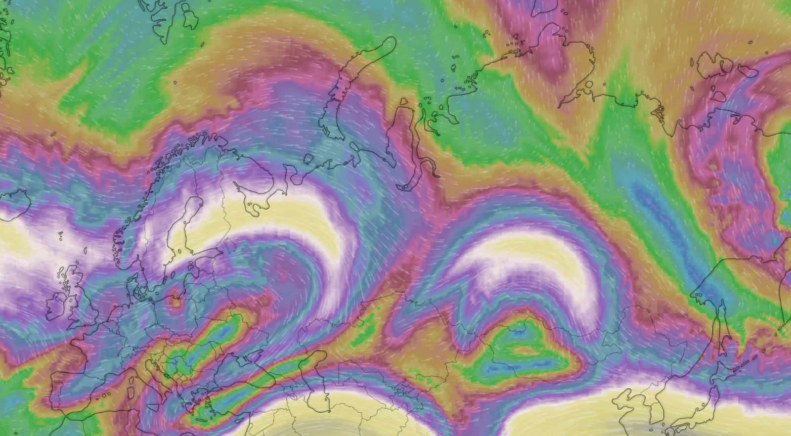

.. raw:: html
    :file: ../embed_widgets/sun_elevation.html

Sun elevation along a flight
============================

Flight AF291 from Kansai airport (RJBB) to Paris (LFPG) on January 3rd
2020 was flying quite higher than usual in latitude because of strong
headwinds on the usual route over Finland and the White Sea. See for
reference the following screenshot image from
`windy.com <https://www.windy.com>`__ taken on that day.

The usual route departs before noon from Japan and reaches Paris in
the middle of the afternoon, a twelve hour flight which feels like
noon-ish all along.

When we fly these latitudes (up to 77°, i.e. 11 degrees North of the Arctic
circle would) close the winter solstice, we experience at some point the
Arctic night.

.. code:: python

    import altair as alt
    
    (
        f.assign(arctic_circle=66.5)
        .encode(
            ["latitude", "arctic_circle"],
            color=alt.Color("variable", legend=alt.Legend(title="angle"),),
        )
        .properties(height=180, width=400)
    )

.. raw:: html

    

    

The `astropy <https://docs.astropy.org/en/stable/>`__ library contains
all you need to compute the relative positions of astral bodies. A
common use case is to calculate the position of stars or satellites from
a given position on Earth. A fun thing to do with aircraft here would be
to compute the elevation (altitude, in angle) of the sun with respect to
the aircraft. The timestamp will help computing the position of the Sun,
before we calculate the altitude and azimuth angles from the
three-coordinate position (latitude, longitude, altitude) of the
aircraft.

.. code:: python

    import pandas as pd
    
    from astropy.coordinates import get_sun, AltAz, EarthLocation
    from astropy.time import Time
    
    # use astropy to compute the position of the Sun w.r.t the aircraft
    
    time = Time(f.data.timestamp)
    sun_position = get_sun(time)
    aircraft_position = EarthLocation(
        lat=f.data.latitude.values,
        lon=f.data.longitude.values,
        height=f.data.altitude.values * 0.3048,  # convert to meter
    )
    aircraft_frame = AltAz(obstime=time, location=aircraft_position)
    sun_altaz = sun_position.transform_to(aircraft_frame)
    
    # include sun altitude and azimuth in the flight data
    
    df = pd.DataFrame(
        dict(
            timestamp=f.data.timestamp,
            sun_altitude=list(x.value for x in sun_altaz.alt),
            sun_azimuth=list(x.value for x in sun_altaz.az),
        )
    )
    
    g = f.merge(df, on="timestamp")

.. code:: ipython3

    (
        g.assign(horizon=0, twilight=-6)
        .encode(
            ["sun_altitude", "horizon", "twilight"],
            color=alt.Color(
                "variable",
                legend=alt.Legend(title="angle"),
                scale=alt.Scale(
                    domain=["sun_altitude", "horizon", "twilight"],
                    range=["#eeba30", "#5a73ce", "#372e29"],
                ),
            ),
        )
        .properties(height=180, width=400)
    )

.. raw:: html

    

    

We usually consider it twilight when the Sun is between 0° and -6° below
the horizon: the sky is still quite bright. In this particular
situation, information from outside is pretty confusing: we fly
westbound, never far from the
`terminator <https://en.wikipedia.org/wiki/Terminator_(solar)>`__, local
time is always around noon, the Sun goes under the horizon for few hours
without really disappearing. It is dark but never really night.

The next step is to plot the trajectory with different colors:

.. raw:: html

    <ul class="simple">
      <li>yellow (■ #eeba30) during day time (sun above the horizon); </li>
      <li>orange (■ #dc6900) when the sun is just below the horizon (from 0° to -6°); </li>
      <li>red (■ #ae0001) when the sun is between -6° and -10° below the horizon; </li>
      <li>black (■ #372e29) when the sun is the lowest.</li>
    </ul>

.. code:: python

    from ipyleaflet import Map, basemaps
    from ipywidgets import Layout
    
    map_ = Map(
        center=(60, 80),
        zoom=2,
        layout=Layout(height="500px", max_width="500px"),
        basemap=basemaps.CartoDB.Positron,
    )
    
    map_.add_layer(g, color="#eeba30")  # yellow
    map_.add_layer(g.query("sun_altitude < 0"), color="#dc6900")  # orange
    map_.add_layer(g.query("sun_altitude < -6"), color="#ae0001")  # red
    map_.add_layer(g.query("sun_altitude < -10"), color="#372e29")  # black
    
    map_

.. raw:: html

    

     

Now comes the fun when you have a window seat toward the sun: you take
pictures!

Using the timestamp in the EXIF information of each image, you may place
a marker on a map and get an idea of how far the Sun is below the
horizon, with a reference based on the color of the trajectory (yellow
for daylight, orange for twilight, etc.)

.. code:: python

    import re
    
    import cv2
    import exifread
    
    from ipywidgets import Image, Layout
    from ipyleaflet import Popup
    
    # for each JPG file in the folder (a pathlib.Path)
    
    for file in sorted(list(picture_directory.glob("**/*.JPG"))):
        with file.open("rb") as fh:
    
            # parse EXIF information
            exif_tags = exifread.process_file(fh)
            s = exif_tags["EXIF DateTimeDigitized"].values
    
            # Parse time and correct the timestamp of your device (+01:00 for mine)
            ts = pd.Timestamp(re.sub(r"(\d+):(\d+):(\d+) ", r"\1/\2/\3 ", s) + "+01:00")
    
            # safeguard, the picture must have been taken during the flight
            assert f.start <= ts <= f.stop
    
            # read the image
            img = cv2.imread(file.as_posix())
    
            # resize the image
            scale = 0.1
            width = int(img.shape[1] * scale)
            height = int(img.shape[0] * scale)
            dim = (width, height)
            resized = cv2.resize(img, dim, interpolation=cv2.INTER_AREA)
            _, arr = cv2.imencode(".jpg", resized)
    
            # build an Image to place on the map
            image = Image(value=arr.tobytes(), layout=Layout(min_width="200px"))
    
            point = f.before(ts).at()
            marker = point.leaflet(title=f"{ts}", draggable=False)
            marker.popup = image
    
            map_.add_layer(marker)

