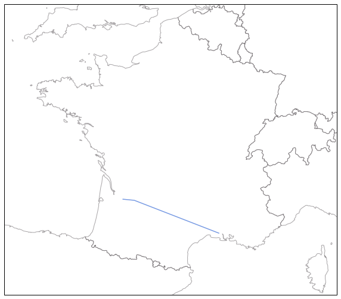

Eurocontrol DDR files
---------------------

Eurocontrol DDR files provide flight intentions of aircraft for a full
day of traffic across Europe. This data cannot be shared so the file
included in the repository has actually been generated from OpenSky
ADS-B data to match so6 format.

Basic usage
~~~~~~~~~~~

You can read so6 files as text files (.so6 extension) or as 7-zipped
text files (you need libarchive library for that).

.. code:: python

    from traffic.data import SO6
    so6 = SO6.from_file("./data/20180101_20180101_0000_2359_____m3.so6.7z")
    so6.to_pickle("./data/20180101_20180101_0000_2359_____m3.pkl")

If you are going to work a lot with data for one day, it is recommended
to serialize the data so that it loads faster. The structure holds a
DataFrame in the data attribute. (We dropped some columns so that it
fits a regular webpage width.)

.. code:: python

    # Read the serialized version
    from traffic.data import SO6
    so6 = SO6.from_file("./data/20180101_20180101_0000_2359_____m3.pkl")
    so6.data.head().drop(columns=['alt1', 'alt2', 'aircraft', 'flight_id'])

.. raw:: html

    

        
    
    <table border="0" class="dataframe">
      <thead>
        <tr style="text-align: right;">
          <th></th>
          <th>origin</th>
          <th>destination</th>
          <th>callsign</th>
          <th>lat1</th>
          <th>lon1</th>
          <th>lat2</th>
          <th>lon2</th>
          <th>time1</th>
          <th>time2</th>
        </tr>
      </thead>
      <tbody>
        <tr>
          <th>0</th>
          <td>DAAG</td>
          <td>LFPO</td>
          <td>AAF154</td>
          <td>38.398361</td>
          <td>3.906984</td>
          <td>41.313309</td>
          <td>4.566040</td>
          <td>2018-01-01 19:10:10</td>
          <td>2018-01-01 19:35:40</td>
        </tr>
        <tr>
          <th>1</th>
          <td>DAAG</td>
          <td>LFPO</td>
          <td>AAF154</td>
          <td>41.313309</td>
          <td>4.566040</td>
          <td>46.251480</td>
          <td>4.976204</td>
          <td>2018-01-01 19:35:40</td>
          <td>2018-01-01 20:17:30</td>
        </tr>
        <tr>
          <th>2</th>
          <td>DAAG</td>
          <td>LFPO</td>
          <td>AAF154</td>
          <td>46.251480</td>
          <td>4.976204</td>
          <td>47.698471</td>
          <td>4.203850</td>
          <td>2018-01-01 20:17:30</td>
          <td>2018-01-01 20:30:50</td>
        </tr>
        <tr>
          <th>3</th>
          <td>DAAG</td>
          <td>LFPO</td>
          <td>AAF154</td>
          <td>47.698471</td>
          <td>4.203850</td>
          <td>48.525587</td>
          <td>3.739038</td>
          <td>2018-01-01 20:30:50</td>
          <td>2018-01-01 20:39:40</td>
        </tr>
        <tr>
          <th>4</th>
          <td>DAAG</td>
          <td>LFPO</td>
          <td>AAF154</td>
          <td>48.525587</td>
          <td>3.739038</td>
          <td>48.614176</td>
          <td>3.561088</td>
          <td>2018-01-01 20:39:40</td>
          <td>2018-01-01 20:41:30</td>
        </tr>
      </tbody>
    </table>
    

You can then access data from the so6 file, by flight, with the bracket
notation. Interactive environments (IPython, Jupyter notebooks) provide
completion on the flight names.

.. code:: python

    so6['HOP36PP']

.. raw:: html

    <b>Flight HOP36PP</b> (332206265)<ul><li><b>aircraft:</b> A319</li><li><b>origin:</b> LFML (2018-01-01 19:15:40)</li><li><b>destination:</b> LFBD (2018-01-01 19:58:00)</li></ul>
<svg xmlns="http://www.w3.org/2000/svg" xmlns:xlink="http://www.w3.org/1999/xlink" width="300" height="300" viewBox="-22064.364032842677 4643541.548496112 400649.87556558463 148424.4619210167" preserveAspectRatio="xMinYMin meet"><g transform="matrix(1,0,0,-1,0,9435507.558913242)"><polyline fill="none" stroke="#66cc99" stroke-width="2670.999170437231" points="363746.62725253514,4658380.432776319 93398.87407311927,4754561.883957243 36435.06118046089,4774490.218033796 -7225.479752635839,4777127.126136922" opacity="0.8" /></g></svg>

.. code:: python

    %matplotlib inline
    import matplotlib.pyplot as plt
    
    from traffic.drawing import Lambert93, countries, location
    
    with plt.style.context('traffic'):
        fig = plt.figure()
        ax = fig.add_subplot(111, projection=Lambert93())
        ax.set_extent(location('France').extent)
        ax.add_feature(countries())
        
        so6['HOP36PP'].plot(ax)

Callsigns are not enough to discriminate flights because of same
callsigns assigned to a trip with many legs. You can access a Flight
from its unique ID.

.. code:: python

    so6[332206265]

.. raw:: html

    <b>Flight HOP36PP</b> (332206265)<ul><li><b>aircraft:</b> A319</li><li><b>origin:</b> LFML (2018-01-01 19:15:40)</li><li><b>destination:</b> LFBD (2018-01-01 19:58:00)</li></ul>
<svg xmlns="http://www.w3.org/2000/svg" xmlns:xlink="http://www.w3.org/1999/xlink" width="300" height="300" viewBox="-22064.364032842677 4643541.548496112 400649.87556558463 148424.4619210167" preserveAspectRatio="xMinYMin meet"><g transform="matrix(1,0,0,-1,0,9435507.558913242)"><polyline fill="none" stroke="#66cc99" stroke-width="2670.999170437231" points="363746.62725253514,4658380.432776319 93398.87407311927,4754561.883957243 36435.06118046089,4774490.218033796 -7225.479752635839,4777127.126136922" opacity="0.8" /></g></svg>

Each flight holds a DataFrame embedded as well.

.. code:: python

    so6['HOP36PP'].data.drop(columns=['alt1', 'alt2', 'aircraft', 'flight_id'])

.. raw:: html

    

    
    <table border="0" class="dataframe">
      <thead>
        <tr style="text-align: right;">
          <th></th>
          <th>origin</th>
          <th>destination</th>
          <th>callsign</th>
          <th>lat1</th>
          <th>lon1</th>
          <th>lat2</th>
          <th>lon2</th>
          <th>time1</th>
          <th>time2</th>
        </tr>
      </thead>
      <tbody>
        <tr>
          <th>65794</th>
          <td>LFML</td>
          <td>LFBD</td>
          <td>HOP36PP</td>
          <td>43.608398</td>
          <td>4.527325</td>
          <td>44.543555</td>
          <td>1.178150</td>
          <td>2018-01-01 19:15:40</td>
          <td>2018-01-01 19:44:50</td>
        </tr>
        <tr>
          <th>65795</th>
          <td>LFML</td>
          <td>LFBD</td>
          <td>HOP36PP</td>
          <td>44.543555</td>
          <td>1.178150</td>
          <td>44.726898</td>
          <td>0.460837</td>
          <td>2018-01-01 19:44:50</td>
          <td>2018-01-01 19:52:10</td>
        </tr>
        <tr>
          <th>65796</th>
          <td>LFML</td>
          <td>LFBD</td>
          <td>HOP36PP</td>
          <td>44.726898</td>
          <td>0.460837</td>
          <td>44.751343</td>
          <td>-0.091422</td>
          <td>2018-01-01 19:52:10</td>
          <td>2018-01-01 19:58:00</td>
        </tr>
      </tbody>
    </table>
    

Each flight can check whether it crosses an airspace:

.. code:: python

    from traffic.data import airac
    so6['HOP36PP'].intersects(airac['LFBBBDX'])

    True

Then it is possible to clip the trajectory to a given 2D polygon. An
airspace can be projected to a 2D representation for that purpose:

.. code:: python

    so6['HOP36PP'].clip(airac['LFBBBDX'].flatten())

.. raw:: html

    <b>Flight HOP36PP</b> (332206265)<ul><li><b>aircraft:</b> A319</li><li><b>origin:</b> LFML (2018-01-01 19:20:19.612862)</li><li><b>destination:</b> LFBD (2018-01-01 19:58:00)</li></ul>
<svg xmlns="http://www.w3.org/2000/svg" xmlns:xlink="http://www.w3.org/1999/xlink" width="300" height="300" viewBox="-20317.650998594778 4660018.773758144 353488.6236408914 130200.52362473682" preserveAspectRatio="xMinYMin meet"><g transform="matrix(1,0,0,-1,0,9450238.071141025)"><polyline fill="none" stroke="#66cc99" stroke-width="2356.590824272609" points="320078.8013963377,4673110.945004103 93398.87407311927,4754561.883957243 36435.06118046089,4774490.218033796 -7225.479752635839,4777127.126136922" opacity="0.8" /></g></svg>

Interpolation and clipping
~~~~~~~~~~~~~~~~~~~~~~~~~~

Since DDR files contain few points on their trajectory, interpolation
functions are provided:

.. code:: python

    # Interpolation at a given date (str (UTC), int (timestamp) or datetime)
    so6['HOP36PP'].at("2018/01/01 18:40")

    array([[1.73315595e+00, 4.43885865e+01, 2.66388571e+04]])

You also access interpolation when you clip the trajectory to a given
timerange. Be careful that even though timestamps are given in UTC,
Python displays them in your current location timezone.

.. code:: python

    (so6['HOP36PP']
     .between("2018/01/01 18:25", "2018/01/01 18:55")
     .data.drop(columns=['alt1', 'alt2', 'aircraft', 'flight_id']))

.. raw:: html

    

    
    <table border="0" class="dataframe">
      <thead>
        <tr style="text-align: right;">
          <th></th>
          <th>lon1</th>
          <th>lat1</th>
          <th>lon2</th>
          <th>lat2</th>
          <th>time1</th>
          <th>time2</th>
          <th>origin</th>
          <th>destination</th>
          <th>callsign</th>
        </tr>
      </thead>
      <tbody>
        <tr>
          <th>0</th>
          <td>3.455589</td>
          <td>43.907649</td>
          <td>1.178150</td>
          <td>44.543555</td>
          <td>2018-01-01 19:25:00</td>
          <td>2018-01-01 19:44:50</td>
          <td>LFML</td>
          <td>LFBD</td>
          <td>HOP36PP</td>
        </tr>
        <tr>
          <th>1</th>
          <td>1.178150</td>
          <td>44.543555</td>
          <td>0.460837</td>
          <td>44.726898</td>
          <td>2018-01-01 19:44:50</td>
          <td>2018-01-01 19:52:10</td>
          <td>LFML</td>
          <td>LFBD</td>
          <td>HOP36PP</td>
        </tr>
        <tr>
          <th>2</th>
          <td>0.460837</td>
          <td>44.726898</td>
          <td>0.192597</td>
          <td>44.738771</td>
          <td>2018-01-01 19:52:10</td>
          <td>2018-01-01 19:55:00</td>
          <td>LFML</td>
          <td>LFBD</td>
          <td>HOP36PP</td>
        </tr>
      </tbody>
    </table>
    

For convenience sake, the second parameter can be a timedelta.

.. code:: python

    from datetime import timedelta

    (so6['HOP36PP']
     .between("2018/01/01 18:25", timedelta(minutes=30))
     .data.drop(columns=['alt1', 'alt2', 'aircraft', 'flight_id']))

.. raw:: html

    

    
    <table border="0" class="dataframe">
      <thead>
        <tr style="text-align: right;">
          <th></th>
          <th>lon1</th>
          <th>lat1</th>
          <th>lon2</th>
          <th>lat2</th>
          <th>time1</th>
          <th>time2</th>
          <th>origin</th>
          <th>destination</th>
          <th>callsign</th>
        </tr>
      </thead>
      <tbody>
        <tr>
          <th>0</th>
          <td>3.455589</td>
          <td>43.907649</td>
          <td>1.178150</td>
          <td>44.543555</td>
          <td>2018-01-01 19:25:00</td>
          <td>2018-01-01 19:44:50</td>
          <td>LFML</td>
          <td>LFBD</td>
          <td>HOP36PP</td>
        </tr>
        <tr>
          <th>1</th>
          <td>1.178150</td>
          <td>44.543555</td>
          <td>0.460837</td>
          <td>44.726898</td>
          <td>2018-01-01 19:44:50</td>
          <td>2018-01-01 19:52:10</td>
          <td>LFML</td>
          <td>LFBD</td>
          <td>HOP36PP</td>
        </tr>
        <tr>
          <th>2</th>
          <td>0.460837</td>
          <td>44.726898</td>
          <td>0.192597</td>
          <td>44.738771</td>
          <td>2018-01-01 19:52:10</td>
          <td>2018-01-01 19:55:00</td>
          <td>LFML</td>
          <td>LFBD</td>
          <td>HOP36PP</td>
        </tr>
      </tbody>
    </table>
    

You can combine the previous functionalities, for intersection combined
with time intervals.

.. code:: python

    (so6['HOP36PP']
     .between("2018/01/01 18:25", timedelta(minutes=30))
     .intersects(airac['LFBBBDX']))

    True

.. code:: python

    (so6['HOP36PP']
     .between("2018/01/01 18:15", timedelta(minutes=5))
     .intersects(airac['LFBBBDX']))

    False

Spatial filtering
~~~~~~~~~~~~~~~~~

You can filter a SO6 to a bounding box (computed from a Polygon bounding
box), or to an airspace. The filtering to a bounding box is much faster
than the one for the airspace so it is recommended to chain methods
wisely.

.. code:: python

    %%time
    # First, filter inside the bounding box (faster than polygon check)
    bdx_so6 = so6.inside_bbox(airac["LFBBBDX"])

    CPU times: user 7.11 s, sys: 19.3 ms, total: 7.13 s
    Wall time: 7.14 s

.. code:: python

    print(f"before: {len(so6)} flights, after: {len(bdx_so6)} flights")

    before: 11043 flights, after: 1548 flights

See the impact of filtering to the bounding box before filtering to the
airspace. Note that this chaining may not be safe for smaller airspaces.

.. code:: python

    noon = so6.at("2018/01/01 12:00")

.. code:: python

    %%time
    bdx_flights = noon.intersects(airac['LFBBBDX'])

    CPU times: user 3.9 s, sys: 0 ns, total: 3.9 s
    Wall time: 3.9 s

.. code:: python

    %%time
    bdx_flights = (noon
                   .inside_bbox(airac['LFBBBDX'])
                   .intersects(airac['LFBBBDX']))

    CPU times: user 1.42 s, sys: 8.27 ms, total: 1.43 s
    Wall time: 1.43 s

