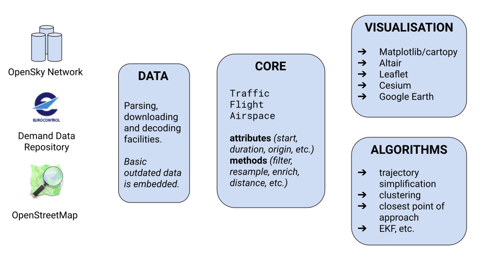

# Summary

Problems tackled by researchers and data scientists in aviation and air traffic
management (ATM) require manipulating large amounts of data representing
trajectories, flight parameters and geographical descriptions of the airspace
they fly through.

Trajectories are mathematical objects used to describe the evolution of a moving
object with a finite list of parameters. The most common features in ATM include
latitude, longitude, altitude, all indexed by time, with derived ones such as
ground speed, track angle and vertical rate. Aircraft dynamic models may expect
pitch, roll and yaw angles, together with indicated, computed or true airspeed,
Mach number, and more.

Further, airspaces are a key element of aviation: they are regulated by specific
rules, whereby navigation is allowed to determined types of aircraft meeting
strict requirements. Such volumes, assigned to air traffic controllers to ensure
the safety of flights and proper separation between aircraft are most commonly
described as a combination of extruded polygons.

Common operations relevant to trajectories evolving in controlled airspaces
range from basic attributes: time of entry, time of exit, duration, maximum
or minimum altitudes or speed; to more complex operations like intersections of
trajectories with airspaces, distances between pairs of trajectories and more.
Top performance and expressivity are key expectations for common tasks like
preprocessing and filtering of data, preparation of trajectory datasets, or
computation of key performance indicators.

The `traffic` library uses the Python language to reach a large base of
academics and data scientists users, to serve and benefit its active community
and to build on top of a large catalogue of libraries. Trajectories are modelled
on top of Pandas dataframe, a natural solution to represent time series, while
airspaces leverage Shapely [@shapely_2007] geometries and operations
(intersections, inclusion, cascaded joins among others).

`traffic` provides key operations for analysing trajectories evolving in
airspaces. It is particularly useful to programmers and researchers needing to
compute statistics, performance indicators and building datasets for common
machine learning tasks. Meaningful methods are efficiently written using Pandas
and Shapely optimised methods, more obvious operations are directly passed to
the underlying dataframes.

# Core structure of the library

`traffic` acts as declarative grammar designed to preprocess collections of
trajectories represented as `core.Traffic` classes holding a Pandas DataFrame as
a single attribute. `core.Traffic` provides indexing on `core.Flight`
structures, unfolds map operations---transforming a `core.Flight` into another
`core.Flight`---, and filtering operations---associating a boolean to a
`core.Flight`, set to False if the trajectory should be discarded.

Methods on `core.Flight` are designed to be chained in a similar way Pandas
functions. For the sake of expressivity, any method returning a `core.Flight` or
a boolean can be stacked on `core.Traffic` structures, in order to be later
lazily executed into one single multiprocessed iteration.

Basic navigational data are embedded in the library, together with parsing
facilities for most common sources of information, with a main focus on Europe
at the time being. A particular attention has been put to a proper binding to
ADS-B and Mode S data accessible through the OpenSky [@schafer_opensky_2014]
infrastructure, which is openly accessible to academics; decoding capability for
stored raw messages is also provided via pyModeS library [@sun_pymodes_2019]

Finally, `traffic` library provides facilities to export data in common popular
visualisation tools including Matplotlib/Cartopy [@cartopy_2018], Google Earth,
Leaflet, Cesium JS for geographical coordinates and altair [@altair_2018] for
other features. For the time being, any other kind of visualisation can be
implemented as a plugin.

# Related works

`traffic` has already been used as a preprocessing tool to prepare data for data
analytics [@schafer_opensky_2019] and machine learning methods
[@olive_runway_2018, @olive_detecting_2018, @olive_identifying_2019,
@olive_clustering_2019].

Several third party users have already been using and contributing feedback to
the library, mostly as bug reports and minor bug fixes.

We expect to improve the library with optimisations in processing time, enriched
algorithms and more powerful visualisation capabilities.

# References

